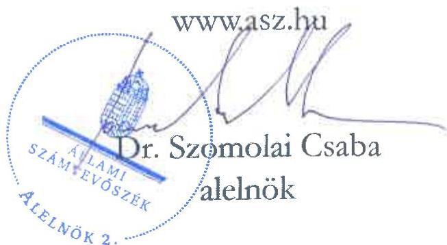

ÁLLAMI SZÁMVEVŐSZÉK

# JELENTÉS

A fenntartási kötelezettség kedvezményezettek
általi teljesítésének rapid ellenőrzése

A Katedra Nyelviskola Kft.
fenntartási kötelezettsége teljesítésének ellenőrzése
a GINOP-2.1.1-15-2016-01103 számú projektnél

2025.

25117

www.asz.hu

---

ÁLLAMI SZÁMVEVŐSZÉK

# JELENTÉS

A fenntartási kötelezettség kedvezményezettek
általi teljesítésének rapid ellenőrzése

A Katedra Nyelviskola Kft.
fenntartási kötelezettsége teljesítésének ellenőrzése
a GINOP-2.1.1-15-2016-01103 számú projektnél

2025.

25117

---

Jelentéseink az interneten a www.asz.hu címen olvashatók.

ELLENŐRZÉSI IGAZGATÓSÁG:
ELLENŐRZÉSI IGAZGATÓSÁG I.

ELLENŐRZÉSI IGAZGATÓ:
SINKÁNÉ DR. CSENDES ÁGNES igazgató

ELLENŐRZÉSVEZETŐ:
HUSZÁR ANNA ellenőrzésvezető

IKTATÓSZÁM: EL-4101-181/2025

TÉMASORSZÁM: -

ELLENŐRZÉS-AZONOSÍTÓ SZÁM: V1101

---

TARTALOMJEGYZÉK

- ÖSSZEFOGLALÁS ... 5
- AZ ELLENŐRZÉS EREDMÉNYEI ... 6
1. A fenntartási kötelezettség teljesítése ... 6
- I. FÜGGELÉK: ÉSZREVÉTELEK ... 10
- II. FÜGGELÉK: ELLENŐRZÉSI MEGKÖZELÍTÉS ... 11
- MELLÉKLETEK ... 17
I. sz. melléklet: Értelmező szótár ... 17
II. sz. melléklet: Az ellenőrzött és a közreműködő szervezetek jegyzéke ... 19
III. sz. melléklet: Nyelvvizsga-statisztikai adatok 2015-2023. évek, Katedra Kft. „i-Tok” rendszerű angol és német nyelvvizsga adatai 2019-2023. évek ... 20
- RÖVIDÍTÉSEK JEGYZÉKE ... 21

---

.

---

5

# ÖSSZEFOGLALÁS

A 2015 augusztusában megjelent „Vállalatok K+F+I tevékenységének támogatása” című (GINOP-2.1.1-15 kódszámú) pályázati felhívásban meghirdetett támogatással lehetőség nyílt a vállalkozások által önállóan, vagy együttműködésben végzett olyan vállalati kutatási, fejlesztési és innovációs tevékenységek támogatására, amelyek jelentős szellemi hozzáadott értéket tartalmazó, új, piacképes termékek, szolgáltatások, technológiák, továbbá ezek prototípusainak kifejlesztését eredményezték. A Felhívás¹ keretében rendelkezésre álló keretösszeg eredetileg 72 Mrd Ft volt, a konstrukcióban végül 64,4 Mrd Ft értékben kötött az IH² támogatási szerződést. A pályázatonként igényelhető vissza nem térítendő támogatás összege 50 M Ft és 1000 M Ft között volt.

A Felhívás alapján a 142,8 M Ft támogatást nyert, végül 132 M Ft támogatást kapott GINOP-2.1.1-15-2016-01103 számú „i-Tolc felhőalapú nyelvvizsgafejlesztés” című projekt Kedvezményezettje³ egy online, felhőalapú vizsgarendszert fejlesztett ki, kutatást folytatott a számítógépes környezetben használható új feladattípusok kidolgozására, és ennek részeként szimulációs környezetek fejlesztésére, továbbá ezekhez szükséges informatikai eszközöket vásárolt.

A Kedvezményezett – a támogatás visszafizetésének terhe mellett – vállalta, hogy a projektmegvalósítást követően a Projekt⁴ megfelel az 1303/2013/EU Rendeletben⁵ a műveletek tartósságára vonatkozóan előírtaknak, az előírt fenntartási kötelezettséget teljesíti. A Projekt megvalósítása 2019. október 4-én fejeződött be, a fenntartási időszak azt követő nappal indult és 2022. december 31-ig tartott.

A támogatás összértéke, a Projekt egyedisége és a megvalósított projekteredmény hosszabb távon történő megtartása miatt az ÁSZ⁶ indokoltnak tartotta a Projekt fenntartásának és a támogatás hasznosulásának ellenőrzését. A Kedvezményezett projektfenntartási kötelezettségei teljesítésének ellenőrzésére az ÁSZ „A 2014-2020 programozási időszak kohéziós politikai operatív programok vonatkozásában a fenntartási kötelezettség teljesítésének ellenőrzési gyakorlata” című ellenőrzéséhez, mint alapellenőrzéshez kapcsolódóan került sor.

A Kedvezményezett a Projekt hároméves fenntartási kötelezettsége keretében, a projekteredmény – az „i-Tolc felhőalapú nyelvvizsgafejlesztés” – működtetéséről és fenntartásáról a jogszabály szerint határidőben és megfelelően beszámolt az éves projektfenntartási jelentésekben.

Az ÁSZ ellenőrzés megállapította, hogy a Kedvezményezett a Projekttel kapcsolatos fenntartási kötelezettségeit a vállalt indikátorok és egyéb kötelezettségek teljesítésével, az IH – fenntartási kötelezettségek ellenőrzése kapcsán hozott – döntéseit figyelembe véve valósította meg.

A Projekt, a vállalt fenntartási időszak és a – fenntartási időszakra vonatkozóan – vállalt kötelezettségek Kedvezményezett általi teljesítésével megfelelt az 1303/2013/EU rendeletben előírtaknak mivel a projekt termelő tevékenysége nem szűnt meg, annak eredeti célkitűzései a fenntartási időszak végéig biztosítottak voltak.

Az ÁSZ értékelése szerint a Projekt keretében nyújtott támogatás hasznosult, az – a nyelvvizsgáztatási adatok ellenőrzött időszaki alakulása alapján – hozzájárult a Kedvezményezett jövedelmezőségének javításához. A Projekt eredményes volt, mivel a kutatással létrejött egy új vizsgaadatbázis. A Projekt eredménye beépült a vállalkozás működésébe, a Kedvezményezett a kifejlesztett „i-Tolc” nyelvvizsga rendszert folyamatosan, a fenntartási időszakot követően is használta, fejlesztette.

---

AZ ELLENŐRZÉS EREDMÉNYEI

A magyar vállalkozások a GINOP⁷ pályázati konstrukciók keretében jelentős mértékű támogatásban részesültek, amelynek célja volt hozzájárulni a gazdasági fejlődéshez, a társadalmi felzárkózáshoz és az infrastruktúra fejlesztéséhez. Az ÁSZ – Magyarország versenyképességének növelése érdekében – fontosnak tartja a kihelyezett uniós támogatások nemzetgazdasági szinten történő hasznosulását és értékteremtését a vállalatok beruházásain és elért teljesítményén keresztül. Az ÁSZ a támogatással kapcsolatos fenntartási kötelezettség teljesítését, valamint annak hasznosulását a GINOP-2.1.1-15-2016-01103 számú projekt tekintetében értékelte. A Projekt keretében a Kedvezményezett egy online, felhőalapú vizsgarendszert fejlesztett ki, kutatást folytatott a számítógépes környezetben használható új feladattípusok kidolgozására, és ennek részeként szimulációs környezetek fejlesztésére, továbbá ezekhez szükséges informatikai eszközöket vásárolt.

# 1. A fenntartási kötelezettség teljesítése

## Összegző megállapítás

Az ÁSZ értékelése szerint a Kedvezményezett fenntartási kötelezettségét teljesítette, a támogatás hasznosult.

## A fenntartási jelentés benyújtási kötelezettség teljesítése

A Kedvezményezettnek a Projekt megvalósítását követően, a Támogatási rend.⁸-ben foglaltak alapján hároméves fenntartási kötelezettsége volt, amelyet a Felhívás és a támogatási szerződés is rögzített. Ennek keretében a megvalósítási helyszínen a projekteredményt a megvalósítás befejezésétől számított három évig fenn kellett tartania és üzemeltetnie, és az előírás szerint évente, projektfenntartási jelentésben kellett beszámolnia az indikátorok teljesüléséről.

A Kedvezményezett a Támogatási rend.-ben előírt éves projektfenntartási jelentés benyújtási kötelezettségét megfelelően, határidőben teljesítette. A PFJ⁹-k és a ZPFJ¹⁰ főbb adatait az 1. táblázat tartalmazza.

1. táblázat

|  A GINOP-2.1.1-15-2016-01103 SZÁMÚ PROJEKTHEZ KAPCSOLÓDÓ PFJ-K FŐBB ADATAI  |   |   |   |   |   |
| --- | --- | --- | --- | --- | --- |
|  JELENTÉS
SORSZÁMA | JELENTÉS
TÍPUSA | TÁRGYIDÓSZAK
KEZDETÉ | TÁRGYIDÓSZAK
VÉGE | BENYÚJTÁS
HATÁRIDEJE | JELENTÉS STÁTUSZA*  |
|  1. | PFJ | 2019.10.05. | 2020.12.31. | 2021.06.15. | 2021.06.15-én beérkezett,
elfogadva 2025.02.04-én  |
|  2. | PFJ | 2021.01.01. | 2021.12.31. | 2022.06.15. | 2022.06.15-én beérkezett,
elfogadva 2025.02.04-én  |
|  3. | ZPFJ | 2022.01.01. | 2022.12.31. | 2023.06.15. | 2023.06.15-én beérkezett,
elfogadva 2025. 07.21-én  |

Forrás: FAIR¹¹ adatai alapján ÁSZ saját szerkesztés

A Kedvezményezett a fenntartási időszakra vonatkozóan előírt 1. és 2. PFJ-t és a ZPFJ-t – a Támogatási rend.-ben előírtakat betartva – határidőben benyújtotta. Az IH elfogadta az 1. PFJ-t – az egyszeri hiánypótlás és az ötszörű korrekciókérés Kedvezményezett általi teljesítését követően – 2025. február 4-én, a 2. PFJ-t pedig hiánypótlásra és korrekcióra kérés nélkül, szintén 2025. február 4-én fogadta el. Az IH-nak a ZPFJ-vel kapcsolatban egyszer hiánypótlási és négy alkalommal korrekciós igénye volt, amit a Kedvezményezett teljesített.

---

Az ellenőrzés eredményei

*Az IH a ZPFJ-t az ÁSZ helyszíni ellenőrzésének záró időpontját követően 2025. július 21-én elfogadta, erről a Kedvezményezettet értesítette.*

Kedvezményezett a benyújtott PFJ-kben a támogatási szerződésben előírtaknak megfelelve igazolta a helyi iparűzési adó befizetését, amely a Kedvezményezett vállalkozás működésének alátámasztására szolgált.

Az IH a Projekt fenntartási időszaka alatt egy tervezett, komplex jellegű helyszíni ellenőrzést folytatott le 2021. augusztus 3-án, az első PFJ benyújtását követően. Az ellenőrzést az indokolta, hogy a Projekt az IH által a projektek kockázati besorolásához alkalmazott kockázati tényezőkhöz – így a vállalkozás méretéhez, gazdálkodási formájához, székhelyének elhelyezkedéséhez, a szerződött támogatás összegéhez, a támogatás és az előleg mértékéhez, az elszámolás gyakoriságához, projekt tervezett időtartamához és típusához, valamint a fő- és a fejlesztendő tevékenység eltéréséhez – rendelt pontszámok alapján magas kockázati besorolást kapott. A helyszíni ellenőrzés eredményeképpen az IH által előírtakat a Kedvezményezett teljesítette.

## A fenntartási kötelezettség, indikátorok teljesítése

A Kedvezményezett a vállalt kötelezettségeit, így a Projekt indikátorait és egyéb kötelezettségeket az alábbiak szerint teljesítette:

1. Kedvezményezett teljesítette az üzleti hasznosíthatóság keretében vállaltakat. A K+F+I¹² tevékenység eredményéből származó árbevétele a Projekt pénzügyi befejezési évét követően a fenntartási időszak utolsó évéig bármely 2 egymást követő üzleti évben elérte a teljes megítélt támogatási összeg legalább 30%-át, mivel 2020-2021. évek, valamint a 2021-2022. évek tekintetében a kapott támogatás 35,48%-át, illetve 32,39%-át tette ki a K+F+I tevékenységből származó árbevétele.

2. A Projekt keretében tett éves export árbevétel-vállalás 2020. évi 13 552 000 Ft-os és 2021. évi 12 448 000 Ft-os célérték összege is megfelelően teljesült, mivel a konzorciumi tag¹³ éves beszámolójának adatai alapján 2020-ban 66 965 000 Ft, 2021-ben 52 407 000 Ft volt az éves export árbevétele.

3. Kedvezményezett által vállalt kötelezettség volt az „Új termékek forgalomba hozatala/gyártása céljából támogatott vállalkozások száma” is, amely konzorciumi formában megvalósuló projektek esetén a tagok számával volt egyenlő. Az indikátor teljesülését a benyújtott PFJ-ekben az előírtak szerint rögzítették.

4. A fenntartási időszakban teljesítendő egyéb kötelezettségek keretében a K+F+I tevékenység eredményéből származó árbevétel elkülönített nyilvántartása a Kedvezményezettnél – a vállalt 2019. október 5-től 2022. december 31-ig tartó időszakban – rendelkezésre állt, a Támogatási rend.-nek megfelelő, projektszintű elkülönített számviteli nyilvántartás biztosított volt.

5. A bázisértékhez képest vállalni kellett továbbá, hogy a Projekt fizikai befejezési évét közvetlenül követő egy üzleti évben a létrehozott K+F¹⁴ munkahelyeket a bázislétszámhoz viszonyított növekményként fenntartják. Kedvezményezett esetében ez négy fő kutató-fejlesztő (felvételét és) megtartását jelentette a Projektben 2018. november 16-tól 2019. november 15-ig, amelyet Kedvezményezett teljesített. A kutatók alkalmazását előíró indikátor teljesítéséhez horizontális követelmény – férfi-nő megoszlásra vonatkozó feltétel – nem kapcsolódott, – az IH ellenőrzési megállapításai alapján – a Projekt megfelelt a Felhívásban megfogalmazott fenntarthatósági és esélyegyenlőségi elvárásoknak.

---

Az ellenőrzés eredményei

A Projekt, a vállalt három év fenntartási időszak és az – arra vonatkozóan – vállalt kötelezettségek teljesítésével megfelelt a műveletek tartósságával kapcsolatban az 1303/2013/EU rendeletben és a Támogatási rend.-ben előírtaknak.

A Kedvezményezett – ÁSZ helyszíni interjú keretében adott – tájékoztatása alapján nem volt megterhelő a jelentéstételi kötelezettség a fenntartási időszakról, mert a FAIR-ben nem volt szükség szöveges szakmai leírásra a PFJ-knél. A Kedvezményezettnek a Projekt fenntartása során ugyanakkor nehézséget okozott, hogy a vállalt kutatási személyzet definícióját 2020-ban visszamenőlegesen megváltoztatták, valamint a vállalt árbevétel-növekedés teljesíthetősége, amelynek csökkentését kellett kezdeményezniük egy alkalommal, amit az IH engedélyezett. A Kedvezményezett elmondása alapján nagyon hosszú időre, hét évre kellett tervezniük – 2015-ben adták be a pályázatot, a projekt 2016-2018. közötti megvalósítását és annak 2019-es lezárását követően a fenntartási időszak 2019-től 2022-ig tartott – ezalatt koronavírus-járvány volt, és nyelvvizsgákat érintő kormányzati intézkedések történtek, amelyre előzetesen nem számíthattak. A Kedvezményezett az IH-val való kapcsolatát a projekt teljes életútjában pozitívként jellemezte, az együttműködés – tájékoztatása szerint – jó és problémamentes volt.

## A fenntartási jelentések valóságtartalma és megalapozottsága

A Kedvezményezett a Projekt keretében beszerzett eszközöket, a fejlesztett szoftvert folyamatosan használta, a szoftveren kisebb fejlesztéseket végzett, a vizsgasort rendszeresen frissítette. A Projekt keretében kifejlesztett „i-Tok” vizsgarendszert – az eredeti szerverek működtetésével – folyamatosan, a fenntartási időszakot követően is használta, amelyet a III. sz. melléklet szerinti nyelvvizsga-statisztikai adatok is alátámasztottak. A fenntartási időszakban szükségessé vált selejtezést követően a pályázatból beszerzett eszközpark – laptopok, számítógépek – nagy részét cserélte; az ÁSZ helyszíni ellenőrzés időpontjában a szerverek még üzemeltek, kapacitást nem kellett bővíteni. A Kedvezményezett tevékenységét a kecskeméti telephelyén is végezte, kutatás-fejlesztési tevékenységet már nem folytatott.

## A támogatás hasznosulása

A támogatás a Kedvezményezett alábbiakban bemutatott pénzügyi és nyelvvizsgáztatási tevékenységére vonatkozó adatai alapján hasznosult. A Kedvezményezett létszám, árbevétel, adózott eredmény és mérlegfőösszeg adatait a 2019-2024. évekre vonatkozóan a 2. táblázat mutatja be.

2. táblázat
A KEDVEZMÉNYEZETT 2019-2024. ÉVI LÉTSZÁM, ÁRBEVÉTEL, ADÓZOTT EREDMÉNY ÉS MÉRLEGFŐÖSSZEG ADATAI**

|  ADATOK MEGNEVEZÉSE | 2019. ÉVBEN | 2020. ÉVBEN | 2021. ÉVBEN | 2022. ÉVBEN | 2023. ÉVBEN | 2024. ÉVBEN  |
| --- | --- | --- | --- | --- | --- | --- |
|  Átlagos statisztikai állományi létszám (fő) | 33 | 22 | 21 | 21 | 25 | 25  |
|  Értékesítés nettó árbevétele (M Ft) | 873,4 | 585,7 | 660 | 785,5 | 1098 | 1124,2  |
|  Adózott eredmény (M Ft) | 56,5 | 125,8 | 191,6 | 82,5 | 312,2 | 215,7  |
|  Mérlegfőösszeg (M Ft) | 895,8 | 852,7 | 931,4 | 1021,7 | 1018,5 | 1077,1  |

Forrás: A Kedvezményezett éves beszámoló adatai alapján ÁSZ saját szerkesztés
**A 2023-as és 2024-es év már nem tartozott a fenntartási időszakba**

2020-ban a koronavírus-járványal összefüggésben hozott intézkedések miatt a gazdasági környezet kedvezőtlenül változott a nyelvvizsgáztatás tekintetében, mivel a járvány idején az érintettek a hagyományos – személyes megjelenést igénylő – formában nem tehettek nyelvvizsgát a lezárások miatt,

---

Az ellenőrzés eredményei

valamint amiatt, hogy – kormányzati döntés alapján – 2020-tól nem került bevezetésre a felsőoktatási jelentkezés feltételeként a kötelező nyelvvizsga. Előbbiek miatt a cég bevételei 2020. és 2021. években jelentős mértékben visszaestek a 2019. évhez képest, ugyanakkor az eredménye – a nyelvvizsgák számának fokozatos csökkenése ellenére – kevésbé változott a bevételek negatív alakulásához képest a 2020-2021. években. Az eredményesség javulása összefüggött azzal, hogy a járvány elején csak a Kedvezményezettnek volt olyan akkreditált nyelvvizsgasora, amely alkalmas volt az online nyelvvizsgára, amit két hét alatt, egyedüli nyelviskolaként be tudott vezetni, mivel már egy éve használták az új „i-Tolk” rendszert.

A Kedvezményezett eredmény adatai 2022-2024. években jelentős mértékben meghaladták a koronavírus-járvány megjelenését megelőző 2019. évi adatokat. A Kedvezményezett jövedelmezőségét javította, hogy az egész nyelvvizsgapiacon elsőként tudott megjelenni – a járványügyi korlátozások idején is működtethető, a hagyományos vizsgáztatásnál kisebb költségigényű – online vizsgalehetőséggel, ami az eredményességi adatainak alakulásában is megmutatkozott.

A 2015-2023. évi országos nyelvvizsga statisztikai adatokat és a Kedvezményezett 2019-2023. évi – „i-Tolk” rendszerű angol és német – nyelvvizsga adatait bemutató III. sz. melléklet adatai alapján, a Kedvezményezett úgy produkált javuló eredményességet, hogy közben – a nyelvvizsga kötelezettségek törlése, a fiatalok számának csökkenése, továbbá a nemzetközi nyelvvizsgát tevők számának növekedése miatt – a piac a felére csökkent, az összes teljesített nyelvvizsga száma a 2019. évi 124 426-ról 2023-ra 66 261-re csökkent Magyarországon.

A Kedvezményezettnél a munkaerő költség csökkent az online vizsgáztatás megjelenésével összefüggésben, mivel az magasabb nyereségességgel üzemel a papíralapú, de még a tantermi számítógépes vizsgáknál is, annak alacsonyabb költségei miatt.

A Kedvezményezettnél – az ÁSZ helyszíni ellenőrzésekor – 50%-50% volt a digitális (online és tantermi) valamint a papír alapú vizsgák megoszlása. A III. sz. melléklet adatai alapján megállapítható, hogy a digitális nyelvvizsga piacon 2019-2023-ban meghatározó – 35%-55% közötti – volt a Kedvezményezett részesedése. A Projektre kapott támogatás hozzájárulása a Kedvezményezett jövedelmezőségének javulásához kimutatható volt. A Projekt eredményes volt mivel a kutatással létrejött egy új vizsgaadatbázis. Ugyanakkor az online nyelvvizsga módszer tekintetében áttörés nem történt, mivel a vizsgaszám 2020-2021. évi felfutását követően 2022-2023-ban visszaesés következett be, a hagyományos vizsgáztatás meghatározó maradt.

A Projekt eredménye beépült a vállalkozás működésébe, a Kedvezményezett a kifejlesztett „i-Tolk” nyelvvizsga rendszert – és a beruházás keretében még rendelkezésre álló eszközöket – folyamatosan, a fenntartási időszakot követően is használta, fejlesztette.

9

---

10

# I. FÜGGELÉK: ÉSZREVÉTELEK

A jelentéstervezetet az ÁSZ 15 napos észrevételezésre megküldte az ellenőrzött szervezet vezetőjének az ÁSZ tv. 29. §* (1) bekezdése előírásának megfelelően.

A jelentéstervezet megállapításaira az ellenőrzött szervezet nem tett észrevételt.

* 29. § (1) Az Állami Számvevőszék az ellenőrzési megállapításait megküldi az ellenőrzött szervezet vezetőjének vagy az általa megbízott személynek, és annak, akinek személyes felelősségét állapította meg.
(2) Az ellenőrzött szervezet vezetője és a felelősként megjelölt személy az ellenőrzés megállapításaira tizenöt napon belül írásban észrevételt tehet.
(3) Az Állami Számvevőszék az észrevételre a beérkezésétől számított harminc napon belül írásban válaszol. A figyelembe nem vett észrevételeket köteles a jelentésben feltüntetni, és megindokolni, hogy azokat miért nem fogadta el.

---

11

# II. FÜGGELÉK: ELLENŐRZÉSI MEGKÖZELÍTÉS

## AZ ELLENŐRZÉS JOGALAPJA

Az ellenőrzés jogszabályi alapját az ÁSZ tv.¹⁵ 5. § (3) bekezdés képezte.

## AZ ELLENŐRZÉS CÉLJA

A fenntartási kötelezettség teljesítésének és a támogatás hasznosulásának értékelése a fenntartási szakaszba került uniós projekt kedvezményezettjénél.

## AZ ELLENŐRZÉS TÍPUSA

Kombinált ellenőrzés

## AZ ELLENŐRZÉS TÁRGYA

Az ellenőrzés tárgya volt az ellenőrzésre kiválasztott GINOP-2.1.1-15-2016-01103 számú uniós projekt fenntartási időszakára vonatkozóan előírt kötelezettségek Katedra Nyelviskola Kft. mint kedvezményezett által történt teljesítése és a támogatás hasznosulása. A fenntartási kötelezettség ellenőrzése a kedvezményezett tevékenységéhez és működéséhez kapcsolódó kötelezettségek, a meghatározott indikátorok és a beszámolási kötelezettség teljesítésére irányult.

Az ellenőrzés tárgya volt továbbá a kedvezményezett által benyújtott fenntartási jelentésekben rögzítettek valóságtartalma és megalapozottsága, valamint ezek összhangja az ÁSZ helyszíni ellenőrzése során tapasztaltakkal.

Az ellenőrzés kiterjedt minden olyan körülményre és adatra, amely az ÁSZ jogszabályban meghatározott feladatainak teljesítéséhez, valamint a program végrehajtása folyamán felmerült újabb összefüggések feltárásához szükséges.

## AZ ELLENŐRZÉS HATÓKÖRE ÉS TERÜLETE

Az uniós jogszabályok az uniós támogatással megvalósuló projektekkel szemben elvárásként rögzítik a „műveletek tartósságának” követelményét. A kedvezményezettek infrastrukturális vagy termelő beruházás esetén – a projektmegvalósítás befejezésétől számított 5 évig, kis- és közepes vállalkozások esetén 3 évig, a támogatás visszafizetésének terhe mellett – vállalták, hogy a projekt termelő tevékenysége nem szűnik meg, hogy nem következik be olyan tulajdonosváltás, amelynek eredményeként jogosulatlan előny szerezhető, illetve, hogy nem következik be olyan lényeges változás, amely a projekt eredeti célkitűzéseit veszélyezteti. Abban az esetben, ha a felsoroltak valamelyike bekövetkezik, a támogatást – figyelemmel a vonatkozó jogszabályokra – vissza kell fizetni az Európai Bizottságnak.

---

II. Függelék: Ellenőrzési megközelítés

Ha az IH a projektre nézve fenntartási kötelezettséget állapított meg, és indikátorokat határozott meg a támogatási szerződésben, a kedvezményezettnek évente be kellett számolnia az indikátorok teljesüléséről. Ha ezen időszakra indikátorokat nem határozott meg az IH és a támogatási szerződésben sem írta elő az évenkénti teljesítést, a kedvezményezettnek egy alkalommal záró projektfenntartási jelentést kell(ett) benyújtania.

Az ellenőrzés a XIX. Uniói fejlesztések fejezet 3/1 Kohéziós politikai operatív programok 2014-2020 operatív programjai közül a – kis- és középvállalkozások versenyképességének javítására irányuló – GINOP 1. prioritásából és a – kutatás, technológiai fejlesztés és innováció című – GINOP 2. prioritásából támogatást kapott projektek kedvezményezettjeire terjedt ki oly módon, hogy az ÁSZ – „A 2014-2020 programozási időszak kohéziós politikai operatív programok vonatkozásában a fenntartási kötelezettség teljesítésének ellenőrzési gyakorlata” című ellenőrzéséhez, mint alapellenőrzéshez kapcsolódóan – a GINOP 1-2. prioritás pályázati kiírásainak nyertes pályázóiból, kockázat alapú mintavételi eljárással, rapid ellenőrzésre választott ki összesen 16 projektet, amelyből ezen jelentésben a GINOP-2.1.1-15-2016-01103 számú projekt tekintetében értékelte a fenntartási kötelezettség teljesítését.

A GINOP-2.1.1-15-2016-01103 számú projekt tekintetében az ellenőrzés kiterjedt a célrendszer, a jogszabályban – a működés és tevékenység tekintetében – előírt fenntartási kötelezettség teljesülésére, a fenntartási jelentésben bemutatott eredmények valóságtartalmára, megalapozottságára, valamint a támogatási szerződésben vállalt, a fenntartási időszakra vonatkozó kötelezettségek teljesítésének, és a GINOP keretében nyújtott támogatás hasznosulásának értékelésére.

## A GINOP-2.1.1-15 számú felhívás bemutatása

A GINOP-2.1.1-15 kódszámú a „Vállalatok K+F+I tevékenységének támogatása” című pályázati felhívást a Pénzügyminisztérium Gazdaságfejlesztési Programok Végrehajtásáért Felelős Helyettes Államtitkársága, mint IH tette közzé. A támogatás célja volt az önállóan, vagy együttműködésben végzett vállalati kutatási, fejlesztési és innovációs tevékenységek támogatása, amelyek jelentős szellemi hozzáadott értéket tartalmazó, új, piacképes termékek, szolgáltatások, technológiák, továbbá ezek prototípusainak kifejlesztését eredményezik.

A támogatás forrását az Európai Regionális Fejlesztési Alap és Magyarország költségvetése társfinanszírozásban biztosította. A Felhívás meghirdetésekor a támogatásra 72 Mrd Ft keretösszeg állt rendelkezésre, a projektek minimum 50 M Ft, maximum 1 Mrd Ft közötti vissza nem térítendő támogatásban részesülhettek, a projektek várható számát 72-1440 között tervezték.

A támogatás eredményeként a támogatási kérelmet benyújtó szervezet vállalta, hogy projektje megvalósításával hozzájárul a K+F+I tevékenység intenzitásának növeléséhez, a kapott támogatáson felül önerőből finanszírozza a projektet, a projektben új tudományos és/vagy műszaki eredmények, szellemi alkotások születnek és a projekt révén új K+F+I munkahelyek jönnek létre.

Támogatható tevékenység volt az ipari kutatás, a kísérleti fejlesztés, a projekt előkészítési tevékenység, a projektmenedzsment tevékenység, a projekt megvalósításához kapcsolódó szolgáltatások igénybevétele, az immateriális javakra, tárgyi eszközökre, infrastrukturális beruházásra és a beruházásra aktivált szolgáltatásra irányuló tevékenység, az eljárási innovációs tevékenység és a KKV¹⁶-k kiállításon vagy vásáron való részvétele.

A Felhívás szerinti támogatásra mikro-, kis-, és középvállalkozások, illetve nagyvállalkozások pályázhattak.

A projekt megvalósítása során egy mérföldkővet kellett tervezni, fizikai befejezésére legfeljebb 24 hónap állt rendelkezésre. A támogatást igénylőnek nem kellett biztosítékot nyújtani, mivel a Támogatási rend. 84. § (2) bekezdés b) pontja és a Felhívás 3.7. pontja alapján mentesült a biztosítéknyújtási kötelezettség alól.

---

II. Függelék: Ellenőrzési megközelítés

A Felhívás a következő indikátorokat rögzítette:
- új kutatók száma a támogatott szervezetnél;
- új termékek forgalomba hozatala céljából támogatott vállalkozás;
- új termékek gyártása céljából támogatott vállalkozás.

A Felhívást az IH nyolc alkalommal módosította, amelyek során leggyakrabban annak keretösszegét, a támogatási kérelmek várható számát szabályozta újra, módosultak az elszámolhatósági feltételek a személyi jellegű költségek, kiadások esetén (a kutató, fejlesztő személyek esetében felsőfokú szakirányú végzettség volt elfogadható, a technikus személyek esetében elvárás volt, hogy a projekt témájához kapcsolódó területen rendelkezzenek szakirányú végzettséggel), valamint előírták a projektszintű elkülönített számviteli nyilvántartást.

A támogatást igénylőnek kötelezően vállalnia kellett az üzleti hasznosíthatóság növelését, amelyhez célértékként a támogatott K+F+I tevékenység eredményéből származó bevétel nagyságát határozta meg a Felhívás. Ezen túl a kedvezményezett vállalhatta a kutató-fejlesztő helyeken foglalkoztatottak létszámához kapcsolódó mutató teljesítését is.

A Felhívás alapján a fenntartási idő a projekt megvalósításának befejezésétől számított 5 év, KKV-k esetében 3 év volt, amely időszak végéig a támogatással létrehozott fejlesztést fenn kellett tartani és üzemeltetni. A gyors technológiai változások miatt korszerűtlenné vált vagy meghibásodott tárgyi eszköz cseréje lehetséges volt, ha a fenntartási időszak alatt a gazdasági tevékenység fenntartása az érintett régióban biztosított volt, és a változás bejelentését követően az új eszköz a lecserélt tárgyi eszközzel azonos funkcióval és azonos vagy nagyobb kapacitással rendelkezett, továbbá a gyártási időpontja nem volt korábbi, mint a lecserélt tárgyi eszközé.

A támogatási kérelmek benyújtására a Felhívás közzétételét követő 24 hónapig volt lehetőség, 2015. november 2-től 2017. november 2-ig. Előlegként az utófinanszírozású támogatáshoz a megítélt támogatás 75%-át kitevő összeget, de legfeljebb 750 M Ft-ot lehetett igényelni. A kiválasztási eljárásrend standard eljárás volt, döntés-előkészítő bizottsággal, szakaszos elbírálással.

Az IH adatszolgáltatása alapján a Felhívásra beérkezett 1103 támogatási kérelem közül – amelyek összesen 364,7 Mrd Ft összegre kértek támogatást – 205 nyertes pályázat került kiválasztásra, amelyekre végül 64,4 Mrd Ft támogatást ítélték meg és 59,3 Mrd Ft összegben kötöttek támogatási szerződést.

# A Katedra Kft. és a GINOP-2.1.1-15-2016-01103 számú projekt bemutatása

A nyelviskola hálózatot működtető Katedra Kft. 1990-ben kezdte tevékenységét, a számvevőszéki ellenőrzés idején iskolái 20 városban, Budapesten három helyszínen működtek, összesen 38 oktatóteremmel. A cég különböző nyelvi képzéseket kínált, főtevékenysége a pályázat benyújtásakor és 2024. december 31-én is „M.n.s. egyéb oktatás” (8559'08) volt. A társaság székhelye – annak 2010. március 1-i cégbírósági bejegyzése óta – Budapesten, az Anker közben volt.

A Kedvezményezett az ÁSZ helyszíni ellenőrzésének befejezésekor is működött, 2024. évi éves beszámolója szerint az átlagos statisztikai állományi létszáma 25 fő, az értékesítés nettó árbevétele 1 124,2 M Ft volt, ami alapján KKV-nak minősült.

A Kedvezményezett, mint konzorciumvezető és az informatikai tevékenységet végző konzorciumi tag együtt valósították meg a GINOP-2.1.1-15-2016-01103 számú, „i-Tolc felhőalapú nyelvvizsgafejlesztés” című projektet. A Projekt tárgya egy online, felhőalapú vizsgarendszer fejlesztése, illetve kutatás folytatása a számítógépes környezetben használható új feladattípusok kidolgozására, és ennek részeként szimulációs

13

---

II. Függelék: Ellenőrzési megközelítés

környezetek fejlesztésére volt. Cél volt a nyelvvizsga-rendszer teljes mértékű digitalizálása, azaz a vizsgáztató személyes jelenléte nélküli vizsgáztatás, továbbá a jelenleg elérhető nyelvvizsgák által mérő készségek bemutatása és a nyelvtudás mérésének modernizálása új – eddig nem mérő – készségek mérésével, illetve korszerű mérőeszközök fejlesztése.

A Kedvezményezett a támogatási kérelmet 2016. január 11-én nyújtotta be, részére a támogatást 2016. augusztus 25-én ítélték meg. A támogatási szerződés 2016. szeptember 23-án lépett hatályba, ezt követően annak módosítását 20 alkalommal kezdeményezték, amelyből 14 került elfogadásra. Kedvezményezett az eredetileg 213 649 403 Ft összköltségű, kecskeméti fióktelepen megvalósított Projektre – a támogatási szerződés módosításait követően – végül 194 748 297 Ft költséget számolhatott el, amelyhez 132 092 438 Ft összegű támogatást kapott (az eredetileg megítelt támogatás 142 832 635 Ft volt, 66,85%-os támogatás intenzitással). A Projekt megvalósítási időszakának kezdő időpontja 2016. október 17-e volt, fizikai befejezésének tervezett napja eredetileg 2018. szeptember 15-e, a támogatási szerződés módosításait követően a befejezés napja 2018. november 16-ára módosult. Az utolsó kifizetésre, amely egyben a Projekt megvalósítás befejezési dátuma, 2019. október 4-én került sor. A Projekt fenntartási időszaka 2019. október 5-én kezdődött, és 2022. október 4-ig tartott.

A támogatási szerződés egy mérföldkővet tartalmazott, amely a megvalósítani tervezett eredmény leírása szerint „az új nyelvvizsga fejlesztésének megkezdéséhez szükséges kutatási eredmények összegzése, azok alapján szabályrendszer, vizsga- és szoftverspecifikáció elkészítésének megkezdése, további kutatási hipotézisek készítése. Számítógépes nyelvvizsga szoftver fejlesztésének megkezdése” volt, elérésének tervezett dátumát 2018. szeptember 15-ében határozták meg.

A Projektben új, számítógépes, felhőalapú és adaptív (számítógép-specifikus) nyelvvizsgákat fejlesztettek ki. A Projekt keretében 6 db notebookot, 7 db monitort, 2 db mobiltelefont, 1 db szerver számítógépet, 14 db közepes és 7 db nagy teljesítményű hordozható számítógépet szereztek be.

A kutatási terv alapján a kísérleti fejlesztés projektrész keretében elkészült a tervezett számítógép alapú „i-Tolc nyelvvizsga” első, akkreditált verziója. Ez volt az a projekttermék, ami 2018. év végére elkészült és amit – az akkreditációt követően – 2019. év tavaszán bevezettek a piacra. Az első akkreditációs eljárás 2019-ben volt, amelyet két évente meg kellett újítani. Legutóbb 2023-ban újították meg.

A Kedvezményezett a – támogatási szerződésben előírt – határidőt figyelembe véve, 2018. december 14-én nyújtotta be a záró szakmai beszámolót és az 5., záró kifizetési kérelmet. Az IH a beszámolóval összefüggésben egy hiánypótlást kért 2019. május 7-én, amelynek Kedvezményezett a kiszabott határidő figyelembevételével, 2019. május 29-én eleget tett. Az IH a Kedvezményezett záró szakmai beszámolóját 2019. szeptember 26-án fogadta el. Az utolsó kifizetés és a Projekt megvalósításának befejezési dátuma 2019. október 4-e volt.

Az IH 2019. június 13-án a helyszínen is ellenőrizte a Kedvezményezett záró szakmai beszámolóját, amely ellenőrzés a Projekt műszaki, tartalmi megvalósítására, a foglalkoztatás pénzügyi szabályszerűségére, a Projekt elkülönített számviteli nyilvántartására, a horizontális követelmények teljesítésére és a megvalósítási helyszínre terjedt ki.

Kedvezményezett a Projektet, az IH által – a projekt szakmai beszámolójának ellenőrzése és az annak megvalósítására irányuló helyszíni ellenőrzésének tapasztalatai alapján – előírt kisebb módosítások figyelembevételével, a támogatási szerződésben rögzített vállalások szerint – az abban rögzített mérföldkő elérésével – valósította meg.

14

---

II. Függelék: Ellenőrzési megközelítés

# AZ ELLENŐRZŐTT IDŐSZAK

2016. január 1-től 2025. április 30-ig, a helyszíni ellenőrzés lezárásának időpontjáig tartó időszak.

# AZ ELLENŐRZÉSI KRITÉRIUMOK

|  FÓKUSZTERÜLET | ELLENŐRZÉSI KRITÉRIUMOK  |
| --- | --- |
|  1. A fenntartási kötelezettség teljesítése  |   |
|  A fenntartási jelentés benyújtási kötelezettség teljesítése | Támogatási rend. 180. § (1) bekezdés, 1. melléklet 293.1.-2. pontjai;
Felhívás 3.6. pontja;  |
|  A fenntartási kötelezettség, indikátorok teljesítése | Támogatási rend. 110/A. §;
támogatási szerződés 4. sz. melléklete;  |
|  A fenntartási jelentések valóságtartalma és megalapozottsága | 1303/2013/EU rendelet 71. cikk (1) bekezdés;
Támogatási rend. 178. § (1) bekezdés;  |
|  A támogatás hasznosulása | Az ÁSZ meghatározása alapján:
- A támogatás hasznosult, ha a vállalkozás (a projekt) működött az ÁSZ helyszíni ellenőrzése időpontjában, fenntartási kötelezettségét a kedvezményezett teljesítette / jellemzően teljesítette, és a támogatás eredményeként a kedvezményezett vállalkozás árbevétel vagy adózott eredmény adatai növekedtek a támogatás előtti időszakhoz képest.
- A támogatás korlátozottan hasznosult, ha a projekteredmény „fellelhető volt” az ÁSZ helyszíni ellenőrzése időpontjában, fenntartási kötelezettségét részben / minimálisan teljesítette a kedvezményezett, vagy a támogatás eredményeként hozzáadott új értéket teremtett, az társadalmilag hasznosult stb.
- A támogatás nem hasznosult, ha fenntartási kötelezettségét a kedvezményezett egyáltalán nem teljesítette és/vagy a vállalkozás (a projekt) már nem működött az ÁSZ helyszíni ellenőrzése időpontjában.  |

# AZ ELLENŐRZÉS MÓDSZERE ÉS AZ ELLENŐRZÉSI BIZONYÍTÉKOK KÖRE

Az ÁSZ az ellenőrzést a nemzetközi standardokat irányadónak tekintve az ellenőrzési program szempontjai, az ellenőrzött időszakban hatályos jogszabályok, az ellenőrzés-szakmai szabályok és módszertanok figyelembevételével végezte.

Az ellenőrzési kérdések megválaszolásához szükséges bizonyítékok megszerzése az ellenőrzött szervezet és az ellenőrzésben közreműködő szervezet által rendelkezésre bocsátott dokumentumokra és adatokra alapozva, továbbá megfigyelés, szemle (szemrevételezés), kérdésfeltevés (információkérés), interjú, mintavételezés, valamint elemző eljárás útján történt.

Az ellenőrzés bizonyítékként felhasználható adatforrásai közé tartoztak egyrészt az ellenőrzéshez kért dokumentumok, adatforrások, a nyilvánosan hozzáférhető adatok, dokumentumok, másrészt adatforrás volt még minden, az ellenőrzés folyamán feltárt, az ellenőrzés szempontjából információt tartalmazó

---

II. Függelék: Ellenőrzési megközelítés

dokumentum. Az ÁSZ a számvevőszéki jelentéstervezet elfogadásáig rendelkezésre álló, nyilvánosan elérhető adatokat figyelembe vette.

Az ellenőrzés végrehajtásához a projekt kiválasztása kockázat alapú mintavételi eljárással történt.

16

---

MELLÉKLETEK

I. SZ. MELLÉKLET: ÉRTELMEZŐ SZÓTÁR

fenntartás

A kedvezményezett a projektmegvalósítás befejezésétől számított 5 évig, állami támogatás formájában nyújtott támogatás esetén az állami támogatókra vonatkozó szabályok alapján alkalmazandó időtartamig, kis- és közepes vállalkozások esetén 3 évig a támogatás visszafizetésének terhe mellett vállalja, hogy a projekt megfelel az 1303/2013/EU európai parlamenti és tanácsi rendelet 71. cikk (1) bekezdésében foglaltaknak. (Forrás: Támogatási rend. 178. § (1) bekezdés, 2016. május 14-től 2024. július 31-ig hatályos)

Az irányító hatóság döntése alapján a fenntartási időszak kezdődhet a projektmegvalósítás befejezésétől vagy a projekt fizikai befejezésétől (ÁSZF¹⁷ 10.7. pontja alapján, hatályos 2016. június 14-től)

A fenntartási időszak meghatározása során az IH speciális projektév szerinti jelentéstételt alkalmazott, mivel a jelentések tárgyidőszaka speciális projektévhez (az üzleti évről készített közzétett beszámolóhoz) igazodott és a fenntartási jelentésben benyújtandó vállalási adatok csak az így meghatározott időszak elteltével álltak rendelkezésre. (Forrás: Támogatási rend. 1. melléklet 285.1-286.4 pontja alapján ÁSZ megfogalmazás)

indikátor

Uniós jogszabályokban és a programban nevesített, valamint az európai uniós források felhasználásáért felelős miniszter – a Vidékfejlesztési Program esetén az agrárpolitikáért felelős miniszter – által meghatározott, eredményt vagy teljesülést mérő mutató. (Forrás: Támogatási rend. 3. § (1) bekezdés 12. pont, 2022. július 21-től 2024. július 31-ig hatályos)

kedvezményezett

A támogatásban részesített támogatást igénylő (Forrás: Támogatási rend. 3. § (1) bekezdés 14. pont, 2014. november 6-tól hatályos)

műveletek tartóssága

Az ESB-alapokból¹⁸ valamely infrastrukturális vagy termelő beruházást magában foglaló műveletre fordított támogatás akkor fizetendő vissza, ha a kedvezményezettnek történő utolsó kifizetéstől számított 5 évben belül, illetve adott esetben, az állami támogatásokról szóló szabályozás szerinti időtartamon belül, a következők valamelyike történik:

a) a termelő tevékenység megszűnése vagy a programterületen kívülre való áthelyezése;

b) az infrastruktúra valamely elemében tulajdonosváltás következik be, amelynek eredményeként egy cég vagy állami szervezet jogosulatlan előnyhöz jut;

c) a természetében, célkitűzéseiben vagy végrehajtási feltételeiben olyan lényeges változás következik be, amely az eredeti célkitűzéseket veszélyezteti.

A műveletre jogosulatlanul kifizetett összegeket a tagállamnak vissza kell téríthetni, azon időszakkal arányosan, amelynek tekintetében nem teljesültek a követelmények. (Forrás: 1303/2013/EU rendelet 71. cikk (1) bekezdése)

projekt fizikai befejezése

Az az állapot, amikor a projekt keretében támogatott tevékenységeket a felhívásban és a támogatási szerződésben meghatározottak szerint elvégezték. (Forrás: Támogatási rend. 3. § (1) bekezdés 40. pont, 2015. június 13-tól hatályos)

17

---

Mellékletek

projekt lezárása

Egy projekt akkor tekinthető lezártnak, ha a kedvezményezett a támogatási szerződésben a projektmegvalósítás befejezését követő időszakra nézve további kötelezettséget nem vállalt, és a felhívásban meghatározott feltételek teljesültek. Ha a támogatási szerződés a támogatott tevékenység befejezését követő időszakra nézve további kötelezettséget előírt, a projekt akkor tekinthető lezártnak, ha valamennyi vállalt kötelezettség teljesült és a kedvezményezett a kötelezettségek megvalósulásának eredményeiről szóló záró projekt fenntartási jelentést benyújtotta, és azt az irányító hatóság, Vidékfejlesztési Program esetén a kifizető ügynökség jóváhagyta, valamint a záró jegyzőkönyv elkészült. (Forrás: Támogatási rend. 3. § (1) bekezdés 39. pont, 2016. május 14-től 2024. július 31-ig hatályos)

projektmegvalósítás befejezése

Az 1303/2013/EU rendelet 2. cikk 14. pontjára tekintettel egy projekt megvalósítása akkor tekinthető befejezettnek, ha a projekt fizikailag és pénzügyileg is befejezett, valamint a kedvezményezettnek valamennyi támogatott tevékenysége befejezését igazoló és alátámasztó kifizetési igénylését az irányító hatóság jóváhagyta és a támogatás folyósítása megtörtént. (Forrás: Támogatási rend. 3. § (1) bekezdés 41. pont, 2015. június 13-tól 2023. május 24-ig hatályos)

projekt pénzügyi befejezése

Ha a projekt fizikai befejezése megtörtént, valamint a projektmegvalósítás során keletkezett elszámoló bizonylatok – szállítói kifizetés esetén az előírt önrész szállítók részére történő – kiegyenlítése megtörtént. A projekt pénzügyi befejezésének dátuma a projekt megvalósítási ideje alatt felmerült, a kedvezményezett által megfelelően elszámolt költségek közül a legkésőbbi kiegyenlítés dátuma. (Forrás: Támogatási rend. 3. § (1) bekezdés 42. pontja alapján, 2014. november 6-tól hatályos)

standard kiválasztási eljárás

Standard kiválasztási eljárásrend esetén szakaszos elbírálást kell alkalmazni, amely során legkésőbb a felhívásban rögzített szakasz zárását vagy beadási határnapját követően kell a támogatási kérelmeket jogosultsági és tartalmi értékelésre bocsátani, és az egy szakaszban beérkezett kérelmek támogathatóságáról a felhívásban előírt tartalmi értékelési szempontoknak való megfelelés szerinti sorrendiségük alapján kell dönteni. (Támogatási rend. 61. § (4) bekezdés alapján, 2016. május 14-től hatályos)

18

---

Mellékletek

- II. SZ. MELLÉKLET: AZ ELLENŐRZŐTT ÉS A KÖZREMŰKÖDŐ SZERVEZETEK JEGYZÉKE

|  ELLENŐRZŐTT SZERVEZET MEGNEVEZÉSE | ADÓSZÁM  |
| --- | --- |
|  Katedra Nyelviskola Kft. | 10658996-2-42  |
|  KÖZREMŰKÖDŐ SZERVEZET MEGNEVEZÉSE | ADÓSZÁM  |
|  Közigazgatási és Területfejlesztési Minisztérium | 15849272-2-41  |
|  Nemzeti Fejlesztési Központ | 15850258-1-42  |

---

Mellékletek

■ III. SZ. MELLÉKLET: NYELVVIZSGA-STATISZTIKAI ADATOK 2015-2023. ÉVEK, KATEDRA KFT. „I-TOLC” RENDSZERŰ ANGOL ÉS NÉMET NYELVVIZSGA ADATAI 2019-2023. ÉVEK

|  MEGNEVEZÉS | 2015. ÉV | 2016. ÉV | 2017. ÉV | 2018. ÉV | 2019. ÉV | 2020. ÉV | 2021. ÉV | 2022. ÉV | 2023. ÉV  |
| --- | --- | --- | --- | --- | --- | --- | --- | --- | --- |
|  Angol összes nyelvvizsga | 96 615 | 96 041 | 83 796 | 89 259 | 94 148 | 65 558 | 67 006 | 66 954 | 53 750  |
|  Német összes nyelvvizsga | 28 310 | 27 842 | 23 544 | 22 443 | 21 926 | 15 416 | 14 142 | 12 311 | 9 784  |
|  Angol és német nyelvvizsga összesen | 124 925 | 123 883 | 107 340 | 111 702 | 116 074 | 80 974 | 81 148 | 79 265 | 63 534  |
|  „i-Tolc” angol és német nyelvvizsga | 0 | 0 | 0 | 0 | 922 | 4 589 | 3 693 | 2 786 | 1 863  |
|  „i-Tolc” aránya az összes nyelvvizsgához | 0 | 0 | 0 | 0 | 0,79% | 5,67% | 4,55% | 3,51% | 2,93%  |
|  Számítógépes nyelvvizsgák | 0 | 0 | 0 | 0 | 1 681 | 10 707 | 10 506 | 5 028 | 3 350  |
|  „i-Tolc” aránya a teljesített online nyelvvizsgákon belül | 0 | 0 | 0 | 0 | 54,85% | 42,86% | 35,15% | 55,41% | 55,61%  |

Forrás: Az Oktatási Hivatal nyilvánosan elérhető adatai és a Kedvezményezettől bekért adatok alapján ÁSZ saját szerkesztés

20

---

RÖVIDÍTÉSEK JEGYZÉKE

1 Felhívás
2 IH
3 Kedvezményezett, Katedra Kft.
4 Projekt
5 1303/2013/EU rendelet

6 ÁSZ
7 GINOP
8 Támogatási rend.
9 PFJ
10 ZPFJ
11 FAIR

12 K+F+I
13 Konzorciumi tag
14 K+F
15 ÁSZ tv.
16 KKV
17 ÁSZF
18 ESB-alapok

A GINOP-2.1.1-15 kódszámú „Vállalatok K+F+I tevékenységének támogatása” című pályázati felhívás

Irányító Hatóság (A GINOP esetében 2014. november 6-tól 2018. június 15-ig a Nemzetgazdasági Minisztérium, majd 2022. május 24-ig a Pénzügyminisztérium. 2022. május 25-től a területfejlesztési miniszter tevékenységének segítésére kijelölt miniszteriumként a Miniszterelnökség volt a felelős az IH feladatok tekintetében. 2024. január 1-vel az IH feladatok átkerültek a Közigazgatási és Területfejlesztési Minisztériumhoz. A feladatok 2024. augusztus 1-től az újonnan létrejött Nemzeti Fejlesztési Központba kerültek).

Katedra Nyelviskola Kft., konzorciumvezető

A GINOP-2.1.1-15-2016-01103 számú, „i-Tolc felbálapú nyelvvizsgafejlesztés” című projekt

AZ EURÓPAI PARLAMENT ÉS A TANÁCS 1303/2013/EU RENDELETE (2013. december 17.) az Európai Regionális Fejlesztési Alapra, az Európai Szociális Alapra, a Kohéziós Alapra, az Európai Mezőgazdasági Vidékfejlesztési Alapra és az Európai Tengerügyi és Halászati Alapra vonatkozó közös rendelkezések megállapításáról, az Európai Regionális Fejlesztési Alapra, az Európai Szociális Alapra és a Kohéziós Alapra és az Európai Tengerügyi és Halászati Alapra vonatkozó általános rendelkezések megállapításáról és az 1083/2006/EK tanácsi rendelet hatályon kívül helyezéséről

Állami Számvevőszék

Gazdaságfejlesztési és Innovációs Operatív Program

272/2014. (XI. 5.) Korm. rendelet a 2014-2020 programozási időszakban az egyes európai uniós alapokból származó támogatások felhasználásának rendjéről

projektfenntartási jelentés

záró projektfenntartási jelentés

Fejlesztéspolitikai Adatbázis és Információs Rendszer, a központi fejlesztési források, így az uniós támogatások nyilvántartó rendszere, a 60/2014. (III.6.) Korm. rendelet alapján

Kutatás + Fejlesztés + Innováció

Innostart Informatikai Fejlesztő Kft., 2017.06.26-áig InnoStart-Soft Informatikai Fejlesztő Kft.

Kutatás + Fejlesztés

2011. évi LXVI. törvény az Állami Számvevőszékről

A mikro, kis- és középvállalkozások gyűjtőneve

Általános Szerződési Feltételek

Az európai strukturális és beruházási alapok

21

---

ÁLLAMI SZÁMVEVŐSZÉK

1052 Budapest, Apáczai Csere János u. 10. | 1364 Budapest 4., Pf. 54

www.asz.hu | szamvevoszek@asz.hu

telefon: +36 1 484 9100