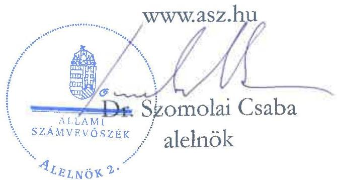

ÁLLAMI SZÁMVEVŐSZÉK

# JELENTÉS

A fenntartási kötelezettség kedvezményezettek
általi teljesítésének rapid ellenőrzése

Az MBTEX Hungary Zrt.
fenntartási kötelezettsége teljesítésének ellenőrzése
a GINOP 1.2.1-16-2017-01002 számú projektnél

2025.

25118

www.asz.hu

---

ÁLLAMI
SZÁMVEVŐSZÉK

# JELENTÉS

A fenntartási kötelezettség kedvezményezettek
általi teljesítésének rapid ellenőrzése

Az MBTEX Hungary Zrt.
fenntartási kötelezettsége teljesítésének ellenőrzése
a GINOP 1.2.1-16-2017-01002 számú projektnél

2025.

25118

---

Jelentéseink az interneten a www.asz.hu címen olvashatók.

ELLENŐRZÉSI IGAZGATÓSÁG:
ELLENŐRZÉSI IGAZGATÓSÁG I.

ELLENŐRZÉSI IGAZGATÓ:
SINKÁNÉ DR. CSENDES ÁGNES igazgató

ELLENŐRZÉSVEZETŐ:
HUSZÁR ANNA ellenőrzésvezető

IKTATÓSZÁM: EL-4101-182/2025

TÉMASORSZÁM: -

ELLENŐRZÉS-AZONOSÍTÓ SZÁM: V1101

---

TARTALOMJEGYZÉK

- ÖSSZEFOGLALÁS ... 5
- AZ ELLENŐRZÉS EREDMÉNYEI ... 6
1. A fenntartási kötelezettség teljesítése ... 6
- I. FÜGGELÉK: ÉSZREVÉTELEK ... 9
- II. FÜGGELÉK: ELLENŐRZÉSI MEGKÖZELÍTÉS ... 10
- MELLÉKLETEK ... 15
I. sz. melléklet: Értelmező szótár ... 15
II. sz. melléklet: Az ellenőrzött és a közreműködő szervezetek jegyzéke ... 17
- RÖVIDÍTÉSEK JEGYZÉKE ... 18

---

“哈，你是个小伙子，你是个小伙子，你是个小伙子，你是个小伙子，你是个小伙子，你是个小伙子，你是个小伙子，你是个小伙子，你是个小伙子，你是个小伙子，你是个小伙子，你是个小伙子，你是个小伙子，你是个小伙子，你是个小伙子，你是个小伙子，你是个小伙子，你是个小伙子，你是个小伙子，你是个小伙子，你是个小伙子，你是个小伙子，你是个小伙子，你是个小伙子，你是个小伙子，你是个小伙子，你是个小伙子，你是个小伙子，你是个小伙子，你是个小伙子，你是个小伙子，你是个小伙子，你是个小伙子，你是个小伙子，你是个小伙子，你是个小伙子，你是个小伙子，你是个小伙子，你是个小伙子，你是个小伙子，你是个小伙子，你是个小伙子，你是个小伙子，你是个小伙子，你是个小伙子，你是个小伙子，你是个小伙子，你是个小伙子，你是个小伙子，你是个小伙子，你是个小伙子，你是个小伙子，你是个小伙子，你是个小伙子，你是个小伙子，你是个小伙子，你是个小伙子，你是个小伙子，你是个小伙子，

---

ÖSSZEFOGLALÁS

A 2016 decemberében megjelent „Mikro-, kis- és középvállalkozások termelési kapacitásainak bővítése” című (GINOP-1.2.1-16 kódszámú) pályázati felhívásban meghirdetett támogatással lehetőség nyílt ezen vállalkozások számára modern eszköz- és gépparkok, valamint fejlett infrastruktúrával ellátott telephelyek kialakítására. A rendelkezésre álló keretösszeg eredetileg 18 Mrd Ft volt, a keretösszeg emelését követően végül a konstrukcióban 101 Mrd Ft értékben kötött az IH¹ támogatási szerződést. Az igényelhető vissza nem térítendő támogatás összege kezdetben 25 M Ft és 250 M Ft között volt, a támogatás maximuma később 500 M Ft-ra emelkedett.

A Felhívás² alapján a 195,4 M Ft támogatást nyert GINOP-1.2.1-16-2017-01002 számú, „Kapacitásbővítő beruházás az MBTEX Kft.-nél” című projekt Kedvezményezettje³, az MBTEX Kft. digitális textilnyomó üzemet épített, termelőeszközöket vásárolt, napelemes rendszert telepített.

A Kedvezményezett – a támogatás visszafizetésének terhe mellett – vállalta, hogy a projektmegvalósítást követően a Projekt⁴ megfelel az 1303/2013/EU Rendeletben⁵ a műveletek tartósságára vonatkozóan előírtaknak, az előírt fenntartási kötelezettséget teljesíti. A Projekt fizikailag 2021. október 1-én fejeződött be, az IH döntése alapján a Projekt hároméves fenntartási időszaka a fizikai befejezését követő nappal indult és 2025. november 22-ig tartott.

A támogatás összértéke, a Projekt egyedisége és a megvalósított projekteredmény hosszabb távon történő megtartása miatt az ÁSZ⁶ indokoltnak tartotta a Projekt fenntartásának és a támogatás hasznosulásának ellenőrzését. A Kedvezményezett projektfenntartási kötelezettségei teljesítésének ellenőrzésére az ÁSZ „A 2014-2020 programozási időszak kohéziós politikai operatív programok vonatkozásában a fenntartási kötelezettség teljesítésének ellenőrzési gyakorlata” című ellenőrzéséhez, mint alapellenőrzéshez kapcsolódóan került sor.

Kedvezményezett a tevékenységét 2023. év elejétől fokozatosan leépítette, majd megszüntette. 2024. június 3-ától a Balassagyarmati Törvényszék az MBTEX Zrt.-vel szemben felszámolási eljárást indított a cég egyik volt munkavállalójának – az elmaradt munkabérkifizetése miatt benyújtott – felszámolási kérelme alapján.

A Kedvezményezett – a számára előírt hároméves fenntartási időszak alatt – az éves projektfenntartási jelentés benyújtási kötelezettsége keretében a 2022. évre vonatkozó 1. PFJ-t – hiánypótlással – az előírtaknak megfelelően határidőben, 2023. júniusában teljesítette. A vállalt átlagos statisztikai foglalkoztatotti létszámot az 1. PFJ alapján annak 2022.12.31-ig terjedő időszakáig fenntartotta, illetve azt további 8 fővel meghaladta. A 2024. június 15-i benyújtási határidejű 2. PFJ-t a Kedvezményezett – a Támogatási rend.⁷-ben és az ÁSZF⁸-ben előírtak ellenére már nem nyújtotta be az IH-nak.

A Kedvezményezett képviseletére kirendelt felszámolóbiztos tájékoztatása alapján, a cég – amelynek 2023. novemberében minden vezetője és tulajdonosa változott – nem tett eleget a Csőd tv.⁹ 31. §-ában foglalt kötelezettségeinek. A Kedvezményezett által megvalósított projekteredmény és annak dokumentumai a számvevőszéki ellenőrzés során nem voltak fellelhetőek, elérhetőek.

Az IH a Kedvezményezett-tel szemben indított felszámolási eljárás 2024. júniusában történt tudomására jutását követően elállt a támogatási szerződéstől, és – a felszámolás kezdő időpontjában – 199,9 M Ft-os Kedvezményezett-tel szemben fennálló követelés összegéről tájékoztatta a felszámolóbiztost.

Az ÁSZ értékelése szerint, mivel a Kedvezményezett termelő tevékenysége megszűnt, a támogatásból megvalósított Projekteredményt nem működtette, a támogatás nem hasznosult. A Kedvezményezett az ÁSZ helyszíni ellenőrzésének lezárását követően, 2025. szeptember 23-ig visszafizetési kötelezettségét nem teljesítette.

5

---

AZ ELLENŐRZÉS EREDMÉNYEI

A magyar vállalkozások a GINOP¹⁰ pályázati konstrukciók keretében jelentős mértékű támogatásban részesültek, amelynek célja volt hozzájárulni a gazdasági fejlődéshez, a társadalmi felzárkózáshoz és az infrastruktúra fejlesztéséhez. Az ÁSZ – Magyarország versenyképességének növelése érdekében – fontosnak tartja a kihelyezett uniós támogatások nemzetgazdasági szinten történő hasznosulását és értékteremtését a vállalatok beruházásain és elért teljesítményén keresztül. Az ÁSZ a támogatással kapcsolatos fenntartási kötelezettség teljesítését, valamint annak hasznosulását a GINOP-1.2.1-16-2017-01002 számú projekt tekintetében értékelte. A Projekt keretében az MBTEX Kft. digitális textilnyomó üzemet épített, termelőeszközöket vásárolt, napelemes rendszert telepített.

## 1. A fenntartási kötelezettség teljesítése

### Összegző megállapítás

Az IH elállt a támogatási szerződéstől és elrendelte a teljes támogatási összeg visszafizetését. A Kedvezményezett visszafizetési kötelezettségének nem tett eleget, a támogatás nem hasznosult.

### A fenntartási jelentés benyújtási kötelezettség teljesítése

A Kedvezményezettnek a Projekt megvalósítását követően, a Támogatási rend.-ben foglaltak alapján hároméves fenntartási kötelezettsége volt, amelyet a Felhívás és a támogatási szerződés is rögzített. Az IH döntése alapján a projektfenntartási időszak a Projekt fizikai befejezésétől indult. Ennek keretében a projekteredményt a megvalósítási helyszínen a Projekt fizikai befejezésétől számított három évig fenn kellett tartania és üzemeltetnie, és a Támogatási rend.-ben foglaltak alapján évente projektfenntartási jelentésben kellett beszámolnia az indikátorok teljesüléséről.

A Kedvezményezett – a támogatási szerződésben számára előírt hároméves fenntartási időszak alatt – a Támogatási rend. 180. § (1) bekezdése és 1. melléklete 288. pontja szerinti, projekt fenntartási jelentés benyújtási kötelezettségét csak részben, az 1. PFJ¹¹ vonatkozásában teljesítette. Az előírt PFJ-k és ZPFJ¹² főbb adatait az 1. táblázat tartalmazza.

### 1. táblázat
A GINOP-1.2.1-16-2017-01002 SZÁMÚ PROJEKTHEZ KAPCSOLÓDÓ PFJ-K FŐBB ADATAI

|  JELENTÉS
SORSZÁSIA | JELENTÉS
TÍPUSA | TÁRGYIDÓSZAK
KEZDETÉ | TÁRGYIDÓSZAK
VEGE | BENYÚJTÁS
HÁTÁRIDÉJE | JELENTÉS STÁTUSZA  |
| --- | --- | --- | --- | --- | --- |
|  1. | PFJ | 2021.10.02. | 2022.12.31. | 2023.06.15. | 2023.06.12-én beérkezett,
arra a hiánypótlás – néhány
napos késéssel – 2024.01.16-án
beérkezett,
elfogadásra nem került  |
|  2. | PFJ | 2023.01.01. | 2023.12.31. | 2024.06.15. | –  |
|  3. | ZPFJ | 2024.01.01. | 2025.11.22. | 2026.06.15. | –  |

Forrás: FAIR¹³ adatok alapján ÁSZ saját szerkesztés

---

Az ellenőrzés eredményei

A Kedvezményezett az éves projekt fenntartási jelentés benyújtási kötelezettségét az 1. PFJ esetében – a Támogatási rend.-ben előírtakat betartva – határidőben teljesítette. Az IH az 1. PFJ-vel kapcsolatban a Kedvezményezettet 2023. december 22-i levelében hiánypótlásra kötelezte, amelyet a Kedvezményezett Támogatási rend. 1. melléklet 297.1 pontban meghatározott 15 napos határidőt túllépve teljesített. Az 1. PFJ mellékletei a hiánypótlást követően, a Támogatási rend.-ben foglaltaknak megfelelően tartalmaztak tájékoztatást a Projektben foglalkoztatottak létszámáról és tartalmazták az iparűzési adó befizetésének igazolását. A hiánypótlással az 1. PFJ tekintetében a Kedvezményezett teljesítette a Támogatási rend.-ben előírt jelentéstételi kötelezettségét. Az 1. PFJ elfogadása az IH részéről nem történt meg.

A Kedvezményezett az ellenőrzött időszakban esedékes, 2024. június 15-i benyújtási határidejű, 2. PFJ-t – Támogatási rend. 180. § (1) bekezdésében és annak 1. melléklete 281.1. és 282.1. pontjaiban, továbbá az ÁSZF 10.7 és 10.8 pontjaiban előírtak ellenére – nem nyújtotta be az IH-nak.

Az ellenőrzött időszakban a Projekt fenntartásával kapcsolatban az IH részéről helyszíni ellenőrzés lefolytatására nem került sor.

## A fenntartási kötelezettség, indikátorok teljesítése

A Kedvezményezett a Projekt fenntartására és az indikátorok teljesítésére vonatkozó kötelezettségeit az alábbiak szerint teljesítette:

1. A Kedvezményezettnek vállalnia kellett a támogatási szerződés 4. számú mellékletében előírt, a bázislétszámot jelentő 2016. december 31-i 8 fős foglalkoztatotti létszám tovább foglalkoztatását és fenntartását a fenntartási időszak végéig. A Kedvezményezett a vállalt létszámot az 1. PFJ alapján annak 2022. december 31-ig terjedő időszakáig fenntartotta, illetve azt további 8 fővel meghaladta. A 2023. január 1-től kezdődő időszakot követően – az OPTEN¹⁴ adatai alapján – foglalkoztatotti létszáma folyamatosan csökkent, 2024. év elejétől 0 fő volt.

2. A Felhívás 3.4.1.1.1. pont a) alpontja alapján kötelező vállalás volt, hogy a Kedvezményezett növeli az éves nettó árbevételét a projekt fizikai befejezési évét közvetlenül követő 2 üzleti évben, ugyanakkor a támogatási szerződés 4. számú melléklete az árbevétel tekintetében nem tartalmazott előírást a Kedvezményezett számára.

A Kedvezményezett 2023. január 1-től – a 2. PFJ tárgyidőszakának kezdetétől – nem tett eleget a támogatási szerződés 6. pontjában és 4. számú mellékletében előírt fenntartási, valamint indikátorok teljesítésére vonatkozó kötelezettségeinek.

A Cégközlönyben közzétett adatok alapján az IH tudomására jutott 2024. júniusában, hogy a Balassagyarmati Törvényszék elrendelte a Kedvezményezett felszámolását 2024. június 3-ától. A Támogatási rend. 90. § (1) bekezdés h) pontja alapján az IH jogosult a támogatási szerződéstől elállni, ha a támogatási szerződés megkötését követően jut tudomására, hogy a kedvezményezett jogerős végzéssel elrendelt felszámolási – a megszüntetésére irányuló, jogszabályban meghatározott – eljárás alatt áll.

Az IH a Kedvezményezett-tel szemben indított felszámolási eljárás tudomására jutását követően, 2024. június 27-én szabálytalansági eljárást indított. Az eljárás 2024. július 19-i lezárását követően, az IH a Kedvezményezett felszámolási eljárására, mint – az ÁSZF 7. fejezet 4.2. pont f) alpontja szerinti – szerződésszegésre hivatkozással, 2024. július 29-ével a Támogatási rend. 90. § (1) bekezdés h) pontjában rögzített jogosultságával élve elállt a támogatási szerződéstől. A felszámolás kezdő időpontjában a Kedvezményezett-tel szemben fennálló követelés 195,4 M Ft-os támogatási összegből és 4,5 M Ft ügyleti kamatból állt.

---

Az ellenőrzés eredményei

A Kedvezményezett felszámolására kirendelt Capital Control Partner Kft.-t képviselő felszámolóbiztos az ÁSZ 2024. december 10-i helyszíni ellenőrzése során nyilatkozatában tájékoztatást adott a Kedvezményezett-tel szemben indított felszámolási eljárás körülményeiről: a felszámolást a Kedvezményezett egyik volt munkavállalója indította elmaradt munkabérkifizetés miatt. A felszámolóbiztos megerősítette, hogy a Kedvezményezett – amelynek vezetői és egyúttal tulajdonosai személyében 2023 novemberében változás történt – nem tett eleget a Csőd tv. 31. §-ában foglalt kötelezettségeinek, amely miatt a felszámolóbiztos nem rendelkezett információval a Projekt keretében beszerzett eszközökről, azok fellelhetőségi helyéről.

Az ÁSZ ellenőrzés megállapította, hogy a Projekt termelő tevékenysége megszűnt, emiatt nem felelt meg a műveletek tartósságával kapcsolatban az 1303/2013/EU rendelet 71. cikk (1) bekezdésében és a Támogatási rend. 178. § (1) bekezdésében előírtaknak.

## A támogatás hasznosulása

A 2. táblázat a Kedvezményezett 2020-2024. évi létszám, árbevétel, adózott eredmény és mérlegfőösszeg adatait mutatja be.

2. táblázat

|  A KEDVEZMÉNYEZETT 2020-2024. ÉVI LÉTSZÁM, ÁRBEVÉTEL, ADÓZOTT EREDMÉNY ÉS MÉRLEGFŐÖSSZEG ADATAI  |   |   |   |   |   |
| --- | --- | --- | --- | --- | --- |
|  ADATOK MEGNEVEZÉSE | 2020. ÉVBEN | 2021. ÉVBEN | 2022. ÉVBEN | 2023. ÉVBEN | 2024. ÉVBEN  |
|  Átlagos statisztikai létszám (fő) | 14 | 16 | 10 | nincs adat | nincs adat  |
|  Értékesítés nettó árbevétel (M Ft) | 611,9 | 407,6 | 563,6 | nincs adat | nincs adat  |
|  Adózott eredmény (M Ft) | 43,1 | -82,0 | 12,9 | nincs adat | nincs adat  |
|  Mérlegfőösszeg (M Ft) | 1 275,9 | 1 428,9 | 1 616,5 | nincs adat | nincs adat  |

Forrás: A Kedvezményezett éves beszámoló adatai alapján ÁSZ saját szerkesztés

Az ÁSZ értékelése szerint a Projekt a megvalósítási időszakban, valamint a fenntartási időszak 1. évében (2022. december 31-ig terjedő időszakában) még működőképes volt, azt követően a Kedvezményezett a fenntartási kötelezettségek, indikátorok teljesítéséről nem számolt be, a Projekt keretében beszerzett eszközök az ÁSZ helyszíni ellenőrzésekor nem voltak fellelhetők. A Kedvezményezett tevékenységét megszüntette, felszámolási eljárás alá került, így a támogatás nem hasznosult. A Kedvezményezett az ÁSZ helyszíni ellenőrzésének lezárását követően, 2025. szeptember 23-ig visszafizetési kötelezettségét nem teljesítette.

---

9

# I. FÜGGELÉK: ÉSZREVÉTELEK

A jelentéstervezetet az ÁSZ 15 napos észrevételezésre megküldte az ellenőrzött szervezet vezetőjének az ÁSZ tv. 29. §* (1) bekezdése előírásának megfelelően.

A jelentéstervezet megállapításaira az ellenőrzött szervezet nem tett észrevételt.

* 29. § (1) Az Állami Számvevőszék az ellenőrzési megállapításait megküldi az ellenőrzött szervezet vezetőjének vagy az általa megbízott személynek, és annak, akinek személyes felelősségét állapította meg.
(2) Az ellenőrzött szervezet vezetője és a felelősként megjelölt személy az ellenőrzés megállapításaira tizenöt napon belül írásban észrevételt tehet.
(3) Az Állami Számvevőszék az észrevételre a beérkezésétől számított harminc napon belül írásban válaszol. A figyelembe nem vett észrevételeket köteles a jelentésben feltüntetni, és megindokolni, hogy azokat miért nem fogadta el.

---

10

# II. FÜGGELÉK: ELLENŐRZÉSI MEGKÖZELÍTÉS

## AZ ELLENŐRZÉS JOGALAPJA

Az ellenőrzés jogszabályi alapját az ÁSZ tv.¹⁵ 5. § (3) bekezdés képezte.

## AZ ELLENŐRZÉS CÉLJA

A fenntartási kötelezettség teljesítésének és a támogatás hasznosulásának értékelése a fenntartási szakaszba került uniós projekt kedvezményezettjénél.

## AZ ELLENŐRZÉS TÍPUSA

Kombinált ellenőrzés

## AZ ELLENŐRZÉS TÁRGYA

Az ellenőrzés tárgya volt az ellenőrzésre kiválasztott GINOP-1.2.1-16-2017-01002 számú uniós projekt fenntartási időszakára vonatkozóan előírt kötelezettségek MBTEX Hungary Zrt. mint kedvezményezett által történt teljesítése és a támogatás hasznosulása. A fenntartási kötelezettség ellenőrzése a kedvezményezett tevékenységéhez és működéséhez kapcsolódó kötelezettségek, a meghatározott indikátorok és a beszámolási kötelezettség teljesítésére irányult.

Az ellenőrzés tárgya volt továbbá a kedvezményezett által benyújtott fenntartási jelentésekben rögzítettek valóságtartalma és megalapozottsága, valamint ezek összhangja az ÁSZ helyszíni ellenőrzése során tapasztaltakkal.

Az ellenőrzés kiterjedt minden olyan körülményre és adatra, amely az ÁSZ jogszabályban meghatározott feladatainak teljesítéséhez, valamint a program végrehajtása folyamán felmerült újabb összefüggések feltárásához szükséges.

## AZ ELLENŐRZÉS HATÓKÖRE ÉS TERÜLETE

Az uniós jogszabályok az uniós támogatással megvalósuló projektekkel szemben elvárásként rögzítik a „műveletek tartósságának” követelményét. A kedvezményezettek infrastrukturális vagy termelő beruházás esetén – a projektmegvalósítás befejezésétől számított 5 évig, kis- és közepes vállalkozások esetén 3 évig, a támogatás visszafizetésének terhe mellett – vállalták, hogy a projekt termelő tevékenysége nem szűnik meg, hogy nem következik be olyan tulajdonosváltás, amelynek eredményeként jogosulatlan előny szerezhető, illetve, hogy nem következik be olyan lényeges változás, amely a projekt eredeti célkitűzéseit veszélyezteti. Abban az esetben, ha a felsoroltak valamelyike bekövetkezik, a támogatást – figyelemmel a vonatkozó jogszabályokra – vissza kell fizetni az Európai Bizottságnak.

---

II. Függelék: Ellenőrzési megközelítés

Ha az IH a projektre nézve fenntartási kötelezettséget állapított meg, és indikátorokat határozott meg a támogatási szerződésben, a kedvezményezettnek évente be kellett számolnia az indikátorok teljesüléséről. Ha ezen időszakra indikátorokat nem határozott meg az IH és a támogatási szerződésben sem írta elő az évenkénti teljesítést, a kedvezményezettnek egy alkalommal záró projektfenntartási jelentést kell(ett) benyújtania.

Az ellenőrzés a XIX. Uniós fejlesztések fejezet 3/1 Kohéziós politikai operatív programok 2014-2020 operatív programjai közül a – kis- és középvállalkozások versenyképességének javítására irányuló – GINOP 1. prioritásából és a – kutatás, technológiai fejlesztés és innováció című – GINOP 2. prioritásából támogatást kapott projektek kedvezményezettjeire terjedt ki oly módon, hogy az ÁSZ – „A 2014-2020 programozási időszak kohéziós politikai operatív programok vonatkozásában a fenntartási kötelezettség teljesítésének ellenőrzési gyakorlata” című ellenőrzéséhez, mint alapellenőrzéshez kapcsolódóan – a GINOP 1-2. prioritás pályázati kiírásainak nyertes pályázóiból, kockázat alapú mintavételi eljárással, rapid ellenőrzésre választott ki összesen 16 projektet, amelyből ezen jelentésben a GINOP-1.2.1-16-2017-01002 számú projekt tekintetében értékelte a fenntartási kötelezettség teljesítését.

A GINOP-1.2.1-16-2017-01002 számú projekt tekintetében az ellenőrzés kiterjedt a célrendszer, a jogszabályban – a működés és tevékenység tekintetében – előírt fenntartási kötelezettség teljesülésére, a fenntartási jelentésben bemutatott eredmények valóságtartalmára, megalapozottságára, valamint a támogatási szerződésben vállalt, a fenntartási időszakra vonatkozó kötelezettségek teljesítésének, és a GINOP keretében nyújtott támogatás hasznosulásának értékelésére.

## A GINOP-1.2.1-16 számú felhívás bemutatása

Az IH által közzétett GINOP-1.2.1-16 kódszámú, a „Mikro-, kis- és középvállalkozások termelési kapacitásainak bővítése” című pályázati felhívásban meghirdetett támogatás célja volt a kiemelt iparágakban fejleszteni kívánó hazai KKV¹⁶-k termelési kapacitásainak bővítése a hazai ipar fejlesztése érdekében, amely során korszerű termék előállítási képességek megteremtésének és bővítésének céljából lehetőség nyílt modern eszköz- és gépparkok, valamint fejlett infrastruktúrával ellátott telephelyek kialakítására, a szektor szereplői számára a versenyképesség feltételeinek megteremtésére, fenntartására.

A támogatás formája vissza nem térítendő támogatás volt, forrását az Európai Regionális Fejlesztési Alap és Magyarország költségvetése társfinanszírozásban biztosította. A rendelkezésre álló tervezett keretösszeg eredetileg 18 Mrd Ft volt, ami a felhívás módosítását követően 119,8 Mrd Ft-ra emelkedett. A Felhívás szerint a támogatott projektek várható számát 150-250 között tervezték, a felhívás keretében projektenként kapható támogatás nagysága kezdetben 25-250 M Ft volt, majd később a támogatás maximális összege 500 M Ft-ra emelkedett.

A támogatási kérelmet benyújtó szervezetek vállalták, hogy a projekt megvalósításával hozzájárulnak a kiemelt iparágakban fejleszteni kívánó hazai KKV-k termelési kapacitásainak bővítéséhez, a kapott támogatáson felül önerőből finanszírozzák a projektet és a projekt fizikai befejezését követő két évben növelik nettó árbevételüket.

Támogatható tevékenység volt az új eszközök, gépek beszerzése, az új technológiai rendszerek és kapacitások kialakítása, a megújuló energiaforrást hasznosító technológiák alkalmazása, melyek célja a gazdasági-termelési folyamatok és az üzemen belüli építmények energiaigényének részbeni fedezése megújuló energia előállításával, valamint az infrastrukturális és ingatlan beruházás, az információs technológia-fejlesztés és az új eszközök, gépek beszerzéséhez, új technológiai rendszerek és kapacitások kialakításához kapcsolódó gyártási licenc, gyártási know-how beszerzés.

---

II. Függelék: Ellenőrzési megközelítés

A Felhívás szerinti támogatásra az a mikro-, kis-, és középvállalkozás pályázhatott, amely az alábbi feltételeknek eleget tett:

- rendelkezett legalább egy lezárt (beszámoló/SZJA¹⁷ bevallással alátámasztott), teljes 365 napot jelentő üzleti évvel;
- éves átlagos statisztikai állományi létszáma a támogatási kérelmek benyújtását megelőző utolsó lezárt, teljes üzleti évben minimum 1 fő volt;
- Magyarországon székhellyel rendelkező kettős könyvvitelt vezető gazdasági társaság, szövetkezet, egyéni vállalkozó, egyéni cég vagy az Európai Gazdasági Térség területén székhellyel és Magyarországon fiókteleppel rendelkező szövetkezet vagy kettős könyvvitelt vezető gazdasági társaság fióktelepe volt.

A projekt megvalósítása során legfeljebb egy mérföldkővet lehetett tervezni, amelynek a projekt fizikai befejezésének időpontjával kellett egybeesnie. A projekt fizikai befejezésére legfeljebb 18 hónap állt rendelkezésre. Nem volt köteles biztosítékot nyújtani kérelemre az a kedvezményezett, amely rendelkezett legalább egy lezárt, teljes üzleti évvel, és a támogatási kérelem benyújtásakor szerepelt a köztartozásmentes adózói adatbázisban.

Indikátorként a támogatott vállalkozásoknál a foglalkoztatás növekedése került megjelölésre. A támogatást igénylő, a projekt megvalósítás befejezésétől számított 3 évig volt köteles fenntartani a projekt keretében létrehozott termékeket és szolgáltatásokat.

A támogatási kérelmek benyújtására a felhívás közzétételét követő 24 hónapig, 2017. január 16-tól 2019. január 16-ig volt lehetőség. Az utólagos finanszírozású tevékenységekre igénybe vehető maximális előleg mértéke a megítélt támogatás 50%-a, de legfeljebb 125 M Ft volt. A kiválasztási eljárásrend standard eljárás volt, szakaszos elbírálással.

Az IH által nyolc alkalommal módosított Felhívásra 1136 támogatási kérelem érkezett be, összesen 178,6 Mrd Ft nagyságú támogatási összegre, amelyből – az IH adatszolgáltatás alapján – 605 kérelem került elfogadásra összesen 101 Mrd Ft értékű támogatási összeggel.

# Az MBTEX Zrt. és a GINOP-1.2.1-16-2017-01002 számú projekt bemutatása

A kedvezményezett MBTEX Kft.-t 2013 decemberében alapították. 2018. november 8-án a Kft. átalakulás útján megszűnt, az átalakulást követően az MBTEX Zrt. lett a jogutódja. A Kedvezményezett mikrovállalkozásnak minősült; székhelye az ellenőrzött időszakban, 2021. június 1-ig Budapesten, az Ezred utcában volt, ezt követően többször változott, az ÁSZ helyszíni ellenőrzésének idején 2023. november 30-tól Nyíregyházán, a Bethlen Gábor utcában volt bejegyezve. Telephelye Tolmácson volt 2018. november 8-tól öt éven keresztül. Főtevékenységként az MBTEX Kft.-nél a „Textil-nagykereskedelem”, az MBTEX Zrt.-nél a „Textilkékésztés” került megjelölésre.

A Balassagyarmati Törvényszék az MBTEX Zrt.-vel szemben 2024. június 3-ától felszámolási eljárást indított, a kirendelt felszámoló a Capital Control Partner Kft. lett.

A Kedvezményezett textilképzési tevékenységéhez kapcsolódóan kapacitásbővítő beruházás céljából támogatási kérelmét 2017. február 28-án nyújtotta be, amelyről az IH 2018. április 6-án támogatási döntést hozott. A „Kapacitásbővítő beruházás az MBTEX Kft.-nél” című, GINOP-1.2.1-16-2017-01002 számú támogatási szerződés 2018. június 8-án lépett hatályba. A Kedvezményezett az eredeti támogatási szerződés szerint 390,8 M Ft összegű beruházás megvalósítását vállalta Tolmácson, a megítélt támogatás összege – a Projekt elszámolható összköltségének 50%-ában meghatározott támogatásintenzitás mellett – 195,4 M Ft volt.

---

II. Függelék: Ellenőrzési megközelítés

A megvalósítani tervezett beruházás a tolmácsi telephelyen új gyártó üzem felépítését és digitális textilnyomáshoz kapcsolódó technológiák beszerzését jelentette. A gyártó tevékenység végzéséhez szükséges gépek energiaigényét – környezet megóvási és az energiafelhasználási költségek csökkentése céljából – részben megújuló energiaforrás hasznosításával, a beruházás keretében telepítésre kerülő napelem rendszer segítségével tervezték fedezni. A Projekt keretében gyártási, kontrolling és döntéstámogatási modult is tartalmazó – a termelésből objektív módon gyűjtött adatok elemzésére, feldolgozására képes – Ipar 4.0 megoldásokat nyújtó szoftver beszerzésével is számoltak.

A Kedvezményezett – a Felhívás 3.9. pontja alapján – mentesült a biztosíték nyújtási kötelezettség alól. A támogatási szerződést összesen 15 alkalommal – többek között a Kedvezményezett cégátalakulása, tulajdonosi szerkezetének változása, a projekt befejezési határidő és a megvalósítási helyszín változásai miatt – módosították, annak utolsó módosítása 2022. július 7-én lépett hatályba.

A támogatási szerződés 2021. október 1-ei dátummal egy mérföldkővet tartalmazott, amely időpontban a Projekt fizikailag be is fejeződött. A Kedvezményezett a – támogatási szerződésben előírt – határidőt figyelembe véve, 2021. október 30-án nyújtotta be a záró szakmai beszámolót és a záró kifizetési kérelmet. Az IH a Kedvezményezett záró szakmai beszámolóját – hiánypótlások teljesítését és a helyszíni ellenőrzés lezárását követően – elfogadta, az utolsó kifizetés és a Projekt megvalósítás befejezési dátuma 2022. november 22-e volt.

Az IH a megvalósítás helyszínén a Kedvezményezett záró szakmai beszámolójához kapcsolódóan 2022. március 1-én komplex jellegű, záró helyszíni ellenőrzést végzett, amely során hiányosságokat állapított meg. A Kedvezményezett az eredeti ellenőrzés keretében – a vásárolt berendezések használati/kezelési utasításai és megfelelőségi tanúsítványok tekintetében – feltárt hiányosságokat az IH kiegészítő ellenőrzésekor pótolta, így annak lezárásakor az IH nem tett intézkedést igénylő megállapítást.

A Kedvezményezett a Projektet – az IH szakmai záró beszámoló ellenőrzése és a megvalósításra vonatkozóan lefolytatott helyszíni ellenőrzése megállapításai alapján – a támogatási szerződésben rögzített mérföldkővet elérve teljesítette, a textilki készítési tevékenységéhez kapcsolódó kapacitásbővítő beruházást megvalósította.

Az IH helyszíni ellenőrzéséről készült jegyzőkönyv szerint a tolmácsi telephelyen felépítésre került az új digitális textilnyomó gyártó üzem, melybe a gyártáshoz szükséges technológiákat szereztek be, megteremtették a működésükhöz szükséges infrastrukturális feltételeket, illetve a továbbiakban napelemrendszer segítségével fedezték az energiaszükségletük egy részét. A technológiához kapcsolódóan a cég egy olyan termelés-irányítási rendszert szerzett be, mely objektív módon gyűjtötte a termelésből származó adatokat. A beruházással a cég termékpalettája bővült, a hiánytermékek köré csökkent, nagyban megnövelve a cég kínálatát. A Kedvezményezett a korábbi vevőinél felmérést végzett, melynek eredményeként a technológia kiépítésével és a gyártás megkezdésével, biztos felvevőpiacot tervezett ellátni, továbbá megnőtt a vállalkozás foglalkoztatási kapacitása is.

A hároméves fenntartási időszak 2021. október 2-án indult.

## AZ ELLENŐRZŐTT IDŐSZAK

2016. január 1-től 2025. április 30-ig, a helyszíni ellenőrzés lezárásának időpontjáig tartó időszak.

---

II. Függelék: Ellenőrzési megközelítés

## AZ ELLENŐRZÉSI KRITÉRIUMOK

|  FOKUSZTERÜLET | ELLENŐRZÉSI KRITÉRIUMOK  |
| --- | --- |
|  1. A fenntartási kötelezettség teljesítése  |   |
|  A fenntartási jelentés benyújtási kötelezettség teljesítése | Támogatási rend. 178. § (1) bekezdés, 180. § (1) bekezdés, 1. melléklet 178.1., 281.1.-281.3., 282.1., 287.2., 288., 293.1-2., 297.1 pontok;
Felhívás 3.8. pont;
ÁSZF 10.7 és 10.8 pontok;  |
|  A fenntartási kötelezettség, indikátorok teljesítése | 1303/2013/EU rendelet 71. cikk (1) bekezdés;
Csőd tv. 31. §;
Támogatási rend. 90. § (1) bekezdés h) pont, 178. § (1) bekezdés;
Felhívás 3.4.1.1.1. pont a) alpont;
ÁSZF 7. fejezet 4.2. pont f) alpont;
támogatási szerződés 6. pont, 4. sz. melléklet;  |
|  A támogatás hasznosulása | Az ÁSZ meghatározása alapján:
- A támogatás hasznosult, ha a vállalkozás (a projekt) működött az ÁSZ helyszíni ellenőrzése időpontjában, fenntartási kötelezettségét a kedvezményezett teljesítette / jellemzően teljesítette, és a támogatás eredményeként a kedvezményezett vállalkozás árbevétel vagy adózott eredmény adatai növekedtek a támogatás előtti időszakhoz képest.
- A támogatás korlátozottan hasznosult, ha a projekteredmény „fellelhető volt” az ÁSZ helyszíni ellenőrzése időpontjában, fenntartási kötelezettségét részben / minimálisan teljesítette a kedvezményezett, vagy a támogatás eredményeként hozzáadott új értéket teremtett, az társadalmilag hasznosult stb.
- A támogatás nem hasznosult, ha fenntartási kötelezettségét a kedvezményezett egyáltalán nem teljesítette és/vagy a vállalkozás (a projekt) már nem működött az ÁSZ helyszíni ellenőrzése időpontjában.  |

## AZ ELLENŐRZÉS MÓDSZERE ÉS AZ ELLENŐRZÉSI BIZONYÍTÉKOK KÖRE

Az ÁSZ az ellenőrzést a nemzetközi standardokat irányadónak tekintve az ellenőrzési program szempontjai, az ellenőrzött időszakban hatályos jogszabályok, az ellenőrzés-szakmai szabályok és módszertanok figyelembevételével végezte.

Az ellenőrzési kérdések megválaszolásához szükséges bizonyítékok megszerzése az ellenőrzött szervezet és az ellenőrzésben közreműködő szervezet által rendelkezésre bocsátott dokumentumokra és adatokra alapozva, továbbá megfigyelés, szemle (szemrevételezés), kérdésfeltevés (információkérés), interjú, mintavételezés, valamint elemző eljárás útján történt.

Az ellenőrzés bizonyítékként felhasználható adatforrásai közé tartoztak egyrészt az ellenőrzéshez kért dokumentumok, adatforrások, a nyilvánosan hozzáférhető adatok, dokumentumok, másrészt adatforrás volt még minden, az ellenőrzés folyamán feltárt, az ellenőrzés szempontjából információt tartalmazó dokumentum. Az ÁSZ a számvevőszéki jelentéstervezet elfogadásáig rendelkezésre álló, nyilvánosan elérhető adatokat figyelembe vette.

Az ellenőrzés végrehajtásához a projekt kiválasztása kockázat alapú mintavételi eljárással történt.

---

MELLÉKLETEK

I. SZ. MELLÉKLET: ÉRTELMEZŐ SZÓTÁR

fenntartás

A kedvezményezett a projektmegvalósítás befejezésétől számított 5 évig, állami támogatás formájában nyújtott támogatás esetén az állami támogatókra vonatkozó szabályok alapján alkalmazandó időtartamig, kis- és közepes vállalkozások esetén 3 évig a támogatás visszafizetésének terhe mellett vállalja, hogy a projekt megfelel az 1303/2013/EU európai parlamenti és tanácsi rendelet 71. cikk (1) bekezdésében foglaltaknak. (Forrás: Támogatási rend. 178. § (1) bekezdés, 2016. május 14-től 2024. július 31-ig hatályos)

Az irányító hatóság döntése alapján a fenntartási időszak kezdődhet a projektmegvalósítás befejezésétől vagy a projekt fizikai befejezésétől (ÁSZF 10.7. pontja alapján, hatályos 2016. június 14-től)

A fenntartási időszak meghatározása során az IH speciális projektév szerinti jelentéstételt alkalmazott, mivel a jelentések tárgyidőszaka speciális projektévhez (az üzleti évről készített közzétett beszámolóhoz) igazodott és a fenntartási jelentésben benyújtandó vállalási adatok csak az így meghatározott időszak elteltével álltak rendelkezésre. (Forrás: Támogatási rend. 1. melléklet 285.1-286.4 pontja alapján ÁSZ megfogalmazás)

indikátor

Uniós jogszabályokban és a programban nevesített, valamint az európai uniós források felhasználásáért felelős miniszter – a Vidékfejlesztési Program esetén az agrárpolitikáért felelős miniszter – által meghatározott, eredményt vagy teljesülést mérő mutató. (Forrás: Támogatási rend. 3. § (1) bekezdés 12. pont, 2022. július 21-től 2024. július 31-ig hatályos)

kedvezményezett

A támogatásban részesített támogatást igénylő (Forrás: Támogatási rend. 3. § (1) bekezdés 14. pont, 2014. november 6-tól hatályos)

műveletek tartóssága

Az ESB-alapokból¹⁸ valamely infrastrukturális vagy termelő beruházást magában foglaló műveletre fordított támogatás akkor fizetendő vissza, ha a kedvezményezettnek történő utolsó kifizetéstől számított 5 évben belül, illetve adott esetben, az állami támogatásokról szóló szabályozás szerinti időtartamon belül, a következők valamelyike történik:

a) a termelő tevékenység megszűnése vagy a programterületen kívülre való áthelyezése;

b) az infrastruktúra valamely elemében tulajdonosváltás következik be, amelynek eredményeként egy cég vagy állami szervezet jogosulatlan előnyhöz jut;

c) a természetében, célkitűzéseiben vagy végrehajtási feltételeiben olyan lényeges változás következik be, amely az eredeti célkitűzéseket veszélyezteti.

A műveletre jogosulatlanul kifizetett összegeket a tagállamnak vissza kell téríthetni, azon időszakkal arányosan, amelynek tekintetében nem teljesültek a követelmények. (Forrás: 1303/2013/EU rendelet 71. cikk (1) bekezdése)

projekt fizikai befejezése

Az az állapot, amikor a projekt keretében támogatott tevékenységeket a felhívásban és a támogatási szerződésben meghatározottak szerint elvégezték. (Forrás: Támogatási rend. 3. § (1) bekezdés 40. pont, 2015. június 13-tól hatályos)

15

---

Mellékletek

projekt lezárása

Egy projekt akkor tekinthető lezártnak, ha a kedvezményezett a támogatási szerződésben a projektmegvalósítás befejezését követő időszakra nézve további kötelezettséget nem vállalt, és a felhívásban meghatározott feltételek teljesültek. Ha a támogatási szerződés a támogatott tevékenység befejezését követő időszakra nézve további kötelezettséget előírt, a projekt akkor tekinthető lezártnak, ha valamennyi vállalt kötelezettség teljesült és a kedvezményezett a kötelezettségek megvalósulásának eredményeiről szóló záró projekt fenntartási jelentést benyújtotta, és azt az irányító hatóság, Vidékfejlesztési Program esetén a kifizető ügynökség jóváhagyta, valamint a záró jegyzőkönyv elkészült. (Forrás: Támogatási rend. 3. § (1) bekezdés 39. pont, 2016. május 14-től 2024. július 31-ig hatályos)

projektmegvalósítás befejezése

Az 1303/2013/EU rendelet 2. cikk 14. pontjára tekintettel egy projekt megvalósítása akkor tekinthető befejezettnek, ha a projekt fizikailag és pénzügyileg is befejezett, valamint a kedvezményezettnek valamennyi támogatott tevékenysége befejezését igazoló és alátámasztó kifizetési igénylését az irányító hatóság jóváhagyta és a támogatás folyósítása megtörtént. (Forrás: Támogatási rend. 3. § (1) bekezdés 41. pont, 2015. június 13-tól 2023. május 24-ig hatályos)

projekt pénzügyi befejezése

Ha a projekt fizikai befejezése megtörtént, valamint a projektmegvalósítás során keletkezett elszámoló bizonylatok – szállítói kifizetés esetén az előírt önrész szállítók részére történő – kiegyenlítése megtörtént. A projekt pénzügyi befejezésének dátuma a projekt megvalósítási ideje alatt felmerült, a kedvezményezett által megfelelően elszámolt költségek közül a legkésőbbi kiegyenlítés dátuma. (Forrás: Támogatási rend. 3. § (1) bekezdés 42. pontja alapján, 2014. november 6-tól hatályos)

standard kiválasztási eljárás

Standard kiválasztási eljárásrend esetén szakaszos elbírálást kell alkalmazni, amely során legkésőbb a felhívásban rögzített szakasz zárását vagy beadási határnapját követően kell a támogatási kérelmeket jogosultsági és tartalmi értékelésre bocsátani, és az egy szakaszban beérkezett kérelmek támogathatóságáról a felhívásban előírt tartalmi értékelési szempontoknak való megfelelés szerinti sorrendiségük alapján kell dönteni. (Támogatási rend. 61. § (4) bekezdés alapján, 2016. május 14-től hatályos)

16

---

Mellékletek

## II. SZ. MELLÉKLET: AZ ELLENŐRZŐTT ÉS A KÖZREMŰKÖDŐ SZERVEZETEK JEGYZÉKE

|  ELLENŐRZŐTT SZERVEZET MEGNEVEZÉSE | ADÓSZÁM  |
| --- | --- |
|  MBTEX Hungary Textil Kereskedelmi Kft. (2018. november 8-ig) | 24810542-2-41  |
|  MBTEX Hungary Zrt. (2024. június 3-tól MBTEX Hungary Zrt. „felszámolás alatt”; kirendelt felszámoló a Capital Control Partner Kft.) | 26545501-2-15  |
|  KÖZREMŰKÖDŐ SZERVEZET MEGNEVEZÉSE | ADÓSZÁM  |
| --- | --- |
|  Közigazgatási és Területfejlesztési Minisztérium | 15849272-2-41  |
|  Nemzeti Fejlesztési Központ | 15850258-1-42  |

---

RÖVIDÍTÉSEK JEGYZÉKE

1 IH

Irányító Hatóság (A GINOP esetében 2014. november 6-tól 2018. június 15-ig a Nemzetgazdasági Minisztérium, majd 2022. május 24-ig a Pénzügyminisztérium. 2022. május 25-től a területfejlesztési miniszter tevékenységének segítésére kijelölt miniszteriumként a Miniszterelnökség volt a felelős az IH feladatok tekintetében. 2024. január 1-vel az IH feladatok átkerültek a Közigazgatási és Területfejlesztési Minisztériumhoz. A feladatok 2024. augusztus 1-től az újonnan létrejött Nemzeti Fejlesztési Központba kerültek).

2 Felhívás

A GINOP-1.2.1-16 kódszámú, a „Mikro-, kis- és középvállalkozások termelési kapacitásainak bővítésé” című pályázati felhívás

3 Kedvezményezett, MBTEX Kft./Zrt.

2018.11.08-ig MBTEX Hungary Textil Kereskedelmi Kft., majd annak megszűnését követően, 2018.11.8-tól a jogutód az MBTEX Hungary Zrt. 2024. június 3-tól a kirendelt felszámoló a Capital Control Partner Kft.

4 Projekt

A GINOP-1.2.1-16-2017-01002 számú, „Kapacitásbővítő beruházás az MBTEX Kft.-nél” című projekt

5 1303/2013/EU rendelet

AZ EURÓPAI PARLAMENT ÉS A TANÁCS 1303/2013/EU RENDELETE (2013. december 17.) az Európai Regionális Fejlesztési Alapra, az Európai Szociális Alapra, a Kohéziós Alapra, az Európai Mezőgazdasági Vidékfejlesztési Alapra és az Európai Tengerügyi és Halászati Alapra vonatkozó közös rendelkezések megállapításáról, az Európai Regionális Fejlesztési Alapra, az Európai Szociális Alapra és a Kohéziós Alapra és az Európai Tengerügyi és Halászati Alapra vonatkozó általános rendelkezések megállapításáról és az 1083/2006/EK tanácsi rendelet hatályon kívül helyezéséről

6 ÁSZ

Állami Számvevőszék

7 Támogatási rend.

272/2014. (XI. 5.) Korm. rendelet a 2014-2020 programozási időszakban az egyes európai uniós alapokból származó támogatások felhasználásának rendjéről

8 ÁSZF

Általános Szerződési Feltételek az operatív programok keretében támogatásban részesített kedvezményezetekkel kötendő támogatási szerződésekhez

9 Csőd tv.

1991. évi XLIX. törvény a csődeljárásról és a felszámolási eljárásról

10 GINOP

Gazdaságfejlesztési és Innovációs Operatív Program

11 PFJ

projektfenntartási jelentés

12 ZPFJ

záró projektfenntartási jelentés

13 FAIR

Fejlesztéspolitikai Adatbázis és Információs Rendszer, a központi fejlesztési források, így az uniós támogatások nyilvántartó rendszere, a 60/2014. (III.6.) Korm. rendelet alapján

14 OPTEN

OPTEN Cégtár: Online céginformációs adatszolgáltatás

15 ÁSZ tv.

2011. évi LXVI. törvény az Állami Számvevőszékről

16 KKV

A mikro, kis- és középvállalkozások gyűjtőneve

17 SZJA

Személyi jövedelemadó

18 ESB-alapok

Az európai strukturális és beruházási alapok

18

---

ÁLLAMI SZÁMVEVŐSZÉK

1052 Budapest, Apáczai Csere János u. 10. | 1364 Budapest 4., Pf. 54

www.asz.hu | szamvevoszek@asz.hu

telefon: +36 1 484 9100