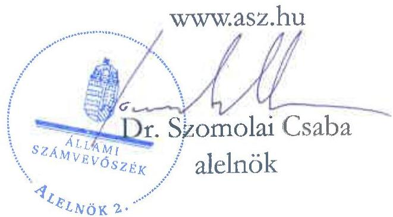

ÁLLAMI SZÁMVEVŐSZÉK

# JELENTÉS

A fenntartási kötelezettség kedvezményezettek
általi teljesítésének rapid ellenőrzése

A WEBSTAR CSOPORT Kft.
fenntartási kötelezettsége teljesítésének ellenőrzése
a GINOP-2.1.2-8-1-4-16-2017-00313 számú projektnél

2025.

25119

www.asz.hu

---

ÁLLAMI SZÁMVEVŐSZÉK

# JELENTÉS

A fenntartási kötelezettség kedvezményezettek
általi teljesítésének rapid ellenőrzése

A WEBSTAR CSOPORT Kft.
fenntartási kötelezettsége teljesítésének ellenőrzése
a GINOP-2.1.2-8-1-4-16-2017-00313 számú projektnél

2025.

25119

---

Jelentéseink az interneten a www.asz.hu címen olvashatók.

ELLENŐRZÉSI IGAZGATÓSÁG:
ELLENŐRZÉSI IGAZGATÓSÁG I.

ELLENŐRZÉSI IGAZGATÓ:
SINKÁNÉ DR. CSENDES ÁGNES igazgató

ELLENŐRZÉSVEZETŐ:
HUSZÁR ANNA ellenőrzésvezető

IKTATÓSZÁM: EL-4101-183/2025

TÉMASORSZÁM: -

ELLENŐRZÉS-AZONOSÍTÓ SZÁM: V1101

---

TARTALOMJEGYZÉK

- ÖSSZEFOGLALÁS ... 5
- AZ ELLENŐRZÉS EREDMÉNYEI ... 6
1. A fenntartási kötelezettség teljesítése ... 6
- I. FÜGGELÉK: ÉSZREVÉTELEK ... 10
- II. FÜGGELÉK: ELLENŐRZÉSI MEGKÖZELÍTÉS ... 11
- MELLÉKLETEK ... 16
I. sz. melléklet: Értelmező szótár ... 16
II. sz. melléklet: Az ellenőrzött és a közreműködő szervezetek jegyzéke ... 18
- RÖVIDÍTÉSEK JEGYZÉKE ... 19

---

“哈，你是个小伙子，你是个小伙子，你是个小伙子，你是个小伙子，你是个小伙子，你是个小伙子，你是个小伙子，你是个小伙子，你是个小伙子，你是个小伙子，你是个小伙子，你是个小伙子，你是个小伙子，你是个小伙子，你是个小伙子，你是个小伙子，你是个小伙子，你是个小伙子，你是个小伙子，你是个小伙子，你是个小伙子，你是个小伙子，你是个小伙子，你是个小伙子，你是个小伙子，你是个小伙子，你是个小伙子，你是个小伙子，你是个小伙子，你是个小伙子，你是个小伙子，你是个小伙子，你是个小伙子，你是个小伙子，你是个小伙子，你是个小伙子，你是个小伙子，你是个小伙子，你是个小伙子，你是个小伙子，你是个小伙子，你是个小伙子，你是个小伙子，你是个小伙子，你是个小伙子，你是个小伙子，你是个小伙子，你是个小伙子，你是个小伙子，你是个小伙子，你是个小伙子，你是个小伙子，你是个小伙子，你是个小伙子，你是个小伙子，你是个小伙子，你是个小伙子，你是个小伙子，你是个小伙子，

---

ÖSSZEFOGLALÁS

A 2016 decemberében megjelent „Vállalatok K+F+I tevékenységének támogatása kombinált hiteltermék keretében” című (GINOP-2.1.2-8-1-4-16 kódszámú) pályázati felhívásban meghirdetett támogatással lehetőség nyílt mikro-, kis-, és középvállalkozások, valamint nagyvállalatok számára K+F+I¹ tevékenység keretében jelentős szellemi hozzáadott értéket tartalmazó, új, piacképes termékek, szolgáltatások, technológiák, illetve ezek prototípusainak a kifejlesztésére. A megvalósítandó projekt vissza nem térítendő támogatásból, kölcsönből és önerő részből tevődött össze, amelyek együttesen határozták meg a projekt összes elszámolható költségét. A rendelkezésre álló keretösszeg eredetileg 120 Mrd Ft volt, végül a konstrukcióban 42,7 Mrd Ft értékben kötött az IH² támogatási szerződést. Az igényelhető támogatás összege 50 M Ft és 500 M Ft közötti volt, a kedvezményes kamatozású éven túli kölcsön összegének el kellett érnie a támogatás legalább 50%-át.

A Felhívás³ alapján az 56,7 M Ft támogatást nyert GINOP-2.1.2-8-1-4-16-2017-00313 számú, „Trackateam 2.0 fejlesztése” című projekt Kedvezményezettje⁴, a WEBSTAR Kft. sportszervezetek utánpótlásnevelését támogató szoftvert fejlesztett. A támogatásból megvalósított sportinformációs rendszer a digitális edzéstervezést, a sportegyesületek és az edzők adminisztratív tevékenységét támogatta.

A Kedvezményezett – a támogatás visszafizetésének terhe mellett – vállalta, hogy a projektmegvalósítást követően a Projekt⁵ megfelel az 1303/2013/EU Rendeletben⁶ a műveletek tartósságára vonatkozóan előírtaknak, az előírt fenntartási kötelezettséget teljesíti. A Projekt megvalósítása 2021. október 18-án fejeződött be, a fenntartási időszak az ezt követő nappal kezdődött és 2024. december 31-ig tartott.

A Projekt egyedisége és a megvalósított projekteredmény hosszabb távon történő megtartása miatt az ÁSZ⁷ indokoltnak tartotta a Projekt fenntartásának és a támogatás hasznosulásának ellenőrzését. A Kedvezményezett projektfenntartási kötelezettségei teljesítésének ellenőrzésére az ÁSZ „A 2014-2020 programozási időszak kobezjós politikai operatív programok vonatkozásában a fenntartási kötelezettség teljesítésének ellenőrzési gyakorlata” című ellenőrzéséhez, mint alapellenőrzéshez kapcsolódóan került sor.

A Kedvezményezettnek a Projekt tekintetében hároméves fenntartási kötelezettsége volt, amely keretében az ÁSZ helyszíni ellenőrzésének időszakában előírt két fenntartási jelentés benyújtási kötelezettségének határidőben eleget tett.

A Kedvezményezett a számára támogatási szerződésben kötelezően előírt „K+F ráfordítások szintjének megőrzése” indikátort megfelelően teljesítette. A Kedvezményezett 2022. évben K+F⁸ ráfordításokra 36,9 M Ft-ot fordított, 2023. évben nem számolt el ráfordítást a 2023. évi főkönyvi kivonata, és a 2. PFJ-ben rögzített adatok alapján. Összességében azonban a két évben az előírt K+F ráfordítások szintjét teljesítette, azt 110%-kal meghaladta.

A Kedvezményezett a támogatási kérelmében önként vállalt „Éves export árbevétel” indikátort nem teljesítette, mivel a fenntartási időszakban két egymást követő év export árbevételének átlaga nem haladta meg a támogatás 30%-ával a 2016. évben elért export árbevétel összegét.

Az „Új termékek gyártása céljából támogatott vállalkozások száma” és az „Új termékek forgalomba hozatala céljából támogatott vállalkozások száma” indikátorokat az előírásoknak megfelelően teljesítette a Kedvezményezett.

Az ÁSZ értékelése szerint a Kedvezményezett megfelelt a műveletek tartósságára vonatkozóan előírtaknak, a Projektet működtette, fenntartotta az ÁSZ helyszíni ellenőrzésének lezárásáig, a vállalkozása jövedelmező volt. A Projekt pozitív társadalmi hasznosulással is bírt, mivel a fiatalok utánpótlásnevelésén keresztül a mozgást és az egészségtudatosságot támogatja. Az előbbiekre tekintettel és mindamellett, hogy a Kedvezményezett az előírt indikátorokat – egy kivételével – teljesítette, a támogatás hasznosult.

5

---

AZ ELLENŐRZÉS EREDMÉNYEI

A magyar vállalkozások a GINOP⁹ pályázati konstrukciók keretében jelentős mértékű támogatásban részesültek, amelyek célja volt hozzájárulni a gazdasági fejlődéshez, a társadalmi felzárkózáshoz és az infrastruktúra fejlesztéséhez. Az ÁSZ – Magyarország versenyképességének növelése érdekében – fontosnak tartja a kihelyezett uniós támogatások nemzetgazdasági szinten történő hasznosulását és értékteremtését a vállalatok beruházásain és elért teljesítményén keresztül. Az ÁSZ a támogatással kapcsolatos fenntartási kötelezettség teljesítését, valamint annak hasznosulását a GINOP-2.1.2-8-1-4-16-2017-00313 számú projekt tekintetében értékelte. A Projekt keretében a kedvezményezett WEBSTAR Kft. sportinformációs rendszert fejlesztett, amely a digitális edzéstervezést, a sportegyesületek és az edzők adminisztratív tevékenységét támogatta.

## 1. A fenntartási kötelezettség teljesítése

### Összegző megállapítás

A ÁSZ értékelése szerint a Kedvezményezett a Projektet működtette, fenntartotta, jelentéstételi kötelezettségének határidőben eleget tett, az előírt indikátorokat – az ÁSZ helyszíni ellenőrzésének lezárásáig – egy kivételével teljesítette. A támogatás hasznosult.

### A fenntartási jelentés benyújtási kötelezettség teljesítése

A Kedvezményezettnek a Projekt megvalósítását követően, a Támogatási rend.¹⁰-ben foglaltak alapján hároméves fenntartási kötelezettsége volt, amelyet a Felhívás és a támogatási szerződés is rögzített. Ennek keretében a projekteredményt a megvalósítási helyszínen a megvalósítás befejezésétől, azaz 2021. október 19-től számított három évig fenn kellett tartania és üzemeltetnie, illetve ahhoz kapcsolódóan az indikátorok teljesüléséről a Támogatási rend.-ben foglaltak alapján évente projektfenntartási jelentésben kellett beszámolnia és a folyósított teljes kölcsönösszeget vissza kellett fizetnie.

A Kedvezményezett a Támogatási rend.-ben előírt éves projektfenntartási jelentés benyújtási kötelezettségét – az ÁSZ helyszíni ellenőrzésének lezárásig terjedő fenntartási időszak alatt – megfelelően, határidőben teljesítette. A PFJ¹¹-k és a ZPFJ¹² főbb adatait az 1. táblázat tartalmazza.

1. táblázat

|  GINOP-2.1.2-8-1-4-16-2017-00313 SZÁMÚ PROJEKTHEZ KAPCSOLÓDÓ PFJ-K FŐBB ADATAI  |   |   |   |   |   |
| --- | --- | --- | --- | --- | --- |
|  JELENTÉS
SORSZÁMA | JELENTÉS
TÍPUSA | TÁRGYIDÓSZAK
KEZDETE | TÁRGYIDÓSZAK
VEGE | BENYÚJTÁS
HATÁRIDÉJE | JELENTÉS STÁTUSZA*  |
|  1. | PFJ | 2021.10.19. | 2022.12.31. | 2023.06.15. | 2023.06.15-én beérkezett,
elfogadva 2025.07.31  |
|  2. | PFJ | 2023.01.01. | 2023.12.31. | 2024.06.15. | 2024.06.07-én beérkezett,
elfogadva 2025.07.31  |
|  3. | ZPFJ | 2024.01.01. | 2024.12.31. | 2025.06.15. | 2025.06.12-én beérkezett,
hiánypódás 2025.08.25-én
beérkezett  |

Forrás: FAIR¹³ adatok alapján ÁSZ saját szerkesztés

---

Az ellenőrzés eredményei

A Kedvezményezett a Támogatási rend-ben foglaltaknak megfelelően az ellenőrzött időszakban teljesítendő két PFJ-t elektronikusan benyújtotta. Az IH az 1.-2. PFJ-t az ÁSZ helyszíni ellenőrzésének lezárásáig nem bírálta el, azzal kapcsolatban döntést nem hozott.

*Az IH – a FAIR adatai szerint – 2025. július 31-ével, az ÁSZ helyszíni ellenőrzésének lezárását követően elfogadta a Kedvezményezett által benyújtott 1. és 2. PFJ-t. A Kedvezményezett 2025. június 12-én, az ÁSZ helyszíni ellenőrzésének lezárását követően benyújtotta a ZPFJ-t, 2025. augusztus 25-én annak hiánypótlását.

Az IH 2022. január 27-én rendkívüli fenntartási helyszíni ellenőrzést végzett a Kedvezményezettnél. A helyszíni ellenőrzési jegyzőkönyvben rögzítették, hogy 1 fő kutató-fejlesztő a Projekt témájához kapcsolódó területen nem rendelkezett megfelelő szakirányú felsőfokú végzettséggel továbbá, hogy a személyi jellegű költségek tekintetében a végzettség és a 15%-os bérnövekmény vizsgálatát az alátámasztó dokumentumok alapján a későbbiekben el kell végezni. Az IH szabálytalansági eljárást folytatott le, amelynek eredményeként megállapította, hogy szabálytalansági gyanú nem áll fenn a szakirányú végzettséggel kapcsolatban, mert a végzettség elfogadható segédszemélyzet besorolásban. A bérnövekmény tekintetében a Kedvezményezett-től bekért alátámasztó dokumentumok ellenőrzését követően az IH megállapította, hogy a személyi jellegű kiadások a Pénzügyi tájékoztató¹⁴ 5.2.2.2 pontjában foglaltak ellenére évente 15%-ot meghaladó mértékben emelkedtek. Az IH a támogatási szerződést módosította, a szabálytalanul elszámolt költségekre eső támogatástartalmat és kölcsön összegét visszakövetelte, amelyet a Kedvezményezett visszafizetett.

## A fenntartási kötelezettség, indikátorok teljesítése

A Kedvezményezett a Projekt keretében a vállalt indikátorokat – a benyújtott 1.-2. PFJ-k alapján – az alábbiak szerint teljesítette:

1. A Kedvezményezett számára a támogatási szerződés 4. sz. melléklete kötelezően előírta, hogy a Projekt megvalósítás befejezési évét közvetlenül követő két üzleti évben együttesen, a társasági adóbevallásban szereplő K+F ráfordítások összege eléri a kapott támogatás 30%-át, azaz a támogatási szerződésben rögzített 17,6 M Ft-ot.

A „K+F ráfordítások szintjének megőrzése” indikátor az előírtaknak megfelelően teljesült. A Kedvezményezett 2022. évben K+F ráfordításokra 36,9 M Ft-ot fordított, 2023. évben nem számolt el ráfordítást a 2023. évi főkönyvi kivonata, és a 2. PFJ-ben rögzített adatok alapján. Összességében azonban a két évben az előírt K+F ráfordítások szintjét teljesítette, azt 110%-kal meghaladta.

2. A Kedvezményezett támogatási kérelmében – annak elbírálása során a magasabb pontszám elérése érdekében – vállalta, hogy a fenntartási időszakban két egymást követő teljes üzleti év export árbevételének átlaga több mint 10%-kal, de minimum a támogatás 30%-ával (17,6 M Ft-tal) meghaladja a támogatási kérelem benyújtása előtti utolsó lezárt teljes üzleti év export árbevételét (a 2016. évi 0,3 M Ft-ot).

Az ÁSZ ellenőrzése megállapította, hogy a Felhívás 3.8. pontjában rögzítettek ellenére az előírt „Éves export árbevétel” indikátor nem teljesült, mivel a Kedvezményezett 2022. évben 9,0 M Ft, 2023. évben – az ÁSZ rendelkezésére bocsátott 2023. évi főkönyvi kivonat alapján – 10,9 M Ft árbevételt ért el exportértékesítésből, így a fenntartási időszakban a 2022-2023. évek export árbevételének átlaga (9,95 M Ft) ugyan több mint 10%-kal meghaladta a 2016. évi 0,3 M Ft-os export árbevételt, ugyanakkor az nem haladta meg a támogatás 30%-át, a minimumként előírt 17,6 M Ft-ot, annak átlaga 7,65 M Ft-tal kevesebb volt az előírtnál. (Az ÁSZ rendelkezésére bocsátott 2024. évi főkönyvi

---

Az ellenőrzés eredményei

kivonat alapján a 2024. évi export árbevétel a 2016. évi export árbevételnél kisebb összegben teljesült.)

3. A Kedvezményezett az „Új termékek gyártása céljából támogatott vállalkozások száma” és az „Új termékek forgalomba hozatala céljából támogatott vállalkozások száma” indikátorokat a fenntartási időszakban – az ellenőrzött időszakot figyelembe véve – az előírásoknak megfelelően teljesítette, mindkét mutató esetében teljesült az 1-1db célérték.

Az IH a ZPFJ ellenőrzésekor értékeli az PFJ-kben rögzített indikátorok teljesítését. Amennyiben a vállalt indikátorokat a kedvezményezett a támogatási szerződésben meghatározott érték 75%-a alatt teljesítette – a Támogatási rend. 88. § (2) bekezdése alapján – a támogatási összeg csökkentésre kerül, és a támogatás arányos részét a kedvezményezettnek vissza kell fizetnie.

A Projekt – az ÁSZ helyszíni ellenőrzése alapján – megfelelt a három projektfenntartási év tekintetében a műveletek tartósságával kapcsolatban az 1303/2013/EU rendelet 71. cikk (1) bekezdésében és a Támogatási rend. 178. § (1) bekezdésében előírtaknak.

A Kedvezményezett – ÁSZ helyszíni interjú keretében adott nyilatkozatában – hiányosságként fogalmazta meg, hogy a pályázati rendszer teljes folyamatában rendkívül hosszadalmas volt az elbírálási időtartam. Mivel a K+F területén jelentős változások következnek be mire a benyújtott támogatási kérelemről az IH meghozza a döntést, – a Kedvezményezett tájékoztatása szerint – K+F pályázatok esetén egy éven belül le kellene bonyolítani az elbírálást a pályázat beadásától a szerződéskötésig. A Kedvezményezett nyilatkozata alapján további problémát jelentett, hogy K+F pályázatnál nem lehet előre konkrétan meghatározni a kutatás eredményét, mivel a vevői igények folyamatosan változnak. A Kedvezményezett célszerűbbnek tartaná csak a kutatás kereteit rögzíteni és rugalmasabb szerződésmódosítási feltételeket meghatározni annak érdekében, hogy könnyebb legyen alkalmazkodni a szakmai tartalom módosulásához. A pályázat során felvett, hosszú futamidejű, kedvezményes kamatozású MFB kölcsön – álláspontja szerint – nem jelentett segítséget számukra, nem lett volna szükségük rá, de a pályázati konstrukció kötelező eleme volt.

## A támogatás hasznosulása

A Kedvezményezett a Projekt keretében sportszervezetek utánpótlásnevelését támogató Trackateam elnevezésű szoftvert továbbfejlesztette, amely a honlapján – az ÁSZ helyszíni ellenőrzésekor – elérhető volt, a székhelyén a beszerzett számítástechnikai eszközök fellelhetőek voltak, ott a Kedvezményezett tevékenységeinek megfelelő munkavégzés folyt. A Kedvezményezett pénzügyi-gazdasági helyzete az éves beszámolók adatai alapján stabil, a Kedvezményezett tevékenysége jövedelmező volt. A Kedvezményezett létszám, árbevétel, adózott eredmény és mérlegfőösszeg adatait 2020-2024. évekre vonatkozóan a 2. táblázat mutatja be.

2. táblázat
A KEDVEZMÉNYEZETT 2020-2024. ÉVI LÉTSZÁM, ÁRBEVÉTEL, ADÓZOTT EREDMÉNY ÉS MÉRLEGFŐÖSSZEG ADATAI

|  ADATOK MEGNEVEZÉSE | 2020. ÉVBEN | 2021. ÉVBEN | 2022. ÉVBEN | 2023. ÉVBEN | 2024. ÉVBEN  |
| --- | --- | --- | --- | --- | --- |
|  Átlagos statisztikai létszám (fő) | 48 | 60 | 66 | 70 | 73  |
|  Értékesítés nettó árbevétele (M Ft) | 832,6 | 1 131,4 | 1 101,9 | 1 550,2 | 1 271,8  |
|  Adózott eredmény (M Ft) | 89,6 | 170,8 | 92,4 | 301,4 | 17,8  |
|  Mérlegfőösszeg (M Ft) | 404,1 | 638,2 | 684,5 | 1 166,8 | 1 040,0  |

Forrás: A Kedvezményezett éves beszámoló adatai alapján ÁSZ saját szerkesztés

---

Az ellenőrzés eredményei

A Kedvezményezett helyszíni interjú keretében arról adott tájékoztatást, hogy a Projektre kapott támogatás hozzájárult a Kedvezményezett jövedelmezőségének javításához, mivel növekedett a cég árbevétele és nőtt a foglalkoztatottak létszáma, amelyet a számviteli beszámoló adatai is alátámasztanak. A szoftver kifejlesztéséhez alkalmazott „sportinformatika” – véleménye szerint – speciális terület, így a fejlesztő csapat által elsajátított új technológiák és módszerek a jövőbeni fejlesztéseknél hasznosíthatóak. Ezen túl a Projekt pozitív társadalmi hasznosulással is bírt, mivel a fiatalok utánpótlásnevelésén keresztül a mozgást és az egészségtudatosságot támogatja.

Az ÁSZ értékelése szerint a Kedvezményezett megfelelt a műveletek tartósságára vonatkozóan előírtaknak, a vállalkozást működtette, fenntartotta az ÁSZ helyszíni ellenőrzésének lezárásáig, a vállalkozása jövedelmező volt. Az előbbiekre tekintettel és mindamellett, hogy a Kedvezményezett az előírt indikátorokat jellemzően teljesítette, a támogatás hasznosult.

9

---

10

# I. FÜGGELÉK: ÉSZREVÉTELEK

A jelentéstervezetet az ÁSZ 15 napos észrevételezésre megküldte az ellenőrzött szervezet vezetőjének az ÁSZ tv. 29. §* (1) bekezdése előírásának megfelelően.

A jelentéstervezet megállapításaira az ellenőrzött szervezet nem tett észrevételt.

* 29. § (1) Az Állami Számvevőszék az ellenőrzési megállapításait megküldi az ellenőrzött szervezet vezetőjének vagy az általa megbízott személynek, és annak, akinek személyes felelősségét állapította meg.
(2) Az ellenőrzött szervezet vezetője és a felelősként megjelölt személy az ellenőrzés megállapításaira tizenöt napon belül írásban észrevételt tehet.
(3) Az Állami Számvevőszék az észrevételre a beérkezésétől számított harminc napon belül írásban válaszol. A figyelembe nem vett észrevételeket köteles a jelentésben feltüntetni, és megindokolni, hogy azokat miért nem fogadta el.

---

11

# II. FÜGGELÉK: ELLENŐRZÉSI MEGKÖZELÍTÉS

## AZ ELLENŐRZÉS JOGALAPJA

Az ellenőrzés jogszabályi alapját az ÁSZ tv.¹⁵ 5. § (3) bekezdés képezte.

## AZ ELLENŐRZÉS CÉLJA

A fenntartási kötelezettség teljesítésének és a támogatás hasznosulásának értékelése a fenntartási szakaszba került uniós projekt kedvezményezettjénél.

## AZ ELLENŐRZÉS TÍPUSA

Kombinált ellenőrzés

## AZ ELLENŐRZÉS TÁRGYA

Az ellenőrzés tárgya volt az ellenőrzésre kiválasztott GINOP-2.1.2-8-1-4-16-2017-00313 számú uniós projekt fenntartási időszakára vonatkozóan előírt kötelezettségek WEBSTAR Kft. mint kedvezményezett által történt teljesítése és a támogatás hasznosulása. A fenntartási kötelezettség ellenőrzése a kedvezményezett tevékenységéhez és működéséhez kapcsolódó kötelezettségek, a meghatározott indikátorok és a beszámolási kötelezettség teljesítésére irányult.

Az ellenőrzés tárgya volt továbbá a kedvezményezett által benyújtott fenntartási jelentésekben rögzítettek valóságtartalma és megalapozottsága, valamint ezek összhangja az ÁSZ helyszíni ellenőrzése során tapasztaltakkal.

Az ellenőrzés kiterjedt minden olyan körülményre és adatra, amely az ÁSZ jogszabályban meghatározott feladatainak teljesítéséhez, valamint a program végrehajtása folyamán felmerült újabb összefüggések feltárásához szükséges.

## AZ ELLENŐRZÉS HATÓKÖRE ÉS TERÜLETE

Az uniós jogszabályok az uniós támogatással megvalósuló projektekkel szemben elvárásként rögzítik a „műveletek tartósságának” követelményét. A kedvezményezettek infrastrukturális vagy termelő beruházás esetén – a projektmegvalósítás befejezésétől számított 5 évig, kis- és közepes vállalkozások esetén 3 évig, a támogatás visszafizetésének terhe mellett – vállalták, hogy a projekt termelő tevékenysége nem szűnik meg, hogy nem következik be olyan tulajdonosváltás, amelynek eredményeként jogosulatlan előny szerezhető, illetve, hogy nem következik be olyan lényeges változás, amely a projekt eredeti célkitűzéseit veszélyezteti. Abban az esetben, ha a felsoroltak valamelyike bekövetkezik, a támogatást – figyelemmel a vonatkozó jogszabályokra – vissza kell fizetni az Európai Bizottságnak.

---

II. Függelék: Ellenőrzési megközelítés

Ha az IH a projektre nézve fenntartási kötelezettséget állapított meg, és indikátorokat határozott meg a támogatási szerződésben, a kedvezményezettnek évente be kellett számolnia az indikátorok teljesüléséről. Ha ezen időszakra indikátorokat nem határozott meg az IH és a támogatási szerződésben sem írta elő az évenkénti teljesítést, a kedvezményezettnek egy alkalommal záró projektfenntartási jelentést kell(ett) benyújtania.

Az ellenőrzés a XIX. Uniós fejlesztések fejezet 3/1 Kohéziós politikai operatív programok 2014-2020 operatív programjai közül a – kis- és középvállalkozások versenyképességének javítására irányuló – GINOP 1. prioritásából és a – kutatás, technológiai fejlesztés és innováció című – GINOP 2. prioritásából támogatást kapott projektek kedvezményezettjeire terjedt ki oly módon, hogy az ÁSZ – „A 2014-2020 programozási időszak kohéziós politikai operatív programok vonatkozásában a fenntartási kötelezettség teljesítésének ellenőrzési gyakorlata” című ellenőrzéséhez, mint alapellenőrzéshez kapcsolódóan – a GINOP 1-2. prioritás pályázati kiírásainak nyertes pályázóból, kockázat alapú mintavételi eljárással, rapid ellenőrzésre választott ki összesen 16 projektet, amelyből ezen jelentésben a GINOP-2.1.2-8-1-4-16-2017-00313 számú projekt tekintetében értékelte a fenntartási kötelezettség teljesítését.

A GINOP-2.1.2-8-1-4-16-2017-00313 számú projekt tekintetében az ellenőrzés kiterjedt a célrendszer, a jogszabályban – a működés és tevékenység tekintetében – előírt fenntartási kötelezettség teljesülésére, a fenntartási jelentésben bemutatott eredmények valóságtartalmára, megalapozottságára, valamint a támogatási szerződésben vállalt, a fenntartási időszakra vonatkozó kötelezettségek teljesítésének, és a GINOP keretében nyújtott támogatás hasznosulásának értékelésére.

## A GINOP-2.1.2-8-1-4-16 számú felhívás bemutatása

A GINOP-2.1.2-8-1-4-16 kódszámú a „Vállalatok K+F+I tevékenységének támogatása kombinált hiteltermék keretében” című pályázati felhívást kutatás-fejlesztési, valamint innovációs tevékenységet önállóan vagy együttműködésben végző vállalkozások számára a K+F+I együttműködések elterjesztése, és a KKV¹⁶ szektor kiaknázatlan K+F+I lehetőségeinek ösztönzése érdekében hirdették meg 2016 decemberében. A támogatási kérelmek benyújtására 2017. március 1. - 2019. március 1. közötti időszakban volt lehetőség.

A támogatás célja a hazai vállalkozások olyan K+F+I tevékenységeinek a támogatása volt, amelyek jelentős szellemi hozzáadott értéket tartalmazó, új, piacképes termékek, szolgáltatások, technológiák, illetve ezek prototípusainak a kifejlesztését eredményezik. A támogatandó projekteknek illeszkedniük kellett a Nemzeti Intelligens Szakosodási Stratégia céljaihoz. A megvalósítandó projekt vissza nem térítendő támogatásból, kölcsönből és önerő részből tevődött össze, amelyek együttesen határozták meg a projekt összes elszámolható költségét. A vissza nem térítendő támogatás és a kölcsön költségtételenkénti egyidejű igénybevétele kötelező volt.

A támogatás forrását az Európai Regionális Fejlesztési Alap és Magyarország költségvetése társfinanszírozásban biztosította. A Felhívásra eredetileg összesen 120 Mrd Ft állt rendelkezésre, amelyből a vissza nem térítendő támogatás keretösszege 80 Mrd Ft, a kölcsön (visszatérítendő támogatás) keretösszege 40 Mrd Ft volt. Projektenként a kapható vissza nem térítendő támogatás minimum 50 M Ft, maximum 500 M Ft nagyságú, míg a kedvezményes kamatozású éven túli kölcsön összege 25 M Ft és 250 M Ft közötti volt. A Felhívásban a támogatási kérelmek várható számát 160-1600 darabra tervezték.

Régiótól és vállalatmérettől függően a projekt elszámolható költségéhez képest a vissza nem térítendő támogatás maximális mértéke 30%-55% lehetett, a kölcsön maximális aránya 35%-60% volt. Az előleg maximális mértéke az utófinanszírozású tevékenységekre a megítélt támogatás összegének 75%-a lehetett. A támogatási kérelmet benyújtó vállalkozások vállalták, hogy minimum 10% önerővel valósítják meg projektjüket,

---

II. Függelék: Ellenőrzési megközelítés

miközben a kölcsön mértékének el kellett érnie a támogatás legalább 50%-át és a projekt teljes elszámolható összköltsége nem haladhatta meg a vállalkozás legutolsó lezárt üzleti év nettó árbevételét.

A projekt keretében támogatható fő tevékenység volt a kísérleti fejlesztés, az eszközbeszerzés, a projekt céljához feltétlenül szükséges épület építése, bővítése, átalakítása, korszerűsítése, a szükséges alapinfrastrukturális fejlesztések. A projekt megvalósítása során a kedvezményezetteknek egy mérföldkővet kellett tervezni, a projekt fizikai befejezésére legfeljebb 24 hónap állt rendelkezésre.

A támogatásra azok a magyarországi székhellyel, vagy fiókteleppel rendelkező kettős könyvvitelt vezető mikro-, kis-, és középvállalkozások, valamint nagyvállalatok pályázhattak, amelyek rendelkeztek legalább két lezárt üzleti évvel és amelyek átlagos állományi létszáma a legutolsó lezárt üzleti évben minimum 3 fő volt. (A minimum átlagos állományi létszámot a későbbiekben lecsökkentették 1 főre.)

A 2016 végén megjelent Felhívás a támogatás tekintetében azon kedvezményezetteket mentesítette a biztosítéknyújtási kötelezettség alól, akik rendelkeztek legalább egy lezárt, teljes üzleti évvel, és a támogatási kérelem benyújtásakor szerepeltek a köztartozásmentes adózói adatbázisban. A Felhívás későbbi módosítása révén csak az MFB Zrt.¹⁷ által nyújtott kölcsönre kellett a kedvezményezettnek biztosítékot nyújtani. A biztosíték formája lehetett ingatlan vagy ingó jelzálog, hitelintézet által vállalt garancia, óvadék, készfizető kezesség.

A kedvezményezetteknek kötelezően vállalniuk kellett, hogy a projektmegvalósulás befejezési évét közvetlenül követő két üzleti évben együttesen, a társasági adóbevallásban szereplő K+F ráfordításuk összege eléri a kapott vissza nem térítendő támogatás 30%-át. A „K+F ráfordítások szintjének megőrzése” mutató forrása a TAO bevallás¹⁸ volt. A projekt indikátora volt továbbá az „Új termékek gyártása céljából támogatott vállalkozások száma”, és az „Új termékek forgalomba hozatala céljából támogatott vállalkozások száma”, amelyekkel kapcsolatban a kedvezményezettnek adatszolgáltatási és célérték-teljesítési kötelezettsége keletkezett.

A fenntartási időszak kis- és középvállalkozások esetében 3 év, nagyvállalatok esetében 5 év volt a projektmegvalósítás befejezésétől számítva. A támogatást igénylőnek a fenntartási időszak végéig a projektet fenn kellett tartania és működtetnie, valamint a folyósított teljes kölcsönösszeget a kölcsönszerződésben foglalt feltételeknek megfelelően törleszteni. A fenntartás időszakában a kedvezményezettnek a projekt megvalósulásáról adatot kell szolgáltatnia.

A Felhívásra beérkező támogatási kérelmek standard kiválasztási eljárásrend alapján, szakaszos elbírálással kerültek elbírálásra. A Felhívás a 2016. december 7-i megjelenést követően 23-szor módosult, amelyek leggyakrabban a támogatási keretösszeget és az elszámolhatósági feltételeket érintették.

A Felhívásra 961 támogatási kérelem érkezett be, összesen 151 Mrd Ft nagyságú támogatási összegre. Az IH adatszolgáltatása alapján a benyújtott támogatási kérelmek közül 308 kérelmet fogadtak el, összesen 42,7 Mrd Ft támogatási összegben.

# A WEBSTAR Kft. és a GINOP-2.1.2-8-1-4-16-2017-00313 számú projekt bemutatása

A WEBSTAR Kft.-t 2008. februárjában alapították Pécsen, székhelye az alapítás óta nem változott. Főtevékenysége a támogatási kérelem benyújtásakor és az ÁSZ helyszíni ellenőrzésekor is „Számítógépes programozás” volt.

A 2024. évi beszámoló adatai alapján a szervezet átlagos állományi létszáma 73 fő, a nettó árbevétele 1 271,8 M Ft volt. A támogatási kérelem benyújtását megelőző évben a Kedvezményezett kisvállalkozásnak minősült, az ellenőrzött időszakban nem állt felszámolási, végelszámolási, kényszertörlési és csődeljárás alatt.

---

II. Függelék: Ellenőrzési megközelítés

A Kedvezményezett a támogatási kérelmet 2017. november 20-án nyújtotta be, a támogatási szerződés 2018. október 10-én lépett hatályba. A támogatási szerződést négy alkalommal módosították, jellemzően a projektmegvalósítás határidejének meghosszabbítása, illetve költségátcsoportosítás tekintetében. A Kedvezményezett a „Trackateam 2.0 fejlesztése” című, GINOP-2.1.2-8-1-4-16-2017-00313 számú projekt keretében az utánpótlás nevelő sportszervezetek részére minőségi szoftver fejlesztését vállalta az okostelefon, a felhőalapú szolgáltatások, a BIGDATA, és a gamifikáció eszközeinek egységes rendszerbe foglalásával. A projekt megvalósítási helyszíne a Kedvezményezett székhelye volt.

A Projekt megítelt összköltsége 104,2 M Ft volt, amely 54,5 %-os támogatási intenzitás mellett 56,7 M Ft összegű támogatást jelentett, valamint – a támogatás legalább 50%-ának megfelelő kötelező kölcsönigénybevétel miatt – 28,4 M Ft kölcsönt. A Projekt megvalósítását 2019. január 1-jén kezdték meg, fizikai befejezésének határidejeként 2021. január 8-át rögzítették, a tervezett egy mérföldkő dátumaként 2019. december 31-ét.

Kedvezményezett a kötelező „K+F ráfordítások szintjének megőrzése”, az „Új termékek gyártása céljából támogatott vállalkozások száma”, és az „Új termékek forgalomba hozatala céljából támogatott vállalkozások száma” három monitoringmutató teljesítésén túl az exportárbevétel tekintetében is vállalt célértéket.

A Projekt eredeti célkitűzése teljesült. A sportszervezetek utánpótlásnevelését támogató szoftver fejlesztése megtörtént, elkészült a Trackateam 2.0. A Kedvezményezett a Projekt keretében főként szakmai megvalósításhoz kapcsolódó szolgáltatásokat és szakmai megvalósításban közreműködő fejlesztő személyi jellegű ráfordításokat számolt el, valamint tárgyi eszközöket (számítógép, szerver) szerzett be. A Kedvezményezett a záró szakmai beszámolóját 2021. február 5-én, határidőben nyújtotta be, amelyet az IH 2021. május 5-én hagyott jóvá.

A hároméves fenntartási időszak 2021. október 19-én kezdődött, és 2024. december 31-ig tartott. Az első projektfenntartási jelentés benyújtási határideje 2023. június 15-e volt.

## AZ ELLENŐRZŐTT IDŐSZAK

2016. január 1-től 2025. április 30-ig, a helyszíni ellenőrzés lezárásának időpontjáig tartó időszak.

---

II. Függelék: Ellenőrzési megközelítés

## AZ ELLENŐRZÉSI KRITÉRIUMOK

|  FÓKUSZTERÜLET | ELLENŐRZÉSI KRITÉRIUMOK  |
| --- | --- |
|  1. A fenntartási kötelezettség teljesítése  |   |
|  A fenntartási jelentés benyújtási kötelezettség teljesítése | Támogatási rend. 178. § (1) bekezdés, 180. § (1) bekezdés, 1. melléklet 281.1., 288.;
Felhívás 3.8. pontja;
Pénzügyi tájékoztató 5.2.2.2 pontja;  |
|  A fenntartási kötelezettség, indikátorok teljesítése | 1303/2013/EU rendelet 71. cikk (1) bekezdés;
Támogatási rend. 88. § (2) bekezdés, 178. § (1) bekezdés;
támogatási szerződés 4. sz. melléklete;
Felhívás 3.8. pontja;  |
|  A támogatás hasznosulása | Az ÁSZ meghatározása alapján:
- A támogatás hasznosult, ha a vállalkozás (a projekt) működött az ÁSZ helyszíni ellenőrzése időpontjában, fenntartási kötelezettségét a kedvezményezett teljesítette / jellemzően teljesítette, és a támogatás eredményeként a kedvezményezett vállalkozás árbevétel vagy adózott eredmény adatai növekedtek a támogatás előtti időszakhoz képest.
- A támogatás korlátozottan hasznosult, ha a projekteredmény „fellelhető volt” az ÁSZ helyszíni ellenőrzése időpontjában, fenntartási kötelezettségét részben / minimálisan teljesítette a kedvezményezett, vagy a támogatás eredményeként hozzáadott új értéket teremtett, az társadalmilag hasznosult stb.
- A támogatás nem hasznosult, ha fenntartási kötelezettségét a kedvezményezett egyáltalán nem teljesítette és/vagy a vállalkozás (a projekt) már nem működött az ÁSZ helyszíni ellenőrzése időpontjában.  |

## AZ ELLENŐRZÉS MÓDSZERE ÉS AZ ELLENŐRZÉSI BIZONYÍTÉKOK KÖRE

Az ÁSZ az ellenőrzést a nemzetközi standardokat irányadónak tekintve az ellenőrzési program szempontjai, az ellenőrzött időszakban hatályos jogszabályok, az ellenőrzés-szakmai szabályok és módszertanok figyelembevételével végezte.

Az ellenőrzési kérdések megválaszolásához szükséges bizonyítékok megszerzése az ellenőrzött szervezet és az ellenőrzésben közreműködő szervezet által rendelkezésre bocsátott dokumentumokra és adatokra alapozva, továbbá megfigyelés, szemle (szemrevételezés), kérdésfeltevés (információkérés), interjú, mintavételezés, valamint elemző eljárás útján történt.

Az ellenőrzés bizonyítékként felhasználható adatforrásai közé tartoztak egyrészt az ellenőrzéshez kért dokumentumok, adatforrások, a nyilvánosan hozzáférhető adatok, dokumentumok, másrészt adatforrás volt még minden, az ellenőrzés folyamán feltárt, az ellenőrzés szempontjából információt tartalmazó dokumentum. Az ÁSZ a számvevőszéki jelentéstervezet elfogadásáig rendelkezésre álló, nyilvánosan elérhető adatokat figyelembe vette.

Az ellenőrzés végrehajtásához a projekt kiválasztása kockázat alapú mintavételi eljárással történt.

---

MELLÉKLETEK

I. SZ. MELLÉKLET: ÉRTELMEZŐ SZÓTÁR

fenntartás

A kedvezményezett a projektmegvalósítás befejezésétől számított 5 évig, állami támogatás formájában nyújtott támogatás esetén az állami támogatásokra vonatkozó szabályok alapján alkalmazandó időtartamig, kis- és közepes vállalkozások esetén 3 évig a támogatás visszafizetésének terhe mellett vállalja, hogy a projekt megfelel az 1303/2013/EU európai parlamenti és tanácsi rendelet 71. cikk (1) bekezdésében foglaltaknak. (Forrás: Támogatási rend. 178. § (1) bekezdés, 2016. május 14-től 2024. július 31-ig hatályos)

Az irányító hatóság döntése alapján a fenntartási időszak kezdődhet a projektmegvalósítás befejezésétől vagy a projekt fizikai befejezésétől (ÁSZF)¹⁹ 10.7. pontja alapján, hatályos 2016. június 14-től)

A fenntartási időszak meghatározása során az IH speciális projektév szerinti jelentéstételt alkalmazott, mivel a jelentések tárgyidőszaka speciális projektévhez (üzleti évről készített közzétett beszámolóhoz) igazodott és a fenntartási jelentésben benyújtandó vállalási adatok csak az így meghatározott időszak elteltével álltak rendelkezésre. (Forrás: Támogatási rend. 1. melléklet 285.1-286.4 pontja alapján ÁSZ megfogalmazás)

gamifikáció

A gamifikáció – vagy más néven játékosítás – a játékok és játékelemek alkalmazását jelenti az élet játékon kívüli területein, célja pedig, hogy az ott zajló folyamatokat érdekesebbé és eredményesebbé tegye. Kiválóan alkalmazható az oktatásban, az egészségügyben, kulturális területeken és a munkahelyi környezetben is – mindenütt minőségi javulást eredményezhet. (Forrás: Fromann Richárd, Damsa Andrei: A gamifikáció (játékosítás) motivációs eszköztára az oktatásban; Új pedagógiai szemle 2016/3-4.szám)

indikátor

Uniós jogszabályokban és a programban nevesített, valamint az európai uniós források felhasználásáért felelős miniszter – a Vidékfejlesztési Program esetén az agrárpolitikáért felelős miniszter – által meghatározott, eredményt vagy teljesülést mérő mutató. (Forrás: Támogatási rend. 3. § (1) bekezdés 12. pont, 2022. július 21-től 2024. július 31-ig hatályos)

kedvezményezett

A támogatásban részesített támogatást igénylő (Forrás: Támogatási rend. 3. § (1) bekezdés 14. pont, 2014. november 6-tól hatályos)

műveletek tartóssága

Az ESB-alapokból²⁰ valamely infrastrukturális vagy termelő beruházást magában foglaló műveletre fordított támogatás akkor fizetendő vissza, ha a kedvezményezettnek történő utolsó kifizetéstől számított 5 évben belül, illetve adott esetben, az állami támogatásokról szóló szabályozás szerinti időtartamon belül, a következők valamelyike történik:

a) a termelő tevékenység megszűnése vagy a programterületen kívülre való áthelyezése;

b) az infrastruktúra valamely elemében tulajdonosváltás következik be, amelynek eredményeként egy cég vagy állami szervezet jogosulatlan előnyhöz jut;

c) a természetében, célkitűzéseiben vagy végrehajtási feltételeiben olyan lényeges változás következik be, amely az eredeti célkitűzéseket veszélyezteti.

A műveletre jogosulatlanul kifizetett összegeket a tagállamnak vissza kell téríthetni, azon időszakkal arányosan, amelynek tekintetében nem teljesültek a követelmények. (Forrás: 1303/2013/EU rendelet 71. cikk (1) bekezdése)

16

---

Mellékletek

projekt fizikai befejezése
Az az állapot, amikor a projekt keretében támogatott tevékenységeket a felhívásban és a támogatási szerződésben meghatározottak szerint elvégezték. (Forrás: Támogatási rend. 3. § (1) bekezdés 40. pont, 2015. június 13-tól hatályos)

projekt lezárása
Egy projekt akkor tekinthető lezártnak, ha a kedvezményezett a támogatási szerződésben a projektmegvalósítás befejezését követő időszakra nézve további kötelezettséget nem vállalt, és a felhívásban meghatározott feltételek teljesültek. Ha a támogatási szerződés a támogatott tevékenység befejezését követő időszakra nézve további kötelezettséget előírt, a projekt akkor tekinthető lezártnak, ha valamennyi vállalt kötelezettség teljesült és a kedvezményezett a kötelezettségek megvalósulásának eredményeiről szóló záró projekt fenntartási jelentést benyújtotta, és azt az irányító hatóság, Vidékfejlesztési Program esetén a kifizető ügynökség jóváhagyta, valamint a záró jegyzőkönyv elkészült. (Forrás: Támogatási rend. 3. § (1) bekezdés 39. pont, 2016. május 14-től 2024. július 31-ig hatályos)

projektmegvalósítás befejezése
Az 1303/2013/EU rendelet 2. cikk 14. pontjára tekintettel egy projekt megvalósítása akkor tekinthető befejezettnek, ha a projekt fizikailag és pénzügyileg is befejezett, valamint a kedvezményezettnek valamennyi támogatott tevékenysége befejezését igazoló és alátámasztó kifizetési igénylését az irányító hatóság jóváhagyta és a támogatás folyósítása megtörtént. (Forrás: Támogatási rend. 3. § (1) bekezdés 41. pont, 2015. június 13-tól 2023. május 24-ig hatályos)

projekt pénzügyi befejezése
Ha a projekt fizikai befejezése megtörtént, valamint a projektmegvalósítás során keletkezett elszámoló bizonylatok – szállítói kifizetés esetén az előírt önrész szállítók részére történő – kiegyenlítése megtörtént. A projekt pénzügyi befejezésének dátuma a projekt megvalósítási ideje alatt felmerült, a kedvezményezett által megfelelően elszámolt költségek közül a legkésőbbi kiegyenlítés dátuma. (Forrás: Támogatási rend. 3. § (1) bekezdés 42. pontja alapján, 2014. november 6-tól hatályos)

standard kiválasztási eljárás
Standard kiválasztási eljárásrend esetén szakaszos elbírálást kell alkalmazni, amely során legkésőbb a felhívásban rögzített szakasz zárását vagy beadási határnapját követően kell a támogatási kérelmeket jogosultsági és tartalmi értékelésre bocsátani, és az egy szakaszban beérkezett kérelmek támogathatóságáról a felhívásban előírt tartalmi értékelési szempontoknak való megfelelés szerinti sorrendiségük alapján kell dönteni. (Támogatási rend. 61. § (4) bekezdés alapján, 2016. május 14-től hatályos)

17

---

Mellékletek

■ II. SZ. MELLÉKLET: AZ ELLENŐRZŐTT ÉS A KÖZREMŰKÖDŐ SZERVEZETEK JEGYZÉKE

|  ELLENŐRZŐTT SZERVEZET MEGNEVEZÉSE | ADÓSZÁM  |
| --- | --- |
|  WEBSTAR CSOPORT Kft. | 14273027-2-02  |
|  KÖZREMŰKÖDŐ SZERVEZET MEGNEVEZÉSE | ADÓSZÁM  |
| --- | --- |
|  Közigazgatási és Területfejlesztési Minisztérium | 15849272-2-41  |
|  Nemzeti Fejlesztési Központ | 15850258-1-42  |

---

RÖVIDÍTÉSEK JEGYZÉKE

1 K+F+I
2 IH

3 Felhívás

4 Kedvezményezett, WEBSTAR Kft.
5 Projekt
6 1303/2013/EU rendelet

7 ÁSZ
8 K+F
9 GINOP
10 Támogatási rend.
11 PFJ
12 ZPFJ
13 FAIR
14 Pénzügyi tájékoztató

15 ÁSZ tv.
16 KKV szektor
17 MFB Zrt.
18 TAO bevallás
19 ÁSZF
20 ESB-alapok

Kutatás+Fejlesztés+Innováció

Irányító Hatóság (A GINOP esetében 2014. november 6-tól 2018. június 15-ig a Nemzetgazdasági Minisztérium, majd 2022. május 24-ig a Pénzügyminisztérium. 2022. május 25-től a területfejlesztési miniszter tevékenységének segítésére kijelölt miniszteriumként a Miniszterelnökség volt a felelős az IH feladatok tekintetében. 2024. január 1-vel az IH feladatok átkerültek a Közigazgatási és Területfejlesztési Minisztériumhoz. A feladatok 2024. augusztus 1-től az újonnan létrejött Nemzeti Fejlesztési Központba kerültek).

A GINOP-2.1.2-8-1-4-16 kódszámú, „Vállalatok K+F+I tevékenységének támogatása kombinált hiteltermék keretében” című pályázati felhívás

WEBSTAR CSOPORT Kft.

A GINOP-2.1.2-8-1-4-16-2017-00313 számú, „Trackateam 2.0 fejlesztése” című projekt

AZ EURÓPAI PARLAMENT ÉS A TANÁCS 1303/2013/EU RENDELETE (2013. december 17.) az Európai Regionális Fejlesztési Alapra, az Európai Szociális Alapra, a Kohéziós Alapra, az Európai Mezőgazdasági Vidékfejlesztési Alapra és az Európai Tengerügyi és Halászati Alapra vonatkozó közös rendelkezések megállapításáról, az Európai Regionális Fejlesztési Alapra, az Európai Szociális Alapra és a Kohéziós Alapra és az Európai Tengerügyi és Halászati Alapra vonatkozó általános rendelkezések megállapításáról és az 1083/2006/EK tanácsi rendelet hatályon kívül helyezéséről

Állami Számvevőszék

Kutatás+Fejlesztés

Gazdaságfejlesztési és Innovációs Operatív Program

272/2014. (XI. 5.) Korm. rendelet a 2014-2020 programozási időszakban az egyes európai uniós alapokból származó támogatások felhasználásának rendjéről

projektfenntartási jelentés

záró projektfenntartási jelentés

Fejlesztéspolitikai Adatbázis és Információs Rendszer, amely a fejlesztési források felhasználására – többek között a kohéziós politikai operatív programok – vonatkozó eljárások során keletkező adatok egységes nyilvántartó rendszere a 60/2014. (III.6.) Korm. rendelet alapján

Pénzügyi elszámolásról szóló tájékoztató a Gazdasági és Innovációs Operatív Program A kis- és középvállalkozások versenyképességének javításáról szóló 1. prioritás, A kutatás, technológiai fejlesztés és innováció című 2. prioritás, Az infokommunikációs fejlesztésekről szóló 3. prioritás és Az energiáról szóló 4. prioritás egyszerűsített és standard módon, 2015.01.01 után meghirdetett pályázati felhívások keretében vissza nem térítendő támogatással támogatott projektek pénzügyi lebonyolításához, Verzió 2.0

2011. évi LXVI. törvény az Állami Számvevőszékről

A mikro, kis- és középvállalkozások gyűjtőneve

Magyar Fejlesztési Bank Zrt.

Társasági adóbevallás

Általános Szerződési Feltételek az operatív programok keretében támogatásban részesített kedvezményezetekkel kötendő támogatási szerződésekhez

Az európai strukturális és beruházási alapok

19

---

ÁLLAMI SZÁMVEVŐSZÉK

1052 Budapest, Apáczai Csere János u. 10. | 1364 Budapest 4., Pf. 54

www.asz.hu | szamvevoszek@asz.hu

telefon: +36 1 484 9100