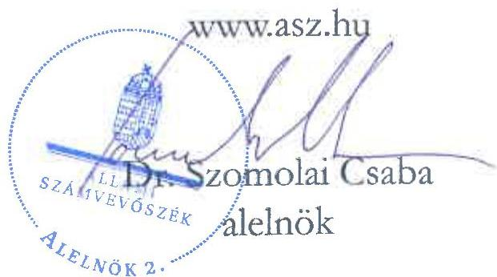

ÁLLAMI SZÁMVEVŐSZÉK

# JELENTÉS

A fenntartási kötelezettség kedvezményezettek
általi teljesítésének rapid ellenőrzése

A ZKI Zöldségtermesztési Kutató Intézet Zrt.
fenntartási kötelezettsége teljesítésének ellenőrzése
a GINOP-2.1.2-8-1-4-16-2017-00084 számú projektnél

2025.

25120

www.asz.hu

---

ÁLLAMI SZÁMVEVŐSZÉK

# JELENTÉS

## A fenntartási kötelezettség kedvezményezettek általi teljesítésének rapid ellenőrzése

A ZKI Zöldségtermesztési Kutató Intézet Zrt. fenntartási kötelezettsége teljesítésének ellenőrzése a GINOP-2.1.2-8-1-4-16-2017-00084 számú projektnél

2025.

25120

---

Jelentéseink az interneten a www.asz.hu címen olvashatók.

ELLENŐRZÉSI IGAZGATÓSÁG:
ELLENŐRZÉSI IGAZGATÓSÁG I.

ELLENŐRZÉSI IGAZGATÓ:
SINKÁNÉ DR. CSENDES ÁGNES igazgató

ELLENŐRZÉSVEZETŐ:
HUSZÁR ANNA ellenőrzésvezető

IKTATÓSZÁM: EL-4101-184/2025

TÉMASORSZÁM: -

ELLENŐRZÉS-AZONOSÍTÓ SZÁM: V1101

---

TARTALOMJEGYZÉK

- ÖSSZEFOGLALÁS ... 5
- AZ ELLENŐRZÉS EREDMÉNYEI ... 6
1. A fenntartási kötelezettség teljesítése ... 6
- I. FÜGGELÉK: ÉSZREVÉTELEK ... 10
- II. FÜGGELÉK: ELLENŐRZÉSI MEGKÖZELÍTÉS ... 11
- MELLÉKLETEK ... 16
I. sz. melléklet: Értelmező szótár ... 16
II. sz. melléklet: Az ellenőrzött és a közreműködő szervezetek jegyzéke ... 18
- RÖVIDÍTÉSEK JEGYZÉKE ... 19

---

.

---

ÖSSZEFOGLALÁS

A 2016 decemberében megjelent „Vállalatok K+F+I tevékenységének támogatása kombinált hiteltermék keretében” című (GINOP-2.1.2-8-1-4-16 kódszámú) pályázati felhívásban meghirdetett támogatással lehetőség nyílt mikro-, kis-, és középvállalkozások, valamint nagyvállalatok számára K+F+I¹ tevékenység keretében jelentős szellemi hozzáadott értéket tartalmazó, új, piacképes termékek, szolgáltatások, technológiák, illetve ezek prototípusainak a kifejlesztésére. A megvalósítandó projekt vissza nem térítendő támogatásból, kölcsönből és önerő részből tevődött össze, amelyek együttesen határozták meg a projekt összes elszámolható költségét. A rendelkezésre álló keretösszeg eredetileg 120 Mrd Ft volt, végül a konstrukcióban 42,7 Mrd Ft értékben kötött az IH² támogatási szerződéseket. Az igényelhető támogatás összege 50 M Ft és 500 M Ft közötti volt, a kedvezményes kamatozású éven túli kölcsön összegének el kellett érnie a támogatás legalább 50%-át.

A Felhívás³ alapján a közel 104,1 M Ft támogatást nyert GINOP-2.1.2-8-1-4-16-2017-00084 számú, „Korszerű és piacképes új magyar zöldségfajták nemesítése” című projekt Kedvezményezettje⁴, a ZKI Zrt. hat új zöldségfajtát nemesített, amelyek tekintetében megtörtént a fajtabejelentés és a fajtaminősítés is.

A Kedvezményezett – a támogatás visszafizetésének terhe mellett – vállalta, hogy a projektmegvalósítást követően a Projekt⁵ megfelel az 1303/2013/EU Rendeletben⁶ a műveletek tartósságára vonatkozóan előírtaknak, az előírt fenntartási kötelezettséget teljesíti. A Projekt megvalósítása 2020. május 11-én fejeződött be, a fenntartási időszak az ezt követő nappal kezdődött és 2025. december 31-ig tart.

A támogatás összértéke, a Projekt egyedisége és a megvalósított projekteredmény hosszabb távon történő megtartása miatt az ÁSZ⁷ indokoltnak tartotta a Projekt fenntartásának és a támogatás hasznosulásának ellenőrzését. A Kedvezményezett projektfenntartási kötelezettségei teljesítésének ellenőrzésére az ÁSZ „A 2014-2020 programozási időszak kohéziós politikai operatív programok vonatkozásában a fenntartási kötelezettség teljesítésének ellenőrzési gyakorlata” című ellenőrzéséhez, mint alapellenőrzéshez kapcsolódóan került sor.

A Kedvezményezettnek a Projekt tekintetében ötéves fenntartási kötelezettsége volt, amely keretében az ÁSZ helyszíni ellenőrzésének időszakában előírt három fenntartási jelentés benyújtási kötelezettségének a jogszabályi előírásoknak megfelelően és határidőben eleget tett.

A Kedvezményezett a számára kötelezően előírt „K+F ráfordítások szintjének megőrzése” indikátort megfelelően teljesítette, mert K+F⁸ ráfordításokra a 30%-os célértékhez képest a kapott támogatás 3,7-szeresét fordította a 2020-2021. években összesen. A Kedvezményezett által vállalt „Éves export árbevétel” indikátor az előírtaknak megfelelően teljesült, mivel a Kedvezményezett 2023-2024. évi export árbevételének átlaga az elvárt 5%-hoz képest, majdnem 120%-kal meghaladta a 2016. évi export árbevétel összegét. Az „Új termékek gyártása céljából támogatott vállalkozások száma” és az „Új termékek forgalomba hozatala céljából támogatott vállalkozások száma” indikátorokat – a számvevőszéki ellenőrzés ellenőrzött időszakát figyelembe véve – az előírásoknak megfelelően teljesítette a Kedvezményezett.

Az ÁSZ értékelése és a Kedvezményezett pénzügyi adatai alapján a Projekt keretében nyújtott támogatás – figyelemmel arra is, hogy a számvevőszéki jelentéstervezet elfogadásáig még nem telt el az ötéves fenntartási időszak – hasznosult. A Kedvezményezett székhelyén fellelhetőek voltak az előállított vetőmagok, és az azokból termesztett zöldségfajtákat részletesen bemutató prospektusok, szakmai kiadványok. A Kedvezményezett innovációja szakmai körökben elismert és társadalmi hasznossággal bír. A nemesített növényfajták közül kiemelkedően sikeres két paprikafajta lett, amelyek Magyar Innovációs Nagydíjat nyertek.

---

AZ ELLENŐRZÉS EREDMÉNYEI

A magyar vállalkozások a GINOP⁹ pályázati konstrukciók keretében jelentős mértékű támogatásban részesültek, amelynek célja volt hozzájárulni a gazdasági fejlődéshez, a társadalmi felzárkózáshoz és az infrastruktúra fejlesztéséhez. Az ÁSZ – Magyarország versenyképességének növelése érdekében – fontosnak tartja a kihelyezett uniós támogatások nemzetgazdasági szinten történő hasznosulását és értékteremtését a vállalatok beruházásain és elért teljesítményén keresztül. Az ÁSZ a támogatással kapcsolatos fenntartási kötelezettség teljesítését, valamint annak hasznosulását a GINOP-2.1.2-8-1-4-16-2017-00084 számú projekt tekintetében értékelte. A Projekt keretében a kedvezményezett ZKI Zrt. hat új zöldségfajtát nemesített, amelyek tekintetében megtörtént a fajtabejelentés és a fajtaminősítés is.

## 1. A fenntartási kötelezettség teljesítése

### Összegző megállapítás

Az ÁSZ értékelése szerint a Kedvezményezett fenntartási kötelezettségét – az ÁSZ helyszíni ellenőrzésének lezárásáig – teljesítette, a támogatás hasznosult.

### A fenntartási jelentés benyújtási kötelezettség teljesítése

A Kedvezményezettnek a Projekt megvalósítását követően, a Támogatási rend.¹⁰-ben foglaltak alapján ötéves fenntartási kötelezettsége volt, amelyet a Felhívás és a támogatási szerződés is rögzített. Ennek keretében a projekteredményt a megvalósítási helyszínen a megvalósításától, azaz 2020. május 12-től számított öt évig fenn kellett tartania és üzemeltetnie, illetve ahhoz kapcsolódóan az indikátorok teljesüléséről a Támogatási rend.-ben foglaltak alapján évente projektfenntartási jelentésben kellett beszámolnia és a folyósított teljes kölcsönösszeget törlesztenie kellett.

A Kedvezményezett a Támogatási rend.-ben előírt éves projektfenntartási jelentés benyújtási kötelezettségét – az ÁSZ helyszíni ellenőrzésének lezárásig terjedő fenntartási időszak alatt – megfelelően, határidőben teljesítette. A PFJ¹¹-k és a ZPFJ¹² főbb adatait az 1. táblázat tartalmazza.

1. táblázat

|  A GINOP-2.1.2-8-1-4-16-2017-00084 SZÁMÚ PROJEKTHEZ KAPCSOLÓDÓ PFJ-K FŐBB ADATAI  |   |   |   |   |   |
| --- | --- | --- | --- | --- | --- |
|  JELENTÉS
SORSZÁMA | JELENTÉS
TÍPUSA | TÁRGYIDÓSZAK
KEZDETÉ | TÁRGYIDÓSZAK
VÉGE | BENYÚJTÁS
HATÁRIDEJE | JELENTÉS STÁTUSZA*  |
|  1. | PFJ | 2020.05.12. | 2021.12.31. | 2022.06.15. | 2022.05.30-án beérkezett,
elfogadva 2025.08.12-én  |
|  2. | PFJ | 2022.01.01. | 2022.12.31. | 2023.06.15. | 2023.06.09-én beérkezett,
elfogadva 2025.08.12-én  |
|  3. | PFJ | 2023.01.01. | 2023.12.31. | 2024.06.15. | 2024.06.05-én beérkezett,
elfogadva 2025.08.12-én  |
|  4. | PFJ | 2024.01.01. | 2024.12.31. | 2025.06.15. | 2025.06.11-én beérkezett,
elfogadva 2025.08.12-én  |
|  5. | ZPFJ | 2025.01.01. | 2025.12.31. | 2026.06.15. | –  |

Forrás: FAIR¹¹ adatok alapján ÁSZ saját szerkesztés

---

Az ellenőrzés eredményei

A Kedvezményezett a Támogatási rend.-ben rögzített határidőben és az abban foglaltaknak megfelelően az ellenőrzött időszakban teljesítendő három PFJ-t elektronikusan benyújtotta. Az IH az 1.-3. PFJ-t az ÁSZ helyszíni ellenőrzésének lezárásáig nem bírálta el, azzal kapcsolatban döntést nem hozott.

*A FAIR adatai szerint – az ÁSZ helyszíni ellenőrzésének lezárását követően – a Kedvezményezett 2025. június 11-én benyújtotta a 4. PFJ-t, az IH 2025. augusztus 12-ével elfogadta a Kedvezményezett 1. - 4. PFJ-jét.*

Az IH a Projekt fenntartási időszaka alatt helyszíni ellenőrzést nem végzett.

## A fenntartási kötelezettség, indikátorok teljesítése

A Kedvezményezett a Projekt keretében a vállalt indikátorokat – a benyújtott 1.-3. PFJ-k alapján – az alábbiak szerint teljesítette:

1. A Kedvezményezett a támogatási szerződés 4. sz. mellékletében vállalta, hogy a projektmegvalósítás befejezési évét közvetlenül követő két üzleti évben (2021-2022. évben) együttesen, a társasági adóbevallásban szereplő K+F ráfordítások összege eléri a kapott támogatás 30%-át, azaz a 31,2 M Ft-ot.

A „K+F ráfordítások szintjének megőrzése” indikátor az előírtaknak megfelelően teljesült, mert a Kedvezményezett a 2021. évben 233,5 M Ft-ot, 2022. évben 152,1 M Ft-ot (összességében 385,6 M Ft-ot) fordított K+F ráfordításokra, vagyis a kapott támogatás 3,7-szeresét, így a 30%-os célértéket jelentősen meghaladta.

2. A Kedvezményezett a támogatási szerződés 5. sz. mellékletében vállalta továbbá, hogy a fenntartási időszakban két egymást követő teljes üzleti év export árbevételének átlaga több mint 5%-kal, de minimum a támogatás 15%-ával meghaladja a támogatási kérelem benyújtása előtti utolsó lezárt teljes üzleti év (2016. év) export árbevételét.

Az ÁSZ ellenőrzése megállapította, hogy az „Éves export árbevétel” indikátor az előírtaknak megfelelően teljesült, mivel a Kedvezményezett 2023. évben 1 867,5 M Ft, 2024-ben 2 125,3 M Ft nettó árbevételt ért el exportértékesítésből, így a fenntartási időszakban a 2023-2024. évek export árbevételének átlaga (1 996,4 M Ft) az elvárt 5%-hoz képest, közel 120%-kal meghaladta a 2016. évi 852,5 M Ft-os export árbevétel összegét.

3. A Kedvezményezett az „Új termékek gyártása céljából támogatott vállalkozások száma” és az „Új termékek forgalomba hozatala céljából támogatott vállalkozások száma” indikátorokat a fenntartási időszakban – az ellenőrzött időszakot figyelembe véve – az előírásoknak megfelelően teljesítette, mindkét mutató esetében teljesült az 1-1db célérték.

Az IH a fenntartási időszakban a Támogatási rend. 159. § (1) bekezdésében foglaltak alapján szabálytalansági gyanút jelentett be 2021. szeptember 24-én, azzal, hogy a Kedvezményezett „közszféra szervezet”-ként nem közszféra szervezettel kötött szerződést a Projekt megvalósítása során projektmenedzsment szolgáltatásra. A Kedvezményezett a szabálytalansági eljárás során igazolta, hogy nem tartozik a Támogatási rend. 3. § (1) bekezdés 23. pont szerinti „közszféra szervezet” kategóriába, ezért nem vonatkozik rá a Támogatási rend. 5. melléklet 3.8.2.1. pontja szerinti projektmenedzsment kiadással kapcsolatos elszámolhatósági korlátozás. Ennek következtében a lefolytatott eljárás nem állapított meg szabálytalanságot, az IH az eljárást 2021. november 8-án lezárta.

A Projekt az öt év fenntartási időszakból az eltelt három projektfenntartási év tekintetében a vállalt kötelezettségek teljesítésével megfelelt a műveletek tartósságával kapcsolatban az 1303/2013/EU rendeletben és a Támogatási rend.-ben előírtaknak.

---

Az ellenőrzés eredményei

A Kedvezményezett – ÁSZ helyszíni interjú keretében adott – nyilatkozata alapján a fenntartási kötelezettség teljesítése és a PFJ-k benyújtásakor az adatszolgáltatás nem jelentett nehézséget. Hiányosságként fogalmazta meg ugyanakkor, hogy a PFJ beküldéséről nem kapott olyan visszaigazolást, amelyben láthatóak lettek volna a lejelentett adatok, valamint a PFJ benyújtását követően nem lehetett az EPTK¹⁴ rendszerből a jelentést kinyomtatni. A pályázat során kötelezően felvett, hosszú futamidejű, kedvezményes kamatozású MFB kölcsön – álláspontja szerint – nem jelentett segítséget számára, mert árbevétel arányosan nem volt kiemelkedő összeg. A kölcsön miatt biztosítékként letett óvadék sem volt megterhelő a Kedvezményezett számára.

## A támogatás hasznosulása

A Kedvezményezett a Projekt keretében hat új zöldségfajta nemesítését valósította meg, továbbá sor került fajtabejelentésre és fajtaminősítésre is. A Kedvezményezett székhelyén fellelhetőek voltak az előállított vetőmagok, a vetőmag előállításához használt eszközök. A termesztett zöldségfajtákat hazai, nemzetközi szakkiallításokon prospektusokban, szakmai kiadványokban részletesen ismertették. A Kedvezményezett pénzügyi-gazdasági helyzete az éves beszámolók adatai alapján stabil volt, a megvalósított Projekt jövedelmező volt. A Kedvezményezett pénzügyi adatai és az ÁSZ értékelése szerint a támogatás hasznosult.

A Kedvezményezett létszám, árbevétel, adózott eredmény és mérlegfőösszeg adatait 2020-2024. évekre vonatkozóan a 2. táblázat mutatja be.

2. táblázat
A KEDVEZMÉNYEZETT 2020-2024. ÉVI LÉTSZÁM, ÁRBEVÉTEL, ADÓZOTT EREDMÉNY ÉS MÉRLEGFŐÖSSZEG ADATAI

|  ADATOK MEGNEVEZÉSE | 2020. ÉVBEN | 2021. ÉVBEN | 2022. ÉVBEN | 2023. ÉVBEN | 2024. ÉVBEN  |
| --- | --- | --- | --- | --- | --- |
|  Átlagos statisztikai létszám (fő) | 87 | 76 | 87 | 82 | 85  |
|  Értékesítés nettó árbevétele (M Ft) | 1 819,3 | 2 070,1 | 2 170,6 | 2 838,9 | 2 930,6  |
|  Adózott eredmény (M Ft) | 162,4 | 345,0 | 343,1 | 194,0 | 203,0  |
|  Mérlegfőösszeg (M Ft) | 2 401,0 | 2 621,1 | 3 340,7 | 3 920,4 | 3 981,2  |

Forrás: A Kedvezményezett éves beszámoló adatai alapján ÁSZ saját szerkesztés

A Kedvezményezett által szolgáltatott adatok alapján a 2020-2023-as időszakban a Projektből származó bevételnek a cég teljes bevételéhez viszonyított aránya 4,1% volt. A Projektből származó bevételk trendje azonban nem volt folyamatosan növekvő. A 2021-2022. években kiugró emelkedés volt tapasztalható az előző évhez képest, 2023-ban azonban jelentős, 44,1%-os visszaesés következett be 2022. évhez képest, a 2024. évben 19,7%-os bővülést értek el.

A Kedvezményezett nyilatkozata alapján a növényfajták közül a két paprikafajta nemesítése volt kiemelkedően sikeres. A hat nemesített fajta vetőmagjaiból származó árbevétel 81,7%-a, a nyereség 85%-a származott a két paprikafajtából a 2020-2024. években. A további négy növényfajta (a két uborkafajta, a zöldborsó és a görögdinnye) alacsonyabb árbevételt és nyereséget termelt. A Projekt keretében nemesített zöldségfajtákat a 3. táblázat mutatja be.

---

Az ellenőrzés eredményei

3. táblázat
A KEDVEZMÉNYEZETT ÁLTAL A GINOP-2.1.2-8-1-4-16-2017-00084 SZÁMÚ PROJEKT KERETÉBEN NEMESÍTETT ZÖLDSÉGFAJTÁK

|  FAJTANÉV | FAJ  |
| --- | --- |
|  BRUTUS | uborka  |
|  ZKI 15-26 | uborka  |
|  WARTA | zöldborsó  |
|  CHARISMA | görögdinnye  |
|  FONÓ | fűszerpaprika  |
|  TEMES | étkezési paprika  |

Forrás: A Kedvezményezett által szolgáltatott adatok alapján ÁSZ saját szerkesztés

A Kedvezményezett helyszíni interjún adott nyilatkozata alapján a Projekt keretében nemesített hat új zöldségfajta vetőmagjainak értékesítése az eltelt fenntartási időszakban folyamatos volt, nem tervezte azokat a későbbiekben kivonni a forgalomból. Értékelése szerint az iparágban tapasztalható éles piaci verseny miatt folyamatosan innovációra van szükség ezen a területen, mivel egy új növényfajta 7-8 év alatt elveszítheti az innovációs előnyét.

Az előbbieken túl a Projekt pozitív tudományos és társadalmi hasznosulása is mérhető. Az „Édes fűszerpaprika hibrid CMV baktériumellenállóság” (ún. „Fonó”) fajtára a Magyar Innovációs Szövetség elismerő oklevelet adott át 2021-ben a Kedvezményezettnek a 29. Magyar Innovációs Nagydíj Pályázat keretében. A GINOP-projekt során nemesített másik paprikafajta („Paradicsomalakú CMV és baktériumellenálló paprika hibrid”, ún. „Temes”) 2019-ben kapott ugyanilyen elismerést. A Kedvezményezett tájékoztatása alapján az elismerések által mindkét növényfajta bekerült az adott évben a legjobb száz díjazott közé.

A vírusokkal, betegségekkel szembeni ellenállóképességük miatt – a Kedvezményezett tájékoztatása szerint – kevesebb növényvédőszert igényel a termesztésük, így a fogyasztásuk egészségre gyakorolt hatása kedvezőbb. Az előbbiek mellett jobb termésátlagot lehet elérni termesztésükkel. Ugyanezen pozitív tulajdonságok jellemzik a Projekt keretében nemesített két uborkát is.

---

10

# I. FÜGGELÉK: ÉSZREVÉTELEK

A jelentéstervezetet az ÁSZ 15 napos észrevételezésre megküldte az ellenőrzött szervezet vezetőjének az ÁSZ tv. 29. §* (1) bekezdése előírásának megfelelően.

A jelentéstervezet megállapításaira az ellenőrzött szervezet nem tett észrevételt.

* 29. § (1) Az Állami Számvevőszék az ellenőrzési megállapításait megküldi az ellenőrzött szervezet vezetőjének vagy az általa megbízott személynek, és annak, akinek személyes felelősségét állapította meg.
(2) Az ellenőrzött szervezet vezetője és a felelősként megjelölt személy az ellenőrzés megállapításaira tizenöt napon belül írásban észrevételt tehet.
(3) Az Állami Számvevőszék az észrevételre a beérkezésétől számított harminc napon belül írásban válaszol. A figyelembe nem vett észrevételeket köteles a jelentésben feltüntetni, és megindokolni, hogy azokat miért nem fogadta el.

---

11

# II. FÜGGELÉK: ELLENŐRZÉSI MEGKÖZELÍTÉS

## AZ ELLENŐRZÉS JOGALAPJA

Az ellenőrzés jogszabályi alapját az ÁSZ tv.¹⁵ 5. § (3) bekezdés képezte.

## AZ ELLENŐRZÉS CÉLJA

A fenntartási kötelezettség teljesítésének és a támogatás hasznosulásának értékelése a fenntartási szakaszba került uniós projekt kedvezményezettjénél.

## AZ ELLENŐRZÉS TÍPUSA

Kombinált ellenőrzés

## AZ ELLENŐRZÉS TÁRGYA

Az ellenőrzés tárgya volt az ellenőrzésre kiválasztott GINOP-2.1.2-8-1-4-16-2017-00084 számú uniós projekt fenntartási időszakára vonatkozóan előírt kötelezettségek ZKI Zrt. mint kedvezményezett által történt teljesítése és a támogatás hasznosulása. A fenntartási kötelezettség ellenőrzése a kedvezményezett tevékenységéhez és működéséhez kapcsolódó kötelezettségek, a meghatározott indikátorok és a beszámolási kötelezettség teljesítésére irányult.

Az ellenőrzés tárgya volt továbbá a kedvezményezett által benyújtott fenntartási jelentésekben rögzítettek valóságtartalma és megalapozottsága, valamint ezek összhangja az ÁSZ helyszíni ellenőrzése során tapasztaltakkal.

Az ellenőrzés kiterjedt minden olyan körülményre és adatra, amely az ÁSZ jogszabályban meghatározott feladatainak teljesítéséhez, valamint a program végrehajtása folyamán felmerült újabb összefüggések feltárásához szükséges.

## AZ ELLENŐRZÉS HATÓKÖRE ÉS TERÜLETE

Az uniós jogszabályok az uniós támogatással megvalósuló projektekkel szemben elvárásként rögzítik a „műveletek tartósságának” követelményét. A kedvezményezettek infrastrukturális vagy termelő beruházás esetén – a projektmegvalósítás befejezésétől számított 5 évig, kis- és közepes vállalkozások esetén 3 évig, a támogatás visszafizetésének terhe mellett – vállalták, hogy a projekt termelő tevékenysége nem szűnik meg, hogy nem következik be olyan tulajdonosváltás, amelynek eredményeként jogosulatlan előny szerezhető, illetve, hogy nem következik be olyan lényeges változás, amely a projekt eredeti célkitűzéseit veszélyezteti. Abban az esetben, ha a felsoroltak valamelyike bekövetkezik, a támogatást – figyelemmel a vonatkozó jogszabályokra – vissza kell fizetni az Európai Bizottságnak.

---

II. Függelék: Ellenőrzési megközelítés

Ha az IH a projektre nézve fenntartási kötelezettséget állapított meg, és indikátorokat határozott meg a támogatási szerződésben, a kedvezményezettnek évente be kellett számolnia az indikátorok teljesüléséről. Ha ezen időszakra indikátorokat nem határozott meg az IH és a támogatási szerződésben sem írta elő az évenkénti teljesítést, a kedvezményezettnek egy alkalommal záró projektfenntartási jelentést kell(ett) benyújtania.

Az ellenőrzés a XIX. Uniói fejlesztések fejezet 3/1 Kohéziós politikai operatív programok 2014-2020 operatív programjai közül a – kis- és középvállalkozások versenyképességének javítására irányuló – GINOP 1. prioritásából és a – kutatás, technológiai fejlesztés és innováció című – GINOP 2. prioritásából támogatást kapott projektek kedvezményezettjeire terjedt ki oly módon, hogy az ÁSZ – „A 2014-2020 programozási időszak kohéziós politikai operatív programok vonatkozásában a fenntartási kötelezettség teljesítésének ellenőrzési gyakorlata” című ellenőrzéséhez, mint alapellenőrzéshez kapcsolódóan – a GINOP 1-2. prioritás pályázati kiírásainak nyertes pályázóból, kockázat alapú mintavételi eljárással, rapid ellenőrzésre választott ki összesen 16 projektet, amelyből ezen jelentésben a GINOP-2.1.2-8-1-4-16-2017-00084 számú projekt tekintetében értékelte a fenntartási kötelezettség teljesítését.

A GINOP-2.1.2-8-1-4-16-2017-00084 számú projekt tekintetében az ellenőrzés kiterjedt a célrendszer, a jogszabályban – a működés és tevékenység tekintetében – előírt fenntartási kötelezettség teljesülésére, a fenntartási jelentésben bemutatott eredmények valóságtartalmára, megalapozottságára, valamint a támogatási szerződésben vállalt, a fenntartási időszakra vonatkozó kötelezettségek teljesítésének, és a GINOP keretében nyújtott támogatás hasznosulásának értékelésére.

## A GINOP-2.1.2-8-1-4-16 számú felhívás bemutatása

A GINOP-2.1.2-8-1-4-16 kódszámú a „Vállalatok K+F+I tevékenységének támogatása kombinált hiteltermék keretében” című pályázati felhívást kutatás-fejlesztési, valamint innovációs tevékenységet önállóan vagy együttműködésben végző vállalkozások számára a K+F+I együttműködések elterjesztése, és a KKV¹⁶ szektor kiaknázatlan K+F+I lehetőségeinek ösztönzése érdekében hirdették meg 2016 decemberében. A támogatási kérelmek benyújtására 2017. március 1. - 2019. március 1. közötti időszakban volt lehetőség.

A támogatás célja a hazai vállalkozások olyan K+F+I tevékenységeinek a támogatása volt, amelyek jelentős szellemi hozzáadott értéket tartalmazó, új, piacképes termékek, szolgáltatások, technológiák, illetve ezek prototípusainak a kifejlesztését eredményezik. A támogatandó projekteknek illeszkedniük kellett a Nemzeti Intelligens Szakosodási Stratégia céljaihoz. A megvalósítandó projekt vissza nem térítendő támogatásból, kölcsönből és önerő részből tevődött össze, amelyek együttesen határozták meg a projekt összes elszámolható költségét. A vissza nem térítendő támogatás és a kölcsön költségtételenkénti egyidejű igénybevétele kötelező volt.

A támogatás forrását az Európai Regionális Fejlesztési Alap és Magyarország költségvetése társfinanszírozásban biztosította. A Felhívásra eredetileg összesen 120 Mrd Ft állt rendelkezésre, amelyből a vissza nem térítendő támogatás keretösszege 80 Mrd Ft, a kölcsön (visszatérítendő támogatás) keretösszege 40 Mrd Ft volt. Projektenként a kapható vissza nem térítendő támogatás minimum 50 M Ft, maximum 500 M Ft nagyságú, míg a kedvezményes kamatozású éven túli kölcsön összege 25 M Ft és 250 M Ft közötti volt. A Felhívásban a támogatási kérelmek várható számát 160-1600 darabra tervezték.

Régiótól és vállalatmérettől függően a projekt elszámolható költségéhez képest a vissza nem térítendő támogatás maximális mértéke 30%-55% lehetett, a kölcsön maximális aránya 35%-60% volt. Az előleg maximális mértéke az utófinanszírozású tevékenységekre a megítélt támogatás összegének 75%-a lehetett. A támogatási kérelmet benyújtó vállalkozások vállalták, hogy minimum 10% önerővel valósítják meg projektjüket, miközben a kölcsön mértékének el kellett érnie a támogatás legalább 50%-át és a projekt teljes elszámolható összköltsége nem haladhatta meg a vállalkozás legutolsó lezárt üzleti év nettó árbevételét.

12

---

II. Függelék: Ellenőrzési megközelítés

A projekt keretében támogatható fő tevékenység volt önállóan a kísérleti fejlesztés, nem önállóan az eszközbeszerzés, a projekt céljához feltétlenül szükséges épület építése, bővítése, átalakítása, korszerűsítése, a szükséges alapinfrastrukturális fejlesztések. A projekt megvalósítása során a kedvezményezetteknek egy mérföldkővet kellett tervezni, a projekt fizikai befejezésére legfeljebb 24 hónap állt rendelkezésre.

A támogatásra azok a magyarországi székhellyel, vagy fiókteleppel rendelkező kettős könyvvitelt vezető mikro-, kis-, és középvállalkozások, valamint nagyvállalatok pályázhattak, amelyek rendelkeztek legalább két lezárt üzleti évvel és amelyek átlagos állományi létszáma a legutolsó lezárt üzleti évben minimum 3 fő volt. (A minimum átlagos állományi létszámot a későbbiekben lecsökkentették 1 főre.)

A 2016 végén megjelent Felhívás a támogatás tekintetében azon kedvezményezetteket mentesítette a biztosítéknyújtási kötelezettség alól, akik rendelkeztek legalább egy lezárt, teljes üzleti évvel, és a támogatási kérelem benyújtásakor szerepeltek a köztartozásmentes adózói adatbázisban. A Felhívás későbbi módosítása révén csak az MFB Zrt.¹⁷ által nyújtott kölcsönre kellett a kedvezményezettnek biztosítékot nyújtani. A biztosíték formája lehetett ingatlan vagy ingó jelzálog, hitelintézet által vállalt garancia, óvadék, készfizető kezesség.

A kedvezményezetteknek kötelezően vállalniuk kellett, hogy a projektmegvalósulás befejezési évét közvetlenül követő két üzleti évben együttesen, a társasági adóbevallásban szereplő K+F ráfordításuk összege eléri a kapott vissza nem térítendő támogatás 30%-át. A „K+F ráfordítások szintjének megőrzése” mutató forrása a TAO bevallás¹⁸ volt. A projekt indikátora volt továbbá az „Új termékek gyártása céljából támogatott vállalkozások száma”, és az „Új termékek forgalomba hozatala céljából támogatott vállalkozások száma”, amelyekkel kapcsolatban a kedvezményezettnek adatszolgáltatási és célérték-teljesítési kötelezettsége keletkezett.

A fenntartási időszak kis- és középvállalkozások esetében 3 év, nagyvállalatok esetében 5 év volt a projektmegvalósítás befejezésétől számítva. A támogatást igénylőnek a fenntartási időszak végéig a projektet fenn kellett tartania és működtetnie, valamint a folyósított teljes kölcsönösszeget a kölcsönszerződésben foglalt feltételeknek megfelelően törleszteni. A fenntartás időszakában a kedvezményezettnek a projekt megvalósulásáról adatot kell szolgáltatnia.

A Felhívásra beérkező támogatási kérelmek standard kiválasztási eljárásrend alapján, szakaszos elbírálással kerültek elbírálásra. A Felhívás a 2016. december 7-i megjelenést követően 23-szor módosult, amelyek leggyakrabban a támogatási keretösszeget és az elszámolhatósági feltételeket érintették.

A Felhívásra 961 támogatási kérelem érkezett be, összesen 151 Mrd Ft nagyságú támogatási összegre. Az IH adatszolgáltatása alapján a benyújtott támogatási kérelmek közül 308 kérelmet fogadtak el, összesen 42,7 Mrd Ft támogatási összegben.

# A ZKI Zrt. és a GINOP-2.1.2-8-1-4-16-2017-00084 számú projekt bemutatása

A kedvezményezett ZKI Zrt.-t 1997. decemberében alapították, története a jogelőszerveteken keresztül 1943-ig nyúlik vissza. Kecskeméti székhelye az alapítás óta ugyanaz. Főtevékenysége a támogatási kérelem 2017. májusi benyújtásakor 2024. júliusáig „Egyéb természettudományi, műszaki kutatás, fejlesztés” volt, ezt követően módosult „Gabona, dohány, vetőmag, takarmány nagykereskedelme” tevékenységre, amely 2025. január elejétől „Gabona, feldolgozatlan dohány, vetőmag, takarmány nagykereskedelme”-re változott.

Az ellenőrzött időszakban a Kedvezményezett nagyvállalkozásnak minősült, 2024. évben az éves beszámolója alapján átlagos statisztikai állományi létszáma 85 fő, a nettó árbevétele 2 930,6 M Ft volt, nem állt végrehajtási, felszámolási, végelszámolási, kényszertörlési és csődeljárás alatt.

---

II. Függelék: Ellenőrzési megközelítés

Kedvezményezett a támogatási kérelmet 2017. május 31-én nyújtott be, a támogatási szerződés 2018. szeptember 24-én lépett hatályba. A Kedvezményezett a „Korszerű és piacképes új magyar zöldségfajták nemesítése” című, GINOP-2.1.2-8-1-4-16-2017-00084 számú projekt keretében hat korszerű és piacképes, új magyar zöldségfajta nemesítését vállalta. A projektmegvalósítás – amelynek elsődleges helyszíne a Kedvezményezett székhelye, másodlagos helyszíne a fióktelepe (3024 Lörinci-Selyp, Újmajor) volt – az új fajták hivatalos bejelentésével ért véget. A támogatási szerződést öt alkalommal módosították, jellemzően a Kedvezményezett adataiban bekövetkezett változás miatt, illetve költségátcsoportosítást végeztek.

A vállalt hat új zöldségfajta a következő volt: (1) Korai kerek szegmensű görögdinnye hibrid; (2) Paradicsomalakú CMV és baktérium ellenálló paprika hibrid; (3) Édes fűszerpaprika hibrid CMV és baktérium ellenállósággal; (4) Szemölcsös partenokarp fóliás uborka; (5) Semi-multi Beit-alpha uborka; (6) Középkésői érésű, lisztharmat ellenálló apró szemméretű zöldborsó.

A Projekt megítelt összköltsége 297,5 M Ft volt, 35% támogatási intenzitás mellett a támogatástartalom 104,1 M Ft-ot tett ki, a támogatáshoz kötelezően igénybe veendő kölcsön összege 52,1 M Ft volt. A Projekt megvalósítása 2017. június elsején kezdődött, fizikai befejezésének határidejeként és a tervezett egy mérföldkő dátumaként 2019. május 31-et rögzítettek a támogatási szerződésben, amikorra a hat zöldségfajta nemesítését vállalta a Kedvezményezett.

Kedvezményezett a kötelező „K+F ráfordítások szintjének megőrzése” és az „Új termékek gyártása/forgalomba hozatala céljából támogatott vállalkozások száma” három monitoringmutató teljesítésén túl az exportárbevétel tekintetében is vállalt célértéket.

A Projekt eredeti célkitűzése teljesült: a hat új zöldségfajta nemesítését elvégezték, a fajtabejelentésre és a fajtaminősítésre is sor került. A Projekt megvalósításával összefüggésben anyagköltséget, szakmai megvalósításhoz kapcsolódó szolgáltatást számoltak el, valamint immateriális javakat szereztek be. Eszközbeszerzésre nem került sor, a szükséges eszközökkel rendelkeztek. A záró szakmai beszámolót Kedvezményezett 2019. augusztus 27-én, határidőben nyújtotta be. Az IH által magas kockázati besorolásúnak értékelt Kedvezményezettnél a pénzügyi záráshoz kapcsolódóan az IH a székhelyen rendkívüli helyszíni ellenőrzést folytatott le 2020. március 5-én, amelyet kiegészítő helyszíni ellenőrzés követett a Projekt telephelyen történt megvalósításának fizikai ellenőrzése érdekében. Az IH a Projekt megvalósítását rendben találta, a záró szakmai beszámolót 2020. március 26-án jóváhagyta.

Az ötéves fenntartási időszak 2020. május 12-én kezdődött, a 2025. év tekintetében a záró projektfenntartási jelentés benyújtási határideje 2026. június 15-e.

## AZ ELLENŐRZŐTT IDŐSZAK

2016. január 1-től 2025. április 30-ig, a helyszíni ellenőrzés lezárásának időpontjáig tartó időszak.

---

II. Függelék: Ellenőrzési megközelítés

## AZ ELLENŐRZÉSI KRITÉRIUMOK

|  FÓKUSZTERÜLET | ELLENŐRZÉSI KRITÉRIUMOK  |
| --- | --- |
|  1. A fenntartási kötelezettség teljesítése  |   |
|  A fenntartási jelentés benyújtási kötelezettség teljesítése | Támogatási rend. 178. § (1) bekezdés, 180. § (1) bekezdés, 1. melléklet 281.1., 288., 293.1.-2. pontjai; Felhívás 3.8. pontja;  |
|  A fenntartási kötelezettség, indikátorok teljesítése | 1303/2013/EU rendelet 71. cikk (1) bekezdés; Támogatási rend. 3. § (1) bekezdés 23. pontja, 159. § (1) bekezdés, 178. § (1) bekezdés, 5. melléklet 3.8.2.1. pontja; támogatási szerződés 4-5. sz. mellékletei  |
|  A támogatás hasznosulása | Az ÁSZ meghatározása alapján: - A támogatás hasznosult, ha a vállalkozás (a projekt) működött az ÁSZ helyszíni ellenőrzése időpontjában, fenntartási kötelezettségét a kedvezményezett teljesítette / jellemzően teljesítette, és a támogatás eredményeként a kedvezményezett vállalkozás árbevétel vagy adózott eredmény adatai növekedtek a támogatás előtti időszakhoz képest. - A támogatás korlátozottan hasznosult, ha a projekteredmény „fellelhető volt” az ÁSZ helyszíni ellenőrzése időpontjában, fenntartási kötelezettségét részben / minimálisan teljesítette a kedvezményezett, vagy a támogatás eredményeként hozzáadott új értéket teremtett, az társadalmilag hasznosult stb. - A támogatás nem hasznosult, ha fenntartási kötelezettségét a kedvezményezett egyáltalán nem teljesítette és/vagy a vállalkozás (a projekt) már nem működött az ÁSZ helyszíni ellenőrzése időpontjában.  |

## AZ ELLENŐRZÉS MÓDSZERE ÉS AZ ELLENŐRZÉSI BIZONYÍTÉKOK KÖRE

Az ÁSZ az ellenőrzést a nemzetközi standardokat irányadónak tekintve az ellenőrzési program szempontjai, az ellenőrzött időszakban hatályos jogszabályok, az ellenőrzés-szakmai szabályok és módszertanok figyelembevételével végezte.

Az ellenőrzési kérdések megválaszolásához szükséges bizonyítékok megszerzése az ellenőrzött szervezet és az ellenőrzésben közreműködő szervezet által rendelkezésre bocsátott dokumentumokra és adatokra alapozva, továbbá megfigyelés, szemle (szemrevételezés), kérdésfeltevés (információkérés), interjú, mintavételezés, valamint elemző eljárás útján történt.

Az ellenőrzés bizonyítékként felhasználható adatforrásai közé tartoztak egyrészt az ellenőrzéshez kért dokumentumok, adatforrások, a nyilvánosan hozzáférhető adatok, dokumentumok, másrészt adatforrás volt még minden, az ellenőrzés folyamán feltárt, az ellenőrzés szempontjából információt tartalmazó dokumentum. Az ÁSZ a számvevőszéki jelentéstervezet elfogadásáig rendelkezésre álló, nyilvánosan elérhető adatokat figyelembe vette.

Az ellenőrzés végrehajtásához a projekt kiválasztása kockázat alapú mintavételi eljárással történt.

---

MELLÉKLETEK

## I. SZ. MELLÉKLET: ÉRTELMEZŐ SZÓTÁR

fenntartás

A kedvezményezett a projektmegvalósítás befejezésétől számított 5 évig, állami támogatás formájában nyújtott támogatás esetén az állami támogatásokra vonatkozó szabályok alapján alkalmazandó időtartamig, kis- és közepes vállalkozások esetén 3 évig a támogatás visszafizetésének terhe mellett vállalja, hogy a projekt megfelel az 1303/2013/EU európai parlamenti és tanácsi rendelet 71. cikk (1) bekezdésében foglaltaknak. (Forrás: Támogatási rend. 178. § (1) bekezdés, 2016. május 14-től 2024. július 31-ig hatályos)

Az irányító hatóság döntése alapján a fenntartási időszak kezdődhet a projektmegvalósítás befejezésétől vagy a projekt fizikai befejezésétől (ÁSZF)¹⁹ 10.7. pontja alapján, hatályos 2016. június 14-től)

A fenntartási időszak meghatározása során az IH speciális projektév szerinti jelentéstételt alkalmazott, mivel a jelentések tárgyidőszaka speciális projektévhez (üzleti évről készített közzétett beszámolóhoz) igazodott és a fenntartási jelentésben benyújtandó vállalási adatok csak az így meghatározott időszak elteltével álltak rendelkezésre. (Forrás: Támogatási rend. 1. melléklet 285.1-286.4 pontja alapján ÁSZ megfogalmazás)

indikátor

Uniós jogszabályokban és a programban nevesített, valamint az európai uniós források felhasználásáért felelős miniszter – a Vidékfejlesztési Program esetén az agrárpolitikáért felelős miniszter – által meghatározott, eredményt vagy teljesülést mérő mutató. (Forrás: Támogatási rend. 3. § (1) bekezdés 12. pont, 2022. július 21-től 2024. július 31-ig hatályos)

kedvezményezett

A támogatásban részesített támogatást igénylő (Forrás: Támogatási rend. 3. § (1) bekezdés 14. pont, 2014. november 6-tól hatályos)

műveletek tartóssága

Az ESB-alapokból²⁰ valamely infrastrukturális vagy termelő beruházást magában foglaló műveletre fordított támogatás akkor fizetendő vissza, ha a kedvezményezettnek történő utolsó kifizetéstől számított 5 évben belül, illetve adott esetben, az állami támogatásokról szóló szabályozás szerinti időtartamon belül, a következők valamelyike történik:

a) a termelő tevékenység megszűnése vagy a programterületen kívülre való áthelyezése;

b) az infrastruktúra valamely elemében tulajdonosváltás következik be, amelynek eredményeként egy cég vagy állami szervezet jogosulatlan előnyhöz jut;

c) a természetében, célkitűzéseiben vagy végrehajtási feltételeiben olyan lényeges változás következik be, amely az eredeti célkitűzéseket veszélyezteti.

A műveletre jogosulatlanul kifizetett összegeket a tagállamnak vissza kell téríthetni, azon időszakkal arányosan, amelynek tekintetében nem teljesültek a követelmények. (Forrás: 1303/2013/EU rendelet 71. cikk (1) bekezdése)

projekt fizikai befejezése

Az az állapot, amikor a projekt keretében támogatott tevékenységeket a felhívásban és a támogatási szerződésben meghatározottak szerint elvégezték. (Forrás: Támogatási rend. 3. § (1) bekezdés 40. pont, 2015. június 13-tól hatályos)

16

---

Mellékletek

projekt lezárása

Egy projekt akkor tekinthető lezártnak, ha a kedvezményezett a támogatási szerződésben a projektmegvalósítás befejezését követő időszakra nézve további kötelezettséget nem vállalt, és a felhívásban meghatározott feltételek teljesültek. Ha a támogatási szerződés a támogatott tevékenység befejezését követő időszakra nézve további kötelezettséget előírt, a projekt akkor tekinthető lezártnak, ha valamennyi vállalt kötelezettség teljesült és a kedvezményezett a kötelezettségek megvalósulásának eredményeiről szóló záró projekt fenntartási jelentést benyújtotta, és azt az irányító hatóság, Vidékfejlesztési Program esetén a kifizető ügynökség jóváhagyta, valamint a záró jegyzőkönyv elkészült. (Forrás: Támogatási rend. 3. § (1) bekezdés 39. pont, 2016. május 14-től 2024. július 31-ig hatályos)

projektmegvalósítás befejezése

Az 1303/2013/EU rendelet 2. cikk 14. pontjára tekintettel egy projekt megvalósítása akkor tekinthető befejezettnek, ha a projekt fizikailag és pénzügyileg is befejezett, valamint a kedvezményezettnek valamennyi támogatott tevékenysége befejezését igazoló és alátámasztó kifizetési igénylését az irányító hatóság jóváhagyta és a támogatás folyósítása megtörtént. (Forrás: Támogatási rend. 3. § (1) bekezdés 41. pont, 2015. június 13-tól 2023. május 24-ig hatályos)

projekt pénzügyi befejezése

Ha a projekt fizikai befejezése megtörtént, valamint a projektmegvalósítás során keletkezett elszámoló bizonylatok – szállítói kifizetés esetén az előírt önrész szállítók részére történő – kiegyenlítése megtörtént. A projekt pénzügyi befejezésének dátuma a projekt megvalósítási ideje alatt felmerült, a kedvezményezett által megfelelően elszámolt költségek közül a legkésőbbi kiegyenlítés dátuma. (Forrás: Támogatási rend. 3. § (1) bekezdés 42. pontja alapján, 2014. november 6-tól hatályos)

standard kiválasztási eljárás

Standard kiválasztási eljárásrend esetén szakaszos elbírálást kell alkalmazni, amely során legkésőbb a felhívásban rögzített szakasz zárását vagy beadási határnapját követően kell a támogatási kérelmeket jogosultsági és tartalmi értékelésre bocsátani, és az egy szakaszban beérkezett kérelmek támogathatóságáról a felhívásban előírt tartalmi értékelési szempontoknak való megfelelés szerinti sorrendiségük alapján kell dönteni. (Támogatási rend. 61. § (4) bekezdés alapján, 2016. május 14-től hatályos)

17

---

Mellékletek

■ II. SZ. MELLÉKLET: AZ ELLENŐRZŐTT ÉS A KÖZREMŰKÖDŐ SZERVEZETEK JEGYZÉKE

|  ELLENŐRZŐTT SZERVEZET MEGNEVEZÉSE | ADÓSZÁM  |
| --- | --- |
|  ZKI Zöldségtermesztési Kutató Intézet Zrt. | 11575629-2-03  |
|  KÖZREMŰKÖDŐ SZERVEZET MEGNEVEZÉSE | ADÓSZÁM  |
| --- | --- |
|  Közigazgatási és Területfejlesztési Minisztérium | 15849272-2-41  |
|  Nemzeti Fejlesztési Központ | 15850258-1-42  |

---

RÖVIDÍTÉSEK JEGYZÉKE

1 K+F+I
2 IH

3 Felhívás

4 Kedvezményezett, ZKI Zrt.
5 Projekt
6 1303/2013/EU rendelet

7 ÁSZ
8 K+F
9 GINOP
10 Támogatási rend.
11 PFJ
12 ZPFJ
13 FAIR

14 EPTK
15 ÁSZ tv.
16 KKV
17 MFB Zrt.
18 TAO bevallás
19 ÁSZF
20 ESB-alapok

Kutatás+Fejlesztés+Innováció

Irányító Hatóság (A GINOP esetében 2014. november 6-tól 2018. június 15-ig a Nemzetgazdasági Minisztérium, majd 2022. május 24-ig a Pénzügyminisztérium. 2022. május 25-től a területfejlesztési miniszter tevékenységének segítésére kijelölt minisztériumként a Miniszterelnökség volt a felelős az IH feladatok tekintetében. 2024. január 1-vel az IH feladatok átkerültek a Közigazgatási és Területfejlesztési Minisztériumhoz. A feladatok 2024. augusztus 1-től az újonnan létrejött Nemzeti Fejlesztési Központba kerültek).

A GINOP-2.1.2-8-1-4-16 kódszámú, „Vállalatok K+F+I tevékenységének támogatása kombinált hiteltermék keretében” című pályázati felhívás

ZKI Zöldségtermesztési Kutató Intézet Zrt.

A GINOP-2.1.2-8-1-4-16-2017-00084 számú, „Korszerű és piacképes új magyar zöldségfajták nemesítése” című projekt

AZ EURÓPAI PARLAMENT ÉS A TANÁCS 1303/2013/EU RENDELETE (2013. december 17.) az Európai Regionális Fejlesztési Alapra, az Európai Szociális Alapra, a Kohéziós Alapra, az Európai Mezőgazdasági Vidékfejlesztési Alapra és az Európai Tengerügyi és Halászati Alapra vonatkozó közös rendelkezések megállapításáról, az Európai Regionális Fejlesztési Alapra, az Európai Szociális Alapra és a Kohéziós Alapra és az Európai Tengerügyi és Halászati Alapra vonatkozó általános rendelkezések megállapításáról és az 1083/2006/EK tanácsi rendelet hatályon kívül helyezéséről

Állami Számvevőszék

Kutatás+Fejlesztés

Gazdaságfejlesztési és Innovációs Operatív Program

272/2014. (XI. 5.) Korm. rendelet a 2014-2020 programozási időszakban az egyes európai uniós alapokból származó támogatások felhasználásának rendjéről

projektfenntartási jelentés

záró projektfenntartási jelentés

Fejlesztéspolitikai Adatbázis és Információs Rendszer, amely a fejlesztési források felhasználására – többek között a kohéziós politikai operatív programok – vonatkozó eljárások során keletkező adatok egységes nyilvántartó rendszere a 60/2014. (III.6.) Korm. rendelet alapján

Elektronikus Pályázó Tájékoztató és Kommunikációs rendszer

2011. évi LXVI. törvény az Állami Számvevőszékről

A mikro, kis- és középvállalkozások gyűjtőneve

Magyar Fejlesztési Bank Zrt.

Társasági adóbevallás

Általános Szerződési Feltételek az operatív programok keretében támogatásban részesített kedvezményezettekkel kötendő támogatási szerződésekhez

Az európai strukturális és beruházási alapok

19

---

ÁLLAMI SZÁMVEVŐSZÉK

1052 Budapest, Apáczai Csere János u. 10. | 1364 Budapest 4., Pf. 54

www.asz.hu | szamvevoszek@asz.hu

telefon: +36 1 484 9100