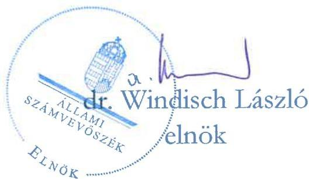
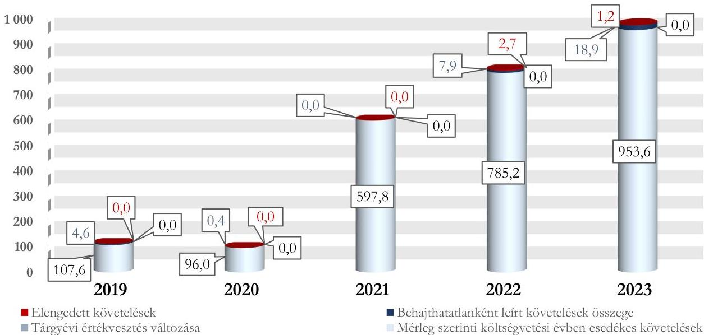

ÁLLAMI SZÁMVEVŐSZÉK

# JELENTÉS

# A központi költségvetési szervek követeléskezelése

A behajthatatlan és az elengedett követelések kezelése – Magyar Állami Operaház

2025.

25122

www.asz.hu

---

ÁLLAMI SZÁMVEVŐSZÉK

# JELENTÉS

## A központi költségvetési szervek követeléskezelése

A behajthatatlan és az elengedett követelések kezelése – Magyar Állami Operaház

2025.

25122

www.asz.hu

---

Jelentéseink az interneten a www.asz.hu címen olvashatók.

ELLENŐRZÉSI IGAZGATÓSÁG:
ELLENŐRZÉSI IGAZGATÓSÁG I.

ELLENŐRZÉSI IGAZGATÓ:
SINKÁNÉ DR. CSENDES ÁGNES igazgató

ELLENŐRZÉSVEZETŐ:
DR. SIMON JÓZSEF igazgatóhelyettes, ellenőrzésvezető
LACZI HEDVIG ANNA ellenőrzésvezető

IKTATÓSZÁM: EL-4396-001/2025
TÉMASORSZÁM: 20/2024
ELLENŐRZÉS-AZONOSÍTÓ SZÁM: V1073

---

TARTALOMJEGYZÉK

- ÖSSZEFOGLALÁS ... 5
- AZ ELLENŐRZÉS EREDMÉNYEI ... 8
1. A központi költségvetési szerv követelése, a követelésekkel kapcsolatos értékvesztések, a behajthatatlan és elengedett követelések alakulása és ezek eredményre, illetve vagyonra gyakorolt hatásai ... 8
2. A központi költségvetési szerv követeléskezelési tevékenységgel kapcsolatos folyamatainak és a követelések értékelési szabályainak kialakítása ... 11
3. A központi költségvetési szerv követeléskezelési tevékenységének működtetése - behajthatatlan és elengedett követelések kezelése ... 15
4. A központi költségvetési szerv követeléseinek év végi értékelése és az éves költségvetési beszámolóban történt kimutatása, leltárral történő alátámasztása ... 19
- JAVASLATOK ... 21
- I. FÜGGELÉK: ÉSZREVÉTELEK ... 22
- II. FÜGGELÉK: ELLENŐRZÉSI MEGKÖZELÍTÉS ... 23
- MELLÉKLETEK ... 28
I. sz. melléklet: Értelmező szótár ... 28
II. sz. melléklet: Az ellenőrzött szervezetek jegyzéke ... 30
- RÖVIDÍTÉSEK JEGYZÉKE ... 31

---

“哈，你是个小伙子，你是个小伙子，你是个小伙子，你是个小伙子，你是个小伙子，你是个小伙子，你是个小伙子，你是个小伙子，你是个小伙子，你是个小伙子，你是个小伙子，你是个小伙子，你是个小伙子，你是个小伙子，你是个小伙子，你是个小伙子，你是个小伙子，你是个小伙子，你是个小伙子，你是个小伙子，你是个小伙子，你是个小伙子，你是个小伙子，你是个小伙子，你是个小伙子，你是个小伙子，你是个小伙子，你是个小伙子，你是个小伙子，你是个小伙子，你是个小伙子，你是个小伙子，你是个小伙子，你是个小伙子，你是个小伙子，你是个小伙子，你是个小伙子，你是个小伙子，你是个小伙子，你是个小伙子，你是个小伙子，你是个小伙子，你是个小伙子，你是个小伙子，你是个小伙子，你是个小伙子，你是个小伙子，你是个小伙子，你是个小伙子，你是个小伙子，你是个小伙子，你是个小伙子，你是个小伙子，你是个小伙子，你是个小伙子，你是个小伙子，你是个小伙子，你是个小伙子，你是个小伙子，

---

ÖSSZEFOGLALÁS

A központi költségvetési szervek követelései a közvagyon részét képezik ugyanúgy, mint a pénzeszközök, a befektetett eszközök vagy a készletek. A követelések teljesülése befolyásolja az adott szervezet bevételének alakulását. Így a gazdálkodás egyik fontos elemét jelenti a követeléskezelési tevékenységek, eljárások szabályszerű, célszerű és eredményes működtetése a bevételek lehető legnagyobb mértékű pénzügyi realizálása érdekében. Mindezek hiánya esetén nem érvényesül a jó gazda gondossága a gazdálkodás e területén.

A Magyar Állami Operaház ellenőrzését az indokolta, hogy az ellenőrzött időszakban a központi költségvetési szervek között jelentős nagyságrendű követelésállománnyal rendelkezett, a lejárt követelésállománya növekvő tendenciát mutatott, illetve a kulturális ágazatban kiemelt szereplőnek számított.

A Magyar Állami Operaház által a követeléskezelési és behajtási tevékenység keretében alkalmazott eszközök nem tudták a lejárt követelésállomány csökkenését biztosítani, ezáltal a követeléskezelési és behajtási tevékenység nem volt eredményes. A követeléskezelési tevékenység eredményességét az ellenőrzött időszakban kedvezőtlenül érintették a követelések kezelésére és behajtására vonatkozó belső szabályozásban meglévő hiányosságok, a követeléskezelési folyamatok végrehajtása nyomon követésének nem átfogó megvalósulása, valamint a követeléskezeléshez és behajtáshoz nem tartozó gazdálkodási területeken felmerült problémák. A vonatkozó belső szabályozás kialakításának hiányosságai, a követeléskezelési és behajtási tevékenységre vonatkozó kontrolleljárások hiányos és nem megfelelő részletességű kialakítása, egyes esetekben a követelések érvényesítésével kapcsolatos intézkedések elmaradása, valamint késedelmes végrehajtása miatt a követeléskezelési és behajtási tevékenység nem volt célszerű. 2024. évtől kezdődően pozitív változás történt a Magyar Állami Operaház követeléskezelési és behajtási tevékenységének szabályozása és ennek végrehajtása tekintetében. Az Állami Számvevőszék véleménye szerint indokolt e lépések folytatása a jövőben a szervezet követeléseinek minél nagyobb fokú megtérülése érdekében.

Az Operaház¹ beszámolójában kimutatott követelésállománya a 2019. és 2020. évek között csökkent, majd a 2020. évi értékhez képest 2023. évre közel tizennégyszeresére növekedett, évről-évre folyamatos növekedés mellett. Ezen belül a költségvetési évben esedékes követelések mérleg szerinti összege az ellenőrzött időszakban 2020. évtől kezdődően szintén folyamatosan emelkedett. A követelésállomány alakulását leginkább az Operaház által nyújtott szolgáltatásokhoz kapcsolódó követelések növekedése határozta meg. Az ellenőrzött időszakban az Operaház költségvetési évben esedékes követeléseinek átlagosan 98,4%-a államháztartáson kívüli szervezetekkel, ezen belül 96,5%-ban vállalkozókkal szemben állt fent.

Az Operaház korrigált, költségvetési évben esedékes követelésállománya a 2019. évben 112,2 M Ft volt, amely 2020. évre 96,4 M Ft-ra csökkent, majd ennek értéke folyamatosan növekedett, a 2023. évre 973,7 M Ft-ot ért el. Ennek emelkedését döntő mértékben a költségvetési évben esedékes követelésállomány növekedése okozta.

Az Operaház lejárt követeléseinek értéke a 2020. évhez képest a 2021. évre jelentősen, több mint hétszeresére emelkedett. Ezt követően folyamatosan magas értékű volt. Kedvezőtlen folyamatot jelentett továbbá a lejárat összetétel alakulása, mivel a 180 napon túli követelések aránya a 2021. évi 0,8%-ról 52,5%-ra emelkedett az ellenőrzött időszak végére, ezen belül a 360 napon túli követelések aránya a 2020. évet követően 44,7 százalékponttal emelkedett.

Az Operaház a követelések kezelésével, elszámolásával, behajtásával foglalkozó szervezeti kereteket, valamint a követelések elszámolásának, értékelésének, valamint a behajthatatlan és

5

---

Összefoglalás

elengedett követelések elszámolásának szabályait belső szabályzataiban a jogszabályi előírások szerint kialakította. A követeléskezelés folyamatának szabályozása azonban nem felelt meg teljeskörűen a jogszabályi előírásoknak. A folyamathoz tartozó egyes kontrolljárásokat az Operaház hiányosan, illetve nem kellő részletességgel alakította ki. A számviteli szabályozás tekintetében a számlarend²-je a követelésekkel kapcsolatos részletező nyilvántartás vezetésére vonatkozó szabályokat, valamint a főkönyvi számla és az analitikus nyilvántartás kapcsolatát szabályozó rendelkezéseket a jogszabályi előírások ellenére nem tartalmazta. E szabályozási hiányosságra volt visszavezethető, hogy az Operaház esetén a követelések részletező nyilvántartása nem tartalmazta teljeskörűen a jogszabály által előírt tartalmi elemeket. Ennek teljeskörű rendelkezésre állása azért fontos, mert a követeléskezelési és behajtási tevékenység eredményes és célszerű végrehajtásához ezen információk alapvetően szükségesek.

Az Operaház követeléseinek értékelését és elszámolását nem a jogszabályi és a belső szabályozók előírásai szerint végezte, mivel a beszámolójában kimutatott követeléseire az ellenőrzött időszakban nem számolt el értékvesztést. Az ellenőrzés számításai szerint az Operaháznak a 2023. év végi 597,9 M Ft összegű lejárt követelés állományára a 2023. január 1-től hatályos értékelési szabályzatban³ előírtak alapján minimum 268,5 M Ft értékvesztést kellett volna elszámolnia a 2023. évben. Az el nem számolt értékvesztés összege meghaladta az Áhsz.⁴ rendelkezései szerint jelentős hiba mértékét.

Az Operaház 2019-2023. években összesen 35,7 M Ft összegben számolt el behajthatatlan és elengedett követelést. A követelések behajthatatlanná minősítését a jogszabályi előírásokban és a belső szabályzatban foglaltak szerint végezte. Az elengedett követelések elszámolása során nem tartotta be a jogszabályi előírásokat, mivel behajthatatlan követelést elengedett követelésként számolt el.

A követeléskezelés és a behajtás érdekében alkalmazott intézkedések nem voltak eredményesek, mivel a lejárt követelésállomány nem mutatott az ellenőrzött időszakban csökkenő tendenciát. Ennek értéke a 2023. év végére az előző évhez képest ugyan csökkent, de a beszámolóban kimutatott követelésállományhoz képest továbbra is (közel 600 M Ft) 45,0%-os értéket képviselt. Az eredményességet kedvezőtlenül érintette, hogy a 90 napon túli – ezen belül is főképp a 360 napon túli – követelésállomány aránya és értéke 2021. évtől kezdődően növekvő tendenciát mutatott.

Az Operaház követeléskezelési és behajtási tevékenységének célszerűségét kedvezőtlenül érintették a vonatkozó belső szabályozás kialakításának hiányosságai, a követeléskezelési és behajtási tevékenységre vonatkozó kontrolljárások hiányos és nem megfelelő részletességű kialakítása, illetve egyes esetekben a követelések kezelésével és behajtásával kapcsolatos intézkedések elmaradása, valamint késedelmes végrehajtása. Ezen intézkedések végrehajtása azért lett volna fontos, mert a követelések érvényesítésére irányuló intézkedések hiányában vagy ezek késedelmes végrehajtása esetén a lejárt követelések pénzügyi realizálása csak később, kisebb mértékben, vagy egyáltalán nem valósul meg. Az Operaház továbbá az alkalmazott követeléskezelési és behajtási eszközök lejárt követelések állományára és ennek időbeli alakulására vonatkozó hatásait nem értékelte az ellenőrzött időszakban, illetve a végrehajtott intézkedések nem tudták elősegíteni a lejárt követelések állományának trendszerű csökkenését.

A követeléskezelési és behajtási tevékenység eredményességére – az Operaház nyilatkozata szerint – az ellenőrzött időszakban hatást gyakorolt – a lejárt követelések állományának növekedése, valamint a követelések érvényesíthetőségének nehézségei miatt – több tényező is, amelyek a következők voltak: a követelések esetenkénti duplikált nyilvántartása, a beérkezett bevételekkel kapcsolatos beazonosítási problémák, a COVID járványt követően a gazdasági események számának növekedéséből eredő követeléseket a meglévő humánerőforrás állomány nem tudta megfelelően kezelni.

6

---

Összefoglalás

Az Operaház 2023. évi éves költségvetési beszámolójában a követelések, a behajthatatlan és az elengedett követelések kimutatása nem felelt meg a jogszabályi előírásoknak, mivel hét esetben, összesen 66,0 M Ft értékben olyan követeléseket mutatott ki az éves költségvetési beszámoló mérlegében, amelyek a jogszabályi előírások szerint nem minősültek követelésnek. A követeléseik valós értékének kimutatását akadályozta, hogy a jogszabályi és belső előírások ellenére a követelésekre vonatkozó értékvesztést nem számolt el az ellenőrzött időszakban.

Az Operaház a 2023. évi éves költségvetési beszámoló mérlegében szereplő követeléseit a jogszabályi előírásoknak megfelelően leltárral alátámasztotta.

Kedvező változást jelentett, hogy az Operaház az ellenőrzött időszakban fennálló hiányosságok megszüntetése érdekében az ÁSZ ellenőrzés során már lépéseket tett. Ezek közé tartozott a követeléskezelési és behajtási folyamat szabályozásának átalakítása, a kapcsolódó, korábban hiányos vagy nem létező kontrollpontok és kontrolleljárások kidolgozása, az értékvesztés elszámolása a követelések várható megtérülését figyelembe véve, a követelésekről vezetett nyilvántartás tartalmának bővítése a jogszabályi előírásokkal összhangban, illetve a követeléskezelési és behajtási tevékenység eredményességének javítására nagyobb vezetői figyelem irányult, illetve a szabályozásban meghatározott kontrolleljárások végrehajtása fontos szemponttá vált.

Az Operaház részére az ÁSZ⁵ – az ellenőrzött időszakot követően tett lépéseket is figyelembe véve – négy javaslatot fogalmazott meg a követeléskezelési és behajtási tevékenységének további javítása érdekében.

7

---

AZ ELLENŐRZÉS EREDMÉNYEI

1. A központi költségvetési szerv követelése, a követelésekkel kapcsolatos értékvesztések, a behajthatatlan és elengedett követelések alakulása és ezek eredményre, illetve vagyonra gyakorolt hatásai

Összegző megállapítás

Az Operaház beszámolójában kimutatott követeléseinek értéke – COVID járványt követő megnövekedett forgalom és a gazdálkodást érintő sajátos jellemzők miatt – az ellenőrzött időszakban 2020. évtől kezdődően jelentősen növekedett. A lejárt követelések állománya a 2021. évtől kezdődően folyamatosan magas összegű volt. Az Operaház a követeléseket az éves beszámolóban nem a megfelelő értékben mutatta ki, mivel nem számolt el a követelések esetén értékvesztést.

A KÖVETELÉSEK ALAKULÁSA

Az Operaház beszámolójában kimutatott követeléseinek értéke a 2019. év végi 147,6 M Ft-ról 2020. év végére csökkent, majd növekvő tendenciát mutatott, és a 2023. év végére 1 329,0 M Ft-ra növekedett. A 2019-2023. évek közötti időszakban az Operaház elszámolt működési és felhalmozási bevételeinek átlagosan 13,7%-a volt a mérleg szerinti, költségvetési évben esedékes működési és felhalmozási célú követelések értéke.

Az Operaház beszámolóban kimutatott követeléseinek és elszámolt bevételeinek alakulását az 1. táblázat tartalmazza.

1. táblázat

AZ OPERAHÁZ BESZÁMOLÓBAN KIMUTATOTT KÖVETELÉSEI ÉS ELSZÁMOLT BEVÉTELEI (M Ft, %)

|  MEGNEVEZÉS | 2019.12.31. | 2020.12.31. | 2021.12.31. | 2022.12.31. | 2023.12.31.  |
| --- | --- | --- | --- | --- | --- |
|  Beszámolóban kimutatott követelések | 147,6 M Ft | 96,3 M Ft | 615,2 M Ft | 1 005,9 M Ft | 1 329,0 M Ft  |
|  ebből költségvetési évet követően esedékes követelések | 40,0 M Ft | 0,4 M Ft | 17,4 M Ft | 220,7M Ft | 375,4 M Ft  |
|  ebből költségvetési évben esedékes követelések (amelyek működési és felhalmozási célú követelések)* | 107,6 M Ft | 96,0 M Ft | 597,8 M Ft | 785,2 M Ft | 953,6 M Ft  |
|  A működési és felhalmozási célú elszámolt bevételek | 2 601,1 M Ft | 1 450,9 M Ft | 2 174,2 M Ft | 5 015,2 M Ft | 6 591,2 M Ft  |
|  Költségvetési évben esedékes követelések aránya a beszámolóban kimutatott követeléshez (%) | 72,9% | 99,6% | 97,2% | 78,1% | 71,8%  |
|  Költségvetési évben esedékes követelések aránya a működési és felhalmozási célú bevételekhez viszonyítva (%) | 4,1% | 6,6% | 27,5% | 15,7% | 14,4%  |

*: Az Operaház nyilatkozata szerint az ellenőrzött időszakban több alkalommal történt duplikált számlakibocsátás, amely hatást gyakorolt a követelésállomány alakulására, a kimutatott értékhez képest a követelésállomány valós értéke alacsonyabb volt.
Forrás: Az ellenőrzött szervezet éves költségvetési beszámolói alapján, ÁSZ saját szerkesztés

---

Az ellenőrzés eredményei

Az Operaház mérleg szerinti költségvetési évben esedékes követelésein belül az ellenőrzött időszakban meghatározó – átlagosan 76,8%-os – részarányt képviseltek a B402 Szolgáltatások ellenértéke bevételi számlához kapcsolódó követelések. Ezek alakulását több tényező együttes hatása okozta, amelyek a következők voltak: a COVID járványt követően a megnövekedett forgalomból (a művészeti tevékenység mellett a vagyonhasznosítások száma is jelentősen emelkedett) származó követelések dinamikusan növekedtek, a közvetítő útján értékesített jegyek esetén a bankkártyával rendezett, beérkezett vevőkövetelések több esetben nem voltak beazonosíthatók, a közvetítő útján történő jegyértékesítésből származó követelések alkalmanként duplán kerültek számlázásra, illetve a balettoktatásokból származó követelések több esetben nem térültek meg.

Az Operaház a 2023. évben a követelések részletező nyilvántartása és az éves költségvetési beszámoló adatai alapján összesen 2 713 darab követelést tartott nyilván ebből 1 654 darab tartozott a kis összegű követelések közé. A követelések darabszáma és a költségvetési évben esedékes követelések értéke alapján a követelések átlagos értéke nagyságrendileg 350 ezer Ft volt.

Az Operaház mérleg szerinti, költségvetési évben esedékes lejárt követeléseiből a 180 napon túli követelések aránya az ellenőrzött időszakon belül a 2021. évtől kezdődően jelentősen, a 2021. évi 0,8%-ról a 2023. évre 52,5%-ra emelkedett. További kedvezőtlen folyamatot jelentett, hogy a 360 napon túli követelések aránya ezen időszakban 44,7 százalékponttal emelkedett.

Az Operaház költségvetési évben esedékes lejárt követeléseinek állományát és a követeléseinek lejárat szerinti megoszlását a 2. táblázat tartalmazza.

2. táblázat
AZ OPERAHÁZ KÖLTSÉGVETÉSI ÉVBEN ESEDEKES LEJÁRT KÖVETELÉSEINEK LEJÁRAT SZERINTI MEGOSZLÁSA (M Ft, %)

|  KÖVETELÉSEK
ESEDEKESSEGE | 2019.12.31. |   | 2020.12.31. |   | 2021.12.31. |   | 2022.12.31. |   | 2023.12.31.  |   |
| --- | --- | --- | --- | --- | --- | --- | --- | --- | --- | --- |
|   |  % | M Ft | % | M Ft | % | M Ft | % | M Ft | % | M Ft  |
|  Fizetési határidőn túl
0-90 nap | 18,8 | 14,3 | 5,7 | 4,5 | 82,5 | 458,6 | 61,5 | 478,5 | 46,7 | 279,3  |
|  Fizetési határidőn túl
91-180 nap | 78,2 | 59,6 | 0,0 | 0,0 | 16,7 | 92,6 | 9,1 | 71,2 | 0,8 | 4,6  |
|  Fizetési határidőn túl
181-360 nap | 2,0 | 1,5 | 92,3 | 72,6 | 0,2 | 1,3 | 12,8 | 99,7 | 7,2 | 42,9  |
|  Fizetési határidőn túl
360 nap | 1,0 | 0,8 | 2,0 | 1,6 | 0,6 | 3,4 | 16,6 | 129,3 | 45,3 | 271,1  |
|  Lejárt követelések
megoszlása / értéke | 100,0 | 76,2 | 100,0 | 78,7 | 100,0 | 555,9 | 100,0 | 778,7 | 100,0 | 597,9  |

Forrás: „Kimutatás központi költségvetési szervek követeléseinek összetételéről adósok szerint”, az Operaház adatai alapján. ÁSZ saját szerkesztés

Az ellenőrzött időszakban az Operaház költségvetési évben esedékes követeléseinek átlagosan 98,4%-a államháztartáson kívüli szervezetekkel, ezen belül 96,5%-ban vállalkozókkal szemben állt fent. Az Operaház államháztartáson belüli szervezetekkel – az állammal, a központi költségvetési szervekkel és az önkormányzatokkal – szembeni mérleg szerinti, költségvetési évben esedékes követeléseinek aránya átlagosan 0,3% volt. A természetes személyekkel szemben fennálló követelések átlagos aránya 1,3% volt.

## A KÖVETELÉSEK ÉRTÉKELÉSÉNEK HATÁSA AZ EREDMÉNY- ÉS VAGYONVÁLTOZÁSRA

Az Operaház beszámolóban kimutatott követeléseinek értékelése az eredmény és vagyonváltozásra – a 2021. évet kivéve – negatív hatást gyakorolt. E hatás összege a 2019. évi 4,6 M Ft-ról a 2021. évig csökkent, majd a 2023. évre 21,3 M Ft-ra növekedett.

---

Az ellenőrzés eredményei

Az Operaház követelései értékelésének eredmény- és vagyonváltozásra gyakorolt hatását az ellenőrzött időszakban a 3. táblázat tartalmazza.

3. táblázat

AZ OPERAHÁZ KÖVETELÉSEI ÉRTÉKELÉSÉNEK EREDMÉNYRE ÉS VAGYONVÁLTOZÁSRA GYAKOROLT HATÁSA (M Ft, %)

|  MEGNEVEZÉS |   | 2019. | 2020. | 2021. | 2022. | 2023.  |
| --- | --- | --- | --- | --- | --- | --- |
|  Elszámolt behajthatatlan követelések eredményre és | behajthatatlan vagyonváltozásra gyakorolt hatása | 4,6 M Ft | 0,4 M Ft | 0,0 M Ft | 10,6 M Ft | 21,3 M Ft  |
|  ebből: értékvesztés |  | 0,0 M Ft | 0,0 M Ft | 0,0 M Ft | 0,0 M Ft | 0,0 M Ft  |
|  ebből: behajthatatlan követelés |  | 4,6 M Ft | 0,4 M Ft | 0,0 M Ft | 7,9 M Ft | 20,1 M Ft  |
|  ebből: elengedett követelés |  | 0,0 M Ft | 0,0 M Ft | 0,0 M Ft | 2,7 M Ft | 1,2 M Ft  |
|  Követelésértékelés elemeinek megoszlása  |   |   |   |   |   |   |
|  behajthatatlan követelések aránya % |  | 100,0% | 100,0% |  | 74,5% | 94,4%  |
|  elengedett követelések aránya % |  |  | n.é. |  | 25,5% | 5,6%  |

Forrás: Kincstár KGR-K11 rendszer beszámoló, ellenőrzött szervezetek főkönyvi kivonat adatai alapján, ÁSZ saját szerkesztés

Az Operaház a Számv. tv.⁶ 55. § (1)-(3) bekezdésében és az Áhsz. 18. § (1), 21. § (8) bekezdésében, továbbá a 2023. január 1-től hatályos értékelési szabályzat 11.6.9 és a 11.6.10. pontjai, valamint a számviteli politika⁷ 21.1. pontjában foglaltak ellenére az ellenőrzött időszakban értékvesztést nem képzett és értékvesztés visszaírást nem számolt el. A belső szabályozás rendelkezései alapján az ellenőrzés megállapítása szerint az Operaháznak a 2023. évre a lejárt követelésekre – a 360 napon túli követelések esetében 70%-os minimális mérték figyelembevételével – legalább 268,5 M Ft összegű értékvesztést kellett volna elszámolnia.

Az Operaház elengedett követeléseket a 2022-2023. években számolt el összesen 3,9 M Ft értékben, amelyek 58,9%-a államháztartáson kívüli szervezetekkel, 41,1%-a természetes személyekkel szemben állt fenn.

Az ellenőrzött időszakban az Operaház behajthatatlanként elszámolt követelése összesen 31,8 M Ft volt. Az Operaház behajthatatlanként elszámolt követeléseiből a kötelezett megszűnése következtében 84,8%, egyéb okból történő leírás miatt 15,2% került elszámolásra. A behajthatatlanként elszámolt követelések az ellenőrzött időszakban többek között a kártérítésekhez, a balett előkészítő oktatáshoz, a bérelti díjakhoz, a bérelt- és jegyértékesítéshez és visszaváltáshoz, a kommunikációs szolgáltatásokhoz, a sugárzási jogokhoz és jogdíjakhoz kapcsolódtak, továbbá munkavállalókkal szembeni követelések voltak.

## A KÖVETELÉSÁLLOMÁNY ALAKULÁSA

Az Operaház korrigált, költségvetési évben esedékes működési és felhalmozási célú összesített követelésállománya a 2019. évben 112,2 M Ft volt, amely a 2020. évre csökkent, majd a 2021. évtől tendenciájában folyamatosan növekedett, a 2023. évben 973,7 M Ft-ot tett ki.

---

Az ellenőrzés eredményei

Az Operaház költségvetési évben esedékes működési és felhalmozási célú korrigált követelésállományának összetételét és alakulását az 1. ábra szemlélteti.

1. ábra

AZ OPERAHÁZ KORRIGÁLT, KÖLTSÉGVETÉSI ÉVBEN ESEDEKES KÖVETELÉSÁLLOMÁNYÁNAK ÖSSZETÉTELE ÉS ALAKULÁSA (M FT)

Forrás: Kincstár KGR K-11 rendszer adatai, éves költségvetési beszámolók adatai és főkönyvi kivonatok adatai alapján, ÁSZ saját szerkesztés

Az ellenőrzött időszakban az Operaház követelésállományának alakulása szempontjából meghatározó volt a költségvetési évben esedékes beszámolóban kimutatott követelések elszámolt bevételekhez képest 13,7%-os átlagos aránya, a lejárt követeléseken belül a 180 napot meghaladó lejárt követelések arányának a 2021. évről a 2023. évre történt jelentős növekedése, valamint a költségvetési évben esedékes követelések 83,9%-os mérleg szerinti teljes követelésállományon belüli átlagos aránya.

# 2. A központi költségvetési szerv követeléskezelési tevékenységgel kapcsolatos folyamatainak és a követelések értékelési szabályainak kialakítása

## Összegző megállapítás

Az Operaház a követeléskezelési tevékenységgel kapcsolatos szervezeti kereteit kialakította, azonban a követeléskezelés folyamatára vonatkozó kontrollkörnyezet nem volt összhangban a jogszabályi előírásokkal. A követelések elszámolására és értékelésére vonatkozó belső szabályokat a jogszabályi előírások szerint meghatározta, azonban számlarendje a követeléskezelési tevékenységet befolyásoló hiányosságot tartalmazott.

Az Operaház a követeléskezelési feladatokat ellátó szervezeti egységek feladatait az SZMSZ⁸-eiben, a Jogi és Humánpolitikai Osztály ügyrend⁹-jeiben és a Gazdasági Igazgatóság ügyrend¹⁰-jeiben az Ávr.¹¹ előírásaival összhangban határozta meg. Az Operaház a követeléskezeléskezelés, a behajthatatlan és elengedett követelés működési- és értékelési munkafolyamatokkal kapcsolatos feladatait a Gazdasági Igazgatóság ellenőrzési nyomvonal¹²-aiban a Bkr.¹³ előírásaival összhangban szabályozta. A

---

Az ellenőrzés eredményei

követeléskezeléssel kapcsolatos részletes feladatokat az Operaház követeléskezelési szabályzat¹⁴ai és értékelési szabályzatai tartalmazták.

A követelések kezelésére, elszámolására és értékelésére, a követelés behajtására vonatkozó szervezeti keretek kialakítását, a munkafolyamatok szabályozását az Operaháznál a 4. táblázatban megjelölt szabályozó eszközök tartalmazták az ellenőrzött időszakban.

4. táblázat
AZ OPERAHÁZ KÖVETELÉSEK KEZELÉSÉBEN RÉSZTVEVŐ SZERVEZETI EGYSEGEI, ILLETVE A SZERVEZETI KERETEKET ÉS A MUNKAFOLYAMATOKAT SZABÁLYOZÓ ESZKÖZÖK

|  KÖVETELÉSKEZELÉSBEN RÉSZTVEVŐ SZERVEZETI EGYSEGEK |   |   | A KÖVETELÉSKEZELÉS SZERVEZETI KERETEIT ÉS A MUNKAFOLYAMATAIT SZABÁLYOZÓ ESZKÖZÖK  |   |   |   |
| --- | --- | --- | --- | --- | --- | --- |
|  GAZDASÁGI IGAZGATÓSÁG | GAZDASÁGI IGAZGATÓSÁGON BELÜLI ÖNÁLLÓ SZERVEZETI EGYSEG | JOGI ÉS HUMÁNPO- LITIKAI OSZTÁLY | SZMSZ | ÜGYREND | ELLENŐRZÉSI NYOMVONAL | EGYÉB SZABÁLYOZÓK  |
|  ☑ | ☐ | ☑ | ☑ | ☑ | ☑ | ☑  |
|  rendelkezett a szabályozó eszközzel és szabályozta a követeléskezelést; rendelkezett követeléskezelésben résztvevő szervezeti egységgel |   |   |   |   |   | ☐ nem releváns  |

Forrás: Az ellenőrzött szervezet dokumentumai alapján, ÁSZ saját szerkesztés

Az Operaház követeléskezelési szabályzata alapján a követelések kezelésével kapcsolatos feladatok felelőse jellemzően a Gazdasági Igazgatóságon belül működő Pénzügyi és Számviteli Osztály, illetve a Jogi és Humánpolitikai Osztály Jogi munkacsoportja volt. A belső szabályozás meghatározta a munkaviszonyból fakadó tartozások behajtásának rendjét, a kis összegű és a behajthatatlan követelések kezelésére vonatkozó alapvető szabályokat. A Pénzügyi és Számviteli Osztály feladatai közé tartozott a követelésekről szóló nyilvántartás vezetése, a számlázás és az ebben foglalt határidő nyomon követése, a fizetési emlékeztető kiküldése, a lejárt követelések határidőben való behajtásra előírása a Jogi munkacsoport részére, a követelésekkel kapcsolatos teljesítésekről szóló értesítések megküldése a Jogi munkacsoport részére, illetve a fennálló követelésállományról adatszolgáltatás teljesítése a Magyar Államkincstárt felé. A Jogi munkacsoport feladatát jelentette a követeléskezelésről szóló nyilvántartás vezetése, a fizetési felszólítás kiküldése, az adós fizetési könnyítésre vonatkozó kérelmének továbbítása a gazdasági igazgatónak, a hatósági, bírósági eljárások kezdeményezése, valamint a tárgyév fordulónapjáig a nyilvántartásban szereplő, az év folyamán lezárt követelések nyilvántartásáról összefoglaló küldése a gazdasági igazgatónak.

A követelések növekedésének megakadályozása érdekében az Operaház a nem megbízható partnerek körének nyomon követését írta elő.

A követeléskezelési eljárás során egységesen 15 nap volt a fizetési határidő. A Pénzügyi és Számviteli Osztálynak időszakosan ellenőriznie kellett, hogy a számlakiallítás az érintett partnerek felé az adott időszakra vonatkozó gazdasági események esetén megtörtént. A belső szabályzat minden szervezeti egység számára előírta, hogy kövesse nyomon az adott követelések teljesítését. A teljesítés elmaradása esetén 5 munkanapon belül kellett értesítést küldenie az érintett szervezeti egységnek a Pénzügyi és Számviteli Osztály részére.

A fizetési határidő eredménytelen lejárát követően az adósnak fizetési emlékeztető küldését írta elő a követeléskezelési szabályzat a következő hónap 10. napjáig. Ha a fizetési emlékeztető eredménytelen jelzéssel érkezett vissza postai úton, vagy a hatósági, bírósági eljáráshoz szükséges adat nem állt

12

---

Az ellenőrzés eredményei

rendelkezésre, akkor az illetékes szervezeti egység a személyi adat- és lakcímnyilvántartás megkeresésére vonatkozó előterjesztést volt köteles előkészíteni. Amennyiben a fizetési emlékeztető alapján nem térítette meg az adós a követelést, a gazdasági igazgató vagy az általa kijelölt osztályvezető dönthetett a behajtásra történő előírásról. Az érintett követelésekről szóló elektronikus vagy/és papír alapú dokumentumok Jogi munkacsoport részére történő átadásának határideje az eredménytelen fizetési emlékeztető megküldését követő 30 nap volt. A fizetési emlékeztető alapján nem teljesült behajtásra átadott követelésekről a következő hónap 15. napjáig kellett tételes kimutatást készíteni. A követelések megtérüléséről a Pénzügyi és Számviteli Osztálynak legkésőbb 5 naptári napon belül volt szükséges értesítést küldeni a Jogi munkacsoport részére.

A követelések behajtási szakaszában a Jogi munkacsoportnak a behajtásra átadott ügy esetén a megérkezésétől számított 30 napon belül fizetési felszólítást kellett küldenie az adós részére. Ha első alkalommal elektronikus úton történt a fizetési felszólítás kiküldése a következő alkalommal postai úton kellett kiküldenie a Jogi munkacsoportnak az ismételt fizetési emlékeztetőt. Ha a postai úton kiküldött fizetési emlékeztető nem vezetett eredményre, akkor a fizetési határidő leteltét követő 30 napon belül peres vagy nem peres eljárást volt köteles kezdeményezni. Amennyiben a partner vállalkozás fizetésképtelennek minősült, akkor a Jogi munkacsoport felszámolási eljárást volt köteles kezdeményezni. Ha az adóssal szemben a fizetési meghagyás vagy a bírósági határozat jogerőre emelkedett és az adós a tartozását nem teljesítette, akkor a fizetési meghagyás vagy a bírósági határozat jogerőre emelkedésétől számított 30 napon belül végrehajtási eljárást kellett kezdeményezni.

A követeléskezelési szabályzat részletesen tartalmazta a követelések kezelésével és behajtásával összefüggő előírásokat, illetve a folyamat működtetésére vonatkozó szabályokat. Ennek tartalma azonban nem volt összhangban a Bkr. 6. § (1) bekezdés a) és b) pontjában a folyamatok átláthatóságára, illetve a (2) bekezdésben a folyamatok szabályozottságára vonatkozó előírásokkal, mivel a belső szabályzatban a MAO:

- nem határozta meg egyértelműen a Pénzügyi és Számviteli Osztály számára a számlakiállítás ellenőrzésének gyakoriságát, pontos határidejét,
- az érintett követelések különböző szervezeti egységek általi nyomon követésére vonatkozó feladat nem volt egyértelműen meghatározott,
- a követelés megtérüléséről szóló értesítés határidejének viszonyítási alapja (dátuma) nem volt meghatározott és a vonatkozó információk a Jogi munkacsoporton kívül az érintett szervezeti egységeknek történő megküldése nem volt szabályozott,
- a fizetési emlékeztető alapján meg nem térült követelések esetén a Jogi munkacsoport részére történő átadással érintett követelésekről készített kimutatás olyan tételeket is tartalmazhatott, amelyek közben pénzügyileg teljesültek, mivel a Jogi munkacsoport részére készítendő tételes kimutatás összeállítása a következő hónap 15. napjáig volt esedékes, míg a pénzügyi teljesítésről történő értesítés 5 naptári napon belül.

A követeléskezelési szabályzat és a követeléskezelésre vonatkozó ellenőrzési nyomvonal tartalma nem volt összhangban, mert az ellenőrzési nyomvonalban szereplő határidők eltértek a követeléskezelési szabályzatban meghatározott határidőktől. Mindezek miatt az Operaház a követeléskezelésre és behajtásra vonatkozó kontrollkörnyezetet nem a Bkr. 6. § (1) bekezdés a) és b) pontjában, illetve a (2) bekezdésben szereplő előírásoknak megfelelően alakította ki.

13

---

Az ellenőrzés eredményei

Az Operaház a 2024. évben a követeléskezelési folyamatára vonatkozóan új követeléskezelési szabályzatot készített, amely 2024. július 31-én lépett hatályba. Ezzel összhangban az ellenőrzési nyomvonalakat is módosította.

A módosított szabályzatban a következő változások történtek az ellenőrzött időszakban hatályban lévő szabályozáshoz képest:

- részletesen meghatározásra kerültek a nem megbízható partnerekről szóló kimutatás („tiltott partnerek listája”) vezetésének szabályai,
- az érintett követelések különböző szervezeti egységek általi nyomon követésére vonatkozó feladat tartalma meghatározásra került,
- a Pénzügyi és Számviteli Osztály feladatai között megjelenítésre került az év végi adósminősítés, a nem megbízható partnerekről vezetett kimutatás vezetése, a fennálló követelésállományról heti jelentés küldése a gazdasági igazgatónak, illetve havi jelentés küldése a főigazgató-helyettesnek,
- a szabályzat tartalmazta a számlázási folyamatra vonatkozó szabályokat,
- a bankszámlára beérkező összegek beazonosítását a számviteli referens köteles elvégezni,
- pontosításra kerültek a határidőben történő teljesítés ellenőrzésének szabályai,
- a fizetési emlékeztető kiküldésének határideje módosult, a kapcsolódó tartozáslista átvételét követő 3 munkanapon belül kötelező a kiküldése,
- a fizetési emlékeztetőben meghatározásra kerül a fizetési határidő, amely egységesen 8 nap volt,
- a Jogi munkacsoport részére átadott követelésekről szóló nyilvántartással párhuzamosan a kapcsolódó dokumentumok is átadásra kell, hogy kerüljenek.

A 2024. évben hatályba lépett követeléskezelési szabályzat alapján az Operaház kezelte az ellenőrzött időszakra vonatkozóan feltárt szabályozási hiányosságokat a követeléskezelési szabályzat tekintetében.

A követelések értékelésének, valamint a behajthatatlan és elengedett követelések elszámolásának szabályait az Operaház a Számv. tv. és az Áhsz. előírásai szerint szabályozta, a számviteli politikában és annak keretében elkészített értékelési szabályzataiban. Az Operaház számlarendje azonban a követelésekre vonatkozóan nem tartalmazta a Számv. tv. 161. § (2) bekezdés c) pontjában előírt, a főkönyvi számla és az analitikus nyilvántartás kapcsolatát szabályozó rendelkezéseket, valamint az Áhsz. 51. § (3) bekezdésében előírt, a követelésekkel kapcsolatos részletező nyilvántartás vezetésére vonatkozó szabályokat. Utóbbi szabályozási hiányosság a mintatételek alapján a gyakorlatban is problémát okozott, mivel az ellenőrzött időszakban az Operaház a követelések részletező nyilvántartását több esetben nem a jogszabályi előírások szerint vezette, amellyel kapcsolatos megállapításokat részletesen a 3. fókuszterület tartalmazza.

Az Operaház az ellenőrzött időszakban a Bkr. előírása szerinti kockázatértékelés keretében a követelések beszedésével, elszámolásával, értékelésével összefüggő szervezeti kockázatokat azonosított, azokat értékelte és a kockázatok kezelése érdekében intézkedéseket tett.

Az Operaház gazdálkodását a Kulturális és Innovációs Minisztérium Belső ellenőrzési főosztálya a 2023. évben ellenőrizte. Ezen ellenőrzés a követeléskezelési tevékenységet érintően javaslatot fogalmazott meg a követeléskezelésre vonatkozó belső szabályok betartására és a lejárt fizetési határidejű számlák nyomon

14

---

Az ellenőrzés eredményei

követésére. Az Operaház belső ellenőrzése a követeléskezeléssel, a behajthatatlan és elengedett követelésekkel, és az értékvesztéssel kapcsolatos rendszerellenőrzést a 2024. évben a 2023. év vonatkozásában végzett. A rendszerellenőrzés az irányító szerv belső ellenőrzése által feltárt hiányosságokat visszaigazolta és javaslatot fogalmazott meg a követeléskezelési tevékenység folyamatának áttekintésére és a szabályozás átalakítására, további kontrollok kialakítására.

# 3. A központi költségvetési szerv követeléskezelési tevékenységének működtetése - behajthatatlan és elengedett követelések kezelése

## Összegző megállapítás

Az Operaház az ellenőrzött időszakban a jogszabályi és a belső szabályozókban foglalt előírások ellenére a lejárt követeléseire értékvesztést nem számolt el. Az elengedett követelések elszámolása, nyilvántartása a mintatételek alapján nem a jogszabályi előírások szerint történt. Az Operaház követeléskezelési és behajtási tevékenysége során - a mintatételek alapján - több esetben szabálytalanul járt el. A lejárt követelések állománya a 2023. évben csökkent, azonban a 360 napon túli lejárt követelések arányának emelkedése miatt az Operaház követeléskezelési és behajtási tevékenysége nem volt eredményes és célszerű.

## A KÖVETELÉSEK ÉRTÉKELÉSE ÉS ELSZÁMOLÁSA

Az Operaház – három esetben, összesen 19,4 M Ft – az ellenőrzött időszakban a lejárt követeléseire nem számolt el értékvesztést az Áhsz. 18. § (1) bekezdésében, valamint a Számv. tv. 55. § (1)-(3) bekezdésében és a 2023. január 1-től hatályos értékelési szabályzat 11.6.9 és a 11.6.10. pontjában, továbbá a számviteli politika 21.1. pontjában foglaltak ellenére. Az értékvesztés elszámolása azért lett volna indokolt, mivel e mintatételek esetén az adósok a fizetési határidőt követően sem tettek eleget fizetési kötelezettségüknek az ellenőrzött időszakban.

A követelések nem jogszabályi és belső előírások szerinti értékelése, valamint az értékvesztés elszámolásának hiánya azért volt meghatározó az Operaház gazdálkodása szempontjából, mert olyan követeléseket mutatott ki, amelyek esetében a bevételek pénzügyi realizálása és a követelések behajtásának eredményessége bizonytalan. E nem szabályszerű és hibás gyakorlat azt okozhatja, hogy a költségvetési évben esedékes követelések megfelelő kezelése és értékelése elmarad, amelynek következtében a fennálló követelés nem évenként ütemezetten, hanem esetleg egy összegben behajthatatlan követelésként kerül elszámolásra. Ennek következtében fennáll annak kockázata, hogy az éves beszámolóban a vagyoni helyzete nem a valós képet mutatja.

A 2024. évi költségvetési beszámoló adatai alapján 2024. évben az Operaház 187,8 M Ft értékvesztést számolt el a követelések tekintetében. Ezáltal az ÁSZ ellenőrzése által feltárt hibás gyakorlat kezelése érdekében lépéseket tett az Operaház.

15

---

Az ellenőrzés eredményei

# A BEHAJTHATALAN KÖVETELÉSEK MINŐSÍTÉSE ÉS ELSZÁMOLÁSA

Az Operaház a behajthatatlan követelések behajthatatlanná minősítését és számviteli elszámolását az Áhsz.-ben, a Számv. tv.-ben, a 38/2013. (IX. 19.) NGM rendeletben¹⁵ és a belső szabályozókban foglaltak szerint végezte.

# A KÖVETELÉSEK ELENGEDÉSÉNEK TÖRVÉNYESSÉGE ÉS ELSZÁMOLÁSÁNAK SZABÁLYSZERŰSÉGE

Az Operaház - öt esetben - összesen 2,5 M Ft összegben elengedett követelést számolt el, amely nem felelt meg az Áht.¹⁶ 97. § (1) bekezdésében előírtaknak, mivel a követelések elengedésének jogalapja a Ptk. 6:22. §-a és a Ptk. 6:23. § (1) bekezdése szerint az elévülés volt, azonban így ezek a Számv. tv. 3. § (4) bekezdés 10. f) és g) pontjai, valamint az Áhsz. 1. § (1) bekezdés a) pontja szerint behajthatatlan követelésnek minősültek.

# A KÖVETELÉSEK NYILVÁNTARTÁSA

Az Operaház – egy esetben 20,8 M Ft összegben – a „pénzügyi teljesítést nem igénylő” követelést az Áhsz. 13. § (5) bekezdésében foglaltak ellenére a 2021. évtől kezdődően az ellenőrzött időszakban követelésként tartott nyilván. E követelésről az Operaház a bizonylati szabályzat¹⁷ 7.7. pontjában foglaltak ellenére 2019. december 11-i időpont helyett 2021. július 6-án állította ki a számlát.

Az Operaház – hat esetben, összesen bruttó 60,6 M Ft összegben – olyan követeléseket tartott nyilván, amelyek nem feleltek meg az Áhsz. 1. § (1) bekezdés 6. pontjában foglaltaknak, mivel az adós – a 2021-2022. években jegyértékesítésre duplikáltan kiállított számlák miatt – nem ismerte el e követeléseket. Az Operaház ezen esetekben a Számv. tv. 165. § (2) bekezdésében és a 166. § (2) bekezdésében foglaltakat sem tartotta be, mivel ezen esetekben a számlát nem valós gazdasági események alapján állította ki. Az Operaház a 2024. évben e hibákat feltárta és az érintett számlákat sztornózta.

Az Operaház követeléseinek részletező nyilvántartása részben tartalmazta az Áhsz. 14. melléklet III. 4. pontjában foglaltak szerint előírt adatokat. A követelések részletező nyilvántartásának vezetése kapcsán a következő hiányosságokat tárta fel az ellenőrzés, mivel a követelések részletező nyilvántartása nem tartalmazta

- a követelés nyilvántartásba vételének dátumát – 20 esetben – az Áhsz. 14. melléklet III. 4. a) pontjában szereplő előírás ellenére,
- a követelés tárgyát – 12 esetben – az Áhsz. 14. melléklet III. 4. d) pontjában szereplő előírás ellenére,
- a követelésekkel kapcsolatos fizetési felhívások, a behajtására tett intézkedések adatainak teljes körű rögzítését – 13 esetben – az Áhsz. 14. melléklet III. 4. j) pontjában szereplő előírás ellenére,
- a behajthatatlanná vált követelésekkel kapcsolatos adatokat – egy esetben – az Áhsz. 14. melléklet III. 4. l) pontjában szereplő előírás ellenére.

Az Operaház a követelésekről vezetett részletező nyilvántartása kapcsán az ÁSZ ellenőrzés által feltárt hiányosságok javítása érdekében az ellenőrzött időszakot követően intézkedett. Az Operaház a követelésekről vezetett részletező nyilvántartása ezen időponttól kezdődően tartalmazta az Áhsz. 14. melléklet III. 4. pontjában foglaltak szerint előírt adatokat.

16

---

Az ellenőrzés eredményei

# A LEJÁRT KÖVETELÉSEK KEZELÉSE, BEHAJTÁSA ÉRDEKÉBEN MEGTETT INTÉZKEDÉSEK

## A követeléskezelési és behajtási tevékenység tartalma és értékelése

Az Operaház nyilatkozata alapján a követeléskezelési és behajtási tevékenységének eredményességére jelentős hatást gyakoroltak az 1. fókuszterület keretében megfogalmazott, követelésekkel kapcsolatos gazdálkodási jellemzők.

- A közvetítő útján történő jegyértékesítésből származó követelések alkalmanként duplán történő számlázása esetén az érintett követelések nem jelentettek valódi követelést, illetve beszedésük sem volt lehetséges a partnerektől.
- A beérkezett vevőkövetelések beazonosításával kapcsolatos problémák esetén – az Operaház nyilatkozata alapján – nem volt megítélhető az Operaház számára év közben a követelés teljesülése, ez csak a beszámolókészítés időpontjában volt értékelhető a partnerek válasza alapján, illetve a közvetítő partnerrel a felmerült probléma megoldása az ellenőrzött időszakban nem történt meg. Az ÁSZ véleménye szerint azonban a partnerekkel való egyeztetés lehetősége év közben is adott lett volna a felmerült probléma mihamarabbi kezelése érdekében.
- A COVID járványt követően a megnövekedett forgalomból (a művészeti tevékenység mellett a vagyonhasznosítások száma is dinamikusan emelkedett) származó követeléseket az Operaház nem kezelte megfelelően. A balettoktatásokból származó követelések esetén több adós nem rendezte a tartozását. Ennek kezelése érdekében belső szabályozás nem állt rendelkezésre az ellenőrzött időszakban, így a gyakorlatban sem volt kezelhető e probléma. A követelések nem megfelelő kezelésében meghatározó tényezőt jelentett – az Operaház nyilatkozata és tapasztalata alapján – a területen foglalkoztatottak magas fluktuációja, illetve szakmai hiányosságai, valamint a követeléskezelésre vonatkozó folyamatok, szabályok be nem tartása.

A követeléskezelési és behajtási tevékenység eredményességét a 2. fókuszterület keretében bemutatott szabályozási hiányosságok is kedvezőtlenül befolyásolták. Az Operaház – az Operaház nyilatkozata alapján – a számlakiallítás ellenőrzését rendszertelen időközönként végezte, az érintett szervezeti egységek által a követelések nyomon követése nem valósult meg szisztematikusan és átfogóan, a kapcsolódó információk főképp a Pénzügyi és Számviteli Osztályon álltak rendelkezésre. A követelések megterülésének ellenőrzése a belső előírás szerinti gyakorisággal nem valósult meg, illetve a kapcsolódó teljesítések vezetői nyomon követése sem történt meg rendszeresen, mivel erre kizárólag a beszámolókészítés időpontjában került sor évente egy alkalommal.

Az Operaház Jogi munkacsoportja – az Operaház nyilatkozata alapján – a vállalkozásokat érintő követelések behajtása során az Opten nyilvántartást, a fizetésképtelen vállalkozásokról szóló nyilvántartást, illetve az elektronikus beszámoló portált alkalmazta. Az ellenőrzött időszakban összesen öt alkalommal indított a Jogi munkacsoport jogi eljárást a követelések behajtása érdekében.

Az Operaház – nyilatkozata alapján – gondoskodott a nem megbízható partnerekről szóló kimutatás vezetéséről az ellenőrzött időszakban. A követelések behajtása érdekében fizetési emlékeztetőt küldtek az érintett partnereknek, illetve a behajtás esetén fizetési felszólítást küldtek vagy jogi útra terelték az érintett ügyet.

A követeléskezelés és a behajtás érdekében alkalmazott tevékenység, intézkedések – a követelésekről vezetett számviteli nyilvántartások és a költségvetési beszámoló adatai alapján – nem voltak eredményesek, mivel a lejárt követelésállomány nem mutatott az ellenőrzött időszakban csökkenő tendenciát. Ennek értéke a 2022. évig évről-évre növekedett, azonban kedvező változást jelentett, hogy a lejárt követelésállomány értéke a 2023. év végére csökkent. Az eredményességet kedvezőtlenül érintette, hogy

17

---

Az ellenőrzés eredményei

a 90 napon túli - ezen belül is főképp a 360 napon túli - követelésállomány aránya és értéke 2021. évtől kezdődően növekvő tendenciát mutatott.

Az Operaház követeléskezelési és behajtási tevékenységének célszerűségét hátrányosan befolyásolták a vonatkozó belső szabályozás kialakításának hiányosságai, a követeléskezelési és behajtási tevékenységre vonatkozó kontrolljárások hiányos és nem megfelelő részletességű kialakítása, illetve „A követeléskezelési és behajtási tevékenység a mintatételek alapján” alfejezetben bemutatott esetekben a követelések kezelésével és behajtásával kapcsolatos intézkedések elmaradása, valamint késedelmes végrehajtása. Az Operaház az alkalmazott követeléskezelési és behajtási módszerek lejárt követelések állományára és ennek időbeli alakulására vonatkozó hatásait nem értékelte az ellenőrzött időszakban, illetve a végrehajtott intézkedések nem tudták elősegíteni a lejárt követelések állományának trendszerű csökkenését, ezért a követeléskezelési tevékenysége nem volt célszerű.

Az Operaház a 2024. évben a követeléskezelési és behajtási tevékenységére vonatkozó szabályozás megújításával párhuzamosan a követeléskezelés és behajtás gyakorlatát is átalakította. Mindezt az váltotta ki, hogy az Operaház lejárt követeléseinek állománya a 2023. évig folyamatos növekedett. A gyakorlat újonnan bevezetett elemei – az Operaház tájékoztatása szerint – a következők voltak:

- a követeléskezeléssel és behajtással kapcsolatos feladatok a gazdasági igazgató közvetlen irányítása alá kerültek,
- a követelésekre vonatkozó monitoring és egyeztetési feladatokat nem évente egyszer, hanem havonta hajtja végre (külön erre vonatkozó egyeztető táblázat alkalmazásával), illetve hetente összefoglaló készül a gazdasági igazgató részére, amelyben szerepelnek a megtett intézkedések darabszámai, az állományi és megtérülési adatok, a Jogi munkacsoport részére történő átadások),
- a Gazdasági Igazgatóságon bővítette az ügyintézők létszámát a kapcsolódó feladatok ellátása érdekében,
- több területen egyeztető listákat vezetett be, amelyek a követelések megtérülésével és kezelésével kapcsolatos kontrollok gyakorlását támogatják,
- rendszeresen sor kerül belső egyeztetésekre az aktuális követeléskezelési, behajtási feladatokról (a Jogi munkacsoport és a Pénzügyi és Számviteli Osztály között hetente történik egyeztetés),
- a követelések kezelésével és behajtásával kapcsolatos várhatóan felmerülő, becsült költségek alapján a gazdaságosan nem behajtható követelések behajthatatlan követelésként leírásra kerülnek,
- a lejárt tartozással rendelkező partnerek folyamatos nyomon követése,
- interface kapcsolatot alakított ki a közvetítővel a duplán történő számlázás megakadályozása érdekében,
- a balettsókatással kapcsolatos követeléseknél havi fizetési határidőt állapított meg a tartozás halmozódásának elkerülése érdekében,
- a volt munkavállalókkal kapcsolatos tartozások esetén félévente, ismétlődő jelleggel fizetési emlékeztetőt küld.

Az Operaház által a 2024. évtől bevezetett intézkedések kedvező hatását mutatja, hogy a 2024. év végén a lejárt követelésállomány csökkenése az előző évhez hasonlóan tovább folytatódott. További jelentős szerepet játszott a lejárt követelések csökkenésében az értékvesztés elszámolása.

18

---

Az ellenőrzés eredményei

## A követeléskezelési és behajtási tevékenység a mintatételek alapján

Az Operaház – egy esetben 3,1 M Ft összegben – a Ctv.¹⁸ 117. § (2) bekezdés a) pontjában foglaltak ellenére (2023. augusztus 1-i hatállyal elrendelt) kényszertörlési eljárásban lévő adóssal szemben, a közzétételt követő negyven napon belüli hitelezői igény bejelentési határidőt elmulasztotta, ezért a követelése nem volt érvényesíthető. A 2021. július 9-tól hatályos SZMSZ 15.4 g) pontja és a 2023. január 1-től hatályos értékelési szabályzat 11.6.2. és 11.6.3. pontjaiban előírtak ellenére az Operaház a 2021. december 21-én esedékes követelésének behajtása érdekében fizetési emlékeztetőt a fizetési lejárát követően a következő hónap 10. napjáig nem küldött. Az Operaház fizetési emlékeztetőt első alkalommal 2023. szeptember 28-át követően küldött az adós részére. A követelés átadása a jogi munkacsoport részére a követeléskezelési szabályzat 9.7. pontjában szereplő előírás ellenére nem az eredménytelen fizetési emlékeztető megküldését követő 30 napon belül történt meg, hanem 2024. február 6-án.

Az Operaház – két esetben, összesen 3,0 M Ft összegben – a 2021. július 9-tól hatályos SZMSZ 15.4 g) pontja és a 2023. január 1-től hatályos értékelési szabályzat 11.6.2. és 11.6.3. pontjaiban előírtak ellenére a 2018. január 11-én esedékes követelésének behajtása érdekében fizetési emlékeztetőt a fizetési lejárát követően a következő hónap 10. napjáig nem küldött.

A követelések érvényesítése érdekében 11 esetben az Operaház megtette a belső szabályzatokban előírtak szerint szükséges intézkedéseket, egyenlegközlőket, illetve fizetési tájékoztatókat, fizetési felszólításokat küldött, közjegyzői, bírósági végrehajtást kezdeményezett, illetve peres eljárást indított.

## 4. A központi költségvetési szerv követeléseinek év végi értékelése és az éves költségvetési beszámolóban történt kimutatása, leltárral történő alátámasztása

### Összegző megállapítás

A követelések év végi értékelése az Operaháznál nem volt szabályszerű, mert értékvesztést nem számolt el, az éves költségvetési beszámolóban a követelések kimutatása hét esetben nem felelt meg a jogszabályi előírásoknak. Az Operaház a 2023. évi éves költségvetési beszámoló mérlegében kimutatott követeléseit a jogszabályi előírások szerint leltárral alátámasztotta.

Az Operaház a számviteli nyilvántartások és a beszámoló adatai alapján a Számv. tv. 55. § (1)-(3) bekezdésében és az Áhsz. 18. § (1) bekezdésében, továbbá a 2023. január 1-től hatályos értékelési szabályzat 11.6.9 és a 11.6.10. pontjai, valamint a számviteli politika 21.1. pontjában foglaltak ellenére az ellenőrzött időszakban értékvesztést nem számolt el. A szabálytalanul el nem számolt értékvesztés 2023. évre a lejárt követelések értéke alapján számított minimum összege – a 360 napon túli követelésekre előírt legalább 70,0%-os mérték figyelembevételével – 268,5 M Ft volt.

Az Operaház a mintatételek alapján a 2023. évben:

- követelésként tartott nyilván – egy esetben 20,8 M Ft összegben – „pénzügyi teljesítést nem igénylő” követelést az Áhsz. 13. § (5) bekezdésében foglaltak ellenére és ezáltal 16,4 M Ft-tal magasabb vagyont mutatott ki az éves költségvetési beszámolójában.

19

---

Az ellenőrzés eredményei

- követelésként tartott nyilván – hat esetben, összesen bruttó 60,6 M Ft összegben – olyan követeléseket, amelyek nem feleltek meg az Áhsz. 1. § (1) bekezdés 6. pontjában foglaltaknak, mivel az adós – a 2021-2022. években jegyértékesítésre duplikáltan kiállított számlák miatt – nem ismerte el e követeléseket. Ezáltal 49,6 M Ft-tal magasabb vagyont mutatott ki az éves költségvetési beszámolójában.
- nem a megfelelő soron mutatott be a tájékoztató adatok között összesen 2,5 M Ft összegű követelést, mivel a Számv. tv. 3. § (4) bekezdés 10. f) és g) pontjai ellenére behajthatatlan követeléseket elengedett követelésként számolt el

Mindezek alapján a 2023. évi költségvetési beszámoló mérlege összesen 334,5 M Ft hibát tartalmazott, amely az Áhsz. 1. § (1) bekezdés 3. pontjában szereplő előírás alapján jelentős összegű hiba volt. Ezen összegnek megfelelő értékben az Operaház a ténylegesnél nagyobb vagyont mutatott ki.

Az Operaház a 2023. évi költségvetési beszámolójában a behajthatatlanként elszámolt követeléseit az Áhsz. 5. § (1) bekezdésében foglaltak ellenére a 17/A tájékoztató adatok úrlapon nem szabályszerűen mutatta ki, mivel a 2023. évi költségvetési beszámolóban a behajthatatlan követelések értéke 1,2 M Ft-tal eltér a főkönyvi kivonatban szereplő értéktől.

Az Operaház 2023. évi éves költségvetési beszámoló mérlegének a költségvetési évben és a költségvetési évet követően esedékes követeléseit az Áhsz. és a Számv. tv.-ben foglaltak szerint leltárral alátámasztotta.

20

---

21

# JAVASLATOK

Az ÁSZ tv. 33. § (1) bekezdésében foglaltak értelmében az ellenőrzött szervezet vezetője köteles a jelentésben foglalt megállapításokhoz kapcsolódó intézkedési tervet összeállítani és azt a jelentés kézhezvételétől számított 30 napon belül az ÁSZ részére megküldeni. Az ÁSZ a jelentésben foglalt megállapításokhoz kapcsolódóan az alábbi javaslatok tekintetében várja el az intézkedési terv elkészítését.

## A MAGYAR ÁLLAMI OPERAHÁZ FŐIGAZGATÓJA RÉSZÉRE

1. Gondoskodjon a Számv. tv. 161. § (2) bekezdés c) pontjában és az Áhsz. 51. § (3) bekezdésében előírtaknak megfelelő számlarend kialakításáról.

2. Gondoskodjon az Áhsz. 5. § (1) bekezdésében foglaltaknak megfelelően az éves költségvetési beszámoló mérlegének és tájékoztató adatainak szabályszerű nyilvántartással való alátámasztottságáról, továbbá a követelések kimutatásáról az Áhsz. 13. § (5) és az Áhsz. 1. § (1) bekezdés 6. pontjában foglaltak szerint.

3. Gondoskodjon a követelések értékelése során a Számv. tv. 55. § (1)-(3) bekezdésében és az Áhsz. 18. § (1) bekezdésében és az értékelési szabályzat₃ 11.6.9.-11.6.10. pontjában előírtak betartásáról.

4. Alakítson ki a Bkr. 8. § (1) bekezdésében foglaltaknak megfelelően olyan folyamatokat, kontrolljárásokat, amelyek megakadályozzák a feltárt hiányosságok ismételt jövőbeli bekövetkezését, a lejárt követelések értékének növekedését, illetve támogatják a követeléskezelési és behajtási tevékenység eredményes ellátását, valamint működtesse e kontrolltevékenységeket.

---

I. FÜGGELÉK: ÉSZREVÉTELEK

A jelentéstervezetet az ÁSZ 15 napos észrevételezésre megküldte az ellenőrzött szervezet vezetőjének az ÁSZ tv. 29. §* (1) bekezdése előírásának megfelelően.

A jelentéstervezet megállapításaira az ellenőrzött szervezet nem tett észrevételt.

* 29. § (1) Az Állami Számvevőszék az ellenőrzési megállapításait megküldi az ellenőrzött szervezet vezetőjének vagy az általa megbízott személynek, és annak, akinek személyes felelősségét állapította meg.
(2) Az ellenőrzött szervezet vezetője és a felelősként megjelölt személy az ellenőrzés megállapításaira tizenöt napon belül írásban észrevételt tehet.
(3) Az Állami Számvevőszék az észrevételre a beérkezésétől számított harminc napon belül írásban válaszol. A figyelembe nem vett észrevételeket köteles a jelentésben feltüntetni, és megindokolni, hogy azokat miért nem fogadta el.

22

---

23

# II. FÜGGELÉK: ELLENŐRZÉSI MEGKÖZELÍTÉS

## AZ ELLENŐRZÉS JOGALAPJA

Az ellenőrzés jogszabályi alapját az ÁSZ tv.¹⁹ 1. § (3) bekezdés, 5. § (2)-(3) bekezdés, valamint az Áht. 61. § (2) bekezdéseinek előírásai képezték.

## AZ ELLENŐRZÉS CÉLJA

Az ellenőrzés célja annak értékelése volt, hogy az ellenőrzött központi költségvetési szerv a követeléskezelési és értékelési tevékenységére vonatkozó szervezeti kereteit, folyamatait és működtetésének szabályait a jogszabályi előírások szerint alakította-e ki, illetve a követeléskezelési tevékenységét szabályszerűségi, célszerűségi és eredményességi szempontok figyelembevételével működtette-e. Annak értékelése volt továbbá, hogy a követelések értékvesztése, a behajthatatlan és elengedett követelések nyilvántartása, elszámolása, valamint a követelések éves költségvetési beszámolóban történő kimutatása a jogszabályi és belső előírásoknak megfelelően történt-e.

Az elemzés célja volt, hogy értékelje a központi költségvetési szerv követeléseinek, az ehhez kapcsolódó értékvesztéseknek, valamint a behajthatatlan és elengedett követelések alakulását és ezek eredményre, illetve a vagyonra gyakorolt hatásait.

## AZ ELLENŐRZÉS TÍPUSA

Kombinált ellenőrzés.

## AZ ELLENŐRZÉS TÁRGYA

Az ellenőrzés tárgyát képezte az ellenőrzött központi költségvetési szerv követeléskezelési tevékenységére vonatkozó szervezeti kereteinek kialakítása, a követeléskezelési tevékenysége, a követeléskezeléssel kapcsolatos folyamatainak szabályozottsága és kialakítása, továbbá a követeléskezelési folyamatok működtetésének szabályszerűsége, célszerűsége és eredményessége, a követelések értékvesztése, az elengedett és behajthatatlan követelések nyilvántartásának, elszámolásának szabályozottsága, szabályszerűsége, valamint a követelések éves költségvetési beszámolóban történő kimutatásának jogszabályokkal való összhangja.

Az elemzés tárgya volt központi költségvetési szerv követeléseinek, az ehhez kapcsolódó értékvesztéseinek, a behajthatatlan és elengedett követeléseinek alakulása és ezek eredményre és vagyonra gyakorolt hatásai.

Az ellenőrzés kiterjedt minden olyan körülményre és adatra, amely az ÁSZ jogszabályban meghatározott feladatainak teljesítéséhez szükséges volt.

---

II. Függelék: Ellenőrzési megközelítés

# AZ ELLENŐRZÉS HATÓKÖRE ÉS TERÜLETE

Az Operaház közfeladata a zeneművészet és táncművészet működtetése volt az előadó-művészeti szervezetek támogatásáról és sajátos foglalkoztatási szabályairól szóló 2008. évi XCIX. törvény alapján. Az Operaház alaptevékenysége keretében bemutatott egyetemes opera- és balettművészeti alkotásokat, zene- és táncirodalmi műveket, végzett tehetségkutatási, illetve tehetség-gondozási feladatokat, elősegítette új művek létrejöttét, bemutatását, közönségkapcsolatait erősítette, valamint a nemzetközi és hazai hírnevének erősítése érdekében külföldi és belföldi vendégszerepléseket szervezett.

Az Operaház irányító szerve 2022. június 30. napjáig az EMMI²⁰, 2022. július 01. napjától a KIM²¹ volt. A költségvetési szerv általános képviseletére jogosult vezetője a főigazgató.

Az Operaház 2019-2023. évi gazdálkodási adatait az 1. táblázat mutatja.

4. táblázat
MAGYAR ÁLLAMI OPERAHÁZ FŐBB BESZÁMOLÓ ADATAI (M FT)

|  ÉVES BESZÁMOLÓ – MÉRLEG ADATOK | 2019.12.31. | 2020.12.31. | 2021.12.31. | 2022.12.31. | 2023.12.31.  |
| --- | --- | --- | --- | --- | --- |
|  Mérlegfőösszeg | 7 456,5 | 10 497,8 | 41 496,7 | 82 560,8 | 85 992,9  |
|  Költségvetési évben esedékes követelések | 107,6 | 96,0 | 597,8 | 785,2 | 953,6  |
|  ÉVES BESZÁMOLÓ – TELJESÍTÉS ADATOK | 2019. | 2020. | 2021. | 2022. | 2023.  |
|  Bevételek összesen | 33 186,5 | 16 998,3 | 25 963,0 | 27 955,5 | 22 964,5  |
|  Kiadások összesen | 32 608,0 | 13 346,6 | 18 144,0 | 25 513,5 | 21 957,7  |

Forrás: Az éves költségvetési beszámolók alapján, ÁSZ saját szerkesztés

Az elemzés kiterjedt a központi költségvetési szerv követeléseinek, az azokra képzett értékvesztésnek, a behajthatatlan és elengedett követelésként elszámolt összegek alakulásának, ezek vagyonra gyakorolt hatásainak értékelésére. Értékelésre került továbbá az ellenőrzött központi költségvetési szerv követeléskezelési tevékenységének szabályszerűsége, célszerűsége és eredményessége.

Az ellenőrzés kiterjedt a központi költségvetési szerv követeléseinek kezelésére, a követelésekkel kapcsolatos értékvesztéseinek képzésére és visszaírására, a behajthatatlan és elengedett követelések elszámolására, és a követelések nyilvántartására vonatkozó szabályainak, folyamatainak kialakítására, továbbá a követeléskezelési tevékenység szervezeti kereteinek kialakítására.

Ellenőrzésre került továbbá, hogy a központi költségvetési szervnél a követelések részletező nyilvántartásának vezetése, a követeléskezelés, a behajthatatlan és elengedett követelések elszámolása megfelelt-e a jogszabályokban és a belső szabályozókban foglaltaknak, célszerűek és eredményesek voltak-e a lejárt követelések behajtása érdekében megtett intézkedések, továbbá értékelésre kerültek a követeléskezelési tevékenység gazdálkodásra gyakorolt hatásai.

Az ellenőrzés kiterjedt a központi költségvetési szerv követeléseinek év végi értékelésére. A jogszabályok és a belső szabályozók szerint ellenőrzésre került továbbá a követelések éves költségvetési beszámolóban történő kimutatásának, leltárral való alátámasztásának szabályszerűsége.

---

II. Függelék: Ellenőrzési megközelítés

Az ellenőrzés keretében az ÁSZ 15 központi költségvetési szervet – beleértve az Operaházat is – választott ki és értékelte e szervezeteknél a követelések alakulását, a kapcsolódó belső szabályozási keretek rendelkezésre állását, valamint a követeléskezeléssel kapcsolatban alkalmazott gyakorlatot.

## AZ ELLENŐRZŐTT IDŐSZAK

A 2019-2023. évek, kitekintéssel a helyszíni ellenőrzés lezárásának időpontjáig (2025. július 31.)

## AZ ELLENŐRZÉSI KRITÉRIUMOK

|  FÓKUSZTERÜLET | ELLENŐRZÉSI KRITÉRIUMOK  |
| --- | --- |
|  1. A központi költségvetési szerv követelése, a követelésekkel kapcsolatos értékvesztések, a behajthatatlan és elengedett követelések alakulása és ezek eredményre és ezáltal vagyonra gyakorolt hatásai | Elemzés  |
|  2. A központi költségvetési szerv követeléskezelési tevékenységgel kapcsolatos folyamatainak és a követelések értékelési szabályainak kialakítása | Áht. 10. § (5) bekezdés
Ávr. 13. § (1) bekezdés e) pont; (2) bekezdés a) pont
Bkr. 6. § (1) bekezdés a) és b) pont, illetve (2) bekezdés
Számv. tv. 14. § (3) bekezdés, (5) bekezdés b) pont, 161. §
Áhsz. 51. § (2)-(3) bekezdés, 14. melléklet III. pont, 15. melléklet II. pont  |
|  3. A központi költségvetési szerv követeléskezelési tevékenységének működtetése - behajthatatlan és elengedett követelések kezelése | Áhsz. 1. § (1) bekezdés a) pontja, 5. § (1) bekezdés, 6. § (2) bekezdés, 13. § (5) bekezdés, 18. § (1)-(3) és (7) bekezdés, 19. § (1) bekezdés, 25. § (9a) bekezdés d) pont és 26. § (11a) bekezdés d) pont, 29. § (2) bekezdés b) pont, 39. § (3) bekezdés, 43. § (1)-(3) bekezdés, 53. § (6) bekezdés e) pont és (8) bekezdés c) pont, 9. melléklet, 14. melléklet III. pont, 16. melléklet
38/2013. (IX. 19.) NGM rendelet XII. fejezet D) pont, E) és F) pont
Ctv. 117. § (2) bekezdés a) pontja
Számv. tv. 3. § (4) bekezdés 10. pont, 54-56. §, 165. § (2) bekezdés 166.§ (2) bekezdés
Áht. 97. § (1), (3) bekezdései
SZMSZ, ügyrend, ellenőrzési nyomvonal, számviteli politika, számlarend, eszközök és források értékelési szabályzata
Eredményesség: a 90 napon túl lejárt követelések részaránya a lejárt követeléseken belül, illetve a lejárt követelésállomány értéke az elért megtérülések következtében csökkenő tendenciát mutat
Célszerűség: A követeléskezelési és behajtási tevékenység keretében a kialakított belső szabályozás alapján olyan intézkedések, eszközök ésszerű, racionális és tudatos alkalmazása, amelyek során a szervezet figyelembe veszi és értékeli a lehetséges előnyöket és hátrányokat, illetve együttal ezen intézkedések elősegítik a lejárt követelések állománya és lejárati összetétele kedvező irányú változását.  |

---

II. Függelék: Ellenőrzési megközelítés

|  FOKUSZTERÜLET | ELLENŐRZÉSI KRITÉRIUMOK  |
| --- | --- |
|  4. A központi költségvetési szerv követeléseinek év végi értékelése és az éves költségvetési beszámolóban történt kimutatása, leltárral történő alátámasztása | Számv. tv. 3. § (4) bekezdés 10. f) és g) pontjai, 55. § (1)-(3) bekezdés, Áhsz. 1. § (1) bekezdés 3. pontja, Áhsz 5. § (1) bekezdés, 13. § (5) bekezdés, 18. § (1) bekezdés, 22. § (1) bekezdés számviteli politika, számlarend, eszközök és források értékelési szabályzata, eszközök és források leltározási és leltárkészítési szabályzata  |

# AZ ELLENŐRZÉS MÓDSZERE ÉS AZ ELLENŐRZÉSI BIZONVÍTÉKOK KÖRE

Az ellenőrzést az ÁSZ nemzetközi standardokat irányadónak tekintve az ellenőrzési program szempontjai, az ellenőrzött időszakban hatályos jogszabályok, az ellenőrzés szakmai szabályok és módszertan(ok) figyelembevételével végezte.

Az ellenőrzési kérdések megválaszolásához szükséges bizonyítékok megszerzése az ellenőrzött szervezet által rendelkezésre bocsátott dokumentumokra, adatokra alapozva, továbbá megfigyelés, szemle (szemrevételezés), kérdésfeltevés (információkérés), interjú, mintavételezés, valamint elemző eljárás útján történt. A központi költségvetési szerv követeléseinek, behajthatatlan és elengedett követeléseinek, valamint a követelések értékvesztéseinek alakulása elemző eljárással került értékelésre. Az ellenőrzési bizonyítékként felhasználható adatforrások közé tartoztak egyrészt a KGR-K11²² rendszerben rendelkezésre álló éves költségvetési beszámolók, az ellenőrzéshez kért dokumentumok, adatforrások, másrészt adatforrás volt még minden, az ellenőrzés folyamán feltárt, az ellenőrzés szempontjából információkat tartalmazó dokumentum.

A követelések értékelésének, a behajthatatlan és elengedett követelések, valamint a követelésekre képzett és visszaírt értékvesztés elszámolásának szabályszerűségét a követelések részletező nyilvántartásából kockázati alapon kiválasztott mintatételeken keresztül ellenőrizte az ÁSZ. A kiválasztott összesen 20 darab mintatétel - 10 darab követelésre, 5 darab behajthatatlan és 5 darab elengedett követelésre vonatkozóan - a 2019-2023. évekre vonatkoztak. A kiválasztott mintatételek kiértékelésének eredménye nem került kivetítésre a teljes sokaságra.

A követelések éves költségvetési beszámolóban való kimutatását és leltárral történő alátámasztását a 2023. évre vonatkozóan értékelte az ellenőrzés.

A követeléskezelés eredményességét és célszerűségét az ÁSZ a követelések és azok értékelésének a közpénzekre, a mérleg szerinti eredményre és ezáltal a vagyonra gyakorolt hatása alapján értékelte.

Az eredményesség kritériumát az ÁSZ a következőképpen értelmezte: a követeléskezelésre és behajtásra vonatkozó intézkedések hatására a 90 napon túl lejárt követelések részaránya a lejárt követeléseken belül, illetve a lejárt követelésállomány értéke az elért megtérülések következtében csökkenő tendenciát mutasson. A követelésértékelés hatásait a követelésekhez kapcsolódó értékvesztések tárgyévi változásának, a behajthatatlan és az elengedett követelések összegének a mérleg szerinti eredményre és vagyonra gyakorolt hatásai jelentették.

A célszerűség kritériumát az ÁSZ a következőképpen értelmezte: A követeléskezelési és behajtási tevékenység keretében a kialakított belső szabályozás alapján olyan intézkedések, eszközök ésszerű, racionális és tudatos alkalmazása, amelyek során a szervezet figyelembe veszi és értékeli a lehetséges előnyöket és hátrányokat, illetve egyúttal ezen intézkedések elősegítik a lejárt követelések állománya és lejárati összetétele kedvező irányú változását, a várható megtérüléssel összhangban álló ráfordítások mellett.

26

---

II. Függelék: Ellenőrzési megközelítés

Az ellenőrzés az értékelések, elemzések során beszámolóban kimutatott követelésként a követeléseknek az éves költségvetési beszámoló 12. űrlap Mérleg D/III Követelés jellegű sajátos elszámolások sor nélkül számított értékét vette figyelembe. A követeléskezelési tevékenység tekintetében a Költségvetési évben esedékes követelések közül (éves költségvetési beszámoló 12. űrlap Mérleg D/I. Költségvetési évben esedékes követelések sor) az éves költségvetési beszámoló 12. űrlap Mérleg D/I/4. Költségvetési évben esedékes követelések működési bevételre sor és az éves költségvetési beszámoló 12. űrlap Mérleg D/I/5. Költségvetési évben esedékes követelések felhalmozási bevételre sor követelései kerültek értékelésre, mivel a támogatásokra és az átvett pénzeszközökre vonatkozó követelések a követeléskezelési tevékenység szempontjából nem relevánsak.

Az ÁSZ meghatározása szerint a korrigált követelésállomány a mérlegben kimutatott követelés értékének a tárgyévi értékvesztés változással, valamint a behajthatatlan és elengedett követelések értékével növelt értékét jelentette.

Az ellenőrzés lefolytatásához az ellenőrzött szervezet tanúsítvány kitöltésével, valamint az ÁSZ által kért dokumentumok, adatok, információk megküldésével és a helyszíni ellenőrzés során szolgáltatott adatokat.

27

---

MELLÉKLETEK

## I. SZ. MELLÉKLET: ÉRTELMEZŐ SZÓTÁR

behajthatatlan követelés

A számvitelről szóló 2000. évi C. törvény 3. § (4) bekezdés 10. pont a)–g) alpontja szerinti követelés azzal az eltéréssel, hogy nem tekinthető behajthatatlannak a követelés, ha a végrehajtás közvetlenül nem vezetett eredményre és a végrehajtást szüneteltetik. (Forrás: Áhsz. 1. § 1. pont a) alpont) Az a követelés

a) amelyre az adós ellen vezetett végrehajtás során nincs fedezet, vagy a talált fedezet a követelést csak részben fedezi (amennyiben a végrehajtás közvetlenül nem vezetett eredményre és a végrehajtást szüneteltetik, az óvatosság elvéből következően a behajthatatlanság – nemleges foglalási jegyzőkönyv alapján – vélelmezhető),
b) amelyet a hitelező a csődeljárás, a felszámolási eljárás, az önkormányzatok adósságrendezési eljárása során egyezségi megállapodás keretében elengedett,
c) amelyre a felszámoló által adott írásbeli igazolás (nyilatkozat) szerint nincs fedezet,
d) amelyre a felszámolás, az adósságrendezési eljárás befejezésekor a vagyonfelosztási javaslat szerinti értékben átvett eszköz nem nyújt fedezetet,
e) amelyet eredményesen nem lehet érvényesíteni, amelynél a fizetési meghagyásos eljárással, a végrehajtással kapcsolatos költségek nincsenek arányban a követelés várhatóan behajtható összegével (a fizetési meghagyásos eljárás, a végrehajtás veszteséget eredményez vagy növeli a veszteséget), amelynél az adós nem lehetséges fel, mert a megadott címen nem található és a felkutatása „igazoltan” nem járt eredménnyel,
f) amelyet bíróság előtt érvényesíteni nem lehet,
g) amely a hatályos jogszabályok alapján elévült.

A behajthatatlanság tényét és mértékét bizonyítani kell.

(Forrás: Számv. tv. 3. § (4) bekezdés, 10. pont a)–g) alpont)

beszámolóban kimutatott követelés

Követelés az a jogszabályból, jogerős bírói végzésből, ítéletből vagy hatósági határozatból, szerződésből – ideértve a vásárolt és a térítés nélkül átvett követelést is – jog szerűen eredő fizetési igény, amelyet a kötelezett elismert és – ellenszolgáltatást is tartalmazó szerződés esetén – a másik fél már teljesített, ideértve a bevallás alapján megállapított közhatalmi bevételre irányuló, valamint az olyan követelést is, amelyet a kötelezett vitat, de jogszabály alapján azt fellebbezésre vagy perindításra tekintet nélkül teljesítenie kell, továbbá az állami adó- és vámhatóság által a bevallás nélkül teljesítendő közhatalmi bevételekre vonatkozóan előírt követelést. (Forrás: Áhsz. 1. § 6. pont)

A követelések bekerülési értéke az egységes rovatrend bevételeihez kapcsolódóan vezetett nyilvántartási számlákon kimutatott követelésekkel megegyező elismert, esedékes összeg. (Forrás: Áhsz. 16. § (9) bekezdés)

A mérlegben a követelések között az egységes rovatrend szerinti rovatokhoz kapcsolódóan vezetett nyilvántartási számlákon nyilvántartott követeléseket kell kimutatni mindaddig, amíg azokat pénzügyileg vagy egyéb módon nem rendezték, az Áht. 97. §-a szerint el nem engedték vagy behajthatatlan követelésként le nem írták. (Forrás: Áhsz. 13. § (5) bekezdés)

A mérlegben a követeléseket a bekerülési értéken kell kimutatni, csökkentve az elszámolt értékvesztéssel, növelve az értékvesztés visszaírt összegével. (Forrás: Áhsz. 21. § (8) bekezdés).

28

---

Mellékletek

célserűség

A célserűség követelménye azt jelenti, hogy a bevételeket a közfeladat megvalósítása érdekében, a kiadásokat a közfeladatok megfelelő ellátásához szükséges mértékben, a költségvetési célrendszer érdekében, a meghatározott célra (közfeladat ellátására), továbbá ésszerűen, racionálisan használták fel. Az erőforrások ésszerű, racionális felhasználása alatt a tudatos döntéshozatalt vagy az erőforrások olyan módon történő, tudatos felhasználását foglalja magában, amely számba veszi a lehetséges előnyöket és hátrányokat, tisztában van a következményekkel, kerüli a túlzásokat, törekszik a saját tevékenységével való konzisztenciára, a helyes elvek alkalmazására és a megfelelő érvek hatására hajlandó az önkorrekcióra is. (Forrás: ÁSZ ellenőrzési alapelvei és módszertana 2024. október)

elengedett követelés

Az állam, az államháztartás központi alrendszerébe tartozó költségvetési szervek, a nemzetiségi önkormányzatok, valamint az általuk irányított költségvetési szervek követeléséről lemondani csak törvényben meghatározott esetekben és módon lehet.

(Forrás: Áht. 97. § (1) bekezdés)

eredményesség

Az eredményesség elve a kitűzött célok és a tervezett eredmények (hatások) elérését jelenti, azt, hogy az ellenőrzött terület (tevékenység, folyamat, projekt, beruházás, informatikai rendszer stb.) vagy szervezet a kitűzött célokat és a szándékolt eredményeket (hatásokat) elérte. (Forrás: ÁSZ ellenőrzési alapelvei és módszertana 2024. október)

értékvesztés

Az üzleti év mérlegfordulónapján fennálló és a mérlegkészítés időpontjáig pénzügyileg nem rendezett követelésnél értékvesztést kell elszámolni – a mérlegkészítés időpontjában rendelkezésre álló információk alapján – a követelés könyv szerinti értéke és a követelés várhatóan megterülő összege közötti veszteségjellegű különbözet összegében, ha ez a különbözet tartósnak mutatkozik és jelentős összegű. (Forrás: Számv. tv. 55. § (1) bekezdés)

értékvesztés visszaírása

Amennyiben a követelés várhatóan megterülő összege jelentősen meghaladja a követelés könyv szerinti értékét, a különbözetet a korábban elszámolt értékvesztést visszaírással csökkenteni kell. Az értékvesztés visszaírásával a követelés könyv szerinti értéke nem haladhatja meg a Számv. tv. 65. § (1)-(3) bekezdése szerinti nyilvántartásba vételi (devizakövetelés esetén a Számv. tv. 60. § szerinti árfolyamon számított) értékét. (Forrás: Számv. tv. 55. § (3) bekezdés)

közfeladat

A jogszabályban meghatározott állami és önkormányzati feladat. A közfeladatot meghatározó jogszabályban meg kell határozni a közfeladat ellátásának módját és rendelkezni kell az ellátásához szükséges pénzügyi fedezet biztosításáról. (Forrás: Áht. 3/A. § (1), (3) bekezdés)

tárgyévi értékvesztés változása

az adott évben értékvesztés képzésének és az adott év értékvesztés visszaírással csökkentett értéke (ÁSZ meghatározás)

törvényesség

A jogszabályokban foglalt, valamint a közpénzekkel és közvagyonnal való gazdálkodásra vonatkozó egyéb előírások betartásának kötelezettsége. (Forrás: Magyarország Alaptörvénye 37. cikk indokolása)

vállalkozó

minden olyan gazdálkodó, amely a saját nevében és kockázatára nyereség- és vagyon szerzés céljából üzletszerűen, ellenérték fejében termelő vagy szolgáltató tevékenységet (a továbbiakban: vállalkozási tevékenység) végez, ideértve a hitelintézetet, a pénzügyi vállalkozást, a befektetési vállalkozást és a biztosítót is, továbbá a nonprofit gazdasági társaság, az egyesület, a szociális szövetkezet, az iskolaszövetkezet, a közérdekű nyugdíjas szövetkezet, a kisgyermekkel otthon lévők szövetkezete, az európai gazdasági egyesület, az európai részvénytársaság, az európai szövetkezet, a vízitársulat, az erdőbirtokossági társulat, a külföldi székhelyű vállalkozás magyarországi fióktelepe és a kezelt vagyon, amennyiben nem tartozik a 3. és 4. pontban felsoroltak közé. (Forrás: Számv. tv. 3. § (1) bekezdés 2. pont)

29

---

Mellékletek

- II. SZ. MELLÉKLET: AZ ELLENŐRZŐTT SZERVEZETEK JEGYZÉKE

**ELLENŐRZŐTT SZERVEZET MEGNEVEZÉSE**

Magyar Állami Operaház

30

---

RÖVIDÍTÉSEK JEGYZÉKE

1 Operaház
2 Számlarend
3 Értékelési szabályzat

4 Áhsz.
5 ÁSZ
6 Számv. tv.
7 Számviteli politika
8 SZMSZ
9 Jogi és Humánpolitikai o. ügyrend
10 Gazdasági Igazgatóság ügyrend

11 Ávr.
12 GI ellenőrzési nyomvonal

13 Bkr.
14 Követeléskezelési szabályzat
15 38/2013. (IX. 19.) NGM rendelet
16 Áht.
17 Bizonylati szabályzat
18 Ctv.
19 ÁSZ tv.
20 EMMI
21 KIM
22 KGR-K11

Magyar Állami Operaház
13/2016. számú szabályzat Számlarend (hatályos 2016.01.01-tól)
16/2016. számú szabályzat az eszközök és a források értékelési szabályzata (hatályos: 2016. január 1-től 2019. december 31-ig)
7/2020. számú főigazgatói utasítás az eszközök és a források értékelési szabályzatának kiadásáról (hatályos: 2020. január 1-től 2022. december 31-ig)
1/2023. számú főigazgatói utasítás az eszközök és források értékelési szabályzatának kiadásáról (hatályos: 2023. január 1-től)
4/2013. (I. 11.) Korm. rendelet az államháztartás számviteléről
Állami Számvevőszék
2000. évi C. törvény a számvitelről
27/2022. számú főigazgatói utasítása számviteli politika szabályzat kiadásáról
Á-3048-1/2016/11 iktatószámú SZMSZ (hatályos 2016.04.14-2021.07.08)
497-1/2021/JOG iktatószámú SZMSZ (hatályos 2021.07.09-tól)
Jogi és humánpolitikai osztály ügyrendje 20/2021 munkáltatói utasítás (hatályos 2021.11.15-2022.07.31)
Jogi és humánpolitikai osztály ügyrendje V2 munkáltatói utasítás (hatályos 2022.08.01-tól)
Gazdasági szervezet ügyrendje 14/2021. munkáltatói utasítás (hatályos 2021.11.15-2022.07.31)
Gazdasági szervezet ügyrendje 12/2022. munkáltatói utasítás (hatályos 2022.08.01-2023.12.14)
Gazdasági szervezet ügyrendje 3/2023. munkáltatói utasítás (2023.12.15-tól)
368/2011. (XII. 31.) Korm. rendelet az államháztartásról szóló törvény végrehajtásáról
Gazdasági szervezet ellenőrzési nyomvonal 1/2019. gazdasági igazgatói utasítás 1. melléklet (hatályos 2019.12.16-2021.11.14)
Gazdasági szervezet ellenőrzési nyomvonal 14/2021. munkáltatói utasítás 3. sz. melléklet (hatályos 2021.11.15-2022.07.31)
Gazdasági szervezet ellenőrzési nyomvonal 12/2022. munkáltatói utasítás 3. sz. melléklet (hatályos 2022.08.01-2023.12.14)
Gazdasági szervezet ellenőrzési nyomvonal 3/2023. munkáltatói utasítás 3. sz. melléklet (hatályos: 2023.12.15-tól)
370/2011. (XII. 31.) Korm. rendelet a költségvetési szervek belső kontrollrendszeréről és belső ellenőrzéséről
14/2022. számú főigazgatói utasítás a követeléskezelési szabályzat kiadásáról (hatályos 2022.09.01.-2024.07.30.)
15/2024. számú főigazgatói utasítás a követeléskezelési szabályzat kiadásáról (hatályos 2024.07.31.-tól)
38/2013. (IX. 19.) NGM rendelet az államháztartásban felmerülő egyes gyakoribb gazdasági események kötelező elszámolási módjáról
2011. évi CXCV. törvény az államháztartásról
27/2019. számú főigazgatói utasítás a Magyar Állami Operaház bizonylati szabályzatának kiadásáról
2006. évi V. törvény a cégnyilvánosságról, a bírósági cégeljárásról és a végelszámolásról
2011. évi LXVI. törvény az Állami Számvevőszékről
Emberi Erőforrások Minisztériuma
Kulturális és Innovációs Minisztérium
Magyar Államkincstár által üzemeltetett, a költségvetési szervek gazdálkodásáról való beszámolással kapcsolatos informatikai rendszer

31

---

ÁLLAMI SZÁMVEVŐSZÉK

1052 Budapest, Apáczai Csere János u. 10. | 1364 Budapest 4., Pf. 54

www.asz.hu | szamvevoszek@asz.hu

telefon: +36 1 484 9100