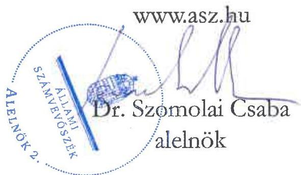
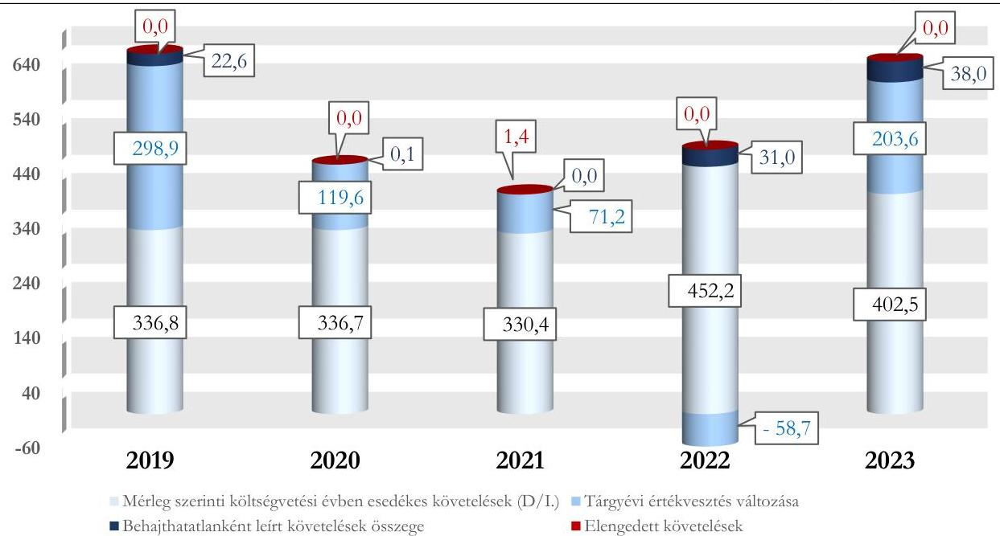

ÁLLAMI SZÁMVEVŐSZÉK

# JELENTÉS

# A központi költségvetési szervek követeléskezelése

A behajthatatlan és az elengedett követelések kezelése – Budapest Környéki Törvényszék

2025.

25123

www.asz.hu

---

ÁLLAMI
SZÁMVEVŐSZÉK

# JELENTÉS

## A központi költségvetési szervek követeléskezelése

A behajthatatlan és az elengedett követelések kezelése – Budapest Környéki Törvényszék

2025.

25123

---

Jelentéseink az interneten a www.asz.hu címen olvashatók.

ELLENŐRZÉSI IGAZGATÓSÁG:
ELLENŐRZÉSI IGAZGATÓSÁG I.

ELLENŐRZÉSI IGAZGATÓ:
SINKÁNÉ DR. CSENDES ÁGNES igazgató

ELLENŐRZÉSVEZETŐ:
DR. SIMON JÓZSEF igazgatóhelyettes, ellenőrzésvezető
LACZI HEDVIG ANNA ellenőrzésvezető

IKTATÓSZÁM: EL-4397-001/2025
TÉMASORSZÁM: 20/2024
ELLENŐRZÉS-AZONOSÍTÓ SZÁM: V1073

---

TARTALOMJEGYZÉK

- ÖSSZEFOGLALÁS ... 5
- AZ ELLENŐRZÉS EREDMÉNYEI ... 8
1. A központi költségvetési szerv követelése, a követelésekkel kapcsolatos értékvesztések, a behajthatatlan és elengedett követelések alakulása és ezek eredményre, illetve vagyonra gyakorolt hatásai ... 8
2. A központi költségvetési szerv követeléskezelési tevékenységgel kapcsolatos folyamatainak és a követelések értékelési szabályainak kialakítása ... 12
3. A központi költségvetési szerv követeléskezelési tevékenységének működtetése - behajthatatlan és elengedett követelések kezelése ... 13
4. A központi költségvetési szerv követeléseinek év végi értékelése és az éves költségvetési beszámolóban történt kimutatása, leltárral történő alátámasztása ... 15
- JAVASLATOK ... 16
- I. FÜGGELÉK: ÉSZREVÉTELEK ... 17
- II. FÜGGELÉK: ELLENŐRZÉSI MEGKÖZELÍTÉS ... 18
- MELLÉKLETEK ... 23
I. sz. melléklet: Értelmező szótár ... 23
II. sz. melléklet: Az ellenőrzött szervezetek jegyzéke ... 25
- RÖVIDÍTÉSEK JEGYZÉKE ... 26

---

“哈，你是个小伙子，你是个小伙子，你是个小伙子，你是个小伙子，你是个小伙子，你是个小伙子，你是个小伙子，你是个小伙子，你是个小伙子，你是个小伙子，你是个小伙子，你是个小伙子，你是个小伙子，你是个小伙子，你是个小伙子，你是个小伙子，你是个小伙子，你是个小伙子，你是个小伙子，你是个小伙子，你是个小伙子，你是个小伙子，你是个小伙子，你是个小伙子，你是个小伙子，你是个小伙子，你是个小伙子，你是个小伙子，你是个小伙子，你是个小伙子，你是个小伙子，你是个小伙子，你是个小伙子，你是个小伙子，你是个小伙子，你是个小伙子，你是个小伙子，你是个小伙子，你是个小伙子，你是个小伙子，你是个小伙子，你是个小伙子，你是个小伙子，你是个小伙子，你是个小伙子，你是个小伙子，你是个小伙子，你是个小伙子，你是个小伙子，你是个小伙子，你是个小伙子，你是个小伙子，你是个小伙子，你是个小伙子，你是个小伙子，你是个小伙子，你是个小伙子，你是个小伙子，你是个小伙子，

---

ÖSSZEFOGLALÁS

A központi költségvetési szervek követelései a közvagyon részét képezik ugyanúgy, mint a pénzeszközök, a befektetett eszközök vagy a készletek. A követelések teljesülése befolyásolja az adott szervezet bevételének alakulását. Így a gazdálkodás egyik fontos elemét jelenti a követeléskezelési tevékenységek, eljárások szabályszerű, célszerű és eredményes működtetése a bevételek lehető legnagyobb mértékű pénzügyi realizálása érdekében. Mindezek hiánya esetén nem érvényesül a jó gazda gondossága a gazdálkodás e területén.

A Budapest Környéki Törvényszék ellenőrzését az indokolta, hogy az ellenőrzött időszakban a központi költségvetési szervek között jelentős nagyságrendű követelésállománnyal rendelkezett, illetve a bíróságok költségvetési fejezeten belül mérlegfőösszege alapján kiemelt szereplőnek számított.

A Budapest Környéki Törvényszék az ellenőrzött időszakban meghatározta a követeléskezelési tevékenységének és a közhatalmi jellegű követelések behajtásra történő átadásának szabályozási kereteit és ezek alapján intézkedéseket tett a követelések megtérülése érdekében. A lejárt és nem teljesült követeléseket behajtás céljából a Nemzeti Adó- és Vámhivatal részére adta át a jogszabályi előírásoknak megfelelően, a nem teljesült követelések behajtása érdekében ez alapján korlátozott eszközökkel rendelkezett. A követeléskezelési tevékenység célszerűsége az ellenőrzött időszakban nem volt biztosított, illetve az eredményessége nem volt értékelhető. A lejárt követelésállomány folyamatos növekedése miatt az Állami Számvevőszék véleménye szerint a Budapest Környéki Törvényszék részéről indokolt a lejárt követelésállomány áttekintése alapján további kontrolltevékenységek beépítése a követeléskezelés folyamatába a fizetési felszólítások határidőn belüli és teljeskörű kiküldése, a lejárt követelések Nemzeti Adó- és Vámhivatal részére történő határidőn belüli és teljeskörű átadása érdekében, valamint a vonatkozó szabályozás alapján a behajthatatlan követelések elszámolási feltételeinek vizsgálata.

A BKT¹ beszámolóban kimutatott követelésállománya 2019. és 2022. évek között 32,5%-kal növekedett, majd a 2023. évben kis mértékben, 8,5%-kal csökkent. A beszámolóban kimutatott követelésállomány alakulására a 2022. évben a közhatalmi bevételekhez kapcsolódó költségvetési évben és költségvetési évet követően esedékes követelések növekedése gyakorolt hatást. A költségvetési évben esedékes követelések beszámolóban kimutatott összege 2019. év végétől 2021. év végéig csökkent, majd ezt követően növekvő tendenciát mutatott. A BKT költségvetési évben esedékes követelései csaknem kizárólag természetes személyekkel szemben álltak fent, amelyből átlagosan 97,4%-ot a belföldi, 2,6%-ot a külföldi természetes személyek képviseltek.

A költségvetési évben esedékes közhatalmi, működési és felhalmozási célú beszámolóban kimutatott követelések aránya a közhatalmi, működési és felhalmozási célú bevételekhez viszonyítottan a 2019. év végi 47,1%-ról a 2023. év végére 45,9%-ra csökkent, az ellenőrzött időszakban átlagosan 46,5% volt.

A lejárt követelések esetén kedvezőtlen folyamatot jelentett, hogy ezek értéke az ellenőrzött időszakban folyamatosan emelkedett, illetve ezen belül meghatározó volt a 360 napon túli követelések aránya. A BKT lejárt követelései többségét az igazságügyi szolgáltatási díjakból származó követelések tették ki. Ezen belül is a bűnügyi költséghez, valamint az állam által előlegezett költség bevételekhez kapcsolódó követelések részaránya volt leginkább meghatározó az ellenőrzött időszakban. A lejárt követelések állománya az ellenőrzött időszakban évente átlagosan az elszámolt bevételek 24,7%-át tette ki. A pénzügyileg nem teljesült követeléseken belül a közhatalmi bevételekből származó követelések aránya tartósan magasabb volt a közhatalmi bevételek összes

5

---

Összefoglalás

bevételen belül képviselt arányánál, amely a közhatalmi bevételek alacsonyabb fokú pénzügyi realizálhatóságát mutatja.

A BKT korrigált, költségvetési évben esedékes követelésállománya 2019. és 2021. között 38,8%-kal csökkent, majd a 2023. évre az előző évhez képest 51,7%-kal, 644,1 M Ft-ra növekedett. Ennek alakulását a költségvetési évben esedékes követelések értéke, valamint a tárgyévi értékvesztés változása határozta meg. Az elszámolt értékvesztések összegét jelentősen befolyásolta az alkalmazott értékvesztési ráták csökkentése a 2022. évben, majd ezek emelése a 2023. évben.

A behajthatatlan és az elengedett követelések eredményre és vagyonváltozásra gyakorolt negatív hatása a 2019. évi 22,6 M Ft-ról a 2020. évre 0,1 M Ft-ra csökkent. A 2021. évtől kezdődően azonban ennek értéke növekedett, a 2023. évre 38,0 M Ft-ra változott. A BKT behajthatatlanként elszámolt követeléseinek 92,3%-a természetes személyekkel szemben állt fenn.

A BKT a követelések kezelésével, elszámolásával, valamint a behajtásra történő átadással kapcsolatos szervezeti kereteket és folyamatokat a jogszabályi előírások szerint kialakította. A BKT a követelések elszámolásának, értékelésének, valamint a behajthatatlan és elengedett követelések elszámolásának szabályait a jogszabályi előírások szerint belső szabályzataiban meghatározta.

A BKT követeléseinek értékelése, a követelések és az értékvesztések, továbbá a behajthatatlan követelések elszámolása a jogszabályi előírások és a belső szabályozók előírásai szerint történt.

A követelések részletező nyilvántartása az ellenőrzött mintatételek alapján két esetben nem teljeskörűen tartalmazta a jogszabály által előírt tartalmi elemeket.

A követelések év végi értékelése és az éves költségvetési beszámolóban történő kimutatása a jogszabályi előírásoknak megfelelően történt. A BKT a 2023. évi éves költségvetési beszámoló mérlegében szereplő követeléseit a jogszabályi előírásoknak megfelelően leltárral alátámasztotta.

A BKT esetében az ellenőrzés nem tárt fel a lejárt követelések kezelése és a behajtásra történő átadás szabályszerűségét befolyásoló szabálytalanságot, hiányosságot. A BKT az ellenőrzött mintatételek esetén a jogszabályokban és belső szabályzataiban rögzített előírások szerint járt el a lejárt követelések kezelése során.

A közhatalmi jellegű követelések esetén meghatározó szerepet töltött be a követelések végrehajtásra történő átadása a NAV² részére. A jogszabályi előírások változása miatt a BKT számára a követelések beszedése a közhatalmi jellegű követelések tekintetében alapvetően egységesen e módon volt lehetséges a 2020. évtől kezdődően.

A BKT-re vonatkozóan a követeléskezelés és behajtás érdekében alkalmazott tevékenység eredményessége nem volt értékelhető, mivel a meghatározó részarányt képviselő közhatalmi bevételekből származó követelések esetén a végrehajtással összefüggő feladatokat nem a BKT látta el.

A BKT a követelések minél nagyobb arányú megterülését a követeléskezelési tevékenységgel összefüggő feladatok teljeskörű és határidőn belül történő végrehajtásával tudta elősegíteni. A BKT ugyanakkor korlátozott mozgástérrel rendelkezett a követeléskezelés területén, mivel kizárólag a fizetési felszólítás, mint követeléskezelési eszköz áll rendelkezésére. A BKT követeléskezelési tevékenységének célszerűségét kedvezőtlenül befolyásolta, hogy az alkalmazott követeléskezelési eszköz lejárt követelések állományára és ennek időbeli alakulására vonatkozó hatásait a BKT nem értékelte az ellenőrzött időszakban. Ezáltal nem győződött meg arról, hogy a belső szabályozásban szereplő intézkedéseket ésszerűen és racionálisan, valamint a követelések megterülése érdekében teljeskörűen és az előírt határidők betartásával alkalmazta.

6

---

Összefoglalás

Az ÁSZ³ három javaslatot fogalmazott meg a BKT részére. A lejárt követelések állományának növekedése és az elszámolt bevételekhez képest jelentős összege, valamint lejárat szerinti megoszlása alapján az ÁSZ véleménye szerint indokolt a BKT részéről áttekinteni a lejárt követeléseket és ez alapján a fizetési felszólítások belső szabályzatban meghatározott határidőn belül történő kiküldésének teljeskörűségét és a közhatalmi bevételekből származó lejárt követelések teljeskörű és határidőben történő átadását biztosító kontrolltevékenységek beépítése a követeléskezelési folyamatba. Ha a vizsgált lejárt követeléseknél a NAV részéről az alátámasztó dokumentum rendelkezésre áll a követelés végrehajthatóságának elévülésére vonatkozóan, illetve a behajthatatlan követeléssel való nyilvánítás feltételei fennállnak, akkor a BKT-nak szükséges kivezetnie az érintett tételeket a követeléskezeléssel érintett követelések közül.

7

---

AZ ELLENŐRZÉS EREDMÉNYEI

1. A központi költségvetési szerv követelése, a követelésekkel kapcsolatos értékvesztések, a behajthatatlan és elengedett követelések alakulása és ezek eredményre, illetve vagyonra gyakorolt hatásai

Összegző megállapítás

A BKT beszámolóban kimutatott követeléseinek értéke a 2019. év végéről a 2023. év végére növekedett. A lejárt követelések állománya - az igazságügyi követelések érvényesítésének alacsony mértéke miatt - folyamatosan növekedett. A követelések értékelése alapján a követelésekkel kapcsolatos elszámolások a beszámolóban kimutatott eredményt és vagyonváltozást a 2022. évet kivéve negatívan érintették.

A KÖVETELÉSEK ALAKULÁSA

A BKT költségvetési évben és az évet követően esedékes beszámolóban kimutatott követeléseinek értéke a 2019. év végi 464,1 M Ft-ról a 2023. év végére 567,1 M Ft-ra növekedett.

A BKT beszámolóban kimutatott követeléseinek és elszámolt bevételeinek alakulását az 1. táblázat tartalmazza.

1. táblázat

BKT BESZÁMOLÓBAN KIMUTATOTT KÖVETELÉSEI ÉS ELSZÁMOLT BEVÉTELEI (M FT, %)

|  MEGNEVEZÉS | 2019.12.31. | 2020.12.31. | 2021.12.31. | 2022.12.31. | 2023.12.31.  |
| --- | --- | --- | --- | --- | --- |
|  Beszámolóban kimutatott követelések, ebből: | 464,1 | 470,4 | 467,9 | 615,1 | 567,1  |
|  Költségvetési évet követően esedékes követelések | 127,3 | 133,7 | 137,5 | 162,9 | 164,6  |
|  Költségvetési évben esedékes követelések, amelyek közhatalmi és működési, továbbá felhalmozási célú követelések | 336,8 | 336,7 | 330,4 | 452,2 | 402,5  |
|  A közhatalmi, működési és felhalmozási célú elszámolt bevételek | 715,7 | 698,2 | 797,6 | 903,2 | 877,8  |
|  Közhatalmi bevételek aránya az összes bevételből (%) | 57,7 | 62,7 | 68,0 | 69,1 | 69,0  |
|  Költségvetési évben esedékes követelések aránya a beszámolóban kimutatott követeléshez (%) | 72,6 | 71,6 | 70,6 | 73,5 | 71,0  |
|  Költségvetési évben esedékes követelésekből a közhatalmi és működési, továbbá felhalmozási célú követelések aránya az elszámolt bevételekhez viszonyítva (%) | 47,1 | 48,2 | 41,4 | 50,1 | 45,9  |

Forrás: Az ellenőrzött szervezet éves költségvetési beszámolói alapján, ÁSZ saját szerkesztés

---

Az ellenőrzés eredményei

A 2019-2023. évek közötti időszakban a BKT elszámolt közhatalmi, működési és felhalmozási célú bevételének átlagosan 46,5%-át tette ki a beszámolóban kimutatott, költségvetési évben esedékes követelések értéke.

A BKT közhatalmi követeléseinek többségét az igazságügyi szolgáltatási díjakból származó követelések tették ki. Ezen belül is a bűnügyi költséghez, valamint az állam által előlegezett költség bevételéhez kapcsolódó követelések részaránya volt leginkább meghatározó az ellenőrzött időszakban. E követelések ugyanakkor meghatározó részarányt képviseltek a lejárt követelések tekintetében.

A BKT beszámolóban kimutatott költségvetési évben esedékes lejárt követeléseiből a 180 napon túli követelések aránya az ellenőrzött időszakon belül átlagosan 93,9%-ot ért el, amelyen belül meghatározó volt a 360 napon túli követelések aránya. A lejárt követelések állománya az ellenőrzött időszakban átlagosan az elszámolt bevétel 24,7%-át tette ki. Mindez azt mutatja, hogy a lejárt követelések jelentős hatást gyakoroltak a gazdálkodásra, mivel ezek meg nem térülése befolyásolta a rendelkezésre álló bevétel értékét.

A BKT költségvetési évben esedékes lejárt követeléseinek állományát és a követeléseinek lejárat szerinti megoszlását a 2. számú táblázat tartalmazza (kiemelve a jelentős arányt képviselő lejárati időszakokat).

2. táblázat
A BKT KÖLTSÉGVETÉSI ÉVBEN ESEDEKES KÖVETELÉSEINEK LEJÁRAT SZERINTI MEGOSZLÁSA (M FT, %)

|  KÖVETELÉSEK
ESEDEKESSEGE | 2019.12.31. | 2020.12.31. | 2021.12.31. | 2022.12.31. | 2023.12.31.  |
| --- | --- | --- | --- | --- | --- |
|  Fizetési határidőn túl 0-90 nap | 3,3 | 2,3 | 3,3 | 2,3 | 3,8  |
|  Fizetési határidőn túl 91-180 nap | 4,9 | 2,4 | 2,6 | 2,9 | 2,8  |
|  Fizetési határidőn túl 181-360 nap | 7,3 | 4,0 | 3,4 | 5,4 | 4,8  |
|  Fizetési határidőn túl 360 nap | 84,5 | 91,3 | 90,7 | 89,4 | 88,6  |
|  Lejárt követelések értéke
(M FT) | 3 083,6 | 3 203,1 | 3 268,0 | 3 331,1 | 3 485,1  |
|  Lejárt követelések aránya az elszámolt
bevételekhez viszonyítva (%) | 28,1 | 27,5 | 22,6 | 22,5 | 22,9  |
|  Közhatalmi követelések aránya a lejárt
követeléseken belül (%) | 92,7 | 93,1 | 93,3 | 93,4 | 93,7  |
|  Megképzett értékvesztés lejárt
követelések összegéhez viszonyított
aránya (%) | 89,1 | 89,5 | 89,9 | 86,4 | 88,5  |

Forrás: „Kimutatás központi költségvetési szervek követeléseinek összetételéről adóink szerint”, BKT adatai alapján, ÁSZ saját szerkesztés

Az ellenőrzött időszakban a BKT költségvetési évben esedékes (lejárt) követeléseinek átlagosan 99,7%-a természetes személyekkel szemben (ezen belül főképp belföldi természetes személyekkel szemben) állt fent. A természetes személyek arányát az indokolta, hogy a követelések döntő többségét kitevő bűnügyi költségből eredő követelések természetes személyekhez kapcsolódtak. A BKT költségvetési évben esedékes követeléseinek fennmaradó átlagosan 0,3%-a államháztartáson kívüli szervezetekkel (legfőképp vállalkozókkal) szemben állt fenn.

Az ellenőrzött időszakban a BKT lejárt követelésein belül a közhatalmi bevételekre irányuló követelések aránya 93% körül mozgott, amely tartósan és jelentősen magasabb volt a közhatalmi bevételek összes bevételen belül képviselt arányánál. Ez a körülmény a közhatalmi bevételekből származó követelések esetében a pénzügyi realizálás alacsony mértékét mutatja.

---

Az ellenőrzés eredményei

# A KÖVETELÉSEK ÉRTÉKELÉSÉNEK HATÁSA AZ EREDMÉNY- ÉS VAGYONVÁLTOZÁSRA

A BKT beszámolóban kimutatott követeléseinek értékelése – 2022. évet kivéve – negatív hatást gyakorolt az eredményre és a vagyonváltozásra. Ennek értéke a 2019. évtől 2021. évig csökkent, majd a 2023. évre az előző évhez képest 269,3 M Ft-tal növekedett. A 2022. évben a beszámolóban kimutatott követelések értékelése összesen 27,7 M Ft pozitív hatást gyakorolt az eredményre és a vagyonváltozásra.

A BKT követelései értékelésének eredményre és a vagyonváltozásra gyakorolt hatását az ellenőrzött időszakra vonatkozóan a 3. táblázat tartalmazza.

3. táblázat

A BKT KÖVETELÉSEI ÉRTÉKELÉSÉNEK EREDMÉNYRE ÉS VAGYONVÁLTOZÁSRA GYAKOROLT HATÁSA (M FT, %)

|  MEGNEVEZÉS | 2019 | 2020 | 2021 | 2022 | 2023  |
| --- | --- | --- | --- | --- | --- |
|  Elszámolt követelésértékelés eredményre és vagyonváltozásra gyakorolt hatása | 321,5 | 119,7 | 72,6 | - 27,7 | 241,6  |
|  ebből: tárgyévi értékvesztés változása | 298,9 | 119,6 | 71,2 | - 58,7 | 203,6  |
|  ebből: behajthatatlan követelés | 22,6 | 0,1 | 0,0 | 31,0 | 38,0  |
|  ebből: elengedett követelés | 0,0 | 0,0 | 1,4 | 0,0 | 0,0  |
|  Követelésértékelés elemeinek megoszlása |  |  |  |  |   |
|  értékvesztés változás aránya % | 93,0 | 99,9 | 98,1 | 211,8 | 84,3  |
|  behajthatatlan követelések aránya % | 7,0 | 0,1 | 0,0 | - 111,8 | 15,7  |
|  elengedett követelések aránya % | 0,0 | 0,0 | 1,9 | 0,0 | 0,0  |

Forrás: Kincstár KGR-K11 rendszer beszámoló, ellenőrzött szervezetek főkönyvi kivonat adatai alapján, ÁSZ saját szerkesztés

A BKT az ellenőrzött időszakban csak a 2021. évben számolt el – 18 esetben összesen 1,4 M Ft – elengedett követelést. Ezek hatósági határozatból eredő, természetes személyekkel szemben fennálló fizetési igényekből származtak, amelyekről a BKT elnöke a Vht.⁴-ben a törvényszéki végrehajtók hatáskörébe tartozó követelésekre vonatkozóan meghatározottak alapján mondott le, összhangban az Áht.⁵ előírásaival.

Az ellenőrzött időszakban a BKT által elszámolt behajthatatlan követelés összesen 91,6 M Ft volt. Ezen belül az államháztartáson kívüli szervezetekkel (vállalkozókkal) szemben 7,1 M Ft (7,7%), a természetes személyekkel szemben összesen 84,5 M Ft (92,3% döntően belföldi természetes személyekkel szemben) került kivezetésre. A BKT behajthatatlanként elszámolt követeléseiből a kötelezett megszűnése (az adós halála/megszűnése) következtében átlagosan 3,5%, egyéb okokból (pl. az adós ismeretlen, nem rendelkezett címmel, nem fellelhető, elévült a követelés, a felszámolási eljárás és végrehajtás során nem volt fedezet) történő leírás miatt átlagosan 96,5% került elszámolásra 2019-2023. években.

Az adott évben behajthatatlanként elszámolt követelések év végén fennálló 360 napon túl lejárt követelésállományhoz viszonyított aránya az ellenőrzött időszakban 0,0% (2021. év) és 1,2% (2023. év) között mozgott.

A BKT a követelések értékelését a közhatalmi és igazságügyi követelések esetében – az irányító szerve által meghatározott mutatók alkalmazásával – a kötelezettek együttes minősítése alapján egyszerűsített értékelési eljárással végezte. A 2019-2023. években az értékvesztés képzése összesen 1 574,6 M Ft, az

⁴ A 3. táblázatban szereplő adathoz képest a behajthatatlan követelések értéke kerekítési különbözet miatt tér el.

---

Az ellenőrzés eredményei

értékvesztés visszaírása összesen 940,0 M Ft volt, ezáltal a tárgyévi értékvesztés változása az ellenőrzött időszakban összesen 634,6 M Ft-os negatív hatást gyakorolt a BKT eredményére és vagyonára.

Az értékvesztés változás az ellenőrzött időszak négy évében összesen 693,3 M Ft-tal csökkentette az eredményt és a vagyon, a 2022. évben azonban 58,7 M Ft összegű pozitív hatást gyakorolt, mivel az értékvesztés visszaírásának értéke meghaladta az elszámolt értékvesztés összegét.

A közhatalmi bevételeken belül meghatározó arányt képviselő bűnügyi költségek tekintetében a BKT a bírósági szervezetek összesített tapasztalati adatain alapuló, az OBH® által évente felülvizsgált és kiadott értékvesztési rátákat alkalmazta. Az értékvesztési ráta a 360 napon túl lejárt ilyen típusú követelések esetében a 2021-ig érvényes 97%-ról 2022-ben 93%-ra csökkent, majd 2023-ban 95%-ra emelkedett. Mivel a BKT lejárt követelésein belül a 360 napot meghaladóan lejárt követelések aránya folyamatosan 90% körül mozgott, az alkalmazott értékvesztési ráta kismértékű módosítása is jelentős összegű változást eredményezett az elszámolt értékvesztés összegében.

## A KÖVETELÉSÁLLOMÁNY ALAKULÁSA

A BKT korrigált, költségvetési évben esedékes közhatalmi, működési és felhalmozási célú összesített követelésállománya a 2019. évben 658,3 M Ft volt, amely a 2021. évre 38,8%-kal, 403,0 M Ft-ra csökkent, majd 2022. évhez képest 51,7%-kal, 2023. évre 644,1 M Ft-ra növekedett. A korrigált, költségvetési évben esedékes közhatalmi, működési és felhalmozási célú összesített követelésállománya alakulását a költségvetési évben esedékes követelések értéke, valamint a tárgyévi értékvesztés változása határozta meg.

A BKT korrigált, összesített költségvetési évben esedékes közhatalmi, működési és felhalmozási célú követelésállományának összetételét az 1. ábra szemlélteti.

1. ábra

A BKT KORRIGÁLT, KÖLTSÉGVETÉSI ÉVBEN ESEDEKES
KÖVETELÉSÁLLOMÁNYÁNAK ÖSSZETÉTELE ÉS ALAKULÁSA (M FT)

Forrás: Kincstár KGR-K11 rendszer beszámoló adatai, továbbá az ellenőrzött szervezet főkönyvi kivonatai alapján, ÁSZ saját szerkesztés

Az ellenőrzött időszakban a Bíróságok címhez tartozó szervek költségvetési évben esedékes követelése éves átlagos állományán (3 617,1 M Ft) belül a BKT 10,3%-ot (371,7 M Ft-ot) képviselt. Az ellenőrzött

---

Az ellenőrzés eredményei

időszakban elszámolt értékvesztésváltozások és behajthatatlan követelések eredmény- és vagyonváltozásra gyakorolt hatásának értéke a BKT esetében 727,7 M Ft volt, ami a Bíróságok cím költségvetési szerveire vonatkozó összesített érték (5 770,5 M Ft) 12,6%-ának felelt meg.

## 2. A központi költségvetési szerv követeléskezelési tevékenységgel kapcsolatos folyamatainak és a követelések értékelési szabályainak kialakítása

### Összegző megállapítás

A BKT a követeléskezelési tevékenységgel, illetve a behajtásra történő átadással kapcsolatos szervezeti kereteit és folyamatait a jogszabályokban és a belső szabályozókban foglaltaknak megfelelően kialakította. A követelések kezelésére, elszámolására és értékelésére, valamint a behajthatatlan és elengedett követelések elszámolására vonatkozó belső szabályokat a jogszabályi előírások szerint meghatározta.

A BKT a követeléskezelési feladatokat ellátó szervezeti egységek feladatait az SZMSZ⁷-ben, a Gazdasági Hivatal ügyrendjében⁸, valamint a Bevételi ügyviteli eljárásrendben⁹ az Ávr.¹⁰ előírásaival összhangban határozta meg.

A BKT a követeléskezeléssel, a követelések végrehajtásra történő átadásával, valamint a behajthatatlan és elengedett követelések működési- és értékelési munkafolyamataival kapcsolatos feladatait az Ellenőrzési nyomvonalban¹¹ a Bkr.¹² előírásaival összhangban szabályozta.

A követelések kezelésére, elszámolására és értékelésére, a követelés behajtására vonatkozó szervezeti keretek kialakítását, a munkafolyamatok szabályozását a BKT-nál a 4. táblázatban megjelölt szabályozó eszközök tartalmazták az ellenőrzött időszakban.

4. táblázat

A BKT KÖVETELÉSEK KEZELÉSÉBEN RÉSZTVEVŐ SZERVEZETI EGYSEGEI ÉS A SZERVEZETI KERETEKET ÉS A MUNKAFOLYAMATOKAT SZABÁLYOZÓ ESZKÖZÖK

|  KÖVETELÉSKEZELÉSBEN RÉSZTVEVŐ SZERVEZETI EGYSEGEK |   |   | A KÖVETELÉSKEZELÉS SZERVEZETI KERETEIT ÉS A MUNKAFOLYAMATAIT SZABÁLYOZÓ ESZKÖZÖK  |   |   |   |
| --- | --- | --- | --- | --- | --- | --- |
|  GAZDASÁGI HIVATAL | GAZDASÁGI HIVATAL BEVÉTELI OSZTÁLYA | JOGI ÉS IGAZGATÁS-SZERVEZÉSI OSZTÁLY | SZMSZ | ÜGYREND | ELLENŐRZÉSI NYOMVONAL | EGYÉB SZABÁLYOZÓK  |
|  ☑ | ☑ | ☑ | ☑ | ☑ | ☑ | ☑  |

rendelkezett a szabályozó eszközzel és szabályozta a követeléskezelést; rendelkezett követeléskezelésben résztvevő szervezeti egységgel

Forrás: Az ellenőrzött szervezet dokumentumai alapján, ÁSZ saját szerkesztés

A követelések értékelésének, valamint a behajthatatlan és elengedett követelések elszámolásának szabályait a BKT a Számv. tv.¹³ és az Áhsz.¹⁴ előírásainak megfelelően meghatározta a számviteli politikában és annak keretében elkészített értékelési szabályzatban¹⁵, valamint a számlarendben.¹⁶

---

Az ellenőrzés eredményei

A követelésekkel kapcsolatos részletező nyilvántartás vezetésére vonatkozó szabályokat a BKT számlarendje az Áhsz.-ben előírtak szerint tartalmazta.

A BKT belső ellenőrzése a követeléskezeléssel, a behajthatatlan és elengedett követelésekkel, és az értékvesztéssel kapcsolatos rendszerellenőrzést – a közhatalmi bevételek beszedésének eredményessége tárgyában – a 2023. évben végzett.

## 3. A központi költségvetési szerv követeléskezelési tevékenységének működtetése - behajthatatlan és elengedett követelések kezelése

### Összegző megállapítás

A BKT a követelések értékelését és elszámolását a jogszabályokban és a belső szabályzatokban foglalt előírásoknak megfelelően végezte. A BKT az ellenőrzött időszakban szabályszerűen számolta el a követelésekhez kapcsolódó értékvesztést, valamint a behajthatatlan követelések elszámolása a jogszabályi előírásokkal összhangban történt. A követelések részletező nyilvántartása – kettő eset kivételével – a jogszabály szerinti adatokat teljeskörűen tartalmazta. A követeléskezelési tevékenység célszerűsége a követeléskezelési eszközök hatásaira vonatkozó értékelések elvégzésének hiánya miatt nem volt biztosított. A követeléskezelési és behajtási tevékenység eredményessége a feladatok más szervezettel való megosztott jellege miatt nem volt értékelhető.

## A KÖVETELÉSEK ÉRTÉKELÉSE ÉS ELSZÁMOLÁSA

A BKT a követelések értékelését és az értékvesztések elszámolását a mintatételek esetében a Számv. tv.-ben, az Áhsz.-ben, valamint az értékelési szabályzatban foglaltak szerint végezte. A közhatalmi bevételekből származó lejárt követelések esetében – 18 mintatétel esetében – az értékvesztés megállapítását az értékelési szabályzat előírásai szerint az irányító szerve által meghatározott tapasztalati mutatók alapján, egyszerűsített eljárással végezte.

## A BEHAJTHATATLAN KÖVETELÉSEK MINŐSÍTÉSE ÉS ELSZÁMOLÁSA

A BKT-nál a követelések behajthatatlanná minősítése és számviteli elszámolása – öt mintatétel esetében az adós hagyaték hátra hagyása nélküli halála, illetve az adós felszámolási eljárással való megszűnése miatt – az Áhsz.-ben, a Számv. tv.-ben, a 38/2013. (IX. 19.) NGM rendeletben¹⁷ és a belső szabályozókban foglaltak szerint történt.

## A KÖVETELÉSEK NYILVÁNTARTÁSA

A BKT-nál az igazságügyi követelések részletező nyilvántartása – 18 esetben – az Áhsz. 14. melléklet III. 4. pontjában szereplő releváns nyilvántartandó adatokat tartalmazta.

A követelések részletező nyilvántartása kettő esetben (Gyermektartás-díj állam általi megelőlegezése, Kőv9, és az ÖBV¹⁸ költség előlegezés, Kőv10) nem teljeskörűen tartalmazta az Áhsz. 14. melléklet III. 4. pontja szerint előírtakat, így a 4. e) pont előírása ellenére a követelések teljesítésének határidejét és a 4. j)

---

Az ellenőrzés eredményei

pont előírása ellenére a követelésekkel kapcsolatos fizetési felhívások, illetve a behajtására tett intézkedések adatait. E követelések nyilvántartásba vétele az ellenőrzött időszakot megelőzően (1994., illetve 2009. évben) történt.

## A LEJÁRT KÖVETELÉSEK KEZELÉSE, BEHAJTÁSA ÉRDEKÉBEN MEGTETT INTÉZKEDÉSEK

## A követeléskezelési és behajtási tevékenység tartalma és értékelése

A követelések kezelése tekintetében a BKT egyedi nyilvántartó kartonokon tartotta nyilván az adósokkal kapcsolatos adatokat (többek között a megalapozó dokumentum típusát és azonosítószámát, a követelés jogcímét, a (rész)teljesítés összegét, időpontját, az adós típusát), illetve a követeléskezelési folyamat lépéseire vonatkozó információkat (többek között a kiküldött fizetési felszólítások, egyenlegközlők adatait, a részletfizetési engedélyt). A BKT – a követelésekről vezetett részletező nyilvántartás adatai alapján – a jogszabályban és a belső szabályozóban megfogalmazott fizetési felszólítást alkalmazta a követelések kezelése érdekében.

A követelések megtérülésének biztosítása tekintetében a követelések legnagyobb részét kitevő közhatalmi bevételekből származó követelések esetén meghatározó szerepet töltött be a követelések végrehajtásra történő átadása a NAV részére. Ezáltal a BKT felelősségi köre a követelések érvényesítésére vonatkozó folyamat tekintetében a végrehajtásra történő átadásig terjedt. Az ezt követő behajtási tevékenység a NAV feladatát jelentette, amelyre vonatkozóan a BKT-nak nem volt ráhatása.

A BKT számára a közhatalmi jellegű követelések esetén az Avt. 3. §-át is figyelembe véve a Vht. 304/D §-a előírja, hogy 2019. december 31-től minden fizetési késedelemmel érintett követelést a NAV részére szükséges átadnia, amely e követeléseket az adóhatóság által foganatosítandó végrehajtási eljárásokról szóló 2017. évi CLIII. törvény rendelkezései alapján kezeli. Az átadás a NAV részére elektronikus úton történik.

A BKT-re vonatkozóan – figyelembe véve a közhatalmi bevételekből származó követelések meghatározó részarányát a követeléseken belül, valamint a végrehajtással összefüggő feladatok szervezettől független ellátását – a követeléskezelés és behajtás érdekében alkalmazott tevékenység eredményessége nem volt értékelhető. A követelések megtérülésével kapcsolatos problémákat azonban jól mutatja, hogy a 180 napon túli követelésállomány aránya és értéke folyamatosan magas volt, illetve a lejárt követelések értéke folyamatosan növekedett. E tekintetben meghatározó körülményt jelentett a jellemzően természetes személy adósok alacsony fizetőképessége, ezáltal a követelések mérsékelt érvényesíthetősége.

Az ÁSZ véleménye szerint – az előző bekezdésben bemutatott indokok alapján – a BKT vonatkozásában kizárólag a követeléskezelési tevékenység célszerűsége értékelhető. A követeléskezelési tevékenység célszerűségét kedvezőtlenül befolyásolta, hogy a BKT az alkalmazott követeléskezelési eszközök – ezen belül a fizetési felszólítás, valamint a részletfizetési lehetőség – lejárt követelések állományára és ennek időbeli alakulására vonatkozó hatásait nem értékelte az ellenőrzött időszakban.

A lejárt követelések állományának növekedése és a bevételekhez képest jelentős összege, valamint lejárat szerinti megoszlása alapján az ÁSZ véleménye szerint indokolt a BKT-nek áttekintenie az érintett követeléseket, és ez alapján a fizetési felszólítások belső szabályzatban meghatározott határidőn belül történő kiküldésének teljeskörűségét és a közhatalmi bevételekből származó lejárt követelések teljeskörű és határidőben történő átadását biztosító kontrolltevékenységek beépítése a követeléskezelési folyamatba. A lejárt követeléseket indokolt a BKT-nak olyan szempontból is áttekinteni, hogy amennyiben a NAV

14

---

Az ellenőrzés eredményei

részéről az alátámasztó dokumentum rendelkezésre áll a követelés végrehajthatóságának elévülésére vonatkozóan, illetve fennállnak a behajthatatlan követelésévé való nyilvánítás feltételei, akkor e tételek kivezetendők a követeléskezeléssel érintett követelések közül.

## A követeléskezelési és behajtási tevékenység a mintatételek alapján

A BKT esetében az ellenőrzés nem tárt fel a lejárt követelések kezelése és a behajtási tevékenység szabályszerűségét befolyásoló szabálytalanságot, hiányosságot.

A BKT a Bevételi ügyviteli eljárásrendben meghatározott szabályok szerint járt el a lejárt követelések behajtása során. A BKT a lejárt esedékességű közhatalmi bevételek érvényesítése érdekében értesítette az adósokat a nyilvántartott követelésekről 19 esetben egyenlegközlőket, illetve fizetési felszólításokat küldött. A közhatalmi bevételekből származó követelések átadása az illetékes adóhatóság részére mind a 18 esetben a Vht., a Vhr.¹⁹, valamint a belső szabályozások előírásaival összhangban történt.

## 4. A központi költségvetési szerv követeléseinek év végi értékelése és az éves költségvetési beszámolóban történt kimutatása, leltárral történő alátámasztása

### Összegző megállapítás

A követelések év végi értékelése a BKT-nál szabályszerű volt. A követeléseit az éves költségvetési beszámoló mérlegében a jogszabályi előírások szerint mutatta ki. A BKT a 2023. évi éves költségvetési beszámoló mérlegében kimutatott, a költségvetési évben és a költségvetési évet követően esedékes követeléseit a jogszabályi előírások szerint leltárral alátámasztotta.

A BKT a követelések év végi értékelését az Áhsz., a Számv. tv. és a belső szabályozókban foglaltaknak megfelelően végezte.

A BKT a költségvetési évben és a költségvetési évet követően esedékes követeléseit és a behajthatatlanként elszámolt követeléseit a 2023. évi éves költségvetési beszámoló mérlegében és tájékoztató adataiban az Áhsz. előírásainak megfelelően szabályszerűen mutatta ki.

A BKT 2023. évi éves költségvetési beszámoló mérlegének a költségvetési évben és a költségvetési évet követően esedékes követeléseit az Áhsz.-ben és a Számv. tv.-ben foglaltaknak megfelelő leltárral alátámasztotta.

---

16

# JAVASLATOK

Az ÁSZ tv. 33. § (1) bekezdésében foglaltak értelmében az ellenőrzött szervezet vezetője köteles a jelentésben foglalt megállapításokhoz kapcsolódó intézkedési tervet összeállítani és azt a jelentés kézhezvételétől számított 30 napon belül az ÁSZ részére megküldeni. Az ÁSZ a jelentésben foglalt megállapításokhoz kapcsolódóan az alábbi javaslatok tekintetében várja el az intézkedési terv elkészítését.

# A BUDAPEST KÖRNYÉKI TÖRVÉNYSZÉK ELNÖKE RÉSZÉRE

1. Gondoskodjon a követelések részletező nyilvántartásának az Áhsz. 14. melléklet III. 4. pontjában előírt tartalmi követelményeknek megfelelő, folyamatos vezetéséről.

2. Alakítson ki a Bkr. 8. § (1) bekezdésében foglaltaknak megfelelően a követeléskezelési tevékenységet érintően olyan kontrolltevékenységeket, amelyek támogatják a fizetési felszólítások belső szabályzatban meghatározott határidőn belül történő kiküldésének teljeskörűségét és a közhatalmi bevételekből származó lejárt követelések teljeskörű és határidőben történő átadását végrehajtás céljából az illetékes adóhatóság részére, illetve működtesse e kontrolltevékenységeket.

3. Vizsgálja meg a lejárt követelések esetén a behajthatatlan követelésként történő elszámolás feltételeit és e feltételek rendelkezésre állása esetén intézkedjen a behajthatatlan követelés elszámolásáról.

---

17

# I. FÜGGELÉK: ÉSZREVÉTELEK

A jelentéstervezetet az ÁSZ 15 napos észrevételezésre megküldte az ellenőrzött szervezet vezetőjének az ÁSZ tv. 29. §* (1) bekezdése előírásának megfelelően.

A jelentéstervezet megállapításaira az ellenőrzött szervezet nem tett észrevételt.

* 29. § (1) Az Állami Számvevőszék az ellenőrzési megállapításait megküldi az ellenőrzött szervezet vezetőjének vagy az általa megbízott személynek, és annak, akinek személyes felelősségét állapította meg.
(2) Az ellenőrzött szervezet vezetője és a felelősként megjelölt személy az ellenőrzés megállapításaira tizenöt napon belül írásban észrevételt tehet.
(3) Az Állami Számvevőszék az észrevételre a beérkezésétől számított harminc napon belül írásban válaszol. A figyelembe nem vett észrevételeket köteles a jelentésben feltüntetni, és megindokolni, hogy azokat miért nem fogadta el.

---

18

# II. FÜGGELÉK: ELLENŐRZÉSI MEGKÖZELÍTÉS

## AZ ELLENŐRZÉS JOGALAPJA

Az ellenőrzés jogszabályi alapját az ÁSZ tv.²⁰ 1. § (3) bekezdés, 5. § (2)-(3) bekezdés, valamint az Áht. 61. § (2) bekezdéseinek előírásai képezték.

## AZ ELLENŐRZÉS CÉLJA

Az ellenőrzés célja annak értékelése volt, hogy az ellenőrzött központi költségvetési szerv a követeléskezelési és értékelési tevékenységére vonatkozó szervezeti kereteit, folyamatait és működtetésének szabályait a jogszabályi előírások szerint alakította-e ki, illetve a követeléskezelési tevékenységét szabályszerűségi, célszerűségi és eredményességi szempontok figyelembevételével működtette-e. Annak értékelése továbbá, hogy a követelések értékvesztése, a behajthatatlan és elengedett követelések nyilvántartása, elszámolása, valamint a követelések éves költségvetési beszámolóban történő kimutatása a jogszabályi és belső előírásoknak megfelelően történt-e.

Az elemzés célja volt, hogy értékelje a központi költségvetési szerv követeléseinek, az ehhez kapcsolódó értékvesztéseknek, valamint a behajthatatlan és elengedett követelések alakulását és ezek eredményre, illetve a vagyonra gyakorolt hatásait.

## AZ ELLENŐRZÉS TÍPUSA

Kombinált ellenőrzés.

## AZ ELLENŐRZÉS TÁRGYA

Az ellenőrzés tárgyát képezte az ellenőrzött központi költségvetési szerv követeléskezelési tevékenységére vonatkozó szervezeti kereteinek kialakítása, a követeléskezelési tevékenysége, a követeléskezeléssel kapcsolatos folyamatainak szabályozottsága és kialakítása, továbbá a követeléskezelési folyamatok működtetésének szabályszerűsége, célszerűsége és eredményessége, a követelések értékvesztése, az elengedett és behajthatatlan követelések nyilvántartásának, elszámolásának szabályozottsága, szabályszerűsége, valamint a követelések éves költségvetési beszámolóban történő kimutatásának jogszabályokkal való összhangja.

Az elemzés tárgya volt központi költségvetési szerv követeléseinek, az ehhez kapcsolódó értékvesztéseinek, a behajthatatlan és elengedett követeléseinek alakulása és ezek eredményre és vagyonra gyakorolt hatásai.

Az ellenőrzés kiterjedt minden olyan körülményre és adatra, amely az ÁSZ jogszabályban meghatározott feladatainak teljesítéséhez szükséges volt.

---

II. Függelék: Ellenőrzési megközelítés

# AZ ELLENŐRZÉS HATÓKÖRE ÉS TERÜLETE

A BKT jogi személy, éves költségvetés alapján önállóan működő és gazdálkodó, kincstári körbe tartozó költségvetési szerv, amelynek irányító szerve az Országos Bírósági Hivatal. A BKT-t az elnök vezeti és képviseli. Az Alaptörvény 25. cikkének (1) bekezdése szerint a bíróságok igazságszolgáltatási tevékenységet látnak el. A Bszi.²¹ 21. § (1) bekezdése alapján a BKT törvényben meghatározott ügyekben első fokon jár el és másodfokon elbírálja a járásbíróságok határozatai elleni fellebbezéseket, illetve eljár a hatáskörébe utalt egyéb ügyekben. A költségvetési szerv illetékessége, működési területe Pest vármegye közigazgatási területe.

A BKT működéséhez szükséges költségvetési előirányzatokat Magyarország központi költségvetésének VI. Bíróságok fejezete tartalmazza. A BKT költségvetését az OBH elnöke hagyja jóvá.

A BKT 2019-2023. évi gazdálkodási adatait az 5. táblázat mutatja.

5. táblázat
BUDAPEST KÖRNYÉKI TÖRVÉNYSZÉK FŐBB BESZÁMOLÓ ADATAI (M FT)

|  ÉVES BESZÁMOLÓ - MÉRLEG ADATOK | 2019.12.31. | 2020.12.31. | 2021.12.31. | 2022.12.31. | 2023.12.31.  |
| --- | --- | --- | --- | --- | --- |
|  Mérlegfőösszeg | 6 189,4 | 6 661,1 | 7 471,6 | 11 237,5 | 11 128,9  |
|  Költségvetési évben esedékes követelések | 336,8 | 336,7 | 330,4 | 452,2 | 402,5  |
|  BESZÁMOLÓK - TELJESÍTÉS ADATOK | 2019. | 2020. | 2021. | 2022. | 2023.  |
|  Bevételek összesen | 10 990,7 | 11 643,4 | 14 434,6 | 14 824,7 | 15 218,2  |
|  Kiadások összesen | 10 965,0 | 11 570,0 | 13 942,2 | 14 814,9 | 15 198,8  |

Forrás: Az éves költségvetési beszámolók alapján, ÁSZ saját szerkesztés

Az elemzés kiterjedt a központi költségvetési szerv követeléseinek, az azokra képzett értékvesztésnek, a behajthatatlan és elengedett követelésként elszámolt összegek alakulásának, ezek vagyonra gyakorolt hatásainak értékelésére. Értékelésre került továbbá az ellenőrzött központi költségvetési szerv követeléskezelési tevékenységének szabályszerűsége, célszerűsége és eredményessége.

Az ellenőrzés kiterjedt a központi költségvetési szerv követeléseinek kezelésére, a követelésekkel kapcsolatos értékvesztéseinek képzésére és visszaírására, a behajthatatlan és elengedett követelések elszámolására, és a követelések nyilvántartására vonatkozó szabályainak, folyamatainak kialakítására, továbbá a követeléskezelési tevékenység szervezeti kereteinek kialakítására.

Ellenőrzésre került továbbá, hogy a központi költségvetési szervnél a követelések részletező nyilvántartásának vezetése, a követeléskezelés, a behajthatatlan és elengedett követelések elszámolása megfelel-e a jogszabályokban és a belső szabályozókban foglaltaknak, célszerűek és eredményesek voltak-e a lejárt követelések behajtása érdekében megtett intézkedések, továbbá értékelésre kerültek a követeléskezelési tevékenység gazdálkodásra gyakorolt hatásai.

Az ellenőrzés kiterjedt a központi költségvetési szerv követeléseinek év végi értékelésére. A jogszabályok és a belső szabályozók szerint ellenőrzésre került továbbá a követelések éves költségvetési beszámolóban történő kimutatásának, leltárral való alátámasztásának szabályszerűsége.

Az ellenőrzés keretében az ÁSZ 15 központi költségvetési szervet – beleértve a BKT-t is – választott ki és értékelte e szervezeteknél a követelések alakulását, a kapcsolódó belső szabályozási keretek rendelkezésre állását, valamint a követeléskezeléssel kapcsolatban alkalmazott gyakorlatot.

19

---

II. Függelék: Ellenőrzési megközelítés

# AZ ELLENŐRZŐTT IDŐSZAK

A 2019-2023. évek, kitekintéssel a helyszíni ellenőrzés lezárásának időpontjáig (2025. július 31.)

# AZ ELLENŐRZÉSI KRITÉRIUMOK

|  FÓKUSZTERÜLET | ELLENŐRZÉSI KRITÉRIUMOK  |
| --- | --- |
|  1. A központi költségvetési szerv követelése, a követelésekkel kapcsolatos értékvesztések, a behajthatatlan és elengedett követelések alakulása és ezek eredményre és ezáltal vagyonra gyakorolt hatásai | Elemzés  |
|  2. A központi költségvetési szerv követeléskezelési tevékenységgel kapcsolatos folyamatainak és a követelések értékelési szabályainak kialakítása | Áht. 10. § (5) bekezdés
Ávr. 13. § (1) bekezdés e) pont; (2) bekezdés a) pont
Bkr. 6. § (1) bekezdés a) és b) pont és (2) bekezdés
Számv. tv. 14. § (3) bekezdés, (5) bekezdés b) pont, 161. §
Áhsz. 51. § (2)-(3) bekezdés, 14. melléklet III. pont, 15. melléklet II. pont  |
|  3. A központi költségvetési szerv követeléskezelési tevékenységének működtetése és ennek hatásai a gazdálkodásra - behajthatatlan és elengedett követelések kezelése | Áhsz. 1. § (1) bek., 5. § (1) bek., 6. § (2) bek., 18. § (1)-(3) és (7) bek., 19. § (1) bek., 25. § (9a) bek. d) pont és 26. § (11a) bek. d) pont, 29. § (2) bek. b) pont, 39. § (3) bekezdés, 43. § (1)-(3) bek., 53. § (6) bek. e) pont és (8) bek. c) pont, 9. melléklet, 14. melléklet III. pont, 16. melléklet
38/2013. (IX. 19.) NGM rendelet²² XII. fejezet D) pont, E) és F) pont
Ctv.²³ 117. § (2) bekezdés a) pontja
Ákr.²⁴ 132-138. §
Avt.²⁵ 104. §
Air.²⁶ (adók módjára behajtandó köztartozásnak minősülő díjak végrehajtására kiadott jogszabályban nem szabályozott kérdésekben)
Art.²⁷ 76. §
Vht. 10. §, 11. § (1) bek.
2022. évi XXV. tv. 75. §
Bkr. 7. § (2) bek.
Számv. tv. 3. § (4) bek. 10. pont, 54-56. §
SZMSZ, ügyrend, ellenőrzési nyomvonal, számviteli politika, számlarend, eszközök és források értékelési szabályzata
Eredményesség: a 90 napon túl lejárt követelések részaránya a lejárt követeléseken belül, illetve a lejárt követelésállomány értéke az elért megtérülések következtében csökkenő tendenciát mutat
Cél szerűség: A követeléskezelési és behajtási tevékenység keretében a kialakított belső szabályozás alapján olyan intézkedések, eszközök ésszerű, racionális és tudatos alkalmazása, amelyek során a szervezet figyelembe veszi és értékeli a lehetséges előnyöket és hátrányokat, illetve együttal ezen intézkedések elősegítik a lejárt követelések állománya és lejárati összetétele kedvező irányú változását.  |
|  4. A központi költségvetési szerv követeléseinek év végi értékelése és az éves költségvetési beszámolóban történt kimutatása, leltárral történő alátámasztása | Számv. tv. 3. § (4) bekezdés 10. f) és g) pontjai, 55. § (1)-(3) bekezdés, Áhsz. 1. § (1) bekezdés 3. pontja, Áhsz. 5. § (1) bekezdés, 13. § (5) bekezdés, 18. § (1) bekezdés, 22. § (1) bekezdés
számviteli politika, számlarend, eszközök és források értékelési szabályzata, eszközök és források leltározási és leltárkészítési szabályzata  |

---

II. Függelék: Ellenőrzési megközelítés

# AZ ELLENŐRZÉS MÓDSZERE ÉS AZ ELLENŐRZÉSI BIZONYÍTÉKOK KÖRE

Az ellenőrzést az ÁSZ nemzetközi standardokat irányadónak tekintve az ellenőrzési program szempontjai, az ellenőrzött időszakban hatályos jogszabályok, az ellenőrzés szakmai szabályok és módszertan(ok) figyelembevételével végezte.

Az ellenőrzési kérdések megválaszolásához szükséges bizonyítékok megszerzése az ellenőrzött szervezet által rendelkezésre bocsátott dokumentumokra, adatokra alapozva, továbbá megfigyelés, szemle (szemrevételezés), kérdésfeltevés (információkérés), interjú, mintavételezés, valamint elemző eljárás útján történt. A központi költségvetési szerv követeléseinek, behajthatatlan és elengedett követeléseinek, valamint a követelések értékvesztéseinek alakulása elemző eljárással került értékelésre. Az ellenőrzési bizonyítékként felhasználható adatforrások közé tartoztak egyrészt a Magyar Államkincstár által működtetett KGR-K11²⁸ számviteli adatgyűjtő rendszerben rendelkezésre álló éves költségvetési beszámolók, az ellenőrzéshez kért dokumentumok, adatforrások, másrészt adatforrás volt még minden, az ellenőrzés folyamán feltárt, az ellenőrzés szempontjából információkat tartalmazó dokumentum.

A követelések értékelésének, a behajthatatlan és elengedett követelések, valamint a követelésekre képzett és visszaírt értékvesztés elszámolásának szabályszerűségét a követelések részletező nyilvántartásából kockázati alapon kiválasztott mintatételeken keresztül ellenőrizte az ÁSZ. A kiválasztott összesen 20 darab mintatétel – 10 darab követelésre, 5 darab behajthatatlan és 5 darab értékvesztéssel érintett követelésre vonatkozóan – a 2019-2023. évekre vonatkoztak. A kiválasztott mintatételek kiértékelésének eredménye nem került kivitelésre a teljes sokaságra.

A követelések éves költségvetési beszámolóban való kimutatását és leltárral történő alátámasztását a 2023. évre vonatkozóan értékelte az ellenőrzés.

A követeléskezelés célszerűségét és eredményességét az ÁSZ a követelések és azok értékelésének a közpénzekre, a mérleg szerinti eredményre és ezáltal a vagyonra gyakorolt hatása alapján értékelte.

Az eredményesség kritériumát az ÁSZ a következőképpen értelmezte: a követeléskezelésre és behajtásra vonatkozó intézkedések hatására a 90 napon túl lejárt követelések részaránya a lejárt követeléseken belül, illetve a lejárt követelésállomány értéke az elért megtérülések következtében csökkenő tendenciát mutasson. A követelésértékelés hatásait a követelésekhez kapcsolódó értékvesztések tárgyévi változásának, a behajthatatlan és az elengedett követelések összegének a mérleg szerinti eredményre és vagyonra gyakorolt hatásai jelentették.

A célszerűség kritériumát az ÁSZ a következőképpen értelmezte: A követeléskezelési és behajtási tevékenység keretében a kialakított belső szabályozás alapján olyan intézkedések, eszközök ésszerű, racionális és tudatos alkalmazása, amelyek során a szervezet figyelembe veszi és értékeli a lehetséges előnyöket és hátrányokat, illetve egyúttal ezen intézkedések elősegítik a lejárt követelések állománya és lejáratí összetétele kedvező irányú változását, a várható megtérüléssel összhangban álló ráfordítások mellett.

Az ellenőrzés az értékelések, elemzések során beszámolóban kimutatott követelésként a követeléseknek az éves költségvetési beszámoló 12. űrlap Mérleg D/III Követelés jellegű sajátos elszámolások sor nélkül számított értékét vette figyelembe. A követeléskezelési tevékenység tekintetében a Költségvetési évben esedékes követelések közül (éves költségvetési beszámoló 12. űrlap Mérleg D/I. Költségvetési évben esedékes követelések sor) az éves költségvetési beszámoló 12. űrlap Mérleg D/I/3. Költségvetési évben esedékes követelések közhatalmi bevételre sor, az éves költségvetési beszámoló 12. űrlap Mérleg D/I/4. Költségvetési évben esedékes követelések működési bevételre sor és az éves költségvetési beszámoló 12. űrlap Mérleg

21

---

II. Függelék: Ellenőrzési megközelítés

D/I/5. Költségvetési évben esedékes követelések felhalmozási bevételre sor követelései kerültek értékelésre, mivel a támogatásokra és az átvett pénzeszközökre vonatkozó követelések a követeléskezelési tevékenység szempontjából nem relevánsak.

Az ÁSZ meghatározása szerint a korrigált követelésállomány a mérlegben kimutatott követelés értékének a tárgyévi értékvesztés változással, valamint a behajthatatlan és elengedett követelések értékével növelt értékét jelentette.

Az ellenőrzés lefolytatásához az ellenőrzött szervezet tanúsítvány kitöltésével, valamint az ÁSZ által kért dokumentumok, adatok, információk megküldésével és a helyszíni ellenőrzés során szolgáltatott adatokat.

22

---

MELLÉKLETEK

I. SZ. MELLÉKLET: ÉRTELMEZŐ SZÓTÁR

behajthatatlan követelés

A számvitelről szóló 2000. évi C. törvény 3. § (4) bekezdés 10. pont a)–g) alpontja szerinti követelés azzal az eltéréssel, hogy nem tekinthető behajthatatlannak a követelés, ha a végrehajtás közvetlenül nem vezetett eredményre és a végrehajtást szüneteltetik. (Forrás: Áhsz. 1. § 1. pont a) alpont)

Az a követelés

a) amelyre az adós ellen vezetett végrehajtás során nincs fedezet, vagy a talált fedezet a követelést csak részben fedezi (amennyiben a végrehajtás közvetlenül nem vezetett eredményre és a végrehajtást szüneteltetik, az óvatosság elvéből következően a behajthatatlanság – nemleges foglalási jegyzőkönyv alapján – vélelmezhető),

b) amelyet a hitelező a csődeljárás, a felszámolási eljárás, az önkormányzatok adósságrendezési eljárása során egyezségi megállapodás keretében elengedett,

c) amelyre a felszámoló által adott írásbeli igazolás (nyilatkozat) szerint nincs fedezet,

d) amelyre a felszámolás, az adósságrendezési eljárás befejezésekor a vagyonfelosztási javaslat szerinti értékben átvett eszköz nem nyújt fedezetet,

e) amelyet eredményesen nem lehet érvényesíteni, amelynél a fizetési meghagyásos eljárással, a végrehajtással kapcsolatos költségek nincsenek arányban a követelés várhatóan behajtható összegével (a fizetési meghagyásos eljárás, a végrehajtás veszteséget eredményez vagy növeli a veszteséget), amelynél az adós nem lehetséges fel, mert a megadott címen nem található és a felkutatása „igazoltan” nem járt eredménnyel,

f) amelyet bíróság előtt érvényesíteni nem lehet,

g) amely a hatályos jogszabályok alapján elévült.

A behajthatatlanság tényét és mértékét bizonyítani kell.

(Forrás: Számv. tv. 3. § (4) bek., 10. pont a)–g) alpont)

beszámolóban kimutatott követelés

Követelés az a jogszabályból, jogerős bírói végzésből, ítéletből vagy hatósági határozatból, szerződésből – ideértve a vásárolt és a térítés nélkül átvett követelést is – jog szerűen eredő fizetési igény, amelyet a kötelezett elismert és – ellenszolgáltatást is tartalmazó szerződés esetén – a másik fél már teljesített, ideértve a bevallás alapján megállapított közhatalmi bevételre irányuló, valamint az olyan követelést is, amelyet a kötelezett vitat, de jogszabály alapján azt fellebbezésre vagy perindításra tekintet nélkül teljesítenie kell, továbbá az állami adó- és vámhatóság által a bevallás nélkül teljesítendő közhatalmi bevételekre vonatkozóan előírt követelést. (Forrás: Áhsz. 1. § 6. pont)

A követelések bekerülési értéke az egységes rovatrend bevételeihez kapcsolódóan vezetett nyilvántartási számlákon kimutatott követelésekkel megegyező elismert, esedékes összeg. (Forrás: Áhsz. 16. § (9) bekezdés)

A mérlegben a követelések között az egységes rovatrend szerinti rovatokhoz kapcsolódóan vezetett nyilvántartási számlákon nyilvántartott követeléseket kell kimutatni mindaddig, amíg azokat pénzügyileg vagy egyéb módon nem rendezték, az Áht. 97. §-a szerint el nem engedték vagy behajthatatlan követelésként le nem írták. (Forrás: Áhsz. 13. § (5) bekezdés)

A mérlegben a követeléseket a bekerülési értéken kell kimutatni, csökkentve az elszámolt értékvesztéssel, növelve az értékvesztés visszaírt összegével. (Forrás: Áhsz. 21. § (8) bekezdés).

23

---

Mellékletek

célszerűség

A célszerűség követelménye azt jelenti, hogy a bevételket a közfeladat megvalósítása érdekében, a kiadásokat a közfeladatok megfelelő ellátásához szükséges mértékben, a költségvetési célrendszer érdekében, a meghatározott célra (közfeladat ellátására), továbbá ésszerűen, racionálisan használták fel. Az erőforrások ésszerű, racionális felhasználása alatt a tudatos döntéshozatalt vagy az erőforrások olyan módon történő, tudatos felhasználását foglalja magában, amely számba veszi a lehetséges előnyöket és hátrányokat, tisztában van a következményekkel, kerüli a túlzásokat, törekszik a saját tevékenységével való konzisztenciára, a helyes elvek alkalmazására és a megfelelő érvek hatására hajlandó az önkorrekción is. (Forrás: ÁSZ ellenőrzési alapelvei és módszertana 2024. október)

elengedett követelés

Az állam, az államháztartás központi alrendszerébe tartozó költségvetési szervek, a nemzetiségi önkormányzatok, valamint az általuk irányított költségvetési szervek követeléséről lemondani csak törvényben meghatározott esetekben és módon lehet.

(Forrás: Áht. 97. § (1) bek.)

eredményesség

Az eredményesség elve a kitűzött célok és a tervezett eredmények (hatások) elérését jelenti, azt, hogy az ellenőrzött terület (tevékenység, folyamat, projekt, beruházás, informatikai rendszer stb.) vagy szervezet a kitűzött célokat és a szándékolt eredményeket (hatásokat) elérte. (Forrás: ÁSZ ellenőrzési alapelvei és módszertana 2024. október)

értékvesztés

Az üzleti év mérlegfordulónapján fennálló és a mérlegkészítés időpontjáig pénzügyileg nem rendezett követelésnél értékvesztést kell elszámolni – a mérlegkészítés időpontjában rendelkezésre álló információk alapján – a követelés könyv szerinti értéke és a követelés várhatóan megterülő összege közötti veszteségjellegű különbözet összegében, ha ez a különbözet tartósnak mutatkozik és jelentős összegű. (Forrás: Számv. tv. 55. § (1) bek.)

értékvesztés visszaírása

Amennyiben a követelés várhatóan megterülő összege jelentősen meghaladja a követelés könyv szerinti értékét, a különbözetet a korábban elszámolt értékvesztést visszaírással csökkenteni kell. Az értékvesztés visszaírásával a követelés könyv szerinti értéke nem haladhatja meg a Számv. tv. 65. § (1)-(3) bekezdése szerinti nyilvántartásba vételi (devizakövetelés esetén a Számv. tv. 60. § szerinti árfolyamon számított) értékét. (Forrás: Számv. tv. 55. § (3) bek.)

közfeladat

A jogszabályban meghatározott állami és önkormányzati feladat. A közfeladatot meghatározó jogszabályban meg kell határozni a közfeladat ellátásának módját és rendelkezni kell az ellátásához szükséges pénzügyi fedezet biztosításáról. (Forrás: Áht. 3/A. § (1), (3) bekezdés)

tárgyévi értékvesztés változása

az adott évben értékvesztés képzésének és az adott év értékvesztés visszaírással csökkentett értéke (ÁSZ meghatározás)

törvényesség

A jogszabályokban foglalt, valamint a közpénzekkel és közvagyonnal való gazdálkodásra vonatkozó egyéb előírások betartásának kötelezettsége. (Forrás: Magyarország Alaptörvénye 37. cikk indokolása)

24

---

Mellékletek

- II. SZ. MELLÉKLET: AZ ELLENŐRZŐTT SZERVEZETEK JEGYZÉKE

**ELLENŐRZŐTT SZERVEZET MEGNEVEZÉSE**

Budapest Környéki Törvényszék

25

---

RÖVIDÍTÉSEK JEGYZÉKE

1 BKT
2 NAV
3 ÁSZ
4 Vht.
5 Áht.
6 OBH
7 SZMSZ 1-6

8 Gazdasági Hivatal ügyrendje 1-9

9 Bevételi ügyviteli eljárásrend 1-2

10 Ávr.
11 Ellenőrzési nyomvonal 1-5

Budapest Környéki Törvényszék
Nemzeti Adó- és Vámhivatal
Állami Számvevőszék
1994. évi LIII. törvény a bírósági végrehajtásról
2011. évi CXCV. törvény az államháztartásról

Országos Bírósági Hivatal
1 A Budapest Környéki Törvényszék Szervezeti és Működési Szabályzata (hatályos: 2018.07.09-tól 2019.03.18-ig)
2 A Budapest Környéki Törvényszék Szervezeti és Működési Szabályzata (hatályos: 2019.03.19-tól 2019.04.02-ig)
3 A Budapest Környéki Törvényszék Szervezeti és Működési Szabályzata (hatályos: 2019.04.03-tól 2020.12.07-ig)
4 A Budapest Környéki Törvényszék Szervezeti és Működési Szabályzata (hatályos: 2020.12.08-tól 2023.03.12-ig)
5 A Budapest Környéki Törvényszék Szervezeti és Működési Szabályzata (hatályos: 2023.03.13-tól-2023.09.11-ig)
6 A Budapest Környéki Törvényszék Szervezeti és Működési Szabályzata (hatályos: 2023.09.12-tól)

1 A Budapest Környéki Törvényszék Gazdasági Hivatalának ügyrendje (hatályos: 2017.04.01-tól 2019.03.31-ig)
2 A Budapest Környéki Törvényszék Gazdasági Hivatalának ügyrendje (hatályos: 2019.04.01-tól 2020.01.30-ig)
3 A Budapest Környéki Törvényszék Gazdasági Hivatalának ügyrendje (hatályos: 2020.01.31-tól 2020.01.30-ig)
4 A Budapest Környéki Törvényszék Gazdasági Hivatalának ügyrendje (hatályos: 2020.01.31-tól 2020.12.14-ig)
5 A Budapest Környéki Törvényszék Gazdasági Hivatalának ügyrendje (hatályos: 2020.12.15-tól 2020.01.30-ig)
6 A Budapest Környéki Törvényszék Gazdasági Hivatalának ügyrendje (hatályos: 2020.01.31-tól 2021.01.25-ig)
7 A Budapest Környéki Törvényszék Gazdasági Hivatalának ügyrendje (hatályos: 2021.01.26-tól 2021.08.24-ig)
8 A Budapest Környéki Törvényszék Gazdasági Hivatalának ügyrendje (hatályos: 2021.08.25-tól 2023.01.19-ig)
9 A Budapest Környéki Törvényszék Gazdasági Hivatalának ügyrendje (hatályos: 2023.01.20-tól)

1 A Budapest Környéki Törvényszék Bevételi ügyviteli eljárás rendjének szabályzata (hatályos: 2016.06.01-tól 2023.02.19-ig)
2 A Budapest Környéki Törvényszék Bevételi ügyviteli eljárás rendjének szabályzata (hatályos: 2023.02.20-tól)

368/2011. (XII. 31.) Korm. rendelet az államháztartásról szóló törvény végrehajtásáról

1 A Budapest Környéki Törvényszék Ellenőrzési Nyomvonal Szabályzata (hatályos: 2019.01.01-tól 2020.11.05-ig)
2 A Budapest Környéki Törvényszék Ellenőrzési Nyomvonal Szabályzata (hatályos: 2020.11.06-tól 2021.08.24-ig)
3 A Budapest Környéki Törvényszék Ellenőrzési Nyomvonal Szabályzata (hatályos: 2021.08.25-tól 2023.02.27-ig)
4 A Budapest Környéki Törvényszék Ellenőrzési Nyomvonal Szabályzata (hatályos: 2023.02.28-tól 2023.11.26-ig)
5 A Budapest Környéki Törvényszék Ellenőrzési Nyomvonal Szabályzata (hatályos: 2023.11.27-tól)

26

---

Rövidítések jegyzéke

12 Bkr.
370/2011. (XII. 31.) Korm. rendelet a költségvetési szervek belső kontrollrendszeréről és belső ellenőrzéséről

13 Számv. tv.
2000. évi C. törvény a számvitelről

14 Áhsz.
4/2013. (I. 11.) Korm. rendelet az államháztartás számviteléről

15 Értékelési szabályzat1-6
1 A Budapest Környéki Törvényszék eszközök és források értékelési szabályzata (hatályos: 2018.08.01-től 2019.06.30-ig)

16 Számlarend1-4
2 A Budapest Környéki Törvényszék eszközök és források értékelési szabályzata (hatályos: 2020.07.20-tól 2021.06.17-ig)

4 A Budapest Környéki Törvényszék eszközök és források értékelési szabályzata (hatályos: 2020.06.18-tól 2023.02.05-ig)

5 A Budapest Környéki Törvényszék eszközök és források értékelési szabályzata (hatályos: 2023.02.06-tól 2023.07.18-ig)

6 A Budapest Környéki Törvényszék eszközök és források értékelési szabályzata (hatályos: 2023.07.19-tól)

1 A Budapest Környéki Törvényszék számlarendje (hatályos: 2018.08.01-től 2019.08.11-ig)

2 A Budapest Környéki Törvényszék számlarendje (hatályos: 2019.08.12-től 2021.08.24-ig)

3 A Budapest Környéki Törvényszék számlarendje (hatályos: 2021.08.25-től 2023.01.24-ig)

4 A Budapest Környéki Törvényszék számviteli politikája 1. számú melléklet (hatályos: 2023.01.25-től)

17 38/2013. (IX. 19.) NGM rendelet
38/2013. (IX. 19.) NGM rendelet az államháztartásban felmerülő egyes gyakoribb gazdasági események kötelező elszámolási módjáról

18 ÖBV
Önálló Bírósági Végrehajtó

19 Vhr.
2017. évi CLIII. törvény az adóhatóság által foganatosítandó végrehajtási eljárásokról

20 ÁSZ tv.
2011. évi LXVI. törvény az Állami Számvevőszékről

21 Bszi.
2011. évi CLXI. törvény a bíróságok szervezetéről és igazgatásáról

22 38/2013. (IX. 19.) NGM rendelet
38/2013. (IX. 19.) NGM rendelet az államháztartásban felmerülő egyes gyakoribb gazdasági események kötelező elszámolási módjáról

23 Ctv.
2006. évi V. törvény a cégnyilvánosságról, a bírósági cégeljárásról és a végelszámolásról

24 Ákr.
2016. évi CL. törvény az általános közigazgatási rendtartásról

25 Avt.
2017. évi CLIII. törvény az adóhatóság által foganatosítandó végrehajtási eljárásokról

26 Air.
2017. évi CLI. törvény az adóigazgatási rendtartásról

27 Art.
2017. évi CL. törvény az adózás rendjéről

28 KGR-K11
Magyar Államkincstár által üzemeltetett, a költségvetési szervek gazdálkodásáról való beszámolással kapcsolatos informatikai rendszer

27

---

ÁLLAMI SZÁMVEVŐSZÉK

1052 Budapest, Apáczai Csere János u. 10. | 1364 Budapest 4., Pf. 54

www.asz.hu | szamvevoszek@asz.hu

telefon: +36 1 484 9100