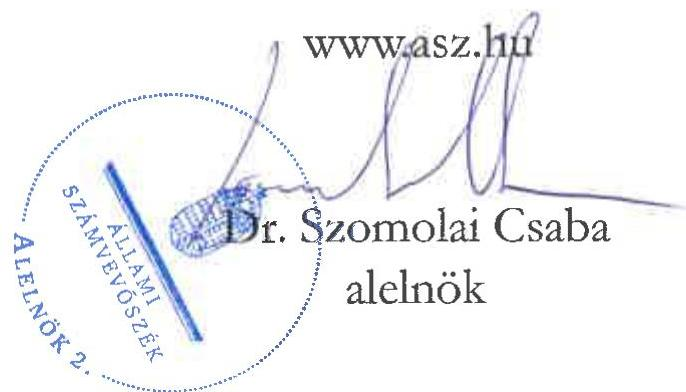
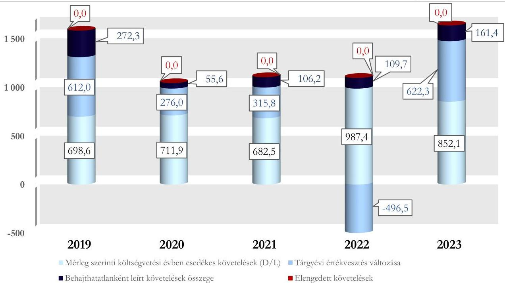

ÁLLAMI SZÁMVEVŐSZÉK

# JELENTÉS

# A központi költségvetési szervek követeléskezelése

A behajthatatlan és az elengedett követelések kezelése – Fővárosi Törvényszék

2025.

25124

www.asz.hu

---

ÁLLAMI SZÁMVEVŐSZÉK

# JELENTÉS

# A központi költségvetési szervek követeléskezelése

A behajthatatlan és az elengedett követelések kezelése – Fővárosi Törvényszék

2025.

25124

---

Jelentéseink az interneten a www.asz.hu címen olvashatók.

ELLENŐRZÉSI IGAZGATÓSÁG:
ELLENŐRZÉSI IGAZGATÓSÁG I.

ELLENŐRZÉSI IGAZGATÓ:
SINKÁNÉ DR. CSENDES ÁGNES igazgató

ELLENŐRZÉSVEZETŐ:
DR. SIMON JÓZSEF igazgatóhelyettes, ellenőrzésvezető
LACZI HEDVIG ANNA ellenőrzésvezető

IKTATÓSZÁM: EL-4398-001/2025
TÉMASORSZÁM: 20/2024
ELLENŐRZÉS-AZONOSÍTÓ SZÁM: V1073

---

TARTALOMJEGYZÉK

- ÖSSZEFOGLALÁS ... 5
- AZ ELLENŐRZÉS EREDMÉNYEI ... 8
1. A központi költségvetési szerv követelése, a követelésekkel kapcsolatos értékvesztések, a behajthatatlan és elengedett követelések alakulása és ezek eredményre, illetve a vagyonra gyakorolt hatásai ... 8
2. A központi költségvetési szerv követeléskezelési tevékenységgel kapcsolatos folyamatainak és a követelések értékelési szabályainak kialakítása ... 12
3. A központi költségvetési szerv követeléskezelési tevékenységének működtetése - behajthatatlan és elengedett követelések kezelése ... 13
4. A központi költségvetési szerv követeléseinek év végi értékelése és az éves költségvetési beszámolóban történt kimutatása, leltárral történő alátámasztása ... 15
- JAVASLATOK ... 16
- I. FÜGGELÉK: ÉSZREVÉTELEK ... 17
- II. FÜGGELÉK: ELLENŐRZÉSI MEGKÖZELÍTÉS ... 18
- MELLÉKLETEK ... 23
I. sz. melléklet: Értelmező szótár ... 23
II. sz. melléklet: Az ellenőrzött szervezetek jegyzéke ... 25
- RÖVIDÍTÉSEK JEGYZÉKE ... 26

---

“哈，你是个小伙子，你是个小伙子，你是个小伙子，你是个小伙子，你是个小伙子，你是个小伙子，你是个小伙子，你是个小伙子，你是个小伙子，你是个小伙子，你是个小伙子，你是个小伙子，你是个小伙子，你是个小伙子，你是个小伙子，你是个小伙子，你是个小伙子，你是个小伙子，你是个小伙子，你是个小伙子，你是个小伙子，你是个小伙子，你是个小伙子，你是个小伙子，你是个小伙子，你是个小伙子，你是个小伙子，你是个小伙子，你是个小伙子，你是个小伙子，你是个小伙子，你是个小伙子，你是个小伙子，你是个小伙子，你是个小伙子，你是个小伙子，你是个小伙子，你是个小伙子，你是个小伙子，你是个小伙子，你是个小伙子，你是个小伙子，你是个小伙子，你是个小伙子，你是个小伙子，你是个小伙子，你是个小伙子，你是个小伙子，你是个小伙子，你是个小伙子，你是个小伙子，你是个小伙子，你是个小伙子，你是个小伙子，你是个小伙子，你是个小伙子，你是个小伙子，你是个小伙子，你是个小伙子，

---

ÖSSZEFOGLALÁS

A központi költségvetési szervek követelései a közvagyon részét képezik ugyanúgy, mint a pénzeszközök, a befektetett eszközök vagy a készletek. A követelések teljesülése befolyásolja az adott szervezet bevételének alakulását. Így a gazdálkodás egyik fontos elemét jelenti a követeléskezelési tevékenységek, eljárások szabályszerű, célszerű és eredményes működtetése a bevételk lehető legnagyobb mértékű pénzügyi realizálása érdekében. Mindezek hiánya esetén nem érvényesül a jó gazda gondossága a gazdálkodás e területén.

A Fővárosi Törvényszék ellenőrzését az indokolta, hogy az ellenőrzött időszakban a központi költségvetési szervek között jelentős nagyságrendű követelésállománnyal rendelkezett, illetve a bíróságok költségvetési fejezeten belül mérlegfőösszege alapján kiemelt szereplőnek számított.

A Fővárosi Törvényszék az ellenőrzött időszakban meghatározta a követeléskezelési tevékenységének és a közhatalmi jellegű követelések behajtásra történő átadásának szabályozási kereteit és ezek alapján intézkedéseket tett a követelések megtérülése érdekében. A lejárt és nem teljesült követeléseket behajtás céljából a Nemzeti Adó- és Vámhivatal részére adta át a jogszabályi előírásoknak megfelelően, a nem teljesült követelések behajtása érdekében ez alapján korlátozott eszközökkel rendelkezett. A követeléskezelési tevékenység célszerűsége az ellenőrzött időszakban nem volt biztosított, ennek eredményessége nem volt értékelhető. A lejárt követelésállomány folyamatos növekedése miatt az Állami Számvevőszék véleménye szerint a Fővárosi Törvényszék részéről indokolt a lejárt követelésállomány áttekintése alapján további kontrolltevékenységek beépítése a követeléskezelés folyamatába a fizetési felszólítások határidőn belüli és teljeskörű kiküldése, a lejárt követelések Nemzeti Adó- és Vámhivatal részére történő határidőn belüli és teljeskörű átadása érdekében, valamint a vonatkozó szabályozás alapján a behajthatatlan követelések elszámolási feltételeinek vizsgálata.

Az $\mathrm{FT^I}$ beszámolóban kimutatott követelésállománya 2019. és 2022. évek között 47,5%-kal növekedett, majd 2023. évben kismértékben, 4,3%-kal csökkent. A beszámolóban kimutatott követelésállomány alakulására az adott évben képződött és esedékességkor ki nem egyenlített követelések értékének változása gyakorolt hatást.

A költségvetési évben esedékes közhatalmi, működési és felhalmozási célú beszámolóban kimutatott követelések aránya a közhatalmi, működési és felhalmozási célú bevételhez viszonyítottan a 2019. év végi 45,6%-ról a 2023. év végére 43,1%-ra csökkent, az ellenőrzött időszakban átlagosan 43,6% volt.

A lejárt követelések esetén kedvezőtlen folyamatot jelentett, hogy ezek értéke az ellenőrzött időszakban növekvő tendenciát mutatott, illetve ezen belül meghatározó volt a 360 napon túli követelések aránya. Az FT lejárt követelései többségét az igazságügyi szolgáltatási díjakból származó követelések tették ki. Ezen belül is a bűnügyi költséghez, valamint az állam által előlegezett költség bevételéhez kapcsolódó követelések részaránya volt leginkább meghatározó az ellenőrzött időszakban. A lejárt követelések állománya az ellenőrzött időszakban évente átlagosan az elszámolt bevétel 26,0%-át tette ki. A pénzügyileg nem teljesült követeléseken belül a közhatalmi bevételből származó követelések aránya magasabb volt a közhatalmi bevétel összes bevételen belül képviselt arányánál, ami a közhatalmi bevétel alacsonyabb fokú pénzügyi realizálhatóságát mutatja.

Az FT költségvetési évben esedékes követelései csaknem kizárólag természetes személyekkel szemben álltak fent, amelyből átlagosan 95,5%-ot a belföldi, 4,0%-ot a külföldi természetes személyek képviseltek.

Az FT korrigált, költségvetési évben esedékes követelésállománya 2019. évi 1 582,8 M Ft-ról a 2022. évre 600,6 M Ft-ra, majd ehhez képest 2023. évre több mint 2,7-szeresére növekedett. A FT korrigált,

---

Összefoglalás

költségvetési évben esedékes közhatalmi, működési és felhalmozási célú összesített követelésállományának alakulását a költségvetési évben esedékes követelések értéke, valamint a tárgyévi értékvesztés változása határozta meg. Az elszámolt értékvesztések összegét jelentősen befolyásolta az alkalmazott értékvesztés képzési ráták csökkentése 2022. évben, majd ezt követő emelése 2023. évben.

A tárgyévi értékvesztés változás eredményre gyakorolt negatív hatása 2019. évi 612,0 M Ft-ról 2022. évig csökkent – 2022. évben az értékvesztés visszaírások miatt a hatás pozitív volt –, majd 2023. évre 622,3 M Ft-ra növekedett. Az ellenőrzött időszakban a költségvetési évben esedékes beszámolóban kimutatott követelésekre képzett értékvesztések átlagosan 99,6%-a természetes személyekkel, 0,4%-a államháztartáson kívüli szervezetekkel szemben fennálló követelésekre került megképzésre.

A behajthatatlan követelések eredményre és vagyonváltozásra gyakorolt negatív hatása 2019. évi 272,3 M Ft-ról 2020. évre 55,6 M Ft-ra csökkent, 2021. évtől azonban növekedett, a 2021. évi 106,2 M Ft-ról a 2023. évre 161,4 M Ft-ra változott.

Az FT a követelések kezelésével, elszámolásával, valamint a behajtásra történő átadással kapcsolatos szervezeti kereteket és folyamatokat a jogszabályi előírások szerint kialakította. Az FT a követelések elszámolásának, értékelésének, valamint a behajthatatlan és elengedett követelések elszámolásának szabályait a jogszabályi előírások szerint belső szabályzataiban meghatározta.

Az FT követeléseinek értékelése, a követelések és az értékvesztések, továbbá a behajthatatlan követelések elszámolása – két eset kivételével – a jogszabályi előírások és a belső szabályozók előírásai szerint történt.

A követelések részletező nyilvántartása az ellenőrzött mintatételek alapján – egy eset kivételével – teljeskörűen tartalmazta a jogszabály által előírt tartalmi elemeket.

A követelések év végi értékelése és az éves költségvetési beszámolóban történő kimutatása jogszabályi előírásoknak megfelelően történt. Az FT 2023. évi éves költségvetési beszámoló mérlegének a költségvetési évben és a költségvetési évet követően esedékes követeléseit a jogszabályi előírásoknak megfelelően leltárral alátámasztotta.

A közhatalmi bevételből származó lejárt követelései esetén meghatározó szerepet töltött be a követelések végrehajtásra történő átadása a NAV² részére. A jogszabályi előírások változása miatt az FT számára a követeléskezelés a közhatalmi jellegű követelések tekintetében alapvetően e módon volt lehetséges 2020. évtől kezdődően.

Az FT az ellenőrzött mintatételek esetén – három eset kivételével – a jogszabályokban és a belső szabályzataiban meghatározott előírások szerint járt el a lejárt követelések beszedése, behajtása során. Az ellenőrzött időszakban a jogszabályban foglaltak ellenére e három esetben e követelések végrehajtás céljából nem kerültek átadásra a NAV részére. A követelések megtérülése szempontjából alapvető fontosságú a követeléskezelés e lépésének teljeskörű és előírt határidőben történő megtétele.

Az FT-re vonatkozóan a követeléskezelés és behajtás érdekében alkalmazott tevékenység eredményessége nem volt értékelhető, mivel a meghatározó részarányt képviselő közhatalmi bevételekből származó követelések esetén a végrehajtással összefüggő feladatokat nem az FT látta el.

Az FT a követelések minél nagyobb arányú megtérülését a követeléskezelési tevékenységgel összefüggő feladatok teljeskörű és határidőn belül történő végrehajtásával tudta elősegíteni. A FT ugyanakkor korlátozott mozgástérrel rendelkezett a követeléskezelés területén, mivel kizárólag a fizetési felszólítás, mint követeléskezelési eszköz áll rendelkezésére. Az FT követeléskezelési tevékenységének célszerűségét kedvezőtlenül befolyásolta, hogy az alkalmazott követeléskezelési eszköz lejárt követelések állományára és

6

---

Összefoglalás

ennek időbeli alakulására vonatkozó hatásait az FT nem értékelte az ellenőrzött időszakban. Ezáltal nem győződött meg arról, hogy a belső szabályozásban szereplő intézkedéseket ésszerűen és racionálisan, valamint a követelések megtérülése érdekében teljeskörűen és az előírt határidők betartásával alkalmazta. Mindezt a mintatételek esetén a NAV részére történő átadás három esetben való elmaradása is visszaigazolta.

Az ÁSZ³ három javaslatot fogalmazott meg az FT részére. A lejárt követelések állományának növekedése és az elszámolt bevételekhez képest jelentős összege, valamint lejárat szerinti megoszlása alapján az ÁSZ véleménye szerint indokolt az FT részéről áttekinteni a lejárt követeléseket és ez alapján a fizetési felszólítások belső szabályzatban meghatározott határidőn belül történő kiküldésének teljeskörűségét és a közhatalmi bevételekből származó lejárt követelések teljeskörű és határidőben történő átadását biztosító kontrolltevékenységek beépítése a követeléskezelési folyamatba. Ha a vizsgált lejárt követeléseknél a NAV részéről az alátámasztó dokumentum rendelkezésre áll a követelés végrehajthatóságának elévülésére vonatkozóan, illetve a behajthatatlan követeléssé való nyilvánítás feltételei fennállnak, akkor az FT-nek szükséges kivezetnie az érintett tételeket a követeléskezeléssel érintett követelések közül.

7

---

AZ ELLENŐRZÉS EREDMÉNYEI

1. A központi költségvetési szerv követelése, a követelésekkel kapcsolatos értékvesztések, a behajthatatlan és elengedett követelések alakulása és ezek eredményre, illetve a vagyonra gyakorolt hatásai

Összegző megállapítás

Az FT beszámolóban kimutatott követeléseinek értéke a 2019. év végéről 2023. év végére növekvő tendenciát mutatott. A lejárt követelések állománya - az igazságügyi követelések érvényesítésének alacsony mértéke miatt - folyamatosan növekedett. A követelések értékelése alapján a követelésekkel kapcsolatos elszámolások a beszámolóban kimutatott eredményt és vagyonváltozást a 2022. évet kivéve negatívan érintették.

## A KÖVETELÉSEK ALAKULÁSA

Az FT költségvetési évben és az évet követően esedékes beszámolóban kimutatott követeléseinek értéke a 2019. év végi 937,2 M Ft-ról a 2023. év végére 41,4%-kal, 1 325,4 M Ft-ra növekedett.

Az FT beszámolóban kimutatott követeléseinek és elszámolt bevételeinek alakulását az 1. táblázat tartalmazza.

1. táblázat
FT BESZÁMOLÓBAN KIMUTATOTT KÖVETELÉSEI ÉS ELSZÁMOLT BEVÉTELEI (M FT, %)

|  MEGNEVEZÉS | 2019.12.31. | 2020.12.31. | 2021.12.31. | 2022.12.31. | 2023.12.31.  |
| --- | --- | --- | --- | --- | --- |
|  Beszámolóban kimutatott követelések, ebből: | 937,2 | 1 120,2 | 1 046,5 | 1 382,6 | 1 325,4  |
|  Költségvetési évet követően esedékes követelések | 238,6 | 408,3 | 364,0 | 395,2 | 473,3  |
|  Költségvetési évben esedékes követelések, amelyek közhatalmi és működési, továbbá felhalmozási célú követelések | 698,6 | 711,9 | 682,5 | 987,4 | 852,1  |
|  A közhatalmi és működési, továbbá felhalmozási célú elszámolt bevételek | 1 530,5 | 1 548,1 | 1 869,2 | 2 113,7 | 1 979,3  |
|  Közhatalmi bevételek aránya az összes bevételből | 70,1 | 70,1 | 74,9 | 75,9 | 72,2  |
|  Költségvetési évben esedékes követelések aránya a beszámolóban kimutatott követeléshez (%) | 74,5 | 63,6 | 65,2 | 71,4 | 64,3  |
|  Költségvetési évben esedékes követelésekből a közhatalmi és működési, továbbá felhalmozási célú követelések aránya az elszámolt bevételekhez viszonyítva (%) | 45,6 | 46,0 | 36,5 | 46,7 | 43,1  |

Forrás: Az ellenőrzött szervezet éves költségvetési beszámolói alapján, ÁSZ saját szerkesztés

---

Az ellenőrzés eredményei

A 2019-2023. évek közötti időszakban az FT elszámolt közhatalmi, működési és felhalmozási célú bevételének átlagosan 43,6%-át tette ki a mérleg szerinti költségvetési évben esedékes követelések értéke. Az FT közhatalmi követeléseinek többségét az igazságügyi szolgáltatási díjakból származó követelések tették ki. Ezen belül is a bűnügyi költséghez, valamint az állam által előlegezett költség bevételéhez kapcsolódó követelések részaránya volt leginkább meghatározó az ellenőrzött időszakban. E követelések ugyanakkor meghatározó részarányt képviseltek a lejárt követelések tekintetében.

Az FT mérleg szerint költségvetési évben esedékes lejárt követeléseiből a 180 napon túli követelések aránya az ellenőrzött időszakon belül átlagosan 92,9%-ot ért el, amelyen belül meghatározó volt a 360 napon túli követelések aránya. A lejárt követelések állománya az ellenőrzött időszakban átlagosan az elszámolt bevétel 26,0%-át tette ki. Mindez azt mutatja, hogy a lejárt követelések jelentős hatást gyakoroltak a gazdálkodásra, mivel ezek meg nem térülése befolyásolta a rendelkezésre álló bevétel értékét.

Az FT költségvetési évben esedékes lejárt követeléseinek állományát és a követeléseinek lejárat szerinti megoszlását a 2. számú táblázat tartalmazza (kiemelve a jelentős arányt képviselő lejárati időszakokat).

2. táblázat
AZ FT KÖLTSÉGVETÉSI ÉVBEN ESEDEKES KÖVETELÉSEINEK ÁLLOMÁNYA ÉS LEJÁRAT SZERINTI MEGOSZLÁSA (M FT, %)

|  KÖVETELÉSEK
ESEDEKESSEGE | 2019.12.31. | 2020.12.31. | 2021.12.31. | 2022.12.31. | 2023.12.31.  |
| --- | --- | --- | --- | --- | --- |
|  Fizetési határidőn túl 0-90 nap | 5,3 | 5,3 | 3,2 | 4,0 | 2,2  |
|  Fizetési határidőn túl 91-180 nap | 3,2 | 3,0 | 3,4 | 3,2 | 2,9  |
|  Fizetési határidőn túl 181-360 nap | 7,8 | 6,2 | 4,9 | 6,2 | 16,3  |
|  Fizetési határidőn túl 360 nap | 83,8 | 85,5 | 88,6 | 86,7 | 78,6  |
|  Lejárt követelések értéke (M FT) | 7 652,0 | 7 941,3 | 8 227,7 | 8 036,2 | 8 523,2  |
|  Lejárt követelések aránya az elszámolt
bevételéhez viszonyítva (%) | 27,7 | 28,6 | 25,8 | 24,1 | 24,4  |
|  Közhatalmi követelések aránya a lejárt
követeléseken belül (%) | 90,9 | 91,0 | 91,7 | 87,7 | 90,0  |
|  Megképzett értékesítés lejárt követelések
összegéhez viszonyított aránya (%) | 94,9 | 95,1 | 95,3 | 95,1 | 95,4  |

Forrás: „Kimutatás központi költségvetési szervek követeléseinek összetételéről adósok szerint”, az FT főkönyvi kivonatai, követelések részletező nyilvántartása adatai alapján. ÁSZ saját szerkesztés

Az ellenőrzött időszakban az FT költségvetési évben esedékes követeléseinek több, mint 99,0%-a természetes személyekkel szemben állt fenn, ezen belül 95,5% volt a belföldi természetes személyekkel szemben fennálló követelések részaránya. A természetes személyek arányát az indokolta, hogy a követelések döntő többségét kitevő bűnügyi költségből eredő követelések természetes személyekhez kapcsolódtak. Az FT költségvetési évben esedékes követeléseinek fennmaradó átlagosan 0,4%-a államháztartáson kívüli szervezetekkel (legfőképp vállalkozókkal) szemben állt fenn.

## A KÖVETELÉSEK ÉRTÉKELÉSÉNEK HATÁSA AZ EREDMÉNY- ÉS VAGYONVÁLTOZÁSRA

Az FT beszámolóban kimutatott követeléseinek értékelése – 2022. évet kivéve – negatív hatás gyakorolt az eredményre és vagyonváltozásra. Ennek értéke 2019. évtől 2021. évig tendenciájában csökkent, majd 2023. évre az előző évhez képest 1 170,5 M Ft-tal növekedett. A 2022. évben a

---

Az ellenőrzés eredményei

beszámolóban kimutatott követelések értékelése összesen 386,8 M Ft pozitív hatást gyakorolt az eredményre és a vagyonváltozásra.

Az FT követelései értékelésének eredményre és vagyonváltozásra gyakorolt hatását az ellenőrzött időszakra vonatkozóan a 3. táblázat tartalmazza.

3. táblázat

AZ FT KÖVETELÉSEI ÉRTÉKELÉSÉNEK EREDMÉNYRE ÉS VAGYONVÁLTOZÁSRA GYAKOROLT HATÁSA (M FT, %)

|  MEGNEVEZÉS | 2019. | 2020. | 2021. | 2022. | 2023.  |
| --- | --- | --- | --- | --- | --- |
|  Elszámolt követelésértékelés eredmény és vagyonváltozás hatása | 884,3 | 331,6 | 422,0 | - 386,8 | 783,7  |
|  ebből: tárgyévi értékvesztés változása | 612,0 | 276,0 | 315,8 | - 496,5 | 622,3  |
|  ebből: behajthatatlan követelés | 272,3 | 55,6 | 106,2 | 109,7 | 161,4  |
|  ebből: elengedett követelés | 0,0 | 0,0 | 0,0 | 0,0 | 0,0  |
|  Követelésértékelés elemeinek megoszlása |  |  |  |  |   |
|  értékvesztés változás aránya % | 69,2 | 83,2 | 74,8 | 128,4 | 79,4  |
|  behajthatatlan követelések aránya % | 30,8 | 16,8 | 25,2 | -28,4 | 20,6  |
|  elengedett követelések aránya % | 0,0 | 0,0 | 0,0 | 0,0 | 0,0  |

Forrás: Kincstár KGR-K11 rendszer beszámoló, ellenőrzött szervezetek főkönyvi kivonat adatai alapján, ÁSZ saját szerkesztés

Az ellenőrzött időszakban az FT által elszámolt behajthatatlan követelés összesen 705,2 M Ft volt. Ezen belül az államháztartáson kívüli szervezetekkel (vállalkozókkal) szemben 19,8 M Ft (2,7%), a természetes személyekkel szemben összesen 685,4 M Ft (87,7% döntően belföldi természetes személyek szemben) került kivezetésre. Az FT behajthatatlanként elszámolt követeléseiből a kötelezett megszűnése (az adós meghalt/megszűnése) következtében átlagosan 28,0%, egyéb okokból (például az adós ismeretlen, nem rendelkezett címmel, nem fellelhető, elévült a követelés, a felszámolási eljárás és végrehajtás során nem volt fedezet) történő leírás miatt átlagosan 72,0% került elszámolásra 2019-2023. években.

Az adott évben behajthatatlanként elszámolt követelések év végén fennálló 360 napon túl lejárt követelésállományokhoz viszonyított aránya az ellenőrzött időszakban 0,8% (2020. év) és 4,2% (2019. év) a között mozgott.

Az ellenőrzött időszakban az FT elengedett követeléssel nem rendelkezett.

Az FT a követelések értékelését a közhatalmi és igazságügyi követelések esetében – az irányító szerve által meghatározott mutatók alkalmazásával – a kötelezettek együttes minősítése alapján egyszerűsített értékelési eljárással végezte. A 2019-2023. években az értékvesztés képzése összesen 1 827,0 M Ft, az értékvesztés visszaírása összesen 497,4 M Ft volt, ezáltal a tárgyévi értékvesztés változása az ellenőrzött időszakban összesen 1 329,6 M Ft-os negatív hatást gyakorolt az FT eredményére és vagyonára.

Az értékvesztés változás az ellenőrzött időszak négy évében összesen 1 826,1 M Ft-tal csökkentette az eredményt és ezáltal a vagyon, 2022. évben azonban 496,5 M Ft összegű pozitív hatást gyakorolt.

A közhatalmi bevételeken belül meghatározó arányt képviselő bűnügyi költségek tekintetében az FT a bírósági szervezetek összesített tapasztalati adatain alapuló, az OBH⁴ által évente felülvizsgált értékvesztés képzési rátákat alkalmazta. Az értékvesztés képzési ráta a 360 napon túl lejárt ilyen típusú követelések esetében 2021. évig érvényes 97,0%-ról 2022. évben 93,0%-ra csökkent, majd 2023. évben 95,0%-ra emelkedett. Mivel az FT lejárt követelésein belül a 360 napot meghaladóan lejárt követelések aránya folyamatosan 80,0% körül mozgott, az alkalmazott értékvesztés képzési ráta kismértékű módosítása is jelentős összegű változást eredményezett az elszámolt értékvesztés összegében.

10

---

Az ellenőrzés eredményei

# A KÖVETELÉSÁLLOMÁNY ALAKULÁSA

Az FT korrigált, költségvetési évben esedékes közhatalmi, működési és felhalmozási célú összesített követelésállománya 2019. évben 1 582,8 M Ft* volt, amely 2022. évre 62,1%-kal, 600,6 M Ft-ra csökkent, majd 2023. évre 1 635,8 M Ft-ra növekedett. A korrigált, költségvetési évben esedékes közhatalmi, működési és felhalmozási célú összesített követelésállománya alakulását a költségvetési évben esedékes követelések értéke, valamint a tárgyévi értékvesztés változása határozta meg.

Az FT korrigált, összesített költségvetési évben esedékes közhatalmi, működési és felhalmozási célú követelésállományának összetételét az 1. ábra szemlélteti.

1. ábra

Forrás: Kincstár KGR-K11 rendszer beszámoló adatai, továbbá az ellenőrzött szervezet főkönyvi kivonatai alapján. ÁSZ saját szerkesztés

Az ellenőrzött időszakban a Bíróságok címhez tartozó szervek költségvetési évben esedékes követelése éves átlagos állományán (3 617,1 M Ft) belül az FT 21,7%-ot (786,5 M Ft-ot) képviselt. Az ellenőrzött időszakban elszámolt értékvesztésváltozások és behajthatatlan követelések eredmény- és vagyonváltozásra gyakorolt hatásának értéke az FT esetében 2 034,8 M Ft volt, ami a Bíróságok cím költségvetési szerveire számított összesített érték (5 770,5 M Ft) 35,3%-ának felelt meg.

* Az 1. ábrán szereplő adathoz képest a korrigált, költségvetési évben esedékes közhatalmi, működési és felhalmozási célú összesített követelésállomány értéke kerekítési különbözet miatt tér el.

11

---

Az ellenőrzés eredményei

## 2. A központi költségvetési szerv követeléskezelési tevékenységgel kapcsolatos folyamatainak és a követelések értékelési szabályainak kialakítása

### Összegző megállapítás

Az FT a követeléskezelési tevékenységgel, illetve a behajtásra történő átadással kapcsolatos szervezeti kereteit és folyamatait a jogszabályokban és a belső szabályozókban foglaltaknak megfelelően kialakította. A követelések kezelésére, elszámolására és értékelésére, valamint a behajthatatlan és elengedett követelések elszámolására vonatkozó belső szabályokat a jogszabályi előírások szerint meghatározta.

Az FT a követeléskezelési feladatokat ellátó szervezeti egységek feladatait az SZMSZ⁵-ben, a Gazdasági Hivatal ügyrendjében⁶, valamint a Bevételi ügyviteli eljárásrendben⁷ az Ávr.⁸ előírásaival összhangban határozta meg.

Az FT a követeléskezeléssel, a követelések végrehajtásra történő átadásával, valamint a behajthatatlan és elengedett követelések működési- és értékelési munkafolyamataival kapcsolatos feladatait az Ellenőrzési nyomvonalában⁹ a Bkr.¹⁰ előírásaival összhangban szabályozta.

A követelések kezelésére, elszámolására és értékelésére, a követelés behajtására vonatkozó szervezeti keretek kialakítását, a munkafolyamatok szabályozását az FT-nél a 4. táblázatban megjelölt szabályozó eszközök tartalmazták az ellenőrzött időszakban.

### 4. táblázat

AZ FT KÖVETELÉSEK KEZELÉSÉBEN RÉSZTVEVŐ SZERVEZETI EGYSEGEI ÉS A SZERVEZETI KERETEKET ÉS A MUNKAFOLYAMATOKAT SZABÁLYOZÓ ESZKÖZÖK

|  KÖVETELÉSKEZELÉSBEN RÉSZTVEVŐ SZERVEZETI EGYSEGEK |   |   | A KÖVETELÉSKEZELÉS SZERVEZETI KERETEIT ÉS A MUNKAFOLYAMATAIT SZABÁLYOZÓ ESZKÖZÖK  |   |   |   |
| --- | --- | --- | --- | --- | --- | --- |
|  GAZDASÁGI HIVATAL | GAZDASÁGI HIVATAL BEVÉTELI OSZTÁLYA | JOGI ÉS IGAZGATÁS-SZERVEZÉSI OSZTÁLY | SZMSZ | ÜGYREND | ELLENŐRZÉSI NYOMVONAL | EGYÉB SZABÁLYOZÓK  |
|  ☐ | ☐ | ☐ | ☐ | ☐ | ☐ | ☐  |

Rendelkezett a szabályozó eszközzel és szabályozta a követeléskezelés tartalmát; rendelkezett követeléskezelésben résztvevő szervezeti egységgel

Forrás: Az ellenőrzött szervezet dokumentumai alapján, ÁSZ saját szerkesztés

A követelések értékelésének, valamint a behajthatatlan és elengedett követelések elszámolásának szabályait az FT a Számv. tv.¹¹ és az Áhsz.¹² előírásainak megfelelően meghatározta a számviteli politikában és annak keretében elkészített értékelési szabályzat¹.⁶⁷-ban, valamint a számlarend¹.⁶-ben¹⁴ és a bizonylati rendben.

A követelésekkel kapcsolatos részletező nyilvántartás vezetésére vonatkozó szabályokat az FT számlarendje, illetve a számlarendben foglaltakat alátámasztó bizonylati rendje az Áhsz.-ben előírtak szerint tartalmazta.

---

Az ellenőrzés eredményei

Az FT belső ellenőrzése a követeléskezeléssel, a behajthatatlan és elengedett követelésekkel, és az értékvesztéssel kapcsolatos rendszerellenőrzést – igazságügyi követelések rendszerellenőrzése tárgyában – 2021-2023. évekre vonatkozóan végzett.

## 3. A központi költségvetési szerv követeléskezelési tevékenységének működtetése - behajthatatlan és elengedett követelések kezelése

### Összegző megállapítás

Az FT a követelések értékelését és elszámolását a jogszabályokban és a belső szabályzatokban foglalt előírásoknak megfelelően végezte. Az FT az ellenőrzött időszakban szabályszerűen számolta el a követelésekhez kapcsolódó értékvesztést, a behajthatatlan követelések elszámolása a jogszabályi előírásokkal összhangban történt. A követelések részletező nyilvántartása – egy eset kivételével – a jogszabály szerinti adatokat teljeskörűen tartalmazta. A követeléskezelési tevékenység célszerűsége a követeléskezelési eszközök hatásaira vonatkozó értékelések elvégzésének hiánya miatt nem volt biztosított. A követeléskezelési és behajtási tevékenység eredményessége a feladatok más szervezettel való megosztott jellege miatt nem volt értékelhető.

### A KÖVETELÉSEK ÉRTÉKELÉSE ÉS ELSZÁMOLÁSA

Az FT a követelések értékelését és az értékvesztések elszámolását a Számv. tv.-ben, az Áhsz.-ben, valamint az értékelési szabályzatban foglaltak szerint végezte. A közhatalmi bevételekből származó lejárt követelések 19 ellenőrzött tétele esetében az értékvesztés megállapítását az értékelési szabályzat előírásai szerint az irányító szerve által meghatározott tapasztalati mutatók alapján, egyszerűsített eljárással végezte.

### A BEHAJTHATATLAN KÖVETELÉSEK MINŐSÍTÉSE ÉS ELSZÁMOLÁSA

Az FT-nél a követelések behajthatatlanná minősítése és számviteli elszámolása – két eset kivételével – az Áhsz.-ben, a Számv. tv.-ben, a 38/2013. (IX. 19.) NGM rendeletben¹⁵ és a belső szabályozókban foglaltak szerint történt. Két követelés esetében a behajthatatlanná történő minősítés nem a Számv. tv. 3. § (4) bekezdés 10. pont g) pontjában szereplő előírással összhangban történt, mivel egy mintatétel esetében (Beh2) az elévülési időt követően három év, egy mintatétel esetében (Beh3) 13 év késedelemmel történt a behajthatatlanná minősítés és elszámolás.

### A KÖVETELÉSEK NYILVÁNTARTÁSA

Az FT két bűnügyi költségből eredő követelése (Beh2 5,9 M Ft, Beh3 6,5 M Ft) a Ptk¹⁶. 6:22. § (1) bekezdésben meghatározottak alapján 2020. évben, illetve 2010. évben elévült, azonban a Számv. tv. 65. § (7) bekezdésében foglaltak ellenére a mérlegében nem szabályszerűen mutatta ki, mivel e követeléseket időben később, a 2023. évben számolta el behajthatatlan követelésként.

Az FT-nél az igazságügyi követelések és az önálló bírósági végrehajtók költségelőlegezéséből eredő követelések részletező nyilvántartása – 19 esetben – az Áhsz. 14. melléklet III. 4. pontjában szereplő releváns nyilvántartandó adatokat tartalmazta.

13

---

Az ellenőrzés eredményei

A követelések részletező nyilvántartása egy esetben (Gyermektartási díj állam általi megelőlegezése, Köv9) nem teljeskörűen tartalmazta az Áhsz. 14. melléklet III. 4. pontja szerint előírtakat, mivel a 4. b) pont előírása ellenére a követelés iktató- vagy érkeztető számát, keltét, a 4. e) pont előírása ellenére a követelés teljesítésének határidejét, valamint a 4. f) pont előírása ellenére a követelés módosulásainak jogcímét, a változások leírását, az azt tanúsító dokumentum megnevezését, iktatószámát, keltét nem tartalmazta. E követelés nyilvántartásba vétele az ellenőrzött időszakot megelőzően (1997. évben) történt.

## A LEJÁRT KÖVETELÉSEK KEZELÉSE, BEHAJTÁSA ÉRDEKÉBEN MEGTETT INTÉZKEDÉSEK

## A követeléskezelési és behajtási tevékenység tartalma és értékelése

A követelések kezelése tekintetében az FT egyedi nyilvántartó kartonokon tartotta nyilván az adósokkal kapcsolatos adatokat (többek között a megalapozó dokumentum típusát és azonosítószámát, a követelés jogcímét, a (rész)teljesítés összegét, időpontját, az adós típusát), illetve a követeléskezelési folyamat lépéseire vonatkozó információkat (többek között a kiküldött fizetési felszólítások, egyenlegközlők adatait, a részletfizetési engedélyt). Az FT – a követelésekről vezetett részletező nyilvántartás adatai alapján – a jogszabályban és a belső szabályozóban megfogalmazott fizetési felszólítást alkalmazta a követelések kezelése érdekében.

A követelések megtérülésének biztosítása tekintetében a követelések legnagyobb részét kitevő közhatalmi bevételekből származó követelések esetén meghatározó szerepet töltött be a követelések végrehajtásra történő átadása a NAV részére. Ezáltal az FT felelősségi köre a követelések érvényesítésére vonatkozó folyamat tekintetében a végrehajtásra történő átadásig terjedt. Az ezt követő behajtási tevékenység a NAV feladatát jelentette, amelyre vonatkozóan az FT-nek nem volt ráhatása.

Az FT számára a közhatalmi jellegű követelések esetén az Avt. 3. §-át is figyelembe véve a Vht. 304/D §-a előírja, hogy 2019. december 31-től minden fizetési késedelemmel érintett követelést a NAV részére szükséges átadnia, amely e követeléseket az adóhatóság által foganatosítandó végrehajtási eljárásokról szóló 2017. évi CLIII. törvény rendelkezései alapján kezeli. Az átadás a NAV részére elektronikus úton történik.

Az FT-re vonatkozóan – figyelembe véve a közhatalmi bevételekből származó követelések meghatározó részarányát a követeléseken belül, valamint a végrehajtással összefüggő feladatok szervezettől független ellátását – a követeléskezelés és behajtás érdekében alkalmazott tevékenység eredményessége nem volt értékelhető. A követelések megtérülésével kapcsolatos problémákat azonban jól mutatja, hogy a 180 napon túli követelésállomány aránya és értéke folyamatosan magas volt, illetve a lejárt követelések értéke növekvő tendenciát mutatott. E tekintetben meghatározó körülményt jelentett a jellemzően természetes személy adósok alacsony fizetőképessége, ezáltal a követelések mérsékelt érvényesíthetősége.

Az ÁSZ véleménye szerint – az előző bekezdésben bemutatott indokok alapján – az FT vonatkozásában kizárólag a követeléskezelési tevékenység célszerűsége értékelhető. A követeléskezelési tevékenység célszerűségét kedvezőtlenül befolyásolta, hogy az FT az alkalmazott követeléskezelési eszközök – ezen belül a fizetési felszólítás, valamint a részletfizetési lehetőség – lejárt követelések állományára és ennek időbeli alakulására vonatkozó hatásait nem értékelte az ellenőrzött időszakban, valamint, hogy három esetben (Ért2 20,7 M Ft, Beh2 5,9 M Ft és Beh3 6,5 M Ft) nem történt meg a jogszabályi és belső előírások ellenére e követelések átadása a NAV részére. Ennek elmaradása hatást gyakorolt az éves beszámolóban kimutatott bevételek értékére, ezek megtérülési arányának függvényében.

14

---

Az ellenőrzés eredményei

A lejárt követelések állományának növekvő tendenciája és a bevételhez képest jelentős összege, valamint lejárat szerinti megoszlása alapján az ÁSZ véleménye szerint indokolt az FT-nek áttekintenie az érintett követeléseket, és ez alapján a fizetési felszólítások belső szabályzatban meghatározott határidőn belül történő kiküldésének teljeskörűségét és a közhatalmi bevételből származó lejárt követelések teljeskörű és határidőben történő átadását biztosító kontrolltevékenységek beépítése a követeléskezelési folyamatba. A lejárt követeléseket indokolt az FT-nek olyan szempontból is áttekinteni, hogy amennyiben a NAV részéről az alátámasztó dokumentum rendelkezésre áll a követelés végrehajthatóságának elévülésére vonatkozóan, illetve fennállnak a behajthatatlan követeléssel való nyilvánítás feltételei, akkor e tételek kivezetendők a követeléskezeléssel érintett követelések közül.

## A követeléskezelési és behajtási tevékenység a mintatételek alapján

Az FT a lejárt esedékességű közhatalmi bevételkérvényesítése érdekében értesítette adóssait a nyilvántartott követelésekről 18 esetben egyenlegközlőket, illetve 11 esetben fizetési felszólításokat küldött ki, továbbá a személyi adat- és lakcímnyilvántartásból hat esetben az adósok lakcímadatait kérte meg. Emellett öt esetben kezdeményezte a követelése peres úton történő érvényesítését.

A közhatalmi bevételkből származó követelések átadása a NAV részére 15 esetben a Vht.¹⁷, a Vhr.¹⁸, valamint a belső szabályzataiban foglaltakkal összhangban történt. Három esetben (Ért2 20,7 M Ft, Beh2 5,9 M Ft és Beh3 6,5 M Ft) a Vht. 304/D. § (3) bekezdésében foglaltak ellenére az FT nem gondoskodott 2020. január 31-ig, illetve az ellenőrzött időszakon belül a NAV részére végrehajtás céljából történő átadása érdekében. Egy esetben (Ért2) a NAV részére történő átadás az ellenőrzött időszakot követően, 2024. áprilisában megtörtént.

## 4. A központi költségvetési szerv követeléseinek év végi értékelése és az éves költségvetési beszámolóban történt kimutatása, leltárral történő alátámasztása

### Összegző megállapítás

A követelések év végi értékelése az FT-nél szabályszerű volt. A követeléseit az éves költségvetési beszámoló mérlegében a jogszabályi előírások szerint mutatta ki. Az FT a 2023. évi éves költségvetési beszámolójának mérlegében kimutatott, a költségvetési évben és a költségvetési évet követően esedékes követeléseit a jogszabályi előírások szerint leltárral alátámasztotta.

Az FT a követelések év végi értékelését az Áhsz., a Számv. tv. és a belső szabályozókban foglaltaknak megfelelően végezte.

Az FT a költségvetési évben és a költségvetési évet követően esedékes követeléseit és a behajthatatlanként elszámolt követeléseit a 2023. évi éves költségvetési beszámoló mérlegében és tájékoztató adataiban az Áhsz. előírásainak megfelelően szabályszerűen mutatta ki.

Az FT 2023. évi éves költségvetési beszámoló mérlegének a költségvetési évben és a költségvetési évet követően esedékes követeléseit az Áhsz. és a Számv. tv.-ben foglaltaknak megfelelő leltárral alátámasztotta.

15

---

16

# JAVASLATOK

Az ÁSZ tv. 33. § (1) bekezdésében foglaltak értelmében az ellenőrzött szervezet vezetője köteles a jelentésben foglalt megállapításokhoz kapcsolódó intézkedési tervet összeállítani és azt a jelentés kézhezvételétől számított 30 napon belül az ÁSZ részére megküldeni. Az ÁSZ a jelentésben foglalt megállapításokhoz kapcsolódóan az alábbi javaslatok tekintetében várja el az intézkedési terv elkészítését.

# A FŐVÁROSI TÖRVÉNYSZÉK ELNÖKE RÉSZÉRE

1. Gondoskodjon a követelések részletező nyilvántartásának az Áhsz. 14. melléklet III. 4. pontjában előírt tartalmi követelményeknek megfelelő, folyamatos vezetéséről.

2. Alakítson ki a Bkr. 8. § (1) bekezdésében foglaltaknak megfelelően a követeléskezelési tevékenységet érintően olyan kontrolltevékenységeket, amelyek támogatják a fizetési felszólítások belső szabályzatban meghatározott határidőn belül történő kiküldésének teljeskörűségét és a közhatalmi bevételekből származó lejárt követelések teljeskörű és határidőben történő átadását végrehajtás céljából az illetékes adóhatóság részére, illetve működtesse e kontrolltevékenységeket.

3. Vizsgálja meg a lejárt követelések esetén a behajthatatlan követelésként történő elszámolás feltételeit és e feltételek rendelkezésre állása esetén intézkedjen a behajthatatlan követelés elszámolásáról.

---

17

# I. FÜGGELÉK: ÉSZREVÉTELEK

A jelentéstervezetet az ÁSZ 15 napos észrevételezésre megküldte az ellenőrzött szervezet vezetőjének az ÁSZ tv. 29. §* (1) bekezdése előírásának megfelelően.

A jelentéstervezet megállapításaira az ellenőrzött szervezet nem tett észrevételt.

* 29. § (1) Az Állami Számvevőszék az ellenőrzési megállapításait megküldi az ellenőrzött szervezet vezetőjének vagy az általa megbízott személynek, és annak, akinek személyes felelősségét állapította meg.
(2) Az ellenőrzött szervezet vezetője és a felelősként megjelölt személy az ellenőrzés megállapításaira tizenöt napon belül írásban észrevételt tehet.
(3) Az Állami Számvevőszék az észrevételre a beérkezésétől számított harminc napon belül írásban válaszol. A figyelembe nem vett észrevételeket köteles a jelentésben feltüntetni, és megindokolni, hogy azokat miért nem fogadta el.

---

18

# II. FÜGGELÉK: ELLENŐRZÉSI MEGKÖZELÍTÉS

## AZ ELLENŐRZÉS JOGALAPJA

Az ellenőrzés jogszabályi alapját az ÁSZ tv.¹⁹ 1. § (3) bekezdés, 5. § (2)-(3) bekezdés, valamint az Áht. 61. § (2) bekezdéseinek előírásai képezték.

## AZ ELLENŐRZÉS CÉLJA

Az ellenőrzés célja annak értékelése volt, hogy az ellenőrzött központi költségvetési szerv a követeléskezelési és értékelési tevékenységére vonatkozó szervezeti kereteit, folyamatait és működtetésének szabályait a jogszabályi előírások szerint alakította-e ki, illetve a követeléskezelési tevékenységét szabályszerűségi, célszerűségi és eredményességi szempontok figyelembevételével működtette-e. Annak értékelése továbbá, hogy a követelések értékvesztése, a behajthatatlan és elengedett követelések nyilvántartása, elszámolása, valamint a követelések éves költségvetési beszámolóban történő kimutatása a jogszabályi és belső előírásoknak megfelelően történt-e.

Az elemzés célja volt, hogy értékelje a központi költségvetési szerv követeléseinek, az ehhez kapcsolódó értékvesztéseknek, valamint a behajthatatlan és elengedett követelések alakulását és ezek eredményre, illetve a vagyonra gyakorolt hatásait.

## AZ ELLENŐRZÉS TÍPUSA

Kombinált ellenőrzés.

## AZ ELLENŐRZÉS TÁRGYA

Az ellenőrzés tárgyát képezte az ellenőrzött központi költségvetési szerv követeléskezelési tevékenységére vonatkozó szervezeti kereteinek kialakítása, a követeléskezelési tevékenysége, a követeléskezeléssel kapcsolatos folyamatainak szabályozottsága és kialakítása, továbbá a követeléskezelési folyamatok működtetésének szabályszerűsége, célszerűsége és eredményessége, a követelések értékvesztése, az elengedett és behajthatatlan követelések nyilvántartásának, elszámolásának szabályozottsága, szabályszerűsége, valamint a követelések éves költségvetési beszámolóban történő kimutatásának jogszabályokkal való összhangja.

Az elemzés tárgya volt központi költségvetési szerv követeléseinek, az ehhez kapcsolódó értékvesztéseinek, a behajthatatlan és elengedett követeléseinek alakulása és ezek eredményre és vagyonra gyakorolt hatásai.

Az ellenőrzés kiterjedt minden olyan körülményre és adatra, amely az ÁSZ jogszabályban meghatározott feladatainak teljesítéséhez szükséges volt.

---

II. Függelék: Ellenőrzési megközelítés

# AZ ELLENŐRZÉS HATÓKÖRE ÉS TERÜLETE

Az FT jogi személy, éves költségvetés alapján önállóan működő és gazdálkodó, kincstári körbe tartozó költségvetési szerv, amelynek irányító szerve az Országos Bírósági Hivatal. Az FT-t az elnök vezeti és képviseli. Az Alaptörvény 25. cikkének (1) bekezdése szerint a bíróságok igazságszolgáltatási tevékenységet látnak el. A Bszi.²⁰ 21. § (1) bekezdése alapján az FT törvényben meghatározott ügyekben első fokon jár el, és másodfokon elbírálja a járásbíróságok határozatai elleni fellebbezéseket, illetve eljár a hatáskörébe utalt egyéb ügyekben. A költségvetési szerv illetékessége, működési területe Budapest közigazgatási területe.

Az FT működéséhez szükséges költségvetési előirányzatokat Magyarország központi költségvetésének VI. Bíróságok fejezete tartalmazza. Az FT költségvetését az OBH elnöke hagyja jóvá.

Az FT 2019-2023. évi gazdálkodási adatait az 1. táblázat mutatja.

5. táblázat
FŐVÁROSI TÖRVÉNYSZÉK FŐBB BESZÁMOLÓ ADATAI (M FT)

|  ÉVES BESZÁMOLÓ - MÉRLEG ADATOK | 2019.12.31. | 2020.12.31. | 2021.12.31. | 2022.12.31. | 2023.12.31.  |
| --- | --- | --- | --- | --- | --- |
|  Mérlegfőösszeg | 29 531,8 | 30 163,8 | 26 128,8 | 25 302,4 | 25 747,4  |
|  Költségvetési évben esedékes követelések | 698,6 | 711,9 | 682,5 | 987,4 | 852,1  |
|  BESZÁMOLÓK - TELJESÍTÉS ADATOK | 2019. | 2020. | 2021. | 2022. | 2023.  |
|  Bevételek összesen | 27 591,0 | 27 722,8 | 31 832,1 | 33 400,7 | 34 996,6  |
|  Kiadások összesen | 27 502,9 | 27 603,4 | 30 641,4 | 33 278,4 | 34 857,8  |

Forrás: Az éves költségvetési beszámolók alapján, ÁSZ saját szerkesztés

Az elemzés kiterjedt a központi költségvetési szerv követeléseinek, az azokra képzett értékvesztésnek, a behajthatatlan és elengedett követelésként elszámolt összegek alakulásának, ezek vagyonra gyakorolt hatásainak értékelésére. Értékelésre került továbbá az ellenőrzött központi költségvetési szerv követeléskezelési tevékenységének szabályszerűsége, célszerűsége és eredményessége.

Az ellenőrzés kiterjedt a központi költségvetési szerv követeléseinek kezelésére, a követelésekkel kapcsolatos értékvesztéseinek képzésére és visszaírására, a behajthatatlan és elengedett követelések elszámolására, és a követelések nyilvántartására vonatkozó szabályainak, folyamatainak kialakítására, továbbá a követeléskezelési tevékenység szervezeti kereteinek kialakítására.

Ellenőrzésre került továbbá, hogy a központi költségvetési szervnél a követelések részletező nyilvántartásának vezetése, a követeléskezelés, a behajthatatlan és elengedett követelések elszámolása megfelelt-e a jogszabályokban és a belső szabályozókban foglaltaknak, célszerűek és eredményesek voltak-e a lejárt követelések behajtása érdekében megtett intézkedések, továbbá értékelésre kerültek a követeléskezelési tevékenység gazdálkodásra gyakorolt hatásai.

Az ellenőrzés kiterjedt a központi költségvetési szerv követeléseinek év végi értékelésére. A jogszabályok és a belső szabályozók szerint ellenőrzésre került továbbá a követelések éves költségvetési beszámolóban történő kimutatásának, leltárral való alátámasztásának szabályszerűsége.

Az ellenőrzés keretében az ÁSZ 15 központi költségvetési szervet – beleértve az FT-t is – választott ki és értékelte e szervezeteknél a követelések alakulását, a kapcsolódó belső szabályozási keretek rendelkezésre állását, valamint a követeléskezeléssel kapcsolatban alkalmazott gyakorlatot.

19

---

II. Függelék: Ellenőrzési megközelítés

# AZ ELLENŐRZŐTT IDŐSZAK

A 2019-2023. évek, kitekintéssel a helyszíni ellenőrzés lezárásának időpontjáig (2025. július 31.)

# AZ ELLENŐRZÉSI KRITÉRIUMOK

|  FÓKUSZTERÜLET | ELLENŐRZÉSI KRITÉRIUMOK  |
| --- | --- |
|  1. A központi költségvetési szerv követelése, a követelésekkel kapcsolatos értékvesztések, a behajthatatlan és elengedett követelések alakulása és ezek eredményre és ezáltal vagyonra gyakorolt hatásai | Elemzés  |
|  2. A központi költségvetési szerv követeléskezelési tevékenységgel kapcsolatos folyamatainak és a követelések értékelési szabályainak kialakítása | Áht. 10. § (5) bekezdés
Ávr. 13. § (1) bekezdés e) pont; (2) bekezdés a) pont
Bkr. 6. § (1) bekezdés a) és b) pont és (2) bekezdés
Számv. tv. 14. § (3) bekezdés, (5) bekezdés b) pont, 161. §
Áhsz. 51. § (2)-(3) bekezdés, 14. melléklet III. pont, 15. melléklet II. pont  |
|  3. A központi költségvetési szerv követeléskezelési tevékenységének működtetése és ennek hatásai a gazdálkodásra - behajthatatlan és elengedett követelések kezelése | Áhsz. 1. § (1) bek., 5. § (1) bek., 6. § (2) bek., 18. § (1)-(3) és (7) bek., 19. § (1) bek., 25. § (9a) bek. d) pont és 26. § (11a) bek. d) pont, 29. § (2) bek. b) pont, 39. § (3) bekezdés, 43. § (1)-(3) bek., 53. § (6) bek. e) pont és (8) bek. c) pont, 9. melléklet, 14. melléklet III. pont, 16. melléklet 38/2013. (IX. 19.) NGM rendelet^{21} XII. fejezet D) pont, E) és F) pont
Ctv.^{22} 117. § (2) bekezdés a) pontja
Ákr.^{23} 132-138. §
Avt.^{24} 104. §
Air.^{25} (adók módjára behajtandó köztartozásnak minősülő díjak végrehajtására kiadott jogszabályban nem szabályozott kérdésekben)
Art.^{26} 76. §
Vht. 10. §, 11. § (1) bek.
2022. évi XXV. tv. 75. §
Bkr. 7. § (2) bek.
Számv. tv. 3. § (4) bek. 10. pont, 54-56. §
SZMSZ, ügyrend, ellenőrzési nyomvonal, számviteli politika, számlarend, eszközök és források értékelési szabályzata  |
|  4. A központi költségvetési szerv követeléseinek év végi értékelése és az éves költségvetési beszámolóban történt kimutatása, leltárral történő alátámasztása | Eredményesség: a 90 napon túl lejárt követelések részaránya a lejárt követeléseken belül, illetve a lejárt követelésállomány értéke az elért megtérülések következtében csökkenő tendenciát mutat
Cél szerűség: A követeléskezelési és behajtási tevékenység keretében a kialakított belső szabályozás alapján olyan intézkedések, eszközök ésszerű, racionális és tudatos alkalmazása, amelyek során a szervezet figyelembe veszi és értékeli a lehetséges előnyöket és hátrányokat, illetve együttal ezen intézkedések elősegítik a lejárt követelések állománya és lejárati összetétele kedvező irányú változását.
Számv. tv. 3. § (4) bekezdés 10. f) és g) pontjai, 55. § (1)-(3) bekezdés, Áhsz. 1. § (1) bekezdés 3. pontja, Áhsz. 5. § (1) bekezdés, 13. § (5) bekezdés, 18. § (1) bekezdés, 22. § (1) bekezdés
számviteli politika, számlarend, eszközök és források értékelési szabályzata, eszközök és források leltározási és leltárkészítési szabályzata  |

---

II. Függelék: Ellenőrzési megközelítés

# AZ ELLENŐRZÉS MÓDSZERE ÉS AZ ELLENŐRZÉSI BIZONYÍTÉKOK KÖRE

Az ellenőrzést az ÁSZ nemzetközi standardokat irányadónak tekintve az ellenőrzési program szempontjai, az ellenőrzött időszakban hatályos jogszabályok, az ellenőrzés szakmai szabályok és módszertan(ok) figyelembevételével végezte.

Az ellenőrzési kérdések megválaszolásához szükséges bizonyítékok megszerzése az ellenőrzött szervezet által rendelkezésre bocsátott dokumentumokra, adatokra alapozva, továbbá megfigyelés, szemle (szemrevételezés), kérdésfeltevés (információkérés), interjú, mintavételezés, valamint elemző eljárás útján történt. A központi költségvetési szerv követeléseinek, behajthatatlan és elengedett követeléseinek, valamint a követelések értékvesztéseinek alakulása elemző eljárással került értékelésre. Az ellenőrzési bizonyítékként felhasználható adatforrások közé tartoztak egyrészt a Magyar Államkincstár által működtetett KGR-K11²⁷ számviteli adatgyűjtő rendszerben rendelkezésre álló éves költségvetési beszámolók, az ellenőrzéshez kért dokumentumok, adatforrások, másrészt adatforrás volt még minden, az ellenőrzés folyamán feltárt, az ellenőrzés szempontjából információkat tartalmazó dokumentum.

A követelések értékelésének, a behajthatatlan és elengedett követelések, valamint a követelésekre képzett és visszaírt értékvesztés elszámolásának szabályszerűségét a követelések részletező nyilvántartásából kockázati alapon kiválasztott mintatételeken keresztül ellenőrizte az ÁSZ. A kiválasztott összesen 20 darab mintatétel – 10 darab követelésre, 5 darab behajthatatlan és 5 darab értékvesztéssel érintett követelésre vonatkozóan – a 2019-2023. évekre vonatkoztak. A kiválasztott mintatételek kiértékelésének eredménye nem került kivitelésre a teljes sokaságra.

A követelések éves költségvetési beszámolóban való kimutatását és leltárral történő alátámasztását 2023. évre vonatkozóan értékelte az ellenőrzés.

A követeléskezelés célszerűségét és eredményességét az ÁSZ a követelések és azok értékelésének a közpénzekre, a mérleg szerinti eredményre és ezáltal a vagyonra gyakorolt hatása alapján értékelte.

Az eredményesség kritériumát az ÁSZ a következőképpen értelmezte: a követeléskezelésre és behajtásra vonatkozó intézkedések hatására a 90 napon túl lejárt követelések részaránya a lejárt követeléseken belül, illetve a lejárt követelésállomány értéke az elért megtérülések következtében csökkenő tendenciát mutasson. A követelésértékelés hatásait a követelésekhez kapcsolódó értékvesztések tárgyévi változásának, a behajthatatlan és az elengedett követelések összegének a mérleg szerinti eredményre és vagyonra gyakorolt hatásai jelentették.

A célszerűség kritériumát az ÁSZ a következőképpen értelmezte: A követeléskezelési és behajtási tevékenység keretében a kialakított belső szabályozás alapján olyan intézkedések, eszközök ésszerű, racionális és tudatos alkalmazása, amelyek során a szervezet figyelembe veszi és értékeli a lehetséges előnyöket és hátrányokat, illetve egyúttal ezen intézkedések elősegítik a lejárt követelések állománya és lejárati összetétele kedvező irányú változását, a várható megtérüléssel összhangban álló ráfordítások mellett.

Az ellenőrzés az értékelések, elemzések során beszámolóban kimutatott követelésként a követeléseknek az éves költségvetési beszámoló 12. űrlap Mérleg D/III Követelés jellegű sajátos elszámolások sor nélkül számított értékét vette figyelembe. A követeléskezelési tevékenység tekintetében a Költségvetési évben esedékes követelések közül (éves költségvetési beszámoló 12. űrlap Mérleg D/I. Költségvetési évben esedékes követelések sor) az éves költségvetési beszámoló 12. űrlap Mérleg D/I/3. Költségvetési évben esedékes követelések közhatalmi bevételre sor, az éves költségvetési beszámoló 12. űrlap Mérleg D/I/4. Költségvetési évben esedékes követelések működési bevételre sor és az éves költségvetési beszámoló 12. űrlap Mérleg

21

---

II. Függelék: Ellenőrzési megközelítés

D/I/5. Költségvetési évben esedékes követelések felhalmozási bevételre sor követelései kerültek értékelésre, mivel a támogatásokra és az átvett pénzeszközökre vonatkozó követelések a követeléskezelési tevékenység szempontjából nem relevánsak.

Az ÁSZ meghatározása szerint a korrigált követelésállomány a mérlegben kimutatott követelés értékének a tárgyévi értékvesztés változással, valamint a behajthatatlan és elengedett követelések értékével növelt értékét jelentette.

Az ellenőrzés lefolytatásához az ellenőrzött szervezet tanúsítvány kitöltésével, valamint az ÁSZ által kért dokumentumok, adatok, információk megküldésével és a helyszíni ellenőrzés során szolgáltatott adatokat.

22

---

MELLÉKLETEK

I. SZ. MELLÉKLET: ÉRTELMEZŐ SZÓTÁR

behajthatatlan követelés

A számvitelről szóló 2000. évi C. törvény 3. § (4) bekezdés 10. pont a)–g) alpontja szerinti követelés azzal az eltéréssel, hogy nem tekinthető behajthatatlannak a követelés, ha a végrehajtás közvetlenül nem vezetett eredményre és a végrehajtást szüneteltetik. (Forrás: Áhsz. 1. § 1. pont a) alpont)

Az a követelés

a) amelyre az adós ellen vezetett végrehajtás során nincs fedezet, vagy a talált fedezet a követelést csak részben fedezi (amennyiben a végrehajtás közvetlenül nem vezetett eredményre és a végrehajtást szüneteltetik, az óvatosság elvéből következően a behajthatatlanság – nemleges foglalási jegyzőkönyv alapján – vélelmezhető),

b) amelyet a hitelező a csődeljárás, a felszámolási eljárás, az önkormányzatok adósságrendezési eljárása során egyezségi megállapodás keretében elengedett,

c) amelyre a felszámoló által adott írásbeli igazolás (nyilatkozat) szerint nincs fedezet,

d) amelyre a felszámolás, az adósságrendezési eljárás befejezésekor a vagyonfelosztási javaslat szerinti értékben átvett eszköz nem nyújt fedezetet,

e) amelyet eredményesen nem lehet érvényesíteni, amelynél a fizetési meghagyásos eljárással, a végrehajtással kapcsolatos költségek nincsenek arányban a követelés várhatóan behajtható összegével (a fizetési meghagyásos eljárás, a végrehajtás veszteséget eredményez vagy növeli a veszteséget), amelynél az adós nem lehetséges fel, mert a megadott címen nem található és a felkutatása „igazoltan” nem járt eredménnyel,

f) amelyet bíróság előtt érvényesíteni nem lehet,

g) amely a hatályos jogszabályok alapján elévült.

A behajthatatlanság tényét és mértékét bizonyítani kell.

(Forrás: Számv. tv. 3. § (4) bek., 10. pont a)–g) alpont)

beszámolóban kimutatott követelés

Követelés az a jogszabályból, jogerős bírói végzésből, ítéletből vagy hatósági határozatból, szerződésből – ideértve a vásárolt és a térítés nélkül átvett követelést is – jog szerűen eredő fizetési igény, amelyet a kötelezett elismert és – ellenszolgáltatást is tartalmazó szerződés esetén – a másik fél már teljesített, ideértve a bevallás alapján megállapított közhatalmi bevételre irányuló, valamint az olyan követelést is, amelyet a kötelezett vitat, de jogszabály alapján azt fellebbezésre vagy perindításra tekintet nélkül teljesítenie kell, továbbá az állami adó- és vámhatóság által a bevallás nélkül teljesítendő közhatalmi bevételekre vonatkozóan előírt követelést. (Forrás: Áhsz. 1. § 6. pont)

A követelések bekerülési értéke az egységes rovatrend bevételeihez kapcsolódóan vezetett nyilvántartási számlákon kimutatott követelésekkel megegyező elismert, esedékes összeg. (Forrás: Áhsz. 16. § (9) bekezdés)

A mérlegben a követelések között az egységes rovatrend szerinti rovatokhoz kapcsolódóan vezetett nyilvántartási számlákon nyilvántartott követeléseket kell kimutatni mindaddig, amíg azokat pénzügyileg vagy egyéb módon nem rendezték, az Áht. 97. §-a szerint el nem engedték vagy behajthatatlan követelésként le nem írták. (Forrás: Áhsz. 13. § (5) bekezdés)

A mérlegben a követeléseket a bekerülési értéken kell kimutatni, csökkentve az elszámolt értékvesztéssel, növelve az értékvesztés visszaírt összegével. (Forrás: Áhsz. 21. § (8) bekezdés).

23

---

Mellékletek

célserűség

A célserűség követelménye azt jelenti, hogy a bevételket a közfeladat megvalósítása érdekében, a kiadásokat a közfeladatok megfelelő ellátásához szükséges mértékben, a költségvetési célrendszer érdekében, a meghatározott célra (közfeladat ellátására), továbbá ésszerűen, racionálisan használták fel. Az erőforrások ésszerű, racionális felhasználása alatt a tudatos döntéshozatal vagy az erőforrások olyan módon történő, tudatos felhasználását foglalja magában, amely számba veszi a lehetséges előnyöket és hátrányokat, tisztában van a következményekkel, kerüli a túlzásokat, törekszik a saját tevékenységével való konzisztenciára, a helyes elvek alkalmazására és a megfelelő érvek hatására hajlandó az önkorrekción is. (Forrás: ÁSZ ellenőrzési alapelvei és módszertana 2024. október)

elengedett követelés

Az állam, az államháztartás központi alrendszerébe tartozó költségvetési szervek, a nemzetiségi önkormányzatok, valamint az általuk irányított költségvetési szervek követeléséről lemondani csak törvényben meghatározott esetekben és módon lehet.

(Forrás: Áht. 97. § (1) bek.)

eredményesség

Az eredményesség elve a kitűzött célok és a tervezett eredmények (hatások) elérését jelenti, azt, hogy az ellenőrzött terület (tevékenység, folyamat, projekt, beruházás, informatikai rendszer stb.) vagy szervezet a kitűzött célokat és a szándékolt eredményeket (hatásokat) elérte. (Forrás: ÁSZ ellenőrzési alapelvei és módszertana 2024. október)

értékvesztés

Az üzleti év mérlegfordulónapján fennálló és a mérlegkészítés időpontjáig pénzügyileg nem rendezett követelésnél értékvesztést kell elszámolni – a mérlegkészítés időpontjában rendelkezésre álló információk alapján – a követelés könyv szerinti értéke és a követelés várhatóan megtérülő összege közötti veszteségjellegű különbözet összegében, ha ez a különbözet tartósnak mutatkozik és jelentős összegű. (Forrás: Számv. tv. 55. § (1) bek.)

értékvesztés visszaírása

Amennyiben a követelés várhatóan megtérülő összege jelentősen meghaladja a követelés könyv szerinti értékét, a különbözetet a korábban elszámolt értékvesztést visszaírással csökkenteni kell. Az értékvesztés visszaírásával a követelés könyv szerinti értéke nem haladhatja meg a Számv. tv. 65. § (1)-(3) bekezdése szerinti nyilvántartásba vételi (devizakövetelés esetén a Számv. tv. 60. § szerinti árfolyamon számított) értékét. (Forrás: Számv. tv. 55. § (3) bek.)

közfeladat

A jogszabályban meghatározott állami és önkormányzati feladat. A közfeladatot meghatározó jogszabályban meg kell határozni a közfeladat ellátásának módját és rendelkezni kell az ellátásához szükséges pénzügyi fedezet biztosításáról. (Forrás: Áht. 3/A. § (1), (3) bekezdés)

tárgyévi értékvesztés változása

az adott évben értékvesztés képzésének és az adott év értékvesztés visszaírással csökkentett értéke (ÁSZ meghatározás)

törvényesség

A jogszabályokban foglalt, valamint a közpénzekkel és közvagyonnal való gazdálkodásra vonatkozó egyéb előírások betartásának kötelezettsége. (Forrás: Magyarország Alaptörvénye 37. cikk indokolása)

24

---

Mellékletek

- II. SZ. MELLÉKLET: AZ ELLENŐRZŐTT SZERVEZETEK JEGYZÉKE

**ELLENŐRZŐTT SZERVEZET MEGNEVEZÉSE**

Fővárosi Törvényszék

25

---

RÖVIDÍTÉSEK JEGYZÉKE

1 FT
Fóvárosi Törvényszék

2 NAV
Nemzeti Adó- és Vámhivatal

3 ÁSZ
Állami Számvevőszék

4 OBH
Országos Bírósági Hivatal

5 SZMSZ
1 A Fővárosi Törvényszék Szervezeti és Működési Szabályzata (hatályos: 2016.06.07-től 2019.09.27-ig)
2 A Fővárosi Törvényszék Szervezeti és Működési Szabályzata (hatályos: 2019.09.27-től 2020.04.27-ig)
3 A Fővárosi Törvényszék Szervezeti és Működési Szabályzata (hatályos: 2020.04.28-tól 2021.10.22-ig)
4 A Fővárosi Törvényszék Szervezeti és Működési Szabályzata (hatályos: 2021.10.23-tól 2022.11.30-ig)
5 A Fővárosi Törvényszék Szervezeti és Működési Szabályzata (hatályos: 2022.12.01-től)
6 Gazdasági Hivatal ügyrendje
1 A Fővárosi Törvényszék Gazdasági Hivatalának ügyrendje (hatályos: 2018.01.03-tól 2020.07.31-ig)
2 A Fővárosi Törvényszék Gazdasági Hivatalának ügyrendje (hatályos: 2020.08.01-től 2021.09.09-ig)
3 A Fővárosi Törvényszék Gazdasági Hivatalának ügyrendje (hatályos: 2021.09.10-tól 2022.12.06-ig)
4 A Fővárosi Törvényszék Gazdasági Hivatalának ügyrendje (hatályos: 2022.12.07-től)
7 Bevételi ügyviteli eljárásrend
1 A Fővárosi Törvényszék 18. számú szabályzata a bevételi ügyviteli eljárás rendjéről (hatályos: 2016.11.10-tól 2021.07.11-ig)
2 A Fővárosi Törvényszék 18. számú szabályzata a bevételi ügyviteli eljárás rendjéről (hatályos: 2021.07.12-tól 2022.06.19-ig)
3 A Fővárosi Törvényszék 18. számú szabályzata a bevételi ügyviteli eljárás rendjéről (hatályos: 2022.06.20-tól)

8 Ávr.
368/2011. (XII. 31.) Korm. rendelet az államháztartásról szóló törvény végrehajtásáról

9 Ellenőrzési nyomvonal
1 A Fővárosi Törvényszék 34. számú szabályzata az ellenőrzési nyomvonalról (hatályos: 2016.12.22-től 2021.12.29-ig)
2 A Fővárosi Törvényszék 34. számú szabályzata az ellenőrzési nyomvonalról (hatályos: 2021.12.30-tól 2022.07.03-ig)
3 A Fővárosi Törvényszék 34. számú szabályzata az ellenőrzési nyomvonalról (hatályos: 2022.07.04-től)

10 Bkr.
370/2011. (XII. 31.) Korm. rendelet a költségvetési szervek belső kontrollrendszeréről és belső ellenőrzéséről

11 Számv. tv.
2000. évi C. törvény a számvitelről

12 Áhsz.
4/2013. (I. 11.) Korm. rendelet az államháztartás számviteléről

13 Értékelési szabályzat
1 A Fővárosi Törvényszék 13. számú szabályzata az eszközök és források értékeléséről (hatályos: 2018.07.05-től 2019.06.26-ig)
2 A Fővárosi Törvényszék 13. számú szabályzata az eszközök és források értékeléséről (hatályos: 2019.06.27-től 2020.07.31-ig)
3 A Fővárosi Törvényszék 13. számú szabályzata az eszközök és források értékeléséről (hatályos: 2020.08.01-től 2021.07.12-ig)
4 A Fővárosi Törvényszék 13. számú szabályzata az eszközök és források értékeléséről (hatályos: 2021.07.13-tól 2022.12.14-ig)
5 A Fővárosi Törvényszék 13. számú szabályzata az eszközök és források értékeléséről (hatályos: 2022.12.15-től 2023.06.19-ig)
6 A Fővárosi Törvényszék 13. számú szabályzata az eszközök és források értékeléséről (hatályos: 2023.06.20-tól)

26

---

Rövidítések jegyzéke

14 Számlarend

15 38/2013. (IX. 19.) NGM rendelet
16 Ptk.
17 Vht.
18 Vhr.
19 ÁSZ tv.
20 Bszi.
21 38/2013. (IX. 19.) NGM rendelet
22 Ctv.
23 Ákr.
24 Avt.
25 Air.
26 Art.
27 KGR-K11

1 A Fővárosi Törvényszék 21. számú szabályzata a számviteli politikáról, 1. számú melléklet (hatályos: 2018. július 12-től 2019. június 26-ig)
2 A Fővárosi Törvényszék 21. számú szabályzata a számviteli politikáról, 1. számú melléklet (hatályos: 2019. június 27-től 2020. július 31-ig)
3 A Fővárosi Törvényszék 21. számú szabályzata a számviteli politikáról, 1. számú melléklet (hatályos: 2020. augusztus 1-től 2021. július 13-ig)
4 A Fővárosi Törvényszék 21. számú szabályzata a számviteli politikáról, 1. számú melléklet (hatályos: 2021. július 14-től 2022. december 15-ig)
5 A Fővárosi Törvényszék 21. számú szabályzata a számviteli politikáról, 1. számú melléklet (hatályos: 2022. december 15-től 2023. június 20-ig)
6 A Fővárosi Törvényszék 21. számú szabályzata a számviteli politikáról, 1. számú melléklet (hatályos: 2023. június 21-től)

38/2013. (IX. 19.) NGM rendelet az államháztartásban felmerülő egyes gyakoribb gazdasági események kötelező elszámolási módjáról

2013. évi V. törvény a Polgári Törvénykönyvről
1994. évi LIII. törvény a bírósági végrehajtásról
2017. évi CLIII. törvény az adóhatóság által foganatosítandó végrehajtási eljárásokról
2011. évi LXVI. törvény az Állami Számvevőszékről
2011. évi CLXI. törvény a bíróságok szervezetéről és igazgatásáról
38/2013. (IX. 19.) NGM rendelet az államháztartásban felmerülő egyes gyakoribb gazdasági események kötelező elszámolási módjáról

2006. évi V. törvény a cégnyilvánosságról, a bírósági cégeljárásról és a végelszámolásról
2016. évi CL. törvény az általános közigazgatási rendtartásról
2017. évi CLIII. törvény az adóhatóság által foganatosítandó végrehajtási eljárásokról
2017. évi CLI. törvény az adóigazgatási rendtartásról
2017. évi CL. törvény az adózás rendjéről

Magyar Államkincstár által üzemeltetett, a költségvetési szervek gazdálkodásáról való beszámolással kapcsolatos informatikai rendszer

27

---

ÁLLAMI SZÁMVEVŐSZÉK

1052 Budapest, Apáczai Csere János u. 10. | 1364 Budapest 4., Pf. 54

www.asz.hu | szamvevoszek@asz.hu

telefon: +36 1 484 9100