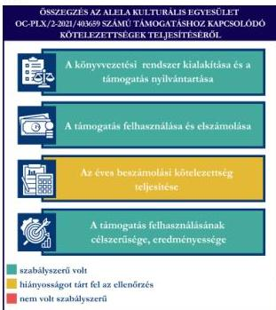
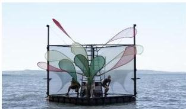

ÁLLAMI
SZÁMVEVŐSZÉK

# JELENTÉS

Egyesületek és alapítványok államháztartásból
kapott támogatásai felhasználásának és
elszámolásának ellenőrzése

Alela Kulturális Egyesület

2026.

25125

www.asz.hu

---

ÁLLAMI
SZÁMVEVŐSZÉK

# JELENTÉS

Egyesületek és alapítványok államháztartásból
kapott támogatásai felhasználásának és
elszámolásának ellenőrzése

Alela Kulturális Egyesület

2026.

25125

www.asz.hu

Dr. Szomolai Csaba
alelnök

---

ELLENŐRZÉSI IGAZGATÓSÁG:

ELLENŐRZÉSI IGAZGATÓSÁG V.

ELLENŐRZÉSI IGAZGATÓ:

KLINGA LÁSZLÓ igazgató

ELLENŐRZÉSVEZETŐ:

NEMESVÁRI-HORTHY ESZTER ellenőrzésvezető

Jelentéseink az interneten a
www.asz.hu címen olvashatók.

IKTATÓSZÁM: EL-4320-162/2025

TÉMASORSZÁM: 35

ELLENŐRZÉS-AZONOSÍTÓ SZÁM: V118112

---

# TARTALOMJEGYZÉK

|  ■ ÖSSZEFOGLALÁS | 5  |
| --- | --- |
|  ■ AZ ELLENŐRZÉS EREDMÉNYEI | 7  |
|  1. A civil szervezet államháztartási forrásból származó támogatása felhasználásának és elszámolásának szabályszerűsége, felhasználásának célszerűsége és eredményessége | 7  |
|  ■ I. FÜGGELÉK: ÉSZREVÉTELEK | 10  |
|  ■ II. FÜGGELÉK: ELLENŐRZÉSI MEGKÖZELÍTÉS | 11  |
|  ■ MELLÉKLETEK | 15  |
|  I. sz. melléklet: Értelmező szótár | 15  |
|  II. sz. melléklet: Az ellenőrzött szervezetek jegyzéke | 17  |
|  ■ RÖVIDÍTÉSEK JEGYZÉKE | 18  |

3

---

# ÖSSZEFOGLALÁS

A civil szervezetek tevékenységük megvalósításához évente **jelentős állami** és önkormányzati **támogatásokat** kaphatnak, valamint ingyenes vagyonjuttatásban részesülhetnek. Ezekkel a forrásokkal gazdálkodnak, miközben tevékenységükkel a **társadalom széles rétegeire hatnak** többek között kulturális programok, rendezvények, közösségépítés formájában. Jogosan merül fel tehát a kérdés: **hogyan költik el a közpénzt?** Ennek érdekében az ÁSZ$^{1}$ időről időre **ellenőrzi** a támogatások felhasználását, és értékeli, hogy a civil szervezetek az államháztartásból kapott támogatásokat **átláthatóan és célnak megfelelően** használták-e fel. Az ÁSZ által folytatott ellenőrzések segítenek abban, hogy a nyilvánosság is **valós képet kapjon arról, hova kerül az adófizetők pénze**.

A kulturális tevékenységet végző civil szervezetek **fontos és sokrétű szerepet** játszanak a mai Magyarországon, különösen a helyi közösségek életében. Különösen fontosak a helyi identitás megerősítésében, a kulturális sokszínűség fenntartásában, és a közösségi aktivitás ösztönzésében.

Egy kulturális tevékenységet végző civil szervezet támogatása **nem csupán egy adott program finanszírozását jelenti, hanem befektetés a közösség szellemi, kulturális és társadalmi tőkéjébe**. Ezek a szervezetek hidat képeznek az állam, a közösségek és az egyének között, támogatásuk ezért elengedhetetlen egy élő, demokratikus és értékalapú társadalom fenntartásához.

Az Egyesület$^{2}$ részére az Európa Kulturális Fővárosa 2023 programsorozat keretében a Veszprém – Balaton 2023 Zrt., a Gazdaságvédelmi Alap terhére a **„Balaton legendái – vízre álmodva” című projekt** megvalósításához a **2022-2023. években 15,8 M Ft** pénzügyi támogatást nyújtott.

**Az Egyesület a kapott támogatást a projektcélnak megfelelően, eredményesen használta fel, a támogatás elérte célját.**

Az Egyesület a jogszabályi előírásoknak megfelelően alakította ki könyvvezetési rendszerét, amely biztosította a kapott támogatás és a támogatás felhasználásának szabályos nyilvántartását.

A támogatás felhasználása a Támogatási szerződésben$^{3}$ és annak elválaszthatatlan részét képező költségtervben szereplő adatoknak, előírásoknak megfelelt. Az Egyesület a Támogatási szerződés előírásainak megfelelően határidőben eleget tett a Támogató$^{4}$ felé történő elszámolási kötelezettségének. A Támogató az elszámolást elfogadta.

Az Egyesület a 2022. és 2023. évi egyszerűsített éves beszámolójában tájékoztatási és nyilvánosságra hozatali kötelezettségeinek – a kiegészítő melléklet kivételével – eleget tett.

1. ábra

Forrás: ÁSZ saját szerkesztés

5

---

Összefoglalás---

Az Egyesület az ÁSZ tv. 29. § (2) bekezdés szerinti, a jelentéstervezet megállapításaira tett észrevételében arról tájékoztatta az ÁSZ-t, hogy a 2022-2023. évi egyszerűsített éves beszámolója kiegészítő mellékleteit, továbbá a feltárt hiányosság figyelembevételével a kiegészített 2023. évi közhasznúsági mellékletét közzétette, ezzel az ÁSZ megállapítása az ellenőrzés során hasznosult.

6

---

# AZ ELLENŐRZÉS EREDMÉNYEI

Az Egyesület a részére – a balatoni mondavilág víziszínházi formában történő bemutatására – nyújtott költségvetési támogatást a „Tündérkönnyek” című előadás megvalósítására fordította. Az Egyesület a támogatást szabályszerűen, a támogatás céljának megfelelően a támogatott tevékenység időtartamán belül használta fel. A projekt során a mérföldkövenként meghatározott célok teljesültek. Az előadást öt alkalommal mutatták be Balaton menti településeken, így a kulturális és közösségi célkitűzések megvalósultak. A közpénzt az Egyesület céljaival összhangban színházi előadás megvalósítására használta fel.

## 1. A civil szervezet államháztartási forrásból származó támogatása felhasználásának és elszámolásának szabályszerűsége, felhasználásának célszerűsége és eredményessége

### Összegző megállapítás

Az Egyesület az ellenőrzött támogatást a Támogatási szerződésben megjelölt célnak megfelelően, eredményesen használta fel, az elszámolási kötelezettségét teljesítette. A támogatást a számviteli rendszerében szabályszerűen kimutatta, felhasználását a jogszabályi előírásnak megfelelően elkülönítetten tartotta nyilván. A számviteli beszámolási kötelezettségét hiányosan teljesítette, mivel sem 2022. évben, sem 2023. évben nem készített kiegészítő mellékletet. Az egyszerűsített éves beszámolóit határidőben letétbe helyezte, közzétette.

### A KÖNYVVEZETÉSI RENDSZER KIALAKÍTÁSA ÉS A TÁMOGATÁS NYILVÁNTARTÁSA

Az Egyesület a Számv. tv.⁵ és a Civilszr.⁶-ben foglalt jogszabályi előírások betartásával gondoskodott a könyvviteli szolgáltatás személyi feltételeinek megteremtéséről, a könyvviteli szolgáltatás körébe tartozó feladatok ellátásával olyan társaságot bízott meg, amelynek megbízott tagja a jogszabályi előírásoknak megfelelő képesítéssel rendelkezett.

Az Egyesület a Civilszr. előírásainak megfelelően a 2022. és 2023. évben kettős könyvvitelt vezetett.

Az Egyesület a Számv. tv. és a Civil tv.⁷ előírásában foglaltak szerint az egyéb bevételeken belül elkülönítetten mutatta ki az alapcél szerinti tevékenysége költségei, ráfordításai ellentételezésére visszafizetési kötelezettség nélkül kapott, államháztartási forrásból származó központi költségvetési támogatást.

Az Egyesület a Támogatási szerződésben foglaltak alapján, a Támogatótól mérföldkövenként kapott támogatást a Számv. tv. és a Civil tv. előírásainak megfelelően részletezte a számviteli rendszerében, figyelemmel arra, hogy az Egyesület a Támogatási szerződésben foglaltaknak megfelelően számolt el a támogatással, amelyekről részbeszámolót készített, melyek elfogadásával a Támogató elismerte a felhasználás jogszerűségét.

7

---

Az ellenőrzés eredményei

Az Egyesület a Számv. tv. -ben és a Civil tv.-ben előírtaknak megfelelően az alapcél szerinti tevékenysége költségei, ráfordításai ellentételezésére kapott támogatásról olyan elkülönített számviteli nyilvántartást vezetett, amelynek alapján megállapítható és ellenőrizhető volt az ellenőrzött támogatás felhasználása.

# A TÁMOGATÁS FELHASZNÁLÁSA ÉS ELSZÁMOLÁSA

Az Egyesület az ellenőrzött támogatás mérföldkövenkénti felhasználásáról a Támogató által előírt formában elkészítette a részbeszámolókat, majd a záró beszámolót, annak részeként a Számlaösszesítőt (tételes elszámolás), szöveges beszámolót és határidőben benyújtotta a Támogató részére.

Az Egyesület esetében a támogatás felhasználása ellenőrzött tételeinek (10 db) vonatkozásában az ÁSZ az alábbiakat állapította meg:

- a tételek számviteli elszámolását a Számv. tv.-ben előírtaknak megfelelően bizonylatokkal alátámasztotta;
- minden gazdasági eseményt a Számv. tv.-ben foglaltak szerint tartalmának megfelelő főkönyvi számra számolt el;
- a tételek számviteli bizonylatait a Támogatási szerződésben foglaltaknak megfelelően ellátta záradékkal;
- a számviteli bizonylatokon záradékolt összegek megegyeztek a számlaösszesítőben feltüntetett értékekkel;
- a tételek számviteli bizonylatai alapján a gazdasági események a Támogatási szerződésnek megfelelően a támogatási időszak végéig szerződés szerint teljesültek;
- a tételek pénzügyi rendezése a Támogatási szerződésben meghatározott felhasználási határidőig minden esetben megtörtént;
- a tételek megfeleltethetőek voltak a Támogatási szerződésben, illetve a költségtervben meghatározott, Támogató által jóváhagyott felhasználási jogcímeknek.

A Támogatási szerződésben foglalt támogatás lezárásáról, a beszámoló elfogadásáról a Támogató 2023. december 14-én a 3011/2023. (12.14.) számú határozatával döntött, az Egyesületnek mérföldkövenként visszafizetési kötelezettsége nem keletkezett.

# AZ ÉVES BESZÁMOLÁSI KÖTELEZETTSÉG TELJESÍTÉSE

Az Egyesület a 2022-2023. évekre vonatkozóan a Számv. tv. és a Civil tv. előírásai alapján elkészítette számviteli beszámolóit, azonban a 2022. és 2023. évi egyszerűsített éves beszámolói a Civil tv. 29. § (2) bekezdés c) pontjában, a Civilszr. 7. § (6) bekezdésében és 22. § (1) bekezdésében foglaltak ellenére nem tartalmazták a kiegészítő mellékletet.

Az Egyesület a Civil tv.-nek megfelelően a beszámolókkal egyidejűleg elkészítette a közhasznúsági mellékleteit, azonban annak ellenére, hogy az Egyesület Elnöke a főkönyvi nyilvántartásban rögzítettek alapján 2023. évben megbízási díj kifizetésben részesült, a Civil tv. 29. § (7) bekezdésében és a Civil vhr.8 mellékletében foglaltakkal ellentétesen, a 2023. évi közhasznúsági melléklet nem tartalmazta a vezető tisztségviselőknek nyújtott juttatások összegét.

A 2022. és 2023. évi egyszerűsített éves beszámolót a Ptk.9 rendelkezései alapján a Felügyelő Bizottság10 elfogadta, a Közgyűlés11 a Civil tv.-nek megfelelően jóváhagyta.

Az Egyesület a Civil tv. alapján a 2022. és 2023. évi egyszerűsített éves beszámolóit – kiegészítő melléklet nélkül – és közhasznúsági mellékletét – annak hiányosságával együtt – határidőben letétbe helyezte, és

8

---

Az ellenőrzés eredményei

mind az OBH$^{12}$ honlapján, mind pedig az Egyesület saját honlapján közzétette. Az Egyesület 2023. évre vonatkozóan, 2025. szeptember 9-én, javított számviteli beszámolót helyezett letétbe, és tett közzé az OBH honlapján, azonban az továbbra sem tartalmazta a kiegészítő mellékletet.

#### A TÁMOGATÁS FELHASZNÁLÁSÁNAK CÉLSZERŰSÉGE ÉS EREDMÉNYESSÉGE

Az Egyesület a támogatást a Támogatási szerződés előírásainak megfelelően, az abban meghatározott célra használta fel. A Támogatási szerződésben megjelölt cél a támogatott projekt, a **Tündérkönnyek című víziszínházi előadás** megvalósításával teljesült. A projekt megvalósítása összességében az előzetesen jóváhagyott költségterv mentén történt, ugyanakkor a 3. szakaszban kisebb eltérés mutatkozott a helyszínek számában és a költségek időbeli ütemezésében, amelyhez az EKF hozzájárulást adott. Az öt előadás három helyszínen valósult meg, ami a megnövekedett költségekhez való alkalmazkodás eredménye volt.

A Támogató a támogatás elfogadásáról szóló záróhatározatban fenntartási időszakot írt elő, amely támogatott tevékenység lezárását követő harmadik naptári év utolsó napjáig (december 31.) tart. A fenntartási időszakra vonatkozóan az Egyesület köteles éves gyakorisággal „Éves Fenntartási Jelentést” készíteni. Az Egyesület 2024. október 10-ei és 2025. február 26-ai dátummal benyújtotta beszámolóját a Támogató felé a megvalósult előadásokról, rendezvényekről, továbbá a Pályázati felhívás és Útmutatóban rögzítettek alapján járt el, mivel a fenntartási kötelezettség előírásainak megfelelően saját honlapján továbbra is beszámol a Tündérkönnyek projektről.

A támogatás eredményeként megvalósult színházi előadásokról az EKF kommunikációs csapatának közreműködésével sajtóközleményben, továbbá online felületeken (honlap, Facebook-oldal, Instagram-oldal, Youtube) tájékoztatták a közvéleményt. A programhoz a Támogató cél indikátorokat határozott meg, amelyek a Támogatási szerződés 2. mellékletében meghatározottak alapján az alábbiak szerint teljesültek:

1. táblázat

|  AZ INDIKÁTOROK TELJESÍTÉSE  |   |   |
| --- | --- | --- |
|  INDIKÁTOROK | TÁMOGATÁSI SZERZŐDÉSBEN MEGHATÁROZOTT ADAT | TELJESÍTÉS  |
|  1. Hazai médiamegjelenések száma (db) | 20 | 45  |
|  2. Önkéntesek száma (fő) | 10 | 12  |
|  3. Idegen nyelven készült tájékoztatók száma (db) | 2 | 4  |
|  4. Látogatók/résztvevők száma (fő) | 10 000 | 3 600 147 000 online*  |
|  5. Külföldi látogatók/résztvevők száma (fő) | 500 | 200  |
|  6. Bevont civil szervezetek száma | 4 | 6  |
|  7. Gyerekbarát programok száma | 10 | 11  |

\* Az online résztvevők száma a hazai és külföldi résztvevők együtt.

Forrás: ÁSZ saját szerkesztés a Záró beszámoló és Beszámoló a Tündérkönnyek – kommunikáció és kötelező nyilvánosság bemutatásáról című dokumentum alapján

A záró beszámolóban az Egyesület beszámolt az indikátorok teljesüléséről, azt a Támogató elfogadta.

9

---

# I. FÜGGELÉK: ÉSZREVÉTELEK

*A jelentéstervezetet az ÁSZ 15 napos észrevételezésre megküldte az ellenőrzött szervezet vezetőjének az ÁSZ tv. 29. §\* (1) bekezdése előírásának megfelelően.*

*Az Alela Kulturális Egyesület elnöke a jelentéstervezetre érdemi észrevételt nem tett.*

\* 29. § (1) Az Állami Számvevőszék az ellenőrzési megállapításait megküldi az ellenőrzött szervezet vezetőjének vagy az általa megbízott személynek, és annak, akinek személyes felelősségét állapította meg.

(2) Az ellenőrzött szervezet vezetője és a felelősként megjelölt személy az ellenőrzés megállapításaira tizenöt napon belül írásban észrevételt tehet.

(3) Az Állami Számvevőszék az észrevételre a beérkezésétől számított harminc napon belül írásban válaszol. A figyelembe nem vett észrevételeket köteles a jelentésben feltüntetni, és megindokolni, hogy azokat miért nem fogadta el.

10

---

## II. FÜGGELÉK: ELLENŐRZÉSI MEGKÖZELÍTÉS

### AZ ELLENŐRZÉS JOGALAPJA

Az ellenőrzés jogszabályi alapját az ÁSZ tv. 1. § (3) bekezdés, az 5. § (3) bekezdés előírásai képezték.

### AZ ELLENŐRZÉS CÉLJA

Az ellenőrzés célja annak értékelése volt, hogy az ellenőrzött egyesület az államháztartási forrásból származó, ellenőrzésre kiválasztott támogatást a támogatási szerződésben előírtaknak megfelelően, az abban meghatározott célra, szabályszerűen, eredményesen használta-e fel, valamint a gazdálkodásáról szabályszerűen beszámolt-e. Célja volt továbbá a támogatással való elszámolás szabályszerűségének értékelése.

### AZ ELLENŐRZÉS TÍPUSA

Kombinált ellenőrzés.

### AZ ELLENŐRZÉS TÁRGYA

Az államháztartásból nyújtott támogatást felhasználó ellenőrzött egyesületnél a kiválasztott támogatás felhasználására vonatkozó jogszabályi és szerződéses előírások betartásának ellenőrzése. Ennek keretében a könyvvezetésre vonatkozó jogszabályi előírások betartása, a támogatás felhasználás támogatási szerződésnek való megfelelősége, valamint a beszámolási és közzétételi kötelezettség teljesítésének szabályszerűsége. Az ellenőrzés tárgya volt továbbá annak értékelése, hogy a számviteli szabályozási környezet kialakítása támogatta-e az államháztartásból származó támogatás vonatkozásában a szabályos könyvvezetést, a támogatás célnak megfelelő felhasználását, valamint a kapcsolódó beszámolási kötelezettség teljesítését. Az ellenőrzés során az ÁSZ értékelte, hogy az ellenőrzött szervezet a támogatást meghatározott célra, eredményesen használta-e fel.

Az ellenőrzés kiterjedt minden olyan körülményre és adatra, amely az ÁSZ jogszabályban meghatározott feladatainak teljesítéséhez, valamint a program végrehajtása folyamán felmerült újabb összefüggések feltárásához szükséges.

### AZ ELLENŐRZÉS HATÓKÖRE ÉS TERÜLETE

Az ÁSZ tv. 5. § (3) bekezdésében foglaltak alapján az ÁSZ ellenőrizte az államháztartásból nyújtott támogatás felhasználását. A támogatás felhasználásának szabályait a támogatási szerződés, az Áht.$^{13}$ és az Ávr.$^{14}$ rögzítette. A civil szervezet könyvvezetésének, a beszámolási- és közzétételi kötelezettség teljesítésének ellenőrzése a Számv. tv., a Civilszr., a Civil tv., a Civil vhr., valamint a Ptk. vonatkozó előírásai alapján történt.

Az ÁSZ ellenőrzése választ ad arra, hogy az ellenőrzött szervezetnél a számviteli szabályozási környezet kialakítása biztosította-e a támogatás felhasználása jogszabályi előírásoknak megfelelő nyilvántartását,

11

---

II. Függelék: Ellenőrzési megközelítés

könyvviteli elszámolását, továbbá arra is, hogy a támogatással való elszámolási, beszámolási kötelezettséget teljesítette-e. Az ÁSZ ellenőrzése kiterjedt a támogatás támogatási szerződésben foglalt célra történő felhasználás és a felhasználás eredményességének értékelésére. Ezen túlmenően az ellenőrzés értékelte, hogy az ellenőrzött szervezet számviteli beszámolási kötelezettségének teljesítése szabályszerű volt-e.

## AZ ELLENŐRZÖTT IDŐSZAK

Az ellenőrzésre kiválasztott államháztartási forrásból származó támogatásra vonatkozó támogatott tevékenység időtartamának kezdő időpontjától az ellenőrzésről szóló értesítés keltéig tartó időszak.

Az ellenőrzésre kiválasztott egyesület államháztartásból kapott támogatása felhasználásának és elszámolásának ellenőrzése során az ellenőrzött időszakon belül az értékelés szempontjából releváns évek a 2022. és 2023. év.

## AZ ELLENŐRZÉSI KRITÉRIUMOK

|  FŐKUSZTERÜLET/FŐKUSZKÉRDÉS | ELLENŐRZÉSI KRITÉRIUMOK  |
| --- | --- |
|  1. A civil szervezet államháztartási forrásból származó támogatása(i) felhasználásának és elszámolásának szabályszerűsége, felhasználásának célszerűsége és eredményessége | Áht. Ávr. Számv. tv. Civil tv. Civilszr. Ptk. Civil vhr. Cnytv.^{15} Létesítő okirat Támogatási szerződés Költségterv  |

## AZ ELLENŐRZÉS MÓDSZERE ÉS AZ ELLENŐRZÉSI BIZONYÍTÉKOK KÖRE

Az ellenőrzést a nemzetközi standardokat irányadónak tekintve az ellenőrzési program szempontjai, az ellenőrzött időszakban hatályos jogszabályok, az ellenőrzés szakmai szabályok és módszertan(ok) figyelembevételével végezte az ÁSZ.

Az ellenőrzési kérdések megválaszolásához szükséges bizonyítékok megszerzése az ellenőrzött szervezet által rendelkezésre bocsátott dokumentumokra és adatokra alapozva mintavételezés útján történt.

Az államháztartási forrásból származó, ellenőrzésre – adatvezérelt, kockázatalapú kiválasztás által, több év adatának figyelembevételével és az ellenőrizhető szervezet által előzetesen szolgáltatott adatok alapján – kijelölt támogatás felhasználása támogatási szerződésnek való megfelelőségét a támogatás nyilvántartásának és a támogató felé történő elszámolásnak egymással és a támogatási szerződéssel történő összevetésével ellenőrizte az ÁSZ.

12

---

II. Függelék: Ellenőrzési megközelítés---

A támogatás könyvviteli nyilvántartása jogszabályi előírásoknak, támogatási szerződésnek való szabályszerűségét nem statisztikai alapú mintavételi eljárással ellenőrizte az ÁSZ. A tételek kiértékelése nem került a sokaságra kivetítésre. A kiválasztott támogatási szerződéshez kapcsolódó elszámolásból 10 db tétel került ellenőrzésre.

Az ellenőrzési bizonyítékként felhasználható adatforrások közé tartoztak egyrészt az ellenőrzéshez kért dokumentumok, másrészt adatforrás volt még minden – az ellenőrzés folyamán – feltárt, az ellenőrzés szempontjából információkat tartalmazó dokumentum.

Az ellenőrzés lefolytatásához az ellenőrzött szervezet a tanúsítványok kitöltésével, valamint az ÁSZ által kért dokumentumok, adatok, információk megküldésével és az ellenőrzés során szolgáltatott adatokat.

Az ÁSZ az ellenőrzött szervezetet az Országos Támogatás-ellenőrzési Rendszerben (OTR) nyilvántartott adatok alapján államháztartási forrásból támogatásban részesült szervezetek közül, – OBH és KSH$^{16}$ adatokat is figyelembe véve – adatvezérelt kockázatértékelés alapján, a kulturális tevékenységet végző szervezetekre fókuszálva választotta ki. Az ÁSZ az ellenőrzött támogatást az adott szervezet által előzetesen szolgáltatott adatok alapján, a tanúsítványokban szereplő adatok ismeretében határozta meg.

Az **Alela Kulturális Egyesületet** 2005-ben alapították, a civil szervezetek közhiteles bírósági nyilvántartásába 2006. január 9-én jegyezték be. Az Egyesület Alapszabálya$^{17}$ szerinti célja többek között *„olyan tevékenységek folytatása, amelyek a főleg gyermekeknek és az ifjúságnak szóló kultúrával, művészetpedagógiai tevékenységgel, szabadidős kulturális és sporttevékenységek rendezésével, szervezésével foglalkozik.”* Célja továbbá *„minden ezzel kapcsolatos kiadvány és eszköz készítése, program szervezése, nemzetközi kapcsolatok kiépítése, egymás tapasztalatainak megismerése, valamint együttműködés kialakítása az Európai Unión belül és azon túl is.”*

Az Egyesület legfőbb döntéshozó szerve a Közgyűlés, ügyvezető szerve a három tagból álló Elnökség$^{18}$, legfőbb tisztségviselője az Elnök, aki ellátja a törvényes képviseletet, képviseleti joga gyakorlásának terjedelme általános, módja önálló. Az Elnök a bankszámla feletti rendelkezésre egy további elnökségi taggal volt jogosult. Az Elnök személyében az ellenőrzött időszakban nem történt változás.

Az Egyesület a jogszabályi előírás alapján könyvvizsgálatra nem volt kötelezett.

Az Egyesület működésének és gazdálkodásának ellenőrzését három tagú Felügyelő Bizottság látta el. Az Egyesület az ellenőrzött időszakban közhasznú jogállással nem rendelkezett.

Az Egyesület **nem minősült** a Közbef. tv.$^{19}$ szerinti, **közélet befolyásolására alkalmas civil szervezetnek**, mivel az ellenőrzött időszakban mérlegfőösszege nem érte el a 20 M Ft-ot.

Az Egyesület vállalkozási tevékenységet nem végzett.

Az Egyesület az Európa Kulturális Fővárosa 2023 programsorozat keretében támogatásban részesült. A támogatással kapcsolatos adatokat a 2. táblázat foglalja össze.

13

---

II. Függelék: Ellenőrzési megközelítés

2. táblázat

# A TÁMOGATÁS FŐBB ADATAI

# AZ ALELA KULTURÁLIS EGYESÜLET RÉSZÉRE A TÁMOGATÓ ÁLTAL NYÚJTOTT, ELLENŐRZŐTT TÁMOGATÁS (OC-PLX/2-2021/403659) FŐBB ADATAI

|  Támogatott tevékenység: | "Balaton legendái - vízre álmodva" A balatoni mondavilág bemutatása víziszínházi formában, több balatoni településen.  |
| --- | --- |
|  Támogató: | Veszprém-Balaton 2023. Zrt.  |
|  Támogatási összeg: | 15,8 M Ft  |
|  Felhasznált összeg: | 15,8 M Ft  |
|  A Támogatási szerződés megkötésének dátuma: | 2022. május 22.  |
|  A támogatott tevékenység időtartama: | 2022. február 1. – 2023. október 31.  |
|  A támogatás felhasználásáról a záró (pénzügyi) beszámoló benyújtásának határideje: | 2023. december 30. (A támogatott tevékenység időtartamát követő 60. nap)  |
|  A támogatás felhasználásáról benyújtott záró beszámoló elfogadásának dátuma: | 2023. december 14.  |

Forrás: ÁSZ saját szerkesztés a Támogatási szerződés adatai alapján

A programsorozat finanszírozásáról az Európa Kulturális Fővárosa 2023 cím viselésével összefüggő intézkedésekről szóló 1468/2020. (VIII. 5.) Korm. határozat rendelkezett. A finanszírozás forrása Magyarország központi költségvetése volt, 2021. évtől a központi költségvetés XLVII. Gazdaságvédelmi Alap fejezetében került meghatározásra.

2. ábra

Forrás: https://www.alela.hu

A „Balaton legendái – vízre álmodva” című projektre kapott támogatásból az Egyesület a Tündérkönnyek című víziszínházi előadást valósította meg, amely a Balaton keletkezésének történetét dolgozta fel. A produkció Tokody Klára Csodák Tava című népmondája alapján született meg. A színpadi feldolgozásban felbukkantak a nagyközönség számára ismerős motívumok, mint a Tihanyi echó, az Aranyhíd. Az Egyesület produkciója a Balaton vizén játszódott, zenére és látványra épült és dalokban fogalmazta meg a történetet, amit a nézők a tó partjáról tekinthettek meg.

14

---

# MELLÉKLETEK

## ■ I. SZ. MELLÉKLET: ÉRTELMEZŐ SZÓTÁR

|  célszerűség | Arra vonatkozó követelmény, hogy a bevételeket a közfeladat megvalósítása érdekében, a kiadásokat a közfeladatok megfelelő ellátásához szükséges mértékben, a költségvetési célrendszer érdekében, a meghatározott célra (közfeladat ellátására), továbbá észszerűen, racionálisan használták fel. (Forrás: Alaptörvény^{20}, ÁSZ)  |
| --- | --- |
|  civil szervezet | Civil szervezet: a) a civil társaság, b) a Magyarországon nyilvántartásba vett egyesület - a párt, a szakszervezet és a kölcsönös biztosító egyesület kivételével -, c) a közalapítvány és a pártalapítvány kivételével - az alapítvány. (Forrás: Civil tv. 2. § 6. pont)  |
|  civil szervezetek egyszerűsített támogatása | A helyi vagy területi hatókörű civil szervezetek számára a Civil tv. 56. § (1) bekezdés h) pontja alapján egyszerűsített formában, jogosultsági alapon nyújtott támogatás a helyi közösség érdekében végzett tevékenységük támogatására. (Forrás: Civil tv. 2. § 8b. pont)  |
|  civil szervezetek normatív támogatása | A civil szervezetek által gyűjtött adományok után járó, a gyűjtött adomány mértékével arányos a Civil tv. 56. § (1) bekezdés a) pontja alapján nyújtott támogatás. (Forrás: Civil tv. 2. § 8a. pont alapján)  |
|  egyesület | Az egyesület a tagok közös, tartós, alapszabályban meghatározott céljának folyamatos megvalósítására létesített, nyilvántartott tagsággal rendelkező jogi személy. (Forrás: Ptk. 3:63. § (1) bekezdés) A Számv. tv. alkalmazásában egyéb szervezet. (Forrás: Számv. tv. 3. § (1) bekezdés 4. pont a) alpont)  |
|  eredményesség | Az eredményesség elve a kitűzött célok és a szándékolt eredmények (hatások) elérését jelenti. A gazdálkodás, feladatellátás eredményességét mutatja a tényleges és a tervezett eredmények (hatások) összevetése. (Forrás: INTOSAI^{21})  |
|  feladatfinanszírozást szolgáló költségvetési támogatás | Valamely közfeladat államháztartáson kívüli szervezet által történő ellátását, valamint e feladat ellátásához közvetlenül kapcsolódó, arányos működési költségeket finanszírozó költségvetési támogatás. (Forrás: Civil tv. 2. § 8. pont)  |
|  közcélú tevékenység | Személyek csoportja által, valamely a csoportnál tágabb közösség érdekében – más, e közösségbe nem tartozó személyek érdekeinek sérelme nélkül – végzett tevékenység. (Forrás: Civil tv. 2. § 16. pont)  |
|  közfeladat | A jogszabályban meghatározott állami vagy önkormányzati feladat. A közfeladatok ellátásában államháztartáson kívüli szervezet jogszabályban meghatározott rendben közreműködhet. (Forrás: Áht. 3/A. § (1)-(2) bekezdés)  |
|  közhasznú szervezet | Közhasznú szervezetté minősített a Magyarországon nyilvántartásba vett közhasznú tevékenységet végző szervezet, amely a társadalom és az egyén közös szükségleteinek kielégítéséhez megfelelő erőforrásokkal rendelkezik, továbbá amelynek megfelelő társadalmi támogatottsága kimutatható, és amely: a) civil szervezet (ide nem értve a civil társaságot), vagy b) olyan egyéb szervezet, amelyre vonatkozóan a közhasznú jogállás megszerzését törvény lehetővé teszi. (Forrás: Civil tv. 32. § (1) bekezdés)  |

15

---

Mellékletek

|  közhasznú tevékenység | Minden olyan tevékenység, amely a létesítő okiratban megjelölt közfeladat teljesítését közvetlenül vagy közvetve szolgálja, ezzel hozzájárulva a társadalom és az egyén közös szükségleteinek kielégítéséhez. (Forrás: Civil tv. 2. § 20. pont)  |
| --- | --- |
|  létesítő okirat | A jogi személy létrehozásáról a személyek szerződésben, alapító okiratban vagy alapszabályban szabadon rendelkezhetnek, mely dokumentumokra együttesen a Ptk. a létesítő okirat megnevezést használja. (Forrás: Ptk. 3:4. § (1) bekezdés alapján)  |
|  támogatás | Céljellegű juttatás, mely kizárólag arra a célra használható fel, amelyre a támogató azt rendelkezésre bocsátotta, amely cél megvalósítását a támogatási szerződés, okirat vagy éppen jogszabály kikötötte. Támogatásként értelmezzük valamennyi, a civil szervezetnek államháztartási forrásból nyújtott támogatást – ideértve a központi költségvetésből kapott támogatást, az elkülönített állami pénzalapokból kapott támogatást, a helyi önkormányzatoktól, nemzetiségi önkormányzatoktól, önkormányzati társulástól kapott támogatást –, továbbá az Európai Unió költségvetéséből, külföldi állam államháztartásából, nemzetközi szervezettől, vagy nemzetközi szerződés rendelkezése alapján kapott támogatást, valamint más civil szervezettől kapott támogatást. A gyűjtő fogalom alatt egyaránt értjük a civil szervezetnek nyújtott feladatfinanszírozást szolgáló költségvetési támogatást, a civil szervezetek normatív támogatását, valamint a civil szervezetek egyszerűsített támogatását is (ÁSZ saját fogalma)  |
|  támogatási döntés | Az államháztartás alrendszereiből, az európai uniós forrásokból, a nemzetközi megállapodás alapján finanszírozott egyéb programokból, a 100%-os állami tulajdonban álló szervezet által létrehozott alapítványtól származó, egyedi döntés alapján nyújtott, pályázati úton vagy pályázati rendszeren kívül az államháztartáson kívüli természetes személyek, jogi személyek és jogi személyiséggel nem rendelkező egyéb szervezetek számára odaítélt, természetben vagy pénzben juttatott támogatásokban részesülő személy, valamint az e személy részére juttatandó konkrét támogatási összeg meghatározása. (Forrás: 2007. évi CLXXXI. törvény^{22} 1. § (1) bekezdése és 2. § (1) bekezdése alapján)  |
|  támogatási szerződés | A támogatási szerződés egy olyan, kölcsönös és egybehangzó, több oldalú jognyilatkozat, amelyben a támogató – egy meghatározott cél elérése érdekében – támogatás nyújtását vállalja a kedvezményezett részére az adott szerződés szerinti kötelezettségek támogatott általi teljesítése mellett, és amely jognyilatkozat esetében a jelen pontban rögzített jogszabályi előírások is irányadók. Az államháztartás alrendszeri terhére támogatás közigazgatási hatósági határozattal vagy hatósági szerződéssel, támogatói okirattal vagy támogatási szerződéssel jogszabály vagy egyedi döntés alapján, pályázati úton vagy pályázati rendszeren kívül nyújtható. Ha jogszabály – a központi költségvetés Áht. 14. § (3) bekezdése szerinti fejezetéből biztosított költségvetési támogatások esetén jogszabály vagy a Kormány határozata – a támogatás biztosításának módjáról nem rendelkezik, arról – a központi költségvetés Áht. 14. § (3) bekezdése szerinti fejezetéből biztosított költségvetési támogatásoktól eltérő más esetekben – az ötmilliárd forintot elérő vagy azt meghaladó összegű költségvetési támogatás esetén hatósági szerződésnek nem minősülő támogatási szerződésben kell megállapodni a kedvezményezettel. (Forrás: Áht. 48. § (1) bekezdése, Ávr. 65/A. § (1) bekezdés alapján ÁSZ meghatározás)  |
|  támogatott tevékenység | A támogatási szerződésben meghatározott olyan tevékenység – ideértve a kedvezményezett működését is –, amely során felmerült költségek megtérítését a támogatási előleg, a költségvetési támogatás részben vagy egészében biztosítja. (Forrás: Ávr. 1. § 8. pontja)  |
|  támogatott tevékenység időtartama | A támogatási szerződésben meghatározott olyan időtartam, amely során felmerülő, a támogatott tevékenység megvalósításához kapcsolódó költségek elszámolhatóak. (Forrás: Ávr. 1. § 9. pontja)  |

16

---

*Mellékletek*---

# ■ II. SZ. MELLÉKLET: AZ ELLENŐRZÖTT SZERVEZETEK JEGYZÉKE---

|  ELLENŐRZÖTT SZERVEZET NEVE | ELLENŐRZÖTT SZERVEZET SZÉKHELYE  |
| --- | --- |
|  Alela Kulturális Egyesület | 2092 Budakeszi, Erdő utca 53.  |

17

---

# RÖVIDÍTÉSEK JEGYZÉKE

1. ÁSZ

2. Egyesület

3. Támogatási szerződés

4. Támogató

5. Számv. tv.

6. Civilszr.

7. Civil tv.

8. Civil vhr.

9. Ptk.

10. Felügyelő Bizottság

11. Közgyűlés

12. OBH

13. Áht.

14. Ávr.

15. Cnytv.

16. KSH

17. Alapszabály1

Alapszabály2

18. Elnökség

19. Közbef. tv.

20. Alaptörvény

21. INTOSAI

22. 2007. évi CLXXXI. törvény

Állami Számvevőszék

Alela Kulturális Egyesület

OC-PLX/2-2021/403659 számú Támogatási szerződés

Veszprém–Balaton 2023 Zrt.

2000. évi C. törvény a számvitelről

479/2016. (XII. 28.) Korm. rendelet a számviteli törvény szerinti egyes egyéb szervezetek beszámoló készítési és könyvvezetési kötelezettségének sajátosságairól

2011. évi CLXXV. törvény az egyesülési jogról, a közhasznú jogállásról, valamint a civil szervezetek működéséről és támogatásáról

350/2011. (XII. 30.) Korm. rendelet a civil szervezetek gazdálkodása, az adománygyűjtés és a közhasznúság egyes kérdéseiről szóló

2013. évi V. törvény a Polgári Törvénykönyvről

Alela Kulturális Egyesület Felügyelő Bizottsága

Alela Kulturális Egyesület Közgyűlése

Országos Bírósági Hivatal

2011. évi CXCV. törvény az államháztartásról

368/2011. (XII. 31.) Korm. rendelet az államháztartásról szóló törvény végrehajtásáról

2011. évi CLXXXI. törvény a civil szervezetek bírósági nyilvántartásáról és az ezzel összefüggő eljárási szabályokról

Központi Statisztikai Hivatal

Alela Kulturális Egyesület Alapszabálya (hatályos: 2007. december 18-tól 2022. október 21-ig)

Alela Kulturális Egyesület Alapszabálya (hatályos: 2022. október 22-től)

Alela Kulturális Egyesület Elnöksége

2021. évi XLIX. törvény a közélet befolyásolására alkalmas tevékenységet végző civil szervezetek átláthatóságáról

Magyarország Alaptörvénye

Legfőbb Ellenőrző Intézmények Nemzetközi Szervezete (The International Organization of Supreme Audit Institutions)

2007. évi CLXXXI. törvény a közpénzekből nyújtott támogatások átláthatóságáról

18

---

ÁLLAMI
SZÁMVEVŐSZÉK

1052 Budapest, Apáczai Csere János u. 10. | 1364 Budapest 4., Pf. 54
www.asz.hu | szamvevoszek@asz.hu
telefon: +36 1 484 9100