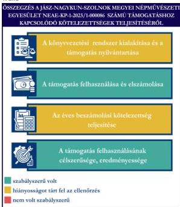
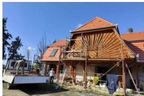

ÁLLAMI
SZÁMVEVŐSZÉK

# JELENTÉS

Egyesületek és alapítványok államháztartásból
kapott támogatásai felhasználásának és
elszámolásának ellenőrzése

Jász-Nagykun-Szolnok Megyei Népművészeti Egyesület

2026.

25128

www.asz.hu

---

ÁLLAMI
SZÁMVEVŐSZÉK

# JELENTÉS

Egyesületek és alapítványok államháztartásból
kapott támogatásai felhasználásának és
elszámolásának ellenőrzése

Jász-Nagykun-Szolnok Megyei Népművészeti Egyesület

2026.

25128

www.asz.hu

Dr. Szomolai Csaba
alelnök

---

ELLENŐRZÉSI IGAZGATÓSÁG:

ELLENŐRZÉSI IGAZGATÓSÁG V.

ELLENŐRZÉSI IGAZGATÓ:

KLINGA LÁSZLÓ igazgató

ELLENŐRZÉSVEZETŐ:

NEMESVÁRI-HORTHY ESZTER ellenőrzésvezető

Jelentéseink az interneten a
www.asz.hu címen olvashatók.

IKTATÓSZÁM: EL-4320-165/2025

TÉMASORSZÁM: 35

ELLENŐRZÉS-AZONOSÍTÓ SZÁM: V118109

---

# TARTALOMJEGYZÉK

|  ■ ÖSSZEFOGLALÁS | 5  |
| --- | --- |
|  ■ AZ ELLENŐRZÉS EREDMÉNYEI | 6  |
|  1. A civil szervezet államháztartási forrásból származó támogatása felhasználásának és elszámolásának szabályszerűsége, felhasználásának célszerűsége és eredményessége | 6  |
|  ■ JAVASLATOK | 9  |
|  ■ I. FÜGGELÉK: ÉSZREVÉTELEK | 10  |
|  ■ II. FÜGGELÉK: ELLENŐRZÉSI MEGKÖZELÍTÉS | 11  |
|  ■ MELLÉKLETEK | 15  |
|  I. sz. melléklet: Értelmező szótár | 15  |
|  II. sz. melléklet: Az ellenőrzött szervezetek jegyzéke | 18  |
|  ■ RÖVIDÍTÉSEK JEGYZÉKE | 19  |

3

---

# ÖSSZEFOGLALÁS

A civil szervezetek tevékenységük megvalósításához évente **jelentős állami** és önkormányzati **támogatásokat** kaphatnak, valamint ingyenes vagyonjuttatásban részesülhetnek. Ezekkel a forrásokkal gazdálkodnak, miközben tevékenységükkel a **társadalom széles rétegeire hatnak** többek között kulturális programok, rendezvények, közösségépítés formájában. Jogosan merül fel tehát a kérdés: **hogyan költik el a közpénzt?** Ennek érdekében az ÁSZ időről időre **ellenőrzi** az államháztartásból kapott támogatások felhasználását, és értékeli, hogy a civil szervezetek a támogatásokat **átláthatóan és célnak megfelelően** használták-e fel. Az ÁSZ által folytatott ellenőrzések segítenek abban, hogy a nyilvánosság is **valós képet kapjon arról, hova kerül az adófizetők pénze**.

A kulturális tevékenységet végző civil szervezetek **fontos és sokrétű szerepet** játszanak a mai Magyarországon, különösen a helyi közösségek életében. Különösen fontosak a helyi identitás megerősítésében, a kulturális sokszínűség fenntartásában, és a közösségi aktivitás ösztönzésében.

Egy kulturális tevékenységet végző civil szervezet támogatása **nem csupán egy adott program finanszírozását jelenti, hanem befektetés a közösség szellemi, kulturális és társadalmi tőkéjébe**. Ezek a szervezetek hidat képeznek az állam, a közösségek és az egyének között, támogatásuk ezért elengedhetetlen egy élő, demokratikus és értékalapú társadalom fenntartásához.

Az Egyesület² részére a Bethlen Gábor Alapkezelő Zrt. a 2016/2017 évek fordulóján leégett tiszavárkonyi alkotóház felújítására a Nemzeti Együttműködési Alap terhére „**Alkotóház felújításának befejezése – a szervezet tevékenységének és céljai megvalósításának támogatása**” című projekt megvalósításához **2023. évben 20,0 M Ft** pénzügyi támogatást nyújtott.

**Az Egyesület a kapott támogatást a projektcélnak megfelelően, eredményesen használta fel, a támogatás elérte célját.**

Az Egyesület a jogszabályi előírásoknak megfelelően alakította ki könyvvezetési rendszerét, amely biztosította a kapott támogatás és a támogatás felhasználásának elkülönített nyilvántartását, azonban az előleg formájában kapott támogatást a jogszabályi előírással ellentétben nem egyéb rövid lejáratú kötelezettségként, hanem egyéb bevételként mutatta ki, amely által a 2023. és 2024. évi számviteli beszámolóban **sérült a Számv. tv.³ szerinti valódiság elve**. A támogatás felhasználása a Támogatói okiratban⁴ és annak elválaszthatatlan részét képező költségtervben szereplő adatoknak, előírásoknak megfelelt. Az Egyesület a Támogatói okirat előírásainak megfelelően határidőben eleget tett a Támogató⁵ felé történő elszámolási kötelezettségének. Az Egyesület a 2023. és 2024. évi egyszerűsített éves beszámolójában tájékoztatási és nyilvánosságra hozatali kötelezettségeinek – a kiegészítő melléklet kivételével – eleget tett.

1. ábra

Forrás: ÁSZ saját szerkesztés

5

---

# AZ ELLENŐRZÉS EREDMÉNYEI

Az Egyesület a részére az „Alkotóház felújításának befejezése – a szervezet tevékenységének és céljai megvalósításának támogatása” című projekt megvalósításához nyújtott költségvetési támogatást a 2016/2017 évek fordulóján leégett tiszavárkonyi alkotóház felújítására fordította. Az Egyesület a támogatást szabályszerűen, a támogatás céljának megfelelően a támogatott tevékenység időtartamán belül használta fel. A projekt során a meghatározott célok teljesültek. A közpénzt az Egyesület céljaival összhangban használta fel. A felújítását követően az Egyesület által szervezett programokon résztvevő tiszavárkonyi lakosok és a környéken élők újra igénybe vehetik a támogatás felhasználásának eredményeként megújult Alkotóház szolgáltatásait.

## 1. A civil szervezet államháztartási forrásból származó támogatása felhasználásának és elszámolásának szabályszerűsége, felhasználásának célszerűsége és eredményessége

### Összegző megállapítás

Az Egyesület az ellenőrzött támogatást a Támogatói okiratban megjelölt célnak megfelelően, eredményesen használta fel, az elszámolási kötelezettségét teljesítette. A támogatást és annak felhasználását a számviteli rendszerében a jogszabályi előírásoknak megfelelően elkülönítette, azonban az előleg formájában kapott támogatást a Számv. tv. előírása ellenére nem kötelezettségként tartotta nyilván. A számviteli beszámolási kötelezettségét teljesítette. Az egyszerűsített éves beszámolóit határidőben – kiegészítő melléklet nélkül – helyezte letétbe és tette közzé.

### A KÖNYVVEZETÉSI RENDSZER KIALAKÍTÁSA ÉS A TÁMOGATÁS NYILVÁNTARTÁSA

Az Egyesület a Számv. tv. és a Civilszr.⁶-ben foglalt jogszabályi előírások betartásával gondoskodott a könyvviteli szolgáltatás személyi feltételeinek megteremtéséről, a könyvviteli szolgáltatás körébe tartozó feladatok ellátásával olyan egyéni vállalkozót bízott meg, aki a jogszabályi előírásoknak megfelelő képesítéssel rendelkezett.

Az Egyesület a Civilszr. előírásainak megfelelően a 2023. és 2024. évben kettős könyvvitelt vezetett.

Az Egyesület a Számv. tv. -ben és a Civil tv.⁷-ben előírtaknak megfelelően az alapcél szerinti tevékenysége költségei, ráfordításai ellentételezésére kapott támogatásról olyan elkülönített számviteli nyilvántartást vezetett, amelynek alapján megállapítható és ellenőrizhető volt az ellenőrzött támogatás felhasználása.

Az Egyesület a Támogatói okiratban foglaltak alapján, a Támogatótól előleg formájában kapott támogatást a 2023-2024. évek során a Számv. tv. 43. § (1) bekezdés előírása ellenére nem egyéb rövid lejáratú kötelezettségként tartotta nyilván.

6

---

Az ellenőrzés eredményei

# A TÁMOGATÁS FELHASZNÁLÁSA ÉS ELSZÁMOLÁSA

Az Egyesület az ellenőrzött támogatás felhasználásáról a Támogató által előírt formában elkészítette a záró beszámolót, annak részeként az összesített elszámolási táblázatot (számlaösszesítő), szöveges beszámolót és határidőben benyújtotta a Támogató részére.

Az Egyesület esetében a támogatás felhasználása ellenőrzött tételeinek (10 db) vonatkozásában az ÁSZ az alábbiakat állapította meg:

- a tételek számviteli elszámolását a Számv. tv.-ben előírtaknak megfelelően bizonylatokkal alátámasztotta;
- minden gazdasági eseményt (beruházás) a Számv. tv.-ben foglaltak szerint tartalmának megfelelő főkönyvi számra számolt el;
- a tételek számviteli bizonylatait a Támogatói okiratban foglaltaknak megfelelően ellátta záradékkal;
- a számviteli bizonylatokon záradékolt összegek megegyeztek a számlaösszesítőben feltüntetett értékekkel;
- a tételek számviteli bizonylatai alapján a gazdasági események a Támogatói okiratnak megfelelően a támogatási időszak végéig szerződés szerint teljesültek;
- a tételek pénzügyi rendezése a Támogatói okiratban meghatározott felhasználási határidőig minden esetben megtörtént;
- a tételek megfeleltethetőek voltak a Támogatói okiratban, illetve a költségtervben meghatározott, Támogató által jóváhagyott felhasználási jogcímeknek.

A Támogatói okiratban foglalt támogatás lezárásáról, a beszámoló elfogadásáról a Támogató az ellenőrzés lefolytatásáig nem értesítette az Egyesületet.

# AZ ÉVES BESZÁMOLÁSI KÖTELEZETTSÉG TELJESÍTÉSE

Az Egyesület a 2023-2024. évekre vonatkozóan a Számv. tv. és a Civil. tv. előírásai alapján elkészítette számviteli beszámolóit, amelyek a Civil tv. és a Civilszr. előírásai alapján tartalmazták a Civilszr. 3. melléklet szerinti mérleget, a 4. melléklet szerinti eredménykimutatást, illetve az Egyesület az ÁSZ által kért adatszolgáltatásának teljesítése során rendelkezésre bocsájtotta a 2023 és a 2024. évi egyszerűsített éves beszámolók Számv. tv. alapján előírt kiegészítő mellékletét. Az Egyesület a Civil tv. 29. § (4) bekezdés előírása ellenére a 2023. és 2024. évi kiegészítő mellékletében nem mutatta be az ellenőrzéssel érintett támogatási program keretében végleges jelleggel felhasznált összegeket.

Az Egyesület a Civil tv.-nek megfelelően a 2023 és a 2024. évi egyszerűsített éves beszámolókkal egyidejűleg elkészítette a közhasznúsági mellékleteit.

A 2023 és a 2024. évre vonatkozó egyszerűsített éves beszámolókat a Ptk.⁸ rendelkezései alapján a Felügyelő Bizottság⁹ megvizsgálta, a Közgyűlés¹⁰ a Civil tv.-nek megfelelően jóváhagyta.

Az Egyesület a Civil tv. alapján a 2023. és 2024. évi egyszerűsített éves beszámolóját közhasznúsági mellékletekkel együtt, azonban a Civil tv. 30. § (2) bekezdésében előírtak ellenére kiegészítő melléklet nélkül, határidőben letétbe helyezte és az OBH¹¹ honlapján közzétette. Az Egyesület saját honlappal nem rendelkezett.

# A TÁMOGATÁS FELHASZNÁLÁSÁNAK CÉLSZERŰSÉGE ÉS EREDMÉNYESSÉGE

Az Egyesület a támogatást a Támogatói okirat előírásainak megfelelően, az abban meghatározott célra használta fel. A Támogatói okiratban megjelölt cél a támogatott projekt, a tiszavárkonyi alkotóház

7

---

*Az ellenőrzés eredményei*---

**felújításának** megvalósításával teljesült, az átadás 2024. május 31-én megtörtént. A projektet a jóváhagyott költségterv alapján valósították meg, költségátcsoportosítás nem történt. A felújítást követően az Egyesület részére lehetőség nyílt például arra, hogy szervezett programokkal a települési önkormányzat Tiszakanyar című turisztikai projektjéhez kapcsolódjon. Az alkotóház felújítását követően a tiszavárkonyi lakosok és a környéken élők újra részt vehettek az Egyesület által szervezett programokon. A támogatás eredményeként megvalósult felújításról a Jász-Nagykun Szolnok Vármegyei Civil Közösségi Szolgáltató Központ által kiadott ingyenes hírlevélben (Civil forrás) és online felületeken (Facebook-oldal) tájékoztatták a közvéleményt.

8

---

# JAVASLATOK

Az ÁSZ tv.¹² 33. § (1) bekezdésében foglaltak értelmében az ellenőrzött szervezet vezetője köteles a jelentésben foglalt megállapításokhoz kapcsolódó intézkedési tervet összeállítani és azt a jelentés kézhezvételétől számított 30 napon belül az ÁSZ részére megküldeni. Az ÁSZ a jelentésben foglalt megállapításokhoz kapcsolódóan az alábbi javaslatok tekintetében várja el az intézkedési terv elkészítését.

## JÁSZ-NAGYKUN SZOLNOK MEGYEI NÉPMŰVÉSZETI EGYESÜLET ELNÖKÉNEK

1. Gondoskodjon arról, hogy az Egyesület a jövőben az előleg formájában kapott támogatásokat a támogató felé benyújtott elszámolás támogató általi elfogadásáig a Számv. tv. 43. § (1) bekezdés előírásának megfelelően a könyvviteli nyilvántartásban, illetve a számviteli beszámolóban egyéb rövid lejáratú kötelezettségként mutassa ki.

2. Gondoskodjon a Civil tv. 29. § (4) bekezdésének megfelelően támogatásonként a támogatási program keretében végleges jelleggel felhasznált összegek egyszerűsített éves beszámoló kiegészítő mellékletében történő bemutatásáról.

3. Gondoskodjon az egyszerűsített éves beszámolók Civil tv. 30. § (1) bekezdésében előírtaknak megfelelő közzétételéről.

9

---

# I. FÜGGELÉK: ÉSZREVÉTELEK

*A jelentéstervezetet az ÁSZ 15 napos észrevételezésre megküldte az ellenőrzött szervezet vezetőjének az ÁSZ tv. 29. §\* (1) bekezdése előírásának megfelelően.*

*A Jász-Nagykun Szolnok Megyei Népművészeti Egyesület elnöke a jelentéstervezetre nem tett észrevételt.*

\* 29. § (1) Az Állami Számvevőszék az ellenőrzési megállapításait megküldi az ellenőrzött szervezet vezetőjének vagy az általa megbízott személynek, és annak, akinek személyes felelősségét állapította meg.

(2) Az ellenőrzött szervezet vezetője és a felelősként megjelölt személy az ellenőrzés megállapításaira tizenöt napon belül írásban észrevételt tehet.

(3) Az Állami Számvevőszék az észrevételre a beérkezésétől számított harminc napon belül írásban válaszol. A figyelembe nem vett észrevételeket köteles a jelentésben feltüntetni, és megindokolni, hogy azokat miért nem fogadta el.

10

---

## II. FÜGGELÉK: ELLENŐRZÉSI MEGKÖZELÍTÉS

### AZ ELLENŐRZÉS JOGALAPJA

Az ellenőrzés jogszabályi alapját az ÁSZ tv. 1. § (3) bekezdés, az 5. § (3) bekezdés előírásai képezték.

### AZ ELLENŐRZÉS CÉLJA

Az ellenőrzés célja annak értékelése volt, hogy az ellenőrzött egyesület az államháztartási forrásból származó, ellenőrzésre kiválasztott támogatást a támogatói okiratban előírtaknak megfelelően, az abban meghatározott célra, szabályszerűen, eredményesen használta-e fel, valamint a gazdálkodásáról szabályszerűen beszámolt-e. Célja volt továbbá a támogatással való elszámolás szabályszerűségének értékelése.

### AZ ELLENŐRZÉS TÍPUSA

Kombinált ellenőrzés.

### AZ ELLENŐRZÉS TÁRGYA

Az államháztartásból nyújtott támogatást felhasználó ellenőrzött egyesületnél a kiválasztott támogatás felhasználására vonatkozó jogszabályi és szerződéses előírások betartásának ellenőrzése. Ennek keretében a könyvvezetésre vonatkozó jogszabályi előírások betartása, a támogatás felhasználás támogatói okiratnak való megfelelősége, valamint a beszámolási és közzétételi kötelezettség teljesítésének szabályszerűsége. Az ellenőrzés tárgya volt továbbá annak értékelése, hogy a számviteli szabályozási környezet kialakítása támogatta-e az államháztartásból származó támogatás vonatkozásában a szabályos könyvvezetést, a támogatás célnak megfelelő felhasználását, valamint a kapcsolódó beszámolási kötelezettség teljesítését. Az ellenőrzés során az ÁSZ értékelte, hogy az ellenőrzött szervezet a támogatást meghatározott célra, eredményesen használta-e fel.

Az ellenőrzés kiterjedt minden olyan körülményre és adatra, amely az ÁSZ jogszabályban meghatározott feladatainak teljesítéséhez, valamint a program végrehajtása folyamán felmerült újabb összefüggések feltárásához szükséges.

### AZ ELLENŐRZÉS HATÓKÖRE ÉS TERÜLETE

Az ÁSZ tv. 5. § (3) bekezdésében foglaltak alapján az ÁSZ ellenőrizte az államháztartásból nyújtott támogatás felhasználását. A támogatás felhasználásának szabályait a támogatói okirat, az Áht.$^{13}$ és az Ávr.$^{14}$ rögzítette. A civil szervezet könyvvezetésének, a beszámolási- és közzétételi kötelezettség teljesítésének ellenőrzése a Számv. tv., a Civilszr., a Civil tv., a Civil vhr.$^{15}$, valamint a Ptk. vonatkozó előírásai alapján történt.

Az ÁSZ ellenőrzése választ ad arra, hogy az ellenőrzött szervezetnél a számviteli szabályozási környezet kialakítása biztosította-e a támogatás felhasználása jogszabályi előírásoknak megfelelő nyilvántartását,

11

---

II. Függelék: Ellenőrzési megközelítés

könyvviteli elszámolását, továbbá arra is, hogy a támogatással való elszámolási, beszámolási kötelezettséget teljesítette-e. Az ÁSZ ellenőrzése kiterjedt a támogatás támogatói okiratban foglalt célra történő felhasználás és a felhasználás eredményességének értékelésére. Ezen túlmenően az ellenőrzés értékelte, hogy az ellenőrzött szervezet számviteli beszámolási kötelezettségének teljesítése szabályszerű volt-e.

## AZ ELLENŐRZÖTT IDŐSZAK

Az ellenőrzésre kiválasztott államháztartási forrásból származó támogatásra vonatkozó támogatott tevékenység időtartamának kezdő időpontjától az ellenőrzésről szóló értesítés keltéig tartó időszak.

Az ellenőrzésre kiválasztott egyesület államháztartásból kapott támogatása felhasználásának és elszámolásának ellenőrzése során az ellenőrzött időszakon belül az értékelés szempontjából releváns évek a 2023. és 2024. év.

## AZ ELLENŐRZÉSI KRITÉRIUMOK

|  FŐKUSZTERÜLET/FŐKUSZKÉRDÉS | ELLENŐRZÉSI KRITÉRIUMOK  |
| --- | --- |
|  1. A civil szervezet államháztartási forrásból származó támogatása(i) felhasználásának és elszámolásának szabályszerűsége, felhasználásának célszerűsége és eredményessége | Áht. Ávr. Számv. tv. Civil tv. Civilszr. Ptk. Civil vhr. Cnytv.^{16} Létesítő okirat Támogatói okirat Költségterv  |

## AZ ELLENŐRZÉS MÓDSZERE ÉS AZ ELLENŐRZÉSI BIZONYÍTÉKOK KÖRE

Az ellenőrzést a nemzetközi standardokat irányadónak tekintve az ellenőrzési program szempontjai, az ellenőrzött időszakban hatályos jogszabályok, az ellenőrzés szakmai szabályok és módszertan(ok) figyelembevételével végezte az ÁSZ.

Az ellenőrzési kérdések megválaszolásához szükséges bizonyítékok megszerzése az ellenőrzött szervezet által rendelkezésre bocsátott dokumentumokra és adatokra alapozva mintavételezés útján történt.

Az államháztartási forrásból származó, ellenőrzésre – adatvezérelt, kockázatalapú kiválasztás által, több év adatának figyelembevételével és az ellenőrizhető szervezet által előzetesen szolgáltatott adatok alapján – kijelölt támogatás felhasználása támogatói okiratnak való megfelelőségét a támogatás nyilvántartásának és a támogató felé történő elszámolásnak egymással és a támogatói okirattal történő összevetésével ellenőrizte az ÁSZ.

12

---

II. Függelék: Ellenőrzési megközelítés---

A támogatás könyvviteli nyilvántartása jogszabályi előírásoknak, támogatói okiratnak való szabályszerűségét nem statisztikai alapú mintavételi eljárással ellenőrizte az ÁSZ. A tételek kiértékelése nem került a sokaságra kivetítésre. A kiválasztott támogatói okirathoz kapcsolódó elszámolásból 10 db tétel került ellenőrzésre.

Az ellenőrzési bizonyítékként felhasználható adatforrások közé tartoztak egyrészt az ellenőrzéshez kért dokumentumok, másrészt adatforrás volt még minden – az ellenőrzés folyamán – feltárt, az ellenőrzés szempontjából információkat tartalmazó dokumentum.

Az ellenőrzés lefolytatásához az ellenőrzött szervezet a tanúsítványok kitöltésével, valamint az ÁSZ által kért dokumentumok, adatok, információk megküldésével és az ellenőrzés során szolgáltatott adatokat.

Az ÁSZ az ellenőrzött szervezetet az Országos Támogatás-ellenőrzési Rendszerben (OTR) nyilvántartott adatok alapján államháztartási forrásból támogatásban részesült szervezetek közül, – OBH és KSH$^{17}$ adatokat is figyelembe véve – adatvezérelt kockázatértékelés alapján, a kulturális tevékenységet végző szervezetekre fókuszálva választotta ki. Az ÁSZ az ellenőrzött támogatást az adott szervezet által előzetesen szolgáltatott adatok alapján, a tanúsítványokban szereplő adatok ismeretében határozta meg.

A **Jász-Nagykun Szolnok Megyei Népművészeti Egyesületet** 1992-ben alapították, a civil szervezetek közhiteles bírósági nyilvántartásába 1992. március 3-án jegyezték be. Az Egyesület Alapszabálya$^{18}$ szerinti célja „*a tárgyalkotó népművészet és a népi kézművesség hagyományainak, szellemi értékeinek és technikai tapasztalatainak felelevenítése, megőrzése és továbbörökítése*”.

Az Egyesület legfőbb döntéshozó szerve a Közgyűlés, ügyvezető szerve az öt tagból álló Elnökség$^{19}$, legfőbb tisztségviselője az Elnök, aki ellátja a törvényes képviseletet, képviseleti joga gyakorlásának terjedelme általános, módja önálló. Az Elnök a bankszámla feletti rendelkezésre egy további elnökségi taggal volt jogosult. Az Elnök személyében az ellenőrzött időszakban nem történt változás.

Az Egyesület a jogszabályi előírás alapján könyvvizsgálatra nem volt kötelezett.

Az Egyesület működésének és gazdálkodásának ellenőrzésére három tagú Felügyelő Bizottság volt kijelölve. Az Egyesület az ellenőrzött időszakban közhasznú jogállással rendelkezett.

Az Egyesület a Közbef. tv.$^{20}$ szerinti, **közélet befolyásolására alkalmas civil szervezetnek minősült**, mivel az ellenőrzött időszakban mérlegfőösszege elérte a 20 M Ft-ot.

Az Egyesület vállalkozási tevékenységet nem végzett.

Az Egyesület a 2016/2017 fordulóján leégett Tiszavárkonyi Alkotóház felújítására támogatásban részesült. A támogatott tevékenység megvalósulásához a Támogató cél indikátorokat nem határozott meg. A támogatással kapcsolatos adatokat az 1. táblázat foglalja össze.

13

---

II. Függelék: Ellenőrzési megközelítés

1. táblázat

# A TÁMOGATÁS FŐBB ADATAI

# A JÁSZ-NAGYKUN SZOLNOK MEGYEI NÉPMŰVÉSZETI EGYESÜLET RÉSZÉRE A TÁMOGATÓ ÁLTAL NYÚJTOTT, ELLENŐRZÖTT TÁMOGATÁS (NEAE-KP-1-2023/1-000086) FŐBB ADATAI

|  Támogatott tevékenység: | Alkotóház felújításának befejezése - a szervezet tevékenységének és céljai megvalósításának támogatása  |
| --- | --- |
|  Támogató: | Bethlen Gábor Alapkezelő Zrt.  |
|  Támogatási összeg: | 20,0 M Ft  |
|  Felhasznált összeg: | 20,0 M Ft  |
|  A Támogatói okirat kibocsátásának időpontja: | 2023. április 27.  |
|  A támogatott tevékenység időtartama: | 2023. január 1. – 2025. május 31.  |
|  A támogatás felhasználásáról a záró (pénzügyi) beszámoló benyújtásának határideje: | 2024. június 30.  |
|  A támogatás felhasználásáról benyújtott záró beszámoló elfogadásának dátuma: | A 2024. június 28-án benyújtott (záró) pénzügyi elszámolás és beszámoló az ellenőrzés időszakában a támogató által még nem került elfogadásra.  |

Forrás: ÁSZ saját szerkesztés a Támogatói okirat adatai alapján

A támogató a támogatást vissza nem térítendő támogatásként, támogatási előleg formájában, egy összegben, utólagos elszámolási kötelezettség mellett nyújtotta. A támogatói okirat szerint a támogatás forrása a Kvtv.21 1. melléklet, XI. Miniszterelnökség fejezet, 30. Fejezeti kezelésű előirányzatok cím, 1. Célelőirányzatok alcím, 29. Nemzeti Együttműködési Alap fejezeti kezelésű előirányzata.

2. ábra

Forrás: https://szd24.hu/2023/10/09/unkenterek-csinsitottak-az-ujaspitett-tiszavarkonyi-alkotohazat/

Az „Alkotóház felújításának befejezése” című projektre kapott támogatásból az Egyesület a 2016/2017 fordulóján leégett tiszavárkonyi alkotóház felújítását valósította meg. A tűzben leégett az épület nádfedele, teljes tetőszerkezete, az emeleti termek, károsodott a faszerkezetű födém és a földszinti helyiségek is kárt szenvedtek. A felújítás adományból, egyéb támogatásból elkezdődött, de annak befejezéséhez szükséges forrást jelen támogatás biztosította. A felújítással az alkotóház eredeti funkcióját – az értékőrző- és teremtő tevékenységek folytatását - ismét betölti.

14

---

# MELLÉKLETEK

## ■ I. SZ. MELLÉKLET: ÉRTELMEZŐ SZÓTÁR

|  adomány | A civil szervezetnek – létesítő okiratban rögzített céljaira – ellenszolgáltatás nélkül juttatott eszköz, illetve nyújtott szolgáltatás. (Forrás: Civil tv. 2. § 1. pont)  |
| --- | --- |
|  célszerűség | Arra vonatkozó követelmény, hogy a bevételeket a közfeladat megvalósítása érdekében, a kiadásokat a közfeladatok megfelelő ellátásához szükséges mértékben, a költségvetési célrendszer érdekében, a meghatározott célra (közfeladat ellátására), továbbá észszerűen, racionálisan használták fel. (Forrás: Alaptörvény^{22}, ÁSZ)  |
|  civil szervezet | Civil szervezet: a) a civil társaság, b) a Magyarországon nyilvántartásba vett egyesület - a párt, a szakszervezet és a kölcsönös biztosító egyesület kivételével -, c) a közalapítvány és a pártalapítvány kivételével - az alapítvány. (Forrás: Civil tv. 2. § 6. pont)  |
|  civil szervezetek egyszerűsített támogatása | A helyi vagy területi hatókörű civil szervezetek számára a Civil tv. 56. § (1) bekezdés h) pontja alapján egyszerűsített formában, jogosultsági alapon nyújtott támogatás a helyi közösség érdekében végzett tevékenységük támogatására. (Forrás: Civil tv. 2. § 8b. pont)  |
|  civil szervezetek normatív támogatása | A civil szervezetek által gyűjtött adományok után járó, a gyűjtött adomány mértékével arányos a Civil tv. 56. § (1) bekezdés a) pontja alapján nyújtott támogatás. (Forrás: Civil tv. 2. § 8a. pont alapján)  |
|  egyesület | Az egyesület a tagok közös, tartós, alapszabályban meghatározott céljának folyamatos megvalósítására létesített, nyilvántartott tagsággal rendelkező jogi személy. (Forrás: Ptk. 3:63. § (1) bekezdés) A Számv. tv. alkalmazásában egyéb szervezet. (Forrás: Számv. tv. 3. § (1) bekezdés 4. pont a) alpont)  |
|  eredményesség | Az eredményesség elve a kitűzött célok és a szándékolt eredmények (hatások) elérését jelenti. A gazdálkodás, feladatellátás eredményességét mutatja a tényleges és a tervezett eredmények (hatások) összevetése. (Forrás: INTOSAI^{23})  |
|  feladatfinanszírozást szolgáló költségvetési támogatás | Valamely közfeladat államháztartáson kívüli szervezet által történő ellátását, valamint e feladat ellátásához közvetlenül kapcsolódó, arányos működési költségeket finanszírozó költségvetési támogatás. (Forrás: Civil tv. 2. § 8. pont)  |
|  közcélú tevékenység | Személyek csoportja által, valamely a csoportnál tágabb közösség érdekében – más, e közösségbe nem tartozó személyek érdekeinek sérelme nélkül – végzett tevékenység. (Forrás: Civil tv. 2. § 16. pont)  |
|  közfeladat | A jogszabályban meghatározott állami vagy önkormányzati feladat. A közfeladatok ellátásában államháztartáson kívüli szervezet jogszabályban meghatározott rendben közreműködhet. (Forrás: Áht. 3/A. § (1)-(2) bekezdés)  |

15

---

Mellékletek

|  közhasznú szervezet | Közhasznú szervezetté minősített a Magyarországon nyilvántartásba vett közhasznú tevékenységet végző szervezet, amely a társadalom és az egyén közös szükségleteinek kielégítéséhez megfelelő erőforrásokkal rendelkezik, továbbá amelynek megfelelő társadalmi támogatottsága kimutatható, és amely: a) civil szervezet (ide nem értve a civil társaságot), vagy b) olyan egyéb szervezet, amelyre vonatkozóan a közhasznú jogállás megszerzését törvény lehetővé teszi. (Forrás: Civil tv. 32. § (1) bekezdés)  |
| --- | --- |
|  közhasznú tevékenység | Minden olyan tevékenység, amely a létesítő okiratban megjelölt közfeladat teljesítését közvetlenül vagy közvetve szolgálja, ezzel hozzájárulva a társadalom és az egyén közös szükségleteinek kielégítéséhez. (Forrás: Civil tv. 2. § 20. pont)  |
|  létesítő okirat | A jogi személy létrehozásáról a személyek szerződésben, alapító okiratban vagy alapszabályban szabadon rendelkezhetnek, mely dokumentumokra együttesen a Ptk. a létesítő okirat megnevezést használja. (Forrás: Ptk. 3:4. § (1) bekezdés alapján)  |
|  támogatás | Céljellegű juttatás, mely kizárólag arra a célra használható fel, amelyre a támogató azt rendelkezésre bocsátotta, amely cél megvalósítását a támogatási szerződés, okirat vagy éppen jogszabály kikötötte. Támogatásként értelmezzük valamennyi, a civil szervezetnek államháztartási forrásból nyújtott támogatást – ideértve a központi költségvetésből kapott támogatást, az elkülönített állami pénzalapokból kapott támogatást, a helyi önkormányzatoktól, nemzetiségi önkormányzatoktól, önkormányzati társulástól kapott támogatást –, továbbá az Európai Unió költségvetéséből, külföldi állam államháztartásából, nemzetközi szervezettől, vagy nemzetközi szerződés rendelkezése alapján kapott támogatást, valamint más civil szervezettől kapott támogatást. A gyűjtő fogalom alatt egyaránt értjük a civil szervezetnek nyújtott feladatfinanszírozást szolgáló költségvetési támogatást, a civil szervezetek normatív támogatását, valamint a civil szervezetek egyszerűsített támogatását is (ÁSZ saját fogalma)  |
|  támogatási döntés | Az államháztartás alrendszereiből, az európai uniós forrásokból, a nemzetközi megállapodás alapján finanszírozott egyéb programokból, a 100%-os állami tulajdonban álló szervezet által létrehozott alapítványtól származó, egyedi döntés alapján nyújtott, pályázati úton vagy pályázati rendszeren kívül az államháztartáson kívüli természetes személyek, jogi személyek és jogi személyiséggel nem rendelkező egyéb szervezetek számára odaítélt, természetben vagy pénzben juttatott támogatásokban részesülő személy, valamint az e személy részére juttatandó konkrét támogatási összeg meghatározása. (Forrás: 2007. évi CLXXXI. törvény^{24} 1. § (1) bekezdése és 2. § (1) bekezdése alapján)  |
|  támogatói okirat | A támogatói okirat egy olyan, a támogató (irányító hatóság) támogatási jogviszony létrehozására irányuló akaratnyilatkozatát tartalmazó jognyilatkozat, amelyből jogilag kikényszeríthető kötelezettségek származnak, és amely esetében a jelen pontban rögzített jogszabályi előírások is irányadók. Az államháztartás alrendszerei terhére támogatás közigazgatási hatósági határozattal vagy hatósági szerződéssel, támogatói okirattal vagy támogatási szerződéssel jogszabály vagy egyedi döntés alapján, pályázati úton vagy pályázati rendszeren kívül nyújtható. Ha jogszabály – a központi költségvetés Áht. 14. § (3) bekezdése szerinti fejezetéből biztosított költségvetési támogatások esetén jogszabály vagy a Kormány határozata – a támogatás biztosításának módjáról nem rendelkezik, arról a központi költségvetés Áht. 14. § (3) bekezdése szerinti fejezetéből biztosított költségvetési támogatások esetén támogatói okiratot kell kibocsátani, ettől eltérő más esetben az ötmilliárd forintot el nem érő összegű költségvetési támogatás esetén szintén támogatói okiratot kell kibocsátani (Forrás: Áht. 48. § (1) bekezdése, Ávr. 65/A. § (1) bekezdés alapján ÁSZ meghatározás)  |

16

---

*Mellékletek*---

|  támogatott tevékenység | A támogatási szerződésben meghatározott olyan tevékenység – ideértve a kedvezményezett működését is –, amely során felmerült költségek megtérítését a támogatási előleg, a költségvetési támogatás részben vagy egészében biztosítja. (Forrás: Ávr. 1. § 8. pontja)  |
| --- | --- |
|  támogatott tevékenység időtartama | A támogatási szerződésben meghatározott olyan időtartam, amely során felmerülő, a támogatott tevékenység megvalósításához kapcsolódó költségek elszámolhatóak. (Forrás: Ávr. 1. § 9. pontja)  |

17

---

Mellékletek---

# ■ II. SZ. MELLÉKLET: AZ ELLENŐRZÖTT SZERVEZETEK JEGYZÉKE

|  ELLENŐRZÖTT SZERVEZET NEVE | ELLENŐRZÖTT SZERVEZET SZÉKHELYE  |
| --- | --- |
|  Jász-Nagykun Szolnok Megyei Népművészeti Egyesület | 5092 Tiszavárkony, Endre király út 121.  |

18

---

# RÖVIDÍTÉSEK JEGYZÉKE

1. ÁSZ

2. Egyesület

3. Számv. tv.

4. Támogató okirat

5. Támogató

6. Civilsztr.

7. Civil tv.

8. Ptk.

9. Felügyelő Bizottság

10. Közgyűlés

11. OBH

12. ÁSZ tv.

13. Áht.

14. Ávr.

15. Civil vhr.

16. Cnytv.

17. KSH

18. Alapszabály

19. Elnökség

20. Közbef. tv.

21. Kvtv.

22. Alaptörvény

23. INTOSAI

24. 2007. évi CLXXXI. törvény

Állami Számvevőszék

Jász-Nagykun Szolnok Megyei Népművészeti Egyesület

2000. évi C. törvény a számvitelről

NEAE-KP-1-2023/1-000086 számú Támogatói okirat

Bethlen Gábor Alapkezelő Zrt.

479/2016. (XII. 28.) Korm. rendelet a számviteli törvény szerinti egyes egyéb szervezetek beszámoló készítési és könyvvezetési kötelezettségének sajátosságairól

2011. évi CLXXV. törvény az egyesülési jogról, a közhasznú jogállásról, valamint a civil szervezetek működéséről és támogatásáról

2013. évi V. törvény a Polgári Törvénykönyvről

Jász-Nagykun Szolnok Megyei Népművészeti Egyesület Felügyelő Bizottsága

Jász-Nagykun Szolnok Megyei Népművészeti Egyesület Közgyűlése

Országos Bírósági Hivatal

2011. évi LXVI. törvény az Állami Számvevőszékről

2011. évi CXCV. törvény az államháztartásról

368/2011. (XII. 31.) Korm. rendelet az államháztartásról szóló törvény végrehajtásáról

350/2011. (XII. 30.) Korm. rendelet - a civil szervezetek gazdálkodása, az adománygyűjtés és a közhasznúság egyes kérdéseiről

2011. évi CLXXXI. törvény a civil szervezetek bírósági nyilvántartásáról és az ezzel összefüggő eljárási szabályokról

Központi Statisztikai Hivatal

Jász-Nagykun Szolnok Megyei Népművészeti Egyesület egységes szerkezetbe foglalt Alapszabálya (hatályos: 2016. október 4-től)

Jász-Nagykun Szolnok Megyei Népművészeti Egyesület Elnöksége

2021. évi XLIX. törvény a közélet befolyásolására alkalmas tevékenységet végző civil szervezetek átláthatóságáról

2022. évi XXV. törvény Magyarország 2023. évi központi költségvetéséről

Magyarország Alaptörvénye

Legfőbb Ellenőrző Intézmények Nemzetközi Szervezete (The International Organization of Supreme Audit Institutions)

2007. évi CLXXXI. törvény a közpénzekből nyújtott támogatások átláthatóságáról

19

---

ÁLLAMI
SZÁMVEVŐSZÉK

1052 Budapest, Apáczai Csere János u. 10. | 1364 Budapest 4., Pf. 54
www.asz.hu | szamvevoszek@asz.hu
telefon: +36 1 484 9100