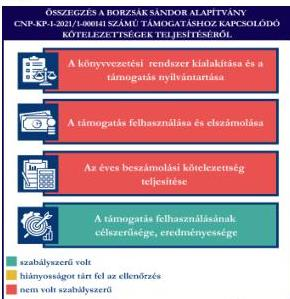
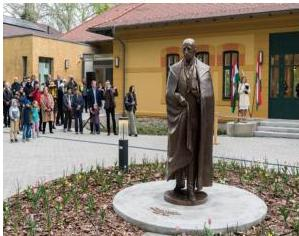

ÁLLAMI
SZÁMVEVŐSZÉK

# JELENTÉS

Egyesületek és alapítványok államháztartásból
kapott támogatásai felhasználásának és
elszámolásának ellenőrzése

Borzsák Sándor Alapítvány

2026.

25130

www.asz.hu

---

ÁLLAMI
SZÁMVEVŐSZÉK

# JELENTÉS

Egyesületek és alapítványok államháztartásból
kapott támogatásai felhasználásának és
elszámolásának ellenőrzése

Borzsák Sándor Alapítvány

2026.

25130

www.asz.hu

Dr. Szomolai Csaba
alelnök

---

ELLENŐRZÉSI IGAZGATÓSÁG:

ELLENŐRZÉSI IGAZGATÓSÁG V.

ELLENŐRZÉSI IGAZGATÓ:

KLINGA LÁSZLÓ igazgató

ELLENŐRZÉSVEZETŐ:

NEMESVÁRI-HORTHY ESZTER ellenőrzésvezető

Jelentéseink az interneten a
www.asz.hu címen olvashatók.

IKTATÓSZÁM: EL-4320-167/2025

TÉMASORSZÁM: 35

ELLENŐRZÉS-AZONOSÍTÓ SZÁM: V118119

---

# TARTALOMJEGYZÉK

|  ■ ÖSSZEFOGLALÁS | 5  |
| --- | --- |
|  ■ AZ ELLENŐRZÉS EREDMÉNYEI | 7  |
|  1. A civil szervezet államháztartási forrásból származó támogatása felhasználásának és elszámolásának szabályszerűsége, felhasználásának célszerűsége és eredményessége | 7  |
|  ■ JAVASLATOK | 10  |
|  ■ I. FÜGGELÉK: ÉSZREVÉTELEK | 11  |
|  ■ II. FÜGGELÉK: ELLENŐRZÉSI MEGKÖZELÍTÉS | 12  |
|  ■ MELLÉKLETEK | 16  |
|  I. sz. melléklet: Értelmező szótár | 16  |
|  II. sz. melléklet: Az ellenőrzött szervezetek jegyzéke | 19  |
|  ■ RÖVIDÍTÉSEK JEGYZÉKE | 20  |

3

---

# ÖSSZEFOGLALÁS

A civil szervezetek tevékenységük megvalósításához évente jelentős állami és önkormányzati támogatásokat kaphatnak, valamint akár ingyenes vagyonjuttatásban részesülhetnek. Ezekkel a forrásokkal gazdálkodnak, miközben tevékenységükkel a társadalom széles rétegeire hatnak többek között kulturális programok, rendezvények, közösségépítés formájában. Jogosan merül fel tehát a kérdés: hogyan költik el a közpénzt? Ennek érdekében az ÁSZ¹ időről időre ellenőrzi az államháztartásból kapott támogatások felhasználását, és értékeli, hogy a civil szervezetek a támogatást átláthatóan és célnak megfelelően használták-e fel. Az ÁSZ által folytatott ellenőrzések segítenek abban, hogy a nyilvánosság is valós képet kapjon arról, hova került az adófizetők pénze.

A kulturális tevékenységet végző civil szervezetek fontos és sokrétű szerepet játszanak a mai Magyarországon, különösen a helyi közösségek életében. Különösen fontosak a helyi identitás megerősítésében, a kulturális sokszínűség fenntartásában, és a közösségi aktivitás ösztönzésében.

Egy kulturális tevékenységet is végző civil szervezet támogatása nem csupán egy adott program finanszírozását jelenti, hanem befektetés a közösség szellemi, kulturális és társadalmi tőkéjébe. Ezek a szervezetek hidat képeznek az állam, a közösségek és az egyének között, támogatásuk ezért elengedhetetlen egy élő, demokratikus és értékalapú társadalom fenntartásához.

Az Alapítvány² részére a Bethlen Gábor Alapkezelő Zrt.³ „Ravasz László püspök szobrának elkészíttetése és felállíttatása” című projekt megvalósításához 2021. évben 29,0 M Ft pénzügyi támogatást nyújtott.

Az Alapítvány a kapott támogatást a projektcélnak megfelelően, eredményesen használta fel, a támogatás elérte célját, a köztéri szobor elkészült.

Az Alapítvány nem a jogszabályi előírásoknak megfelelően alakította ki gazdálkodási kereteit és könyvvezetési rendszerét. A támogatást és annak felhasználását a számviteli rendszerében a jogszabályi előírásokkal ellentétben nem elkülönítetten mutatta ki. Az Alapítvány a vissza nem térítendő támogatásként kapott támogatást, a jogszabályi előírásokkal ellentétben nem kötelezettségként, hanem pénzügyileg rendezett bevételként vette nyilvántartásba, amely jelentős összegű hibát eredményezett a 2021., a 2022., a 2023. és a 2024. évi számviteli beszámolókban. A támogatás felhasználása a Támogatói okirat⁴ és annak elválaszthatatlan részét képező költségtervben szereplő adatoknak, előírásoknak megfelelt. Az Alapítvány a Támogatói okirat szerinti elszámolási kötelezettségét a Támogató⁵ felé az ellenőrzött időszak végéig nem teljesítette¹. A 2021-2022. évi könyvvezetésben feltárt hiányosságok, valamint a 2021., a 2022., a 2023. és a 2024. évi egyszerűsített beszámoló tekintetében sérült a Számv. tv.⁶ szerinti valódiság, a világosság, a következetesség, a folytonosság és a lényegesség

1. ábra

Forrás: ÁSZ szerkesztés

¹ Az Alapítvány 2025. október 9-én benyújtotta az elszámolását a Támogató felé.

5

---

Összefoglalás---

**elve.** Az Alapítvány az ellenőrzött időszak egyes éveire vonatkozó egyszerűsített beszámolóit késedelmesen, a 2024. évre vonatkozó egyszerűsített beszámolóját a Kuratórium$^{7}$ jóváhagyása nélkül tette közzé, helyezte letétbe.

6

---

# AZ ELLENŐRZÉS EREDMÉNYEI

Az Alapítvány a részére nyújtott költségvetési támogatást Ravasz László püspök szobrának elkészíttetésére és felállíttatására fordította. Az Alapítvány a támogatást a támogatás céljának megfelelően, a támogatott tevékenység időtartamán belül használta fel. A közpénzt az Alapítvány a céljaival összhangban, a szobor elkészíttetésére és felállíttatására használta fel.

## 1. A civil szervezet államháztartási forrásból származó támogatása felhasználásának és elszámolásának szabályszerűsége, felhasználásának célszerűsége és eredményessége

Összegző megállapítás

Az Alapítvány az ellenőrzött támogatást a Támogatói okiratban megjelölt célnak megfelelően, eredményesen használta fel, ugyanakkor elszámolási kötelezettségét az ellenőrzött időszak végéig nem teljesítette. A támogatást és annak felhasználását a számviteli rendszerében a jogszabályi előírásokkal ellentétben nem elkülönítetten mutatta ki. A vissza nem térítendő támogatásként kapott támogatást a Számv. tv. előírása ellenére nem kötelezettségként tartotta nyilván. Az Alapítvány egyszerűsített beszámolóit a 2021-2024. évekre vonatkozóan késedelmesen, a 2024. évre vonatkozó számviteli beszámolóját a Kuratórium jóváhagyása nélkül helyezte letétbe.

A KÖNYVVEZETÉSI RENDSZER KIALAKÍTÁSA ÉS A TÁMOGATÁS NYILVÁNTARTÁSA

Az Alapítvány a könyvviteli szolgáltatás körébe tartozó feladatok ellátásával természetes személyt bízott meg szóban, a megbízást nem foglalták írásba. A természetes személy megfelelt a Számv. tv.-ben, illetve a Civilszr.8-ben meghatározott szakképesítési követelménynek.

Az Alapítvány gazdálkodásának kereteit nem alakította ki. A Számv. tv. 14. § (3) bekezdésében foglaltak ellenére nem rendelkezett számviteli politikával, valamint az (5) bekezdés a), b) és d) pontjaiban foglaltak ellenére az eszközök és a források leltárkészítési és leltározási szabályzatával, az eszközök és a források értékelési szabályzatával, valamint pénzkezelési szabályzattal.

Az Alapítvány a Civilszr. előírásainak megfelelően a 2021-2024. években egyszeres könyvvitelt vezetett.

Az Alapítvány a pénzeszközeire, azok forrásaira, valamint az ezekben bekövetkezett változásokra vonatkozó nyilvántartási kötelezettségének nem a Számv. tv. 162. § (1) és (2) bekezdésében előírt követelmények betartásával tett eleget. Az ellenőrzés során az ÁSZ a könyvviteli nyilvántartásokban az alábbi hibákat azonosította:

- a könyvelési tételeket nem időrendi sorrendben rögzítették;
- 2022. évben a könyvviteli nyilvántartás nem támasztotta alá az eredménylevezetésben szereplő végleges pénzkiadások adatait, attól 1,1 M Ft-tal magasabb összeget tartalmazott;

7

---

Az ellenőrzés eredményei

- a 2021. könyvviteli nyilvántartás záró adatai és a 2022. évi könyvviteli nyilvántartás nyitó adatai nem egyeztek meg.

Az Alapítvány a 100% támogatási előlegként kapott támogatást, pénzügyileg rendezett bevételként vette nyilvántartásba, – 2021. évi egyszerűsített beszámolója eredménylevezetésében az „A. Végleges pénzbevételek, elszámolt bevételek I. Pénzügyileg rendezett bevételek támogatások” soron szerepeltette – ugyanakkor a Számv. tv. 103. § (4) bekezdésében foglaltak ellenére a 2021. évi egyszerűsített mérlegében kötelezettségként nem mutatta ki. A Támogató a támogatás elszámolását az ellenőrzött időszak végéig (az ellenőrzésről szóló kiértésítő levél keltéig: 2025. augusztus 29.) nem fogadta el. Az Alapítvány az előlegként kapott 29,0 M Ft támogatásból a 2021. évben 9,5 M Ft-ot, a 2022. évben 19,3 M Ft-ot használt fel. Az előlegként kapott támogatás bevételként való elszámolása a Számv. tv. 3. § (3) bekezdés 3. pontja szerinti jelentős összegű hibát eredményezett, mivel a 2021-2024. évi eredményre és saját tőkére gyakorolt hiba és hibahatások abszolút értékének együttes összege mind a négy évben meghaladta a mérlegfőösszeg 2,0%-át.

A kapott támogatási előleget nem elkülönítetten mutatta ki a könyvviteli nyilvántartásában a Civil tv.⁹ 20. § (1) bekezdés c) pontjában foglalt előírás ellenére.

Az Alapítvány az ellenőrzött támogatás felhasználását a Civil tv. 20. § (4) bekezdésében előírtak ellenére nem elkülönítetten tartotta nyilván.

#### A TÁMOGATÁS FELHASZNÁLÁSA ÉS ELSZÁMOLÁSA

Az Alapítvány a Támogató felé elszámolását a Támogatói okiratban meghatározott 2023. január 30-i határidőre és az ÁSZ ellenőrzés ellenőrzött időszakának végéig (2025. augusztus 29.) nem nyújtotta be².

Az Alapítvány esetében a támogatás felhasználása ellenőrzött tételeinek (8 db) vonatkozásában az ÁSZ az alábbiakat állapította meg:

- a tételek számviteli elszámolását a Számv. tv.-ben előírtaknak megfelelően bizonylatokkal alátámasztotta;
- a gazdasági eseményeket dologi kiadásokra számolta el, azonban a létrejött képzőművészeti alkotásokat (bronzszobor és annak élethű kicsinyített mása) – a Számv. tv. 26. § (7) bekezdésében előírtak ellenére – beruházásként nem aktiválta;
- a tételek számviteli bizonylatait a Támogatói okirat elválaszthatatlan részét képező Általános szerződési feltételek 6.5. pontjában foglalt előírás ellenére nem záradékolta;
- minden ellenőrzött kiadás elszámolható volt a támogatás terhére és megegyezett a számlaösszesítőben feltüntetett értékkel;
- a tételek számviteli bizonylatai alapján a gazdasági események a Támogatói okiratnak megfelelően a támogatási időszak végéig szerződés szerint teljesültek;
- a tételek pénzügyi rendezése a Támogatói okiratban meghatározott felhasználási határidőig minden esetben megtörtént;
- a tételek megfeleltethetők voltak a Támogatói okiratban, illetve a költségtervben meghatározott, Támogató által jóváhagyott felhasználási jogcímeknek.

² Az Alapítvány a Támogató felé elszámolását 2025. október 9-én benyújtotta, annak Támogató általi elfogadására még nem került sor. Az ellenőrzés lezárása idején a Támogató az Alapítványt hiánypótlásra hívta fel.

8

---

Az ellenőrzés eredményei---

## AZ ÉVES BESZÁMOLÁSI KÖTELEZETTSÉG TELJESÍTÉSE

Az Alapítvány számviteli beszámolóit a 2021-2024. üzleti év könyveinek lezárását követően, az üzleti év december 31. napjával, mint mérlegfordulónappal elkészítette.

A 2021-2024. évi egyszerűsített beszámolók a Civil tv.-ben, illetve a Civilszr.-ben előírt formában tartalmazták a mérleget, az eredménylevezetést. A 2022., 2023. évi közhasznúsági melléklet nem tartalmazta a Civil tv. 29. § (6) bekezdése előírása ellenére a szervezet által végzett közhasznú tevékenységeket, ezen tevékenységek fő célcsoportjait és eredményeit.

A 2021. évi egyszerűsített beszámoló forrás oldala, továbbá a 2021-2024. évi egyszerűsített beszámolók kötelezettség sora összeget nem tartalmazott, ezáltal sérült a Számv. tv. 15. § (3) bekezdésében foglalt valódiság, (4) bekezdésében foglalt világosság, (5) bekezdésében foglalt következetesség, (6) bekezdésében foglalt folytonosság elve, valamint a 16. § (4) bekezdésében rögzített lényegesség elve.

Az Alapítvány – a Civil tv. 30 § (1) bekezdésében foglaltak ellenére – a 2021-2024. évi beszámolóit késedelmesen (2021. évi beszámoló: 2022. november 8., 2022. évi beszámoló: 2024. június 18., 2023. évi beszámoló: 2024. június 20., 2024. évi beszámoló: 2025. augusztus 4.), a 2024. évi beszámolót a Kuratórium jóváhagyása nélkül helyezte letétbe, tette közzé. Az Alapítvány saját honlappal nem rendelkezett.

Az Alapítvány a szobor felavatásának napján az alkotást ajándékozási szerződéssel átadta a Dunamelléki Református Egyházkerületnek, amelyhez a Támogatói okirat IV.14. pontjában foglalt előírás ellenére a Támogató előzetes írásbeli hozzájárulását nem kérte meg.

## A TÁMOGATÁS FELHASZNÁLÁSÁNAK CÉLSZERŰSÉGE ÉS EREDMÉNYESSÉGE

Az Alapítvány az ellenőrzött támogatást a Támogatói okirat előírásának megfelelően, az abban meghatározott célra használta fel. A Támogatói okiratban megjelölt cél „**Ravasz László püspök szobrának elkészíttetése és felállíttatása**” című projekt teljesült. A szobor elkészíttetése és felállítása a jóváhagyott költségtervnek megfelelően valósult meg. A támogatás eredményeként a szoborról online felületeken tájékoztatták a közvéleményt.

9

---

# JAVASLATOK

Az ÁSZ tv. 10 33. § (1) bekezdésében foglaltak értelmében az ellenőrzött szervezet vezetője köteles a jelentésben foglalt megállapításokhoz kapcsolódó intézkedési tervet összeállítani és azt a jelentés kézhezvételétől számított 30 napon belül az ÁSZ részére megküldeni. Az ÁSZ a jelentésben foglalt megállapításokhoz kapcsolódóan az alábbi javaslatok tekintetében várja el az intézkedési terv elkészítését.

## A BORZSÁK SÁNDOR ALAPÍTVÁNY KURATÓRIUMA ELNÖKÉNEK

1. A Számv. tv. 14. § (3) bekezdésében, valamint a Számv.tv. 14. § (5) bekezdés a), b) és d) pontjaiban foglaltaknak megfelelően gondoskodjon az Alapítvány számviteli politikájának, illetve annak keretében az eszközök és a források leltárkészítési és leltározási szabályzatának, az eszközök és a források értékelési szabályzatának, valamint a pénzkezelési szabályzatának elkészítéséről.
2. Gondoskodjon arról, hogy az Alapítvány a jövőben a könyvvezetési kötelezettségét a Számv. tv. 162. § (1) és (2) bekezdésében foglalt előírások betartásával teljesítse.
3. Gondoskodjon arról, hogy az Alapítvány a jövőben a vissza nem térítendő formában kapott támogatásokat a támogató felé benyújtott elszámolás támogató általi elfogadásáig a Számv.tv. 103. § (4) bekezdés előírásának megfelelően a könyvviteli nyilvántartásában, illetve a számviteli beszámolóban kötelezettségként mutassa ki.
4. Gondoskodjon arról, hogy az Alapítvány a jövőben a kapott támogatást a Civil tv. 20. § (1) bekezdés c) pontjában foglalt előírás betartásával elkülönítetten mutassa ki.
5. Gondoskodjon arról, hogy az Alapítvány a jövőben a kapott támogatások felhasználásáról a Civil tv. 20. § (4) bekezdésében foglalt előírásnak megfelelően, olyan elkülönített számviteli nyilvántartást vezessen, amelyből megállapítható és ellenőrizhető a kapott támogatás felhasználása.
6. Gondoskodjon arról, hogy az Alapítvány a jövőben, a számviteli beszámolóit azok jóváhagyását követően határidőben tegye közzé, illetve helyezze letétbe a Civil tv. 30. § (1) bekezdésében előírtaknak megfelelően.

10

---

# I. FÜGGELÉK: ÉSZREVÉTELEK

*A jelentéstervezetet az ÁSZ 15 napos észrevételezésre megküldte az ellenőrzött szervezet vezetőjének az ÁSZ tv. 29. §\* (1) bekezdése előírásának megfelelően.*

*A Borzsák Sándor Alapítvány elnöke a jelentéstervezetre nem tett észrevételt.*

\* 29. § (1) Az Állami Számvevőszék az ellenőrzési megállapításait megküldi az ellenőrzött szervezet vezetőjének vagy az általa megbízott személynek, és annak, akinek személyes felelősségét állapította meg.

(2) Az ellenőrzött szervezet vezetője és a felelősként megjelölt személy az ellenőrzés megállapításaira tizenöt napon belül írásban észrevételt tehet.

(3) Az Állami Számvevőszék az észrevételre a beérkezésétől számított harminc napon belül írásban válaszol. A figyelembe nem vett észrevételeket köteles a jelentésben feltüntetni, és megindokolni, hogy azokat miért nem fogadta el.

11

---

## II. FÜGGELÉK: ELLENŐRZÉSI MEGKÖZELÍTÉS

### AZ ELLENŐRZÉS JOGALAPJA

Az ellenőrzés jogszabályi alapját az ÁSZ tv. 1. § (3) bekezdés, az 5. § (3) bekezdés előírásai képezték.

### AZ ELLENŐRZÉS CÉLJA

Az ellenőrzés célja annak értékelése volt, hogy az ellenőrzött alapítvány az államháztartási forrásból származó, ellenőrzésre kiválasztott támogatást a támogatói okiratban előírtaknak megfelelően, az abban meghatározott célra, szabályszerűen, eredményesen használta-e fel, valamint a gazdálkodásáról szabályszerűen beszámolt-e. Célja volt továbbá a támogatással való elszámolás szabályszerűségének értékelése.

### AZ ELLENŐRZÉS TÍPUSA

Kombinált ellenőrzés.

### AZ ELLENŐRZÉS TÁRGYA

Az államháztartásból nyújtott támogatást felhasználó ellenőrzött alapítvány a kiválasztott támogatás felhasználására vonatkozó jogszabályi és szerződéses előírások betartásának ellenőrzése. Ennek keretében a könyvvezetésre vonatkozó jogszabályi előírások betartása, a támogatás felhasználás támogatói okiratnak való megfelelősége, valamint a beszámolási és közzétételi kötelezettség teljesítésének szabályszerűsége. Az ellenőrzés tárgya volt továbbá annak értékelése, hogy a számviteli szabályozási környezet kialakítása támogatta-e az államháztartásból származó támogatás vonatkozásában a szabályos könyvvezetést, a támogatás célnak megfelelő felhasználását, valamint a kapcsolódó beszámolási kötelezettség teljesítését. Az ellenőrzés során az ÁSZ értékelte, hogy az ellenőrzött szervezet a támogatást meghatározott célra, eredményesen használta-e fel.

Az ellenőrzés kiterjedt minden olyan körülményre és adatra, amely az ÁSZ jogszabályban meghatározott feladatainak teljesítéséhez, valamint a program végrehajtása folyamán felmerült újabb összefüggések feltárásához szükséges.

### AZ ELLENŐRZÉS HATÓKÖRE ÉS TERÜLETE

Az ÁSZ tv. 5. § (3) bekezdésében foglaltak alapján az ÁSZ ellenőrizte az államháztartásból nyújtott támogatás felhasználását. A támogatás felhasználásának szabályait a támogatói okirat, az Áht.$^{11}$ és az Ávr.$^{12}$ rögzítette. A civil szervezet könyvvezetésének, a beszámolási- és közzétételi kötelezettség teljesítésének ellenőrzése a Számv. tv., a Civilszr., a Civil tv., a Civil vhr.$^{13}$, valamint a Ptk.$^{14}$ vonatkozó előírásai alapján történt.

12

---

II. Függelék: Ellenőrzési megközelítés

Az ÁSZ ellenőrzése választ ad arra, hogy az ellenőrzött szervezetnél a számviteli szabályozási környezet kialakítása biztosította-e a támogatás felhasználása jogszabályi előírásoknak megfelelő nyilvántartását, könyvviteli elszámolását, továbbá arra is, hogy a támogatással való elszámolási, beszámolási kötelezettséget teljesítette-e. Az ÁSZ ellenőrzése kiterjedt a támogatás támogatói okiratban foglalt célra történő felhasználás és a felhasználás eredményességének értékelésére. Ezen túlmenően az ellenőrzés értékelte, hogy az ellenőrzött szervezet számviteli beszámolási kötelezettségének teljesítése szabályszerű volt-e.

## AZ ELLENŐRZÖTT IDŐSZAK

Az ellenőrzésre kiválasztott államháztartási forrásból származó támogatásra vonatkozó támogatott tevékenység időtartamának kezdő időpontjától az ellenőrzésről szóló értesítés keltéig tartó időszak.

## AZ ELLENŐRZÉSI KRITÉRIUMOK

|  FŐKUSZTERÜLET/FŐKUSZKÉRDÉS | ELLENŐRZÉSI KRITÉRIUMOK  |
| --- | --- |
|  1. A civil szervezet államháztartási forrásból származó támogatása(i) felhasználásának és elszámolásának szabályszerűsége, felhasználásának célszerűsége és eredményessége | Áht. Ávr. Számv. tv. Civil tv. Civilszr. Ptk. Civil vhr. Cnytv.^{15} Létesítő okirat Támogatói okirat Költségterv  |

## AZ ELLENŐRZÉS MÓDSZERE ÉS AZ ELLENŐRZÉSI BIZONYÍTÉKOK KÖRE

Az ellenőrzést a nemzetközi standardokat irányadónak tekintve az ellenőrzési program szempontjai, az ellenőrzött időszakban hatályos jogszabályok, az ellenőrzés szakmai szabályok és módszertan(ok) figyelembevételével végezte az ÁSZ.

Az ellenőrzési kérdések megválaszolásához szükséges bizonyítékok megszerzése az ellenőrzött szervezet által rendelkezésre bocsátott dokumentumokra és adatokra alapozva mintavételezés útján történt.

Az államháztartási forrásból származó, ellenőrzésre – adatvezérelt, kockázatalapú kiválasztás által, több év adatának figyelembevételével és az ellenőrizhető szervezet által előzetesen szolgáltatott adatok alapján – kijelölt támogatás felhasználása támogatói okiratnak való megfelelőségét a támogatás nyilvántartásának és a támogató felé történő elszámolásnak egymással és a támogatói okirattal történő összevetésével ellenőrizte az ÁSZ.

13

---

II. Függelék: Ellenőrzési megközelítés---

A támogatás könyvviteli nyilvántartása jogszabályi előírásoknak, támogatói okiratnak való szabályszerűségét – mivel a sokaság elemszáma tíznél kevesebb volt – tételesen ellenőrizte az ÁSZ.

Az ellenőrzési bizonyítékként felhasználható adatforrások közé tartoztak egyrészt az ellenőrzéshez kért dokumentumok, másrészt adatforrás volt még minden – az ellenőrzés folyamán – feltárt, az ellenőrzés szempontjából információkat tartalmazó dokumentum.

Az ellenőrzés lefolytatásához az ellenőrzött szervezet a tanúsítványok kitöltésével, valamint az ÁSZ által kért dokumentumok, adatok, információk megküldésével és az ellenőrzés során szolgáltatott adatokat. Az ellenőrzés folyamán helyszíni ellenőrzésre került sor.

Az ÁSZ az ellenőrzött szervezetet az Országos Támogatás-ellenőrzési Rendszerben (OTR) nyilvántartott adatok alapján államháztartási forrásból támogatásban részesült szervezetek közül, – OBH$^{16}$ és KSH$^{17}$ adatokat is figyelembe véve – adatvezérelt kockázatértékelés alapján, a kulturális tevékenységet végző szervezetekre fókuszálva választotta ki. Az ÁSZ az ellenőrzött támogatást az adott szervezet által előzetesen szolgáltatott adatok alapján, a tanúsítványokban szereplő adatok ismeretében határozta meg.

A **Borzsák Sándor Alapítványt** Alapító okirata szerint a Pócsmegyer-Leányfalui Református Társegyházközség alapította 2014-ben, a civil szervezetek közhiteles bírósági nyilvántartásába 2014. november 4-én jegyezték be. Az Alapítvány célja „*a Pócsmegyeren élő, több évszázados múlttal rendelkező református gyülekezet hitéletének és nemzetfenntartó hagyományának megerősítése. Ezen alapvető célkitűzés mellett a református gyülekezeti élet fejlesztése, ifjúsági és gyermeknevelői feladatok ellátása. Pócsmegyer hagyományos szellemiségének ápolása és megerősítése. Az 1100 éves múltra visszatekintő falu történeti emlékeinek őrzése és feldolgozása, épített örökségének ápolása. A helybeli hagyományok megőrzése, régiek felelevenítése. A még fellelhető, a falu életére jellemző használati és munkaeszközök összegyűjtése, nyilvánosság előtti bemutatása.*”

Az Alapítvány ügyvezető szerve a hét fős Kuratórium, élén az Elnökkel. Az Elnök személyében az ellenőrzött időszakban nem történt változás.

Az Alapítvány jogszabályi előírások alapján könyvvizsgálatra nem volt kötelezett. Az Alapítványnál felügyelő bizottság, illetve felügyelő szerv nem működött, annak létrehozására nem volt kötelezett, mivel éves bevétele nem haladta meg az 50 M Ft-ot, illetve nem rendelkezett közhasznú jogállással.

Az Alapítvány **2021. évben** a Közbef. tv.$^{18}$ szerinti, a **közélet befolyásolására alkalmas civil szervezetnek minősült**, mivel mérlegfőösszege elérte a 20 M Ft-ot. A **2022-2024. években** mérlegfőösszege a 20 M Ft-ot nem érte el, így **nem minősült** a Közbef. tv. szerint a **közélet befolyásolására alkalmas civil szervezetnek**.

Az Alapítvány nem végzett vállalkozási tevékenységet.

Az Alapítvány támogatásban részesült. A támogatott tevékenység megvalósulásához a Támogató cél indikátorokat nem határozott meg. A támogatással kapcsolatos adatokat az 1. táblázat foglalja össze.

14

---

II. Függelék: Ellenőrzési megközelítés

1. táblázat

# A TÁMOGATÁS FŐBB ADATAI

# A BORZSÁK SÁNDOR ALAPÍTVÁNY RÉSZÉRE A TÁMOGATÓ ÁLTAL NYÚJTOTT, ELLENŐRZÖTT TÁMOGATÁS (CNP-KP-1-2021/1-000141) FŐBB ADATAI

|  Támogatott tevékenység: | Egyedi támogatási program (2021) – Ravasz László püspök szobrának elkészíttetése és felállításának támogatása  |
| --- | --- |
|  Támogató: | Bethlen Gábor Alapkezelő Zrt.  |
|  Támogatási összeg: | 29,0 M Ft  |
|  Felhasznált összeg: | 28,9 M Ft  |
|  A Támogatói okirat kibocsátásának időpontja: | 2021. szeptember 8.  |
|  A támogatott tevékenység időtartama: | 2021. július 01. - 2022. december 31.  |
|  A támogatás felhasználásáról a záró (pénzügyi) beszámoló benyújtásának határideje: | 2023. január 30.  |
|  A támogatás felhasználásáról benyújtott záró beszámoló elfogadásának dátuma: | A támogatás felhasználásáról a záró beszámolót az ellenőrzésről szóló kiértésítő levél keltéig (2025. augusztus 29.) nem nyújtotta be az Alapítvány.^{3}  |

Forrás: ÁSZ saját szerkesztés a Támogatói okirat adatai alapján

A támogatás forrása a Magyarország 2021. évi központi költségvetéséről szóló 2020. évi XC. törvény 1. melléklet, XI. Miniszterelnökség fejezet, 30. Fejezeti kezelésű előirányzatok cím, 1. Célelőirányzatok alcím, 16. Nonprofit, társadalmi, civil szervezetek és köztestületek támogatása jogcímcsoport előirányzata volt.

2. ábra

Forrás: https://www.parokia.hu/krisztus-kovetot-potoihatalan-erteket-allitanak-elo/

A Leányfalun található villaépület impozánsan felújított, egészen a Duna-partig húzódó kertjében kapott helyet – a világon elsőként – Ravasz László püspök egész alakos szobra. A 2,2 méter magas bronz alkotás a Magyar Érdemrend Lovagkeresztjével kitüntetett Kutas László szobrászművész munkája. A szobrot Leányfalu központi helyén, a Ravasz Lászlóról elnevezett intézmény (emlékház) előtt helyezték el. A szoborállítást kezdeményező Alapítvány a műalkotást a Dunamelléki Református Egyházkerületnek ajándékozta.

3 Az Alapítvány a Támogató felé elszámolását 2025. október 9-én benyújtotta, annak Támogató általi elfogadására még nem került sor. Az ellenőrzés lezárása idején a Támogató az Alapítványt hiánypótlásra hívta fel.

15

---

# MELLÉKLETEK

## ■ 1. SZ. MELLÉKLET: ÉRTELMEZŐ SZÓTÁR

|  adomány | A civil szervezetnek – létesítő okiratban rögzített céljaira – ellenszolgáltatás nélkül juttatott eszköz, illetve nyújtott szolgáltatás. (Forrás: Civil tv. 2. § 1. pont)  |
| --- | --- |
|  alapítvány | Az alapítvány az alapító által az alapító okiratban meghatározott tartós cél folyamatos megvalósítására létrehozott jogi személy. Az alapító az alapító okiratban meghatározza az alapítványnak juttatott vagyont és az alapítvány szervezetét. (Forrás: Ptk. 3:378. §) A Számv. tv. alkalmazásában egyéb szervezet (Forrás: Számv. tv. 3. § (1) bekezdés 4.pont a) alpontja)  |
|  célszerűség | Arra vonatkozó követelmény, hogy a bevételeket a közfeladat megvalósítása érdekében, a kiadásokat a közfeladatok megfelelő ellátásához szükséges mértékben, a költségvetési célrendszer érdekében, a meghatározott célra (közfeladat ellátására), továbbá észszerűen, racionálisan használták fel. (Forrás: Alaptörvény^{19}, ÁSZ)  |
|  civil szervezet | Civil szervezet: a) a civil társaság, b) a Magyarországon nyilvántartásba vett egyesület - a párt, a szakszervezet és a kölcsönös biztosító egyesület kivételével -, c) a közalapítvány és a pártalapítvány kivételével - az alapítvány. (Forrás: Civil tv. 2. § 6. pont)  |
|  civil szervezetek egyszerűsített támogatása | A helyi vagy területi hatókörű civil szervezetek számára a Civil tv. 56. § (1) bekezdés h) pontja alapján egyszerűsített formában, jogosultsági alapon nyújtott támogatás a helyi közösség érdekében végzett tevékenységük támogatására. (Forrás: Civil tv. 2. § 8b. pont)  |
|  civil szervezetek normatív támogatása | A civil szervezetek által gyűjtött adományok után járó, a gyűjtött adomány mértékével arányos a Civil tv. 56. § (1) bekezdés a) pontja alapján nyújtott támogatás. (Forrás: Civil tv. 2. § 8a. pont alapján)  |
|  eredményesség | Az eredményesség elve a kitűzött célok és a szándékolt eredmények (hatások) elérését jelenti. A gazdálkodás, feladatellátás eredményességét mutatja a tényleges és a tervezett eredmények (hatások) összevetése. (Forrás: INTOSAI^{20})  |
|  feladatfinanszírozást szolgáló költségvetési támogatás | Valamely közfeladat államháztartáson kívüli szervezet által történő ellátását, valamint e feladat ellátásához közvetlenül kapcsolódó, arányos működési költségeket finanszírozó költségvetési támogatás. (Forrás: Civil tv. 2. § 8. pont)  |
|  közcélú tevékenység | Személyek csoportja által, valamely a csoportnál tágabb közösség érdekében – más, e közösségbe nem tartozó személyek érdekeinek sérelme nélkül – végzett tevékenység. (Forrás: Civil tv. 2. § 16. pont)  |
|  közfeladat | A jogszabályban meghatározott állami vagy önkormányzati feladat. A közfeladatok ellátásában államháztartáson kívüli szervezet jogszabályban meghatározott rendben közreműködhet. (Forrás: Áht. 3/A. § (1)-(2) bekezdés)  |

16

---

Mellékletek

|  közhasznú szervezet | Közhasznú szervezetté minősített a Magyarországon nyilvántartásba vett közhasznú tevékenységet végző szervezet, amely a társadalom és az egyén közös szükségleteinek kielégítéséhez megfelelő erőforrásokkal rendelkezik, továbbá amelynek megfelelő társadalmi támogatottsága kimutatható, és amely: a) civil szervezet (ide nem értve a civil társaságot), vagy b) olyan egyéb szervezet, amelyre vonatkozóan a közhasznú jogállás megszerzését törvény lehetővé teszi. (Forrás: Civil tv. 32. § (1) bekezdés)  |
| --- | --- |
|  közhasznú tevékenység | Minden olyan tevékenység, amely a létesítő okiratban megjelölt közfeladat teljesítését közvetlenül vagy közvetve szolgálja, ezzel hozzájárulva a társadalom és az egyén közös szükségleteinek kielégítéséhez. (Forrás: Civil tv. 2. § 20. pont)  |
|  létesítő okirat | A jogi személy létrehozásáról a személyek szerződésben, alapító okiratban vagy alapszabályban szabadon rendelkezhetnek, mely dokumentumokra együttesen a Ptk. a létesítő okirat megnevezést használja. (Forrás: Ptk. 3:4. § (1) bekezdés alapján)  |
|  támogatás | Céljellegű juttatás, mely kizárólag arra a célra használható fel, amelyre a támogató azt rendelkezésre bocsátotta, amely cél megvalósítását a támogatási szerződés, okirat vagy éppen jogszabály kikötötte. Támogatásként értelmezzük valamennyi, a civil szervezetnek államháztartási forrásból nyújtott támogatást – ideértve a központi költségvetésből kapott támogatást, az elkülönített állami pénzalapokból kapott támogatást, a helyi önkormányzatoktól, nemzetiségi önkormányzatoktól, önkormányzati társulástól kapott támogatást –, továbbá az Európai Unió költségvetéséből, külföldi állam államháztartásából, nemzetközi szervezettől, vagy nemzetközi szerződés rendelkezése alapján kapott támogatást, valamint más civil szervezettől kapott támogatást. A gyűjtő fogalom alatt egyaránt értjük a civil szervezetnek nyújtott feladatfinanszírozást szolgáló költségvetési támogatást, a civil szervezetek normatív támogatását, valamint a civil szervezetek egyszerűsített támogatását is (ÁSZ saját fogalma)  |
|  támogatási döntés | Az államháztartás alrendszereiből, az európai uniós forrásokból, a nemzetközi megállapodás alapján finanszírozott egyéb programokból, a 100%-os állami tulajdonban álló szervezet által létrehozott alapítványtól származó, egyedi döntés alapján nyújtott, pályázati úton vagy pályázati rendszeren kívül az államháztartáson kívüli természetes személyek, jogi személyek és jogi személyiséggel nem rendelkező egyéb szervezetek számára odaítélt, természetben vagy pénzben juttatott támogatásokban részesülő személy, valamint az e személy részére juttatandó konkrét támogatási összeg meghatározása. (Forrás: 2007. évi CLXXXI. törvény^{21} 1. § (1) bekezdése és 2. § (1) bekezdése alapján)  |
|  támogatói okirat | A támogatói okirat egy olyan, a támogató (irányító hatóság) támogatási jogviszony létrehozására irányuló akaratnyilatkozatát tartalmazó jognyilatkozat, amelyből jogilag kikényszeríthető kötelezettségek származnak, és amely esetében a jelen pontban rögzített jogszabályi előírások is irányadók. Az államháztartás alrendszerei terhére támogatás közigazgatási hatósági határozattal vagy hatósági szerződéssel, támogatói okirattal vagy támogatási szerződéssel jogszabály vagy egyedi döntés alapján, pályázati úton vagy pályázati rendszeren kívül nyújtható. Ha jogszabály – a központi költségvetés Áht. 14. § (3) bekezdése szerinti fejezetéből biztosított költségvetési támogatások esetén jogszabály vagy a Kormány határozata – a támogatás biztosításának módjáról nem rendelkezik, arról a központi költségvetés Áht. 14. § (3) bekezdése szerinti fejezetéből biztosított költségvetési támogatások esetén támogatói okiratot kell kibocsátani, ettől eltérő más esetben az ötmilliárd forintot el nem érő összegű költségvetési támogatás esetén szintén támogatói okiratot kell kibocsátani (Forrás: Áht. 48. § (1) bekezdése, Ávr. 65/A. § (1) bekezdés alapján ÁSZ meghatározás)  |

17

---

*Mellékletek*---

|  támogatott tevékenység | A támogatási szerződésben meghatározott olyan tevékenység – ideértve a kedvezményezett működését is –, amely során felmerült költségek megtérítését a támogatási előleg, a költségvetési támogatás részben vagy egészében biztosítja. (Forrás: Ávr. 1. § 8. pontja)  |
| --- | --- |
|  támogatott tevékenység időtartama | A támogatási szerződésben meghatározott olyan időtartam, amely során felmerülő, a támogatott tevékenység megvalósításához kapcsolódó költségek elszámolhatóak. (Forrás: Ávr. 1. § 9. pontja)  |

18

---

*Mellékletek*---

# ■ II. SZ. MELLÉKLET: AZ ELLENŐRZÖTT SZERVEZETEK JEGYZÉKE---

|  ELLENŐRZÖTT SZERVEZET NEVE | ELLENŐRZÖTT SZERVEZET SZÉKHELYE  |
| --- | --- |
|  Borzsák Sándor Alapítvány | 2017 Pócsmegyer, Bocskai tér 6.  |

19

---

# RÖVIDÍTÉSEK JEGYZÉKE

1. ÁSZ

2. Alapítvány

3. Bethlen Gábor Alapkezelő Zrt.

4. Támogatói okirat

5. Támogató

6. Számv. tv.

7. Kuratórium

8. Civilsztr.

9. Civil tv.

10. ÁSZ tv.

11. Áht.

12. Ávr.

13. Civil vhr.

14. Ptk.

15. Cnytv.

16. OBH

17. KSH

18. Közbef. tv.

19. Alaptörvény

20. INTOSAI

21. 2007. évi CLXXXI. törvény

Állami Számvevőszék

Borzsák Sándor Alapítvány

Bethlen Gábor Alapkezelő Közhasznú Nonprofit Zártkörűen Működő Részvénytársaság

CNP-KP-1-2021/1-000141 azonosító számú támogatói okirat

Bethlen Gábor Alapkezelő Zrt.

2000. évi C. törvény a számvitelről

Borzsák Sándor Alapítvány Kuratóriuma

479/2016. (XII. 28.) Korm. rendelet a számviteli törvény szerinti egyes egyéb szervezetek beszámoló készítési és könyvvezetési kötelezettségének sajátosságairól

2011. évi CLXXV. törvény az egyesülési jogról, a közhasznú jogállásról, valamint a civil szervezetek működéséről és támogatásáról

2011. évi LXVI. törvény az Állami Számvevőszékről

2011. évi CXCV. törvény az államháztartásról

368/2011. (XII. 31.) Korm. rendelet az államháztartásról szóló törvény végrehajtásáról

350/2011. (XII. 30.) Korm. rendelet - a civil szervezetek gazdálkodása, az adománygyűjtés és a közhasznúság egyes kérdéseiről

2013. évi V. törvény a Polgári Törvénykönyvről

2011. évi CLXXXI. törvény a civil szervezetek bírósági nyilvántartásáról és az ezzel összefüggő eljárási szabályokról

Országos Bírósági Hivatal

Központi Statisztikai Hivatal

2021. évi XLIX. törvény a közélet befolyásolására alkalmas tevékenységet végző civil szervezetek átláthatóságáról

Magyarország Alaptörvénye

Legfőbb Ellenőrző Intézmények Nemzetközi Szervezete (The International Organization of Supreme Audit Institutions)

2007. évi CLXXXI. törvény a közpénzekből nyújtott támogatások átláthatóságáról

20

---

ÁLLAMI
SZÁMVEVŐSZÉK

1052 Budapest, Apáczai Csere János u. 10. | 1364 Budapest 4., Pf. 54
www.asz.hu | szamvevoszek@asz.hu
telefon: +36 1 484 9100