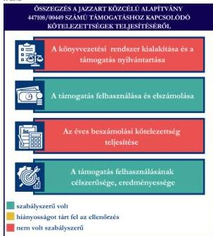
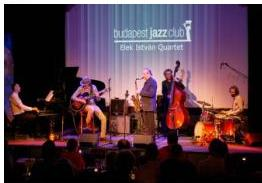

ÁLLAMI
SZÁMVEVŐSZÉK

# JELENTÉS

Egyesületek és alapítványok államháztartásból
kapott támogatásai felhasználásának és
elszámolásának ellenőrzése

JAZZART Közcélú Alapítvány

2026.

25131

www.asz.hu

---

ÁLLAMI
SZÁMVEVŐSZÉK

# JELENTÉS

Egyesületek és alapítványok államháztartásból
kapott támogatásai felhasználásának és
elszámolásának ellenőrzése

JAZZART Közcélú Alapítvány

2026.

25131

www.asz.hu

Dr. Szomolai Csaba
alelnök

---

ELLENŐRZÉSI IGAZGATÓSÁG:

ELLENŐRZÉSI IGAZGATÓSÁG V.

ELLENŐRZÉSI IGAZGATÓ:

KLINGA LÁSZLÓ igazgató

ELLENŐRZÉSVEZETŐ:

NEMESVÁRI-HORTHY ESZTER ellenőrzésvezető

Jelentéseink az interneten a
www.asz.hu címen olvashatók.

IKTATÓSZÁM: EL-4320-168/2025

TÉMASORSZÁM: 35

ELLENŐRZÉS-AZONOSÍTÓ SZÁM: V118106

---

# TARTALOMJEGYZÉK

|  ■ ÖSSZEFOGLALÁS | 5  |
| --- | --- |
|  ■ AZ ELLENŐRZÉS EREDMÉNYEI | 6  |
|  1. A civil szervezet államháztartási forrásból származó támogatása felhasználásának és elszámolásának szabályszerűsége, felhasználásának célszerűsége és eredményessége | 6  |
|  ■ JAVASLATOK | 9  |
|  ■ I. FÜGGELÉK: ÉSZREVÉTELEK | 10  |
|  ■ II. FÜGGELÉK: ELLENŐRZÉSI MEGKÖZELÍTÉS | 11  |
|  ■ MELLÉKLETEK | 15  |
|  I. sz. melléklet: Értelmező szótár | 15  |
|  II. sz. melléklet: Az ellenőrzött szervezetek jegyzéke | 18  |
|  ■ RÖVIDÍTÉSEK JEGYZÉKE | 19  |

3

---

# ÖSSZEFOGLALÁS

A civil szervezetek tevékenységük megvalósításához évente **jelentős állami** és önkormányzati **támogatásokat** kaphatnak, valamint ingyenes vagyonjuttatásban részesülhetnek. Ezekkel a forrásokkal gazdálkodnak, miközben tevékenységükkel a **társadalom széles rétegeire hatnak** többek között kulturális programok, rendezvények, közösségépítés formájában. Jogosan merül fel tehát a kérdés: **hogyan költik el a közpénzt?** Ennek érdekében az ÁSZ$^{1}$ időről időre **ellenőrzi** az államháztartásból kapott támogatások felhasználását, és értékeli, hogy a civil szervezetek a támogatást **átláthatóan és célnak megfelelően** használták-e fel. Az ÁSZ által folytatott ellenőrzések segítenek abban, hogy a nyilvánosság is **valós képet kapjon arról, hova került az adófizetők pénze**.

A kulturális tevékenységet végző civil szervezetek **fontos és sokrétű szerepet** játszanak a mai Magyarországon, különösen a helyi közösségek életében. Különösen fontosak a helyi identitás megerősítésében, a kulturális sokszínűség fenntartásában, és a közösségi aktivitás ösztönzésében.

Egy kulturális tevékenységet végző civil szervezet támogatása **nem csupán egy adott program finanszírozását jelenti, hanem befektetés a közösség szellemi, kulturális és társadalmi tőkéjébe**. Ezek a szervezetek hidat képeznek az állam, a közösségek és az egyének között, támogatásuk ezért elengedhetetlen egy élő, demokratikus és értékalapú társadalom fenntartásához.

Az Alapítvány$^{2}$ részére a kultúráért felelős miniszter, mint Támogató döntése alapján a Nemzeti Kulturális Támogatáskezelő a Nemzeti Kulturális Alap terhére, a **Budapest Jazz Club programjainak megvalósítására 2023. évben 25 M Ft** pénzügyi támogatást nyújtott.

**Az Alapítvány a kapott támogatást a projektcélának megfelelően, eredményesen használta fel, a támogatás elérte célját.**

Az Alapítvány nem a jogszabályi előírásoknak megfelelően alakította ki könyvvezetési rendszerét, nem biztosította a kapott támogatás és a támogatás felhasználásának elkülönített nyilvántartását. A bevételként elszámolt támogatás összegéből az üzleti évben költséggel, ráfordítással nem ellentételezett összeget passzív időbeli elhatárolásként nem mutatta ki, amely a 2023. és 2024. évi számviteli beszámolókban **jelentős összegű hibát eredményezett, sérült a Számv. tv.$^{3}$ szerinti valódiság elve**. A támogatás felhasználása a Támogatói okiratban$^{4}$, annak módosításában és annak elválaszthatatlan részét képező költségtervben szereplő adatoknak, előírásoknak megfelelt. Az Alapítvány a Támogatói okirat előírásainak megfelelően, határidőben eleget tett a Támogató$^{5}$ felé történő elszámolási kötelezettségének. A Támogató az elszámolást elfogadta. Az Alapítvány a 2023. és 2024. évi egyszerűsített éves beszámolójában tájékoztatási és nyilvánosságra hozatali kötelezettségeinek hiányosan tett eleget. A 2024. évi egyszerűsített éves beszámolót a Kuratórium$^{6}$ jóváhagyását megelőzően helyezték letétbe és tették közzé.

1. ábra

Forrás: ÁSZ saját szerkesztés

5

---

# AZ ELLENŐRZÉS EREDMÉNYEI

Az Alapítvány a részére a „Budapest Jazz Club programjainak megvalósítására” a Támogató által nyújtott költségvetési támogatást 2024. év január-szeptember hónapok közötti időszakban, havi 10-13 ingyenes/belépőjegyes, közel 100 koncert megvalósítására fordította. Az Alapítvány a támogatást szabályszerűen, a támogatás céljának megfelelően, a támogatott tevékenység időtartamán belül használta fel. A közpénzt az Alapítvány céljaival összhangban, kulturális programok megvalósítására használta fel.

## 1. A civil szervezet államháztartási forrásból származó támogatása felhasználásának és elszámolásának szabályszerűsége, felhasználásának célszerűsége és eredményessége

### Összegző megállapítás

Az Alapítvány az ellenőrzött támogatást a Támogatói okiratban megjelölt célnak megfelelően, eredményesen használta fel, az elszámolási kötelezettségét teljesítette. A támogatást a számviteli rendszerében nem szabályszerűen tartotta nyilván, a felhasználását a jogszabályi előírások ellenére nem kezelte elkülönítetten. A számviteli beszámolási kötelezettségét hiányosan teljesítette. Az egyszerűsített éves beszámolóit határidőben, azonban hiányosan, továbbá 2024. évet illetően a Kuratórium jóváhagyását megelőzően helyezte letétbe és tette közzé.

### A KÖNYVVEZETÉSI RENDSZER KIALAKÍTÁSA ÉS A TÁMOGATÁS NYILVÁNTARTÁSA

Az Alapítvány a Számv. tv. és a Civilszr.7-ben foglalt jogszabályi előírások betartásával gondoskodott a könyvviteli szolgáltatás személyi feltételeinek megteremtéséről, a könyvviteli szolgáltatás körébe tartozó feladatok ellátásával olyan társaságot bízott meg, amelynek alkalmazottja a jogszabályi előírásoknak megfelelő képesítéssel rendelkezett.

Az Alapítvány a Civilszr. előírásainak megfelelően a 2023. és 2024. évben kettős könyvvitelt vezetett.

Az Alapítvány a Számv. tv. 161/A. § (2) bekezdés és a Civil tv. 20. § (4) bekezdés előírása ellenére az alapcél szerinti tevékenysége költségei, ráfordításai ellentételezésére kapott támogatásról és a támogatás felhasználásáról elkülönített számviteli nyilvántartást nem vezetett.

Az Alapítvány a Támogatói okiratban foglaltak alapján, a Támogatótól 2023. december 22-én kapott támogatást 2023. évben nem használta fel. Az Alapítvány a Számv. tv. 44. § (2) bekezdés előírása ellenére a költségek (a ráfordítások) ellentételezésére - visszafizetési kötelezettség nélkül - kapott, pénzügyileg rendezett, egyéb bevételként elszámolt támogatás összegéből az üzleti évben költséggel, ráfordítással nem ellentételezett összeget passzív időbeli elhatárolásként nem mutatta ki.

A támogatás 2023. évi bevételként való elszámolása a Számv. tv. 3. § (3) bekezdés 3. pont szerinti jelentős összegű hibát eredményezett, mivel a 2023. és 2024. évi eredményre és saját tőkére gyakorolt hiba és hibahatás abszolút értékének együttes összege mindkét évben meghaladta a 2023., illetve 2024. évi mérlegfőösszeg 2,0%-át.

6

---

Az ellenőrzés eredményei

# A TÁMOGATÁS FELHASZNÁLÁSA ÉS ELSZÁMOLÁSA

Az Alapítvány az ellenőrzött támogatás felhasználásáról a Támogató által előírt formában elkészítette a záró beszámolót, annak részeként az Elszámoló lapot (számlaösszesítő), szöveges beszámolót és határidőben benyújtotta a Támogató részére.

Az Alapítvány esetében a támogatás felhasználása ellenőrzött tételeinek (10 db) vonatkozásában az ÁSZ az alábbiakat állapította meg:

- a támogatás felhasználásáról elkülönített nyilvántartást a Civil tv. 20. § (4) bekezdés és a Támogatói okirat 4. b) pontjában foglaltak („...Kedvezményezett köteles ezen felül a program teljes, tényleges pénzforgalmi kiadásait számviteli nyilvántartásában elkülönítetten kezelni,...”) ellenére nem vezetett;
- a tételek számviteli elszámolását a Számv. tv.-ben előírtaknak megfelelően bizonylatokkal alátámasztotta;
- minden gazdasági eseményt (beruházás) a Számv. tv.-ben foglaltak szerint, tartalmának megfelelő főkönyvi számra számolt el;
- a tételek számviteli bizonylatait a Támogatói okiratban foglaltaknak megfelelően ellátta záradékkal;
- a számviteli bizonylatokon záradékolt összegek megegyeztek a számlaösszesítőben feltüntetett értékekkel;
- a tételek számviteli bizonylatai alapján a gazdasági események a Támogatói okiratnak és annak módosításának megfelelően, a támogatási időszak végéig, szerződés szerint teljesültek;
- a tételek pénzügyi rendezése a Támogatói okiratban és annak módosításában meghatározott felhasználási határidőig minden esetben megtörtént;
- a tételek megfeleltethetők voltak a Támogatói okiratban, illetve a költségtervben meghatározott, Támogató által jóváhagyott felhasználási jogcímeknek.

A Támogatói okiratban foglalt támogatás lezárásáról, a beszámoló elfogadásáról a Támogató 2025. március 17-én értesítette az Alapítványt. Az Alapítványnak visszafizetési kötelezettsége nem keletkezett.

# AZ ÉVES BESZÁMOLÁSI KÖTELEZETTSÉG TELJESÍTÉSE

Az Alapítvány a 2023-2024. évekre vonatkozóan a Számv. tv. és a Civil. tv. előírásai alapján – a kiegészítő melléklet kivételével – elkészítette egyszerűsített éves beszámolóit, amelyek a Civil tv. és a Civilszr. előírásainak megfelelően tartalmazták a Civilszr. 3. melléklet szerinti mérleget és a 4. melléklet szerinti eredménykimutatást. Az Alapítvány a 2023. évi egyszerűsített éves beszámolója részeként a Számv. tv. 96. § (4) bekezdésnek megfelelő kiegészítő mellékletet nem készítette el, azonban a Civil tv. 29. § (4) bekezdés kiegészítő mellékletre vonatkozó előírása alapján a 2023. évi egyszerűsített éves beszámolója részeként az ellenőrzéssel érintett támogatási program keretében végleges jelleggel felhasznált összeget (0 Ft) bemutatta. Az Alapítvány a 2024. évi egyszerűsített éves beszámolója részeként a Civil tv. 29. § (2) bekezdés c) pont és Civilszr. 7. § (6) bekezdés ellenére kiegészítő mellékletet nem készített.

Az Alapítvány a Civil tv.-nek megfelelően a beszámolókkal egyidejűleg elkészítette a közhasznúsági mellékleteit, azonban annak ellenére, hogy a 2024. évi egyszerűsített éves beszámoló eredménykimutatásában a vezető tisztségviselők juttatásainak összegét (6,3 M Ft) – megegyezően a 2024. évi főkönyvi kivonat „5412 Tagi jövedelem” főkönyvi számla összegével – tüntették fel, továbbá arra, hogy a 2023. évi főkönyvi kivonat „5412 Tagi jövedelem” főkönyvi számla szintén tartalmazott kiadást (6,3 M Ft), a Civil tv. 29. § (7) bekezdésében és a Civil vhr. mellékletének 6. pontjában foglaltakkal

7

---

Az ellenőrzés eredményei

ellentétesen, a 2023. és 2024. évi közhasznúsági melléklet nem tartalmazta a vezető tisztségviselőknek nyújtott juttatások összegét.

A 2023-2024. évekre vonatkozó egyszerűsített éves beszámolókat a Ptk.⁸ 3:27. § (1) bekezdésben előírtak ellenére a Felügyelő Bizottság⁹ nem vizsgálta meg. A Kuratórium¹⁰ a 2023-2024. évekre vonatkozó egyszerűsített éves beszámolókat – Felügyelő Bizottság véleménye nélkül – a Civil tv.-nek megfelelően jóváhagyta.

Az Alapítvány a Civil tv. alapján a 2023. évi egyszerűsített éves beszámolóját – a Számv. tv. szerinti kiegészítő melléklet nélkül – és közhasznúsági mellékletét – a Civil vhr. mellékletében szereplő 6. pont nélkül – határidőben letétbe helyezte és az OBH¹¹ honlapján közzétette. Az Alapítvány a Civil tv. 30. § (1) bekezdésben rögzített előírás ellenére nem a Kuratórium által elfogadott 2024. évi egyszerűsített éves beszámolóját, valamint közhasznúsági mellékletét helyezte letétbe és tette közzé az OBH honlapján, mivel a beszámoló az OBH-nál 2025. május 13-án került letétbe helyezésre és közzétételre, azonban a Kuratórium a beszámolót 2025. május 28-án fogadta el.

Az Alapítvány saját honlappal rendelkezett (https://www.jazzart.hu/). Az Alapítvány a honlapján a Civil tv. alapján a 2023. évi egyszerűsített éves beszámolóját – a Számv. tv. előírásainak nem megfelelő kiegészítő melléklettel – és a hiányos adattartalmú közhasznúsági mellékletét közzétette. A 2024. évi egyszerűsített éves beszámolóját a Civil tv. 30. § (4) bekezdésében előírtak ellenére hiányosan, a kiegészítő melléklet nélkül, a közhasznúsági mellékletét a Civil vhr. mellékletében szereplő 6. pont nélkül tette közzé.

# A TÁMOGATÁS FELHASZNÁLÁSÁNAK CÉLSZERŰSÉGE ÉS EREDMÉNYESSÉGE

Az Alapítvány a támogatást a Támogatói okirat és annak módosítása előírásainak megfelelően, módosított ütemezésben, az abban meghatározott célra használta fel. A Támogatói okiratban megjelölt cél a támogatott projekt, a Budapest Jazz Club programjainak megvalósításával teljesült. A 2024. év során kilenc hónapon keresztül tartó programsorozat – havi 6 belépőjegyes és 5 ingyenes jam koncert – a jóváhagyott költségterv alapján valósult meg. Költségátcsoportosítás nem volt, az elfogadott jogcímektől nem tértek el. A támogatás eredményeként megvalósult jazz zenei rendezvényekről rendszeres kiadványban (programfüzet) és online felületeken tájékoztatták a közvéleményt, amelyet a 2024. évi weboldalstatisztikák is igazolnak.

8

---

# JAVASLATOK

Az ÁSZ tv.¹² 33. § (1) bekezdésében foglaltak értelmében az ellenőrzött szervezet vezetője köteles a jelentésben foglalt megállapításokhoz kapcsolódó intézkedési tervet összeállítani és azt a jelentés kézhezvételétől számított 30 napon belül az ÁSZ részére megküldeni. Az ÁSZ a jelentésben foglalt megállapításokhoz kapcsolódóan az alábbi javaslatok tekintetében várja el az intézkedési terv elkészítését.

## JAZZART KÖZCÉLÚ ALAPÍTVÁNY KURATÓRIUMI ELNÖKÉNEK

1. Gondoskodjon arról, hogy az Alapítvány a jövőben a kapott támogatások felhasználásáról a Civil tv. 20. § (4) bekezdésében foglalt előírásnak megfelelően olyan elkülönített számviteli nyilvántartást vezessen, amelyből megállapítható és ellenőrizhető a kapott támogatás felhasználása.

2. Gondoskodjon arról, hogy az Alapítvány a jövőben a Számv. tv. 44. § (2) bekezdés előírásának megfelelően a költségek (a ráfordítások) ellentételezésére - visszafizetési kötelezettség nélkül - kapott, pénzügyileg rendezett, egyéb bevételként elszámolt támogatás összegéből az üzleti évben költséggel, ráfordítással nem ellentételezett összeget passzív időbeli elhatárolásként mutassa ki.

3. Gondoskodjon a jövőben a Civil tv. 29. § (2) bekezdés c) pontjában, a Civilszr. 7. § (6) bekezdésében és 22. § (1) bekezdésében foglaltaknak megfelelően az Alapítvány egyszerűsített éves beszámolója részeként a kiegészítő melléklet elkészítéséről.

4. Gondoskodjon a Civil vhr. 12. § (1) bekezdésében foglaltaknak megfelelően a Civil vhr. melléklete szerinti közhasznúsági melléklet elkészítéséről.

5. Gondoskodjon a beszámoló és a közhasznúsági melléklet Civil tv. 30. § (1) és (4) bekezdésében előírtaknak megfelelő közzétételéről.

9

---

# I. FÜGGELÉK: ÉSZREVÉTELEK

*A jelentéstervezetet az ÁSZ 15 napos észrevételezésre megküldte az ellenőrzött szervezet vezetőjének az ÁSZ tv. 29. §\* (1) bekezdése előírásának megfelelően.*

*A JAZZART Közcélú Alapítvány elnöke a jelentéstervezetre nem tett észrevételt.*

\* 29. § (1) Az Állami Számvevőszék az ellenőrzési megállapításait megküldi az ellenőrzött szervezet vezetőjének vagy az általa megbízott személynek, és annak, akinek személyes felelősségét állapította meg.

(2) Az ellenőrzött szervezet vezetője és a felelősként megjelölt személy az ellenőrzés megállapításaira tizenöt napon belül írásban észrevételt tehet.

(3) Az Állami Számvevőszék az észrevételre a beérkezésétől számított harminc napon belül írásban válaszol. A figyelembe nem vett észrevételeket köteles a jelentésben feltüntetni, és megindokolni, hogy azokat miért nem fogadta el.

10

---

## II. FÜGGELÉK: ELLENŐRZÉSI MEGKÖZELÍTÉS

### AZ ELLENŐRZÉS JOGALAPJA

Az ellenőrzés jogszabályi alapját az ÁSZ tv. 1. § (3) bekezdés, az 5. § (3) bekezdés előírásai képezték.

### AZ ELLENŐRZÉS CÉLJA

Az ellenőrzés célja annak értékelése volt, hogy az ellenőrzött alapítvány az államháztartási forrásból származó, ellenőrzésre kiválasztott támogatást a támogatói okiratban előírtaknak megfelelően, az abban meghatározott célra, szabályszerűen, eredményesen használta-e fel, valamint a gazdálkodásáról szabályszerűen beszámolt-e. Célja volt továbbá a támogatással való elszámolás szabályszerűségének értékelése.

### AZ ELLENŐRZÉS TÍPUSA

Kombinált ellenőrzés.

### AZ ELLENŐRZÉS TÁRGYA

Az államháztartásból nyújtott támogatást felhasználó ellenőrzött alapítványnál a kiválasztott támogatás felhasználására vonatkozó jogszabályi és szerződéses előírások betartásának ellenőrzése. Ennek keretében a könyvvezetésre vonatkozó jogszabályi előírások betartása, a támogatás felhasználás támogatói okiratnak való megfelelősége, valamint a beszámolási és közzétételi kötelezettség teljesítésének szabályszerűsége. Az ellenőrzés tárgya volt továbbá annak értékelése, hogy a számviteli szabályozási környezet kialakítása támogatta-e az államháztartásból származó támogatás vonatkozásában a szabályos könyvvezetést, a támogatás célnak megfelelő felhasználását, valamint a kapcsolódó beszámolási kötelezettség teljesítését. Az ellenőrzés során az ÁSZ értékelte, hogy az ellenőrzött szervezet a támogatást meghatározott célra, eredményesen használta-e fel.

Az ellenőrzés kiterjedt minden olyan körülményre és adatra, amely az ÁSZ jogszabályban meghatározott feladatainak teljesítéséhez, valamint a program végrehajtása folyamán felmerült újabb összefüggések feltárásához szükséges.

### AZ ELLENŐRZÉS HATÓKÖRE ÉS TERÜLETE

Az ÁSZ tv. 5. § (3) bekezdésében foglaltak alapján az ÁSZ ellenőrizte az államháztartásból nyújtott támogatás felhasználását. A támogatás felhasználásának szabályait a támogatói okirat, az Áht.$^{13}$ és az Ávr.$^{14}$ rögzítette. A civil szervezet könyvvezetésének, a beszámolási- és közzétételi kötelezettség teljesítésének ellenőrzése a Számv. tv., a Civilszr., a Civil tv., a Civil vhr.$^{15}$, valamint a Ptk. vonatkozó előírásai alapján történt.

Az ÁSZ ellenőrzése választ ad arra, hogy az ellenőrzött szervezetnél a számviteli szabályozási környezet kialakítása biztosította-e a támogatás felhasználása jogszabályi előírásoknak megfelelő nyilvántartását,

11

---

II. Függelék: Ellenőrzési megközelítés

könyvviteli elszámolását, továbbá arra is, hogy a támogatással való elszámolási, beszámolási kötelezettséget teljesítette-e. Az ÁSZ ellenőrzése kiterjedt a támogatás támogatói okiratban foglalt célra történő felhasználás és a felhasználás eredményességének értékelésére. Ezen túlmenően az ellenőrzés értékelte, hogy az ellenőrzött szervezet számviteli beszámolási kötelezettségének teljesítése szabályszerű volt-e.

## AZ ELLENŐRZÖTT IDŐSZAK

Az ellenőrzésre kiválasztott államháztartási forrásból származó támogatásra vonatkozó Támogatói okirat kibocsátásának időpontjától az ellenőrzésről szóló értesítés keltéig tartó időszak.

Az ellenőrzésre kiválasztott alapítvány államháztartásból kapott támogatása felhasználásának és elszámolásának ellenőrzése során az ellenőrzött időszakon belül az értékelés szempontjából releváns évek a 2023-2025. évek.

## AZ ELLENŐRZÉSI KRITÉRIUMOK

|  FŐKUSZTERÜLET/FŐKUSZKÉRDÉS | ELLENŐRZÉSI KRITÉRIUMOK  |
| --- | --- |
|  1. A civil szervezet államháztartási forrásból származó támogatása(i) felhasználásának és elszámolásának szabályszerűsége, felhasználásának célszerűsége és eredményessége | Áht. Ávr. Számv. tv. Civil tv. Civilszr. Ptk. Civil vhr. Cnytv.^{16} Létesítő okirat Támogatói okirat Költségterv  |

## AZ ELLENŐRZÉS MÓDSZERE ÉS AZ ELLENŐRZÉSI BIZONYÍTÉKOK KÖRE

Az ellenőrzést a nemzetközi standardokat irányadónak tekintve az ellenőrzési program szempontjai, az ellenőrzött időszakban hatályos jogszabályok, az ellenőrzés szakmai szabályok és módszertan(ok) figyelembevételével végezte az ÁSZ.

Az ellenőrzési kérdések megválaszolásához szükséges bizonyítékok megszerzése az ellenőrzött szervezet által rendelkezésre bocsátott dokumentumokra és adatokra alapozva mintavételezés útján történt.

Az államháztartási forrásból származó, ellenőrzésre – adatvezérelt, kockázatalapú kiválasztás által, több év adatának figyelembevételével és az ellenőrizhető szervezet által előzetesen szolgáltatott adatok alapján – kijelölt támogatás felhasználása támogatói okiratnak való megfelelőségét a támogatás nyilvántartásának és a támogató felé történő elszámolásnak egymással és a támogatói okirattal történő összevetésével ellenőrizte az ÁSZ.

12

---

II. Függelék: Ellenőrzési megközelítés

A támogatás könyvviteli nyilvántartása jogszabályi előírásoknak, támogatói okiratnak való szabályszerűségét nem statisztikai alapú mintavételi eljárással ellenőrizte az ÁSZ. A tételek kiértékelése nem került a sokaságra kivetítésre. A kiválasztott támogatói okirathoz kapcsolódó elszámolásból 10 db tétel került ellenőrzésre.

Az ellenőrzési bizonyítékként felhasználható adatforrások közé tartoztak egyrészt az ellenőrzéshez kért dokumentumok, másrészt adatforrás volt még minden – az ellenőrzés folyamán – feltárt, az ellenőrzés szempontjából információkat tartalmazó dokumentum.

Az ellenőrzés lefolytatásához az ellenőrzött szervezet a tanúsítványok kitöltésével, valamint az ÁSZ által kért dokumentumok, adatok, információk megküldésével és az ellenőrzés során szolgáltatott adatokat.

Az ÁSZ az ellenőrzött szervezetet az Országos Támogatás-ellenőrzési Rendszerben (OTR) nyilvántartott adatok alapján államháztartási forrásból támogatásban részesült szervezetek közül, – OBH és KSH¹⁷ adatokat is figyelembe véve – adatvezérelt kockázatértékelés alapján, a kulturális tevékenységet végző szervezetekre fókuszálva választotta ki. Az ÁSZ az ellenőrzött támogatást az adott szervezet által előzetesen szolgáltatott adatok alapján, a tanúsítványokban szereplő adatok ismeretében határozta meg.

A JAZZART Közcélú Alapítványt 2009-ben alapították, a civil szervezetek közhiteles bírósági nyilvántartásába 2009. március 28-án jegyezték be. Az Alapítvány Alapító okirata¹⁸ szerinti célja többek között:

- előadóművészeti tevékenység végzése, a jazz, a népzene, a világzene és komolyzene műfaján belül létrehozandó nemzetközi és hazai rendezvények, versenyek, tehetségkutatás;
- a jazz művészet fejlesztése, jazz-művészi alkotások létrehozásának ösztönzése, támogatása, jazz-zenei klubélet támogatása, így különösen a Budapest Jazz Club működtetése;
- folyóirat-, illetve könyvkiadás, képzőművészeti-, illetve fotókiállítás, konferencia, workshop, fesztivál, oktatási projektek rendezése, támogatása.

Az Alapítvány legfőbb döntéshozó, ügyintéző szerve a három főből álló Kuratórium, legfőbb tisztségviselője a Kuratórium elnöke, aki ellátja a törvényes képviseletet, képviseleti joga gyakorlásának terjedelme általános, módja önálló. A Kuratórium elnökének és tagjainak személyében az ellenőrzött időszakban nem történt változás.

Az Alapítvány a jogszabályi előírás alapján könyvvizsgálatra nem volt kötelezett.

Az Alapítvány felügyelő szerveként három tagú Felügyelő Bizottság működött. Az Alapítvány az ellenőrzött időszakban közhasznú jogállással rendelkezett.

Az Alapítvány a Közbef. tv.¹⁹ szerinti, közélet befolyásolására alkalmas civil szervezetnek minősült, mivel az ellenőrzött időszakban mérlegfőösszege elérte a 20 M Ft-ot.

Az Alapítvány vállalkozási tevékenységet is végzett.

Az Alapítvány a kultúráért felelős miniszter döntése alapján támogatásban részesült. A támogatott tevékenység megvalósulásához a Támogató cél indikátorokat nem határozott meg. A támogatással kapcsolatos adatokat az 1. táblázat foglalja össze.

13

---

II. Függelék: Ellenőrzési megközelítés

1. táblázat

# A TÁMOGATÁS FŐBB ADATAI

# A JAZZART KÖZCÉLŰ ALAPÍTVÁNY RÉSZÉRE A TÁMOGATÓ ÁLTAL NYÚJTOTT, ELLENŐRZÖTT TÁMOGATÁS (447108/00449) FŐBB ADATAI

|  Támogatott tevékenység: | Budapest Jazz Club programjainak megvalósítása  |
| --- | --- |
|  Támogató: | Nemzeti Kulturális Támogatáskezelő  |
|  Támogatási összeg: | 25 M Ft  |
|  Felhasznált összeg: | 25 M Ft  |
|  A Támogatói okirat kibocsátásának időpontja: | 2023. december 15.  |
|  A támogatott tevékenység időtartama: | 2024. január 1. – 2024. szeptember 30.  |
|  A támogatás felhasználásáról a záró (pénzügyi) beszámoló benyújtásának határideje: | 2024. november 29.  |
|  A támogatás felhasználásáról benyújtott záró beszámoló elfogadásának dátuma: | A 2025. március 17.  |

Forrás: ÁSZ saját szerkesztés a Támogatói okirat adatai alapján

A Támogató a támogatást a NKA$^{20}$ terhére biztosított, vissza nem térítendő támogatásként, egy összegben, utólagos elszámolási kötelezettség mellett nyújtotta. A támogatást a Nemzeti Kulturális Alap a 082030 Művészeti tevékenységek kormányzati funkcióra számolja el.

2. ábra

Forrás: az Alapítvány által megküldött ellenőrzési dokumentum

Az Alapítvány által 16 éve működtetett **Budapest Jazz Club** a magyar jazzélet kulcsintézménye. A club nemcsak koncerteknek ad otthont, hanem gyerekprogramoknak, színházi előadásoknak, szakmai eseményeknek, tehetségkutatóknak és fesztiváloknak is. Korábban az NKA évi kb. 17–19 M Ft-os támogatást biztosított számukra, amely később lecsökkent és a club átmeneti bezárásához vezetett 2023 júniusában. A Fővárosi Önkormányzat beavatkozásával – 10 M Ft támogatás és a bérleti díj elengedése révén – a club újra nyithatott. A club működését több forrásból próbálják fenntartani (jegyeladás, vendéglátás, szponzoráció, bérleti díjak stb.). **Az ellenőrzött támogatásból a club kilenc hónapon keresztül havi hat belépőjegyes és öt ingyenes koncertet valósított meg.**

14

---

# MELLÉKLETEK

## ■ I. SZ. MELLÉKLET: ÉRTELMEZŐ SZÓTÁR

|  adomány | A civil szervezetnek – létesítő okiratban rögzített céljaira – ellenszolgáltatás nélkül juttatott eszköz, illetve nyújtott szolgáltatás. (Forrás: Civil tv. 2. § 1. pont)  |
| --- | --- |
|  alapítvány | Az alapítvány az alapító által az alapító okiratban meghatározott tartós cél folyamatos megvalósítására létrehozott jogi személy. Az alapító az alapító okiratban meghatározza az alapítványnak juttatott vagyont és az alapítvány szervezetét. (Forrás: Ptk. 3:378. §) A Számv. tv. alkalmazásában egyéb szervezet (Forrás: Számv. tv. 3. § (1) bekezdés 4.pont a) alpontja)  |
|  célszerűség | Arra vonatkozó követelmény, hogy a bevételeket a közfeladat megvalósítása érdekében, a kiadásokat a közfeladatok megfelelő ellátásához szükséges mértékben, a költségvetési célrendszer érdekében, a meghatározott célra (közfeladat ellátására), továbbá észszerűen, racionálisan használták fel. (Forrás: Alaptörvény^{21}, ÁSZ)  |
|  civil szervezet | Civil szervezet: a) a civil társaság, b) a Magyarországon nyilvántartásba vett egyesület - a párt, a szakszervezet és a kölcsönös biztosító egyesület kivételével -, c) a közalapítvány és a pártalapítvány kivételével - az alapítvány. (Forrás: Civil tv. 2. § 6. pont)  |
|  civil szervezetek egyszerűsített támogatása | A helyi vagy területi hatókörű civil szervezetek számára a Civil tv. 56. § (1) bekezdés h) pontja alapján egyszerűsített formában, jogosultsági alapon nyújtott támogatás a helyi közösség érdekében végzett tevékenységük támogatására. (Forrás: Civil tv. 2. § 8b. pont)  |
|  civil szervezetek normatív támogatása | A civil szervezetek által gyűjtött adományok után járó, a gyűjtött adomány mértékével arányos a Civil tv. 56. § (1) bekezdés a) pontja alapján nyújtott támogatás. (Forrás: Civil tv. 2. § 8a. pont alapján)  |
|  eredményesség | Az eredményesség elve a kitűzött célok és a szándékolt eredmények (hatások) elérését jelenti. A gazdálkodás, feladatellátás eredményességét mutatja a tényleges és a tervezett eredmények (hatások) összevetése. (Forrás: INTOSAI^{22})  |
|  feladatfinanszírozást szolgáló költségvetési támogatás | Valamely közfeladat államháztartáson kívüli szervezet által történő ellátását, valamint e feladat ellátásához közvetlenül kapcsolódó, arányos működési költségeket finanszírozó költségvetési támogatás. (Forrás: Civil tv. 2. § 8. pont)  |
|  közcélú tevékenység | Személyek csoportja által, valamely a csoportnál tágabb közösség érdekében – más, e közösségbe nem tartozó személyek érdekeinek sérelme nélkül – végzett tevékenység. (Forrás: Civil tv. 2. § 16. pont)  |
|  közfeladat | A jogszabályban meghatározott állami vagy önkormányzati feladat. A közfeladatok ellátásában államháztartáson kívüli szervezet jogszabályban meghatározott rendben közreműködhet. (Forrás: Áht. 3/A. § (1)-(2) bekezdés)  |

15

---

Mellékletek

|  közhasznú szervezet | Közhasznú szervezetté minősített a Magyarországon nyilvántartásba vett közhasznú tevékenységet végző szervezet, amely a társadalom és az egyén közös szükségleteinek kielégítéséhez megfelelő erőforrásokkal rendelkezik, továbbá amelynek megfelelő társadalmi támogatottsága kimutatható, és amely: a) civil szervezet (ide nem értve a civil társaságot), vagy b) olyan egyéb szervezet, amelyre vonatkozóan a közhasznú jogállás megszerzését törvény lehetővé teszi. (Forrás: Civil tv. 32. § (1) bekezdés)  |
| --- | --- |
|  közhasznú tevékenység | Minden olyan tevékenység, amely a létesítő okiratban megjelölt közfeladat teljesítését közvetlenül vagy közvetve szolgálja, ezzel hozzájárulva a társadalom és az egyén közös szükségleteinek kielégítéséhez. (Forrás: Civil tv. 2. § 20. pont)  |
|  létesítő okirat | A jogi személy létrehozásáról a személyek szerződésben, alapító okiratban vagy alapszabályban szabadon rendelkezhetnek, mely dokumentumokra együttesen a Ptk. a létesítő okirat megnevezést használja. (Forrás: Ptk. 3:4. § (1) bekezdés alapján)  |
|  támogatás | Céljellegű juttatás, mely kizárólag arra a célra használható fel, amelyre a támogató azt rendelkezésre bocsátotta, amely cél megvalósítását a támogatási szerződés, okirat vagy éppen jogszabály kikötötte. Támogatásként értelmezzük valamennyi, a civil szervezetnek államháztartási forrásból nyújtott támogatást – ideértve a központi költségvetésből kapott támogatást, az elkülönített állami pénzalapokból kapott támogatást, a helyi önkormányzatoktól, nemzetiségi önkormányzatoktól, önkormányzati társulástól kapott támogatást –, továbbá az Európai Unió költségvetéséből, külföldi állam államháztartásából, nemzetközi szervezettől, vagy nemzetközi szerződés rendelkezése alapján kapott támogatást, valamint más civil szervezettől kapott támogatást. A gyűjtő fogalom alatt egyaránt értjük a civil szervezetnek nyújtott feladatfinanszírozást szolgáló költségvetési támogatást, a civil szervezetek normatív támogatását, valamint a civil szervezetek egyszerűsített támogatását is (ÁSZ saját fogalma)  |
|  támogatási döntés | Az államháztartás alrendszereiből, az európai uniós forrásokból, a nemzetközi megállapodás alapján finanszírozott egyéb programokból, a 100%-os állami tulajdonban álló szervezet által létrehozott alapítványtól származó, egyedi döntés alapján nyújtott, pályázati úton vagy pályázati rendszeren kívül az államháztartáson kívüli természetes személyek, jogi személyek és jogi személyiséggel nem rendelkező egyéb szervezetek számára odaítélt, természetben vagy pénzben juttatott támogatásokban részesülő személy, valamint az e személy részére juttatandó konkrét támogatási összeg meghatározása. (Forrás: 2007. évi CLXXXI. törvény^{23} 1. § (1) bekezdése és 2. § (1) bekezdése alapján)  |
|  támogatói okirat | A támogatói okirat egy olyan, a támogató (irányító hatóság) támogatási jogviszony létrehozására irányuló akaratnyilatkozatát tartalmazó jognyilatkozat, amelyből jogilag kikényszeríthető kötelezettségek származnak, és amely esetében a jelen pontban rögzített jogszabályi előírások is irányadók. Az államháztartás alrendszerei terhére támogatás közigazgatási hatósági határozattal vagy hatósági szerződéssel, támogatói okirattal vagy támogatási szerződéssel jogszabály vagy egyedi döntés alapján, pályázati úton vagy pályázati rendszeren kívül nyújtható. Ha jogszabály – a központi költségvetés Áht. 14. § (3) bekezdése szerinti fejezetéből biztosított költségvetési támogatások esetén jogszabály vagy a Kormány határozata – a támogatás biztosításának módjáról nem rendelkezik, arról a központi költségvetés Áht. 14. § (3) bekezdése szerinti fejezetéből biztosított költségvetési támogatások esetén támogatói okiratot kell kibocsátani, ettől eltérő más esetben az ötmilliárd forintot el nem érő összegű költségvetési támogatás esetén szintén támogatói okiratot kell kibocsátani (Forrás: Áht. 48. § (1) bekezdése, Ávr. 65/A. § (1) bekezdés alapján ÁSZ meghatározás)  |

16

---

*Mellékletek*---

|  támogatott tevékenység | A támogatási szerződésben meghatározott olyan tevékenység – ideértve a kedvezményezett működését is –, amely során felmerült költségek megtérítését a támogatási előleg, a költségvetési támogatás részben vagy egészében biztosítja. (Forrás: Ávr. 1. § 8. pontja)  |
| --- | --- |
|  támogatott tevékenység időtartama | A támogatási szerződésben meghatározott olyan időtartam, amely során felmerülő, a támogatott tevékenység megvalósításához kapcsolódó költségek elszámolhatóak. (Forrás: Ávr. 1. § 9. pontja)  |

17

---

Mellékletek---

# ■ II. SZ. MELLÉKLET: AZ ELLENŐRZÖTT SZERVEZETEK JEGYZÉKE

|  ELLENŐRZÖTT SZERVEZET NEVE | ELLENŐRZÖTT SZERVEZET SZÉKHELYE  |
| --- | --- |
|  JAZZART Közcélú Alapítvány | 1136 Budapest, Hollán E. utca 7.  |

18

---

# RÖVIDÍTÉSEK JEGYZÉKE

1. ÁSZ

2. Alapítvány

3. Számv. tv.

4. Támogatói okirat

5. Támogató

6. Kuratórium

7. Civilsztr.

8. Ptk.

9. Felügyelő Bizottság

10. Kuratórium

11. OBH

12. ÁSZ tv.

13. Áht.

14. Ávr.

15. Civil vhr.

16. Cnytv.

17. KSH

18. Alapító okirat

19. Közbef. tv.

20. NKA

21. Alaptörvény

22. INTOSAI

23. 2007. évi CLXXXI. törvény

Állami Számvevőszék

JAZZART Közcélú Alapítvány

2000. évi C. törvény a számvitelről

447108/00449 azonosítószámú Támogatói okirat

Kultúráért felelős miniszter (végrehajtó: Nemzeti Kulturális Támogatáskezelő)

JAZZART Közcélú Alapítvány Kuratóriuma

479/2016. (XII. 28.) Korm. rendelet a számviteli törvény szerinti egyes egyéb szervezetek beszámoló készítési és könyvvezetési kötelezettségének sajátosságairól

2013. évi V. törvény a Polgári Törvénykönyvről

JAZZART Közcélú Alapítvány Felügyelő Bizottsága

JAZZART Közcélú Alapítvány Kuratóriuma

Országos Bírósági Hivatal

2011. évi LXVI. törvény az Állami Számvevőszékről

2011. évi CXCV. törvény az államháztartásról

368/2011. (XII. 31.) Korm. rendelet az államháztartásról szóló törvény végrehajtásáról

350/2011. (XII. 30.) Korm. rendelet - a civil szervezetek gazdálkodása, az adománygyűjtés és a közhasznúság egyes kérdéseiről

2011. évi CLXXXI. törvény a civil szervezetek bírósági nyilvántartásáról és az ezzel összefüggő eljárási szabályokról

Központi Statisztikai Hivatal

JAZZART Közcélú Alapítvány egységes szerkezetbe foglalt Alapító okirata (hatályos: 2023. szeptember 18-tól)

2021. évi XLIX. törvény a közélet befolyásolására alkalmas tevékenységet végző civil szervezetek átláthatóságáról

Nemzeti Kulturális Alap

Magyarország Alaptörvénye

Legfőbb Ellenőrző Intézmények Nemzetközi Szervezete (The International Organization of Supreme Audit Institutions)

2007. évi CLXXXI. törvény a közpénzekből nyújtott támogatások átláthatóságáról

19

---

ÁLLAMI
SZÁMVEVŐSZÉK

1052 Budapest, Apáczai Csere János u. 10. | 1364 Budapest 4., Pf. 54
www.asz.hu | szamvevoszek@asz.hu
telefon: +36 1 484 9100