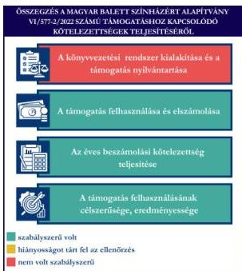

ÁLLAMI
SZÁMVEVŐSZÉK

# JELENTÉS

Egyesületek és alapítványok államháztartásból
kapott támogatásai felhasználásának és
elszámolásának ellenőrzése

Magyar Balett Színházért Alapítvány

2026.

25132

www.asz.hu

---

ÁLLAMI
SZÁMVEVŐSZÉK

# JELENTÉS

Egyesületek és alapítványok államháztartásból
kapott támogatásai felhasználásának és
elszámolásának ellenőrzése

Magyar Balett Színházért Alapítvány

2026.

25132

www.asz.hu

Dr. Szomolai Csaba
alelnök

---

ELLENŐRZÉSI IGAZGATÓSÁG:

ELLENŐRZÉSI IGAZGATÓSÁG V.

ELLENŐRZÉSI IGAZGATÓ:

KLINGA LÁSZLÓ igazgató

ELLENŐRZÉSVEZETŐ:

NEMESVÁRI-HORTHY ESZTER ellenőrzésvezető

Jelentéseink az interneten a
www.asz.hu címen olvashatók.

IKTATÓSZÁM: EL-4320-169/2025

TÉMASORSZÁM: 35

ELLENŐRZÉS-AZONOSÍTÓ SZÁM: V118110

---

# TARTALOMJEGYZÉK

|  ■ ÖSSZEFOGLALÁS | 5  |
| --- | --- |
|  ■ AZ ELLENŐRZÉS EREDMÉNYEI | 6  |
|  1. A civil szervezet államháztartási forrásból származó támogatása felhasználásának és elszámolásának szabályszerűsége, felhasználásának célszerűsége és eredményessége | 6  |
|  ■ JAVASLATOK | 9  |
|  ■ I. FÜGGELÉK: ÉSZREVÉTELEK | 10  |
|  ■ II. FÜGGELÉK: ELLENŐRZÉSI MEGKÖZELÍTÉS | 11  |
|  ■ MELLÉKLETEK | 15  |
|  I. sz. melléklet: Értelmező szótár | 15  |
|  II. sz. melléklet: Az ellenőrzött szervezetek jegyzéke | 18  |
|  ■ RÖVIDÍTÉSEK JEGYZÉKE | 19  |

3

---

# ÖSSZEFOGLALÁS

A civil szervezetek tevékenységük megvalósításához évente **jelentős állami** és önkormányzati **támogatásokat** kaphatnak, valamint ingyenes vagyonjuttatásban részesülhetnek. Ezekkel a forrásokkal gazdálkodnak, miközben tevékenységükkel a **társadalom széles rétegeire** hatnak többek között kulturális programok, rendezvények, közösségépítés formájában. Jogosan merül fel tehát a kérdés: **hogyan költik el a közpénzt?** Ennek érdekében az ÁSZ$^{1}$ időről időre **ellenőrzi** a támogatások felhasználását, és értékeli, hogy a civil szervezetek az támogatásokat **átláthatóan és célnak megfelelően** használták-e fel. Az ÁSZ által folytatott ellenőrzések segítenek abban, hogy a nyilvánosság is **valós képet kapjon arról, hova kerül az adófizetők pénze**.

A kulturális tevékenységet végző civil szervezetek **fontos és sokrétű szerepet** játszanak a mai Magyarországon, különösen a helyi közösségek életében. Különösen fontosak a helyi identitás megerősítésében, a kulturális sokszínűség fenntartásában, és a közösségi aktivitás ösztönzésében.

Egy kulturális tevékenységet végző civil szervezet támogatása **nem csupán egy adott program finanszírozását jelenti, hanem befektetés a közösség szellemi, kulturális és társadalmi tőkéjébe**. Ezek a szervezetek hidat képeznek az állam, a közösségek és az egyének között, támogatásuk ezért elengedhetetlen egy élő, demokratikus és értékalapú társadalom fenntartásához.

Az Alapítvány$^{2}$ részére az Emberi Erőforrások Minisztériuma az Egyéb kulturális alapítványok működési és programtámogatása terhére **balett öltözők és irodahelyiségek kialakítására 2022. évben 20 M Ft** pénzügyi támogatást nyújtott.

**Az Alapítvány a kapott támogatást a projektcélnak megfelelően, eredményesen használta fel, a támogatás elérte célját.**

Az Alapítvány nem a jogszabályi előírásoknak megfelelően alakította ki könyvvezetési rendszerét, mivel a kapott támogatás és a támogatás felhasználásának elkülönített nyilvántartását nem biztosította, továbbá a 100%-os támogatási előlegként kapott támogatást, az előírásokkal ellentétben nem egyéb rövid lejáratú kötelezettségként, hanem egyéb bevételként mutatta ki, amely **jelentős összegű hibát eredményezett a 2022. évi számviteli beszámolóban, sérült a Számv. tv.$^{3}$ szerinti valódiság elve**. A támogatás felhasználása a Támogatói okiratban$^{4}$ és annak elválaszthatatlan részét képező költségtervben szereplő adatoknak, előírásoknak megfelelt. Az Alapítvány a Támogatói okirat előírásainak megfelelően határidőben eleget tett a Támogató$^{5}$ felé történő elszámolási kötelezettségének. A Támogató az elszámolást elfogadta. Az Alapítvány a 2022. és 2023. évi egyszerűsített éves beszámolójában tájékoztatási és nyilvánosságra hozatali kötelezettségeinek eleget tett.

1. ábra

Forrás: ÁSZ saját szerkesztés

5

---

# AZ ELLENŐRZÉS EREDMÉNYEI

Az Alapítvány a részére – a **balett öltözők és irodahelyiségek kialakítására** – nyújtott költségvetési támogatást a Kárpát-medencei Művészeti Népfőiskola Alapítvány tulajdonában álló ingatlanban a Székesfehérvári Balett Színház számára öltözők és irodahelyiségek kialakítására fordította. Az Alapítvány a támogatást szabályszerűen, a támogatás céljának megfelelően, a támogatott tevékenység időtartamán belül használta fel. Az ellenőrzéssel érintett támogatás által az Alapítvány hozzájárult ahhoz, hogy a Székesfehérvári Balett Színház művészeti és operatív feladatellátása egy helyen valósuljon meg. Az Alapítvány a projekt eredményes megvalósítása által, az alapítványi célok keretében a Székesfehérvár Megyei Jogú Város Önkormányzata költségvetési szerveként működő Székesfehérvári Balett Színház működését támogatta. A közpénzt az Alapítvány céljaival összhangban használta fel.

## 1. A civil szervezet államháztartási forrásból származó támogatása felhasználásának és elszámolásának szabályszerűsége, felhasználásának célszerűsége és eredményessége

### Összegző megállapítás

Az Alapítvány az ellenőrzött támogatást a Támogatói okiratban megjelölt célnak megfelelően, eredményesen használta fel, az elszámolási kötelezettségét teljesítette. Az előleg formájában kapott támogatást a Számv. tv. előírása ellenére nem egyéb rövid lejáratú kötelezettségként, a felhasználását a jogszabályi előírások ellenére nem elkülönítetten tartotta nyilván. A számviteli beszámolási kötelezettségét szabályszerűen teljesítette. Az egyszerűsített éves beszámolóit határidőben letétbe helyezte és közzétette.

### A KÖNYVVEZETÉSI RENDSZER KIALAKÍTÁSA ÉS A TÁMOGATÁS NYILVÁNTARTÁSA

Az Alapítvány a Számv. tv. és a Civilszr.$^{6}$-ben foglalt jogszabályi előírások betartásával gondoskodott a könyvviteli szolgáltatás személyi feltételeinek megteremtéséről, a könyvviteli szolgáltatás körébe tartozó feladatok ellátásával olyan egyéni vállalkozót bízott meg, aki a jogszabályi előírásoknak megfelelő képesítéssel rendelkezett.

Az Alapítvány a Civilszr. előírásainak megfelelően a 2022. és 2023. évben kettős könyvvitelt vezetett.

Az Alapítvány a Számv. tv. 161/A. § (2) bekezdés és a Civil tv.$^{7}$ 20. § (4) bekezdés előírása ellenére az alapcél szerinti tevékenysége költségei, ráfordításai ellentételezésére kapott támogatásról és a támogatás felhasználásáról elkülönített számviteli nyilvántartást nem vezetett.

A Támogató a 100%-os intenzitású támogatást a Támogatói okirat 4.1. pontjában foglaltak szerint a záró beszámoló elfogadását megelőzően, támogatási előlegként folyósította. Az Alapítvány az előlegként kapott támogatást a 2022. év során a Számv. tv. 43. § (1) bekezdés előírása ellenére nem egyéb rövid lejáratú kötelezettségként tartotta nyilván. Az Alapítvány a 2022. évben az előlegként kapott támogatást egyéb bevételként elszámolta. A Támogató a támogatás elszámolását 2023. július 10-én fogadta el. Tekintettel arra, hogy a támogatás elszámolásának elfogadása 2023. évben történt, a támogatási előleg 2022. évi bevételként való elszámolása a Számv. tv. 3. § (3) bekezdés 3. pont szerinti jelentős összegű hibát

6

---

Az ellenőrzés eredményei

eredményezett, mivel a 2022. évi eredményre és saját tőkére gyakorolt hiba és hibahatások abszolút értékének együttes összege meghaladta a 2022. évi mérlegfőösszeg 2,0%-át.

# A TÁMOGATÁS FELHASZNÁLÁSA ÉS ELSZÁMOLÁSA

Az Alapítvány az ellenőrzött támogatás felhasználásáról a Támogató által előírt formában elkészítette a záró beszámolót, annak részeként a Számlaösszesítőt (tételes elszámolás), szöveges beszámolót és határidőben benyújtotta a Támogató részére.

Az Alapítvány esetében a támogatás felhasználása ellenőrzött tételeinek (2 db) vonatkozásában az ÁSZ az alábbiakat állapította meg:

- a támogatás felhasználásáról elkülönített nyilvántartást a Civil tv. 20. § (4) bekezdés és a Támogatói okirat 6.3. pontjában foglaltak („A Kedvezményezett köteles a támogatási összeget elkülönítetten kezelni és a támogatási összeg felhasználására nézve elkülönített számviteli nyilvántartást vezetni...”) ellenére nem vezetett;
- a tételek számviteli elszámolását a Számv. tv.-ben előírtaknak megfelelően bizonylatokkal alátámasztotta;
- minden gazdasági eseményt (beruházás) a Számv. tv.-ben foglaltak szerint, tartalmának megfelelő főkönyvi számra számolt el;
- a tételek számviteli bizonylatait a Támogatói okiratban foglaltaknak megfelelően ellátta záradékkal;
- a számviteli bizonylatokon záradékolt összegek megegyeztek a számlaösszesítőben feltüntetett értékekkel;
- a tételek számviteli bizonylatai alapján a gazdasági események a Támogatói okiratnak megfelelően, a támogatási időszak végéig, szerződés szerint teljesültek;
- a tételek pénzügyi rendezése a Támogatói okiratban meghatározott felhasználási határidőig minden esetben megtörtént;
- a tételek megfeleltethetőek voltak a Támogatói okiratban, illetve a költségtervben meghatározott, Támogató által jóváhagyott felhasználási jogcímeknek.

A Támogatói okiratban foglalt támogatás lezárásáról, a beszámoló elfogadásáról a Támogató 2023. július 10-én értesítette az Alapítványt.

# AZ ÉVES BESZÁMOLÁSI KÖTELEZETTSÉG TELJESÍTÉSE

Az Alapítvány a 2022-2023. évekre vonatkozóan a Számv. tv. és a Civil tv. előírásai alapján elkészítette egyszerűsített éves beszámolóit, amelyek a Civil tv. és a Civilszr. előírásai alapján tartalmazták a Civilszr. 3. melléklet szerinti mérleget, a 4. melléklet szerinti eredménykimutatást, valamint a kiegészítő mellékletet.

Az Alapítvány a Civil tv.-nek és a Civil vhr. mellékletének megfelelően a beszámolókkal egyidejűleg elkészítette a közhasznúsági mellékleteit.

A 2022-2023. évekre vonatkozó egyszerűsített éves beszámolókat a Kurátor⁸ a Civil tv.-nek és az Alapító okirat⁹ 9. pontjának megfelelően jóváhagyta.

Az Alapítvány a Civil tv. alapján a 2022. és a 2023. évi egyszerűsített éves beszámolóját és közhasznúsági mellékletét határidőben letétbe helyezte és az OBH¹⁰ honlapján közzétette. Az Alapítvány saját honlappal nem rendelkezett.

7

---

*Az ellenőrzés eredményei*---

#### **A TÁMOGATÁS FELHASZNÁLÁSÁNAK CÉLSZERŰSÉGE ÉS EREDMÉNYESSÉGE**

Az Alapítvány a támogatást a Támogatói okirat előírásainak megfelelően, az abban meghatározott célra használta fel. A Támogatói okiratban megjelölt cél a támogatott projekt – amely során **az Alapítvány** a Kárpát-medencei Művészeti Népfőiskola Alapítvány Székesfehérvár, Kaszap István utca 6. szám alatti épületében **a Székesfehérvári Balett Színház számára öltözőket és irodahelyiségeket alakított ki** – teljesült. A 2022. évi felújítás a jóváhagyott költségterv alapján valósult meg. Költségátcsoportosítás, elfogadott jogcímektől eltérés nem történt. A támogatás eredményeként megvalósult felújításról online cikk jelent meg, amelyben tájékoztatták a közvéleményt.

8

---

# JAVASLATOK

Az ÁSZ tv.¹¹ 33. § (1) bekezdésében foglaltak értelmében az ellenőrzött szervezet vezetője köteles a jelentésben foglalt megállapításokhoz kapcsolódó intézkedési tervet összeállítani és azt a jelentés kézhezvételétől számított 30 napon belül az ÁSZ részére megküldeni. Az ÁSZ a jelentésben foglalt megállapításokhoz kapcsolódóan az alábbi javaslatok tekintetében várja el az intézkedési terv elkészítését.

## MAGYAR BALETT SZÍNHÁZÉRT ALAPÍTVÁNY KURÁTORÁNAK

1. Gondoskodjon arról, hogy az Alapítvány a jövőben a kapott támogatások felhasználásáról a Civil tv. 20. § (4) bekezdésében foglalt előírásnak megfelelően, olyan elkülönített számviteli nyilvántartást vezessen, amelyből megállapítható és ellenőrizhető a kapott támogatás felhasználása.

2. Gondoskodjon arról, hogy az Alapítvány a jövőben az előleg formájában kapott támogatásokat a támogató felé benyújtott elszámolás támogató általi elfogadásáig a Számv. tv. 43. § (1) bekezdés előírásának megfelelően a könyvviteli nyilvántartásban, illetve a számviteli beszámolóban egyéb rövid lejáratú kötelezettségként mutassa ki.

9

---

# I. FÜGGELÉK: ÉSZREVÉTELEK

*A jelentéstervezetet az ÁSZ 15 napos észrevételezésre megküldte az ellenőrzött szervezet vezetőjének az ÁSZ tv. 29. §\* (1) bekezdése előírásának megfelelően.*

*A Magyar Balett Színházért Alapítvány kurátora a jelentéstervezetre nem tett észrevételt.*

\* 29. § (1) Az Állami Számvevőszék az ellenőrzési megállapításait megküldi az ellenőrzött szervezet vezetőjének vagy az általa megbízott személynek, és annak, akinek személyes felelősségét állapította meg.

(2) Az ellenőrzött szervezet vezetője és a felelősként megjelölt személy az ellenőrzés megállapításaira tizenöt napon belül írásban észrevételt tehet.

(3) Az Állami Számvevőszék az észrevételre a beérkezésétől számított harminc napon belül írásban válaszol. A figyelembe nem vett észrevételeket köteles a jelentésben feltüntetni, és megindokolni, hogy azokat miért nem fogadta el.

10

---

## II. FÜGGELÉK: ELLENŐRZÉSI MEGKÖZELÍTÉS

### AZ ELLENŐRZÉS JOGALAPJA

Az ellenőrzés jogszabályi alapját az ÁSZ tv. 1. § (3) bekezdés, az 5. § (3) bekezdés előírásai képezték.

### AZ ELLENŐRZÉS CÉLJA

Az ellenőrzés célja annak értékelése volt, hogy az ellenőrzött alapítvány az államháztartási forrásból származó, ellenőrzésre kiválasztott támogatást a támogatói okiratban előírtaknak megfelelően, az abban meghatározott célra, szabályszerűen, eredményesen használta-e fel, valamint a gazdálkodásáról szabályszerűen beszámolt-e. Célja volt továbbá a támogatással való elszámolás szabályszerűségének értékelése.

### AZ ELLENŐRZÉS TÍPUSA

Kombinált ellenőrzés.

### AZ ELLENŐRZÉS TÁRGYA

Az államháztartásból nyújtott támogatást felhasználó ellenőrzött alapítványnál a kiválasztott támogatás felhasználására vonatkozó jogszabályi és szerződéses előírások betartásának ellenőrzése. Ennek keretében a könyvvezetésre vonatkozó jogszabályi előírások betartása, a támogatás felhasználás támogatói okiratnak való megfelelősége, valamint a beszámolási és közzétételi kötelezettség teljesítésének szabályszerűsége. Az ellenőrzés tárgya volt továbbá annak értékelése, hogy a számviteli szabályozási környezet kialakítása támogatta-e az államháztartásból származó támogatás vonatkozásában a szabályos könyvvezetést, a támogatás célnak megfelelő felhasználását, valamint a kapcsolódó beszámolási kötelezettség teljesítését. Az ellenőrzés során az ÁSZ értékelte, hogy az ellenőrzött szervezet a támogatást meghatározott célra, eredményesen használta-e fel.

Az ellenőrzés kiterjedt minden olyan körülményre és adatra, amely az ÁSZ jogszabályban meghatározott feladatainak teljesítéséhez, valamint a program végrehajtása folyamán felmerült újabb összefüggések feltárásához szükséges.

### AZ ELLENŐRZÉS HATÓKÖRE ÉS TERÜLETE

Az ÁSZ tv. 5. § (3) bekezdésében foglaltak alapján az ÁSZ ellenőrizte az államháztartásból nyújtott támogatás felhasználását. A támogatás felhasználásának szabályait a támogatói okirat, az Áht.$^{12}$ és az Ávr.$^{13}$ rögzítette. A civil szervezet könyvvezetésének, a beszámolási- és közzétételi kötelezettség teljesítésének ellenőrzése a Számv. tv., a Civilszr., a Civil tv., a Civil vhr.$^{14}$, valamint a Ptk.$^{15}$ vonatkozó előírásai alapján történt.

11

---

II. Függelék: Ellenőrzési megközelítés

Az ÁSZ ellenőrzése választ ad arra, hogy az ellenőrzött szervezetnél a számviteli szabályozási környezet kialakítása biztosította-e a támogatás felhasználása jogszabályi előírásoknak megfelelő nyilvántartását, könyvviteli elszámolását, továbbá arra is, hogy a támogatással való elszámolási, beszámolási kötelezettséget teljesítette-e. Az ÁSZ ellenőrzése kiterjedt a támogatás támogatói okiratban foglalt célra történő felhasználás és a felhasználás eredményességének értékelésére. Ezen túlmenően az ellenőrzés értékelte, hogy az ellenőrzött szervezet számviteli beszámolási kötelezettségének teljesítése szabályszerű volt-e.

## AZ ELLENŐRZÖTT IDŐSZAK

Az ellenőrzésre kiválasztott államháztartási forrásból származó támogatásra vonatkozó támogatott tevékenység időtartamának kezdő időpontjától az ellenőrzésről szóló értesítés keltéig tartó időszak.

Az ellenőrzésre kiválasztott alapítvány államháztartásból kapott támogatása felhasználásának és elszámolásának ellenőrzése során az ellenőrzött időszakon belül az értékelés szempontjából releváns évek a 2022-2023. évek.

## AZ ELLENŐRZÉSI KRITÉRIUMOK

|  FŐKUSZTERÜLET/FŐKUSZKÉRDÉS | ELLENŐRZÉSI KRITÉRIUMOK  |
| --- | --- |
|  1. A civil szervezet államháztartási forrásból származó támogatása(i) felhasználásának és elszámolásának szabályszerűsége, felhasználásának célszerűsége és eredményessége | Áht. Ávr. Számv. tv. Civil tv. Civilszr. Ptk. Civil vhr. Cnytv.^{16} Létesítő okirat Támogatói okirat Költségterv  |

## AZ ELLENŐRZÉS MÓDSZERE ÉS AZ ELLENŐRZÉSI BIZONYÍTÉKOK KÖRE

Az ellenőrzést a nemzetközi standardokat irányadónak tekintve az ellenőrzési program szempontjai, az ellenőrzött időszakban hatályos jogszabályok, az ellenőrzés szakmai szabályok és módszertan(ok) figyelembevételével végezte az ÁSZ.

Az ellenőrzési kérdések megválaszolásához szükséges bizonyítékok megszerzése az ellenőrzött szervezet által rendelkezésre bocsátott dokumentumokra és adatokra alapozva mintavételezés útján történt.

Az államháztartási forrásból származó, ellenőrzésre – adatvezérelt, kockázatalapú kiválasztás által, több év adatának figyelembevételével és az ellenőrizhető szervezet által előzetesen szolgáltatott adatok alapján – kijelölt támogatás felhasználása támogatói okiratnak való megfelelőségét a támogatás nyilvántartásának és a

12

---

II. Függelék: Ellenőrzési megközelítés

támogató felé történő elszámolásnak egymással és a támogatói okirattal történő összevetésével ellenőrizte az ÁSZ.

A támogatás könyvviteli nyilvántartása jogszabályi előírásoknak, támogatói okiratnak való szabályszerűségét – mivel a sokaság elemszáma tíznél kevesebb volt – tételesen ellenőrizte az ÁSZ.

Az ellenőrzési bizonyítékként felhasználható adatforrások közé tartoztak egyrészt az ellenőrzéshez kért dokumentumok, másrészt adatforrás volt még minden – az ellenőrzés folyamán – feltárt, az ellenőrzés szempontjából információkat tartalmazó dokumentum.

Az ellenőrzés lefolytatásához az ellenőrzött szervezet a tanúsítványok kitöltésével, valamint az ÁSZ által kért dokumentumok, adatok, információk megküldésével és az ellenőrzés során szolgáltatott adatokat.

Az ÁSZ az ellenőrzött szervezetet az Országos Támogatás-ellenőrzési Rendszerben (OTR) nyilvántartott adatok alapján államháztartási forrásból támogatásban részesült szervezetek közül, – OBH és KSH¹⁷ adatokat is figyelembe véve – adatvezérelt kockázatértékelés alapján, a kulturális tevékenységet végző szervezetekre fókuszálva választotta ki. Az ÁSZ az ellenőrzött támogatást az adott szervezet által előzetesen szolgáltatott adatok alapján, a tanúsítványokban szereplő adatok ismeretében határozta meg.

A Magyar Balett Színházért Alapítványt 2006-ban alapították, a civil szervezetek közhiteles bírósági nyilvántartásába 2006. június 9-én jegyezték be. Az Alapítvány Alapító okirata szerinti célja „a tánc, mint művészeti, pedagógiai tevékenység, bemutatók, előadások szervezése, szakmai tovább- és átképzések szervezése”, amely célt többek között az alábbi tevékenységekkel valósítja meg:

- fiatal és tehetséges táncosok tanulmányainak, képzésének támogatása, finanszírozása;
- táncpedagógusok képzése, továbbképzésének támogatása;
- művészeti vagy kulturális értékkel bíró művek megjelenésének anyagi támogatása,
- balett társulat vagy társulatok képzése, kinevelése, felállítása, alapítása és működtetése,
- alapítványi célú pályázatok működtetése, kiírása, elbírálása, díjazása, harmadik személyek által kiírt pályázatokon való részvétel.

Az Alapítvány egyszemélyes döntéshozó, ügyintéző és képviseleti szerve a Kurátor, akinek legfontosabb feladata, hogy – az Alapító okiratnak megfelelő módon – döntsön az alapítványi vagyon alapítványi céloknak megfelelő felhasználásáról, valamint a vagyonnal kapcsolatos gazdálkodási kérdésekben, megbízatása határozatlan időre szól. A Kurátor személyében az ellenőrzött időszakban nem történt változás.

Az ellenőrzött időszakban az Alapítvány Kurátora a Székesfehérvári Balett Színház igazgatója is egyben.

Az Alapítvány a jogszabályi előírás alapján könyvvizsgálatra nem volt kötelezett.

Az Alapítvány az ellenőrzött időszakban közhasznú jogállással nem rendelkezett.

Az Alapítvány a Közbef. tv.¹⁸ szerinti, közélet befolyásolására alkalmas civil szervezetnek minősült, mivel az ellenőrzött időszakban (2022-2023. évek) mérlegfőösszege elérte a 20 M Ft-ot.

Az Alapítvány vállalkozási tevékenységet nem végzett.

Az Alapítvány a kultúráért felelős államtitkár döntése alapján támogatásban részesült. A támogatott tevékenység megvalósulásához a Támogató cél indikátorokat nem határozott meg. A támogatással kapcsolatos adatokat az 1. táblázat foglalja össze.

13

---

II. Függelék: Ellenőrzési megközelítés

1. táblázat

# A TÁMOGATÁS FŐBB ADATAI

# A MAGYAR BALETT SZÍNHÁZÉRT ALAPÍTVÁNY RÉSZÉRE A TÁMOGATÓ ÁLTAL NYÚJTOTT, ELLENŐRZÖTT TÁMOGATÁS (VI/577-2/2022) FŐBB ADATAI

|  Támogatott tevékenység: | balett öltözők és irodahelyiségek kialakítása a 8000 Székesfehérvár, Kaszap István utca 6. szám alatt  |
| --- | --- |
|  Támogató: | Emberi Erőforrások Minisztériuma  |
|  Támogatási összeg: | 20 M Ft  |
|  Felhasznált összeg: | 20 M Ft  |
|  A Támogatói okirat kibocsátásának időpontja: | 2022. március 2.  |
|  A támogatott tevékenység időtartama: | 2021. november 15.- 2022. június 30.  |
|  A támogatás felhasználásáról a záró (pénzügyi) beszámoló benyújtásának határideje: | 2022. augusztus 29.  |
|  A támogatás felhasználásáról benyújtott záró beszámoló elfogadásának dátuma: | 2023. július 10.  |

Forrás: ÁSZ saját szerkesztés a Támogatói okirat adatai alapján

A Támogató a támogatást a költségvetés pénzügyi tartalékainak növeléséről szóló 1888/2021. (XII. 9.) Korm. határozat alapján megállapított 2021. évi költségvetési kiadási teljesítési limit megtartása érdekében, a 2022. évi Kv.tv.¹⁹ Emberi Erőforrások Minisztériuma fejezet, 2061167 Kulturális társadalmi, civil és nonprofit szervezetek támogatása megnevezésű fejezeti kezelésű előirányzat, Egyéb kulturális alapítványok működési és programtámogatása terhére biztosította, vissza nem térítendő támogatásként, egy összegben, támogatási előlegként, utólagos elszámolási kötelezettség mellett nyújtotta.

2. ábra

Forrás: az Alapítvány által megküldött ellenőrzési dokumentum

Az Alapítvány és a Kárpát-medencei Művészeti Népfőiskola Alapítvány 2021. január 21-én Együttműködési megállapodást kötött, a Székesfehérvári Balett Színház működésének támogatása céljából. Az Alapítvány a Kárpát-medencei Művészeti Népfőiskola Alapítvány tulajdonában álló ingatlanban az ellenőrzött támogatásból a Székesfehérvári Balett Színház számára öltöző és iroda helyiségeket (4 db iroda, 1 db tárgyalóhelyiség, 1 db irattár, 2 db öltöző) alakított ki annak érdekében, hogy a Székesfehérvári Balett Színház művészeti és operatív feladatellátása egy helyen legyen biztosított.

14

---

# MELLÉKLETEK

## ■ I. SZ. MELLÉKLET: ÉRTELMEZŐ SZÓTÁR

|  adomány | A civil szervezetnek – létesítő okiratban rögzített céljaira – ellenszolgáltatás nélkül juttatott eszköz, illetve nyújtott szolgáltatás. (Forrás: Civil tv. 2. § 1. pont)  |
| --- | --- |
|  alapítvány | Az alapítvány az alapító által az alapító okiratban meghatározott tartós cél folyamatos megvalósítására létrehozott jogi személy. Az alapító az alapító okiratban meghatározza az alapítványnak juttatott vagyont és az alapítvány szervezetét. (Forrás: Ptk. 3:378. §) A Számv. tv. alkalmazásában egyéb szervezet (Forrás: Számv. tv. 3. § (1) bekezdés 4.pont a) alpontja)  |
|  célszerűség | Arra vonatkozó követelmény, hogy a bevételeket a közfeladat megvalósítása érdekében, a kiadásokat a közfeladatok megfelelő ellátásához szükséges mértékben, a költségvetési célrendszer érdekében, a meghatározott célra (közfeladat ellátására), továbbá észszerűen, racionálisan használták fel. (Forrás: Alaptörvény^{20}, ÁSZ)  |
|  civil szervezet | Civil szervezet: a) a civil társaság, b) a Magyarországon nyilvántartásba vett egyesület - a párt, a szakszervezet és a kölcsönös biztosító egyesület kivételével -, c) a közalapítvány és a pártalapítvány kivételével - az alapítvány. (Forrás: Civil tv. 2. § 6. pont)  |
|  civil szervezetek egyszerűsített támogatása | A helyi vagy területi hatókörű civil szervezetek számára a Civil tv. 56. § (1) bekezdés h) pontja alapján egyszerűsített formában, jogosultsági alapon nyújtott támogatás a helyi közösség érdekében végzett tevékenységük támogatására. (Forrás: Civil tv. 2. § 8b. pont)  |
|  civil szervezetek normatív támogatása | A civil szervezetek által gyűjtött adományok után járó, a gyűjtött adomány mértékével arányos a Civil tv. 56. § (1) bekezdés a) pontja alapján nyújtott támogatás. (Forrás: Civil tv. 2. § 8a. pont alapján)  |
|  eredményesség | Az eredményesség elve a kitűzött célok és a szándékolt eredmények (hatások) elérését jelenti. A gazdálkodás, feladatellátás eredményességét mutatja a tényleges és a tervezett eredmények (hatások) összevetése. (Forrás: INTOSAI^{21})  |
|  feladatfinanszírozást szolgáló költségvetési támogatás | Valamely közfeladat államháztartáson kívüli szervezet által történő ellátását, valamint e feladat ellátásához közvetlenül kapcsolódó, arányos működési költségeket finanszírozó költségvetési támogatás. (Forrás: Civil tv. 2. § 8. pont)  |
|  közcélú tevékenység | Személyek csoportja által, valamely a csoportnál tágabb közösség érdekében – más, e közösségbe nem tartozó személyek érdekeinek sérelme nélkül – végzett tevékenység. (Forrás: Civil tv. 2. § 16. pont)  |
|  közfeladat | A jogszabályban meghatározott állami vagy önkormányzati feladat. A közfeladatok ellátásában államháztartáson kívüli szervezet jogszabályban meghatározott rendben közreműködhet. (Forrás: Áht. 3/A. § (1)-(2) bekezdés)  |

15

---

Mellékletek

|  közhasznú szervezet | Közhasznú szervezetté minősített a Magyarországon nyilvántartásba vett közhasznú tevékenységet végző szervezet, amely a társadalom és az egyén közös szükségleteinek kielégítéséhez megfelelő erőforrásokkal rendelkezik, továbbá amelynek megfelelő társadalmi támogatottsága kimutatható, és amely: a) civil szervezet (ide nem értve a civil társaságot), vagy b) olyan egyéb szervezet, amelyre vonatkozóan a közhasznú jogállás megszerzését törvény lehetővé teszi. (Forrás: Civil tv. 32. § (1) bekezdés)  |
| --- | --- |
|  közhasznú tevékenység | Minden olyan tevékenység, amely a létesítő okiratban megjelölt közfeladat teljesítését közvetlenül vagy közvetve szolgálja, ezzel hozzájárulva a társadalom és az egyén közös szükségleteinek kielégítéséhez. (Forrás: Civil tv. 2. § 20. pont)  |
|  létesítő okirat | A jogi személy létrehozásáról a személyek szerződésben, alapító okiratban vagy alapszabályban szabadon rendelkezhetnek, mely dokumentumokra együttesen a Ptk. a létesítő okirat megnevezést használja. (Forrás: Ptk. 3:4. § (1) bekezdés alapján)  |
|  támogatás | Céljellegű juttatás, mely kizárólag arra a célra használható fel, amelyre a támogató azt rendelkezésre bocsátotta, amely cél megvalósítását a támogatási szerződés, okirat vagy éppen jogszabály kikötötte. Támogatásként értelmezzük valamennyi, a civil szervezetnek államháztartási forrásból nyújtott támogatást – ideértve a központi költségvetésből kapott támogatást, az elkülönített állami pénzalapokból kapott támogatást, a helyi önkormányzatoktól, nemzetiségi önkormányzatoktól, önkormányzati társulástól kapott támogatást –, továbbá az Európai Unió költségvetéséből, külföldi állam államháztartásából, nemzetközi szervezettől, vagy nemzetközi szerződés rendelkezése alapján kapott támogatást, valamint más civil szervezettől kapott támogatást. A gyűjtő fogalom alatt egyaránt értjük a civil szervezetnek nyújtott feladatfinanszírozást szolgáló költségvetési támogatást, a civil szervezetek normatív támogatását, valamint a civil szervezetek egyszerűsített támogatását is (ÁSZ saját fogalma)  |
|  támogatási döntés | Az államháztartás alrendszereiből, az európai uniós forrásokból, a nemzetközi megállapodás alapján finanszírozott egyéb programokból, a 100%-os állami tulajdonban álló szervezet által létrehozott alapítványtól származó, egyedi döntés alapján nyújtott, pályázati úton vagy pályázati rendszeren kívül az államháztartáson kívüli természetes személyek, jogi személyek és jogi személyiséggel nem rendelkező egyéb szervezetek számára odaítélt, természetben vagy pénzben juttatott támogatásokban részesülő személy, valamint az e személy részére juttatandó konkrét támogatási összeg meghatározása. (Forrás: 2007. évi CLXXXI. törvény^{22} 1. § (1) bekezdése és 2. § (1) bekezdése alapján)  |
|  támogatói okirat | A támogatói okirat egy olyan, a támogató (irányító hatóság) támogatási jogviszony létrehozására irányuló akaratnyilatkozatát tartalmazó jognyilatkozat, amelyből jogilag kikényszeríthető kötelezettségek származnak, és amely esetében a jelen pontban rögzített jogszabályi előírások is irányadók. Az államháztartás alrendszerei terhére támogatás közigazgatási hatósági határozattal vagy hatósági szerződéssel, támogatói okirattal vagy támogatási szerződéssel jogszabály vagy egyedi döntés alapján, pályázati úton vagy pályázati rendszeren kívül nyújtható. Ha jogszabály – a központi költségvetés Áht. 14. § (3) bekezdése szerinti fejezetéből biztosított költségvetési támogatások esetén jogszabály vagy a Kormány határozata – a támogatás biztosításának módjáról nem rendelkezik, arról a központi költségvetés Áht. 14. § (3) bekezdése szerinti fejezetéből biztosított költségvetési támogatások esetén támogatói okiratot kell kibocsátani, ettől eltérő más esetben az ötmilliárd forintot el nem érő összegű költségvetési támogatás esetén szintén támogatói okiratot kell kibocsátani (Forrás: Áht. 48. § (1) bekezdése, Ávr. 65/A. § (1) bekezdés alapján ÁSZ meghatározás)  |

16

---

*Mellékletek*---

|  támogatott tevékenység | A támogatási szerződésben meghatározott olyan tevékenység – ideértve a kedvezményezett működését is –, amely során felmerült költségek megtérítését a támogatási előleg, a költségvetési támogatás részben vagy egészében biztosítja. (Forrás: Ávr. 1. § 8. pontja)  |
| --- | --- |
|  támogatott tevékenység időtartama | A támogatási szerződésben meghatározott olyan időtartam, amely során felmerülő, a támogatott tevékenység megvalósításához kapcsolódó költségek elszámolhatóak. (Forrás: Ávr. 1. § 9. pontja)  |

17

---

Mellékletek---

# ■ II. SZ. MELLÉKLET: AZ ELLENŐRZÖTT SZERVEZETEK JEGYZÉKE

|  ELLENŐRZÖTT SZERVEZET NEVE | ELLENŐRZÖTT SZERVEZET SZÉKHELYE  |
| --- | --- |
|  Magyar Balett Színházért Alapítvány | 2000 Szentendre, Bérc utak 41. 1/4.  |

18

---

# RÖVIDÍTÉSEK JEGYZÉKE

1. ÁSZ

2. Alapítvány

3. Számv. tv.

4. Támogatói okirat

5. Támogató

6. Civilsztr.

7. Civil tv.

8. Kurátor

9. Alapító okirat

10. OBH

11. ÁSZ tv.

12. Áht.

13. Ávr.

14. Civil vhr.

15. Ptk.

16. Cnytv.

17. KSH

18. Közbef. tv.

19. 2022. évi Kv.tv.

20. Alaptörvény

21. INTOSAI

22. 2007. évi CLXXXI. törvény

Állami Számvevőszék

Magyar Balett Színházért Alapítvány

2000. évi C. törvény a számvitelről

VI/577-2/2022 azonosítószámú Támogatói okirat

Emberi Erőforrások Minisztériuma

479/2016. (XII. 28.) Korm. rendelet a számviteli törvény szerinti egyes egyéb szervezetek beszámoló készítési és könyvvezetési kötelezettségének sajátosságairól

2011. évi CLXXV. törvény az egyesülési jogról, a közhasznú jogállásról, valamint a civil szervezetek működéséről és támogatásáról

Magyar Balett Színházért Alapítvány Kurátora

Magyar Balett Színházért Alapítvány egységes szerkezetbe foglalt Alapító okirata (hatályos: 2017. március 24-től)

Országos Bírósági Hivatal

2011. évi LXVI. törvény az Állami Számvevőszékről

2011. évi CXCV. törvény az államháztartásról

368/2011. (XII. 31.) Korm. rendelet az államháztartásról szóló törvény végrehajtásáról

350/2011. (XII. 30.) Korm. rendelet a civil szervezetek gazdálkodása, az adománygyűjtés és a közhasznúság egyes kérdéseiről

2013. évi V. törvény a Polgári Törvénykönyvről

2011. évi CLXXXI. törvény a civil szervezetek bírósági nyilvántartásáról és az ezzel összefüggő eljárási szabályokról

Központi Statisztikai Hivatal

2021. évi XLIX. törvény a közélet befolyásolására alkalmas tevékenységet végző civil szervezetek átláthatóságáról

Magyarország 2022. évi központi költségvetéséről szóló 2021. évi XC. törvény

Magyarország Alaptörvénye

Legfőbb Ellenőrző Intézmények Nemzetközi Szervezete (The International Organization of Supreme Audit Institutions)

2007. évi CLXXXI. törvény a közpénzekből nyújtott támogatások átláthatóságáról

19

---

ÁLLAMI
SZÁMVEVŐSZÉK

1052 Budapest, Apáczai Csere János u. 10. | 1364 Budapest 4., Pf. 54
www.asz.hu | szamvevoszek@asz.hu
telefon: +36 1 484 9100