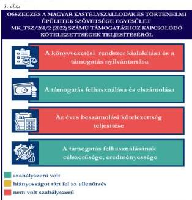
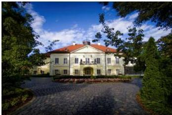

ÁLLAMI
SZÁMVEVŐSZÉK

# JELENTÉS

# Egyesületek és alapítványok államháztartásból
kapott támogatásai felhasználásának és
elszámolásának ellenőrzése

Magyar Kastélyszállodák és Történelmi Épületek Szövetsége
Egyesület

2026.

25134

www.asz.hu

---

ÁLLAMI
SZÁMVEVŐSZÉK

# JELENTÉS

Egyesületek és alapítványok államháztartásból
kapott támogatásai felhasználásának és
elszámolásának ellenőrzése

Magyar Kastélyszállodák és Történelmi Épületek Szövetsége
Egyesület

2026.

25134

www.asz.hu

Dr. Szomolai Csaba
alelnök

---

ELLENŐRZÉSI IGAZGATÓSÁG:

ELLENŐRZÉSI IGAZGATÓSÁG V.

ELLENŐRZÉSI IGAZGATÓ:

KLINGA LÁSZLÓ igazgató

ELLENŐRZÉSVEZETŐ:

NEMESVÁRI-HORTHY ESZTER ellenőrzésvezető

Jelentéseink az interneten a
www.asz.hu címen olvashatók.

IKTATÓSZÁM: EL-4320-171/2025

TÉMASORSZÁM: 35

ELLENŐRZÉS-AZONOSÍTÓ SZÁM: V118116

---

# TARTALOMJEGYZÉK

|  ■ ÖSSZEFOGLALÁS | 5  |
| --- | --- |
|  ■ AZ ELLENŐRZÉS EREDMÉNYEI | 6  |
|  1. A civil szervezet államháztartási forrásból származó támogatása felhasználásának és elszámolásának szabályszerűsége, felhasználásának célszerűsége és eredményessége | 6  |
|  ■ JAVASLATOK | 9  |
|  ■ I. FÜGGELÉK: ÉSZREVÉTELEK | 10  |
|  ■ II. FÜGGELÉK: ELLENŐRZÉSI MEGKÖZELÍTÉS | 11  |
|  ■ MELLÉKLETEK | 15  |
|  I. sz. melléklet: Értelmező szótár | 15  |
|  II. sz. melléklet: Az ellenőrzött szervezetek jegyzéke | 17  |
|  ■ RÖVIDÍTÉSEK JEGYZÉKE | 18  |

3

---

# ÖSSZEFOGLALÁS

A civil szervezetek tevékenységük megvalósításához évente **jelentős állami** és önkormányzati **támogatásokat kaphatnak**, valamint ingyenes vagyonjuttatásban részesülhetnek. Ezekkel a forrásokkal gazdálkodnak, miközben tevékenységükkel a **társadalom széles rétegeire hatnak** többek között kulturális programok, rendezvények, közösségépítés formájában. Jogosan merül fel tehát a kérdés: **hogyan költik el a közpénzt?** Ennek érdekében az ÁSZ$^{1}$ időről időre **ellenőrzi** az államháztartásból kapott támogatások felhasználását, és értékeli, hogy a civil szervezetek a kapott támogatást valóban **átláthatóan és célnak megfelelően** használták-e fel. Az ÁSZ által folytatott ellenőrzések segítenek abban, hogy a nyilvánosság is **valós képet kapjon arról, hova kerül az adófizetők pénze**.

A kulturális tevékenységet végző civil szervezetek **fontos és sokrétű szerepet** játszanak a mai Magyarországon, különösen a helyi közösségek életében. Különösen fontosak a helyi identitás megerősítésében, a kulturális sokszínűség fenntartásában, és a közösségi aktivitás ösztönzésében.

Egy kulturális tevékenységet végző civil szervezet támogatása **nem csupán egy adott program finanszírozását jelenti, hanem befektetés a közösség szellemi, kulturális és társadalmi tőkéjébe**. Ezek a szervezetek hidat képeznek az állam, a közösségek és az egyének között, támogatásuk ezért elengedhetetlen egy élő, demokratikus és értékalapú társadalom fenntartásához.

Az Egyesület$^{2}$ részére a Miniszterelnöki Kabinetiroda, a civil szervezetek működési támogatása terhére, „**A kastélyturizmus népszerűsítése hazánkban és külföldön egyaránt**” című szakmai feladat megvalósításához a 2022. évben 10,0 M Ft pénzügyi támogatást nyújtott.

**Az Egyesület a kapott támogatást a projektcélnak megfelelően, eredményesen használta fel, a támogatás elérte célját.**

Az Egyesület a könyvvezetési rendszerét kialakította, ugyanakkor, a támogatás felhasználásának elkülönített számviteli nyilvántartása nem felelt meg a jogszabályi előírásoknak. Az Egyesület a 100%-os támogatási előlegként kapott támogatást, az előírásokkal ellentétben nem egyéb rövid lejáratú kötelezettségként, hanem egyéb bevételként mutatta ki. A támogatás felhasználása a Támogatói okiratban és annak elválaszthatatlan részét képező költségtervben szereplő adatoknak, előírásoknak megfelelt. Az Egyesület a Támogatói okirat előírásainak megfelelően, határidőben eleget tett a Támogató$^{3}$ felé történő elszámolási kötelezettségének. A Támogató az elszámolást elfogadta. A 2022. évi egyszerűsített éves beszámoló tekintetében az Egyesület nem a Közgyűlés$^{4}$ által jóváhagyott beszámolót tette közzé az OBH$^{5}$ honlapján. Az Egyesület a tájékoztatási és nyilvánosságra hozatali kötelezettségeinek hiányosan tett eleget.

Forrás: ÁSZ saját szerkesztés

5

---

# AZ ELLENŐRZÉS EREDMÉNYEI

Az Egyesület a részére nyújtott költségvetési támogatást „A kastélyturizmus népszerűsítése hazánkban és külföldön egyaránt” című szakmai feladat megvalósítására fordította. Az Egyesület a támogatást szabályszerűen, a támogatás céljának megfelelően, a támogatott tevékenység időtartamán belül használta fel. A közpénzt az Egyesület céljaival összhangban a magyarországi kastélyturizmus népszerűsítésére használták fel.

## 1. A civil szervezet államháztartási forrásból származó támogatása felhasználásának és elszámolásának szabályszerűsége, felhasználásának célszerűsége és eredményessége

### Összegző megállapítás

Az Egyesület az ellenőrzött támogatást a Támogatói okiratban megjelölt célnak megfelelően, eredményesen használta fel, az elszámolási kötelezettségét teljesítette. A támogatási előleg formájában kapott támogatást a Számv. tv. előírása ellenére nem egyéb rövid lejáratú kötelezettségként tartotta nyilván. A támogatást a számviteli rendszerében kimutatta, azonban annak felhasználását a jogszabályi előírásokkal ellentétben nem elkülönítetten tartotta nyilván. Az Egyesület a 2022. év vonatkozásában nem a Közgyűlés által jóváhagyott beszámolót tette közzé, továbbá az Egyesület tájékoztatási és nyilvánosságra hozatali kötelezettségeinek hiányosan tett eleget.

### A KÖNYVVEZETÉSI RENDSZER KIALAKÍTÁSA ÉS A TÁMOGATÁS NYILVÁNTARTÁSA

Az Egyesület a Számv. tv.⁶ és a Civilszr.⁷-ben foglalt jogszabályi előírások betartásával gondoskodott a könyvviteli szolgáltatás személyi feltételeinek megteremtéséről, a könyvviteli szolgáltatás körébe tartozó feladatok ellátásával társaságot (2022. október 1-ig), majd magánszemélyt (2022. október 2-től) bízott meg. A könyvviteli szolgáltatást végző személyek a jogszabályi előírásoknak megfelelő képesítéssel rendelkeztek.

Az Egyesület a Civilszr. előírásainak megfelelően a 2022. évben kettős könyvvitelt vezetett. Az Egyesület a Számv. tv. 161. § (1) bekezdésében előírtak ellenére nem készített számlarendet.

Az Egyesület a 100%-os előlegként kapott támogatást egyéb bevételként vette nyilvántartásba, ellentétben a Számv. tv. 43. § (1) bekezdésében foglalt előírással, az egyéb rövid lejáratú kötelezettségek között nem mutatta ki. A könyvelésben feltárt hiányosság a 2022. évi egyszerűsített beszámolóban eltérést nem okozott, eredményt, saját tőkét érintő hatása nem volt, tekintettel arra, hogy az elszámolást a Támogató 2023. február 9-én, még a 2022. évi számviteli beszámolókészítés időszakában elfogadta.

Az Egyesület az ellenőrzött támogatás felhasználását a Civil tv.⁸ 20. § (4) bekezdésében előírtak ellenére nem elkülönítetten tartotta nyilván.

6

---

Az ellenőrzés eredményei

# A TÁMOGATÁS FELHASZNÁLÁSA ÉS ELSZÁMOLÁSA

Az Egyesület az ellenőrzött támogatás felhasználásáról a Támogató által előírt formában elkészítette a záró beszámolót, annak részeként az összesített elszámolási táblázatot (számlaösszesítő) és határidőben benyújtotta a Támogató részére.

Az Egyesület esetében a támogatás felhasználása ellenőrzött tételeinek (5 db) vonatkozásában az ÁSZ az alábbiakat állapította meg:

- a tételek számviteli elszámolását a Számv. tv.-ben előírtaknak megfelelően bizonylatokkal alátámasztotta;
- minden gazdasági eseményt a Számv. tv.-ben foglaltak szerint, tartalmának megfelelő főkönyvi számra számolt el;
- a tételek számviteli bizonylatait a Támogatói okiratban foglaltaknak megfelelően ellátták záradékkal;
- a számviteli bizonylatokon záradékolt összegek megegyeztek a számlaösszesítőben feltüntetett értékekkel;
- a tételek számviteli bizonylatai alapján a gazdasági események a Támogatói okiratnak megfelelően, a támogatási időszak végéig, szerződés szerint teljesültek;
- a tételek pénzügyi rendezése a Támogatói okiratban meghatározott felhasználási határidőig minden esetben megtörtént;
- a tételek megfeleltethetőek voltak a Támogatói okiratban, illetve a költségtervben meghatározott, Támogató által jóváhagyott felhasználási jogcímeknek.

A Támogatói okiratban foglalt támogatás lezárásáról, a beszámoló elfogadásáról a Támogató 2023. február 9-én döntött, az Egyesületnek visszafizetési kötelezettsége nem keletkezett.

# AZ ÉVES BESZÁMOLÁSI KÖTELEZETTSÉG TELJESÍTÉSE

Az Egyesület a 2022. évre vonatkozóan a Számv. tv. és a Civil tv. előírásai alapján elkészítette a számviteli beszámolót, azonban a 2022. évi egyszerűsített éves beszámoló a Civil tv. 29. § (2) bekezdés c) pontjában, foglaltak ellenére nem tartalmazta a kiegészítő mellékletet. Az Egyesület a Civil tv.-nek megfelelően a beszámolóval egyidejűleg elkészítette a közhasznúsági mellékletet.

Az Egyesület a 2022. évi egyszerűsített éves beszámolóját és közhasznúsági mellékletét határidőben letétbe helyezte, az OBH honlapján közzétette, ugyanakkor az Egyesület megsértette a Civilt tv. 30. § (1) bekezdését tekintettel arra, hogy az Egyesület nem a Közgyűlés által jóváhagyott beszámolót tette közzé.

Az Egyesület a honlapján a 2022. évi egyszerűsített éves beszámolóját és a közhasznúsági mellékletet a Civil tv. 30. § (4) bekezdésében előírtak ellenére nem tette közzé.

7

---

*Az ellenőrzés eredményei*---

#### **A TÁMOGATÁS FELHASZNÁLÁSÁNAK CÉLSZERŰSÉGE ÉS EREDMÉNYESSÉGE**

Az Egyesület az ellenőrzött támogatást a Támogatói okirat előírásainak megfelelően, az abban meghatározott célra használta fel. A Támogatói okiratban megjelölt cél **„A kastélyturizmus népszerűsítése hazánkban és külföldön egyaránt” című szakmai feladat teljesült**. A szakmai feladat a jóváhagyott költségtervnek megfelelően valósult meg. A támogatás eredményeként az előadásokról, rendezvényekről online felületeken, tudósításokban tájékoztatták a közvéleményt. A Heritage Hotels of Europe rendezvény és díjátadó szervezése, lebonyolítása 2022. november 19-én megtörtént.

8

---

# JAVASLATOK

Az ÁSZ tv.⁹ 33. § (1) bekezdésében foglaltak értelmében az ellenőrzött szervezet vezetője köteles a jelentésben foglalt megállapításokhoz kapcsolódó intézkedési tervet összeállítani és azt a jelentés kézhezvételétől számított 30 napon belül az ÁSZ részére megküldeni. Az ÁSZ a jelentésben foglalt megállapításokhoz kapcsolódóan az alábbi javaslatok tekintetében várja el az intézkedési terv elkészítését.

## A MAGYAR KASTÉLYSZÁLLODÁK ÉS TÖRTÉNELMI ÉPÜLETEK SZÖVETSÉGE EGYESÜLET ELNÖKÉNEK

1. Gondoskodjon az Egyesület számlarendjének elkészítéséről a Számv. tv. 161. § (1)-(2) bekezdésében rögzített előírások alapján.

2. Gondoskodjon arról, hogy az Egyesület a jövőben az előleg formájában kapott támogatásokat a támogató felé benyújtott elszámolás támogató általi elfogadásáig a Számv. tv. 43. § (1) bekezdés előírásának megfelelően a könyvviteli nyilvántartásban, illetve a számviteli beszámolóban egyéb rövid lejáratú kötelezettségként mutassa ki.

3. Gondoskodjon arról, hogy az Egyesület a jövőben a kapott támogatások felhasználásáról a Civil tv. 20. § (4) bekezdésében foglalt előírásnak megfelelően, olyan elkülönített számviteli nyilvántartást vezessen, amelyből megállapítható és ellenőrizhető a kapott támogatás felhasználása.

4. Gondoskodjon arról, hogy a jövőben a Civil tv. 29. § (2) bekezdés c) pontjában foglaltaknak megfelelően az Egyesület a számviteli beszámoló részeként a kiegészítő mellékletet is elkészítse.

5. Gondoskodjon arról, hogy az Egyesület a jövőben olyan számviteli beszámolót helyezzen letétbe és tegyen közzé, amelyet a jóváhagyásra jogosult testület a Civil tv. 30. § (1) bekezdésének előírására tekintettel elfogadott.

6. Gondoskodjon arról, hogy az Egyesület a számviteli beszámolót és a közhasznúsági mellékletet a Civil tv. 30. § (4) bekezdésében rögzített előírás alapján a saját honlapon közzé tegye.

9

---

# I. FÜGGELÉK: ÉSZREVÉTELEK

*A jelentéstervezetet az ÁSZ 15 napos észrevételezésre megküldte az ellenőrzött szervezet vezetőjének az ÁSZ tv. 29. §\* (1) bekezdése előírásának megfelelően.*

*A Magyar Kastélyszállodák és Történelmi Épületek Szövetsége Egyesület elnöke a jelentéstervezetre nem tett észrevételt.*

\* 29. § (1) Az Állami Számvevőszék az ellenőrzési megállapításait megküldi az ellenőrzött szervezet vezetőjének vagy az általa megbízott személynek, és annak, akinek személyes felelősségét állapította meg.

(2) Az ellenőrzött szervezet vezetője és a felelősként megjelölt személy az ellenőrzés megállapításaira tizenöt napon belül írásban észrevételt tehet.

(3) Az Állami Számvevőszék az észrevételre a beérkezésétől számított harminc napon belül írásban válaszol. A figyelembe nem vett észrevételeket köteles a jelentésben feltüntetni, és megindokolni, hogy azokat miért nem fogadta el.

10

---

## II. FÜGGELÉK: ELLENŐRZÉSI MEGKÖZELÍTÉS

### AZ ELLENŐRZÉS JOGALAPJA

Az ellenőrzés jogszabályi alapját az ÁSZ tv. 1. § (3) bekezdés, az 5. § (3) bekezdés előírásai képezték.

### AZ ELLENŐRZÉS CÉLJA

Az ellenőrzés célja annak értékelése volt, hogy az ellenőrzött egyesület az államháztartási forrásból származó, ellenőrzésre kiválasztott támogatást a támogatói okiratban előírtaknak megfelelően, az abban meghatározott célra, szabályszerűen, eredményesen használta-e fel, valamint a gazdálkodásáról szabályszerűen beszámolt-e. Célja volt továbbá a támogatással való elszámolás szabályszerűségének értékelése.

### AZ ELLENŐRZÉS TÍPUSA

Kombinált ellenőrzés.

### AZ ELLENŐRZÉS TÁRGYA

Az államháztartásból nyújtott támogatást felhasználó ellenőrzött egyesületnél a kiválasztott támogatás felhasználására vonatkozó jogszabályi és szerződéses előírások betartásának ellenőrzése. Ennek keretében a könyvvezetésre vonatkozó jogszabályi előírások betartása, a támogatás felhasználás támogatói okiratnak való megfelelősége, valamint a beszámolási és közzétételi kötelezettség teljesítésének szabályszerűsége. Az ellenőrzés tárgya volt továbbá annak értékelése, hogy a számviteli szabályozási környezet kialakítása támogatta-e az államháztartásból származó támogatás vonatkozásában a szabályos könyvvezetést, a támogatás célnak megfelelő felhasználását, valamint a kapcsolódó beszámolási kötelezettség teljesítését. Az ellenőrzés során az ÁSZ értékelte, hogy az ellenőrzött szervezet a támogatást meghatározott célra, eredményesen használta-e fel.

Az ellenőrzés kiterjedt minden olyan körülményre és adatra, amely az ÁSZ jogszabályban meghatározott feladatainak teljesítéséhez, valamint a program végrehajtása folyamán felmerült újabb összefüggések feltárásához szükséges.

### AZ ELLENŐRZÉS HATÓKÖRE ÉS TERÜLETE

Az ÁSZ tv. 5. § (3) bekezdésében foglaltak alapján az ÁSZ ellenőrizte az államháztartásból nyújtott támogatás felhasználását. A támogatás felhasználásának szabályait a támogatói okirat az Áht.$^{10}$ és az Ávr.$^{11}$ rögzítette. A civil szervezet könyvvezetésének, a beszámolási- és közzétételi kötelezettség teljesítésének ellenőrzése a Számv. tv., a Civilszr., a Civil tv., a Civil vhr.$^{12}$, valamint a Ptk.$^{13}$ vonatkozó előírásai alapján történt.

11

---

II. Függelék: Ellenőrzési megközelítés

Az ÁSZ ellenőrzése választ ad arra, hogy az ellenőrzött szervezetnél a számviteli szabályozási környezet kialakítása biztosította-e a támogatás felhasználása jogszabályi előírásoknak megfelelő nyilvántartását, könyvviteli elszámolását, továbbá arra is, hogy a támogatással való elszámolási, beszámolási kötelezettséget teljesítette-e. Az ÁSZ ellenőrzése kiterjedt a támogatás támogatói okiratban foglalt célra történő felhasználás és a felhasználás eredményességének értékelésére. Ezen túlmenően az ellenőrzés értékelte, hogy az ellenőrzött szervezet számviteli beszámolási kötelezettségének teljesítése szabályszerű volt-e.

## AZ ELLENŐRZÖTT IDŐSZAK

Az ellenőrzésre kiválasztott államháztartási forrásból származó támogatásra vonatkozó támogatott tevékenység időtartamának kezdő időpontjától az ellenőrzésről szóló értesítés keltéig tartó időszak.

Az ellenőrzésre kiválasztott egyesület államháztartásból kapott támogatása felhasználásának és elszámolásának ellenőrzése során az ellenőrzött időszakon belül az értékelés szempontjából releváns évek a 2022. év és a 2023. év.

## AZ ELLENŐRZÉSI KRITÉRIUMOK

|  FŐKUSZTERÜLET/FŐKUSZKÉRDÉS | ELLENŐRZÉSI KRITÉRIUMOK  |
| --- | --- |
|  1. A civil szervezet államháztartási forrásból származó támogatása(i) felhasználásának és elszámolásának szabályszerűsége, felhasználásának célszerűsége és eredményessége | Áht. Ávr. Számv. tv. Civil tv. Civilszr. Ptk. Civil vhr. Cnytv.^{14} Létesítő okirat Támogatói okirat Költségterv  |

## AZ ELLENŐRZÉS MÓDSZERE ÉS AZ ELLENŐRZÉSI BIZONYÍTÉKOK KÖRE

Az ellenőrzést a nemzetközi standardokat irányadónak tekintve az ellenőrzési program szempontjai, az ellenőrzött időszakban hatályos jogszabályok, az ellenőrzés szakmai szabályok és módszertan(ok) figyelembevételével végezte az ÁSZ.

Az ellenőrzési kérdések megválaszolásához szükséges bizonyítékok megszerzése az ellenőrzött szervezet által rendelkezésre bocsátott dokumentumokra és adatokra alapozva mintavételezés útján történt.

Az államháztartási forrásból származó, ellenőrzésre – adatvezérelt, kockázatalapú kiválasztás által, több év adatának figyelembevételével és az ellenőrizhető szervezet által előzetesen szolgáltatott adatok alapján – kijelölt támogatás felhasználása támogatói okiratnak való megfelelőségét a támogatás nyilvántartásának és

12

---

II. Függelék: Ellenőrzési megközelítés---

a támogató felé történő elszámolásnak egymással és a támogatói okirattal történő összevetésével ellenőrizte az ÁSZ.

A támogatás könyvviteli nyilvántartása jogszabályi előírásoknak, támogatói okiratnak való szabályszerűségét – mivel a sokaság elemszáma tíznél kevesebb volt – tételesen ellenőrizte az ÁSZ.

Az ellenőrzési bizonyítékként felhasználható adatforrások közé tartoztak egyrészt az ellenőrzéshez kért dokumentumok, másrészt adatforrás volt még minden – az ellenőrzés folyamán – feltárt, az ellenőrzés szempontjából információkat tartalmazó dokumentum.

Az ellenőrzés lefolytatásához az ellenőrzött szervezet a tanúsítványok kitöltésével, valamint az ÁSZ által kért dokumentumok, adatok, információk megküldésével és az ellenőrzés során szolgáltatott adatokat.

Az ÁSZ az ellenőrzött szervezetet az Országos Támogatás-ellenőrzési Rendszerben (OTR) nyilvántartott adatok alapján államháztartási forrásból támogatásban részesült szervezetek közül, – OBH és KSH$^{15}$ adatokat is figyelembe véve – adatvezérelt kockázatértékelés alapján, a kulturális tevékenységet végző szervezetekre fókuszálva választotta ki. Az ÁSZ az ellenőrzött támogatást az adott szervezet által előzetesen szolgáltatott adatok alapján, a tanúsítványokban szereplő adatok ismeretében határozta meg.

**A Magyar Kastélyszállodák és Történelmi Épületek Szövetsége Egyesületet** 2007-ben alapították, a civil szervezetek közhiteles bírósági nyilvántartásába 2008. január 3-án jegyezték be. Az Egyesület Alapszabálya$^{16}$ szerint küldetése „*kulturális értékek megóvása és műemlékvédelem.*” Az Egyesület céljai közé tartozik többek között „*a magyar és európai régióban lévő kastélyok, kúriák, udvarbázák, várak és más történelmi épületek köré kapcsolódó kulturális örökség megóvása, a magyarországi turizmus, ezen belül a magyar kastélyturizmus élénkítése, a szakmai ismeretek bővítése, nemzetközi módszerek, technikák, tapasztalatok egyesületi tagok általi megismerése.*”

Az Egyesület döntéshozó szerve a Közgyűlés, ügyvezető szerve az Alapszabály$^{17}$ szerint hat, az Alapszabály$^{18}$ szerint öt tagból álló Elnökség$^{19}$, legfőbb tisztségviselője az Elnök$^{20}$, aki ellátja a törvényes képviseletet, képviseleti joga gyakorlásának terjedelme általános, módja önálló. Az Elnök engedélyezi a kifizetéseket és önállóan rendelkezik az egyesület bankszámlája felett. Az Elnök személyében az ellenőrzött időszakban nem történt változás.

Az Egyesület jogszabályi előírás alapján könyvvizsgálatra nem volt kötelezett. Az Egyesület működésének és gazdálkodásának ellenőrzését három tagú Felügyelő Bizottság$^{19}$ látta el. Az Egyesület az ellenőrzött időszakban közhasznú jogállással nem rendelkezett.

Az Egyesület **nem minősült a** Közbef. tv.$^{20}$ szerinti, **közélet befolyásolására alkalmas civil szervezetnek**, mivel az ellenőrzött időszakban mérlegfőösszege nem érte el a 20 M Ft-ot.

Az Egyesület vállalkozási tevékenységet nem végzett.

Az Egyesület támogatásban részesült. A támogatott tevékenység megvalósulásához a Támogató cél indikátorokat nem határozott meg. A támogatással kapcsolatos adatokat az 1. táblázat foglalja össze.

13

---

II. Függelék: Ellenőrzési megközelítés

1. táblázat

# A TÁMOGATÁS FŐBB ADATAI

# A MAGYAR KASTÉLYSZÁLLODÁK ÉS TÖRTÉNELMI ÉPÜLETEK SZÖVETSÉGE EGYESÜLET RÉSZÉRE A TÁMOGATÓ ÁLTAL NYÚJTOTT, ELLENŐRZŐTT TÁMOGATÁS (MK_TSZ/261/2 (2022) )FŐBB ADATAI

|  Támogatott tevékenység: | „A kastélyturizmus népszerűsítése hazánkban és külföldön egyaránt”  |
| --- | --- |
|  Támogató: | Miniszterelnöki Kabinetiroda  |
|  Támogatási összeg: | 10,0 M Ft  |
|  Felhasznált összeg: | 10,0 M Ft  |
|  A Támogatói okirat kibocsátásának időpontja: | 2022. április 5.  |
|  A támogatott tevékenység időtartama: | 2022. január 1. – 2023. december 31.  |
|  A támogatás felhasználásáról a záró (pénzügyi) beszámoló benyújtásának határideje: | 2023. január 31.  |
|  A támogatás felhasználásáról benyújtott záró beszámoló elfogadásának dátuma: | 2023. február 9.  |

Forrás: ÁSZ saját szerkesztés a Támogatói okirat adatai alapján

A támogatást a Támogató a Magyarország 2022. évi központi költségvetéséről szóló 2021. évi XC. törvény 1. melléklet, XXI. Miniszterelnöki Kabinetiroda fejezet, 20. fejezeti kezelésű előirányzatok cím, 1. Célelőirányzatok alcím, 27. Nonprofit, társadalmi, civil szervezetek és köztestületek támogatása jogcímcsoport előirányzata terhére nyújtotta.

1. ábra

Forrás: Szidónia Kastélyszálloda Röjtökmuzsaj (2022-ben az Év vendéglátója lett) Facebook oldala

„A kastélyturizmus népszerűsítése hazánkban és külföldön egyaránt” című projekt megvalósítására kapott támogatásból az Egyesület a magyarországi kastélyturizmus népszerűsítése érdekében reklámfotózást, film, videó gyártást finanszírozott az Egyesület social media felületein a jobb láthatóság biztosítása érdekében. A támogatás hozzájárult a 11 országot tömörítő szervezet, a Heritage Hotels Of Europe 2022. évi Magyarországon megrendezett díjátadójának színvonalas megszervezéséhez szükséges kiadások finanszírozásához.

14

---

# MELLÉKLETEK

## ■ I. SZ. MELLÉKLET: ÉRTELMEZŐ SZÓTÁR

|  célszerűség | Arra vonatkozó követelmény, hogy a bevételeket a közfeladat megvalósítása érdekében, a kiadásokat a közfeladatok megfelelő ellátásához szükséges mértékben, a költségvetési célrendszer érdekében, a meghatározott célra (közfeladat ellátására), továbbá észszerűen, racionálisan használták fel. (Forrás: Alaptörvény^{21}, ÁSZ)  |
| --- | --- |
|  civil szervezet | Civil szervezet: a) a civil társaság, b) a Magyarországon nyilvántartásba vett egyesület - a párt, a szakszervezet és a kölcsönös biztosító egyesület kivételével -, c) a közalapítvány és a pártalapítvány kivételével - az alapítvány. (Forrás: Civil tv. 2. § 6. pont)  |
|  civil szervezetek egyszerűsített támogatása | A helyi vagy területi hatókörű civil szervezetek számára a Civil tv. 56. § (1) bekezdés h) pontja alapján egyszerűsített formában, jogosultsági alapon nyújtott támogatás a helyi közösség érdekében végzett tevékenységük támogatására. (Forrás: Civil tv. 2. § 8b. pont)  |
|  civil szervezetek normatív támogatása | A civil szervezetek által gyűjtött adományok után járó, a gyűjtött adomány mértékével arányos a Civil tv. 56. § (1) bekezdés a) pontja alapján nyújtott támogatás. (Forrás: Civil tv. 2. § 8a. pont alapján)  |
|  egyesület | Az egyesület a tagok közös, tartós, alapszabályban meghatározott céljának folyamatos megvalósítására létesített, nyilvántartott tagsággal rendelkező jogi személy. (Forrás: Ptk. 3:63. § (1) bekezdés) A Számv. tv. alkalmazásában egyéb szervezet. (Forrás: Számv. tv. 3. § (1) bekezdés 4. pont a) alpont)  |
|  eredményesség | Az eredményesség elve a kitűzött célok és a szándékolt eredmények (hatások) elérését jelenti. A gazdálkodás, feladatellátás eredményességét mutatja a tényleges és a tervezett eredmények (hatások) összevetése. (Forrás: INTOSAI^{22})  |
|  feladatfinanszírozást szolgáló költségvetési támogatás | Valamely közfeladat államháztartáson kívüli szervezet által történő ellátását, valamint e feladat ellátásához közvetlenül kapcsolódó, arányos működési költségeket finanszírozó költségvetési támogatás. (Forrás: Civil tv. 2. § 8. pont)  |
|  közcélú tevékenység | Személyek csoportja által, valamely a csoportnál tágabb közösség érdekében – más, e közösségbe nem tartozó személyek érdekeinek sérelme nélkül – végzett tevékenység. (Forrás: Civil tv. 2. § 16. pont)  |
|  közfeladat | A jogszabályban meghatározott állami vagy önkormányzati feladat. A közfeladatok ellátásában államháztartáson kívüli szervezet jogszabályban meghatározott rendben közreműködhet. (Forrás: Áht. 3/A. § (1)-(2) bekezdés)  |
|  közhasznú szervezet | Közhasznú szervezetté minősített a Magyarországon nyilvántartásba vett közhasznú tevékenységet végző szervezet, amely a társadalom és az egyén közös szükségleteinek kielégítéséhez megfelelő erőforrásokkal rendelkezik, továbbá amelynek megfelelő társadalmi támogatottsága kimutatható, és amely: a) civil szervezet (ide nem értve a civil társaságot), vagy b) olyan egyéb szervezet, amelyre vonatkozóan a közhasznú jogállás megszerzését törvény lehetővé teszi. (Forrás: Civil tv. 32. § (1) bekezdés)  |

15

---

Mellékletek

|  közhasznú tevékenység | Minden olyan tevékenység, amely a létesítő okiratban megjelölt közfeladat teljesítését közvetlenül vagy közvetve szolgálja, ezzel hozzájárulva a társadalom és az egyén közös szükségleteinek kielégítéséhez. (Forrás: Civil tv. 2. § 20. pont)  |
| --- | --- |
|  létesítő okirat | A jogi személy létrehozásáról a személyek szerződésben, alapító okiratban vagy alapszabályban szabadon rendelkezhetnek, mely dokumentumokra együttesen a Ptk. a létesítő okirat megnevezést használja. (Forrás: Ptk. 3:4. § (1) bekezdés alapján)  |
|  támogatás | Céljellegű juttatás, mely kizárólag arra a célra használható fel, amelyre a támogató azt rendelkezésre bocsátotta, amely cél megvalósítását a támogatási szerződés, okirat vagy éppen jogszabály kikötötte. Támogatásként értelmezzük valamennyi, a civil szervezetnek államháztartási forrásból nyújtott támogatást – ideértve a központi költségvetésből kapott támogatást, az elkülönített állami pénzalapokból kapott támogatást, a helyi önkormányzatoktól, nemzetiségi önkormányzatoktól, önkormányzati társulástól kapott támogatást –, továbbá az Európai Unió költségvetéséből, külföldi állam államháztartásából, nemzetközi szervezettől, vagy nemzetközi szerződés rendelkezése alapján kapott támogatást, valamint más civil szervezettől kapott támogatást. A gyűjtő fogalom alatt egyaránt értjük a civil szervezetnek nyújtott feladatfinanszírozást szolgáló költségvetési támogatást, a civil szervezetek normatív támogatását, valamint a civil szervezetek egyszerűsített támogatását is (ÁSZ saját fogalma)  |
|  támogatási döntés | Az államháztartás alrendszereiből, az európai uniós forrásokból, a nemzetközi megállapodás alapján finanszírozott egyéb programokból, a 100%-os állami tulajdonban álló szervezet által létrehozott alapítványtól származó, egyedi döntés alapján nyújtott, pályázati úton vagy pályázati rendszeren kívül az államháztartáson kívüli természetes személyek, jogi személyek és jogi személyiséggel nem rendelkező egyéb szervezetek számára odaítélt, természetben vagy pénzben juttatott támogatásokban részesülő személy, valamint az e személy részére juttatandó konkrét támogatási összeg meghatározása. (Forrás: 2007. évi CLXXXI. törvény^{23} 1. § (1) bekezdése és 2. § (1) bekezdése alapján)  |
|  támogatói okirat | A támogatói okirat egy olyan, a támogató (irányító hatóság) támogatási jogviszony létrehozására irányuló akaratnyilatkozatát tartalmazó jognyilatkozat, amelyből jogilag kikényszeríthető kötelezettségek származnak, és amely esetében a jelen pontban rögzített jogszabályi előírások is irányadók. Az államháztartás alrendszerei terhére támogatás közigazgatási hatósági határozattal vagy hatósági szerződéssel, támogatói okirattal vagy támogatási szerződéssel jogszabály vagy egyedi döntés alapján, pályázati úton vagy pályázati rendszeren kívül nyújtható. Ha jogszabály – a központi költségvetés Áht. 14. § (3) bekezdése szerinti fejezetéből biztosított költségvetési támogatások esetén jogszabály vagy a Kormány határozata – a támogatás biztosításának módjáról nem rendelkezik, arról a központi költségvetés Áht. 14. § (3) bekezdése szerinti fejezetéből biztosított költségvetési támogatások esetén támogatói okiratot kell kibocsátani, ettől eltérő más esetben az ötmilliárd forintot el nem érő összegű költségvetési támogatás esetén szintén támogatói okiratot kell kibocsátani (Forrás: Áht. 48. § (1) bekezdése, Ávr. 65/A. § (1) bekezdés alapján ÁSZ meghatározás)  |
|  támogatott tevékenység | A támogatási szerződésben meghatározott olyan tevékenység – ideértve a kedvezményezett működését is –, amely során felmerült költségek megtérítését a támogatási előleg, a költségvetési támogatás részben vagy egészében biztosítja. (Forrás: Ávr. 1. § 8. pontja)  |
|  támogatott tevékenység időtartama | A támogatási szerződésben meghatározott olyan időtartam, amely során felmerülő, a támogatott tevékenység megvalósításához kapcsolódó költségek elszámolhatóak. (Forrás: Ávr. 1. § 9. pontja)  |

16

---

*Mellékletek*---

# **II. SZ. MELLÉKLET: AZ ELLENŐRZÖTT SZERVEZETEK JEGYZÉKE**---

|  ELLENŐRZÖTT SZERVEZET NEVE | ELLENŐRZÖTT SZERVEZET SZÉKHELYE  |
| --- | --- |
|  Magyar Kastélyszállodák és Történelmi Épületek Szövetsége Egyesület | 2617 Alsópetény, Petőfi utca 52.  |

17

---

# RÖVIDÍTÉSEK JEGYZÉKE

1. ÁSZ

2. Egyesület

3. Támogató

4. Közgyűlés

5. OBH

6. Számv. tv.

7. Civilsztr.

8. Civil tv.

9. ÁSZ tv.

10. Áht.

11. Ávr.

12. Civil vhr.

13. Ptk.

14. Cnytv.

15. KSH

16. Alapszabály1

Alapszabály2

17. Elnökség

18. Elnök

19. Felügyelő Bizottság

20. Közbef. tv.

21. Alaptörvény

22. INTOSAI

23. 2007. évi CLXXXI. törvény

Állami Számvevőszék

Magyar Kastélyszállodák és Történelmi Épületek Szövetsége Egyesület

Miniszterelnöki Kabinetiroda

Magyar Kastélyszállodák és Történelmi Épületek Szövetsége Egyesület Közgyűlése

Országos Bírósági Hivatal

2000. évi C törvény a számvitelről

479/2016. (XII. 28.) Korm. rendelet a számviteli törvény szerinti egyes egyéb szervezetek beszámoló készítési és könyvvezetési kötelezettségének sajátosságairól

2011. évi CLXXV. törvény az egyesülési jogról, a közhasznú jogállásról, valamint a civil szervezetek működéséről és támogatásáról

2011. évi LXVI. törvény az Állami Számvevőszékről

2011. évi CXCV. törvény az államháztartásról

368/2011. (XII. 31.) Korm. rendelet az államháztartásról szóló törvény végrehajtásáról

350/2011. (XII. 30.) Korm. rendelet - a civil szervezetek gazdálkodása, az adománygyűjtés és a közhasznúság egyes kérdéseiről

2013. évi V. törvény a Polgári Törvénykönyvről

2011. évi CLXXXI. törvény a civil szervezetek bírósági nyilvántartásáról és az ezzel összefüggő eljárási szabályokról

Központi Statisztikai Hivatal

Magyar Kastélyszállodák és Történelmi Épületek Szövetsége Egyesület Alapszabálya (2016. március 10-i hatállyal módosított és elfogadott Alapszabály)

Magyar Kastélyszállodák és Történelmi Épületek Szövetsége Egyesület Alapszabálya (2023. március 28-án kelt, a 2022. november 29-i és 2023. március 28-i módosításokkal egységes szerkezetbe foglalt Alapszabály)

Magyar Kastélyszállodák és Történelmi Épületek Szövetsége Egyesület Elnöksége

Magyar Kastélyszállodák és Történelmi Épületek Szövetsége Egyesület Elnöke

Magyar Kastélyszállodák és Történelmi Épületek Szövetsége Egyesület Felügyelő Bizottsága

2021. évi XLIX. törvény a közélet befolyásolására alkalmas tevékenységet végző civil szervezetek átláthatóságáról

Magyarország Alaptörvénye

Legfőbb Ellenőrző Intézmények Nemzetközi Szervezete (The International Organization of Supreme Audit Institutions)

2007. évi CLXXXI. törvény a közpénzekből nyújtott támogatások átláthatóságáról

18

---

ÁLLAMI
SZÁMVEVŐSZÉK

1052 Budapest, Apáczai Csere János u. 10. | 1364 Budapest 4., Pf. 54
www.asz.hu | szamvevoszek@asz.hu
telefon: +36 1 484 9100