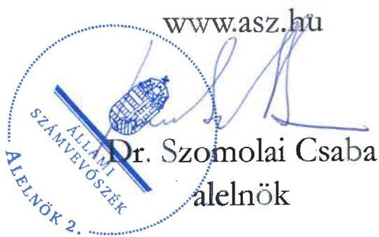

ÁLLAMI SZÁMVEVŐSZÉK

# JELENTÉS

A többségi állami tulajdonban lévő gazdasági társaságok beszerzéseinek ellenőrzése

EPDB Nyomtatási Központ Zrt.

2025.

25135

www.asz.hu

---

ÁLLAMI
SZÁMVEVŐSZÉK

# JELENTÉS

A többségi állami tulajdonban lévő gazdasági társaságok beszerzéseinek ellenőrzése

EPDB Nyomtatási Központ Zrt.

2025.

25135

---

Jelentéseink az interneten a www.asz.hu címen olvashatók.

ELLENŐRZÉSI IGAZGATÓSÁG:
ELLENŐRZÉSI IGAZGATÓSÁG III.

ELLENŐRZÉSI IGAZGATÓ:
HERCZEGH ZSOLT igazgató

ELLENŐRZÉSVEZETŐ:
VEREBESNÉ SZABÓ ERZSÉBET ellenőrzésvezető

IKTATÓSZÁM: EL-4022-019/2025
TÉMASORSZÁM: 39/2024
ELLENŐRZÉS-AZONOSÍTÓ SZÁM: V1076

---

TARTALOMJEGYZÉK

- AZ ELLENŐRZÉS EREDMÉNYEI ... 5
1. Az ellenőrzött beszerzések megfelelőségének értékelése ... 6
- JAVASLATOK ... 12
- I. FÜGGELÉK: ÉSZREVÉTELEK ... 13
- II. FÜGGELÉK: ELLENŐRZÉSI MEGKÖZELÍTÉS ... 14
- MELLÉKLETEK ... 18
I. sz. melléklet: Értelmező szótár ... 18
- RÖVIDÍTÉSEK JEGYZÉKE ... 19

---

“哈，你是个小伙子，你是个小伙子，你是个小伙子，你是个小伙子，你是个小伙子，你是个小伙子，你是个小伙子，你是个小伙子，你是个小伙子，你是个小伙子，你是个小伙子，你是个小伙子，你是个小伙子，你是个小伙子，你是个小伙子，你是个小伙子，你是个小伙子，你是个小伙子，你是个小伙子，你是个小伙子，你是个小伙子，你是个小伙子，你是个小伙子，你是个小伙子，你是个小伙子，你是个小伙子，你是个小伙子，你是个小伙子，你是个小伙子，你是个小伙子，你是个小伙子，你是个小伙子，你是个小伙子，你是个小伙子，你是个小伙子，你是个小伙子，你是个小伙子，你是个小伙子，你是个小伙子，你是个小伙子，你是个小伙子，你是个小伙子，你是个小伙子，你是个小伙子，你是个小伙子，你是个小伙子，你是个小伙子，你是个小伙子，你是个小伙子，你是个小伙子，你是个小伙子，你是个小伙子，你是个小伙子，你是个小伙子，你是个小伙子，你是个小伙子，你是个小伙子，你是个小伙子，你是个小伙子，你是个小伙子，

---

5

# AZ ELLENŐRZÉS EREDMÉNYEI

A Magyar Állam tulajdonában lévő gazdasági társaságok gazdálkodása során a nemzeti vagyonnal való felelős gazdálkodás alapvető követelmény és egyben jogszabályi előírás. A nemzeti vagyongazdálkodás alapvető feladata a nemzeti vagyon megőrzése, értékének és állagának védelme. A gazdasági társaságok önálló és felelős gazdálkodása során a jogszabályokban meghatározott előírásoknak, valamint az azokkal összhangban lévő belső szabályzatoknak maradéktalanul szükséges megfelelni. A gazdasági társaságokkal szemben elvárás, hogy a beruházásaikat, beszerzéseiket ezen előírások mentén a törvényesség, célszerűség és eredményesség követelményei szerint végezzék.

Az EPDB Nyomtatási Központ Zrt.¹ közvetett állami tulajdonú gazdasági társaság, egyedüli tagja az ellenőrzött időszakban a Magyar Posta Vagyonkezelő Zrt.² volt. A Társaság a küldemény-előállítási iparágban tevékenykedett, cégjegyzékbe bejegyzett főtevékenysége nyomás (kivéve: napilap) volt.

Az ÁSZ³ az ellenőrzés keretében megvizsgálta és értékelte az EPDB Nyomtatási Központ Zrt. által 2023. évben végrehajtott borítékoló gép vásárlásra, borítékoló gépek és egyéb nyomdai berendezések karbantartására és szervizelésére, borítéknyomtatók üzemeltetésére, karbantartására és szervizelésére, adatátadásra és önkormányzati adólevelek gyártáselőkészítésére, valamint etikető berendezés fejlesztésre irányuló, összesen nettó 978 604 E Ft értékű beszerzéseinek megfelelőségét.

Az ÁSZ ellenőrzése megállapította, hogy az EPDB Nyomtatási Központ Zrt. beszerzési igényei az üzletmenet folytonosságának és a gyártási tevékenységhez szükséges berendezések biztosításának érdekében indokoltan merültek fel. A Társaság nem volt közbeszerzésre kötelezett.

A borítékoló gép beszerzésére irányuló döntésre szabályszerűen került sor, a döntést a Társaság megalapozta, és a szerződéses feltételeket a Társaság érdekeinek szem előtt tartásával, célszerűen alakították ki. A beszerzés eredményesnek minősült.

A borítékoló gép és a borítéknyomtató szervizelés, valamint az adatátadási és gyártáselőkészítési szolgáltatás beszerzésére irányuló döntések megalapozottak és célszerűek voltak, azonban a döntések meghozatala során a Társaság – a szerződésmódosítások kivételével – nem tartotta be a létesítő okiratban előírt hatásköri szabályokat. A szerződéses feltételeket a Társaság érdekeinek megfelelően alakították ki.

Az etikető gép beszerzése esetében a beszerzési döntésre szabályszerűen került sor, a döntést a Társaság megalapozottan hozta meg. A szerződéses feltételeket nem a Társaság érdekeinek szem előtt tartásával alakították ki, mivel hiányoztak a szállító nem teljesítésére, késedelmes vagy hibás teljesítésére vonatkozó biztosítékok, valamint a termékhez kapcsolódó jótállásra, szavatosságra vonatkozó rendelkezések. Ezzel összefüggésben a szerződés teljesítése során a Társaságot pénzügyi vagy egyéb hátrány nem érte. A beszerzés eredményesnek minősült.

A teljesítések megtörténtének dokumentálása az ellenőrzött tételek esetében megfelelő volt. A beszerzések végrehajtása megfelelt a szerződésekben foglaltaknak.

---

Az ellenőrzés eredményei

# 1. Az ellenőrzött beszerzések megfelelőségének értékelése

## Összegző megállapítás

Az EPDB Nyomtatási Központ Zrt. beszerzési igényei az ellenőrzött tételek esetében indokoltan merültek fel. A beszerzési döntések megalapozottak és célszerűek voltak. Három ellenőrzött tétel esetében a döntéshozatal – a szerződésmódosítások kivételével – a Részvényes⁴ jóváhagyásának hiányában nem felelt meg a létesítő okiratban foglaltaknak. Egy ellenőrzött beszerzés esetében a szerződéses feltételeket nem a Társaság érdekeinek szem előtt tartásával alakították ki. A teljesítések megtörténtének dokumentálása az ellenőrzött tételek esetében megfelelő volt. A beszerzések végrehajtása megfelelt a szerződésekben foglaltaknak. A borítékoló gép és az etikető gép beszerzése eredményesnek minősült. A Társaság az ellenőrzött beszerzések alapját képező szerződésekkel kapcsolatban fennálló közzétételi kötelezettségének egy szerződés kivételével eleget tett.

## A BESZERZÉSEKHEZ KAPCSOLÓDÓ BELSŐ SZABÁLYOZÓ ESZKÖZÖK

A Társaság Alapszabályi.s⁵-a meghatározta a kötelezettségvállalásnak a vezérigazgatói hatáskörbe, illetőleg a Részvényes kizárólagos hatáskörébe tartozó tárgyát és értékhatárát, tartalmazta a Társaság és a Részvényes közötti szerződésekre vonatkozó egyes előírásokat, valamint a cégjegyzési jogosultságra vonatkozó rendelkezéseket. Az EPDB Nyomtatási Központ Zrt. a beszerzéseire vonatkozóan a belső szabályozási környezetet az SzMSz⁶, az Aláírási Szabályzat⁷, a Beszerzési Szabályzat⁸, a Szerződéskötési Szabályzat⁹, az Összeférhetetlenségi Szabályzat¹,²¹⁰, a Compliance Szabályzat¹¹ és az Etikai Kódex¹² megalkotásával biztosította, megfelelve a Gbkr.¹³ előírásaiban foglaltaknak.

## A BESZERZÉSI IGÉNYEK FELMERÜLÉSE

A Társaság az ellenőrzött időszakban azonos típusú nyomtatókból és azonos típusú borítékoló gépekből álló homogén gépparkkal rendelkezett. A borítékoló gépek – gyártási évük, a Társaságnál történő üzembe helyezésük éve és számlálóállásuk alapján – cserére szorultak. Ezt támasztotta alá, hogy a külföldi gyártó a hazai disztribútor írásos tájékoztatása szerint 2023. év elejétől már nem garantálta a gyári támogatást a fő alkatrészekre. Ez a körülmény jelentős működési kockázatot jelentett a Társaság számára. Mindezek alapján a borítékoló gép beszerzésére vonatkozó igény indokoltan merült fel (1. számú mintatétel – borítékoló gép beszerzés).

A Vezérigazgatói¹⁴ nyilatkozata szerint a Társaság gyártósorain 2023. évben három műszakban folyt a termelés. Havonta több tízmillió boríték és A4-es lap nyomtatására került sor. A borítékoló gépek és a gyártósorhoz tartozó egyéb nyomdai berendezések üzembiztos működéséhez szükség volt a megelőző karbantartások rendszeres elvégzésére, a felmerült hibák azonnali javítására, a fogyó-kopó és egyéb alkatrészek folyamatos cseréjére. Mindezek alapján a borítékoló gépek és egyéb nyomdai berendezések karbantartására és szervizelésére irányuló szolgáltatás beszerzésére vonatkozó igény indokoltan merült fel (2. számú mintatétel – borítékoló gép szervizelés).

---

Az ellenőrzés eredményei

A Társaság 2019. december és 2020. október között öt borítéknyomtató gépet szerzett be és helyezett üzembe. A borítéknyomtató gépeket a borítékoló gépek sorába lehetett illeszteni. Funkciójuk az volt, hogy a bianko (fehér, nyomatnélküli) borítékokat a borítékolási folyamat során megfelelő nyomatképpel lássák el. A borítéknyomtató gépek üzembiztos működéséhez szükség volt azok rendszeres karbantartására, a felmerülő hardver- és szoftverhibák elhárítására, a szoftvertámogatásra. Mindezek alapján a borítéknyomtató gépek karbantartására és támogatására irányuló szolgáltatás beszerzésére vonatkozó igény indokoltan merült fel (3. számú mintatétel – borítéknyomtató szervizelés).

A Társaság a hazai küldeményelőállítási piac piacvezető szolgáltatója volt. Tevékenysége során ügyfélkörének folyamatos bővítésére törekedett, mellyel az önkormányzati szektort is megcélozta. A Társaság számára ebben a piaci szegmensben az önkormányzati adólevelek előállítása kínált üzleti lehetőséget. A küldeményelőállítás alapfeltétele az önkormányzati ASP rendszer¹⁵-ből történő adatátadás volt, melyhez szükséges informatikai megoldással a Társaság nem rendelkezett. Mindezek alapján az adatátadásra és az önkormányzati adólevelek gyártáselőkészítésére irányuló beszerzési igény indokoltan merült fel (4. számú mintatétel – adatátadás és gyártáselőkészítés).

A Társaság az általa kifejlesztett öntapadós kukamatrica gyártási folyamatát – a korábbi alvállalkozói teljesítések kiváltása és ezzel az alvállalkozói kitettség csökkentése érdekében – saját tulajdonban lévő eszközzel kívánta megvalósítani. Ennek érdekében egy speciális célgép kifejlesztésére és legyártására volt szükség, mely biztosította a szemét szállítási szolgáltatás információit tartalmazó, a hulladéktároló edényre ragasztandó matrica előállítását és A4 formátumú levélre történő rögzítését. A Társaság Vezérigazgató-jának nyilatkozata szerint a szükséges célgép kereskedelmi forgalomban nem volt beszerezhető, azt egyedileg kellett kifejleszteni. A fejlesztéshez szükséges kompetencia a Társaságnál nem áll rendelkezésre. Mindezek alapján az etikettező berendezés fejlesztésére és legyártására irányuló beszerzési igény indokoltan merült fel (5. számú mintatétel – etikettező gép beszerzés).

## A BESZERZÉSI DÖNTÉSEK

## Borítékoló gép beszerzés (1. számú mintatétel)

A borítékoló gép beszerzéséről való döntés az Alapszabálys értelmében a Részvényes hatáskörébe tartozott. A beszerzés nem tartozott a Kbt.¹⁶ hatálya alá és nem vonatkoztak rá a Beszerzési Szabályzat előírásai. A borítékoló gép beszerzését a Társaság 2023. évi üzleti terve lehetőségként tartalmazta. A Társaság a gépbeszerzéshez kapcsolódóan a Gyármentő Program¹⁷ keretében 2023. február 16-án támogatási kérelmet nyújtott be, melyre 2023. február 28-án megérkezett a HIPA Nonprofit Zrt.¹⁸ támogatási ajánlata. Az ajánlat alapján a támogatás intenzitása megközelítette a 30%-ot. A Társaság a beszerzési döntés megalapozásához három különböző borítékoló gép gyártó magyarországi képviselőitől kért be ajánlatokat. A beszerzési döntés meghozatalát a Társaság részletes előterjesztéssel támogatta. Az előterjesztésben a Társaság bemutatta a rendelkezésére álló gépparkot, a magyarországi borítékoló gép piacot, összehasonlította a három beérkezett ajánlatot, számításokat végzett a beruházás eredményre gyakorolt hosszútávú hatásaira vonatkozóan, bemutatta a finanszírozási háttérét, értékelte a beruházás megvalósításának és elmaradásának kockázatait, továbbá csatolta az előterjesztésben foglaltakat megalapozó dokumentumokat. A Felügyelőbizottság az 1/2023. (V.09.) számú határozatában támogatta a beruházás megvalósítását és a kapcsolódó szerződések megkötését. A Társaság a 4/2023. (06.09.) számú Alapítói Határozat alapján jogosult volt megkötni a támogatási szerződést, a beszerzés finanszírozásához szükséges hitelszerződést és az összességében legkedvezőbb ajánlatot tevő pályázóval az adásvételi szerződést. A Társaság által bemutatott dokumentumok alapján a nyertes Szállító, a kiválasztott gyártmány

---

Az ellenőrzés eredményei

és géptípus kizárólagos magyarországi forgalmazója és szervize volt. A beszerzési döntés meghozatala során lényeges szempont volt az ajánlati ár, a felkínált kedvezmények, a borítékoló gép műszaki jellemzői, a gép használatára vonatkozó európai és hazai referenciák, a magyarországi szervizháttér megléte, a Társaság meglévő gépparkjához való illeszkedés, valamint a gyártócsarnokban való elhelyezés műszaki lehetőségei. Mindezek alapján a borítékoló gép beszerzéséről való döntés megfelelt az Alapszabály₃ rendelkezéseinek, szabályszerű, megalapozott és célszerű volt. Az ellenőrzött beszerzés alapját képező szerződést a Társaság 2023 szeptemberében kötötte meg a Szállító₁-val.

## Borítékoló gép szervizelés (2. számú mintatétel)

A Társaság által használt gyártmányú borítékoló gépek szervizelési szolgáltatásának Szállító₁-tól történő igénybevétele a Vezérigazgató₁ nyilatkozata szerint mintegy 20 évre tekint vissza. A nyilatkozat alapján az első szerviz szerződést még a Társaság beolvadással megszűnt Jogelődje¹⁹ kötötte. Az ellenőrzött 2023. évi beszerzések alapját képező szerződést a Társaság 2017 decemberében kötötte meg a Szállító₁-val. A beszerzési döntés alapját a Szállító₁ kizárólagos magyarországi szerviz jogosultsága és a korábbi együttműködés pozitív tapasztalatai képezték. A beszerzés nem tartozott a Kbt. hatálya alá. A szerződés megkötéséhez az Alapszabály₁ 11.2. (r) pontjával ellentétben nem állt rendelkezésre a Részvényes döntése. A 2023. március 1-jétől és 2023. július 1-jétől hatályos díjemelésre irányuló szerződésmódosításokról való döntéseket a Vezérigazgató₁ az Alapszabály₃₋₄ előírásainak megfelelően, szabályszerűen hozta meg. A szerződésmódosítások során figyelembe vett tényezőket a Társaság a döntéselőkészítés folyamatában nem dokumentálta. A szerződésmódosításokat megelőző ártárgyalásokat meghatározta az a tény, hogy a borítékoló gépek szervizelésére a Szállító₁ kizárólagos jogokkal rendelkezett, valamint, hogy a géppark előregedése és a gyártói támogatás megszűnése következtében a karbantartási költségek növekedése volt várható, melynek ellensúlyozására a Szállító₁ 2023. március 1-jétől többlet díjat igényelt. A szerződés az éves díjemeléseket a felek megállapodásától tette függővé és a díjemelés mértékére vonatkozóan a KSH²⁰ által megállapított mindenkori előző évi inflációt tekintette irányadónak. Az ellenőrzés megállapítása szerint a díjemelések mértéke a többlet díjtól eltekintve nem haladta meg a szerződésben rögzített irányadó mértéket. A többletdíj elfogadását a Vezérigazgató₁ nyilatkozata szerint Szállító₁ monopolhelyzete mellett alapvetően az üzembiztonság fenntartása, az ügyfelek megrendeléseinek zökkenőmentes, pontos, határidőben történő kielégítésének igénye indokolta. Az ellenőrzés megállapította, hogy az átadott munkalapok alapján a borítékoló gépek meghibásodása 2023. évben napi szintű javításokat igényelt. Az ellenőrzés megállapította továbbá, hogy a szerződéssel ellentétben – mely alapján Szállító₁ 1 fő technikus munkaidőben történő folyamatos biztosítását vállalta – a munkalapok tanúsága szerint jellemzően 2 fő, sőt egyes napokon 3 fő technikus is a Társaságnál dolgozott. Mindezek alapján a borítékoló gép szervizelési szolgáltatás beszerzésére és a 2023. évi szerződésmódosításokra irányuló döntések megalapozottak és célszerűek voltak. Az alapszerződés megkötése a részvényesi jóváhagyásnak az Alapszabály₁ 11.2. (r) pontjába ütköző elmaradása miatt nem volt szabályszerű. A 2023. évi szerződésmódosításokról való döntések megfeleltek az Alapszabály₃₋₄ előírásainak, így szabályszerűek voltak.

8

---

Az ellenőrzés eredményei

## Borítéknyomtató szervizelés (3. számú mintatétel)

Az ellenőrzött 2023. évi beszerzések alapját képező borítéknyomtató szervizelési szerződést a Társaság 2019. októberében kötötte meg a Szállító-ral. A szerződésben szerepelt, hogy annak megkötése az eszközökre vonatkozó garancia feltétele volt. A Vezérigazgató¹ nyilatkozata és az átadott gyártói igazolás szerint Szállító¹ kizárólagos jogokkal rendelkezett a borítéknyomtatók magyarországi szervizelésére. A beszerzés nem tartozott a Kbt. hatálya alá. Az ellenőrzés megállapította, hogy a szerződés megkötéséhez az Alapszabály² 11.2. (r) pontjával ellentétben nem állt rendelkezésre a Részvényes döntése. A megkötött szerződés alapján történt 2023. évi beszerzések árait meghatározó – 2022. november 1-jétől hatályos – díjemelésre irányuló szerződésmódosításról való döntést a Vezérigazgató¹ az Alapszabály³ előírásának megfelelően, szabályszerűen hozta meg. A szerződésmódosítás során figyelembe vett tényezőket a

Társaság a döntéselőkészítés folyamatában nem dokumentálta. A szerződésben a felek a szolgáltatási díjak évi egyszeri értékkövető változtatásáról állapodtak meg, melynek mértékét a KSH által közzétett szolgáltatási árindexhez kötötték. A 2022. november 1-jétől hatályos – az előző egy éves időszak szolgáltatási árindexét jelentősen meghaladó – díjemelés mértékét meghatározta, hogy a szerződéses rendelkezéstől eltérően a megelőző három évben a Szállító¹ változatlanul az alapszerződés szerinti árakon nyújtotta a szolgáltatását a Társaság számára, melyet

Az ÁSZ véleménye szerint az átlátható működés és az ellenőrizhetőség erősítése érdekében kiemelt jelentősége van annak, hogy az állami tulajdonú gazdasági társaságok dokumentálják azokat az adatokat, információkat, számításokat, elemzéseket, melyek alátámasztják döntéseik szabályszerűségét, célszerűségét, várható eredményességét.

a továbbiakban már nem volt hajlandó finanszírozni. A Vezérigazgató¹ a díjemelési igényről való döntés során figyelembe vette Szállító¹ kizárólagos szervizjogosultságát, az üzletmenet folytonosság szempontját, valamint, hogy a költségnövekedést a Társaság érvényesíteni tudta a vevői felé. A költségszint megfelelőségét a Vezérigazgató¹ nyilatkozata szerint a Társaság évről-évre növekvő árbevétele és nyeresége is alátámasztotta. Mindezek alapján a borítéknyomtató szervizelési szolgáltatás beszerzésére és a 2022. évi szerződésmódosításra irányuló döntések megalapozottak és célszerűek voltak. Az alapszerződés megkötése a részvényesi jóváhagyásnak az Alapszabály² 11.2. (r) pontjába ütköző elmaradása miatt nem volt szabályszerű. A 2022. évi szerződésmódosításról való döntés megfelelt az Alapszabály³ előírásainak, így szabályszerű volt.

## Adatátadás és gyártáselőkészítés (4. számú mintatétel)

Az ellenőrzött 2023. évi beszerzések alapját képező adatátadási és gyártáselőkészítési szerződést a Társaság 2019. júliusában kötötte meg a Szállító-ral. A szerződés alapján történt 2023. évi beszerzések árait a 2022. augusztus 1-jétől hatályos díjemelésre irányuló szerződésmódosítás határozta meg. A Vezérigazgató¹ nyilatkozata szerint az önkormányzati ASP rendszer adó szakrendszeréhez való hozzáférést biztosító technológiával kizárólag a Szállító² rendelkezett, így több szereplős beszerzési eljárás lefolytatásának lehetősége nem merült fel. Az önkormányzati ASP rendszert működtető MÁK²¹ által az ÁSZ számára adott tájékoztatás szerint az ASP adó szakrendszerből a nagytömegű küldemények közvetlen postai kiküldése csak a Szállító² publikus szolgáltatásán keresztül valósulhatott meg, így a kizárólagosság az ellenőrzés során igazolást nyert. A beszerzés nem tartozott a Kbt. hatálya alá. Az ellenőrzés megállapította továbbá, hogy a szerződés megkötéséhez az Alapszabály² 11.2. (r) pontjával ellentétben nem állt rendelkezésre a Részvényes döntése. A 2022. augusztus 1-jétől hatályos díjemelésre irányuló szerződésmódosításról való döntést a Vezérigazgató¹ az Alapszabály³ előírásának megfelelően, szabályszerűen hozta meg. Mindezek alapján az adatátadási és gyártáselőkészítési szolgáltatás

---

Az ellenőrzés eredményei

beszerzésére és a 2022. évi szerződésmódosításra irányuló döntések megalapozottak és célszerűek voltak. Az alapszerződés megkötése a részvényesi jóváhagyásnak az Alapszabály₂ 11.2. (r) pontjába ütköző elmaradása miatt nem volt szabályszerű. A 2022. évi szerződésmódosításról való döntés megfelelt az Alapszabály₂ előírásainak, így szabályszerű volt.

## Etikettező gép beszerzés (5. számú mintatétel)

Az ellenőrzött 2023. évi beszerzés alapját képező vállalkozási szerződést a Társaság 2022. áprilisában kötötte meg a Szállító₃-val. A szerződéses összeg alapján a kötelezettségvállalás az Alapszabály₂ értelmében a Részvényes döntési hatáskörébe tartozott, és nem vonatkoztak rá a Beszerzési Szabályzat előírásai. Az etikettező gép beszerzését a Társaság 2023. évi üzleti terve tartalmazta. A beszerzési döntés megalapozása érdekében a Társaság előterjesztést készített a Részvényes számára. Az előterjesztésben a Társaság bemutatta a beszerzés szakmai és gazdasági indokait, valamint a várható hasznos élettartam, a bekerülési érték és az alvállalkozói költségmegtakarítás figyelembevételével számítást végzett a beruházás megtérülésére vonatkozóan. A Társaság az előterjesztésben megjelölte továbbá a lehetséges üzleti partner személyét is. A Társaság a 3/2022. (04.04.) számú Alapítói Határozat alapján jogosult volt az etikettező gépet az előterjesztésben feltüntetett áron a Szállító₃-tól beszerezni.

Mindezek alapján az etikettező gép beszerzéséről való döntés megfelelt az Alapszabály₂ rendelkezéseinek, szabályszerű, megalapozott és célszerű volt.

## A MEGKÖTÖTT SZERZŐDÉSEK, A BESZERZÉSEK VÉGREHAJTÁSA ÉS ELSZÁMOLÁSA

Az ellenőrzött beszerzések alapját képező szerződéseket és azok módosításait az EPDB Nyomtatási Központ Zrt. részéről az Alapszabály₁₋₄, az SzMSz és az Aláírási Szabályzat rendelkezéseivel összhangban a Vezérigazgató: írta alá. A szerződéseken a Ptk.²² előírásainak megfelelően rögzítésre került többek között a szerződés tárgya, időbeli hatálya, a teljesítés szabályai, az ellenérték és a fizetési feltételek, a szerződés módosítására, megszűnésére, a szerződésszegés esetére irányadó rendelkezések. A borítékoló gép beszerzés, a borítékoló és a borítéknyomtató szervizelés, valamint az adatátadás és gyártáselőkészítés tárgyában kötött szerződéseket nem tartalmaztak olyan elemeket, amelyek ellentétesek voltak az EPDB Nyomtatási Központ Zrt. érdekeivel, és szerepeltek benne a Társaság érdekeit védő garanciális kötelezettségek (1-4. számú mintatételek). Az etikettező gép beszerzésére irányuló szerződés nem tartalmazta a Szállító₃ nem teljesítésére, késedelmes vagy hibás teljesítésére vonatkozó biztosítékokat (kötbért), sem pedig az előállítandó termékhez kapcsolódó jótállásra, szavatosságra vonatkozó rendelkezéseket. A szerződés szerint Szállító₃ kizárólag a Társaságnak okozott károk Ptk. szerinti megtérítésére volt köteles. A Társaság a Gbkr. 6. § (1) bekezdésében foglaltak ellenére nem alakított ki és a Gbkr. 3. § (1) bekezdés c) pontja ellenére nem működtetett olyan kontrolltevékenységeket, amelyek – a szerződéseket tartalmi feltételeinek kialakítása során – biztosították a kockázatok azonosítását, értékelését és kezelését. Ezzel összefüggésben a szerződés teljesítése során a Társaságot pénzügyi vagy egyéb hátrány nem érte. (5. számú mintatétel).

A borítékoló gépet a Szállító₃ 2023. november közepén készre jelentette és a rendelkezésre álló fuvarlevél tanúsága szerint 2023. december elején leszállította. A borítékoló gép munkavédelmi felülvizsgálata és üzembehelyezése 2024. március elején történt. A borítékoló gépet termelésbe állították, az a helyszíni ellenőrzés 2024. december 11-ei időpontjában is üzemben volt (1. számú mintatétel). A borítékoló gép és a borítéknyomtató gép szervizelési szolgáltatás Szállító: általi teljesítését munkalapokkal dokumentálták. (2-3. számú mintatételek). Az adatátadási és gyártáselőkészítési szerződés Szállító₂ általi teljesítését és a számlázott összegek jogszabályszerűségét az elkészült önkormányzati adólevelek és az elektronikus kézbesítési

10

---

Az ellenőrzés eredményei

igazolások településenkénti kimutatása támasztotta alá (4. számú mintatétel). Az etikettező gépet a Szállító₃ 2023. január végén leszállította, majd a beüzemelés során felmerült hibák javítását követően 2023. március közepén átadta a Társaság részére. A teljesítés elismerésére a felhasználói kézikönyv átadását, a gép használatának oktatását és a tesztgyártások lefolytatását követően került sor. Az etikettező gépet termelésbe állították, az a helyszíni ellenőrzés 2024. december 11-ei időpontjában is üzemben volt (5. számú mintatétel).

Az ellenőrzött beszerzésekhez kapcsolódó számviteli bizonylatok rendelkezésre álltak. A befogadott számlák alaki és tartalmi szempontból megfeleltek az Áfa tv.²³ és a Számv. tv.²⁴ előírásainak. A kifizetések összege megegyezett az elszámolást megalapozó számlák bruttó értékével. A beszerzések az üzleti célok megvalósítását, a Társaság feladatellátását szolgálták. Mindezek alapján a beszerzések végrehajtása és elszámolása szabályszerű volt, annak során érvényesültek a szerződéses előírások, valamint az Áfa tv. és a Számv tv. rendelkezései. A borítékoló gép és az etikettező gép beszerzése eredményes volt.

## KÖZZÉTÉTELI KÖTELEZETTSÉG

Az EPDB Nyomtatási Központ Zrt-t az általa megkötött szerződésekkel kapcsolatban az Info tv.²⁵ 33. § (1) és (3) bekezdései, 37. § (1) bekezdése, valamint az 1. melléklet III. gazdálkodási adatok 4. pontja értelmében közzétételi kötelezettség terhelte, melynek az ellenőrzött tételek vonatkozásában egy kivétellel eleget tett. A hivatkozott jogszabályi rendelkezésekkel ellentétben a közzétételre szolgáló honlapra²⁶ feltöltött lista a borítéknyomtató szervizelés alapját képező szerződésre vonatkozó adatokat nem tartalmazta (3. számú mintatétel).

---

JAVASLATOK

Az ÁSZ tv. 33. § (1) bekezdésében foglaltak értelmében az ellenőrzött szervezet vezetője köteles a jelentésben foglalt megállapításokhoz kapcsolódó intézkedési tervet összeállítani és azt a jelentés kézhezvételétől számított 30 napon belül az ÁSZ részére megküldeni. Az ÁSZ a jelentésben foglalt megállapításokhoz kapcsolódóan az alábbi javaslatok tekintetében várja el az intézkedési terv elkészítését.

# AZ EPDB NYOMTATÁSI KÖZPONT ZRT. VEZÉRIGAZGATÓJA RÉSZÉRE

1. Az Alapszabályban előírtak érvényesülése érdekében a Gbkr. 3. § (1) bekezdés c) pontjában foglaltak alapján tegyen intézkedéseket olyan kontrolltevékenységek kialakítására, működtetésére, fejlesztésére, amelyek a beszerzési döntéshozatal folyamatában biztosítják a hatásköri szabályok betartását.

2. A Gbkr. 6. § (1) bekezdésében és 3. § (1) bekezdés c) pontjában foglalt rendelkezések érvényesülése érdekében tegyen intézkedéseket olyan kontrolltevékenységek kialakítása és működtetése érdekében, amelyek – a szerződések tartalmi feltételeinek kialakítása során – biztosítják a kockázatok azonosítását, értékelését és kezelését.

3. Az Info tv. 33. § (1) és (3) bekezdéseiben, 37. § (1) bekezdésében és 1. melléklet III. gazdálkodási adatok 4. pontjában foglaltak érvényesülése érdekében vizsgálja felül a közérdekű adatok honlapon történő közzétételét, és tegye meg a szükséges intézkedéseket.

---

I. FÜGGELÉK: ÉSZREVÉTELEK

A jelentéstervezetet az ÁSZ 15 napos észrevételezésre megküldte az ellenőrzött szervezet vezetőjének az ÁSZ tv. 29. §* (1) bekezdése előírásának megfelelően.

Az ellenőrzött szervezet vezetője a jelentéstervezet megállapításaira nem tett észrevételt.

* 29. § (1) Az Állami Számvevőszék az ellenőrzési megállapításait megküldi az ellenőrzött szervezet vezetőjének vagy az általa megbízott személynek, és annak, akinek személyes felelősségét állapította meg.
(2) Az ellenőrzött szervezet vezetője és a felelősként megjelölt személy az ellenőrzés megállapításaira tizenöt napon belül írásban észrevételt tehet.
(3) Az Állami Számvevőszék az észrevételre a beérkezésétől számított harminc napon belül írásban válaszol. A figyelembe nem vett észrevételeket köteles a jelentésben feltüntetni, és megindokolni, hogy azokat miért nem fogadta el.

13

---

14

# II. FÜGGELÉK: ELLENŐRZÉSI MEGKÖZELÍTÉS

## AZ ELLENŐRZÉS JOGALAPJA

Az ellenőrzés jogszabályi alapját az ÁSZ tv.²⁷ 1. § (3) bekezdésének és 5. § (4) bekezdésének előírásai képezték.

## AZ ELLENŐRZÉS CÉLJA

Az ellenőrzés célja annak értékelése volt, hogy a gazdasági társaság – ellenőrzés során kiválasztott – beszerzésére szabályszerűen került-e sor, a kapcsolódó döntéshozatal szabályszerű és megalapozott volt-e, valamint a beszerzéshez kapcsolódóan érvényesültek-e a célszerűség és az eredményesség szempontjai.

## AZ ELLENŐRZÉS TÍPUSA

Kombinált ellenőrzés.

## AZ ELLENŐRZÉS TÁRGYA

Az ellenőrzés tárgya az EPDB Nyomtatási Központ Zrt. 2023. évben megvalósult beszerzéseire irányuló döntések szabályszerűsége, megalapozottsága és célszerűsége, valamint a megvalósult beszerzések szabályszerűsége és eredményessége, azaz a beszerzések megfelelősége volt. Az ellenőrzés kiterjedt a beszerzések előkészítésének, a beszerzésekre vonatkozó szerződések és azok 2023-ban hatályos szerződésmódosításai megkötésének és tartalmának ellenőrzésére is. Az ellenőrzés részét képezte továbbá a szerződésekre vonatkozó közzétételi kötelezettség teljesítésének ellenőrzése is.

Értékét tekintve az ellenőrzésre kiválasztott beszerzések a Társaság 2023. évi beszerzéseinek mintegy 22%-át tették ki. Az ellenőrzött beszerzések főbb adatait az 1. táblázat tartalmazza.

1. táblázat

AZ ELLENŐRZŐTT BESZERZÉSEK FŐBB ADATAI

|  MINTATÉTEL SZÁMA | BESZERZÉS TÁRGYA | BESZERZÉS ALAPJÁT KÉPEZŐ SZERZŐDÉS KELTE | BESZERZÉS NETTÓ ÉRTÉKE (EUR) | BESZERZÉS NETTÓ ÉRTÉKE (ÉT)  |
| --- | --- | --- | --- | --- |
|  1. | borítékoló gép | 2023.09.11. | 1 112 600 | 425 636 256  |
|  2. | borítékoló gép szervizelés | 2017.12.28. | - | 426 849 873  |
|  3. | borítéknyomtató szervizelés | 2019.10.14. | - | 56 466 922  |
|  4. | adatátadás és gyártáselőkészítés | 2019.07.01. | - | 17 128 094  |
|  5. | etikettező gép | 2022.04.07. | 138 000 | 52 522 800  |

Forrás: ÁSZ saját szerkesztés az EPDB Nyomtatási Központ Zrt. adatszolgáltatása alapján

---

II. Függelék: Ellenőrzési megközelítés

Az ellenőrzés kiterjedt minden olyan körülményre és adatra, amely az ÁSZ jogszabályban meghatározott feladatainak teljesítéséhez, valamint a program végrehajtása folyamán felmerült újabb összefüggések feltárásához szükséges volt.

## AZ ELLENŐRZÉS HATÓKÖRE

Az ÁSZ ellenőrzése az EPDB Nyomtatási Központ Zrt. beszerzésre irányuló döntéseinek szabályszerűségére, megalapozottságára és célszerűségére, valamint a megvalósult beszerzések szabályszerűségére és eredményességére terjedt ki. Az ÁSZ ellenőrzés részét képezte továbbá az ellenőrzött beszerzések alapját képező szerződésekre vonatkozó közzétételi kötelezettség teljesítésének ellenőrzése is.

Az EPDB Nyomtatási Központ Zrt.-t a Magyar Posta Zrt.²⁸ tulajdonába tartozó Díjbeszedő Holding Zrt.²⁹ alapította 2014. március 28-án. A Díjbeszedő Holding Zrt. 2016. január 01-jén a küldemény-előállítási iparágban tevékenykedő másik leányvállalatát, a Díjbeszedő Nyomda Zrt.³⁰-t beolvasztotta az EPDB Nyomtatási Központ Zrt.-be. 2019. december 18-tól a Magyar Posta Zrt. tulajdonában álló Magyar Posta Vagyonkezelő Zrt. lett az EPDB Nyomtatási Központ Zrt. új tulajdonosa. A Társaság alapítása óta közvetett állami tulajdonban állt. Cégjegyzékbe bejegyzett főtevékenysége nyomás (kivéve: napilap) volt.

Az EPDB Nyomtatási Központ Zrt. Magyarország piacvezető levélgyártó nyomdaüzeme volt. A Társaság fő tevékenységeit számlalevelek, ügyfél- és egyéb kereskedelmi levelek komplett előállítása, digitalizálási szolgáltatás nyújtása, különféle kiadványok gyártása, valamint nyomtatványgyártás képezték. A levélgyártás magában foglalta az adatbázisokból történő dokumentum kompozíciót, az alapanyag beszerzést, a digitális technológiával történő fekete vagy színes nyomtatást, a borítékolást és a postai feladást is.

Az EPDB Nyomtatási Központ Zrt. szolgáltatásait igénybe vevők olyan szervezetek voltak, amelyek ügyfeleikkel elsősorban postai levelezés útján tartották a kapcsolatot: szolgáltató nagyvállalatok (kommunális, távközlési, internet és kábel TV szolgáltatók), bankok, biztosítók, állami és társadalmi szervezetek, reklámügynökségek, direkt marketing útján értékesítő kereskedelmi cégek, kiadók. A Társaság 2023. évi belföldi nettó árbevételének 94%-a küldemény előállításból, a fennmaradó 6%-a nyomtatvány előállításból, digitalizálási szolgáltatásból és egyéb tevékenységekből származott. A 2023. évi export árbevétele nem volt jelentős, a belföldi árbevétel 1%-át érte el. A Társaság beszerzéseit a termelési tevékenységéhez szükséges alap- és segédanyagok, energiaköltségek, karbantartási díjak és az ingatlan bérleti díjak határozták meg.

Az EPDB Nyomtatási Központ Zrt. az ellenőrzött időszakot megelőző két üzleti év beszámolóadatai alapján az ellenőrzött időszakban a Taktv.³¹ rendelkezése alapján a Gbkr. hatálya alá tartozott, így belső kontrollrendszer működtetésére volt kötelezett.

A Társaság nem minősült a Kbt. 5-7. §-ai szerinti ajánlatkérő szervezetnek, ezért az ellenőrzött beszerzések esetében nem volt kötelezett közbeszerzési eljárás lefolytatására.

## AZ ELLENŐRZŐTT SZERVEZET

EBDP Nyomtatási Központ Zrt.

---

II. Függelék: Ellenőrzési megközelítés

## AZ ELLENŐRZŐTT IDŐSZAK

A 2023. év.

A beszerzések előkészítése és a szerződéskötések tekintetében az ellenőrzés

- a borítékoló gép szervizelés esetében 2017. évre,
- a borítéknyomtató szervizelés, valamint az adatátadás és gyártáselőkészítés esetében 2019. és 2022. évre,
- az etikettező gép beszerzés esetében 2022. évre,

a beszerzési eljárások és az elszámolások szabályszerűsége értékelése tekintetében a 2024. évre is kiterjedt.

## AZ ELLENŐRZÉSI KRITÉRIUMOK

|  ELLENŐRZÉSI KRITÉRIUMOK  |
| --- |
|  Vtv.32 2. § (1) bekezdés, 5. § (2) bekezdés,  |
|  Nvtv.33 7. § (1)-(2) bekezdés,  |
|  Ptk. 6:215-220. §, 6:238-249. §,  |
|  Számv. tv. 69. § (1) bekezdés, 78. § (2) bekezdés, 165-167. §,  |
|  Áfa tv. 169. §,  |
|  Taktv. 2. §, 7/J. § (1) és (3) bekezdés,  |
|  Gbkr. 3. § (1) bekezdés, 4. § (3) bekezdés, 6. § (1)-(2) bekezdés,  |
|  Info tv. 33. § (1) és (3) bekezdés, 37. §, 1. melléklet III. gazdálkodási adatok 4. pont,  |
|  belső szabályozó eszközök (Alapszabály1-5, SzMSz, Beszerzési Szabályzat, Szerződéskötési Szabályzat, Aláírási Szabályzat, Összeférhetetlenségi Szabályzat1,2, Compliance Szabályzat, Etikai Kódex), megkötött szerződések,  |
|  Célszerűség: a beszerzésre irányuló döntés akkor célszerű, ha az megalapozott, továbbá a rendelkezésre álló erőforrások ésszerű, racionális, a gazdasági társaság (köz)feladatának megvalósítása érdekében álló, az ahhoz szükséges mértékű felhasználásával jár.  |
|  Eredményesség: a beszerzés akkor eredményes, ha összhangban áll a társaság céljaival és támogatja azok elérését, megvalósulását, valamint a beszerzés tárgya a társaság (köz)feladat ellátása során ténylegesen hasznosításra kerül, betölti eredetileg elvárt funkcióját.  |
|  A beszerzés eredményessége kizárólag akkor értékelhető, ha a beszerzési eljárás teljes folyamata a lényegi elemeiben szabályszerű, a beszerzési döntés megalapozott és célszerű volt.  |

## AZ ELLENŐRZÉS MÓDSZERE ÉS AZ ELLENŐRZÉSI BIZONYÍTÉKOK KÖRE

Az ellenőrzés végrehajtása a nemzetközi standardokat irányadónak tekintve az ellenőrzési program szempontjai, az ellenőrzött időszakban hatályos jogszabályok, az ellenőrzés szakmai szabályok és a jelen ellenőrzésre irányadó ÁSZ módszertan figyelembevételével történt.

Az ellenőrzési kérdések megválaszolásához szükséges bizonyítékok megszerzése az ellenőrzött szervezet által rendelkezésre bocsátott dokumentumokra és adatokra alapozva, továbbá megfigyelés, szemle (szemrevételezés), kérdésfeltevés (információkérés), valamint elemző eljárás útján valósult meg. Az összefüggő tények vizsgálata céljából az ÁSZ ellenőrzést támogató szervezetként megkereste a MÁK-ot.

---

II. Függelék: Ellenőrzési megközelítés

Az ellenőrzés lefolytatásához az ellenőrzött szervezet a 2023. évben megvalósult beszerzéseire vonatkozó főkönyvi és analitikus nyilvántartások, valamint az ÁSZ által kért további dokumentumok, adatok, információk megküldésével és a helyszíni ellenőrzés során szolgáltatott adatokat. A rendelkezésre álló adatok alapján az EPDB Nyomtatási Központ Zrt. a 2023. évben közelítőleg bruttó 5 537 000 E Ft forint összértékben hajtott végre beszerzéseket. A mintavételezés keretében öt beszerzés került kiválasztásra, melyek tárgyévben számlázott bruttó összértéke mintegy 1 243 000 E Ft-ot tett ki.

Az ellenőrzési bizonyítékként felhasználható adatforrások közé tartoztak egyrészt az ellenőrzéshez kért dokumentumok, adatállományok, nyilatkozatok, másrészt adatforrás volt minden – az ellenőrzés folyamán – feltárt, az ellenőrzés szempontjából információkat tartalmazó dokumentum.

A tények feltárása és azok összegzése során a megállapítások az ellenőrzött mintatételekre vonatkozóan kerültek megfogalmazásra. A mintatételek ellenőrzésének eredményei nem kerültek kivetítésre. Az ÁSZ akkor tekintette megfelelőnek a mintatételként kiválasztott beszerzéseket, ha a beszerzési eljárás teljes folyamata a lényegi elemeiben szabályszerű, célszerű és – amennyiben értékelhető – eredményes volt, illetve a beszerzés tekintetében érvényesültek a nemzeti vagyonnal való felelős gazdálkodás elvei.

Az ellenőrzés kitért minden olyan körülményre, amely a program végrehajtása kapcsán felmerült és az ellenőrzés céljaival összhangban volt.

17

---

MELLÉKLETEK

## I. SZ. MELLÉKLET: ÉRTELMEZŐ SZÓTÁR

gazdasági társaság
A gazdasági társaságok üzletszerű közös gazdasági tevékenység folytatására, a tagok vagyoni hozzájárulásával létrehozott, jogi személyiséggel rendelkező vállalkozások, amelyekben a tagok a nyereségből közösen részesednek, és a veszteséget közösen viselik.
(Ptk. 3:88. § (1) bekezdés)

beszerzés
Eszközök és/vagy szolgáltatások visszterhes megszerzésére (vásárlására) irányuló (keret)szerződés/(keret)megállapodás létrehozását célzó és azt eredményező eljárás.
(ÁSZ saját definíció)

eszköz
A vásárolt immateriális javak (Számv. tv. 25. § (1)-(2) bekezdés) és tárgyi eszközök (Számv. tv. 26. § (1) bekezdés) valamint – a közvetített szolgáltatások kivételével – a vásárolt készletek.
(Számv. tv. 3. § (6) bekezdés 5. pont)

szolgáltatás
A gazdasági társaság által igénybe vett/megrendelt, harmadik felek által nyújtott/számlázott, nem anyagi javak termelésére irányuló tevékenységek, különös tekintettel az igénybe vett, egyéb és közvetített szolgáltatásokra.
(Számv. tv. 3. § (7) bekezdés 1-2. pont, (4) bekezdés 1. pont)

többségi állami tulajdon
Az állam tulajdonában lévő tagsági jogviszonyt megtestesítő értékpapír, illetve az állam tulajdonában lévő egyéb társasági részesedés, amennyiben a társaságban a Magyar Állam közvetlenül vagy közvetetten a szavazatok több mint felével rendelkezik.
(ÁSZ definíció a Vtv. 1. § (2) bekezdés c) pontja és a Ptk. 8:2. § (1), (3)-(4) bekezdései alapján)

vagyongazdálkodás alapelvei
A nemzeti vagyon alapvető rendeltetése a közfeladat ellátásának biztosítása, ideértve a lakosság közszolgáltatásokkal való ellátását és e feladatok ellátásához szükséges infrastruktúra biztosítását. A nemzeti vagyonnal felelős módon, rendeltetésszerűen kell gazdálkodni.
A nemzeti vagyongazdálkodás feladata a nemzeti vagyon megőrzése, értékének és állagának védelme, rendeltetésének megfelelő, az állam, az önkormányzat mindenkori teherbíró képességéhez igazodó, elsődlegesen a közfeladatok ellátásához és a mindenkori társadalmi szükségletek kielégítéséhez szükséges, egységes elveken alapuló, átlátható, hatékony és költségtakarékos működtetése, értéknövelő használata, hasznosítása, gyarapítása, továbbá az állam vagy a helyi önkormányzat feladatának ellátása szempontjából feleslegessé váló vagyontárgyak elidegenítése, azzal, hogy a nemzeti vagyon megőrzése érdekében végzett bontás vagy átalakítás nem minősül az állag védelmi kötelezettség megszegésének.
(Nvtv. 7. § (1)-(2) bekezdése alapján)

célszerűség
A célszerűség elve a felhasznált eszközök, közpénzek, erőforrások elérni kívánt célnak való megfelelését jelenti, továbbá, hogy azokat ésszerűen, racionálisan, a kitűzött cél elérése (közfeladat ellátása) érdekében használták-e fel. (az ÁSZ ellenőrzési alapelvei és módszertana)

eredményesség
Az eredményesség elve a kitűzött célok és a szándékolt eredmények (hatások) elérését jelenti. A gazdálkodás, feladatellátás eredményességét mutatja a tényleges és a tervezett eredmények (hatások) összevetése.
(az ÁSZ ellenőrzési alapelvei és módszertana)

18

---

RÖVIDÍTÉSEK JEGYZÉKE

1 EPDB Nyomtatási Központ Zrt., Társaság
2 Magyar Posta Vagyonkezelő Zrt.
3 ÁSZ
4 Részvényes
5 Alapszabály1-5

6 SzMSz
7 Aláírási Szabályzat
8 Beszerzési Szabályzat
9 Szerződéskötési Szabályzat
10 Összeférhetetlenségi Szabályzat1,2
11 Compliance Szabályzat
12 Etika Kódex
13 Gbkr.
14 Vezérigazgató1-3
15 önkormányzati ASP rendszer
16 Kbt.
17 Gyármentő Program
18 HIPA Nonprofit Zrt.
19 Jogelőd

EPDB Nyomtatási Központ Zártkörűen Működő Részvénytársaság
Magyar Posta Vagyonkezelő Zártkörűen Működő Részvénytársaság
Állami Számvevőszék
Díjbeszedő Holding Zártkörűen Működő Részvénytársaság 2014. március 28-tól 2019. december 17-ig
Magyar Posta Vagyonkezelő Zrt. 2019. december 18-tól

1 az EPDB Nyomtatási Központ Zrt. Alapszabálya, hatályos: 2017. május 10-tól 2019. május 30-ig
2 az EPDB Nyomtatási Központ Zrt. Alapszabálya, hatályos: 2019. május 31-tól 2022. október 23-ig
3 az EPDB Nyomtatási Központ Zrt. Alapszabálya, hatályos: 2022. október 24-től 2023. június 27-ig
4 az EPDB Nyomtatási Központ Zrt. Alapszabálya, hatályos: 2023. június 28-tól 2023. szeptember 30-ig
5 az EPDB Nyomtatási Központ Zrt. Alapszabálya, hatályos: 2023. október 1-től
az EPDB Nyomtatási Központ Zrt. Szervezeti és Működési Szabályzata, hatályos: 2022. október 24-től
az EPDB Nyomtatási Központ Zrt. Belső Aláírási Szabályzata, hatályos: 2022. október 24-től
az EPDB Nyomtatási Központ Zrt. 12/2020 számú Beszerzési Szabályzata, hatályos: 2020. október 1-től
az EPDB Nyomtatási Központ Zrt. 11/2021 számú szabályzata a Szerződések megkötéséről, nyilvántartásáról és kezeléséről, hatályos: 2021. június 14-től
1 az EPDB Nyomtatási Központ Zrt. 2015/2020. számú Összeférhetetlenségi Szabályzata, hatályos: 2020. december 31-től 2021. november 3-ig
2 az EPDB Nyomtatási Központ Zrt. 2016/2021. számú Összeférhetetlenségi Szabályzata, hatályos: 2021. november 4-től
az EPDB Nyomtatási Központ Zrt. 7/2021. számú Compliance Szabályzata, hatályos: 2021. február 8-tól
az EPDB Nyomtatási Központ Zrt. Etikai Kódexe, hatályos: 2020. október 9-től 339/2019. (XII. 23.) Korm. rendelet a köztulajdonban álló gazdasági társaságok belső kontrollrendszeréről
1 az EPDB Nyomtatási Központ Zrt. vezérigazgatója 2016. április 8-tól 2024. november 7-ig Molnár Gergely
2 az EPDB Nyomtatási Központ Zrt. vezérigazgatója 2024. november 11-től 2024. december 19-ig Káplár Tamás
3 az EPDB Nyomtatási Központ Zrt. vezérigazgatója 2024. december 19-től Gellér Ágoston József
az önkormányzati feladatellátást támogató, számítástechnikai hálózaton keresztül távoli alkalmazásszolgáltatást (Application Service Provider, ASP) nyújtó elektronikus információs rendszer
2015. évi CXLIII. törvény a közbeszerzésekről
a Gyármentő Programról szóló 1514/2022. (X. 26.) Korm. határozat alapján az energiaválság által sújtott nagyvállalatok számára hosszú távú versenyképességi előnyt és fennmaradási lehetőséget biztosító energiahatékonysági és energetikai önállatást támogató beruházások kormányzati támogatására indított program
HIPA Nemzeti Befektetési Ügynökség Nonprofit Zártkörűen Működő Részvénytársaság
Díjbeszedő Nyomda Zártkörűen Működő Részvénytársaság

19

---

Rövidítések jegyzéke

|  20 KSH | Központi Statisztikai Hivatal  |
| --- | --- |
|  21 MÁK | Magyar Államkincstár  |
|  22 Ptk. | 2013. évi V. törvény a Polgári Törvénykönyvről  |
|  23 Áfa tv. | 2007. évi CXXVII. törvény az általános forgalmi adóról  |
|  24 Számv. tv. | 2000. évi C. törvény a számvitelről  |
|  25 Info tv. | 2011. évi CXII. törvény az információs önrendelkezési jogról és az információszabadságról  |
|  26 közzétételre szolgáló honlap | https://www.posta.hu/kozerdeku_adatok  |
|  27 ÁSZ tv. | 2011. évi LXVI. törvény az Állami Számvevőszékről  |
|  28 Magyar Posta Zrt. | Magyar Posta Zártkörűen Működő Részvénytársaság  |
|  29 Díjbeszedő Holding Zrt. | Díjbeszedő Holding Zártkörűen Működő Részvénytársaság  |
|  30 Díjbeszedő Nyomda Zrt. | Díjbeszedő Nyomda Zártkörűen Működő Részvénytársaság  |
|  31 Taktv. | 2009. évi CXXII. törvény a köztulajdonban álló gazdasági társaságok takarékosabb működéséről  |
|  32 Vtv. | 2007. évi CVI. törvény az állami vagyonról  |
|  33 Nvtv. | 2011. évi CXCVI. törvény a nemzeti vagyonról  |

20

---

ÁLLAMI SZÁMVEVŐSZÉK

1052 Budapest, Apáczai Csere János u. 10. | 1364 Budapest 4., Pf. 54

www.asz.hu | szamvevoszek@asz.hu

telefon: +36 1 484 9100