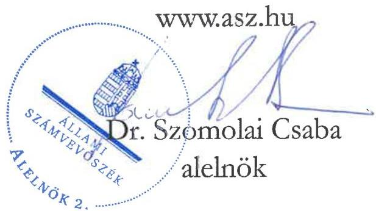

ÁLLAMI SZÁMVEVŐSZÉK

# JELENTÉS

A többségi állami tulajdonban lévő gazdasági társaságok beszerzéseinek ellenőrzése

Magyar Zene Háza Közhasznú Nonprofit Kft.

2025.

25136

www.asz.hu

---

ÁLLAMI SZÁMVEVŐSZÉK

# JELENTÉS

A többségi állami tulajdonban lévő gazdasági társaságok beszerzéseinek ellenőrzése

Magyar Zene Háza Közhasznú Nonprofit Kft.

2025.

25136

---

Jelentéseink az interneten a www.asz.hu címen olvashatók.

ELLENŐRZÉSI IGAZGATÓSÁG:
ELLENŐRZÉSI IGAZGATÓSÁG III.

ELLENŐRZÉSI IGAZGATÓ:
HERCZEGH ZSOLT igazgató

ELLENŐRZÉSVEZETŐ:
VEREBESNÉ SZABÓ ERZSÉBET ellenőrzésvezető

IKTATÓSZÁM: EL-4022-018/2025
TÉMASORSZÁM: 39/2024
ELLENŐRZÉS-AZONOSÍTÓ SZÁM: V1076

---

TARTALOMJEGYZÉK

- AZ ELLENŐRZÉS EREDMÉNYEI ... 5
1. Az ellenőrzött beszerzések megfelelőségének értékelése ... 6
- I. FÜGGELÉK: ÉSZREVÉTELEK ... 9
- II. FÜGGELÉK: ELLENŐRZÉSI MEGKÖZELÍTÉS ... 10
- MELLÉKLETEK ... 14
I. sz. melléklet: Értelmező szótár ... 14
- RÖVIDÍTÉSEK JEGYZÉKE ... 16

---

“哈，你是个小伙子，你是个小伙子，你是个小伙子，你是个小伙子，你是个小伙子，你是个小伙子，你是个小伙子，你是个小伙子，你是个小伙子，你是个小伙子，你是个小伙子，你是个小伙子，你是个小伙子，你是个小伙子，你是个小伙子，你是个小伙子，你是个小伙子，你是个小伙子，你是个小伙子，你是个小伙子，你是个小伙子，你是个小伙子，你是个小伙子，你是个小伙子，你是个小伙子，你是个小伙子，你是个小伙子，你是个小伙子，你是个小伙子，你是个小伙子，你是个小伙子，你是个小伙子，你是个小伙子，你是个小伙子，你是个小伙子，你是个小伙子，你是个小伙子，你是个小伙子，你是个小伙子，你是个小伙子，你是个小伙子，你是个小伙子，你是个小伙子，你是个小伙子，你是个小伙子，你是个小伙子，你是个小伙子，你是个小伙子，你是个小伙子，你是个小伙子，你是个小伙子，你是个小伙子，你是个小伙子，你是个小伙子，你是个小伙子，你是个小伙子，你是个小伙子，你是个小伙子，你是个小伙子，

---

5

# AZ ELLENŐRZÉS EREDMÉNYEI

A Magyar Állam tulajdonában lévő gazdasági társaságok gazdálkodása során a nemzeti vagyonnal való felelős gazdálkodás alapvető követelmény és egyben jogszabályi előírás. A nemzeti vagyongazdálkodás alapvető feladata a nemzeti vagyon megőrzése, értékének és állagának védelme. A gazdasági társaságok önálló és felelős gazdálkodása során a jogszabályokban meghatározott előírásoknak, valamint az azokkal összhangban lévő belső szabályzatoknak maradéktalanul szükséges megfelelni. A gazdasági társaságokkal szemben elvárás, hogy a beruházásaikat, beszerzéseiket ezen előírások mentén a törvényesség, célszerűség és eredményesség követelményei szerint végezzék.

A Magyar Zene Háza Közhasznú Nonprofit Kft. közvetett állami tulajdonú gazdasági társaság, egyedüli tagja az ellenőrzött időszakban a Városliget Zrt. volt. A Társaság¹ kiállításokkal, koncertekkel, interaktív zenei előadások szervezésével kínált a nagyközönség számára zenéhez köthető programokat. Cégjegyzékbe bejegyzett főtevékenysége előadóművészet volt.

Az ÁSZ² az ellenőrzés keretében megvizsgálta és értékelte a Magyar Zene Háza Közhasznú Nonprofit Kft. által 2023. évben végrehajtott, jogi szolgáltatások igénybevételére és világítási eszközparkjának fejlesztésére irányuló, összesen nettó 129 720 E Ft értékű beszerzéseinek megfelelőségét.

Az ÁSZ ellenőrzése megállapította, hogy a Magyar Zene Háza Közhasznú Nonprofit Kft. beszerzési igényei a szabályszerű, jogi szakértelemmel támogatott működés és az előadóművészeti tevékenységhez szükséges berendezések biztosításának érdekében indokoltan merültek fel. A beszerzési döntések szabályszerűek, megalapozottak és célszerűek voltak, a beszerzések végrehajtása szabályszerű volt. Az igénybe vett szolgáltatások és a beszerzett eszközök a Társaság közhasznú tevékenységét szolgálták, így a beszerzések eredményesnek minősültek. A beszerzések tekintetében érvényesültek a nemzeti vagyonnal való felelős gazdálkodás elvei. Mindezek alapján a Magyar Zene Háza Közhasznú Nonprofit Kft. ellenőrzött beszerzései megfelelőek voltak.

---

Az ellenőrzés eredményei

# 1. Az ellenőrzött beszerzések megfelelőségének értékelése

## Összegző megállapítás

A Magyar Zene Háza Közhasznú Nonprofit Kft. jogi szolgáltatások igénybevételére és világítási eszközparkjának fejlesztésére vonatkozó beszerzési igényei indokoltan merültek fel. A beszerzési döntések megfeleltek a jogszabályi és belső szabályozók által előírt rendelkezéseknek, szabályszerűek, megalapozottak és célszerűek voltak. A szerződések megkötése szabályszerű volt, a szerződéskötések során érvényesültek a felelős gazdálkodásra vonatkozó alapelvek. A beszerzések végrehajtása megfelelt a szerződésekben és a belső szabályozó eszközökben foglaltaknak. Az igénybe vett szolgáltatások és a beszerzett eszközök a Társaság közhasznú tevékenységét szolgálták, így a beszerzések eredményesnek minősültek. A Társaság az általa megkötött szerződésekkel kapcsolatban fennálló közzétételi kötelezettségének eleget tett.

## A BESZERZÉSEKHEZ KAPCSOLÓDÓ BELSŐ SZABÁLYOZÓ ESZKÖZÖK

A Társaság Alapító Okirat $^{1,3}$ -a meghatározta a kötelezettségvállalásnak az ügyvezetői hatáskörbe, illetőleg az Alapító $^{4}$ kizárólagos hatáskörébe tartozó értékhatárat, valamint tartalmazta a cégjegyzési jogosultságra vonatkozó rendelkezést. A Magyar Zene Háza Közhasznú Nonprofit Kft. a beszerzéseire vonatkozóan a belső szabályozási környezetet az SzMSz $^{5}$, a Beszerzési Szabályzat $^{1,3}$ és a Kötelezettségvállalási Szabályzat $^{1,3}$ megalkotásával biztosította. A Társaság az SzMSz-ben rögzítette a beszerzésekhez kapcsolódó általános feladatköröket és a szerződések megkötésére vonatkozó alapvető szabályokat. A Társaság a Beszerzési Szabályzat $^{1,3}$ -ban rendelkezett a beszerzések tervezéséről és kezdeményezéséről, valamint meghatározta a közvetlen beszerzés, a versenyeztetés és a közbeszerzési eljárás esetben alkalmazandó eljárásrendet. A Kötelezettségvállalási Szabályzat $^{1,3}$ tartalmazta a kötelezettségvállalás döntési szintekhez kötött értékhatárait, folyamatát és eljárási szabályait, a szakmai, jogi és pénzügyi ellenjegyzésre, a teljesítésigazolásra, az érvényesítésre és az utalványozásra vonatkozó előírásokat. A Társaságnál a beszerzések területén biztosított volt a szabályozott, átlátható működés.

## A BESZERZÉSI IGÉNYEK FELMERÜLÉSE

A Magyar Zene Háza Közhasznú Nonprofit Kft. SzMSz-e, valamint az ügyvezető nyilatkozata alapján a Társaságnál nem volt jogi feladatokat ellátó szervezeti egység, így a szabályszerű, jogi szakértelemmel támogatott működés érdekében külső szolgáltató bevonása volt szükséges. Mindezek alapján a jogi szolgáltatások beszerzésére vonatkozó igény indokoltan merült fel (1-7. számú mintatételek – jogi szolgáltatás beszerzés).

A világítási eszközpark fejlesztésének koncepciójában foglaltak szerint a Magyar Zene Háza rendelkezésére álló eszközpark nem volt alkalmas arra, hogy a különböző műfajú zenei produkciók eltérő megvilágítási igényeit megfelelően kielégítse. Az üzemi tapasztalatok alapján szükségessé vált egy korszerű

---

Az ellenőrzés eredményei

robotlámpákra alapozott, sokoldalú, multifunkcionális világítási eszközpark kialakítása. Mindezek alapján a világítási eszközök – meglévő eszközpark fejlesztését célzó – beszerzésére vonatkozó igény indokoltan merült fel (8. számú mintatétel – világítási eszközpark beszerzés).

## A BESZERZÉSI DÖNTÉSEK

### Jogi szolgáltatás beszerzés (1-7. számú mintatételek)

A jogi szolgáltatások beszerzését a Társaság 2023. évi beszerzési terve tartalmazta. A felelős szakterület az elektronikus beszerzésindító adatlap rögzítésével és jóváhagyásra átadásával a Beszerzési Szabályzat előírásainak megfelelően kezdeményezte a beszerzéseket. Tekintettel arra, hogy a beszerzések értékük alapján nem tartoztak az Alapító kizárólagos hatáskörébe, a Társaság ügyvezetője jogosult volt azokról saját hatáskörben dönteni, összhangban az Alapító Okirat, az SzMSz és a Kötelezettségvállalási Szabályzat előírásaival. A versenyeztetés nélküli közvetlen beszerzési eljárás megfelelt a Beszerzési Szabályzat és a Kbt.⁸ rendelkezéseinek. A Társaság olyan szerződő partnerek kiválasztása mellett döntött, amelyek a korábbi együttműködésből fakadóan már ismerték a Társaság működését és az ellátandó feladatok jellegét. A szerződéskötéseket megelőző döntéselőkészítést a Társaság nem dokumentálta. A Társaság a bruttó huszmillió forintos értékhatárt meghaladó 7. számú mintatétel esetében rendelkezett az ügyvédi tevékenység folytatására irányuló szerződés megkötéséhez szükséges, a 330/2022. (IX.5.) Korm. rendelet⁹-ben előírt miniszteri engedéllyel. Mindezek alapján a jogi szolgáltatások beszerzésére irányuló döntések megfeleltek a Kbt., a 330/2022. (IX.5.) Korm. rendelet, az Alapító Okirat, az SzMSz, a Beszerzési Szabályzat és a Kötelezettségvállalási Szabályzat rendelkezéseinek, szabályszerűek, megalapozottak és célszerűek voltak.

&gt; Az ÁSZ véleménye szerint az átlátható működés és az ellenőrizhetőség erősítése érdekében kiemelt jelentősége van annak, hogy az állami tulajdonú gazdasági társaságok dokumentálják azokat az adatokat, információkat, számításokat, elemzéseket, melyek alátámasztják döntéseik szabályszerűségét, célszerűségét, várható eredményességét.

### Világítási eszközpark beszerzés (8. számú mintatétel)

A világítási eszközpark beszerzését a Társaság 2022. évi közbeszerzési terve tartalmazta. A beszerzés felelős szakterület általi kezdeményezése megfelelt a Beszerzési Szabályzat előírásainak. Tekintettel arra, hogy a beszerzés értéke alapján nem tartozott az Alapító kizárólagos hatáskörébe, a Társaság ügyvezetője jogosult volt arról saját hatáskörben dönteni, összhangban az Alapító Okirat, az SzMSz és a Kötelezettségvállalási Szabályzat előírásaival. A döntés előkészítése során a társaság dokumentált felméréseket, terveket, igényspecifikációt készített. Az ügyvezető a Kbt. és a Beszerzési Szabályzat rendelkezéseinek megfelelően nyílt közbeszerzési eljárás lefolytatása mellett döntött. Mindezek alapján a világítási eszközpark beszerzéséről való döntés megfelelt a Kbt., az Alapító Okirat, az SzMSz, a Beszerzési Szabályzat és a Kötelezettségvállalási Szabályzat rendelkezéseinek, szabályszerű, megalapozott és célszerű volt.

## A MEGKÖTÖTT SZERZŐDÉSEK, A BESZERZÉSEK VÉGREHAJTÁSA ÉS ELSZÁMOLÁSA

Az ellenőrzött beszerzések alapját képező szerződéseket a Magyar Zene Háza Közhasznú Nonprofit Kft. részéről az Alapító Okirat, az SzMSz, a Beszerzési Szabályzat és a Kötelezettségvállalási Szabályzat kereső összhangban az ügyvezető írta alá. A jogi szolgáltatások nyújtására kötött megbízási szerződéseken a felek rögzítették többek között a megbízás tárgyát, a felek jogait és kötelezettségeit, a

---

Az ellenőrzés eredményei

díjazást, a számlázás és a kifizetés feltételeit, a megbízott nem szerződésszerű teljesítésének jogkövetkezményeit. A megbízási szerződések nem tartalmaztak olyan elemeket, amelyek ellentétesek voltak a Társaság érdekeivel, és szerepeltek benne a Társaság érdekeit védő garanciális kötelezettségek. A szerződéskötések során érvényesültek a Ptk.¹⁰ és az Ügyvédi tv.¹¹ ügyvédi megbízásra vonatkozó előírásai és a felelős gazdálkodás Nvtv¹²-ben rögzített alapelve (1-7. számú mintatételek). A közbeszerzési eljárás eredményeként megkötött – világítási eszközpark fejlesztésére irányuló – adásvételi szerződés tartalmazta többek között a szerződés tárgyát, a teljesítés szabályait, a vételárat, a fizetési feltételeket, a jótállásra és szavatosságra vonatkozó előírásokat, a jótállási biztosíték és a szállító nem szerződésszerű teljesítése esetén fizetendő kötbér mértékét. Az adásvételi szerződés nem tartalmazott olyan elemeket, amelyek ellentétesek voltak a Társaság érdekeivel, és szerepeltek benne a Társaság érdekeit védő garanciális kötelezettségek. A szerződéskötés során érvényesültek a Ptk. és a Kbt. előírásai és a felelős gazdálkodás Nvtv-ben rögzített alapelve (8. számú mintatétel).

Az ellenőrzött beszerzésekhez kapcsolódó számviteli bizonylatok rendelkezésre álltak. A beszerzések végrehajtása és a teljesítések dokumentálása megfelelt a Kötelezettségvállalási Szabályzat₃ és a megkötött szerződések rendelkezéseinek. A teljesítésigazolások mellett az elvégzett jogi feladatokról részletes kimutatások, a leszállított világítástechnikai eszközökről átadás-átvételi jegyzőkönyvek készültek. A befogadott számlák alaki és tartalmi szempontból megfeleltek az Áfa tv.¹³ és a Számv. tv.¹⁴ előírásainak. A kifizetések összege megegyezett az elszámolást megalapozó számlák bruttó értékével. A világítástechnikai eszközöket üzembehelyezési jegyzőkönyvvel dokumentáltan használatba vettek. A beszerzett eszközök a Társaság közhasznú tevékenységét szolgálták. Mindezek alapján a beszerzések végrehajtása és elszámolása szabályszerű volt, megfelelt a Kbt., az Áfa tv., a Számv. tv., az Alapító Okirat₁, az SzMSz, a Beszerzési Szabályzat₁₋₂ és a Kötelezettségvállalási Szabályzat₁₋₃ rendelkezéseinek, valamint a szerződésekben foglaltaknak. A beszerzések eredményesnek minősültek.

## KÖZZÉTÉTELI KÖTELEZETTSÉG

A Magyar Zene Háza Közhasznú Nonprofit Kft. 100%-ban közvetett állami tulajdonú gazdasági társaság, így közvetve állami vagyonnal gazdálkodik, ezért a Vtv.¹⁵ 5. § (2) bekezdése alapján az Info tv.¹⁶ 26. § (1) bekezdése szerint, mint közfeladatot ellátó szervnek, lehetővé kellett tennie, hogy a kezelésében lévő közérdekű adatot és közérdekből nyilvános adatot erre irányuló igény alapján bárki megismerhesse. A Társaságot az Info tv. 33. § (1) és (3) bekezdései, valamint 37. § (1) bekezdése értelmében közzétételi kötelezettség terhelte. A Társaság az ellenőrzött beszerzések alapját képező szerződésekkel kapcsolatban fennálló közzétételi kötelezettségének az Info tv. előírásainak megfelelően eleget tett.

---

9

# I. FÜGGELÉK: ÉSZREVÉTELEK

A jelentéstervezetet az ÁSZ 15 napos észrevételezésre megküldte az ellenőrzött szervezet vezetőjének az ÁSZ tv. 29. §* (1) bekezdése előírásának megfelelően.

Az ellenőrzött szervezet vezetője a jelentéstervezet megállapításaira nem tett észrevételt.

* 29. § (1) Az Állami Számvevőszék az ellenőrzési megállapításait megküldi az ellenőrzött szervezet vezetőjének vagy az általa megbízott személynek, és annak, akinek személyes felelősségét állapította meg.
(2) Az ellenőrzött szervezet vezetője és a felelősként megjelölt személy az ellenőrzés megállapításaira tizenöt napon belül írásban észrevételt tehet.
(3) Az Állami Számvevőszék az észrevételre a beérkezésétől számított harminc napon belül írásban válaszol. A figyelembe nem vett észrevételeket köteles a jelentésben feltüntetni, és megindokolni, hogy azokat miért nem fogadta el.

---

10

# II. FÜGGELÉK: ELLENŐRZÉSI MEGKÖZELÍTÉS

## AZ ELLENŐRZÉS JOGALAPJA

Az ellenőrzés jogszabályi alapját az ÁSZ tv.¹⁷ 1. § (3) bekezdésének és 5. § (4) bekezdésének előírásai képezték.

## AZ ELLENŐRZÉS CÉLJA

Az ellenőrzés célja annak értékelése volt, hogy a gazdasági társaság – ellenőrzés során kiválasztott – beszerzésére szabályszerűen került-e sor, a kapcsolódó döntéshozatal szabályszerű és megalapozott volt-e, valamint a beszerzéshez kapcsolódóan érvényesültek-e a célszerűség és az eredményesség szempontjai.

## AZ ELLENŐRZÉS TÍPUSA

Kombinált ellenőrzés.

## AZ ELLENŐRZÉS TÁRGYA

Az ellenőrzés tárgya a Magyar Zene Háza Közhasznú Nonprofit Kft. 2023. évben megvalósult beszerzéseire irányuló döntések szabályszerűsége, megalapozottsága és célszerűsége, valamint a megvalósult beszerzések szabályszerűsége és eredményessége, azaz a beszerzések megfelelősége volt. Az ellenőrzés kiterjedt a beszerzések előkészítésének, a beszerzésekre vonatkozó szerződések megkötésének és tartalmának ellenőrzésére is. Az ellenőrzés részét képezte továbbá a szerződésekre vonatkozó közzétételi kötelezettség teljesítésének ellenőrzése is. Az ellenőrzött beszerzések főbb adatait az 1. táblázat tartalmazza.

1. táblázat

AZ ELLENŐRZŐTT BESZERZÉSEK FŐBB ADATAI

|  MINTATÉTEL SZÁMA | BESZERZÉS TÁRGYA | BESZERZÉS ALAPJÁT KÉPEZŐ SZERZŐDÉS KÉCTE | BESZERZÉS NETTO ÉRTÉKE (Ft)  |
| --- | --- | --- | --- |
|  1. | Jogi szolgáltatás 2023.01.01-01.31. | 2023.01.02. | 8 300 000  |
|  2. | Jogi szolgáltatás 2023.02.01-02.28. | 2023.02.01. | 8 300 000  |
|  3. | Jogi szolgáltatás 2023.03.01-03.31. | 2023.03.01. | 8 300 000  |
|  4. | Jogi szolgáltatás 2023.04.01-04.30. | 2023.04.01. | 8 300 000  |
|  5. | Jogi szolgáltatás 2023.05.01-05.31. | 2023.05.01. | 8 300 000  |
|  6. | Jogi szolgáltatás 2023.06.01-06.30. | 2023.06.01. | 6 000 000  |
|  7. | Jogi szolgáltatás 2023.07.01-tól | 2023.06.30. | 30 003 750  |
|  8. | Világítás eszközpark fejlesztése | 2023.01.19. | 52 216 088  |

Forrás: ÁSZ saját szerkesztés a Magyar Zene Háza Közhasznú Nonprofit Kft. adatszolgáltatása alapján

---

II. Függelék: Ellenőrzési megközelítés

Az ellenőrzés kiterjedt minden olyan körülményre és adatra, amely az ÁSZ jogszabályban meghatározott feladatainak teljesítéséhez, valamint a program végrehajtása folyamán felmerült újabb összefüggések feltárásához szükséges volt.

# AZ ELLENŐRZÉS HATÓKÖRE

Az ÁSZ ellenőrzése a Magyar Zene Háza Közhasznú Nonprofit Kft. beszerzésre irányuló döntéseinek szabályszerűségére, megalapozottságára és célszerűségére, valamint a megvalósult beszerzések szabályszerűségére és eredményességére terjedt ki. Az ÁSZ ellenőrzés részét képezte továbbá az ellenőrzött beszerzések alapját képező szerződésekre vonatkozó közzétételi kötelezettség teljesítésének ellenőrzése is.

A Magyar Zene Háza Közhasznú Nonprofit Kft.-t a Magyar Állam 100 százalékos tulajdonában álló Városliget Zrt. alapította 2020. augusztus 12-én. A Társaság alapítása óta közvetett állami tulajdonban állt. A Társaság Alapító Okirat1-3-ban megjelölt célja a zenei ismeretterjesztés, cégjegyzékbe bejegyzett főtevékenysége előadó-művészet volt. A Társaság közhasznú tevékenységei körében színház-, tánc- és zeneművészeti bemutatókat, előadásokat, kiállításokat szervezett. Feladatát képezte továbbá a helyi előadóművészeti és művelődési szokások, hagyományok, formák gazdagításának, az egyetemes, a honi és a helyi kulturális értékek létrehozásának, közvetítésének és védelmének elősegítése, valamint előadóművészeti együttesek, csoportok bemutatkozásának támogatása. A Társaság gazdasági-vállalkozási tevékenységet csak közhasznú vagy a létesítő okiratban meghatározott alapcél szerinti tevékenységének megvalósítását nem veszélyeztetve végezhetett. A Társaságnak többek között rendezvénytermeinek bérbeadásából és az ajándékolti értékesítésből származtak vállalkozási bevételei.

A Társaság 2023. évi nettó árbevételének 56%-a kulturális tevékenységből, 26%-a bérleti díjából, 14%-a kiskereskedelmi értékesítésből, a fennmaradó 4%-a egyéb tevékenységekből származott. A Társaság beszerzéseit a kulturális tevékenységének tárgyi feltételeit biztosító eszközök vásárlása, az ingatlan üzemeltetéshez és karbantartáshoz kapcsolódó kiadások, az előadóművészek díjai, a hosztéssz szolgáltatások igénybevétele; a reklám, marketing, médiaügynökségi és jogi szolgáltatások, valamint, bérleti és egyéb díjak határozták meg.

A Magyar Zene Háza Közhasznú Nonprofit Kft. 2023. évben a megelőző két üzleti év beszámolóadatai alapján nem volt köteles a Taktv.18 szerinti belső kontrollrendszer kialakítására és működtetésére, és a felügyelőbizottság sem élt ilyen javaslattal, ezért a Társaság nem tartozott a Gbkr.19 hatálya alá. 2023. június 23-án jelent meg a Hivatalos Értesítőben, hogy a Magyar Zene Háza Közhasznú Nonprofit Kft. központi kormányzati szektorba sorolt szervezet. A Társaság ezen időponttól kezdődően a Bkr.20 hatálya alá tartozott, mint kormányzati szektorba sorolt egyéb szervezet.

A Társaság a Kbt. 5. § (1) bekezdés e) pontja szerinti ajánlatkérő szervezetnek minősült, ezért az ellenőrzött világítási eszközpark beszerzés esetében közbeszerzési eljárás lefolytatására volt kötelezett (8. számú mintatétel). A Kbt. 9. § (8) bekezdés d) pont da) alpontja alapján az ellenőrzött ügyvédi megbízási szerződések megkötése ezzel szemben nem tartozott a Kbt. hatálya alá (1-7. számú mintatételek).

# AZ ELLENŐRZŐTT SZERVEZET

Magyar Zene Háza Közhasznú Nonprofit Kft.

---

II. Függelék: Ellenőrzési megközelítés

## AZ ELLENŐRZŐTT IDŐSZAK

A 2023. év. A beszerzések előkészítése tekintetében az ellenőrzés a 2022. évre, az elszámolások szabályszerűségének értékelése tekintetében a 2024. évre is kiterjedt.

## AZ ELLENŐRZÉSI KRITÉRIUMOK

### ELLENŐRZÉSI KRITÉRIUMOK

|  Vtv. 2. § (1) bekezdés, 5. § (2) bekezdés,  |
| --- |
|  Nvtv. 7. § (1)-(2) bekezdés,  |
|  Ptk. 6:215-234. §, 6:238-271. §, 6:272-6:279. §, Ügyvédi tv. 28-30. §,  |
|  Számv. tv. 69. § (1) bekezdés, 78. § (2) bekezdés, 165-167. §,  |
|  Áfa tv. 169. §,  |
|  Bkr. 8. § (1)-(2) bekezdés,  |
|  Info tv. 33. § (1) és (3) bekezdés, 37. §, 1. melléklet III. gazdálkodási adatok 4. pont,  |
|  belső szabályozó eszközök (Alapító Okirat_{1-3}, SzMSz, Beszerzési Szabályzat_{1-3}, Pénzkezelési Szabályzat, Kötelezettségvállalási Szabályzat_{1-3}),  |
|  megkötött szerződések,  |
|  Célszerűség: a beszerzésre irányuló döntés akkor célszerű, ha az megalapozott, továbbá a rendelkezésre álló erőforrások ésszerű, racionális, a gazdasági társaság (köz)feladatának megvalósítása érdekében álló, az ahhoz szükséges mértékű felhasználásával jár.  |
|  Eredményesség: a beszerzés akkor eredményes, ha összhangban áll a társaság céljaival és támogatja azok elérését, megvalósulását, valamint a beszerzés tárgya a társaság (köz)feladat ellátása során ténylegesen hasznosításra kerül, betölti eredetileg elvárt funkcióját.  |
|  A beszerzés eredményessége kizárólag akkor értékelhető, ha a beszerzési eljárás teljes folyamata a lényegi elemeiben szabályszerű, a beszerzési döntés megalapozott és célszerű volt.  |

## AZ ELLENŐRZÉS MÓDSZERE ÉS AZ ELLENŐRZÉSI BIZONYÍTÉKOK KÖRE

Az ellenőrzés végrehajtása a nemzetközi standardokat irányadónak tekintve az ellenőrzési program szempontjai, az ellenőrzött időszakban hatályos jogszabályok, az ellenőrzés szakmai szabályok és a jelen ellenőrzésre irányadó ÁSZ módszertan figyelembevételével történt.

Az ellenőrzési kérdések megválaszolásához szükséges bizonyítékok megszerzése az ellenőrzött szervezet által rendelkezésre bocsátott dokumentumokra és adatokra alapozva, továbbá megfigyelés, szemle (szemrevételezés), kérdésfeltevés (információkérés), valamint elemző eljárás útján valósult meg.

Az ellenőrzés lefolytatásához az ellenőrzött szervezet a 2023. évben megvalósult beszerzéseire vonatkozó főkönyvi és analitikus nyilvántartások, valamint az ÁSZ által kért további dokumentumok, adatok, információk megküldésével és a helyszíni ellenőrzés során szolgáltatott adatokat. A rendelkezésre álló adatok alapján a Magyar Zene Háza Közhasznú Nonprofit Kft. a 2023. évben közelítőleg bruttó 1 783 000 E Ft forint összértékben hajtott végre beszerzéseket. A mintavételezés keretében nyolc beszerzés került kiválasztásra, melyek tárgyévben számlázott bruttó összértéke mintegy 165 000 E Ft-ot tett ki.

---

II. Függelék: Ellenőrzési megközelítés

Az ellenőrzési bizonyítékként felhasználható adatforrások közé tartoztak egyrészt az ellenőrzéshez kért dokumentumok, adatállományok, nyilatkozatok, másrészt adatforrás volt minden – az ellenőrzés folyamán – feltárt, az ellenőrzés szempontjából információkat tartalmazó dokumentum.

A tények feltárása és azok összegzése során a megállapítások az ellenőrzött mintatételekre vonatkozóan kerültek megfogalmazásra. A mintatételek ellenőrzésének eredményei nem kerültek kivetítésre. Az ÁSZ akkor tekintette megfelelőnek a mintatételként kiválasztott beszerzéseket, ha a beszerzési eljárás teljes folyamata a lényegi elemeiben szabályszerű, célszerű és – amennyiben értékelhető – eredményes volt, illetve a beszerzés tekintetében érvényesültek a nemzeti vagyonnal való felelős gazdálkodás elvei.

Az ellenőrzés kitért minden olyan körülményre, amely a program végrehajtása kapcsán felmerült és az ellenőrzés céljaival összhangban volt.

13

---

MELLÉKLETEK

## I. SZ. MELLÉKLET: ÉRTELMEZŐ SZÓTÁR

gazdasági társaság

A gazdasági társaságok üzletszerű közös gazdasági tevékenység folytatására, a tagok vagyoni hozzájárulásával létrehozott, jogi személyiséggel rendelkező vállalkozások, amelyekben a tagok a nyereségből közösen részesednek, és a veszteséget közösen viselik. (Ptk. 3:88. § (1) bekezdés)

beszerzés

Eszközök és/vagy szolgáltatások visszterhes megszerzésére (vásárlására) irányuló (keret)szerződés/(keret)megállapodás létrehozását célzó és azt eredményező eljárás. (ÁSZ saját definíció)

közbeszerzés

Közbeszerzésnek minősül a közbeszerzési szerződés, valamint az építési vagy szolgáltatási koncesszió e törvény szerinti megkötése. A közbeszerzési szerződés tárgya árubeszerzés, építési beruházás vagy szolgáltatás megrendelése lehet. (Kbt. 8. § (1) bekezdés)

közbeszerzési eljárás

A 15. § (1) bekezdése szerinti értékhatárokat elérő értékű közbeszerzési szerződés, építési vagy szolgáltatási koncesszió (ideértve a védelmi és biztonsági tárgyú koncessziót is) megkötése érdekében az 5–7. §-ban ajánlatkérőként meghatározott szervezetek az e törvény szerinti közbeszerzési vagy koncessziós beszerzési eljárást kötelesek lefolytatni. A közbeszerzési szerződés megkötésére közbeszerzési eljárást, építési vagy szolgáltatási koncesszió megkötésére koncessziós beszerzési eljárást kell lefolytatni. (Kbt. 4. § (1)-(2) bekezdés)

eszköz

A vásárolt immateriális javak (Számv. tv. 25. § (1)-(2) bekezdés) és tárgyi eszközök (Számv. tv. 26. § (1) bekezdés) valamint – a közvetített szolgáltatások kivételével – a vásárolt készletek. (Számv. tv. 3. § (6) bekezdés 5. pont)

szolgáltatás

A gazdasági társaság által igénybe vett/megrendelt, harmadik felek által nyújtott/számlázott, nem anyagi javak termelésére irányuló tevékenységek, különös tekintettel az igénybe vett, egyéb és közvetített szolgáltatásokra. (Számv. tv. 3. § (7) bekezdés 1-2. pont, (4) bekezdés 1. pont)

többségi állami tulajdon

Az állam tulajdonában lévő tagsági jogviszonyt megtestesítő értékpapír, illetve az állam tulajdonában lévő egyéb társasági részesedés, amennyiben a társaságban a Magyar Állam közvetlenül vagy közvetetten a szavazatok több mint felével rendelkezik. (ÁSZ definíció a Vtv. 1. § (2) bekezdés c) pontja és a Ptk. 8:2. § (1), (3)-(4) bekezdései alapján)

vagyongazdálkodás alapelvei

A nemzeti vagyon alapvető rendeltetése a közfeladat ellátásának biztosítása, ideértve a lakosság közszolgáltatásokkal való ellátását és e feladatok ellátásához szükséges infrastruktúra biztosítását. A nemzeti vagyonnal felelős módon, rendeltetésszerűen kell gazdálkodni.

A nemzeti vagyongazdálkodás feladata a nemzeti vagyon megőrzése, értékének és állagának védelme, rendeltetésének megfelelő, az állam, az önkormányzat mindenkori teherbíró képességéhez igazodó, elsődlegesen a közfeladatok ellátásához és a mindenkori társadalmi szükségletek kielégítéséhez szükséges, egységes elveken alapuló, átlátható, hatékony és költségtakarékos működtetése, értéknövelő használata, hasznosítása, gyarapítása, továbbá az állam vagy a helyi önkormányzat feladatának ellátása szempontjából feleslegessé váló vagyontárgyak elidegenítése, azzal, hogy a nemzeti vagyon megőrzése érdekében végzett bontás vagy átalakítás nem minősül az állag védelmi kötelezettség megszegésének. (Nvtv. 7. § (1)-(2) bekezdése alapján)

14

---

Mellékletek

célserűség

A célserűség elve a felhasznált eszközök, közpénzek, erőforrások elérni kívánt célnak való megfelelését jelenti, továbbá, hogy azokat észszerűen, racionálisan, a kitűzött cél elérése (közfeladat ellátása) érdekében használták-e fel. (az ÁSZ ellenőrzési alapelvei és módszertana)

eredményesség

Az eredményesség elve a kitűzött célok és a szándékolt eredmények (hatások) elérését jelenti. A gazdálkodás, feladatellátás eredményességét mutatja a tényleges és a tervezett eredmények (hatások) összevetése. (az ÁSZ ellenőrzési alapelvei és módszertana)

15

---

RÖVIDÍTÉSEK JEGYZÉKE

1 Magyar Zene Háza Közhasznú Nonprofit Kft., Társaság
2 ÁSZ
3 Alapító Okirat1-3
4 Városliget Zrt., Alapító
5 SzMSz
6 Beszerzési Szabályzat1-3
7 Kötelezettségvállalási Szabályzat1-3
8 Kbt.
9 330/2022 (IX.5.) Korm. rendelet
10 Ptk.
11 Ügyvédi tv.
12 Nvtv.
13 Áfa tv.
14 Számv. tv.
15 Vtv.
16 Info tv.
17 ÁSZ tv.
18 Taktv.
19 Gbkr.
20 Bkr.
21 Korm. rendelet
22 Kbt.
23 Korm. rendelet a kormányzati igazgatási szervek, valamint meghatározott gazdasági társaságok egyes szerződéseinek miniszteri jóváhagyásáról
24 Korm. rendelet
25 Korm. rendelet
26 Korm. rendelet

# RÉPUBLIKÁSZÓ KÖZLASÁG
Magyar Zene Háza Közhasznú Nonprofit Koriátolt Felelősségű Társaság
Állami Számvevőszék

1 a Magyar Zene Háza Közhasznú Nonprofit Kft. Alapító Okirata, hatályos: 2022. május 8-tól 2023. július 1-ig
2 a Magyar Zene Háza Közhasznú Nonprofit Kft. Alapító Okirata, hatályos: 2023. július 2-től 2023. szeptember 3-ig
3 a Magyar Zene Háza Közhasznú Nonprofit Kft. Alapító Okirata, hatályos: 2023. szeptember 4-től

Városliget Ingatlanfejlesztő Zártkörűen Működő Részvénytársaság
a Magyar Zene Háza Közhasznú Nonprofit Kft. Szervezeti és Működési Szabályzata, hatályos: 2022. augusztus 22-től
1 a Magyar Zene Háza Közhasznú Nonprofit Kft. Kötelezettségvállalás, érvényesítés, utalványozás és ellenjegyzés rendjéről szóló szabályzata, hatályos: 2023. január 15-ig
2 a Magyar Zene Háza Közhasznú Nonprofit Kft. Kötelezettségvállalás, érvényesítés, utalványozás és ellenjegyzés rendjéről szóló szabályzata, hatályos: 2023. január 16.
3 a Magyar Zene Háza Közhasznú Nonprofit Kft. Kötelezettségvállalás, érvényesítés, utalványozás és ellenjegyzés rendjéről szóló szabályzata, hatályos: 2023. január 17-től
2015. évi CXLIII. törvény a közbeszerzésekről
330/2022 (IX.5.) Korm. rendelet a kormányzati igazgatási szervek, valamint meghatározott gazdasági társaságok egyes szerződéseinek miniszteri jóváhagyásáról
2013. évi V. törvény a Polgári Törvénykönyvről
2017. évi LXXVIII. törvény az ügyvédi tevékenységről
2011. évi CXCVI. törvény a nemzeti vagyonról
2007. évi CXXVII. törvény az általános forgalmi adóról
2000. évi C. törvény a számvitelről
2007. évi CVI. törvény az állami vagyonról
2011. évi CXII. törvény az információs önrendelkezési jogról és az információszabadságról
2011. évi LXVI. törvény az Állami Számvevőszékről
2009. évi CXXII. törvény a köz tulajdonban álló gazdasági társaságok takarékosabb működéséről
339/2019. (XII. 23.) Korm. rendelet a köz tulajdonban álló gazdasági társaságok belső kontrollrendszeréről
370/2011. (XII. 31.) Korm. rendelet a költségvetési szervek belső kontrollrendszeréről és belső ellenőrzéséről

16

---

ÁLLAMI SZÁMVEVŐSZÉK

1052 Budapest, Apáczai Csere János u. 10. | 1364 Budapest 4., Pf. 54

www.asz.hu | szamvevoszek@asz.hu

telefon: +36 1 484 9100