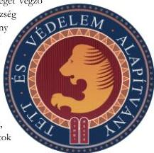

ÁLLAMI
SZÁMVEVŐSZÉK

# JELENTÉS

Az államháztartásból nyújtott támogatást
felhasználó egyesületek és alapítványok
ellenőrzése

Tett és Védelem Alapítvány

2026.

25137

www.asz.hu

---

ÁLLAMI
SZÁMVEVŐSZÉK

# JELENTÉS

Az államháztartásból nyújtott támogatást
felhasználó egyesületek és alapítványok
ellenőrzése

Tett és Védelem Alapítvány

2026.

25137

www.asz.hu

Dr. Szomolai Csaba
alelnök

---

ELLENŐRZÉSI IGAZGATÓSÁG:

ELLENŐRZÉSI IGAZGATÓSÁG V.

ELLENŐRZÉSI IGAZGATÓ:

KLINGA LÁSZLÓ igazgató

ELLENŐRZÉSVEZETŐ:

BÉCSI ANDREA ellenőrzésvezető

Jelentéseink az interneten a
www.asz.hu címen olvashatók.

IKTATÓSZÁM: EL-4032-018/2025

TÉMASORSZÁM: 35

ELLENŐRZÉS-AZONOSÍTÓ SZÁM: V108003

---

# TARTALOMJEGYZÉK

|  ■ ÖSSZEFOGLALÁS | 5  |
| --- | --- |
|  ■ AZ ELLENŐRZÉS EREDMÉNYEI | 8  |
|  1. Az Alapítvány által államháztartási forrásból kapott támogatások és azok felhasználása, továbbá a kapcsolódó elszámolások szabályszerűsége | 8  |
|  2. Az Alapítvány gazdálkodási keretei és könyvvezetési rendszere kialakításának szabályszerűsége az államháztartásból származó támogatások vonatkozásában | 13  |
|  3. Az Alapítvány jogszabályban előírt beszámolási kötelezettsége | 13  |
|  ■ JAVASLATOK | 15  |
|  ■ I. FÜGGELÉK: ÉSZREVÉTELEK | 16  |
|  ■ II. FÜGGELÉK: ELLENŐRZÉSI MEGKÖZELÍTÉS | 32  |
|  ■ MELLÉKLETEK | 36  |
|  I. sz. melléklet: Értelmező szótár | 36  |
|  II. sz. melléklet: Az ellenőrzött és ellenőrzést támogató szervezetek jegyzéke | 38  |
|  III. sz. melléklet: Ellenőrzött támogatások | 39  |
|  IV. sz. melléklet: A Brüsszel Intézet Nonprofit Kft. által az Alapítvány felé kiállított számlák | 40  |
|  ■ RÖVIDÍTÉSEK JEGYZÉKE | 41  |

3

---

# ÖSSZEFOGLALÁS

A civil szervezetek működését a Magyar Állam különböző formában támogathatja, költségvetési támogatásokkal, adókedvezményekkel vagy közfeladatok ellátására irányuló szerződések alapján nyújtott források biztosításával. Az Állami Számvevőszék (ÁSZ), mint az Országgyűlés legfőbb pénzügyi és gazdasági ellenőrző szerve, figyelemmel a társadalom részéről jogosan felmerülő elvárásra, törvényi felhatalmazás alapján ellenőrzi az államháztartásból nyújtott támogatások rendeltetésszerű és átlátható módon történő felhasználását, ezáltal átfogó képet nyújtva a közpénzből gazdálkodó szervezetek működéséről, tevékenységéről.

A Tett és Védelem Alapítvány (Alapítvány) jogvédő tevékenységet végző civil szervezet, melyet az Egységes Magyarországi Izraelita Hitközség (Alapító) alapított a 2012. évben. A 2018. évben az Alapítvány kezdeményezésére jött létre az Európai Tett és Védelem Liga*, mellyel az Alapítvány európai szintre terjesztette ki tevékenységét. Az Európai Tett és Védelem Liga szakmai feladatai ellátása érdekében az Alapítvány a 2019. évben 525,0 M Ft, majd a 2020. évtől évente 500,0 M Ft központi költségvetési támogatásban részesült. A támogató a 2020. évig a Miniszterelnökség volt, míg a 2021. évtől a Bethlen Gábor Alapkezelő Zrt. A támogatások felhasználásának, elszámolásának feltételeiről támogatási szerződés és támogatói okiratok rendelkeztek.

Az ellenőrzés hat, a 2020. és a 2023. év között folyósított, összesen 2 047,5 M Ft összegű központi költségvetési támogatás felhasználására, a támogatásokhoz kapcsolódó számviteli elszámolásokra, valamint az Alapítvány beszámolási kötelezettségének teljesítésére terjedt ki. Az Alapítvány bevétele az ellenőrzött időszakban majdnem teljes egészében az ellenőrzött központi költségvetési támogatásokból származott.

Az Alapító egy 2021. évben kelt Alapítói utasításban előírta az Alapítványnak likviditási kölcsönök folyósítását az Alapító és az Alapítvány gazdasági társasága, a Brüsszel Intézet Nonprofit Kft. részére. Az Alapítvány ezen likviditási kölcsönöket a támogatási szerződésben és támogatói okiratokban foglaltak ellenére a központi költségvetési támogatások terhére hajtotta végre. Az Alapítvány által nyújtott rövid lejáratú kölcsönök összege folyamatosan emelkedett, a 2021. év végén 544,3 M Ft, a 2022. évben 774,4 M Ft, míg a 2023. évben már 1 021,9 M Ft volt. Az Alapítvány a likviditási kölcsönök folyósításával a támogatási célok megvalósítására szolgáló forrásokat használta fel, melyek következtében a támogatások cél szerinti felhasználása nem teljesült.

Az Alapítvány mind a hat támogatás elszámolását végül – több támogatás esetében a támogatók felszólításait követően – benyújtotta a támogatók felé, öt támogatás esetében határidőn túl. A hat támogatás közül a támogatók kettő elszámolását elfogadták, a 2021. évben folyósított 500,0 M Ft-os támogatás támogatói okiratát a Bethlen Gábor Alapkezelő Zrt. – a beszámolási kötelezettség nem megfelelő teljesítése miatt – visszavonta, és a támogatás visszafizetését rendelte el. Három támogatás elszámolásának elfogadásáról a Bethlen Gábor Alapkezelő Zrt. az ÁSZ részére történt adatszolgáltatás lezárásáig még nem döntött.

Forrás: Tett és Védelem Alapítvány honlapja www.tev.hu

* Forrás: https://zsido.com/nemzetkozi-nyitas-megalakult-az-europai-tett-es-vedelem-liga/

5

---

Összefoglalás---

A 2020., a 2022. és a 2023. évi – összesen 1 500,0 M Ft összegű – támogatások elszámolása 895,0 M Ft értékben az Alapítvány gazdasági társasága, a Brüsszel Intézet Nonprofit Kft. által kiállított számlákat tartalmazott. Ebből 215,0 M Ft két tanulmány elkészítésére vonatkozott, melyből az egyik, egy 120,0 M Ft-ért elkészített tanulmány esetében a tanulmányon feltüntetett, annak keletkezésére utaló dátum későbbi volt, mint a támogatás felhasználásáról készített elszámolás támogató felé történt benyújtásának dátuma. Ez alapján az Alapítvány az elszámolásában olyan téttelt tüntetett fel, melyhez kapcsolódóan az elszámolás benyújtásakor a valós teljesítés nem történt meg.

A 895,0 M Ft-ból 680,0 M Ft értékben 9 db számla az Alapítvány, mint megrendelő és a Brüsszel Intézet Nonprofit Kft., mint vállalkozó között keletkezett, 2022. február 1-i keltezéssel ellátott, az online médiumok és a közösségi média nyilvánosan elérhető felületein történő adatgyűjtésre alkalmas szoftver elkészítésére vonatkozó Szolgáltatási szerződéshez kapcsolódott. Ezen számlák közül egyet, 105,0 M Ft összegben 2022. május 31-én bocsátott ki a Brüsszel Intézet Nonprofit Kft., azonban a számlával összefüggő gazdasági eseményeket a 2022. évben sem az Alapítvány, sem a gazdasági társaság nem rögzítette könyveiben. Annak megállapítása érdekében, hogy ezen kiállított számla mögött tényleges teljesítés állt-e, valamint a Szolgáltatási szerződés alapján történt további teljesítések a támogatási szerződésben és támogatói okiratokban foglaltaknak megfeleltek-e, az ÁSZ helyszíni ellenőrzést végzett az Alapítványnál.

A helyszíni ellenőrzés alapján az ÁSZ kockázatot azonosított a támogatások célszerű és szabályszerű felhasználásában, ezért ellenőrzést támogató szervezetként adatszolgáltatásra kérte fel a Brüsszel Intézet Nonprofit Kft-t és az Adóhatóságot¹.

Az ellenőrzést támogató szervezetektől származó adatszolgáltatások alapján a gazdasági társaság a szoftver elkészítéséhez alvállalkozókat is igénybe vett, a legjelentősebb Alvállalkozóval – ahogy azt a szerződés is rögzítette – annak cégbírósági bejegyzését megelőzően, 2023. május 14-én kötött a Szolgáltatási szerződéssel megegyező tárgyú szerződést. A vállalkozó cégbírósági bejegyzésének hiányára vonatkozó kitétel a korábban, 2022. február 1-jén kelt Szolgáltatási szerződésben is megjelent, azonban az a Brüsszel Intézet Nonprofit Kft., mint vállalkozó vonatkozásában nem volt értelmezhető. Szintén ellentmondást tartalmazott a két szerződés a szerzői jogok vonatkozásában is, ugyanis a szerződések által rögzített klauzulák azonosan azt tartalmazták, hogy a szoftver egyedüli szerzője a Vállalkozó, mely a Szolgáltatási szerződés szerint a Brüsszel Intézet Nonprofit Kft., míg a másik szerződés alapján az Alvállalkozó volt. Mindezen körülmények annak a gyanúját vetették fel az ellenőrzés során, hogy a 2022. február 1-i keltezéssel ellátott Szolgáltatási szerződés az Alvállalkozóval kötött szerződés alapján, annak mintájára, 2023. május 14-én vagy azt követően, visszadátumozva keletkezett annak érdekében, hogy az Alapítvány a támogatások határidőben történő felhasználását igazolni tudja.

A Brüsszel Intézet Nonprofit Kft-nél a szoftver elkészítése érdekében, annak Alapítvány részére 2024. január 31-én történő értékesítéséig 135,6 M Ft költség merült fel, melyből 52,6 M Ft a Brüsszel Intézet Nonprofit Kft. által elszámolt saját költség, míg 83,0 M Ft az alvállalkozók által kiállított számlák értéke. Ezzel szemben a szoftvert az Alapítvány tulajdonában álló és az Alapítvány kuratóriumi elnöke vezetése alatt működő Brüsszel Intézet Nonprofit Kft. az Alapítvány részére 464,4 M Ft-tal magasabb áron, 600,0 M Ft-ért értékesítette, mely a tényleges bekerülési érték több mint négyszerese. Ezzel az Alapítvány vezetése – a támogatási szerződésben és támogatói okiratokban foglaltak ellenére – a támogatásokat nem gazdaságosan, nem kellő gondossággal használta fel, a költségvetési támogatásokból saját gazdasági társaságának keletkeztetett profitot.

A Brüsszel Intézet Nonprofit Kft. által 895,0 M Ft összegben kiállított számlák közül 775,0 M Ft kiegyenlítése nem tényleges pénzügyi teljesítéssel történt, ezen számlák rendezéséről a felek a közöttük keletkezett, kompenzálásról szóló megállapodásokban rendelkeztek, melyek értelmében a számlák a Brüsszel

6

---

Összefoglalás---

Intézet Nonprofit Kft-nek az Alapítvány felé fennálló kölcsöntartozásával szemben történő kompenzálásával kerülnek kiegyenlítésre, mely a támogatók által előírtaknak nem felelt meg.

Az ellenőrzés értékelte az Alapítvány éves beszámolókészítési kötelezettségének teljesítését is. Az Alapítvány a 2021-2023. évekre vonatkozó számviteli beszámolóit a jogszabályban előírt határidőn túl és nem teljeskörűen tette közzé, a közzétett beszámolók nem tartalmazták a kiegészítő mellékleteket, melyekben az Alapítványnak be kellett volna mutatnia a kapott támogatások felhasználását. Az Alapítvány az ellenőrzött időszakban könyvvizsgálatra volt kötelezett, azonban jogszabályi kötelezettségének nem tett eleget, a 2021-2023. évi beszámolói felülvizsgálatára nem bízott meg könyvvizsgálót. Az Alapítvány a jogszabályban foglaltak ellenére nem gondoskodott az ügyvezető szervtől elkülönült felügyelő szerv létrehozásáról, mellyel az Alapítvány működése és gazdálkodása szabályszerűségének ellenőrzését kellett volna biztosítania.

Az ÁSZ véleménye az ellenőrzés által beazonosított jelentős hiányosságok alapján, hogy az Alapítvány a részére biztosított közpénzt felelőtlenül kezelte, a támogatások felhasználása a támogatási célok elérését veszélyeztette. Az Alapítványnál nem működtek olyan jogszabályban előírt kontrollok, amelyek a szabályszerű, átlátható gazdálkodást biztosíthatták volna. Ezen kontrollok hiánya, valamint a könyvvezetésben és számviteli beszámolókban észlelt hiányosságok együttesen eredményezték, hogy a beszámolók adatai nem voltak alkalmasak a megbízható és valós összkép bemutatására.

Az ellenőrzés során feltárt súlyos szabálytalanságok, törvénysértések és bűncselekmények gyanúja miatt – a központi költségvetésből származó támogatások céltól eltérő felhasználása, költségvetési csalás – az ÁSZ, törvényi kötelezettségének eleget téve, az illetékes hatósághoz fordult.

7

---

# AZ ELLENŐRZÉS EREDMÉNYEI

Az Alapítvány a 2021-2023. években – évi 500,0 M Ft összegben – összesen 1 547,5 M Ft központi költségvetésből származó támogatásban részesült, melyből 1 500,0 M Ft-ot az Európai Tett és Védelem Ligával kapcsolatos szakmai feladatainak ellátására, valamint 47,5 M Ft-ot egyéb célra kapott. Az Alapítvány az Európai Tett és Védelem Liga működtetése érdekében a 2020. évben is részesült 500,0 M Ft összegű központi költségvetési támogatásban, melyet a támogatás folyósításának évében nem használt fel és a könyveiben a teljes ellenőrzött időszakban nyilvántartott, ezért az ellenőrzés ezen támogatás felhasználására is kiterjedt.

Az Alapítvány bevételét az ellenőrzött időszakban évente átlagosan több mint 96,0%-ban a központi költségvetésből származó támogatások jelentették.

## 1. Az Alapítvány által államháztartási forrásból kapott támogatások és azok felhasználása, továbbá a kapcsolódó elszámolások szabályszerűsége

**Összegző megállapítás** Az Alapítvány a 2021-2023. években nyilvántartott, államháztartási forrásból kapott támogatásokat$_{1-6}$ nem szabályszerűen és nem a támogatási szerződésben / támogatói okiratokban$_{1-5}$ foglalt céloknak megfelelően használta fel. A támogatások$_{1-6}$ támogatók$_{1-2}$ felé történő elszámolása nem felelt meg a támogatási szerződésben / támogatói okiratokban$_{1-5}$ foglaltaknak.

**AZ ALAPÍTVÁNY AZ ELLENŐRZÉSSEL ÉRINTETT HAT TÁMOGATÁS$_{1-6}$ KÖZÜL EGY TÁMOGATÁS$_{1}$ ESETÉBEN TETT ELEGET HATÁRIDŐBEN A TÁMOGATÓI OKIRAT$_{1}$ ÁLTAL ELŐÍRT ELSZÁMOLÁSI KÖTELEZETTSÉGÉNEK.** Az Alapítvány a támogatás$_{6}$ kivételével a kapott támogatások$_{1-5}$ összegét a támogatási szerződésben / támogatói okiratokban$_{1-4}$ foglalt támogatott tevékenység eredeti megvalósítási időszakában nem használta fel. A támogatási szerződés szerinti támogatott tevékenység időtartamát a veszélyhelyzeti szabályokra vonatkozó 118/2022. (III. 22.) Korm. rendelet$^{4}$ meghosszabbította, míg a támogatói okiratokban$_{1-4}$ foglalt ezen határidőket a támogató$_{2}$ az Alapítvány által benyújtott kérelmek alapján módosította. A megvalósítási időszakok kiterjesztésével párhuzamosan a támogatások$_{1-5}$ felhasználásáról készítendő pénzügyi elszámolások benyújtására meghatározott elszámolási határidők is módosultak. A módosított elszámolási határidőt az Alapítvány ezen támogatások közül kizárólag a támogatás$_{5}$ esetében tartotta be.

- ▪ A **TÁMOGATÁS** vonatkozásában a támogatott tevékenység időtartama a 118/2022. (III. 22.) Korm. rendelet 2. § (1) bekezdés a) pontjában foglaltak alapján a 2020. január 1. és 2022. június 30. közötti időszakra terjedt ki, így a támogatási szerződés I. 3. pontja értelmében a támogatás$_{1}$ felhasználására 2022. július 31-ig, a pénzügyi elszámolás támogató$_{1}$ részére történő benyújtására 2022. augusztus 28-ig volt lehetősége az Alapítványnak. A támogatás$_{1}$ felhasználásáról készült pénzügyi elszámolást ezen határidőn túl, – a támogató$_{1}$ többszöri felszólítását követően – 2023. december 31. keltezéssel készítette el az Alapítvány, melyet a támogató$_{1}$ 2024. január 29-én fogadott el.

8

---

Az ellenőrzés eredményei

- A TÁMOGATÁS2,3,4 esetében az Alapítvány kezdeményezte a támogatói okiratokban foglalt megvalósítási időszakok meghosszabbítását, melyeket a támogató2 engedélyezett. A módosítások alapján a záró pénzügyi elszámolások benyújtásának határideje a támogatás2 vonatkozásában 2024. január 30-ra, a támogatás3 esetében 2024. március 1-re, míg a támogatás4 esetében 2024. július 30-ra változott. Az Alapítvány a pénzügyi elszámolásokat mindhárom támogatás esetében a támogató2 által jóváhagyott határidőn túl, 2024. október 16-án nyújtotta be elektronikus úton a támogató2 által működtetett Nemzetpolitikai Informatika Rendszer5 felületén. Az Alapítvány a támogatás2 vonatkozásában a beszámolási kötelezettségét nem megfelelően teljesítette, ezért a támogató2 2025. január 27-én a támogatáshoz2 kapcsolódó támogatói okirat1 visszavonásáról értesítette az Alapítványt, valamint elrendelte a támogatás2 és annak tőkeösszegét terhelő ügyleti kamat összegének visszautalását, összesen 534,8 M Ft összegben. A támogatás3,4 pénzügyi beszámolójának elfogadásáról az ÁSZ részére történt adatszolgáltatás lezárásáig a támogató2 nem döntött.
- A TÁMOGATÁS5 pénzügyi elszámolását az Alapítvány a beszámolási kötelezettség teljesítésére vonatkozó, módosult határidő utolsó napján, 2023. január 30-án nyújtotta be, melyet a támogató2 2024. május 28-án elfogadott.

A TÁMOGATÁS6 esetében az Alapítvány a támogatói okirat módosítását nem kezdeményezte, a pénzügyi elszámolást az eredetileg előírt 2024. január 30. helyett határidőn túl, 2024. február 5-én nyújtotta be. Az elszámolás elfogadásáról az ÁSZ részére történt adatszolgáltatás lezárásáig a támogató2 nem döntött.

AZ ALAPÍTVÁNY A KÖZPONTI KÖLTSÉGVETÉSBŐL KAPOTT TÁMOGATÁSOKBÓL KÖLCSÖN JOGCÍMEN RENDSZERESEN ÁTUTALÁSOKAT HAJTOTT VÉGRE az Alapító és a Brüsszel Intézet Nonprofit Kft.6 részére. Ezen rendszeres átutalásokat az Alapítvány az Alapító 2021. január 4-én kelt utasítása (Alapítói utasítás7) alapján, likviditást biztosító kölcsönként bocsátotta a kedvezményezettek részére. Az Alapítvány könyvvezetéséből származó adatok szerint

- a 2021. év mérlegfordulónapján az Alapítvány 544,3 M Ft összeg rövid lejáratú követelést tartott nyilván, melyből 48,4 M Ft a Brüsszel Intézet Nonprofit Kft-nek, míg 492,6 M Ft az Alapítónak nyújtott kölcsön volt;
- a 2022. év mérlegfordulónapján az Alapítvány által nyújtott kölcsönök összege 774,4 M Ft volt, melyből 105,1 M Ft a Brüsszel Intézet Nonprofit Kft-nek, míg 666,0 M Ft az Alapítónak nyújtott kölcsön volt;
- a 2023. év mérlegfordulónapján nyilvántartott rövid lejáratú kölcsönadott pénzeszköz összesen 1 021,9 M Ft volt, melynek szervezetek közötti megoszlásáról az Alapítvány könyvvezetése nem tartalmazott adatot.

A támogatások1-6 ilyen célú felhasználása nem felelt meg a támogatási szerződésben / támogatói okiratokban1-5 foglalt támogatási céloknak, nem járult hozzá a támogatási szerződés / támogatói okiratok1-5 szerinti támogatott tevékenység Alapítvány általi megvalósításához, mellyel az Alapítvány nem tett eleget a támogatási szerződés III. 24. pontjában, a támogatói okiratok1-5 IV. 11. pontjában, valamint a támogató2 ÁSZF1 6. 1. pontjában foglaltaknak, az Alapítvány a támogatásokat1-6 nem a támogatási céloknak megfelelően használta fel.

A TÁMOGATÁS1,3,4 FELHASZNÁLÁSÁRÓL KÉSZÍTETT ELSZÁMOLÁSOKBAN az Alapítvány a központi költségvetésből származó támogatások1,3,4 összegéből összesen 680,0 M Ft

9

---

Az ellenőrzés eredményei

értékben az Alapítvány által alapított gazdasági társaság, a Brüsszel Intézet Nonprofit Kft. által kiállított számlákat tüntetett fel, egy az Alapítvány, mint Megrendelő és a Brüsszel Intézet Nonprofit Kft., mint Vállalkozó között létrejött, 2022. február 1-i keltezéssel ellátott Szolgáltatási szerződés$^{8}$ és annak – szintén 2022. február 1-i dátummal ellátott – módosítása alapján.

A Szolgáltatási szerződés$_{1}$ tárgya „*szoftvermegoldás – speciális online keresési módszer – és a hozzá tartozó alkalmazás (felület) kifejlesztése, az Alapítvány által meghatározott adatbázisok létrehozása azok folyamatos kezelése üzemeltetése, frissítése és karbantartása*” volt. A szoftver fejlesztését a Brüsszel Intézet Nonprofit Kft. bruttó 420,0 M Ft-ért vállalta, a szerződéses ellenérték kiegyenlítését – a teljesítés fázisaihoz igazodva – két ütemben határozták meg a felek, egy bruttó 105,0 M Ft és egy bruttó 315,0 M Ft összegű számla pénzügyi teljesítéséről állapodtak meg. A Szolgáltatási szerződés$_{1}$ ezen felül tartalmazta a szoftver funkcionalitásának biztosításáért fizetendő szolgáltatási díjat is, az egy év tesztidőszakra egyösszegben bruttó 180,0 M Ft, valamint ezt követően havi bruttó 15,0 M Ft, továbbá az oktatás és betanítás egyszeri díját 5,0 M Ft összegben.

A Brüsszel Intézet Nonprofit Kft.-től, mint ellenőrzést támogató szervezettől származó adatok és dokumentumok alapján a Brüsszel Intézet Nonprofit Kft. a Szolgáltatási szerződésben$_{1}$ foglalt kötelezettségei teljesítése érdekében a szoftver fejlesztésébe alvállalkozókat vont be. A legjelentősebb **Alvállalkozóval$^{9}$ a Brüsszel Intézet Nonprofit Kft., mint Megrendelő 2023. május 14-én kötött Szolgáltatási szerződést$^{10}$**. A Szolgáltatási szerződés$_{2}$ megkötésekor az Alvállalkozó cégbírósági bejegyzése még nem történt meg, melyet a Szolgáltatási szerződés$_{2}$ „*Preambulum*” fejezete is rögzített („*Jelen szerződés a felek közös megegyezése alapján csak a Vállalkozó hivatalos cégbejegyzését követően, a cégjegyzék és a bankszámlaszám bejegyzésével lép hatályba*”). Ugyanezen hivatkozás a korábbi, 2022. február 1-i dátummal ellátott Szolgáltatási szerződés$_{1}$ „*Preambulum*” fejezetében is szerepelt, azonban ez a Szolgáltatási szerződés$_{1}$ keletkezésekor a Brüsszel Intézet Nonprofit Kft., mint Vállalkozó vonatkozásában nem volt értelmezhető. A fentiek alapján **felmerült annak a gyanúja, hogy a 2022. február 1-i dátummal ellátott Szolgáltatási szerződés$_{1}$ ténylegesen a Brüsszel Intézet Nonprofit Kft. és az Alvállalkozó között kötött Szolgáltatási szerződés$_{2}$ alapján, annak mintájára, 2023. május 14-én vagy azt követően, visszadátumozva keletkezett.** A gyanút megerősíti, hogy mindkét Szolgáltatási szerződés$_{1,2}$ azonos módon rögzítette a szoftverre vonatkozó szerzői jogokat. Mind a Szolgáltatási szerződés$_{1}$, mind a Szolgáltatási szerződés$_{2}$ értelmében a Vállalkozó a szoftver egyedüli szerzője, azonban a Vállalkozó a Szolgáltatási szerződés$_{1}$ esetében a Brüsszel Intézet Nonprofit Kft., míg a Szolgáltatási szerződés$_{2}$ szerint a Brüsszel Intézet Nonprofit Kft.-vel szerződött Alvállalkozó volt. A gyanúról az ÁSZ, törvényi kötelezettségének eleget téve, az illetékes hatóságot értesítette.

Az Alapítvány a **TÁMOGATÁS** felhasználásáról szóló, a támogató$_{1}$ felé benyújtott elszámolásban a **Szolgáltatási szerződés** alapján – a teljesítés első üteméhez kapcsolódóan – 2022. május 31-én kelt és a Brüsszel Intézet Nonprofit Kft. által **bruttó 105,0 M Ft-ról kiállított számlát tüntetett fel** (2022_23 azonosítójú mintatétel). A számla ellenértékének rendezésére a felek között 2022. május 31-én dátummal ellátott megállapodás értelmében a Brüsszel Intézet Nonprofit Kft.-nek az Alapítvány felé fennálló ugyanekkora összegű kölcsöntartozásával szemben történő kompenzálásával kerül sor annak ellenére, hogy a támogatási szerződés$_{1}$ IV. 26. a) pontjában a pénzügyi teljesítést alátámasztó bizonylatként a kompenzálásra vonatkozó megállapodás, a pénzügyi teljesítés lehetséges formái között a kompenzálás nem szerepelt. A számla alapján az Alapítvány a „*keresőmotor*” immateriális javak között 105,0 M Ft bekerülési értéken történő nyilvántartásba vételéről 2022. május 31-i dátummal egy üzembehelyezésről (aktiválásról) szóló jegyzőkönyvet is kiállított. Az ÁSZ megállapította, hogy **az Alapítvány a 2022. május**

10

---

Az ellenőrzés eredményei

**31-i keltezéssel készült dokumentumok alapján a gazdasági eseményeket nem rögzítette könyveiben**, valamint a számlát kiállító Brüsszel Intézet Nonprofit Kft. közhiteles adatbázisban, nyilvánosan elérhető 2022. évi számviteli beszámolójának eredménykimutatása a számla 82,7 M Ft nettó értékét nem tartalmazta, az eredménykimutatás értékesítés nettó árbevétele soron mindösszesen 8,8 M Ft szerepelt.

Az Alapítvány azáltal, hogy a 2022. évben nem könyvelt le minden olyan gazdasági eseményt, amelynek az eszközökre és a forrásokra gyakorolt hatását a beszámolóban ki kellett volna mutatnia, megsértette a Számv. tv. 15. § (2) bekezdésében foglalt teljesség elvét, valamint az Alapítvány 2022. évre vonatkozó számviteli beszámolója – a Számv. tv. 4. § (2) bekezdésében foglaltak ellenére – nem adott megbízható és valós összképet az Alapítvány vagyonáról, vagyonának összetételéről.

Az Alapítvány a Brüsszel Intézet Nonprofit Kft. által kiállított számlát a támogatás felhasználásáról készített pénzügyi elszámolás támogató felé történt benyújtásáig (2023. december 31.) könyveiben nem vette nyilvántartásba, a számlát a pénzügyi elszámolásban, a támogatás felhasználásának igazolására használta fel, mely felveti a Btk.¹¹ 396. §-a szerinti költségvetési csalás gyanúját. Az ÁSZ, a felmerült gyanúról, törvényi kötelezettségének eleget téve, mind a támogatót, mind az illetékes hatóságot értesítette. A támogató az ÁSZ jelzése alapján vizsgálatot indított, melynek eredményeképp 2025. szeptember 3-án feljelentést tett.

Az Alapítvány a szoftvert számviteli nyilvántartásában az immateriális javak között, 105,0 M Ft összegben a 2023. évre vonatkozó beszámolója összeállítását és 2025. február 19-i közzétételét követően (már az ÁSZ ellenőrzés időszakában) rögzítette, megsértve ezzel a Számv. tv. 15. § (2) bekezdésében foglalt teljesség elvét, valamint a Számv. tv. 19. § (3) bekezdésében foglaltakat.

A **TÁMOGATÁS** felhasználásához kapcsolódó, támogató felé benyújtott pénzügyi elszámolás mindhárom tétele (Minta7-9 azonosítójú mintatételek) összesen **500,0 M Ft összegben a Szolgáltatási szerződésben és annak módosításában foglaltak teljesítéséhez kapcsolódott**. A Brüsszel Intézet Nonprofit Kft. által 2024. január 31-én kiállított számlákat az Alapítvány könyveiben rögzítette, a szoftvert aktiválta és az immateriális javak között – a 2022. május 31-én kelt 105,0 M Ft összegű számlát is figyelembe véve – összesen 600,0 M Ft értékben kimutatta. A támogatás elszámolásában szereplő mindhárom számla esetében tényleges, pénzmozgással járó pénzügyi teljesítés nem történt, a számlák ellenértéke az Alapítvány és a Brüsszel Intézet Nonprofit Kft. között kötött írásbeli megállapodás alapján kompenzálásra került a Brüsszel Intézet Nonprofit Kft-nek Alapítvány felé fennálló kölcsöntartozásával szemben. A számlák kompenzálással történő kiegyenlítése a támogató által kibocsátott támogatói okirat VII. 21. pontjában hivatkozott, a támogatói okirat elválaszthatatlan részét képező Elszámolási útmutató¹² 4.6. pontjában előírtaknak nem felelt meg, a pénzügyi teljesítés (kifizetés) lehetséges formái között a kompenzálás az Elszámolási útmutató 4. 6. pontjában nem szerepelt.

Az 500,0 M Ft összegű **TÁMOGATÁS** vonatkozásában a támogató felé benyújtott pénzügyi elszámolás összesen **290,0 M Ft** összegben hét olyan tételt (Minta11-15, Minta18-19 azonosítójú mintatételek) tartalmazott, melyhez kapcsolódó számlákat a **Brüsszel Intézet Nonprofit Kft. állította ki az Alapítvány részére**. Ezen számlák közül ötöt (Minta11-15 azonosítójú mintatételek), összesen **75,0 M Ft összegben a Szolgáltatási szerződéshez kapcsolódóan a szoftver működtetésének ellentételezésére, egyet** (Minta18 azonosítójú mintatétel), **120,0 M Ft összegben, a tanulmánykészítésre vonatkozó Vállalkozási szerződés¹³, és egyet** (Minta19 azonosítójú mintatétel), **95,0 M Ft összegben, a Kutatási szerződés¹⁴ alapján készített tanulmányhoz kapcsolódóan bocsátott ki**. A hét tétel közül hat esetében, összesen 170,0 M Ft értékben a számlákhoz tényleges

11

---

Az ellenőrzés eredményei---

pénzügyi teljesítés nem kapcsolódott, a számlák ellenértéke az Alapítvány és a Brüsszel Intézet Nonprofit Kft. között kötött írásbeli megállapodás alapján kompenzálással került rendezésre a Brüsszel Intézet Nonprofit Kft. Alapítvány felé fennálló kölcsöntartozásával szemben, mely a támogatói okirat elválaszthatatlan részét képező Elszámolási útmutató 4. 6. pontjában előírtaknak nem felelt meg.

Egy tétel esetében a 120,0 M Ft összegű számla banki átutalással teljesült, a pénzügyi teljesítés az Alapítvány bankszámláján forgalmat generált, azonban a kifizetést nem közvetlenül a támogatás összegéből finanszírozta az Alapítvány, az átutalás fedezetét az Alapítótól befolyt és kölcsön jogcímen jóváírt összegek alkották. Ez utóbbi mintatételhez tartozó Vállalkozási szerződés alapján elkészített tanulmány a szerződés szerinti teljesítés 2024. június 30-i időpontjához, a 2024. július 15-i pénzügyi teljesítés és az elszámolás 2024. október 16-i benyújtásának napjához képest későbbi keltezést, 2024. december 10. napját tartalmazott. Ennek alapján felmerült annak a gyanúja, hogy az Alapítvány a támogatás felhasználásáról készített és a támogató felé benyújtott pénzügyi elszámolásban olyan tételt tüntetett fel, melyhez kapcsolódóan az elszámolás benyújtásakor a tényleges teljesítés nem történt meg. Ez a körülmény felvetette a Btk. 396. §-a szerinti költségvetési csalás gyanúját, mely miatt az ÁSZ, törvényi kötelezettségének eleget téve, az illetékes hatósághoz fordult.

A Brüsszel Intézet Nonprofit Kft. – adatszolgáltatása alapján – a szoftver 2024. január 31-i késztermékké minősítéséig és az Alapítvány részére történő értékesítéséig, valamint az Alapítványnál történt aktiválásig a szoftver elkészítése érdekében 52,6 M Ft saját költséget számolt el könyveiben. Az alvállalkozói teljesítések számlával alátámasztott, elszámolt összege összesen 83,0 M Ft volt, így a Brüsszel Intézet Nonprofit Kft.-nél a szoftver előállítása érdekében felmerült költségek mindösszesen 135,6 M Ft-ot tettek ki. Ezzel szemben a Brüsszel Intézet Nonprofit Kft. a szoftvert az Alapítvány részére több mint négyszeres áron, 464,4 M Ft-tal magasabb összegért, összesen 600,0 M Ft-ért értékesítette (támogatás elszámolása alapján 105,0 M Ft, támogatás elszámolása alapján 495,0 M Ft). A támogatások ilyen módon történő felhasználása nem felelt meg a támogatási szerződésben, valamint támogató ÁSZF$^{15}$-ében rögzített előírásnak, mely szerint a támogatásokat hatékonyan, gazdaságosan, megfelelő gondossággal kell felhasználni. Az ÁSZ emiatt, törvényi kötelezettségének eleget téve, az illetékes hatósághoz fordult.

Az Alapítvány nem tartotta be a támogatás összegének felhasználásáról készített pénzügyi elszámolásból származó ellenőrzött tételek közül kilenc (2021_17-2021_22, 2021_24, 2021_25, 2022_24 azonosítójú mintatételek) esetében a vonatkozó támogatási szerződés IV/26. Pénzügyi elszámolás b) pontjában előírtakat, a támogatás vonatkozásában 1 db mintatétel (2022_22 azonosítójú mintatétel) esetében a támogató ÁSZF$_{2}$-ének 6. 5. pontjában, valamint a támogatás vonatkozásában nyolc mintatétel (Minta10-12, Minta14-17, Minta19 azonosítójú mintatételek) esetében a támogató ÁSZF$_{3}$-ének 6. 5. pontjában, illetve az Elszámolási útmutató 4. 9. pontjában foglaltakat, ugyanis ezen tételek vonatkozásában a támogatások felhasználásának igazolását dokumentáló eredeti számviteli bizonylatokat nem záradékolta, az eredeti számlákra, bizonylatokra, egyéb okiratokra nem vezette rá, hogy azokat mely támogatás terhére számolta el.

12

---

Az ellenőrzés eredményei

## 2. Az Alapítvány gazdálkodási keretei és könyvvezetési rendszere kialakításának szabályszerűsége az államháztartásból származó támogatások vonatkozásában

|  **Összegző megállapítás** | **Az Alapítvány gazdálkodási kereteinek és a könyvvezetési rendszerének kialakítása a 2021-2023. években az államháztartásból származó támogatások vonatkozásában nem felelt meg a jogszabályi előírásoknak. Az Alapítvány a jogszabályi előírások ellenére nem gondoskodott könyvvizsgáló megbízásáról és felügyelő szerv létrehozásáról.**  |
| --- | --- |

Az ellenőrzött időszakban az Alapítvány könyvvezetése a kettős könyvvitel rendszerében történt, a könyvvezetés módja megfelelt a Civil tv.$^{16}$ és az Eszkr.$^{17}$ előírásainak.

Az Alapítvány számviteli beszámolóiban kimutatott éves bevétele a 2019. évben 121,4 M Ft, a 2020. évben 692,0 M Ft, a 2021. évben 288,9 M Ft, a 2022. évben 450,8 M Ft volt. Ezt figyelembevéve az Alapítvány éves bevétele az üzleti évet megelőző két üzleti év átlagában meghaladta a 300,0 M Ft-ot, így a 2021-2023. évek vonatkozásában az Eszkr. előírásai alapján könyvvizsgálatra volt kötelezett. Az Alapítvány az Eszkr. 16. § (1) bekezdésében foglaltak ellenére a 2021-2023. évi beszámoló felülvizsgálatára nem bízott meg könyvvizsgálót.

Az Alapítvány az ellenőrzött időszakban közhasznú jogállású szervezetként működött, az éves bevétele a 2021-2023. években meghaladta az 50,0 M Ft-ot, azonban a Civil tv. 40. § (1) bekezdésében előírtak ellenére az Alapítvány nem gondoskodott a vezető szervtől elkülönült felügyelő szerv létrehozásáról, így nem biztosította működésének és gazdálkodásának ellenőrzését.

## 3. Az Alapítvány jogszabályban előírt beszámolási kötelezettsége

|  **Összegző megállapítás** | **Az Alapítvány 2021-2023. évi könyvvezetési-, beszámolási és közzétételi kötelezettségének teljesítése nem volt szabályszerű.**  |
| --- | --- |

Az Alapítvány a 2021-2023. évekre vonatkozó egyszerűsített éves számviteli beszámolóit és közhasznúsági mellékleteit a Civil tv. 30. § (1) bekezdésében előírt határidőn túl tette közzé; a 2021. évi beszámolót 2022. október 25-én, a 2022. évi beszámolót 2023. augusztus 18-án, a 2023. évi beszámolót 2025. február 19-én küldte meg az OBH-nak$^{18}$ közzététel és letétbe helyezés céljából.

A Civil tv. 30. § (1) bekezdésében és az Eszkr. 7. § (6) bekezdésében foglaltak ellenére a beszámolók részeként nem tette közzé a kiegészítő mellékleteket, valamint a 2023. évre vonatkozó számviteli beszámolója részeként elkészített eredménykimutatást az Eszkr. 7. § (6) bekezdésében foglaltak ellenére nem az Eszkr. 4. melléklete szerinti formában készítette el, ugyanis a beszámolót az eredménykimutatás tájékoztató adatainak bemutatását szolgáló oldal nélkül helyezte letétbe.

A 2021-2023. évekre vonatkozóan közzétett közhasznúsági mellékletek a Civil tv. 29. § (6) bekezdésében foglaltak ellenére nem tartalmazták az Alapítvány által végzett közhasznú tevékenységeket, ezen tevékenységek fő célcsoportjait és eredményeit, valamint a Civil tv. 29. § (7) bekezdésében előírtak

13

---

Az ellenőrzés eredményei

ellenére nem tartalmaztak adatot a vezető tisztségviselőknek nyújtott juttatások összegére és a juttatásban részesülő vezető tisztségekre vonatkozóan. A Civil tv. 29. § (7) bekezdésében foglaltak ellenére a 2021. és 2023. évre vonatkozó közhasznúsági mellékletek egyáltalán nem, míg a 2022. évre szóló közhasznúsági melléklet nem teljeskörűen tartalmazta a (közhasznú) cél szerinti juttatások kimutatását.

Az Eszkr. 14. § (2) bekezdésében foglaltak ellenére az Alapítvány 2021. évi beszámolója eredménykimutatásának tájékoztató adatai között nem mutatta be a központi költségvetésből származó támogatások összegét.

Az Alapítvány 2021-2023. évi számviteli beszámolóiban szereplő adatok nem feleltek meg a Számv. tv. alábbiakban részletezett előírásainak:

- A 2022. évre vonatkozó számviteli beszámoló eredménykimutatásában 428,2 M Ft könyvvezetéssel alátámasztott egyéb bevétel került bemutatásra. Az egyéb bevételeken belül a kapott támogatások összegeként az Alapítvány helytelenül ennél magasabb összeget 553,4 M Ft-ot tüntetett fel, mely a Számv. tv. 20. § (1) bekezdésében foglaltak ellenére nem volt a könyvvezetéséből származó adatokkal alátámasztott.
- A 2022. évre vonatkozó számviteli beszámoló „előző év helyesbítése” oszlopában a Számv. tv. 19. § (3) bekezdésében foglaltak ellenére az Alapítvány nem az előző éve(ek)re vonatkozó – a mérlegkészítés napjáig megismert és nem vitatott, nem fellebbezett, illetve a jogerőssé vált megállapítások miatti – módosításokat mutatta be, hanem a 2021. évi beszámoló módosított adatait tüntette fel.

Az Alapítvány 2021-2023. évi könyvvezetése a kapott támogatások nyilvántartásával összefüggésben a korábban részletezetteken felül nem felelt meg a Számv. tv. alábbi előírásainak sem:

- Az Alapítvány a számviteli nyilvántartásaiban a vissza nem térítendő, 100%-os előlegként kapott támogatásokat, azok bevételként történő elszámolásakor a Civil tv. 20. § (2) bekezdés a) pontja és (3) bekezdés a) pontja előírásai ellenére nem mutatta be, hogy a kapott támogatások államháztartási forrásból, és ezen belül központi költségvetésből származó támogatások voltak.
- Az Alapítvány a Számv. tv. 161/A. § (2) bekezdésben és a Civil tv. 20. § (4) bekezdésében előírtak ellenére a támogatások felhasználásáról nem vezetett olyan elkülönített számviteli nyilvántartást, mely alapján támogatásonként megállapítható és könyvvezetése alapján ellenőrizhető lett volna ezek felhasználása.
- A Számv. tv. 167. § (1) bekezdés h) pontjában előírtak ellenére a támogatás felhasználásához kapcsolódó számviteli bizonylatok egyike sem tartalmazta, míg a támogatás felhasználását alátámasztó, 10 ellenőrzött tétel közül öthöz (Minta11, Minta12, Minta14, Minta15, Minta19 azonosítójú mintatételek) kapcsolódó számviteli bizonylatok nem tartalmazták a könyvelés módjára, az érintett könyvviteli számlákra történő hivatkozást.

14

---

# JAVASLATOK

Az ÁSZ tv. 33. § (1) bekezdésében foglaltak értelmében az ellenőrzött szervezet vezetője köteles a jelentésben foglalt megállapításokhoz kapcsolódó intézkedési tervet összeállítani és azt a jelentés kézhezvételétől számított 30 napon belül az ÁSZ részére megküldeni. Az ÁSZ a jelentésben foglalt megállapításokhoz kapcsolódóan az alábbi javaslatok tekintetében várja el az intézkedési terv elkészítését.

## TETT ÉS VÉDELEM ALAPÍTVÁNY KURATÓRIUMI ELNÖKEI

1. Gondoskodjanak arról, hogy az Alapítvány az államháztartási forrásból kapott támogatásokat a támogatói okiratokban foglaltaknak megfelelően használja fel.
2. Gondoskodjanak arról, hogy az Alapítvány a könyvvezetése során, valamint a számviteli beszámoló elkészítésekor a hatályos Számv. tv., Civil tv. és Eszkr. rendelkezéseit tartsa be. Ennek keretében gondoskodjon arról, hogy a számviteli nyilvántartások és a beszámoló a jogszabályban meghatározott formai és tartalmi követelményeknek feleljen meg annak érdekében, hogy valós és megbízható képet adjon a szervezet vagyoni, pénzügyi és jövedelmi helyzetéről.
3. Gondoskodjanak arról, hogy az Alapítvány működéséről, vagyoni, pénzügyi és jövedelmi helyzetéről szóló beszámolóját a bizonylatokkal alátámasztott, szabályszerűen vezetett kettős könyvvitel adatai alapján készítse el a Számv. tv. 20. § (1) bekezdésében foglaltak szerint.
4. Gondoskodjanak a Civil tv. 40. § (1) bekezdésében előírtaknak megfelelően felügyelő szerv létrehozásáról.
5. Amennyiben az Alapítvány éves (éves szintre átszámított) bevétele az üzleti évet megelőző két üzleti év átlagában meghaladja a jogszabályban előírt összeget, az Eszkr. 16. § (1) bekezdés előírásainak megfelelően tegyen eleget a kötelező könyvvizsgálati kötelezettségnek.

15

---

# I. FÜGGELÉK: ÉSZREVÉTELEK

*A jelentéstervezetet az ÁSZ 15 napos észrevételezésre megküldte az ellenőrzött szervezet vezetőjének az ÁSZ tv. 29. §\* (1) bekezdése előírásának megfelelően.*

*A Függelék tartalmazza a Tett és Védelem Alapítvány által megtett és az ÁSZ által figyelembe nem vett észrevételeket, valamint azok el nem fogadásának indoklását.*

\* 29. § (1) Az Állami Számvevőszék az ellenőrzési megállapításait megküldi az ellenőrzött szervezet vezetőjének vagy az általa megbízott személynek, és annak, akinek személyes felelősségét állapította meg.

(2) Az ellenőrzött szervezet vezetője és a felelősként megjelölt személy az ellenőrzés megállapításaira tizenöt napon belül írásban észrevételt tehet.

(3) Az Állami Számvevőszék az észrevételre a beérkezésétől számított harminc napon belül írásban válaszol. A figyelembe nem vett észrevételeket köteles a jelentésben feltüntetni, és megindokolni, hogy azokat miért nem fogadta el.

16

---

I. Függelék: Észrevételek

A felhasználót a dokumentumhoz
rendelte:
Idomsoft Zrt.

**Klinga László Ellenőrzési Igazgató Úr**
részére!

Állami Számvevőszék Ellenőrzési Igazgatóság V.
1052 Budapest
Apáczai Csere János u. 10.

Hivatkozási szám: EL-4086-124/2025 ikt. szám

Tárgy: Észrevételek az Állami Számvevőszék által a Tett és Védelem Alapítvány a
költségvetési támogatások felhasználását vizsgáló jelentéstervezetéhez

# **Észrevétel**

Az Állami Számvevőszék által a Tett és Védelem Alapítvány a költségvetési támogatások
felhasználását vizsgáló jelentéstervezetéhez

**Tisztelt Klinga László Ellenőrzési Igazgató Úr,**
**Tisztelt Állami Számvevőszék!**

*Előzmények:*

Az Állami Számvevőszék a Tett és Védelem Alapítványnál lefolytatott ellenőrzés
keretében az Állami Számvevőszékről szóló 2011. évi LXVI. törvény (továbbiakban: ÁSZ
tv.) 25. § (3) bekezdésében foglaltak alapján a Brüsszel Intézet Nonprofit Kft.-t ellenőrzést
támogató szervezetként adatszolgáltatásra kérte fel. Az Állami Számvevőszék a Brüsszel
Intézet Nonprofit Kft. által rendelkezésre bocsátott adatokat és dokumentumokat
használta fel az az ellenőrzés során.

Az ellenőrzés megállapításait tartalmazó „Az államháztartásból nyújtott támogatást
felhasználó egyesületek és alapítványok ellenőrzése – Tett és Védelem Alapítvány” című
számvevőszéki jelentés tervezetét megküldte a Tett és Védelem Alapítvány részére,
mellyel kapcsolatban a rögzítettek vonatkozásában az Alapítvány Elnöke tizenöt napon
belül észrevételt tehet.

Az ellenőrzés hat, a 2020. és a 2023. év között folyósított, összesen 2 047,5 M Ft összegű
központi költségvetési támogatás felhasználására, a támogatásokhoz kapcsolódó
számviteli elszámolásokra, valamint az Alapítvány beszámolási kötelezettségének
teljesítésére terjedt ki.

*Észrevételek:*

A Tett és Védelem Alapítvány ezen időszak alatt az alábbi támogatásokban részesült:

1

17

---

I. Függelék: Észrevételek

|  Támogatás azonosító | Elszámolási határidő | Kedvezményezett neve | Pályázat címe | Megfelelt összeg (e HUF) | Módosítás időpontja  |
| --- | --- | --- | --- | --- | --- |
|  CNP-KP-1-2024/1-000079-VAL-ELS/001 | 2025.03.01 | Tett és Védelem Alapítvány | Az Európai Tett és Védelem Ligával kapcsolatos kiadások - 2024. évi szakmai feladatainak támogatása | 500 000 | 2024.09.30 10:41  |
|  CNP-KP-1-2023/1-000136-VAL-ELS/001 | 2024.01.30 | Tett és Védelem Alapítvány | Közös értékek erősítése a magyar-utolsó kapcsolatokban - 2023. | 9 500 | 2024.02.06 14:42  |
|  CNP-KP-1-2023/1-000054-VAL-ELS/002 | 2024.07.30 | Tett és Védelem Alapítvány | Az Európai Tett és Védelem Ligával kapcsolatos kiadások - 2023. évi szakmai feladatok ellátásának támogatása | 500 000 | 2024.09.13 13:59  |
|  CNP-KP-1-2022/1-000023-VAL-ELS/004 | 2024.03.01 | Tett és Védelem Alapítvány | Az Európai Tett és Védelem Ligával kapcsolatos kiadások 2022. évi szakmai feladatok ellátásának támogatása | 500 000 | 2024.09.13 10:44  |
|  CNP-KP-1-2021/1-000023-VAL-ELS/003 | 2024.01.30 | Tett és Védelem Alapítvány | Az Európai Tett és Védelem Ligával kapcsolatos kiadások-2021. évi szakmai feladatok ellátásának támogatása | 500 000 | 2024.09.20 11:59  |
|  OF/JSZF/222/8/2020 | 2023.12.31. | Tett és Védelem Alapítvány | Az Európai Tett és Védelem Ligával kapcsolatos kiadások-2020. évi szakmai feladatok ellátásának támogatása | 500 000 | 2023.07.15  |

Ezen támogatások felhasználása kapcsán a Brüsszel Intézet Nonprofit Kft. csak részben működött közre a Tett és Védelem Alapítvány teljesítési segédként, némelyik támogatás esetében az Alapítvány egyáltalán nem vonta be a Brüsszel Intézet Nonprofit Kft.-t közreműködőként a támogatási összegek felhasználásába.

Az alábbiakban részletezzük a Tett és Védelem Alapítvány észrevételeit az államháztartásból nyújtott támogatások felhasználásáról készült jelentéstervezethez.

A Tett és Védelem Alapítvány az EMIH – Magyar Zsidó Szövetség kezdeményezésére jött létre 2012-ben, a romló minőségű közbeszéd, a kirekesztés, az antiszemitizmus táptalaját adó ismerethiány felszámolására, a pozitív zsidó identitás és közösségszerveződés stratégiája mentén.

Az Alapítvány **küldetése**: az identitását és hagyományait büszkén vállaló, aktív és önszerveződő – vagyis nem a napi politikai érdekek eszközeként megjelenő – zsidó közösség megteremtése.

Ezt a célt az Alapítvány jogvédelem-kutatás-oktatás hármas tevékenység mentén kívánja elérni.

### Jogvédelem, jogsegély

A Tett és Védelem Alapítvány kiemelten fontos feladatának tartja, hogy az antiszemita indíttatású és holokauszttagadó bűncselekményeket és vétségeket felkutassa és a nyomozóhatóságok elé tárja, így segítve a büntetés legfontosabb célját, a visszatartó erő növelését. Ennek érdekében élt a hatályos magyar törvények és jogszabályok által biztosított -az Európai Unió jogelveivel mindenben harmonizáló- lehetőségekkel, melyekben az utóbbi években jelentős változások történtek.

Alaptörvényben került rögzítésre Magyarországon a **közösségek méltóságának védelme**, mely a közösséget ért sérelem esetén lehetőséget biztosít sérelemdíj iránti kereset indítására. Ezen jogintézmény szabályozása a Polgári Törvénykönyvben került kodifikálásra.

**Holokauszttagadás:** Mára kialakult gyakorlat alapján mind a rendvédelmi szervek, mind pedig az Ügyészség és Bíróságok a törvény betűjével és annak szelemével megegyező jogalkalmazási gyakorlatot alakítottak ki a zéró tolerancia jegyében.

2

18

---

I. Függelék: Észrevételek---

**A közösség elleni uszítás:** Az Országgyűlés 2016. október 28-ai határozatában módosította a Büntető Törvénykönyvet, melyben a közösség elleni uszítás törvényi tényállásának elkövetési magatartását bővítette oly módon, hogy az erőszakra uszítást is megjelenítette, amellyel egyértelművé vált, hogy a gyűlöletre és az erőszakra uszítás nem azonos fogalmak. Ennek következtében a korábban kiüresített jogszabály jelenős változtatása mérföldkőnek tekinthető a gyűlöletcselekmények elleni hatékony fellépésben.

**Elektronikus adatok hozzáférhetetlenné tétele** jogszabályi rendelkezés az új Büntető Törvénykönyv (2012. évi C. tv.) hatályba lépésével - és a szintén módosult Büntetőeljárási Törvény (2017. évi XC. tv.) vonatkozó rendelkezése alapján - új jogintézményként lehetőséget teremt a gyűlölet-bűncselekményeket megvalósító tartalmak elérhetetlenné tételére, megteremtve a jogszabályi lehetőséget a főként interneten terjedő bűncselekményeknek megállításának.

#### **Oktatás, képzés**

Az előítélet melegágya a tudatlanság, ezért az Alapítvány továbbra is kiemelt feladatának tekinti az **oktatást, képzést**, a tévhitek eloszlatását. Ezt nem lehet elég korán kezdeni, ezért elsősorban az iskolai rendszerbe bekerült 14-24 éves korosztályt célozta meg oktatási programjainkkal. A világon egyedülálló módon az oktatási kormányzattal közösen a Nemzeti Alaptanterv keretében megújuló tankönyvek zsidó vonatkozású tartalmait az Alapítvány oktatási munkacsoportja **véleményezi** és a szerkesztői egyeztetések után olyan új tankönyvek kerülnek alkalmazásra, melyek normaszövege tükrözi a zsidó közösségek álláspontját.

#### **Antiszemita incidens-monitoring, kutatás**

A Tett és Védelem Alapítvány évek 2013 óta havi és éves antiszemita incidensekről monitoringjelentést készít az Európai Biztonsági és Együttműködési Szervezet (EBESZ) módszertani ajánlásai alapján és éves jelentést küld a szervezet számára a magyarországi gyűlöletcselekményekről.

A Medián Közvélemény- és Piackutató Intézet a Tett és Védelem Alapítvány megbízásából 2013 óta minden évben átfogó felmérést végez a magyar társadalom zsidósághoz való viszonyáról. 2020 évben ezt a kutatást 16 európai országra kiterjesztve elvégezte, melyhez hasonló kutatás sem előtte, sem utána nem került publikálásra, így a maga nemében teljesen unikális.

Ezen képességeket és a magyarországi gyakorlat hasznosságát felismerve a Miniszterelnökség már 2014-től kezdődően támogatta ezen tevékenységet.

A fokozódó európai antiszemita légkör erősödése, valamint Magyarországot ért nemtelen és alaptalan támadások okán a magyar Kormány további támogatásra érdemesnek ítélte az Alapítvány kialakított gyakorlatát, ezért az Európai Tett és Védelem Liga létrehozására és működtetésére a költségvetésbe beépülő jelleggel évi 500 millió forint támogatást biztosított az Alapítvány számára. Az erről szóló 1623/2018. (XI. 29.) Korm. határozat a Magyar Közlöny 2018. év 188. számában jelent meg.

A Tett és Védelem Alapítvány a tevékenységek hatékony megvalósítása érdekében egyszemélyes tulajdonosként 2012. évben létrehozta a Brüsszel Intézet Nonprofit Kft.-t, amely a kutatások, az oktatás és a jogvédelem operatív megvalósításában szélesebb

3

19

---

I. Függelék: Észrevételek---

kereteket képes biztosítani a működéshez, és már 2013 óta segíti tevékenységével az Alapítványt. 2014-től 2016-ig a Brüsszel Intézet Nonprofit Kft-vel kötött kutatási szerződés keretében az Alapítvány havi és éves jelentésben közreadta a magyarországi antiszemita gyűlöletcselekmény-monitoring jelentését. A nonprofit cégforma választása azt kívánta kifejezni, hogy a Brüsszel Intézet Kft. oktatási és kutatási tevékenységéből esetlegesen származó profitot nem kívánja osztalékként felvenni, azt kizárólag a további tevékenységek fejlesztésére és bővítésére kívánja fordítani. Megjegyezzük, hogy a cégnyilvánosságról, a bírósági cégeljárásról és a végelszámolásról szóló 2006. évi V. törvény 9/F. § (2) bekezdése alapján nonprofit gazdasági társaság tevékenységéből származhat nyereség (tehát az nem jogszabályellenes és a nonprofit-ságot nem sérti), azonban ezen nyereség a tagok között nem osztható fel, hanem az a gazdasági társaság vagyonát gyarapítja. A Tett és Védelem Alapítvány előbbi jogszabályi előírásokat maximálisan betartotta, az Alapítvány részéről nem történt nyereség-kivétel a Brüsszel Intézet Nonprofit Kft-ből.

A Brüsszel Intézet Nonprofit Kft. a részére átadott pénzeszközöket támogatási segédként a Tett és Védelem Alapítvány alaptevékenységéhez kötődő feladatok megvalósítására fordította, amit tételes elszámolást készítve kompenzációs megállapodással rendeztek az egymás közötti elszámolásban. Ennek gyakorlata már a 2020. évi GF/JSZF/222/8/2020 számú támogatás elszámolásában megjelent, azt a folyósítást és elszámolást végző **Miniszterelnökség elfogadta** és nem kifogásolta, így nem merült fel a támogatás folyósításához kötődő rendelkezések bármely pontjával való ütközése, az Alapítvány és a Brüsszel Intézet Nonprofit Kft. közötti teljesítési segédi illetve elszámolási gyakorlat alkalmazása időről-időre felülvizsgálható. A Tett és Védelem Alapítvány a kizárólagos tulajdonában álló és teljesítési segédjeként közreműködő Brüsszel Intézet Nonprofit Kft-nek átadott pénzeszközök felhasználásról az egyes támogatások kapcsán benyújtott elszámolásában az Alapítvány tételesen elszámolt.

A Tett és Védelem Alapítvány a vizsgálat tárgyát képező hat folyósított támogatásból kettő támogatás elszámolását lezárta. A többi támogatás vonatkozásában a COVID-járvány és az azt követő Ukrán háború olyan helyzetet teremtett, melyben a vállalt kötelezettségek és annak keretében betervezett tevékenységek oly mértékű csúszást eredményeztek, melyek az elszámolási időszakra vonatkozó felhasználást jelentős mértékben hátráltatták, bizonyos esetekben el is lehetetlenítették. Ezt a támogatást folyósító is érzékelte, ennek következtében a vészhelyzettel kapcsolatban az egyes államháztartási szabályok veszélyhelyzet ideje alatti eltérő alkalmazásáról rendelkező 2020. évi CIX. törvény, illetve a 709/2020. (XII. 30.) Korm. rendelet, annak 4. §-ában rendelkezett arról, hogy a veszélyhelyzet ideje alatt fennálló, vagy ezen idő alatt létrejött a központi költségvetés terhére nyújtott költségvetési támogatásból megvalósuló programokkal, projektekkel összefüggő támogatási jogviszonyokban meghatározott támogatott tevékenység időtartama a veszélyhelyzet időtartamával megegyező mértékben meghosszabbodik.

Ennek kapcsán jóhiszemű és maximálisan prudens eljárásunk keretében két alkalommal, 2020. október 5-én, valamint 2021. január 13-án állásfoglalás-kéréssel fordultunk a Miniszterelnökség Civil és Társadalmi Kapcsolatokért Felelős Államtitkársághoz, mint folyósítóhoz annak érdekében, hogy a gyorsan változó jogszabályi környezethez igazodva megfeleljünk a jogszabályi követelményeknek. (1-2. sz. melléklet) Tekintettel arra, hogy egyik kérelmünkre sem kaptunk egyértelmű választ,

4

20

---

I. Függelék: Észrevételek

nem rendelkezünk a támogatások vonatkozásában a vészhelyzet ideje alatt alkalmazandó elszámolási időszakok változását érintő egyértelmű utasítással, ugyanakkor arról sem bírtunk értesítéssel, hogy eljárásunk esetleg nem megfelelő. Erről már csak akkor szereztünk tudomást, amikor a folyósító az elszámolás 8 napon belüli benyújtását előíró figyelmeztetését kézhez kaptuk, 2023. július 7-én. (3. sz. melléklet) Ezt követően kérvényeztük a Miniszterelnökség az adott időszakban élő támogatások megvalósítási és elszámolási határidőjének módosítását (4. sz. melléklet), melyek a NIR rendszerben jóváhagyásra és átvezetésre kerültek.

Meg kívánjuk jegyezni, hogy a megküldött ÁSZ jelentéstervezet III. sz. mellékletét (Ellenőrzött támogatások) képező táblázatban foglalt támogatási időszakok, nevezetesen a „Támogatott tevékenység időtartama legutolsó módosítás alapján” sor adataiban található, egyértelműen fennálló időbeli átfedés kezeléséről pusztán informális (szóbeli) iránymutatást kaptunk és ezen iránymutatásnak megfelelően jártunk el, amelyet azonban az ÁSZ a vizsgálata során eltérően értelmezett. Ezen táblázatban foglalt elszámolási időszakokkal (melyet a COVID-járvánnyal összefüggő határidő-hosszabbítások is érintettek) kapcsolatban észlelhető, hogy

- a 2021.01.01-től 2021.12.31-ig tartó időszakban végzett tevékenység számviteli bizonylatai beleeshetnek (feltüntethetőek) a Támogatás1-be és Támogatás2-be is;
- a 2022.01.01-től 2022.06.30-ig tartó időszakban végzett tevékenység számviteli bizonylatai beleeshetnek (feltüntethetőek) a Támogatás1-be, Támogatás2-be és Támogatás3-ba is;
- a 2022.07.01-től 2022.12.31-ig tartó időszakban végzett tevékenység számviteli bizonylatai beleeshetnek (feltüntethetőek) a Támogatás2-be és Támogatás3-ba is;
- a 2023.01.01-től 2023.12.31-ig tartó időszakban végzett tevékenység számviteli bizonylatai beleeshetnek (feltüntethetőek) a Támogatás2-be, a Támogatás3-ba és a Támogatás4-be is;
- a 2024.01.01-től 2024.01.31-ig tartó időszakban végzett tevékenység számviteli bizonylatai beleeshetnek (feltüntethetőek) a Támogatás3-ba és a Támogatás4-be is;

így módon a teljes 3 éves (2021-2024) időszak alatt kifejtett tevékenység elszámolása nem egzakt keretek mentén lett előírva a NIR rendszerben.

Érzékelve a helyzetet, egyrészt az elszámolások benyújtását a felszólítást követően a lehető leghamarabb megkezdtük, azok némelyikére határidőmódosítást kért a Tett és Védelem Alapítvány. Mindezen közben a Bethlen Gábor Alapkezelőnél bekövetkezett személyi változások miatt az ügymenetben jelentős lassulást érzékelt az Alapítvány, ezért az elszámolások teljesítésének ügyében egyeztető megbeszélést kezdeményeztünk a Bethlen Gábor Alapkezelő Zrt-nél. A 2024. augusztus 29-én létrejött és az Alapkezelő részéről Tóth József Igazgató úrral és Szabolcsi Viktor osztályvezető úrral történt egyeztetésen a folyamatban lévő elszámolások véglegesítésére 2024. szeptember 30-ai határidőről született megegyezés. Az Alapkezelő által megnyitott NIR felület akadozó működése okán az elszámolás véglegessé tétele 2024. október 13-án tudott megtörténni az összes lejárt határidejű támogatás vonatkozásában. (5. sz. melléklet)

5

21

---

I. Függelék: Észrevételek---

A beküldött elszámolások kapcsán az ellenőrzési folyamat részeként több alkalommal kapott az Alapítvány adatszolgáltatási felhívást egyidejűleg több támogatásra vonatkozóan, melyekre a teljesség igényével kívántunk megfelelni. Az egyidőben futó négy támogatás kapcsán jelentkező adatszolgáltatási felszólítás egyikére szabott 2024. december 17-ei határidőt, a párhuzamosan futó más-más adatszolgáltatási határidőket felcserélve, csak majd egyhónapos határidőcsúszással felelt meg, ami a folyósítónak alapot adott a támogatás visszavonására.

A Tett és Védelem Alapítvány tulajdonában álló Brüsszel Intézet Nonprofit Kft. a kutatási és monitoring-tevékenység lebonyolítója, fejlesztője és az infrastruktúra-igényének megvalósítójaként több tanulmányt is készített az Alapítvány megbízásából. Ezen kutatások szakmai anyagának elkészítése többépcsős folyamat eredménye, melyben a kutatási jelentések és tervek elkészítése, elfogadása és végleges formába öntése néha elválnak egymástól. Az átadásra került anyagok végleges formátumának kialakítása az elfogadás utáni dátummal szerepel, tekintettel a téma egyedi jellegére és a folyamatban lévő fejlesztési projektek újszerűségére, így előfordulhatott, hogy a véglegesen elfogadott és TIG-gel ellátott tanulmány szerkesztett verzióján későbbi dátum szerepelhetett, mint a leadott és elfogadott tanulmányon.

A technológia egyedi jellegéből adódóan ugyanez a gyakorlat valósult meg a szerződések kapcsán is, mely az Alapítvány és a Brüsszel Intézet Nonprofit Kft. között jött létre egyedi, az online felületeket is megvalósuló kulcsszavas keresést biztosító search-engine, valamint több AI alkalmazást is magába foglaló szoftver fejlesztéséről. Tekintettel a technológiai fejlesztés egyedi jellegére, valamint arra a tényre, hogy ehhez hasonlító alkalmazás a piacon nem volt fellelhető, a lehetőségekhez és a folyamatosan váltó adottságokhoz igazodó legjobb szolgáltatói szerződés kialakítására törekvésben a fejlesztés során gördülő jelleggel megvalósuló szolgáltatói szintek és feltételek kialakítását tette szükségessé. Ezért a fejlesztési fázisok során több verzióban készültek megállapodások az aktuális fejlesztési eredmények mind teljesebb biztosítása érdekében, és adminisztrációs hiba során a megvalósult és átadásra került szolgáltatási szintek vállalását a Brüsszel Intézet Nonprofit Kft. az Alapítvánnyal véglegesen kötött szerződésében olyan szövegrész is került, mely bár annak egésze rendezte a szolgáltatási színvonal minden részletét, de egyes pontjaiban -tévesen- korábbi verzió szövegrészei is hibásan benne maradtak. A Brüsszel Intézet Nonprofit Kft. az Alapítvánnyal kötött szerződésében azon szándékot kívánta érvényesíteni, hogy az alvállalkozóktól kapott teljes szolgáltatási portfóliót és az ahhoz tartozó összes jogosítványt az Alapítvány részére továbbadja és azt folyamatos biztosítja. Ennek következtében jöttek létre a szolgáltatói szintre vonatkozó tükörszerződések, melyek a már leírt változó technológiai környezet és a lehetőségek folyamatosan megújuló kínálata miatt több verziót, ennek következtében adminisztrációs hibákat tartalmazhattak. Ilyen jogtechnikai hibák teljesen életszerűen előfordulhatnak minden, szerződéskötési és szerződés-módosítási együttműködő felek közötti megállapodások megkötésénél és újratárgyalásánál, akár az alábbiak szerint is.

A Tett és Védelem Alapítvány és a Brüsszel Intézet Nonprofit Kft. között 2022-ben létrejött egy együttműködési megállapodás, egy inkubációs időszakban, egy szükségképpeni, korai változatú szerződés leképezésében. Az együttműködés során feltárt újabb és újabb rendezendő kérdések végül elvezettek a 2023-as évben a Brüsszel Intézet Nonprofit Kft. és a RIMON Kft. között kialakított, érett állapotú szerződéses szöveghez. Ezt követően, az Alapítvány és Brüsszel Intézet Nonprofit Kft. a köztük fennálló, sokszor módosított

6

22

---

I. Függelék: Észrevételek---

szerződéses jogviszony tartalmát egységes szerkezetű szerződésbe kívánta foglalni, tekintettel és alapul véve a Brüsszel Intézet Nonprofit Kft. és a RIMON Kft. (alvállalkozó) közötti szerződés klauzuláit. Ennek során, szövegszerűen a Brüsszel Intézet Nonprofit Kft. és a RIMON Kft., mint alvállalkozó közötti szerződés word állományából indultak ki. Így kerülhetett arra sor, hogy, bár minden fél jóhiszeműen és mindenben jogkövető módon járt el, a szövegszerű megfogalmazásban nem kívánatos szövegrészek is benne maradtak a végső, a módosításokkal egységes szerkezetbe foglalt okiratban. Az Alapítvány és a Brüsszel Intézet Nonprofit Kft. jogi szaktudással rendelkező alkalmazottal nem rendelkezik, és feltételezve, hogy a megállapodás szövegszerű leképezése egyszerű, ilyen munkára jogi képviselőnek megbízást sem adott. Ami a szerződés időbeli hatályát illeti, az eredeti szerződés terminusát tekintették a felek irányadónak, a dátumot ennek megfelelően tüntették fel, mely helyesen a felek közötti megállapodás hatálybalépésének eredeti napja, és nem a módosított egységes szerkezetű okirat megszövegezésének napja.

A Tett és Védelem Alapítvány működését sajnálatos módon olyan tragédia is beárnyékolta, melyre nehéz felkészülni. Előre nem látott betegségben 2022 március elején elhunyt az Alapítvány irodavezetője, aki az elszámolásokért, az adminisztráció felügyeletéért és a könyvelési anyagok előkészítéséért volt felelős. Ennek következményeként beállt zavar helyreállítása és az ügyvitel átvétele során néhány számviteli bizonylat nem állt rendelkezésre a nyilvántartásunkban, melyek előkerülése csak későbbi időpontban tette lehetővé azok elszámolását. A pénzügyi helyzet pontos felmérése és az elszámolások rendbetétele érdekében a könyvelési szolgáltatást végző vállalkozó váltása további hibák kiszűrését és azok rendezését is magával hozta. Ennek során derült fény egy jelentős összegű számlára, mely nem került könyvelésre, amit utólag, önrevízióval rendeztünk.

A Nemzeti Adó- és Vámhivatal 2024.09.09 és 2024.11.07 között a Tett és Védelem Alapítványnál egyéb adókötelezettségek teljesítésére irányuló jogkövetési vizsgálatot rendelt el. Az ellenőrzés alá vont időszak: 2020.01.01-2022.12.31. Ugyanezen időszak vonatkozásában a Brüsszel Intézet Nonprofit Kft. szintén ellenőrzés alá került. Az ellenőrzés keretében - az ÁSZ jelentésben megemlített, - a Brüsszel Intézet Nonprofit Kft. által 2022.05.31-én kibocsátott számlában kimutatott általános forgalmi adót a Brüsszel Intézet Nonprofit Kft. bevallotta, az így keletkező adót pedig megfizette. A jegyzőkönyvekben elmarasztaló megállapítások nem születtek, mindkét Cég rendezte a feltárt hiányosságokat a bevallásaiban, illetve a főkönyvi könyvelésében. Az adminisztrációs hiányosságok visszavezethetőek a Tett és Védelem Alapítvány irodavezetőjének 2022.03.04-én történt halálához. A tragédiára az Alapítvány nem volt felkészülve, így az adminisztrációs feladatok újra megosztásra kerültek a munkavállalók között. Az új irodavezető 2022.07.04-én lépett állományba. A két időpont közötti időszak hibáit az Adóhivatal jegyzőkönyve feltárta, az ebből eredő bevallási és adófizetési kötelezettségek rendezésre kerültek.

A Brüsszel Intézet Nonprofit Kft. a több, mint tíz éves antiszemita incidensmonitoring tevékenysége során felhalmozott tapasztalatok, valamint ezen időszak alatt felgyülemlett adathalmaz birtokában vállalkozott az antiszemita gyűlöletcselekményeket azonosítani és adatbázisba rendezni képes egyedi szoftver fejlesztésébe. Ehhez saját erőforrást, valamint alvállalkozókat és önkéntesek és egyéb közreműködők teljesítését vette igénybe. A keresőmotor, valamint az adatbáziskezelő egyedi jellegét az a körülmény határozta meg leginkább, hogy az képes legyen a

7

23

---

I. Függelék: Észrevételek---

hagyományos online felületeken túl a közösségi médiafelületek teljes tartalmában is kereséseket megvalósítani. Ilyen képességekkel egyetlen vállalkozó fejlesztési ajánlata volt elérhető, amely az igényeknek leginkább megfelelő.

Az alvállalkozóval az alkalmazás kódolására (szoftverfejlesztés) kötött szerződés értéke sokkal magasabb a jelentéstervezetben szereplő 83,0 M Ft-nál. A megállapodás olyan konstrukciót tartalmaz, melyben bizonyos funkciók (szolgáltatási szintek) bevezetése kapcsán jelentkező pénzügyi teljesítés azok elfogadása és alkalmazása után bizonyos időszak elteltével válnak aktuálissá, amivel az egyedi jelleg és a tapasztalati hiány miatti esetleges nem megfelelő adatszolgáltatásból eredő pénzügyi kockázatokat tudtuk minimalizálni. A szoftverfejlesztés és üzemeltetés 5 éves időtartamra szól annak mindkét fél általi meghosszabbításának lehetőségével, de a pénzügyi teljesítés az alkalmazás egyes funkcióinak bevezetése és működtetése után csak később jelentkezik. Ezek jelentős része még nem jelent meg a pénzügyi kimutatásokban a vizsgált időpontban.

Az igényeknek leginkább megfelelő szolgáltatás biztosítása érdekében a közösségi médiafelületek tartalmának monitoringjára pilot jelleggel szerződést kötöttünk a BAKAMO Social nevezetű szolgáltató céggel, amely -némileg eltérő keresési módszertan alapján- vállalkozott ezen felületeken megjelenő antiszemita gyűlöletcselekmények azonosítására (sentiment-analízis) és adatbázisba rendezésére. Ezen szolgáltatás nyelvenkénti egyszeri fejlesztés költsége, valamint azok nyelvenkénti havi adatszolgáltatási díja éves szinten millió eurós költséget is elérte volna több európai nyelven történő keresés és adatszolgáltatás esetén. Az egyedi szoftverfejlesztés megvalósítását elsődlegesen az egyedi igények indokolták, de az alternatív szolgáltatások jelentős költségtöbblete is abba az irányba mutatott, hogy akár 2-3 éves távlatban is jelentős költségelőnyel jár az egyedi, az igényeknek minden szempontból megfelelő egyedi szoftvert fejlesztése.

Tájékoztatjuk a tisztelt Állami Számvevőszéket arról, hogy az **Egységes Magyarországi Izraelita Hitközség (Statusquo Ante)** (rövidített név: EMIH-Magyar Zsidó Szövetség) létrehozta az **EMIH Adó és Ellenőrzési Igazgatóságot** (amely az EMIH-Magyar Zsidó Szövetség által alapított szervezeti egység), abból a célból, hogy a Nemzeti Adó- és Vámhivatallal, valamint a Bethlen Gábor Alapkezelő Zrt-vel szoros szakmai együttműködésben elhárítsa, kiküszöbölje az ÁSZ által észlelt hibákat.

Végezetül tájékoztatjuk a tisztelt Állami Számvevőszéket és rögzíteni kívánjuk, hogy a Tett és Védelem Alapítványnál semmiféle pénzügyi hiány nem állapítható meg, a költségeket meghaladó pénzeszközök maradéktalanul rendelkezésre állnak, illetve folyamatban lévő tevékenységek finanszírozását segítik elő.

Budapest, 2025. november 14.

Tisztelettel:

Tett és Védelem Alapítvány

8

24

---

I. Függelék: Észrevételek

# Mellékletek:

# 1. számú melléklet

Szalay-Bobrovinczky Vince
helyettes államtitkár úr részére!
Ministerioidőség

Budapest, 2020. október 5.

Igen Tisztelt Szalay-Bobrovinczky Vince Helyettes Államtitkár úr!

Afelmúlt Bodnár Dániel, mint a Tett és Védelmi Alapítvány koratóriumának elnöke, a T. Miniszterelnökség, mint támogató és az általános képviselő alapítvány, mint kedvezményezett között 2019. május 31-én létrejött, majd 2020. január 17-én módosított támogatási szerződés (iktatószáma: Gk1BZE/1199/2019) kapcsán az alábbi közösségi fordulók: T. Helyettes Államtitkár úrhoz.

A 85/2020. (IV. 5.) Korm. rendelet a veszélyhelyzet során alkalmazandó egyes belügyi és kategóriási tárgyú szabályokról 18. § (f) A veszélyhelyzet megerősítésének napjáig a központi költségvetés terhére nyújtott költségvetési támogatásból megvalósuló, a veszélyhelyzet kihirdetése napján megvalósulási határidőben lévő programokkal, projektekkel összefüggő támogatási jogviszonyokban meghatározott támogatott tevékenység időtartama a veszélyhelyzet időtartamával megegyező mértékben meghosszabbodik. Ezen rendelet 2020. június 18-tól hatályt vesztette és helyette a 2020. évi LVIII. törvény lépett hatályba, mely rendelkezik a veszélyhelyzet megerősítésével összefüggő átmeneti szabályokról és a járványügyi készültségéről. Ennek 7. §-a, az e törvény hatálybalépéséig létrejött, a központi költségvetés terhére nyújtott költségvetési támogatásból megvalósuló programokkal, projektekkel összefüggő támogatási jogviszonyokban meghatározott támogatott tevékenység időtartama e törvény hatálybalépését követő 180. napig meghosszabbodik.

Ennek értelmében a 2020. évi LVIII. törvény -állapotának szerint- a Miniszterelnökség és a Tett és Védelmi Alapítvány között forni iktatószámon létrejött szerződése további 165 nappal meghosszabbítja, így annak támogatási tevékenységi időtartama 2020. december 15-én módosul.

Tisztelettel kérem helyettes államtitkár urat a forni részletment és általunk értelmezett jogszabályi változás

megerősítésére,

vagy a Miniszterelnökség más irányú érzelmezésének megosztására!

Paradozását előre is megkötöző-e kívánunk jó egészséget Önnek és családjának!

Tisztelettel üdvözli,

Bodnár Dániel
koratórium elnök
Tett és Védelmi Alapítvány

9

25

---

I. Függelék: Észrevételek

## 2. számú melléklet

Szalay-Bobrovniczky Vince
helyettes államtitkár úr részére!
Miriszterelnökség

Budapest, 2021. január 13.

Igen Tisztelt Szalay-Bobrovniczky Vince Helyettes Államtitkár úr!

Alakírott Bodnár Dániel, mint a Tett és Vidélem Alapítvány kuratóriumának elnöke, a 1. Miriszterelnökség, mint támogató és az óholam képeisett alapítvány, mint kedvezményezett között 2020. március 20-án létrejött (iktatószáma: G7/JSZ8/222/8/2020) kapcsán az alábbi kézéssel fordulok T. Helyettes Államtitkár ú.hoz.

A vészhelyzettel kapcsolatban az egyes államháztartási szabályok veszélyhelyzet ideje alatti elnök alkalmazásáról rendelkező 2020. évi CX. törvény, illetve a 7/8/2020. (XI. 35.) Korm. rendelet, annak 4. §-a pedig rendelkezik arról, hogy a veszélyhelyzet ideje alatt forradó, vagy ezen idő alatt létrejött a központi költségvetés terhére nyújtott költségvetési támogatásból megvalósuló programokkal, projektekkel összefüggő támogatási jogviszonyokban meghatározott támogatott tevékenység időtartama a veszélyhelyzet időtartamával (ami jelenleg 90 nap) megegyező mértékben meghosszabbodik.

Ennek értelmében a 2020. évi CX. törvény -álláspontoink szerint- a Miriszterelnökség és a Tett és Vidélem Alapítvány között fenti Ráadászámon létrejött szerződést további 90 nappal meghosszabbítja, így annak támogatási tevékenységi időtartama 2020. április 1-re modozta.

Tisztelettel kérem helyettes államtitkár urat a fent részletezett és általunk értelmezett jogszabályt változás

megerősítésére,

vagy a Miriszterelnökség más irányú értelmezésének megosztására!

Fáradozását előre is megköszönve kívánunk jó egészséget Önnek és családjának!

Tisztelettel üdvözl.

Bodnár Dániel  
kuratórium elnök  
Tett és Vidélem Alapítvány

10

26

---

I. Függelék: Észrevételek

# 3. számú melléklet

MINISZTERELNÖKSÉG
CIVIL ÉS TÁRSADALMI KAPCSOLATOKÉRT FELSLŐS HELYETTES ÁLLAMTITKÁRSÁG

Tételkezés: TÜFO/84/2/2023.
Ügyintéző: Széke Borbála
Telefonszám: 06 1 795 5656
Tárgy: Felszólítás szakmai és
pénzügyi beszámoló benyújtására II.

Bodnár Dániel elnök úr
részére

Tett és Védelem Alapítvány

Budapest

Boross utca 51. 3. emelet
1082

Tisztelt Elnök Úr!

Nyilvántartásnak szerint a Tett és Védelem Alapítvány (továbbiakban: Kedvezményezett) a TÜFO/84/1/2023-as iktatószámú levelünkben tett felszólításra – a GF/JSZF/222/8/2020-as iktatószámon a Miniszterelnökség és a Tett és Védelem Alapítvány között „Az Európa: Tett és Védelem Ligával kapcsolatos kiadások – 2020. évi szakmai feladatok ellátásának támogatása” érdekében kötött támogatási szerződéshez – a szakmai és pénzügyi beszámolót a megadott határidőig nem nyújtotta be.

A támogatási szerződés IV 25. a) pontja szerint: „Kedvezményezett a támogatott tevékenységről és a támogatott tevékenység megvalósításával kapcsolatban felmerült valamennyi költségéről, azaz a támogatás rendeltetésszerű felhasználásáról, köteles pénzügyi elszámolást és szakmai beszámolót (a továbbiakban együtt: beszámoló) benyújtani akkor is, ha a támogatásból az öt területi köztartozások összege visszatartásra kerül.”

Ismételtlen felszólítom, hogy beszámolási kötelezettségüknek tegyenek eleget és a beszámolót a levél, ezekhez vételétől számított 8 napon belül nyújtják be személyesen vagy pontja itten a Miniszterelnökség, Civil és Társadalmi Kapcsolatokért Felszőlő Helyettes Államtitkánságára, a 1054 Budapest, Széchenyi utca 14. szám alá.

Tájékoztatom, hogy amennyiben a megadott határidőn belül a felszólításnak nem tesznek eleget, úgy a támogatási szerződés VI.37. pontjában foglaltak értelmében „Támogató a jogszabályban meghatározott esetek mellett jogosult a szerződésről egyoldalú írásbeli nyilatkozatával, azonnali hatállyal elállni vagy azt iskolázni, ha az elébbiekben foglalt feltételek közül legalább egy bekövetkezik: ...

f) Kedvezményezett az Ávr. 94. § (2) bekezdése szerinti határidőig sem teljesítette vagy nem megfelelően teljesítette a beszámolási kötelezettségek.”

Civil és Társadalmi Kapcsolatokért Felszőlő Helyettes Államtitkánság
1054 Budapest, Széchenyi utca 14.
Telefon: +36 1 795 8440

11

27

---

I. Függelék: Észrevételek

# 4. számú melléklet

Szalay-Bobrovniczky Vince
helyettes államtitkár úr részétre!
Mírészterelőnőség

Budapest, 2013. december 21.

Igen Tisztelt Szalay-Bobrovniczky Vince Helyettes Államtitkár úr!

Alulított Szalai Kálmán, mint a Tett és Védelem Alapítvány kutatómunának elnöke, a Bethlen Gábor Alapkezelő, mint támogató és az általán kifejező elapítvány, mint kedvezményezett között 2023. május 08-án (főtudatárna: CY/378/4/2023) kelt támogatói okirat kapcsán az előbbi képvisei fordulók T. Helyettes Államtitkár árbait.

A COVID-járvány, majd a 2022-ben költet amut-sázián konfliktus a megelőző 2021. évi és a 2022-es évi információkat fejlesztősek jelentős időbeni császáit eredményeztek a támogatást elnök megvalósulásában, mely a 2023. évi vállalt célok teljesítését is jelentősen megvalósulhat.

Tisztelettel kérem helyettes államtitkár urat a 2023. évi támogatás vonatkozásában az elnökülési időszak

módosítását engedélyezni szíveskedjen

oly módon, hogy a támogatás okiratban szereplő támogatott tevékenységek megvalósulási időszaka 2024. június 30-án módosul!

Megköszönve figyelmet, bízva kérelmünk pozitív elbírálásában,

Tisztelettel üdvözli,

Szalai Kálmán
kutatómuni elnök
Tett és Védelem Alapítvány

12

28

---

I. Függelék: Észrevételek

# 5. számú melléklet

Faiadó: SZK TEV kalman.szalai@tev.hu

Tárgy: Re: Módosítási kérelem

Dátum: 2024. október 2. 14:11

Címzett: viktor.szabolcsi@bgazrt.hu

Másolat: jozsef.toth@bgazrt.hu; Kovács Krisztina kovacs.krisztina@uni-milton.hu; Paczolay Ágnes agnes.paczolay@bgazrt.hu

Kedves Viktor

Az 2024. 9. 14. számának hiánymag egy határ

|  CNP-KP-1-2023/1-000139-UNL-EJSA002 | 2024.07.20 | Tel és Védelmi alapítvány | Az Európa-Tel és Védelmi Ligával kapcsolatos határon 2023. évi szakmai feladatok előadásával támogatva | 500 000 000 Ft | 2024.08.13 13:58 | Elszámolás legfőbb alatt  |
| --- | --- | --- | --- | --- | --- | --- |
|  CNP-KP-1-2023/1-000203-UNL-EJSA004 | 2024.03.01 | Tel és Védelmi alapítvány | Az Európa-Tel és Védelmi Ligával kapcsolatos határon 2023. évi szakmai feladatok előadásával támogatva | 500 000 000 Ft | 2024.08.13 10:44 | Elszámolás legfőbb alatt  |
|  CNP-KP-1-2023/1-000205-UNL-EJSA005 | 2024.01.30 | Tel és Védelmi alapítvány | Az Európa-Tel és Védelmi Ligával kapcsolatos határon 2023. évi szakmai feladatok előadásával támogatva | 500 000 000 Ft | 2024.08.20 11:58 | Elszámolás legfőbb alatt  |

Közvetlenül:

SZALAI KÁLMÁN

CÍVÓK

SZABOLCSI VÍKTOR

W W I M I T

FETY ÉS VÉDELMI ALAPÍTVÁNY

HOTTER DÁPUSI, DÁMÁK ÉRTÉLŐL

2024. okt. 2. dátummal 12:44 központban Szabolcsi Viktor - viktor.szabolcsi@bgazrt.hu - ma

Kedves Kálmán,

Legyen szíves segíteni nekem abban, hogy melyik elszámolásra és melyik határidőre gondol az alábbiak közül?

|  Támogatás azonosító | Elszámolási határidő | Kedvtanulkozás | Pályázat cíve | Segített összeg | Módosítás megnevezés | Állapot  |
| --- | --- | --- | --- | --- | --- | --- |
|  CNP-KP-1-2023/1-000139-UNL-EJSA001 | 2023.05.01 | Tel és Védelmi alapítvány | Az Európa-Tel és Védelmi Ligával kapcsolatos határon 2023. évi szakmai feladatok előadásával támogatva | 500 000 000 Ft | 2024.09.30 10:41 | Elszámolás legfőbb alatt  |
|  CNP-KP-1-2023/1-000139-UNL-EJSA001 | 2024.01.30 | Tel és Védelmi alapítvány | Az Európa-Tel és Védelmi Ligával kapcsolatos határon 2023. évi szakmai feladatok előadásával támogatva | 9 500 000 Ft | 2024.02.08 14:42 | Elszámolás legfőbb alatt  |
|  CNP-KP-1-2023/1-000204-UNL-EJSA002 | 2024.07.30 | Tel és Védelmi alapítvány | Az Európa-Tel és Védelmi Ligával kapcsolatos határon 2023. évi szakmai feladatok előadásával támogatva | 500 000 000 Ft | 2024.09.13 13:58 | Elszámolás legfőbb alatt  |
|  CNP-KP-1-2023/1-000205-UNL-EJSA004 | 2024.03.01 | Tel és Védelmi alapítvány | Az Európa-Tel és Védelmi Ligával kapcsolatos határon 2023. évi szakmai feladatok előadásával támogatva | 500 000 000 Ft | 2024.09.13 10:44 | Elszámolás legfőbb alatt  |
|  CNP-KP-1-2023/1-000205-UNL-EJSA005 | 2024.01.30 | Tel és Védelmi alapítvány | Az Európa-Tel és Védelmi Ligával kapcsolatos határon 2023. évi szakmai feladatok előadásával támogatva | 500 000 000 Ft | 2024.09.20 11:58 | Elszámolás legfőbb alatt  |

Az elszámolási határidő egy projekt kivételével már lejárt, ezért az egy hetes csúszás már nem jelent problémát.

Amennyiben a CNP-KP-1-2023/1-000139 azonosítószámú támogatás elszámolás hiánypótlási határidejére (2024. 10. 17.) vonatkozó a kérés, ott is van lehetőségük egy héttel később benyújtani, mert nem zár le automatikusan a felület.

Köszönettel és üdvözlettel,

Szabolcsi Viktor
osztályvezető
Hosszú Együttműködési Alap és Csel Egyedi Támogatások
Osztály
Bethan Gábor Alapkezelő Zrt.
1018 Budapest, Krisztina krt. 28.
Levélkedés cím: 1253 Budapest, Pf. 26.
Tel.: +36 (1) 8967702
E-mail: viktor.szabolcsi@bgazrt.hu

From: SZK TEV [mailto:kalman.szalai@tev.hu]

Sent: Wednesday, October 2, 2024 9:50 AM

To: Szabolcsi Viktor - viktor.szabolcsi@bgazrt.hu

Cc: Tóth József - jozsef.toth@bgazrt.hu; Kovács Krisztina - kovacs.krisztina@uni-milton.hu; Paczolay Ágnes - agnes.paczolay@bgazrt.hu

Subject: Re: Módosítási kérelem

Kedves Viktor!

A feltöltéssel 95%-ban kész vagyunk, a mai nappal befejezzük az elszámolást. Azonban a folyamatba beépített ellenőrző adatszolgáltatási nehézségét okoz, takarattal arra, hogy a következő napokban ránk közebítő Rossz Hasana Új Év alatt azoknak nem tudunk csupán tizenk, ezért tisztelettel kérem Önökert, az elszámolási oldalak további egy héttel történő megbocsábbítására!

13

29

---

I. Függelék: Észrevételek

BIZVA a pozitív előírásban, tiszteletet üdvözli.

SZALAI KÁLMÁN

ELNÖK
KÁLMÁN SZALAI HELYŐLJEL
30. 30. 1. 2022. 11.

TETT ÉS VÉDELEM ALAPÍTVÁNY

HÍZ RI DAPEST, BOKOR L TCA 1-5.

2024. aug. 30. dátummal, 13:51 időpontban SZK TEV - kalman.szalai@tev.hu - írta:

Kedves Viktor!

A felületen a Kérelem beadása gombbal beküldtem, előtte üdv-ben letöltöttem a beküldött anyagot. Ismételt belépés után látom a folyamatban lévő kérelmek listájában, de ha megnyitom, csak üres oldal jön elő.

SZALAI KÁLMÁN

ELNÖK
KÁLMÁN SZALAI HELYŐLJEL
30. 30. 1. 2022. 11.

TETT ÉS VÉDELEM ALAPÍTVÁNY

HÍZ RI DAPEST, BOKOR L TCA 1-5.

2024. aug. 30. dátummal, 13:29 időpontban Szabolcsi Viktor
viktor.szabolcsi@boazet.hu - írta:

Kedves Kálmán,

Köszönöm a megküldött kérelmet!

NIR-ben sajnos még mindig nem érkezett be a módosítás, de Paczolay Ágnes kollégánom keresni fogja Önöket és segít véglegesíteni a folyamatot.

Üdvözlettel,
Szabolcsi Viktor

From: SZK TEV [mailto:kalman.szalai@tev.hu]

Sent: Friday, August 30, 2024 1:10 PM

To: Szabolcsi Viktor <viktor.szabolcsi@boazet.hu>

Cc: Tóth József <jozsef.toth@boazet.hu>, Kovács Krisztina <kovacs.krisztina@uni-milton.hu>

Subject: Módosítási kérelem

Kedves Viktor!

Mellékeltet küldöm a tavaly decemberben elküldött módosítási kérelmünk másolatát.

Ezen túl a NIR-rendszerben is véglegesítettük és beküldtük az azonos tartalmú módosítási kérelmet.

SZALAI KÁLMÁN

ELNÖK
KÁLMÁN SZALAI HELYŐLJEL
30. 30. 1. 2022. 11.

TETT ÉS VÉDELEM ALAPÍTVÁNY

HÍZ RI DAPEST, BOKOR L TCA 1-5.

Ezen szorulás azokban bármely csatoló elhelyezés, azokban a szorulás, a nyomás, a szorulás, a szorulás, a szorulás, a szorulás, a szorulás, a szorulás, a szorulás, a szorulás, a szorulás, a szorulás, a szorulás, a szorulás, a szorulás, a szorulás, a szorulás, a szorulás, a szorul

This message and any attachment are confidential and are legally privileged. It is intended solely for the use of the individual or entity to whom it is addressed and others addressed to receive. If you are not the intended recipient, please send me a copy of the service and advice in a message and any attachment that you receive. Please note that the dissemination, distribution, and copying of the message and the information contained in this message is not to be construed as a material or a material of any kind, whether or not to be construed as a material or a material of any kind, whether or not to be construed as a material or a material of any kind, whether or not to be construed as a material or a material of any kind, whether or not to be construed as a material or a material of any kind, whether or not to be construed as a material or a material of any kind, whether or not to be construed as a material or a material of any kind.

14

30

---

I. Függelék: Észrevételek

Klinga László
2025-11-27 10:06:40 +0100
ÁLLAMI
SZÁMVEVŐSZÉK

ÁLLAMI
SZÁMVEVŐSZÉK

ELLENŐRZÉSI IGAZGATÓSÁG V.

Ikt. szám: EL-4086-130/2025.
Ügyintéző: Bécsi Andrea
Telefonszám: +36 1 398 9360

**Bodnár Dániel**

elnök

Tett és Védelem Alapítvány

Budapest

**Tárgy:** Válaszlevél „Az államháztartásból nyújtott támogatást felhasználó egyesületek és alapítványok ellenőrzése – Tett és Védelem Alapítvány” című jelentéstervezettel kapcsolatos észrevételek kezeléséről

**Tisztelt Elnök Úr!**

„Az államháztartásból nyújtott támogatást felhasználó egyesületek és alapítványok ellenőrzése – Tett és Védelem Alapítvány” című jelentéstervezettel kapcsolatos, 2025. november 14-i keltezésű észrevételét köszönettel megkaptam.

Tekintettel arra, hogy a Tett és Védelem Alapítvány az észrevételében a jelentéstervezetben megfogalmazott megállapítások helytállóságát nem vitatta, a jelentéstervezeten nem szükséges módosítani.

Tájékoztatom Elnök urat, hogy a számvevőszéki jelentésben az észrevételt szerepeltetjük.

Budapest, időbélyegző szerint

Tisztelettel:

**Klinga László s.k.**
**igazgató, kiadmányozó**
**Állami Számvevőszék**
**Ellenőrzési Igazgatóság V.**

1052 Budapest, Apáczai Csere János u. 10. | www.asz.hu
clig5@asz.hu | 1364 Budapest 4., Pf. 54 | telefon: +36 1 484 9100

31

---

## II. FÜGGELÉK: ELLENŐRZÉSI MEGKÖZELÍTÉS

### AZ ELLENŐRZÉS JOGALAPJA

Az ellenőrzés jogszabályi alapját az ÁSZ tv.$^{19}$ 1. § (3) bekezdés, az 5. § (3) bekezdés, valamint a Civil tv. 47. § előírásai képezték.

### AZ ELLENŐRZÉS CÉLJA

Az ellenőrzés célja annak értékelése volt, hogy az államháztartásból nyújtott támogatást felhasználó, egyesületi vagy alapítványi formában működő civil szervezetek a gazdálkodásuk szabályozási környezetét, a gazdálkodás kontrolljait – az államháztartásból nyújtott támogatások tükrében – szabályszerűen alakították-e ki. A civil szervezetek a kapott támogatásokat célszerűen, a támogatói okiratban / támogatási szerződésben foglaltaknak megfelelően használták-e fel, a kapott támogatások felhasználása, a támogatásokkal való elszámolás szabályszerű volt-e, illetve a gazdálkodásukról szabályszerűen beszámoltak-e.

### AZ ELLENŐRZÉS TÍPUSA

Kombinált ellenőrzés

### AZ ELLENŐRZÉS TÁRGYA

Az ellenőrzés tárgyát képezte az államháztartásból nyújtott támogatást felhasználó egyesületek és alapítványok 2021-2023. évi gazdálkodásának ellenőrzése. Ennek keretében a könyvvezetésre vonatkozó jogszabályi előírások betartása, az ellenőrzött időszakban nyilvántartott, államháztartásból származó támogatások és azok felhasználása jogszabályi előírásoknak megfelelő elkülönített nyilvántartása, a támogatás támogatói okirat / támogatási szerződés szerinti célszerű felhasználása, valamint a beszámolási és közzétételi kötelezettség teljesítésének szabályszerűsége. Az ellenőrzés kiterjedt továbbá arra, hogy a számviteli szabályozási környezet kialakítása támogatta-e az államháztartásból származó támogatások vonatkozásában a szabályos könyvvezetést, a kapcsolódó beszámolási kötelezettség teljesítését.

### AZ ELLENŐRZÉS HATÓKÖRE ÉS TERÜLETE

A civil szervezetek napjainkra a közösségi élet meghatározó és nélkülözhetetlen tényezőivé váltak. Nemcsak a közösségi érdekek képviseletében vállalnak aktív szerepet, hanem hozzájárulnak a társadalmi részvétel erősítéséhez is, miközben olyan szolgáltatásokat nyújtanak, amelyek kiegészítik az állam tevékenységét. Az állam is felismerte a civil szervezetek fontosságát, ezért különböző formában támogatja működésüket: költségvetési források biztosításával, adókedvezmények nyújtásával, valamint közfeladatok ellátására irányuló szerződések megkötésével.

32

---

II. Függelék: Ellenőrzési megközelítés

Az ÁSZ, mint az Országgyűlés legfőbb pénzügyi és gazdasági ellenőrző szerve, figyelemmel a társadalom részéről jogosan felmerülő elvárásra, törvényi felhatalmazás alapján ellenőrzi az államháztartásból nyújtott támogatások rendeltetésszerű és átlátható módon történő felhasználását, ezáltal átfogó képet nyújtva a közpénzből gazdálkodó szervezetek működéséről, tevékenységéről. Az Alapítvány ellenőrzéséről az ÁSZ előzetes kockázatértékelés alapján döntött.

Az Alapítványt az Egységes Magyarországi Izraelita Hitközség alapította 2012. november 15-én. Az Alapítvány alapító okiratában megfogalmazott cél szerint „A szervezet célja a szuverén, önálló magyarországi zsidó identitás megteremtése, védelme és propagálása. Feladatunknak tartjuk, hogy a zsidóság önazonosságát szuverén módon alapozó közgondolkodás megalapozása számára a háttérfeltételeket kialakítsuk és ezzel párhuzamosan az öntudattal rendelkező zsidókép és önkép alapjait lerakjuk. Így, idővel, két egymással hasonló alapokon kommunikálni képes bázisa jöhet létre a zsidóság és a többségi társadalom közötti évszázadok óta elmaradó dialógusnak.”

Az Alapítvány céljainak megvalósítása érdekében három területen kívánta tevékenységét kifejteni:

- Jogvédelem. A magyarországi zsidóság számára átfogó és mindenre kiterjedő, megelőző és aktív jogvédelmi szolgáltatás minden olyan esetben, amikor őket a zsidóságuk miatt érik sérelmek. Kapcsolódó közfeladat az emberi és állampolgári jogok védelme.
- Kutatás-kapcsolattartás a nyilvánossággal. A zsidó közösség, a többségi társadalom és a politikai döntéshozók közötti egységes kommunikációs platform létrehozása; a sajtó, az oktatás és a politikai közbeszéd vizsgálata a zsidóság és a zsidó történelem reprezentációja szempontjából; rendszeres jelentések kiadása mind a helyi, mind a nemzetközi döntéshozóknak, ennek érdekében szakértői kutatásokat rendel meg, nyilvános vitákat szervez, dokumentációs központot hoz létre és azt üzemelteti. Kapcsolódó közfeladat a tudományos tevékenység, kutatás.
- Prevenció és áldozatvédelem. A jogos és szükséges önvédelem intézményeinek és fórumainak megteremtése a szorongó és félelemmel teli zsidó fiatalok megszólításának egyik legfontosabb eszköze. Ennek érdekében a jogszabályi előírások teljes megtartása mellett szakképzett oktatók útján önvédelmi tanfolyamokat indít, arra feljogosított vállalkozások útján személy- és vagyonbiztosító őröket képez ki. Kapcsolódó közfeladat a bűnmegelőzés és áldozatvédelem.

Az Alapítvány kezdeményezésére a 2018. évben létrejött Európai Tett és Védelem Liga néven az Alapítvány az európai országokra is kiterjesztette tevékenységét, „amely képes a 21. századi európai antiszemitizmus vizsgálatára, kutatására és a jelenséggel szembeni hatékony fellépési lehetőségek kidolgozására. A Tett és Védelem Liga működése az Alapítvány magyarországi gyakorlatának megfelelően az oktatás, jogvédelem és kutatás-monitoring hármas tevékenységre épül.” Az erről szóló támogató Kormányhatározat²⁰ értelmében a Kormány egyetértett az Európai Tett és Védelem Liga (APLE – Action and Protection League of Europe) létrehozásával, melyhez kapcsolódó intézkedések megtétele érdekében a Miniszterelnökséget vezető minisztert jelölte meg. Ezen célok elérése, valamint az Európai Tett és Védelem Liga létrehozása és szakmai feladatainak ellátása érdekében a Kormány a 2020. évtől, az ellenőrzött időszakra vonatkozó költségvetési törvények²¹ XI. Miniszterelnökség fejezet 30. cím 1. alcím 49. Európai Tett és Védelem Ligával kapcsolatos kiadások jogcímcsoporttal történő kiegészítésével biztosított forrást. Így a 2019. évben 525,0 M Ft, majd a 2020. évtől évente 500,0 M Ft központi költségvetésből származó forrást biztosított az Európai Tett és Védelem Ligát működtető Alapítvány részére.

Az Alapítvány ügyvezető szerve az ellenőrzött időszakban a három tagból álló kuratórium volt, melynek elnökét, tagjait határozatlan időre az Alapító kérte fel. A kuratóriumnak az ellenőrzött időszakban 2023. június 14-ig egy elnöke és két tagja, azt követően két elnöke és egy tagja volt. Az Alapítvány képviseletére 2023. június 14-ig az elnök, 2023. június 15-től a két elnök önállóan volt jogosult.

33

---

II. Függelék: Ellenőrzési megközelítés

Az Alapítvány az ellenőrzött időszakban vállalkozási tevékenységet nem végzett, 100,0%-os részesedéssel rendelkezett az általa 2012. december 5-én alapított Brüsszel Intézet Nonprofit Kft-ben. Az Alapítvány céljainak megvalósításához felhasznált bevétel az Alapítvány 2021-2023. évi beszámolói alapján főként támogatásból származott.

Az ellenőrzés 2 047,5 M Ft központi költségvetésből származó támogatás felhasználására, elszámolására és nyilvántartására terjedt ki.

## AZ ELLENŐRZÖTT IDŐSZAK

A 2021-2023. évek.

## AZ ELLENŐRZÉSI KRITÉRIUMOK

|  FŐKUSZTERÜLET/FŐKUSZKÉRDÉS | ELLENŐRZÉSI KRITÉRIUMOK  |
| --- | --- |
|  1. Az Alapítvány által államháztartási forrásból kapott támogatások és azok felhasználása, továbbá a kapcsolódó elszámolások szabályszerűsége | Civil tv. 20. § (1) – (4) bekezdés, 37. § (2) bekezdés b) pont Eszkr. 13. § (3) – (5) bekezdés, 14. § (1) bekezdés Ptk. 3:19. § (2) bekezdés a) – b) és f) pont, 3:29 – 3:30. §, 3:77 – 3:79. §, 3:397. § Számv. tv. 22 – 28. §, 29. § (1) bekezdés, 32. § (1) bekezdés, 33. § (7) bekezdés, 43. § (1) bekezdés, 44. § (2) bekezdés, 45. § (1) bekezdés a) pont, (2) bekezdés, 47. § (1) bekezdés, 52. § (1) – (7) bekezdés, 53. § (6) bekezdés, 69. §, 78 – 81. §, 101. §, 110 – 114. §, 160. § (2) bekezdés a) és b) pont, (3a) és (3b) bekezdés, 162. § (1) – (2) bekezdés, 166. § (1) bekezdés, 167. § (1) és (7) bekezdés Támogatási szerződés / támogatói okirat^{1,5}  |
|  2. Az Alapítvány gazdálkodási keretei és könyvvezetési rendszere kialakításának szabályszerűsége az államháztartásból származó támogatások vonatkozásában | Civil tv. 20. § (1) – (4) bekezdés, 27. § (2) bekezdés, 29. § (1) bekezdés, 40. § (1) bekezdés, 41. § (1) bekezdés Eszkr. 8. § (1)-(3) bekezdés, 9. § (1) – (2), (4) – (5) bekezdés, 14. § (1) bekezdés, 16. § (1) – (4) bekezdés Ptk. 3:25. § (4) bekezdés, 3:26. § (1) – (5) bekezdés, 3:27. § (1) bekezdés, 3:82. § (1) bekezdés, 3:400. § (1) – (2) bekezdés  |
|  3. Az Alapítvány jogszabályban előírt beszámolási kötelezettsége | Civil tv. 2. § 4. pont, 29. (2) – (7) bekezdés, 30. § (1)-(5) bekezdés, 46. § (1) bekezdés Eszkr. 7. § (1) – (2), (4) bekezdés a) – c) pont és (5) – (7) bekezdés, 13. § (4) – (5) bekezdés, 17. § (1) és (3) bekezdés, 46. § (1) bekezdés, 1 – 4. számú melléklet Számv. tv. 15. § (6) bekezdés, 69. § (1) bekezdés, 93. § (3) bekezdés  |

34

---

II. Függelék: Ellenőrzési megközelítés---

## AZ ELLENŐRZÉS MÓDSZERE ÉS AZ ELLENŐRZÉSI BIZONYÍTÉKOK KÖRE

Az ÁSZ az ellenőrzést a nemzetközi standardokat irányadónak tekintve az ellenőrzési program szempontjai, az ellenőrzött időszakban hatályos jogszabályok, az ellenőrzés szakmai szabályok és módszertanok figyelembevételével végezte.

Az ellenőrzési bizonyítékként felhasználható adatforrások közé tartoztak egyrészt az ellenőrzési programban felsorolt adatforrások, másrészt adatforrás volt még minden – az ellenőrzés folyamán – feltárt, az ellenőrzés szempontjából információkat tartalmazó dokumentum.

Az ellenőrzési fókuszterületek megválaszolásához szükséges bizonyítékok megszerzése az ellenőrzött szervezet által rendelkezésre bocsátott dokumentumokra és adatokra alapozva, továbbá kérdésfeltevés (információkérés) és mintavételezés útján történt.

Az ellenőrzés lefolytatásához az ellenőrzött szervezet a tanúsítványok kitöltésével, valamint az ÁSZ által kért dokumentumok, információk megküldésével szolgáltatott adatot.

A támogatások$_{1-6}$ célnak megfelelő, szabályszerű felhasználásának és nyilvántartásának ellenőrzését mintavételi eljárással támogatásonként és évente kiválasztott tételek alapján ellenőrizte az ÁSZ. A támogatások felhasználásának, elszámolásának és nyilvántartásának értékelése egyrészt a támogató$_{1-2}$ felé benyújtott elszámolásokból, másrészt az Alapítvány könyvviteli rendszeréből az ellenőrzött időszak egyes éveiben teljesített kifizetések közül kiválasztott tételekhez kapcsolódó bizonylatok alapján történt. A mintatételek ellenőrzésének eredménye nem került kivetítésre a teljes sokaságra, a megállapítások az ellenőrzött tételekre vonatkoznak. Az ellenőrzés nem terjedt ki a támogatások$_{1-6}$ értékarányos felhasználásának vizsgálatára.

A megállapítások alátámasztása, kiegészítése és az összefüggő tények vizsgálata céljából az ÁSZ ellenőrzést támogató szervezetként megkereste a Brüsszel Intézet Nonprofit Kft-t, valamint az Adóhatóságot.

35

---

# MELLÉKLETEK

## ■ 1. SZ. MELLÉKLET: ÉRTELMEZŐ SZÓTÁR

|  adomány | a civil szervezetnek – létesítő okiratban rögzített céljaira – ellenszolgáltatás nélkül juttatott eszköz, illetve nyújtott szolgáltatás; (Civil tv. 2. § 1. pont)  |
| --- | --- |
|  alapítvány | Az alapítvány az alapító által az alapító okiratban meghatározott tartós cél folyamatos megvalósítására létrehozott jogi személy. Az alapító az alapító okiratban meghatározza az alapítványnak juttatott vagyont és az alapítvány szervezetét. (Ptk. 3:378. §) A Számv. tv. alkalmazásában egyéb szervezet (Számv. tv. 3. § 4.a) pont)  |
|  cél szerinti juttatás | a civil (közhasznú) szervezet által (közhasznú) alaptevékenysége keretében nyújtott pénzbeli vagy nem pénzbeli szolgáltatás; (Civil tv. 2. § 4. pont)  |
|  civil szervezet | A civil társaság; a Magyarországon nyilvántartásba vett egyesület a párt, a szakszervezet és a kölcsönös biztosító egyesület kivételével; az alapítvány közalapítvány és a pártalapítvány kivételével. (Civil tv. 2. § 6. pont)  |
|  civil szervezetek egyszerűsített támogatása | a Nemzeti Együttműködési Alap terhére történő kifizetés a helyi vagy területi hatókörű civil szervezetek számára, mely egyszerűsített formában, jogosultsági alapon nyújtott támogatás, amelyet a civil szervezet alapcél szerinti közösségteremtő, a hatókörébe tartozó közösség érdekében végzett tevékenységéhez kapcsolódó költségeinek fedezésére fordít; (Civil tv. 2. § 8b. pont alapján)  |
|  civil szervezetek normatív támogatása | a Nemzeti Együttműködési Alap terhére történő kifizetés, mely a civil szervezetek által gyűjtött és a számviteli beszámolóban feltüntetett adományok értéke után járó tíz százalékos normatív kiegészítés, amelyet a civil szervezet a működési költségeinek fedezésére fordít; (Civil tv. 2. § 8a. pont alapján)  |
|  feladatfinanszírozást szolgáló költségvetési támogatás | A Számv. tv. alkalmazásában egyéb szervezet (Számv. tv. 3. § 4.a) pont) valamely közfeladat államháztartáson kívüli szervezet által történő ellátását, valamint e feladat ellátásához közvetlenül kapcsolódó, arányos működési költségeket finanszírozó költségvetési támogatás; (Civil tv. 2. § 8. pont)  |
|  gazdasági-vállalkozási tevékenység | a jövedelem- és vagyonszerzésre irányuló vagy azt eredményező, üzletszerűen végzett gazdasági tevékenység, kivéve a) az adomány (ajándék) elfogadását, b) a létesítő okiratban meghatározott cél szerinti tevékenységet (ideértve a közhasznú tevékenységet is), c) a pénzeszközök betétbe, értékpapírba, társasági részesedésbe történő elhelyezését, d) az ingatlan megszerzését, használatának átengedését és átruházását; (Civil tv. 2. § 11. pont)  |
|  gazdálkodó tevékenység | azon tevékenységek összessége, amelyek a civil szervezet vagyoni, pénzügyi, jövedelmi helyzetére kiható gazdasági eseményt eredményeznek; (Civil tv. 2. § 10. pont)  |
|  kompenzálás | olyan jogi és pénzügyi művelet, melynek során a felek egymással szemben fennálló követeléseiket egymással szemben elszámolják, így azok részben vagy egészben kiegyenlítik egymást  |
|  könyvvizsgálati kötelezettség | a civil szervezet akkor kötelezett könyvvizsgálatra, ha az éves (éves szintre átszámított) bevétele az üzleti évet megelőző két üzleti év átlagában meghaladja a 300 millió forintot, vagy azt más jogszabály kötelezővé teszi, továbbá, ha ezek egyike sem áll fenn, akkor a civil szervezet is dönthet arról, hogy a beszámoló felülvizsgálatával könyvvizsgálót bíz meg; (Eszkr. 16. § (1) bekezdés alapján)  |

36

---

Mellékletek

|  közcélú tevékenység | személyek csoportja által, valamely a csoportnál tágabb közösség érdekében – más, e közösségbe nem tartozó személyek érdekeinek sérelme nélkül – végzett tevékenység. (Civil tv. 2. § 16. pont)  |
| --- | --- |
|  közfeladat | A jogszabályban meghatározott állami vagy önkormányzati feladat. A közfeladat ellátásban államháztartáson kívüli szervezet jogszabályban meghatározott rendben közreműködhet. (Áht.^{22} 3/A. § (1)-(2) bekezdése alapján)  |
|  közhasznú szervezet | Közhasznú szervezetté minősíthető a Magyarországon nyilvántartásba vett közhasznú tevékenységet végző szervezet, amely a társadalom és az egyén közös szükségleteinek kielégítéséhez megfelelő erőforrásokkal rendelkezik, továbbá amelynek megfelelő társadalmi támogatottsága kimutatható, és amely: a) civil szervezet (ide nem értve a civil társaságot), vagy b) olyan egyéb szervezet, amelyre vonatkozóan a közhasznú jogállás megszerzését törvény lehetővé teszi. (Civil tv. 32. § (1) bekezdés)  |
|  közhasznú tevékenység | minden olyan tevékenység, amely a létesítő okiratban megjelölt közfeladat teljesítését közvetlenül vagy közvetve szolgálja, ezzel hozzájárulva a társadalom és az egyén közös szükségleteinek kielégítéséhez; (Civil tv. 2. § 20. pont)  |
|  létesítő okirat | A Ptk. előírása szerint a jogi személy létrehozásáról a személyek szerződésben, alapító okiratban vagy alapszabályban szabadon rendelkezhetnek, mely dokumentumokra együttesen a létesítő okirat megnevezést használjuk. (Ptk. 3:4. § (1) bekezdés)  |
|  támogatás | céljellegű juttatás, mely kizárólag arra a célra használható fel, amelyre a támogató azt rendelkezésre bocsátotta, amely cél megvalósítását a támogatási szerződés, okirat vagy éppen jogszabály kikötötte. Támogatásként értelmezzük valamennyi, a civil szervezetnek államháztartási forrásból nyújtott támogatást – ideértve a központi költségvetésből kapott támogatást, az elkülönített állami pénzalapokból kapott támogatást, a helyi önkormányzatoktól, kisebbségi önkormányzatoktól, önkormányzati társulástól kapott támogatást –, továbbá az Európai Unió költségvetéséből, külföldi állam államháztartásából, nemzetközi szervezettől, vagy nemzetközi szerződés rendelkezése alapján kapott támogatást, valamint más civil szervezettől kapott támogatást. A gyűjtő fogalom alatt egyaránt értjük a civil szervezetnek nyújtott feladatfinanszírozást szolgáló költségvetési támogatást, a civil szervezetek normatív támogatását, valamint a civil szervezetek egyszerűsített támogatását is. (ÁSZ saját fogalom)  |
|  támogatási szerződés / támogatói okirat | Az államháztartás alrendszerei terhére támogatás közigazgatási hatósági határozattal vagy hatósági szerződéssel, támogatói okirattal vagy támogatási szerződéssel jogszabály vagy egyedi döntés (a továbbiakban: támogatási döntés) alapján, pályázati úton vagy pályázati rendszeren kívül nyújtható. Ha jogszabály – a központi költségvetés Áht. 14. § (3) bekezdése szerinti fejezetéből biztosított költségvetési támogatások esetén jogszabály vagy a Kormány határozata – a támogatás biztosításának módjáról nem rendelkezik, arról – a központi költségvetés Áht. 14. § (3) bekezdése szerinti fejezetéből biztosított költségvetési támogatásoktól eltérő más esetekben – az ötmilliárd forintot el nem érő összegű költségvetési támogatás esetén támogatói okiratot kell kibocsátani, az ötmilliárd forintot eltérő vagy azt meghaladó összegű költségvetési támogatás esetén hatósági szerződésnek nem minősülő támogatási szerződésben kell megállapodni a kedvezményezettel. (Áht. 48. § (1) bekezdése, Ávr.^{23} 65/A. § (1) bekezdése alapján)  |

37

---

Mellékletek---

# **II. SZ. MELLÉKLET: AZ ELLENŐRZÖTT ÉS ELLENŐRZÉST TÁMOGATÓ SZERVEZETEK JEGYZÉKE**

|  ELLENŐRZÖTT SZERVEZET NEVE | ELLENŐRZÖTT SZERVEZET SZÉKHELYE  |
| --- | --- |
|  Tett és Védelem Alapítvány | 1037 Budapest, Bokor utca 1-5.  |

|  ELLENŐRZÉST TÁMOGATÓ SZERVEZET NEVE | ELLENŐRZÉST TÁMOGATÓ SZERVEZET SZÉKHELYE  |
| --- | --- |
|  Brüsszel Intézet Nonprofit Kft. | 1037 Budapest, Bokor utca 1-5.  |
|  Nemzeti Adó- és Vámihivatal | 1054 Budapest, Széchenyi utca 2.  |

38

---

Mellékletek

# ■ III. SZ. MELLÉKLET: ELLENŐRZÖTT TÁMOGATÁSOK

|  AZ ALAPÍTVÁNY ELLENŐRZÖTT TÁMOGATÁSAI  |   |   |   |   |   |   |
| --- | --- | --- | --- | --- | --- | --- |
|  Támogatás | TÁMOGATÁS_{1} | TÁMOGATÁS_{2} | TÁMOGATÁS_{3} | TÁMOGATÁS_{4} | TÁMOGATÁS_{5} | TÁMOGATÁS_{6}  |
|  Támogatási szerződés / támogatói okirat azonosítója | GF/JSZF/222/8-2020 | CNP-KP-1-2021/1-000023 | CNP-KP-1-2022/1-000023 | CNP-KP-1-2023/1-000054 | CNP-KP-1-2022/1-000073 | CNP-KP-1-2023/1-000136  |
|  Támogatási program célja | Az Európai Tett és Védelem Ligával kapcsolatos kiadások – 2020. évi szakmai feladatok ellátásának támogatása. | Az Európai Tett és Védelem Ligával kapcsolatos kiadások – 2021. évi szakmai feladatok ellátásának támogatása. | Az Európai Tett és Védelem Ligával kapcsolatos kiadások – 2022. évi szakmai feladatok ellátásának támogatása. | Az Európai Tett és Védelem Ligával kapcsolatos kiadások – 2023. évi szakmai feladatok ellátásának támogatása. | Az Európai Zsidó Szövetség Budapesten megtartandó 2022. évi konferenciájának támogatása. | Közös értékek erősítése a magyar-izraeli kapcsolatokban - 2023.  |
|  Támogató megnevezése | Miniszterelnökség | Bethlen Gábor Alapkezelő Zrt. | Bethlen Gábor Alapkezelő Zrt. | Bethlen Gábor Alapkezelő Zrt. | Bethlen Gábor Alapkezelő Zrt. | Bethlen Gábor Alapkezelő Zrt.  |
|  Támogatás összege | 500,0 M Ft | 500,0 M Ft | 500,0 M Ft | 500,0 M Ft | 38,0 M Ft | 9,5 M Ft  |
|  Támogatott tevékenység időtartama támogatói okirat alapján | 2020. január 01 - 2020. december 31. | 2021. január 01 - 2021. december 31. | 2022. január 01 - 2022. december 31. | 2023. január 01 - 2023. december 31. | 2022. április 23 - 2022. június 25. | 2023. június 15 - 2023. december 31.  |
|  Támogatott tevékenység időtartama legutolsó módosítás alapján | 2020. január 01- 2022. június 30.* | 2021. január 01- 2023. december 31. | 2022. január 01- 2024. január 31. | 2023. január 01- 2024. június 30. | 2022. április 23- 2022. december 31. | -  |
|  Támogatás folyósításának módja | 100%-os támogatási előlegként folyósított, vissza nem térítendő | 100%-os támogatási előlegként folyósított, vissza nem térítendő | 100%-os támogatási előlegként folyósított, vissza nem térítendő | 100%-os támogatási előlegként folyósított, vissza nem térítendő | 100%-os támogatási előlegként folyósított, vissza nem térítendő | 100%-os támogatási előlegként folyósított, vissza nem térítendő  |
|  Támogatási előleg folyósításának napja | 2020. március 27. | 2021. március 22. | 2022. március 28. | 2023. május 10. | 2022. május 17. | 2023. augusztus 17.  |
|  A pénzügyi elszámolás határideje támogatói okirat alapján | 2021. január 28. | 2022. január 30. | 2023. január 30. | 2024. január 30. | 2022. július 25. | 2024. január 30.  |
|  A pénzügyi elszámolás módosított elszámolási határideje | 2022. augusztus 28. | 2024. január 30 | 2024. március 01. | 2024. július 30. | 2023. január 30. | -  |
|  A záró pénzügyi elszámolás kelte | 2023. december 31. | 2024. október 16. | 2024. október 16. | 2024. október 16. | 2023. január 30. | 2024. február 05.  |
|  Benyújtott elszámolás támogatói elfogadása | 2024. január 29. | Az elszámolást a támogató: nem fogadta el, a támogatói okiratot; visszavonta. | folyamatban | folyamatban | 2024. május 28. | folyamatban  |

Forrás: ÁSZ megállapítások alapján ÁSZ saját szerkesztés

\* a 118/2022. (III. 22.) Korm. rendelet 2. § (1) bekezdés a) pontjában foglaltak figyelembevételével, mely szerint a 2021. január 1-je előtt létrejött támogatási jogviszonyokban 2022. június 30. napjáig a támogatott tevékenység időtartama meghosszabbodott

39

---

Mellékletek

# ■ IV. SZ. MELLÉKLET: A BRÜSSZEL INTÉZET NONPROFIT KFT. ÁLTAL AZ ALAPÍTVÁNY FELÉ KIÁLLÍTOTT SZÁMLÁK

|  TÁMOGATÁS | SZÁMLA KIÁLLÍTÁSÁNAK KELTE | TELJESÍTÉS DÁTUMA | SZÁMLÁN SZEREPLŐ MEGJEGYZÉS | SZÁMLA BRUTTÓ ÖSSZEGE / TÁMOGATÁS TERHÉRE ELSZÁMOLT ÖSSZEG (FT) | PÉNZÜGYI TELJESÍTÉS MÓDJA | PÉNZÜGYI TELJESÍTÉS IDŐPONTJA | VONATKOZÓ SZERZŐDÉS  |   |
| --- | --- | --- | --- | --- | --- | --- | --- | --- |
|  **2020. ÉVI TÁMOGATÁS, TERHÉRE ELSZÁMOLVA**  |   |   |   |   |   |   |   |   |
|   | 2022.05.31 | 2022.05.31 | Keresőmotor és kulcsszavas adatbáziskezelő felület átadása 1. részlet | 105 000 000,0 | kompenzálás | 2022.05.31 | Szolgáltatási szerződés |   |
|  **2022. ÉVI TÁMOGATÁS, TERHÉRE ELSZÁMOLVA**  |   |   |   |   |   |   |   |   |
|   | 2024.02.27 | 2024.01.31 | Oktatás, betanítás | 5 000 000,0 | kompenzálás | 2024.02.27 | Szolgáltatási szerződés |   |
|   | 2024.02.27 | 2024.01.31 | Tesztidőszak üzemeltetése | 180 000 000,0 | kompenzálás | 2024.02.27 | Szolgáltatási szerződés |   |
|   | 2024.02.27 | 2024.01.31 | Social-media felületeken megvalósuló kulcsszavas keresési találatok megjelenítése és a funkcionalitás testreszabása után | 315 000 000,0 | kompenzálás | 2024.02.27 | Szolgáltatási szerződés |   |
|  **2023. ÉVI TÁMOGATÁS, TERHÉRE ELSZÁMOLVA**  |   |   |   |   |   |   |   |   |
|   | 2024.07.02 | 2024.02.28 | Bérleti díj 2024. 02. | 15 000 000,0 | kompenzálás | 2024.07.02 | Szolgáltatási szerződés |   |
|   | 2024.07.02 | 2024.03.31 | Bérleti díj 2024. 03. | 15 000 000,0 | kompenzálás | 2024.07.02 | Szolgáltatási szerződés |   |
|   | 2024.07.02 | 2024.04.30 | Bérleti díj 2024. 04. | 15 000 000,0 | kompenzálás | 2024.07.02 | Szolgáltatási szerződés |   |
|   | 2024.07.02 | 2024.05.31 | Bérleti díj 2024.05 | 15 000 000,0 | kompenzálás | 2024.07.02 | Szolgáltatási szerződés |   |
|   | 2024.07.02 | 2024.06.30 | Bérleti díj 2024.06 | 15 000 000,0 | kompenzálás | 2024.07.02 | Szolgáltatási szerződés |   |
|   | 2024.07.02 | 2024.06.30 | Tanulmánykészítés | 120 000 000,0 | átutalás | 2024.07.15 | Vállalkozási szerződés |   |
|   | 2024.07.02 | 2024.06.15 | Tanulmánykészítés | 95 000 000,0 | kompenzálás | 2024.07.02 | Kutatási szerződés |   |
|  **ÖSSZESEN:** |   |   |   | **895 000 000,0** |  |  |  |   |

40

---

# RÖVIDÍTÉSEK JEGYZÉKE

¹ Adóhatóság

² támogatások
támogatás₁

támogatás₂

támogatás₃

támogatás₄

támogatás₅

támogatás₆

³ támogatók
támogató₁
támogató₂

⁴ 118/2022. (III. 22.) Korm. rendelet

⁵ Nemzetpolitikai Informatika Rendszer

⁶ Brüsszel Intézet Nonprofit Kft.

⁷ Alapítói utasítás

⁸ Szolgáltatási szerződés₁

⁹ Alvállalkozó

¹⁰ Szolgáltatási szerződés₂

¹¹ Btk.

¹² Elszámolási útmutató₁

Elszámolási útmutató₂

¹³ Vállalkozási szerződés

¹⁴ Kutatási szerződés

¹⁵ ÁSZF₁

Nemzeti Adó- és Vámhivatal

GF/JSZF/222/8-2020 azonosító számú Támogatási szerződés 500,0 M Ft összegű támogatása

CNP-KP-1-2021/1-000023 azonosító számú Támogatói okirat 500,0 M Ft összegű támogatása

CNP-KP-1-2022/1-000023 azonosító számú Támogatói okirat 500,0 M Ft összegű támogatása

CNP-KP-1-2023/1-000054 azonosító számú Támogatói okirat 500,0 M Ft összegű támogatása

CNP-KP-1-2022/1-000073 azonosító számú Támogatói okirat 38,0 M Ft összegű támogatása

CNP-KP-1-2023-1-000136 azonosító számú Támogatói okirat 9,5 M Ft összegű támogatása

Miniszterelnökség

Bethlen Gábor Alapkezelő Zrt.

118/2022. (III. 22.) Korm. rendelet a támogatott tevékenység időtartamának meghosszabbításával összefüggő veszélyhelyzeti szabályokról

A Bethlen Gábor Alapkezelő Zrt. által működtett elektronikus rendszer, mely lehetőséget biztosít a pályázók számára, hogy az Alapkezelő pályázati felhívásaira elektronikus úton nyújtják be pályázatukat/kérelmüket, illetve – támogatott pályázatok/kérelmek esetén – a rendszerben készítsék el a megvalósított projektjükhöz kapcsolódó szakmai és pénzügyi beszámolót.

Brüsszel Intézet Nonprofit Korlátolt Felelősségű Társaság, a Tett és Védelem Alapítvány által alapított egyszemélyes gazdasági társaság (Alapító okirat kelte: 2012. december 5.)

Az Alapító által 2021. január 4-én keletkeztetett dokumentum, mely az Alapító utasítását tartalmazza arra vonatkozóan, hogy az Alapítvány likviditási kölcsön nyújtására kötelezett az Alapító és a Brüsszel Intézet Nonprofit Kft. részére

Az Alapítvány, mint Megrendelő és a Brüsszel Intézet Nonprofit Kft., mint Vállalkozó között keletkezett, 2022. február 1-i keltezéssel létrejött szerződés

A Szolgáltatási szerződésben; Vállalkozóként megjelent gazdasági társaság, cégbírósági bejegyzésének napja: 2023. május 25.

A Brüsszel Intézet Nonprofit Kft, mint Megrendelő és az Alvállalkozó, mint Vállalkozó között keletkezett, 2023. május 14-i keltezéssel létrejött szerződés

2012. évi C. törvény a Büntető Törvénykönyvről

Bethlen Gábor Alapkezelő Zrt. – Útmutató a Nemzeti Együttműködési Alap 2022. évi forrásaira benyújtott támogatási igények alapján biztosított költségvetési támogatások beszámolójához

Bethlen Gábor Alapkezelő Zrt. – Útmutató a Nemzeti Együttműködési Alap 2023. évi forrásaira benyújtott támogatási igények alapján biztosított költségvetési támogatások beszámolójához

Az Alapítványnak a Brüsszel Intézet Nonprofit Kft.-vel 2023. október 1-jén kötött Vállalkozási szerződés.

Az Alapítványnak a Brüsszel Intézet Nonprofit Kft.-vel 2023. március 1-jén kötött Kutatási szerződés.

Bethlen Gábor Alapkezelő Zrt. – A Nemzeti Együttműködési Alapból nyújtott, valamint a civil és nonprofit szervezetek támogatásaihoz kapcsolódó Általános Szerződési Feltételek (hatályos: 2021. február 18-tól)

41

---

Rövidítések jegyzéke

|  ÁSZF_{2} | Bethlen Gábor Alapkezelő Zrt. – Általános Szerződési Feltételek – a Nemzeti Együttműködési Alap 2022. évi forrása terhére, valamint a Nonprofit, társadalmi, civil szervezetek és köztestületek támogatása fejezeti kezelésű előirányzat 2022. évi forrása terhére biztosított támogatásaihoz  |
| --- | --- |
|  ÁSZF_{3} | Bethlen Gábor Alapkezelő Zrt. – Általános Szerződési Feltételek – a Nemzeti Együttműködési Alap 2023. évi forrása terhére, valamint a Nonprofit, társadalmi, civil szervezetek és köztestületek támogatása fejezeti kezelésű előirányzat 2023. évi forrása terhére biztosított támogatásaihoz  |
|  ^{16} Civil tv. | 2011. évi CLXXV. törvény az egyesülési jogról, a közhasznú jogállásról, valamint a civil szervezetek működéséről és támogatásáról  |
|  ^{17} Eszkr. | 479/2016. (XII.28.) Korm.rendelet a számviteli törvény szerinti egyes egyéb szervezetek beszámoló készítési és könyvvezetési kötelezettségének sajátosságairól  |
|  ^{18} OBH | Országos Bírósági Hivatal  |
|  ^{19} ÁSZ tv. | 2011. évi LXVI. törvény az Állami Számvevőszékről  |
|  ^{20} Kormányhatározat | 1623/2018. (XI. 29.) Kormányhatározat az Európai Tett és Védelem Liga (APLE – Action and Protection League of Europe) létrehozásáról  |
|  ^{21} Magyarország 2020. évi központi költségvetéséről szóló törvény | 2019. évi LXXI. törvény Magyarország 2020. évi központi költségvetéséről  |
|  Magyarország 2021. évi központi költségvetéséről szóló törvény | 2020. évi XC. törvény Magyarország 2021. évi központi költségvetéséről  |
|  Magyarország 2022. évi központi költségvetéséről szóló törvény | 2021. évi XC. törvény Magyarország 2022. évi központi költségvetéséről  |
|  Magyarország 2023. évi központi költségvetéséről szóló törvény | 2022. évi XXV. törvény Magyarország 2023. évi központi költségvetéséről  |
|  ^{22} Áht. | 2011. évi CXCV. törvény az államháztartásról  |
|  ^{23} Ávr. | 368/2011. (XII. 31.) Korm. rendelet az államháztartásról szóló törvény végrehajtásáról  |

42

---

ÁLLAMI
SZÁMVEVŐSZÉK

1052 Budapest, Apáczai Csere János u. 10. | 1364 Budapest 4., Pf. 54
www.asz.hu | szamvevoszek@asz.hu
telefon: +36 1 484 9100