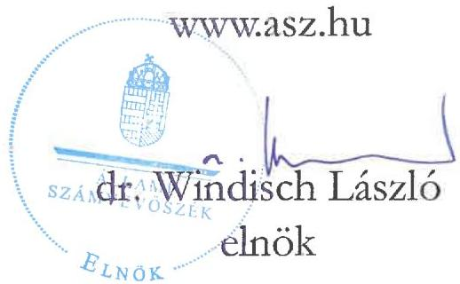
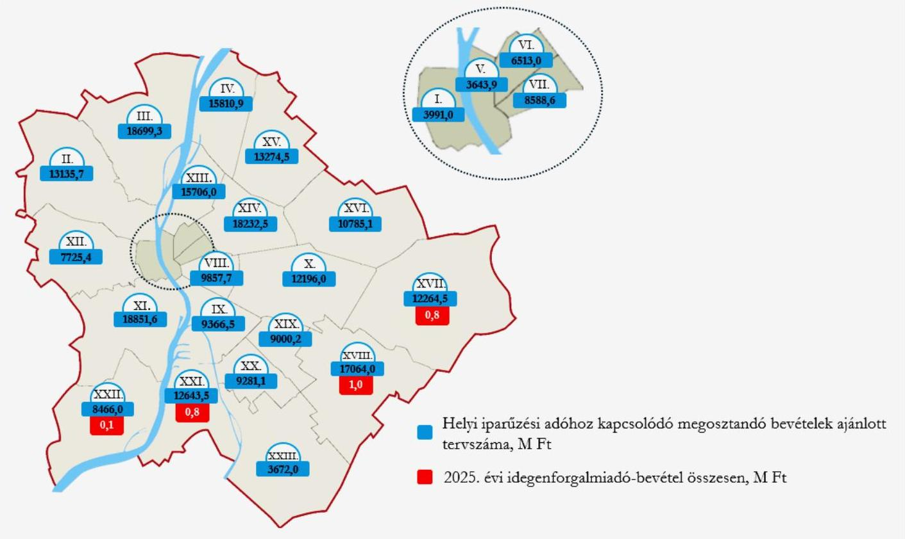
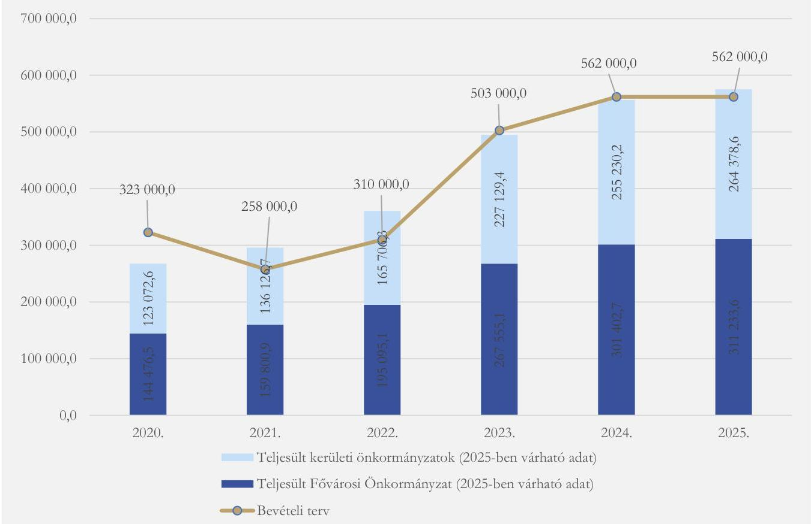

ÁLLAMI SZÁMVEVŐSZÉK

# JELENTÉS

A Fővárosi Önkormányzatot és a kerületi önkormányzatokat osztottan megillető bevételek 2025. évi megosztásáról szóló önkormányzati rendelet felülvizsgálata

2025.

25138

www.asz.hu

---

ÁLLAMI SZÁMVEVŐSZÉK

# JELENTÉS

A Fővárosi Önkormányzatot és a kerületi önkormányzatokat osztottan megillető bevételek 2025. évi megosztásáról szóló önkormányzati rendelet felülvizsgálata

2025.

25138

---

Jelentéseink az interneten a www.asz.hu címen olvashatók.

ELLENŐRZÉSI IGAZGATÓSÁG:
ELLENŐRZÉSI IGAZGATÓSÁG II.

ELLENŐRZÉSI IGAZGATÓ:
DR. BAFFIA GERGELY GÁBOR igazgató

ELLENŐRZÉSVEZETŐ:
HUDÁK MAGDOLNA ellenőrzésvezető

IKTATÓSZÁM: EL-4332-026/2025.

TÉMASORSZÁM: 8

ELLENŐRZÉS-AZONOSÍTÓ SZÁM: V1182

---

TARTALOMJEGYZÉK

- ÖSSZEFOGLALÁS ... 5
- AZ ELLENŐRZÉS EREDMÉNYEI ... 7
1. A 2025. évi Forrásmegosztási rendelet törvényessége, a bevételi és a működéssel kapcsolatos kiadási adatok megalapozottsága ellenőrzésének eredményei ... 7
2. A 2025. évi forrásmegosztással kapcsolatos pénzügyi elszámolások törvényessége ellenőrzésének eredményei ... 10
3. Az ÁSZ előző évi forrásmegosztás ellenőrzése során tett javaslatainak hasznosulása ellenőrzésének eredményei ... 14
- JAVASLATOK ... 16
- I. FÜGGELÉK: ÉSZREVÉTELEK ... 17
- II. FÜGGELÉK: ELLENŐRZÉSI MEGKÖZELÍTÉS ... 18
- MELLÉKLETEK ... 21
I. sz. melléklet: Értelmező szótár ... 21
II. sz. melléklet: Az ellenőrzött szervezetek jegyzéke ... 23
- RÖVIDÍTÉSEK JEGYZÉKE ... 24

---

“哈，你是个小伙子，你是个小伙子，你是个小伙子，你是个小伙子，你是个小伙子，你是个小伙子，你是个小伙子，你是个小伙子，你是个小伙子，你是个小伙子，你是个小伙子，你是个小伙子，你是个小伙子，你是个小伙子，你是个小伙子，你是个小伙子，你是个小伙子，你是个小伙子，你是个小伙子，你是个小伙子，你是个小伙子，你是个小伙子，你是个小伙子，你是个小伙子，你是个小伙子，你是个小伙子，你是个小伙子，你是个小伙子，你是个小伙子，你是个小伙子，你是个小伙子，你是个小伙子，你是个小伙子，你是个小伙子，你是个小伙子，你是个小伙子，你是个小伙子，你是个小伙子，你是个小伙子，你是个小伙子，你是个小伙子，你是个小伙子，你是个小伙子，你是个小伙子，你是个小伙子，你是个小伙子，你是个小伙子，你是个小伙子，你是个小伙子，你是个小伙子，你是个小伙子，你是个小伙子，你是个小伙子，你是个小伙子，你是个小伙子，你是个小伙子，你是个小伙子，你是个小伙子，你是个小伙子，

---

ÖSSZEFOGLALÁS

A Forrásmegosztási tv.¹ alapján a Fővárosi Önkormányzat² tárgyévre vonatkozó forrásmegosztási rendeletét az Állami Számvevőszéknek (továbbiakban ÁSZ³-nak) felül kellett vizsgálnia. A Fővárosi Önkormányzatot és a kerületi önkormányzatokat⁴ osztottan megillető bevételek 2025. évi megosztásáról szóló önkormányzati rendelet (a továbbiakban: Forrásmegosztási rendelet⁵) felülvizsgálatával az ÁSZ ennek a törvényi kötelezettségének tett eleget.

Az ÁSZ-ellenőrzés megállapította, hogy a Forrásmegosztási rendelet megalkotásának folyamata törvényes volt. Azonban a Forrásmegosztási rendelet egyes előírásai között nem volt teljeskörűen biztosított a tartalmi összhang, annak ellenére, hogy erre az ÁSZ a 2024. évi forrásmegosztás felülvizsgálata során már felhívta a figyelmet. A tartalmi összhang részleges hiánya ugyanakkor nem befolyásolta a rendeletalkotás folyamatát.

Az ÁSZ megállapította továbbá, hogy a Forrásmegosztási rendelet tervszámai összességében megalapozottak voltak, megállapításuk megfelelt a jogszabályi előírásoknak.

A Fővárosi Önkormányzatot és a kerületi önkormányzatokat osztottan megillető bevételek és kiadások pénzügyi elszámolása törvényes volt. Az ÁSZ-felülvizsgálat a forrásmegosztásnál figyelembe vett bevételek és kiadások elszámolása során jogosulatlan, vagy a jog szerűen megillető forrásnál alacsonyabb összegű elszámolást nem tárt fel sem a Fővárosi Önkormányzatnál, sem a kerületi önkormányzatoknál, így a 2026. évi forrásmegosztás során korrekciót nem kell érvényesíteni.

„A Fővárosi Önkormányzatot és a kerületi önkormányzatokat osztottan megillető bevételek 2024. évi megosztásáról szóló önkormányzati rendelet felülvizsgálata” című 24215. számú ÁSZ-jelentés javaslataira tett intézkedések utóellenőrzése során az ÁSZ-ellenőrzés megállapította, hogy a Főjegyző részére tett négy javaslatból három javaslat hasznosult. Egy javaslat – mely három részfeladatból állt – részben hasznosult így ezzel kapcsolatban a 2026. évi Forrásmegosztási rendelet normaszövegének előkészítése során a Főjegyzőnek intézkednie kell.

A Forrásmegosztási tv. alapján a helyi iparűzési adóból származó megosztott bevételeken, az idegenforgalmi adón, a helyi adóhoz kapcsolódóan kiszabott pótlékból és bírságból származó bevételeken, illetve a fővárosi önkormányzati helyi adóztatással kapcsolatos kiadásokon a Fővárosi Önkormányzat és a kerületi önkormányzatok 54%-46%-os arányban osztoznak.

Az ÁSZ által a 2025. évben ellenőrzött, a Forrásmegosztási rendeletben meghatározott bevételi és kiadási tervszámokat az 1. táblázat mutatja be:

1. táblázat

A FŐVÁROSI ÖNKORMÁNYZAT 2025. ÉVI FORRÁSMEGOSZTÁSI RENDELETÉBEN
MEGHATÁROZOTT BEVÉTELI ÉS KIADÁSI TERVSZÁMOK (M FT)

|  MEGOSZTANDÓ BEVÉTEL/KIADÁS | MEGOSZTANDÓ FORRÁS ÖSSZEGE (100%) | FŐVÁROS RÉSZESEDÉSE (54%) | KERÜLETEK RÉSZESEDÉSE (46%)  |
| --- | --- | --- | --- |
|  Helyi iparűzési adó | 562 000,0 | 303 480,0 | 258 520,0  |
|  Kerületi önkormányzatok által bevezetésre átengedett idegenforgalmi adó | 5,9 | 3,2 | 2,7  |
|  Kivetett adókhoz kapcsolódó pótlék, bírság | 1 600,0 | 864,0 | 736,0  |
|  Megosztandó bevételek összesen | 563 605,9 | 304 347,2 | 259 258,7  |
|  Helyi adók beszedésével összefüggésben figyelembe vehető kiadások | 1 058,9 | 571,8 | 487,1  |

Forrás: Forrásmegosztási rendelet, ÁSZ szerkesztés

---

Összefoglalás

A jogszabályi rendelkezések alapján a Fővárosi Önkormányzat jogosult Budapest teljes területén a helyi iparűzési adó, valamint az általa közvetlenül igazgatott Margit-szigeten valamennyi helyi adó bevezetésére. A kerületi önkormányzatok pedig jogosultak területükön a helyi iparűzési adó kivételével a többi helyi adó bevezetésére.

A kerületi önkormányzatokat osztottan megillető bevételek tervezett összegeinek részletezését az 1. ábra szemlélteti:

1. ábra

A HELYI IPARÚZÉSI ADÓ ÉS AZ ÁTENGEDETT IDEGENFORGALMI ADÓ BEVÉTELEINEK AJÁNLOTT TERVSZÁMA A 2025. ÉVBEN KERÜLETENKÉNT (M FT)

Forrás: 2025. évi Forrásmegosztási rendelet alapján, ÁSZ saját szerkesztés

A 2025. évi ellenőrzés megállapításai alapján az ÁSZ a Főpolgármester⁷ és a Főjegyző részére egy-egy javaslatot fogalmazott meg.

---

AZ ELLENŐRZÉS EREDMÉNYEI

# 1. A 2025. évi Forrásmegosztási rendelet törvényessége, a bevételi és a működéssel kapcsolatos kiadási adatok megalapozottsága ellenőrzésének eredményei

## Összegző megállapítás

A 2025. évi Forrásmegosztási rendelet előkészítése megfelelt a Forrásmegosztási tv.-ben rögzítetteknek. A bevételi és a kiadási tervszámok összességében megalapozottak voltak.

### 1.1. számú megállapítás

A Fővárosi Önkormányzat a forrásmegosztási rendeletalkotással kapcsolatos feladatokról belső szabályozásaiban rendelkezett. A rendelet előkészítése során betartotta a törvényi előírásokat és belső szabályzatait.

A Főjegyző – a Bkr.⁸-nek megfelelően – az SZMSZ₁⁹,₂¹⁰, a Főjegyzői Iroda Ügyrendje₁¹¹,₂¹² és az Adófőosztály Ügyrendje₁¹³,₄¹⁴ keretében kialakította a forrásmegosztási rendelet megalkotásával és végrehajtásával kapcsolatos folyamatokat. A belső szabályzatok alapján – a Bkr.-nek megfelelően – a forrásmegosztással kapcsolatos folyamatok átláthatóak voltak.

A Hivatal¹⁵ ellenőrzött időszakban hatályos SZMSZ₁,₂-e alapján a Főjegyzői Iroda (2025. május 7-től: Jogi Főosztály) volt az önkormányzati rendelet normaszövegének kialakítása kapcsán az általános hatáskörrel rendelkező szervezeti egység, az Adófőosztály pedig a Fővárosi Önkormányzatot és a kerületi önkormányzatokat osztottan megillető bevételek éves megosztásával kapcsolatos önkormányzati rendelettel kapcsolatos feladatkörrel rendelkező önálló szervezeti egység. Az Adófőosztály Ügyrend₁,₂-k tartalmazták a forrásmegosztás előkészítésével és végrehajtásával kapcsolatos feladatokat.

A Fővárosi Önkormányzat a Forrásmegosztási tv. előírása szerinti határidőt betartva, 2025. január 8-án megküldte a 2025. évi Forrásmegosztási rendelet tervezetét a kerületi önkormányzatoknak véleményezés céljából, így a Forrásmegosztási tv.-ben a véleményezésre előírt legalább 15 nap a kerületi önkormányzatoknak a rendelkezésükre állt.

A Fővárosi Önkormányzat – a Htv.¹⁶-ben foglaltakkal összhangban – rendelkezett azon három kerületi (XVII., XVIII., XXI.) önkormányzat képviselő-testületeinek előzetes beleegyezését rögzítő határozataival, amelyek alapján az érintett kerületi önkormányzatok a 2025. évre vonatkozóan az idegenforgalmi adó beszedésének jogát a Fővárosi Önkormányzat részére átengedték.

### 1.2. számú megállapítás

A 2025. évi Forrásmegosztási rendelet adóbevételi tervszámai összességében megalapozottak voltak. A Fővárosi Önkormányzatot és a kerületi önkormányzatokat együttesen megillető és a megosztott bevételek megállapítása megfelelt a Forrásmegosztási tv. előírásainak.

A Forrásmegosztási tv. alapján megosztandó adóbevétel, pótlék, bírság tervezése során a Fővárosi Önkormányzat figyelembe vette a bevételekre ható lényeges körülményeket, így a makrogazdasági mutatókat, valamint egyes kockázati tényezőket is. Összességében a Forrásmegosztási rendeletben az adóbevételi tervszámok – az óvatos becslés elvét is figyelembe véve – megalapozottak voltak.

---

Az ellenőrzés eredményei

A megosztott helyi iparűzési adóbevételek 2020-2025. évek közötti alakulását a 2. ábra mutatja:

2. ábra

A MEGOSZTOTT HELYI IPARÚZÉSI ADÓBEVÉTEL ALAKULÁSA A 2020-2025. ÉVEKBEN (M FT)

Forrás: A Fővárosi Önkormányzat adatszolgáltatása alapján ÁSZ saját szerkesztés

A helyi iparűzési adóból származó bevétel tervezett összege a 2024. és 2025. években nem változott, 562 000,0 M Ft volt. A 2. ábra alapján látható, hogy a 2023. és 2024. években a bevételi terv szerinti iparűzési adóbevételek közel 100 %-ban teljesültek. A 2025. évben – feltételezve, hogy a január-szeptember és a január-decemberi bevételi arányok a 2025. évben sem változnak a 2024. évhez képest – a tervezett iparűzésiadó bevétel várhatóan 102,4%-ban fog teljesülni az ÁSZ becslése alapján.

A helyi iparűzési adóból származó bevétel tervezése a tervezéskor rendelkezésre álló makrogazdasági mutatók (várható infláció és GDP¹⁷ növekedése), az egyes kockázati tényezők (Versenyképes járások program bevezetése), valamint a 2024. január-november havi teljesítési adatok figyelembevételével történt. Ezek alapján a 2024. január-novemberben befolyt iparűzési adóbevétel (544 059,3 M Ft) a 2024. évi bevételi terv 96,8%-a volt. Az adótörvények változásáról szóló törvénytervezet értelmében az iparűzési adó szabályainak érdemi változásával nem terveztek. A várható GDP-növekedés és az inflációs adatok együttes figyelembevételével a 2024. évre az előző évhez képest 2%-os növekedést prognosztizáltak. A Fővárosi Önkormányzatnál a tervezéskor óvatosságra adott okot továbbá az is, hogy a költségvetési törvénytervezetben megjelent a helyi iparűzési adóbevétel többletét érintő fizetési kötelezettség, ami a központi költségvetésnek a helyi iparűzési adóbevételek egy részének elvonását jelentette a „Területfejlesztési Alap” javára. Mindezek figyelembevételével iparűzési adóbevételi többlettel nem számoltak. Az óvatos tervezést igazolta a 2025. szeptember 30-ig befolyt adóbevétel, mely a 2025. évi bevételi terv 97,3%-a volt. 2025. utolsó negyedévére várható iparűzési bevételt az ÁSZ a megelőző év utolsó

8

---

Az ellenőrzés eredményei

negyedévi tényleges bevétel (28 028,4 M Ft) és a várható növekedés (3,4%) alapján 28 981,3 M Ft-ban becsülte meg.

Az idegenforgalmi adóbevételeket a 2024. évi időarányos (2024. szeptember 30-ig befolyt) bevételek alapján az ismert inflációs (3,5%) előrejelzések figyelembevételével tervezték. A Forrásmegosztási rendeletben rögzített forrásmegosztás során figyelemmel voltak arra is, hogy a 2025. januárjában befolyó – a 2024. december 1-31. közötti időszakra vonatkozó – idegenforgalmi adóbevételből a 2024. évi Forrásmegosztási rendelet¹⁸ arányszámai alapján még négy kerület¹⁹ részesült. Az idegenforgalmi adó tervezett összegének érintett kerületi önkormányzatok közötti megosztása a Forrásmegosztási tv. mellékletében meghatározott részesedési arányok alapulvételével történt, ugyanakkor továbbra sem biztosított a Forrásmegosztási rendelet 4. § (1) és a 4. § (5) bekezdése, illetve a 4. § (4) és a 4. § (6) bekezdései közötti összhang, amire az ÁSZ már a 2024. évi Forrásmegosztási rendelet felülvizsgálata során is tett megállapítást. A hiányosság részletes leírását a 3. pont tartalmazza.

A helyi adókhoz kapcsolódóan kiszabott késedelmi pótlék és bírság bevételek tervezésének az ASP.ADO szakrendszer¹⁹ bevezetése miatti csökkenésével történő indoklása nem volt elfogadható. Az új szakrendszerre történő átállás már a 2023. évben megtörtént, és a hatékony munkavégzés feltételeinek kialakítására több, mint egy év állt rendelkezésre, amelyért a Főjegyző a felelős.

A tervezett helyi iparűzési és idegenforgalmi adóból származó bevételek és a helyi adóhoz kapcsolódó pótlék- és bírságbevételek tervezett összegét a Forrásmegosztási tv.-ben foglalt 54%-46%-os arányban osztották meg a Fővárosi Önkormányzat és a kerületi önkormányzatok között. A kerületi önkormányzatok számára tervezhető bevételeket a Forrásmegosztási tv. mellékletében meghatározott részesedési arányszámoknak megfelelően osztották fel.

## 1.3. számú megállapítás

A 2025. évi Forrásmegosztási rendeletben a működéssel kapcsolatos kiadási adatok tervezése megfelelt a Forrásmegosztási tv.-ben foglaltaknak. A Forrásmegosztási rendeletben 2025. évi előlegként meghatározott működtetési kiadási előleg összege megalapozott volt.

A Forrásmegosztási tv. kimondja, hogy a helyi adóztatással kapcsolatos kiadásokat a megosztott bevételből részesülők (azaz a Fővárosi Önkormányzat és az I-XXIII. kerületi önkormányzatok) viselik a forrásmegosztásból való részesedésük arányában: a kiadások 54%-a a Fővárosi Önkormányzatot, a 46%-a pedig a kerületi önkormányzatokat terheli. A 2025. évi kiadási előlegnek a 2024. évi zárszámadási rendeletben²⁰ elfogadott adóbeszedéssel kapcsolatos kiadásokat kellett tekinteni, amit legfeljebb a kivetett helyi adóhoz kapcsolódóan a 2024-ben befolyt pótlék és bírság bevételek 50%-os mértékéig lehetett a kerületek felé érvényesíteni.

A Fővárosi Önkormányzat helyesen, a Forrásmegosztási tv.-nek megfelelően, a késedelmi pótlék és bírság számláira 2024. évben teljesített bevétel 50%-át vette figyelembe a 2025. évi kiadási előleg megállapítása során.

A Forrásmegosztási rendeletben a 2025. évi előlegként meghatározott működtetési kiadási összeg a 2024.01-08. havi tényadatok alapján, továbbá a 2025. évi költségvetés tervezéséhez készített előterjesztésben szereplő helyzetelemzés és indoklás alapján is megalapozott volt, azt a Forrásmegosztási rendelet elkészítéséig felmerült időarányos teljesülés adatai és a könyvviteli nyilvántartások is alátámasztották.

¹⁸ A XVII., XVIII., XXI. és a XXII. kerületi önkormányzatok.

---

Az ellenőrzés eredményei

A 2025. évi Forrásmegosztási rendelet-tervezet kerületeknek való megküldésekor (2025. január 8.) a Fővárosi Önkormányzatnál elszámolt 2024. évi tényleges késedelmi pótlék, bírság összege már ismert volt, így azt a Forrásmegosztási rendeletben a Fővárosi Önkormányzat 50%-os mértékben, 1 058,9 M Ft összegben vette figyelembe a 2025. évi kiadási előleg megállapítása során. Ennek az összegnek a kerületek felé érvényesíthető 46%-os összegét (487,1 M Ft) tartalmazta a Forrásmegosztási rendelet 1. melléklet D. oszlopa. A kiadási előleg megállapítása megalapozott volt és megfelelt a jogszabályi előírásoknak.

A részesedési arányok megállapításánál a Forrásmegosztási tv. mellékletében előírt, a kerületi önkormányzatok egymás közötti részesedési arányait betartották. A kerületeket együttesen terhelő kiadási előleg kerületi önkormányzatok egymás közötti megosztása törvényesen, a Forrásmegosztási tv. mellékletében szereplő részesedési arányok szerint történt meg, a 2025. évi kiadási előleg kerületek közötti megosztása törvényességének ellenőrzése során az ÁSZ nem tárt fel eltérést.

## 2. A 2025. évi forrásmegosztással kapcsolatos pénzügyi elszámolások törvényessége ellenőrzésének eredményei

### Összegző megállapítás

A 2025. évi forrásmegosztással kapcsolatos pénzügyi elszámolások megfeleltek a Forrásmegosztási tv. és a Forrásmegosztási rendelet előírásainak.

### 2.1. számú megállapítás

A 2025. évi forrásmegosztással kapcsolatos bevételk kerületenkénti megállapítása és a megosztással kapcsolatos pénzügyi elszámolás megfelelt a Forrásmegosztási tv. és a Forrásmegosztási rendelet előírásainak.

A Fővárosi Önkormányzathoz 2025. január 1. és 2025. szeptember 30. között befolyt, megosztott bevételk folyósítása és pénzügyi elszámolása megfelelt a Forrásmegosztási rendeletnek.

A 2024. október-december és 2025. január-szeptember hónapokban befolyt megosztandó bevételk előírt részarányának az átutalása a Forrásmegosztási tv.-ben, illetve a Forrásmegosztási rendeletben, valamint a 2024. évi Forrásmegosztási rendeletben rögzített határidőkben megtörtént.

A Fővárosi Önkormányzat a Forrásmegosztási rendeletnek megfelelően, a 2024. évi zárszámadási rendelet hatálybalépését követő havi utalásban (2025. június 10-én) érvényesítette a kerületi önkormányzatok felé (egyszeri jelleggel) a helyi adóból származó bevételk beszedésével kapcsolatban felmerült 2024. évi kiadási előleg korrekcióját, valamint a 2025. évi kiadási előleget. A Forrásmegosztási rendeletben tervezett 487,1 M Ft helyett a 2024. évi tényleges kiadások korrekciója miatt 403,0 M Ft-ot érvényesített a kerületi önkormányzatok felé.

10

---

Az ellenőrzés eredményei

A Fővárosi Önkormányzatot, illetve a kerületi önkormányzatokat megillető megosztandó helyi adóbevételek, valamint a kapcsolódó pótlék- és bírságbevételek 2025. január 1.-szeptember 30. közötti összegeit és megoszlásukat a 2. táblázat mutatja be.

2. táblázat
A 2025. I-IX. HAVI MEGOSZTANDÓ BEVÉTELEK ÖSSZEGE ÉS MEGOSZLÁSA (M FT)

|  MEGOSZTANDÓ BEVÉTELEK 2025. I.-IX. HÓNAP | MEGOSZTANDÓ BEVÉTELEK ÖSSZEGE (100%) | FŐVÁROS RÉSZESÉDÉSE (54%) | KERÜLETEK RÉSZESÉDÉSE (46%)  |
| --- | --- | --- | --- |
|  Helyi iparűzési adó | 546 630,9 | 295 180,7 | 251 450,2  |
|  A kerületi önkormányzatok által átengedett idegenforgalmi adó | 2,3 | 1,2 | 1,1  |
|  Kivetett adókhoz kapcsolódó pótlék, bírság | 1 579,8 | 853,1 | 726,7  |
|  Megosztandó bevételek összesen | 548 213,0 | 296 035,0 | 252 178,0  |
|  2025. évi kiadási előleg összege |  | 487,1 | -487,1  |
|  2024. évi kiadási előleg korrekció összege |  | -84,1 | 84,1  |
|  Kerületi önkormányzatoktól levonandó, Fővárosi Önkormányzat részére jóváírandó összeg |  | 403,0 | -403,0  |
|  Fővárosi Önkormányzatot megillető rész/Kerületi önkormányzatok részére teljesítendő utalás összege |  | 296 438,0 | 251 775,0  |

Forrás: Fővárosi Önkormányzat adatszolgáltatása alapján ÁSZ saját szerkesztés

Az igényelt előlegek összege és az előlegek folyósítása megfelelt a Forrásmegosztási rendeletben foglaltaknak, azaz legfeljebb a rendeletben foglalt előlegfolyósítási felső korlátnak megfelelő összeg került átutalásra az igénylő önkormányzatok részére.

A Forrásmegosztási rendelet alapján igényelt előlegek alakulását a 3. táblázat mutatja be.

3. táblázat
IGÉNYELT ELŐLEG ALAKULÁSA 2024. I-IX. HÓNAPBAN ÉS 2025. I-IX. HÓNAPBAN (DB/M FT)

|   | ELŐLEG IGÉNYLÉS ALKALOM (DB) |   | LEGALACSONYABB IGÉNYELT ÖSSZEG (M FT) |   | LEGMAGASABB IGÉNYELT ÖSSZEG (M FT) |   | ÖSSZES IGÉNYELT ELŐLEG (M FT)  |   |
| --- | --- | --- | --- | --- | --- | --- | --- | --- |
|   |  2024. | 2025. | 2024. | 2025. | 2024. | 2025. | 2024. | 2025.  |
|  Fővárosi Önkormányzat | 142 | 121 | 35,0 | 45,0 | 60 000,0 | 70 000,0 | 280 415,0 | 288 630,0  |
|  II. kerület | 1 | 3 | 2 166,9 | 490,1 | 2 166,9 | 3 892,5 | 2 166,9 | 7 382,6  |
|  III. kerület | - | 2 | - | 1 524,4 | - | 6 238,8 | - | 7 763,2  |
|  XV. kerület | - | 1 | - | 5 000,0 | - | 5 000,0 | - | 5 000,0  |
|  XIX. kerület | 2 | 2 | 1 200,0 | 1 200,0 | 1 500,0 | 1 500,0 | 2 700,0 | 2 700,0  |

Forrás: Fővárosi Önkormányzat adatszolgáltatása alapján, ÁSZ saját szerkesztés

Az igénylések alapján látható, hogy a 2025. első kilenc hónapjában a 2024. évhez képest több kerületi önkormányzat és több alkalommal élt a Forrásmegosztási rendeletben biztosított előlegigénylés lehetőségével. A Fővárosi Önkormányzat a 2025. év vizsgált időszakában ugyan kevesebb alkalommal, de

---

Az ellenőrzés eredményei

összességében nagyobb összegben (a részére járó megosztandó bevételek 97,8%-a tekintetében) vett igénybe előleget. A 2024. év első kilenc hónapjában igényelt, átlagosan 1 974,7 M Ft összegű előleg a 2025. év ugyanezen időszakában 20,8 %-kal emelkedett és átlagban elérte a 2 385,4 M Ft-ot.

Az ÁSZ 25093. számú jelentésében megállapította, hogy a Fővárosi Önkormányzat likviditási helyzete az elmúlt években fokozatosan romlott. Az egyre romló likviditási helyzet tükrözte, hogy a Fővárosi Önkormányzat a 2024. évtől tartóssá váló finanszírozási problémáit folyószámlahitel felvételével tudta megoldani. A folyószámlahitel átlagos napi állománya 2025. I. negyedévben 12,4 %-kal, II. negyedévben 35,1 %-kal haladta meg az előző év azonos időszakának adatát. Az igénybe vett folyószámlahitel növekedése és a Forrásmegosztási rendelet alapján igényelt előleg összegének növekedése között párhuzam figyelhető meg, mivel a napi likviditás biztosításához a folyószámlahitel felvétele mellett a Fővárosi Önkormányzat a 2025. január-szeptember hónapokban összesen 8 215,0 M Ft-tal több előleget vett igénybe a Forrásmegosztási rendelet alapján részére járó megosztandó bevételekből, mint az előző év azonos időszakában.

A Fővárosi Önkormányzatnál analitikus nyilvántartást vezettek a Fővárosi Önkormányzat és a kerületek részére folyósított előlegek összegéről. Az analitikus nyilvántartás kialakításánál figyelembe vették a 2024. évi ÁSZ jelentésben a nyilvántartás vezetésére tett megállapításokat.

A 2025. január 1-től vezetett analitikus nyilvántartás tartalmazta az önkormányzati kérés beérkezésének napját megelőző napon az iparűzésiadó-beszedési számlán rendelkezésre álló megosztandó bevételeket, a Forrásmegosztási tv. szerint az adott önkormányzatra jutó megosztási részarányt, valamint az ezalapján számított igénybe vehető előleg felső határát. Tartalmazta továbbá az adott hónapban az érintett önkormányzat halmozott előlegét, a felső határ és a halmozott havi előleg alapján számított utalható összeget, az átutalt előleg összegét, bizonylatszámát és az átutalás dátumát.

A folyósított előlegek elszámolása a tárgyhavi adó rész utalása alkalmával megtörtént.

## 2.2. számú megállapítás

A 2025. évi kiadási előlegek megosztása és érvényesítése, a 2024-ben elszámolt 2024. kiadási előlegek és a ténylegesen elszámolható 2024. évi kiadások alapján érvényesíthető különbséget elszámolása, megosztása és érvényesítése törvényes volt.

A 2024. évi zárszámadási rendeletben a Fővárosi Önkormányzat adóbeszedéssel kapcsolatos, a Fővárosi Önkormányzat Adóhatósága működtetésével összefüggő 2024. évi kiadásai az alábbi összegekben szerepeltek:

4. táblázat

|  A FŐVÁROSI ÖNKORMÁNYZAT ADÓBESZEDÉSSEL KAPCSOLATOS 2024. ÉVI KIADÁSAI (M FT)  |   |   |   |   |   |
| --- | --- | --- | --- | --- | --- |
|  KIEMELT ELŐIRÁNYZAT /KÖLTSÉGVETÉSI CÍM MEGNEVEZÉSE, SZÁMA | ADÓÜGYI FELADATOKAT VÉGZŐK ÉRDEKELTSÉGI ALAPJA 711402 | ADÓ FŐOSZTÁLY KIADÁSAI 712403 | ADÓIGAZGATÁSI FELADATOKRA 712503 | HAIR ÜZEMELTETÉSI KIADÁSOK 713901 | TELJESÍTÉS ÖSSZESEN  |
|  Személyi juttatások | 164,7 | 1 036,4 | 0,0 | 0,0 | 1 201,1  |
|  Munkaadókat terhelő járulékok és szociális hozzájárulási adó | 21,4 | 139,7 | 0,0 | 0,0 | 161,1  |
|  Dologi kiadások (ÁFÁ-val) | 0,0 | 0,0 | 26,6 | 1,8 | 28,4  |
|  Mindösszesen működési kiadások | 186,1 | 1 176,1 | 26,6 | 1,8 | 1 390,6  |

Forrás: A Fővárosi Önkormányzat 2024. évi zárszámadási rendelete alapján ÁSZ-szerkesztés

---

Az ellenőrzés eredményei

A Fővárosi Önkormányzat Adóhatósága működtetésével összefüggő 2024. évi kiadásokat a főkönyvi kivonatok és az analitikus nyilvántartások alátámasztották.

A Fővárosi Önkormányzat e kiadásokat a kerületi önkormányzatok felé a Forrásmegosztási tv.-nek megfelelő mértékben, azaz a pótlékokból és bírságokból származó bevétel 50%-a kerületekre jutó összegéig (487,1 M Ft) érvényesítette.

A 2024. évi zárszámadási rendelet közgyűlési²¹ jóváhagyását követően megtörtént a 2024. évi adóbeszedéssel kapcsolatos 2024. évben elszámolt kiadási előleg és a 2024. évi tényleges kiadás összegének összevetése a Forrásmegosztási tv. és a 2024. évi Forrásmegosztási rendelet előírásainak megfelelően.

2024-ben 571,2 M Ft kiadási előleget vont le a Fővárosi Önkormányzat a kerületi önkormányzatoktól, viszont a 2024. évi tényleges kiadás csak 487,1 M Ft volt. Az összevetés eredményeképpen megállapították, hogy a kerületi önkormányzatoktól 2024-ben 84,1 M Ft-tal több kiadási előleg került levonásra, amit 2025-ben korrigálni kellett.

A 2025. évi kiadási előlegek érvényesítésekor a Forrásmegosztási rendeletben szereplő 487,1 M Ft összeg – a 2024. évi Forrásmegosztási rendelet 7. § (2) bekezdése alapján – a 2024-ben levont előleg és a 2024. évi tényleges kiadások különbözetével (84,1 M Ft) korrigálva került levonásra a kerületektől, az 5. táblázat alapján:

5. táblázat

A KERÜLETI ÖNKORMÁNYZATOKTÓL LEVONT KIADÁSI ELŐLEGEK ÉS A TÉNYLEGESEN ELSZÁMOLHATÓ KIADÁSOK ÖSSZEGE (M FT)

|  MEGNEVEZÉS | ÖSSZEG  |
| --- | --- |
|  2024. évben a kerületektől levont előleg összege | 571,2 M Ft  |
|  2024. évi tényleges kiadás kerületi önkormányzatokra jutó összege | 487,1 M Ft  |
|  2024. évi kiadási előleg és a ténylegesen elszámolható kiadás különbözete | -84,1 M Ft  |
|  2025. évi kiadási előleg | 487,1 M Ft  |
|  2025. évi iparűzési adó korrekció összesen | 403,0 M Ft  |

Forrás: ÁSZ saját szerkesztés

A 2025. évi kiadási előlegek megosztása és érvényesítése, a 2024-ben elszámolt 2024. kiadási előlegek és a ténylegesen elszámolható 2024. évi kiadások alapján érvényesíthető különbözet elszámolása, megosztása és érvényesítése megfelelt a jogszabályi előírásoknak.

A 2025. évi kiadási előlegnek és a 2024. évi korrekciónak a fővárosi önkormányzat és a kerületi önkormányzatok közötti megosztásánál a Forrásmegosztási tv.-ben előírt 54%-46%-os arányát betartották és azt a jogszabályban rögzített arányszámoknak megfelelően osztották meg a Fővárosi Önkormányzat és a kerületi önkormányzatok között.

A részesedési arányok megállapításánál a Forrásmegosztási tv. mellékletében előírt, a kerületi önkormányzatok egymás közötti részesedési arányait betartották. A kerületeket együttesen terhelő kiadási előleg kerületi önkormányzatonkénti megosztása törvényesen, a Forrásmegosztási tv. mellékletében szereplő részesedési arányok szerint történt meg.

A 2025. évi kiadási előleget, továbbá a 2024. évi előleg és a 2024. évi tényleges kiadások között különbözetet – a Forrásmegosztási tv. előírásainak megfelelően – egy összegben, a 2024. évi zárszámadási rendelet hatályba lépését követő havi utalásban, 2025. június 10-én érvényesítették a kerületi önkormányzatok felé.

13

---

Az ellenőrzés eredményei

## 2.3. számú megállapítás
A 2026. évi forrásmegosztás során korrekciót nem kell érvényesíteni.

A forrásmegosztásnál a 2025. január-szeptember hónapokban befolyt helyi adó bevételek megosztása és átutalása, valamint a figyelembe vett kiadások elszámolása során az ÁSZ-ellenőrzés jogosulatlan, vagy a Fővárosi Önkormányzatot és a kerületi önkormányzatokat jogszerűen megillető forrásnál alacsonyabb összegű elszámolást nem tárt fel, így a 2026. évi forrásmegosztás során korrekciót nem szükséges érvényesíteni.

## 3. Az ÁSZ előző évi forrásmegosztás ellenőrzése során tett javaslatainak hasznosulása ellenőrzésének eredményei

### Összegző megállapítás
A 2024. évi forrásmegosztás ellenőrzése kapcsán megfogalmazott négy ÁSZ javaslatból három teljeskörűen, egy részben teljesült.

Az ÁSZ a 2024. évi forrásmegosztás ellenőrzéséről szóló jelentésében négy javaslatot fogalmazott meg a Főjegyző részére, melyekből a 2-4. számú javalatok hasznosultak, az 1. számú javaslat részben hasznosult.

### A 2024. évi forrásmegosztás ellenőrzéséről szóló ÁSZ jelentés 2-4. számú javaslatai esetében a Főjegyző teljeskörűen intézkedett
- a munkaköri leírások módosításáról annak érdekében, hogy azok teljeskörűen tartalmazzák a felelősségi szabályokat,
- a Fővárosi Önkormányzat és a kerületi önkormányzatok részére folyósított előlegek naprakész analitikus nyilvántartásának vezetéséről és
- a számlavezető banknak adott – a megosztandó adók és a hozzájuk kapcsolódó pótlék, bírság beszedési számlái félév végéig egyenlegeinek a Fővárosi Önkormányzat költségvetési elszámolási számlájára történő átvezetésre vonatkozó – megbízás visszavonásáról.

### Az 1. javaslat három részfeladatot tartalmazott, amelyek hasznosulásáról az utóellenőrzés megállapította, hogy a Főjegyző a 2025. évi Forrásmegosztási rendelet előkészítése során
- **intézkedett** a 4. § (5) bekezdés és a 2. melléklet összhangjának megteremtéséről. A 4. § (5) bekezdés a 2024. december 1. és december 31. közötti időszakra vonatkozó, de 2025. januárjában esedékes, bevallott és megfizetett idegenforgalmi adóbevételből részesülő kerületi önkormányzatokat és ezek részesedési arányait helyesen szabályozta a 2. melléklet B. és C. oszlopában.
- a Forrásmegosztási rendelet normaszövegében ugyanakkor továbbra sem tette egyértelművé, hogy a tárgyévi forrásmegosztással érintett idegenforgalmi adóból származó bevétel tervezett összege (4. § (1) bekezdés) tartalmazza-e az előző év december 1. és december 31. közötti időszakra vonatkozó, de tárgyév januárjában esedékes összeget is (4. § (5) bekezdés). Csak a Forrásmegosztási rendelet 2. melléklet F. oszlopa (2025. évi idegenforgalmiadó-bevétel összesen) képletezésből (C+E) derül ki az, hogy 2025. évben a forrásmegosztással érintett idegenforgalmi adóból származó bevétel tervezett összege (5 864,0 ezer Ft) magában foglalja a 2024. december 1. és december 31. közötti időszakra vonatkozó, de 2025. januárjában esedékes, bevallott és megfizetett, tervszinten várható 720,0 ezer Ft-ot is (2. melléklet C. oszlop összesen értéke).

14

---

Az ellenőrzés eredményei

- nem intézkedett a 4. § (4) bekezdés és a 4. § (6) bekezdés összhangjának megteremtéséről. A Forrásmegosztási rendelet 4. § (4) bekezdése rögzíti, hogy a 2025-től idegenforgalmi adót bevezető kerületi önkormányzatok nem részesülnek a Fővárosi Önkormányzat által beszedett idegenforgalmiadó-bevételből. Ez alól a rendelkezés alól kivételt képezett a 2024. december 1. és december 31. közötti időszakra vonatkozó, de 2025 januárjában esedékes, bevallott és megfizetett idegenforgalmiadó-bevétel, amelyből még a XXII. kerületi önkormányzat is részesült. Kivételt kellett volna képezniük ugyanakkor a 2025. évben – az adómegállapításhoz való jog elévülési idején belül –, de 2024. december előtti adómegállapítási időszakra bevallott és megfizetett idegenforgalmi adóbevételeknek is.

15

---

16

# JAVASLATOK

Az ÁSZ tv.²² 33. § (1) bekezdésében foglaltak értelmében az ellenőrzött szervezet vezetője köteles a jelentésben foglalt megállapításokhoz kapcsolódó intézkedési tervet összeállítani és azt a jelentés kézhezvételétől számított 30 napon belül az ÁSZ részére megküldeni. Az ÁSZ a jelentésben foglalt megállapításokhoz kapcsolódóan az alábbi javaslatok tekintetében várja el az intézkedési terv elkészítését.

## A FŐPOLGÁRMESTER RÉSZÉRE

1. Intézkedjen a jelentés nyilvánosságra hozatalát követő 15 napon belül annak Közgyűlés elé terjesztéséről.

## A FŐJEGYZŐ RÉSZÉRE

1. Biztosítsa a 2026. évre vonatkozó, a Fővárosi Önkormányzatot és a kerületi önkormányzatokat osztottan megillető bevételek megosztásáról szóló rendeletben a Forrásmegosztási rendelet 4. § (1) és a 4. § (5), illetve a 4. § (4) és 4. § (6) bekezdései szerinti normatartalom előírásainak összhangját.

---

17

# I. FÜGGELÉK: ÉSZREVÉTELEK

A jelentéstervezetet az ÁSZ 15 napos észrevételezésre megküldte az ellenőrzött szervezet vezetőjének az ÁSZ tv. 29. §* (1) bekezdése előírásának megfelelően.

Az ellenőrzött szervezetek a jelentéstervezet megállapításaira észrevételt nem tettek.

* 29. § (1) Az Állami Számvevőszék az ellenőrzési megállapításait megküldi az ellenőrzött szervezet vezetőjének vagy az általa megbízott személynek, és annak, akinek személyes felelősségét állapította meg.
(2) Az ellenőrzött szervezet vezetője és a felelősként megjelölt személy az ellenőrzés megállapításaira tizenöt napon belül írásban észrevételt tehet.
(3) Az Állami Számvevőszék az észrevételre a beérkezésétől számított harminc napon belül írásban válaszol. A figyelembe nem vett észrevételeket köteles a jelentésben feltüntetni, és megindokolni, hogy azokat miért nem fogadta el.

---

18

# II. FÜGGELÉK: ELLENŐRZÉSI MEGKÖZELÍTÉS

## AZ ELLENŐRZÉS JOGALAPJA

Az ellenőrzés jogszabályi alapját az ÁSZ tv. 1. § (3) bekezdése, a 3. § (1) bekezdése és a 33. § (7) bekezdése, valamint a Forrásmegosztási tv. 6. § (1) bekezdés előírásai képezték.

## AZ ELLENŐRZÉS CÉLJA

A Fővárosi Önkormányzatot és a kerületi önkormányzatokat osztottan megillető bevételek 2025. évi megosztásáról szóló önkormányzati rendelet megalkotásának folyamata, a rendelet felülvizsgálata, a megosztandó helyi adóbevételek és a helyi adóztatással kapcsolatos kiadások megállapítása, elszámolása törvényességének ellenőrzése.

## AZ ELLENŐRZÉS TÍPUSA

Törvényességi ellenőrzés.

## AZ ELLENŐRZÉS TÁRGYA

A Forrásmegosztási rendelet megalkotása, felülvizsgálata, a megosztandó helyi adóbevételek és a helyi adóztatással kapcsolatos kiadások megállapítása, pénzügyi elszámolása, továbbá a 2024. évi forrásmegosztás ellenőrzése során tett ÁSZ javaslatok hasznosulása.

Az ellenőrzés kiterjedt minden olyan körülményre és adatra, amely az ÁSZ jogszabályban meghatározott feladatainak teljesítéséhez, valamint a program végrehajtása folyamán felmerült újabb összefüggések feltárásához szükséges.

## AZ ELLENŐRZÉS HATÓKÖRE ÉS TERÜLETE

Az ellenőrzés a Fővárosi Önkormányzatra és a Hivatalra terjedt ki.

A Fővárosi Önkormányzatot és a kerületi önkormányzatokat osztottan megillető egyes bevételek körét és a részesedési arányokat a Forrásmegosztási tv. határozta meg, továbbá rögzítette, hogy a Fővárosi Önkormányzat tárgyévre vonatkozó hatályos forrásmegosztási rendeletében szereplő adatok megalapozottságát és az ennek alapjául szolgáló számítások helyességét az ÁSZ felülvizsgálja. A Forrásmegosztási rendelet a célja szerint a 2025-ös évre a fővárosi önkormányzatot és a kerületi önkormányzatokat osztottan megillető bevételek (azaz a helyi iparűzési adó és a kerületek által átengedett idegenforgalmi adó, továbbá a pótlék és bírság) összegét, megosztását és az adóbevételek beszedésével összefüggően felmerült kiadások elszámolásának rendjét tartalmazó önkormányzati szabályozás. Az ellenőrzés keretében az ÁSZ a 2025. évi forrásmegosztási rendeletalkotási folyamat és a rendelet törvényessége, az adatok megalapozottsága és a pénzügyi elszámolások törvényessége mellett megállapította a nem megalapozott

---

II. Függelék: Ellenőrzési megközelítés

számítások, számítási hibák miatt a 2026. évi forrásmegosztási rendeletben végrehajtandó esetleges korrekciókat. Ellenőrzése kiterjedt az előző évi forrásmegosztás ellenőrzése során tett ÁSZ javaslatok hasznosulására is.

Az ellenőrzés előkészítése során feltárt kockázatos területek ellenőrzése a következők szerint:

- a tervezéssel kapcsolatos kockázatok esetén: a forrásmegosztás 2025. évi bevételi tervszámai, a forrásmegosztással kapcsolatos kiadások tervezésének törvényessége, számításokkal, dokumentumokkal való alátámasztottsága, megalapozottsága;
- a pénzügyi gazdálkodással kapcsolatos kockázatok esetén: a Fővárosi Önkormányzat által kivetett helyi adóval kapcsolatosan befolyt bevételek és a kiadási előlegek 2025. évi megosztása során a pénzügyi elszámolás törvényessége, beleértve a 2024. évi tényleges teljesítési adatok miatt a 2025. évben elszámolt különbszeteket is. A nem megalapozott számítások, illetve számítási hibák miatt a 2026. évi forrásmegosztás során alkalmazandó korrekciók megállapítása.

## AZ ELLENŐRZŐTT IDŐSZAK

2024. október 1-jétől 2025. szeptember 30-ig tartó időszak.

## AZ ELLENŐRZÉSI KRITÉRIUMOK

|  FÓKUSZTERÜLET/FÓKUSZKÉRDÉS | ELLENŐRZÉSI KRITÉRIUMOK  |
| --- | --- |
|  1. A 2025. évi Forrásmegosztási rendelet törvényessége, a bevételi és a működéssel kapcsolatos kiadási adatok megalapozottsága | Bkr. 6. § (1)a) b), (2a)
Htv. 1. § (3)
Forrásmegosztási tv. 2. § (6), 5. § (1), 6. § (1), Melléklet
Forrásmegosztási rendelet 4. § (1)-(6), 1. melléklet
SZMSZ₁ 3. melléklet 6.9. pont, SZMSZ₂ 3. melléklet 8.9 pont,
Adófőosztály Ügyrend₁,₂ 10.c) pont  |
|  2. A 2025. évi forrásmegosztással kapcsolatos pénzügyi elszámolások törvényessége | Alaptörvény 39. cikk (2) bekezdésében
Forrásmegosztási tv. 2. § (5)-(6), 3. §, 5. § (3), Melléklet
Forrásmegosztási rendelet 5. § (2), 6. §
2024. évi zárszámadási rendelet
2024. évi Forrásmegosztási rendelet 7. § (2)  |
|  3. Az ÁSZ előző évi forrásmegosztás ellenőrzése során tett javaslatainak hasznosulása | Forrásmegosztási rendelet 4. § (1) (4)-(6), 2. melléklet
SZMSZ₁ 3. melléklet 6.9. pont, SZMSZ₂ 3. melléklet 8.9 pont,
Adófőosztály Ügyrend₁,₂ 10.c) pont
Az ÁSZ 24215. sorszámon 2024. december 12-én megjelent jelentésében tett javaslatok alapján készített intézkedési terv.  |

---

II. Függelék: Ellenőrzési megközelítés

# AZ ELLENŐRZÉS MÓDSZERE ÉS AZ ELLENŐRZÉSI BIZONYÍTÉKOK KÖRE

Az ellenőrzést a nemzetközi standardokat irányadónak tekintve az ellenőrzési program szempontjai, az ellenőrzött időszakban hatályos jogszabályok, az ellenőrzés szakmai szabályok és módszertanok figyelembevételével kellett elvégezni.

Az ellenőrzési kérdések megválaszolásához szükséges bizonyítékok megszerzése az ellenőrzött szervezet által rendelkezésre bocsátott dokumentumokra és adatokra alapozva, továbbá megfigyelés, szemle (szemrevételezés), kérdésfeltevés (információkérés), valamint elemző eljárás útján történt. Az ellenőrzési bizonyítékként felhasználható adatforrások közé tartoztak egyrészt az ellenőrzéshez kért dokumentumok, adatforrások, másrészt adatforrás lehetett még minden – az ellenőrzés folyamán – feltárt, az ellenőrzés szempontjából információkat tartalmazó dokumentum.

Az ellenőrzés lefolytatásához az ellenőrzött szervezet a tanúsítványok kitöltésével, valamint az ÁSZ által kért dokumentumok, adatok, információ megküldésével és az ellenőrzés során szolgáltatott adatokat.

---

MELLÉKLETEK

I. SZ. MELLÉKLET: ÉRTELMEZŐ SZÓTÁR

Fővárosi Önkormányzat által kivetett helyi adóhoz kapcsolódóan kiszabott pótlék és bírság

A Fővárosi Önkormányzatot és a kerületi önkormányzatokat osztottan illetik meg a Fővárosi Közgyűlés rendelete alapján kivetett helyi iparűzési adóhoz és az idegenforgalmi adómegállapítást átengedő kerületek helyett megállapított idegenforgalmi adóhoz kapcsolódóan kiszabott pótlékból és bírságból származó bevételek.

helyi adóztatással kapcsolatos kiadás

A Fővárosi Önkormányzati helyi adóztatással kapcsolatos – a tárgyévre vonatkozóan a Fővárosi Önkormányzatot és a kerületi önkormányzatokat osztottan megillető bevételek (az iparűzési adóból, az idegenforgalmi adómegállapítást átengedő kerületek helyett megállapított idegenforgalmi adóból befolyt adóbevétel, illetve ezen helyi adókhoz kapcsolódóan kiszabott pótlék- és bírságbevétel) beszedésével összefüggően felmerült – kiadás. E kiadásokat a Forrásmegosztási tv. 2. § (1) bekezdés a) pontja szerinti bevételből részesülők viselik részesedésük arányában. Kiadásként a Fővárosi Önkormányzatnál a beszedésével – a Fővárosi Önkormányzat Adóhatósága működtetésével – összefüggően felmerült működtetési kiadásokat kell figyelembe venni. A Forrásmegosztási tv. 2. § (1) bekezdés a) pontja és a (4) bekezdés szerint figyelembe vehető kiadásokat a (2) bekezdésben felsorolt bevételek legfeljebb 50%-áig terjedő mértékben lehet érvényesíteni. (Forrás: A Forrásmegosztási tv. 2. § (4), (6) bekezdése alapján meghatározott fogalom.)

idegenforgalmi adó

A Htv. szerint bevezetett helyi adó. Az idegenforgalmi adót a kerületi önkormányzat helyett a Fővárosi Önkormányzat rendeletével akkor jogosult bevezetni, ha ahhoz az adott adóév tekintetében az érintett kerület önkormányzatának képviselő-testülete előzetes beleegyezését adja. A Fővárosi Önkormányzat által közvetlenül igazgatott terület tekintetében a kerületi önkormányzat által bevezethető adó bevezetésére (idegenforgalmi adó) a Fővárosi Önkormányzat jogosult, ezért az ebből származó bevétel nem tárgya a forrásmegosztásnak.

helyi iparűzési adó

A Htv. felhatalmazása alapján a Fővárosi Közgyűlés rendeletével kivetett helyi adónem. A Fővárosi Önkormányzat illetékességi területén vállalkozói tevékenységet (iparűzési tevékenységet) végző vállalkozó helyi iparűzési adót köteles fizetni. Adóköteles iparűzési tevékenységnek tekintendő e törvény alapján a vállalkozó e minőségben végzett nyereség-, illetőleg jövedelemszerzésre irányuló tevékenysége.

kiadási előleg

A tárgyévet megelőző év költségvetési rendeletének végrehajtásáról szóló Fővárosi Önkormányzati rendeletben elfogadott adóbeszedéssel kapcsolatos kiadásokat kell előlegként figyelembe venni a tárgyévben, melynek levonását a rendelet hatályba lépését követő havi utalásban kell a kerületi önkormányzatok felé érvényesíteni. Az előleg és a tárgyévi tényleges kiadások különbözetét a tárgyévi költségvetési rendelet végrehajtásáról szóló rendelet hatályba lépését követő havi utalásban kell elszámolni.

óvatos becslés elve

Az a módszertan, amely a bevételi tervszámok tervezésekor nem számol olyan bevételekkel, amelyek realizálása jelentősen bizonytalan, hanem inkább konzervatív, realis feltételezéseket alkalmaz.

21

---

Mellékletek

részesedés
A forrásmegosztásba bevont bevételkből a Fővárosi Önkormányzatot és a kerületi önkormányzatokat megillető részesedés arányszáma. A Fővárosi Önkormányzatot és a kerületi önkormányzatokat a Forrásmegosztási tv. 3. § alapján osztottan megillető bevételkből a Fővárosi Önkormányzatot 54,0%, a kerületi önkormányzatokat együttesen 46,0% részesedés illeti meg.

részesedési arányok
A kerületi önkormányzatokat megillető források egyes kerületek közötti megosztásának aránya, amelyet a Forrásmegosztási tv. 1. melléklete tartalmaz.

tárgyév
Azon gazdasági év, amelyhez tartozó megosztandó bevételnek a Fővárosi Önkormányzat és a kerületi önkormányzatok közötti megosztását a Forrásmegosztási rendelet határozza meg.

vetítési alap
Az a viszonyítási alap, amely megmutatja, hogy a helyi adóztatás kiadásait a tárgyévi forrásmegosztási rendeletben tervezett, illetve az előző évben befolyt, késedelmi pótlékból és bírságból származó bevételhez arányosítva kell érvényesíteni.

22

---

Mellékletek

- II. SZ. MELLÉKLET: AZ ELLENŐRZŐTT SZERVEZETEK JEGYZÉKE

|  AZ ELLENŐRZŐTT SZERVEZETEK NEVE, CÍME  |
| --- |
|  Budapest Főváros Önkormányzata (1052 Budapest, Városház utca 9-11.)  |
|  Budapest Főváros Főpolgármesteri Hivatal (1052 Budapest, Városház utca 9-11.)  |

23

---

RÖVIDÍTÉSEK JEGYZÉKE

1. Forrásmegosztási tv.
2. Fővárosi Önkormányzat és a kerületi önkormányzatok közötti forrásmegosztásról szóló 2006. évi CXXXIII. törvény
Budapest Főváros Önkormányzata

3. ÁSZ
Állami Számvevőszék

4. kerületi önkormányzatok
Budapest Főváros I-XXIII. kerületi önkormányzatok

5. Forrásmegosztási rendelet
Budapest Főváros Önkormányzata Kögyűlésének 2/2025. (I.30.) önkormányzati rendelete a Fővárosi Önkormányzatot és a kerületi önkormányzatokat osztottan megillető bevételek 2025. évi megosztásáról

6. Főjegyző
Budapest Főváros Főjegyzője

7. Főpolgármester
Budapest Főváros Főpolgármestere

8. Bkr.
A költségvetési szervek belső kontrollrendszeréről és belső ellenőrzéséről szóló 370/2011. (XII.31.) Korm. rendelet

9. SZMSZ₁
Budapest Főváros Önkormányzata főpolgármesterének 25/2020. (X. 26.) utasítása a Budapest Főváros Főpolgármesteri Hivatal szervezeti és működési szabályzatáról (hatályos: 2024. szeptember 1-2025. május 6.)

10. SZMSZ₂
Budapest Főváros Főpolgármestere
A költségvetési szervek belső kontrollrendszeréről és belső ellenőrzéséről szóló 370/2011. (XII.31.) Korm. rendelet

11. Főjegyzői Iroda Ügyrend
Budapest Főváros Önkormányzata főpolgármesterének 25/2023. (IV. 28.) utasítása a Budapest Főváros Főpolgármesteri Hivatal szervezeti és működési szabályzatáról (hatályos: 2024. szeptember 1-2025. május 6.)

12. Főjegyzői Iroda Ügyrend₂
Budapest Főváros Főpolgármestere

13. Adófőosztály Ügyrend₂
Főjegyzi Iroda Ügyrend (hatályos: 2024. november 1.-2025. július 3.)

14. Adófőosztály Ügyrend₂
Adó Főosztály Ügyrendje (hatályos: 2024. június 01-2025. március 14.)

15. Hivatal
Adó Főosztály Ügyrendje (hatályos: 2025. március 15-től)

16. Htv.
Budapest Főváros Főpolgármesteri Hivatal

17. GDP
a helyi adóról szóló 1990. évi C. törvény

18. 2024. évi Forrásmegosztási rendelet
Bruttó hazai termék (Gross Domestic Product)

19. ASP.ADO szakrendszer
Budapest Főváros Önkormányzata Közgyűlésének 1/2024. (I. 31.) önkormányzati rendelete a Fővárosi Önkormányzatot és a kerületi önkormányzatokat osztottan megillető bevételek 2024. évi megosztásáról

20. 2024. évi zárszámadási rendelet
Az önkormányzati feladatellátást támogató, számítástechnikai hálózaton keresztül távoli alkalmazásszolgáltatást nyújtó elektronikus információs rendszer (Application Service Provider)

21. Közgyűlés
Budapest Főváros Önkormányzata Közgyűlésének 16/2025. (V. 29.) önkormányzati rendelete a Budapest Főváros Önkormányzata 2024. évi összevont költségvetéséről szóló 32/2023. (XII. 21.) önkormányzati rendelet végrehajtásáról

22. ÁSZ tv.
Budapest Főváros Közgyűlése
az Állami Számvevőszékről szóló 2011. évi LXVI. törvény

24

---

ÁLLAMI SZÁMVEVŐSZÉK

1052 Budapest, Apáczai Csere János u. 10. | 1364 Budapest 4., Pf. 54

www.asz.hu | szamvevoszek@asz.hu

telefon: +36 1 484 9100