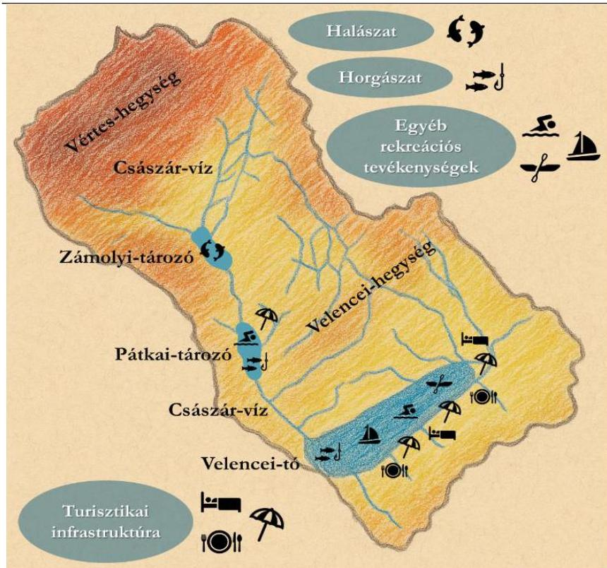
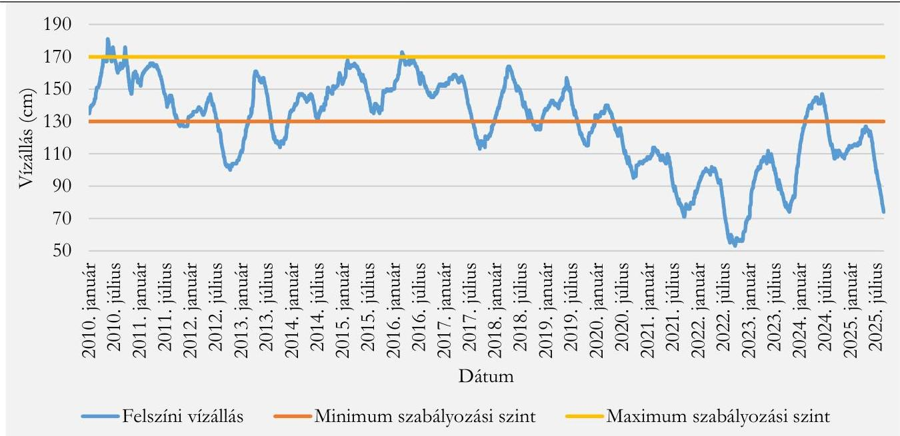
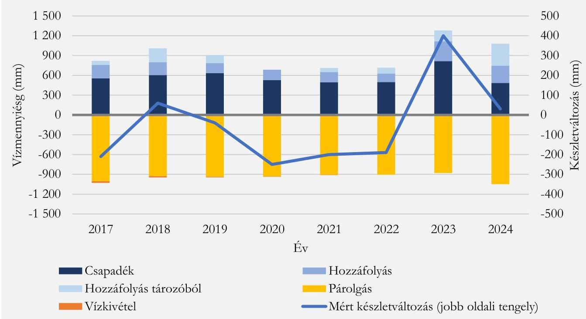
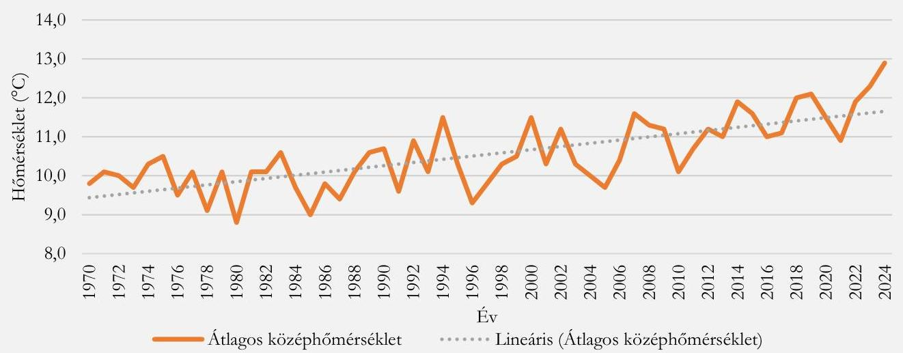
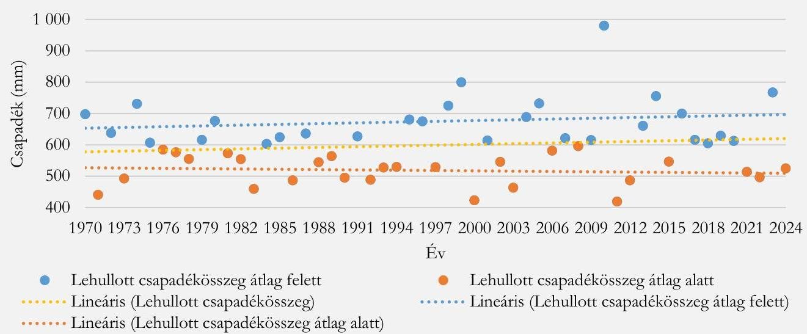
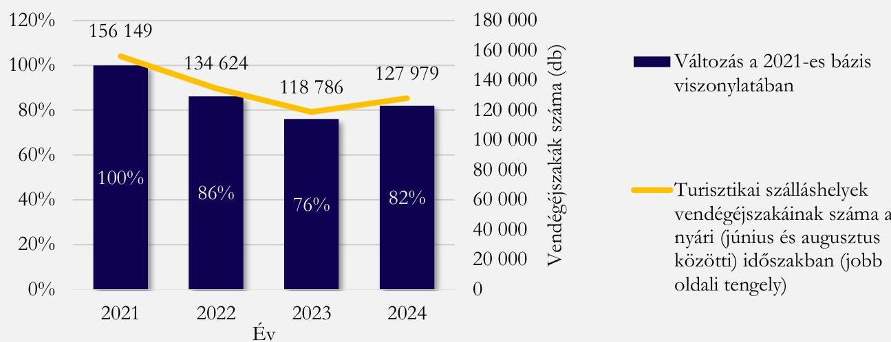
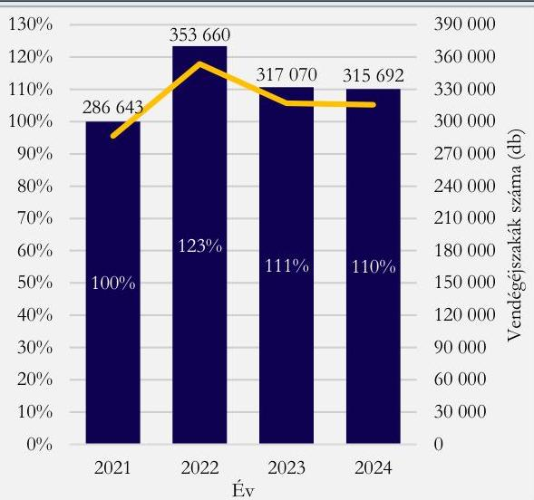
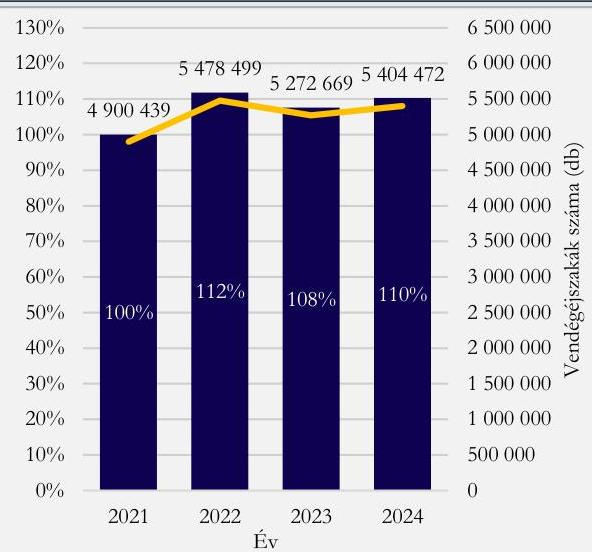
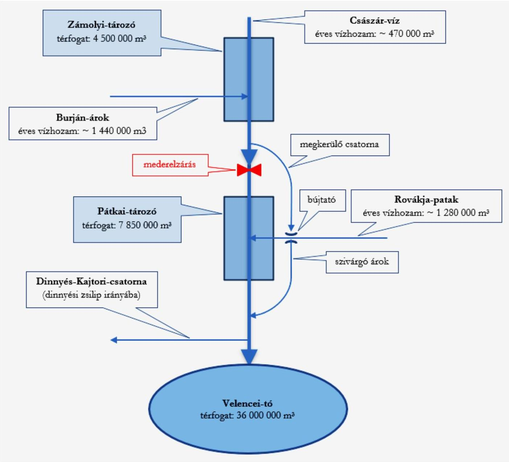

ÁLLAMI SZÁMVEVŐSZÉK

# JELENTÉS

A Velencei-tó fenntartható vízpótlásának megteremtése érdekében tett intézkedések ellenőrzése

2025.

25140

www.asz.hu

---

ÁLLAMI SZÁMVEVŐSZÉK

# JELENTÉS

A Velencei-tó fenntartható vízpótlásának megteremtése érdekében tett intézkedések ellenőrzése

2025.

25140

www.asz.hu

dr. Windisch László
elnök

^{}[]

---

Jelentéseink az interneten a www.asz.hu címen olvashatók.

ELLENŐRZÉSI IGAZGATÓSÁG:
ELLENŐRZÉSI IGAZGATÓSÁG VI.

ELLENŐRZÉSI IGAZGATÓ:
DR. JAKAB KORNÉL ellenőrzési igazgató

ELLENŐRZÉSVEZETŐ:
CSEH ÁRPÁD ellenőrzésvezető
GALLI JÓZSEF ellenőrzésvezető

IKTATÓSZÁM: EL-4207-007/2025
TÉMASORSZÁM: 22
ELLENŐRZÉS-AZONOSÍTÓ SZÁM: V1140

---

TARTALOMJEGYZÉK

- ÖSSZEFOGLALÁS ... 5
- AZ ELLENŐRZÉS EREDMÉNYEI ... 8
- A Velencei-tó fenntartható vízpótlásának megteremtése érdekében tett intézkedések értékelése ... 8
- JAVASLATOK ... 19
- I. FÜGGELÉK: ÉSZREVÉTELEK ... 20
- II. FÜGGELÉK: ELLENŐRZÉSI MEGKÖZELÍTÉS ... 21
- MELLÉKLETEK ... 24
- I. sz. melléklet: Értelmező szótár ... 24
- II. sz. melléklet: Az ellenőrzött és ellenőrzést támogató szervezetek jegyzéke ... 25
- III. sz. melléklet: A Velencei-tó vízpótló rendszerének sematikus ábrája ... 26
- RÖVIDÍTÉSEK JEGYZÉKE ... 27

---

“哈，你是个小伙子，你是个小伙子，你是个小伙子，你是个小伙子，你是个小伙子，你是个小伙子，你是个小伙子，你是个小伙子，你是个小伙子，你是个小伙子，你是个小伙子，你是个小伙子，你是个小伙子，你是个小伙子，你是个小伙子，你是个小伙子，你是个小伙子，你是个小伙子，你是个小伙子，你是个小伙子，你是个小伙子，你是个小伙子，你是个小伙子，你是个小伙子，你是个小伙子，你是个小伙子，你是个小伙子，你是个小伙子，你是个小伙子，你是个小伙子，你是个小伙子，你是个小伙子，你是个小伙子，你是个小伙子，你是个小伙子，你是个小伙子，你是个小伙子，你是个小伙子，你是个小伙子，你是个小伙子，你是个小伙子，你是个小伙子，你是个小伙子，你是个小伙子，你是个小伙子，你是个小伙子，你是个小伙子，你是个小伙子，你是个小伙子，你是个小伙子，你是个小伙子，你是个小伙子，你是个小伙子，你是个小伙子，你是个小伙子，你是个小伙子，你是个小伙子，你是个小伙子，你是个小伙子，

---

ÖSSZEFOGLALÁS

Az elmúlt évek hazánkat érintő aszályos időjárása ráirányította a figyelmet a felszíni víztesteket érintő klímaváltozási kockázatokra, amelyek között társadalmi szempontból is hangsúlyos szerepet játszik a Velencei-tó kritikus helyzete. A tó vízszintje a 2017 és 2025 közötti időszakban minden évben rendre a minimum szabályozási szint, azaz 130 cm alá csökkent, 2020 nyarától – egy rövid átmeneti időszaktól eltekintve – pedig tartóssá vált a vízhiány.

A Velencei-tó partmenti infrastruktúrája a turizmus érdekeit figyelembe véve épült ki az 1960-as évektől kezdődően, ami megköveteli a vízszint 130 cm-es alsó és 170 cm-es felső szabályozási értékek között tartását. A vízgyűjtő terület azonban kis kiterjedésű, ami a Velencei-tó sekély jellegével párosulva érzékenyé teszi a területet az aszályos időszakokra. A tó vízpótló rendszerelemeinek mesterséges hálózata az eseti vízpótlási szükségletre tekintettel épült ki az 1970-es évekre. A kiépített vízpótló rendszer, így különösen a Császár-vízen létesített víztározók, a 4,5 millió m³ kapacitású Zámolyi-tározó és a 7,85 millió m³ kapacitású Pátkai-tározó segítségével szabályozható a KJT¹ adatai szerint 36 millió m³ térfogatú Velencei-tó vízszintje.

1. ábra

# A VELENCEI-TÓ VÍZGYŰJTŐ TERÜLETÉNEK TURISZTIKAI HASZNOSÍTÁST SZEMLÉLTETŐ ÁBRÁJA A VÍZPÓTLÓ RENDSZER KÖZPONTI ELEMEIVEL

Forrás: ÁSZ saját szerkesztés

Mindezekkel összefüggésben jogosan merülhet fel a kérdés, hogy a Velencei-tó kiépített vízpótló rendszere mellett hogyan fordulhatott elő a tartósan vízhiányos állapot. A számvevőszéki ellenőrzés – tekintettel arra, hogy a tó vízszintproblémái közvetlenül hatnak a turizmuson keresztül a régió gazdaságára, valamint a térség társadalmi jólétére is – a fenntartható vízpótlás megteremtése érdekében tett intézkedéseket értékelte, hangsúlyt helyezve a vízmennyiség jó állapotba kerülését és a jó állapot fenntartását szolgáló eszközrendszer kialakítására, működtetésére, fejlesztésére, valamint fenntarthatóságára.

A Zámolyi- és Pátkai-tározó megfelelő vízminősége előfeltétele annak, hogy azok vize a Velencei-tó vízpótlására felhasználható legyen. Mivel azonban létesítésük óta jelentősebb állapotmegőrző, illetve –javító beruházás nem történt a tározókon, állapotuk oly mértékben leromlott, hogy a 2020-as évekre alkalmatlanná tette azokat a Velencei-tó vízmennyiségének pótlásához kapcsolódó elsődleges céljuk maradéktalan betöltésére. Ennek oka a tározók üledékkel történő feltöltődése, illetve ennek hatására a bennük tározott víz minőségének romlása, ami a Velencei-tóba vezetést – a késő ősztől kora tavaszig tartó időszakok kivételével – akadályozta.

---

Összefoglalás

Mindazonáltal az ellenőrzött időszakban – a tározott víz minőségének lehűlés következtében történő javulásakor – a vízpótló rendszer elemeit képező tározók üzemeltetési szabályzatának megfelelően több alkalommal történt különböző mértékű vízeresztés. A tározók 2024. évi teljes leürítését – azok üzemeltetési szabályzatával, valamint a másodlagos hasznosításuk keretében horgászati, illetve halászati tevékenységet végző szervezetekkel, mint haszonbérlőkkel kötött megállapodásokban foglaltakkal összhangban – egyeztetési folyamat előzte meg. A másodlagos hasznosításban érintett felek a fennálló vízigényük miatt azonban nem voltak érdekeltek a tározók teljes leürítésében. Mindemellett az üzemeltetési szabályzatokban és a haszonbérlőkkel kötött szerződésekben nem jelent meg az egyeztetésekre maximálisan fordítható időtartam hossza, amely folyamat elhúzódása esetén növekszik a tározók időközi párolgási vesztesége. A horgászati, illetve halászati tevékenység révén bekövetkező üledékképződés továbbá a tározók vízének minőségére kedvezőtlen hatást gyakorolt, akadályozva a vízpótlást.

Az OVF² a KDTVIZIG³-gel együttműködésben 2021 és 2024 között több kormányelőterjesztést készített elő a vízszintprobléma megoldásának előmozdítása érdekében a Velencei-tó vízpótlásához szükséges fejlesztésekről. A felelős minisztérium⁴ – a vízgazdálkodáshoz, a vízvédelemhez és a vízügyi igazgatási szervek irányításához kapcsolódó feladat- és hatáskörök átszervezését követően – 2024-ben határozott a vízpótló rendszer rehabilitációját támogató tervek elkészítéséről és a tervezéshez szükséges központi költségvetési források biztosításáról. Ennek nyomán az OVF 2024-ben gondoskodott a kiépített vízpótló rendszer rehabilitációját célzó fejlesztési tervek elkészítéséről, amelyekben a vízmennyiség jó állapotba kerülése érdekében meghatározták a fejlesztési irányokat és szükséges intézkedéseket, valamint a kapcsolódó forrásszükségletet, azonban a végrehajtásukhoz szükséges irányítói döntések – ideértve a fejlesztések megvalósításának sorrendjét, időtávját, valamint a kapcsolódó források rendelkezésre bocsátását – a számvevőszéki ellenőrzés lezárásáig nem születtek meg.

A döntéshozatali folyamatok elhúzódása a vízpótló rendszer rehabilitációjához szükséges intézkedések komplexitásának és ezzel párhuzamosan a kapcsolódó forrásoknak a növekedésén keresztül magában hordozza a végrehajtás kitolódásának kockázatát, ami végső soron késlelteti a vízmennyiség jó állapotának elérését. Ezt támasztja alá az is, hogy az ellenőrzött időszakban készült előterjesztések rendre egyre komplexebb beavatkozást és magasabb forrásszükségletet jelöltek meg. Míg 2021-ben a Velencei-tó vízpótló rendszerének rekonstrukciójához kapcsolódó költségbecslés mintegy 6,3 Mrd Ft-ot prognosztizált, addig a 2024-ben készített fejlesztési tervekben már – részben bővebb műszaki tartalommal – 24,5 Mrd Ft forrásszükséglet szerepelt.

A fenntartható vízpótlás eredményessége szempontjából kockázatot jelent továbbá, hogy a helyreállítási célú tervezésen túlmutató hosszú távú, a különböző környezeti, társadalmi és gazdasági hatásokkal számoló megközelítés nem jelent meg a tervezés során. Ennek szükségességét támasztja alá, hogy a 12,35 millió m³ összkapacitású Zámolyi- és Pátkai-tározó a hosszan tartó aszályos időszakokban önmagában nem elég a Velencei-tó vízszintjének szabályozási értékek között tartásához. 2025. április 19. és 2025. szeptember 30. között például 59 cm-mel csökkent a tó vízszintje, amelynek a pótlásához nagyságrendileg 14,75 millió m³ víz szükséges, a tározók teljes feltöltése az azokat tápláló vízfolyások átlagos vízhozama alapján pedig több évet vesz igénybe.

A Velencei-tó vízmennyiségének jó állapotba kerülését ugyan támogatta az OVF és a KDTVIZIG által az ellenőrzött időszakban összesen 22,3 millió Ft-ból végrehajtott beruházás, amely a Császár-víz Pátkai-tározót megkerülő, akadálytalan lefolyását célozta, azonban – a Császár-víz alacsony vízhozamára tekintettel – nem volt elegendő a vízszint csökkenésének ellensúlyozásához.

6

---

Összefoglalás

Az ellenőrzés eredményei alapján az ÁSZ az energiaügyi miniszternek a rövid távú rehabilitációs tervek megvalósítása érdekében szükséges irányítói döntések meghozatala, a hosszú távú környezeti, gazdasági és társadalmi változásokat szem előtt tartó, hatástanulmányokkal alátámasztott tervezés, valamint a vízpótló rendszerelemek másodlagos hasznosítási – szabályozókba és megállapodásokba foglalt – kereteinek a felülvizsgálata kapcsán fogalmazott meg javaslatokat.

7

---

AZ ELLENŐRZÉS EREDMÉNYEI

## A Velencei-tó fenntartható vízpótlásának megteremtése érdekében tett intézkedések értékelése

### Összegző megállapítás

Az ellenőrzött időszakban az EM⁵, az OVF és a KDTVIZIG által a Velencei-tó vízpótlása érdekében megtett intézkedések támogatták, azonban nem eredményezték a Velencei-tó vízmennyiségének jó állapotba kerülését. A kiépített vízpótló rendszer rehabilitációját célzó fejlesztési tervek elkészültek, azokban meghatározták a szükséges fejlesztési irányokat és intézkedéseket, de a fejlesztések végrehajtásáról a számvevőszéki ellenőrzés lezárásáig nem született döntés. Emellett nem készült az éghajlatváltozás hatásait és a környezeti tényezők változásait felmérő, a gazdasági-társadalmi vetületeket figyelembe vevő, hatástanulmányokkal alátámasztott hosszú távú terv a vízmennyiség jó állapotának fenntartása kapcsán.

## 1. Az ellenőrzés háttere

Európa, mint a globális felmelegedés által leginkább érintett kontinens¹, a klimatikus változásokra való felkészülés tekintetében összetett problémákkal kell szembenézzen. A környezeti változások között az átlaghőmérséklet növekedése, valamint a csapadékmennyiség és -eloszlás változása hatást gyakorol a kontinens vízbázisaira, illetve vizes élőhelyeire. Ezek a tényezők, amelyeknek az ökológiai vetület mellett jelentős társadalmi, illetve gazdasági vonatkozásai is lehetnek, Magyarországot sem hagyják érintetlenül.

A 2020-as években tapasztalt aszályos időjárás hosszú távú vízszintproblémákat okozott hazánk harmadik legnagyobb állóvize, egyben az ország egyik legjelentősebb vízparti üdülési célterülete, a Velencei-tó esetében. A partmenti infrastruktúra a tó hasznosíthatóságát, elsősorban a turizmus érdekeit figyelembe véve épült ki az 1960-as évektől kezdődően. A létrehozott infrastruktúra – tekintettel arra, hogy a vízszintproblémák közvetlenül hatnak a turizmuson keresztül a térség gazdaságára és társadalmi jólétére – megköveteli a tó vízállásának szabályozási szinten belül, azaz az agárdi vízmércen mért 130 és 170 cm közötti szinten tartását.

A KJT-ben foglaltak alapján a Velencei-tó felszíne 25 km², térfogata 36 millió m³, partvonalá pedig 28,5 km hosszúságú. Vízgyűjtő területe, amely három fő részre, a Császár-víz, illetve a Vereb-Pázmándi-vízfolyás, valamint a tó fennmaradó közvetlen vízgyűjtő területére tagolódik, relatíve kis kiterjedésű, időről-időre részben vízhiányos. A tó különleges adottságokkal rendelkezik, nádasokkal tarkított, mozaikos, nagy sótartalmú, sekély vízű, szikes jellegű tó, amelynek teljes területe természetvédelmi oltalom

---

¹ Többek között az Európai Unió Föld-megfigyelési programjának, a Kopernikusznak az adatai is ezt támasztják alá.

https://climate.copernicus.eu/climate-indicators/temperature

---

Az ellenőrzés eredményei

alatt áll. A nyári időszakban gyorsan felmelegszik, így fürdőzésre kiválóan alkalmas. A meglévő történeti feljegyzések alapján az elmúlt 1500 év alatt a tó 14 alkalommal teljesen ki is száradt, a legutóbbi ilyen eset 1866-ban fordult elő. A tóba ömlő vízfolyások közül egyedül a Csákvár határában eredő Császár-víz állandó vízfolyás, amelynek vízgyűjtő területe 383 km² kiterjedésű, azonban felső, mintegy 75 km²-nyi karsztos térsége részben inaktív. A tavat tápláló második legnagyobb, de időszakosan kiszáradó Vereb-Pázmándi-vízfolyás vízgyűjtő területe az előzőnek kevesebb, mint harmada, mindössze 105 km² nagyságú. A fennmaradó, közvetlen vízgyűjtő terület kiterjedése pedig 114 km².

A tó vízállása alapvetően a csapadéktól, a vízgyűjtő terület lefolyási viszonyaitól, vagyis a hozzáfolyástól, a párolgástól, valamint a mesterséges szabályozástól függ. A Velencei-tó vízszintje a dinnyési zsilip, illetve a Zámolyi- és Pátkai-tározó üzemeltetésével szabályozható. A Velencei-tó vízszintjének szabályozását és a tározók üzemeltetését az ellenőrzött időszakban a KDTVIZIG végezte. A tározók elsődlegesen a Velencei-tó vízszintjének szabályozását szolgálják vízbő időszakok lefolyásának visszatartásával, illetve a kisvízi időszakban vízpótlással. Másodlagosan azonban – az elsődleges célnak alárendelten – halászati célra, valamint horgász-, illetve üdülőtként hasznosítják azokat. A két tározó együttes térfogata 12,35 millió m³, amelyből az OVF és a KDTVIZIG által 2021-ben készített előterjesztés alapján ideális esetben 11 millió m³ használható fel a Velencei-tó vízpótlására.

A tározók 2017 és 2024 között összesen nagyságrendileg 26 millió m³ vizet tudtak biztosítani a Velencei-tó számára (1 millió m³ víz tóba történő bevezetése 4 cm-rel tudja emelni a vízszintet). A mesterséges vízpótlás jelentőségét mutatja, hogy hosszú évek átlagát tekintve a Velencei-tóba jutó vízmennyiség kb. 30%-a vízpótló rendszerből származott. A Zámolyi-tározó kettő vízfolyás, a Császár-víz és a Burján-árok, a Pátkai-tározó pedig egyrészt a Zámolyi-tározó felől a Császár-víz, másrészt a Rovákja-patak táplálja. A Császár-víz hosszú idősoros átlag alapján – kiszűrve az extrém szélsőségeket – évente 0,5 millió m³, a Burján-árok 1,4 millió m³, a Rovákja-patak pedig 1,3 millió m³ vizet képes szállítani a tározókba.

## 2. A Velencei-tó fenntartható vízpótlásához kapcsolódó tervezés

A Velencei-tó vízállásának 2010. január 1. és 2025. szeptember 30. közötti alakulását a 2. ábra szemlélteti.

2. ábra

A VELENCEI-TÓ VÍZÁLLÁSA 2010. JANUÁR 1. ÉS 2025. SZEPTEMBER 30. KÖZÖTT

Forrás: https://data.vizagy.hu/ alapján ÁSZ saját szerkesztés

---

Az ellenőrzés eredményei

2017 és 2025 között a nyári-öszi időszakokban a tó vízszintje minden évben a minimum szabályozási szint alá csökkent, 2020 nyarától 2024 tavaszáig, majd 2024 júniusa óta a vízállás a minimum szabályozási szint alatt volt. A vízállás a hiteles mérések 1939-es kezdete óta 2022. szeptember 24-én érte el Agárdnál az abszolút negatív rekordot jelentő 53 cm-t.

A tározókat tápláló vízfolyások vízhozamait bemutató 1. táblázat adatai rámutatnak arra, hogy a 2010-es évektől megfigyelhető aszályos időszakok a Velencei-tó vízpótló rendszerének központi elemeire, a Zámolyi- és Pátkai-tározót tápláló vízfolyásokra is kedvezőtlen hatást gyakoroltak. Míg a kimondottan csapadékosnak tekinthető 2010-es évben a Zámolyi- és Pátkai-tározót tápláló vízfolyások együttes vízhozama 13,2 millió m³ volt, addig 2022-ben az extrém aszálynak köszönhetően együttes vízhozamuk kevesebb, mint tizenötödére, 0,8 millió m³-re esett vissza. 2010-ben a vízfolyások együttes vízhozama a Velencei-tó térfogatának közel 37%-át tették ki, 2022-ben ez az arány 2% közelében volt.

1. táblázat
A ZÁMOLYI- ÉS PÁTKAI-TÁROZÓT TÁPLÁLÓ VÍZFOLYÁSOK ÉVES VÍZHOZAMA

|  Év | CSÁSZÁR-VÍZ
CSÁKVÁR
(M³) | BURJÁN-ÁROK
ZÁMOLY
(M³) | ROVÁKJA-PÁTAK
PÁTKA
(M³) | ÖSSZESEN
(M³)  |
| --- | --- | --- | --- | --- |
|  2010 | 1 797 552 | 6 244 128 | 5 171 904 | 13 213 584  |
|  2011 | 662 256 | 1 419 120 | 1 671 408 | 3 752 784  |
|  2012 | 252 288 | 567 648 | 662 256 | 1 482 192  |
|  2013 | 851 472 | 3 405 888 | 2 365 200 | 6 622 560  |
|  2014 | 473 040 * | 1 450 656 | 1 734 480 | 3 658 176  |
|  2015 | 473 040 * | 1 671 408 | 1 860 624 | 4 005 072  |
|  2016 | 599 184 | 1 766 016 | 1 986 768 | 4 351 968  |
|  2017 | 283 824 | 851 472 | 946 080 | 2 081 376  |
|  2018 | 409 968 | 2 365 200 | 914 544 | 3 689 712  |
|  2019 | 504 576 | 1 040 688 | 693 792 | 2 239 056  |
|  2020 | 378 432 | 756 864 | 567 648 | 1 702 944  |
|  2021 | 252 288 | 536 112 | 630 720 | 1 419 120  |
|  2022 | 94 608 | 346 896 | 378 432 | 819 936  |

* A Császár-víz esetében az éves középvízhozam értéke 2014-ben és 2015-ben is 0,015 m³/s volt.
Forrás: KDTVIZIG adatszolgáltatása alapján ÁSZ saját szerkesztés

A Velencei-tó vízmérleg-elemeinek alakulását a 2017 és 2024 közötti időszakban bemutató 2. táblázat adatai részletes magyarázatot adnak a vízállás csökkenésére. Ebből látható, hogy 2017-től – a 2023-as csapadékos évet kivéve – minden évben negatív volt a tó természetes vízkészletének változása, a párolgási veszteséget a csapadék és hozzáfolyás együttesen sem tudta pótolni. A tó vízszintje annak ellenére is tartósan csökkent, hogy 2017-től gyakorlatilag nem történt vízeresztés a tóból, és az egyéb vízkivételek sem voltak számottevők. A 2. táblázat adatai alapján megfigyelhető továbbá, hogy a tározókból leeresztett vízmennyiség (hozzáfolyás tározóból) volt csak képes némileg ellensúlyozni a természetes vízveszteséget, amely 2017-től 2024-ig összesen 1 037 mm-t jelentett, de a vízszint csökkenését ez is csak lassítani tudta.

10

---

Az ellenőrzés eredményei

2. táblázat
A VELENCEI-TÓ VÍZMÉRLEG ELEMEINEK ALAKULÁSA
A 2017 ÉS 2024 KÖZÖTTI IDŐSZAKBAN (MM)

|   | 2017 | 2018 | 2019 | 2020 | 2021 | 2022 | 2023 | 2024  |
| --- | --- | --- | --- | --- | --- | --- | --- | --- |
|  Csapadék (+) | 553 | 603 | 633 | 528 | 493 | 498 | 816 | 484  |
|  Hozzáfolyás (+) | 205 | 195 | 153 | 158 | 158 | 128 | 300 | 263  |
|  Párolgás (-) | 1 005 | 929 | 936 | 930 | 907 | 906 | 880 | 1 049  |
|  Természetes készletváltozás | -247 | -131 | -150 | -244 | -256 | -280 | 236 | -302  |
|  Hozzáfolyás tározóból (+) | 62 | 210 | 119 | 0 | 60 | 90 | 164 | 332  |
|  Vízeresztés a tóból (-) | 0 | 0 | 0 | 0 | 0 | 0 | 0 | 0  |
|  Vízkivétel (-) | 25 | 19 | 9 | 6 | 4 | 0 | 0 | 0  |
|  Mért készletváltozás összesen | -210 | 60 | -40 | -250 | -200 | -190 | 400 | 30  |

Forrás: KDTVIZIG adatszolgáltatása alapján ÁSZ saját szerkesztés

A Velencei-tó 2017 és 2024 között mért készletváltozását a 3. ábra szemlélteti, amelyen jól látható a 2. táblázatban szereplő elemek különböző hatása és együttes eredője is.

3. ábra
A VELENCEI-TÓ VÍZMÉRLEGÉNEK ALAKULÁSA 2017 ÉS 2024 KÖZÖTT

Forrás: KDTVIZIG adatszolgáltatása alapján ÁSZ saját szerkesztés

A Zámolyi- és Pátkai-tározó megfelelő vízminősége alapvető feltétele annak, hogy azok vize a Velencei-tó vízpótlására felhasználható legyen. Kékalga-dominancia és magas klorofill-a tartalom esetén, tekintettel a humán egészségügyi szempontokkal, a védett nádasokkal, illetve a halpusztulással összefüggésben felmerülő kockázatokra, a bennük tározott víz nem használható a Velencei-tó vízpótlására.

A tározókban a létesítésük óta mederkotrás nem történt, az ennek következtében felhalmozódott, magas szervesanyagtartalmú üledék pedig – amihez hozzájárult a tározók másodlagos hasznosítása is – a bennük tárolt víz minőségét az ellenőrzött időszak meghatározó részében vízpótlásra alkalmatlanná tette.

11

---

Az ellenőrzés eredményei

A Zámolyi- és Pátkai-tározók korlátozott használhatósága miatt az OVF a KDTVIZIG-gel együttműködésben 2021-ben – a 2022. évi negatív vízszintrekordot megelőzően – kormányelőterjesztést készített elő a Velencei-tó vízpótlása céljából szükséges fejlesztések megvalósítása érdekében. Az előterjesztésben bemutatták, hogy a Velencei-tó vízkészlete erősen lecsökkent, vízszintje kritikus szintre süllyedt, amelynek növelésére a leromlott állapotú vízpótló rendszer nem képes. A vízpótló rendszer rekonstrukciójához az előterjesztés költségbecslése, ami 2021-es állapotok szerint készült, 6,3 Mrd Ft forrásszükségletet jelölt meg, a kivitelezés időtartamát pedig 3 évben határozta meg. Az előterjesztés a Kormány 2021. július 28-i ülésén napirenden szerepelt, azonban a szükséges fejlesztések tervezésének megkezdéséről döntés nem született. Az OVF a KDTVIZIG-gel együttműködésben 2022-ben és 2023-ban új kormányelőterjesztést készített elő a Velencei-tó vízpótlása céljából szükséges fejlesztések megvalósításának érdekében, azonban a bennük foglalt fejlesztési irányok megvalósítását 2022-ben és 2023-ban sem támogatta végrehajtási döntés.

A Kormány tagjainak feladat- és hatásköréről szóló 94/2018. (V. 22.) Korm. rendelet, majd a 182/2022. (V. 24.) Korm. rendelet alapján a vízgazdálkodásért, a vízvédelemért és a vízügyi igazgatási szervek irányításáért 2024. július 31-ig a belügyminiszter volt a Kormány felelős tagja, 2024. augusztus 1-jétől a kapcsolódó feladat- és hatáskörök átkerültek az energiaügyi miniszterhez. A kormánytagok vízgazdálkodáshoz, vízvédelemhez és vízügyi igazgatási szervek irányításához kapcsolódó felelősségének változását a 3. táblázat szemlélteti.

3. táblázat

A VÍZGAZDÁLKODÁS EGYES SZAKTERÜLETEIÉRT FELELŐS KORMÁNYTAGOK 2020. JANUÁR ÉS 2024. DECEMBER KÖZÖTT

|   | 2020. JANUÁR – DECEMBER | 2021. JANUÁR – 2024. JÚLIUS | 2024. AUGUSZTUSTÓL  |
| --- | --- | --- | --- |
|  Felelős a vízgazdálkodásért, a vízvédelemért és a vízügyi igazgatási szervek irányításáért | belügy-miniszter | - | -  |
|  Felelős a vízgazdálkodásért (kivéve a mezőgazdasági öntözési célú, felszín alatti vízkivételt biztosító vízilétesítmény engedélyezését), a vízvédelemért (kivéve a mezőgazdasági öntözési célú, felszín alatti vízkivételt biztosító vízilétesítmény engedélyezését) és a vízügyi igazgatási szervek irányításáért | - | belügy-miniszter | energiaügyi miniszter  |

Forrás: a Kormány tagjainak feladat- és hatásköréről szóló 94/2018. (V. 22.) Korm. rendelet és 182/2022. (V. 24.) Korm. rendelet alapján ÁSZ saját szerkesztés

A Velencei-tó vízgazdálkodásáért és vízvédelméért felelős irányító, középirányító, igazgatási és hatósági szervezetek irányítási, illetve operatív feladat- és hatáskörei az ellenőrzött időszak egészében meghatározottak, átláthatók és átfedésektől mentesek voltak. A feladatok végrehajtásában közreműködő szervezetek közötti kapcsolattartás biztosított volt.

Az EM 2024 szeptemberében, a vízgazdálkodáshoz, a vízvédelemhez és a vízügyi igazgatási szervek irányításához kapcsolódó feladat- és hatáskörök átszervezését követően határozott a Velencei-tó 1960-as és 1970-es években kiépített, ugyanakkor időközben rossz állapotúvá vált vízpótló rendszerelemei – a Zámolyi- és Pátkai-tározó, valamint a Császár-víz – rehabilitációját felölelő részletes tervezés megkezdéséről és a tervezéshez szükséges 103,7 millió Ft összegű forrás rendelkezésre bocsátásáról.

12

---

Az ellenőrzés eredményei

A fejlesztési tervek 2024 decemberében készültek el, amelyekben a vízmennyiség jó állapotba kerülésének érdekében az OVF gondoskodott a fejlesztési irányok és a kapcsolódó intézkedések, valamint a forrásszükséglet meghatározásáról. A fejlesztési tervekben a Zámolyi- és Pátkai-tározó vízminőségének helyreállítását, ennek keretében vízminőség- és szerkezetjavító beavatkozásokat, továbbá a másodlagos hasznosítás elsődleges céltól történő részleges függetlenítését tűzték ki célul, amelyek eléréséhez két lépésben határozták meg a főbb rekonstrukciós feladatokat.

Első lépésben a Zámolyi-tározó rekonstrukciójaként a mederkotrás, illetve a magas táp- és szervesanyag tartalmú mederülédek elhelyezése kapott prioritást. A kotort anyagból hordalékfogó keresztgát, valamint hullámtörő keresztgát építését tűzték ki célul a másodlagos hasznosításból eredő vízminőség-romlás kockázatának csökkentésére. Második lépésként a Pátkai-tározó rekonstrukcióját határozták meg, amelynek legfontosabb eleme szintén a magas táp- és szervesanyag tartalmú mederülédek kotrása és elhelyezése, valamint a vízszintszabályozás függetlenítése a horgászati és üdülőtavi használati szempontoktól. Ez utóbbi érdekében a fejlesztési tervek a Pátkai-tározó medrében halmentő-tó és külső halágy kialakítását is rögzítették. A tározók rekonstrukciós fejlesztéseihez, illetve az elsődleges és másodlagos hasznosítás egymástól történő függetlenítéséhez szervesen kapcsolódnak továbbá a Császár-víz mederrendezési munkálatai is külső halágy kialakításával, tehát a rekonstrukciós tervek figyelembe vették az elsődleges és másodlagos hasznosítási célok összehangolását, egyes rekreációs szempontok érvényesítését is.

A tó vízpótló rendszerének rehabilitációját célzó tervezett fejlesztések végrehajtásához a kapcsolódó 2024. évi költségbecslés mintegy 24,5 Mrd Ft forrásszükségletet jelzett. A tervek végrehajtásához szükséges irányítói döntések – ideértve a fejlesztések megvalósításának sorrendjét, időtávját, valamint a kapcsolódó források rendelkezésre bocsátását – a számvevőszéki ellenőrzés lezárásáig nem születtek meg.

Figyelembe véve a 2. táblázat adatait és a 3. ábrát, továbbá azt az OVF és a KDTVIZIG által rögzített tényt, hogy a két tározó maximális kapacitása esetén is csak 11 millió m³ használható fel a Velencei-tó vízpótlására, ami 44 cm-es emelkedést jelent a tó vízszintjére nézve, fennáll annak a kockázata, hogy hosszan, több évig tartó csapadékhiányos időjárás esetén a tározók kapacitása önmagában nem képes ellensúlyozni a tó természetes vízkészlet-csökkenését. Erre tekintettel a klímaváltozás negatív hatásainak kezelése, a kapcsolódó kockázatok csökkentése érdekében a helyreállítási célú tervezésen felül irányítószervi szinten indokolt – a változásokhoz történő hatékony alkalmazkodás érdekében – további intézkedések célszerűségének vizsgálata a jó vízszintállapot hosszú távú fenntarthatósága érdekében.

13

---

Az ellenőrzés eredményei

# A klímaváltozás Velencei-tóra gyakorolt hatásait szemléltető tényezők

A Velencei-tó vízszint-csökkenésének hátterében jelentős szerepet játszik a globális felmelegedés. Az éghajlatváltozás következtében az elmúlt évtizedekben növekedett az átlaghőmérséklet és egyre szélsőségesebbé vált a csapadékeloszlás, ami hozzájárult a vízhiányos időszakok előfordulásához.

4. ábra

A HAZAI ÁTLAGOS KÖZÉPHŐMÉRSÉKLET ALAKULÁSA 1970 ÉS 2024 KÖZÖTT

Forrás: KSH⁶ – Összefoglaló táblák (STADAT) – 15.1.1.37. Magyarország és Budapest időjárásának adatai alapján ÁSZ saját szerkesztés

A 4. ábra 1970-től mutatja be az éves hazai átlaghőmérséklet alakulását. Az ELTE Meteorológiai Tanszékének 2025-ben készült tanulmánya² – a HungaroMet Nonprofit Zrt. adatai és a KDTVIZIG 1971-től 2024-ig tartó hosszabb időszakot lefedő mérései alapján – azt támasztja alá, hogy a vizsgált időszakban a Velencei-tó gyorsabban melegedett, mint a levegő. 1971-től 2024-ig a Velencei-tó a nyári időszakban átlagosan 4,1 °C-kal lett melegebb, míg a levegő átlaghőmérséklete ugyanebben az időszakban ennél kisebb mértékben, mindössze 3,4 °C-kal emelkedett. A kipárolgás mértékének növekedése így nem áll egyenes arányban a levegő átlaghőmérséklet-emelkedésének mértékével, ugyanis a levegő egységnyi átlaghőmérséklet-emelkedése egységnyinél nagyobb mértékben növelte a Velencei-tó hőmérsékletét, amelynek hatását a vízszintre nézve az egyre hektikusabbá váló csapadékeloszlás tovább súlyosbít.

Az 5. ábra adataiból ugyan az látható, hogy az országos éves átlagos csapadékösszeg alakulása minimálisan emelkedő tendenciát mutat (lineáris trendvonal) a vizsgált időszakban 600 mm körüli csekély szórással, azonban a 2021 és 2024 közötti időszakban egy alkalommal (2023-ban) volt a lehullott csapadékösszeg az 1970 és 2024 közötti átlagos érték (599 mm) felett, három évben ezalatt maradt. Ez nagymértékben hozzájárult a Velencei-tó vízmennyiségének az ellenőrzött időszakban tapasztalt jelentős csökkenéséhez. Megfigyelhető továbbá az 5. ábra adataiból az is, hogy a csapadékeloszlás egyre inkább szélsőségessé kezdett válni. Az 1970 és 2024 közötti időszakban az átlag alatti és átlag feletti csapadékátlagok trendvonala folyamatosan távolodott egymástól, ami azt mutatja, hogy mind az aszályos, mind a csapadékos időszakok egyre szélsőségesebbé, illetve intenzívebbé váltak. Az átlag alatti időszakok ismétlődése pedig kockázatot jelent a jó vízszintállapot hosszú távú fenntartására.

^{2}
https://masfelfok.hu/2025/06/26/velencei-to-melegedes/

---

Az ellenőrzés eredményei

5. ábra

A HAZAI ÁTLAGOS CSAPADÉKÖSSZEG ALAKULÁSA 1970 ÉS 2024 KÖZÖTT

Forrás: KSH – Összefoglaló táblák (STADAT) – 15.1.1.37. Magyarország és Budapest időjárásának adatai alapján ÁSZ saját szerkesztés

A Velencei-tó vízpótló rendszerének rehabilitációja céljából 2024-ben készült fejlesztési tervek az 1960-as és 1970-es években kiépített, időközben leromlott állapotú vízpótló rendszerelemek rekonstrukciójára irányultak. A kiépített rendszer rehabilitációjára kidolgozott tervek azonban nem vették figyelembe a víztest jó állapotának hosszú távú fenntarthatóságát a megváltozott klimatikus viszonyok mellett. Nem készült a klimatikus viszonyok változását elemző, valamint a turisztikai hasznosítást, illetve a társadalmi-gazdasági kapcsolódási szempontokat és e tényezők egymásra gyakorolt hatását részletező hatástanulmányokkal megalapozott hosszú távú, alternatív megoldásokat tartalmazó terv. A klímaváltozás hatásainak figyelmen kívül hagyása kockázatot jelent a Velencei-tó vízmennyiségének jó állapotba kerülésére és a jó állapot hosszú távú fenntartására, illetve a turizmus visszaesésén keresztül a térség gazdasági és társadalmi fejlődésére.

A Velencei-tó vízmennyiségének a térség gazdasági és társadalmi jólétével összefüggő vetületei

A 6. ábra Gárdony, Pákozd, Sukoró és Velence nyári (június és augusztus közötti) időszakban realizált vendégéjszakáinak alakulását mutatja be 2021 és 2024 között. Az adatok szerint a 2021. évi nyári szezontól kezdődően – a vízmennyiség csökkenésével párhuzamosan – 2023-ig csökkent az idényben eltöltött vendégéjszakák száma. 2024-ben – a partmenti önkormányzatok értékelése alapján a javuló vízszintadatokkal egyetemben – kismértékű emelkedés figyelhető meg 2023-hoz képest. A 2024. évi nyári szezon vendégéjszakáinak száma a 2021. évi nyári szezonhoz viszonyítva mintegy 18%-kal, 28 170 vendégéjszakával csökkent, ami – figyelembe véve, hogy a KSH Tájékoztatási adatbázisának turisztikai szálláshelyek bevételeire vonatkozó adatsora szerint a Gárdonyi járásban egy vendégéjszaka átlagosan 13 186 Ft-ba került 2024-ben, továbbá az egy vendégéjszakára jutó szállásdíjon felül elköltött összeg a szálláshelyen (pl. vendéglátás, egyéb szolgáltatás) 8 255 Ft/nap volt – nagyságrendileg 604 millió Ft bevételkiesést jelentett a térség szállásadói számára a 2021-es adatokhoz viszonyítva.

15

---

Az ellenőrzés eredményei

6. ábra

A VELENCEI-TÓ PARTMENTI TELEPÜLÉSEIN A NYÁRI VENDÉGÉJSZAKÁK SZÁMÁNAK ALAKULÁSA 2021 ÉS 2024 KÖZÖTT

Forrás: KSH – Tájékoztatási adatbázis – Szálláshely-szolgáltatás alapján ÁSZ saját szerkesztés

A turizmus csökkenése az érintett települések és vendéglátóhelyek bevételi forrásaira is negatív hatást gyakorolt. Ezt tükrözi az is, hogy a KSH adatai alapján 2020 eleje és 2024 vége között megközelítőleg 40%-kal csökkent a Velencei-tó partmenti településein a vendéglátóhelyek száma.

Megvizsgálva ugyanezen időszakra a Tisza-tó és a Balaton térségének nyári szezonban eltöltött vendégéjszakái számát (7. és 8. ábra) az látható, hogy ezen régiókban a nyári vendégéjszakák száma 2021-hez viszonyítva 2024-re jelentősen, 10 százalékot meghaladó mértékben emelkedett.

7. ábra

8. ábra

A TISZA-TÓ TÉRSEGÉBEN A NYÁRI SZEZONBAN ELTÖLTÖTT VENDÉGÉJSZAKÁK SZÁMÁNAK ALAKULÁSA 2021 ÉS 2024 KÖZÖTT

A BALATON TÉRSEGÉBEN A NYÁRI SZEZONBAN ELTÖLTÖTT VENDÉGÉJSZAKÁK SZÁMÁNAK ALAKULÁSA 2021 ÉS 2024 KÖZÖTT

Változás a 2021-es bázis viszonylatában

Turisztikai szálláshelyek vendégéjszakáinak száma a nyári (június és augusztus közötti) időszakban (jobb oldali tengely)

Forrás: KSH – Tájékoztatási adatbázis – Szálláshely-szolgáltatás alapján ÁSZ saját szerkesztés

A 6-8. ábrán szereplő adatok azt támasztják alá, hogy a Velencei-tó esetében a nyári időszaki turizmus – a koronavírus-járványból történő kilábalás ellenére – a vízállásról 2021-től kezdve időről-időre megjelenő

16

---

Az ellenőrzés eredményei

kedvezőtlen hírek és a rekordalacsony vízszintek hatására is csökkent. Ez a keresleti visszaesés közvetetten, de hozzájárult a térség vonzerejének általános visszaeséséhez is. Ehhez kapcsolódóan a 4. táblázat a Velencei-tó térségének partmenti településein 2019 és 2023 között értékesített lakások átlagárát szemlélteti.

4. táblázat

A VELENCEI-TÓ PARTMENTI TELEPÜLÉSEIN ÉRTÉKESÍTETT LAKÁSOK ÁTLAGÁRA 2019 ÉS 2023 KÖZÖTT

|  ÉV | ÉRTÉKESÍTETT LAKÁSOK ÁTLAGÁRA (EZER FT / M²) |   |   |   | ÉRTÉKESÍTÉS DARABSZÁMÁVAL SÚLYOZOTT ÁTLAGÁR VÁLTOZÁSA A VELENCEI-TÓ PARTMENTI TELEPÜLÉSEEN (% ELŐZŐ EV = 100%) | ORSZÁGOS ÁTLAGÁR VÁLTOZÁSA (% ELŐZŐ EV = 100%)  |
| --- | --- | --- | --- | --- | --- | --- |
|   |  GARDONY | PÁKOZD | SUKORÓ | VELENCE  |   |   |
|  2019 | 400 | 294 | 377 | 413 | - | -  |
|  2020 | 448 | 387 | 412 | 492 | 17,2% | 6,2%  |
|  2021 | 561 | 386 | 417 | 543 | 17,6% | 16,2%  |
|  2022 | 682 | 763 | 679 | 712 | 29,0% | 23,6%  |
|  2023 | 678 | 691 | 615 | 702 | -2,0% | 5,9%  |

Forrás: KSH – Ingatlanadattár alapján ÁSZ saját szerkesztés

A vizsgált időszakon belül a Velencei-tó partmenti településein értékesített lakások súlyozott átlagára 2020 és 2022 között az országos átlagot meghaladó mértékben emelkedett. 2023-ban ugyanakkor ez a trend fordulatot vett, 2,0%-kal csökkentek az ingatlanárak a megelőző évhez képest. Figyelembe véve a térségi átlagár többéves emelkedő tendenciáját, illetve azt is, hogy 2023-ban az országos átlag 5,9%-kal emelkedett, a Velencei-tó 2021-es és 2022-es vízszintproblémái a tó turisztikai hasznosíthatóságának visszaesésén túl közvetetten hatottak a térség ingatlanpiaci folyamataira is. Mindezekre tekintettel az ÁSZ véleménye szerint a Velencei-tó hosszú távú vízpótlásának tervezését olyan hatástanulmányokkal célszerű megalapozni, amelyek figyelembe veszik a tó turisztikai célú hasznosításához szükséges tényezőket is.

# 3. A Velencei-tó fenntartható vízpótlásával kapcsolatban megtett intézkedések

A Velencei-tó és tározóinak KDTVIZIG által 2009-ben kiadott együttes üzemeltetési szabályzata⁷ – a tározók vízjogi üzemeltetési engedélyében foglaltakkal egyezően – kimondta, hogy a Zámolyi- és Pátkai-tározó alapvető rendeltetése a Velencei-tó vízszintszabályozása, minden más érdek másodlagos és alárendelt ennek a célnak. A szabályzat rendelkezett továbbá arról, hogy több éves tartós aszály esetén szükség lehet a tározók teljes leürítésére, amelyre a hidrometeorológiai, vízháztartási és vízminőségi állapotokat értékelve, a másodlagos hasznosítókkal történő egyeztetés után, egyedi döntés alapján kerülhet sor. Ennek maximális átfutási idejét a másodlagos hasznosítókkal kötött megállapodás azonban nem rögzítette, ami az egyeztetés esetleges elhúzódása esetén az idő közben jelentkező kipárolgási veszteség miatt kockázatot jelent a Velencei-tó vízutánpótlásának eredményességére.

A Velencei-tó vízpótlása érdekében a KDTVIZIG az ellenőrzött időszakban több alkalommal végzett leeresztést a tározókból, ugyanakkor a vízpótlást akadályozta a tározott víz nem megfelelő minősége. Vízpótlás a tározott víz minőségének lehűlés nyomán bekövetkező javulásakor, a késő ősztől kora tavaszig tartó időszakokban történt. A Pátkai-tározó teljes leürítése 2024. április 16-án, a Zámolyi-tározóé pedig 2024. május 7-én – a Pátkai-tározót elkerülő csatornán keresztül – valósult meg.

17

---

Az ellenőrzés eredményei

A Velencei-tó vízszintje a tározók 2024 tavaszán történő teljes leürítését követően elérte az alsó szabályozási szintet, 2024. július 19-től viszont újra az alá csökkent.

A tározókban lévő rossz vízminőség miatt visszatartott víz a Velencei-tó vízmennyiségére vonatkozó, KDTVIZIG által elkészített éves jelentések alapján 2024 tavaszáig hozzávetőlegesen 11,24 millió m³ párolgási veszteséget okozott (2022 júniusáig 8 millió m³-t, majd onnantól még két évig a Pátkai-tározó vize évente 1,62 millió m³-t), amely a Velencei-tó vízszintje tekintetében 45 cm-nek felel meg.

A KDTVIZIG az ellenőrzött időszak során a Velencei-tó vízpótlását támogató fejlesztésként 2024-ben megépítette a Pátkai-tározót megkerülő csatornát a Császár-víz akadálytalan lefolyása érdekében, ami a vízpótlás irányába hatott, de nem eredményezte a vízmennyiség jó állapotba kerülését. A munkálatok egy – 16,9 millió Ft összegű OVF forrásból megvalósított – átkötő csatorna kivitelezéséből, valamint a meglévő szivárgó árok – KDTVIZIG 5,4 millió Ft összegű forrásából végrehajtott – rehabilitációjából álltak. A 2024-ben végrehajtott beruházást az tette indokolttá, hogy a Pátkai-tározóban tárolt víz – vízminőségi problémák miatt – alkalmatlan volt vízpótlásra, ezért a Császár-víz sem tudta táplálni ezekben az időszakokban a Velencei-tavat. A tározók rehabilitációjáig az ideiglenes átkötő csatorna lehetőséget biztosít a Császár-víz felső szakaszáról érkező megfelelő minőségű víz időszakos átvezetésére a Velencei-tó felé. A Velencei-tó kiépített vízpótlórendszerének az ideiglenes átkötő csatornával bővített sematikus ábráját a III. sz. melléklet tartalmazza.

## 4. A Velencei-tó vízpótló rendszerének üzemeltetése

Az ellenőrzött időszakban másodlagos céllal a Zámolyi-tározót halászati, a Pátkai-tározót pedig horgászati célra, illetve üdülőtként hasznosították. A Zámolyi-tározó haszonbérlője a Magyar Országos Horgász Szövetség, a Pátkai-tározó haszonbérlője pedig a Horgász Egyesületek Fejér Megyei Szövetsége volt. A KDTVIZIG és a haszonbérlők közötti együttműködés keretei biztosítottak voltak. A felek közötti megállapodásokban rögzítették, hogy a tározók vízkészlete elsődlegesen vízgazdálkodási feladatok ellátását szolgálja, ennek megfelelően a tározók halászati, illetve horgászati hasznosítása alá volt rendelve a fő funkció – a Velencei-tó vízpótlása – elsődlegességének.

A KDTVIZIG és a hasznosítást végző szervezetek közötti együttműködés keretei biztosítottak voltak, a másodlagos hasznosítás azonban érdekellentétet okozott a tározók leürítése kapcsán, mivel a másodlagos cél szerinti hasznosítás alapfeltétele a tározók vízzel való feltöltöttsége. Az érdekellentétből fakadó anomáliát szemlélteti, hogy a másodlagos hasznosításban helyi szinten érdekelt Pátka Község Önkormányzata a Pátkai-tározót megkerülő csatorna üzembe helyezését támogató vízjogi létesítési engedély ellen egy alkalommal fellebbezést nyújtott be, meghosszabbítva a megvalósítás átfutási idejét. A 2024 áprilisában, illetve májusában végrehajtott – tározó leürítéseket megelőző egyeztetéseken a Magyar Országos Horgász Szövetség kirendeltségvezetője, valamint a Horgász Egyesületek Fejér Megyei Szövetségének elnöke a tározók leürítésével nem értett egyet.

Az ellenőrzött időszakban a tározók üzemeltetése azok elsődleges rendeltetésének figyelembevételével történt meg, azok másodlagos célra történő hasznosítása ugyanakkor hozzájárult műszaki állapotuk romlásához. A tározók vízminősége a klorofill-a koncentráció növekedése, és a felhalmozódott mederüledékekben lévő biológiailag aktív foszforterhelés miatt, amely a vízgyűjtő területről érkező mezőgazdasági eredetű lefolyásból, illetve a tározókban folytatott intenzív halászati és horgászati tevékenységből származott, folyamatosan romlott.

18

---

19

# JAVASLATOK

Az ÁSZ tv. 33. § (1) bekezdésében foglaltak értelmében az ellenőrzött szervezet vezetője köteles a jelentésben foglalt megállapításokhoz kapcsolódó intézkedési tervet összeállítani és azt a jelentés kézhezvételétől számított 30 napon belül az ÁSZ részére megküldeni. Az ÁSZ a jelentésben foglalt megállapításokhoz kapcsolódóan az alábbi javaslatok tekintetében várja el az intézkedési terv elkészítését.

## AZ ENERGIAÜGYI MINISZTERNEK

1. Kezdeményezze a Velencei-tó vízpótló rendszerének rehabilitációját célzó fejlesztési tervek végrehajtásához szükséges irányítói döntések meghozatalát.

2. Kezdeményezze és ösztönözze a rehabilitációs célú tervezésen felül a környezeti viszonyok változásához való alkalmazkodóképesség növelését célzó tervek megalapozásaként célzott kutatások lefolytatását, hatástanulmányok elkészítését. Gondoskodjon arról, hogy ennek során vegyék figyelembe az éghajlatváltozás, a turisztikai hasznosítás, a helyi közösségek és a térség gazdaságának fejlődése, valamint a környezet- és természetvédelem szempontjait. A felmérések és háttértanulmányok alapján kezdeményezze a vízpótló rendszer alkalmazkodóképességének növelését célzó fejlesztések megtervezését.

3. Kezdeményezze a Velencei-tó vízmennyiségének és vízminőségének jó állapotba kerülése, valamint a jó állapot hosszú távú fenntartása érdekében a vízpótló rendszer egyes elemeihez kapcsolódó másodlagos hasznosítás kereteinek felülvizsgálatát, továbbá a felülvizsgálat eredményének függvényében a másodlagos hasznosítás kereteinek módosításához szükséges intézkedések megtételét.

---

I. FÜGGELÉK: ÉSZREVÉTELEK

A jelentéstervezetet az ÁSZ 15 napos észrevételezésre megküldte az ellenőrzött szervezet vezetőjének az ÁSZ tv. 29. §* (1) bekezdése előírásának megfelelően.

Az OVF és a KDTVIZIG vezetője a jelentéstervezetre észrevételt nem tett. Az EM vezetője kettő, a jelentéstervezet megállapításait nem érintő észrevételt fogalmazott meg.

Az elfogadott észrevételek alapján az ÁSZ módosította a jelentést.

* 29. § (1) Az Állami Számvevőszék az ellenőrzési megállapításait megküldi az ellenőrzött szervezet vezetőjének vagy az általa megbízott személynek, és annak, akinek személyes felelősségét állapította meg.
(2) Az ellenőrzött szervezet vezetője és a felelősként megjelölt személy az ellenőrzés megállapításaira tizenöt napon belül írásban észrevételt tehet.
(3) Az Állami Számvevőszék az észrevételre a beérkezésétől számított harminc napon belül írásban válaszol. A figyelembe nem vett észrevételeket köteles a jelentésben feltüntetni, és megindokolni, hogy azokat miért nem fogadta el.

20

---

21

# II. FÜGGELÉK: ELLENŐRZÉSI MEGKÖZELÍTÉS

## AZ ELLENŐRZÉS JOGALAPJA

Az ellenőrzés jogszabályi alapját az ÁSZ tv. 1. § (3) bekezdés, az 5. § (2)-(3) bekezdés előírásai képezte.

## AZ ELLENŐRZÉS CÉLJA

Az ellenőrzés célja annak értékelése volt, hogy eredményesek voltak-e a Velencei-tó fenntartható vízpótlásának megteremtése érdekében tett intézkedések, azok hozzájárultak-e a tó aszályos időszakokban tapasztalható nagyarányú vízszintcsökkenésének elkerüléséhez, vízmennyiségének jó állapotba kerüléséhez és a jó állapot fenntartásához.

## AZ ELLENŐRZÉS TÍPUSA

Rendszerellenőrzés

## AZ ELLENŐRZÉS TÁRGYA

Az ellenőrzés tárgyát képezte a Velencei-tó fenntartható vízpótlásának megteremtése céljából készült, a fejlesztési irányokat és szükséges intézkedéseket, illetve a kapcsolódó forrásszükségletet is tartalmazó fejlesztési tervek, a tervek végrehajtását támogató kormányzati / irányítói döntések, ideértve a szükséges költségvetési források rendelkezésre bocsátását, továbbá a fenntartható vízpótlás érdekében végrehajtott intézkedéseket és fejlesztéseket.

Az ellenőrzés kiterjedt minden olyan körülményre és adatra, amely az ÁSZ jogszabályban meghatározott feladatainak teljesítéséhez, valamint a program végrehajtása folyamán felmerült újabb összefüggések feltárásához szükséges.

## AZ ELLENŐRZÉS HATÓKÖRE ÉS TERÜLETE

Az ellenőrzés keretében az ÁSZ a Velencei-tó fenntartható vízpótlásának megteremtése érdekében tett intézkedésekre fókuszáltan értékelte a vízutánpótlás céljából kiépített rendszer nagyarányú és tartós vízszintcsökkenés megelőzéséhez történő hozzájárulását.

Az ellenőrzés hatóköre kiterjedt a vízmennyiség jó állapotba kerülését, és a jó állapot fenntartását szolgáló eszközrendszer kialakításának, működésének és fenntarthatóságának értékelésére.

Az ellenőrzés nem terjedt ki a vízminőség védelme érdekében megtett intézkedések értékelésére.

---

II. Függelék: Ellenőrzési megközelítés

## AZ ELLENŐRZŐTT IDŐSZAK

2020. január 1-jétől 2024. december 31-ig, kitekintéssel az ellenőrzés lezárásáig (2025. szeptember 30.) tartó folyamatok értékelésére.

## AZ ELLENŐRZÉSI KRITÉRIUMOK

|  FOKUSZTERÜLET/FOKUSZKÉRDÉS | ELLENŐRZÉSI KRITÉRIUMOK  |
| --- | --- |
|  A Velencei-tó fenntartható vízpótlásának megteremtése érdekében tett intézkedések értékelése | A Velencei-tó vízpótlásának megteremtése céljából készült fejlesztési tervekben a térség gazdasági, turisztikai céljainak és adottságainak figyelembevételével meghatározták a szükséges fejlesztési irányokat és intézkedéseket.  |
|   | A fejlesztési tervek számításokkal és/vagy egyéb alátámasztó dokumentumokkal (kimutatásokkal, elemzésekkel, tanulmányokkal) megalapozottak voltak; figyelembe vették a klímaváltozás várható negatív hatásait, a vízmennyiség jó állapotba kerülésének, és a jó állapot fenntarthatóságának Víz Keretirányelvben rögzített céljait.  |
|   | A fejlesztési tervekben meghatározták a célok eléréséhez szükséges források mértékét.  |
|   | Meghozták a Velencei-tó fenntartható vízpótlásának megteremtése érdekében tervezett intézkedések megvalósításához szükséges – sorrendre, időtávra is kiterjedő – kormányzati/irányítói döntéseket, valamint a feladatokhoz tervezett fejlesztési források biztosítása megtörtént.  |
|   | A tervezett és terven felül megvalósított fejlesztések a kapcsolódó döntésekben meghatározott sorrendben és határidőben készültek el, azokat nyomon követték és értékelték.  |
|   | Az elsődlegesen a Velencei-tó vízszintszabályozását szolgáló rendszer elemeinek, közöttük a rendszer meghatározó elemeiként a Zámolyi-tározó és a Pátkai-tározó (ellenőrzött időszak végi) műszaki állapota alkalmas volt a Velencei-tó vízutánpótlásának biztosítására, azok egyéb célra – pl. rekreációs tevékenységek – történő hasznosítása nem gátolta, vagy akadályozta a vízpótlást.  |
|   | Az üzemeltetést és hasznosítást végző szervezetek közötti együttműködés keretei biztosítottak voltak.  |
|   | Rögzítették a hasznosítási szerződésekben azt az üzemeltetési szabályzatokban meghatározott elvet, hogy rendkívüli helyzetekben, pl. aszályos, illetve tartósan aszályos időszakokban a Zámolyi-tározó és a Pátkai-tározó részleges, illetve teljes leürítése is megtörténhet.  |

---

II. Függelék: Ellenőrzési megközelítés

# AZ ELLENŐRZÉS MÓDSZERE ÉS AZ ELLENŐRZÉSI BIZONYÍTÉKOK KÖRE

Az ellenőrzést az ÁSZ a nemzetközi standardokat irányadónak tekintve az ellenőrzési program szempontjai, az ellenőrzött időszakban hatályos jogszabályok, az ÁSZ ellenőrzési alapelvei és módszertana alapján a rendszerellenőrzések keretein belül eredményalapú és problémaalapú megközelítéssel, a konkrét problémák, kritériumoktól való eltérések okainak vizsgálatával, elemzésével végezte.

Az ellenőrzési kérdések megválaszolásához szükséges bizonyítékok megszerzése az ellenőrzött szervezetek és az ellenőrzést támogató szervezetek által rendelkezésre bocsátott dokumentumokra, adatokra alapozva megfigyelés, összehasonlítás, szemle (szemrevételezés), kérdésfeltevés (információkérés), interjú, valamint elemző eljárás útján történt. Az ellenőrzési bizonyítékként felhasználható adatforrások közé tartoztak egyrészt az ellenőrzéshez kért dokumentumok, adatforrások, másrészt adatforrás volt minden – az ellenőrzés folyamán – feltárt, az ellenőrzés szempontjából információkat tartalmazó dokumentum. Mintavételi eljárás alkalmazására az ellenőrzés keretében nem került sor.

Az ellenőrzés lefolytatásához az ellenőrzött szervezetek a tanúsítványok kitöltésével, valamint az ÁSZ által kért dokumentumok, adatok, információk megküldésével és az ellenőrzés során, az ellenőrzést támogató szervezetek az ÁSZ által kért dokumentumok, adatok, információk megküldésével szolgáltattak adatokat.

---

MELLÉKLETEK

## I. SZ. MELLÉKLET: ÉRTELMEZŐ SZÓTÁR

aszály

Az a természeti esemény, amelynek során a kockázatviselés helyén az adott növény vegetációs időszakában harminc egymást követő napon belül:

a) a lehullott csapadék összes mennyisége a tíz millimétert nem éri el, vagy
b) a lehullott csapadék összes mennyisége a huszonöt millimétert nem éri el és a napi maximum hőmérséklet legalább tizenöt napon meghaladja a 31 °C-ot.

(Forrás: 2011. évi CLXVIII. törvény a mezőgazdasági termelést érintő időjárási és más természeti kockázatok kezeléséről 2. § 1. pont)

fenntarthatóság

A fenntarthatóság az emberiség jelen szükségleteinek kielégítése, a környezet és természeti erőforrások jövő generációk számára történő megőrzésével egyidejűleg.

(Forrás: A Világ Tudományos Akadémiának Nyilatkozata, Tokió, 2000.)

jó állapot

A Víz Keretirányelv célja, hogy 2015-re a felszíni és felszín alatti víztestek „jó állapotba” kerüljenek. A Víz Keretirányelv szerint a „jó állapot” nemcsak a víz tisztaságát jelenti, hanem a vízhez kötődő élőhelyek minél zavartalanabb állapotát, illetve a megfelelő vízmennyiséget is.

A Velencei-tó vízmennyiségének jó állapota alatt az ellenőrzés a Velencei-tó és tározóinak egységes üzemeltetési szabályzatában meghatározott szabályozási tartomány alsó és felső szintje – 130 és 170 cm – közötti vízszintet érti.

(Forrás: A Víz Keretirányelvben foglaltak hazai megvalósítása érdekében a Velencei-tó vízgyűjtő területe tekintetében készített 1-14. jelű vízgyűjtő-gazdálkodási terv, 2010.)

problémaalapú megközelítés

A problémaalapú megközelítés konkrét problémák vagy kritériumoktól való eltérések okait vizsgája, elemzi. Az ellenőrzés a teljesítménnyel kapcsolatos problémák meghatározására, okainak feltárására irányul. Az ellenőrzött terület működésének gazdaságosságát, hatékonyságát és eredményességét leginkább veszélyeztető kockázatok figyelembevételével az ellenőrzést végzők hipotéziseket állítanak fel az azonosított problémák lehetséges okaira és következményeire, az ellenőrzés ezek ellenőrzésére irányul.

rendszerellenőrzés

(Forrás: Az Állami Számvevőszék ellenőrzési alapelvei és módszertana, 2024.)

A rendszerellenőrzések olyan rendszerekre, átfogó területekre, ágazatokra (intézkedésekre, tevékenységekre, programokra) fókuszálnak, amelyekben a számvevőszéki ellenőrzés hozzáadott értéket biztosíthat az állampolgárok számára, és amelyek esetében a legnagyobb lehetőség mutatkozik a körülmények javítására. A rendszerellenőrzések fókuszában az eredményesség, gazdaságosság, hatékonyság áll. A rendszerellenőrzést valós teljesítmény-információkra, adatokra kell alapozni, a tényhelyzet megismerése, valamint annak érdekében, hogy az ellenőrzési munkát a legkockázatosabb területekre lehessen összpontosítani.

Víz Keretirányelv

(Forrás: Az Állami Számvevőszék ellenőrzési alapelvei és módszertana, 2024.)

Az Európai Parlament és a Tanács 2000/60/EK irányelve (2000. október 23.) a vízpolitika terén a közösségi fellépés kereteinek meghatározásáról.

24

---

Mellékletek

## II. SZ. MELLÉKLET: AZ ELLENŐRZŐTT ÉS ELLENŐRZÉST TÁMOGATÓ SZERVEZETEK JEGYZÉKE

### ELLENŐRZŐTT SZERVEZETEK MEGNEVEZÉSE

- Energiaügyi Minisztérium
- Országos Vízügyi Főigazgatóság
- Közép-dunántúli Vízügyi Igazgatóság

### ELLENŐRZÉST TÁMOGATÓ SZERVEZETEK MEGNEVEZÉSE

- Gárdony Város Önkormányzata
- Pákozd Nagyközség Önkormányzata
- Sukoró Község Önkormányzata
- Velence Város Önkormányzata
- Magyar Turisztikai Ügynökség Zrt.

25

---

Mellékletek

## III. SZ. MELLÉKLET: A VELENCEI-TÓ VÍZPÓTLÓ RENDSZERÉNEK SEMATIKUS ÁBRÁJA

Forrás: KDTVIZIG adatszolgáltatása alapján ÁSZ saját szerkesztés

---

RÖVIDÍTÉSEK JEGYZÉKE

1 KJT
Nemzeti Vízstratégia – Kvassay Jenő Terv (elfogadva a Nemzeti Vízstratégia és a végrehajtását biztosító intézkedési terv elfogadásáról szóló 1110/2017. (III. 7.) Korm. határozattal)

2 OVF
Országos Vízügyi Főigazgatóság

3 KDTVIZIG
Közép-dunántúli Vízügyi Igazgatóság

4 felelős minisztérium
2020. január 1. és 2024. július 31. között a Belügyminisztérium, 2024. augusztus 1-től az Energiaügyi Minisztérium

5 EM
Energiaügyi Minisztérium

6 KSH
Központi Statisztikai Hivatal

7 együttes üzemeltetési szabályzat
A Velencei-tó és tározóinak együttes üzemeltetési szabályzata (KDTVIZIG, 2009. december)

27

---

ÁLLAMI SZÁMVEVŐSZÉK

1052 Budapest, Apáczai Csere János u. 10. | 1364 Budapest 4., Pf. 54

www.asz.hu | szamvevoszek@asz.hu

telefon: +36 1 484 9100