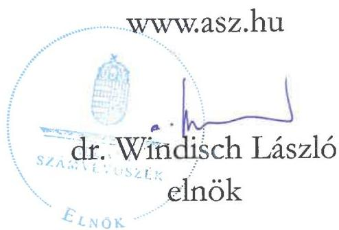
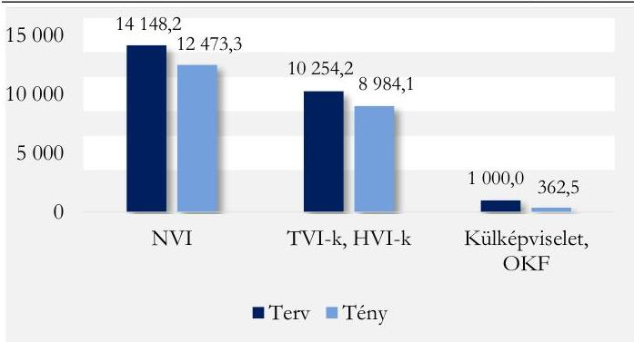
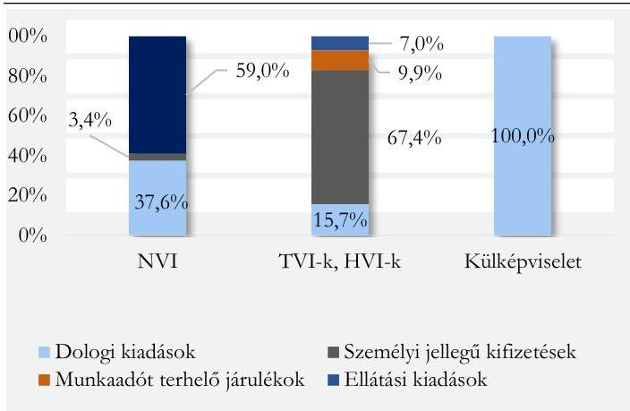
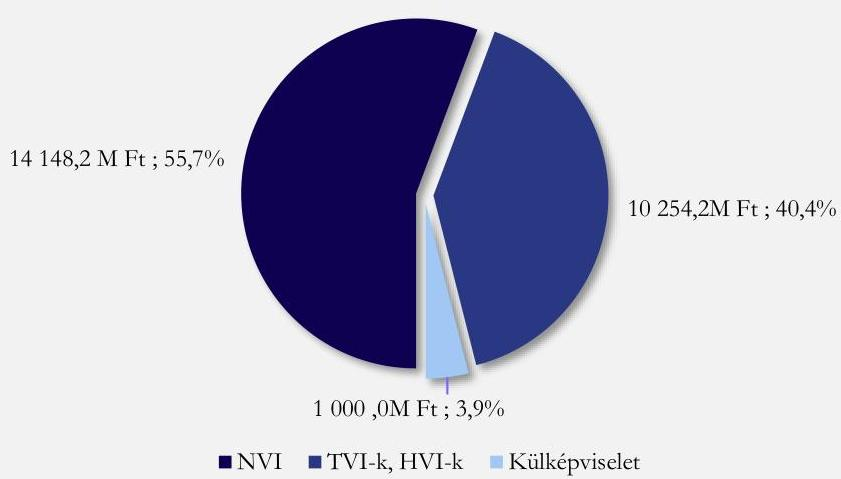
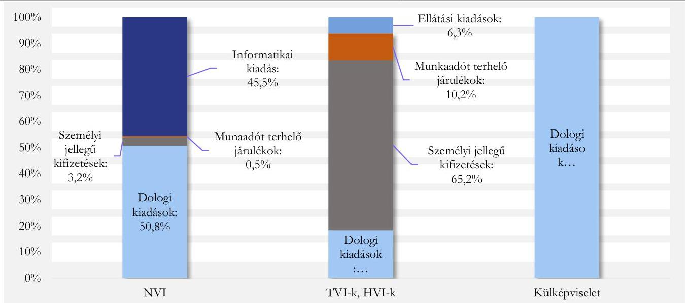
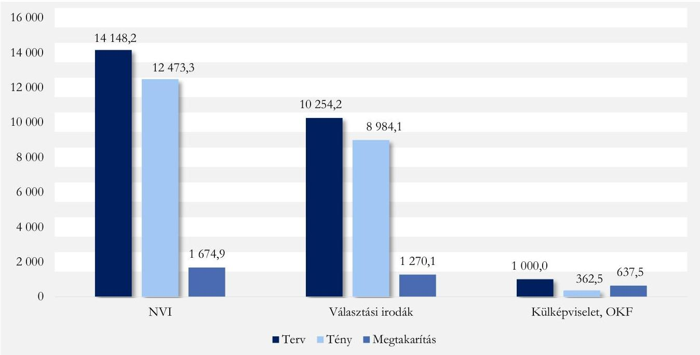

ÁLLAMI SZÁMVEVŐSZÉK

# JELENTÉS

A 2024. évi helyi önkormányzati képviselők és polgármesterek, a nemzetiségi önkormányzati képviselők és az európai parlamenti képviselők választására fordított pénzeszközök felhasználásának ellenőrzése

2025.

25141

www.asz.hu

---

ÁLLAMI SZÁMVEVŐSZÉK

# JELENTÉS

A 2024. évi helyi önkormányzati képviselők és polgármesterek, a nemzetiségi önkormányzati képviselők és az európai parlamenti képviselők választására fordított pénzeszközök felhasználásának ellenőrzése

2025.

25141

---

Jelentéseink az interneten a www.asz.hu címen olvashatók.

- ELLENŐRZÉSI IGAZGATÓSÁG V.:
- ELLENŐRZÉSI IGAZGATÓSÁG V.

- ELLENŐRZÉSI IGAZGATÓ:
- KLINGA LÁSZLÓ igazgató

- ELLENŐRZÉSVEZETŐ:
- SOLYMÁR ÁGNES ellenőrzésvezető

- IKTATÓSZÁM: EL-4157-002/2025
- TÉMASORSZÁM: 3
- ELLENŐRZÉS-AZONOSÍTÓ SZÁM: V1128

---

TARTALOMJEGYZÉK

- ÖSSZEFOGLALÁS ... 5
- AZ ELLENŐRZÉS EREDMÉNYEI ... 8
1. A 2024. évi helyi önkormányzati képviselők és polgármesterek, a nemzetiségi önkormányzati képviselők és az Európai parlamenti képviselők választása pénzügyi előkészítésének szabályszerűsége ... 8
2. A 2024. évi helyi önkormányzati képviselők és polgármesterek, a nemzetiségi önkormányzati képviselők és az Európai parlamenti képviselők választása pénzügyi fedezete biztosításának, az előirányzatok kezelésének szabályszerűsége ... 11
3. A 2024. évi helyi önkormányzati képviselők és polgármesterek, a nemzetiségi önkormányzati képviselők és az Európai parlamenti képviselők választására fordított pénzeszközök felhasználásának és nyilvántartásának szabályszerűsége ... 12
4. A 2024. évi helyi önkormányzati képviselők és polgármesterek, a nemzetiségi önkormányzati képviselők és az Európai parlamenti képviselők választására felhasznált pénzeszközök elszámolásának szabályszerűsége ... 13
5. A 2024. évi helyi önkormányzati képviselők és polgármesterek, a nemzetiségi önkormányzati képviselők és az Európai parlamenti képviselők választásánál felhasznált pénzeszközök ellenőrzésének szabályszerűsége ... 16

- I. FÜGGELÉK: ÉSZREVÉTELEK ... 17
- II. FÜGGELÉK: ELLENŐRZÉSI MEGKÖZELÍTÉS ... 18
- MELLÉKLETEK ... 22
I. sz. melléklet: Értelmező szótár ... 22
II. sz. melléklet: Az ellenőrzött szervezetek jegyzéke ... 23
- RÖVIDÍTÉSEK JEGYZÉKE ... 24

---

.

---

ÖSSZEFOGLALÁS

Az ÁSZ¹ törvényi kötelezettsége alapján ellenőrizte a választások előkészítésével és lebonyolításával kapcsolatos feladatok végrehajtására fordított pénzeszközök felhasználását az NVI²-nél, a KKM³-nél, mint a választás lebonyolításában résztvevő – a külképviseleti szavazást koordináló – egyéb szervnél, a 20 TVI⁴-nél (19 vármegyei és a fővárosi), valamint a kiválasztott 20 HVI⁵-nél.

A 2024. évi választások előkészítéséhez és lebonyolításához szükséges pénzügyi feladat- és költségtervet valamennyi ellenőrzött szervezet szabályszerűen elkészítette. A választásokhoz szükséges pénzeszközöket a központi költségvetésből szabályszerűen osztották szét és kezelték. Valamennyi ellenőrzött szervezet esetében a választásokhoz biztosított pénzeszközök rendeltetésszerű felhasználása és kezelése megfelelt a vonatkozó szabályoknak, valamint a választásokra kapott pénzeszközök pénzügyi elszámolása rendben, a szabályok szerint történt. A pénzeszközök felhasználásának ellenőrzése valamennyi ellenőrzött szervezet esetében szabályszerűen történt.

Az NVI adatai alapján a 2024. évi helyi önkormányzati képviselők és polgármesterek választásán 7 850 271 választópolgár szerepelt a névjegyzékben, melyből 4 560 866 választópolgár, a választásra jogosultak 58,1 %-a szavazott, a nemzetiségi önkormányzati képviselők választásán 345 633 választópolgár szerepelt a névjegyzékben, a részvételi arány 67,0 % felett volt, az Európai parlamenti képviselők választásán 7 803 603 választópolgár szerepelt a névjegyzékben, amelyből belföldön 4 640 398 fő, a választásra jogosult választópolgárok 59,5 %-a szavazott, levélben 59 290 fő, külképviseleteken 18 661 fő szavazott.

Az NVI és az ellenőrzött választási szervek gondoskodtak a választások lebonyolítására fordítandó pénzeszközökkel való szabályszerű gazdálkodás feltételeinek megteremtéséről. Az NVI a választás előkészítésének keretében szabályszerűen gondoskodott az informatikai rendszer kialakításáról. Az NVI a választás lebonyolítására tervezett 25 402,4 M Ft-ból 14 148,2 M Ft-ot a központi kiadásokra, 10 254,2 M Ft-ot a TVI-k és a HVI-k kiadásaira, és 1 000,0 M Ft-ot a külképviseleti szavazás lebonyolítására tervezett.

A választások lebonyolításának pénzügyi fedezetét a központi költségvetésben fejezeti kezelésű előirányzatban az Országgyűlés biztosította – a 2023. évre vonatkozóan 7 000,0 M Ft, a 2023. évi LV. tv. alapján a 2024. évre vonatkozóan 18 402,4 M Ft fejezeti kezelésű működési kiadási előirányzatot határozott meg – az NVI részére. Ebből az NVI a TVI-k és a HVI-k részére támogatási előlegként a Pvr.⁶ által meghatározott határidőben és normatívák alapján ténylegesen összesen 8 130,6 M Ft-ot utalt át, valamint a KKM részére a külképviseleti szavazás költségeinek fedezetéül a jogszabály alapján kötött. Megállapodás⁷ szerint előirányzat-átadással 500,9 M Ft-ot bocsátott rendelkezésre. Az NVI elnöke a választások előkészítésére és lebonyolítására tervezett költségek pénzügyi fedezetéről szabályszerűen, támogatói okiratban értesítette a TV-ket és a HVI-ket.

A választásokra a központi költségvetésből biztosított források elosztása, kezelése szabályszerűen történt.

5

---

Összefoglalás

A választásokhoz
biztosított
pénzeszközök
felhasználása, kezelése
szabályszerűen történt.

A választások lebonyolítására rendelkezésre bocsátott pénzeszközöket az NVI szabályszerűen használta fel. Az ellenőrzött választási szervek a választások lebonyolítása érdekében teljesített, ellenőrzött kifizetéseik esetében a kötelezettségvállalással és a teljesítésigazolással kapcsolatos hatásköröket szabályszerűen gyakorolták, valamint a kiadások könyvviteli elszámolását szabályszerűen végezték.

A TVI-k, az ellenőrzött HVI-k és a KKM a választások lebonyolítása érdekében teljesített kifizetéseikről az előírt, feladattípusú elszámolásukat az NVI felé szabályszerűen elkészítették. Az NVI elnöke az elszámolások elfogadásáról határidőben döntött, az elszámolást elfogadó okiratokban rögzített elszámolható kiadások összegét az NVI szabályszerűen utólag, határidőben a választási irodák rendelkezésére bocsátotta.

A Pvr. által biztosított, utólagosan igényelhető jogcímen 11 TVI és az ellenőrzött HVI-k közül 19 nyújtott be a Pvr. alapján az NVI elnöke által elrendelt, valamint a választási iroda által a Ve. törvény alapján ellátott többletfeladatokból, rendkívüli költségekből adódó többletkiadásra vonatkozó igényt 887,2 M Ft összegben. Az NVI a többletkiadások fedezetét a jogszabály által előírt határidőben az igénylők részére biztosította, melyből ténylegesen 855,1 M Ft-ot használtak fel. A többletkiadások döntően a szavazófülkék beszerzésével, meglévő fülkék karbantartási, kisjavítási szolgáltatás igénybevételével felmerülő kiadásaival, a választások

1. ábra

A 2024. ÉVI HELYI ÖNKORMÁNYZATI KÉPVISELŐK
ÉS POLGÁRMESTEREK, A NEMZETISÉGI
ÖNKORMÁNYZATI KÉPVISELŐK ÉS AZ EURÓPAI
PARLAMENTI KÉPVISELŐK VÁLASZTÁSÁNAK
TERVEZETT ÉS TÉNYLEGES KIADÁSA (M FT)

Forrász Az NVI 2024. évi összesített pénzügyi elszámolása alapján, ÁSZ saját szerkesztés

lebonyolításával kapcsolatban előre nem látható, nem tervezhető események bekövetkezéséhez kapcsolódó költségekkel, valamint a választási bizottságokba bevont további tagok, jegyzőkönyvvezetők díjával és ellátási költségeivel kapcsolatban merültek fel. Az NVI az elszámolások elfogadását követően határidőben – 2024. augusztus 22-én – elkészítette a választás összesített elszámolását. Az elszámolás szerinti ténylegesen felhasznált pénzeszközök a 2024 januárban tervezett költségek alatt maradtak, a tervhez képest 14,1 %-kal, azaz 3 582,5 M Ft-tal kevesebb forrás került felhasználásra.

Az 1. számú ábrán látható, hogy az NVI-nél 1 674,9 M Ft, a Területi Választási Irodáknál és a

Helyi Választási Irodáknál összesen 1 270,1 M Ft megtakarítás keletkezett. Az NVI költségtervében 1 000,0 M Ft-ot tervezett a KKM kiadásaira. A Megállapodás alapján tényleges előirányzat-átadás 500,9 M Ft volt, melyből a KKM 139,8 M Ft-ot nem használt fel. Az NVI előirányzat-átadással az OKF⁸-nek 1,4 M Ft-ot bocsátott rendelkezésre.

6

---

Összefoglalás

A választás informatikai rendszerének kialakítását és működtetését központi szinten, a Ve.⁹-ben foglaltaknak megfelelően az NVI tervezte meg. A 2024. évi választásokra elszámolt kiadásoknál a legnagyobb hányad az NVI esetében az informatikai kiadások, a KKM esetében a dologi kiadások, míg a TVI-k és a HVI-k esetében a személyi jellegű kifizetések képezték, melyek megoszlása a 2. számú ábrán látható.

A választásra
felhasznált
pénzeszközök
ellenőrzése a
választási szerveknél
szabályszerű volt.

Az ellenőrzött
választási irodák a
jogszabály által előírt
ellenőrzési
kötelezettségüknek
eleget tettek. Ennek
során egyrészt az NVI ellenőrizte a TVI-k és a KKM elszámolásának
megalapozottságát és a támogatások rendeltetésszerű felhasználását, másrészt a TVI-k ellenőrizték a részükre megállapított támogatás felhasználását, és az illetékességi területükhöz tartozó HVI-k elszámolását.

Az NVI, a KKM, valamint a TVI-k hasznosították az ÁSZ korábbi – a választására fordított pénzeszközök tervezése, a finanszírozási források elosztása, felhasználása, elszámolása és annak ellenőrzésével kapcsolatos – ellenőrzés során tett javaslatait.

2. ábra

A 2024. ÉVI EURÓPAI PARLAMENTI,
ÖNKORMÁNYZATI ÉS NEMZETISÉGI VÁLASZTÁS
ELSZÁMOLT KIADÁSAINAK MEGOSZLÁSA
JOGCÍMCSOPORTONKÉNT

Forrás: Az NVI 2024. évi összesített pénzügyi elszámolása alapján, ÁSZ saját szerkesztés

---

AZ ELLENŐRZÉS EREDMÉNYEI

# 1. A 2024. évi helyi önkormányzati képviselők és polgármesterek, a nemzetiségi önkormányzati képviselők és az Európai parlamenti képviselők választása pénzügyi előkészítésének szabályszerűsége

## Összegző megállapítás

A 2024. évi helyi önkormányzati képviselők és polgármesterek, a nemzetiségi önkormányzati képviselők és az Európai parlamenti képviselők választása pénzügyi előkészítése az ellenőrzött választási irodáknál szabályszerűen történt.

Az NVI és az ellenőrzött választási irodák a választás előkészítéséhez és lebonyolításához szükséges pénzügyi feladat- és költségtervet a Pvr.-ben előírtak szerint, szabályszerűen elkészítették. A tervezés során minden esetben a Pvr. 1. számú mellékletében meghatározott tételeket és normatívákat vették alapul.

Az NVI az Európai Parlament tagjai, a helyi önkormányzati képviselők és a polgármesterek, valamint a nemzetiségi önkormányzati képviselők közös eljárásban lebonyolított általános választása (a továbbiakban: választás) fedezetének biztosításához pénzügyi feladat- és költségtervet 2024. január 23-án elkészítette. A feladat és költségtervükben 25 402,4 M Ft-ot terveztek, melyből a központi kiadásokra 14 148,2 M Ft, a TVI-k és HVI-k kiadásaira összesen 10 254,2 M Ft, a külképviseleti szavazás lebonyolítására előzetesen 1 000,0 M Ft lett tervezve. A költségtervben tervezett kiadások megoszlását a 3.ábra szemlélteti:

3.ábra

A 2024. ÉVI HELYI ÖNKORMÁNYZATI KÉPVISELŐK ÉS POLGÁRMESTEREK, A NEMZETISÉGI ÖNKORMÁNYZATI KÉPVISELŐK ÉS AZ EURÓPAI PARLAMENTI KÉPVISELŐK VÁLASZTÁSÁNAK TERVEZETT KIADÁSAINAK MEGOSZLÁSA

Forrász Az NVI 2024. évi összesített elszámolása alapján, ÁSZ saját szerkesztés

---

Az ellenőrzés eredményei

Az NVI és a KKM tekintetében a dologi kiadások, míg a TVI-k és a HVI-k esetében a normatívák alapján tervezett személyi jellegű kifizetések képezték a tervezett kiadások nagyobb hányadát. Az NVI által tervezett kiadások között kiemelkedő részt képviseltek az informatikai rendszer kialakításával és működtetésével összefüggő kiadások, melyek a Ve.-ben foglaltaknak megfelelően az NVI-nél kerültek tervezésre. A Pvr.-ben és a 1/2024. (IV. 05.) számú elnöki utasításban¹⁰ foglaltak alapján a TVI-k feladat- és költségtervében került megtervezésre a HVI vezetők díja. A választás tervezett kiadásainak jogcímcsoporthonkénti megoszlását az 4. ábra szemlélteti.

4. ábra

A 2024. ÉVI EURÓPAI PARLAMENTI, ÖNKORMÁNYZATI ÉS NEMZETISÉGI VÁLASZTÁS TERVEZETT KIADÁSAINAK MEGOSZLÁSA JOGCÍMCSOPORTONKÉNT

Forrás: Az NVI 2024. évi összesített elszámolása alapján. ÁSZ saját szerkesztés

A KKM, mint a választás lebonyolításában résztvevő – a külképviseleti szavazást koordináló – egyéb szerv – a 2024. évi választás külképviseleteken történő lebonyolításának részletes költségtervét a Pvr. és a belső szabályzatainak megfelelően ugyancsak elkészítette, a speciális feladatokat a KKM a 6/2024. (IV. 18.) KKM utasításban¹¹ határozta meg. A költségterv összeállítása során a KKM figyelembe vette a Pvr. 1. számú mellékletében meghatározott normatívákat, valamint a kiküldetési költségek tekintetében a korábbi évek adatait. A költségterv alapján elkészített, a választás külképviseleteken történő lebonyolításával kapcsolatos pénzügyi fedezet – mint nem normatív kiadások – biztosítására vonatkozó Megállapodást az NVI elnöke a KKM-mel a Pvr. által előírt határidőig, 2024. április 16-án megkötötte.

A KKM a választás 147 külképviseleten történő lebonyolítására 500,9 M Ft-ot tervezett. Ez az összeg magában foglalta mind a központi igazgatási feladatok ellátása során, mind a külképviseleteken, a választás és lebonyolítása során felmerülő tervezett költségeket.

---

Az ellenőrzés eredményei

Az NVI elnöke az Áht.¹², az Ávr.¹³ és a Bkr.¹⁴ előírásainak eleget téve a 8/2015. (XII. 9.) NVI utasítás¹⁵, illetve a 2/2024. (II. 14.) NVI utasítás¹⁶ keretében meghatározta a választásra vonatkozó fejezeti kezelésű előirányzat felhasználásának szabályait, továbbá a Pvr. 6. § (4) bekezdése alapján kiadta az 1/2024. (IV.5.) számú elnöki utasítását, mely tartalmazta az Európai Parlament tagjainak, a helyi önkormányzati képviselők és polgármesterek, valamint nemzetiségi önkormányzati képviselők közös eljárásban lebonyolított választások költségvetésének tervezésére, a normatív támogatásokra, a kötelezettségvállalás rendjére, a feladattípusú pénzügyi elszámolásra, valamint a VÁKIR/VPIR¹⁷ informatikai rendszer használatára vonatkozó szabályokat.

Az NVI az egyes informatikai beszerzések és a központi nyomdai termékek és szolgáltatások esetében rendelkezett a Kbt. és a 492/2015. (XII.30.) Korm. rendeletre¹⁸ tekintettel az Országgyűlés Nemzetbiztonsági Bizottságának közbeszerzési eljárás alóli mentesítésével. Azon beszerzések esetében, amelyekre a mentesítés nem vonatkozott, az NVI a közbeszerzési eljárásokat lefolytatta. A közbeszerzési eljárás eredményeként az NVI a szerződéseket a nyertes ajánlattevőkkel, a közbeszerzési eljárásban közölt végleges feltételeknek, szerződéstervezeteknek és ajánlatok tartalmának megfelelően kötötte meg.

Az NVI a választás előkészítése és lebonyolítása során a választás informatikai rendszerének kialakításáról és működtetéséről a Ve. előírásainak és a 2/2024. (III.11.) IM rendeletben¹⁹ foglaltaknak megfelelően gondoskodott. A választás informatikai kiadásainak költsége a tervezett 6 442,7 M Ft-hoz képest 7 363,8 M Ft-ra emelkedett. Az NVI elnökének beszámolója szerint az informatikai kiadások növekedését több jelentős fejlesztés indokolta a 2024. évi választásokhoz kapcsolódóan. Megtörtént a központi infrastruktúra átfogó megújítása, új szerverpark került kialakításra, valamint a szavazókörök kérelmek online benyújtására szolgáló rendszer továbbfejlesztése a gyorsabb ügyintézés érdekében, továbbá korszerűsítették a Választási Tájékoztató Rendszert is, olyan technológiát alkalmazva, amely a legmagasabb rendelkezésre állást biztosítja. Az informatikai kiadások között szerepelt többek között a Nemzeti Választási Rendszer, a választási pénzügyi és logisztikai rendszer, a választások hivatalos honlapjának választásokra tekintettel történő továbbfejlesztése, a levélszavazat szavazatszámláló alkalmazása, valamint a választást támogató informatikai rendszerekben kezelt adatok, nyújtott szolgáltatások informatikai biztonságának kiemelt biztosítása.

Az NVI, a KKM, valamint TVI-k az ellenőrzött HVI-k gondoskodtak a Pvr., az Áhsz.²⁰ és a 15/2019. (XII. 7.) PM rendelet²¹ előírásait figyelembe véve a választások céljára szolgáló pénzeszközök elkülönített számviteli kezelésének kialakításáról.

10

---

Az ellenőrzés eredményei

# 2. A 2024. évi helyi önkormányzati képviselők és polgármesterek, a nemzetiségi önkormányzati képviselők és az Európai parlamenti képviselők választása pénzügyi fedezete biztosításának, az előirányzatok kezelésének szabályszerűsége

## Összegző megállapítás

A 2024. évi helyi önkormányzati képviselők és polgármesterek, a nemzetiségi önkormányzati képviselők és az Európai parlamenti képviselők választására a pénzügyi fedezet biztosítása, az előirányzatok kezelése szabályszerű volt.

A 2024. évi helyi önkormányzati képviselők és polgármesterek, a nemzetiségi önkormányzati képviselők és az Európai parlamenti képviselők választásának a pénzügyi fedezetét a 2023. évi költségvetési törvény²² 1. mellékletében az NVI részére fejezeti kezelésű előirányzatként 7 000,0 M Ft összegben állapította meg, a 2024. évi költségvetési törvény²³ annak 1. mellékletében pedig további 18 402,4 M Ft összeget biztosított e feladat előkészítésére. A választások lebonyolítására így összeségében 25 402,4 M Ft előirányzat állt az NVI rendelkezésére. Az NVI a választás lebonyolításához előző évi bevételeiből származó maradványt nem használt fel.

A fejezeti hatáskörben végrehajtott előirányzat-módosítások, az intézményi átadások, átcsoportosítások/átadások az Ávr. előírásainak megfelelő hatáskörben történtek, és azokról az NVI, az intézkedés meghozatalát követő öt munkanapon belül tájékoztatta a Magyar Államkincstárt.

Az NVI a KKM feladatainak végrehajtásához szükséges pénzügyi fedezetet a Megállapodásban rögzítetteknek megfelelően előirányzat-átadással biztosította a Pvr.-ben, valamint a 6/2024. (IV.8.) KKM utasításban foglaltak szerint. Az 500,9 M Ft összegű előirányzat-átadásról az Ávr., az Áhsz. és a 8/2015. (XII. 9.) NVI utasításban foglaltak, valamint a Megállapodásban rögzítettek szerint az NVI elnöke 2024. április 24-én intézkedett.

A választási irodák nál – TVI-k és HVI-k esetében – a 2024 évi választások előkészítése és lebonyolítása során felmerülő költségek pénzügyi fedezetét az NVI a Pvr. 1. mellékletében előírtaknak megfelelően tervezte. Az NVI a pénzügyi fedezet összegéről a Pvr.-ben foglaltaknak megfelelő határidőn belül, 2024. május 10-én támogatói okirat keretében értesítette azokat.

A támogatói okiratokban meghatározott támogatási összegeket az NVI a Pvr.-ben előírt határidők szerint, két részletben – támogatási előlegként – utalta át azon fővárosi, vármegyei önkormányzatok, települési önkormányzatok polgármesteri hivatalai, illetve közös önkormányzati hivatalok fizetési számlájára, amelyek ellátták a választási irodai feladatokat. A Pvr. előírásainak megfelelően a dologi és ellátási kiadások normatíváinak összegét a szavazás napját megelőző huszadik napig, 2024. május 15-én, míg a személyi juttatások és munkáltató terhelő fizetési kötelezettségek normatíváinak összegét a szavazás napját megelőző kilencedik napig, 2024. május 22-én utalta át előlegként az NVI összesen 8 130,6 M Ft összegben.

11

---

Az ellenőrzés eredményei

# 3. A 2024. évi helyi önkormányzati képviselők és polgármesterek, a nemzetiségi önkormányzati képviselők és az Európai parlamenti képviselők választására fordított pénzeszközök felhasználásának és nyilvántartásának szabályszerűsége

## Összegző megállapítás

A 2024. évi helyi önkormányzati képviselők és polgármesterek, a nemzetiségi önkormányzati képviselők és az Európai parlamenti képviselők választására fordított pénzeszközök felhasználása az ellenőrzött választási irodáknál szabályszerű volt. A választás céljára szolgáló pénzeszközök elkülönített számviteli nyilvántartása az ellenőrzött szervezeteknél a jogszabályi előírásoknak megfelelt.

Az NVI elnöke az Ávr.-ben foglaltaknak eleget téve a 7/2020. (VII. 24.) NVI utasításban²⁴ szabályozta a tervezéssel, gazdálkodással – így különösen a kötelezettségvállalás, pénzügyi ellenjegyzés, teljesítésigazolás, érvényesítés, utalványozás gyakorlásának módjával, eljárási és dokumentációs részletszabályaival, valamint az ezeket végző személyek kijelölésének rendjével, összeférhetetlenségevel –, valamint az ellenőrzési, adatszolgáltatási és beszámolási feladatok teljesítésével kapcsolatos belső előírásokat, feltételeket. Az NVI az Ávr.-ben foglaltaknak megfelelően naprakész nyilvántartást vezetett a kötelezettségvállalásra és teljesítésigazolásra jogosult személyekről és aláírás-mintájukról.

Az ellenőrzött választási irodák az Ávr. és a Pvr. előírásainak megfelelően belső szabályzataikban meghatározták a 2024. évi helyi önkormányzati képviselők és polgármesterek, a nemzetiségi önkormányzati képviselők és az Európai parlamenti képviselők választásával összefüggésben a kötelezettségvállalás, a pénzügyi ellenjegyzés, a teljesítésigazolás, az érvényesítés és az utalványozás rendjét. Az Ávr. rendelkezéseinek megfelelően a kötelezettségvállalásra és a teljesítésigazolására jogosult személyekről és aláírásmintájukról nyilvántartást vezettek, valamint belső szabályzataikban rögzítették a gazdálkodási jogkörök gyakorlására vonatkozó összeférhetetlenségi szabályokat.

A KKM a 16/2023. (IX.26) KKM KÁT ²⁵ utasításban és a 6/2024. (IV.8.) KKM utasításban az Ávr. és a Pvr. előírásaival összhangban szabályozta a választással összefüggésben a kötelezettségvállalás, a pénzügyi ellenjegyzés, a teljesítésigazolás, az érvényesítés és az utalványozás rendjét. Az Ávr.-ben foglaltaknak megfelelően vezetett a kötelezettségvállalásra és a teljesítés igazolására jogosult személyek aláírásmintájáról nyilvántartást, valamint belső szabályzataikban rögzítették a gazdálkodási jogkörök gyakorlására vonatkozó összeférhetetlenségi szabályokat.

Az NVI a Pvr.-ben foglaltaknak megfelelően gondoskodott a választás céljára szolgáló pénzeszközök elkülönített számviteli kezeléséről. Az NVI elnöke a pénzeszközök elkülönített számviteli kezelését a számviteli politikában szabályozta, az elkülönített nyilvántartást az elszámolás során alkalmazandó COFOG kód és a TEA kódok használatával valósította meg.

A KKM, a TVI-k és az ellenőrzött HVI-k a Pvr. előírásainak megfelelően gondoskodtak a választás céljára szolgáló pénzeszközök elkülönített számviteli kezeléséről.

Az NVI-nél a mintatételek ellenőrzése alapján a gazdálkodási jogkörök gyakorlása, a kiadások könyvitelí elszámolása szabályszerű volt. A kötelezettségvállalás és a teljesítésigazolás az Áht., az Ávr. és a belső

12

---

Az ellenőrzés eredményei

előírásoknak megfelelően, a kiadások könyvviteli elszámolása az Áhsz. és a Számv. tv.²⁶ előírásai szerint történt.

A TVI-k és ellenőrzött HVI-k esetében a 2024. évi helyi önkormányzati képviselők és polgármesterek, a nemzetiségi önkormányzati képviselők és az Európai parlamenti képviselők választásának előkészítésére és lebonyolítására felhasznált pénzeszközök vonatkozásában a feladattípusú pénzügyi elszámolásban szereplő tételek közül ellenőrzött kifizetések esetében a kötelezettségvállalás és a teljesítésigazolás az Áht.-nek, az Ávr.-nek, Számv. tv.-nek és a belső előírásoknak megfelelően történt. A kiadások könyvviteli elszámolása valamennyi TVI-nél és az ellenőrzött HVI-k esetében az Áhsz. és a Számv. tv. előírásai szerint, szabályszerűen történt.

A KKM tekintetében ellenőrzött mintatételek a KKM központi kiadásait és a külképviseleteken felmerült kiadásait is érintették, a gazdálkodási jogkörök gyakorlása minden esetben az Áht., az Ávr., a Pvr. és a belső szabályozásokban előírtaknak megfelelően, szabályszerűen történt. A választásra fordított kiadások könyvviteli elszámolását a KKM a Számv. tv., az Áhsz. és a Pvr. előírásainak megfelelően, szabályszerűen hajtotta végre.

# 4. A 2024. évi helyi önkormányzati képviselők és polgármesterek, a nemzetiségi önkormányzati képviselők és az Európai parlamenti képviselők választására felhasznált pénzeszközök elszámolásának szabályszerűsége

## Összegző megállapítás

A 2024. évi helyi önkormányzati képviselők és polgármesterek, a nemzetiségi önkormányzati képviselők és az Európai parlamenti képviselők választására felhasznált pénzeszközök elszámolása az NVI-nél, a KKM-nél, valamint a TVI-k és az ellenőrzött HVI-k esetében szabályszerűen történt.

Az NVI elnöke a Pvr.-ben előírtaknak megfelelően utasításban határozta meg a választáshoz kapcsolódóan a pénzügyi elszámolás módját és részletszabályait.

Az NVI a Pvr.-ben foglaltaknak megfelelően a TVI-k, a HVI-k és a KKM vezetője elszámolása alapján azok elfogadását követően 20 napon belül, 2024. augusztus 22-én – a 1/2024. (IV.5.) számú elnöki utasításnak megfelelően az előírt tartalommal és formában – elkészítette az összesítő elszámolását, mely egy alkalommal módosításra került.

A TVI-k, HVI-k és a KKM által felterjesztett elszámolásokat az NVI elnöke a Pvr. szerinti határidőben elfogadta, az elfogadásról a választás lebonyolításában részvevő szerveket írásban értesítette. Az elszámolásokban érvényesített többletkiadások fedezetét minden érintett választási szerv részére az NVI a Pvr. szerinti határidőben biztosította:

- Az NVI elnöke a TVI-k és a HVI-k elszámolásait, s ezzel együtt a többlettámogatási igényeket a Pvr.-ben foglalt határidőben – 2024. szeptember 14-ig – elfogadta, a többlettámogatások összegeit szintén a Pvr. szerinti határidőben átutalta.

---

Az ellenőrzés eredményei

- A KKM végleges elszámolása szerint az NVI által rendelkezésre bocsátott 500,9 M Ft összegű előirányzatból 361,1 M Ft került felhasználásra. Az NVI elnöke a KKM benyújtott elszámolását 2024. augusztus 28-án elfogadta. A fel nem használt 139,8 M Ft összegű előirányzat visszarendezése megtörtént, azonban erre a Pvr. 9. § (4) bekezdésben foglaltak ellenére az elszámolás elfogadását követő nyolc munkanapot túl, 2024. szeptember 19-én került sor.

A TVI-k a Pvr. által előírt saját elszámolásaikat, valamint saját és az illetékességi területeikhez tartozó HVI-k elszámolásai alapján elkészített vármegyei összesítő elszámolásokat a Pvr. és a 1/2024. (IV.5.) számú elnöki utasítás szerinti tartalommal, a Pvr. által előírt határidőben állították össze és rögzítették a VÁKIR/VPIR rendszerbe.

Az ellenőrzött HVI-k a feladattípusú pénzügyi elszámolásaikat a Pvr. és a 1/2024. (IV.5.) számú elnöki utasítás által előírt tartalommal szabályszerűen elkészítették, azokat a VÁKIR/VPIR rendszerben rögzítették.

Az ellenőrzött 20 HVI közül 19, a TVI-k közül pedig 11 a kapott támogatási előlegnél magasabb összeget használt fel a választások lebonyolítására. Ezen többletkiadások érvényesítését a Pvr.-ben rögzítettek szerint utólagosan igényelhető jogcímeken az ellenőrzött választási irodák az elszámolásaikban kezdeményezték az NVI felé. Az utólagos forrásigény a választási irodák részéről döntően a szavazófülkék beszerzésével, meglévő fülkék karbantartási, kisjavítási szolgáltatás igénybevételével felmerülő kiadások, a választások lebonyolításával kapcsolatban előre nem látható, nem tervezhető események bekövetkezéséhez kapcsolódó költségekkel, valamint a választási bizottságokba bevont további tagok, jegyzőkönyvvezetők díja és ellátási költségeivel kapcsolatban merültek fel.

A TVI-k közül további kettő – Vas és a Szabolcs-Szatmár-Bereg Vármegyei TVI – nem használta fel teljes egészében az NVI által rendelkezésre bocsátott támogatás összegét, melyet a Pvr.-ben előírtaknak megfelelő határidőben az NVI részére összesen 118,3 E Ft értékben visszafizetett. Hét TVI esetében az elszámolt kiadások összegét fedezte a választások lebonyolítására kapott, támogatási előlegként kiutalt összeg.

A 2024. évi helyi önkormányzati képviselők és polgármesterek, a nemzetiségi önkormányzati képviselők és az Európai parlamenti képviselő választásra ténylegesen felhasznált pénzeszközök a felmerült többletköltségek ellenére az eredetileg tervezett költségek alatt maradtak, a tervezettnél 14,1 %-kal kevesebb került a központi költségvetésből erre a célra felhasználásra. A választás kiadásaira tervezett és tényleges költségek, továbbá a maradvány alakulását az 5 ábra mutatja:

---

Az ellenőrzés eredményei

5. ábra

A 2024.ÉVI EURÓPAI PARLAMENTI, ÖNKORMÁNYZATI ÉS NEMZETISÉGI VÁLASZTÁS TERVEZETT ÉS ELSZÁMOLT KIADÁSAINAK, A MEGTAKARÍTÁSNAK AZ ALAKULÁSA (M FT)

Forrás: Az NVI 2024. évi összesített pénzügyi elszámolása alapján, ÁSZ saját szerkesztés

Az NVI-nél a tényleges kiadásokon belül a dologi kiadások 2 496,5 M Ft-tal lettek alacsonyabbak a tervezett költségekhez képest. Ezen belül a tervezett és a tényleges kiadások közötti legnagyobb eltérés az „Állami Nyomda” és a „Postaköltség” jogcímen elszámolt kiadásokban mutatkozik, tekintettel arra, hogy a nyomda tényleges költsége 588,6 M Ft-tal és a levélben szavazás tényleges postaköltsége 1 581,2 M Ft-tal lett kevesebb. A választás informatikai rendszerének kialakításával és működtetésével összefüggő kiadások is központi szinten, a Ve.-ben foglaltaknak megfelelően az NVI-nél kerültek tervezésre. Az NVI-nél a tényleges informatikai kiadások 14,3% kal – 921,1 M Ft-tal – lettek magasabbak a tervezett költségekhez képest. A TVI-k és a HVI-k esetében tényleges kiadások 12,4 %-kal lettek alacsonyabbak, mely 1 270,1 M Ft-os megtakarítást eredményezett a központi költségvetésnek.

A külképviseleti szavazás költségeire az NVI a költségtervében 1 000,0 M Ft-ot tervezett, azonban a megkötött Megállapodás alapján 500,9 M Ft került átcsoportosításra, melyből 361,1 M Ft került felhasználásra. A szavazás lebonyolításának költségei az egyes külképviseleteken különbözőképpen alakultak, a felmerült költségek 0,1 M Ft és 11,5 M Ft között mozogtak. A fel nem használt – 139,8 M Ft – összeget a KKM visszafizette. A külképviseleti szavazás költségein belül legnagyobb mértékben az egyéb költségek (egyéb személyi jellegű kifizetése, bérleti díjak, reklám és propaganda költségek) tértek el a tervezetthez képest, összesen 98,7 M Ft-tal, 45,3 %-kal kerültek kevesebb.

A választások lebonyolítására 25 402,4 M Ft eredeti előirányzat állt az NVI rendelkezésére. Az eredeti előirányzat módosításra került 362,5 M Ft-tal, mivel KKM számára a külképviseleti szavazásra 361,1 M Ft, az OKF számára – mely a választások szünetmentes áramellátását biztosította – pedig 1,4 M Ft előirányzat átadása történt meg.

Az NVI által teljesített kiadások és kötelezettségvállalások összege 21 457,4 M Ft volt, melyből az intézményi költségvetés előirányzaton 12 473,3 M Ft, a fejezeti kezelésű előirányzaton 8 984,1 M Ft került felhasználásra.

15

---

Az ellenőrzés eredményei

1. táblázat
A 2024. ÉVI EURÓPAI PARLAMENTI, ÖNKORMÁNYZATI ÉS NEMZETISÉGI VÁLASZTÁSRA BIZTOSÍTOTT ELŐIRÁNYZAT ALAKULÁSÁRÓL (M FT)

|  MEGNEVEZÉS | ÖSSZEG  |
| --- | --- |
|  01. 2023. ÉVI ELŐIRÁNYZAT | 7 000,0  |
|  02. 2024. ÉVI ELŐIRÁNYZAT | 18 402,4  |
|  03. ELŐIRÁNYZAT ÁTCSOPORTOSÍTÁS (KKM, OKF) | 362,5  |
|  MÓDOSÍTOTT ELŐIRÁNYZAT ÖSSZESEN (01+02-03) | 25 039,9  |
|  05. INÉZMÉNYI KÖLSÉGVETÉSI ÁGON A FELHASZNÁLÁS | 12 473,3  |
|  06. FEJEZETI KEZELÉSŰ ELŐIRÁNYZATOK ÁGON A FELHASZNÁLÁS | 8 984,1  |
|  07. NVI ÁLTAL TELJESÍTETT KIADÁSOK ÉS KÖTELEZETTSÉGVÁLLALÁSOK (05+06) | 21 457,4  |
|  08. FEL NEM HASZNÁLT FORRÁS (04-07) | 3 582,5  |

Forrász Az NVI 2024. évi összesített elszámolása alapján, ÁSZ saját szerkesztés

# 5. A 2024. évi helyi önkormányzati képviselők és polgármesterek, a nemzetiségi önkormányzati képviselők és az Európai parlamenti képviselők választásánál felhasznált pénzeszközök ellenőrzésének szabályszerűsége

## Összegző megállapítás

A 2024. évi helyi önkormányzati képviselők és polgármesterek, a nemzetiségi önkormányzati képviselők és az Európai parlamenti képviselők választásánál felhasznált pénzeszközök ellenőrzése a választási irodáknál szabályszerűen történt.

Az NVI a Pvr.-ben foglaltaknak megfelelően az elszámolások elfogadását megelőzően ellenőrizte a KKM és a TVI-k elszámolásának megalapozottságát, valamint a támogatások rendeltetésszerű felhasználását.

Az összes TVI vezetője a Pvr.-ben foglaltaknak megfelelően megbízást adott a TVI tagjainak a TVI részére megállapított támogatás felhasználásának ellenőrzésére. Továbbá, minden TVI a Pvr-ben meghatározott határidőben elvégezte az illetékességi területehez tartozó HVI-k elszámolásának ellenőrzését.

Valamennyi ellenőrzött HVI a támogatások felhasználásának ellenőrzése tekintetében a Pvr. előírásainak megfelelően járt el.

16

---

17

# I. FÜGGELÉK: ÉSZREVÉTELEK

A jelentéstervezetet az ÁSZ 15 napos észrevételezésre megküldte az ellenőrzött szervezet vezetőjének az ÁSZ tv. 29. §* (1) bekezdése előírásának megfelelően.

Az ellenőrzött szervezetek vezetői a jelentéstervezet megállapításaira nem tettek észrevételt.

* 29. § (1) Az Állami Számvevőszék az ellenőrzési megállapításait megküldi az ellenőrzött szervezet vezetőjének vagy az általa megbízott személynek, és annak, akinek személyes felelősségét állapította meg.
(2) Az ellenőrzött szervezet vezetője és a felelősként megjelölt személy az ellenőrzés megállapításaira tizenöt napon belül írásban észrevételt tehet.
(3) Az Állami Számvevőszék az észrevételre a beérkezésétől számított harminc napon belül írásban válaszol. A figyelembe nem vett észrevételeket köteles a jelentésben feltüntetni, és megindokolni, hogy azokat miért nem fogadta el.

---

18

# II. FÜGGELÉK: ELLENŐRZÉSI MEGKÖZELÍTÉS

## AZ ELLENŐRZÉS JOGALAPJA

Az ellenőrzés jogszabályi alapját az ÁSZ tv. 5. § (2)-(3) bekezdései, valamint a Ve. 12. § előírásai képezték.

## AZ ELLENŐRZÉS CÉLJA

Az ellenőrzés célja volt annak megállapítása, hogy a 2024. évi helyi önkormányzati képviselők és polgármesterek, a nemzetiségi önkormányzati képviselők és az Európai parlamenti képviselők választására fordított pénzeszközök felhasználása szabályszerű volt-e. Az ellenőrzés során vizsgáltuk, hogy a választásra a központi költségvetésből biztosított források tervezése, elosztása, a választások előkészítése, pénzügyi fedezetének biztosítása, felhasználása, elszámolása és ellenőrzése a jogszabályban előírtaknak megfelelően történt-e.

## AZ ELLENŐRZÉS TÍPUSA

Törvényességi ellenőrzés

## AZ ELLENŐRZÉS TÁRGYA

Az ellenőrzés tárgyát képezte a 2024. évi helyi önkormányzati képviselők és polgármesterek, a nemzetiségi önkormányzati képviselők és az Európai parlamenti képviselők választására fordított pénzeszközök tervezése, a finanszírozási források elosztása, felhasználása, elszámolása és annak ellenőrzése.

Az ellenőrzés kiterjed minden olyan körülményre és adatra, amely az ÁSZ jogszabályban meghatározott feladatainak teljesítéséhez, valamint a program végrehajtása folyamán felmerült újabb összefüggések feltárásához szükséges.

## AZ ELLENŐRZÉS HATÓKÖRE ÉS TERÜLETE

Magyarország köztársasági elnöke a 2024. évi helyi önkormányzati képviselők és polgármesterek, a nemzetiségi önkormányzati képviselők és az Európai parlamenti képviselők választását 2024. június 9. napjára tűzte ki. A Ve. 2021. november 20-án hatályba lépett módosítása lehetővé tette, hogy az önkormányzati képviselők és polgármesterek, a nemzetiségi önkormányzati képviselők és az Európai parlamenti képviselők választása egy napon, közös eljárásban kerüljön lebonyolításra.

A Ve. alapján a választások előkészítésével és lebonyolításával kapcsolatos állami feladatok végrehajtásának költségeit, valamint a választási szervek tevékenységével összefüggő egyéb költségeket – az Országgyűlés által megállapított mértékben – a központi költségvetésből kell biztosítani. E pénzeszközök felhasználásáról az Állami Számvevőszéknek tájékoztatnia kell az Országgyűlést.

---

II. Függelék: Ellenőrzési megközelítés

A választások előkészítéséhez és lebonyolításához kapcsolódó központi feladatokat a Ve. által kapott felhatalmazás alapján az NVI látja el. A választások lebonyolítását az NVI-n kívül a területi választási irodák és a helyi választási irodák végzik. A választási irodák feladatai többek között a választási bizottságok működési feltételeinek biztosítása, a választás előkészítése, szervezése, lebonyolítása, az adatkezelés, a választással kapcsolatos tájékoztatás, valamint a szavazás lebonyolítása tárgyi és technikai feltételeinek biztosítása.

Az NVI elnöke az Országgyűlés részére készített, az Európai Parlament tagjainak, valamint a helyi önkormányzati képviselők és polgármesterek, továbbá a nemzetiségi önkormányzati képviselők 2024. június 9. napján közös eljárásban megtartott választásával kapcsolatos állami feladatok megszervezéséről szóló 2024. szeptember 4-én kelt beszámolója szerint a választásokban 1 264 HVI, 19 vármegyei TVI, 147 külképviseleti választási iroda és a Fővárosi Választási Iroda, valamint a Nemzeti Választási Iroda vett részt.

Az NVI-t az Országgyűlés 2013. május 24-én alapította. A Ve. alapján autonóm államigazgatási szerv – független, nem utasítható, feladatait befolyástól mentesen látja el. Fejezeti jogosítványokkal rendelkező központi költségvetési szerv, költségvetése önálló címet képez az Országgyűlés fejezetén belül. Az elnök vezeti, akit a miniszterelnök javaslatára a köztársasági elnök kilenc évre nevez ki. Jelenlegi elnöke 2020. szeptember 15. –től tölti be tisztségét

A választási irodák – TVI és HVI – a választások előkészítésével, szervezésével, lebonyolításával, a választópolgárok tájékoztatásával, a választási feladatok kezelésével és a választások technikai feltételeinek biztosításával összefüggő feladatokat ellátó választási szervek.

A TVI ellenőrzi és irányítja a HVI tevékenységét, felügyeli az informatikai rendszerek használatát, továbbá megteszi a szükséges intézkedéseket a hiányzó adatok pótlása, a hibás adatok kijavítása érdekében. A TVI minden vármegyében és a fővárosban működik, vezetője a vármegyei önkormányzat jegyzője, illetve a fővárosi önkormányzat főjegyzője.

Minden településen önálló HVI működik, a közös önkormányzati hivatalhoz tartozó településeken a HVI feladatait a közös HVI látja el. A HVI vezetője a polgármesteri, illetve közös önkormányzati hivatal jegyzője.

Magyarország külképviseletein KÜVI²⁷ működik. A KÜVI a külképviseleti szavazást bonyolítja le, a szavazatszámlálás kivételével ellátja a szavazatszámláló bizottság számára megállapított feladatokat.

A 2024. évi helyi önkormányzati képviselők és polgármesterek, a nemzetiségi önkormányzati képviselők és az Európai parlamenti képviselők választására fordított pénzeszközök felhasználásának ellenőrzése vonatkozásában ellenőrzött szervnek minősült az NVI, a KKM, mint a választás lebonyolításában résztvevő – a külképviseleti szavazást koordináló – egyéb szerv, a 20 TVI (19 vármegyei és a fővárosi), valamint a kiválasztott 20 HVI. Az ellenőrzött szervezetek jegyzékét a II. számú melléklet tartalmazza.

A választási irodák általános feladatait a Ve., míg a választással kapcsolatos pénzügyi feladatok ellátásának részletszabályait a Pvr. tartalmazza. Az NVI a választások lebonyolításával összefüggő központi feladatokat látja el, irányítja a választási irodák szakmai tevékenységét, elkészíti a választás pénzügyi feladat- és költségtervét, gondoskodik a pénzügyi lebonyolításáról, a választások lebonyolításához szükséges tárgyi és technikai feltételek megteremtéséről, a szükséges közbeszerzési eljárások lefolytatásáról, a termékek, szolgáltatások beszerzéséről is. Gondoskodik továbbá a választások lebonyolításához szükséges informatikai rendszer kialakításáról és működtetéséről, valamint a választás központi logisztikai feladatainak ellátásáról.

A Pvr. rögzíti, hogy a választás lebonyolításában érintett szervezetek vezetői felelősek a választás pénzügyi tervezéséért, lebonyolításáért, elszámolásáért, a pénzeszközök szabályszerű felhasználásáért és ellenőrzéséért, továbbá gyakorolják a választás pénzeszközei feletti kötelezettségvállalási jogot és gondoskodnak a választás céljára szolgáló pénzeszközök elkülönített számviteli kezeléséről.

19

---

II. Függelék: Ellenőrzési megközelítés

## AZ ELLENŐRZŐTT IDŐSZAK

A 2024. évi helyi önkormányzati képviselők és polgármesterek, a nemzetiségi önkormányzati képviselők és az Európai parlamenti képviselők választására jóváhagyott költségvetési előirányzat rendelkezésre állásától a választást követő elszámolási időszak végéig.

## AZ ELLENŐRZÉSI KRITÉRIUMOK

|  FÓKUSZTERÜLET/FÓKUSZKÉRDÉS | ELLENŐRZÉSI KRITÉRIUMOK  |
| --- | --- |
|  1. A 2024. évi helyi önkormányzati képviselők és polgármesterek, a nemzetiségi önkormányzati képviselők és az Európai parlamenti képviselők választása pénzügyi előkészítésének szabályszerűsége | 2022. évi költségvetési törvény
2023. évi költségvetési törvény
Áht. 28. § (1)-(2) bekezdés
Ávr. 13. § (2)-(3) bekezdés, 30. §-a
Áhsz. 2. § (2) bekezdés és 50. § (1) bekezdés
Pvr. 1. § (1) és a 2. § (1) bekezdés
Bkr. 6. § (2) bekezdése
Ve. 53-54. §; 76. § (1) bekezdése
Számv. tv. 14. § (3)-(4) bekezdései
2009. évi CLV. tv.²⁸ 6. § (1) bekezdése, 10. § (1) bekezdése
492/2015. (XII. 30) Korm. rendelet
15/2019. (XII. 7.) PM rendelet 3. § (1) bekezdése
6/2024. (IV. 18.) KKM utasítás 6. § (1)-(4), 14. § (3)-(4) bekezdések
Kbt. 4-5. §, 8-9. §, 15-19. §, 21. §-ai, 131. §, 198. §  |
|  2. A 2024. évi helyi önkormányzati képviselők és polgármesterek, a nemzetiségi önkormányzati képviselők és az Európai parlamenti képviselők választása pénzügyi fedezete biztosításának, az előirányzatok kezelésének szabályszerűsége | 2022. évi XXV. tv.
2023. évi LV. tv.
Áht. 30. § -35. §
Ávr. 34. § (1) bekezdése 43. § (1) bekezdés
Áhsz. 39. §-a és 52. §-a
Pvr. 2. § és -3. §-a
6/2024. (IV. 18.) KKM utasítás 6. § (1)-(4) bekezdés
Ve. 54. §, 66. §, 76. §  |
|  3. A 2024. évi helyi önkormányzati képviselők és polgármesterek, a nemzetiségi önkormányzati képviselők és az Európai parlamenti képviselők választására fordított pénzeszközök felhasználásának szabályszerűsége | Áht. 37. § (1), 38. § (1) bekezdés
Ávr. 13. § (2) bekezdés, 52. § (1) bekezdés, 53. § (1)-(2) bekezdés, 57. § (3)-(4) bekezdés
Áhsz. 51. §, 52. §
Számv. tv. 165. § (1)-(3) bekezdés, 166. §, 167. (1) bekezdés
Pvr. 1. § (2), 4. § (5) bekezdés
6/2024. (IV. 18.) KKM utasítás 14. § (4) bekezdés  |
|  4. A 2024. évi helyi önkormányzati képviselők és polgármesterek, a nemzetiségi önkormányzati képviselők és az Európai parlamenti képviselők választására felhasznált pénzeszközök elszámolásának szabályszerűsége | Pvr. 4. § (1)-(3) bekezdés, 5. § (5) bekezdés, 6. § (1), (2), (4) bekezdés, 7. § (1)-(4) bekezdés, 8. § (3) bekezdés, 9. § (1), (2) és (4) bekezdés  |
|  5. A 2024. évi helyi önkormányzati képviselők és polgármesterek, a nemzetiségi önkormányzati képviselők és az Európai parlamenti képviselők választására felhasznált pénzeszközök ellenőrzésének szabályszerűsége | Pvr. 1. § (2) bekezdés, 8. § (1)-(3) és (5) bekezdés  |

20

---

II. Függelék: Ellenőrzési megközelítés

# AZ ELLENŐRZÉS MÓDSZERE ÉS AZ ELLENŐRZÉSI BIZONYÍTÉKOK KÖRE

Az ellenőrzést a nemzetközi standardokat irányadónak tekintve az ellenőrzési program szempontjai, az ellenőrzött időszakban hatályos jogszabályok, az ellenőrzés szakmai szabályok és módszertanok figyelembevételével végezte az ÁSZ.

Az ellenőrzött HVI-k kijelölésére az ÁSZ előzetesen az NVI-től adatbázist kért be a választás lebonyolításában résztvevő szervek központi költségvetésből nyújtott támogatására vonatkozóan. Az adatbázis összevetésre került a korábbi ellenőrzésre vonatkozó adatbázissal, majd a HVI-k a központi költségvetésből kapott támogatás összegének nagyságrendje alapján rangsorolásra kerültek. A HVI-k kiválasztása során az ÁSZ figyelembe vette a támogatás összegét, azt, hogy az elmúlt 5 évben a HVI volt-e ilyen jellegű ellenőrzés keretében ellenőrizve, valamint további szempont volt, hogy olyan HVI ne kerüljön kijelölésre, mely a TVI székhelyén működik.

Az ellenőrzési kérdések megválaszolásához szükséges bizonyítékok megszerzése az ellenőrzött szervezet által rendelkezésre bocsátott dokumentumokra és adatokra alapozva, továbbá kérdésfeltevés (információkérés) és mintavételezés útján történt.

Az ellenőrzési bizonyítékként felhasználható adatforrások közé tartoztak egyrészt az ellenőrzési programban felsorolt adatforrások, másrészt adatforrás lehetett még minden – az ellenőrzés folyamán – feltárt, az ellenőrzés szempontjából információkat tartalmazó dokumentum.

Az ellenőrzés lefolytatásához az ellenőrzött szervezetek tanúsítványok kitöltésével, valamint az ÁSZ által kért dokumentumok, információk megküldésével szolgáltattak adatot.

A gazdálkodási jogkörök gyakorlásának, illetve a kiadások könyvviteli elszámolásának szabályszerűségét az ellenőrzött szervezeteknél mintavételi eljárással kiválasztott tételek alapján ellenőrizte az ÁSZ.

21

---

MELLÉKLETEK

## I. SZ. MELLÉKLET: ÉRTELMEZŐ SZÓTÁR

Többlettámogatás, utólagosan igényelhető jogcím

Pvr. 5. § (2) bekezdésében foglaltaknak megfelelően többlettámogatást lehet igényelni:

a) az 1. és 2. mellékletben meghatározott utólagos igénylésre vonatkozó jogcímek alapján,
b) az NVI elnöke által elrendelt, valamint a választási iroda által a Ve. 69. § (5) bekezdése alapján ellátott többlettfeladatok miatt,
c) az NVI elnöke által a választási szervek részére normatívaként megállapított rendkívüli költségek miatt

kül képviselet

Magyarországnak a Kormány döntése alapján létrehozott, külföldön működő diplomáciai és konzuli képviselete (forrás: Ve. 3. § (1) bekezdés 6. pontja)

COFOG kód

A kormányzati kiadások funkciók szerinti osztályozása a Classification of the Functions of Government (COFOG). A kormányzati kiadások funkciók szerinti osztályozása 10 fő kategóriába besorolva tartalmazza a kormányzati szektor (államháztartás és a kormányzatba sorolt vállalatok és nonprofit intézmények) kiadásait. (KSH) A COFOG a kormányzati kiadások elemzésének fontos eszköze, és különösen hasznos nemzetközi összehasonlításokban. (forrás: az Európai Unióbeli nemzeti és regionális számlák európai rendszeréről szóló az Európai Parlament és a Tanács 549/2013/EU Rendeletének (2013. május 21.) 22.16. pontja)

TEA kódok

Tervezési Alap egység, a költségvetés tervezése, végrehajtása és beszámolása során kiemelt jelentőséggel bíró feladatok, projektek, egyes választástípusok szerinti elkülönített nyilvántartási kódja. (forrás: 7/2020. (VII. 24.) NVI utasítás)

választási informatikai rendszer

Az NVI a Ve. 76. § (1) bekezdés a) és c)-g) pontjában foglalt feladatainak végrehajtása érdekében biztosítja:

a) a nemzeti adatvagyon körébe tartozó, a Ve. 76. § (3) bekezdése szerinti nyilvántartások elektronikus adatfeldolgozását végző,
b) a választási szervek közötti kommunikációt, valamint a választási pénzügyi, logisztikai feladatokat támogató,
c) a választópolgárok számára a központi névjegyzékkel, valamint a szavazókörí névjegyzékkel kapcsolatos kérelmek elektronikus benyújtását és elbírálását biztosító,
d) a választások hivatalos honlapjának - beleértve a választási tájékoztató rendszert - működését biztosító,
e) egyes választási iratok digitalizálását, a választási eredmények, előzetes adatok konzisztenciáját, adatmonitorozását, valamint a katasztrófahelyzet elhárítása érdekében üzemeltetett,
f) az a) és b) pont szerinti informatikai rendszerek központi felhasználókezelését és a felhasználók központi azonosítását végző informatikai rendszert, ideértve ezen informatikai rendszerek biztonságos kommunikációját biztosító informatikai hálózatot, továbbá az a)-f) pont szerinti informatikai rendszerekkel biztonságos hálózati kapcsolatban lévő számítógépes munkaállomásokat (a továbbiakban együtt: választási informatikai rendszer). (forrás: 17/2013. (VII. 17.) KIM rendelet 1.§ (1) bekezdése)

választási szerv

A Ve. 3. § (1) bekezdés 15. pontjában meghatározottak szerint a választási bizottság és a választási iroda.

választási iroda

A Ve. 52. § (1) bekezdésében foglaltak alapján a Nemzeti Választási Iroda, a területi választási iroda, az országgyűlési egyéni választókerületi választási iroda, a helyi választási iroda és a külképviseleti választási iroda.

---

Mellékletek

II. SZ. MELLÉKLET: AZ ELLENŐRZŐTT SZERVEZETEK JEGYZÉKE

|  SORSZÁM | ELLENŐRZŐTT VÁLASZTÁSI SZERV | ILLETÉKES SZERVEZET  |
| --- | --- | --- |
|  Központi szervek  |   |   |
|  1. | Nemzeti Választási Iroda |   |
|  2. | Külgazdasági és Külügyminisztérium |   |
|  Területi választási irodák  |   |   |
|  3. | Fővárosi Választási Iroda | Budapest Főváros Főpolgármesteri Hivatal  |
|  4. | Baranya Vármegyei TVI | Baranya Vármegyei Önkormányzati Hivatal  |
|  5. | Bács-Kiskun Vármegyei TVI | Bács-Kiskun Vármegyei Önkormányzati Hivatal  |
|  6. | Békés Vármegyei TVI | Békés Vármegyei Önkormányzati Hivatal  |
|  7. | Borsod-Abaúj-Zemplén Vármegyei TVI | Borsod-Abaúj-Zemplén Vármegyei Önkormányzati Hivatal  |
|  8. | Csongrád-Csanád Vármegyei TVI | Csongrád-Csanád Vármegyei Önkormányzati Hivatal  |
|  9. | Fejér Vármegyei TVI | Fejér Vármegyei Önkormányzati Hivatal  |
|  10. | Győr-Moson-Sopron Vármegyei TVI | Győr-Moson-Sopron Vármegyei Önkormányzati Hivatal  |
|  11. | Hajdú-Bihar Vármegyei TVI | Hajdú-Bihar Vármegyei Önkormányzati Hivatal  |
|  12. | Heves Vármegyei TVI | Heves Vármegyei Önkormányzati Hivatal  |
|  13. | Jász-Nagykun-Szolnok Vármegyei TVI | Jász-Nagykun-Szolnok Vármegyei Önkormányzati Hivatal  |
|  14. | Komárom-Esztergom Vármegyei TVI | Komárom-Esztergom Vármegyei Önkormányzati Hivatal  |
|  15. | Nógrád Vármegyei TVI | Nógrád Vármegyei Önkormányzati Hivatal  |
|  16. | Pest Vármegyei TVI | Pest Vármegyei Önkormányzati Hivatal  |
|  17. | Somogy Vármegyei TVI | Somogy Vármegyei Önkormányzati Hivatal  |
|  18. | Szabolcs-Szatmár-Bereg Vármegyei TVI | Szabolcs-Szatmár-Bereg Vármegyei Önkormányzati Hivatal  |
|  19. | Tolna Vármegyei TVI | Tolna Vármegyei Önkormányzati Hivatal  |
|  20. | Vas Vármegyei TVI | Vas Vármegyei Önkormányzati Hivatal  |
|  21. | Veszprém Vármegyei TVI | Veszprém Vármegyei Önkormányzati Hivatal  |
|  22. | Zala Vármegyei TVI | Zala Vármegyei Önkormányzati Hivatal  |
|  Helyi választási irodák  |   |   |
|  23. | Budapest Főváros XIV. Kerület HVI | Budapest Főváros XIV. kerület Zuglói Polgármesteri Hivatal  |
|  24. | Nagyharsányi HVI | Nagyharsányi Közös Önkormányzati Hivatal  |
|  25. | Kiskunhalasi HVI | Kiskunhalasi Közös Önkormányzati Hivatal  |
|  26. | Orosháza Város HVI | Orosházi Polgármesteri Hivatal  |
|  27. | Mezőkövesdi Közös HVI | Mezőkövesdi Közös Önkormányzati Hivatal  |
|  28. | Makói HVI | Makói Polgármesteri Hivatal  |
|  29. | Sárbogárdi HVI | Sárbogárdi Polgármesteri Hivatal  |
|  30. | Beledi HVI | Beledi Közös Önkormányzati Hivatal  |
|  31. | Hajdúnánási HVI | Hajdúnánási Közös Önkormányzati Hivatal  |
|  32. | Hatvani HVI | Hatvani Polgármesteri Hivatal  |
|  33. | Törökszentmiklósi HVI | Törökszentmiklósi Polgármesteri Hivatal  |
|  34. | Tata Város HVI | Tata Közös Önkormányzati Hivatal  |
|  35. | Lucfalvai Közös HVI | Lucfalvai Közös Önkormányzati Hivatal  |
|  36. | Cegléd Város HVI | Ceglédi Közös Önkormányzati Hivatal  |
|  37. | Csokonyavisontai HVI | Csokonyavisonta Közös Önkormányzati Hivatal  |
|  38. | Vásárosnaményi HVI | Vásárosnaményi Közös Önkormányzati Hivatal  |
|  39. | Paksi HVI | Paksi Polgármesteri Hivatal  |
|  40. | Jánosházi Város HVI | Jánosházi Közös Önkormányzati Hivatal  |
|  41. | Ajkai HVI | Ajkai Közös Önkormányzati Hivatal  |
|  42. | Rédicsi HVI | Rédicsi Közös Önkormányzati Hivatal  |

23

---

RÖVIDÍTÉSEK JEGYZÉKE

1 ÁSZ
2 NVI
3 KKM
4 TVI
5 HVI
6 Pvr.
7 Megállapodás
8 OKF
9 Ve.
10 1/2024. (IV. 05.) számú elnöki utasítás
11 6/2024. (IV. 18.) KKM utasítás
12 Áht.
13 Ávr.
14 Bkr.
15 8/2015. (XII. 9.) NVI utasítás
16 2/2024. (II. 14.) NVI utasítás
17 VÁKIR /VPIR
18 492/2015. (XII.30.) Korm. rendelet
19 2/2024. (III.11.) IM rendelet
20 Áhsz.
21 15/2019. (XII. 7.) PM rendelet
22 2023. évi költségvetési törvény
23 2024. évi költségvetési törvény

Állami Számvevőszék
Nemzeti Választási Iroda
Külgazdasági és Külügyminisztérium
Területi Választási Iroda
Helyi Választási Iroda

6/2024. (III. 12.) IM rendelet az Európai Parlament tagjai, a helyi önkormányzati képviselők és a polgármesterek, valamint a nemzetiségi önkormányzati képviselők közös eljárásban lebonyolított általános választása költségeinek normatíváiról, tételeiről, elszámolási és belső ellenőrzési rendjéről

Az NVI és a KKM között 2024. április 16-án megkötött megállapodás a választás külképviseleteken történő lebonyolításával kapcsolatos pénzügyi fedezet biztosítására.

Országos Katasztrófavédelmi Hivatal
2013. évi XXXVI. törvény a választási eljárásról

1/2024. (IV.5.) számú NVI elnöki utasítás az Európai Parlament tagjai, a helyi önkormányzati képviselők és a polgármesterek, valamint a nemzetiségi önkormányzati képviselők közös eljárásban lebonyolított általános választása költségeinek normatíváiról, tételeiről, elszámolási és belső ellenőrzési rendjéről szóló 6/2024. (III.12.) IM rendeletben foglalt feladatok végrehajtásával kapcsolatos teendőkről

6/2024. (IV. 18.) KKM utasítás a Magyarország külképviseletein lefolytatandó választás, országos népszavazás pénzügyi tervezésének, lebonyolításának, elszámolásának rendjéről

2011. évi CXCV. törvény az államháztartásról
368/2011. (XII. 31.) Korm. rendelet az államháztartásról szóló törvény végrehajtásáról
a költségvetési szervek belső kontrollrendszeréről és belső ellenőrzésről szóló 370/2011. (XII. 31.) Korm. rendelet
8/2015. (XII.9.) NVI utasítás a Nemzeti Választási Iroda fejezeti kezelésű előirányzatai felhasználásának szabályzatáról (hatályos: 2023.12.08.-2024.02.14.)
2/2024. (II. 14.) NVI utasítás a Nemzeti Választási Iroda fejezeti kezelésű előirányzatai felhasználásának szabályzatáról (hatályos: 2025.02.28.-
A Választási Kommunikációs és Információs Rendszernek a Választási Pénzügyi Információs Rendszer modulja
492/2015. (XII. 30.) Korm. rendelet a minősített beszerzések Országgyűlés általi mentesítésének kezdeményezésére vonatkozó feltételekről és eljárásról, valamint az ilyen beszerzések megvalósításakor az ajánlatkérő által érvényesítendő követelményekről
az Európai Parlament tagjai, a helyi önkormányzati képviselők és polgármesterek, valamint a nemzetiségi önkormányzati képviselők közös eljárásban lebonyolított 2024. évi általános választásán a választási irodák hatáskörébe tartozó feladatok végrehajtásának részletes szabályairól, a választási eredmény országosan összesített adatai körének megállapításáról, a fővárosi és vármegyei kormányhivatal választásokkal összefüggő informatikai feladatai ellátásának részletes szabályairól, valamint a közös eljárásban használandó nyomtatványokról
az államháztartás számviteléről szóló 4/2013. (I. 11.) Korm. rendelet
15/2019. (XII. 7.) PM rendelet a kormányzati funkciók és államháztartási szakágazatok osztályozási rendjéről
2023. évi költségvetési törvény
2022. évi XXV. törvény - Magyarország 2023. évi központi költségvetéséről
2023. évi LV. törvény - Magyarország 2024. évi központi költségvetéséről

24

---

Rövidítések jegyzéke

24 7/2020. (VII. 24.) NVI utasítás
25 16/2023. (IX.26.) KKM KÁT utasítás
26 Számv. tv.
27 KÜVI
28 2009. évi CLV. tv.

7/2020. (VII.24.) NVI utasítás a Nemzeti Választási Iroda gazdálkodási szabályzatáról
16/2023. (IX.26.) KKM KÁT utasítás a külképviseletek gazdálkodási rendjéről
a számvitelről szóló 2000. évi C. törvény
Külképviseleti Választási Iroda
a minősített adat védelméről szóló 2009. évi CLV. törvény

25

---

ÁLLAMI SZÁMVEVŐSZÉK

1052 Budapest, Apáczai Csere János u. 10. | 1364 Budapest 4., Pf. 54

www.asz.hu | szamvevoszek@asz.hu

telefon: +36 1 484 9100