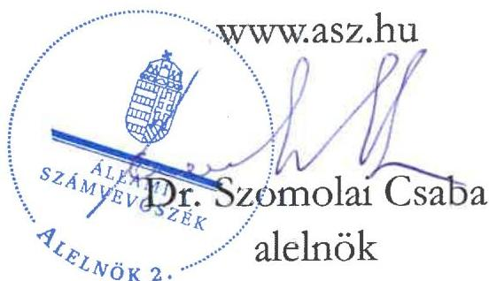
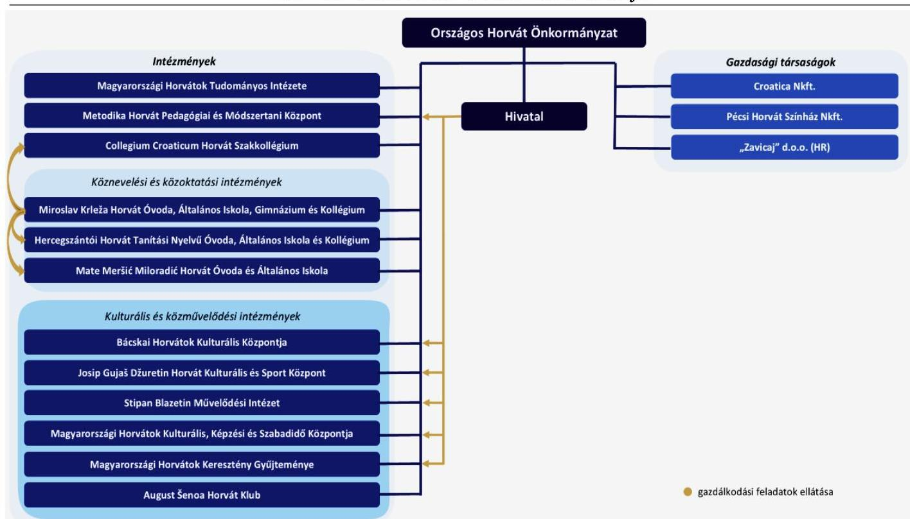
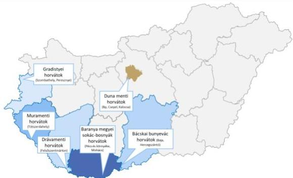
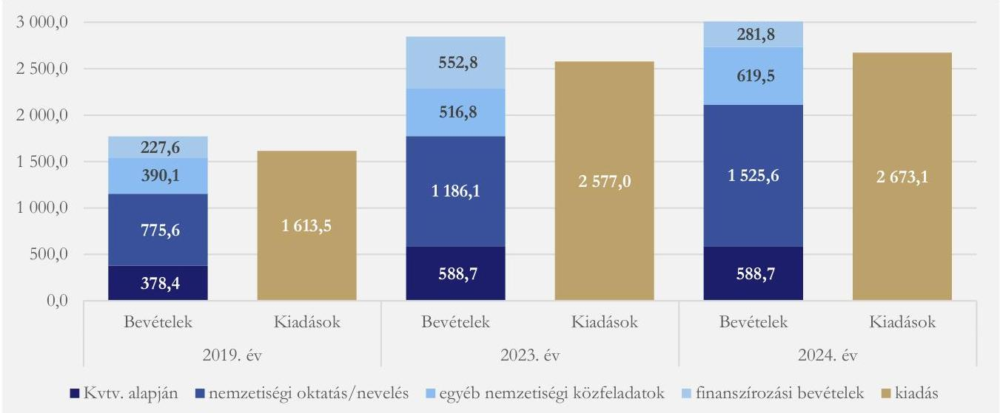
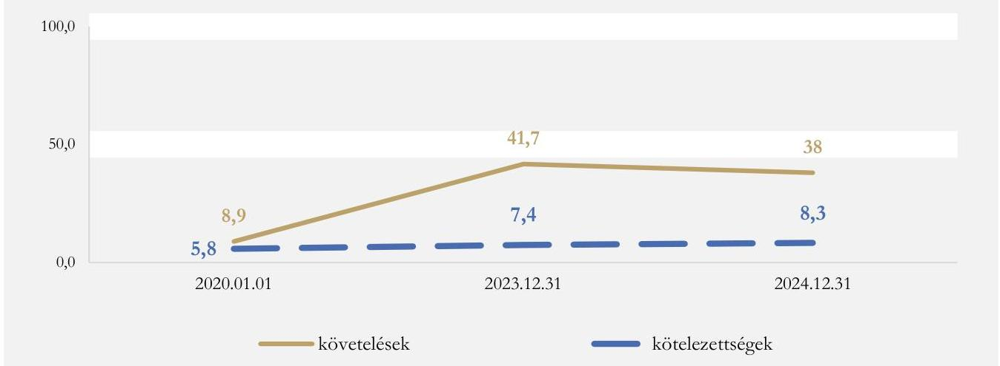
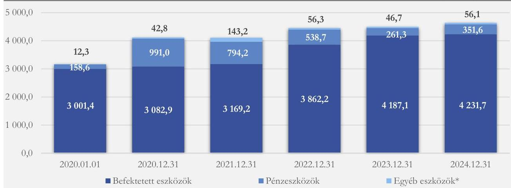

ÁLLAMI SZÁMVEVŐSZÉK

# JELENTÉS

# Az országos nemzetiségi önkormányzatok ellenőrzése

Országos Horvát Önkormányzat

2025.

25142

www.asz.hu

---

ÁLLAMI
SZÁMVEVŐSZÉK

# JELENTÉS

# Az országos nemzetiségi önkormányzatok ellenőrzése

Országos Horvát Önkormányzat

2025.

25142

---

Jelentéseink az interneten a www.asz.hu címen olvashatók.

ELLENŐRZÉSI IGAZGATÓSÁG:
ELLENŐRZÉSI IGAZGATÓSÁG II.

ELLENŐRZÉSI IGAZGATÓ:
DR. BAFFIA GERGELY GÁBOR ellenőrzési igazgató

ELLENŐRZÉSVEZETŐ:
DR. LÁNG ÁGNES KRISZTINA ellenőrzésvezető

IKTATÓSZÁM: EL-3886-050/2025
TÉMASORSZÁM: 50
ELLENŐRZÉS-AZONOSÍTÓ SZÁM: V113301

---

TARTALOMJEGYZÉK

- ÖSSZEFOGLALÁS ... 5
- AZ ELLENŐRZÉS EREDMÉNYEI ... 7
1. Az országos nemzetiségi önkormányzat törvényes működési feltételeinek kialakítása, az integritási kockázatok kezelése ... 7
2. Az országos nemzetiségi önkormányzat által ellátott nemzetiségi közügyek, közfeladatok és az ezekhez biztosított központi költségvetési, illetve egyéb (hazai) támogatások felhasználása ... 8
3. Az országos nemzetiségi önkormányzat gazdálkodása ... 11
4. A belső ellenőrzés kialakítása és működtetése, a belső és külső ellenőrzések hasznosulása ... 14

- JAVASLATOK ... 15
- I. FÜGGELÉK: ÉSZREVÉTELEK ... 16
- II. FÜGGELÉK: ELLENŐRZÉSI MEGKÖZELÍTÉS ... 17
- MELLÉKLETEK ... 22
I. sz. melléklet: Értelmező szótár ... 22
II. sz. melléklet: Az ellenőrzött szervezetek jegyzéke ... 25
III. sz. melléklet: Az Önkormányzat konszolidált mérlegadatai a 2019-2024. években (ezer Ft) ... 26
IV. sz. melléklet: Az Önkormányzat kiadási és bevételi adatai a 2020-2024. években (ezer Ft) ... 27

- RÖVIDÍTÉSEK JEGYZÉKE ... 28

---

“哈，你是个小伙子，你是个小伙子，你是个小伙子，你是个小伙子，你是个小伙子，你是个小伙子，你是个小伙子，你是个小伙子，你是个小伙子，你是个小伙子，你是个小伙子，你是个小伙子，你是个小伙子，你是个小伙子，你是个小伙子，你是个小伙子，你是个小伙子，你是个小伙子，你是个小伙子，你是个小伙子，你是个小伙子，你是个小伙子，你是个小伙子，你是个小伙子，你是个小伙子，你是个小伙子，你是个小伙子，你是个小伙子，你是个小伙子，你是个小伙子，你是个小伙子，你是个小伙子，你是个小伙子，你是个小伙子，你是个小伙子，你是个小伙子，你是个小伙子，你是个小伙子，你是个小伙子，你是个小伙子，你是个小伙子，你是个小伙子，你是个小伙子，你是个小伙子，你是个小伙子，你是个小伙子，你是个小伙子，你是个小伙子，你是个小伙子，你是个小伙子，你是个小伙子，你是个小伙子，你是个小伙子，你是个小伙子，你是个小伙子，你是个小伙子，你是个小伙子，你是个小伙子，你是个小伙子，

---

ÖSSZEFOGLALÁS

Az Alaptörvény¹ XXIX. cikk (1) bekezdése szerint a Magyarországon élő nemzetiségek államalkotó tényezők. Minden, valamely nemzetiséghez tartozó magyar állampolgárnak joga van önazonossága szabad vállalásához és megőrzéséhez. A nemzetiségi kulturális autonómia legfőbb letéteményesei az országos nemzetiségi önkormányzatok, melyek a kötelező és önként vállalt feladataik ellátására intézményt, gazdasági társaságot, vagy más szervezetet alapíthatnak. Az állam a nemzetiségi önkormányzatok működéséhez, az intézményeik fenntartásához költségvetési támogatást nyújt. A nemzetiségi önkormányzatok a feladatellátásukhoz hazai és uniós forrásokra pályázhatnak.

A társadalom jogos elvárása, hogy a közpénzekkel, közvagyonnal gazdálkodó szervezetek működéséről, tevékenységéről időről-időre átfogó képet kapjon. Az ÁSZ², mint az Országgyűlés legfőbb pénzügyi és gazdasági ellenőrző szerve, figyelemmel a társadalom részéről jelentkező elvárásokra, törvényi felhatalmazás alapján ellenőrzi az államháztartásból nyújtott támogatás és az államháztartásból meghatározott célra ingyenesen juttatott vagyon felhasználását az országos nemzetiségi önkormányzatoknál is. Az ellenőrzések lefolytatását indokolta, hogy az országos nemzetiségi önkormányzatok gazdálkodását az elmúlt tíz évben átfogó jelleggel sem az ÁSZ, sem más szervezet nem ellenőrizte. Az ÁSZ ellenőrzés az országos nemzetiségi önkormányzatok feladatellátása, működése és gazdálkodása átláthatóságát és elszámoltathatóságát, a felelős gazdálkodást és a közvagyon védelmét kívánta támogatni és előmozdítani. Az Országos Horvát Önkormányzat ellenőrzésre kiválasztását az indokolta, hogy az országos nemzetiségi önkormányzatok közül a legnagyobb intézményhálózattal rendelkezett (1. ábra). Az Önkormányzat³ a 2022. évben új intézményt is alapított.

1. ábra

AZ ÖNKORMÁNYZAT SZERVEZETI ÁBRÁJA

Forrás: Ellenőrzötték adatszolgáltatása alapján ÁSZ saját szerkesztés

---

Összefoglalás

Az Önkormányzat a jogszabályban meghatározott közfeladatait, így az országos szintű érdekképviseleti, érdekvédelmi feladatait ellátta, a nemzetiségi kulturális autonómia fejlesztése érdekében országos szintű nemzetiségi intézményhálózatot működtetett. Az Önkormányzat a feladatellátáshoz szükséges szervezeti és működési kereteket meghatározta, a törvényes működésének feltételeit a jogszabályi előírásoknak megfelelően alakította ki.

A közfeladatok ellátásában az Önkormányzat költségvetési szervei mellett a gazdasági társaságai is részt vettek. Az Önkormányzat bevételei biztosították a közfeladatok ellátását. Az Önkormányzat a jogszabályi előírásoknak megfelelően támogatási szerződéseken rögzítette a közfeladatok ellátásához az intézményeinek átadott támogatások felhasználási és elszámolási feltételeit és ellenőrizte azok teljesülését. A Közgyűlés⁴ az ellenőrzött időszakban a jogszabályi előírások szerint elfogadta az Önkormányzat valamennyi költségvetési intézménye, gazdasági társasága éves szakmai és pénzügyi beszámolóját. Az Önkormányzat a központi költségvetésből és az egyéb pályázati forrásból származó támogatásokkal az előírt határidőben és szabályszerűen elszámolt.

Az Önkormányzat az integritási kockázatok kezelése érdekében szükséges intézkedéseket megtette, a működése átláthatóságát biztosító, jogszabályban előírt közzétételi kötelezettségét teljesítette, azonban a Központi Információs Közadat-nyilvántartás felület felé teljesítendő adatszolgáltatási kötelezettségének nem teljeskörűen tett eleget.

Az Önkormányzat pénzügyi gazdálkodása összességében megfelelt a jogszabályok előírásainak. Az Önkormányzat a 2024. évi költségvetési határozatát⁵ a jogszabályban előírt tartalommal készítette el. Az Önkormányzatnál az előirányzat nyilvántartás vezetése, az előirányzat módosítások a jogszabályok előírásainak megfelelően történtek, kötelezettségvállalásra az év közben módosított költségvetési kiadási előirányzatok mértékéig került sor. Az Önkormányzat 2023. évi zárszámadási határozata⁶ a jogszabályi előírások ellenére nem tartalmazta a költségvetési egyenleg összegét működési, illetve felhalmozási bevételek és a kiadások egyenlege szerinti bontásban, így nem volt biztosított a zárszámadásnak a költségvetéssel való összehasonlíthatósága.

Az Önkormányzat vagyona 2020-2024 között 46,2%-kal növekedett, ami beruházási célú támogatások felhasználásából származott. Az Önkormányzat vagyona közfeladat ellátását szolgálta. Az Önkormányzat a jogszabályi előírás ellenére nem gondoskodott a vagyongazdálkodás középtávú tervezéséről. Az Önkormányzat a kötelező feladatait szolgáló, tulajdonában álló ingatlanokat – a székhelyéül szolgáló ingatlan kivételével – a jogszabályi előírások ellenére vagyonkimutatásában a forgalomképtelen törzsvagyoni kör helyett, korlátozottan forgalomképes törzsvagyoni körbe sorolta. Az ingatlan törvénysértő besorolása kockázatot jelent az Nvtv.⁷-ben előírt nemzeti vagyonnal felelős módon való vagyongazdálkodás érvényesülésére. Az Önkormányzat a tulajdonában lévő ingatlanvagyonról a megalapozott ingatlanvagyon gazdálkodáshoz szükséges, jogszabályban előírt ingatlanvagyon katasztert nem vezetett.

Az Önkormányzatnál a belső ellenőrzést a jogszabályi előírásoknak megfelelően kialakították és működtették.

A feltárt hiányosságok megszüntetése érdekében az ÁSZ a Közgyűlés részére egy, az Elnök részére három, a Hivatalvezetőnek három javaslatot tett.

---

AZ ELLENŐRZÉS EREDMÉNYEI

# 1. Az országos nemzetiségi önkormányzat törvényes működési feltételeinek kialakítása, az integritási kockázatok kezelése

## Összegző megállapítás

Az Önkormányzat a törvényes működésének feltételeit az Njtv.⁸-ben foglaltaknak megfelelően kialakította. Az integritási kockázatok kezelése érdekében szükséges intézkedéseket az Önkormányzat a Vnytv.⁹-ben, az Áht.¹⁰-ban és az Ávr.¹¹-ben előírtak szerint megtette, azonban az Info. tv.¹²-ben előírt adatszolgáltatási kötelezettségének nem maradéktalanul tett eleget.

## 1.1. számú megállapítás

Az Önkormányzat az Njtv.-ben foglaltaknak megfelelően a szervezeti és működési szabályait és vagyonleltárát meghatározta.

Az Önkormányzat feladat- és hatásköreit az Njtv. előírásainak megfelelően a 31 tagú Közgyűlés gyakorolta, amelyet, mint jogi személyt az Elnök¹³ képviselt. Az Önkormányzat 2023-2024. években az Njtv. előírásainak megfelelően rendelkezett minősített többséggel elfogadott SZMSZ₁¹⁴,²¹⁵,³¹⁶,⁴¹⁷-el. Az ellenőrzött időszakban a Közgyűlés – a kötelező Pénzügyi Bizottságán¹⁸ felül – öt bizottságot¹ hozott létre.

A 2024. évi önkormányzati választásokat követően a Közgyűlés az Njtv. előírásaival összhangban az alakuló ülésén² tagjai közül megválasztotta főállású elnökét, társadalmi megbízatású elnökhelyettesét, hat bizottságának³ tagjait, egy tanácsnokát⁴, valamint döntött a tiszteletdíjakról, illetményekről. A Közgyűlés az alakuló ülésén fogadta el az Önkormányzat SZMSZ₃-ét, amelyben az Njtv.-ben foglaltaknak megfelelően rögzítették a Közgyűlést és szerveit megillető feladat- és hatásköröket. A bizottságok az SZMSZ₁₋₄-ben meghatározott közgyűlési döntések előkészítéséhez, véleményezéséhez, javaslattételezéshez kapcsolódó feladataikat ellátták, azokról a Közgyűlésnek beszámoltak.

A Közgyűlés az Njtv.-ben foglaltaknak megfelelően meghatározta vagyonleltárát, a törzsvagyona körét, a tulajdonát képező vagyon használatának, valamint a használatába adott, vagyonkezelésbe vett állami és önkormányzati vagyon kezelésére, használatára, működtetésére vonatkozó szabályokat. A Közgyűlés az Njtv. 117. § (1) bekezdés d) pontjaiban foglaltak ellenére nem határozta meg a rendelkezésére álló közszolgálati rádió és televízió műsoridő felhasználásának elveit. Ezáltal nem élt azzal az át nem

---

¹ Oktatási és Nevelési Bizottság; Kulturális Bizottság; Ifjúsági és Sportbizottság; Jogi és ügyrendi Bizottság; Vallásügyi Bizottság

² Az alakuló ülés 2024. október 2-án volt.

³ a Gazdasági, Pénzügyi és Ellenőrző Bizottság, az Oktatási és Nevelési Bizottság, a Kulturális Bizottság, Ifjúsági- és Sportbizottság, a Jogi és Ügyrendi Bizottság, a Vallásügyi Bizottság

⁴ A 2024. évi általános önkormányzati választásokat követően a horvát nemzetiségi társadalompolitikai feladatok ellátásáért, felügyeletéért felelős tanácsnokot választottak. Előtte a horvát nemzetiségi köznevelési fejlesztési feladatok ellátásáért, felügyeletéért felelős tanácsnok is volt.

---

Az ellenőrzés eredményei

ruházható és minősített döntéshez kötött jogával, hogy a horvát nemzetiségi jogok és érdekek érvényesítési módját meghatározza a közszolgálati médiában.

## 1.2. számú megállapítás

Az integritási kockázatok kezelése érdekében az Önkormányzatnál a Vnytv. vagyonnyilatkozat tételre, valamint az Áht.¹⁹ és az Ávr.²⁰ összeférhetetlenség elkerülésére és képesítési követelményekre vonatkozó előírásai érvényesültek. Az Önkormányzat a 2024. évben az Info tv. szerinti közzétételi kötelezettségét teljesítette, azonban az adatszolgáltatási kötelezettségének nem tett eleget maradéktalanul.

Az Önkormányzat a Vnytv.-ben előírtaknak megfelelően rendelkezett a vagyonnyilatkozat átadására, nyilvántartására, a vagyonnyilatkozatban foglalt személyes adatok védelmére vonatkozó szabályzattal²¹, az arra kötelezettek a vagyonnyilatkozat-tételi kötelezettségüknek eleget tettek. Az Önkormányzat az Info tv. előírásainak megfelelően rendelkezett a közérdekű adatok megismerésére irányuló kérelmek intézésének, továbbá a kötelezően közzéteendő adatok nyilvánosságra hozatalának szabályzatával. A Hivatal²²-nál az Áht.-ban és az Ávr.-ben előírt képesítési és összeférhetetlenségi szabályokat betartották.

Az Önkormányzat az Info. tv.-ben előírt közzétételi kötelezettségeit teljesítette. Az Önkormányzat a 499/2022. (XII. 8.) Korm. rendelet²³ 5. § (2) bekezdésében, valamint az Info tv. 37/C. § (2) bekezdésében foglaltak ellenére a Központi Információs Közadat-nyilvántartás felületen való közzététel céljából az adatszolgáltatási kötelezettségének nem teljeskörűen tett eleget, mert nem minden ötmillió forintot elérő, árubeszerzésre, építési beruházásra, szolgáltatás megrendelésre, vagyonhasznosításra vonatkozó szerződéséről szolgáltatott adatot.

## 2. Az országos nemzetiségi önkormányzat által ellátott nemzetiségi közügyek, közfeladatok és az ezekhez biztosított központi költségvetési, illetve egyéb (hazai) támogatások felhasználása

### Összegző megállapítás

Az Önkormányzat az Njtv.-ben előírtaknak megfelelően a kötelező közfeladatait ellátta, a központi költségvetésből kapott támogatásokat a közfeladatai ellátására fordította.

### 2.1. számú megállapítás

Az Önkormányzat az Njtv.-ben meghatározott közfeladatait ellátta, az intézményhálózatának működtetéséről gondoskodott. Az Önkormányzat bevételei az Njtv. előírásainak megfelelően fedezték a közfeladatellátás érdekében felmerült kiadásokat.

Az Önkormányzat a horvát nemzetiségi közösséggel kapcsolatos, az Njtv.-ben foglalt kötelező közfeladatait ellátta, élt a jogszabálytervezetekkel, megállapodásokkal kapcsolatos véleményezési jogával, valamint gyakorolta az Nktv.²⁴-ben és az Njtv.-ben biztosított egyetértési jogát. Az Önkormányzat önként vállalt közfeladatot nem látott el, vállalkozási tevékenységet a horvátországi „Zavicaj” d.o.o. gazdasági társasága folytatott.

---

Az ellenőrzés eredményei

## 2. ábra

### MAGYARORSZÁGI HORVÁTOK

Forrás: ÁSZ saját szerkesztés

Az Önkormányzat az Njtv. alapján a nemzetiségi kulturális autonómia fejlesztése érdekében országos szintű nemzetiségi intézményhálózatot tartott fenn. Magyarországon hat horvát etnikai csoport (nyugat-magyarországi gradistyei; Mura menti zalai; Dráva menti; baranyai sokác-bosnyák-horvátok; bácskai bunyevác; Duna menti rác-horvátok) nyelvi és kulturális értékeit ápolták, az Önkormányzat kulturális intézményrendszere ennek mentén került kiépítésre (2. ábra). Az Önkormányzat az ellenőrzött időszakban az Njtv.-ben meghatározott közfeladatai ellátása

érdekében összesen tizenkettő intézmény – ebből három köznevelési⁵, hat kulturális és közművelődési, valamint további három intézmény⁶ – és három gazdasági társaság működési feltételeit biztosította. Az Önkormányzat a horvát közösséghez kötődő, felsőoktatásban részt vevő hallgatók lakhatási feltételeinek biztosítása és a nemzetiségi kötődésük erősítése céljából a 2022. évben az Áht. előírásainak megfelelően alapította a Collegium Croaticum Horvát Szakkollégium elnevezésű intézményét.

Az Önkormányzat feladatellátását az ellenőrzött időszakban a Magyarországon működő gazdasági társaságai – a Croatica Nonprofit Kft.²⁵ és a Pécsi Horvát Színház²⁶ – is segítették. A 2015-ben alapított Pécsi Horvát Színház az Önkormányzattal kötött, az Njtv. és az Emtv.²⁷ rendelkezéseinek megfelelő közszolgáltatási szerződésben foglaltak szerint a magyarországi horvát közösség részére magyar és horvát nyelvű színdarabok előadását biztosította, továbbá általános- és középiskolások részére színházi stúdiumokat működtetett. A Croatica Nonprofit Kft. az Önkormányzattal kötött, az Áht. előírásainak megfelelő támogatási szerződés alapján a horvát nemzetiség elektronikus média működtetésével (Croatica Radio és a Croatica internetes TV), a Hrvatski glasnik hetilap és a Zornica nova katolikus folyóirat kiadásával kapcsolatos feladatokat látta el.

A Hivatal a 2023-2024. években az Ávr.-ben előírtaknak megfelelő Munkamegosztási megállapodás;²⁸,²⁹,³⁰,³¹,³²,³³ alapján hat költségvetési szervénél látta el a gazdálkodási feladatokat.

A 2023-2024. években az Önkormányzat összes teljesített bevételei az Njtv.-ben foglaltaknak megfelelően biztosították a nemzetiségi közfeladatok ellátását. A 2023. évi 267,4 M Ft maradványból 98,6%, a 2024. évi 342,5 M Ft maradványból 94,8% kötelezettségvállalással nem terhelt maradvány volt. Az Önkormányzat bevételeinek és kiadásainak alakulását a 3. ábra szemlélteti.

---

⁵ Hercegszántói Horvát Tanítási Nyelvű Óvoda, Általános Iskola és Kollégium, a Miroslav Krleža Horvát Óvoda, Általános Iskola, Gimnázium és Kollégium és a Mate Meršić Miloradić Horvát Óvoda és Általános Iskola

⁶ Magyarországi Horvátok Tudományos Intézete; Metodika Horvát Pedagógiai és Módszertani Központ; Collegium Croaticum Horvát Szakkollégium

9

---

Az ellenőrzés eredményei

3. ábra

AZ ÖNKORMÁNYZAT BEVÉTELEI ÉS KIADÁSAI
A 2019. ÉS A 2023-2024. ÉVEKBEN (M FT)

Forrás: Az Önkormányzat konszolidált beszámolója alapján ÁSZ saját szerkesztés

A nemzetiségi oktatásra, nevelésre kapott költségvetési támogatás a bázis időszakhoz viszonyítva 775,6 M Ft-ról 2024. évre 1 525,6 M Ft-ra, közel kétszeresére emelkedett, amely a 2023. évi támogatási összegnél 28,6%-kal volt több. Az Önkormányzat az ellenőrzött időszakban a nemzetiségi oktatásra, nevelésre kapott költségvetési támogatás teljes összegét a 2023. évi Kvtv.³⁴ és a 2024. évi Kvtv.³⁵ előírásainak megfelelően átadta a köznevelési és közoktatási intézményeinek.

Az Önkormányzat működésre és média támogatásra, valamint intézményi fenntartás támogatásra 2023. és 2024. évben egyaránt 588,7 M Ft-ot kapott, amely több, mint másfélszerese a bázis időszak 378,4 M Ft támogatási összegének.

Az Önkormányzat 2023. évi Kvtv. alapján kapott támogatásai megoszlásának alakulását az alábbi táblázat mutatja.

1. táblázat
AZ ÖNKORMÁNYZAT A 2023. ÉVI KVTV. ALAPJÁN KAPOTT TÁMOGATÁSAINAK FELHASZNÁLÁSA (M FT)

|  SZERVEZET | MŰKÖDÉSI ÉS MÉDIA TÁMOGATÁS |   | INTÉZMÉNYI TÁMOGATÁS |   | ÖSSZESEN  |   |
| --- | --- | --- | --- | --- | --- | --- |
|   |  ÖSSZEGE | MEGOSZLÁSA | ÖSSZEGE | MEGOSZLÁSA | ÖSSZEG | MEGOSZLÁS  |
|  Önkormányzat | 65,3 | 24,7% | 5,6 | 1,7% | 70,9 | 12,0%  |
|  Hivatal | 100,6 | 38,2% | - | - | 100,6 | 17,1%  |
|  Croatica Médiaszolgáltató | 77,4 | 29,4% | 6,5 | 2,0% | 83,9 | 14,3%  |
|  Színház | - | - | 30,0 | 9,2% | 30,0 | 5,1%  |
|  Közművelődési intézmények | - | - | 228,5 | 70,3% | 228,5 | 38,8%  |
|  Metodika Pedagógiai Központ | - | - | 54,5 | 16,8% | 54,5 | 9,3%  |
|  Egyéb | 20,2 | 7,7% | - | - | 20,2 | 3,4%  |
|  Összesen | 263,5 | 100,0% | 325,1 | 100,0 | 588,6 | 100,0%  |

Forrás: Az Önkormányzat konszolidált beszámolója alapján ÁSZ saját szerkesztés

Az Önkormányzat a közfeladat ellátásához átadott költségvetési támogatások felhasználási és elszámolási feltételeit az Áht. előírásainak megfelelően támogatási szerződésekben rögzítette. Az okiratokban

---

Az ellenőrzés eredményei

meghatározta az elvégzendő nemzetiségi közfeladatokat, előírta a támogatottak részére az Áht. szerinti beszámolási (pénzügyi, szakmai) kötelezettséget, melynek a támogatottak a szerződésben foglaltak szerint eleget tettek. A Közgyűlés az ellenőrzött időszakban az Áht.-ban előírtak szerint elfogadta az Önkormányzat valamennyi költségvetési intézménye, gazdasági társasága éves szakmai és pénzügyi beszámolóját.

Az Önkormányzat a 2023. évi Kvtv. alapján kapott támogatások felhasználásáról a részletes szakmai és pénzügyi beszámolóját határidőn belül nyújtotta be a Miniszterelnökséget vezető miniszter részére.

## 2.2. számú megállapítás

Az Önkormányzat által az egyéb hazai pályázatokon elnyert források felhasználása és elszámolása megfelelt az Áht.-ban és a támogatási szerződésekben foglalt előírásoknak.

Az Önkormányzat a 2023. évben 38,9 M Ft, 2024. évben 209,6 M Ft támogatást kapott a BGA Zrt.³⁶-tól. Az Önkormányzat a támogatásokat a támogatási szerződésekben meghatározott célnak megfelelően használta fel, így a nemzetiségtudatot erősítő olyan rendezvényeket valósítottak meg, mint az anyanyelvi tábor, az országos horvát nap, a magyarországi horvát sajtó napja, a horvát nemzetiségi pedagógusok 2024. évi anyaországi továbbképzése, a horvát zarándoklat, valamint elkészült mind a két évben a horvát falinaptár. Az Önkormányzat az ellenőrzött időszakban esedékes, a BGA Zrt. felé teljesítendő elszámolási kötelezettségének az Áht.-ban és a támogatói okiratokban foglaltak szerint eleget tett.

Az Önkormányzat anyaországától az Njtv. szabályozásának megfelelően 2023. évben 10,0 M Ft-ot, 2024. évben 134,0 M Ft-ot kapott, 2023-2024. években EU³⁷-s támogatást nem vett igénybe.

## 3. Az országos nemzetiségi önkormányzat gazdálkodása

### Összegző megállapítás

Az Önkormányzat pénzügyi gazdálkodása összességében megfelelt az Áht., az Ávr., az Áhsz., valamint a belső szabályzatok előírásainak. Az Önkormányzat vagyona közfeladatai ellátását szolgálta, ugyanakkor a vagyongazdálkodása nem felelt meg maradéktalanul az Njtv. és az Nvtv. előírásainak.

### 3.1. számú megállapítás

Az Önkormányzat és a Hivatal kialakította gazdálkodásának belső kontrolljait, de az Önkormányzat 2023. évi zárszámadási határozata nem felelt meg maradéktalanul az Áht.-ban foglaltaknak.

Az Önkormányzat és a Hivatal a gazdálkodási szabályzat³⁸, illetve a Hivatal gazdasági szervezetének ügyrendje³⁹ keretében az Ávr.-ben előírtak szerint meghatározta gazdálkodásának részletes rendjét, A gazdálkodási szabályzat az Ávr. előírásainak megfelelően tartalmazta a gazdálkodási jogkörök gyakorlásának eljárási és dokumentációs részletszabályait, valamint a kijelölt személyekről és aláírásmintájukról vezetett nyilvántartást.

Az Önkormányzat az ellenőrzött gazdasági eseményeknél a kötelezettségvállalások nyilvántartásba vételéről gondoskodott Az ellenőrzött bevételek és kiadások esetében az Ávr.-ben előírtaknak

---

Az ellenőrzés eredményei

megfelelően működtették a kontrolltevékenységeket. A felújításokat, beruházásokat az Áhsz.-ben rögzítetteknek megfelelő értéken az Önkormányzat számviteli nyilvántartásában rögzítették.

Az Önkormányzat a 2023. és a 2024. évi költségvetési határozatait az Áht.-ban előírt tartalommal készítette el. Az Önkormányzatnál az előirányzat nyilvántartás vezetése, az előirányzat módosítások, átcsoportosítások a 2023-2024. évben az Áht. és az Ávr. előírásainak megfelelően történtek. A 2023. évben az év közben módosított költségvetési kiadási előirányzatok mértékéig került sor a kiadási előirányzatok terhére történő kötelezettségvállalásra. Az Önkormányzat 2023. évi zárszámadása az Áht. 23. § (2) bekezdés c) pontjában és az Áht. 87. § b) pontjában foglaltak ellenére nem tartalmazta a működési bevételek és működési kiadások, valamint a felhalmozási bevételek és a felhalmozási kiadások egyenlegét, melynek következtében nem volt biztosított az éves zárszámadásnak az elfogadott költségvetéssel való összehasonlíthatósága.

Az ellenőrzött időszakban az Önkormányzat kötelezettségeinek fedezete biztosított volt, követelései meghaladták a kötelezettségeit, amit a 4. ábra szemléltet.

4. ábra
AZ ÖNKORMÁNYZAT VEVŐ KÖVETELÉSEI, ILLETVE KÖTELEZETTSÉGEI, SZÁLLÍTÓI ÁLLOMÁNYÁNAK ALAKULÁSA (M FT)

Forrás: Országos Horvát Önkormányzat konszolidált beszámolói KGR-ból, ÁSZ saját szerkesztés

## 3.2. számú megállapítás

Az Önkormányzat vagyongazdálkodása nem felelt meg maradéktalanul az Njtv., és az Nvtv. előírásainak.

Az Önkormányzat a 2018. évben elfogadott vagyongazdálkodási tervét az azóta eltelt időszakban nem vizsgálta felül, ezért az ellenőrzött időszakban az Nvtv. 9. § (1) bekezdésben foglaltak ellenére a vagyongazdálkodás középtávú tervezéséről nem gondoskodott.

A Vagyongazdálkodási szabályzat; 1. számú mellékletében felsorolt vagyonelemek minősítése – az Önkormányzat székhelyül szolgáló ingatlan kivételével – nem felelt meg az Njtv. 125. § (2) bekezdés a)-b) pontjaiban foglaltaknak, mivel a Közgyűlés a kötelező önkormányzati feladat ellátását szolgáló ingatlanokat a forgalomképtelen törzsvagyoni kör helyett, korlátozottan forgalomképes törzsvagyoni körbe sorolta. Az ingatlan besorolása befolyásolja az ingatlan alaptevékenységén kívüli hasznosíthatóságát, megterhelhetőségét, elidegeníthetőségét, ezért a téves besorolás az Önkormányzat likviditására, vagyonmegőrzési tevékenységére is hatással bírt. Az ingatlanok téves besorolásából adódó hibás számviteli nyilvántartás miatt az Önkormányzat – Áhsz. 30. § (2) bekezdése szerint összeállított –

---

Az ellenőrzés eredményei

2023. évi vagyonkimutatása az Áhsz. 45. § (1) bekezdésében előírtakkal szemben az Önkormányzat ingatlanvagyonának összetételét nem a valóságnak megfelelően mutatta be.

Az Önkormányzat az ellenőrzött időszakban a tulajdonában lévő ingatlanvagyonról a 147/1992. (XI.6.) Korm. rendelet⁴² 1. § (1)-(2) bekezdéseiben előírt tartalmú ingatlanvagyon-katasztert nem vezetett. Ebből adódóan az ingatlanvagyona tekintetében nem állt rendelkezésére olyan adatbázis, amely a megalapozott ingatlanvagyon-gazdálkodáshoz szükséges legfontosabb jogi, pénzügyi és műszaki adatokat tartalmazta volna.

A Közgyűlés az Önkormányzat gazdasági társaságával (Zavičaj d.o.o.) 2019. október 31-én megkötött kamatmentes kölcsönszerződés (tagi kölcsön) 2. pontjában foglaltak ellenére a 2023. október végén lejárt 61 500 Euro kölcsön visszafizetésének újbóli feltételeiről a fizetési határidőt követően több, mint egy év elteltével döntött⁷, azt megelőzően a kölcsön összegének megtérülése érdekében egyéb intézkedést nem tett.

Az Önkormányzat összes vagyonát tekintve meghatározó volt az ingatlan vagyon, amely a 2024. évi mérlegfőösszeg 88,8%-át adta. A 2019. december 31-ei bázis időszakot alapul véve a 2024. évre az Önkormányzat összes vagyona 46,2%-kal (3 172,2 M Ft-ról 4 639,3 M Ft-ra), a befektetett eszközeinek állománya 41,0%-kal (3 001,4 M Ft-ról 4 231,7 M Ft-ra) emelkedett. A befektetett eszközökön belül az ingatlanvagyon 44,7%-kal (1 273,5 M Ft-tal) növekedett, amelyet az új intézményeknek helyt adó fejlesztések és a felújítások eredményeztek.

Az Önkormányzat összes vagyona a 2020-2024. években 1 467,1 M Ft-tal növekedett. Ugyanezen időszakban a befektetett eszközök után 508,4 M Ft értékcsökkenést számoltak el. Az értékcsökkenést meghaladó vagyonnövekedést a 2 273,7 M Ft felhalmozási célú támogatás biztosította. Az Önkormányzat a Számv. tv.⁴³-ben, valamint a leltárkészítési és leltározási szabályzat⁴⁴-ában foglaltak szerint az évvégi beszámolóját leltárral alátámasztotta. Az Önkormányzat vagyonának alakulását a 2020-2024. években az 5. ábra szemlélteti.

⁷ A kölcsön visszafizetéséről a Közgyűlés a 313/2024. (XI. 9.) OHÖ határozatában döntött, miszerint a visszafizetésre 2025. november 30. és 2028. november 30. között évente négy egyenlő részletben kerül sor.

13

---

Az ellenőrzés eredményei

5. ábra

AZ ÖNKORMÁNYZAT VAGYONÁNAK ALAKULÁSA 2020-2024. ÉVEK (M FT)

* forgóeszközök, követelések, egyéb sajátos elszámolások, aktív időbeli elhatárolások, készletek
Forrás: ÁSZ saját szerkesztése

# 4. A belső ellenőrzés kialakítása és működtetése, a belső és külső ellenőrzések hasznosulása

## Összegző megállapítás

Az Önkormányzatnál a Bkr.⁴⁵ előírásainak megfelelően a belső ellenőrzést kialakították és működtették.

### 4.1. számú megállapítás

A belső ellenőr a kockázatelemzésen alapuló ellenőrzési terveket végrehajtotta.

A hivatalvezető a Bkr. előírásának megfelelően külső szolgáltató⁴⁶ útján gondoskodott a belső ellenőrzés kialakításáról. A gazdasági szervezettel nem rendelkező költségvetési szervek esetében a belső ellenőrzési feladatok ellátásának módját a Munkamegosztási megállapodás ₁₋₆-okban rögzítették.

A belső ellenőr a 2023-2024. években összesen 58 ellenőrzést folytatott le, melyből a 2024. évben egy terven felüli ellenőrzés⁸ volt. A belső ellenőr javaslataira⁹ az ellenőrzött szervezetek vezetői intézkedési tervet készítettek és beszámoltak az intézkedési tervben rögzített feladatok megvalósításáról.

A 2023-2024. években az éves ellenőrzési tervek, az összefoglaló éves ellenőrzési tervek, valamint az éves ellenőrzési jelentések a Bkr.-ben foglaltaknak megfelelően az Elnök részére megküldésre kerültek. A Közgyűlés a Bkr. előírásainak megfelelően az összefoglaló éves ellenőrzési terveket és a 2023. évi összefoglaló éves ellenőrzési jelentést elfogadta. A belső ellenőrzés releváns megállapításait az ÁSZ ellenőrzés tapasztalatai visszaigazolták, a vagyontárgyak besorolását a belső ellenőrzés nem érintette.

Az Önkormányzatot a 2023-2024. években, mint fenntartót, a fenntartásában lévő köznevelési és közoktatási intézményeket megillető támogatások elszámolása és felhasználása tárgyában ellenőrizte a Kincstár⁴⁷ és kettő Kormányhivatal,⁴⁸,²⁹. A külső ellenőrzések megállapításaira az Önkormányzat a megadott határidőn belül intézkedési terv készítési, illetve befizetési kötelezettségeinek eleget tett.

---

⁸ A Pénzügyi Bizottság kérésére az Önkormányzat által fenntartott intézmények finanszírozásának indult az ellenőrzés.

⁹ A javaslatok a belső szabályzatok felülvizsgálatára, támogatói okirat elkészítésére, előleg kiadások nyilvántartására, iktatáshoz használt program levéltári állásfoglalására, gazdálkodási jogkör gyakorlók felülvizsgálatára vonatkoztak.

---

15

# JAVASLATOK

Az ÁSZ tv. 33. § (1) bekezdésében foglaltak értelmében az ellenőrzött szervezet vezetője köteles a jelentésben foglalt megállapításokhoz kapcsolódó intézkedési tervet összeállítani és azt a jelentés kézhezvételétől számított 30 napon belül az ÁSZ részére megküldeni. Az ÁSZ a jelentésben foglalt megállapításokhoz kapcsolódóan az alábbi javaslatok tekintetében várja el az intézkedési terv elkészítését.

## A KÖZGYŰLÉS RÉSZÉRE

1. Határozza meg az Njtv. 117. § (1) bekezdés d) pontja szerint a rendelkezésére álló közszolgálati rádió és televízió műsoridő felhasználásának elveit.

## AZ ELNÖK RÉSZÉRE

1. Intézkedjen a nyilvános jelentés kézhezvételét követő 30 napon belül az Állami Számvevőszék jelentésének a Közgyűlés elé terjesztéséről.

2. Intézkedjen a vagyongazdálkodási szabályzat módosításáról és Közgyűlés elé terjesztéséről annak érdekében, hogy a Közgyűlés az Önkormányzat törzsvagyona körébe tartozó valamennyi vagyonelemet az Njtv. 125. § (1)-(2) bekezdéseiben előírtaknak megfelelően minősítse.

3. A nemzeti vagyonnal való felelős gazdálkodás alapelvének érvényesülése érdekében biztosítsa, hogy az Önkormányzat az Nvtv. 9. § (1) bekezdésében előírtaknak megfelelően készítsen közép- és hosszú távú vagyongazdálkodási tervet, továbbá szabályozza, hogy a vagyongazdálkodási tervet milyen időszakonként kell felülvizsgálni.

## A HIVATALVEZETŐ RÉSZÉRE

1. Biztosítsa az Info tv. 37/C. § (2) bekezdésében és a 499/2022. (XII. 8.) Korm. rendelet 5. § (2) bekezdésében előírt adatszolgáltatási kötelezettség maradéktalan teljesítését.

2. Intézkedjen, hogy az Önkormányzat tulajdonában álló ingatlanok számviteli- és vagyonkataszteri nyilvántartása feleljen meg az Njtv. 125. § (2) bekezdés a)-b) pontjaiban előírtaknak megfelelő vagyongazdálkodási szabályzatban és a 147/1992. (XI. 6.) Korm. rendeletben foglaltaknak.

3. Biztosítsa, hogy az Önkormányzat zárszámadási határozatai feleljenek meg az Áht. 23. § (2) bekezdés c) pontjában és a 87. § b) pontjában foglalt előírásoknak.

---

16

# I. FÜGGELÉK: ÉSZREVÉTELEK

A jelentéstervezetet az ÁSZ 15 napos észrevételezésre megküldte az ellenőrzött szervezet vezetőjének az ÁSZ tv. 29. §* (1) bekezdése előírásának megfelelően.

Az ellenőrzött szervezetek vezetői a jelentéstervezet megállapításaira nem tettek észrevételt.

* 29. § (1) Az Állami Számvevőszék az ellenőrzési megállapításait megküldi az ellenőrzött szervezet vezetőjének vagy az általa megbízott személynek, és annak, akinek személyes felelősségét állapította meg.
(2) Az ellenőrzött szervezet vezetője és a felelősként megjelölt személy az ellenőrzés megállapításaira tizenöt napon belül írásban észrevételt tehet.
(3) Az Állami Számvevőszék az észrevételre a beérkezésétől számított harminc napon belül írásban válaszol. A figyelembe nem vett észrevételeket köteles a jelentésben feltüntetni, és megindokolni, hogy azokat miért nem fogadta el.

---

17

# II. FÜGGELÉK: ELLENŐRZÉSI MEGKÖZELÍTÉS

## AZ ELLENŐRZÉS JOGALAPJA

Az ellenőrzés jogszabályi alapját az ÁSZ tv.⁵⁰ 1. § (3) bekezdésének, az 5. § (2)-(3) és (6) bekezdéseinek előírásai képezték.

## AZ ELLENŐRZÉS CÉLJA

Ellenőrzés célja annak értékelése volt, hogy az országos nemzetiségi önkormányzat közgyűlése által kialakított törvényes működési keretek és szervezeti felépítés a nemzetiségi közügyek, közfeladatok ellátását szolgálta-e, valamint biztosította-e a korrupciós kockázatokra vonatkozó jogszabályi előírások betartását. Az ellenőrzés értékelte továbbá, hogy a 2024. évben megalakult közgyűlés a jogszabályi keretek között alakította-e ki a törvényes működési feltételeit.

Az ellenőrzés értékelte az országos nemzetiségi önkormányzat által ellátott nemzetiségi közügyekhez, közfeladatokhoz biztosított központi költségvetési-, illetve egyéb (EU, hazai) támogatások felhasználásának, kezelésének, elszámolásának megfelelőségét, ezáltal az önkormányzati gazdálkodás biztonságát, szabályszerűségét. Az ellenőrzés értékelte, hogy az országos nemzetiségi önkormányzat kiadásai a közfeladatellátáshoz kapcsolódtak-e, a vagyona felhasználása, kezelése a felelősen gazdálkodás előírásainak megfelelően történt-e.

## AZ ELLENŐRZÉS TÍPUSA

Törvényességi ellenőrzés

## AZ ELLENŐRZÉS TÁRGYA

Az országos nemzetiségi önkormányzat törvényes működési feltételei kialakítása, közfeladat ellátása, pénzügyi és vagyongazdálkodása, a belső kontrollrendszer kialakítása és működtetése. Az ellenőrzés kiterjedt minden olyan körülményre és adatra, amely az ÁSZ jogszabályban meghatározott feladatainak teljesítéséhez, valamint a program végrehajtása folyamán felmerült újabb összefüggések feltárásához szükséges.

## AZ ELLENŐRZÉS HATÓKÖRE ÉS TERÜLETE

Az ÁSZ ellenőrzése az országos nemzetiségi önkormányzatra és hivatalára terjedt ki.

A törvényes működési feltételek kialakításának értékelése során az ÁSZ ellenőrizte az országos nemzetiségi önkormányzat szervezeti és működési szabályait, a közfeladatai meghatározását, törzsvagyona körének besorolását, vagyona használatára, kezelésére, működtetésére vonatkozó szabályozását, valamint vagyonát érintő megállapodások meglétét.

---

II. Függelék: Ellenőrzési megközelítés

A korrupciós (integritási) kockázatok kezelése ellenőrzésének keretén belül – az országos nemzetiségi önkormányzatra és szerveire vonatkozóan – az ÁSZ ellenőrizte, hogy valamennyi vagyonnyilatkozattételre kötelezett személy eleget tett-e kötelezettségének, biztosított volt-e a képviselői vagyonnyilatkozatok nyilvánossága, betartották-e az összeférhetetlenségre, képesítési követelményekre, valamint az elektronikus közzétételi kötelezettségre vonatkozó jogszabályi előírásokat.

Az ÁSZ ellenőrizte az országos nemzetiségi önkormányzat által ellátott kötelező és önként vállalt közfeladatellátás szabályszerűségét, célszerűségét, e feladatok ellátásához rendelkezésre bocsátott költségvetési támogatások, és a pályázati források felhasználását, azok közfeladatellátással való összhangját és a támogatók felé történő elszámolását.

Az ellenőrzés kitejedt az országos nemzetiségi önkormányzat és szervei gazdálkodására vonatkozó belső kontrollkörnyezet kialakítására, a költségvetése tervezésének, végrehajtásának szabályszerűségére és az éves beszámolási kötelezettség teljesítésére. Az ÁSZ értékelte a pénzügyi gazdálkodás szabályszerűségét, a kiadások közfeladatellátáshoz való kapcsolódását, továbbá a kifizetések szabályszerű teljesítéséhez előírt kontrolltevékenységek működését. Az ÁSZ ellenőrizte az országos nemzetiségi önkormányzat vagyongazdálkodásának megfelelőségét, a vagyonhasznosításból származó bevételek teljesülését, valamint a két általános önkormányzati választás közötti időszak tekintetében az országos nemzetiségi önkormányzat vagyonának alakulását.

Az ÁSZ a 2023. és 2024. évekre vonatkozó belső ellenőrzés kialakításának és működtetésének megfelelőségét, továbbá belső és külső ellenőrzési megállapítások hasznosulását a stratégiai és ellenőrzési tervek, az ellenőrzési jelentések, nyilvántartások alapján ellenőrizte.

## AZ ELLENŐRZŐTT IDŐSZAK

A 2023. és a 2024. év, a vagyonváltozás értékelésének alapja a 2020. január 1-jei adat.

## AZ ELLENŐRZÉSI KRITÉRIUMOK

|  FÓKUSZTERÜLET/FÓKUSZKÉRDÉS | ELLENŐRZÉSI KRITÉRIUMOK  |
| --- | --- |
|  1. Az országos nemzetiségi önkormányzat törvényes működési feltételeinek kialakítása, a korrupciós kockázatok kezelése. | Áht. 38. (2) bek., 91. § (3) bek., 92. § (4) bek. d)-f) pontok,  |
|   | Info tv. 5. § (6) bek., 32. §, 33. § (3) bek. 35.§ (3) bek., 37/C. § (1)-(3) bek., 1. sz. mell.,  |
|   | Njtv. 77. § (3) bek., 88. § (1) bek., 88/A. §, 92. § (1) bek., (4) bek. c) pont, 95. § (1)-(4) bek., 103. § (1)-(3) bek., 104. § (6) bek., 106. § (1)-(12) bek., 107. § (1)-(4) bek., 113. § c)-e) pontok, 116. § (4) bek., 117. § (1) bek., 123. § (1) bek., 138. § (2) bek.,  |
|   | Ptk.51 3:5. § a)-e) pontok,  |
|   | Számv. tv. 150. § (1) és (2) bek.,  |
|   | Vnytv. 3. § (1) bek., (2) bek. d) pont, 9. § (1) bek., 10. § (1)-(3) bek.,  |
|   | Áhsz. 34 § (2) bek.,  |

---

II. Függelék: Ellenőrzési megközelítés

|   | Ávr. 12. § (1) bek., 13. § (2) bek. h) pont, 55. § (2)-(3) bek., 58. § (4)-(5) bek., 60. § (1)-(2) bek., 305/2005. (XII. 25.) Korm. rendelet 3-4. §-ok, Bkr. 6. § (4) bek., 499/2022. (XII. 8.) Korm. rendelet 5. § (2) bek., 18/2005. IHM rendelet 2-3. §-ok, 5/2024. (V. 30.) KTM rendelet 2-3. §-ok, Belső szabályzatok  |
| --- | --- |
|  2. Az országos nemzetiségi önkormányzat által ellátott nemzetiségi közügyek, közfeladatok és az ezekhez biztosított központi költségvetési, illetve egyéb (EU, hazai) támogatások felhasználása. | 2010. évi CLXXXV. tv. 97. § (2)-(3) bek. 1. sz. melléklet 1. j) és a 3-4. pontok, 2023. évi Kvtv. 46. § (1) bek., 10. melléklet, 2024. évi Kvtv. 45. § (1) bek., 9. melléklet, Áht. 3/A. §, 9. §, 26. § (1) bek., 48. § (1) bek. b) pont, 51-53. §-ok, 53/A. §, 54. §, 57. §, 83. §, 87. § (b) pont, 91. § (1)-(3) bek., 107. § (1) bek., 108. § (2) bek. Njtv. 2. § 3. pont, 10. § (1)-(3), (8) bek., 44. § (1) bek., 47. §, 78. §, 79. § (1) bek., 92. § (4) bek. d) pont, 105. § (3) bek., 113. §, 114. §, 116. § (1), (3), (4) bek. 117. §, 117/A. § (1) bek., 118. §, 119. § (1) bek., 126. § (1)-(3) bek., 127. §, 128. § (1)-(2) bek., 129. §, 132. § (1)-(2) bek., 134. §, 135. §, Nktv. 5. § (9) bek., 50. § (10) bek., 84. § (9) bek. a-d) pontok, Ptk. 3:4. § (1) bek., 3:21. § (3) bek., 3:26. §, 3:109. § (2) bek., 3:120. § (2) bek., Áhsz. 6. § (1) bek. f) pont, 6. § (2) bek., 7-8. §-ok, 31. §, Ávr. 83. §, 91/A.§, 93. §, Belső szabályzatok, Támogatási szerződés/támogatói okirat előírásai  |
|  3. Az országos nemzetiségi önkormányzat gazdálkodása. | 2023. évi Kvtv. 46. § (1) bek., 10. melléklet, 2024. évi Kvtv. 45. § (1) bek., 9. melléklet, Áht. 1. § 15. pont, 4.-6. §-ok, 23-25. §-ok, 26. § (1) bek., 30. § (1)-(3) bek., 28/A. § (2) bek., 29/A. §, 34. § (1)-(5) bek., 36. §, 37. § (1) bek., 38. § (1)-(2) bek, 48. § (1) bek., 53. §, 55 § (1)-(2), (4) bek. 56. § (1) bek., 57. § (1), (3)-(4) bek, 58. § (1)-(4) bek., 59. § (1)-(4) bek., 60. § (1)-(3) bek., 61. § (1) bek., 69. § (1)-(2) bek., 86. § (5) bek., 87. §, 91. § (2) bek. a), c)-d) pontok, (3) bek., Kbt. 4. § (1) bek., 15. §, 131. § (1) bek., Mótv. 107. §, 110. §, Njtv. 113-117. §-ok, 123. § (5) bek., 125. § (1)-(2), (4) bek., 126. § (1)-(3) bek., 128. § (1)-(2) bek., 134-135. §-ok, Nvtv. 3. § (1) bek. 3. és 6. pont, 5. § (7) bek., 7. § (1)-(2) bek., 9. § (1) bek., Ptk. 3:133. § (2) bek, 3:189. § (1) bek. a) és b) pontok, 3:270. § (1) bek. a) és b) pontok,  |

19

---

II. Függelék: Ellenőrzési megközelítés

|   | Számv. tv. 26. § (1) bek., 52. § (2) bek., 69. § (1)-(3), (5)-(6) bek., 165. § (1)-(2) bek., 166. § (1) bek., 167. § (1) bek.,
Áhsz. 6. § (2) bek., 8.-14. §-ok, 22. §, 26. §, 29-30. §-ok, 30/A. §, 31. § (1) és (4) bek, 32. § (1), (4) bek., 37-38. §-ok, 39. § (3) bek., 40. § (1) bek., 43. § (6)-(12) bek., 52. §, 3. melléklet, 8. melléklet, 14. melléklet I. 2. pont, II., VII., IX. pontok, 15. melléklet,
Ávr. 13. § (1)-(2) bek., 24. §, 27. § (2) bek., 28. §, 29. § (1) bek., 33. § (2) bek., 42. §, 43/A. § (1)-(3) bek., 50. §, 51. § (2) bek., 52. §, 53. § (1) bek., 53/A § (1) bek., 55. § (1)-(2), (4) bek. 56. § (1) bek., 57. § (1), (3)-(4) bek, 58. § (1)-(4) bek., 59. § (1)-(4) bek., 60. § (1)-(3) bek., 149. § (1) bek., 155. § (2) bek, 157. § b) pont, 160. §, 161. § (1)-(2) bek., 162. §,
Bkr. 8. § (1)-(4) bek.,
147/1992. (XI. 6.) Korm. rendelet 1. § (1)-(2) bek.,
5/2024. (V. 30.) KTM rend.
Belső szabályzatok,
költségvetési rendeletek,
egyéb közgyűlési döntések, határozatok,
SZMSZ  |
| --- | --- |
|  4. A belső ellenőrzés kialakítása és működtetése, a belső és külső ellenőrzések hasznosulása. | Áht. 70. § (1), (4) bek.,
Bkr. 13. § (1)-(2) bek., 14. § (1) bek., 15. § (1)-(3), (9)-(12) bek., 19. § (4) bek., 21. § (1)-(2) bek., 22. § (1) bek.
b) pont, 28. § c) pont, 29. § (1) bek., 31. § (2)-(6) bek., 39. §, 45. § (1)-(4) bek., 46-50. §, 55. § (3)-(6) bek.,
Belső szabályzatok  |

# AZ ELLENŐRZÉS MÓDSZERE ÉS AZ ELLENŐRZÉSI BIZONVÍTÉKOK KÖRE

Az ÁSZ az ellenőrzést az Alaptörvény 43. cikk (1) bekezdésében meghatározott törvényességi, célszerűségi, eredményességi szempontokat, valamint a nemzetközi standardokat irányadónak tekintve az ellenőrzési program szempontjai, az ellenőrzött időszakban hatályos jogszabályok, az ellenőrzés szakmai szabályok és módszertanok és az ellenőrzési program szempontjai figyelembevételével végezte.

Az ellenőrzési fókuszterületek megválaszolásához szükséges bizonyítékok megszerzése az ellenőrzött által rendelkezésre bocsátott dokumentumokra, adatokra alapozva megfigyelés, helyszíni szemle, jegyzőkönyvkezésítés, mintavételzés útján, valamint elemző eljárással történt.

Az ellenőrzési bizonyítékként felhasználható adatforrások közé tartoztak az ellenőrzöttek által közzétett dokumentumok, a helyszíni ellenőrzés során kért, megtekintett dokumentumok, valamint minden – az ellenőrzés folyamán feltárt, az ellenőrzés szempontjából releváns információt tartalmazó – dokumentum. Az ellenőrzés lefolytatásához az Önkormányzat a tanúsítványok kitöltésével, az ÁSZ által kért dokumentumok megküldésével, valamint a helyszíni szemle során a feltett kérdésre adott válaszokkal szolgáltatott adatokat. Az ÁSZ adatalapú ellenőrzést folytatott, az Önkormányzat gazdálkodásának ellenőrzéséhez felhasználta a Kincstár adatbázisában rendelkezésre álló adatokat. A vagyonhasznosításból (bérbeadás) származó bevételei megfelelőségét az Önkormányzat könyvelési adatbázisából, a kiadások teljesítésének megfelelőségét kockázati

20

---

II. Függelék: Ellenőrzési megközelítés

szempontok szerinti mintavételi eljárással kiválasztott tételek alapján ellenőrizte. Az Önkormányzat 2023-2024. években teljesített kifizetései közül 16 gazdasági esemény értékelésére került sor, amely mintatételek közül hat mintatétel – 695,0 M Ft összegben – beruházáshoz, 10 mintatétel – 305,0 M Ft összegben – pénzeszköz átadáshoz kapcsolódott. Továbbá az ÁSZ ellenőrizte az Önkormányzat hat vagyonhasznosításból – 3,6 M Ft összegben – származó bevételét. A tanúsítványi adatszolgáltatásból és a főkönyvi adatbázisokból kiválasztott mintatételek értékelése egyedileg, a mintatételekre vonatkoznak, az eredmények nem kerültek kivetítésre a teljes sokaságra.

Az ÁSZ a szabályozottságot a Közgyűlés határozatai, illetve az Önkormányzat és Hivatala belső szabályozásai alapján értékelte. Az Önkormányzat vagyona alakulásának értékelése a 2020. január 1-jei bázisadatokkal való összevetésen alapult. Belső ellenőrzés kialakításának és működtetésének megfelelőségét a stratégiai és ellenőrzési tervek, ellenőrzési jelentések és nyilvántartások alapján értékelte az ÁSZ.

Az Önkormányzat közzétételi kötelezettségének teljesítése az ellenőrzés indításakor (2024. december 17.) a közzétételre szolgáló honlapról készített képernyőfotók alapján történt.

21

---

MELLÉKLETEK

## I. SZ. MELLÉKLET: ÉRTELMEZŐ SZÓTÁR

belső ellenőrzés

Független, tárgyilagos bizonyosságot adó és tanácsadó tevékenység, amelynek célja, hogy az ellenőrzött szervezet működését fejlessze és eredményességét növelje, az ellenőrzött szervezet céljai elérése érdekében rendszerszemléletű megközelítéssel és módszeresen értékeli, illetve fejleszti az ellenőrzött szervezet irányítási és belső kontrollrendszerének hatékonyságát. (Forrás: Bkr. 2. § 3. pont)

beruházás

A tárgyi eszköz beszerzése, létesítése, saját vállalkozásban történő előállítása, a beszerzett tárgyi eszköz üzembe helyezése, rendeltetésszerű használatbavétele érdekében az üzembe helyezésig, a rendeltetésszerű használatbavételig végzett tevékenység (szállítás, vámkezelés, közvetítés, alapozás, üzembe helyezés, továbbá mindaz a tevékenység, amely a tárgyi eszköz beszerzéséhez hozzákapcsolható, ideértve a tervezést, az előkészítést, a lebonyolítást, a hiteligénybevételt, a biztosítást is); beruházás a meglévő tárgyi eszköz bővítését, rendeltetésének megváltoztatását, átalakítását, élettartamának, teljesítőképességének közvetlen növelését eredményező tevékenység is, az előbbiekben felsorolt, e tevékenységhez hozzákapcsolható egyéb tevékenységekkel együtt. (Forrás: Számv. tv. 3. § (4) bek. 7. pontja)

elektronikus közzététel

A kötelezően közzéteendő közérdekű adatokat internetes honlapon, digitális formában, bárki számára, személyazonosítás nélkül, korlátozástól mentesen, kinyomtatható és részleteiben is adatvesztés és -torzulás nélkül kimásolható módon, a betekintés, a letöltés, a nyomtatás, a kimásolás és a hálózati adatátvitel szempontjából is díjmentesen kell hozzáférhetővé tenni. A közzétett adatok megismerése személyes adatok közléséhez nem köthető. (Forrás: Info tv. 33. § (1) bekezdés)

felújítás

Az elhasználódott tárgyi eszköz eredeti állaga (kapacitása, pontossága) helyreállítását szolgáló, időszakonként visszatérő olyan tevékenység, amely mindeneképpen azzal jár, hogy az adott eszköz élettartama megnövekszik, eredeti műszaki állapota, teljesítőképessége megközelítően vagy teljesen visszaáll, az előállított termékek minősége vagy az adott eszköz használata jelentősen javul és így a felújítás pótlólagos ráfordításából a jövőben gazdasági előnyök származnak; felújítás a korszerűsítés is, ha az a korszerű technika alkalmazásával a tárgyi eszköz egyes részeinek az eredetitől eltérő megoldásával vagy kicserélésével a tárgyi eszköz üzembiztonságát, teljesítőképességét, használhatóságát vagy gazdaságosságát növeli; a tárgyi eszközt akkor kell felújítani, amikor a folyamatosan, rendszeresen elvégzett karbantartás mellett a tárgyi eszköz oly mértékben elhasználódott (szerkezeti elemei előregedtek), amely elhasználódottság már a rendeltetésszerű használatot veszélyezteti; nem felújítás az elmaradt és felhalmozódó karbantartás egyidőben való elvégzése, függetlenül a költségek nagyságától. (Forrás: Számv. tv. 3. § (4) bekezdés 8. pontja)

gazdasági társaság

A gazdasági társaságok üzletszerű közös gazdasági tevékenység folytatására, a tagok vagyoni hozzájárulásával létrehozott, jogi személyiséggel rendelkező vállalkozások, amelyekben a tagok a nyereségből közösen részesednek, és a veszteséget közösen viselik. (Forrás: Ptk. 3:88. § (1) bekezdése)

ingatlanvagyon

Ingatlanok és a kapcsolódó vagyoni értékű jogok (Forrás: Számv. tv. 26. § (2) bekezdése alapján)

22

---

Mellékletek

irányító szerv

A költségvetési szerv tekintetében az Áht.-ban meghatározott irányítási hatáskört gyakorló szerv. (Forrás: Áht. 1. § 9. pontja alapján)

kockázat

A kockázat annak a valószínűségét jelenti, hogy egy vagy több esemény, vagy intézkedés nem kívánt módon befolyásolja a rendszer működését, céljainak megvalósulását. (Forrás: Javaslatok a korrupciós kockázatok kezelésére – Kockázatkezelési és ellenőrzési módszertan 35. oldal, ÁSZ)

költségvetési támogatás

A társadalombiztosítás pénzügyi alapjai kivételével az államháztartás központi alrendszeréből ellenérték nélkül, pénzben nyújtott támogatások, ide nem értve az Áht. 1. § 14. a)-o) alpontjaiba sorolt kivételeket. (Forrás: Áht. 1. § 14. pontja)

kötelező közfeladat

Az országos nemzetiségi önkormányzat kötelező közfeladata:

a) amennyiben a településen nemzetiségi önkormányzat nem működik, ellátja az adott nemzetiségi közösséggel kapcsolatosan a településen jelentkező érdekképviseleti, érdekvédelmi feladatokat,

b) a vármegyei önkormányzat által ellátott önkormányzati feladatok kapcsán – törvényben meghatározott – érdekképviseleti, érdekvédelmi tevékenységet fejt ki,

c) ellátja az általa képviselt nemzetiség érdekeinek országos szintű képviseletét és védelmét,

d) a nemzetiségi kulturális autonómia fejlesztése érdekében országos szintű nemzetiségi intézményhálózatot tart fenn. (Forrás: Njtv. 117. § (2) bekezdése)

nemzetiség

Nemzetiség minden olyan – Magyarország területén legalább egy évszázada honos – népcsoport, amely az állam lakossága körében számszerű kisebbségben van, a lakosság többi részétől saját nyelve, kultúrája és hagyományai különböztetik meg, egyben olyan összetartozás-tudatról tesz bizonyosságot, amely mindezek megőrzésére, történelmileg kialakult közösségeik érdekeinek kifejezésére és védelmére irányul. (Forrás: Njtv. 1. § (1) bekezdése)

nemzetiségi önkormányzat

A nemzetiségi önkormányzat a törvényben meghatározott nemzetiségi közszolgáltatási feladatokat ellátó, testületi formában működő, jogi személyiséggel rendelkező, demokratikus választások útján az Njtv. alapján létrehozott szervezet, amely a nemzetiségi közösséget megillető jogosultságok érvényesítésére, a nemzetiségek érdekeinek védelmére és képviseletére, a feladat- és hatáskörébe tartozó nemzetiségi közügyek települési, területi vagy országos szinten történő önálló intézésére jön létre. (Forrás: Njtv. 2. § 2. pontja)

nemzetiségi köznevelési intézmény

Az a köznevelési intézmény, amelynek alapító okirata az Nktv-ben foglaltak szerint tartalmazza a nemzetiségi feladatok ellátását, feltéve, hogy e feladatokat a köznevelési intézmény ténylegesen ellátja, továbbá óvoda, iskola és kollégium esetén a tanulók legalább huszonöt százaléka részt vesz a nemzetiségi óvodai nevelésben, illetve a nemzetiségi iskolai nevelésben-oktatásban. (Forrás: Njtv. 2. § 4. pontjának a) alpontja alapján)

nemzetiségi kulturális intézmény

Olyan kulturális intézmény, amelynek jogszabályban, alapító okiratban előírt feladata a nemzetiségi identitáshoz kötődő tárgyi és szellemi kultúra, kulturális értékek, javak megőrzése, hozzáférhetővé tétele, hagyományok és a közösségi nyelvhasználat megőrzése, gyakorlása, terjesztése és tovább örökítése. (Forrás: Njtv. 2. § 5. pontja)

23

---

Mellékletek

nemzetiségi feladatot ellátó
tudományos intézmény

alapító okirata, illetve tevékenysége szerint részben vagy egészben egy vagy több nemzetiség anyanyelvén, illetve más nyelveken az adott közösség szellemi, épített és tárgyi emlékeire, hagyományaira, kulturájára, történelmére, nyelvére, intézményeire, társadalmi viszonyaira vonatkozó adatok gyűjtésével, tudományos értékű feldolgozásával és közzétételével foglalkozó intézete, vagy műhelye, tekintet nélkül annak szervezet-típusára; (Forrás: Njtv. 2. §. 6. pontja)

nemzetiségi színház

Az országos nemzetiségi önkormányzat nyilatkozatával elismert, nemzetiségi nyelven játszó színház vagy magyar nyelven játszó színház, amelynek az adott nemzetiséghez kötődő alkotóközösségei által létrehozott előadásai alapvetően e nemzetiségi közösség anyanyelvű művelődési igényeinek kielégítését szolgálják és kötődnek a nemzetiségi közösség szociokulturális hátteréhez, hagyományaihoz. (Forrás: Njtv. 2. §. 5. d) pont)

országos nemzetiségi önkormányzati
hivatal

Az országos nemzetiségi önkormányzat által alapított, annak gazdálkodásával kapcsolatos feladatait ellátó költségvetési szerve. (Forrás: Njtv. 121. § alapján)

országos nemzetiségi önkormányzat elnöke

Az alakuló ülésen a nemzetiségi önkormányzat képviselő-testülete, közgyűlése a tagjai közül elnököt választ. (Forrás: Njtv. 105. § (1) bekezdése alapján)

tulajdonosi joggyakorló

Aki a nemzeti vagyon felett az államot vagy a helyi önkormányzatot megillető tulajdonosi jogok és kötelezettségek összességének gyakorlására jogosult. (Forrás: Nvtv. 3. § (1) bekezdés 17. pontja)

24

---

Mellékletek

## II. SZ. MELLÉKLET: AZ ELLENŐRZŐTT SZERVEZETEK JEGYZÉKE

|  ADÓSZÁM | ELLENŐRZŐTT SZERVEZETEK MEGNEVEZÉSE | ELLENŐRZŐTT CÍME  |
| --- | --- | --- |
|  18073922-1-42 | Országos Horvát Önkormányzat | 1089 Budapest, Bíró Lajos utca 24.  |
|  15772512-1-42 | Országos Horvát Önkormányzat Hivatala | 1089 Budapest, Bíró Lajos utca 24.  |

---

III. SZ. MELLÉKLET: AZ ÖNKORMÁNYZAT KONSZOLIDÁLT MÉRLEGADATAI A 2019-2024. ÉVEKBEN (EZER FT)

|  MEGNEVEZÉS | 2019. ÉV | 2020. ÉV | 2021. ÉV | 2022. ÉV | 2023. ÉV | 2024. ÉV | 2024/2019 | 2024/2023  |
| --- | --- | --- | --- | --- | --- | --- | --- | --- |
|  A/I Immateriális javak | 357,7 | 517,6 | 369,4 | 300,2 | 3 682,6 | 5 489,9 | 1534,9% | 149,1%  |
|  A/II Tárgyi eszközök | 2 935 914,6 | 3 013 193,3 | 3 098 773,2 | 3 787 637,6 | 4 111 596,2 | 4 150 566,9 | 141,4% | 100,9%  |
|  A/III Befektetett pénzügyi eszközök | 65 113,3 | 69 234,6 | 70 021,2 | 74 226,5 | 71 807,6 | 75 608,8 | 116,1% | 105,3%  |
|  A) NEMZETI VAGYONBA TARTOZÓ BEFEKTETETT ESZKÖZÖK | 3 001 385,5 | 3 082 945,5 | 3 169 163,8 | 3 862 164,3 | 4 187 086,4 | 4 231 665,5 | 141,0% | 101,1%  |
|  B/I Készletek | 254,9 | 278,0 | 205,4 | 596,0 | 2 990,7 | 3 899,6 | 1529,7% | 130,4%  |
|  B/II Értékpapírok | - | - | - | - | - | - | - | -  |
|  B) NEMZETI VAGYONBA TARTOZÓ FORGÓESZKÖZÖK | 254,9 | 278,0 | 205,4 | 596,0 | 2 990,7 | 3 899,6 | 1529,7% | 130,4%  |
|  C/I Lekötött bankbetétek | - | - | - | - | - | - | - | -  |
|  C/II Pénztárak, csekkek, betétkönyvek | 2 496,3 | 1 621,8 | 2 391,3 | 3 008,3 | 2 975,2 | 3 026,0 | 121,2% | 101,7%  |
|  C/III-IV. Forintszámlák, devizaszámlák | 156 109,0 | 989 397,6 | 791 858,7 | 535 699,4 | 258 336,1 | 348 575,0 | 223,3% | 134,9%  |
|  C) PÉNZESZKÖZÖK | 158 605,3 | 991 019,4 | 794 250,0 | 538 707,7 | 261 311,3 | 351 601,0 | 221,7% | 134,6%  |
|  D/I Költségvetési évben esedékes követelések | 3 486,4 | 803,3 | 1 444,7 | 1 469,2 | 25 670,4 | 4 127,9 | 118,4% | 16,1%  |
|  D/II Költségvetési évet követően esedékes követelések | 113,2 | 20 916,9 | 20 886,6 | 20 283,9 | - | 25 220,5 | 22280,6% | -  |
|  D/III Követelés jellegű sajátos elszámolások | 5 274,0 | 15 875,0 | 108 548,7 | 28 083,1 | 16 078,9 | 8 633,2 | 163,7% | 53,7%  |
|  D) KÖVETELÉSEK | 8 873,7 | 37 595,1 | 130 880,1 | 49 836,3 | 41 749,3 | 37 981,6 | 428,0% | 91,0%  |
|  E) EGYÉB SAJÁTOS ELSZÁMOLÁSOK | 1 900,2 | 2 864,3 | 10 045,2 | 3 906,9 | 142,2 | 11 630,0 | 612,0% | 8179,0%  |
|  F) AKTÍV IDŐBELI ELHATÁROLÁSOK | 1 217,6 | 1 979,2 | 2 095,2 | 2 000,6 | 1 872,4 | 2 565,7 | 210,7% | 137,0%  |
|  ESZKÖZÖK ÖSSZESEN | 3 172 237,3 | 4 116 681,6 | 4 106 639,7 | 4 457 211,8 | 4 495 152,3 | 4 639 343,5 | 146,2% | 103,2%  |
|  G/I-III Nemzeti vagyon és egyéb eszközök induláskori értéke és változásai | 2 676 713,9 | 2 663 199,0 | 2 643 218,3 | 2 640 443,4 | 2 636 506,4 | 2 636 506,4 | 98,5% | 100,0%  |
|  G/IV Felhalmozott eredmény | 10 777,1 | -76 287,4 | -85 126,9 | -59 663,2 | -40 350,6 | 7 131,5 | 66,2% | -17,7%  |
|  G/VI Mérleg szerinti eredmény | -32 733,1 | -8 839,5 | 5 894,2 | 18 897,9 | 47 056,8 | 80 481,6 | -245,9% | 171,0%  |
|  G/ SAJÁT TŐKE | 2 654 757,9 | 2 578 072,0 | 2 563 985,6 | 2 599 678,1 | 2 643 212,6 | 2 724 119,5 | 102,6% | 103,1%  |
|  H/I Költségvetési évben esedékes kötelezettségek | 3 935,7 | 6 459,7 | 2 578,1 | 3 387,7 | 3 717,3 | 5 671,9 | 144,1% | 152,6%  |
|  H/II Költségvetési évet követően esedékes kötelezettségek | 1 790,8 | 2 100,1 | 2 019,1 | 2 048,1 | 3 681,2 | 2 658,9 | 148,5% | 72,2%  |
|  H/III Kötelezettség jellegű sajátos elszámolások | 76,4 | 78,8 | - | - | 44,8 | - | - | -  |
|  H) KÖTELEZETTSÉGEK | 5 802,9 | 8 638,6 | 4 597,3 | 5 435,8 | 7 443,4 | 8 330,8 | 143,6% | 111,9%  |
|  J) PASSZÍV IDŐBELI ELHATÁROLÁSOK | 511 676,5 | 1 529 971,0 | 1 538 056,8 | 1 852 097,9 | 1 844 496,3 | 1 906 893,3 | 372,7% | 103,4%  |
|  FORRÁSOK ÖSSZESEN | 3 172 237,3 | 4 116 681,6 | 4 106 639,7 | 4 457 211,8 | 4 495 152,3 | 4 639 343,5 | 146,2% | 103,2%  |

Forrás: 2020-2024. évi konszolidált beszámolók adatai alapján ÁSZ szerkesztés

26

---

IV. SZ. MELLÉKLET: AZ ÖNKORMÁNYZAT KIADÁSI ÉS BEVÉTELI ADATAI A 2020-2024. ÉVEKBEN (EZER FT)

|  MEGNEVEZÉS | 2020. ÉV | 2021. ÉV | 2022. ÉV | 2023. ÉV | 2024. ÉV | 2024/2020 | 2024/2023  |
| --- | --- | --- | --- | --- | --- | --- | --- |
|  Személyi juttatások | 766 588,0 | 849 834,2 | 989 321,6 | 1 139 282,2 | 1 468 682,5 | 191,59% | 128,91%  |
|  Munkaadókat terhelő járulékok és szociális hozzájárulási adó | 133 229,2 | 137 223,0 | 138 291,7 | 156 196,7 | 199 018,1 | 149,38% | 127,42%  |
|  Dologi kiadások | 274 404,8 | 397 462,1 | 501 569,6 | 540 253,5 | 516 368,3 | 188,18% | 95,58%  |
|  Egyéb működési célú kiadások | 126 760,0 | 195 488,3 | 187 137,1 | 195 526,4 | 210 641,8 | 166,17% | 107,73%  |
|  Beruházások | 110 545,7 | 392 239,7 | 888 982,6 | 510 100,6 | 52 775,0 | 47,74% | 10,35%  |
|  Felújítások | 104 146,7 | 5 087,9 | 104 511,0 | 35 595,4 | 211 306,4 | 202,89% | 593,63%  |
|  Egyéb felhalmozási célú kiadások | - | - | - | - | - | - | -  |
|  KÖLTSÉGVETÉSI KIADÁSOK | 1 515 674,4 | 1 977 335,4 | 2 809 813,5 | 2 576 954,8 | 2 658 792,0 | 175,42% | 103,18%  |
|  FINANSZÍROZÁSI KIADÁSOK | 91 151,3 | 0,0 | 22 706,6 | 0,0 | 14 304,4 | 15,69% | -  |
|  ÖSSZES KIADÁS | 1 606 825,7 | 1 977 335,4 | 2 832 520,1 | 2 576 954,8 | 2 673 096,4 | 166,36% | 103,73%  |
|  Működési célú támogatások ÁHT-n belülről | 1 302 243,5 | 1 490 464,5 | 1 676 383,7 | 1 833 645,1 | 2 218 438,7 | 170,36% | 120,99%  |
|  Felhalmozási célú támogatások ÁHT-n belülről | 951 655,4 | 303 258,5 | 574 858,7 | 233 099,9 | 210 795,0 | 22,15% | 90,43%  |
|  Közhatalmi bevételek | - | - | - | - | - | - | -  |
|  Működési bevételek | 60 849,5 | 69 833,9 | 113 962,3 | 142 534,2 | 134 081,5 | 220,35% | 94,07%  |
|  Felhalmozási bevételek | 6 200,0 | 300,0 | - | - | - | - | -  |
|  Működési célú átvett pénzeszközök | 28 593,5 | 33 119,3 | 65 253,3 | 68 128,0 | 73 106,6 | 255,68% | 107,31%  |
|  Felhalmozási célú átvett pénzeszközök | 5 802,0 | 4 231,9 | 6 940,1 | 14 219,6 | 97 403,7 | 1678,80% | 685,00%  |
|  KÖLTSÉGVETÉSI BEVÉTELEK | 2 355 343,9 | 1 901 208,1 | 2 437 398,2 | 2 291 626,8 | 2 733 825,5 | 116,07% | 119,30%  |
|  FINANSZÍROZÁSI BEVÉTELEK | 252 798,2 | 1 001 316,4 | 947 895,7 | 552 773,8 | 281 750,2 | 111,45% | 50,97%  |
|  ÖSSZES BEVÉTEL | 2 608 142,1 | 2 902 524,6 | 3 385 293,9 | 2 844 400,7 | 3 015 575,8 | 115,62% | 106,02%  |

Forrás: 2020-2024. évi konszolidált beszámolók adatai alapján ÁSZ szerkesztés

27

---

RÖVIDÍTÉSEK JEGYZÉKE

1 Alaptörvény
2 ÁSZ
3 Önkormányzat
4 Közgyűlés
5 2024. évi költségvetési határozat
6 2023. évi zárszámadási határozat
7 Nvtv.
8 Njtv.
9 Vnytv.
10 Áht.
11 Ávr.
12 Info tv.
13 Elnök
14 SZMSZ₁
15 SZMSZ₂
16 SZMSZ₃
17 SZMSZ₄
18 Pénzügy Bizottság
19 Áht.
20 Ávr.
21 vagyonnyilatkozat szabályzata
22 Hivatal
23 499/2022. (XII. 8.) Korm. rendelet
24 Nktv.
25 Croatica Nonprofit Kft.
26 Pécsi Horvát Színház
27 Emtv.
28 Munkamegosztási megállapodás₁

Magyarország Alaptörvénye
Állami Számvevőszék
Országos Horvát Önkormányzat
Országos Horvát Önkormányzat Közgyűlése
Az Országos Horvát Önkormányzat Közgyűlésének 81/2024. (III. 9.) OHŐ számú határozata az Országos Horvát Önkormányzat 2024. évi költségvetéséről
Az Országos Horvát Önkormányzat Közgyűlésének 150/2024. (V. 25.) OHŐ számú határozata az Országos Horvát Önkormányzat 2023. évi költségvetésének teljesítéséről és a 2023. évi maradvány jóváhagyásáról
2011. évi CXCVI. törvény a nemzeti vagyonról
2011. évi CLXXIX. törvény a nemzetiségek jogairól
2007. évi CLII. törvény egyes vagyonnyilatkozat-tételi kötelezettségekről
2011. évi CXCV. törvény az államháztartásról
368/2011. (XII. 31.) Korm. rendelet az államháztartásról szóló törvény végrehajtásáról
2011. évi CXII. törvény az információs önrendelkezési jogról és az információszabadságról
Országos Horvát Önkormányzat Közgyűlésének Elnöke
Országos Horvát Önkormányzat Szervezeti és Működési Szabályzata (elfogadva a 147/2022. (VIII. 6.) számú határozattal; hatályos: 2022. augusztus 6-ától)
Országos Horvát Önkormányzat Szervezeti és Működési Szabályzata (elfogadva a 35/2023. (II. 11.) számú határozattal; hatályos: 2023. február 11-étől)
Országos Horvát Önkormányzat Szervezeti és Működési Szabályzata (elfogadva a 303/2024. (X. 2.) számú határozattal; hatályos: 2024. október 2-ától)
Országos Horvát Önkormányzat Szervezeti és Működési Szabályzata (elfogadva a 315/2024. (XI. 9.) számú határozattal; hatályos: 2024. október 9-étől)
az Országos Horvát Önkormányzat Gazdasági, Pénzügyi és Ellenőrző Bizottsága
2011. évi CXCV. törvény az államháztartásról
368/2011. (XII. 31.) Korm. rendelet az államháztartásról szóló törvény végrehajtásáról
az Országos Horvát Önkormányzat szabályzata a vagyonnyilatkozat-tétekről, a vagyonnyilatkozatok átadásáról, kezeléséről nyilvántartásáról, az abban foglalt adatok védelméről és az ellenőrzési eljárás kezdeményezése előtt meghallgatás lefolytatásának szabályairól (hatályos: 2019. január 8-ától)
Országos Horvát Önkormányzat Hivatala
499/2022. (XII. 8.) Korm. rendelet a Központi Információs Közadat-nyilvántartás részletszabályairól
2011. évi CXC. törvény a nemzeti köznevelésről
Croatica Kulturális, Információs és Kiadói Nonprofit Korlátolt Felelősségű Társaság (Az Önkormányzat 97%-ban, a Magyarországi Horvátok Szövetsége 3%-ban tulajdonos, alapították 2007. december 14-én)
Pécsi Horvát Színház Nonprofit Korlátolt Felelősségű Társaság
(Az Önkormányzat 100%-ban tulajdonos, alapították 2015. április 1-jén)
2008. évi XCIX. törvény az előadó-művészeti szervezetek támogatásáról és sajátos foglalkoztatási szabályairól
Munkamegosztási megállapodás az Országos Horvát Önkormányzat Hivatala, mint gazdasági szervezettel rendelkező, valamint a Stipán Blazetin Horvát Művelődési Intézet költségvetési szervek közötti munkamegosztás és felelősségvállalás rendjéről

28

---

Rövidítések jegyzéke

29 Munkamegosztási megállapodás2
Munkamegosztási megállapodás az Országos Horvát Önkormányzat Hivatala, mint gazdasági szervezettel rendelkező, valamint a Magyarországi Horvátok Keresztény Gyűjteménye költségvetési szervek közötti munkamegosztás és felelősségvállalás rendjéről

30 Munkamegosztási megállapodás3
Munkamegosztási megállapodás az Országos Horvát Önkormányzat Hivatala, mint gazdasági szervezettel rendelkező, valamint a Metodika Horvát Pedagógiai és Módszertani Központ költségvetési szervek közötti munkamegosztás és felelősségvállalás rendjéről

31 Munkamegosztási megállapodás4
Munkamegosztási megállapodás az Országos Horvát Önkormányzat Hivatala, mint gazdasági szervezettel rendelkező, valamint a Magyarországi Horvátok Kulturális, Képzési és Szabadidő Központja költségvetési szervek közötti munkamegosztás és felelősségvállalás rendjéről

32 Munkamegosztási megállapodás5
Munkamegosztási megállapodás az Országos Horvát Önkormányzat Hivatala, mint gazdasági szervezettel rendelkező, valamint a Josip Gujas Dzuretiin Horvát Kulturális és Sport Központ költségvetési szervek közötti munkamegosztás és felelősségvállalás rendjéről

33 Munkamegosztási megállapodás6
Munkamegosztási megállapodás az Országos Horvát Önkormányzat Hivatala, mint gazdasági szervezettel rendelkező, valamint a Bácskai Horvátok Kulturális Központja költségvetési szervek közötti munkamegosztás és felelősségvállalás rendjéről

34 2023. évi Kvtv.
2022. évi XXV. törvény Magyarország 2023. évi központi költségvetéséről

35 2024. évi Kvtv.
2023. évi LV. törvény Magyarország 2024. évi központi költségvetéséről

36 BGA Zrt.
Bethlen Gábor Alapkezelő Zrt.

37 EU
Európai Unió

38 gazdálkodási szabályzat
Gazdálkodási szabályzat (kiterjed az Országos Horvát Önkormányzatra, az Országos Horvát Önkormányzat Hivatalára és az Országos Horvát Önkormányzat Hivatalához hozzárendelt önállóan működő nemzetiségi önkormányzati költségvetési szervekre, hatályos: 2023. január 1-jétől)

39 Hivatal gazdasági szervezetének ügyrendje
Országos Horvát Önkormányzat Hivatala gazdasági szervezetének ügyrendje (hatályos: 2019. január 1-jétől)

40 Vagyongazdálkodási szabályzat1
Szabályzat az önkormányzat vagyongazdálkodásáról (hatályos 2022. május 28.-ától, elfogadva 119/2022. (V. 28.) számú határozattal)

41 Vagyongazdálkodási szabályzat2
Szabályzat az önkormányzat vagyongazdálkodásáról (hatályos 2024. november 9-étől, elfogadva 311/2024. (XI. 9.) számú határozattal)

42 147/1992. (XI. 6.) Korm. rendelet
147/1992. (XI. 6.) Korm. rendelet az önkormányzatok tulajdonában lévő ingatlanvagyon nyilvántartási és adatszolgáltatási rendjéről

43 Számv. tv.
2000. C. törvény a számvitelről

44 Leltárkészítési és leltározási szabályzat
Leltározási és leltárkészítési szabályzatról (kiterjed az Országos Horvát Önkormányzatra, az Országos Horvát Önkormányzat Hivatalára és az Országos Horvát Önkormányzat Hivatalához hozzárendelt önállóan működő nemzetiségi önkormányzati költségvetési szervekre, hatályos: 2022. május 28-ától)

45 Bkr.
370/2011. (XII. 31.) Kormányrendelet a költségvetési szervek belső kontrollrendszeréről és belső ellenőrzéséről

46 külső szolgáltató
A Hivatal belső ellenőrzési tevékenységére határozatlan időtartamra kötött vállalkozási szerződések útján ellátó vállalkozó.

A Bácskai Horvátok Kulturális Központja és a vállalkozó között 2018. január 2. napján létrejött és 2021. december 22. napján módosított vállalkozási szerződés.

A Josip Gujas Dzuretiin Horvát Kulturális és Sport Központ és a vállalkozó között 2016. december 30. napján létrejött és 2021. december 22. napján módosított vállalkozási szerződés.

Az Önkormányzat és a vállalkozó között 2015. december 31. napján létrejött és 2021. december 22. napján módosított vállalkozási szerződés.

A Hivatal és a vállalkozó között 2015. december 31. napján létrejött és 2021. december 22. napján módosított vállalkozási szerződés.

A Stipan Blažetin Horvát Művelődési Intézet és a vállalkozó között 2016. december 30. napján létrejött és 2021. december 22. napján módosított vállalkozási szerződés.

29

---

Rövidítések jegyzéke

A Magyarországi Horvátok Keresztény Gyűjteménye és a vállalkozó között 2018. december 20. napján létrejött és 2021. december 22. napján módosított vállalkozási szerződés.

A Magyarországi Horvátok Kulturális Képzési és Szabadidő Központja és a vállalkozó között 2018. december 20. napján létrejött és 2021. december 22. napján módosított vállalkozási szerződés.

A Metodika Horvát Pedagógiai és Módszertani Központ és a vállalkozó között 2019. január 1. napján létrejött és 2021. december 22. napján módosított vállalkozási szerződés.

47 Kincstár
48 Kormányhivatal₁
49 Kormányhivatal₂
50 ÁSZ tv.
51 Ptk.

Magyar Államkincstár
Baranya Vármegyei Kormányhivatal
Vas Vármegyei Kormányhivatal
2011. évi LXVI. törvény az Állami Számvevőszékről
2013. évi V. törvény a Polgári Törvénykönyvről

30

---

ÁLLAMI SZÁMVEVŐSZÉK

1052 Budapest, Apáczai Csere János u. 10. | 1364 Budapest 4., Pf. 54

www.asz.hu | szamvevoszek@asz.hu

telefon: +36 1 484 9100