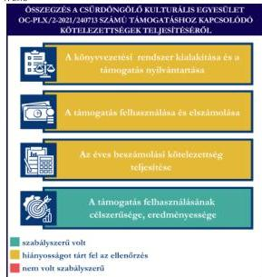
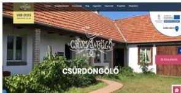

ÁLLAMI
SZÁMVEVŐSZÉK

# JELENTÉS

Egyesületek és alapítványok államháztartásból
kapott támogatásai felhasználásának és
elszámolásának ellenőrzése

Csűrdöngölő Kulturális Egyesület

2026.

25143

www.asz.hu

---

ÁLLAMI
SZÁMVEVŐSZÉK

# JELENTÉS

Egyesületek és alapítványok államháztartásból
kapott támogatásai felhasználásának és
elszámolásának ellenőrzése

Csűrdöngölő Kulturális Egyesület

2026.

25143

www.asz.hu

A LELNÖK 2.

---

ELLENŐRZÉSI IGAZGATÓSÁG:

ELLENŐRZÉSI IGAZGATÓSÁG V.

ELLENŐRZÉSI IGAZGATÓ:

KLINGA LÁSZLÓ igazgató

ELLENŐRZÉSVEZETŐ:

NEMESVÁRI-HORTHY ESZTER ellenőrzésvezető

Jelentéseink az interneten a
www.asz.hu címen olvashatók.

IKTATÓSZÁM: EL-4320-172/2025

TÉMASORSZÁM: 35

ELLENŐRZÉS-AZONOSÍTÓ SZÁM: V118108

---

# TARTALOMJEGYZÉK

|  ■ ÖSSZEFOGLALÁS | 5  |
| --- | --- |
|  ■ AZ ELLENŐRZÉS EREDMÉNYEI | 6  |
|  1. A civil szervezet államháztartási forrásból származó támogatása felhasználásának és elszámolásának szabályszerűsége, felhasználásának célszerűsége és eredményessége | 6  |
|  ■ JAVASLATOK | 9  |
|  ■ I. FÜGGELÉK: ÉSZREVÉTELEK | 10  |
|  ■ II. FÜGGELÉK: ELLENŐRZÉSI MEGKÖZELÍTÉS | 11  |
|  ■ MELLÉKLETEK | 15  |
|  I. sz. melléklet: Értelmező szótár | 15  |
|  II. sz. melléklet: Az ellenőrzött szervezetek jegyzéke | 18  |
|  ■ RÖVIDÍTÉSEK JEGYZÉKE | 19  |

3

---

# ÖSSZEFOGLALÁS

A civil szervezetek tevékenységük megvalósításához évente **jelentős állami** és önkormányzati **támogatásokat kaphatnak**, valamint ingyenes vagyonjuttatásban részesülhetnek. Ezekkel a forrásokkal gazdálkodnak, miközben tevékenységükkel a **társadalom széles rétegeire hatnak** többek között kulturális programok, rendezvények, közösségépítés formájában. Jogosan merül fel tehát a kérdés: **hogyan költik el a közpénzt?** Ennek érdekében az ÁSZ$^{1}$ időről időre **ellenőrzi** az államháztartásból kapott támogatások felhasználását, és értékeli, hogy a civil szervezetek a kapott támogatást **átláthatóan és célnak megfelelően** használták-e fel. Az ÁSZ által folytatott ellenőrzések segítenek abban, hogy a nyilvánosság is **valós képet kapjon arról, hova került az adófizetők pénze**.

A kulturális tevékenységet végző civil szervezetek **fontos és sokrétű szerepet** játszanak a mai Magyarországon, különösen a helyi közösségek életében. Különösen fontosak a helyi identitás megerősítésében, a kulturális sokszínűség fenntartásában, és a közösségi aktivitás ösztönzésében.

Egy kulturális tevékenységet végző civil szervezet támogatása **nem csupán egy adott program finanszírozását jelenti, hanem befektetés a közösség szellemi, kulturális és társadalmi tőkéjébe**. Ezek a szervezetek hidat képeznek az állam, a közösségek és az egyének között, támogatásuk ezért elengedhetetlen egy élő, demokratikus és értékalapú társadalom fenntartásához.

Az Egyesület$^{2}$ részére a Veszprém-Balaton 2023 Zrt., az Európa Kulturális Fővárosa 2023 programsorozat keretében, a „**Népmesével a Balaton-felvidék és Veszprém kultúrájáért**” elnevezésű projekt megvalósításához a 2022-2024. évben 20,0 M Ft pénzügyi támogatást nyújtott.

**Az Egyesület a kapott támogatást a projektcélnak megfelelően, eredményesen használta fel, a támogatás elérte célját.**

Az Egyesület a jogszabályi előírásoknak megfelelően alakította ki könyvvezetési rendszerét, amely biztosította a kapott támogatás elkülönített nyilvántartását, azonban a támogatás felhasználásának elkülönítése során **az átláthatóságot teljeskörűen nem biztosította**, mivel a nyilvántartás saját forrást is tartalmazott, amely által nem felelt meg maradéktalanul a jogszabályi előírásoknak.

A támogatás felhasználása és elszámolása a határidők, felhasználási jogcímek tekintetében a Támogatási szerződésben$^{3}$ és annak elválaszthatatlan részét képező költségtervben szereplő adatoknak, előírásoknak megfelelt, ugyanakkor az elkülönített számviteli nyilvántartás nem teljeskörűen felelt meg a

Támogatási szerződésben foglaltaknak, mivel nem tartalmazta valamennyi elszámolt tételt. Az Egyesület a Támogatási szerződés előírásainak megfelelően, határidőben eleget tett a Támogató$^{4}$ felé történő elszámolási kötelezettségének. A Támogató az elszámolást elfogadta. Az Egyesület a 2022., a 2023. és a 2024. évi egyszerűsített éves beszámolójában tájékoztatási és nyilvánosságra hozatali kötelezettségeinek – a 2024. évi beszámoló honlapon történő közzététele kivételével – eleget tett.

1. ábra

Forrás: ÁSZ saját szerkesztés

5

---

# AZ ELLENŐRZÉS EREDMÉNYEI

Az Egyesület a részére nyújtott költségvetési támogatást a „*Népmesével a Balaton-felvidék és Veszprém kultúrájáért*” elnevezésű projekt megvalósítására fordította. Az Egyesület a támogatást szabályszerűen, a támogatás céljának megfelelően a támogatott tevékenység időtartamán belül használta fel, ugyanakkor a projekt megvalósításához felhasznált saját forrást a támogatástól nem különítette el, továbbá az elszámolásban olyan tételek is szerepeltek, amelyek az elkülönített számviteli nyilvántartásban nem voltak fellelhetőek. A közpénzt az Egyesület céljaival összhangban a hagyományos magyar népmesekincs és az előszavas mesemondás műfajának népszerűsítésével kapcsolatban használták fel. A nyolc programelemből álló programsorozaton – amelynek részeként egy mesejárta is megvalósult – a résztvevők száma közel 1600 fő volt.

## 1. A civil szervezet államháztartási forrásból származó támogatása felhasználásának és elszámolásának szabályszerűsége, felhasználásának célszerűsége és eredményessége

### Összegző megállapítás

Az Egyesület az ellenőrzött támogatást a Támogatási szerződésben megjelölt célnak megfelelően, eredményesen használta fel, az elszámolási kötelezettségét teljesítette. A támogatást a számviteli rendszerében szabályszerűen kimutatta, felhasználását azonban a saját forrásától nem elkülönítetten tartotta nyilván. A számviteli beszámolási kötelezettségét szabályszerűen teljesítette. Az egyszerűsített éves beszámolóit – a 2024. évi egyszerűsített éves beszámoló saját honlapján történő közzététele kivételével – határidőben letétbe helyezte, közzétette.

### A KÖNYVVEZETÉSI RENDSZER KIALAKÍTÁSA ÉS A TÁMOGATÁS NYILVÁNTARTÁSA

Az Egyesület a Számv. tv.$^{5}$ és a Civilszr.$^{6}$-ben foglalt jogszabályi előírások betartásával gondoskodott a könyvviteli szolgáltatás személyi feltételeinek megteremtéséről, a könyvviteli szolgáltatás körébe tartozó feladatok ellátásával olyan társaságot bízott meg, amelynek megbízott tagja a jogszabályi előírásoknak megfelelő képesítéssel rendelkezett.

Az Egyesület a Civilszr. előírásainak megfelelően a 2022-2024. években kettős könyvvitelt vezetett.

Az Egyesület a Számv. tv. és a Civil tv.$^{7}$ előírásaiban foglaltak szerint az egyéb bevételeken belül elkülönítetten mutatta ki az alapcél szerinti tevékenysége költségei, ráfordításai ellentételezésére visszafizetési kötelezettség nélkül kapott, államháztartási forrásból származó központi költségvetési támogatást.

Az Egyesület az alapcél szerinti tevékenysége költségei, ráfordításai ellentételezésére kapott támogatásról elkülönített számviteli nyilvántartást vezetett. Ugyanakkor a támogatás felhasználásának elkülönítése során az átláthatóságot teljeskörűen nem biztosította, mivel a Civil tv. 20. § (4) bekezdésében és a Támogatási szerződés 8.6.10. pontjában foglaltak ellenére a projekt megvalósítására felhasznált saját forrást a kapott támogatástól nem különítette el, továbbá a záró pénzügyi elszámolásban olyan tételek is szerepeltek, amelyek az elkülönített nyilvántartásban nem.

6

---

Az ellenőrzés eredményei

# A TÁMOGATÁS FELHASZNÁLÁSA ÉS ELSZÁMOLÁSA

Az Egyesület az ellenőrzött támogatás felhasználásáról a Támogató által előírt formában elkészítette a beszámolót, annak részeként az összesített elszámolási táblázatot (számlaösszesítő), és határidőben benyújtotta a Támogató részére.

Az Egyesület esetében a támogatás felhasználása ellenőrzött tételeinek (10 db) vonatkozásában az ÁSZ az alábbiakat állapította meg:

- a tételek számviteli elszámolását a Számv. tv.-ben előírtaknak megfelelően bizonylatokkal alátámasztotta;
- minden gazdasági eseményt a Számv. tv.-ben foglaltak szerint, tartalmának megfelelő főkönyvi számra számolt el;
- a tételek számviteli bizonylatait a Támogatási szerződésben foglaltaknak megfelelően ellátta záradékkal;
- a számviteli bizonylatokon záradékolt összegek megegyeztek a számlaösszesítőben feltüntetett értékekkel;
- a tételek számviteli bizonylatai alapján a gazdasági események a Támogatási szerződésnek megfelelően, a támogatási időszak végéig, szerződés szerint teljesültek;
- a tételek pénzügyi rendezése a Támogatási szerződésben meghatározott felhasználási határidőig minden esetben megtörtént;
- a tételek megfeleltethetők voltak a Támogatási szerződésben, illetve a költségtervben meghatározott, Támogató által jóváhagyott felhasználási jogcímeknek.

A Támogatási szerződésben foglalt támogatás lezárásáról, a beszámoló elfogadásáról a Támogató 2024. április 3-án döntött, az Egyesületnek visszafizetési kötelezettsége nem keletkezett.

# AZ ÉVES BESZÁMOLÁSI KÖTELEZETTSÉG TELJESÍTÉSE

Az Egyesület a 2022-2024. évekre vonatkozóan a Számv. tv. és a Civil. tv. előírásai alapján elkészítette számviteli beszámolóit. Az egyszerűsített éves beszámolók a Civil tv. és a Civilszr. előírásai alapján tartalmazták a mérleget, az eredménykimutatást és a kiegészítő mellékletet.

Az Egyesület a Civil tv.-nek megfelelően a beszámolóval egyidejűleg elkészítette a közhasznúsági mellékletet.

A 2022., a 2023. és a 2024. évi egyszerűsített éves beszámolót a Közgyűlés⁸ a Civil tv.-nek megfelelően jóváhagyta.

Az Egyesület a Civil tv. alapján a 2022., a 2023. és a 2024. évi egyszerűsített éves beszámolóját és közhasznúsági mellékletét határidőben letétbe helyezte és az OBH⁹ honlapján közzétette. Az Egyesület saját honlappal rendelkezett, azonban honlapján a 2024. évi egyszerűsített éves beszámolót a Civil tv. 30. § (4) bekezdésében előírtak ellenére nem tette közzé.

# A TÁMOGATÁS FELHASZNÁLÁSÁNAK CÉLSZERŰSÉGE ÉS EREDMÉNYESSÉGE

Az Egyesület az ellenőrzött támogatást a Támogatási szerződés előírásainak megfelelően, az abban meghatározott célra használta fel. A Támogatási szerződésben megjelölt cél – a „Népmesével a Balatonfelvidék és Veszprém kultúrájáért” elnevezésű projekt – teljesült. A programsorozat az előzetesen jóváhagyott költségtervnek megfelelően valósult meg, költségátcsoportosítás a dologi és felhalmozási kiadások között történt, a Támogatási szerződésben meghatározott keretek között. A támogatás

7

---

Az ellenőrzés eredményei

eredményeként megvalósult programsorozatról online felületeken (Facebook-oldal), az Egyesület saját honlapján, helyi (Veszprém TV) médiában tájékoztatták a közvéleményt. Az eseményeket magyar nyelven, a nemzetközi közönséget célzó programokat magyar és angol nyelven tették közzé. A projekt hozzájárult az irodalom tématerületen a népmese és történetmondás területén elismert hazai és külföldi művészek, szakemberek bemutatkozásához, a magyar népmesekincs nemzetközi környezetbe ágyazottságának bemutatásához.

A programhoz a Támogató cél indikátorokat határozott meg, amelyek a Támogatási szerződés 2. mellékletében meghatározottak alapján az alábbiak szerint teljesültek:

1. táblázat

# **AZ INDIKÁTOROK TELJESÍTÉSE**

|  INDIKÁTOROK | TÁMOGATÁSI SZERZŐDÉSBEN MEGHATÁROZOTT ADAT | TELJESÍTÉS  |
| --- | --- | --- |
|  1. Látogatók/résztvevők száma (fő) | 1 600 | 1 982 közösségi média 2 000* nemzetközi résztvevők 83**  |
|  2. Önkéntesek száma (fő) | 50 | 50  |
|  3. Hazai médiamegjelenések száma (db) | 50 | 50  |
|  4. Gyerekbarát programok száma (db) | 6 | 6  |
|  5. Bevont civil szervezetek száma (db) | 6 | 6  |
|  6. Nemzetközi partnerek száma (db) | 3 | 3  |

\* A közösségi média oldalon meghirdetett eseményekre regisztrált látogatók száma.

\*\*FEST Mesemondó Konferencia nemzetközi résztvevőinek száma

Forrás: ÁSZ saját szerkesztés a Részbeszámolók és a Záró beszámoló, további ellenőrzési dokumentumok alapján

A záró beszámolóban az Egyesület beszámolt az indikátorok teljesüléséről, azt a Támogató elfogadta.

8

---

# JAVASLATOK

Az ÁSZ tv.¹⁰ 33. § (1) bekezdésében foglaltak értelmében az ellenőrzött szervezet vezetője köteles a jelentésben foglalt megállapításokhoz kapcsolódó intézkedési tervet összeállítani és azt a jelentés kézhezvételétől számított 30 napon belül az ÁSZ részére megküldeni. Az ÁSZ a jelentésben foglalt megállapításokhoz kapcsolódóan az alábbi javaslatok tekintetében várja el az intézkedési terv elkészítését.

## CSÜRDÖNGÖLŐ KULTURÁLIS EGYESÜLET ELNÖKÉNEK

1. Gondoskodjon arról, hogy az Egyesület a jövőben a kapott támogatások felhasználásáról a Civil tv. 20. § (4) bekezdésében foglalt előírásnak megfelelően olyan elkülönített számviteli nyilvántartást vezessen, amelyből megállapítható és ellenőrizhető a kapott támogatás felhasználása.

2. Gondoskodjon arról, hogy az Egyesület a számviteli beszámolót és a közhasznúsági mellékletet a Civil tv. 30. § (4) bekezdésében rögzített előírás alapján a saját honlapon közzé tegye.

9

---

# I. FÜGGELÉK: ÉSZREVÉTELEK

*A jelentéstervezetet az ÁSZ 15 napos észrevételezésre megküldte az ellenőrzött szervezet vezetőjének az ÁSZ tv. 29. §\* (1) bekezdése előírásának megfelelően.*

*A Csűrdöngölő Kulturális Egyesület elnöke a jelentéstervezetre nem tett észrevételt.*

\* 29. § (1) Az Állami Számvevőszék az ellenőrzési megállapításait megküldi az ellenőrzött szervezet vezetőjének vagy az általa megbízott személynek, és annak, akinek személyes felelősségét állapította meg.

(2) Az ellenőrzött szervezet vezetője és a felelősként megjelölt személy az ellenőrzés megállapításaira tizenöt napon belül írásban észrevételt tehet.

(3) Az Állami Számvevőszék az észrevételre a beérkezésétől számított harminc napon belül írásban válaszol. A figyelembe nem vett észrevételeket köteles a jelentésben feltüntetni, és megindokolni, hogy azokat miért nem fogadta el.

10

---

## II. FÜGGELÉK: ELLENŐRZÉSI MEGKÖZELÍTÉS

### AZ ELLENŐRZÉS JOGALAPJA

Az ellenőrzés jogszabályi alapját az ÁSZ tv. 1. § (3) bekezdés, az 5. § (3) bekezdés előírásai képezték.

### AZ ELLENŐRZÉS CÉLJA

Az ellenőrzés célja annak értékelése volt, hogy az ellenőrzött egyesület az államháztartási forrásból származó, ellenőrzésre kiválasztott támogatást a támogatási szerződésben előírtaknak megfelelően, az abban meghatározott célra, szabályszerűen, eredményesen használta-e fel, valamint a gazdálkodásáról szabályszerűen beszámolt-e. Célja volt továbbá a támogatással való elszámolás szabályszerűségének értékelése.

### AZ ELLENŐRZÉS TÍPUSA

Kombinált ellenőrzés.

### AZ ELLENŐRZÉS TÁRGYA

Az államháztartásból nyújtott támogatást felhasználó ellenőrzött egyesületnél a kiválasztott támogatás felhasználására vonatkozó jogszabályi és szerződéses előírások betartásának ellenőrzése. Ennek keretében a könyvvezetésre vonatkozó jogszabályi előírások betartása, a támogatás felhasználás támogatási szerződésnek való megfelelősége, valamint a beszámolási és közzétételi kötelezettség teljesítésének szabályszerűsége. Az ellenőrzés tárgya volt továbbá annak értékelése, hogy a számviteli szabályozási környezet kialakítása támogatta-e az államháztartásból származó támogatás vonatkozásában a szabályos könyvvezetést, a támogatás célnak megfelelő felhasználását, valamint a kapcsolódó beszámolási kötelezettség teljesítését. Az ellenőrzés során az ÁSZ értékelte, hogy az ellenőrzött szervezet a támogatást meghatározott célra, eredményesen használta-e fel.

Az ellenőrzés kiterjedt minden olyan körülményre és adatra, amely az ÁSZ jogszabályban meghatározott feladatainak teljesítéséhez, valamint a program végrehajtása folyamán felmerült újabb összefüggések feltárásához szükséges volt.

### AZ ELLENŐRZÉS HATÓKÖRE ÉS TERÜLETE

Az ÁSZ tv. 5. § (3) bekezdésében foglaltak alapján az ÁSZ ellenőrizte az államháztartásból nyújtott támogatás felhasználását. A támogatás felhasználásának szabályait a támogatási szerződés, az Áht.$^{11}$ és az Ávr.$^{12}$ rögzítette. A civil szervezet könyvvezetésének, a beszámolási- és közzétételi kötelezettség teljesítésének ellenőrzése a Számv. tv., a Civilszr., a Civil tv., a Civil vhr.$^{13}$, valamint a Ptk.$^{14}$ vonatkozó előírásai alapján történt.

11

---

II. Függelék: Ellenőrzési megközelítés

Az ÁSZ ellenőrzése választ ad arra, hogy az ellenőrzött szervezetnél a számviteli szabályozási környezet kialakítása biztosította-e a támogatás felhasználása jogszabályi előírásoknak megfelelő nyilvántartását, könyvviteli elszámolását, továbbá arra is, hogy a támogatással való elszámolási, beszámolási kötelezettséget teljesítette-e. Az ÁSZ ellenőrzése kiterjedt a támogatás támogatási szerződésben foglalt célra történő felhasználás és a felhasználás eredményességének értékelésére. Ezen túlmenően az ellenőrzés értékelte, hogy az ellenőrzött szervezet számviteli beszámolási kötelezettségének teljesítése szabályszerű volt-e.

## AZ ELLENŐRZÖTT IDŐSZAK

Az ellenőrzésre kiválasztott államháztartási forrásból származó támogatásra vonatkozó támogatott tevékenység időtartamának kezdő időpontjától az ellenőrzésről szóló értesítés keltéig tartó időszak.

Az ellenőrzésre kiválasztott egyesület államháztartásból kapott támogatása felhasználásának és elszámolásának ellenőrzése során az ellenőrzött időszakon belül az értékelés szempontjából releváns évek a 2022., a 2023. és a 2024. év.

## AZ ELLENŐRZÉSI KRITÉRIUMOK

|  FŐKUSZTERÜLET/FŐKUSZKÉRDÉS | ELLENŐRZÉSI KRITÉRIUMOK  |
| --- | --- |
|  1. A civil szervezet államháztartási forrásból származó támogatása(i) felhasználásának és elszámolásának szabályszerűsége, felhasználásának célszerűsége és eredményessége | Áht. Ávr. Számv. tv. Civil tv. Civilszr. Ptk. Civil vhr. Cnytv.^{15} Létesítő okirat Támogatási szerződés Költségterv  |

## AZ ELLENŐRZÉS MÓDSZERE ÉS AZ ELLENŐRZÉSI BIZONYÍTÉKOK KÖRE

Az ellenőrzést a nemzetközi standardokat irányadónak tekintve az ellenőrzési program szempontjai, az ellenőrzött időszakban hatályos jogszabályok, az ellenőrzés szakmai szabályok és módszertan(ok) figyelembevételével végezte az ÁSZ.

Az ellenőrzési kérdések megválaszolásához szükséges bizonyítékok megszerzése az ellenőrzött szervezet által rendelkezésre bocsátott dokumentumokra és adatokra alapozva mintavételezés útján történt.

Az államháztartási forrásból származó, ellenőrzésre – adatvezérelt, kockázatalapú kiválasztás által, több év adatának figyelembevételével és az ellenőrizhető szervezet által előzetesen szolgáltatott adatok alapján – kijelölt támogatás felhasználása támogatási szerződésnek való megfelelőségét a támogatás nyilvántartásának

12

---

II. Függelék: Ellenőrzési megközelítés---

és a támogató felé történő elszámolásnak egymással és a támogatási szerződéssel történő összevetésével ellenőrizte az ÁSZ.

A támogatás könyvviteli nyilvántartása jogszabályi előírásoknak, támogatási szerződésnek való szabályszerűségét nem statisztikai alapú mintavételi eljárással ellenőrizte az ÁSZ. A tételek kiértékelése nem került a sokaságra kivetítésre. A kiválasztott támogatási szerződéshez kapcsolódó elszámolásból 10 db tétel került ellenőrzésre.

Az ellenőrzési bizonyítékként felhasználható adatforrások közé tartoztak egyrészt az ellenőrzéshez kért dokumentumok, másrészt adatforrás volt még minden – az ellenőrzés folyamán – feltárt, az ellenőrzés szempontjából információkat tartalmazó dokumentum.

Az ellenőrzés lefolytatásához az ellenőrzött szervezet a tanúsítványok kitöltésével, valamint az ÁSZ által kért dokumentumok, adatok, információk megküldésével és az ellenőrzés során szolgáltatott adatokat.

Az ÁSZ az ellenőrzött szervezetet az Országos Támogatás-ellenőrzési Rendszerben (OTR) nyilvántartott adatok alapján államháztartási forrásból támogatásban részesült szervezetek közül, – OBH és KSH$^{16}$ adatokat is figyelembe véve – adatvezérelt kockázatértékelés alapján, a kulturális tevékenységet végző szervezetekre fókuszálva választotta ki. Az ÁSZ az ellenőrzött támogatást az adott szervezet által előzetesen szolgáltatott adatok alapján, a tanúsítványokban szereplő adatok ismeretében határozta meg.

A **Csűrdöngölő Kulturális Egyesületet** 2004-ben alapították, a civil szervezetek közhiteles bírósági nyilvántartásába 2004. június 22-én jegyezték be. Az Egyesület Alapszabálya$^{17}$ szerinti célja többek között *„a magyar kulturális hagyományok, ezen belül különösen a Galga és a Zagyva mente néphagyományának ismertetése, népszerűsítése, magas színvonalú kulturális, művészeti, népművészeti értékeket felvonultató rendezvények szervezése, megvalósítása, előadóművészeti, színházpedagógiai és drámapedagógiai tevékenység végzése.”*

Az Egyesület legfőbb döntéshozó szerve a Közgyűlés, ügyvezető szerve a három tagból álló Elnökség$^{18}$, legfőbb tisztségviselője az Elnök, aki ellátja a törvényes képviseletet, képviseleti joga gyakorlásának terjedelme általános, módja önálló. A bankszámla felett az Elnök önállóan volt jogosult rendelkezni. Az Elnök személyében az ellenőrzött időszakban nem történt változás.

Az Egyesület jogszabályi előírás alapján könyvvizsgálatra, felügyelő szerv, illetve felügyelőbizottság létrehozására nem volt kötelezett. Az Egyesület az ellenőrzött időszakban közhasznú jogállással rendelkezett.

Az Egyesület **nem minősült** a Közbef. tv.$^{19}$ szerinti, **közélet befolyásolására alkalmas civil szervezetnek**, mivel az ellenőrzött időszakban mérlegfőösszege nem haladta meg a 20 M Ft-ot.

Az Egyesület vállalkozási tevékenységet nem végzett.

Az Egyesület az Európa Kulturális Fővárosa 2023 programsorozat keretében támogatásban részesült. A támogatással kapcsolatos adatokat a 2. táblázat foglalja össze.

13

---

II. Függelék: Ellenőrzési megközelítés

2. táblázat

# A TÁMOGATÁS FŐBB ADATAI

# A CSÚRDÖNGÖLŐ KULTURÁLIS EGYESÜLET RÉSZÉRE A TÁMOGATÓ ÁLTAL NYÚJTOTT, ELLENŐRZŐTT TÁMOGATÁS (OC-PLX/2-2021/240713) FŐBB ADATAI

|  Támogatott tevékenység: | Népmesével a Balaton-felvidék és Veszprém kultúrájáért elnevezésű projekt megvalósítása  |
| --- | --- |
|  Támogató: | Veszprém-Balaton 2023 Zrt.  |
|  Támogatási összeg: | 20,0 M Ft  |
|  Felhasznált összeg: | 20,0 M Ft  |
|  A Támogatási szerződés megkötésének dátuma: | 2022. június 2.  |
|  A támogatott tevékenység időtartama: | 2022. március 1. – 2023. december 31.  |
|  A támogatás felhasználásáról a záró (pénzügyi) beszámoló benyújtásának határideje: | 2024. március 1.  |
|  A támogatás felhasználásáról benyújtott záró beszámoló elfogadásának dátuma: | 2024. április 4.  |

Forrás: ÁSZ saját szerkesztés a Támogatási szerződés adatai alapján

A programsorozat finanszírozásáról az Európa Kulturális Fővárosa 2023 cím viselésével összefüggő intézkedésekről szóló 1468/2020. (VIII. 5.) Korm. határozat rendelkezett. A finanszírozás forrása Magyarország központi költségvetése volt, 2021. évtől a központi költségvetés XLVII. Gazdaságvédelmi Alap fejezetében határozták meg.

2. ábra

Forrás: https://www.csurdongolo.hu/

A Népmesével a Balaton-felvidék és Veszprém kultúrájáért elnevezésű projekt megvalósítására kapott támogatásból az Egyesület nyolc programelemből álló programsorozatot, ennek részeként egy mesejuttat is megvalósított a 2022-2023. években. Az eseményeken mese-jutták és mesekörök alakultak, mesekocsma programok, „Krajcáros mesék” vásári produkciók, koncertek, népmesemondó találkozó valósultak meg, amelyekkel értékeket teremtettek a helyi közösségnek. Az egyes programelemek lebonyolítása során különböző együttesek, előadóművészek léptek fel.

14

---

# MELLÉKLETEK

## ■ 1. SZ. MELLÉKLET: ÉRTELMEZŐ SZÓTÁR

|  adomány | A civil szervezetnek – létesítő okiratban rögzített céljaira – ellenszolgáltatás nélkül juttatott eszköz, illetve nyújtott szolgáltatás. (Forrás: Civil tv. 2. § 1. pont)  |
| --- | --- |
|  célszerűség | Arra vonatkozó követelmény, hogy a bevételeket a közfeladat megvalósítása érdekében, a kiadásokat a közfeladatok megfelelő ellátásához szükséges mértékben, a költségvetési célrendszer érdekében, a meghatározott célra (közfeladat ellátására), továbbá észszerűen, racionálisan használták fel. (Forrás: Alaptörvény^{20}, ÁSZ)  |
|  civil szervezet | Civil szervezet: a) a civil társaság, b) a Magyarországon nyilvántartásba vett egyesület - a párt, a szakszervezet és a kölcsönös biztosító egyesület kivételével -, c) a közalapítvány és a pártalapítvány kivételével - az alapítvány. (Forrás: Civil tv. 2. § 6. pont)  |
|  civil szervezetek egyszerűsített támogatása | A helyi vagy területi hatókörű civil szervezetek számára a Civil tv. 56. § (1) bekezdés h) pontja alapján egyszerűsített formában, jogosultsági alapon nyújtott támogatás a helyi közösség érdekében végzett tevékenységük támogatására. (Forrás: Civil tv. 2. § 8b. pont)  |
|  civil szervezetek normatív támogatása | A civil szervezetek által gyűjtött adományok után járó, a gyűjtött adomány mértékével arányos a Civil tv. 56. § (1) bekezdés a) pontja alapján nyújtott támogatás. (Forrás: Civil tv. 2. § 8a. pont alapján)  |
|  egyesület | Az egyesület a tagok közös, tartós, alapszabályban meghatározott céljának folyamatos megvalósítására létesített, nyilvántartott tagsággal rendelkező jogi személy. (Forrás: Ptk. 3:63. § (1) bekezdés) A Számv. tv. alkalmazásában egyéb szervezet. (Forrás: Számv. tv. 3. § (1) bekezdés 4. pont a) alpont)  |
|  eredményesség | Az eredményesség elve a kitűzött célok és a szándékolt eredmények (hatások) elérését jelenti. A gazdálkodás, feladatellátás eredményességét mutatja a tényleges és a tervezett eredmények (hatások) összevetése. (Forrás: INTOSAI^{21})  |
|  feladatfinanszírozást szolgáló költségvetési támogatás | Valamely közfeladat államháztartáson kívüli szervezet által történő ellátását, valamint e feladat ellátásához közvetlenül kapcsolódó, arányos működési költségeket finanszírozó költségvetési támogatás. (Forrás: Civil tv. 2. § 8. pont)  |
|  közcélú tevékenység | Személyek csoportja által, valamely a csoportnál tágabb közösség érdekében – más, e közösségbe nem tartozó személyek érdekeinek sérelme nélkül – végzett tevékenység. (Forrás: Civil tv. 2. § 16. pont)  |
|  közfeladat | A jogszabályban meghatározott állami vagy önkormányzati feladat. A közfeladatok ellátásában államháztartáson kívüli szervezet jogszabályban meghatározott rendben közreműködhet. (Forrás: Áht. 3/A. § (1)-(2) bekezdés)  |

15

---

Mellékletek

|  közhasznú szervezet | Közhasznú szervezetté minősített a Magyarországon nyilvántartásba vett közhasznú tevékenységet végző szervezet, amely a társadalom és az egyén közös szükségleteinek kielégítéséhez megfelelő erőforrásokkal rendelkezik, továbbá amelynek megfelelő társadalmi támogatottsága kimutatható, és amely: a) civil szervezet (ide nem értve a civil társaságot), vagy b) olyan egyéb szervezet, amelyre vonatkozóan a közhasznú jogállás megszerzését törvény lehetővé teszi. (Forrás: Civil tv. 32. § (1) bekezdés)  |
| --- | --- |
|  közhasznú tevékenység | Minden olyan tevékenység, amely a létesítő okiratban megjelölt közfeladat teljesítését közvetlenül vagy közvetve szolgálja, ezzel hozzájárulva a társadalom és az egyén közös szükségleteinek kielégítéséhez. (Forrás: Civil tv. 2. § 20. pont)  |
|  létesítő okirat | A jogi személy létrehozásáról a személyek szerződésben, alapító okiratban vagy alapszabályban szabadon rendelkezhetnek, mely dokumentumokra együttesen a Ptk. a létesítő okirat megnevezést használja. (Forrás: Ptk. 3:4. § (1) bekezdés alapján)  |
|  támogatás | Céljellegű juttatás, mely kizárólag arra a célra használható fel, amelyre a támogató azt rendelkezésre bocsátotta, amely cél megvalósítását a támogatási szerződés, okirat vagy éppen jogszabály kikötötte. Támogatásként értelmezzük valamennyi, a civil szervezetnek államháztartási forrásból nyújtott támogatást – ideértve a központi költségvetésből kapott támogatást, az elkülönített állami pénzalapokból kapott támogatást, a helyi önkormányzatoktól, nemzetiségi önkormányzatoktól, önkormányzati társulástól kapott támogatást –, továbbá az Európai Unió költségvetéséből, külföldi állam államháztartásából, nemzetközi szervezettől, vagy nemzetközi szerződés rendelkezése alapján kapott támogatást, valamint más civil szervezettől kapott támogatást. A gyűjtő fogalom alatt egyaránt értjük a civil szervezetnek nyújtott feladatfinanszírozást szolgáló költségvetési támogatást, a civil szervezetek normatív támogatását, valamint a civil szervezetek egyszerűsített támogatását is (ÁSZ saját fogalma)  |
|  támogatási döntés | Az államháztartás alrendszereiből, az európai uniós forrásokból, a nemzetközi megállapodás alapján finanszírozott egyéb programokból, a 100%-os állami tulajdonban álló szervezet által létrehozott alapítványtól származó, egyedi döntés alapján nyújtott, pályázati úton vagy pályázati rendszeren kívül az államháztartáson kívüli természetes személyek, jogi személyek és jogi személyiséggel nem rendelkező egyéb szervezetek számára odaítélt, természetben vagy pénzben juttatott támogatásokban részesülő személy, valamint az e személy részére juttatandó konkrét támogatási összeg meghatározása. (Forrás: 2007. évi CLXXXI. törvény^{22} 1. § (1) bekezdése és 2. § (1) bekezdése alapján)  |
|  támogatási szerződés | A támogatási szerződés egy olyan, kölcsönös és egybehangzó, több oldalú jognyilatkozat, amelyben a támogató – egy meghatározott cél elérése érdekében – támogatás nyújtását vállalja a kedvezményezett részére az adott szerződés szerinti kötelezettségek támogatott általi teljesítése mellett, és amely jognyilatkozat esetében a jelen pontban rögzített jogszabályi előírások is irányadók. Az államháztartás alrendszeri terhére támogatás közigazgatási hatósági határozattal vagy hatósági szerződéssel, támogatói okirattal vagy támogatási szerződéssel jogszabály vagy egyedi döntés alapján, pályázati úton vagy pályázati rendszeren kívül nyújtható. Ha jogszabály – a központi költségvetés Áht. 14. § (3) bekezdése szerinti fejezetéből biztosított költségvetési támogatások esetén jogszabály vagy a Kormány határozata – a támogatás biztosításának módjáról nem rendelkezik, arról – a központi költségvetés Áht. 14. § (3) bekezdése szerinti fejezetéből biztosított költségvetési támogatásoktól eltérő más esetekben – az ötmilliárd forintot eltérő vagy azt meghaladó összegű költségvetési támogatás esetén hatósági szerződésnek nem minősülő támogatási szerződésben kell megállapodni a kedvezményezettel. (Forrás: Áht. 48. § (1) bekezdése, Ávr. 65/A. § (1) bekezdés alapján ÁSZ meghatározás)  |

16

---

*Mellékletek*---

|  támogatott tevékenység | A támogatási szerződésben meghatározott olyan tevékenység – ideértve a kedvezményezett működését is –, amely során felmerült költségek megtérítését a támogatási előleg, a költségvetési támogatás részben vagy egészében biztosítja. (Forrás: Ávr. 1. § 8. pontja)  |
| --- | --- |
|  támogatott tevékenység időtartama | A támogatási szerződésben meghatározott olyan időtartam, amely során felmerülő, a támogatott tevékenység megvalósításához kapcsolódó költségek elszámolhatóak. (Forrás: Ávr. 1. § 9. pontja)  |

17

---

Mellékletek---

# ■ II. SZ. MELLÉKLET: AZ ELLENŐRZÖTT SZERVEZETEK JEGYZÉKE

|  ELLENŐRZÖTT SZERVEZET NEVE | ELLENŐRZÖTT SZERVEZET SZÉKHELYE  |
| --- | --- |
|  Csűrdöngölő Kulturális Egyesület | 2194 Tura, Zsámboki út 50.  |

18

---

# RÖVIDÍTÉSEK JEGYZÉKE

1. ÁSZ

2. Egyesület

3. Támogatási szerződés

4. Támogató

5. Számv. tv.

6. Civilsztr.

7. Civil tv.

8. Közgyűlés

9. OBH

10. ÁSZ tv.

11. Áht.

12. Ávr.

13. Civil vhr.

14. Ptk.

15. Cnytv.

16. KSH

17. Alapszabály

18. Elnökség

19. Közbef. tv.

20. Alaptörvény

21. INTOSAI

22. 2007. évi CLXXXI. törvény

Állami Számvevőszék

Csúrdöngölő Kulturális Egyesület

OC-PLX/2-2021/240713 pályázati azonosító számú Támogatási szerződés

Veszprém-Balaton 2023 Zrt.

2000. évi C. törvény a számvitelről

479/2016. (XII. 28.) Korm. rendelet a számviteli törvény szerinti egyes egyéb szervezetek beszámoló készítési és könyvvezetési kötelezettségének sajátosságairól

2011. évi CLXXV. törvény az egyesülési jogról, a közhasznú jogállásról, valamint a civil szervezetek működéséről és támogatásáról

Csúrdöngölő Kulturális Egyesület Közgyűlése

Országos Bírósági Hivatal

2011. évi LXVI. törvény az Állami Számvevőszékről

2011. évi CXCV. törvény az államháztartásról

368/2011. (XII. 31.) Korm. rendelet az államháztartásról szóló törvény végrehajtásáról

350/2011. (XII. 30.) Korm. rendelet - a civil szervezetek gazdálkodása, az adománygyűjtés és a közhasznúság egyes kérdéseiről

2013. évi V. törvény a Polgári Törvénykönyvről

2011. évi CLXXXI. törvény a civil szervezetek bírósági nyilvántartásáról és az ezzel összefüggő eljárási szabályokról

Központi Statisztikai Hivatal

Csúrdöngölő Kulturális Egyesület Alapszabálya (hatályos: 2020. augusztus 31-étől)

Csúrdöngölő Kulturális Egyesület Elnöksége

2021. évi XLIX. törvény a közélet befolyásolására alkalmas tevékenységet végző civil szervezetek átláthatóságáról

Magyarország Alaptörvénye

Legfőbb Ellenőrző Intézmények Nemzetközi Szervezete (The International Organization of Supreme Audit Institutions)

2007. évi CLXXXI. törvény a közpénzekből nyújtott támogatások átláthatóságáról

19

---

ÁLLAMI
SZÁMVEVŐSZÉK

1052 Budapest, Apáczai Csere János u. 10. | 1364 Budapest 4., Pf. 54
www.asz.hu | szamvevoszek@asz.hu
telefon: +36 1 484 9100