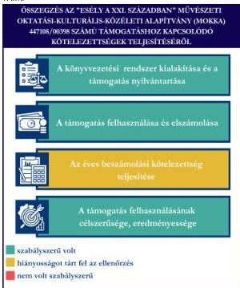
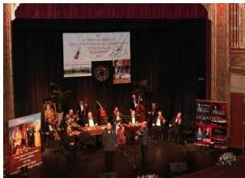

ÁLLAMI
SZÁMVEVŐSZÉK

# JELENTÉS

# Egyesületek és alapítványok államháztartásból
kapott támogatásai felhasználásának és
elszámolásának ellenőrzése

"Esély a XXI. században" Művészeti Oktatási-Kulturális-Közéleti
Alapítvány (MOKKA)

2026.

25144

www.asz.hu

---

ÁLLAMI
SZÁMVEVŐSZÉK

# JELENTÉS

Egyesületek és alapítványok államháztartásból
kapott támogatásai felhasználásának és
elszámolásának ellenőrzése

"Esély a XXI. században" Művészeti Oktatási-Kulturális-Közéleti
Alapítvány (MOKKA)

2026.

25144

www.asz.hu

Dr. Szomolai Csaba
alelnök

---

ELLENŐRZÉSI IGAZGATÓSÁG:

ELLENŐRZÉSI IGAZGATÓSÁG V.

ELLENŐRZÉSI IGAZGATÓ:

KLINGA LÁSZLÓ igazgató

ELLENŐRZÉSVEZETŐ:

NEMESVÁRI-HORTHY ESZTER ellenőrzésvezető

Jelentéseink az interneten a
www.asz.hu címen olvashatók.

IKTATÓSZÁM: EL-4320-173/2025

TÉMASORSZÁM: 35

ELLENŐRZÉS-AZONOSÍTÓ SZÁM: V118105

---

# TARTALOMJEGYZÉK

|  ■ ÖSSZEFOGLALÁS | 5  |
| --- | --- |
|  ■ AZ ELLENŐRZÉS EREDMÉNYEI | 6  |
|  1. A civil szervezet államháztartási forrásból származó támogatása felhasználásának és elszámolásának szabályszerűsége, felhasználásának célszerűsége és eredményessége | 6  |
|  ■ JAVASLATOK | 9  |
|  ■ I. FÜGGELÉK: ÉSZREVÉTELEK | 10  |
|  ■ II. FÜGGELÉK: ELLENŐRZÉSI MEGKÖZELÍTÉS | 11  |
|  ■ MELLÉKLETEK | 15  |
|  I. sz. melléklet: Értelmező szótár | 15  |
|  II. sz. melléklet: Az ellenőrzött szervezetek jegyzéke | 17  |
|  ■ RÖVIDÍTÉSEK JEGYZÉKE | 18  |

3

---

# ÖSSZEFOGLALÁS

A civil szervezetek tevékenységük megvalósításához évente **jelentős állami** és önkormányzati **támogatásokat** kaphatnak, valamint ingyenes vagyonjuttatásban részesülhetnek. Ezekkel a forrásokkal gazdálkodnak, miközben tevékenységükkel a **társadalom széles rétegeire hatnak**, többek között kulturális programok, rendezvények, közösségépítés formájában. Jogosan merül fel tehát a kérdés: **hogyan költik el a közpénzt?** Ennek érdekében az ÁSZ¹ időről időre **ellenőrzi** a támogatások felhasználását, és értékeli, hogy a civil szervezetek az államháztartásból kapott támogatásokat **átláthatóan és célnak megfelelően** használták-e fel. Az ÁSZ által folytatott ellenőrzések segítenek abban, hogy a nyilvánosság is **valós képet kapjon arról, hova kerül az adófizetők pénze**.

A kulturális tevékenységet végző civil szervezetek **fontos és sokrétű szerepet** játszanak a mai Magyarországon, különösen a helyi közösségek életében. Különösen fontosak a helyi identitás megerősítésében, a kulturális sokszínűség fenntartásában, és a közösségi aktivitás ösztönzésében.

Egy kulturális tevékenységet végző civil szervezet támogatása **nem csupán egy adott program finanszírozását jelenti, hanem befektetés a közösség szellemi, kulturális és társadalmi tőkéjébe**. Ezek a szervezetek hidat képeznek az állam, a közösségek és az egyének között, támogatásuk ezért elengedhetetlen egy élő, demokratikus és értékalapú társadalom fenntartásához.

Az Alapítvány² részére a Nemzeti Kulturális Támogatáskezelő a Nemzeti Kulturális Alap terhére „**A Cigányvarázs VIII. Kárpát-medencei cigányprímások és zenekarok fesztiválja megvalósítására**” című projekt létrejöttéhez a 2023. évben 25,0 M Ft pénzügyi támogatást nyújtott.

**Az Alapítvány a kapott támogatást a projektcélnak megfelelően, eredményesen használta fel, a támogatás elérte célját.**

Az Alapítvány a jogszabályi előírásoknak megfelelően alakította ki könyvvezetési rendszerét, amely biztosította a kapott támogatás és a támogatás felhasználásának szabályos nyilvántartását.

A támogatás felhasználása a Támogatói okiratban³ és annak elválaszthatatlan részét képező költségtervben szereplő adatoknak, előírásoknak megfelel. Az Alapítvány a Támogatói okirat előírásainak megfelelően, határidőben eleget tett a Támogató⁴ felé történő elszámolási kötelezettségének. A Támogató az elszámolást elfogadta.

Az Alapítvány a 2023. évi egyszerűsített éves beszámolójában tájékoztatási és nyilvánosságra hozatali kötelezettségeinek eleget tett, azonban a kiegészítő mellékletében a végleges jelleggel felhasznált összegeket támogatásonként nem mutatta be.

1. ábra

Forrás: ÁSZ saját szerkesztés

5

---

# AZ ELLENŐRZÉS EREDMÉNYEI

Az Alapítvány a részére nyújtott költségvetési támogatást a „A Cigányvarázs VIII. Kárpát-medencei cigányprímások és zenekarok fesztiválja megvalósítására” fordította. Az Alapítvány a támogatást szabályszerűen, a támogatás céljának megfelelően, a támogatott tevékenység időtartamán belül használta fel. A kétnapos fesztiválon számos hazai és nemzetközi művész lépett fel, a kulturális és közösségi célkitűzések megvalósultak. A közpénzt az Alapítvány céljaival összhangban a cigány kisebbség kultúrájának, művészetének megismertetésére, népszerűsítésére használta fel.

## 1. A civil szervezet államháztartási forrásból származó támogatása felhasználásának és elszámolásának szabályszerűsége, felhasználásának célszerűsége és eredményessége

### Összegző megállapítás

Az Alapítvány az ellenőrzött támogatást a Támogatói okiratban megjelölt célnak megfelelően, eredményesen használta fel, az elszámolási kötelezettségét teljesítette. A támogatást a számviteli rendszerében szabályszerűen kimutatta, felhasználását a jogszabályi előírásnak megfelelően, elkülönítetten tartotta nyilván. A számviteli beszámolási kötelezettségét teljesítette, azonban a kiegészítő mellékletében a végleges jelleggel felhasznált összegeket támogatásonként nem mutatta be. Az egyszerűsített éves beszámolóit határidőben letétbe helyezte, közzétette.

### A KÖNYVVEZETÉSI RENDSZER KIALAKÍTÁSA ÉS A TÁMOGATÁS NYILVÁNTARTÁSA

Az Alapítvány a Számv. tv.⁵ és a Civilszr.⁶-ben foglalt jogszabályi előírások betartásával gondoskodott a könyvviteli szolgáltatás személyi feltételeinek megteremtéséről, a könyvviteli szolgáltatás körébe tartozó feladatok ellátásával olyan egyéni vállalkozót bízott meg, aki a jogszabályi előírásoknak megfelelő képesítéssel rendelkezett.

Az Alapítvány a Civilszr. előírásainak megfelelően a 2023. évben kettős könyvvitelt vezetett.

Az Alapítvány a Számv. tv. és a Civil tv.⁷ előírásában foglaltak szerint az egyéb bevételeken belül elkülönítetten mutatta ki az alapcél szerinti tevékenysége költségei, ráfordításai ellentételezésére visszafizetési kötelezettség nélkül kapott, államháztartási forrásból származó központi költségvetési támogatást, emellett az ellenőrzött támogatást a Pályázati úton elnyert támogatások között, külön mutatta ki.

Az Alapítvány a Számv. tv. -ben és a Civil tv. ben előírtaknak megfelelően az alapcél szerinti tevékenysége költségei, ráfordításai ellentételezésére kapott támogatásról – a „447108/00398 pályázati azonosító” munkaszámon – olyan elkülönített számviteli nyilvántartást vezetett, amelynek alapján megállapítható és ellenőrizhető volt az ellenőrzött támogatás felhasználása.

6

---

Az ellenőrzés eredményei

# A TÁMOGATÁS FELHASZNÁLÁSA ÉS ELSZÁMOLÁSA

Az Alapítvány az ellenőrzött támogatás felhasználásáról a Támogató által előírt formában elkészítette a záró beszámolót, annak részeként az Elszámoló lapot (számlaösszesítő), szöveges beszámolót, és határidőben benyújtotta a Támogató részére.

Az Alapítvány esetében a támogatás felhasználása ellenőrzött tételeinek (10 db) vonatkozásában az ÁSZ az alábbiakat állapította meg:

- a tételek számviteli elszámolását a Számv. tv.-ben előírtaknak megfelelően bizonylatokkal alátámasztotta;
- minden gazdasági eseményt a Számv. tv.-ben foglaltak szerint, tartalmának megfelelő főkönyvi számlára számolt el;
- a tételek számviteli bizonylatait – egy tétel kivételével – a Támogatói okiratban foglaltaknak megfelelően ellátta záradékkal. A kivételt képező tétel (terembérleti díj – 685 800 Ft) esetén az ÁSZ rendelkezésére bocsátott dokumentumok (megkeresés-ajánlatkérés, árajánlat, megállapodás, elektronikus számla, teljesítés igazolás, főkönyvi karton) egyike sem tartalmazta a Támogatói okirat 5. pontjában előírt záradékot („Elszámolva a 447108/00398 számú támogatói okirathoz”);
- a számviteli bizonylatokon záradékolt – egy tétel (terembérleti díj – 685 800 Ft) esetén a bizonylaton elszámolt – összegek megegyeztek a számlaösszesítőben feltüntetett értékekkel;
- a tételek számviteli bizonylatai alapján a gazdasági események a Támogatói okiratnak megfelelően, a támogatási időszak végéig, szerződés szerint teljesültek;
- a tételek pénzügyi rendezése a Támogatói okiratban meghatározott felhasználási határidőig minden esetben megtörtént;
- a tételek megfeleltethetőek voltak a Támogatói okiratban, illetve a költségtervben meghatározott, Támogató által jóváhagyott felhasználási jogcímeknek.

A Támogatói okiratban foglalt támogatás lezárásáról, a beszámoló elfogadásáról a Támogató 2024. február 27-én értesítette az Alapítványt.

# AZ ÉVES BESZÁMOLÁSI KÖTELEZETTSÉG TELJESÍTÉSE

Az Alapítvány a 2023. évre vonatkozóan a Számv. tv. és a Civil tv. előírásai alapján elkészítette számviteli beszámolóját, amely a Civilszr. előírásainak megfelelően tartalmazta a Civilszr. 3. melléklet szerinti mérleget, a 4. melléklet szerinti eredménykimutatást és a kiegészítő mellékletet. Az Alapítvány a Civil tv. 29. § (4) bekezdésének előírása ellenére a kiegészítő mellékletben nem mutatta be a végleges jelleggel felhasznált összegeket támogatásonként.

Az Alapítvány a Civil tv.-nek megfelelően a beszámolójával egyidejűleg elkészítette a közhasznúsági mellékletét, azonban annak ellenére, hogy az Alapítvány Elnöke a főkönyvi nyilvántartásban rögzítettek alapján 2023. évben megbízási díj kifizetésben részesült, a Civil tv. 29. § (7) bekezdésében és a Civil vhr.⁸ mellékletében (6. pont) foglaltakkal ellentétesen, a 2023. évi közhasznúsági melléklet nem tartalmazta a vezető tisztségviselőnek nyújtott juttatások összegét.

A 2023. évi egyszerűsített éves beszámolót a Kuratórium⁹ a Civil tv.-nek megfelelően jóváhagyta.

7

---

*Az ellenőrzés eredményei*---

Az Alapítvány a Civil tv. alapján a 2023. évi egyszerűsített éves beszámolóját és közhasznúsági mellékletét határidőben letétbe helyezte, és az OBH$^{10}$ honlapján közzétette. Az Alapítvány saját honlappal nem rendelkezett.

#### **A TÁMOGATÁS FELHASZNÁLÁSÁNAK CÉLSZERŰSÉGE ÉS EREDMÉNYESSÉGE**

Az Alapítvány a támogatást a Támogatói okirat előírásainak megfelelően, az abban meghatározott célra használta fel. A Támogatói okiratban megjelölt cél a támogatott projekt, „A Cigányvarázs VIII. Kárpát-medencei cigányprímások és zenekarok fesztiválja megvalósítására” teljesült. Költségátcsoportosítás nem volt, az elfogadott jogcímektől nem tértek el. A támogatás eredményeként megvalósult fesztiválról meghívók, programismertető szórólapok, térképes plakátok, portrés plakátok által és online felületeken tájékoztatták a közvéleményt. A programhoz a Támogató cél indikátorokat nem határozott meg. A Cigányvarázs VIII. Kárpát-medencei cigányprímások és zenekarok fesztiválját 2023. évet követően 2024. évben is megrendezték.

8

---

# JAVASLATOK

Az ÁSZ tv.¹¹ 33. § (1) bekezdésében foglaltak értelmében az ellenőrzött szervezet vezetője köteles a jelentésben foglalt megállapításokhoz kapcsolódó intézkedési tervet összeállítani és azt a jelentés kézhezvételétől számított 30 napon belül az ÁSZ részére megküldeni. Az ÁSZ a jelentésben foglalt megállapításokhoz kapcsolódóan az alábbi javaslatok tekintetében várja el az intézkedési terv elkészítését.

### "ESÉLY A XXI. SZÁZADBAN" MŰVÉSZETI OKTATÁSI-KULTURÁLIS-KÖZÉLETI ALAPÍTVÁNY (MOKKA) ELNÖKÉNEK

1. Gondoskodjon a Civil tv. 29. § (4) bekezdésben rögzített előírásának megfelelően az egyszerűsített éves beszámoló kiegészítő mellékletben a végleges jelleggel felhasznált összegek támogatásonkénti bemutatásáról.

2. Gondoskodjon a beszámolóval egyidejűleg a Civil tv. 29. § (7) bekezdésében előírtaknak megfelelően, a Civil vhr. melléklete szerinti tartalmú közhasznúsági melléklet elkészítéséről.

9

---

# I. FÜGGELÉK: ÉSZREVÉTELEK

A jelentéstervezetet az ÁSZ 15 napos észrevételezésre megküldte az ellenőrzött szervezet vezetőjének az ÁSZ tv. 29. §* (1) bekezdése előírásának megfelelően.

Az 'Esély a XXI. században' Művészeti Oktatási-Kulturális-Közéleti Alapítvány (MOKKA) elnöke a jelentéstervezetre nem tett észrevételt.

* 29. § (1) Az Állami Számvevőszék az ellenőrzési megállapításait megküldi az ellenőrzött szervezet vezetőjének vagy az általa megbízott személynek, és annak, akinek személyes felelősségét állapította meg.

(2) Az ellenőrzött szervezet vezetője és a felelősként megjelölt személy az ellenőrzés megállapításaira tizenöt napon belül írásban észrevételt tehet.

(3) Az Állami Számvevőszék az észrevételre a beérkezésétől számított harminc napon belül írásban válaszol. A figyelembe nem vett észrevételeket köteles a jelentésben feltüntetni, és megindokolni, hogy azokat miért nem fogadta el.

10

---

## II. FÜGGELÉK: ELLENŐRZÉSI MEGKÖZELÍTÉS

### AZ ELLENŐRZÉS JOGALAPJA

Az ellenőrzés jogszabályi alapját az ÁSZ tv. 1. § (3) bekezdés, az 5. § (3) bekezdés előírásai képezték.

### AZ ELLENŐRZÉS CÉLJA

Az ellenőrzés célja annak értékelése volt, hogy az ellenőrzött alapítvány az államháztartási forrásból származó, ellenőrzésre kiválasztott támogatást a támogatói okiratban előírtaknak megfelelően, az abban meghatározott célra, szabályszerűen, eredményesen használta-e fel, valamint a gazdálkodásáról szabályszerűen beszámolt-e. Célja volt továbbá a támogatással való elszámolás szabályszerűségének értékelése.

### AZ ELLENŐRZÉS TÍPUSA

Kombinált ellenőrzés.

### AZ ELLENŐRZÉS TÁRGYA

Az államháztartásból nyújtott támogatást felhasználó ellenőrzött alapítványnál a kiválasztott támogatás felhasználására vonatkozó jogszabályi és szerződéses előírások betartásának ellenőrzése. Ennek keretében a könyvvezetésre vonatkozó jogszabályi előírások betartása, a támogatás felhasználás támogatói okiratnak való megfelelősége, valamint a beszámolási és közzétételi kötelezettség teljesítésének szabályszerűsége. Az ellenőrzés tárgya volt továbbá annak értékelése, hogy a számviteli szabályozási környezet kialakítása támogatta-e az államháztartásból származó támogatás vonatkozásában a szabályos könyvvezetést, a támogatás célnak megfelelő felhasználását, valamint a kapcsolódó beszámolási kötelezettség teljesítését. Az ellenőrzés során az ÁSZ értékelte, hogy az ellenőrzött szervezet a támogatást meghatározott célra, eredményesen használta-e fel.

Az ellenőrzés kiterjedt minden olyan körülményre és adatra, amely az ÁSZ jogszabályban meghatározott feladatainak teljesítéséhez, valamint a program végrehajtása folyamán felmerült újabb összefüggések feltárásához szükséges.

### AZ ELLENŐRZÉS HATÓKÖRE ÉS TERÜLETE

Az ÁSZ tv. 5. § (3) bekezdésében foglaltak alapján az ÁSZ ellenőrizte az államháztartásból nyújtott támogatás felhasználását. A támogatás felhasználásának szabályait a támogatói okirat, az Áht.¹² és az Ávr.¹³ rögzítette. A civil szervezet könyvvezetésének, a beszámolási- és közzétételi kötelezettség teljesítésének ellenőrzése a Számv. tv., a Civilszr., a Civil tv., a Civil vhr., valamint a Ptk. vonatkozó előírásai alapján történt.

Az ÁSZ ellenőrzése választ ad arra, hogy az ellenőrzött szervezetnél a számviteli szabályozási környezet kialakítása biztosította-e a támogatás felhasználása jogszabályi előírásoknak megfelelő nyilvántartását,

11

---

II. Függelék: Ellenőrzési megközelítés

könyvviteli elszámolását, továbbá arra is, hogy a támogatással való elszámolási, beszámolási kötelezettséget teljesítette-e. Az ÁSZ ellenőrzése kiterjedt a támogatás támogatói okiratban foglalt célra történő felhasználás és a felhasználás eredményességének értékelésére. Ezen túlmenően az ellenőrzés értékelte, hogy az ellenőrzött szervezet számviteli beszámolási kötelezettségének teljesítése szabályszerű volt-e.

## AZ ELLENŐRZÖTT IDŐSZAK

Az ellenőrzésre kiválasztott államháztartási forrásból származó támogatásra vonatkozó támogatott tevékenység időtartamának kezdő időpontjától az ellenőrzésről szóló értesítés keltéig tartó időszak.

Az ellenőrzésre kiválasztott alapítvány államháztartásból kapott támogatása felhasználásának és elszámolásának ellenőrzése során az ellenőrzött időszakon belül az értékelés szempontjából releváns évek a 2023. és 2024. év.

## AZ ELLENŐRZÉSI KRITÉRIUMOK

|  FŐKUSZTERÜLET/FŐKUSZKÉRDÉS | ELLENŐRZÉSI KRITÉRIUMOK  |
| --- | --- |
|  1. A civil szervezet államháztartási forrásból származó támogatása(i) felhasználásának és elszámolásának szabályszerűsége, felhasználásának célszerűsége és eredményessége | Áht. Ávr. Számv. tv. Civil tv. Civilszr. Ptk. Civil vhr. Cnytv.^{14} Létesítő okirat Támogatói okirat Költségterv  |

## AZ ELLENŐRZÉS MÓDSZERE ÉS AZ ELLENŐRZÉSI BIZONYÍTÉKOK KÖRE

Az ellenőrzést a nemzetközi standardokat irányadónak tekintve az ellenőrzési program szempontjai, az ellenőrzött időszakban hatályos jogszabályok, az ellenőrzés szakmai szabályok és módszertan(ok) figyelembevételével végezte az ÁSZ.

Az ellenőrzési kérdések megválaszolásához szükséges bizonyítékok megszerzése az ellenőrzött szervezet által rendelkezésre bocsátott dokumentumokra és adatokra alapozva mintavételezés útján történt.

Az államháztartási forrásból származó, ellenőrzésre – adatvezérelt, kockázatalapú kiválasztás által, több év adatának figyelembevételével és az ellenőrizhető szervezet által előzetesen szolgáltatott adatok alapján – kijelölt támogatás felhasználása támogatói okiratnak való megfelelőségét a támogatás nyilvántartásának és a támogató felé történő elszámolásnak egymással és a támogatói okirattal történő összevetésével ellenőrizte az ÁSZ.

12

---

II. Függelék: Ellenőrzési megközelítés---

A támogatás könyvviteli nyilvántartása jogszabályi előírásoknak, támogatói okiratnak való szabályszerűségét nem statisztikai alapú mintavételi eljárással ellenőrizte az ÁSZ. A tételek kiértékelése nem került a sokaságra kivetítésre. A kiválasztott támogatói okirathoz kapcsolódó elszámolásból 10 db tétel került ellenőrzésre.

Az ellenőrzési bizonyítékként felhasználható adatforrások közé tartoztak egyrészt az ellenőrzéshez kért dokumentumok, másrészt adatforrás volt még minden – az ellenőrzés folyamán – feltárt, az ellenőrzés szempontjából információkat tartalmazó dokumentum.

Az ellenőrzés lefolytatásához az ellenőrzött szervezet a tanúsítványok kitöltésével, valamint az ÁSZ által kért dokumentumok, adatok, információk megküldésével és az ellenőrzés során szolgáltatott adatokat.

Az ÁSZ az ellenőrzött szervezetet az Országos Támogatás-ellenőrzési Rendszerben (OTR) nyilvántartott adatok alapján államháztartási forrásból támogatásban részesült szervezetek közül, – OBH és KSH$^{15}$ adatokat is figyelembe véve – adatvezérelt kockázatértékelés alapján, a kulturális tevékenységet végző szervezetekre fókuszálva választotta ki. Az ÁSZ az ellenőrzött támogatást az adott szervezet által előzetesen szolgáltatott adatok alapján, a tanúsítványokban szereplő adatok ismeretében határozta meg.

Az **'Esély a XXI. században' Művészeti Oktatási-Kulturális-Közéleti Alapítványt (MOKKA)** 2007-ben alapították, a civil szervezetek közhiteles bírósági nyilvántartásába 2007. szeptember 17-én jegyezték be. Az Alapítvány Alapító okirata$^{16}$ szerinti célja többek között *„Az előadó-művészeti tevékenységek, és azok feltételeinek megteremtése és a RAJ Cigány Művészeti Együttes Zenekar működtetése, és a legszélesebb körű cigány zenei kultúra népszerűsítése Magyarországon és szerte a világon. A nemzetiségek jogairól szóló 2011. évi CLXXIX. törvény figyelembevételével a cigány kisebbség -a cigányság- kulturális, művészeti értékeinek széleskörű megismertetése és elfogadtatása. A hazánkban élő kisebbségek elsősorban a cigány kisebbség kultúrájának, művészetének a legszélesebb körű megismertetése, bemutatása, elfogadtatása, támogatása, és jó esetben a megszerettetése a cél, határon belül és határon túl.”*

Az Alapítvány legfőbb döntéshozó, ügyvezető szerve a három főből (1 fő elnök, 2 fő tag) álló Kuratórium, legfőbb tisztségviselője a Kuratórium elnöke, aki ellátja a törvényes képviseletet, képviseleti joga gyakorlásának terjedelme általános, módja önálló. A Kuratórium elnökének személyében az ellenőrzött időszakban nem történt változás. A Kuratórium összetételében (1 fő elnök, 1 ügyvezető elnök, 1 fő tag) és egy tag személyében 2024. június 28-tól változást történt.

Az Alapítvány a jogszabályi előírás alapján könyvvizsgálatra nem volt kötelezett.

Az Alapítvány az ellenőrzött időszakban közhasznú jogállással rendelkezett.

Az Alapítvány **nem minősült a** Közbef. tv.$^{17}$ szerinti, **közélet befolyásolására alkalmas civil szervezetnek**, mivel az ellenőrzött időszakban mérlegfőösszege nem érte el a 20 M Ft-ot.

Az Alapítvány vállalkozási tevékenységet nem végzett.

Az Alapítvány támogatásban részesült. A támogatott tevékenység megvalósulásához a Támogató cél indikátorokat nem határozott meg. A támogatással kapcsolatos adatokat az 1. táblázat foglalja össze.

13

---

II. Függelék: Ellenőrzési megközelítés

1. táblázat

# A TÁMOGATÁS FŐBB ADATAI

# **AZ 'ESÉLY A XXI. SZÁZADBAN' MŰVÉSZETI OKTATÁSI-KULTURÁLIS-KÖZÉLETI ALAPÍTVÁNY (MOKKA) RÉSZÉRE A TÁMOGATÓ ÁLTAL NYÚJTOTT, ELLENŐRZÖTT TÁMOGATÁS (447108/00398) FŐBB ADATAI**

|  Támogatott tevékenység: | A Cigányvarázs VIII. Kárpát-medencei cigányprímások és zenekarok fesztiválja megvalósítására  |
| --- | --- |
|  Támogató: | Nemzeti Kulturális Támogatáskezelő  |
|  Támogatási összeg: | 25,0 M Ft  |
|  Felhasznált összeg: | 25,0 M Ft  |
|  A Támogatói okirat kibocsátásának időpontja: | 2023. október 30.  |
|  A támogatott tevékenység időtartama: | 2023. október 14. – 2023. október 20.  |
|  A támogatás felhasználásáról a záró (pénzügyi) beszámoló benyújtásának határideje: | 2023. december 13.  |
|  A támogatás felhasználásáról benyújtott záró beszámoló elfogadásának dátuma: | 2024. február 27.  |

Forrás: ÁSZ saját szerkesztés a Támogatói okirat adatai alapján

A Támogató a támogatást a NKA$^{18}$ terhére biztosított, vissza nem térítendő támogatásként, egy összegben, utólagos elszámolási kötelezettség mellett nyújtotta. A támogatást a Nemzeti Kulturális Alap a 082030 Művészeti tevékenységek kormányzati funkcióra számolta el.

2. ábra

Forrás: az Alapítvány által megküldött ellenőrzési dokumentum

Az Alapítvány célul tűzte ki, hogy az egész Kárpát-medencéből meghívja a „cigányprímások, cigánymuzsikusok, táncosok, magyar nóta énekesek prominenseit, hogy ezek újra találkozzanak az anyaországban, és újra harsogjanak és kürtöljék világá, hogy még léteznek, még működnek a cigányprímások és zenekarok, újra szól a magyar népdal, a magyar népzene, a magyar nóta és a gyönyörűséges szép cigányzene és cigánydal.” Ennek érdekében az Alapítvány a kapott támogatásból megvalósította a Cigányvarázs VIII. Kárpát-medencei cigányprímások és zenekarok fesztiválját.

14

---

# MELLÉKLETEK

## ■ I. SZ. MELLÉKLET: ÉRTELMEZŐ SZÓTÁR

|  alapítvány | Az alapítvány az alapító által az alapító okiratban meghatározott tartós cél folyamatos megvalósítására létrehozott jogi személy. Az alapító az alapító okiratban meghatározza az alapítványnak juttatott vagyont és az alapítvány szervezetét. (Forrás: Ptk. 3:378. §) A Számv. tv. alkalmazásában egyéb szervezet (Forrás: Számv. tv. 3. § (1) bekezdés 4.pont a) alpontja)  |
| --- | --- |
|  célszerűség | Arra vonatkozó követelmény, hogy a bevételeket a közfeladat megvalósítása érdekében, a kiadásokat a közfeladatok megfelelő ellátásához szükséges mértékben, a költségvetési célrendszer érdekében, a meghatározott célra (közfeladat ellátására), továbbá észszerűen, racionálisan használták fel. (Forrás: Alaptörvény^{19}, ÁSZ)  |
|  civil szervezet | Civil szervezet: a) a civil társaság, b) a Magyarországon nyilvántartásba vett egyesület - a párt, a szakszervezet és a kölcsönös biztosító egyesület kivételével -, c) a közalapítvány és a pártalapítvány kivételével - az alapítvány. (Forrás: Civil tv. 2. § 6. pont)  |
|  civil szervezetek egyszerűsített támogatása | A helyi vagy területi hatókörű civil szervezetek számára a Civil tv. 56. § (1) bekezdés h) pontja alapján egyszerűsített formában, jogosultsági alapon nyújtott támogatás a helyi közösség érdekében végzett tevékenységük támogatására. (Forrás: Civil tv. 2. § 8b. pont)  |
|  civil szervezetek normatív támogatása | A civil szervezetek által gyűjtött adományok után járó, a gyűjtött adomány mértékével arányos a Civil tv. 56. § (1) bekezdés a) pontja alapján nyújtott támogatás. (Forrás: Civil tv. 2. § 8a. pont alapján)  |
|  eredményesség | Az eredményesség elve a kitűzött célok és a szándékolt eredmények (hatások) elérését jelenti. A gazdálkodás, feladatellátás eredményességét mutatja a tényleges és a tervezett eredmények (hatások) összevetése. (Forrás: INTOSAI^{20})  |
|  feladatfinanszírozást szolgáló költségvetési támogatás | Valamely közfeladat államháztartáson kívüli szervezet által történő ellátását, valamint e feladat ellátásához közvetlenül kapcsolódó, arányos működési költségeket finanszírozó költségvetési támogatás. (Forrás: Civil tv. 2. § 8. pont)  |
|  közcélú tevékenység | Személyek csoportja által, valamely a csoportnál tágabb közösség érdekében – más, e közösségbe nem tartozó személyek érdekeinek sérelme nélkül – végzett tevékenység. (Forrás: Civil tv. 2. § 16. pont)  |
|  közfeladat | A jogszabályban meghatározott állami vagy önkormányzati feladat. A közfeladatok ellátásában államháztartáson kívüli szervezet jogszabályban meghatározott rendben közreműködhet. (Forrás: Áht. 3/A. § (1)-(2) bekezdés)  |
|  közhasznú szervezet | Közhasznú szervezetté minősített a Magyarországon nyilvántartásba vett közhasznú tevékenységet végző szervezet, amely a társadalom és az egyén közös szükségleteinek kielégítéséhez megfelelő erőforrásokkal rendelkezik, továbbá amelynek megfelelő társadalmi támogatottsága kimutatható, és amely: a) civil szervezet (ide nem értve a civil társaságot), vagy b) olyan egyéb szervezet, amelyre vonatkozóan a közhasznú jogállás megszerzését törvény lehetővé teszi. (Forrás: Civil tv. 32. § (1) bekezdés)  |

15

---

Mellékletek

|  közhasznú tevékenység | Minden olyan tevékenység, amely a létesítő okiratban megjelölt közfeladat teljesítését közvetlenül vagy közvetve szolgálja, ezzel hozzájárulva a társadalom és az egyén közös szükségleteinek kielégítéséhez. (Forrás: Civil tv. 2. § 20. pont)  |
| --- | --- |
|  létesítő okirat | A jogi személy létrehozásáról a személyek szerződésben, alapító okiratban vagy alapszabályban szabadon rendelkezhetnek, mely dokumentumokra együttesen a Ptk. a létesítő okirat megnevezést használja. (Forrás: Ptk. 3:4. § (1) bekezdés alapján)  |
|  támogatás | Céljellegű juttatás, mely kizárólag arra a célra használható fel, amelyre a támogató azt rendelkezésre bocsátotta, amely cél megvalósítását a támogatási szerződés, okirat vagy éppen jogszabály kikötötte. Támogatásként értelmezzük valamennyi, a civil szervezetnek államháztartási forrásból nyújtott támogatást – ideértve a központi költségvetésből kapott támogatást, az elkülönített állami pénzalapokból kapott támogatást, a helyi önkormányzatoktól, nemzetiségi önkormányzatoktól, önkormányzati társulástól kapott támogatást –, továbbá az Európai Unió költségvetéséből, külföldi állam államháztartásából, nemzetközi szervezettől, vagy nemzetközi szerződés rendelkezése alapján kapott támogatást, valamint más civil szervezettől kapott támogatást. A gyűjtő fogalom alatt egyaránt értjük a civil szervezetnek nyújtott feladatfinanszírozást szolgáló költségvetési támogatást, a civil szervezetek normatív támogatását, valamint a civil szervezetek egyszerűsített támogatását is (ÁSZ saját fogalma)  |
|  támogatási döntés | Az államháztartás alrendszereiből, az európai uniós forrásokból, a nemzetközi megállapodás alapján finanszírozott egyéb programokból, a 100%-os állami tulajdonban álló szervezet által létrehozott alapítványtól származó, egyedi döntés alapján nyújtott, pályázati úton vagy pályázati rendszeren kívül az államháztartáson kívüli természetes személyek, jogi személyek és jogi személyiséggel nem rendelkező egyéb szervezetek számára odaítélt, természetben vagy pénzben juttatott támogatásokban részesülő személy, valamint az e személy részére juttatandó konkrét támogatási összeg meghatározása. (Forrás: 2007. évi CLXXXI. törvény^{21} 1. § (1) bekezdése és 2. § (1) bekezdése alapján)  |
|  támogatói okirat | A támogatói okirat egy olyan, a támogató (irányító hatóság) támogatási jogviszony létrehozására irányuló akaratnyilatkozatát tartalmazó jognyilatkozat, amelyből jogilag kikényszeríthető kötelezettségek származnak, és amely esetében a jelen pontban rögzített jogszabályi előírások is irányadók. Az államháztartás alrendszerei terhére támogatás közigazgatási hatósági határozattal vagy hatósági szerződéssel, támogatói okirattal vagy támogatási szerződéssel jogszabály vagy egyedi döntés alapján, pályázati úton vagy pályázati rendszeren kívül nyújtható. Ha jogszabály – a központi költségvetés Áht. 14. § (3) bekezdése szerinti fejezetéből biztosított költségvetési támogatások esetén jogszabály vagy a Kormány határozata – a támogatás biztosításának módjáról nem rendelkezik, arról a központi költségvetés Áht. 14. § (3) bekezdése szerinti fejezetéből biztosított költségvetési támogatások esetén támogatói okiratot kell kibocsátani, ettől eltérő más esetben az ötmilliárd forintot el nem érő összegű költségvetési támogatás esetén szintén támogatói okiratot kell kibocsátani (Forrás: Áht. 48. § (1) bekezdése, Ávr. 65/A. § (1) bekezdés alapján ÁSZ meghatározás)  |
|  támogatott tevékenység | A támogatási szerződésben meghatározott olyan tevékenység – ideértve a kedvezményezett működését is –, amely során felmerült költségek megtérítését a támogatási előleg, a költségvetési támogatás részben vagy egészében biztosítja. (Forrás: Ávr. 1. § 8. pontja)  |
|  támogatott tevékenység időtartama | A támogatási szerződésben meghatározott olyan időtartam, amely során felmerülő, a támogatott tevékenység megvalósításához kapcsolódó költségek elszámolhatóak. (Forrás: Ávr. 1. § 9. pontja)  |

16

---

Mellékletek---

# ■ II. SZ. MELLÉKLET: AZ ELLENŐRZŐTT SZERVEZETEK JEGYZÉKE

|  ELLENŐRZŐTT SZERVEZET NEVE | ELLENŐRZŐTT SZERVEZET SZÉKHELYE  |
| --- | --- |
|  'Esély a XXI. században' Művészeti Oktatási-Kulturális-Közéleti Alapítvány (MOKKA) | 1061 Budapest, Liszt Ferenc tér 10. I. em. 1/a.  |

17

---

# RÖVIDÍTÉSEK JEGYZÉKE

1. ÁSZ

2. Alapítvány

3. Támogatói okirat

4. Támogató

5. Számv. tv.

6. Civilszr.

7. Civil tv.

8. Civil vhr.

9. Kuratórium

10. OBH

11. ÁSZ tv.

12. Áht.

13. Ávr.

14. Cnytv.

15. KSH

16. Alapító okirata₁

Alapító okirata₂

17. Közbef. tv.

18. NKA

19. Alaptörvény

20. INTOSAI

21. 2007. évi CLXXXI. törvény

Állami Számvevőszék

'Esély a XXI. században' Művészeti Oktatási-Kulturális-Közéleti Alapítvány (MOKKA)

447108/00398 számú Támogatói okirat

a kultúráért felelős miniszter, mint Támogató döntése alapján a Nemzeti Kulturális Támogatáskezelő

2000. évi C. törvény a számvitelről

479/2016. (XII. 28.) Korm. rendelet a számviteli törvény szerinti egyes egyéb szervezetek beszámoló készítési és könyvvezetési kötelezettségének sajátosságairól

2011. évi CLXXV. törvény az egyesülési jogról, a közhasznú jogállásról, valamint a civil szervezetek működéséről és támogatásáról

350/2011. (XII. 30.) Korm. rendelet a civil szervezetek gazdálkodása, az adománygyűjtés és a közhasznúság egyes kérdéseiről szóló

'Esély a XXI. században' Művészeti Oktatási-Kulturális-Közéleti Alapítvány (MOKKA) Kuratóriuma

Országos Bírósági Hivatal

2011. évi LXVI. törvény az Állami Számvevőszékről

2011. évi CXCV. törvény az államháztartásról

368/2011. (XII. 31.) Korm. rendelet az államháztartásról szóló törvény végrehajtásáról

2011. évi CLXXXI. törvény a civil szervezetek bírósági nyilvántartásáról és az ezzel összefüggő eljárási szabályokról

Központi Statisztikai Hivatal

'Esély a XXI. században' Művészeti Oktatási-Kulturális-Közéleti Alapítvány (MOKKA) (hatályos: 2018. november 18-tól 2024. június 27-ig)

'Esély a XXI. században' Művészeti Oktatási-Kulturális-Közéleti Alapítvány (MOKKA) (hatályos: 2024. június 28-tól)

2021. évi XLIX. törvény a közélet befolyásolására alkalmas tevékenységet végző civil szervezetek átláthatóságáról

Nemzeti Kulturális Alap

Magyarország Alaptörvénye

Legfőbb Ellenőrző Intézmények Nemzetközi Szervezete (The International Organization of Supreme Audit Institutions)

2007. évi CLXXXI. törvény a közpénzekből nyújtott támogatások átláthatóságáról

18

---

ÁLLAMI
SZÁMVEVŐSZÉK

1052 Budapest, Apáczai Csere János u. 10. | 1364 Budapest 4., Pf. 54
www.asz.hu | szamvevoszek@asz.hu
telefon: +36 1 484 9100