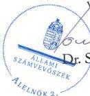
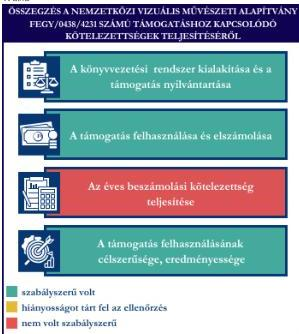
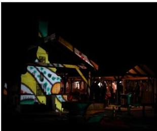

ÁLLAMI
SZÁMVEVŐSZÉK

# JELENTÉS

Egyesületek és alapítványok államháztartásból
kapott támogatásai felhasználásának és
elszámolásának ellenőrzése

„Nemzetközi Vizuális Művészeti” Alapítvány

2026.

25145

www.asz.hu

---

ÁLLAMI
SZÁMVEVŐSZÉK

# JELENTÉS

Egyesületek és alapítványok államháztartásból
kapott támogatásai felhasználásának és
elszámolásának ellenőrzése

„Nemzetközi Vizuális Művészeti” Alapítvány

2026.

25145

www.asz.hu

alelnök

---

ELLENŐRZÉSI IGAZGATÓSÁG:

ELLENŐRZÉSI IGAZGATÓSÁG V.

ELLENŐRZÉSI IGAZGATÓ:

KLINGA LÁSZLÓ igazgató

ELLENŐRZÉSVEZETŐ:

NEMESVÁRI-HORTHY ESZTER ellenőrzésvezető

Jelentéseink az interneten a
www.asz.hu címen olvashatók.

IKTATÓSZÁM: EL-4320-174/2025

TÉMASORSZÁM: 35

ELLENŐRZÉS-AZONOSÍTÓ SZÁM: V118114

---

# TARTALOMJEGYZÉK

|  ■ ÖSSZEFOGLALÁS | 5  |
| --- | --- |
|  ■ AZ ELLENŐRZÉS EREDMÉNYEI | 6  |
|  1. A civil szervezet államháztartási forrásból származó támogatása felhasználásának és elszámolásának szabályszerűsége, felhasználásának célszerűsége és eredményessége | 6  |
|  ■ JAVASLATOK | 9  |
|  ■ I. FÜGGELÉK: ÉSZREVÉTELEK | 10  |
|  ■ II. FÜGGELÉK: ELLENŐRZÉSI MEGKÖZELÍTÉS | 11  |
|  ■ MELLÉKLETEK | 15  |
|  I. sz. melléklet: Értelmező szótár | 15  |
|  II. sz. melléklet: Az ellenőrzött szervezetek jegyzéke | 18  |
|  ■ RÖVIDÍTÉSEK JEGYZÉKE | 19  |

3

---

# ÖSSZEFOGLALÁS

A civil szervezetek tevékenységük megvalósításához évente **jelentős állami** és önkormányzati **támogatásokat** kaphatnak, valamint ingyenes vagyonjuttatásban részesülhetnek. Ezekkel a forrásokkal gazdálkodnak, miközben tevékenységükkel a **társadalom széles rétegeire hatnak** többek között kulturális programok, rendezvények, közösségépítés formájában. Jogosan merül fel tehát a kérdés: **hogyan költik el a közpénzt?** Ennek érdekében az ÁSZ időről időre **ellenőrzi** az államháztartásból kapott támogatások felhasználását, és értékeli, hogy a civil szervezetek a támogatásokat **átláthatóan és célnak megfelelően** használták-e fel. Az ÁSZ által folytatott ellenőrzések segítenek abban, hogy a nyilvánosság is **valós képet kapjon arról, hova kerül az adófizetők pénze**.

A kulturális tevékenységet végző civil szervezetek **fontos és sokrétű szerepet** játszanak a mai Magyarországon, különösen a helyi közösségek életében. Különösen fontosak a helyi identitás megerősítésében, a kulturális sokszínűség fenntartásában, és a közösségi aktivitás ösztönzésében.

Egy kulturális tevékenységet végző civil szervezet támogatása **nem csupán egy adott program finanszírozását jelenti, hanem befektetés a közösség szellemi, kulturális és társadalmi tőkéjébe**. Ezek a szervezetek hidat képeznek az állam, a közösségek és az egyének között, támogatásuk ezért elengedhetetlen egy élő, demokratikus és értékalapú társadalom fenntartásához.

Az Alapítvány egyedi kérelme alapján a Nemzeti Filmintézet a „**32. Fényírók Fesztiválja - Mediawave Filmfesztivál és Filmszakmai Események megvalósítása**” elnevezésű mozgóképszakmai rendezvény megvalósításához **2022. évben 11,0 M Ft** pénzügyi támogatást nyújtott az Alapítvány részére.

**Az Alapítvány a kapott támogatást a projektcélnak megfelelően, eredményesen használta fel, a támogatás elérte célját.**

Az Alapítvány a jogszabályi előírásoknak megfelelően alakította ki könyvvezetési rendszerét, amely biztosította a kapott támogatás és a támogatás felhasználásának elkülönített nyilvántartását. A támogatás felhasználása a Támogatási szerződésben és annak elválaszthatatlan részét képező költségtervben szereplő adatoknak, előírásoknak megfelel. Az Alapítvány a Támogatási szerződés előírásainak megfelelően határidőben eleget tett a Támogató felé történő elszámolási kötelezettségének. A Támogató az elszámolást elfogadta. Az Alapítvány tájékoztatási és nyilvánosságra hozatali kötelezettségének nem a jogszabályi előírásoknak megfelelően tett eleget, mivel a 2022. és 2023. évi egyszerűsített éves beszámolóit és közhasznúsági mellékleteit a Felügyelő Bizottság elfogadása és Kuratórium jóváhagyása előtt helyezte letétbe, tette közzé, továbbá a számviteli beszámolóit és közhasznúsági mellékleteit a saját honlapján nem tette közzé.

1. ábra

Forrás: ÁSZ saját szerkesztés

5

---

# AZ ELLENŐRZÉS EREDMÉNYEI

Az Alapítvány a részére nyújtott költségvetési támogatást a „32. Fényírók Fesztiválja - Mediawave Filmfesztivál és Filmszakmai Események megvalósítása” elnevezésű mozgóképszakmai rendezvény megvalósítására fordította. A közpénzt az Alapítvány céljaival összhangban vizuális kultúra terjesztésére és népszerűsítésére használták fel. A filmes fesztivált a 2022. évben rendezték meg.

## 1. A civil szervezet államháztartási forrásból származó támogatása felhasználásának és elszámolásának szabályszerűsége, felhasználásának célszerűsége és eredményessége

### Összegző megállapítás

Az Alapítvány az ellenőrzött támogatást a Támogatási szerződésben megjelölt célnak megfelelően, eredményesen használta fel, az elszámolási kötelezettségét teljesítette. A támogatást és annak felhasználását a számviteli rendszerében a jogszabályi előírásoknak megfelelően elkülönítette. Az Alapítvány tájékoztatási és nyilvánosságra hozatali kötelezettségének nem a jogszabályi előírásoknak megfelelően tett eleget, mivel a 2022. és a 2023. évi egyszerűsített éves beszámolóit és a közhasznúsági mellékleteit a Felügyelő Bizottság elfogadása és a Kuratórium jóváhagyása előtt helyezte letétbe, továbbá azokat a saját honlapján nem tette közzé.

### A KÖNYVVEZETÉSI RENDSZER KIALAKÍTÁSA ÉS A TÁMOGATÁS NYILVÁNTARTÁSA

Az Alapítvány a Számv. tv.⁸ és a Civilszr.⁹-ben foglalt jogszabályi előírások betartásával gondoskodott a könyvviteli szolgáltatás személyi feltételeinek megteremtéséről, a könyvviteli szolgáltatás körébe tartozó feladatok ellátásával olyan társaságot bízott meg, amelynek megbízott tagja a jogszabályi előírásoknak megfelelő képesítéssel rendelkezett.

Az Alapítvány a Civilszr. előírásainak megfelelően a 2022. és 2023. évben kettős könyvvitelt vezetett.

Az Alapítvány a Számv. tv. és a Civil tv.¹⁰ előírásaiban foglaltak szerint az egyéb bevételeken belül elkülönítetten mutatta ki az alapcél szerinti tevékenysége költségei, ráfordításai ellentételezésére visszafizetési kötelezettség nélkül kapott, államháztartási forrásból származó központi költségvetési támogatást.

Az Alapítvány a Számv. tv. -ben és a Civil tv. -ben előírtaknak megfelelően az alapcél szerinti tevékenysége költségei, ráfordításai ellentételezésére kapott támogatásról olyan elkülönített számviteli nyilvántartást vezetett, amelynek alapján megállapítható és ellenőrizhető volt az ellenőrzött támogatás felhasználása.

### A TÁMOGATÁS FELHASZNÁLÁSA ÉS ELSZÁMOLÁSA

Az Alapítvány az ellenőrzött támogatás felhasználásáról a Támogató által előírt formában elkészítette a beszámolót, annak részeként az összesített elszámolási táblázatot (számlaösszesítő) és határidőben benyújtotta a Támogató részére.

6

---

Az ellenőrzés eredményei

Az Alapítvány esetében a támogatás felhasználása ellenőrzött tételeinek (10 db) vonatkozásában az ÁSZ az alábbiakat állapította meg:

- a tételek számviteli elszámolását a Számv. tv.-ben előírtaknak megfelelően bizonylatokkal alátámasztotta;
- minden gazdasági eseményt a Számv. tv.-ben foglaltak szerint tartalmának megfelelő főkönyvi számra számolt el;
- a tételek számviteli bizonylatait a Támogatási szerződésben foglaltaknak megfelelően ellátta záradékkal;
- a számviteli bizonylatokon záradékolt összegek megegyeztek a számlaösszesítőben feltüntetett értékekkel;
- egy esetben a Felügyelő Bizottság egy tagjával a Civil tv. 38. § (3) bekezdésének b) pontja és az Alapító okirat,¹¹ 15.4. c) pontjának megsértésével, az összeférhetetlenségre vonatkozó rendelkezések figyelmen kívül hagyásával kötötték meg a megbízási szerződést, amely ugyanakkor az Alapítványnak a támogatási jogviszony alapján fennálló kötelezettségét és a támogatás felhasználására vonatkozó feltételeknek való megfelelést nem érintette;
- a tételek számviteli bizonylatai alapján a gazdasági események a Támogatási szerződésnek megfelelően a támogatási időszak végéig szerződés szerint teljesültek;
- a tételek pénzügyi rendezése a Támogatási szerződésben meghatározott felhasználási határidőig minden esetben megtörtént;
- a tételek megfeleltethetők voltak a Támogatási szerződésben, illetve a költségtervben meghatározott, Támogató által jóváhagyott felhasználási jogcímeknek.

A Támogatási szerződésben foglalt támogatás lezárásáról, a beszámoló elfogadásáról a Támogató értesítette az Alapítványt. Az Alapítványnak visszafizetési kötelezettsége nem volt.

# AZ ÉVES BESZÁMOLÁSI KÖTELEZETTSÉG TELJESÍTÉSE

Az Alapítvány a 2022. és a 2023. évre vonatkozóan a Számv. tv. és a Civil. tv. előírásai alapján elkészítette számviteli beszámolóit. Az egyszerűsített éves beszámolók a Civil tv. és a Civilszr. előírásai alapján tartalmazták a mérleget, eredménykimutatást, és a kiegészítő mellékletet. Az Alapítvány a 2022. és a 2023. évi egyszerűsített éves beszámolókkal egyidejűleg elkészítette a közhasznúsági mellékleteit, azonban a közhasznúsági mellékletek a Civil tv. 29. § (6) bekezdésében és a Civil vhr.¹² Mellékletének 1-3. pontjában foglaltakkal ellentétben nem tartalmazták a szervezet azonosító adatait, a tárgyévben végzett alapcél szerinti és közhasznú tevékenységek bemutatását, valamint a közhasznú tevékenységek bemutatását (tevékenységenként).

A 2022. és a 2023. évi egyszerűsített éves beszámolókat a Ptk.¹³ rendelkezései alapján a Felügyelő Bizottság elfogadta, a Kuratórium a Civil tv.-nek megfelelően jóváhagyta.

Az Alapítvány a 2022. és 2023. évi egyszerűsített éves beszámolóit és közhasznúsági mellékleteit határidőben letétbe helyezte és az OBH¹⁴ honlapján közzétette. Az Alapítvány a 2022-2023. évi egyszerűsített éves beszámolók és közhasznúsági mellékletek vonatkozásában nem a jogszabályi előírásoknak megfelelően teljesítette a közzétételi és a letétbehelyezési kötelezettséget, mivel a Civil tv. 30. § (1) bekezdésében előírtak ellenére a beszámolókat az OBH honlapján a Felügyelő Bizottság elfogadása, illetve a Közgyűlés jóváhagyása előtt helyezte letétbe, illetve tette közzé. Az

7

---

*Az ellenőrzés eredményei*---

Alapítvány saját honlappal rendelkezett, azonban a 2022. és a 2023. évi egyszerűsített éves beszámolóit és a közhasznúsági mellékleteket a Civil tv. 30. § (4) bekezdésének előírása ellenére nem tette közzé.

#### **A TÁMOGATÁS FELHASZNÁLÁSÁNAK CÉLSZERŰSÉGE ÉS EREDMÉNYESSÉGE**

Az Alapítvány a támogatást a Támogatási szerződés előírásainak megfelelően, az abban meghatározott célra használta fel. A Támogatási szerződésben megjelölt cél a támogatott projekt, a „**32. Fényírók Fesztiválja - Mediawave Filmfesztivál és Filmszakmai Események megvalósítása**” elnevezésű mozgóképszakmai rendezvény 2022 nyarán teljesült. A projekt a jóváhagyott költségterv alapján valósult meg. A költségvetési rovatokban a változás (átcsoportosítás) a megengedett 20%-os mértéket nem haladta meg. A támogatás eredményeként a mozgóképszakmai rendezvényről az Alapítvány honlapján (archiv.mediawavefestival.hu oldalon) tájékoztatták a közvéleményt.

8

---

# JAVASLATOK

Az ÁSZ tv.¹⁵ 33. § (1) bekezdésében foglaltak értelmében az ellenőrzött szervezet vezetője köteles a jelentésben foglalt megállapításokhoz kapcsolódó intézkedési tervet összeállítani és azt a jelentés kézhezvételétől számított 30 napon belül az ÁSZ részére megküldeni. Az ÁSZ a jelentésben foglalt megállapításokhoz kapcsolódóan az alábbi javaslatok tekintetében várja el az intézkedési terv elkészítését.

## A NEMZETKÖZI VIZUÁLIS MŰVÉSZETI ALAPÍTVÁNY KURATÓRIUMI ELNÖKÉNEK

1. Gondoskodjon arról, hogy az Alapítvány a Civil tv. 38. § (3) bekezdés b) pontjában, valamint az Alapító okiratban meghatározott összeférhetetlenségi előírások betartásával járjon el.
2. Gondoskodjon a beszámolóval egyidejűleg a Civil tv. 29. § (6) bekezdésében előírtaknak megfelelően, a Civil vhr. melléklete szerinti tartalmú közhasznúsági melléklet elkészítéséről.
3. Gondoskodjon arról, hogy az Alapítvány a számviteli beszámolót azok jóváhagyását követően tegye közzé, helyezze letétbe a Civil tv. 30. § (1) bekezdésében előírtaknak megfelelően.
4. Gondoskodjon arról, hogy az Alapítvány a számviteli beszámolót és a közhasznúsági mellékletet a Civil tv. 30. § (4) bekezdésében rögzített előírás alapján a saját honlapon közzé tegye.

9

---

# I. FÜGGELÉK: ÉSZREVÉTELEK

A jelentéstervezetet az ÁSZ 15 napos észrevételezésre megküldte az ellenőrzött szervezet vezetőjének az ÁSZ tv. 29. §* (1) bekezdése előírásának megfelelően.

A 'Nemzetközi Vizuális Művészeti' Alapítvány elnöke a jelentéstervezetre nem tett észrevételt.

* 29. § (1) Az Állami Számvevőszék az ellenőrzési megállapításait megküldi az ellenőrzött szervezet vezetőjének vagy az általa megbízott személynek, és annak, akinek személyes felelősségét állapította meg.

(2) Az ellenőrzött szervezet vezetője és a felelősként megjelölt személy az ellenőrzés megállapításaira tizenöt napon belül írásban észrevételt tehet.

(3) Az Állami Számvevőszék az észrevételre a beérkezésétől számított harminc napon belül írásban válaszol. A figyelembe nem vett észrevételeket köteles a jelentésben feltüntetni, és megindokolni, hogy azokat miért nem fogadta el.

10

---

## II. FÜGGELÉK: ELLENŐRZÉSI MEGKÖZELÍTÉS

### AZ ELLENŐRZÉS JOGALAPJA

Az ellenőrzés jogszabályi alapját az ÁSZ tv. 1. § (3) bekezdés, az 5. § (3) bekezdés előírásai képezték.

### AZ ELLENŐRZÉS CÉLJA

Az ellenőrzés célja annak értékelése volt, hogy az ellenőrzött alapítvány az államháztartási forrásból származó, ellenőrzésre kiválasztott támogatást a támogatási szerződésben előírtaknak megfelelően, az abban meghatározott célra, szabályszerűen, eredményesen használta-e fel, valamint a gazdálkodásáról szabályszerűen beszámolt-e. Célja volt továbbá a támogatással való elszámolás szabályszerűségének értékelése.

### AZ ELLENŐRZÉS TÍPUSA

Kombinált ellenőrzés.

### AZ ELLENŐRZÉS TÁRGYA

Az államháztartásból nyújtott támogatást felhasználó ellenőrzött alapítványnál a kiválasztott támogatás felhasználására vonatkozó jogszabályi és szerződéses előírások betartásának ellenőrzése. Ennek keretében a könyvvezetésre vonatkozó jogszabályi előírások betartása, a támogatás felhasználás támogatási szerződésnek való megfelelősége, valamint a beszámolási és közzétételi kötelezettség teljesítésének szabályszerűsége. Az ellenőrzés tárgya volt továbbá annak értékelése, hogy a számviteli szabályozási környezet kialakítása támogatta-e az államháztartásból származó támogatás vonatkozásában a szabályos könyvvezetést, a támogatás célnak megfelelő felhasználását, valamint a kapcsolódó beszámolási kötelezettség teljesítését. Az ellenőrzés során az ÁSZ értékelte, hogy az ellenőrzött szervezet a támogatást meghatározott célra, eredményesen használta-e fel.

Az ellenőrzés kiterjedt minden olyan körülményre és adatra, amely az ÁSZ jogszabályban meghatározott feladatainak teljesítéséhez, valamint a program végrehajtása folyamán felmerült újabb összefüggések feltárásához szükséges.

### AZ ELLENŐRZÉS HATÓKÖRE ÉS TERÜLETE

Az ÁSZ tv. 5. § (3) bekezdésében foglaltak alapján az ÁSZ ellenőrizte az államháztartásból nyújtott támogatás felhasználását. A támogatás felhasználásának szabályait a támogatási szerződés, az Áht.$^{16}$ és az Ávr.$^{17}$ rögzítette. A civil szervezet könyvvezetésének, a beszámolási- és közzétételi kötelezettség teljesítésének ellenőrzése a Számv. tv., a Civilszr., a Civil tv., a Civil vhr., valamint a Ptk. vonatkozó előírásai alapján történt.

11

---

II. Függelék: Ellenőrzési megközelítés

Az ÁSZ ellenőrzése választ ad arra, hogy az ellenőrzött szervezetnél a számviteli szabályozási környezet kialakítása biztosította-e a támogatás felhasználása jogszabályi előírásoknak megfelelő nyilvántartását, könyvviteli elszámolását, továbbá arra is, hogy a támogatással való elszámolási, beszámolási kötelezettséget teljesítette-e. Az ÁSZ ellenőrzése kiterjedt a támogatás támogatási szerződésben foglalt célra történő felhasználás és a felhasználás eredményességének értékelésére. Ezen túlmenően az ellenőrzés értékelte, hogy az ellenőrzött szervezet számviteli beszámolási kötelezettségének teljesítése szabályszerű volt-e.

## AZ ELLENŐRZÖTT IDŐSZAK

Az ellenőrzésre kiválasztott államháztartási forrásból származó támogatásra vonatkozó támogatott tevékenység időtartamának kezdő időpontjától az ellenőrzésről szóló értesítés keltéig tartó időszak.

Az ellenőrzésre kiválasztott alapítvány államháztartásból kapott támogatása felhasználásának és elszámolásának ellenőrzése során az ellenőrzött időszakon belül az értékelés szempontjából releváns évek a 2022. és 2023. év.

## AZ ELLENŐRZÉSI KRITÉRIUMOK

|  FŐKUSZTERÜLET/FŐKUSZKÉRDÉS | ELLENŐRZÉSI KRITÉRIUMOK  |
| --- | --- |
|  1. A civil szervezet államháztartási forrásból származó támogatása(i) felhasználásának és elszámolásának szabályszerűsége, felhasználásának célszerűsége és eredményessége | Áht. Ávr. Számv. tv. Civil tv. Civilszr. Ptk. Civil vhr. Cnytv.^{18} Létesítő okirat Támogatási szerződés Költségterv  |

## AZ ELLENŐRZÉS MÓDSZERE ÉS AZ ELLENŐRZÉSI BIZONYÍTÉKOK KÖRE

Az ellenőrzést a nemzetközi standardokat irányadónak tekintve az ellenőrzési program szempontjai, az ellenőrzött időszakban hatályos jogszabályok, az ellenőrzés szakmai szabályok és módszertan(ok) figyelembevételével végezte az ÁSZ.

Az ellenőrzési kérdések megválaszolásához szükséges bizonyítékok megszerzése az ellenőrzött szervezet által rendelkezésre bocsátott dokumentumokra és adatokra alapozva mintavételezés útján történt.

Az államháztartási forrásból származó, ellenőrzésre – adatvezérelt, kockázatalapú kiválasztás által, több év adatának figyelembevételével és az ellenőrizhető szervezet által előzetesen szolgáltatott adatok alapján –

12

---

II. Függelék: Ellenőrzési megközelítés---

kijelölt támogatás felhasználása t való megfelelőségét a támogatás nyilvántartásának és a támogató felé történő elszámolásnak egymással és a támogatási szerződéssel történő összevetésével ellenőrizte az ÁSZ.

A támogatás könyvviteli támogatási szerződésnek nyilvántartása jogszabályi előírásoknak, támogatási szerződésnek való szabályszerűségét nem statisztikai alapú mintavételi eljárással ellenőrizte az ÁSZ. A tételek kiértékelése nem került a sokaságra kivetítésre. A kiválasztott támogatási szerződéshez kapcsolódó elszámolásból 10 db tétel került ellenőrzésre.

Az ellenőrzési bizonyítékként felhasználható adatforrások közé tartoztak egyrészt az ellenőrzéshez kért dokumentumok, másrészt adatforrás volt még minden – az ellenőrzés folyamán – feltárt, az ellenőrzés szempontjából információkat tartalmazó dokumentum.

Az ellenőrzés lefolytatásához az ellenőrzött szervezet a tanúsítványok kitöltésével, valamint az ÁSZ által kért dokumentumok, adatok, információk megküldésével és az ellenőrzés során szolgáltatott adatokat.

Az ÁSZ az ellenőrzött szervezetet az Országos Támogatás-ellenőrzési Rendszerben (OTR) nyilvántartott adatok alapján államháztartási forrásból támogatásban részesült szervezetek közül, – OBH és KSH¹⁹ adatokat is figyelembe véve – adatvezérelt kockázatértékelés alapján, a kulturális tevékenységet végző szervezetekre fókuszálva választotta ki. Az ÁSZ az ellenőrzött támogatást az adott szervezet által előzetesen szolgáltatott adatok alapján, a tanúsítványokban szereplő adatok ismeretében határozta meg.

A „Nemzetközi Vizuális Művészeti” Alapítványt 1991-ben alapították, a civil szervezetek közhiteles bírósági nyilvántartásába 1991. december 12-én jegyezték be. Az Alapító okirat¹⁰, szerinti célja többek között „a vizuális kultúra terjesztése és népszerűsítése, a társművészeti ágakkal való kapcsolat megteremtése, valamint az e műfajban alkotók bemutatkozási lehetőségeinek biztosítása; a fiatalok vizuális kultúrájának fejlesztése, előadások, szemináriumok és gyakorlati oktatások szervezésével; Nemzetközi Vizuális Művészeti Fesztivál szervezése és megrendezése.”

Az Alapítvány legfőbb döntéshozó, illetve képviselő szerve az öt, majd 2025. január 31-től három tagból álló Kuratórium. A Kuratórium tagjai látják el az Alapítvány képviseletét, akik a bankszámla feletti rendelkezési jogot önállóan gyakorolták. Az Alapítvány operatív ügyeit az Alapítvány Titkársága látta el. A Kuratórium elnökének személyében a támogatás szempontjából releváns 2022. és 2023. években nem történt változás.

Az Alapítvány jogszabályi előírás alapján könyvvizsgálatra nem volt kötelezett.

Az Alapítvány működésének és gazdálkodásának ellenőrzésére három tagú Felügyelő Bizottság volt kijelölve. Az Alapítvány az ellenőrzött időszakban közhasznú jogállással rendelkezett.

Az Alapítvány **nem minősült a** Közbef. tv.²¹ szerinti, **közélet befolyásolására alkalmas civil szervezetnek**, mivel az ellenőrzött időszakban mérlegfőösszege nem érte el a 20 M Ft-ot.

Az Alapítvány vállalkozási tevékenységet nem végzett.

Az Alapítvány támogatásban részesült. A támogatott tevékenység megvalósulásához a Támogató cél indikátorokat nem határozott meg. A támogatással kapcsolatos adatokat az 1. táblázat foglalja össze.

13

---

II. Függelék: Ellenőrzési megközelítés

1. táblázat

# A TÁMOGATÁS FŐBB ADATAI

A NEMZETKÖZI VIZUÁLIS MŰVÉSZETI ALAPÍTVÁNY RÉSZÉRE A TÁMOGATÓ ÁLTAL NYÚJTOTT, ELLENŐRZŐTT TÁMOGATÁS (FEGY/0438/4231 32. „FÉNYÍRÓK FESZTIVÁLJA” MEDIAWAVE) FŐBB ADATAI

|  Támogatott tevékenység: | „32. Fényírók Fesztiválja - Mediawave Filmfesztivál és Filmszakmai Események megvalósítása” elnevezésű mozgóképszakmai rendezvény megvalósítása  |
| --- | --- |
|  Támogató: | Nemzeti Filmintézet Közhasznú Nonprofit Zrt.  |
|  Támogatási összeg: | 11,0 M Ft  |
|  Felhasznált összeg: | 11,0 M Ft  |
|  A Támogatási szerződés megkötésének dátuma: | 2022. május 31.  |
|  A támogatott tevékenység időtartama: | 2022. március 22. – 2022. szeptember 30.  |
|  A támogatás felhasználásáról a záró (pénzügyi) beszámoló benyújtásának határideje: | 2022. november 30.  |
|  A támogatás felhasználásáról benyújtott záró beszámoló elfogadásának dátuma: | A 2023. március 20.  |

Forrás: ÁSZ saját szerkesztés a Támogatási szerződés adatai alapján

A Támogató a támogatást vissza nem térítendő támogatásként az Mktv.22 12. § (3) bekezdés e)-i) pontjai szerinti mozgóképszakmai tevékenységekre, az Alapítvány egyedi kérelmére a kérelem benyújtásakor hatályos Támogatási Szabályzat23 rendelkezései, valamint az „Eljárásrend mozgóképszakmai tevékenységek támogatására” elnevezésű pályázati kiírásában meghatározott szabályokra figyelemmel nyújtotta.

2. ábra

Forrás: TARTÓSHULLÁM / MEDIAWAVE EGYÜTTELT 2022 - FÉNYÍRÓK FESZTIVÁLJA - KÉPGALÉRIA - archiv.mediawavefestival.hu

A „32. Fényírók Fesztiválja - Mediawave Filmfesztivál és Filmszakmai Események megvalósítása” címmel a Támogatási szerződésben meghatározott mozgóképszakmai fesztivált 2022. évben 32. alkalommal rendezték meg. A rendezvényt 2022. évben május, június és július hónapokban három helyszínen (2022. május 4-7. Kiscsősz (központi helyszín), 2022. június 4-5. Ravazd, 2022. július 15-24. Somogyfajsz) tartották. A három helyszínen egymásra épülő műhelymunkasorozat zajlott. A rendezvényen nemzetközi filmesek is részt vettek többek között Törökországból, Olaszországból, Iránból és Észtországból. A fesztivál legifjabb látogatóinak animációs foglalkozásokat tartottak.

14

---

# MELLÉKLETEK

## ■ I. SZ. MELLÉKLET: ÉRTELMEZŐ SZÓTÁR

|  adomány | A civil szervezetnek – létesítő okiratban rögzített céljaira – ellenszolgáltatás nélkül juttatott eszköz, illetve nyújtott szolgáltatás. (Forrás: Civil tv. 2. § 1. pont)  |
| --- | --- |
|  alapítvány | Az alapítvány az alapító által az alapító okiratban meghatározott tartós cél folyamatos megvalósítására létrehozott jogi személy. Az alapító az alapító okiratban meghatározza az alapítványnak juttatott vagyont és az alapítvány szervezetét. (Forrás: Ptk. 3:378. §) A Számv. tv. alkalmazásában egyéb szervezet (Forrás: Számv. tv. 3. § (1) bekezdés 4.pont a) alpontja)  |
|  célszerűség | Arra vonatkozó követelmény, hogy a bevételeket a közfeladat megvalósítása érdekében, a kiadásokat a közfeladatok megfelelő ellátásához szükséges mértékben, a költségvetési célrendszer érdekében, a meghatározott célra (közfeladat ellátására), továbbá észszerűen, racionálisan használták fel. (Forrás: Alaptörvény^{24}, ÁSZ)  |
|  civil szervezet | Civil szervezet: a) a civil társaság, b) a Magyarországon nyilvántartásba vett egyesület - a párt, a szakszervezet és a kölcsönös biztosító egyesület kivételével -, c) a közalapítvány és a pártalapítvány kivételével - az alapítvány. (Forrás: Civil tv. 2. § 6. pont)  |
|  civil szervezetek egyszerűsített támogatása | A helyi vagy területi hatókörű civil szervezetek számára a Civil tv. 56. § (1) bekezdés h) pontja alapján egyszerűsített formában, jogosultsági alapon nyújtott támogatás a helyi közösség érdekében végzett tevékenységük támogatására. (Forrás: Civil tv. 2. § 8b. pont)  |
|  civil szervezetek normatív támogatása | A civil szervezetek által gyűjtött adományok után járó, a gyűjtött adomány mértékével arányos a Civil tv. 56. § (1) bekezdés a) pontja alapján nyújtott támogatás. (Forrás: Civil tv. 2. § 8a. pont alapján)  |
|  eredményesség | Az eredményesség elve a kitűzött célok és a szándékolt eredmények (hatások) elérését jelenti. A gazdálkodás, feladatellátás eredményességét mutatja a tényleges és a tervezett eredmények (hatások) összevetése. (Forrás: INTOSAI^{25})  |
|  feladatfinanszírozást szolgáló költségvetési támogatás | Valamely közfeladat államháztartáson kívüli szervezet által történő ellátását, valamint e feladat ellátásához közvetlenül kapcsolódó, arányos működési költségeket finanszírozó költségvetési támogatás. (Forrás: Civil tv. 2. § 8. pont)  |
|  közcélú tevékenység | Személyek csoportja által, valamely a csoportnál tágabb közösség érdekében – más, e közösségbe nem tartozó személyek érdekeinek sérelme nélkül – végzett tevékenység. (Forrás: Civil tv. 2. § 16. pont)  |
|  közfeladat | A jogszabályban meghatározott állami vagy önkormányzati feladat. A közfeladatok ellátásában államháztartáson kívüli szervezet jogszabályban meghatározott rendben közreműködhet. (Forrás: Áht. 3/A. § (1)-(2) bekezdés)  |

15

---

Mellékletek

|  közhasznú szervezet | Közhasznú szervezetté minősített a Magyarországon nyilvántartásba vett közhasznú tevékenységet végző szervezet, amely a társadalom és az egyén közös szükségleteinek kielégítéséhez megfelelő erőforrásokkal rendelkezik, továbbá amelynek megfelelő társadalmi támogatottsága kimutatható, és amely: a) civil szervezet (ide nem értve a civil társaságot), vagy b) olyan egyéb szervezet, amelyre vonatkozóan a közhasznú jogállás megszerzését törvény lehetővé teszi. (Forrás: Civil tv. 32. § (1) bekezdés)  |
| --- | --- |
|  közhasznú tevékenység | Minden olyan tevékenység, amely a létesítő okiratban megjelölt közfeladat teljesítését közvetlenül vagy közvetve szolgálja, ezzel hozzájárulva a társadalom és az egyén közös szükségleteinek kielégítéséhez. (Forrás: Civil tv. 2. § 20. pont)  |
|  létesítő okirat | A jogi személy létrehozásáról a személyek szerződésben, alapító okiratban vagy alapszabályban szabadon rendelkezhetnek, mely dokumentumokra együttesen a Ptk. a létesítő okirat megnevezést használja. (Forrás: Ptk. 3:4. § (1) bekezdés alapján)  |
|  támogatás | Céljellegű juttatás, mely kizárólag arra a célra használható fel, amelyre a támogató azt rendelkezésre bocsátotta, amely cél megvalósítását a támogatási szerződés, okirat vagy éppen jogszabály kikötötte. Támogatásként értelmezzük valamennyi, a civil szervezetnek államháztartási forrásból nyújtott támogatást – ideértve a központi költségvetésből kapott támogatást, az elkülönített állami pénzalapokból kapott támogatást, a helyi önkormányzatoktól, nemzetiségi önkormányzatoktól, önkormányzati társulástól kapott támogatást –, továbbá az Európai Unió költségvetéséből, külföldi állam államháztartásából, nemzetközi szervezettől, vagy nemzetközi szerződés rendelkezése alapján kapott támogatást, valamint más civil szervezettől kapott támogatást. A gyűjtő fogalom alatt egyaránt értjük a civil szervezetnek nyújtott feladatfinanszírozást szolgáló költségvetési támogatást, a civil szervezetek normatív támogatását, valamint a civil szervezetek egyszerűsített támogatását is (ÁSZ saját fogalma)  |
|  támogatási döntés | Az államháztartás alrendszereiből, az európai uniós forrásokból, a nemzetközi megállapodás alapján finanszírozott egyéb programokból, a 100%-os állami tulajdonban álló szervezet által létrehozott alapítványtól származó, egyedi döntés alapján nyújtott, pályázati úton vagy pályázati rendszeren kívül az államháztartáson kívüli természetes személyek, jogi személyek és jogi személyiséggel nem rendelkező egyéb szervezetek számára odaítélt, természetben vagy pénzben juttatott támogatásokban részesülő személy, valamint az e személy részére juttatandó konkrét támogatási összeg meghatározása. (Forrás: 2007. évi CLXXXI. törvény^{26} 1. § (1) bekezdése és 2. § (1) bekezdése alapján)  |
|  támogatási szerződés | A támogatási szerződés egy olyan, kölcsönös és egybehangzó, több oldalú jognyilatkozat, amelyben a támogató – egy meghatározott cél elérése érdekében – támogatás nyújtását vállalja a kedvezményezett részére az adott szerződés szerinti kötelezettségek támogatott általi teljesítése mellett, és amely jognyilatkozat esetében a jelen pontban rögzített jogszabályi előírások is irányadók. Az államháztartás alrendszeri terhére támogatás közigazgatási hatósági határozattal vagy hatósági szerződéssel, támogatói okirattal vagy támogatási szerződéssel jogszabály vagy egyedi döntés alapján, pályázati úton vagy pályázati rendszeren kívül nyújtható. Ha jogszabály – a központi költségvetés Áht. 14. § (3) bekezdése szerinti fejezetéből biztosított költségvetési támogatások esetén jogszabály vagy a Kormány határozata – a támogatás biztosításának módjáról nem rendelkezik, arról – a központi költségvetés Áht. 14. § (3) bekezdése szerinti fejezetéből biztosított költségvetési támogatásoktól eltérő más esetekben – az ötmilliárd forintot eltérő vagy azt meghaladó összegű költségvetési támogatás esetén hatósági szerződésnek nem minősülő támogatási szerződésben kell megállapodni a kedvezményezettel. (Forrás: Áht. 48. § (1) bekezdése, Ávr. 65/A. § (1) bekezdés alapján ÁSZ meghatározás)  |

16

---

*Mellékletek*---

támogatott tevékenység

A támogatási szerződésben meghatározott olyan tevékenység – ideértve a kedvezményezett működését is –, amely során felmerült költségek megtérítését a támogatási előleg, a költségvetési támogatás részben vagy egészében biztosítja. (Forrás: Ávr. 1. § 8. pontja)

támogatott tevékenység időtartama

A támogatási szerződésben meghatározott olyan időtartam, amely során felmerülő, a támogatott tevékenység megvalósításához kapcsolódó költségek elszámolhatóak. (Forrás: Ávr. 1. § 9. pontja)

17

---

Mellékletek---

# ■ II. SZ. MELLÉKLET: AZ ELLENŐRZÖTT SZERVEZETEK JEGYZÉKE

|  ELLENŐRZÖTT SZERVEZET NEVE | ELLENŐRZÖTT SZERVEZET SZÉKHELYE  |
| --- | --- |
|  'Nemzetközi Vizuális Művészeti' Alapítvány | 9091 Ravazd, Őrhegy utca 27.  |

18

---

# RÖVIDÍTÉSEK JEGYZÉKE

¹ ÁSZ

² Alapítvány

³ Nemzeti Filmintézet

⁴ Támogatási szerződés

⁵ Támogató

⁶ Felügyelő Bizottság

⁷ Kuratórium

⁸ Számv. tv.

⁹ Civilszr.

¹⁰ Civil tv.

¹¹ Alapító okirat₁

¹² Civil vhr.

¹³ Ptk.

¹⁴ OBH

¹⁵ ÁSZ tv.

¹⁶ Áht.

¹⁷ Ávr.

¹⁸ Cnytv.

¹⁹ KSH

²⁰ Alapító okirat₂

²¹ Közbef. tv.

²² Mktv.

²³ Támogatási szabályzat

²⁴ Alaptörvény

²⁵ INTOSAI

²⁶ 2007. évi CLXXXI. törvény

Állami Számvevőszék

„Nemzetközi Vizuális Művészeti” Alapítvány

Nemzeti Filmintézet Közhasznú Nonprofit Zártkörűen Működő Részvénytársaság
FEGY/0438/4231 32. „Fényírók fesztiválja” Mediawave számú Támogatási szerződés

Nemzeti Filmintézet Közhasznú Nonprofit Zrt.

„Nemzetközi Vizuális Művészeti” Alapítvány Felügyelő Bizottsága

„Nemzetközi Vizuális Művészeti” Alapítvány Kuratóriuma

2000. évi C. törvény a számvitelről

479/2016. (XII. 28.) Korm. rendelet a számviteli törvény szerinti egyes egyéb szervezetek beszámoló készítési és könyvvezetési kötelezettségének sajátosságairól

2011. évi CLXXV. törvény az egyesülési jogról, a közhasznú jogállásról, valamint a civil szervezetek működéséről és támogatásáról

„Nemzetközi Vizuális Művészeti” Alapítvány egységes szerkezetbe foglalt Alapító okirata (hatályos: 2020. szeptember 25-től 2025. január 29-ig)

350/2011. (XII. 30.) Korm. rendelet - a civil szervezetek gazdálkodása, az adománygyűjtés és a közhasznúság egyes kérdéseiről

2013. évi V. törvény a Polgári Törvénykönyvről

Országos Bírósági Hivatal

2011. évi LXVI. törvény az Állami Számvevőszékről

2011. évi CXCV. törvény az államháztartásról

368/2011. (XII. 31.) Korm. rendelet az államháztartásról szóló törvény végrehajtásáról

2011. évi CLXXXI. törvény a civil szervezetek bírósági nyilvántartásáról és az ezzel összefüggő eljárási szabályokról

Központi Statisztikai Hivatal

„Nemzetközi Vizuális Művészeti” Alapítvány egységes szerkezetbe foglalt Alapító okirata (hatályos: 2025. január 30-tól)

2021. évi XLIX. törvény a közélet befolyásolására alkalmas tevékenységet végző civil szervezetek átláthatóságáról

2004. évi II. törvény a mozgóképről

Nemzeti Filmintézet Közhasznú Nonprofit Zártkörűen Működő Részvénytársaság Támogatási szabályzata

Magyarország Alaptörvénye

Legfőbb Ellenőrző Intézmények Nemzetközi Szervezete (The International Organization of Supreme Audit Institutions)

2007. évi CLXXXI. törvény a közpénzekből nyújtott támogatások átláthatóságáról

19

---

ÁLLAMI
SZÁMVEVŐSZÉK

1052 Budapest, Apáczai Csere János u. 10. | 1364 Budapest 4., Pf. 54
www.asz.hu | szamvevoszek@asz.hu
telefon: +36 1 484 9100