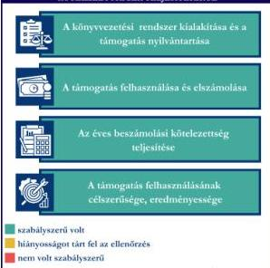

ÁLLAMI
SZÁMVEVŐSZÉK

# JELENTÉS

Egyesületek és alapítványok államháztartásból
kapott támogatásai felhasználásának és
elszámolásának ellenőrzése

Határtalan Hangok Közhasznú Alapítvány

2026.

25146

www.asz.hu

---

ÁLLAMI
SZÁMVEVŐSZÉK

# JELENTÉS

Egyesületek és alapítványok államháztartásból
kapott támogatásai felhasználásának és
elszámolásának ellenőrzése

Határtalan Hangok Közhasznú Alapítvány

2026.

25146

www.asz.hu

Dr. Szomolai Csaba
alelnök

---

ELLENŐRZÉSI IGAZGATÓSÁG:

ELLENŐRZÉSI IGAZGATÓSÁG V.

ELLENŐRZÉSI IGAZGATÓ:

KLINGA LÁSZLÓ igazgató

ELLENŐRZÉSVEZETŐ:

NEMESVÁRI-HORTHY ESZTER ellenőrzésvezető

Jelentéseink az interneten a
www.asz.hu címen olvashatók.

IKTATÓSZÁM: EL-4320-175/2025

TÉMASORSZÁM: 35

ELLENŐRZÉS-AZONOSÍTÓ SZÁM: V118120

---

# TARTALOMJEGYZÉK

|  ■ ÖSSZEFOGLALÁS | 5  |
| --- | --- |
|  ■ AZ ELLENŐRZÉS EREDMÉNYEI | 6  |
|  1. A civil szervezet államháztartási forrásból származó támogatása felhasználásának és elszámolásának szabályszerűsége, felhasználásának célszerűsége és eredményessége | 6  |
|  ■ I. FÜGGELÉK: ÉSZREVÉTELEK | 9  |
|  ■ II. FÜGGELÉK: ELLENŐRZÉSI MEGKÖZELÍTÉS | 10  |
|  ■ MELLÉKLETEK | 14  |
|  I. sz. melléklet: Értelmező szótár | 14  |
|  II. sz. melléklet: Az ellenőrzött szervezetek jegyzéke | 17  |
|  ■ RÖVIDÍTÉSEK JEGYZÉKE | 18  |

3

---

# ÖSSZEFOGLALÁS

A civil szervezetek tevékenységük megvalósításához évente **jelentős állami** és önkormányzati **támogatásokat** kaphatnak, valamint ingyenes vagyonjuttatásban részesülhetnek. Ezekkel a forrásokkal gazdálkodnak, miközben tevékenységükkel **a társadalom széles rétegeire hatnak** többek között kulturális programok, rendezvények, közösségépítés formájában. Jogosan merül fel tehát a kérdés: **hogyan költik el a közpénzt?** Ennek érdekében az ÁSZ¹ időről időre **ellenőrzi** a támogatások felhasználását, és értékeli, hogy a civil szervezetek a támogatásokat **átláthatóan és célnak megfelelően** használták-e fel. Az ÁSZ által folytatott ellenőrzések segítenek abban, hogy a nyilvánosság is **valós képet kapjon arról, hova kerül az adófizetők pénze.**

A kulturális tevékenységet végző civil szervezetek **fontos és sokrétű szerepet** játszanak a mai Magyarországon, különösen a helyi közösségek életében. Különösen fontosak a helyi identitás megerősítésében, a kulturális sokszínűség fenntartásában, és a közösségi aktivitás ösztönzésében.

Egy kulturális tevékenységet végző civil szervezet támogatása **nem csupán egy adott program finanszírozását jelenti, hanem befektetés a közösség szellemi, kulturális és társadalmi tőkéjébe.** Ezek a szervezetek hidat képeznek az állam, a közösségek és az egyének között, támogatásuk ezért elengedhetetlen egy élő, demokratikus és értékalapú társadalom fenntartásához.

Az Alapítvány² részére az Európa Kulturális Fővárosa 2023 programsorozat keretében a Veszprém – Balaton 2023 Zrt., a Gazdaságvédelmi Alap terhére a „**Káli-medencei kulturális közösségépítés és rendezvénysorozat – Káli-medence a magyarországi folklór központja 2023**” programjainak megvalósításához a **2022-2024. években 156,2 M Ft** pénzügyi támogatást nyújtott.

Az Alapítvány a kapott támogatást a projektcélnak megfelelően, eredményesen használta fel, a támogatás elérte célját.

Az Alapítvány a jogszabályi előírásoknak megfelelően alakította ki könyvvezetési rendszerét, amely biztosította a kapott támogatás és a támogatás felhasználásának elkülönített nyilvántartását.

A támogatás felhasználása a Támogatási szerződésben³ és annak elválaszthatatlan részét képező költségtervben szereplő adatoknak, előírásoknak megfelelt.

Az Alapítvány a Támogatási szerződés előírásainak megfelelően határidőben eleget tett a Támogató⁴ felé történő elszámolási kötelezettségének. A Támogató az elszámolást elfogadta.

Az Alapítvány a 2022., a 2023. és a 2024. évi egyszerűsített éves beszámolójában tájékoztatási és nyilvánosságra hozatali kötelezettségeinek eleget tett.

1. ábra

ÖSSZEGZÉS A HATÁRTALÁN HANGOK KÖZHASZNÚ ALAPÍTVÁNY
OC-MBV/4-2022/871857-SZÁMÚ TÁMOGATÁSHOZ KAPCSOLÓDÓ
KÖTELEZETTSÉGEK TELJESÍTÉSÉRŐL

Forrás: ÁSZ saját szerkesztés

5

---

# AZ ELLENŐRZÉS EREDMÉNYEI

Az Alapítvány a részére – „Káli-medencei kulturális közösségépítés és rendezvénysorozat - Káli-medence a magyarországi folklór központja 2023” programjainak megvalósításához – nyújtott költségvetési támogatást a KŐFESZT – A Nyugalom Fesztiválja összművészeti rendezvénysorozat, a KŐFESZT - Folkklub, a KŐFESZT - A Szabad Táncház (táncházak találkozója és kirakodóvásár) kulturális programjainak megvalósítására és a felsoroltakhoz kapcsolódó infrastruktúra kialakítására, építésére, rendezésére fordította. Az Alapítvány a támogatást szabályszerűen, a támogatás céljának megfelelően, a támogatott tevékenység időtartamán belül használta fel. A közpénzt az Alapítvány céljaival összhangban zenei, kulturális programok megrendezésére és az ezekhez kapcsolódó infrastruktúra kialakítására használta fel.

## 1. A civil szervezet államháztartási forrásból származó támogatása felhasználásának és elszámolásának szabályszerűsége, felhasználásának célszerűsége és eredményessége

### Összegző megállapítás

Az Egyesület az ellenőrzött támogatást a Támogatási szerződésben megjelölt célnak megfelelően, eredményesen használta fel az elszámolási kötelezettségének teljesítése mellett. A támogatást a számviteli rendszerében szabályszerűen kimutatta, felhasználását elkülönítetten tartotta nyilván. A számviteli beszámolási kötelezettségét szabályszerűen teljesítette. Az egyszerűsített éves beszámolóit határidőben letétbe helyezte, közzétette.

### A KÖNYVVEZETÉSI RENDSZER KIALAKÍTÁSA ÉS A TÁMOGATÁS NYILVÁNTARTÁSA

Az Alapítvány a Számv. tv.⁵ és a Civilszr.⁶-ben foglalt jogszabályi előírások betartásával gondoskodott a könyvviteli szolgáltatás személyi feltételeinek megteremtéséről, a könyvviteli szolgáltatás körébe tartozó feladatokat olyan társaság látta el, amelynek megbízott tagja a jogszabályi előírásoknak megfelelő képesítéssel rendelkezett.

Az Alapítvány a Civilszr. előírásainak megfelelően a 2022., a 2023. és a 2024. évben kettős könyvvitelt vezetett.

Az Alapítvány a Számv. tv.-ben és a Civil tv.-ben⁷ előírtaknak megfelelően az alapcél szerinti tevékenysége költségei, ráfordításai ellentételezésére kapott támogatásról olyan elkülönített számviteli nyilvántartást vezetett, amelynek alapján megállapítható és ellenőrizhető volt az ellenőrzött támogatás felhasználása.

A Támogató a 100%-os intenzitású támogatást a Támogatási szerződés 2. pontjában foglaltak szerint a záró beszámoló elfogadását megelőzően támogatási előlegként folyósította. Az Alapítvány az előlegként kapott támogatást a Számv. tv. előírásának megfelelően kötelezettségként tartotta nyilván, a záró beszámoló elfogadását követően (2024. április 22.) bevételként számolta el.

6

---

Az ellenőrzés eredményei

# A TÁMOGATÁS FELHASZNÁLÁSA ÉS ELSZÁMOLÁSA

Az Alapítvány az ellenőrzött támogatás felhasználásáról a Támogató által előírt formában elkészítette a záró beszámolót, annak részeként a Számlaösszesítőt (tételes elszámolás), szöveges beszámolót és határidőben benyújtotta a Támogató részére.

Az Alapítvány esetében a támogatás felhasználása ellenőrzött tételeinek (10 db) vonatkozásában az ÁSZ az alábbiakat állapította meg:

- a tételek számviteli elszámolását a Számv. tv.-ben előírtaknak megfelelően bizonylatokkal alátámasztotta;
- minden gazdasági eseményt a Számv. tv.-ben foglaltak szerint, tartalmának megfelelő főkönyvi számra számolt el;
- a tételek számviteli bizonylatait a Támogatási szerződésben foglaltaknak megfelelően ellátta záradékkal;
- a számviteli bizonylatokon záradékolt összegek megegyeztek a számlaösszesítőben feltüntetett értékekkel;
- a tételek számviteli bizonylatai alapján a gazdasági események a Támogatási szerződésnek megfelelően a támogatási időszak végéig szerződés szerint teljesültek;
- a tételek pénzügyi rendezése a Támogatási szerződésben meghatározott felhasználási határidőig minden esetben megtörtént;
- a tételek megfeleltethetőek voltak a Támogatási szerződésben, illetve a költségtervben meghatározott, Támogató által jóváhagyott felhasználási jogcímeknek.

A Támogatási szerződésben foglalt támogatás lezárásáról, a beszámoló elfogadásáról a Támogató 2024. április 22-én értesítette az Alapítványt, az Alapítványnak visszafizetési kötelezettsége nem keletkezett.

# AZ ÉVES BESZÁMOLÁSI KÖTELEZETTSÉG TELJESÍTÉSE

Az Alapítvány a 2022-2024. évekre vonatkozóan a Számv. tv. és a Civil tv. előírásai alapján elkészítette egyszerűsített éves beszámolót. Az egyszerűsített éves beszámolók a Civil tv. és a Civilszr. előírásai alapján tartalmazták a mérleget, az eredménykimutatást és a kiegészítő mellékletet.

Az Alapítvány a Civil tv.-nek és a Civil vhr.⁸ mellékletének megfelelően a beszámolókkal egyidejűleg elkészítette a közhasznúsági mellékleteit.

A 2022-2024. évekre vonatkozó egyszerűsített éves beszámolókat a Ptk.⁹ rendelkezései alapján a Felügyelő Bizottság¹⁰ elfogadta, a Kurátor¹¹ a Civil tv.-nek megfelelően jóváhagyta.

Az Alapítvány a Civil tv. alapján a 2022-2024. évi egyszerűsített éves beszámolóit és közhasznúsági mellékleteit határidőben letétbe helyezte és az OBH¹² honlapján közzétette. Az Alapítvány saját honlappal rendelkezett, ahol a Civil tv. rendelkezésének megfelelően a 2022-2024. évi egyszerűsített éves beszámolóit és közhasznúsági mellékleteit közzétette.

# A TÁMOGATÁS FELHASZNÁLÁSÁNAK CÉLSZERŰSÉGE ÉS EREDMÉNYESSÉGE

Az Alapítvány a támogatást a Támogatási szerződés előírásainak megfelelően, az abban meghatározott célra használta fel. A Támogatási szerződésben megjelölt cél – „Káli-medencei kulturális közösségépítés és rendezvénysorozat - Káli-medence a magyarországi folklór központja 2023” programjainak megvalósítása – teljesült. A programsorozat az előzetesen jóváhagyott költségtervnek

7

---

Az ellenőrzés eredményei

megfelelően valósult meg, költségátcsoportosítás a dologi kiadások között történt, a Támogatási szerződésben meghatározott keretek között. A programsorozat ingyenesen látogatható volt.

A Támogató a támogatás felhasználásáról benyújtott záróbeszámoló elfogadásáról szóló záróhatározatban fenntartási időszakot írt elő, amely a támogatott tevékenység lezárását követő harmadik naptári év utolsó napjáig (2027. december 31.) tart. A fenntartási időszakra vonatkozóan az Alapítvány köteles volt éves gyakorisággal „Éves Fenntartási Jelentést” készíteni. Az Egyesület pályázati felhívásban előírt fenntartási követelménynek az ellenőrzött időszakban eleget tett, tekintettel arra, hogy a támogatás tényét és a támogatásból létrejött program rövid beszámolóját saját online felületükön elérhetővé tették és a támogatásból fejlesztett honlapot fenntartják.

A támogatás eredményeként megvalósult programokról, rendezvényekről előzetesen műsor/programfüzetet adtak ki, az Alapítvány saját honlapot üzemeltett, youtube csatornát és Facebook, Instagram, TikTok oldalt működtetett, mindezeken túlmenően sajtótájékoztatókon, online cikkekben, különböző médiamegjelenések, interjúk (rádiók, Tv csatornák) által tájékoztatták a közvéleményt.

A programhoz a Támogató cél indikátorokat határozott meg, amelyek a Támogatási szerződés 2. mellékletében meghatározottak alapján teljesültek, az alábbiak szerint:

1. táblázat

# **AZ INDIKÁTOROK TELJESÍTÉSE**

|  INDIKÁTOROK | TÁMOGATÁSI SZERZŐDÉSBEN MEGHATÁROZOTT ADAT | MEGVALÓSULÁS  |
| --- | --- | --- |
|  1. Hazai médiamegjelenések száma (db) | 50 | 50 felett*  |
|  2. Látogatók/résztvevők száma (fő) | 20 000 | 20 000 felett**  |
|  3. Gyerekbarát programok száma (db) | 60 | 60 felett  |
|  4. Közösségi médiában követők száma (fő) | 3 000 | 5 600  |
|  5. Bevont civil szervezetek száma (db) | 2 | 2  |

* A 2023-as, nem az Alapítvány saját felületén történt megjelenések száma 183 db (ez nem tartalmazza a kofeszt.hu, a Kőfeszt Facebook, Instagram, TikTok YouTube tartalmakat)

** A látogatók száma az ingyenes programok miatt pontosan nem meghatározható, csak a KŐFESZT – A nyugalom fesztiválját 40 000-en látogatták meg

Forrás: ASZ saját szerkesztés a Támogatási szerződés melléklete és az ellenőrzési bizonyítékok alapján

A záró beszámolóban az Alapítvány beszámolt az indikátorok teljesüléséről, azt a Támogató elfogadta.

8

---

# I. FÜGGELÉK: ÉSZREVÉTELEK

*A jelentéstervezetet az ÁSZ 15 napos észrevételezésre megküldte az ellenőrzött szervezet vezetőjének az ÁSZ tv.$^{13}$ 29. §\* (1) bekezdése előírásának megfelelően.*

*A Határtalan Hangok Közhasznú Alapítvány kurátora a jelentéstervezetre nem tett észrevételt.*

\* 29. § (1) Az Állami Számvevőszék az ellenőrzési megállapításait megküldi az ellenőrzött szervezet vezetőjének vagy az általa megbízott személynek, és annak, akinek személyes felelősségét állapította meg.

(2) Az ellenőrzött szervezet vezetője és a felelősként megjelölt személy az ellenőrzés megállapításaira tizenöt napon belül írásban észrevételt tehet.

(3) Az Állami Számvevőszék az észrevételre a beérkezésétől számított harminc napon belül írásban válaszol. A figyelembe nem vett észrevételeket köteles a jelentésben feltüntetni, és megindokolni, hogy azokat miért nem fogadta el.

9

---

## II. FÜGGELÉK: ELLENŐRZÉSI MEGKÖZELÍTÉS

### AZ ELLENŐRZÉS JOGALAPJA

Az ellenőrzés jogszabályi alapját az ÁSZ tv. 1. § (3) bekezdés, az 5. § (3) bekezdés előírásai képezték.

### AZ ELLENŐRZÉS CÉLJA

Az ellenőrzés célja annak értékelése volt, hogy az ellenőrzött alapítvány az államháztartási forrásból származó, ellenőrzésre kiválasztott támogatást a támogatási szerződésben előírtaknak megfelelően, az abban meghatározott célra, szabályszerűen, eredményesen használta-e fel, valamint a gazdálkodásáról szabályszerűen beszámolt-e. Célja volt továbbá a támogatással való elszámolás szabályszerűségének értékelése.

### AZ ELLENŐRZÉS TÍPUSA

Kombinált ellenőrzés.

### AZ ELLENŐRZÉS TÁRGYA

Az államháztartásból nyújtott támogatást felhasználó ellenőrzött alapítványnál a kiválasztott támogatás felhasználására vonatkozó jogszabályi és szerződéses előírások betartásának ellenőrzése. Ennek keretében a könyvvezetésre vonatkozó jogszabályi előírások betartása, a támogatás felhasználás támogatási szerződésnek való megfelelősége, valamint a beszámolási és közzétételi kötelezettség teljesítésének szabályszerűsége. Az ellenőrzés tárgya volt továbbá annak értékelése, hogy a számviteli szabályozási környezet kialakítása támogatta-e az államháztartásból származó támogatás vonatkozásában a szabályos könyvvezetést, a támogatás célnak megfelelő felhasználását, valamint a kapcsolódó beszámolási kötelezettség teljesítését. Az ellenőrzés során az ÁSZ értékelte, hogy az ellenőrzött szervezet a támogatást meghatározott célra, eredményesen használta-e fel.

Az ellenőrzés kiterjedt minden olyan körülményre és adatra, amely az ÁSZ jogszabályban meghatározott feladatainak teljesítéséhez, valamint a program végrehajtása folyamán felmerült újabb összefüggések feltárásához szükséges.

### AZ ELLENŐRZÉS HATÓKÖRE ÉS TERÜLETE

Az ÁSZ tv. 5. § (3) bekezdésében foglaltak alapján az ÁSZ ellenőrizte az államháztartásból nyújtott támogatás felhasználását. A támogatás felhasználásának szabályait a támogatási szerződés, az Áht.$^{14}$ és az Ávr.$^{15}$ rögzítette. A civil szervezet könyvvezetésének, a beszámolási- és közzétételi kötelezettség teljesítésének ellenőrzése a Számv. tv., a Civilszr., a Civil tv., a Civil vhr., valamint a Ptk. vonatkozó előírásai alapján történt.

10

---

II. Függelék: Ellenőrzési megközelítés

Az ÁSZ ellenőrzése választ ad arra, hogy az ellenőrzött szervezetnél a számviteli szabályozási környezet kialakítása biztosította-e a támogatás felhasználása jogszabályi előírásoknak megfelelő nyilvántartását, könyvviteli elszámolását, továbbá arra is, hogy a támogatással való elszámolási, beszámolási kötelezettséget teljesítette-e. Az ÁSZ ellenőrzése kiterjedt a támogatás támogatási szerződésben foglalt célra történő felhasználás és a felhasználás eredményességének értékelésére. Ezen túlmenően az ellenőrzés értékelte, hogy az ellenőrzött szervezet számviteli beszámolási kötelezettségének teljesítése szabályszerű volt-e.

## AZ ELLENŐRZÖTT IDŐSZAK

Az ellenőrzésre kiválasztott államháztartási forrásból származó támogatásra vonatkozó támogatott tevékenység időtartamának kezdő időpontjától az ellenőrzésről szóló értesítés keltéig tartó időszak.

Az ellenőrzésre kiválasztott alapítvány államháztartásból kapott támogatása felhasználásának és elszámolásának ellenőrzése során az ellenőrzött időszakon belül az értékelés szempontjából releváns évek a 2022., a 2023. és a 2024. év.

## AZ ELLENŐRZÉSI KRITÉRIUMOK

|  FŐKUSZTERÜLET/FŐKUSZKÉRDÉS | ELLENŐRZÉSI KRITÉRIUMOK  |
| --- | --- |
|  1. A civil szervezet államháztartási forrásból származó támogatása(i) felhasználásának és elszámolásának szabályszerűsége, felhasználásának célszerűsége és eredményessége | Áht. Ávr. Számv. tv. Civil tv. Civilszr. Ptk. Civil vhr. Cnytv.^{16} Létesítő okirat Támogatási szerződés Költségterv  |

## AZ ELLENŐRZÉS MÓDSZERE ÉS AZ ELLENŐRZÉSI BIZONYÍTÉKOK KÖRE

Az ellenőrzést a nemzetközi standardokat irányadónak tekintve az ellenőrzési program szempontjai, az ellenőrzött időszakban hatályos jogszabályok, az ellenőrzés szakmai szabályok és módszertan(ok) figyelembevételével végezte az ÁSZ.

Az ellenőrzési kérdések megválaszolásához szükséges bizonyítékok megszerzése az ellenőrzött szervezet által rendelkezésre bocsátott dokumentumokra és adatokra alapozva mintavételezés útján történt.

Az államháztartási forrásból származó, ellenőrzésre – adatvezérelt, kockázatalapú kiválasztás által, több év adatának figyelembevételével és az ellenőrizhető szervezet által előzetesen szolgáltatott adatok alapján – kijelölt támogatás felhasználása támogatási szerződésnek való megfelelőségét a támogatás nyilvántartásának

11

---

II. Függelék: Ellenőrzési megközelítés---

és a támogató felé történő elszámolásnak egymással és a támogatási szerződéssel történő összevetésével ellenőrizte az ÁSZ.

A támogatás könyvviteli nyilvántartása jogszabályi előírásoknak, támogatási szerződésnek való szabályszerűségét nem statisztikai alapú mintavételi eljárással ellenőrizte az ÁSZ. A tételek kiértékelése nem került a sokaságra kivetítésre. A kiválasztott támogatási szerződéshez kapcsolódó elszámolásból 10 db tétel került ellenőrzésre.

Az ellenőrzési bizonyítékként felhasználható adatforrások közé tartoztak egyrészt az ellenőrzéshez kért dokumentumok, másrészt adatforrás volt még minden – az ellenőrzés folyamán – feltárt, az ellenőrzés szempontjából információkat tartalmazó dokumentum.

Az ellenőrzés lefolytatásához az ellenőrzött szervezet a tanúsítványok kitöltésével, valamint az ÁSZ által kért dokumentumok, adatok, információk megküldésével és az ellenőrzés során szolgáltatott adatokat.

Az ÁSZ az ellenőrzött szervezetet az Országos Támogatás-ellenőrzési Rendszerben (OTR) nyilvántartott adatok alapján államháztartási forrásból támogatásban részesült szervezetek közül, – OBH és KSH$^{17}$ adatokat is figyelembe véve – adatvezérelt kockázatértékelés alapján, a kulturális tevékenységet végző szervezetekre fókuszálva választotta ki. Az ÁSZ az ellenőrzött támogatást az adott szervezet által előzetesen szolgáltatott adatok alapján, a tanúsítványokban szereplő adatok ismeretében határozta meg.

A **Határtalan Hangok Közhasznú Alapítványt** 2010-ben alapították, a civil szervezetek közhiteles bírósági nyilvántartásába 2010. április 30-án jegyezték be. Az Alapítvány Alapító okirata$^{18}$ szerinti célja *„A határon innen és túli magyar kultúra, különösen az énekegyüttesek támogatása, határon innen és túli terjesztése, megismertetése.”*

Az Alapítvány egyszemélyes döntéshozója, ügyvezetője, vagyonkezelője és képviselője a Kurátor. A Kurátor hatáskörében eljárva hozza meg az Alapítvány vagyonának felhasználásával és kezelésével kapcsolatos döntéseket, határoz az Alapítvány cél szerinti juttatásainak odaítéléséről, a vagyon cél szerinti felhasználásáról, elfogadja az Alapítvány szervezeti és működési szabályzatát, más belső szabályzatait és éves költségvetését, továbbá az Alapítvány éves számviteli beszámolóját, annak mellékletével együtt, mindezeken túlmenően előzetesen véleményezi az alapító döntéseinek tervezetét, a személyi kérdések kivételével. A Kurátor személyében az ellenőrzött időszakban nem történt változás.

Az Alapítvány az ellenőrzött időszakban jogszabályi előírás alapján könyvvizsgálatra nem volt kötelezett. Az Alapítvány működésének és gazdálkodásának ellenőrzését az ellenőrzött időszakban három tagú Felügyelő Bizottság látta el.

Az Alapítvány az ellenőrzött időszakban közhasznú jogállással rendelkezett.

Az Alapítvány a Közbef. tv.$^{19}$ szerinti, **közélet befolyásolására alkalmas civil szervezetnek minősült**, mivel az ellenőrzött időszakban (2022-2024. évek) mérlegfőösszege elérte a 20 M Ft-ot.

Az ellenőrzött időszak támogatás szempontjából releváns éveiben az Alapítvány vállalkozási tevékenységet nem végzett.

Az Alapítvány az Európa Kulturális Fővárosa 2023 programsorozat keretében támogatásban részesült. A támogatással kapcsolatos adatokat az 1. táblázat foglalja össze.

12

---

II. Függelék: Ellenőrzési megközelítés

1. táblázat

# A TÁMOGATÁS FŐBB ADATAI

# A HATÁRTALAN HANGOK KÖZHASZNÚ ALAPÍTVÁNY RÉSZÉRE A TÁMOGATÓ ÁLTAL NYÚJTOTT, ELLENŐRZŐTT TÁMOGATÁS (OC-MUV/4-2022/871857) FŐBB ADATAI

|  Támogatott tevékenység: | „Káli-medencei kulturális közösségépítés és rendezvénysorozat - Káli-medence a magyarországi folklór központja 2023” programjainak megvalósítása  |
| --- | --- |
|  Támogató: | Veszprém-Balaton 2023. Zrt.  |
|  Támogatási összeg: | 174,3 M Ft  |
|  Felhasznált összeg: | 156,2 M Ft (A projekt összköltsége, azaz a kedvezményezett által a támogatás terhére elszámolt összeg nem érte el az előzetesen megítélt támogatási összeget, így a Támogató a még kiutalható támogatás összegét csökkentette.)  |
|  A Támogatási szerződés megkötésének dátuma: | 2022. szeptember 19.  |
|  A támogatott tevékenység időtartama: | 2022. szeptember 1. – 2023. december 31.  |
|  A támogatás felhasználásáról a záró (pénzügyi) beszámoló benyújtásának határideje: | 2024. március 1.  |
|  A támogatás felhasználásáról benyújtott záró beszámoló elfogadásának dátuma: | 2024. április 22.  |

Forrás: ÁSZ saját szerkesztés a Támogatási szerződés adatai alapján

A programsorozat finanszírozásáról az Európa Kulturális Fővárosa 2023 cím viselésével összefüggő intézkedésekről szóló 1468/2020. (VIII. 5.) Korm. határozat rendelkezett. A finanszírozás forrása Magyarország központi költségvetése volt, 2021. évtől a központi költségvetés XLVII. Gazdaságvédelmi Alap fejezetében került meghatározásra.

2. ábra

Forrás: az Alapítvány által megküldött ellenőrzési dokumentum (Kőfeszt – 2023 Programfüzet)

A „Káli-medencei kulturális közösségépítés és rendezvénysorozat - Káli-medence a magyarországi folklór központja 2023” programjainak megvalósítására kapott támogatásból az Alapítvány több kulturális rendezvényt szervezett. A KŐFESZT FOLKKLUB és a KŐFESZT - A SZABAD TÁNCHÁZ rendezvényein a népzene és a hozzá kapcsolódó népszokások sokszínűségének bemutatása volt a cél, ezek mellett a KŐFESZT - A NYUGALOM FESZTLVÁLJA jóval színesebb zenei palettát vonultatott fel – komolyzene, szakrális énekkar, rock and roll, blues, pop –, de emellett nem megfeledkezve a népzenéről sem, amely ezen a rendezvényen is hangsúlyos és kiemelt szerepet kapott. A támogatásból finanszírozták a kulturális rendezvényekhez kapcsolódó infrastruktúrát (pl. tereprendezés) is.

13

---

# MELLÉKLETEK

## ■ 1. SZ. MELLÉKLET: ÉRTELMEZŐ SZÓTÁR

|  adomány | A civil szervezetnek – létesítő okiratban rögzített céljaira – ellenszolgáltatás nélkül juttatott eszköz, illetve nyújtott szolgáltatás. (Forrás: Civil tv. 2. § 1. pont)  |
| --- | --- |
|  alapítvány | Az alapítvány az alapító által az alapító okiratban meghatározott tartós cél folyamatos megvalósítására létrehozott jogi személy. Az alapító az alapító okiratban meghatározza az alapítványnak juttatott vagyont és az alapítvány szervezetét. (Forrás: Ptk. 3:378. §) A Számv. tv. alkalmazásában egyéb szervezet (Forrás: Számv. tv. 3. § (1) bekezdés 4.pont a) alpontja)  |
|  célszerűség | Arra vonatkozó követelmény, hogy a bevételeket a közfeladat megvalósítása érdekében, a kiadásokat a közfeladatok megfelelő ellátásához szükséges mértékben, a költségvetési célrendszer érdekében, a meghatározott célra (közfeladat ellátására), továbbá észszerűen, racionálisan használták fel. (Forrás: Alaptörvény^{20}, ÁSZ)  |
|  civil szervezet | Civil szervezet: a) a civil társaság, b) a Magyarországon nyilvántartásba vett egyesület - a párt, a szakszervezet és a kölcsönös biztosító egyesület kivételével -, c) a közalapítvány és a pártalapítvány kivételével - az alapítvány. (Forrás: Civil tv. 2. § 6. pont)  |
|  civil szervezetek egyszerűsített támogatása | A helyi vagy területi hatókörű civil szervezetek számára a Civil tv. 56. § (1) bekezdés b) pontja alapján egyszerűsített formában, jogosultsági alapon nyújtott támogatás a helyi közösség érdekében végzett tevékenységük támogatására. (Forrás: Civil tv. 2. § 8b. pont)  |
|  civil szervezetek normatív támogatása | A civil szervezetek által gyűjtött adományok után járó, a gyűjtött adomány mértékével arányos a Civil tv. 56. § (1) bekezdés a) pontja alapján nyújtott támogatás. (Forrás: Civil tv. 2. § 8a. pont alapján)  |
|  eredményesség | Az eredményesség elve a kitűzött célok és a szándékolt eredmények (hatások) elérését jelenti. A gazdálkodás, feladatellátás eredményességét mutatja a tényleges és a tervezett eredmények (hatások) összevetése. (Forrás: INTOSAI^{21})  |
|  feladatfinanszírozást szolgáló költségvetési támogatás | Valamely közfeladat államháztartáson kívüli szervezet által történő ellátását, valamint e feladat ellátásához közvetlenül kapcsolódó, arányos működési költségeket finanszírozó költségvetési támogatás. (Forrás: Civil tv. 2. § 8. pont)  |
|  közcélú tevékenység | Személyek csoportja által, valamely a csoportnál tágabb közösség érdekében – más, e közösségbe nem tartozó személyek érdekeinek sérelme nélkül – végzett tevékenység. (Forrás: Civil tv. 2. § 16. pont)  |
|  közfeladat | A jogszabályban meghatározott állami vagy önkormányzati feladat. A közfeladatok ellátásában államháztartáson kívüli szervezet jogszabályban meghatározott rendben közreműködhet. (Forrás: Áht. 3/A. § (1)-(2) bekezdés)  |

14

---

Mellékletek

|  közhasznú szervezet | Közhasznú szervezetté minősített a Magyarországon nyilvántartásba vett közhasznú tevékenységet végző szervezet, amely a társadalom és az egyén közös szükségleteinek kielégítéséhez megfelelő erőforrásokkal rendelkezik, továbbá amelynek megfelelő társadalmi támogatottsága kimutatható, és amely: a) civil szervezet (ide nem értve a civil társaságot), vagy b) olyan egyéb szervezet, amelyre vonatkozóan a közhasznú jogállás megszerzését törvény lehetővé teszi. (Forrás: Civil tv. 32. § (1) bekezdés)  |
| --- | --- |
|  közhasznú tevékenység | Minden olyan tevékenység, amely a létesítő okiratban megjelölt közfeladat teljesítését közvetlenül vagy közvetve szolgálja, ezzel hozzájárulva a társadalom és az egyén közös szükségleteinek kielégítéséhez. (Forrás: Civil tv. 2. § 20. pont)  |
|  létesítő okirat | A jogi személy létrehozásáról a személyek szerződésben, alapító okiratban vagy alapszabályban szabadon rendelkezhetnek, mely dokumentumokra együttesen a Ptk. a létesítő okirat megnevezést használja. (Forrás: Ptk. 3:4. § (1) bekezdés alapján)  |
|  támogatás | Céljellegű juttatás, mely kizárólag arra a célra használható fel, amelyre a támogató azt rendelkezésre bocsátotta, amely cél megvalósítását a támogatási szerződés, okirat vagy éppen jogszabály kikötötte. Támogatásként értelmezzük valamennyi, a civil szervezetnek államháztartási forrásból nyújtott támogatást – ideértve a központi költségvetésből kapott támogatást, az elkülönített állami pénzalapokból kapott támogatást, a helyi önkormányzatoktól, nemzetiségi önkormányzatoktól, önkormányzati társulástól kapott támogatást –, továbbá az Európai Unió költségvetéséből, külföldi állam államháztartásából, nemzetközi szervezettől, vagy nemzetközi szerződés rendelkezése alapján kapott támogatást, valamint más civil szervezettől kapott támogatást. A gyűjtő fogalom alatt egyaránt értjük a civil szervezetnek nyújtott feladatfinanszírozást szolgáló költségvetési támogatást, a civil szervezetek normatív támogatását, valamint a civil szervezetek egyszerűsített támogatását is (ÁSZ saját fogalma)  |
|  támogatási döntés | Az államháztartás alrendszereiből, az európai uniós forrásokból, a nemzetközi megállapodás alapján finanszírozott egyéb programokból, a 100%-os állami tulajdonban álló szervezet által létrehozott alapítványtól származó, egyedi döntés alapján nyújtott, pályázati úton vagy pályázati rendszeren kívül az államháztartáson kívüli természetes személyek, jogi személyek és jogi személyiséggel nem rendelkező egyéb szervezetek számára odaítélt, természetben vagy pénzben juttatott támogatásokban részesülő személy, valamint az e személy részére juttatandó konkrét támogatási összeg meghatározása. (Forrás: 2007. évi CLXXXI. törvény^{22} 1. § (1) bekezdése és 2. § (1) bekezdése alapján)  |
|  támogatási szerződés | A támogatási szerződés egy olyan, kölcsönös és egybehangzó, több oldalú jognyilatkozat, amelyben a támogató – egy meghatározott cél elérése érdekében – támogatás nyújtását vállalja a kedvezményezett részére az adott szerződés szerinti kötelezettségek támogatott általi teljesítése mellett, és amely jognyilatkozat esetében a jelen pontban rögzített jogszabályi előírások is irányadók. Az államháztartás alrendszeri terhére támogatás közigazgatási hatósági határozattal vagy hatósági szerződéssel, támogatói okirattal vagy támogatási szerződéssel jogszabály vagy egyedi döntés alapján, pályázati úton vagy pályázati rendszeren kívül nyújtható. Ha jogszabály – a központi költségvetés Áht. 14. § (3) bekezdése szerinti fejezetéből biztosított költségvetési támogatások esetén jogszabály vagy a Kormány határozata – a támogatás biztosításának módjáról nem rendelkezik, arról – a központi költségvetés Áht. 14. § (3) bekezdése szerinti fejezetéből biztosított költségvetési támogatásoktól eltérő más esetekben – az ötmilliárd forintot elérő vagy azt meghaladó összegű költségvetési támogatás esetén hatósági szerződésnek nem minősülő támogatási szerződésben kell megállapodni a kedvezményezettel. (Forrás: Áht. 48. § (1) bekezdése, Ávr. 65/A. § (1) bekezdés alapján ÁSZ meghatározás)  |

15

---

*Mellékletek*---

támogatott tevékenység

A támogatási szerződésben meghatározott olyan tevékenység – ideértve a kedvezményezett működését is –, amely során felmerült költségek megtérítését a támogatási előleg, a költségvetési támogatás részben vagy egészében biztosítja. (Forrás: Ávr. 1. § 8. pontja)

támogatott tevékenység időtartama

A támogatási szerződésben meghatározott olyan időtartam, amely során felmerülő, a támogatott tevékenység megvalósításához kapcsolódó költségek elszámolhatóak. (Forrás: Ávr. 1. § 9. pontja)

16

---

*Mellékletek*---

# ■ II. SZ. MELLÉKLET: AZ ELLENŐRZÖTT SZERVEZETEK JEGYZÉKE---

|  ELLENŐRZÖTT SZERVEZET NEVE | ELLENŐRZÖTT SZERVEZET SZÉKHELYE  |
| --- | --- |
|  Határtalan Hangok Közhasznú Alapítvány | 1146 Budapest, Dózsa György utca 11. fszt/2.  |

17

---

# RÖVIDÍTÉSEK JEGYZÉKE

1. ÁSZ

2. Alapítvány

3. Támogatási szerződés

4. Támogató

5. Számv. tv.

6. Civilszr.

7. Civil tv.

8. Civil vhr.

9. Ptk.

10. Felügyelő Bizottság

11. Kurátor

12. OBH

13. ÁSZ tv.

14. Áht.

15. Ávr.

16. Cnytv.

17. KSH

18. Alapító okirat

19. Közbef. tv.

20. Alaptörvény

21. INTOSAI

22. 2007. évi CLXXXI. törvény

Állami Számvevőszék

Határtalan Hangok Közhasznú Alapítvány

OC-MUV/4-2022/871857 számú Támogatási szerződés

Veszprém–Balaton 2023 Zrt.

2000. évi C. törvény a számvitelről

479/2016. (XII. 28.) Korm. rendelet a számviteli törvény szerinti egyes egyéb szervezetek beszámoló készítési és könyvvezetési kötelezettségének sajátosságairól

2011. évi CLXXV. törvény az egyesülési jogról, a közhasznú jogállásról, valamint a civil szervezetek működéséről és támogatásáról

350/2011. (XII. 30.) Korm. rendelet - a civil szervezetek gazdálkodása, az adománygyűjtés és a közhasznúság egyes kérdéseiről

2013. évi V. törvény a Polgári Törvénykönyvről

Határtalan Hangok Közhasznú Alapítvány Felügyelő Bizottsága

Határtalan Hangok Közhasznú Alapítvány Kurátora

Országos Bírósági Hivatal

2011. évi LXVI. törvény az Állami Számvevőszékről

2011. évi CXCV. törvény az államháztartásról

368/2011. (XII. 31.) Korm. rendelet az államháztartásról szóló törvény végrehajtásáról

2011. évi CLXXXI. törvény a civil szervezetek bírósági nyilvántartásáról és az ezzel összefüggő eljárási szabályokról

Központi Statisztikai Hivatal

Határtalan Hangok Közhasznú Alapítvány (hatályos: 2023. július 21-től)

2021. évi XLIX. törvény a közélet befolyásolására alkalmas tevékenységet végző civil szervezetek átláthatóságáról

Magyarország Alaptörvénye

Legfőbb Ellenőrző Intézmények Nemzetközi Szervezete (The International Organization of Supreme Audit Institutions)

2007. évi CLXXXI. törvény a közpénzekből nyújtott támogatások átláthatóságáról

18

---

ÁLLAMI
SZÁMVEVŐSZÉK

1052 Budapest, Apáczai Csere János u. 10. | 1364 Budapest 4., Pf. 54
www.asz.hu | szamvevoszek@asz.hu
telefon: +36 1 484 9100