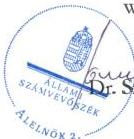
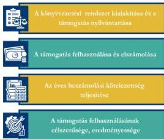
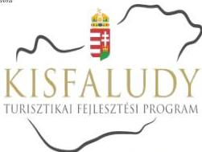

ÁLLAMI
SZÁMVEVŐSZÉK

# JELENTÉS

Egyesületek és alapítványok államháztartásból
kapott támogatásai felhasználásának és
elszámolásának ellenőrzése

NOVA HUMANA Egyesület

2026.

25147

www.asz.hu

---

ÁLLAMI
SZÁMVEVŐSZÉK

# JELENTÉS

Egyesületek és alapítványok államháztartásból
kapott támogatásai felhasználásának és
elszámolásának ellenőrzése

NOVA HUMANA Egyesület

2026.

25147

www.asz.hu

alelnök

---

ELLENŐRZÉSI IGAZGATÓSÁG:

ELLENŐRZÉSI IGAZGATÓSÁG V.

ELLENŐRZÉSI IGAZGATÓ:

KLINGA LÁSZLÓ igazgató

ELLENŐRZÉSVEZETŐ:

NEMESVÁRI-HORTHY ESZTER ellenőrzésvezető

Jelentéseink az interneten a
www.asz.hu címen olvashatók.

IKTATÓSZÁM: EL-4320-176/2025

TÉMASORSZÁM: 35

ELLENŐRZÉS-AZONOSÍTÓ SZÁM: V1181034

---

# TARTALOMJEGYZÉK

|  ■ ÖSSZEFOGLALÁS | 5  |
| --- | --- |
|  ■ AZ ELLENŐRZÉS EREDMÉNYEI | 6  |
|  1. A civil szervezet államháztartási forrásból származó támogatása felhasználásának és elszámolásának szabályszerűsége, felhasználásának célszerűsége és eredményessége | 6  |
|  ■ JAVASLATOK | 9  |
|  ■ I. FÜGGELÉK: ÉSZREVÉTELEK | 10  |
|  ■ II. FÜGGELÉK: ELLENŐRZÉSI MEGKÖZELÍTÉS | 11  |
|  ■ MELLÉKLETEK | 15  |
|  I. sz. melléklet: Értelmező szótár | 15  |
|  II. sz. melléklet: Az ellenőrzött szervezetek jegyzéke | 17  |
|  ■ RÖVIDÍTÉSEK JEGYZÉKE | 18  |

3

---

# ÖSSZEFOGLALÁS

A civil szervezetek tevékenységük megvalósításához évente **jelentős állami** és önkormányzati **támogatásokat kaphatnak**, valamint ingyenes vagyonjuttatásban részesülhetnek. Ezekkel a forrásokkal gazdálkodnak, miközben tevékenységükkel a **társadalom széles rétegeire hatnak** többek között kulturális programok, rendezvények, közösségépítés formájában. Jogosan merül fel tehát a kérdés: **hogyan költik el a közpénzt?** Ennek érdekében az ÁSZ$^{1}$ időről időre **ellenőrzi** az államháztartásból kapott támogatások felhasználását, és értékeli, hogy a civil szervezetek a kapott támogatást **átláthatóan és célnak megfelelően** használták-e fel. Az ÁSZ által folytatott ellenőrzések segítenek abban, hogy a nyilvánosság is **valós képet kapjon arról, hova került az adófizetők pénze**.

A kulturális tevékenységet végző civil szervezetek **fontos és sokrétű szerepet** játszanak a mai Magyarországon, különösen a helyi közösségek életében. Különösen fontosak a helyi identitás megerősítésében, a kulturális sokszínűség fenntartásában, és a közösségi aktivitás ösztönzésében.

Egy kulturális tevékenységet végző civil szervezet támogatása **nem csupán egy adott program finanszírozását jelenti, hanem befektetés a közösség szellemi, kulturális és társadalmi tőkéjébe**. Ezek a szervezetek hidat képeznek az állam, a közösségek és az egyének között, támogatásuk ezért elengedhetetlen egy élő, demokratikus és értékalapú társadalom fenntartásához.

Az Egyesület$^{2}$ részére a Kisfaludy2030 Turisztikai Fejlesztő Nonprofit Zrt., a Magyar Turisztikai Ügynökség Zrt.-vel. megkötött Támogatási szerződés$^{3}$ terhére „**A NOVA HUMANA Egyesület turisztikai szolgáltatásának fejlesztése Debrecen vonzáskörzetében (beruházás, infrastruktúra)**” elnevezésű projekt megvalósításához a 2022. évben 28,7 M Ft pénzügyi támogatást nyújtott.

**Az Egyesület a kapott támogatást a projektcélnak megfelelően, eredményesen használta fel, a támogatás elérte célját.**

Az Egyesület a jogszabályi előírásoknak megfelelően alakította ki könyvvezetési rendszerét, amely biztosította a kapott támogatás szabályos kimutatását, ugyanakkor a támogatás felhasználásának elkülönített számviteli nyilvántartása nem felelt meg a jogszabályi előírásoknak.

A támogatás felhasználása a Támogatói okiratban$^{4}$ és annak elválaszthatatlan részét képező költségtervben szereplő adatoknak, előírásoknak megfelelt. Az Egyesület a Támogatói okirat előírásainak megfelelően, határidőben eleget tett a Támogató$^{5}$ felé történő elszámolási kötelezettségének. A Támogató az elszámolást elfogadta. Az Egyesület a 2022-2023. évi egyszerűsített éves beszámolójában tájékoztatási és nyilvánosságra hozatali kötelezettségeinek – a saját honlapra vonatkozó közzétételi kötelezettség esetében feltárt hiányosság kivételével – eleget tett.

1. ábra

ÖSSZEZÉS A NOVA HUMANA EGYESÜLET  
ET-2022-02-03 SZÁMÚ TÁMOGATÁSHOZ KAPCSOLÓDÓ  
KÖTELEZETTSÉGEK TEFJESÍTÉSÉRŐL

■ szabályszerű volt  
■ hiányosságot tárt fel az ellenőrzés  
■ nem volt szabályszerű

Forrás: ÁSZ saját szerkesztés

5

---

# AZ ELLENŐRZÉS EREDMÉNYEI

Az Egyesület a költségvetési támogatást „A NOVA HUMANA Egyesület turisztikai szolgáltatásának fejlesztése Debrecen vonzáskörzetében (beruházás, infrastruktúra)” elnevezésű projekt megvalósítására fordította. Az Egyesület a támogatást szabályszerűen, a támogatás céljának megfelelően a támogatott tevékenység időtartamán belül használta fel. A közpénzt az Egyesület céljaival összhangban turisztikai szolgáltatás fejlesztésére használták fel Mikepércsen.

## 1. A civil szervezet államháztartási forrásból származó támogatása felhasználásának és elszámolásának szabályszerűsége, felhasználásának célszerűsége és eredményessége

### Összegző megállapítás

Az Egyesület az ellenőrzött támogatást a Támogatói okiratban megjelölt célnak megfelelően, eredményesen használta fel, az elszámolási kötelezettségét teljesítette. A támogatást a számviteli rendszerében szabályszerűen kimutatta, de a felhasználás elkülönített számviteli nyilvántartása nem felelt meg a jogszabályi előírásnak. A számviteli beszámolási kötelezettségét teljesítette. Az egyszerűsített éves beszámolóit határidőben letétbe helyezte, azonban saját honlapján a 2022-2023. évre vonatkozó számviteli beszámolóit nem tette közé.

### A KÖNYVVEZETÉSI RENDSZER KIALAKÍTÁSA ÉS A TÁMOGATÁS NYILVÁNTARTÁSA

Az Egyesület a Számv. tv.⁶ és a Civilszr.⁷-ben foglalt jogszabályi előírások betartásával gondoskodott a könyvviteli szolgáltatás személyi feltételeinek megteremtéséről, a könyvviteli szolgáltatás körébe tartozó feladatok ellátásával olyan társaságot bízott meg, amelynek megbízott tagja a jogszabályi előírásoknak megfelelő képesítéssel rendelkezett.

Az Egyesület a Civilszr. előírásainak megfelelően a 2022-2023. években kettős könyvvitelt vezetett.

Az Egyesület a Számv. tv. és a Civil tv.⁸ előírásaiban foglaltak szerint elkülönítetten mutatta ki az alapcél szerinti tevékenysége költségei, ráfordításai ellentételezésére visszafizetési kötelezettség nélkül kapott, államháztartási forrásból származó központi költségvetési támogatást. Az Egyesület a 2022. évben 100%-os előlegként kapott támogatást a Számv. tv. előírásának megfelelően egyéb rövid lejáratú kötelezettségként tartotta nyilván, a támogatás elszámolásának elfogadását követően (2023. június 26.) bevételként számolta el.

Az Egyesület által az alapcél szerinti tevékenysége költségei, ráfordításai ellentételezésére kapott támogatás felhasználásáról vezetett elkülönített számviteli nyilvántartása nem felelt meg a Civil tv. 20. § (4) bekezdésében foglaltaknak. Az Egyesület a támogatás felhasználására vonatkozó munkaszámos (költséghelyes) elkülönített számviteli nyilvántartást kialakította, ugyanakkor a rendelkezésre bocsátott számviteli nyilvántartásban nem lehetett pontosan beazonosítani, hogy az egyes kiadások közül mekkora összeget számoltak el a támogatás terhére, tekintettel arra, hogy a támogatás

6

---

Az ellenőrzés eredményei---

felhasználása során az önrészt és a támogatás terhére elszámolt részt egy összegben mutatta ki az elkülönített számviteli nyilvántartásban.

#### **A TÁMOGATÁS FELHASZNÁLÁSA ÉS ELSZÁMOLÁSA**

Az Egyesület az ellenőrzött támogatás felhasználásáról a Támogató által előírt formában elkészítette a beszámolót, annak részeként az összesített elszámolási táblázatot (számlaösszesítő), és határidőben benyújtotta a Támogató részére.

Az Egyesület esetében a támogatás felhasználása ellenőrzött tételeinek (10 db) vonatkozásában az ÁSZ az alábbiakat állapította meg:

- ▪ a tételek számviteli elszámolását a Számv. tv.-ben előírtaknak megfelelően bizonylatokkal alátámasztotta;
- ▪ minden gazdasági eseményt a Számv. tv.-ben foglaltak szerint, tartalmának megfelelő főkönyvi számra számolt el;
- ▪ a tételek számviteli bizonylatait a Támogatói okiratban foglaltaknak megfelelően ellátta záradékkal;
- ▪ a számviteli bizonylatokon záradékolt összegek megegyeztek a számlaösszesítőben feltüntetett értékekkel;
- ▪ a tételek számviteli bizonylatai alapján a gazdasági események a Támogatói okiratnak megfelelően, a támogatási időszak végéig, szerződés szerint teljesültek;
- ▪ a tételek pénzügyi rendezése a Támogatói okiratban meghatározott felhasználási határidőig minden esetben megtörtént;
- ▪ a támogatásból beszerzett befektetett eszközök esetében az értékcsökkenés elszámolása megfelelt a Számv. tv. előírásainak;
- ▪ a tételek megfeleltethetők voltak a Támogatói okiratban, illetve a költségtervben meghatározott, Támogató által jóváhagyott felhasználási jogcímeknek.

A Támogatói okiratban foglalt támogatás lezárásáról, a beszámoló elfogadásáról a Támogató 2023. június 26-án döntött, az Egyesületnek visszafizetési kötelezettsége nem keletkezett.

#### **AZ ÉVES BESZÁMOLÁSI KÖTELEZETTSÉG TELJESÍTÉSE**

Az Egyesület a 2022-2023. évekre vonatkozóan a Számv. tv. és a Civil. tv. előírásai alapján elkészítette számviteli beszámolóit. Az egyszerűsített éves beszámolók a Civil tv. és a Civilszr. előírásai alapján tartalmazták a mérleget, az eredménykimutatást és a kiegészítő mellékletet. Az Egyesület a Civil tv.-nek megfelelően a beszámolóval egyidejűleg elkészítette a közhasznúsági mellékletet.

A 2022-2023. évekre vonatkozó egyszerűsített éves beszámolókat a Ptk.$^{9}$ rendelkezései alapján a Felügyelő Bizottság$^{10}$ elfogadta, a Közgyűlés$^{11}$ a Civil tv.-nek megfelelően jóváhagyta.

Az Egyesület a Civil tv. alapján a 2022-2023. évi egyszerűsített éves beszámolóit és közhasznúsági mellékleteit határidőben letétbe helyezte és az OBH$^{12}$ honlapján közzétette. Az Egyesület saját honlappal rendelkezik. Az Egyesület a Civil tv. 30. § (4) bekezdésében előírtak ellenére saját honlapján nem tette közzé a 2022-2023. évi egyszerűsített éves beszámolóit és közhasznúsági mellékleteit.

#### **A TÁMOGATÁS FELHASZNÁLÁSÁNAK CÉLSZERŰSÉGE ÉS EREDMÉNYESSÉGE**

Az Egyesület az ellenőrzött támogatást a Támogatói okirat előírásainak megfelelően, az abban meghatározott célra használta fel. A Támogatói okiratban megjelölt cél – „a **NOVA HUMANA**

7

---

Az ellenőrzés eredményei

**Egyesület turisztikai szolgáltatásának fejlesztése Debrecen vonzáskörzetében (beruházás, infrastruktúra)”** című projekt – **teljesült**. A projekt fizikai befejezésének napja 2023. március 31. volt. A projekt a jóváhagyott költségtervnek megfelelően valósult meg. A projekthez a Támogató által cél indikátorokat határoztak meg. Az indikátorok teljesülését a Támogató helyszíni ellenőrzés keretében 2023. június 1-jén ellenőrizte, az ellenőrzéssel kapcsolatos információkat az 1. táblázat foglalja össze:

1. táblázat

|  AZ INDIKÁTOROK TELJESÍTÉSE  |   |   |
| --- | --- | --- |
|  INDIKÁTOROK | TÁMOGATÓI OKIRATBAN MEGHATÁROZOTT ADAT | TÁMOGATÓ HELYSZÍNI ELLENŐRZÉSÉNEK IDŐPONTJÁBAN ÉRVÉNYES ÉRTÉK  |
|  1. Turisztikai attrakció éves látogatószáma | 400 fő/év | nem releváns  |
|  2. Új szolgáltatások létrehozás | Kerékpártúrák szervezése igény szerint egész évben; Rendezvények szervezése igény szerint, évente több alkalommal | nem releváns  |
|  3. Új attrakcióelemek létrehozása | Rendezvényház építése, mely egész évben lehetővé teszi a látogatók fogadását | megvalósult  |

Forrás: ÁSZ saját szerkesztés, Támogatói okirat, Helyszíni ellenőrzés jegyzőkönyve

8

---

# JAVASLATOK

Az ÁSZ tv.¹³ 33. § (1) bekezdésében foglaltak értelmében az ellenőrzött szervezet vezetője köteles a jelentésben foglalt megállapításokhoz kapcsolódó intézkedési tervet összeállítani és azt a jelentés kézhezvételétől számított 30 napon belül az ÁSZ részére megküldeni. Az ÁSZ a jelentésben foglalt megállapításokhoz kapcsolódóan az alábbi javaslatok tekintetében várja el az intézkedési terv elkészítését.

## NOVA HUMANA EGYESÜLET ELNÖKÉNEK

1. Gondoskodjon arról, hogy az Egyesület a jövőben a kapott támogatások felhasználásáról a Civil tv. 20. § (4) bekezdésében foglalt előírásnak megfelelően, olyan elkülönített számviteli nyilvántartást vezessen, amelyből megállapítható és ellenőrizhető a kapott támogatás felhasználása.

2. Gondoskodjon arról, hogy az Egyesület a számviteli beszámolót és a közhasznúsági mellékletet a Civil tv. 30. § (4) bekezdésében rögzített előírás alapján a saját honlapon közzé tegye.

9

---

# I. FÜGGELÉK: ÉSZREVÉTELEK

*A jelentéstervezetet az ÁSZ 15 napos észrevételezésre megküldte az ellenőrzött szervezet vezetőjének az ÁSZ tv. 29. §\* (1) bekezdése előírásának megfelelően.*

*A NOVA HUMANA Egyesület elnöke a jelentéstervezetre nem tett észrevételt.*

\* 29. § (1) Az Állami Számvevőszék az ellenőrzési megállapításait megküldi az ellenőrzött szervezet vezetőjének vagy az általa megbízott személynek, és annak, akinek személyes felelősségét állapította meg.

(2) Az ellenőrzött szervezet vezetője és a felelősként megjelölt személy az ellenőrzés megállapításaira tizenöt napon belül írásban észrevételt tehet.

(3) Az Állami Számvevőszék az észrevételre a beérkezésétől számított harminc napon belül írásban válaszol. A figyelembe nem vett észrevételeket köteles a jelentésben feltüntetni, és megindokolni, hogy azokat miért nem fogadta el.

10

---

## II. FÜGGELÉK: ELLENŐRZÉSI MEGKÖZELÍTÉS

### AZ ELLENŐRZÉS JOGALAPJA

Az ellenőrzés jogszabályi alapját az ÁSZ tv. 1. § (3) bekezdés, az 5. § (3) bekezdés előírásai képezték.

### AZ ELLENŐRZÉS CÉLJA

Az ellenőrzés célja annak értékelése volt, hogy az ellenőrzött egyesület az államháztartási forrásból származó, ellenőrzésre kiválasztott támogatást a támogatói okiratban előírtaknak megfelelően, az abban meghatározott célra, szabályszerűen, eredményesen használta-e fel, valamint a gazdálkodásáról szabályszerűen beszámolt-e. Célja volt továbbá a támogatással való elszámolás szabályszerűségének értékelése.

### AZ ELLENŐRZÉS TÍPUSA

Kombinált ellenőrzés.

### AZ ELLENŐRZÉS TÁRGYA

Az államháztartásból nyújtott támogatást felhasználó ellenőrzött egyesületnél a kiválasztott támogatás felhasználására vonatkozó jogszabályi és szerződéses előírások betartásának ellenőrzése. Ennek keretében a könyvvezetésre vonatkozó jogszabályi előírások betartása, a támogatás felhasználás támogatói okiratnak való megfelelősége, valamint a beszámolási és közzétételi kötelezettség teljesítésének szabályszerűsége. Az ellenőrzés tárgya volt továbbá annak értékelése, hogy a számviteli szabályozási környezet kialakítása támogatta-e az államháztartásból származó támogatás vonatkozásában a szabályos könyvvezetést, a támogatás célnak megfelelő felhasználását, valamint a kapcsolódó beszámolási kötelezettség teljesítését. Az ellenőrzés során az ÁSZ értékelte, hogy az ellenőrzött szervezet a támogatást meghatározott célra, eredményesen használta-e fel.

Az ellenőrzés kiterjedt minden olyan körülményre és adatra, amely az ÁSZ jogszabályban meghatározott feladatainak teljesítéséhez, valamint a program végrehajtása folyamán felmerült újabb összefüggések feltárásához szükséges.

### AZ ELLENŐRZÉS HATÓKÖRE ÉS TERÜLETE

Az ÁSZ tv. 5. § (3) bekezdésében foglaltak alapján az ÁSZ ellenőrizte az államháztartásból nyújtott támogatás felhasználását. A támogatás felhasználásának szabályait a támogatói okirat, az Áht.$^{14}$ és az Ávr.$^{15}$ rögzítette. A civil szervezet könyvvezetésének, a beszámolási- és közzétételi kötelezettség teljesítésének ellenőrzése a Számv. tv., a Civilszr., a Civil tv., a Civil vhr.$^{16}$, valamint a Ptk. vonatkozó előírásai alapján történt.

Az ÁSZ ellenőrzése választ ad arra, hogy az ellenőrzött szervezetnél a számviteli szabályozási környezet kialakítása biztosította-e a támogatás felhasználása jogszabályi előírásoknak megfelelő nyilvántartását,

11

---

II. Függelék: Ellenőrzési megközelítés

könyvviteli elszámolását, továbbá arra is, hogy a támogatással való elszámolási, beszámolási kötelezettséget teljesítette-e. Az ÁSZ ellenőrzése kiterjedt a támogatás támogatói okiratban foglalt célra történő felhasználás és a felhasználás eredményességének értékelésére. Ezen túlmenően az ellenőrzés értékelte, hogy az ellenőrzött szervezet számviteli beszámolási kötelezettségének teljesítése szabályszerű volt-e.

## AZ ELLENŐRZÖTT IDŐSZAK

Az ellenőrzésre kiválasztott államháztartási forrásból származó támogatásra vonatkozó támogatott tevékenység kezdő időpontjától az ellenőrzésről szóló értesítés keltéig tartó időszak.

Az ellenőrzésre kiválasztott egyesület államháztartásból kapott támogatása felhasználásának és elszámolásának ellenőrzése során az ellenőrzött időszakon belül az értékelés szempontjából releváns évek a 2022. és a 2023. év.

## AZ ELLENŐRZÉSI KRITÉRIUMOK

|  FŐKUSZTERÜLET/FŐKUSZKÉRDÉS | ELLENŐRZÉSI KRITÉRIUMOK  |
| --- | --- |
|  1. A civil szervezet államháztartási forrásból származó támogatása(i) felhasználásának és elszámolásának szabályszerűsége, felhasználásának célszerűsége és eredményessége | Áht. Ávr. Számv. tv. Civil tv. Civilszr. Ptk. Civil vhr. Cnytv.^{17} Létesítő okirat Támogatói okirat Költségterv  |

## AZ ELLENŐRZÉS MÓDSZERE ÉS AZ ELLENŐRZÉSI BIZONYÍTÉKOK KÖRE

Az ellenőrzést a nemzetközi standardokat irányadónak tekintve az ellenőrzési program szempontjai, az ellenőrzött időszakban hatályos jogszabályok, az ellenőrzés szakmai szabályok és módszertan(ok) figyelembevételével végezte az ÁSZ.

Az ellenőrzési kérdések megválaszolásához szükséges bizonyítékok megszerzése az ellenőrzött szervezet által rendelkezésre bocsátott dokumentumokra és adatokra alapozva mintavételezés útján történt.

Az államháztartási forrásból származó, ellenőrzésre – adatvezérelt, kockázatalapú kiválasztás által, több év adatának figyelembevételével és az ellenőrizhető szervezet által előzetesen szolgáltatott adatok alapján – kijelölt támogatás felhasználása támogatói okiratnak való megfelelőségét a támogatás nyilvántartásának és a támogató felé történő elszámolásnak egymással és a támogatói okirattal történő összevetésével ellenőrizte az ÁSZ.

12

---

II. Függelék: Ellenőrzési megközelítés---

A támogatás könyvviteli nyilvántartása jogszabályi előírásoknak, támogatói okiratnak való szabályszerűségét nem statisztikai alapú mintavételi eljárással ellenőrizte az ÁSZ. A tételek kiértékelése nem került a sokaságra kivetítésre. A kiválasztott támogatói okirathoz kapcsolódó elszámolásból 10 db tétel került ellenőrzésre.

Az ellenőrzési bizonyítékként felhasználható adatforrások közé tartoztak egyrészt az ellenőrzéshez kért dokumentumok, másrészt adatforrás volt még minden – az ellenőrzés folyamán – feltárt, az ellenőrzés szempontjából információkat tartalmazó dokumentum.

Az ellenőrzés lefolytatásához az ellenőrzött szervezet a tanúsítványok kitöltésével, valamint az ÁSZ által kért dokumentumok, adatok, információk megküldésével és az ellenőrzés során szolgáltatott adatokat.

Az ÁSZ az ellenőrzött szervezetet az Országos Támogatás-ellenőrzési Rendszerben (OTR) nyilvántartott adatok alapján államháztartási forrásból támogatásban részesült szervezetek közül, – OBH és KSH$^{18}$ adatokat is figyelembe véve – adatvezérelt kockázatértékelés alapján, a kulturális tevékenységet végző szervezetekre fókuszálva választotta ki. Az ÁSZ az ellenőrzött támogatást az adott szervezet által előzetesen szolgáltatott adatok alapján, a tanúsítványokban szereplő adatok ismeretében határozta meg.

A **NOVA HUMANA Egyesületet** 2006-ban alapították, a civil szervezetek közhiteles bírósági nyilvántartásába 2006. október 9-én jegyezték be. Az Egyesület Alapszabálya$^{19}$ szerinti célja többek között *„segítséget nyújtani az egyre globalizálódó világban az emberek számára ahhoz, hogy megtalálják helyüket és boldogságukat a mai modern társadalom kihívásai, ellentmondásai között.”* Célja továbbá *„a különböző társadalmi csoportok, rétegek társadalmi beilleszkedésének segítése, esélyek teremtése számukra az egyre teljesebb emberi lét megéléséhez”*.

Az Egyesület legfőbb döntéshozó szerve a Közgyűlés, az ügyvezetés az öt tagból álló Elnökség$^{20}$, legfőbb tisztségviselője az Elnök, aki ellátja a törvényes képviseletet, képviseleti joga gyakorlásának terjedelme általános, módja önálló. A bankszámla felett az Elnök, továbbá egy vezetőségi tag, a Titkár önállóan jogosult rendelkezni. Az Elnök személyében az ellenőrzött időszakban nem történt változás.

Az Egyesület jogszabályi előírás alapján könyvvizsgálatra nem volt kötelezett.

Az Egyesület működésének és gazdálkodásának ellenőrzését három tagú Felügyelő Bizottság látta el. Az Egyesület az ellenőrzött időszakban nem rendelkezett közhasznú jogállással.

Az Egyesület a Közbef. tv.$^{21}$ szerinti, **közélet befolyásolására alkalmas civil szervezetnek minősült**, mivel az ellenőrzött időszakban mérlegfőösszege elérte a 20 M Ft-ot.

Az Egyesület vállalkozási tevékenységet nem végzett.

Az Egyesület támogatásban részesült. A támogatással kapcsolatos adatokat a 2. táblázat foglalja össze.

13

---

II. Függelék: Ellenőrzési megközelítés

2. táblázat

# A TÁMOGATÁS FŐBB ADATAI

# A NOVA HUMANA EGYESÜLET RÉSZÉRE A TÁMOGATÓ ÁLTAL NYÚJTOTT, ELLENŐRZŐTT TÁMOGATÁS (ET-2022-02-033) FŐBB ADATAI

|  Támogatott tevékenység: | „A NOVA HUMANA Egyesület turisztikai szolgáltatásának fejlesztése Debrecen vonzáskörzetében (beruházás, infrastruktúra)” elnevezésű projekt  |
| --- | --- |
|  Támogató: | Kisfaludy2030 Turisztikai Fejlesztő Nonprofit Zrt.  |
|  Támogatási összeg: | 28,7 M Ft  |
|  Felhasznált összeg: | 28,7 M Ft  |
|  A Támogatói okirat kibocsátásának időpontja: | 2022. augusztus 31.  |
|  A támogatott tevékenység időtartama: | 2022. május 12. – 2023. március 31.  |
|  A támogatás felhasználásáról a záró (pénzügyi) beszámoló benyújtásának határideje: | 2023. április 30.  |
|  A támogatás felhasználásáról benyújtott záró beszámoló elfogadásának dátuma: | 2023. június 26.  |

Forrás: ASZ saját szerkesztés a Támogatói okirat adatai alapján

A „NOVA HUMANA Egyesület turisztikai szolgáltatásának fejlesztése Debrecen vonzáskörzetében (beruházás, infrastruktúra)” elnevezésű projekt megvalósítására biztosított vissza nem térítendő támogatás fedezetét a Magyar Turisztikai Ügynökség Zrt. és a Támogató között megkötött Támogatási szerződés biztosította.

2. ábra

Forrás: https://info.kisfaludyprogram.hu/

A projekt megvalósítására kapott támogatásból az Egyesület turisztikai szolgáltatásának Debrecen vonzáskörzetében történő fejlesztése történt meg. Az Egyesület fióktelepén Mikepércsen, fedett kültéri konyha és rendezvénytér épült és rendezvény sátrat, valamint kerékpárokat szereztek be, mellyel magasabb színvonalú szolgáltatást tudnak biztosítani a szabadidős és családi rendezvények résztvevői számára, valamint megteremtették a kerékpáros turizmus feltételeit is.

14

---

# MELLÉKLETEK

## ■ I. SZ. MELLÉKLET: ÉRTELMEZŐ SZÓTÁR

|  célszerűség | Arra vonatkozó követelmény, hogy a bevételeket a közfeladat megvalósítása érdekében, a kiadásokat a közfeladatok megfelelő ellátásához szükséges mértékben, a költségvetési célrendszer érdekében, a meghatározott célra (közfeladat ellátására), továbbá észszerűen, racionálisan használták fel. (Forrás: Alaptörvény^{22}, ÁSZ)  |
| --- | --- |
|  civil szervezet | Civil szervezet: a) a civil társaság, b) a Magyarországon nyilvántartásba vett egyesület - a párt, a szakszervezet és a kölcsönös biztosító egyesület kivételével -, c) a közalapítvány és a pártalapítvány kivételével - az alapítvány. (Forrás: Civil tv. 2. § 6. pont)  |
|  civil szervezetek egyszerűsített támogatása | A helyi vagy területi hatókörű civil szervezetek számára a Civil tv. 56. § (1) bekezdés h) pontja alapján egyszerűsített formában, jogosultsági alapon nyújtott támogatás a helyi közösség érdekében végzett tevékenységük támogatására. (Forrás: Civil tv. 2. § 8b. pont)  |
|  civil szervezetek normatív támogatása | A civil szervezetek által gyűjtött adományok után járó, a gyűjtött adomány mértékével arányos a Civil tv. 56. § (1) bekezdés a) pontja alapján nyújtott támogatás. (Forrás: Civil tv. 2. § 8a. pont alapján)  |
|  egyesület | Az egyesület a tagok közös, tartós, alapszabályban meghatározott céljának folyamatos megvalósítására létesített, nyilvántartott tagsággal rendelkező jogi személy. (Forrás: Ptk. 3:63. § (1) bekezdés) A Számv. tv. alkalmazásában egyéb szervezet. (Forrás: Számv. tv. 3. § (1) bekezdés 4. pont a) alpont)  |
|  eredményesség | Az eredményesség elve a kitűzött célok és a szándékolt eredmények (hatások) elérését jelenti. A gazdálkodás, feladatellátás eredményességét mutatja a tényleges és a tervezett eredmények (hatások) összevetése. (Forrás: INTOSAI^{23})  |
|  feladatfinanszírozást szolgáló költségvetési támogatás | Valamely közfeladat államháztartáson kívüli szervezet által történő ellátását, valamint e feladat ellátásához közvetlenül kapcsolódó, arányos működési költségeket finanszírozó költségvetési támogatás. (Forrás: Civil tv. 2. § 8. pont)  |
|  közcélú tevékenység | Személyek csoportja által, valamely a csoportnál tágabb közösség érdekében – más, e közösségbe nem tartozó személyek érdekeinek sérelme nélkül – végzett tevékenység. (Forrás: Civil tv. 2. § 16. pont)  |
|  közfeladat | A jogszabályban meghatározott állami vagy önkormányzati feladat. A közfeladatok ellátásában államháztartáson kívüli szervezet jogszabályban meghatározott rendben közreműködhet. (Forrás: Áht. 3/A. § (1)-(2) bekezdés)  |
|  közhasznú szervezet | Közhasznú szervezetté minősített a Magyarországon nyilvántartásba vett közhasznú tevékenységet végző szervezet, amely a társadalom és az egyén közös szükségleteinek kielégítéséhez megfelelő erőforrásokkal rendelkezik, továbbá amelynek megfelelő társadalmi támogatottsága kimutatható, és amely: a) civil szervezet (ide nem értve a civil társaságot), vagy b) olyan egyéb szervezet, amelyre vonatkozóan a közhasznú jogállás megszerzését törvény lehetővé teszi. (Forrás: Civil tv. 32. § (1) bekezdés)  |

15

---

Mellékletek

|  közhasznú tevékenység | Minden olyan tevékenység, amely a létesítő okiratban megjelölt közfeladat teljesítését közvetlenül vagy közvetve szolgálja, ezzel hozzájárulva a társadalom és az egyén közös szükségleteinek kielégítéséhez. (Forrás: Civil tv. 2. § 20. pont)  |
| --- | --- |
|  létesítő okirat | A jogi személy létrehozásáról a személyek szerződésben, alapító okiratban vagy alapszabályban szabadon rendelkezhetnek, mely dokumentumokra együttesen a Ptk. a létesítő okirat megnevezést használja. (Forrás: Ptk. 3:4. § (1) bekezdés alapján)  |
|  támogatás | Céljellegű juttatás, mely kizárólag arra a célra használható fel, amelyre a támogató azt rendelkezésre bocsátotta, amely cél megvalósítását a támogatási szerződés, okirat vagy éppen jogszabály kikötötte. Támogatásként értelmezzük valamennyi, a civil szervezetnek államháztartási forrásból nyújtott támogatást – ideértve a központi költségvetésből kapott támogatást, az elkülönített állami pénzalapokból kapott támogatást, a helyi önkormányzatoktól, nemzetiségi önkormányzatoktól, önkormányzati társulástól kapott támogatást –, továbbá az Európai Unió költségvetéséből, külföldi állam államháztartásából, nemzetközi szervezettől, vagy nemzetközi szerződés rendelkezése alapján kapott támogatást, valamint más civil szervezettől kapott támogatást. A gyűjtő fogalom alatt egyaránt értjük a civil szervezetnek nyújtott feladatfinanszírozást szolgáló költségvetési támogatást, a civil szervezetek normatív támogatását, valamint a civil szervezetek egyszerűsített támogatását is (ÁSZ saját fogalma)  |
|  támogatási döntés | Az államháztartás alrendszereiből, az európai uniós forrásokból, a nemzetközi megállapodás alapján finanszírozott egyéb programokból, a 100%-os állami tulajdonban álló szervezet által létrehozott alapítványtól származó, egyedi döntés alapján nyújtott, pályázati úton vagy pályázati rendszeren kívül az államháztartáson kívüli természetes személyek, jogi személyek és jogi személyiséggel nem rendelkező egyéb szervezetek számára odaítélt, természetben vagy pénzben juttatott támogatásokban részesülő személy, valamint az e személy részére juttatandó konkrét támogatási összeg meghatározása. (Forrás: 2007. évi CLXXXI. törvény^{24} 1. § (1) bekezdése és 2. § (1) bekezdése alapján)  |
|  támogatói okirat | A támogatói okirat egy olyan, a támogató (irányító hatóság) támogatási jogviszony létrehozására irányuló akaratnyilatkozatát tartalmazó jognyilatkozat, amelyből jogilag kikényszeríthető kötelezettségek származnak, és amely esetében a jelen pontban rögzített jogszabályi előírások is irányadók. Az államháztartás alrendszerei terhére támogatás közigazgatási hatósági határozattal vagy hatósági szerződéssel, támogatói okirattal vagy támogatási szerződéssel jogszabály vagy egyedi döntés alapján, pályázati úton vagy pályázati rendszeren kívül nyújtható. Ha jogszabály – a központi költségvetés Áht. 14. § (3) bekezdése szerinti fejezetéből biztosított költségvetési támogatások esetén jogszabály vagy a Kormány határozata – a támogatás biztosításának módjáról nem rendelkezik, arról a központi költségvetés Áht. 14. § (3) bekezdése szerinti fejezetéből biztosított költségvetési támogatások esetén támogatói okiratot kell kibocsátani, ettől eltérő más esetben az ötmilliárd forintot el nem érő összegű költségvetési támogatás esetén szintén támogatói okiratot kell kibocsátani (Forrás: Áht. 48. § (1) bekezdése, Ávr. 65/A. § (1) bekezdés alapján ÁSZ meghatározás)  |
|  támogatott tevékenység | A támogatási szerződésben meghatározott olyan tevékenység – ideértve a kedvezményezett működését is –, amely során felmerült költségek megtérítését a támogatási előleg, a költségvetési támogatás részben vagy egészében biztosítja. (Forrás: Ávr. 1. § 8. pontja)  |
|  támogatott tevékenység időtartama | A támogatási szerződésben meghatározott olyan időtartam, amely során felmerülő, a támogatott tevékenység megvalósításához kapcsolódó költségek elszámolhatóak. (Forrás: Ávr. 1. § 9. pontja)  |

16

---

*Mellékletek*---

# ■ II. SZ. MELLÉKLET: AZ ELLENŐRZÖTT SZERVEZETEK JEGYZÉKE---

|  ELLENŐRZÖTT SZERVEZET NEVE | ELLENŐRZÖTT SZERVEZET SZÉKHELYE  |
| --- | --- |
|  NOVA HUMANA Egyesület | 4029 Debrecen, Pacsirta utca 12.  |

17

---

# RÖVIDÍTÉSEK JEGYZÉKE

1. ÁSZ

2. Egyesület

3. Támogatási szerződés

4. Támogatói okirat

5. Támogató

6. Számv. tv.

7. Civilsztr.

8. Civil tv.

9. Ptk.

10. Felügyelő Bizottság

11. Közgyűlés

12. OBH

13. ÁSZ tv.

14. Áht.

15. Ávr.

16. Civil vhr.

17. Cnytv.

18. KSH

19. Alapszabály1

Alapszabály2

20. Elnökség

21. Közbef. tv.

22. Alaptörvény

23. INTOSAI

24. 2007. évi CLXXXI. törvény

Állami Számvevőszék

NOVA HUMANA Egyesület

A Kisfaludy2030 Turisztikai Fejlesztő Nonprofit Zrt. és a Magyar Turisztikai Ügynökség Zrt. között az MTÜ/SZER/269-1/2017. iktatószámú Támogatási szerződés

ET-2022-02-033 projekt azonosító számú Támogatói okirat és annak a EF/22/000302-13/2022 és EF/22/000040-6/2023 iktatószámú módosításai

Kisfaludy2030 Turisztikai Fejlesztő Nonprofit Zrt.

2000. évi C. törvény a számvitelről

479/2016. (XII. 28.) Korm. rendelet a számviteli törvény szerinti egyes egyéb szervezetek beszámoló készítési és könyvvezetési kötelezettségének sajátosságairól

2011. évi CLXXV. törvény az egyesülési jogról, a közhasznú jogállásról, valamint a civil szervezetek működéséről és támogatásáról

2013. évi V. törvény a Polgári Törvénykönyvről

NOVA HUMANA Egyesület Felügyelő Bizottsága

NOVA HUMANA Egyesület Közgyűlése

Országos Bírósági Hivatal

2011. évi LXVI. törvény az Állami Számvevőszékről

2011. évi CXCV. törvény az államháztartásról

368/2011. (XII. 31.) Korm. rendelet az államháztartásról szóló törvény végrehajtásáról

350/2011. (XII. 30.) Korm. rendelet - a civil szervezetek gazdálkodása, az adománygyűjtés és a közhasznúság egyes kérdéseiről

2011. évi CLXXXI. törvény a civil szervezetek bírósági nyilvántartásáról és az ezzel összefüggő eljárási szabályokról

Központi Statisztikai Hivatal

NOVA HUMANA Egyesület Alapszabálya (hatályos: 2022. április 14-től 2023. július 31-ig)

NOVA HUMANA Egyesület Alapszabálya (hatályos: 2023. augusztus 1-től)

NOVA HUMANA Egyesület Elnöksége

2021. évi XLIX. törvény a közélet befolyásolására alkalmas tevékenységet végző civil szervezetek átláthatóságáról

Magyarország Alaptörvénye

Legfőbb Ellenőrző Intézmények Nemzetközi Szervezete (The International Organization of Supreme Audit Institutions)

2007. évi CLXXXI. törvény a közpénzekből nyújtott támogatások átláthatóságáról

18

---

ÁLLAMI
SZÁMVEVŐSZÉK

1052 Budapest, Apáczai Csere János u. 10. | 1364 Budapest 4., Pf. 54
www.asz.hu | szamvevoszek@asz.hu
telefon: +36 1 484 9100