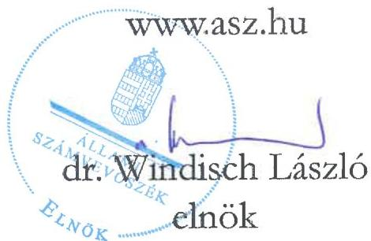
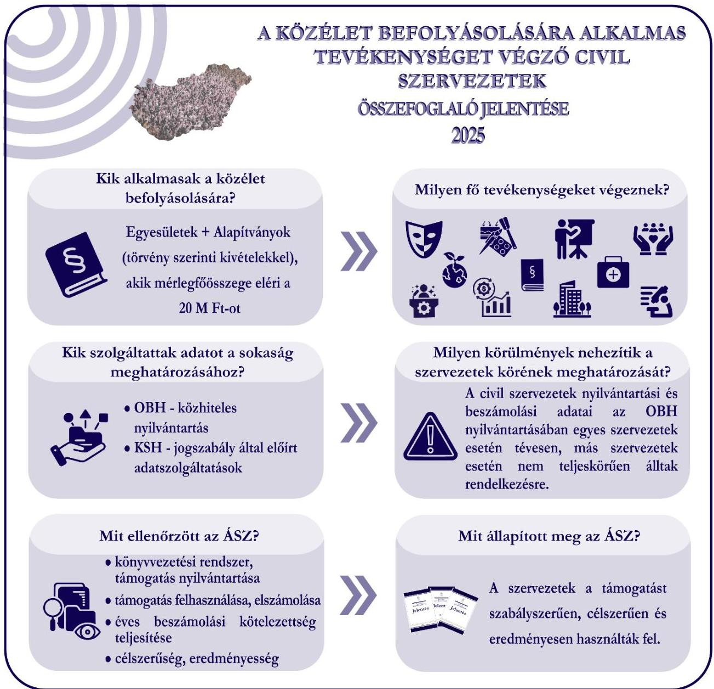
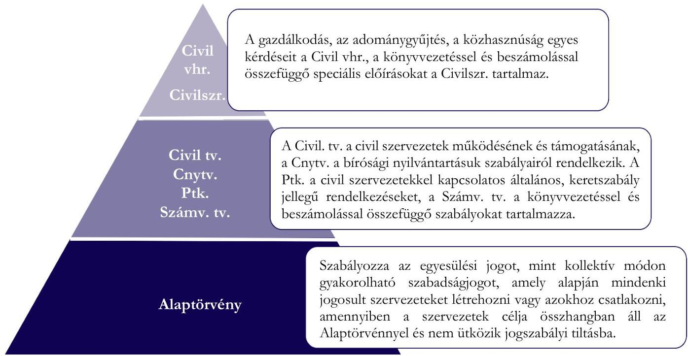
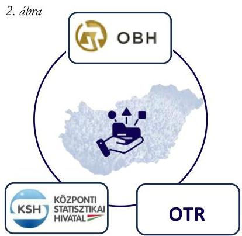
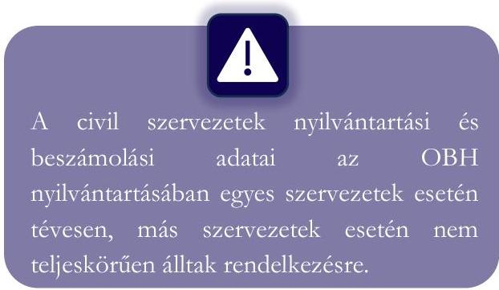
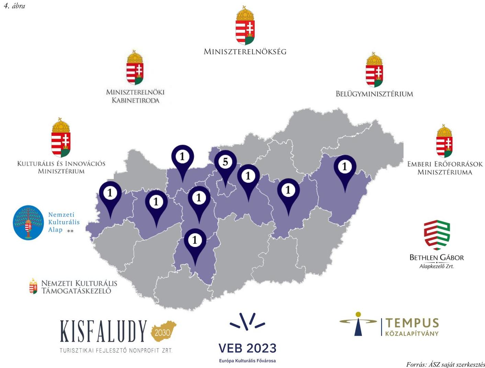
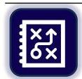

ÁLLAMI SZÁMVEVŐSZÉK

# ÖSSZEFOGLALÓ JELENTÉS

A közélet befolyásolására alkalmas tevékenységet végző civil szervezetek értékelése

2025.

25148

www.asz.hu

---

ÁLLAMI
SZÁMVEVŐSZÉK

# ÖSSZEFOGLALÓ JELENTÉS

A közélet befolyásolására alkalmas tevékenységet végző civil szervezetek értékelése

2025.

25148

---

Jelentéseink az interneten a www.asz.hu címen olvashatók.

ELLENŐRZÉSI IGAZGATÓSÁG:
ELLENŐRZÉSI IGAZGATÓSÁG V.

ELLENŐRZÉSI IGAZGATÓ:
KLINGA LÁSZLÓ igazgató

ELLENŐRZÉSVEZETŐ:
NEMESVÁRI-HORTHY ESZTER ellenőrzésvezető

IKTATÓSZÁM: EL-4354-007/2025
TÉMASORSZÁM: 7
ELLENŐRZÉS-AZONOSÍTÓ SZÁM: V-1181

---

TARTALOMJEGYZÉK

- ÖSSZEFOGLALÁS ... 5
- AZ ÉRTÉKELÉS TERÜLETE ... 6
- ELLENŐRZÉSI TAPASZTALATOK ... 13
- AZ ÉRTÉKELÉS ALAPADATAI ... 16
- MELLÉKLET ... 18
- I. sz. melléklet: Jogszabályi változás ... 18
- II. sz. melléklet: Nemzetközi kitekintés ... 19
- III. sz. melléklet: Értelmező szótár ... 21
- RÖVIDÍTÉSEK JEGYZÉKE ... 24

---

“哈，你是个小伙子，你是个小伙子，你是个小伙子，你是个小伙子，你是个小伙子，你是个小伙子，你是个小伙子，你是个小伙子，你是个小伙子，你是个小伙子，你是个小伙子，你是个小伙子，你是个小伙子，你是个小伙子，你是个小伙子，你是个小伙子，你是个小伙子，你是个小伙子，你是个小伙子，你是个小伙子，你是个小伙子，你是个小伙子，你是个小伙子，你是个小伙子，你是个小伙子，你是个小伙子，你是个小伙子，你是个小伙子，你是个小伙子，你是个小伙子，你是个小伙子，你是个小伙子，你是个小伙子，你是个小伙子，你是个小伙子，你是个小伙子，你是个小伙子，你是个小伙子，你是个小伙子，你是个小伙子，你是个小伙子，你是个小伙子，你是个小伙子，你是个小伙子，你是个小伙子，你是个小伙子，你是个小伙子，你是个小伙子，你是个小伙子，你是个小伙子，你是个小伙子，你是个小伙子，你是个小伙子，你是个小伙子，你是个小伙子，你是个小伙子，你是个小伙子，你是个小伙子，你是个小伙子，

---

ÖSSZEFOGLALÁS

Az ÁSZ¹ negyedik alkalommal teszi közzé összefoglaló jelentését a közélet befolyásolására alkalmas tevékenységet végző civil szervezetek átláthatóságáról szóló 2021. évi XLIX. törvényben foglalt kötelezettségének eleget téve. Ezen törvényi előírás 2021. július 1-jei hatálybalépésével egyidejűleg az ÁSZ feladatai kiegészültek a közélet befolyásolására alkalmas tevékenységet végző egyesületek és alapítványok ellenőrzési tapasztalatait összefoglaló éves jelentéskészítési kötelezettséggel. A jogalkotó szándéka az ÁSZ-nak biztosított hatáskörrel a civil szervezetek átláthatóságának biztosítása.

Az ÁSZ Alaptörvényben² meghatározott feladataival összhangban, a Stratégiájában³ is hangsúlyozott küldetéseként definiálja a közpénzek útjának felügyeletét. Az összefoglaló jelentés a 2025. évben az ÁSZ által a civil szervezetek körében – kétféle ellenőrzési program alapján – lefolytatott ellenőrzések tapasztalatainak bemutatásán alapul. Az összefoglaló jelentésünkben bemutatott ellenőrzések közös jellemzője, hogy azok fókuszában az államháztartáson kívülre, civil szervezetek részére juttatott közpénzek szabályszerű, célszerinti és eredményes felhasználásának értékelése állt.

1. ábra

Forrás: ÁSZ saját szerkesztés

---

AZ ÉRTÉKELÉS TERÜLETE

Magyarországon a törvényi előírás a közélet befolyásolására alkalmas tevékenységet végző civil szervezeti kört a mérlegfőösszeg nagysága alapján határozza meg. A Közbe f tv.⁴ rendelkezései szerint a közélet befolyásolására alkalmas tevékenységet végző civil szervezet azon egyesület és alapítvány, amely mérlegfőösszege eléri a 20,0 millió Ft-ot továbbá:

- nem minősül a Civil tv.⁵ szerint civil szervezetnek, azaz nem civil társaság, nem párt, vagy pártalapítvány, nem kölcsönös biztosító egyesület és nem szakszervezet;
- nem a Sport tv.⁶ hatálya alá tartozó egyesület;
- nem az Ehtv.⁷ szerinti vallási közösség;
- nem a 2011. évi CLXXIX. törvény⁸ szerinti nemzetiségi szervezet és nemzetiségi egyesület, valamint az alapító okirata szerint adott nemzetiség érdekvédelmét, érdekképviseletét, vagy a nemzetiségi kulturális autonómiával közvetlenül összefüggő tevékenységet ellátó alapítvány.

# CIVIL SZERVEZETEK MAGYARORSZÁGON

A modern demokratikus társadalmak működésének egyik lényeges pillérét a civil szervezetek alkotják, amelyek létrejötte és működése a polgári demokrácia alapvető értékein – a szabadságon, az önkéntességen és az együttműködésen – alapul. A civil szervezetek a társadalom önkéntes alapon létrejött közösségei, amelyek valamilyen közös cél, érték vagy érdeklődési kör mentén szerveződnek. Az egyesülési jog biztosítja, hogy az állampolgárok szabadon hozhassanak létre szervezetek társadalmilag hasznos célok megvalósítására. Működésük jelentős mértékben hozzájárul a társadalmi részvétel erősítéséhez, a közösségfejlesztéshez és számos közfeladat ellátásához.

A civil szervezetek közvetítő szerepet töltenek be az állampolgárok és az állam között: segítik a társadalmi problémák felismerését és megoldását, erősítik a részvételi demokrácia intézményeit, valamint hozzájárulnak a közösségi kontroll megvalósulásához. A civil szervezetek – a civil társaság kivételével – jogi személyiséggel rendelkező szervezetek.

A civil szervezetek szabályozása többszintű, amely az Alaptörvénytől a törvényeken (Civil tv., Cnytv.⁹, Ptk.¹⁰, Számv. tv.¹¹) át a kormányrendeletekig (Civil vhr.¹², Civilszr.¹³) terjed, amelyet a 2. ábra szemléltet.

6

---

Az értékelés területe

2. ábra

Forrás: ÁSZ saját szerkesztés

A jogalkotó kiemeli, hogy az emberek önkéntes összefogása nélkülözhetetlen Magyarország fejlődéséhez, ezért fontos a civil szervezetek működési feltételeinek biztosítása, társadalmilag hasznos tevékenységük elismerése és támogatása.

A civil szervezetek egyre növekvő közéleti szerepének és súlyának köszönhetően a társadalom részéről egyre nagyobb igény van azok átláthatósága iránt. Ez is magyarázza a Közbef. tv. 2021. július 1-jei hatálybalépését, amely az ÁSZ részére előírja évenkénti rendszerességgel az összefoglaló jelentés közzétételét a törvény hatálya alá tartozó egyesületekről és alapítványokról, biztosítva ezáltal a közvélemény, a civil szervezetek tevékenysége iránt érdeklődők hiteles tájékoztatását.

## Származtatott jogi személy

A civil szervezetek a hatékonyabb működés, a specifikus tevékenységek elkülönítése, az adózási, illetve jogszabályi követelményeknek való megfelelés miatt származtatott jogi személyeket hozhatnak létre.

A származtatott jogi személy egy olyan jogi entitás, amely egy már létező, alapító jogi személy belső szervezeti egységeként jön létre, és tőle nyeri a jogi személyiségét. Ez azt jelenti, hogy része az alapító szervezetnek, bizonyos fokú önállósággal és saját jogokkal, valamint kötelezettségekkel rendelkezik, és önállóan gazdálkodik.

Több jogi személy típusnál is igény mutatkozik arra, hogy a jogi személy egyes szervezeti egységeit (például földrajzi területenként szerveződő egységeit) jogi személyé lehessen nyilvánítani. A Ptk. ezt nem általános, minden jogi személyt megillető jogként szabályozza, hanem csak azzal a feltétellel teszi lehetővé, hogy az adott jogi személy típusra vonatkozó törvényi szabályozás ezt megengedi. A Ptk.-ban foglalt rendelkezések alapján az egyesületek és az alapítványok létesítő okiratukban rendelkezhetnek arról, hogy mely szervezeti egységeiket kívánják jogi személyként elismertetni. Ennek tartalmi feltétele, hogy a szervezeti egység

---

Az értékelés területe

rendelkezzen a jogi személy alapítóitól és magától a jogi személytől is elkülöníthető vagyonnal és szervezettel. Ezek hiányában a szervezeti egység nem lenne megkülönböztethető magától a jogi személytől, és önálló jogalanyként való működése sem lenne lehetséges.

Az önálló jogalanyként elismertetni kívánt szervezeti egységekre a jogi személyek általános szabályait kell alkalmazni, amely többek között azt jelenti, hogy a jogi személyek nyilvántartásába való bejegyzéssel jön létre az ilyen jogalany. Ugyanakkor a jogi személy szervezeti egység elkülönített vagyonából ki nem elégíthető hitelezői igényekért a jogi személy a szervezeti egység jogi személyiségének fennállása alatt és ezt követően is köteles helytállni.

A származtatott jogi személyek komoly kockázatokat hordozhatnak, mivel előfordulhat, hogy egy 20,0 millió Ft mérlegfőösszeget el nem érő civil szervezet származtatott jogi személye 20,0 millió Ft-ot elérő vagy meghaladó mérlegfőösszegű vagyonnal gazdálkodik, de nem terjed ki rá a Közbef. tv. előírása. Ennek következtében a vagyon szétaprózódhat, a felelősség is megoszlik, melynek következtében az átláthatóság is csökkenhet.

# A CIVIL SZERVEZETEK NYILVÁNTARTÁSA

A civil szervezetek körében az egyesületek és az alapítványok a bírósági nyilvántartásba vétellel nyerik el jogképességüket. A nyilvántartásba vétel kezdeményezésére a kérelmező (az egyesület szervezeti képviselője, alapítvány esetében az alapító vagy alapítók gyűlésének képviselője) a szervezet székhelye szerint illetékes törvényszéken jogosult. Az illetékes törvényszék a nyilvántartásba vételi kérelemnek helyt adó, valamint a közhasznú nyilvántartásba vételét elrendelő végzését jogszabályban meghatározott módon, közzététel céljából továbbítja az OBH¹⁴ részére. A közhasznú jogállás megszerzésének feltételeit a Civil tv. VII. fejezet 12. pontja tartalmazza. A civil nyilvántartási eljárások (nyilvántartásba vételi, változásbejegyzési eljárás, megszűnésre, törlésre irányuló eljárások) elektronikus űrlapjai az OBH honlapján érhetők el. A Cnytv. szerint az OBH honlapján közzétett civil szervezetek névjegyzéke közhiteles.

A civil szervezetekre vonatkozó, más-más tartalmú adatokkal Magyarországon több, egymástól független szervezet is rendelkezik, az ábra szerint.

Az ÁSZ az OTR¹⁵-ben lévő adatokat, valamint az OBH és a KSH¹⁶ által a civil szervezetekkel kapcsolatban gyűjtött adatokat használta fel a civil szervezetek ellenőrzésre történő, kockázatalapú kiválasztásához, valamint jelen összefoglaló jelentés elkészítéséhez. A három nyilvántartást az alábbiakban mutatjuk be.

Forrás: ÁSZ saját szerkesztés

Az OTR alapvető célja egy egységes, valamennyi hazai és európai uniós támogatási forrást nyilvántartó rendszer működtetése, amely a magyar kormányzati ellenőrző és döntéshozó szervek számára a támogatási források teljes körének, a csekély összegű támogatások jogszabályban meghatározott keretének folyamatos nyomon követését teszi lehetővé. A jogalkotói szándék szerint az OTR hozzájárulhat a támogatáshalmozódás és az egymást kizáró támogatások igénybevételének kiszűréséhez. Az OTR célja egy

---

Az értékelés területe

pozitív ügyféllista létrehozása is, melyet a rendszer azon funkciója támogat, hogy a döntéshozók jelzései alapján azon pályázókat is azonosítja, akik kizárásra kerültek a támogatási rendszer valamely szintjén.

Az OTR rendszerben a támogató feladata a költségvetési támogatások, valamint a költségvetési támogatásnak nem minősülő csekély összegű támogatások rögzítése. A civil szervezetek esetében az OTR-ben, a támogató által rögzített támogatásokra vonatkozó adatok jóváhagyása, a Miniszterelnökség hatáskörébe tartozik. A költségvetési támogatások szakmai összehangolása és az azonos projektcélok párhuzamos finanszírozásának kiszűrése érdekében a Civil tv. előírásai alapján a miniszter szakmai monitoring rendszert működtet. A költségvetési előirányzat kezelője előzetes jóváhagyásra megküldi a pályázat alapvető adatait, ezt követően a miniszter 15 napon belül tudomásul veszi vagy indokolással ellátottan megtagadja a jóváhagyást.

Az OBH a Cnytv. és a Civil tv. előírásai alapján – a szervezet székhelye szerint illetékes törvényszéki nyilvántartásba vétel érdekében – elektronikus nyilvántartást vezet a civil és a bejegyzésre kötelezett szervezetekről. Az OBH a honlapján (www.birosag.hu) a civil szervezetekre vonatkozóan közhiteles adatokat tartalmazó, nyilvános, mindenki által elérhető felületet is működtet. A nyilvántartás tartalmazza az adott szervezetek hivatalos adatait, jogállásával kapcsolatos információkat, valamint például a számviteli beszámolót is.

A KSH a statisztikai számjel képzéséhez külön erre a célra létrehozott elektronikus rendszer útján információt kap a civil szervezetek alapadatairól az OBH-tól, a NAV¹⁷-tól és a Kincstártól¹⁸. A hivatalos statisztikai tevékenység ellátása céljából a KSH az Stt.¹⁹-ben rögzítetteknek megfelelően nyilvános statisztikai információkat gyűjt és hoz nyilvánosságra. A KSH részére jogszabály közhiteles nyilvántartás vezetését nem írja elő. A civil szervezetek KSH részére teljesítendő adatszolgáltatási kötelezettségét a 388/2017. (XII. 13.) Korm. rendelet²⁰ írja elő. Az adatszolgáltatási kötelezettséget (1156 nyilvántartási számú „Statisztikai jelentés a civil és egyéb nonprofit szervezetek tevékenységéről” című adatgyűjtés keretében) kell teljesíteni elektronikusan minden év június 10-ig.

Az összefoglaló jelentés készítéséhez felhasznált OBH által nyilvántartott közhiteles adatok minőségével kapcsolatban szerzett tapasztalatok

Az OBH-nál a civil szervezetek beszámoló-adatai kapcsán tapasztaltak:

- a beszámolóknál előfordul, hogy ezer Ft helyett Ft-ban adja meg az adatokat a civil szervezet;
- a civil szervezet a saját beszámolója mellett az intézménye (nem származtatott jogi személy) beszámolóját is feltölti;
- a civil szervezet egymást követően különböző időpontban több, eltérő adatokat tartalmazó beszámolót feltölt.

Az ÁSZ által a 2022. évben 22062. jelentéssorszámon nyilvánosságra hozott „A közélet befolyásolására alkalmas tevékenységet végző civil szervezetek értékeléséről” készült összefoglaló jelentésében felvetett anomáliák közül továbbra is fennállnak az alábbiak:

- a civil szervezetek közül továbbra is voltak olyanok, amelyek a Civil tv. 30. § (1) bekezdése és a Civilszr. 25. §-ában foglalt kötelezettsége ellenére több éve, számviteli beszámolója közzétételét elmulasztotta, így továbbra is fennállhat, hogy számos olyan civil szervezet lehet, amely

---

Az értékelés területe

ténylegesen nem működik, ugyanakkor az OBH által vezetett közhiteles nyilvántartás szerint élő, működő civil szervezet;

- a mérlegadatoknál – a korábbi évek tapasztalataitól eltérően – az eszköz és forrásoldal esetében az egyezőség fennállt, azonban előfordultak most is olyan civil szervezetek, amelyek előző évi adata a beszámolóban nem volt kitöltve;
- továbbra is előfordul, hogy a Sport tv. 16. § (3) bekezdésében előírtak ellenére a szervezet alapadatai között a sportegyesületi jelleg, a sportegyesületeknél nem minden esetben került következetesen feltüntetésre;
- a vadásztársaságoknál továbbra is előfordul, hogy a szervezet típusa egyesület, az egyesület formája egyesület, cél szerinti besorolása sporttevékenységként van szerepeltetve annak ellenére, hogy a vadászati tevékenység az egyesület cél szerinti besorolása tekintetében a civil szervezetek bírósági eljárásokban alkalmazandó űrlapjairól szóló 11/2012. (II. 29.) KIM rendelet 40. melléklet 1.4. pontja alapján a szabadidős- és hobbitevékenységek közé tartozik, nem pedig a sporttevékenységek közé.

Összességében a fent felsoroltak akadályozták a közélet befolyásolására alkalmas tevékenységet végző civil szervezetek körének egzakt, pontos meghatározását.

# A CIVIL SZERVEZETEK BESZÁMOLÓINAK KÖZZÉTÉTELE

A civil szervezetek a működésükről, vagyoni, pénzügyi és jövedelmi helyzetükről az üzleti év könyveinek lezárását követően az üzleti év utolsó napjával, illetve a megszűnés napjával – mint mérlegfordulónappal – a Számv. tv.-ben és a Civilszr.-ben meghatározottak szerint kötelesek beszámolót készíteni. A civil szervezetek beszámolója a Civil tv.-ben, illetve Civilszr.-ben előírtak szerint mérlegből (egyszeres könyvvitel esetén egyszerűsített mérlegből), eredménykimutatásból (egyszeres könyvvitel esetén eredménylevezetésből), illetve a kettős könyvvitelt vezető civil szervezet esetében kiegészítő mellékletből áll. A kettős könyvvitelt vezető közhasznú szervezet kiegészítő melléklete vonatkozásában – a Számv. tv.-ben meghatározott adatokon túl – a Civil tv. előírja, hogy abban be kell mutatni a támogatási program keretében végleges jelleggel felhasznált támogatási összegeket támogatásonkénti részletességgel, ahol támogatási program alatt a központi, az önkormányzati, illetve nemzetközi forrásból, illetve más gazdálkodótól kapott, a tevékenység fenntartását, fejlesztését célzó támogatást, adományt kell érteni. A civil szervezetek a Civil tv. alapján kötelesek a beszámolójukkal egyidejűleg – a számviteli beszámoló adataival összhangban álló – közhasznúsági mellékletet is készíteni a Civil vhr.-ben meghatározott formában és tartalommal (ennek körében többek között a cél szerinti és a vezető tisztségviselőknek nyújtott juttatásokról).

A Civil tv. előírása szerint a civil szervezet köteles a jóváhagyásra jogosult testület által elfogadott beszámolóját, valamint közhasznúsági mellékletét – kötelező könyvvizsgálat esetén a független könyvvizsgálói jelentéssel együtt – az adott üzleti év mérlegfordulónapját követő ötödik hónap utolsó napjáig letétbe helyezni és közzétenni, kötelező könyvvizsgálat esetén ugyanolyan formában és tartalommal, mint amelynek alapján a könyvvizsgáló – amennyiben könyvvizsgálat a Civilszr. előírása vagy a civil szervezet saját döntése alapján releváns – a beszámolót felülvizsgálta.

10

---

Az értékelés területe

A civil szervezetek az OBH honlapján közzétett, a Civil vhr.-nek megfelelő tartalmú űrlapgarnitúrát (számviteli beszámoló és közhasznúsági melléklet) a NAV honlapján elérhető Általános Nyomtatványkitöltő (ÁNYK) programmal töltik ki. A beszámoló elektronikus úton a Cégkapun vagy az Ügyfélkapun terjeszthető elő, illetve papír alapon postai úton. Az elektronikus eljárásra kötelezett szervezetek a közhasznú jogállású civil szervezetek és a 2022. évtől azok a civil szervezetek, amelyeknek a mérlegfőösszege eléri az 5 millió Ft-ot. Jelenleg a papír alapú és az elektronikus benyújtás ugyanazon a nyomtatványon tehető meg. A kitöltött beszámoló nyomtatványhoz pdf formátumba átalakított dokumentumokat (így például a kiegészítő melléklet, könyvvizsgálói jelentés) lehet csatolni.

A Cnytv. alapján a bíróság az informatikai rendszere útján ellenőrzi a beszámoló megküldésének tényét és időpontját. A bíróság a benyújtott számviteli beszámolók tartalmát nem ellenőrzi. Elektronikusan megküldött beszámoló esetén, amennyiben az az OBH által közzétételre befogadásra kerül, a beküldő (Ügyfélkapu vagy Cégkapu) tárhelyére kerül minden esetben kiküldésre az igazolás. Az OBH a civil szervezetek beszámolóit a bíróságok központi honlapján elérhető közhiteles Civil Szervezetek Névjegyzékében teszi közzé. Ha a civil szervezet a számviteli beszámolóval kapcsolatos kötelezettségét elmulasztja, és azt egy éven belül nem pótolja, a bíróság a Civil tv. alapján a civil szervezetet pénzbírsággal szankcionálhatja.

A civil szervezet a jóváhagyásra jogosult testülete által elfogadott beszámolója, valamint közhasznúsági melléklete OBH-nak történő megküldésével a Cnytv. rendelkezése alapján letétbehelyezési kötelezettségének és ezzel egyidejűleg közzétételi kötelezettségének is eleget tesz. Amennyiben azonban a civil szervezet saját honlappal rendelkezik, a közzétételi kötelezettség kiterjed a számviteli beszámoló, valamint közhasznúsági melléklet saját honlapon történő elhelyezésére is. A saját honlapon közzétett adatok folyamatos megtekinthetőségét legalább a közzétételt követő második üzleti évre vonatkozó adatok közzétételéig kell a civil szervezetnek biztosítani.

# A KÖZÉLET BEFOLYÁSOLÁSÁRA ALKALMAS CIVIL SZERVEZETEK A SZÁMOK TÜKRÉBEN

Az ÁSZ az összefoglaló jelentésének elkészítéséhez adatszolgáltatásra kérte fel az OBH-t és a KSH-t, hogy meghatározza, Magyarországon a Közbe. tv. szerinti, a közélet befolyásolására alkalmas tevékenységet végző civil szervezetek számát, összetételét, pénzügyi, vagyoni helyzetét. Az ÁSZ az OBH által a 2024. december 31-i állapot szerinti nyilvántartási adatokat és a 2024. évre vonatkozóan közzétett számviteli beszámolók adatait, a KSH-tól a civil szervezetek által a 2024. évre vonatkozóan adatszolgáltatási kötelezettségük keretében teljesített adatokat használta fel.

A közélet befolyásolására alkalmas tevékenységet végző civil szervezetek pontos számának meghatározását több, az ÁSZ rendelkezésére bocsátott nyilvántartásokban szereplő hiba akadályozta, amelyeket az összefoglaló jelentés készítéséhez felhasznált – OBH és KSH – adatok minőségével kapcsolatban szerzett tapasztalatokról is szóló részben foglaltunk össze.

Az OBH nyilvántartásából szűrt, KSH adatszolgáltatással kiegészített adatbázis alapján a 2024. évben közélet befolyásolására alkalmas tevékenységet végző 4 761 civil szervezetből 2 327 alapítvány és 2 341 egyesület volt, 93 szervezet esetében a nyilvántartás nem tartalmazta a szervezet típusára vonatkozó adatokat, így a továbbiakban a 4 668 civil szervezetre vonatkozó fontosabb adatokat mutatjuk be.

A közélet befolyásolására alkalmas tevékenységet végző szervezetek 40,2 %-a, 1 876 szervezet rendelkezett közhasznú jogállással.

11

---

Az értékelés területe

A 4 668 civil szervezet mérlegfőösszege összesen meghaladta az 6 160 618 millió Ft-ot, melynek 87 %-át az alapítványok vagyona adta. Az alapítványok összvagyonának felét, 3 058 702,4 millió Ft-ot tett ki 34 közfeladatot ellátó közérdekű vagyonkezelő alapítvány vagyona.

A közélet befolyásolására alkalmas tevékenységet végző szervezeteknél a 2024. évben az átlagos mérlegfőösszeg (vagyon) az alapítványok esetében 2 315 millió Ft, az egyesületek esetében 230 millió Ft volt. Vagyonukat tekintve a közélet befolyásolására az alapítványok nagyobb befolyásolási lehetőséggel rendelkeztek a 2024. évben az egyesületeknél. A kizárólag vagyon szerinti befolyásolási lehetőség esetén figyelembe kell venni a vagyonösszetételt is. A jelentősen nagyobb alapítványi összvagyon belül nagyobb arányú volt (69,3 %-os) a befektetett eszközök és kisebb arányú volt (8,5 %-os) a pénzeszközök aránya, míg az egyesületek kisebb összvagyonának 24,7 %-a állt rendelkezésre pénzeszközként, a befektetett eszközök aránya pedig 32,9 %-os volt a 2024. évben.

A közélet befolyásolására alkalmas tevékenységet végző civil szervezeteket a tevékenységükön keresztül vizsgálva azt tapasztaltuk, hogy a 2 327 alapítvány fő tevékenysége a kultúra, az oktatás, valamint a szociális ellátás és az egészségügyi ellátás volt. A 2 341 egyesületnél is megtalálható a meghatározó tevékenységek között a kultúra és a szociális ellátás, illetve kiemelkedő tevékenységnek minősültek, a szabadidős-hobbi és közösségi tevékenységek, illetve a vállalkozói, szakmai- és munkavállalói érdekképviselet.

A legnagyobb összegű SZJA²¹ 1%-os felajánlásban részesülő első 10 civil szervezet többségében a KSH szerint tevékenységi főcsoportját tekintve egészségügyi tevékenységet és egy szervezet állatvédelemmel foglalkozó, környezetvédelmi tevékenységet végez. A 2024. évben felajánlott SZJA 1%-os legnagyobb összegű támogatásban egy kulturális tevékenységet végző szervezet részesült.

Az ellenőrzés vizsgálta a közélet befolyásolására alkalmas civil szervezeti kör összetételét abban a tekintetben, hogy a Ve.²² alapján a helyi önkormányzati képviselők és polgármesterek választásán jelölő szervezetként jelöltet állító, győzelmük esetén a képviselő-testületeknek, közgyűléseknek képviselőket, polgármestereket adó egyesületek a Közbef. tv. alapján a közélet befolyásolására alkalmas tevékenységet végző civil szervezetek-e.

A legutóbbi, 2024. évi önkormányzati képviselő választásokra az NVI²³ adatai szerint 551 szervezetet vettek nyilvántartásba jelölő szervezetként, amelyek között 406 társadalmi, 109 nemzetiségi szervezet és 36 párt volt. Az NVI nyilvántartásába felvett 406 társadalmi szervezet (melyek mindegyikének jogi formája egyesület volt) közül mindösszesen nyolc egyesület volt, amelyek mérlegfőösszege elérte a 20,0 millió Ft-ot, és így a szabályozás szerint a közélet befolyásolására alkalmas civil szervezetnek minősül.

A jelölő szervezetként nyilvántartásba vett, jelöltet állított 406 egyesület közül 75 olyan szervezet volt, amelynek – akár más szervezettel közös – jelöltjei mandátumot is szereztek. Ezen szervezetek közül egy egyesület mérlegfőösszege érte el a 20,0 millió Ft-ot, így a hatályos szabályok szerint a 75 szervezetből mindössze egy egyesület volt, amely a Közbef. tv. szerint a közélet befolyásolására alkalmas tevékenységet végző civil szervezetnek minősült. A mérlegfőösszeg nagyságától függetlenül ezen szervezetek mindegyike a közéletet a polgármesterek és az önkormányzati képviselők révén képes ténylegesen és döntően befolyásolni.

Összességében elmondható, hogy nehéz pontosan meghatározni a civil szervezetek számát, mivel dinamikus és sokrétű a szféra, például folyamatos az alakulás/megszűnés, mindezeken túl fennállnak adatszolgáltatási nehézségek, nincs egyetlen, központi, naprakész adatbázis, ami minden szervezetet egyszerre tartalmazna.

12

---

ELLENŐRZÉSI TAPASZTALATOK

Az ÁSZ éves ellenőrzési tervének 35. „Államháztartáson kívüli szervezetek” témasorszámán belül „Az államháztartásból nyújtott támogatást felhasználó egyesületek és alapítványok ellenőrzése” és az „Egyesületek és alapítványok államháztartásból kapott támogatásai felhasználásának és elszámolásának ellenőrzése” című ellenőrzés keretében 2021-2023. évekre, illetve 2022-2024. évekre vonatkozóan folytatott vizsgálatot 13, a közélet befolyásolására alkalmas tevékenységet végző civil szervezetnél, 21 támogatás tekintetében a 2025. évben. Két szervezet esetében jelentését* az ÁSZ 2025. évben nyilvánosságra hozta. A kombinált ellenőrzések keretében mintegy 1066,8 millió Ft – amelyből 505,6 millió Ft fejlesztési célú – központi költségvetésből nyújtott támogatás felhasználását és elszámolását értékelte az ÁSZ.

A 13 ellenőrzött civil szervezetből kilenc egyesületi, négy alapítványi formában működött, a 13-ból 11 szervezet rendelkezett közhasznú jogállással.

Az ellenőrzött szervezetek területi megoszlását és a támogatókat az alábbi ábra mutatja be.

* 25054 sorszámú jelentés Az államháztartásból nyújtott támogatást felhasználó egyesületek és alapítványok ellenőrzése Magyar Cserkészsövetség
25055 sorszámú jelentés Az államháztartásból nyújtott támogatást felhasználó egyesületek és alapítványok ellenőrzése Szülők Háza Alapítvány
** A Nemzeti Kulturális Alaphoz tartozik a Magyar Géniusz Program Ideiglenes Kollégiuma és a Kulturális Fesztiválok Kollégiuma.

---

Az értékelés területe

A támogatások felhasználása, a projektek megvalósítása kapcsán az ÁSZ főbb megállapításai:

- a költségvetési támogatásokat a támogatói okiratokban, illetve támogatási szerződésekben meghatározott célokra fordították;
- a támogatásokat a támogatott tevékenységek időtartamán belül használták fel;
- a támogatások eredményeként kulturális, művészeti, közösségépítő, turisztikai és infrastrukturális fejlesztések, valamint családtámogató, családpolitikai célú, ifjúságnevelő munka, programok, rendezvények valósultak meg;
- 13 civil szervezet közül 11 ellenőrzött kulturális támogatás esetében az ÁSZ értékelte a közvélemény tájékoztatását és megállapította, hogy a programok széles körű médiajelenléttel bírtak, a közvélemény tájékoztatása online, országos és helyi médiumokon keresztül egyaránt megtörtént;
- négy támogatás esetében célindikátorok teljesítését írta elő a támogató, azok teljesítéséről a szervezetek részletes záró beszámolókban számoltak be, amelyeket a támogató elfogadott;
- 21-ből 16 támogatás esetében az ellenőrzött szervezetek határidőben, öt támogatás esetében három ellenőrzött civil szervezet a támogatói okiratban meghatározott határidőn túl nyújtotta be az elszámolását;
- 21-ből 15 támogatás esetében kilenc civil szervezet teljeskörűen betartotta a támogatói okiratban/támogatási szerződésben előírt, a támogatás felhasználását igazoló bizonylatok záradékolására vonatkozó kötelezettségét, három támogatás esetében nem, három támogatás esetében nem teljeskörűen tartotta be négy civil szervezet a bizonylatok záradékolására vonatkozó, a támogatói okiratban előírt kötelezettséget.

A könyvvezetési rendszer kialakítása, a támogatás nyilvántartása és felhasználása területén az ÁSZ főbb megállapításai:

- 13 civil szervezet működéséről, vagyoni, pénzügyi és jövedelmi helyzetéről egyszerűsített éves beszámolót készített, amelyet a Civilszr. előírásainak megfelelően kettős könyvvezetéssel támasztottak alá;
- 13 civil szervezet közül 11 esetében vizsgálta az ÁSZ az általuk könyvviteli szolgáltatás nyújtásával megbízottal szemben a Civilszr.-ben meghatározott követelmények teljesülését és megállapította, hogy a könyvviteli szolgáltatás nyújtására olyan személyt, vagy társaságot bíztak meg, aki, vagy amelynek megbízott tagja a jogszabályi előírásoknak megfelelő képesítéssel és engedéllyel rendelkezett;

A könyvvezetési rendszer jogszabályi előírásoknak megfelelő kialakítása révén olyan kontrollkörnyezet működtethető, amely hozzájárul a támogatás cél szerinti, szabályszerű és átlátható felhasználásához. Az átláthatóság érdekében a civil szervezetek kötelesek az államháztartási forrásból kapott támogatások felhasználásáról olyan elkülönített nyilvántartást vezetni, amely alapján azok felhasználása megállapítható és ellenőrizhető.

14

---

Ellenőrzési tapasztalatok

- hét szervezet gondoskodott, öt nem gondoskodott olyan elkülönített számviteli nyilvántartás vezetéséről, amely alapján támogatásonként megállapítható és ellenőrizhető a kapott támogatások felhasználása; egy szervezet a 2021. év vonatkozásában két támogatás tekintetében nem tett eleget a felhasználásról vezetett elkülönített számviteli nyilvántartásvezetési kötelezettségének;
- az ellenőrzött 21 támogatás közül 18-at a támogatók 100%-os támogatási előlegként nyújtottak 10 civil szervezet részére, amelyből hét támogatás esetben három civil szervezet a Számv. tv. előírásaival összhangban kötelezettségként mutatta ki a támogatási előleget, 11 támogatás esetében hét civil szervezet a Számv. tv. előírásai ellenére nem egyéb rövid lejáratú kötelezettségként mutatta ki a részére nyújtott támogatási előleget.

# A számviteli beszámolási kötelezettség teljesítése kapcsán az ÁSZ főbb megállapításai:

- a Civil tv. előírásai szerint a számviteli beszámolót a 13 civil szervezet legfőbb döntéshozó szerve elfogadta;
- a 13-ból 11 civil szervezet elkészítette kiegészítő mellékletét, öt civil szervezet nem a jogszabályi előírásoknak megfelelően teljesítette a beszámolási kötelezettségét, mert két civil szervezet nem készítette el a Számv. tv. előírásai ellenére kiegészítő mellékletét, három civil szervezet kiegészítő melléklete hiányos volt;
- a 13 civil szervezet a közhasznúsági mellékletet elkészítette, közülük három civil szervezet hiányos tartalommal készítette el a közhasznúsági mellékletet;
- a civil szervezetek – két szervezet a kiegészítő melléklet nélkül – teljesítették a beszámoló letétbe helyezési és közzétételi kötelezettségüket, mindössze három civil szervezet volt, amely a Civil tv.-ben meghatározott határidőt túllépve teljesítette az ellenőrzött időszak egyes éveire vonatkozó számviteli beszámoló közzétételére vonatkozó kötelezettségét;
- 13 civil szervezet közül kilenc szervezet működtetett saját honlapot, egy szervezet honlapjának kialakítása az ellenőrzés során folyamatban volt, három nem rendelkezett saját honlappal. A kilenc szervezetből honlapon való közzétételi kötelezettségének két szervezet tett eleget, egy szervezet az ÁSZ tv.²⁴ szerinti 15 napos észrevételezés időszakában adott az ÁSZ részére tájékoztatást, hogy pótolta számviteli beszámolóinak közzétételét. Három civil szervezet hiányosan, három nem tette közzé a Civil tv. előírásai ellenére a honlapján a számviteli beszámolóit.

Az ÁSZ a 2025. évben a civil szervezeteknél a részükre nyújtott támogatások felhasználása és elszámolása szabályszerűségét és célszerűségét érintő ellenőrzése során azt állapította meg, hogy a támogatásokat a támogatói okiratokban, a támogatási szerződésekben meghatározott célokra, eredményesen használták fel, jogosulatlan közpénzfelhasználást a lefolytatott ellenőrzései során az ÁSZ nem azonosított.

A támogatások könyvviteli nyilvántartása, a felhasználás, a beszámolási kötelezettség teljesítésének vizsgálata során az ÁSZ a feltárt hibák kijavítása érdekében az ellenőrzött szervezetek részére javaslatokat fogalmazott meg.

15

---

AZ ÉRTÉKELÉS ALAPADATAI

# AZ ÉRTÉKELÉS HATÓKÖRE

A közélet befolyásolására alkalmas tevékenységet végző civil szervezetek működésének és gazdálkodásának szabályozási környezete több jogszabályi pilléren nyugszik. Alapvető keretet a Ptk. biztosít, amely a jogi személyekre vonatkozó általános rendelkezéseket, valamint az egyesületekre és alapítványokra vonatkozó speciális szabályokat tartalmazza. Ezen rendelkezések határozzák meg a szervezetek jogállását, létrejöttének feltételeit, valamint az alapítók által megalkotott létesítő okiratok szerepét, amelyek egyedileg rögzítik a gazdálkodásra vonatkozó előírásokat.

A számviteli szabályozás és a pénzügyi nyilvántartások vezetésének rendje a Számv. tv. előírásain alapul, amely meghatározza a beszámolási kötelezettség teljesítésének módját és tartalmát. A civil szervezetek a Számv. tv. szempontjából „egyéb szervezetnek” minősülnek, így a Civilszr. hatálya alá tartoznak. Ennek értelmében beszámolóikat a Civilszr. előírásai szerint kell elkészíteniük és közzétenni.

Ezen túlmenően a Civil tv. és annak végrehajtási rendelete (Civil vhr.) további kötelezettségeket határoz meg, amelyek a gazdálkodás átláthatóságát és a közpénzek felhasználásának ellenőrizhetőségét szolgálják. A jogszabályi előírások betartása nem csupán törvényi kötelezettség, hanem a civil szervezetek társadalmi hitelességének alapfeltétele.

A feladataik ellátásához államháztartásból támogatásban részesülő civil szervezetek részére a jogszabályokban meghatározott kötelezettségeken túl a támogatói okiratok, illetve támogatási szerződések és az azok elválaszthatatlan részét képező általános szerződési feltételek további részletes szabályokat tartalmaznak. Ezek vonatkoznak:

- a számviteli nyilvántartások vezetésére, amelyek biztosítják a támogatások felhasználásának átláthatóságát;
- a támogatások felhasználásának dokumentálására, beleértve a felhasználást alátámasztó számlák záradékolását;
- az elszámolási kötelezettség teljesítésére, amely során a támogatások felhasználását igazoló dokumentumokat a záró beszámoló elfogadásáig meg kell őrizni;
- a támogatások folyósításának feltételeire, amelyek között szerepel, hogy a támogatás összege a záró beszámoló elfogadásáig előlegként kerül kifizetésre.

Ezen előírások célja, hogy a közpénzek felhasználása ellenőrizhető, átlátható és jogszerű legyen.

# AZ ÉRTÉKELÉS MÓDSZERTANA

Az összefoglaló jelentés összeállításához az ÁSZ az ÁSZ tv. 25. § (3) bekezdésében kapott felhatalmazás alapján – a közélet befolyásolására alkalmas tevékenységet végző civil szervezetek számának, összetételének meghatározása érdekében – ellenőrzést támogató szervezetként – adatszolgáltatásra kérte fel az OBH-t és a KSH-t.

16

---

Az értékelés alapadatai

Az értékelés az „Egyesületek és alapítványok államháztartásból kapott támogatásai felhasználásának és elszámolásának ellenőrzése”, valamint „Az államháztartásból nyújtott támogatást felhasználó egyesületek és alapítványok ellenőrzése” című ellenőrzési programok szerint ellenőrzött, a közélet befolyásolására alkalmas tevékenységet végző civil szervezetek tekintetében tett ellenőrzési megállapításokon alapult.

Az ellenőrzött civil szervezeteket az ÁSZ adatelemzéssel alátámasztott, kockázat alapon választotta ki ellenőrzésre. Az egyes civil szervezetek részére az államháztartásból nyújtott támogatások felhasználása támogatói okiratnak vagy támogatási szerződésnek való megfelelőségét a támogatások nyilvántartásának és a támogató felé történő elszámolásnak egymással és a támogatói okirattal vagy támogatási szerződéssel történő összevetésével ellenőrizte az ÁSZ. A támogatások könyvviteli nyilvántartása jogszabályi előírásoknak, támogatói okiratnak vagy támogatási szerződésnek való szabályszerűségét nem statisztikai alapú mintavételi eljárással ellenőrizte az ÁSZ. A tételek kiértékelése nem került a sokaságra kivetítésre.

Az összefoglaló jelentésben bemutatott ellenőrzéseket a nemzetközi standardokat irányadónak tekintve az ellenőrzési program szempontjai, az ellenőrzött időszakban hatályos jogszabályok, az ellenőrzés szakmai szabályok és módszertanok figyelembevételével végezte az ÁSZ. Az ellenőrzési kérdések megválaszolásához szükséges bizonyítékok megszerzése az ellenőrzött szervezetek és az ellenőrzést támogató szervezetek által rendelkezésre bocsátott dokumentumokra és adatokra alapozva, továbbá megfigyelés, szemle (szemrevételezés), kérdésfeltevés (információkérés), elemző eljárás, interjú, valamint mintatételek dokumentumainak ellenőrzése útján történt.

Az ellenőrzési bizonyítékként felhasználható adatforrások közé tartoztak egyrészt az ellenőrzéshez kért dokumentumok, másrészt adatforrás lehetett még minden – az ellenőrzés folyamán – feltárt, az ellenőrzés szempontjából információkat tartalmazó dokumentum.

Az ellenőrzés lefolytatásához az ellenőrzött szervezetek a tanúsítványok kitöltésével, valamint az ÁSZ által kért dokumentumok, adatok, információk megküldésével és az ellenőrzés során szolgáltattak adatokat.

---

**AZ ÉRTÉKELT IDŐSZAK**

„Az államháztartásból nyújtott támogatást felhasználó egyesületek és alapítványok ellenőrzése” című ellenőrzési program alapján az ellenőrzött időszak 2021–2023. évek, az „Egyesületek és alapítványok államháztartásból kapott támogatásai felhasználásának és elszámolásának ellenőrzése” című ellenőrzési program alapján az ellenőrzött időszak a 2022–2024. évek.

---

**AZ ÉRTÉKELÉSBEN BEMUTATOTT ELLENŐRZÉSEK JOGALAPJA**

„Az államháztartásból nyújtott támogatást felhasználó egyesületek és alapítványok ellenőrzése” című ellenőrzési program alapján lefolytatott ellenőrzések esetében a jogalapot az ÁSZ tv. az ÁSZ tv. 1. § (3) és 5. § (3) bekezdések, valamint a Civil tv. 47. §-a, az „Egyesületek és alapítványok államháztartásból kapott támogatásai felhasználásának és elszámolásának ellenőrzése” című ellenőrzési program alapján lefolytatott ellenőrzések esetében a jogalapot az ÁSZ tv. 1. § (3) és 5. § (3) bekezdések képezték.

17

---

MELLÉKLET

I. SZ. MELLÉKLET: JOGSZABÁLYI VÁLTOZÁS

# JOGSZABÁLYI VÁLTOZÁS

Az Országgyűlés a 2025. évben fogadta el a Jszntv.²⁵-t, amellyel 2027. január 1-jétől a jogi személyek nyilvántartásában új fejezet kezdődik. A Jszntv. együttesen fogja kezelni a jövőben a cégek és civil szervezetek nyilvántartásait, amelyek a jelenleg hatályos rendszerben külön törvényekben kerülnek szabályozásra, cégek esetében a 2006. évi V. törvényben²⁶, a civil szervezetek esetében a Cnytv.-ben. Egyéb jogi személy típusokra (így például a pártokra) vonatkozó rendelkezéseket a jogalkotó továbbra is külön törvényben rögzíti.

A Jszntv. preambuluma értelmében „A törvény megalkotásakor az első ütemben a cégnyilvántartás, valamint a civil és egyéb cégnek nem minősülő szervezetek nyilvántartása kerül egyesítésre. A távlati cél azonban az, hogy a teljes jogi személyi kör adatainak egységes nyilvántartásban való megismerhetősége megvalósuljon”.

A Jszntv. a jogalkotó szándéka szerint egységesíti a jogi személyek nyilvántartását, elősegíti a közigazgatás digitalizációját, növeli az átláthatóságot, javítja az adatkonzisztenciát és csökkenti az adminisztratív terheket, valamint megvalósítja a nyilvántartási feladatok törvényességi feladatoktól történő szétválasztását akként, hogy a törvényességi felügyeleti eljárás, a nyilvántartással összefüggésben álló egyes nemperes eljárások, valamint a jogutód nélküli megszüntetési eljárások továbbra is bírósági hatáskörben maradnak.

A Jszntv. legjelentősebb újítása, hogy a legtöbb jogi személy nyilvántartási ügyeit egyetlen központi közigazgatási szerv, a kizárólagos hatáskörrel rendelkező és országos illetékességű szerv, a Hatóság²⁷ kezelésébe utalja, s ezáltal e nyilvántartás hatósági nyilvántartásként jön létre. A jogi személyek és adataik nyilvántartásba vételére, változására, törlésére, valamint a változások átvezetésére irányuló nyilvántartási eljárás tehát közigazgatási hatósági eljárásban fog megtörténni. A nyilvántartási eljárásban kötelező lesz a jogi képviselet azon civil szervezeteknek kivéve, ahol – a jogi képviselő hiányában – a kérelmet a törvényes képviseleti joggal rendelkező vezető tisztségviselő terjeszti elő.

A Jszntv. 2027. január 1-jétől hatályos rendelkezései a nyilvántartásba vett jogi személyek számviteli beszámolójának közzétételére vonatkozó kötelezettsége teljesítésére szigorú előírásokat határoz meg, amely szerint, amennyiben a kötelezett személy a számviteli beszámoló közzétételét elmulasztotta, a Hatóság a jogkövetkezményekre történő figyelemfelhívással harmincnapos határidővel felhívja a jogi személyt, hogy tegye közzé a számviteli beszámolót. A határidő eredménytelen elteltét követő munkanapon a Hatóság a jogi személy adószámának törlése érdekében értesíti a NAV-ot.

18

---

Melléklet

II. SZ. MELLÉKLET: NEMZETKÖZI KITEKINTÉS

# NEMZETKÖZI KITEKINTÉS – AZ EURÓPAI SZÁMVEVŐSZÉK NYILVÁNOSSÁGRA HOZOTT KÜLÖNJELENTÉSE

A civil szervezetek elismertségét mutatja, hogy feladataikhoz, a tevékenységükhöz, gyakran közfeladatok ellátásához közpénzből támogatásban részesülhetnek. Átláthatóságukkal kapcsolatban fokozott elvárások vannak a társadalom részéről. Az Európai Unió forrásokból részesülő civil szervezeteken belül fontos szerepet töltenek be a nem kormányzati szervezetek, úgynevezett NGO-k (non-governmental organization). Az Európai Számvevőszék²⁸ 2025. április 7-én tette közzé Különjelentését²⁹, amelyben 2021-2023. évi finanszírozási időszakra, mintegy 7,4 milliárd euró, nem-kormányzati szervezetek részére nyújtott támogatás esetén értékelte a finanszírozás átláthatóságát.

A Különjelentés a téma indokoltságát két szempontból közelítette meg. Egyrészt, hogy a civil társadalmi szervezetekkel – közte a nem-kormányzati szervezetekkel – folytatott átlátható és folyamatos párbeszéd fontosságát az Európai Unióról szóló szerződés is hangsúlyozza. Másrészt a nyilvános átláthatóság azt jelenti, hogy a polgárok megfelelő tájékoztatást kapnak a döntéshozók elszámoltatásához, kiemelve, hogy az átláthatósági követelmények teljesüléséhez nemcsak annak kell világosnak lennie, hogy kinek, miért és milyen célra, mennyi uniós forrást nyújtottak, hanem annak is, hogyan használták fel azokat.

A nem-kormányzati szervezetek jogszabályi háttérével kapcsolatban a Különjelentés rögzítette, hogy az Európai Unióban a 2024. szeptember 23-án aktualizált uniós költségvetési rendelet úgy határoz, hogy „az az önkéntes, kormányzattól független, nonprofit szervezet, amely nem politikai párt és nem szakszervezet.” Az Unió tagállamai közül a nem-kormányzati szervezetek fogalmát hat tagállamban szabályozták, 21 tagállamban – beleértve Magyarországot is – nem.

A Különjelentésben megállapításra került, hogy a 2022-es úgynevezett „Katargate” botrány* óta a nyilvánosságot egyre inkább foglalkoztatja, hogyan lehetne átláthatóbbá tenni a nem kormányzati szervezetek uniós finanszírozását. Erre vonatkozóan az Európai Parlament 2024 januárjában állásfoglalást fogadott el, amelyben a kedvezményezetteknek, köztük a nem kormányzati szervezeteknek odáítélt uniós finanszírozás átláthatóságának és elszámoltathatóságának javítására szólított fel.

A Különjelentés a finanszírozás átláthatóságával és elszámoltathatóságával kapcsolatos rendszerszintű hiányosságokra mutatott rá, főbb megállapításai a következők voltak:

- Az azonosítás és nyilvántartásba vétel nem volt egységes és nem megbízható, mivel a Bizottság bevezette ugyan a támogatást kérelmezők közös nyilvántartási rendszerét, ugyanakkor eltérően értelmezték a támogatók, hogy mely szervezet nem-kormányzati szervezet.
- Az uniós támogatásban részesült érdekképviseleti tevékenységeket, például a lobbitevékenységet nem tették közzé kellő átláthatósággal, a nyilvánosság számára nem volt egyértelműen nyomon

* A Katargate botrány az Európai Parlamentet megrázó, 2022-ben kitört korrupciós ügy, amelyben magas rangú politikusokat (köztük EP-képviselőket), EP-s asszisztenseket és lobbistákat gyanúsítottak meg azzal, hogy – főleg Katarból, de Marokkóból is – kenőpénzt fogadtak el az Európai Parlament döntéseinek befolyásolásáért, emberi jogi ügyekben és az országok imázsának javításáért; ez az ügy mélyreható vizsgálatokat és az EU korrupcióellenes szabályainak szigorítását eredményezte, rávilágítva a lobbizás és a döntéshozatal átláthatóságának hiányosságaira.

19

---

Melléklet

követhető az ilyen célokra fordított forrás. A jelentés megállapította, hogy a nem-kormányzati szervezetek részére a működésre nyújtott támogatások a tevékenységek ellátását is finanszírozták. A Bizottság ugyanakkor nem hozta nyilvánosságra egyértelműen a nem kormányzati szervezetek ilyen típusú támogatásokból finanszírozott érdekképviseleti tevékenységeiről a birtokában lévő információkat.

- Az uniós értékeknek való megfelelést nem ellenőrizték proaktívan. Ehelyett főként önbevallásokra támaszkodtak, nem használtak más rendelkezésre álló adatforrást. Nem került sor például a pénzügyi függőség és a finanszírozási források ellenőrzésére, pedig ezek hasznos információkkal szolgálhatnak arról, hogy „ki áll valamely nem kormányzati szervezet mögött”.
- Az uniós forrásokból részesülő nem kormányzati szervezetek mintáján végzett értékelés alapján az Európai Számvevőszék szerint azok jelentősen eltértek egymástól azt illetően, hogy milyen szintű átláthatóságot biztosítottak a nyilvánosság számára. Átláthatóságuk fokát erősen befolyásolta az adminisztratív kapacitásuk, valamint az átláthatóságot növelte az is, ha érvényben voltak az uniós forrásokra vonatkozó beszámolási kötelezettségekhez nem kapcsolódó akkreditációs eljárások.

Összességében a Különjelentésben az Európai Számvevőszék azt állapította meg, hogy a nem-kormányzati szervezeteknek nyújtott uniós finanszírozás – bár a 2018-as ellenőrzési tapasztalatok óta javulás mutatkozott – átláthatósága továbbra sem volt kielégítő. Az Európai Számvevőszék a jelentésben ajánlásokat fogalmazott meg a Bizottság felé az átláthatóság és az adatok minőségének javítására.

---

Melléklet

# III. SZ. MELLÉKLET: ÉRTELMEZŐ SZÓTÁR

adomány
A civil szervezetnek – létesítő okiratban rögzített céljaira – ellenszolgáltatás nélkül juttatott eszköz, illetve nyújtott szolgáltatás. (Forrás: Civil tv. 2. § 1. pont)

alapítvány
Az alapítvány az alapító által az alapító okiratban meghatározott tartós cél folyamatos megvalósítására létrehozott jogi személy. Az alapító az alapító okiratban meghatározza az alapítványnak juttatott vagyont és az alapítvány szervezetét. (Forrás: Ptk. 3:378. §)

célszerűség
Arra vonatkozó követelmény, hogy a bevételeket a közfeladat megvalósítása érdekében, a kiadásokat a közfeladatok megfelelő ellátásához szükséges mértékben, a költségvetési célrendszer érdekében, a meghatározott célra (közfeladat ellátására), továbbá ésszerűen, racionálisan használták fel. (Forrás: Alaptörvény, ÁSZ)

civil szervezet
Civil szervezet:
a) a civil társaság,
b) a Magyarországon nyilvántartásba vett egyesület – a párt, a szakszervezet és a kölcsönös biztosító egyesület kivételével –,
c) a közalapítvány és a pártalapítvány kivételével – az alapítvány. (Forrás: Civil tv. 2. § 6. pont)

civil szervezetek egyszerűsített támogatása
A helyi vagy területi hatókörű civil szervezetek számára a Civil tv. 56. § (1) bekezdés h) pontja alapján egyszerűsített formában, jogosultsági alapon nyújtott támogatás a helyi közösség érdekében végzett tevékenységük támogatására. (Forrás: Civil tv. 2. § 8b. pont)

civil szervezetek normatív támogatása
A civil szervezetek által gyűjtött adományok után járó, a gyűjtött adomány mértékével arányos a Civil tv. 56. § (1) bekezdés a) pontja alapján nyújtott támogatás. (Forrás: Civil tv. 2. § 8a. pont alapján)

egyesület
Az egyesület a tagok közös, tartós, alapszabályban meghatározott céljának folyamatos megvalósítására létesített, nyilvántartott tagsággal rendelkező jogi személy. (Forrás: Ptk. 3:63. § (1) bekezdés)

Európai Számvevőszék
Az Eradok és a Számvevőszék végzi.
A Számvevőszék a területi jogi, illetve a bevételek és a bevételek és a bevételek végzése a bevételek és a bevételek végzése a bevételek és a bevételek végzése a bevételek végzése

Európai Számvevőszék
Az Európai Számvevőszék az Európai Unió egyik intézménye, amely státuszt 1993-ban, a Maastrichti Szerződés hatálybalépésekor nyerte el. Az Európai Unió Működéséről szóló szerződés 285. cikke szerint „Az Unió pénzügyi ellenőrzését a Számvevőszék végzi.” A Számvevőszék a tagállamok egy-egy állampolgárából áll, akiket hatéves időtartamra neveznek ki. A Számvevőszék tagjai feladataik ellátása során teljes mértékben függetlenek, és az Unió általános érdekében járnak el. Feladatai közé tartozik az Unió és az Unió által létrehozott valamennyi szerv, illetve hivatal összes bevételek és kiadásra vonatkozó elszámolását. A bevételek és kiadások ellenőrzése során azok jogszerűségét és szabályszerűségét, valamint a pénzgazdálkodás hatékonyságát és eredményességét értékeli. Számvevőszék minden egyes pénzügyi év lezárását követően éves jelentést készít. Eljárási szabályzatát megállapítja, annak elfogadásához a Tanács jóváhagyása szükséges.

(Forrás: https://www.eca.europa.eu/hu/legal-framework, Az Európai Unióról szóló szerződés és az Európai Unió Működéséről szóló szerződés egységes szerkezetbe foglalt változata 285., 286. és 287. cikk)

---

Melléklet

feladatfinanszírozást szolgáló költségvetési támogatás
Valamely közfeladat államháztartáson kívüli szervezet által történő ellátását, valamint e feladat ellátásához közvetlenül kapcsolódó, arányos működési költségeket finanszírozó költségvetési támogatás. (Forrás: Civil tv. 2. § 8. pont)

közcellú tevékenység
Személyek csoportja által, valamely a csoportnál tágabb közösség érdekében – más, e közösségbe nem tartozó személyek érdekeinek sérelme nélkül – végzett tevékenység. (Forrás: Civil tv. 2. § 16. pont)

közélet befolyásolására alkalmas tevékenységet végző civil szervezetek
A közélet befolyásolására alkalmas tevékenységet végző civil szervezetek átláthatóságáról szóló 2021. évi XLIX. törvény 1. § (2) bekezdésében meghatározott kivételekkel – azon egyesületek és alapítványok, amelyek tárgyévi mérlegfőösszege eléri a 20 millió forintot. (Forrás: Közbef. tv. 1. § (1) bekezdés)

közfeladat
A jogszabályban meghatározott állami vagy önkormányzati feladat. A közfeladatok ellátásában államháztartáson kívüli szervezet jogszabályban meghatározott rendben közreműködhet. (Forrás: Áht.31 3/A. § (1)-(2) bekezdés)

közfeladatot ellátó közérdekű vagyonkezelő alapítvány
A KEKVA törvény32 szerint a közfeladatot ellátó közérdekű vagyonkezelő alapítvány létesítéséhez három feltétel teljesülése szükséges: a törvény közfeladatot ellátó közérdekű vagyonkezelő alapítványá minősítse, az alapító a közérdekű célok, illetve közfeladatok megvalósítása érdekében vagyont rendeljen, a bíróság nyilvántartásba vegye. A közfeladatot ellátó közérdekű vagyonkezelő alapítványra a KEKVA törvény eltérő rendelkezése hiányában a Ptk. alapítványra vonatkozó szabályait kell alkalmazni. (Forrás: KEKVA törvény 3. § (1) bekezdés a)-c) pontok, 2. § (2) bekezdés)

közcellú tevékenység
A jogszabályban meghatározott állami vagy önkormányzati feladat. A közfeladatok ellátásában államháztartáson kívüli szervezet jogszabályban meghatározott rendben közreműködhet. (Forrás: Áht. 3/A. § (1)-(2) bekezdés)

közhasznú szervezet
Közhasznú szervezetté minősített a Magyarországon nyilvántartásba vett közhasznú tevékenységet végző szervezet, amely a társadalom és az egyén közös szükségleteinek kielégítéséhez megfelelő erőforrásokkal rendelkezik, továbbá amelynek megfelelő társadalmi támogatottsága kimutatható, és amely:
a) civil szervezet (ide nem értve a civil társaságot), vagy
b) olyan egyéb szervezet, amelyre vonatkozóan a közhasznú jogállás megszerzését törvény lehetővé teszi. (Forrás: Civil tv. 32. § (1) bekezdés)

Közhasznús tevékenység
Minden olyan tevékenység, amely a létesítő okiratban megjelölt közfeladat teljesítését közvetlenül vagy közvetve szolgálja, ezzel hozzájárulva a társadalom és az egyén közös szükségleteinek kielégítéséhez. (Forrás: Civil tv. 2. § 20. pont)

létesítő okirat
A jogi személy létrehozásáról a személyek szerződésben, alapító okiratban vagy alapszabályban szabadon rendelkezhetnek, mely dokumentumokra együttesen a Ptk. a létesítő okirat megnevezést használja. (Forrás: Ptk. 3:4. § (1) bekezdés alapján)

támogatás
Céljellegű juttatás, mely kizárólag arra a célra használható fel, amelyre a támogató azt rendelkezésre bocsátotta, amely cél megvalósítását a támogatási szerződés, okirat vagy éppen jogszabály kikötötte. Támogatásként értelmezzük valamennyi, a civil szervezetnek államháztartási forrásból nyújtott támogatást – ideértve a központi költségvetésből kapott támogatást, az elkülönített állami pénzalapokból kapott támogatást, a helyi önkormányzatoktól, nemzetiségi önkormányzatoktól, önkormányzati társulástól kapott támogatást –, továbbá az Európai Unió költségvetésből, külföldi állam államháztartásából, nemzetközi szervezettől, vagy nemzetközi szerződés rendelkezése alapján kapott támogatást, valamint más civil szervezettől kapott támogatást. A gyűjtő fogalom alatt egyaránt értjük a civil szervezetnek nyújtott feladatfinanszírozást szolgáló költségvetési támogatást, a civil szervezetek normatív támogatását, valamint a civil szervezetek egyszerűsített támogatását is (ÁSZ saját fogalma)

22

---

Melléklet

támogatási döntés

Az államháztartás alrendszereiből, az európai uniós forrásokból, a nemzetközi megállapodás alapján finanszírozott egyéb programokból, a 100%-os állami tulajdonban álló szervezet által létrehozott alapítványtól származó, egyedi döntés alapján nyújtott, pályázati úton vagy pályázati rendszeren kívül az államháztartáson kívüli természetes személyek, jogi személyek és jogi személyiséggel nem rendelkező egyéb szervezetek számára odáítélt, természetben vagy pénzben juttatott támogatásokban részesülő személy, valamint az e személy részére juttatandó konkrét támogatási összeg meghatározása. (Forrás: 2007. évi CLXXXI. törvény 33 1. § (1) bekezdése és 2. § (1) bekezdése alapján)

támogatási szerződés

A támogatási szerződés egy olyan, kölcsönös és egybehangzó, több oldalú jognyilatkozat, amelyben a támogató – egy meghatározott cél elérése érdekében – támogatás nyújtását vállalja a kedvezményezett részére az adott szerződés szerinti kötelezettségek támogatott általi teljesítése mellett, és amely jognyilatkozat esetében a jelen pontban rögzített jogszabályi előírások is irányadók. Az államháztartás alrendszeri terhére támogatás közigazgatási hatósági határozattal vagy hatósági szerződéssel, támogatói okirattal vagy támogatási szerződéssel jogszabály vagy egyedi döntés alapján, pályázati úton vagy pályázati rendszeren kívül nyújtható. Ha jogszabály – a központi költségvetés Áht. 14. § (3) bekezdése szerinti fejezetéből biztosított költségvetési támogatások esetén jogszabály vagy a Kormány határozata – a támogatás biztosításának módjáról nem rendelkezik, arról – a központi költségvetés Áht. 14. § (3) bekezdése szerinti fejezetéből biztosított költségvetési támogatásoktól eltérő más esetekben – az ötmilliárd forintot elérő vagy azt meghaladó összegű költségvetési támogatás esetén hatósági szerződésnek nem minősülő támogatási szerződésben kell megállapodni a kedvezményezettel. (Forrás: Áht. 48. § (1) bekezdése, Ávr. 34 65/A. § (1) bekezdés alapján ÁSZ meghatározás)

támogatói okirat

A támogatói okirat egy olyan, a támogató (irányító hatóság) támogatási jogviszony létrehozására irányuló akaratnyilatkozatot tartalmazó jognyilatkozat, amelyből jogilag kikényszeríthető kötelezettségek származnak, és amely esetében a jelen pontban rögzített jogszabályi előírások is irányadók. Az államháztartás alrendszerei terhére támogatás közigazgatási hatósági határozattal vagy hatósági szerződéssel, támogatói okirattal vagy támogatási szerződéssel jogszabály vagy egyedi döntés alapján, pályázati úton vagy pályázati rendszeren kívül nyújtható. Ha jogszabály – a központi költségvetés Áht. 14. § (3) bekezdése szerinti fejezetéből biztosított költségvetési támogatások esetén jogszabály vagy a Kormány határozata – a támogatás biztosításának módjáról nem rendelkezik, arról a központi költségvetés Áht. 14. § (3) bekezdése szerinti fejezetéből biztosított költségvetési támogatások esetén támogatói okiratot kell kibocsátani, ettől eltérő más esetben az ötmilliárd forintot el nem érő összegű költségvetési támogatás esetén szintén támogatói okiratot kell kibocsátani (Forrás: Áht. 48. § (1) bekezdése, Ávr. 65/A. § (1) bekezdés alapján ÁSZ meghatározás)

támogatott tevékenység

A támogatási szerződésben meghatározott olyan tevékenység – ideértve a kedvezményezett működését is –, amely során felmerült költségek megtérítését a támogatási előleg, a költségvetési támogatás részben vagy egészében biztosítja. (Forrás: Ávr. 1. § 8. pontja)

támogatott tevékenység időtartama

A támogatási szerződésben meghatározott olyan időtartam, amely során felmerülő, a támogatott tevékenység megvalósításához kapcsolódó költségek elszámolhatóak. (Forrás: Ávr. 1. § 9. pontja)

23

---

RÖVIDÍTÉSEK JEGYZÉKE

1 ÁSZ
Állami Számvevőszék

2 Alaptörvény
Magyarország Alaptörvénye

3 Stratégia
Az Állami Számvevőszék Stratégiája

4 Közbef. tv.
2021. évi XLIX. törvény a közélet befolyásolására alkalmas tevékenységet végző civil szervezetek átláthatóságáról

5 Civil tv.
2011. évi CLXXV. törvény az egyesülési jogról, a közhasznú jogállásról, valamint a civil szervezetek működéséről és támogatásáról

6 Sport tv.
2004. évi I. törvény a sportról

7 Ehtv.
2011. évi CCVI. törvény a lelkiismereti és vallásszabadság jogáról, valamint az egyházak, vallásfelekezetek és vallási közösségek jogállásáról

8 2011. évi CLXXIX. törvény
2011. évi CLXXIX. törvény a nemzetiségek jogairól

9 Cnytv.
2011. évi CLXXXI. törvény a civil szervezetek bírósági nyilvántartásáról és az ezzel összefüggő eljárási szabályokról

10 Ptk.
2013. évi V. törvény a Polgári Törvénykönyvről

11 Számv. tv.
2000. évi C. törvény a számvitelről

12 Civil vhr.
350/2011. (XII. 30.) Korm. rendelet a civil szervezetek gazdálkodása, az adománygyűjtés és a közhasznúság egyes kérdéseiről

13 Civilszr.
479/2016. (XII. 28.) Korm. rendelet a számviteli törvény szerinti egyes egyéb szervezetek beszámoló készítési és könyvvezetési kötelezettségének sajátosságairól

14 OBH
Országos Bírósági Hivatal

15 OTR
Országos Támogatás-ellenőrzési Rendszer

16 KSH
Központi Statisztikai Hivatal

17 NAV
Nemzeti Adó és Vámhivatal

18 Kincstár
Magyar Államkincstár

19 Stt.
2016. évi CLV. törvény a hivatalos statisztikáról

20 388/2017. (XII. 13.) Korm. rendelet
388/2017. (XII. 13.) Korm. rendelet az Országos Statisztikai Adatfelvételi Program kötelező adatszolgáltatásairól

21 SZJA
személyi jövedelemadó

22 Ve.
2013. évi XXXVI. törvény a választási eljárásról

23 NVI
Nemzeti Választási Iroda

24 ÁSZ tv.
2011. évi LXVI. törvény az Állami Számvevőszékről

25 Jszntv.
2025. évi LIX. törvény a jogi személyek nyilvántartásáról

26 2006. évi V. törvény
2006. évi V. törvény a cégnyilvánosságról, a bírósági cégeljárásról és a végelszámolásról

27 Hatóság
Jogi Személyek Nyilvántartását Vezető Hatóság

28 Európai Számvevőszék
Az Európai Unió intézménye, angol elnevezése European Court of Auditors (ECA)
„A nem kormányzati szervezeteknek nyújtott uniós támogatás átláthatósága” c. 11/2025. sz. különjelentés

29 Különjelentés
Legfőbb Ellenőrző Intézmények Nemzetközi Szervezete (The International Organization of Supreme Audit Institutions)

30 INTOSAI
2011. évi CXCV. törvény az államháztartásról

31 Áht.
2021. évi IX. törvény a közfeladatot ellátó közérdekű vagyonkezelő alapítványokról

32 KEKVA törvény
2007. évi CLXXXI. törvény a közpénzekből nyújtott támogatások átláthatóságáról

33 2007. évi CLXXXI. törvény
368/2011. (XII. 31.) Korm. rendelet az államháztartásról szóló törvény végrehajtásáról

34 Ávr.

24

---

ÁLLAMI SZÁMVEVŐSZÉK

1052 Budapest, Apáczai Csere János u. 10. | 1364 Budapest 4., Pf. 54

www.asz.hu | szamvevoszek@asz.hu

telefon: +36 1 484 9100