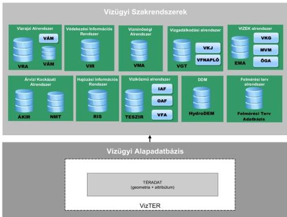
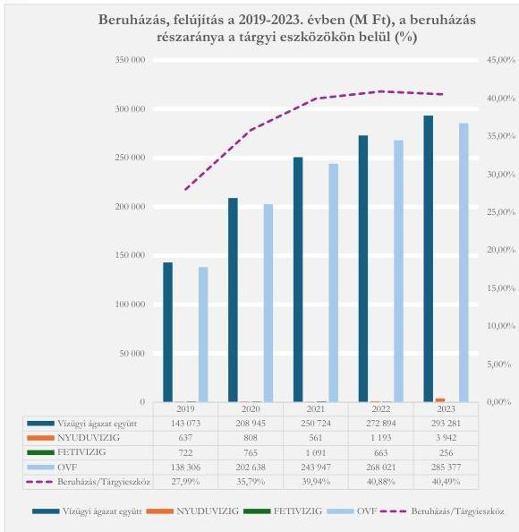

ÁLLAMI
SZÁMVEVŐSZÉK

# JELENTÉS
## Vízgazdálkodás rendszere

A vízvédelem és a vízügyi igazgatás területén a feladatellátás
rendszerének, a vízgazdálkodási és vízkár-elhárítási
vagyonelemek ellenőrzése

2026.

25149

www.asz.hu

---

ÁLLAMI
SZÁMVEVŐSZÉK

# JELENTÉS
## Vízgazdálkodás rendszere

A vízvédelem és a vízügyi igazgatás területén a feladatellátás
rendszerének, a vízgazdálkodási és vízkár-elhárítási
vagyonelemek ellenőrzése

2026.

25149

www.asz.hu

A LELNÖK 2. Szomolai Csaba
alelnök

---

ELLENŐRZÉSI IGAZGATÓSÁG:

ELLENŐRZÉSI IGAZGATÓSÁG I.

ELLENŐRZÉSI IGAZGATÓ:

SINKÁNÉ DR. CSENDES ÁGNES igazgató

ELLENŐRZÉSVEZETŐ:

DORMÁN ISTVÁN ZOLTÁN ellenőrzésvezető

Jelentéseink az interneten a
www.asz.hu címen olvashatók.

IKTATÓSZÁM: EL-4098-003/2025

TÉMASORSZÁM: 12

ELLENŐRZÉS-AZONOSÍTÓ SZÁM: V1047

---

# TARTALOMJEGYZÉK

|  ■ AZ ELLENŐRZÉS ALAPADATAI | 5  |
| --- | --- |
|  ■ AZ ELLENŐRZÉS HATÓKÖRE ÉS TERÜLETE | 8  |
|  ■ ÖSSZEFOGLALÁS | 12  |
|  ■ AZ ELLENŐRZÉS FÓKUSZTERÜLETEI | 16  |
|  ■ MEGÁLLAPÍTÁSOK | 17  |
|  ■ JAVASLATOK | 55  |
|  ■ MELLÉKLETEK | 58  |
|  I. sz. melléklet: Értelmező szótár | 58  |
|  II. sz. melléklet: Az ellenőrzött szervezetek jegyzéke | 62  |
|  III. sz. melléklet: Ellenőrzési kritériumok | 63  |
|  IV. sz. melléklet: OVF vagyonkezelési szerződésében és beszámolójában szereplő értékek | 65  |
|  V. sz. melléklet: FETIVIZIG vagyonkezelési szerződésében és beszámolójában szereplő értékek | 66  |
|  VI. sz. melléklet: NYUDUVIZIG vagyonkezelési szerződésében és beszámolójában szereplő értékek | 67  |
|  VII. sz. melléklet: Az OVF ellenőrzött tételeinek rendeltetésszerű használatba vétel időpontját követő aktiválása miatt el nem számolt értékcsökkenés kimutatása (Ft) | 68  |
|  VIII. sz. melléklet: A vízügyi ágazatban együttesen, valamint ebből a helyszínen ellenőrzött szervezetek 2020-2023. években tervezett eredeti előirányzatai és teljesített kiadásai (E Ft) | 69  |
|  IX. sz. melléklet: A védművek állapotát jellemző naturális mutatók alakulása | 71  |
|  X. sz. melléklet: A 2014–2020 éveket érintő uniós ciklusban megvalósításra tervezett kiemelt árvízvédelmi projektek körének módosításai | 72  |
|  XI. sz. melléklet: A Környezeti és Energiahatékonysági Operatív Program Plusz éves fejlesztési keretének megállapításáról szóló 1527/2023. (XII. 1.) Korm. határozat szerint megvalósítani tervezett projektek | 73  |
|  ■ FÜGGELÉK: ÉSZREVÉTELEK | 74  |
|  ■ RÖVIDÍTÉSEK JEGYZÉKE | 81  |

3

---

# AZ ELLENŐRZÉS ALAPADATAI

## AZ ELLENŐRZÉS CÉLJA

Az ellenőrzés célja annak értékelése volt, hogy az árvízvédelmi kockázatfelmérés és a kockázatkezelés tervezési és monitoring rendszerének kialakítása és működtetése megfelelő alapot biztosított-e az árvízvédelmi rendszer kockázati alapon történő fejlesztéséhez, valamint az árvízvédelemhez kapcsolódó belső ellenőrzési jelentések megállapításai, illetve javaslatai hasznosultak-e.

Az ellenőrzés célja volt továbbá annak értékelése, hogy az árvízvédelem fejlesztésére fordított kiadások hatására miként változott a rendelkezésre álló vagyon, valamint annak minőségi jellemzői. További cél annak értékelése volt, hogy a hazai árvízvédelem rendszerének fejlesztésére és karbantartására teljesített kifizetések megfeleltek-e a jogszabályi és belső előírásoknak, a karbantartási tevékenységre a közfoglalkoztatás feltételeiben bekövetkezett változások milyen hatást gyakoroltak, valamint a védekezéssel kapcsolatos kifizetésekre biztosított előirányzat – árvízi védekezésre fordított részének – igénylése és elszámolása szabályszerű volt-e.

Az ellenőrzés célként határozta meg annak értékelését, hogy a megelőzésközpontú vízkár elleni védekezésre áttérés és az éghajlatváltozás következményeként előforduló árvizek megelőzésére, a csúcsterhelések kezelésére tett intézkedések csökkentették-e az árvízi kockázatokat. Az ellenőrzés kiterjedt annak értékelésére is, hogy a biztosított hazai és uniós forrásokból teljesített kifizetések a Nemzeti Vízstratégiában és a kockázatkezelési tervekben meghatározott célokkal összhangban történtek-e, biztosított volt-e a felhasznált közpénzek védelme, azok szabályszerű, célszerű és eredményes felhasználása.

## AZ ELLENŐRZÉS TÍPUSA

Kombinált ellenőrzés.

## AZ ELLENŐRZÖTT IDŐSZAK

Az árvízvédelemhez kapcsolódó monitoring és kockázatkezelési rendszerek megfelelősége és a belső ellenőrzési jelentések megállapításainak hasznosulása esetében az ellenőrzött időszak a 2022-2023. évek (1. fókuszterület) voltak. Az árvízvédelemhez kapcsolódó vagyongazdálkodás megfelelősége (a vagyonnal kapcsolatos események lebonyolítása, elszámolása), a vagyonelemek nyilvántartása (2. fókuszterület), valamint az árvízvédelem fejlesztésére és működtetésére rendelkezésre álló források szabályszerű felhasználása (3. fókuszterület) tekintetében a 2023. év volt. A leltározási tevékenység ellenőrzése a mennyiségi felvétellel készült leltározás évére vonatkozóan (OVF 2023., FETIVIZIG, NYUDUVIZIG 2022.) történt. A vagyongazdálkodási és pénzforgalmi tevékenység és a foglalkoztatás és közfoglalkoztatás elemzése (2. és 3. fókuszterület) esetében a 2020-2023. évek voltak.

A Nemzeti Vízstratégia és a 2022. évi felülvizsgálatok során készített intézkedési tervek megvalósítása az árvízvédelmi feladatellátásban, az árvízvédelmi projektek kockázati alapú tervezése és megvalósítása (4. fókuszterület) ellenőrzése vonatkozásában az ellenőrzött időszak a 2020-2023. évek, a Nemzeti

5

---

Az ellenőrzés alapadatai---

Vízstratégiában megjelölt árvízvédelemhez kapcsolódó indikátorok megvalósítása kapcsán a 2018-2023. évek voltak.

## AZ ELLENŐRZÉS TÁRGYA

Az ellenőrzés tárgyát képezte az OVF¹-nek és a vízügyi igazgatóságoknak a Nemzeti Vízstratégiában megfogalmazott árvízvédelmi stratégiai célokhoz, valamint az annak alapján elkészített kockázatkezelési tervekhez igazodó közfeladat ellátása, a vízkár elhárítási vagyonelemek és tevékenységek, valamint az árvízvédelemmel kapcsolatos megelőző intézkedések (a karbantartások és az ahhoz kapcsolódó közfoglalkoztatás, valamint az uniós és hazai források felhasználásával megvalósított fejlesztések), továbbá az árvízi védekezésre biztosított források igénylése és elszámolása, illetve az árvízvédelmi tevékenységet megfigyelő monitoring tevékenység.

Az ellenőrzés a XIV. Belügyminisztérium fejezet 17. „Vízügyi Igazgatóságok” címen elszámolt, az árvízvédelmet érintő kiadások felhasználását, valamint a 20. cím 50. jogcímcsoport „Víz-, környezeti és természeti katasztrófa kárelhárítás” fejezeti kezelésű előirányzatból a 2023. évben az OVF által igényelt és felhasznált előirányzat igénylését és elszámolását érintette. Ehhez kapcsolódóan az OVF és a vízügyi igazgatóságok éves szakmai és költségvetési beszámolói, karbantartási tervei és kiadásai, valamint fejlesztési projektjei, továbbá kockázatkezelési és monitoring tevékenysége képezték részét az ellenőrzésnek. Emellett az ellenőrzés kiterjedt a védelmi művek kötelező éves felülvizsgálatai keretében megfogalmazott intézkedések végrehajtására.

Az ellenőrzés a 047410 Ár- és belvízvédelmi tevékenység kormányzati funkción elszámolt kiadásokból az árvízvédelemmel kapcsolatos kiadásokra összpontosított, de kitért mindazon tényezőkre, amelyek ezekkel összefüggésben meghatározták az árvízi védekezéssel kapcsolatos közfeladatellátási tevékenység feltételeinek változását.

Az ellenőrzés kiterjedt továbbá minden olyan körülményre és adatra, amely az ÁSZ² jogszabályban meghatározott feladatainak teljesítéséhez szükséges volt.

## AZ ELLENŐRZÉS JOGALAPJA

Az ellenőrzés jogszabályi alapját az ÁSZ tv.³ 1. § (3) bekezdés, 5. § (2)-(3) bekezdés, (4) bekezdés a) pont, valamint az Áht.⁴ 61. § (2) bekezdésének előírásai képezték.

## AZ ELLENŐRZÉS MÓDSZERE

Az ellenőrzést a nemzetközi standardokat irányadónak tekintve az ellenőrzési program szempontjai, az ellenőrzött időszakban hatályos jogszabályok, az ellenőrzés szakmai szabályok és módszertanok figyelembevételével végezte az ÁSZ.

Az ellenőrzési kérdések megválaszolásához szükséges bizonyítékok megszerzése az ellenőrzött szervezetek által rendelkezésre bocsátott dokumentumokra és adatokra alapozva, továbbá megfigyelés, szemle (szemrevételezés), kérdésfeltevés (információkérés), valamint elemző eljárás útján történt.

6

---

*Az ellenőrzés alapadatai*---

A felhalmozási kiadásokat, a karbantartási kiadásokat, a vagyonnövekedést és csökkenést okozó gazdasági eseményeket mintavételi eljárással kiválasztott 10-10 tétel alapján ellenőrizte az ÁSZ.

A 2023. évi vagyonnövekedés, vagyoncsökkenés szabályszerűségének ellenőrzése intézményenként rétegzett mintavételi eljárással, a legnagyobb összegű, vagyonváltozást okozó (a beszámoló 15. űrlapját befolyásoló) gazdasági események közül történő kiválasztással történt.

A 2023. évi felhalmozási kiadási előirányzatok felhasználásának és elszámolásának szabályszerűségét a beruházási és felújítási pénzforgalmi kiadások elszámolására szolgáló főkönyvi számlák szervezetenkénti tételes forgalmából rétegzett sokaságból a legnagyobb érték, továbbá kockázat alapú mintavételi eljárással választotta ki az ÁSZ. A 2023. évi karbantartások és kisjavítási szolgáltatások kiadási előirányzat felhasználásának és elszámolásának szabályszerűségét a vonatkozó főkönyvi számlák tételes forgalmából rétegzett, érték és kockázati alapú mintavételi eljárással kiválasztott tételek alapján ellenőrizte az ÁSZ. A projektek ellenőrzése ellenőrzött szervezetenként a négy-négy legnagyobb támogatással megvalósított projektre, valamint kettő-kettő kockázati alapon kiválasztott projektre irányult.

A kiválasztott mintatételek ellenőrzésének eredménye nem került kivetítésre a teljes sokaságra, a megállapítások az adott ellenőrzött mintatételek vonatkozásában kerülnek megjelenítésre.

Az ellenőrzési bizonyítékként felhasználható adatforrások közé tartoztak egyrészt az ellenőrzéshez kért dokumentumok, adatforrások, másrészt adatforrás volt minden, az ellenőrzés folyamán feltárt, az ellenőrzés szempontjából releváns információkat tartalmazó dokumentum.

Az ellenőrzés lefolytatásához az ellenőrzött szervezetek a tanúsítványok kitöltésével, valamint az ÁSZ által kért dokumentumok, adatok, információk megküldésével és az ellenőrzés során végzett interjúkhoz kapcsolódóan szolgáltattak adatokat.

7

---

# AZ ELLENŐRZÉS HATÓKÖRE ÉS TERÜLETE

Magyarország területének csaknem negyedét árvizek veszélyeztetik. A veszélyeztetett terület aránya – az ország mély fekvése miatt – az európai országok között hazánkban a legnagyobb (2,1 M hektár, 22%). Az árvizek kialakulásának kiterjedtségét és gyakoriságát növelik a megváltozott időjárási tényezők és az emberi beavatkozások, melyek veszélyeztetik az emberélet, a települések biztonságát, a természeti és az épített környezet, a gazdasági tevékenységek, az infrastruktúra, a kulturális örökségek épségét.

Az árvizek gyakoriságát és súlyosságának valószínűségét a klímaváltozáson túl növelik a gyakran szűk hullámterek, az árhullámok lefolyásának akadályai, a folyók nagyvízi levezető képességének romlása, a hullámtereken történő hordaléklerakódás, a felső, határon túli vízgyűjtőkön a fakitermelések után az elmaradt erdőfelújítások, a természetes árvíz-visszatartási képesség területhasználat miatti csökkenése, illetve az árvízvédelmi művek fenntartásának gyakori ellehetetlenülése.

Mindezen problémák kezelése érdekében a Kormány⁵ 2017-ben elfogadta a Nemzeti Vízstratégiát, amelyben a jövőkép egyik pilléreként határozta meg a vizek okozta károk megelőzésének előtérbe kerülését a védekezés helyett, az emberi élet védelme és a nemzeti vagyon kockázathoz igazított mértékű megóvását, a vízgazdálkodási rendszerek és a területhasználati módok összehangolt átalakítását úgy, hogy a víz káros bősége a vízhiány mérséklésére legyen fordítható.

Az I. rendű árvízvédelmi védvonalak kiépítési szintjét jelenleg a 2014-től hatályos MÁSZ-rendelet⁶ határozta meg folyószakaszonként. A 100 éves gyakorisággal előforduló legmagasabb árvízszint alapján a rendeletben meghatározott töltésszint kiépítésének költségét – 2015-ös áron – 1 175,0 Mrd Ft-ra becsülte az ÁKKI⁷, amelyből a 2014-2020-as uniós ciklusban 184,1 Mrd Ft fejlesztés történt, így közel 1 000 Mrd Ft-ot tett ki 2021-től a további fejlesztési igény. A fejlesztések finanszírozása szinte kizárólag uniós pénzeszközök felhasználásával történt.

A vízügyi ágazat⁸ költségvetési gazdálkodásának fedezetét az ellenőrzött időszakban a BM fejezetben tervezett „Vízügyi igazgatóságok”, továbbá a vízkárelhárítás fejezeti kezelésű előirányzat tartalmazta. (1. táblázat, 2. táblázat)

1. táblázat

## A VÍZÜGYI IGAZGATÓSÁGOK ÉS AZ OVF KÖLTSÉGVETÉSI BEVÉTELEI ÉS KIADÁSAI A 2020-2023. ÉVBEN (M FT)

|  ÉV | CÍMREND | TÖRVÉNYI SOR | ELŐIRÁNYZAT | EREDETI ELŐIRÁNYZAT |   | TELJESÍTÉS  |   |
| --- | --- | --- | --- | --- | --- | --- | --- |
|   |   |   |   |  KIADÁSOK | BEVÉTELEK | KIADÁSOK | BEVÉTELEK  |
|  2020 | 14/17/00/00/00 | Vízügyi Igazgatóságok | Felhalmozási | 4 375,0 | 0,0 | 87 780,8 | 0,0  |
|   |   |   |  Működési | 37 919,0 | 3 280,7 | 68 114,0 | 40 135,0  |
|  2021 | 14/17/00/00/00 | Vízügyi Igazgatóságok | Felhalmozási | 1 254,0 | 0,0 | 63 774,8 | 38 189,7  |
|   |   |   |  Működési | 32 372,6 | 3 280,7 | 66 274,0 | 30 785,1  |
|  2022 | 14/17/00/00/00 | Vízügyi Igazgatóságok | Felhalmozási | 1 505,9 | 0,0 | 59 646,2 | 51 125,9  |
|   |   |   |  Működési | 32 389,0 | 3 280,7 | 65 796,5 | 30 803,0  |
|  2023 | 14/17/00/00/00 | Vízügyi Igazgatóságok | Felhalmozási | 913,1 | 0,0 | 76 502,7 | 45 507,0  |
|   |   |   |  Működési | 37 689,2 | 3 280,7 | 78 903,5 | 37 780,6  |
|  Összes: | 14/17/00/00/00 | Vízügyi Igazgatóságok | Felhalmozási | 8 048,9 | 0,0 | 287 704,5 | 134 822,6  |
|   |   |   |  Működési | 140 369,8 | 13 122,8 | 278 088,0 | 139 503,7  |

Forrás: Magyarország 2020-2023. évi zárólagos alapszínűség alapján ÁSZ saját szerkesztés⁹

8

---

Az ellenőrzés hatóköre és területe

Az ellenőrzött időszakban az eredeti előirányzathoz képest a teljesítés lényegesen nagyobb értékű, két és fél, háromszoros volt évente.

Az árvízi védekezés költségeit a vízügyi ágazat költségvetésében eredeti előirányzatként nem tervezte, mivel a védekezési költségek forrását a BM¹⁰ (2024-től az EM¹¹) fejezetben – a Kormány által módosítható – felülről nyitott fejezeti kezelésű előirányzatból utólagos finanszírozással biztosította a fejezetgazda. Az előirányzat magában foglalta az aszály és jégkár, belvíz, helyi vízkár elleni védekezést is, továbbá a vízminőségi kárelhárítás és a helyreállítás költségeinek fedezetét.

A víz-, környezeti és természeti katasztrófa elhárítására a 14/20/01/50/00 fejezeti kezelésű előirányzatból 2020-2023. években a BM 12,6 Mrd Ft-ot költött, amelyből a 2023. évben a vízügyi ágazat adatai szerint 1,7 Mrd Ft volt az árvízvédelemre biztosított kiadás.

A fejezeti kezelésű előirányzat kiadásainak és bevételeinek alakulását mutatja be az ellenőrzött időszakban a 2. táblázat.

2. táblázat

# **VÍZ-, KÖRNYEZETI ÉS TERMÉSZETI KATASZTRÓFA KÁRELHÁRÍTÁS TÖRVÉNYI ELŐIRÁNYZATA ÉS TELJESÜLÉSE A 2020-2023. ÉVBEN (M FT)**

|  ÉV | CÍMREND | TÖRVÉNYI SOR | ELŐIRÁNYZAT | EREDETI ELŐIRÁNYZAT |   | TELJESÍTÉS  |   |
| --- | --- | --- | --- | --- | --- | --- | --- |
|   |   |   |   |  KIADÁSOK | BEVÉTELEK | KIADÁSOK | BEVÉTELEK  |
|  2020 | 14/20/01/50/00 | Víz-, környezeti és természeti katasztrófa kárelhárítás | Felhalmozási | 0,0 | 0,0 | 384,8 | 0,0  |
|   |   |   |  Működési | 1 200,0 | 0,0 | 3 490,4 | 0,0  |
|  2021 | 14/20/01/50/00 | Víz-, környezeti és természeti katasztrófa kárelhárítás | Felhalmozási | 0,0 | 0,0 | 6,2 | 0,0  |
|   |   |   |  Működési | 1 200,0 | 0,0 | 3 219,8 | 0,0  |
|  2022 | 14/20/01/50/00 | Víz-, környezeti és természeti katasztrófa kárelhárítás | Felhalmozási | 0,0 | 0,0 | 19,7 | 0,0  |
|   |   |   |  Működési | 1 200,0 | 0,0 | 1 815,8 | 8,7  |
|  2023 | 14/20/01/50/00 | Víz-, környezeti és természeti katasztrófa kárelhárítás | Felhalmozási | 0,0 | 0,0 | 53,6 | 0,0  |
|   |   |   |  Működési | 1 200,0 | 0,0 | 3 566,6 | 46,1  |
|  Összesen | 14/20/01/50/00 | Víz-, környezeti és természeti katasztrófa kárelhárítás | Felhalmozási | 0,0 | 0,0 | 464,3 | 0,0  |
|   |   |   |  Működési | 4 800 | 0,0 | 12 092,6 | 54,8  |

Forrás: Magyarország 2020-2023. évi zárszámadás alapján ÁSZ saját szerkesztés

A vízügyi igazgatási szervezet 2023. április 1. és 2023. június 30. közötti vízkárelhárítási tevékenysége költségvetési fedezetének biztosításáról szóló 1530/2023. (XII. 5.) Korm. határozat alapján az előirányzatot közel 2,5 Mrd Ft-tal a Kormány megemelte.

9

---

Az ellenőrzés hatóköre és területe

A 2013. évi dunai árvizet követően 2024. szeptemberében volt ismét rendkívüli árvíz a Dunán. 2024-ben a vízügyi szervezetek árvíz elleni védekezési műveleteinek kiadásait 2,6 Mrd Ft-ra becsülték a szakértők, a honvédelmi és a katasztrófavédelmi kiadások nélkül. A Kormány 1313/2024. (X. 22.) Korm. határozatában a 2024 szeptemberében a Dunán és mellékvízfolyásain levonuló árhullám miatt végzett árvízi védekezési és vízminőség-kárelhárítási tevékenységgel összefüggő feladatok kapcsán jóváhagyta a költségek finanszírozása céljából a Kvtv. 1. melléklet XVII. Energiaügyi Minisztérium fejezet, 20. Fejezeti kezelésű előirányzatok cím, 37. Víz-, környezeti és természeti katasztrófa kárelhárítás alcím 4,4 Mrd Ft összeggel történő túllépését, amelyből a vízügyi szervek részére 2,6 Mrd Ft állt rendelkezésre. Az árvízi védekezés sikerességében kiemelt szerepe volt 2024-ben annak, hogy a Dunán és mellékfolyóin a védművek fejlesztésére 2014-től kezdődően 167,1 Mrd Ft-ot fordított a vízügyi ágazat.

A vízügyi ágazatban működő költségvetési szervek közfeladataik tekintetében a vízgazdálkodásról szóló 1995. évi LVII. törvényben (továbbiakban: Vgtv.¹²), a vízügyi igazgatási és a vízügyi, valamint a vízvédelmi hatósági feladatokat ellátó szervek kijelöléséről szóló 223/2014. (IX. 4.) Korm. rendeletben (továbbiakban: Vízhat. Korm. rendelet¹³), a vízvédelmi igazgatási feladatokat ellátó szervek kijelöléséről, és egyes vízügyi tárgyú kormányrendeletek módosításáról szóló 366/2015. (XII. 2.) Korm. rendeletben, valamint a vonatkozó jogszabályokban megjelölt feladatokat látták el.

A vízügyi igazgatási szervek látták el a Vgtv. alapján az állami tulajdonban lévő vizek és vízilétesítmények, a felszín alatti vizek víztartó képződményeinek és a felszíni vizek medreinek vagyonkezelését. A vízügyi igazgatási szervek az Országos Vízügyi Főigazgatóság (OVF) és 12 területi vízügyi igazgatóság.

Az OVF 2024. július 31-ig a belügyminiszter, azt követően az energiaügyi miniszter irányításával működő költségvetési szerv, vezetője a főigazgató, illetékessége a hatáskörébe tartozó ügykörben az egész országra kiterjed. Az OVF 2012. január 1-jén a Kormány által alapított költségvetési szerv, melyről a vízügyi igazgatási szervek irányításának átalakításával összefüggésben hozott 300/2011. (XII. 22.) Korm. rendelet¹⁴ rendelkezett. A jogállását a Vízhat. Korm. rendelet határozta meg. Ellátja a vízügyi igazgatóságok középírányítói feladatait, a vizek kártételei elleni tevékenységeket és a vizekkel, vízi-létesítményekkel kapcsolatos vízgazdálkodási, vagyongazdálkodási, igazgatási feladatokat.

A Felső-Tisza-vidéki Vízügyi Igazgatóság (FETIVIZIG¹⁵) és a Nyugat-dunántúli Vízügyi Igazgatóság (NYUDUVIZIG¹⁶) 1953. október 1-jén a Kormány által alapított költségvetési szerv, a jogállásukat meghatározó szabály a Vízhat. Korm. rendelet, alapításukról, átalakításukról, megszüntetésükről a Kormány rendelkezhet.

Az árvízvédelmi informatikai rendszereket az ellenőrzött időszakban a VIR¹⁷ és az ÁKIR¹⁸ rendszerek jelentették.

A VIR alkalmazás különböző modulokban tartalmazza a VIZIG-ek ügyeleteseit és elérhetőségüket, a védekezési erőforrásokat (raktári készletek, humán erőforrások, gépek, szállítóeszközök), a védekezési fokozatok elrendelését és azok változását, a védekezések becsült költségeit, a vezényléseket, a napi árvízvédekezési tevékenységéről szóló különböző szinten elkészített jelentéseket, a tapasztalt jelenségeket, a beavatkozásokat, valamint a hidrometeorológiai adatokat. Az adatbázis tartalmazza továbbá az adott védelmi szakaszra, az elrendelésre és az elrendelés körülményeire vonatkozó releváns adatokat (töltésszakaszok, gátőjárások, védelmi szakasz adatai, vízállás, változás, elrendelés ideje stb.).

Az EU¹⁹ Árvízi Irányelve²⁰ végrehajtására kidolgozott ÁKIR kockázatkezelési és információs rendszerként, többlépcsős projekt keretében 2009-2021 között valósult meg. Ennek keretében kialakították a veszély- és kockázati térképek készítésének és a kockázatkezelés tervezésének metodikáját. Meghatározták a szükséges adatok körét annak érdekében, hogy egységes módon kerüljön meghatározásra az ár- és belvízi kockázat, és a

10

---

*Az ellenőrzés hatóköre és területe*---

fejlesztések során objektíven meg lehessen határozni a prioritási sorrendet. Az EU elvárásainak megfelelően elkészült az előzetes árvízi kockázatértékelés és kockázatbecslés, valamint megtörtént az adatok előállítása és adattári elhelyezése. Megvalósult az országos árvízi kockázati térképezés és a stratégiai kockázati tervezés. Az ÁKIR modellezés az ÁKK2 szerint alkalmas a rész öblözeti bontásra, ami azt követően végezhető el, hogy a teljes öblözetre elkészült a védett ártéri modell, a kiírt szakadó vízhozamokkal, szakadási helyekkel. Elkészültek az elöntési vízmélység raszterek az összes szükséges szcenárióra, továbbá az alkalmazható nyílt árterek – kisvízfolyások, védett árterek – töltésezett folyószakaszok modelljeinek készítésére.

Az Árvízi Irányelv hatévenként ismétlődő felülvizsgálati kötelezettséget írt elő, melynek munkálatait Magyarország „az előzetes árvízi kockázatbecslés, a veszély- és kockázati térképek, a kockázatkezelési tervek első felülvizsgálata” című projekt keretében 2021-ben végezte el, melynek keretében készült el az ÁKK2. A projektben a metodika, illetve a veszély- és kockázati térképek első felülvizsgálata, aktualizálása történt meg teljes mértékben EU forrásból.

Az árvízvédelem alapvető monitoring és kockázatkezelési rendszerei ellenőrzése a VIR és az ÁKIR rendszerek adatokkal történő feltöltésére, folyamatos frissítésére, az informatikai rendszerek szinkronizált működésére, a belső ellenőrzés értékelése a kockázat alapú tervezés megítélésére és a jelentések megállapításának, javaslatainak hasznosulására irányult.

A vagyongazdálkodáshoz kapcsolódóan ellenőriztük a mennyiségi felvétellel történő leltározást, továbbá a 2023. évi mérlegek leltárral történő alátámasztását. Az állami vagyon kezelése körében értékeltük a vagyonkezelési szerződésekben és a mérlegben szereplő vagyon közötti egyezőséget, valamint ellenőriztük szervezetenként kiválasztott tételek alapján a vagyonnövekedést és vagyoncsökkenést befolyásoló események elszámolásának a jogszabályi és belső előírásoknak való megfelelőségét. Értékeltük a vízügyi ágazat vagyoni helyzetét jellemző mutatók alakulását a 2020-2023. években. Ellenőriztük az árvízvédelmi műtárgyak rendszeres állapotfelméréseinek 2023. évi, és szakvizsgálatainak ellenőrzött időszaki megvalósítását.

A 2023. évi pénzforgalmi kiadásokhoz kapcsolódóan szervezetenként kiválasztott tételek alapján ellenőriztük a fejlesztési és karbantartási kiadások kifizetésének szabályszerűségét. A vízügyi ágazatra vonatkozóan értékeltük – az ellenőrzött időszakban – a működtetéshez és fenntartáshoz, valamint a fejlesztésekhez szükséges források rendelkezésre állását, valamint a humánerőforrások helyzetének alakulását. Az ellenőrzés kiterjedt a védekezési célokat szolgáló 2023. évi fejezeti kezelésű előirányzat igénybevétele és elszámolása szabályszerűségének megítélésére, továbbá értékelte, hogy az árvízvédelemhez kapcsolódó fenntartási feladatok ellátásához rendelkezésre álló közfoglalkoztatotti létszám a védművek fenntartása során jelentkező igények végrehajtását biztosította-e.

Értékeltük a 2022. évi őszi felülvizsgálat során készített intézkedési tervek árvízvédelemre vonatkozó intézkedései végrehajtásának 2023. évi eredményességét, valamint az ellenőrzött időszakban befejezett árvízvédelmi projektek és a 2023. végén folyamatban lévő projektek esetében a kockázati alapú tervezés és megvalósítás érvényesülését. Értékeltük a Nemzeti Vízstratégiában meghatározott, számszerűsített árvízvédelmi célkitűzések (indikátorok) teljesítésének eredményességét, továbbá a 2018-2023. közötti időszakban a csúcsterhelések kezelése érdekében tett intézkedések eredményességét. Az ellenőrzés részletes kritériumjegyzékét a III. sz. melléklet tartalmazza.

11

---

# ÖSSZEFOGLALÁS

„Az árvíz elkerülhetetlen természeti jelenség.” (Árvízi Irányelv) Az ellenőrzött időszakban a közel 150 éves védelmi tapasztalattal, Európában is egyedülálló védelmi szervezettel és szakértelemmel rendelkező magyar vízügyi ágazat sikeresen kezelte a bekövetkezett árvízi helyzeteket és komoly erőfeszítéseket tett a védekezőképesség javítása és fenntartása érdekében. Mindemellett valószínűsíthetően a jövőben is nő az árvizek kockázata, figyelemmel – többek között – az emberi beavatkozások természeti folyamatokra gyakorolt hatására és az éghajlatváltozásra. Ahogyan azt az Árvízi Irányelv és a Nemzeti Vízstratégia is hangsúlyossá teszi, az árvízkockázatok értékelése és kezelése közösségi és nemzeti szinten egyaránt hozzájárul a káros következmények csökkentéséhez. A védekezésre felkészülés mellett rendkívüli jelentőségű a vizek okozta károk megelőzése, az emberi élet védelme és a nemzeti vagyon kockázathoz igazított mértékű megóvása.

Ezek miatt tartotta különösen fontosnak az ÁSZ az árvízvédelmi rendszer kockázati alapon történő fejlesztésének, a kockázatok feltárását és kezelését támogató monitoring és kockázatkezelési rendszerek megfelelőségének értékelését; az árvízvédelmet szolgáló nemzeti vagyon helyzetének, a védművek fenntartásának, fejlesztésének, valamint a humán erőforrások rendelkezésre állásának vizsgálatát; a védekezésre biztosított előirányzatok igénylésének és felhasználásának ellenőrzését.

Az árvízvédelmi kockázatfelmérés és a kockázatkezelés tervezési és monitoring rendszere megfelelő alapot biztosított az árvízvédelmi rendszer kockázati alapon történő fejlesztéséhez. A fejlesztési projektek kijelölése során 2023. év végétől jelent meg erőteljesebben a differenciált védekezési mechanizmus szerinti vagyoni kockázatok szerinti priorizálás. A csúcsterhelések kezelése érdekében tett intézkedések eredményesek voltak. A Nemzeti Vízstratégiában meghatározott árvízvédelmi indikátorok többségében az ellenőrzött időszakban a kitűzött célértékektől jelentős elmaradás volt tapasztalható.

Az ár- és belvízvédelmi kiadások teljeskörű és tényleges értéket tükröző kimutatása érdekében a számviteli szabályok betartásával nagyobb figyelmet kell fordítani arra, hogy az OVF a megvalósított projektek teljesített kiadásait a megfelelő kormányzati funkción mutassa ki. Az OVF és a NYUDUVIZIG mérlegében szereplő vagyon értéke nem a használattal arányos értéken került kimutatásra, ami az OVF mérlegében jelentős összegű hibát okozott, továbbá sértette a valódiság számviteli alapelvét mindkét szervezetnél.

Az árvízvédelmi kockázatfelmérés és a kockázatkezelés tervezési és monitoring rendszerének kialakítása és működtetése a 2021. évtől megfelelő alapot biztosított az árvízvédelmi rendszer kockázati alapon történő fejlesztéséhez. Az ellenőrzött időszakban (2020-2023. években) befejezett projektek esetében még a jogszabálykövetés és az árvízvédelmi töltések magasságnövelését célzó szempontok voltak hangsúlyosak az uniós forrásokból megvalósuló fejlesztések során. A tíz befejezett árvízvédelmi projektből hat projekt esetében a vagyonkockázati szempont nem érvényesült, azok nem kiemelt vagy magas kockázatú (rész)öblözetre irányultak. A további négy ellenőrzött projekt a vagyoni kockázatok alakulására nem volt hatással, mert az ágazati eszközbeszerzés, a műtárgy rekonstrukciók, illetve egy projekt előkészítés nem csökkentette a mentett oldali vagyoni kockázatot. A 2023 végén folyamatban lévő projekteknél kimutathatóan érvényesült a vagyonkockázati szempontú kockázatértékelés, a hazai forrásokból megvalósítani tervezett fejlesztési projektek magas kockázatú árvízi öblözeteket érintő fejlesztéseket irányoztak elő.

12

---

Összefoglalás

A csúcsterhelések kezelése érdekében tett intézkedések az ÁSZ véleménye szerint eredményesek voltak. Ezt alátámasztja az is, hogy a 2024. év szeptemberében a Dunán levonult árvíz esetében a védekezés sikeres, a mentett oldalon jelentkező kár kis mértékű volt.

A vízkárelhárítás és védekezés érdekében kialakított információs rendszer (VIR) fejlesztése, adatokkal történő feltöltése, továbbá az adatok folyamatos frissítése, naprakész rendelkezésre állása biztosított volt.

Az Árvízi Kockázatkezelési Információs Rendszer (ÁKIR) adatainak – a befejezett projektek műszaki adatainak üzembehelyezést követő OVF általi – folyamatos feltöltése jelentősen támogatná a megvalósított projektek eredményességének, hatékonyságának naprakész megítélhetőségét, mivel a rendszerben az adatokat az ellenőrzött időszakban folyamatosan nem rögzítették, így az adatok naprakész rendelkezésre állása nem volt biztosított. Bár a kialakított rendszer lehetővé tette az egyedi, projektalapú fejlesztések vizsgálatát, előkészítését, tervezését és változatértékelését is, ezzel a lehetőséggel azonban a projektek megvalósítása során az OVF csak korlátozottan élt. Az ÁKIR-t a vízügyi ágazatban elsősorban az Árvízi Irányelv által előírt veszély- és kockázati térkép állományok tárolására használták, valamint a projektek, illetve beavatkozások kockázatértékelésére alkalmazták, továbbá, hogy a rendszer egységes metodika alapján összegyűjtse, kezelje, elemezze és megjelenítse azokat az adatokat, amelyek az árvízi kockázatkezelési tervezéshez és döntéshozatalhoz szükségesek.

A megvalósult projektek ex-post értékelése, tényleges kockázatbecslése a hat évente készülő ÁKK2²¹ felülvizsgálat során, a 2027-ben esedékes EU felé teljesítendő Országjelentés elkészítése érdekében történik meg.

A célkitűzések teljesítésével összefüggésben a Nemzeti Vízstratégia az árvízvédelmi intézkedéseket érintően indikátorokat is meghatározott. A meghatározott négy árvízvédelmi indikátor közül három esetében a teljesítés a kitűzött célértéktől jelentősen elmaradt. A 2020-ra előírt célértékek 2023-ra is alulteljesültek. A Tisza menti töltéskiépítettség a stratégiában szereplő 70%-os célérték helyett a teljesülés 11,7% lett. A hullámtéri nagyvízi mederkezelési beavatkozásokra előírt célértéknek mindössze 0,8%-a teljesült. A Tisza-völgyben tervezett további három vésztározóból csak egy valósult meg. A negyedik indikátorként meghatározott vagyoni és emberi élet kockázatok csökkentése területén bekövetkezett változás – naprakész adatok hiányában – nem volt megállapítható.

A felhasznált, jellemzően uniós forrásokból teljesített, felhalmozási célú kifizetések a Nemzeti Vízstratégiában és a kockázatkezelési tervekben meghatározott célokkal összhangban történtek. A kockázatkezelésben az EU által 2007-ben elfogadott Árvízi Irányelvhez képest azonban jelentős késedelemmel, csak 2021-től helyeződött át a hangsúly a mentett oldali – az ÁKK2 szerint olcsóbb és hatékonyabb – vagyonkockázati szempontokat előtérbe helyező védekezésre.

Az ellenőrzött szervezetek a 2023. évben az árvízvédelemhez kapcsolódó vagyonelemek leltározását elvégezték, de az OVF 2023-ban és a NYUDUVIZIG 2022-ben a mennyiségben felvett, a mérleget alátámasztó leltárt hiányosan állította össze. Az üzembehelyezéshez kapcsolódó – a vízügyi ágazatra jellemző – sajátos részletszabályok meghatározása hiányában kialakult helytelen gyakorlat következtében a rendeltetésszerű használatbavételt követően későbbi időpontban történtek meg az üzembehelyezések. Így a rendeltetésszerű használatbavétel és az üzembe helyezési jegyzőkönyv elkészítése közötti időszakra vonatkozóan elmaradt az eszközök értékcsökkenésének elszámolása. Az OVF-nél és a NYUDUVIZIG-nél a vagyonnövekedés gazdasági eseményeinek elszámolása nem felelt meg a jogszabályi előírásoknak, ami a mérlegben kimutatott vagyon értékében az OVF-nél jelentős összegű, a NYUDUVIZIG-nél nem jelentős összegű hibát okozott, továbbá sérült a valódiság számviteli alapelve.

13

---

Összefoglalás---

A FETIVIZIG-nél az árvízvédelemhez kapcsolódó vagyonelemek nyilvántartása és a vagyoncsökkenések elszámolása a 2023. évben szabályszerűen történt. Az OVF-nél és a NYUDUVIZIG-nél a beruházások részletező nyilvántartása nem felelt meg a jogszabályi előírásoknak, a vagyoncsökkenések elszámolása szabályszerű volt.

Az **árvízvédelem fejlesztésére fordított kiadások** hatására az ágazati szintű vagyon mutatói trendszerű javulást mutattak vagy szinten tartásuk volt megfigyelhető (azzal a megjegyzéssel, hogy a kiszámított mutatókat a jelzett hibás mérlegadatok okán korrigálni szükséges, mivel a hibás mérlegadatok miatt a kiszámított mutatók pozitívabb képet mutattak a valósnál.

A kedvező használhatósági és eszközpótlási mutatók annak voltak köszönhetőek, hogy a vízügyi ágazat 2020-2023. években felhalmozási célra 287,7 Mrd Ft-ot fordított elsősorban uniós forrásokból, amelyből az árvízvédelmi célokat szolgáló beruházások 184,1 Mrd Ft-ot tettek ki.

Az árvízvédelem területén – az ellenőrzött időszakban – a foglalkoztatás személyi feltételei kedvezőtlenül alakultak. A műszaki szakképzettséggel rendelkezők, továbbá a közfoglalkoztatottak létszáma csökkent és a szakirányú végzettséggel rendelkezők aránya is alacsonyabb lett. A vízügyi ágazaton belül a fluktuáció emelkedett, az állások betöltése nehezebbé vált.

A vízügyi ágazatban az árvízvédelem működtetésére és fenntartására fordított kiadásokra 2020-2022. között évről-évre nominálisan csökkenő nagyságrendű források álltak rendelkezésre, és a 2023. évi kiadások sem érték el a 2020. évi szintet. Az árvízvédelmi művek fenntartási kiadásainak egyre növekvő arányát a közfoglalkoztatottaknak kifizetett személyi juttatások és járulékok jelentették. Az árvízvédelmi karbantartások, illetve fenntartási feladatok nagy részét biztosító közfoglalkoztatotti létszám tendenciája csökkenő volt, a tényleges létszámuk 2020-ról 2023-ra 28,7%-kal csökkent. A vízügyi ágazat összes közfoglalkoztatottjából az árvízvédelem területén foglalkoztatottak aránya 2020-2022 között 44,0% körül stagnált, amelyet 2023 évben a vízügyi igazgatóságok 4,5 százalékponttal (10%-kal) megemeltek annak érdekében, hogy a védművek karbantartási, fenntartási feladataiban legalább a szinten tartást biztosítani tudják. Az árvízvédelem területén foglalkoztatott közfoglalkoztatotti létszám mintegy háromnegyede fenntartási és karbantartási tevékenységet végzett a védművek és műtárgyak megfelelő állapotának elérése érdekében.

Az ÁSZ véleménye szerint kiemelten fontos, hogy az árvízvédelmi művek védőképességének fenntarthatósága, a szakmérnöki ismereteket és speciális szoftvereket igénylő nyomáspróbák, geodéziai mérések teljeskörű elvégzése biztosított legyen. A FETIVIZIG és a NYUDUVIZIG 2022. évi árvízvédelmi műveket érintő őszi felülvizsgálatok során megállapított hiányosságok megszüntetése érdekében nem intézkedtek maradéktalanul, mert a védművek karbantartására, illetve fenntartására nem rendelkeztek elegendő forrással.

A FETIVIZIG és a NYUDUVIZIG 2022. évi árvízvédelmi műveket érintő őszi felülvizsgálatok során megállapított hiányosságok megszüntetése érdekében nem intézkedtek maradéktalanul, mert a védművek karbantartására, illetve fenntartására nem rendelkeztek elegendő forrással.

A védekezéssel kapcsolatos kifizetésekre – a víz-, környezeti- és természeti katasztrófa kárelhárítás fejezeti kezelésű előirányzatból – **kapott pénzeszközök igénylése és elszámolása** szabályszerű volt. A fejezeti kezelésű előirányzat felhasználásakor az árvízvédelmi kiadások elkülönített nyilvántartását az ellenőrzött szervezetek biztosították. A kiadások utólagos finanszírozása azonban kihívást jelentett a vízügyi igazgatóságoknak, mert a FETIVIZIG és a NYUDIVIZIG más célra kapott források átmeneti igénybevételével tudta csak a védekezési kiadásokat fedezni.

14

---

Összefoglalás---

Az ellenőrzött szervezetek által alkalmazott számviteli program biztosította az árvízvédelmi kiadások elkülönítését. A gyakorlatban azonban – egységes számviteli szabályozás hiányában – az ágazatban működő költségvetési szervek az elkülönítést és a kormányzati funkción való elszámolást nem azonos módon alkalmazták a számviteli elszámolások során és a Számv. tv-ben foglaltak ellenére annak a vízügyi ágazatra jellemző sajátos szabályait sem határozták meg számviteli politikájukban. Emiatt az ár- és belvízvédelem kormányzati funkción elszámolt kiadások nem mutatták teljeskörűen a ténylegesen felmerült árvízvédelmi kiadásokat. Ez kockázatot jelent az ár- és belvízvédelem kormányzati funkción elszámolt kiadások más EU tagországokkal való összehasonlításakor, illetve a kiadások GDP-n vagy a költségvetési kiadásokon belüli részesedésének értékelésekor.

Az OVF 2022-2023 években egy belső ellenőrzést végzett az árvízvédelem területéhez kapcsolódóan, amelynek javaslatai az érintett vízügyi igazgatóság forráshiánya miatt részben hasznosultak. A pénzügyi forrásokat igénylő javaslatokat az érintett igazgatóság nem hajtotta végre, míg az adminisztratív javaslatok végrehajtásra kerültek. A NYUDUVIZIG és a FETIVIZIG belső ellenőrzési tervei elkészítése során a tervezést megelőző kockázatelemzés eredményeit nem vette figyelembe, ezért az árvízvédelem területét érintő belső ellenőrzést nem végeztek.

Az ÁSZ által feltárt kockázatok, és problémák területén történő előrelépés és az árvízi védekezési képesség javítása érdekében az ÁSZ 20 javaslatot fogalmazott meg az ellenőrzött szervezetek számára.

15

---

# AZ ELLENŐRZÉS FÓKUSZTERÜLETEI

1. Az árvízvédelemhez kapcsolódó monitoring és kockázatkezelési rendszerek megfelelősége és a belső ellenőrzési jelentések megállapításainak hasznosulása

2. Az árvízvédelemhez kapcsolódó vagyongazdálkodás megfelelősége, az árvízvédelemhez kapcsolódó vagyonelemek nyilvántartása

3. Az árvízvédelem működtetésére és fejlesztésére rendelkezésre álló források felhasználása, a közfoglalkoztatás értékelése

4. A Nemzeti Vízstratégia és a felülvizsgálatok során készített intézkedési tervek megvalósítása az árvízvédelmi feladatellátásban, az árvízvédelmi projektek kockázati alapú tervezése és megvalósítása

16

---

# MEGÁLLAPÍTÁSOK

## 1. Az árvízvédelemhez kapcsolódó monitoring és kockázatkezelési rendszerek megfelelősége és a belső ellenőrzési jelentések megállapításainak hasznosulása

### Összegző megállapítás

A VIR, mint védekezési információs rendszer naprakészen rendelkezésre állt. Az ÁKIR kockázatkezelési és információs rendszer funkcióját korlátozottan töltötte be, mivel a mentett oldali vagyoni kockázatok változásának folyamatos nyomon követésére a vízügyi igazgatóságok nem használták. Az OVF által a 2022. évben végzett belső ellenőrzési jelentések megállapításai, javaslatai forráshiány miatt csak részben hasznosultak.

### 1.1. számú megállapítás

A vízkárelhárítás és védekezés érdekében kialakított monitoring rendszer (VIR) fejlesztése, adatokkal történő feltöltése, továbbá az adatok folyamatos frissítése megtörtént, az adatok naprakészen rendelkezésre álltak. Az árvízvédelmi kockázatkezelés és a kockázatfelmérés tervezési és monitoring rendszerében (ÁKIR) a megvalósult árvízvédelmi fejlesztések hatására bekövetkezett kockázatváltozást és a projektek műszaki adatait az ellenőrzött időszakban folyamatosan nem rögzítették, így az adatok naprakész rendelkezésre állása nem volt biztosított.

A VIR védekezési és vízkárelhárítási helyzetben, továbbá azon kívül is az adatok és az információk (parancsok és jelentések) napi elérését biztosító alkalmazás. Az ellenőrzött időszakban a VIR-t is kiszolgáló alapadatbázis fejlesztése is megtörtént a „Vízgazdálkodási Információs Rendszer és téradatbázis fejlesztése KEHOP-1.1.0-15-2022-00015” projekt keretében. A vízügyi igazgatóságok napi jelentést készítettek az árvízvédelmi rendszer működéséről, amelyet a VIR-ben az OVF összegezve és egyéb adatokkal kiegészítve továbbított az illetékes minisztérium részére napi rendszerességgel.

Az ÁKIR, mint kockázatelemzési és információs rendszer egy olyan, az EU részére történő adatszolgáltatást támogató alkalmazás, amely egy adott időpillanathoz képest számolja a mentett oldali kockázatok változását. A vízügyi ágazatban az ÁKIR az EU részére készülő Országjelentés elkészítését szolgálja. A két információs rendszer más-más célokat szolgált, ezért az ellenőrzött időszakban alapadataik sem kapcsolódtak egymáshoz.

Az ÁKIR, mint vízgazdálkodási alapadatokat felhasználó rendszer része a VIZIR³²-nek, de az ÁKIR egyedi adatbázisokkal működött, melyeket a Vízügyi Alapadatbázisból szereztek be. A mentett oldali kockázatváltozás kiszámítása és rögzítése hatéves ciklusokban történik, mivel a megvalósított projektek hatására bekövetkezett kockázatváltozások folyamatos feltöltéséhez a vízügyi ágazat nem rendelkezett forrással. Az ÁKIR műszaki adattartalmának naprakész vezetésére vonatkozóan a vízügyi ágazatban nem volt előírás, belső szabályozás. Az ellenőrzött időszakban lezárult árvízvédelmi projektek többsége által elért kockázatcsökkenések értékelése a következő, 2027. évi Országjelentésben lesz esedékes.

17

---

Megállapítások

Az OVF által használt vízügyi szakrendszerek struktúráját a 1. ábra mutatja be. A Vízügyi Adatbázis (VizTER)23 a vízügyi ágazatban kezelt vízgazdálkodási alapadatok és objektumok strukturált, digitális formátumú, adatbázis alapú egységes nyilvántartó és adattároló rendszere. A Vízügyi szakrendszerek ezen Vízügyi Alapadatbázisból szerzik a működésüknek megfelelő adatokat. A szakrendszerek különböző modulokból, alkalmazásokból24 állnak, a különböző szakrendszerek azonban egymással nem állnak közvetlen kapcsolatban.

1. ábra

Forrás: OVF

Az ÁKIR-ba adatbetöltést kizárólag az OVF végzett, a 12 Vízügyi Igazgatóság jogosultsága az adatok lekérdezésére korlátozódott. Az ellenőrzött igazgatóságok egy-egy ÁKIR végponttal rendelkeztek, de a NYUDUVIZIG az adatbázist tevékenységéhez nem használta. A FETIVIZIG az operatív tevékenység esetén a védelemvezetői döntések megalapozásához tervezést és modellezést végzett, amelyhez az ÁKIR-ban lévő információkat is felhasználta, valamint az elöntés, veszély és kockázati térképeket az operatív működés során a településrendezési és árvízlokalizációs terveknél is használta.

18

---

Megállapítások

Az OVF tájékoztatása szerint az informatikai rendszerek közötti adatforgalomnak, a napi adatok publikálásának az ellenőrzött időszakban akadálya volt, hogy a térinformatika adatrendszerének kezelésére alkalmas korszerű környezetet biztosító szerverek beszerzéséhez nem rendelkezett forrással. Emiatt régi szervereken lejárt licencekkel futottak ilyen programok, amelyekhez frissítés nem tartozott.

Az informatikai rendszerek és adatbázisok használata során gondot okozott a vízügyi ágazatban, hogy több esetben nem az OVF az adatgazda és más szervezethez tartozó informatikai rendszereket is használnia kellett a működése során. Vannak olyan vízügyi szakrendszerek, amelyek nem vízügyi kezelésűek, és vannak olyan szakrendszerek, amelyeket más felhasználók is használtak. A változások, szerepkörök és jogosultságok, adatok halmazának áttekintése folyamatosan fejlesztéseket és utánkövetést igényeltek az OVF részéről.

Az ÁKIR nem egy különálló programként készült el, hanem az ArcGIS$^{23}$ alapú desktop térinformatikai szoftverbe ágyazott, Magyarország Árvízkockázat kezelését kiszolgáló, mérnöki tervezést támogató bővítmények kerültek kifejlesztésre, leprogramozásra 2009-2021 között. Az akkor kialakított szoftverbővítmények célirányosan az ÁKK2 megvalósítását szolgálták, az akkori adottságoknak megfelelően. Az ÁKIR rendszer különböző vízügyi és meterológiai rendszerek alapadat objektumtípusait használta, mint bemenő paraméter, így logikai összeköttetésben volt a később kialakított országos térinformatikai környezettel, azonban ez nem jelentett folyamatos, dinamikus adatkapcsolatot.

Az ellenőrzött időszakban és azt megelőzően a folyók menti töltészeti ártéri öblözetek veszélytérképei 20x20 m-es raszterben, 2D hidrodinamikai modellezéssel készültek, ahol az árvízvédelmi töltések egyes szakaszain az ÁKIR rendszerben vizsgálatra kerültek a koronaszinthez, az esetleges geotechnikai gyengeséghez, továbbá a különböző előfordulási valószínűségekhez tartozó árhullámokból esetlegesen bekövetkezhető gátszakadások elöntésének hatásai. Minden egyes területre térképsorozat készült, melyek a térinformatikai adatbázisban kerültek elhelyezésre.

Az egyes ártéri öblözetekre elkészültek az elöntési térképsorozatok, amelyek megmutatták, hogy mely területeket veszélyeztetett a feltételezett gátszakadásokból adódó elöntés, illetve azt, hogy azokon a területeken milyen maximális vízmélységek alakulnak ki a szcenárióban szereplő hidrológiai, hidraulikai feltételek következtében. Az előállított adatbázis és modellrendszer (ÁKIR) segítségével a jövőbeli árvizekhez kapcsolódó térképek elkészítését tette lehetővé.

A modellezési eredmények, valamint az azokból előállított elöntés- és veszélytérkép állományok az ÁKIR térinformatikai rendszerben további vizsgálatokra alkalmas adatstruktúrában rendelkezésre álltak, így a későbbiekben azokból bármely vízmélység tartományra előállíthatók új veszélytérképek.

A kockázati térképek alapján a kockázatértékelés részét képezte a magas és elfogadható kockázatú területek azonosítása és a magas kockázat eredetének meghatározása. A kockázati értékelés az ÁKIR információs rendszer adatbázisára és az azon belül kapott eredményekre épült.

Az árvízvédelmi kockázatfelmérés és a kockázatkezelés tervezési és monitoring rendszerét (ÁKIR) elsősorban az Árvízi Irányelv által előírt veszély- és kockázati térkép állományok előállítására használta a vízügyi ágazat. A kialakított rendszer a stratégiai tervezés mellett alkalmas volt egyedi, projektalapú fejlesztések vizsgálatára, előkészítésére, tervezésére, változatértékelésére is, mivel az EU Kohéziós Programjának keretében történő kiemelt fejlesztések esetében a tervezéshez és a döntéstámogatáshoz alkalmazható adatokat tartalmazott.

19

---

Megállapítások

Az ellenőrzött időszakban az ÁKIR adatbázisában lévő adatok az egyes projektek tervezése során csak akkor kerültek felhasználásra, amennyiben azt a tervezéssel megbízott szervezetek igényelték, így az ÁSZ szakmai véleménye szerint az ÁKIR adta lehetőségeket az ágazati fejlesztések tervezésekor, a megvalósíthatósági tanulmányok készítésekor részben hasznosították.

A megvalósult árvízvédelmi fejlesztések hatására bekövetkezett kockázatcsökkenéseket az ellenőrzött időszakban folyamatosan nem rögzítették az adatbázisban, erre előírás nem volt. A megvalósult projektek ex-post értékelése, tényleges kockázatbecslése az ÁKK2 felülvizsgálat során, várhatóan 2027-ben valósulhat meg.

Az ÁSZ értékelése szerint a projektek eredményességének, hatékonyságának megítélését az ÁKIR adatbázisa az ellenőrzött időszakban nem biztosította, mivel abból nem lehetett megállapítani, hogy egy adott projekt megvalósításának hatására mekkora mentett oldali kockázatcsökkenés következett be a fejlesztéssel érintett területen.

### 1.2. számú megállapítás

Az OVF által az árvízvédelem területéhez kapcsolódó belső ellenőrzési jelentés hasznosulása forráshiány miatt nem volt biztosított. A NYUDUVIZIG és a FETIVIZIG belső ellenőrzési tervei elkészítése során a tervezést megelőző kockázatelemzés eredményeit nem kellően vette figyelembe, mivel a magas súlyszámmal rendelkező árvízvédelem területét érintő belső ellenőrzést nem végeztek.

A vízügyi ágazatban az ellenőrzött időszakban a BM belső ellenőrzési Bkr.$^{26}$ 17. § (1) kezdésében rögzítetteknek megfelelő protokollját alkalmazták. Az OVF-nél hat fő, illetve az igazgatóságokon egy-egy fő látta el a belső ellenőrzési feladatokat. Az Áht. alapján évente 13 db belső ellenőrzési terv és beszámoló készült, melyeket az OVF összesített és továbbított a BM részére. Az OVF és a két ellenőrzött igazgatóság rendelkezett a Bkr. előírásával összhangban elfogadott és jóváhagyott **ellenőrzési tervvel** 2022-2023. években, amit az OVF a 14/2011. (V. 23.) BM utasítás$^{27}$ 3. §-ában rögzítetteknek megfelelően megküldött a BM-nek.

Az OVF **kockázatelemzéssel** nem támasztotta alá az ellenőrzések kiválasztási prioritását, megsértve a Bkr. 22. § (1) bekezdés b) pontjában, 29. § (1) és 31. § (2) bekezdésében foglaltakat. A NYUDUVIZIG és FETIVIZIG elkészítette a kockázatelemzést, azonban az ellenőrzések kiválasztásakor a prioritásokat nem vették figyelembe. A kockázatelemzések az árvízvédelem területén magas értékeket mutattak, ennek ellenére az ellenőrzött időszakban az árvízvédelmi területet érintő belső ellenőrzést a NYUDUVIZIG és a FETIVIZIG nem végeztek.

A 2022. évben az OVF egy árvízvédelemhez kapcsolódó ellenőrzést végzett. A jelentés alapján elkészített, az OVF főigazgatója által jóváhagyott intézkedési terv esetén az érintett vízügyi igazgatóság a négy javaslatra intézkedést írt elő, de egy esetben nem szabott határidőt, azt az anyagi források rendelkezésre állása függvényében vállalta.

AZ OVF által a belső ellenőrzés során tett – pénzügyi forrásokat igénylő – két javaslat az érintett igazgatóság forráshiánya miatt nem hasznosult, a humánerőforrást igénylő két adminisztratív feladatot az ÉMVIZIG$^{28}$ végrehajtotta. A pénzügyi forrásokat igénylő javaslat végrehajtására irányuló **intézkedések** közül egy részben, ideiglenes megoldással került végrehajtásra, egy esetben pedig nem történt meg a javaslat végrehajtása.

20

---

Megállapítások

## 2. Az árvízvédelemhez kapcsolódó vagyongazdálkodás megfelelősége, az árvízvédelemhez kapcsolódó vagyonelemek nyilvántartása

Összegző megállapítás

Az ellenőrzött szervezetek az árvízvédelemhez kapcsolódó vagyonelemek leltározását elvégezték, a mérleget alátámasztó leltár azonban az OVF-nél 2023-ban, a NYUDUVIZIG-nél 2022-ben hiányos volt. A 2023. évben a vagyoncsökkenések elszámolása minden ellenőrzött szervezetnél, a vagyonnövekedések elszámolása és vagyon nyilvántartása a FETIVIZIG-nél szabályszerű volt. A 2023. évben az OVF és a NYUDUVIZIG esetében a vagyon nyilvántartása nem volt szabályszerű és a vagyonnövekedés elszámolása sem felelt meg az Áhsz. előírásainak. A mérlegben kimutatott vagyon értékében az OVF-nél jelentős összegű hiba volt. Az ellenőrzött szervezetek a Számv. tv-ben és az Áhsz.-ben foglaltak ellenére a számviteli politikában vagy egyéb belső szabályzatban nem határozták meg az üzembehelyezéshez kapcsolódó – a vízügyi ágazatra jellemző – sajátos részletszabályokat.

2.1. számú megállapítás

Az ellenőrzött szervezetek elvégezték az árvízvédelemhez kapcsolódó vagyonelemek leltárral történő alátámasztását, ami az OVF-nél 2023-ban, a NYUDUVIZIG-nél 2022-ben hiányos volt. Az ellenőrzött szervezetek a számviteli politikában nem határozták meg az üzembehelyezéshez kapcsolódó – a vízügyi ágazatra jellemző – sajátos részletszabályokat. A rendeltetésszerű használatbavételkor az OVF és a NYUDUVIZIG nem készítette el az üzembehelyezési jegyzőkönyveket, illetve az eszközöket ezen időpontot követően aktiválta, így több esetben elmaradt az értékcsökkenés elszámolása.

A 2023. évben – a Számv. tv.²⁹ és az Áhsz.³⁰ előírásaival összhangban – az ellenőrzött szervezetek rendelkeztek számviteli politikával, az eszközök és a források értékelési szabályzatával, leltározási szabályzattal, számlarenddel, valamint önköltségszámítás rendjére vonatkozó belső szabályzattal.

Az OVF, a FETIVIZIG és a NYUDUVIZIG a számviteli politikában vagy az eszközök és források értékelési szabályzatában a Számv. tv. 14. § (3) bekezdésében előírtak ellenére nem határozták meg teljeskörűen a vízügyi ágazatra jellemző szabályokat, mert a belső szabályozások nem tartalmazták, hogy a támogatással megvalósuló projektek műszaki átvételét követően melyek az üzembehelyezésre jellemző sajátos részletszabályok és határidők. Nem szabályozták továbbá, hogy milyen módon állapítják meg a rendeltetésszerű használatba vétel időpontját, amelytől kezdődően az eszközökre értékcsökkenést kell elszámolni.

Az üzembe helyezésnek a vízügyi ágazatban történő szabályozása egységes kialakítása érdekében az OVF, mint középírányító iránymutatást az ellenőrzött időszakban nem adott.

21

---

Megállapítások

Az OVF, a FETIVIZIG és a NYUDUVIZIG a **leltározást** elvégezte és a mérleg alátámasztását biztosító **leltárt** elkészítette. A mérleg tételeinek alátámasztásához a 2023. évben összeállított leltárok tételesen, ellenőrizhető módon tartalmazták a Számv. tv. előírásai alapján a szervezeteknél a mérleg fordulónapján meglévő eszközöket és forrásokat mennyiségben és értékben.

Az OVF-nél a leltározási szabályzat$^{31}$ rendelkezése alapján a tárgyi eszközök három évenként esedékes mennyiségi felvétellel készülő leltározása a 2023. évben megtörtént. A **leltár szabályszerűsége** azonban nem mindenben felelt meg a jogszabályi és belső szabályzatban előírt rendelkezéseknek:

A 2023. évi mérlegben kimutatott eszközök értékéből 34 639,4 M Ft tételesen mennyiségben, értékben alátámasztott volt, 273 393,3 M Ft alátámasztása hiányos volt, mert nem tartalmazta az OVF leltározási szabályzata 57. §-ában, illetve a 3. mellékletben előírt, az eszközök mennyiségi és érték adatain felül az azonosításhoz szükséges egyéb fizikai jellemzőket (cím, helyszín stb.). Az egyedi értékelésnek megfelelő értékeket és mennyiségeket is tartalmazó kimutatások az eszközök tételes listájaként álltak rendelkezésre, de azok nem tartalmazták az OVF leltározási szabályzata 23. § b) pontja szerinti aláírásokat.

A FETIVIZIG leltározási szabályzata$^{32}$ rendelkezése alapján a tárgyi eszközök három évenként esedékes mennyiségi felvétellel készülő leltározása a 2022. évben november 30-i fordulónappal történt. Az éves beszámoló alátámasztásához szükséges időszaki mozgásokról, eszközváltozásról a szükséges egyeztetést a 2022. évi november 30-december 31. közötti időszakra elvégezték, mely része volt a beszámolót alátámasztó leltárnak.

A NYUDUVIZIG-nél a leltár szabályszerűsége nem minden tekintetben felelt meg a jogszabályi és a leltározási szabályzatban$^{33}$ előírt rendelkezéseknek. A NYUDUVIZIG leltározási szabályzatának rendelkezése alapján a mennyiségi leltárfelvétellel történő leltározás a tárgyi eszközök tekintetében 2022. október 31-i fordulónappal készült és 2022. november 18-tól december 6-ig valósult meg, a zárójegyzőkönyv 2023. január 6-án készült el. A 2022. évi beszámolót megalapozó leltározási dokumentumok részeként a NYUDUVIZIG nem készítette el a 2022. október 31-e és 2022. december 31-e között megvalósult állományváltozások, elszámolások miatti módosításokat tételesen, egyedileg rögzítő listát, amely biztosította volna a Számv. tv. 69. § (1) bekezdésében előírtak szerint az eszközökben és forrásokban – mennyiségben és értékben – a mérlegfordulónapig történt változásokat a leltározás időpontja óta eltelt időszakban.

|  2.2. számú megállapítás | Az árvízvédelemhez kapcsolódó vagyonelemek nyilvántartása a 2023. évben szabályszerű volt. Az OVF és a FETIVIZIG a jogszabályi előírások ellenére a vagyonkezelésében lévő Nemzeti Földalapba tartozó földterületekre vagyonkezelési szerződéssel 2023 végén nem rendelkezett.  |
| --- | --- |---

Az MNV Zrt.$^{34}$ és a vagyonkezelő szervezetek által megkötött **vagyonkezelési szerződések** mellékletében szereplő kezelt vagyon felsorolása és értéke nem egyezett meg a költségvetési szervek (OVF, FETIVIZIG, NYUDUVIZIG) által kezelt vagyontárgyakról az MNV Zrt részére szolgáltatott és rögzített felsorolással és értékkel, melynek – a jogszabályi előírásokból adódóan – indokai a következők voltak:

1. A vagyonkezelő költségvetési szerv az immateriális javak, ingóságok Nvtv. 11. § (6) bekezdés szerinti vásárlása, előállítása esetén a bejelentés év közben a tulajdonosi joggyakorló részére a 2020. évtől már nem volt előírva a Vtvr. mellékletének II. pontjában és az MNV Zrt. Vagyonkezelési és vagyonnyilvántartási szabályzatában, ezekről tájékoztatási kötelezettség csak év végén állt fenn.

22

---

Megállapítások

(A vagyonkezelő költségvetési szerv az 5 millió Ft értékhatárt elérő egyedi könyv szerinti értéket meghaladó immateriális javak, ingóságok vásárlása, előállítása esetén a bejelentést év közben, az 5 millió Ft értékhatárt el nem érő egyedi könyv szerinti értéket meg nem haladó immateriális javak, ingóságok esetén a bejelentést összevontan az év végén teljesítette a tulajdonosi joggyakorló részére.)

2. Az MNV Zrt. 9/2021. számú Vagyonkezelési és vagyonnyilvántartási szabályzata szerint a költségvetési törvényben, az MNV Zrt. 28/2023. számú Vagyonkezelési és vagyonnyilvántartási szabályzata szerint az ebben meghatározott értékhatárt el nem érő összegű vagyon gyarapodásról nem kellett évközi bejelentést teljesíteni a tulajdonosi joggyakorló felé, vagyonkezelési szerződés módosítást pedig nem kellett készíteni az Nvtv. 11.§ (6) bekezdésére tekintettel.
3. A tulajdonosi joggyakorló kijelölése alapján az állami tulajdonú ingatlanok jegyzékéből ingyenesen, vagy visszterhesen birtokba adott ingatlan vagyontárgyakkal nem kellett módosítani a vagyonkezelési szerződést és a mellékleteit.
4. A vagyongyarapodás miatt nem kellett módosítani a vagyonkezelési szerződéseket, ha a vagyongyarapodás meglévő vagyontárgy korszerűsítésének eredménye volt.
5. Nem volt indokolt a vagyonkezelési szerződés módosítása, ha az Nvtv. 11. § (5) bekezdés alapján törvény (kormányrendelet) írta elő, hogy az uniós, vagy hazai költségvetési támogatással megvalósuló beruházás eredményeként létrejövő vagyontárgynak mely intézmény lesz a vagyonkezelője.

Az állami vagyon tulajdonosi joggyakorlóinak a központi költségvetési szervek vagyonkezelésében lévő részére vonatkozó vagyonkezelési szerződés kötelező tartalmát indokolt lenne újra gondolni. A hatályos jogszabályi környezet, valamint az MNV Zrt. Vagyonkezelési és vagyonnyilvántartási szabályzatában meghatározott nyilvántartás vezetési kötelezettség nem biztosítja, hogy a vagyonkezelési szerződések mellékleteiben felsorolt vagyon egyezőséget mutasson a központi költségvetési szerv nyilvántartásával. A jogszabályi előírások a fentebb felsorolt esetekben lehetővé teszik a vagyonkezelési szerződésben történő rögzítés nélkül a vagyon növekedését, így a vagyonkezelési szerződések módosítását indokló vagyonmozgások jelentősen szűkültek az elmúlt évtizedekben. Ez indokolatlanná teszi a jelentős humán erőforrásokat igénylő adatszolgáltatási rendszer és párhuzamos vagyonnyilvántartások működtetését. Az ÁSZ véleménye szerint a bürokrácia és a nyilvántartások közötti redundancia csökkentését szolgálná, ha olyan informatikai rendszer kerülne kialakításra az állami vagyon nyilvántartására, ami csökkentené a párhuzamos adatszolgáltatási kötelezettséget, továbbá biztosítaná, hogy a nyilvántartás egyúttal a vagyonkezelési szerződés mellékletét képezze.

Az OVF rendelkezett az eredeti és módosított, az Nvtv. szerinti vagyonkezelési szerződésekkel, továbbá ezek mellékleteivel. Az ellenőrzött időszak év végi beszámolóiban kimutatott vagyoni érték – az előbb bemutatott jogszabályi előírásokból adódóan – eltért a vagyonkezelési szerződés mellékleteiben kimutatott értéktől. Az eltérés kimutatását a jelentés IV. sz. melléklete tartalmazza. A IV. sz. mellékletből látható a 2019-2023. évek közötti vagyonváltozás, továbbá, hogy a vagyonkezelési szerződés módosítását jelentő vagyonváltozások köre kisebb értékű volt, mint az éves költségvetési beszámolók mérlegében szereplő vagyonváltozás.

A FETIVIZIG és a NYUDUVIZIG is rendelkezett az MNV Zrt. állami tulajdonosi joggyakorlóval az Nvtv. alapján kötött vagyonkezelési szerződéssel, annak módosításaival és ezek év közben és évente aktualizált mellékleteivel, melyek megfeleltek a 2023. évben aktualizált szerződésnek és időszerű

23

---

Megállapítások---

mellékleteinek. A vagyonkezelési szerződések esetén figyelembe vették, hogy amennyiben jogszabály (törvény, vagy kormánydöntés) rendelkezett az EU támogatásával megvalósult beruházások vagyonkezeléséről, nem kellett a vagyonkezelési szerződést módosítani, ezért az nem szerepelt a vagyonkezelési szerződés mellékletében.

Az V. sz. melléklet azt mutatja be, hogy a FETIVIZIG éves költségvetési mérlegében és a vagyonkezelési szerződések mellékleteiben kimutatott vagyon milyen összegű eltérést mutatott a jogszabályi előírások miatt. A vagyonkezelési szerződés módosítását eredményező vagyonváltozások köre kisebb értékű volt, mint a 2023. évi költségvetési beszámoló mérlegében szereplő vagyonváltozás.

A VI. sz. melléklet azt mutatja be, hogy a NYUDUVIZIG-nél a vagyonkezelési szerződés mellékletében szereplő vagyon és az éves költségvetési beszámolókban kimutatott vagyon milyen mértékben tért el egymástól. A különbségeket a korábban bemutatott tényezők okozták.

Az OVF vagyonkezelője két a Nemzeti Földalapba tartozó termőföld vagyonnak, de nem rendelkezett ezekre vonatkozó vagyonkezelési szerződéssel a Nemzeti Földügyi Központtal, mely nem felelt meg az Nvtv. 11. § (1) bekezdésnek, valamint a vagyonkezelés megszüntetésének kezdeményezése figyelmen kívül hagyása miatt a Vtvr.$^{35}$ 9. § (12) és (13) bekezdés rendelkezésének.

Az OVF nyilatkozata alapján az OVF jogelődje, a Vízügyi és Környezetvédelmi Központ, 2007. évi alapításakor vagyonkezelésbe kapta a Dunakeszi kt. 0113/1 erdő és legelő összesen 5549 m$^{2}$ és az Üröm kt. 033/54 hrsz.-ú legelő és szántó összesen 8353 m$^{2}$ nagyságú – a **Nemzeti Földalap körébe tartozó** – ingatlanokat, amelyek az OVF állami alapfeladatainak ellátásához nem voltak szükségesek. A Nemzeti Földalapkezelő Szervezettől az OVF a 2017. évben kérte az intézkedést annak érdekében, hogy vagyonkezelői jogukat töröljék az ingatlan-nyilvántartásból. Intézkedés azonban nem történt a vagyontárgyak vagyonkezelésének megszüntetése érdekében.

A FETIVIZIG-nek – a Nemzeti Földalapba tartozó ingatlanok tekintetében – az Nfatv.$^{36}$ 20. § (1)-(2) bekezdésnek megfelelő egységes vagyonkezelési szerződése a Nemzeti Földügyi Központtal, 2024. április 2. napjától hatályos. A Nemzeti Földalapba tartozó ingatlanok vagyonkezelése az erre vonatkozó vagyonkezelési szerződés nélkül az ellenőrzött időszakban nem felelt meg az Nvtv. 11. § (1) bekezdés rendelkezésének. A NYUDUVIZIG az egyértelműen a Nemzeti Földalap részét képező ingatlanok, földterületek tekintetében (I. ütem) a vagyonkezelési szerződést 2023. augusztus 3-án kötötte meg, így 2023. végén már rendelkezett vagyonkezelési szerződéssel. 2023. évben és az ellenőrzés időszakában is folyt többek között a Nemzeti Földalapot képviselő szervezet és az MNV Zrt. között több ingatlanra kiterjedő minősítési eljárás, amely alapján egyes ingatlanok még a Kincstári Vagyoni Igazgatósággal 1998. december 1. napján kötött vagyonkezelési szerződés hatálya alá tartoztak.

Az OVF, a FETIVIZIG és a NYUDUVIZIG az állami vagyonnal való gazdálkodás keretében a vagyonkezelő adatszolgáltatási kötelezettségét előíró Vtvr. rendelkezésének eleget tett, évzáró jelentést készítettek minden kezelt állami vagyon tárgyév december 31-i állományáról a tárgyévet követő év május 31-ig. Az OVF az Országeltár$^{37}$ adatgyűjtő rendszerbe – az ÁVNY Kft.$^{38}$ részére – adatot szolgáltatott a tulajdonosi joggyakorlóként birtokolt társasági részesedésekről.

Az ellenőrzött szervezetek által az MNV Zrt. részére szolgáltatott vagyonnyilvántartás az Nvtv. 11. § (6) bekezdése szerinti vagyonelemekről összevont – évente felülvizsgált – állományi adatokat tartalmazott. Ennek alátámasztása az úgynevezett „aktuális évvégi zárójelentés” volt, amely a 2023. évben nyilvántartott vagyontárgyak teljes körét tartalmazta. Az ellenőrzött szervezetek változás jelentést készítettek a Vtvr. mellékletének II. pont 3. bekezdésében foglaltaknak megfelelően minden tételesen nyilvántartott

24

---

Megállapítások

vagyonelem állami vagyoni körbe történő bekerüléséről (beruházás, beszerzés stb.), kikerüléséről (értékesítés, káresemény miatti megsemmisülés, selejtezés, térítés nélküli tulajdonba adás vagyonkezelői körön kívülre stb.), vagyonkezelők közötti mozgásáról, vagyonkezelői jogának átruházásáról és a nyilvántartott adataiban történt változásokról.

### 2.3. számú megállapítás

A vagyoncsökkenések elszámolása minden ellenőrzött szervezetnél, míg a vagyonnövekedés elszámolása a FETIVIZIG-nél szabályszerű volt a 2023. évben. A vagyonnövekedéssel kapcsolatos gazdasági események elszámolása az OVF-nél és a NYUDUVIZIG-nél a Számv. tv. és az Áhsz.-ben előírt, az indokoltnál kisebb összegű értékesökkenés elszámolása, valamint a beruházásoknak nem az Áhsz.-nek megfelelő tartalmú részletező nyilvántartása miatt nem volt szabályszerű. A NYUDUVIZIG-nél a projekt aktiválásakor az eszközfajták szerinti megosztás elmaradása miatt a gazdasági események elszámolása nem felelt meg az Áhsz. előírásának. Az értékesökkenések elszámolásának hiánya következtében az OVF és a NYUDUVIZIG 2023. évi mérlegében kimutatott vagyonérték nem volt valós és megbízható, ami az OVF beszámolójában jelentős összegű hibát okozott.

Az OVF, a FETIVIZIG és a NYUDUVIZIG ellenőrzésre kiválasztott tételei esetében a vagyonnövekedést eredményező gazdasági események adásvételi, illetve támogatási szerződésen alapultak. Az ellenőrzött vagyonnövekedési események összhangban voltak az irányító szervi döntésekkel, utasításokkal, a vagyonkezelési szerződésben foglalt vagyonkezelői jogokkal és kötelezettségekkel. Az ellenőrzött szervezeteknél a vagyongyarapodásról évközi adatszolgáltatás, a kezelt vagyonállományról az évvégi adatszolgáltatás a tulajdonosi joggyakorló számára az Nvtv. és a Vtvr. előírásai szerint megtörtént.

Az OVF és a NYUDUVIZIG beruházásokról vezetett részletező nyilvántartása nem volt szabályszerű, mert a nyilvántartás tartalma nem felelt meg a befejezetlen beruházások esetében az Áhsz. 39. § (3) bekezdés rendelkezésének, mivel az Áhsz. 14. melléklet VII/7. pont rendelkezése szerint a nyilvántartásra vonatkozó szabályokat a még használatba nem vett (beruházások között elszámolt) eszközökre is alkalmazni kellett. A részletező nyilvántartásban nem tartották nyilván az Áhsz. 14. mellékletében a VII/4. pontban foglaltak ellenére az épületek, építmények, egyéb építmények esetében a sajátos adatokat, mert hiányzott azok címe és/vagy helyrajzi száma, fekvése és műszaki jellemzői (falazat, tetőzet, szintek száma, területe, komfort fokozat stb.).

A NYUDUVIZIG-nél – a KEHOP-1.4.0-15-2016-0018 Rábavölgy térség árvízvédelmének kiépítése

Az ellenőrzött időszakban hatályos számviteli szabályok értelmében az eszközök rendeltetésszerű használatbavételétől kellett az értékesökkenést elszámolni, ami megkövetelte a rendeltetésszerű használatba vétel dokumentálását, továbbá az üzembehelyezési jegyzőkönyveknek a rendeltetésszerű használatbavétellel egyidejű elkészítését. Amennyiben az eszközök aktiválása (állománybavételi bizonylat vagy üzembehelyezési jegyzőkönyv elkészítése) nem a rendeltetésszerű használatbavétellel egyidejűleg történt meg, és az értékesökkenés elszámolása csak az üzembehelyezés időpontjától kezdődött, akkor az eszközök a Számv. tv.-ben előírt értékelési elvek ellenére a ténylegesnél magasabb értékben szerepeltek a mérlegben. Ez pedig meghiúsította a mérlegben a megbízható és valós vagyoni érték kimutatására vonatkozó elvárás teljesítését.

projekt – 1 707 387 624 Ft értékben az OVF-től befejezetlen beruházások állományából történt átvételét követően a tárgyi eszköz nyilvántartásban egy tételben szerepelt a „152223 Különféle egyéb építmények beruházása” számlán, részletezés nélkül, mely nem felelt meg az Áhsz. 39. § (3) bekezdés rendelkezésének.

25

---

Megállapítások

Az egyedi tárgyi eszköz nyilvántartó kartonon az értékcsökkenés részére is egységesen a „158235 Különféle egyéb építmény beruházások, felújítások ÉCS” számlát generálták, mely nem értelmezhető a földterület, az építmények, műtárgyak esetében egységesen a TAO tv.³⁰ 2. mellékletében szereplő eltérő leírási kulcsok miatt. A projekt egy összegben történt elszámolása nem felelt meg az Áhsz. 16. § (3)-(3c) bekezdései rendelkezésének, mert a rendeltetésszerűen használatba nem vett, üzembe nem helyezett tárgyi eszközök esetén a beruházás bekerülési értékét nem különítette el az ingatlanok, informatikai eszközök, egyéb tárgyi eszközök beszerzéséről, létesítéséről vezetett nyilvántartási számlákon.

A NYUDUVIZIG-nél a vagyonnövekedés 6., 8. és 10. számú ellenőrzött tételei a KEHOP-6.4.1.-22-2023-0005/KEHOP-1.4.0-15-2021-00026 "Árvízbiztonság növelése a NYUDUVIZIG területén" keretében megvalósított „Szentgotthárd és Sárvár közötti folyószakasz árvízvédelmi fejlesztése” projekthez kapcsolódtak. A nyilvántartásba vétel a részszámlák teljesítéséhez igazodott, és nem az Áhsz. 39. § (3) bekezdés és 14. melléklet VII./7. pont szerinti rendelkezésének volt megfelelő. A beruházás keretében létrehozott eszközöket nem vezette a beruházás analitikában, mert az nem a létrehozott vagyontárgyakat, hanem az adott projekt részszámláját tartalmazta.

A támogatott projektek keretében megvalósított eszközöket a rendeltetésszerű használatbavételt követően az OVF és a NYUDUVIZIG több hónapos késéssel helyezte üzembe. Így azokra nem számolták el a Számv. tv. 52. § (1) és az Áhsz. 17. § (1) bekezdésében foglaltakkal ellentétben – a rendeltetésszerű használatbavételt követően az üzembe helyezés időpontjáig felmerülő – értékcsökkenést.

Az OVF-nél az ellenőrzött pénzforgalmi tételek részszámláihoz kapcsolódó projektek esetében (OVF 1., 5., 7. és 8. számú tételei) szabálytalan gyakorlatot jelentett, hogy a projektek vállalkozók általi műszaki átadását-átvételét, valamint az OVF részéről a teljesítésigazolás kiadását követően rendeltetésszerűen használatba vett eszközök aktiválása jelentős időbeli késéssel (5-11 hónap) 2023. december 31-én történt meg, továbbá a 2. tételhez kapcsolódó projekt a rendeltetésszerű használatbavételt (2023. május 24.) követően 2023. év végén is befejezetlen állományban maradt. Így az eszközök használatával együtt járó értékcsökkenés a rendeltetésszerű használatba vétel időpontjától 2023. december 31-éig nem került elszámolásra. A projektekben létrehozott eszközök szellemi termékek (33%-os amortizációval), vagyoni értékű jogok (16%-os amortizációval) és informatikai gépek, berendezések (33%-os amortizációval) voltak.

Az OVF 1-2., 5., 7. és 8. számú ellenőrzött pénzforgalmi tételeihez tartozó – projektekhez kapcsolódóan – el nem számolt értékcsökkenés összege meghaladta a százmillió Ft-ot, ami az Áhsz. 1. § (1) bekezdés 3. pontjában foglalt előírások figyelembevételével jelentős összegű (696,6 M Ft) hibát okozott az OVF mérlegében. Az el nem számolt értékcsökkenés összegének meghatározását a VII. sz. melléklet mutatja be. A rendeltetésszerű használatbavételt követően elmaradó, illetve elhúzódó aktiválások miatt az OVF mérlege 2023-ban az Áhsz. 3. § (3) bekezdése ellenére nem mutatott megbízható és valós képet a költségvetési szerv vagyonkezelésében lévő vagyon értékéről.

Az OVF 3-4. és 6., 9-10. számú ellenőrzött pénzforgalmi tételeihez kapcsolódó projektekben olyan eszközök (egyéb gép, berendezések, traktorok, kitolótargoncák stb.) megvásárlására került sor, amelyek a beszerzést követően átadásra kerültek az OVF befejezetlen beruházás állományából egyes vízügyi igazgatóságok részére. Az eszközök a vízügyi igazgatóságokon kerültek aktiválásra. Az OVF részéről az egyes projektek esetében az igazgatóságokon történő aktiválásra való átadások – akár több évig is – elhúzódtak, mivel az OVF nyilatkozata szerint az uniós projektek záró beszámolójának az irányító hatóság általi elfogadását követően kerültek az igazgatóságoknak aktiválásra átadásra és az OVF befejezetlen

26

---

Megállapítások---

beruházások állományából kivezetésre a vízügyi igazgatóságokat érintő fejlesztések. Ez a gyakorlat ellentétes az Áhsz. 3. § (3) bekezdésében rögzített elvárással.

A 2023. évi befejezetlen beruházások tételes egyeztetéssel készült leltár dokumentuma 2 256,08 M Ft összegben tartalmazott olyan a 2007-2013. években futó uniós támogatásból (KEOP program$^{40}$ keretében) létrehozott vagyontárgyakat, melyeknél a beruházás üzembe helyezésének 2016. évig meg kellett történnie. Az elmaradt értékcsökkenés összegének meghatározása – az ellenőrzött időszakra tekintettel – az ellenőrzés során nem volt megállapítható.

A befejezetlen beruházás állományában tartotta nyilván az OVF a 2023. évben a Tisza-Túr tározót, az 151235 számlaszámon egyéb építmények beruházásaként, amely a KEHOP-1.4.0-15-2016-00011. azonosító számú projekt keretében valósult meg, 35,7 Mrd Ft-ból. Ünnepélyes keretek között a tározó átadása 2022. október 26-án megtörtént, a projekt keretében létrehozott műtárgyakat a FETIVIZIG felmérte a 2023. évi őszi árvízvédelmi felülvizsgálat keretében, azaz a használatbavétel megvalósult. A létesítmény jegyzék szerinti adatok részletes nyilvántartásba történő megjelenítése azonban nem történt meg az Áhsz. 45. § (3) bekezdés és a 14. melléklet VII/7. pont rendelkezése ellenére. A beruházáshoz tartozó különböző eszközfajták (építmények, épületek, műtárgyak, gépek- berendezések) részletezése nélkül az el nem számolt értékcsökkenés 2023. évi összege nem volt megállapítható.

A NYUDUVIZIG-nél – az 1., 4-8. és 10. számú ellenőrzött pénzforgalmi tételekhez kapcsolódó projekt esetében – a 2023. évben el nem számolt értékcsökkenés összege nem érte el a mérlegfőösszeg 2%-át (398,3 M Ft), illetve a százmillió Ft-ot. Emiatt jelentős összegű hiba nem keletkezett a mérlegben, de a kimutatott vagyon értéke 2023-ban nem volt megbízható és valós. A projekt műszaki átadása 2023. október 27-én megtörtént, de aktiválására csak 2024. június 04-én, több mint 7 hónapos késéssel került sor. A létrehozott eszközök jellemzően építmények voltak, ezért a 2023. évre eső el nem számolt értékcsökkenés mintegy 60 millió Ft-ot tett ki.

Az értékcsökkenések elszámolásának – a rendeltetésszerű használatbavétel és az üzembehelyezési jegyzőkönyv elkészülte közötti időszakra történő – elmaradásával az OVF és a NYUDUVIZIG a projektek számviteli elszámolása során megsértette a Számv. tv. 15. § (3) bekezdésében rögzített valódiság számviteli alapelvet, mivel az eszközök értékelése nem felelt meg a Számv. tv. és a sajátosságokat szabályozó Áhsz.-ben előírt értékelési elveknek és az azokhoz kapcsolódó értékelési eljárásoknak.

A NYUDUVIZIG területén az OVF által lebonyolított és az OVF könyveiben befejezetlen beruházásként kimutatott, majd az igazgatóságnak átadott beruházások esetében előfordult, hogy az OVF-fel további egyeztetések voltak szükségesek az igazgatóság általi aktiváláshoz. A konzorciumban megvalósított beruházások esetében jellemzően a műszaki ellenőrzéssel megbízott szervezetek szakemberei nem szolgáltattak megfelelő és elegendő mennyiségű, továbbá pontos adatokat az aktiváláshoz. Nem voltak pontosak a létesítményjegyzékek, azokban a helyrajzi számok, folyamkilométerek javítása vált szükségessé. A sok szereplős beruházási és elszámolási folyamatokban keletkező adminisztratív hibák javítása is hosszú időt vett igénybe.

A záró projektjelentéshez elkészült létesítményjegyzékek sem tartalmazták minden esetben megfelelő (számviteli eszköz fajtánkénti) bontásban a létrehozott és vásárolt eszközöket, amelyek felmérése és pontosítása időigényes feladat volt. Rendeltetésszerűen használatba vették ugyan a létesítményeket, a műszaki átadás-átvétel már 2023. október 27-én megtörtént, azonban a NYUDUVIZIG által saját beruházásban megvalósított az „Árvízbiztonság növelése a NYUDUVIZIG területén” (KEHOP-6.4.1-22-2023-00005) projekt keretében elkészült eszközök aktiválása áthúzódott a 2024. évre.

27

---

Megállapítások

A FETIVIZIG-nél az aktiválások esetében a 2023. december 31-i OVF átadást követően az aktiválás 2024. március 1-jén megtörtént, továbbá olyan eszközök maradtak a 2023. év végén a befejezetlen beruházások állományában, amelyek rendeltetésszerű használatbavétele valóban csak a következő évben történt meg (kaszálógépek).

Az üzembehelyezési és aktiválási folyamat elhúzódását, a kialakított szabálytalan gyakorlatot több tényező együttes hatása okozta a vízügyi ágazatban. Az ellenőrzött időszakban az OVF-nél az aktiválások késedelmét egyrészt az igazgatóságok általi területszerzéshez kapcsolódó jogi feladatok elhúzódása, valamint a közigazgatási eljárások lefolytatásának határidő hosszabbítása okozta. Másrészt azzal állt összefüggésben, hogy a befejezetlen beruházások átadása az igazgatóságok felé az OVF részéről csak a projektek záró beszámolói elfogadását követően, de legkésőbb az első fenntarthatósági jelentés elkészítéséig történt meg, miközben az eszközök már használatban voltak. A műszaki átadás-átvételeket követően elkészültek ugyan a záró teljesítésigazolások, amelyek tartalmazták az uniós pénzeszközből megvalósított beruházások során keletkezett eszközök jegyzékét (létesítményjegyzék), amelyek gyakran nem tették lehetővé maradéktalanul, hogy a számviteli előírásoknak megfelelő eszközfajtánkénti bontásban a létrehozott eszközök értéke ismert legyen.

A területszerzések esetén az aktiválás az MNV. Zrt. által történhetett meg, amelyet a vízügyi ágazat szervezetei által lebonyolított, elhúzódó telekalakítási jogi eljárások előztek meg. A jogi eljárások befejezését követően a vízügyi ágazat költségvetési szerveinek a vásárolt, kisajátított telkeket az MNV Zrt. részére aktiválásra át kellett adni. Az MNV Zrt. általi aktiválási folyamatok időigénye is növelte a telkek befejezetlen beruházási állományból történő kivezetésének időtartamát. Az OVF mérlegében 2023. december 31-én összesen 3 157,4 M Ft értékű telek volt a befejezetlen tárgyi eszközök között.

A vagyoncsökkenés gazdasági események elszámolása az ellenőrzött szervezetek esetében a Szám. tv. és az Áhsz. rendelkezéseinek megfelelő volt.

Az OVF-nél a legnagyobb értékű vagyoncsökkenés gazdasági események a vízügyi igazgatóságok részére – címen belüli átadással – vagyonkezelésre átadott vagyontárgyak voltak. Az uniós támogatással megvalósított projektek esetében létesítményjegyzékkel írásos vagyonátadási megállapodás készült. A NYUDUVIZIG-nél és a FETIVIZIG-nél a vízügyi ágazat egymás közötti vagyonátadásai mellett tényleges vagyoncsökkenést okozott a teljes ágazatot érintően, a selejtezés vagy feleslegessé vált vagyontárgy értékesítése, a tulajdonosi joggyakorló részére fölterület vagyonkezelésének visszaadása történt mindkét költségvetési szervnél. A további vagyoncsökkenések elszámolás technikai jellegűek voltak, befejezetlen beruházás, felújítás állománycsoportja csökkent, az aktivált tárgyi eszközökkel növekedett az üzembehelyezett vagyonállomány.

Az ellenőrzött szervezetek vagyoncsökkenésének gazdasági eseményei összhangban voltak a vagyonkezelési szerződésekbe foglalt jogokkal és kötelezettségekkel. A lebonyolítás és nyilvántartásokon való átvezetés megfelelt az Nvtv. és a Vtvr. rendelkezéseinek. Az értékesítésre vonatkozó szerződéseket, dokumentumokat a költségvetési szerv képviseletében a döntésre jogosult személyek írták alá. Az értékesítések a Vtvr. előírása szerint átlátható szervezetek, vagy személyek részére történt. Az ellenőrzött szervezeteknél a selejtezés megkezdéséhez a selejtezési szabályzatoknak megfelelően rendelkezésre állt a selejtezett vagyontárgyak felmérést követő kimutatása. Az ellenőrzött szervezetek elkészítették a használhatatlan eszköz selejtezését alátámasztó dokumentumokat. Amennyiben adott eszköz selejtezéséhez szükséges volt szakértő véleménye (értékbecslés), az – a belső szabályzatok előírásai szerint – rendelkezésre állt. A belső előírásokkal összhangban történt meg a vagyonelemek nyilvántartásból történő kivezetése.

28

---

Megállapítások

## 2.4. számú megállapítás

Az ellenőrzött szervezetek az árvízvédelemhez kapcsolódó vagyonállomány működőképességét az árvizek utáni helyreállítással biztosították. Az egyéb rongálódások, károsodások felmérése az őszi felülvizsgálatok során történt meg, amelyek javítását a következő évi intézkedési tervekben szerepeltették. Az ellenőrzött vízügyi igazgatóságoknál az árvízvédelmi műtárgyak rendszeres állapotfelmérései és minősítései megvalósultak a 2023. évben, azonban a szakmérnöki ismereteket igénylő nyomáspróbákat, speciális szoftvert igénylő geodéziai méréseket fedezet hiányában későbbre halasztották. A kiemelt jelentőségű vízilétesítmények rendszeres műszaki megfigyelése keretében az OVF feladatkörébe tartozó árvízvédelmi műtárgyak szakvizsgálata a 2023. évben nem teljeskörűen valósult meg.

A 30/2008. (XII. 31.) KvVM rendelet$^{41}$ 25. §-a szerint az árvízvédelmi művet úgy kellett karbantartani, hogy védőképessége ne csökkenjen. Az árvízvédelmi mű állapotát és méreteit, továbbá az árvízvédelmi töltést keresztező vagy a töltésbe épített művek, műtárgyak állapotát rendszeresen legalább évente, az árvizek levonulása után pedig soron kívül ellenőrizni kellett. Ezen ellenőrzési kötelezettségeiknek a vízügyi igazgatóságok az őszi felülvizsgálatok során, valamint az árvizeket követően eleget tettek.

Az évente kötelező őszi árvízvédelmi felülvizsgálattal valósította meg minden évben a FETIVIZIG és a NYUDUVIZIG a belvízvédelmi és árvízvédelmi magasépítmények (medrek, és tározók kezelését szolgáló őrtelep épület), árvízvédelmi fővédvonalak, véderdők, árterek, töltéskoronák, fővédvonalat keresztező műtárgyak, egyéb műtárgyak teljes körének felmérését. A felmérés érintette a gépek, berendezések és járművek körét, valamint a védekezéshez szükséges készletek teljességét, szavatossági állapotát. A felmérést követően a védelmi készletek kiegészítése, feltöltése megtörtént.

Az ellenőrzött vízügyi igazgatóságok az ellenőrzött időszakban meghatározott beszámolási rendben jelezték a feleslegessé vált műtárgyakat, építményeket, illetve azt, ha valamely építményt, egyéb építményt át kellett építeni, meg kellett változtatni a funkcióját. Az árvízvédelmi és belvízvédelmi védképességet akadályozó rongálódást, károsodást az árvíz levonulását követően helyreállították, ha ezen kívüli volt a rongálódás, az őszi felülvizsgálat keretében mérték fel és tervezték meg annak helyreállítását, amelyet a felülvizsgálathoz kapcsolódó következő évi intézkedési tervben rögzítettek.

Nyomás alatt működő keresztező létesítményeket a 30/2008. (XII. 31.) KvVM rendelet 25. § (4) bekezdése szerint ötévenként **nyomáspróbával** kellett ellenőrizni, melyre az ellenőrzött időszakban nem került sor. Ez felveti annak kockázatát, hogy a forráshiány jövőbeni fennállása esetén a szakmérnöki ismereteket és speciális szoftvereket igénylő nyomáspróbák, és geodéziai mérések továbbra is elmaradhatnak, csúszhatnak, amelyek csökkentik az árvízvédelmi művek védőképességét.

A NYUDUVIZIG-nél és a FETIVIZIG-nél nyomáspróbával történt műszaki ellenőrzés nem volt az ellenőrzött időszakban, holott egyes műtárgyaknál ötévente kell nyomáspróbával ellenőrizni a nyomás alatt lévő keresztező létesítményeket.

A NYUDUVIZIG 88 db műtárgy közül egy megszüntetését és kettő átépítését javasolta a 2023. évi őszi árvízvédelmi felülvizsgálat során. Javítás és rekonstrukció összesen 44 db műtárgy esetében volt javasolt. Sürgős, azonnali felújítás az értékelés szerint 8 esetben volt szükséges, ezek árvízvédelmi funkció visszaállítása, illetve az elkorhadt korlát miatti életveszély elhárítása érdekében voltak javasoltak. A kevésbé sürgős, karbantartási, javítási feladatok között szerepelt a korrózióvédelmi festés, motoros zsilipek időszerűvé vált hajtómű felülvizsgálata, olajcseréje, végállás kapcsolók cseréje, kapcsolószekrény javítása, zsiliptáblák tömítésének cseréje kisebb szivárgás esetén, fakorlát korhadást megelőző festése.

29

---

Megállapítások---

A FETIVIZIG illetékességi területén 13 db nyomás alatt működő keresztező létesítmény volt vagyonkezelésben. Az igazgatóság vagyonkezelésébe – a Beregi, a Szamos-Kraszna közti, a Tisza-Túr tározók töltéseiben és a másodrendű töltésekben lévő műtárgyakkal együtt – összesen 192 db műtárgy tartozott, melyek közül kettő megszüntetése, egy javítása, 6 megfigyelése volt javasolt a 2023. évi árvízvédelmi felülvizsgálatról készült jelentésben.

A FETIVIZIG az I. és II. rendű tározó töltéseiben lévő 192 műtárgy – túlnyomórészt zsilipek – előírt éves rendszeres karbantartását és mozgatási próbáját elvégezte. Minden műtárgy üzemképes volt, de a felülvizsgáló bizottság minősítése szerint összesen 35 zsilipen időszerű lett volna nagyobb javítást (korrózióvédelem, tömítéscsere, vasbeton szerkezetek javítása, burkolatjavítás) elvégezni, mert ezek a hiányosságok veszélyeztették a védekezési képességet.

A javítás és rekonstrukció 138 db műtárgy esetében volt javasolt. Sürgős, azonnali felújítás a 2022. évi őszi felülvizsgálat értékelése szerint 6 esetben volt szükséges, az árvízvédelmi funkció visszaállítása érdekében. Az OVF tájékoztatása alapján valamennyi árvízvédelmi szakaszon a létesítmények karbantartása egyre nagyobb nehézségekbe ütközött, csak a rendelkezésre álló pénzügyi, műszaki és személyi erőforrások mértékéig lehetett elvégezni, azonban az árvízvédelmi képességet közvetlenül veszélyeztető tényező nem állt fenn.

A FETIVIZIG kezelésében lévő nyomás alatt működő létesítmények – rendszerint szivattyútelepi nyomócsövek – üzempróbája rendszeres volt, de külön nyomáspróba annak jelentős költsége miatt nem volt elvégezhető.

A 97/2007. (XII. 23.) KvVM$^{42}$ rendelet 3. § (2) bekezdés alapján a vízilétesítmények megfigyelési adatainak folyamatos rögzítését, tárolását és feldolgozását, műszaki értékelését árvízi eseményt követően haladéktalanul, illetve legalább éves gyakorisággal kellett végrehajtani.

Az OVF a belügyminiszter részére készített 2023. évi szakmai beszámolójában rögzítette, hogy a területi vízügyi igazgatóságok bevonásával minden évben – a rendelkezésre álló pénzügyi források, illetve a korábbi műtárgy felülvizsgálati eredmények alapján – kijelölték azokat a nagyműtárgyakat, ahol az elmúlt években nem volt geodéziai mérés. A cél úgy került meghatározásra, hogy elsődlegesen egy alapállapot legyen meghatározva azokról a műtárgyakról, melyeknél eddig nem történt mérés.

Az ellenőrzött időszakban a vízügyi ágazatban az elsődlegesen, vagy közvetve árvízvédelmi célokat is szolgáló 38 **kiemelt jelentőségű vízügyi létesítmény** közül 20 műtárgynál volt műszaki megfigyelés, melyet létesítményellenőrzési és mérési jegyzőkönyvek támasztottak alá. Ennél több felülvizsgálat történt, de ezeket nem önállóan rögzítették, hanem valamely tározóhoz, csatornához tartozóan. Rekonstrukciós javaslat 11 műtárgyhoz készült.

30

---

Megállapítások---

## 2.5. számú megállapítás

A vízügyi ágazat által kezelt vagyonállomány rendelkezésre állása a 2021-2023. években megfelelő volt. A vízügyi ágazatba tartozó szervezetek költségvetési beszámolói összesített adatainak felhasználásával képzett vagyongazdálkodási mutatók által jelzett kockázatok mérséklése az ellenőrzött időszakban megvalósított beruházások értékénél nagyobb beruházási érték megvalósításával lehetséges. Egyes vagyonelemek esetében az értékcsökkenés elszámolásának hiánya miatt a vagyoni mutatók a valós helyzetnél kedvezőbb képet mutattak a vízügyi ágazat vagyoni helyzetéről.

Az árvízvédelemhez kapcsolódó intézményi vagyonállomány, illetve a tárgyi eszközök feladatok szerinti elkülönített nyilvántartása – jogszabályi előírás hiányában – a számviteli nyilvántartásokban nem jelent meg az ellenőrzött szervezeteknél, így az eszközök használhatósági foka vagy elhasználódási szintje és átlagos életkora és üzemképességi mutatója az árvízvédelmi célokat szolgáló vagyonelemek tekintetében az ÁSZ ellenőrzés során nem volt értékelhető. A vagyonállapotot jellemző mutatókat a vízügyi ágazat teljes vagyonállományára vonatkozóan értékelte az ÁSZ.

Az OVF középírányítóként az uniós pályázaton elnyert árvízvédelmi projektek esetében a támogatott szervezet volt, ezért a területi vízügyi igazgatóságokat érintő beruházások megvalósításában is lebonyolítói szerepe volt. Ebből adódóan a folyamatban lévő vízügyi ágazati befejezetlen beruházások és felújítások döntő többségét saját könyveiben tartotta nyilván, amelyet a befejezést követően átadott a területileg illetékes vízügyi igazgatóságok vagyonkezelésébe. Az OVF tartotta nyilván a vízügyi ágazati szervezetek befejezetlen beruházásainak és felújításainak 96,7%-át 2019-ben, és 97,3%-át a 2023. évben.

A vízügyi ágazatban a tárgyi eszközökön belül a befejezetlen beruházások, felújítások állománya 2019-2022 között folyamatosan növekedett, majd 2023-ban kis mértékben csökkent az előző évhez képest, mely a 2023. évben az uniós ciklusban biztosított projektek 2023. december 31-i nagyszámú aktiválásával állt összefüggésben.

A vízügyi ágazat és az ellenőrzött költségvetési szervek beruházásait és a tárgyi eszközökön belül a vízügyi ágazatban a beruházások részarányát mutatja be a 2. ábra.

31

---

Megállapítások

2.ábra

Forrás: A vízügyi ágazat 13. központi költségvetési intézményének 2020-2023. évi költségvetési beszámolója 12., 15. űrlapok alapján ÁSZ saját szerkesztés

Az ÁSZ a vízügyi ágazat szintjén elemezte a 12 vízügyi igazgatóság és az OVF összegzett 2020-2023. évi éves költségvetési beszámolóinak adataiból a következő mutatókat.

A beszámolók mérlegeinek együttes adataiból képzett mutatók – a rendeltetésszerű használatot követően jelentős késedelemmel elkészített, az üzembehelyezési okmányokban megjelölt aktiválási időpontok és az ebből adódóan elmaradó értékcsökkenés elszámolás miatt – szemléltetik a vagyon alakulás trendjét, azonban pozitívabb képet mutatnak a vízügyi ágazat vagyoni helyzetéről.

A 3. táblázat – az ÁSZ által kidolgozott módszertan alapján – mutatja be a vízügyi ágazat főbb vagyongazdálkodási mutatóit és azok alakulásának értékelését és kockázatait.

32

---

Megállapítások

3. táblázat

# **A VÍZÜGYI ÁGAZAT FŐBB VAGYONGAZDÁLKODÁSI MUTATÓI ÉS ÉRTÉKELÉSÜK A 2020-2023. ÉVEKBEN\* (M FT, %)**

|  SSZ | MUTATÓ NEVE | KOCKÁZATI HATÁROK | 2020 | 2021 | 2022 | 2023  |
| --- | --- | --- | --- | --- | --- | --- |
|  1. | Befektetett eszközök fedezettségi mutatója | Kockázatot jelez, ha a mutató értéke tartósan (több éven keresztül) kisebb mint 100%. | 51,4% | 47,7% | 42,8% | 39,6%  |
|  2. | Befektetett eszközök korrigált fedezettségi mutatója % | Kockázatot jelez, ha a mutató értéke tartósan (több éven keresztül) kisebb mint 100%. A kockázatot növeli, ha a halasztott eredményszemléletű bevétel is csökkenő. | 104,3% | 101,5% | 104,2% | 99,5%  |
|  3. | Eszközmegújítási mutató | Magas kockázatot jelent az eszközpótlási igénytől elmaradó beruházási aktivitás csökkenő eszközmegújítási mutatóval és csökkenő folyamatban lévő beruházási aránnyal. | 2,1% | 1,5% | 3,8% | 4,5%  |
|  4. | Eszközpótlási igény mutató | A mutató pozitív értéke az elmaradt eszközpótlást jelzi, értékelése során az eszközpótlási érték vizsgálata szükséges a befektetett eszköz állományához képest. | - 4 060,7 | 209,1 | - 20 549,4 | - 30 480,2  |
|  5. | Használhatósági fok – tárgyi eszközök | A mutató pozitív értéke az elmaradt eszközpótlást jelzi, értékelése során az eszközpótlási érték vizsgálata szükséges a befektetett eszköz állományához képest. | 75,3% | 75,6% | 75,7% | 75,9%  |

\* a szürke háttérszínnel és piros kiemelt számokkal jelzett adatok a mutató kedvezőtlen irányú elmozdulását jelzik

A befektetett eszközök fedezettségi mutatója kockázatot jelez, mert több éven keresztül kisebb volt, mint 100% és lefelé irányuló trendet mutatott a magas beruházási hányad ellenére (51,4-39,6% volt).

Közgazdasági értelemben a vissza nem térítendő támogatásokból megvalósuló eszköznövekedésnek a passzív időbeli elhatárolások jelentik a tartós forrását, mivel a passzív időbeli elhatárolások között halasztott bevételként kell kimutatni az egyéb bevételként elszámolt, fejlesztési célra kapott támogatás összegét, amelyet csak az eszköz értékcsökkenésének elszámolásával arányosan kell kivezetni.

A vízügyi ágazatban a jelentős uniós forrásból megvalósított beruházások ellenére is csak szinten tartani lehetett a **befektetett eszközök korrigált fedezettségi mutatóját**. Kockázatot jelent a jövőre vonatkozóan, hogy amennyiben a fejlesztési források legalább az ellenőrzött időszakban kapott támogatási összegben nem fognak rendelkezésre állni, akkor a befektetett eszközök korrigált fedezettségi mutatójának csökkenése fog bekövetkezni. Ez egyúttal csökkenti az árvízvédelmi rendszer védekező képességének szintjét. A vízügyi ágazatban a nagy arányú fejlesztési támogatások ellenére a mutató 104,3%-ról 99,5%-ra csökkent a 2020. és a 2023. évek közötti időszakban.

A vízügyi ágazatban a 2020. és a 2023. évek között – a 2021. év kivételével, mikor a pandémia miatt a beruházások kivitelezése, és ennek következtében az aktiválása is lelassult – **az eszközmegújítás** növekvő tendenciájú volt. Csak a 2021. évben jelzett pótlási igényt a mutató, amit az eszközpótlási igény mutató is alátámasztott. Mindez az uniós forrásokból megvalósított folyamatos fejlesztési tevékenységnek volt köszönhető.

A vízügyi ágazat költségvetési szervezeteinél a **tárgyi eszközök használhatósági foka** négy év alatt a 75,34%-ról 75,89%-ra kismértékben növekedett, illetve stagnált az ellenőrzött időszakban. Kedvezőnek tekinthető, ha a mutató minél közelebb van a 100%-hoz.

33

---

Megállapítások

### 3. Az árvízvédelem működtetésére és fejlesztésére rendelkezésre álló források felhasználása, a közfoglalkoztatás értékelése

#### Összegző megállapítás

A beruházási, felújítási és karbantartási kiadásokra teljesített kifizetések szabályszerűek voltak. A védekezési célokra felhasznált 2023. évi fejezeti kezelésű előirányzat igénylése és felhasználása szabályszerűen történt, de az utólagos finanszírozás az ellenőrzött vízügyi igazgatóságoknál likviditási problémákat okozott. Az OVF az árvízvédelmi céllal megvalósított projekteket a jogszabályi előírások ellenére nem a megfelelő kormányzati funkcióra számolta el. Az árvízvédelem működtetésére és fenntartására 2020-2022. között évről-évre nominálisan csökkenő nagyságrendű források álltak rendelkezésre és a 2023. évi kiadások sem érték el a 2020. évi szintet. A rendelkezésre álló pénzeszközök csökkenése korlátozta a fenntartási feladatok teljeskörű elvégzését. Az árvízvédelmi karbantartások, illetve fenntartási feladatok nagy részét biztosító közfoglalkoztatás csökkenő tendenciája is kedvezőtlenül hatott az árvízvédelmi művek állagának megőrzésére.

#### 3.1. számú megállapítás

A beruházási, felújítási, karbantartási kiadások kifizetése szabályszerűen történt. Az OVF-nél a gazdasági események elszámolása az árvízvédelmi beruházások esetében nem volt szabályszerű, mert a kiadásokat nem a jogszabályi előírásoknak megfelelő kormányzati funkción számolták el. Az alkalmazott számviteli program biztosította az árvízvédelmi kiadások elkülönítését, de a gyakorlatban azt – egységes számviteli szabályozás hiányában – a vízügyi ágazatban működő költségvetési szervek nem azonos módon alkalmazták a számviteli elszámolások során.

Az ellenőrzött szervezetek a Számv. tv. 14. § (3) bekezdése ellenére a saját gazdálkodásukra jellemző szabályokat nem rögzítették belső szabályozásaikban. Számviteli politikájuk vagy egyéb belső szabályozásuk nem tartalmazta a kiadások **kormányzati funkciók szerinti elkülönítésének** ágazati szinten egységesen alkalmazandó előírásait, ezért az elszámolás az OVF és a vízügyi igazgatóságok könyvviteli nyilvántartásaiban nem azonos módon történt meg az ellenőrzött időszakban. Ennek következtében az ellenőrzött időszakban az ár- és belvízvédelem kormányzati funkcióra fordított kiadások összege megbízhatóan nem volt megállapítható a vízügyi ágazatra vonatkozóan.

Az OVF, mint középírányító a számviteli elszámolások egységes szemléletű kialakítása érdekében nem élt – az Áht. 9. § h) pontjában biztosított irányítási jogköre alapján – azzal a lehetőséggel, hogy a felmerülő kiadásoknak és bevételeknek az egyes kormányzati funkciókra történő elszámolásának részletes szabályait meghatározza és kötelező alkalmazását a vízügyi igazgatóságok számára előírja. Ennek hiányában az ár- és belvízvédelmi kormányzati funkción a ténylegesen felmerült kiadások elszámolása és kimutatása egységes és átlátható módon az ellenőrzött időszakban nem volt biztosított.

34

---

Megállapítások

A felhalmozási kiadások esetében a vagyonkezelési szerződésben foglaltakat az ellenőrzött szervezetek betartották, szükség esetén a közbeszerzési eljárásokat lefolytatták és a Kbt.⁴³ kiválasztásra vonatkozó szabályait betartották. A gazdálkodási jogkörök gyakorlása minden ellenőrzött szervezet esetében szabályszerű volt. A gazdálkodási jogkörgyakorlók kijelölése és naprakész nyilvántartásának kialakítása és vezetése során a jogszabályi és belső szabályzatok előírásait mindhárom ellenőrzött költségvetési szerv betartotta. A nyilvántartás tartalmi elemei megfeleltek a jogszabályi előírásoknak.

Az ellenőrzött szervezeteknél a 2023. évben a felhalmozási és karbantartási kiadásokkal kapcsolatos döntések meghozatala, valamint a kiadások kifizetése szabályszerűen, a jogszabályi és belső előírások betartásával történt. A rendelkezésre álló források biztosították, hogy a megkötött felhalmozási és karbantartási kiadásokhoz kapcsolódó szerződésekből származó kötelezettségek időben kifizetésre kerüljenek.

Az Áhsz. 8. § (1) bekezdés b) pontja, az Áht. 109. § (3) bekezdés 1. pontja, valamint a 15/2019. (XII. 7.)⁴⁴ PM rendelet előírásai értelmében a költségvetési szerveknek számviteli nyilvántartásukban biztosítani kellett a 047410 Ár- és belvízvédelmi tevékenységgel kapcsolatos funkción is a kiadások elszámolását a közgazdasági osztályozás szerinti elszámolás mellett.

Az árvízvédelmi kiadások elkülönítését az ellenőrzött szervezetek kialakított számviteli informatikai rendszere (Forrás számviteli program) biztosította. A számviteli elszámolási rendszer célszerűnek volt tekinthető, mert egyedi gyűjtőkódok használatával biztosította a kiadások kormányzati funkciónál részletesebb feladattípus (egyedi gyűjtőkód) szerinti megállapíthatóságát és kimutatását is.

Az ellenőrzött szervezetek azonban nem azonos módon jártak el a gazdasági eseményeknek a 047410 funkciókódra rögzítése során. Míg az OVF erre a funkciókódra kizárólag a védekezést szolgáló fejezeti kezelésű előirányzatból kapott támogatás felhasználását rögzítette, és az árvízvédelemmel kapcsolatos felhalmozási kiadásokat, továbbá az uniós projektekből történt kifizetéseket nem ezen a funkción mutatta ki, addig az ellenőrzött igazgatóságok biztosították, hogy minden ár- és belvízvédelemhez kapcsolódó kiadás ezen a funkción kerüljön kimutatásra.

Az adatok a számviteli adatbázisból kigyűjthetők voltak az árvízvédekezés és árvízi helyreállítás gyűjtőkódokra, de nem minden közgazdasági osztályozás szerinti kiadásnem (pl.: felhalmozási kiadások, személyi juttatások) esetében volt biztosítva az OVF-nél az egyedi gyűjtőkódok alapján történő megbontás. Így egységes szabályozás és alkalmazás hiányában az OVF megbízhatóan nem tudta kimutatni, hogy mekkora kiadást fordítottak kifejezetten az árvízvédelmi feladatokra. Ez kockázatot jelent az árvízvédelmi feladatra költött kiadások arányának megállapításában, ami kedvezőtlenül érinti a GDP-hez mért arány meghatározását, továbbá az EU más tagországaival való összehasonlítást is. Továbbá a zárszámadás során nem fognak pontos adatok rendelkezésre állni ezen kormányzati funkciókon elszámolt kiadások vonatkozásában az államháztartás funkcionális mérlegében, illetve ez a költségvetés tervezésekor is problémát okozhat.

Az OVF-nél a 2023. évben teljesített kiadások kormányzati funkciókra történő elszámolása egyik ellenőrzött beruházási tétel (10 db) esetében sem volt szabályszerű, mert minden megvalósított beruházást helytelenül a 013330 Pályázat és támogatáskezelés, ellenőrzés funkción számoltak el. Az uniós támogatással megvalósuló ár- és belvízvédelemmel kapcsolatos projektek kiadásait nem a 047410 Ár- és belvízvédelemmel összefüggő tevékenységek funkción számolta el az OVF, amely ellentétes volt a 15/2019.(XII. 7.) PM rendelet 2. melléklete 4. Gazdasági ügyek 120. és 160. sora tartalmi meghatározásával, amely rögzíti, hogy az árvízvédelmi létesítmények építése a 047410 kormányzati funkcióba tartozik. Ennek következtében az EU által kifejezetten árvízvédelmi célokra biztosított

35

---

Megállapítások

pénzeszközök felhasználására vonatkozó kiadási adatok nem a megfelelő kormányzati funkción jelentek meg a vízügyi ágazati kiadások között. Ez egyúttal az EU tagállamokkal való összehasonlítás lehetőségét is kedvezőtlenül érintette.

A vízügyi igazgatóságok (FETIVIZIG, NYUDUVIZIG) az OVF-től eltérően az általuk saját lebonyolításban megvalósított beruházási és felújítási kiadásokat a jogszabályi előírásokkal összhangban a megfelelő kormányzati funkción (047410) rögzítették a könyvviteli nyilvántartásban és mutatták ki a kiadási adatokat az éves költségvetési beszámolóban.

### 3.2. számú megállapítás

A vízügyi ágazatban a működésre rendelkezésre álló források a 2020-2022. években nominálisan csökkentek. A teljesített dologi kiadások a 2023. évben sem érték el a 2020. évi összeget, miközben a fenntartott vagyon nőtt. A rendelkezésre álló források nem voltak elegendőek a védművek fenntartási kiadásainak teljeskörű biztosítására, ezért a védművek biztonságossága kedvezőtlenebbé vált. A karbantartási és felújítási kiadások alacsony szintje is negatívan hatott az árvízvédelmi művek állagvédelmére. A vízügyi ágazatban a fejlesztési forrásokat szinte kizárólag uniós támogatásból biztosították.

A vízügyi ágazatban együttesen, valamint ebből az ellenőrzött szervezetek 2020-2023. években tervezett eredeti előirányzatait és teljesített kiadásait a jelentés VIII. sz. melléklete mutatja be.

A költségvetési kiadások eredeti előirányzata a vízügyi ágazatban 2020-ról 2023-ra 91,3%-ra csökkent és a költségvetési kiadások teljesítése is azonos szinten maradt (99,7%). A növekvő vagyon biztonságos működtetését és fenntartását biztosító pénzügyi források a vízügyi ágazatban az ellenőrzött időszakban egyre csökkenő mértékben álltak rendelkezésre, holott a fenntartott vagyon (a védművek, az informatikai rendszerek, a gépek, berendezések, felszerelések, járművek száma) folyamatosan nőtt. Miközben az intenzív beruházási tevékenység miatt az eszközállomány növekedett, addig az ellenőrzött időszakban a vízügyi ágazatban a **dologi kiadások eredeti előirányzata** – a fenntartandó vagyon és a bekövetkezett jelentős infláció ellenére – nominálisan csökkenő összegben került megtervezésre. 2023-ban a 2020. évre biztosított eredeti előirányzat 62,8%-át terveztek meg. A dologi kiadások előirányzata a NYUDUVIZIG esetében növekedett csak 2020-ról 2023-ra (25,4%-kal), az OVF és a FETIVIZIG esetében előirányzat visszaesés következett be (OVF 24,6%-ra, FETIVIZIG 92,0%-ra csökkent).

Az ellenőrzött időszakban a vízügyi ágazatban a **dologi kiadások teljesítése** is nominálisan csökkent 2022-ig (a 2020. évi 37 595,7 M Ft-ról 2022-re 31 066,2 M Ft-ra, 17,4%-kal), és a 2023. évben (36 128,5 M Ft) sem érte el a 2020. évi szintet (96,1%-a volt) annak ellenére, hogy növekvő energiaköltségek jelentek meg a dologi kiadások között, továbbá az inflációs hatások az egyéb dologi kiadások növekedését is okozták.

A vízügyi ágazatban a dologi kiadások teljesítése az ellenőrzött időszakban 2,2-3,2-szerese volt a tervezettnek, ami arra utal, hogy év közben különböző célzott forrásokkal (fejezeti kezelésű előirányzatokból támogatások biztosítása, pályázati pénzeszközök, egyéb működési célra átadott pénzeszközök) biztosította a Kormány a működtetéshez és fenntartáshoz elengedhetetlen forrásokat.

A teljesített dologi kiadások az OVF-nél a 2020. évhez képest 2023-ra 79,0%-ra csökkentek, az igazgatóságok közül a NYUDUVIZIG-nél 35,5%-kal nőttek, de így sem érték el a három év alatt bekövetkezett KSH szerinti infláció$^{45}$ (41,5%) növekedését, míg a FETIVIZIG-nél némileg meghaladták azt, 44,2%-kal nőttek. A dologi kiadások teljesítésének növekedéséhez az is hozzájárult, hogy az

36

---

Megállapítások

igazgatóságok vállalkozási tevékenységéből származó saját bevételei növekedtek, ami lehetővé tette a dologi kiadások emelését a saját bevételi többletből.

A vízügyi ágazatban a teljesített felújítási kiadások is alacsonyak voltak. A 2023. évben teljesített felújítások 25,1%-át (311,7 M Ft) jelentették a 2020. évben teljesített felújítási kiadásoknak (1 244,3 M Ft). Az OVF-nél felújítás csak 2020. évben volt 22,4 M Ft összegben. A FETIVIZIG-nél az ellenőrzött időszakban – a 2020. évet kivéve – egyáltalán nem jelentkezett felújítási kiadás. A 2020. évi 1,3 M Ft felújításként elszámolt kiadás fedezete más rovatokon történő kiadási megtakarításból keletkezett. A NYUDUVIZIG-nél az ellenőrzött időszak minden évében volt alacsony összegű felújítás, amelynek forrása főként a Fenntartó Üzemegység telephely épületének felújítására vonatkozó közfoglalkoztatási mintaprogram és az „Árvízbiztonság növelése a NYUDUVIZIG területén” EU-s projektből származott.

A karbantartáshoz szükséges források megtervezéséhez az ellenőrzött szervezetek az igényeket felmérték, azok számszerűsített tervezése a tervezési folyamat során megtörtént az igazgatóságok részéről, de a szükséges források megtervezésére nem nyújtott fedezetet a tervezéskor rendelkezésre álló keretszám.

Karbantartási tervet az igazgatóságok nem készítettek. A korlátozott pénzügyi és humán erőforrások miatt célszerű lett volna az elvégzendő feladatok prioritási sorrendjének meghatározása és ütemezése.

A vízügyi ágazatban az ellenőrzött vízügyi igazgatóságok OVF felé küldött éves jelentései tartalmazták, hogy az árvízvédelmi művek fenntartásához és karbantartásához rendelkezésre álló pénzeszközökből a szakmailag megfelelő szintű karbantartás, illetve fenntartás 2020-2023 években egyre nehezebben volt biztosítható. Az ellenőrzött időszakban a vízügyi igazgatóságok intézményi költségvetéseinek tervezése bázis alapon történt, az ágazaton belüli felosztásban az OVF, mint középírányító szerv játszott központi szerepet. Az igazgatóságok belső egységei (leginkább a szakaszmérnökségek) közötti tervezés és költségkeret felosztás során a fenntartási munkálatok költségigényének figyelembevétele volt az egyik fő szempont. Elsősorban azok a feladatok kerültek megvalósításra, amelyek költségigénye alacsony volt.

Az ÁSZ megállapította, hogy a vízügyi ágazatban a karbantartások és kisjavítások elvégzéséhez szükséges fedezet az eredeti költségvetési előirányzatokban alacsony, évről évre egyre csökkenő összegben került megtervezésre. Az eredeti előirányzathoz képest 2020 kivételével minden évben jelentősen túlteljesített (1,8-1,4-2,7-szeresére) karbantartási kiadások a befektetett eszközök értékének átlagosan mindössze 0,22%-át tették ki, ami rendkívül alacsony karbantartási tevékenységet jelez. Ágazati szinten a karbantartási kiadások eredeti előirányzata a 2020. évihez képest 34,1%-ra csökkent és 2023-ban a karbantartási kiadások teljesítése is a 2020. évi összeg 93,4%-a volt, ami kockázatot jelent a rendelkezésre árvízvédelmi művek védőképességének megtartása tekintetében.

A vízügyi ágazat sajátossága, hogy a védművek karbantartására, illetve fenntartására fordított kiadások jelentős hányada – az Áhsz. 8. § (1) bekezdés b) pontja és 44. § (1) bekezdése, az Áht. 6. § (1) bekezdése előírásainak megfelelve – nem a karbantartási kiadások között került elszámolásra. A védművek karbantartási, illetve fenntartási tevékenységében kiemelt szerepet játszott a személyi juttatások és járulékok között megjelenő közfoglalkoztatással kapcsolatos kiadás, ami a kedvezőtlen karbantartási arányt javította. (A közfoglalkoztatással kapcsolatos kiadások közül az árvízvédelmet érintő személyi juttatások és járulékok bemutatása a jelentés 3.4. pontjában történik meg.)

Az ellenőrzött időszakban a karbantartási munkák elvégzéséhez szükséges erőforrások egyre növekvő részét a közfoglalkoztatás révén biztosították az ellenőrzött vízügyi igazgatóságok. Néhány karbantartási feladatot a vízkárelhárításra szolgáló fejezeti kezelésű előirányzat helyreállítási feladatokra kapott részéből tudtak megvalósítani. A NYUDUVIZIG 2021. évi karbantartási módosított előirányzat nagymértékű

37

---

Megállapítások

növekedésének forrása többletbevételekből, továbbá a központi költségvetésből biztosított forrásból származott.

Az ellenőrzött időszakban védművek karbantartásának, fenntartásának állapotáról szóló naturális jellemzőket az OVF nyomon követte a vízügyi igazgatóságok adatszolgáltatása alapján (IX. melléklet) 2020-ról 2023-ra a nem megfelelő gyeptakaró állapota 648,2 km-ről 700,8 km-re, 7,5%-kal **nőtt**. A gyeptakaró kaszáltsága romlott, mivel a szakmai alapelvárásnak tekintett évi kétszeri kaszálás helyett az egyáltalán nem kaszált és az egyszer kaszált terület a 2020. évi 922,1 km-ről 2023. évre 1322,6 km-re nőtt, ami 43,4%-os emelkedést jelentett. A védelmi körülményeknek nem megfelelő minősítéssel ellátott rézsűburkolatok 835 m²-rel, 33 241 m²-re nőttek, a rézsűburkolatok 12,9%-a nem felelt meg a szakmai elvárásoknak. Rézsűburkolat építésére csak 2021-2022. években került sor, mindössze 805 m² területen, a 2020-2023. években a rézsűburkolatokat érintő felújítás pedig egyáltalán nem történt. A véderdők állapotában sem történt érdemi javulás, mert bár a hiányzó véderdők hossza a 2020. évi 991,1 km-ről 2023-ra 18,7 km-rel csökkent, de emellett a nem megfelelő állapotú véderdők hossza 458,3 km-ről 477,9 km-re nőtt. A karbantartást vagy felújítást igénylő töltéskoronák 2023-ban 902,2 km-t tettek ki, míg azok hossza 2020-ban 884,2 km volt. Az őszi felülvizsgálat során megvizsgált műtárgyak száma ugyan 1198-ról 1218-ra emelkedett, de a tárgyévben nem vizsgált műtárgyak száma is minden évben magasabb volt a 2020. évinél, 2023-ban a vízügyi ágazatba tartozó 12 igazgatóság 117 db műtárgyat nem vizsgáltak meg az őszi felülvizsgálat során.

A vízügyi ágazat 2020-2023. években **felhalmozási kiadásokra** 287,7 Mrd Ft-ot fordított elsősorban uniós forrásokból, amelyből az árvízvédelmi célokat szolgáló beruházások 184,1 Mrd Ft-ot jelentettek. Az árvízvédelmi fejlesztések többségében uniós finanszírozású projektek keretében valósultak meg. Az uniós források csökkenése vagy hiánya kockázatot jelent a jövőbeli fejlesztési források biztosítása, továbbá a vagyon használhatósági fokának alakulása, ezáltal a Nemzeti Vízstratégiában megfogalmazott célok elérése, valamint a differenciált védekezés megvalósíthatósága tekintetében.

### 3.3. számú megállapítás

A víz-, környezeti- és természeti katasztrófa kárelhárítás fejezeti kezelésű előirányzat árvízvédelmi kiadásokhoz kapcsolódó igénybevétele és elszámolása szabályszerűen történt. A kiadások utólagos finanszírozása miatt a védekezésre azonban az ellenőrzött vízügyi igazgatóságoknak átmenetileg egyéb pénzeszközöket kellett felhasználni.

A 2023. évben a víz-, környezeti- és természeti katasztrófa kárelhárítás fejezeti kezelésű előirányzat árvízvédelmi kiadásokhoz kapcsolódó igénylését, valamint annak elszámolását, továbbá az előirányzat felhasználásának elkülönített nyilvántartását az ellenőrzött szervezetek a 13/2020. (V. 5.) BM rendelet⁴⁶-ben előírtaknak megfelelően, szabályszerűen végezték, valamint a felhasználási célokat az elszámolás során érvényesítették.

A víz-, környezeti- és természeti katasztrófa kárelhárítás fejezeti kezelésű előirányzatból (2023. évi költségvetés XIV. fejezet 20/1/50 'Víz-, környezeti és természeti katasztrófa elhárítás fejezeti kezelésű előirányzat') a BM **utólagos finanszírozással** biztosította a védekezés során felmerült költségek finanszírozását, melynek meghatározása a korábban felmerült és a személyi juttatásokat érintően becsült összegek meghatározásával történt a vízügyi igazgatóságok és a középírányító OVF részéről.

Az igazgatóságok az igényelt összegeket az OVF felé továbbították, aki az összesített ágazati igény alapján nyújtotta be a támogatás iránti kérelmet a BM felé. A támogatási kérelemben részletesen megindokolta az OVF, hogy milyen elvégzett feladatokra, mely időszakra igényli az ágazat a támogatást. A támogatói okirat

38

---

Megállapítások---

elkészítése és aláírása és az előirányzatból származó bevételek megosztása ezt követően történt meg. A támogatott szervezet az OVF volt, aki továbbította a vízügyi igazgatóságok felé az általuk igényelt összegeket.

2023-ban három támogatási kérelmet nyújtott be az OVF, amelyhez három időszak védekezési tevékenysége kapcsolódott. A támogatási kérelemben foglalt igényeknek megfelelően a BM a támogatást biztosította, amely érdekében a felülről nyitott 1 200,0 M Ft összegű előirányzatot a Kormány 2 464,9 M Ft-tal megemelte az 1530/2023 (XII. 05) kormányhatározatban. A támogatásokat a kiadások felmerüléséhez képest 4-5 hónappal később kapta meg a vízügyi ágazat.

A ténylegesen felmerült kiadások elszámolását mind a 13 szervezet elvégezte és annak az OVF részéről történő összesítését követően történt meg a BM felé a támogatással való elszámolás az OVF által. Amennyiben az elszámolásban feltüntetett felmerült kiadások az elszámolást követően eltértek a kapott támogatástól, akkor – az OVF koordinálásával – ugyanazon a napon fizette meg a BM felé az összes vízügyi igazgatóság és az OVF is a fel nem használt támogatást.

A víz-, környezeti- és természeti katasztrófa kárelhárítás során felmerülő kiadásokat egyedi gyűjtőkódok használatával külön tevékenységekre bontva tartották nyilván a vízügyi ágazatba tartozó szervezetek a 2023. évben, amely mind az igénylés, mind a felhasználás tekintetében biztosította a kormányzati funkciókódon belül a különféle tevékenységek szerint is az elkülönített nyilvántartást.

A támogatással történő elszámolás keretében szakmai és pénzügyi beszámolót készített az összes támogatással érintett szervezet, amelyet az OVF összesített, majd saját beszámolója részeként a vízügyi igazgatóságok által felhasznált támogatás részekkel is elszámolt.

A védekezési költségekre szolgáló fejezeti kezelésű előirányzat esetében a NYUDUVIZIG számára likviditási problémát okozott, hogy az utófinanszírozás hónapokat csúszott a védekezés időpontjához képest, ahhoz semmiféle előleg igénybevételének lehetősége nem kapcsolódott. Főként a dolgozók védekezési túlmunka bérszámfejtése, illetve a közüzemi díjak kifizetése nem volt halasztható. Emiatt jellemzően éven belül – likviditási szempontból – a támogatás megérkezéséig a bankszámlán lévő, a közfoglalkoztatási program és/vagy az EU-s projektek előlegeként kapott bevételek kerültek átmenetileg felhasználásra a védekezési kiadások kifizetésekor.

A FETIVIZIG pénzügyi lehetőségei is korlátozottak voltak, így **likviditási problémát** okozott a védekezési tevékenység utófinanszírozása. Az egyéb forrás(ok) (közfoglalkoztatásra kapott kéthavi előleg, egyéb pályázati előlegek) rendelkezésre állásának függvényében történt a felmerülő védekezési kiadások finanszírozása, továbbá egyes esetekben a kifizetések későbbre halasztásával oldották meg a fedezethiányt (pl.: felmerülő bérek, üzemanyag későbbi kifizetése).

Az ÁSZ véleménye szerint kockázatot jelent a védekezési kiadásokra biztosított fejezeti kezelésű előirányzatnak a fejezetgazda által kialakított gyakorlata keresztfinanszírozásra „kényszeríti” a vízügyi ágazatban működő szervezeteket, egyúttal hátráltatja a más célra kapott pénzeszközök adott célra történő felhasználását.

A fejezeti kezelésű előirányzat felhasználása a 2023. évi előirányzat terhére az 4. táblázatban bemutatottak szerint történt.

39

---

Megállapítások

4. táblázat

# **2023. ÉVI 20-1-50 'VÍZ-, KÖRNYEZETI ÉS TERMÉSZETI KATASZTRÓFA ELHÁRÍTÁS FEJEZETI KEZELÉSŰ ELŐIRÁNYZAT' FELHASZNÁLÁSA (E FT)**

|  MEGNEVEZÉS / IDŐSZAK | VÉDEKEZÉS 2023.04.01- 2023.06.30. | VÉDEKEZÉS 2023.02.01- 2023.03.31. | VÉDEKEZÉS 2022.12.01- 2023.01.31. | ÖSSZESEN  |
| --- | --- | --- | --- | --- |
|  **Árvíz** | **1 536 883** | **42 043** | **108 688** | **1 687 614**  |
|  Belvíz | 446 646 | 296 673 | 349 167 | 1 092 486  |
|  Vízminőségi kárelhárítás | 135 179 | 46 215 | 120 342 | 301 736  |
|  Helyi vízkár | 49 415 | 0 | 5 512 | 54 927  |
|  Jégvédekezés, jégtörő hajók melegen tartása | 0 | 30 025 | 69 377 | 99 402  |
|  Vízhiány elleni védekezés | 0 | 0 | 283 | 283  |
|  Helyreállítás | 287 006 | 32 498 | 5 983 | 325 487  |
|  **Összesen** | **2 455 129** | **447 454** | **659 352** | **3 561 935**  |

Forrás: OVF adatszolgáltatása alapján ASZ saját szerkesztés

**2023-ban árvízi védekezésre a fejezeti kezelésű előirányzatból 1 687,6 M Ft-ot fordított a vízügyi ágazat, ami a teljes előirányzatfelhasználás 47,4%-át jelentette.**

A fel nem használt támogatás 122,7 M Ft volt, amelyből a 2023. évben 89,3 M Ft visszautalása történt meg, a további 33,4 M Ft visszautalására a 2024. évben került sor, mivel az elszámolási határidő 2024. 07.31-e volt.

# **3.4. számú megállapítás**

Az árvízvédelem területén az ellenőrzött időszakban a foglalkoztatás személyi feltételei kedvezőtlenül alakultak. A műszaki szakképzettséggel rendelkezők, továbbá a közfoglalkoztatottak létszáma és szakképzettségi, illetve képzettségi szintje is csökkent. A vízügyi ágazaton belül a fluktuáció növekedett, az álláshelyek megfelelően képzett munkavállalókkal történő betöltése nehezebbé vált.

A **foglalkoztatás személyi feltételei** az ellenőrzött időszakban kedvezőtlenül alakultak. A fluktuáció emelkedett, az ágazati közfoglalkoztatottak nélküli bruttó átlagkereset egyre inkább elmaradt a nemzetgazdasági (közfoglalkoztatottak nélküli) átlagkeresettől. A közfoglalkoztatottak száma csökkent, így az árvízvédelmi művek fenntartásához szükséges élőmunka szinten tartását egyre kevésbé tudták biztosítani. Országosan a közfoglalkoztatásban résztvevő munkaerő csökkenő volumene, a regionális munkaerőpiaci viszonyok, valamint az alkalmatlansági akadályok együttese nem tették lehetővé, hogy a közfoglalkoztatási programokban meghatározott létszám betöltése az ellenőrzött időszakban javuljon.

A vízügyi ágazat engedélyezett létszáma 4 716 főről a 2021. évben 148 fővel emelkedett, 2022-ben az OVF-nél engedélyeztek további egy fős létszámnövekedést, 2023-ban az engedélyezett létszám nem változott (4 865 fő). Üres álláshelyek száma ágazati szinten 2020 decemberében 89 fő volt, 2021-től azonban növekvő tendencia volt megfigyelhető az év végén betöltetlen állományi létszámban (az évek sorrendjében 105-139-145 fő), amely azonban a teljes létszámhoz képest nem volt számottevő. Problémát jelentett, hogy míg 2020-ban 12 őrjárást volt betöltetlen, addig 2023-ban már 39.

A vízügyi ágazatban a foglalkoztatotti létszám (közfoglalkoztatottak nélkül) alakulását az ellenőrzött időszakban az 5. táblázat mutatja be.

40

---

Megállapítások

5. táblázat

# **AZ ELLENŐRZÖTT IDŐSZAKBAN A VÍZÜGYI ÁGAZATBAN A FOGLALKOZTATOTTI  
LÉTSZÁM ALAKULÁSA (KÖZFOGLALKOZTATOTTAK NÉLKÜL) (FŐ)**

|  MEGNEVEZÉS | 2020 | 2021 | 2022 | 2023  |
| --- | --- | --- | --- | --- |
|  Foglalkoztatotti átlaglétszám (Fő) | 4 679 | 4 753 | 4 693 | 4 659  |

Forrás: OVF és vízügyi igazgatóságok költségvetési beszámolói, KSH alapján ÁSZ saját szerkesztés

Egyre növekvő problémát jelentett a vízügyi ágazatnak, hogy nem állt rendelkezésre megfelelő **végzettséggel és képesítéssel** rendelkező szakember az üres álláshelyek betöltéséhez. Míg 2018. január 1-jén az ágazatban a szakirányú felsőfokú mérnöki végzettséggel (építőmérnök, okleveles építőmérnök vagy ennek megfelelő felsőfokú végzettség) rendelkezők száma 449 fő volt, addig 2023. végére létszámuk közel 100 fővel csökkent. A mérnöki álláshelyeket egyéb felsőfokú mérnöki végzettségűekkel (pl. környezet- és tájmérnök) próbálták betölteni az igazgatóságok és egyúttal ösztönözték és támogatták munkavállalóikat a szakirányú végzettség vagy képesítés megszerzésében.

A vízügyi ágazatban mind létszámukat, mind szakképzettségüket tekintve jelentős hiány mutatkozott a gépkezelőknél is. A 2024. január 12-ei állapot szerint a gépkezelők esetében a létszámhiány 17,1%-os volt. Az ebben a munkakörben foglalkoztatottak 6,2%-a nem rendelkezett a szükséges képesítéssel. A gépek és műtárgyak kezelésével foglalkozó alapfokú végzettséggel és szakképesítéssel betöltött munkakörök esetében a 691 fős státuszon 570 fő dolgozott, (a közfoglalkoztatottakkal együttes állományi létszámból), akik közül 40 fő nem rendelkezett a munkakör betöltéséhez szükséges szakmai képesítéssel. A középfokú végzettségűek esetében a 279 fő engedélyezett státuszon 234 főt foglalkoztattak, melyből 10 főnek nem volt megfelelő képesítése. A nem vizsgázott gátőrök és összevont csatornaőrök aránya a 2020. évben 9,5%, 2023-ban már 15,8% volt.

Az ellenőrzött időszakban a VIZITERV Environ Kft., biztosította a mérnöki feladatok ellátását. Az ágazati szinten jelentkező mérnökhiányt ebben a szervezetben foglalkoztatott mérnökökkel pótolták. Az uniós projektek megvalósításában a VIZITERV közbeszerzési kötelezettség nélkül megköthető keretszerződés alapján vett részt tervezői, szakértői, mérnöki műszaki ellenőri, valamint projektmenedzsmenti feladatok ellátásában. A VIZITERV 2020. évi létszáma 228 fő volt, ami 2023 novemberére 293 főre emelkedett, majd a projektek befejezését követően 2023. decemberére 190 főre csökkent.

Az ellenőrzött szervezetek intézkedéseket tettek a személyi állomány képzése érdekében, hogy a szakképzettek száma növekedjen az állományon belül. Képzési terveket készítettek, nyomon követték azok végrehajtását és gyakorlati képzéseket is biztosítottak.

Ágazati szinten a fluktuáció 2020-ban 7,6% volt, ami 2021-2022-ben visszaesett (6,5%-6,1%). 2023. évben a vízügyi ágazat költségvetési szerveitől összesen 391 fő lépett ki, ezzel ágazati szinten az engedélyezett létszámhoz viszonyítva a **kilépők aránya** 8,0%-ra, az előző évhez képest – 95 fővel – emelkedett. A vízügyi ágazatot elhagyók kétharmadát a teljes ellenőrzött időszakban a műszaki területen dolgozók tették ki.

2020-ról 2023-ra az OVF-nél és a NYUDUVIZIG-nél a fluktuáció növekedett, míg a FETIVIZIG-nél csökkent. A 2020. évben a fluktuáció a NYUDUVIZIG (3,6%) esetében volt a legalacsonyabb, amitől alig maradt el a FETIVIZIG (4,0%) mutatója, míg az OVF esetében a fluktuáció 10,5% volt. A 2021. évben a kilépők aránya az OVF (11,9%) és a NYUDUVIZIG (4,2%) esetében növekedett, míg a FETIVIZIG-nél kis mértékben csökkent (3,9%). A 2022. évben az OVF-nél a fluktuáció még tovább emelkedett (13,9%), a NYUDUVIZIG-nél az előző évihez képest csökkent (3,9%-ra), míg a FETIVIZIG-nél stagnált

41

---

Megállapítások---

(3,9%). A 2023. évben az OVF-nél a fluktuáció az előző évi magas szinten maradt (13,9%), a NYUDUVIZIG-nél duplájára emelkedett (7,8%-ra), miközben a FETIVIZIG-nél csökkent (3,4%).

A **gyakorlati képzést** segítette, hogy 2021-ben az „Árvízvédelmi védvonalak mértékadó árvízszintre történő kiépítése, védvonalak terhelésének csökkentése a Közép-Tiszán a Közép-Tisza-vidéki Vízügyi Igazgatóság működési területén” (KEHOP-1.4.0-15-2015-00008) projekt keretében elkészült a Karcagi Gábor Árvízvédelmi Gyakorlópálya$^{47}$, amelyet 2022-ig az OVF, majd a 2023. évtől a VIZITERV Environ Nonprofit Kft. üzemeltetett.

> A Karcagi Gábor Árvízvédelmi Gyakorlópályán a védekezésben résztvevők védekezési készségének és szakmai felkészültségének fejlesztése érdekében lehetőség nyílt az árvízvédekezések során előforduló árvízi jelenségek életszerű szimulálására és a védekezési módok gyakorolására. A töltéskoronát meghaladó árvizek elleni, illetve az árvízi jelenségek elleni védekezési módszerek képzési programok 2022. évben 997 fővel, 2023. évben összesen 936 fő részvételével valósultak meg a gyakorlópályán. A 2023. évben a hidrometeorológiai mérések és a vizek mennyiségi mérésének gyakorlata 93 fő részvételével történt. A vízkárelhárítás során alkalmazott szivattyúk és vonalvilágítás telepítése, kezelése és üzemeltetése című továbbképzés pedig 145 fő részvételével került végrehajtásra.

Az ellenőrzött vízügyi igazgatóságok igényeinek megfelelő **közfoglalkoztatotti létszám** az ellenőrzött időszakban évről-évre csökkent, ami az árvízvédelmi művek fenntartásához szükséges erőforrások csökkenését jelentette. Különböző indokok miatt a tervezett létszámtól egyre inkább eltértek lefelé a tényleges létszámok, amelynek alakulását a 6. táblázat mutatja be.

42

---

Megállapítások

6. táblázat

# **A KÖZFOGLALKOZTATOTTAK LÉTSZÁMÁNAK ALAKULÁSA A VÍZÜGYI ÁGAZATBAN ÉS AZ ÁRVÍZVÉDELEM TERÜLETÉN 2020-2023. ÉVEKBEN (FŐ)**

|  MEGNEVEZÉS | 2020 |   | 2021 |   | 2022 |   | 2023  |   |
| --- | --- | --- | --- | --- | --- | --- | --- | --- |
|   |  TERV | TÉNY | TERV | TÉNY | TERV | TÉNY | TERV | TÉNY  |
|  **FETIVIZIG** | 1 200 | 993 | 1 300 | 1 050 | 1 050 | 958 | 932 | 819  |
|  ebből árvízvédelem területén foglalkoztatottak | 455 | 386 | 520 | 424 | 428 | 398 | 397 | 337  |
|  **NYUDUVIZIG** | 432 | 381 | 426 | 369 | 399 | 335 | 338 | 317  |
|  ebből árvízvédelem területén foglalkoztatottak | 110 | 92 | 130 | 96 | 118 | 82 | 96 | 75  |
|  **További vízügyi igazgatóságok** | 4 841 | 4 109 | 4 102 | 3 703 | 3 656 | 3 194 | 3 108 | 2 775  |
|  ebből árvízvédelem területén foglalkoztatottak | 2 230 | 1 932 | 2 040 | 1 728 | 1 840 | 1 502 | 1 644 | 1 492  |
|  **OVF** | 6 | 6 | 7 | 7 | 6 | 5 | 4 | 3  |
|  ebből árvízvédelem területén foglalkoztatottak | 0 | 0 | 0 | 0 | 0 | 0 | 0 | 0  |
|  **ÖSSZESEN** | 6 479 | 5 489 | 5 835 | 5 129 | 5 111 | 4 492 | 4 382 | 3 914  |
|  ebből árvízvédelem területén foglalkoztatottak | 2 795 | 2 410 | 2 690 | 2 248 | 2 386 | 1 982 | 2 137 | 1 904  |
|  árvízvédelmi karbantartási feladatok ellátását biztosító létszám | 1 965 | 1 814 | 1 860 | 1 641 | 1 666 | 1 441 | 1 494 | 1 450  |

Forrás: OVF adatszolgáltatása alapján ÁSZ saját szerkesztés

A vízügyi ágazatban a közfoglalkoztatottak tényleges létszáma 2020-ról 2023-ra 28,7%-kal csökkent. A közfoglalkoztatottak száma 2020-2021-ben meghaladta az ágazatban foglalkoztatottak létszámát, majd a munkaerőpiaci helyzet következtében a közfoglalkoztatottak száma az ágazatban nem közfoglalkoztatottként alkalmazottak létszáma alá esett, és csökkenő tendenciát mutatott. A közfoglalkoztatottakból az árvízvédelem területén foglalkoztatottak aránya 2020-2022 között stagnált (43,9-43,8-44,1% volt). A 2023. évben az árvízvédelem területén alkalmazott közfoglalkoztatottak számát a vízügyi igazgatóságok annak érdekében növelték (48,6%-ra), hogy a védművek karbantartási-, fenntartási feladataiban legalább a szinten tartást biztosítani tudják.

Az ellenőrzött időszakban az árvízvédelem területén a közfoglalkoztatotti létszám mintegy háromnegyede (négy év átlagában 74,3%-a) fenntartási és karbantartási tevékenységet végzett a védművek és műtárgyak megfelelő állapotának elérése érdekében. Az árvízvédelem területén foglalkoztatottak aránynövekedése ellenére az alkalmazott közfoglalkoztatotti létszám 2020-ról 2023-ra jelentősen (504 fővel) csökkent.

A védművek megfelelő állapotban tartására rendelkezésre álló közfoglalkoztatottak száma pedig 2020-ról 2023-ra 364 fővel csökkent. Az ellenőrzött időszakban az árvízvédelem területén alkalmazott közfoglalkoztatottak létszáma minden évben elmaradt a tervezettől.

43

---

Megállapítások

7. táblázat

# **A KÖZFOGLALKOZTATOTTI LÉTSZÁM ELMARADÁSA A TERVEZETTŐL  
A 2020-2023. ÉVEKBEN (%)**

|  MEGNEVEZÉS | 2020 | 2021 | 2022 | 2023  |
| --- | --- | --- | --- | --- |
|  Teljes ágazatban árvízvédelem területén (%) | 13,8 | 16,4 | 16,9 | 10,9  |
|  FETIVIZIG az árvízvédelem területén (%) | 15,2 | 18,5 | 7,0 | 15,1  |
|  NYUDUVIZIG az árvízvédelem területén (%) | 16,4 | 26,4 | 30,5 | 21,9  |

Forrás: OVF adatszolgáltatása alapján ÁSZ szerkesztés

A tervezett közfoglalkoztatotti létszámhoz képest a ténylegesen alkalmazott létszámban való elmaradás mértéke az ágazat szintjén 2023-ra csökkent. A FETIVIZIG területén a 2020. évi szinthez közeli volt, míg a NYUDUVIZIG esetében az elmaradás a 2020. évhez képest erőteljes növekedést mutatott.

A nominálisan tervezhető (állami forrásokkal támogatott) és a tervezett létszám betölthetőségében jelentkező akadályok további problémákat indukáltak az árvízvédelem területén.

Az ellenőrzött időszakban az ellenőrzött vízügyi igazgatóságoknál létszámhiány miatt egy-egy gátőrnek más gátőjárásban is el kellett látnia a gátőri feladatokat, továbbá gépkezelő hiányában a karbantartási munkákat elvégző gépeket is a gátőröknek kellett kezelniük. A megfelelő foglalkoztatotti létszám hiánya miatt felmerül a kockázata annak, hogy a csökkenő karbantartási, illetve fenntartási tevékenység miatt a védművek hibáját, hiányosságait későn veszik észre, így az árvízvédelmi művek működtetése és fenntartása nem megfelelően, illetőleg nem fog megtörténni, ami csökkentheti az árvízvédelmi művek védőképességét.

A FETIVIZIG esetében a közfoglalkoztatotti létszám erőteljes csökkenése miatt a védvonalak túlnyomó részén nem volt biztosítható elegendő számú segédőr, ami a FETIVIZIG-hez hasonlóan országosan is problémát jelentett.

A FETIVIZIG-nél a közfoglalkoztatásban részt vevő munkavállalók száma évről-évre csökkenő volt annak ellenére, hogy az igazgatóság – a kiközvetítésben illetékes kormányhivatali egységgel összhangban – törekedett a mindenkor elérhető legmagasabb létszám igénybevételére. Egyre gyakrabban fordult azonban elő, hogy a kiközvetített munkavállaló nem volt alkalmas az ágazatban szükséges munkák elvégzésére (egészségügyi alkalmatlanság, hozzáállási-, magatartásbeli problémák, a kiadott feladatok elvégzésének megtagadása).

Az ellenőrzött időszakban a FETIVIZIG-nél már kevésbé volt jellemző, hogy a közfoglalkoztatottakat véglegesítették az ágazatban, ami a korábbi időszakokban gyakorinak számított. Az igazgatóság jelenlegi létszámának mintegy 60%-a korábban közfoglalkoztatott volt a FETIVIZIG-nél, ahol megtörtént a véglegesítése. A NYUDUVIZIG-nél a közfoglalkoztatás keretében dolgozó mintegy 300 főből közel 60 fő több mint 10 éve dolgozik közfoglalkoztatottként az igazgatóságnál. A munkába állással, valamint a foglalkoztatás elhúzódó ügyintézési folyamatai miatti időveszteség kompenzálására az igazgatóság a közfoglalkoztatottak munkaruhával és eszközökkel való ellátása érdekében közfoglalkoztatotti raktárt hozott létre, hogy ezek beszerzése ne hátráltassa a foglalkoztatás mielőbbi megkezdését.

A közfoglalkoztatásra kapott támogatással összefüggő beszámolási kötelezettségeiknek az ellenőrzött szervezetek határidőben és megfelelő tartalommal eleget tettek. A közfoglalkoztatottakra kapott két havi támogatási előleg nagyban segítette az igazgatóságokat a likviditásuk folyamatos biztosításában.

A közfoglalkoztatással kapcsolatos kiadások elkülönítése a számviteli rendszerben biztosított volt, továbbá önálló kormányzati funkciókon (COFOG) mutatták ki az ellenőrzött szervezetek a különböző közfoglalkoztatási programokra fordított kiadásokat.

44

---

Megállapítások

A számviteli előírások értelmében az árvízvédelem területén foglalkoztatottak által a védműveken elvégzett karbantartási, valamint fenntartási munkákra fordított kiadások nagy része a személyi juttatások és járulékok között került elszámolásra. Valójában azonban ezen kiadások nagy része a védelmi rendszer karbantartását, illetve fenntartását szolgálta.

A 8. táblázat azt mutatja be, hogy az ellenőrzött időszakban az árvízvédelem területén karbantartási feladattal foglalkoztatottakra jutó személyi kiadás és járulék hogyan viszonyult a teljesített karbantartási kiadásokhoz.

8. táblázat

# **AZ ÁRVÍZVÉDELMI KARBANTARTÁSI ÉS FENNTARTÁSI FELADATOK ELLÁTÁSÁT  
SZOLGÁLÓ KIADÁSOK ALAKULÁSA A VÍZÜGYI ÁGAZATBAN (E FT)**

|  MEGNEVEZÉS | 2020 | 2021 | 2022 | 2023 | 2023/2020(%)  |
| --- | --- | --- | --- | --- | --- |
|  **Vízügyi ágazat összesen (13 vízügyi szerv)**  |   |   |   |   |   |
|  1. árvízvédelmi karbantartási feladatok ellátását szolgáló személyi juttatások és járulékok | 1 994 604 | 1 849 509 | 1 895 088 | 2 211 573 | 110,9  |
|  2. karbantartási és kisjavítási kiadások | 1 580 538 | 1 414 837 | 1 023 250 | 1 476 055 | 93,4  |
|  1.sor / 2. sor (%) | 126,2 | 130,7 | 185,2 | 149,8 |   |
|  **FETIVIZIG**  |   |   |   |   |   |
|  3. árvízvédelmi karbantartási feladatok ellátását szolgáló személyi juttatások és járulékok | 145 867 | 132 116 | 151 678 | 176 511 | 121,0  |
|  4. karbantartási és kisjavítási kiadások | 45 269 | 41 537 | 28 990 | 47 437 | 104,8  |
|  3. sor/ 4. sor (%) | 322,2 | 318,1 | 523,2 | 372,1 |   |
|  **NYUDUVIZIG**  |   |   |   |   |   |
|  5. árvízvédelmi karbantartási feladatok ellátását szolgáló személyi juttatások és járulékok | 103 108 | 112 612 | 107 527 | 114 380 | 110,9  |
|  6. karbantartási és kisjavítási kiadások | 37 543 | 45 423 | 46 720 | 57 234 | 152,4  |
|  5. sor/ 6. sor (%) | 274,6 | 247,9 | 230,2 | 199,8 |   |

Forrás: OVF adatszolgáltatása alapján ÁSZ szerkesztés

A táblázat jól mutatja, hogy ágazati szinten és az ellenőrzött vízügyi igazgatóságoknál is az árvízi karbantartásokhoz szükséges források fedezetét a közfoglalkoztatottak támogatására biztosított központi források biztosították. Egyre növekvő volt a közfoglalkoztatottaknak kifizetett személyi juttatások és járulékok aránya a teljesített karbantartási kiadásokon belül. Ez a FETIVIZIG esetében volt a legmagasabb arányú, ami a közfoglalkoztatottak magas arányával volt összefüggésben. Az igazgatóságnál a teljesített karbantartási kiadások több mint háromszorosát – a 2022. évben több mint ötszörösét – tették ki az árvízvédelem területén alkalmazottaknak kifizetett személyi juttatások és járulékok. A karbantartásokra teljesített kiadások pedig 2020-ról 2023-ra mindössze 4,8%-kal emelkedtek a 2021-2022 évi visszaesés mellett.

Az árvízvédelem területén karbantartási feladatokat ellátó közfoglalkoztatottaknak kifizetett személyi juttatások és járulékok és a karbantartási kiadások aránya a NYUDUVIZIG-nél az ellenőrzött időszakban folyamatosan csökkenő tendenciát mutatott, a 2020. évi 2,7-szeres kifizetés 2023-ra 2-szeresére csökkent, miközben a karbantartásra fordított kiadások 52,4%-kal növekedtek.

A létszám csökkenése miatt kedvezőtlenül változtak a védművek állapotát jellemző naturális mutatók, amelyek bemutatását a IX. sz. melléklet, illetve a 3.2. pont tartalmazza.

45

---

Megállapítások

## 4. A Nemzeti Vízstratégia és a felülvizsgálatok során készített intézkedési tervek megvalósítása az árvízvédelmi feladatellátásban, az árvízvédelmi projektek kockázati alapú tervezése és megvalósítása

### Összegző megállapítás

A 2014-2020-as uniós ciklus forrásaiból megvalósított projektek kijelölése nem kockázati alapon történt, mivel az ÁKK1 a MÁSZ rendeletnek történő megfelelést tűzte ki célul. Az ÁKK2 2021-től már a differenciált árvízvédelemre helyezte a hangsúlyt, a magas kockázatú öblözetek fejlesztésére összpontosított. A Nemzeti Vízstratégiában meghatározott árvízvédelmi célkitűzések teljesítése nem volt eredményes, mert a meghatározott négy árvízvédelmi indikátor közül három esetében a célérték nem teljesült. A 2020-2023. években befejezett és ellenőrzött 10 árvízvédelmi projekt közül hat vagyonkockázati szempontból a stratégia és az Árvízvédelmi Irányelv szerint nem kiemelt/magas kockázatú (rész)öblözetre irányult. A csúcsterhelések kezelése érdekében tett intézkedések eredményesek voltak, mivel országos szinten 2018-ról 2023-ra 25,4%-kal nőtt az előírásoknak megfelelő fővédvonalak hossza.

### 4.1. számú megállapítás

A 2014-2020-as uniós ciklus forrásaiból megvalósított fejlesztések esetében korlátozottan érvényesültek a vagyonkockázati szempontok, mivel az árvízvédelmi projektek mentett oldali vagyoni kockázatok alapján történő tervezése csak az ÁKK2-ben, 2021-től érvényesült. A 2014-2020-as uniós ciklus forrásaiból megvalósult projektek jellemzően a töltések magasságának – a MÁSZ rendeletnek megfelelő – megemelésére irányultak. A 2020-2023. években befejezett és ellenőrzött 10 árvízvédelmi projektből hat vagyonkockázati szempontból nem kiemelt/magas kockázatú (rész)öblözeteket érintett, további négy projekt pedig a vagyonkockázat alakulására nem volt hatással. A folyamatban lévő árvízvédelmi projektek már a magas kockázatú öblözetek fejlesztésére irányultak.

Az **árvízi kockázatok felméréséről, értékeléséről és kezeléséről** szóló Árvízi Irányelv a vizek fölös bősége miatti elöntések – árvizek, belvizek, völgyfenéki elöntések, villámárvizek – kezelését európai szinten kockázati alapokra **helyezte**. A koncepció tartalmazta az országos kockázatkezelési célkitűzéseket, alapelveket és prioritásokat a kockázatkezelés rendjét, és a szükséges intézkedéseket.

2014-ben a hazai vízügyi ágazat elkezdte, és 2015. év végére befejezte a Nemzeti Vízstratégia kidolgozását, mely az ország vízgazdálkodási stratégiájának megújítását célozta. A Nemzeti Vízstratégia szerinti árvízkockázat-kezelési koncepcióban a célok és alapelvek az EU Árvízi Irányelvében foglaltakkal összhangban kerültek kialakításra.

46

---

Megállapítások

**A Nemzeti Vízstratégiában** megfogalmazásra került, hogy a tervezés során egymásra épülő, komplex megoldásokat kell keresni. Az árvízvédelmi biztonsági előírásokat újra kell fogalmazni, a veszély elleni defenzív tevékenységről át kell térni a kockázatok kezelésére, ezzel kárelhárítás helyett a megelőzésre kell helyezni a hangsúlyt. Ehhez kapcsolódóan a Nemzeti Vízstratégia célként fogalmazta meg, hogy meg kell határozni a társadalom számára elfogadható kockázat mértékét, továbbá csökkenteni kell az elöntési kockázatot akkor, ha az nagyobb az elvárt minimális szintnél, vagy ha az elfogadhatósági intervallumon belül a beavatkozás érdemi javulást okoz. Az árvízzel veszélyeztetett területeken az elöntési károk kockázatát országosan csökkenteni kell, de a beavatkozások helyét és a csökkentés mértékét csak részletes vizsgálatok alapján lehet a jövőben meghatározni.

A Nemzeti Vízstratégia célkitűzései mentén hazánkban csak a 2021. évtől jelent meg a **szemléletváltozás az árvízvédelmi fejlesztések prioritási sorrendjének** meghatározásában, így az ellenőrzött időszakban megvalósított projekteknél nem tudtak érvényesülni az elöntési károkat figyelembe vevő kockázati szempontok alapján történő megvalósításra vonatkozó követelmények.

A Kormány az 1318/2015. (V. 21.) Korm. határozatban$^{48}$ jelölte ki azokat a legszükségesebb árvízvédelmi fejlesztéseket, amelyeket uniós forrásból a 2014–2020 éveket érintő uniós ciklusban előresorolva kívánt végrehajtani. Ezen kiemelt projektek köre kizárólag a MÁSZ rendeletnek történő megfelelést (az ÁKK1 szerint a jogszabálykövető változatot) vette alapul.

Az 1318/2015. (V. 21.) Korm. határozatot hatályon kívül helyezte az 1084/2016. (II. 29.) Korm. határozat, ezáltal törlésre került egy db kiemelt árvízkockázat-kezelési projekt, bekerült viszont egy db kiemelt kisvízfolyásokat érintő árvízkockázat-kezelési projekt. Az 1084/2016. (II. 29.) Korm. határozat is több alkalommal került módosításra, amely módosítások hatására három projekt törlésre került, 12 új projekt viszont bekerült a 2014–2020 időszakban megvalósítandó projektek közé. A kiemelt projektek körének a 2016–2021. közötti változásait a jelentés X. sz. melléklete részletezi.

Az Árvízi Irányelv előírja a végrehajtott projektek kockázat-csökkentő hatásának bemutatását, amelyre első alkalommal Magyarország 2021. évi Árvízkockázat-kezelési tervének (ÁKK2) elkészítésekor került sor.

A végrehajtott projektek értékelésére egyszerűsített kockázatértékelés keretében került sor, mivel csak a vagyoni kockázatokkal foglalkozott. Az értékelés az ÁKIR program segítségével történt.

A KEHOP projektek körébe 57 db projekt tartozott, amelyek közül 51 db FRMP (Flood Risk Management Plan) projekt, vagyis az EU felé árvízkockázat-kezelési projektként azonosított volt. Az 51 projekt közül a vízügyi igazgatóságok adatközlése alapján 31 db árvízvédelmi projekt, öt db részben árvízvédelmi projekt (kisvízfolyásokat érintő projektek) és 15 db nem árvízvédelmi projekt volt.

Az ÁKK2 nem számszerűsítette a kockázatokat a nem árvízvédelmi projektek, a rekonstrukciós intézkedéseket tartalmazó projektek, továbbá azon projektek esetében, amelyek intézkedéseire nem történt árvízi hatásbecslés (a nagyvízi meder vízszállító képességének javítását tartalmazó projektek, a Rába-völgy projekt, a térség árvízvédelmének kiépítése projekt keretében a Kemenesaljai ártéri öblözetet érintő szükségtározó létesítése). Továbbá nem tekintette a terveket árvízkockázatcsökkentő hatásúnak (Lokalizációs tervek készítése, illetve Települési vízkárelhárítási tervek készítése projekt).

Ennek következtében az ÁKK2 összesen 23 db, védett árteret érintő projekt becsült kockázatcsökkentő hatását mutatta be.

A védett ártereket érintő projektek között két db projekt tartalmazott árvízkapu fejlesztést, építést: a Mosoni-Duna torkolati szakaszának vízszint-rehabilitációja c. projekt és az Árvízvédelmi védvonalak mértékadó árvízszintre történő kiépítése, védvonalak terhelésének csökkentése az Alsó-Tiszán c. projekt.

47

---

Megállapítások---

Töltésfejlesztést hét vízügyi igazgatóság területén kilenc projekt tartalmazott, 10 projekt tartalmazott védképesség helyreállítási feladatokat (ezek az ellenőrzött időszakot megelőzően fejeződtek be; a KEHOP kiemelt projektjei között ez a 10 projekt egy projektként szerepelt). Ezen túlmenően két db árvízcsúcsökkenő tározó becsült kockázatcsökkenő hatására vonatkozó számszerűsített adatot is tartalmazott a 2014-2021 KEHOP projektek kockázat alapú, kockázati szemléletű értékelése (ebből az Inérháti tározó nem valósult meg).

Az ÁKK2-ben értékelt **árvízvédelmi projektek** összköltsége nettó 116,5 Mrd Ft volt. Az éves kockázatcsökkenés mértéke 16,3 Mrd Ft-ban került megállapításra, ami a védett árterek országosan összes kockázatának 10%-át jelentette, vagyis az országos árvízi kockázat 10%-os csökkenését állapította meg. A fennmaradó kockázat értékét 142,9 Mrd Ft/évben határozta meg. A 30 éves időtávra számított kockázatcsökkenés értékét 315,7 Mrd Ft-ra becsülte. A haszonként azonosított kockázatcsökkenés meghaladta a beruházási összköltséget, ezért az ÁKK2 összességében kedvező eredményességet állapított meg.

A 2021. évben készített ÁKK2-ben rögzítettek szerint 20 kiemelt kockázatú öblözet (aminél az adott öblözet összes vagyoni kockázata nagyobb vagy egyenlő, mint az országos összes vagyoni kockázat 80%-a) közül 11 öblözetet érintettek a különböző megvalósított projektek. Ezeknek a vagyonkockázati összege 76,8 Mrd Ft volt, ami az összes országos vagyonkockázat 48%-át tette ki. Ebben azonban számításba vették a meghiúsult Inérháti tározót is. Az uniós forrás hiányában meghiúsult – a szakmailag különösen indokoltnak tartott – Inérháti tározó 8 kiemelt kockázatú öblözetet érintett volna. (KTM – Tisza, Szegedi – Dél, Nagykunsági – Tisza, Szegedi – Észak, LTZT közi – Tisza, Csongrádi, Hortobágyi II, Torontáli öblözetek.) Az ÁKK2-ben az szerepel, hogy a meghiúsult Inérháti tározó révén 325 679 ezer Ft/év becsült éves kockázatcsökkenés jött volna létre, ami a megvalósult Tisza-Túr tározó révén elért becsült éves kockázatcsökkenés értékének 12,48-szorosa lett volna.

A kiemelt kockázatú (rész)öblözeteken túl még további nyolc magas kockázatú (rész)öblözet volt érintett a tervezett fejlesztésekkel. Tizennyolc projekt közepes kockázattal besorolt öblözeteket érintett, alacsony kockázati besorolású (rész)öblözeteket érintett 19 KEHOP projekt.

Az ÁKK2 adattartalma miatt az ÁSZ véleménye szerint a végrehajtott projektek kockázat-csökkenő hatásának összesített, számszerűsített adata nem tekinthető pontosnak, mivel az értékelés nem csak befejezett, hanem folyamatban lévő és előkészítési fázisban lévő projekteket, valamint a meghiúsult Inérháti tározó kockázat-csökkenő hatását is tartalmazta. A dokumentumban nem jelent meg a terv és a tényállapot kockázatcsökkenési szempontból történő összevetése, így nem állapítható meg, hogy a projekt révén megvalósult kockázatcsökkenés mértéke elérte-e a megvalósíthatósági tanulmányban szereplő tervezett kockázatcsökkenést. A végrehajtott projektek kockázat-csökkenő hatásának bemutatása hazánkban csak hatévente a felülvizsgált árvízkockázat-kezelési tervben történik meg, így legközelebb a 2027. évi Országjelentés készítéséhez kell a kockázatváltozás értékelését és bemutatását az OVF-nek elkészítenie.

A 2020-2023. időszakban befejezett ellenőrzésre kiválasztott 10 árvízvédelmi projekt közül a „Nagyműtárgyak fejlesztése és rekonstrukciója” elnevezésű projekt keretében állapotfelmérés és kockázatelemzés alapján az OVF által kiválasztott hét db műtárgy rekonstrukciójára került sor, vagyis a fejlesztés nem tartalmazott árvízvédelmi többlet kapacitást, így a projekt megvalósíthatósági tanulmánya a hasznot az üzemeltetési és karbantartási költségekben megjelenő megtakarításban számszerűsítette, mivel a kockázatcsökkenés ebben az esetben nem volt értelmezhető.

Az „Ágazati eszközbeszerzés” elnevezésű projekt a szükséges eszközök, gépek beszerzésével hozzájárult az árvízvédelmi feladatok megfelelő ellátásának biztosításához és az esetleges vészhelyzetben való

48

---

Megállapítások

hatékonyabb védekezés megteremtéséhez, azonban kockázatcsökkentő hatás ezen projekt esetében sem volt értelmezhető.

A „Túr jobb-és bal parti torkolati szakaszának kiépítése, Felső-Tisza Gulács feletti szakasza, árvízvédelmi fejlesztésének befejezése” elnevezésű projekt keretén belül kizárólag projekt-előkészítés történt, kivitelezés nem, így a kockázatcsökkenés ebben az esetben sem volt értelmezhető.

Az „Árvízvédelmi védvonalak mértékadó árvízszintre történő kiépítése, védvonalak terhelésének csökkentése a Közép-Tiszán a Közép-Tisza-vidéki Vízügyi Igazgatóság működési területén” elnevezésű projekt magas kockázati besorolású öblözetre irányult, azonban a projekt révén megvalósult kockázatcsökkenésre vonatkozó számszerűsített adat még nem állt rendelkezésre, így nem volt megállapítható a projekt célszerűsége.

A fennmaradó hat db, közepes kockázati besorolású öblözetre irányuló projekt megvalósítása az ÁSZ véleménye alapján kevésbé tekinthető célszerűnek a vagyonkockázati szempontok alapján.

Mind a 10 ellenőrzésre kiválasztott projekt esetében a támogatási szerződésben az „Árvízvédelmi intézkedések előnyeiben részesülő lakosság” került rögzítésre projekt indikátorként. A projekt indikátor támogatási szerződésben rögzített célértéke mind a 10 projekt esetében teljesült, azonban a projekt indikátor meghatározása nem volt megfelelő abból a szempontból, hogy:

- Nem alkalmas az árvízvédelmi projektek eredményességének megítélésére, tekintettel arra, hogy halmozódásokat tartalmaz, mivel ugyanazon lakosok több projekt/intézkedés előnyeiben is részesülhetnek.
- Az Árvízi Irányelv előírta a végrehajtott projektek kockázat-csökkentő hatásának bemutatását. A Nemzeti Vízstratégia szerinti első árvízvédelmi indikátor pedig a vagyoni kockázat csökkenése volt. A támogatási szerződésekben használt projekt indikátor (Árvízvédelmi intézkedések előnyeiben részesülő lakosság) azonban nem volt összhangban sem az Árvízi Irányelvvel, sem a Nemzeti Vízstratégiával.

Az ÁSZ véleménye szerint a jövőben az Irányító Hatóságoknak törekedni kell az uniós projektek feltételeinek meghatározásakor arra, hogy az ágazati stratégiákkal összhangban lévő, illetve azt kiszolgáló indikátorok kerüljenek meghatározásra a pályázati kiírásokban. Ezzel elkerülhető lesz, hogy a projekt indikátorok ugyan teljesülnek, de a stratégiai célok elérésére nem lesz érdemi hatásuk a megvalósított uniós beruházásoknak. Mindez megköveteli az ágazati stratégiák folyamatos felülvizsgálatát és azokban a változó gazdasági környezethez jobban igazodó indikátorok szerepeltetését.

### AZ ÁKK2-ben felvázolt differenciált árvízvédelmi tervváltozat

A 2021. évi ÁKK2-ben többféle árvízvédelmi tervváltozat került bemutatásra. A változatképzés célja a töltésfejlesztések mértékének és helyének meghatározása volt különböző tervezési feltételezések és intézkedés típusok alkalmazása mellett. A változatok csak a meglévő infrastruktúrával számoltak, vagyis a meglévő töltésekkel, meglévő árvízi szükségtározókkal és a töltéseken történő (vonalmenti) védekezéssel.

A differenciált változat került elfogadásra, amely az optimális magassági szintet MÁSZ -60 felett határozta meg, feltételezve, hogy ezt a 60 centit a védekezés biztosan meg tudja valósítani. Az árvízvédelmi fővédvonalakat mindenütt az előírt magassági biztonság mellett optimális szintre kell kiépíteni a jelenlegi töltés ellenállási szint és MÁSZ-60 szint felett. A magassági biztonságot csak műszaki szempontok alapján határozta meg. A változatnál figyelembe vették a meglévő tározók és a vonalmenti védekezés

49

---

Megállapítások

kockázatcsökkentő hatását, de alkalmaztak egy minimális szintet a védekezés biztonsága érdekében. Töltést fejleszteni ott szükséges, ahol a tározás, védekezés kombinációja nem „éri el” ezt a meghatározott optimális szintet, illetve ahol a töltésfejlesztés költsége racionális az elért kockázatcsökkentés mellett. A változat alapoz a meglévő infrastruktúra üzemeltetésére, fenntartására és kockázati alapon dönti el a további fejlesztések szükséges helyét és mértékét. A fejlesztési költségek ott jelentkeznek, ahol eredményesek és hatékonyak, a magas kockázatú területekkel összhangban.

Az ÁKK2 által javasolt differenciált változat a magas kockázatú öblözetekre (és folyószakaszokra) koncentrált, arányaiban több fejlesztést javasolt ezeken a területeken, mint a közepes és alacsony kockázatú öblözeteken, vagyis a kockázati szempontból problémás területekre helyezte a hangsúlyt. Az ÁKK2 szerint ezen változat fejlesztési költségének 80%-a kiemelt és magas kockázatú öblözetekre esik, 15%-a közepes kockázatú öblözetekre és 5%-a alacsony kockázatú öblözetekre.

Az ÁKK2 szerint a differenciált változattal országosan kb. harmad akkora költség mellett alacsonyabb maradó kockázat érhető el, mint a jogszabálykövető változattal, vagyis sokkal hatékonyabban lehet allokálni a költségeket nagyságrendileg ugyanolyan hasznok (kockázatcsökkenés) elérése mellett. Az alacsonyabb költségek a javasolt változatnál abból származtak, hogy alkalmazásra került az üzemelő infrastruktúra (védekezés és tározás) kockázatcsökkentő hatása, amely előnyösebb költségekkel érhető el, a töltések pedig csak a kockázati alapon szükséges mértékben kerülnek fejlesztésre. A töltések kockázati alapon szükséges mértékű fejlesztésének következménye a hatékony forrásfelhasználás, összpontosítás a kockázatok szükséges és elégséges mértékű csökkentésére, valamint a kockázati alapon indokolatlan fejlesztések elkerülésére.

Az ÁSZ szakmai véleménye szerint a differenciált árvízvédelem gyakorlatban történő megvalósítása érdekében elengedhetetlen a hatályos szabályozás felülvizsgálata. A jelenlegi árvízvédelmi szabályozás ugyanis nem teszi lehetővé azt, ami a differenciált árvízvédelemnek a lényege, hogy az árvízvédelmi funkciót ellátó védművek az árvízi veszélyeztetettséggel arányosan létesüljenek, holott a funkciójukat így is képesek lennének ellátni, illetve országos szintű megvalósításuk jóval költséghatékonyabb megoldást jelentene.

A differenciált védekezési megközelítés mielőbbi jövőbeni érvényesülése érdekében indokolt a megvalósításra tervezett árvízvédelemi projektek kiválasztási módjának újragondolása is, továbbá a mentett oldali kockázatcsökkenést folyamatosan mérő monitoring rendszer kialakítása annak érdekében, hogy a befejezett projektek hatására módosuló kockázatokhoz igazodó optimálisabb, célszerűbb és gazdaságosabb közpénzfelhasználás valósuljon meg.

A kockázati rangsor célja a legmagasabb kockázatú öblözetek meghatározása volt, sorrendiség felállítása annak érdekében, hogy a fejlesztéseket azokra a területekre összpontosítsák, ahol magas az összes kockázat. A sorrendiség alapján meghatározhatók azok az öblözetek, ahol kockázatcsökkentéssel az országos összes kockázat jelentős mértékben csökkenthető.

2023. december 31-ét követően három, központi költségvetési forrásból finanszírozott projekt volt folyamatban. Mindhárom folyamatban lévő projekt magas kockázati besorolású öblözetre irányult.

A KEHOP Plusz 2021-2027 keretein belül árvízvédelmi támogatásra az 1. sz. „Vízgazdálkodás és katasztrófakockázat csökkentés” prioritáson belül a „Vízkárelhárítás, vízháztartási szemléletű vízrendezés” (KEHOP_PLUSZ-1.2.21-24) pályázati felhíváshoz kapcsolódóan 178,28 Mrd Ft fejlesztési forrás áll rendelkezésre a Környezeti és Energiahatékonysági Operatív Program Plusz éves fejlesztési keretének megállapításáról szóló 1527/2023. (XII. 1.) Korm. határozat szerint. A megvalósítani tervezett

50

---

Megállapítások

projekteket a jelentés XI. sz. melléklete tartalmazza. A KEHOP Plusz projektek az ellenőrzés ideje alatt még csak előkészítési fázisban voltak.

A KEHOP Plusz „Vízkárelhárítás, vízháztartási szemléletű vízrendezés” (KEHOP_PLUSZ-1.2.21-24) elnevezésű pályázati felhíváshoz jelenleg 12 megvalósítandó projekt tartozik, amelyekből kettő különböző tervek elkészítésére irányul, 2 MÁSZ rendeletnek megfelelő töltésfejlesztés, négy projekt dombvidéki tározó létesítésére szolgál a villámárvizek kivédése érdekében, négy projekt pedig olyan komplex vízgazdálkodási projekt, amelyek csak részben szolgálnak árvízvédelmi célokat. Ez a fajta megközelítés teljes mértékben megfelel a Nemzeti vízstratégia és az EU Árvízi Irányelv azon alapelvének, miszerint a kockázatkezelésnél egymásra épülő komplex megoldásokat kell keresni. A komplex megközelítés viszont azt is jelenti, hogy a megvalósítandó projektek kiválasztásánál nem lehet csak és kizárólag a kockázati rangsor alapján dönteni.

### In-house szerződések miatt jelentkező visszafizetési kötelezettség

Az ellenőrzött projektek közül nyolcat a VIZITERV Environ Nonprofit Kft. (Társaság) in-house szerződések szabálytalanságából eredő visszafizetési kötelezettség érintette.

Az EUTAF$^{49}$ a megvalósított projektekre (a lezártakra is visszamenőlegesen) kiterjedően ellenőrzést végzett, és az in-house szerződések esetében szabálytalanságot állapított meg az egyes mérnöki szolgáltatásokért fizetett, önköltséget meghaladó díj (piaci ár) megalapozatlansága miatt. Az ellenőrzés eredményeként valamennyi in-house szerződés összegére 10%-os átalány korrekció került megállapításra, amely az OVF-et terhelte. A visszafizetési kötelezettségek fedezetéről egyrészt a Belügyminisztériummal 2023-ban kötött Támogatói okirat, másrészt az „Egyes vízügyi projektekhez kapcsolódó, szabálytalanságból eredő korrekciók rendezéséhez szükséges forrás biztosításáról” szóló 1244/2024. (VIII. 8.) Korm. határozat rendelkezett. A kormányhatározat szerint a visszafizetési kötelezettség összege a XIX. Uniós fejlesztések fejezet KEHOP előirányzat hazai társfinanszírozása előirányzat terhére került biztosításra. A VIZITERV Environ Kft., mint háttérszervezet által megállapított díjak indokolatlanul növelték a beruházási költségeket és terhelték a hazai költségvetést.

A 2023. évben az EUTAF ellenőrzés következményeként a vizsgálat kiterjesztésre került mintegy 80 projektre, ami több mint 100 in-house szerződést érintett. A 10%-os átalány visszafizetések többségében a KEHOP projektekre vonatkozóan az egyes mérnöki szolgáltatásokért fizetett díjak egy részének visszatérítését jelentette. A Miniszterelnökségtől, mint Irányító Hatóságtól, a 2023. évben három fizetési felszólítás érkezett összesen 1 751 394 713 Ft értékben, ezek pénzügyi rendezése 2023. 12. 22-én megtörtént. A Közigazgatási és Területfejlesztési Minisztériumtól 2024-ben érkezett fizetési felszólítások pénzügyi rendezéséről az 1244/2024. (VIII.8.) Korm. határozat rendelkezett, amely szerint a vízügyi projektek érintően megállapított 193 539 319 Ft korrekciós összeg Magyarország 2024. évi központi költségvetése XIX. Uniós fejlesztések fejezet KEHOP előirányzat hazai társfinanszírozásán felüli felhasználásával kerüljön finanszírozásra, mivel azok uniós forrás terhére el nem számolható költségek.

A Nemzeti Vízstratégiában meghatározott árvízvédelmi célkitűzések teljesítése a 2018-2023. közötti időszakban nem volt eredményes, mert a meghatározott négy árvízvédelmi indikátor közül három esetében a célérték nem teljesült. A negyedik indikátor esetében a célérték naprakész adatok hiányában nem volt megállapítható. A csúcsterhelések kezelése érdekében tett intézkedéseket az ÁSZ eredményesnek értékelte, mert országos szinten 2018-ról 2023-ra 25,4%-kal emelkedett az előírásoknak megfelelő fővédvonalak hossza. A Nemzeti Vízstratégiában meghatározott célok elérése érdekében végzett vízügyi ágazati tevékenységről szóló 2018-2020. évi jelentések nem tartalmaztak a stratégiában

51

---

Megállapítások

meghatározott árvízvédelmi indikátorok aktuális értékeire vonatkozó információt. A Nemzeti Vízstratégia megvalósítása során a célértékek elérhetőségével kapcsolatos kockázatok érzékelhetők voltak, ennek ellenére azok módosítására az OVF a stratégiáért felelős minisztérium részére nem tett javaslatot.

A Nemzeti Vízstratégia jövőképe rögzítette, hogy a jövőben a vizek okozta károk megelőzése kerül előtérbe a korábbi védekezés helyett, az emberi élet védelme és a nemzeti vagyon kockázathoz igazított mértékű megóvása, a vízgazdálkodási rendszerek és a területhasználati módok összehangolt átalakítása úgy, hogy a víz káros bősége a vízhiány mérséklésére legyen fordítható. A hosszú távú célok között egyik súlyponti feladatként a kockázat megelőző vízkárelhárítást határozta meg.

Az árvízvédelmi intézkedések Nemzeti Vízstratégiában meghatározott indikátorai a következők voltak:

- Vagyoni és emberi élet kockázatok csökkentése az ÁKK-ban meghatározott szint alá szerkezeti és nem szerkezeti intézkedésekkel.
- A meglévő töltések fejlesztése az előírások szerint, a kiépítettség a Tisza mentén érje el a 70%-ot;
- 530 ezer ha hullámtér nagyvízi mederkezelési beavatkozásainak megvalósítása 2020-ra.
- A Tisza-völgyben további három vésztározó megépítése, a meglévő tározók közül két tározó esetében vizek hasznosítható tározását vizsgálni és tervezni szükséges 2020-ig.

A Nemzeti Vízstratégia indikátorai 2018. évtől kezdődően a következők szerint alakultak:

9. táblázat

|  NEMZETI VÍZSTRATÉGIA INDIKÁTORAINAK TELJESÜLÉSE  |   |   |   |   |
| --- | --- | --- | --- | --- |
|   | INDIKÁTOR MEGNEVEZÉS | 2018 | 2020 | 2023  |
|  1. | Vagyoni és emberi élet kockázat (Mrd Ft) * | 202,9 | 159,3 | n.a.  |
|  2. | Tisza menti töltéskiépítettség (%) | 6,0 | 10,9 | 11,7  |
|  3. | Hullámtéri nagyvízi mederkezelési beavatkozások (ha) | 2 993 | 3 037 | 4 477  |
|  4. | Tisza-völgyi árvízi vésztározók építése (db) | 0 | 0 | 1  |

Forrás: OVF által nyújtott adatszolgáltatás

* Az emberi élet kockázat nem számszerűsített adat. Megállapított, hogy az emberi élet kockázat arányos a vagyoni kockázattal, azaz ahol a vagyoni kockázat magas, ott az emberi élet kockázat is magas. Az Árvízi Irányelv végrehajtása 6 évenkénti felülvizsgálatot ír elő, ezért éves kockázati számítást az OVF nem végzett. A 2018-as adat a 2016. évi, a 2020-as adat a 2021.évi Országos Árvízi Kockázat-kezelési Tervből származik.

1. A „Vagyoni és emberi élet kockázatok csökkentése az ÁKK-ban meghatározott szint alá” indikátor esetében a célérték teljesülése nem állapítható meg, mert az OVF által szolgáltatott adatok ellentmondásosak. Az OVF-nek az ellenőrzéshez kapcsolódó adatszolgáltatása szerint a 2016. évi országos vagyonkockázat 202,94 Mrd Ft, a 2021. évi pedig 159,29 Mrd Ft volt. Ezzel szemben az ÁKK2-ben a 2016. évi országos vagyonkockázat értéke 159,22 Mrd Ft-ban, a végrehajtott projektek kockázatcsökkentő hatása eredményeként maradó kockázat, vagyis a 2021. évi országos vagyonkockázat 142,91 Mrd Ft-ban került meghatározásra. Naprakész adat a 2023. évre vonatkozóan nem állt rendelkezésre, mivel a kockázatok újraszámítása kizárólag hatévente történik. Így arra az ÁKK2 EU által előírt felülvizsgálatakor kerül sor, amely 2027-ben lesz esedékes.

Az ÁKK1 szerint a kiemelt projektek hatására a fejlesztéssel érintett öblözetek évesített vagyoni kockázata 101 Mrd Ft-ról 81 Mrd Ft-ra csökken, vagyis 20 Mrd Ft-os kockázatcsökkenés valósul meg. Ez a számérték még az 1318/2015. (V. 21.) Korm. határozatban szereplő kiemelt projektekkel kalkulált. Az 1318/2015. (V. 21.) Korm. határozatot hatályon kívül helyező 1084/2016. (II. 29.) Korm. határozat hatálybalépésével, valamint annak többszöri módosításával (lásd 4.2.1. pontban felsorolt, a 2014-2020 időszakban megvalósítandó projektek köréből törölt, illetve azok közé újonnan bekerült projektek) nem történt meg az ismertetett, a projektek megvalósítása révén elérendő kockázatcsökkenés mértékére vonatkozó érték újrakalkulálása/korrekciója. Így a „Vagyoni és emberi

52

---

Megállapítások

élet kockázatok csökkentése az ÁKK-ban meghatározott szint alá szerkezeti és nem szerkezeti intézkedésekkel” indikátor teljesülése nem volt megállapítható.

2. A Tisza menti töltéskiépítettség a stratégiában szereplő 70%-os célértéke 2023-ra mindössze 11,7%-ban teljesült. Az OVF tájékoztatása szerint a Tisza-völgyben nagyságrendileg 2 800 km hosszúságú elsőrendű árvízvédelmi töltést üzemeltetnek a vízügyi igazgatóságok. Ebből következik, hogy megközelítőleg 2 500 km elsőrendű töltéshosszon van magassághiány a Mértékadó árvízszint + 1 méter magassági biztonsághoz képest. A teljes töltésrendszer előírások szerinti kiépítése pénzügyileg nem racionális, illetve műszakilag is akadályokba ütközik (pl. keresztező létesítmények miatt). A földmunkák, területigénybevétel, közműkiváltások, szivárgó vizek elleni védelem stb. költsége olyan mértékű lenne, amit a költségvetés nem tudna kezelni. Mindezek miatt az OVF az ÁKK2-ben kidolgozta a differenciált árvízvédelem stratégiai alapjait, meghatározta a szükséges fejlesztési szinteket, a fejlesztések prioritásait a mentett oldali értékek és a védekezési lehetőségek alapján is. Az adatszolgáltatás lezárásáig azonban az OVF nem kezdeményezte a Nemzeti Vízstratégia ezirányú módosítását.
3. A hullámtéri nagyvízi mederkezelési beavatkozások tekintetében a stratégiában szereplő 530 000 ha célértékhez képest 2023-ra mindössze 4 477 ha, vagyis a célérték 0,8%-a teljesült.

A Nagyvízi Mederkezelési Tervek 2014-ben elkészültek, de miniszteri rendelettel történő elfogadásuk azóta nem történt meg. A nagyvízi meder területhasználata során az árvízlevezetés érdekkellentében áll a természetvédelmi szempontokkal, valamint az ingatlantulajdonosok művelési szándékával. A rendelet kihirdetésével a nagyvízi meder jogi jelleg bejegyzésre kerülne az ingatlan-nyilvántartásba, ami által szabályozottá válna a nagyvízi meder területhasználata. Ez szükséges ahhoz, hogy a vízügyi ágazat javítani tudja a nagyvízi meder árvízlevezető képességét.

A Tisza-völgyben tervezett további három vésztározóból kizárólag a Tisza-Túr tározó valósult meg. Az 1318/2015. (V. 21.) Korm határozat 2. számú mellékletében a Hanyi-Jászsági tározó, mint megvalósítandó beruházás szerepelt. A kormányhatározat 2016.02.29-én hatályát vesztette, helyébe az 1084/2016. (II. 29.) Korm. határozat került, mely már nem nevesítette a projektet, így a megvalósításhoz szükséges forrás nem került biztosításra. Az Inérháti tározó pedig az 1651/2017. (IX. 12.) Korm.határozattal került törlésre a megvalósítandó projektek közül.

A Nemzeti Vízstratégia árvízvédelmi indikátorai célértékének kialakításában az OVF is részt vett. A megvalósítás időszakában érzékelhető volt, hogy a célértékek elérése nem lehetséges, ennek ellenére azok módosítására az OVF a stratégiáért felelős minisztérium részére nem tett javaslatot.

A csúcsterhelések kezelése érdekében tett intézkedések az ÁSZ véleménye szerint eredményesnek tekinthetők, tekintettel arra, hogy azok hatására az előírásoknak megfelelő fővédvonalak hossza országos szinten a 2018-as 719,21 km-ről 2023-ra 901,93 km-re növekedett, amely 25,4%-os növekedést jelentett.

Az előírásoknak megfelelő fővédvonalak aránya a fővédvonalak összes hosszához képest – országos viszonylatban és a Tisza-völgyben – a 2018-2023. időszakban az alábbiak szerint alakult:

10. táblázat

# AZ ELŐÍRÁSOKNAK MEGFELELŐ FŐVÉDVONALAK ARÁNYA A FŐVÉDVONALAK ÖSSZES HOSSZÁHOZ KÉPEST A 2018-2023. IDŐSZAKBAN (%)

|  ELŐÍRÁSOKNAK MEGFELELŐ FŐVÉDVONALAK ARÁNYA | 2018 | 2019 | 2020 | 2021 | 2022 | 2023  |
| --- | --- | --- | --- | --- | --- | --- |
|  Országosan | 16,69 | 17,29 | 19,28 | 19,29 | 19,85 | 20,40  |
|  Tisza-völgyben | 5,95 | 8,38 | 10,9 | 10,88 | 11,64 | 11,64  |

Forrás: ÁSZ szerkesztés az ősi bejárásokról szóló éves jelentések 6. sz. mellékletei alapján

53

---

Megállapítások

4.2. számú megállapítás

A FETIVIZIG és a NYUDUVIZIG a 2022. évi őszi felülvizsgálat során megállapított, árvízvédelemre vonatkozó hiányosságok megszüntetése iránt nem intézkedett teljeskörűen. Ennek oka az volt az ellenőrzött vízügyi igazgatóságok szerint, hogy nem állt rendelkezésükre elegendő humán és pénzügyi erőforrás a szükséges munkák elvégzéséhez.

A 10/1997. (VII. 17.) KHVM⁵⁰ rendelet 6. § (1) és (3) bekezdéseiben foglaltak szerinti éves felülvizsgálat során megállapított hibák, hiányosságok megszüntetésére a vízügyi igazgatóságok intézkedési tervet készítettek. A tárgyévi felülvizsgálatról szóló értékelő jelentések mellékletét képezték az előző évi intézkedési terv végrehajtásáról szóló beszámolók. A beszámolók szerint nem állt elegendő humán és pénzügyi erőforrás az ellenőrzött vízügyi igazgatóságok rendelkezésére a szükséges munkák elvégzésére.

A FETIVIZIG 2022. évi őszi felülvizsgálatához kapcsolódó intézkedési terve 8 db végrehajtandó feladatot tartalmazott, amelyek közül mindegyik teljesült. A 2022. évi értékelő jelentésben szereplő 3 feladat azonban nem is került felvezetésre az intézkedési tervbe a végrehajtáshoz szükséges humán és pénzügyi erőforrások hiánya miatt. Ezek a következők voltak:

- Az igazgatóság kezelésébe tartozó (I. és II. rendű töltések, árapasztó tározó) töltések koronája 395,5 km hosszban (61%) zúzottkő vagy aszfalt burkolattal van ellátva, amelyből a megrepedt aszfalt és a zúzottköves szakaszok javítása volt szükséges 145 km hosszban. A feladat elvégzéshez az igazgatóság nem rendelkezett eszközzel, létszámmal és a költségek pénzügyi fedezetével. A megrepedt, kikátyúsodott koronaburkolatok javításának költségét 890 millió Ft-ra becsülték.
- A gyeptakaró állapota, összetétele a töltések 95%-án megfelelő volt, védelmi funkcióját betöltötte, de mintegy 120 km hosszban szükséges volt a meggyengült gyeptakaró erősítése, felülvetése és műtrágyázása.
- A töltéstartozékok pótlására, javítására, gyártására, kihelyezésére, a tartozékok előírás szerinti cseréjére a közfoglalkoztatási program alig nyújtott lehetőséget.

A NYUDUVIZIG 2022. évi őszi felülvizsgálatához kapcsolódó intézkedési terve az Árvízvédelem és Folyógazdálkodás – Általános intézkedési terv pontjai között 16 végrehajtandó feladatot tartalmazott, amelyek közül 3 feladat nem teljesült.

- A Sárvári árvízvédelmi szakasz, Csényei elágazó – Gyöngyös műcsatorna osztómű közötti töltésének teljes járófelületi kavicsolására a rendelkezésre álló előirányzatok nem nyújtottak fedezetet.
- A Rába zátonyfejlődésének vizsgálata, téradatbázisba való felvétele megkezdődött, de munkavállalói kapacitáshiány miatt a 0. verziót jelentő ortofotó kiértékelés, míg a Szombathelyi Szakaszmérnökség felől a terepi méréshez kedvező vízhozam nem állt rendelkezésre.
- Az invazív, lefolyást akadályozó, töltések állékonyságát veszélyeztető növényzet permetezéssel való irtása a töltéseken és azok előterein, vízfolyások partjain a pénzügyi feltételek hiányában nem valósult meg.

54

---

# JAVASLATOK

Az ÁSZ tv. 33. § (1) bekezdésében foglaltak értelmében az ellenőrzött szervezet vezetője köteles a jelentésben foglalt megállapításokhoz kapcsolódó intézkedési tervet összeállítani és azt a jelentés kézhezvételétől számított 30 napon belül az ÁSZ részére megküldeni. Amennyiben az ellenőrzött szervezet vezetője nem küldi meg határidőben az intézkedési tervet, vagy továbbra sem elfogadható intézkedési tervet küld, az Állami Számvevőszék elnöke az ÁSZ tv. 33. § (3) bekezdése a) és b) pontjaiban foglaltakat érvényesítheti.

## OVF FŐIGAZGATÓJÁNAK

1. Gondoskodjon, hogy az EU Kohéziós Programjának keretében történő kiemelt fejlesztések esetében a tervezés- és döntéstámogatáshoz az ÁKIR alkalmazásra kerüljön. Tegyen intézkedést annak érdekében, hogy a projektek előkészítése során az ÁKIR-t rendszeresen alkalmazzák a hatástanulmányok készítéséhez.
2. Gondoskodjon az árvízi védekezést támogató projektek zárását követően a kockázatértékeléshez szükséges műszaki adatoknak az ÁKIR-ba illeszthető formában való rendelkezésre állásáról, ezáltal biztosítsa az ÁKIR folyamatos feltöltését.
3. Intézkedjen annak érdekében, hogy a Számv. tv. 14. § (3) bekezdésében előírtaknak megfelelően a számviteli politikában a Számv. tv.-ben és az Áhsz.-ben rögzített alapelvek, értékelési előírások figyelembevételével határozzák meg a vízügyi ágazati szervek gazdálkodási adottságainak, körülményeinek leginkább megfelelő egyedi szabályokat, ennek keretében határozzák meg különösen
a) a rendeltetésszerű használatbavétel dokumentálására, az üzembehelyezési eljárások lefolytatásának időbeli kötelezettségére és eljárási folyamatára vonatkozó részletszabályokat, továbbá
b) a kormányzati funkciók szerinti számviteli elszámolásokra vonatkozó, az ágazatra jellemző sajátos szabályokat.
4. Gondoskodjon egyedi utasítás kiadásáról – az Áht. 9. § h) bekezdésében biztosított irányítói hatáskörében eljárva – annak érdekében, hogy a vízügyi ágazatban egységes értékelési elvek és módszerek kerüljenek kialakításra a vízügyi igazgatási szervek számviteli politikájában az 3. javaslatban meghatározott kérdéskörök tekintetében. Ezzel biztosítsa, hogy a vízügyi ágazati szervek egyedi beszámolóinak adatai egységes számbavétel és könyvviteli elszámolás alapján kerüljenek összeállításra, így lehetővé tegyék az összesítést oly módon, hogy abban biztosított legyen az egységesség és ezáltal az átláthatóság.
5. Intézkedjen annak érdekében, hogy ágazati szinten azonos elszámolási szabályok kerüljenek kialakításra a 15/2019.(XII. 7.) PM rendeletben meghatározott kormányzati funkciókra történő elszámolás során annak érdekében, hogy az ár- és belvízvédelmi kiadások teljeskörűen a 047410 funkción kerüljenek rögzítésre. Intézkedjen továbbá annak érdekében, hogy a hazai és uniós támogatással megvalósuló ár- és belvízvédelemmel kapcsolatos projektek kiadásait a 047410 Ár- és belvízvédelemmel összefüggő tevékenységek funkción számolják el a 15/2019.(XII. 7.) PM rendelet 2. melléklete 4. pontja 120. és 160. sorának megfelelve.

55

---

Javaslatok

6. Intézkedjen annak érdekében, hogy a mérlegben megállapított jelentős összegű hiba – az Áhsz. 9. § (2) bekezdésében előírtak szerint – megszüntetésre kerüljön és a mérlegben szereplő eszközök nettó értéke valós és megbízható legyen. A rendszeres használatbavétel időpontjától kezdődően korrigálják az értékcsökkenések elszámolását, biztosítva ezzel, hogy a befektetett eszközök a mérlegben a Számv. tv. 26. § és 52. §-aiban, valamint az Áhsz. 11. § és 17. §-ában meghatározott értéken kerüljenek kimutatásra.

7. Intézkedjen annak érdekében, hogy a beruházásokról olyan részletező nyilvántartások kerüljenek vezetésre, amelyek megfelelnek az Áhsz. 14. melléklet a VII/4. és VII/7. pont szerinti rendelkezéseknek.

8. Gondoskodjon a sürgősséggel javítandó műtárgyak esetében a soron kívül indokolt felhalmozási források jelzési rendszerének kialakításáról a fejezetgazda felé az árvízvédelmi művek biztonságos üzemeltetése érdekében.

9. Intézkedjen, hogy a leltározási szabályzat kiegészítésre kerüljön az Áhsz. 69. § (1) bekezdésében meghatározott értékek megállapításának módjával, a mennyiségi leltár kiértékelése szabályaival, továbbá az árvízvédelmi készletek kötelező évenkénti leltározására vonatkozóan.

10. Biztosítsa az eszközpótlási igénymutató alakulásának folyamatos nyomon követését annak érdekében, hogy a fejlesztési igények a működés során folyamatosan elemzésre kerüljenek.

11. Kezdeményezze ismételten az NFK jogutódjánál, az Agrárminisztériumnál, mint tulajdonosi joggyakorlónál a működéshez felesleges vagyonelemek visszaadását, vagy ennek hiányában a vagyonkezelői szerződés megkötését.

12. Kezdeményezze az SZMSZ 10. § (2) bekezdés b) pontja szerinti feladatkörében eljárva az energiaügyi miniszter felé a Nemzeti Vízstratégiában jelenleg meghatározott középtávú indikátorok felülvizsgálatát, módosítását az árvízvédelemhez kapcsolódó indikátorokat érintően.

## FETIVIZIG IGAZGATÓJÁNAK

1. Intézkedjen annak érdekében, hogy a Számv. tv. 14. § (3) bekezdésében előírtaknak megfelelően a számviteli politikában a Számv. tv.-ben és az Áhsz.-ben rögzített alapelvek, értékelési előírások figyelembevételével határozzák meg a vízügyi ágazati szervek gazdálkodási adottságainak, körülményeinek leginkább megfelelő helyi szabályokat, ennek keretében határozzák meg különösen
a) a rendeltetésszerű használatbavétel dokumentálására, az üzembehelyezési eljárások lefolytatásának időbeli kötelezettségére és eljárási folyamatára vonatkozó részletszabályokat, továbbá
b) a kormányzati funkciók szerinti számviteli elszámolásokra vonatkozó, ágazatra jellemző sajátos szabályokat.

2. Intézkedjen, hogy a leltározási szabályzat kiegészítésre kerüljön az Áhsz. 69. § (1) bekezdésében meghatározott értékek megállapításának módjával, a mennyiségi leltár kiértékelése szabályaival, továbbá az árvízvédelmi készletek kötelező évenkénti leltározására vonatkozóan.

3. Gondoskodjon, hogy az éves belső ellenőrzési tervben, a tervet megalapozó kockázatelemzésre jobban támaszkodó belső ellenőrzési témák kerüljenek elfogadásra.

56

---

Javaslatok

# NYUDUVIZIG IGAZGATÓJÁNAK

1. Intézkedjen annak érdekében, hogy a Számv. tv. 14. § (3) bekezdésében előírtaknak megfelelően a számviteli politikában a Számv. tv.-ben és az Áhsz.-ben rögzített alapelvek, értékelési előírások figyelembevételével határozzák meg a vízügyi ágazati szervek gazdálkodási adottságainak, körülményeinek leginkább megfelelő helyi szabályokat, ennek keretében határozzák meg különösen
a) a rendszeres használatbavétel dokumentálására, az üzembehelyezési eljárások lefolytatásának időbeli kötelezettségére és eljárási folyamatára vonatkozó részletszabályokat, továbbá
b) a kormányzati funkciók szerinti számviteli elszámolásokra vonatkozó, a vízügyi ágazatra jellemző sajátos szabályokat.

2. Intézkedjen annak érdekében, hogy a mérlegben megállapított hiba megszüntetése kerüljön és a mérlegben szereplő eszközök nettó értéke valós és megbízható legyen. A rendeltetésszerű használatbavétel időpontjától kezdődően korrigálják az értékcsökkenések elszámolását, biztosítva ezzel, hogy a befektetett eszközök a mérlegben a Számv. tv. 26. § és 52. §-aiban, valamint az Áhsz. 11. § és 17. §-ában meghatározott értéken kerüljenek kimutatásra.

3. Biztosítsa, hogy az éves belső ellenőrzési tervben, a tervet megalapozó kockázatelemzésre jobban támaszkodó belső ellenőrzési témák kerüljenek elfogadásra.

4. Intézkedjen annak érdekében, hogy a beruházásokról olyan részletező nyilvántartások kerüljenek vezetésre, amelyek megfelelnek az Áhsz. 14. mellékletében foglaltaknak.

5. Intézkedjen, hogy a leltározási szabályzat kiegészítésre kerüljön az Áhsz. 69. § (1) bekezdésében meghatározott értékek megállapításának módjával, a mennyiségi leltár kiértékelése szabályaival, továbbá az árvízvédelmi készletek kötelező évenkénti leltározására vonatkozóan.

57

---

# MELLÉKLETEK

## ■ 1. SZ. MELLÉKLET: ÉRTELMEZŐ SZÓTÁR

|  ÁKIR | A térinformatikai alapú Árvízi Kockázatkezelési Információs Rendszer rövidítése. Az ÁKIR célja az árvízi kockázatkezelés térinformatikai támogatása.  |
| --- | --- |
|  ártéri öblözet | A folyó/vízfolyás árvizei által elöntéssel veszélyeztetett, elönthető terület (Forrás: Magyarország 2021. évi árvízkockázat kezelési terve)  |
|  árvíz | Az árvizek a folyó és állóvizek vízjárásainak elöntést okozó szélsőséges eseményei. A folyó/vízfolyás azon állapota, amikor kilép középvízi medréből. (Forrás: Magyarország 2021. évi árvízkockázat kezelési terve)  |
|  árvízi tározó | Olyan ideiglenes víztartásra szolgáló árvízvédelmi vízi létesítmény, amely elsődlegesen az élet- és vagyonbiztonság megteremtését (vész-, szükség- és árapasztó tározó), továbbá egyéb hasznosítási célok elérését is szolgálja. Árvízvédelmi célú elárasztására csak rendkívüli árvízi esemény esetén kerül sor. (Forrás: a vízgazdálkodásról szóló 1995. évi LVII. tv. 34. a) pontjából ÁSZ összefoglalás)  |
|  árvízi védekezés | Az élet- és vagyonbiztonság érdekében, az árvíz, a belvíz kártételeinek megelőzését, elhárítását, illetőleg mérséklését szolgáló műszaki és államigazgatási feladatok végrehajtása. (Forrás: 232/1996. (XII. 26.) Korm. rendelet^{51} 1. § 1. pont)  |
|  árvízvédelmi mű | az elsőrendű, másodrendű, harmadrendű árvízvédelmi vízlétesítmény, valamint annak műtárgya, tartozéka, járulékos létesítménye, amely a védvonal védőképességét, rendeltetésszerű használatát biztosítja, illetve szolgálja. (Forrás: 147/2010. (IV. 29.) Korm. rendelet^{52} 2. § 4. pont)  |
|  árvízvédelmi műtárgyak | Az árvízvédelmi műtárgyak az árvíz kizárását, beeresztését vagy annak szabályozott ütemű levezetését szolgáló műszaki megoldások, amelyek gát részét képezik (árvízkapu, a szükségtározó töltő-ürítő műtárgya, a völgyzárógát árapasztó műtárgya stb.). (Forrás: 30/2008.(XII. 31.) KvVM rendelet a vizek hasznosítását, védelmét és kártételeinek elhárítását szolgáló tevékenységekre és létesítményekre vonatkozó műszaki szabályokról 31-36. §)  |
|  árvízvédelmi töltés | Árvízvédelmi töltés olyan víztartásra méretezett földmű, mely a terep fölé emelkedő árvíz szétterülését a hullámtérre korlátozza. Az árvízvédelmi töltés méreteit, egyéb fizikai paramétereit (magasság, keresztmetszet, tömörség stb.) szigorú műszaki előírások határozzák meg. (Forrás: 30/2008.(XII. 31.) KvVM rendelet a vizek hasznosítását, védelmét és kártételeinek elhárítását szolgáló tevékenységekre és létesítményekre vonatkozó műszaki szabályokról 26-30. §)  |
|  árvízveszélytérképek | Azokra a földrajzi területekre kell kiterjedniük, amelyeket a következő forgatókönyvek szerint önthet el az árvíz: alacsony valószínűségű árvizek; közepes valószínűségű árvizek (a valószínű visszatérési idő 100 év); nagy valószínűségű árvizek. (Forrás: ÁKK2)  |
|  csúcsterhelés | Valamely üzemnek átlagos terhelését meghaladó, legnagyobb előforduló terhelés. (Magyar Értelmező Szótár) Ez az árvízvédelemben az adott folyam vagy vízfolyás szakaszon 100 évenként előforduló legmagasabb árvízszintnek, kiemelt kockázattal bíró városi környezetben az 1000 éves legnagyobb szintnek felel meg, melyet rendelet szabályoz (MÁSZ rendelet). (Forrás: Nemzeti Közszolgálati Egyetem Katonai Műszaki Doktori Iskola Dobó Kristóf Doktori értekezés 2023.)  |
|  elöntési kockázat | Az elöntési esemény bekövetkezéséből - adott szempont szerint (i) - származó kockázat alatt az elöntési hatás várható értékét értjük: KOCKÁZAT = SUM (ESEMÉNY VALÓSZÍNŰSÉGI * ESEMÉNYKÁRI), (Forrás: ÁKK2)  |

58

---

Mellékletek

|  előzetes kockázatbecslés | Az előzetes kockázatbecslés, a veszély- és kockázati térképek elkészítéséről a vízügyi igazgatási szervek irányításáért felelős miniszter gondoskodik az Országos Vízügyi Főigazgatóság és a vízügyi igazgatóságok útján az érintett miniszterek, valamint az érintett miniszterek irányítása, felügyelete alá tartozó központi államigazgatási szervek bevonásával. Az előzetes kockázatbecslést a Duna vízgyűjtőkerület magyarországi területére vonatkozóan a vízgyűjtő-gazdálkodás egyes szabályairól szóló kormányrendeletben meghatározott részvízgyűjtőkre kell elkészíteni, figyelembe véve az országon kívüli vízgyűjtő területek kockázatainak Magyarországra gyakorolt hatását. (Forrás: 178/2010.(V. 13.) Korm. rendelet a vizek többletéből eredő kockázattal érintett területek meghatározásáról, és a kockázati térképek, valamint a kockázatkezelési tervek készítéséről 2. § (1) bekezdés; 3. § (2) bekezdés, 221/2004.(VII. 21.) Korm. rendelet a vízgyűjtő gazdálkodás egyes szabályairól.)  |
| --- | --- |
|  elsőrendű árvízvédelmi vízi létesítmény | A vízfolyások mentén lévő vagy létesülő – a miniszter által – fővédelmi művé nyilvánított, három vagy több település árvízvédelmét szolgáló (térségi) árvízvédelmi létesítmény (így például töltés, fal, magaspart, árvízi tározó, árapasztó csatorna), továbbá a folyó nyílt árterében fekvő település árvízmentesítését szolgáló körtöltés. (Forrás: 1995. évi LVII. tv. a vízgazdálkodásról fogalommeghatározás 5. pont)  |
|  fennmaradó kockázat | Az azonosított kockázat azon része, ami a teljes kockázatkezelési folyamat után, azaz a kockázatcsökkentési tevékenység eredménye után megmarad. Sikeres kockázatmenedzsment esetén mértéke alacsonyabb, mint az elfogadható kockázat. (Forrás: Magyarország 2021. évi árvízkockázat kezelési terve)  |
|  in-house szerződések | Az in-house szerződések lehetővé teszik az in-house beszerzéseket, amelyek esetében az ajánlatkérő a vele szoros kapcsolatban álló, de látszólag jogilag elkülönülő vállalkozásoknak – meghatározott feltételek mellett – közvetlenül, ajánlattételi felhívás közzététele nélkül szerződéseket ítéljen oda. (Forrás: ÁSZ)  |
|  jelentős összegű hiba | ha a hiba megállapításának évében, az ellenőrzések során ugyanazon költségvetési évet érintően a pénzügyi számvitelben megállapított hibák, hibahatások abszolút értékének együttes (előjeltől független) összege eléri, vagy meghaladja a költségvetési év mérlegfőösszegének 2%-át, vagy – ha a mérlegfőösszeg 2%-a meghaladja a százmillió forintot – a százmillió forintot (Forrás: Áhsz. 1. § (1) bekezdés 3. pontja)  |
|  kockázat | Az éves átlagos várható kár értéke, ami az elöntési valószínűség és az elöntés hatásának, elöntési kárnak a szorzata. Kockázat = Valószínűség (kiváltó ok) * Kár (következmény, okozat), ahol Valószínűség: az elöntési események elöntési valószínűsége a vizsgált területegységen és az elöntési események mértéke Kár: az elöntési eseményekhez tartozó becsült várható kár (Forrás: ÁKK2)  |
|  közpénz | Közpénz az állam bevétele, kiadása, követelése. (Forrás: Alaptörvény 39. cikk (3) bekezdés) Az államháztartás alrendszereiből, uniós forrásból, illetve nemzetközi megállapodás alapján finanszírozott egyéb programokból, állami tulajdonban álló szervezet alapítványából származó természetben vagy pénzben juttatott támogatások forrása. (Forrás: a közpénzekből nyújtott támogatások átláthatóságáról szóló 2007. évi CLXXXI. törvény preambuluma és 1. §-a)  |
|  lokalizációs terv | A vízkárok mértékét csökkentő eljárás, amelynek mérnöki műtárgyak, többnyire gátak, felépítésével gondoskodnak arról, hogy az árvíz vagy a belvíz ne terjedjen tovább. Az elsődleges védvonalat az árvízvédelmi töltéseket további földtöltések, un. lokalizációs gátak övezik, hogy töltésszakadásnál a víz csak a környező öblözetet öntse el. Az operatív lokalizációval ideiglenesen készülnek a víz tovább terjedését akadályozó gátak, (nyúlgátak, homokzsákból rakott torlaszok). Részei: műszaki leírás, áttekintő helyszínrajz, a lokalizációs művek részletes helyszínrajza, organizációs tervek. (Forrás: 10/1997. (VII. 17.) KHvM rendelet 3-4. §)  |

59

---

Mellékletek

|  másodrendű árvízvédelmi mű | az árvízvédelmi lokalizációs vonal, a szükségtározó töltései, az elsőrendű árvízvédelmi mű mögött fekvő körtöltés. (147/2010. (IV. 29.) Korm. rendelet)  |
| --- | --- |
|  magas/jelentős kockázatú terület | A magas/jelentős kockázatú területek azok a területek, ahol a kockázat a nem elfogadható kategóriák valamelyikébe esik. Ezeken a területeken a kockázatok csökkentése szükséges. (Forrás: ÁKK2)  |
|  mentett oldal | Az árvízvédelmi töltés árvíztől védett terület felé eső oldala. (Forrás: ÁSZ)  |
|  mértékadó árvízszint (MÁSZ) | A folyók mértékadó árvízszintjeiről szóló 74/2014. (XII. 23.) BM rendelet szerint megállapított értékek a védvonalakkal határolt folyószakaszokra.  |
|  monitoring | A monitoring ellenőrző megfigyelés, folyamat vizsgálat, illetve követés. Egy adott jelenség, működési folyamat folyamatos jellegű megfigyelése annak érdekében, hogy biztosítsa a fennakadás, valamint kockázatmentes működést. A monitoringrendszer célja adatszolgáltatás biztosítása a megfigyelt jelenségekről, hogy pontos és megbízható információkkal, valamint adatokkal segítse a vezetést, továbbá a megfigyelt jelenség felhasználóit. Naprakész információt nyújtson a folyamatok hatásának mértékéről, szabályosságáról, változásáról és trendjéről. A monitoring feladata a mérések végrehajtása, az adatok rögzítése és értékelése. (Forrás: Államháztartási belső kontroll standardok és gyakorlati útmutató 2017.)  |
|  nagyvízi meder | A vízfolyást vagy állóvizet magában foglaló terület, amelyet az árvíz levonulása során a víz rendszeresen elborít, és amelyet a mértékadó árvízszint vagy az eddig előfordult legnagyobb árvízszint közül a magasabb jelöl ki. (Forrás: Nemzeti Vízstratégia)  |
|  nagyvízi mederkezelés | A terület hasznosítása és használata, a terület felmérése és nyilvántartása, megóvása, őrzése, fenntartása érdekében végzett tevékenység. (Forrás: Nemzeti Vízstratégia)  |
|  nem elfogadható kockázat | Az azonosított kockázat azon része, amit vagy megszüntetni, vagy csökkenteni kell. (Forrás: ÁKK2)  |
|  Nemzeti Földügyi Központ | A Nemzeti Földalapról szóló 2010. évi LXXXVII. törvény szerint a Nemzeti Földalap felett a Magyar Állam nevében a tulajdonosi jogokat és kötelezettségeket az agrárpolitikáért felelős miniszter a Nemzeti Földalapkezelő Szervezet (NFA) gyakorolja. Az NFA központi költségvetési szerv. Elnökét és két elnök-helyettesét a miniszter nevezi ki. 2010. szeptember 1-től 2019. június 30-ig működött, majd a Nemzeti Földügyi Központ (NFK) általános jogutódjaként 2019. július 1. napjával kezdte meg működését.  |
|  projekt fizikai befejezése | Az az állapot, amikor a projekt keretében támogatott tevékenységeket a felhívásban és a támogatási szerződésben meghatározottak szerint elvégezték. (Forrás: 272/2014. (XI. 5.) Korm. rendelet 3. § (1) bekezdés 40. pont)  |
|  projekt pénzügyi befejezése | Az az állapot, amikor a projekt fizikai befejezése megtörtént, valamint a projektmegvalósítás során keletkezett elszámoló bizonylatok – szállítói kifizetés esetén az előírt önrész szállítók részére történő – kiegyenlítése megtörtént. A 100%-os támogatási intenzitású, kizárólag szállítói finanszírozású projektek esetében a projekt pénzügyi befejezésének napja az elszámoló bizonylatok irányító hatóság, EMVA^{33}-ból történő finanszírozás esetén a kifizető ügynökség által történő kiegyenlítésének napja. A projekt pénzügyi befejezésének dátuma a projekt megvalósítási ideje alatt felmerült, a kedvezményezett által megfelelően elszámolt költségek közül a legkésőbbi kiegyenlítés dátuma. (Forrás: 272/2014. (XI. 5.) Korm. rendelet 3. § (1) bekezdés 42. pont)  |
|  projektmegvalósítás irányító hatóság általi befejezése | A projekt keretében támogatott tevékenységek végrehajtását igazoló záró beszámoló és záró kifizetési igénylés jóváhagyása, valamint a támogatás kifizetése az irányító hatóság – EMVA esetén a kifizető ügynökség – által. (Forrás: 272/2014. (XI. 5.) Korm. rendelet 3. § (1) bekezdés 41. pont)  |

60

---

Mellékletek

|  projekt lezárása | Egy projekt akkor tekinthető lezártnak, ha a kedvezményezett a támogatási szerződésben a projektmegvalósítás befejezését követő időszakra nézve további kötelezettséget nem vállalt, és a felhívásban meghatározott feltételek teljesültek. Ha a támogatási szerződés a támogatott tevékenység befejezését követő időszakra nézve további kötelezettséget előírt, a projekt akkor tekinthető lezártnak, ha valamennyi vállalt kötelezettség teljesült és a kedvezményezett a kötelezettségek megvalósulásának eredményeiről szóló záró projekt fenntartási jelentést benyújtotta, és azt az irányító hatóság, Vidékfejlesztési Program esetén a kifizető ügynökség jóváhagyta, valamint a záró jegyzőkönyv elkészült. (Forrás: 272/2014. (XI. 5.) Korm. rendelet 3. § (1) bekezdés 39. pont)  |
| --- | --- |
|  vagyoni és emberi élet kockázat | A vagyoni kockázat az elöntési eseményből származó várható éves becsült kár forintban kifejezett értéke. Az emberi élet kockázat értéke nem számszerűsíthető. „A kockázatszámítás módszere és így a kockázati értékek magukban foglalják és számszerűsítik a jövőben előforduló árvízi események előfordulási valószínűségéből származó bizonytalanságokat (árhullám események előfordulási valószínűsége), és becslését az ezen eseményekből származó hatásoknak (éves átlagos várható kár). Így megkapjuk, hogy mekkora potenciális károkkal kell számolni, amely károkkal szemben, ha intézkedéseket hozunk, elkerült kárként azonosíthatjuk a kockázatcsökkenést.” (Forrás: ÁKK2)  |
|  védett ártéri öblözet | Árvízvédelmi töltéssel védett ártéri öblözet. (Forrás: ÁKK2)  |
|  villámárvíz | A villámárvíz nagy mennyiségű lokális csapadék rövid idő alatti lehullása következtében medrükből kilépő kisvízfolyások. A villámárvíz az árvíznél sokkal gyorsabb. A rövid idő alatt lehulló nagy intenzitású csapadék nagyobb, mint a csatornák és a talaj vízvezető képessége. Nem csak a csapadékmennyiség, hanem a domborzat, a talaj és a felszínborítás, illetve a földhasználat paraméterei is befolyásolják a kialakulását. (Forrás: Magyar Hidrológiai Társaság, Hidrológiai Közlöny 2007.)  |
|  vízgyűjtő | Olyan földrajzilag lehatárolható terület, amelyről a felszíni vizek - vízfolyások, a felszínen lefolyó egyéb vizek vagy tavak összességén keresztül - egyetlen folyótorkolatban, folyódeltán keresztül a tengerbe jutnak. (Forrás: 221/2004. (VII. 21.) Korm. rendelet 2. § a) pont)  |
|  vízgyűjtő-gazdálkodási terv | Tartalmazza a vízgyűjtők jellemzőinek, a környezeti célkitűzéseknek és a vizek jó állapotának elérése érdekében - a Nemzeti Környezetvédelmi Programmal összhangban - azokat a tevékenységeket, beavatkozásokat, amelyek hatással lehetnek a vizek mennyiségi, minőségi és ökológiai állapotára, valamint ezen hatások elemzését, továbbá a vizek jó állapotának elérése érdekében tett és teendő intézkedéseket, intézkedési programokat, a vizek állapotának jellemzéséhez szükséges monitoring programmal együtt. (Forrás: 221/2004. (VII. 21.) Korm. rendelet 3. § (1) bekezdés)  |

61

---

Mellékletek

# ■ II. SZ. MELLÉKLET: AZ ELLENŐRZÖTT SZERVEZETEK JEGYZÉKE

# AZ ELLENŐRZÖTT SZERVEZETEK JEGYZÉKE

Országos Vízügyi Főigazgatóság

Felső-Tisza-vidéki Vízügyi Igazgatóság

Nyugat-dunántúli Vízügyi Igazgatóság

62

---

Mellékletek

### III. SZ. MELLÉKLET: ELLENŐRZÉSI KRITÉRIUMOK

|  FŐKUSZTERÜLET | ELLENŐRZÉSI KRITÉRIUMOK  |
| --- | --- |
|  1. Az árvízvédelemhez kapcsolódó monitoring és kockázatkezelési rendszerek megfelelősége és a belső ellenőrzési jelentések megállapításainak hasznosulása | Áht., Ávr^{54}, Bkr, Számv. tv., Áhsz., 223/2014. (IX. 4.) Korm. rend.^{55}, SZMSZ^{56}, a belső kontrollrendszer kialakításához kapcsolódó belső szabályzatok, számviteli politika és kapcsolódó belső szabályzatok, VIR, ÁKIR rendszerekhez kapcsolódó szabályozások, kézikönyvek, egyéb belső utasítások. Akkor megfelelő, illetve célszerű a VIR és ÁKIR kockázati és monitoring rendszerek működtetése, ha biztosított, hogy az árvízvédelmi projektek üzembehelyezését követően a monitoring és kockázatkezelési rendszerekbe a bekövetkező kockázatcsökkenés, továbbá az új műszaki és egyéb adatok rögzítése teljeskörűen megtörténik. Az informatikai rendszerek működése akkor összehangolt, ha az azonos adatok szinkronizálása és egymásnak történő átadása folyamatosan biztosított. Akkor hasznosultak a belső ellenőrzési jelentések megállapításai, ha az intézkedési tervben foglaltak teljesültek és arról az intézkedésre kötelezettek beszámoltak.  |
|  2. Az árvízvédelemhez kapcsolódó vagyongazdálkodás megfelelősége, az árvízvédelemhez kapcsolódó vagyonelemek nyilvántartása | Számv. tv., Nvtv., Vagyontv.^{57}, Áht., Áhsz., Ávr., Vtvr. 232/1996. (XII. 26.) Korm. rendelet; 10/1997. (VII. 17.) KHvM rendelet; 97/2007. (XII. 23.) KvVM rendelet, 30/2008. (XII. 31.) KvVM rendelet. számviteli politika és kapcsolódó szabályzatok;  |
|  3. Az árvízvédelem működtetésére és fejlesztésére rendelkezésre álló források felhasználása, a közfoglalkoztatás értékelése | Áht., Ávr., Bkr., Számv. tv., Áhsz., gazdálkodási szabályzatok, aláírások nyilvántartása, a gazdálkodási jogkörök gyakorlásának rendjét tartalmazó szabályzat, hatáskörök átruházásáról szóló megbízások, felhatalmazások, számviteli politika és kapcsolódó belső szabályzatok, karbantartási tervek, közfoglalkoztatási programokkal kapcsolatos dokumentumok, 13/2020. (V. 5.) BM rendelet a fejezeti kezelésű előirányzatok felhasználásának rendjéről, A számviteli politika abban az esetben megfelelő, ha a vízügyi igazgatóságok által egységesen alkalmazandó szempontokat határoz meg egyes, vegyes közfeladatokat szolgáló kiadások megosztására a kormányzati funkciók szerint. Akkor célszerű a számviteli elszámolás, ha biztosított valamilyen módon (pl. munkaszámok használatával) a felmerült védekezési kiadások feladattípus szerinti megállapíthatósága. A szakképzett létszám akkor megfelelő, ha a szakképzett létszámigény legalább 90%-a rendelkezésre állt, vagy folyamatosan lépések történtek a szakképzett munkaerő biztosítására, illetve az elméleti és gyakorlati tudás gyarapítására. Akkor tekinthető a közfoglalkoztatott létszám megfelelőnek, ha a rendelkezésre álló pénzeszközök, továbbá a közfoglalkoztatottak által elvégzett feladatok biztosították az árvízvédelem területén tervezett karbantartási munkálatok elvégzését.  |

63

---

Mellékletek

|  FŐKUSZTERÜLET | ELLENŐRZÉSI KRITÉRIUMOK  |
| --- | --- |
|  4. A Nemzeti Vízstratégia és a felülvizsgálatok során készített intézkedési tervek megvalósítása az árvízvédelmi feladatellátásban, az árvízvédelmi projektek kockázati alapú tervezése és megvalósítása | Nemzeti Vízstratégia (Kvassay Jenő Terv); 10/1997. (VII. 17.) KHVM rendelet; EU Árvízi Irányelv; BM Közlemény Magyarország Árvízi Országos Kockázatkezelési Tervéről (2016); Magyarország 2021. évi Árvízkockázat-kezelési terve (ÁKK2); őszi felülvizsgálatok intézkedési tervei. A 2022. évi őszi felülvizsgálat során készített intézkedési tervek végrehajtása akkor eredményes, ha az azokban foglalt intézkedések maradéktalanul és határidőben végrehajtásra kerültek. A megvalósított árvízvédelmi projekt akkor célszerű, ha kiemelt/magas kockázatú árvízi (rész)öblözetre irányult, illetve, ha a projekt eredményeképpen megvalósult a tervezett kockázatcsökkenés. Árvízvédelmi intézkedések indikátorai: 1. A vagyoni és emberi élet kockázatok csökkentése az ÁKK-ban meghatározott szint alá került, szerkezeti és nem szerkezeti intézkedésekkel. 2. A meglévő töltések fejlesztése az előírások szerint történt és a kiépítettség a Tisza mentén elérte a 70%-ot. 3. 530 ezer ha hullámtér nagyvízi mederkezelési beavatkozásainak megvalósítása 2020-ra. 4. A Tisza-völgyben további három vésztározó megépítése 2020-ig. A csúcsterhelések kezelése érdekében tett intézkedések eredményesek, ha az előírásoknak megfelelő fővédvonalak hossza legalább 10%-kal nőtt a 2018-2023. közötti időszakban.  |

64

---

Mellékletek

# ■ IV. SZ. MELLÉKLET: OVF VAGYONKEZELÉSI SZERZŐDÉSÉBEN ÉS BESZÁMOLÓJÁBAN SZEREPLŐ ÉRTÉKEK

# **AZ OVF VAGYONKEZELÉSI SZERZŐDÉSÉBEN ÉS EZEK MÓDOSÍTÁSAIBAN, VALAMINT A KÖLTSÉGVETÉSI BESZÁMOLÓIBAN SZEREPLŐ KEZELT VAGYONÁLLOMÁNY ÉRTÉKE (M FT)**

|  Év | AZ MNV ZRT-VEL KÖTÖTT VAGYONKEZELÉSI SZERZŐDÉSBEN |   |   |   | AZ ÉVES KÖLTSÉGVETÉSI BESZÁMOLÓBAN  |   |   |
| --- | --- | --- | --- | --- | --- | --- | --- |
|   |  Vagyonkezelési szerződés és módosítások | Immateriális javak bruttó érték | Ingatlan bruttó érték, értékhatár felett | Gépek, berendezések, felszerelések, járművek bruttó érték | Immateriális javak bruttó érték | Ingatlan bruttó érték | Gépek, berendezések, felszerelések, járművek bruttó érték  |
|  2018 | Vagyonkezelési szerződés SZT-119878 | 17 498,04 | 1 363,78 | 2 854,20 | 18 774,9 | 1 511,2 | 2 854,2  |
|  2019 | Vagyonkezelési szerződés SZT-119879' |  | 1 363,78 |  | 20 034,76 | 2 103,74 | 3 143,09  |
|  2020 | Vagyonkezelési szerződés 2019. évi módosítás SZT-124549 |  | 1 379,28 |  | 20 948,66 | 2 192,86 | 3 385,86  |
|  2021 | Az MNV Zrt. 2020. évi vagyonkezelésre kijelölő okirata SZT-133612 |  | 1 480,60 |  | 20 002,16 | 2 083,75 | 2 134,71  |
|  2022 | Az MNV Zrt. 2020. évi vagyonkezelésre kijelölő okirata SZT-133612 |  | 1 480,60 |  | 20 743,72 | 2 158,24 | 2 173,94  |
|  2023 | Vagyonkezelési szerződés 2021. évi módosítás SZT-140718 |  | 1 511,96 |  | 22 300,47 | 2 202,14 | 3 268,20  |

Forrás: a vagyonkezelési szerződés és módosításai, az OVF 2020-2023. évi beszámolója 15. űrlapok alapján ÁSZ saját szerkesztés

65

---

Mellékletek

# ■ V. SZ. MELLÉKLET: FETIVIZIG VAGYONKEZELÉSI SZERZŐDÉSÉBEN ÉS BESZÁMOLÓJÁBAN SZEREPLŐ ÉRTÉKEK

# A FETIVIZIG VAGYONKEZELÉSI SZERZŐDÉSÉNEK MÓDOSÍTÁSAIBAN, VALAMINT A KÖLTSÉGVETÉSI BESZÁMOLÓIBAN SZEREPLŐ VAGYONÁLLOMÁNY ÉRTÉKE (M FT)

|  Év | AZ MNV ZRT-VEL KÖTÖTT VAGYONKEZELÉSI SZERZŐDÉSBEN |   | AZ ÉVES KÖLTSÉGVETÉSI BESZÁMOLÓBAN  |   |   |
| --- | --- | --- | --- | --- | --- |
|   |  Vagyonkezelési szerződés és módosítások | Ingatlan bruttó érték növekedés/ csökkenés értékhatár felett | Immaterialis javak bruttó érték | Ingatlan bruttó érték | Gépek, berendezések, felszerelések, járművek bruttó érték  |
|  2018 | Vagyonkezelési szerződés 2018.09.20 módosítás SZT-120638 | 22,45 | 2 172,72 | 80 376,43 | 3 550,28  |
|  2019 | Vagyonkezelési szerződés '2019.11.11. módosítás SZT-126501 | 8,95 | 2 208,90 | 82 732,90 | 3 886,47  |
|  2020 | vagyon elemek növekedése/csökkenése |  | -113,21 | 2 213,18 | 755,14  |
|  2021 | vagyon elemek növekedése/csökkenése |  | 18,94 | 1 168,41 | 322,39  |
|  2022 | vagyon elemek növekedése/csökkenése |  | 36,08 | 11 098,08 | 335,33  |
|  2023 | Vagyonkezelési szerződés '2023.01.19 módosítás SZT-147371 | 8,95 | 69,96 | 5 163,26 | 213,95  |
|  2023 | Vagyonkezelési szerződés'2023.04.28 módosítás SZT-149588 | 1 266,95 |  |  |   |
|  2023 | Vagyonkezelési szerződés '2023.08.14 módosítás SZT-151243 | 21,72 |  |  |   |
|  2023 | Vagyonkezelési szerződés '2023.11.10 módosítás SZT-152526 | 15,62 |  |  |   |
|  2023 | Vagyonkezelési szerződés 2023. 10. 20. módosítás SZT-151392 | -8,73 |  |  |   |
|  2023 | 2023. évi növekmény összesen | 1 304,51 | 69,96 | 5 163,26 | 213,95  |
|  2023 | Vagyonelemek értéke |  | 2 220,67 | 102 375,83 | 5 513,28  |

Forrás: a vagyonkezelési szerződés és módosításai, a FETIVIZIG 2020-2023. évi beszámolója 15. űrlapok alapján ÁSZ saját szerkesztés

66

---

Mellékletek

# ■ VI. SZ. MELLÉKLET: NYUDUVIZIG VAGYONKEZELÉSI SZERZŐDÉSÉBEN ÉS BESZÁMOLÓJÁBAN SZEREPLŐ ÉRTÉKEK

# A NYUDUVIZIG VAGYONKEZELÉSI SZERZŐDÉSÉNEK MÓDOSÍTÁSAIBAN, VALAMINT A KÖLTSÉGVETÉSI BESZÁMOLÓIBAN SZEREPLŐ VAGYONÁLLOMÁNY ÉRTÉKE (M FT)

|  Év | AZ MNV ZRT-VEL KÖTÖTT VAGYONKEZELÉSI SZERZŐDÉSBEN |   | AZ ÉVES KÖLTSÉGVETÉSI BESZÁMOLÓBAN  |   |   |
| --- | --- | --- | --- | --- | --- |
|   |  Vagyonkezelési szerződés és módosítások | Ingatlan bruttó érték növekedés/ csökkenés értékhatár felett | Immateriális javak bruttó érték | Ingatlan bruttó érték | Gépek, berendezések, felszerelések, járművek bruttó érték  |
|  2019 |  |  | 793,05 | 19 846,77 | 2 726,58  |
|  2020 | vagyon elemek növekedése/csökkenése |  | -28,66 | 105,83 | 155,54  |
|  2021 | vagyon elemek növekedése/csökkenése |  | -0,02 | 1 818,40 | 456,41  |
|  2022 | vagyon elemek növekedése/csökkenése |  | 35,30 | 1 351,32 | 389,54  |
|  2023 | vagyon elemek növekedése/csökkenése |  | 1,79 | 62,12 | 181,99  |
|   | MNV Zrt. és NYUDUVIZIG közötti átadás 6235/2 hrsz. | 0,88 |  |  |   |
|   | 18 db ingatlan átadása MNV Zrt. részére | -1,89 |  |  |   |
|   | Kis-Balaton. 21T Jelű műtárgy felújítás aktiválása | 2,72 |  |  |   |
|   | Kis-Balaton. 4T jelű műtárgy felújítás aktiválása | 0,63 |  |  |   |
|   | Vagyonkezelési szerződés, 2023.02.14. SZT-148001 | 2,74 |  |  |   |
|   | Vagyonkezelési szerződés, 2023.07.31. SZT-150677 | 54,98 |  |  |   |
|   | Vagyonkezelési szerződés, 2023.08.08. SZT-151052 | 2,06 |  |  |   |
|   | Növekmény összesen | 62,12 | 8,41 | 3 337,67 | 1 183,48  |
|  2023 | Vagyonelemek értéke | - | 801,46 | 23 184,44 | 3 910,06  |

Forrás: a vagyonkezelési szerződés és módosításai, a NYUDUVIZIG 2020-2023. évi beszámolója 15. űrlapok alapján ÁSZ saját szerkesztés

67

---

Mellékletek

# ■ VII. SZ. MELLÉKLET: AZ OVF ELLENŐRZÖTT TÉTELEINEK RENDELTETÉSSZERŰ HASZNÁLTBA VÉTEL IDŐPONTJÁT KÖVETŐ AKTIVÁLÁSA MIATT EL NEM SZÁMOLT ÉRTÉKCSÖKKENÉS KIMUTATÁSA (FT)

|  MINTA SZÁMA | ESZKÖZ NEVE | RÉSZSZÁMLA ÖSSZEGE | TELJES PROJEKT KÖLTSÉGE | RÉSZÁTADÁS IDŐPONTJA | ÚTOLSÓ ÁTADÁS IDŐPONTJA | ÜZEMBE HELYEZÉS IDŐPONTJA | ÉRTÉKCSÖKKENÉS ELMARADT NAPJAINAK SZÁMA | ESZKÖZFAJTA MEGNEVEZÉSE | ÉCS KULCSA | ELMARADT ÉRTÉKCSÖKKENÉS ÖSSZEGE  |
| --- | --- | --- | --- | --- | --- | --- | --- | --- | --- | --- |
|  ber_1 | **VIZIR** | 756 546 747,0 | 217 526 220,0 | 2023.04.21 | 2023.06.22 | 2023.12.31 | 253 | vagyoni értékű jog | 16,0% | 24 124 551,7  |
|  ber_1 | **VIZIR** |  | 983 136 075,0 | 2023.04.21 | 2023.06.22 | 2023.12.31 | 253 | informatikai gép, berendezés | 33,0% | 224 882 276,4  |
|  ber_5 | **VIZIR** | 226 964 024,0 |  | 2023.05.23 | 2023.06.22 | 2023.12.31 |  |  |  | -  |
|  ber_2 | **Balatoni megfigyelő rendszer** | 277 713 440,0 | 277 713 440,0 | 2023.05.24 | 2023.05.24 | befejezetlen állományban | 219 | informatikai gép, berendezés, felszerelés | 33,0% | 54 987 261,1  |
|  ber_7 | **Vizek keretrendszer továbbfejlesztése** | 130 853 520,0 | 1 410 026 145,0 | 2022.12.29 | 2023.07.11 | 2023.12.31 | 173 | szellemi termék | 33,00% | 220 543 541,4  |
|  ber_8 | **VIZIR geodéziai felmérési terv** | 112 607 668,0 | 983 136 075,0 | 2023.02.01 | 2023.06.22 | 2023.12.31 | 253 | szellemi termék | 33,00% | értéke benne van a ber_1 ellenőrzött tételnél kimutatott értékben  |
|  Összesen |   |   |   |   |   |   |   |   |   | 524 537 630,7,0  |

Forrás: ÁSZ saját szerkesztés

68

---

Mellékletek

# ■ VIII. SZ. MELLÉKLET: A VÍZÜGYI ÁGAZATBAN EGYÜTTESEN, VALAMINT EBBŐL A HELYSZÍNEN ELLENŐRZÖTT SZERVEZETEK 2020-2023. ÉVEKBEN TERVEZETT EREDETI ELŐIRÁNYZATAI ÉS TELJESÍTETT KIADÁSAI (E FT)

|  MEGNEVEZÉS | 2020. |   |   | 2021. |   |   | 2022. |   |   | 2023.  |   |   |
| --- | --- | --- | --- | --- | --- | --- | --- | --- | --- | --- | --- | --- |
|   |  EREDETI ELŐIRÁNYZAT | TELJESÍTÉS | % | EREDETI ELŐIRÁNYZAT | TELJESÍTÉS | % | EREDETI ELŐIRÁNYZAT | TELJESÍTÉS | % | EREDETI ELŐIRÁNYZAT | TELJESÍTÉS | %  |
|  **Személyi juttatások** | **17 026 300,0** | **25 977 360,5** | **152,6** | **18 055 300,0** | **26 700 197,3** | **147,9** | **18 165 700,0** | **30 214 358,9** | **166,3** | **23 228 400,0** | **32 306 568,8** | **139,1**  |
|  NYUDUVIZIG | 893 700,0 | 1 445 811,9 | 161,8 | 968 300,0 | 1 453 447,5 | 150,1 | 971 007,0 | 1 688 041,7 | 173,8 | 1 240 161,0 | 1 871 642,5 | 150,9  |
|  FETIVIZIG | 1 369 300,0 | 2 893 834,4 | 211,3 | 1 400 500,0 | 3 074 556,9 | 219,5 | 1 417 149,0 | 3 277 901,9 | 231,3 | 1 836 478,0 | 3 436 952,4 | 187,1  |
|  OVF | 1 530 900,0 | 1 813 085,0 | 118,4 | 1 953 000,0 | 1 792 228,9 | 91,8 | 1 951 600,0 | 2 219 350,7 | 113,7 | 2 493 903,0 | 2 299 381,8 | 92,2  |
|  **Munkaadókat terhelő járulékok és szociális hozzájárulási adó** | **3 189 000,0** | **4 162 903,2** | **130,5** | **3 067 300,0** | **4 075 205,0** | **132,9** | **3 084 400,0** | **4 133 429,9** | **134,0** | **3 336 100,0** | **4 409 398,2** | **132,2**  |
|  NYUDUVIZIG | 163 100,0 | 223 961,2 | 137,3 | 160 100,0 | 208 673,2 | 130,3 | 160 519,0 | 211 590,9 | 131,8 | 174 035,0 | 229 876,4 | 132,1  |
|  FETIVIZIG | 254 600,0 | 435 648,9 | 171,1 | 236 500,0 | 415 642,7 | 175,7 | 239 077,0 | 382 163,1 | 159,8 | 264 358,0 | 432 757,1 | 163,7  |
|  OVF | 287 700,0 | 300 221,5 | 104,4 | 332 000,0 | 286 546,9 | 86,3 | 331 800,0 | 312 371,2 | 94,1 | 356 911,0 | 331 013,3 | 92,7  |
|  **Dologi kiadásokból karbantartás, kisjavítás** | **1 617 352,8** | **1 580 537,5** | **97,7** | **783 925,0** | **1 414 837,0** | **180,5** | **739 529,0** | **1 023 249,5** | **138,4** | **551 573,9** | **1 476 054,5** | **267,6**  |
|  NYUDUVIZIG | 32 500,0 | 37 543,1 | 115,5 | 33 500,0 | 45 423,0 | 135,6 | 45 420,0 | 46 720,4 | 102,9 | 49 500,0 | 57 234,5 | 115,6  |
|  FETIVIZIG | 40 000,0 | 45 268,8 | 113,2 | 29 895,0 | 41 537,2 | 138,9 | 29 895,0 | 28 990,1 | 97,0 | 29 895,0 | 47 436,9 | 158,7  |
|  OVF | 616 000,0 | 56 005,7 | 9,1 | 60 000,0 | 57 647,9 | 96,1 | 31 600,0 | 67 304,4 | 213,0 | 60 000,0 | 58 418,8 | 97,4  |
|  **Dologi kiadások** | **17 703 700,0** | **37 595 699,3** | **212,4** | **11 250 000,0** | **35 190 609,3** | **312,8** | **11 138 900,0** | **31 066 163,4** | **278,9** | **11 124 700,0** | **36 128 466,4** | **324,8**  |
|  NYUDUVIZIG | 424 700,0 | 754 110,5 | 177,6 | 404 400,0 | 885 152,5 | 218,9 | 544 862,0 | 1 032 809,1 | 189,6 | 532 733,0 | 1 021 976,5 | 191,8  |
|  FETIVIZIG | 790 000,0 | 925 537,7 | 117,2 | 707 900,0 | 934 818,8 | 132,1 | 730 508,0 | 880 155,9 | 120,5 | 727 029,0 | 1 334 545,3 | 183,6  |

69

---

# Mellékletek

|  MEGNEVEZÉS | 2020. |   |   | 2021. |   |   | 2022. |   |   | 2023.  |   |   |
| --- | --- | --- | --- | --- | --- | --- | --- | --- | --- | --- | --- | --- |
|   |  EREDETI ELŐIRÁNYZAT | TELJESÍTÉS | % | EREDETI ELŐIRÁNYZAT | TELJESÍTÉS | % | EREDETI ELŐIRÁNYZAT | TELJESÍTÉS | % | EREDETI ELŐIRÁNYZAT | TELJESÍTÉS | %  |
|  OVF | 5 156 300,0 | 22 117 911,3 | 428,9 | 1 377 100,0 | 18 047 473,7 | 1 310,5 | 1 266 201,0 | 15 468 075,1 | 1 221,6 | 1 264 756,0 | 17 475 458,4 | 1381,7  |
|  **Egyéb működési célú kiadások** | **0,0** | **378 062,7** |  | **0,0** | **308 037,5** |  | **0,0** | **382 276,7** |  | **0,0** | **6 059 078,4** |   |
|  NYUDUVIZIG | 0,0 | 45 263,0 |  | 0,0 | 121 042,8 |  | 0,0 | 29 992,4 |  | 0,0 | 317 767,3 |   |
|  FETIVIZIG | 0,0 | 1 116,1 |  | 0,0 | 47 384,3 |  | 0,0 | 104 721,0 |  | 0,0 | 176 336,1 |   |
|  OVF | 0,0 | 200 798,9 |  | 0,0 | 66 650,1 |  | 0,0 | 141 271,1 |  | 0,0 | 4 656 713,3 |   |
|  **Beruházások** | **4 375 000,0** | **83 738 263,6** | **1 914,0** | **1 254 000,0** | **60 950 356,2** | **4 860,5** | **1 505 900,0** | **57 689 642,1** | **3 830,9** | **913 100,0** | **75 909 319,0** | **8313,4**  |
|  NYUDUVIZIG | 22 500,0 | 223 258,9 | 992,3 | 22 500,0 | 106 685,3 | 474,2 | 22 500,0 | 895 472,3 | 3 979,9 | 11 250,0 | 1 299 361,5 | 11549,9  |
|  FETIVIZIG | 44 300,0 | 816 974,7 | 1 844,2 | 25 300,0 | 392 203,8 | 1 550,2 | 25 300,0 | 425 761,1 | 1 682,9 | 12 650,0 | 370 343,1 | 2927,6  |
|  OVF | 3 330 200,0 | 77 604 255,4 | 2 330,3 | 878 100,0 | 56 161 984,3 | 6 395,9 | 1 130 000,0 | 54 234 029,0 | 4 799,5 | 710 150,0 | 69 138 479,1 | 9735,8  |
|  **Felújítások** | **0,0** | **1 244 262,0** |  | **0,0** | **398 683,6** |  | **0,0** | **71 536,7** |  | **0,0** | **311 688,9** |   |
|  NYUDUVIZIG | 0,0 | 73 147,5 |  | 0,0 | 224 205,7 |  | 0,0 | 5 089,4 |  | 0,0 | 86 535,8 |   |
|  FETIVIZIG | 0,0 | 1 323,0 |  |  |  |  |  |  |  |  |  |   |
|  OVF | 0,0 | 22 366,4 |  |  |  |  |  |  |  |  |  |   |
|  **Egyéb felhalmozási célú kiadások** | **0,0** | **2 798 226,3** |  | **0,0** | **2 425 717,7** |  | **0,0** | **1 885 251,4** |  | **0,0** | **281 760,3** |   |
|  NYUDUVIZIG | 0,0 | 2 450,9 |  | 0,0 | 32 427,5 |  | 0,0 | 19 290,8 |  | 0,0 | 32 188,0 |   |
|  FETIVIZIG | 0,0 | 2 718,6 |  | 0,0 | 87 501,8 |  |  |  |  | 0,0 | 500,0 |   |
|  OVF | 0,0 | 1 014 733,3 |  | 0,0 | 1 031 279,6 |  | 0,0 | 1 161 209,0 |  | 0,0 | 102 199,1 |   |
|  **Költségvetési kiadások** | **42 294 000,0** | **155 894 777,7** | **368,6** | **33 626 600,0** | **130 048 806,6** | **386,7** | **33 894 900,0** | **125 442 659,0** | **370,1** | **38 602 300,0** | **155 406 280,0** | **402,6**  |
|  NYUDUVIZIG | 1 504 000,0 | 2 768 003,8 | 184,0 | 1 555 300,0 | 3 031 634,6 | 194,9 | 1 698 888,0 | 3 882 286,6 | 228,5 | 1 958 179,0 | 4 859 348,0 | 248,2  |
|  FETIVIZIG | 2 458 200,0 | 5 077 153,4 | 206,5 | 2 370 200,0 | 4 952 108,2 | 208,9 | 2 412 034,0 | 5 070 703,0 | 210,2 | 2 840 515,0 | 5 751 434,0 | 202,5  |
|  OVF | 10 305 100,0 | 103 073 371,7 | 1 000,2 | 4 540 200,0 | 77 386 163,4 | 1 704,5 | 4 679 601,0 | 73 536 306,1 | 1 571,4 | 4 825 720,0 | 94 003 245,0 | 1948,0  |

70

---

Mellékletek

# ■ IX. SZ. MELLÉKLET: A VÉDMŰVEK ÁLLAPOTÁT JELLEMZŐ NATURÁLIS MUTATÓK ALAKULÁSA

|  MEGNEVEZÉS | GYEPTAKARÓ ÁLLAPOTA |   | GYEPTAKARÓ KASZÁLTSÁG |   |   |   | RÉZSŰBURKOLAT |   |   |   | VÉDERDŐ |   |   | TÖLTÉSKORONÁK ÁLLAPOTA |   | FŐ-VÉDVONALAT KERESZTEZŐ MŰTÁRGYAK ÁLLAPOTA |   | LÉTSZÁM (GÁTÖRÖK, ÖSSZEVONT GÁT- ÉS CSATORNAÖR)  |   |   |
| --- | --- | --- | --- | --- | --- | --- | --- | --- | --- | --- | --- | --- | --- | --- | --- | --- | --- | --- | --- | --- |
|   |  gyeptakaró állapota a védelmi körülményeknek |   | kaszálások száma |   |   |   | rézsűburkolatok állapota a védelmi körülményeknek |   | épült burkolat | felújított burkolat | véderdő állapota |   |   | megfelelő | karbantartást felújítást igényel | megfelelő | Tárgyévben nem vizsgált [db] | Összes | Nem vizsgázott | Betöltetlen útjárás  |
|   |  megfelelő | nem megfelelő | [km] |   |   |   | megfelelő | nem megfelelő |  |  | megfelelő | nem megfelelő | nincs | méter | méter | Saját mű |  |  |  |   |
|   |  [km] | hossz [km] | 0 x | 1x | 2 x | 3x | [m2] | [m2] | felülete [m2] | felülete [m2] | km | km | km |  |  |  |  |  |  |   |
|  2020 összesen: | 3590,6 | 648,2 | 21,7 | 922,1 | 3533,2 | 76,9 | 402 405,0 | 32406,0 | 0,0 | 0,0 | 1795,1 | 458,3 | 991,1 | 2 335 038,7 | 884 230,8 | 1198,0 | 106,0 | 536,0 | 51,0 | 12,0  |
|  NYUDUVIZIG | 159,9 | 0,0 | 0,4 | 156,0 | 3,8 | 0,0 | 880,0 | 86,0 | 0,0 | 0,0 | 0,0 | 0,0 | 0,0 | 61420,0 | 99 613,0 | 78,0 | 4,0 | 56,0 | 18,0 | 1,0  |
|  FETIVIZIG | 521,4 | 30,1 | 0,0 | 155,7 | 419,9 | 38,2 | 20 726,0 | 0,0 | 0,0 | 0,0 | 231,0 | 18,3 | 87,3 | 489282,0 | 49 129,0 | 136,0 | 0,0 | 64,0 | 0,0 | 2,0  |
|  2021. összesen: | 3621,5 | 584,5 | 11,5 | 631,5 | 3769,6 | 37,9 | 387 908,5 | 33370,8 | 105,0 | 0,0 | 1826,7 | 433,6 | 1040,3 | 2 028 161,4 | 911 655,6 | 1202,0 | 131,0 | 592,0 | 55,0 | 17,0  |
|  NYUDUVIZIG | 159,1 | 0,0 | 0,0 | 92,4 | 95,0 | 0,0 | 840,0 | 126,0 | 0,0 | 0,0 | 2,5 | 0,0 | 0,0 | 52466,0 | 108 546,0 | 87,0 | 4,0 | 59,0 | 20,0 | 0,0  |
|  FETIVIZIG | 523,0 | 30,0 | 0,0 | 8,0 | 525,5 | 10,0 | 20 726,0 | 0,0 | 0,0 | 0,0 | 229,0 | 19,6 | 88,1 | 489,9 | 49,1 | 135,0 | 0,0 | 64,0 | 0,0 | 2,0  |
|  2022. összesen | 3499,4 | 676,2 | 37,7 | 1482,4 | 2952,0 | 41,8 | 388 868,0 | 33601,0 | 710,0 | 0,0 | 1832,6 | 437,6 | 895,6 | 1 998 910,4 | 871 221,5 | 1224,0 | 119,0 | 693,0 | 146,0 | 28,0  |
|  NYUDUVIZIG | 159,5 | 1,1 | 0,0 | 160,6 | 27,9 | 0,0 | 880,0 | 86,0 | 0,0 | 0,0 | 2,5 | 0,0 | 0,0 | 63911,0 | 96 707,0 | 89,0 | 0,0 | 56,0 | 34,0 | 1,0  |
|  FETIVIZIG | 532,8 | 20,8 | 12,0 | 68,3 | 463,3 | 10,0 | 21 436,0 | 0,0 | 710,0 | 0,0 | 229,2 | 19,3 | 88,1 | 506,0 | 49,1 | 137,0 | 0,0 | 61,0 | 2,0 | 1,0  |
|  2023. összesen | 3484,3 | 700,8 | 47,5 | 1275,1 | 3328,1 | 64,4 | 223 567,0 | 33241,0 | 0,0 | 0,0 | 1725,1 | 477,9 | 972,4 | 194 8074,0 | 902 235,8 | 1218,0 | 117,0 | 692,0 | 109,0 | 39,0  |
|  NYUDUVIZIG | 160,6 | 0,0 | 0,0 | 160,6 | 64,3 | 0,0 | 840,0 | 126,0 | 0,0 | 0,0 | 2,5 | 0,0 | 85,3 | 52 152,0 | 108 466,0 | 88,0 | 0,0 | 57,0 | 30,0 | 0,0  |
|  FETIVIZIG | 509,4 | 42,1 | 12,0 | 28,2 | 500,8 | 10,0 | 21 436,0 | 0,0 | 0,0 | 0,0 | 225,8 | 22,7 | 88,1 | 481,6 | 71,4 | 137,0 | 0,0 | 61,0 | 2,0 | 1,0  |

Forrás: OVF

71

---

Mellékletek

# ■ X. SZ. MELLÉKLET: A 2014–2020 ÉVEKET ÉRINTŐ UNIÓS CIKLUSBAN MEGVALÓSÍTÁSRA TERVEZETT KIEMELT ÁRVÍZVÉDELMI PROJEKTEK KÖRÉNEK MÓDOSÍTÁSAI

|  PROJEKTEK: | MÓDOSÍTÓ KORMÁNYHATÁROZAT  |
| --- | --- |
|  1. VTT Közép-tiszai tározó kiépítése, Hany-Jászsági tározó (törölt) | 1084/2016. (II. 29.) Korm. határozat  |
|  2. Szombathely és a környező települések árvízi védelmét szolgáló dozmati víztározó megépítése | 1084/2016. (II. 29.) Korm. határozat  |
|  3. VTT Közép-tiszai tározó kiépítése, Inérháti tározó (törölt) | 1651/2017. (IX. 12.) Korm.határozat  |
|  4. Sajó-Hernád árvízvédelmi fejlesztése (törölt) | 1651/2017. (IX. 12.) Korm.határozat  |
|  5. Esztergom árvízvédelmének fejlesztése I. ütem (törölt) | 1273/2019. (V. 14.) Korm.határozat  |
|  6. A Szent László-patak rehabilitációja | 1717/2016. (XII. 5.) Korm.határozat  |
|  7. Védképesség helyreállítása az I. rendű árvízvédelmi fővédvonalakon | 1651/2017. (IX. 12.) Korm.határozat  |
|  8. Barát-patak torkolat és környezetének fejlesztése | 1476/2020. (VIII. 7.) Korm.határozat  |
|  9. Túr jobb és bal parti torkolati szakaszának kiépítése, Felső-Tisza Gulács feletti szakasza árvízvédelmi fejlesztésének befejezése (PROJEKT-ELŐKÉSZÍTÉS) | 1476/2020. (VIII. 7.) Korm.határozat  |
|  10. Dombvidéki tározók Magyarország területén (Zápor, Többcélú, Árvíz csúcs csökkentő – tározók (PROJEKT-ELŐKÉSZÍTÉS) | 1476/2020. (VIII. 7.) Korm.határozat  |
|  11. Ágazati eszközbeszerzés | 2062/2020. (XII. 31.) Korm.határozat  |
|  12. Árvízbiztonság növelése a NYUDUVIZIG területén | 1814/2021. (XI. 19.) Korm.határozat  |
|  13. Árvízi biztonság növelése a FETIVIZIG területén | 1876/2021. (XII. 3.) Korm.határozat  |
|  14. A Rába és a Rábca folyó mentesített öblözeteinek árvízvédelmi fejlesztése | 1876/2021. (XII. 3.) Korm.határozat  |
|  15. Ágazati infrastruktúra fejlesztése | 1876/2021. (XII. 3.) Korm.határozat  |
|  16. Árvízi biztonság növelése a Közép-Tisza völgyben | 1876/2021. (XII. 3.) Korm.határozat  |
|  17. Árvízi biztonság növelése az ATIVIZIG területén | 1876/2021. (XII. 3.) Korm.határozat  |

Forrás: Ász saját szerkesztés

72

---

Mellékletek

# ■ XI. SZ. MELLÉKLET: A KÖRNYEZETI ÉS ENERGIAHATÉKONYSÁGI OPERATÍV PROGRAM PLUSZ ÉVES FEJLESZTÉSI KERETÉNEK MEGÁLLAPÍTÁSÁRÓL SZÓLÓ 1527/2023. (XII. 1.) KORM. HATÁROZAT SZERINT MEGVALÓSÍTANI TERVEZETT PROJEKTEK

|  PROJEKTEK | PROJEKT INDIKATÍV TÁMOGATÁSI KERETE (MRD FT) | PROJEKT JELLEGE  |
| --- | --- | --- |
|  1. Az előzetes árvízi kockázatbecslés, a veszély- és kockázati térképek, a kockázat-kezelési tervek második felülvizsgálata és kapcsolódó feladatainak elvégzése | 1,5 | terv  |
|  2. A negyedik Vízgyűjtő-gazdálkodási Terv elkészítése | 1,8 | terv  |
|  3. Insula Magna – A fenntartható szigetközi innovációs mintaprojekthez szükséges vízrendezési feladatok végrehajtása | 40,00 | komplex  |
|  4. Töltésfejlesztések a Felső-Tisza jobbpartján, az országhatár és Gulács között | 19,14 | jogszabályi előírás szerinti töltésfejlesztés  |
|  5. Tisza bal parti töltések fejlesztése a 130+681 – 143+258 tkm közötti szakaszon | 19,97 | jogszabályi előírás szerinti töltésfejlesztés  |
|  6. Hajdúhátság vízgazdálkodásának fejlesztése – CIVAQUA program | 40,46 | komplex  |
|  7. Észak-Nyírség vízgazdálkodásának fejlesztése | 22,00 | komplex  |
|  8. Keleti-főcsatorna és övcsatornáinak I. bögé (4+678 – 44+565) mederszelvény rekonstrukciós munkái | 8,95 | komplex  |
|  9. Árvízcsúcs csökkentő tározók építése a Dél-dunántúli Vízügyi Igazgatóság működési területén, Gödreszentmártoni tározó építése | 6,48 | dombvidéki tározó  |
|  10. Észak-magyarországi domb- és hegyvidéki tározók létesítése, Hegymegi tározó építése | 7,77 | dombvidéki tározó  |
|  11. Árvízcsúcs csökkentő tározók építése a Dél-dunántúli Vízügyi Igazgatóság működési területén, Felsőegerszegi tározó építése | 3,85 | dombvidéki tározó  |
|  12. Dombvidéki tározók építése Vas és Zala vármegyékben, Gyöngyös tározó építése | 6,36 | dombvidéki tározó  |
|  Összesen | 178,28 |   |

Forrás: ÁSZ saját szerkesztés

73

---

# FÜGGELÉK: ÉSZREVÉTELEK

A jelentéstervezetet a Számvevőszék 15 napos észrevételezésre megküldte az ellenőrzött szervezet vezetőjének az ÁSZ tv. 29. §* (1) bekezdése előírásának megfelelően.

A jelentéstervezet megállapításaira a Felső-Tisza-vidéki Vízügyi Igazgatóság nem tett észrevételt.

A jelentéstervezet megállapításaira az Országos Vízügyi Főigazgatóság főigazgatója és a Nyugat-dunántúli Vízügyi Igazgatóság igazgatója észrevételt tett. Az elfogadott észrevételek alapján a Számvevőszék módosította a jelentést. A függelék tartalmazza az ellenőrzött észrevételeit, illetve az el nem fogadott észrevételek elutasításának indoklását.

Az Országos Vízügyi Főigazgatóság észrevételei:

## 1. Észrevétel

„12. oldalon szereplő szövegrészlet: 'a további négy ellenőrzött projekt a vagyoni kockázatok alakulására nem volt hatással, mert az ágazati eszközbeszerzés, a műtárgy rekonstrukciók, illetve egy projekt előkészítés nem csökkentette a mentett oldali vagyoni kockázatot'.

Az eszközbeszerzés tekintetében megjegyezzük, hogy a projekt a vagyoni kockázatok alakulására nem volt közvetlen hatással, azonban az ágazati eszközbeszerzés hozzájárul az árvízvédekezési feladatok megfelelő ellátásának biztosításához és az esetleges árvízi veszélyhelyzetben való hatékonyabb reagálás feltételeinek megteremtéséhez. Ezt az 50. oldalon az ellenőrző szervezet is megemlíti. Javasoljuk a közvetett hatások miatt a szövegrész ezirányú kiegészítését mind az eszközbeszerzésre és műtárgy rekonstrukcióra irányult projektek esetén.”

Az el nem fogadás indokolása:

Az észrevétel a megállapítást nem vitatta, annak kiegészítését kérte a megállapítások fejezet 50. oldalán rögzítettek megismétlésével. A jelentés összefoglalója az ellenőrzési célokban megfogalmazottak rövid, célratörő megválaszolását szolgálja, a projektek közvetett hatásait nem részletezi, így a tényszerű megállapítás módosítása, illetve kiegészítése nem indokolt.

* 29. § (1) Az Állami Számvevőszék az ellenőrzési megállapításait megküldi az ellenőrzött szervezet vezetőjének vagy az általa megbízott személynek, és annak, akinek személyes felelősségét állapította meg.

(2) Az ellenőrzött szervezet vezetője és a felelősként megjelölt személy az ellenőrzés megállapításaira tizenöt napon belül írásban észrevételt tehet.

(3) Az Állami Számvevőszék az észrevételre a beérkezésétől számított harminc napon belül írásban válaszol. A figyelembe nem vett észrevételeket köteles a jelentésben feltüntetni, és megindokolni, hogy azokat miért nem fogadta el.

74

---

Függelék: Észrevételek---

## 2. Észrevétel

„13. oldal összegző megállapítások, illetve a 4.2. sz. megállapítás: a célkitűzések teljesítésével összefüggésben a Nemzeti Vízstratégia az árvízvédelmi intézkedéseket érintően indikátorokat is meghatározott. A meghatározott négy árvízvédelmi indikátor közül három esetében a teljesítés a kitűzött célértéktől jelentősen elmaradt.

A megállapítással egyetértünk, azonban indokoltnak tartjuk a szöveges kifejtésben megemlíteni, hogy a KJT kidolgozásakor még nem volt ismert a pénzügyi források rendelkezésre állása, ami nagyban determinálta a kitűzött indikátorok teljesülését célzó projektek megvalósítását.”

Az el nem fogadás indokolása:

A megállapítással az ellenőrzött szervezet is egyetértett, de annak kiegészítését kérte a rendelkezésre álló pénzügyi források ismeretének hiányában történő célmeghatározás megjelölésével. A Nemzeti Vízstratégia (KJT) indikátorainak módosítására és felülvizsgálatára az OVF a pénzügyi feltételek megismerése és az indikátorok alacsony teljesítésének ismeretében sem tett javaslatot, a realitásoknak megfelelő tartalmú indikátorok meghatározását nem kezdeményezte, ezért a jelentés kiegészítése nem indokolt.

## 3. Észrevétel

„1.1. sz. megállapítás: „A VIR, mint védekezési monitoring rendszer naprakészen rendelkezésre állt. Az ÁKIR kockázatkezelési és monitoring rendszer funkcióját korlátozottan töltötte be, mivel a mentett oldali vagyoni kockázatok változásának folyamatos nyomon követésére a vízügyi igazgatóságok nem használták.”

Ezen célból (kockázat változásának nyomon követése) történik az ÁKK felülvizsgálat is, az EU Árvízi Irányelv előírásai szerint. A vízügyi igazgatóságoknak csak korlátozottan volt módja a vagyoni kockázatok változásának lekövetésére az ÁKIR használatával, mivel ez alapvetően az ÁKK 6 évenként előírt felülvizsgálati ciklusának feladata. Mindemellett, az ÁKIR egy mérnöki tervezést támogató alkalmazás, munkaállomásonként önálló adatbázissal, így az ÁKIR működéséhez alapadat betöltést, változtatást nem az OVF hanem a tervező végzi.

Megjegyezzük továbbá, hogy az ÁKIR (Árvízi Kockázati Információs Rendszer) nem monitoring funkciókat lát el – talán ebből is eredhet félreértés – hanem a projektek, illetve beavatkozások kockázatértékelésére alkalmazzák, továbbá, hogy a rendszer egységes metodika alapján kezelje, elemezze és megjelenítse azokat az adatokat, amelyek az árvízi kockázatkezelési tervezéshez és döntéshozatalhoz szükségesek. Javasoljuk ennek következetes javítását a jelentésben.”

Az el nem fogadás indokolása:

Az ellenőrzött szervezet nem vitatta, hogy az ÁKIR a kockázat változásának nyomonkövetése érdekében készült. Az ÁSZ véleménye szerint az ÁKIR megfelelő használattal, az alapadatok folyamatos betöltésével alkalmassá tehető arra, hogy a kockázatértékelés ne elavult

75

---

Függelék: Észrevételek---

alapadatok felhasználásával készüljön el egy-egy projekt megkezdéséről szóló döntés meghozatalakor.

#### 4. Észrevétel

„4.3. sz. megállapítás: A megállapítás megemlíti, hogy az ellenőrzés alá vont vízügyi igazgatóságok a 2022. évi őszi felülvizsgálat során megállapított, árvízvédelemre vonatkozó hiányosságok megszüntetése iránt nem intézkedtek teljeskörűen.

A fentiekkel kapcsolatban releváns körülmény, hogy a védmű felülvizsgálatok során megállapított helyreállítási, vagy fejlesztési igények fedezete az esetek jelentős részében nem áll rendelkezésre a vízügyi igazgatóságok normatív alapú fenntartási költségvetésében, ezért ezek megvalósítása jelentősen függ, hogy többlet pénzügyi források biztosítására van-e lehetőség. Javasoljuk a megállapításhoz tartozó szöveg ezirányú kiegészítését, mivel az intézkedési tervek sikeres végrehajtását nagyban determinálja a pénzügyi források rendelkezésre állása.”

Az el nem fogadás indokolása:

A megállapítást az ellenőrzött szervezet nem vitatta, annak pontosítását kérte arra való tekintettel, hogy a szükséges munkák elvégzéséhez nem rendelkeztek elegendő pénzügyi forrással, továbbá azt a normatív alapú fenntartási költségvetésben a vízügyi igazgatóságoknak nem tudták biztosítani, mivel többlet pénzügyi források nem álltak rendelkezésre. A 4.3. számú megállapítás tartalmazza, hogy nem állt elegendő humán és pénzügyi erőforrás az ellenőrzött vízügyi igazgatóságok rendelkezésére a szükséges munkák elvégzésére. Emiatt a megállapítás módosítása nem indokolt.

#### 5. Észrevétel

„50. oldal: a szöveg megemlíti, hogy a projekt indikátor meghatározása nem volt megfelelő. Bár az ellenőrző szervezet az IH irányába tesz javaslatot ezzel kapcsolatban, de javasoljuk a szövegrészt kiegészíteni azzal a megjegyzéssel, hogy az indikátor kiválasztása során a kedvezményezett az elfogadott operatív program, valamint a pályázati felhívás előírásai alapján köteles azt kiválasztani, melynek az OVF eleget tett.”

Az el nem fogadás indokolása:

Az észrevételben az ellenőrzött szervezet a megállapítást nem vitatta, annak kiegészítését kérte. A jelentéstervezetben az érintett megállapítás az IH-nak szól a jelentéstervezet módosítása nem indokolt. A jövőben egyeztetések szükségesek az indikátorokkal kapcsolatban, mivel például az érintett lakosságszám nem megfelelő indikátor, halmazódást okozhat, ha külön-külön projektek ugyanazt a lakosságot érintik.

#### 6. Észrevétel

„71. oldal (VII. sz. melléklet): aktiválással kapcsolatos értéksökkenés kimutatás:

„ber_1, ber_5 tétel” az EURO ONE WP1-5, 11-12 szerződéséhez kapcsolódó 3. és 4. részszámla.

76

---

Függelék: Észrevételek---

A teljesítéssel érintett eszközök 2023. nyarán lettek leszállítva annak érdekében, hogy megkezdődhessen a tesztelési időszak, valamint az ezzel párhuzamosan zajló fejlesztések már az új infrastruktúrán történhessenek. A végleges üzembe helyezés decemberben - WP 5. csomag keretében - valósult meg.

„ber_8 GDi WP8 szerződés” 4. részszámlához kapcsolódó észrevétel:

A fejlesztés az év végi, ágazati felmérési adatok zárási időszakában került a megrendelőhöz, a projektben előállított adatokkal egy időben. A két adatmennyiség együttes, teljes körű vizsgálata jelentős erőforrást igényelt, ami indokolta az üzembe helyezés későbbi időpontját. A végső teljesítés igazolását követően a fejlesztések belső tesztelése, az adatok felhasználásához kapcsolódó oktatás, valamint a rendszer validációja zajlott. A megrendelő döntése alapján az új rendszer bevezetése az év végi átállási időszakban volt optimális, hogy az éles működés ne zavarja a folyamatban lévő munkafolyamatokat. A fentiek alapján az üzembe helyezés dátuma 2023. december 12-én lett rögzítve.

„ber_2 Balatoni megfigyelő rendszer”

A KEHOP-1.1.0-15-2017-00012 azonosítószámú, „Átfogó környezeti megfigyelő és tájékoztató rendszer a Balatonon” című projekt keretében beszerzett „Meteorológiai, ökológia, vízminőségi és vízmennyiségi mérőeszközök 2. rész LIDAR eszköz az Országos Meteorológiai Szolgálat siófoki telepére került leszállításra, telepítésre, összeszerelésre. Az eszköz számviteli átadásának egyeztetése megkezdődött az OMSZ és az OVF között, azonban az OMSZ megszűnése miatt 2023. december 31-ig nem került rá sor.

Az Országos Meteorológiai Szolgálat az 547/2023. (XII. 12.) Kormányrendelet értelmében 2023. december 31-én jogutód nélkül megszűnt. Az általa ellátott feladatokat 2024. január 1-től a HungaroMet Magyar Meteorológiai Szolgáltató Nonprofit Zrt. vette át.

„ber_7 Vizek keretrendszer továbbfejlesztése”

A projekt megvalósítása érdekében egy 8 tagból álló konzorcium jött létre, melynek vezetője a Belügyminisztérium volt. Minden konzorciumi tagnak megvolt a maga fejlesztési feladata. Ezek a saját „szigetszerű” fejlesztések a VIZEK Keretrendszerben kerültek összefogásra, melynek integrátora az OVF vállalkozója volt, akinek az egyik számlája a fent vizsgált tétel. A vállalkozó a saját feladatait teljesítette 2023. február 27-én, azonban az üzembe helyezés nem történhetett meg az alábbi okok miatt. Mint jeleztük, az OVF vállalkozójának feladata volt a VIZEK Keretrendszer integrálása, ami azt jelentette, hogy az egyes konzorciumi tagok által elkészített fejlesztést integrálta a keretrendszerbe. A BM Országos Katasztrófavédelmi Főigazgatóság (BM OKF) részéről feladat volt az Integrált Hatósági Ügyviteli Rendszer További bővítése a projekt keretében. Ennek teljesítés igazolása 2023. július 11-én történt meg a BM OKF részéről, ezt követően vált teljessé a VIZEK Keretrendszer, így ezt megelőzően a teljes VIZEK Keretrendszer üzembe helyezése nem történhetett meg. Azonban a teljeskörű üzembe helyezés sem történhetett ekkor még meg. 2023. július 12-13. között az Irányító Hatóság helyszíni ellenőrzést folytatott le, mely alapján 2023. július 25-én kiegészítő ellenőrzés került elrendelésre. Az ellenőrzés megállapította, hogy a VIZEK Keretrendszer működése során nem működik az Elektronikus Fizetési Rendszer (EFER) és felhívta a kedvezményezetteket a probléma

77

---

Függelék: Észrevételek---

mielőbbi javítására. A javítás időigénye egészen 2023. év végéig tartott tekintettel arra, hogy a NISZ és a Zalaszám, mint projekten kívül álló felekkel is egyeztetnünk kellett és a két rendszer összehangolása időben elhúzódott. Ezt követően lehetett a VIZEK Keretrendszert teljeskörűen üzemeltetésre átadni, mely 2023. év végén megtörtént. A záró helyszíni ellenőrzésre 2024. január 8-án került sor, ahol a VIZEK Keretrendszer éles működési környezetben bemutatásra került. A záró ellenőrzés itt már nem állapított meg a Keretrendszer működésével kapcsolatos hibát, a projekt pedig pénzügyileg is lezárult.

Álláspontunk szerint fentiekben indokoltak alapján nem történt a jelentésben írt időbeli eltérés a teljesítési és aktiválási időpont között, a szükséges dokumentumok teljes körű meglétét, tesztelések elvégzését és a rendszerek élesbe állítását követően, a valós használatbavétel időpontjában történt az üzembehelyezés, az értékcsökkenés elszámolása a valós használati időre került felosztásra (Számviteli tv. 52. § (1)).

Ennek következtében kérjük, az értékcsökkenés elszámolásának hiányára vonatkozó észrevétel módosítását, nem jelentős összegű hiba jelöléssel, valamint a Javaslatok –OVF főigazgatójának 6. pontjában meghatározott intézkedésben a beszámoló utólagos módosításának törlését.”

Az el nem fogadás indokolása:

A jelentéstervezet VII. számú mellékletét érintő észrevételében az ellenőrzött szervezet a jelentős összegű hibára vonatkozó megállapítást vitatta. Az észrevételben tájékoztatást adott arról, hogy az üzembehelyezési eljárásnak az eszközök rendeltetésszerű használatba vételétől számított jelentős késése milyen indokok miatt következett be. A VIZIR esetében az ellenőrzött nem vitatta, hogy az utolsó átadás időpontja 2023. 06. 22-én megtörtént. Az észrevételben leírtak szerint akkortól az eszközöket használatba is vették (tesztelés, további fejlesztések már az új infrastruktúrán történtek). A számviteli szabályok értelmében a rendeltetésszerű használatbavételtől az eszköz avulása miatt értékcsökkenést kell elszámolni. Emiatt a ber_1., a ber_5. és ber_8. mintatételek esetében az észrevétel nem fogadható el, a megállapítás módosítása nem indokolt. A Balatoni megfigyelőrendszer esetében (ber_2. mintatétel) szintén megállapítható az ellenőrzött szervezet észrevételéből, hogy megtörtént a rendeltetésszerű használatba vétel az OMSZ-nál, vagyis az eszköz avulása megkezdődött. Ennek ellenére 2023. május 25-től egészen év végéig, illetve az eszköznek az OMSZ jogutódjának történő átadásáig nem számoltak el arra értékcsökkenést. Emiatt a megállapítás tényszerű, módosítása nem indokolt. A konzorciumban megvalósított Vizek Keretrendszer (ber_7. mintatétel) esetében elfogadható, hogy csak 2023. július 12-étől maradt el az értékcsökkenés elszámolása, amikor a BM OKF is teljesítette konzorciumi kötelezettségét, a teljesítésigazolás megtörtént. Az Irányító Hatóság ellenőrzése nem indokolhatta az aktiválás késedelmét, mivel az eszköz működtetése megkezdődött az EFER hiányában is, vagyis a rendeltetésszerű használatba vétel megtörtént. A Számv. tv. 47. § (9) bekezdése is egyértelműen rögzíti, hogy a pénzügyi teljesítés elhúzódása nem lehet akadálya a bekerülési érték megállapításának, vagyis az üzembe helyezésnek. Az Áhsz. 1. § (1) bekezdés 3. pontja szerint amennyiben a százmillió forintot meghaladja a mérleget érintő

78

---

Függelék: Észrevételek---

hibahatások együttes értéke, akkor a hiba jelentős, ezért a beszámoló módosítására vonatkozó javaslat módosítása nem indokolt.

A Nyugat-dunántúli Vízügyi Igazgatóság észrevételei:

### 1. Észrevétel

„NYUDUVIZIG igazgatójának tett 1. számú javaslat b) pont

Javasoljuk a b) pontot törölni. A kormányzati funkció kódok ágazati szintű szabályozása középírányító (OVF) szintű feladat. A 3.1. számú megállapítás szerint Igazgatóságunk és a másik ellenőrzött igazgatóság is – ellentétben az OVF-fel – a 047410 funkciókódon biztosította, hogy minden ár –és belvízvédelemhez kapcsolódó kiadás ezen funkción kerüljön kimutatásra.”

Az el nem fogadás indokolása:

Az észrevételben az ellenőrzött szervezet a számviteli politika módosítására vonatkozó javaslatból a kormányzati funkciókódok szabályozására vonatkozó javaslat törlését kérte, mivel véleménye szerint ez középírányítói feladat. A kérés nem megalapozott, mivel a Számv. tv. 14. § (12) bekezdése értelmében a számviteli politika elkészítésének és módosításának kötelezettsége a gazdálkodó képviseletére jogosult személynek a felelősségi körébe tartozik, jelen esetben a költségvetési szerv vezetőjének feladata. Az ÁSZ nem ágazati szintű szabályozásra kért a NYUDUVIZIG-től intézkedést, hanem a saját szervezetére vonatkozóan. A szabályozás módosításakor figyelembe indokolt vennie a középírányító által meghatározott előírásokat, így a javaslat módosítása nem indokolt.

### 2. Észrevétel

„2.3. számú megállapítás 6. bekezdés

Javasoljuk az átfogalmazást az alábbi szövegre:

„A támogatott projektek keretében megvalósított eszközök esetében részaktíválások időben megtörténtek a tanulmányok, járművek, fenntartógép, mobilszivattyúk tekintetében, azonban a kivitelezés és ahhoz kapcsolódó műszaki ellenőri tevékenység a rendeltetésszerű használatbavételt követően a NYUDUVIZIG több hónapos késéssel helyezte üzembe. Így azokra nem számolták el a Számv. tv. 52. § (1) és az Áhsz. 17. § (1) bekezdésében foglaltakkal ellentétben – a rendeltetésszerű használatbavételt követően az üzembe helyezés időpontjáig felmerülő – értékcsökkenést. Az 'Árvízbiztonság növelése a NYUDUVIZIG területén' keretében megvalósított „Szentgotthárd és Sárvár közötti folyószakasz árvízvédelmi fejlesztése” projekt esetén a több hónapos késéshez hozzájárult, hogy a kivitelezők 13/2023 (I.24.) Korm.rendeletre hivatkozva jogfenntartó nyilatkozatot nyújtottak be a vállalkozási szerződések módosítására. Az orosz-ukrán háború miatti költségnövekményre vonatkozó követelés elszámolása a végszámlákban a 1320/2024 (X.22.) Korm. rendelet hatályba lépését követően több hónapos csúszással tisztázódott le.” Mellékeljük az részaktíválások kimutatását (Árvízb.xlsx, Rába-v.xlsx).”

79

---

Függelék: Észrevételek---

Az el nem fogadás indokolása:

Az észrevétel nem megalapozott, mivel a részaktíválások következtében a rendeltetésszerű használatba vétel megtörtént. Az értékcsökkenés elszámolására nem került sor, annak megtörténtét az észrevételhez csatolt dokumentumok továbbra sem támasztják alá. Az üzembehelyezési kötelezettséget a rendeltetésszerű használatba vétel teremti meg, ezt egyértelműen megalapozzák a Számv. tv. 47. § (9) bekezdésében rögzített szabályok. Az észrevételezés során rendelkezésre bocsátott további dokumentumok nem támasztják alá a kivitelezés és ahhoz kapcsolódó műszaki ellenőri tevékenység későbbi aktiválását, így a megállapítás módosítása nem indokolt.

### 3. Észrevétel

„NYUDUVIZIG igazgatójának tett 3. számú javaslathoz kapcsolódóan 1.2. számú megállapítás 2. bekezdés

Javasoljuk az átfogalmazását tekintettel a csatolt mellékletekre (2021_leltar...):

„A NYUDUVIZIG elkészítette a kockázatelemzést, azonban az ellenőrzések kiválasztásakor a prioritásokat közvetve vette figyelembe. A kockázatelemzések az árvízvédelem területén magas értékeket mutattak, ennek ellenére az ellenőrzött időszakban az árvízvédelmi területet érintő belső ellenőrzést a NYUDUVIZIG csak a leltározási tevékenység végrehajtásának ellenőrzésén keresztül végezte el.””

Az el nem fogadás indokolása:

Az észrevétel nem megalapozott, mivel, az észrevételhez csatolt dokumentumok alapján az ellenőrzött szervezet által megnevezett leltározási tevékenység végrehajtásának ellenőrzése nem kapcsolódik közvetlenül az árvízvédelemhez kapcsolódó a szervezet által felmért kockázatokhoz. Emiatt a megállapítás módosítása nem indokolt.

80

---

# RÖVIDÍTÉSEK JEGYZÉKE

1. OVF

2. ÁSZ

3. ÁSZ tv.

4. Áht.

5. Kormány

6. MÁSZ-rendelet

7. ÁKK1

8. vízügyi ágazat

9. 2020. évi Zárászámadás

2021. évi Zárászámadás

2022. évi Zárászámadás

2023. évi Zárászámadás

10. BM

11. EM

12. Vgtv.

13. Vízhat. Korm. rendelet

14. 300/2011. (XII. 22.) Korm. rendelet

15. FETIVIZIG

16. NYUDUVIZIG

17. VIR

18. ÁKIR

19. EU

20. Árvízi Irányelv

21. ÁKK2

22. VIZIR

23. VizTER

24. Vízügyi szakrendszerek moduljai, alkalmazásai:

VRA

VÁM

VMA

VGT

VKJ

VFNAPLÓ

EMA

VKG

MVM

Országos Vízügyi Főigazgatóság

Állami Számvevőszék

2011. évi LXVI. törvény az állami számvevőszékről

2011. évi CXCV. törvény az államháztartásról

Magyarország Kormánya

74/2014. (XII. 23.) BM rendelet a folyók mértékadó árvízszintjeiről

1146/2016. (III. 25.) Korm. határozat Magyarország Árvízi Országos Kockázatkezelési Tervéről, BM közlemény Hivatalos Értesítő 2016.14. szám (2016. április 4.)

A BM fejezetben lévő 17. „Vízügyi Igazgatóságok” cím alá tartozó 13 költségvetési szerv (OVF és 12 vízügyi igazgatóság)

2021. évi CXVI. tv. Magyarország 2020. évi központi költségvetéséről szóló 2019. évi LXXI. törvény végrehajtásáról

2022. évi LXXII. tv. Magyarország 2021. évi központi költségvetéséről szóló 2020. évi XC. törvény végrehajtásáról

2023. évi LXXIII. tv. Magyarország 2022. évi központi költségvetéséről szóló 2021. évi XC. törvény végrehajtásáról

2024. évi XLVIII. tv. Magyarország 2023. évi központi költségvetéséről szóló 2022. évi XXV. törvény végrehajtásáról

Belügyminisztérium

Energiaügyi Minisztérium

1995. évi LVII. törvény a vízgazdálkodásról

223/2014. (IX. 4.) Kormányrendelet a vízügyi igazgatási és vízügyi, valamint vízvédelmi hatósági feladatokat ellátó szervek kijelöléséről

300/2011. (XII. 22.) Kormányrendelet a vízügyi igazgatási szervek irányításának átalakításával összefüggésben egyes kormányrendeletek módosításáról

Felső-Tiszavidéki Vízügyi Igazgatóság

Nyugat-dunántúli Vízügyi Igazgatóság

Vízkárelhárítási, védekezési Információs Rendszer

Árvízi Kockázatkezelési Információs Rendszer

Európai Unió

az Európai Parlament és a Tanács 2007/60/EK irányelve az árvízi kockázatok felméréséről, értékeléséről és kezeléséről

Magyarország 2021. évi Árvízkockázat-kezelési terve

Vízgazdálkodási Információs Rendszer

Vízügyi Alap-téradatbázis

Vízrajzi Adatbázis

Vízrajzi Állomás és Mérőeszköz Karbantartó Alkalmazás

Vízminőségi Adatbázis

Vízgyűjtő-gazdálkodási terv

Vízkészletjárulék

Vízföldtani napló

Engedélyes Műszaki Adatbázis

Vízkészlet-gazdálkodás

Mezőgazdálkodási Vízhasználati Modul

81

---

Rövidítések jegyzéke

|  ÖGA | Öntözéstervezési és Gazdaságossági Előminősítő Alkalmazás  |
| --- | --- |
|  NMT | Nagyvízi Mederkezelési Terv  |
|  RIS | Folyami információs szolgáltatások (River Information Services)  |
|  TESZIR | Települési Szennyvíz Információs Rendszer  |
|  IAF | Integrált Adatfeldolgozó Rendszer  |
|  OAF | Településsoros-Online Adatfeldolgozó Rendszer  |
|  VFA | Víziközmű Feldolgozó Alkalmazás  |
|  DDM | Digitális Domborzat Modell  |
|  HydrDEM | Hidrológiai domborzati modell  |
|  ^{25} ArcGIS | Az ArcGIS egy átfogó térinformatikai platform szakemberek és szervezetek számára, valamint vezető földrajzi információs rendszer (GIS) technológia.  |
|  ^{26} Bkr. | 370/2011. (XII. 31.) Kormányrendelet a költségvetési szervek belső kontrollrendszeréről és belső ellenőrzéséről  |
|  ^{27} 14/2011. (V. 23.) BM utasítás | A Belügyminisztérium fejezetéhez tartozó középírkányító szervek részére történő egyes belső ellenőrzési jogosítványok átruházásáról szóló 14/2011. (V. 23.) BM utasítás  |
|  ^{28} ÉMVIZIG | Észak-magyarországi Vízügyi Igazgatóság  |
|  ^{29} Számv. tv. | 2000. évi C. törvény a számvitelről  |
|  ^{30} Áhsz. | 4/2013. (I. 11.) Korm. rendelet az államháztartás számviteléről  |
|  ^{31} OVF leltározási szabályzat | Az OVF főigazgatójának 68/2020 OVF utasítása az OVF eszközeinek és forrásainak leltározásáról és a leltár elkészítéséről  |
|  ^{32} FETIVIZIG leltározási szabályzat | 30/2016. sz. FETIVIZIG igazgatói utasítás az eszközök és források leltározási és leltárkészítési szabályzatáról  |
|  ^{33} NYUDUVIZIG leltározási szabályzat | 9/2022. számú NYUDUVIZIG igazgatói utasítás NYUDUVIZIG eszközök és forrás leltározási és leltárkészítési szabályzata  |
|  ^{34} MNV Zrt. | Magyar Nemzeti Vagyonkezelő Zrt.  |
|  ^{35} Vtvr. | A 254/2007. (X. 4.) Kormányrendelet az állami vagyonnal való gazdálkodásról  |
|  ^{36} Nfatv. | 2010. évi LXXXVII. törvény a Nemzeti Földalapról  |
|  ^{37} Országleltár | A Vtv. 17. § (1) bekezdése értelmében az MNV Zrt. egységes állami vagyonnyilvántartást vezet: a tulajdonosi joggyakorlása alá tartozó állami vagyonra vonatkozó nyilvántartás mellett nyilvántartja az egyéb tulajdonosi joggyakorlókra rábízott állami vagyont is  |
|  ^{38} ÁVNY Kft. | Az Állami Vagyonnyilvántartó Kft feladatköré az MNV Zrt. felelősségi körébe tartozó Állami Vagyonnyilvántartási rendszer és az erre épülő Országleltár publikus adatszolgáltató felületének kialakítása, adattartalommal való feltöltése, üzembe helyezésének biztosítása és használatának oktatása.  |
|  ^{39} TAO tv. | 1996. évi LXXXI. törvény a társasági adóról és az osztalékadóról  |
|  ^{40} KEOP program | A Környezet és Energia Operatív Program (KEOP) az EU 2007 és 2013 közötti költségvetési tervezési időszakára vonatkozó Új Magyarország Fejlesztési Terv (ÚMFT) hat tematikus és területi prioritásának végrehajtását szolgáló operatív programok egyike  |
|  ^{41} 30/2008. (XII. 31.) KvVM rendelet | 30/2008. (XII. 31.) KvVM^{41} rendelet a vizek hasznosítását, védelmét és kártételeinek elhárítását szolgáló tevékenységekre és létesítményekre vonatkozó műszaki szabályokról  |
|  ^{42} 97/2007. (XII. 23.) KvVM rendelet | 97/2007. (XII. 23.) KvVM rendelet az egyes kiemelt jelentőségű vízilétesítmények rendszeres műszaki megfigyeléséről  |
|  ^{43} Kbt. | 2015. évi CXLIII. törvény a közbeszerzésekről  |
|  ^{44} 15/2019. (XII. 7.) PM rendelet | 15/2019. (XII. 7.) PM rendelet a kormányzati funkciók és államháztartási szakágazatok osztályozási rendjéről  |
|  ^{45} infláció | KSH STADAT tábla, 1.1.1.2. A fogyasztóiár-index fogyasztási főcsoportok szerint és a nyugdíjas fogyasztóiár-index [előző év = 100,0%], maginfláció  |
|  ^{46} 13/2020. (V. 5.) BM rendelet | 13/2020. (V. 5.) BM rendelet a fejezeti kezelésű előirányzatok felhasználásának rendjéről szóló  |
|  ^{47} Karcagi Gábor Árvízvédelmi Gyakorlópálya | Vízügyi ágazati előírás, hogy azon igazgatóságoknál, amelyek területén az előző évben nem volt harmadfokú védekezés, kötelező gyakorlati képzést szervezni. Ezt biztosította  |

82

---

Rövidítések jegyzéke

|   | többek között a Karcagi gyakorlópálya. A gyakorlópályán 7 fajta képzési program közül lehet választani, amelyek keretében az árvízi jelenségek elleni védekezési módszereket, valamint a töltéskoronát meghaladó árvizek elleni védekezési módszereket lehet gyakorolni mind a műszaki irányítói, mind őrszemélyzeti szinten, de hidrometeorológiai mérésekkel és a vízkárelhárítási tevékenység során alkalmazott szivattyúk és vonalvilágítás telepítésével, kezelésével és üzemeltetésével kapcsolatos gyakorlati programok is szerepelnek a képzések között.  |
| --- | --- |
|  ^{48} 1318/2015. (V. 21.) Korm. határozat | a Környezeti és Energiahatékonysági Operatív Program 2015. évre szóló éves fejlesztési keretének megállapításáról szóló 1318/2015. (V. 21.) Korm. határozat  |
|  ^{49} EUTAF | Európai Támogatásokat Auditáló Főigazgatóság  |
|  ^{50} 10/1997. (VII. 17.) KHvM rendelet | 10/1997. (VII. 17.) KHVM rendelet - az árvíz- és belvízvédekezésről  |
|  ^{51} 232/1996. (XII. 26.) Korm. rendelet | 232/1996. (XII. 26.) Kormányrendelet a vizek kártételei elleni védekezés szabályairól  |
|  ^{52} 147/2010. (IV. 29.) Korm. rendelet | 147/2010. (IV. 29.) Kormányrendelet a vizek hasznosítását, védelmét és kártételeinek elhárítását szolgáló tevékenységekre és létesítményekre vonatkozó általános szabályokról  |
|  ^{53} EMVA | Európai Mezőgazdasági Vidékfejlesztési Alap  |
|  ^{54} Ávr. | 368/2011. (XII. 31.) Korm. rendelet - az államháztartásról szóló törvény végrehajtásáról  |
|  ^{55} 223/2014. (IX. 4.) Korm. rendelet | 223/2014. (IX. 4.) Kormányrendelet a vízügyi igazgatási és a vízügyi, valamint a vízvédelmi hatósági feladatokat ellátó szervek kijelöléséről  |
|  ^{56} SZMSZ | Szervezeti és Működési Szabályzat  |
|  ^{57} Vagyontv. | 2007. évi CVI. törvény az állami vagyonról  |

83

---

ÁLLAMI
SZÁMVEVŐSZÉK

1052 Budapest, Apáczai Csere János u. 10. | 1364 Budapest 4., Pf. 54
www.asz.hu | szamvevoszek@asz.hu
telefon: +36 1 484 9100