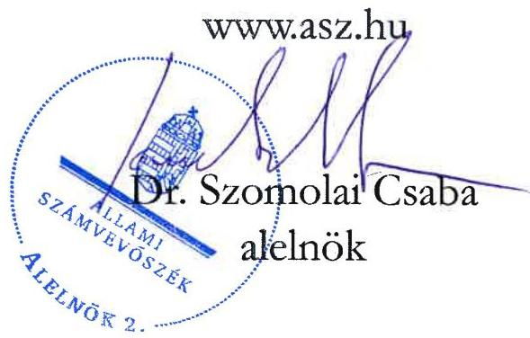

ÁLLAMI SZÁMVEVŐSZÉK

# JELENTÉS

A fenntartási kötelezettség kedvezményezettek
általi teljesítésének rapid ellenőrzése

A DRESCHER Magyarországi Direct Mailing Informatikai és
Nyomdai Kft.
fenntartási kötelezettsége teljesítésének ellenőrzése
a GINOP-1.2.1-16-2017-00716 számú projektnél

2026.

26002

www.asz.hu

---

ÁLLAMI SZÁMVEVŐSZÉK

# JELENTÉS

A fenntartási kötelezettség kedvezményezettek
általi teljesítésének rapid ellenőrzése

A DRESCHER Magyarországi Direct Mailing Informatikai és
Nyomdai Kft.
fenntartási kötelezettsége teljesítésének ellenőrzése
a GINOP-1.2.1-16-2017-00716 számú projektnél

2026.

26002

---

Jelentéseink az interneten a www.asz.hu címen olvashatók.

ELLENŐRZÉSI IGAZGATÓSÁG:
ELLENŐRZÉSI IGAZGATÓSÁG I.

ELLENŐRZÉSI IGAZGATÓ:
SINKÁNÉ DR. CSENDES ÁGNES igazgató

ELLENŐRZÉSVEZETŐ:
HUSZÁR ANNA ellenőrzésvezető

IKTATÓSZÁM: EL-4101-202/2025

TÉMASORSZÁM: -

ELLENŐRZÉS-AZONOSÍTÓ SZÁM: V1101

---

TARTALOMJEGYZÉK

- ÖSSZEFOGLALÁS ... 5
- AZ ELLENŐRZÉS EREDMÉNYEI ... 6
1. A fenntartási kötelezettség teljesítése ... 6
- I. FÜGGELÉK: ÉSZREVÉTELEK ... 9
- II. FÜGGELÉK: ELLENŐRZÉSI MEGKÖZELÍTÉS ... 10
- MELLÉKLETEK ... 15
I. sz. melléklet: Értelmező szótár ... 15
II. sz. melléklet: Az ellenőrzött és a közreműködő szervezetek jegyzéke ... 17
- RÖVIDÍTÉSEK JEGYZÉKE ... 18

---

“哈，你是个小伙子，你是个小伙子，你是个小伙子，你是个小伙子，你是个小伙子，你是个小伙子，你是个小伙子，你是个小伙子，你是个小伙子，你是个小伙子，你是个小伙子，你是个小伙子，你是个小伙子，你是个小伙子，你是个小伙子，你是个小伙子，你是个小伙子，你是个小伙子，你是个小伙子，你是个小伙子，你是个小伙子，你是个小伙子，你是个小伙子，你是个小伙子，你是个小伙子，你是个小伙子，你是个小伙子，你是个小伙子，你是个小伙子，你是个小伙子，你是个小伙子，你是个小伙子，你是个小伙子，你是个小伙子，你是个小伙子，你是个小伙子，你是个小伙子，你是个小伙子，你是个小伙子，你是个小伙子，你是个小伙子，你是个小伙子，你是个小伙子，你是个小伙子，你是个小伙子，你是个小伙子，你是个小伙子，你是个小伙子，你是个小伙子，你是个小伙子，你是个小伙子，你是个小伙子，你是个小伙子，你是个小伙子，你是个小伙子，你是个小伙子，你是个小伙子，你是个小伙子，你是个小伙子，

---

ÖSSZEFOGLALÁS

A 2016 decemberében megjelent „Mikro-, kis- és középvállalkozások termelési kapacitásainak bővítése” című (GINOP 1.2.1-16 kódszámú) pályázati felhívásban meghirdetett támogatással lehetőség nyílt ezen vállalkozások számára modern eszköz- és gépparkok, valamint fejlett infrastruktúrával ellátott telephelyek kialakítására. A rendelkezésre álló keretösszeg eredetileg 18 Mrd Ft volt, a keretösszeg emelését követően végül a konstrukcióban 101 Mrd Ft értékben kötött az IH¹ támogatási szerződést. Az igényelhető vissza nem térítendő támogatás összege kezdetben 25 M Ft és 250 M Ft között volt, a támogatás maximuma később 500 M Ft-ra emelkedett.

A Felhívásra² benyújtott támogatási kérelem alapján a 171,5 M Ft támogatást nyert GINOP-1.2.1-16-2017-00716 számú, „Technológiafejlesztés és kapacitásbővítés a DRESCHER Magyarországi Direct Mailing Kt. fülöpszállási fióktelepen” című projekt Kedvezményezettje³, a DRESCHER Kft. inkjet nyomdai technológia bevezetéséhez szükséges gépsort szerzett be és helyezett üzembe.

A Kedvezményezett – a támogatás visszafizetésének terhe mellett – vállalta, hogy a projektmegvalósítást követően a Projekt⁴ megfelel az 1303/2013/EU Rendeletben⁵, a műveletek tartósságára vonatkozó előírásoknak, az előírt fenntartási kötelezettséget teljesíti. A Projekt megvalósítása 2019. szeptember 25-én befejeződött, fenntartási időszaka ezt követő nappal indult és 2022. december 31-ig tartott.

A kapott támogatás összértéke, a Projekt egyedisége és a megvalósított projekteredmény hosszabb távon történő megtartása miatt az ÁSZ⁶ indokoltnak tartotta a Projekt fenntartásának és a támogatás hasznosulásának ellenőrzését. A Kedvezményezett Projekt fenntartási kötelezettségei teljesítésének ellenőrzésére az ÁSZ „A 2014-2020 programozási időszak kobezjós politikai operatív programok vonatkozásában a fenntartási kötelezettség teljesítésének ellenőrzési gyakorlata” című ellenőrzéséhez, mint alapellenőrzéshez kapcsolódóan került sor.

A Kedvezményezett a Projekt hároméves fenntartási kötelezettsége keretében, a projekteredmény működtetéséről és fenntartásáról a jogszabály szerint határidőben és – hiánypótlási, valamint korrekciós kötelezettségének teljesítését követően – megfelelően beszámolt az éves projektfenntartási jelentésekben és a záró projektfenntartási jelentésben, amelyeket az IH elfogadott.

A Kedvezményezett a számára támogatási szerződésben előírt foglalkoztatási indikátort a fenntartási időszak minden évében teljesítette. A kötelezően vállalt legalább 5%-os árbevétel-növekedés a Projekt fizikai befejezését követő második üzleti év végére 11,9%-ra teljesült.

Az IH 2025. január 10-én pénzügyileg lezárta a Projektet és kiadta a záró jegyzőkönyvet.

A Kedvezményezett, a vállalt három év fenntartási időszak és a fenntartási időszakra vonatkozóan vállalt kötelezettségek teljesítésével megfelelt az 1303/2013/EU rendeletben előírtaknak, mivel termelő tevékenysége nem szűnt meg, a Projekt működőképessége, annak eredeti célkitűzései a fenntartási időszakban – az ellenőrzött időszakot figyelembe véve – biztosítottak voltak.

Az ÁSZ értékelése szerint a Projektre kapott támogatás – a fenntartási időszak tekintetében – hasznosult. Az ÁSZ helyszíni ellenőrzése időpontjában a beszerzett eszközök rendelkezésre álltak, azok kapacitásbővítést és technológiai váltást eredményeztek. A Kedvezményezett a beszerzett eszközöket – a jövedelmezőségi szempontok figyelembevételével – a fenntartási időszak lejárát követően is működtette.

5

---

AZ ELLENŐRZÉS EREDMÉNYEI

A magyar vállalkozások a GINOP⁷ pályázati konstrukciók keretében jelentős mértékű támogatásban részesültek, amelyek célja volt hozzájárulni a gazdasági fejlődéshez, a társadalmi felzárkózáshoz és az infrastruktúra fejlesztéséhez. Az ÁSZ – Magyarország versenyképességének növelése érdekében – fontosnak tartja a kihelyezett uniós támogatások nemzetgazdasági szinten történő hasznosulását és értékteremtését a vállalatok beruházásain és elért teljesítményén keresztül. Az ÁSZ a támogatással kapcsolatos fenntartási kötelezettség teljesítését, valamint a támogatás hasznosulását a GINOP-1.2.1-16-2017-00716 számú projekt tekintetében értékelte. A Projekt keretében a kedvezményezett DRESCHER Kft. inkjet nyomdai technológia bevezetéséhez szükséges gépsort szerzett be és helyezett üzembe.

## 1. A fenntartási kötelezettség teljesítése

### Összegző megállapítás

A Kedvezményezett fenntartási kötelezettségét teljesítette, a támogatás hasznosult.

### A fenntartási jelentés benyújtási kötelezettség teljesítése

A Kedvezményezettnek a Projekt megvalósítását követően, a Támogatási rend.⁸-ben foglaltak alapján hároméves fenntartási kötelezettsége volt, amelyet a Felhívás és a támogatási szerződés is rögzített. Ennek keretében a Kedvezményezettnek a projekteredményt a megvalósítási helyszínen a megvalósítás befejezésétől számított három évig fenn kellett tartania és üzemeltetnie, valamint a Támogatási rend.-ben foglaltak alapján évente projektfenntartási jelentésben kellett beszámolnia az indikátorok teljesüléséről.

A Kedvezményezett a Támogatási rend.-ben előírt éves projekt fenntartási jelentés benyújtási kötelezettségét teljesítette, a PFJ⁹-k és a ZPFJ¹⁰ főbb adatait az 1. táblázat tartalmazza.

1. táblázat

|  A GINOP-1.2.1-16-2017-00716 SZÁMÚ PROJEKTHEZ KAPCSOLÓDÓ PFJ-K FŐBB ADATAI  |   |   |   |   |   |
| --- | --- | --- | --- | --- | --- |
|  JELENTÉS
SORSZÁMA | JELENTÉS
TÍPUSA | TÁRGYIDÓSZAK
KEZDETÉ | TÁRGYIDÓSZAK
VÉGE | BENYÚJTÁS
HATÁRIDEJE | JELENTÉS STÁTUSZA  |
|  1. | PFJ | 2019.09.26. | 2020.12.31. | 2021.06.15. | 2021.06.30-án beérkezett,
elfogadva 2022.01.31-én  |
|  2. | PFJ | 2021.01.01. | 2021.12.31. | 2022.06.15. | 2022.06.13-án beérkezett,
elfogadva 2022.07.07-én  |
|  3. | ZPFJ | 2022.01.01. | 2022.12.31. | 2023.06.15. | 2023.06.14-én beérkezett,
elfogadva 2024.11.11-én  |

Forrás: FAIR¹¹ adatok alapján ÁSZ saját szerkesztés

A Kedvezményezett a fenntartási időszakra vonatkozóan előírt 1. PFJ-t a Támogatási rend.-ben előírtakhoz képest 15 nappal később nyújtotta be, a 2. PFJ-t és a ZPFJ-t – a Támogatási rend.-ben előírtaknak megfelelően – határidőben benyújtotta. Mivel a Kedvezményezett székhelye nem volt azonos a Projekt megvalósításának helyszínével, a Támogatási rend.-ben foglaltak alapján a Kedvezményezettnek melléklet-benyújtási kötelezettsége volt a PFJ-k megküldésekor.

Az 1. PFJ megküldését követően az IH a Kedvezményezett székhelyéhez kapcsolódó iparűzési adó megfizetéséről szóló hatósági igazolás és a – foglalkoztatott munkavállalók tekintetében –

---

Az ellenőrzés eredményei

munkahelyfenntartási nyilvántartás hiánypótlására, valamint a fenntartási időszakra vonatkozó tényadatok (indikátor érték) rögzítésére szólította fel a Kedvezményezettet. A Kedvezményezett a hiánypótlási, majd – annak elutasítása következtében – korrekciós kötelezettségeit a Támogatási rend.-ben előírt határidőben teljesítette, az IH az 1. PFJ-t elfogadta. A 2. PFJ tekintetében nem merült fel hiánypótlási kötelezettség, az IH elfogadta azt. A ZPFJ-t – a Kedvezményezett honlapján elhelyezett arculati elemek/Projekthez kapcsolódó információk pótlása, a Projekt megvalósulásáról fotódokumentáció, valamint összeférhetetlenségi nyilatkozat kapcsán kért – hiánypótlás határidőben történt teljesítését követően az IH 2024. november 11-én elfogadta.

Az IH – közérdekű bejelentés kivizsgálása céljából – a fenntartási időszak elején, 2019. október 17-én előzetes értesítés nélküli helyszíni ellenőrzést tartott a megvalósítási helyszínen. A helyszíni ellenőrzés alkalmával a Kedvezményezett részéről senki nem tartózkodott a helyszínen, az ellenőrök az épületbe nem tudtak bejutni. Az IH szabálytalansági eljárás eredményeként szabálytalanságot állapított meg. A döntés rögzítette, hogy a Kedvezményezett a berendezést a helyszínen nem működteti, termelőtevékenységet nem folytat, az IH kezdeményezi a támogatási szerződéstől való elállást és intézkedik a támogatási összeg visszakövetelése iránt.

A döntés kapcsán a Kedvezményezett jogorvoslati kérelmet terjesztett elő, melyben rögzítette, hogy az üzem működése nem folyamatos, hanem megrendeléshez kötött. A kérelem és a csatolt iratok alapján 2020. február 10-én az IH módosította döntését és megállapította, hogy nem történt szabálytalanság.

A fenntartási időszakban ismételt helyszíni ellenőrzésre nem került sor.

Az IH 2025. január 10-én pénzügyileg lezárta a Projektet és kiadta a záró jegyzőkönyvet.

## A fenntartási kötelezettség, indikátorok teljesítése

A Projekthez kapcsolódóan a Kedvezményezett részéről vállalt indikátorokat és egyéb kötelezettségeket a támogatási szerződés 4. és 5. számú melléklete rögzítette. A Kedvezményezett a vállalt kötelezettségeit – az éves beszámoló adatok és a PFJ-kben rögzítettek alapján – az alábbiak szerint teljesítette:

1. A Kedvezményezett „A foglalkoztatás növekedése a támogatott vállalkozásoknál” indikátor esetében a bázislétszámot jelentő 2016. december 31-i 58 fős foglalkoztatotti létszám tovább foglalkoztatását és megtartását vállalta a fenntartási időszak végéig férfiak (52 fő) és nők (6 fő) szerinti bontásban.

A Kedvezményezett a 2019-2022. évek mindegyikében – a Támogatási rend.-ben előírt 88. § (2) bekezdése alapján a 75%-os minimum határ figyelembevételével – teljesítette a számára meghatározott foglalkoztatotti indikátort, az 58 főben meghatározott célértéket 2019 végére 96,6%-os mértékben teljesítette 56 fős létszámmal, mely a fenntartási időszak végére 57 főre emelkedett.

2. A Kedvezményezett az „Éves nettó árbevétel növelése” mutató tekintetében azt vállalta, hogy a Projekt fizikai befejezését (2019. év) közvetlenül követő második üzleti év végére az éves nettó árbevétele legalább 5%-kal meghaladja a bázisév árbevételét, a 1 181,4 M Ft-ot.

A kötelező vállalás az előírtaknak megfelelően teljesült, mivel a Kedvezményezett nettó árbevétele a 2021. évben 1 322,2 M Ft volt, így 11,9%-kal haladta meg a bázisév árbevétel adatát.

3. A fenntartási időszakban teljesítendő egyéb kötelezettségek keretében a Projekt elkülönített számviteli nyilvántartása rendelkezésre állt. A Kedvezményezett által az ÁSZ adatbekérése kapcsán a Projektre vonatkozóan 2025. januári állapotra megküldött számviteli nyilvántartások alapján a projektszintű elkülönített számviteli nyilvántartás a Támogatási rend.-ben foglaltaknak megfelelően biztosított volt azáltal, hogy a releváns tárgyi eszköz kartonokon a Projektazonosítót feltüntette.

---

Az ellenőrzés eredményei

A Kedvezményezett, a vállalt három év fenntartási időszak és a – fenntartási időszakra vonatkozóan – vállalt kötelezettségek teljesítésével megfelelt a műveletek tartósságával kapcsolatban az 1303/2013/EU rendeletben és a Támogatási rend.-ben előírtaknak.

A Kedvezményezett számára – az ÁSZ-nak helyszíni interjú keretében adott nyilatkozata alapján – nem jelentett nehézséget a projekt adminisztrációs feladata, a jelentéseket pályázatíró segítségével nyújtotta be, az IH-val is a pályázatíró cég tartotta a kapcsolatot. Tájékoztatása szerint a záró fenntartási jelentésre a hiánypótlás teljesítését követően majd kilenc hónappal kapott választ az IH-tól. A Kedvezményezett célszerűnek tartotta, hogy a válaszadásra 30 napon belül sor kerüljön.

## A támogatás hasznosulása

A Kedvezményezett a Projekt keretében inkjet nyomdai technológia bevezetéséhez szükséges gépsort szerzett be és helyezett üzembe, amelyek az ÁSZ – fenntartási időszakon túl, 2024 októberében lefolytatott – helyszínen végzett ellenőrzésekor fellelhetőek voltak, azonban nem működtek.

A Kedvezményezett létszám, árbevétel, adózott eredmény és mérlegfőösszeg adatait a 2019-2024. évekre vonatkozóan a 2. táblázat mutatja be.

2. táblázat
A KEDVEZMÉNYEZETT 2019-2024. ÉVI LÉTSZÁM, ÁRBEVÉTEL, ADÓZOTT EREDMÉNY ÉS MÉRLEGFŐÖSSZEG ADATAI

|  ADATOK MEGNEVEZÉSE | 2019. ÉVBEN | 2020. ÉVBEN | 2021. ÉVBEN | 2022. ÉVBEN | 2023. ÉVBEN | 2024. ÉVBEN  |
| --- | --- | --- | --- | --- | --- | --- |
|  Átlagos statisztikai állományi létszám (fő) | 56 | 56 | 56 | 57 | 51 | 45  |
|  Értékesítés nettó árbevétele (M Ft) | 1 033,6 | 1 257,8 | 1 322,2 | 1 553,4 | 1 625,8 | 1 192,3  |
|  Adózott eredmény (M Ft) | 5,3 | 10,8 | 6,8 | -45,6 | 11,0 | 8,1  |
|  Mérlegfőösszeg (M Ft) | 1 198,0 | 1 358,1 | 1 526,3 | 1 550,3 | 1 346,8 | 1 088,8  |

Forrás: A Kedvezményezett éves beszámoló adatai alapján ÁSZ saját szerkesztés

A Kedvezményezett helyszíni interjú keretében adott nyilatkozata alapján a Projektre kapott támogatás hozzájárult a vállalkozás versenyképességének növekedéséhez. Kedvezményezett tájékoztatása szerint, ha a beruházást nem valósították volna meg és nem álltak volna át az új technológiára, akkor kiszorultak volna a piacról. A technológiaváltás elvárás is volt az ügyfelek részéről. A Kedvezményezett az eszközöket – a jövedelmezőségi szempontok figyelembevételével – a fenntartási időszak lejártát követően is működtette. Az ÁSZ értékelése szerint a Kedvezményezett megfelelt a műveletek tartósságára vonatkozó előírásoknak, a vállalkozást működtette, a Projektet fenntartotta a fenntartási időszak végéig, kötelezettségeit teljesítette. A Projekt keretében beszerzett eszközök a Kedvezményezettnél kapacitásbővítést és technológiai váltást eredményeztek. A Kedvezményezettnél a költségvetési támogatás – az ÁSZ értékelése szerint – a fenntartási időszak tekintetében hasznosult.

---

9

# I. FÜGGELÉK: ÉSZREVÉTELEK

A jelentéstervezetet az ÁSZ 15 napos észrevételezésre megküldte az ellenőrzött szervezet vezetőjének az ÁSZ tv. 29. §* (1) bekezdése előírásának megfelelően.

A jelentéstervezet megállapításaira az ellenőrzött szervezet nem tett észrevételt.

* 29. § (1) Az Állami Számvevőszék az ellenőrzési megállapításait megküldi az ellenőrzött szervezet vezetőjének vagy az általa megbízott személynek, és annak, akinek személyes felelősségét állapította meg.
(2) Az ellenőrzött szervezet vezetője és a felelősként megjelölt személy az ellenőrzés megállapításaira tizenöt napon belül írásban észrevételt tehet.
(3) Az Állami Számvevőszék az észrevételre a beérkezésétől számított harminc napon belül írásban válaszol. A figyelembe nem vett észrevételeket köteles a jelentésben feltüntetni, és megindokolni, hogy azokat miért nem fogadta el.

---

10

# II. FÜGGELÉK: ELLENŐRZÉSI MEGKÖZELÍTÉS

## AZ ELLENŐRZÉS JOGALAPJA

Az ellenőrzés jogszabályi alapját az ÁSZ tv.¹² 5. § (3) bekezdés képezte.

## AZ ELLENŐRZÉS CÉLJA

A fenntartási kötelezettség teljesítésének és a támogatás hasznosulásának értékelése a fenntartási szakaszba került uniós projekt kedvezményezettjénél.

## AZ ELLENŐRZÉS TÍPUSA

Kombinált ellenőrzés

## AZ ELLENŐRZÉS TÁRGYA

Az ellenőrzés tárgya volt az ellenőrzésre kiválasztott GINOP-1.2.1-16-2017-00716 számú uniós projekt fenntartási időszakára vonatkozóan előírt kötelezettségek DRESCHER Kft. mint kedvezményezett által történt teljesítése és a támogatás hasznosulása. A fenntartási kötelezettség ellenőrzése a kedvezményezett tevékenységéhez és működéséhez kapcsolódó kötelezettségek, a meghatározott indikátorok és a beszámolási kötelezettség teljesítésére irányult.

Az ellenőrzés tárgya volt továbbá a kedvezményezett által benyújtott fenntartási jelentésekben rögzítettek valóságtartalma és megalapozottsága, valamint ezek összhangja az ÁSZ helyszíni ellenőrzése során tapasztaltakkal.

Az ellenőrzés kiterjedt minden olyan körülményre és adatra, amely az ÁSZ jogszabályban meghatározott feladatainak teljesítéséhez, valamint a program végrehajtása folyamán felmerült újabb összefüggések feltárásához szükséges.

## AZ ELLENŐRZÉS HATÓKÖRE ÉS TERÜLETE

Az uniós jogszabályok az uniós támogatással megvalósuló projektekkel szemben elvárásként rögzítik a „műveletek tartósságának” követelményét. A kedvezményezettek infrastrukturális vagy termelő beruházás esetén – a projektmegvalósítás befejezésétől számított 5 évig, kis- és közepes vállalkozások esetén 3 évig, a támogatás visszafizetésének terhe mellett – vállalták, hogy a projekt termelő tevékenysége nem szűnik meg, hogy nem következik be olyan tulajdonosváltás, amelynek eredményeként jogosulatlan előny szerezhető, illetve, hogy nem következik be olyan lényeges változás, amely a projekt eredeti célkitűzéseit veszélyezteti. Abban az esetben, ha a felsoroltak valamelyike bekövetkezik, a támogatást – figyelemmel a vonatkozó jogszabályokra – vissza kell fizetni az Európai Bizottságnak.

---

II. Függelék: Ellenőrzési megközelítés

Ha az IH a projektre nézve fenntartási kötelezettséget állapított meg, és indikátorokat határozott meg a támogatási szerződésben, a kedvezményezettnek évente be kellett számolnia az indikátorok teljesüléséről. Ha ezen időszakra indikátorokat nem határozott meg az IH és a támogatási szerződésben sem írta elő az évenkénti teljesítést, a kedvezményezettnek egy alkalommal záró projektfenntartási jelentést kellett benyújtania.

Az ellenőrzés a XIX. Uniós fejlesztések fejezet 3/1 Kohéziós politikai operatív programok 2014-2020 operatív programjai közül a – kis- és középvállalkozások versenyképességének javítására irányuló – GINOP 1. prioritásából és a – kutatás, technológiai fejlesztés és innováció című – GINOP 2. prioritásából támogatást kapott projektek kedvezményezettjeire terjedt ki oly módon, hogy az ÁSZ – „A 2014-2020 programozási időszak kohéziós politikai operatív programok vonatkozásában a fenntartási kötelezettség teljesítésének ellenőrzési gyakorlata” című ellenőrzéséhez, mint alapellenőrzéshez kapcsolódóan – a GINOP 1-2. prioritás pályázati kiírásainak nyertes pályázóiból, kockázat alapú mintavételi eljárással, rapid ellenőrzésre választott ki összesen 16 projektet, amelyből ezen jelentésben a GINOP-1.2.1-16-2017-00716 számú projekt tekintetében értékelte a fenntartási kötelezettség teljesítését.

A GINOP-1.2.1-16-2017-00716 számú projekt tekintetében az ellenőrzés kiterjedt a célrendszer, a jogszabályban – a működés és tevékenység tekintetében – előírt fenntartási kötelezettség teljesülésére, a fenntartási jelentésben bemutatott eredmények valóságtartalmára, megalapozottságára, valamint a támogatási szerződésben vállalt, a fenntartási időszakra vonatkozó kötelezettségek teljesítésének, és a GINOP keretében nyújtott támogatás hasznosulásának értékelésére.

## A GINOP-1.2.1-16 számú felhívás bemutatása

Az IH által közzétett GINOP-1.2.1-16 kódszámú, a „Mikro-, kis- és középvállalkozások termelési kapacitásainak bővítése” című pályázati felhívásban meghirdetett támogatás célja volt a kiemelt iparágakban fejleszteni kívánó hazai KKV¹³-k termelési kapacitásainak bővítése a hazai ipar fejlesztése érdekében, amely során korszerű termék előállítási képességek megteremtésének és bővítésének céljából lehetőség nyílt modern eszköz- és gépparkok, valamint fejlett infrastruktúrával ellátott telephelyek kialakítására, a szektor szereplői számára a versenyképesség feltételeinek megteremtésére, fenntartására.

A támogatás formája vissza nem térítendő támogatás volt, forrását az Európai Regionális Fejlesztési Alap és Magyarország költségvetése társfinanszírozásban biztosította. A rendelkezésre álló tervezett keretösszeg eredetileg 18 Mrd Ft volt, ami a Felhívás módosítását követően 119,8 Mrd Ft-ra emelkedett. A Felhívás szerint a támogatott projektek várható számát 150-250 között tervezték, a Felhívás keretében projektenként kapható támogatás nagysága kezdetben 25-250 M Ft volt, majd később a támogatás maximális összege 500 M Ft-ra emelkedett.

A támogatási kérelmet benyújtó szervezetek vállalták, hogy a projekt megvalósításával hozzájárulnak a kiemelt iparágakban fejleszteni kívánó hazai KKV-k termelési kapacitásainak bővítéséhez, a kapott támogatáson felül önerőből finanszírozzák a projektet és a projekt fizikai befejezését követő két évben növelik nettó árbevételüket.

Támogatható tevékenység volt az új eszközök, gépek beszerzése, az új technológiai rendszerek és kapacitások kialakítása, a megújuló energiaforrást hasznosító technológiák alkalmazása, melyek célja a gazdasági-termelési folyamatok és az üzemen belüli építmények energiaigényének részbeni fedezése megújuló energia előállításával, valamint az infrastrukturális és ingatlan beruházás, az információs technológia-fejlesztés és az új eszközök, gépek beszerzéséhez, új technológiai rendszerek és kapacitások kialakításához kapcsolódó gyártási licenc, gyártási know-how beszerzés.

---

II. Függelék: Ellenőrzési megközelítés

A támogatásra az a mikro-, kis-, és középvállalkozás pályázhatott, amely különösen az alábbi feltételeknek eleget tett:

- rendelkezett legalább egy lezárt (beszámoló/SZJA¹⁴ bevallással alátámasztott), teljes 365 napot jelentő üzleti évvel;
- éves átlagos statisztikai állományi létszáma a támogatási kérelmek benyújtását megelőző utolsó lezárt, teljes üzleti évben minimum 1 fő volt;
- Magyarországon székhellyel rendelkező kettős könyvvitelt vezető gazdasági társaság, szövetkezet, egyéni vállalkozó, egyéni cég vagy az Európai Gazdasági Térség területén székhellyel és Magyarországon fiókteleppel rendelkező szövetkezet vagy kettős könyvvitelt vezető gazdasági társaság fióktelepe volt.

A projekt megvalósítása során legfeljebb egy mérföldkővet lehetett tervezni, a mérföldkő elérésének a projekt fizikai befejezésének időpontjával kellett egybeesnie. A projekt fizikai befejezésére legfeljebb 18 hónap állt rendelkezésre. Nem volt köteles biztosítékot nyújtani kérelemre az a kedvezményezett, amely rendelkezett legalább egy lezárt, teljes üzleti évvel, és a támogatási kérelem benyújtásakor szerepelt a köztartozásmentes adózói adatbázisban.

Indikátorként a támogatott vállalkozásoknál a foglalkoztatás növekedése került megjelölésre, kötelező vállalásként, hogy a projekt fizikai befejezését követő két évben növekszik a nettó árbevétel. A támogatást igénylő, a projekt megvalósítás befejezésétől számított 3 évig volt köteles fenntartani a projekt keretében létrehozott termékeket és szolgáltatásokat.

A támogatási kérelmek benyújtására a Felhívás közzétételét követő 24 hónapig, 2017. január 16-tól 2019. január 16-ig volt lehetőség. Az utólagos finanszírozású tevékenységekre igénybe vehető maximális előleg mértéke a megítélt támogatás 50%-a, de legfeljebb 125 M Ft volt. A beérkező támogatási kérelmeket standard kiválasztási eljárásrend alapján, szakaszos elbírálással bírálták el.

Az IH által nyolc alkalommal módosított Felhívásra 1136 támogatási kérelem érkezett be, összesen 178,6 Mrd Ft nagyságú támogatási összegre, amelyből – az IH adatszolgáltatás alapján – 605 kérelem került elfogadásra összesen 101 Mrd Ft értékű támogatási összeggel.

# A DRESCHER Kft. és a GINOP-1.2.1-16-2017-00716 számú projekt bemutatása

A kedvezményezett DRESCHER Kft.-t 1991 októberében alapították, székhelye alapítástól kezdődően Budapesten, a IX. kerületben volt. A Kedvezményezett középvállalkozásnak minősült, bejegyzett főtevékenysége a támogatási kérelem benyújtásakor és az ÁSZ helyszíni ellenőrzésekor is „Nyomás (kivéve: napilap)”. A Kedvezményezett átlagos statisztikai állományi létszáma 45 fő, a nettó árbevétele 1 192,3 M Ft volt 2024. évben a beszámoló adatai alapján.

A Kedvezményezett a támogatási kérelmét 2017. február 24-én nyújtotta be, amelynek támogatásáról az IH 2017. október 5-én hozott döntést, a támogatási szerződés 2017. november 9-én lépett hatályba A Kedvezményezett a GINOP-1.2.1-16-2017-00716 számú, „Technológiafejlesztés és kapacitásbűvítés a DRESCHER Magyarországi Direct Mailing Kt. fülöpszállási fióktelepen” című projekt keretében piaci pozíciójának megtartása és részesedésének növelése érdekében a hagyományos offset nyomtatási technológia helyett inkjet technológiát kívánt bevezetni újonnan alapított fülöpszállási telephelyén. A támogatási szerződést az elszámolható költségvolumen és a beruházni tervezett két projektelem tekintetében összesen két alkalommal módosították.

A Projekt – szerződésmódosításokat követő – tényleges összköltsége 343 M Ft volt, amelyhez a Kedvezményezett – 50%-os támogatás intenzitással – 171,5 M Ft összegű támogatást kapott. Megvalósítását

---

II. Függelék: Ellenőrzési megközelítés

2018. szeptember 17-én kezdték meg, fizikai befejezésének határidejeként, és a tervezett egy mérföldkő dátumaként 2019. április 30-át rögzítették a támogatási szerződésben. A Kedvezményezett – a Felhívás 3.9. pontja alapján – a biztosíték nyújtási kötelezettség alól mentesült.

A Kedvezményezett számára a támogatási szerződés az „Éves nettó árbevétel növelése” mutató és „A foglalkoztatás növekedése a támogatott vállalkozásoknál” indikátor tekintetében írt elő célértéket kötelező vállalásként, ez utóbbit férfiak és nők szerinti bontásban. Az árbevétel mutató alapján a Projekt fizikai befejezési évét közvetlenül követő második üzleti év végére az éves nettó árbevételnek legalább 5%-kal meg kellett haladnia a bázisév árbevételét. A foglalkoztatás bázisértéke összességében 58 fő volt a 2016. évre vonatkozóan, amely létszámot 2019. december 31-i céldátumra meg kellett tartani.

A Projekt fizikailag néhány nappal a tervezett határidő előtt, 2019. április 24-én megvalósult a Kedvezményezett 3 héttel a támogatási szerződésben előírt határidőt követően, 2019. június 7-én nyújtotta be záró szakmai beszámolóját és a záró kifizetési kérelmét. Az IH a záró szakmai beszámolóhoz kapcsolódóan 2019. június 11-én tervezett, pénzügyi záró helyszíni ellenőrzést folytatott le, amelynek során hiányosságot nem tart fel. A Kedvezményezett záró szakmai beszámolóját – a helyszíni ellenőrzés lezárását követően – 2019. szeptember 9-én elfogadta az IH és 2019. szeptember 25-én kifizette az utolsó elszámolást; a Projekt megvalósítása 2019. szeptember 25-ével befejeződött.

A Kedvezményezett a Projektet – az IH szakmai záró beszámoló ellenőrzése és a megvalósításra vonatkozóan lefolytatott helyszíni ellenőrzése megállapításai alapján – a támogatási szerződésben rögzített mérföldkővet és a kötelező vállalásokat teljesítve valósította meg.

A hároméves fenntartási időszak a Projekt megvalósítását követően 2019. szeptember 26-tól kezdődött és 2022. december 31-ig tartott. Az első projektfenntartási jelentés benyújtási határideje 2021. június 15-e volt, a Kedvezményezettet ezt követően évente terhelte fenntartási jelentés benyújtási kötelezettség. A záró projektfenntartási jelentés benyújtási határideje 2023. június 15-e volt.

## AZ ELLENŐRZŐTT IDŐSZAK

2016. január 1-től 2025. április 30-ig, a helyszíni ellenőrzés lezárásának időpontjáig tartó időszak.

---

II. Függelék: Ellenőrzési megközelítés

# AZ ELLENŐRZÉSI KRITÉRIUMOK

|  FOKUSZTERÜLET | ELLENŐRZÉSI KRITÉRIUMOK  |
| --- | --- |
|  1. A fenntartási kötelezettség teljesítése  |   |
|  A fenntartási jelentés benyújtási kötelezettség teljesítése | Támogatási rend. 178. § (1) bekezdés, 180. § (1) bekezdés, 1. melléklet 293.1., 287.2., 297.1., 302.1. pontjai; Felhívás 3.8. pontja;  |
|  A fenntartási kötelezettség, indikátorok teljesítése | 1303/2013/EU rendelet 71. cikk (1) bekezdés; Támogatási rend. 88. § (2) bekezdés, 110/A. §, 178. § (1) bekezdés; támogatási szerződés 4-5. sz. mellékletei;  |
|  A támogatás hasznosulása | Az ÁSZ meghatározása alapján: - A támogatás hasznosult, ha a vállalkozás (a projekt) működött az ÁSZ helyszíni ellenőrzése időpontjában, fenntartási kötelezettségét a kedvezményezett teljesítette / jellemzően teljesítette, és a támogatás eredményeként a kedvezményezett vállalkozás árbevétel vagy adózott eredmény adatai növekedtek a támogatás előtti időszakhoz képest. - A támogatás korlátozottan hasznosult, ha a projekteredmény „fellelhető volt” az ÁSZ helyszíni ellenőrzése időpontjában, fenntartási kötelezettségét részben / minimálisan teljesítette a kedvezményezett, vagy a támogatás eredményeként hozzáadott új értéket teremtett, az társadalmilag hasznosult stb. - A támogatás nem hasznosult, ha fenntartási kötelezettségét a kedvezményezett egyáltalán nem teljesítette és/vagy a vállalkozás (a projekt) már nem működött az ÁSZ helyszíni ellenőrzése időpontjában.  |

# AZ ELLENŐRZÉS MÓDSZERE ÉS AZ ELLENŐRZÉSI BIZONYÍTÉKOK KÖRE

Az ÁSZ az ellenőrzést a nemzetközi standardokat irányadónak tekintve az ellenőrzési program szempontjai, az ellenőrzött időszakban hatályos jogszabályok, az ellenőrzés-szakmai szabályok és módszertanok figyelembevételével végezte.

Az ellenőrzési kérdések megválaszolásához szükséges bizonyítékok megszerzése az ellenőrzött szervezet és az ellenőrzésben közreműködő szervezet által rendelkezésre bocsátott dokumentumokra és adatokra alapozva, továbbá megfigyelés, szemle (szemrevételezés), kérdésfeltevés (információkérés), interjú, mintavételezés, valamint elemző eljárás útján történt.

Az ellenőrzés bizonyítékként felhasználható adatforrásai közé tartoztak egyrészt az ellenőrzéshez kért dokumentumok, adatforrások, a nyilvánosan hozzáférhető adatok, dokumentumok, másrészt adatforrás volt még minden, az ellenőrzés folyamán feltárt, az ellenőrzés szempontjából információt tartalmazó dokumentum. Az ÁSZ a számvevőszéki jelentéstervezet elfogadásáig rendelkezésre álló, nyilvánosan elérhető adatokat figyelembe vette.

Az ellenőrzés végrehajtásához a projekt kiválasztása kockázat alapú mintavételi eljárással történt.

---

MELLÉKLETEK

I. SZ. MELLÉKLET: ÉRTELMEZŐ SZÓTÁR

fenntartás

A kedvezményezett a projektmegvalósítás befejezésétől számított 5 évig, állami támogatás formájában nyújtott támogatás esetén az állami támogatókra vonatkozó szabályok alapján alkalmazandó időtartamig, kis- és közepes vállalkozások esetén 3 évig a támogatás visszafizetésének terhe mellett vállalja, hogy a projekt megfelel az 1303/2013/EU európai parlamenti és tanácsi rendelet 71. cikk (1) bekezdésében foglaltaknak. (Forrás: Támogatási rend. 178. § (1) bekezdés, 2016. május 14-től 2024. július 31-ig hatályos)

Az irányító hatóság döntése alapján a fenntartási időszak kezdődhet a projektmegvalósítás befejezésétől vagy a projekt fizikai befejezésétől (ÁSZF¹⁵ 10.7. pontja alapján, hatályos 2016. június 14-től)

A fenntartási időszak meghatározása során az IH speciális projektév szerinti jelentéstételt alkalmazott, mivel a jelentések tárgyidőszaka speciális projektévhez (az üzleti évről készített közzétett beszámolóhoz) igazodott és a fenntartási jelentésben benyújtandó vállalási adatok csak az így meghatározott időszak elteltével álltak rendelkezésre. (Forrás: Támogatási rend. 1. melléklet 285.1-286.4 pontja alapján ÁSZ megfogalmazás)

indikátor

Uniós jogszabályokban és a programban nevesített, valamint az európai uniós források felhasználásáért felelős miniszter – a Vidékfejlesztési Program esetén az agrárpolitikáért felelős miniszter – által meghatározott, eredményt vagy teljesülést mérő mutató. (Forrás: Támogatási rend 3. § (1) bekezdés 12. pont, 2022. július 21-től 2024. július 31-ig hatályos)

kedvezményezett

A támogatásban részesített támogatást igénylő (Forrás: Támogatási rend 3. § (1) bekezdés 14. pont, 2014. november 6-tól hatályos)

műveletek tartóssága

Az ESB-alapokból¹⁶ valamely infrastrukturális vagy termelő beruházást magában foglaló műveletre fordított támogatás akkor fizetendő vissza, ha a kedvezményezettnek történő utolsó kifizetéstől számított 5 évben belül, illetve adott esetben, az állami támogatásokról szóló szabályozás szerinti időtartamon belül, a következők valamelyike történik:

a) a termelő tevékenység megszűnése vagy a programterületen kívülre való áthelyezése;

b) az infrastruktúra valamely elemében tulajdonosváltás következik be, amelynek eredményeként egy cég vagy állami szervezet jogosulatlan előnyhöz jut;

c) a természetében, célkitűzéseiben vagy végrehajtási feltételeiben olyan lényeges változás következik be, amely az eredeti célkitűzéseket veszélyezteti.

A műveletre jogosulatlanul kifizetett összegeket a tagállamnak vissza kell téríthetni, azon időszakkal arányosan, amelynek tekintetében nem teljesültek a követelmények. (Forrás: 1303/2013/EU rendelet 71. cikk (1) bekezdése)

projekt fizikai befejezése

Az az állapot, amikor a projekt keretében támogatott tevékenységeket a felhívásban és a támogatási szerződésben meghatározottak szerint elvégezték. (Forrás: Támogatási rend 3. § (1) bekezdés 40. pont, 2015. június 13-tól hatályos)

15

---

Mellékletek

projekt lezárása

Egy projekt akkor tekinthető lezártnak, ha a kedvezményezett a támogatási szerződésben a projektmegvalósítás befejezését követő időszakra nézve további kötelezettséget nem vállalt, és a felhívásban meghatározott feltételek teljesültek. Ha a támogatási szerződés a támogatott tevékenység befejezését követő időszakra nézve további kötelezettséget előírt, a projekt akkor tekinthető lezártnak, ha valamennyi vállalt kötelezettség teljesült és a kedvezményezett a kötelezettségek megvalósulásának eredményeiről szóló záró projekt fenntartási jelentést benyújtotta, és azt az irányító hatóság, Vidékfejlesztési Program esetén a kifizető ügynökség jóváhagyta, valamint a záró jegyzőkönyv elkészült. (Forrás: Támogatási rend 3. § (1) bekezdés 39. pont, 2016. május 14-től 2024. július 31-ig hatályos)

projektmegvalósítás befejezése

Az 1303/2013/EU rendelet 2. cikk 14. pontjára tekintettel egy projekt megvalósítása akkor tekinthető befejezettnek, ha a projekt fizikailag és pénzügyileg is befejezett, valamint a kedvezményezettnek valamennyi támogatott tevékenysége befejezését igazoló és alátámasztó kifizetési igénylését az irányító hatóság jóváhagyta és a támogatás folyósítása megtörtént. (Forrás: Támogatási rend 3. § (1) bekezdés 41. pont, 2015. június 13-tól 2023. május 24-ig hatályos)

projekt pénzügyi befejezése

Ha a projekt fizikai befejezése megtörtént, valamint a projektmegvalósítás során keletkezett elszámoló bizonylatok – szállítói kifizetés esetén az előírt önrész szállítók részére történő – kiegyenlítése megtörtént. A projekt pénzügyi befejezésének dátuma a projekt megvalósítási ideje alatt felmerült, a kedvezményezett által megfelelően elszámolt költségek közül a legkésőbbi kiegyenlítés dátuma. (Forrás: Támogatási rend 3. § (1) bekezdés 42. pontja alapján, 2014. november 6-tól hatályos)

standard kiválasztási eljárás

Standard kiválasztási eljárásrend esetén szakaszos elbírálást kell alkalmazni, amely során legkésőbb a felhívásban rögzített szakasz zárását vagy beadási határnapját követően kell a támogatási kérelmeket jogosultsági és tartalmi értékelésre bocsátani, és az egy szakaszban beérkezett kérelmek támogathatóságáról a felhívásban előírt tartalmi értékelési szempontoknak való megfelelés szerinti sorrendiségük alapján kell dönteni. (Támogatási rend. 61. § (4) bekezdés alapján, 2016. május 14-től hatályos)

16

---

Mellékletek

## II. SZ. MELLÉKLET: AZ ELLENŐRZŐTT ÉS A KÖZREMŰKÖDŐ SZERVEZETEK JEGYZÉKE

|  ELLENŐRZŐTT SZERVEZET MEGNEVEZÉSE | ADÓSZÁM  |
| --- | --- |
|  DRESCHER Magyarországi Direct Mailing Informatikai és Nyomdai Kft. | 10643710-2-43  |
|  KÖZREMŰKÖDŐ SZERVEZET MEGNEVEZÉSE | ADÓSZÁM  |
| --- | --- |
|  Közigazgatási és Területfejlesztési Minisztérium | 15849272-2-41  |
|  Nemzeti Fejlesztési Központ | 15850258-1-42  |

---

RÖVIDÍTÉSEK JEGYZÉKE

1 IH

2 Felhívás

3 Kedvezményezett, DRESCHER Kft.

4 Projekt

5 1303/2013/EU rendelet

6 ÁSZ

7 GINOP

8 Támogatási rend.

9 PFJ

10 ZPFJ

11 FAIR

12 ÁSZ tv.

13 KKV

14 SZJA

15 ÁSZF

16 ESB-alapok

Irányító Hatóság (A GINOP esetében 2014. november 6-tól 2018. június 15-ig a Nemzetgazdasági Minisztérium, majd 2022. május 24-ig a Pénzügyminisztérium. 2022. május 25-től a területfejlesztési miniszter tevékenységének segítésére kijelölt miniszteriumként a Miniszterelnökség volt a felelős az IH feladatok tekintetében. 2024. január 1-vel az IH feladatok átkerültek a Közigazgatási és Területfejlesztési Minisztériumhoz. A feladatok 2024. augusztus 1-től az újonnan létrejött Nemzeti Fejlesztési Központba kerültek).

GINOP-1.2.1-16 kódszámú, a „Mikro-, kis- és középvállalkozások termelési kapacitásainak bőréítés” című pályázati felhívás

DRESCHER Magyarországi Direct Mailing Informatikai és Nyomdai Kft.

A GINOP-1.2.1-16-2017-00716 számú, „Technológiafejlesztés és kapacitásbőréítés a DRESCHER Magyarországi Direct Mailing Kft. fülöpszállási fióktelepén” című projekt

AZ EURÓPAI PARLAMENT ÉS A TANÁCS 1303/2013/EU RENDELETE (2013. december 17.) az Európai Regionális Fejlesztési Alapra, az Európai Szociális Alapra, a Kohéziós Alapra, az Európai Mezőgazdasági Vidékfejlesztési Alapra és az Európai Tengerügyi és Halászati Alapra vonatkozó közös rendelkezések megállapításáról, az Európai Regionális Fejlesztési Alapra, az Európai Szociális Alapra és a Kohéziós Alapra és az Európai Tengerügyi és Halászati Alapra vonatkozó általános rendelkezések megállapításáról és az 1083/2006/EK tanácsi rendelet hatályon kívül helyezéséről

Állami Számvevőszék

Gazdaságfejlesztési és Innovációs Operatív Program

272/2014. (XI. 5.) Korm. rendelet a 2014-2020 programozási időszakban az egyes európai uniós alapokból származó támogatások felhasználásának rendjéről

projektfenntartási jelentés

záró projektfenntartási jelentés

Fejlesztéspolitikai Adatbázis és Információs Rendszer, amely a fejlesztési források felhasználására – többek között a kohéziós politikai operatív programok – vonatkozó eljárások során keletkező adatok egységes nyilvántartó rendszere a 60/2014. (III.6.) Korm. rendelet alapján

2011. évi LXVI. törvény az Állami Számvevőszéről

A mikro, kis- és középvállalkozások gyűjtőneve

Személyi jövedelemadó

Általános Szerződési Feltételek az operatív programok keretében támogatásban részesített kedvezményezetekkel kötendő támogatási szerződésekhez

Az európai strukturális és beruházási alapok

18

---

ÁLLAMI SZÁMVEVŐSZÉK

1052 Budapest, Apáczai Csere János u. 10. | 1364 Budapest 4., Pf. 54

www.asz.hu | szamvevoszek@asz.hu

telefon: +36 1 484 9100