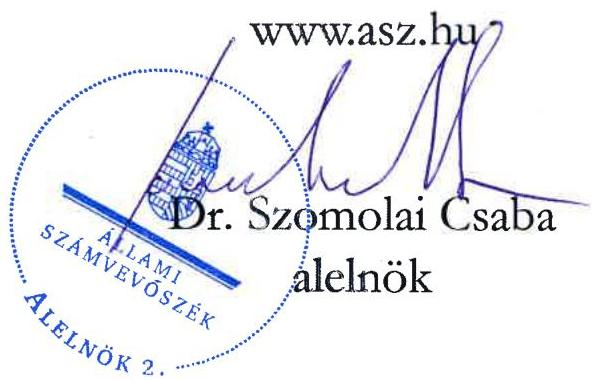

ÁLLAMI SZÁMVEVŐSZÉK

# JELENTÉS

A fenntartási kötelezettség kedvezményezettek
általi teljesítésének rapid ellenőrzése

Az EPS-FORMA Kereskedelmi és Szolgáltató Kft.
fenntartási kötelezettsége teljesítésének ellenőrzése
a GINOP-1.2.11-20-2020-00027 számú projektnél

2026.

26003

www.asz.hu

---

ÁLLAMI SZÁMVEVŐSZÉK

# JELENTÉS

A fenntartási kötelezettség kedvezményezettek
általi teljesítésének rapid ellenőrzése

Az EPS-FORMA Kereskedelmi és Szolgáltató Kft.
fenntartási kötelezettsége teljesítésének ellenőrzése
a GINOP-1.2.11-20-2020-00027 számú projektnél

2026.

26003

---

Jelentéseink az interneten a www.asz.hu címen olvashatók.

ELLENŐRZÉSI IGAZGATÓSÁG:
ELLENŐRZÉSI IGAZGATÓSÁG I.

ELLENŐRZÉSI IGAZGATÓ:
SINKÁNÉ DR. CSENDES ÁGNES igazgató

ELLENŐRZÉSVEZETŐ:
HUSZÁR ANNA ellenőrzésvezető

IKTATÓSZÁM: EL-4101-203/2025

TÉMASORSZÁM: -

ELLENŐRZÉS-AZONOSÍTÓ SZÁM: V1101

---

TARTALOMJEGYZÉK

- ÖSSZEFOGLALÁS ... 5
- AZ ELLENŐRZÉS EREDMÉNYEI ... 7
1. A fenntartási kötelezettség teljesítése ... 7
- I. FÜGGELÉK: ÉSZREVÉTELEK ... 10
- II. FÜGGELÉK: ELLENŐRZÉSI MEGKÖZELÍTÉS ... 11
- MELLÉKLETEK ... 16
I. sz. melléklet: Értelmező szótár ... 16
II. sz. melléklet: Az ellenőrzött és a közreműködő szervezetek jegyzéke ... 18
- RÖVIDÍTÉSEK JEGYZÉKE ... 19

---

“哈，你是个小伙子，你是个小伙子，你是个小伙子，你是个小伙子，你是个小伙子，你是个小伙子，你是个小伙子，你是个小伙子，你是个小伙子，你是个小伙子，你是个小伙子，你是个小伙子，你是个小伙子，你是个小伙子，你是个小伙子，你是个小伙子，你是个小伙子，你是个小伙子，你是个小伙子，你是个小伙子，你是个小伙子，你是个小伙子，你是个小伙子，你是个小伙子，你是个小伙子，你是个小伙子，你是个小伙子，你是个小伙子，你是个小伙子，你是个小伙子，你是个小伙子，你是个小伙子，你是个小伙子，你是个小伙子，你是个小伙子，你是个小伙子，你是个小伙子，你是个小伙子，你是个小伙子，你是个小伙子，你是个小伙子，你是个小伙子，你是个小伙子，你是个小伙子，你是个小伙子，你是个小伙子，你是个小伙子，你是个小伙子，你是个小伙子，你是个小伙子，你是个小伙子，你是个小伙子，你是个小伙子，你是个小伙子，你是个小伙子，你是个小伙子，你是个小伙子，你是个小伙子，你是个小伙子，

---

ÖSSZEFOGLALÁS

A 2020 augusztusában megjelent „Magyar Multi Program IV. – „Zöld Nemzeti Bajnokok” – Energiabátékonysági fejlesztéseket kiszolgálni képes mikro-, kis- és középvállalkozások technológiafejlesztése és kapacitásbővítése” című (GINOP-1.2.11-20 kódszámú) pályázati felhívást a kiemelt növekedési potenciállal rendelkező, feldolgozóiparban tevékenykedő mikro-, kis- és középvállalkozások számára, a zöld gazdasághoz és iparhoz kapcsolódó technológiaváltást segítő fejlesztések támogatása érdekében hirdették meg. A Felhívás¹ keretében olyan fejlesztési elképzelések voltak támogathatóak, melyek a GINOP-1.1.4-16 kiemelt projekt keretében a vállalkozás korábban készült egyéni fejlesztési koncepcióban foglalt tevékenységeinek megvalósítását jelentették. A rendelkezésre álló keretösszeg 7,3 Mrd Ft volt, a konstrukcióban az IH² 6,3 Mrd Ft támogatási összegre bocsátott ki támogatói okiratot. Az igényelhető vissza nem térítendő támogatás összege 20 M Ft és 400 M Ft között volt.

A Felhívásra benyújtott támogatási kérelem alapján 99,7 M Ft támogatást nyert GINOP-1.2.11-20-2020-00027 számú, „Műanyag hulladék feldolgozó kapacitás bővítése az EPS-Forma Kft-nél” című projekt Kedvezményezettje³, az EPS-FORMA Kft. – gőzfejlesztő és habhulladék feldolgozó – termelőeszközöket vásárolt és helyezett üzembe.

A Kedvezményezett – a támogatás visszafizetésének terhe mellett – vállalta, hogy a projektmegvalósítást követően a Projekt⁴ megfelel az 1303/2013/EU Rendeletben⁵, a műveletek tartósságára vonatkozó előírásoknak, az előírt fenntartási kötelezettséget teljesíti. A Projekt megvalósítása 2022. július 28-ra befejeződött, a fenntartási időszak ezt követő nappal indult és 2025. július 28-ig tartott.

A kapott támogatás összértéke, a Projekt egyedisége és a megvalósított projekteredmény hosszabb távon történő megtartása miatt az ÁSZ⁶ indokoltnak tartotta a Projekt fenntartásának és a támogatás hasznosulásának ellenőrzését. A Kedvezményezett projektfenntartási kötelezettségei teljesítésének ellenőrzésére az ÁSZ „A 2014-2020 programozási időszak kohéziós politikai operatív programok vonatkozásában a fenntartási kötelezettség teljesítésének ellenőrzési gyakorlata” című ellenőrzéséhez, mint alapellenőrzéshez kapcsolódóan került sor.

A Kedvezményezettnek a Projekt tekintetében hároméves fenntartási kötelezettsége volt, amely időszakra a Felhívás és a támogatói okirat projektszintű indikátort nem írt elő, azokban a Projekt keretében létrehozott termékek fenntartási időszak végéig történő fenntartásának kötelezettségét rögzítették.

A Kedvezményezett – az ÁSZ helyszíni ellenőrzésének lezárásáig – a projekteredmény működtetéséről és fenntartásáról a jogszabály szerint határidőben és megfelelően beszámolt az éves projektfenntartási jelentésekben, amelyeket az IH elfogadott. A záró projektfenntartási jelentés benyújtása az ÁSZ helyszíni ellenőrzésének lezárását követően, 2025. augusztus 12-én volt esedékes.

A Kedvezményezett – az ÁSZ helyszíni ellenőrzésének lezárásáig – megfelelt az 1303/2013/EU rendeletben előírtaknak, mivel a Projekt működőképessége, annak eredeti célkitűzései a fenntartási időszakban biztosítottak voltak. A Projekt keretében beszerzett eszközök üzemben tartott állapotban a megvalósítási helyszínen fellelhetőek voltak, ott a Kedvezményezett tevékenységeinek megfelelő munkavégzés folyt.

A hulladék visszavétel rendje – jogszabálymódosítás miatt – 2023. júniusban jelentősen megváltozott, ezzel összefüggésben a Kedvezményezett vállalkozásához visszavitt hungarocell mennyisége jelentősen lecsökkent, a lakossági tiszta hulladék átvétele megszűnt, amely negatívan befolyásolta a vállalkozás árbevételének alakulását. Az ÁSZ értékelése szerint a támogatással megvalósított beruházás ellenére a Kedvezményezett értékesítési árbevétel és adózott eredmény adatai a fenntartási időszak 2023-2024. évei

5

---

Összefoglalás

tekintetében romlottak, a foglalkoztatottak létszáma csökkent, így a Projekt keretében kapott támogatás korlátozottan hasznosult.

Az ÁSZ pozitív társadalmi hasznosulásként értékelte a fenntartható fejlődés érdekében tett fejlesztést, a habhulladék újrahasznosítást és az ezzel csökkenthető környezeti terhelést.

6

---

AZ ELLENŐRZÉS EREDMÉNYEI

A magyar vállalkozások a GINOP⁷ pályázati konstrukciók keretében jelentős mértékű támogatásban részesültek, amelyek célja volt hozzájárulni a gazdasági fejlődéshez, a társadalmi felzárkózáshoz és az infrastruktúra fejlesztéséhez. Az ÁSZ – Magyarország versenyképességének növelése érdekében – fontosnak tartja a kihelyezett uniós támogatások nemzetgazdasági szinten történő hasznosulását és értékteremtését a vállalatok beruházásain és elért teljesítményén keresztül. Az ÁSZ a támogatással kapcsolatos fenntartási kötelezettség teljesítését, valamint a támogatás hasznosulását a GINOP-1.2.11-20-2020-00027 számú projekt tekintetében értékelte. A Projekt keretében a kedvezményezett EPS-FORMA Kft. – gőzfejlesztő és habhulladék feldolgozó – termelőeszközöket vásárolt, illetve helyezett üzembe.

## 1. A fenntartási kötelezettség teljesítése

### Összegző megállapítás

Az ÁSZ értékelése szerint a Kedvezményezett fenntartási kötelezettségét – az ÁSZ helyszíni ellenőrzésének lezárásáig – teljesítette. A támogatás – a Kedvezményezett értékesítés nettó árbevétel és adózott eredmény adatainak romlása miatt – korlátozottan hasznosult.

### A fenntartási jelentés benyújtási kötelezettség teljesítése

A Kedvezményezettnek a Projekt megvalósítását követően, a Támogatási rend.⁸-ben foglaltak alapján hároméves fenntartási kötelezettsége volt, amelyet a Felhívás és a támogatói okirat is rögzített. Ennek keretében a Kedvezményezettnek a projekteredményt a megvalósítási helyszínen a megvalósítás befejezésétől számított három évig fenn kellett tartania és üzemeltetnie, és erről a Támogatási rend.-ben foglaltak alapján évente projektfenntartási jelentésben kellett beszámolnia.

A PFJ⁹-k és a ZPFJ¹⁰ főbb adatait az 1. táblázat tartalmazza.

1. táblázat

|  A GINOP-1.2.11-20-2020-00027 SZÁMÚ PROJEKTHEZ KAPCSOLÓDÓ PFJ-K FŐBB ADATAI  |   |   |   |   |   |
| --- | --- | --- | --- | --- | --- |
|  JELENTÉS SORSZÁMA | JELENTÉS TÍPUSA | TÁRGYIDÓSZAK KEZDETE | TÁRGYIDÓSZAK VÉGE | BENYÚJTÁS HATÁRIDEJE | JELENTÉS STÁTUSZA*  |
|  1. | PFJ | 2022.07.29 | 2023.07.28. | 2023.08.12. | 2023.08.11-én beérkezett, elfogadva 2025.03.28-án  |
|  2. | PFJ | 2023.07.29 | 2024.07.28 | 2024.08.12 | 2024.08.05-én beérkezett, elfogadva 2025.03.28-án  |
|  3. | ZPFJ | 2024.07.29. | 2025.07.28. | 2025.08.12 | 2025.08.12-én beérkezett  |

Forrás: FAIR¹¹ adatok alapján, ÁSZ saját szerkesztés

*A Kedvezményezett – a FAIR adatai szerint – 2025. augusztus 12-én, az ÁSZ helyszíni ellenőrzésének lezárását követően benyújtotta a ZPFJ-t.

A Kedvezményezett a Támogatási rend.-ben előírt éves projekt fenntartási jelentés benyújtási kötelezettségét az 1. és a 2. PFJ-k esetében a Támogatási rend.-ben előírtakat betartva – az ÁSZ helyszíni ellenőrzésének lezárásáig – határidőben teljesítette. Mivel a Kedvezményezett székhelye nem volt azonos a Projekt megvalósításának helyszínével, a Támogatási rend.-ben foglaltak alapján a Kedvezményezettnek melléklet-benyújtási kötelezettsége volt a PFJ-k megküldésekor. Az 1. PFJ és 2. PFJ tekintetében az IH a

---

Az ellenőrzés eredményei

Támogatási rend. adta lehetőséggel élve 2025. február 25-én – a székhelyen és a megvalósítási helyszínen foglalkoztatott munkavállalók tekintetében munkahelyfenntartási nyilvántartás – hiánypótlásra szólította fel a Kedvezményezettet. A Kedvezményezett a Támogatási rend.-ben előírt határidőben, 15 napon belül pótolta az IH által kért hiányosságokat, az IH 2025. március 28-án elfogadta az 1. és 2. PFJ-t.

Az IH 2024. március 13-án a fenntartási időszak 3. évében tervezett fenntartási ellenőrzést végzett a Kedvezményezettnél. A helyszíni ellenőrzés jegyzőkönyvében rögzítettek szerint a megtekintéskor a Projekt keretében beszerzett gépek működtek a megvalósítás helyszínén, a működést alátámasztó dokumentumokat a Kedvezményezett bemutatta (iparűzési adó befizetés igazolás, bérleti díj számlák). A helyszíni ellenőrzés intézkedésként a ténylegesen fejlesztett tevékenység (2229 '08 Egyéb műanyag termék gyártása) bejelentésének benyújtását írta elő, amelynek a Kedvezményezett eleget tett.

## A fenntartási kötelezettség, indikátorok teljesítése

A Kedvezményezett számára a Felhívás és a támogatói okirat a fenntartási időszakra projektszintű indikátort nem írt elő, azok a Projekt keretében létrehozott termékek fenntartási időszak végéig történő fenntartásának (üzemeltetésének) kötelezettségét rögzítették, amelyről a Kedvezményezettnek adatot kellett szolgáltatnia az IH számára. A Kedvezményezett fenntartási és egyéb kötelezettségét – az ÁSZ helyszíni ellenőrzésének lezárásáig – az alábbiak szerint teljesítette:

1. A Kedvezményezett a PFJ-k benyújtásakor a Támogatási rend.-ben előírtaknak megfelelően megtette nyilatkozatát arról, hogy
- a projektfenntartási jelentés tárgyidőszakában a Projekt megfelelt a 1303/2013/EU rendelet szerinti fenntartási követelményeknek;
- a projektfenntartási jelentésben megadott minden adat megalapozott és a valóságnak megfelelő;
- a megvalósítással kapcsolatos eredeti dokumentumokat a helyszínen elkülönítetten tartja nyilván és megőrzi azokat 2027. december 31-ig;
- a tájékoztatással és nyilvánossággal kapcsolatos követelményeknek eleget tett.

2. A Kedvezményezett a PFJ-k benyújtásakor az iparűzési adó befizetéséről és – hiánypótlás keretében – a Projektben foglalkoztatottak számáról teljesítette a kért adatszolgáltatást.

3. A fenntartási időszakban teljesítendő egyéb kötelezettségek keretében a Projekt elkülönített számviteli nyilvántartása rendelkezésre állt. A Kedvezményezett – ÁSZ részére megküldött – releváns tárgyi eszköz egyedi kartonjain a projektszintű elkülönített számviteli nyilvántartás a Támogatási rend.-ben foglaltaknak megfelelően biztosított volt, a Projektazonosítót feltüntette rajta.

A Kedvezményezett – az ÁSZ helyszíni ellenőrzésének lezárásáig – megfelelt a műveletek tartósságával kapcsolatban az 1303/2013/EU rendeletben és a Támogatási rend.-ben előírtaknak, mivel a Projekt működőképessége, annak eredeti célkitűzései a fenntartási időszakban biztosítottak voltak.

## A támogatás hasznosulása

A Kedvezményezett a Projekt keretében expandált polisztirolt feldolgozó gépsort, valamint gőzfejlesztő gépet szerzett be és helyezett üzembe, azok a Kedvezményezett telephelyén az ÁSZ helyszíni ellenőrzésekor üzemben tartott állapotban megtalálhatóak voltak.

A Kedvezményezett létszám, árbevétel, adózott eredmény és mérlegfőösszeg adatait a 2020-2024. évekre vonatkozóan a 2. táblázat mutatja be.

---

Az ellenőrzés eredményei

2. táblázat
A KEDVEZMÉNYEZETT 2020-2024. ÉVI LÉTSZÁM, ÁRBEVÉTEL, ADÓZOTT EREDMÉNY ÉS MÉRLEGFŐÖSSZEG ADATAI

|  ADATOK MEGNEVEZÉSE | 2020. ÉVBEN | 2021. ÉVBEN | 2022. ÉVBEN | 2023. ÉVBEN | 2024. ÉVBEN  |
| --- | --- | --- | --- | --- | --- |
|  Átlagos statisztikai állományi létszám (fő) | 12 | 11 | 12 | 10 | 7  |
|  Értékesítés nettó árbevétele (M Ft) | 184,9 | 194,0 | 215,6 | 139,8 | 58,5  |
|  Adózott eredmény (M Ft) | 6,2 | 86,6 | 0,5 | 8,6 | - 42,4  |
|  Mérlegfőösszeg (M Ft) | 451,2 | 545,9 | 687,6 | 611,0 | 366,6  |

Forrás: A Kedvezményezett éves beszámoló adatai alapján ÁSZ saját szerkesztés

A Kedvezményezett – ÁSZ helyszíni ellenőrzése során adott – nyilatkozata alapján, a vállalkozás pénzügyi-gazdasági helyzete összességében az elmúlt két évben romlott, amelyben szerepet játszott az építőipar termelésének visszaesése. Tájékoztatása szerint az újrahasznosított termékek gyártása mind időben, mind költség oldalról kedvezőbb (a hulladékalapanyag minimális költséggel rendelkezésre áll), azonban az újrahasznosított termékeknek kisebb a felvevőpiaca a korlátozottabb felhasználhatósága miatt.

A hulladék visszavétel rendje jogszabálymódosítás miatt 2023. júniusban jelentősen megváltozott, a Kedvezményezett vállalkozásához visszavitt hungarocell mennyisége jelentősen lecsökkent, a lakossági tiszta hulladék átvétele megszűnt, amely negatívan befolyásolta a vállalkozás árbevételének alakulását. Az ÁSZ értékelése szerint mivel a támogatással megvalósított beruházás ellenére a Kedvezményezett értékesítési árbevétel és adózott eredmény adatai a fenntartási időszak 2022-2024. évei tekintetében – a 2023. évi adózott eredmény kivételével – trendszerűen romlottak, a foglalkoztatottak létszáma csökkent, a Projekt keretében kapott támogatás korlátozottan hasznosult.

Az ÁSZ pozitív társadalmi hasznosulásként értékelte a fenntartható fejlődés érdekében tett fejlesztést, a habhulladék újrahasznosítást, és az ezzel csökkenthető környezeti terhelést.

---

I. FÜGGELÉK: ÉSZREVÉTELEK

A jelentéstervezetet az ÁSZ 15 napos észrevételezésre megküldte az ellenőrzött szervezet vezetőjének az ÁSZ tv. 29. §* (1) bekezdése előírásának megfelelően.

A jelentéstervezet megállapításaira az ellenőrzött szervezet nem tett észrevételt.

* 29. § (1) Az Állami Számvevőszék az ellenőrzési megállapításait megküldi az ellenőrzött szervezet vezetőjének vagy az általa megbízott személynek, és annak, akinek személyes felelősségét állapította meg.
(2) Az ellenőrzött szervezet vezetője és a felelősként megjelölt személy az ellenőrzés megállapításaira tizenöt napon belül írásban észrevételt tehet.
(3) Az Állami Számvevőszék az észrevételre a beérkezésétől számított harminc napon belül írásban válaszol. A figyelembe nem vett észrevételeket köteles a jelentésben feltüntetni, és megindokolni, hogy azokat miért nem fogadta el.

10

---

11

# II. FÜGGELÉK: ELLENŐRZÉSI MEGKÖZELÍTÉS

## AZ ELLENŐRZÉS JOGALAPJA

Az ellenőrzés jogszabályi alapját az ÁSZ tv.¹² 5. § (3) bekezdés képezte.

## AZ ELLENŐRZÉS CÉLJA

A fenntartási kötelezettség teljesítésének és a támogatás hasznosulásának értékelése a fenntartási szakaszba került uniós projekt kedvezményezettjénél.

## AZ ELLENŐRZÉS TÍPUSA

Kombinált ellenőrzés

## AZ ELLENŐRZÉS TÁRGYA

Az ellenőrzés tárgya volt az ellenőrzésre kiválasztott GINOP-1.2.11-20-2020-00027 számú uniós projekt fenntartási időszakára vonatkozóan előírt kötelezettségek a EPS-FORMA Kft. mint kedvezményezett által történt teljesítése és a támogatás hasznosulása. A fenntartási kötelezettség ellenőrzése a kedvezményezett tevékenységéhez és működéséhez kapcsolódó kötelezettségek, a meghatározott indikátorok és a beszámolási kötelezettség teljesítésére irányult.

Az ellenőrzés tárgya volt továbbá a kedvezményezett által benyújtott fenntartási jelentésekben rögzítettek valóságtartalma és megalapozottsága, valamint ezek összhangja az ÁSZ helyszíni ellenőrzése során tapasztaltakkal.

Az ellenőrzés kiterjedt minden olyan körülményre és adatra, amely az ÁSZ jogszabályban meghatározott feladatainak teljesítéséhez, valamint a program végrehajtása folyamán felmerült újabb összefüggések feltárásához szükséges.

## AZ ELLENŐRZÉS HATÓKÖRE ÉS TERÜLETE

Az uniós jogszabályok az uniós támogatással megvalósuló projektekkel szemben elvárásként rögzítik a „műveletek tartósságának” követelményét. A kedvezményezettek infrastrukturális vagy termelő beruházás esetén – a projektmegvalósítás befejezésétől számított 5 évig, kis- és közepes vállalkozások esetén 3 évig, a támogatás visszafizetésének terhe mellett – vállalták, hogy a projekt termelő tevékenysége nem szűnik meg, hogy nem következik be olyan tulajdonosváltás, amelynek eredményeként jogosulatlan előny szerezhető, illetve, hogy nem következik be olyan lényeges változás, amely a projekt eredeti célkitűzéseit veszélyezteti. Abban az esetben, ha a felsoroltak valamelyike bekövetkezik, a támogatást – figyelemmel a vonatkozó jogszabályokra – vissza kell fizetni az Európai Bizottságnak.

---

II. Függelék: Ellenőrzési megközelítés

Ha az IH a projektre nézve fenntartási kötelezettséget állapított meg, és indikátorokat határozott meg a támogatási szerződésben/támogatói okiratban, a kedvezményezettnek évente be kellett számolnia az indikátorok teljesüléséről. Ha ezen időszakra indikátorokat nem határozott meg az IH és a támogatási szerződésben/támogatói okiratban sem írta elő az évenkénti teljesítést, a kedvezményezettnek egy alkalommal záró projektfenntartási jelentést kellett benyújtania.

Az ellenőrzés a XIX. Uniós fejlesztések fejezet 3/1 Kohéziós politikai operatív programok 2014-2020 operatív programjai közül a – kis- és középvállalkozások versenyképességének javítására irányuló – GINOP 1. prioritásából és a – kutatás, technológiai fejlesztés és innováció című – GINOP 2. prioritásából támogatást kapott projektek kedvezményezettjeire terjedt ki oly módon, hogy az ÁSZ – „A 2014-2020 programozási időszak kohéziós politikai operatív programok vonatkozásában a fenntartási kötelezettség teljesítésének ellenőrzési gyakorlata” című ellenőrzéséhez, mint alapellenőrzéshez kapcsolódóan – a GINOP 1-2. prioritás pályázati kiírásainak nyertes pályázóból, kockázat alapú mintavételi eljárással, rapid ellenőrzésre választott ki összesen 16 projektet, amelyből ezen jelentésben a GINOP-1.2.11-20-2020-00027 számú projekt tekintetében értékelte a fenntartási kötelezettség teljesítését.

A GINOP-1.2.11-20-2020-00027 számú projekt tekintetében az ellenőrzés kiterjedt a célrendszer, a jogszabályban – a működés és tevékenység tekintetében – előírt fenntartási kötelezettség teljesülésére, a fenntartási jelentésben bemutatott eredmények valóságtartalmára, megalapozottságára, valamint a támogatói okiratban vállalt, a fenntartási időszakra vonatkozó kötelezettségek teljesítésének, és a GINOP keretében nyújtott támogatás hasznosulásának értékelésére.

## A GINOP-1.2.11-20 számú felhívás bemutatása

A GINOP-1.2.11-20 kódszámú „Magyar Multi Program IV. – „Zöld Nemzeti Bajnokok” – Energiahatékonysági fejlesztéseket kiszolgálni képes mikro-, kis- és középvállalkozások technológiafejlesztése és kapacitásbővítése” című pályázati felhívást a kiemelt növekedési potenciállal rendelkező, feldolgozóiparban tevékenykedő mikro-, kis- és középvállalkozások számára, a zöld gazdasághoz és iparhoz kapcsolódó technológiaváltást segítő fejlesztések támogatása érdekében hirdették meg. A KKV¹³-k olyan fejlesztési elképzelései voltak támogathatók, melyek a GINOP-1.1.4-16¹⁴ kiemelt projekt keretében – az IFKA¹⁵ által – korábban készült egyéni fejlesztési koncepcióban foglalt tevékenységek megvalósítását jelentették. A támogatási kérelmek benyújtására 2020. augusztus 31. és 2020. december 3. közötti időszakban volt lehetőség.

A támogatásnak kettős célja volt, egyrészt az innovatív, nagy növekedési potenciállal bíró vállalkozások növekedési lehetőségeinek javítása, gazdasági teljesítményének erősítése, másrészt a hazai mikro-, kis- és középvállalkozások zöldgazdaságba történő nagyobb mértékű bekapcsolása, technológiafejlesztése és kapacitásbővítése.

A támogatás forrását az Európai Regionális Fejlesztési Alap és Magyarország költségvetése társfinanszírozásban biztosította. A Felhívásra összesen 7,3 Mrd Ft keretösszeg állt rendelkezésre. Projektenként a támogatás összege minimum 20 M Ft, maximum 400 M Ft lehetett. A Felhívásban a támogatási kérelmek várható számát 18-365 darabra tervezték.

A támogatás maximális mértéke a projekt elszámolható költségének 50%-a lehetett régióktól függően. Az előleg maximális mértéke a megítélt támogatás 25%-a, legfeljebb 100 M Ft lehetett, egyszeri elszámolás esetén azonban előleg nem volt igényelhető.

A projektek keretében önállóan támogatható tevékenység volt az új termelőeszközök, gépek beszerzése, az új technológiai rendszerek és kapacitások kialakítása, beleértve az automatizált termelési rendszerek fejlesztését, gyártási technológiák fejlesztését, folyamat-automatizálási eszközök, szenzor-, és vezérlés technológiák fejlesztését, robottechnológia alkalmazását, intelligens gyártás megoldások beszerzését.

---

II. Függelék: Ellenőrzési megközelítés

A támogatásra azok a magyarországi székhellyel, vagy fiókteleppel rendelkező kettős könyvvitelt vezető mikro-, kis-, és középvállalkozások (gazdasági társaság, egyéni vállalkozó, egyéni cég) pályázhattak, akik a GINOP-1.1.4-16 kódszámú kiemelt projekt keretében végzett előminősítésen átestek és erről IFKA tanúsítvánnyal rendelkeztek, szerepeltek a köztartozásmentes adózói adatbázisban, valamint rendelkeztek legalább két lezárt üzleti évvel és a támogatási kérelem benyújtását megelőző év nettó árbevétele legalább 50 M Ft volt. Emellett kritériumként szerepelt még, hogy az átlagos statisztikai állományi létszámának legalább 3 főnek kellett lennie, a támogatási kérelem benyújtását megelőző második lezárt üzleti évben kimutatott nettó árbevételét az azt követő évben kimutatott nettó árbevétel legalább 5%-kal meghaladta, továbbá a fejlesztési igénye a Felhívásban felsorolt feldolgozóipari tevékenységekre irányult.

A projekt végrehajtása során egy mérföldkő volt tervezhető a projekt fizikai befejezésének várható időpontjára, amelyre legfeljebb 18 hónap állt rendelkezésre. A projekt fizikai befejezést követően 60 napon belül, de legkésőbb 2022. szeptember 30-ig kellett záró kifizetési igénylést benyújtani. A kedvezményezett nem volt köteles biztosítékot nyújtani, amennyiben rendelkezett egy teljes lezárt üzleti évvel és szerepelt a köztartozásmentes adózói adatbázisban.

A támogatást igénylőnek projektszinten nem kellett indikátor célértékét terveznie, mivel a Felhívás csak GINOP szinten fogalmazott meg – „Vissza nem térítendő támogatásban részesülő vállalkozások száma”, „A támogatott új vállalkozások száma”, „A vállalkozásoknak közpénzből nyújtott támogatáshoz illeszkedő magánberuházás (vissza nem térítendő támogatás)” és a „A kkv-k nettó árbevétele” megnevezésű – indikátorokat. A támogatást igénylő szerződéses kötelezettsége volt, hogy a projektet, a támogatói okiratban megjelölt megvalósítási helyszínen megvalósítja, és azt a fenntartási időszak alatt, ugyanezen a helyen fenntartja, illetve üzemelteti.

A fenntartási időszak 3 év volt a projektmegvalósítás befejezésétől számítva. A támogatást igénylőnek a projekt keretében létrehozott termékeket, szolgáltatásokat a fenntartási időszak végéig fenn kellett tartania.

A beérkező támogatási kérelmek egyszerűsített kiválasztási eljárásrend alapján, folyamatosan kerültek elbírálásra, a Felhívás a 2020. augusztus 03-i megjelenését követően nem módosult.

A Felhívásra 59 támogatási kérelem érkezett be, összesen 13,9 Mrd Ft összegre. Az IH adatszolgáltatása alapján a benyújtott támogatási kérelmek közül az IH 27 darabot támogatott, összesen 6,3 Mrd Ft támogatási összegben bocsátott ki támogatói okiratot.

# Az EPS-FORMA Kft. és a GINOP-1.2.11-20-2020-00027 számú projekt bemutatása

Az EPS-FORMA Kft. 2003-ban jött létre, a „BOVIRA” Zrt.-ból történő kiválasztal, székhelye Szegeden volt, amely a támogatási kérelem benyújtása óta nem módosult. A Kedvezményezett a székhelyén kívül három fiókteleppel rendelkezett, főtevékenysége a támogatási kérelem benyújtásakor és az ÁSZ helyszíni ellenőrzése lezárásának időpontjában „Műanyag-, gumifeldolgozó gép gyártása” volt.

A Kedvezményezett a támogatási kérelem benyújtását megelőző évben kisvállalkozásnak minősült. A 2024. évben a Kedvezményezett átlagos statisztikai állományi létszáma 7 fő, a nettó árbevétele 58,5 M Ft volt az éves beszámoló adatai alapján, 2025. március 5-től NAV¹⁶ részéről elrendelt végrehajtási eljárás alatt állt.

A támogatási kérelem benyújtására 2020. október 15-én került sor, a támogatói okirat 2021. március 12-én lépett hatályba. A Kedvezményezett a GINOP-1.2.11-20-2020-00027 számú, „Műanyag hulladék feldolgozó kapacitás bővítése az EPS-Forma Kft-nél” című projekt megvalósítását vállalta, amelynek célja a másodlagos alapanyag feldolgozása és újbóli piacra kerülése volt. A fejlesztési koncepció közvetlen eredményeként egy feldolgozó gépsor és egy gőzfejlesztő egység üzembe helyezését tervezte, amelyekkel hab hulladékot, elektromos és más berendezések bontásakor keletkező vegyes műanyag hulladékot tud hatékonyan újrahasznosítani.

13

---

II. Függelék: Ellenőrzési megközelítés

A Projekt megvalósítási helyszíne a Kedvezményezett domaszéki fióktelepe volt. A támogatói okiratot összesen 5 alkalommal módosították, amelyek jellemzően a beszerzendő tárgyi eszközök típusának és szállítójának módosítására vonatkoztak.

A Projekt megítelt összköltsége 199,4 M Ft volt, 50%-os támogatási intenzitás mellett a támogatástartalom 99,7 M Ft-ot tett ki. A támogatói okiratban a Projekt megvalósítás kezdete eredetileg 2020. november 1-e volt, az ténylegesen 2021. április 12-én kezdődött meg, fizikai befejezésének határidejeként eredetileg 2021. március 31-e, módosítást követően 2021. szeptember 21-e került rögzítésre.

A Projektben a Kedvezményezettnek egy mérföldkő teljesítését írták elő, a fizikai befejezés határidejével azonosan 2021. szeptember 21-i elérési dátummal.

A támogatói okirat előírta a Kedvezményezett számára, hogy a Projektet a megvalósítási helyszínen megvalósítja, azt a fenntartási időszak alatt, ugyanezen a helyen fenntartja és üzemelteti. A támogatói okirat a Kedvezményezettnek nem írt elő indikátor teljesítési kötelezettséget.

A Projekt eredeti célkitűzése teljesült 2021. szeptember 21-ére, amelynek eredményeként a feldolgozó gépsor és a gőzfejlesztő egység beszerzése és üzembehelyezése megtörtént. A Kedvezményezett a záró szakmai beszámolót 2021. november 10-én, határidőben benyújtotta, amelyet az IH 2022. július 25-én hagyott jóvá.

Helyszíni ellenőrzést az IH a projektmegvalósítás szakaszában nem végzett a megvalósítás helyszínén.

A hároméves fenntartási időszak 2022. július 29-én kezdődött, az első projektfenntartási jelentés benyújtási határideje 2023. augusztus 12-e volt, a Kedvezményezettet ezt követően évente terhelte fenntartási jelentés benyújtási kötelezettség. A záró projektfenntartási jelentés benyújtási határideje 2025. augusztus 12-e volt.

## AZ ELLENŐRZŐTT IDŐSZAK

2016. január 1-től 2025. április 30-ig, a helyszíni ellenőrzés lezárásának időpontjáig tartó időszak.

## AZ ELLENŐRZÉSI KRITÉRIUMOK

|  FÓKUSZTERÜLET/FÓKUSZKÉRDÉS | ELLENŐRZÉSI KRITÉRIUMOK  |
| --- | --- |
|  1. A fenntartási kötelezettség teljesítése  |   |
|  A fenntartási jelentés benyújtási kötelezettség teljesítése | Támogatási rend. 178. § (1) bekezdés, 180. § (1) bekezdés, 1. melléklet 278.2., 297.1 pontjai;
Felhívás 3.8. pontja  |
|  A fenntartási kötelezettség, indikátorok teljesítése | 1303/2013/EU rendelet 71. cikk (1) bekezdés;
Támogatási rend. 110/A. §, 178. § (1) bekezdés, 1. melléklet 287.2. és 289.1. pontjai;  |
|  A támogatás hasznosulása | Az ÁSZ meghatározása alapján:
- A támogatás hasznosult, ha a vállalkozás (a projekt) működött az ÁSZ helyszíni ellenőrzése időpontjában, fenntartási kötelezettségét a kedvezményezett teljesítette / jellemzően teljesítette, és a támogatás eredményeként a kedvezményezett vállalkozás árbevétel vagy adózott eredmény adatai növekedtek a támogatás előtti időszakhoz képest.
- A támogatás korlátozottan hasznosult, ha a projekteredmény „fellelhető volt” az ÁSZ helyszíni ellenőrzése időpontjában, fenntartási kötelezettségét részben / minimálisan teljesítette a kedvezményezett, vagy a támogatás eredményeként hozzáadott új értéket teremtett, az társadalmilag hasznosult stb.
- A támogatás nem hasznosult, ha fenntartási kötelezettségét a kedvezményezett egyáltalán nem teljesítette és/vagy a vállalkozás (a projekt) már nem működött az ÁSZ helyszíni ellenőrzése időpontjában.  |

---

II. Függelék: Ellenőrzési megközelítés

# AZ ELLENŐRZÉS MÓDSZERE ÉS AZ ELLENŐRZÉSI BIZONYÍTÉKOK KÖRE

Az ÁSZ az ellenőrzést a nemzetközi standardokat irányadónak tekintve az ellenőrzési program szempontjai, az ellenőrzött időszakban hatályos jogszabályok, az ellenőrzés-szakmai szabályok és módszertanok figyelembevételével végezte.

Az ellenőrzési kérdések megválaszolásához szükséges bizonyítékok megszerzése az ellenőrzött szervezet és az ellenőrzésben közreműködő szervezet által rendelkezésre bocsátott dokumentumokra és adatokra alapozva, továbbá megfigyelés, szemle (szemrevételezés), kérdésfeltevés (információkérés), interjú, mintavételezés, valamint elemző eljárás útján történt.

Az ellenőrzés bizonyítékként felhasználható adatforrásai közé tartoztak egyrészt az ellenőrzéshez kért dokumentumok, adatforrások, a nyilvánosan hozzáférhető adatok, dokumentumok, másrészt adatforrás volt még minden, az ellenőrzés folyamán feltárt, az ellenőrzés szempontjából információt tartalmazó dokumentum. Az ÁSZ a számvevőszéki jelentéstervezet elfogadásáig rendelkezésre álló, nyilvánosan elérhető adatokat figyelembe vette.

Az ellenőrzés végrehajtásához a Projekt kiválasztása kockázat alapú mintavételi eljárással történt.

---

MELLÉKLETEK

## I. SZ. MELLÉKLET: ÉRTELMEZŐ SZÓTÁR

fenntartás

A kedvezményezett a projektmegvalósítás befejezésétől számított 5 évig, állami támogatás formájában nyújtott támogatás esetén az állami támogatásokra vonatkozó szabályok alapján alkalmazandó időtartamig, kis- és közepes vállalkozások esetén 3 évig a támogatás visszafizetésének terhe mellett vállalja, hogy a projekt megfelel az 1303/2013/EU európai parlamenti és tanácsi rendelet 71. cikk (1) bekezdésében foglaltaknak. (Forrás: Támogatási rend. 178. § (1) bekezdés, 2016. május 14-től 2024. július 31-ig hatályos)

Az irányító hatóság döntése alapján a fenntartási időszak kezdődhet a projektmegvalósítás befejezésétől vagy a projekt fizikai befejezésétől. (ÁSZF¹⁷ 10.7. pontja alapján, hatályos 2016. június 14-től)

A fenntartási időszak meghatározása során az IH speciális projektév szerinti jelentéstételt alkalmazott, mivel a jelentések tárgyidőszaka speciális projektévhez (az üzleti évről készített közzétett beszámolóhoz) igazodott és a fenntartási jelentésben benyújtandó vállalási adatok csak az így meghatározott időszak elteltével álltak rendelkezésre. (Forrás: Támogatási rend. 1. melléklet 285.1-286.4 pontja alapján ÁSZ megfogalmazás)

indikátor

Uniós jogszabályokban és a programban nevesített, valamint az európai uniós források felhasználásáért felelős miniszter – a Vidékfejlesztési Program esetén az agrárpolitikáért felelős miniszter – által meghatározott, eredményt vagy teljesülést mérő mutató. (Forrás: Támogatási rend. 3. § (1) bekezdés 12. pont, 2022. július 21-től 2024. július 31-ig hatályos)

kedvezményezett

A támogatásban részesített támogatást igénylő (Forrás: Támogatási rend. 3. § (1) bekezdés 14. pont, 2014. november 6-tól hatályos)

műveletek tartóssága

Az ESB-alapokból¹⁸ valamely infrastrukturális vagy termelő beruházást magában foglaló műveletre fordított támogatás akkor fizetendő vissza, ha a kedvezményezettnek történő utolsó kifizetéstől számított 5 évben belül, illetve adott esetben, az állami támogatásokról szóló szabályozás szerinti időtartamon belül, a következők valamelyike történik:

a) a termelő tevékenység megszűnése vagy a programterületen kívülre való áthelyezése;

b) az infrastruktúra valamely elemében tulajdonosváltás következik be, amelynek eredményeként egy cég vagy állami szervezet jogosulatlan előnyhöz jut;

c) a természetében, célkitűzéseiben vagy végrehajtási feltételeiben olyan lényeges változás következik be, amely az eredeti célkitűzéseket veszélyezteti.

A műveletre jogosulatlanul kifizetett összegeket a tagállamnak vissza kell téríthetni, azon időszakkal arányosan, amelynek tekintetében nem teljesültek a követelmények. (Forrás: 1303/2013/EU rendelet 71. cikk (1) bekezdése)

projekt fizikai befejezése

Az az állapot, amikor a projekt keretében támogatott tevékenységeket a felhívásban és a támogatási szerződésben meghatározottak szerint elvégezték. (Forrás: Támogatási rend. 3. § (1) bekezdés 40. pont, 2015. június 13-tól hatályos)

16

---

Mellékletek

projekt lezárása

Egy projekt akkor tekinthető lezártnak, ha a kedvezményezett a támogatási szerződésben a projektmegvalósítás befejezését követő időszakra nézve további kötelezettséget nem vállalt, és a felhívásban meghatározott feltételek teljesültek. Ha a támogatási szerződés a támogatott tevékenység befejezését követő időszakra nézve további kötelezettséget előírt, a projekt akkor tekinthető lezártnak, ha valamennyi vállalt kötelezettség teljesült és a kedvezményezett a kötelezettségek megvalósulásának eredményeiről szóló záró projekt fenntartási jelentést benyújtotta, és azt az irányító hatóság, Vidékfejlesztési Program esetén a kifizető ügynökség jóváhagyta, valamint a záró jegyzőkönyv elkészült. (Forrás: Támogatási rend. 3. § (1) bekezdés 39. pont, 2016. május 14-től 2024. július 31-ig hatályos)

projektmegvalósítás befejezése

Az 1303/2013/EU rendelet 2. cikk 14. pontjára tekintettel egy projekt megvalósítása akkor tekinthető befejezettnek, ha a projekt fizikailag és pénzügyileg is befejezett, valamint a kedvezményezettnek valamennyi támogatott tevékenysége befejezését igazoló és alátámasztó kifizetési igénylését az irányító hatóság jóváhagyta és a támogatás folyósítása megtörtént. (Forrás: Támogatási rend. 3. § (1) bekezdés 41. pont, 2015. június 13-tól 2023. május 24-ig hatályos)

projekt pénzügyi befejezése

Ha a projekt fizikai befejezése megtörtént, valamint a projektmegvalósítás során keletkezett elszámoló bizonylatok – szállítói kifizetés esetén az előírt önrész szállítók részére történő – kiegyenlítése megtörtént. A projekt pénzügyi befejezésének dátuma a projekt megvalósítási ideje alatt felmerült, a kedvezményezett által megfelelően elszámolt költségek közül a legkésőbbi kiegyenlítés dátuma. (Forrás: Támogatási rend. 3. § (1) bekezdés 42. pontja alapján, 2014. november 6-tól hatályos)

egyszerűsített kiválasztási eljárás folyamatos elbírálással

A beérkezés sorrendjében kell a támogatási kérelmeket jogosultsági és tartalmi értékelésre bocsátani, valamint a felhívásban előírt mérlegelést nem igénylő értékelési szempontoknak való megfelelés alapján kell a támogathatóságukról dönteni. (Támogatási rend. 61. § (3) a) bekezdés alapján, hatályos 2015. november 21-től)

17

---

Mellékletek

## II. SZ. MELLÉKLET: AZ ELLENŐRZŐTT ÉS A KÖZREMŰKÖDŐ SZERVEZETEK JEGYZÉKE

|  ELLENŐRZŐTT SZERVEZET MEGNEVEZÉSE | ADÓSZÁM  |
| --- | --- |
|  EPS-FORMA Kereskedelmi és Szolgáltató Kft. | 13195728-2-06  |
|  KÖZREMŰKÖDŐ SZERVEZET MEGNEVEZÉSE | ADÓSZÁM  |
| --- | --- |
|  Közigazgatási és Területfejlesztési Minisztérium | 15849272-2-41  |
|  Nemzeti Fejlesztési Központ | 15850258-1-42  |

---

RÖVIDÍTÉSEK JEGYZÉKE

1 Felhívás

2 IH

3 Kedvezményezett, EPS-FORMA Kft.

4 Projekt

5 1303/2013/EU rendelet

6 ÁSZ

7 GINOP

8 Támogatási rend.

9 PFJ

10 ZPFJ

11 FAIR

12 ÁSZ tv.

13 KKV

14 GINOP-1.1.4-16

15 IFKA

16 NAV

17 ÁSZF

18 ESB-alapok

A GINOP-1.2.11-20 kódszámú, a „Magyar Multi Program IV. – „Zöld Nemzeti Bajnokok” – Energiabatikonysági fejlesztéseket kiszolgálni képes mikro-, kis- és középvállalkozások technológiafejlesztése és kapacitásbővítése” című pályázati felhívás

Irányító Hatóság (A GINOP esetében 2014. november 6-tól 2018. június 15-ig a Nemzetgazdasági Minisztérium, majd 2022. május 24-ig a Pénzügyminisztérium. 2022. május 25-től a területfejlesztési miniszter tevékenységének segítésére kijelölt minisztériumként a Miniszterelnökség volt a felelős az IH feladatok tekintetében. 2024. január 1-vel az IH feladatok átkerültek a Közigazgatási és Területfejlesztési Minisztériumhoz. A feladatok 2024. augusztus 1-től az újonnan létrejött Nemzeti Fejlesztési Központba kerültek).

EPS-FORMA Kereskedelmi és Szolgáltató Kft.

A GINOP-1.2.11-20-2020-00027 számú, „Műanyag hulladék feldolgozó kapacitás bővítése az EPS-Forma Kft-nél” című projekt

AZ EURÓPAI PARLAMENT ÉS A TANÁCS 1303/2013/EU RENDELETE (2013. december 17.) az Európai Regionális Fejlesztési Alapra, az Európai Szociális Alapra, a Kohéziós Alapra, az Európai Mezőgazdasági Vidékfejlesztési Alapra és az Európai Tengerügyi és Halászati Alapra vonatkozó közös rendelkezések megállapításáról, az Európai Regionális Fejlesztési Alapra, az Európai Szociális Alapra és a Kohéziós Alapra és az Európai Tengerügyi és Halászati Alapra vonatkozó általános rendelkezések megállapításáról és az 1083/2006/EK tanácsi rendelet hatályon kívül helyezéséről

Állami Számvevőszék

Gazdaságfejlesztési és Innovációs Operatív Program

272/2014. (XI. 5.) Korm. rendelet a 2014-2020 programozási időszakban az egyes európai uniós alapokból származó támogatások felhasználásának rendjéről

projektfenntartási jelentés

záró projektfenntartási jelentés

Fejlesztéspolitikai Adatbázis és Információs Rendszer, amely a fejlesztési források felhasználására – többek között a kohéziós politikai operatív programok – vonatkozó eljárások során keletkező adatok egységes nyilvántartó rendszere a 60/2014. (III.6.) Korm. rendelet alapján

2011. évi LXVI. törvény az Állami Számvevőszékről

A mikro-, kis- és középvállalkozások gyűjtőneve

A GINOP-1.1.4-16 kódszámú „Magyar Multi Program I. – A kiemelt növekedési potenciállal bíró kis- és középvállalkozások azonosítása, felmérése, motiválása, fejlesztési igényeik meghatározása” című pályázati felhívás

IFKA Iparfejlesztési Közhasznú Nonprofit Kft.

Nemzeti Adó- és Vámhivatal

Általános Szerződési Feltételek az operatív programok keretében támogatásban részesített kedvezményezetekkel kötendő támogatási szerződésekhez

Az európai strukturális és beruházási alapok

19

---

ÁLLAMI SZÁMVEVŐSZÉK

1052 Budapest, Apáczai Csere János u. 10. | 1364 Budapest 4., Pf. 54

www.asz.hu | szamvevoszek@asz.hu

telefon: +36 1 484 9100