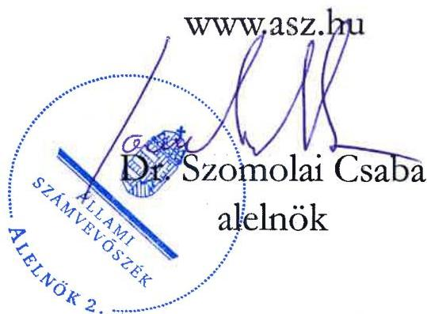

ÁLLAMI SZÁMVEVŐSZÉK

# JELENTÉS

A fenntartási kötelezettség kedvezményezettek
általi teljesítésének rapid ellenőrzése

Az LRG É-L Kutató-fejlesztő és Szakértő Iroda Kft.
fenntartási kötelezettsége teljesítésének ellenőrzése
a GINOP-2.1.7-15-2016-01761 számú projektnél

2026.

26005

www.asz.hu

---

ÁLLAMI SZÁMVEVŐSZÉK

# JELENTÉS

A fenntartási kötelezettség kedvezményezettek
általi teljesítésének rapid ellenőrzése

Az LRG É-L Kutató-fejlesztő és Szakértő Iroda Kft.
fenntartási kötelezettsége teljesítésének ellenőrzése
a GINOP-2.1.7-15-2016-01761 számú projektnél

2026.

26005

---

Jelentéseink az interneten a www.asz.hu címen olvashatók.

ELLENŐRZÉSI IGAZGATÓSÁG:
ELLENŐRZÉSI IGAZGATÓSÁG I.

ELLENŐRZÉSI IGAZGATÓ:
SINKÁNÉ DR. CSENDES ÁGNES igazgató

ELLENŐRZÉSVEZETŐ:
HUSZÁR ANNA ellenőrzésvezető

IKTATÓSZÁM: EL-4101-205/2025

TÉMASORSZÁM: -

ELLENŐRZÉS-AZONOSÍTÓ SZÁM: V1101

---

TARTALOMJEGYZÉK

- ÖSSZEFOGLALÁS ... 5
- AZ ELLENŐRZÉS EREDMÉNYEI ... 6
1. A fenntartási kötelezettség teljesítése ... 6
- I. FÜGGELÉK: ÉSZREVÉTELEK ... 10
- II. FÜGGELÉK: ELLENŐRZÉSI MEGKÖZELÍTÉS ... 11
- MELLÉKLETEK ... 16
I. sz. melléklet: Értelmező szótár ... 16
II. sz. melléklet: Az ellenőrzött és a közreműködő szervezetek jegyzéke ... 18
- RÖVIDÍTÉSEK JEGYZÉKE ... 19

---

“哈，你是个小伙子，你是个小伙子，你是个小伙子，你是个小伙子，你是个小伙子，你是个小伙子，你是个小伙子，你是个小伙子，你是个小伙子，你是个小伙子，你是个小伙子，你是个小伙子，你是个小伙子，你是个小伙子，你是个小伙子，你是个小伙子，你是个小伙子，你是个小伙子，你是个小伙子，你是个小伙子，你是个小伙子，你是个小伙子，你是个小伙子，你是个小伙子，你是个小伙子，你是个小伙子，你是个小伙子，你是个小伙子，你是个小伙子，你是个小伙子，你是个小伙子，你是个小伙子，你是个小伙子，你是个小伙子，你是个小伙子，你是个小伙子，你是个小伙子，你是个小伙子，你是个小伙子，你是个小伙子，你是个小伙子，你是个小伙子，你是个小伙子，你是个小伙子，你是个小伙子，你是个小伙子，你是个小伙子，你是个小伙子，你是个小伙子，你是个小伙子，你是个小伙子，你是个小伙子，你是个小伙子，你是个小伙子，你是个小伙子，你是个小伙子，你是个小伙子，你是个小伙子，你是个小伙子，你是个小伙子，

---

ÖSSZEFOGLALÁS

A 2015 októberében megjelent „Prototípus, termék-, technológia- és szolgáltatásfejlesztés” című (GINOP-2.1.7-15 kódszámú) pályázati felhívást azzal a céllal hirdették meg, hogy a KKV¹-k széles körének jelentős szellemi értéket tartalmazó, műszaki, technológiai fejlesztéseihez kiszámítható forrást nyújtson az intelligens gyártásspecializáció támogatása érdekében. A támogatásra rendelkezésre álló keretösszeg eredetileg 35 Mrd Ft volt, a keretösszeg emelését követően végül a konstrukcióban 40,5 Mrd Ft értékben kötött az IH² támogatási szerződést. Az igényelhető vissza nem térítendő támogatás összege 10 M Ft és 130 M Ft között volt.

A Felhívás³-ra benyújtott támogatási kérelem alapján 129,9 M Ft támogatást nyert GINOP-2.1.7-15-2016-01761 számú, „Viselhető, adaptív, perszonalizálható fényforrásfejlesztés RGB (RGBW) LED technológiával” című projekt Kedvezményezettje⁴, az LRG Kft. egy intelligens fényforrásfelülettel egybeintegrált, képeket vezeték nélkül továbbítani képes LED technológiára épülő fejlámpát és a hozzá tartozó szoftver prototípusát fejlesztette ki.

A Kedvezményezett – a támogatás visszafizetésének terhe mellett – vállalta, hogy a projektmegvalósítást követően a Projekt⁵ megfelel az 1303/2013/EU Rendeletben⁶, a műveletek tartósságára vonatkozó előírásoknak, az előírt fenntartási kötelezettséget teljesíti. A Projekt megvalósítása 2020. augusztus 7-én befejeződött, a fenntartási időszak ezt követő nappal indult és 2023. december 31-ig tartott.

A kapott támogatás összértéke, a Projekt egyedisége és a megvalósított projekteredmény hosszabb távon történő megtartása miatt az ÁSZ⁷ indokoltnak tartotta a Projekt fenntartásának és a támogatás hasznosulásának ellenőrzését. A Kedvezményezett Projekt fenntartási kötelezettségei teljesítésének ellenőrzésére az ÁSZ „A 2014-2020 programozási időszak kohéziós politikai operatív programok vonatkozásában a fenntartási kötelezettség teljesítésének ellenőrzési gyakorlata” című ellenőrzéséhez, mint alapellenőrzéshez kapcsolódóan került sor.

A Kedvezményezettnek a Projekt tekintetében hároméves fenntartási kötelezettsége volt, amely keretében a projektfenntartási jelentés benyújtási kötelezettségét teljesítette, azonban a ZPFJ⁸ benyújtása nem felelt meg a Támogatási rend.⁹-ben előírtaknak, mert a benyújtásra az alátámasztásul szolgáló 2023. évi beszámoló adatok rendelkezésre állása előtt került sor.

A Kedvezményezett a megvalósítás időszakára kötelezően vállalt „A projekt K+F+I eredménye” mutató teljesítette, mivel a Projekt pénzügyi befejezéséig – az IH helyszíni ellenőrzéséről készült jegyzőkönyve alapján – kifejlesztett egy terméket és hozzá előállította a szoftver tesztelt prototípusát. A fenntartási időszakra vállalt „Üzleti hasznosíthatóság” mutató nem teljesítette, mivel a prototípus értékesítéséből származó 2021. évi főkönyvi kivonatában kimutatott árbevétele nem érte el a kapott támogatás 30%-át.

Az IH, miután 2024 szeptemberében tudomására jutott, hogy a Kedvezményezett felszámolási eljárás alatt áll, elállt a támogatási szerződéstől, és – a felszámolás kezdő időpontjában – 132,7 M Ft Kedvezményezettel szemben fennálló követelés összegéről tájékoztatta a felszámolóbiztost. Tekintettel arra, hogy a Kedvezményezett által benyújtott fenntartási jelentések nem kerültek az IH által jóváhagyásra, így a támogatási jogviszony a felszámolási eljárás megindításakor még fennállt. A Kedvezményezett a támogatás-visszafizetési kötelezettségét 2025. október 31-ig nem teljesítette.

Az ÁSZ a Kedvezményezettnél helyszíni ellenőrzést nem tudott lefolytatni, a fejlesztett termék nem volt megtekinthető, a Kedvezményezett tevékenysége már megszűnt, a vállalkozás nem működött, felszámolási eljárás alatt állt.

Az ÁSZ értékelése szerint a Kedvezményezett 2020-2023. évi főbb pénzügyi adatainak alakulása alapján a Projektre kapott támogatásnak a vállalkozás eredményességéhez való hozzájárulása nem volt kimutatható, a kutatás-fejlesztés eredményét a Kedvezményezett nem tudta hasznosítani. A Projekt keretében kapott támogatás nem hasznosult.

5

---

AZ ELLENŐRZÉS EREDMÉNYEI

A magyar vállalkozások a GINOP¹⁰ pályázati konstrukciók keretében jelentős mértékű támogatásban részesültek, amelyek célja volt hozzájárulni a gazdasági fejlődéshez, a társadalmi felzárkózáshoz és az infrastruktúra fejlesztéséhez. Az ÁSZ – Magyarország versenyképességének növelése érdekében – fontosnak tartja a kihelyezett uniós támogatások nemzetgazdasági szinten történő hasznosulását és értékteremtését a vállalatok beruházásain és elért teljesítményén keresztül. Az ÁSZ a támogatással kapcsolatos fenntartási kötelezettség teljesítését, valamint a támogatás hasznosulását a GINOP-2.1.7-15-2016-01761 számú projekt tekintetében értékelte. A Projekt keretében a kedvezményezett LRG Kft. egy intelligens fényforrásfelülettel egybeintegrált, képeket vezeték nélkül továbbítani képes LED technológiára épülő fejlámpát és a hozzá tartozó szoftver prototípusát fejlesztette ki.

## 1. A fenntartási kötelezettség teljesítése

### Összegző megállapítás

A Kedvezményezett fenntartási kötelezettségét nem teljesítette. A vállalt K+F+I tevékenységből származó árbevételt nem érte el és projektfenntartási jelentésében az alátámasztó főkönyvi kivonatban szereplő értéknél nagyobb árbevétel összeget szerepeltetett, valamint a záró projektfenntartási jelentést az alátámasztásul szolgáló 2023. évi beszámoló adatok rendelkezésre állása előtt nyújtotta be. A támogatás nem hasznosult. A Kedvezményezettel szemben 2024. évben indított felszámolási eljárás miatt az IH elállt a támogatási szerződéstől és elrendelte a teljes támogatási összeg visszafizetését. A Kedvezményezett visszafizetési kötelezettségének nem tett eleget.

### A fenntartási jelentés benyújtási kötelezettség teljesítése

A Kedvezményezettnek a Projekt megvalósítását követően, a Támogatási rend.-ben foglaltak alapján hároméves fenntartási kötelezettsége volt, amelyet a Felhívás és a támogatási szerződés is rögzített. Ennek keretében a Kedvezményezettnek a megvalósítási helyszínen a projekteredményt a megvalósítás befejezésétől számított három évig fenn kellett tartania és üzemeltetnie, és a Támogatási rend.-ben foglaltak alapján évente projektfenntartási jelentésben kellett beszámolnia az indikátorok teljesüléséről.

A Kedvezményezett éves projektfenntartási jelentés benyújtási kötelezettségét az 1-2. PFJ¹¹ és a ZPFJ benyújtásával teljesítette, azok főbb adatait az 1. táblázat tartalmazza.

1. táblázat

|  A GINOP-2.1.7-15-2016-01761 SZÁMÚ PROJEKTHEZ KAPCSOLÓDÓ PFJ-K FŐBB ADATAI  |   |   |   |   |   |
| --- | --- | --- | --- | --- | --- |
|  JELENTÉS SORSZÁMA | JELENTÉS TÍPUSA | TÁRGYIDÓSZAK REZDETÉ | TÁRGYIDÓSZAK VÉGE | BENYÚJTÁS HATÁRIDÉJE | JELENTÉS STÁTUSZA  |
|  1. | PFJ | 2020.08.08. | 2021.12.31. | 2022.06.15. | 2022.06.07-én beérkezett  |
|  2. | PFJ | 2022.01.01. | 2022.12.31. | 2023.06.15. | 2023.06.14-én beérkezett  |
|  3. | ZPFJ | 2023.01.01. | 2023.12.31. | 2024.06.15. | 2024.01.11-én beérkezett  |

Forrás: FAIR¹² adatok alapján ÁSZ saját szerkesztés

---

Az ellenőrzés eredményei

A Kedvezményezett az 1-2. PFJ-t a fenntartási időszakra vonatkozóan – a Támogatási rend-ben előírtaknak megfelelően – határidőben benyújtotta. A ZPFJ-t 2024. január 11-én nyújtotta be, ami nem felelt meg a Támogatási rend. 1. melléklet 293.2. pontban előírtaknak, mert a benyújtásra az alátámasztó adatok rendelkezésre állása – a hiteles 2023. évi éves beszámoló 2024. május 31-ig történő elfogadása – előtt került sor. Az 1. és a 2. PFJ, valamint a ZPFJ elfogadásáról az IH nem hozott döntést az ÁSZ helyszíni ellenőrzése időszakában.

Az IH a Projekttel kapcsolatban 2022. február 1-én, rendkívüli, fenntartási helyszíni ellenőrzést folytatott le. A helyszíni ellenőrzés a Projekt műszaki, tartalmi megvalósítására, a foglalkoztatás pénzügyi szabályszerűségére, a Projekt elkülönített számviteli nyilvántartására, a horizontális követelmények teljesítésére és a megvalósítási helyszínre terjedt ki. A helyszíni ellenőrzési jegyzőkönyvben az IH rögzítette, hogy a beszerzett eszközök rendelkezésre álltak, azok a cég tulajdonában voltak, ugyanakkor a foglalkoztatottak végzettsége és a 15%-os bérnövekmény tekintetében további ellenőrzésre volt szükség a bekért adatok alapján.

Az IH 2023. január 9-én – fenntartási helyszíni ellenőrzés megállapításai alapján indított – szabálytalansági eljárásban született döntésében el nem számolható bérköltséget állapított meg összesen 47,5 M Ft értékben, és ezzel összefüggésben el nem számolható támogatást összesen 28,5 M Ft összegben. (2 fő kutató, fejlesztő és 2 fő technikus nem rendelkezett a Projekt témájához kapcsolható megfelelő végzettséggel, illetve a személyi jellegű költségek a Pénzügyi tájékoztató¹³ 5.2.2.2 pontjában foglaltak ellenére évente 15%-ot meghaladó mértékben emelkedtek.) A visszafizetendő támogatásra a Kedvezményezett részletfizetési megállapodást kötött az IH-val, befizetést azonban – az ÁSZ helyszíni ellenőrzésének lezárásáig – mindösszesen 1 M Ft összegben teljesített.

Az ÁSZ ellenőrzés során az 1-2. PFJ-k és a ZPFJ megalapozottsága, valóságtartalma teljeskörűen nem volt értékelhető, mert az ÁSZ a Kedvezményezettnél – annak felszámolási eljárás alá kerülése miatt – a helyszínen ellenőrzést nem tudott lefolytatni. A FAIR rendszerben a fenntartási jelentések teljesítésekor a Kedvezményezett a szükséges nyilatkozatot megtette, az indikátorok teljesítéséről adatokat rögzített. A FAIR rendszerben lévő és az IH által rendelkezésre bocsátott adatok, dokumentumok alapján tette meg az ÁSZ ellenőrzési megállapításait.

## A fenntartási kötelezettség, indikátorok teljesítése

A Kedvezményezett a Projekt keretében vállalt indikátorokat és egyéb kötelezettségeket az alábbiak szerint teljesítette:

1. Az „Üzleti hasznosíthatóság” („K+F+I árbevétel”) mutató tekintetében a Kedvezményezett a támogatási szerződés 4. sz. mellékletében előírtak szerint vállalta, hogy a K+F+I tevékenység eredményéből (létrehozott prototípus értékesítéséből) származó összesített árbevétele a projekt pénzügyi befejezési évét követően a fenntartási időszak utolsó évéig bármely két egymást követő üzleti évben összesen eléri a teljes megítélt támogatási összeg legalább 30%-át.

A Kedvezményezett az 1. PFJ-ben rögzített adatai alapján a vállalt K+F+I árbevételt teljesítette, mivel a 98,8 M Ft-os szabálytalanság miatt csökkentett támogatási összeg 30%-át meghaladta a prototípus értékesítéséből származó 39,8 M Ft-os árbevétel a 2021. évben.

Ugyanakkor – az IH helyszíni ellenőrzéséről készült jegyzőkönyv mellékletét képező – 2021. évi főkönyvi kivonat „916 GINOP-2.1.7-bez kapcsolódó árbevétel” számláján mindössze 7,3 M Ft-ot mutatott ki a Kedvezményezett, amely alapján az „Üzleti hasznosíthatóság” mutató nem teljesült. A 2.

---

Az ellenőrzés eredményei

PFJ-ben és a ZPFJ-ben – azaz a 2022. és a 2023. évekre vonatkozóan – további K+F+I árbevételt a Kedvezményezett nem rögzített.

Az ÁSZ ellenőrzés szerint – a FAIR rendszer és az IH fenntartási időszakban folytatott helyszíni ellenőrzésének adataival egyezően – az „Új termékek gyártása/forgalomba hozatala céljából támogatott vállalkozások száma” monitoring mutató értéke az ellenőrzött Projekt esetén a vállalt célértéknek megfelelően teljesült.

2. Egyéb kötelező vállalás a projektszintű elkülönített számviteli nyilvántartás volt, amit a Kedvezményezett teljesített. Az IH által végzett helyszíni ellenőrzési jegyzőkönyv alapján a Kedvezményezett a Projekt tekintetében a Támogatási rend.-ben rögzítetteknek megfelelő elkülönített nyilvántartást – külön főkönyvi számlákon a Projekt elemeiről és a kapott támogatási összegről – vezetett, a releváns tárgyi eszköz kartonokon a Projektazonosítót feltüntette.

A Cégközlönyben közzétett adatok alapján az IH tudomására jutott 2024 szeptemberében, hogy a Győri Törvényszék elrendelte a Kedvezményezett felszámolását 2024. szeptember 3-ától. A Támogatási rend. 159 § (5) bekezdés b) pontja alapján, ha a kedvezményezett ellen adósságrendezési, felszámolási, végelszámolási, kényszertörlési vagy a megszüntetésére irányuló egyéb eljárás, vagy csődeljárás indult, az IH jogosult szabálytalansági eljárás mellőzésével szabálytalanságot megállapítani, és elrendelni a szükséges jogkövetkezményt.

Az IH a Kedvezményezett felszámolási eljárására, mint – az ÁSZF¹⁴ 7. fejezet 4.2. pont f) alpontja szerinti – szerződésszegésre hivatkozással, 2024. október 29-ével elállt a támogatási szerződéstől. Tekintettel arra, hogy a Kedvezményezett által benyújtott fenntartási jelentések nem kerültek az IH által jóváhagyásra, így a támogatási jogviszony a felszámolási eljárás megindításakor még fennállt. A felszámolás kezdő időpontjában a Kedvezményezettel szemben fennálló követelés – az eredetileg kapott összeg korrekciója és 1 M Ft-os törlesztés következtében – 126,4 M Ft-os támogatási összegből és 6,3 M Ft ügyleti kamatból állt. A támogatási szerződés 2024. november 6-i hatályal megszűnt.

A Kedvezményezett az ÁSZ ellenőrzés során nem volt fellelhető/ elérhető, nem teljesített adatszolgáltatást az ÁSZ számára, helyszíni ellenőrzésre, interjú készítésére nem került sor. Az ÁSZ rendelkezésére mindössze a Kedvezményezett felszámolására kirendelt ECONOMARKET Gazdasági Tanácsadó Kft.-t képviselő felszámolóbiztos 2025. január 9-én az LRG Kft. „f. a.” felszámolásának aktuális állapotával kapcsolatban adott tájékoztatása állt, mivel a Kedvezményezett nem adta át a Projekttel kapcsolatos dokumentumokat a felszámolóbiztosnak.

A Cégközlönyben 2025. április 10-én árverési hirdetmény jelent meg az LRG Kft. „f. a.” adós ingóságainak nyilvános árverés útján való értékesítése tárgyában. Az LRG Kft. „f. a.” felszámolás miatti tevékenységet záró beszámolója az Igazságügyi Minisztérium e-beszámoló felületén 2025. június 23-án – az ÁSZ helyszíni ellenőrzésének lezárását követő időponttal – került közzétételre.

Az ÁSZ ellenőrzése megállapította, hogy a Kedvezményezett az „Üzleti hasznosíthatóság” mutatót nem teljesítette, valamint a ZPFJ benyújtási kötelezettségének – annak beszámoló adatokkal történő alátámasztása hiányában – nem megfelelően tett eleget. A Projekt működőképessége 2022 februárját követően a 2023. december 31-ig tartó fenntartási időszakban nem volt kimutatható.

## A támogatás hasznosulása

A Projekt keretében a Kedvezményezett egy intelligens fényforrásfelülettel egybeintegrált, képeket vezeték nélkül továbbítani képes LED technológiára épülő fejlámpát és a hozzá tartozó szoftver prototípusát

---

Az ellenőrzés eredményei

fejlesztette ki. Az ÁSZ helyszíni ellenőrzése időpontjában a fejlesztett termék nem volt megtekinthető, a Kedvezményezett tevékenysége már megszűnt, a vállalkozás nem működött, felszámolási eljárás alatt állt. A Kedvezményezett létszám, árbevétel, adózott eredmény és mérlegfőösszeg adatait a 2. táblázat mutatja be a 2019-2023. évek tekintetében.

2. táblázat

A KEDVEZMÉNYEZETT 2019-2023. ÉVI LÉTSZÁM, ÁRBEVÉTEL, ADÓZOTT EREDMÉNY ÉS MÉRLEGFŐÖSSZEG ADATAI

|  ADATOK MEGNEVEZÉSE | 2019. ÉVBEN | 2020. ÉVBEN | 2021. ÉVBEN | 2022. ÉVBEN | 2023. ÉVBEN  |
| --- | --- | --- | --- | --- | --- |
|  Átlagos statisztikai állományi létszám (fő) | 12 | 11 | 12 | 12 | 11  |
|  Értékesítés nettó árbevétele (M Ft) | 841,7 | 611,3 | 861,8 | 766,3 | 57,2  |
|  Adózott eredmény (M Ft) | 62,2 | 32,1 | 7,7 | - 137,7 | - 271,0  |
|  Mérlegfőösszeg (M Ft) | 982,7 | 1 026,8 | 1 267,5 | 1 157,6 | 827,5  |

Forrás: A Kedvezményezett éves beszámoló adatai alapján ÁSZ saját szerkesztés

A Kedvezményezett adózott eredmény adatai az új termék kifejlesztésének 2019-es évét követően folyamatosan romlottak, majd a 2022-2023. években egyre nagyobb összegű volt a veszteség értéke, így a Projektre kapott támogatás vállalkozás eredményességéhez való hozzájárulása a Kedvezményezett 2020-2023. évi főbb pénzügyi adatainak alakulása alapján nem volt kimutatható, a kutatás-fejlesztés eredményét a Kedvezményezett nem tudta hasznosítani.

A Kedvezményezett beszámoló adatai, és az IH helyszíni ellenőrzéséről készült jegyzőkönyve alapján a vállalkozás a fenntartási időszak 1-2. évében még működőképes volt, a $\mathrm{K} + \mathrm{F} + \mathrm{I}$ tevékenység keretében kifejlesztett termék 2021. évben termelt árbevételt. A Kedvezményezett tevékenységének megszűnése és ezzel összefüggő felszámolási eljárása miatt az IH – szerződésszegésre hivatkozással – elállt a támogatási szerződéstől, és egyben visszakövetelte a támogatási összeget. A Kedvezményezett az ÁSZ helyszíni ellenőrzésének lezárását követően, 2025. október 31-ig visszafizetési kötelezettségét nem teljesítette. Az ÁSZ értékelése szerint a Projekt keretében kapott támogatás nem hasznosult.

---

I. FÜGGELÉK: ÉSZREVÉTELEK

A jelentéstervezetet az ÁSZ 15 napos észrevételezésre megküldte az ellenőrzött szervezet vezetőjének az ÁSZ tv. 29. §* (1) bekezdése előírásának megfelelően.

A jelentéstervezet megállapításaira az ellenőrzött szervezet nem tett észrevételt.

* 29. § (1) Az Állami Számvevőszék az ellenőrzési megállapításait megküldi az ellenőrzött szervezet vezetőjének vagy az általa megbízott személynek, és annak, akinek személyes felelősségét állapította meg.
(2) Az ellenőrzött szervezet vezetője és a felelősként megjelölt személy az ellenőrzés megállapításaira tizenöt napon belül írásban észrevételt tehet.
(3) Az Állami Számvevőszék az észrevételre a beérkezésétől számított harminc napon belül írásban válaszol. A figyelembe nem vett észrevételeket köteles a jelentésben feltüntetni, és megindokolni, hogy azokat miért nem fogadta el.

10

---

11

# II. FÜGGELÉK: ELLENŐRZÉSI MEGKÖZELÍTÉS

## AZ ELLENŐRZÉS JOGALAPJA

Az ellenőrzés jogszabályi alapját az ÁSZ tv.¹⁵ 5. § (3) bekezdés képezte.

## AZ ELLENŐRZÉS CÉLJA

A fenntartási kötelezettség teljesítésének és a támogatás hasznosulásának értékelése a fenntartási szakaszba került uniós projekt kedvezményezettjénél.

## AZ ELLENŐRZÉS TÍPUSA

Kombinált ellenőrzés

## AZ ELLENŐRZÉS TÁRGYA

Az ellenőrzés tárgya volt az ellenőrzésre kiválasztott GINOP-2.1.7-15-2016-01761 számú uniós projekt fenntartási időszakára vonatkozóan előírt kötelezettségek LRG Kft. mint kedvezményezett által történt teljesítése és a támogatás hasznosulása. A fenntartási kötelezettség ellenőrzése a kedvezményezett tevékenységéhez és működéséhez kapcsolódó kötelezettségek, a meghatározott indikátorok és a beszámolási kötelezettség teljesítésére irányult.

Az ellenőrzés tárgya volt továbbá a kedvezményezett által benyújtott fenntartási jelentésekben rögzítettek valóságtartalma és megalapozottsága, valamint ezek összhangja az ÁSZ helyszíni ellenőrzése során tapasztaltakkal.

Az ellenőrzés kiterjedt minden olyan körülményre és adatra, amely az ÁSZ jogszabályban meghatározott feladatainak teljesítéséhez, valamint a program végrehajtása folyamán felmerült újabb összefüggések feltárásához szükséges.

## AZ ELLENŐRZÉS HATÓKÖRE ÉS TERÜLETE

Az uniós jogszabályok az uniós támogatással megvalósuló projektekkel szemben elvárásként rögzítik a „műveletek tartósságának” követelményét. A kedvezményezettek infrastrukturális vagy termelő beruházás esetén – a projektmegvalósítás befejezésétől számított 5 évig, kis- és közepes vállalkozások esetén 3 évig, a támogatás visszafizetésének terhe mellett – vállalták, hogy a projekt termelő tevékenysége nem szűnik meg, hogy nem következik be olyan tulajdonosváltás, amelynek eredményeként jogosulatlan előny szerezhető, illetve, hogy nem következik be olyan lényeges változás, amely a projekt eredeti célkitűzéseit veszélyezteti. Abban az esetben, ha a felsoroltak valamelyike bekövetkezik, a támogatást – figyelemmel a vonatkozó jogszabályokra – vissza kell fizetni az Európai Bizottságnak.

---

II. Függelék: Ellenőrzési megközelítés

Ha az IH a projektre nézve fenntartási kötelezettséget állapított meg, és indikátorokat határozott meg a támogatási szerződésben, a kedvezményezettnek évente be kellett számolnia az indikátorok teljesüléséről. Ha ezen időszakra indikátorokat nem határozott meg az IH és a támogatási szerződésben sem írta elő az évenkénti teljesítést, a kedvezményezettnek egy alkalommal záró projektfenntartási jelentést kellett benyújtania.

Az ellenőrzés a XIX. Uniói fejlesztések fejezet 3/1 Kohéziós politikai operatív programok 2014-2020 operatív programjai közül a – kis- és középvállalkozások versenyképességének javítására irányuló – GINOP 1. prioritásából és a – kutatás, technológiai fejlesztés és innováció című – GINOP 2. prioritásából támogatást kapott projektek kedvezményezettjeire terjedt ki oly módon, hogy az ÁSZ – „A 2014-2020 programozási időszak kohéziós politikai operatív programok vonatkozásában a fenntartási kötelezettség teljesítésének ellenőrzési gyakorlata” című ellenőrzéséhez, mint alapellenőrzéshez kapcsolódóan – a GINOP 1-2. prioritás pályázati kiírásainak nyertes pályázóiból, kockázat alapú mintavételi eljárással, rapid ellenőrzésre választott ki összesen 16 projektet, amelyből ezen jelentésben a GINOP-2.1.7-15-2016-01761 számú projekt tekintetében értékelte a fenntartási kötelezettség teljesítését.

A GINOP-2.1.7-15-2016-01761 számú projekt tekintetében az ellenőrzés kiterjedt a célrendszer, a jogszabályban – a működés és tevékenység tekintetében – előírt fenntartási kötelezettség teljesülésére, a fenntartási jelentésben bemutatott eredmények valóságtartalmára, megalapozottságára, valamint a támogatási szerződésben vállalt, a fenntartási időszakra vonatkozó kötelezettségek teljesítésének, és a GINOP keretében nyújtott támogatás hasznosulásának értékelésére.

## A GINOP-2.1.7-15 számú felhívás bemutatása

Az IH által közzétett GINOP-2.1.7-15 kódszámú „Prototípus, termék-, technológia- és szolgáltatásfejlesztés” pályázati felhívás célja az volt, hogy a KKV-k széles körének jelentős szellemi értéket tartalmazó, műszaki, technológiai fejlesztéseihez kiszámítható forrást nyújtson a Nemzeti Intelligens Szakosodási Stratégiában megfogalmazott intelligens gyártáspecializáció támogatása érdekében.

Cél volt továbbá, hogy a támogatások révén a tudományos eredményekből piacképes termékek, termékcsoporthoz és szolgáltatások jöjjenek létre, amelyek hozzájárulnak a KKV-k versenyképességének, innovációs tevékenységének fokozásához, új nemzeti K+F+I¹⁶ képességek megjelenéséhez. Ennek érdekében a Felhívás kötelezően előírta a KKV-k házon belüli prototípus fejlesztését és lehetőséget kínált az ezek eredményeként létrejövő innovatív termékek, szolgáltatások és eljárások forgalomba hozatalának (piacra vitelének) támogatásához.

A támogatás formája vissza nem térítendő támogatás volt, forrását az Európai Regionális Fejlesztési Alap és Magyarország költségvetése társfinanszírozásban biztosította. A rendelkezésre álló tervezett keretösszeg eredetileg 35 Mrd Ft volt, mely végül 39,6 Mrd Ft-ra módosult. A Felhívás keretében 10 M Ft és 130 M Ft közötti támogatást kaphattak a projektek, amelyek várható számát 320-4500 között tervezték. Önállóan támogatható tevékenység kizárólag a kísérleti fejlesztés volt.

A támogatási kérelmet benyújtó szervezetek vállalták, hogy projektjük megvalósításával hozzájárulnak a K+F+I tevékenység intenzitásának növeléséhez, a kapott támogatáson felül önerőből finanszírozzák a projektet, és a projektek új, piacképes termékek, szolgáltatások, technológiák, továbbá ezek prototípusainak kifejlesztését eredményezik a vállalati szférában.

A támogatásra azok a mikro-, kis-, és középvállalkozások pályázhattak, amelyek Magyarországon székhellyel rendelkező kettős könyvvitelt vezető gazdasági társaságok, vagy az Európai Gazdasági Térség területén székhellyel és Magyarországon fiókteleppel rendelkező kettős könyvvitelt vezető gazdasági társaságok fióktelepei voltak, és amelyek nem tartoztak az EVA¹⁷ hatálya alá. Konzorciumi formában nem volt lehetőség

12

---

II. Függelék: Ellenőrzési megközelítés

pályázni, annak sem lehetett támogatást nyújtani, aki a GINOP-2.1.1-15 felhívás¹⁸ keretében az adott naptári évben benyújtott támogatási kérelme kapcsán már részesült támogatásban.

A projekt megvalósítása során egy mérföldkővet kellett tervezni, a projekt fizikai befejezésére legfeljebb 24 hónap állt rendelkezésre. A fizikai befejezést követően 90 napon belül, de legkésőbb 2021. március 31-ig kellett a záró kifizetési igénylést benyújtani. Az IH a támogatói döntés meghozatalakor, az adott projekt kockázatosságának függvényében, egyedi döntés keretében a támogatást igénylőt biztosíték nyújtására kötelezhette, ennek hiányában a Támogatási rend.-ben foglaltak alapján a támogatást igénylő nem volt köteles biztosítékot nyújtani.

A Felhívás alapján a projekt pénzügyi befejezéséig kötelezően vállalni kellett tesztelt prototípust és/vagy piacra vihető termék előállítását. Az „Üzleti hasznosíthatóság” mutató kizárólag piacra vitel esetében volt releváns, amelyhez célértékként a támogatott K+F+I tevékenység eredményéből származó bevétel nagyságát határozta meg a Felhívás. Indikátorként az „Új termékek gyártása céljából támogatott vállalkozás” és az „Új termékek forgalomba hozatala céljából támogatott vállalkozás” mutatókat rögzítették, amelyek közül az utóbbi – a Felhívás 2020. április 24-i módosításakor – törlésre került, így ahhoz kapcsolódóan nem kellett adatot szolgáltatni, célértéket teljesíteni.

A Felhívást összesen 11-szer módosították, amelyek – a fentieken túl – főként a támogatásra rendelkezésre álló keretösszeget, a finanszírozási folyamatot, az elszámolhatósági feltételeket, a kutató, fejlesztő, illetve technikus személyek esetében elvárt végzettséget érintették.

A támogatást igénylő a projekt megvalósításának befejezésétől számított 3 évig, a fenntartási időszak végéig köteles volt a támogatással létrehozott fejlesztést, információs technológiai fejlesztéseket fenntartani és üzemeltetni.

A támogatási kérelmek benyújtására 2016. január 11. – 2018. január 11. közötti időszakban volt lehetőség, amelyek standard kiválasztási eljárásrend alapján, szakaszosan kerültek elbírálásra. Az utófinanszírozott támogatáshoz maximálisan a megítélt támogatás 75%-át kitevő előleget (induló vállalkozások esetében legfeljebb 40%-ot) lehetett igényelni.

A Felhívásra 2688 támogatási kérelem érkezett be, amelyek összesen 169,1 Mrd Ft összegre kérték támogatást. Az IH – adatszolgáltatása alapján – 662 támogatási szerződést kötött összesen 40,5 Mrd Ft összegben.

# Az LRG Kft. és a GINOP-2.1.7-15-2016-01761 számú projekt bemutatása

A kedvezményezett LRG Kft.-t 2000 júniusában alapították, székhelye az alapítástól kezdődően végig Győrben volt. Kisvállalkozásnak minősült, bejegyzett főtevékenysége 2018. augusztus 5-ig „Üzletviteli, egyéb vezetési tanácsadás”, azt követően „Egyéb információ-technológiai szolgáltatás” volt.

A Kedvezményezettel szemben a Győri Törvényszék 2024. szeptember 3-án közzétett végzésével felszámolási eljárás megindítását rendelte el, a kirendelt felszámoló az ECONOMARKET Gazdasági Tanácsadó Kft. lett.

A Kedvezményezett a támogatási kérelmét 2016. február 29-én nyújtotta be, az IH a támogatást 2017. december 21-én ítélte meg, a támogatási szerződés 2018. január 11-én lépett hatályba. A GINOP-2.1.7-15-2016-01761 számú „Viselhető, adaptív, perszonalizálható fényforrásfejlesztés RGB (RGBW) LED technológiával” című projekt keretében a Kedvezményezett a vállalkozás székhelyén egy intelligens fényforrásfelülettel egybeintegrált, képeket vezeték nélkül továbbítani képes fejlámpa fejlesztését tervezte megvalósítani azzal a céllal, hogy

---

II. Függelék: Ellenőrzési megközelítés

speciális felhasználói területen minőségi javulást hozzon a munkavégzésben a fokozott minőségi igényű helyi megvilágítást igénylő munkák esetében.

Olyan kényelmesen viselhető fejlámpa fejlesztését tűzte ki célul a Projekt, amelyen a taníthatóságot, a biztossági és kényelmi funkciókat, a tápellátást és a megvilágítás adaptálhatóságát, valamint hitelesíthetőségét egyetlen közös, integrált vezérlés biztosítja, higiénikus környezetben is használható (szájsebészet, mellkas-sebészet), és a mindennapi használati eszközzé válást ösztönző áron érhető el.

A támogatási szerződésben eredetileg a 213,6 M Ft összköltségű Projekt megvalósítására – 60,81%-os támogatásintenzitással – 129,9 M Ft támogatás odaítélésről döntött az IH, majd módosítást követően a folyósított támogatás összege 127,4 M Ft lett. A támogatási szerződés szerint a Kedvezményezett mentesült a biztosítékadási kötelezettség alól.

A Projekt megvalósítását 2018. január 1-jén kezdte meg a Kedvezményezett, fizikai befejezésének határidejeként és a tervezett egy mérföldkő dátumaként eredetileg 2018. március 31-ét, majd a támogatási szerződés 2. számú módosításában 2019. december 15-ét rögzítették.

A Projekt a 2019. december 15-ei időpontban fizikailag befejeződött. A Kedvezményezett a Projekt megvalósításáról – a támogatási szerződésben előírt – 2019. december 31-i határidőt figyelembe véve nyújtotta be a záró szakmai beszámolót és a záró kifizetési kérelmet. Az IH a Kedvezményezett záró szakmai beszámolóját – a kért hiánypótlás Kedvezményezett általi teljesítését követően – elfogadta, az utolsó kifizetés és a projektmegvalósítás befejezési dátuma 2020. augusztus 7-e volt. Az IH a Projekt megvalósításával összefüggésben helyszíni ellenőrzést nem végzett.

A Kedvezményezett a Projektet – az IH szakmai záró beszámoló ellenőrzése alapján – a támogatási szerződésben rögzített mérföldkővet elérve teljesítette, a viselhető, adaptív, perszonalizálható, RGB (RGBW) LED technológián alapuló fényforrást kifejlesztette.

Az IH szakmai záró beszámoló ellenőrzése alapján a kísérleti fejlesztés keretében egy négy elemből – személyi fejlámpamegoldásból, személyi testlámpamegoldásból, asztali (gyártósori) lámpamegoldásból és reflektor (gyártócsarnoki) lámpamegoldásból – álló termékportfólió készült el.

A támogatási szerződést összesen hét alkalommal módosították, annak utolsó módosítása 2023. május 12-én lépett hatályba. A támogatási szerződés 2023. március 21-i dátumú – szabálytalansági eljárás eredményével összefüggő – módosításával a Projekt összköltsége 162,0 M Ft-ra, a támogatás összege – 60,99%-os támogatásintenzitással – 98,8 M Ft-ra csökkent.

A hároméves fenntartási időszak a projektmegvalósítás befejezését követően, 2020. augusztus 8-ától indult és 2023. december 31-ig tartott. Az első projektfenntartási jelentés benyújtási határideje 2022. június 15-e volt, a Kedvezményezettet ezt követően évente terhelte fenntartási jelentés benyújtási kötelezettség. A záró projektfenntartási jelentés benyújtási határideje 2024. június 15-e volt.

## AZ ELLENŐRZŐTT IDŐSZAK

2016. január 1-től 2025. április 30-ig, a helyszíni ellenőrzés lezárásának időpontjáig tartó időszak.

---

II. Függelék: Ellenőrzési megközelítés

# AZ ELLENŐRZÉSI KRITÉRIUMOK

|  FÓKUSZTERÜLET | ELLENŐRZÉSI KRITÉRIUMOK  |
| --- | --- |
|  1. A fenntartási kötelezettség teljesítése  |   |
|  A fenntartási jelentés benyújtási kötelezettség teljesítése | Támogatási rend. 180. § (1) bekezdés, 1. melléklet 178.1., 293.2. pontja;
Felhívás 3.6. pontja;
Pénzügyi tájékoztató 5.2.2.2 pontja  |
|  A fenntartási kötelezettségek, indikátorok teljesítése | 1303/2013/EU rendelet 71. cikk (1) bekezdés;
Támogatási rend. 110/A. §, 159. § (5) bekezdés b) pontja, 178. § (1) bekezdés;
Felhívás 3.6. pontja;
támogatási szerződés 4-5. sz. mellékletei;
ÁSZF 7. fejezet 4.2. pont f) alpontja  |
|  A támogatás hasznosulása | Az ÁSZ meghatározása alapján:
- A támogatás hasznosult, ha a vállalkozás (a projekt) működött az ÁSZ helyszíni ellenőrzése időpontjában, fenntartási kötelezettségét a kedvezményezett teljesítette / jellemzően teljesítette, és a támogatás eredményeként a kedvezményezett vállalkozás árbevétel vagy adózott eredmény adatai növekedtek a támogatás előtti időszakhoz képest.
- A támogatás korlátozottan hasznosult, ha a projekteredmény „fellelhető volt” az ÁSZ helyszíni ellenőrzése időpontjában, fenntartási kötelezettségét részben / minimálisan teljesítette a kedvezményezett, vagy a támogatás eredményeként hozzáadott új értéket teremtett, társadalmilag hasznosult stb.
- A támogatás nem hasznosult, ha fenntartási kötelezettségét a kedvezményezett egyáltalán nem teljesítette és/vagy a vállalkozás (a projekt) már nem működött az ÁSZ helyszíni ellenőrzése időpontjában.  |

# AZ ELLENŐRZÉS MÓDSZERE ÉS AZ ELLENŐRZÉSI BIZONYÍTÉKOK KÖRE

Az ÁSZ az ellenőrzést a nemzetközi standardokat irányadónak tekintve az ellenőrzési program szempontjai, az ellenőrzött időszakban hatályos jogszabályok, az ellenőrzés-szakmai szabályok és módszertanok figyelembevételével végezte.

Az ellenőrzési kérdések megválaszolásához szükséges bizonyítékok megszerzése az ellenőrzött szervezet és az ellenőrzésben közreműködő szervezet által rendelkezésre bocsátott dokumentumokra és adatokra alapozva, továbbá megfigyelés, szemle (szemrevételezés), kérdésfeltevés (információkérés), interjú, mintavételezés, valamint elemző eljárás útján történt.

Az ellenőrzés bizonyítékként felhasználható adatforrásai közé tartoztak egyrészt az ellenőrzéshez kért dokumentumok, adatforrások, a nyilvánosan hozzáférhető adatok, dokumentumok, másrészt adatforrás volt még minden, az ellenőrzés folyamán feltárt, az ellenőrzés szempontjából információt tartalmazó dokumentum. Az ÁSZ a számvevőszéki jelentéstervezet elfogadásáig rendelkezésre álló, nyilvánosan elérhető adatokat figyelembe vette.

Az ellenőrzés végrehajtásához a projekt kiválasztása kockázat alapú mintavételi eljárással történt.

---

MELLÉKLETEK

## I. SZ. MELLÉKLET: ÉRTELMEZŐ SZÓTÁR

fenntartás

A kedvezményezett a projektmegvalósítás befejezésétől számított 5 évig, állami támogatás formájában nyújtott támogatás esetén az állami támogatásokra vonatkozó szabályok alapján alkalmazandó időtartamig, kis- és közepes vállalkozások esetén 3 évig a támogatás visszafizetésének terhe mellett vállalja, hogy a projekt megfelel az 1303/2013/EU európai parlamenti és tanácsi rendelet 71. cikk (1) bekezdésében foglaltaknak. (Forrás: Támogatási rend. 178. § (1) bekezdés, 2016. május 14-től 2024. július 31-ig hatályos)

Az irányító hatóság döntése alapján a fenntartási időszak kezdődhet a projektmegvalósítás befejezésétől vagy a projekt fizikai befejezésétől (ÁSZF 10.7. pontja alapján, hatályos 2016. június 14-től)

A fenntartási időszak meghatározása során az IH speciális projektév szerinti jelentéstételt alkalmazott, mivel a jelentések tárgyidőszaka speciális projektévhez (az üzleti évről készített közzétett beszámolóhoz) igazodott és a fenntartási jelentésben benyújtandó vállalási adatok csak az így meghatározott időszak elteltével álltak rendelkezésre. (Forrás: Támogatási rend. 1. melléklet 285.1-286.4 pontja alapján ÁSZ megfogalmazás)

indikátor

Uniós jogszabályokban és a programban nevesített, valamint az európai uniós források felhasználásáért felelős miniszter – a Vidékfejlesztési Program esetén az agrárpolitikáért felelős miniszter – által meghatározott, eredményt vagy teljesülést mérő mutató. (Forrás: Támogatási rend. 3. § (1) bekezdés 12. pont, 2022. július 21-től 2024. július 31-ig hatályos)

kedvezményezett

A támogatásban részesített támogatást igénylő (Forrás: Támogatási rend. 3. § (1) bekezdés 14. pont, 2014. november 6-tól hatályos)

műveletek tartóssága

Az ESB-alapokból¹⁹ valamely infrastrukturális vagy termelő beruházást magában foglaló műveletre fordított támogatás akkor fizetendő vissza, ha a kedvezményezettnek történő utolsó kifizetéstől számított 5 évben belül, illetve adott esetben, az állami támogatásokról szóló szabályozás szerinti időtartamon belül, a következők valamelyike történik:

a) a termelő tevékenység megszűnése vagy a programterületen kívülre való áthelyezése;

b) az infrastruktúra valamely elemében tulajdonosváltás következik be, amelynek eredményeként egy cég vagy állami szervezet jogosulatlan előnyhöz jut;

c) a természetében, célkitűzéseiben vagy végrehajtási feltételeiben olyan lényeges változás következik be, amely az eredeti célkitűzéseket veszélyezteti.

A műveletre jogosulatlanul kifizetett összegeket a tagállamnak vissza kell téríthetni, azon időszakkal arányosan, amelynek tekintetében nem teljesültek a követelmények. (Forrás: 1303/2013/EU rendelet 71. cikk (1) bekezdése)

projekt fizikai befejezése

Az az állapot, amikor a projekt keretében támogatott tevékenységeket a felhívásban és a támogatási szerződésben meghatározottak szerint elvégezték. (Forrás: Támogatási rend. 3. § (1) bekezdés 40. pont, 2015. június 13-tól hatályos)

16

---

Mellékletek

projekt lezárása

Egy projekt akkor tekinthető lezártnak, ha a kedvezményezett a támogatási szerződésben a projektmegvalósítás befejezését követő időszakra nézve további kötelezettséget nem vállalt, és a felhívásban meghatározott feltételek teljesültek. Ha a támogatási szerződés a támogatott tevékenység befejezését követő időszakra nézve további kötelezettséget előírt, a projekt akkor tekinthető lezártnak, ha valamennyi vállalt kötelezettség teljesült és a kedvezményezett a kötelezettségek megvalósulásának eredményeiről szóló záró projekt fenntartási jelentést benyújtotta, és azt az irányító hatóság, Vidékfejlesztési Program esetén a kifizető ügynökség jóváhagyta, valamint a záró jegyzőkönyv elkészült. (Forrás: Támogatási rend. 3. § (1) bekezdés 39. pont, 2016. május 14-től 2024. július 31-ig hatályos)

projektmegvalósítás befejezése

Az 1303/2013/EU rendelet 2. cikk 14. pontjára tekintettel egy projekt megvalósítása akkor tekinthető befejezettnek, ha a projekt fizikailag és pénzügyileg is befejezett, valamint a kedvezményezettnek valamennyi támogatott tevékenysége befejezését igazoló és alátámasztó kifizetési igénylését az irányító hatóság jóváhagyta és a támogatás folyósítása megtörtént. (Forrás: Támogatási rend. 3. § (1) bekezdés 41. pont, 2015. június 13-tól 2023. május 24-ig hatályos)

projekt pénzügyi befejezése

Ha a projekt fizikai befejezése megtörtént, valamint a projektmegvalósítás során keletkezett elszámoló bizonylatok – szállítói kifizetés esetén az előírt önrész szállítók részére történő – kiegyenlítése megtörtént. A projekt pénzügyi befejezésének dátuma a projekt megvalósítási ideje alatt felmerült, a kedvezményezett által megfelelően elszámolt költségek közül a legkésőbbi kiegyenlítés dátuma. (Forrás: Támogatási rend. 3. § (1) bekezdés 42. pontja alapján, 2014. november 6-tól hatályos)

standard kiválasztási eljárás

Standard kiválasztási eljárásrend esetén szakaszos elbírálást kell alkalmazni, amely során legkésőbb a felhívásban rögzített szakasz zárását vagy beadási határnapját követően kell a támogatási kérelmeket jogosultsági és tartalmi értékelésre bocsátani, és az egy szakaszban beérkezett kérelmek támogathatóságáról a felhívásban előírt tartalmi értékelési szempontoknak való megfelelés szerinti sorrendiségük alapján kell dönteni. (Támogatási rend. 61. § (4) bekezdés alapján, 2016. május 14-től hatályos)

17

---

Mellékletek

## II. SZ. MELLÉKLET: AZ ELLENŐRZŐTT ÉS A KÖZREMŰKÖDŐ SZERVEZETEK JEGYZÉKE

|  ELLENŐRZŐTT SZERVEZET MEGNEVEZÉSE | ADÓSZÁM  |
| --- | --- |
|  LRG É-L Kutató-fejlesztő és Szakértő Iroda Kft.
2024. szeptember 2-ig, | 12494213-2-08  |
|  LRG É-L Kutató-fejlesztő és Szakértő Iroda Kft. "felszámolás alatt"
2024. szeptember 3-tól;
kirendelt felszámoló: ECONOMARKET Gazdasági Tanácsadó Kft. |   |
|  KÖZREMŰKÖDŐ SZERVEZET MEGNEVEZÉSE | ADÓSZÁM  |
| --- | --- |
|  Közigazgatási és Területfejlesztési Minisztérium | 15849272-2-41  |
|  Nemzeti Fejlesztési Központ | 15850258-1-42  |

---

RÖVIDÍTÉSEK JEGYZÉKE

1 KKV
2 IH

3 Felhívás

4 Kedvezményezett, LRG Kft.

5 Projekt

6 1303/2013/EU rendelet

7 ÁSZ

8 ZPFJ

9 Támogatási rend.

10 GINOP

11 PFJ

12 FAIR

13 Pénzügyi tájékoztató

14 ÁSZF

15 ÁSZ tv.

16 K+F+I

17 EVA

18 GINOP-2.1.1-15 felhívás

19 ESB-alapok

A mikro-, kis- és középvállalkozások gyűjtőneve

Irányító Hatóság (A GINOP esetében 2014. november 6-tól 2018. június 15-ig a Nemzetgazdasági Minisztérium, majd 2022. május 24-ig a Pénzügyminisztérium. 2022. május 25-től a területfejlesztési miniszter tevékenységének segítésére kijelölt minisztériumként a Miniszterelnökség volt a felelős az IH feladatok tekintetében. 2024. január 1-vel az IH feladatok átkerültek a Közigazgatási és Területfejlesztési Minisztériumhoz. A feladatok 2024. augusztus 1-től az újonnan létrejött Nemzeti Fejlesztési Központba kerültek).

A GINOP-2.1.7-15 kódszámú, „Prototípus, termék-, technológia- és szolgáltatásfejlesztés” című pályázati felhívás

2024. szeptember 2-ig LRG É-L Kutató-fejlesztő és Szakértő Iroda Kft., 2024. szeptember 3-tól LRG É-L Kutató-fejlesztő és Szakértő Iroda Kft. "felszámolás alatt"

A GINOP-2.1.7-15-2016-01761 számú, „Viselhető, adaptív, perszonalizálható fényforrásfejlesztés RGB (RGBIF) LED technológiával” című projekt

AZ EURÓPAI PARLAMENT ÉS A TANÁCS 1303/2013/EU RENDELETE (2013. december 17.) az Európai Regionális Fejlesztési Alapra, az Európai Szociális Alapra, a Kohéziós Alapra, az Európai Mezőgazdasági Vidékfejlesztési Alapra és az Európai Tengerügyi és Halászati Alapra vonatkozó közös rendelkezések megállapításáról, az Európai Regionális Fejlesztési Alapra, az Európai Szociális Alapra és a Kohéziós Alapra és az Európai Tengerügyi és Halászati Alapra vonatkozó általános rendelkezések megállapításáról és az 1083/2006/EK tanácsi rendelet hatályon kívül helyezéséről

Állami Számvevőszék

záró projektfenntartási jelentés

272/2014. (XI. 5.) Korm. rendelet a 2014-2020 programozási időszakban az egyes európai uniós alapokból származó támogatások felhasználásának rendjéről

Gazdaságfejlesztési és Innovációs Operatív Program

projektfenntartási jelentés

Fejlesztéspolitikai Adatbázis és Információs Rendszer, a központi fejlesztési források, így az uniós támogatások nyilvántartó rendszere, a 60/2014. (III.6.) Korm. rendelet alapján

Pénzügyi elszámolásról szóló tájékoztató a Gazdasági és Innovációs Operatív Program A kis- és középvállalkozások versenyképességének javításáról szóló 1. prioritás, A kutatás, technológiai fejlesztés és innováció című 2. prioritás, Az infokommunikációs fejlesztésekről szóló 3. prioritás és Az energiáról szóló 4. prioritás egyszerűsített és standard módon, 2015.01.01 után meghirdetett pályázati felhívások keretében vissza nem térítendő támogatással támogatott projektek pénzügyi lebonyolításához, Verzió 2.0

Általános Szerződési Feltételek az operatív programok keretében támogatásban részesített kedvezményezetekkel kötendő támogatási szerződésekhez

2011. évi LXVI. törvény az Állami Számvevőszékről

Kutatás+Fejlesztés+Innováció

egyszerűsített vállalkozói adó

A GINOP-2.1.1-15 kódszámú, „Vállalatok K+F+I tevékenységének támogatása” című pályázati felhívás

Az európai strukturális és beruházási alapok

19

---

ÁLLAMI SZÁMVEVŐSZÉK

1052 Budapest, Apáczai Csere János u. 10. | 1364 Budapest 4., Pf. 54

www.asz.hu | szamvevoszek@asz.hu

telefon: +36 1 484 9100