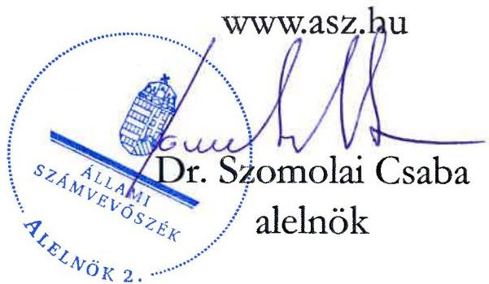

ÁLLAMI SZÁMVEVŐSZÉK

# JELENTÉS

A fenntartási kötelezettség kedvezményezettek
általi teljesítésének rapid ellenőrzése

A SIGNUM ALFA TEAM Kereskedelmi és Szolgáltató Kft.
fenntartási kötelezettsége teljesítésének ellenőrzése
a GINOP-1.2.1-16-2017-00585 számú projektnél

2026.

26006

www.asz.hu

---

ÁLLAMI SZÁMVEVŐSZÉK

# JELENTÉS

## A fenntartási kötelezettség kedvezményezettek általi teljesítésének rapid ellenőrzése

A SIGNUM ALFA TEAM Kereskedelmi és Szolgáltató Kft. fenntartási kötelezettsége teljesítésének ellenőrzése a GINOP-1.2.1-16-2017-00585 számú projektnél

2026.

26006

---

Jelentéseink az interneten a www.asz.hu címen olvashatók.

ELLENŐRZÉSI IGAZGATÓSÁG:
ELLENŐRZÉSI IGAZGATÓSÁG I.

ELLENŐRZÉSI IGAZGATÓ:
SINKÁNÉ DR. CSENDES ÁGNES igazgató

ELLENŐRZÉSVEZETŐ:
HUSZÁR ANNA ellenőrzésvezető

IKTATÓSZÁM: EL-4101-206/2025

TÉMASORSZÁM: -

ELLENŐRZÉS-AZONOSÍTÓ SZÁM: V1101

---

TARTALOMJEGYZÉK

- ÖSSZEFOGLALÁS ... 5
- AZ ELLENŐRZÉS EREDMÉNYEI ... 6
1. A fenntartási kötelezettség teljesítése ... 6
- I. FÜGGELÉK: ÉSZREVÉTELEK ... 9
- II. FÜGGELÉK: ELLENŐRZÉSI MEGKÖZELÍTÉS ... 10
- MELLÉKLETEK ... 15
I. sz. melléklet: Értelmező szótár ... 15
II. sz. melléklet: Az ellenőrzött és a közreműködő szervezetek jegyzéke ... 17
- RÖVIDÍTÉSEK JEGYZÉKE ... 18

---

“哈，你是个小伙子，你是个小伙子，你是个小伙子，你是个小伙子，你是个小伙子，你是个小伙子，你是个小伙子，你是个小伙子，你是个小伙子，你是个小伙子，你是个小伙子，你是个小伙子，你是个小伙子，你是个小伙子，你是个小伙子，你是个小伙子，你是个小伙子，你是个小伙子，你是个小伙子，你是个小伙子，你是个小伙子，你是个小伙子，你是个小伙子，你是个小伙子，你是个小伙子，你是个小伙子，你是个小伙子，你是个小伙子，你是个小伙子，你是个小伙子，你是个小伙子，你是个小伙子，你是个小伙子，你是个小伙子，你是个小伙子，你是个小伙子，你是个小伙子，你是个小伙子，你是个小伙子，你是个小伙子，你是个小伙子，你是个小伙子，你是个小伙子，你是个小伙子，你是个小伙子，你是个小伙子，你是个小伙子，你是个小伙子，你是个小伙子，你是个小伙子，你是个小伙子，你是个小伙子，你是个小伙子，你是个小伙子，你是个小伙子，你是个小伙子，你是个小伙子，你是个小伙子，你是个小伙子，

---

ÖSSZEFOGLALÁS

A 2016 decemberében megjelent „Mikro-, kis- és középvállalkozások termelési kapacitásainak bővítése” című (GINOP 1.2.1-16 kódszámú) pályázati felhívásban meghirdetett támogatással lehetőség nyílt ezen vállalkozások számára modern eszköz- és gépparkok, valamint fejlett infrastruktúrával ellátott telephelyek kialakítására. A rendelkezésre álló keretösszeg eredetileg 18 Mrd Ft volt, a keretösszeg emelését követően végül a konstrukcióban 101 Mrd Ft értékben kötött az IH¹ támogatási szerződést. Az igényelhető vissza nem térítendő támogatás összege kezdetben 25 M Ft és 250 M Ft között volt, a támogatás maximuma később 500 M Ft-ra emelkedett.

A Felhívásra² benyújtott támogatási kérelem alapján a 145,3 M Ft támogatást nyert GINOP-1.2.1-16-2017-00585 számú, „Gyártásbővítés a Signum Alfa Team Kft.-nél” című projekt Kedvezményezettje³, a SIGNUM ALFA TEAM Kft. építési terület előkészítéséhez homlokrakodót, osztályozó és törőgépet, transzportbeton keverőgépet, termelésirányítási rendszert szerzett be.

A Kedvezményezett – a támogatás visszafizetésének terhe mellett – vállalta, hogy a projektmegvalósítást követően a Projekt⁴ megfelel az 1303/2013/EU Rendeletben⁵ a műveletek tartósságára vonatkozó előírásoknak, az előírt fenntartási kötelezettséget teljesíti. A Projekt megvalósítása 2021. október 13-án befejeződött, az IH döntése alapján azonban a Projekt fenntartási időszaka annak fizikai befejezésétől, azaz 2020. november 19-étől kezdődött és 2024. október 13-ig tartott.

A kapott támogatás összértéke, a Projekt egyedisége és a megvalósított projekteredmény hosszabb távon történő megtartása miatt az ÁSZ⁶ indokoltnak tartotta a Projekt fenntartásának és a támogatás hasznosulásának ellenőrzését. A Kedvezményezett projektfenntartási kötelezettségei teljesítésének ellenőrzésére az ÁSZ „A 2014-2020 programozási időszak kobázis politikai operatív programok vonatkozásában a fenntartási kötelezettség teljesítésének ellenőrzési gyakorlata” című ellenőrzéséhez, mint alapellenőrzéshez kapcsolódóan került sor.

A Kedvezményezett a Projekt hároméves fenntartási kötelezettsége keretében a projekteredmény működtetéséről és fenntartásáról a jogszabály szerint határidőben és – hiánypótlási, valamint korrekciós kötelezettségének teljesítését követően – megfelelően beszámolt az éves projektfenntartási jelentésekben, amelyeket az IH elfogadott.

A Kedvezményezett a számára támogatási szerződésben előírt foglalkoztatási indikátort a fenntartási időszak minden évében teljesítette, a 9 főben meghatározott célértéket 33% és 100% közötti mértékkel meghaladta. A Kedvezményezett által kötelezően vállalt legalább 5%-os árbevétel-növekedés az eredetileg tervezett határidőre megfelelően teljesült, mivel az árbevétel növekedése a 2021. év végére közel 54% volt.

Az IH 2025. április 9-én pénzügyileg lezárta a Projektet és kiadta a záró jegyzőkönyvet.

A Kedvezményezett, a vállalt három év fenntartási időszak és a – fenntartási időszakra vonatkozóan – vállalt kötelezettségek teljesítésével megfelelt az 1303/2013/EU rendeletben előírtaknak, mivel termelő tevékenysége nem szűnt meg, a Projekt működőképessége, annak eredeti célkitűzései a fenntartási időszakban végig biztosítottak voltak.

Az ÁSZ értékelése szerint mindamellett, hogy a Kedvezményezettnél a versenyhelyzet kedvezőtlen változása miatt csökkent a megrendelések volumene, a támogatás – a fenntartási időszak tekintetében – hasznosult. Az ÁSZ helyszíni ellenőrzése időpontjában a beszerzett eszközök rendelkezésre álltak, azok kapacitásbővítését és a piaci igényekhez való rugalmasabb reagálási képességet eredményeztek.

---

AZ ELLENŐRZÉS EREDMÉNYEI

A magyar vállalkozások a GINOP⁷ pályázati konstrukciók keretében jelentős mértékű támogatásban részesültek, amelyek célja volt hozzájárulni a gazdasági fejlődéshez, a társadalmi felzárkózáshoz és az infrastruktúra fejlesztéséhez. Az ÁSZ – Magyarország versenyképességének növelése érdekében – fontosnak tartja a kihelyezett uniós támogatások nemzetgazdasági szinten történő hasznosulását és értékteremtését a vállalatok beruházásain és elért teljesítményén keresztül. Az ÁSZ a támogatással kapcsolatos fenntartási kötelezettség teljesítését, valamint a támogatás hasznosulását a GINOP-1.2.1-16-2017-00585 számú projekt tekintetében értékelte. A Projekt keretében a kedvezményezett SIGNUM ALFA TEAM Kft. gyártásbővítéshez homlokrakodót, osztályozó és törőgépet, transzportbeton keverőgépet, termelésirányítási rendszert és hardver eszközöket szerzett be.

## 1. A fenntartási kötelezettség teljesítése

### Összegző megállapítás

A Kedvezményezett fenntartási kötelezettségét teljesítette, a támogatás hasznosult.

### A fenntartási jelentés benyújtási kötelezettség teljesítése

A Kedvezményezettnek a Projekt megvalósítását követően, a Támogatási rend.⁸-ben foglaltak alapján hároméves fenntartási kötelezettsége volt, amelyet a Felhívás és a támogatási szerződés is rögzített. Az IH döntése alapján a projektfenntartási időszak a Projekt fizikai befejezésétől indult. Ennek keretében a Kedvezményezettnek a projekteredményt a megvalósítási helyszínen a Projekt fizikai befejezésétől számított három évig fenn kellett tartania és üzemeltetnie, valamint a Támogatási rend.-ben foglaltak alapján évente projektfenntartási jelentésben kellett beszámolnia az indikátorok teljesüléséről.

A Kedvezményezett a Támogatási rend.-ben előírt éves projekt fenntartási jelentés benyújtási kötelezettségét megfelelően, határidőben teljesítette. A PFJ⁹-k és a ZPFJ¹⁰ főbb adatait az 1. táblázat tartalmazza.

1. táblázat

|  A GINOP-1.2.1-16-2017-00585 SZÁMÚ PROJEKTHEZ KAPCSOLÓDÓ PFJ-K FŐBB ADATAI  |   |   |   |   |   |
| --- | --- | --- | --- | --- | --- |
|  JELENTÉS
SOBSZÁMA | JELENTÉS
TÍPUSA | TÁRGYIDÓSZAK
KEZDETÉ | TÁRGYIDÓSZAK
VÉGE | BENYÚJTÁS
HATÁRIDEJE | JELENTÉS STÁTUSZA  |
|  1. | PFJ | 2020.11.19. | 2021.12.31. | 2022.06.15. | 2022.06.08-án beérkezett,
elfogadva 2024.09.24-én  |
|  2. | PFJ | 2022.01.01. | 2022.12.31. | 2023.06.15. | 2023.06.15-én beérkezett,
elfogadva 2024.09.24-én  |
|  3. | ZPFJ | 2023.01.01. | 2024.10.13. | 2024.10.28 | 2024.10.21-én beérkezett,
elfogadva 2025.02.18-án  |

Forrás: FAIR¹¹ adatok alapján ÁSZ saját szerkesztés

A Kedvezményezettnek az 1. PFJ esetében – 2020. december 31. céldátumra tényadat rögzítése, valamint FTE számítási nyilatkozat¹² és Összeférhetetlenségi nyilatkozat megküldése tekintetében – egyszeri hiánypótlási és háromszori korrekciós kötelezettsége volt, amelyet a Támogatási rend.-ben előírt határidőkben teljesített, így az IH az 1. PFJ-t 2024. szeptember 24-én elfogadta. Az IH a 2. PFJ-t hiánypótlás és korrekció kérés nélkül szintén 2024. szeptember 24-én, a ZPFJ-t – a Kedvezményezett

---

Az ellenőrzés eredményei

honlapján elhelyezett arculati elemek/projekthez kapcsolódó információk pótlása, módosítása kapcsán kért hiánypótlás teljesítését követően – 2025. február 18-án fogadta el.

Az IH 2025. április 9-én pénzügyileg lezárta a Projektet és kiadta a záró jegyzőkönyvet.

## A fenntartási kötelezettség, indikátorok teljesítése

A Kedvezményezett által vállalt kötelezettségeket, így a Projekt indikátorait a támogatási szerződés 4. és 5. sz. melléklete rögzítette, amelyeket a Kedvezményezett – az éves beszámoló adatok és a PFJ-kben rögzítettek alapján – az alábbiak szerint teljesítette:

1. Az egyik cél indikátor a foglalkoztatás növelése volt: a Kedvezményezett a 2016. december 31-én foglalkoztatott 6 férfi és 1 nő, összesen 7 fő foglalkoztatott 2 fővel (férfi) történő növelését vállalta – az IH részéről 2024 márciusában adott indoklás alapján a kezdeti 2019. december 31-i céldátum helyett a Projekt fizikai befejezéséhez igazodva – 2020. december 31-re.

A Kedvezményezett – az éves beszámolói és adatszolgáltatása alapján – a 2020-2024. évek mindegyikében, a nemek szerinti megoszlást tekintve is teljesítette a számára meghatározott foglalkoztatotti indikátort, a 9 főben meghatározott célértéket a fenntartási időszak egyes éveiben 33% és 100% közötti mértékkel meghaladta.

2. A Kedvezményezett a támogatási kérelme benyújtásakor azt vállalta, hogy a Projekt fizikai befejezését közvetlenül követő két üzleti évben, a második üzleti év végére, azaz 2021. december 31-én, az éves nettó árbevétel növekménye eléri az 5%-ot, vagyis a 2016. évi becsült, 536,8 M Ft-os árbevétele legalább 26,8 M Ft-tal több lesz. A Projekt eredetileg tervezett 2019. júniusi fizikai befejezése – annak több mint egy évvel későbbi kezdése miatt – 2020 novemberére realizálódott.

A kötelező vállalás az eredetileg vállalt határidőre megfelelően teljesült, mivel a 2020. évben 924,6 M Ft, a 2021. évben 824,5 M Ft volt a Kedvezményezett árbevétele, így azok jelentős mértékben meghaladták az 563,7 M Ft-os célértéket, az árbevétel növekedése a 2021. év végére közel 54% volt.

3. A fenntartási időszakban teljesítendő egyéb kötelezettségek keretében a Projekt elkülönített számviteli nyilvántartása rendelkezésre állt. Az IH által elfogadott 1. és 2. PFJ-ben és a ZPFJ-ben foglaltak alapján, valamint a Kedvezményezett által az ÁSZ adatbekérésére a Projektre vonatkozóan 2025. januári állapotra megküldött számviteli nyilvántartások alapján a projektszintű elkülönített számviteli nyilvántartás a Támogatási rend.-ben foglaltaknak megfelelően biztosított volt azáltal, hogy a releváns tárgyi eszközkartonokon a Projektazonosítót feltüntették.

A Kedvezményezett, a vállalt három év fenntartási időszak és a – fenntartási időszakra vonatkozóan – vállalt kötelezettségek teljesítésével megfelelt a műveletek tartósságával kapcsolatban az 1303/2013/EU rendeletben és a Támogatási rend.-ben előírtaknak.

## A támogatás hasznosulása

A Kedvezményezett a Projekt keretében termelőeszközök beszerzését valósította meg, amelyek az ÁSZ helyszínen végzett ellenőrzésekor a Kedvezményezett telephelyein fellelhetőek voltak. A Projekt működőképessége a fenntartási időszakban biztosított volt, a Kedvezményezett – ÁSZ-nak helyszíni interjú keretében adott – nyilatkozata alapján a beszerzett eszközök nem avultak el, folyamatosan szolgálták a vállalkozási tevékenységet.

A Kedvezményezett létszám, árbevétel, adózott eredmény és mérlegfőösszeg adatait 2020-2024. évekre vonatkozóan a 2. táblázat mutatja be.

---

Az ellenőrzés eredményei

2. táblázat
A KEDVEZMÉNYEZETT 2020-2024. ÉVI LÉTSZÁM, ÁRBEVÉTEL, ADÓZOTT EREDMÉNY ÉS MÉRLEGFŐÖSSZEG ADATAI

|  ÁDATOK MEGNEVEZÉSE | 2020. ÉVBEN | 2021. ÉVBEN | 2022. ÉVBEN | 2023. ÉVBEN | 2024. ÉVBEN  |
| --- | --- | --- | --- | --- | --- |
|  Átlagos statisztikai állományi létszám (fő) | 20 | 12 | 14 | 18 | 14  |
|  Értékesítés nettó árbevétele (M Ft) | 924,6 | 824,5 | 492,5 | 551,1 | 180,3  |
|  Adózott eredmény (M Ft) | 3,1 | 6,4 | 67,3 | 7,9 | -140,2  |
|  Mérlegfőösszeg (M Ft) | 1 119,9 | 1 039,5 | 1 053,6 | 972,0 | 700,3  |

Forrás: A Kedvezményezett éves beszámoló adatai alapján ÁSZ saját szerkesztés

A Kedvezményezett nyilatkozata alapján a támogatott Projekt keretében megvalósított fejlesztés új technológiák alkalmazását tette lehetővé, ezzel a vállalati folyamatok hatékonyságának növelését eredményezte. A Felhívásban megfogalmazott célnak megfelelően a termelési kapacitás bővült, korszerűbb termelési képességek jöttek létre, modernebbé vált a Kedvezményezett eszköz- és gépparkja, ezáltal a támogatás hozzájárult a vállalkozás működési jellemzőinek javításához, illetve fenntartásához. Ugyanakkor a GINOP pályázati beruházás hatása a pénzügyi folyamatokra vonatkozóan nem azonosítható egyértelműen. A Kedvezményezett tájékoztatása alapján, ha a beruházást nem valósították volna meg és nem álltak volna át az új technológiára, az egyre növekvő konkurencia miatt ügyfeleket vesztettek volna már a 2020-2022. években.

A Projekt társadalmi hasznosságához tartozik a Kedvezményezett munkavállalóinak foglalkoztatása, 2022-2023-ban, a Projekt fenntartási időszakában növekedett a foglalkoztatotti létszám.

Az ÁSZ értékelése szerint a Kedvezményezett megfelelt a műveletek tartósságára vonatkozó előírásoknak, a vállalkozást működtette, fenntartotta a fenntartási időszak végéig, illetve az ÁSZ helyszíni ellenőrzésének lezárásáig. A Kedvezményezett fenntartási kötelezettségét teljesítette. A Projekt keretében beszerzett eszközök a Kedvezményezettnél kapacitásbővítést és a piaci igényekhez való rugalmasabb reagálási képességet eredményeztek, illetve az új eszközök által javult a munkavégzés hatékonysága. Mindamellett, hogy a Kedvezményezettnél a fenntartási időszak lezárását követően a versenyhelyzet kedvezőtlen változása miatt csökkent a megrendelések volumene, a foglalkoztatotti létszám, a költségvetési támogatás – az ÁSZ értékelése szerint – a fenntartási időszak tekintetében hasznosult.

---

9

# I. FÜGGELÉK: ÉSZREVÉTELEK

A jelentéstervezetet az ÁSZ 15 napos észrevételezésre megküldte az ellenőrzött szervezet vezetőjének az ÁSZ tv. 29. §* (1) bekezdése előírásának megfelelően.

A jelentéstervezet megállapításaira az ellenőrzött szervezet nem tett észrevételt.

* 29. § (1) Az Állami Számvevőszék az ellenőrzési megállapításait megküldi az ellenőrzött szervezet vezetőjének vagy az általa megbízott személynek, és annak, akinek személyes felelősségét állapította meg.
(2) Az ellenőrzött szervezet vezetője és a felelősként megjelölt személy az ellenőrzés megállapításaira tizenöt napon belül írásban észrevételt tehet.
(3) Az Állami Számvevőszék az észrevételre a beérkezésétől számított harminc napon belül írásban válaszol. A figyelembe nem vett észrevételeket köteles a jelentésben feltüntetni, és megindokolni, hogy azokat miért nem fogadta el.

---

10

# II. FÜGGELÉK: ELLENŐRZÉSI MEGKÖZELÍTÉS

## AZ ELLENŐRZÉS JOGALAPJA

Az ellenőrzés jogszabályi alapját az ÁSZ tv.¹³ 5. § (3) bekezdés képezte.

## AZ ELLENŐRZÉS CÉLJA

A fenntartási kötelezettség teljesítésének és a támogatás hasznosulásának értékelése a fenntartási szakaszba került uniós projekt kedvezményezettjénél.

## AZ ELLENŐRZÉS TÍPUSA

Kombinált ellenőrzés

## AZ ELLENŐRZÉS TÁRGYA

Az ellenőrzés tárgya volt az ellenőrzésre kiválasztott GINOP-1.2.1-16-2017-00585 számú uniós projekt fenntartási időszakára vonatkozóan előírt kötelezettségek SIGNUM ALFA TEAM Kft. mint kedvezményezett által történt teljesítése és a támogatás hasznosulása. A fenntartási kötelezettség ellenőrzése a kedvezményezett tevékenységéhez és működéséhez kapcsolódó kötelezettségek, a meghatározott indikátorok és a beszámolási kötelezettség teljesítésére irányult.

Az ellenőrzés tárgya volt továbbá a kedvezményezett által benyújtott fenntartási jelentésekben rögzítettek valóságtartalma és megalapozottsága, valamint ezek összhangja az ÁSZ helyszíni ellenőrzése során tapasztaltakkal.

Az ellenőrzés kiterjedt minden olyan körülményre és adatra, amely az ÁSZ jogszabályban meghatározott feladatainak teljesítéséhez, valamint a program végrehajtása folyamán felmerült újabb összefüggések feltárásához szükséges.

## AZ ELLENŐRZÉS HATÓKÖRE ÉS TERÜLETE

Az uniós jogszabályok az uniós támogatással megvalósuló projektekkel szemben elvárásként rögzítik a „műveletek tartósságának” követelményét. A kedvezményezettek infrastrukturális vagy termelő beruházás esetén – a projektmegvalósítás befejezésétől számított 5 évig, kis- és közepes vállalkozások esetén 3 évig, a támogatás visszafizetésének terhe mellett – vállalták, hogy a projekt termelő tevékenysége nem szűnik meg, hogy nem következik be olyan tulajdonosváltás, amelynek eredményeként jogosulatlan előny szerezhető, illetve, hogy nem következik be olyan lényeges változás, amely a projekt eredeti célkitűzéseit veszélyezteti. Abban az esetben, ha a felsoroltak valamelyike bekövetkezik, a támogatást – figyelemmel a vonatkozó jogszabályokra – vissza kell fizetni az Európai Bizottságnak.

---

II. Függelék: Ellenőrzési megközelítés

Ha az IH a projektre nézve fenntartási kötelezettséget állapított meg, és indikátorokat határozott meg a támogatási szerződésben, a kedvezményezettnek évente be kellett számolnia az indikátorok teljesüléséről. Ha ezen időszakra indikátorokat nem határozott meg az IH és a támogatási szerződésben sem írta elő az évenkénti teljesítést, a kedvezményezettnek egy alkalommal záró projekt fenntartási jelentést kellett benyújtania.

Az ellenőrzés a XIX. Uniós fejlesztések fejezet 3/1 Kohéziós politikai operatív programok 2014-2020 operatív programjai közül a – kis- és középvállalkozások versenyképességének javítására irányuló – GINOP 1. prioritásából és a – kutatás, technológiai fejlesztés és innováció című – GINOP 2. prioritásából támogatást kapott projektek kedvezményezettjeire terjedt ki oly módon, hogy az ÁSZ – „A 2014-2020 programozási időszak kohéziós politikai operatív programok vonatkozásában a fenntartási kötelezettség teljesítésének ellenőrzési gyakorlata” című ellenőrzéséhez, mint alapellenőrzéshez kapcsolódóan – a GINOP 1-2. prioritás pályázati kiírásainak nyertes pályázóiból, kockázat alapú mintavételi eljárással, rapid ellenőrzésre választott ki összesen 16 projektet, amelyből ezen jelentésben a GINOP-1.2.1-16-2017-00585 számú projekt tekintetében értékelte a fenntartási kötelezettség teljesítését.

A GINOP-1.2.1-16-2017-00585 számú projekt tekintetében az ellenőrzés kiterjedt a célrendszer, a jogszabályban – a működés és tevékenység tekintetében – előírt fenntartási kötelezettség teljesülésére, a fenntartási jelentésben bemutatott eredmények valóságtartalmára, megalapozottságára, valamint a támogatási szerződésben vállalt, a fenntartási időszakra vonatkozó kötelezettségek teljesítésének, és a GINOP keretében nyújtott támogatás hasznosulásának értékelésére.

## GINOP-1.2.1-16 számú felhívás bemutatása

Az IH által közzétett GINOP-1.2.1-16 kódszámú, a „Mikro-, kis- és középvállalkozások termelési kapacitásainak bővítése” című pályázati felhívásban meghirdetett támogatás célja volt a kiemelt iparágakban fejleszteni kívánó hazai KKV¹⁴-k termelési kapacitásainak bővítése a hazai ipar fejlesztése érdekében, amely során korszerű termék előállítási képességek megteremtésének és bővítésének céljából lehetőség nyílt modern eszköz- és gépparkok, valamint fejlett infrastruktúrával ellátott telephelyek kialakítására, a szektor szereplői számára a versenyképesség feltételeinek megteremtésére, fenntartására.

A támogatás formája vissza nem térítendő támogatás volt, forrását az Európai Regionális Fejlesztési Alap és Magyarország költségvetése társfinanszírozásban biztosította. A rendelkezésre álló tervezett keretösszeg eredetileg 18 Mrd Ft volt, ami a Felhívás módosítását követően 119,8 Mrd Ft-ra emelkedett. A Felhívás szerint a támogatott projektek várható számát 150-250 között tervezték, a Felhívás keretében projektenként kapható támogatás nagysága kezdetben 25-250 M Ft volt, majd később a támogatás maximális összege 500 M Ft-ra emelkedett.

A támogatási kérelmet benyújtó szervezetek vállalták, hogy a projekt megvalósításával hozzájárulnak a kiemelt iparágakban fejleszteni kívánó hazai KKV-k termelési kapacitásainak bővítéséhez, a kapott támogatáson felül önerőből finanszírozzák a projektet és a projekt fizikai befejezését követő két évben növelik nettó árbevételüket.

Támogatható tevékenység volt az új eszközök, gépek beszerzése, az új technológiai rendszerek és kapacitások kialakítása, a megújuló energiaforrást hasznosító technológiák alkalmazása, melyek célja a gazdasági-termelési folyamatok és az üzemen belüli építmények energiaigényének részbeni fedezése megújuló energia előállításával, valamint az infrastrukturális és ingatlan beruházás, az információs technológia-fejlesztés és az új eszközök, gépek beszerzéséhez, új technológiai rendszerek és kapacitások kialakításához kapcsolódó gyártási licenc, gyártási know-how beszerzés.

---

II. Függelék: Ellenőrzési megközelítés

A Felhívásra az a mikro-, kis-, és középvállalkozás pályázhatott és részesülhetett támogatásban támogatási kérelem benyújtásával, amely különösen az alábbi feltételeknek eleget tett:

- rendelkezett legalább egy lezárt (beszámoló/SZJA¹⁵ bevallással alátámasztott), teljes 365 napot jelentő üzleti évvel;
- éves átlagos statisztikai állományi létszáma a támogatási kérelmek benyújtását megelőző utolsó lezárt, teljes üzleti évben minimum 1 fő volt;
- Magyarországon székhellyel rendelkező kettős könyvvitelt vezető gazdasági társaság, szövetkezet, egyéni vállalkozó, egyéni cég vagy az Európai Gazdasági Térség területén székhellyel és Magyarországon fiókteleppel rendelkező szövetkezet vagy kettős könyvvitelt vezető gazdasági társaság fióktelepe volt.

A projekt megvalósítása során legfeljebb egy mérföldkővet lehetett tervezni, a mérföldkő elérésének a projekt fizikai befejezésének időpontjával kellett egybeesnie. A projekt fizikai befejezésére legfeljebb 18 hónap állt rendelkezésre. Nem volt köteles biztosítékot nyújtani kérelemre az a kedvezményezett, amely rendelkezett legalább egy lezárt, teljes üzleti évvel, és a támogatási kérelem benyújtásakor szerepelt a köztartozásmentes adózói adatbázisban.

Indikátorként a támogatott vállalkozásoknál a foglalkoztatás növekedése került megjelölésre. A támogatást igénylő, a projekt megvalósítás befejezésétől számított 3 évig volt köteles fenntartani a projekt keretében létrehozott termékeket és szolgáltatásokat.

A támogatási kérelmek benyújtására a Felhívás közzétételét követő 24 hónapig, 2017. január 16-tól 2019. január 16-ig volt lehetőség. Az utólagos finanszírozású tevékenységekre igénybe vehető maximális előleg mértéke a megítélt támogatás 50%-a, de legfeljebb 125 M Ft volt. A kiválasztási eljárásrend standard eljárás volt, szakaszos elbírálással.

Az IH által nyolc alkalommal módosított Felhívásra 1136 támogatási kérelem érkezett be, összesen 178,6 Mrd Ft nagyságú támogatási összegre, amelyből – az IH adatszolgáltatás alapján – 605 kérelem került elfogadásra összesen 101 Mrd Ft értékű támogatási összeggel.

# A SIGNUM ALFA TEAM Kft. és a GINOP-1.2.1-16-2017-00585 számú projekt bemutatása

A kedvezményezett SIGNUM ALFA TEAM Kft.-t 2008-ban alapították Szigetszentmiklóson. Székhelye az ellenőrzött időszakban Budapesten, a Fóti úton volt, valamint Izsákön és Szabadszálláson egy-egy fiókteleppel rendelkezett. A támogatási kérelem benyújtásakor és 2024. december 31-én a társaság főtevékenysége „Építési terület előkészítése” volt, 2024. évi éves beszámoló adatai alapján 2024. évi nettó árbevétele 180,3 M Ft, átlagos statisztikai állományi létszáma 14 fő volt, ami alapján KKV-nak minősült. A SIGNUM ALFA TEAM Kft. gazdasági tevékenysége 2025. évben folyamatosan csökkent, foglalkoztatotti létszáma 2025. júliusától 1 fő lett.

A SIGNUM ALFA TEAM Kft. támogatási kérelmét 2017. február 13-án nyújtotta be, a támogatási szerződés 2017. december 19-én lépett hatályba. A „Gyártásbővítés a Signum Alfa Team Kft.-nél” című GINOP-1.2.1-16-2017-00585 azonosító számú projekt keretében a fejlesztéssel a társaság versenyképességének növelése volt a cél, központi elemként saját gyártókapacitás (betonkészítés) létrehozása szerepelt.

A beruházás tervezett helyszíne Szank község volt, végül a Kedvezményezett – a támogatási szerződés módosítását követően – elsődleges helyszínként Szabadszálláson, valamint Izsákön valósította meg a Projektet. A támogatási szerződést összesen öt alkalommal módosították a megvalósítási helyszín változása, sikertelen közbeszerzési eljárásra tekintettel a Projekt kezdő és záró dátumának változása, valamint a

---

II. Függelék: Ellenőrzési megközelítés

közbeszerzési eljárás eredményeképpen a beszerzésre kerülő eszközök típusának változása, továbbá a monitoring mutatók aktualizálása miatt.

A Projekt megítélt összköltsége 290,7 M Ft volt, amely 50%-os támogatási intenzitás mellett 145,3 M Ft összegű támogatást jelentett. A Projekt megvalósítását 2020. február 28-án kezdték meg, fizikailag 2020. november 18-án – a támogatási szerződésben rögzített egyetlen mérföldkő dátumaként előírt határidőben – fejeződött be.

A kapacitásbővítő fejlesztés keretében a módosított támogatási szerződésben vállalt KOMATSU WA320-8 homlokrakodót, 1 db HP Color LaserJet Pro M479dw multifunkciós nyomtatót, 3 db HP Z4 G4 WKS-t, 1 db HP Pavilon 17-ab316ng 3GB65EA notebookot, 1 db ANACONDA DF514 osztályozó gépet, 1 db TEREX Finlay J-960 törőgépet, 1 db szünetmentes tápegységet, 1 db switchet, 1 db MikroTik SXTsqG-5acD 16dBi 5 GHz antennát, 1 db SIMI BSA60 LSDK transzportbeton keverőgépet és 1 db DYNTELL termelésirányítási rendszert beszereztek.

A Kedvezményezett a Felhívásban előírtak keretében vállalta, hogy:

- a foglalkoztatottak számát két fővel növeli,
- az éves nettó árbevétele a 2016. évi bázis értékhez képest legalább 5%-kal növekszik a Projekt fizikai befejezését közvetlenül követő két üzleti évben.

A Kedvezményezett a támogatási szerződésben előírt határidőben, 2020. november 23-án nyújtotta be a záró szakmai beszámolót és a záró kifizetési kérelmet, az IH – a hiánypótlások teljesítését és a 2021. május 20-i komplex jellegű, záró helyszíni ellenőrzés lezárását követően – 2021. október 11-én elfogadta azokat. Az utolsó kifizetés és a Projekt megvalósítás befejezési dátuma 2021. október 13-a volt.

Az IH helyszíni ellenőrzést a fenntartási időszakra vonatkozóan nem végzett, a projektmegvalósítás szakaszában a záró szakmai beszámolóhoz kapcsolódóan 2021. május 20-án egy – 2017. december 19-től 2021. május 20-ig tartó időszakra irányuló – tervezett helyszíni ellenőrzést folytatott le, amely érintette az 1. PFJ időszakát is. A helyszíni ellenőrzés jegyzőkönyve szerint az ellenőrzés időpontjában a Projekt műszaki-szakmai és pénzügyi készültsége 100% volt. Az IH az ellenőrzés jegyzőkönyvében intézkedésként kérelem benyújtását írta elő a Kedvezményezett számára új megvalósítási helyszín bejelentése, valamint az egyik projektelem típusváltoztatása miatt.

A Kedvezményezett a Projektet – az IH szakmai záró beszámoló ellenőrzése és a megvalósításra vonatkozóan lefolytatott helyszíni ellenőrzése megállapításai alapján – a támogatási szerződésben rögzített mérföldkővet elérve teljesítette, a tevékenységéhez kapcsolódó kapacitásbővítő beruházást megvalósította.

A fenntartási időszak – az IH döntése alapján – 2020. november 19-én kezdődött és 2024. október 13-ig tartott.

## AZ ELLENŐRZŐTT IDŐSZAK

2016. január 1-től 2025. április 30-ig, a helyszíni ellenőrzés lezárásának időpontjáig tartó időszak.

---

II. Függelék: Ellenőrzési megközelítés

# AZ ELLENŐRZÉSI KRITÉRIUMOK

|  FOKUSZTERÜLET | ELLENŐRZÉSI KRITÉRIUMOK  |
| --- | --- |
|  1. A fenntartási kötelezettség teljesítése  |   |
|  A fenntartási jelentés benyújtási kötelezettség teljesítése | Támogatási rend. 178. § (1) bekezdés, 180. § (1) bekezdés, 1. melléklet 281.1., 297.1., 302.1. pontjai  |
|  A fenntartási kötelezettség, indikátorok teljesítése | 1303/2013/EU rendelet 71. cikk (1) bekezdés; Támogatási rend. 110/A. §, 178. § (1) bekezdés; támogatási szerződés 4-5. sz. mellékletei  |
|  A támogatás hasznosulása | Az ÁSZ meghatározása alapján: - A támogatás hasznosult, ha a vállalkozás (a projekt) működött az ÁSZ helyszíni ellenőrzése időpontjában, fenntartási kötelezettségét a kedvezményezett teljesítette / jellemzően teljesítette, és a támogatás eredményeként a kedvezményezett vállalkozás árbevétel vagy adózott eredmény adatai növekedtek a támogatás előtti időszakhoz képest. - A támogatás korlátozottan hasznosult, ha a projekteredmény „fellelhető volt” az ÁSZ helyszíni ellenőrzése időpontjában, fenntartási kötelezettségét részben / minimálisan teljesítette a kedvezményezett, vagy a támogatás eredményeként hozzáadott új értéket teremtett, az társadalmilag hasznosult stb. - A támogatás nem hasznosult, ha fenntartási kötelezettségét a kedvezményezett egyáltalán nem teljesítette és/vagy a vállalkozás (a projekt) már nem működött az ÁSZ helyszíni ellenőrzése időpontjában.  |

# AZ ELLENŐRZÉS MÓDSZERE ÉS AZ ELLENŐRZÉSI BIZONYÍTÉKOK KÖRE

Az ÁSZ az ellenőrzést a nemzetközi standardokat irányadónak tekintve az ellenőrzési program szempontjai, az ellenőrzött időszakban hatályos jogszabályok, az ellenőrzés-szakmai szabályok és módszertanok figyelembevételével végezte.

Az ellenőrzési kérdések megválaszolásához szükséges bizonyítékok megszerzése az ellenőrzött szervezet és az ellenőrzésben közreműködő szervezet által rendelkezésre bocsátott dokumentumokra és adatokra alapozva, továbbá megfigyelés, szemle (szemrevételezés), kérdésfeltevés (információkérés), interjú, mintavételezés, valamint elemző eljárás útján történt.

Az ellenőrzés bizonyítékként felhasználható adatforrásai közé tartoztak egyrészt az ellenőrzéshez kért dokumentumok, adatforrások, a nyilvánosan hozzáférhető adatok, dokumentumok, másrészt adatforrás volt még minden, az ellenőrzés folyamán feltárt, az ellenőrzés szempontjából információt tartalmazó dokumentum. Az ÁSZ a számvevőszéki jelentéstervezet elfogadásáig rendelkezésre álló, nyilvánosan elérhető adatokat figyelembe vette.

Az ellenőrzés végrehajtásához a projekt kiválasztása kockázat alapú mintavételi eljárással történt.

---

MELLÉKLETEK

I. SZ. MELLÉKLET: ÉRTELMEZŐ SZÓTÁR

fenntartás

A kedvezményezett a projektmegvalósítás befejezésétől számított 5 évig, állami támogatás formájában nyújtott támogatás esetén az állami támogatókra vonatkozó szabályok alapján alkalmazandó időtartamig, kis- és közepes vállalkozások esetén 3 évig a támogatás visszafizetésének terhe mellett vállalja, hogy a projekt megfelel az 1303/2013/EU európai parlamenti és tanácsi rendelet 71. cikk (1) bekezdésében foglaltaknak. (Forrás: Támogatási rend. 178. § (1) bekezdés, 2016. május 14-től 2024. július 31-ig hatályos)

Az irányító hatóság döntése alapján a fenntartási időszak kezdődhet a projektmegvalósítás befejezésétől vagy a projekt fizikai befejezésétől (ÁSZF¹⁶ 10.7. pontja alapján, hatályos 2016. június 14-től)

A fenntartási időszak meghatározása során az IH speciális projektév szerinti jelentéstételt alkalmazott, mivel a jelentések tárgyidőszaka speciális projektévhez (az üzleti évről készített közzétett beszámolóhoz) igazodott és a fenntartási jelentésben benyújtandó vállalási adatok csak az így meghatározott időszak elteltével álltak rendelkezésre. (Forrás: Támogatási rend. 1. melléklet 285.1-286.4 pontja alapján ÁSZ megfogalmazás)

indikátor

Uniós jogszabályokban és a programban nevesített, valamint az európai uniós források felhasználásáért felelős miniszter – a Vidékfejlesztési Program esetén az agrárpolitikáért felelős miniszter – által meghatározott, eredményt vagy teljesülést mérő mutató. (Forrás: Támogatási rend 3. § (1) bekezdés 12. pont, 2022. július 21-től 2024. július 31-ig hatályos)

kedvezményezett

A támogatásban részesített támogatást igénylő (Forrás: Támogatási rend 3. § (1) bekezdés 14. pont, 2014. november 6-tól hatályos)

műveletek tartóssága

Az ESB-alapokból¹⁷ valamely infrastrukturális vagy termelő beruházást magában foglaló műveletre fordított támogatás akkor fizetendő vissza, ha a kedvezményezettnek történő utolsó kifizetéstől számított 5 évben belül, illetve adott esetben, az állami támogatásokról szóló szabályozás szerinti időtartamon belül, a következők valamelyike történik:

a) a termelőtevékenység megszűnése vagy a programterületen kívülre való áthelyezése;

b) az infrastruktúra valamely elemében tulajdonosváltás következik be, amelynek eredményeként egy cég vagy állami szervezet jogosulatlan előnyhöz jut;

c) a természetében, célkitűzéseiben vagy végrehajtási feltételeiben olyan lényeges változás következik be, amely az eredeti célkitűzéseket veszélyezteti.

A műveletre jogosulatlanul kifizetett összegeket a tagállamnak vissza kell téríthetni, azon időszakkal arányosan, amelynek tekintetében nem teljesültek a követelmények. (Forrás: 1303/2013/EU rendelet 71. cikk (1) bekezdése)

projekt fizikai befejezése

Az az állapot, amikor a projekt keretében támogatott tevékenységeket a felhívásban és a támogatási szerződésben meghatározottak szerint elvégezték. (Forrás: Támogatási rend 3. § (1) bekezdés 40. pont, 2015. június 13-tól hatályos)

15

---

Mellékletek

projekt lezárása

Egy projekt akkor tekinthető lezártnak, ha a kedvezményezett a támogatási szerződésben a projektmegvalósítás befejezését követő időszakra nézve további kötelezettséget nem vállalt, és a felhívásban meghatározott feltételek teljesültek. Ha a támogatási szerződés a támogatott tevékenység befejezését követő időszakra nézve további kötelezettséget előírt, a projekt akkor tekinthető lezártnak, ha valamennyi vállalt kötelezettség teljesült és a kedvezményezett a kötelezettségek megvalósulásának eredményeiről szóló záró projekt fenntartási jelentést benyújtotta, és azt az irányító hatóság, Vidékfejlesztési Program esetén a kifizető ügynökség jóváhagyta, valamint a záró jegyzőkönyv elkészült. (Forrás: Támogatási rend 3. § (1) bekezdés 39. pont, 2016. május 14-től 2024. július 31-ig hatályos)

projektmegvalósítás befejezése

Az 1303/2013/EU rendelet 2. cikk 14. pontjára tekintettel egy projekt megvalósítása akkor tekinthető befejezettnek, ha a projekt fizikailag és pénzügyileg is befejezett, valamint a kedvezményezettnek valamennyi támogatott tevékenysége befejezését igazoló és alátámasztó kifizetési igénylését az irányító hatóság jóváhagyta és a támogatás folyósítása megtörtént. (Forrás: Támogatási rend 3. § (1) bekezdés 41. pont, 2015. június 13-tól 2023. május 24-ig hatályos)

projekt pénzügyi befejezése

Ha a projekt fizikai befejezése megtörtént, valamint a projektmegvalósítás során keletkezett elszámoló bizonylatok – szállítói kifizetés esetén az előírt önrész szállítók részére történő – kiegyenlítése megtörtént. A projekt pénzügyi befejezésének dátuma a projekt megvalósítási ideje alatt felmerült, a kedvezményezett által megfelelően elszámolt költségek közül a legkésőbbi kiegyenlítés dátuma. (Forrás: Támogatási rend 3. § (1) bekezdés 42. pontja alapján, 2014. november 6-tól hatályos)

standard kiválasztási eljárás

Standard kiválasztási eljárásrend esetén szakaszos elbírálást kell alkalmazni, amely során legkésőbb a felhívásban rögzített szakasz zárását vagy beadási határnapját követően kell a támogatási kérelmeket jogosultsági és tartalmi értékelésre bocsátani, és az egy szakaszban beérkezett kérelmek támogathatóságáról a felhívásban előírt tartalmi értékelési szempontoknak való megfelelés szerinti sorrendiségük alapján kell dönteni. (Támogatási rend. 61. § (4) bekezdés alapján, 2016. május 14-től hatályos)

16

---

Mellékletek

## II. SZ. MELLÉKLET: AZ ELLENŐRZŐTT ÉS A KÖZREMŰKÖDŐ SZERVEZETEK JEGYZÉKE

|  ELLENŐRZŐTT SZERVEZET MEGNEVEZÉSE | ADÓSZÁM  |
| --- | --- |
|  SIGNUM ALFA TEAM Kereskedelmi és Szolgáltató Kft. | 14332151-2-41  |
|  KÖZREMŰKÖDŐ SZERVEZET MEGNEVEZÉSE | ADÓSZÁM  |
| --- | --- |
|  Közigazgatási és Területfejlesztési Minisztérium | 15849272-2-41  |
|  Nemzeti Fejlesztési Központ | 15850258-1-42  |

---

RÖVIDÍTÉSEK JEGYZÉKE

1 IH

Irányító Hatóság (A GINOP esetében 2014. november 6-tól 2018. június 15-ig a Nemzetgazdasági Minisztérium, majd 2022. május 24-ig a Pénzügyminisztérium. 2022. május 25-től a területfejlesztési miniszter tevékenységének segítésére kijelölt minisztériumként a Miniszterelnökség volt a felelős az IH feladatok tekintetében. 2024. január 1-vel az IH feladatok átkerültek a Közigazgatási és Területfejlesztési Minisztériumhoz. A feladatok 2024. augusztus 1-től az újonnan létrejött Nemzeti Fejlesztési Központba kerültek).

2 Felhívás

A GINOP-1.2.1-16 kódszámú, a „Mikro-, kis- és középvállalkozások termelési kapacitásainak bővítése” című pályázati felhívás

3 Kedvezményezett, SIGNUM ALFA TEAM Kft.

SIGNUM ALFA TEAM Kereskedelmi és Szolgáltató Kft.

4 Projekt

A GINOP-1.2.1-16-2017-00585 számú, „Gyártásbővítés a SIGNUM ALFA TEAM Kft.-nél” című projekt

5 1303/2013/EU rendelet

AZ EURÓPAI PARLAMENT ÉS A TANÁCS 1303/2013/EU RENDELETE (2013. december 17.) az Európai Regionális Fejlesztési Alapra, az Európai Szociális Alapra, a Kohéziós Alapra, az Európai Mezőgazdasági Vidékfejlesztési Alapra és az Európai Tengerügyi és Halászati Alapra vonatkozó közös rendelkezések megállapításáról, az Európai Regionális Fejlesztési Alapra, az Európai Szociális Alapra és a Kohéziós Alapra és az Európai Tengerügyi és Halászati Alapra vonatkozó általános rendelkezések megállapításáról és az 1083/2006/EK tanácsi rendelet hatályon kívül helyezéséről

6 ÁSZ

Állami Számvevőszék

7 GINOP

Gazdaságfejlesztési és Innovációs Operatív Program

8 Támogatási rend.

272/2014. (XI. 5.) Korm. rendelet a 2014-2020 programozási időszakban az egyes európai uniós alapokból származó támogatások felhasználásának rendjéről

9 PFJ

projektfenntartási jelentés

10 ZPFJ

záró projektfenntartási jelentés

11 FAIR

Fejlesztéspolitikai Adatbázis és Információs Rendszer, amely a fejlesztési források felhasználására – többek között a kohéziós politikai operatív programok – vonatkozó eljárások során keletkező adatok egységes nyilvántartó rendszere a 60/2014. (III.6.) Korm. rendelet alapján

12 FTE számítási nyilatkozat

Nyilatkozat teljes munkaidő egyenértékben (FTE) kifejezett átlagos statisztikai létszám értékének meghatározásához

13 ÁSZ tv.

2011. évi LXVI. törvény az Állami Számvevőszékről

14 KKV

A mikro, kis- és középvállalkozások gyűjtőneve

15 SZJA

Személyi jövedelemadó

16 ÁSZF

Általános Szerződési Feltételek az operatív programok keretében támogatásban részesített kedvezményezettel kötendő támogatási szerződésekhez

17 ESB-alapok

Az európai strukturális és beruházási alapok

18

---

ÁLLAMI SZÁMVEVŐSZÉK

1052 Budapest, Apáczai Csere János u. 10. | 1364 Budapest 4., Pf. 54

www.asz.hu | szamvevoszek@asz.hu

telefon: +36 1 484 9100