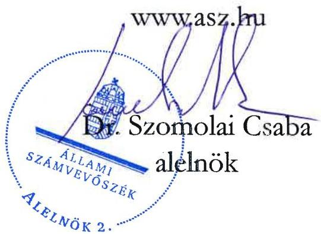

ÁLLAMI SZÁMVEVŐSZÉK

# JELENTÉS

A fenntartási kötelezettség kedvezményezettek
általi teljesítésének rapid ellenőrzése

A Som-Szer Szerszámkészítő Kft.
fenntartási kötelezettsége teljesítésének ellenőrzése
a GINOP-1.2.1-16-2017-00379 számú projektnél

2026.

26007

www.asz.hu

---

ÁLLAMI SZÁMVEVŐSZÉK

# JELENTÉS

A fenntartási kötelezettség kedvezményezettek
általi teljesítésének rapid ellenőrzése

A Som-Szer Szerszámkészítő Kft.
fenntartási kötelezettsége teljesítésének ellenőrzése
a GINOP-1.2.1-16-2017-00379 számú projektnél

2026.

26007

---

Jelentéseink az interneten a www.asz.hu címen olvashatók.

ELLENŐRZÉSI IGAZGATÓSÁG:
ELLENŐRZÉSI IGAZGATÓSÁG I.

ELLENŐRZÉSI IGAZGATÓ:
SINKÁNÉ DR. CSENDES ÁGNES igazgató

ELLENŐRZÉSVEZETŐ:
HUSZÁR ANNA ellenőrzésvezető

IKTATÓSZÁM: EL-4101-207/2025

TÉMASORSZÁM: -

ELLENŐRZÉS-AZONOSÍTÓ SZÁM: V1101

---

TARTALOMJEGYZÉK

- ÖSSZEFOGLALÁS ... 5
- AZ ELLENŐRZÉS EREDMÉNYEI ... 6
1. A fenntartási kötelezettség teljesítése ... 6
- I. FÜGGELÉK: ÉSZREVÉTELEK ... 10
- II. FÜGGELÉK: ELLENŐRZÉSI MEGKÖZELÍTÉS ... 11
- MELLÉKLETEK ... 16
I. sz. melléklet: Értelmező szótár ... 16
II. sz. melléklet: Az ellenőrzött és közreműködő szervezetek jegyzéke ... 18
- RÖVIDÍTÉSEK JEGYZÉKE ... 19

---

.

---

ÖSSZEFOGLALÁS

A 2016 decemberében megjelent „Mikro-, kis- és középvállalkozások termelési kapacitásainak bővítése” című (GINOP 1.2.1-16 kódszámú) pályázati felhívásban meghirdetett támogatással lehetőség nyílt ezen vállalkozások számára modern eszköz- és gépparkok, valamint fejlett infrastruktúrával ellátott telephelyek kialakítására. A rendelkezésre álló keretösszeg eredetileg 18 Mrd Ft volt, a keretösszeg emelését követően végül a konstrukcióban 101 Mrd Ft értékben kötött az IH¹ támogatási szerződést. Az igényelhető vissza nem térítendő támogatás összege kezdetben 25 M Ft és 250 M Ft között volt, amely később 500 M Ft-ra emelkedett.

A Felhívás²-ra benyújtott támogatási kérelem alapján 49,4 M Ft támogatást nyert GINOP-1.2.1-16-2017-00379 számú, „Kapacitásbővítő beruházás a Som-Szer Kft-nél eszközbeszerzés útján” című projekt Kedvezményezettje³, a Som-Szer Szerszámkészítő Kft. termékkör- és kapacitásbővítést eredményező fröccsöntőgépet szerzett be.

A Kedvezményezett – a támogatás visszafizetésének terhe mellett – vállalta, hogy a projektmegvalósítást követően a Projekt⁴ megfelel az 1303/2013/EU Rendeletben⁵, a műveletek tartósságára vonatkozó előírásoknak, az előírt fenntartási kötelezettséget teljesíti. A fenntartási időszak – az IH döntése alapján a Projekt fizikai befejezésének időpontjától, azaz – 2019. április 5-én kezdődött és 2023. november 6-ig tartott.

A kapott támogatás összértéke, a Projekt egyedisége és a megvalósított projekteredmény hosszabb távon történő megtartása miatt az ÁSZ⁶ indokoltnak tartotta a Projekt fenntartásának és a támogatás hasznosulásának ellenőrzését. A Kedvezményezett projektfenntartási kötelezettségei teljesítésének ellenőrzésére az ÁSZ „A 2014-2020 programozási időszak kohéziós politikai operatív programok vonatkozásában a fenntartási kötelezettség teljesítésének ellenőrzési gyakorlata” című ellenőrzéséhez, mint alapellenőrzéshez kapcsolódóan került sor.

A Kedvezményezettnek a Projekt tekintetében hároméves fenntartási kötelezettsége volt, amely keretében projektfenntartási jelentés benyújtási kötelezettségének határidőben eleget tett. Az IH az 1. projektfenntartási jelentést – a hiánypótlás teljesítését követően – elfogadta.

A támogatási szerződésben a fenntartási időszak tekintetében vállalt „A foglalkoztatás növekedése a támogatott vállalkozásoknál” című indikátort a Kedvezményezett teljesítette, az árbevétel növelésére vonatkozó kötelező vállalását azonban nem teljesítette.

Az ÁSZ helyszíni ellenőrzése időpontjában a Kedvezményezett tevékenysége már megszűnt, a vállalkozás nem működött, 2024. július 18-ától felszámolási eljárás alatt állt, ezért a beruházott termelőeszköz nem volt megtekinthető.

Az IH, miután 2024 júliusában tudomására jutott, hogy a Kedvezményezett felszámolási eljárás alatt áll, elállt a támogatási szerződéstől, és – 2024. december 31-re – 51,8 M Ft Kedvezményezettel szemben fennálló követelés összegéről tájékoztatta a felszámolóbiztost. Tekintettel arra, hogy a Kedvezményezett által benyújtott fenntartási jelentések – az 1. projektfenntartási jelentés kivételével – nem kerültek az IH által jóváhagyásra, így a támogatási jogviszony a felszámolási eljárás megindításakor még fennállt. A Kedvezményezett a támogatás-visszafizetési kötelezettségét 2025. október 31-ig nem teljesítette.

Az ÁSZ értékelése szerint a költségvetési támogatás nem hasznosult. A Projektre kapott támogatás vállalkozás eredményességéhez való hozzájárulása a Kedvezményezett 2020-2023. évi főbb pénzügyi adatainak alakulása alapján nem volt kimutatható.

---

AZ ELLENŐRZÉS EREDMÉNYEI

A magyar vállalkozások a GINOP⁷ pályázati konstrukciók keretében jelentős mértékű támogatásban részesültek, amelyek célja volt hozzájárulni a gazdasági fejlődéshez, a társadalmi felzárkózáshoz és az infrastruktúra fejlesztéséhez. Az ÁSZ – Magyarország versenyképességének növelése érdekében – fontosnak tartja a kihelyezett uniós támogatások nemzetgazdasági szinten történő hasznosulását és értékteremtését a vállalatok beruházásain és elért teljesítményén keresztül. Az ÁSZ a támogatással kapcsolatos fenntartási kötelezettség teljesítését, valamint a támogatás hasznosulását a GINOP-1.2.1-16-2017-00397 számú projekt tekintetében értékelte. A Projekt keretében a kedvezményezett Som-Szer Szerszámkészítő Kft. termékkör- és kapacitásbővítést eredményező fröccsöntőgépet vásárolt és helyezett üzembe.

## 1. A fenntartási kötelezettség teljesítése

### Összegző megállapítás

A Kedvezményezett projektfenntartási jelentés benyújtási kötelezettségének eleget tett, azonban a fenntartási időszak tekintetében vállalt árbevétel-növekedést nem teljesítette. A Kedvezményezettel szemben 2024. évben indított felszámolási eljárás miatt az IH elállt a támogatási szerződéstől és elrendelte a teljes támogatási összeg visszafizetését. A Kedvezményezett visszafizetési kötelezettségének nem tett eleget. A támogatás nem hasznosult.

### A fenntartási jelentés benyújtási kötelezettség teljesítése

A Kedvezményezettnek a Projekt megvalósítását követően, a Támogatási rend.⁸-ben foglaltak alapján hároméves fenntartási kötelezettsége volt, amelyet a Felhívás és a támogatási szerződés is rögzített. Az IH döntése alapján a projektfenntartási időszak a Projekt fizikai befejezésétől indult. Ennek keretében a projekteredményt a megvalósítási helyszínen a Projekt fizikai befejezésétől számított három évig fenn kellett tartania és üzemeltetnie, valamint a Támogatási rend.-ben foglaltak alapján évente projektfenntartási jelentésben kellett beszámolnia az indikátorok teljesüléséről.

A Kedvezményezett a Támogatási rend.-ben előírt éves projekt fenntartási jelentés benyújtási kötelezettségét határidőben teljesítette. A PFJ⁹-k és a ZPFJ¹⁰ főbb adatait az 1. táblázat tartalmazza.

1. táblázat

|  A GINOP- 1.2.1-16-2017-00379 SZÁMÚ PROJEKTHEZ KAPCSOLÓDÓ PFJ-K FŐBB ADATAI  |   |   |   |   |   |
| --- | --- | --- | --- | --- | --- |
|  JELENTÉS SORSZÁMA | JELENTÉS TÍPUSA | TÁRGYIDÓSZAK KEZDETE | TÁRGYIDÓSZAK VÉGE | BENYÚJTÁS HATÁRIDEJE | JELENTÉS STÁTUSZA  |
|  1. | PFJ | 2019.04.05. | 2020.12.31. | 2021.06.15. | 2021.06.14-én beérkezett elfogadva 2021.11.10-én  |
|  2. | PFJ | 2021.01.01. | 2021.12.31. | 2022.06.15. | 2022.06.07-én beérkezett  |
|  3. | ZPFJ | 2022.01.01. | 2023.11.06. | 2023.11.21. | 2023.11.21-én beérkezett  |

Forrás: FAIR¹² adatok alapján, ÁSZ saját szerkesztés

---

Az ellenőrzés eredményei

Mivel a Kedvezményezett székhelye nem volt azonos a Projekt megvalósításának helyszínével, a Támogatási rend.-ben foglaltak alapján a Kedvezményezettnek melléklet-benyújtási kötelezettsége volt a PFJ-k megküldésekor. Az 1. PFJ megküldését követően az IH a székhelyre és a megvalósítási helyszínre vonatkozóan is az iparűzési adó megfizetéséről szóló hatósági igazolás és a – foglalkoztatott munkavállalók tekintetében – munkahelyfenntartási nyilvántartás hiánypótlására szólította fel a Kedvezményezettet 2021. október 20-án. A kért dokumentumok hiánypótlását a Kedvezményezett a Támogatási rend.-ben előírt határidőben megfelelően teljesítette, amely alapján IH az 1. PFJ-t elfogadta.

A Kedvezményezett által határidőben benyújtott 2. PFJ és ZPFJ IH általi elbírálására az ÁSZ helyszíni ellenőrzésének lezárásáig nem került sor.

Az IH szabálytalansági gyanúbejelentés alapján a Projekttel kapcsolatban 2022. november 3-án rendkívüli fenntartási helyszíni ellenőrzést folytatott le. A helyszíni ellenőrzés jegyzőkönyvében rögzítették, hogy a Projekt keretében beszerzett eszköz az ellenőrzés időpontjában működött, fenntartása megvalósult, és az a Kedvezményezett tulajdonában volt. Az IH 2023. október 24-én hozott döntésében megállapította, hogy szabálytalanság nem történt.

Az ÁSZ ellenőrzés során az 1-2. PFJ-k és a ZPFJ megalapozottsága, valóságtartalma teljeskörűen nem volt értékelhető, mert az ÁSZ a Kedvezményezettnél – annak felszámolási eljárás alá kerülése miatt – a helyszínen ellenőrzést nem tudott lefolytatni. A FAIR rendszerben a fenntartási jelentések teljesítésekor a Kedvezményezett a szükséges nyilatkozatokat megtette, az indikátorok teljesítéséről adatokat rögzített. Az éves beszámolók adatai, a FAIR rendszerben lévő és az IH által rendelkezésre bocsátott adatok, dokumentumok alapján tette meg az ÁSZ ellenőrzési megállapításait.

## A fenntartási kötelezettség, indikátorok teljesítése

A Kedvezményezett a Projekt keretében – a támogatási szerződés 4. és 5. sz. mellékletében – vállalt indikátorokat és egyéb kötelezettségeket az alábbiak szerint teljesítette:

1. A Kedvezményezett „A foglalkoztatás növekedése a támogatott vállalkozásoknál” című indikátort a 2019-2023. évek mindegyikében – a Támogatási rend. 88. § (2) bekezdésében előírt 75%-os minimum határ figyelembevételével – teljesítette, a fenntartási időszak végére a 43 fő foglalkoztatottat rögzített a ZPFJ-ben.

2. A Kedvezményezett évenként 15%-os árbevétel növekedést vállalt a Felhívásban rögzített legalább 5%-os árbevétel növekedés helyett a Projekt fizikai befejezését követőenül követő két üzleti év tekintetében. A vállalást a Kedvezményezett nem teljesítette, mivel 2016-os bázisévi árbevétele 837,7 M Ft volt, míg a 2020. és 2021. években elért árbevétele a bázisérték alatt maradt 23,0%-kal, illetve 42,1%-kal. A Kedvezményezett – a Támogatási rend. 88. § (2) bekezdésében előírtak alapján – az indikátor értékének 25%-ot meghaladó elmaradása esetén köteles lett volna a kapott támogatás arányos részét visszafizetni.

3. Egyéb kötelező vállalás a projektszintű elkülönített számviteli nyilvántartás volt, amit a Kedvezményezett teljesített. Az IH által végzett helyszíni ellenőrzési jegyzőkönyv alapján a Kedvezményezett a Projekt tekintetében a Támogatási rend.-ben foglaltaknak megfelelő elkülönített nyilvántartást – külön főkönyvi számlán a Projekt elemről és a kapott támogatási összegről – vezetett.

A Kedvezményezett általi vállalások IH részéről történő ellenőrzése az ellenőrzött időszak végéig nem történt meg, amely során a fenntartási kötelezettség teljesítésének elmaradását megállapíthatta volna.

---

Az ellenőrzés eredményei

A Cégközlönyben közzétett adatok alapján az IH tudomására jutott 2024 júliusában, hogy a Kaposvári Törvényszék elrendelte a Kedvezményezett felszámolását 2024. július 18-ától. A Támogatási rend. 159. § (5) bekezdés b) pontja alapján, ha a kedvezményezett ellen adósságrendezési, felszámolási, végelszámolási, kényszertörlési vagy a megszüntetésére irányuló egyéb eljárás, vagy csődeljárás indult, az IH jogosult szabálytalansági eljárás mellőzésével szabálytalanságot megállapítani, és elrendelni a szükséges jogkövetkezményt. Az IH az előbbiek alapján szabálytalanságot állapított meg és a Kedvezményezett felszámolási eljárására, mint – az ÁSZF 7. fejezet 4.2. pont f) alpontja szerinti – szerződésszegésre hivatkozással, 2024. szeptember 18-ával elállt a támogatási szerződéstől. Tekintettel arra, hogy a Kedvezményezett által benyújtott fenntartási jelentések – az 1. PFJ kivételével – nem kerültek az IH által jóváhagyásra, így a támogatási jogviszony a felszámolási eljárás megindításakor még fennállt. 2024. december 31-én a Kedvezményezettel szemben fennálló követelés 49,4 M Ft-os támogatási összegből és 2,5 M Ft ügyleti kamatból állt.

A Kedvezményezett felszámolására kirendelt Nemzeti Reorganizációs Nonprofit Kft.-t képviselő felszámolóbiztos az ÁSZ 2024. december 5-i helyszíni ellenőrzése során nyilatkozatában tájékoztatást adott a Kedvezményezettel szemben indított felszámolási eljárás körülményeiről. A Kedvezményezett egyik alvállalkozója által elkövetett költségvetési csalás miatt a NAV büntetőeljárást indított a Kedvezményezettel szemben 2021. május 5-én, a Kedvezményezett vállalkozása zár alá került. Az ÁFA-követelés, a bírság és a késedelmi kamatok jelentős nagysága következtében a Kedvezményezett csődeljárást kezdeményezett önmaga ellen 2023. november 11-től. A csődeljárás megszüntetését követően a bíróság a fizetésképtelenség miatt felszámolási eljárást rendelt el 2024. július 18-án.

## A támogatás hasznosulása

A Kedvezményezett a Projekt keretében egy termékkör- és kapacitásbővítést eredményező fröccsöntőgépet szerzett be és helyezett üzembe. Az ÁSZ helyszíni ellenőrzése időpontjában a beruházott termelőeszköz nem volt megtekinthető, a Kedvezményezett tevékenysége már megszűnt, a vállalkozás nem működött, felszámolási eljárás alatt állt. A felszámolóbiztos nyilatkozata alapján a Projekt keretében beszerzett berendezés a megvalósítás helyszínén, Kecskeméten megtalálható, azzal tovább folyt a termelés, amelyet az ÁSZ a megvalósítás helyszínén nem tudott ellenőrizni.

A Kedvezményezett létszám, árbevétel, adózott eredmény és mérlegfőösszeg adatait a 2. táblázat mutatja be a 2019-2024. évek tekintetében.

2. táblázat
A KEDVEZMÉNYEZETT 2019-2024. ÉVI LÉTSZÁM, ÁRBEVÉTEL, ADÓZOTT EREDMÉNY ÉS MÉRLEGFŐÖSSZEG ADATAI

|  ADATOK MEGNEVEZÉSE | 2019. ÉVBEN | 2020. ÉVBEN | 2021. ÉVBEN | 2022. ÉVBEN | 2023. ÉVBEN | 2024. ÉVBEN  |
| --- | --- | --- | --- | --- | --- | --- |
|  Átlagos statisztikai állományi létszám (fő) | 27 | 29 | 25 | 45 | 41 | nincs adat  |
|  Értékesítés nettó árbevétele (M Ft) | 1 189,3 | 751,0 | 641,2 | 483,8 | 586,7 | nincs adat  |
|  Adózott eredmény (M Ft) | 59,4 | 2,3 | 15,9 | - 309,0 | - 582,5 | nincs adat  |
|  Mérlegfőösszeg (M Ft) | 2 154,4 | 2 176,4 | 2 028,3 | 1 540,2 | 723,9 | nincs adat  |

Forrás: A Kedvezményezett éves beszámoló adatai alapján ÁSZ saját szerkesztés

---

Az ellenőrzés eredményei

Az ÁSZ értékelése szerint a költségvetési támogatás nem hasznosult. Az ÁSZ helyszíni ellenőrzésének időpontjában a Projekt működése nem volt ellenőrizhető, megítélhető. A Projektre kapott támogatás vállalkozás eredményességéhez való hozzájárulása a Kedvezményezett 2020-2023. évi főbb pénzügyi adatainak alakulása alapján nem volt kimutatható. A Kedvezményezettel szemben indított felszámolási eljárás miatt az IH – szerződésszegésre hivatkozással – elállt a támogatási szerződéstől, és egyben visszakövetelte a támogatási összeget. A Kedvezményezett az ÁSZ helyszíni ellenőrzésének lezárását követően, 2025. október 31-ig visszafizetési kötelezettségét nem teljesítette.

9

---

I. FÜGGELÉK: ÉSZREVÉTELEK

A jelentéstervezetet az ÁSZ 15 napos észrevételezésre megküldte az ellenőrzött szervezet vezetőjének az ÁSZ tv. 29. §* (1) bekezdése előírásának megfelelően.

A jelentéstervezet megállapításaira az ellenőrzött szervezet nem tett észrevételt.

* 29. § (1) Az Állami Számvevőszék az ellenőrzési megállapításait megküldi az ellenőrzött szervezet vezetőjének vagy az általa megbízott személynek, és annak, akinek személyes felelősségét állapította meg.
(2) Az ellenőrzött szervezet vezetője és a felelősként megjelölt személy az ellenőrzés megállapításaira tizenöt napon belül írásban észrevételt tehet.
(3) Az Állami Számvevőszék az észrevételre a beérkezésétől számított harminc napon belül írásban válaszol. A figyelembe nem vett észrevételeket köteles a jelentésben feltüntetni, és megindokolni, hogy azokat miért nem fogadta el.

10

---

11

# II. FÜGGELÉK: ELLENŐRZÉSI MEGKÖZELÍTÉS

## AZ ELLENŐRZÉS JOGALAPJA

Az ellenőrzés jogszabályi alapját az ÁSZ tv.¹² 5. § (3) bekezdés képezte.

## AZ ELLENŐRZÉS CÉLJA

A fenntartási kötelezettség teljesítésének és a támogatás hasznosulásának értékelése a fenntartási szakaszba került uniós projekt kedvezményezettjénél.

## AZ ELLENŐRZÉS TÍPUSA

Kombinált ellenőrzés

## AZ ELLENŐRZÉS TÁRGYA

Az ellenőrzés tárgya volt az ellenőrzésre kiválasztott GINOP-1.2.1-16-2017-00379 számú uniós projekt fenntartási időszakára vonatkozóan előírt kötelezettségek Som-Szer Szerszámkészítő Kft. mint kedvezményezett által történt teljesítése és a támogatás hasznosulása. A fenntartási kötelezettség ellenőrzése a kedvezményezett tevékenységéhez és működéséhez kapcsolódó kötelezettségek, a meghatározott indikátorok és a beszámolási kötelezettség teljesítésére irányult.

Az ellenőrzés tárgya volt továbbá a kedvezményezett által benyújtott fenntartási jelentésekben rögzítettek valóságtartalma és megalapozottsága, valamint ezek összhangja az ÁSZ helyszíni ellenőrzése során tapasztaltakkal.

Az ellenőrzés kiterjedt minden olyan körülményre és adatra, amely az ÁSZ jogszabályban meghatározott feladatainak teljesítéséhez, valamint a program végrehajtása folyamán felmerült újabb összefüggések feltárásához szükséges.

## AZ ELLENŐRZÉS HATÓKÖRE ÉS TERÜLETE

Az uniós jogszabályok az uniós támogatással megvalósuló projektekkel szemben elvárásként rögzítik a „műveletek tartósságának” követelményét. A kedvezményezettek infrastrukturális vagy termelő beruházás esetén – a projektmegvalósítás befejezésétől számított 5 évig, kis- és közepes vállalkozások esetén 3 évig, a támogatás visszafizetésének terhe mellett – vállalták, hogy a projekt termelő tevékenysége nem szűnik meg, hogy nem következik be olyan tulajdonosváltás, amelynek eredményeként jogosulatlan előny szerezhető, illetve, hogy nem következik be olyan lényeges változás, amely a projekt eredeti célkitűzéseit veszélyezteti. Abban az esetben, ha a felsoroltak valamelyike bekövetkezik, a támogatást – figyelemmel a vonatkozó jogszabályokra – vissza kell fizetni az Európai Bizottságnak.

---

II. Függelék: Ellenőrzési megközelítés

Ha az IH a projektre nézve fenntartási kötelezettséget állapított meg, és indikátorokat határozott meg a támogatási szerződésben, a kedvezményezettnek évente be kellett számolnia az indikátorok teljesüléséről. Ha ezen időszakra indikátorokat nem határozott meg az IH és a támogatási szerződésben sem írta elő az évenkénti teljesítést, a kedvezményezettnek egy alkalommal záró projektfenntartási jelentést kellett benyújtania.

Az ellenőrzés a XIX. Uniói fejlesztések fejezet 3/1 Kohéziós politikai operatív programok 2014-2020 operatív programjai közül a – kis- és középvállalkozások versenyképességének javítására irányuló – GINOP 1. prioritásából és a – kutatás, technológiai fejlesztés és innováció című – GINOP 2. prioritásából támogatást kapott projektek kedvezményezettjeire terjedt ki oly módon, hogy az ÁSZ – „A 2014-2020 programozási időszak kohéziós politikai operatív programok vonatkozásában a fenntartási kötelezettség teljesítésének ellenőrzési gyakorlata” című ellenőrzéséhez, mint alapellenőrzéshez kapcsolódóan – a GINOP 1-2. prioritás pályázati kiírásainak nyertes pályázóból, kockázat alapú mintavételi eljárással, rapid ellenőrzésre választott ki összesen 16 projektet, amelyből ezen jelentésben a GINOP-1.2.1-16-2017-00379 számú projekt tekintetében értékelte a fenntartási kötelezettség teljesítését.

A GINOP-1.2.1-16-2017-00379 számú projekt tekintetében az ellenőrzés kiterjedt a célrendszer, a jogszabályban – a működés és tevékenység tekintetében – előírt fenntartási kötelezettség teljesülésére, a fenntartási jelentésben bemutatott eredmények valóságtartalmára, megalapozottságára, valamint a támogatási szerződésben vállalt, a fenntartási időszakra vonatkozó kötelezettségek teljesítésének, és a GINOP keretében nyújtott támogatás hasznosulásának értékelésére.

## A GINOP-1.2.1-16 számú felhívás bemutatása

Az IH által közzétett GINOP-1.2.1-16 kódszámú, a „Mikro-, kis- és középvállalkozások termelési kapacitásainak bővítése” című pályázati felhívásban meghirdetett támogatás célja volt a kiemelt iparágakban fejleszteni kívánó hazai KKV¹³-k termelési kapacitásainak bővítése a hazai ipar fejlesztése érdekében, amely során korszerű termék előállítási képességek megteremtésének és bővítésének céljából lehetőség nyílt modern eszköz- és gépparkok, valamint fejlett infrastruktúrával ellátott telephelyek kialakítására, a szektor szereplői számára a versenyképesség feltételeinek megteremtésére, fenntartására.

A támogatás formája vissza nem térítendő támogatás volt, forrását az Európai Regionális Fejlesztési Alap és Magyarország költségvetése társfinanszírozásban biztosította. A rendelkezésre álló tervezett keretösszeg eredetileg 18 Mrd Ft volt, ami a Felhívás módosítását követően 119,8 Mrd Ft-ra emelkedett. A Felhívás szerint a támogatott projektek várható számát 150-250 között tervezték, a Felhívás keretében projektenként kapható támogatás nagysága kezdetben 25-250 M Ft volt, majd később a támogatás maximális összege 500 M Ft-ra emelkedett.

A támogatási kérelmet benyújtó szervezetek vállalták, hogy a projekt megvalósításával hozzájárulnak a kiemelt iparágakban fejleszteni kívánó hazai KKV-k termelési kapacitásainak bővítéséhez, a kapott támogatáson felül önerőből finanszírozzák a projektet és a projekt fizikai befejezését követő két évben növelik nettó árbevételüket.

Támogatható tevékenység volt az új eszközök, gépek beszerzése, az új technológiai rendszerek és kapacitások kialakítása, a megújuló energiaforrást hasznosító technológiák alkalmazása, melyek célja a gazdasági-termelési folyamatok és az üzemen belüli építmények energiaigényének részbeni fedezése megújuló energia előállításával, valamint az infrastrukturális és ingatlan beruházás, az információs technológia-fejlesztés és az új eszközök, gépek beszerzéséhez, új technológiai rendszerek és kapacitások kialakításához kapcsolódó gyártási licenc, gyártási know-how beszerzés.

---

II. Függelék: Ellenőrzési megközelítés

A támogatásra az a mikro-, kis-, és középvállalkozás pályázhatott, amely különösen az alábbi feltételeknek eleget tett:

- rendelkezett legalább egy lezárt (beszámoló/SZJA¹⁴ bevallással alátámasztott), teljes 365 napot jelentő üzleti évvel;
- éves átlagos statisztikai állományi létszáma a támogatási kérelmek benyújtását megelőző utolsó lezárt, teljes üzleti évben minimum 1 fő volt;
- Magyarországon székhellyel rendelkező kettős könyvvitelt vezető gazdasági társaság, szövetkezet, egyéni vállalkozó, egyéni cég vagy az Európai Gazdasági Térség területén székhellyel és Magyarországon fiókteleppel rendelkező szövetkezet vagy kettős könyvvitelt vezető gazdasági társaság fióktelepe volt.

A projekt megvalósítása során legfeljebb egy mérföldkővet lehetett tervezni, a mérföldkő elérésének a projekt fizikai befejezésének időpontjával kellett egybeesnie. A projekt fizikai befejezésére legfeljebb 18 hónap állt rendelkezésre. Nem volt köteles biztosítékot nyújtani kérelemre az a kedvezményezett, amely rendelkezett legalább egy lezárt, teljes üzleti évvel, és a támogatási kérelem benyújtásakor szerepelt a köztartozásmentes adózói adatbázisban.

Indikátorként a támogatott vállalkozásoknál a foglalkoztatás növekedése került megjelölésre, kötelező vállalásként, hogy a projekt fizikai befejezését követő két évben növekszik a nettó árbevétel. A támogatást igénylő, a projekt megvalósítás befejezésétől számított 3 évig volt köteles fenntartani a projektet.

A támogatási kérelmek benyújtására a Felhívás közzétételét követő 24 hónapig, 2017. január 16-tól 2019. január 16-ig volt lehetőség. Az utólagos finanszírozású tevékenységekre igénybe vehető maximális előleg mértéke a megítélt támogatás 50%-a, de legfeljebb 125 M Ft volt. A beérkező támogatási kérelmeket standard kiválasztási eljárásrend alapján, szakaszos elbírálással bírálták el.

Az IH által nyolc alkalommal módosított Felhívásra 1136 támogatási kérelem érkezett be, összesen 178,6 Mrd Ft nagyságú támogatási összegre, amelyből – az IH adatszolgáltatás alapján – 605 kérelem került elfogadásra összesen 101 Mrd Ft értékű támogatási összeggel.

# A Som-Szer Szerszámkészítő Kft. és a GINOP-1.2.1-16-2017-00379 számú projekt bemutatása

A kedvezményezett Som-Szer Szerszámkészítő Kft.-t 2009 januárjában alapították. A támogatási kérelem benyújtásakor székhelye Budapesten volt és két telephelyen működött (Kecskemét és Kaposvár), 2021 májusától Kaposvár volt székhelynek bejegyezve. A Kedvezményezett az ellenőrzött időszakban kisvállalkozásnak minősült, bejegyzett főtevékenysége „Szerszámgyártás” volt. Gazdálkodása a helyszíni ellenőrzés lezárásának időpontjában nem volt megítélhető tekintettel arra, hogy a 2024. évi számviteli beszámolója nem elérhető nyilvánosan, a vállalkozás 2024. július 18-a óta felszámolási eljárás alatt állt.

A Kedvezményezett a támogatási kérelmét 2017. január 25-én nyújtotta be, amelynek támogatásáról az IH 2017. november 10-én hozott döntést; a támogatási szerződés 2017. december 6-án lépett hatályba. A Kedvezményezett a GINOP-1.2.1-16-2017-00379 számú, „Kapacitásbővítő beruházás a Som-Szer Kft-nél eszközbeszerzés útján” című projekt keretében egy 5 tengelyes XT 630 5AX típusú megmunkálóközpont (fröccsöntőgép) beszerzését tervezte a Kaposvár, Iszák utcai telephelyén történő beüzemeléssel.

A Projekt tényleges összköltsége 98,8 M Ft volt, amelyhez a Kedvezményezett – 50%-os támogatás intenzitással – 49,4 M Ft összegű támogatást nyert el. A Projekt megvalósítását 2017. november 20-án kezdték meg, fizikailag 2019. április 5-én – a támogatási szerződésben rögzített egyetlen mérföldkő elérési dátumaként előírt határidőben – fejeződött be.

13

---

II. Függelék: Ellenőrzési megközelítés

A Kedvezményezett számára a támogatási szerződés „A foglalkoztatás növekedése a támogatott vállalkozásoknál” indikátor és az éves árbevétel tekintetében írt elő célértéket. A 2016. évi 27 fő foglalkoztatotti létszámot, mint bázisértéket a 2019. december 31-i céldátumra meg kellett tartani, az árbevételnél évenként 15%-os növekedést tervezett elérni a Kedvezményezett.

A Kedvezményezett a támogatási szerződésben előírt határidőt betartva, 2019. július 23-án nyújtotta be záró szakmai beszámolóját és a záró kifizetési kérelmét, amelyet az IH 2020. november 3-án hagyott jóvá.

Az IH a projektmegvalósítás szakaszában két helyszíni ellenőrzést folytatott le. 2019. május 21-én tervezett közbenső helyszíni ellenőrzést tartott a megvalósítási helyszín változása (kecskeméti telephely lett a kaposvári telephely helyett), a beszerzett berendezéstípus módosulása miatt. 2020. január 13-án az IH a záró szakmai beszámolóhoz kapcsolódóan végzett rendkívüli pénzügyi záró ellenőrzést. Az IH ellenőrzési jegyzőkönyvei alapján a Kedvezményezett az intézkedésként kért hiánypótlást mindkét esetben teljesítette.

A fenntartási időszak – az IH döntése alapján – 2019. április 5-én kezdődött és 2023. november 6-áig tartott.

## AZ ELLENŐRZŐTT IDŐSZAK

2016. január 1-től 2025. április 30-ig, a helyszíni ellenőrzés lezárásának időpontjáig tartó időszak.

## AZ ELLENŐRZÉSI KRITÉRIUMOK

|  FÓKUSZTERÜLET | ELLENŐRZÉSI KRITÉRIUMOK  |
| --- | --- |
|  1. A fenntartási kötelezettség teljesítése  |   |
|  A fenntartási jelentés benyújtási kötelezettség teljesítése | Támogatási rend. 178. § (1) bekezdés, 180. § (1) bekezdés, 1. melléklet 287.2., 297.1 pontja;  |
|  A fenntartási kötelezettség, indikátorok teljesítése | 1303/2013/EU rendelet 71. cikk (1) bekezdés; Támogatási rend. 88. § (2) bekezdés, 110/A. §, 159.§ (5) bekezdés b) pont 178. § (1) bekezdés; támogatási szerződés 4-5. sz. mellékletei; ÁSZF 7. fejezet 4.2. pont f) alpontja  |
|  A támogatás hasznosulása | Az ÁSZ meghatározása alapján:
- A támogatás hasznosult, ha a vállalkozás (a projekt) működött az ÁSZ helyszíni ellenőrzése időpontjában, fenntartási kötelezettségét a kedvezményezett teljesítette / jellemzően teljesítette, és a támogatás eredményeként a kedvezményezett vállalkozás árbevétel vagy adózott eredmény adatai növekedtek a támogatás előtti időszakhoz képest.
- A támogatás korlátozottan hasznosult, ha a projekteredmény „fellelhető volt” az ÁSZ helyszíni ellenőrzése időpontjában, fenntartási kötelezettségét részben / minimálisan teljesítette a kedvezményezett, vagy a támogatás eredményeként hozzáadott új értéket teremtett, az társadalmilag hasznosult stb.
- A támogatás nem hasznosult, ha fenntartási kötelezettségét a kedvezményezett egyáltalán nem teljesítette és/vagy a vállalkozás (a projekt) már nem működött az ÁSZ helyszíni ellenőrzése időpontjában.  |

---

II. Függelék: Ellenőrzési megközelítés

# AZ ELLENŐRZÉS MÓDSZERE ÉS AZ ELLENŐRZÉSI BIZONYÍTÉKOK KÖRE

Az ÁSZ az ellenőrzést a nemzetközi standardokat irányadónak tekintve az ellenőrzési program szempontjai, az ellenőrzött időszakban hatályos jogszabályok, az ellenőrzés-szakmai szabályok és módszertanok figyelembevételével végezte.

Az ellenőrzési kérdések megválaszolásához szükséges bizonyítékok megszerzése az ellenőrzött szervezet és az ellenőrzésben közreműködő szervezet által rendelkezésre bocsátott dokumentumokra és adatokra alapozva, továbbá megfigyelés, szemle (szemrevételezés), kérdésfeltevés (információkérés), interjú, mintavételezés, valamint elemző eljárás útján történt.

Az ellenőrzés bizonyítékként felhasználható adatforrásai közé tartoztak egyrészt az ellenőrzéshez kért dokumentumok, adatforrások, a nyilvánosan hozzáférhető adatok, dokumentumok, másrészt adatforrás volt még minden, az ellenőrzés folyamán feltárt, az ellenőrzés szempontjából információt tartalmazó dokumentum. Az ÁSZ a számvevőszéki jelentéstervezet elfogadásáig rendelkezésre álló, nyilvánosan elérhető adatokat figyelembe vette.

Az ellenőrzés végrehajtásához a projekt kiválasztása kockázat alapú mintavételi eljárással történt.

15

---

MELLÉKLETEK

## I. SZ. MELLÉKLET: ÉRTELMEZŐ SZÓTÁR

fenntartás

A kedvezményezett a projektmegvalósítás befejezésétől számított 5 évig, állami támogatás formájában nyújtott támogatás esetén az állami támogatásokra vonatkozó szabályok alapján alkalmazandó időtartamig, kis- és közepes vállalkozások esetén 3 évig a támogatás visszafizetésének terhe mellett vállalja, hogy a projekt megfelel az 1303/2013/EU európai parlamenti és tanácsi rendelet 71. cikk (1) bekezdésében foglaltaknak. (Forrás: Támogatási rend. 178. § (1) bekezdés, 2016. május 14-től 2024. július 31-ig hatályos)

Az irányító hatóság döntése alapján a fenntartási időszak kezdődhet a projektmegvalósítás befejezésétől vagy a projekt fizikai befejezésétől (ÁSZF¹⁵ 10.7. pontja alapján, hatályos 2016. június 14-től)

A fenntartási időszak meghatározása során az IH speciális projektév szerinti jelentéstételt alkalmazott, mivel a jelentések tárgyidőszaka speciális projektévhez (az üzleti évről készített közzétett beszámolóhoz) igazodott és a fenntartási jelentésben benyújtandó vállalási adatok csak az így meghatározott időszak elteltével álltak rendelkezésre. (Forrás: Támogatási rend. 1. melléklet 285.1-286.4 pontja alapján ÁSZ megfogalmazás)

indikátor

Uniós jogszabályokban és a programban nevesített, valamint az európai uniós források felhasználásáért felelős miniszter – a Vidékfejlesztési Program esetén az agrárpolitikáért felelős miniszter – által meghatározott, eredményt vagy teljesülést mérő mutató. (Forrás: Támogatási rend 3. § (1) bekezdés 12. pont, 2022. július 21-től 2024. július 31-ig hatályos)

kedvezményezett

A támogatásban részesített támogatást igénylő (Forrás: Támogatási rend 3. § (1) bekezdés 14. pont, 2014. november 6-tól hatályos)

műveletek tartóssága

Az ESB-alapokból¹⁶ valamely infrastrukturális vagy termelő beruházást magában foglaló műveletre fordított támogatás akkor fizetendő vissza, ha a kedvezményezettnek történő utolsó kifizetéstől számított 5 évben belül, illetve adott esetben, az állami támogatásokról szóló szabályozás szerinti időtartamon belül, a következők valamelyike történik:

a) a termelő tevékenység megszűnése vagy a programterületen kívülre való áthelyezése;

b) az infrastruktúra valamely elemében tulajdonosváltás következik be, amelynek eredményeként egy cég vagy állami szervezet jogosulatlan előnyhöz jut;

c) a természetében, célkitűzéseiben vagy végrehajtási feltételeiben olyan lényeges változás következik be, amely az eredeti célkitűzéseket veszélyezteti.

A műveletre jogosulatlanul kifizetett összegeket a tagállamnak vissza kell téríthetni, azon időszakkal arányosan, amelynek tekintetében nem teljesültek a követelmények. (Forrás: 1303/2013/EU rendelet 71. cikk (1) bekezdése)

projekt fizikai befejezése

Az az állapot, amikor a projekt keretében támogatott tevékenységeket a felhívásban és a támogatási szerződésben meghatározottak szerint elvégezték. (Forrás: Támogatási rend 3. § (1) bekezdés 40. pont, 2015. június 13-tól hatályos)

16

---

Mellékletek

projekt lezárása

Egy projekt akkor tekinthető lezártnak, ha a kedvezményezett a támogatási szerződésben a projektmegvalósítás befejezését követő időszakra nézve további kötelezettséget nem vállalt, és a felhívásban meghatározott feltételek teljesültek. Ha a támogatási szerződés a támogatott tevékenység befejezését követő időszakra nézve további kötelezettséget előírt, a projekt akkor tekinthető lezártnak, ha valamennyi vállalt kötelezettség teljesült és a kedvezményezett a kötelezettségek megvalósulásának eredményeiről szóló záró projekt fenntartási jelentést benyújtotta, és azt az irányító hatóság, Vidékfejlesztési Program esetén a kifizető ügynökség jóváhagyta, valamint a záró jegyzőkönyv elkészült. (Forrás: Támogatási rend 3. § (1) bekezdés 39. pont, 2016. május 14-től 2024. július 31-ig hatályos)

projektmegvalósítás befejezése

Az 1303/2013/EU rendelet 2. cikk 14. pontjára tekintettel egy projekt megvalósítása akkor tekinthető befejezettnek, ha a projekt fizikailag és pénzügyileg is befejezett, valamint a kedvezményezettnek valamennyi támogatott tevékenysége befejezését igazoló és alátámasztó kifizetési igénylését az irányító hatóság jóváhagyta és a támogatás folyósítása megtörtént. (Forrás: Támogatási rend 3. § (1) bekezdés 41. pont, 2015. június 13-tól 2023. május 24-ig hatályos)

projekt pénzügyi befejezése

Ha a projekt fizikai befejezése megtörtént, valamint a projektmegvalósítás során keletkezett elszámoló bizonylatok – szállítói kifizetés esetén az előírt önrész szállítók részére történő – kiegyenlítése megtörtént. A projekt pénzügyi befejezésének dátuma a projekt megvalósítási ideje alatt felmerült, a kedvezményezett által megfelelően elszámolt költségek közül a legkésőbbi kiegyenlítés dátuma. (Forrás: Támogatási rend 3. § (1) bekezdés 42. pontja alapján, 2014. november 6-tól hatályos)

standard kiválasztási eljárás

Standard kiválasztási eljárásrend esetén szakaszos elbírálást kell alkalmazni, amely során legkésőbb a felhívásban rögzített szakasz zárását vagy beadási határnapját követően kell a támogatási kérelmeket jogosultsági és tartalmi értékelésre bocsátani, és az egy szakaszban beérkezett kérelmek támogathatóságáról a felhívásban előírt tartalmi értékelési szempontoknak való megfelelés szerinti sorrendiségük alapján kell dönteni. (Támogatási rend. 61. § (4) bekezdés alapján, 2016. május 14-től hatályos)

17

---

Mellékletek

## II. SZ. MELLÉKLET: AZ ELLENŐRZŐTT ÉS KÖZREMŰKÖDŐ SZERVEZETEK JEGYZÉKE

|  ELLENŐRZŐTT SZERVEZET MEGNEVEZÉSE | ADÓSZÁM  |
| --- | --- |
|  Som-Szer Szerszámkészítő Kft.
2024. július 17-ig | 14652648-2-14  |
|  Som-Szer Szerszámkészítő Kft. „felszámolás alatt”
2024. július 18-tól;
kirendelt felszámoló: Nemzeti Reorganizációs Nonprofit Kft. |   |
|  KÖZREMŰKÖDŐ SZERVEZET MEGNEVEZÉSE | ADÓSZÁM  |
| --- | --- |
|  Közigazgatási és Területfejlesztési Minisztérium | 15849272-2-41  |
|  Nemzeti Fejlesztési Központ | 15850258-1-42  |

---

RÖVIDÍTÉSEK JEGYZÉKE

1 IH

Irányító Hatóság (A GINOP esetében 2014. november 6-tól 2018. június 15-ig a Nemzetgazdasági Minisztérium, majd 2022. május 24-ig a Pénzügyminisztérium. 2022. május 25-től a területfejlesztési miniszter tevékenységének segítésére kijelölt minisztériumként a Miniszterelnökség volt a felelős az IH feladatok tekintetében. 2024. január 1-vel az IH feladatok átkerültek a Közigazgatási és Területfejlesztési Minisztériumhoz. A feladatok 2024. augusztus 1-től az újonnan létrejött Nemzeti Fejlesztési Központba kerültek).

2 Felhívás

A GINOP-1.2.1-16 kódszámú, a „Mikro-, kis- és középvállalkozások termelési kapacitásainak bővítése” című pályázati felhívás

3 Kedvezményezett, Som-Szer Szerszámkészítő Kft. 2024. július 17-ig, Som-Szer Szerszámkészítő Kft. „felszámolás alatt” 2024. július 18-tól

4 Projekt

A GINOP-1.2.1-16-2017-00379 számú, „Kapacitásbővítő beruházás a Som-Szer Kft-nél eszközbeszerzés útján” című projekt

5 1303/2013/EU rendelet

AZ EURÓPAI PARLAMENT ÉS A TANÁCS 1303/2013/EU RENDELETE (2013. december 17.) az Európai Regionális Fejlesztési Alapra, az Európai Szociális Alapra, a Kohéziós Alapra, az Európai Mezőgazdasági Vidékfejlesztési Alapra és az Európai Tengerügyi és Halászati Alapra vonatkozó közös rendelkezések megállapításáról, az Európai Regionális Fejlesztési Alapra, az Európai Szociális Alapra és a Kohéziós Alapra és az Európai Tengerügyi és Halászati Alapra vonatkozó általános rendelkezések megállapításáról és az 1083/2006/EK tanácsi rendelet hatályon kívül helyezéséről

6 ÁSZ

Állami Számvevőszék

7 GINOP

Gazdaságfejlesztési és Innovációs Operatív Program

8 Támogatási rend.

272/2014. (XI. 5.) Korm. rendelet a 2014-2020 programozási időszakban az egyes európai uniós alapokból származó támogatások felhasználásának rendjéről

9 PFJ

projektfenntartási jelentés

10 ZPFJ

záró projektfenntartási jelentés

11 FAIR

Fejlesztéspolitikai Adatbázis és Információs Rendszer, amely a fejlesztési források felhasználására – többek között a kohéziós politikai operatív programok – vonatkozó eljárások során keletkező adatok egységes nyilvántartó rendszere a 60/2014. (III.6.) Korm. rendelet alapján

12 ÁSZ tv.

2011. évi LXVI. törvény az Állami Számvevőszékről

13 KKV

A mikro, kis- és középvállalkozások gyűjtőneve

14 SZJA

Személyi jövedelemadó

15 ÁSZF

Általános Szerződési Feltételek az operatív programok keretében támogatásban részesített kedvezményezetekkel kötendő támogatási szerződésekhez

16 ESB-alapok

Az európai strukturális és beruházási alapok

19

---

ÁLLAMI SZÁMVEVŐSZÉK

1052 Budapest, Apáczai Csere János u. 10. | 1364 Budapest 4., Pf. 54

www.asz.hu | szamvevoszek@asz.hu

telefon: +36 1 484 9100