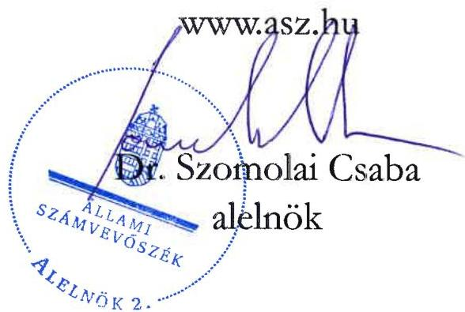

ÁLLAMI SZÁMVEVŐSZÉK

# JELENTÉS

A fenntartási kötelezettség kedvezményezettek
általi teljesítésének rapid ellenőrzése

A SPRING SOLAR Ipari, Kereskedelmi és Szolgáltató Kft.
fenntartási kötelezettsége teljesítésének ellenőrzése
a GINOP-1.2.3-8-3-4-16-2017-00550 számú projektnél

2026.

26008

www.asz.hu

---

ÁLLAMI SZÁMVEVŐSZÉK

# JELENTÉS

A fenntartási kötelezettség kedvezményezettek
általi teljesítésének rapid ellenőrzése

A SPRING SOLAR Ipari, Kereskedelmi és Szolgáltató Kft.
fenntartási kötelezettsége teljesítésének ellenőrzése
a GINOP-1.2.3-8-3-4-16-2017-00550 számú projektnél

2026.

26008

---

Jelentéseink az interneten a www.asz.hu címen olvashatók.

ELLENŐRZÉSI IGAZGATÓSÁG:
ELLENŐRZÉSI IGAZGATÓSÁG I.

ELLENŐRZÉSI IGAZGATÓ:
SINKÁNÉ DR. CSENDES ÁGNES igazgató

ELLENŐRZÉSVEZETŐ:
HUSZÁR ANNA ellenőrzésvezető

IKTATÓSZÁM: EL-4101-208/2025

TÉMASORSZÁM: -

ELLENŐRZÉS-AZONOSÍTÓ SZÁM: V1101

---

TARTALOMJEGYZÉK

- ÖSSZEFOGLALÁS ... 5
- AZ ELLENŐRZÉS EREDMÉNYEI ... 6
1. A fenntartási kötelezettség teljesítése ... 6
- I. FÜGGELÉK: ÉSZREVÉTELEK ... 9
- II. FÜGGELÉK: ELLENŐRZÉSI MEGKÖZELÍTÉS ... 10
- MELLÉKLETEK ... 15
I. sz. melléklet: Értelmező szótár ... 15
II. sz. melléklet: Az ellenőrzött és a közreműködő szervezetek jegyzéke ... 17
- RÖVIDÍTÉSEK JEGYZÉKE ... 18

---

“哈，你是个小伙子，你是个小伙子，你是个小伙子，你是个小伙子，你是个小伙子，你是个小伙子，你是个小伙子，你是个小伙子，你是个小伙子，你是个小伙子，你是个小伙子，你是个小伙子，你是个小伙子，你是个小伙子，你是个小伙子，你是个小伙子，你是个小伙子，你是个小伙子，你是个小伙子，你是个小伙子，你是个小伙子，你是个小伙子，你是个小伙子，你是个小伙子，你是个小伙子，你是个小伙子，你是个小伙子，你是个小伙子，你是个小伙子，你是个小伙子，你是个小伙子，你是个小伙子，你是个小伙子，你是个小伙子，你是个小伙子，你是个小伙子，你是个小伙子，你是个小伙子，你是个小伙子，你是个小伙子，你是个小伙子，你是个小伙子，你是个小伙子，你是个小伙子，你是个小伙子，你是个小伙子，你是个小伙子，你是个小伙子，你是个小伙子，你是个小伙子，你是个小伙子，你是个小伙子，你是个小伙子，你是个小伙子，你是个小伙子，你是个小伙子，你是个小伙子，你是个小伙子，你是个小伙子，

---

ÖSSZEFOGLALÁS

A 2016 decemberében megjelent „Mikro-, kis- és középvállalkozások kapacitásbővítő beruházásainak támogatása kombinált hiteltermék keretében” című (GINOP-1.2.3-8.3.4-16 kódszámú) pályázati felhívásban meghirdetett támogatással lehetőség nyílt ezen vállalkozások növekedési és foglalkoztatási potenciáljának javítására, gazdasági teljesítményének erősítésére új eszközök és a kapcsolódó gyártási licenc, gyártási know-how beszerzésével, termelő vagy szolgáltató tevékenységekhez kapcsolódó új épület építésével, a már meglévő épületek fejlesztésével. A rendelkezésre álló keretösszeg eredetileg 112,5 Mrd Ft volt, amelyből vissza nem térítendő támogatás 37,5 Mrd Ft, a kölcsön összege 75 Mrd Ft volt. A támogatási keretösszeg végül 25,1 Mrd Ft-ra csökkent, a konstrukcióban az IH¹ 23,4 Mrd Ft összegben adott ki támogatói okiratot.

A Felhívás²-ra benyújtott támogatási kérelem alapján a 14,7 M Ft vissza nem térítendő támogatást nyert GINOP-1.2.3-8-3-4-16-2017-00550 azonosító számú, „Komplex tevékenység fejlesztése” című projekt Kedvezményezettje³, a SPRING SOLAR Kft. élelmiszeripari tevékenység-fejlesztést valósított meg, amelyhez új eszközöket vásárolt.

A Kedvezményezett – a támogatás visszafizetésének terhe mellett – a projektmegvalósítást követően vállalta, hogy a Projekt⁴ megfelel az 1303/2013/EU Rendeletben⁵, a műveletek tartósságára vonatkozó előírásoknak, az előírt fenntartási kötelezettséget teljesíti. A Projekt megvalósítása 2019. június 5-én befejeződött, a fenntartási időszak ezt követő nappal indult és 2022. december 31-ig tartott.

A Projekt egyedisége és a fenntartást a kedvezményezettnek – az EU-s rendelkezéseknek megfelelően – a támogatás visszafizetésének terhe mellett történő előírása miatt az ÁSZ⁶ indokoltnak tartotta a Projekt fenntartásának és a támogatás hasznosulásának ellenőrzését. A Kedvezményezett Projekt fenntartási kötelezettségei teljesítésének ellenőrzésére az ÁSZ „A 2014-2020 programozási időszak kobáziós politikai operatív programok vonatkozásában a fenntartási kötelezettség teljesítésének ellenőrzési gyakorlata” című ellenőrzéséhez, mint alapellenőrzéshez kapcsolódóan került sor.

A Kedvezményezettnek a hároméves fenntartási kötelezettsége keretében, a megvalósítási helyszínen a projekteredményt a megvalósítás befejezésétől számított három évig fenn kellett tartania, illetve évente projekt fenntartási jelentésben kellett beszámolnia az indikátorok teljesüléséről. A Kedvezményezett a három fenntartási jelentés határidőben történő benyújtási kötelezettségének eleget tett. A benyújtott első fenntartási jelentést és a záró projektfenntartási jelentést az IH hiánypótlást követően, a második projektfenntartási jelentést hiánypótlás nélkül fogadta el. A Kedvezményezett „A foglalkoztatás növekedése a támogatott vállalkozásoknál” indikátor esetében a foglalkoztatotti létszám bázisértékének fenntartását vállalta, amelyet néhány fővel meghaladóan teljesített.

Az IH a Projekt fenntartási időszakában egy alkalommal végzett rendkívüli helyszíni fenntartási ellenőrzést, amely az első projektfenntartási jelentés időszakát érintette. A helyszíni ellenőrzés jegyzőkönyvében előírt intézkedéseket a Kedvezményezett teljesítette.

Az IH 2025. január 16-án pénzügyileg lezárta a Projektet és kiadta a záró jegyzőkönyvet.

Az ÁSZ ellenőrzés megállapította, hogy a Kedvezményezett, a vállalt három év fenntartási időszak és az arra vonatkozóan vállalt kötelezettségek teljesítésével megfelelt az 1303/2013/EU rendeletben előírtaknak.

Az ÁSZ értékelése szerint a Projekt keretében nyújtott támogatás hasznosult, az megteremtette a profilbővítés alapjait a vállalkozás számára. A Projekt keretében beszerzett eszközök az ÁSZ helyszíni ellenőrzése időpontjában rendelkezésre álltak, azokat a Kedvezményezett folyamatosan fejlesztette és a fenntartási időszak lejárát követően is használni tervezte.

---

AZ ELLENŐRZÉS EREDMÉNYEI

A magyar vállalkozások a GINOP⁷ pályázati konstrukciók keretében jelentős mértékű támogatásban részesültek, amelyek célja volt hozzájárulni a gazdasági fejlődéshez, a társadalmi felzárkózáshoz és az infrastruktúra fejlesztéséhez. Az ÁSZ – Magyarország versenyképességének növelése érdekében – fontosnak tartja a kihelyezett uniós támogatások nemzetgazdasági szinten történő hasznosulását és értékteremtését a vállalatok beruházásain és elért teljesítményén keresztül. Az ÁSZ a támogatással kapcsolatos fenntartási kötelezettség teljesítését, valamint a támogatás hasznosulását a GINOP-1.2.3-8-3-4-16-2017-00550 számú projekt tekintetében értékelte. A Projekt keretében a kedvezményezett SPRING SOLAR Kft. profilbővítést, élelmiszeripari – "Kenyer, friss pékáru gyártása" – tevékenység-fejlesztést valósított meg, amelyhez termelőeszközöket, berendezéseket vásárolt.

# 1. A fenntartási kötelezettség teljesítése

## Összegző megállapítás

A Kedvezményezett fenntartási kötelezettségét teljesítette, a támogatás hasznosult.

## A fenntartási jelentés benyújtási kötelezettség teljesítése

A Kedvezményezettnek a Projekt megvalósítását követően, a Támogatási rend.⁸-ben foglaltak alapján hároméves fenntartási kötelezettsége volt, amelyet a Felhívás és a támogatói okirat is rögzített. Ennek keretében a Kedvezményezettnek a projekteredményt a megvalósítási helyszínen a megvalósítás befejezésétől számított három évig fenn kellett tartania és üzemeltetnie, ahhoz kapcsolódóan az indikátorok teljesüléséről a Támogatási rend.-ben foglaltak alapján évente projektfenntartási jelentésben kellett beszámolnia, továbbá a kapott kölcsönt a kölcsönszerződésben foglalt feltételeknek megfelelően kellett törlesztenie.

A Kedvezményezett a Támogatási rend.-ben előírt éves projekt fenntartási jelentés benyújtási kötelezettségét megfelelően, határidőben teljesítette. A PFJ⁹-k és a ZPFJ¹⁰ főbb adatait az 1. táblázat tartalmazza.

1. táblázat

|  A GINOP-1.2.3-8-3-4-16-2017-00550 SZÁMÚ PROJEKTHEZ KAPCSOLÓDÓ PFJ-K FŐBB ADATAI  |   |   |   |   |   |
| --- | --- | --- | --- | --- | --- |
|  JELENTÉS
SORSZÁMA | JELENTÉS
TÍPUSA | TÁRGYIDÓSZAK
KEZDETÉ | TÁRGYIDÓSZAK
VÉGE | BENYÚJTÁS
HATÁRIDEJE | JELENTÉS STATUSZA  |
|  1. | PFJ | 2019.06.06. | 2020.12.31. | 2021.06.15. | 2021.06.04-án beérkezett,
elfogadva 2021.06.25-én  |
|  2. | PFJ | 2021.01.01. | 2021.12.31. | 2022.06.15. | 2022.06.09-én beérkezett,
elfogadva 2022.06.16-án  |
|  3. | ZPFJ | 2022.01.01 | 2022.12.31. | 2023.06.15. | 2023.06.12-én beérkezett,
elfogadva 2024.11.12-én  |

Forrás: FAIR¹¹ adatai alapján, ÁSZ saját szerkesztés

A határidőben, 2021. június 4-én benyújtott 1. PFJ hiányos volt, ezért az IH – monitoring adatok rögzítése kapcsán – a felmerült hiányosságok pótlására szólította fel a Kedvezményezettet 15 napos határidő előírásával. A kért dokumentumok hiánypótlását a Kedvezményezett határidőben, 2021. június 14-én, a Támogatási rend.-ben előírtaknak megfelelően teljesítette, amely alapján IH az 1. számú PFJ-t elfogadta.

---

Az ellenőrzés eredményei

A 2. PFJ tekintetében nem merült fel hiánypótlási kötelezettség, azt az IH 2022. június 16-án elfogadta. A ZPFJ megküldését követően az IH – 2024. március 26-án – hiánypótlás keretében a Projekt megvalósulásáról fotódokumentáció küldését, valamint az élelmiszeripari tevékenységhez kapcsolódóan a NÉBIH¹² által kiadott engedély és az önkormányzat részéről történő nyilvántartásba vételt igazoló dokumentum pótlását kérte a Kedvezményezettől, amelyet az határidőben teljesített, így az IH 2024. november 12-én elfogadta a ZPFJ-t.

Az IH a Támogatási rend.-ben foglaltak alapján 2020. január 21-én egy 2019. június 6-tól 2020. január 21-ig tartó időszakra irányuló – rendkívüli helyszíni, fenntartási ellenőrzést folytatott le, amely az 1. PFJ időszakát érintette. A helyszíni ellenőrzés jegyzőkönyve szerint az ellenőrzés időpontjában a Projekt elemei működtek, a fenntartásuk megvalósult, az IH által a helyszíni ellenőrzés jegyzőkönyvében előírt intézkedéseket a Kedvezményezett teljesítette.

Az IH 2025. január 16-án pénzügyileg lezárta a Projektet és kiadta a záró jegyzőkönyvet.

## A fenntartási kötelezettségek, indikátorok teljesítése

A Kedvezményezett a vállalt kötelezettségeket, így a Projekt indikátorát és egyéb kötelezettségeket – az 1. és 2. PFJ-ben, valamint a ZPFJ-ben rögzítettek alapján – az alábbiak szerint teljesítette:

1. A támogatói okiratban foglaltak alapján a cél indikátor a 2016. december 31-i 4 fő férfi foglalkoztatott megtartása volt. A Kedvezményezett – az éves beszámolóiban és az adatszolgáltatásában rögzített létszámadatai alapján – a fenntartási időszak 2019-2022 közötti évei mindegyikében teljesítette a számára meghatározott célértéket, mivel a foglalkoztatottak száma ezen időszakban 6-9 fő között volt.

2. A fenntartási időszakban teljesítendő egyéb kötelezettségek keretében a Projekt elkülönített számviteli nyilvántartása rendelkezésre állt. A Kedvezményezett – ÁSZ részére megküldött – releváns tárgyi eszköz egyedi kartonjain a projektszintű elkülönített számviteli nyilvántartás a Támogatási rend.-ben foglaltaknak megfelelően biztosított volt.

A Kedvezményezett, a vállalt három év fenntartási időszak és a – fenntartási időszakra vonatkozóan – vállalt kötelezettségek teljesítésével megfelelt a műveletek tartósságával kapcsolatban a 1303/2013/EU rendeletben és a Támogatási rend.-ben előírtaknak.

A Kedvezményezettnek – helyszíni interjú keretében ÁSZ-nak adott nyilatkozata alapján – a pályázat során a kötelezően felvett, hosszú futamidejű hitelkonstrukcióval járó banki ügyintézéssel kapcsolatban voltak negatív tapasztalatai. Tájékoztatása szerint a hitelfelvétel jelentős többlet adminisztrációt okozott, hosszú volt a hitel elbírálása, nem állt rendelkezésre megfelelő banki ügyintézői kapacitás. Véleménye szerint további nehézséget okozott, hogy különböző platformokon zajlott a kommunikáció az IH-val és a bankkal.

## A támogatás hasznosulása

A Kedvezményezett a Projekt keretében profilbővítést, élelmiszeripari tevékenység-fejlesztést valósított meg, amelyhez termelőeszközöket, berendezéseket vásárolt. Az ÁSZ helyszínen végzett ellenőrzésekor a Kedvezményezett a beszerzett eszközöket bemutatta.

A Kedvezményezett helyszíni interjú adott nyilatkozata alapján, a támogatott Projekt keretében megvalósított fejlesztés új élelmiszeripari termelési technológia alkalmazását tette lehetővé, ezzel megteremtve a profilbővítés alapjait a vállalkozás számára.

Az ellenőrzött időszakban a Kedvezményezett pénzügyi-gazdasági helyzete az éves beszámolók adatai alapján stabil volt, a vállalkozás jövedelmező volt, éves árbevétele 2023. évig folyamatosan nőtt. A

---

Az ellenőrzés eredményei

Kedvezményezett 2019-2024. évi létszám, árbevétel, adózott eredmény és mérlegfőösszeg adatait a 2. táblázat mutatja be:

2. táblázat

A KEDVEZMÉNYEZETT 2019-2024. ÉVI LÉTSZÁM, ÁRBEVÉTEL, ADÓZOTT EREDMÉNY ÉS MÉRLEGFŐÖSSZEG ADATAI

|  ADATOK MEGNEVEZÉSE | 2019. ÉVBEN | 2020. ÉVBEN | 2021. ÉVBEN | 2022. ÉVBEN | 2023. ÉVBEN | 2024. ÉVBEN  |
| --- | --- | --- | --- | --- | --- | --- |
|  Átlagos statisztikai állományi létszám (fő) | 6 | 6 | 7 | 9 | 8 | 7  |
|  Értékesítés nettó árbevétele (M Ft) | 189,2 | 234,5 | 509,8 | 920,9 | 1 109,5 | 469,3  |
|  Adózott eredmény (M Ft) | 2,7 | 1,4 | 78,2 | 61,8 | 261,4 | 152,6  |
|  Mérlegfőösszeg (M Ft) | 186,4 | 181,3 | 340,6 | 370,3 | 577,3 | 548,4  |

Forrás: A Kedvezményezett éves beszámoló adatai alapján ÁSZ saját szerkesztés

Az ÁSZ értékelése szerint a támogatás hasznosult. A Kedvezményezett adózott eredménye, az értékesítés nettó árbevétele, mérlegfőösszege és átlagos statisztikai állományi létszáma a Projekt fenntartási időszakában, majd az azt követő 2023. évben folyamatosan növekedett, majd a 2024. évben csökkent. A Kedvezményezett megfelelt a műveletek tartósságára vonatkozó előírásnak, a vállalkozást működtette, a Projektet fenntartotta a fenntartási időszak végéig, kötelezettségeit teljesítette. A Kedvezményezett a fenntartási időszak lejárát követően is használni és fejleszteni tervezte a Projekt keretében beszerzett eszközöket.

---

9

# I. FÜGGELÉK: ÉSZREVÉTELEK

A jelentéstervezetet az ÁSZ 15 napos észrevételezésre megküldte az ellenőrzött szervezet vezetőjének az ÁSZ tv. 29. §* (1) bekezdése előírásának megfelelően.

A jelentéstervezet megállapításaira az ellenőrzött szervezet nem tett észrevételt.

* 29. § (1) Az Állami Számvevőszék az ellenőrzési megállapításait megküldi az ellenőrzött szervezet vezetőjének vagy az általa megbízott személynek, és annak, akinek személyes felelősségét állapította meg.
(2) Az ellenőrzött szervezet vezetője és a felelősként megjelölt személy az ellenőrzés megállapításaira tizenöt napon belül írásban észrevételt tehet.
(3) Az Állami Számvevőszék az észrevételre a beérkezésétől számított harminc napon belül írásban válaszol. A figyelembe nem vett észrevételeket köteles a jelentésben feltüntetni, és megindokolni, hogy azokat miért nem fogadta el.

---

10

# II. FÜGGELÉK: ELLENŐRZÉSI MEGKÖZELÍTÉS

## AZ ELLENŐRZÉS JOGALAPJA

Az ellenőrzés jogszabályi alapját az ÁSZ tv.¹³ 5. § (3) bekezdés képezte.

## AZ ELLENŐRZÉS CÉLJA

A fenntartási kötelezettség teljesítésének és a támogatás hasznosulásának értékelése a fenntartási szakaszba került uniós projekt kedvezményezettjénél.

## AZ ELLENŐRZÉS TÍPUSA

Kombinált ellenőrzés

## AZ ELLENŐRZÉS TÁRGYA

Az ellenőrzés tárgya volt az ellenőrzésre kiválasztott GINOP-1.2.3-8-3-4-16-2017-00550 számú uniós projekt fenntartási időszakára vonatkozóan előírt kötelezettségek SPRING SOLAR Kft. mint kedvezményezett által történt teljesítése és a támogatás hasznosulása. A fenntartási kötelezettség ellenőrzése a kedvezményezett tevékenységéhez és működéséhez kapcsolódó kötelezettségek, a meghatározott indikátorok és a beszámolási kötelezettség teljesítésére irányult.

Az ellenőrzés tárgya volt továbbá a kedvezményezett által benyújtott fenntartási jelentésekben rögzítettek valóságtartalma és megalapozottsága, valamint ezek összhangja az ÁSZ helyszíni ellenőrzése során tapasztaltakkal.

Az ellenőrzés kiterjedt minden olyan körülményre és adatra, amely az ÁSZ jogszabályban meghatározott feladatainak teljesítéséhez, valamint a program végrehajtása folyamán felmerült újabb összefüggések feltárásához szükséges.

## AZ ELLENŐRZÉS HATÓKÖRE ÉS TERÜLETE

Az uniós jogszabályok az uniós támogatással megvalósuló projektekkel szemben elvárásként rögzítik a „műveletek tartósságának” követelményét. A kedvezményezettek infrastrukturális vagy termelő beruházás esetén – a projektmegvalósítás befejezésétől számított 5 évig, kis- és közepes vállalkozások esetén 3 évig, a támogatás visszafizetésének terhe mellett – vállalták, hogy a projekt termelő tevékenysége nem szűnik meg, hogy nem következik be olyan tulajdonosváltás, amelynek eredményeként jogosulatlan előny szerezhető, illetve, hogy nem következik be olyan lényeges változás, amely a projekt eredeti célkitűzéseit veszélyezteti. Abban az esetben, ha a felsoroltak valamelyike bekövetkezik, a támogatást – figyelemmel a vonatkozó jogszabályokra – vissza kell fizetni az Európai Bizottságnak.

---

II. Függelék: Ellenőrzési megközelítés

Ha az IH a projektre nézve fenntartási kötelezettséget állapított meg, és indikátorokat határozott meg a támogatási szerződésben/támogatói okiratban, a kedvezményezettnek évente be kellett számolnia az indikátorok teljesüléséről. Ha ezen időszakra indikátorokat nem határozott meg az IH és a támogatási szerződésben/támogatói okiratban sem írta elő az évenkénti teljesítést, a kedvezményezettnek egy alkalommal záró projekt fenntartási jelentést kellett benyújtania.

Az ellenőrzés a XIX. Uniós fejlesztések fejezet 3/1 Kohéziós politikai operatív programok 2014-2020 operatív programjai közül a – kis- és középvállalkozások versenyképességének javítására irányuló – GINOP 1. prioritásából és a – kutatás, technológiai fejlesztés és innováció című – GINOP 2. prioritásából támogatást kapott projektek kedvezményezettjeire terjedt ki oly módon, hogy az ÁSZ – „A 2014-2020 programozási időszak kohéziós politikai operatív programok vonatkozásában a fenntartási kötelezettség teljesítésének ellenőrzési gyakorlata” című ellenőrzéséhez, mint alapellenőrzéshez kapcsolódóan – a GINOP 1-2. prioritás pályázati kiírásainak nyertes pályázóiból, kockázat alapú mintavételi eljárással, rapid ellenőrzésre választott ki összesen 16 projektet, amelyből ezen jelentésben a GINOP-1.2.3-8-3-4-16-2017-00550 számú projekt tekintetében értékelte a fenntartási kötelezettség teljesítését.

A GINOP-1.2.3-8-3-4-16-2017-00550 számú projekt tekintetében az ellenőrzés kiterjedt a célrendszer, a jogszabályban – a működés és tevékenység tekintetében – előírt fenntartási kötelezettség teljesülésére, a fenntartási jelentésben bemutatott eredmények valóságtartalmára, megalapozottságára, valamint a támogatói okiratban vállalt, a fenntartási időszakra vonatkozó kötelezettségek teljesítésének, és a GINOP keretében nyújtott támogatás hasznosulásának értékelésére.

## GINOP-1.2.3-8-3-4-16 számú felhívás bemutatása

A GINOP-1.2.3-8-3-4-16 kódszámú „Mikro-, kis- és középvállalkozások kapacitásbővítő beruházásainak támogatása kombinált hiteltermék keretében” című pályázati felhívást a KKV-k¹⁴ növekedési és foglalkoztatási potenciáljának javítása, gazdasági teljesítményének erősítése érdekében hirdették meg. A támogatási kérelmek benyújtására a Felhívás módosítását követően 2017. február 15. és 2019. február 15. között volt lehetőség.

A Felhívás célja volt a KKV-k fejlődésének, gazdaságban betöltött szerepének, piaci pozíciójának erősítése, a területi különbségek csökkentése, a térségi felzárkóztatás és a helyi gazdaság megerősítése. A támogatás – vissza nem térítendő támogatás és visszatérítendő pénzügyi eszköz, kedvezményes kamatozású kölcsön együttes biztosítása – révén olyan KKV-k kapacitásbővítő beruházásaihoz kívántak hozzájárulni, amelyek pénzügyi szempontból életképesek voltak és képesek voltak kitermelni a forráshoz jutás költségeit is, de a pénzpiacokon nem, vagy nem kellő mértékben juthattak volna finanszírozási forráshoz.

A támogatás forrását az Európai Regionális Fejlesztési Alap és Magyarország költségvetése társfinanszírozásban biztosította. A Felhívás meghirdetésekor a támogatásra rendelkezésre álló tervezett keretösszeg 112,5 Mrd Ft volt, amelyből a vissza nem térítendő támogatás összege 37,5 Mrd Ft-ot, a kölcsön összege 75 Mrd Ft-ot tett ki, a támogatási keretösszeg végül 25,1 Mrd Ft-ra csökkent. Pályázni 5 M Ft és 50 M Ft közötti vissza nem térítendő támogatási összegre lehetett, az igényelhető kölcsön összege 10 M Ft és 145 M Ft között volt, úgy, hogy az igényelhető kölcsön összegének meg kellett haladnia a vissza nem térítendő támogatás összegét. A támogatott projektek várható számát 750-7500 db között tervezték.

A Felhívás keretében megvalósítandó projekt vissza nem térítendő támogatásból, kölcsön részből és önerő részből tevődött össze, amelyek együttesen határozták meg a projekt összes elszámolható költségét. A vissza nem térítendő támogatás és a kölcsön költségtételenkénti egyidejű igénybevétele kötelező volt. A vissza nem térítendő támogatás intenzitása legfeljebb 30% lehetett, a saját forrás minimálisan elvárt mértéke a projekt elszámolható költségének legalább 10%-a volt. A Felhívás keretében támogatott projektek esetében az

---

II. Függelék: Ellenőrzési megközelítés

utófinanszírozású tevékenységekre a vissza nem térítendő támogatás és a kölcsön vonatkozásában igénybe vehető támogatási előleg mértéke a különböző ágazatokban működő vállalkozások esetén eltérő mértékű (25, illetve 50%) volt.

A Felhívás keretében támogatási kérelmet nyújthattak be azon mikro-, kis-, és középvállalkozások, amelyek Magyarországon székhellyel rendelkező kettős könyvvitelt vezető gazdasági társaságok, szövetkezetek, egyéni vállalkozók, egyéni cégek vagy az Európai Gazdasági Térség területén székhellyel és Magyarországon fiókteleppel rendelkező szövetkezetek vagy kettős könyvvitelt vezető gazdasági társaságok fióktelepei voltak és rendelkeztek legalább egy lezárt üzleti évvel, az éves átlagos statisztikai állományi létszámuk pedig a támogatási kérelem benyújtását megelőző legutolsó lezárt, teljes üzleti évben minimum 1 fő, árbevételük pedig minimum 15 M Ft volt.

A kapacitás-bővítési projekthez nyújtott támogatás keretében lehetőség nyílt új eszközök beszerzésére, termelő vagy szolgáltató tevékenységekhez kapcsolódó új épület építésére, illetve a már meglévő épületek átalakítására, fejlesztésére, információs technológia-fejlesztésre, új informatikai eszközök és szoftverek beszerzésére, az új eszköz beszerzéséhez kapcsolódó gyártási licenc, gyártási know-how beszerzésére és megújuló energiaforrást hasznosító technológiák alkalmazására.

A projekt tekintetében rögzítették „A foglalkoztatás növekedése a támogatott vállalkozásoknál” elnevezésű indikátort nők és férfiak szerinti bontásban. A támogatást igénylő vállalta, hogy a projektet legalább 10% önerő bevonásával valósítja meg, és a projekt keretében létrehozott termékeket, szolgáltatásokat a megvalósítás befejezésétől számított 3 évig, azaz a fenntartási időszak végéig fenntartja.

A projekt megvalósítására a kedvezményezetteknek a támogatói okirat hatályba lépését követően legfeljebb 24 hónap állt rendelkezésre. A projekt megvalósítása során egy mérföldkővet lehetett tervezni a projekt fizikai befejezésének időpontjára. A Felhívás területi korlátozása alapján nem volt támogatható a Közép-magyarországi régió területén megvalósuló fejlesztés.

A kedvezményezettek a vissza nem térítendő támogatás tekintetében mentesültek a biztosíték nyújtási kötelezettség alól, amennyiben rendelkeztek legalább egy lezárt üzleti évvel, és a támogatási kérelem benyújtásakor szerepeltek a köztartozásmentes adózói adatbázisban. A kölcsön vonatkozásában az MFB Zrt.¹⁵ előírta a biztosítékadási kötelezettséget, a beruházás tárgyát fedezeti körbe kellett vonni, az MFB Zrt. jóváhagyása nélkül a beruházás tárgya a kölcsön futamidő végéig nem volt elidegeníthető.

A Felhívásra beérkező támogatási kérelmek a vissza nem térítendő támogatások tekintetében egyszerűsített eljárásrend alapján folyamatosan, a támogatási kérelmek beérkezésének sorrendjében kerültek elbírálásra. A Felhívás alapján kizárólag abban az esetben lehetett pozitív támogatói döntést hozni, amennyiben a támogatást igénylő mind a vissza nem térítendő támogatás, mind pedig a kölcsön megszerzésére jogosultságot szerzett. A Felhívást összesen 22 alkalommal módosították, legtöbbször (hat alkalommal) a felhasználható keret összegét csökkentette az IH a kormányzati döntést követően. Több alkalommal korrigálták a benyújtásra rendelkezésre álló időt, a hitelprogramok eljárásrendjét, de módosították a támogatható és nem támogatható tevékenységek körét; a műszaki és szakmai elvárásokat is.

A Felhívásra 1681 támogatási kérelem érkezett be, összesen 49,2 Mrd Ft támogatásra. Az IH – adatszolgáltatása alapján – a benyújtott támogatási kérelmek közül 797-et támogatott, összesen 23,4 Mrd Ft támogatási összegben.

# A SPRING SOLAR Kft. és a GINOP-1.2.3-8-3-4-16-2017-00550 számú projekt bemutatása

A SPRING SOLAR Kft.-t 2003 áprilisában alapították, székhelye az alapításkor Székesfehérváron, majd 2012 januárjától Seregélyesen volt. A Kedvezményezett mikrovállalkozásnak minősült, bejegyzett

---

II. Függelék: Ellenőrzési megközelítés

főtevékenysége a támogatási kérelem benyújtásakor „Nem villamos háztartási készülék gyártása” volt. A SPRING SOLAR Kft. a helyszíni ellenőrzés lezárásának időpontjában is működött, átlagos statisztikai állományi létszáma 7 fő, az értékesítés nettó árbevétele 469,3 M Ft volt a 2024. évi beszámoló adatai alapján.

A Kedvezményezett a GINOP-1.2.3-8-3-4-16-2017-00550 számú, „Komplex tevékenység fejlesztése” című projekt keretében új, élelmiszeripari tevékenység végzéséhez szükséges gépek beszerzését kívánta megvalósítani, a beruházás tervezett helyszíne Seregélyesen volt.

A Projekt profilbővítésre, élelmiszeripari tevékenység fejlesztésére irányult, ehhez annak keretében beszereztek egy flow pack csomagoló gépet és egy édesipari töltőt.

A Kedvezményezett a támogatási kérelmet 2017. március 7-én nyújtotta be, amelynek támogatásáról az IH 2018. március 28-án hozott döntést; a támogatói okirat 2018. április 23-án lépett hatályba. A Projekt megítelt összköltsége 48,9 M Ft volt, a melyhez a Kedvezményezett – 30%-os támogatási intenzitás mellett – 14,7 M Ft támogatást kapott. A pályázati konstrukcióból adódó banki kölcsön igénybevétele a Projekt összköltségének 39,75%-a, 19,4 M Ft, míg a fennmaradó rész – a Kedvezményezett által biztosított saját forrás – 14,8 M Ft volt. A Projekt megvalósítása 2017. április 27-én kezdődött, fizikai befejezésének határidejeként – az egy mérföldkő elérési dátumával azonosan – 2018. október 26-át rögzítették, a projektmegvalósítás (pénzügyi) befejezésének tervezett időpontja 2019. január 24-e volt. A támogatói okiratot egy alkalommal módosították a projekt tényleges kezdő és a befejezési dátuma tekintetében, valamint a záró kifizetési igénylés benyújtási határidejének változása miatt. Az IH további két alkalommal változtatta meg támogatói okirat adatait, a Kedvezményezett a tényleges befejezési határidő 2018. október 29-ére történő módosítását, valamint a tulajdonosi szerkezetében bekövetkezett változás átvezetését kezdeményezte.

A Kedvezményezett – a Felhívás 3.9. pontja alapján – a biztosíték nyújtási kötelezettség alól mentesült, de a kölcsön vonatkozásában a finanszírozó Budapest Bank Zrt. – a Felhívás előírásainak megfelelve – a beszerzett eszközökre jelzálogot jegyzett be.

A Kedvezményezett a támogatói okiratban előírt határidőt betartva, 2019. január 25-én nyújtotta be a Projekt megvalósítás záró szakmai beszámolóját és a záró kifizetési kérelmét. Az IH a Kedvezményezett záró szakmai beszámolóját 2019. május 21-én elfogadta, a Projekt megvalósítása 2019. június 5-ével befejeződött.

Az IH helyszíni ellenőrzést a projektmegvalósítás szakaszában nem végzett a projektmegvalósítás helyszínén.

A Kedvezményezett a Projektet – az IH által elfogadott szakmai záró beszámolója alapján – a támogatói okiratban rögzített mérföldkő elérésével és a kötelező vállalásokat teljesítve valósította meg.

A támogatói okiratban a Kedvezményezett részéről fenntartási időszakban teljesítendő kötelező indikátor volt a bázisév foglalkoztatotti létszámának megtartása.

A Projekt hároméves fenntartási időszaka 2019. június 6-tól 2022. december 31-ig tartott. Az első projektfenntartási jelentés benyújtási határideje 2021. június 15-e volt, a Kedvezményezettet ezt követően évente terhelte fenntartási jelentés benyújtási kötelezettség. A záró projektfenntartási jelentés benyújtási határideje 2023. június 15-e volt.

# AZ ELLENŐRZŐTT IDŐSZAK

2016. január 1-től 2025. április 30-ig, a helyszíni ellenőrzés lezárásának időpontjáig tartó időszak.

---

II. Függelék: Ellenőrzési megközelítés

# AZ ELLENŐRZÉSI KRITÉRIUMOK

|  FOKUSZTERÜLET | ELLENŐRZÉSI KRITÉRIUMOK  |
| --- | --- |
|  1. A fenntartási kötelezettség teljesítése  |   |
|  A fenntartási jelentés benyújtási kötelezettség teljesítése | Támogatási rend. 178. § (1) bekezdés, 180. § (1) bekezdés, 1. melléklet 293.1. pontja; Felhívás 3.8. pont  |
|  A fenntartási kötelezettségek, indikátorok teljesítése | 1303/2013/EU rendelet 71. cikk (1) bekezdés; Támogatási rend. 110/A. §, 178. § (1) bekezdés; támogatói okirat 4. sz. melléklete  |
|  A támogatás hasznosulása | Az ÁSZ meghatározása alapján: - A támogatás hasznosult, ha a vállalkozás (a projekt) működött az ÁSZ helyszíni ellenőrzése időpontjában, fenntartási kötelezettségét a kedvezményezett teljesítette / jellemzően teljesítette, és a támogatás eredményeként a kedvezményezett vállalkozás árbevétel vagy eredmény adatai növekedtek a támogatás előtti időszakhoz képest. - A támogatás korlátozottan hasznosult, ha a projekteredmény „fellelhető volt” az ÁSZ helyszíni ellenőrzése időpontjában, fenntartási kötelezettségét részben / minimálisan teljesítette a kedvezményezett, vagy a támogatás eredményeként hozzáadott új értéket teremtett, társadalmilag hasznosult stb. - A támogatás nem hasznosult, ha fenntartási kötelezettségét a kedvezményezett egyáltalán nem teljesítette és/vagy a vállalkozás (a projekt) már nem működött az ÁSZ helyszíni ellenőrzése időpontjában.  |

# AZ ELLENŐRZÉS MÓDSZERE ÉS AZ ELLENŐRZÉSI BIZONYÍTÉKOK KÖRE

Az ÁSZ az ellenőrzést a nemzetközi standardokat irányadónak tekintve az ellenőrzési program szempontjai, az ellenőrzött időszakban hatályos jogszabályok, az ellenőrzés-szakmai szabályok és módszertanok figyelembevételével végezte.

Az ellenőrzési kérdések megválaszolásához szükséges bizonyítékok megszerzése az ellenőrzött szervezet és az ellenőrzésben közreműködő szervezet által rendelkezésre bocsátott dokumentumokra és adatokra alapozva, továbbá megfigyelés, szemle (szemrevételezés), kérdésfeltevés (információkérés), interjú, mintavételezés, valamint elemző eljárás útján történt.

Az ellenőrzés bizonyítékként felhasználható adatforrásai közé tartoztak egyrészt az ellenőrzéshez kért dokumentumok, adatforrások, a nyilvánosan hozzáférhető adatok, dokumentumok, másrészt adatforrás volt még minden, az ellenőrzés folyamán feltárt, az ellenőrzés szempontjából információt tartalmazó dokumentum. Az ÁSZ a számvevőszéki jelentéstervezet elfogadásáig rendelkezésre álló, nyilvánosan elérhető adatokat figyelembe vette.

Az ellenőrzés végrehajtásához a projekt kiválasztása kockázat alapú mintavételi eljárással történt.

---

MELLÉKLETEK

I. SZ. MELLÉKLET: ÉRTELMEZŐ SZÓTÁR

fenntartás

A kedvezményezett a projektmegvalósítás befejezésétől számított 5 évig, állami támogatás formájában nyújtott támogatás esetén az állami támogatókra vonatkozó szabályok alapján alkalmazandó időtartamig, kis- és közepes vállalkozások esetén 3 évig a támogatás visszafizetésének terhe mellett vállalja, hogy a projekt megfelel az 1303/2013/EU európai parlamenti és tanácsi rendelet 71. cikk (1) bekezdésében foglaltaknak. (Forrás: Támogatási rend. 178. § (1) bekezdés, 2016. május 14-től 2024. július 31-ig hatályos)

Az irányító hatóság döntése alapján a fenntartási időszak kezdődhet a projektmegvalósítás befejezésétől vagy a projekt fizikai befejezésétől (ÁSZF¹⁶ 10.7. pontja alapján, hatályos 2016. június 14-től)

A fenntartási időszak meghatározása során az IH speciális projektév szerinti jelentéstételt alkalmazott, mivel a jelentések tárgyidőszaka speciális projektévhez (az üzleti évről készített közzétett beszámolóhoz) igazodott és a fenntartási jelentésben benyújtandó vállalási adatok csak az így meghatározott időszak elteltével álltak rendelkezésre. (Forrás: Támogatási rend. 1. melléklet 285.1-286.4 pontja alapján ÁSZ megfogalmazás)

indikátor

Uniós jogszabályokban és a programban nevesített, valamint az európai uniós források felhasználásáért felelős miniszter – a Vidékfejlesztési Program esetén az agrárpolitikáért felelős miniszter – által meghatározott, eredményt vagy teljesülést mérő mutató. (Forrás: Támogatási rend. 3. § (1) bekezdés 12. pont, 2022. július 21-től 2024. július 31-ig hatályos)

kedvezményezett

A támogatásban részesített támogatást igénylő (Forrás Támogatási rend. 3. § (1) bekezdés 14. pont, 2014. november 6-tól hatályos)

műveletek tartóssága

Az ESB-alapokból¹⁷ valamely infrastrukturális vagy termelő beruházást magában foglaló műveletre fordított támogatás akkor fizetendő vissza, ha a kedvezményezettnek történő utolsó kifizetéstől számított 5 évben belül, illetve adott esetben, az állami támogatásokról szóló szabályozás szerinti időtartamon belül, a következők valamelyike történik:

a) a termelőtevékenység megszűnése vagy a programterületen kívülre való áthelyezése;

b) az infrastruktúra valamely elemében tulajdonosváltás következik be, amelynek eredményeként egy cég vagy állami szervezet jogosulatlan előnyhöz jut;

c) a természetében, célkitűzéseiben vagy végrehajtási feltételeiben olyan lényeges változás következik be, amely az eredeti célkitűzéseket veszélyezteti.

A műveletre jogosulatlanul kifizetett összegeket a tagállamnak vissza kell téríthetni, azon időszakkal arányosan, amelynek tekintetében nem teljesültek a követelmények. (Forrás: 1303/2013/EU rendelet 71. cikk (1) bekezdése)

projekt fizikai befejezése

Az az állapot, amikor a projekt keretében támogatott tevékenységeket a felhívásban és a támogatási szerződésben meghatározottak szerint elvégezték. (Forrás: Támogatási rend. 3. § (1) bekezdés 40. pont, 2015. június 13-tól hatályos)

15

---

Mellékletek

projekt lezárása

Egy projekt akkor tekinthető lezártnak, ha a kedvezményezett a támogatási szerződésben a projektmegvalósítás befejezését követő időszakra nézve további kötelezettséget nem vállalt, és a felhívásban meghatározott feltételek teljesültek. Ha a támogatási szerződés a támogatott tevékenység befejezését követő időszakra nézve további kötelezettséget előírt, a projekt akkor tekinthető lezártnak, ha valamennyi vállalt kötelezettség teljesült és a kedvezményezett a kötelezettségek megvalósulásának eredményeiről szóló záró projekt fenntartási jelentést benyújtotta, és azt az irányító hatóság, Vidékfejlesztési Program esetén a kifizető ügynökség jóváhagyta, valamint a záró jegyzőkönyv elkészült. (Forrás: Támogatási rend. 3. § (1) bekezdés 39. pont, 2016. május 14-től 2024. július 31-ig hatályos)

projektmegvalósítás befejezése

Az 1303/2013/EU rendelet 2. cikk 14. pontjára tekintettel egy projekt megvalósítása akkor tekinthető befejezettnek, ha a projekt fizikailag és pénzügyileg is befejezett, valamint a kedvezményezettnek valamennyi támogatott tevékenysége befejezését igazoló és alátámasztó kifizetési igénylését az irányító hatóság jóváhagyta és a támogatás folyósítása megtörtént. (Forrás: Támogatási rend. 3. § (1) bekezdés 41. pont, 2015. június 13-tól 2023. május 24-ig hatályos)

projekt pénzügyi befejezése

Ha a projekt fizikai befejezése megtörtént, valamint a projektmegvalósítás során keletkezett elszámoló bizonylatok – szállítói kifizetés esetén az előírt önrész szállítók részére történő – kiegyenlítése megtörtént. A projekt pénzügyi befejezésének dátuma a projekt megvalósítási ideje alatt felmerült, a kedvezményezett által megfelelően elszámolt költségek közül a legkésőbbi kiegyenlítés dátuma. (Forrás: Támogatási rend. 3. § (1) bekezdés 42. pontja alapján, 2014. november 6-tól hatályos)

egyszerűsített kiválasztási eljárásrend folyamatos elbírálással

Egyszerűsített kiválasztási eljárásrend esetén

a) folyamatos elbírálás esetén a beérkezés sorrendjében kell a támogatási kérelmeket jogosultsági és tartalmi értékelésre bocsátani, valamint a felhívásban előírt mérlegelést nem igénylő értékelési szempontoknak való megfelelés alapján kell a támogathatóságukról dönteni. (Támogatási rend. 61. § (3) bekezdés a) pontja alapján, hatályos 2015. november 21-től)

16

---

Mellékletek

## II. SZ. MELLÉKLET: AZ ELLENŐRZŐTT ÉS A KÖZREMŰKÖDŐ SZERVEZETEK JEGYZÉKE

|  ELLENŐRZŐTT SZERVEZET MEGNEVEZÉSE | ADÓSZÁM  |
| --- | --- |
|  SPRING SOLAR Ipari, Kereskedelmi és Szolgáltató Kft. | 13031424-2-07  |
|  KÖZREMŰKÖDŐ SZERVEZET MEGNEVEZÉSE | ADÓSZÁM  |
| --- | --- |
|  Közigazgatási és Területfejlesztési Minisztérium | 15849272-2-41  |
|  Nemzeti Fejlesztési Központ | 15850258-1-42  |

---

RÖVIDÍTÉSEK JEGYZÉKE

1 IH

Irányító Hatóság (A GINOP esetében 2014. november 6-tól 2018. június 15-ig a Nemzetgazdasági Minisztérium, majd 2022. május 24-ig a Pénzügyminisztérium. 2022. május 25-től a területfejlesztési miniszter tevékenységének segítésére kijelölt miniszteriumként a Miniszterelnökség volt a felelős az IH feladatok tekintetében. 2024. január 1-vel az IH feladatok átkerültek a Közigazgatási és Területfejlesztési Minisztériumhoz. A feladatok 2024. augusztus 1-től az újonnan létrejött Nemzeti Fejlesztési Központba kerültek).

2 Felhívás

A GINOP-1.2.3-8-3-4-16 kódszámú „Mikro-, kis- és középvállalkozások kapacitásbőrítő beruházásainak támogatása kombinált hiteltermék keretében” című pályázati felhívás

3 Kedvezményezett, SPRING SOLAR Kft.

SPRING SOLAR Ipari, Kereskedelmi és Szolgáltató Kft.

4 Projekt

A GINOP-1.2.3-8-3-4-16-2017-00550 számú, „Komplex tevékenység fejlesztése” című projekt

5 1303/2013/EU rendelet

AZ EURÓPAI PARLAMENT ÉS A TANÁCS 1303/2013/EU RENDELETE (2013. december 17.) az Európai Regionális Fejlesztési Alapra, az Európai Szociális Alapra, a Kohéziós Alapra, az Európai Mezőgazdasági Vidékfejlesztési Alapra és az Európai Tengerügyi és Halászati Alapra vonatkozó közös rendelkezések megállapításáról, az Európai Regionális Fejlesztési Alapra, az Európai Szociális Alapra és a Kohéziós Alapra és az Európai Tengerügyi és Halászati Alapra vonatkozó általános rendelkezések megállapításáról és az 1083/2006/EK tanácsi rendelet hatályon kívül helyezéséről

6 ÁSZ

Állami Számvevőszék

7 GINOP

Gazdaságfejlesztési és Innovációs Operatív Program

8 Támogatási rend.

272/2014. (XI. 5.) Korm. rendelet a 2014-2020 programozási időszakban az egyes európai uniós alapokból származó támogatások felhasználásának rendjéről

9 PFJ

projektfenntartási jelentés

10 ZPFJ

záró projektfenntartási jelentés

11 FAIR

Fejlesztéspolitikai Adatbázis és Információs Rendszer, amely a fejlesztési források felhasználására – többek között a kohéziós politikai operatív programok – vonatkozó eljárások során keletkező adatok egységes nyilvántartó rendszere a 60/2014. (III.6.) Korm. rendelet alapján

12 NÉBIH

Nemzeti Élelmiszerlánc-biztonsági Hivatal

13 ÁSZ tv.

2011. évi LXVI. törvény az Állami Számvevőszékről

14 KKV

A mikro-, kis- és középvállalkozások gyűjtőneve

15 MFB Zrt.

Magyar Fejlesztési Bank Zrt.

16 ÁSZF

Általános Szerződési Feltételek az operatív programok keretében támogatásban részesített kedvezményezetekkel kötendő támogatási szerződésekhez

17 ESB-alapok

Az európai strukturális és beruházási alapok

18

---

ÁLLAMI SZÁMVEVŐSZÉK

1052 Budapest, Apáczai Csere János u. 10. | 1364 Budapest 4., Pf. 54

www.asz.hu | szamvevoszek@asz.hu

telefon: +36 1 484 9100