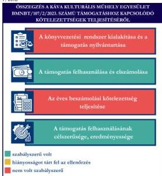
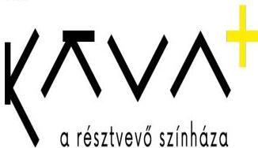

ÁLLAMI
SZÁMVEVŐSZÉK

# JELENTÉS

Egyesületek és alapítványok államháztartásból
kapott támogatásai felhasználásának és
elszámolásának ellenőrzése

Káva Kulturális Műhely Egyesület

2026.

26009

www.asz.hu

---

ÁLLAMI
SZÁMVEVŐSZÉK

# JELENTÉS

Egyesületek és alapítványok államháztartásból
kapott támogatásai felhasználásának és
elszámolásának ellenőrzése

Káva Kulturális Műhely Egyesület

2026.

26009

www.asz.hu

Dr. Szomolai Csaba
alelnök

---

ELLENŐRZÉSI IGAZGATÓSÁG:

ELLENŐRZÉSI IGAZGATÓSÁG V.

ELLENŐRZÉSI IGAZGATÓ:

KLINGA LÁSZLÓ igazgató

ELLENŐRZÉSVEZETŐ:

NEMESVÁRI-HORTHY ESZTER ellenőrzésvezető

Jelentéseink az interneten a
www.asz.hu címen olvashatók.

IKTATÓSZÁM: EL-4320-222/2026

TÉMASORSZÁM: 35

ELLENŐRZÉS-AZONOSÍTÓ SZÁM: V118107

---

# TARTALOMJEGYZÉK

|  ■ ÖSSZEFOGLALÁS | 5  |
| --- | --- |
|  ■ AZ ELLENŐRZÉS EREDMÉNYEI | 6  |
|  1. A civil szervezet államháztartási forrásból származó támogatása felhasználásának és elszámolásának szabályszerűsége, felhasználásának célszerűsége és eredményessége | 6  |
|  ■ JAVASLATOK | 9  |
|  ■ I. FÜGGELÉK: ÉSZREVÉTELEK | 10  |
|  ■ II. FÜGGELÉK: ELLENŐRZÉSI MEGKÖZELÍTÉS | 11  |
|  ■ MELLÉKLETEK | 15  |
|  I. sz. melléklet: Értelmező szótár | 15  |
|  II. sz. melléklet: Az ellenőrzött szervezetek jegyzéke | 18  |
|  ■ RÖVIDÍTÉSEK JEGYZÉKE | 19  |

3

---

# ÖSSZEFOGLALÁS

A civil szervezetek tevékenységük megvalósításához évente jelentős állami és önkormányzati támogatásokat kaphatnak, valamint ingyenes vagyonjuttatásban részesülhetnek. Ezekkel a forrásokkal gazdálkodnak, miközben tevékenységükkel a társadalom széles rétegeire hatnak többek között kulturális programok, rendezvények, közösségépítés formájában. Jogosan merül fel tehát a kérdés: hogyan költik el a közpénzt? Ennek érdekében az ÁSZ¹ időről időre ellenőrzi az államháztartásból kapott támogatások felhasználását, és értékeli, hogy a civil szervezetek a kapott támogatást átláthatóan és célnak megfelelően használták-e fel. Az ÁSZ által folytatott ellenőrzések segítenek abban, hogy a nyilvánosság is valós képet kapjon arról, hova került az adófizetők pénze.

A kulturális tevékenységet végző civil szervezetek fontos és sokrétű szerepet játszanak a mai Magyarországon, különösen a helyi közösségek életében. Különösen fontosak a helyi identitás megerősítésében, a kulturális sokszínűség fenntartásában, és a közösségi aktivitás ösztönzésében.

Egy kulturális tevékenységet végző civil szervezet támogatása nem csupán egy adott program finanszírozását jelenti, hanem befektetés a közösség szellemi, kulturális és társadalmi tőkéjébe. Ezek a szervezetek hidat képeznek az állam, a közösségek és az egyének között, támogatásuk ezért elengedhetetlen egy élő, demokratikus és értékalapú társadalom fenntartásához.

Az Egyesület² részére a Belügyminisztérium, a Nemzeti Bűnmegelőzési Stratégia feladatrendszerének támogatása terhére „JUVENTAS V. – drámás és részvételi színházi módszerek a bűnmegelőzésben” című projekt megvalósításához a 2023. évben 10 M Ft pénzügyi támogatást nyújtott, amelyből az Egyesület a támogatási összegről történő lemondás miatt ténylegesen 9,7 M Ft-ot számolt el.

Az Egyesület a kapott támogatást a projektcélnak megfelelően, eredményesen használta fel, a támogatás elérte célját.

Az Egyesület a jogszabályi előírásoknak megfelelően alakította ki könyvvezetési rendszerét, amely biztosította a támogatás felhasználásának szabályos nyilvántartását, ugyanakkor az Egyesület a 100%-os támogatási előlegként kapott támogatást a jogszabályi előírással ellentétben nem egyéb rövid lejáratú kötelezettségként, hanem egyéb bevételként mutatta ki, amely jelentős összegű hibát eredményezett a 2023. évi számviteli beszámolóban, sérült a Számv. tv.³ szerinti valódiság elve. A támogatás felhasználása a Támogatói okiratban⁴ és annak elválaszthatatlan részét képező költségtervben szereplő adatoknak, előírásoknak megfelelt. Az Egyesület a Támogatói okirat előírásainak megfelelően, határidőben eleget tett a Támogató⁵ felé történő elszámolási kötelezettségének. A Támogató az elszámolást elfogadta. Az Egyesület a 2023. évi egyszerűsített éves beszámolót határidőn túl, a Felügyelő Bizottság⁶ elfogadása és a Közgyűlés⁷ jóváhagyása előtt helyezte letétbe és tette közzé. A 2024. évi egyszerűsített éves beszámoló közzététele a jogszabályi előírások szerint történt meg. Az Egyesület a saját honlapra vonatkozó közzétételi kötelezettségének a 2023. évben hiányosan tett eleget.

1. alma

Forrás: ÁSZ saját szerkesztés

5

---

# AZ ELLENŐRZÉS EREDMÉNYEI

Az Egyesület a részére nyújtott költségvetési támogatást a „JUVENTAS V. – drámás és részvételi színházi módszerek a bűnmegelőzésben” elnevezésű projekt megvalósítására fordította. Az Egyesület a támogatást szabályszerűen, a támogatás céljának megfelelően a támogatott tevékenység időtartamán belül használta fel. A közpénzt az Egyesület céljaival összhangban színházművészet területéhez tartozó és előadóművészeti tevékenység folytatására, közösségépítésre, közösségfejlesztő programokra használta fel.

## 1. A civil szervezet államháztartási forrásból származó támogatása felhasználásának és elszámolásának szabályszerűsége, felhasználásának célszerűsége és eredményessége

### Összegző megállapítás

Az Egyesület az ellenőrzött támogatást a Támogatói okiratban megjelölt célnak megfelelően, eredményesen használta fel, az elszámolási kötelezettségét teljesítette. A támogatási előleg formájában kapott támogatást a Számv. tv. előírása ellenére nem egyéb rövid lejáratú kötelezettségként tartotta nyilván. A támogatás felhasználását a jogszabályi előírások szerint elkülönítetten tartotta nyilván. Az Egyesület a 2023-2024. évi számviteli beszámolási kötelezettségét teljesítette. A 2023. évi beszámoló közzététele nem felelt meg a jogszabályi előírásoknak, tekintettel arra, hogy az Egyesület a 2023. évi egyszerűsített éves beszámolót határidőn túl a Felügyelő Bizottság elfogadása és a Közgyűlés jóváhagyása előtt helyezte letétbe és tette közzé.

### A KÖNYVVEZETÉSI RENDSZER KIALAKÍTÁSA ÉS A TÁMOGATÁS NYILVÁNTARTÁSA

Az Egyesület a Számv. tv. és a Civilszr.⁸-ben foglalt jogszabályi előírások betartásával gondoskodott a könyvviteli szolgáltatás személyi feltételeinek megteremtéséről, a könyvviteli szolgáltatás körébe tartozó feladatok ellátásával olyan társaságot bízott meg, amelynek megbízott tagja a jogszabályi előírásoknak megfelelő képesítéssel rendelkezett.

Az Egyesület a Civilszr. előírásainak megfelelően a 2023-2024. években kettős könyvvitelt vezetett.

Az Egyesület a Számv. tv. -ben és a Civil tv.⁹-ben előírtaknak megfelelően az alapcél szerinti tevékenysége költségei, ráfordításai ellentételezésére kapott támogatásról olyan elkülönített számviteli nyilvántartást vezetett, amelynek alapján megállapítható és ellenőrizhető volt az ellenőrzött támogatás felhasználása.

Az Egyesület a 100%-os előlegként kapott támogatást elkülönítetten mutatta ki, ugyanakkor egyéb bevételként vette nyilvántartásba, ellentétben a Számv. tv. 43. § (1) bekezdésében foglalt előírással, nem az egyéb rövid lejáratú kötelezettségek között mutatta ki. Az Egyesület a 100%-os előlegként kapott 10 M Ft támogatási összegből a 2023. évben 3,3 M Ft támogatást használt fel. A Támogató a támogatás elszámolást 2025. március 24-én fogadta el. Az Egyesület a mérlegkészítés időpontját május 31. napjával határozta meg. Ugyanakkor a 3,3 M Ft összegű támogatási összeg 2023. évi bevételként történő

6

---

Az ellenőrzés eredményei

elszámolása a Számv. tv. 3. § (3) bekezdés 3. pontja szerinti jelentős összegű hibát eredményezett, mivel a 2023. évi eredményre és saját tőkére gyakorolt hiba és hibahatások abszolút értékének együttes összege meghaladta a 2023. évi mérlegfőösszeg 2,0%-át.

# A TÁMOGATÁS FELHASZNÁLÁSA ÉS ELSZÁMOLÁSA

Az Egyesület az ellenőrzött támogatás felhasználásáról a Támogató által előírt formában elkészítette a beszámolót, annak részeként az összesített elszámolási táblázatot (számlaösszesítő), és benyújtotta a Támogató részére.

Az Egyesület esetében a támogatás felhasználása ellenőrzött tételeinek (10 db) vonatkozásában az ÁSZ az alábbiakat állapította meg:

- a tételek számviteli elszámolását a Számv. tv.-ben előírtaknak megfelelően bizonylatokkal alátámasztotta;
- minden gazdasági eseményt a Számv. tv.-ben foglaltak szerint, tartalmának megfelelő főkönyvi számra számolt el;
- a tételek számviteli bizonylatait a Támogatói okiratban foglaltaknak megfelelően ellátta záradékkal;
- a számviteli bizonylatokon záradékolt összegek – négy darab tétel kivételével – megegyeztek a számlaösszesítőben feltüntetett értékekkel;
- a tételek számviteli bizonylatai alapján a gazdasági események a Támogatói okiratnak megfelelően, a támogatási időszak végéig, szerződés szerint teljesültek;
- a tételek pénzügyi rendezése a Támogatói okiratban meghatározott felhasználási határidőig minden esetben megtörtént;
- hét tétel esetében nem tartották be az Alapszabály¹⁰ V.A)2. pontjában foglalt előírásokat, mivel az Egyesület Elnöke a Közgyűlés jóváhagyása nélkül kötötte meg az érintett tételekhez kapcsolódó szerződéseket az Egyesület tagjaival, vezető tisztségviselőjével;
- a tételek megfeleltethetők voltak a Támogatói okiratban, illetve a költségtervben meghatározott, Támogató által jóváhagyott felhasználási jogcímeknek.

Az Egyesület 2025. február 28-án 0,3 M Ft összegű támogatási összegről lemondott. A lemondással érintett támogatási összeget a kapcsolódó késedelmi kamattal 2025. március 4-én az Egyesület visszafizette a Támogató részére. A Támogatói okiratban foglalt támogatás lezárásáról, a beszámoló elfogadásáról a Támogató 2025. március 24-én döntött.

# AZ ÉVES BESZÁMOLÁSI KÖTELEZETTSÉG TELJESÍTÉSE

Az Egyesület a 2023-2024. évekre vonatkozóan a Számv. tv. és a Civil. tv. előírásai alapján elkészítette számviteli beszámolóit. Az egyszerűsített éves beszámolók a Civil tv. és a Civilszr. előírásai alapján tartalmazták a mérleget, az eredménykimutatást és a kiegészítő mellékletet. Az Egyesület a Civil tv.-nek megfelelően a beszámolóval egyidejűleg elkészítette a közhasznúsági mellékletet.

A 2023-2024. évekre vonatkozó egyszerűsített éves beszámolókat a Ptk.¹¹ rendelkezései alapján a Felügyelő Bizottság elfogadta, a Közgyűlés a Civil tv.-nek megfelelően jóváhagyta.

Az Egyesület a 2023. évre vonatkozó egyszerűsített éves beszámoló és közhasznúsági melléklete tekintetében megsértette a Civil tv. 30. § (1) bekezdését, tekintettel arra, hogy a számviteli beszámolót határidőn túl (2024. június 26.) a Felügyelő Bizottság elfogadása és a Közgyűlés jóváhagyása előtt helyezte letétbe és tette közzé az OBH¹² honlapján.

7

---

*Az ellenőrzés eredményei*---

Az Egyesület a Civil tv. alapján a 2024. évi egyszerűsített éves beszámolóját és közhasznúsági mellékletét határidőben letétbe helyezte és az OBH honlapján közzétette.

Az Egyesület saját honlappal rendelkezik. Az Egyesület a Civil tv. 30. § (4) bekezdésében előírtak ellenére saját honlapján a 2023. évi egyszerűsített éves beszámolóját hiányosan – kizárólag a kiegészítő mellékletet – tette közzé, a közhasznúsági mellékletet pedig egyáltalán nem. A 2024. évi közzététel megfelelt a Civil tv. előírásának.

#### **A TÁMOGATÁS FELHASZNÁLÁSÁNAK CÉLSZERŰSÉGE ÉS EREDMÉNYESSÉGE**

Az Egyesület az ellenőrzött támogatást a Támogatói okirat előírásainak megfelelően, az abban meghatározott célra használta fel. A Támogatói okiratban megjelölt cél – **„JUVENTAS V. – drámás és részvételi színházi módszerek a bűnmegelőzésben”** című projekt – **teljesült**. A projekt a jóváhagyott költségtervnek megfelelően valósult meg. A Támogató közbenső ellenőrzést folytatott le a projekttel kapcsolatban 2024. augusztus 15-én. Az ellenőrzés nem tárt fel hiányosságot.

8

---

# JAVASLATOK

Az ÁSZ tv.¹³ 33. § (1) bekezdésében foglaltak értelmében az ellenőrzött szervezet vezetője köteles a jelentésben foglalt megállapításokhoz kapcsolódó intézkedési tervet összeállítani és azt a jelentés kézhezvételétől számított 30 napon belül az ÁSZ részére megküldeni. Az ÁSZ a jelentésben foglalt megállapításokhoz kapcsolódóan az alábbi javaslatok tekintetében várja el az intézkedési terv elkészítését.

## KÁVA KULTURÁLIS MŰHELY EGYESÜLET ELNÖKÉNEK

1. Gondoskodjon arról, hogy az Egyesület a jövőben az előleg formájában kapott támogatásokat a támogató felé benyújtott elszámolás támogató általi elfogadásáig a Számv. tv. 43. § (1) bekezdés előírásának megfelelően a könyvviteli nyilvántartásban, illetve a számviteli beszámolóban egyéb rövid lejáratú kötelezettségként mutassa ki.

2. Gondoskodjon arról, hogy az Egyesület a számviteli beszámolót és a közhasznúsági mellékletet a Civil tv. 30. § (4) bekezdésében rögzített előírás alapján a saját honlapon közzé tegye.

9

---

# I. FÜGGELÉK: ÉSZREVÉTELEK

*A jelentéstervezetet az ÁSZ 15 napos észrevételezésre megküldte az ellenőrzött szervezet vezetőjének az ÁSZ tv. 29. §\* (1) bekezdése előírásának megfelelően.*

*A Káva Kulturális Műhely Egyesület elnöke a jelentéstervezetre érdemi észrevételt nem tett.*

\* 29. § (1) Az Állami Számvevőszék az ellenőrzési megállapításait megküldi az ellenőrzött szervezet vezetőjének vagy az általa megbízott személynek, és annak, akinek személyes felelősségét állapította meg.

(2) Az ellenőrzött szervezet vezetője és a felelősként megjelölt személy az ellenőrzés megállapításaira tizenöt napon belül írásban észrevételt tehet.

(3) Az Állami Számvevőszék az észrevételre a beérkezésétől számított harminc napon belül írásban válaszol. A figyelembe nem vett észrevételeket köteles a jelentésben feltüntetni, és megindokolni, hogy azokat miért nem fogadta el.

10

---

## II. FÜGGELÉK: ELLENŐRZÉSI MEGKÖZELÍTÉS

### AZ ELLENŐRZÉS JOGALAPJA

Az ellenőrzés jogszabályi alapját az ÁSZ tv. 1. § (3) bekezdés, az 5. § (3) bekezdés előírásai képezték.

### AZ ELLENŐRZÉS CÉLJA

Az ellenőrzés célja annak értékelése volt, hogy az ellenőrzött egyesület az államháztartási forrásból származó, ellenőrzésre kiválasztott támogatást a támogatói okiratban előírtaknak megfelelően, az abban meghatározott célra, szabályszerűen, eredményesen használta-e fel, valamint a gazdálkodásáról szabályszerűen beszámolt-e. Célja volt továbbá a támogatással való elszámolás szabályszerűségének értékelése.

### AZ ELLENŐRZÉS TÍPUSA

Kombinált ellenőrzés.

### AZ ELLENŐRZÉS TÁRGYA

Az államháztartásból nyújtott támogatást felhasználó ellenőrzött egyesületnél a kiválasztott támogatás felhasználására vonatkozó jogszabályi és szerződéses előírások betartásának ellenőrzése. Ennek keretében a könyvvezetésre vonatkozó jogszabályi előírások betartása, a támogatás felhasználás támogatói okiratnak való megfelelősége, valamint a beszámolási és közzétételi kötelezettség teljesítésének szabályszerűsége. Az ellenőrzés tárgya volt továbbá annak értékelése, hogy a számviteli szabályozási környezet kialakítása támogatta-e az államháztartásból származó támogatás vonatkozásában a szabályos könyvvezetést, a támogatás célnak megfelelő felhasználását, valamint a kapcsolódó beszámolási kötelezettség teljesítését. Az ellenőrzés során az ÁSZ értékelte, hogy az ellenőrzött szervezet a támogatást meghatározott célra, eredményesen használta-e fel.

Az ellenőrzés kiterjedt minden olyan körülményre és adatra, amely az ÁSZ jogszabályban meghatározott feladatainak teljesítéséhez, valamint a program végrehajtása folyamán felmerült újabb összefüggések feltárásához szükséges.

### AZ ELLENŐRZÉS HATÓKÖRE ÉS TERÜLETE

Az ÁSZ tv. 5. § (3) bekezdésében foglaltak alapján az ÁSZ ellenőrizte az államháztartásból nyújtott támogatás felhasználását. A támogatás felhasználásának szabályait a támogatói okirat, az Áht.$^{14}$ és az Ávr.$^{15}$ rögzítette. A civil szervezet könyvvezetésének, a beszámolási- és közzétételi kötelezettség teljesítésének ellenőrzése a Számv. tv., a Civilszr., a Civil tv., a Civil vhr.$^{16}$, valamint a Ptk. vonatkozó előírásai alapján történt.

Az ÁSZ ellenőrzése választ ad arra, hogy az ellenőrzött szervezetnél a számviteli szabályozási környezet kialakítása biztosította-e a támogatás felhasználása jogszabályi előírásoknak megfelelő nyilvántartását,

11

---

II. Függelék: Ellenőrzési megközelítés

könyvviteli elszámolását, továbbá arra is, hogy a támogatással való elszámolási, beszámolási kötelezettséget teljesítette-e. Az ÁSZ ellenőrzése kiterjedt a támogatás támogatói okiratban foglalt célra történő felhasználás és a felhasználás eredményességének értékelésére. Ezen túlmenően az ellenőrzés értékelte, hogy az ellenőrzött szervezet számviteli beszámolási kötelezettségének teljesítése szabályszerű volt-e.

## AZ ELLENŐRZÖTT IDŐSZAK

Az ellenőrzésre kiválasztott államháztartási forrásból származó támogatásra vonatkozó támogatott tevékenység kezdő időpontjától az ellenőrzésről szóló értesítés keltéig tartó időszak.

Az ellenőrzésre kiválasztott egyesület államháztartásból kapott támogatása felhasználásának és elszámolásának ellenőrzése során az ellenőrzött időszakon belül az értékelés szempontjából releváns évek a 2023. év, a 2024. év és a 2025. év.

## AZ ELLENŐRZÉSI KRITÉRIUMOK

|  FŐKUSZTERÜLET / FŐKUSZKÉRDÉS | ELLENŐRZÉSI KRITÉRIUMOK  |
| --- | --- |
|  1. A civil szervezet államháztartási forrásból származó támogatása(i) felhasználásának és elszámolásának szabályszerűsége, felhasználásának célszerűsége és eredményessége | Áht. Ávr. Számv. tv. Civil tv. Civilszr. Ptk. Civil vhr. Cnytv.^{17} Létesítő okirat Támogatói okirat Költségterv  |

## AZ ELLENŐRZÉS MÓDSZERE ÉS AZ ELLENŐRZÉSI BIZONYÍTÉKOK KÖRE

Az ellenőrzést a nemzetközi standardokat irányadónak tekintve az ellenőrzési program szempontjai, az ellenőrzött időszakban hatályos jogszabályok, az ellenőrzés szakmai szabályok és módszertan(ok) figyelembevételével végezte az ÁSZ.

Az ellenőrzési kérdések megválaszolásához szükséges bizonyítékok megszerzése az ellenőrzött szervezet által rendelkezésre bocsátott dokumentumokra és adatokra alapozva mintavételezés útján történt.

Az államháztartási forrásból származó, ellenőrzésre – adatvezérelt, kockázatalapú kiválasztás által, több év adatának figyelembevételével és az ellenőrizhető szervezet által előzetesen szolgáltatott adatok alapján – kijelölt támogatás felhasználása támogatói okiratnak való megfelelőségét a támogatás nyilvántartásának és a támogató felé történő elszámolásnak egymással és a támogatói okirattal történő összevetésével ellenőrizte az ÁSZ.

12

---

II. Függelék: Ellenőrzési megközelítés---

A támogatás könyvviteli nyilvántartása jogszabályi előírásoknak, támogatói okiratnak való szabályszerűségét nem statisztikai alapú mintavételi eljárással ellenőrizte az ÁSZ. A tételek kiértékelése nem került a sokaságra kivetítésre. A kiválasztott támogatói okirathoz kapcsolódó elszámolásból 10 db tétel került ellenőrzésre.

Az ellenőrzési bizonyítékként felhasználható adatforrások közé tartoztak egyrészt az ellenőrzéshez kért dokumentumok, másrészt adatforrás volt még minden – az ellenőrzés folyamán – feltárt, az ellenőrzés szempontjából információkat tartalmazó dokumentum.

Az ellenőrzés lefolytatásához az ellenőrzött szervezet a tanúsítványok kitöltésével, valamint az ÁSZ által kért dokumentumok, adatok, információk megküldésével és az ellenőrzés során szolgáltatott adatokat.

Az ÁSZ az ellenőrzött szervezetet az Országos Támogatás-ellenőrzési Rendszerben (OTR) nyilvántartott adatok alapján államháztartási forrásból támogatásban részesült szervezetek közül, – OBH és KSH$^{18}$ adatokat is figyelembe véve – adatvezérelt kockázatértékelés alapján, a kulturális tevékenységet végző szervezetekre fókuszálva választotta ki. Az ÁSZ az ellenőrzött támogatást az adott szervezet által előzetesen szolgáltatott adatok alapján, a tanúsítványokban szereplő adatok ismeretében határozta meg.

A **Káva Kulturális Műhely Egyesületet** 1996-ban alapították, a civil szervezetek közhiteles bírósági nyilvántartásába 1996. augusztus 27-én jegyezték be. Az Egyesület Alapszabálya szerinti célja többek között *„a színházművészet területéhez tartozó és előadóművészeti tevékenység folytatása, tanácsadás, kutatások szervezése, lebonyolítása a színházi nevelés és drámapedagógia területén.”* Célja továbbá *„a közösségépítés, közösségfejlesztő programok szervezése.”*

Az Egyesület legfőbb döntéshozó szerve a Közgyűlés. Az Egyesület ügyvezetését és képviseletét az Elnök látja el. A bankszámla feletti rendelkezésre az Elnök, továbbá az Elnök által kijelölt egyesületi tag együttesen jogosultak rendelkezni. Az Elnök személyében az ellenőrzött időszakban nem történt változás.

Az Egyesület jogszabályi előírás alapján könyvvizsgálatra nem volt kötelezett.

Az Egyesület működésének és gazdálkodásának ellenőrzését három tagú Felügyelő Bizottság látta el. Az Egyesület az ellenőrzött időszakban közhasznú jogállással rendelkezett.

Az Egyesület a Közbef. tv.$^{19}$ szerinti, **közélet befolyásolására alkalmas civil szervezetnek minősült**, mivel az ellenőrzött időszakban mérlegfőösszege elérte a 20 M Ft-ot.

Az Egyesület vállalkozási tevékenységet nem végzett.

Az Egyesület támogatásban részesült. A támogatott tevékenység megvalósulásához a Támogató cél indikátorokat nem határozott meg. A támogatással kapcsolatos adatokat az 1. táblázat foglalja össze.

13

---

II. Függelék: Ellenőrzési megközelítés

1. táblázat

# A TÁMOGATÁS FŐBB ADATAI

# A KÁVA KULTURÁLIS MŰHELY EGYESÜLET RÉSZÉRE A TÁMOGATÓ ÁLTAL NYÚJTOTT, ELLENŐRZŐTT TÁMOGATÁS (BMNBT/107/2/2023.) FŐBB ADATAI

|  Támogatott tevékenység: | "JUVENTAS V. – drámás és részvételi színházi módszerek a bűnmegelőzésben" című projekt megvalósítása  |
| --- | --- |
|  Támogató: | Belügyminisztérium  |
|  Támogatási összeg: | 10,0 M Ft  |
|  Felhasznált összeg: | 9,7 M Ft  |
|  A Támogatói okirat kibocsátásának időpontja: | 2023. június 26.  |
|  A támogatott tevékenység időtartama: | 2023. május 1. – 2024. augusztus 31.  |
|  A támogatás felhasználásáról a záró (pénzügyi) beszámoló benyújtásának határideje: | 2024. szeptember 30.  |
|  A támogatás felhasználásáról benyújtott záró beszámoló elfogadásának dátuma: | 2025. március 24.  |

Forrás: ÁSZ saját szerkesztés a Támogatói okirat adatai alapján

A "JUVENTAS V. – drámás és részvételi színházi módszerek a bűnmegelőzésben" című projekt megvalósítására biztosított vissza nem térítendő támogatás fedezetét Magyarország 2023. évi központi költségvetéséről szóló 2022. évi XXV. törvény XIV. Belügyminisztérium fejezete biztosította.

2. ábra

Forrás: https://kavaszinhaz.hu/

A projekt megvalósítására kapott támogatásból az Egyesület dráma és színházi előadásokat tartott javítóintézet fiatalkorú növendékei, általános iskolai tanulók, illetve bűnmegelőzési szakemberek és pedagógusok számára. Az előadások három modul keretében valósultak meg. A támogatott projekt a bűnmegelőzés területére fókuszált. Az egyes modulok programja az előző JUVENTAS projektek kutatási eredményeire, tapasztalataira támaszkodott.

14

---

# MELLÉKLETEK

## ■ I. SZ. MELLÉKLET: ÉRTELMEZŐ SZÓTÁR

|  adomány | A civil szervezetnek – létesítő okiratban rögzített céljaira – ellenszolgáltatás nélkül juttatott eszköz, illetve nyújtott szolgáltatás. (Forrás: Civil tv. 2. § 1. pont)  |
| --- | --- |
|  célszerűség | Arra vonatkozó követelmény, hogy a bevételeket a közfeladat megvalósítása érdekében, a kiadásokat a közfeladatok megfelelő ellátásához szükséges mértékben, a költségvetési célrendszer érdekében, a meghatározott célra (közfeladat ellátására), továbbá észszerűen, racionálisan használták fel. (Forrás: Alaptörvény^{20}, ÁSZ)  |
|  civil szervezet | Civil szervezet: a) a civil társaság, b) a Magyarországon nyilvántartásba vett egyesület - a párt, a szakszervezet és a kölcsönös biztosító egyesület kivételével -, c) a közalapítvány és a pártalapítvány kivételével - az alapítvány. (Forrás: Civil tv. 2. § 6. pont)  |
|  civil szervezetek egyszerűsített támogatása | A helyi vagy területi hatókörű civil szervezetek számára a Civil tv. 56. § (1) bekezdés h) pontja alapján egyszerűsített formában, jogosultsági alapon nyújtott támogatás a helyi közösség érdekében végzett tevékenységük támogatására. (Forrás: Civil tv. 2. § 8b. pont)  |
|  civil szervezetek normatív támogatása | A civil szervezetek által gyűjtött adományok után járó, a gyűjtött adomány mértékével arányos a Civil tv. 56. § (1) bekezdés a) pontja alapján nyújtott támogatás. (Forrás: Civil tv. 2. § 8a. pont alapján)  |
|  egyesület | Az egyesület a tagok közös, tartós, alapszabályban meghatározott céljának folyamatos megvalósítására létesített, nyilvántartott tagsággal rendelkező jogi személy. (Forrás: Ptk. 3:63. § (1) bekezdés) A Számv. tv. alkalmazásában egyéb szervezet. (Forrás: Számv. tv. 3. § (1) bekezdés 4. pont a) alpont)  |
|  eredményesség | Az eredményesség elve a kitűzött célok és a szándékolt eredmények (hatások) elérését jelenti. A gazdálkodás, feladatellátás eredményességét mutatja a tényleges és a tervezett eredmények (hatások) összevetése. (Forrás: INTOSAI^{21})  |
|  feladatfinanszírozást szolgáló költségvetési támogatás | Valamely közfeladat államháztartáson kívüli szervezet által történő ellátását, valamint e feladat ellátásához közvetlenül kapcsolódó, arányos működési költségeket finanszírozó költségvetési támogatás. (Forrás: Civil tv. 2. § 8. pont)  |
|  közcélú tevékenység | Személyek csoportja által, valamely a csoportnál tágabb közösség érdekében – más, e közösségbe nem tartozó személyek érdekeinek sérelme nélkül – végzett tevékenység. (Forrás: Civil tv. 2. § 16. pont)  |
|  közfeladat | A jogszabályban meghatározott állami vagy önkormányzati feladat. A közfeladatok ellátásában államháztartáson kívüli szervezet jogszabályban meghatározott rendben közreműködhet. (Forrás: Áht. 3/A. § (1)-(2) bekezdés)  |

15

---

Mellékletek

|  közhasznú szervezet | Közhasznú szervezetté minősített a Magyarországon nyilvántartásba vett közhasznú tevékenységet végző szervezet, amely a társadalom és az egyén közös szükségleteinek kielégítéséhez megfelelő erőforrásokkal rendelkezik, továbbá amelynek megfelelő társadalmi támogatottsága kimutatható, és amely: a) civil szervezet (ide nem értve a civil társaságot), vagy b) olyan egyéb szervezet, amelyre vonatkozóan a közhasznú jogállás megszerzését törvény lehetővé teszi. (Forrás: Civil tv. 32. § (1) bekezdés)  |
| --- | --- |
|  közhasznú tevékenység | Minden olyan tevékenység, amely a létesítő okiratban megjelölt közfeladat teljesítését közvetlenül vagy közvetve szolgálja, ezzel hozzájárulva a társadalom és az egyén közös szükségleteinek kielégítéséhez. (Forrás: Civil tv. 2. § 20. pont)  |
|  létesítő okirat | A jogi személy létrehozásáról a személyek szerződésben, alapító okiratban vagy alapszabályban szabadon rendelkezhetnek, mely dokumentumokra együttesen a Ptk. a létesítő okirat megnevezést használja. (Forrás: Ptk. 3:4. § (1) bekezdés alapján)  |
|  támogatás | Céljellegű juttatás, mely kizárólag arra a célra használható fel, amelyre a támogató azt rendelkezésre bocsátotta, amely cél megvalósítását a támogatási szerződés, okirat vagy éppen jogszabály kikötötte. Támogatásként értelmezzük valamennyi, a civil szervezetnek államháztartási forrásból nyújtott támogatást – ideértve a központi költségvetésből kapott támogatást, az elkülönített állami pénzalapokból kapott támogatást, a helyi önkormányzatoktól, nemzetiségi önkormányzatoktól, önkormányzati társulástól kapott támogatást –, továbbá az Európai Unió költségvetéséből, külföldi állam államháztartásából, nemzetközi szervezettől, vagy nemzetközi szerződés rendelkezése alapján kapott támogatást, valamint más civil szervezettől kapott támogatást. A gyűjtő fogalom alatt egyaránt értjük a civil szervezetnek nyújtott feladatfinanszírozást szolgáló költségvetési támogatást, a civil szervezetek normatív támogatását, valamint a civil szervezetek egyszerűsített támogatását is (ÁSZ saját fogalma)  |
|  támogatási döntés | Az államháztartás alrendszereiből, az európai uniós forrásokból, a nemzetközi megállapodás alapján finanszírozott egyéb programokból, a 100%-os állami tulajdonban álló szervezet által létrehozott alapítványtól származó, egyedi döntés alapján nyújtott, pályázati úton vagy pályázati rendszeren kívül az államháztartáson kívüli természetes személyek, jogi személyek és jogi személyiséggel nem rendelkező egyéb szervezetek számára odaítélt, természetben vagy pénzben juttatott támogatásokban részesülő személy, valamint az e személy részére juttatandó konkrét támogatási összeg meghatározása. (Forrás: 2007. évi CLXXXI. törvény^{22} 1. § (1) bekezdése és 2. § (1) bekezdése alapján)  |
|  támogatói okirat | A támogatói okirat egy olyan, a támogató (irányító hatóság) támogatási jogviszony létrehozására irányuló akaratnyilatkozatát tartalmazó jognyilatkozat, amelyből jogilag kikényszeríthető kötelezettségek származnak, és amely esetében a jelen pontban rögzített jogszabályi előírások is irányadók. Az államháztartás alrendszerei terhére támogatás közigazgatási hatósági határozattal vagy hatósági szerződéssel, támogatói okirattal vagy támogatási szerződéssel jogszabály vagy egyedi döntés alapján, pályázati úton vagy pályázati rendszeren kívül nyújtható. Ha jogszabály – a központi költségvetés Áht. 14. § (3) bekezdése szerinti fejezetéből biztosított költségvetési támogatások esetén jogszabály vagy a Kormány határozata – a támogatás biztosításának módjáról nem rendelkezik, arról a központi költségvetés Áht. 14. § (3) bekezdése szerinti fejezetéből biztosított költségvetési támogatások esetén támogatói okiratot kell kibocsátani, ettől eltérő más esetben az ötmilliárd forintot el nem érő összegű költségvetési támogatás esetén szintén támogatói okiratot kell kibocsátani (Forrás: Áht. 48. § (1) bekezdése, Ávr. 65/A. § (1) bekezdés alapján ÁSZ meghatározás)  |

16

---

*Mellékletek*---

|  támogatott tevékenység | A támogatási szerződésben meghatározott olyan tevékenység – ideértve a kedvezményezett működését is –, amely során felmerült költségek megtérítését a támogatási előleg, a költségvetési támogatás részben vagy egészében biztosítja. (Forrás: Ávr. 1. § 8. pontja)  |
| --- | --- |
|  támogatott tevékenység időtartama | A támogatási szerződésben meghatározott olyan időtartam, amely során felmerülő, a támogatott tevékenység megvalósításához kapcsolódó költségek elszámolhatóak. (Forrás: Ávr. 1. § 9. pontja)  |

17

---

Mellékletek---

# ■ II. SZ. MELLÉKLET: AZ ELLENŐRZÖTT SZERVEZETEK JEGYZÉKE

|  ELLENŐRZÖTT SZERVEZET NEVE | ELLENŐRZÖTT SZERVEZET SZÉKHELYE  |
| --- | --- |
|  Káva Kulturális Műhely Egyesület | 1145 Budapest, Columbus utca 69/A. I/1.  |

18

---

# RÖVIDÍTÉSEK JEGYZÉKE

1. ÁSZ

2. Egyesület

3. Számv. tv.

4. Támogatói okirat

5. Támogató

6. Felügyelő Bizottság

7. Közgyűlés

8. Civilszr.

9. Civil tv.

10. Alapszabály

11. Ptk.

12. OBH

13. ÁSZ tv.

14. Áht.

15. Ávr.

16. Civil vhr.

17. Cnytv.

18. KSH

19. Közbef. tv.

20. Alaptörvény

21. INTOSAI

22. 2007. évi CLXXXI. törvény

Állami Számvevőszék

Káva Kulturális Műhely Egyesület

2000. évi C. törvény a számvitelről

BMNBT/107/2/2023. iktatószámú Támogatói okirat

Belügyminisztérium

Káva Kulturális Műhely Egyesület Felügyelő Bizottsága

Káva Kulturális Műhely Egyesület Közgyűlése

479/2016. (XII. 28.) Korm. rendelet a számviteli törvény szerinti egyes egyéb szervezetek beszámoló készítési és könyvvezetési kötelezettségének sajátosságairól

2011. évi CLXXV. törvény az egyesülési jogról, a közhasznú jogállásról, valamint a civil szervezetek működéséről és támogatásáról

Káva Kulturális Műhely Egyesület Alapszabálya (hatályos: 2020. október 1-től)

2013. évi V. törvény a Polgári Törvénykönyvről

Országos Bírósági Hivatal

2011. évi LXVI. törvény az Állami Számvevőszékről

2011. évi CXCV. törvény az államháztartásról

368/2011. (XII. 31.) Korm. rendelet az államháztartásról szóló törvény végrehajtásáról

350/2011. (XII. 30.) Korm. rendelet - a civil szervezetek gazdálkodása, az adománygyűjtés és a közhasznúság egyes kérdéseiről

2011. évi CLXXXI. törvény a civil szervezetek bírósági nyilvántartásáról és az ezzel összefüggő eljárási szabályokról

Központi Statisztikai Hivatal

2021. évi XLIX. törvény a közélet befolyásolására alkalmas tevékenységet végző civil szervezetek átláthatóságáról

Magyarország Alaptörvénye

Legfőbb Ellenőrző Intézmények Nemzetközi Szervezete (The International Organization of Supreme Audit Institutions)

2007. évi CLXXXI. törvény a közpénzekből nyújtott támogatások átláthatóságáról

19

---

ÁLLAMI
SZÁMVEVŐSZÉK

1052 Budapest, Apáczai Csere János u. 10. | 1364 Budapest 4., Pf. 54
www.asz.hu | szamvevoszek@asz.hu
telefon: +36 1 484 9100