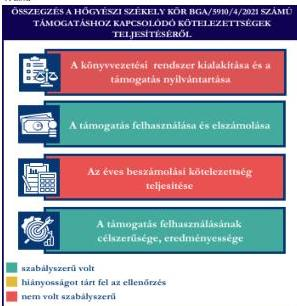
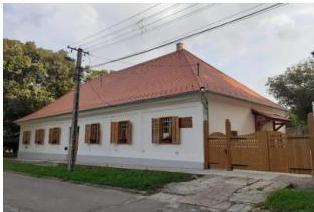

ÁLLAMI
SZÁMVEVŐSZÉK

# JELENTÉS

Egyesületek és alapítványok államháztartásból
kapott támogatásai felhasználásának és
elszámolásának ellenőrzése

Hőgyészi Székely Kör

2026.

26012

www.asz.hu

---

ÁLLAMI
SZÁMVEVŐSZÉK

# JELENTÉS

Egyesületek és alapítványok államháztartásból
kapott támogatásai felhasználásának és
elszámolásának ellenőrzése

Hőgyészi Székely Kör

2026.

26012

www.asz.hu

Dr. Szomolai Csaba
alelnök

---

ELLENŐRZÉSI IGAZGATÓSÁG:

ELLENŐRZÉSI IGAZGATÓSÁG V.

ELLENŐRZÉSI IGAZGATÓ:

KLINGA LÁSZLÓ igazgató

ELLENŐRZÉSVEZETŐ:

NEMESVÁRI-HORTHY ESZTER ellenőrzésvezető

Jelentéseink az interneten a
www.asz.hu címen olvashatók.

IKTATÓSZÁM: EL-4320-221/2026

TÉMASORSZÁM: 35

ELLENŐRZÉS-AZONOSÍTÓ SZÁM: V118102

---

# TARTALOMJEGYZÉK

|  ■ ÖSSZEFOGLALÁS | 5  |
| --- | --- |
|  ■ AZ ELLENŐRZÉS EREDMÉNYEI | 6  |
|  1. A civil szervezet államháztartási forrásból származó támogatása felhasználásának és elszámolásának szabályszerűsége, felhasználásának célszerűsége és eredményessége | 6  |
|  ■ JAVASLATOK | 9  |
|  ■ I. FÜGGELÉK: ÉSZREVÉTELEK | 10  |
|  ■ II. FÜGGELÉK: ELLENŐRZÉSI MEGKÖZELÍTÉS | 11  |
|  ■ MELLÉKLETEK | 15  |
|  I. sz. melléklet: Értelmező szótár | 15  |
|  II. sz. melléklet: Az ellenőrzött szervezetek jegyzéke | 18  |
|  ■ RÖVIDÍTÉSEK JEGYZÉKE | 19  |

3

---

# ÖSSZEFOGLALÁS

A civil szervezetek tevékenységük megvalósításához évente **jelentős állami** és önkormányzati **támogatásokat kaphatnak**, valamint akár ingyenes vagyonjuttatásban részesülhetnek. Ezekkel a forrásokkal gazdálkodnak, miközben tevékenységükkel a **társadalom széles rétegeire hatnak** többek között kulturális programok, rendezvények, közösségépítés formájában. Jogosan merül fel tehát a kérdés: **hogyan költik el a közpénzt?** Ennek érdekében az ÁSZ$^{1}$ időről időre **ellenőrzi** az államháztartásból kapott támogatások felhasználását, és értékeli, hogy a civil szervezetek a kapott támogatást **átláthatóan és célnak megfelelően** használták-e fel. Az ÁSZ által folytatott ellenőrzések segítenek abban, hogy a nyilvánosság is **valós képet kapjon arról, hova került az adófizetők pénze**.

A kulturális tevékenységet végző civil szervezetek **fontos és sokrétű szerepet** játszanak a mai Magyarországon, különösen a helyi közösségek életében. Különösen fontosak a helyi identitás megerősítésében, a kulturális sokszínűség fenntartásában, és a közösségi aktivitás ösztönzésében.

Egy kulturális tevékenységet végző civil szervezet támogatása **nem csupán egy adott program finanszírozását jelenti, hanem befektetés a közösség szellemi, kulturális és társadalmi tőkéjébe**. Ezek a szervezetek hidat képeznek az állam, a közösségek és az egyének között, támogatásuk ezért elengedhetetlen egy élő, demokratikus és értékalapú társadalom fenntartásához.

Az Egyesület$^{2}$ részére a Bethlen Gábor Alapkezelő Zrt.$^{3}$ a Bethlen Gábor Alap fejezet 4. Nemzetpolitikai célú támogatások cím előirányzata terhére a **hógyészi székelyház felújításának támogatása céljából 2021. évben 43,9 M Ft** pénzügyi támogatást nyújtott.

**Az Egyesület a kapott támogatást a projektcélnak megfelelően, eredményesen használta fel, a támogatás elérte célját.**

Az Egyesület nem a jogszabályi előírásoknak megfelelően alakította ki könyvvezetési rendszerét, mivel nem biztosította a kapott támogatás és a támogatás felhasználásának elkülönített nyilvántartását. Az Egyesület a támogatási előlegként kapott támogatást a jogszabályi előírással ellentétben nem egyéb rövid lejáratú kötelezettségként, hanem passzív időbeli elhatárolásként mutatta ki, aminek okán **sérült a Számv. tv.$^{4}$ szerinti valódiság elve**. A támogatás felhasználása a Támogatói okiratban$^{5}$ és annak elválaszthatatlan részét képező költségtervben szereplő adatoknak, előírásoknak megfelelően. Az Egyesület a Támogatói okirat előírásainak megfelelően határidőben eleget tett a Támogató$^{6}$ felé történő elszámolási kötelezettségének. A Támogató az elszámolást elfogadta. Az Egyesület tájékoztatási és nyilvánosságra hozatali kötelezettségének nem a jogszabályi előírásoknak megfelelően tett eleget. A 2021. évi egyszerűsített éves beszámolót a Közgyűlés$^{7}$ jóváhagyása előtt, a 2022-2023. évi egyszerűsített évi beszámolókat kiegészítő melléklet hiányában helyezte letétbe, illetve tette közzé. Az Egyesület a 2021-2023. évi egyszerűsített éves beszámolókat és a közhasznúsági mellékleteket a saját honlapján nem tette közzé.

1. ábra

Forrás: ÁSZ saját szerkesztés

5

---

# AZ ELLENŐRZÉS EREDMÉNYEI

Az Egyesület a költségvetési támogatást a **hógyészi székelyház felújítására** fordította. Az Egyesület a támogatást szabályszerűen, a támogatás céljának megfelelően a támogatott tevékenység időtartamán belül használta fel. A közpénzt az Egyesület céljaival összhangban a Hógyészen élő székelyek származási helye szokásainak, tárgyi, nyelvi és zenei emlékeinek a bemutatását biztosító épület felújítására használták fel. A székelyház ünnepélyes átadása 2023. április 22-én megtörtént.

## 1. A civil szervezet államháztartási forrásból származó támogatása felhasználásának és elszámolásának szabályszerűsége, felhasználásának célszerűsége és eredményessége

### Összegző megállapítás

Az Egyesület az ellenőrzött támogatást a Támogatói okiratban megjelölt célnak megfelelően, eredményesen használta fel, az elszámolási kötelezettségét teljesítette. A támogatást és annak felhasználását a számviteli rendszerében a jogszabályi előírásokkal ellentétben nem elkülönítetten mutatta ki. A támogatási előleg formájában kapott támogatást a Számv. tv. előírása ellenére nem egyéb rövid lejáratú kötelezettségként tartotta nyilván. Az Egyesület tájékoztatási és nyilvánosságra hozatali kötelezettségének nem a jogszabályi előírásoknak megfelelően tett eleget. Az Egyesület a 2021. évi egyszerűsített éves beszámolót a Közgyűlés jóváhagyása előtt, a 2022-2023. évi egyszerűsített évi beszámolókat kiegészítő melléklet hiányában helyezte letétbe, illetve tette közzé. Az Egyesület a 2021-2023. évi egyszerűsített éves beszámolókat és a közhasznúsági mellékleteket a saját honlapján nem tette közzé.

### A KÖNYVVEZETÉSI RENDSZER KIALAKÍTÁSA ÉS A TÁMOGATÁS NYILVÁNTARTÁSA

Az Egyesület a Számv. tv. és a Civilszr.$^{8}$ ben foglalt jogszabályi előírások alapján a könyvviteli szolgáltatás személyi feltételeinek megteremtéséről, a könyvviteli szolgáltatás körébe tartozó feladatok ellátásával olyan társaságot bízott meg, amelynek alkalmazottja a jogszabályi előírásoknak megfelelő képesítéssel rendelkezett.

Az Egyesület a Civilszr. előírásainak megfelelően a 2021., 2022. és 2023. években kettős könyvvitelt vezetett.

Az Egyesület a 100%-os előlegként kapott támogatást a Számv. tv. 43. § (1) bekezdésében foglalt előírással ellentétben nem az egyéb rövid lejáratú kötelezettségek között, hanem a passzív időbeli elhatárolások között mutatta ki. A támogatási összeg passzív időbeli elhatárolásokra történő hibás könyvelése jelentős összegű hibát nem okozott, mivel eredmény, illetve saját tőke kihatása nem volt.

6

---

Az ellenőrzés eredményei

Az Egyesület a kapott támogatási előleget nem elkülönítetten mutatta ki a könyvviteli nyilvántartásában a Civil tv.⁹ 20. § (1) bekezdés c) pontjában foglalt előírás ellenére. Az Egyesület az ellenőrzött támogatás felhasználását a Civil tv. 20. § (4) bekezdésében előírtak ellenére nem elkülönítetten tartotta nyilván.

A támogatásból megvalósult beruházást az Egyesület a Számv. tv. előírásának megfelelően, 2022. december 31-én aktiválta.

# A TÁMOGATÁS FELHASZNÁLÁSA ÉS ELSZÁMOLÁSA

Az Egyesület az ellenőrzött támogatás felhasználásáról a Támogató által előírt formában elkészítette a beszámolót, annak részeként az összesített elszámolási táblázatot (számlaösszesítő) és határidőben benyújtotta a Támogató részére.

Az Egyesület esetében a támogatás felhasználása ellenőrzött tételeinek (10 db) vonatkozásában az ÁSZ az alábbiakat állapította meg:

- a tételek számviteli elszámolását a Számv. tv.-ben előírtaknak megfelelően bizonylatokkal alátámasztotta;
- minden gazdasági eseményt a Számv. tv.-ben foglaltak szerint tartalmának megfelelő főkönyvi számra számolt el;
- a tételek számviteli bizonylatait – egy tétel kivételével – a Támogatói okirat elválaszthatatlan részét képező ÁSZF¹⁰ -ben foglaltaknak megfelelően ellátta záradékkal, a kivételt képező tétel (térkövezés díja – 800.000 Ft) nem tartalmazta az ÁSZF 7.4. pont a) alpontja előírása ellenére a záradékot;
- a tételek számviteli bizonylatai alapján a gazdasági események a Támogatói okiratnak megfelelően a támogatási időszak végéig szerződés szerint teljesültek;
- a tételek pénzügyi rendezése a Támogatói okiratban meghatározott felhasználási határidőig minden esetben megtörtént;
- a tételek megfeleltethetőek voltak a Támogatói okiratban, illetve az eredeti költségtervben meghatározott, Támogató által jóváhagyott felhasználási jogcímeknek.

A Támogatói okiratban foglalt támogatás lezárásáról, a beszámoló elfogadásáról a Támogató 2023. október 3-án keltezett BGA/5910/16/2021. számú Szakmai teljesítésigazolást kiadta, az Egyesületnek visszafizetési kötelezettsége nem keletkezett.

# AZ ÉVES BESZÁMOLÁSI KÖTELEZETTSÉG TELJESÍTÉSE

Az Egyesület a 2021. évre vonatkozóan a Számv. tv. és a Civil tv. előírása alapján elkészítette számviteli beszámolóját. A 2021. évi egyszerűsített éves beszámoló a Civil tv. és a Civilszr. előírásai alapján tartalmazta a mérleget, az eredménykimutatást és a kiegészítő mellékletet. Az Egyesület a 2022-2023. évekre vonatkozóan elkészítette számviteli beszámolóját. A 2022-2023. évi egyszerűsített éves beszámolók a Civil tv. és a Civilszr. előírásai alapján tartalmazták a mérleget és az eredménykimutatást ugyanakkor a számviteli beszámolók részeként az Egyesület a Civil tv. 29. § (2) bekezdés c) pontjának előírása ellenére kiegészítő mellékletet nem készített.

Az Egyesület a 2021-2023. évi egyszerűsített éves beszámolókkal egyidejűleg elkészítette a közhasznúsági mellékleteket, azonban a közhasznúsági mellékletekben a Civil tv. 29. § (6) bekezdésében foglaltak és a Civil vhr.¹¹ Melléklet 3. pontja ellenére a közhasznú tevékenységeket nem mutatta be.

7

---

*Az ellenőrzés eredményei*---

A 2021-2023. évi egyszerűsített éves beszámolókat a Ptk.$^{12}$ rendelkezései alapján az Ellenőrző Bizottság$^{13}$ elfogadta, a Közgyűlés a Civil tv.-nek megfelelően jóváhagyta.

Az Egyesület a Civil tv. alapján a 2021., 2022. és 2023. évi egyszerűsített éves beszámolóit és közhasznúsági mellékleteit határidőben letétbe helyezte és az OBH$^{14}$ honlapján közzétette. Az Egyesület a 2021-2023. évi egyszerűsített éves beszámolók és közhasznúsági mellékletek vonatkozásában nem a jogszabályi előírásoknak megfelelően teljesítette a közzétételi és a letétbehelyezési kötelezettséget, mivel a Civil tv. 30. § (1) bekezdésében előírtak ellenére a 2021. évi egyszerűsített éves beszámolóját a Közgyűlés jóváhagyása előtt, a 2022-2023. évi egyszerűsített évi beszámolókat a kiegészítő melléklet hiányában helyezte letétbe, illetve tette közzé.

Az Egyesület a honlapján a 2021., 2022. és a 2023. évi egyszerűsített éves beszámolóját és a közhasznúsági mellékletet a Civil tv. 30. § (4) bekezdésében előírtak ellenére nem tette közzé.

#### **A TÁMOGATÁS FELHASZNÁLÁSÁNAK CÉLSZERŰSÉGE ÉS EREDMÉNYESSÉGE**

Az Egyesület az ellenőrzött támogatást a Támogatói okirat előírásainak megfelelően, az abban meghatározott célra használta fel. A Támogatói okiratban megjelölt cél a **hógyészi székelyház felújítása** teljesült. A Támogatói okiratban az előzetesen jóváhagyott költségtervnek megfelelően valósult meg a felújítás. A székelyház ünnepélyes átadása 2023. április 22-én történt. A székelyház avatásának ünnepségéről az országos és helyi lapok mellett az erdélyi magyar nyelvű hírportál, a romániai kronika.ro is beszámolt.

8

---

# JAVASLATOK

Az ÁSZ tv.¹⁵ 33. § (1) bekezdésében foglaltak értelmében az ellenőrzött szervezet vezetője köteles a jelentésben foglalt megállapításokhoz kapcsolódó intézkedési tervet összeállítani és azt a jelentés kézhezvételétől számított 30 napon belül az ÁSZ részére megküldeni. Az ÁSZ a jelentésben foglalt megállapításokhoz kapcsolódóan az alábbi javaslatok tekintetében várja el az intézkedési terv elkészítését.

## A HŐGYÉSZI SZÉKELY KÖR ELNÖKÉNEK

1. Gondoskodjon arról, hogy az Egyesület a jövőben az előleg formájában kapott támogatásokat a támogató felé benyújtott elszámolás támogató általi elfogadásáig a Számv. tv. 43. § (1) bekezdés előírásának megfelelően a könyvviteli nyilvántartásban, illetve a számviteli beszámolóban egyéb rövid lejáratú kötelezettségként mutassa ki.
2. Gondoskodjon arról, hogy az Egyesület a jövőben a kapott támogatást a Civil tv. 20. § (1) bekezdés c) pontjában foglalt előírás betartásával elkülönítetten mutassa ki.
3. Gondoskodjon arról, hogy az Egyesület a jövőben a kapott támogatások felhasználásáról a Civil tv. 20. § (4) bekezdésében foglalt előírásnak megfelelően, olyan elkülönített számviteli nyilvántartást vezessen, amelyből megállapítható és ellenőrizhető a kapott támogatás felhasználása.
4. Gondoskodjon arról, hogy az Egyesület a jövőben a Civil tv. 29. § (2) bekezdés c) pontjában, foglaltaknak megfelelően az egyszerűsített éves beszámolója részeként a kiegészítő mellékletet elkészítse.
5. Gondoskodjon arról, hogy az Egyesület a számviteli beszámolót és a közhasznúsági mellékletet a Civil tv. 30. § (4) bekezdésében rögzített előírás alapján a saját honlapon közzé tegye.
6. Gondoskodjon a beszámolóval egyidejűleg a Civil tv. 29. § (6) bekezdésében előírtaknak megfelelően, a Civil vhr. melléklete szerinti tartalmú közhasznúsági melléklet elkészítéséről.

9

---

# I. FÜGGELÉK: ÉSZREVÉTELEK

*A jelentéstervezetet az ÁSZ 15 napos észrevételezésre megküldte az ellenőrzött szervezet vezetőjének az ÁSZ tv. 29. §\* (1) bekezdése előírásának megfelelően.*

*A Hőgyészi Székely Kör elnöke a jelentéstervezetre nem tett észrevételt.*

\* 29. § (1) Az Állami Számvevőszék az ellenőrzési megállapításait megküldi az ellenőrzött szervezet vezetőjének vagy az általa megbízott személynek, és annak, akinek személyes felelősségét állapította meg.

(2) Az ellenőrzött szervezet vezetője és a felelősként megjelölt személy az ellenőrzés megállapításaira tizenöt napon belül írásban észrevételt tehet.

(3) Az Állami Számvevőszék az észrevételre a beérkezésétől számított harminc napon belül írásban válaszol. A figyelembe nem vett észrevételeket köteles a jelentésben feltüntetni, és megindokolni, hogy azokat miért nem fogadta el.

10

---

## II. FÜGGELÉK: ELLENŐRZÉSI MEGKÖZELÍTÉS

### AZ ELLENŐRZÉS JOGALAPJA

Az ellenőrzés jogszabályi alapját az ÁSZ tv. 1. § (3) bekezdés, az 5. § (3) bekezdés előírásai képezték.

### AZ ELLENŐRZÉS CÉLJA

Az ellenőrzés célja annak értékelése volt, hogy az ellenőrzött egyesület az államháztartási forrásból származó, ellenőrzésre kiválasztott támogatást a támogatói okiratban előírtaknak megfelelően, az abban meghatározott célra, szabályszerűen, eredményesen használta-e fel, valamint a gazdálkodásáról szabályszerűen beszámolt-e. Célja volt továbbá a támogatással való elszámolás szabályszerűségének értékelése.

### AZ ELLENŐRZÉS TÍPUSA

Kombinált ellenőrzés.

### AZ ELLENŐRZÉS TÁRGYA

Az államháztartásból nyújtott támogatást felhasználó ellenőrzött egyesületnél a kiválasztott támogatás felhasználására vonatkozó jogszabályi és szerződéses előírások betartásának ellenőrzése. Ennek keretében a könyvvezetésre vonatkozó jogszabályi előírások betartása, a támogatás felhasználás támogatói okiratnak való megfelelősége, valamint a beszámolási és közzétételi kötelezettség teljesítésének szabályszerűsége. Az ellenőrzés tárgya volt továbbá annak értékelése, hogy a számviteli szabályozási környezet kialakítása támogatta-e az államháztartásból származó támogatás vonatkozásában a szabályos könyvvezetést, a támogatás célnak megfelelő felhasználását, valamint a kapcsolódó beszámolási kötelezettség teljesítését. Az ellenőrzés során az ÁSZ értékelte, hogy az ellenőrzött szervezet a támogatást meghatározott célra, eredményesen használta-e fel.

Az ellenőrzés kiterjedt minden olyan körülményre és adatra, amely az ÁSZ jogszabályban meghatározott feladatainak teljesítéséhez, valamint a program végrehajtása folyamán felmerült újabb összefüggések feltárásához szükséges.

### AZ ELLENŐRZÉS HATÓKÖRE ÉS TERÜLETE

Az ÁSZ tv. 5. § (3) bekezdésében foglaltak alapján az ÁSZ ellenőrizte az államháztartásból nyújtott támogatás felhasználását. A támogatás felhasználásának szabályait a támogatói okirat, az Áht.¹⁶ és az Ávr.¹⁷ rögzítette. A civil szervezet könyvvezetésének, a beszámolási- és közzétételi kötelezettség teljesítésének ellenőrzése a Számv. tv., a Civilszr., a Civil tv., a Civil vhr., valamint a Ptk. vonatkozó előírásai alapján történt.

Az ÁSZ ellenőrzése választ ad arra, hogy az ellenőrzött szervezetnél a számviteli szabályozási környezet kialakítása biztosította-e a támogatás felhasználása jogszabályi előírásoknak megfelelő nyilvántartását,

11

---

II. Függelék: Ellenőrzési megközelítés

könyvviteli elszámolását, továbbá arra is, hogy a támogatással való elszámolási, beszámolási kötelezettséget teljesítette-e. Az ÁSZ ellenőrzése kiterjedt a támogatás támogatói okiratban foglalt célra történő felhasználás és a felhasználás eredményességének értékelésére. Ezen túlmenően az ellenőrzés értékelte, hogy az ellenőrzött szervezet számviteli beszámolási kötelezettségének teljesítése szabályszerű volt-e.

## AZ ELLENŐRZÖTT IDŐSZAK

Az ellenőrzésre kiválasztott államháztartási forrásból származó támogatásra vonatkozó támogatott tevékenység időtartamának kezdő időpontjától az ellenőrzésről szóló értesítés keltéig tartó időszak.

Az ellenőrzésre kiválasztott egyesület államháztartásból kapott támogatása felhasználásának és elszámolásának ellenőrzése során az ellenőrzött időszakon belül az értékelés szempontjából releváns évek a 2021., a 2022. és a 2023. év.

## AZ ELLENŐRZÉSI KRITÉRIUMOK

|  FŐKUSZTERÜLET/FŐKUSZKÉRDÉS | ELLENŐRZÉSI KRITÉRIUMOK  |
| --- | --- |
|  1. A civil szervezet államháztartási forrásból származó támogatása(i) felhasználásának és elszámolásának szabályszerűsége, felhasználásának célszerűsége és eredményessége | Áht. Ávr. Számv. tv. Civil tv. Civilszr. Ptk. Civil vhr. Cnytv.^{18} Létesítő okirat Támogatói okirat Költségterv  |

## AZ ELLENŐRZÉS MÓDSZERE ÉS AZ ELLENŐRZÉSI BIZONYÍTÉKOK KÖRE

Az ellenőrzést a nemzetközi standardokat irányadónak tekintve az ellenőrzési program szempontjai, az ellenőrzött időszakban hatályos jogszabályok, az ellenőrzés szakmai szabályok és módszertan(ok) figyelembevételével végezte az ÁSZ.

Az ellenőrzési kérdések megválaszolásához szükséges bizonyítékok megszerzése az ellenőrzött szervezet által rendelkezésre bocsátott dokumentumokra és adatokra alapozva mintavételezés útján történt.

Az államháztartási forrásból származó, ellenőrzésre – adatvezérelt, kockázatalapú kiválasztás által, több év adatának figyelembevételével és az ellenőrizhető szervezet által előzetesen szolgáltatott adatok alapján – kijelölt támogatás felhasználása támogatói okiratnak való megfelelőségét a támogatás nyilvántartásának és a támogató felé történő elszámolásnak egymással és a támogatói okirattal történő összevetésével ellenőrizte az ÁSZ.

12

---

II. Függelék: Ellenőrzési megközelítés---

A támogatás könyvviteli nyilvántartása jogszabályi előírásoknak, támogatói okiratnak való szabályszerűségét nem statisztikai alapú mintavételi eljárással ellenőrizte az ÁSZ. A tételek kiértékelése nem került a sokaságra kivetítésre. A kiválasztott támogatói okirathoz kapcsolódó elszámolásból 10 db tétel került ellenőrzésre.

Az ellenőrzési bizonyítékként felhasználható adatforrások közé tartoztak egyrészt az ellenőrzéshez kért dokumentumok, másrészt adatforrás volt még minden – az ellenőrzés folyamán – feltárt, az ellenőrzés szempontjából információkat tartalmazó dokumentum.

Az ellenőrzés lefolytatásához az ellenőrzött szervezet a tanúsítványok kitöltésével, valamint az ÁSZ által kért dokumentumok, adatok, információk megküldésével és az ellenőrzés során szolgáltatott adatokat.

Az ÁSZ az ellenőrzött szervezetet az Országos Támogatás-ellenőrzési Rendszerben (OTR) nyilvántartott adatok alapján államháztartási forrásból támogatásban részesült szervezetek közül, – OBH és KSH¹⁹ adatokat is figyelembe véve – adatvezérelt kockázatértékelés alapján, a kulturális tevékenységet végző szervezetekre fókuszálva választotta ki. Az ÁSZ az ellenőrzött támogatást az adott szervezet által előzetesen szolgáltatott adatok alapján, a tanúsítványokban szereplő adatok ismeretében határozta meg.

A **Hőgyészi Székely Kört** 1998-ban alapították, a civil szervezetek közhiteles bírósági nyilvántartásába 1998. március 5-én jegyezték be. Az Egyesület Alapító okirata²⁰ szerinti célja, hogy „*a népszokások, hagyományok, kultúrák egymás mellett élését és megismerését, valamint megismertetését kívánja elősegíteni az által, hogy kulturális örökségének megőrzése érdekében feltárja és bemutatja a Hőgyészen élő székelyek származási helyének szokásait, tárgyi, nyelvi és zenei emlékeit.*”

Az Egyesület legfőbb döntéshozó szerve a Közgyűlés, ügyintéző szerve az elnök javaslatára a Közgyűlés által közvetlen, nyílt szavazással három évre választott négy főből álló Elnökség²¹, legfőbb tisztségviselője az Elnök, akit bármely tag jelölése alapján közvetlen, nyílt szavazással három évre választottak meg. Az Elnök egyedül képviselte az Egyesületet azzal a megkötéssel, hogy az elfogadott költségvetésen túl kötelezettséget csak a Közgyűlés felhatalmazása alapján vállalhatott. Az Elnök személye az ellenőrzött időszakban 2025. május 28. napjától változott.

Az Egyesület jogszabályi előírás alapján könyvvizsgálatra nem volt kötelezett.

Az Egyesület működésének és gazdálkodásának ellenőrzését három tagú Ellenőrző Bizottság látta el. Az Egyesület az ellenőrzött időszakban közhasznú jogállással rendelkezett.

Az Egyesület a Közbef. tv.²² szerinti, **közélet befolyásolására alkalmas civil szervezetnek minősült**, mivel az ellenőrzött időszakban mérlegfőösszege elérte a 20 M Ft-ot.

Az Egyesület vállalkozási tevékenységet nem végzett.

Az Egyesület támogatásban részesült. A támogatott tevékenység megvalósulásához a Támogató cél indikátorokat nem határozott meg, ugyanakkor a Támogató a Támogatói okiratban 10 éves fenntartási kötelezettséget írt elő az Egyesület számára. A támogatással kapcsolatos adatokat az 1. táblázat foglalja össze.

13

---

II. Függelék: Ellenőrzési megközelítés

1. táblázat

# A TÁMOGATÁS FŐBB ADATAI

# A HÓGYÉSZI SZÉKELY KÖR RÉSZÉRE A TÁMOGATÓ ÁLTAL NYÚJTOTT, ELLENŐRZÖTT TÁMOGATÁS (BGA/5910/4/2021) FŐBB ADATAI

|  Támogatott tevékenység: | A hőgyészi székelyház felújításának támogatása  |
| --- | --- |
|  Támogató: | Bethlen Gábor Alapkezelő Zrt.  |
|  Támogatási összeg: | 43,9 M Ft  |
|  Felhasznált összeg: | 43,9 M Ft  |
|  A Támogatói okirat kibocsátásának időpontja: | 2021. december 21.  |
|  A támogatott tevékenység időtartama: | 2021. november 1. – 2022. december 31.  |
|  A támogatás felhasználásáról a záró (pénzügyi) beszámoló benyújtásának határideje: | 2023. január 30.  |
|  A támogatás felhasználásáról benyújtott záró beszámoló elfogadásának dátuma: | 2023. október 3.  |

Forrás: ÁSZ saját szerkesztés a Támogatói okirat adatai alapján

A Hőgyészen található székelyház felújítására a Bethlen Gábor Alapkezelő Zrt. Magyarország 2021. évi központi költségvetéséről szóló 2020. évi XC. törvény 1. melléklet, LXV. Bethlen Gábor Alap fejezet, 4. Nemzetpolitikai célú támogatások cím előirányzata terhére nyújtotta a pénzügyi támogatást.

2. ábra

Forrás: https://oroksegnapok.gov.hu/helyszín/1005

A székelyház felújítására 2022-2023. években került sor, a felújított épület ünnepélyes átadása 2023. április 22-én történt meg. Az épület átadását követően a székelyház nemcsak az egyesületi tagok találkozó helye és tánccsoport próbatere, hanem a hőgyészi bukovinai székelyek közösségi rendezvényeinek színtere lett. A felújítást követően a székely hagyományokat, használati eszközöket bemutató állandó néptörténeti kiállítás megnyitására nyílt lehetőség.

14

---

# MELLÉKLETEK

## ■ I. SZ. MELLÉKLET: ÉRTELMEZŐ SZÓTÁR

|  adomány | A civil szervezetnek – létesítő okiratban rögzített céljaira – ellenszolgáltatás nélkül juttatott eszköz, illetve nyújtott szolgáltatás. (Forrás: Civil tv. 2. § 1. pont)  |
| --- | --- |
|  célszerűség | Arra vonatkozó követelmény, hogy a bevételeket a közfeladat megvalósítása érdekében, a kiadásokat a közfeladatok megfelelő ellátásához szükséges mértékben, a költségvetési célrendszer érdekében, a meghatározott célra (közfeladat ellátására), továbbá észszerűen, racionálisan használták fel. (Forrás: Alaptörvény^{23}, ÁSZ)  |
|  civil szervezet | Civil szervezet: a) a civil társaság, b) a Magyarországon nyilvántartásba vett egyesület - a párt, a szakszervezet és a kölcsönös biztosító egyesület kivételével -, c) a közalapítvány és a pártalapítvány kivételével - az alapítvány. (Forrás: Civil tv. 2. § 6. pont)  |
|  civil szervezetek egyszerűsített támogatása | A helyi vagy területi hatókörű civil szervezetek számára a Civil tv. 56. § (1) bekezdés h) pontja alapján egyszerűsített formában, jogosultsági alapon nyújtott támogatás a helyi közösség érdekében végzett tevékenységük támogatására. (Forrás: Civil tv. 2. § 8b. pont)  |
|  civil szervezetek normatív támogatása | A civil szervezetek által gyűjtött adományok után járó, a gyűjtött adomány mértékével arányos a Civil tv. 56. § (1) bekezdés a) pontja alapján nyújtott támogatás. (Forrás: Civil tv. 2. § 8a. pont alapján)  |
|  egyesület | Az egyesület a tagok közös, tartós, alapszabályban meghatározott céljának folyamatos megvalósítására létesített, nyilvántartott tagsággal rendelkező jogi személy. (Forrás: Ptk. 3:63. § (1) bekezdés) A Számv. tv. alkalmazásában egyéb szervezet. (Forrás: Számv. tv. 3. § (1) bekezdés 4. pont a) alpont)  |
|  eredményesség | Az eredményesség elve a kitűzött célok és a szándékolt eredmények (hatások) elérését jelenti. A gazdálkodás, feladatellátás eredményességét mutatja a tényleges és a tervezett eredmények (hatások) összevetése. (Forrás: INTOSAI^{24})  |
|  feladatfinanszírozást szolgáló költségvetési támogatás | Valamely közfeladat államháztartáson kívüli szervezet által történő ellátását, valamint e feladat ellátásához közvetlenül kapcsolódó, arányos működési költségeket finanszírozó költségvetési támogatás. (Forrás: Civil tv. 2. § 8. pont)  |
|  közcélú tevékenység | Személyek csoportja által, valamely a csoportnál tágabb közösség érdekében – más, e közösségbe nem tartozó személyek érdekeinek sérelme nélkül – végzett tevékenység. (Forrás: Civil tv. 2. § 16. pont)  |
|  közfeladat | A jogszabályban meghatározott állami vagy önkormányzati feladat. A közfeladatok ellátásában államháztartáson kívüli szervezet jogszabályban meghatározott rendben közreműködhet. (Forrás: Áht. 3/A. § (1)-(2) bekezdés)  |

15

---

Mellékletek

|  közhasznú szervezet | Közhasznú szervezetté minősített a Magyarországon nyilvántartásba vett közhasznú tevékenységet végző szervezet, amely a társadalom és az egyén közös szükségleteinek kielégítéséhez megfelelő erőforrásokkal rendelkezik, továbbá amelynek megfelelő társadalmi támogatottsága kimutatható, és amely: a) civil szervezet (ide nem értve a civil társaságot), vagy b) olyan egyéb szervezet, amelyre vonatkozóan a közhasznú jogállás megszerzését törvény lehetővé teszi. (Forrás: Civil tv. 32. § (1) bekezdés)  |
| --- | --- |
|  közhasznú tevékenység | Minden olyan tevékenység, amely a létesítő okiratban megjelölt közfeladat teljesítését közvetlenül vagy közvetve szolgálja, ezzel hozzájárulva a társadalom és az egyén közös szükségleteinek kielégítéséhez. (Forrás: Civil tv. 2. § 20. pont)  |
|  létesítő okirat | A jogi személy létrehozásáról a személyek szerződésben, alapító okiratban vagy alapszabályban szabadon rendelkezhetnek, mely dokumentumokra együttesen a Ptk. a létesítő okirat megnevezést használja. (Forrás: Ptk. 3:4. § (1) bekezdés alapján)  |
|  támogatás | Céljellegű juttatás, mely kizárólag arra a célra használható fel, amelyre a támogató azt rendelkezésre bocsátotta, amely cél megvalósítását a támogatási szerződés, okirat vagy éppen jogszabály kikötötte. Támogatásként értelmezzük valamennyi, a civil szervezetnek államháztartási forrásból nyújtott támogatást – ideértve a központi költségvetésből kapott támogatást, az elkülönített állami pénzalapokból kapott támogatást, a helyi önkormányzatoktól, nemzetiségi önkormányzatoktól, önkormányzati társulástól kapott támogatást –, továbbá az Európai Unió költségvetéséből, külföldi állam államháztartásából, nemzetközi szervezettől, vagy nemzetközi szerződés rendelkezése alapján kapott támogatást, valamint más civil szervezettől kapott támogatást. A gyűjtő fogalom alatt egyaránt értjük a civil szervezetnek nyújtott feladatfinanszírozást szolgáló költségvetési támogatást, a civil szervezetek normatív támogatását, valamint a civil szervezetek egyszerűsített támogatását is (ÁSZ saját fogalma)  |
|  támogatási döntés | Az államháztartás alrendszereiből, az európai uniós forrásokból, a nemzetközi megállapodás alapján finanszírozott egyéb programokból, a 100%-os állami tulajdonban álló szervezet által létrehozott alapítványtól származó, egyedi döntés alapján nyújtott, pályázati úton vagy pályázati rendszeren kívül az államháztartáson kívüli természetes személyek, jogi személyek és jogi személyiséggel nem rendelkező egyéb szervezetek számára odaítélt, természetben vagy pénzben juttatott támogatásokban részesülő személy, valamint az e személy részére juttatandó konkrét támogatási összeg meghatározása. (Forrás: 2007. évi CLXXXI. törvény^{25} 1. § (1) bekezdése és 2. § (1) bekezdése alapján)  |
|  támogatói okirat | A támogatói okirat egy olyan, a támogató (irányító hatóság) támogatási jogviszony létrehozására irányuló akaratnyilatkozatát tartalmazó jognyilatkozat, amelyből jogilag kikényszeríthető kötelezettségek származnak, és amely esetében a jelen pontban rögzített jogszabályi előírások is irányadók. Az államháztartás alrendszerei terhére támogatás közigazgatási hatósági határozattal vagy hatósági szerződéssel, támogatói okirattal vagy támogatási szerződéssel jogszabály vagy egyedi döntés alapján, pályázati úton vagy pályázati rendszeren kívül nyújtható. Ha jogszabály – a központi költségvetés Áht. 14. § (3) bekezdése szerinti fejezetéből biztosított költségvetési támogatások esetén jogszabály vagy a Kormány határozata – a támogatás biztosításának módjáról nem rendelkezik, arról a központi költségvetés Áht. 14. § (3) bekezdése szerinti fejezetéből biztosított költségvetési támogatások esetén támogatói okiratot kell kibocsátani, ettől eltérő más esetben az ötmilliárd forintot el nem érő összegű költségvetési támogatás esetén szintén támogatói okiratot kell kibocsátani (Forrás: Áht. 48. § (1) bekezdése, Ávr. 65/A. § (1) bekezdés alapján ÁSZ meghatározás)  |

16

---

*Mellékletek*---

|  támogatott tevékenység | A támogatási szerződésben meghatározott olyan tevékenység – ideértve a kedvezményezett működését is –, amely során felmerült költségek megtérítését a támogatási előleg, a költségvetési támogatás részben vagy egészében biztosítja. (Forrás: Ávr. 1. § 8. pontja)  |
| --- | --- |
|  támogatott tevékenység időtartama | A támogatási szerződésben meghatározott olyan időtartam, amely során felmerülő, a támogatott tevékenység megvalósításához kapcsolódó költségek elszámolhatóak. (Forrás: Ávr. 1. § 9. pontja)  |

17

---

Mellékletek---

# ■ II. SZ. MELLÉKLET: AZ ELLENŐRZÖTT SZERVEZETEK JEGYZÉKE

|  ELLENŐRZÖTT SZERVEZET NEVE | ELLENŐRZÖTT SZERVEZET SZÉKHELYE  |
| --- | --- |
|  Hőgyészi Székely Kör | 7191 Hőgyész, Kossuth tér 9.  |

18

---

# RÖVIDÍTÉSEK JEGYZÉKE

1. ÁSZ

2. Egyesület

3. Bethlen Gábor Alapkezelő Zrt.

4. Számv. tv.

5. Támogatói okirat

6. Támogató

7. Közgyűlés

8. Civilsztr.

9. Civil tv.

10. ÁSZF

11. Civil vhr.

12. Ptk.

13. Ellenőrző Bizottság

14. OBH

15. ÁSZ tv.

16. Áht.

17. Ávr.

18. Cnytv.

19. KSH

20. Alapító okirat

21. Elnökség

22. Közbef. tv.

23. Alaptörvény

24. INTOSAI

25. 2007. évi CLXXXI. törvény

Állami Számvevőszék

Hőgyészi Székely Kör

Bethlen Gábor Alapkezelő Közhasznú Nonprofit Zártkörűen Működő Részvénytársaság

2000. évi C. törvény a számvitelről

BGA/5910/04/2021 számú Támogatói okirat

Bethlen Gábor Alapkezelő Zrt.

Hőgyészi Székely Kör Közgyűlése

479/2016. (XII. 28.) Korm. rendelet a számviteli törvény szerinti egyes egyéb szervezetek beszámoló készítési és könyvvezetési kötelezettségének sajátosságairól

2011. évi CLXXV. törvény az egyesülési jogról, a közhasznú jogállásról, valamint a civil szervezetek működéséről és támogatásáról

A határon túli magyarsággal kapcsolatos egyes támogatásokra vonatkozó Általános Szerződési Feltételek (hatályos 2019. október 4-étől és 2023. május 13-tól)

350/2011. (XII. 30.) Korm. rendelet a civil szervezetek gazdálkodása, az adománygyűjtés és a közhasznúság egyes kérdéseiről

2013. évi V. törvény a Polgári Törvénykönyvről

Hőgyészi Székely Kör Ellenőrző Bizottsága

Országos Bírósági Hivatal

2011. évi LXVI. törvény az Állami Számvevőszékről

2011. évi CXCV. törvény az államháztartásról

368/2011. (XII. 31.) Korm. rendelet az államháztartásról szóló törvény végrehajtásáról

2011. évi CLXXXI. törvény a civil szervezetek bírósági nyilvántartásáról és az ezzel összefüggő eljárási szabályokról

Központi Statisztikai Hivatal

Hőgyészi Székely Kör Alapító okirata (hatályos: 2018. november 30-tól)

Hőgyészi Székely Kör Elnöksége

2021. évi XLIX. törvény a közélet befolyásolására alkalmas tevékenységet végző civil szervezetek átláthatóságáról

Magyarország Alaptörvénye

Legfőbb Ellenőrző Intézmények Nemzetközi Szervezete (The International Organization of Supreme Audit Institutions)

2007. évi CLXXXI. törvény a közpénzekből nyújtott támogatások átláthatóságáról

19

---

ÁLLAMI
SZÁMVEVŐSZÉK

1052 Budapest, Apáczai Csere János u. 10. | 1364 Budapest 4., Pf. 54
www.asz.hu | szamvevoszek@asz.hu
telefon: +36 1 484 9100