ÁLLAMI SZÁMVEVŐSZÉK

# JELENTÉS

# Az országos nemzetiségi önkormányzatok ellenőrzése

Bolgár Országos Önkormányzat

2026.

26013

www.asz.hu

---

ÁLLAMI
SZÁMVEVŐSZÉK

# JELENTÉS

# Az országos nemzetiségi önkormányzatok ellenőrzése

Bolgár Országos Önkormányzat

2026.

26013

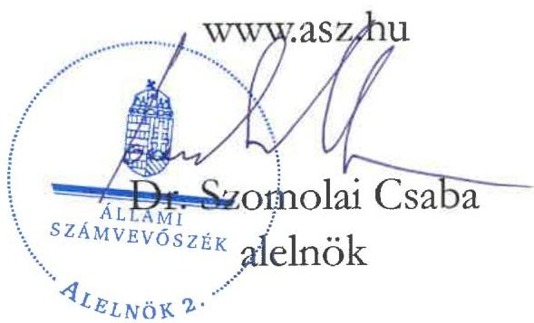

---

Jelentéseink az interneten a www.asz.hu címen olvashatók.

ELLENŐRZÉSI IGAZGATÓSÁG:
ELLENŐRZÉSI IGAZGATÓSÁG II.

ELLENŐRZÉSI IGAZGATÓ:
DR. BAFFIA GERGELY GÁBOR ellenőrzési igazgató

ELLENŐRZÉSVEZETŐ:
DR. LÁNG ÁGNES KRISZTINA ellenőrzésvezető

IKTATÓSZÁM: EL-4293-003/2026.

TÉMASORSZÁM: -

ELLENŐRZÉS-AZONOSÍTÓ SZÁM: V117201

---

TARTALOMJEGYZÉK

- ÖSSZEFOGLALÁS ... 5
- AZ ELLENŐRZÉS EREDMÉNYEI ... 10
1. Az országos nemzetiségi önkormányzat törvényes működési feltételeinek kialakítása, az integritás kockázatok kezelése ... 10
2. Az országos nemzetiségi önkormányzat által ellátott nemzetiségi közügyek, közfeladatok és az ezekhez biztosított központi költségvetési, illetve egyéb támogatások felhasználása ... 12
3. Az országos nemzetiségi önkormányzat gazdálkodása ... 16
4. A közfeladat céljának elérését, eredményét mérő mutatószámok kialakítása, a mérések végrehajtása és az eredmények hasznosítása ... 23
5. A belső ellenőrzés kialakítása és működtetése, a belső és külső ellenőrzések hasznosulása ... 24

- JAVASLATOK ... 26
- I. FÜGGELÉK: ÉSZREVÉTELEK ... 29
- II. FÜGGELÉK: ELLENŐRZÉSI MEGKÖZELÍTÉS ... 31
- MELLÉKLETEK ... 36
I. sz. melléklet: Értelmező szótár ... 36
II. sz. melléklet: Az ellenőrzött szervezetek jegyzéke ... 38
III. sz. melléklet: Az Önkormányzat konszolidált mérlegadatai a 2020-2024. években (M Ft) ... 39
IV. sz. melléklet: Az Önkormányzat kiadásai és bevételei a 2020-2024. években (M Ft) ... 40
V. sz. melléklet: A gazdálkodási jogkörök gyakorlása – a mintatételek értékelése (Ft) ... 41

- RÖVIDÍTÉSEK JEGYZÉKE ... 42

---

“哈，你是个小伙子，你是个小伙子，你是个小伙子，你是个小伙子，你是个小伙子，你是个小伙子，你是个小伙子，你是个小伙子，你是个小伙子，你是个小伙子，你是个小伙子，你是个小伙子，你是个小伙子，你是个小伙子，你是个小伙子，你是个小伙子，你是个小伙子，你是个小伙子，你是个小伙子，你是个小伙子，你是个小伙子，你是个小伙子，你是个小伙子，你是个小伙子，你是个小伙子，你是个小伙子，你是个小伙子，你是个小伙子，你是个小伙子，你是个小伙子，你是个小伙子，你是个小伙子，你是个小伙子，你是个小伙子，你是个小伙子，你是个小伙子，你是个小伙子，你是个小伙子，你是个小伙子，你是个小伙子，你是个小伙子，你是个小伙子，你是个小伙子，你是个小伙子，你是个小伙子，你是个小伙子，你是个小伙子，你是个小伙子，你是个小伙子，你是个小伙子，你是个小伙子，你是个小伙子，你是个小伙子，你是个小伙子，你是个小伙子，你是个小伙子，你是个小伙子，你是个小伙子，你是个小伙子，

---

ÖSSZEFOGLALÁS

Az Alaptörvény¹ XXIX. cikk (1) bekezdése szerint a Magyarországon élő nemzetiségek államalkotó tényezők. Minden, valamely nemzetiséghez tartozó magyar állampolgárnak joga van önazonossága szabad vállalásához és megőrzéséhez. A nemzetiségi kulturális autonómia legfőbb letéteményesei az országos nemzetiségi önkormányzatok, melyek a kötelező és önként vállalt feladatainak ellátására intézményt, gazdasági társaságot, vagy más szervezetet alapíthatnak. Az állam az országos nemzetiségi önkormányzatok működéséhez, az intézményeik fenntartásához költségvetési támogatást nyújt. A nemzetiségi önkormányzatok a feladatellátásukhoz hazai és uniós forrásokra pályázhatnak.

A társadalom jogos elvárása, hogy a közpénzekkel, közvagyonnal gazdálkodó szervezetek működéséről, tevékenységéről időről-időre átfogó képet kapjon. Az ÁSZ², mint az Országgyűlés legfőbb pénzügyi és gazdasági ellenőrző szerve, figyelemmel a társadalom részéről jelentkező elvárásokra, törvényi felhatalmazás alapján ellenőrzi az államháztartásból nyújtott támogatás és az államháztartásból meghatározott célra ingyenesen juttatott vagyon felhasználását az országos nemzetiségi önkormányzatoknál is. Az ellenőrzések lefolytatását indokolta, hogy az országos nemzetiségi önkormányzatok gazdálkodását az elmúlt tíz évben átfogó jelleggel sem az ÁSZ, sem más szervezet nem ellenőrizte. Az ÁSZ ellenőrzés az országos nemzetiségi önkormányzatok feladatellátása, működése és gazdálkodása átláthatóságát és elszámoltathatóságát, a felelős gazdálkodást és a közvagyon védelmét kívánta támogatni és előmozdítani.

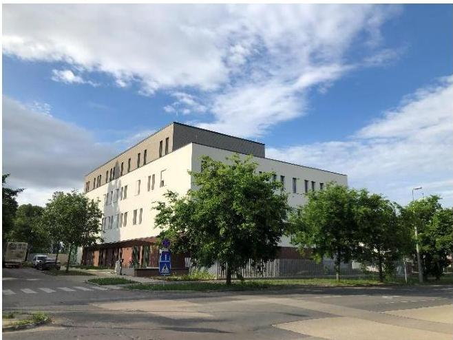
Bolgár Oktatási és Kulturális Központ

A Bolgár Országos Önkormányzat a 2024. évben 3901,0 M Ft értékben helyezte üzembe a BOKK³-ot, mely beruházás az ellenőrzött időszakot megelőzően, a 2021. évben kezdődött. Az Önkormányzat⁴ a feladatellátása helyszínét biztosító ingatlan építésére a 2020-2024. évek között – több ütemben – 4724,8 M Ft felhalmozási célú támogatást kapott. Az Önkormányzat pénzeszközállománya a 2020. évi 536,8 M Ft-ról a 2024. év végére közel tizedére, 47,0 M Ft-ra csökkent. Az ellenőrzés hozzájárult az Önkormányzat szabályszerű és felelős gazdálkodásához, a közpénzek szabályos, cél szerinti felhasználásához, a közvagyon védelméhez.

Az Önkormányzat a Magyarországon működő 13 országos nemzetiségi önkormányzat közül a 2024. évben a teljesített kiadásai alapján a hatodik legnagyobb kiadási főösszeggel rendelkezett (1. ábra).

---

Összefoglalás

1. ábra

AZ ORSZÁGOS NEMZETISÉGI ÖNKORMÁNYZATOK 2024. ÉVI KIADÁSAI (M FT)
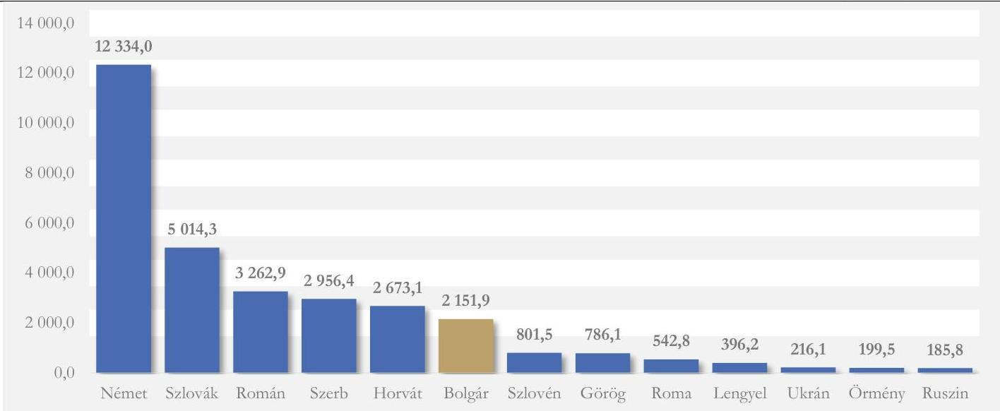
Forrás: Kincstár³ KGR rendszer, az Országos Nemzetiségi Önkormányzatok konszolidált beszámolói alapján ÁSZ saját szerkesztés

A magyarországi bolgárok szétszórtan élnek az ország mintegy 170 településén, de többségük Budapesten és környékén él, emellett nagyobb számban élnek Miskolc környékén és Pécsen. A 2022. évi népszavazáson 6109 állampolgár vallotta magát bolgár nemzetiséghez tartozónak. A Közgyűlés⁶ Elnöke⁷ 2002. óta töltötte be tisztségét. A Közgyűlés munkáját négy bizottság, továbbá a kapcsolattartásért felelős tanácsnok segítette. Az Önkormányzat a magyarországi bolgárok érdekképviseleti szerve, feladata az általa képviselt nemzetiség érdekeinek védelme, valamint a nemzetiségi kulturális hagyományok őrzése és ápolása volt. Az anyanyelvi oktatás fejlesztése és a bolgár nyelv széleskörű használata érdekében oktatási és kulturális intézményrendszert működtetett. Az Önkormányzat havonta adta ki a Bolgár Hírek című újságot, amelyet 1275 családhoz juttatott el.

Az Önkormányzat 2009. július 1-jén hozta létre a hivatalát. A Hivatal⁸ az Njtv⁹-ben foglaltak alapján az Önkormányzat költségvetési szerveként előkészítette és végrehajtotta annak határozatait, ellátta az Önkormányzat és intézményei gazdálkodásával kapcsolatos feladatokat. A Hivatalvezető¹⁰ 2020. óta vezette a Hivatalt. Az Önkormányzat alapfeladata ellátása érdekében 2024. január 1-jén öt intézményt tartott fenn.

Az Önkormányzat az országos szintű érdekképviseleti, érdekvédelmi feladatait ellátta, a nemzetiségi kulturális autonómia fejlesztése érdekében országos szintű nemzetiségi intézményhálózatot működtetett, a működéséhez és feladatellátásához szükséges szervezeti kereteket meghatározta. A Közgyűlés bizottságokat hozott létre és tanácsnokot választott. Az Önkormányzat a rendelkezésére álló közszolgálati rádió és televízió műsoridő felhasználásának elveit jogszabályi előírás ellenére nem határozta meg. Az Önkormányzat a jogszabályi előírással szemben nem rendelkezett az általa használatba adott vagyont érintő megállapodásokkal.

Az Önkormányzat az integritási kockázatok kezelése érdekében szükséges intézkedéseket megtette, azonban a működése átláthatóságát biztosító, jogszabályban előírt közzétételi kötelezettségét nem megfelelően teljesítette.

Az Elnök hatáskör hiányában gyakorolta a gazdasági társasága éves beszámolójának elfogadásakor a Közgyűlést megillető tulajdonosi jogot, illetve az Önkormányzat jogszabálytervezetek véleményezési, továbbá az iskolai körzethatárokra vonatkozó, Nktv.¹¹-ben biztosított egyetértési jogát. Az Önkormányzat jogszabályi előírás ellenére nem határozta meg az Önkormányzat által önként vállalt feladatként alapított díj odaítélésének feltételeit és szabályait.

---

Összefoglalás

A közfeladatok ellátásában az Önkormányzat költségvetési szervei mellett a gazdasági társasága is részt vett. Az Önkormányzat a jogszabályi előírásoknak megfelelően támogatási szerződéseken rögzítette az intézményeinek átadott támogatások felhasználási feltételeit és ellenőrizte azok teljesülését. A Közgyűlés az ellenőrzött időszakban a jogszabályi előírások szerint elfogadta az Önkormányzat intézményei éves szakmai és pénzügyi beszámolóját. Az Önkormányzat a központi költségvetésből származó és az egyéb pályázati forrásból származó támogatások pénzügyi beszámolási kötelezettségének eleget tett. Az Önkormányzat által az egyéb pályázatokon elnyert források felhasználása szabályszerű volt.

Az Önkormányzat gazdálkodása nem felelt meg teljeskörűen a jogszabályok előírásainak. Az Önkormányzat kialakította gazdálkodása szabályszerű kereteit, de a költségvetése tervezése, végrehajtása és az éves beszámolási kötelezettség teljesítése nem felelt meg teljeskörűen a jogszabályok előírásainak. Az Önkormányzat a 2024-2025. évi költségvetési határozatai¹² elfogadását megelőzően a jogszabályi előírások ellenére nem állapította meg határozatban a saját bevételeinek, illetve az adósságot keletkeztető ügyleteiből eredő fizetési kötelezettségeinek várható összegét. Az Önkormányzat 2024-2025. évi költségvetési határozatai, illetve előterjesztései nem tartalmazták a többéves kihatással járó döntések számszerűsítését, továbbá a költségvetési bevételi és kiadási előirányzatait kötelező feladatok, önként vállalt feladatok szerinti bontásban. A költségvetés módosítása során a jogszabályban foglaltak ellenére nem támasztották alá a bevételek megalapozottságát. A pénzforgalom ellenőrzése során az ellenőrzött kiadási tételek 20,0%-ában, illetve a bevételi tételek 100,0%-ában az ÁSZ az Önkormányzatnál a gazdálkodásra és a működésre vonatkozó jogszabályi előírásokkal ellentétes gyakorlatot állapította meg.

Az Önkormányzat éves beszámolóiban kimutatott mérlegfőösszeg – az elnyert felhalmozási célú támogatások hatására – 2020. január 1-jétől 2024. december 31-ére 420,7%-kal növekedett (2. ábra).

2. ábra
AZ ÖNKORMÁNYZAT MÉRLEGFŐÖSSZEGÉNEK ALAKULÁSA A 2020-2024. ÉVEKBEN (M FT)
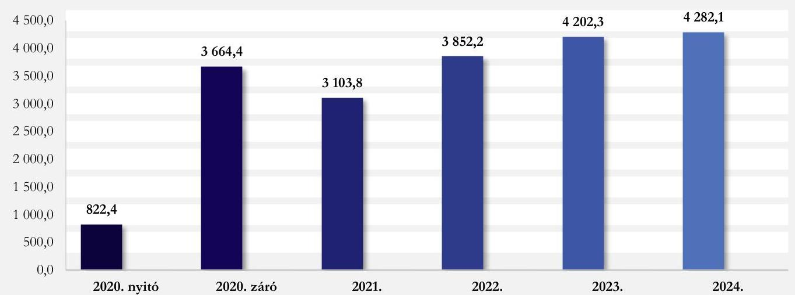
Forrás: Kincstár KGR rendszer, az Önkormányzat konszolidált beszámolói alapján ÁSZ saját szerkesztés

A 2020-2023. években az Önkormányzat gazdálkodása stabil volt, működési egyenlegének összesített értéke pozitív volt, a közfeladatait külső forrás bevonása nélkül ellátta. A 2024. évben a működési bevételek nem fedezték az Önkormányzat feladatellátásának kiadásait, amely tendencia kockázatot jelent az Önkormányzat likviditására, hosszabb távon pedig felveti a tőkevesztés kockázatát.

---

Összefoglalás

A 2020-2024. években az Önkormányzat felhalmozási tevékenységének eredményei – a támogatások jóváírásának és felhasználásának évek közötti áthúzódásai miatt – jelentős ingadozásokat mutattak (3. ábra).

3. ábra

AZ ÖNKORMÁNYZAT MŰKÖDÉSI ÉS FELHALMOZÁSI EGYENLEGEINEK ALAKULÁSA A 2020-2024. ÉVEKBEN (M FT)
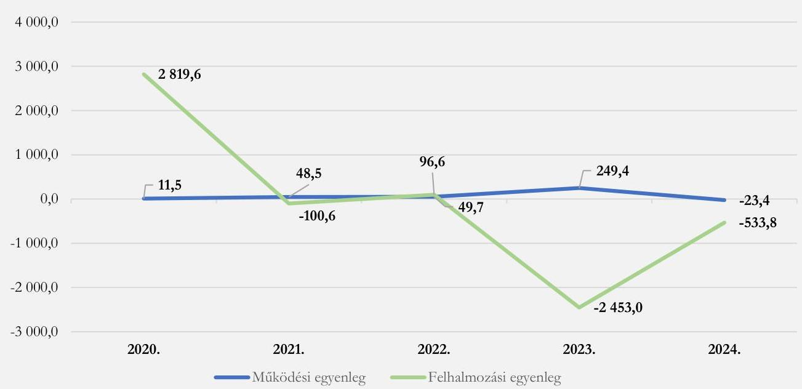
Forrás: Kincstár KGR rendszer, az Önkormányzat konszolidált beszámolói alapján ÁSZ saját szerkesztés

Az Önkormányzat gazdálkodásában a BOKK 2024. évi használatba vételével összefüggésben felmerült növekvő kiadások miatt a működési kiadások meghaladták a felhasznált támogatások miatt kieső kamatbevételek hatására csökkenő működési bevételeket.

Az Önkormányzat vagyongazdálkodása, a vagyon használata nem felelt meg a felelős gazdálkodás követelményének. Az Önkormányzat a jogszabályi előírás ellenére nem gondoskodott a vagyongazdálkodás középtávú tervezéséről. A vagyongazdálkodási tervet az Önkormányzat az ÁSZ ellenőrzése során készítette el az ellenőrzés hasznosulásaként. A 2024. évi leltáreltéréseket a jogszabályi előírás ellenére nem rendezték. Az Önkormányzat a kötelező feladatait szolgáló, tulajdonában álló ingatlant a jogszabályok előírásait figyelmen kívül hagyva a forgalomképtelen törzsvagyoni kör helyett, korlátozottan forgalomképes, illetve forgalomképes vagyoni körbe sorolta. Az ingatlan törvénysértő besorolása lehetőséget biztosít az ingatlan alaptevékenységén kívüli hasznosíthatóságára, megterhelhetőségére, elidegeníthetőségére, ezért a téves besorolás kockázatot jelent a nemzeti vagyonnal felelős módon való vagyongazdálkodás érvényesülésére, befolyásolja az Önkormányzat likviditását, illetve vagyonmegőrzési tevékenységét. A 2024. évi vagyonkimutatás az Önkormányzat ingatlanvagyonának összetételét a jogszabályi előírás ellenére nem a valóságnak megfelelően mutatta be. A tulajdonában lévő helyiségek bérbeadásának feltételeit, illetve az egyes ingatlanok hasznosítására vonatkozó bérleti és használati díjakat a jogszabályi előírás ellenére nem szabályozta, a bérleti díjakat a bérleti szerződésekben egyedileg határozta meg.

Az Önkormányzatnál a belső ellenőrzést kialakították és működtették. Az Önkormányzat a belső szabályozása ellenére nem bízott meg könyvvizsgálót gazdálkodása felülvizsgálatára. Az Önkormányzatnál a kialakított kontrollok és a belső ellenőrzés működésének hiányosságai, továbbá a könyvvizsgáló megbízásának

---

Összefoglalás

hiánya következtében az ÁSZ által feltárt leltározási és gazdálkodási hiányosságokat az ÁSZ ellenőrzéséig nem tárták fel.

Az Önkormányzatnál nem biztosították a feladatellátás és a gazdálkodás eredményességének értékelését, mivel a Hivatalvezető a jogszabályokban előírtak, továbbá a Bkr. 1. melléklete szerinti vezetői nyilatkozata ellenére nem határozta meg a szervezet céljait, és nem alakított ki a feladatellátás és gazdálkodás céljának elérését és annak eredményét mérő mutatószámokat. Nem működtettek teljesítménymérési folyamatokat, az Önkormányzat a nemzetiségi feladatellátás hatékonyságáról és eredményességéről nem rendelkezett információval, a részére folyósított támogatásokat teljesítményétől függetlenül kapta és használta fel.

A feltárt hiányosságok megszüntetése érdekében az ÁSZ a Közgyűlés részére kettő, az Elnök részére tizenegy, a Hivatalvezetőnek kilenc javaslatot tett.

9

---

AZ ELLENŐRZÉS EREDMÉNYEI

# 1. Az országos nemzetiségi önkormányzat törvényes működési feltételeinek kialakítása, az integritás kockázatok kezelése

## Összegző megállapítás

Az Önkormányzat a törvényes működésének feltételeit az Njtv.-ben foglaltaknak megfelelően kialakította, azonban az Info. tv.¹³-ben előírt adatszolgáltatási kötelezettségének nem tett maradéktalanul eleget.

### 1.1. számú megállapítás

Az Önkormányzat az Njtv.-ben foglaltaknak megfelelően a szervezeti és működési szabályait meghatározta és vagyonleltárát elkészítette.

Az Önkormányzat feladat- és hatásköreit az Njtv. előírásainak megfelelően a 15 tagú Közgyűlés gyakorolta, amelyet, mint jogi személyt az Elnök képviselt. Az Önkormányzat a 2024-2025. években az Njtv. előírásainak megfelelően rendelkezett át nem ruházott hatáskörben, minősített többséggel elfogadott SZMSZ₁¹⁴,₂¹⁵,₃¹⁶,₄¹⁷-el.

A Közgyűlés az SZMSZ₁₋₄-ben – az Njtv. előírásaival összhangban – meghatározta bizottságai¹ feladatait, hatáskört nem ruházott át bizottságaira. A Pénzügyi Bizottság¹⁸ az SZMSZ₁₋₄-ben meghatározott feladatait – az Njtv. előírásainak megfelelően – ellátta.

A Közgyűlés az Njtv. előírásainak megfelelően meghatározta törzsvagyona körét, vagyonleltárát, a tulajdonát képező vagyon használatának, valamint a használatába adott, vagyonkezelésbe vett állami és önkormányzati vagyon kezelésére, használatára, működtetésére vonatkozó szabályokat, és megkötötte a rendelkezésére bocsátott önkormányzati vagyon kezelésére, használatára, működtetésére vonatkozó szükséges megállapodást. Az Önkormányzat az Njtv. 117. § (1) bekezdés d) pontjában foglaltak ellenére a rendelkezésére álló közszolgálati rádió és televízió műsoridő felhasználásának elveit nem határozta meg, ezáltal nem élt a nemzetiségi jogok és érdekek érvényesítésének lehetőségével a közszolgálati médiában. Az Önkormányzat az Njtv. 113. § d) pontjában foglaltak ellenére az ellenőrzött időszakban nem rendelkezett az általa használatba vett és használatba továbbadott vagyont érintő megállapodásokkal a Hivatal és intézményei székhelyéül 2024. szeptember 2. napjától szolgáló épület vonatkozásában.

¹ Kulturális és Médiabizottság, Oktatási Bizottság, Önkormányzati Koordinációs Bizottság, továbbá Pénzügyi Bizottság.

10

---

Az ellenőrzés eredményei

## 1.2. számú megállapítás

Az integritási kockázatok kezelése érdekében az Önkormányzatnál a Vnytv.¹⁹ vagyonnyilatkozat tételre, valamint az Áht.²⁰ és az Ávr.²¹ összeférhetetlenség elkerülésére és a képesítési követelményekre vonatkozó előírásai érvényesültek. Az Önkormányzat a 2024. évben részben tett eleget az Info tv. szerinti közzétételi kötelezettségének.

Az Önkormányzatnál és a Hivatalnál a Bkr.²² előírásainak megfelelően belső szabályzatokban² rögzítették az integritás szempontjából lényeges tevékenységeket, eljárásokat, magatartást és a korrupció elleni védelmet, szabályozták az integrált kockázatkezelés és a szervezeti integritást sértő események kezelésének eljárásrendjét. Rögzítették a vagyonnyilatkozat-tételi kötelezettség szabályait és teljesítették a vagyonnyilatkozat-tételi kötelezettséget. A Hivatalnál az Áht.-ban és az Ávr.-ben előírt képesítési és összeférhetetlenségi szabályokat betartották.

Az Önkormányzatnál megalkották a közzétételi kötelezettséghez kapcsolódó szabályozásokat. Az Önkormányzat az önként vállalt feladatait az Info tv. előírása szerint közzétette, de a honlapján az SZMSZ⁴-ét az Info tv. 37. § (1) bekezdés és az 1. melléklet II.1. pontjában előírtak ellenére a változást követően azonnal nem frissítette. Az Önkormányzat az Info tv. 37. § (1) bekezdés és az 1. melléklet III.3. pontjában előírtakkal szemben az Önkormányzat által nyújtott, az Áht. szerinti költségvetési támogatások kedvezményezettjeire vonatkozó adatokat nem tette közzé és nem gondoskodott az adatok jogszabályban rögzített öt évig terjedő megőrzéséről, ezáltal nem biztosították a jogszabályban előírt átláthatóságot. Az Info tv. 37. § (1) bekezdés és az 1. melléklet III.4. pontjában foglaltak ellenére az ellenőrzött időszakban nem tette közzé az államháztartás pénzeszközei felhasználásával, az államháztartáshoz tartozó vagyonnal történő gazdálkodással összefüggő, ötmillió forintot elérő szerződésekre vonatkozó adatokat. A közzétételre szolgáló honlapon a 18/2005 IHM rendelet²³ 2. § (1) bekezdésében foglaltak ellenére nem tűntette fel az egységes közadatkereső rendszerre, a központi elektronikus jegyzékre mutató hivatkozást. Az Önkormányzat a közzétételre szolgáló honlapot a 305/2005. Korm.rendelet²⁴ 5. § (3) bekezdésében foglaltak ellenére nem úgy alakította ki, hogy az a széles körben elterjedt, valamint a vakok és gyengénlátók által széles körben használt eszközökkel is olvasható legyen. A Központi Információs Közadat-nyilvántartás felületén az Önkormányzat a 499/2022. (XII. 8.) Korm. rendelet²⁵ 5. § (2) bekezdésében és az Info. tv. 37/C. § (2) bekezdésében foglaltak ellenére 2025. január 1-jétől nem tette közzé az ötmillió forintot meghaladó, az általuk hazai vagy európai uniós forrásból megvalósulóan nyújtott, az államháztartásról szóló törvény szerinti költségvetési támogatásokat, valamint az árubeszerzésre, építési beruházásra, szolgáltatás megrendelésre, valamint vagyonhasznosításra vonatkozó szerződéseket.

---

² A Hivatal Etikai kódexében, az Integrált kockázatkezelés eljárásrendjében és a Szervezeti integritást sértő események kezelésének eljárásrendjében.

---

Az ellenőrzés eredményei

# 2. Az országos nemzetiségi önkormányzat által ellátott nemzetiségi közügyek, közfeladatok és az ezekhez biztosított központi költségvetési, illetve egyéb támogatások felhasználása

## Összegző megállapítás

Az Önkormányzat az Njtv.-ben előírtaknak megfelelően a kötelező közfeladatait ellátta, a központi költségvetésből kapott támogatásokat a közfeladatai ellátására fordította.

## 2.1. számú megállapítás

Az Önkormányzat az Njtv.-ben meghatározott közfeladatait ellátta, az intézményhálózatának működtetéséről gondoskodott. Az Elnök az Njtv.-ben foglaltak ellenére hatáskör hiányában gyakorolta az Önkormányzat véleményezési, egyetértési és tulajdonosi jogait.

Az Önkormányzat a bolgár nemzetiségi közösséggel kapcsolatosan ellátta az Njtv.-ben foglalt országos szintű érdekképviseleti, érdekvédelmi feladatait, az Njtv. alapján a nemzetiségi kulturális autonómia fejlesztése érdekében országos szintű nemzetiségi intézményhálózatot tartott fenn.

Az Önkormányzat – Hivatala mellett – négy költségvetési szervként működő intézményt tartott fenn és egy gazdasági társaság működésének feltételeit biztosította. Két költségvetési szervként működő intézménye (az Óvoda²⁰ és az Iskola²⁷) köznevelési, illetve közoktatási feladatokat, további két költségvetési szervként működő intézménye (a Dokumentációs Központ²⁸ és a Kutatóintézet²⁹) és egy gazdasági társaságként működő intézménye kulturális és közművelődési feladatokat látott el (4. ábra).

4. ábra

AZ ÖNKORMÁNYZAT SZERVEZETI FELÉPÍTÉSE
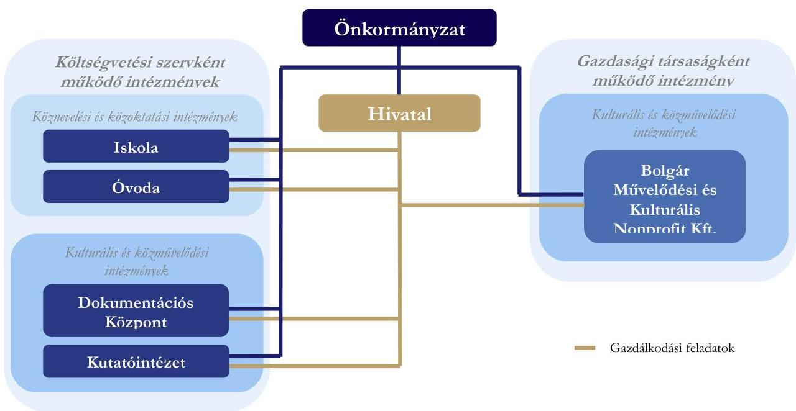
Forrás: Ellenőrzött szervezetek adatszolgáltatása alapján ÁSZ saját szerkesztés

Az Önkormányzat közfeladatainak ellátását az ellenőrzött időszakban az Önkormányzat 47,0%-os és az Egyesület³⁰ 53,0%-os tulajdonában álló Bolgár Művelődési és Kulturális

---

Az ellenőrzés eredményei

Nonprofit Kft. segítette, amely – az Áht. előírásainak megfelelően megkötött Támogatási megállapodás¹,²³ szerint – az Egyesület tulajdonában lévő Bolgár Művelődési Ház üzemeltetése, továbbá a Malko Teatro bolgár színház működési feltételeinek biztosítása, a magyarországi bolgár közösség hagyományos éves kulturális rendezvényeinek lebonyolítása, a bolgár táncművészet és népzene ápolása céljából működő táncegyüttesek és zenekarok szakmai és működési feltételeinek biztosítása útján járult hozzá az Önkormányzat közfeladatának ellátásához, a magyarországi bolgár nemzetiség kulturális autonómiájának megteremtéséhez. A Közgyűlés az ellenőrzött időszakban, 2025. március 26-ai ülésén az Njtv. előírásainak megfelelően döntött a Bolgár Művelődési és Kulturális Nonprofit Kft. tevékenységi körének módosításáról, valamint a Magyarországi Bolgár Színház Nonprofit Kft., mint az Önkormányzat 100,0%-os tulajdonában lévő gazdálkodó szervezetet 2025. április 1-jei hatállyal történt megalapításáról a színházi tevékenység elkülönítése érdekében.

A Bolgár Művelődési és Kulturális Nonprofit Kft. 2023. évi egyszerűsített beszámolójának elfogadásakor az Elnök az Njtv. 119. § (1) bekezdésében foglaltak ellenére hatáskör hiányában gyakorolta az Njtv. 153. § (1) bekezdése és az Mótv.³² 107. §-a alapján a Közgyűlést megillető tulajdonosi jogot.

Az Elnök az Njtv. 119. § (1) bekezdésében foglaltak ellenére hatáskör hiányában élt az Önkormányzat által képviselt nemzetiséget érintő jogszabálytervezetek kapcsán az Njtv. által biztosított véleményezési joggal, továbbá az Nktv. 50. § (10) bekezdésében biztosított egyetértési joggal a nemzetiségi köznevelési intézmény felvételi körzetének meghatározásához kapcsolódóan³.

Az Önkormányzat az ellenőrzött időszakban „Március 3.” díjat adományozott, tanulmányi ösztöndíjat alapított, „Vidéki Alap” pályázati alapot hozott létre, továbbá megjelentette a Bolgár Hírek című kétnyelvű havilapot. Az SZMSZ₁₋₄-ében – az Njtv.-ben foglaltakkal összhangban – meghatározta önként vállalt közfeladatait és azok ellátásának módját. Az Önkormányzat az Njtv. 116. § (1) bekezdés b) pontjában foglaltak ellenére nem határozta meg a „Március 3.” díj odaítélésének feltételeit és szabályait.

Az Önkormányzat a 2024. évi Kvtv.³³ alapján működésre és média támogatásra, valamint intézményeinek fenntartására a 2024. évben összesen 240,9 M Ft támogatást kapott a központi költségvetésből. A nemzetiségi oktatásra, nevelésre kapott költségvetési támogatás a bázis időszakhoz viszonyítva a 2024. évre 121,1 M Ft-ra, 73,8%-kal emelkedett. Az Önkormányzat a 2024. évben a nemzetiségi oktatásra, nevelésre kapott költségvetési támogatás teljes összegét a 2024. évi Kvtv. előírásainak megfelelően átadta köznevelési és közoktatási intézményeinek.

Az Önkormányzat a 2020. évi 306,1 M Ft összeghez képest a 2024. évben 84,1%-kal többet, 563,6 M Ft-ot fordított közfeladatainak ellátásához kapcsolódó működési kiadásokra. A növekvő kiadásokat az üzembehelyezett BOKK kapcsán megemelkedett üzemeltetési költségek, valamint az illetmények, munkabérek megemelkedése okozták.

Az Önkormányzat nemzetiségi közfeladataihoz kapcsolódó működési célú támogatások, valamint a közfeladatellátásra fordított működési kiadásainak 2020. és 2024. évi alakulását az 5. ábra szemlélteti.

³ Az Önkormányzat az ellenőrzött időszakban az Njtv. módosítása, valamint az anyakönyvi eljárásról szóló 2010. évi I. törvény módosítása kapcsán élt az Njtv. 118. § (1) bekezdésének a) pontjában biztosított véleményezési jogával.

---

Az ellenőrzés eredményei

5. ábra

AZ ÖNKORMÁNYZAT MŰKÖDÉSI CÉLÚ BEVÉTELEINEK ÉS KIADÁSAINAK ALAKULÁSA A 2020. ÉS 2024. ÉVEKBEN (M FT)
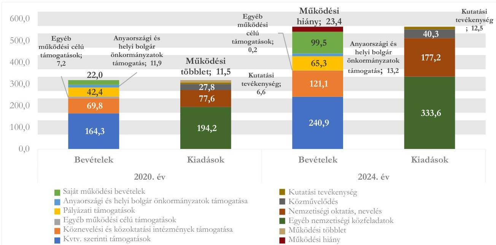
Forrás: Az Önkormányzat 2020. és 2024. évi zárszámadási határozatai, valamint az Önkormányzat és költségvetési szervként működő intézményeinek 2020. és 2024. évi éves költségvetési beszámolói alapján ÁSZ saját szerkesztés

Az Önkormányzat és költségvetési szervei 2024. évi működési kiadásai 23,4 M Ft-tal meghaladták az e célra kapott támogatásaik és saját működési bevételeik összegét. A 2024. évben az Önkormányzat összes teljesített bevételei – az értékpapír-műveletek 2024. évi 130,0 M Ft egyenlege, valamint a 2023. évi 482,4 M Ft maradvány igénybevétele mellett – biztosították a közfeladatok ellátását, amit alátámaszt, hogy a 2024. évi 55,3 M Ft összes maradványából 92,7%, 51,3 M Ft kötelezettségvállalással nem terhelt, szabad maradvány volt. Az Önkormányzat szabad maradványának összege azonban a folyamatos működés biztosítása érdekében a 2020. évi 546,9 M Ft-ról 51,3 M Ft-ra csökkent a 2024. év végére, ami veszélyezteti az Önkormányzat fenntartható gazdálkodását.

## 2.2. számú megállapítás

Az Önkormányzat a közfeladatai ellátására a 2024. évi Kvtv. alapján biztosított támogatást a nemzetiségi közfeladatokhoz kapcsolódó kiadások fedezésére fordította.

A 2024. évben az Önkormányzat és média támogatás jogcímen kapott 106,2 M Ft költségvetési támogatás a Közgyűlés működését, a Hivatal feladatellátását, valamint a Jantra Néptánc Egyesület és az Alternatív Művészeti Alapítvány támogatását biztosította, továbbá a Vidéki Alap keretében ennek terhére támogatta az Önkormányzat három megyei jogú város bolgár nemzetiségi önkormányzatát⁴. Az intézmények fenntartására kapott 134,7 M Ft költségvetési támogatás az Önkormányzat költségvetési szervei közül a Hivatal, az Óvoda, a Dokumentációs Központ és a Kutatóintézet, valamint gazdasági társasága működését szolgálta. Az Önkormányzat 2024. évi Kvtv. alapján kapott támogatásainak megoszlásának alakulását az 1. táblázat mutatja.

⁴ Miskolc Megyei Jogú Város Bolgár Nemzetiségi Önkormányzat, Szegedi Bolgár Nemzetiségi Önkormányzat, valamint Pécsi Bolgár Önkormányzat.

14

---

Az ellenőrzés eredményei

1. táblázat
AZ ÖNKORMÁNYZAT 2024. ÉVI KVTV. ALAPJÁN KAPOTT TÁMOGATÁSAINAK FELHASZNÁLÁSA (M FT)

|  SZERVEZET | ÖNKORMÁNYZAT ÉS MÉDIA TÁMOGATÁS |   | ÖNKORMÁNYZAT ÁLTAL FENNTARTOTT INTÉZMÉNYEK TÁMOGATÁSA |   | ÖSSZESEN  |   |
| --- | --- | --- | --- | --- | --- | --- |
|   |  ÖSSZEGE | MEGOSZLÁSA | ÖSSZEGE | MEGOSZLÁSA | ÖSSZEGE | MEGOSZLÁSA  |
|  Önkormányzat | 57,1 | 53,8% | 0,0 | 0,0% | 57,1 | 23,7%  |
|  Hivatal | 42,8 | 40,3% | 5,3 | 3,9% | 48,1 | 20,0%  |
|  Óvoda | 0,0 | 0,0% | 7,5 | 5,6% | 7,5 | 3,1%  |
|  Dokumentációs Központ | 0,0 | 0,0% | 36,5 | 27,1% | 36,5 | 15,2%  |
|  Kutatóintézet | 0,0 | 0,0% | 11,4 | 8,5% | 11,4 | 4,7%  |
|  Bolgár Művelődési és Kulturális Nonprofit Kft. | 0,0 | 0,0% | 74,0 | 54,9% | 74,0 | 30,7%  |
|  Megyei jogú városok bolgár nemzetiségi önkormányzatai | 1,1 | 1,0% | 0,0 | 0,0% | 1,1 | 0,4%  |
|  Jantra Néptánc Egyesület | 3,6 | 3,4% | 0,0 | 0,0% | 3,6 | 1,5%  |
|  Alternatív Művészeti Alapítvány | 1,6 | 1,5% | 0,0 | 0,0% | 1,6 | 0,7%  |
|  Összesen | 106,2 | 100,0% | 134,7 | 100,0% | 240,9 | 100,0%  |

Forrás: Az Önkormányzat 2024. évre vonatkozó Miniszterelnökség felé benyújtott, részletes szakmai és pénzügyi beszámolói alapján ÁSZ saját szerkesztés

A 2024. évi Kvtv. és a 2025. évi Kvtv.⁵⁴ alapján kapott támogatások terhére továbbadott támogatásokról az Önkormányzat a fenntartói és támogatási megállapodásokat az Áht. előírásainak megfelelően megkötötte. A Közgyűlés – az Óvoda kivételével – az Áht. előírásainak megfelelően elfogadta költségvetési szervei szakmai beszámolóit, és a 73/2025. (VI. 18.) határozatával elfogadta az Önkormányzat részére a 2024. évi Kvtv. alapján biztosított költségvetési támogatásokról készített pénzügyi beszámolót.

Az Önkormányzat a 2024. évi Kvtv. alapján kapott támogatások támogatói okirataiban foglalt szerződéses feltételeket betartotta, a 2024. évi Kvtv. alapján kapott támogatásokat az ellátott kötelező nemzetiségi közfeladatokhoz kapcsolódó kiadások fedezésére fordították. Az Önkormányzat a 2024. évi Kvtv. alapján kapott támogatások felhasználásáról történt elszámoláshoz kapcsolódóan a 2024. évi Kvtv.-ban foglalt pénzügyi beszámolási kötelezettségének eleget tett.

2.3. számú megállapítás
Az Önkormányzat által az egyéb pályázatokon elnyert források felhasználása szabályszerű volt.

Az Önkormányzat az ellenőrzött időszakban összesen 61,9 M Ft összegben részesült külső forrásból működési célú támogatásban. Az Önkormányzat a támogatásokat a támogatási szerződésekben meghatározott célnak megfelelően használta fel, így a BGA Zrt.⁵⁵ által nyújtott támogatások 29,6 M Ft összegben a napi működési kiadások fedezeteit egészítették ki, 31,7 M Ft összegben pedig rendezvények megtartásához járultak hozzá. A helyi nemzetiségi önkormányzatok a Bolgár Hírek

⁵ A BOKK átadó ünnepsége és a szláv írásbeliség napja, Bulgária március 3-án megtartott nemzeti ünnepe, a Nemzeti Pedagógus Találkozó, a „Nemzeti

---

Az ellenőrzés eredményei

című kétnyelvű havilap kiadásához összesen 0,5 M Ft támogatással, az Önkormányzat által nyújtott tanulmányi ösztöndíjhoz 0,1 M Ft támogatással járultak hozzá. Az Önkormányzat az egyéb támogatások támogatók felé történt elszámolása során összességében betartotta a támogatói okiratok, támogatási szerződések előírásait. Az Önkormányzat anyaországától az Njtv. előírásaival összhangban kapott a 2024. évben 11,7 M Ft-ot, EU³⁶-s támogatást nem vett igénybe.

# 3. Az országos nemzetiségi önkormányzat gazdálkodása

|  Összegző megállapítás | Az Önkormányzat gazdálkodása nem felelt meg teljeskörűen az Áht., az Ávr., az Mótv., az Njtv., az Nvtv.³⁷, az Áhsz.³⁸ és a Bkr. előírásainak.  |
| --- | --- |
|  3.1. számú megállapítás | Az Önkormányzat kialakította gazdálkodása szabályszerű kereteit. A költségvetés tervezése, végrehajtása és az éves beszámolási kötelezettség teljesítése nem felelt meg teljeskörűen az Áht. előírásainak.  |

A Hivatalvezető a Gazdasági szervezet ügyrendjében³⁹ a Bkr.-ben előírtaknak megfelelően kialakította a szervezeten belül a gazdálkodási folyamatok belső szabályozását, a Gazdálkodási szabályzatban⁴⁰ és az Ellenőrzési nyomvonalban⁴¹ szabályozták a pénzügyi-számviteli feladatok során elvégzendő kontrolltevékenységeket. A gazdálkodási jogkör gyakorlásra jogosult személyekről az előírt nyilvántartást vezették. Az Önkormányzat a Számv. tv.⁴²-ben előírtaknak megfelelően rendelkezett számviteli szabályzatokkal.

A Közgyűlés a Pénzügyi bizottság egyetértésével az Önkormányzat a 2024. és 2025. évi költségvetéseit jóváhagyta. Az Önkormányzat teljesítette a költségvetés készítési és a beszámolási kötelezettségét, de 2024. évi és 2025. évi költségvetési határozatai nem tartalmazták teljeskörűen az Áht.-ban előírt adatokat a következők miatt: a költségvetési határozatok az Áht. 23. § (2) bekezdés ab) és bb) pontjaiban és a 26. § (1) bekezdésében foglaltak ellenére nem tartalmazták a költségvetési bevételi és kiadási előirányzatokat kötelező feladatok, önként vállalt feladatok szerinti bontásban. A Hivatalvezető a költségvetés előterjesztésekor az Áht. 24. § (4) bekezdés b) pontjában rögzítettekkel szemben nem mutatta be a Közgyűlésnek tájékoztatásul a többéves kihatással járó döntések számszerűsítését évenkénti bontásban és összesítve. Az Önkormányzat az Áht. 29/A. §-ában előírtak ellenére a költségvetési határozat elfogadását megelőzően nem állapította meg saját bevételeinek, illetve az adósságot keletkeztető ügyleteiből eredő fizetési kötelezettségeinek a költségvetési évet követő három évre várható összegét.

Az Önkormányzatnál a 2024. évben az előirányzat nyilvántartást az Áht. és az Ávr. előírásainak megfelelően vezették, az előirányzat átcsoportosítások során a jogszabályok és a belső szabályozás előírásait betartották. A 2024. évi költségvetés módosítása során az Áht. 4. § (2) bekezdésében előírtak ellenére az Önkormányzatnál nem biztosították a tervezett bevételek közgazdasági megalapozottságát, mivel a módosított bevételi és kiadási főösszeg nem egyezett meg a bevételek analitikus nyilvántartásával.

Kissebségek Helyzete az Európai Unióban” című nemzetközi konferencia, valamint a bolgár anyanyelvi és népismereti tábor megrendezése.

---

Az ellenőrzés eredményei

A Közgyűlés a Pénzügyi bizottság véleménye alapján fogadta el a jóváhagyott költségvetéssel összehasonlítható módon készített, az év utolsó napján érvényes szervezeti, besorolási rendnek megfelelő zárszámadást. A 2024. évi zárszámadási határozat⁴³ nem felelt meg teljeskörűen az Áht. előírásainak, mert a Közgyűlés az Önkormányzat és költségvetési szerveinek maradványát az éves költségvetési beszámolóval jóváhagyta, de a zárszámadási határozat az Áht. 91. § (2) bekezdésében és a 23. § (2) bekezdés ab) és bb) pontjaiban, továbbá a 26. § (1) bekezdésében foglaltak ellenére nem tartalmazta az Önkormányzat és az általa irányított költségvetési szervek bevételi és kiadási előirányzatait kötelező feladatok, önként vállalt feladatok szerinti bontásban.

A 2024. évi költségvetési beszámoló vonatkozásában az Önkormányzat az Áhsz. előírásainak megfelelően teljesítette az adatszolgáltatási kötelezettségét a Kincstár által működtetett elektronikus adatszolgáltató rendszerbe.

3.2. számú megállapítás

Az Önkormányzat pénzügyi gazdálkodása nem felelt meg teljeskörűen az Áht., az Ávr., az Mótv., az Nvtv., a Bkr. és a belső szabályzat előírásainak.

Az Önkormányzat gazdálkodása során a kapott támogatásokat célszerűen használta fel, a teljesített kiadások az Önkormányzat közfeladatellátásához kapcsolódtak. A 2020-2024. években az Önkormányzat bevételeiben és kiadásaiban nagy ingadozás volt tapasztalható, a költségvetési bevételek és a kiadások jelentős mértékben változtak. Ennek az volt az oka, hogy az Önkormányzat gazdálkodását alapvetően a 2020. évtől a BOKK építésére kapott források és ezek felhasználása határozta meg (6. ábra).

6. ábra

A KÖLTSÉGVETÉSI BEVÉTELEK ÉS KIADÁSOK ALAKULÁSA, VALAMINT A BOKK ÉPÍTÉSÉRE ELNYERT TÁMOGATÁSOK A 2020-2024. ÉVEKBEN (M FT)
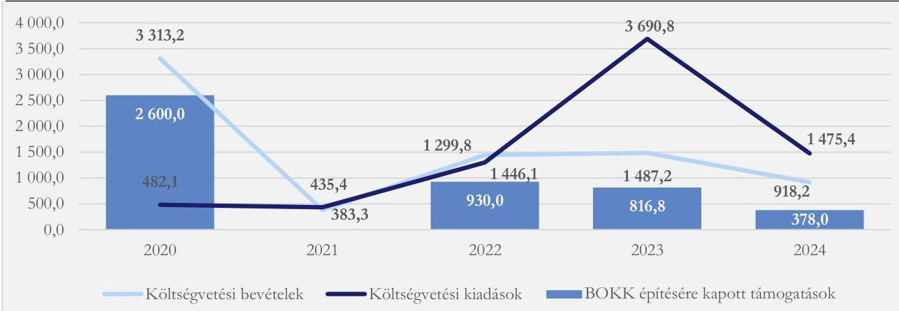
Forrás: Kincstár KGR rendszer és az Önkormányzat konszolidált beszámolói alapján ÁSZ saját szerkesztés

Az Önkormányzat a BOKK építésére 1578/2020. (IX. 10.) Korm. határozat⁴⁴ alapján 2600,0 M Ft támogatásban részesült. A 1149/2022. (III. 21.) Korm. határozat⁴⁵ alapján az Önkormányzat a 2022. évben további 930,0 M Ft, a 2023. évben 816,8 M Ft, a 2024. évben 378,0 M Ft, így a 2020. évtől a BOKK építésére összesen 4724,8 M Ft felhalmozási célú támogatásban részesült, amelyek megjelentek a költségvetési bevételekben. A költségvetési bevételek és kiadások évek közötti jelentős ingadozásait alapvetően a felhalmozási célú bevételek és a felhalmozási célú kiadások teljesítésének évek közötti áthúzódásai okozták. A BOKK felépítésére – több ütemben – kapott támogatások jóváírásai évekkel megelőzték a kiadások teljesítését. Az Önkormányzat 2020-2023. évi

17

---

Az ellenőrzés eredményei

gazdálkodása stabil volt, a bevételéi meghaladták a felmerült kiadásokat. A 2024. évben azonban, a BOKK üzembe helyezését követően a működési kiadások meghaladták a működési bevételeket és az Önkormányzat csak a maradvány igénybevételével tudta fedezni a forráshiányt.

Az Önkormányzat a jóváírt, de a beruházásra még fel nem használt összegeket több ütemben állampapírba fektette, a lekötésekre adott megbízások összege a 2020-2024. években összesen 8095,4 M Ft volt. A befektetéseken realizált kamatbevételek az Önkormányzat működési bevételeit növelték (7. ábra).

7. ábra

AZ ÖNKORMÁNYZAT BEFEKTETÉSI TEVÉKENYSÉGE A 2020-2024. ÉVEKBEN (M FT)
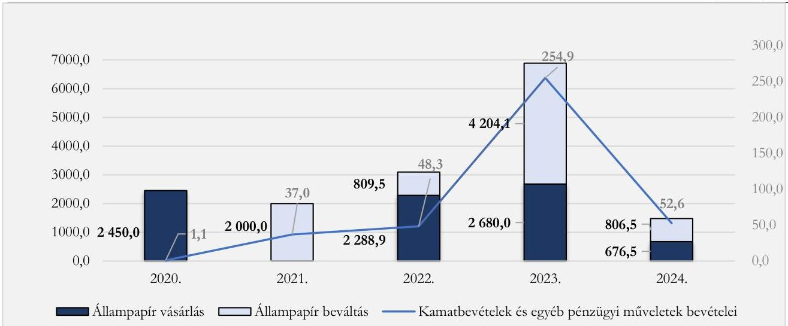
Forrás: Kincstár KGR rendszer, az Önkormányzat konszolidált beszámolói, ÁSZ saját szerkesztés

Az értékpapírvásárlás feltételeit a Vagyongazdálkodási szabályzat⁴⁶ határozta meg. A Vagyongazdálkodási szabályzat 35. §-ában és a 2024. évi költségvetési határozatban előírtak ellenére a 2024. évben 676,5 M Ft értékű állampapírvásárlásra a Közgyűlés előzetes döntése nélkül került sor.⁶

A 2020-2024. években az Önkormányzatnál a nemzetiségi feladatellátással összefüggő működési egyenleg összesített értéke pozitív volt, a bevételek meghaladták a kiadásokat (2. táblázat).

⁶ A 2022 és a 2023. években az állampapírvásárlásokról a Közgyűlés az 52/2022 (VII.07.) határozatával, illetve a 20/2023 (III.29.) határozatával döntött.

---

Az ellenőrzés eredményei

2. táblázat
A KÖLTSÉGVETÉSI EGYENLEG ALAKULÁSA A 2020-2024. ÉVEKBEN (M FT)

|  MEGNEVEZÉS | 2020. ÉV | 2021. ÉV | 2022. ÉV | 2023. ÉV | 2024. ÉV | ÖSSZESEN  |
| --- | --- | --- | --- | --- | --- | --- |
|  Költségvetési bevételek | 3 313,2 | 383,3 | 1 446,1 | 1 487,2 | 918,2 | 7 548,0  |
|  - működési támogatások | 287,1 | 288,6 | 408,9 | 363,4 | 429,0 | 1 777,0  |
|  - működési bevételek és átvett pénzeszközök | 30,5 | 64,4 | 83,3 | 307,0 | 111,2 | 596,4  |
|  -felhalmozási bevételek és támogatások | 2 995,6 | 30,3 | 953,9 | 816,8 | 378,0 | 5 174,6  |
|  Költségvetési kiadások | 482,1 | 435,4 | 1 299,8 | 3 690,8 | 1 475,4 | 7 383,5  |
|  - működési kiadások | 306,1 | 304,5 | 442,5 | 421,0 | 563,6 | 2 037,7  |
|  -felhalmozási kiadások | 176,0 | 130,9 | 857,3 | 3269,8 | 911,8 | 5 345,8  |
|  Költségvetési egyenleg | 2 831,1 | -52,1 | 146,3 | -2 203,6 | -557,2 | 164,5  |
|  - működési egyenleg | 11,5 | 48,5 | 49,7 | 249,4 | -23,4 | 335,7  |
|  - felhalmozási egyenleg | 2 819,6 | -100,6 | 96,6 | -2 453,0 | -533,8 | -171,2  |

Forrás: KGR K11 adatok alapján ÁSZ saját szerkesztés

Az Önkormányzat működési célú kiadásai a BOKK üzembe helyezése és a növekvő személyi jellegű kiadások miatt 2023. évről a 2024. évre 33,8%-kal, 563,6 M Ft-ra emelkedtek. Ezen belül a személyi jellegű kiadások 45,3%-kal, a dologi kiadások 36,6%-kal nőttek. Ezt nem ellensúlyozta a működési célú támogatások összege, mely a 2023. évről a 2024. évre mindössze 18,1%-kal emelkedett. A kamatbevételek és más egyéb pénzügyi műveletek bevételei a 2023. évről a 2024. évre – a támogatás felhasználása miatt – 202,3 M Ft-tal (52,6 M Ft-ra) csökkentek. Az Önkormányzat gazdálkodásában az ingatlan használatba vételével összefüggésben felmerült növekvő kiadások és a csökkenő kamatbevételek hatására a 2024. évben – a 2020-2024. években első alkalommal – a működési kiadások meghaladták a működési bevételeket. Mindezek hatására a 2024. évben a működési bevételek nem fedezték az Önkormányzat feladatellátásának kiadásait, azt csak a korábbi maradvány felhasználásával tudta azt finanszírozni. A működési hiány működési hitelfelvételhez, illetve hosszabb távon tőkevesztéshez vezethet.

Az Önkormányzatnál a 2024. évben és a 2025. I. negyedévben teljesített gazdasági események ellenőrzése során kiválasztott mintatételek értékelésének részletezését az V. számú melléklet tartalmazza.

Az Önkormányzat az ellenőrzött gazdasági eseményeknél a kötelezettségvállalások nyilvántartásba vételéről gondoskodott. A beruházások értékét az Áhsz.-ben rögzítetteknek megfelelően az Önkormányzat számviteli nyilvántartásában rögzítették.

19

---

Az ellenőrzés eredményei

Az Önkormányzat pénzügyi gazdálkodásában az ellenőrzött mintatételeknél összességében nem működtek teljeskörűen az Áht.-ban és az Ávr.-ben előírt kontrollok, a gazdálkodási jogkörök gyakorlói nem látták el minden esetben a feladataikat. Az ellenőrzés keretében az ÁSZ a pénzforgalomban megjelenő beruházási kiadásokat, a pénzeszköz átadásokat, illetve a vagyonhasznosítási bevételeket vizsgálta. A kiadások teljesítése a mintatételek 20,0%-ánál (összesen 40,2 M Ft), a bevételek beszedése a mintatételek 100,0%-ánál (összesen 7,9 M Ft) nem szabályszerűen történt. A mintatételek részletes értékelését az V. számú melléklet tartalmazza.

Az Önkormányzat a tulajdonában lévő helyiség bérbeadásának és a bérbeadó hozzájárulásának feltételeit az Njtv. 113. § c) pontjában és a Lakás tv.⁴⁷ 36. § (2) bekezdésében rögzítettek ellenére nem határozta meg. A Közgyűlés az Njtv. 113. § c) pontjában és a Vagyongazdálkodási szabályzat 25. §-ában előírtak ellenére külön határozatban nem szabályozta az egyes ingatlanok hasznosítására vonatkozó bérleti és használati díjakat. Az Önkormányzatnál az Mötv. 107. §-ában és az Njtv. 119. § (1) bekezdésében, továbbá a 153. § (1) bekezdésében előírtak ellenére a vagyon hasznosítására vonatkozó szerződésekről a Közgyűlés helyett az elnök döntött.

Az Önkormányzat gazdálkodása a mintatételek értékelése és az ingatlanhasznosítás ellenőrzése során feltárt hiányosságok alapján az Nvtv. 7. § (2) bekezdésében és az Njtv. 124. § (2) bekezdésében rögzítettek ellenére nem felelt meg maradéktalanul a felelős gazdálkodás követelményének.

Az Önkormányzatnál a Hivatalvezető által kialakított és működtetett folyamatok a Bkr. 6. § (2) bekezdésében rögzítettek ellenére nem biztosították a bevételek beszedése és a kiadások teljesítése során a rendelkezésre álló források átlátható, szabályszerű felhasználását, a hiányosságokat az Önkormányzatnál kialakított kontrollok nem tárták fel.

3.3. számú megállapítás

Az Önkormányzat vagyongazdálkodása, a vagyon használata nem felelt meg az Njtv. és az Nvtv. előírásainak. A 2024. évi vagyonkimutatás az Önkormányzat vagyonának összetételét az Áhsz. előírása ellenére nem a valóságnak megfelelően mutatta be.

Az Önkormányzat az ellenőrzött időszakban az Nvtv. 9. (1) bekezdésében előírtak ellenére nem rendelkezett vagyongazdálkodási tervvel, ezáltal nem gondoskodott a vagyongazdálkodás közép- és hosszútávú tervezéséről.

Az Önkormányzat vagyongazdálkodási tervét a Közgyűlés 2025. június 18-án fogadta el.

A 2024. évi mérleg fordulónapjára vonatkozóan dokumentáltan megtörtént a főkönyvi és az analitikus nyilvántartások adatai közötti egyeztetés. A 2024. évi leltározás során az ingatlanok és az adott előlegek főkönyvi könyvelés, illetve az analitikus nyilvántartás szerinti összegeinek eltéréseit az Áhsz. 53. § (8) bekezdés b) pontjában előírtak ellenére nem rendezték.

Az Önkormányzat a BOKK ingatlanépítés támogatására kapott összegeket az Áhsz. előírásainak megfelelően a saját tőke részeként szerepeltette. A felhalmozási célú támogatások hatására az Önkormányzat saját tőkeje 2020. január 1. és 2024. december 31. között 433,4%-kal növekedett (8. ábra).

20

---

Az ellenőrzés eredményei

8. ábra
AZ ÖNKORMÁNYZAT SAJÁT TŐKE ÁLLOMÁNYA A 2020-2024. ÉVEKBEN (M FT)
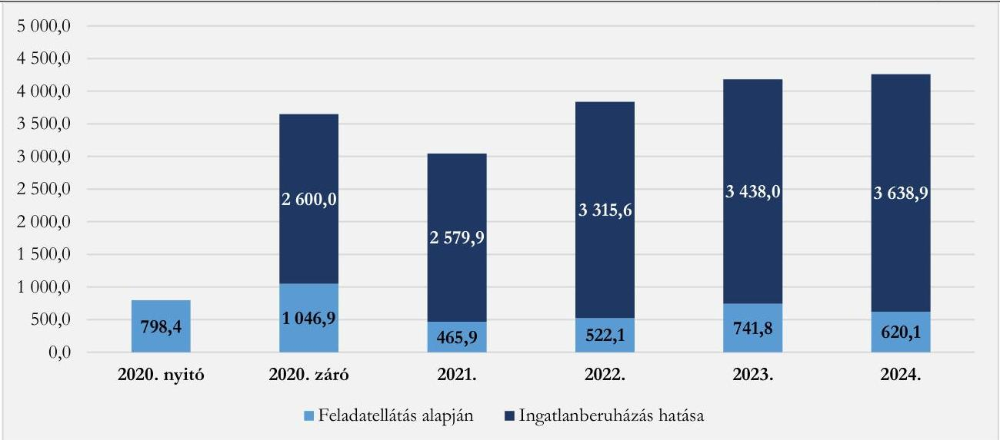
Forrás: Kincstár KGR rendszer és az Önkormányzat konszolidált beszámolói alapján ÁSZ saját szerkesztés

A saját tőke 2021. évi csökkenését az okozta, hogy az Önkormányzat az addig a vagyonkezelésében lévő – Budapest, VI. kerület, Bajza utca 44. szám alatti – 509,0 M Ft könyv szerinti értékű ingatlant átadta a Külgazdasági és Külügyminisztérium részére.

Az Önkormányzat az ellenőrzött időszakban a tulajdonában lévő ingatlanvagyonról vezette a 147/1992. (XI. 6.) Korm. rendelet⁴⁸ 1. § (1)-(2) bekezdéseiben előírt tartalmú ingatlanvagyon katasztert.

Az ingatlanépítési beruházás, a felhalmozási célú támogatások jóváírásai és a szabad pénzeszközökből történő állampapírvásárlások hatására az Önkormányzat eszközei között a 2020-2024. években a befektetett eszközök, illetve az állampapír visszaváltás esetén a pénzeszközök voltak a meghatározóak (9. ábra).

9. ábra
AZ ÖNKORMÁNYZAT ESZKÖZÁLLOMÁNYA A 2020-2024. ÉVEKBEN (M FT)
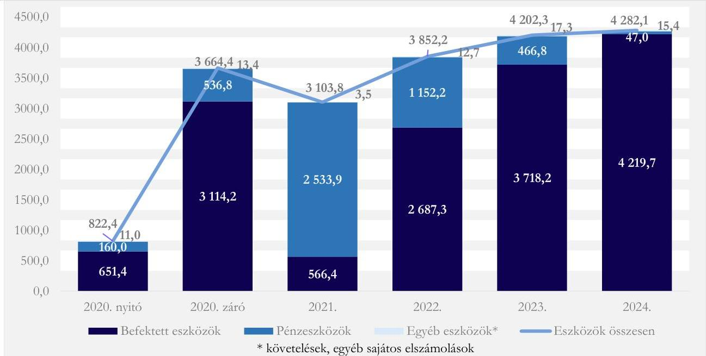
Forrás: Kincstár KGR rendszer, az Önkormányzat konszolidált beszámolói, ÁSZ saját szerkesztés

---

Az ellenőrzés eredményei

A támogatásból felépített ingatlan használatba vételét követően az Önkormányzat tévesen határozta meg a használatba vett BOKK épület besorolását. Az Njtv. 125. § (2) bekezdés a) pontjában előírtak és az 1578/2020. (IX. 10.) Korm. határozat 7. b) pontjában előírtak ellenére az Önkormányzat forgalomképtelen vagyontárgy helyett, törzsvagyonán kívüli vagyontárgyként, forgalomképes vagyonként sorolták be az elkészült BOKK 51,0%-át, továbbá korlátozottan forgalomképes vagyonnak minősítették a BOKK 49,0%-át. Az ingatlan téves besorolása miatt nem álltak fenn az ingatlan elidegenítésére és megterhelésére vonatkozó, Nvtv.-ben rögzített korlátozó feltételek, így az Önkormányzat nem biztosította az Nvtv. 7. § (1)-(2) bekezdésében előírt nemzeti vagyonnal felelős módon való vagyongazdálkodás alapelvének érvényesülését.

Az ingatlan besorolása befolyásolja az ingatlan alaptevékenységén kívüli hasznosíthatóságát, megterhelhetőségét, elidegeníthetőségét, ezért a téves besorolás az Önkormányzat likviditására, vagyonmegőrzési tevékenységére is hatással bírt. A BOKK téves besorolása alapján került sor a vagyonkimutatás elkészítésére is, melynek következtében az Önkormányzat – Áhsz. 30. § (2) bekezdése alapján összeállított – 2024. évi vagyonkimutatása az Áhsz. 45. § (1) bekezdésében előírtakkal szemben nem a valóságnak megfelelően mutatta be az Önkormányzat vagyonának összetételét.

Az Önkormányzat a 2024. évben vagyonhasznosítási bevételhez jutott irodák bérbeadásával. A 2024. évben használatba vett BOKK ingatlanberuházás hatására a 2025. évi költségvetésében „épület termeinek, lakásainak bérbeadásából” bérleti díjként 27,7 M Ft bevételt terveztek, amely időarányosan teljesült. A tervezett bérleti díj az Önkormányzat saját bevételeinek 54,9%-át tette ki, de az Önkormányzat az Njtv. 113. § c) pontjában és a Lakás tv. 36. § (2) bekezdésében rögzítettekkel szemben a Vagyongazdálkodási szabályzatban a tulajdonában lévő helyiség bérbeadásának és a bérbeadó hozzájárulásának feltételeit nem határozta meg.

A Közgyűlés az Njtv. 113. § c) pontjában és a Vagyongazdálkodási szabályzat 25. §-ában előírtak ellenére külön határozatban nem szabályozta az egyes ingatlanok hasznosítására vonatkozó bérleti és használati díjakat, azokat egyedileg az Elnök által aláírt bérleti szerződéseken rögzítették.

Az Önkormányzat a 2020. évi Támogatói okirat 49 3.4. pontjában rögzítettek ellenére a BOKK ingatlan helyiségeinek bérbe adásáról a Támogató 50 előzetes jóváhagyása nélkül döntött.

Az Önkormányzat az SZMSZ₁₋₄ VII. fejezetében előírtak ellenére nem bízott meg könyvvizsgálót gazdálkodása felülvizsgálatára, így nem került sor a gazdálkodási folyamatok, éves számviteli beszámolók független könyvvizsgálatára. Az Önkormányzat által működtetett kontrollok az ÁSZ ellenőrzése során feltárt hiányosságokat nem tárták fel.

A feltárt szabálytalanságok miatt az Önkormányzat vagyongazdálkodása az ellenőrzött időszakban az Njtv. 125. § (4) bekezdésében és az Nvtv. 7. § (1)-(2) bekezdésében foglalt előírások ellenére nem felelt meg a felelős gazdálkodás követelményének.

22

---

Az ellenőrzés eredményei

# 4. A közfeladat céljának elérését, eredményét mérő mutatószámok kialakítása, a mérések végrehajtása és az eredmények hasznosítása

|  Összegző megállapítás | A Hivatalvezető az Áht.-ban, a Bkr.-ben és az Útmutatóban^{51} előírtak ellenére a mérhetőség érdekében az Önkormányzatnál nem alakította ki a feladatellátás és a gazdálkodás teljesítményértékelési rendszerét, nem határozott meg indikátorokat, mérőszámokat, továbbá nem működtetett teljesítménymérési folyamatokat, a gazdálkodásra, feladatellátásra vonatkozó elemzéseket nem végeztek.  |
| --- | --- |
|  4.1. számú megállapítás | A Hivatalvezető az Áht.-ban és a Bkr.-ben előírtakkal szemben a feladatellátás és a gazdálkodás teljesítményértékelési rendszere vonatkozásában az Útmutató ajánlását nem alkalmazta, az Önkormányzat gazdálkodása tekintetében a gazdálkodás és feladatellátás teljesítményértékelési rendszerét nem alakította ki.  |
|  A Hivatalvezető az Áht. 69. § (2) bekezdésében, a Bkr. 5. § (1) bekezdésében előírtak ellenére a feladatellátás és a gazdálkodás teljesítményértékelési rendszere vonatkozásában **nem az Útmutató alkalmazásával alakította ki a belső kontrollrendszert**, és a Bkr. 11. § (1) bekezdése alapján tett Bkr. 1. melléklet szerinti nyilatkozatával ellentétben **teljesítménymérési mutatókat nem határozott meg**.  |   |
|  4.2. számú megállapítás | A Hivatalvezető a Bkr.-ben és az Útmutatóban előírtak ellenére a gazdálkodás és feladatellátás eredményessége, gazdaságossága és hatékonysága, illetve célszerűségének megítélése érdekében nem működtetett olyan folyamatokat, amelyek biztosítják a rendelkezésre álló források gazdaságos, hatékony és eredményes felhasználását.  |
|  A Hivatalvezető a Bkr. 6. § (2) bekezdésében és az Útmutatóban rögzítettek ellenére a mérhetőség érdekében nem működtetett olyan folyamatokat, amelyek biztosítják a rendelkezésre álló források átlátható, gazdaságos, hatékony és eredményes felhasználását.  |   |
|  4.3. számú megállapítás | Az Önkormányzatnál – indikátorok hiányában – teljesítménymérési kontrollfolyamatokat nem működtettek, a gazdálkodásra, feladatellátásra vonatkozó elemzéseket nem végeztek.  |

Az indikátorok, mutatószámok és teljesítménymérési folyamatok kialakításának és működtetésének hiányában a Bkr. 6. § (2) bekezdésében előírtak ellenére a Hivatalvezető nem biztosította az Önkormányzatnál annak értékelését, hogy a kitűzött célokhoz viszonyítottan, hogyan alakult az Önkormányzat gazdálkodásának, feladatellátásának eredményessége. A teljesítménymérési folyamatok eredményeinek értékelése hiányában a teljesítmények nyomon követése sem történt meg.

A Hivatalvezető a Bkr. 8. § (1) bekezdésében és a (2) bekezdés b) pontjában foglaltak ellenére nem épített ki és működtetett olyan kontrollokat, amelyek biztosítják a kockázatok kezelését és

23

---

Az ellenőrzés eredményei

hozzájárulnak az önkormányzati feladatellátás céljainak eléréséhez a döntések célszerűségi, gazdaságossági, hatékonysági és eredményességi szempontú megalapozottsága vonatkozásában.

# 5. A belső ellenőrzés kialakítása és működtetése, a belső és külső ellenőrzések hasznosulása

## Összegző megállapítás

Az ellenőrzött időszakban az Önkormányzatnál a belső ellenőrzést kialakították és működtették, a belső ellenőrzések megállapításai és javaslatai hasznosultak. Az ÁSZ ellenőrzés nem igazolta vissza a belső ellenőr értékelését és a Bkr. 1. melléklete szerinti vezetői nyilatkozat tartalmát.

## 5.1. számú megállapítás

A belső ellenőr a kockázatelemzésen alapuló ellenőrzési terveket végrehajtotta.

A Hivatalvezető a Bkr. előírásainak megfelelően külső szolgáltató⁵² megbízásával gondoskodott a belső ellenőrzés kialakításáról. A belső ellenőr megfelelt az általános és szakmai követelményeknek. A belső ellenőr szervezeti és funkcionális függetlensége biztosított volt az Áht-ben és a Bkr-ben foglalt előírások szerint. A 2024. évi éves ellenőrzési jelentés alapján a beszámolási időszakban az ellenőrzések során összeférhetetlenség nem állt fenn.

A külső szolgáltató a Bkr.-ben foglaltaknak megfelelően kockázatelemzés alapján elkészítette az Önkormányzat és a Hivatal részére a 2024. évi és 2025. évi éves ellenőrzési terveit, melyekben a magas kockázatú tevékenységek ellenőrzései kerültek meghatározásra. Az éves terveket megküldte a Hivatalvezető és az Elnök részére. Az ÁSZ ellenőrzési tapasztalatai visszaigazolták a kiválasztott kockázatos területeket.

A külső szolgáltató a 2024. évben az ellenőrzési tervben foglalt ellenőrzéseket végrehajtotta, a 2025. I. negyedévi ellenőrzést a II. félévre halasztotta. Terven felüli ellenőrzést nem folytatott le. A lefolytatott ellenőrzések a BOKK építési kivitelezéséhez kapcsolódó beruházás megvalósítására, a költségvetési beszámoló szabályszerűségére, a belső kontrollrendszer működtetésére, a béren kívüli juttatások elszámolására, valamint a leltározási tevékenységre terjedtek ki. A belső ellenőrzés az ÁSZ által feltárt hiányosságokat nem tárta fel.

## 5.2. számú megállapítás

A belső ellenőrzések megállapításait, javaslatait hasznosították. Az ellenőrzött időszakban az Önkormányzatnál és a Hivatalnál nem történt külső ellenőrzés. Az ÁSZ ellenőrzés nem igazolta vissza a belső ellenőr értékelését és a vezetői nyilatkozat tartalmát.

A külső szolgáltató a 2024. évről szóló éves ellenőrzési jelentést megküldte a Hivatalvezető és az Elnök részére, melyet a Közgyűlés elfogadott⁷.

⁷ A 19/2025. (II. 05.) számú közgyűlési határozatával.

---

Az ellenőrzés eredményei

A külső szolgáltató javaslataira⁸ az ellenőrzött szervezetek vezetői intézkedési terveket készítettek, azokat a Hivatalvezető jóváhagyta és végrehajtásukhoz Hivatalvezetői Utasítást adott ki. A belső ellenőr az éves belső ellenőrzési jelentésében foglalt értékelése szerint az elvégzett ellenőrzések alátámasztották a kockázatok értékelését. A lefolytatott ellenőrzések alapján készített ellenőrzési jelentésekben jogellenes magatartásra vonatkozó megállapításokat a belső ellenőrzés nem tett. A Hivatalvezető a Bkr. 11. § (1) bekezdése és az 1. melléklet szerinti nyilatkozatában arról nyilatkozott, hogy az általa vezetett költségvetési szerv belső kontrollrendszerét kialakította és gondoskodott a szabályszerű, eredményes működtetéséről. A belső ellenőr értékelése és a Hivatalvezető nyilatkozata helytállóságát a számvevőszéki ellenőrzés, a gazdálkodással összefüggően a jelentés 3., 4. pontjaiban bemutatott szabálytalanságok miatt nem igazolta vissza. Az ÁSZ ellenőrzésének megállapításai és a belső ellenőrzés megállapításai, értékelései, továbbá a Hivatalvezető Bkr. szerinti nyilatkozata közötti ellentmondások miatt a számvevőszéki ellenőrzés véleménye szerint a belső ellenőrzés nem járult hozzá az Önkormányzat és a Hivatal szabályszerű feladatellátásához.

⁸ A javaslatok a Cafétéria szabályzat módosítására, a gazdálkodási jogkör gyakorlási feladatok ellátására, a leltározás dokumentálására vonatkoztak.

25

---

JAVASLATOK

Az ÁSZ tv. 33. § (1) bekezdésében foglaltak értelmében az ellenőrzött szervezet vezetője köteles a jelentésben foglalt megállapításokhoz kapcsolódó intézkedési tervet összeállítani és azt a jelentés kézhezvételétől számított 30 napon belül az ÁSZ részére megküldeni. Az ÁSZ a jelentésben foglalt megállapításokhoz kapcsolódóan az alábbi javaslatok tekintetében várja el az intézkedési terv elkészítését.

## A KÖZGYŰLÉS RÉSZÉRE

1. Határozza meg az Njtv. 117. § (1) bekezdés d) pontja szerint, a rendelkezésére álló közszolgálati rádió és televízió műsoridő felhasználásának elveit.
2. Határozza meg az Njtv. 113. § c) pontjában és a Vagyongazdálkodási szabályzat 25. §-ában előírtaknak megfelelően az egyes ingatlanok hasznosítására vonatkozó bérleti és használati díjakat.

## AZ ELNÖK RÉSZÉRE

1. Intézkedjen a nyilvános jelentés kézhezvételét követő 30 napon belül az Állami Számvevőszék jelentésének a Közgyűlés elé terjesztéséről.
2. Kezdeményezze az Önkormányzat által használatba adott vagyonra vonatkozó megállapodások megkötését az Njtv. 113. § d) pontjában rögzítetteknek megfelelően.
3. Építsen ki olyan kontrollokat, amelyek biztosítják az Njtv. 153. § (1) bekezdésében és az Mótv. 107. §-ában előírtak alapján a Közgyűlést megillető tulajdonosi jogok érvényesülését.
4. Építsen ki olyan kontrollokat, amelyek biztosítják az Önkormányzat számára a jogszabályi előírások által biztosított véleményezési, illetve egyetértési jogának az Njtv. 119. § (1) bekezdésében rögzítetteknek megfelelő gyakorlását.
5. Kezdeményezze, hogy az Önkormányzat határozza meg a „Március 3.” díj odaítélésének feltételeit és szabályait az Njtv. 116. § (1) bekezdés b) pontjában foglaltak szerint.

26

---

Javaslatok

6. Építsen ki olyan kontrollokat, amelyek biztosítják az állampapírvásárlás során, hogy a Vagyongazdálkodási szabályzat 35. §-ában foglaltakra figyelemmel érvényesüljenek az éves költségvetési határozatban előírtak.

7. Intézkedjen a vagyongazdálkodási szabályzat módosításáról és Közgyűlés elé terjesztéséről annak érdekében, hogy a Közgyűlés az Önkormányzat törzsvagyona körébe tartozó valamennyi vagyonelemet az Njtv. 125. § (1)-(2) bekezdéseiben előírtaknak megfelelően minősítse.

8. Kezdeményezze, hogy a Közgyűlés határozza meg az Njtv. 113. § c) pontjában és a Lakás tv. 36. § (2) bekezdésében foglaltaknak megfelelően az Önkormányzat tulajdonában lévő helyiség bérbeadásának és a bérbeadó hozzájárulásának feltételeit.

9. Intézkedjen az egyes ingatlanok hasznosítására vonatkozó bérleti és használati díjak szabályozásáról és döntés céljából a Közgyűlés elé terjesztéséről a Vagyongazdálkodási szabályzat 25. §-ában előírtakkal összhangban.

10. Biztosítsa, hogy az Önkormányzat könyvvizsgálattal kapcsolatos gyakorlata összhangban legyen az SZMSZ önkormányzati gazdálkodás felülvizsgálatára vonatkozó előírásaival.

11. Tegyen intézkedéseket a kiépített kontrolltevékenységek működtetésére, annak érdekében, hogy az Önkormányzat költségvetési és zárszámadási határozatainak Közgyűlés elé terjesztése során az Áht. 24. § (4) bekezdés b) pontjában és a 91. § (2) bekezdésében foglalt előírásoknak megfelelően bemutassák a többéves kihatással járó döntéseket.

# A HIVATALVEZETŐ RÉSZÉRE

1. Biztosítsa az Info tv. 37. § (1) bekezdés, 37/C. § (2) bekezdésében, az 1. melléklet II.1. pontjában, az 1. melléklet III.3.-III. 4. pontjaiban, a 18/2005. (XII. 27.) IHM rendelet 2. § (1) bekezdésében, a 305/2005. Korm.rendelet 5. § (3) bekezdésében és a 499/2022. (XII. 8.) Korm. rendelet 5. § (2) bekezdésében előírt adatszolgáltatási kötelezettség maradéktalan teljesítését.

2. Gondoskodjon arról, hogy az Önkormányzat az Áht. 29/A. §-ában foglaltakkal összhangban legkésőbb a költségvetési határozat elfogadásáig határozatban állapítsa meg saját bevételeinek és az adósságot keletkeztető ügyleteiből eredő fizetési kötelezettségeinek a költségvetési évet követő három évre várható összegét.

---

Javaslatok

3. Építsen ki olyan kontrollokat, amelyek biztosítják, hogy az Önkormányzat költségvetési és zárszámadási határozatai és előterjesztései feleljenek meg az Áht. 4. § (2) bekezdésében, a 23. § (2) bekezdés ab) és bb) pontjaiban, a 24. § (4) bekezdés b) pontjában, a 26. § (1) bekezdésébe, és a 91. § (2) bekezdésében foglalt előírásoknak.

4. Tegyen intézkedéseket a kiépített kontrolltevékenységek működtetésére, annak érdekében, hogy
- a kiadások teljesítéséhez az Áht. 38. § (1) bekezdésében és az Ávr. 59. § (2) bekezdésének megfelelően utalványozott dokumentum rendelkezésre álljon,
- a bevételek beszedése esetében érvényesüljenek az Mótv. 107. §-ában, az Njtv. 119. § (1) bekezdésében és a 125. § (4) bekezdésében, illetve az Nvtv. 7. § (2) bekezdésében előírtak, valamint
- a gazdálkodási jogkörök gyakorlása az Ávr. 57. § (1)-(4) bekezdéseiben és az 58. § (1)-(3), (6) bekezdéseiben foglaltak szerint történjen.

5. Építsen ki olyan kontrollokat, amelyek biztosítják a leltározás során a különbözetek Áhsz. 53. § (8) bekezdés b) pontjában előírtak szerinti elszámolását annak érdekében, hogy a leltár alátámassza az Önkormányzat mérlegtételeit.

6. Tegyen intézkedéseket a kiépített kontrolltevékenységek működtetésére, annak érdekében, hogy az Önkormányzat pénzügyi számvitel alapján összeállított vagyonkimutatása a javasolt jogszabályi előírásnak megfelelő besorolást követően az Áhsz. 45. § (1) bekezdésében előírtak szerint a valóságnak megfelelően mutassa be az Önkormányzat vagyonát és annak összetételét.

7. Építsen ki olyan kontrollokat, amelyek biztosítják, hogy a jövőben a BOKK ingatlan helyiségeinek bérbe adásáról a 2020. évi Támogatói okirat 3.4. pontjában rögzítetteknek megfelelően a Támogató előzetes jóváhagyását követően döntsön, a jelenlegi bérleti szerződésekről pedig tájékoztassák a Támogatót.

8. Tegyen intézkedéseket olyan kontrollrendszer kiépítésére és működtetésére, melynek keretében
- az Áht. 69. § (2) bekezdésében, a Bkr. 5. § (1) és a 6. § (2) bekezdéseiben előírtak szerint az Útmutató alkalmazásával olyan mérhető teljesítménymérési mutatókat határoz meg, amelyek biztosítják a rendelkezésre álló források gazdaságos, hatékony és eredményes felhasználását,
- a Bkr. 8. § (1) bekezdésében és a (2) bekezdés b) pontjában foglaltak szerint a kontrollok biztosítják a kockázatok kezelését és hozzájárulnak az Önkormányzat céljainak eléréséhez a döntések célszerűségi, gazdaságossági, hatékonysági és eredményességi szempontú megalapozottsága vonatkozásában.

9. Gondoskodjon arról, hogy a Bkr. 11. § (1) bekezdése szerinti nyilatkozatában, a költségvetési szerv belső kontrollrendszerének minőségét a valóságnak megfelelően értékelje.

---

29

# I. FÜGGELÉK: ÉSZREVÉTELEK

A jelentéstervezetet az ÁSZ 15 napos észrevételezésre megküldte az ellenőrzött szervezet vezetőjének az ÁSZ tv. 29. §* (1) bekezdése előírásának megfelelően.

A Függelék tartalmazza az elnök mint az ellenőrzött szervezet vezetője által megtett és az ÁSZ által figyelembe nem vett észrevételeket, valamint azok el nem fogadásának indoklását.

1. A 2.1. számú megállapítás és a jelentés 13. oldalán szerepeltetett, a véleményezési, egyetértési és tulajdonosi jogok hatáskör hiányában történt gyakorlásával kapcsolatos megállapításra tett észrevétel:

„Ez az ellenőrzési időszakban nem általánosan, hanem csak két esetben fordult elő, hogy az Elnök hatáskör hiányában gyakorolta az Önkormányzat véleményezési, egyetértési és tulajdonosi jogait.

Kérem a megállapítás módosítását: „Az Elnök az ellenőrzött időszakban Njtv.-ben foglaltak ellenére 2 esetben hatáskör hiányában gyakorolta az Önkormányzat véleményezési, egyetértési és tulajdonosi jogait.” szövegre.”

El nem fogadás indoka: A megállapítást fenntartjuk. Az ellenőrzött időszakban a Közgyűlést megillető tulajdonosi jogokat és az Önkormányzat véleményezési, illetve egyetértési jogait valamennyi esetben (összesen 3 alkalommal) az ellenőrzött által szolgáltatott dokumentumok alapján az Elnök hatáskör hiányában gyakorolta, az Önkormányzatnál ez volt az általános gyakorlat.

Az Önkormányzat az ellenőrzött időszakban az Njtv. módosítása, valamint az anyakönyvi eljárásról szóló 2010. évi I. törvény módosítása kapcsán élt az Njtv. 118. § (1) bekezdésének a) pontjában biztosított véleményezési jogával.

A Helyszíni ellenőrzési jegyzőkönyvben rögzítettek szerint a jogszabálytervezetek véleményezésével kapcsolatos feladatokat az Elnök látta el, a jogszabálytervezetek véleményezését a Közgyűlés nem tárgyalta.

2. A 3.3. számú megállapítás és a jelentés 20. oldalán szerepeltetett, a 2024. évi leltáreltérésekkel kapcsolatos megállapításra tett észrevétel:

„Az ingatlanok és az adott előlegek főkönyvi könyvelése, illetve az analitikus nyilvántartás szerinti összegei megegyeztek. A leltározásról készült jegyzőkönyv készítése során adminisztrációs hiba történt melyet jeleztünk az ellenőrzés részére.

Kérem a megállapítás módosítását: a főkönyvi könyvelés és az analitikus nyilvántartások egyeztetése során fokozott figyelemmel járjanak el.”

* 29. § (1) Az Állami Számvevőszék az ellenőrzési megállapításait megküldi az ellenőrzött szervezet vezetőjének vagy az általa megbízott személynek, és annak, akinek személyes felelősségét állapította meg.
(2) Az ellenőrzött szervezet vezetője és a felelősként megjelölt személy az ellenőrzés megállapításaira tizenöt napon belül írásban észrevételt tehet.
(3) Az Állami Számvevőszék az észrevételre a beérkezésétől számított harminc napon belül írásban válaszol. A figyelembe nem vett észrevételeket köteles a jelentésben feltüntetni, és megindokolni, hogy azokat miért nem fogadta el.

---

El nem fogadás indoka: A megállapítást fenntartjuk. Az ellenőrzés során történt adatszolgáltatás alapján az Önkormányzat eltérést mutatott ki a leltározás során a főkönyvi könyvelés, illetve az analitikus nyilvántartás értékei között, melyet az Áhsz. 53. § (8) bekezdés b) pontjában előírtak ellenére nem rendeztek. Az észrevételezés során további dokumentumot nem bocsátottak az ellenőrzés rendelkezésére.

3. A jelentéstervezet 22. oldalán szerepeltetett, a 2024. évi valóságnak megfelelő vagyonkimutatással kapcsolatos megállapításra tett észrevétel:

„Az Önkormányzat 2024. évi vagyonkimutatása a vagyon értékét helyesen, a valóságnak megfelelően mutatta be. A hibát az ingatlan nem megfelelő besorolása eredményezte.

Kérem a megállapítás módosítását: Az Önkormányzat 2024. évi vagyonkimutatása a vagyon besorolását nem megfelelően mutatta be.”

Az észrevételt az ÁSZ részben elfogadta, az észrevétel alapján a jelentéstervezet módosult: Az ÁSZ a szabályszerűségi negatív megállapításokat a releváns jogszabályi kritériumok megjelölésével együtt fogalmazza meg. Az ingatlanvagyon téves besorolása és annak megfelelő kimutatása a vagyon összetételére volt hatással. A megállapítást az egyértelműség érdekében pontosítottuk.

30

---

31

# II. FÜGGELÉK: ELLENŐRZÉSI MEGKÖZELÍTÉS

## AZ ELLENŐRZÉS JOGALAPJA

Az ellenőrzés jogszabályi alapját az ÁSZ tv.⁵³ 1. § (3) bekezdésének, az 5. § (2)-(3) és (6) bekezdéseinek előírásai képezték.

## AZ ELLENŐRZÉS CÉLJA

Ellenőrzés célja annak értékelése volt, hogy az országos nemzetiségi önkormányzat közgyűlése által kialakított törvényes működési keretek és szervezeti felépítés a nemzetiségi közügyek, közfeladatok ellátását szolgálta-e, valamint biztosította-e az integritást sértő események kockázatának kezelését.

Az ellenőrzés értékelte az országos nemzetiségi önkormányzat által ellátott nemzetiségi közügyekhez, közfeladatokhoz biztosított központi költségvetési-, illetve egyéb (EU, hazai) támogatások felhasználásának, kezelésének, elszámolásának megfelelőségét, célszerűségét, ezáltal az önkormányzati gazdálkodás szabályszerűségét, továbbá a belső ellenőrzés kialakítását és működtetését. Az ellenőrzés értékelte, hogy az országos nemzetiségi önkormányzat kiadásai a közfeladatellátáshoz kapcsolódtak-e, a vagyona felhasználása, kezelése a felelős gazdálkodás előírásainak megfelelően történt-e.

Az ellenőrzés célja volt továbbá annak értékelése, hogy az országos nemzetiségi önkormányzat meghatározta-e a szervezet céljait, kialakította-e feladatellátása és gazdálkodása céljának elérését és annak eredményét mérő mutatószámokat, végzett-e ezek alapján eredményességi, célszerűségi méréseket, készített-e értékelést, valamint a teljesítményértékelést hasznosította-e.

## AZ ELLENŐRZÉS TÍPUSA

Kombinált ellenőrzés

## AZ ELLENŐRZÉS TÁRGYA

Az országos nemzetiségi önkormányzat törvényes működési feltételei kialakítása, közfeladat ellátása, pénzügyi és vagyongazdálkodása és vagyoni helyzete, a belső ellenőrzés kialakítása és működtetése volt. A gazdálkodásra és feladatellátásra vonatkozó teljesítmény-indikátorok, teljesítménymérési folyamatok, valamint azok kiértékelési folyamata szabályzatban történő rögzítésének, a gazdálkodás és feladatellátás területén a célok elérését és annak eredményét jelző indikátorok, mérőszámok meghatározásának, a teljesítménymérési folyamatok végrehajtásának, valamint az indikátorok értékeinek, a teljesítménymérési folyamatok eredményeinek értékelése volt. Az ellenőrzés kiterjedt minden olyan körülményre és adatra, amely az ÁSZ jogszabályban meghatározott feladatainak teljesítéséhez, valamint a program végrehajtása folyamán felmerült újabb összefüggések feltárásához szükséges.

---

32

# AZ ELLENŐRZÉS HATÓKÖRE ÉS TERÜLETE

Az ÁSZ ellenőrzése az országos nemzetiségi önkormányzatra és hivatalára terjedt ki.

A törvényes működési feltételek kialakításának értékelése során az ÁSZ ellenőrizte az országos nemzetiségi önkormányzat szervezeti és működési szabályait, a közfeladatai meghatározását, törzsvagyona körének besorolását, vagyona használatára, kezelésére, működtetésére vonatkozó szabályozását, valamint vagyonát érintő megállapodások és az átláthatósági nyilatkozatok meglétét.

Az integritás kockázatok kezelése ellenőrzésének keretén belül – az országos nemzetiségi önkormányzatra és szerveire vonatkozóan – az ÁSZ ellenőrizte, hogy valamennyi vagyonnyilatkozattételre kötelezett személy eleget tett-e kötelezettségének, biztosított volt-e a képviselői vagyonnyilatkozatok nyilvánossága, betartották-e az összeférhetetlenségre, képesítési követelményekre, valamint az elektronikus közzétételi kötelezettségre vonatkozó jogszabályi előírásokat.

Az ÁSZ ellenőrizte az országos nemzetiségi önkormányzat által ellátott kötelező és önként vállalt közfeladatellátás szabályszerűségét, célszerűségét, e feladatok ellátásához rendelkezésre bocsátott költségvetési támogatások, és a pályázati források felhasználását, azok közfeladatellátással való összhangját és a támogatók felé történő elszámolását.

Az ellenőrzés kiterjedt az országos nemzetiségi önkormányzat és szervei gazdálkodására vonatkozó belső kontrollkörnyezet kialakítására, a költségvetése tervezésének, végrehajtásának szabályszerűségére és az éves beszámolási kötelezettség teljesítésére. Az ÁSZ értékelte a pénzügyi gazdálkodás szabályszerűségét, a kiadások közfeladatellátáshoz való kapcsolódását, továbbá a kifizetések szabályszerű teljesítéséhez előírt kontrolltevékenységek működését. Az ÁSZ ellenőrizte az országos nemzetiségi önkormányzat vagyongazdálkodásának megfelelőségét, a vagyonhasznosításból származó bevételek teljesülését, valamint a két általános önkormányzati választás közötti időszak tekintetében az országos nemzetiségi önkormányzat vagyonának alakulását.

Az ellenőrzés kiterjedt továbbá a gazdálkodás és feladatellátás eredményessége értékelése és nyomon követése céljából kialakított teljesítménymutatókra, mérőszámokra és teljesítmény mérési folyamatokra, valamint a kapcsolódó elemzésekre, a teljesítmény értékelés hasznosulására.

Az ÁSZ a 2024. és 2025. évekre vonatkozó belső ellenőrzés kialakításának és működtetésének megfelelőségét, továbbá belső és külső ellenőrzési megállapítások hasznosulását a stratégiai és ellenőrzési tervek, az ellenőrzési jelentések, nyilvántartások alapján ellenőrizte.

# AZ ELLENŐRZŐTT IDŐSZAK

A 2024. év és a 2025. év I. negyedév végéig tartó időszak, a mennyiségi leltárfelvétel tekintetében a 2022-2024. évek, a teljesítménymérés vonatkozásában a 2024. év és a 2025. év I. negyedév végéig tartó időszak, valamint a vagyon értékelések alapja a 2020. január 01-jei mérlegadat, illetve a közzétételi kötelezettség teljesítése a 2024-2025. évekre vonatkozóan.

---

II. Függelék: Ellenőrzési megközelítés

# AZ ELLENŐRZÉSI KRITÉRIUMOK

|  FÓKUSZTERÜLET/FÓKUSZKÉRDÉS | ELLENŐRZÉSI KRITÉRIUMOK  |
| --- | --- |
|  1. Az országos nemzetiségi önkormányzat törvényes működési feltételeinek kialakítása, az integritás kockázatok kezelése. | Áht. 23. § (2) bek. ab) és bb) pont, 26. § (1) bek., 38. § (2) bek.,
Info tv. 5. § (6) bek., 7. § (1) bek., 25/A. §, 30. §, 32. §, 33. § (3) bek., 35. § (3) bek., 37. § (1) bek., 37/C. § (1)-(3) bek., 75/D. §, 1. sz. mell.,
Njtv. 77. § (3) bek., 88. § (1) bek., 88/A. §, 91. § (3) bek., 92. § (1), (3)-(4) bek. c)–f) pontok, 95. § (1)-(4) bek., 103. § (1)-(3) bek., 104. §, 106. §, 107. § (1)-(4) bek., 113. § c)-e) pontok, 116-117. §-ok, 123. § (1) bek.,
Ptk. 3:5. § a)-f) pontok, 6:63. §,
Számv. tv. 150. § (1)-(2) bek.,
Vnytv. 3. § (1) bek., (2) bek. d) pont, (3) bek e) pont, 4. §, 9. § (1) bek., 10. § (1)-(3) bek., 11. § (4), (6) bek.,
Ávr. 9. §, 12. § (1) bek., 13. § (2) bek. h) pont,
55. § (2)-(3) bek., 58. §(4)-(5) bek., 60. § (1)-(2) bek.,
305/2005. (XII. 25.) Korm. rendelet 3. §, 5. §,
499/2022. (XII. 8.) Korm. rendelet 5. § (2) bek.,
Bkr. 2. §, 6-7. §-ok,
18/2005 IHM rendelet 2-3. §-ok,
5/2024. (V. 30.) KTM rendelet 2.-3. §-ok,
Belső szabályzatok  |
|  2. Az országos nemzetiségi önkormányzat által ellátott nemzetiségi közügyek, közfeladatok és az ezekhez biztosított központi költségvetési, illetve egyéb (EU, hazai) támogatások felhasználása. | 2010. évi CLXXXV. tv. 97. § (2)-(3) bek., 1. sz. melléklet 1. j) és a 3-4. pontok,
2024. évi Kvtv. 45. §, 9. melléklet,
2025. évi Kvtv. 47. §, 9. melléklet,
Áht. 3/A. §, 6/C. §, 9. §, 11. §, 26. § (1) bek., 48. § (1) bek. b) pont, 51. §, 52. §, 53. §, 53/A. §, 54. §, 57. §, 83. §, 87. § (b) pont, 91. § (1)-(3) bek., 107. § (1) bek., 108. § (2) bek.
Mötv. 107. §,
Njtv. 2. § 3. pont, 10. § (1)-(3), (8) bek., 44. § (1) bek., 47. §, 78. §, 79. § (1) bek., 92. § (4) bek. d) pont, 105. § (3) bek., 113.–114. §-ok, 116. § (1), (3)-(4) bek., 117. §, 117/A. § (1) bek., 118. §, 119. § (1) bek., 126. § (1)-(3) bek., 127. §, 128. § (1)-(2) bek., 129. §, 132. § (1)-(2) bek., 134-135. §-ok, 153. § (1) bek.
Nktv. 5. § (9) bek., 50. § (10) bek., 84. § (9) bek. a-c) pontok,
Ptk. 3:4. § (1) bek., 3:21. § (3) bek., 3:26. §, 3:102. §, 3:109. § (2) bek., 3:120. § (2) bek.,
Számv. tv. 165. § (1)-(2) bek.,
Áhsz. 6. § (1) bek. f) pont, 6. § (2) bek., 7-8. §-ok, 31. §, 26. §, 43. § (6)-(12) bek.,
Ávr. 52-53. §-ok, 55. §, 57. §, 60. §, 83. §, 91/A. §, 93. §,
Belső szabályzatok,
2020. évi Támogatói okirat előírásai  |

33

---

34

|  3. Az országos nemzetiségi önkormányzat gazdálkodása. | 2024. évi Kvtv. 45. §, 9. melléklet;
2025. évi Kvtv. 47. §, 9. melléklet;
Áht. 1. § 15. pont, 4-6. §-ok, 23-25. §-ok, 26. § (1) bek., 28/A. § (2) bek., 29/A. §, 30. § (1)-(3) bek., 34. § (1)-(5) bek., 36. §, 37. § (1) bek., 38. § (1)-(2) bek., 45. §, 48. § (1) bek., 53. §, 61. § (1) bek., 69. § (1)-(2) bek., 86. § (5) bek., 87. §, 91. § (2) bek., (3) bek.,
Gst. 8. §, 45. §,
Kbt. 4. § (1) bek., 15. §, 131. §,
Lakás tv. 36. § (2) bek.,
Mötv. 107. §, 110. §,
Njtv. 103. § (3) bek., 113-117. §-ok, 119. § (1) bek., 123. § (5) bek., 124. §, 125. §, 126. § (1)-(3) bek., 128. § (1)-(2) bek., 131. §, 132. § (1)-(2) bek., 134. §, 135. §,
Nvtv. 3. § (1) bek. 3. és 6. pont, 5. § (7) bek., 7. § (1)-(2) bek., 9. § (1) bek., 11. §, 13. § (1)-(2) bek.,
Ptk. 3:133. § (2) bek, 3:189. § (1) bek. a)-b) pontok, 3:270. § (1) bek. a)-b) pontok,
Számv. tv. 26. § (1) bek., 52. § (2) bek., 69. § (1)-(3), (5)-(6) bek., 165. § (1)-(2) bek., 166. § (1) bek., 167. § (1) bek.,
Áhsz. 3. § (3) bek., 6. § (2) bek., 8-14. §-ok, 22. §, 26. §, 29-30. §-ok, 30/A. §, 31. § (1), (4) bek., 32. § (1), (4) bek., 37-38. §-ok, 39. § (3) bek., 40. § (1) bek., 41. § (2)-(3) bek., 43. § (6)-(12) bek., 45. § (1), (3) bek., 52. §, 53. § (8) bek. b) pont, 3. sz. melléklet, 8. sz. melléklet, 14. sz. melléklet I. 2. pont, II. pont, VII., IX. pont, 15. sz. melléklet,
Ávr. 13. § (1)-(2) bek., 24. §, 27. § (2) bek., 28. §, 29. § (1) bek., 33. § (2) bek., 42. §, 43/A. § (1)-(3) bek., 50. §, 51. § (2) bek., 52. §, 53. § (1)-(2) bek., 53/A § (1) bek., 55. § (1)-(2), (4) bek. 56. § (1) bek., 57. § (1)-(4) bek, 58. § (1)-(4), (6) bek., 59. § (1)-(4) bek., 60. § (1)-(3) bek., 149. § (1) bek., 155. § (2) bek, 157. § b) pont, 160. §, 161. § (1)-(2) bek., 162. §,
Bkr. 6. § (2) bek., 8. § (1)-(4) bek.,
1578/2020. (IX. 10.) Korm. határozat 7. b) pont,
1149/2022. (III. 21.) Korm. határozat,
2020. évi Támogatói okirat 3.4. pont,
147/1992. (XI. 6.) Korm. rendelet,
Belső szabályzatok,
Költségvetési határozatok,
SZMSZ  |
| --- | --- |
|  4. A közfeladat céljának elérését, eredményét mérő mutatószámok kialakítása, a mérések végrehajtása és az eredmények hasznosítása. | Áht. 69. § (1)-(2) bek.,
Bkr. 3. §, 5. § (1) bek., 6. § (2) bek., 8. § (2) bek. b) pontja, 10. §, 11. § (1) bek., a Bkr. 1. melléklete,
Útmutató  |
|  5. A belső ellenőrzés kialakítása és működtetése, a belső és külső ellenőrzések hasznosulása. | Áht. 70. § (1), (4) bek.,
Bkr. 13. § (1)-(2) bek., 14. § (1) bek., 15. § (1)-(3), (9)-(12) bek., 16. § (1) bek., 18. §, 19. § (1) bek. e) pont, (4) bek., 20. § (1), (3) bek., 21. § (1)-(2) bek., 22. § (1) bek. b) pont, 28. § c) pont, 29. § (1) bek., 31. §, 39. §, 45. § (1)-(4) bek., 46. §, 47. §, 48-49. §, 50. §, 55. §. (2)-(6) bek.
22/2019. (XII. 23.) PM rend. 2. §  |

---

II. Függelék: Ellenőrzési megközelítés

# AZ ELLENŐRZÉS MÓDSZERE ÉS AZ ELLENŐRZÉSI BIZONYÍTÉKOK KÖRE

Az ÁSZ az ellenőrzést az Alaptörvény 43. cikk (1) bekezdésében meghatározott törvényességi, célszerűségi, eredményességi szempontokat, valamint a nemzetközi standardokat irányadónak tekintve az ellenőrzési program szempontjai, az ellenőrzött időszakban hatályos jogszabályok, az ellenőrzés szakmai szabályok és módszertanok és az ellenőrzési program szempontjai figyelembevételével végezte.

Az ellenőrzési fókuszterületek megválaszolásához szükséges bizonyítékok megszerzése az ellenőrzött által rendelkezésre bocsátott dokumentumokra, adatokra alapozva megfigyelés, helyszíni szemle, jegyzőkönyvkezés, mintavételzés útján, valamint elemző eljárással történt.

Az ellenőrzési bizonyítékként felhasználható adatforrások közé tartoztak az ellenőrzöttek által közzétett dokumentumok, a helyszíni ellenőrzés során kért, megtekintett dokumentumok, valamint minden – az ellenőrzés folyamán feltárt, az ellenőrzés szempontjából releváns információt tartalmazó – dokumentum. Az ellenőrzés lefolytatásához az Önkormányzat a tanúsítványok kitöltésével, az ÁSZ által kért dokumentumok megküldésével, valamint a helyszíni szemle során a feltett kérdésre adott válaszokkal szolgáltatott adatokat. Az ÁSZ adat alapú ellenőrzést folytatott le, felhasználva az Önkormányzat gazdálkodásának ellenőrzéséhez a Kincstár adatbázisában rendelkezésre álló adatokat. A vagyonhasznosításból (bérbeadás) származó bevételei és a kiadások teljesítésének megfelelőségét az Önkormányzat könyvelési adatbázisából, kockázati szempontok szerinti mintavételi eljárással kiválasztott tételek alapján ellenőrizte. Az Önkormányzat 2024-2025. években teljesített kifizetései közül 1316,9 M Ft összegben 20 gazdasági esemény értékelésére került sor, amely mintatételek közül 10 mintatétel – 793,8 M Ft összegben – beruházáshoz, 10 mintatétel – 523,1 M Ft összegben – pénzeszköz átadáshoz kapcsolódott. Továbbá az ÁSZ ellenőrizte az Önkormányzat 10 vagyonhasznosításból – 7,9 M Ft összegben – származó bevételeit. A tanúsítványi adatszolgáltatásból és a főkönyvi adatbázisokból kiválasztott mintatételek értékelése egyedileg, a mintatételekre vonatkoznak, az eredmények nem kerültek kivetítésre a teljes sokaságra.

Az ÁSZ a szabályozottságot a Közgyűlés határozatai, illetve az Önkormányzat és Hivatala belső szabályozásai alapján értékelte. Az Önkormányzat vagyona alakulásának értékelése a 2020. január 1-jei bázisadatokkal való összevetésen alapult.

Az Önkormányzat közzétételi kötelezettségének teljesítése az ellenőrzés indításakor (2025. június 12.) a közzétételre szolgáló honlapról készített képernyőfotók alapján történt.

A gazdálkodás és a feladatellátás eredményességének értékelése során az ÁSZ az Önkormányzat által meghatározott indikátorokat, mérőszámokat, mutatószámokat vette alapul.

A belső ellenőrzés kialakításának és működtetésének megfelelőségét a stratégiai és ellenőrzési tervek, ellenőrzési jelentések és nyilvántartások alapján értékelte az ÁSZ.

35

---

MELLÉKLETEK

## I. SZ. MELLÉKLET: ÉRTELMEZŐ SZÓTÁR

belső ellenőrzés
Független, tárgyilagos bizonyosságot adó és tanácsadó tevékenység, amelynek célja, hogy az ellenőrzött szervezet működését fejlessze és eredményességét növelje, az ellenőrzött szervezet céljai elérése érdekében rendszerszemléletű megközelítéssel és módszeresen értékeli, illetve fejleszti az ellenőrzött szervezet irányítási és belső kontrollrendszerének hatékonyságát. (Forrás: Bkr. 2. § 3. pont)

beruházás
A tárgyi eszköz beszerzése, létesítése, saját vállalkozásban történő előállítása, a beszerzett tárgyi eszköz üzembe helyezése, rendeltetésszerű használatbavétele érdekében az üzembe helyezésig, a rendeltetésszerű használatbavételig végzett tevékenység (szállítás, vámkezelés, közvetítés, alapozás, üzembe helyezés, továbbá mindaz a tevékenység, amely a tárgyi eszköz beszerzéséhez hozzákapcsolható, ideértve a tervezést, az előkészítést, a lebonyolítást, a hiteligénybevételt, a biztosítást is); beruházás a meglévő tárgyi eszköz bővítését, rendeltetésének megváltoztatását, átalakítását, élettartamának, teljesítőképességének közvetlen növelését eredményező tevékenység is, az előbbiekben felsorolt, e tevékenységhez hozzákapcsolható egyéb tevékenységekkel együtt. (Forrás: Számv. tv. 3. § (4) bek. 7. pontja)

elektronikus közzététel
A kötelezően közzéteendő közérdekű adatokat internetes honlapon, digitális formában, bárki számára, személyazonosítás nélkül, korlátozástól mentesen, kinyomtatható és részleteiben is adatvesztés és -torzulás nélkül kimásolható módon, a betekintés, a letöltés, a nyomtatás, a kimásolás és a hálózati adatátvitel szempontjából is díjmentesen kell hozzáférhetővé tenni. A közzétett adatok megismerése személyes adatok közléséhez nem köthető. (Forrás: Info tv. 33. § (1) bekezdés)

gazdasági társaság
A gazdasági társaságok üzletszerű közös gazdasági tevékenység folytatására, a tagok vagyoni hozzájárulásával létrehozott, jogi személyiséggel rendelkező vállalkozások, amelyekben a tagok a nyereségből közösen részesednek, és a veszteséget közösen viselik. (Forrás: Ptk. 3:88. § (1) bekezdése)

irányító szerv
A költségvetési szerv tekintetében az Áht.-ban meghatározott irányítási hatáskört gyakorló szerv. (Forrás: Áht. 1. § 9. pontja alapján)

kockázat
A kockázat annak a valószínűségét jelenti, hogy egy vagy több esemény, vagy intézkedés nem kívánt módon befolyásolja a rendszer működését, céljainak megvalósulását. (Forrás: Javaslatok a korrupciós kockázatok kezelésére – Kockázatkezelési és ellenőrzési módszertan 35. oldal, ÁSZ)

költségvetési támogatás
A társadalombiztosítás pénzügyi alapjai kivételével az államháztartás központi alrendszeréből ellenérték nélkül, pénzben nyújtott támogatások, ide nem értve az Áht. 1. § 14. a)-o) alpontjaiba sorolt kivételeket. (Forrás: Áht. 1. § 14. pontja)

kötelező közfeladat
Az országos nemzetiségi önkormányzat kötelező közfeladata:
a) amennyiben a településen nemzetiségi önkormányzat nem működik, ellátja az adott nemzetiségi közösséggel kapcsolatosan a településen jelentkező érdekképviseleti, érdekvédelmi feladatokat,
b) a vármegyei önkormányzat által ellátott önkormányzati feladatok kapcsán – törvényben meghatározott – érdekképviseleti, érdekvédelmi tevékenységet fejt ki,
c) ellátja az általa képviselt nemzetiség érdekeinek országos szintű képviseletét és védelmét,
d) a nemzetiségi kulturális autonómia fejlesztése érdekében országos szintű nemzetiségi intézményhálózatot tart fenn. (Forrás: Njtv. 117. § (2) bekezdése)

36

---

Mellékletek

nemzetiség
Nemzetiség minden olyan – Magyarország területén legalább egy évszázada honos – népcsoport, amely az állam lakossága körében számszerű kisebbségben van, a lakosság többi részétől saját nyelve, kultúrája és hagyományai különböztetik meg, egyben olyan összetartozás-tudatról tesz bizonyágot, amely mindezek megőrzésére, történelmileg kialakult közösségeik érdekeinek kifejezésére és védelmére irányul. (Forrás: Njtv. 1. § (1) bekezdése)

nemzetiségi önkormányzat
A nemzetiségi önkormányzat a törvényben meghatározott nemzetiségi közszolgáltatási feladatokat ellátó, testületi formában működő, jogi személyiséggel rendelkező, demokratikus választások útján az Njtv. alapján létrehozott szervezet, amely a nemzetiségi közösséget megillető jogosultságok érvényesítésére, a nemzetiségek érdekeinek védelmére és képviseletére, a feladat- és hatáskörébe tartozó nemzetiségi közügyek települési, területi vagy országos szinten történő önálló intézésére jön létre. (Forrás: Njtv. 2. § 2. pontja)

nemzetiségi köznevelési intézmény
Az a köznevelési intézmény, amelynek alapító okirata az Nktv-ben foglaltak szerint tartalmazza a nemzetiségi feladatok ellátását, feltéve, hogy e feladatokat a köznevelési intézmény ténylegesen ellátja, továbbá óvoda, iskola és kollégium esetén a tanulók legalább huszonöt százaléka részt vesz a nemzetiségi óvodai nevelésben, illetve a nemzetiségi iskolai nevelésben-oktatásban. (Forrás: Njtv. 2. §. 4. pontjának a) alpontja alapján)

nemzetiségi kulturális intézmény
Olyan kulturális intézmény, amelynek jogszabályban, alapító okiratban előírt feladata a nemzetiségi identitáshoz kötődő tárgyi és szellemi kultúra, kulturális értékek, javak megőrzése, hozzáférhetővé tétele, hagyományok és a közösségi nyelvhasználat megőrzése, gyakorlása, terjesztése és tovább örökítése. (Forrás: Njtv. 2. §. 5. pontja)

nemzetiségi feladatot ellátó tudományos intézmény
alapító okirata, illetve tevékenysége szerint részben vagy egészben egy vagy több nemzetiség anyanyelvén, illetve más nyelveken az adott közösség szellemi, épített és tárgyi emlékeire, hagyományaira, kultúrájára, történelmére, nyelvére, intézményeire, társadalmi viszonyaira vonatkozó adatok gyűjtésével, tudományos értékű feldolgozásával és közzétételével foglalkozó intézete, vagy műhelye, tekintet nélkül annak szervezet-típusára; (Forrás: Njtv. 2. §. 6. pontja)

nemzetiségi színház
Az országos nemzetiségi önkormányzat nyilatkozatával elismert, nemzetiségi nyelven játszó színház vagy magyar nyelven játszó színház, amelynek az adott nemzetiséghez kötődő alkotóközösségei által létrehozott előadásai alapvetően e nemzetiségi közösség anyanyelvű művelődési igényeinek kielégítését szolgálják és kötődnek a nemzetiségi közösség szociokulturális hátteréhez, hagyományaihoz. (Forrás: Njtv. 2. §. 5. d) pont)

országos nemzetiségi önkormányzati hivatal
Az országos nemzetiségi önkormányzat által alapított, annak gazdálkodásával kapcsolatos feladatait ellátó költségvetési szerve. (Forrás: Njtv. 121. § alapján)

országos nemzetiségi önkormányzat elnöke
Az alakuló ülésen a nemzetiségi önkormányzat képviselő-testülete, közgyűlése a tagjai közül elnököt választ. (Forrás: Njtv. 105. § (1) bekezdése alapján)

tulajdonosi joggyakorló
Aki a nemzeti vagyon felett az államot vagy a helyi önkormányzatot megillető tulajdonosi jogok és kötelezettségek összességének gyakorlására jogosult. (Forrás: Nvtv. 3. § (1) bekezdés 17. pontja)

37

---

Mellékletek

## II. SZ. MELLÉKLET: AZ ELLENŐRZŐTT SZERVEZETEK JEGYZÉKE

|  ADÓSZÁM | ELLENŐRZŐTT SZERVEZETEK MEGNEVEZÉSE | ELLENŐRZŐTT CÍME  |
| --- | --- | --- |
|  18073489-1-43 | Bolgár Országos Önkormányzat | 1097 Budapest, Fehér Holló utca 8.  |
|  15771683-1-43 | Bolgár Országos Önkormányzat Hivatala | 1097 Budapest, Fehér Holló utca 8.  |

---

Mellékletek

III. SZ. MELLÉKLET: AZ ÖNKORMÁNYZAT KONSZOLIDÁLT MÉRLEGADATAI A 2020-2024. ÉVEKBEN (M FT)

|  MEGNEVEZÉS | 2020. ÉV NYITÓ | 2020. ÉV ZÁRÓ | 2021. ÉV | 2022. ÉV | 2023. ÉV | 2024. ÉV | 2024/2020. NYITÓ | 2024/2023  |
| --- | --- | --- | --- | --- | --- | --- | --- | --- |
|  A/I Immateriális javak | - | - | - | - | - | - | - | -  |
|  A/II Tárgyi eszközök | 650,0 | 662,8 | 114,9 | 781,8 | 3 336,8 | 3 968,3 | 610,5% | 118,9%  |
|  A/III Befektetett pénzügyi eszközök | 1,4 | 2 451,4 | 451,5 | 1 905,5 | 381,4 | 251,4 | 1795,1% | 65,9%  |
|  A) NEMZETI VAGYONBA TARTOZÓ BEFEKTETETT ESZKÖZÖK | 651,4 | 3 114,2 | 566,4 | 2 687,3 | 3 718,2 | 4 219,7 | 647,8% | 113,5%  |
|  B/I Készletek | - | - | - | - | - | - | - | -  |
|  B/II Értékpapírok | - | - | - | - | - | - | - | -  |
|  B) NEMZETI VAGYONBA TARTOZÓ FORGÓESZKÖZÖK | - | - | - | - | - | - | - | -  |
|  C/I Lekötött bankbetétek | - | - | - | - | - | - | - | -  |
|  C/II Pénztárak, csekkek, betétkönyvek | 1,3 | 0,7 | 0,6 | 0,4 | 0,4 | 0,6 | 46,2% | 150,0%  |
|  C/III-IV. Forintszámlák, devizaszámlák | 158,7 | 536,1 | 2 533,3 | 1 151,8 | 466,4 | 46,4 | 29,2% | 9,9%  |
|  C) PÉNZESZKÖZÖK | 160,0 | 536,8 | 2 533,9 | 1 152,2 | 466,8 | 47,0 | 29,4% | 10,1%  |
|  D/I Költségvetési évben esedékes követelések | 0,9 | 0,7 | 0,6 | 1,0 | 0,7 | 4,4 | 488,9% | 628,6%  |
|  D/II Költségvetési évet követően esedékes követelések | - | - | - | - | - | - | - | -  |
|  D/III Követelés jellegű sajátos elszámolások | 10,1 | 0,9 | 0,1 | 0,4 | 0,4 | 2,5 | 24,8% | 745,0%  |
|  D) KÖVETELÉSEK | 11,0 | 1,6 | 0,7 | 1,4 | 1,1 | 6,9 | 62,7% | 627,3%  |
|  E) EGYÉB SAJÁTOS ELSZÁMOLÁSOK | - | 11,8 | 2,8 | 11,3 | 16,2 | 8,5 | - | 52,5%  |
|  F) AKTÍV IDŐBELI ELHATÁROLÁSOK | - | - | - | - | - | - | - | -  |
|  ESZKÖZÖK ÖSSZESEN | 822,4 | 3 664,4 | 3 103,8 | 3 852,2 | 4 202,3 | 4 282,1 | 520,7% | 101,9%  |
|  G/I-III Nemzeti vagyon és egyéb eszközök induláskori értéke és változásai | 545,7 | 544,2 | 34,4 | 34,4 | 34,4 | 34,4 | 6,3% | 100,0%  |
|  G/IV Felhalmozott eredmény | 332,1 | 252,6 | 3 102,7 | 3 011,4 | 3 803,2 | 4 145,6 | 1248,3% | 109,0%  |
|  G/VI Mérleg szerinti eredmény | -79,4 | 2 850,1 | -91,3 | 791,9 | 342,2 | 79,0 | -99,5% | 23,1%  |
|  G/ SAJÁT TŐKE | 798,4 | 3 646,9 | 3 045,8 | 3 837,7 | 4 179,8 | 4 259,0 | 533,4% | 101,9%  |
|  H/I Költségvetési évben esedékes kötelezettségek | 2,5 | 1,3 | 1,5 | 0,2 | 0,6 | 2,2 | 88,0% | 366,7%  |
|  H/II Költségvetési évet követően esedékes kötelezettségek | - | - | - | 0,0 | 0,0 | - | - | -  |
|  H/III Kötelezettség jellegű sajátos elszámolások | 3,5 | 1,9 | 42,0 | 2,0 | 0,9 | 1,8 | 51,4% | 200,0%  |
|  H) KÖTELEZETTSÉGEK | 6,0 | 3,2 | 43,5 | 2,2 | 1,5 | 4,0 | 66,7% | 266,7%  |
|  J) PASSZÍV IDŐBELI ELHATÁROLÁSOK | 18,0 | 14,3 | 14,5 | 12,3 | 21,0 | 19,1 | 106,1% | 91,0%  |
|  FORRÁSOK ÖSSZESEN | 822,4 | 3 664,4 | 3 103,8 | 3 852,2 | 4 202,3 | 4 282,1 | 520,7% | 101,9%  |

Forrás: 2020-2024. évi konszolidált beszámolók adatai alapján ÁSZ saját szerkesztés

39

---

Mellékletek

■ IV. SZ. MELLÉKLET: AZ ÖNKORMÁNYZAT KIADÁSAI ÉS BEVÉTELEI A 2020-2024. ÉVEKBEN (M FT)

|  MEGNEVEZÉS | 2020. ÉV | 2021. ÉV | 2022. ÉV | 2023. ÉV | 2024. ÉV | 2024/2020 | 2024/2023  |
| --- | --- | --- | --- | --- | --- | --- | --- |
|  Személyi juttatások | 118,1 | 125,1 | 148,2 | 160,4 | 233,0 | 197,3% | 145,3%  |
|  Munkaadókat terhelő járulékok és szociális hozzájárulási adó | 19,5 | 18,5 | 19,7 | 20,0 | 29,2 | 149,7% | 146,0%  |
|  Dologi kiadások | 103,6 | 100,0 | 187,5 | 151,8 | 207,3 | 200,1% | 136,6%  |
|  Ellátottak pénzbeli juttatásai | 1,8 | 1,1 | 1,5 | 1,9 | 2,2 | 122,2% | 115,8%  |
|  Egyéb működési célú kiadások | 63,1 | 59,8 | 85,6 | 86,9 | 91,9 | 145,6% | 105,8%  |
|  Beruházások | 18,1 | 97,0 | 853,4 | 3 248,3 | 880,0 | 4861,9% | 27,1%  |
|  Felújítások | 17,6 | 0,7 | 0,0 | 21,5 | 0,0 | 0,0% | 0,0%  |
|  Egyéb felhalmozási célú kiadások | 140,3 | 33,2 | 3,9 | 0,0 | 31,8 | 22,7% | -  |
|  KÖLTSÉGVETÉSI KIADÁSOK | 482,1 | 435,4 | 1 299,8 | 3 690,8 | 1 475,4 | 306,0% | 40,0%  |
|  Belföldi értékpapírok kiadásai | 2 450,0 | 0,0 | 2 288,9 | 2 680,0 | 676,5 | 27,6% | 25,2%  |
|  FINANSZÍROZÁSI KIADÁSOK | 2 450,0 | 0,0 | 2 288,9 | 2 680,0 | 676,5 | 27,6% | 25,2%  |
|  ÖSSZES KIADÁS | 2 932,1 | 435,4 | 3 588,7 | 6 370,8 | 2 151,9 | 73,4% | 33,8%  |
|  Működési célú támogatások ÁHT-n belülről | 287,1 | 288,6 | 408,9 | 363,4 | 429,0 | 149,4% | 118,1%  |
|  Felhalmozási célú támogatások ÁHT-n belülről | 2 623,2 | 29,8 | 953,9 | 816,8 | 378,0 | 14,4% | 46,3%  |
|  Közhatalmi bevételek | - | - | - | - | - | - | -  |
|  Működési bevételek | 22,0 | 54,9 | 70,4 | 288,0 | 99,5 | 452,3% | 34,5%  |
|  Felhalmozási bevételek | 0,5 | 0,5 | 0,0 | 0,0 | 0,0 | 0,0% | -  |
|  Működési célú átvett pénzeszközök | 8,5 | 9,5 | 12,9 | 19,0 | 11,7 | 137,6% | 61,6%  |
|  Felhalmozási célú átvett pénzeszközök | 371,9 | 0,0 | 0,0 | 0,0 | 0,0 | 0,0% | -  |
|  KÖLTSÉGVETÉSI BEVÉTELEK | 3 313,2 | 383,3 | 1 446,1 | 1 487,2 | 918,2 | 27,7% | 61,7%  |
|  Belföldi értékpapírok bevételei | 0,0 | 2 000,0 | 809,5 | 4 204,1 | 806,5 | - | 19,2%  |
|  Maradvány igénybevétele | 165,7 | 546,9 | 2 494,9 | 1 161,9 | 482,4 | 291,1% | 41,5%  |
|  FINANSZÍROZÁSI BEVÉTELEK | 165,7 | 2 546,9 | 3 304,4 | 5 366,0 | 1 288,9 | 777,9% | 24,0%  |
|  ÖSSZES BEVÉTEL | 3 478,9 | 2 930,2 | 4 750,5 | 6 853,2 | 2 207,1 | 63,4% | 32,2%  |

Forrás: 2020-2024. évi konszolidált beszámolók adatai alapján ÁSZ saját szerkesztés

---

Mellékletek

V. SZ. MELLÉKLET: A GAZDÁLKODÁSI JOGKÖRÖK GYAKORLÁSA – A MINTATÉTELEK ÉRTÉKELÉSE (FT)

|  MINTATÉTELEK ÉRTÉKELÉSE | ELLENŐRZŐTT MINTATÉTELEK  |
| --- | --- |
|  2 esetben a támogatás kifizetésére az Áht. 38. § (1) bekezdésében előírtakkal szemben utalványozás nélkül került sor, az utalványozás elmaradt (összesen 12 669 863 Ft összegben). | 7. számú mintatétel (Adott_tam_07), az Óvoda támogatása 2 803 064 Ft összegben és a 9. számú mintatétel (Adott_tam_09), az Iskola támogatása 9 866 799 Ft összegben.  |
|  2 esetben a támogatás kifizetésére az Ávr. 57. § (1), (3) bekezdésében előírtak ellenére teljesítés igazolása nélkül került sor, a teljesítésigazolás elmaradt (összesen 12 669 863 Ft összegben). | 7. számú mintatétel (Adott_tam_07), az Óvoda támogatása 2 803 064 Ft összegben és a 9. számú mintatétel (Adott_tam_09), az Iskola támogatása 9 866 799 Ft összegben.  |
|  2 esetben a támogatás kifizetése során az Ávr. 58. § (1) bekezdésében rögzítettek ellenére az érvényesítő nem látta el a munkafolyamatba épített ellenőrzési feladatait, nem jelezte az utalványozás és a teljesítés igazolása hiányát (összesen 12 669 863 Ft összegben). | 7. számú mintatétel (Adott_tam_07), az Óvoda támogatása 2 803 064 Ft összegben és a 9. számú mintatétel (Adott_tam_09), az Iskola támogatása 9 866 799 Ft összegben.  |
|  1 esetben bútor vásárlása során az Ávr. 58. § (3) bekezdésében rögzítettek ellenére az érvényesítés elmaradt (6 783 631 Ft összegben). | 15. számú mintatétel (Beruh_05), Bútor beszerzése 6 783 631 Ft összegben.  |
|  1 mintatételnél bútor vásárlása során 2 esetben a pénzügyi teljesítésre az Áht. 38. § (1) bekezdésében előírtakkal szemben nem az utalványozás alapján került sor (a 17 863 642 Ft pénzügyi teljesítések összege nem egyezett meg az utalványozott összegekkel, összesen 156 322 Ft összegben). | 13. számú mintatétel (Beruh_03), Bútor beszerzése 17 863 642 Ft összegben a 2024.03.07-i utalás esetében mínusz 78 161 Ft, a 2024.06.27-i utalás esetében plusz 78 161 Ft. volt az utalványozott és az átutalt összeg között az eltérés.  |
|  10 esetben bérbeadás során az Mótv. 107. §-ában és az Njtv. 153. § (1) bekezdésében előírtak ellenére a vagyonhasznosítási döntést nem az arra jogosult hozta meg (összesen 7 848 000 Ft összegben). | 1-10. számú vagyonhasznosítási mintatételek, Ingatlan bérbeadás (Vagyon_1-10) esetében összesen 7 848 000 Ft összegben.  |
|  2 esetben az Nvtv. 7. § (2) bekezdésében rögzítettek ellenére a bérleti díj késedelmes megfizetése ellenére a késedelmi kamat felszámítása nem történt meg (összesen 4 800 000 Ft követelés összegben, az elmaradt kamat 19 616 Ft). | Vagyon_2 mintatétel esetében, Ingatlan bérbeadás 500 000 Ft összegben, Vagyon_8 mintatétel esetében 4 300 000 Ft összegben.  |
|  2 esetben az Önkormányzatnál az Nvtv. 7. § (2) bekezdésében rögzítettek ellenére a bérleti szerződésben rögzített fizetési határidőt követő fizetési határidővel állították ki a számlát (összesen 1 149 000 Ft összegben) | Vagyon_9 mintatétel esetében, Ingatlan bérbeadás 530 000 Ft összegben, Vagyon_10 mintatétel esetében 619 000 Ft összegben.  |

41

---

RÖVIDÍTÉSEK JEGYZÉKE

1 Alaptörvény
2 ÁSZ
3 BOKK
4 Önkormányzat
5 Kincstár
6 Közgyűlés
7 Elnök
8 Hivatal
9 Njtv.
10 Hivatalvezető
11 Nkt.
12 2024. évi költségvetési határozat
2025. évi költségvetési határozat
13 Info tv.
14 SZMSZ₁
15 SZMSZ₂
16 SZMSZ₃
17 SZMSZ₄
18 Pénzügyi bizottság
19 Vnytv.
20 Áht.
21 Ávr.
22 Bkr.
23 18/2005 IHM rendelet
24 305/2005. (XII. 25.) Korm. rendelet
25 499/2022. (XII. 8.) Korm. rendelet
26 Óvoda
27 Iskola
28 Dokumentációs Központ

Magyarország Alaptörvénye
Állami Számvevőszék
Bolgár Oktatási és Kulturális Központ
Bolgár Országos Önkormányzat
Magyar Államkincstár
Bolgár Országos Önkormányzat Közgyűlése
Bolgár Országos Önkormányzat elnöke
Bolgár Országos Önkormányzat Hivatala
2011. évi CLXXIX. törvény a nemzetiségek jogairól
Bolgár Országos Önkormányzat Hivatala Hivatalvezetője
2011. évi CXC. törvény a nemzeti köznevelésről
A Bolgár Országos Önkormányzat Közgyűlésének 13/2024. (II. 15.) BOÖ határozata
Bolgár Országos Önkormányzat 2024. évi költségvetéséről
A Bolgár Országos Önkormányzat Közgyűlésének 7/2025. (II. 5.) BOÖ határozata
Bolgár Országos Önkormányzat 2025. évi költségvetéséről
2011. évi CXII. törvény az információs önrendelkezési jogról és az információszabadságról
Bolgár Országos Önkormányzat Közgyűlésének 4/2015. (I. 23.) határozatával elfogadott és a 38/2023. (VI. 21.) közgyűlési határozat szerinti módosításokkal 2023. június 22. napján egységes szerkezetbe foglalt szervezeti és működési szabályzata (hatályos 2023. június 22. napjától)
Bolgár Országos Önkormányzat Közgyűlésének 4/2015. (I. 23.) határozatával elfogadott és a 75/2024. (VIII. 12.) közgyűlési határozat szerinti módosításokkal 2024. szeptember 2. napján egységes szerkezetbe foglalt szervezeti és működési szabályzata (hatályos 2024. szeptember 2. napjától)
Bolgár Országos Önkormányzat Közgyűlésének 4/2015. (I. 23.) határozatával elfogadott és a 108/2024. (VIII. 12.) közgyűlési határozat szerinti módosításokkal 2024. október 10. napján egységes szerkezetbe foglalt szervezeti és működési szabályzata (hatályos 2024. október 10. napjától)
Bolgár Országos Önkormányzat szervezeti és működési szabályzata (hatályos 2024. december 7. napjától)
Bolgár Országos Önkormányzat Pénzügyi Bizottsága
2007. évi CLII. törvény egyes vagyonnyilatkozat-tételi kötelezettségekről
2011. évi CXCV. törvény az államháztartásról
368/2011. (XII. 31.) Korm. rendelet az államháztartásról szóló törvény végrehajtásáról
370/2011. (XII. 31.) Korm. rendelet a költségvetési szervek belső kontrollrendszeréről és belső ellenőrzéséről
18/2005. (XII. 27.) IHM rendelet a közzétételi listákon szereplő adatok közzétételéhez szükséges közzétételi mintákról
305/2005. (XII. 25.) Korm. rendelet a közérdekű adatok elektronikus közzétételére, az egységes közadatkereső rendszerre, valamint a központi jegyzék adattartalmára, az adatintegrációra vonatkozó részletes szabályokról
499/2022. (XII. 8.) Korm. rendelet a Központi Információs Közadat-nyilvántartás részletszabályairól
Bolgár Kéttannyelvű Nemzetiségi Óvoda
Bolgár Nyelvoktató Nemzetiségi Ískola
Bolgár Kulturális, Dokumentációs és Információs Központ

42

---

Rövidítések jegyzéke

|  29 Kutatóintézet | Bolgár Kutatóintézet  |
| --- | --- |
|  30 Egyesület | Magyarországi Bolgárok Egyesülete  |
|  31 Támogatási megállapodás_{1} | A Bolgár Országos Önkormányzat és a Bolgár Művelődési és Kulturális Nonprofit Kft. között 2024. február 16-án létrejött támogatási megállapodás  |
|  Támogatási megállapodás_{2} | A Bolgár Országos Önkormányzat és a Bolgár Művelődési és Kulturális Nonprofit Kft. között 2025. február 6-án létrejött támogatási megállapodás  |
|  32 Mótv. | 2011. évi CLXXXIX. törvény Magyarország helyi önkormányzatairól  |
|  33 2024. évi Kvtv. | 2023. évi LV. törvény Magyarország 2024. évi központi költségvetéséről  |
|  34 2025. évi Kvtv. | 2024. évi XC. törvény Magyarország 2025. évi központi költségvetéséről  |
|  35 BGA Zrt. | Bethlen Gábor Alapkezelő Zrt.  |
|  36 EU | Európai Unió  |
|  37 Nvtv. | 2011. évi CXCVI. törvény a nemzeti vagyonról  |
|  38 Áhsz. | 4/2013. (I. 11.) Korm. rendelet az államháztartás számviteléről  |
|  39 Gazdasági szervezet ügyrendje | Bolgár Országos Önkormányzat Hivatalának Gazdasági szervezet ügyrendje (hatályos: 2021. december 28-ától)  |
|  40 Gazdálkodási szabályzat | Bolgár Országos Önkormányzat Hivatalának Gazdálkodási szabályzata (hatályos: 2020. december 15-étől)  |
|  41 Ellenőrzési nyomvonal | Bolgár Országos Önkormányzat Hivatalának Ellenőrzési nyomvonala (hatályos: 2020. december 15-étől)  |
|  42 Számv. tv. | 2000. C. törvény a számvitelről  |
|  43 2024. évi zárszámadási határozat | A Bolgár Országos Önkormányzat Közgyűlésének 40/2025. (V. 14.) BOÖ határozata a Bolgár Országos Önkormányzat 2024. évi költségvetésének zárszámadásáról  |
|  44 1578/2020. (IX. 10.) Korm. határozat | 1578/2020. (IX. 10.) Korm. határozat a Külgazdasági és Külügyminisztérium egyes szervezeti egységeinek elhelyezésével kapcsolatos intézkedésekről  |
|  45 1149/2022. (III. 21.) Korm. határozat | 1149/2022. (III. 21.) Korm. határozat a Bolgár Oktatási és Kulturális Központ megépítéséhez nyújtandó további támogatásról  |
|  46 Vagyongazdálkodási szabályzat | A Bolgár Országos Önkormányzat Közgyűlésének 100/2015. (11. 20.) BOÖ határozata az önkormányzat vagyonáról és a vagyongazdálkodás szabályairól  |
|  47 Lakás tv. | 1993. évi LXXVIII. törvény a lakások és helyiségek bérletére, valamint az elidegenítésükre vonatkozó egyes szabályokról  |
|  48 147/1992. (XI. 6.) Korm. rendelet | 147/1992. (XI. 6.) Korm. rendelet az önkormányzatok tulajdonában lévő ingatlanvagyon nyilvántartási és adatszolgáltatási rendjéről  |
|  49 2020. évi Támogatói okirat | NEMZ-E-20-0049 számú 2020. évi Támogatói okirat a Bethlen Gábor Alapkezelő Zrt. és a Bolgár Országos Önkormányzat között  |
|  50 Támogató | Bethlen Gábor Alapkezelő Zrt.  |
|  51 Útmutató | Nemzetgazdasági Minisztérium Államháztartási belső kontroll standardok és gyakorlati útmutató (2017. szeptember)  |
|  52 külső szolgáltató | A Bolgár Országos Önkormányzat Hivatala belső ellenőrzési tevékenységét határozott időre (naptári évre) kötött megbízási szerződés útján ellátó külső szolgáltató, Petil Kft.  |
|  53 ÁSZ tv. | 2011. évi LXVI. törvény az Állami Számvevőszékről  |

43

---

ÁLLAMI SZÁMVEVŐSZÉK

1052 Budapest, Apáczai Csere János u. 10. | 1364 Budapest 4., Pf. 54

www.asz.hu | szamvevoszek@asz.hu

telefon: +36 1 484 9100