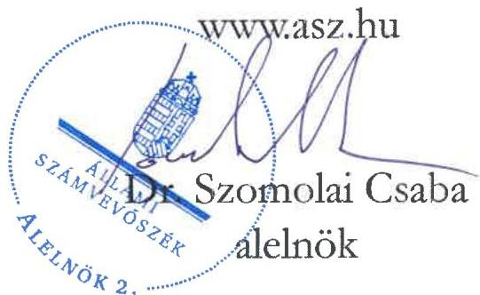

ÁLLAMI SZÁMVEVŐSZÉK

# JELENTÉS

A többségi állami tulajdonban lévő gazdasági társaságok beszerzéseinek ellenőrzése

Élelmiszerlánc-biztonsági Centrum Nonprofit Kft.

2026.

26014

www.asz.hu

---

ÁLLAMI SZÁMVEVŐSZÉK

# JELENTÉS

A többségi állami tulajdonban lévő gazdasági társaságok beszerzéseinek ellenőrzése

Élelmiszerlánc-biztonsági Centrum Nonprofit Kft.

2026.

26014

---

Jelentéseink az interneten a www.asz.hu címen olvashatók.

ELLENŐRZÉSI IGAZGATÓSÁG:
ELLENŐRZÉSI IGAZGATÓSÁG III.

ELLENŐRZÉSI IGAZGATÓ:
HERCZEGH ZSOLT igazgató

ELLENŐRZÉSVEZETŐ:
DABISNÉ NYIKOS MELINDA ellenőrzésvezető

IKTATÓSZÁM: EL-4188-033/2026
TÉMASORSZÁM: 34/2025
ELLENŐRZÉS-AZONOSÍTÓ SZÁM: V113503

---

TARTALOMJEGYZÉK

AZ ELLENŐRZÉS EREDMÉNYEI ... 5
1. A többségi állami tulajdonban álló gazdasági társaság beszerzésének megfelelősége ... 6

JAVASLATOK ... 9

I. FÜGGELÉK: ÉSZREVÉTELEK ... 10

II. FÜGGELÉK: ELLENŐRZÉSI MEGKÖZELÍTÉS ... 11

MELLÉKLETEK ... 15
I. sz. melléklet: Értelmező szótár ... 15

RÖVIDÍTÉSEK JEGYZÉKE ... 16

---

“哈，你是个小伙子，你是个小伙子，你是个小伙子，你是个小伙子，你是个小伙子，你是个小伙子，你是个小伙子，你是个小伙子，你是个小伙子，你是个小伙子，你是个小伙子，你是个小伙子，你是个小伙子，你是个小伙子，你是个小伙子，你是个小伙子，你是个小伙子，你是个小伙子，你是个小伙子，你是个小伙子，你是个小伙子，你是个小伙子，你是个小伙子，你是个小伙子，你是个小伙子，你是个小伙子，你是个小伙子，你是个小伙子，你是个小伙子，你是个小伙子，你是个小伙子，你是个小伙子，你是个小伙子，你是个小伙子，你是个小伙子，你是个小伙子，你是个小伙子，你是个小伙子，你是个小伙子，你是个小伙子，你是个小伙子，你是个小伙子，你是个小伙子，你是个小伙子，你是个小伙子，你是个小伙子，你是个小伙子，你是个小伙子，你是个小伙子，你是个小伙子，你是个小伙子，你是个小伙子，你是个小伙子，你是个小伙子，你是个小伙子，你是个小伙子，你是个小伙子，你是个小伙子，你是个小伙子，

---

5

# AZ ELLENŐRZÉS EREDMÉNYEI

A Magyar Állam tulajdonában lévő gazdasági társaságok gazdálkodása során a nemzeti vagyonnal való felelős gazdálkodás alapvető követelmény és egyben jogszabályi előírás. A nemzeti vagyongazdálkodás alapvető feladata a nemzeti vagyon megőrzése, értékének és állagának védelme. A gazdasági társaságok önálló és felelős gazdálkodása során a jogszabályokban meghatározott előírásoknak, valamint az azokkal összhangban lévő belső szabályzatoknak maradéktalanul szükséges megfelelni.

A gazdasági társaságokkal szemben elvárás, hogy a beruházásaikat, beszerzéseiket ezen előírások mentén a törvényesség, célszerűség és eredményesség követelményei szerint végezzék.

Az Élelmiszerlánc-biztonsági Centrum Nonprofit Kft.¹ közvetlen állami tulajdonú gazdasági társaság, főtevékenysége az ellenőrzött időszakban máshova nem sorolt egyéb szakmai, tudományos, műszaki tevékenység volt. A Társaság az ellenőrzött időszakban a NÉBIH² és az Agrárminisztérium szakmai iránymutatása szerint részt vett az Éltv.³ rendelkezései alapján az élelmiszerlánc-felügyeleti feladatok ellátásában. Az Élelmiszerlánc-biztonsági Centrum Nonprofit Kft. a NÉBIH-hel kötött együttműködési megállapodás⁴ alapján ellátta a FELIR⁵ szakrendszereivel kapcsolatos adminisztrációs és üzemeltetési feladatokat, az élelmiszerlánc-felügyeleti díjjal összefüggő tevékenységeket (pl. bevallási rendszerben történő adatrögzítés, hiánypótlások adminisztrációja, kiküldése, ügyfélhívások kezelése), valamint a NÉBIH IT⁶ rendszereinek, informatikai eszközeinek, berendezéseinek üzemeltetését, alkalmazástámogatását, és az informatikai projektekkel kapcsolatos projektmenedzsment feladatokat. Az Élelmiszerlánc-biztonsági Centrum Nonprofit Kft. emellett az Agrárminisztériummal kötött megbízási szerződéssel⁷ is rendelkezett az ellenőrzött időszakra, amely értelmében a Társaság feladata volt a 2014-2020. Vidékfejlesztési Program kivitelezését segítő, a 2023-2027. Közös Agrárpolitikai Stratégiai Terv megalapozásához kapcsolódó Mezőgazdasági Adminisztratív Adatpolitika (MAAP) részeként indikátor adatbázisok létrehozása, továbbfejlesztése, adatfeldolgozó algoritmusok, illetve az AKI Agrárközgazdasági Intézet Nonprofit Kft. irányába történő egyszerűsített digitális adatszolgáltatás kialakítása.

Az ÁSZ⁸ az ellenőrzés keretében vizsgálta és értékelte a Társaság FELIR továbbfejlesztése a vidékfejlesztési monitoring megvalósításához tárgyú beszerzésének a megfelelőségét a 2023. II. negyedévre vonatkozó teljesítéssel kapcsolatban.

A Társaság ellenőrzés alá vont beszerzése megfelelő volt. Az Élelmiszerlánc-biztonsági Centrum Nonprofit Kft. ellenőrzésre kiválasztott beszerzésre irányuló döntése az ellenőrzött tétel vonatkozásában megalapozott és célszerű volt. A Társaság az ellenőrzés alá vont beszerzést a jogszabályi előírásoknak megfelelően bonyolította le. Az Élelmiszerlánc-biztonsági Centrum Nonprofit Kft. a beszerzést az Agrárminisztériummal kötött megbízási szerződés alapján elvégezte, amelynek teljesítését az Agrárminisztérium is leigazolta a Társaság részére.

Az Élelmiszerlánc-biztonsági Centrum Nonprofit Kft. a közzétételi kötelezettségének az ellenőrzés alá vont szerződés adatai vonatkozásában nem a jogszabályi előírásnak megfelelően tett eleget.

---

Az ellenőrzés eredményei

# 1. A többségi állami tulajdonban álló gazdasági társaság beszerzésének megfelelősége

## Összegző megállapítás

A Társaság ellenőrzés alá vont beszerzése megfelelő volt. Az Élelmiszerlánc-biztonsági Centrum Nonprofit Kft. beszerzésre irányuló döntése megalapozott és célszerű volt. Az ellenőrzés alá vont beszerzést a Társaság a jogszabályi előírásoknak megfelelően bonyolította le. Az Élelmiszerlánc-biztonsági Centrum Nonprofit Kft. a beszerzést az Agrárminisztériummal kötött megbízási szerződés alapján elvégezte, amelynek teljesítését az Agrárminisztérium is leigazolta a Társaság részére. Az Élelmiszerlánc-biztonsági Centrum Nonprofit Kft. a közzétételi kötelezettségének az ellenőrzés alá vont szerződés adatai vonatkozásában nem a jogszabályi előírásnak megfelelően tett eleget.

## A BESZERZÉSHEZ KAPCSOLÓDÓ BELSŐ SZABÁLYOZÓ ESZKÖZÖK

Az Élelmiszerlánc-biztonsági Centrum Nonprofit Kft. beszerzéseit az Alapító okirat $_{1-2}^{9}$, a Beszerzési szabályzat $^{10}$, a Közbeszerzési szabályzat $^{11}$, a Gazdálkodási szabályzat $^{12}$, az Ügyrend $_{1-2}^{13}$, valamint a Szerződéskötés rendje $^{14}$ szabályozta.

A Társaság a Tak.tv. $^{15}$ rendelkezései szerint a beszerzési eljárásaira vonatkozóan a belső szabályozói környezetét kialakította.

## A BESZERZÉSI IGÉNY FELMERÜLÉSE

A Társaság az ellenőrzött időszakban a NÉBIH és az Agrárminisztérium szakmai iránymutatása szerint részt vett az Éltv. rendelkezései alapján az élelmiszerlánc-felügyeleti feladatok ellátásában. Az Élelmiszerlánc-biztonsági Centrum Nonprofit Kft. a NÉBIH-hel kötött együttműködési megállapodás alapján ellátta a FELIR szakrendszereivel kapcsolatos adminisztrációs és üzemeltetési feladatokat, az élelmiszerlánc-felügyeleti díjjal összefüggő tevékenységeket (pl. bevallási rendszerben történő adatrögzítés, hiánypótlások adminisztrációja, kiküldése, ügyfélhívások kezelése), valamint a NÉBIH IT rendszereinek, informatikai eszközeinek, berendezéseinek üzemeltetését, alkalmazástámogatását, és az informatikai projektekkel kapcsolatos projektmenedzsment feladatokat. A projektmenedzsment feladatok magukba foglalták az informatikai projektek megvalósítását, végrehajtását. Az Élelmiszerlánc-biztonsági Centrum Nonprofit Kft. emellett az Agrárminisztériummal kötött megbízási szerződéssel is rendelkezett. Az ellenőrzés alá vont beszerzési igény ezen megbízási szerződésben foglalt informatikai fejlesztési feladatok végrehajtása érdekében merült fel. A fejlesztés „A Vidékfejlesztési Program megvalósítását szolgáló Technikai Segítségnyújtás Projekt” keretében valósult meg, amely vonatkozásában az Agrárminisztérium, mint kedvezményezett vissza nem térítendő támogatásban részesült. A megbízási szerződés értelmében az Élelmiszerlánc-biztonsági Centrum Nonprofit Kft. feladata volt a 2014-2020. Vidékfejlesztési Program kivitelezését segítő, a 2023-2027. Közös Agrárpolitikai Stratégiai Terv megalapozásához kapcsolódó Mezőgazdasági Adminisztratív Adatpolitika (MAAP) részeként indikátor adatbázisok létrehozása, továbbfejlesztése, adatfeldolgozó algoritmusok, illetve az AKI Agrárközgazdasági Intézet Nonprofit Kft.

---

Az ellenőrzés eredményei

irányába egyszerűsített digitális adatszolgáltatás kialakítása. Az ellenőrzésre kiválasztott beszerzésre vonatkozó beszerzési igény a fentiekben részletezettek alapján az Agrárminisztériummal kötött megbízási szerződés teljesítése érdekében indokolt és célszerű volt.

Tekintettel arra, hogy a Társaság a feladatok ellátásához (informatikai fejlesztés) szükséges kompetenciával és erőforrással nem rendelkezett, így a megbízási szerződésben foglalt feladatok ellátását külső szolgáltató igénybevételével valósította meg. Ennek keretében a beszerzési igényt a Társaság a DKÜ rendelet¹⁶ alapján a DKÜ portálon¹⁷ rendkívüli informatikai beszerzésre vonatkozó igényként nyújtotta be.

## A BESZERZÉSI DÖNTÉS MEGALAPOZOTTSÁGA

A Társaság a Kbt.¹⁸ rendelkezése alapján a 2022. évi közbeszerzési tervét elkészítette, amelyben az ellenőrzés alá vont beszerzéshez kapcsolódó informatikai fejlesztési tételt szerepeltette. Az ellenőrzés alá vont tétellel összefüggő informatikai fejlesztési feladatok – a fejlesztés volumenét tekintve – a 2023. évet is érintették. A Társaság a 2023. évi üzleti tervét az Alapító okirat, az Ügyrend, valamint a Gazdálkodási szabályzat előírásai alapján elkészítette, amelyben az IT közvetített szolgáltatások összértékét kalkulálta. Az üzleti tervben a Társaság fő célkitűzésként az Agrárminisztériummal kötött szerződések hatékony lebonyolítását rögzítette.

## A BESZERZÉS LEBONYOLÍTÁSA, A MEGKÖTÖTT SZERZŐDÉS, ÉS A BESZERZÉS ELSZÁMOLÁSA

Az ellenőrzött tétellel összefüggő informatikai beszerzési igény a DKÜ rendelet szerinti megfelelő minősítéssel rendelkezett azzal, hogy a beszerzési igény kielégítésére szolgáló eljárást a DKܹ⁹ kizárólagos joggal magához vonta. A Kbt. szerinti közbeszerzési eljárást a DKÜ, mint központi beszerző szerv maga folytatta le. Az Európai Unió forrásból megvalósuló informatikai fejlesztési igények kielégítése érdekében a DKÜ keretmegállapodásokat²⁰ kötött, amelyek lehetőséget adtak a Vidékfejlesztési Program keretén belüli informatikai fejlesztési igények megvalósítására. Az Élelmiszerlánc-biztonsági Centrum Nonprofit Kft. ezt követően a „Java alapú fejlesztői környezethez vagy Business Intelligence alkalmazás rendszerek fejlesztői környezetéhez kapcsolódó fejlesztési szolgáltatások nyújtása” tárgyú keretmegállapodásból verseny újranyitás keretében elégítette ki az ellenőrzés alá vont informatikai fejlesztési igényét. A Kbt. rendelkezéseivel összhangban a közbeszerzés előkészítésébe és lebonyolításába felelős akkreditált közbeszerzési szaktanácsadót bevontak, a közbeszerzési eljárás során a bírálóbizottsági tagokat kijelölték. A beszerzés fedezete a Társaság rendelkezésére állt.

Az Élelmiszerlánc-biztonsági Centrum Nonprofit Kft. az informatikai fejlesztésre vonatkozó műszaki leírással rendelkezett, a becsült értéket a Társaság megalapozta, azt a Kbt. előírása alapján indikatív ajánlatok bekérésével határozta meg. A műszaki leírás részletesen tartalmazta a FELIR továbbfejlesztésének követelményeit, a fejlesztés során bevonandó szakrendszerek listáját, azok bemutatását, a fejlesztési feladatok becsült erőforrásigényét és az erőforrások lehívásának tervezett ütemezését. A NÉBIH-hel kötött együttműködési megállapodás rögzítette, hogy a Társaság a NÉBIH szakmai iránymutatása alapján végezte tevékenységét, és mivel az informatikai fejlesztések a NÉBIH szakrendszereit érintették, így az ügyvezető nyilatkozata alapján (mivel az Élelmiszerlánc-biztonsági Centrum Nonprofit Kft. informatikai fejlesztői kompetenciával nem rendelkezett) a NÉBIH munkatársai specifikálták az ellenőrzést érintő fejlesztői igényeket, továbbá részt vettek az elkészült fejlesztések tesztelésében, azok szakmai átvételében is.

---

Az ellenőrzés eredményei

A közbeszerzési eljárás eredményét a Társaság a Kbt. előírása szerinti hirdetmény formájában közzétette. Az egyedi szerződést a Keretmegállapodás alapján az arra jogosultak kötötték meg. Az egyedi szerződésben foglalt műszaki tartalom, vállalkozói díj összhangban volt a közbeszerzési eljárás során tett nyertes ajánlattal, a szerződés tartalmazta továbbá a felmondás feltételeit, a felek jogait és kötelezettségeit, valamint a garanciális elemeket is.

Az Élelmiszerlánc-biztonsági Centrum Nonprofit Kft. az ellenőrzés alá vont beszerzés teljesítéséről teljesítésigazolást állított ki, amelyet megelőzött a NÉBIH szakmai teljesítésigazolása. A befogadott számla a Számv. tv.²¹ és az Áfa tv.²² előírásainak megfelelt, a pénzügyi teljesítés megtörtént. Az informatikai fejlesztés költségeit az Agrárminisztériummal kötött megbízási szerződés értelmében az Élelmiszerlánc-biztonsági Centrum Nonprofit Kft. tovább számlázta, az ellenőrzött tétellel összefüggő feladatok teljesítését az Agrárminisztérium leigazolta.

Az egyedi szerződés teljesítéséről a Társaság a DKÜ portálon keresztül számot adott.

## KÖZZÉTÉTELI KÖTELEZETTSÉG

A Társaság az internetes honlapján az 5 M Ft feletti beszerzések vonatkozásában nem az Info. tv.²³ 1. melléklet III. fejezet 4. pontjában meghatározott rendelkezés szerint tette közzé az ellenőrzés alá vont szerződés adatait, mivel nem volt beazonosítható a határozott időre kötött szerződés időtartama.

---

9

# JAVASLATOK

Az ÁSZ tv. 33. § (1) bekezdésében foglaltak értelmében az ellenőrzött szervezet vezetője köteles a jelentésben foglalt megállapításokhoz kapcsolódó intézkedési tervet összeállítani és azt a jelentés kézhezvételétől számított 30 napon belül az ÁSZ részére megküldeni. Az ÁSZ a jelentésben foglalt megállapításokhoz kapcsolódóan az alábbi javaslatok tekintetében várja el az intézkedési terv elkészítését.

# ÉLELMISZERLÁNC-BIZTONSÁGI CENTRUM NONPROFIT KFT. ÜGYVEZETŐJE RÉSZÉRE

1. Vizsgálja felül az Info. tv. 1. melléklet III. fejezet 4. pontja alapján a Társaság honlapján közzétett adatokat, és tegye meg a szükséges intézkedéseket.

---

I. FÜGGELÉK: ÉSZREVÉTELEK

A jelentéstervezetet az ÁSZ 15 napos észrevételezésre megküldte az ellenőrzött szervezet vezetőjének az ÁSZ tv. 29. §* (1) bekezdése előírásának megfelelően.

Az ellenőrzött szervezet vezetője a jelentéstervezet megállapításaira észrevételt nem tett.

* 29. § (1) Az Állami Számvevőszék az ellenőrzési megállapításait megküldi az ellenőrzött szervezet vezetőjének vagy az általa megbízott személynek, és annak, akinek személyes felelősségét állapította meg.
(2) Az ellenőrzött szervezet vezetője és a felelősként megjelölt személy az ellenőrzés megállapításaira tizenöt napon belül írásban észrevételt tehet.
(3) Az Állami Számvevőszék az észrevételre a beérkezésétől számított harminc napon belül írásban válaszol. A figyelembe nem vett észrevételeket köteles a jelentésben feltüntetni, és megindokolni, hogy azokat miért nem fogadta el.

10

---

11

# II. FÜGGELÉK: ELLENŐRZÉSI MEGKÖZELÍTÉS

## AZ ELLENŐRZÉS JOGALAPJA

Az ellenőrzés jogszabályi alapját az ÁSZ tv.²⁴ 1. § (3) bekezdésének és 5. § (4) bekezdésének előírásai képezték.

## AZ ELLENŐRZÉS CÉLJA

Az ellenőrzés célja annak értékelése volt, hogy a gazdasági társaság – ellenőrzés során kiválasztott – beszerzésére szabályszerűen került-e sor, a kapcsolódó döntéshozatal szabályszerű és megalapozott volt-e, valamint a beszerzéshez kapcsolódóan érvényesültek-e a célszerűség és az eredményesség szempontjai.

## AZ ELLENŐRZÉS TÍPUSA

Kombinált ellenőrzés.

## AZ ELLENŐRZÉS TÁRGYA

Az ellenőrzés tárgya az Élelmiszerlánc-biztonsági Centrum Nonprofit Kft. 2023. évben megvalósult beszerzésére irányuló döntések szabályszerűsége, megalapozottsága és célszerűsége, a megvalósult beszerzések szabályszerűsége, eredményessége, a beszerzett eszközök és szolgáltatások feladatellátás során történt hasznosulása, azaz a beszerzések megfelelősége volt. Az ellenőrzés kiterjedt a beszerzések előkészítésének, a beszerzésekre vonatkozó szerződés megkötésének és tartalmának ellenőrzésére is. Az ÁSZ ellenőrzés részét képezte továbbá a közzétételi kötelezettség teljesítésének ellenőrzése is.

Az ellenőrzés kiterjedt minden olyan körülményre és adatra, amely az ÁSZ jogszabályban meghatározott feladatainak teljesítéséhez, valamint a program végrehajtása folyamán felmerült újabb összefüggések feltárásához szükséges volt.

1. táblázat

|  AZ ELLENŐRZŐTT BESZERZÉS FŐBB ADATAI (FT)  |   |   |   |
| --- | --- | --- | --- |
|  SORSZÁM | BESZERZÉS TÁRGYA | BESZERZÉS ALAPJÁT KÉPEZŐ SZERZŐDÉS KELTÉ | BESZERZÉS NETTÓ ÉRTÉKE (FT)  |
|  1. | A FELIR továbbfejlesztése a vidékfejlesztési monitoring megvalósításához (2023. II. negyedéves teljesítés) | 2022.05.20. | 283 058 700  |

Forrás: ÁSZ saját szerkesztés

---

II. Függelék: Ellenőrzési megközelítés

## AZ ELLENŐRZÉS HATÓKÖRE

Az ÁSZ ellenőrzése az Élelmiszerlánc-biztonsági Centrum Nonprofit Kft. beszerzésre irányuló döntéseinek szabályszerűségére, megalapozottságára, célszerűségére, a megvalósult beszerzések szabályszerűségére, eredményességére, valamint arra terjedt ki, hogy a beszerzett eszköz/szolgáltatás a gazdasági társaságoknál hasznosításra került-e, betölti-e az eredetileg elvárt funkcióját, támogatja-e a társaságok (köz)feladat ellátását. Az ÁSZ ellenőrzés részét képezte továbbá a közzétételi kötelezettség teljesítésének ellenőrzése is.

A Társaságot 2014.01.10-én az Éltv. 38/D. § (1) bekezdése alapján a NÉBIH az élelmiszerlánc-felügyeleti feladatok ellátásának támogatása érdekében alapította, az Élelmiszerlánc-biztonsági Centrum Nonprofit Kft. az állam 100%-os tulajdonában álló társaság. A Társaság felett a tulajdonosi jogokat a Magyar Állam nevében a NÉBIH gyakorolta. A Társaság főtevékenysége a 2023. évben m.n.s. egyéb szakmai, tudományos, műszaki tevékenység volt.

A Társaság az ellenőrzött időszakban a Tak.tv. 7/J. § (1) bekezdésében meghatározott mutatóértékek alapján a Gbkr.²⁵ hatálya alá tartozott, belső kontrollrendszer működtetésére volt kötelezett.

Az Élelmiszerlánc-biztonsági Centrum Nonprofit Kft. ellenőrzés alá vont informatikai tárgyú beszerzésére a DKÜ rendelet 1. § (2) bekezdés d) pontja értelmében a központosított közbeszerzés szabályai voltak az irányadóak, a Társaság a vizsgált időszakban a Kbt. 5. § (1) bekezdése szerinti ajánlatkérőnek minősült.

Tekintettel arra, hogy az ellenőrzésre kiválasztott beszerzés nem a Társaságnál került hasznosításra, így a beszerzés eredményessége az ellenőrzés keretében nem került értékelésre.

## AZ ELLENŐRZŐTT SZERVEZET

Élelmiszerlánc-biztonsági Centrum Nonprofit Kft.

## AZ ELLENŐRZŐTT IDŐSZAK

A 2023. év, kitekintéssel az ellenőrzésre kiválasztott beszerzés beszerzési eljárásának és a szerződéskötés időszakára.

---

II. Függelék: Ellenőrzési megközelítés

## AZ ELLENŐRZÉSI KRITÉRIUMOK

|  FÓKUSZTERÜLET | ELLENŐRZÉSI KRITÉRIUMOK  |
| --- | --- |
|  1. A többségi állami tulajdonban álló gazdasági társaság beszerzésének megfelelősége | Vtv.26 2. § (1) bekezdés, 5. § (2) bekezdés,
Nvtv.27 7. § (1)-(2) bekezdés,
Tak.tv. 2. § (3)-(4) bekezdés, 7/J. §,
Gbkr. 3. § (1) bekezdés, 4. § (3) bekezdés, 6. § (1)-(2) bekezdés,
Ptk.28 6:238-250. §,
Számv. tv. 47-48. §, 51. §, 165-167. §,
Áfa tv. 59. § (1) bekezdés,
Info tv. 33. § (1) és (3) bekezdés, 37. §, 1. melléklet III. gazdálkodási adatok 4. pont,
18/2005. (XII. 27.) IHM rendelet29 2. § (1) bekezdés
belső szabályozó eszközök (Alapító okirat1-2, Beszerzési szabályzat, Közbeszerzési szabályzat, Gazdálkodási szabályzat, Ügyrend1-2, Szerződéskötés rendje)
Célszerűség: a beszerzésre irányuló döntés akkor célszerű, ha az megalapozott, továbbá a rendelkezésre álló erőforrások ésszerű, racionális, a gazdasági társaság (köz)feladatának megvalósítása érdekében álló, az ahhoz szükséges mértékű felhasználásával jár.
Eredményesség: a beszerzés akkor eredményes, ha összhangban áll a társaság céljaival és támogatja azok elérését, megvalósulását, valamint a beszerzés tárgya a társaság (köz)feladat ellátása során ténylegesen hasznosításra kerül, betölti eredetileg elvárt funkcióját.
A beszerzés eredményessége kizárólag akkor értékelhető, ha a beszerzési eljárás teljes folyamata a lényegi elemeiben szabályszerű, a beszerzési döntés megalapozott és célszerű volt.  |

## AZ ELLENŐRZÉS MÓDSZERE ÉS AZ ELLENŐRZÉSI BIZONYÍTÉKOK KÖRE

Az ellenőrzés végrehajtása a nemzetközi standardokat irányadónak tekintve az ellenőrzési program szempontjai, az ellenőrzött időszakban hatályos jogszabályok, az ellenőrzés szakmai szabályok és a jelen ellenőrzésre irányadó ÁSZ módszertan figyelembevételével történt.

Az ellenőrzési kérdések megválaszolásához szükséges bizonyítékok megszerzése az ellenőrzött szervezet által rendelkezésre bocsátott dokumentumokra és adatokra alapozva, továbbá megfigyelés, kérdésfeltevés (információkérés), mintavételezés, valamint elemző eljárás útján valósult meg.

Az ellenőrzési bizonyítékként felhasználható adatforrások közé tartoztak egyrészt az ellenőrzéshez kért dokumentumok, adatállományok, nyilatkozatok, másrészt adatforrás volt minden – az ellenőrzés folyamán – feltárt, az ellenőrzés szempontjából releváns információt tartalmazó dokumentum.

Az ellenőrzés lefolytatásához az ellenőrzött szervezet a 2023. évben megvalósult beszerzéseire vonatkozó főkönyvi és analitikus nyilvántartások, valamint az ÁSZ által kért további dokumentumok, adatok,

---

II. Függelék: Ellenőrzési megközelítés

információk megküldésével és a helyszíni ellenőrzés során szolgáltatott adatokat. Az Élelmiszerlánc-biztonsági Centrum Nonprofit Kft. a 2023. év vonatkozásában 83 darab beszerzésre irányuló szerződéssel rendelkezett. A beszerzésre irányuló szerződések informatikai fejlesztéshez és üzemeltetéshez (szerződéses partner: 4IG Zrt.), valamint konyha üzemeltetéshez (vendéglátás, étkeztetés) kapcsolódtak. Az anyagjellegű ráfordításokon belül az igénybe vett szolgáltatások és az eladott (közvetített) szolgáltatások értékének ~90%-át az informatikai fejlesztési és üzemeltetési díjak alkották.

A tények feltárása és azok összegzése során a megállapítások az ellenőrzött mintatételre vonatkozóan került megfogalmazásra. A mintatétel ellenőrzésének eredménye nem került kivetítésre. Az ÁSZ akkor tekintette megfelelőnek a mintatételként kiválasztott beszerzést, ha a beszerzési eljárás teljes folyamata a lényegi elemeiben szabályszerű, célszerű és – amennyiben értékelhető – eredményes volt, illetve a beszerzés tekintetében érvényesültek a nemzeti vagyonnal való felelős gazdálkodás elvei.

Az ellenőrzés kitért minden olyan körülményre, amely a program végrehajtása kapcsán felmerült és az ellenőrzés céljaival összhangban volt.

14

---

MELLÉKLETEK

## I. SZ. MELLÉKLET: ÉRTELMEZŐ SZÓTÁR

gazdasági társaság
A gazdasági társaságok üzletszerű közös gazdasági tevékenység folytatására, a tagok vagyoni hozzájárulásával létrehozott, jogi személyiséggel rendelkező vállalkozások, amelyekben a tagok a nyereségből közösen részesednek, és a veszteséget közösen viselik.
(Ptk. 3:88. § (1) bekezdése)

beszerzés
Eszközök és/vagy szolgáltatások visszterhes megszerzésére (vásárlására) irányuló (keret)szerződés/(keret)megállapodás létrehozását célzó és azt eredményező eljárás.
(ÁSZ saját definíció)

eszköz
A vásárolt immateriális javak (Számv. tv. 25. § (1)-(2) bekezdés) és tárgyi eszközök (Számv. tv. 26. § (1) bekezdés) valamint – a közvetített szolgáltatások kivételével – a vásárolt készletek.
(Számv. tv. 3. § (6) bekezdés 5. pont)

szolgáltatás
A gazdasági társaság által igénybe vett/megrendelt, harmadik felek által nyújtott/számlázott, nem anyagi javak termelésére irányuló tevékenységek, különös tekintettel az igénybe vett, egyéb és közvetített szolgáltatásokra. (Számv. tv. 3. § (7) bekezdés 1-2. pont, (4) bekezdés 1. pont)

többségi állami tulajdon
Az állam tulajdonában lévő tagsági jogviszonyt megtestesítő értékpapír, illetve az állam tulajdonában lévő egyéb társasági részesedés, amennyiben a társaságban a Magyar Állam közvetlenül vagy közvetetten a szavazatok több mint felével rendelkezik.
(ÁSZ definíció a Vtv. 1. § (2) bekezdés c) pontja és a Ptk. 8:2. § (1), (3)-(4) bekezdései alapján)

vagyongazdálkodás alapelvei
A nemzeti vagyon alapvető rendeltetése a közfeladat ellátásának biztosítása, ideértve a lakosság közszolgáltatásokkal való ellátását és e feladatok ellátásához szükséges infrastruktúra biztosítását. A nemzeti vagyonnal felelős módon, rendeltetésszerűen kell gazdálkodni.
A nemzeti vagyongazdálkodás feladata a nemzeti vagyon megőrzése, értékének és állagának védelme, rendeltetésének megfelelő, az állam, az önkormányzat mindenkori teherbíró képességéhez igazodó, elsődlegesen a közfeladatok ellátásához és a mindenkori társadalmi szükségletek kielégítéséhez szükséges, egységes elveken alapuló, átlátható, hatékony és költségtakarékos működtetése, értéknövelő használata, hasznosítása, gyarapítása, továbbá az állam vagy a helyi önkormányzat feladatának ellátása szempontjából feleslegessé váló vagyontárgyak elidegenítése, azzal, hogy a nemzeti vagyon megőrzése érdekében végzett bontás vagy átalakítás nem minősül az állag védelmi kötelezettség megszegésének.
(Nvtv. 7. § (1)-(2) bekezdése alapján)

Élelmiszerlánc-felügyeleti információs rendszer (FELIR)
A FELIR rendszer a NÉBIH által működtetett központi nyilvántartási és információs rendszer, amely az élelmiszerlánc szereplőinek regisztrációját, adatait, tevékenységeit kezeli. A FELIR működését több jogszabály szabályozza (Éltv., FELIR Korm. rendelet³⁰). A FELIR-be való regisztráció kötelező, minden olyan gazdálkodónak, vállalkozásnak, amely élelmiszert állít elő, forgalmaz, tárol, vagy szállít, állati eredetű termékekkel dolgozik, növénytermesztéssel, állattenyésztéssel, takarmány-előállítással vagy kereskedelemmel foglalkozik, vagyis bármilyen módon részt vesz az élelmiszerláncban. A FELIR rendszerben a regisztrált tevékenységet végzők FELIR-azonosító számot kapnak, amely az egyedi azonosítást szolgálja. A FELIR rendszer tehát egy központi, digitális adatbázis, amely lehetővé teszi a hatóságok számára az ellenőrzések hatékonyabb tervezését és végrehajtását, a vállalkozások nyomon követését, a gyors reagálást a krízishelyzetekben (pl. élelmiszer-visszahívás). A rendszerben a vállalkozásoknak naprakészen kell tartaniuk adataikat. A FELIR rendszer integrálva van más NÉBIH és kormányzati rendszerekhez pl. cégek kapu, élelmiszerbiztonsági ellenőrzési rendszerek, vám- és adóhatósági rendszerek. A rendszeren keresztül számos elektronikus ügyintézési lehetőség elérhető a regisztráltak számára pl. adatmódosítás, új tevékenységek bejelentése, igazolások letöltése.
(https://portal.nebih.gov.hu/documents/10182/1166156/FELIR+tajekoztato.pdf adata alapján)

15

---

RÖVIDÍTÉSEK JEGYZÉKE

1. Élelmiszerlánc-biztonsági Centrum Nonprofit Kft./Társaság/többségi állami tulajdonban álló gazdasági társaság
2. NÉBIH
3. Éltv.
4. együttműködési megállapodás
5. FELIR
6. IT
7. megbízási szerződés
8. ÁSZ
9. Alapító okirat₁,₂
10. Beszerzési szabályzat
11. Közbeszerzési szabályzat
12. Gazdálkodási szabályzat
13. Ügyrend₁,₂
14. Szerződéskötés rendje
15. Tak.tv.
16. DKÜ rendelet
17. DKÜ portál
18. Kbt.
19. DKÜ

Élelmiszerlánc-biztonsági Centrum Nonprofit Kft.
Nemzeti Élelmiszerlánc-biztonsági Hivatal
2008. évi XLVI. törvény az élelmiszerláncról és hatósági felügyeletéről
NÉBIH és az Élelmiszerlánc-biztonsági Centrum Nonprofit Kft. között létrejött 3100/429-1/2020. iktatószámú Együttműködési megállapodás (kelt: 2020.04.06.)
Élelmiszerlánc-felügyeleti információs rendszer
Információs technológia
Élelmiszerlánc-biztonsági Centrum Nonprofit Kft. és az Agrárminisztérium között 2021.10.27-én kelt, VfKF/275-1/2021. iktatószámú, bruttó 2 500 000 000 Ft értékben létrejött megbízási szerződés és annak 2023.06.29-tól hatályos, VfKF/149-2/2023. iktatószámú „A VfKF/275-1/2021. számú megbízási szerződés 1. számú módosítása egységes szerkezetben” elnevezésű módosítása
Állami Számvevőszék
Alapító okirat₁ (hatályos: 2020.08.05.-2022.08.21.)
Alapító okirat₂ (hatályos: 2022.08.22-tól)
Élelmiszerlánc-biztonsági Centrum Nonprofit Kft. Beszerzések lebonyolításával kapcsolatos eljárásrendről szóló szabályzata (hatályos: 2021.11.30.-2024.11.12.)
Élelmiszerlánc-biztonsági Centrum Nonprofit Kft. Közbeszerzési szabályzata (hatályos: 2020.04.13-tól)
Élelmiszerlánc-biztonsági Centrum Nonprofit Kft. Gazdálkodási szabályzata (hatályos: 2020.04.15-tól)
Élelmiszerlánc-biztonsági Centrum Nonprofit Kft. Ügyrend₁ (hatályos: 2021.10.21.-2023.02.28.)
Élelmiszerlánc-biztonsági Centrum Nonprofit Kft. Ügyrend₂ (hatályos: 2023.03.01-tól)
Élelmiszerlánc-biztonsági Centrum Nonprofit Kft. Szerződéskötés rendje (hatályos: 2022.07.13-tól)
2009. évi CXXII. törvény a köztulajdonban álló gazdasági társaságok takarékosabb működéséről
301/2018. (XII. 27.) Korm. rendelet a Nemzeti Hírközlési és Informatikai Tanácsról, valamint a Digitális Kormányzati Ügynökség Zártkörűen Működő Részvénytársaság és a kormányzati informatikai beszerzések központosított közbeszerzési rendszeréről
A DKÜ rendelet 1. § (4) bekezdés 9. pontja szerint meghatározott a DKÜ Zrt. által Integrált DKÜ Portál Rendszer (IDPR)-en néven működtetett egységes DKÜ alkalmazás
2015. évi CXLIII. törvény a közbeszerzésekről
Digitális Kormányzati Ügynökség Zártkörűen Működő Részvénytársaság

16

---

Rövidítések jegyzéke

20 Keretmegállapodások

21 Számv. tv.
22 Áfa tv.
23 Info tv.
24 ÁSZ tv.
25 Gbkr.
26 Vtv.
27 Nvtv.
28 Ptk.
29 18/2005. (XII. 27.) IHM rendelet
30 FELIR Korm. rendelet

1. rész: „Microsoft .NET keretrendszer alapú és Microsoft Business Intelligence alkalmazás rendszerekre vonatkozó fejlesztési szolgáltatások nyújtása” tárgyú és DKM01SWFE21 azonosítószámú keretmegállapodás
2. rész: „Java alapú fejlesztői környezethez vagy Business Intelligence alkalmazás rendszerek fejlesztői környezetéhez kapcsolódó fejlesztési szolgáltatások nyújtása” tárgyú és DKM02SWFE21 azonosítószámú keretmegállapodás

2000. évi C törvény a számvitelről
2007. évi CXXVII. törvény az általános forgalmi adóról
2011. évi CXII. törvény az információs önrendelkezési jogról és az információszabadságról
2011. évi LXVI. törvény az Állami Számvevőszékről
339/2019. (XII. 23.) Korm. rendelet a köztulajdonban álló gazdasági társaságok belső kontrollrendszeréről
2007. évi CVI. törvény az állami vagyonról
2011. évi CXCVI. törvény a nemzeti vagyonról
2013. évi V. törvény a Polgári Törvénykönyvről
18/2005. (XII. 27.) IHM rendelet a közzétételi listákon szereplő adatok közzétételéhez szükséges közzétételi mintákról
578/2020. (XII. 14.) Korm. rendelet az élelmiszerlánc-felügyeleti információs rendszer működéséről

17

---

ÁLLAMI SZÁMVEVŐSZÉK

1052 Budapest, Apáczai Csere János u. 10. | 1364 Budapest 4., Pf. 54

www.asz.hu | szamvevoszek@asz.hu

telefon: +36 1 484 9100