ÁLLAMI
SZÁMVEVŐSZÉK

# JELENTÉS

## Az önkormányzati tulajdonú lakások
hasznosításának célzott ellenőrzése

Budapest Főváros X. Kerület Kőbányai Önkormányzat

2026.

26015

www.asz.hu

---

ÁLLAMI
SZÁMVEVŐSZÉK

# JELENTÉS

## Az önkormányzati tulajdonú lakások
hasznosításának célzott ellenőrzése

Budapest Főváros X. Kerület Kőbányai Önkormányzat

2026.

26015

www.asz.hu
dr. Windisch László
elnök

---

ELLENŐRZÉSI IGAZGATÓSÁG:

**ELLENŐRZÉSI IGAZGATÓSÁG II.**

ELLENŐRZÉSI IGAZGATÓ:

**DR. BAFFIA GERGELY GÁBOR** igazgató

ELLENŐRZÉSVEZETŐ:

**HARANGOZÓ ATTILA** ellenőrzésvezető

Jelentéseink az interneten a
www.asz.hu címen olvashatók.

IKTATÓSZÁM: EL-4276-051/2026

TÉMASORSZÁM: 44/2024

ELLENŐRZÉS-AZONOSÍTÓ SZÁM: V113901

---

# TARTALOMJEGYZÉK

|  ■ ÖSSZEFOGLALÁS | 5  |
| --- | --- |
|  ■ AZ ELLENŐRZÉS EREDMÉNYEI | 11  |
|  1. Az önkormányzati lakásállomány hasznosításának tervszerűsége, tervek-tendenciák összhangja, figyelemmel az eredményesség és vagyonmegőrzés elveire | 11  |
|  ■ JAVASLATOK | 23  |
|  ■ I. FÜGGELÉK: ÉSZREVÉTELEK | 24  |
|  ■ II. FÜGGELÉK: ELLENŐRZÉSI MEGKÖZELÍTÉS | 33  |
|  ■ MELLÉKLETEK | 36  |
|  I. sz. melléklet: Értelmező szótár | 36  |
|  II. sz. melléklet: Az ellenőrzött szervezetek jegyzéke | 40  |
|  III. sz. melléklet: Kimutatás a 2020-2024. évi lakásgazdálkodási és -hasznosítási célokról | 41  |
|  ■ RÖVIDÍTÉSEK JEGYZÉKE | 42  |

3

---

# ÖSSZEFOGLALÁS

## A LAKOSSÁG JÖVEDELME EGYRE NAGYOBB RÉSZÉT FORDÍTJA LAKHATÁSRA, AZ ÖNKORMÁNYZATI TULAJDONÚ LAKÁSOK SZÁMA CSÖKKEN

A KSH¹ és az ingatlan.com adatai alapján a reál lakbérindex országosan 27,1%-kal, a fővárosban 21,1%-kal haladta meg a 2015. évi bázist. Bár a KSH adatai szerint ebben az időszakban hazánkban 171 391 lakás épült, ez azt jelenti, hogy átlagosan évente a teljes lakásállomány csak 0,4%-a tudott megújulni. Ebben az ütemben a magyar lakásállomány teljes megújulásához 262 évre lenne szükség. A COVID világjárvány kitörése és következményei, az energiaköltségek emelkedése, az inflációs folyamatok a lakhatás feltételeire is kedvezőtlen hatást gyakoroltak.

1. táblázat

### LAKHATÁS MAGYARORSZÁGON SZÁMOKBAN 2015-2024

|  REÁL LAKÁSÁRAK | LAKÁSÁR / JÖVEDELEM | REÁL LAKBÉRINDEX | ÁLLOMÁNY MEGÚJULÁSA  |
| --- | --- | --- | --- |
|  +82,2 % | +15,4 % | +27 % | 0,4%/év (262 év)  |

Forrás: ÁSZ saját szerkesztés

Hazánkban a rendszerváltáskor a tanácsi bérlakásokat az újonnan alakuló települési önkormányzatok örökölték meg, ezt követően az önkormányzati tulajdonú lakások száma folyamatosan csökkent **Az önkormányzati tulajdonú lakások száma** országos szinten a 2000. évi 176 501-ről az ellenőrzött időszak végére 99 923-ra, míg a fővárosban ugyanezen időszakban 87 488-ról 38 938-ra mérséklődött, ezáltal egyre kevesebbeknek nyújtott alternatívát a piaci lakásbérléssel szemben.

**A 2020-2024. években** az önkormányzati tulajdonú bérlakásállomány megközelítőleg 40%-a Budapesten volt található. Budapest Főváros X. Kerület Kőbányai Önkormányzat a **2024. évben 2360 saját tulajdonú lakással rendelkezett**, amely meghaladta a fővárosi kerületek lakásállományának egy kerületre jutó átlagát. A 2020-2024 időszak átlagos adatai alapján a X. kerület lakásállományának 6,1%-át az önkormányzati tulajdonú lakások tették ki, melyben a kerületi lakosság 6,3%-a élt. Az Önkormányzat² a lakások bérbeadásával kapcsolatos feladatokat a Polgármesteri Hivatal³, a lakáskezelési feladatokat szerződés alapján a KVZRT⁴ útján látta el.

## AZ ÖNKORMÁNYZATI LAKÁSGAZDÁLKODÁS VIZSGÁLATÁNAK INDOKOLTSÁGA ÉS MÓDJA

Az Alaptörvény⁵ az állam és az önkormányzatok részére előírja az emberhez méltó lakhatás feltételeinek a biztosítását és a közszolgáltatásokhoz való hozzáférés jogának elősegítését. Ezen cél megvalósulásához többek között hozzájárul az Mötv⁶-ben meghatározottak szerint a **helyi önkormányzat feladataként előírt saját tulajdonú lakás- és helyiséggazdálkodás**, valamint a szociális ellátások biztosítása.

A települési önkormányzatok a közfeladatellátáshoz kapcsolódóan önállóan alakították ki a helyi lakásgazdálkodási rendszerüket. Így a jogszabályi előírások mellett a különböző stratégiák mentén önkormányzatonként jelenleg is eltérőek a tervek, a célok, a lakásgazdálkodás szervezeti keretei, a lakásállomány nagysága, összetétele, a bérlakáshoz jutás, a bérlés részletszabályai.

Az ellenőrzés **eredményközpontú megközelítést** alkalmazott, amely során arra kereste a választ, hogy az Önkormányzat a tulajdonában álló lakásállomány hasznosítására vonatkozóan rendelkezett-e célokkal, a hasznosítás tervezetten, a tervekkel összhangban, az eredményesség és a vagyonérték megőrzésének elveire figyelemmel történt-e.

Az ellenőrzés során az ÁSZ értékelte az önkormányzati lakásállomány hasznosításának tervszerűségét, a stratégiákban megfogalmazott célkitűzéseket azok megvalósulását, a tervek és tendenciák összhangját. A

5

---

Összefoglalás---

tendenciák és tények vizsgálata alapján feltártuk a teljesítményt gátló tényezők lehetséges okait és javaslatokat fogalmaztunk meg a tervek-célok összhangjának megteremtése érdekében.

Az ÁSZ a javaslatokkal egyrészt **támogatni kívánja az Önkormányzatot a lakásgazdálkodási döntései meghozatalában**, másrészt fontosnak tartja ráirányítani a figyelmet az önkormányzati tulajdonú lakásokra, mint a lakáspolitikai eszköztár nemzeti vagyon részét képező eszközének helyzetére.

#### ÁTTEKINTÉS A X. KERÜLET LAKOSSÁGÁRÓL ÉS A HŐS UTCAI SZEGREGÁTUM FELSZÁMOLÁSÁRÓL

A KSH 2022. évi népszámlálási adatai alapján a X. kerület 75 628 fős lakosságának 15,7%-a 19 év alatti, 23,7%-a 60 év feletti, mely adatok nem mutatnak jelentős eltérést a Budapest egészére érvényes 16,9%-os, illetve 25,9%-os értékektől. A kerületi lakosság 36,3%-a nem rendelkezik érettségivel, mely meghaladja a budapestiek 29,0%-os értékét. Felsőfokú végzettségű a lakosság 24,8%-a, amely elmaradást jelent a fővárosi 34,1%-os aránytól. A X. kerületben a fővárosban mérttel közel azonos szintű a foglalkoztatottság, 54,0%, illetve 54,2% értékekkel, ahogy a munkanélküliek aránya is szinte megegyező volt 2022-ben (2,4%, illetve 2,2%).

A X. kerület területén található Hős utca 15/A és 15/B szám alatti társasház lakóközössége a fentiekben ismertetett kerületi adatoktól eltérő tulajdonságokkal rendelkezett. A munkanélküliség, az iskolázatlanság és az addiktológiai problémák tették a területet és a két lakóházat Kőbánya legszegregáltabb területévé. Budapest Főváros X. Kerület Kőbányai Önkormányzat számára kiemelt problémát jelentett a többségi tulajdonában álló jelentősen és folyamatosan amortizálódott társasház és a kialakult szociokultúra. A Magyarország Kormánya által a Hős utca 15/A–B szám alatti ingatlan helyzetének rendezésére biztosított forrás felhasználásával a projekt tervdokumentumaiban foglaltak végrehajtása eredményeként a szegregátum felszámolása az ellenőrzött időszakban megtörtént.

#### A X. KERÜLET LAKÁSGAZDÁLKODÁSRA VONATKOZÓ STRATÉGIÁJA, ILLETVE AZ AKCIÓTERVEK HIÁNYA

Az Önkormányzat rendelkezett a bérlakásokkal kapcsolatos stratégiával, koncepcióval az ellenőrzött időszakban, azonban az azokban megfogalmazott tervek, **célok megvalósítását elősegítő akciótervek – amelyek részletezték volna a feladatokat, azok határidejét és felelősét, mérföldköveket, indikátorokat – nem készültek**. Egy konkrét cél teljesítése – lakóépület kiürítése és értékesítése – eredményes volt, azonban a fejlesztésekre, a fedezettségre és a hátralékkezelésre kitűzött célok az ellenőrzött időszakban részben valósultak meg. Konkrét, rövidtávú akciótervek és célértékek hiányában a célok teljesülésének nyomon követése és eredményességének megítélése az Önkormányzat részéről nem valósulhatott meg, a tervek előrehaladását csak a KVZRT által készített évenkénti beszámolókban és félévenkénti tájékoztatókban tudta figyelemmel kísérni.

Az ellenőrzött időszakra jellemző tendenciákat és a célok teljesülését az 1. ábra szemlélteti.

6

---

Összefoglalás

1. ábra

# A LAKÁSGAZDÁLKODÁS CÉLJAI ÉS TERVEK-TENDENCIÁK ÖSSZHANGJA A 2020-2024. ÉVEKBEN

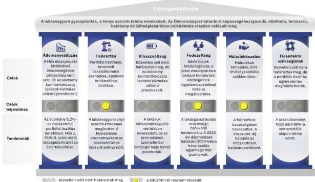

Forrás: Az ellenőrzési tapasztalatok alapján ÁSZ saját szerkesztés

7

---

Összefoglalás

## A PORTFÓLIÓ TISZTÍTÁSA FOLYAMATOS

Az Önkormányzat tulajdonában álló lakásállomány ellenőrzött időszakra vonatkozó főbb jellemzőit és azok tendenciáit a 2. ábra mutatja be.

Az önkormányzati tulajdonú lakások száma és azon belül az üres lakások száma a portfólió tisztítás következtében csökkent, így a lakásállomány kihasználtsági foka az ellenőrzött időszakban növekedett. A lakásösszevonások és a felújítások eredményeként az átlagos lakásméret és az összkomfortos lakások száma emelkedett.

A lakások számának csökkenése ellenére az értékcsökkenést meghaladóan végzett felújítások hatására az önkormányzati lakásállomány bruttó és nettó értéke is növekedett. Az értékesítésből származó bevételeket az Önkormányzat a lakások és lakóépületek felújítására fordította.

Az Önkormányzat az ellenőrzött időszak elején a bérbeadott lakásainak döntő többségét szociális alapon adta bérbe (99,3%-át), költségével bérbeadott lakása nem volt, a lakások 0,7%-át piaci alapon adta bérbe. 2024. december 31-re a szociális alapon bérbeadott lakások aránya nőtt, a piaci bérbeadott lakások részaránya csökkent (0,4%-kal).

2. ábra

### AZ ÖNKORMÁNYZAT TULAJDONÁBAN ÁLLÓ LAKÁSÁLLOMÁNY JELLEMZŐI A 2020-2024. ÉVEKBEN

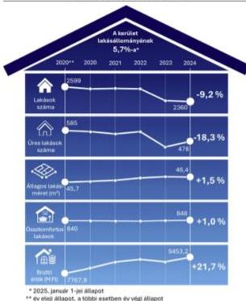

Forrás: Az Önkormányzat adatszolgáltatása alapján ÁSZ saját szerkesztés

## ÖNKORMÁNYZATI CÉL VOLT AZ ELLENŐRZÖTT IDŐSZAKBAN A BÉRLETI DÍJHÁTRALÉKOK CSÖKKENTÉSE

Az Önkormányzat lakásgazdálkodásból származó kiadásai minden évben meghaladták a lakásgazdálkodásból származó bevételeit, az ellenőrzött időszak vonatkozásában összesen 3517,6 M Ft-tal. A pénzügyi egyensúly megteremtésével kapcsolatban célokat az Önkormányzat nem határozott meg. A bevételek tekintetében 2023. október 1-jétől a szociális lakások esetében végrehajtott 76,5-80,0%-os alapdíj emelés jelentett lényeges elmozdulást, amely összhangban állt a célként meghatározott bérleti díj felülvizsgálattal. A lakásgazdálkodás bevételeit meghaladó kiadásokat az Önkormányzat a közhatalmi bevételeiből finanszírozta.

A 2020-2024. években 64 önkormányzati lakás értékesítésére és 93 lakás vásárlására került sor, az ügyletek 77,1%-a a Hős utcai projekthez kapcsolódott. A kedvezőtlen adottságú, rossz műszaki állapotú lakások gazdaságtalan felújítása miatt bontások és a lakásösszevonások miatt 372 lakás megszüntetésére került sor.

Az ellenőrzött időszakban – az Önkormányzat terveinek megfelelően – a határozatlan idejű bérleti szerződéssel bérbeadott önkormányzati lakások aránya fokozatosan csökkent (68,4%-ról 54,0%-ra), ezzel párhuzamosan a határozott idejű bérleti szerződéses lakások aránya nőtt (31,6%-ról 46,0%-ra).

Az Önkormányzatnál az ellenőrzött időszakban a bérlakásokhoz kapcsolódó összes hátralék 3,8%-kal emelkedett, a 2024. év végén 951,8 M Ft volt. Az Önkormányzat felé fennálló közüzemi díjhátralék ugyan 12,0%-kal csökkent, de a lakásbérlők bérleti díjhátralékának 23,6%-os emelkedése azt eredményezte,

8

---

Összefoglalás

hogy a teljes hátralékállomány növekedett. A bérlők közüzemi díjhátralék csökkentését elősegítette, hogy a határozott idejű szerződések megkötésekor az Önkormányzat a tartozásmentességről szóló igazolás bemutatását írta elő.

Az Önkormányzat adatszolgáltatásra irányuló keretmegállapodást kötött 2024. december 9-én a DBH$^{7}$-val, valamint 2023. május 15-én a DHK Zrt.$^{8}$-vel annak érdekében, hogy a bérlők által felhalmozott közüzemi díjhátralékokról az Önkormányzat mielőbb tudomást szerezzen és időben tudjon lépéseket tenni a hátralékkezelési folyamat elindítása érdekében. Az Önkormányzat által megtett intézkedések nem voltak eredményesek, mivel a **kintlévőségek „radikális” csökkentése** – a kitűzött céltól eltérően – a bérleti díjhátralékok emelkedése miatt összességében **nem valósult meg**. A bérleti díjhátralék-állomány összegének és a hátralékkal érintett lakások számának emelkedő tendenciája a jövőre vonatkozóan finanszírozási kockázatot hordoz a lakásgazdálkodás területén, melynek következtében felmerülhet forráselvonás más önkormányzati feladatoktól.

#### TÖBB AZ ÖSSZKOMFORTOS LAKÁS, DE SOK A KIHASZNÁLATLAN INGATLAN

A meglévő lakásállomány **fejlesztésére, felújítására** az Önkormányzat az ellenőrzött időszakban összesen 1321,1 M Ft-ot fordított, amely **eredményeként az összkomfortos lakások aránya** 32,3%-ról 35,9%-ra **emelkedett**, az alacsonyabb komfortfokozatú lakások száma csökkent.

A szükséglakások kihasználtsága minimális volt az ellenőrzött időszakban, azok csak 0,5%-ban kerültek hasznosításra, 2024 végén a 184-ből 177 üresen állt, mert egyéb hasznosításuk célja miatt (bontás, illetve értékesítés) kiürítésük indokolttá vált.

Az üresen álló lakások aránya 2020-ról 2024-re 18,3%-kal csökkent, üzemeltetési költségeik a 2020-2023. években meghaladták a bérbeadott lakásokhoz kapcsolódókat, tekintettel arra, hogy **az üresen álló lakásokhoz kapcsolódó üzemeltetési, karbantartási költségek** teljeskörűen az Önkormányzatot terhelték, így a **lakásgazdálkodás veszteségét növelték**. Az üres lakások több mint 60%-a három éve üresen állt, mivel az Önkormányzat tervezte az értékesítésüket, valamint a bérlőkijelöléssel joggal rendelkező testületek$^{9}$ nem gyakorolták a bérlőkijelölési jogukat. Az üzemeltetési költségek 2024. évben már a bérbeadott lakásoknál voltak magasabbak, figyelemmel az üres lakások számának csökkenésére. 2024. évben az üresen álló lakások üzemeltetési költségének aránya a hasznosítási kiadásokból 21,7% volt, amely az előző évek 34,4%-os átlagát tekintve pozitív tendenciának tekinthető.

Az Önkormányzat az ellenőrzött időszakban hozzájárult a lakosságot érintő lakhatási nehézségek enyhítéséhez az üres lakások számának csökkentésével, a szociális alapú bérbeadás szinte kizárólagos alkalmazásával.

A KVZRT tulajdonában a 2020-2021. évben négy, a 2022-2024. évben három lakás volt, amelyekre nem az Önkormányzatnak volt bérlőkijelölési joga.

2. táblázat

#### AZ ÖNKORMÁNYZAT EGYES LAKÁSGAZDÁLKODÁSI MUTATÓI 2024

|  ÉVES BEVÉTEL (KÖLTSÉGVETÉSI BEVÉTEL 4,2%-A) | ÉVES KIADÁS (KÖLTSÉGVETÉSI KIADÁS 5,6%-A) | FELHALMOZOTT HÁTRALÉK | ÜRES LAKÁSOK ÜZEMELTETÉSI KIADÁSAI | BÉRLETI DÍJAK  |
| --- | --- | --- | --- | --- |
|  23 | 1869,1 M Ft | 951,8 M Ft | 237,1 M Ft | 1039,3 M Ft  |
|  Éves lakásgazdálkodási bevételhez/kiadáshoz viszonyított arány: |   | 50,9% | 12,7% | 76,3%  |

Forrás: ÁSZ saját szerkesztés

9

---

Összefoglalás---

Az ÁSZ véleménye, hogy a tervek és tények összhangjának biztosítása érdekében a fő irányok kijelölése mellett szükség van rövidtávú akciótervek kidolgozására, amelyek tartalmazzák a stratégiai célok eléréséhez szükséges feladatokat, azok végrehajtásának határidejét, felelőseit, mérföldköveit, indikátorait és nyomon követését.

A lakásgazdálkodás veszteségeinek mérséklése érdekében szükséges a bérleti díjhátralékok magas összegét, illetve a három éve üresen álló lakások 60%-os arányának üzemeltetési költségeit nagymértékben csökkenteni.

10

---

# AZ ELLENŐRZÉS EREDMÉNYEI

## 1. Az önkormányzati lakásállomány hasznosításának tervszerűsége, tervek-tendenciák összhangja, figyelemmel az eredményesség és vagyonmegőrzés elveire

### Összegző megállapítás

Az Önkormányzat rendelkezett a lakásállomány hasznosítására vonatkozó, 2020-2024. évekre kitűzött célrendszerrel. A célok többségének teljesítése részben volt eredményes, azonban - a kintlévőségek radikális csökkentése kivételével - tendenciájuk összhangban állt a kitűzött stratégiai célokkal. A célok mérhetőségének és a rövidtávú akciótervek kialakításának hiányában az eredményesség nyomon követése nem volt biztosított. A lakásvagyon könyv szerinti értéke növekedett, a bérlakás-értékesítés bevételeit az Önkormányzat a tulajdonában álló lakások és lakóépületek részleges felújítására fordította, így a vagyonmegőrzés elvei számviteli szempontból érvényesültek.

### I. ÖNKORMÁNYZATI LAKÁSÁLLOMÁNY HASZNOSÍTÁSÁNAK TERVSZERŰSÉGE

Az Önkormányzat az ellenőrzött időszakra vonatkozóan rendelkezett a lakásgazdálkodásra kiterjedő vagyongazdálkodási tervvel$^{10}$, 2015-2020. és 2021-2025. évekre szóló Gazdasági programmal$^{11}$, Integrált Településfejlesztési Stratégiával$^{12}$ és Lakáskoncepcióval$^{13}$, azonban a képviselő-testület$^{14}$ az ellenőrzött időszakban **akciótervet, részfeladatokat, részcélokat nem határozott meg**. A megfogalmazott célokat, azok határidejét és teljesülését a III. számú melléklet mutatja be.

A KVZRT által az Önkormányzat részére készített, az Önkormányzat lakás- és nem lakás célú ingatlanok gazdálkodásával, valamint parkolásüzemeltetéssel kapcsolatos bevételeiről és kiadásairól szóló évenkénti beszámolókban, továbbá a Közjóléti Bizottság$^{15}$ részére a lakásbérleti jogviszonyok alakulásáról szóló félévenkénti tájékoztatókban szereplő információk az egyes megfogalmazott célok Önkormányzat általi nyomon követését nem támogatták. A beszámolók és tájékoztatók megfeleltek az Önkormányzat és a KVZRT közötti közszolgáltatási keretszerződésben meghatározottaknak, azonban a célokhoz kapcsolható eredményeket nem tartalmaztak.

Az Önkormányzat által megfogalmazott stratégiai célokhoz nem készítettek akcióterveket, nem határoztak meg részletes feladatokat, felelősöket, határidőket, mérföldköveket és indikátorokat. Részletes célértékek hiányában az eredmények előrehaladásáról készített beszámolók és tájékoztatók alapján nem volt pontosan megítélhető a célok teljesülése, így a KVZRT lakásgazdálkodáshoz kapcsolódó feladat ellátásának megfelelősége, az önkormányzati érdekek érvényesítése.

11

---

Az ellenőrzés eredményei

A KVZRT az éves beszámolókban és a féléves tájékoztatókban nem tett említést az egyes kitűzött célokhoz képest történt előrehaladásról, nem mutatta be az egyes elért eredményeket a kitűzött célokkal összevetve.

## II. A LAKÁSÁLLOMÁNY FŐBB JELLEMZŐI, SZÁMÁNAK VÁLTOZÁSA, HASZNOSÍTÁSI KATEGÓRIÁI, BÉRLETI SZERZŐDÉSEK

Az Önkormányzat a 2020. év elején 2599 lakással rendelkezett, amely a 2024. év végére 9,2%-kal 2360-ra csökkent.

Az önkormányzati lakások számának alakulását az ellenőrzött időszakban a 3. ábra szemlélteti:

**A lakásállomány ellenőrzött időszakban bekövetkezett csökkenése** a 2015-2020. közötti gazdasági programban hosszú távú célként megfogalmazott **portfólió tisztítás eredménye volt**. Az Önkormányzat az alacsony komfortfokozatú, kedvezőtlen adottságú, rossz műszaki állapotú, gazdaságosan nem felújítható és hasznosítható lakásokat az ellenőrzött időszakban folyamatosan vonta ki a lakásgazdálkodásból. Az Önkormányzat az ellenőrzött időszakban a tulajdonában álló **lakásállomány lakásszámára, a bérlakás-állományban megtestesülő vagyonértékre**

**vonatkozóan célokat nem fogalmazott meg, azonban célul tűzte ki a rossz műszaki állapotú lakások szanálását, az épületek értékesítését.**

Az ellenőrzött időszakban – a lakások számának csökkenése ellenére – az értékcsökkenést meghaladóan végzett felújítások hatására az önkormányzati lakásállomány bruttó (21,7%-kal) és nettó (17,7%-kal) értéke is növekedett.

Az értékváltozás nem volt egyenletes az ellenőrzött időszakban, a megelőző évhez képest 2021. évben volt a legmagasabb a növekedés (7,6-7,9%), 2023. évben egy kisebb (2,8-5,5%) visszaesés történt, mely az Önkormányzat által értékesített 40 lakással állt összefüggésben. A lakások 2021-2024. évek közötti értékesítéséből származó bevételeket az Önkormányzat a lakások és a lakóépületek részleges felújítására fordította. A 2021-2024. évi felújítások összege (1140,3 M Ft) 250,5 M Ft-tal haladta meg a 2020-2024. években a lakásértékesítésből befolyt összeget (889,8 M Ft).

3. ábra

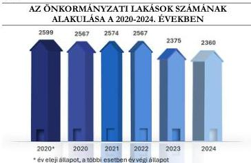

Forrás: Az Önkormányzat adatszolgáltatása alapján ÁSZ saját szerkesztés

12

---

Az ellenőrzés eredményei

4. ábra

# **AZ ÖNKORMÁNYZATI LAKÁSOK SZÁMÁNAK JOGCÍM SZERINTI VÁLTOZÁSA A 2020-2024. ÉVEKBEN**

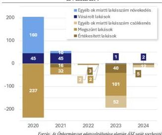

Forrás: Az Önkormányzat adatszolgáltatása alapján ÁSZ saját szerkesztés

Az önkormányzati lakások számának jogcím szerinti változását a 4. ábra -szemlélteti.

A lakásállomány változásában jelentős szerepet játszott a 2029/2017 (XII. 27.) Korm. határozatban¹⁶, illetve a projekt tervdokumentumaiban foglaltak végrehajtása, a Magyarország Kormánya által a Hős utca 15/A–B szám alatti ingatlan helyzetének rendezésére biztosított 2100 M Ft keretösszegből az Önkormányzat 1910 M Ft-ot felhasznált. Ebből az összegből az Önkormányzat a 2020-2021. évben 45-45 lakást vásárolt a Hős utcai lakóktól, illetve a Hős utcai bérlakásban élők elhelyezése érdekében. Az ÁSZ ellenőrzés jó gyakorlatként értékelte, hogy az Önkormányzat a 2023-2024. években megvásárolt lakásokkal

bővítette a bérbeadással hasznosítható lakásállományát olyan társasházban, ahol már rendelkezett tulajdonnal. A társasházakon belüli további tulajdonszerzés elősegítheti a lakások gazdaságosabb kezelését. A társasházon belüli magasabb tulajdoni hányad jelentősebb rendelkezési jogot biztosít az Önkormányzat számára a közös területek tekintetében.

Az Önkormányzat 2020. évben 237, 2021. évben 32, 2022. évben kettő, 2023. évben 101 önkormányzati lakást szüntetett meg, ezzel a műszaki állapota miatt kiürítésre ítélt lakóépületekben a bérbeadással továbbiakban nem hasznosítható lakások lakásgazdálkodásból történő kivonása történt meg, amely összhangban volt a célként kitűzött portfólió tisztítással. A 237 lakás a Hős utcai projekthez kapcsolódott, 34 lakás a leromlott műszaki állapot miatt kivonásra, majd árverésen történő értékesítésre, illetve bontásra került. A 101 lakás esetében lakásösszevonásra került sor, illetve kiürített lakóépület esetében a lakás bontással szűnt meg. Az egyéb ok miatti lakásszám csökkenést és növekedést elsősorban az adatszolgáltatást támogatni képes, a vagyonkataszteri egyezőséget is biztosító nyilvántartás hiánya indokolta. A nyilvántartások hiányosságai miatt a KSH jelzése alapján a 2024. évi OSAP statisztikai adatszolgáltatás utólagosan pontosításra szorult. A lakásgazdálkodásból előző években kivont lakásokat a KSH a 2024. évi statisztikában kérte feltüntetni, míg az előző évi statisztikák utólagos módosításától eltekintett. Az Önkormányzat az ÁSZ felé teljesített tanúsítványi adatszolgáltatás során a korrekció lakásállományra gyakorolt hatását – tényszerűen – az ellenőrzött éveken átvezette.

13

---

Az ellenőrzés eredményei

A 2023. évben 40 lakás értékesítésére került sor, amelyből 31 a Hős utcai projektet érintette. Az Önkormányzat az ellenőrzött időszakban fejezte be a Hős utcai projekt keretében az épület kiürítését, az

5. ábra

# A LAKÁSÁLLOMÁNY HASZNOSÍTÁS SZERINTI MEGOSZLÁSA A 2020-2024. ÉVEKBEN

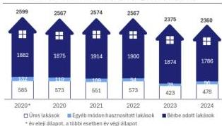

Forrás: Az Önkormányzat adatszolgáltatása alapján ÁSZ saját szerkesztés

megoszlását az 5. ábra szemlélteti.

2020. január 1-jén a bérbeadott önkormányzati lakások 99,3%-a (1869 lakás), 2024. december 31-én 99,7%-a (1781 lakás) volt szociális alapon bérbeadott. Költségelvű bérbeadásra nem került sor, a piaci alapon bérbeadott lakások száma folyamatosan csökkent, mert a határozott idő leteltét követően azokat az Önkormányzat szociális alapon hasznosította tovább. A piaci alapon bérbeadott lakások száma az ellenőrzött időszakban 13-ról ötre, 61,5%-kal csökkent.

Az egyéb – többek között szolgálati lakás, vagy más közérdekű hasznosítási – jogcímen, valamint a jogcím nélkül használt lakások száma az ellenőrzött időszakban 132-ről 96-ra, 27,3%-kal csökkent, ezen belül a rendszeres bérleményellenőrzések hatására a jogcím nélkül használt lakások száma 113-ról 74-re, 34,5%-kal csökkent, a szolgálati lakás vagy más közérdekű célú hasznosítás 19-ről 22-re, 15,8%-kal nőtt.

A szociális, illetve piaci alapon bérbeadott lakások részaránya jelentős eltérést mutatott a X. kerület tekintetében a főváros többi kerületének adataihoz képest, amelyet a 6. ábra szemléltet. A KSH adatsorai alapján a fővárosi kerületekben az ellenőrzött időszakban növekedett a piaci alapon bérbeadott lakások részaránya (11,5%-ról 21,7%-ra) és csökkent a költségelvű és a szociális alapon bérbeadott lakások részaránya (előbbi 40,5%-ról 40,1%-ra, utóbbi 44,8%-ról 34,9%-ra). Ezzel szemben a X. kerületben a lakások túlnyomó többségét szociális alapon adták bérbe az ellenőrzött időszak egészében.

14

---

Az ellenőrzés eredményei

6. ábra

# **AZ ÖNKORMÁNYZATI LAKÁSÁLLOMÁNY LAKBÉR MEGÁLLAPÍTÁS MÓDJA SZERINTI  
MEGOSZLÁSÁNAK ALAKULÁSA A FŐVÁROSI KERÜLETEK ADATAIHOZ KÉPEST  
A 2020-2024. ÉVEKBEN**

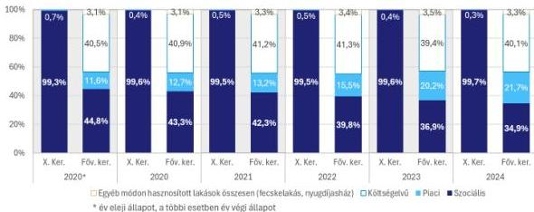

Forrás: Ellenőrzött szervezet és a KSH adatszolgáltatása alapján ASZ saját szerkesztés

Az ellenőrzött időszakban az Önkormányzatnál határozatlan időre bérbeadott lakások részaránya folyamatosan csökkent, 68,4%-ról 54,0%-ra, a határozott idejű bérleti szerződésű lakások részaránya pedig fokozatosan nőtt 31,6%-ról 46,0%-ra. A határozott idejű szerződések számának növekedése az Önkormányzat célkitűzései között dokumentáltan nem szerepelt, ugyanakkor lehetőséget adott a lakáscserék, lakásösszevonások lebonyolítására és a rossz műszaki állapotú ingatlanok értékesítésére, valamint könnyebb hozzáférhetőséget biztosított a rászoruló rétegek számára a lakhatás biztosítására szociális alapon meghatározott bérleti díj mellett. A lakás bérbeadására vonatkozó döntést a Közjóléti Bizottság, a határozatlan időre szóló bérbeadással kapcsolatos döntést a Képviselő-testület hozta meg.

A 2020-2024. években történt lakáskiutalások során összesen 5971 lakó beköltözésére került sor. A lakásba költözők száma az ellenőrzött időszakban évenként hasonlóan alakult (1055-1314 fő), a kiutalással érintett lakások laksűrűsége (egy lakásra jutó lakók száma) 2,4 fő. Az ellenőrzött időszakban a tárgyévben önkormányzati tulajdonú lakásba költöző személyek száma összesen átlagosan 25,4%-át tette ki az önkormányzati tulajdonú lakásban lakók létszámának. A megüresedett lakások száma az időszakban emelkedett, ugyanakkor a tárgyévi lakásigénylések száma csökkenő tendenciát mutatott.

### III. LAKÁSGAZDÁLKODÁSBÓL SZÁRMAZÓ BEVÉTELEK ÉS KIADÁSOK

A lakásgazdálkodásból származó kiadások minden évben jelentősen, az ellenőrzött időszakban összesen 3517,6 M Ft-tal haladták meg a lakásgazdálkodásból származó bevételeket. A negatív egyenleget elsősorban a KVZRT felé történő – a lakásgazdálkodással összefüggésben keletkezett veszteségeinek ellensúlyozására szolgáló – kompenzáció, illetve a lakásvásárlások és felújítások okozták. Az eltérést az Önkormányzat a közhatalmi bevételeiből finanszírozta. A különbségből 912,6 M Ft a lakáshasznosítás, 2605,0 M Ft a lakásgazdálkodás további tevékenységei során keletkezett.

A lakásgazdálkodásból származó bevételek és kiadások összetételének alakulását a 2020-2024. években a 7. ábra szemlélteti.

15

---

Az ellenőrzés eredményei

7. ábra

### A LAKÁSGAZDÁLKODÁS BEVÉTELEINEK ÉS KIADÁSAINAK ALAKULÁSA A 2020-2024. ÉVEKBEN

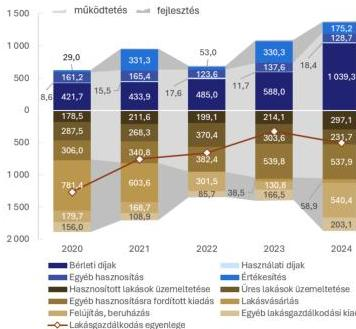

Forrás: Az Önkormányzat adatszolgáltatása alapján ÁSZ saját szerkesztés

Az Önkormányzat lakáshasznosításból származó bevételei és kiadásai minden évben emelkedtek, a bevételek egyedül 2024. évben haladták meg a kiadásokat.

Ez az Önkormányzat 2023. október 1-jétől végrehajtott lakbér emelésének volt köszönhető, amelynek hatása a bevételek emelkedésében 2024-re egyértelműen jelentkezett.

Az Önkormányzat lakásgazdálkodásának meghatározó bevételi forrását az ellenőrzött időszakban a lakások értékesítéséből származó bevételek jelentették. A 2020-2024. években 64 önkormányzati lakás értékesítésére került sor, amelyből 31 kapcsolódott a Hős utcai projekthez és a további 33 lakásból 16 lakás (48,5%-a) volt a portfóliótisztítással összhangban félkomfortos, komfort nélküli, vagy szükséglakás.

Az Önkormányzat a Lakás tv.$^{17}$

előírásaival összhangban a bérlakás-értékesítés bevételeit külön számlán, elkülönítetten helyezte el, majd a költségvetési főszámlára történő átvezetést követően a lakások és a lakóépületek részleges felújítására fordította.

A kiadások között az üres lakások üzemeltetési kiadása az ellenőrzött időszakban 1461,5 M Ft összegben meghatározó jelentőségű, továbbhárítási lehetőségek hiányában az Önkormányzatot véglegesen terhelő tételt, a lakásgazdálkodáshoz kapcsolódó kiadásokon belül 17,8%-os részarányt képviselt.

Az Önkormányzat lakásgazdálkodásának további kiadásai főként lakásvásárláshoz és felújításhoz kapcsolódtak. Az Önkormányzat 2021. június 29-éig 1008,2 M Ft-ot fordított a Hős utcai lakók elhelyezése érdekében lakásvásárlásra, az ott lakók máshol történő elhelyezésére, melynek forrását a 2029/2017. (XII. 27.) Korm. határozat biztosította. Ezen túl a felújítási kiadások voltak jelentősebbek az ellenőrzött időszakban: 2020-ban 179,7 M Ft, 2021-ben 168,7 M Ft, 2022-ben 301,5 M Ft, 2023-ban 130,8 M Ft, 2024-ben 540,4 M Ft, amelyek az önkormányzati bérlakásállomány minőségének javítása mellett a kiadások jelentős emelkedéséhez is hozzájárultak. Önkormányzat általi lakásépítésre az ellenőrzött időszakban nem került sor.

#### IV. BÉRLETI DÍJAK HASZNOSÍTÁSI KATEGÓRIÁK SZERINTI BEMUTATÁSA

Az Önkormányzat célul tűzte ki a bérleti díjak felülvizsgálatát, a lakások fenntartási költségeinek figyelembevételével történő megállapítását, amelynek eredményeként 2023. október 1-jétől a szociális alapon bérbeadott lakásoknál 76,5%-80,0% közötti bérleti alapdíj emelést hajtott végre. Az Önkormányzat a 2023. évet megelőzően 2012. év óta nem emelte a szociális bérlakások lakbér alapdíját.

16

---

Az ellenőrzés eredményei

Piaci alapon történő bérbeadásra utoljára az ellenőrzött időszakot megelőzően, a 2015-2016. években került sor, melynek során a bérleti díj meghatározása licit alapján történt. Az Önkormányzat az ellenőrzött időszakban a licit eljárást nem alkalmazta, ugyanakkor Lakásrendeletének$^{18}$ 23. §-a az ellenőrzött időszak egészében lehetőséget adott annak alkalmazására. **A lakásrendeletben rögzített eljárás jogi kockázatot hordoz, mivel biztosítja, hogy a licit során a lakbér mértéke a Lakás tv. 34. § indoklásában foglaltakkal ellentétben „szabad megállapodás” tárgyává váljon és annak konkrét összegét ne a helyi rendelet keretei határozzák meg.**

Az Önkormányzat költségével nem adott bérbe lakásokat. **Az Önkormányzat nem végzett** - az Ltv. 34. § (4)-(5) bekezdése szerint - **arra vonatkozó számításokat, hogy mint bérbeadónak, az épülettel, az épület központi berendezéseivel és a lakással, a lakásberendezésekkel kapcsolatos ráfordításai megtérüljenek**, így a piaci alapon bérbeadott lakások esetében nem volt megállapítható, hogy az abból származó bevétel nyereséget is tartalmazott-e az ellenőrzött időszakban. Az Önkormányzat – az ellenőrzött időszakot megelőzően – a piaci alapon történő bérbeadás során nyilvános forrásból elérhető lakáspiaci információk elemzése alapján határozta meg a bérleti díjakat, figyelemmel arra, hogy a licit alapjául szolgáló legkisebb bérleti díj a lakáspiaci bérleti díj alatt maradjon.

A 2024-ben már csak öt piaci alapon bérbeadott önkormányzati lakás legkisebb bérleti díja az ellenőrzött időszakban nem változott, elmaradása a budapesti X. kerületi átlagos lakáspiaci lakbértől a 2020-2022. években 30,0-40,0% közötti, 2023-2024. években 50,0% feletti értéket mutatott. Az elmaradás a 2023-2024. években jelentős volt, ugyanakkor ezen lakások számának csökkenő tendenciája támogatta az Önkormányzat azon tudatos törekvését, hogy a szociális szempontokat helyezte előtérbe.

Az Önkormányzat a szociális alapon bérbeadott lakások lakbérét a bérlő jövedelmi viszonyaitól függően határozta meg, ugyanakkor legmagasabb összegű bérleti díj 2023. szeptember 30-ig megközelítette (840 Ft/m$^{2}$), 2023. október 1-jétől meghaladta (2000 Ft/m$^{2}$) a piaci alapon bérbeadott lakás legkisebb bérleti díját (70 m$^{2}$ alapterületig 1000 Ft/m$^{2}$). A szociális alapon bérbeadott lakások bérleti díjának a lakásrendeletben megállapított legmagasabb értéke meghaladta a piaci alapon bérbeadott lakások bérleti díjának mértékét.

A KSH adatai alapján 2023-2024 között a X. kerületben kiadó lakások átlagos lakbére 17,7%-kal nőtt, szemben az Önkormányzat 80% körüli emelésével, azonban 2024-re az egy m$^{2}$-re jutó X. kerületi lakások

8. ábra

### A LEGMAGASABB ÖNKORMÁNYZATI BÉRLETI DÍJAK ÉS A KERÜLETI ÁTLAGOS BÉRLETI DÍJAK ALAKULÁSA A 2020-2024. ÉVEKBEN (FT)

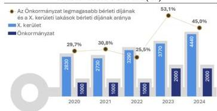

Forrás: Az Önkormányzat adatszolgáltatása alapján ÁSZ saját szerkesztés

bérleti díja (4440 Ft/m$^{2}$) még így is több, mint kétszerese volt az önkormányzati legmagasabb bérleti díjnak (2000 Ft/m$^{2}$).

Az Önkormányzat által alkalmazott bérleti díjak és hasznosítási kategóriák – a 2015-2016. években elhatározott szándéknak megfelelően – hozzájárultak a szociálisan hátrányosabb helyzetűek lakhatási nehézségeinek enyhítéséhez.

A X. kerületi kiadó lakások, illetve az önkormányzati lakások legmagasabb m$^{2}$ árát és azok arányát a 2020-2024. években a 8. ábra mutatja be.

17

---

Az ellenőrzés eredményei

A törekvés társadalmi, szociális szempontból figyelemre méltó, ugyanakkor az Önkormányzat a szükséges ráfordítások számításának hiányában a piaci kategória esetében egy lehetséges – nyereségként meghatározott – bevételi forrásról mondhat le.

## V. HÁTRALÉKKEZELÉS

Az Önkormányzatnál az ellenőrzött időszakban a **bérlakásokhoz kapcsolódó összes hátralék** a 2020. január 1-jei 917,2 M Ft-ról 2024. december 31-ére 951,8 M Ft-ra, **3,8%-kal emelkedett**. Ebben meghatározó volt a lakásbérlők bérleti díjhátraléka, valamint az Önkormányzat felé fennálló közüzemi díjhátraléka.

**A bérleti díjhátralék összege az ellenőrzött időszakban 23,6%-kal nőtt, a közüzemi díjhátraléké 12,0%-kal csökkent. Az ellenőrzött időszak elején a bérleti díjhátralék összege az éves bérleti díj bevétel 121,0%-át, míg az időszak végén az 57,3%-át tette ki, a változás a bérleti díjak 2023. évi emelésére vezethető vissza.**

Az Önkormányzat a lakásgazdálkodásból származó bevételei növelése érdekében célul tűzte ki a hátralékok behajtását, a kintlévőség „radikális” csökkentését. A csökkentés egyik eszköze a határozott idejű bérleti szerződések lejáratát követően, a szerződés meghosszabbítása előtt a bérlőtől bekért, a közüzemi szolgáltatók által kiállított ún. „*nullás igazolás*” volt, amely garantálta, hogy a bérlőnek nincs a lakáshoz kapcsolódó közüzemi díjhátraléka.

> A tartozásmentességről szóló igazolás megkövetelése mellett **jó gyakorlatként azonosítható** az Önkormányzat részéről, hogy 2023-ban adatszolgáltatási keretmegállapodást kötöttek a DBH Zrt.-vel, valamint a DHK Zrt.-vel annak érdekében, hogy a bérlők által felhalmozott közüzemi hátralékokról az Önkormányzat mielőbb tudomást szerezzen és megtegye a rendelkezésére álló szükséges lépéseket. A cégek bevonása az Önkormányzat számára nem járt többletköltséggel, ugyanakkor elősegítette, hogy a kapott információk alapján korábban tudta igényét érvényesíteni a bérlőkkel szemben.

Az ellenőrzött időszakban az önkormányzati bérlakásokkal kapcsolatos hátralékok összege nem csökkent, az Önkormányzat által megfogalmazott - **a kintlévőségek „radikális” csökkentésére irányuló - cél nem teljesült**, a közüzemi díjhátralékok kezelésével kapcsolatos tevékenység eredményes volt, míg a bérleti díjak hátralékkezelése nem volt eredményes.

A 2024. év végén a teljes önkormányzati lakásállomány (2360 lakás) 45,0%-a, a hasznosított lakások (1882 lakás) 56,4%-a volt hátralékkal érintett. Az egy hasznosított lakásra jutó hátralék összege a kezdeti 455,4 E Ft-ról 505,7 E Ft-ra, 11,0%-kal emelkedett.

Hátralékot a 2020-2024. években az Önkormányzat nem engedett el, a lakásgazdálkodáshoz kapcsolódó követelések vonatkozásában 2021. évben 116,6 M Ft értékvesztés került elszámolásra. Követelés kivezetésére behajthatatlanság címén nem került sor a 2020-2021. években. A bérlakások esetében felhalmozott bérleti díj vagy közmű tartozás elengedésére nem volt mód. Az adós örökös nélküli elhalálozása miatti behajthatatlanság esetén került sor a tételek leírására, ennek hatására a követelésállomány a 2022. évben 37,8 M Ft-tal, a 2023. évben 4,0 M Ft-tal, a 2024. évben 5,6 M Ft-tal csökkent. A behajthatatlanság jellemző indoka az adós – vagyon és örökös nélküli – elhalálozása volt.

**A közüzemi díjhátralékok vonatkozásában az Önkormányzat intézkedései eredményesek voltak, a növekvő bérleti díjhátralékok finanszírozási kockázatot hordoznak.**

18

---

Az ellenőrzés eredményei

Mind a bérleti díjhátralék, mind a közüzemi díjhátralék esetében az Önkormányzat részletfizetési lehetőséget biztosított a hátralékkal érintett bérlők számára, valamint egyedi ügyekben jogi eljárást indítottak a tartozások behajtására. Az önkormányzati igények érvényesítését, a behajtás sikerességét ugyanakkor objektív tényezők is (legális jövedelem hiánya, elhúzódó bírósági eljárások) hátráltatták. A hátralékok kezelésének folyamatához eljárásrend nem kapcsolódott. A KVZRT a Közszolgáltatási Szerződésben megjelölt hátralékkezelési feladatait a Lakásrendelet szabályai szerint végezte, amelynek 25. §-a azonban csak a részletfizetés időszakáról rendelkezett. Az ÁSZ véleménye szerint a hátralékkezelési folyamat szabályozása egységes keretet adhatott volna a hátralékok behajtásának gyakorlati megvalósításához, támogatva a felelős vagyongazdálkodást.

## VI. BÉRLAKÁSÁLLOMÁNY FEJLESZTÉSE, A LAKÁSÁLLOMÁNY MINŐSÉGÉNEK VÁLTOZÁSA

Az Önkormányzat a bérlakásállomány fejlesztésére célul tűzte ki a kezelt portfólió tisztítását, a megszüntetendő épületekből a bérlők kiköltöztetését, a leromlott lakásállomány szanálását, az épületek értékesítését, bontását, a Hős utcai projekt keretében a lakóépület kiürítését és értékesítését, az alacsony komfortfokozatú lakások értékesítését, lakásállományból történő kivonását.

A meglévő lakásállomány fejlesztésére, felújítására az Önkormányzat az ellenőrzött időszakban – változó tendencia mellett – összesen 1321,2 M Ft-ot fordított, amely 2024-ben volt a legmagasabb (540,4 M Ft) és lakásonként átlagosan 229,0 E Ft kiadást jelentett.

**Az önkormányzati lakásállományhoz kapcsolódó felújítás, beruházás összege minden évben meghaladta a lakásállomány után a tárgyévben elszámolt értékcsökkenési leírás összegét.**

Az értékcsökkenés mértéke az ellenőrzött időszakban 1,25-1,75% között mozgott, mivel a lakásállományban 214 műemlék jellegű lakás szerepelt, így esetükben az Önkormányzat nem számolt el értékcsökkenést.

A teljes időszak vonatkozásában a felújítások, beruházások értéke (1321,21 M Ft) az elszámolt összes értékcsökkenés (682,0 M Ft) közel kétszeresét (193,7%) jelentették, tehát az értékcsökkenések kompenzálásához szükséges mértéken felül hajtották végre a vagyonpótlást, biztosítva a lakásvagyon könyv szerinti értékének megőrzését. 2024. évben az eszközpótlási arány kiemelkedő volt, 3,5%.

Fontos ugyanakkor felhívni arra a figyelmet, hogy a Számv. tv.$^{19}$ és az Áhsz.$^{20}$ előírásai alapján az értékcsökkenés elszámolását a lakások bekerülési – azaz a lakásállomány meghatározó része vonatkozásában az 1990. évben megállapított – értéke figyelembevételével számítják. Így a számviteli előírások alapján számított értékcsökkenési leírás kompenzálása önmagában nem biztosítéka a vagyonérték megőrzésének.

19

---

Az ellenőrzés eredményei

Az Önkormányzat lakásállományának állag szerinti összetételére vonatkozó tendencia az ellenőrzött időszakban nem volt kimutatható, tekintettel arra, hogy az Ingatlanvagyon-kataszter szakrendszerben történő rögzítésén kívül az Önkormányzat ezzel kapcsolatos külön nyilvántartást nem vezetett. Az állagra vonatkozó historikus adatok nyilvántartásának kötelezettségét jogszabály nem írja elő, azonban célszerű annak vezetése az ÁSZ véleménye szerint, mert a folyamatos nyilvántartás hiánya problémákat vet

9. ábra

# AZ ÖNKORMÁNYZATI LAKÁSÁLLOMÁNY KOMFORTFOKOZAT SZERINTI ÖSSZETÉTELE A 2020-2024. ÉVEKBEN (%)

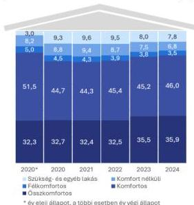

Forrás: Az Önkormányzat adatszolgáltatása alapján ÁSZ saját szerkesztés

fel a nyomon követés szempontjából, figyelemmel a lakások felújításáról, költségszükségletének meghatározásáról szóló döntés meghozatalára.

Az önkormányzati lakásállomány komfortfokozat szerinti összetételének alakulását a 2020-2024. években a 9. ábra szemlélteti.

A teljes lakásállományt tekintve a legmagasabb komfortfokozatot képviselő összkomfortos és komfortos lakások aránya a 2020. január 1-jei 83,8%-nál (2177 lakás) valamennyi évben kevesebb volt, 80,0% körüli értéket mutatott. Az összkomfortos lakások aránya 32,3%-ról (840 lakás) 35,9%-ra (848 lakás) nőtt. Ezzel párhuzamosan a komfortos lakások aránya 51,4%-ról (1337 lakás) 46,0%-ra (1085 lakás) csökkent. A félkomfortos és komfort nélküli lakások állományában csökkenés, a szükség- és egyéb lakások esetében a kiinduló állapothoz (2020. január 1.) képest növekedés, de a 2020-2024. évek során csökkenés következett be.

A hasznosított és nem hasznosított lakások különválasztása során is hasonló tendencia mutatkozott. A nem hasznosított lakások között a szükség- és egyéb lakások aránya kimagasló, 40,0% körüli értéket képviselt a hasznosított 0,5%-hoz képest. A 2024. év végén a 184 szükség- és egyéb lakásból már csak hét került hasznosításra, tekintettel arra, hogy a 177 lakás – gazdaságos felújítási lehetőség hiányában – értékesítésének előkészítése érdekében azok folyamatosan, az évek során kiürítésre kerültek. A kiürítendő épületekben lévő lakásokat az Önkormányzat már nem adta bérbe, nem hasznosította.

# VII. ÜRESEN ÁLLÓ LAKÁSOKKAL VALÓ GAZDÁLKODÁS

Az Önkormányzat az üres lakások számának vagy arányának csökkentését nem tűzte ki célul, ennek ellenére az üresen álló lakások száma 2020-ról 2024-re 585-ről 478-ra, 18,3%-kal csökkent, aránya az ellenőrzött időszakban 17,8%-22,5% közötti értékeket mutatott, 2024. december 31-én 20,3% volt. A lakásállomány kihasználtsága az ellenőrzött időszakban 80,0% körüli volt, amely hasonlóan alakult a KSH nyilvános adatsoraiban kimutatott országos adathoz (79,4%) képest.

20

---

Az ellenőrzés eredményei

10. ábra

# **AZ ÖNKORMÁNYZAT HASZNOSÍTOTT ÉS ÜRES LAKÁSAINAK SZÁMA ÉS A KIHASZNÁLTSÁG A 2020-2024. ÉVEKBEN**

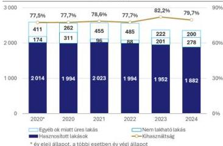

Forrás: Az Önkormányzat adatszolgáltatása alapján ÁSZ saját szerkesztés

A hasznosított lakások átlagos mérete (39,8-52,6 m²) mindegyik évben meghaladta a nem hasznosított, üres lakások méretét (34,5-37,9 m²). A hasznosított és nem hasznosított lakások mérete a 2023. évben közelített egymáshoz a legjobban, a különbség csak 3 m² volt.

A nem hasznosított, üresen álló lakásokból a nem lakható (pl. felújítás alatt álló) lakások aránya 29,7%-ról 58,2%-ra (174-ről 278-ra) nőtt 2020-2024 között. Ezzel szemben az egyéb ok (pl. bérlőkijelölés folyamatban) miatt üres ingatlanok száma és aránya (70,3%-ról 41,8%-ra) is mérséklődött.

**Az üresen álló lakásokból a legnagyobb hányadot a 2020-2024 közötti időszakban a legalább három éve üresen álló lakások képviselték (53,0%-74,2%).** A magas arány két okra vezethető vissza. Egyrészt az értékesítésre kijelölt ingatlanok lakásait az Önkormányzat már nem hasznosította, másrészt az üresen álló lakások egy része felett szerződés alapján a testületek rendelkeztek bérlőkijelölési joggal, így az Önkormányzat nem hasznosíthatta őket.

A nem hasznosított, üres lakásállomány használaton kívüliség időtartama szerinti alakulását a 11. ábra szemlélteti.

A nem hasznosított, üresen álló lakások hasznosításba vételének, a bérlőcserék felgyorsulására utal, hogy **az egyéb ok miatt üres (pl. bérlőkijelölés folyamatban) lakások száma jelentősen csökkent** a 2024. évre (200 lakás) a 2020. január 1-jei állapothoz képest (411 lakás).

11. ábra

# **AZ ÖNKORMÁNYZATI ÜRES LAKÁSÁLLOMÁNY HASZNÁLATON KÍVÜLISÉG IDŐTARTAMA SZERINTI ALAKULÁSA A 2020-2024. ÉVEKBEN**

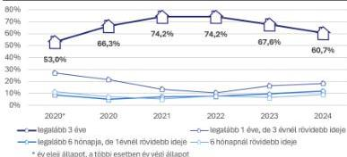

Forrás: Az Önkormányzat adatszolgáltatása alapján ÁSZ saját szerkesztés

21

---

*Az ellenőrzés eredményei*---

Az üres lakásokat azok műszaki állapotától függően helyreállítási kötelezettséggel adta bérbe az Önkormányzat, vagy kivonta a lakásgazdálkodásból.

Az üresen álló lakások üzemeltetési költségei a 2020-2023 években meghaladták a bérbeadott lakásokhoz kapcsolódót, tekintettel arra, hogy az üresen álló lakásokhoz kapcsolódó üzemeltetési, karbantartási költségek az Önkormányzatot terhelték, így a lakásgazdálkodás veszteségét növelték. Az üres lakások számának csökkenésével párhuzamosan az azokhoz kapcsolódó üzemeltetési költségek is csökkentek 2023-tól, 2024. évben a bérbeadott lakások üzemeltetési költsége (297,1 M Ft) már 28,2%-kal haladta meg az üres lakásokhoz kapcsolódót.

### VIII. A KVZRT LAKÁSAI

A KVZRT az ellenőrzött időszak elején négy lakással rendelkezett, amelyek az Önkormányzat bérlőkijelölési jogával nem voltak érintettek. A lakások hasznosítása a piaci viszonyok függvényében és legtöbb esetben a munkavállalók támogatása érdekében, a munkaerő megtartásával összefüggő célból valósult meg.

22

---

# JAVASLATOK

Az ÁSZ tv. 33. § (1) bekezdésében foglaltak értelmében az ellenőrzött szervezet vezetője köteles a jelentésben foglalt megállapításokhoz kapcsolódó intézkedési tervet összeállítani és azt a jelentés kézhezvételétől számított 30 napon belül az ÁSZ részére megküldeni. Az ÁSZ a jelentésben foglalt megállapításokhoz kapcsolódóan az alábbi javaslatok tekintetében várja el az intézkedési terv elkészítését.

## BUDAPEST FŐVÁROS X. KERÜLET KŐBÁNYA ÖNKORMÁNYZATA POLGÁRMESTERE RÉSZÉRE

1. Intézkedjen az Állami Számvevőszék nyilvánosságra hozott jelentésének a kézhezvételét követő 30 napon belül a Képviselő-testület elé terjesztéséről.
2. A kitűzött célok teljesítése mérésének, objektív értékelésének érdekében kezdeményezze, hogy az Önkormányzat által kitűzött, lakásgazdálkodással kapcsolatos stratégiai célkitűzésekhez készüljenek akciótervek, amelyek részletezik a kapcsolódó feladatokat, határidőket, felelősöket, indikátorokat.
3. A lakások hasznosításának előmozdítása, indokolt esetben elidegenítése érdekében vizsgálja meg az üresen álló lakásállomány csökkentésére tett intézkedések hatékonyságát.
4. Vizsgálja meg a bérlakásokkal kapcsolatos hátralékok csökkentését elősegítő intézkedések hatékonyságát, különös tekintettel a bérleti díjhátralékokra.
5. Kezdeményezze az Önkormányzat lakásállományának állag szerinti összetételére vonatkozó, folyamatos nyomonkövetés lehetőségét biztosító nyilvántartás kialakítását és folyamatos vezetését, elősegítve ezzel a döntéselőkészítést a lakások felújításáról, és a felújítási kiadások tervezését.
6. Kezdeményezze a piaci alapon bérbeadott lakások lakbérének meghatározása vonatkozásában a Lakásrendelet és a Lakás tv. 34. § indoklásában foglaltak összhangjának megteremtését.

23

---

# I. FÜGGELÉK: ÉSZREVÉTELEK

A jelentéstervezetet az ÁSZ 15 napos észrevételezésre megküldte az ellenőrzött szervezet vezetőjének az ÁSZ tv. 29. §* (1) bekezdése előírásának megfelelően.

A jelentéstervezet megállapításaira Budapest Főváros X. kerület Kőbányai Önkormányzat Polgármestere és Budapest Főváros X. Kerület Kőbányai Polgármesteri Hivatal Jegyzője észrevételt tett.

Az elfogadott észrevételek alapján az ÁSZ módosította a jelentést. A Függelék tartalmazza az ellenőrzött szervezetek vezetői által megtett és az ÁSZ által figyelembe nem vett észrevételeket, valamint azok el nem fogadásának indoklását.

1.

Az észrevétellel érintett megállapítás:

„Az ellenőrzés eredményközpontú megközelítést alkalmazott, amely során arra kereste a választ, hogy az Önkormányzat a tulajdonában álló lakásállomány hasznosítására vonatkozóan rendelkezett-e célokkal, a hasznosítás tervezetten, a tervekkel összhangban, az eredményesség és a vagyonérték megőrzésének elveire figyelemmel történt-e.” (Összefoglalás, 5. oldal utolsó bekezdése)

„A KSH 2022. évi népszámlálási adatai alapján a X. kerület 75 628 fős lakosságának 15,7%-a 19 év alatti, 23,7%-a 60 év feletti, mely adatok nem mutatnak jelentős eltérést a Budapest egészére érvényes 16,9%-os, illetve 25,9%-os értékektől. A kerületi lakosság 36,3%-a nem rendelkezik érettségivel, mely meghaladja a budapestiek 29,0%-os értékét. Felsőfokú végzettségű a lakosság 24,8%, amely elmaradást jelent a fővárosi 34,1%-os aránytól. A X. kerületben a fővárosban mérttel közel azonos szintű a foglalkoztatottság, 54,0%, illetve 54,2% értékekkel, ahogy a munkanélküliek aránya is szinte megegyező volt 2022-ben (2,4%, illetve 2,2%).” (Összefoglalás, 6. oldal 3. bekezdése)

Az észrevétel tartalma:

„A Tervezet megállapításaival, következtetéseivel és a megfogalmazott javaslatokkal összefüggésben általánosságban szükséges értékelni az eredményesség önkormányzati lakásgazdálkodással és kifejezetten Budapest Főváros X. kerület Kőbányai Önkormányzat (a továbbiakban: Önkormányzat) lakásgazdálkodásával összefüggő értelmezhetőségét. A Tervezet 5. oldalán rögzített eredményközpontú megközelítés nem szakítható el az önkormányzati lakásgazdálkodás sajátos önkormányzati gazdálkodási,

* 29. § (1) Az Állami Számvevőszék az ellenőrzési megállapításait megküldi az ellenőrzött szervezet vezetőjének vagy az általa megbízott személynek, és annak, akinek személyes felelősségét állapította meg.

(2) Az ellenőrzött szervezet vezetője és a felelősként megjelölt személy az ellenőrzés megállapításaira tizenöt napon belül írásban észrevételt tehet.

(3) Az Állami Számvevőszék az észrevételre a beérkezésétől számított harminc napon belül írásban válaszol. A figyelembe nem vett észrevételeket köteles a jelentésben feltüntetni, és megindokolni, hogy azokat miért nem fogadta el.

24

---

1. Függelék: Észrevételek---

költségvetési, de különösen jogi és társadalmi-szociális eszközrendszerétől. A Tervezet által felvonultatott számos demográfiai és gazdálkodási statisztikai adat felsorolása a megfelelő összefüggések és következtetések bemutatása nélkül öncélú, és számos esetben félrevezető lehet.

Az Önkormányzat Képviselő-testületének tudatos és kifejezett döntése – amely az erre hivatott, a lakásgazdálkodás elveit és eszközeit a törvényi felhatalmazás keretei között meghatározó lakásrendeletben megjelenik – a szociális cél elsődlegessége. Az Önkormányzat lakásainak a hasznosítása – a Tervezet 6. oldalán felsorakoztatott demográfiai és társadalmi statisztikai mutatókra is figyelemmel – az álláspontunk szerint csak így szolgálhat hatékony lakáspolitikai eszközként.”

# Az el nem fogadás indoka:

A jelentéstervezet több helyen (9., 17., 18. oldal) is kiemeli azt a társadalmi szempontból figyelemre méltó törekvést, hogy a szociálisan hátrányosabb helyzetűek lakhatási nehézségei csökkenjenek, ugyanakkor az ellenőrzés - a jelentéstervezet ellenőrzés módszere fejezetében leírtak szerint - az Önkormányzat lakásállományának főbb adatai alapján, azok tényszerű bemutatásával, az adatok és tendenciák tervekkel való összevetésével történt.

Az észrevételben bemutatott módszertani felvetések a jelentéstervezet megállapításait nem vitatják, ezért azok módosítása nem indokolt.

2.

# Az észrevétellel érintett megállapítás:

„Az Önkormányzat rendelkezett a bérlakásokkal kapcsolatos stratégiával, koncepcióval az ellenőrzött időszakban, azonban az azokban megfogalmazott tervek, célok megvalósítását elősegítő akciótervek - amelyek részletezték volna a feladatokat, azok határidejét és felelősét, mérföldköveket, indikátorokat - nem készültek. Egy konkrét cél teljesítése – lakóépület kiürítése és értékesítése – eredményes volt, azonban a fejlesztésekre, a fedezettségre és a hátralékkezelésre kitűzött célok az ellenőrzött időszakban részben valósultak meg. Konkrét, rövidtávú akciótervek és célértékek hiányában a célok teljesülésének nyomon követése és eredményességének megítélése az Önkormányzat részéről nem valósulhatott meg, a tervek előrehaladását csak a KVZRT által készített évenkénti beszámolókban és félévenkénti tájékoztatókban tudta figyelemmel kísérni.” (Összefoglalás, 6. oldal utolsó bekezdése)

# Az észrevétel tartalma:

„A Tervezet 6. oldalán megfogalmazott állítással ellentétben az álláspontunk szerint az Önkormányzat lakásgazdálkodási céljai teljesítése eredményességének megítélése megvalósulhatott és meg is valósult. Tekintettel arra, hogy a célok meghatározása szintjének és a teljesülés ellenőrzésének nincs jogszabályban meghatározott vagy bármely szakmai szabály szerint kötelező eszköze, az Önkormányzat szabadon alakítja ki a célkitűzés, az ellenőrzés és a mérés eszközrendszerét.”

# Az el nem fogadás indoka:

A jelentéstervezet ellenőrzés módszere fejezetében leírtak szerint az ÁSZ javaslataival az Önkormányzat felelősségteljes, tervszerű gazdálkodását kívánja támogatni, amely során többek között az Önkormányzat szabadon alakítja ki a célkitűzés, az ellenőrzés és a mérés eszközrendszerét. Ugyanakkor az ÁSZ

25

---

I. Függelék: Észrevételek---

ellenőrzési alapelvei és módszertana is megfogalmazza, hogy az eredményesség a kitűzött célok és a tervezett eredmények (hatások) elérését jelenti, azt, hogy az ellenőrzött terület (tevékenység, folyamat, projekt, beruházás, informatikai rendszer stb.) vagy szervezet a kitűzött célokat és a szándékolt eredményeket (hatásokat) elérte. A gazdálkodás, a feladatellátás eredményességét a szervezet által kitűzött célok és a szándékolt eredmények (hatások) elérésének (a tényleges és a tervezett eredmények) összevetése révén lehet meghatározni.

Az Önkormányzat esetében egy konkrét cél teljesítése – lakóépület kiürítése és értékesítése – volt eredményes, azonban a fejlesztésekre, a fedezettségre és a hátralékkezelésre kitűzött célok az ellenőrzött időszakban részben valósultak meg. Ha a kitűzött célok csak részben valósulnak meg, akkor az eredményesség nem lehet teljeskörű. Célértékek, objektív mérőszámok hiányában az eredményesség csak szubjektíven ítélhető meg.

A jelentéstervezet azt rögzíti, hogy rövid távú akciótervek és célértékek hiányában az eredményesség megítélése nem valósulhatott meg és az észrevétel ezt nem vitatja, mivel azt rögzíti, hogy az Önkormányzat kialakítja a célkitűzés, az ellenőrzés és a mérés eszközrendszerét.

Fentiekre tekintettel a megállapítás helytálló, annak módosítása nem indokolt.

3.

#### Az észrevétellel érintett megállapítás:

„Konkrét, rövidtávú akciótervek és célértékek hiányában a célok teljesülésének nyomon követése és eredményességének megítélése az Önkormányzat részéről nem valósulhatott meg, a tervek előrehaladását csak a KVZRT által készített évenkénti beszámolókban és félévenkénti tájékoztatókban tudta figyelemmel kísérni.” (Összefoglalás, 6. oldal utolsó mondat)

„Az ÁSZ véleménye, hogy a tervek és tények összhangjának biztosítása érdekében a fő irányok kijelölése mellett szükség van rövidtávú akciótervek kidolgozására, amelyek tartalmazzák a stratégiai célok eléréséhez szükséges feladatokat, azok végrehajtásának határidejét, felelőseit, mérföldköveit, indikátorait és nyomon követését.” (10. oldal, keretes rész, első bekezdés)

„A KVZRT által az Önkormányzat részére készített, az Önkormányzat lakás- és nem lakás célú ingatlanok gazdálkodásával, valamint parkolásüzemeltetéssel kapcsolatos bevételeiről és kiadásairól szóló évenkénti beszámolókban, továbbá a Közjóléti Bizottság részére a lakásbérleti jogviszonyok alakulásáról szóló félévenkénti tájékoztatókban szereplő információk az egyes megfogalmazott célok Önkormányzat általi nyomon követését nem támogatták.” (11. oldal, utolsó előtti bekezdés, első mondat)

„A KVZRT az éves beszámolókban és a féléves tájékoztatókban nem tett említést az egyes kitűzött célokhoz képest történt előrehaladásról, nem mutatta be az egyes elért eredményeket a kitűzött célokkal összevetve.” (12. oldal, első mondat)

„Kezdeményezze, hogy az Önkormányzat által kitűzött, lakásgazdálkodással kapcsolatos stratégiai célkitűzésekhez készüljenek akciótervek, amelyek részletezik a kapcsolódó feladatokat, határidőket, felelősöket, indikátorokat, lehetővé téve ezáltal a kitűzött célok teljesítésének mérését, objektív értékelését.” (23. oldal, második javaslat)

26

---

I. Függelék: Észrevételek

Az észrevétel tartalma:

„A Tervezet 6., 11. és 12. oldalán említett, a Kőbányai Vagyonkezelő Zrt. (a továbbiakban: Vagyonkezelő) rendszeres beszámolása és tájékoztatása mellett az Önkormányzat 2025. évi ingatlankoncepciója átfogóan is áttekintette a lakásgazdálkodási célok teljesülését, és meghatározta a következő időszak céljait és részletes feladatait is.

Az ellenőrzéssel érintett időszakban is folyamatos volt ugyanakkor az Önkormányzat Képviselő-testületének és felelős bizottságának az ellenőrzési és értékelési tevékenysége, valamint a célok és feladatok folyamatos megerősítése az Önkormányzat költségvetéséről szóló rendeletek megalkotása és azok előterjesztéseinek elfogadása, a zárszámadásokról szóló rendeletek és előterjesztések megtárgyalása és elfogadása, a Vagyonkezelő üzleti tervének meghatározása és az annak végrehajtásáról szóló beszámolók elfogadása, a képviselő-testületi és bizottsági döntések végrehajtásáról szóló előterjesztések megtárgyalása, vagy akár az egyedi lakásgazdálkodási döntések meghozatala és azok előterjesztéseinek megtárgyalása során. Ezen részletes és aktuális feladatmeghatározások és ellenőrzési eszközök mellett valamely, a formális eredményesség felmutatására alkalmas akcióterv megalkotása nem segítené elő az Önkormányzat céljainak teljesítését és annak figyelemmel kísérését, a Tervezet 23. oldal 2. pontjában megfogalmazott javaslat nem mozdítja elő az eredményesség növelését.”

Az észrevétel részben elfogadásának indoka:

A jelentéstervezet 1. I. pontja tartalmazza az Önkormányzat ellenőrzési és értékelési gyakorlatában 2020-2024. években készült dokumentumok körét, amelyek a stratégiai dokumentumokon kívül főként beszámolókat, tájékoztatókat jelentettek. Azáltal, hogy a stratégiai dokumentumokban részcélok, részfeladatok, ahhoz kapcsolódó határidők, felelősök és indikátorok nem kerültek meghatározásra, ezek (arányos) teljesülését sem tudták bemutatni a 2020-2024. évi beszámolók, tájékoztatók, rendeletek (költségvetési-, zárszámadási rendeletek és előterjesztések, KVZRT üzleti tervei, beszámolói). A feladatellátás eredményességét a koncepciók és stratégiák mellett az akciótervek által részletesen meghatározott célok, indikátorok és a ténylegesen megvalósult eredmények összevetése révén lehet meghatározni és figyelemmel kísérni.

Az Önkormányzat (honlapján található) ellenőrzött időszakra vonatkozó költségvetési rendeletei (az előterjesztések nem elérhetőek) lakásokkal kapcsolatban az alábbiakat tartalmazzák:

- a költségvetési szerv a foglalkoztatottja részére lakásépítési és lakásvásárlási támogatást nyújthat,
- a KVZRT részére lakásfelújításra betervezett összeg.

Az Önkormányzat által megküldött, ellenőrzött időszakra vonatkozó zárszámadási előterjesztései és rendeletei lakásokkal kapcsolatban az alábbiakat tartalmazzák:

- a KVZRT feladatai között kiemelkedő jelentőségű a lakás- és a nem lakás céljára szolgáló helyiséggazdálkodás,
- a KVZRT adott évi lakás- és helyiséggazdálkodással, valamint parkolásüzemeltetéssel kapcsolatos bevételeiről és kiadásairól készített beszámolóját az előterjesztés melléklete tartalmazta,
- a KVZRT által végzett lakás- és nem lakás célú helyiséggazdálkodási, továbbá intézményüzemeltetési és -karbantartási feladatokra biztosított összeget,

27

---

I. Függelék: Észrevételek

- az önkormányzati lakások/épületek felújítására adott évben biztosított összeget, lakások aktiválásának összegét, lakásvásárlás jogcímen történt kifizetéseket,
- a Hős u. 15/A-B szám alatti ingatlannal kapcsolatos elvégzett feladatokat,
- a 2021-2024. évben a Szociális és Egészségügyi Osztály lakásügyekkel kapcsolatos elvégzett feladatairól szóló tájékoztatót.

A KVZRT ellenőrzött időszakra vonatkozó (az Önkormányzat honlapján található) üzleti tervei lakásokkal kapcsolatban az alábbiakat tartalmazzák:

- saját tevékenység bevételei között: társasházkezelés,
- közvetített szolgáltatások között: lakásokkal kapcsolatos beruházások.

A fenti dokumentumokban az előbbiekben részletezetteken túl önkormányzati lakásokkal kapcsolatos részcélok, részfeladatok, ahhoz kapcsolódó határidők, felelősök és indikátorok nem kerültek meghatározásra.

Köszönjük polgármester úr és jegyző úr tájékoztatását a 2025. évi ingatlankoncepció elkészítéséről, amelyben a feladatok már részletesen is meghatározásra kerülnek, azonban a jelentéstervezet módosítása e tekintetben – az ellenőrzött időszakon túli esemény miatt – nem indokolt.

Figyelemmel az észrevételben foglaltakra, a 23. oldalon szereplő, második javaslatot az alábbiak szerint pontosítottuk: „A kitűzött célok teljesítése mérésének, objektív értékelésének érdekében kezdeményezze, hogy az Önkormányzat által kitűzött, lakásgazdálkodással kapcsolatos stratégiai célkitűzésekhez készüljenek akciótervek, amelyek részletezik a kapcsolódó feladatokat, határidőket, felelősöket, indikátorokat.”

4.

Az észrevétellel érintett megállapítás:

„Az Önkormányzat az ellenőrzött időszak elején a bérbeadott lakásainak döntő többségét szociális alapon adta bérbe (99,3%-át), költségével bérbeadott lakása nem volt, a lakások 0,7%-át piaci alapon adta bérbe. 2024. december 31-re a szociális alapon bérbeadott lakások aránya nőtt a piaci bérbeadott lakások részaránya csökkent (0,4%-kal).” (8. oldal, negyedik bekezdés)

„A lakásgazdálkodás bevételeit meghaladó kiadásokat az Önkormányzat a közhatalmi bevételeiből finanszírozta.” (8. oldal, ötödik bekezdés, utolsó mondat)

„Az Önkormányzat az ellenőrzött időszakban hozzájárult a lakosságot érintő lakhatási nehézségek enyhítéséhez az üres lakások számának csökkentésével, a szociális alapú bérbeadás szinte kizárólagos alkalmazásával.” (9. oldal, utolsó előtti bekezdés)

„Az Önkormányzat a piaci kategória visszaszorításával lemond a nyereséget tartalmazó bevételi forrásáról, amellyel a jövőben csökkenthető lenne a lakásgazdálkodás finanszírozásába bevont közhatalmi bevételek mértéke.” (10. oldal, keretes rész, második bekezdés)

„Ezzel szemben a X. kerületben a lakások túlnyomó többségét szociális alapon adták bérbe az ellenőrzött időszak egészében.” (14. oldal, utolsó mondat)

28

---

I. Függelék: Észrevételek---

„A lakásgazdálkodásból származó kiadások minden évben jelentősen, az ellenőrzött időszakban összesen 3517,6 M Ft-tal haladták meg a lakásgazdálkodásból származó bevételeket. A negatív egyenleget elsősorban a KVZRT felé történő – a lakásgazdálkodással összefüggésben keletkezett veszteségeinek ellensúlyozására szolgáló – kompenzáció, illetve a lakásvásárlások és felújítások okozták. Az eltérést az Önkormányzat a közhatalmi bevételeiből finanszírozta.” (15. oldal, utolsó bekezdés)

#### Az észrevétel tartalma:

„A Tervezet az álláspontunk szerint nem megfelelően értékeli az Önkormányzat lakásgazdálkodásból származó kiadásai és bevételei összevetését. Tekintettel arra, hogy az Önkormányzat a lakásgazdálkodás szociális célját tekinti elsődlegesnek, a jogszabályi és szerződéses keretek között a legelesebb, legsérülékenyebb társadalmi csoportok, illetve személyek számára biztosít lakhatást. Ezen célkitűzés teljesítésének ára van, amellyel az Önkormányzat tudatosan tervez, amelyet vállal. Az Önkormányzat kötelezettsége, hogy a közhatalmi bevételeiből is finanszírozza a szociális feladatainak az ellátását, ez nem tekinthető gazdaságossági kérdésnek. Csakúgy, mint a települési szociális támogatások rendszere, amelynek bevételi alapja egyáltalán nincs, ugyanakkor számottevő kiadást jelent az Önkormányzat számára a gondoskodás célkitűzésének a teljesítése érdekében.

Az Önkormányzat ugyanakkor a pénzügyi egyensúly megteremtése érdekében egyértelmű intézkedést tett a lakásrendelet módosításával, a bérleti díjak felülvizsgálata a pénzügy egyensúly javítását célozta.”

#### Az észrevétel részben elfogadásának indoka:

Az észrevételben foglaltak megerősítik azt a jelentéstervezetben több helyen is megjelenő megállapítást, hogy a lakások döntő többségét az Önkormányzat szociális alapon adta bérbe, illetve, hogy a lakásgazdálkodás bevételeit meghaladó kiadások közhatalmi bevételből kerültek finanszírozásra.

Az ÁSZ véleménye szerint a lakásgazdálkodás során a stratégiai- és társadalmi célok és a hatékonyság mellett figyelemmel kell lenni a pénzügyi fenntarthatóságra és egyensúlyra is. A jelentéstervezetben bemutatásra kerültek a lakásgazdálkodás bevételei és kiadásai, amelyek a pénzügyi egyensúlyt befolyásoló tényezők. Az észrevétel megerősíti azt a megállapítást, hogy a 2023. október 1-jétől végrehajtott lakbéremelés miatt a lakáshasznosításból származó bevételek 2024. évben már meghaladták a lakáshasznosításból származó kiadásokat, így a pénzügyi egyensúly javult.

A jelentéstervezetben a tényhelyzet rögzítésére és nem értékelésre, minősítésre került sor.

Az észrevétel a jelentéstervezet kapcsolódó megállapításait nem vitatja. Figyelemmel azonban arra, hogy az Önkormányzat a lakásgazdálkodás szociális célját tekinti elsődlegesnek, amely intézkedésben visszatükröződik, a jelentéstervezetből a 10. oldal, keretes rész, második bekezdése törlésre került.

5.

#### Az észrevétellel érintett megállapítás:

„Az Önkormányzat felé fennálló közüzemi díjhátralék ugyan 12,0%-kal csökkent, de a lakásbérlők bérleti díjhátralékának 23,6%-os emelkedése azt eredményezte, hogy a teljes hátralékállomány növekedett.” (Összefoglalás, 9. oldal első mondat)

29

---

I. Függelék: Észrevételek---

„A határozott idejű szerződések számának növekedése az Önkormányzat célkitűzései között dokumentáltan nem szerepelt, ugyanakkor lehetőséget adott a lakáscserék, lakásösszevonások lebonyolítására és a rossz műszaki állapotú ingatlanok értékesítésére, valamint könnyebb hozzáférhetőséget biztosított a rászoruló rétegek számára a lakhatás biztosítására szociális alapon meghatározott bérleti díj mellett.” (15. oldal, második mondat)

„Az ellenőrzött időszakban a hátralékkal érintett lakások száma 728-ról 1062-re, 45,9%-kal emelkedett. A 2024. év végén a teljes önkormányzati lakásállomány (2360 lakás) 45,0%-a, a hasznosított lakások (1882 lakás) 56,4%-a volt hátralékkal érintett. Az egy hasznosított lakásra jutó hátralék összege a kezdeti 455,4 E Ft-ról 505,7 E Ft-ra, 11,0%-kal emelkedett.” (19. oldal, második bekezdés)

„A közüzemi díjhátralékok vonatkozásában az Önkormányzat intézkedései eredményesek voltak, a növekvő bérleti díjhátralékok finanszírozási kockázatot hordoznak.” 19. oldal, második bekezdés

„Kezdeményezze a bérlakásokkal kapcsolatos hátralékok csökkentésére irányuló intézkedések eredményességének növelését, különös tekintettel a bérleti díjhátralékokra.” (23. oldal, negyedik javaslat)

#### Az észrevétel tartalma:

„A Tervezet 9. és 19. oldalán megfogalmazott megállapítással ellentétben a meglévő díjhátralékállomány összege a jövőre vonatkozóan nem jelent finanszírozási kockázatot.

Az ellenőrzött időszakban a bérlakásokhoz kapcsolódó összes hátralék 34,6 millió Ft-tal, 3,8%-kal növekedett.

Az Önkormányzat határozott idejű bérleti szerződések kötésével próbálja a hátralékkal rendelkező bérlők számát csökkenteni, amely a Tervezet 15. oldalán megfogalmazottakkal ellentétben dokumentált célkitűzés, és a lakásrendelet kifejezett szabályozása hajtja végre. Az intézkedésnek köszönhetően a 2025. évben a lakásgazdálkodási bevételek vonatkozásában a beszedési hatékonyság már 97,4% volt.

A hátralék csökkentése érdeken az Önkormányzat, illetve a Vagyonkezelő a jogszabályok által előírt és megengedett valamennyi intézkedést folyamatosan és késedelem nélkül megteszi, felmondja a jogviszonyt, peres és végrehajtási eljárást indít az adós ellen, lehetőség szerint részletfizetést biztosít. Az Önkormányzatnak nincs olyan további jogi vagy gazdasági eszköze, amellyel a hátralékok csökkentésére irányuló intézkedések eredményességének növelését különös tekintettel a bérletidíj-hátralékokra elérheti. Az Önkormányzatnak nincs hatása a bírósági eljárások hosszú évekre történő elhúzódására, sem a végrehajtási eljárások lefolytatására.

Kiemelendő továbbá, hogy a legrászorultabb társadalmi rétegből kikerülő bérlők esetében a leggyakrabban fordulhat elő olyan élethelyzet, amelyben megszűnik a jövedelemtermelő képességük, rövid betegség vagy munkahiány is azonnal fizetési nehézséget okozhat. Ezért elkerülhetetlen, hogy legalább átmenetileg hátralékok képződjenek, vagy akár végleges fizetésképtelenség következzék be, amely a hátralék behajtását végrehajtható jövedelem és vagyon hiányában akár évtizedekre hátráltathatja.

30

---

I. Függelék: Észrevételek---

A Tervezet 23. oldal 4. pontjában megfogalmazott javaslat a fentiekre tekintettel értelmezhetetlen, nem megvalósítható, a kezdeményezés eszközök hiányában nem tudja előmozdítani a hátralékok csökkentését.”

# Az észrevétel részben elfogadásának indoka:

Az Önkormányzat a határozott idejű szerződések arányának növelésével illetve a tartozásmentességről szóló igazolások alkalmazásával elérte a közüzemi díjtartozások csökkenését, de a bérleti díjhátralékok mérséklésére ezen eszközök nem voltak hatással.

Az Önkormányzat Lakásrendeletének 18. § (3) bekezdése a határozott idejű szerződések esetében rendelkezik arról, hogy új lakásbérleti jogviszony létesíthető, ha felmondási ok nem áll fenn. A 8. § (1) bekezdés b) pontja határozza meg, hogy lakásbérleti jogviszony nem létesíthető azzal a személlyel, akinek tartozása áll fenn. A Lakásrendelet ugyanakkor nem írja elő, hogy a hátralékkal rendelkező határozatlan idejű bérleti szerződéssel rendelkező személyekkel csak határozott idejű szerződés köthető.

Tekintettel arra, hogy a bérleti díjhátralék állomány az ellenőrzött időszak elejéről az ellenőrzött időszak végére 510,5 M Ft-ról 595,4 M Ft-ra emelkedett, kockázatként jelentkezhet a jövőben forráselvonás más önkormányzati feladatoktól.

Köszönjük polgármester úr és jegyző úr tájékoztatását arról, hogy 2025. évben a lakásgazdálkodási bevételek vonatkozásában a beszedési hatékonyság már 97,4% volt, azonban a jelentéstervezet módosítása e tekintetben – az ellenőrzött időszakon túli esemény miatt – nem indokolt.

Figyelemmel az észrevételben és a 4. pontban foglaltakra, a jelentéstervezetből a 10. oldal, keretes rész, második bekezdése törlésre került és a 23. oldalon szereplő, negyedik javaslatot az alábbiak szerint módosítottuk: „Vizsgálja meg a bérlakásokkal kapcsolatos hátralékok csökkentését elősegítő intézkedések hatékonyságát, különös tekintettel a bérleti díjhátralékokra.”

6.

# Az észrevétellel érintett megállapítás:

„Az ellenőrzött időszakban a hátralékkal érintett lakások száma 728-ról 1062-re, 45,9%-kal emelkedett. A 2024. év végén a teljes önkormányzati lakásállomány (2360 lakás) 45,0%-a, a hasznosított lakások (1882 lakás) 56,4%-a volt hátralékkal érintett. Az egy hasznosított lakásra jutó hátralék összege a kezdeti 455,4 E Ft-ról 505,7 E Ft-ra, 11,0%-kal emelkedett.” (19. oldal, második bekezdés)

# Az észrevétel tartalma:

Az ellenőrzött időszakban a hátralékkal érintett lakások magas arányának az oka, hogy egy lakás többször is szerepelhet a hátralékos lakások között, ha az újbóli bérbeadás esetén az új bérlő sem fizet határidőben.

# Az észrevétel részben elfogadásának indoka:

Az Önkormányzat által a Központi Statisztikai Hivatal felé történő OSAP 1080 nyilvántartási számú „Jelentés az önkormányzatok lakásgazdálkodási tevékenységéről” című, 2020. és 2024. évi

31

---

I. Függelék: Észrevételek---

adatszolgáltatása alkalmával a „6. Hátralékok” 04 „Lakbérhátralékkal érintett lakások száma a tárgyévben” sorában 2020. évben 728 db-ot, 2024-ben 1062 db-ot szerepeltetett.

Az észrevételt részben fogadjuk el, tekintettel arra, hogy az Önkormányzat a KSH adatszolgáltatás során a lakások száma helyett a bérlők számára vonatkozóan mutatott ki adatot.

Fentiekre tekintettel a 19. oldal második bekezdésében szereplő első mondat törlésre került.

Felhívjuk ugyanakkor jegyző úr figyelmét, hogy amennyiben az OSAP statisztikában feltüntetett adat helytelen, úgy szükséges annak javíttatásáról intézkedni a KSH felé.

7.

#### Az észrevétellel érintett javaslat:

„Kezdeményezzen intézkedéseket az üresen álló lakásállomány csökkentésére, hasznosításuk előmozdítása, indokolt esetben elidegenítésük érdekében.” (23. oldal, harmadik javaslat)

#### Az észrevétel tartalma:

A Tervezet 23. oldal 3. pontjában megfogalmazott javaslat a fentiekre tekintettel nem tud új megoldást hozni az Önkormányzat tevékenységébe, az Önkormányzat jelenleg is minden rendelkezésére álló eszközzel és költségvetési forrással dolgozik az üres lakások állományának csökkentésén a lakások felújításával, felújítási kötelezettséggel történő bérbeadásával, más megoldás hiányában értékesítésével, illetve bontásával.

#### Az észrevétel részben elfogadásának indoka:

A javaslat nem kizárólag egy új megoldás kialakítására és gyakorlati alkalmazására irányul, hanem a jelenlegi eszközök hatékonyabb és eredményesebb alkalmazását is jelenti, amelyet célszerű részletes akciótervekre lebontani és a célok teljesülését folyamatosan figyelemmel kísérni.

Figyelemmel az észrevételben foglaltakra, a 23. oldalon szereplő, harmadik javaslatot az alábbiak szerint pontosítottuk: „A lakások hasznosításának előmozdítása, indokolt esetben elidegenítése érdekében vizsgálja meg az üresen álló lakásállomány csökkentésére tett intézkedések hatékonyságát.”

32

---

## II. FÜGGELÉK: ELLENŐRZÉSI MEGKÖZELÍTÉS

### AZ ELLENŐRZÉS JOGALAPJA

Az ellenőrzés jogszabályi alapját az Állami Számvevőszékről szóló 2011. évi LXVI. törvény 1. § (3) és 5. § (2) - (3) bekezdései képezték.

### AZ ELLENŐRZÉS CÉLJA

Az ellenőrzés célja annak feltárása és bemutatása volt, hogy az ellenőrzött időszakban hogyan változott az önkormányzatok tulajdonában lévő lakásállomány és annak összetétele és a tervekkel összhangban, az eredményesség és a vagyon megőrzésének elveire figyelemmel történt-e az önkormányzati lakások hasznosítása.

### AZ ELLENŐRZÉS TÍPUSA

Rendszerellenőrzés.

### AZ ELLENŐRZÉS TÁRGYA

Az ellenőrzés tárgyát képezte a kiválasztott önkormányzatok tulajdonában lévő lakásállomány jellemző adatainak, trendjeinek, azokról az önkormányzatok nyilvántartott adatainak összessége, az ingatlangazdálkodási stratégiák, tervek, koncepciók, egyéb célok dokumentumai, a tervadatok, a tényadatok, valamint azok összevetései, kiértékelései.

Az ellenőrzés kiterjedt minden olyan körülményre és adatra, amely az ÁSZ jogszabályban meghatározott feladatainak teljesítéséhez, valamint a program végrehajtása folyamán felmerült újabb összefüggések feltárásához volt szükséges.

### AZ ELLENŐRZÉS HATÓKÖRE ÉS TERÜLETE

Az ÁSZ ellenőrzése az Önkormányzat tulajdonában lévő lakásállomány vonatkozásában, az ellenőrzött szervezet és az ellenőrzést támogató szervezet által szolgáltatott adatok elemzésére, tényszerű értékelésére terjedt ki, felhasználva a KSH által közzétett, az önkormányzati lakásgazdálkodáshoz kapcsolódó nyilvános adatokat is.

Kőbánya, Budapest X. kerületének területe 32,49 km². Lakossága a 2020. évi 76 415 főről 2024-re 2050 fővel, 74 365 főre csökkent, a KSH adatai alapján.

33

---

II. Függelék: Ellenőrzési megközelítés

A kerület polgármestere$^{21}$ 2010-től, a jegyző$^{22}$ 2011. márciusa óta látta el feladatait. A képviselő testület az ellenőrzött időszakban 17 tagú volt, a testület munkáját hat bizottság segítette, amelyből a Közjóléti Bizottság volt a lakásügyekért felelős.

Az önkormányzati lakások bérbeadásával kapcsolatos feladatokat az ellenőrzött időszakban a Hivatal Humánszolgáltatási Főosztály Szociális és Egészségügyi Osztálya végezte, a lakáskezelési feladatokat szerződés alapján a KVZRT látta el, amelyet az Önkormányzat egyedüli részvényesként alapított a 1992. évben.

Az Önkormányzat pénzügyi helyzete a 2020-2024. években stabil volt. A költségvetések végrehajtása során teljesített költségvetési bevételek, valamint az előző év költségvetési maradványának igénybevétele minden évben fedezetet nyújtottak a költségvetési kiadásokra.

A teljes ellenőrzött időszakban az Önkormányzat 129 053,5 M Ft költségvetési bevétellel, 125 258,3 M Ft költségvetési kiadással és 41 128,4 M Ft költségvetési maradvánnyal rendelkezett.

Az Önkormányzat 2020. január 1-jén 1101,9 M Ft összegű fejlesztési hitel állománnyal rendelkezett, amely év végére 3938,6 M Ft-ra emelkedett. A fejlesztési hitelt a Kőbányai Szervátiusz Jenő Általános Iskola felújítására és a Kőbányai Mocorgó Óvoda bővítésére fordították. A hitel állomány 2024. év végére 2498,9 M Ft-ra csökkent.

Az Önkormányzat 2020. január 1-jén 1000,0 M Ft összegű értékpapír (államkötvény) állománnyal rendelkezett, amely év végére 0-ra csökkent. 2021-2023. években nem történt értékpapír vásárlás. Az Önkormányzat 2024. évben 2000,0 M Ft összegű forgatási célú belföldi értékpapírt vásárolt, amellyel év végén is rendelkezett. A mérleg alapján a 2020. és a 2024. évi állomány is a forgóeszközök között szerepelt.

Az Önkormányzat mérlegfőösszeg szerinti vagyona 2020. január 1-jén 112 073,7 M Ft volt, amely 2024. év végére 127 374,3 M Ft-ra 13,6%-kal emelkedett, az emelkedés 48,2%-át az ingatlanok és kapcsolódó vagyoni értékű jogok, 23,1%-át a pénzeszközök emelkedése tette ki.

## AZ ELLENŐRZÖTT IDŐSZAK

2020.01.01-2024.12.31.

## AZ ELLENŐRZÉSI KRITÉRIUMOK

|  FŐKUSZTERÜLET / FŐKUSZKÉRDÉS | ELLENŐRZÉSI KRITÉRIUMOK  |
| --- | --- |
|  1. Az önkormányzati lakásállomány hasznosításának tervszerűsége, tervek-tendenciák összhangja, figyelemmel az eredményesség és vagyonmegőrzés elveire | Az önkormányzati tulajdonban lévő lakásokkal (mint ingatlanvagyonnal) való gazdálkodást/hasznosítást tartalmazó rövid-, közép- és hosszútávú koncepciók, tervek Lakás tv. 34. § (4)-(5) bekezdés Áhsz. 50. § (3) bekezdés 32/2012. (IX. 24.) önkormányzati rendelet a lakásokról és a nem lakás céljára szolgáló helyiségekről (II. fejezet 8. cím)  |

34

---

II. Függelék: Ellenőrzési megközelítés---

## AZ ELLENŐRZÉS MÓDSZERE ÉS AZ ELLENŐRZÉSI BIZONYÍTÉKOK KÖRE

Az ÁSZ az ellenőrzést a nemzetközi standardokat irányadónak tekintve az ellenőrzési program szempontjai, az ellenőrzött időszakban hatályos jogszabályok, az ellenőrzés szakmai szabályok és módszertanok figyelembevételével végezte.

Az ellenőrzés lefolytatásához az ellenőrzött, illetve ellenőrzést támogató szervezetek a tanúsítványok kitöltésével, valamint az ÁSZ által kért dokumentumok, adatok, információk megküldésével szolgáltattak adatokat. Felhasználásra kerültek továbbá a KSH által közzétett, az önkormányzati lakásgazdálkodáshoz kapcsolódó nyilvános adatok, valamint a KSH által rendelkezésre bocsátott – nyilvánosan csak összevontan elérhető – kerületre vonatkozó adatok.

Az ellenőrzési bizonyítékként felhasználható adatforrások közé tartoztak egyrészt az ellenőrzési programban felsorolt adatforrások, másrészt adatforrás minden - az ellenőrzés folyamán - feltárt, az ellenőrzés szempontjából információkat tartalmazó dokumentum.

Az ellenőrzés az Önkormányzat lakásállományának főbb adatai alapján, azok tényszerű bemutatásával, az adatok és tendenciák tervekkel való összevetésével történt.

Az ellenőrzés fókuszterületének értékeléséhez szükséges bizonyítékok megszerzése az ellenőrzött szervezet és az ellenőrzést támogató szervezet által rendelkezésre bocsátott dokumentumokra, adatokra alapozva, továbbá kérdésfeltevés (információkérés), valamint elemző eljárás útján történt.

Az ellenőrzés az Önkormányzat közvetlen tulajdonában álló lakások mellett kiterjedt a többségi önkormányzati tulajdonú gazdasági társaságok, illetve költségvetési szervek tulajdonában álló lakásállományra is, figyelemmel az Nvtv.-ben foglaltakra, miszerint a nemzeti tulajdonban, illetve többségi nemzeti résztulajdonban lévő gazdasági társaságok vagyonát közvetett nemzeti vagyonnak kell tekinteni, és annak vonatkozásában az Alaptörvény és az Nvtv. átláthatóságra és célhoz kötött felhasználására vonatkozó rendelkezéseit szükséges érvényre juttatni.

Az ÁSZ ellenőrzés során nem vizsgáltuk teljeskörűen az Önkormányzat ingatlangazdálkodását és a helyiségekkel való gazdálkodást sem. Megállapításainkkal, javaslatainkkal nem a bevételnövelő, vagy kiadáscsökkentő döntések meghozatalát szorgalmazzuk, hanem az Önkormányzat felelősségteljes, tervszerű gazdálkodását kívánjuk támogatni, figyelemmel arra, hogy a tervek, célok megfogalmazása és végrehajtása során saját feladatellátása és lehetőségei szerint határozza meg bevételeinek és kiadásainak összhangját.

35

---

# MELLÉKLETEK

## ■ 1. SZ. MELLÉKLET: ÉRTELMEZŐ SZÓTÁR

|  akcióterv | Az akcióterv olyan, a stratégia megvalósítására fókuszáló tervezési dokumentum, mely tartalmazza a stratégiai célok eléréséhez szükséges feladatokat, azok végrehajtásának határidejét és felelőseit. A program (vagy akcióprogram) az akcióknak egy logikailag összetartozó csoportja. Másik elnevezése lehet: intézkedési vagy cselekvési terv. (Forrás: *Stratégiaalkotás, stratégiai módszerek, Közigazgatási Vezetői Akadémia, Tréning háttéranyag, letöltési hely: https://tudasportal.uni-nke.hu/xmlui/bitstream/handle/20.500.12944/100175/438.pdf;jsessionid=DC3627A2BB92E39EA3E04963749D3A60?sequence=2*)  |
| --- | --- |
|  Ingatlanvagyon-kataszter szakrendszer | A Magyar Államkincstár által biztosított informatikai rendszer az önkormányzatok ingatlan vagyonának nyilvántartására.  |
|  állagmutató | Az állagmutató az adott építmény műszaki állapotát határozza meg egy adott időpontban. Az állagmutatót az önkormányzat becslése szerint kell megállapítani. A becsült állagmutató 100% a beszerzés, illetve létesítés időpontjában, új állapotban. A becsült állagmutató 0% amikor a tárgyi eszköz hasznavehetetlen függetlenül attól, hogy hány év telt el az első üzembe helyezéstől számítva (ez a mutató tehát független a számviteli előírások szerinti „nettó érték” alakulásától). Feltételezhető egy adott ingatlanra vonatkozóan, hogy felújítás nélkül a várható teljes használati időtartam végéhez közeledve ez a mutató egyre kisebb lesz. Ha azonban állagot javító felújítás, korszerűsítés történik, ezzel ugrásszerűen növelhető az életkor miatt lecsökkent állagmutató (pl. födémcsere esetén az előző évi 20%-os állagmutató ennek kétszeresére is nőhet). (Forrás: 147/1992. (XI. 6.) *Korm. rendelet^{1)} 4. számú melléklet Fogalomjegyzék az önkormányzati ingatlanvagyon-kataszterhez*)  |
|  bérleményellenőrzés | A KVZRT által az önkormányzati lakásokban végzett ellenőrző tevékenység a jogcím nélküli használat és a lakással kapcsolatos különböző tartozások kiszűrésére, folytatásának megszüntetésére.  |
|  célrendszer | Egymással összefüggő, egységet alkotó, rendszerbe szerveződő célok együttese, jelen ellenőrzésben az önkormányzati lakásgazdálkodással kapcsolatos rövid-, közép- és hosszú távú célok összessége.  |
|  eredményesség | A kitűzött célok és a tervezett eredmények (hatások) elérését jelenti, azt, hogy az ellenőrzött terület (tevékenység, folyamat, projekt, beruházás, informatikai rendszer stb.) vagy szervezet a kitűzött célokat és a szándékolt eredményeket (hatásokat) elérte. A gazdálkodás, a feladatellátás eredményességét a szervezet által kitűzött célok és a szándékolt eredmények (hatások) elérésének (a tényleges és a tervezett eredmények) összevetése révén lehet meghatározni. Az eredményesség, a társadalmi hatás értékelésekor fontos szem előtt tartani azt az időtartamot is, amely alatt a változás bekövetkezik, ezért rövid, közép- és hosszútávon egyaránt értelmezhető. (Forrás: *Az Állami Számvevőszék ellenőrzési alapelvei és módszertana - 2024. október, 5.o.*)  |
|  félkomfortos lakás | Az a lakás, amely a komfortos lakás követelményeinek nem felel meg, de legalább 12 m^{2}-t meghaladó alapterületű lakószobával és főzőhelyiséggel, továbbá fürdőhelyiséggel vagy WC-vel és közművesítettséggel (legalább villany- és vízellátással), valamint egyedi fűtési móddal rendelkezik. (Forrás: 147/1992. (XI.6.) *Korm. rendelet 4. számú melléklet Fogalomjegyzék az önkormányzati ingatlanvagyon-kataszterhez*)  |

36

---

Mellékletek

|  hasznosítás | A tulajdonosi joggyakorló vagy a nemzeti vagyon használója által a nemzeti vagyon birtoklásának, használatának, hasznok szedése jogának bármely - a tulajdonjog átruházását nem eredményező - jogcímen történő átengedése, ide nem értve a vagyonkezelésbe adást, valamint a haszonélvezeti jog alapítását (*Forrás: Nvtv.24 3. § (1) bekezdés 4. pontja*)  |
| --- | --- |
|  hasznosítási kategóriák | Lakástörvény 34.§ (1) bekezdésében az önkormányzati lakások lakbérének mértéket meghatározó kategóriák (szociális helyzet alapján vagy költségelven, vagy piaci alapon (*Forrás Lakás tv. 34.§ (1) bekezdés*))  |
|  Hős utcai projekt | 1101 Budapest, Hős utca 15/A-B szám alatti épület kiürítése és átadása a Magyar Államnak. Az épület évekig a kerület két legrosszabb helyzetű szegregátuma között szerepelt, a megvalósítást Magyarország Kormánya által 2017-ben megítélt támogatás tette lehetővé. Az Önkormányzat az épületben lakók lakásait vásárolta meg, vagy máshol biztosított elhelyezést az épületben lakó bérlőknek. A feladat végrehajtását elősegítette, hogy Magyarország Kormánya 2029/2017. (XII. 27.) Korm. határozatában 2100 M Ft-ot biztosított az ingatlan helyzetének rendezésére. Projektet alátámasztó tervdokumentumok: ITS, a Budapest X. kerület, Hős utca 15/a-b szám alatti ingatlanok tulajdonjogának megszerzéséről szóló 309/2017. (IX. 21.) KÖKT határozat, a Budapest Főváros X. kerület Kőbányai Önkormányzat tulajdonában lévő egyes ingatlanok helyzetének rendezéséről szóló 134/2018. (IV. 19.) KÖKT határozat, a Budapest X. kerület, Hős utca 15/A-B szám alatti önkormányzati tulajdonú ingatlanok tulajdonjogának a Magyar Állam részére történő átruházásáról szóló 258/2023. (VI. 22.) KÖKT határozat  |
|  komfort nélküli lakás | Az a lakás, amely a félkomfortos lakás követelményeinek sem felel meg, de legalább 12 m²-t meghaladó alapterületű lakószobával és főzőhelyiséggel, továbbá a lakáson kívül WC (árnyékszék) használatával és egyedi fűtési móddal rendelkezik, valamint a vízfelvétel lehetősége biztosított. (*Forrás: 147/1992. (XI.6.) Korm. rendelet 4. számú melléklet Fogalomjegyzék az önkormányzati ingatlanvagyon-kataszterhez*)  |
|  komfortos lakás | Az a lakás, amely legalább 12 m²-t meghaladó alapterületű lakószobával, főzőhelyiséggel és WC- vel, közművesítettséggel, melegvízellátással és egyedi fűtési móddal (gázfűtéssel, szilárd vagy olajtüzelésű kályhafűtéssel, elektromos hőtároló kályhával) rendelkezik. (*Forrás: 147/1992. (XI.6.) Korm. rendelet 4. számú melléklet Fogalomjegyzék az önkormányzati ingatlanvagyon-kataszterhez*)  |
|  kompenzáció | A közszolgáltatónál a közszolgáltatási kötelezettség ellátása kapcsán felmerült valamennyi közvetlen és közvetett, továbbá az ésszerű nyereséggel megnövelt költségei fedezetének biztosítására a közszolgáltatási tevékenység bevétele és a közszolgáltató részére az Önkormányzat költségvetése terhére ellentételezés formájában nyújtott állami támogatás együttes összege.  |
|  koncepció | A koncepció önmagában is értelmezhető stratégiai dokumentum, mely a stratégia átfogó, magas szintű megalapozását adja. A koncepció egy meghatározott területről készült részletes, a beavatkozások indokoltságát alátámasztó elméleti dokumentum, amely azonosítja a területtel kapcsolatos legfontosabb problémákat, meghatározza a jövőképet, és annak elérését biztosító felső szintű célokat és prioritásokat. A koncepció a stratégiától általában abban különbözik, hogy nem tartalmazza a tervezett beavatkozásokat, az eszközök meghatározását, a pénzügyi tervezést és a megvalósítás-monitoring alapelveket, csupán ezek szakpolitikai megalapozását. (*Forrás: Stratégiaalkotás, stratégiai módszerek, Közgyűlési Vezetői Akadémia, Tréning háttéranyag, letöltési hely: https://tudasportal.uni-nks.hu/xmlui/bitstream/handle/20.500.12944/100175/438.pdf;jsessionid=DC3627A2BB92E39EA3E04963749D3A60?sequence=2*)  |

37

---

Mellékletek

|  költséggelven történő bérbeadás | A költséggelven bérbe adott lakás lakbérének mértékét a lakás alapvető jellemzői (különösen: a lakás komfortfokozata, alapterülete, minősége, a lakóépület állapota és településen, illetőleg a lakóépületen belüli felkérése), továbbá a 10. § és a 13. § (1) bekezdésének rendelkezései alapján úgy kell megállapítani, hogy a bérbeadónak az épülettel, az épület központi berendezéseivel és a lakással, a lakásberendezésekkel kapcsolatos ráfordításai megtérüljenek. (Forrás: Lakás t. 34. § (4) bekezdés)  |
| --- | --- |
|  középtáv | legalább négy, legfeljebb tíz éves időtáv (Forrás: 38/2012. (III. 12.) Korm. rend.^{25} 7. § 4. pont)  |
|  lakás | A lakás olyan huzamos tartózkodás céljára szolgáló önálló rendeltetési egység, melynek lakóhelyiségeit (lakószoba, étkező stb.), főzőhelyiségeit (konyha, főzőfülke), egészségügyi helyiségeit (fürdőszoba, mosdó, zuhanyozó, WC), közlekedő helyiségeit (előszoba, előtér, belépő, szélfogó, közlekedő, folyosó) és tároló helyiségeit (kamra, gardrób, lomkamra, háztartási helyiség stb.) úgy kell kialakítani, hogy azok együttesen tegyék lehetővé a) a pihenést (az alvást) és az otthoni tevékenységek folytatását, b) a főzést, mosogatást és az étkezést, c) a tisztálkodást, a mosást, az illemhely-használatot, d) az életvitelhez szükséges anyagok és tárgyak tárolását tervezési program szerint (pl. élelmiszer-tárolás, hűtőszekrény elhelyezési lehetősége, mosás céljára szolgáló berendezés, ruhanemű, lakáskarbantartás eszközeinek, egyéb szerszámoknak és sporteszközöknek az elhelyezése). (Forrás: 253/1997. (XII. 20.) Korm. rendelet^{26} 105. § (1) bekezdése)  |
|  lakásgazdálkodásból származó kiadás | A tárgyévben önkormányzati lakások kapcsán keletkező, nyilvántartásba vett költségek összege. (Bérbeadott önkormányzati lakások üzemeltetési költsége, üresen álló önkormányzati lakások üzemeltetési költsége, egyéb, lakáshasznosításra fordított költség, ráfordítás).  |
|  lakásgazdálkodásból származó bevétel | A tárgyévben önkormányzati lakások kapcsán keletkező, nyilvántartásba vett bevételek összege (Önkormányzati lakások bérbeadásából származó bérleti díjbevétel, önkormányzati lakások hasznosításából származó lakás használati díjbevétel, önkormányzati lakások egyéb jogcímen történő hasznosításából származó bevétel).  |
|  lakáskiutalás | Olyan hivatalos eljárás vagy döntés, amelynek során egy jogosult személy vagy család önkormányzati bérlakás bérleti jogát szerzi meg határozott vagy határozatlan időtartamra. (Forrás: ÁSZ saját fogalmi meghatározása)  |
|  laksűrűség | A száz lakott lakásra jutó lakók száma (Forrás: KSH 18.1.1.2. Lakásállomány, laksűrűség statisztika)  |
|  megszűnt lakás | Az a lakás, mely a települési önkormányzat lakásmegszűnési nyilvántartása alapján az elemi csapás, megsemmisülés, avulás, bontás, átépítés miatt megszűnt lakás, továbbá jogszabályban megengedett esetben lakásnak nem lakás céljára való használatbavétele.  |
|  nullás igazolás | A közmű szolgáltató által kiállított dokumentum, amely a bérlőnek a szolgáltató felé fennálló tartozás mentességét igazolja.  |
|  önkormányzatok tulajdonában lévő lakásállomány | Az önkormányzat, valamint a többségi – közvetlen és közvetett – önkormányzati tulajdonú gazdasági társaságok, illetve költségvetési szervek tulajdonában álló lakások összessége. (ÁSZ saját fogalom meghatározás az Név. 1. § (2) c) pontja, valamint az irányadó ítélkezési gyakorlat alapján, pl. 8/2016. AB határozat.)  |

38

---

Mellékletek

|  összkomfortos lakás | Az a lakás, amely legalább 12 m²-t meghaladó alapterületű lakószobával, főzőhelyiséggel és WC- vel, közművesítettséggel (villany- és vízellátással, szennyvízelvezetéssel), melegvíz-ellátással és központos fűtési móddal (táv-, egyedi központi vagy etázsfűtéssel) rendelkezik. (Forrás: 147/1992. (XI.6.) Korm. rendelet 4. számú melléklet Fogalomjegyzék az önkormányzati ingatlanvagyon-kataszterhez)  |
| --- | --- |
|  portfólió tisztítás | az Önkormányzat gazdasági programjában szereplő tevékenység, amely az alábbiakat tartalmazza: - azon társasházakban lévő albetétek elidegenítése, ahol az Önkormányzat kisebbségben van, és amelyekből kevés bevétele származik, - bérlőknek lakáscsere-lehetőség felajánlása (akik nem tudják fizetni a lakbért, kisebb lakásba költözhetnének, illetve az eladásra kijelölt lakásokból való elköltöztetés, ha a bentlakó nem kívánja megvásárolni), - magántulajdonú épületekkel beépített ingatlanok átadása/eladása. (Forrás Önkormányzat Gazdasági Programja)  |
|  piaci alapon történő bérbeadás | A piaci alapon bérbe adott lakás lakbérének mértékét a (4) bekezdésben foglaltak figyelembevételével úgy kell megállapítani, hogy az önkormányzat ebből származó bevételei nyereséget is tartalmazzanak. (Forrás: Lakás tv. 34. § (5) bekezdés)  |
|  rövid táv | legalább egy, legfeljebb négyéves időtáv (Forrás: 38/2012. (III. 12.) Korm. rend. 7. § 5. pont)  |
|  stratégia | A stratégia a célállapot (jövőkép) elérésének átfogó terve. A stratégia egy olyan strukturált dokumentum, amely bemutatja egy adott területtel kapcsolatos legfontosabb problémákat és prioritásokat, az adott területre vonatkozó elérendő jövőképet (célállapotot), lefekteti a hosszú, közép és rövidtávú célok, beavatkozási területek és eszközök egymáshoz illeszkedő rendszerét, meghatározza a beavatkozások pénzügyi hátterét, valamint leírja a megvalósítás és monitoring alapelveit. A stratégia a koncepciónál részletesebb, a koncepciót magába foglaló dokumentum. (Forrás: Stratégiaalkotás, stratégiai módszerek, Közigazgatási Vezetői Akadémia, Tréning háttéranyag, letöltési hely: https://tudasportal.uni-nke.hu/xmlui/bitstream/handle/20.500.12944/100175/438.pdfjsessionid=DC3627A2BB92E39EA3E04963749D3A60?sequence=2)  |
|  szociális alapon történő bérbeadás | A szociális helyzet alapján bérbe adott, illetőleg az állami lakás lakbérének mértékét a lakás alapvető jellemzői, így különösen: a lakás komfortfokozata, alapterülete, minősége, a lakóépület állapota és településen, illetőleg a lakóépületen belüli fekvése, valamint a 10. § rendelkezéseinek megfelelően a bérbeadó által a szerződés keretében nyújtott szolgáltatás alapján, továbbá a 13. § (2) bekezdés rendelkezéseinek figyelembevételével kell meghatározni. A szociális helyzet alapján történő bérbeadással érintett bérlők részére az önkormányzati lakbértámogatás mértékét, a jogosultság feltételeit és eljárási szabályait az önkormányzat rendeletében kell megállapítani. A bérbeadó a jogosultság fennállását évente felülvizsgálja és a feltételek megszűnése esetén a lakbértámogatás nyújtását megszünteti. (Forrás: Lakás tv. 34. § (2)-(3) bekezdés)  |
|  szükséglakás | Az a lakás, amely komfortfokozatba nem sorolható olyan helyiség (helyiségcsoport), amelynek (amelyben legalább egy helyiségnek) alapterülete a 6 m²-t meghaladja, külső határoló fala legalább 12 cm vastag téglafal, vagy más anyagból épült ezzel egyenértékű fal, ablaka vagy üvegezett ajtaja van, továbbá fűthető és WC (árnyékszék) használata, valamint a vízvétel lehetősége biztosított. (Forrás: 147/1992. (XI.6.) Korm. rendelet 4. számú melléklet Fogalomjegyzék az önkormányzati ingatlanvagyon-kataszterhez)  |

39

---

Mellékletek

# ■ II. SZ. MELLÉKLET: AZ ELLENŐRZÖTT SZERVEZETEK JEGYZÉKE

# ELLENŐRZÖTT SZERVEZETEK MEGNEVEZÉSE

Budapest Főváros X. Kerület Kőbányai Önkormányzat

Budapest Főváros X. Kerület Kőbányai Polgármesteri Hivatal

# ELLENŐRZÉST TÁMOGATÓ SZERVEZETEK MEGNEVEZÉSE

Kőbányai Vagyonkezelő Zrt.

Központi Statisztikai Hivatal

40

---

Mellékletek

# ■ III. SZ. MELLÉKLET: KIMUTATÁS A 2020-2024. ÉVI LAKÁSGAZDÁLKODÁSI ÉS -HASZNOSÍTÁSI CÉLOKRÓL

|  SSZ. | 2020-2024. ÉVEKRE VONATKOZÓAN MEGHATÁROZOTT CÉL | RÖVID-, KÖZÉP- VAGY HOSSZÚTÁVÚ | CÉLELÉRÉS IDŐSZAKA, HATÁRIDEJE | CÉLMEGHATÁROZÁS DOKUMENTUMA | TELJESÜLT-E A CÉL?  |   |
| --- | --- | --- | --- | --- | --- | --- |
|   |   |   |   |   |  ÖNK. SZERINT) (I/N/R) | ÁSZ SZERINT) (I/N/R)  |
|  1. | Hosszú távú bérlakásprogram kialakítása és megvalósítása | H | folyamatos (Határidőt nem fogalmaztak meg) | Budapest Főváros X. kerület Kőbányai Önkormányzat Lakáskoncepciója | R | R  |
|  2. | A kezelt portfólió tisztítása | H | folyamatos (Határidőt nem fogalmaztak meg) | Gazdasági Program 2015-2020 Gazdasági Program 2021-2025 | R | R  |
|  3. | A megszüntetendő épületekből a bérlők kiköltöztetése, a leromlott lakásállomány szanálása, az épületek értékesítése, bontása | H | folyamatos (Határidőt nem fogalmaztak meg) | Gazdasági Program, Integrált Településfejlesztési Stratégia | R | R  |
|  4. | A bérleti díjak felülvizsgálata, a piaci viszonyok és a lakások fenntartási költségeinek figyelembevételével történő megállapítása | K | 2023 | Lakáskoncepció, Gazdasági Program, Vagyongazdálkodási Terv, Lakásrendelet | I | R  |
|  5. | Hátralékok behajtása, kintlévőség radikális csökkentése | K | folyamatos (Határidőt nem fogalmaztak meg) | Gazdasági Program, Vagyongazdálkodási Terv, Lakásrendelet | I | R  |
|  6. | 1101 Budapest, Hős utca 15/A-B alatti lakóépület kiürítése és értékesítése | K | 2023 | ITS, a Budapest X. kerület, Hős utca 15/a-b szám alatti ingatlanok tulajdonjogának megszerzéséről szóló 309/2017. (IX. 21.) KÖKT határozat, a Budapest Főváros X. kerület Kőbányai Önkormányzat tulajdonában lévő egyes ingatlanok helyzetének rendezéséről szóló 134/2018. (IV. 19.) KÖKT határozat, a Budapest X. kerület, Hős utca 15/A-B szám alatti önkormányzati tulajdonú ingatlanok tulajdonjogának a Magyar Állam részére történő átruházásáról szóló 258/2023. (VI. 22.) KÖKT határozat | I | I  |
|  7. | A Kőbányai Önkormányzat új Lakáskoncepciójának elfogadása | R | 2025. II. félév | Külön dokumentumban nem határozták meg | R | Határidő még nem telt le  |
|  8. | Alacsony komfortfokozatú lakások értékesítése, lakásállományból történő kivonása | R | folyamatos (Határidőt nem fogalmaztak meg) | Lakáskoncepció, szociális alapon bérbeadható lakások lakásgazdálkodásból történő kivonásáról szóló 4/2020. (III. 18.) polgármesteri határozat, szociális alapon bérbeadható lakások lakásgazdálkodásból történő kivonásáról szóló 304/2020. (XII.18.) polgármesteri határozat, egyes szociális alapon bérbe adható lakások lakásgazdálkodásból történő kivonásáról szóló 310/2023. (IX. 21.) KÖKT határozat | I | R  |

Forrás: Az Önkormányzat adatszolgáltatása alapján ÁSZ saját szerkesztés

41

---

# RÖVIDÍTÉSEK JEGYZÉKE

|  ^{1} KSH | Központi Statisztikai Hivatal  |
| --- | --- |
|  ^{2} Önkormányzat | Budapest Főváros X. Kerület Kőbányai Önkormányzat  |
|  ^{3} Polgármesteri Hivatal | Budapest Főváros X. Kerület Kőbánya Polgármesteri Hivatala  |
|  ^{4} KVZRT | Kőbányai Vagyonkezelő Zrt.  |
|  ^{5} Alaptörvény | Magyarország Alaptörvénye  |
|  ^{6} Mötv. | 2011. évi CLXXXIX. törvény Magyarország helyi önkormányzatairól  |
|  ^{7} DBH | Díjbeszedő Holding Zrt.  |
|  ^{8} DHK Zrt. | DHK Hátralékkezelő és Pénzügyi Szolgáltató Zrt.  |
|  ^{9} testület | Büntetésvégrehajtás, Budapesti Rendőr Főkapitányság, Készenléti Rendőrség  |
|  ^{10} vagyongazdálkodási terv | Budapest Főváros X. Kerület Kőbányai Önkormányzat Vagyongazdálkodási terve  |
|  ^{11} Gazdasági Program | Budapest Főváros X. Kerület Kőbányai Önkormányzat Gazdasági program 2021-2025, hatályos: 2021. január 1-től  |
|  ^{12} Integrált Településfejlesztési Stratégia | Budapest Főváros X. Kerület Kőbányai Önkormányzat Integrált Településfejlesztési Stratégia, hatályos: 2015. szeptember 24-től  |
|  ^{13} Lakáskoncepció | Budapest Főváros X. Kerület Kőbányai Önkormányzat Lakáskoncepció, hatályos: 2013. január 24-től  |
|  ^{14} képviselő-testület | Budapest Főváros X. Kerület Kőbánya Képviselő-testülete  |
|  ^{15} Közjóléti Bizottság | Budapest Főváros X. Kerület Kőbányai Önkormányzat Közjóléti Bizottsága  |
|  ^{16} 2029/2017. (XII.27.) Korm. határozat | 2029/2017. (XII. 27.) Korm. határozat fejezetek közötti és fejezeten belüli előirányzat-átcsoportosításokról  |
|  ^{17} Lakás tv. | 1993. évi LXXVIII. törvény a lakások és helyiségek bérletére, valamint az elidegenítésükre vonatkozó egyes szabályokról  |
|  ^{18} Lakásrendelet | Budapest Főváros X. kerület Kőbányai Önkormányzat Képviselő-testületének 32/2012. (IC.24.) önkormányzati rendelete a lakásokról és a nem lakás céljára szolgáló helyiségekről  |
|  ^{19} Számv. tv. | 2000. évi C. törvény a számvitelről  |
|  ^{20} Áhsz. | 4/2013. (I. 11.) Korm. rendelet az államháztartás számviteléről  |
|  ^{21} polgármester | Budapest Főváros X. Kerület Kőbánya Polgármestere  |
|  ^{22} jegyző | Budapest Főváros X. Kerületi Polgármesteri Hivatal Jegyzője  |
|  ^{23} 147/1992. (XI.6.) Korm. rendelet | 147/1992. (XI.6.) Korm. rendelet az önkormányzat tulajdonában lévő ingatlanvagyon nyilvántartási és adatszolgáltatási rendjéről  |
|  ^{24} Nvtv. | A nemzeti vagyonról szóló 2011. évi CXCVI. törvény  |
|  ^{25} 38/2012. (III. 12.) Korm. rendelet | A kormányzati stratégiai irányításról szóló 38/2012. (III. 12.) Kormány rendelet  |
|  ^{26} 253/1997. (XII. 20.) Korm. rendelet | Az országos településrendezési és építési követelményekről szóló 253/1997. (XII. 20.) Kormány rendelet  |

42

---

ÁLLAMI
SZÁMVEVŐSZÉK

1052 Budapest, Apáczai Csere János u. 10. | 1364 Budapest 4., Pf. 54
www.asz.hu | szamvevoszek@asz.hu
telefon: +36 1 484 9100