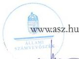
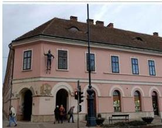
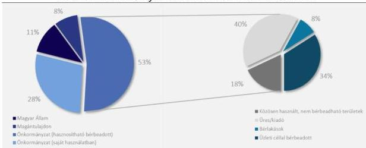
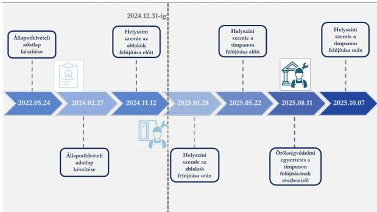

ÁLLAMI
SZÁMVEVŐSZÉK

# JELENTÉS

Kulturális örökségvédelem – Műemlék épületek
fenntartása – Nagykanizsai Vasemberház
ellenőrzése

2026.

26017

www.asz.hu

---

ÁLLAMI
SZÁMVEVŐSZÉK

# JELENTÉS

Kulturális örökségvédelem – Műemlék épületek
fenntartása – Nagykanizsai Vasemberház
ellenőrzése

2026.

26017

dr. Windisch László
elnök

---

ELLENŐRZÉSI IGAZGATÓSÁG:

ELLENŐRZÉSI IGAZGATÓSÁG VI.

ELLENŐRZÉSI IGAZGATÓ:

DR. JAKAB KORNÉL ellenőrzési igazgató

ELLENŐRZÉSVEZETŐ:

SZOMBATHY KATALIN ellenőrzésvezető

Jelentéseink az interneten a
www.asz.hu címen olvashatók.

IKTATÓSZÁM: EL-4364-002/2026

TÉMASORSZÁM: 30.

ELLENŐRZÉS-AZONOSÍTÓ SZÁM: V119201

---

# TARTALOMJEGYZÉK

- AZ ELLENŐRZÉS EREDMÉNYEI ... 5
- JAVASLATOK ... 11
- I. FÜGGELÉK: ÉSZREVÉTELEK ... 12
- II. FÜGGELÉK: ELLENŐRZÉSI MEGKÖZELÍTÉS ... 13
- MELLÉKLETEK ... 16
  - I. sz. melléklet: Értelmező szótár ... 16
- RÖVIDÍTÉSEK JEGYZÉKE ... 18

3

---

# AZ ELLENŐRZÉS EREDMÉNYEI

## AZ ELLENŐRZÉS HÁTTERE

A kulturális örökség a nemzet egészének közös szellemi értékeit hordozza, ezért annak megóvása minden érintett – tulajdonosok, vagyonkezelők, kivitelezők, hatóságok, önkormányzat, állam – kötelessége. A műemlékvédelem a kulturális örökség védelmének egyik területe.

Az ellenőrzés lezárásának időpontjában Nagykanizsán 34 db műemlék található.

A Nagykanizsa 1961 helyrajzi számú Vasemberház az ÉKM¹ nyilvánosan elérhető műemléki nyilvántartásában 6283. törzsszám alatt szerepel. A műemléki védés éve a nyilvántartás szerint: 1958, illetve 1960.

1. kép

A NAGYKANIZSAI VASEMBERHÁZ

Forrás: ÁSZ saját fénykép

A nagykanizsai Vasemberházat a Batthyány család építette a 18. században, majd az 1850-es években átépítették. A műemlék zártsorú beépítésben álló, L alaprajzú, egyemeletes, nyeregtetős saroképület. Az épület 45 fokban lemetszett sarka mellett, az utcafronti falon áll a háznak nevet adó páncélos alak, a Vasember.

Az 1970-es évek végén a Vasemberház teljes rekonstrukciója valósult meg, amely az árkádsor kialakítását is magában foglalta. A kilencvenes évek második felében a homlokzatot újították fel.

A tulajdoni lapon 7624 m² alapterületű ingatlan „kivett áruház” besorolás alatt szerepel, többségi tulajdonosa 2687/3300 tulajdoni hányadban az Önkormányzat. További tulajdonosok: Magyar Állam (345/3300), a tulajdonosi jogok gyakorlója a MNV Zrt.², valamint a

Belvárosi Patika 2008 Kft. (268/3300).

Az Önkormányzat kezdeményezte a kisebbségi tulajdonosok felé a Vasemberház 100%-os önkormányzati tulajdonba kerülését. Az MNV Zrt.-vel 2022 óta több tárgyalást folytatott a tulajdoni hányada értékegyeztetéses csere útján történő megszerzése érdekében, valamint az ellenőrzött időszakban megkezdődött az érintett ingatlanrészek értékbecslése.

5

---

Az ellenőrzés eredményei

1. ábra

# A VASEMBERHÁZ TULAJDONOSI SZERKEZETE ÉS HASZNOSÍTÁSA

Forrás: Ellenőrzött szervezetek adatszolgáltatása alapján ÁSZ szerkesztés

Az ellenőrzött időszakban a műemlékvédelem jogszabályi előírásai a Kötv.$^{3}$-ből átkerültek a Méptv.$^{4}$-be. Az örökségvédelmi és műemlékvédelmi előírások végrehajtási szabályait tartalmazó Korm. rendelet$^{5}$ ugyanakkor a teljes ellenőrzött időszakban hatályban volt. Az ellenőrzés lezárását követően, 2025. december 29-én megjelent a Magyar Közlönyben a Korm. rendelet$^{6}$, amely a Méptv. végrehajtási rendelete. A Korm. rendelet$^{2}$ 2026. január 14-étől hatályos, ezért a Hatóság részére tett javaslatban már a Korm. rendelet$^{2}$ előírása jelenik meg.

6

---

Az ellenőrzés eredményei

Az örökségvédelemért felelős hatóság, illetve az önkormányzat/önkormányzati tulajdonú gazdasági társaság mint tulajdonos/vagyonkezelő tett-e intézkedéseket a kiválasztott ingatlan fenntartása érdekében, valamint ezekben érvényesítette-e a műemléki érték megóvásának szempontjait az ellenőrzött időszakban? – A nagykanizsai Vasemberház műemléki fenntartása érdekében tett intézkedések értékelése

Összegző megállapítás

Az Önkormányzat⁷ és az Üzemeltető⁸ szabályszerűen és célszerűen végezte műemlékvédelmi tevékenységét, naprakész információk alapján figyelemmel kísérte, nyomon követte a műemléki ingatlan állapotát. A Hatóság⁹ egy nyilvántartási feladata kivételével szabályszerűen és célszerűen végezte műemlékvédelmi tevékenységét. Az Önkormányzat mint tulajdonos és az Üzemeltető a célszerűségi követelményekre figyelemmel intézkedést kezdeményezett az épület állagmegóvása érdekében, és a „jó gazda gondosságával” járt el a műemlék épület fenntartása során. Az Önkormányzat és a Hatóság közötti együttműködés eredményesen járult hozzá a műemlék fenntartásához. A műemléken végzett állagmegóvási művelet a jogszabályi rendelkezéseknek megfelelően, a rögzített célokkal összhangban és eredményesen megtörtént, az ingatlan műemléki értéke, állapota, állaga, épsége szinten tartott volt. Az ÁSZ¹⁰ jó gyakorlatként azonosította, hogy a Hatóság az állagmegóvási tevékenységek megkezdése előtt szakmai támogatást nyújtott az Önkormányzat és az Üzemeltető számára.

1. A MŰEMLÉK INGATLAN ÁLLAPOTÁNAK NYOMON KÖVETÉSE

A műemlék épületben az Önkormányzat 81%-os tulajdoni hányadából az Önkormányzat saját használatában 895 m² (33,6%), az Üzemeltető kizárólagos üzemeltetésében 1.766 m² (66,4%) állt. Az Önkormányzat saját használatában lévő helyiségeket közfunkciók ellátására – anyakönyvvezető-, házasságkötő- és fogadóteremként, valamint a képviselőtestületi ülések és a közmeghallgatások helyszíneként – használta. Tekintettel a napi használatra, az Önkormányzat az ellenőrzött időszakban naprakész információkkal rendelkezett az ingatlan állapotában bekövetkezett változásokról. Az ellenőrzött időszakban az ingatlan állapotában intézkedést igénylő változás történt.

Az Önkormányzat és az Üzemeltető között létrejött üzemeltetési szerződés az Üzemeltető feladataként jelölte meg az üzemeltetésbe vett lakás- és nem lakáscélú ingatlanok bérbeadását. Az Üzemeltető feladata volt az üzemeltetésre átadott épületrészek állagának nyomon követése, a szükséges műemlékfenntartási beavatkozásokat így tudta megtervezni. A többi, kisebbségi tulajdonosnak a jogszabályból adódóan saját felelőssége és kötelessége volt a műemlék állapotának nyomon követése.

7

---

Az ellenőrzés eredményei

Az üzemeltetési szerződés szerint az Üzemeltető az általa üzemeltetett épületrészeknél gondoskodott az életveszélyt okozó, továbbá az épület állagát veszélyeztető, vagy a helyiség rendeltetésszerű használatát lényegesen akadályozó, azonnali beavatkozást igénylő hibaelhárítási munkák, és az azonnali beavatkozást nem igénylő, eseti karbantartási, állagmegóvó munkák elvégeztetéséről. Az üzemeltetési szerződés rögzítette, hogy „a mindenkori karbantartási és hibaelhárítási költségkeretet az üzemeltető üzleti terve határozza meg, a munkák elvégzésének fedezete az üzemeltető által a lakás és nem lakás célú helyiségek bérbeadásból származó bevételeinek költségekkel csökkentett része”. Az üzemeltetésbe vett lakás- és nem lakáscélú ingatlanok éves karbantartási és hibaelhárítási költségkeretét nagyságrendileg 55 millió Ft értékben állapították meg. Az Önkormányzat támogatási rendszert működtetett a műemlékek fokozott fenntartási költségeinek kiegészítő finanszírozására a településkép védelméről szóló 28/2017 (IX.5) önkormányzati rendelet alapján.

Az Üzemeltető a 8 db üzlet és 3 db bérlakás mint bérlemény állapotáról, az elvégzendő állagmegóvó intézkedések szükségességéről naprakész információval rendelkezett, és rendszeresen egyeztetett az Önkormányzat illetékes szakembereivel.

Az ellenőrzött időszakban a Hatóság a Kötv. és a Méptv. szabályozásában foglaltaknak megfelelően a műemlékvédelmi felügyelet keretében figyelemmel kísérte és nyomon követte a műemlék állapotát. E tevékenysége során 2022. május 24-én és 2024. február 27-én a Korm. rendelet-ben foglaltaknak megfelelően, a 13. melléklet szerinti állapotfelvételi adatlapot töltött ki, amelyhez fotódokumentációt is mellékelt mindkét esetben. A Hatóság a műemlék általános állapotát mindkét alkalommal esztétikai hibákra rámutatva közepesnek ítélte meg, az állapotjavításra vonatkozó általános javaslataként a folyamatos jókarbantartást jelölte meg. A Hatóság a műemléket egyik alkalommal sem ítélte veszélyeztetettnek, az értékleltár szerinti műemléki érték műszaki állapotát közepesnek minősítette*.

A Hatóság a Korm. rendelet, 76. § (4) bekezdésében foglaltak ellenére nem rögzítette az állapotfelvételi adatlapokat az OÉNY¹-be. (1. sz. javaslat)

## 2. MŰEMLÉKVÉDELMI TERVEZÉS

Az Önkormányzat által elfogadott átfogó koncepciók, stratégiák (Nagykanizsai Megyei Jogú Város Stratégiai Terve, Nagykanizsa Megyei Jogú Város Fenntartható Városfejlesztési Stratégia 2021-2027, Nagykanizsa Megyei Jogú Város Településfejlesztési Koncepciója Integrált Településfejlesztési Stratégiája) az önkormányzati ingatlanvagyon elemeként, azon belül kiemelten kezelték a műemlékeket. A „Nagykanizsa Megyei Jogú Város Fenntartható Városfejlesztési Stratégia 2021-2027” című dokumentumban az építészeti örökség megőrzése, állagmegóvása, felújítása célkitűzésként megjelent. A települési identitást meghatározó épített-művi környezeti elemek között szerepelt a Vasemberház.

Nagykanizsa Megyei Jogú Város Közgyűlése a 127/2017. (VIII. 31.) sz. határozatával jóváhagyta Nagykanizsa Megyei Jogú Város Településszerkezeti Tervét. A Településszerkezeti Terv előkészítése során – a Kötv. és a Korm. rendelet-ben foglaltaknak megfelelően, a 14. sz. mellékletnek megfelelő tartalommal – 2016-ban települési örökségvédelmi hatástanulmányt készíttetett. A Településszerkezeti Terv műemlék fenntartási tervet tartalmazott, amely a Vasemberházat nevesítette a műemlékek között.

Az Önkormányzat célszerűen járult hozzá a Vasemberház fenntartásához, mivel az ellenőrzött időszakban az ingatlan fenntartására, legalább szinten tartására rendelkezett koncepcióval és

* Zala Vármegyei Kormányhivatal mint örökségvédelmi hatóság értékelési kritériumai alapján

8

---

Az ellenőrzés eredményei

örökségvédelmi hatástanulmánnyal, amely kitért az ingatlan állagmegóvásához szükséges intézkedésekre.

### 3. A MŰEMLÉK ÉPÜLET FENNTARTÁSA ÉRDEKÉBEN TETT INTÉZKEDÉSEK

Az ellenőrzött időszakban az épületen egy állagmegóvó intézkedést kezdtek meg, a nyílászárók állagmegóvását, amelynek műszaki átadása és a hatósági helyszíni szemle az ellenőrzött időszakon kívül, de még az ellenőrzés jelentéssel történő lezárása előtt zajlott le. Az **Önkormányzat és a Hatóság között kialakított** – kölcsönös információcserén és egyeztetéseken alapuló – **együttműködés eredményesen működött. Az Önkormányzat mint többségi tulajdonos a célszerűségi követelményekre figyelemmel intézkedést kezdeményezett. A jogszabályi rendelkezéseknek megfelelően és eredményesen megtörtént az állagmegóvási művelet**, mivel az Önkormányzat az ingatlan műemléki értékét, állapotát, állagát szinten tartotta. Az állagmegóvási művelet eredményesen megvalósult, és ez hozzájárult az állag romlásának megakadályozásához.

#### *Nyílászáró állagmegóvása*

Az Önkormányzat 2024. november 8-án a Vasemberház épület északi homlokzatának emeleti részén található 4 db nyílászáró rossz állapotáról tájékoztatta a Hatóságot. A Hatóság 2024. november 12-én helyszíni szemlét tartott, és jegyzőkönyvben felhívta az Önkormányzatot a kivitelezés során betartandó részletszabályokra. A munkálatok befejezését követően, 2025. január 28-án a Hatóság ismét helyszíni szemlét tartott, és jegyzőkönyvben rögzítette, hogy a nyílászáró szerkezetek jókarbantartási munkálatait a korábban előírtaknak megfelelően végezték el. A nyílászárók állagmegóvási beavatkozása bruttó 2 882 900 Ft volt, amelyet az Önkormányzat 2024. évi költségvetésének intézményi felújítások soron megjelenő összegből finanszírozott.

Az ellenőrzött időszakon kívül, de még az ellenőrzés jelentéssel történő lezárása előtt az Üzemeltető elvégeztetett egy további intézkedést, a timpanon állagmegóvását.

#### *Timpanon állagmegóvása*

Az Üzemeltető 2025. május 20-ai tájékoztatását követően 2025. május 22-én a Hatóság helyszíni szemlét tartott, és jegyzőkönyvben rögzítette, hogy a Vasemberház északi homlokzatán a párkányzat több helyen sérült, lehullott. A Hatóság megállapította, hogy az oromzat feletti tetőszakasz mielőbbi javítása szükséges a további állagromlás elkerülése érdekében. A jókarbantartási munkák megkezdése előtt, 2025. augusztus 11-én újabb örökségvédelmi egyeztetésen tisztázták a munkavégzés részleteit. A munkálatok befejezését követően, 2025. október 7-én a Hatóság ismét helyszíni szemlét tartott, és jegyzőkönyvben rögzítette, hogy a sérült tetőszerkezet megerősítését, a fedés cseréjét a korábban előírtaknak megfelelően végezték el. A Hatóság megállapította, hogy a műemléket érintő állagmegóvási beavatkozás során a műemléki értékek nem sérültek. A timpanon állagmegóvási beavatkozása bruttó 4 227 311 Ft volt, amit az Üzemeltető előfinanszírozott a 2025. évi karbantartási költségkerete terhére.

Az Önkormányzat az ellenőrzött időszakban beazonosította a műemlék teljeskörű felújításának indokoltságát. Az ellenőrzött időszakon kívül, de még az ellenőrzés jelentéssel történő lezárása előtt, 2025 októberében az Önkormányzat – saját forrásból – átfogó tervdokumentációt készíttetett a Vasemberház négy lépcsős, komplex felújítására, amelyet Nagykanizsa városi főépítésze véleményében elfogadásra javasolt az Országos Építészeti Tervtanács felé, továbbá rendelkezésre állt az ezt alátámasztó részletes

9

---

Az ellenőrzés eredményei

statikai szakértői vélemény. A jogszabályi rendelkezések szerint a tervdokumentáció megléte előfeltétele volt az örökségvédelmi hatósági engedély iránti kérelem benyújtásának.

A Hatóság tájékoztatása alapján a műemléki ingatlanon elvégzett állagmegóvások nem voltak örökségvédelmi engedélyhez, vagy örökségvédelmi bejelentéshez kötöttek.

Az ÁSZ jó gyakorlatként azonosította, hogy a Hatóság az állagmegóvási tevékenységek megkezdése előtt olyan szakmai támogatást nyújtott az Önkormányzat és az Üzemeltető számára, amely hozzájárult az állagmegóvási beavatkozások hatékonyabb elvégeztetéséhez a műemléki értékek sérülése nélkül.

Az állagmegóvási munkálatok műemlékvédelmi szempontoknak való megfelelését értékelő Méptv. szerinti hatósági ellenőrzések az Önkormányzat/Üzemeltető bejelentése alapján indultak.

A Hatóság ellenőrzési feladatellátása körében mindkét állagmegóvási munkálat megkezdése előtt és befejezését követően helyszíni szemlét tartott, és jegyzőkönyvben dokumentálta a kiinduló és a befejező állapotot, és tájékoztatta az Önkormányzatot/Üzemeltetőt a kivitelezés során betartandó részletszabályokról.

Az ellenőrzött időszakban a Hatóság nem élt sem a Méptv. szerinti műemléki kötelezés, sem a műemlék állagmegóvásának, felújításának, helyreállításának műemlékvédelmi érdekből hivatalból történő elrendelésének eszközével, mivel az Önkormányzat és az Üzemeltető végrehajtotta a szükséges állagmegóvó intézkedéseket.

Az ellenőrzött időszakban a Méptv. szerinti műemlékvédelmi bírság kiszabására okot adó körülmény nem merült fel. A Hatóság az ellenőrzött időszakban nem alkalmazott műemléki kötelezést, továbbá nem hozott határozatot sem bírság kiszabására, sem örökségvédelmi többletköltség viselésére.

2. ábra

# A HATÓSÁG MŰEMLÉKVÉDELMI INTÉZKEDÉSEI

Forrás: Ellenőrzött szervezetek adatszolgáltatása alapján ÁSZ szerkesztés

10

---

# JAVASLATOK

Az ÁSZ tv. 33. § (1) bekezdésében foglaltak értelmében az ellenőrzött szervezet vezetője köteles a jelentésben foglalt megállapításokhoz kapcsolódó intézkedési tervet összeállítani és azt a jelentés kézhezvételétől számított 30 napon belül az ÁSZ részére megküldeni. Az ÁSZ a jelentésben foglalt megállapításokhoz kapcsolódóan az alábbi javaslatok tekintetében várja el az intézkedési terv elkészítését.

## ZALA VÁRMEGYEI KORMÁNYHIVATAL MINT ÖRÖKSÉGVÉDELEMÉRT FELELŐS HATÓSÁG FŐISPÁNJA RÉSZÉRE

1. Gondoskodjon az állapotfelvételi adatlapok Korm. rendelet, 56. § (4) bekezdés szerinti elektronikus megküldéséről a műemléki nyilvántartási hatóság részére.

11

---

# I. FÜGGELÉK: ÉSZREVÉTELEK

*A jelentéstervezetet az ÁSZ 15 napos észrevételezésre megküldte az ellenőrzött szervezet vezetőjének az ÁSZ tv. 29. §\* (1) bekezdése előírásának megfelelően.*

*Az ellenőrzött szervezetek vezetői a jelentéstervezet megállapításaira nem tettek észrevételt.*

\* **29. §** (1) Az Állami Számvevőszék az ellenőrzési megállapításait megküldi az ellenőrzött szervezet vezetőjének vagy az általa megbízott személynek, és annak, akinek személyes felelősségét állapította meg.

(2) Az ellenőrzött szervezet vezetője és a felelősként megjelölt személy az ellenőrzés megállapításaira tizenöt napon belül írásban észrevételt tehet.

(3) Az Állami Számvevőszék az észrevételre a beérkezésétől számított harminc napon belül írásban válaszol. A figyelembe nem vett észrevételeket köteles a jelentésben feltüntetni, és megindokolni, hogy azokat miért nem fogadta el.

12

---

## II. FÜGGELÉK: ELLENŐRZÉSI MEGKÖZELÍTÉS

### AZ ELLENŐRZÉS JOGALAPJA

Az ellenőrzés jogszabályi alapját az ÁSZ tv.$^{12}$ 1. § (3) bekezdés, továbbá az 5. § (2)-(3), (4) a-b) előírásai képezték.

### AZ ELLENŐRZÉS CÉLJA

Az ellenőrzés célja annak értékelése volt, hogy az önkormányzat/önkormányzati tulajdonú gazdasági társaság mint tulajdonos/vagyonkezelő (a továbbiakban: tulajdonos/vagyonkezelő), valamint az illetékes örökségvédelemért felelős hatóság (a továbbiakban: hatóság) tervei és tevékenysége hozzájárult-e a kiválasztott műemlék ingatlan fenntartásához (üzemeltetés, jókarbantartás, állagmegóvás, felújítás), érvényesültek-e a műemlékvédelmi érték megóvásának jogszabályokban meghatározott (szabályszerűségi) szempontjai. Az ellenőrzés értékelte továbbá a hatóság műemléki érték megőrzése és fenntartása érdekében hozott döntéseinek, tett intézkedéseinek célszerűségét, valamint a tulajdonos/vagyonkezelő döntéseinek, intézkedéseinek célszerűségét és eredményességét, szem előtt tartva a „jó gazda gondossága”-elvét.

### AZ ELLENŐRZÉS TÍPUSA

Kombinált ellenőrzés.

### AZ ELLENŐRZÉS TÁRGYA

Az ellenőrzés tárgyát képezték a kiválasztott műemlék ingatlan fenntartását érintően a tulajdonos/vagyonkezelő valamint a hatóság által készített tervek (ellenőrzött időszak tervdokumentumai), meghozott döntések és intézkedések, valamint a műemlék ingatlan állapotát, állagát, épségét és hasznosíthatóságát jellemző adatok, illetve az intézkedések végrehajtása nyomán az ezen adatokban bekövetkezett változások rögzítése.

Az ellenőrzés kiterjedt minden olyan körülményre és adatra, amely az ÁSZ jogszabályban meghatározott feladatainak teljesítéséhez, valamint a program végrehajtása folyamán felmerült újabb összefüggések feltárásához szükséges volt.

### AZ ELLENŐRZÉS HATÓKÖRE

Az ellenőrzés az ellenőrzött időszakon belül kizárólag a kiválasztott műemlék ingatlan műemléki védettségét érintő terveket, döntéseket, intézkedéseket vonta hatókörébe, ideértve a tulajdonos/vagyonkezelő, valamint a hatóság egyes tevékenységeit és a nyilvántartásoknak a konkrét ingatlanhoz tartozó elemeit. Az ellenőrzés a kiválasztott műemlék ingatlan műemléki állapotát, állagát és hasznosíthatóságát érintő események értékelésére terjedt ki törvényességi, eredményességi és célszerűségi szempontok mentén.

13

---

II. Függelék: Ellenőrzési megközelítés

Az ellenőrzés nem terjedt ki a fenntartáshoz kapcsolódó kivitelezések pénzügyi- és szakmai szempontú értékelésére.

## AZ ELLENŐRZÖTT SZERVEZET

|  ADÓSZÁM | ELLENŐRZÖTT SZERVEZET MEGNEVEZÉSE  |
| --- | --- |
|  15734446-2-20 | Nagykanizsa Megyei Jogú Város Önkormányzata  |
|  15789422-2-20 | Zala Vármegyei Kormányhivatal  |

## AZ ELLENŐRZÖTT IDŐSZAK

2020. január 1-jétől - 2024. december 31-ig terjedő időszak, kitekintéssel a jelentéstervezet összeállításáig tartó folyamatok értékelésére. Az ellenőrzés a kiválasztott ingatlan földhivatali, állapot- (állag) és műemléki jellegét érintő, a közhiteles és az ellenőrzöttek adatbázisaiban vezetett adatai tekintetében a 2000. és 2025. évek közötti bejegyzéseket vette figyelembe.

## AZ ELLENŐRZÉSI KRITÉRIUMOK

|  FŐKUSZTERÜLET/FŐKUSZKÉRDÉS | ELLENŐRZÉSI KRITÉRIUMOK  |
| --- | --- |
|  1. Az örökségvédelemért felelős hatóság, illetve az önkormányzat/önkormányzati tulajdonú gazdasági társaság mint tulajdonos/vagyonkezelő tett-e intézkedéseket a kiválasztott ingatlan fenntartása érdekében, valamint ezekben érvényesítette-e a műemléki érték megóvásának szempontjait az ellenőrzött időszakban? | Törvényességi kritériumok: Méptv. Kötv. A kulturális örökség védelmével kapcsolatos szabályokról szóló 68/2018. (IV. 9.) Korm. rendelet A tulajdonos/vagyonkezelő, illetve a hatóság feladatellátása megfelelő, illetve szabályszerű volt, ha naprakész információval rendelkezett, nyomon követte a műemlék ingatlan állapotát, valamint a jogszabályi körülmények fennállása esetén intézkedést kezdeményezett. A tulajdonos / vagyonkezelő célszerűen járult hozzá a műemlék ingatlan fenntartásához, ha - az adott műemlék ingatlan fenntartására, állapotának legalább szinten tartására rendelkezett alátámasztott tervvel (önállóan vagy más ingatlan vagyonelemekre készített terv részeként); vagy - monitoring/kárjelző rendszert működtetett, amely biztosította a felmerülő problémák érzékelését, és támogatta az intézkedések megtételét; vagy - a jó gazda gondosságával, a műemlék fenntartásra készített tervekkel összhangban járt el az ingatlan állagmegóvása és jókarbantartása érdekében; vagy - a megtett intézkedései összhangban voltak a tervekkel.  |

14

---

II. Függelék: Ellenőrzési megközelítés

A tulajdonos / vagyonkezelő eredményesen járult hozzá a műemlék ingatlan fenntartásához, ha

- a tulajdonában vagy vagyonkezelésében álló ingatlan műemléki értéke, az ingatlan állapota, állaga, épsége legalább szinten tartott volt;
- a műemlék használatát a műemlékvédelmi szempontokra figyelemmel szabályozta (látogatási rend szabályozása, terhelés korlátozása, speciális üzemeltetési szabályok).

A hatóság tevékenysége célszerű volt, ha

- intézkedést rendelt el a kiválasztott műemlék ingatlan állagmegóvása érdekében közvetlen kármegelőzés céljából, amennyiben az szükséges volt;
- intézkedést rendelt el a kiválasztott műemlék ingatlan fenntartása érdekében műemlékvédelmi érdekből hivatalból történő eljárásban vagy a műemlékvédelem szabályainak megsértése esetén.

## AZ ELLENŐRZÉS MÓDSZERE ÉS AZ ELLENŐRZÉSI BIZONYÍTÉKOK KÖRE

Az ellenőrzést a nemzetközi standardokat irányadónak tekintve az ellenőrzési program szempontjai, az ellenőrzött időszakban hatályos jogszabályok, az ellenőrzés szakmai szabályok és módszertanok figyelembevételével végezte az ÁSZ.

Az ellenőrzési kérdések megválaszolásához szükséges bizonyítékok megszerzése az ellenőrzött szervezetek és az ellenőrzést támogató szervezetek által rendelkezésre bocsátott dokumentumokra, adatokra alapozva, továbbá megfigyelés, összehasonlítás, szemle (szemrevételezés), kérdésfeltevés (információkérés), interjú útján történt. Az ellenőrzési bizonyítékként felhasználható adatforrások közé tartoztak egyrészt az ellenőrzéshez kért dokumentumok, adatforrások, másrészt adatforrás volt minden – az ellenőrzés folyamán – feltárt, az ellenőrzés szempontjából információkat tartalmazó dokumentum.

Az ellenőrzés lefolytatásához az ellenőrzött szervezetek az ÁSZ által kért dokumentumok, adatok, információk megküldésével és az ellenőrzés során szolgáltattak adatot, továbbá az ellenőrzést támogató szervezetektől is kért be adatokat az ÁSZ.

Az ellenőrzés végrehajtása során mintavételezésre nem került sor.

15

---

# MELLÉKLETEK

## ■ 1. SZ. MELLÉKLET: ÉRTELMEZŐ SZÓTÁR

|  célszerűség | Arra vonatkozó követelmény, hogy a bevételeket a közfeladat megvalósítása érdekében, a kiadásokat a közfeladatok megfelelő ellátásához szükséges mértékben, a költségvetési célrendszer érdekében, a meghatározott célra (közfeladat ellátására), továbbá észszerűen, racionálisan használták fel. (*Az ÁSZ ellenőrzési alapelvei és módszertana*)  |
| --- | --- |
|  építmény | Az épület és műtárgy gyűjtőfogalma, építési tevékenységgel létrehozott, vagy késztermékként az építési helyszínre szállított, – rendeltetésére, szerkezeti megoldására, anyagára, készültségi fokára és kiterjedésére tekintet nélkül – minden olyan helyhez kötött műszaki alkotás, amely a terepszint, a víz vagy az azok alatti talaj, illetve azok feletti légtér megváltoztatásával, beépítésével jön létre. (*Forrás: Méptv. 16. § Fogalommeghatározások 34.*)  |
|  épület | Olyan építmény, amely szerkezeteivel fedett teret, helyiséget vagy ezek együttesét zárja körül meghatározott rendeltetés vagy rendeltetésével összefüggő tevékenység céljából. (*Forrás: Méptv. 16. § Fogalom-meghatározások 42.*)  |
|  eredményesség | Az eredményesség elve a kitűzött célok és a szándékolt eredmények (hatások) elérését jelenti. A gazdálkodás, feladatellátás eredményességét mutatja a tényleges és a tervezett eredmények (hatások) összevetése. (*Forrás: Az ÁSZ ellenőrzési alapelvei és módszertana*)  |
|  felújítás | Meglévő építmény, építményrész, önálló rendeltetési egység, helyiség rendeltetésszerű és biztonságos használhatóságának, valamint üzembiztonságának megtartása érdekében végzett, az építmény térfogatát nem növelő építési tevékenység, ide nem értve az építmény teljes vagy alapokig – akár egyszerre, akár szakaszonként – történő elbontását és újraépítését. (*Forrás: Méptv. 16. § Fogalommeghatározások 45.*)  |
|  hatékonyság | A hatékonyság elve azt jelenti, hogy a rendelkezésre álló erőforrásokkal a szervezet a lehető legtöbbet érje el. Ez az elv az igénybe vett erőforrások és az elért eredmények mennyiségben, minőségben és időben kifejezett kapcsolatát jelenti. (*Forrás: Az ÁSZ ellenőrzési alapelvei és módszertana*)  |
|  helyi emlék | Hazánk építészeti örökségének a helyi, települési, településképi szempontból jelentős építménye, táj- és kertépítészeti alkotása, helyszíne, meghatározott környezete, amelyet az önkormányzat rendeletben helyi emlékké nyilvánít. (*Forrás: Méptv. 3. 16. § Fogalommeghatározások 58.*)  |
|  helyreállítás | Építmény rendeltetésszerű és biztonságos használatra alkalmassá tétele érdekében végzett felújítási tevékenység az építményrész eredeti építészeti kialakításának lehetséges megtartása mellett. (*Forrás: Méptv. 16. § Fogalom-meghatározások 61.*)  |
|  jó gazda gondossága | Körültekintő alapossággal történő eljárás, amelyet az előrelátó óvatosság és a döntések következményének, kimenetének vizsgálata jellemez. (*Az ÁSZ ellenőrzési alapelvei és módszertana*)  |
|  kulturális javak | Az élettelen és élő természet keletkezésének, fejlődésének, az emberiség, a magyar nemzet, Magyarország történelmének kiemelkedő és jellemző tárgyi, képi, hangrögzített, írásos emlékei és egyéb bizonyítékai – az ingatlanok kivételével –, valamint a művészeti alkotások. (*Forrás: Kötv. 7. § 17.*)  |

16

---

Mellékletek

|  kulturális örökség elemei | A régészeti örökség, a hadtörténeti örökség régészeti módszerekkel kutatható elemei, a műemléki értékek, a nemzeti emlékhely, a kiemelt nemzeti emlékhely és annak a Méptv. 154. § (4) bekezdése szerinti településkép-védelmi környezete, valamint a kulturális javak. (*Forrás: Kötv. 7. § 18.*)  |
| --- | --- |
|  műemlék | Olyan műemléki értékkel rendelkező építmény, illetve ingatlan, amelyet jogszabállyal védetté nyilvánítottak és az állam által vezetett nyilvántartásban szerepel, amely lehet nemzeti emlék vagy helyi emlék. (*Forrás: Méptv. 16. § Fogalommeghatározások 82.*)  |
|  műemlék állagmegóvása | Olyan beavatkozás vagy építési tevékenység, amely az elégtelen műszaki állapotú műemlék kármegelőzése, kárelhárítása, további állapotromlásának megakadályozása vagy biztonságos használatra alkalmassága érdekében végeznek a műemléken, annak bármely részén, nevesített műemléki értékein, ingatlanán. (*Forrás: Méptv. 16. § Fogalommeghatározások 83.*)  |
|  műemlék fenntartása | A műemlék rendeltetésszerű és biztonságos, eszmei értékével összhangban álló méltó használatához és védett értékei megőrzéséhez szükséges üzemeltetés és a jókarbantartás teljesítése, műemlék állagmegóvása, felújítása. (*Forrás: Méptv. 16. § Fogalommeghatározások 84.*)  |
|  műemlék jókarbantartása | Tervszerű megelőző vagy hosszabb időszakonként rendszeresen visszatérő jelleggel végzett, a műemlék jó műszaki állapotát és a védettséget megalapozó érték sértetlen fennmaradását, érvényesülését, rendeltetésszerű és biztonságos használatát, működését biztosító építési-szerelési vagy karbantartási tevékenység, valamint az üzembiztonság megtartására irányuló rendtartási, tisztítási vagy javítási tevékenység. (*Forrás: Méptv. 16. § Fogalom-meghatározások 85.*)  |
|  műemléki érték | Minden olyan történeti építmény, történeti kert, történeti temetkezési hely vagy műemléki terület, valamint ezek rendeltetésszerűen összetartozó együttese, rendszere, maradványa – alkotórészeivel, tartozékaival és beépített berendezési tárgyaival együtt, vagy egyes nevesített értéke vonatkozásában –, amely hazánk múltja és a magyar nemzet vagy más közösség identitástudata szempontjából kiemelkedő művészeti, történelmi, műszaki, néprajzi vagy más tudományos jelentőséggel bír. (*Forrás: Méptv. 16. § Fogalommeghatározások 86.*)  |
|  műemléki helyreállítás | A jókarbantartási vagy az állagmegóvási feladatokon túlmenő, a műemlék egészét vagy részét érintő felújítás, részleges vagy teljes visszaállítást célzó építési tevékenység vagy restaurálás. (*Forrás: Méptv. 16. § Fogalommeghatározások 87.*)  |
|  műemlékvédelem | Olyan állami és önkormányzati feladat, amely a kulturális örökség védelmének keretében az építészeti örökséget, műemléki értéket és műemléket számba vesz, nyilvántart, tudományos módon kutat és értékel, védetté nyilvánít, gondoskodik állapotának megóvásáról, helyreállításáról, elősegíti a fenntartható használatát, hasznosítását, fejlesztését, továbbá ismeretet terjeszt. (*Forrás: Méptv. 16. § Fogalommeghatározások 89.*)  |
|  timpanon | Épületek, eredetileg görög templomok, ma főleg középületek oromzatán rendszerint a főbejárat fölött párkányokkal határolt, gyakran szobrokkal díszített háromszögletű, ritkán félkör alakú falrész. (*Forrás: A magyar nyelv értelmező szótára*)  |

17

---

# RÖVIDÍTÉSEK JEGYZÉKE

1. ÉKM

2. MNV Zrt.

3. Kötv.

4. Méptv.

5. Korm. rend.1

6. Korm. rendelet2

7. Önkormányzat

8. Üzemeltető

9. Hatóság

10. ÁSZ

11. OÉNY

12. ÁSZ tv.

Építési és Közlekedési Minisztérium

Magyar Nemzeti Vagyonkezelő Zrt.

2001. évi LXIV. törvény a kulturális örökség védelméről

2023. évi C. törvény a magyar építészetről

68/2018. (IV. 9.) Korm. rendelet a kulturális örökség védelmével kapcsolatos szabályokról

449/2025. (XII. 29.) Korm. rendelet a műemlékvédelemmel kapcsolatos szabályokról

Nagykanizsa Megyei Jogú Város Önkormányzata

Nagykanizsa Vagyongazdálkodási és Szolgáltató Zrt.

Zala Vármegyei Kormányhivatal

Állami Számvevőszék

Országos Építésügyi Nyilvántartás

2011. évi LXVI. törvény az Állami Számvevőszékről

18

---

ÁLLAMI
SZÁMVEVŐSZÉK

1052 Budapest, Apáczai Csere János u. 10. | 1364 Budapest 4., Pf. 54
www.asz.hu | szamvevoszek@asz.hu
telefon: +36 1 484 9100