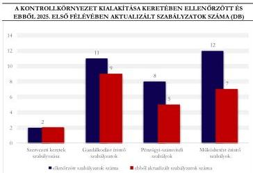
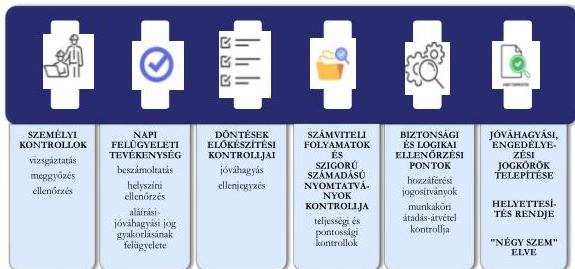
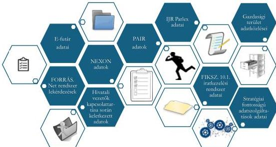
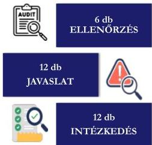

ÁLLAMI
SZÁMVEVŐSZÉK

# JELENTÉS

## A központi költségvetési szervek belső
kontrollrendszerének ellenőrzése

Országgyűlés Hivatala

2026.

26018

www.asz.hu

---

ÁLLAMI
SZÁMVEVŐSZÉK

# JELENTÉS

## A központi költségvetési szervek belső
kontrollrendszerének ellenőrzése

Országgyűlés Hivatala

2026.

26018

www.asz.hu
dr. Windisch László
elnök

---

ELLENŐRZÉSI IGAZGATÓSÁG:

**ELLENŐRZÉSI IGAZGATÓSÁG IV.**

ELLENŐRZÉSI IGAZGATÓ:

**GORECZKY GERGELY** igazgató

ELLENŐRZÉSVEZETŐ:

**KISTÓTH KRISZTINA** ellenőrzésvezető

Jelentéseink az interneten a
www.asz.hu címen olvashatók.

IKTATÓSZÁM: EL-4262-004/2026

TÉMASORSZÁM: 25

ELLENŐRZÉS-AZONOSÍTÓ SZÁM: V-1137

---

# TARTALOMJEGYZÉK

|  ■ ÖSSZEFOGLALÁS | 5  |
| --- | --- |
|  ■ AZ ELLENŐRZÉS EREDMÉNYEI | 9  |
|  1. A központi költségvetési szerv kontrollkörnyezetének kialakítása | 9  |
|  2. A központi költségvetési szerv integrált kockázatkezelési rendszerének kialakítása és működtetése | 11  |
|  3. A központi költségvetési szerv kontrolltevékenységének kialakítása és működtetése | 13  |
|  4. A központi költségvetési szerv információs és kommunikációs rendszerének kialakítása és működtetése | 14  |
|  5. A központi költségvetési szerv nyomon követési (monitoring) rendszerének kialakítása és működtetése | 17  |
|  6. Áttekintés a központi költségvetési szerv adatvagyonának a belső kontrollrendszer keretében és a közfeladat ellátás során történő alkalmazásáról | 19  |
|  ■ I. FÜGGELÉK: ÉSZREVÉTELEK | 21  |
|  ■ II. FÜGGELÉK: ELLENŐRZÉSI MEGKÖZELÍTÉS | 22  |
|  ■ MELLÉKLETEK | 29  |
|  I. sz. melléklet: Értelmező szótár | 29  |
|  II. sz. melléklet: Az ellenőrzött szervezetek jegyzéke | 32  |
|  ■ RÖVIDÍTÉSEK JEGYZÉKE | 33  |

3

---

# ÖSSZEFOGLALÁS

A belső kontrollrendszer a szervezetirányítás elválaszthatatlan része, magában foglalja mindazon elveket, eljárásokat, belső szabályzatokat, gyakorlati módszereket, amelyek alapján a költségvetési szerv biztosítja a feladatai ellátására szolgáló előirányzatokkal, létszámmal és vagyonnal való szabályszerű, gazdaságos, hatékony és eredményes gazdálkodást. Az Állami Számvevőszék jogszabályban rögzített feladata az államháztartási belső kontrollrendszer működésének értékelése.

Az ÁSZ¹ az Országgyűlés Hivatala belső kontrollrendszerét vizsgálta 2024. január 1. és 2025. május 23. közötti időszakra vonatkozóan, ennek keretében értékelte a kialakítás és a működtetés szabályszerűségét, emellett a gazdálkodási jogkörgyakorlás vonatkozásában a kontrolltevékenységek eredményességét. Az ÁSZ az integrált kockázatkezelési rendszer, az információs és kommunikációs rendszer, és a nyomon követési (monitoring) rendszer tekintetében vizsgálta a működtetés célszerűségét.

Az ellenőrzés során értékelt elemek vonatkozásában a Hivatal² vezetője szabályszerűen kialakította és működtette a költségvetési szerv belső kontrollrendszerét. Az integrált kockázatkezelési, az információs és kommunikációs, valamint a nyomon követési rendszer működtetése célszerű volt. A kontrolltevékenységek a gazdálkodási jogkörgyakorlás során eredményesen működtek, biztosították a szabálytalan pénzkifizetések előfordulásának megelőzését.

1. ábra

AZ ELLENŐRZÉS MEGÁLLAPÍTÁSAI A BELSŐ KONTROLLRENDSZER EGYES ELEMEINEK ÉRTÉKELÉSE TEKINTETÉBEN

|  BELSŐ KONTROLLRENDSZER ELEMEI | SZABÁLYSZERŰ | CÉLSZERŰ | EREDMÉNYES  |
| --- | --- | --- | --- |
|  1. Kontrollkörnyezet kialakítása | ☑ | NÉ | NÉ  |
|  2. Integrált kockázatkezelési rendszer kialakítása és működtetése | ☑ | ☑ | NÉ  |
|  3. Kontrolltevékenység kialakítása és működtetése | ☑ | NÉ | ☑  |
|  4. Információs és kommunikációs rendszer kialakítása és működtetése | ☑ | ☑ | NÉ  |
|  5. Nyomon követési (monitoring) rendszer kialakítása és működtetése | ☑ | ☑ | NÉ  |

Forrás: ÁSZ saját szerkesztés

5

---

Összefoglalás

**1. A Hivatal kontrollkörnyezetének kialakítása szabályszerű volt.** A Hivatal vezetője a jogszabályi előírásoknak megfelelően kialakította a szervezeti kereteket, meghatározta a gazdálkodás részletes rendjét és gondoskodott a pénzügyi-számviteli szabályzatok elkészítéséről. A Hivatal vezetője az államháztartási útmutató⁴ előírásával összhangban biztosította a szabályzatok rendszeres felülvizsgálatát, aktualizálását és ehhez kapcsolódóan a változások átláthatóságát, dokumentáltságát. A jogszabályi, szervezeti és működési változások szabályzatokban történő rendszeres átvezetése a jogszabályok előírásainak való megfelelés mellett támogatta a kontrollkörnyezet, valamint a Hivatal mindenkori működése közötti összhang fenntartását.

**2. A Hivatal vezetője szabályszerűen kialakította és működtette az integrált kockázatkezelési rendszert.** A jogszabályi követelményekkel összhangban a Hivatal meghatározta a kockázatkezelés kereteit, a folyamat lépéseit, felelőseit és módszertanát.

A Hivatal az államháztartási útmutató előírásait betartva biztosította az egyedi kockázatok kezelését, valamint a tűréshatárt elérő, és a tűréshatár feletti kockázatok csökkentésére tett intézkedések megvalósításának nyomon követését. Az államháztartási útmutató ajánlását alkalmazva a Hivatal a kockázatok értékelése során az Integritás Munkacsoport bevonásával elősegítette az összefüggések vizsgálatát, a tapasztalatok, javaslatok széleskörű felhasználását. A Hivatal a kockázati leltár és a kockázatkezelési rendszer rendszeres felülvizsgálatával támogatta a kockázati tényezők széles körű azonosítását, a kockázatkezelés fejlesztését, ezáltal a **kockázatkezelési rendszer célszerű működtetését**. Az államháztartási útmutató előírásával összhangban a kockázatkezelési rendszer fő célja teljesült, az előző évhez képest 2025. évre a Hivatal kockázati tűréshatáron kívül elhelyezkedő több kockázatának tűréshatáron belüli értékre való csökkentése megvalósult.

**3. A Hivatal vezetője a kontrolltevékenységeket szabályszerűen kialakította és működtette.** A jogszabályi előírásnak megfelelve a Hivatal belső kontrollrendszer szabályzata⁴, az ellenőrzési nyomvonal, valamint a kockázati adatlapok a szervezeti kockázatok mérséklésére széleskörűen írtak elő kontrollokat. A kontrollok jellegüket tekintve az államháztartási útmutató ajánlását alkalmazva egyaránt tartalmaztak megelőző, helyrehozó, valamint feltáró intézkedéseket a pénz- és vagyongazdálkodás mellett az informatika, a döntéselőkészítés, a tervezés és a pénzkezelés területén is.

Az államháztartási útmutató előírását betartva a tűréshatáron kívül elhelyezkedő kockázatok tűréshatáron belülre csökkentése céljából a Hivatal a kontrolltevékenységeket az azonosított kockázati tényezőkhöz rendelten határozta meg, elősegítve a kockázatok csökkentését, amellyel **érvényesült a belső kontrollrendszer elemeinek egymást kiegészítő, erősítő funkciója.**

*A kontrollkörnyezet célja, hogy a vezetés kialakítsa azokat a szervezeti, működési kereteket, amelyek biztosítják a szabályszerű, gazdaságos, hatékony és eredményes működést, a belső kontrollok megbízható működését, valamint a közvagyon felelős felhasználását.*

Forrás: államháztartási útmutató alapján

*Az integrált kockázatkezelés célja, hogy a szervezet elérje kitűzött céljait, miközben minimalizálja a működését veszélyeztető kockázatok hatását, beépülve a működési és döntéshozatali folyamatokba.*

Forrás: államháztartási útmutató alapján

*A kontrolltevékenységek módszertani meghatározása, technikai végrehajtása biztosítja a szabályszerű működést, lehetővé teszi a kockázatok hatékony jelzését és megelőzését, valamint azok bekövetkezése esetén hatásuk mérséklését vagy megszüntetését.*

Forrás: államháztartási útmutató alapján

6

---

Összefoglalás

A kötelezettségvállalási, az ellenjegyzési, a teljesítésigazolási, az érvényesítési, valamint az utalványozási jogkörök gyakorlása szabályszerű volt. Az ÁSZ az ellenőrzött kiadási mintatételek vonatkozásában nem tárt fel szabálytalanságot, ezáltal a kontrolltevékenység eredményes volt, a kiépített kontrollok biztosították a szabálytalan pénzkifizetések megelőzését.

4. A Hivatal vezetője szabályszerűen kialakította és működtette az információs és kommunikációs rendszert. A Hivatal meghatározta a jogszabályi követelménynek megfelelve az információk szervezeten belüli és a külső szervezetek felé történő áramlásának szabályait.

A vezetői döntéshozatalt az államháztartási útmutató előírását betartva kialakított vezetői információs rendszer támogatta. A Hivatal vezetői információs rendszere az államháztartási útmutató ajánlásával összhangban tájékoztatást nyújtott a feladatok végrehajtásának, a kitűzött célok elérésének helyzetéről, a gazdálkodási adatok mellett a szervezet stratégiai céljai teljesítésének – meghatározott mutatószámok alapján történő – bemutatásáról, támogatva a célszerű működtetést.

Az Intranet rendszer a munkavállalók számára az államháztartási útmutató előírását betartva biztosította a szabályozó eszközökhöz és a mindennapi munkavégzéshez szükséges információkhoz való hozzáférést. Emellett a Hivatal a szervezeti célok megismertetése és azok teljesítésének nyomon követése érdekében közzétette a munkatársak számára az Intézményi Stratégia5 céljaihoz rendelten az azok végrehajtásáról szóló megvalósulási értékeléseket is. A Hivatal az államháztartási útmutató ajánlásának megfelelve a célok és a kapcsolódó értékelések közzétételével támogatta az információs és kommunikációs rendszer célszerű működését, elősegítve a munkatársak részvételét a célkitűzések megvalósításában.

5. A Hivatalnál a monitoring rendszer kialakítása és működtetése szabályszerű volt. Az államháztartási útmutató ajánlását alkalmazva a szervezeti célok teljesítésének és a célok elérését támogató kulcskontrollok működtetésének vezetői nyomon követése segítette a korrekciós igények mielőbbi azonosítását, ezzel támogatva a monitoring rendszer célszerű működtetését. A belső ellenőrzési tevékenység kialakítása és működtetése szabályszerű volt. A belső ellenőrzés javaslatot tett a belső kontrollrendszer fejlesztésére, a kapcsolódó szabályzatok javaslat szerinti aktualizálása megtörtént. A Hivatal vezetője, a főigazgató éves vezetői nyilatkozatában átfogóan értékelte a belső kontrollrendszer működését.

Az információs és kommunikációs rendszer feladata a hatékony belső és külső kommunikáció biztosítása. A külső tájékoztatási rendszer lehetővé teszi az érdeklődők, az állampolgárok számára a közérdekű információk hatékony és ellenőrizhető elérését. A belső folyamatok a szervezeten belül biztosítják a pontos, megbízható, releváns és időszerű információkat.

Forrás: államháztartási útmutató alapján

A monitoring rendszer, a nyomon követés, a belső kontrollrendszer folyamatos figyelemmel kísérése, értékelése, amely rendszeresen információt szolgáltat a belső kontrollok működéséről. A monitoring a döntéshozatal eszköze, lehetővé teszi a kockázatok azonosítását, a szabálytalanságok feltárását a mielőbbi reagálás érdekében, hozzájárulva a belső kontrollrendszer megerősítéséhez.

Forrás: államháztartási útmutató alapján

Az ÁSZ véleménye szerint a szabályzatok rendszeres aktualizálása, a belső kontrollrendszer egyes elemeinek rendszeres felülvizsgálata biztosította a kontrolloknak a szervezeten belüli és a szervezeten kívüli változásokhoz történő igazítását, a változásoknak megfelelő kontrollok adaptálását és alkalmazását. A Hivatalnál érvényesült a belső kontrollrendszer egyes elemeinek egymást erősítő szerepe, a kontrollrendszer tudatos és jól megtervezett felépítése hozzájárult a szabálytalanságok megelőzéséhez, a kontrolltevékenységek eredményes működtetéséhez.

7

---

Összefoglalás---

A központi költségvetési szervek által kezelt **adatvagyon** átgondolt és körültekintő felhasználása kiemelt figyelmet érdemel a feladatellátásuk során. A belső kontrollrendszeren belül az integrált kockázatkezelési rendszer, az információs és kommunikációs rendszer, valamint a monitoring rendszer területén is lehetőség nyílik az adatvagyon hasznosítására. A gyorsan változó informatikai környezet új eszközök felhasználását teszi lehetővé, azonban alkalmazásuk csak az információbiztonsági szempontok figyelembe vétele mellett történhet. Ezért az integrált kockázatkezelési és az információs és kommunikációs rendszerek vonatkozásában, valamint a feladatellátással kapcsolatban az ellenőrzés áttekintette a Hivatal adatbázisainak felhasználási területeit, a felhasználással kapcsolatosan az ellenőrzés időszakában alkalmazott gyakorlatot és a további terveket.

A Hivatal nyilatkozata szerint a kezelt adatvagyon több elemét is felhasználta a vezetői információs rendszer részeként, támogatva a monitoring és a döntéstámogató funkciókat. Az adatok feldolgozása során a Hivatal **idősoros** elemzéseket, **prediktív, előre jelző elemzéseket** készített, **infografikai** megoldásokat alkalmazott. Emellett számos, **nagyméretű adatbázisra épülő elemzést** készített, ahol a cél a valós idejű és felhasználásorientált kiértékelés, valamint az összefüggések és trendek vizsgálata volt. A Hivatal alkalmazta a **mesterséges intelligenciát** az épületbe történő beléptetés és a parlamenti ülések jegyzőkönyvezése során. Az ÁSZ ellenőrzés lezárásakor a Hivatal jövőbeni tervei között szerepelt az adatfeldolgozás és az adatelemzés fejlesztése a szükséges szakképzettség folyamatos fenntartása mellett. Az adatelemzések területén a Hivatal a Big Data-elemzések korlátjának tekintette a felhőalapú tárolás kockázatait. Az adatvagyon felhasználás áttekintésének részletes eredményeit a 6. fókuszterület mutatja be.

8

---

# AZ ELLENŐRZÉS EREDMÉNYEI

## 1. A központi költségvetési szerv kontrollkörnyezetének kialakítása

### Összegző megállapítás

A Hivatal vezetője gondoskodott a kontrollkörnyezet szabályszerű kialakításáról. A jogszabályi, szervezeti és működési változások szabályzatokban történő rendszeres átvezetése támogatta a kontrollkörnyezet, valamint a Hivatal mindenkori működése közötti összhang fenntartását.

### A KONTROLLKÖRNYEZET KIALAKÍTÁSA

2. ábra

Forrás: ÁSZ saját szerkesztés

A Hivatal vezetője az Áht.⁶ előírásainak megfelelően kialakította a költségvetési szerv **szervezeti keretét és működési rendjét**, amelyet az Ávr.⁷ szabályaival összhangban az SZMSZ⁸-ben rögzített. A GMI⁹ és szervezeti egységeinek feladat- és hatáskörét a GMI Ügyrend¹⁰ szabályozta. A Hivatal vezetője a gazdasági vezetés és gazdálkodási terület Ávr.-ben előírt személyi feltételeit biztosította.

A Bkr.¹¹ előírásainak megfelelően a **belső kontrollrendszer szabályzata** meghatározta a Hivatal belső kontrollrendszerének kereteit, a belső kontrollrendszer öt elemének funkcióit, eszközeit és működtetésének szabályait. A szabályzatot az ellenőrzött időszakban többször aktualizálták. Az ellenőrzési nyomvonal **pénz- és vagyongazdálkodásra vonatkozó** részei tartalmazták a Bkr.-ben foglaltaknak megfelelően a folyamat menetét és a folyamatban részt vevő szervezeti egységeket. A belső kontrollrendszer szabályzat előírta a nyomvonalban a folyamatgazdák¹² megnevezésének kötelezettségét, valamint a nyomvonal felülvizsgálat alapján történő időszakos, de legalább évenkénti aktualizálását.

9

---

Az ellenőrzés eredményei

A Hivatal az Áht., valamint az Ávr. előírásainak megfelelően rendelkezett a gazdálkodás részletes rendjét meghatározó szabályzatokkal. A tervezéssel, gazdálkodással és az ellenőrzési, adatszolgáltatási és beszámolási feladatok teljesítésével kapcsolatos belső előírásokat a gazdálkodási szabályzat$^{13}$ tartalmazta. A **gazdálkodási jogkörök** gyakorlását végző személyek kijelölésének rendjét, a gazdálkodási jogkörök gyakorlásának módját, eljárási és dokumentálási szabályait a pénzgazdálkodási szabályzat$^{14}$ rögzítette. A Hivatalnál az Ávr.-ben előírtaknak megfelelően rendelkezésre állt a nyilvántartás a gazdálkodási jogkörök gyakorlására jogosult személyekről és aláírásmintájukról, az elektronikus aláírás használatára jogosult felhasználókról és a hozzájuk tartozó tanúsítványokról, valamint azok nyilvános adatairól.

A Kbt.$^{15}$ előírásainak megfelelően rendelkezésre állt a **közbeszerzési eljárások** szabályozása. A beszerzési és közbeszerzési szabályzat$^{16}$ a közbeszerzésekre vonatkozó szabályozás mellett rögzítette az 1M Ft$^{17}$ beszerzési értékhatár felett, az Ávr. előírásának megfelelően a Kbt. hatálya alá nem tartozó beszerzések lebonyolításával kapcsolatos eljárásrendet. Az 1M Ft beszerzési értékhatárt el nem érő beszerzésekre vonatkozó előírásokat a pénzgazdálkodási szabályzat tartalmazta.

A Hivatal vezetője a Számv. tv.$^{18}$ és az Áhsz.$^{19}$ előírásainak eleget téve gondoskodott a megfelelő pénzügyi, számviteli szabályozások kialakításáról. A Hivatal a naprakész szabályozás érdekében a **számviteli politikát**$^{20}$ 2024-ben két alkalommal és 2025. februárjában aktualizálta. A Hivatal rendelkezett a mennyiségi felvétellel és egyeztetéssel elvégzendő leltározás rendjét rögzítő **leltározási szabályzattal**$^{21}$, valamint – a Hivatal sajátosságait figyelembe vevő – egyes eszköz- és forrástípusok értékelésének elveit, módszereit tartalmazó **értékelési szabályzattal**$^{22}$. A Hivatal a pénzforgalom lebonyolításának rendjét, a pénzkezelés személyi és tárgyi feltételeit felelősségi szabályokat a **pénzkezelési szabályzatban**$^{23}$ és a **házipénztár szabályzatban**$^{24}$ rögzítette. A 2025. februárban felülvizsgált **számlarend**$^{25}$ tartalmazta az alkalmazásra kijelölt számlák számjelét és megnevezését, a számla értéke növekedésének és csökkenésének jogcímeit, a főkönyvi számla és az analitikus nyilvántartás kapcsolatát, valamint a számlarendben foglaltakat alátámasztó bizonylati rendet.

A Hivatal az államháztartási útmutató 1.2.9. standard előírásának eleget téve gondoskodott a szabályzatok rendszeres felülvizsgálatáról. A Hivatal az ellenőrzött időszakban a szabályzatok döntő többségét – egyes szabályzatokat többször is – felülvizsgálta, aktualizálta, a jogszabályi, szervezeti és folyamat változásokat lekövette. Az **ÁSZ jó gyakorlatként** értékelte, hogy ezzel a Hivatal kiemelt figyelmet fordított a jogszabályi megfelelés mellett a belső kontrollrendszer és a szervezet mindenkori működése közötti összhang fenntartására. A Hivatal a szabályzatok módosításait átláthatóan dokumentálta, a módosításokat és azok hatályát a szabályzatokban egyértelműen feltüntette, amely támogatta a változások nyomon követését és ezáltal a mindenkor hatályos szabályok alkalmazhatóságát.

10

---

Az ellenőrzés eredményei

## 2. A központi költségvetési szerv integrált kockázatkezelési rendszerének kialakítása és működtetése

### Összegző megállapítás

A Hivatal vezetője szabályszerűen kialakította és működtette a szervezet integrált kockázatkezelési rendszerét. Az integrált kockázatkezelési rendszer működtetése célszerű volt, az Integritás Munkacsoport tevékenysége, valamint a kockázati leltár rendszeres felülvizsgálata támogatta a kockázati tényezők széles körű azonosítását.

### AZ INTEGRÁLT KOCKÁZATKEZELÉSI RENDSZER KIALAKÍTÁSA

A Hivatal az **integrált kockázatkezelési eljárásrendben**$^{26}$ rögzítette a Bkr. előírásainak megfelelően a kockázatkezelés kereteit, amelyben szabályozta a folyamat lépéseit, felelőseit, a kockázatfelülvizsgálat, a kockázatkezelés módszertanát, valamint a kockázatkezelési folyamatban alkalmazandó dokumentumokat. Az integrált kockázatkezelési rendszer „*a Hivatal tevékenységében rejlő és céljaival, illetve tulajdonosi joggyakorlói feladataival összefüggő kockázatainak*” azonosítását és kezelését célozta, a rendszer működtetése koordinálásának hivatali felelőseként a Hivatal vezetője a gazdasági és működtetési főigazgató-helyettest jelölte ki.

A Hivatal vezetője a Bkr. előírásaival összhangban szabályozta a **szervezeti integritást sértő események kezelésének eljárásrendjét**$^{27}$, meghatározta a bejelentett kockázatok és események kivizsgálására, a szervezeti integritást sértő események bekövetkezésének megelőzésére és elhárításához szükséges intézkedésekre, és a bejelentő szervezeten belüli védelmére vonatkozó szabályokat.

### Az integrált kockázatkezelési rendszer működtetése

A Hivatal az államháztartási útmutató 2.2.1. és 2.2.2. standard ajánlásait alkalmazva **meghatározta az azonosított kockázatok bekövetkezésének valószínűségét és a költségvetési szervre gyakorolt hatását**, amelyeket a kockázatokat kiváltó tényezőkkel együtt a **kockázati nyilvántartás** tartalmazott. A Hivatal a folyamatszintű kockázatoktól elkülönítetten nyilvántartva meghatározta azokat a „**kulcskockázat**”-okat, amelyek a szervezet stratégiai céljainak elérését veszélyeztették. A Hivatal a belső kockázatokon belül pénzügyi-, működési-, emberi erőforrás-, valamint külső kockázat kategóriákat alakított ki, továbbá a hatás mértéke és a bekövetkezési valószínűség meghatározására **páros számú**, négy fokozatú értékelési **skálát** alkalmazott. A páros számú értékelési fokozat alkalmazása javítja a választás célszerűségét, nem engedi az értékelés középre tolódását, hiszen az államháztartási útmutató szerint egy négy fokozatú skála esetében mindenképpen dönteni kell, hogy „*a kockázat hatása vagy valószínűsége kisebb vagy nagyobb a középértékhez képest*”.

A Hivatal eleget tett az államháztartási útmutató 2.3.2. standard előírásának, biztosította a kockázatok egyedi kezelését. A kockázati tűréshatár értékét elérő vagy e feletti kockázatok kezelése érdekében a **kockázati adatlap** tartalmazta a tervezett kontrolltevékenységeket, intézkedéseket a felelős és a határidő meghatározásával. A Hivatal az intézkedések megvalósítását nyomon követte, az adatlapon feltüntette a megtett intézkedések hatását. Ezáltal az államháztartási útmutató 2.4.1. standard előírását betartva a Hivatal gondoskodott az egyes kockázati tényezők csökkentése érdekében hozott intézkedések megvalósításának nyomon követéséről. A nyomon követés támogatta a tűréshatárt elérő és a tűréshatár

11

---

Az ellenőrzés eredményei

feletti kockázatok esetében a vezető informálását, a korrekciós intézkedések szükség szerinti időben történő meghozatalát, a gyors és hatásos reagálás lehetőségét.

A kockázatok integrált kezeléséhez az államháztartási útmutató a 2.1.1. standardhoz kapcsolódóan a munkatársak széleskörű bevonására, a kockázatok azonosítására, kezelésére a szükséges szakértelem biztosítása érdekében javasolja kockázatkezelési bizottságok, munkacsoportok kialakítását. A javaslatot figyelembe véve a Hivatal **Integritás Munkacsoport**ot hozott létre, az intézményi célok megvalósítása, valamint a belső kontrollrendszer működési folyamatainak áttekintése és felülvizsgálata, az azokban rejlő kockázatok figyelemmel kísérése céljával. A munkacsoport tagjai az SZMSZ-ben meghatározott hivatali szervek delegáltjai voltak, feladatuk volt – többek között – a kockázati adatlapok elemzése, egyeztetése, az összefüggések vizsgálata, valamint az, hogy a résztvevők a tapasztalataik alapján a kockázatkezelés területén kiegészítéseket és változtatásokat javasoljanak. Az egyeztetett javaslatok az adott hivatali szerv vezetőjének jóváhagyását követően kerültek a kockázati nyilvántartásba. Az Integritás Munkacsoport működtetése hozzájárult a kockázatok minél szélesebb körű azonosításához, az egységes értékelési módszer biztosításához, a rendelkezésre álló szakértelem, tapasztalat felhasználásához.

A Hivatal a kockázati leltár **felülvizsgálatát** az államháztartási útmutató 2.4.2. standard ajánlását alkalmazva elvégezte, támogatva a kockázatkezelési rendszer korszerűsítését. Ezen túlmenően a belső kontrollrendszer szabályzatban a Hivatal vezetője előírta, hogy legalább országgyűlési ciklusonként felül kell vizsgálni a kockázatkezelés teljes folyamatát.

A szakértelem széles körű bevonása, valamint a felülvizsgálat során az egyedi kockázati tényezők kezelésének tapasztalatai hozzájárultak a kockázatkezelési rendszer javításához, továbbfejlesztéséhez, ezzel támogatva az integrált kockázatkezelési **rendszer célszerű működtetését**.

A Hivatal integrált **kockázatkezelési tevékenységének hatására** a 2025. évben megvalósított kockázati leltár felülvizsgálat során „*52 kockázat esetében a kockázati érték csökkenést mutatott*”, a kockázati tűréshatár feletti kockázatok száma pedig 36-tal csökkent az előző évhez képest, a legmagasabb 16-os kockázati értékkel rendelkező kockázatot nem azonosítottak. Ezáltal az államháztartási útmutató 2.3.1. standard előírásával összhangban a kockázatkezelési rendszer fő célja teljesült, a Hivatal által 4-es értékben meghatározott kockázati tűréshatáron kívül elhelyezkedő több kockázat tűréshatáron belüli értékre való csökkentése megvalósult.

3. ábra

#### A HIVATALNÁL A TŰRÉSHATÁS FELETTI KOCKÁZATOK SZÁMÁNAK ALAKULÁSA

|  KOCKÁZATI ÉRTÉK | TŰRÉSHATÁR FELETTI AZONOSÍTOTT KOCKÁZATOK 2024. ÉVRE (DB) | TŰRÉSHATÁR FELETTI AZONOSÍTOTT KOCKÁZATOK 2025. ÉVRE (DB) | KOCKÁZATKEZELÉS HATÁSA  |
| --- | --- | --- | --- |
|  16 | 1 | 0 | Csökkent  |
|  12 | 2 | 2 | Változatlan  |
|  9 | 14 | 11 | Csökkent  |
|  8 | 32 | 22 | Csökkent  |
|  6 | 76 | 54 | Csökkent  |
|  **Összesen** | **125** | **89** | **Csökkent**  |

Forrás: a Hivatal 2024.évre és 2025. évre vonatkozó Értékelő jelentése a kockázatkezelési folyamatról, ÁSZ saját szerkesztés

12

---

Az ellenőrzés eredményei

### 3. A központi költségvetési szerv kontrolltevékenységének kialakítása és működtetése

Összegző megállapítás

A Hivatal vezetője a kontrolltevékenységeket szabályszerűen kialakította és működtette. A gazdálkodási jogkörök gyakorlása vonatkozásában a kontrolltevékenységek eredményesen működtek, biztosították a szabálytalanságok megelőzését.

A KONTROLLTEVÉKENYSÉGEK KIALAKÍTÁSA

A Hivatal vezetője a belső kontrollrendszer szabályzatban határozta meg a Bkr. előírásainak megfelelően a kontrolltevékenységekre vonatkozó szabályokat. Ennek keretében az államháztartási útmutató 3.1.1. standard ajánlását követve a Hivatal kialakított és alkalmazott személyi kontrollokat a munkatársak hozzáértésének, készségeinek, etikus magatartásának ellenőrzésére, emellett előírta a beszámoltatást, a helyszíni ellenőrzést és az aláírási-jóváhagyási jog gyakorlásának felügyeletét a napi felügyeleti tevékenységek körében. A döntések dokumentumainak előkészítése során a Hivatal szabályszerűségi szempontú jóváhagyást, ellenjegyzést alakított ki, valamint teljességi és pontossági kontrollokat alkalmazott a számviteli és a szigorú számadású nyomtatványok kezelési folyamataiban. A Hivatal az informatikai hálózat biztonságos használata érdekében biztonsági és logikai ellenőrzési pontokat alakított ki, a hozzáférési jogosítványok kezelését rendszeresen tesztelte, a munkakörök átadás-átvételébe kontrollokat épített.

4. ábra

A HIVATALNÁL KIALAKÍTOTT KONTROLLTÍPUSOK

Forrás: A belső kontrollrendszer szabályzat alapján ASZ saját szerkesztés

Az államháztartási útmutató 3.1.3. standard előírását betartva a „négy szem” elv kontrollját a Hivatal a megrendelésekkel, szerződéskötésekkel, a pénzgazdálkodási funkciók gyakorlásával, a költségvetés tervezésével beépítette a pénzkezeléssel összefüggő folyamatokba.

13

---

Az ellenőrzés eredményei

A Hivatal a pénz- és vagyongazdálkodási ellenőrzési nyomvonalában – az államháztartási útmutató 1.4.2. és 3.1.7. standard előírásainak eleget téve – rögzítette, hogy hol és milyen kontrollpontok kerültek beépítésre a folyamatba, valamint meghatározta a feladatellátásért felelős személyt, a kontroll végrehajtásának módszerét, technikáját, a kontrolltevékenység dokumentálását. Az ellenőrzési nyomvonal ezáltal biztosította a kontrolltevékenységek nyomon követhetőségét.

A Hivatal a 3.1.1. standard ajánlása szerinti kontrolltípusok alapján több megelőző kontrollt (váratlan eseményre cselekvési terv készítése), helyrehozó kontrollt (feladat átcsoportosítása, szervezeti egységek közötti kommunikáció, informatikai fejlesztés megvalósítása), valamint feltáró kontrollt (egyeztetés, felülvizsgálat, vezetői kontroll) rögzített. Az államháztartási útmutatóban foglalt ajánlott kontrolltípusokon túl a Hivatal iránymutató kontrollt is kialakított (oktatáson történő részvétel és megfelelő képzettség megléte). A Hivatal a már említett kockázati adatlapon is meghatározott a kockázatok kezelését, csökkentését szolgáló kontrolltevékenységet, amellyel érvényesült a belső kontrollrendszer elemeinek egymást kiegészítő, erősítő funkciója.

# A KONTROLLTEVÉKENYSÉGEK MŰKÖDTETÉSE

A Hivatal a kötelezettségvállalási, a pénzügyi ellenjegyzési, a teljesítésigazolási, az érvényesítési, valamint az utalványozási jogkörök gyakorlását az Áht. és az Ávr. előírásai alapján szabályszerűen végezte. A Hivatalnál alkalmazott kontrolltevékenység a gazdálkodási jogkörgyakorlás vonatkozásában eredményes volt, a kötelezettségvállalás, a pénzügyi ellenjegyzés, a teljesítésigazolás, az érvényesítés és az utalványozás gyakorlata biztosította a pénzkifizetések vonatkozásában a szabálytalanságok előfordulásának megelőzését. Az ellenőrzött kiadási tételeknél az ellenőrzés szabálytalanságot nem azonosított.

Az ellenőrzött kiadási tételek esetében – amennyiben az a közbeszerzési eljárás hatálya alá tartozott – lefolytatták a közbeszerzési eljárást, a kiadások megfelelő rovaton kerültek elszámolásra.

# 4. A központi költségvetési szerv információs és kommunikációs rendszerének kialakítása és működtetése

# Összegző megállapítás

A Hivatal vezetője szabályszerűen kialakította és működtette az információs és kommunikációs rendszert. Az információs és kommunikációs rendszer működtetése célszerű volt, a munkavállalók tájékoztatása az Intézményi Stratégia előrehaladásáról elősegítette a szervezeti célok kommunikációját.

# AZ INFORMÁCIÓS ÉS KOMMUNIKÁCIÓS RENDSZER KIALAKÍTÁSA

A Hivatal vezetője a Bkr. előírásaival összhangban a belső kontrollrendszer szabályzatban kialakította az információk szervezeten belüli és külső szervezetek felé áramlásának szabályait.

Az országgyűlési információk külső szervezetek részére történő eljuttatásának és kiadmányozásának szabályait az SZMSZ rögzítette. A Hivatal vezetője az Info tv.²⁸, valamint a 305/2005. (XII.25.) Korm. rendelet²⁹ előírásaival összhangban meghatározta a közérdekű adatok megismerésére irányuló kérelmek intézésének, valamint a kötelezően közzéteendő adatok nyilvánosságra hozatalának rendjét a közérdekű adatokra vonatkozó szabályzatában³⁰.

14

---

Az ellenőrzés eredményei

Az **iratkezelési szabályzat**$^{31}$ a 335/2005. (XII.29.) Korm. rendelet$^{32}$ előírásainak megfelelően részletesen tartalmazta az iratkezelés rendjére, folyamatára vonatkozó szabályokat. A Levéltár$^{33}$-ral egyetértésben kiadott iratkezelési szabályzat 2024. évi felülvizsgálata a 335/2005. (XII.29.) Korm. rendelet követelményének megfelelően megtörtént. A Hivatal a 33/2018 (II.21.) BM rendelet$^{34}$ előírásának megfelelő és érvényes tanúsítvánnyal rendelkező FIKSZ 10.1.$^{35}$ elektronikus nyilvántartási rendszert alkalmazta az irat- és dokumentumkezelésre.

Az államháztartási útmutató 4.1.5. standard előírását figyelembe véve a Hivatal a vezetői döntések meghozatala és az ehhez szükséges információk rendelkezésre állása érdekében **vezetői információs rendszert** alakított ki.

Az állami és önkormányzati szervekre vonatkozó **információbiztonsági törvényt**$^{36}$ – melynek megfelelően a Hivatal vezetője az **informatikai biztonsági szabályzatot**$^{37}$ kiadta – 2025. január 1-től a Kiberbiztonsági tv.$^{38}$ hatályon kívül helyezte. A korábbi szabályzat aktualizálására előírt jogszabályi határidő a Hivatal vonatkozásában az ellenőrzési időszak végét követően volt esedékes. A Hivatal vezetője a Kiberbiztonsági tv. előírásainak megfelelően a Hivatal elektronikus információs rendszereivel kapcsolatos védelmi intézkedéseket, a kockázatok kezelését, az ezekkel összefüggő felügyelet szabályait az **információbiztonsági szabályzatban**$^{39}$ a jogszabályban előírt határidőn belül meghatározta.

A Hivatal a Bkr. és a Panasz tv.$^{40}$ előírásainak megfelelően, szabályszerűen kialakította a **közérdekű bejelentések, visszaélések, valamint a szervezeti integritást sértő események** jelentéstételi rendszerét.

#### AZ INFORMÁCIÓS ÉS KOMMUNIKÁCIÓS RENDSZER MŰKÖDTETÉSE

A **Központi Információs Közadat-Nyilvántartásról** szóló 499/2022. (XII. 8.) Korm. rendelet$^{41}$ előírta, hogy biztosítani kell a közérdekű adatok naprakész, pontos és a jogszabály szerinti struktúrában történő közzétételét a KIKNY$^{42}$-ben. A Hivatal eleget tett az Info tv., az Ávr., valamint a KIKNY-ről szóló kormányrendeletben előírt, az ellenőrzés keretében vizsgált közzétételi kötelezettségének$^{43}$. A KIKNY-ben a közzétett adatok aktualizálása havi, kéthavi rendszerességgel megtörtént. Az ellenőrzött időszakban integritást sértő eseményt nem jelentettek be.

A vezetői döntéshozatalt az államháztartási útmutató 4.1.5. standard előírását figyelembe véve működtetett **vezetői információs rendszer** támogatta. A vezetői információs rendszer a gazdálkodási adatokról történő tájékoztatáson felül az államháztartási útmutató 4.1.1. standard ajánlásával összhangban biztosította a vezetés részére a szervezet stratégiai céljai teljesítésére és elérésének helyzetére vonatkozó információkat, támogatva a célszerű működtetést. A szervezet stratégiai céljai, fő feladatai teljesítésének mérését az államháztartási útmutató 1.2.2. standard ajánlását alkalmazva indikátorok támogatták.

A **vezetői döntéshozatalt támogató információk** jelentős részét a szervezet stratégiai céljai, fő feladatai teljesítésének mérésére is alkalmas adatbázisok és törzsadatok, valamint a FORRÁS.Net pénzügyi programban kialakított lekérdezések, riportok, kimutatások, heti, havi jelentések biztosították. A vezetői információs rendszer részét képezték továbbá a hivatali vezetők kapcsolattartása során keletkezett információk, valamint a vezetők részére készített adatszolgáltatások, előterjesztések, beszámolók és egyéb eseti jelentések, összefoglalók, tájékoztatók, feljegyzések. A Hivatalnál a vezetői információs rendszer adatbázisának alapját az 5. ábra mutatja be.

15

---

Az ellenőrzés eredményei

5. ábra

# A HIVATAL VEZETŐI INFORMÁCIÓS RENDSZERÉNEK ADATBÁZISAI ÉS RENDSZEREI

Forrás: ÁSZ ellenőrzés helyszíni interjú alapján ÁSZ saját szerkesztés

A Hivatal az államháztartási útmutató 4.1.3 standard előírásának eleget téve, a munkavállalók tájékoztatását, a munkatársak számára a munkájuk végzéséhez szükséges információk rendelkezésre állását az Intranet rendszerben biztosította. Az Intranet felületen elérhetőek voltak az aktuális, módosításokkal egységes szerkezetbe foglalt szabályzatok, eljárásrendek és azok előzményei, az Intézményi Stratégia és az annak végrehajtásáról szóló megvalósulási értékelések, valamint az aktualitásokhoz kapcsolódó tájékoztató hírlevelek. A Hivatal a felhalmozódott szakmai tudás megőrzése és megismerhetővé tétele érdekében a korábban készült jelentéseket, terveket, összegzéseket, a tevékenységi körével foglalkozó tanulmányokat, publikációkat is megosztotta az Intraneten.

Az ÁSZ véleménye szerint jó gyakorlatként azonosítható, hogy az államháztartási útmutató 1.1.2. standard ajánlását alkalmazva a munkatársak számára az intézményi stratégia céljainak közzététele mellett a célok teljesítése nyomon követhetőségének biztosítása is megtörtént az Intraneten. Mindez elősegítette a vezetői elvárások és értékelés kommunikációját, hozzájárult a munkavállalók szerepének erősítéséhez a célok elérésében, ezáltal támogatva az információs és kommunikációs rendszer célszerű működtetését.

Az ÁSZ jó gyakorlatként értékelte, hogy az Intranet rendszerben elérhető Tudástár a folyamatosan megújuló tananyagok mellett a megszerzett tudás visszamérését támogató, ellenőrző kérdéssorokat is tartalmazott.

16

---

Az ellenőrzés eredményei

## 5. A központi költségvetési szerv nyomon követési (monitoring) rendszerének kialakítása és működtetése

### Összegző megállapítás

A Hivatal vezetője szabályszerűen kialakította és működtette a nyomon követési (monitoring) rendszert. A monitoring rendszer működtetése célszerű volt, a szervezeti célok teljesítésének nyomon követése elősegítette a korrekciós intézkedések kellő időben való meghozatalát.

### AZ OPERATÍV TEVÉKENYSÉGEK KERETÉBEN MEGVALÓSULÓ FOLYAMATOS ÉS ESETI NYOMON KÖVETÉS KIALAKÍTÁSA

A Hivatal a belső kontrollrendszer szabályzatban határozta meg a Bkr. előírásának megfelelően a nyomon követési tevékenység céljait, a főigazgató és a folyamatgazdák monitoring tevékenységének hatókörét, feladatait, továbbá a nyomon követési rendszer elemeit, eszközeit, valamint a Belső Ellenőrzési Iroda feladatait.

A belső kontrollrendszer szabályzat – az államháztartási útmutató 5.1.1. és 5.1.2. standard ajánlásait alkalmazva – a Hivatal vezetője feladataként rögzítette a Hivatal tevékenységének, valamint a kitűzött célok és a tulajdonosi joggyakorlással összefüggő feladatok megvalósításának nyomon követését. A belső kontrollrendszer szabályzat előírta, hogy az egyes folyamatokért általános felelősséget viselő, kijelölt folyamatgazdák⁴⁴ **folyamatos monitoring** tevékenysége kiterjed az összes beépített kontrolelemre. Ezen kívül a folyamatgazdák – az érintett hivatali szerv vagy szervezeti egység vezetőjének tájékoztatása mellett – **egyedi kockázati értékeléseket** is végeztek. A kockázat későbbi bekövetkezésének megelőzését támogatta, hogy a Hivatal vezetője szabályzatban rögzítette, hogy **kiemelt figyelemmel szükséges kísérni** a kiemelten magas, 12-es kockázati érték feletti kockázatok által érintett folyamatokba épített kontrollok működését.

### AZ OPERATÍV TEVÉKENYSÉGEK KERETÉBEN MEGVALÓSULÓ FOLYAMATOS ÉS ESETI NYOMON KÖVETÉS MŰKÖDTETÉSE

A Hivatal vezetője a részére készített kimutatásokon keresztül – az államháztartási útmutató 5.1.3. standard ajánlását alkalmazva – nyomon követte a kitűzött szervezeti célok elérését szolgáló feladatok, folyamatok teljesítését, a mérést biztosító mutatószámok alakulását és a Hivatal tevékenységének státuszjelentéseit, főbb statisztikai kimutatásait, amely támogatta a céloktól való eltérések okainak felderítését, az okok megszüntetésére, illetve hatásuk mérséklésére szolgáló intézkedések megtételét.

A Hivatalnál a GMI látta el az államháztartási útmutató 5.1.2. standard ajánlását alkalmazva a célok teljesítését befolyásoló több „**kulcskontroll**” **működtetésének nyomon követését**. Ide tartozott az információs rendszerekhez kapcsolódó hozzáférési jogosultságok nyilvántartásának rendszeres felülvizsgálata. A pénz- és vagyongazdálkodás monitoringja kiterjedt többek között a képviselőcsoportok keretei, a párttámogatások, a bevételi előirányzatok, a havi villamos- és gázenergia felhasználás, az előirányzat módosítás, a szabad maradvány alakulásának, valamint a készlet és követelések állományának nyomon követésére. A pénzügyi-gazdálkodási adatok rendszeres nyomon követése támogatta a Hivatalnál a szabályszerű, felelős gazdálkodást.

17

---

Az ellenőrzés eredményei

Az államháztartási útmutató 5.1.2. és 5.1.3. standard ajánlásainak alkalmazásával a Hivatal biztosította az intézményi célok elérésének és a célok elérését befolyásoló „kulcskontrollok” működtetésének nyomon követését, amely elősegítette a következtetések levonását, az esetleges korrekciós intézkedések kellő időben való meghozatalát, ezzel támogatva a monitoring rendszer célszerű működtetését.

# A BELSŐ ELLENŐRZÉSI TEVEKÉNYSÉG KIALAKÍTÁSA ÉS MŰKÖDTETÉSE

A Hivatal vezetője a belső ellenőrzés működési feltételeit a Bkr. előírásainak megfelelve szabályszerűen kialakította. A belső ellenőrzés szervezeti és funkcionális függetlensége biztosított volt, a belső ellenőrzési tevékenységet közvetlenül a főigazgató irányítása alá rendelt szervezeti egység, a Belső Ellenőrzési Iroda 6. ábra

A BELSŐ ELLENŐRZÉS 2024. ÉVI ADATAI

Forrás: „Országgyűlés Hivatala 2024. évi ellenőrzések nyilvántartása adatai alapján ÁSZ saját szerkesztés

végezte, három fővel. A belső ellenőrzési vezető rendelkezett a feladatellátáshoz szükséges, a Bkr.-ben előírt végzettséggel, szakmai gyakorlattal és teljesítette a PM rendelet⁴⁵-ben előírt szakmai követelményeket. A belső ellenőrzési kézikönyv⁴⁶ a Bkr. előírásaival összhangban készült.

A belső ellenőrzési tevékenység ellátása a Bkr. előírásaival összhangban, szabályszerű volt. A Hivatal főigazgatója jóváhagyta a Belső Ellenőrzési Iroda vezetője által előzetes kockázatelemzés alapján elkészített 2024. és 2025. évi belső ellenőrzési terveket, melyek tartalmazták a belső ellenőrzési tervet megalapozó elemzések és a kockázatelemzés eredményének összefoglaló bemutatását. A belső ellenőrzés 2024. évben a tervben szereplő nyolc ellenőrzésből ötöt és egy soron kívüli ellenőrzést folytatott le, két ellenőrzést 2024. évről áthúzódóan,

2025-ben végeztek el. A Bkr. előírásainak megfelelően a belső ellenőrök az ellenőrzéseiket jelentés elkészítésével zárták le. Az elvégzett ellenőrzésekről és a megtett intézkedésekről vezetett nyilvántartások, intézkedési tervek alapján az ellenőrzött szervezeti egység vezetői az intézkedési terveket az ellenőrzési jelentés általuk történő kézhezvételétől számított, legfeljebb 30 napon belül elkészítették. A belső ellenőrzésekről, illetve az azok nyomán tett intézkedésekről vezetett nyilvántartásokban rögzített információkkal a Hivatal nyomon követte az intézkedések végrehajtását. A Hivatalnál 2024-ben és 2025-ben az ÁSZ ellenőrzés megkezdéséig külső ellenőrzés alapján nem volt szükség intézkedési terv készítésére. A belső ellenőrzési vezető jelentéstételi kötelezettségének eleget tett, elkészítette és megküldte az éves belső ellenőrzési jelentést a Hivatal vezetője részére, amely a Bkr. előírásainak megfelelt.

A belső ellenőrzés az ellenőrzött időszakban 15 témában támogatta tanácsadó tevékenysége keretében az Hivatal vezetését, emellett részt vett a szabályzatok, belső normák véleményezésében a vonatkozó jogszabályok értelmezésében. A belső kontrollrendszer fejlesztése, javítása érdekében a belső ellenőrzés nyolc javaslatot tett.

# A VEZETŐI NYILATKOZAT

A Hivatal vezetője a Bkr. előírásainak megfelelve elkészítette a 2024. évre vonatkozó, a belső kontrollrendszer minőségét értékelő vezetői nyilatkozatot. A vezetői nyilatkozat tartalmazta a belső kontrollrendszer öt elemének egyedi – számszerű adatokkal bővített – értékelését, nem ismételte a korábbi

18

---

Az ellenőrzés eredményei

év megállapításait, aktualizált, tárgyévre jellemző értékelést adott, bemutatva a tárgyévben az adott belső kontrollrendszer elem kapcsán elvégzett módosításokat, javításokat, felülvizsgálatokat. A vezetői nyilatkozat reagált a belső ellenőrzés által jelzett hiányosságokra, 2024. évben „28 főigazgatói szabályzat módosítása történt meg, ez két esetben a belső ellenőrzési jelentésben foglalt javaslaton alapult”.

## 6. Áttekintés a központi költségvetési szerv adatvagyonának a belső kontrollrendszer keretében és a közfeladat ellátás során történő alkalmazásáról

Összegző megállapítás

A Hivatal adatvagyonának több elemét is beépítette a vezetői információs rendszerbe és adatvagyona védelme szempontjából kockázatokat azonosított, amely kezelésére intézkedéseket tett. A közfeladat ellátás során a Hivatal a rendelkezésére álló adatokat elsősorban a vezetői döntések támogatásához használta fel.

ADATBÁZISOK ALKALMAZÁSA A BELSŐ KONTROLLRENDSZER KERETÉBEN

A Hivatal az adatvagyonát nyilvántartotta, az adatvagyonáról vezetett nyilvántartást és azok alapján az adatokat a honlapján közzétette. A Hivatal az adatvagyonának több elemét is beépítette a vezetői információs rendszerbe, amely segítette a monitoring és a döntéstámogató funkciókat. Ilyen adatvagyon elemek voltak a FORRÁS.Net rendszer gazdálkodási adatai (szerződések, beszerzési-, közbeszerzési eljárások), a NEXON rendszer tárolt adatai (képviselői, munkavállalói, megbízotti nyilvántartás), a könyvtári informatikai rendszer és a rendezvényekre regisztrálók adatbázisa, az Országház Könyvkiadó statisztikái, az Országgyűlési Múzeum látogatói adatai, a Parlamenti Információs Rendszer, valamint a FIKSZ 10.1. Iratkezelési Rendszer adatai.

A Hivatal az adatvagyona védelme érdekében a kockázatkezelési tevékenysége során több szervezeti egységnél azonosított az informatikai hálózat és az elektronikus információs rendszer meghibásodásával összefüggő, adatvagyon veszteshez kapcsolódó kockázatokat, melyek kezelése érdekében intézkedéseket határozott meg, és ezek hatását visszamérte.

AZ ADATVAGYON FELHASZNÁLÁSA A KÖZFELADAT ELLÁTÁSA SORÁN

A Hivatal adatvagyonának felhasználásáról nyújtott tájékoztatása alapján idősoros elemzést alkalmazott a költségvetési bevételek tervezése, valamint az Országház épületének látogatásából származó bevétel, energiafelhasználás, bérek, reprezentáció, külföldi kiküldetések kiadásainak áttekintése során. Ok-okozati kapcsolatok feltárásával több területen foglalkozott, pl. energia költségek, párttámogatások, különböző béradatok, egyes gazdálkodási keretek (karbantartások, javítások), beruházások költségeinél. A Hivatal prediktív, előre jelző elemzést készített a költségemelkedések prognosztizálásához, a kiadások összetételeinek becsléséhez, a gépek várható karbantartásának, cseréjének előzetes felméréséhez. Az Országgyűlés és a Hivatal működéséről közzétett statisztikák ábrákat, kimutatásokat és egyéb infografikai megoldásokat is tartalmaztak.

A Hivatal alkalmazott mesterséges intelligencia alapú megoldásokat a parlamenti ülések jegyzőkönyvezésénél az automatikus beszédfelismerés és leiratozás, valamint az épületbe történő beléptetések alkalmával a biometrikus (arcfelismerő) személyazonosítás során. Big Data-jellegű komplex

19

---

*Az ellenőrzés eredményei*---

elemzést a Hivatal az ellenőrzés lezárásáig nem végzett, de számos nagyméretű adatbázis-elemzés történt, ahol valós idejű kiértékelés, valamint az összefüggések és trendek vizsgálata volt a cél. A Hivatal biztonsági okokból a Big Data-elemzések korlátjának tekintette a felhőalapú tárolás kockázatait.

A Hivatal az ÁSZ ellenőrzés lezárásakor jövőbeni tervei között szerepeltette **az adatfeldolgozás és adatelemzés fejlesztését**, a Képviselői Információs Szolgálat számára a Power BI$^{47}$ funkcióit bővítő jelentéskészítő és interaktív adatvizualizációs szolgáltatást nyújtó szoftver beszerzését. A Hivatal a törvényalkotás során a költségek csökkentése, a hatékonyabb munkavégzés és a nyilvánosság pontosabb és átláthatóbb tájékoztatása érdekében az adatokat átalakította és optimalizálta, a nyilvános és nem nyilvános adatok szétválasztását külön adatbázisokkal oldotta meg. A Hivatal a törvényhozás támogatására a statisztikai riportok egy részét dinamikus riporttá alakította át, így a lezárt időszak adatai mellett a pillanatnyi állapottal kapcsolatos eredményeket is megjelenítette.

A Hivatalnál az informatikai rendszerek fejlesztése során az adatvagyon érintő keresések és szűrések optimalizálása, valamint a lekérdezések válasz idejének sebessége jelentett **kihívást**, a riportra való várakozás elkerülése érdekében.

A Hivatal megítélése szerint az adatelemzéssel foglalkozó munkavállalók a **szükséges szakképzettséggel rendelkeztek**, azonban a szakképzettség színvonalának folyamatos fenntartása, fejlesztése elengedhetetlen, az új szoftvereknél felhasználói és fejlesztői oktatásokra is szükség van.

20

---

# I. FÜGGELÉK: ÉSZREVÉTELEK

*A jelentéstervezetet az ÁSZ 15 napos észrevételezésre megküldte az ellenőrzött szervezet vezetőjének az ÁSZ tv. 29. §\* (1) bekezdése előírásának megfelelően.*

*A jelentéstervezet megállapításaira az ellenőrzött szervezet vezetője nem tett észrevételt.*

\* 29. § (1) Az Állami Számvevőszék az ellenőrzési megállapításait megküldi az ellenőrzött szervezet vezetőjének vagy az általa megbízott személynek, és annak, akinek személyes felelősségét állapította meg.

(2) Az ellenőrzött szervezet vezetője és a felelősként megjelölt személy az ellenőrzés megállapításaira tizenöt napon belül írásban észrevételt tehet.

(3) Az Állami Számvevőszék az észrevételre a beérkezésétől számított harminc napon belül írásban válaszol. A figyelembe nem vett észrevételeket köteles a jelentésben feltüntetni, és megindokolni, hogy azokat miért nem fogadta el.

21

---

## II. FÜGGELÉK: ELLENŐRZÉSI MEGKÖZELÍTÉS

### AZ ELLENŐRZÉS JOGALAPJA

Az ellenőrzés jogszabályi alapját az ÁSZ tv. 5. § (2)-(3) és (6) bekezdései, valamint az Áht. 61. § (2) bekezdésének előírásai képezték.

### AZ ELLENŐRZÉS CÉLJA

Az ellenőrzés célja annak értékelése volt, hogy a Hivatal belső kontrollrendszere szabályszerűen kialakításra és működtetésre került-e, valamint egyes meghatározott kontrollrendszer elemek tekintetében a működtetés célszerű volt-e és a kontrolltevékenységek keretében a gazdálkodási jogkörgyakorlás eredményes volt-e, ezáltal biztosítva a szabályszerű, gazdaságos, hatékony és eredményes gazdálkodás feltételeit. Az ellenőrzéssel az ÁSZ további célja volt a jó gyakorlatok azonosítása, amelyek bemutatásával támogatja az ellenőrzött szervezetek belső kontrollrendszerének célszerűbb működtetését.

### AZ ELLENŐRZÉS TÍPUSA

Kombinált ellenőrzés.

### AZ ELLENŐRZÉS TÁRGYA

Az ellenőrzés tárgya a Hivatal belső kontrollrendszere, ezen belül a kontrollkörnyezet kialakítása, és az integrált kockázatkezelési rendszer, a kontrolltevékenységek, az információs és kommunikációs rendszer, valamint a nyomon követési (monitoring) rendszer kialakítása és működtetése volt.

Az ellenőrzés kiterjedt minden olyan körülményre és adatra, amely az ÁSZ jogszabályban meghatározott feladatainak teljesítéséhez, valamint az ellenőrzési program végrehajtása folyamán felmerült újabb összefüggések feltárásához szükséges volt.

### AZ ELLENŐRZÉS HATÓKÖRE ÉS TERÜLETE

A belső kontrollrendszer a kockázatok kezelése és tárgyilagos bizonyosság megszerzése érdekében kialakított folyamatrendszer, amelynek célja, hogy a működés és gazdálkodás során a tevékenységeket szabályszerűen, gazdaságosan, hatékonyan, eredményesen hajtsák végre, az elszámolási kötelezettségeket teljesítsék és megvédjék az erőforrásokat a veszteségektől, károktól és a nem rendeltetésszerű használattól. A belső kontrollrendszer létrehozásáért, működtetéséért és fejlesztéséért az Áht. 69. § (2) bekezdése alapján a központi költségvetési szerv vezetője felelős, a Bkr. 5. § (1) bekezdése alapján a központi költségvetési szerv működésének sajátosságaira tekintettel. A belső kontrollrendszer öt eleme (kontrollkörnyezet, integrált kockázatkezelési rendszer, kontrolltevékenységek, információs és kommunikációs rendszer, nyomon követési

22

---

II. Függelék: Ellenőrzési megközelítés---

(monitoring) rendszer) nem egymást követő tevékenységek sorozata, hanem egymást kiegészítő, egymással szoros kölcsönhatásban álló folyamatok rendszere.

Az ellenőrzés során az ÁSZ a Hivatal belső kontrollrendszerének öt elemét értékelte az ellenőrzési programban meghatározott szempontok szerint. Az ellenőrzés vizsgálta, hogy a Hivatal a jogszabályi előírások és az államháztartási útmutató figyelembevételével kialakította-e a feladatellátásához szükséges, a rendelkezésre álló források jogszabályi előírások szerinti felhasználásának szabályozási kereteit, illetve ezen előírások szerint szabályszerűen és célszerűen működtette-e a belső kontrollrendszert. Ennek keretében ellenőrzésre került a kontrollkörnyezet kialakításának szabályszerűsége, valamint az integrált kockázatkezelési rendszer, a kontrolltevékenységek, az információs és kommunikációs rendszer és a nyomon követési rendszer kialakításának és működtetésének szabályszerűsége, ezen felül az integrált kockázatkezelési rendszer, az információs és kommunikációs rendszer és a monitoring rendszer működtetésének célszerűsége, továbbá a gazdálkodási jogkörgyakorláshoz kapcsolódó kontrolltevékenység eredményessége.

**Az ÁSZ ellenőrizte a Hivatal kontrollkörnyezetének kialakítását.** Ennek keretében ellenőrizte a Hivatal szervezeti és működési szabályainak rendelkezésre állását és ezek jogszabályban előírt kötelező tartalmi elemeinek meglétét. Ellenőrizte a pénz- és vagyongazdálkodáshoz tartozó ellenőrzési nyomvonalak rendelkezésre állását, a belső ellenőrzés szervezeti és funkcionális függetlenségére vonatkozó, valamint a gazdasági szervezetre vonatkozó szabályozási környezet kialakítását.

Az ÁSZ ellenőrizte a Hivatal gazdálkodásának részletes rendjét meghatározó, valamint egyéb, pénzügyi kihatással bíró kérdéseket rendező szabályzatok kialakítását. Ennek keretében ellenőrizte, hogy a Hivatal kialakította-e a gazdálkodási jogkörök gyakorlásának, dokumentálásának, valamint az előzetes írásbeli kötelezettségvállalást nem igénylő kifizetések szabályait. Ellenőrizte, hogy a Hivatalnál rendelkezésre állt-e a gazdálkodási jogkörök gyakorlására jogosult személyekről és aláírás-mintájukról vezetett nyilvántartás. Ellenőrizte a tervezéssel kapcsolatos szabályzatok, illetve a pénzügyi kihatással bíró, kötelezően elkészítendő szabályozások rendelkezésre állását.

Az ÁSZ ellenőrizte a Hivatal pénzügyi-számviteli szabályozásának kialakítását. Ennek keretében ellenőrizte a számviteli politika és az annak keretében elkészítendő szabályzatok rendelkezésre állását és a kiemelt – jogszabályban előírt kötelező – tartalmi elemek meglétét.

Az ÁSZ ellenőrizte, hogy a Hivatal rendelkezett-e a működéséhez kapcsolódó további – jogszabály által kötelezően elkészítendő – kiemelt szabályzatokkal.

**Az ÁSZ ellenőrizte a Hivatal integrált kockázatkezelési rendszerének kialakítását és működtetését.** Ennek keretében ellenőrizte a Hivatal integrált kockázatkezelési szabályzatának, a szervezeti integritást sértő események kezelésének eljárásrendjének, valamint az integritási és korrupciós kockázatokra vonatkozó bejelentések fogadásáról és kivizsgálásáról készített eljárásrendjének/belső szabályzatának rendelkezésre állását és a jogszabályban előírt kötelező tartalmi elemeinek meglétét.

Az ÁSZ értékelte, hogy a Hivatal célszerűen működtette-e a kialakított integrált kockázatkezelési rendszerét. Ennek keretében az ÁSZ vizsgálta, hogy a Hivatal felmérte, beazonosította és az integrált kockázatkezelési leltárában nyilvántartotta-e a szervezetet érő külső és belső kockázatokat. Az ÁSZ ellenőrizte, hogy megtörtént-e a beazonosított kockázatok értékelése, rangsorolása, a szervezetre gyakorolt hatás mértékének és bekövetkezési valószínűségének meghatározása. Az ÁSZ ellenőrizte, hogy legalább évente egyszer megtörtént-e a kockázatok csökkentése érdekében hozott intézkedések megvalósításának nyomon követése, illetve a kockázati tényezők felülvizsgálata.

23

---

II. Függelék: Ellenőrzési megközelítés---

**Az ÁSZ ellenőrizte a Hivatal kontrolltevékenységeinek kialakítását és működtetését.** Ennek keretében ellenőrizte a szabályozási környezetet, a kontrollkörnyezet pénz- és vagyongazdálkodási, illetve a kontrolltevékenységhez kapcsolódó egyéb szabályzatai rendelkezésre állását.

Az ÁSZ ellenőrizte a Hivatal kontrolltevékenysége működtetésének szabályszerűségét. Ennek keretében az ÁSZ a gazdálkodási jogkörök gyakorlásához kapcsolódó kontrolltevékenységek működtetésének szabályszerűségét mintavételezési eljárással kiválasztott tételek alapján ellenőrizte.

Az ÁSZ a kontrolltevékenység működtetésének eredményességét a gazdálkodási jogkörök gyakorlása alapján ellenőrizte, abból a szempontból, hogy a kötelezettségvállalás, a pénzügyi ellenjegyzés, a teljesítésigazolás, az érvényesítés, az utalványozás, valamint a pénzügyi teljesítés számviteli elszámolása során lényegi szabálytalanság fordult-e elő.

**Az ÁSZ ellenőrizte a Hivatal információs és kommunikációs rendszerének kialakítását és működtetését.** Ennek keretében ellenőrizte a szervezeten belüli és a szervezeten kívülre történő információáramlás alapvető szabályainak rendelkezésre állását és azok tartalmi elemeinek meglétét. Az ÁSZ ellenőrizte az adatok biztonságának, védelmének érvényre juttatásához szükséges eljárási szabályok meglétét, az informatikai rendszerek integritásának szabályozottságát, valamint a közérdekű adatokhoz való hozzáférés biztosítására vonatkozó követelmények szabályozásának rendelkezésre állását.

Az ÁSZ ellenőrizte a Hivatal iratkezelési folyamatainak kialakítását. Ellenőrizte az iratkezelési szabályzat és az esetleges biztonsági incidensekre vonatkozó eljárási szabályozók rendelkezésre állását, valamint a jogszabályban előírt kötelező tartalmi elemei meglétét. Az ÁSZ ellenőrizte az elektronikus nyilvántartási rendszer meglétét és az iktatási rendszerben jogosult személyek kijelölésének rendelkezésre állását.

Az ÁSZ értékelte, hogy a Hivatal célszerűen működtette-e a kialakított információs és kommunikációs folyamatait. Ennek keretében az ÁSZ ellenőrizte és értékelte, hogy a Hivatal eleget tett-e az Info tv.-ben, illetve a 499/2022. (XII. 8.) Korm. rendeletben, az ellenőrzés során vizsgált, közzétételi kötelezettségének. Értékelte, hogy célszerűen működtette-e a vezetői döntések meghozatalához szükséges információáramlást.

**Az ÁSZ ellenőrizte a Hivatal nyomon követési (monitoring) rendszere kialakítását és működtetését.** Ennek keretében értékelte a szabályozási környezet rendelkezésre állását és értékelte a kialakított nyomon követési rendszer működtetésének célszerűségét.

Az ÁSZ ellenőrizte a Hivatal vezetője által kialakított belső ellenőrzést és azt, hogy kialakítása az operatív tevékenységektől független volt-e. Ennek keretében értékelte a belső ellenőrzés működéséhez szükséges személyi és tárgyi feltételek és a szabályozási környezet meglétét, továbbá a belső ellenőrzés szervezeti és funkcionális függetlenségét. Az ÁSZ értékelte a belső ellenőrzés működtetésének szabályszerűségét és célszerűségét. Értékelte a jóváhagyott éves belső ellenőrzési terv, az éves ellenőrzési terv megalapozása, a terv összeállítását megelőző kockázatelemzés, a tárgyévi, illetve a módosított ellenőrzési tervben foglalt ellenőrzések, a belső ellenőrzési jelentés megállapításaira vonatkozóan az intézkedési tervek, illetve a belső és külső ellenőrzésekről vezetett nyilvántartások rendelkezésre állását.

Az ÁSZ ellenőrizte a Hivatal vezetőjének a belső kontrollrendszerre vonatkozó értékelése szabályszerűségét és célszerűségét. Az ÁSZ ellenőrizte és értékelte a Bkr. 1. számú melléklete szerinti nyilatkozat rendelkezésre állását, a jogszabályban előírt kötelező tartalmi elemei meglétét.

A szervezeti belső kontrollrendszer akkor tudja betölteni célját, szerepét, ha a jogszabályokban rögzített elvárások mellett valós szándék van a rendszer működtetésére, a kontrollokból származó eredmények széles körű felhasználására a feladatellátás során és a döntéshozatalban. Az ÁSZ a jogszabályi kötelezettségek

24

---

II. Függelék: Ellenőrzési megközelítés

ellenőrzésén túl a belső kontrollrendszer célszerű működtetését szolgáló jó gyakorlatok és korlátozó tényezők, kockázatok feltárására helyezte a hangsúlyt.

Az **Országgyűlés Hivatalát** az Országgyűlés alapította – az Országgyűlés Irodája jogutódjaként – az SZMSZ-ben rögzített adatok alapján 1994.12.27.-én, fő tevékenységi köreit és irányítási viszonyait az Országgyűlésről szóló 2012. évi XXXVI. törvény XII. fejezete rögzítette. A Hivatal látja el az Országgyűlés szervezeti működtetési, ügyviteli és döntés-előkészítési feladatait, továbbá tulajdonosi jogokat gyakorolt a Steindl Imre Program Nonprofit Zártkörűen Működő Részvénytársaság felett. A Hivatal vezetőjét, a főigazgatót az Országgyűlés elnöke nevezte ki. A Hivatal saját gazdasági szervezettel rendelkezett, a gazdasági feladatokat a GMI-hez tartozó szervezeti egységek látták el.

7. ábra

# **A HIVATAL FŐBB GAZDÁLKODÁSI ADATAINAK ALAKULÁSA (M FT)**

|   | 2020 | 2021 | 2022 | 2023 | 2024  |
| --- | --- | --- | --- | --- | --- |
|  **Költségvetési kiadások** | 44 822,5 | 41 248,4 | 49 952,9 | 51 241,9 | 64 332,5  |
|  **Költségvetési bevételek** | 749,6 | 599,3 | 1 762,1 | 3 190,9 | 3 887,5  |
|  **Finanszírozási kiadások** | 0,0 | 0,0 | 1 167,7 | 0,0 | 0,0  |
|  **Finanszírozási bevételek** | 52 941,4 | 52 633,3 | 62 031,9 | 65 634,0 | 74 246,7  |
|  **Mérleg szerinti eredmény** | -5 226,7 | 1 710,0 | 2 573,0 | 5 095,3 | -3 279,0  |
|  **Befektetett eszközök** | 86 958,2 | 86 283,4 | 93 636,3 | 93 965,8 | 94 088,9  |

Forrás: a Hivatal közzétett beszámolói alapján ÁSZ saját szerkesztés

# **AZ ELLENŐRZÖTT IDŐSZAK**

2024. január 1-jétől az adatbekérés – 2025. május 23 – időpontjáig.

# **AZ ELLENŐRZÉSI KRITÉRIUMOK**

|  FŐKUSZTERÜLET/FŐKUSZKÉRDÉS | ELLENŐRZÉSI KRITÉRIUMOK  |
| --- | --- |
|  **1. A központi költségvetési szerv szervezeti és működési szabályainak kialakítása** |   |
|  1.1. A szervezeti keretek kialakítása | Ábt. 9. § b) pont, 10. § (4) - (5) bek., 69. §, Bkr. 6. § (1) bek. b) pont, (3) bek., 18. §, 19. § (1) bek. Ávr. 13. § (1) és (5) bek., 9. § (5) bek. a) pont, 12. §, 13. § (5) bek. 13. § (1) bek. Vnyt. 4. § a) pontja államháztartási útmutató 1.4.1. standard  |
|  1.2. A gazdálkodás részletes rendjét meghatározó, valamint egyéb, pénzügyi kihatással bíró kérdéseket rendező szabályozás kialakítása | Ábt. 10. § (5) bek., 36. §, 37. §, 38. § Ávr. 13. § (2) bek., 52. § (1) bek., 53. § (2) bek., 55. § (2) bek., 57. § (4) bek., 58. § (4) bek., 59. § (1) bek., 60. § (3) bek. Kbt. 27. § (1)-(2) bek.  |
|  1.3. A pénzügyi-számviteli szabályozás kialakítása | Bkr. 6. § (1) és (4) bek. Info tv. 25/A. § (3) bek. 30. § (6) bek., 33. § (1) bek., 35. § (3) bek. Ibtv. 11. § (1) bek. f) pont  |

25

---

II. Függelék: Ellenőrzési megközelítés

|   | 2024. évi LXIX. törvény (hatály 2025. január 1.-től) 6. § (3) bek. 7. pont Ávr. 13. § (2) bek. h) pont 305/2005. (XII. 25.) Korm. rendelet 3. § Ltv.^{49} 9. § (4) bek., 10. § (1) bek. a) és b) pont, és (2) bek. Kttv.^{50} 83. §, 231. § (1) bek. Ebktv.^{51}, 63. § (4) bek. 38/2013. (IX.19.) NGM rendelet^{52},  |
| --- | --- |
|  1.4. A működéshez kapcsolódó további szabályok kialakítása | Bkr. 6. § (1) és (4) bek. Info tv. 25/A. § (3) bek. 30. § (6) bek., 33. § (1) bek., 35. § (3) bek. Ibtv. 11. § (1) bek. f) pont 2024. évi LXIX. törvény (hatály 2025. január 1.-től) 6. § (3) bek. 7. pont Ávr. 13. § (2) bek. h) pont 305/2005. (XII. 25.) Korm. rendelet 3. § Ltv. 9. § (4) bek., 10. § (1) bek. a) és b) pont, és (2) bek. Kttv. 83. §, 231. § (1) bek. Ebktv. 63. § (4) bek.  |
|  **2. A központi költségvetési szerv integrált kockázatkezelési rendszerének kialakítása és működtetése**  |   |
|  2.1. Az integrált kockázatkezelési rendszer kialakítása | Bkr. 5. § (1) bek., 6. § (2a) bek., 6. § (4) és (4a) bek. a)-b) pont, 7. § (4) bek. államháztartási útmutató 2.1.1, 2.5.1 standard tartalmi elemek: államháztartási útmutató 119.o. 50/2013. (II.25.) Korm. rendelet 3. § (1) bek., 4. § (1)-(2) bek., 5. § (1) bek. 38/2012. (III.12.) Korm. rendelet^{53} 8. § (1) bek. f) pont, 30. § a)- d) pont  |
|  2.2. Az integrált kockázatkezelési rendszer működtetése | Bkr. 5. § (1) bek., 7. § (2) bek. államháztartási útmutató 2.1.2., 2.2.3., 2.2.4., 2.3.1., 2.3.2., 2.4.1. standardok a célszerű működtetés kritériuma: államháztartási útmutató 2.1.3., 2.2.1., 2.2.2., 2.4.2., 2.4.4. standardok  |
|  **3. A központi költségvetési szerv kontrolltevékenységének kialakítása és működtetése**  |   |
|  3.1. A kontrolltevékenységek kialakítása | Áht. 10. § (5) bek., Ávr. 13. § (2) a) bek. Bkr. 5. § (1) bek., 6. § (2a), (3) bek., 8. § (2) bek. a) pont), államháztartási útmutató 1.4.1., 1.4.2., 3.1.7. standardok  |
|  3.2. A kontrolltevékenységek működtetése | Áht. 36. § (1) bek., 7) bek., 37. § (1) bek., (2) bek 38. § (1) - (2) bek Ávr. 50. § (1) bek. d) pont, 52. § (1) bek. a) pont, (2) bek. b) pont, (9) bek., 53. § (1) bek. a)-c) pont, 55. § (1), (2) bek. a), c), j) pont, (4) bek., 56. § (1)-(2) és (5)-(6)  |

26

---

II. Függelék: Ellenőrzési megközelítés

|   | bek, 57. § (1) bek., (3)-(5) bek., 58. § (3)-(6) bek. 59. § (1) bek, (1b) és (2) bek., (3) bek. h) pont, 60. § (1) - (3) bek. Számv. tv.165. § (2) bek., Áhsz. 39. § (3) bek., 40. § (1) bek.; 14. sz. melléklet II. pont, II/4 a) és b) pont, 15. melléklet I. pont Bkr. 8. § (2) bek. d) pont) Kbt. 15. § (1) bek., 27. § (1)-(2) bek.  |
| --- | --- |
|  **4. A központi költségvetési szerv információs és kommunikációs rendszerének kialakítása és működtetése**  |   |
|  4.1. Az információs és kommunikációs rendszer kialakítása | Bkr. 3. § d) pontja, 5. § (1) bek., 6. § (4) bek., 8. § (4) bek. d) pont, 9. § (1) bek. Ávr. 13. § (2) bek. h) pont államháztartási útmutató 4.1.3., 4.1.5., 4.2.1, 4.2.2, 4.3.1, 4.3.3. standardok Info tv. 25/A. § (3) bek., 30. § (6) bek., 33. § (1) bek., 35. § (3) bek., 15. pont 305/2005. (XII. 25.) Korm. rendelet 3. § 335/2005. (XII.29.) Korm. rend. 3. § (2)-(3) bek., 6. § a) pont, 8. § (1) bek., 39-50. §, 52-54. §, 59-63. § Ltv. 9. § (4) bek., 10. § (1) bek., Lbtv. 11. § (1) bek. f) pont, 2024. évi LXIX. tv. 6. § (3) bek. 7. pont 2023. évi XXV. tv. 5. §, 27. § 50/2013. (II.25.) Korm. rendelet 5. §  |
|  4.2. Az információs és kommunikációs rendszer működtetése | Info tv. 33. § (2)-(3) bek., 37/C. § (1)-(2) bek., 1. melléklet II/1 pont Ávr. 6. melléklet 12. pont, Ávr. 168. § 499/2022. (XII. 8.) Korm. rendelet 5. § (2)-(3) bek., Bkr. 5. § (1) bek., 8. § (4) bek. b) pont, 9. § 2023. évi XXV. tv. 5. § államháztartási útmutató 4.1.3, 4.1.5, 4.3.2. standardok a célszerű működtetés kritériuma: államháztartási útmutató 4.1.1. standard  |
|  **5. A központi költségvetési szerv nyomon követési (monitoring) rendszerének kialakítása és működtetése**  |   |
|  5.1. A nyomon követési rendszer (monitoring) kialakítása és működtetése | Bkr. 5. §, 10. §, 15. §, 17. §, 18. §, 22. §, Áht. 10. §, 70. § (1) bek. Ávr. 10/A. §, 13. § (5) bek. 22/2019. (XII. 23.) PM rendelet 2. § a célszerű működtetés kritériuma: államháztartási útmutató 5.1.1., 5.2.1. standardok  |
|  5.2. A belső ellenőrzés kialakítása és működtetése | Bkr. 5. §, 14. §, 19. §, 22. §, 31. §, 32. §, 39. §, 45. §, 47. §, 48. §, 49. §, 50. §  |
|  5.3. A belső kontrollrendszer értékelésére vonatkozó vezetői nyilatkozat | Bkr. 11. § Bkr. 1. számú melléklet  |

27

---

II. Függelék: Ellenőrzési megközelítés---

## AZ ELLENŐRZÉS MÓDSZERE ÉS AZ ELLENŐRZÉSI BIZONYÍTÉKOK KÖRE

Az ÁSZ az ellenőrzést a nemzetközi standardokat irányadónak tekintve az ellenőrzési program szempontjai, az ellenőrzött időszakban hatályos jogszabályok, az ellenőrzés szakmai szabályok és módszertanok figyelembevételével végezte.

Az ellenőrzési kérdések megválaszolása a szükséges bizonyítékok megszerzése az ellenőrzött szervezet által rendelkezésre bocsátott dokumentumokra és adatokra alapozva, továbbá megfigyelés, szemle (szemrevételezés), kérdésfeltevés (információkérés), interjú, valamint elemző eljárás útján történt. A kontrolltevékenységek működtetése szabályszerűségének ellenőrzését statisztikai módszereken alapuló rétegzett, mintavételi eljárással kiválasztott 30 tétel értékelése támogatta. A mintatételek kiválasztása a költségvetési szerv 2024. január 1. és 2025. április 11. között teljesült banki pénzforgalmi tételei közül rétegzéssel történt. Az ÁSZ a mintavételezési eljárással kiválasztott tételek kiértékelésének eredményét 95%-os megbízhatóság mellett vetítette ki a teljes sokaságra.

Az ellenőrzési bizonyítékként felhasználható adatforrások közé tartoztak egyrészt az ellenőrzéshez kért dokumentumok, adatforrások, másrészt adatforrás volt emellett minden – az ellenőrzés folyamán – feltárt, az ellenőrzés szempontjából információkat tartalmazó dokumentum.

Az ellenőrzött szervezet belső kontrollrendszere egyes elemeinek kialakítására és működtetésére vonatkozó értékelés az alábbi volt:

- amennyiben az ellenőrzés eredményeképpen a szabályszerűség százalékosan elérte legalább a 80 %-os mértéket, az egyes kontrollrendszer elemek, illetve a teljes belső kontrollrendszer minősítése „szabályszerű” volt.

Az ÁSZ a szabályszerűség keretében az ellenőrzött szervezet belső szabályozó eszközei jogszabályi előírásoknak, valamint az államháztartási útmutató kötelezően alkalmazandó előírásainak való megfelelését ellenőrizte. Az államháztartási útmutató ajánlásainak alkalmazásával a belső kontrollrendszer célszerű működtetése érhető el, ezért az ÁSZ az útmutató ajánlásait célszerűségi kritériumként alkalmazta.

A gazdálkodási jogkörgyakorlást az ÁSZ abban az esetben tekintette eredményesnek, ha a mintavételezési eljárással kiválasztott tételek kiértékelése során lényegi szabálytalanság nem fordult elő.

Az ellenőrzés lefolytatásához az ellenőrzött szervezet az ÁSZ által kért dokumentumok, adatok, információk megküldésével, és az ellenőrzés során szolgáltatott adatot.

28

---

# MELLÉKLETEK

## ■ I. SZ. MELLÉKLET: ÉRTELMEZŐ SZÓTÁR

adatvagyon

A közfeladatot ellátó szervek által kezelt közérdekű adatok, személyes adatok és közérdekből nyilvános adatok összessége. Ilyenek különösen az állami vagy helyi önkormányzati feladatot, továbbá jogszabályban meghatározott egyéb közfeladatot ellátó szervek vagy személyek kezelésében lévő hatósági nyilvántartási adatok, jogi normákkal és egyéb szervezeti normákkal összefüggő adatok, közművelődési és kulturális gyűjteményi adatok, illetőleg más (pl. levéltári) archívumok adatai, ezen felül statisztikai adatok, téradatok, meteorológiai adatok, a közfeladat-ellátással és a közszolgáltatás-nyújtással összefüggő egyéb leíró adatok. Az adatvagyon bővebb értelemben kiterjed a nem közfeladatot ellátó szervek (magánszféra) adataira is (forrás: 2010. évi CLVII. törvény értelmező rendelkezés).

belső ellenőrzés

Azon funkcionális eszköz, amely révén a szervezet vezetői belső forrásból arra kapnak biztosítékot, hogy a folyamatok, amelyekért felelősek, olyan módon működnek, hogy minimálisra csökkentik a csalások, hibák, szabálytalanságok vagy nem gazdaságos, nem hatékony eljárások valószínűségét. Jelentheti a szervezet vezetése számára ellenőrzést végző független, belső szervezeti egységet vagy személyt, amelynek/akinek fő feladata a szervezet belső irányítási és szabályozási rendszere meglétének és működésének ellenőrzése, értékelése. Belső ellenőrzési tevékenységet külső szolgáltató is végezhet. (forrás: ÁSZ módszertan³⁴)

belső kontrollrendszer

A belső kontrollrendszer olyan egységet alkotó elvek, eljárások és belső szabályzatok összefüggő rendszere, amely többek között biztosítja, hogy a szervezet valamennyi tevékenysége és célja összhangban legyen a szabályszerűséggel, szabályozottsággal, valamint a gazdaságosság, hatékonyság és eredményesség követelményeivel, illetve ne kerüljön sor pazarlásra, visszaélésre, valamint naprakész információk álljanak rendelkezésre. (forrás: ÁSZ módszertan)

belső kontrollrendszer öt eleme

kontrollkörnyezet, integrált kockázatkezelési rendszer, kontrolltevékenységek, információs és kommunikációs rendszer, és nyomon követési rendszer (monitoring) (forrás: Bkr. 3. § a) -e) pont)

Big Data

A Big Data fogalma alatt azt a komplex technológiai környezetet – beleértve a szoftvereket, hardvereket és hálózati modelleket – értjük, amely lehetővé teszi olyan hatalmas és bonyolult adatállományok begyűjtését, tárolását, feldolgozását és elemzését, amelyek méretük és komplexitásuk miatt a hagyományos adatbázis-menedzsment eszközökkel már csak jelentős nehézségek árán, vagy egyáltalán nem kezelhetők hatékonyan. (forrás: Wikipédia)

célszerűség

A felhasznált eszközök, közpénz, erőforrások megfelelnek a kívánt célnak, továbbá azokat észszerűen, racionálisan, a kitűzött cél elérése (közfeladat ellátása) érdekében használták fel. (forrás: ÁSZ módszertan)

E-futár

Az Elektronikus Futárposta elnevezésű, tartalmában és szerkezetében a törvényalkotási munkához igazodó tájékoztatási rendszer (forrás: az Országgyűlés honlapján található információk alapján ÁSZ megfogalmazás)

29

---

Mellékletek

egyéb, pénzügyi kihatással járó kérdéseket rendező, kötelezően elkészítendő szabályozások

A belföldi és külföldi kiküldetések elszámolásával kapcsolatos kérdéseket, az anyag és eszközgazdálkodás számviteli politikában nem szabályozott kérdéseit, a reprezentációs kiadások felosztását, azok elszámolásának szabályait, a gépjármű igénybevételének és használati rendjének, valamint a vezetékes és mobiltelefonok használatának rendjét tartalmazó szabályozások. (forrás: Ávr. 13. § (2) bekezdés c)-g) pont)

FORRÁS.Net rendszer

A számvitelt támogató integrált ügyviteli rendszer (forrás: ÁSZ megfogalmazás)

gazdálkodási jogkörgyakorlás eredményessége

A gazdálkodási jogkörgyakorlás eredményes, ha biztosított volt a lényegi szabálytalanságok előfordulásának megelőzése. Amennyiben az ellenőrzés a mintában lényegi szabálytalanságot azonosít, a gazdálkodási jogkörök gyakorlásának értékelése „nem eredményes” (forrás: ÁSZ módszertan)

IJR ParLex rendszer

Integrált Jogalkotási Rendszer dokumentumszerkesztő és folyamatkezelő alrendszere (forrás: a Hivatal általi rövidítés)

információs és kommunikációs rendszer

A belső kontrollrendszer része, a vezetésnek a szabályozási környezettel és belső előírásokkal, a tevékenységek szabályos és hatékony végrehajtását veszélyeztető tényezők felmérésével, valamint a szabályos és hatékony működést biztosító intézkedések meghozatalával kapcsolatos tudatos és folyamatos kommunikációs feladatait foglalja magában. (forrás: ÁSZ módszertan)

integrált kockázatkezelési rendszer

A belső kontrollrendszer egyik eleme az integrált kockázatkezelési rendszer, amelynek részét képezi a szervezeti célok elérését veszélyeztető tényezők, a szervezet tevékenységében, gazdálkodásában rejlő kockázatok azonosítása, értékelése, elemzése, csoportosítása, nyomon követése, valamint szükség esetén a kockázati kitettség mérséklése. (forrás: ÁSZ módszertan)

KIKNY

Központi Információs Közadat-nyilvántartás (forrás: ÁSZ rövidítés)

kombinált ellenőrzés

Azok az ellenőrzések, amelyeket a Számvevőszék – az Alaptörvényben a számvevőszéki ellenőrzések vonatkozásában megfogalmazott – törvényességi, célszerűségi és eredményességi szempontok bármilyen kombinációjával végez, a három szempont egyidejű alkalmazása ugyanakkor nem feltétel. (forrás: ÁSZ módszertan)

kontrollkörnyezet

A kontrollkörnyezet a belső kontrollrendszer részét képezi, magában foglalja a szabályozási környezetet, az irányítási és vezetési funkciókat, valamint az irányítással és vezetéssel megbízott személyeknek a szervezet belső kontrollrendszerével kapcsolatos hozzáállását, tudatosságát és intézkedéseit a világos szervezeti struktúra, átlátható folyamatok és egyértelmű felelősség és hatáskörök kialakítása érdekében. A kontrollkörnyezet elemei: a vezetés filozófiája és stílusa; a célok kitűzése és a teljesítmény értékelése; az egyéni és szervezeti integritás és etikai értékek; elkötelezettség a szakértelem mellett – az emberi erőforrásokkal kapcsolatos politika és gyakorlat (humánpolitika); a tevékenységhez illeszkedő szervezeti struktúra; belső szabályzatok kialakítása, a felelősségi körök kijelölése, a kapcsolódó feladatkörök pontos meghatározása és a munkatársakkal való megismertetése; hatékony szervezetirányítás kialakítása – a folyamatok és a résztvevőkenységek megfelelő megtervezése, megszervezése és a feltételek észszerű biztosítása; kockázati tűréshatár meghatározása. (forrás: ÁSZ módszertan)

30

---

Mellékletek

kontrolltevékenységek

A belső kontrollrendszer részét képező irányelvek és az azok alapján végrehajtott eljárások, amelyek biztosítják a kockázatok kezelését, hozzájárulnak a szervezet céljainak eléréséhez és erősítik a szervezet integritását, ideértve a kontrollstratégia megválasztását, a kontrollernek kiépítését és működtetését. A kontrolltevékenységek a szervezeti hierarchia minden szintjén és minden működési területén biztosítják, hogy a vezetés iránymutatásai és instrukciói a célokra ható kockázatok kezelésével kapcsolatban úgy kerüljenek végrehajtásra, hogy a vezetés által meghatározott kockázat a tűréshatáron belül maradjon. (forrás: ÁSZ módszertan)

„kulcskockázat”

A Hivatal "kulcskockázatai" az olyan kockázatok, melyek a szervezet kiemelt céljainak, azaz a stratégiai céljainak elérését veszélyeztetik. (forrás: a Hivatal dokumentumai alapján ÁSZ megfogalmazás)

„kulcskontroll”

Az azonosított kockázatok mérséklése érdekében kialakított kontrollok közül ki kell választani azokat, amelyek elégtelen működése esetén a szervezetet jelentős veszteség érheti (pénzügyi, reputációs, egyéb), vagy a működésükben bekövetkező hiba/hiányosság más kontrollok eredményességét csökkenti. (forrás: államháztartási útmutató)

lényegi szabálytalanság a gazdálkodási jogkörök eredményességének értékeléséhez

A lényegi szabálytalanság kritériuma a kötelezettségvállalás, a pénzügyi ellenjegyzés, a teljesítésigazolás, az érvényesítés, az utalványozás elmulasztása, valamint, ha a jogkört nem a gyakorlására jogosult személy, vagy az általa írásban felhatalmazott személy gyakorolta, vagy a kötelezettségvállalót, a pénzügyi ellenjegyzőt, a teljesítést igazoló személyt, az érvényesítőt és az utalványozót nem az arra jogosult hatalmazta fel, illetve jelölte ki. Lényegi szabálytalanságnak minősül továbbá, ha a gazdálkodási jogkör gyakorlójának nincs aláírás-mintája, vagy az aláírás nem azonosítható. (forrás: ÁSZ módszertan)

működés célszerűsége

A működés célszerűségi kritériumai az államháztartási útmutató ajánlásai, az ellenőrzési kritériumoknál megjelöltek szerint. (forrás: államháztartási útmutató)

NEXON rendszer

Bér-, és humán-ügyviteli rendszer (forrás: ÁSZ rövidítés)

nyomon követési rendszer (monitoring)

A szervezet monitoring rendszere az operatív tevékenységek keretében megvalósuló folyamatos és eseti nyomon követésből, valamint az operatív tevékenységektől függetlenül működő belső ellenőrzésből állhat. (forrás: ÁSZ módszertan)

PAIR rendszer

Parlamenti Információs Rendszer (forrás: a Hivatal dokumentumai alapján ÁSZ megfogalmazás)

tűréshatár

A költségvetési szerv vezetője által a kockázati tényező vonatkozásában meghatározott tolerancia, mely irányt mutat arra vonatkozóan, hogy az adott kockázatot szükséges-e kezelni. A Hivatal a kockázati tényező tűréshatárát 4-es értékben határozta meg. (forrás: államháztartási útmutató és a Hivatal dokumentumai alapján ÁSZ megfogalmazás)

31

---

Mellékletek

# ■ II. SZ. MELLÉKLET: AZ ELLENŐRZÖTT SZERVEZETEK JEGYZÉKE

# ELLENŐRZÖTT SZERVEZET MEGNEVEZÉSE

Az Országgyűlés Hivatala

32

---

# RÖVIDÍTÉSEK JEGYZÉKE

1. ÁSZ

2. Hivatal

3. államháztartási útmutató

4. belső kontrollrendszer szabályzat

5. Intézményi Stratégia

6. Áht.

7. Ávr.

8. SZMSZ

9. GMI

10. GMI Ügyrend

11. Bkr.

12. folyamatgazda

13. gazdálkodási szabályzat

14. pénzgazdálkodási szabályzat

15. Kbt.

16. beszerzési és közbeszerzési szabályzat

17. M Ft

18. Számv. tv.

19. Áhsz.

20. számviteli politika

21. leltározási szabályzat

22. értékelési szabályzat

23. pénzkezelési szabályzat

24. házipénztár szabályzat

25. számlarend

az Állami Számvevőszék

az Országgyűlés Hivatala

az államháztartásért felelős miniszter által közzétett Államháztartási Belső Kontroll Standardok és Gyakorlati Útmutató (ÁBKSGYÚ)

az Országgyűlés Hivatala Főigazgatójának a belső kontrollrendszerről szóló 15/2023. számú szabályzata, az utolsó módosítás hatályos: 2025. február 21-től

az OGYH Intézményi Stratégiája 2021-2024

az államháztartásról szóló 2011. évi CXCV. törvény

az államháztartásról szóló törvény végrehajtásáról szóló 368/2011. (XII.31.) Korm. rendelet

az Országgyűlés Hivatala Szervezeti és működési szabályzata, az utolsó módosítás hatályos: 2025. február 21-től

az Országgyűlés Hivatalának Gazdálkodási és Működtetési Igazgatósága

a Gazdasági és Működtetési Igazgatóság szervezeti egységeinek ügyrendje, az utolsó módosítás hatályos: 2025. április 02-től

a költségvetési szervek belső kontrollrendszeréről és belső ellenőrzéséről szóló 370/2011. (XII. 31.) Korm. rendelet

a költségvetési szerv folyamataiért általános felelősséget viselő vezető beosztású vagy a költségvetési szerv vezetőjének közvetlen irányítása alá tartozó személy

az Országgyűlés Hivatala Főigazgatójának a költségvetési gazdálkodásról szóló 10./2013. számú szabályzata, az utolsó módosítás hatályos: 2025. április 2-től

az Országgyűlés Hivatala Főigazgatójának pénzgazdálkodási funkciók gyakorlásának rendjéről szóló 1/2013. számú szabályzata, az utolsó módosítás hatályos: 2025. február 21-től

a közbeszerzésekről szóló 2015. évi CXII. törvény

az Országgyűlés Hivatala Főigazgatójának 15/2015. számú szabályzata az egyes beszerzések és a közbeszerzési eljárások lebonyolításának rendjéről, az utolsó módosítás hatályos: 2025. március 1-től

millió forint

a számvitelről szóló 2000. évi C. törvény

az államháztartás számviteléről szóló 4/2013. (I. 11.) Korm. rendelet

az Országgyűlés Hivatala Főigazgatójának 8/2018. számú szabályzata a számviteli politikáról, hatályos: 2023. október 27-től

az Országgyűlés Hivatala Főigazgatójának 11/2024. számú szabályzata a leltározási rendről, az utolsó módosítás hatályos: 2025. április 2-től

az Országgyűlés Hivatala Főigazgatójának 24/2013. számú szabályzata a leltározási rendről, hatályos: 2023. október 27-től

az Országgyűlés Hivatala Főigazgatójának 8/2018. számú szabályzata a számviteli politikáról VII. fejezet, az utolsó módosítás hatályos: 2025. február 21-től

az Országgyűlés Hivatala Főigazgatójának 22/2020. számú szabályzata a pénzkezelő helyek működéséről, az utolsó módosítás hatályos: 2023. március 31-től

az Országgyűlés Hivatala Főigazgatójának 18/2013. számú szabályzata a házipénztár működéséről, valamint a kincstári és egyéb bankszámlák kezeléséről, az utolsó módosítás hatályos: 2025. február 21-től

az Országgyűlés Hivatalának Számlarendje, az utolsó módosítás hatályos: 2025. február 17-től

33

---

Rövidítések jegyzéke

|  ^{26} integrált kockázatkezelési eljárásrend | az Országgyűlés Hivatala Főigazgatójának 15/2023. számú szabályzata a belső kontrollrendszerről, III. fejezet 11. cím „Kockázatok azonosítása, nyilvántartása, a kockázatkezelés végrehajtási szabályai”, az utolsó módosítás hatályos: 2025. február 21-től  |
| --- | --- |
|  ^{27} szervezeti integritást sértő események eljárásrendje | az Országgyűlés Hivatala Főigazgatójának 15/2023. számú szabályzata a belső kontrollrendszerről, III. fejezet, A szervezeti integritást sértő események kezelése szabályai, az utolsó módosítás hatályos: 2025. február 21-től  |
|  ^{28} Info tv. | az információs önrendelkezési jogról és az információszabadságról szóló 2011. évi CXII. törvény  |
|  ^{29} 305/2005. (XII.25.) Korm. rendelet | a közérdekű adatok elektronikus közzétételére, az egységes közadatkereső rendszerre, valamint a központi jegyzék adattartalmára, az adatintegrációra vonatkozó részletes szabályokról szóló 305/2005. (XII.25.) Korm. rendelet  |
|  ^{30} közérdekű adatokra vonatkozó szabályzata | az Országgyűlés Hivatala Főigazgatójának 6/2023. számú, az elektronikus információszolgáltatás, a közérdekű adatok elektronikus közzétételének, valamint a megismerésükre irányuló igény teljesítésének rendjéről szóló szabályzata, az utolsó módosítás hatályos: 2025. február 21-től  |
|  ^{31} iratkezelési szabályzat | az Országgyűlés Hivatala Főigazgatójának 12/2018. számú szabályzata az OGY Hivatalának iratkezelési szabályzatáról, az utolsó módosítás hatályos: 2025. január 1-től  |
|  ^{32} 335/2005. (XII.29.) Korm. rendelet | a közfeladatot ellátó szervek iratkezelésének általános követelményeiről szóló 335/2005. (XII. 29.) Korm. rendelet  |
|  ^{33} Levéltár | Magyar Nemzeti Levéltár  |
|  ^{34} 3/2018. (II.21.) BM rendelet | a közfeladatot ellátó szerveknél alkalmazható iratkezelési szoftverekkel szemben támasztott követelményekről szóló 3/2018. (II.21.) BM rendelet  |
|  ^{35} FIKSZ 10.1. | az Ulyssys KFÖNIX platformra épülő folyamatirányítási és iratkezelési rendszer  |
|  ^{36} információbiztonsági törvény | az állami és önkormányzati szervek elektronikus információbiztonságáról szóló 2013. évi L. törvény, hatályos: 2024. december 31-ig  |
|  ^{37} informatikai biztonsági szabályzat | az Országgyűlés Hivatala Főigazgatójának 16/2015. számú szabályzata az informatikai biztonságról, hatályos 2015. december 16-tól  |
|  ^{38} Kiberbiztonsági tv. | Magyarország kiberbiztonságáról szóló 2024. évi LXIX. törvény, hatályos 2025. január 1-től  |
|  ^{39} információbiztonsági szabályzat | az Országgyűlés Hivatala Főigazgatójának 9/2025. számú szabályzata az információbiztonságról, hatályos 2025. június 26-tól  |
|  ^{40} Panasz tv. | a panaszokról, a közérdekű bejelentésekről, valamint a visszaélések bejelentésével összefüggő szabályokról szóló 2023. évi XXV. törvény  |
|  ^{41} Központi Információs Közadat-nyilvántartásról szóló Korm. rendelet | a Központi Információs Közadat-nyilvántartás részletszabályairól szóló 499/2022. (XII.8.) Korm. rendelet  |
|  ^{42} KIKNY | Központi Információs Közadat-Nyilvántartás  |
|  ^{43} vizsgált közzétételi kötelezettségek | SZMSZ / ügyrend, adatbiztonsági szabályzat, a nettó 100 M Ft-ot meghaladó szerződések alapján teljesített kifizetésről készített adatszolgáltatás, KIKNY közzététel  |
|  ^{44} folyamatgazda | a költségvetési szerv folyamatainak rendszerezése során a költségvetési szerv vezetője által kijelölt, az adott folyamatért általános felelősséget viselő vezető beosztású személy (Bkr. 6. §-a alapján)  |
|  ^{45} PM rendelet | a költségvetési szervnél és köztulajdonban álló gazdasági társaságnál belső ellenőrzési tevékenységet végzők nyilvántartásáról és kötelező szakmai továbbképzéséről, valamint a költségvetési szervek vezetőinek és gazdasági vezetőinek belső kontrollrendszer témájú kötelező továbbképzéséről szóló 22/2019. (XII.23.) PM rendelet  |
|  ^{46} belső ellenőrzési kézikönyv | az Országgyűlés Hivatala Főigazgatójának 28./2013. számú szabályzata a belső ellenőrzési kézikönyv kiadásáról, utolsó módosítás 2025. április 2-től  |
|  ^{47} Power BI | üzleti intelligencia és adatelemző platform  |
|  ^{48} Vnytv. | az egyes vagyonnyilatkozat-tételi kötelezettségekről szóló 2007. évi CLII. törvény  |
|  ^{49} Ltv. | a köziratokról, a közlevéltárakról és a magánlevéltári anyag védelméről szóló 1995. évi LXVI. törvény  |
|  ^{50} Kttv. | a közszolgálati tisztviselőkről szóló 2011. évi CXCIX. törvény  |
|  ^{51} Ebktv. | az egyenlő bánásmódról és az esélyegyenlőség előmozdításáról szóló 2003. évi CXXV. törvény  |
|  ^{52} 38/2013. (IX.19.) NGM rendelet | az államháztartásban felmerülő egyes gyakoribb gazdasági események kötelező elszámolási módjáról szóló 38/2013. (IX. 19.) NGM rendelet  |
|  ^{53} 38/2012. (III.12.) Korm. rendelet | a kormányzati stratégiai irányításról szóló 38/2012. (III. 12.) Korm. rendelet  |
|  ^{54} ÁSZ módszertan | az Állami Számvevőszék ellenőrzési alapelvei és módszertana (2024. október)  |

34

---

ÁLLAMI
SZÁMVEVŐSZÉK

1052 Budapest, Apáczai Csere János u. 10. | 1364 Budapest 4., Pf. 54
www.asz.hu | szamvevoszek@asz.hu
telefon: +36 1 484 9100