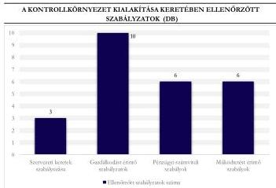
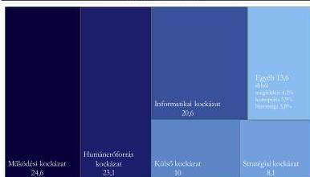
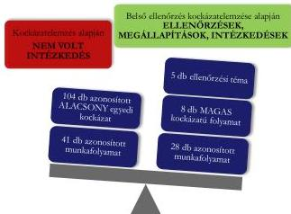
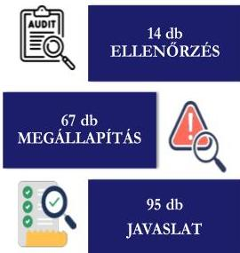
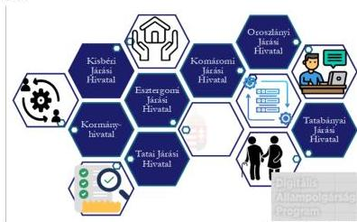

ÁLLAMI
SZÁMVEVŐSZÉK

# JELENTÉS

## A központi költségvetési szervek belső
kontrollrendszerének ellenőrzése

Komárom-Esztergom Vármegyei Kormányhivatal

2026.

26019

www.asz.hu

---

ÁLLAMI
SZÁMVEVŐSZÉK

# JELENTÉS

## A központi költségvetési szervek belső
kontrollrendszerének ellenőrzése

Komárom-Esztergom Vármegyei Kormányhivatal

2026.

26019

www.asz.hu

---

ELLENŐRZÉSI IGAZGATÓSÁG:

**ELLENŐRZÉSI IGAZGATÓSÁG IV.**

ELLENŐRZÉSI IGAZGATÓ:

**GORECZKY GERGELY** igazgató

ELLENŐRZÉSVEZETŐ:

**KISTÓTH KRISZTINA** ellenőrzésvezető

Jelentéseink az interneten a
www.asz.hu címen olvashatók.

IKTATÓSZÁM: EL-4262-003/2026

TÉMASORSZÁM: 25

ELLENŐRZÉS-AZONOSÍTÓ SZÁM: V-1137

---

# TARTALOMJEGYZÉK

|  ■ ÖSSZEFOGLALÁS | 5  |
| --- | --- |
|  ■ AZ ELLENŐRZÉS EREDMÉNYEI | 9  |
|  1. A központi költségvetési szerv kontrollkörnyezetének kialakítása | 9  |
|  2. A központi költségvetési szerv integrált kockázatkezelési rendszerének kialakítása és működtetése | 10  |
|  3. A központi költségvetési szerv kontrolltevékenységének kialakítása és működtetése | 12  |
|  4. A központi költségvetési szerv információs és kommunikációs rendszerének kialakítása és működtetése | 13  |
|  5. A központi költségvetési szerv nyomon követési (monitoring) rendszerének kialakítása és működtetése | 15  |
|  6. Áttekintés a központi költségvetési szerv adatbázisainak a belső kontrollrendszer keretében és a közfeladat ellátás során történő alkalmazásáról | 18  |
|  ■ JAVASLATOK | 20  |
|  ■ I. FÜGGELÉK: ÉSZREVÉTELEK | 21  |
|  ■ II. FÜGGELÉK: ELLENŐRZÉSI MEGKÖZELÍTÉS | 23  |
|  ■ MELLÉKLETEK | 31  |
|  I. sz. melléklet: Értelmező szótár | 31  |
|  II. sz. melléklet: Az ellenőrzött szervezetek jegyzéke | 34  |
|  ■ RÖVIDÍTÉSEK JEGYZÉKE | 35  |

3

---

# ÖSSZEFOGLALÁS

A belső kontrollrendszer a szervezetirányítás elválaszthatatlan része, magában foglalja mindazon elveket, eljárásokat, belső szabályzatokat, gyakorlati módszereket, amelyek alapján a költségvetési szerv biztosítja a feladatai ellátására szolgáló előirányzatokkal, létszámmal és vagyonnal való szabályszerű, gazdaságos, hatékony és eredményes gazdálkodást. Az Állami Számvevőszék jogszabályban rögzített feladata az államháztartás belső kontrollrendszer működésének értékelése.

Jelen számvevőszéki ellenőrzés a **Komárom-Esztergom Vármegyei Kormányhivatal** belső kontrollrendszerét vizsgálta 2024. január 1. és 2025. május 14. közötti időszakra vonatkozóan, ennek keretében értékelte a kialakítás és a működtetés szabályszerűségét és a gazdálkodási jogkörgyakorlás vonatkozásában a kontrolltevékenységek eredményességét. Az ÁSZ¹ az integrált kockázatkezelési rendszer, az információs és kommunikációs rendszer, és a nyomon követési (monitoring) rendszer tekintetében vizsgálta a működtetés célszerűségét.

Az ellenőrzés során értékelt elemek vonatkozásában a Kormányhivatal² vezetője szabályszerűen kialakította és az integrált kockázatkezelési rendszer kivételével szabályszerűen működtette a szervezet belső kontrollrendszerét. Az integrált kockázatkezelési rendszer működtetése – a tűréshatáron felüli egyedi kockázatok kezelésének hiányában – nem volt szabályszerű és kockázatcsökkentő célját nem töltötte be. Az információs és kommunikációs, valamint a nyomon követési rendszerek működtetése célszerű volt. A kontrolltevékenységek a gazdálkodási jogkörgyakorlás során eredményesek voltak, biztosították a szabálytalan pénzkifizetések előfordulásának megelőzését.

1. ábra

AZ ELLENŐRZÉS MEGÁLLAPÍTÁSAI A BELSŐ KONTROLLRENDSZER EGYES ELEMEINEK ÉRTÉKELÉSE TEKINTETÉBEN

|  BELSŐ KONTROLLRENDSZER ELEMEI | SZABÁLYSZERŰ | CÉLSZERŰ | EREDMÉNYES  |
| --- | --- | --- | --- |
|  1. Kontrollkörnyezet kialakítása | ☑ | NÉ | NÉ  |
|  2. Integrált kockázatkezelési rendszer kialakítása és működtetése | ☒ | ⚠ | NÉ  |
|  3. Kontrolltevékenységek kialakítása és működtetése | ☑ | NÉ | ☑  |
|  4. Információs és kommunikációs rendszer kialakítása és működtetése | ☑ | ☑ | NÉ  |
|  5. Nyomon követési (monitoring) rendszer kialakítása és működtetése | ☑ | ☑ | NÉ  |

Forrás: ÁSZ saját szerkesztés

5

---

Összefoglalás

1. A Kormányhivatal kontrollkörnyezetének kialakítása szabályszerű volt. A Kormányhivatal vezetője a jogszabályi előírásoknak megfelelően kialakította a szervezeti kereteket, meghatározta a gazdálkodás részletes rendjét és gondoskodott a pénzügyi- számviteli szabályzatok elkészítéséről. A Kormányhivatal az anyag- és eszközgazdálkodás számviteli politikában nem szabályozott kérdéseit több különálló dokumentumban kezelte, amelyek a jogszabályi előírás ellenére nem rögzítették az eszközök tárolására, mozgatására, elszámolására, megóvására vonatkozó részletszabályokat, a felhasználás és nyilvántartás szabályait. Az ÁSZ véleménye szerint az anyag- és eszközgazdálkodási szabályok egy dokumentumban való rögzítése indokolt, amely támogatja az előírások következetes, átlátható, egységes értelmezését és alkalmazását.

2. A Kormányhivatal szabályszerűen kialakította az integrált kockázatkezelési rendszerét, azonban nem működtette szabályszerűen. A Kormányhivatal integrált kockázatkezelési gyakorlatában az ÁSZ a szabályszerű és célszerű működtetést gátló hiányosságokat tárt fel. A Kormányhivatalnál alkalmazott gyakorlat szerint a kockázatokat azonosították, értékelték, majd az egyedi kockázatokat a fő folyamat szintjén átlagolták, ezért a 2024. évben fő folyamat szinten a tűréshatárt meghaladó kockázatot nem azonosítottak, intézkedést nem határoztak meg. Az „átlagolás” elfedte az egyedi, tűréshatár feletti kockázatú eseményeket, ezáltal az államháztartási útmutatóban³ foglaltak ellenére nem volt biztosított a kockázatok egyedi kezelése és a kockázati tűréshatáron kívül elhelyezkedő kockázatok tűréshatáron belüli értékre csökkentése.

A kockázatok szervezeti értékelése nem volt összhangban a belső ellenőr tevékenységének megtervezéséhez készített kockázatelemzéssel. A belső ellenőr kockázatelemzésében a magas kockázatuként jelölt kockázatok közül több a Kormányhivatal kockázatkezelési mátrixában alacsonyabb kockázati besorolással jelent meg. Az ÁSZ véleménye szerint a szervezeti egységek és a belső ellenőrzés által elvégzett kockázatértékelés egyeztetése támogatja a kockázatkezelés célszerű működtetését, a kockázatok minél szélesebb körű azonosítását, a rendelkezésre álló szakértelem, tapasztalat felhasználását.

3. A Kormányhivatalnál a kontrolltevékenységek kialakítása és működtetése szabályszerű volt. A gazdálkodási jogkörgyakorlás vonatkozásában a kontrolltevékenységek eredményesek voltak, a kontrollok biztosították a kötelezettségvállalás, a pénzügyi ellenjegyzés, a teljesítésigazolás, az érvényesítés, valamint az utalványozás területén a lényegi szabálytalanságok előfordulásának megelőzését.

A kontrollkörnyezet célja, hogy a vezetés kialakítsa azokat a szervezeti, működési kereteket, amelyek biztosítják a szabályszerű, gazdaságos, hatékony és eredményes működést, a belső kontrollok megbízható működését, valamint a közvagyon felelős felhasználását.

Forrás: államháztartási útmutató alapján

Az integrált kockázatkezelés célja, hogy a szervezet elérje kitűzött céljait, miközben minimalizálja a működését veszélyeztető kockázatok hatását, beépülve a működési és döntéshozatali folyamatokba.

Forrás: államháztartási útmutató alapján

A kontrolltevékenységek módszertani meghatározása, technikai végrehajtása biztosítja a szabályszerű működést, lehetővé teszi a kockázatok hatékony jelzését és megelőzését, valamint azok bekövetkezése esetén hatásuk mérséklését vagy megszüntetését.

Forrás: államháztartási útmutató alapján

6

---

Összefoglalás

4. A Kormányhivatal szabályszerűen kialakította és működtette az információs és kommunikációs rendszert. A Kormányhivatal az információk hitelességének biztosítására vonatkozó feltételek és az adatok bizalmasságának meghatározásával alkalmazta az államháztartási útmutató ajánlását, amely támogatta az információs és kommunikációs rendszer célszerű működését, a hiteles információk áramlását és azt, hogy illetéktelenek ne juthassanak bizalmas információkhoz.

A Kormányhivatal a vezetői döntéshozatalt az integrált pénzügyi rendszerből származó adatokkal, valamint további elektronikus alapú kimutatásokkal támogatta. A vezetői információs modulnak az ellenőrzés lezárásakor folyamatban lévő fejlesztése részletesebb kimutatásokkal fogja segíteni – összhangban az államháztartási útmutató előírásával – a vezetői döntések megalapozottságát, alátámasztását. A Kormányhivatal Intranet rendszere segítette a papírmentes ügyintézést, valamint az államháztartási útmutató előírásával összhangban biztosította a dolgozók számára a szabályozó eszközökhöz és a mindennapi munkavégzéshez szükséges információkhoz való hozzáférést. A Kormányhivatal a jogszabályi előírásoknak megfelelően, szabályszerűen alakította ki és működtette a közérdekű bejelentések, visszaélések, valamint a szervezeti integritást sértő események jelentéstételi rendszerét.

5. A Kormányhivatal monitoring rendszerének kialakítása és működtetése szabályszerű volt. A Kormányhivatal a jogszabályi előírásnak eleget téve kialakította a folyamatos és eseti monitoring tevékenységet. A Kormányhivatal szervezeti egységeinek vezetői az államháztartási útmutató ajánlását alkalmazva a területük belső kontrollrendszerének működéséről átfogó értékelést készítettek, amely támogatta a monitoring rendszer célszerű működését, elősegítve a szükséges javító intézkedések meghozatalát. A Kormányhivatal belső ellenőrzési tevékenységének kialakítása és működtetése szabályszerű volt. A 2024. évre tervezett 14 ellenőrzést elvégezték. Megfelelve a jogszabályi követelményeknek, a belső ellenőrzés aktív szerepet vállalt a belső kontrollrendszer fejlesztésében.

A Kormányhivatal vezetője, a Főispán éves vezetői nyilatkozatában átfogóan értékelte a belső kontrollrendszer működését, amelyet egy rendszerszintű, a szervezet egészére kiterjedő, dokumentált értékelés támasztott alá. Ez az ÁSZ véleménye szerint jó gyakorlat, erősítette a nyilatkozat alátámasztottságát, megbízhatóságát.

6. Az adatvagyon tudatos és körültekintő felhasználása kiemelt figyelmet érdemel a költségvetési szervek feladatellátása során. A belső kontrollrendszeren belül az integrált kockázatkezelési, az információs és kommunikációs, valamint a monitoring rendszer területén is lehetőség nyílik az adatvagyon hasznosítására. A gyorsan változó informatikai környezet új eszközök alkalmazását teszi lehetővé, azonban alkalmazásuk csak az információ biztonsági szempontok figyelembevétele mellett történhet. Ezért az integrált kockázatkezelési és az információs és kommunikációs rendszerek vonatkozásában, valamint a feladatellátással kapcsolatban az

Az információs és kommunikációs rendszer feladata a hatékony belső és külső kommunikáció biztosítása. A külső tájékoztatási rendszer lehetővé teszi az érdeklődők, az állampolgárok számára a közérdekű információk hatékony és ellenőrizhető elérését. A belső folyamatok a szervezeten belül biztosítják a pontos, megbízható, releváns és időszerű információkat.

Forrás: államháztartási útmutató alapján

A monitoring rendszer, a nyomon követés a belső kontrollrendszer folyamatos figyelemmel kísérése, értékelése, amely folyamatosan információt szolgáltat a belső kontrollok működéséről. A monitoring a döntéshozatal eszköze, lehetővé teszi a kockázatok azonosítását, a szabálytalanságok feltárását a mielőbbi reagálás érdekében, hozzájárulva a belső kontrollrendszer megerősítéséhez.

Forrás: államháztartási útmutató alapján

7

---

Összefoglalás---

ellenőrzés áttekintette a Kormányhivatal adatbázisainak felhasználási területeit, a felhasználással kapcsolatos, az ellenőrzés időszakában alkalmazott gyakorlatot és a további terveket.

A Kormányhivatal **az integrált kockázatkezelés** keretében támaszkodott az adatvagyon vizsgálatára, elsődlegesen az informatikai kockázatok beazonosítása területén. A közfeladatellátás során az adatelemzéshez **idősoros elemzést, statisztikai modelleket, előrejelzési módszereket** alkalmaztak, de sor került nagy mennyiségű heterogén adatok feldolgozására is. A **mesterséges intelligenciát** adatvédelmi és adatbiztonsági okokból az ellenőrzés lezárásig nem használták és egy jövőbeni alkalmazás előtt fontosnak tartották a munkaerő szakmai felkészítését, továbbképzését és a kapcsolódó biztonsági kockázatok minimalizálását. A Kormányhivatal **jövőbeni tervei** között az ellenőrzés lezárásakor szerepelt az adatvagyon nyilvántartási rendszerének központosítása, a szükséges szakértelem biztosítása mellett az adatfeldolgozás, adatelemzés fejlesztése, és az adatvezérelt döntéshozatal megerősítése Big Data elemzések alkalmazásával. Az áttekintés részletes eredményeit a 6. fókuszterület mutatja be.

8

---

# AZ ELLENŐRZÉS EREDMÉNYEI

## 1. A központi költségvetési szerv kontrollkörnyezetének kialakítása

### Összegző megállapítás

A Kormányhivatal vezetője gondoskodott a kontrollkörnyezet szabályszerű kialakításáról.

2. ábra

Forrás: ÁSZ saját szerkesztés

### A kontrollkörnyezet kialakítása

A Kormányhivatal vezetője az Áht.⁴ előírásainak megfelelően kialakította a költségvetési szerv **szervezeti keretét és működési rendjét**, amelyet az Ávr.⁵ szabályaival összhangban az SZMSZ⁶-ben rögzített. A Kormányhivatal vezetője a Bkr.⁷ előírásainak megfelelően kialakította a **pénz- és vagyongazdálkodási folyamatok** ellenőrzési nyomvonalát, kijelölte az e folyamatokért felelős folyamatgazdákat. A Kormányhivatal vezetője a gazdasági vezetés és gazdálkodás Ávr.-ben meghatározott személyi feltételeit biztosította.

A Kormányhivatal elkészítette a kötelezettségvállalási szabályzatot⁸, melyben az Ávr.-ben foglaltaknak megfelelően szabályozta a **gazdálkodási jogkörök** gyakorlását végző személyek kijelölésének rendjét és rögzítette a tervezéssel, gazdálkodással kapcsolatos részletszabályokat. A Kormányhivatalnál rendelkezésre állt az Ávr.-ben előírtaknak megfelelően a naprakész nyilvántartás a gazdálkodási jogkörök gyakorlására jogosult személyekről és aláírásmintájukról, valamint elektronikus aláírás esetén a használt tanúsítványokról és a tanúsítvány nyilvános adatairól. Az Ávr. követelményével összhangban a beszerzési szabályzat⁹ rendelkezett a Kbt.¹⁰ hatálya alá nem tartozó beszerzési eljárások lebonyolításáról. A **közbeszerzési szabályzat**¹¹ a Kbt. előírásainak megfelelően rendelkezésre állt. A Kormányhivatal az Ávr.-ben előírt szabályzat készítési kötelezettségének eleget téve a tervezéssel kapcsolatos előírásokat a kötelezettségvállalási szabályzatban, a gazdálkodási, ellenőrzési feladatok teljesítésével kapcsolatos előírásokat a gazdálkodási keretszabályzatban¹², a beszámolási, adatszolgáltatási feladatokat és kötelezettségeket a számviteli politikában¹³ rögzítette.

A Kormányhivatal vezetője gondoskodott a Számv. tv.¹⁴ és az Áhsz.¹⁵ előírásainak megfelelő pénzügyi, számviteli szabályozások kialakításáról. A **számviteli politika** aktualizálása 2025. évben megtörtént. A Kormányhivatal rendelkezett a mennyiségi felvétellel és az egyeztetéssel elvégzendő leltározás rendjét rögzítő **leltározási szabályzattal**¹⁶, valamint – a Kormányhivatal sajátosságait figyelembe vevő – egyes eszköz- és forrástípusok értékelésének elveit, módszereit tartalmazó **értékelési szabályzattal**¹⁷. A pénzforgalom lebonyolításának rendjét, a pénzkezelés személyi és tárgyi feltételeit, valamint a felelősségi szabályokat a **pénzkezelési szabályzat**¹⁸ rögzítette. A Kormányhivatal rendelkezett **számlarenddel**¹⁹.

9

---

Az ellenőrzés eredményei

A Kormányhivatal nem biztosította az Ávr. 13. § (2) bekezdés d) pontjában előírtak következetes, átlátható, egységes szabályozását. A Kormányhivatal az anyag- és eszközgazdálkodás számviteli politikában nem szabályozott részleteit több különálló szabályozó eszközben, így belső utasításokban²⁰, ügyrendben és ellenőrzési nyomvonalban²¹ rögzítette, melyek keretében nem szabályozta az eszközök tárolására, mozgatására, elszámolására, megóvására vonatkozó részletszabályokat, az eszközök felhasználásának és nyilvántartásának szabályait. Az ÁSZ véleménye szerint indokolt az anyag- és eszközgazdálkodás számviteli politikában nem szabályozott kérdéseinek egy dokumentumban való szabályozása a belső előírások következetes, átlátható, egységes értelmezése és alkalmazása érdekében.

## 2. A központi költségvetési szerv integrált kockázatkezelési rendszerének kialakítása és működtetése

Összegző megállapítás

A Kormányhivatal vezetője szabályszerűen kialakította a szervezet integrált kockázatkezelési rendszerét, azonban nem működtette szabályszerűen. A Kormányhivatal által alkalmazott átlagolt kockázatértékelés korlátozta a kockázatkezelés kockázatcsökkentő hatását, védelmi szerepének érvényesülését.

Az integrált kockázatkezelési rendszer kialakítása

A Kormányhivatal vezetője – a Bkr. előírásaival összhangban – az integrált kockázatkezelési szabályzatban²² meghatározta a kockázatkezelés folyamatát, szereplőit és rögzítette a felelősségi köröket. A Kormányhivatal vezetője a Bkr. előírásainak megfelelően szabályozta az integritást sértő események kezelésének eljárásrendjét a szervezeti integritási szabályzatban²³, valamint az integritási bejelentések szabályzatában²⁴, kitérve a bejelentési csatornákra, a kivizsgálás rendjére, a bejelentő védelmét biztosító garanciákra, valamint a vizsgálat eredményéről való tájékoztatás szabályaira. A Kormányhivatal vezetője az ellenőrzött időszakban az 50/2013. (II. 25.) Korm. rendeletben²⁵ foglaltaknak megfelelően az integritási és korrupciós kockázatok kezelésében való támogatásra, és az integrált kockázatkezelési tevékenység koordinálására integritási tanácsadót jelölt ki.

Az integrált kockázatkezelési rendszer működtetése

A Kormányhivatal és a hozzá tartozó járási hivatalok szervezeti egységei a Bkr. előírásainak megfelelően, szabályszerűen meghatározták az értékelési kritériumokat és értékelték a fő folyamatok kockázatait, amelyet az integrált kockázatkezelési leltárban dokumentáltak.

10

---

Az ellenőrzés eredményei

3. ábra

A KOCKÁZATKEZELÉS ÁLTAL A 2024. ÉVBEN AZONOSÍTOTT EGYEDI KOCKÁZATOK TÍPUS SZERINTI MEGOSZLÁSA (%)

Forrás: Kormányhivatal 2024. évi kockázatkezelési leltár adatai alapján ÁSZ saját szerkesztés

A Kormányhivatal „kulcs-kockázat”-ként azonosította és a folyamatszintű kockázatoktól elkülönítve tartotta nyilván a kockázatkezelési mátrixban a stratégiai célokhoz rendelt kockázatokat. A kockázati hatás vizsgálatánál meghatározásra került, hogy az adott kockázat, folyamat a Kormányhivatal céljainak elérésében mennyire volt jelentős.

A Kormányhivatal az államháztartási útmutató 2.2.1. és 2.2.2. standard ajánlását

alkalmazva meghatározta az azonosított kockázatok bekövetkezésének valószínűségét és a költségvetési szervre gyakorolt hatását, amelyet az integrált kockázatkezelési leltárban rögzített. A hatás értékelését négy értékelési kritérium – a lényegesség, a sérülékenység, a reputációs érzékenység és a folyamat jelentősége a szervezeti célok elérésében – támogatta, a bekövetkezési valószínűség és hatás meghatározására páros számú, négy fokozatú értékelési fokozatot alkalmazott. A páros számú értékelési fokozat alkalmazása javítja a választás célszerűségét, nem engedi az értékelés középre tolódását, hiszen az államháztartási útmutató szerint egy négy fokozatú skála esetében mindenképpen dönteni kell, hogy „a kockázat hatása vagy valószínűsége kisebb vagy nagyobb a középértékhez képest”. A Kormányhivatal az államháztartási útmutató 2.4.2 standard ajánlását alkalmazva évente elvégezte a beazonosított kockázatok felülvizsgálatát.

A Kormányhivatal a kockázatkezelés során azonosított egyedi kockázatok kockázati értékének meghatározása helyett fő munkafolyamatok szintjén összesítetten, átlagoltan – az egyedi kockázatok valószínűségének átlaga és a négy hatáskritérium átlaga alapján – határozta meg a kockázati értékeket. Az egyes fő munkafolyamatok átlagolással meghatározott kockázati értékének mindegyike a 2024. évben a kockázati tűréshatár alá került, miközben a fő munkafolyamaton belül azonosított egyedi kockázatok közül több túllépte a kockázati tűréshatárt. Az alkalmazott módszertan torzította a kockázatok értékelését, az „átlagolás” elfedte az egyedi, kockázati tűréshatár feletti kockázatokat. A Bkr. 5. § (1) bekezdés alapján alkalmazandó államháztartási útmutató 2.3.1. standardjában rögzítettek ellenére a kockázatcsökkentő hatás nem érvényesült, a Kormányhivatal az államháztartási útmutató 2.3.2. standardjában rögzítettek ellenére a kockázatok kezelésének módját (elfogadás, áthárítás, megszüntetés, kezelés) nem határozta meg minden egyes kockázat esetében külön-külön.

11

---

Az ellenőrzés eredményei

4. ábra

# A KOCKÁZATKEZELÉS ÉS A BELSŐ ELLENŐRZÉS KOCKÁZATI ÉRTÉKELÉSÉNEK EREDMÉNYEI 2024. ÉVBEN

Forrás: Kormányhivatal 2024. évi kockázatelemzési leltár, 2024. évi kockázatelemzés az évi belső ellenőrzési tevékenység tervezéséhez - azonos fő munkafolyamatok - adatai alapján, ÁSZ saját szerkesztés

A kockázatok szervezeti értékelésében és a belső ellenőr által a Bkr. 31. § (2) bekezdés előírásának megfelelően a tevékenység megtervezéséhez készített kockázatelemzésben a kockázatok értékelése eltérő volt. A belső ellenőrzés kockázatelemzése 2024. évben magas kockázatú területként értékelt több munkafolyamatot. A belső ellenőr értékelése szerint a 2025. évi belső ellenőrzési tevékenység megtervezéséhez készített kockázatelemzésben közepes besorolásból magas besorolási szintbe került a gazdálkodási jogkörgyakorlás, az uniós pályázatok lebonyolítása, valamint a személyi anyagok kezelése. Ezen magas besorolású kockázatok közül több a Kormányhivatal kockázatkezelési

mátrixában alacsonyabb kockázati értékkel jelent meg, így intézkedés nem készült a belső ellenőrzés által magas kockázatúnak azonosított munkafolyamatokhoz. Az ÁSZ véleménye szerint a szervezeti egységek és a belső ellenőrzés kockázatelemzési eredményeinek egyeztetése, a különbségek tisztázása támogatja a kockázatok célszerű kezelését, a kockázatok minél szélesebb körű azonosítását, a rendelkezésre álló szakértelem, tapasztalat felhasználását.

### 3. A központi költségvetési szerv kontrolltevékenységének kialakítása és működtetése

# Összegző megállapítás

A Kormányhivatal vezetője szabályszerűen kialakította és működtette a kontrolltevékenységeket. A kontrolltevékenységek eredményesen működtek, a gazdálkodási jogkörgyakorlás vonatkozásában biztosították a lényegi szabálytalanságok megelőzését.

# A kontrolltevékenységek kialakítása

A Kormányhivatal a belső kontrollrendszer szabályzatban²⁶ határozta meg az alkalmazandó folyamatba épített és vezetői ellenőrzéseket. A belső kontrollrendszer szabályzatban a megelőző, feltáró és helyrehozó kontrollok között szerepeltek az engedélyezési és jóváhagyási eljárások; a feladat- és felelősségi körök elhatárolása, a forrásokhoz és nyilvántartásokhoz való hozzáférés kontrollja; az igazolás; az egyeztetés; a szignáláshoz, kiadmányozáshoz kapcsolódó ellenőrzési feladatok; a működési teljesítmény vizsgálata; a műveletek, folyamatok, tevékenységek komplex vizsgálata; valamint a felügyelet, amely alatt feladatkijelölést, engedélyezést, felülvizsgálatot és jóváhagyást kell érteni.

A Kormányhivatal pénz- és vagyongazdálkodási ellenőrzési nyomvonala tartalmazta az egyes munkafolyamatokhoz kapcsolódó input és output adatok körét, a végrehajtásért felelős munkakört és

12

---

Az ellenőrzés eredményei

szervezeti egységet. A Bkr. 6. § (3) bekezdés, valamint a Bkr. 5. § (1) bekezdés alapján alkalmazandó államháztartási útmutató 1.4.2. és 3.1.7. standard előírásának a Kormányhivatal nem tett eleget, az ellenőrzési nyomvonalban nem került rögzítésre az ellenőrzés végrehajtásának módszere, technikája, amelyeknek hiányában az ellenőrzési nyomvonal nem biztosította a kontrollok nyomon követhetőségét és az intézkedések jellegének egyértelmű azonosítását.

#### *A kontrolltevékenységek működtetése*

A Kormányhivatal a kötelezettségvállalási, a pénzügyi ellenjegyzési, a teljesítésigazolási, az érvényesítési, valamint az utalványozási jogkörök gyakorlását az Áht. és az Ávr., a kiadási rovat elszámolását az Áhsz. előírásainak megfelelően összességében szabályszerűen végezte.

A Kormányhivatal kontrolltevékenységei eredményesek voltak, a kötelezettségvállalás, a pénzügyi ellenjegyzés, a teljesítésigazolás, az érvényesítés és az utalványozás gyakorlata biztosította a pénzkifizetési szabálytalanságok előfordulásának megelőzését.

Az ellenőrzött kiadási mintatételek esetében – amennyiben az a közbeszerzési eljárás hatálya alá tartozott – lefolytatták a közbeszerzési eljárást, a kiadások megfelelő rovaton kerültek elszámolásra.

**Az ÁSZ véleménye szerint a kontrolltevékenységek kialakítása szempontjából jó gyakorlatként azonosítható, hogy bár az Ávr. alapján nem szükséges az előzetes írásbeli kötelezettségvállalás a kétszázezer forintot el nem érő kifizetések teljesítéséhez, a Kormányhivatal a kisebb összegű kötelezettségvállaláshoz is kontrollt rendelt a kiadások szélesebb körű figyelemmel kísérése és kontrollálása érdekében. A Kormányhivatal olyan formanyomtatványt alkalmazott, amely három szintű kontrollmechanizmuson alapult. A szakmai engedélyezés, a pénzügyi fedezet meglétének igazolása mellett – független kontrollpontként – az előirányzat előzetes rendelkezésre állásának harmadik fél által történő igazolása is megtörtént a megrendelést megelőzően.**

## 4. A központi költségvetési szerv információs és kommunikációs rendszerének kialakítása és működtetése

### Összegző megállapítás

A Kormányhivatal vezetője szabályszerűen kialakította és működtette az információs és kommunikációs rendszert. Az információs és kommunikációs rendszer működtetése célszerű volt, biztosította az adatáramlás hitelességét és bizalmasságát.

#### *Az információs és kommunikációs rendszer kialakítása*

A Kormányhivatal vezetője a Bkr. előírásaival összhangban a belső kontrollrendszer szabályzatban kialakította az **információk szervezeten belüli és külső szervezetek felé áramlásának** szabályait. Az egyedi **iratkezelési** szabályzat$^{27}$ a 335/2005. (XII.29.) Korm. rendelet$^{28}$ előírásainak megfelelően részletesen tartalmazta az iratkezelés rendjére, folyamatára vonatkozó szabályokat. A Levéltár$^{29}$-ral egyetértésben kiadott egyedi iratkezelési szabályzatot – a 335/2005. (XII.29.) Korm. rendelet követelményét teljesítve – a Kormányhivatal 2025. évben felülvizsgálta. Az iratkezelés szervezeti rendjét a fővárosi és vármegyei kormányhivatalok egységes szabályzata$^{30}$ rögzítette. A Kormányhivatal a megfelelő tanúsítvánnyal rendelkező POSZEIDON$^{31}$ elektronikus nyilvántartási rendszert alkalmazta irat- és dokumentumkezelésre.

13

---

Az ellenőrzés eredményei

A Kormányhivatal **közzétételi** szabályzata$^{32}$ együttesen határozta meg a közérdekű adatok megismerésére irányuló kérelmek intézésének rendjét, valamint a kötelezően közzéteendő adatok nyilvánosságra hozatalának rendjét, összhangban az Info tv.$^{33}$ és a 305/2005. (XII.25.) Korm. rendelet$^{34}$ előírásaival.

A Kormányhivatal 2025. évi munkatervében$^{35}$ kiemelt feladatának tekintette a Digitális Állampolgárság mobilalkalmazás használatához kapcsolódó feladatok megvalósítását, amellyel összhangban részletesen szabályozták az **informatikai folyamatokat**. Az információ átadási szabályzat$^{36}$ az államháztartási útmutató 4.1.2 standard ajánlását alkalmazva rögzítette a hatóságok közötti információ átadás szabályait, módját és kereteit. A Kormányhivatal informatikai tevékenységét az informatikai eljárásrend$^{37}$, az annak függelékeit képező 23 db egyéb belső szabályzat, valamint az Információbiztonsági tv.$^{38}$, majd a Kiberbiztonsági tv.$^{39}$ előírásaival összhangban az informatikai biztonsági szabályzat$^{40}$ határozta meg.

A Kormányhivatal információ átadási szabályzata tartalmazta az átadott információ hitelességének biztosítására vonatkozó feltételeket. A Kormányhivatal rendelkezett azonosítási és hitelesítési eljárásrenddel$^{41}$, amely dokumentálta az azonosítási és hitelesítési eljárások folyamatát, a feladatok végrehajtásának lépéseit, eszközeit és nyilvántartásait, az elvárt eredményeket. A rendszer- és információsértetlenség eljárásrend$^{42}$ meghatározta az informatikai rendszerben kezelt adatok bizalmasságát, mint garanciális elemet. Ezen informatikai szabályok által a Kormányhivatal alkalmazta az államháztartási útmutató 4.1.2. standardban foglalt ajánlást, amely támogatta **az információs és kommunikációs rendszer célszerű működését, a hiteles információk áramlását és azt, hogy illetéktelenek ne juthassanak bizalmas információkhoz**.

Az ÁSZ jó gyakorlatként értékelte az információ és adatvédelem szempontjából, hogy a Kormányhivatal rendelkezett 2024. évig szóló informatikai biztonsági stratégiával$^{43}$, amely célja a rövid-, közép- és hosszú távú informatikai biztonsági célok, eredmények meghatározása volt, támogatva „a Kormányhivatal által kezelt adatok, üzemeltetett rendszerek zárt, teljeskörű, folytonos és kockázatokkal arányos védelmét”.

A Kormányhivatal az informatikai biztonsági szabályzat aktualizálását a Kiberbiztonsági tv. előírásának megfelelően, az előírt határidőn belül elvégezte.

### *Az információs és kommunikációs rendszer működtetése*

A **Központi Információs Közadat Nyilvántartásról** (továbbiakban: KIKNY) szóló Korm. rendelet$^{44}$ kimondja, hogy biztosítani kell a közérdekű adatok naprakész, pontos és a jogszabály szerinti struktúrában történő közzétételét a KIKNY-ben. A Kormányhivatal eleget tett az Info tv., az Ávr., valamint a KIKNY-ről szóló Korm. rendeletben előírt, az ellenőrzés keretében vizsgált közzétételi kötelezettségeknek$^{45}$. A KIKNY-ben a közzétett adatok frissítése kéthavi rendszerességgel megtörtént.

A **vezetői döntéshozatalt** az integrált Forras.Net pénzügyi rendszerben a KIIR VIIR$^{46}$ modul gazdasági adatokról nyújtott információi támogatták, amelyet rendszeres excel nyilvántartáson alapuló adatszolgáltatások egészítettek ki (havi IKJ$^{47}$, negyedéves mérlegjelentés, éves költségvetési beszámoló).

14

---

Az ellenőrzés eredményei

A Kormányhivatal tájékoztatása szerint a vezetői információs rendszer (KIIR VIIR modul) további elemeinek bevezetésén dolgoznak, amely részletesebb és testreszabottabb kimutatásokat biztosít, elősegítve a vezetői döntéshozatal támogatását. A fejlesztés hosszú távon lehetőséget ad az elektronikus (excel) formátumú nyilvántartások kiváltására, ezáltal csökkentve az adatbeviteli hibák kockázatát és a manuális adminisztrációs terheket. A vezetői információs rendszer fejlesztése a jövőben **támogatni fogja** az államháztartási útmutató 4.1.5 standard előírásaiban foglaltak betartását, **a döntések megalapozottságát, alátámasztását.**

A Kormányhivatal egységes belső információs rendszere, az **Intranet rendszer** biztosította a munkavállalók tájékoztatását, ügyintézését, amely biztosította az államháztartási útmutató 4.1.3 standard előírásának betartását, a munkatársak számára a munkájuk végzéséhez szükséges információk rendelkezésre állását. A dokumentumok tárháza tartalmazta mind a hatályos szabályozóeszközök, mind azok előzményeinek elérését. Az Intranet felületen kialakított menüpontok a tárgykörnek megfelelően (pl. hírlevelek, integritás, programok, tájékoztatók, etikai kódex, Takarnet) segítették az információk elérését. A Kormányhivatal a Bkr. és a Panasz tv.$^{48}$ előírásainak megfelelő, szabályszerűen működtette a **közérdekű bejelentések, visszaélések, valamint a szervezeti integritást sértő események** jelentéstételi rendszerét.

## 5. A központi költségvetési szerv nyomon követési (monitoring) rendszerének kialakítása és működtetése

**Összegző megállapítás** A Kormányhivatal vezetője szabályszerűen kialakította és működtette a nyomon követési (monitoring) rendszert. A monitoring rendszer működtetése célszerű volt, biztosította a folyamatos és eseti nyomon követést.

### *A nyomon követés (monitoring) rendszer kialakítása*

A Kormányhivatal a 2022-2026. évekre vonatkozó monitoring stratégiában$^{49}$ a Bkr. előírásainak eleget téve, valamint az államháztartási útmutató 5.1.1 standard ajánlását alkalmazva rögzítette a monitoring rendszer működési kereteit, a monitoring eszközök a folyamatba épített monitoring tevékenység, a vezetői ellenőrzések, valamint a belső és külső ellenőrzések voltak. A Bkr. rendelkezéseinek megfelelően kialakított folyamatos és eseti monitoring feladatokat a Kormányhivatal belső szabályozó eszközei tartalmazták.

A **folyamatos nyomon követésről** rendelkező eljárásrendek egyértelműen hozzárendelték a monitoring tevékenység végrehajtásáért való felelősséget a szervezeti egységek vezetőihez (például TakarNet rendszer szabályzata$^{50}$). **Az eseti nyomon követés** keretébe tartoztak a vezetői értékelések. A belső utasítások$^{51}$ rögzítették a vezetői értékelés dokumentálásának módját, ezáltal biztosítva a kontrollok működésének nyomon követhetőségét. Az informatikai biztonsági felelős munkaköri leírása informatikai biztonsági ellenőrzések végzését írta elő.

### *A nyomon követés (monitoring) rendszer működtetése*

A Kormányhivatal a **gazdálkodás területén a kulcskontrollok nyomon követését** dokumentáltan végezte. Az előirányzat felhasználás monitoringja folyamatos volt, a Kormányhivatal naprakészen, kiemelt előirányzatonként nyomon követte a tárgyévi bevételek alakulását, a személyi juttatások és járulékok

15

---

Az ellenőrzés eredményei---

megtakarított összegét, valamint az előirányzat módosítások időszaki alakulását. A Kormányhivatal a likviditási tervét folyamatosan frissítette és vezette. A pénzügyi-gazdasági adatok folyamatos nyomon követése támogatta a Kormányhivatal szabályszerű, felelős gazdálkodását.

**Fokozott vezetői nyomon követést** igényelt például a 2024. évi belső ellenőrzési jelentésben azonosított fluktuációval kapcsolatos kockázat, a személyi állománnyal kapcsolatos információk monitoringja heti rendszerességgel történt.

A **főosztályok, járási hivatalok által működtetett monitoring** tevékenység keretében valamennyi szervezeti egység értékelte a belső kontrollrendszer öt eleméhez kapcsolódó fejlesztéseket, a fejlesztések elmaradásának okát, illetve a kontrolltevékenység hiányosságainak – amennyiben releváns – okait és a következő évre tervezett fejlesztéseket. A beszámolók éves összesítését a belső ellenőrzés végezte, melyről éves értékelés készült a Főispán részére. A belső kontrollrendszernek az államháztartási útmutató 5.2.1 standard ajánlását alkalmazó széleskörű értékelése **támogatta a monitoring rendszer célszerű működtetését, visszajelzést adott** a Kormányhivatal vezetője részére a belső kontrollrendszer működéséről és a felmerülő problémákról, hiányosságokról, **a szükséges javító intézkedések meghozatala érdekében.**

16

---

Az ellenőrzés eredményei

### *A belső ellenőrzési tevékenység kialakítása és működtetése*

A Kormányhivatal vezetője a belső ellenőrzés működési feltételeit a Bkr. előírásainak megfelelve **szabályszerűen kialakította**. A belső ellenőrzési tevékenységet önálló jogállású, két főből álló osztály

5. ábra

A BELSŐ ELLENŐRZÉS 2024. ÉVI ELLENŐRZÉSEI ÉS AZOK EREDMÉNYE

Forrás: Kormányhivatal 2024. évi ellenőrzések nyilvántartása adatai alapján ÁSZ saját szerkesztés

végezte. A belső ellenőrök rendelkeztek a Bkr-ben előírt, a feladatellátáshoz szükséges végzettséggel, szakmai gyakorlattal, a belső ellenőrzési vezető teljesítette a PM rendelet$^{32}$-ben előírt szakmai követelményeket. A belső ellenőrzési kézikönyv a Bkr. előírásaival összhangban készült.

**A belső ellenőrzési tevékenység ellátása a Bkr. előírásainak megfelelve, szabályszerű volt.** A belső ellenőrzés kockázatelemzés alapján elkészítette a 2024. és 2025. évi belső ellenőrzési tervét, amelyet a Kormányhivatal vezetője jóváhagyott. A belső ellenőrzés a 2024. évi tervben szereplő mind a 14 ellenőrzést végrehajtotta, az ellenőrzéseket jelentéssel zárta. A belső ellenőrzés nyilvántartása alapján az ellenőrzéssel érintett szervezeti egységek az intézkedési terveket a belső ellenőrzési jelentések kézhezvételétől számított legfeljebb 30 napon belül elkészítették. A belső ellenőrzésekről és a külső szervezetek által lefolytatott ellenőrzésekről, illetve azok nyomán

tett intézkedésekről vezetett nyilvántartások rendelkezésre álltak, melyek tartalmazták az intézkedések nyomon követését is.

A belső ellenőrzési vezető a Bkr. előírásai szerint jelentéstételi kötelezettségének eleget tett, elkészítette és határidőben megküldte az éves belső ellenőrzési jelentést a Kormányhivatal vezetője részére. A belső ellenőrzés aktív szerepet vállalt a belső kontrollrendszer fejlesztésében, javaslatot tett a kontrollkörnyezet megerősítésére, javaslatai alapján módosultak, illetve bővültek a belső utasítások. A belső ellenőrzés kockázatkezeléssel kapcsolatos tanácsadása keretében végezte a kockázatkezeléssel kapcsolatos belső utasítások felülvizsgálatát, véleményezését, két utasítás tekintetében módosítási javaslatot tett.

### *A vezetői nyilatkozat*

A Főispán a Bkr. szabályainak megfelelve elkészítette a 2024. évre vonatkozó, a belső kontrollrendszer minőségét értékelő vezetői nyilatkozatot. A nyilatkozat túlmutatott a Bkr. mellékletében előírt minimum tartalom, részletes, strukturált módon tartalmazta a belső kontrollrendszer öt elemének egyedi értékelését, nem ismételte a korábbi év megállapításait, aktualizált, tárgyévre jellemző értékelést adott. A Kormányhivatal vezetőjének nyilatkozata a belső ellenőrzés által készített éves ellenőrzési jelentésen alapult, amelyhez valamennyi szervezeti egység önértékelését és a külső ellenőrzési tapasztalatokat is figyelembe vették.

Az ÁSZ jó gyakorlatként értékelte, hogy **a vezetői nyilatkozatot egy rendszerszintű, a szervezet egészére kiterjedő, dokumentált értékelés támasztotta alá**, amely erősítette a belső kontrollrendszer működését értékelő nyilatkozat megalapozottságát.

17

---

Az ellenőrzés eredményei

## 6. Áttekintés a központi költségvetési szerv adatbázisainak a belső kontrollrendszer keretében és a közfeladat ellátás során történő alkalmazásáról

### Összegző megállapítás

A Kormányhivatal saját adatvagyonának elemzésére a kockázatok beazonosítása során támaszkodott. A közfeladat ellátás során a Kormányhivatal a rendelkezésére álló adatokat a vezetői döntések támogatásához és az ügyfélkiszolgálásról adott állampolgári visszajelzések áttekintéséhez széleskörű eszköztárral dolgozta fel.

### *Adatbázisok alkalmazása a kockázatkezelés során*

A Kormányhivatal – szabályzataiban rögzítve – a kockázatok beazonosítása során támaszkodott saját adatvagyonának feldolgozására, elemzésére. Az informatikai kockázatkezelési eljárásrend$^{83}$ szerint a Kormányhivatal az elektronikus információs rendszerek kockázatfelmérési folyamatában elsődlegesen a vagyonleltárt állítja össze, amely adatbázisból hatáselemzést készít, és felméri az ügyviteli folyamatok kieséséből, elvesztéséből adódó hatások becsült kárértékét.

A Kormányhivatal több szervezeti egységénél is azonosított az adatvagyon veszteshez kapcsolódó, üzletmenetet érintő kockázatokat, úgy, mint a szerver, tárhely elégtelensége, az adatfeldolgozás késedelmessé válása, az adatállomány esetleges sérülése, megsemmisülése, az adatállomány elérhetetlensége esetén pedig az adatszolgáltatás ellehetetlenülése, vagy elhúzódása. A Kormányhivatal az adatvagyonhoz kapcsolódó további kockázatként azonosította a biztonsági mentések hibája miatt az adat/informatikai rendszer helyreállíthatatlanságát.

### *Az adatvagyon felhasználása a közfeladat ellátása során*

Az **adatvagyon**nak a tevékenység ellátáshoz történő felhasználása vonatkozásában az informatikai biztonsági stratégia tartalmazta többek között a Kormányhivatal adatvagyon nyilvántartási rendszerének központosítását a gazdaságosabb feladatellátás és működés érdekében. A Kormányhivatal tájékoztatása szerint egyes szervezeti egységei rendelkeztek saját adatvagyon nyilvántartással, ezek önállóan, elkülönítetten készültek, a teljes adatvagyon integráltan kezelő és a vezetői döntéshozatal számára elérhető egységes informatikai rendszert nem alakítottak ki.

A Kormányhivatal a vezetői információs rendszerben kezelt adatvagyonát a főkönyvi könyvelési programból származó adatokra építette. A pénzügyi kimutatások, elemzések során **idősoros elemzéssel** vizsgálta az előirányzatok, követelések, kötelezettségvállalások stb. alakulását, biztosítva a pénzügyi folyamatok aktuális állapotának gyors, áttekinthető értékelését. A Kormányhivatal a pénzügyi folyamatok tervezése és nyomon követése során **statisztikai modellek és előrejelzési módszerek** alkalmazásával követte nyomon a költségvetési és pénzügyi trendeket, elemezte az előirányzatok várható alakulását, a tényszámok és tervadatok közötti eltéréseket, valamint a kiadási és bevételi trendek rövid és hosszú távú előrejelzését.

A Kormányhivatal a működéssel és döntéstámogatással összefüggésben felmérte a **mesterséges intelligencia** esetleges alkalmazását és az általa nyújtott potenciális lehetőségeket, de a technológiát nem használta. Ennek elsődleges oka az adatvédelmi és adatbiztonsági előírásoknak való megfelelés, valamint az érzékeny gazdasági adatok védelme volt. A Kormányhivatal a mesterséges intelligencia gyakorlati

18

---

*Az ellenőrzés eredményei*---

alkalmazásának jövőbeni bevezetése esetére fontosnak tartja a kockázatok minimalizálását, továbbá a szakmai munkaerő továbbképzését, felkészítését.

A Kormányhivatal végzett **nagy mennyiségű, heterogén adatállományt érintő adatfeldolgozást**, amely elsősorban állampolgári visszajelzések adatainak elemzésére épült az Országos Telefonos Ügyfélszolgálat havi jelentése alapján. Az elemzés hozzájárult, hogy az ügyfélszolgálat működéséről átfogó képet kapjon a Kormányhivatal, amely közvetlenül támogatta e feladatellátás hatékonyságának értékelését. A Kormányhivatal az ellenőrzés lezárásakor az adatvezérelt döntéshozatal megerősítését tervezte, melyet további, nagy adatállományt érintő (Big Data jellegű) elemzésekkel támogathatnak.

A Kormányhivatal az ÁSZ ellenőrzés lezárásakor **tervezte az adatfeldolgozás és adatelemzés fejlesztését**, azonban megítélése szerint a szükséges tudás megszerzése és az új munkatársak felkészítése időigényes, ami lassítja az elemzések minél szélesebb körben történő alkalmazását és a nyilvántartások adatainak hatékonyabb hasznosítását.

19

---

# JAVASLATOK

Az ÁSZ tv. 33. § (1) bekezdésében foglaltak értelmében az ellenőrzött szervezet vezetője köteles a jelentésben foglalt megállapításokhoz kapcsolódó intézkedési tervet összeállítani és azt a jelentés kézhezvételétől számított 30 napon belül az ÁSZ részére megküldeni. Az ÁSZ a jelentésben foglalt megállapításokhoz kapcsolódóan az alábbi javaslatok tekintetében várja el az intézkedési terv elkészítését.

## A KOMÁROM-ESZTERGOM VÁRMEGYEI KORMÁNYHIVATAL VEZETŐJE A FŐISPÁN RÉSZÉRE

1. Intézkedjen az ellenőrzési nyomvonal kiegészítéséről a Bkr. 6. § (3) bekezdés, valamint a Bkr. 5. § (1) bekezdés alapján az államháztartási útmutató 1.4.2. és 3.1.7. standard előírása szerint az ellenőrzési folyamat, annak nyomon követését biztosító végrehajtási módszer, technika meghatározásával.
2. Intézkedjen az anyag- és eszközgazdálkodás számviteli politikában nem szabályozott kérdéseinek az Ávr. 13. § (2) bekezdés d) pontjának megfelelő szabályozásáról.
3. Intézkedjen a fő munkafolyamatokhoz azonosított egyedi kockázatok önálló értékeléséről és kezeléséről.
4. Intézkedjen a belső ellenőrzés és a szervezeti egységek közötti egyeztetési lehetőség biztosításáról a szervezeti célokat veszélyeztető kockázatok azonosítása és értékelése vonatkozásában.

20

---

# I. FÜGGELÉK: ÉSZREVÉTELEK

*A jelentéstervezetet az ÁSZ 15 napos észrevételezésre megküldte az ellenőrzött szervezet vezetőjének az ÁSZ tv. 29. §\* (1) bekezdése előírásának megfelelően.*

*A Függelék tartalmazza az ellenőrzött szervezet vezetője által megtett és az ÁSZ által figyelembe nem vett észrevételeket, valamint azok el nem fogadásának indoklását.*

*Az ellenőrzött szervezet vezetőjének észrevétele:*

*„A jelentéstervezetet áttekintettük, és az abban foglalt megállapításokkal egyetértünk. Módosítást a tervezet 20. oldalán a 3. és 4. pontokban megfogalmazott javaslatok tekintetében kezdeményezünk az alábbiak szerint.*

*„3. Intézkedjen a fő munkafolyamatokhoz azonosított egyedi kockázatok kezeléséről az önálló kockázati értékek alapján.”*

*„4. Intézkedjen, hogy a szervezeti célokat veszélyeztető kockázatok integrált kockázatkezelés keretében történő azonosítása és értékelése legyen összhangban a belső ellenőrzés kockázatelemzésének eredményével.”*

*Az ÁSZ által figyelembe nem vett észrevételek, valamint azok el nem fogadásának indoklása:*

3. számú javaslat

Észrevétellel érintett eredeti javaslat:

Intézkedjen a fő munkafolyamatokhoz azonosított egyedi kockázatok önálló értékeléséről és kezeléséről (20. oldal 3. javaslat).

Az el nem fogadás indoka:

A kockázatok kezelési módjának meghatározását az egyedi kockázatok önálló értékelésének eredménye alapján kell elvégezni. Az ellenőrzött szervezet által tett észrevétel a kockázatok – számvevőszéki javaslat szerinti – egyedi, önálló értékelésének és kezelésének a követelményét nem vitatta, a kockázatok kezelését az önálló kockázati értékek alapján javasolta. A javasolt módosítás nem felel meg a számvevőszéki jelentésben is hivatkozott, a Bkr. 5. § (1) bekezdés alapján alkalmazandó államháztartási útmutató 2.3.2. standard előírásának, amely szerint minden egyes kockázat esetében külön-külön kell meghatározni a kockázatok kezelésének módját, amely lehet elfogadás, áthárítás, megszüntetés, kezelés. A szükséges intézkedéseket a választott kockázatkezelési stratégia szerint kell meghatározni. Ezért a számvevőszéki javaslat módosítása nem indokolt.

\* 29. § (1) Az Állami Számvevőszék az ellenőrzési megállapításait megküldi az ellenőrzött szervezet vezetőjének vagy az általa megbízott személynek, és annak, akinek személyes felelősségét állapította meg.

(2) Az ellenőrzött szervezet vezetője és a felelősként megjelölt személy az ellenőrzés megállapításaira tizenöt napon belül írásban észrevételt tehet.

(3) Az Állami Számvevőszék az észrevételre a beérkezésétől számított harminc napon belül írásban válaszol. A figyelembe nem vett észrevételeket köteles a jelentésben feltüntetni, és megindokolni, hogy azokat miért nem fogadta el.

21

---

*I. Függelék: Észrevételek*---

#### 4. számú javaslat

Észrevétellel érintett eredeti javaslat:

Intézkedjen a belső ellenőrzés és a szervezeti egységek közötti egyeztetési lehetőség biztosításáról a szervezeti célokat veszélyeztető kockázatok azonosítása és értékelése vonatkozásában (20. oldal 4. javaslat).

Az el nem fogadás indoka:

A belső ellenőrzés és a szervezeti egységek között a Számvevőszék által javasolt egyeztetést az észrevétel nem vitatta, helyette a kockázatok integrált kockázatkezelés keretében történő azonosítása, értékelése, valamint a belső ellenőrzés kockázatelemzésének összhangját követelné meg. A belső ellenőrzés függetlenségének és objektivitásának megőrzése érdekében nem vehet részt operatívan a kockázatkezelési folyamatban, de átfogó ismereteivel – kizárólag tanácsadási tevékenysége keretében – segítheti a kockázatkezelést, a kockázatkezelési bizottság vagy munkacsoport munkáját (Belügyminisztérium és a Nemzetgazdasági Minisztérium által közösen kiadott Módszertani útmutatók a belső kontrollrendszer és az integritásirányítási rendszer fejlesztéséhez I. rész 3. fejezet, 37. oldal). Továbbá a belső ellenőrzés által az éves ellenőrzési tervezés során végzett kockázatelemzés nem azonos, nem része és nem is helyettesítheti a szervezet kockázatkezelési rendszerét, de a belső ellenőrzésnek támaszkodnia kell a szervezet kockázatkezelési rendszerében azonosított kockázatokra (Államháztartási Útmutató 117. oldal). Ezáltal a kockázatok integrált kockázatkezelés keretében történő azonosítása, értékelése, valamint a belső ellenőrzés kockázatelemzése két független dokumentum, azok összhangjának megteremtése nem lehet követelmény. Ezért a számvevőszéki javaslat módosítása nem indokolt.

22

---

## II. FÜGGELÉK: ELLENŐRZÉSI MEGKÖZELÍTÉS

### AZ ELLENŐRZÉS JOGALAPJA

Az ellenőrzés jogszabályi alapját az ÁSZ tv. 5. § (2)-(3) és (6) bekezdései, valamint az Áht. 61. § (2) bekezdésének előírásai képezték.

### AZ ELLENŐRZÉS CÉLJA

Az ellenőrzés célja annak értékelése volt, hogy a Kormányhivatal belső kontrollrendszere szabályszerűen kialakításra és működtetésre került-e, valamint egyes meghatározott kontrollrendszer elemek tekintetében a működtetés célszerű volt-e és a kontrolltevékenységek keretében a gazdálkodási jogkörgyakorlás eredményes volt-e, ezáltal biztosítva a szabályszerű, gazdaságos, hatékony és eredményes gazdálkodás feltételeit. Az ellenőrzéssel az ÁSZ további célja volt jó gyakorlatok azonosítása, amelyek bemutatásával támogatja az ellenőrzött szervezetek belső kontrollrendszerének célszerűbb működtetését.

### AZ ELLENŐRZÉS TÍPUSA

Kombinált ellenőrzés.

### AZ ELLENŐRZÉS TÁRGYA

Az ellenőrzés tárgya a Kormányhivatal belső kontrollrendszere, ezen belül a kontrollkörnyezet kialakítása, és az integrált kockázatkezelési rendszer, a kontrolltevékenységek, az információs és kommunikációs rendszer, valamint a nyomon követési (monitoring) rendszer kialakítása és működtetése volt.

Az ellenőrzés kiterjedt minden olyan körülményre és adatra, amely az ÁSZ jogszabályban meghatározott feladatainak teljesítéséhez, valamint a program végrehajtása folyamán felmerült újabb összefüggések feltárásához szükséges volt.

### AZ ELLENŐRZÉS HATÓKÖRE ÉS TERÜLETE

A belső kontrollrendszer a kockázatok kezelése és tárgyilagos bizonyosság megszerzése érdekében kialakított folyamatrendszer, amelynek célja, hogy a működés és gazdálkodás során a tevékenységeket szabályszerűen, gazdaságosan, hatékonyan, eredményesen hajtsák végre, az elszámolási kötelezettségeket teljesítsék és megvédjék az erőforrásokat a veszteségektől, károktól és a nem rendeltetésszerű használattól. A belső kontrollrendszer létrehozásáért, működtetéséért és fejlesztéséért az Áht. 69. § (2) bekezdése alapján a központi költségvetési szerv vezetője felelős, a Bkr. 5. § (1) bekezdése alapján a központi költségvetési szerv működésének sajátosságaira tekintettel. A belső kontrollrendszer öt eleme (kontrollkörnyezet, integrált kockázatkezelési rendszer, kontrolltevékenységek, információs és kommunikációs rendszer, nyomon követési

23

---

II. Függelék: Ellenőrzési megközelítés---

(monitoring) rendszer) nem egymást követő tevékenységek sorozata, hanem egymást kiegészítő, egymással szoros kölcsönhatásban álló folyamatok rendszere.

Az ellenőrzés során az ÁSZ a Kormányhivatal belső kontrollrendszerének öt elemét értékelte az ellenőrzési programban meghatározott szempontok szerint. Az ellenőrzés vizsgálta, hogy a Kormányhivatal a jogszabályi előírások és az államháztartási útmutató figyelembevételével kialakította-e a feladatellátásához szükséges, a rendelkezésre álló források jogszabályi előírások szerinti felhasználásának szabályozási kereteit, illetve ezen előírások szerint szabályszerűen és célszerűen működtette-e a belső kontrollrendszert. Ennek keretében ellenőrzésre került a kontrollkörnyezet kialakításának szabályszerűsége, valamint az integrált kockázatkezelési rendszer, a kontrolltevékenységek, az információs és kommunikációs rendszer és a nyomon követési rendszer kialakításának és működtetésének szabályszerűsége, ezen felül az integrált kockázatkezelési rendszer, az információs és kommunikációs rendszer és a monitoring rendszer működtetésének célszerűsége, továbbá a gazdálkodási jogkörgyakorláshoz kapcsolódó kontrolltevékenység eredményessége.

**Az ÁSZ ellenőrizte a Kormányhivatal szervezeti és működési szabályainak kialakítását.** Ennek keretében ellenőrizte a Kormányhivatal szervezeti és működési szabályainak rendelkezésre állását és ezek jogszabályban előírt kötelező tartalmi elemeinek meglétét. Ellenőrizte a pénz- és vagyongazdálkodáshoz tartozó ellenőrzési nyomvonalak rendelkezésre állását, a belső ellenőrzés szervezeti és funkcionális függetlenségét, valamint a gazdasági szervezetre vonatkozó szabályozási környezet kialakítását.

Az ÁSZ ellenőrizte a Kormányhivatal gazdálkodásának részletes rendjét meghatározó, valamint egyéb, pénzügyi kihatással járó kérdéseket rendező szabályzatok kialakítását. Ennek keretében értékelte, hogy a Kormányhivatal kialakította-e a gazdálkodási jogkörök gyakorlásának, dokumentálásának, valamint az előzetes írásbeli kötelezettségvállalás nélküli kiadás teljesítésének szabályait. Ellenőrizte, hogy a Kormányhivatalnál rendelkezésre állt-e a gazdálkodási jogkörök gyakorlására jogosult személyekről és aláírás-mintájukról vezetett nyilvántartás. Ellenőrizte a közbeszerzés, a beszerzés, valamint a tervezéssel kapcsolatos szabályzatok, illetve a pénzügyi kihatással járó, kötelezően elkészítendő szabályozások rendelkezésre állását.

Az ÁSZ ellenőrizte a Kormányhivatal pénzügyi-számviteli szabályozásának kialakítását. Értékelte a számviteli politika és az annak keretében elkészítendő szabályzatok rendelkezésre állását és a kiemelt – jogszabályban előírt kötelező – tartalmi elemek meglétét. Értékelte a pénz- és vagyongazdálkodáshoz kapcsolódó ellenőrzési nyomvonalak meglétét, illetve vonatkozó szakmai szabályokkal való összhangját.

Az ÁSZ ellenőrizte, hogy a Kormányhivatal rendelkezett-e a működéséhez kapcsolódó további – jogszabály által kötelezően elkészítendő – kiemelt szabályzatokkal.

**Az ÁSZ ellenőrizte a Kormányhivatal integrált kockázatkezelési rendszerének kialakítását és működtetését.** Ennek keretében értékelte a Kormányhivatal integrált kockázatkezelési szabályzatának, a szervezeti integritást sértő események kezelésének eljárásrendjének, valamint az integritási és korrupciós kockázatokra vonatkozó bejelentések fogadásáról és kivizsgálásáról készített eljárásrendjének/belső szabályzatának rendelkezésre állását és a jogszabályban előírt kötelező tartalmi elemeinek meglétét. Az ÁSZ ellenőrizte az integrált kockázatkezelési rendszer koordinálásáért felelős személy, illetve a folyamatban részt vevő szervezeti egységek, folyamatgazdák kijelölését, az integritási tanácsadó kijelölésének megtörténtét. Értékelte a Kormányhivatal munkatervét, valamint az integritási és korrupciós kockázatok kezelésére kidolgozott intézkedési tervét.

Értékelte, hogy a Kormányhivatal célszerűen működtette-e a kialakított integrált kockázatkezelési rendszerét. Ennek keretében az ÁSZ vizsgálta, hogy a Kormányhivatal felmérte, beazonosította és az integrált kockázatkezelési leltárában nyilvántartotta-e a szervezetet érő külső és belső kockázatokat. Az ÁSZ ellenőrizte,

24

---

II. Függelék: Ellenőrzési megközelítés---

hogy megtörtént-e a beazonosított kockázatok értékelése, rangsorolása, a szervezetre gyakorolt hatása mértékének és bekövetkezési valószínűségének meghatározása. Az ÁSZ ellenőrizte, hogy legalább évente egyszer megtörtént-e a kockázatok csökkentése érdekében hozott intézkedések megvalósításának nyomon követése, illetve a kockázati tényezők felülvizsgálata.

# **Az ÁSZ ellenőrizte a Kormányhivatal kontrolltevékenységeinek kialakítását és működtetését.**

Ennek keretében értékelte a szabályozási környezetet, a kontrollkörnyezet pénz- és vagyongazdálkodási, illetve a kontrolltevékenységhez kapcsolódó egyéb szabályzatai rendelkezésre állását.

Az ÁSZ a gazdálkodási jogkörök gyakorlásához kapcsolódó kontrolltevékenységek működtetésének szabályszerűségét mintavételezési eljárással kiválasztott tételek alapján ellenőrizte.

Az ÁSZ a kontrolltevékenység működtetésének eredményességét a gazdálkodási jogkörök gyakorlása alapján ellenőrizte, abból a szempontból, hogy a kötelezettségvállalás, a pénzügyi ellenjegyzés, a teljesítésigazolás, az érvényesítés, az utalványozás, valamint a pénzügyi teljesítés számviteli elszámolása során lényegi szabálytalanság fordult-e elő.

**Az ÁSZ ellenőrizte a Kormányhivatal információs és kommunikációs rendszerének kialakítását és működtetését.** Ennek keretében értékelte a szervezeten belüli és a szervezeten kívülre történő információáramlás alapvető szabályainak rendelkezésre állását. Az ÁSZ ellenőrizte az adatok biztonságának, védelmének érvényre juttatásához szükséges eljárási szabályok meglétét, az informatikai rendszerek integritásának kialakítását, valamint a közérdekű adatokhoz való hozzáférés biztosítására vonatkozó követelmények szabályozásának rendelkezésre állását.

Az ÁSZ ellenőrizte a Kormányhivatal iratkezelési és közzétételi folyamatainak kialakítását. Értékelte az iratkezelési szabályzat és az esetleges biztonsági incidensekre vonatkozó eljárási szabályozók, valamint a kötelezően közzéteendő adatok nyilvánosságra hozatalának rendjének rendelkezésre állását, valamint a jogszabályban előírt kötelező tartalmi elemei meglétét. Az ÁSZ ellenőrizte az elektronikus nyilvántartási rendszer meglétét és az iktatási rendszerben jogosult személyek kijelölésének rendelkezésre állását.

Értékelte, hogy a Kormányhivatal célszerűen működtette-e a kialakított információs és kommunikációs folyamatait. Ennek keretében az ÁSZ ellenőrizte és értékelte, hogy a Kormányhivatal eleget tett-e az Info tv.-ben, illetve a 499/2022. (XII. 8.) Korm. rendeletben, az ellenőrzés során vizsgált közzétételi kötelezettségének. Értékelte, hogy célszerűen működtette-e a szervezeti integritást sértő események jelentéstételi rendszerét és a feladatvégzéshez, valamint a vezetői döntések meghozatalához szükséges információáramlást.

**Az ÁSZ ellenőrizte a Kormányhivatal nyomon követési (monitoring) rendszere kialakítását és működtetését.** Ennek keretében értékelte a szabályozási környezet rendelkezésre állását és értékelte a kialakított nyomon követési rendszer működtetésének célszerűségét.

Az ÁSZ ellenőrizte a belső ellenőrzés kialakításának szabályszerűségét. Ennek keretében értékelte a belső ellenőrzés működéséhez szükséges személyi és tárgyi feltételek és a szabályozási környezet meglétét, továbbá a belső ellenőrzés szervezeti és funkcionális függetlenségét. Értékelte a belső ellenőrzés működtetésének szabályszerűségét és célszerűségét. Értékelte a jóváhagyott éves belső ellenőrzési tervet, az éves ellenőrzési terv megalapozását, a terv összeállítását megelőző kockázatelemzést, a tárgyévi, illetve a módosított ellenőrzési tervben foglalt ellenőrzéseket. Ellenőrizte továbbá, hogy a belső ellenőrzési jelentés megállapításaira készült intézkedési tervek elkészítésére a jogszabályi előírásoknak megfelelően került-e sor, illetve ellenőrizte a belső és külső ellenőrzésekről vezetett nyilvántartások meglétét.

Az ÁSZ ellenőrizte a Kormányhivatal vezetőjének a belső kontrollrendszerre vonatkozó értékelése szabályszerűségét és célszerűségét. Az ÁSZ ellenőrizte és értékelte a Bkr. szerinti nyilatkozat rendelkezésre

25

---

II. Függelék: Ellenőrzési megközelítés

állását, a jogszabályban előírt kötelező tartalmi elemeinek meglétét, valamint azt, hogy adott-e többlet tájékoztatást a Bkr. 1. számú mellékletében rögzített minimális információk és általános megfogalmazások megadásán felül.

A szervezeti belső kontrollrendszer akkor tudja betölteni célját, szerepét, ha a jogszabályokban rögzített elvárások mellett valós szándék van annak működtetésére, a kontrollokból származó eredmények széles körű felhasználására a feladatellátás során és a döntéshozatalban. Az ÁSZ a jogszabályi kötelezettségek ellenőrzésén túl a belső kontrollrendszer célszerű működtetését szolgáló jó gyakorlatok és korlátozó tényezők, kockázatok feltárására helyezte a hangsúlyt.

6. ábra

Forrás: ÁSZ saját szerkesztés

számára komplex államigazgatási szolgáltatások (engedélyek, hatósági eljárások) biztosítása, ügyfélszolgáltatások, kormányablakok, járási hivatalok fenntartása és működtetése (okmányügyek, segélyek, családtámogatás). A Kormányhivatal gazdasági szervezettel rendelkező költségvetési szerv, vállalkozási tevékenységet nem folytat. 2025. évre a Kormányhivatal intézményi munkaterve olyan kiemelt feladatokat tartalmazott, amelyek illeszkednek a digitális közigazgatás fejlesztését célzó országos stratégiához, elősegítve az állampolgári szolgáltatások korszerűsítését. Egyik fő fókuszterület a digitális állampolgársághoz kapcsolódó feladatok megvalósítása, amelynek keretében a Kormányhivatal közreműködik az elektronikus ügyintézési lehetőségek, szolgáltatások terjesztésében. Ennek része a mobilalkalmazások használatának támogatása és népszerűsítése, amely lehetővé teszi a lakosság számára, hogy ügyeiket gyorsabban, biztonságos módon intézhessék. További cél a Kormányhivatalnál az „E-ingatlan-nyilvántartás” (E-ING) kiemelt kormányzati projekt 2025. évi sikeres indulásának megvalósítása, amellyel a Kormányhivatal hozzájárul a közigazgatás modernizációjához, egy jövőorientált, hatékony és ügyfélbarát közszolgáltatás kialakításához.

## AZ ELLENŐRZÖTT IDŐSZAK

2024. január 1-jétől az adatbekérés – 2025. május 14. – időpontjáig.

26

---

II. Függelék: Ellenőrzési megközelítés

## AZ ELLENŐRZÉSI KRITÉRIUMOK

|  FOKUSZTERÜLET | ELLENŐRZÉSI KRITÉRIUMOK  |
| --- | --- |
|  **1. A központi költségvetési szerv szervezeti és működési szabályainak kialakítása**  |   |
|  1.1. A szervezeti keretek kialakítása | Áht. 9. § b) pont, 10. § (4) - (5) bek., 69. §, Bkr. 6. § (1) bek. b) pont, (3) bek., 18. §, 19. § (1) bek. Ávr. 13. § (1) és (5) bek., 9. § (5) bek. a) pont, 12. §., 13. § (5) bek. 13. § (1) bek. Vnytv.^{57} 4. § a) pontja államháztartási útmutató 1.4.1. standard  |
|  1.2 A gazdálkodás részletes rendjét meghatározó, valamint egyéb, pénzügyi kihatással járó kérdéseket rendező szabályozás kialakítása | Áht. 10. § (5) bek., 36.§, 37.§, 38.§ Ávr. 13. § (2) bek., 52. § (1) bek, 53. § (2) bek., 55. § (2) bek., 57. § (4) bek., 58. § (4) bek., 59. § (1) bek., 60. § (3) bek. Kbt. 27. § (1)-(2) bek.  |
|  1.3. A pénzügyi-számviteli szabályozás kialakítása | Bkr. 6. § (1) és (4) bek. Info tv. 25/A. § (3) bek. 30. § (6) bek., 33. § (1) bek., 35. § (3) bek. Ibtv. 11. § (1) bek. f) pont 2024. évi LXIX. törvény (hatály 2025. január 1.-től) 6. § (3) bek. 7. pont Ávr. 13. § (2) bek. h) pont 305/2005. (XII. 25.) Korm. rendelet 3. § Ltv.^{58} 9. § (4) bek., 10. § (1) bek. a) és b) pont, és (2) bek. Kttv.^{59} 83. §, 231. § (1) bek. Ebktv.^{60}, 63. § (4) bek. 38/2013. (IX.19.) NGM rendelet^{61}  |
|  1.4. A működéshez kapcsolódó további szabályok kialakítása | Bkr. 6. § (1) és (4) bek. Info tv. 25/A. § (3) bek. 30. § (6) bek., 33. § (1) bek., 35. § (3) bek. Ibtv. 11. § (1) bek. f) pont 2024. évi LXIX. törvény (hatály 2025. január 1.-től) 6. § (3) bek. 7. pont Ávr. 13. § (2) bek. h) pont 305/2005. (XII. 25.) Korm. rendelet 3. § Ltv. 9. § (4) bek., 10. § (1) bek. a) és b) pont, és (2) bek. Kttv. 83. §, 231. § (1) bek. Ebktv. 63. § (4) bek.  |
|  **2. A központi költségvetési szerv integrált kockázatkezelési rendszerének kialakítása és működtetése**  |   |
|  2.1. Az integrált kockázatkezelési rendszer kialakítása | Bkr. 5. § (1) bek., 6. § (2a) bek., 6. § (4) és (4a) bek. a)-h) pontok, 7. § (4) bek. államháztartási útmutató 2.1.1, 2.5.1 standard tartalmi elemek: államháztartási útmutató 119. o. 50/2013. (II.25.) Korm.rendelet 3. § (1) bek., 4. § (1)-(2) bek., 5. § (1) bek. 38/2012. (III.12.) Korm. rendelet^{62} 8. § (1) bek. f) pont, 30. § a)- d) pontjai  |
|  2.2. Az integrált kockázatkezelési rendszer működtetése | Bkr. 5. § (1) bek., 7. § (2) bek. államháztartási útmutató 2.1.2., 2.2.3., 2.2.4., 2.3.1., 2.3.2., 2.4.1. standardok a célszerű működtetés kritériuma: államháztartási útmutató 2.1.3., 2.2.1., 2.2.2., 2.4.2., 2.4.4. standardok  |

27

---

II. Függelék: Ellenőrzési megközelítés

### 3. A központi költségvetési szerv kontrolltevékenységének kialakítása és működtetése

|  3.1. A kontrolltevékenységek kialakítása | Áht. 10. § (5) bek. Ávr. 13. § (2) a) bek. Bkr. 5. § (1) bek., 6. § (2a), (3) bek., 8. § (2) bek. a) pont), államháztartási útmutató 1.4.1., 1.4.2., 3.1.7. standardok  |
| --- | --- |
|  3.2. A kontrolltevékenységek működtetése | Áht. 36. § (1) bek. ,7) bek., 37. § (1) bek., (2) bek 38. § (1)-(2) bek. Ávr. 50. § (1) bek. d) pont, 52. § (1) bek. a) pont, (2) bek. b) pont, (9) bek., 53. § (1) bek. a)-c) pont, 55. § (1), (2) bek. a), c), j) pontok, (4) bek., 56. § (1)-(2) és (5)-(6) bek, 57. § (1) bek., (3)-(5) bek., 58. § (3)-(6) bek. 59. § (1) bek, (1b) és (2) bek., (3) bek. h) pont, 60. § (1)-(3) bek. Számv. tv.165. § (2) bek. Áhsz. 39. § (3) bek., 40. § (1) bek., 14. sz. melléklet II. pont, II/4 a) és b) pontok 15. melléklet I. pont Bkr. 8. § (2) bek. d) pont) Kbt. 15. § (1) bek., 27. § (1)-(2) bek.  |

### 4. A központi költségvetési szerv információs és kommunikációs rendszerének kialakítása és működtetése

|  4.1. Az információs és kommunikációs rendszer kialakítása | Bkr. 3. § d) pontja, 5. § (1) bek., 6. § (4) bek., 8. § (4) bek. d) pont, 9. § (1) bek. Ávr. 13. § (2) bek. h) pont államháztartási útmutató 4.1.3., 4.1.5.,4.2.1, 4.2.2, 4.3.1, 4.3.3. standardok Info tv. 25/A. § (3) bek., 30. § (6) bek., 33. § (1) bek., 35. § (3) bek., 15. pont 305/2005. (XII. 25.) Korm. rendelet 3. § 335/2005. (XII. 29.) Korm. rend. 3. § (2)-(3) bek., 6. § a) pont, 8. § (1) bek., 39-50. §, 52-54. §, 59-63. § Ltv. 9. § (4) bek., 10. § (1) bek., Lbtv. 11. § (1) bek. f) pont, 2024. évi LXIX. tv. 6. § (3) bek. 7. pont 2023. évi XXV. tv. 5. §, 27. § 50/2013. (II.25.) Korm. rendelet 5. §  |
| --- | --- |
|  4.2. Az információs és kommunikációs folyamatok működtetése | Info tv. 33. § (2)-(3) bek., 37/C. § (1)-(2) bek., 1. melléklet II/1. pont Ávr. 6. melléklet 12. pont, Ávr. 168. § 499/2022. (XII. 8.) Korm. rendelet 5. § (2)-(3) bek., Bkr. 5. § (1) bek., 8. § (4) bek. b) pont, 9. § 2023. évi XXV. tv. 5. § államháztartási útmutató 4.1.3, 4.1.5, 4.3.2 standardok a célszerű működtetés kritériuma: államháztartási útmutató 4.1.1. standard  |

28

---

II. Függelék: Ellenőrzési megközelítés

## 5. A központi költségvetési szerv nyomon követési (monitoring) rendszerének kialakítása és működtetése

|  5.1. A nyomon követési rendszer (monitoring) kialakítása és működtetése | Bkr. 5. §, 10. §, 15. §, 17. §, 18. §, 22. § Áht. 10. §, 70. § (1) bek. Ávr. 10/A. §, 13. § (5) bek. 22/2019. (XII. 23.) PM rendelet 2. § a célszerű működtetés kritériuma: államháztartási útmutató 5.1.1., 5.2.1. standardok  |
| --- | --- |
|  5.2. A belső ellenőrzés kialakítása és működtetése | Bkr. 5. §, 14. §, 19. §, 22. §, 31. §, 32. §, 39. §, 45. §, 47. §, 48. §, 49. §, 50. §  |
|  5.3. A belső kontrollrendszer értékelésére vonatkozó vezetői értékelés | Bkr. 11. § Bkr. 1. számú melléklet  |

## AZ ELLENŐRZÉS MÓDSZERE ÉS AZ ELLENŐRZÉSI BIZONYÍTÉKOK KÖRE

Az ÁSZ az ellenőrzést a nemzetközi standardokat irányadónak tekintve az ellenőrzési program szempontjai, az ellenőrzött időszakban hatályos jogszabályok, az ellenőrzés szakmai szabályok és módszertanok figyelembevételével végezte.

Az ellenőrzési kérdések megválaszolása a szükséges bizonyítékok megszerzése az ellenőrzött szervezetek által rendelkezésre bocsátott dokumentumokra és adatokra alapozva, továbbá megfigyelés, szemle (szemrevételezés), kérdésfeltevés (információkérés), interjú, valamint elemző eljárás útján történt. A kontrolltevékenységek működtetésének szabályszerűségi ellenőrzését statisztikai módszereken alapuló rétegzett, 30 elemű minta alapján ellenőrizte az ÁSZ. A mintatételek kiválasztása a költségvetési szerv 2024. január 1. és 2025. április 11. között teljesített banki pénzforgalmi tételei közül rétegzéssel történt. Az ÁSZ a mintavételezési eljárással kiválasztott tételek kiértékelésének eredményét 95%-os megbízhatóság mellett vetítette ki a teljes sokaságra.

Az ellenőrzési bizonyítékként felhasználható adatforrások közé tartoztak egyrészt az ellenőrzéshez kért dokumentumok, adatforrások, másrészt adatforrás volt még minden – az ellenőrzés folyamán – feltárt, az ellenőrzés szempontjából információkat tartalmazó dokumentum.

Az ellenőrzött szervezet belső kontrollrendszere egyes elemeinek kialakítására és működtetésére vonatkozó értékelés az alábbi volt:

- amennyiben az ellenőrzés eredményeképpen a szabályszerűség százalékosan elérte legalább a 80 %-os mértéket, az egyes kontrollrendszer elemek, illetve a teljes belső kontrollrendszer minősítése „szabályszerű” volt.

Az ÁSZ a szabályszerűség keretében az ellenőrzött szervezet belső szabályozó eszközeinek, a jogszabályi előírásoknak, valamint az államháztartási útmutató kötelezően alkalmazandó előírásainak való megfelelését ellenőrizte. Az államháztartási útmutató ajánlásainak alkalmazásával a belső kontrollrendszer célszerű működtetése érhető el, ezért az ÁSZ az útmutató ajánlásait célszerűségi kritériumként alkalmazta.

A gazdálkodási jogkörgyakorlást az ÁSZ abban az esetben tekintette eredményesnek, ha a mintavételezési eljárással kiválasztott tételek kiértékelése során lényegi szabálytalanság nem fordult elő. Amennyiben az ellenőrzés a mintában lényegi szabálytalanságot tárt fel, azaz a kötelezettségvállalás, a pénzügyi ellenjegyzés, a

29

---

*II. Függelék: Ellenőrzési megközelítés*---

teljesítésigazolás, az érvényesítés, az utalványozás jogkörök gyakorlását elmulasztották, vagy a jogkört nem a felhatalmazott személy gyakorolta, vagy a jogkörgyakorlót nem az arra jogosult hatalmazta fel, illetve, ha a gazdálkodási jogkör gyakorlójának nem volt aláírás-mintája, vagy az aláírás nem volt azonosítható, akkor a gazdálkodási jogkörök gyakorlását nem értékelte eredményesnek.

Az ellenőrzés lefolytatásához az ellenőrzött szervezet az ÁSZ által kért dokumentumok, adatok, információk megküldésével, és az ellenőrzés során szolgáltatott adatot.

30

---

# MELLÉKLETEK

## ■ I. SZ. MELLÉKLET: ÉRTELMEZŐ SZÓTÁR

adatvagyon

A közfeladatot ellátó szervek által kezelt közérdekű adatok, személyes adatok és közérdekből nyilvános adatok összessége. Ilyenek különösen az állami vagy helyi önkormányzati feladatot, továbbá jogszabályban meghatározott egyéb közfeladatot ellátó szervek vagy személyek kezelésében lévő hatósági nyilvántartási adatok, jogi normákkal és egyéb szervezeti normákkal összefüggő adatok, közművelődési és kulturális gyűjteményi adatok, illetőleg más (pl. levéltári) archívumok adatai, ezen felül statisztikai adatok, téradatok, meteorológiai adatok, a közfeladat-ellátással és a közszolgáltatás-nyújtással összefüggő egyéb leíró adatok. Az adatvagyon bővebb értelemben kiterjed a nem közfeladatot ellátó szervek (magánszféra) adataira is. (forrás: 2010. évi CLVII. törvény értelmező rendelkezés)

belső ellenőrzés

Azon funkcionális eszköz, amely révén a szervezet vezetői belső forrásból arra kapnak biztosítékot, hogy a folyamatok, amelyekért felelősek, olyan módon működnek, hogy minimálisra csökkentik a csalások, hibák, szabálytalanságok vagy nem gazdaságos, nem hatékony eljárások valószínűségét. Jelentheti a szervezet vezetése számára ellenőrzést végző független, belső szervezeti egységet vagy személyt, amelynek/akinek fő feladata a szervezet belső irányítási és szabályozási rendszere meglétének és működésének ellenőrzése, értékelése. Belső ellenőrzési tevékenységet külső szolgáltató is végezhet. (forrás: ÁSZ módszertan⁶⁰)

belső kontrollrendszer

A belső kontrollrendszer olyan egységet alkotó elvek, eljárások és belső szabályzatok összefüggő rendszere, amely többek között biztosítja, hogy a szervezet valamennyi tevékenysége és célja összhangban legyen a szabályszerűséggel, szabályozottsággal, valamint a gazdaságosság, hatékonyság és eredményesség követelményeivel, illetve ne kerüljön sor pazarlásra, visszaélésre, valamint naprakész információk álljanak rendelkezésre. (forrás: ÁSZ módszertan)

belső kontrollrendszer öt eleme

kontrollkörnyezet, integrált kockázatkezelési rendszer, kontrolltevékenységek, információs és kommunikációs rendszer, és nyomon követési rendszer (monitoring). (forrás: Bkr. 3. § a) -e) pontok)

Big Data

A „Big Data” fogalma alatt azt a rendkívül komplex technológiai környezetet – beleértve a szoftvereket, hardvereket és hálózati modelleket – értjük, amely lehetővé teszi olyan hatalmas és bonyolult adatállományok begyűjtését, tárolását, feldolgozását és elemzését, amelyek méretük és komplexitásuk miatt a hagyományos adatbázis-menedzsment eszközökkel már csak jelentős nehézségek árán, vagy egyáltalán nem kezelhetők hatékonyan. (forrás: Wikipédia)

célszerűség

A felhasznált eszközök, közpénz, erőforrások megfelelnek a kívánt célnak, továbbá azokat észszerűen, racionálisan, a kitűzött cél elérése (közfeladat ellátása) érdekében használták fel. (forrás: ÁSZ módszertan)

egyéb, pénzügyi kihatással járó kérdéseket rendező, kötelezően elkészítendő szabályozások

A belföldi és külföldi kiküldetések elszámolásával kapcsolatos kérdéseket, az anyag és eszközgazdálkodás számviteli politikában nem szabályozott kérdéseit, a reprezentációs kiadások felosztását, azok elszámolásának szabályait, a gépjármű igénybevételének és használati rendjének, valamint a vezetékes és mobiltelefonok használatának rendjét tartalmazó szabályozások. (forrás: Ávr. 13. § (2) bekezdésbekezdés c)-g) pontok.)

31

---

Mellékletek

a gazdálkodási jogkörgyakorlás eredményessége

információs és kommunikációs rendszer

integrált kockázatkezelési rendszer

kombinált ellenőrzés

kontrollkörnyezet

kontrolltevékenységek

„kulcskockázat”

A gazdálkodási jogkörgyakorlás eredményes, ha biztosított volt a lényegi szabálytalanságok előfordulásának megelőzése. Amennyiben az ellenőrzés a mintában lényegi szabálytalanságot azonosít, a gazdálkodási jogkörök gyakorlásának értékelése „nem eredményes” (forrás: ÁSZ módszertan)

A belső kontrollrendszer része, a vezetésnek a szabályozási környezettel és belső előírásokkal, a tevékenységek szabályos és hatékony végrehajtását veszélyeztető tényezők felmérésével, valamint a szabályos és hatékony működést biztosító intézkedések meghozatalával kapcsolatos tudatos és folyamatos kommunikációs feladatait foglalja magában. (forrás: ÁSZ módszertan)

A belső kontrollrendszer egyik eleme az integrált kockázatkezelési rendszer, amelynek részét képezi a szervezeti célok elérését veszélyeztető tényezők, a szervezet tevékenységében, gazdálkodásában rejlő kockázatok azonosítása, értékelése, elemzése, csoportosítása, nyomon követése, valamint szükség esetén a kockázati kitettség mérséklése. (forrás: ÁSZ módszertan)

Azok az ellenőrzések, amelyeket a Számvevőszék – az Alaptörvényben a számvevőszéki ellenőrzések vonatkozásában megfogalmazott – törvényességi, célszerűségi és eredményességi szempontok bármilyen kombinációjával végez, a három szempont egyidejű alkalmazása ugyanakkor nem feltétel. (forrás: ÁSZ módszertan)

A kontrollkörnyezet a belső kontrollrendszer részét képezi, magában foglalja a szabályozási környezetet, az irányítási és vezetési funkciókat, valamint az irányítással és vezetéssel megbízott személyeknek a szervezet belső kontrollrendszerével kapcsolatos hozzáállását, tudatosságát és intézkedéseit a világos szervezeti struktúra, átlátható folyamatok és egyértelmű felelősség és hatáskörök kialakítása érdekében. A kontrollkörnyezet elemei: a vezetés filozófiája és stílusa; a célok kitűzése és a teljesítmény értékelése; az egyéni és szervezeti integritás és etikai értékek; elkötelezettség a szakértelem mellett – az emberi erőforrásokkal kapcsolatos politika és gyakorlat (humánpolitika); a tevékenységhez illeszkedő szervezeti struktúra; belső szabályzatok kialakítása, a felelősségi körök kijelölése, a kapcsolódó feladatkörök pontos meghatározása és a munkatársakkal való megismertetése; hatékony szervezetirányítás kialakítása – a folyamatok és a résztvevőkenységek megfelelő megtervezése, megszervezése és a feltételek észszerű biztosítása; kockázati tűréshatár meghatározása. (forrás: ÁSZ módszertan)

A belső kontrollrendszer részét képező irányelvek és az azok alapján végrehajtott eljárások, amelyek biztosítják a kockázatok kezelését, hozzájárulnak a szervezet céljainak eléréséhez és erősítik a szervezet integritását, ideértve a kontrollstratégia megválasztását, a kontrollernek kiépítését és működtetését. A kontrolltevékenységek a szervezeti hierarchia minden szintjén és minden működési területén biztosítják, hogy a vezetés iránymutatásai és instrukciói a célokra ható kockázatok kezelésével kapcsolatban úgy kerüljenek végrehajtásra, hogy a vezetés által meghatározott kockázat a tűréshatáron belül maradjon. (forrás: ÁSZ módszertan)

A Kormányhivatal „kulcskockázat” -ként nevesíti azokat a kiemelt jelentőségű kockázatokat, amelyek közvetlenül veszélyeztetik a stratégiai célok vagy a szervezeti küldetés megvalósítását, túlmutatnak a napi működésen, amelyek horizontálisan több folyamaton, szervezeti egységen is átnyúlhatnak és akár vezetői szintű válaszintézkedést igényelhetnek. (forrás: a Kormányhivatal dokumentumai alapján ÁSZ megfogalmazás)

32

---

Mellékletek

lényegi szabálytalanság a gazdálkodási jogkörök eredményességének értékeléséhez

működés célszerűsége

nyomon követési rendszer (monitoring)

A lényegi szabálytalanság kritériuma a kötelezettségvállalás, a pénzügyi ellenjegyzés, a teljesítésigazolás, az érvényesítés, az utalványozás elmulasztása, valamint, ha a jogkört nem a gyakorlására jogosult személy, vagy az általa írásban felhatalmazott személy gyakorolta, vagy a kötelezettségvállalót, a pénzügyi ellenjegyzőt, a teljesítést igazoló személyt, az érvényesítőt és az utalványozót nem az arra jogosult hatalmazta fel, illetve jelölte ki. Lényegi szabálytalanságnak minősül továbbá, ha a gazdálkodási jogkör gyakorlójának nincs aláírás-mintája, vagy az aláírás nem azonosítható.

A működés célszerűségi kritériumai az államháztartási útmutató ajánlásai, az ellenőrzési kritériumoknál megjelöltek szerint. (forrás: Államháztartási Útmutató)

A szervezet monitoring rendszere az operatív tevékenységek keretében megvalósuló folyamatos és eseti nyomon követésből, valamint az operatív tevékenységektől függetlenül működő belső ellenőrzésből állhat. (forrás: ÁSZ módszertan)

33

---

Mellékletek

# ■ II. SZ. MELLÉKLET: AZ ELLENŐRZÖTT SZERVEZETEK JEGYZÉKE

# ELLENŐRZÖTT SZERVEZET MEGNEVEZÉSE

Komárom- Esztergom Vármegyei Kormányhivatal

34

---

# RÖVIDÍTÉSEK JEGYZÉKE

1. ÁSZ

2. Kormányhivatal

3. államháztartási útmutató

4. Áht.

5. Ávr.

6. SZMSZ

7. Bkr.

8. kötelezettségvállalási szabályzat

9. beszerzési szabályzat

10. Kbt.

11. közbeszerzési szabályzat

12. gazdálkodási keretszabályzat

13. számviteli politika

14. Számv. tv.

15. Áhsz.

16. leltározási szabályzat

17. értékelési szabályzat

18. pénzkezelési szabályzat

19. számlarend

20. belső utasításokban

21. ellenőrzési nyomvonal

22. integrált kockázatkezelési szabályzat

23. szervezeti integritási szabályzat

Állami Számvevőszék

Komárom- Esztergom Vármegyei Kormányhivatal

az államháztartásért felelős miniszter által közzétett Államháztartási Belső Kontroll Standardok és Gyakorlati Útmutató (ÁBKSGYÚ)

az államháztartásról szóló 2011. évi CXCV. törvény

az államháztartásról szóló törvény végrehajtásáról szóló 368/2011. (XII.31.) Korm. rendelet

Szervezeti és működési szabályzat

a költségvetési szervek belső kontrollrendszeréről és belső ellenőrzéséről szóló 370/2011. (XII. 31.) Korm. rendelet

a Komárom-Esztergom Vármegyei Kormányhivatal vezetőjének 41/2023. (I. 9.) számú utasítása a kötelezettségvállalás, a teljesítésigazolás, az utalványozás, az érvényesítés, valamint a kötelezettségvállalás és az utalványozás ellenjegyzésének rendjéről, hatályos 2024. október 1-től

a Komárom-Esztergom Vármegyei Kormányhivatal vezetőjének 40/2023. (I. 9.) számú utasítása a beszerzések, javítások és karbantartások lebonyolításának rendjéről, hatályos 2023. január 9-től

a közbeszerzésekről szóló 2015. évi CXII.III. törvény

a Komárom-Esztergom Vármegyei Kormányhivatal vezetőjének 37/2023. (I. 9.) számú utasítása a közbeszerzésekkel kapcsolatos belső eljárási és felelősségi rendről, hatályos 2024. június 1-től

a Komárom-Esztergom Vármegyei Kormányhivatal vezetőjének 55/2023. (I. 9.) számú utasítása a Gazdálkodási Keretszabályzat, hatályos 2023. január 9-től

a Komárom-Esztergom Vármegyei Kormányhivatal vezetőjének 35/2023. (I. 9.) számú utasítása a számviteli politikáról, hatályos 2025. május 1-től

a számvitelről szóló 2000. évi C. törvény

az államháztartás számviteléről szóló 4/2013. (I. 11.) Korm. rendelet

a Komárom-Esztergom Vármegyei Kormányhivatal vezetőjének 38/2023. (I. 9.) számú utasítása az eszközök és források leltározási és leltárkészítési rendjéről

a Komárom-Esztergom Vármegyei Kormányhivatal vezetőjének 58/2023. (I. 9.) számú utasítása az eszközök és források értékelésének rendjéről

a Komárom-Esztergom Vármegyei Kormányhivatal vezetőjének 53/2023. (I. 9.) számú utasítása a pénzkezelés rendjéről

1.sz. függelék a 35/2023. számú főispáni utasításhoz Egységes Számlarend

a Komárom-Esztergom Vármegyei Kormányhivatal vezetőjének 40/2023. (I. 9.) számú utasítása a beszerzések, javítások és karbantartások lebonyolításának rendjéről, hatályos 2023. január 9-től,

a Komárom-Esztergom Vármegyei Kormányhivatal vezetőjének 38/2023. (I. 9.) számú utasítása az eszközök és források leltározási és leltárkészítési rendjéről,

a Komárom-Esztergom Vármegyei Kormányhivatal vezetőjének 50/2023. (I. 9.) számú utasítása a feleslegessé vált vagyontárgyak hasznosításának és selejtezésének rendjéről, hatályos 2023. január 9-től

anyag és eszközgazdálkodási nyomvonal

a Komárom-Esztergom Vármegyei Kormányhivatal vezetőjének 42/2023. (I. 9.) számú utasítása az integrált kockázatkezelésről, hatályos 2023. január 9-től

a Komárom-Esztergom Vármegyei Kormányhivatal vezetőjének 43/2023. (I. 9.) számú utasítása a szervezeti integritást sértő események kezeléséről, hatályos 2023. január 9-től

35

---

Rövidítések jegyzéke

|  ^{24} integritási bejelentések szabályzata | a Komárom-Esztergom Vármegyei Kormányhivatal vezetőjének 29/2023. (I. 9.) számú utasítása az integritási és korrupciós kockázatokra vonatkozó bejelentések fogadásának és kivizsgálásának rendjéről, valamint az integritás tanácsadásról, hatályos 2025. február 1-től  |
| --- | --- |
|  ^{25} 50/2013. (II. 25.) Korm.rendelet | 50/2013. (II. 25.) Korm.rendelet az államigazgatási szervek integritásirányítási rendszeréről és az érdekvényesítők fogadásának rendjéről  |
|  ^{26} belső kontrollrendszer szabályzat | a Komárom-Esztergom Vármegyei Kormányhivatal vezetőjének 10/2023. (I. 9.) számú utasítása a belső kontrollrendszer szabályozásáról, hatályos 2025. február 1-től  |
|  ^{27} egyedi iratkezelési szabályzat | a Komárom-Esztergom Vármegyei Kormányhivatal vezetőjének 19/2023. (I. 9.) számú utasítása Egyedi Iratkezelési Szabályzat, hatályos 2023. január 9-től  |
|  ^{28} 335/2005. (XII.29.) Korm. rendelet | a közfeladatot ellátó szervek iratkezelésének általános követelményeiről szóló 335/2005. (XII. 29.) Korm. rendelet  |
|  ^{29} Levéltár | Komárom-Esztergom Vármegyei Levéltár  |
|  ^{30} fővárosi és vármegyei kormányhivatalok egységes szabályzata | a fővárosi és vármegyei kormányhivatalok Egységes Iratkezelési Szabályzatáról szóló 1/2023. (I. 12.) MvM utasítás  |
|  ^{31} POSZEIDON | Poszeidon (EKEIDR) Irat- és Dokumentumkezelő Rendszer  |
|  ^{32} közzétételi szabályzat | a Komárom-Esztergom Vármegyei Kormányhivatal vezetőjének 54/2023. (VII. 1.) számú utasítása a közérdekű és közérdekből nyilvános adatok megismerhetőségének és nyilvánosságának biztosításáról, hatályos 2023. július 1-től  |
|  ^{33} Info tv. | az információs önrendelkezési jogról és az információszabadságról szóló 2011. évi CXII. törvény  |
|  ^{34} 305/2005. (XII.25.) Korm. rendelet | a közérdekű adatok elektronikus közzétételére, az egységes közadatkereső rendszerre, valamint a központi jegyzék adattartalmára, az adatintegrációra vonatkozó részletes szabályokról szóló 305/2005. (XII. 25.) Korm. rendelet  |
|  ^{35} 2025. évi munkaterv | Komárom-Esztergom Vármegyei Kormányhivatal 2025. évi intézményi munkaterv  |
|  ^{36} információ átadási szabályzat | a Komárom-Esztergom Vármegyei Kormányhivatal vezetőjének 47/2023. (IV. 15.) számú utasítása az információ átadás szabályairól, hatályos 2023. április 15-től  |
|  ^{37} informatikai eljárásrend | a Komárom-Esztergom Vármegyei Kormányhivatal vezetőjének 28/2023. (I. 9.) számú utasítása a Komárom-Esztergom Vármegyei Kormányhivatal informatika szabályairól, eljárásrendjéről, hatályos január 9-től  |
|  ^{38} Információbiztonsági tv. | az állami és önkormányzati szervek elektronikus információbiztonságáról szóló 2013. évi L. törvény, hatályos 2024. december 31-ig  |
|  ^{39} Kiberbiztonsági tv. | Magyarország kiberbiztonságáról szóló 2024. évi LXIX. törvény, hatályos: 2025. január 1-től  |
|  ^{40} informatikai biztonsági szabályzat | Komárom-Esztergom Megyei Kormányhivatal Informatikai Biztonsági Szabályzat, hatályos: 2019. június 1-től  |
|  ^{41} azonosítási és hitelesítési eljárásrend | Komárom-Esztergom Vármegyei Kormányhivatal Azonosítási és hitelesítési eljárásrend, hatályos 2019. június 1-től  |
|  ^{42} rendszer-és információsértetlenség eljárásrend | Komárom-Esztergom Vármegyei Kormányhivatal Rendszer- és információsértetlenség eljárásrend, hatályos 2019. június 1-től  |
|  ^{43} informatikai biztonsági stratégia | a Komárom-Esztergom Megyei Kormány hivatal Informatikai Biztonsági stratégia 2024-ig, hatályos: 2019. június 1-től  |
|  ^{44} Központi Információs Közadat Nyilvántartásról szóló Korm. rendelet | a Központi Információs Közadat-nyilvántartás részletszabályairól szóló 499/2022. (XII. 8.) Korm. rendelet  |
|  ^{45} vizsgált közzétételi kötelezettségek | SZMSZ/ügyrend, adatbiztonsági szabályzat, a nettó 100 millió Ft-ot meghaladó szerződések alapján teljesített kifizetésről készített adatszolgáltatás, KIKNY közzététel  |
|  ^{46} KIIR VIIR | KÖFOP-1.0.0-VEKOP-15-2016-00042 projekt keretében kialakításra került vezetői információs rendszer  |
|  ^{47} IKJ | időközi költségvetési jelentés  |
|  ^{48} Panasztv. | a panaszokról, a közérdekű bejelentésekről, valamint a visszaélések bejelentésével összefüggő szabályokról szóló 2023. évi XXV. törvény  |

36

---

Rövidítések jegyzéke

$^{49}$ monitoring stratégia

$^{50}$ Takarnet rendszer szabályzat

$^{51}$ utasítások

$^{52}$ PM rendelet

$^{53}$ informatikai kockázatkezelési eljárásrend

$^{54}$ Alaptörvény

$^{55}$ Kit.

$^{56}$ 568/2022. (XII.23.) Korm. rendelet

$^{57}$ Vnytv.

$^{58}$ Ltv.

$^{59}$ Kttv.

$^{60}$ Ebktv.

$^{61}$ 38/2013. (IX.19.) NGM rendelet

$^{62}$ 38/2012. (III.12.) Korm. rendelet

$^{63}$ ÁSZ Módszertan

Komárom-Esztergom Megyei Kormányhivatal Monitoring Stratégia 2022-2026.

a Komárom-Esztergom Vármegyei Kormányhivatal vezetőjének 13/2023. (I. 9.) számú utasítása a TakarNet rendszer használatának rendjéről, hatályos 2023. január 9-től

beszerzési szabályzat, iratkezelési szabályzat, valamint a Komárom-Esztergom Vármegyei Kormányhivatal vezetőjének 20/2023. (I. 9.) számú utasítása a bélyegzők kezeléséről, használatáról és nyilvántartásuk rendjéről, hatályos 2025. február 1-től

a költségvetési szervnél és köztulajdonban álló gazdasági társaságnál belső ellenőrzési tevékenységet végzők nyilvántartásáról és kötelező szakmai továbbképzéséről, valamint a költségvetési szervek vezetőinek és gazdasági vezetőinek belső kontrollrendszer témájú kötelező továbbképzéséről szóló 22/2019. (XII. 23.) PM rendelet

Komárom-Esztergom Megyei Kormányhivatal Informatikai biztonsági kockázatelemzési és kockázatkezelési eljárásrend, hatályos 2019. június 1-től

Magyarország Alaptörvénye

a kormányzati igazgatásról szóló 2018. évi CXXV. törvény

a fővárosi és vármegyei kormányhivatalokról, valamint a járási (fővárosi kerületi) hivatalokról szóló 568/2022. (XII. 23.) Korm. rendelet

az egyes vagyonnyilatkozat-tételi kötelezettségekről szóló 2007. évi CLII. törvény

a köziratokról, a közlevéltárakról és a magánlevéltári anyag védelméről szóló 1995. évi LXVI. törvény

a közszolgálati tisztviselőkről szóló 2011. évi CXCIX. törvény

az egyenlő bánásmódról és az esélyegyenlőség előmozdításáról szóló 2003. évi CXXV. törvény

38/2013. (IX. 19.) NGM rendelet az államháztartásban felmerülő egyes gyakoribb gazdasági események kötelező elszámolási módjáról

38/2012. (III. 12.) Korm. rendelet a kormányzati stratégiai irányításról

az Állami Számvevőszék ellenőrzési alapelvei és módszertana (2024. október)

37

---

ÁLLAMI
SZÁMVEVŐSZÉK

1052 Budapest, Apáczai Csere János u. 10. | 1364 Budapest 4., Pf. 54
www.asz.hu | szamvevoszek@asz.hu
telefon: +36 1 484 9100