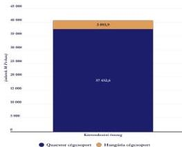
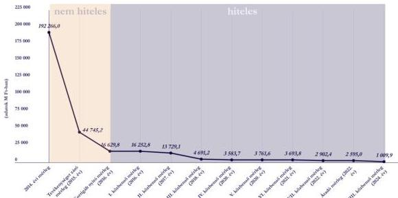
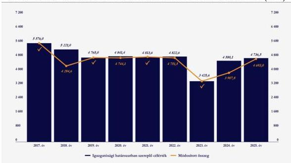
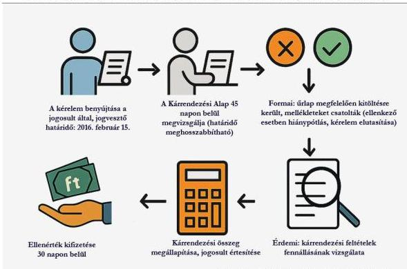
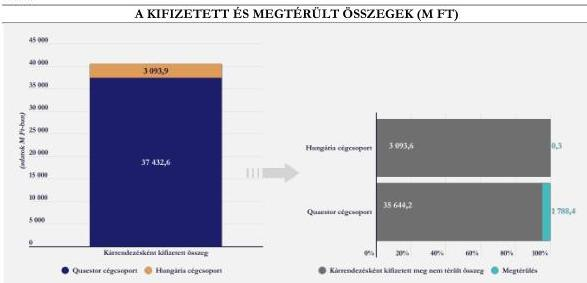
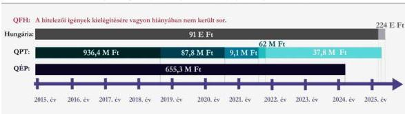

ÁLLAMI
SZÁMVEVŐSZÉK

# JELENTÉS
## A Kárrendezési Alap gazdálkodásának
ellenőrzése

2026.

26021

www.asz.hu

---

ÁLLAMI
SZÁMVEVŐSZÉK

# JELENTÉS
## A Kárrendezési Alap gazdálkodásának
ellenőrzése

2026.

26021

www.asz.hu
dr. Włodisch László
elnök

---

ELLENŐRZÉSI IGAZGATÓSÁG:

ELLENŐRZÉSI IGAZGATÓSÁG V.

ELLENŐRZÉSI IGAZGATÓ:

KLINGA LÁSZLÓ igazgató

ELLENŐRZÉSVEZETŐ:

HOFMEISTER LÁSZLÓ ellenőrzésvezető

Jelentéseink az interneten a
www.asz.hu címen olvashatók.

IKTATÓSZÁM: EL-4266-002/2026

TÉMASORSZÁM: 35.

ELLENŐRZÉS-AZONOSÍTÓ SZÁM: V1162

---

# TARTALOMJEGYZÉK

|  ■ ÖSSZEFOGLALÁS | 5  |
| --- | --- |
|  ■ A KÁRRENDEZÉSI ALAP LÉTREHOZÁSÁNAK KÖRÜLMÉNYEI | 8  |
|  ■ AZ ELLENŐRZÉS EREDMÉNYEI | 14  |
|  1. A Kárrendezési Alap gazdálkodásának, az éves beszámoló összeállításának, közzétételének szabályszerűsége | 14  |
|  2. A kárrendezési tevékenység hatása a Kárrendezési Alap gazdálkodására | 15  |
|  ■ I. FÜGGELÉK: ÉSZREVÉTELEK | 31  |
|  ■ II. FÜGGELÉK: ELLENŐRZÉSI MEGKÖZELÍTÉS | 32  |
|  ■ MELLÉKLETEK | 35  |
|  I. sz. melléklet: Értelmező szótár | 35  |
|  II. sz. melléklet: Az ellenőrzött szervezetek jegyzéke | 37  |
|  III. sz. melléklet: A Kárrendezési Alapra átszállt kötvények adatai | 38  |
|  ■ RÖVIDÍTÉSEK JEGYZÉKE | 39  |

3

---

# ÖSSZEFOGLALÁS

A Kárrendezési tv.¹ 7. § (5) bekezdésében foglaltak alapján az ÁSZ² elvégezte a Kárrendezési Alap gazdálkodásának ellenőrzését, amely – tekintettel arra, hogy a gazdálkodás a jogszabályban meghatározott feladat végrehajtását szolgálta – kiterjedt a feladatellátás szabályszerűségének értékelésére is.

Az ellenőrzés megállapította, hogy a Kárrendezési Alap gazdálkodása során érvényesültek a törvényi előírások és a belső szabályzatokban foglaltak, a vonatkozó jogszabályi előírásoknak megfelelve a Kárrendezési Alap eleget tett a beszámolási és beszámoló közzétételi kötelezettségének, továbbá a mérlegtételek értékelése és leltárral történő alátámasztottsága is megfelelő volt.

A források elszámolása tekintetében a Kárrendezési Alap a jogszabályban és a vonatkozó belső szabályzataiban előírtaknak megfelelően járt el. A kárrendezési eljárások lefolytatása és a hitelezői igények érvényesítése során a Kárrendezési Alap betartotta a jogszabályban és belső szabályzatában foglaltakat, az ellenőrzés mulasztást, hiányosságot nem tárt fel.

A Kárrendezési Alap a Kárrendezési tv. hatályba lépésével jött létre, működését 2016. január 1-jével kezdte meg azzal a céllal, hogy a befektetők törvényben meghatározott csoportjának kártalanítását biztosítsa abban az esetben, ha a törvény hatálya alá tartozó befektetési szolgáltató fizetésképtelenné válik. A Kárrendezési Alap létrehozását a Quaestor és a Hungária cégcsoport jogszabálysértő kibocsátói és befektetési szolgáltatási tevékenysége folytán anyagi veszteséget szenvedett ügyfelek jogalkotó általi ellentételezésének szándéka indokolta.

A Kárrendezési Alapból történő kárrendezés a Quaestor cégcsoporton belül a QÉP³ által értékesített és a QFH⁴ által kibocsátott vagy ilyenként megjelölt kötvényekre, továbbá a Hungária cégcsoporthoz tartozó társaságok közül a HUNÉRT⁵ által értékesített és a HUNGOLD⁶, valamint a HUNING⁷ által kibocsátott kötvényekre vonatkozó ügyletekre terjedt ki.

A Kárrendezési Alap a károsultak részére a kárrendezési eljárásokban a követelések ellenértékeként 40 526,5 M Ft-ot fizetett ki, amely 26 282 db tranzakció keretében valósult meg.

1. ábra

## A KÁRRENDEZÉSI ALAP ÁLTAL KIFIZETETT KÁRRENDEZÉSI ÖSSZEG (M FT)

Forrás: A Kárrendezési Alap által rendelkezésre bocsátott nyilvántartások alapján, ÁSZ szerkesztés

5

---

Összefoglalás---

A kifizetések fedezetét a Kárrendezési Alap hitelfelvétellel teremtette meg. A hitelfelvételt az a körülmény indokolta, hogy a Kárrendezési Alap a létrejöttékor saját vagyonnal nem rendelkezett, a kárrendezéshez és a működéséhez szükséges elsődleges bevételi forrást a Kárrendezési tv. értelmében a BEVA$^{8}$ tagok éves befizetése volt hivatott biztosítani számára. A befizetésekre azonban jogszabály alapján első ízben 2017. évben került sor, így a kiadásait a működésének első évében, 2016-ban, kizárólag más forrásból tudta fedezni.

A Kárrendezési tv. a Kárrendezési Alap feladataként a kárrendezés lefolytatását, illetőleg az ellenérték kifizetését követően átszállt követelések érvényesítését határozta meg. A Kárrendezési Alap külső jogi szakértő segítségét is igénybe véve felmérte az igényérvényesítés szempontjából számára nyitva álló jogi lehetőségeket. A Kárrendezési tv. hatálya alá tartozó kötvénykibocsátók és befektetési szolgáltatók vonatkozásában indított felszámolási eljárásokba belépett, a hitelezői igényeket a jogszabályban előírt határidőben bejelentette.

A kárrendezésre jogosultak teljes követelése, a követelés biztosítékai, valamint a követeléshez kapcsolódó igények – ideértve a bűncselekménnyel okozott kár megtérítése, illetve az egyéb kártérítés iránti igényeket is – az ellenérték megfizetésével egyidejűleg a Kárrendezési tv. alapján a Kárrendezési Alapra szálltak át. A Kárrendezési tv. erejénél fogva a Kárrendezési Alap a rá ellenérték fejében átszállt követelések között értékpapír (kötvény) követeléseket és pénzköveteléseket tartott nyilván. Kötvényként a Kárrendezési Alapnak ténylegesen értékpapírként (kötvényként) átadott követelés szállt át, az összes többi átszállt követelést pénzkövetelésként számolta el a Kárrendezési Alap. A kifizetett kárrendezések folytán a Kárrendezési Alapra átszállt követelések összege 78 461,8 M Ft volt, amelyből a kötvényekből származó követelés 39 676,1 M Ft-ot, a nem létező kötvényekre fizetett kárrendezés kapcsán átszállt pénzkövetelés 38 785,7 M Ft-ot tett ki.

Az átszállt követeléseket a Kárrendezési Alap elsősorban a kárrendezésbe bevont társaságok ellen indított felszámolási eljárásokban próbálta érvényesíteni, azonban az már a felszámolások kezdeti szakaszában látszott, hogy a hitelezői igények ezekből az eljárásokból teljeskörűen nem kielégíthetőek, ugyanis ekkora vagyonnal a társaságok nem rendelkeztek. Emellett nehezítette a hitelezői igények érvényesítését az átláthatatlan kapcsolati és tulajdonosi háló is.

A kárrendezésbe bevont társaságok közül a Quaestor cégcsoport anyavállalata, a QPT$^{9}$ rendelkezett a legjelentősebb vagyonnal, azonban a felszámolás kezdetén a számviteli szakértők segítségével realizálták, hogy a helytelen könyveléseknek köszönhetően a társaság 2014. évi mérlege nem a valós vagyonértéket tükrözte. A könyvelés korrigálását, továbbá a vagyonelemek valós piaci értéken történő értékelését követően a hitelezői kielégítésbe bevonható valós eszközérték kevesebb, mint a tizedére, 192 266,0 M Ft-ról 16 629,8 M Ft-ra csökkent. A közbenső mérlegekben szereplő, nyilvántartott hitelezői igények alapján a QPT felé 247 792,1 M Ft hitelezői igény került bejelentésre, szemben az 1 009,9 M Ft vagyonnal, amelynek csupán 4,1%-a, azaz 10 237,5 M Ft került kielégítésre. A QPT felszámolási eljárása keretében a 10 273,5 M Ft hitelezői igénykielégítés címén kifizetett összegből a Kárrendezési Alap 1 133,1 M Ft-ban részesült.

A kárrendezési eljárásba bevont Quaestor cégcsoporthoz tartozó társaságok felszámolásából a Kárrendezési Alap felé összesen 1 788,4 M Ft volt a megtérülés, amely a kifizetett kárrendezések folytán átszállt követelések 2,3%-ának felelt meg, a Hungária cégcsoport érdekeltségébe tartozó kötvénykibocsátók esetében pedig minimális megtérülésről (0,3 M Ft) beszélhetünk, ez az átszállt követelések 0,0004%-a volt. A kárrendezésbe bevont társaságok közül a QÉP és a QPT rendelkezett felosztható vagyonnal.

Azokban a felszámolási eljárásokban, ahol fedezetül szolgáló vagyon egyáltalán nem, vagy csak csekély mértékben állt rendelkezésre, a Kárrendezési Alap a tulajdonos társaság (QPT) korlátolt felelősségének áttörése iránt, továbbá a vezetők felelősségének megállapítása érdekében is lépéseket tett. Peres eljárásokat indított, a társaságok vezetői ellen indult büntetőeljárásokban polgári jogi igényt érvényesített. A Kárrendezési Alap a

6

---

Összefoglalás---

jogszabályban meghatározott feladatát ellátta, a számára elérhető jogi lehetőségeket felmérte és az igények érvényesítése érdekében a szükséges lépéseket megtette.

A tőzsdepiacot érintő 2015. évben lezajlott negatív eseménysorozat jelentőségét, összetettségét, valamint hosszútávú hatását jól szemlélteti, hogy a nyomozás, a szálak felderítése hónapokat, esetenként éveket vett igénybe, a nyomozati iratok többezer oldalt tettek ki, a jogi és kártérítési eljárások a 2025. évben még nem zárultak le.

7

---

# A KÁRRENDEZÉSI ALAP LÉTREHOZÁSÁNAK KÖRÜLMÉNYEI

## 1. JOGSZABÁLYI HÁTTÉR

A tőke- és pénzpiacot érintő – egyes esetekben akár évtizedekig tartó, a 2015. évben kicsúcsosodó – visszaélések a befektetési szolgáltatókat a közfigyelem fókuszába helyezték, amelyet a jogalkotás sem hagyhatott figyelmen kívül. A jogalkotó – a pénzügyi rendszer átláthatóvá tételét célként megfogalmazva – a visszaélések elkerülhetővé tétele érdekében megalkotta az egyes törvényeknek a pénzügyi közvetítőrendszer fejlesztésének előmozdítása érdekében történő módosításáról szóló 2015. évi LXXXV. törvényt, amely az esetleges piaci túlkapások hatékonyabb kiszűrése érdekében növelte az átfogó felügyeleti vizsgálatok gyakoriságát, nagyobb hangsúlyt helyezett a helyszíni ellenőrzésekre, a bírságolási szabályok szigorításával megerősítette az MNB¹⁰ felügyeleti ellenőrzését, továbbá új eljárásként létrehozta a rendkívüli célvizsgálatot. A Bszt.¹¹-ben megerősítésre került a belső ellenőrzés, egyes befektetési vállalkozásoknál kötelező auditbizottság felállításáról döntött a jogalkotó, továbbá szigorodtak a vezető állású személyek kinevezésének szabályai. Az említett rendelkezések a tőkepiac nagyobb átláthatóságát azonban kizárólag a jövőre nézve tudták biztosítani, a múltbeli visszaélések eredményeként korábban keletkezett károkat orvosolni ezek révén nem lehetett. A befektetési szolgáltatókat érintő visszaélések a tőkepiacba vetett bizalmat megingatták, a bizalom visszaállítása a jogalkotási feladatokon túlmenően egyedi intézkedés meghozatalát is igényelte jogalkotó szerint.

A Quaestor vállalatcsoport kötvénykibocsátásával érintett befektetők helyzetének rendezése érdekében, mivel a vállalatcsoport jogszabálysértő és részben nem létező kötvénykibocsátása mintegy 32 000 befektető számára tette bizonytalanná korábbi befektetéseik megtérülését, a jogalkotó elfogadta a Quaestor tv.¹²-t. A külön törvény létrehozását a károsultak nagy száma indokolta, amely az egyedi igényérvényesítést nagymértékben nehezítette volna számukra, hátrányos helyzetbe hozva ezáltal az érintetteket, mivel polgári peres eljárást kellett volna indítaniuk befektetésük visszaszerzésre érdekében, illetőleg a vállalatcsoport tagja elleni felszámolási eljárásba bejelentkezni hitelezőként, viselve annak kockázatát, hogy követelésük egyáltalán nem, vagy csak kis mértékben térül meg. A jogszabály rendelkezett a Quaestor károsultak Kárrendezési Alapjának felállításáról, amely a kárrendezés során a törvény hatálya alá tartozó követelések ellenértékét fizeti ki a károsultaknak, és a rá átszállt követelésekre vonatkozóan az igényeket érvényesíti. A törvény egyes szakaszait azonban az Alkotmánybíróság alaptörvény-ellenesnek nyilvánította és megsemmisítetteᵃ többek között a Quaestor károsultak és más károsult befektetők közötti különbségtétel tárgyilagos mérlegelés szerinti ésszerű okának hiánya miatt, továbbá a BEVA tagok befizetési kötelezettsége tekintetében a befizetés mértékét pontosan nem rögzítette a törvény, illetőleg nem biztosított kellő felkészülési időt az érintettek számára a 2015. évi befizetés teljesítéséhez, holott az újonnan bevezetett többletkötelezettséget pontosan meg kellett volna határozni.

Az Alkotmánybíróság határozata iránymutatásul szolgált a jogalkotó részére a kárrendezési lehetőségek kereteivel, korlátaival kapcsolatban: megváltoztatásra került többek között az alanyi kör, a kifizetett hozammal történő tételes elszámolás, valamint a kárrendezés mértékét is szabályozták az új jogszabályban, a

ᵃ A Quaestor károsultak kárrendezését biztosító követeléskezelő alap létrehozásáról szóló 2015. évi XXXIX. törvény egyes rendelkezései alaptörvény-ellenességének megállapításáról és megsemmisítéséről szóló 32/2015. (XI. 19.) AB határozat

8

---

A Kárrendezési Alap létrehozásának körülményei

Kárrendezési tv.-ben. A Kárrendezési tv. hatályon kívül helyezte a Quaestor tv.-t, a Quaestor tv. alapján fennálló kárrendezési jogosultságot megszüntette, azonban kimondta, hogy a Quaestor tv.-ben megjelölt határidőben benyújtott kérelmeket a Kárrendezési tv. szerint is benyújtottnak kell tekinteni.

A Kárrendezési tv. hatálya azon befektetési szolgáltatóval szemben fennálló követelésekre terjedt ki, amely befektetési szolgáltató felszámolását a bíróság a jogszabály hatálybalépését, azaz 2016. január 1-jét megelőző évben jogerősen elrendelte, valamint a felszámolási eljárás 2016. február 15-ig jogerősen nem zárult le. Továbbá azokra az ügyletekre terjedt ki, amelyeknél az ügyfél jognyilatkozata a kötvény kibocsátó kapcsolt vállalkozásának minősülő, a törvény hatálybalépésének napján felszámolás alatt álló befektetési szolgáltató által értékesített kötvény vásárlására irányult, az ügyfél az ellenérték-fizetési kötelezettségének eleget tett, és értékpapírszámláján kötvény került jóváírásra, függetlenül attól, hogy a kibocsátás vagy a jogügylet érvényesen létrejött-e.

A jogszabály indoklásában olvasható, hogy azokra a károsultakra terjedhet ki a kárrendezés, akik olyan befektetési szolgáltatókkal álltak kapcsolatban, akik a bróker jelleget, a szabályozott piaci szereplői státuszt kihasználva, a cégcsoport tagja által kibocsátott kötvénnyel okoztak kárt a befektetőknek, vagyis a Kárrendezési tv. a cégcsoporton belüli kötvénykibocsátások általi károkozás esetén ír elő kárrendezési kötelezettséget. Kizárólag tehát azon befektetési szolgáltató tevékenységével érintett befektetők helyzetét kívánta jogszabályi úton rendezni a jogalkotó, ahol a befektető ügyfél jognyilatkozata a kibocsátó kapcsolt vállalkozásának minősülő befektetési szolgáltató által értékesített kötvény vásárlására irányult.

## 2. AZ ÉRINTETT KÖTVÉNYKIBOCSÁTÓK ÉS BEFEKTETÉSI SZOLGÁLTATÓK

A Kárrendezési tv. név szerint nem nevezte meg az érintett kötvénykibocsátókat és befektetési szolgáltatókat, a lehatároló rendelkezések alapján a Kárrendezési Alap Kárrendezési szabályzata¹³ rögzítette név szerint a jogszabály hatálya alá tartozó ügyletekben érintett társaságokat:

- a QÉP által értékesített és a QFH által kibocsátott vagy ilyenként megjelölt kötvények, valamint
- a HUNÉRT által értékesített és a HUNGOLD, valamint a HUNING által kibocsátott kötvények.

### QUAESTOR CÉGCSOPORT

A QPT a Quaestor csoporthoz tartozó társaságok központi társasága volt, úgymond anyavállalataként működött, a csoporthoz tartozó gazdasági társaságok többségében közvetlen vagy közvetett módon üzletrésszel rendelkezett.

Az értékpapírok forgalomba hozatalát a QÉP végezte, amely alapításától kezdve teljes jogú értékpapír forgalmazási tevékenységre jogosító engedéllyel rendelkezett, így bizományos és saját számlás tevékenységet is végezhetett.

A QFH-t kötvénykibocsátás céljával hozták létre, amelynek keretében az összegyűjtött tőke a Quaestor csoport egyes tagvállalatainak került tovább kölcsönzésre a Quaestor csoport hosszútávú üzleti terveinek és érdekeinek finanszírozása érdekében.

A kibocsátott Quaestor kötvények három csoportba sorolhatóak:

- *Ténylegesen kibocsátott, létező kötvények:*

A QFH a kötvénykibocsátásra kapott engedélyében 70 000 M Ft értékű kötvény forgalmazására kért és kapott engedélyt. Ezek a kötvények a QÉP nyilvántartási rendszerében szereplő és a KELER Zrt.¹⁴-nél vezetett értékpapírszámlán rendelkezésre álló megkeletkeztetett kötvények voltak.

9

---

Összefoglalás---

# ▪ *Ténylegesen meg nem keletkeztetett, fiktív kötvények:*

A kötvénykibocsátásra kapott engedélyben foglaltaktól eltérően a QÉP több mint 210 000 M Ft értékben értékesített kötvényt oly módon, hogy a QFH engedélyében szereplő 70 000 M Ft összeg feletti kötvényeket már fizikailag nem állították elő, csak elektronikus úton létrehozott és nyilvántartott kötvények voltak. A QÉP nyilvántartási rendszerébe felvezették, azonban a KELER Zrt.-nél vezetett értékpapírszámlán ezek a kötvények nem álltak rendelkezésre.

# ▪ *Nem létező kötvények:*

A QPT nem volt jogosult befektetési szolgáltatási tevékenység végzésére, a szükséges engedéllyel nem rendelkezett, ennek ellenére a QPT és a QÉP között létrejövő függő ügynöki megbízási szerződés alapján a QÉP függő ügynökeként a saját nevében értékesített kötvényeket az ügyfelek részére. A QPT által értékesített kötvények úgynevezett „*opciós szerződés*” keretében kerültek értékesítésre.

A QÉP felszámolásának kezdő időpontja 2015. április 22-e, felszámolója a Pénzügyi Stabilitási és Felszámoló Nonprofit Kft. volt. A QÉP nyilvántartása szerint a felszámolás kezdőnapján, 2015. április 22-én összesen 31 684 ügyfél rendelkezett Quaestor kötvénnyel.

A bíróság a QPT felszámolását 2015. december 12-i kezdőnappal rendelte el, felszámolóként a KVANTÁL Gazdasági Tanácsadó és Szolgáltató Kft.-t jelölte ki, míg a QFH felszámolásának kezdő időpontja 2016. március 10-e volt, felszámolóként a VECTIGALIS Általános Vállalkozási Zrt. került kijelölésre. A QPT felszámolásával kapcsolatban bűnügyi hitelezői igényt jelentettek be, emiatt a Fővárosi Törvényszék 2022. július 7. napján kelt végzésével új felszámolóként a Nemzeti Reorganizációs Nonprofit Kft.-t jelölte ki.

### Vagyon

A kárrendezésbe bevont társaságok közül a felszámolás kezdetén a QPT rendelkezett a legjelentősebb vagyonnal. A QPT 2014. évi mérlegében még 192 266,0 M Ft vagyon szerepelt; a kötelezettségek között a QÉP és QFH felé 185 030,0 M Ft tartozást, a követelések között pedig 140 914,9 M Ft-ot mutatott ki QI irányában.

A felszámolás keretében felkért számviteli szakértők megállapították, hogy a QPT a mérleg mindkét oldalán bruttó módon jelenítette meg a tulajdonosi körébe tartozó társaságokkal szembeni tartozásokat és követeléseket, amellyel hatalmas mérlegfőösszeg került kimutatásra. A számviteli szakértők segítségével nettósították a leányvállalatokkal szembeni tartozásokat és követeléseket, amelynek eredményeként a hitelezői kielégítésbe bevonható valós eszközérték 44 745,2 M Ft-ra csökkent.

A 225/2000. (XII.19.) Korm. rendelet$^{15}$ rögzíti, hogy a felszámolási nyitó mérlegben a vagyontárgyaknak valós piaci értékükön kell szerepelniük, emiatt a QPT felszámolója által készített I. számú közbenső vagyonmérleg már csak 16 252,8 M Ft vagyont tartalmazott, amely összeg a vagyonelemek valós piaci értékének felelt meg.

10

---

A Kárrendezési Alap létrehozásának körülményei

2. ábra

### A QPT KIMUTATOTT VAGYONI ÉRTÉKÉNEK ALAKULÁSA (M FT)

Forrás: A kárrendezésbe bevont társaságok felszámolási közbenső mérlegei alapján, ÁSZ szerkesztés

A QPT felszámolója az I. számú közbenső vagyonmérlegében a 16 252,8 M Ft mérlegfőösszegből 12 199,5 M Ft értékű követelést tartott nyilván, amely részben a QPT által a tulajdonosi érdekeltségébe tartozó és más gazdasági társaságok részére nyújtott kölcsönökből, részben pedig a QPT által nyújtott különböző irodai és egyéb szolgáltatások ellenértékéből, valamint az általa kötött ügyletekből eredően a QPT-nek visszajáró pénzeszközökből tevődött össze.

A QPT felszámolási eljárása keretében összesen 10 273,5 M Ft hitelezői igény került kielégítésre; ennek 92%-át, azaz 9 240,9 M Ft összegű vagyon felosztását a II. számú közbenső mérlegben (2017. évben) kezdeményezték. A javasolt vagyonfelosztás alapján a Kárrendezési Alap mintegy 936,4 M Ft (az akkor nyilvántartásba vett követeléseinek 100%-a) megtérülésben részesült 2018-ban. A többi vagyonfelosztási javaslatot tartalmazó közbenső mérleg alapján a Kárrendezési Alap további 196,7 M Ft megtérüléshez jutott. A közbenső mérlegekben szereplő, nyilvántartott hitelezői igények alapján a 2024. évben a QPT felé 247 792,1 M Ft hitelezői igény került bejelentésre, szemben az 1 009,9 M Ft vagyonnal, amelynek csupán 4,1%-a, azaz 10 237,5 M Ft került kielégítésre.

### HUNGÁRIA CÉGCSOPORT

A HUNÉRT fedezet nélküli vállalati kötvények kibocsátása és forgalmazása révén több milliárd forintos kárt okozott legalább 350 ügyfélnek.

A bíróság a társaság felszámolójaként a Pénzügyi Stabilitási és Felszámoló Nonprofit Kft.-t jelölte ki, a felszámolás kezdő időpontja 2015. április 22-e volt.

A Kárrendezési Alap a HUNÉRT felszámolási eljárásába hitelezőként nem jelentkezett be. Az ügyfelek kötvényei a HUNÉRT által vezetett értékpapírszámlákon voltak nyilvántartva. A Kárrendezési Alapra a kárrendezés kifizetésével az érintett ügyfelek kötvényei átszálltak, emiatt a Kárrendezési Alap kérte a

11

---

Összefoglalás---

HUNÉRT-től az értékpapírok kiadását, amely hiánytalanul megtörtént. Az értékpapírok kiadása folytán a Kárrendezési Alapnak a HUNÉRT-tel szemben nem állt fenn olyan követelése, amelyet a felszámolásban kellett volna érvényesíteni.

A Kárrendezési tv. alapján kárrendezésre jogosultak voltak a felszámolás alá került HUNÉRT kapcsolt vállalkozásai által kibocsátott kötvényekkel rendelkező befektetők is. A Kárrendezési tv. szerinti kibocsátók a HUNGOLD és a HUNING voltak.

Mindkét kibocsátó – a HUNGOLD és a HUNING – ellen már a kárrendezést megelőzően megindult a kényszertörlési eljárás. A Cégbíróság 2016. április 20. napjával a HUNING-et, 2016. június 28. napjával pedig a HUNGOLD-ot megszűntnek nyilvánította, és elrendelte kényszertörlési eljárással történő jogutód nélküli megszüntetésüket, majd a HUNGOLD esetében 2017. november 23-i végzésével elrendelte a felszámolási eljárást. A kirendelt felszámoló a BIS Csődgondnok és Tanácsadó Zrt., a felszámolás kezdő időpontja 2017. november 23-a volt.

### 3. A KÁRRENDEZÉSI ALAP BEMUTATÁSA, SZERVEZETI FELÉPÍTÉSE, FELADATA

A Kárrendezési Alap a 2015. évben kirobbant brókerbotrányok következtében a Kárrendezési tv. hatályba lépésével jött létre 2016. január 1-jén. A Kárrendezési Alap a bíróság által nyilvántartásba nem vett önálló, de saját szervezettel nem rendelkező jogi személy. A Kárrendezési tv.-ben meghatározott feladatok ellátására hozták létre, más tevékenységet nem végezhetett.

A Kárrendezési Alap számára a Kárrendezési tv. előírásai szerint a BEVA tagjai teljesítenek befizetést, amelyből fedezi a kárrendezés céljára felvett hosszú lejáratú kölcsön esedékes fizetési kötelezettségeit, valamint saját működési költségeit, a pénzeszközeit az MNB-nél vezetett számlán kezeli.

A Kárrendezési Alap beszámolási és könyvvezetési sajátosságairól a 214/2000. (XII. 11.) Korm. rendelet$^{16}$ rendelkezik. Az éves beszámoló összeállítása és a könyvvezetés a Számv. tv.$^{17}$ és a 214/2000. (XII. 11.) Korm. rendelet alapján történik, a beszámolóit könyvvizsgáló kontrollálja. A Kárrendezési tv. alapján a Kárrendezési Alap gazdálkodását az ÁSZ ellenőrzi.

#### Felépítése:

A Kárrendezési Alap önálló munkaszervezettel nem rendelkezik, az operatív feladatokat a BEVA munkaszervezete látja el a BEVA ügyvezető igazgatójának irányításával. A Kárrendezési Alap irányítását a Tpt.$^{18}$ szerinti BEVA kilenc tagú igazgatósága végzi. Az igazgatóság tagjai a Kárrendezési Alap tisztségviselői, a Kárrendezési Alap vezető tisztségviselője az igazgatóság elnöke. Az igazgatóság működése során a BEVA igazgatóságának ügyrendje alapján jár el. Az igazgatóság feladata – többek között – a költségvetés és a szabályzatok elfogadása, a Kárrendezési Alap gazdasági tevékenységének irányítása, kölcsön felvételéről való döntés, az éves befizetések összegének meghatározása, a számviteli beszámoló elfogadása.

A Kárrendezési Alapot harmadik személyekkel szemben, bíróság és hatóság előtt a BEVA igazgatóságának elnöke vagy az ügyvezető igazgató önállóan képviseli, a jogi képviselet ellátására a BEVA-val munkaviszonyban álló kamarai jogtanácsos vagy a Kárrendezési Alap által megbízott ügyvéd jogosult.

A munkaszervezet látja el a jogszabályokban, a Kárrendezési Alap szabályzataiban és az igazgatóság határozataiban meghatározott, a Kárrendezési Alap feladatainak végrehajtásához kapcsolódó feladatokat, nyilvántartásba veszi és feldolgozza a kárrendezési kérelmeket, megvizsgálja a kárrendezés feltételeinek

12

---

*A Kárrendezési Alap létrehozásának körülményei*---

fennállását, megállapítja a kárrendezés ellenértékét és erről értesítést küld a jogosultaknak. Gondoskodik a kifizetések teljesítéséről, a Kárrendezési Alapra átszállt követelésekkel összefüggő igények érvényesítéséről, koordinálja és ellenőrzi az ezzel a feladattal megbízott külső személyt. Gondoskodik továbbá a BEVA tagoktól igényelt befizetések beszedéséről, és ellátja a Kárrendezési Alap pénzügyi és gazdálkodási tevékenységével kapcsolatban felmerülő egyéb feladatokat, valamint üzemelteti a honlapot és előkészíti az igazgatósági üléseket.

Az ügyvezető igazgató a jogszabályok, továbbá a Kárrendezési Alap és a BEVA szabályzatai, valamint az igazgatóság határozatainak keretei között irányítja az operatív tevékenységet, elfogadja azokat a szabályzatokat, amelyek a Kárrendezési tv., illetve egyéb szabályzat alapján nem tartoznak az igazgatóság kizárólagos szabályozási hatáskörébe, meghozza a végrehajtás során a jogszabály, szabályzat vagy az igazgatóság rendelkezése alapján igazgatósági hatáskörbe tartozónak nem minősülő döntéseket, gondoskodik az igazgatóság üléseinek megfelelő előkészítéséről és az igazgatósági határozatok szükség szerinti nyilvánosságra hozataláról, kapcsolatot tart a Kárrendezési Alap tevékenysége során érintett szervezetekkel.

13

---

# AZ ELLENŐRZÉS EREDMÉNYEI

## 1. A Kárrendezési Alap gazdálkodásának, az éves beszámoló összeállításának, közzétételének szabályszerűsége

### Összegző megállapítás

A Kárrendezési Alap a feladatainak ellátására vonatkozó, valamint a gazdálkodását meghatározó, a jogszabályi előírásoknak megfelelő szabályozási kerettel rendelkezett. A Kárrendezési Alap a 2023. és 2024. évi beszámolóját a jogszabályi előírásoknak megfelelően állította össze, fogadta el és tette közzé.

A Kárrendezési Alap feladatainak ellátására a 2016-2024. évek közötti időszakban a Kárrendezési tv.-ben foglaltaknak megfelelően megalkotta és közzétette a működési rendjéről, az eszközeinek és forrásainak kezeléséről, a kárrendezés részletes szabályairól, valamint a BEVA tagok általi befizetések mértékéről és rendjéről szóló szabályzatokat, amelyeket a BEVA igazgatósága elfogadott.

A Kárrendezési Alap gazdálkodását a 2023-2024. években a Számv. tv., valamint a 214/2000. (XII. 11.) Korm. rendelet előírásai határozták meg. Az ellenőrzött időszakban a jogszabályokkal összhangban, a Kárrendezési Alap sajátosságainak figyelembevételével elkészítették a Számviteli politikát$^{1,2}$ az Eszközök és források leltárkészítési és leltározási szabályzatát$^{20}$, az Eszközök és források értékelési szabályzatát$^{21}$, a Pénzkezelési szabályzatot$^{22}$ és a Számlarendet$^{1,2}$$^{23}$.

A Kárrendezési Alap 2023. és 2024. évi beszámolóinak elkészítése, elfogadása, illetve közzététele a Számv. tv. és a 214/2000. (XII. 11.) Korm. rendelet előírásainak, valamint a Számviteli politika$^{1,2}$ és az annak keretében elkészített szabályzatokban foglaltaknak megfelelt.

A Kárrendezési Alap az ellenőrzött időszakban eleget tett az előírt beszámolási kötelezettségének. A Kárrendezési Alap a 2023. és a 2024. évről kettős könyvvitelen alapuló éves beszámolót készített, amelynek formája és tartalma is megfelelt a jogszabályban foglaltaknak. A 2023. és 2024. évi beszámoló tartalmazta a 214/2000. (XII. 11.) Korm. rendeletben előírt mérleget, eredménykimutatást, kiegészítő mellékletet és az üzleti jelentést is.

A Kárrendezési Alap az ellenőrzött időszakban az éves beszámolóját és üzleti jelentését – ennek részeként a következő évi költségvetését – a 214/2000. (XII. 11.) Korm. rendeletben foglaltaknak megfelelően az üzleti évet követő év május 30-ig elkészítette, amelyet a BEVA igazgatósága megtárgyalt és jóváhagyott. A BEVA igazgatósága a 2023. évi beszámolót 2024. május 16-án, a 2024. évi beszámolót 2025. május 26-án fogadta el. A könyvvizsgáló a 2023. és 2024. évek beszámolóit hitelesítő záradékkal látta el.

A Kárrendezési Alap a jogszabályi előírásoknak megfelelően gondoskodott az éves beszámolók honlapon történő közzétételéről, valamint a pénzügyi közvetítőrendszer felügyeletével kapcsolatos feladatkörében eljáró MNB-hez, az ÁSZ-hoz, valamint a pénz-, tőke- és biztosítási piac szabályozásáért felelős miniszter által vezetett minisztériumhoz történő megküldéséről.

A Kárrendezési Alap az eszközök és források elszámolásának, illetve a mérlegtételek év végi értékelésének a Számv. tv.-ben és a 214/2000. (XII. 11.) Korm. rendeletben foglaltaknak megfelelő szabályait a

14

---

Az ellenőrzés eredményei

Számviteli politika$_{1,2}$-ben és az Eszközök és források értékelési szabályzatában rögzítette. Az ellenőrzött időszakra vonatkozó számviteli nyilvántartásokban az eszközök és a források kimutatott állománya a Számv. tv.-ben foglaltaknak megfelelve megegyezett az éves beszámolókban megjelenített adatokkal.

A Kárrendezési Alap a Számv. tv.-ben foglaltakkal összhangban az ellenőrzött 2023. és 2024. évek beszámolójának mérlegét, a mérlegében szereplő eszközöket és forrásokat a Számviteli politika$_{1,2}$-ben és az Eszközök és források leltárkészítési és leltározási szabályzatában meghatározottaknak megfelelően szabályszerű leltárral támasztotta alá.

## 2. A kárrendezési tevékenység hatása a Kárrendezési Alap gazdálkodására

### Összegző megállapítás

A Kárrendezési Alap forrásainak elszámolása megfelelt a jogszabályban és a belső szabályzatban előírtaknak. A kárrendezési eljárások lefolytatása során a Kárrendezési Alap betartotta a jogszabályban és belső szabályzatban foglaltakat, az ellenőrzés szabálytalanságot, mulasztást nem tárt fel.

### AZ KÁRRENDEZÉSI ALAP FORRÁSAI

A Kárrendezési Alap elsődleges bevételi forrása a Kárrendezési tv. által a Kárrendezési Alapba történő befizetés teljesítésére kötelezett BEVA tagok befizetéseinek összege, amelyből fedezi a hosszú lejáratú kölcsön esedékes fizetési kötelezettségeit, valamint saját működési költségeit. A BEVA tagok éves befizetési kötelezettsége legfeljebb a kölcsön futam idejének lejártáig áll fenn.

A Befizetési szabályzat$_{1,5}$$^{24}$-ot a BEVA igazgatósága a 84/2016. (XII.13.) számú határozattal fogadta el, amely 2016. december 14-én lépett hatályba. A BEVA tagok által teljesítendő befizetés együttes éves összegét, a célértéket a BEVA-igazgatósága állapítja meg$^{b}$. Az éves célérték összege nem haladhatja meg a hétmilliárd forintot. A BEVA-igazgatósága által meghatározott célértékeket, illetve a módosított értékeket az alábbi diagram szemlélteti.

$^{b}$ A célértéket a BEVA-igazgatósága a Kárrendezési Alap által a kárrendezés céljából 2016-ban felvett, fix kamatozású kölcsön éves fizetési kötelezettsége, valamint a működés költségeinek biztosításához szükséges összeg alapján határozza meg minden évben.

15

---

Az ellenőrzés eredményei

3. ábra

# A BEVA IGAZGATÓSÁGA ÁLTAL MEGHATÁROZOTT BEFIZETÉSI CÉLÉRTÉKEK (M FT)

Forrás: A BEVA igazgatóságának határozatai alapján, ÁSZ szerkesztés

Látható az ábráról, hogy a 2017-2025. évek közötti időszakban az eredetileg meghatározott célértékekhez képest öt alkalommal módosult a befizetendő célérték, amelyre azért került sor, mert a Kárrendezési Alap számlájára megtérülés érkezett, amelyet a Kárrendezési tv. alapján a hitel soron következő fizetési kötelezettségének teljesítésére fordított, ezáltal a befizetési célérték összege csökkenthető volt.

A Kárrendezési Alap első bevételéhez a BEVA tagok befizetéseiből a 2017. évben jutott, így a kárrendezési és működési kiadásait létrejöttétől 2017 márciusáig idegen forrásokból kellett finanszíroznia. A kárrendezés kifizetéséhez MNB áthidaló kölcsönt vett fel, majd ezt egy hosszú lejáratú kölcsönből fizette vissza 2016. augusztus 17-én. A Kárrendezési Alap által felvett kölcsönből eredő fizetési kötelezettségekért a Magyar Állam készfizető kezesként felelt; amiért a Kárrendezési Alapnak kezességvállalási díjat nem kellett fizetnie. Az MNB kölcsön és az azt refinanszírozó hosszú lejáratú kölcsön igénybevételére a Kárrendezési tv. szerint egy alkalommal kerülhetett sor.

- A felvett MNB kölcsön összege 44 109 M Ft volt, ezt a kölcsönt és 82 M Ft kamatát, összesen 44 191 M Ft-ot egy 10 éves futamidejű, annuitásos törlesztésű piaci kölcsön igénybevételével törlesztette a Kárrendezési Alap. A kölcsön a Kárrendezési tv. előírásának megfelelően fix kamatozású (2,67%) volt, adósságszolgálata évente egyenlő részletekben esedékes, az előtörlesztés lehetőségének biztosítottsága mellett. A kölcsöntartozás a kölcsönnyújtó kereskedelmi bankok alkotta konzorciummal szemben jelenleg is fennáll, 2026. augusztus 17-én jár le.
- A BEVA tagok befizetésének első részlete 2017. március 1-jén érkezett be a Kárrendezési Alap MNB-nél vezetett bankszámlájára.

A BEVA tagok számára előírt – a BEVA-nak teljesítendő tagdíjfizetés mellett – fizetési kötelezettséggel járó plusz pénzügyi teher enyhítése érdekében sor került a Tao tv.25 módosítására, amelyben a jogalkotó úgy rendelkezett, hogy a befizetett összeg az adóévben csökkenti a befizető BEVA tag társasági adóját.

16

---

Az ellenőrzés eredményei---

- A befizetést teljesítő adózók, a BEVA tagok a visszajáró összeget első alkalommal a 2017. évi adókötelezettség megállapítása során – adókötelezettséget csökkentő tételként – vehették figyelembe a felsorolt adónemekben. Az adózók a csökkentést elsőként a 2017. első negyedévére vonatkozó pénzügyi szervezetek különadója kötelezettség vonatkozásában, majd pedig az említett adónemekre vonatkozó adófizetési kötelezettség felmerülésének sorrendjében vették figyelembe.

## A KÁRRENDEZÉSI ELJÁRÁS

A Kárrendezési tv. szerint a kárrendezésre vonatkozó szándékát a kárrendezésre jogosult maga jelezhette, a kárrendezés kérelem alapján történt: a kérelmét a jogosult a Kárrendezési Alap által rendszeresített űrlapon, a Kárrendezési Alap Kárrendezési szabályzatában meghatározott módon, írásban nyújthatta be. A kérelem benyújtásának jogvesztő határidejeként a jogszabály 2016. február 15-ét jelölte meg, ugyanakkor azt is lefektette, hogy a kérelmet benyújtottnak kell tekinteni azon kárrendezésre jogosultak vonatkozásában, akik kérelmüket, valamint az ahhoz kapcsolódó dokumentumokat a Quaestor tv. alapján határidőben benyújtották. Emellett a jogszabály lehetőséget adott arra is, hogy az értékpapírszámlán nem nyilvántartott követelések után is sor kerüljön kártalanításra, ha bírósági határozat a követelés fennállását megállapítja. Ebben az esetben a befektető a határozat jogerőre emelkedését követő 90 napon belül terjeszthette elő igényét, amelyhez mellékelnie kellett a követelést megalapozó bírósági határozatot.

A kérelem tartalmának és a benyújtás módjának részletes szabályait a Kárrendezési szabályzat tartalmazta, amelyet – a Kárrendezési tv.-ben foglaltak szerint – a BEVA igazgatósága fogadott el. A Kárrendezési Alap Kárrendezési szabályzata megismételte a benyújtásra vonatkozó jogszabályi rendelkezéseket, meghatározta a kárrendezési eljárás részletszabályait és technikai lépéseit.

A kérelem benyújtására a Kárrendezési Alap által létrehozott űrlap szolgált, amely tartalmazta a jogosult, illetőleg meghatalmazott eljárása esetén a meghatalmazott azonosításához és a velük történő kapcsolattartáshoz szükséges adatokat, a kötvényekre vonatkozó követelést, továbbá a kárrendezésre való jogosultsággal kapcsolatos nyilatkozatot. Az űrlap benyújtásával a jogosult egyszerre, egy dokumentum benyújtásával kérhette a Kárrendezési Alaptól a Kárrendezési tv. alapján történő kárrendezést, a BEVA-tól pedig a Tpt. alapján történő kártalanítást, nem kellett külön eljárásban, külön nyomtatvány kitöltésével a BEVA-t is megkeresnie. Akár Quaestor, akár Hungária kötvényre vonatkozó követelése volt a jogosultnak, a bejelentést ugyanazon az űrlapon tehette meg, megjelölve, hogy melyik cégcsoport által kibocsátott kötvények tekintetében kéri az eljárás lefolytatását.

A kérelem benyújtójának mellékletként csatolnia kellett a követelés alapjául szolgáló szerződést és a jogosult számára vezetett értékpapírszámlán nyilvántartott kötvények mennyiségéről szóló igazolást. Amennyiben a kárrendezési kérelem benyújtója az eredeti jogosult általános jogutódja volt, a jogutódlás tényét igazoló okirat eredeti, vagy hiteles másolatát is szükséges volt mellékelni a kérelemhez.

A Quaestor kötvényekkel kapcsolatos követelésre vonatkozóan a szabályzat úgy rendelkezett, hogy a benyújtott kérelem akkor is elfogadható a kárrendezési eljárásban, ha a Quaestor tv. alapján folytatott kárrendezéshez készült űrlapon nyújtották be. A kérelmet a Kárrendezési Alap kizárólag postai úton fogadta be, elektronikus úton vagy a Kárrendezési Alapnál személyesen történő benyújtásra nem volt lehetőség.

A Kárrendezési tv. rendelkezései értelmében a Kárrendezési Alap a károsult által a kárrendezési eljárás megindítása iránti kérelmet a benyújtásra nyitva álló határidő lejártától számított 45 napon belül megvizsgálta, ez a határidő a kárrendezés feltételeinek megállapítása érdekében szükséges ideig

17

---

Az ellenőrzés eredményei

meghosszabbítható volt. A Kárrendezési szabályzat a jogszabályi rendelkezést azzal egészíti ki, hogy amennyiben a kárrendezés feltételei a kérelem hiányosságai, a hiányzó dokumentumok, vagy egyéb, a Kárrendezési Alapon kívül eső okból a jogszabályban biztosított határidő alatt nem állapíthatóak meg, az egyedi kérelem vizsgálatának határideje automatikusan meghosszabbodik a feltételek tisztázásához szükséges idővel.

4. ábra:

# A KÁRRENDEZÉSI KÉRLEM VIZSGÁLATÁNAK ÉS ELBÍRÁSLÁSÁNAK FOLYAMATA

Forrás: A Kárrendezési Alap Kárrendezési szabályzata alapján, ASZ szerkesztés

A kérelem vizsgálata először formai szempontból történt, érdemi vizsgálatra ugyanis akkor volt alkalmas az űrlap, ha annak minden szükséges rovatát értelemszerűen kitöltötték, az űrlapot aláírták, valamint az előírt dokumentumokat az űrlaphoz mellékelték, ellenkező esetben hiánypótlásra szólította fel a Kárrendezési Alap a benyújtót. A jogvesztő határidőn túl benyújtott kérelmeket a kárrendezés vonatkozásában erre történő hivatkozással elutasították, azonban a kártalanítási igény vonatkozásában az érdemi vizsgálat a BEVA Kártalanítási szabályzata szerint lefolytatásra került.

Az érdemi vizsgálat keretében a Kárrendezési Alap a kárrendezés feltételeinek fennállását vizsgálta, azaz a kérelmet benyújtó jogosult-e a kárrendezésre, a követelés a Kárrendezési tv. hatálya alá tartozik-e, illetve a befektetési szolgáltató adatszolgáltatása a követelést alátámasztja-e. Alapesetben a befektetési szolgáltatónál vezetett értékpapírszámla tartalmazta a kérelmező által vásárolt kötvény(eke)t, tekintettel azonban arra a körülményre, hogy a QPT saját nevében is értékesített az ügyfelek részére kötvényeket, amelyek a QÉP értékpapírszámláján nem jelentek meg, így előfordult, hogy a károsult által benyújtott kérelemben megnevezett kötvényeket a befektetési szolgáltató nyilvántartása nem tartalmazta.

18

---

*Az ellenőrzés eredményei*---

A kárrendezés utóbbi esetben is megállapítható volt, ha a kérelmezőnél a kötvény értékpapírszámlán nem került jóváírásra, de a Kárrendezési tv. hatálya alá tartozó követelés fennállását jogerős bírósági határozat megállapította. Ebben az esetben a kárrendezésre vonatkozó igényt a határozat jogerőre emelkedésétől számított 30 napon belül kell bejelenteni a Kárrendezési Alap számára, és a kérelemhez mellékelni kell a követelés fennállását megállapító bírósági határozatot.

A Kárrendezési Alap nyilvántartásai szerint Quaestor és Hungária kötvényekhez kapcsolódóan 32 938 kérelem került benyújtásra, amelyből 21 465 kérelmet elfogadtak, 11 040 esetében a kérelem státusza mellett az „Elutasítás” szerepelt. Az elutasítást jellemzően az indokolta, hogy nem maradt kifizetendő kárrendezés a kötvényekből levonandó hozam és a BEVA által kifizetett kártalanítást követően. A kérelmet benyújtók közül 255-en döntöttek később a kérelem visszavonásáról, 178 kérelem esetében pedig megszüntették az eljárást a kérelmező elhalálozása okán.

A Kárrendezési tv. meghatározta a kárrendezési összeg megállapításának szabályait, amelyet a Kárrendezési Alapnak az eljárás során figyelembe kellett vennie. Az ellenérték mentes volt minden közteherviselés alól és a követelés pénznemében került sor a kifizetésére.

A követelés ellenértékének meghatározásakor a jogosult értékpapírszámláján a befektetési szolgáltató felszámolásának elrendelésekor nyilvántartott kötvény vásárlása érdekében megfizetett összeget, de jogosultanként legfeljebb 30 M Ft-ot kellett alapul venni. Ebből az összegből aztán levonták a kárrendezésre jogosultnak vagy jogelődjének 2008. január 1-jétől a kibocsátó által kibocsátott kötvényére tekintettel jóváírt hozamot. Ha az így kapott összeg nem haladta meg a 3 M Ft-ot, akkor az ellenérték számításának alapját ez az összeg képezte, csökkentve a BEVA által megfizetett kártalanítás összegével. Amennyiben a jóváírt hozammal csökkentett összeg meghaladta a 3 M Ft-ot, úgy az ellenérték megegyezett a kapott összeg 3 M Ft-ot meghaladó részének először tizenegy százalékával csökkentett, majd a BEVA által megfizetett kártalanítással csökkentett összeggel.

A Kárrendezési tv.-ben foglaltak értelmében – amennyiben a kérelem visszavonására a törvényben megszabott határidő alatt nem került sor, annak lejártát követő 30 napon belül – a Kárrendezési Alap a megállapított ellenértéket kifizette a kárrendezésre jogosultnak. A kifizetés időpontja az a nap volt, amikor a jogosult hozzájuthatott a megállapított összeghez.

Az elfogadott kérelmekhez 26 282 esetben történt kifizetés, amelyből 26 078 kifizetőhelyi kifizetés volt (jellemzően valamelyik takarékszövetkezeti fiók), 144 esetben a posta kézbesítette az összeget a jogosult részére, 11 esetben banki utalással és 49 esetben bírói letétként történt a kárrendezési összeg kifizetése. A kifizetések nem feltétlenül egy tranzakcióban történtek, illetve ahol utólag módosult az összeg – a Kárrendezési Alap ellen indult peres eljárás következtében átszámolásra került a kárrendezés összege – ott az 1000 Ft-ot meghaladó összegek egy új tranzakcióban kerültek kifizetésre.

A Kárrendezési Alap a 2016-2024. évek közötti időszakban kárrendezésként összesen 40 526,5 M Ft-ot, továbbá 19,1 M Ft késedelmi kamatot fizetett ki a jogosultak részére.

19

---

Az ellenőrzés eredményei

1. táblázat

# **A TRANZAKCIÓK SZÁMA, VALAMINT A KIFIZETETT KÁRRENDEZÉSI ÖSSZEGEK KÖTVÉNYENKÉNTI ÉS ÉVENKÉNTI BONTÁSBAN (M FT)**

|  Év | TRANZAKCIÓK SZÁMA (DB) | QUAESTOR KÖTVÉNNYEL RENDELKEZŐK (M Ft) | HUNGÁRIA KÖTVÉNNYEL RENDELKEZŐK (M Ft) | ÖSSZESEN (M Ft)  |
| --- | --- | --- | --- | --- |
|  2016 | 25 700 | 36 271,6 | 2 952,2 | 39 223,8  |
|  2017 | 309 | 916,7 | 51,5 | 968,1  |
|  2018 | 210 | 132,5 | 0,0 | 132,5  |
|  2019 | 17 | 31,0 | 0,0 | 31,0  |
|  2020 | 22 | 17,0 | 0,0 | 17,0  |
|  2021 | 2 | 24,3 | 0,0 | 24,3  |
|  2022 | 0 | 0,0 | 0,0 | 0,0  |
|  2023 | 22 | 39,5 | 90,3 | 129,8  |
|  2024 | 0 | 0,0 | 0,0 | 0,0  |
|  **Összesen** | **26 282** | **37 432,6** | **3 093,9** | **40 526,5**  |

Forrás: A Kárrendezési Alap által rendelkezésre bocsátott nyilvántartások alapján, ÁSZ szerkesztés

A Kárrendezési Alapból történő kárrendezés a Kárrendezési szabályzat alapján a QÉP által értékesített és a QFH által kibocsátott vagy ilyenként megjelölt kötvényekre, továbbá a HUNÉRT által értékesített és a HUNGOLD, valamint a HUNING által kibocsátott kötvényekre vonatkozó ügyletekre terjedt ki. Kárrendezésre azok a magánszemélyek, jogi személyek és egyéb szervezetek voltak jogosultak, akik vagy amelyek a kötvény kibocsátójával, vagy a kötvényt értékesítő QÉP-pel, illetve a HUNÉRT-tel szemben követeléssel rendelkeztek. Kötvényként az a követelés szállt át, amelyet ténylegesen értékpapírként (kötvényként) adtak át a Kárrendezési Alap számára. A Kárrendezési Alap tulajdonába a kárrendezési kifizetések kapcsán a QFH, a HUNGOLD és a HUNING által kibocsátott vállalati kötvények kerültek, amelyeket a III. számú melléklet tartalmaz.

A Kárrendezési Alap a HUNÉRT-től kérte az értékpapírok kiadását, amely hiánytalanul megtörtént, így 394 609 db kötvény került transzferálásra a Kárrendezési Alap értékpapírszámlájára 3 946,1 M Ft névértéken. A QFH kötvények esetében a Kárrendezési Alapra 3 965 235 db kötvény szállt át 37 991,1 M Ft névértéken.

A KELER Zrt. a 2024. évben a HUNGOLD által kibocsátott értékpapírokat törölte, amelyet a Kárrendezési Alap a nyilvántartott átszállt követelések értékéből kivezetett. A törlést követően a Kárrendezési Alapnak 1 685,1 M Ft követelése áll fent a HUNING kötvényekkel szemben. A HUNING és a QFH kötvények esetében a társaságok még nem szűntek meg, ezért a KELER Zrt. nem törölte a társaságok által kibocsátott kötvényeket az értékpapírszámláról.

A Kárrendezési Alap – a kötvényeken felül – a nem létező kötvények után fizetett kárrendezés kapcsán átszállt követelést pénzkövetelésként mutatta ki, amely a kötvényforgalmazó QÉP-el szembeni pénzkövetelés volt. A Kárrendezési Alap belső szabályzataiban foglaltaknak megfelelően az átszállt pénzkövetelések értékvesztéssel csökkentett, visszaírással növelt bekerülési értéken kerültek kimutatásra a Kárrendezési Alap mérlegében. A pénzkövetelések bekerülési értékét a Kárrendezési Alap által fizetett ellenérték határozta meg.

20

---

Az ellenőrzés eredményei

A Kárrendezési Alap a jogszabályi előírásoknak és a belső szabályzatban foglaltaknak megfelelően az értékpapírszámláján lévő lejárt kötvényeket azok törléséig kötvénysorozatonként névértéken, valamint a QÉP-pel szembeni átszállt pénzkövetelést a 0-ás számlaosztályban tartotta nyilván, együttesen 78 461,8 M Ft összegben, amelyből a Quaestor kötvényekből származó követelés 37 991,1 M Ft, a Hungária kötvényekből származó követelés 1 685,1 M Ft, az átszállt pénzkövetelés 38 785,7 M Ft volt.

## IGÉNYÉRVÉNYESÍTÉS

A Kárrendezési tv. szerint a Kárrendezési Alap feladata – a követelések törvényben megállapított ellenértékének kifizetése mellett – a rá átszállt követelésekkel összefüggő igények érvényesítése, amelynek érdekében a Kárrendezési Alap bejelentkezett a kárrendezési eljárásokba bevont társaságok ellen indított – a Cstv.26 szabályai alapján lefolytatott – felszámolási eljárásokba.

A Kárrendezési tv. alapján a Kárrendezési Alap a követelés (kötvény vagy pénzkövetelés) átszállásától számított 40 napon belül az adós ellen folyamatban lévő felszámolási eljárásban akkor is jogosult volt hitelezői igényt érvényesíteni, ha a hitelezői bejelentésre rendelkezésre álló határidő eltelt, függetlenül attól, hogy a követelés eredeti jogosultja a hitelezői igényt korábban bejelentette-e. Ez a rendelkezés a Cstv. szabályozásához képest kedvezőbb státuszba hozta a Kárrendezési Alapot a felszámolási eljárásokba történő belépéshez.

Többletjogosítványt biztosított a Kárrendezési tv. a Kárrendezési Alap részére emellett a büntetőeljárások vonatkozásában is, mert – amíg a BEVA a kártalanítás kifizetésével és a követelések átszállásával nem válik sértetté, addig – a Kárrendezési Alap polgári jogi igényt érvényesíthet bűncselekmény gyanúja esetén a büntetőeljárásban az átszállt követelések révén. A Kárrendezési Alap magánfélként történő fellépése mind a Quaestor ügyben folyó eljárásban, mind a Hungária cégcsoport volt vezetői ellen folyó büntetőügyben indokolt volt.

A hitelezői igények érvényesítése érdekében a Kárrendezési Alap a Quaestor ügyben pert indított az anyavállalat QPT ellen a QFH, továbbá a QÉP tartozásaiért való korlátlan és teljes felelősség megállapítása iránt, a Hungária ügy kapcsán pedig a vezetői felelősség megállapítása és kártérítés megfizetése érdekében.

### Felszámolási eljárások

A Kárrendezési tv. értelmében a befektetési szolgáltató felszámolási eljárása során a Kárrendezési Alapra átszállt követelések kiadása és kielégítése a Bszt. felszámolásra vonatkozó rendelkezései szerint történik, a kielégítési sorrendben a jogosultról átszállt követelés tekintetében a Kárrendezési Alapot – azonosan a BEVA jogállásával – az ügyfél kielégítési helye illeti meg. Fontos megjegyezni, hogy a Kárrendezési Alap által kifizetett kárrendezés összege nem azonos az eljárást követően a Kárrendezési Alapra átszállt követelés összegével: a kifizetett kárrendezés összege (40 526,5 M Ft) jelentősen kevesebb volt, mint a felszámolási eljárásokban bejelentett és a felszámolók által visszaigazolt hitelezői igény (82 659,0 M Ft).

A jogszabály a követelés átszállásától számított 40 napon belüli időkeretet határozza meg a felszámolási eljárásba történő belépés határidejeként. Mivel egyéb kifejezett rendelkezést erre vonatkozóan a Kárrendezési tv. nem tartalmaz, így – a jogalkotói szándék feltehetően arra irányult, hogy – az átszállás időpontja az ellenérték kifizetésének időpontjával esik egybe. A Kárrendezési szabályzat értelmében a

c A büntetőeljárásról szóló 2017. évi XC. törvény (Be.) 54. § (1) bekezdése szerint magánfél az a sértett, aki a büntetőeljárásban polgári jogi igényt érvényesít.

21

---

Az ellenőrzés eredményei---

kifizetés időpontja az a nap, amikor a kárrendezésre jogosult először hozzájuthat a megállapított összeghez.

A kifizetések adatait tartalmazó adatbázis szerint az első kifizetésekre 2016 májusában került sor (a legkorábbi kezdő időpont, amely napon a jogosult már felvehette a megállapított ellenértéket, 2016. május 18-a volt). A hitelezői igényérvényesítési bejelentések felszámoló részéről történő visszaigazolásának dokumentumai évenkénti bontásban rendelkezésre álltak, amelyek alapján az első igénybejelentést a Kárrendezési Alap 2016. június 17-én tette meg.

A Kárrendezési Alap által rendelkezésre bocsátott, a kárrendezési eljárások és az ellenérték kifizetésének adatait tartalmazó adatbázisok alapján tehát megállapítható volt, hogy a jogszabályban meghatározott 40 napos határidőt a Kárrendezési Alap betartotta. A felszámolóbiztos által a hitelezői igények nyilvántartásba vételének, illetőleg a korrekciók átvezetésének dátumai alapján az látszott, hogy a Kárrendezési Alap az átszálló követelések számának alakulása tükrében rendre jelezte a felszámolási eljárásokban újonnan érvényesíteni kívánt hitelezői igényeket.

#### *QÉP felszámolási eljárás*

A QÉP által nem kiadható, hiányzó kötvények vételárának a BEVA általi kártalanítást meghaladó része tekintetében a volt befektetési szolgáltató felszámolásába is belépett hitelezőként a Kárrendezési Alap a BEVA-val azonos helyen. Az eljárásban készült I. számú közbenső mérleg – a vagyonelemek pontos feltérképezéséhez szükséges további idő miatt – vagyonfelosztási javaslatot nem tartalmazott, a II. V. számú összevont közbenső mérleg részleges vagyonfelosztási javaslatot tartalmazott, amelyet a bíróság 2023. november 30-án kelt végzésében hagyott jóvá.

#### *QFH felszámolási eljárás*

A Kárrendezési tv. rendelkezései szerint a Kárrendezési Alap 2016. június 17-én kelt levelében bejelentkezett a kötvénykibocsátó QFH ellen indított felszámolási eljárásba, majd ezt követően – a kárrendezési eljárások végrehajtásának ütemében – a bejelentett hitelezői igényeket aktualizálta. A felszámoló a bejelentett követeléseket nyilvántartásba vette, azonban már első válaszlevelében, 2016 júniusában tájékoztatta a károsultakat a vagyonhiányról, továbbá a nyilvántartások, illetőleg a könyvvezetés hiányáról. A felszámoló 2018 februári levelében jelezte a Kárrendezési Alap felé, hogy a fentebb leírtak alapján a felszámolási eljárás az említett hiányosságok okán az általános szabályok szerint technikailag lefolytathatatlan, emiatt egyszerűsített felszámolás iránti kérelmet terjeszt elő a bíróság felé. A bíróság 2020. február 3-án kelt végzésében az eljárást befejezte és a QFH-t jogutód nélkül megszüntette. A hitelezői igények kielégítésére vagyon hiányában nem került sor.

#### *QPT felszámolási eljárás*

A Kárrendezési Alap – a QFH felszámolójától kapott tájékoztatást követően – a QFH felszámolási eljárásában bejelentett összegű követeléssel a QPT ellen indított felszámolási eljárásba is bejelentkezett. A Kárrendezési Alap álláspontja$^{4}$ szerint ugyanis a QFH az anyavállalat QPT közvetlen irányítása alatt álló

$^{4}$ A Polgári Törvénykönyvről szóló 2013. évi V. törvény (Ptk.) 3:59. § rendelkezéseire hivatkozott levelében a Kárrendezési Alap, amely szerint, ha egy vállalatosport valamely ellenőrzött tagját felszámolják, az uralkodó tag a ki nem elégitett hitelezők követeléseiért helytállni tartozik. Akkor mentesülhet a helytállás alól, ha bizonyítja, hogy az ellenőrzött tag fizetésképtelensége nem a vállalatosport egységes üzletpolitikája következtében állt be.

22

---

Az ellenőrzés eredményei

speciális rendeltetésű társaságként működött a kötvényprogramban, az értékesített kötvényekből befolyt összeget a QPT használta, így a QPT mögöttes felelősséggel tartozik a leányvállalatok adósságai tekintetében (kártérítési jogcím). A QFH felszámolási eljárásában meg nem térült hitelezői igény, 43 873,3 M Ft, amelynek kielégítésére a QFH felszámolási eljárásban nem volt lehetőség.

2. táblázat

|  VITATOTT HITELEZŐI IGÉNYEK  |   |   |   |
| --- | --- | --- | --- |
|  ADÓS | VITATOTT HITELEZŐI IGÉNY | HITELEZŐI IGÉNY ÉRTÉKE (M Ft) | ELJÁRÁS EREDMÉNYE  |
|  QPT | Az adós az anyavállalati státuszból eredően mögöttes felelőssége alapján köteles helyt állni a leányvállalattal (QFH) szembeni követelésért. | 43 873,3 | A hitelezői igény visszaigazolásra, a kifogásolási eljárás megszüntetésre került.  |
|  QPT | Az adós az anyavállalati státuszból eredően mögöttes felelőssége alapján köteles helyt állni a leányvállalatokkal (QÉP és QFH) szembeni követelésért. | 80 343,6 | A Fővárosi Törvényszék a vitatott hitelezői igényt elutasította, a Kárrendezési Alap fellebbezést nem nyújtott be.  |
|  QPT | A Kárrendezési tv. 17. § (2) bekezdése alapján a Kárrendezési Alapra átszállt követelések jogcímén bejelentett hitelezői igények, amelyek esetében a követelés eredeti jogosultja nem jelentette be a hitelezői igényét a felszámolási eljárásban, illetve nem született olyan bírósági határozat, amely az adósnak a követelés eredeti jogosultjával szembeni fennállását megállapította volna. | 964,1 | A Fővárosi Törvényszék (elsőfok) a vitatott hitelezői igényt elutasította, a Fővárosi Ítéltábla (másodfok) az elsőfokú bíróság végzését jóváhagyta. A Kúria a felülvizsgálati eljárásban a jogerős végzést hatályában fenntartotta.  |

Forrás: A Kárrendezési Alap nyilvántartása alapján, ÁSZ szerkesztés

A Kárrendezési Alap a QÉP felszámolási eljárásában visszaigazolt hitelezői igényt (a kárrendezés folytán átszállt, ténylegesen meg nem keletkeztetett kötvények miatti pénzkövetelésből származó igény) is bejelentette a QPT felszámolási eljárásában, hogy – a QFH esetéhez hasonlóan – a QÉP felszámolási eljárásában nem teljesíthető követelések kielégítése a QPT mögöttes felelőssége alapján megvalósulhasson. A QFH és a QÉP felszámolási eljárásokban visszaigazolt, és a QPT eljárásában bejelentett követelések együttes összege 80 343,6 M Ft volt. A felszámolóbiztos a bejelentett igényeket vitatta és döntésre terjesztette fel a felszámolást elrendelő bíróság elé, amely végül az igény elutasításáról határozott.

A bíróság – tekintettel a Fővárosi Törvényszék előtt folyamatban lévő, a QPT-nek mind a QFH, mind pedig a QÉP tekintetében fennálló mögöttes felelősségének megállapítására irányuló perekre – 2018. február 16-án kelt végzésében az eljárást felfüggesztette a perek jogerős befejezéséig. A másodfokon eljáró bíróság az elsőfokú végzést a felszámoló fellebbezését elfogadva megváltoztatta, és a felfüggesztés mellőzéséről döntött 2018. október 13-i végzésében. A felszámoló érvelését, miszerint a folyamatban lévő perekben érvényesíteni kívánt követelések elfogadása jövőbeli bizonytalan események, a jelen eljárás tárgyát képező követelések elbírálhatóságának nem előfeltételei, a bíróság elfogadta, így az eljárás folytatódott. A felszámolást elrendelő bíróság ezt követően – arra hivatkozással, hogy a Kárrendezési Alap a folyamatban lévő perek miatt nincs olyan helyzetben, hogy a hitelezői igény jogalapját és összegszerűségét érintő bizonyítási kötelezettségének eleget tegyen – a hitelezői igényt elutasította.

A Kárrendezési Alap emellett a nem létező kötvényekre (a QPT által nem a QÉP, hanem a saját nevében kötött ügyletek során eladott kötvények) vonatkozó, a követelés fennállását megerősítő bírósági határozat alapján lefolytatott kárrendezések eredményeként átszállt követeléseket is bejelentette a felszámolási

23

---

Az ellenőrzés eredményei---

eljárásban (szerződéses jogcím). A QPT felszámolója ezek közül kizárólag azokat vette nyilvántartásba, ahol az ügyfél a kárrendezést megelőzően a felszámolásba hitelezőként bejelentkezett és az igénye nyilvántartásba vételre került. Amennyiben az ügyfél a kárrendezést megelőzően hitelezői igényének érvényesítése érdekében nem jelentkezett be a QPT felszámolási eljárásába, a Kárrendezési Alapra átszállt és a Kárrendezési Alap által bejelentett követelés vitatottként került kezelésre.

A QPT felszámolója a II. számú közbenső mérleg elkészítéséig (2017. november 17.) határidőben bejelentett követelésként 936,4 M Ft összegű követelést vett nyilvántartásba, 37,8 M Ft értékű követelést határidőn túl beérkezettként, 936,7 M Ft összegű követelést pedig vitatottként tartott nyilván.

A II. számú közbenső mérleg vagyonfelosztási javaslatában a felszámoló 9 240,9 M Ft felosztását irányozta elő. A Kárrendezési Alap vonatkozásában a határidőben bejelentettként nyilvántartott 936,4 M Ft szerepelt a vagyonfelosztási javaslatban, amelyet a bíróság 2018. május 4-i végzésében jóváhagyott. A felosztás eredményeként a Kárrendezési Alap – a nyilvántartásba vett követeléseit tekintve – 100%-os megtérülésben részesült. A Kárrendezési Alappal azonos kategóriában a BEVA, továbbá magánszemélyek szerepeltek.

A jogszabályi rendelkezés értelmében amennyiben a vagyon a költség, a zálogjoggal biztosított hitelezői követelések és valamennyi más tartozás kielégítésére nem elegendő, úgy a felszámolás jogszabályban meghatározott költségei kifizetését és a biztosított hitelezők kielégítését követően először a Cstv. 57. § (1) bekezdés c) majd d) pontja szerinti hitelezőket követeléseik arányában kell kielégíteni. Ha az (1) bekezdés e)–g) pontjában szereplő követelések kielégítésére nincs elegendő fedezet, az egyes csoportokba tartozó hitelezőket – először az e), az f), majd a g) pontban szereplőket – követeléseik arányában kell kielégíteni.

Ezt követően a vitatott igények összege nőtt. A Kárrendezési Alap a felszámoló eljárását megtámadta, de a bíróság első- és másodfokon is elutasította a Kárrendezési Alap igényét, majd a Kúria felülvizsgálati eljárásban jóváhagyta a másodfokú bíróság döntését: az elutasított hitelezői igények összege 964,1 M Ft volt.

A bíróság kiemelte, hogy a Bszt. értelmében a QPT nem minősül befektetési szolgáltatónak, így a Kárrendezési tv. személyi hatálya nem terjed ki rá. A QPT a Kárrendezési tv. hatálya alá kizárólag olyan módon kerülhet, hogy bíróság a Kárrendezési tv. rendelkezése alapján indult perben megállapítja a felelősségét. A követelések meglétét alátámasztó bírósági határozatok azonban nem megállapítási perben, hanem a QÉP felszámolási eljárásban kerültek meghozatalra, nem a QPT felelősségének megállapítására irányultak.

A Kárrendezési tv. 17. § (2) bekezdés alapján „a Kárrendezési Alap a követelés (kötvény vagy pénzkövetelés) átszállásától számított 40 napon belül az adós ellen folyamatban lévő felszámolási eljárásban akkor is jogosult hitelezői igényt érvényesíteni, ha a hitelezői bejelentésre rendelkezésre álló határidő eltelt, függetlenül attól, hogy a követelés eredeti jogosultja a hitelezői igényt bejelentette-e”. A bíróság indoklása szerint az itt meghatározott hitelezői igénybejelentési lehetőség kizárólag a felszámolás alatt álló befektetési szolgáltatóval, mint adóssal szemben áll fenn, amely a fent említettek miatt a QPT-re nem igaz, így az Kárrendezési Alap nem tekinthet el az eredeti jogosult korábbi igénybejelentésétől.

A vagyonfelosztást tartalmazó további közbenső mérlegekben a felosztható vagyon összege az említett II. számú közbenső mérlegben felosztott vagyonhoz képest alacsonyabb volt, így a QFH felszámolási eljárásban vagyon hiányában érvényesíteni nem tudott és a bírósági döntés következtében a QPT felszámolási eljárásban bejelentett 43 873,3 M Ft összegű hitelezői igény maradéktalan kielégítésére a QPT vagyonából fedezet nem látszik.

24

---

Az ellenőrzés eredményei---

### *Hungária cégcsoport*

A HUNÉRT ügyfelei a Kárrendezési tv. alapján a HUNGOLD és a HUNING által kibocsátott kötvények után váltak jogosulttá kárrendezésre. A Kárrendezési tv.-ben foglaltak alapján a kárrendezést követően a kötvények, az abból eredő követelések és biztosítékaik a Kárrendezési Alapra szálltak át.

A HUNÉRT ügyfelek kötvényei hiánytalanul rendelkezésre álltak a HUNÉRT által vezetett értékpapírszámlákon, emiatt BEVA kártalanításra nem került sor, valamint a Kárrendezési Alap sem jelentkezett be a társaság felszámolási eljárásába hitelezőként, mivel – a kötvények transzferálását követően – nem állt fenn követelése a társasággal szemben. A Kárrendezési Alap a HUNÉRT-től kérte az értékpapírok kiadását, amely hiánytalanul megtörtént. A Kárrendezési Alapra 394 609 db kötvény szállt át, 3 946,1 M Ft névértéken.

A Kárrendezési Alap a HUNGOLD és a HUNING által kibocsátott kötvények után is kárrendezést fizetett. A két társasággal szemben megindult a kényszertörlési eljárás, amelyben a Kárrendezési Alap bejelentette a társaságok által kibocsátott kötvényekből eredő hitelezői igényét.

A HUNING-et a bíróság megszűntnek nyilvánította és elrendelte annak kényszertörlési eljárással történő jogutód nélküli megszüntetését, amely 2018. január 30-i közzététellel megtörtént.

A cégbíróság 2016. június 28-án a HUNGOLD megszűntnek nyilvánításáról döntött és elrendelte annak kényszertörlési eljárással történő jogutód nélküli megszüntetését, azonban a kényszertörlési eljárás nem folytatható le, ha a társaság ellen büntetőeljárás indult, így a bíróság a kényszertörlési eljárást megszüntette, és a felszámolási eljárás kezdő időpontjaként 2017. november 23-át jelölte meg. A HUNGOLD kirendelt felszámolója határidőben bejelentettként nyilvántartásba vette a Kárrendezési Alap hitelezői igényét (Cstv. 57. § (1) bekezdés f) pontja szerinti kategóriában) 2 476,0 M Ft értékben, azonban – tekintettel a vagyon- és irathiányra – egyszerűsített felszámolási eljárás lefolytatását kezdeményezte. A bíróság 2023. május 30-i végzésében az eljárást befejezte, a HUNGOLD-ot jogutód nélkül megszüntette. Vagyon hiányában a nyilvántartásba vett követelések kiegyenlítésére nem volt lehetőség.

### *Peres eljárások*

#### *A Kárrendezési Alap által indított peres eljárások (mögöttes felelősségi perek)*

A Kárrendezési Alap a Quaestor ügy kapcsán a QPT ellen mind a QFH, mind pedig a QÉP felszámolási eljárásában bejelentett és meg nem térülő követelésének érvényesítése érdekében pert indított. A Hungária cégcsoport vonatkozásában a vezető tisztségviselők ellen indított perek a vezetői felelősség megállapítását, illetőleg kártérítés megfizetését célozták.

A Kárrendezési Alap érvelése szerint a QPT – a QÉP felé érvényesített tartósan hátrányos üzletpolitikája okán – a QÉP tartozásaiért korlátlan és teljes felelősséggel tartozik. A pertárgy értéke 166 421,5 M Ft volt. A bíróság elsőfokon elutasította a keresetet, a másodfokú bíróság az elsőfokú ítéletet hatályon kívül helyezte, és új eljárásra utasította az elsőfokot. A tulajdonosi felelősség megállapítása iránti per a 2020. évben okafogyottá vált, mivel a QPT felszámolója – felülvizsgálva korábbi álláspontját – a QÉP korábban vitatott hitelezői igényét nyilvántartásba vette és a Cstv. 57. § (1) bekezdés f) pontja szerinti kategóriába sorolta. A per a felek közös kérelmére történő 6 hónap szüneteltetés után megszűnt, a felek saját költségeiket viselték.

A QPT-nek a QFH tartozásaiért való korlátlan és teljes felelősségének megállapítása iránt indított keresetet a bíróság elsőfokon elutasította, a másodfokú bíróság az elsőfokú ítéletet hatályon kívül helyezte, és új

25

---

Az ellenőrzés eredményei---

eljárásra utasította az elsőfokot. A per a 2019. évben jogerősen lezárult, az ítéletben a bíróság megállapította a QPT, mint egyszemélyi tulajdonos felelősségét a kötvényeket kibocsátó QFH felszámolási eljárásában ki nem elégített követelésekért, mivel a QPT által folytatott hátrányos üzletpolitika miatt a QFH a hitelezőt nem tudta kielégíteni. A Kárrendezési Alap az ítéletben megállapított 43 873,3 M Ft összegű követelésével bejelentkezett a QPT felszámolási eljárásába. A QPT felszámolója kezdetben vitatta a követelést, azonban korábbi álláspontját felülvizsgálva, 2020. május 20-án kelt levelében tájékoztatta a Kárrendezési Alapot, hogy a teljes követelést nyilvántartásba vette és a Cstv. 57. § (1) bekezdés f) pontja szerinti kategóriába besorolta. A QPT 2020. május 29-én kelt IV. számú közbenső mérlege a Kárrendezési Alap követelését már tartalmazta.

A Hungária cégcsoport tulajdonosai és vezetői ellen indított kártérítési perben elsőfokon a bíróság megállapította, hogy az érintettek a fizetésképtelenséggel fenyegető helyzet bekövetkeztét követően vezetői feladataikat nem a hitelezők érdekeinek figyelembevételével látták el, amely a társasági vagyon csökkenését eredményezte. A másodfokú bíróság helybenhagyta az elsőfokú bíróság ítéletét. A vezető tisztségviselők marasztalására irányuló per tárgyát 2 476,0 M Ft kártérítés megfizetésére kötelezés képezte, amelyet a bíróság jogerős határozatában megítélt a Kárrendezési Alap részére.

#### *A Kárrendezési Alappal szemben indított peres eljárások*

A Kárrendezési Alappal szemben 14 alkalommal indítottak magánszemélyek peres eljárást a 2016-2022. évek között, amelyből 11 esetben az eljárás megszűnt vagy megszüntetésre került, illetőleg a pert indító magánszemély a keresetétől elállt. Három eljárásban adott helyt a bíróság a magánszemélyek keresetének. A perek tárgya kilenc esetben irányult kárrendezés megállapítására, négy esetben kártérítés megfizetése képezte a tárgyat, egy esetben pedig követelés megállapítása érdekében fogták perbe a Kárrendezési Alapot.

A három eljárásban összesen 85,1 M Ft kárrendezés megfizetésére kötelezte a bíróság a Kárrendezési Alapot, a perek 2017-2021. években zajlottak, a teljesítés minden esetben megtörtént. Az egyik per esetében, habár a döntés egyedi ügyben született, azonban az ítélet indokolásában megfogalmazott bírósági érvek túlmutattak az egyedi ügy keretein, mivel a tárgya a különböző befektetési szolgáltatókat érintő követelések összevonására irányuló gyakorlat jogszabályellenességének megállapítására irányult. A megállapított jogellenesség feloldása érdekében az ügyvezető igazgató elrendelte az összevont kérelmek elbírálásának felülvizsgálatát. A felülvizsgálat során összesen 20 kárrendezésre jogosult ügyfél esetében mutatkozott 1000 Ft-ot meghaladó különbözet a kárrendezés összegében, amely ellenérték kifizetésre került az érintettek részére.

#### *Büntetőeljárásban polgári jogi igény érvényesítése*

A Kárrendezési tv.-ben foglaltak alapján a Kárrendezési Alap a rá átszállt követelések tekintetében a kötvények, illetve kötvényként megjelölt követelések értékesítésével, nyilvántartásával kapcsolatos bűncselekmény gyanúja esetén a büntetőeljárásban polgári jogi igényt érvényesíthet. A rendelkezés alapján a sértetti jogállás elérése és a polgári jogi igény érvényesítése a büntetőeljárásban további jogi lehetőséget jelentett az átszállt követelések behajtására a különböző Quaestor és Hungária cégcsoporthoz tartozó társaságok elleni felszámolásban történt hitelezői igénybejelentéseken túlmenően. A Kárrendezési Alap a sértetti képviseletének ellátásával a büntető eljárásjog területén releváns szakmai gyakorlattal rendelkező, gazdasági büntető ügyekben jártas ügyvédi irodát bízott meg, amely az eljárási cselekményekről, az

26

---

Az ellenőrzés eredményei---

elkészített beadványokról, egyéb lényeges körülményekről rendszeresen tájékoztatta a Kárrendezési Alapot.

#### *Hungária cégcsoport vezető tisztségviselői ellen indult büntetőeljárás*

2017. február 14-én került bejelentésre a Kárrendezési Alap polgári jogi igénye, 2019 januárig a tanúk, szakértők kihallgatása megtörtént, azonban a tanács összetételének változása miatt 2019. május 14-től a teljes elsőfokú eljárás megismétlésre került. Elsőfokon ítélet 2023. június 13-án született, amelyben a bíróság érdemben elbírálta és helyt adott a Kárrendezési Alap igényének. Az ügyészség és a vádlottak fellebbezése okán másodfokon folytatódott a per, amely jogerős ítélettel zárult.

A Fővárosi Ítéltábla másodfokon helytállónak találta az elsőfokú bíróság ítéletét, amely alapján a Kárrendezési Alap részére 3 021,1 M Ft összegű polgári jogi igényt ítélt meg, kiemelve, hogy a polgári jogi igények kielégítési alapjául a terheltek tulajdonosi érdekeltségébe tartozó gazdasági társaságok vagyona is szolgálhat.

#### *Quaestor cégcsoport vezető tisztségviselői ellen indult büntetőeljárás*

2017. április 12-én került előterjesztésre a büntetőperben a Kárrendezési Alap polgári jogi igénye a Quaestor ügyben. Per-gazdaságossági okokra és a bizonyítási eljárás könnyítésére tekintettel a Fővárosi Főügyészség az 50 M Ft alatti elkövetési értékek esetében a nyomozás mellőzéséről határozott, melynek köszönhetően a közel 32 000 sértettből körülbelül 250 sértettet tartalmazott csak a vádirat, jelentős volt tehát az eltérés a Kárrendezési Alap által nyilvántartott sértettek és az eljárásban szereplő sértettek száma között.

A 2022. év nyarán új eljáró bírót jelöltek ki, amely körülmény okán az addig lefolytatott teljes bizonyítási eljárást meg kellett ismételni 2022 októberétől. Az ügy terjedelme miatt az elsőfokú ítélet 2024. szeptember 2-án került kihirdetésre. A védelem teljes körű fellebbezést nyújtott be, így a Kárrendezési Alap polgári jogi igényére is kiterjedő lesz a másodfokú felülvizsgálat.

### **KÁRRENDEZÉSBŐL BEFOLYT ÖSSZEG**

Az átszállt követelések érvényesítését, és ennél fogva a megtérüléshez jutást a Kárrendezési Alap részére elsősorban a kárrendezésbe bevont társaságok ellen indított felszámolási eljárásokba történő belépés jelentette, amit a Kárrendezési Alap – a Kárrendezési tv. vonatkozó rendelkezéseinek megfelelően – meg is tett.

A Kárrendezési Alap kárrendezésként összesen 40 526,5 M Ft-ot fizetett ki, amelynek 4,4%-a, azaz összesen 1 788,7 M Ft terült meg. A Kárrendezési Alap a Quaestor károsultakkal szemben 37 432,6 M Ft fizetett ki, amelynek 4,8%-a, azaz 1 788,4 M Ft folyt be a Kárrendezési Alap számlájára. A HUNÉRT károsultjaival szemben kifizetett kárrendezés kapcsán pedig a 3 093,9M Ft-ból 314 E Ft terült meg.

27

---

Az ellenőrzés eredményei

5. ábra

Forrás: A Kárrendezési Alap által rendelkezésre bocsátott nyilvántartások és a társaságok felszámolási közbenső mérlege alapján, ÁSZ szerkesztés

A Kárrendezési Alap megtérüléseit az alábbi ábra szemlélteti idővonalon, a kárrendezésbe bevont társaságonkénti bontásban:

6. ábra

# **A QUAESTOR (M FT) ÉS A HUNGÁRIA (E FT) TÁRSASÁGOK FELSZÁMOLÁSI ELJÁRÁSÁBAN MEGTÉRÜLT ÖSSZEGEK IDŐVONALON ÁBRÁZOLVA**

Forrás: A Kárrendezési Alap beszámolói és a társaságok felszámolási közbenső mérlege alapján, ÁSZ szerkesztés

# **QÉP**

A QÉP felszámolója az eljárás kezdeti szakaszában levélben jelezte a Kárrendezési Alapnak, hogy a megtérülés minimálisra tehető. A felszámolóbiztos a II-V. számú közbenső mérleg vagyonfelosztási javaslatában a tartalékon felüli pénzvagyon teljes összegét, 2 500,0 M Ft-ot felosztotta a Cstv. szerint besorolt hitelezők 147 973,9 M Ft értékben nyilvántartásba vett követeléseinek (1,6895% mértékű) követelésarányosan történő kifizetésére. A vagyonfelosztási javaslatot a bíróság 2023. november 30-án kelt végzésével jóváhagyta, melynek eredményeként 2024. január 31-én a Kárrendezési Alap 655,3 M Ft, a BEVA 1 483,8 M Ft összegű megtérüléshez jutott.

28

---

Az ellenőrzés eredményei---

## QPT

A QPT felszámolója a II. számú közbenső mérlegben arra tett javaslatot, hogy az értékesített vagyontárgyak és behajtott követelések alapján realizált bevételből 9 240,9 M Ft pénzeszközvagyon a hitelezői igények teljes (100%-os) kielégítésére fordítsanak.

A felszámoló által határidőben bejelentettként, a Cstv. 57. § (1) bekezdés d) pontja szerinti kategóriában nyilvántartásba vett hitelezői igények: Opciós hitelezők (magánszemélyek) 6 939,2 M Ft, BEVA 982,8 M Ft, Kárrendezési Alap 936,4 M Ft és Magánszemély engedményezés követeléskezelő 382,5 M Ft volt.

A vagyonfelosztási javaslatot a bíróság 2018. május 4-én kelt végzésével jóváhagyta, amelynek eredményeként a BEVA-nak és a Kárrendezési Alapnak az addig nyilvántartott hitelezői igénye teljes mértékben megtérült. A QPT felszámolása keretében a Kárrendezési Alapnak 2021 novemberében 62,0 M Ft és 2025 áprilisában 37,8 M Ft megtérülés került kifizetésre. További megtérülésnek az esélye csekély, mivel a Magyar Állam 2022-ben bejelentett (Cstv. 57. § (1) bekezdés e) pontja szerinti kategória) 5 248,7 M Ft összegű bűnügyi hitelezői igénye kielégítési sorrendben megelőzi a Kárrendezési Alap hitelezői igényét (Cstv. 57. § (1) bekezdés f) pontja szerinti kategóriában 43 811,1 M Ft). A Kárrendezési Alap ezért további megtérülésre csak abban az esetben számíthatna, ha a Magyar Állam hitelezői igényének kielégítését követően marad még felosztásra kerülő vagyon.

## Hungária cégcsoport

A Kárrendezési Alap által indított peres eljárások (mögöttes felelősségi perek) alfejezetnél szerepelt, hogy a Kárrendezési Alap a Hungária cégcsoport tulajdonosai és vezetői ellen pert indított, amelyben a jogerős ítélet megállapította, hogy a HUNGOLD vezető tisztségviselői a fizetésképtelenséggel fenyegető helyzet bekövetkezett követően vezetői feladataikat nem a hitelezők érdekeinek figyelembevételével látták el, aminek következtében a társasági vagyon 3 200,0 M Ft mértékben csökkent. A HUNGOLD felszámolási eljárása jogerős lezárásának közzétételét követően a Kárrendezési Alap marasztalási pert indított a vezető tisztségviselők ellen 2 476,0 M Ft kártérítés megfizetése iránt, amelyet a bíróság megítélt. A kártérítés összegének behajtása érdekében megindult a végrehajtási eljárás. A végrehajtás alapján 2025 januárjában 90,5 E Ft, illetve 2025 február végéig 223,5 E Ft összeg folyt be a Kárrendezési Alap számlájára.

## FELELŐSSÉGI KÉRDÉSEK

A Kárrendezési tv. szerint a Kárrendezési Alap feladata – a követelések törvény alapján megállapított ellenértékének kifizetése mellett – az átszállt követelésekkel összefüggő igények érvényesítése. A Kárrendezési Alap külső jogi szakértő segítségét is igénybe véve felmérte az igényérvényesítés szempontjából számára nyitva álló jogi lehetőségeket. A Kárrendezési tv. hatálya alá tartozó kötvénykibocsátók és befektetési szolgáltatók vonatkozásában indított felszámolási eljárásokba belépett, a hitelezői igényeket a jogszabályban előírt határidőben bejelentette. A hitelezői igényérvényesítési bejelentések felszámoló részéről történő visszaigazolásának dokumentumai alapján a Kárrendezési Alap folyamatos levélváltásban volt a felszámolóbiztosokkal.

A Kárrendezési Alapnak a QFH, QÉP, valamint a HUNGOLD felszámolási eljárásokban kijelölt felszámolóbiztosokkal folytatott levélváltásokból láthatóvá vált az eljárások viszonylag korai szakaszában, hogy vagyon hiányában a követelések megtérülésére minimális az esély.

A Kárrendezési Alap azonban a felszámolási eljárásokban történő részvétel mellett azon felszámolások esetében, ahol a hitelezői igény fedezetéül szolgáló felszámolási vagyon vagy egyáltalán nem, vagy nagyon

29

---

*Az ellenőrzés eredményei*---

csekély mértékben állt rendelkezésre – külső jogi szakértői segítség igénybevételével – a tulajdonos QPT korlátolt felelősségének áttörése, továbbá a vezetők felelősségének megállapítása érdekében is lépéseket tett: peres eljárásokat indított, a társaságok vezetői ellen indult büntetőeljárásokban polgári jogi igényt érvényesített. A Kárrendezési Alap által rendelkezésre bocsátott adatbázisok tartalmazzák a felszámolási eljárások, peres eljárások, polgári jogi igény érvényesítésére irányuló eljárások adatait.

A Kárrendezési Alap a hitelezői igények érvényesítése során betartotta a jogszabályban és belső szabályzatban foglaltakat, az ellenőrzés szabálytalanságot, mulasztást nem tárt fel.

30

---

# I. FÜGGELÉK: ÉSZREVÉTELEK

*A jelentéstervezetet az ÁSZ 15 napos észrevételezésre megküldte az ellenőrzött szervezet vezetőjének az ÁSZ tv. 29. §\* (1) bekezdése előírásának megfelelően.*

*Az ellenőrzött szervezet vezetője a jelentéstervezet megállapításaira nem tett észrevételt.*

\* 29. § (1) Az Állami Számvevőszék az ellenőrzési megállapításait megküldi az ellenőrzött szervezet vezetőjének vagy az általa megbízott személynek, és annak, akinek személyes felelősségét állapította meg.

(2) Az ellenőrzött szervezet vezetője és a felelősként megjelölt személy az ellenőrzés megállapításaira tizenöt napon belül írásban észrevételt tehet.

(3) Az Állami Számvevőszék az észrevételre a beérkezésétől számított harminc napon belül írásban válaszol. A figyelembe nem vett észrevételeket köteles a jelentésben feltüntetni, és megindokolni, hogy azokat miért nem fogadta el.

31

---

## II. FÜGGELÉK: ELLENŐRZÉSI MEGKÖZELÍTÉS

### AZ ELLENŐRZÉS JOGALAPJA

Az ellenőrzés jogszabályi alapját a Kárrendezési tv. 7. § (5) bekezdésének előírása képezte.

### AZ ELLENŐRZÉS CÉLJA

Az ellenőrzés célja annak értékelése volt, hogy a Kárrendezési Alap gazdálkodása és kárrendezési tevékenysége megfelelt-e a jogszabályi előírásoknak. Az ÁSZ ellenőrizte, hogy a Kárrendezési Alap az előírásoknak megfelelően alakította-e ki pénzügyi-számviteli tevékenysége kereteit, éves beszámolási és közzétételi kötelezettségének a jogszabályi előírásoknak megfelelően tett-e eleget. Emellett ellenőrzésre került a Kárrendezési Alapra átszállt követésekkel összefüggő igények érvényesítésének, a források beszedésének, elszámolásának és felhasználásának, valamint a kárrendezési tevékenység keretében ellátandó részfeladatok végrehajtásának szabályszerűsége.

### AZ ELLENŐRZÉS TÍPUSA

Törvényességi ellenőrzés

### AZ ELLENŐRZÉS TÁRGYA

Az ellenőrzés tárgyát képezte a Kárrendezési Alap gazdálkodásának ellenőrzése. Ennek keretében azt ellenőrizte az ÁSZ, hogy a Kárrendezési Alap a jogszabályi előírásoknak megfelelően alakította-e ki a belső szabályozási rendszerét, és az a működést meghatározó jogszabályokkal összhangban biztosította-e gazdálkodása szabályszerűségét, valamint a pénzügyi-számviteli feladatok ellátásának szabályszerűsége támogatta-e a Kárrendezési Alap számára a Kárrendezési törvényben meghatározott feladatok szabályszerű ellátását. Ellenőrzésre került továbbá, hogy az éves beszámolókészítési és közzétételi kötelezettségének szabályszerűen tett-e eleget.

Az ellenőrzés tárgyát képezte emellett a Kárrendezési Alapra átszállt követésekkel összefüggő igények érvényesítése, a források beszedése, elszámolása és felhasználása, valamint a kárrendezési tevékenység keretében ellátandó részfeladatok végrehajtása megfelelt-e a jogszabályoknak és belső előírásoknak.

Az ellenőrzés továbbá kiterjedt minden olyan körülményre és adatra, amely az ÁSZ jogszabályban meghatározott feladatainak teljesítéséhez, valamint a program végrehajtása folyamán felmerült újabb összefüggések feltárásához szükséges.

32

---

II. Függelék: Ellenőrzési megközelítés

## AZ ELLENŐRZÉS HATÓKÖRE ÉS TERÜLETE

Az ÁSZ a Kárrendezési tv. 7. § (5) bekezdésében foglaltak alapján elvégezte a Kárrendezési Alap gazdálkodásának ellenőrzését. Ellenőrzésre került a Kárrendezési Alapnak a Számv. tv. és a 214/2000. (XII.11.) Korm. rendelet vonatkozó előírásai szerinti könyvvezetése és a kapcsolódó belső szabályozás készítési kötelezettsége.

Az ÁSZ ellenőrzése továbbá választ adott arra, hogy a Kárrendezési Alap az éves beszámoláshoz kapcsolódó jogszabályi kötelezettségeit betartotta-e. Ennek keretében ellenőrzésre került a beszámolás formája, tartalma – ideértve a könyvvizsgálati kötelezettség teljesülését is –, elfogadása és közzététele, valamint a mérlegtételek értékelése és leltárral történő alátámasztottsága.

Az ellenőrzés eredményeként az ÁSZ értékelte a kárrendezési tevékenység hatását a Kárrendezési Alap gazdálkodására, továbbá, hogy a kárrendezési eljárások végrehajtása a jogszabályban és a belső szabályzatban foglalt előírásoknak megfelelően valósult-e meg. Az ellenőrzés kiterjedt a Kárrendezési Alap forrásainak beszedésére, elszámolására és felhasználására, továbbá értékelésre került, hogy a Kárrendezési Alap a befizetések kezelése során a jogszabályban és a belső szabályzatban foglalt előírásoknak megfelelően járt-e el.

Az ellenőrzés hozzájárul ahhoz, hogy a társadalom képet kaphasson arról, hogy a Kárrendezési Alap tevékenysége révén hogyan biztosította a kárrendezésre jogosultak követelésből eredő igényének kielégítését és érvényesítését, ezáltal szolgálva a tőkepiac stabilitásának megőrzését és a befektetési szolgáltatókba vetett bizalom fenntartását.

## AZ ELLENŐRZÖTT IDŐSZAK

Az első fókuszterület esetében a 2023. január 1-től 2024. december 31-ig terjedő időszak, a beszámolási kötelezettség tekintetében ideértve a 2024. évi beszámoló közzétételéig tartó időszakot is.

A második fókuszterület esetében a 2016. január 1-től 2024. december 31-ig terjedő időszak, ideértve a Kárrendezési tv. 21. § (2) bekezdésében megnevezett kérelmek benyújtására biztosított időszakot is.

## AZ ELLENŐRZÉSI KRITÉRIUMOK

|  FÓKUSZTERÜLET | ELLENŐRZÉSI KRITÉRIUMOK  |
| --- | --- |
|  1. A Kárrendezési Alap gazdálkodásának, az éves beszámoló összeállításának, közzétételének szabályszerűsége | Számv. tv., Kárrendezési tv., 214/2000. (XII. 11.) Korm. rendelet, Info tv.^{27}  |
|  2. A kárrendezési tevékenység hatása a Kárrendezési Alap gazdálkodására | Kárrendezési tv., 214/2000. (XII. 11.) Korm. rendelet, 460/2015. (XII. 29.) Korm. rendelet^{28}, Kárrendezési Alap Befizetési szabályzat, Befektető-Védelmi Alap Igazgatóságának a határozatai  |

33

---

II. Függelék: Ellenőrzési megközelítés---

## AZ ELLENŐRZÉS MÓDSZERE ÉS AZ ELLENŐRZÉSI BIZONYÍTÉKOK KÖRE

Az ellenőrzést a nemzetközi standardokat irányadónak tekintve az ellenőrzési program szempontjai, az ellenőrzött időszakban hatályos jogszabályok, továbbá az ellenőrzés-szakmai szabályok és módszertanok figyelembevételével kellett elvégezni.

Az ellenőrzési kérdések megválaszolásához szükséges bizonyítékok megszerzése az ellenőrzött szervezet által rendelkezésre bocsátott dokumentumokra és adatokra alapozva, továbbá kérdésfeltevés (információkérés), interjú, megfigyelés, elemző eljárás útján történt.

A beszámoló leltárral történő alátámasztottsága szabályszerűségének ellenőrzése a beszámoló, a záró főkönyvi kivonat és a beszámoló mérlegtételeit alátámasztó leltár adatainak egyeztetésével történt.

Az ellenőrzési bizonyítékként felhasználható adatforrások közé tartoztak egyrészt az ellenőrzés során az ellenőrzött szervezettől bekért dokumentumok, adatforrások, másrészt adatforrás lehetett minden, az ellenőrzés folyamán feltárt, az ellenőrzés szempontjából információkat tartalmazó dokumentum.

Az ellenőrzés lefolytatásához az ellenőrzött szervezet az ÁSZ által kért dokumentumok, adatok, információk megküldésével és az ellenőrzés során szolgáltatott adatokat.

Az ÁSZ tv.$^{29}$ szerint az ellenőrzésekkel szemben támasztott követelmény, hogy azok eredményeinek, továbbá a megállapításoknak alátámasztottnak, a következtetéseknek okszerűnek és megalapozottnak kell lenniük. Ennek érdekében – szükség esetén – újabb adatok voltak bekérhetők az ellenőrzött szervezettől az ellenőrzés végrehajtása során. Az ellenőrzés szempontjai az ellenőrzés tapasztalatai alapján indokolt esetben módosulhattak, kiegészülhettek.

34

---

# MELLÉKLETEK

## ■ I. SZ. MELLÉKLET: ÉRTELMEZŐ SZÓTÁR

Befektetési szolgáltató

A befektetési vállalkozásokról és az árutőzsdei szolgáltatókról, valamint az általuk végezhető tevékenységek szabályairól szóló 2007. évi CXXXVIII. törvény alapján befektetési szolgáltatási tevékenység folytatására jogosult szervezet (Forrás: Kárrendezési tv. 4. § (1) bek.)

Fiktív kötvény

A fogalom lényege a kötvény jogszabályi definíciójában meghatározott elemek hiányával ragadható meg, a kötvény, mint értékpapír forgalomba hozatala tekintetében a jogszabályban rögzített kötelező kellékek nem teljesülnek maradéktalanul.

A nyilvános forgalomba hozatalra szánt értékpapíroknak egy keletkeztetési eljárás keretében kell előállniuk, amelyet a KELER Zrt. végez, ennek során egy – kizárólag az adott értékpapírra vonatkozó – egyedi azonosító keletkezik. Fiktív kötvény esetén a valóságban történő megkeletkeztetés elmarad. (Forrás: Ptk. 6:565, a kötvényről szóló 285/2001. (XII. 26.) Korm. rendelet 1.§, Tpt. 12/B. §)

Függő ügynök

Olyan pénzügyi közvetítő, aki kizárólag egyetlen társaság (például kötvénykibocsátó) megbízásából jár el, és annak termékeit, szolgáltatásait kínálja az ügyfeleknek.

A pénzügyi szolgáltatás közvetítését ügynöki tevékenységként egy pénzügyi intézmény – ideértve a pénzügyi intézmény csoportját is – vagy több pénzügyi intézmény egymással nem versengő pénzügyi szolgáltatása vonatkozásában végez. (Forrás: Hpt. 10. § (1) bekezdés ab) alpont)

Kárrendezés

A követelések törvényben megállapított ellenértékének kifizetése. A kárrendezésre jogosultak követeléseinek ellenérték fejében e törvény alapján az Alapra történő átszállása nem érinti a tőkepiacról szóló 2001. évi CXX. törvény. 213. §-a szerinti kártalanításra vonatkozó igényérvényesítést. (Forrás: Kárrendezési tv. 6. § (1)-(2) bek.)

Kárrendezésre jogosult

Kárrendezésre azok a magánszemélyek, jogi személyek és más szervezetek jogosultak, akik vagy amelyek a cégcsoporton belül a kötvény kibocsátójával, vagy a kötvényt értékesítő QUAESTOR Értékpapír Zrt. „f.a.”-val, illetve a HUNGÁRIA Értékpapír Zrt. „f.a.”-val szemben követeléssel rendelkeznek. Kárrendezésre kizárólag az eredeti jogosult vagy általános jogutódja jogosult. (Forrás: Kárrendezési tv. 1.- 2. § alapján)

Kártalanítás

A kártalanítás intézménye hivatott mérsékelni azokat a károkat, amelyek a befektetőket abból eredően érhetik, hogy a BEVA tagja, amelynél értékpapírt vagy pénzt helyeztek el, nem képes kiadni jogos követelésüket. Ez a kockázat nem szükségszerű velejárója a befektetésnek és a befektetési szolgáltatást végző szervezet működésének hiányosságaiból, szabálytalanságából ered. (Forrás: https://bva.hu/bu/befekteto-vedelme/altalanos-informaciok/)

35

---

Mellékletek---

# Kártalanítási igény

A kárrendezésre jogosult a Kárrendezési Alap által rendszeresített űrlapon nyújthatta be a kárrendezési kérelmét és ugyanazon az űrlapon a BEVA által biztosított kártalanítást is igényelhetett.

Amennyiben a kárrendezési kérelmet a kárrendezés tekintetében előírt jogvesztő határidőn túl történt benyújtás miatt el kellett utasítani, ez az elutasítás a kártalanításra vonatkozó igény érdemi elbírálását nem érintette, azt a BEVA Kártalanítási szabályzata alapján lefolytatták. *(Forrás: Kárrendezési szabályzat 4.7. pont)*

# Opciós szerződés

Az opciós szerződés két fél, a vevő és az eladó közötti pénzügyi szerződés, amely a vevőt feljogosítja, de nem kötelezi arra, hogy egy alapul szolgáló eszközt (például részvényt, árut vagy valutát) egy meghatározott áron (kötési ár) egy bizonyos időn belül (lejárati dátum) megvásároljon vagy eladjon. *(Forrás: Ptk. 6:225. §)*

# Többségi befolyás

Többségi befolyás az olyan kapcsolat, amelynek révén természetes személy vagy jogi személy (befolyással rendelkező) egy jogi személyben a szavazatok több mint felével vagy meghatározó befolyással rendelkezik. *(Forrás: Ptk. 8:2 §)*

36

---

*Mellékletek*---

# **II. SZ. MELLÉKLET: AZ ELLENŐRZŐTT SZERVEZETEK JEGYZÉKE**---

|  SORSZÁM | NÉV | ADÓSZÁMA  |
| --- | --- | --- |
|  1. | Kárrendezési Alap | 18735192-1-43  |

37

---

Mellékletek

# ■ III. SZ. MELLÉKLET: A KÁRRENDEZÉSI ALAPRA ÁTSZÁLLT KÖTVÉNYEK ADATAI

|  ÁTSZÁLLT KÖTVÉNYEK | DARABSZÁM | NÉVÉRTÉK (Ft/DB) | NÉVÉRTÉK ÖSSZESEN (M Ft)  |
| --- | --- | --- | --- |
|  QFD150318 | 393 423 | 10 000 | 3 934,2  |
|  QFD150520 | 344 987 | 10 000 | 3 449,9  |
|  QFD150812 | 285 560 | 10 000 | 2 855,6  |
|  QFD151125 | 261 381 | 10 000 | 2 613,8  |
|  QFD160120 | 116 907 | 10 000 | 1 169,1  |
|  QFD160316 | 76 827 | 10 000 | 768,3  |
|  QFF150318A12 | 166 552 | 10 000 | 1 665,5  |
|  QFF160113A10 | 343 638 | 10 000 | 3 436,4  |
|  QFF170118A14 | 129 768 | 10 000 | 1 297,7  |
|  QFF180207C13 | 180 426 | 10 000 | 1 804,3  |
|  QFH171109A10 | 106 440 | 10 000 | 1 064,4  |
|  QFH180406A11 | 252 237 | 10 000 | 2 522,4  |
|  QFH180718B11 | 274 925 | 10 000 | 2 749,3  |
|  QFH190220A12 | 326 512 | 10 000 | 3 265,1  |
|  QFH191024A11 | 291 425 | 10 000 | 2 914,3  |
|  QFH200902A13 | 229 639 | 10 000 | 2 296,4  |
|  QFT181220A13 | 86 663 | 1 000 | 86,7  |
|  QFT20171220A12 | 97 925 | 1 000 | 97,9  |
|  **QFH kötvények összesen** |  |  | **37 991,1**  |
|  HUNGIH150729 | 100 651 | 10 000 | 1 006,5  |
|  HUNGIH170806 | 67 856 | 10 000 | 678,6  |
|  **HUNING kötvények összesen** |  |  | **1 685,1**  |
|  HUNG150321 | 91 233 | 10 000 | 912,3  |
|  HUNG150423 | 50 391 | 10 000 | 503,9  |
|  HUNG150519 | 84 478 | 10 000 | 844,8  |
|  **HUNGOLD kötvények összesen** |  |  | **2 261,0**  |
|  **Átszállt kötvények mindösszesen** |  |  | **41 937,1**  |

Forrás: A Kárrendezési Alap által rendelkezésre bocsátott nyilvántartások alapján, ÁSZ szerkesztés

38

---

# RÖVIDÍTÉSEK JEGYZÉKE

|  ^{1} Kárrendezési tv. | 2015. évi CCXIV. törvény a tőkepiac stabilitásának erősítése érdekében tett egyes kárrendezési intézkedésekről  |
| --- | --- |
|  ^{2} ÁSZ | Állami Számvevőszék  |
|  ^{3} QÉP | QUAESTOR Értékpapírkereskedelmi és Befektetési Zrt. 'felszámolás alatt'  |
|  ^{4} QFH | QUAESTOR FINANCIAL HRURIRA Tanácsadó és Szolgáltató Kft. 'felszámolás alatt'  |
|  ^{5} HUNÉRT | HUNGÁRIA ÉRTÉKPAPÍR Befektetési és Értékpapírkereskedelmi Zrt. 'felszámolás alatt'  |
|  ^{6} HUNGOLD | HUNGÁRIA Gold Kereskedelmi és Tanácsadó Kft. 'felszámolás alatt'  |
|  ^{7} HUNING | HUNGÁRIA INGATLANHASZNOSÍTÓ Zrt. 'kényszertörlés alatt'  |
|  ^{8} BEVA | Befektető-védelmi Alap  |
|  ^{9} QPT | QUAESTOR Pénzügyi Tanácsadó Zrt. 'felszámolás alatt'  |
|  ^{10} MNB | Magyar Nemzeti Bank  |
|  ^{11} Bszt. | 2007. évi CXXXVIII. törvény a befektetési vállalkozásokról és az árutőzsdei szolgáltatókról, valamint az általuk végezhető tevékenységek szabályairól  |
|  ^{12} Quaestor tv. | 2015. évi XXXIX. törvény a Quaestor károsultak kárrendezését biztosító követeléskezelő alap létrehozásáról  |
|  ^{13} Kárrendezési szabályzat | Kárrendezési szabályzat, hatályos: 2016. január 7-től  |
|  ^{14} KELER Zrt. | KELER Központi Értéktár Zrt.  |
|  ^{15} 225/2000. (XII.19.) Korm. rendelet | 225/2000. (XII.19.) Korm. rendelet a felszámolás számviteli feladatairól  |
|  ^{16} 214/2000. (XII. 11.) Korm. rendelet | 214/2000. (XII.11.) Korm. rendelet a betétbiztosítási alapok és intézményvédelmi alapok, valamint a befektető-védelmi alap éves beszámoló készítési és könyvvezetési kötelezettségének sajátosságairól  |
|  ^{17} Számv. tv. | 2000. évi C. törvény a számvitelről  |
|  ^{18} Tpt. | 2001. évi CXX. törvény a tőkepiacról  |
|  ^{19} Számviteli politika_{1,2} | Számviteli politika_{1}, hatályos: 2021. január 1-jétől Számviteli politika_{2}, hatályos: 2024. január 1-jétől  |
|  ^{20} Eszközök és források leltárkészítési és leltározási szabályzata | Leltárkészítési és leltározási szabályzat, hatályos: 2020. január 1-jétől  |
|  ^{21} Eszközök és források értékelési szabályzata | Kárrendezési Alap értékelési szabályzata, hatályos: 2020. január 1-jétől  |
|  ^{22} Pénzkezelési szabályzat | Kárrendezési Alap pénzkezelési szabályzata, hatályos: 2020. január 1-jétől  |
|  ^{23} Számlarend_{1,2} | Számlarend_{1}, hatályos: 2020. január 1-jétől Számlarend_{2}, hatályos: 2024. január 1-jétől  |
|  ^{24} Befizetési szabályzat_{1,5} | Befizetési szabályzat_{1}, hatályos: 2016. december 14-től Befizetési szabályzat_{2}, hatályos: 2017. március 21-től Befizetési szabályzat_{3}, hatályos: 2018. november 22-től Befizetési szabályzat_{4}, hatályos: 2020. január 1-jétől Befizetési szabályzat_{5}, hatályos: 2023. január 1-jétől  |
|  ^{25} Tao tv. | 1996. évi LXXXI. törvény a társasági adóról és az osztalékadóról  |
|  ^{26} Cstv. | 1991. évi XLIX. törvény a csődeljárásról és a felszámolási eljárásról  |

39

---

Rövidítések jegyzéke

27 Info tv.

2011. évi CXII. törvény az információs önrendelkezési jogról és az információszabadságról

28 460/2015. (XII. 29.) Korm. rendelet

460/2015. (XII. 29.) Korm. rendelet a tőkepiac stabilitásának erősítése érdekében tett egyes kárrendezési intézkedések során a csekély összegű támogatások szabályainak alkalmazásáról

29 ÁSZ tv.

2011. évi LXVI. törvény az Állami Számvevőszékről

40

---

ÁLLAMI
SZÁMVEVŐSZÉK

1052 Budapest, Apáczai Csere János u. 10. | 1364 Budapest 4., Pf. 54
www.asz.hu | szamvevoszek@asz.hu
telefon: +36 1 484 9100