ÁLLAMI
SZÁMVEVŐSZÉK

# JELENTÉS

## Állami tulajdonú gazdasági társaságok
gazdálkodásának ellenőrzése

Erdőgazdasági társaságok

2026.

26022

www.asz.hu

---

ÁLLAMI
SZÁMVEVŐSZÉK

# JELENTÉS

## Állami tulajdonú gazdasági társaságok
gazdálkodásának ellenőrzése

Erdőgazdasági társaságok

2026.

26022

www.asz.hu
dr. Windisch László
elnök

---

ELLENŐRZÉSI IGAZGATÓSÁG:

**ELLENŐRZÉSI IGAZGATÓSÁG VI.**

ELLENŐRZÉSI IGAZGATÓ:

**DR. JAKAB KORNÉL** ellenőrzési igazgató

ELLENŐRZÉSVEZETŐ:

**SZAPPANOS JÚLIA** ellenőrzésvezető

Jelentéseink az interneten a
www.asz.hu címen olvashatók.

IKTATÓSZÁM: EL-4210-002/2026

TÉMASORSZÁM: 34/2025

ELLENŐRZÉS-AZONOSÍTÓ SZÁM: V1168

---

# TARTALOMJEGYZÉK

|  ■ ÖSSZEFOGLALÁS | 5  |
| --- | --- |
|  ■ AZ ELLENŐRZÉS EREDMÉNYEI | 8  |
|  1. Az erdőgazdasági társaságok hozzájárulása az erdők minőségének megóvásához és az erdők fenntarthatóságához | 8  |
|  2. Az erdőgazdasági társaságok hozzájárulása az erdők közjóléti funkciójának érvényesüléséhez, biztosítottságához | 30  |
|  ■ JAVASLATOK | 42  |
|  ■ I. FÜGGELÉK: ÉSZREVÉTELEK | 43  |
|  ■ II. FÜGGELÉK: ELLENŐRZÉSI MEGKÖZELÍTÉS | 44  |
|  ■ MELLÉKLETEK | 47  |
|  I. sz. melléklet: Értelmező szótár | 47  |
|  II. sz. melléklet: Az ellenőrzött szervezetek jegyzéke | 49  |
|  ■ RÖVIDÍTÉSEK JEGYZÉKE | 50  |

3

---

# ÖSSZEFOGLALÁS

Az erdők hagyományosan fontos szerepet töltenek be országos szinten gazdasági tényezőként, a szabadidős lehetőségek biztosításában, a biológiai sokféleség megőrzésében, valamint a légköri széndioxid-tartalom szabályozásában. Az erdőről, az erdő védelméről és az erdőgazdálkodásról szóló 2009. évi XXXVII. törvény és a Nemzeti Erdőstratégia egyaránt rögzíti a fenntartható gazdálkodáson alapuló erdőgazdálkodást többcélú használati rendszeren keresztül, előtérbe helyezve az állampolgárok és az erdő közötti kapcsolatot. Az ellenőrzés az állami tulajdonú erdőgazdasági társaságok kapcsolódó intézkedéseit vizsgálta és értékelte.

Az állami tulajdonú erdőgazdasági társaságok erdőgazdálkodási tevékenységükkel hozzájárultak az erdők minőségének megóvásához, feladatellátásuk során biztosították a fenntartható erdőgazdálkodás megvalósítását. A fenntartható erdőgazdálkodást, az erdők minőségének megóvását nehezítették a klímaváltozás erősödő hatásai. Az erdőgazdasági társaságok erdőgazdálkodási tevékenységük során biztosították a többcélú használatot, a közérdekű szolgáltatásokat és a közjóléti célokat szolgáló szerepet, a környezettudatosság növelése érdekében a szemléletformálási tevékenységet.

Magyarország területének 22%-át borítja erdő, amit összevetve más európai országokkal, megállapítható, hogy – természeti adottságokra visszavezethető okok miatt – az európai országok jelentős részénél alacsonyabb szinten van – Lengyelországban 30%, Franciaországban 32%, Németországban 33%, Szlovákiában 40% – ugyanakkor magasabb az Egyesült Királyság területének 13%-os erdősültségénél.

2024-ben a hazai erdőterületek nagysága mintegy 2,1 millió hektár volt, az erdőterületek 56%-a állami tulajdonban, 41%-a magántulajdonban, közel 2%-a vegyes tulajdonban, 1 %-a közösségi tulajdonban volt (1. ábra).

Az erdőgazdasági társaságok három évre szóló, középtávú stratégiai terveiket elkészítették, azok összhangban álltak a nemzeti célkitűzésekkel. A tervek végrehajtása hozzájárult a Nemzeti Erdőstratégia megvalósításához.

Az erdőgazdálkodás komplexitását, jelentőségét, az erdők aktív, fenntartható és sokoldalú hasznosításának lehetőségeit és az erdőgazdasági társaságok egyes kapcsolódó teljesítményadatait a 2. ábra szemlélteti.

1. ábra

# AZ ERDŐK TULAJDONFORMA SZERINTI MEGOSZLÁSA, 2024

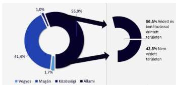

Forrás: Agrárminisztérium statisztikai információi alapján ÁSZ saját szerkesztés

5

---

Összefoglalás

2. ábra

## AZ ERDŐGAZDÁLKODÁS HASZNOSULÁSA, AZ ERDŐGAZDASÁGI TÁRSASÁGOK EGYES 2024. ÉVI TELJESÍTMÉNYADATAI

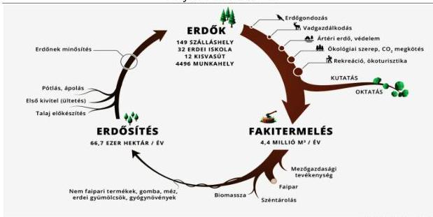

Forrás: ASZ saját szerkesztés

Az ellenőrzött időszakban az erdőgazdasági társaságok számos kihívással néztek szembe. Egyre gyakoribbá váltak a hosszan tartó csapadékmentes, száraz időszakok, amelyek jelentős károkat okoztak az erdőállományban. Ezzel párhuzamosan jelen voltak a fákat megtámadó kártevők és betegségek, melyek szintén növelték a faállomány károsodását, pusztulását. **A klímaváltozás emellett lassította az erdők növekedését**, nehezítette az erdőtelepítések és erdőfelújítások sikeres kivitelezését. A klímaváltozás hatására még inkább sebezhetővé váltak az erdők, mely rávilágított a fenntartható erdőgazdálkodás fontosságára.

Az **erdőgazdasági társaságok biztosították a fakitermelés utáni regenerációt**, lépéseket tettek az erdőket érő károk megelőzésére (tűzvész, kártevők, betegségek, invazív fajok és egyéb károsító tényezők). A rendelkezésre álló eszközök felhasználása célszerű volt. Az erdőállományok a klímaváltozás hatásaival – mint például az aszály és a vízhiány okozta helyzetek – szembeni ellenállóképesség fokozása érdekében **kutatásokban vettek részt, kísérleteket folytattak az erdőgazdálkodási módszerek változtatásával és a fafajok diverzifikálásával**. A változó klimatikus viszonyokhoz való alkalmazkodást nehezítette, hogy hiányoztak a magyarországi tapasztalatok, az új erdőgazdálkodási módszerek kialakítása folyamatos kutatást igényelt.

Az erdőgazdasági társaságok által kezelt/használt (továbbiakban kezelt, mely tartalmazza az AM²-től vagyonkezelésbe, és a HM³-től használatba vett erdőterületeket is) területeken **az erdőterület az ellenőrzött időszakban** (a 2020. évi 1 017 784 hektárról 2024-re 1 027 007 hektárra) **növekedett**. Az erdőtervekben biztosított **fakitermelési lehetőségeiket nem használták ki teljeskörűen, fakitermelésük és az abból származó tényleges árbevételük a 2022-2023 évek kivételével a tervektől elmaradt**. A fakitermelés az éves faállomány növekedés mintegy 60-70%-át tette ki átlagosan. Összehasonlításképpen, 2022. évben az éves folyónövedék arányában végzett fakitermelés **országosan** – Horvátországgal és Hollandiával azonos szinten – **65% volt**, Németországban ez az arány a 90%-ot, Lengyelországban a 70%-ot meghaladta, Cipruson nem érte el a 10%-ot.

6

---

Összefoglalás---

A **fakitermelési tervektől való elmaradás** az erdőápolási és erdőnevelési célú vágások elmaradása esetében **az erdők egészségügyi állapotára jelenthet veszélyt**, mely az erdők minőségére és fenntarthatóságára is hatást gyakorol. Az árbevétel kiesés okozta forráshiány kockázatot jelenthet az erdőtelepítési és erdőfelújítási, erdőápolási, erdőkezelési feladatok végrehajtására, továbbá az ökoturisztikai szolgáltatásokkal szembeni társadalmi elvárások teljesíthetőségére.

A **körzeti erdőtervezésben** - a hosszú távon fenntartható kitermelési szinteket érintő - **10 éves időszakra tervezett erdőgazdálkodást érintően kihívást jelentett az**, hogy az erdőállományokat érintő gyors és nehezen előre jelezhető környezeti változásokhoz, az ökológiai kihívásokhoz való alkalmazkodás alternatíváit mind nehezebb volt előrejelezni, azokhoz mind nehezebb volt alkalmazkodni.

A fenti körülmények mellett is az ellenőrzött időszakban **az erdőgazdasági társaságok esetében a fenntartható erdőgazdálkodás, a közérdek érvényesülését biztosító gazdálkodás** összességében rentábilis volt. Az ellenőrzés számítási eredményei szerint hasonló nemzetgazdasági feltételek, valamint bevétel szerkezet esetén hosszú távú fenntarthatóságuk alacsony kockázatot hordoz. A **gazdálkodás kereteit döntően a faértékesítésből származó bevételek határozták meg** (2020-ban 58 757,6 MFt, 2021-ben 67 154,7 MFt, 2022-ben 90 128,7 MFt, 2023-ban 99 070,2 MFt, 2024-ben 94 180,4 MFt). A társaságok **összesített üzemi eredménye** 2020-2024. években 13 644,3 MFt volt. Részleteiben a vagyonkezelt terület működtetésének összesített üzemi eredménye 62 675,2 MFt, a vállalkozói tevékenység összesített üzemi eredménye 21 866,6 MFt, a segéd-üzemágak összesített üzemi eredménye 53,7 MFt, a vállalat irányítás összesített üzemi eredménye -70 951,2 MFt volt.

Az erdőgazdasági társaságok **erdőtelepítési és erdőfelújítási kötelezettségeiknek ütemezetten tettek eleget**, ezzel hozzájárultak a szén-dioxid megkötési és tározási szint folyamatos növekedéséhez. Erdőfelújítási hátralék a kedvezőtlen időjárási viszonyok környezeti hatásai miatt keletkezett, az erdőfelújítások befejezésének külső körülményekből fakadó késedelme miatt.

Az **erdőgazdasági társaságok közjóléti feladatainak ellátása dinamikájában növekvő tendenciát mutatott az ellenőrzött időszakban**. A közjóléti szolgáltatásokat összességében stagnáló eszközellátottságot jelentő infrastruktúrával, de növekvő mértékű látogatottság mellett nyújtották.

Az erdőgazdasági társaságok **32 erdészeti erdei iskolát működtettek**. Az erdészeti erdei iskola programok különféle foglalkozásokat kínáltak 6-14 éves gyerekeknek. A programok elsődleges célja a természet megismertetése, a fenntarthatóságra nevelés volt. Az **erdészeti erdei iskolák üzemeltetése ágazati szinten veszteséges volt, ugyanakkor az iskolai program a szemléletformálás és környezeti nevelés terén eredményes volt, növekedett a képzések és a képzéseken részt vevők száma**.

Az erdők kulcsszerepet játszanak a klímavédelemben, miközben elszenvedői is egyben a klímaváltozás legkülönbözőbb hatásainak. Megfelelő kezelés, a szükséges immunitást védő ápolási feladatok hiányában az erdők sérülékennyé válnak, állapotuk romlik, kitetté válnak a természeti erőknek és a klímaváltozás hatásainak. Mindezek tudatosítására az iskoláskorúak, fiatalok részére megvalósított tájékoztatási tevékenység mellett a **lakosság valamennyi korosztálya számára erősíteni szükséges a kommunikációt**.

Az ÁSZ négy javaslatot tett az erdőgazdasági társaságok vezérigazgatói részére, egy-egy javaslatot az illegális hulladék elhelyezése elleni fellépés erősítésére, valamint a lakossággal való további kommunikációs és tájékoztatási tevékenység fejlesztésére irányulóan. Egy javaslat a különböző környezeti változásokra történő reagálási lehetőségekre vonatkozó tervek kidolgozására, egy további pedig a közjóléti funkciót biztosító infrastruktúra állapotának hosszú távon fenntartható szinten tartására és fejlesztésére vonatkozik.

7

---

# AZ ELLENŐRZÉS EREDMÉNYEI

## 1. Az erdőgazdasági társaságok hozzájárulása az erdők minőségének megóvásához és az erdők fenntarthatóságához

Összegző megállapítás

Az erdőgazdasági társaságok által végzett erdőgazdálkodási tevékenység hozzájárult az erdők minőségének megóvásához és az erdők fenntarthatóságához. A stratégiai tervekben meghatározott célkitűzések és azok megvalósítását jelentő tevékenységek összhangban álltak a nemzeti célkitűzésekkel. Az erdőgazdasági társaságok által kezelt területeken az erdőterület az ellenőrzött időszakban növekedett. Az erdőtervekben biztosított fakitermelési lehetőségeiket nem használták ki teljeskörűen, fakitermelésük a tervektől elmaradt, faértékesítésből származó árbevételük 2020-2024. között a terveket összességében meghaladta.

1.1. számú megállapítás

Az erdőgazdasági társaságok a stratégiaalkotás folyamata során a tulajdonosi elvárásokat figyelembe vették, célokat fogalmaztak meg az erdők minőségének megóvása, fenntarthatósága és közjóléti funkciójának érvényesülése érdekében. A stratégiákban megfogalmazott célok és irányok összhangban voltak a Nemzeti Erdőstratégia célkitűzéseivel.

Az 1537/2016. (X. 13.) Korm. határozattal⁴ elfogadott Nemzeti Erdőstratégia a magyar erdőpolitika irányadó dokumentuma, amely hosszú távon határozta meg az erdőgazdálkodás, az erdővédelem és az erdők közjóléti hasznosításának kereteit. A Nemzeti Erdőstratégia illeszkedett az erdőről, az erdő védelméről és az erdőgazdálkodásról szóló 2009. évi XXXVII. törvényhez (továbbiakban Evt.⁵), az EU erdészeti és klímavédelmi politikájához.

A Nemzeti Erdőstratégia az erdők többfunkciós szemléletére épült, amelynek három alappillére:

- a gazdasági funkció (faanyag-termelés, erdei melléktermékek, munkahelyteremtés),
- a védelmi vagy ökológiai funkciók (biológiai sokféleség megőrzése, klímavédelem, talaj és vízvédelem, élőhelyek fenntartása),
- és a közjóléti funkciók (rekreáció, turizmus, egészségmegőrzés, oktatás).

A Nemzeti Erdőstratégia kulcscéljai:

- az erdőterület növelése és az erdősültségi arány emelése (erdősítési programok, fásítások),
- ellenállóbb és természetközelibb erdőszerkezetek kialakítása a klímaváltozás hatásainak mérséklése érdekében,
- a fenntartható erdőgazdálkodás gyakorlati szélesítése,
- a védett Natura 2000 területek kezelése természetvédelmi prioritások alapján,

8

---

Az ellenőrzés eredményei

- a közjóléti infrastruktúra bővítése és fejlesztése, különös tekintettel az erdőfeltáró úthálózat, turistautak, erdei iskolák és pihenőhelyek fenntartására és korszerűsítésére.

A Nemzeti Erdőstratégia végrehajtásának meghatározó szereplője az ország erdeinek több, mint felét kezelő 21 állami szektorba sorolt erdőgazdasági társaság. A stratégia az erdőgazdasági társaságokra vonatkozóan a fenntartható erdőgazdálkodás, a közvagyon gyarapítása és a társadalmi szerepvállalás szempontjait emelte ki. Célként határozta meg a gazdasági és ökológiai érték növelését, az erdők egészségi állapotának javítását, valamint a hosszú távú működőképesség biztosítását, figyelembe véve az erdők közjóléti funkcióiból fakadó társadalmi elvárásokat (ökoturisztikai funkciók fejlesztése, rekreációs, oktatási és kulturális szerep erősítése, a szükséges infrastruktúra korszerűsítése). Nemzetgazdasági szempontból kiemelt cél a faanyag-termelés és -feldolgozás fenntartható biztosítása, továbbá az innováció és kutatás-fejlesztés elősegítése az erdőgazdálkodási gyakorlatban.

A Nemzeti Erdőstratégiában megfogalmazott célok más országok stratégiai szintű dokumentumaiban megfogalmazott céljaival való összevetését az 1. táblázat tartalmazza:

1. táblázat

|  NEMZETI ERDŐSTRATÉGIA NEMZETKÖZI ÖSSZEHASONLÍTÁSBAN  |   |   |   |   |   |
| --- | --- | --- | --- | --- | --- |
|  Nemzeti Erdőstratégia céljai | Magyarország | Egyesült Királyság | Ausztrália | Kanada | Finnország  |
|  Biodiverzitás, természetvédelem | ✓ | ✓ | ✓ | ⓘ | ✓  |
|  Erdőegészség, kártevők, betegségek | ✓ | ✓ | ✓ | ✓ | ✓  |
|  Klimavédelem és adaptáció | ✓ | ✓ | ✓ | ✓ | ✓  |
|  Fenntartható erdőgazdálkodás | ✓ | ✓ | ✓ | ✓ | ✓  |
|  Közjólét és rekreáció | ✓ | ✓ | ✓ | ✓ | ✗  |
|  Oktatás, szemléletformálás | ✓ | ✓ | ✗ | ✓ | ✓  |
|  Gazdasági célok | ✓ | ✓ | ✓ | ✗ | ✓  |
|  Munkaerő, szakképzés | ✓ | ✗ | ✓ | ✓ | ✓  |

✓ Megfeleltethető volt ✗ Nem volt megfeleltethető ⓘ Részben volt megfeleltethető

Forrás: Ország stratégiák és cselekvési tervek alapján ÁSZ saját szerkesztés

A Nemzeti Erdőstratégia az erdőgazdasági társaságok számára keretet adott, amely lehetővé tette a gazdasági, ökológiai és közjóléti szempontok egyidejű érvényesítését, miközben biztosította az állami erdők fenntartható és hatékony kezelését.

Az erdőgazdasági társaságok – a három évre szóló, egységes struktúrát követő – középtávú stratégiai terveit a vezérigazgatók – az AM iránymutatásával összhangban előkészítették, és a felügyelőbizottság előzetes jóváhagyásával – meghatározták, melyeket az alapítói jogokat gyakorló AM elfogadott. Az erdőgazdasági társaságok középtávú stratégiai tervei a fenntarthatóság, valamint a gazdasági, ökológiai és közjóléti szempontok integrált érvényesítését célozták, lehetővé téve a célok folyamatos nyomon követését, valamint működésük változó környezeti, gazdasági és társadalmi feltételekkel való összehangolását és menedzselését. A célokat egyes esetekben számszerűsített módon (pl. erdőfeltáró úthálózat fejlesztése esetében adott évre felújításra vagy építésre tervezett km hossz, vadkárelhárító kerítés állomány 20%-kal történő csökkentése), más esetekben leíró jelleggel határozták meg. Az erdőgazdasági társaságonként meghatározott egyes kiemelt stratégiai célokat a 3. ábra tartalmazza.

9

---

Az ellenőrzés eredményei

3. ábra

# **KIEMELT STRATÉGIAI CÉLOK ERDŐGAZDASÁGI TÁRSASÁGONKÉNT**

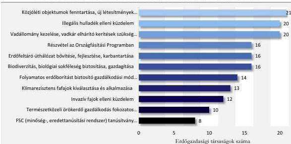

Forrás: Erdőgazdasági társaságok adatszolgáltatása alapján ÁSZ saját szerkesztés

A stratégiákban megfogalmazott célok és irányok, valamint a Nemzeti Erdőstratégia célkitűzései közötti kapcsolódásokat a következő diagram (4. ábra) szemlélteti.

4. ábra

# **AZ ERDŐGAZDASÁGI TÁRSASÁGOK STRATÉGIAI CÉLJAINAK KAPCSOLATA A NEMZETI ERDŐSTRATÉGIA V.2.1 FEJEZETÉBEN MEGFOGALMAZOTT CÉLOKKAL**

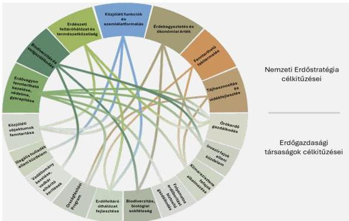

Forrás: Nemzeti Erdőstratégia és erdőgazdasági társaságok adatszolgáltatása alapján ÁSZ saját szerkesztés

10

---

Az ellenőrzés eredményei

A két célrendszer közötti összekötő vonalak jelzik, hogy az adott állami erdőgazdasági társaságok által meghatározott cél mely nemzeti stratégiai törekvések megvalósítását támogatja vagy erősíti. Mindez azt jelenti, hogy az erdőgazdasági társaságok saját stratégiái nem elszigetelten, hanem a Nemzeti Erdőstratégia kereteihez igazodva, annak megvalósítására építve jöttek létre. A legsűrűbb kapcsolatok az erdővagyon fenntartható kezelése, védelme, gyarapítása és a biodiverzitás köré csoportosíthatóak.

Azzal, hogy a Nemzeti Erdőstratégiában megfogalmazott célokat képviselték és érvényesítették, az erdőgazdasági társaságok stratégiáik végrehajtásával hozzájárultak a hazai célkitűzések megvalósíthatóságához. A célok eléréséhez a klímaváltozás erősödő hatásai mellett jelentős kihívásokkal kellett szembenézniük, többek között biztosítaniuk kellett, hogy az erdőgazdálkodásban elegendő szakértelem és munkaerő álljon rendelkezésre. A munkaerő folyamatos biztosításához szükséges megfelelő szakmunkát végző kollégák és szakalkalmazottak esetleges hiánya a jövőben az erdőgazdálkodási feladatok ellátására kockázatként jelentkezhet.

Az erdőgazdálkodás 2025. évben is még mindig fizikai munkával volt jellemezhető, de már léteztek olyan megoldások, amelyek részben kompenzálhatták az ágazatra jellemző munkaerőhiányt és növelhették a végzett munka hatékonyságát (robotizáció, dróntechnológia).

Az ellenőrzött időszakban a dinamikájában csökkenő hulladék elhelyezésével és illegális hulladék lerakásával összefüggő kezelési feladatok szintén erőforrás kapacitásokat kötöttek le az erdőgazdasági társaságoknál.

Jó gyakorlatként azonosítottuk a szemétgyűjtésbe civil szervezetek, egyetemisták bevonását, továbbá az illegális hulladéklerakás elleni védekezés során a lerakási helyek korai felszámolását, utak sorompóval történő lezárását, kamerák kihelyezését, kamerás felvétel alapján az illetékes hatósággal történő kapcsolat felvételét.

1.2. számú megállapítás

Az erdőgazdasági társaságok az erdősítéseket (erdőtelepítések és erdőfelújítások) eredményesen hajtották végre. Az erdősítések növekvő költségeire a szükséges források rendelkezésre álltak, melyek felhasználása célszerű volt. Az erdőtervben biztosított fakitermelési lehetőségeiket nem használták ki, fakitermelésük a tervektől elmaradt. A fakitermelésből származó bevételeik fedezetet biztosítottak az erdőfelújítási kötelezettségeik, valamint az erdőművelési és egyéb feladataik ellátására. Erdősítési és fahasználati tevékenységükkel hozzájárultak a Nemzeti Erdőstratégia végrehajtásához, a stratégiai céljaik megvalósításához: erdőtelepítéseikkel növelték, erdőfelújításaikkal szinten tartották az erdősült területek mennyiségét, fakitermelési tevékenységük az erdőterületek, illetve az erdősültség csökkenését nem okozta.

2022. évben a magyarországi erdőterületek nagysága 2072 ezer hektár volt, mely 2024-re 2075 ezer hektárra növekedett. 2022. évi adatok alapján az Európai Unióban a legnagyobb erdőterülettel rendelkező országok Svédország (28 millió hektár), Finnország (22 millió hektár) és Spanyolország (19 millió hektár) voltak. Az erdőgazdálkodás az Evt. szerint „az erdő fenntartására, közérdekű funkcióinak biztosítására, őrzésére, védelmére, az erdővagyon bővítésére, valamint – a vadászati jog gyakorlása, hasznosítása kivételével – az erdei haszonvételek gyakorlására irányuló tevékenységek összességét” jelenti.

11

---

Az ellenőrzés eredményei

Az ellenőrzött időszakban az erdőgazdasági társaságok által elért összesített üzemi eredményt (13 644,3 MFt) és alakulását ezen tevékenységeként a 5. ábra szemlélteti.

5. ábra

# **ERDŐGAZDASÁGI TÁRSASGÁGOK ÖSSZESÍTETT ÜZEMI EREDMÉNYE TEVÉKENYSÉGEK SZERINT (2020-2024. ÉVEKBEN ÉS 2025. I. FÉLÉVÉBEN, MFT)**

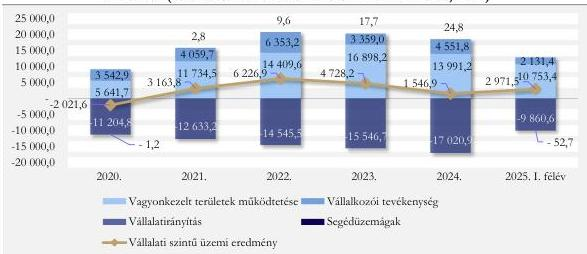

Forrás: Erdőgazdasági társaságok üzleti jelentései alapján ÁSZ saját szerkesztés

A vagyonkezelt területek üzemeltetése, a vállalkozói tevékenység és a segéd-üzemágak üzemi eredménye a 2020. év kivételével **fedezetet biztosított** az erdőgazdasági társaságok működtetési és irányítási költségeire. A vagyonkezelt területek üzemeltetéséből származó eredményt négy ágazat üzemi eredménye alkotta, melyből a legjelentősebb az erdőgazdálkodási tevékenység volt. Az egyes ágazatok által elért üzemi eredményt az 6. ábra szemlélteti.

6. ábra

# **AZ ERDŐGAZDASÁGI TÁRSASÁGOK VAGYONKEZELT TERÜLETEI ÜZEMELTETÉSÉBŐL SZÁRMAZÓ EREDMÉNYEK ÁGAZATOK SZERINT A 2020-2024. ÉVEKBEN ÉS 2025. I. FÉLÉVBEN (MFT)**

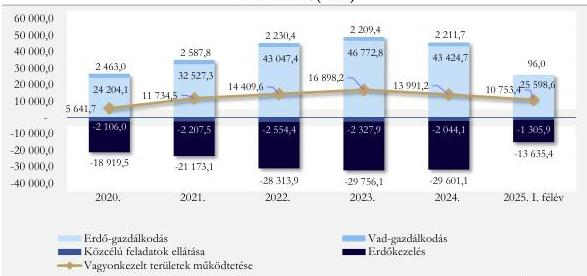

Forrás: Erdőgazdasági társaságok üzleti jelentései alapján ÁSZ saját szerkesztés

12

---

Az ellenőrzés eredményei

A közcélú, közjóléti feladatok (ökoturisztika) és az erdőkezelési feladatok ellátásával összefüggő, **önfinanszírozást nem biztosító, zömében veszteséges tevékenység finanszírozására** az erdőgazdálkodási és a vadgazdálkodási tevékenység **biztosított fedezetet**. Az erdőgazdasági társaságoknál erdőgazdálkodási ágazat körében kimutatott feladat a mag- és csemetetermelés, az **erdőtelepítés és erdőfelújítás, a fahasználat (fakitermelés és értékesítés)**, valamint az erdei melléktermékek gyűjtése volt.

## ERDŐTELEPÍTÉSEK

Az ellenőrzött időszakban a 2020/2021-2023/2024 tenyészeti években Magyarországon az erdőgazdálkodók mindösszesen 27 766 hektár erdő telepítését kezdték meg. Az állami szektorba sorolt erdőgazdasági társaságok által végzett erdőtelepítés ebből mindössze 760,6 hektár (2,7%) volt. Alacsony részvételi arányukat az okozta, hogy erdőtelepítésre alkalmas területek korlátozottan álltak rendelkezésükre, erdőtelepítést kizárólag a kezelésükben lévő állami tulajdonú területeken hajthattak végre.

Az erdőgazdasági társaságok 2020-2024 évek között – az AM által elfogadott tervek alapján – összesen 3319 hektárnyi erdő telepítését tervezték. Az elvégzett erdőtelepítés a terveket minden évben meghaladta, ténylegesen 4037 hektár erdőt telepítettek. A folyamatban lévő erdőtelepítések a 2020. évi 3320,8 hektárról 2024-re 7665,6 hektárra növekedtek. Az erdészeti hatóság 2020-2024 között 867,7 hektár, majd 2025. I. félévében 72,7 hektár erdőtelepítést nyilvánított befejezetté. **A végrehajtott erdőtelepítésekkel az erdőgazdasági társaságok** mind saját, mind a Nemzeti Erdőstratégiában meghatározott **célkitűzés megvalósításához eredményesen járultak hozzá, növelve az erdőterületek nagyságát**.

Az erdőtelepítés legnagyobb területű (1042 hektár) első kivitelét és pótlását az erdőgazdasági társaságok 2024-ben végezték, melyből az első kivitel 725 hektár (legtöbb a Pilisi Parkerdő Zrt.-nél 111 hektár), a pótlás területe 316 hektár (legtöbb a DALERD Zrt.-nél 81 hektár) volt. Az erdőtelepítésen belül a pótlás aránya a 2020. évi 5,7%-ról folyamatosan, 2024-re 30,4%-ra növekedett, 2025. I. félévében 50,9% volt. A pótlások arányának növekedését jellemzően a klímaváltozással összefüggő időjárási szélsőségek (szárazság, csapadékhiány, légköri aszály) miatt bekövetkezett csemetepusztulás okozta. A 2020-2024 közötti időszakban a DALERD Zrt. végezte el az erdőtelepítés legtöbb első kivitelét, összesen 254 hektár területen, és egyben a legtöbb pótlási feladatot is ez a társaság látta el. Az erdőgazdasági társaságok erdőtelepítésekre 2020-2024 között összesen 5299,6 MFt-ot, 2025. I. félévében pedig 614,6 MFt-ot fordítottak. Az erdőtelepítésekre fordított források megoszlását a 7. ábra szemlélteti.

7. ábra

### AZ ERDŐTELEPÍTÉSEKRE FORDÍTOTT FORRÁSOK MEGOSZLÁSA 2020-2024. ÉVEKBEN ÉS 2025. I. FÉLÉVBEN

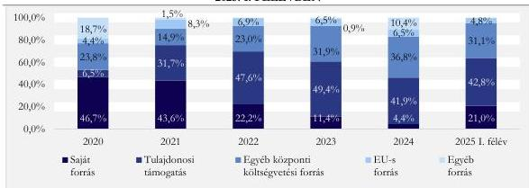

Forrás: Erdőgazdasági társaságok kontrolling táblái alapján ÁSZ saját szerkesztés

13

---

Az ellenőrzés eredményei

Az erdőtelepítésekre fordított forrásokon belül az erdőgazdasági társaságok saját forrásainak aránya tendenciáját tekintve csökkent, a központi költségvetésből (tulajdonosi és egyéb központi költségvetési) származó támogatás mértéke növekedett. Az EU-s források aránya az ellenőrzött időszakban nem érte el a 10,0%-ot. Az erdőgazdasági társaságok 2020-2024 között erdősítésekre **mindösszesen** 10 773,0 MFt támogatásban részesültek.

Az üzleti jelentések adatai alapján az erdőtelepítési tevékenységekre fordított kiadások 2020-tól 2024-ig folyamatosan nőttek. A tényleges kiadások értéke meghaladta a tervezett kiadásokét 2020-ban, 2021-ben és 2024-ben. A költségek között a legnagyobb részarányt az erdőtelepítés ápolás adta, majd ezt követte az erdőtelepítés első kivitel költsége (8. ábra). **Az erdőtelepítések költségeire az erdőgazdasági társaságok a szükséges forrásokkal rendelkeztek**, forráshiány miatt meg nem valósított erdőtelepítési feladat nem volt.

Az erdőgazdasági társaságok a támogatások igénybevételével együtt rendelkeztek a költségek fedezetül szolgáló forrásokkal, a támogatások igénybevétele járult hozzá az erdőtelepítési feladatok elvégzéséhez, összhangban az ágazati klímavédelmi célokkal.

8. ábra

#### AZ ERDŐTELEPÍTÉSEK KÖLTSÉGEINEK MEGOSZLÁSA (%)

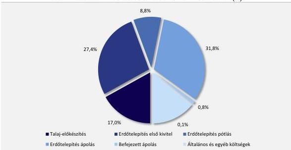

Forrás: Erdőgazdasági társaságok üzleti jelentései alapján ÁSZ saját szerkesztés

2020-ról 2024-re az egy hektár erdőtelepítés első kivitelre jutó költség több, mint negyedével, az egy hektár erdőtelepítés pótlására jutó költség közel háromnegyedével, az egy hektár erdőtelepítés ápolásra jutó költség több, mint duplájára nőtt. Az összes költség növekedését részben az egységárak (anyagár és vállalkozói díjak) és a bérfejlesztések következtében növekvő bérköltségek emelkedése, részben a pótlással és ápolással érintett területek növekedése okozta. Az ápolással érintett erdőtelepítések területe a 2020. évi 3320,8 hektárról több, mint másfélszeresére (7665,6 hektárra) növekedett 2024-re. Az egy hektárra jutó első kivitel, pótlás és erdőtelepítés ápolás alakulását éves bontásban a 9. ábra szemlélteti.

14

---

Az ellenőrzés eredményei

9. ábra

### AZ EGY HEKTÁRRA JUTÓ ELSŐKIVITEL, PÓTLÁS ÉS ERDŐTELEPÍTÉS ÁPOLÁS KÖLTSÉGEINEK ALAKULÁSA (2020-2024, EZER FT)

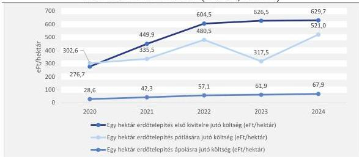

Forrás: Erdőgazdasági társaságok üzleti jelentései és kontrolling táblái alapján ÁSZ saját szerkesztés

Az ábra jól szemlélteti az árak és a bérek növekedésének hatását, mivel az egy hektárra jutó költségeket mutatja be. Az erdőtelepítés ráfordításai összes növekedésének másik tényezője az, hogy nem kizárólag az egy hektárra jutó egységköltség, hanem az erdőtelepítéssel érintett területek is növekedtek.

### ERDŐFELÚJÍTÁSOK

Az Országos Statisztikai Adatfelvételi Program adatfelvétele alapján 2020-2024 évek között **országos szinten megközelítően 135 ezer hektár erdőterület állt felújítás alatt.**

Az **erdőgazdasági társaságoknak az erdőfelújításokban jelentős szerepe volt.** A felújítás alatt álló erdőterületek közel fele az állami szektoron belül működő erdőgazdasági társaságok kezelésében lévő területeket érintették (65,7 ezer hektár). Az **adatok azt mutatták**, hogy a kitermelt vagy kipusztult faállomány pótlása – ahogyan a törvény is előírja, hogy **fakitermelés után a kivágott fák helyén új erdőt kellett telepíteni – biztosított volt.**

Az erdőgazdasági társaságok erdőfelújítási kötelezettség alá vont és kezelt erdőterületeinek átlagos aránya az ellenőrzött időszakon folyamatosan, a 2020. évi 8,1%-ról 2024-re 7,7%-ra csökkent. Az erdőfelújítási kötelezettség alá vont területek és a kezelt erdőterületek arányának alakulását erdőgazdasági társaságok szerint a 10. ábra szemlélteti.

15

---

Az ellenőrzés eredményei

10. ábra

## AZ ERDŐGAZDASÁGI TÁRSASÁGOK ERDŐFELÚJÍTÁSI KÖTELEZETTSÉG ALÁ VONT ÉS KEZELT ERDŐTERÜLETEI ARÁNYÁNAK ALAKULÁSA 2020-2024. ÉVEKBEN ÉS 2025. I. FÉLÉVBEN (%)

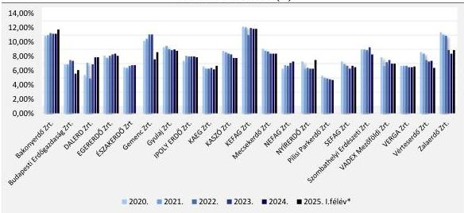

Forrás: Erdőgazdasági társaságok adatszolgáltatása alapján ÁSZ saját szerkesztés

**Az erdőfelújítási kötelezettség alá vont és kezelt erdőterületek arányának csökkenése az erdősült területek nagyságának kedvező alakulását, az erdőfelújítási kötelezettséggel járó kitermelés csökkenését jelezte.**

Az erdőgazdasági társaságok vagyonkezelésében lévő erdőterületek – vagyonkezelési szerződés módosításával, az irányítószerv döntése alapján – 2021. évről 2024. évre 8453 hektárral növekedtek, az erdőfelújítási kötelezettség alá vont területek pedig 2760 hektárral csökkentek. Az egyes erdőgazdasági társaságok mutatóit vizsgálva az ÁSZ megállapította, hogy hat erdőgazdaság (Bakonyerdő Zrt., DALERD Zrt., EGERERDŐ Zrt., ÉSZAKERDŐ Zrt. NEFAG Zrt. és a VADEX Mezőföldi Zrt.) esetében a 2021. évhez viszonyítva kismértékű (0,2-0,8 százalékpontos) növekedés volt tapasztalható a 2024. évre. A növekedést nem csak a fakitermelés miatti erdőfelújítási kötelezettség alá vont területek növekedése, hanem az addig kezeletlen állami erdők AM döntése alapján történő vagyonkezelésbe vétele is okozta.

Az erdőfelújítások átfutási idejének – erdőfelújítás megkezdésétől az erdészeti hatóság által befejezett nyilvánításig tartó idő – országos átlaga 9,1-9,3 év között mozgott. Az erdőgazdasági társaságok esetében az átfutási idő ezt egy évvel meghaladta, míg a magánszektorban egy évvel rövidebb volt. Az országos átlagnál magasabb átfutási időt **az állami szektorba tartozó erdőgazdasági társaságok esetében** az okozta, hogy **jelentősebb arányt képviseltek felújításaikon belül a lassabban növő, őshonos fafajok** (pl. bükk, tölgy esetében megközelítőleg 20 év az átfutási idő), **míg az elsősorban kitermelésre szánt, gyorsabb növekedésű fafajok súlya alacsonyabb** volt (pl. akác és nemes nyár 5-6 év átfutási idejű). Ezzel az erdőgazdasági társaságok hozzájárultak az erdők természetes állapotának megóvásához, illetve nem őshonos fafajok őshonos fafajra történő cseréje esetén az eredeti (természetes) állapot helyreállításához is. A **magánszektor esetében ez az arány fordított volt**, a gyorsabb növekedésű fafajok képviseltek nagyobb arányt az erdőfelújítások során, mivel a magánerdőgazdálkodók esetében a gazdálkodás elsődleges célja a kitermelés.

**Az erdőfelújítások megkezdésére, átfutási idejére, sikerességére az időjárási viszonyok is hatást gyakoroltak**, a klímaváltozás hatásai érvényesültek. Az erdősítésekben a **klímaváltozás okozta**

16

---

Az ellenőrzés eredményei

szélsőséges időjárási viszonyok (szárazság, légköri aszály, szélviharok stb.) hatására a károsodott, kipusztult csemeték pótlása egyre gyakoribb és nagyobb nagyságrendet képviselt. Országos szinten az erdőfelújítási hátralékkal érintett területek nagysága a 2020/2021. tenyészévi 11 951,2 hektárról a 2023/2024. tenyészévre 1064,1 hektárral 13 015,3 hektárra növekedett. Az erdőgazdasági társaságok részesedése az országos szinten keletkezett erdőfelújítási hátralékból nem haladta meg a 3,0%-ot.

Az erdőgazdasági társaságok tervezett és tényleges erdőfelújítási kötelezettségének és hátralékának alakulását szemlélteti a 11. ábra.

11. ábra

# **ERDŐGAZDASÁGI TÁRSASÁGOK TERVEZETT ÉS TÉNYLEGES ERDŐFELÚJÍTÁSI KÖTELEZETTSÉGÉNEK ÉS ERDŐFELÚJÍTÁSI HÁTRALÉKÁNAK ALAKULÁSA 2020-2024. ÉVEKBEN ÉS 2025. I. FÉLÉVBEN (HEKTÁR)**

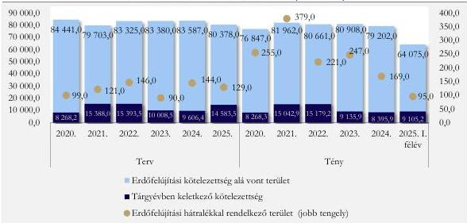

Forrás: Erdőgazdasági társaságok adatszolgáltatása alapján ÁSZ saját szerkesztés

Az erdőgazdasági társaságok tárgyévben országos szinten keletkezett összes erdőfelújítási kötelezettsége az ellenőrzött időszakban elmaradt az AM által elfogadott tervezettől (2021-ben 345,1 hektárral, 2022-ben 214,3 hektárral, 2023-ban 872,7 hektárral és 2024-ben 1210,6 hektárral), melyben szerepet játszott, hogy az erdőtervekben meghatározott fakitermelési lehetőségeikkel nem éltek teljes mértékben, ezért nem is keletkezett a terveknek megfelelő mértékű erdőfelújítási kötelezettségük.

Az erdőfelújítási kötelezettséggel érintett területek ténylegesen a 2020. évi 76 847 hektárról 3,1%-kal (2355 hektárral) növekedtek a 2024. évre. A felújítási kötelezettség növekedése mellett pozitív változás volt, hogy az erdőfelújítási hátralékkal érintett területek nagysága a 2020. évi 255 hektárról 169 hektárra csökkent 2024-re. Az erdőfelújítási hátralék kialakulásának oka az volt, hogy az erdőgazdasági társaságok – az erdészeti hatósággal egyeztetve – időjárási, természeti okok (pl. aszály) nem tudták megkezdeni az erdőfelújításokat a kötelezettséggel érintett területeken, illetve az erdőfelújítási tevékenységükkel létrehozott erdők nem érték el azt az állapotot, mely szükséges volt ahhoz, hogy az erdészeti hatóság befejezettnek nyilvánítsa a felújítást. Az erdészeti hatóság által befejezettnek minősített erdőfelújítások összesen 48,4 ezer hektárt tettek ki 2020-2024 között, amely 2025. I. félévében további 391 hektárral növekedett, hatására az erdőgazdasági társaságok

17

---

Az ellenőrzés eredményei

**kezelésében lévő erdőterületek erdősültsége javult**, amely alátámasztotta a forrásfelhasználás célszerűségét.

Az erdőgazdasági társaságok erdőfelújításokra fordított összes költsége 2024-re több, mint másfélszeresére (55,9%-kal, azaz 5085,1 MF-tal) növekedett a 2020. évhez viszonyítva. Bevételeik növekedése 104,5% volt (1955,7 MF-t).

A legtöbb befejezett erdőfelújítással 2020-2024 között a NYÍRERDŐ Zrt. (5,8 ezer hektár), a KEFAG Zrt. (4,6 ezer hektár) és a SEFAG Zrt. (4,4 ezer hektár) rendelkezett.

Az erdőgazdasági társaságok (összesített) erdőfelújítási tevékenységével kapcsolatos bevételeinek, költségeinek, ráfordításainak és üzemi eredményének tervezett és tényleges alakulását a 12. ábra szemlélteti.

12. ábra

### ERDŐFELÚJÍTÁS TERVEZETT ÉS TÉNYLEGES BEVÉTELEINEK, KIADÁSAINAK ÉS ÜZEMI EREDMÉNYÉNEK ALAKULÁSA A 2020-2024. ÉVEKBEN (MFT)

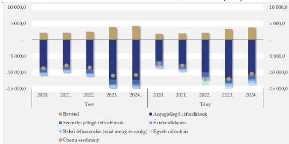

Forrás: Erdőgazdasági társaságok adatszolgáltatása alapján ÁSZ saját szerkesztés

Az erdőfelújítás tényleges költségeinek 14-17%-át a talaj-előkészítése, 20-22%-át a felújítások első kivitele és pótlása, míg 35-43%-át az erdőfelújítások ápolása tette ki. A költségeknek mintegy 20-25%-át az erdőfelújítással kapcsolatos általános költségek, egyéb ráfordítások jelentették.

**Az erdőfelújításokkal kapcsolatos bevételek a költségek mintegy ötödére nyújtottak fedezetet** 2020-2023 között, mely arány 2024-ben 27,1%-ra emelkedett. Az erdőfelújításokkal kapcsolatos bevételeket az erdőkárok (pl. fapusztulás, felújításokat érő aszálykár) helyreállítására előző évben, vagy előző években képzett céltartalékok feloldása, valamint az erdőpotenciál helyreállítására kapott támogatások jelentették.

Az egyes erdőgazdasági társaságok erdőfelújításra fordított költségei a következők szerint (13. ábra) alakultak az ellenőrzött időszakban.

18

---

Az ellenőrzés eredményei

13. ábra

# **ERDŐFELÚJÍTÁSRA FORDÍTOTT KÖLTSÉGEK ALAKULÁSA ERDŐGAZDASÁGONKÉNT A 2020-2024. ÉVEKBEN (MFT)**

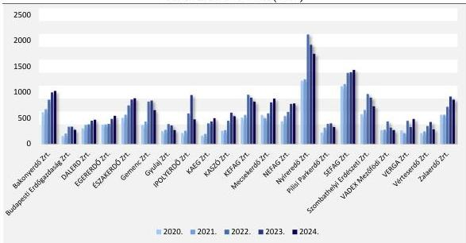

Forrás: Erdőgazdasági társaságok adatszolgáltatása alapján ÁSZ saját szerkesztés

Az erdőgazdasági társaságok erdőfelújításra fordított költségei az ellenőrzött időszakban évente átlagosan 11,7%-kal növekedtek, miközben az erdőfelújítási kötelezettség alá vont terület 2020. évhez viszonyítva 3557,7 hektárral (79 202 hektárra) csökkent a 2024. évre.

Az erdőfelújítások sikerességét befolyásoló tájegységi adottságok, a klímaváltozás hatásaként jelentkező időjárási szélsőségek jelentőségét és költségekre gyakorolt hatását jelzi az is, hogy az erdőfelújítások költségének éves átlagos növekedési üteme olyan erdőgazdasági társaságok esetében is meghaladta az erdőgazdasági társaságok átlagát, amelyek esetében az erdőfelújítási kötelezettség alá vont területek csökkentek és javult az erdőfelújítási kötelezettség alá vont és a vagyonkezelt erdőterületek aránya (pl. Gemenc Zrt., KAEG Zrt., KASZÓ Zrt.).

Az egy hektár erdő felújításának költségét és az erdőfelújítási kötelezettség alá vont területek nagyságát 2024-ben erdőgazdasági társaságok szerint a 14. ábra szemlélteti.

19

---

Az ellenőrzés eredményei

14. ábra

# **AZ EGY HEKTÁR ERDŐ FELÚJÍTÁSÁNAK KÖLTSÉGE ÉS ERDŐFELÚJÍTÁSI KÖTELEZETTSÉG ALÁ VONT TERÜLET ERDŐGAZDASÁGI TÁRSASÁGOK SZERINT 2024-BEN, DOMBORZATI JELLEMZŐK SZERINT (EZER FT/HEKTÁR, HEKTÁR)**

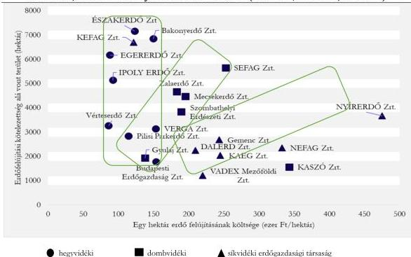

Forrás: Erdőgazdasági társaságok adatszolgáltatása alapján ÁSZ saját szerkesztés

Az ábra adatai szóródása mellett kirajzolódó mintázatot az magyarázza, hogy **az erdőfelújítás költségeinek nagysága nem csak az erdőfelújítási kötelezettség alá vont területek nagyságától függött, hanem az egyes erdőgazdasági társaságok tájegységi elhelyezkedése, domborzati és klimatikus viszonyai és az ellátott feladatok is hatást gyakoroltak rá.**

# **FAKITERMELÉS**

Az erdők gazdasági funkciójával összefüggő erdőgazdálkodási feladat a fakitermelés. A fakitermelés egyrészt a nemzetgazdaság számára biztosít fa- és papíripari alapanyagot, energiahordozót, másrészt forrást biztosít az erdőgazdálkodók működési feltételeinek megteremtéséhez. Az erdőgazdálkodási célú erdőterületekről országos szinten kitermelt fa mennyisége a 2020-2024. években összesen bruttó 37 077 ezer köbméter volt, melynek 60,6%-a (bruttó 22 478 ezer köbméter) származott az erdőgazdasági társaságok által kezelt állami tulajdonú erdőkből. Az erdőgazdálkodók – köztük az erdőgazdasági társaságok – által kitermelhető fa mennyiségét az egyes erdőrészletekre vonatkozó 10 éves időtávú erdőterv tartalmazta, mely az erdőterv időtávjára vonatkozóan határozta meg a kitermelhető fa mennyiségét. A 10 évre szóló tervezés kihívást jelentett az erdőgazdálkodás számára, mert mind a piaci változások, mind az erdőállományokat érintő egyre gyorsabb környezeti változások nehezen jelezhetők előre, így az azokhoz való alkalmazkodás is mind nehezebb volt. A fakitermelés alakulását szemlélteti a 15. ábra.

20

---

Az ellenőrzés eredményei

15. ábra

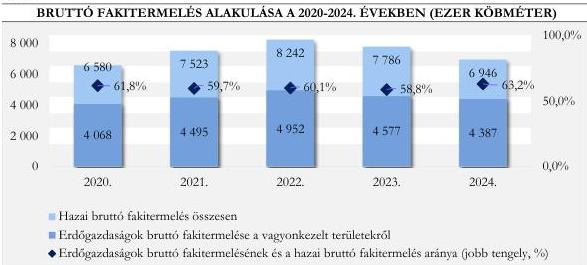

Forrás: KSH STADAT 15.1.1.8 tábla és az erdőgazdasági társaságok adatszolgáltatása alapján ÁSZ saját szerkesztés

Az ábra alapján látható, hogy a **2022. évi energiaár-emelkedés idején a fakitermelés mennyisége országosan** (9,6%-kal), és az **erdőgazdasági társaságok** (10,2%-kal) szintjén is megemelkedett a tűzifa iránti keresletnövekedés következtében. Ez a növekedés a fapiaci kereslet csökkenése hatására megállt, és a fakitermelés 2024-re megközelítőleg a 2020. évi szintre csökkent.

Az erdőgazdasági társaságok tevékenységük során 2020-2024. között és 2025. I. félévében összesen nettó 20 665,5 ezer köbméter fát értékesítettek. A **2020-2024. években értékesített fa összes mennyisége 63,9 ezer köbméterrel volt kevesebb a tervezettnél**. Az erdőgazdasági társaságok által kitermelt és értékesített fa mennyisége a 16. ábra szerint alakult.

16. ábra

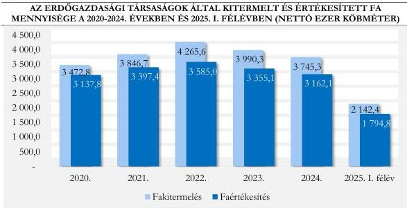

Forrás: Erdőgazdasági társaságok adatszolgáltatása alapján ÁSZ saját szerkesztés

Míg 2022-ben a ténylegesen értékesített fa nettó 361,9 ezer köbméterrel haladta meg a tervezettet, addig 2023-ban 114,4 és 2024-ben 273,4 ezer köbméterrel volt kevesebb. A változás oka, hasonlóan a fakitermeléshez, a fa iránti piaci kereslet és a faárak ugrásszerű növekedése, majd csökkenése volt.

21

---

Az ellenőrzés eredményei

A fahasználattal érintett területek aránya az ellenőrzött időszakban 6-8% között mozgott. Az érintett területek nagyságát fakitermelési módok szerint a 17. ábra szemlélteti.

17. ábra

# **FAHASZNÁLATTAL ÉRINTETT TERÜLETEK NAGYSÁGA A FAKITERMELÉS MÓDJA SZERINT 2020-2024. ÉVEKBEN ÉS 2025. I. FÉLÉVBEN(HEKTÁR)**

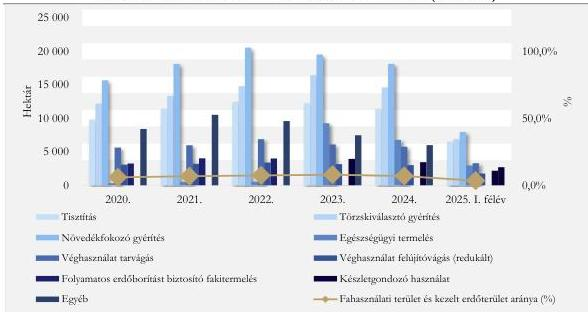

Forrás: Erdőgazdasági társaságok adatszolgáltatása alapján ÁSZ saját szerkesztés

Az ábra azt szemlélteti, hogy az erdőgazdasági társaságoknál a kezelésükben lévő területeken alkalmazott fakitermelési módok jelentős része az erdőnevelést és ápolást jelentő tisztítási, növedékfokozó- és törzskiválasztó gyérítési feladatok ellátásához kapcsolódott. **A klímaváltozás és a szélsőséges időjárási viszonyok erdőkre gyakorolt kedvezőtlen hatását és a hatások fokozódó jellegét jelezte az is, hogy az erdőgazdasági társaságok által végrehajtott egészségügyi fakitermelés területe 2024-ben 6789 hektár erdőterületet érintett, az egészségügyi vágás mennyisége tendenciájában növekedett, 2020. évi 112,8 ezer köbméterről 2024-re 131,6 ezer köbméterre.** Ezzel az erdőgazdasági társaságok – fakitermelés gazdasági funkciójának érvényesítése mellett – hozzájárultak az erdők megfelelő állapotának megóvásához.

Az ápolási tevékenységet jelentő tisztítás, törzskiválasztó és növedékfokozó gyérítéssel érintett terület az ellenőrzött időszakban 15-20%-kal növekedett, a véghasználati fakitermelés területe megközelítően szinten maradt. Emellett a folyamatos erdőborítást biztosító fakitermelés, illetve a készletgondozó használat területe is tendenciáját tekintve növekedett (a 2020. évi 3,2 ezer hektárról 2024-re 3,5 ezer hektárra), ami az örökerdők létrehozását támogatta. A NYÍRERDŐ Zrt. rendelkezett az ellenőrzött időszak minden évében a legnagyobb, 14-16 ezer hektárnyi ápolási feladatokkal érintett erdőfelújítási területtel.

Jó gyakorlatként azonosítottuk, hogy az erdőgazdasági társaságok erdészei a vonzáskörzetükben jó kapcsolatot ápoltak a lakossággal. Ennek keretében egyeztetéseket hajtottak végre a lakossággal a végvágásokkal kapcsolatosan. Szintén jó gyakorlatként értékeltük a lakosság folyamatos tájékoztatását természeti kár helyreállítása érdekében szükséges feladatokról, a munkálatok megkezdéséről és végrehajtásáról.

Az ÁSZ szakmai véleménye szerint indokoltnak tartja a felnőtt lakosság folyamatos informálását.

22

---

Az ellenőrzés eredményei

A fahasználati ágazat főbb pénzügyi adatainak alakulását a 18. ábra szemlélteti.

18. ábra

# **AZ ERDŐGAZDASÁGI TÁRSASÁGOK FAHASZNÁLATÁNAK ÖSSZESÍTETT FŐBB PÉNZÜGYI ADATAI A 2020-2024. ÉVEKBEN (MFT)**

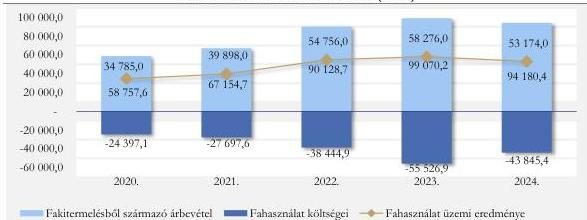

Forrás: Erdőgazdasági társaságok adatszolgáltatása alapján ÁSZ saját szerkesztés

Az erdőgazdasági társaságok faértékesítésének összes tényleges árbevétele – annak ellenére, hogy a fakitermelés mennyisége az erdőtervben meghatározott lehetőségektől és az éves növekmény mennyiségétől elmaradt – a piaci kereslet árfelhajtó hatásának köszönhetően 20,4 Mrd Ft-tal (2020-2024. évek összesített adatai alapján 5,2%-kal) tervezett meghaladta. Az egyes erdőgazdasági társaságok faértékesítésből elért árbevételét szemlélteti a 19. ábra.

19. ábra

# **A FAÉRTÉKESÍTÉS ÁRBEVÉTELÉNEK ALAKULÁSA ERDŐGAZDASÁGI TÁRSASÁGOK SZERINT A 2020-2024. ÉVEKBEN (MFT)**

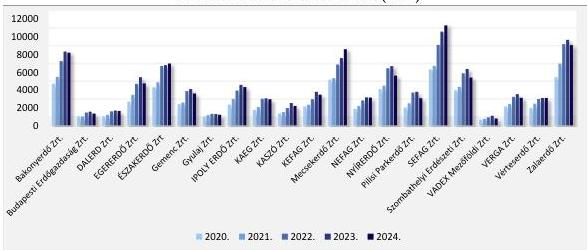

Forrás: Erdőgazdasági társaságok adatszolgáltatása alapján ÁSZ saját szerkesztés

Az erdőgazdasági társaságok által értékesített fa mennyiségén belül az exportált fa mennyisége a 2024. évben volt a legmagasabb arányú az összes értékesítésen belül (10,0%), míg az exportból elért árbevétel a faértékesítés 13,5%-át tette ki.

23

---

Az ellenőrzés eredményei

Az erdőgazdasági társaságok faértékesítésből származó bevételeit, a fahasználat üzemi eredményét az ellenőrzött időszakban befolyásolták az általuk kezelt erdők nagysága, az erdők fafaj összetétele és a piaci lehetőségeik.

Az erdőgazdasági társaságok fahasználatból származó üzemi eredménye fedezetet biztosított a közjóléti, ökoturisztikai szolgáltatások biztosítására, az erdőkárok megelőzését és a keletkezett károk helyreállítását szolgáló, jövőbeni költségek fedezetét biztosítani hivatott céltartalékok képzésére, az erdőművelési feladatokra, valamint az erdőgazdasági társaságok működtetésére is.

A hazai erdők megóvása szempontjából lényeges, hogy a hazai erdők becsült élőfa-készlete a 2020. évi 399,0 millió köbméterről 2023-ra 13,5 millió köbméterrel, az erdőgazdasági társaságok által kezelt erdők esetében a 2020. évi 211,7 millió köbméterről 5,2 millió köbméterrel 216,2 millió köbméterre növekedett 2023-ra. A rendelkezésre álló adatok szerint az erdőgazdasági társaságok által kezelt erdők élőfa-készlete 2024-re 218,9 köbméterre emelkedett. A hazai erdők éves folyónövedéke mintegy 13 millió köbméter, melynek – az élőfa-készlethez hasonlóan – közel fele (6,3-6,4 millió köbméter) az erdőgazdasági társaságok által kezelt erdőkben keletkezett.

A faállománnyal borított erdőgazdálkodási célú erdőterületek nagysága a 2020. évi 1875,9 ezer hektárról 9,3 ezer hektárral (1882,1 ezer hektárra) növekedett. Korosztályok szerinti összetételét tekintve a hazai faállománnyal borított erdőgazdálkodási célú erdőterületek az alábbi 20. ábra szerint alakultak.

20. ábra

#### HAZAI ERDŐGAZDÁLKODÁSI CÉLÚ ERDŐTERÜLETEK NAGYSÁGÁNAK VÁLTOZÁSA KOROSZTÁLY SZERINT A 2020-2024. ÉVEK KÖZÖTT (HEKTÁR)

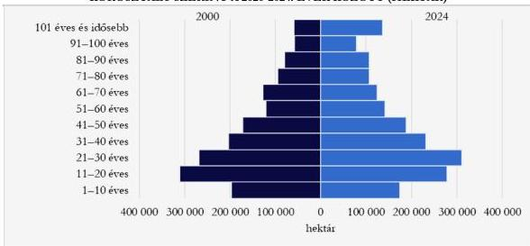

Forrás: KSH STADAT 15.1.1.6 tábla alapján ÁSZ saját szerkesztés

A fiatalabb (1-10 és 11-20 éves) korosztályú erdők területe 2000-2024 között csökkent és esetükben még várható nevelési célú fakitermelés, vagyis az idő előrehaladtával egyre kisebb területű erdő kerül át a következő korosztályba. Ezért fennáll annak a kockázata, hogy a jelenlegi fiatalabb korosztályú erdők idősebb korosztályba kerülésével azok területe csökken és a kitermelhető, valamint felújítandó erdőterületek tekintetében aránytalanságot okoz.

Az erdők nemcsak kitettek a klímaváltozás hatásainak, hanem fontos részei a klímavédelemnek is. A fotoszintézis révén a levegő szén-dioxid tartalmának megkötésével hozzájárulnak a levegő

24

---

Az ellenőrzés eredményei

tisztaságához, a szén-dioxid, mint ÜHG$^{6}$ klímaváltozásra gyakorolt hatásának csökkentéséhez. A hazai erdők – a szakirodalomban rögzített módszertanok és az ellenőrzési bizonyítékok alapján – az ÁSZ becslése szerint megközelítőleg 400-450 millió tonna szén-dioxidot kötöttek meg élőfa-készletükben, az éves folyónövedék pedig évente 11,3 millió tonna szén-dioxid megkötését jelentette. Figyelembe véve, hogy az erdőgazdasági társaságok kezelésében lévő erdők élőfa-készlete megközelítőleg fele a hazai erdőkének, a szén-dioxid megkötésben is megközelítőleg 50%-os súllyal rendelkeznek.

Az erdőgazdasági társaságok által kezelt erdők éves folyónövedékében – megközelítőleg 6,4 millió köbméter – megkötött szén-dioxid értéke figyelembe véve a szén-dioxid kvóta árfolyamát (euró/tonna) a szén-dioxid piacon és az euró/forint árfolyamot, 2025. január 2-i árfolyamokkal számolva megközelítőleg 178 072,1 MFt-nak felelt meg.

Az erdőgazdasági társaságok által kitermelt fa mennyisége összességében nem érte el sem az erdőtervben meghatározott fakitermelési lehetőséget, sem az éves folyónövedék nagyságát. A lehetőségektől elmaradó fakitermelés kockázatot hordoz magában, mivel a faállomány megfelelő fafajösszetételének és szerkezetének kialakítását szolgáló ápoló vágások, erdőnevelési célú fakitermelések elmaradása az erdők természetes védekezési folyamatait gyengíthetik, kitetté válhatnak a szélsőséges időjárási viszonyokkal (pl. viharok, jég) szemben. Ezt a fakitermelési arányt szemlélteti a 21. ábra.

21. ábra

# **BRUTTÓ FAKITERMELÉS ÉS FAKITERMELÉSI LEHETŐSÉG AZ ERDŐTERV ÉS FOLYÓNÖVEDÉK ALAPJÁN 2020-2024. ÉVEKBEN ÉS 2025. I. FÉLÉVBEN (EZER KÖBMÉTER)**

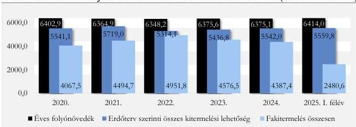

Forrás: Erdőgazdasági társaságok adatszolgáltatása alapján ÁSZ saját szerkesztés

Megjegyzés: a 2025. év vonatkozásában az üzemterv szerinti összes kitermelhetőségi lehetőség és a folyó növedék az év egészére vonatkozik, míg a bruttó fakitermelés 2025. június 30-ig kitermelt fa mennyiségét tartalmazza.

A fakitermelés bruttó fatömegének és a folyónövedék arányának maximális értéke az ellenőrzött időszakban három erdőgazdaság esetében (a Bakonyerdő Zrt.-nél 2022-2024. években, a Szombathelyi Erdőgazdaság Zrt.-nél a 2022. évben és a VERGA Zrt.-nél 2022-ben és 2023-ban) haladta meg a 100%-ot.

A folyónövedék mennyiségét meghaladó mértékű fakitermelés megvalósulásának évében a három erdőgazdasági társaság esetében az érintett erdőrészletek élőfa-készlete minimálisan csökkent. A csökkenés az erdőterület változásával nem járt.

25

---

Az ellenőrzés eredményei

### 1.3. számú megállapítás

Az erdőgazdasági társaságok belső szabályzataikban az erdőkárok megelőzése és helyreállítása érdekében azok jövőbeni várható költségeire a Számv. tv. előírásaival összhangban céltartalék képzési kötelezettséget határoztak meg. A céltartalékképzése és felhasználása során a Számv. tv.-ben és a számviteli szabályzataikban foglaltakat betartották. A céltartalékok (mint saját forrás) és pályázati források célszerinti felhasználásával megtették a szükséges intézkedéseket az erdőkárok megelőzése és a károk helyreállítása érdekében. Intézkedésekkel támogatták a kezelésükben lévő erdők egészségének megóvását, a fenntartható erdőgazdálkodás megvalósítását.

A KSH adatai szerint 2020-ban a 2054,3 ezer hektár erdőgazdálkodási célú területből 82,9 ezer hektár, 2024-ben a 2075,6 ezer hektár erdőgazdálkodási célú területből 69,6 ezer hektár volt erdőkárral érintett. Az erdőkárral érintett erdőgazdálkodási célú erdőterületek alakulását károsítási csoportok szerint a 22. ábra szemlélteti:

22. ábra

#### ERDŐKÁROK A HAZAI ERDŐGAZDÁLKODÁSI CÉLÚ ERDŐTERÜLETEKEN KÁROSÍTÁSI CSOPORTOK SZERINT A 2020-2024. ÉVEKBEN (HEKTÁR)

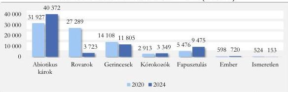

Forrás: KSH STADAT 15.1.1.12 tábla alapján ÁSZ saját szerkesztés

Az ábra alapján látható, hogy a legtöbb erdőgazdálkodási célú erdőterületet abiotikus károk érték. Az abiotikus károk jellemzően hirtelen, nagy területen fellépő károsodások, melyek közül a legnagyobb problémát évek óta a hosszabb ideig tartó szárazság okozta károk jelentették. Az elmúlt évszázadban gyűjtött adatok bizonyítják, hogy a klímaváltozás hatására az átlaghőmérséklet megemelkedett, az éves csapadékmennyiség csökkent és az eloszlása is szélsőségesebb volt. A csapadékhiány mellett a légköri aszály is jellemzővé vált. Az abiotikus károkkal érintett területek az ellenőrzött időszakban 26,5%-kal növekedtek.

Az erdőgazdasági társaságok az erdőket érintő várható, lehetséges károsításokról, azok bekövetkezésének valószínűségéről – az AM és a Soproni egyetem keretei között – készített éves előrejelzéseket is figyelembe véve hozták meg döntéseiket az általuk kezelt területeket érintő erdőkárok megelőzése, illetve az erdőkárok következtében szükséges helyreállítási feladatok ellátása érdekében.

Az ellenőrzött időszakban az erdőgazdasági társaságok kezelésében lévő erdősítésekben mind a terület, mind a faállomány mennyiségét tekintve a biotikus és abiotikus károsítások együttesen növekvő tendenciát mutattak. Az erdőgazdasági társaságok kezelésében lévő erdősítésekben keletkezett biotikus és abiotikus károkkal érintett területek és faállomány mennyiségének alakulását az ellenőrzött időszakban a 23. ábra szemlélteti.

26

---

Az ellenőrzés eredményei

23. ábra

# **BIOTIKUS ÉS ABIOTIKUS KÁROSÍTÁSOK AZ ERDŐGAZDASÁGI TÁRSASÁGOK KEZELÉSÉBEN LÉVŐ ERDŐSÍTÉSEKBEN AZ ERDŐGAZDASÁGI TÁRSASÁGOK TÁJEGYSÉGI ELHELYEZKEDÉSE SZERINT A 2020-2024. ÉVEKBEN (HEKTÁR, KÖBMÉTER)**

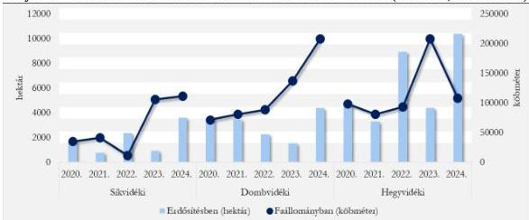

Forrás: Erdőgazdasági társaságok adatszolgáltatása alapján ÁSZ saját szerkesztés

Az erdőkárok megelőzésével és helyreállításával kapcsolatos feladatok végrehajtása érdekében az erdőgazdasági társaságok részére az ellenőrzött időszakban saját és pályázati források álltak rendelkezésre.

Az erdőgazdasági társaságok által erdőkár megelőzésre és helyreállításra felhasznált források, ezen belül a **céltartalékok képzésének és felhasználásának szabályait az erdőgazdasági társaságok elsősorban számviteli politikájukban és kapcsolódó szabályzataikban határozták meg.** A céltartalék képzés és felhasználás szabályait a Számv. tv. és az AM számviteli szabályzatokra vonatkozó iránymutatásainak megfelelően alakították ki.

**Az erdőkárok megelőzését és helyreállítását szolgáló céltartalékok képzése és felhasználása során a Számv. tv.-ben és a számviteli szabályzataikban (számviteli politika, számlarend, eszközök és források értékelési szabályzata) foglalt előírásokat betartották.** A céltartalékok képzéséről és felhasználásáról minden erdőgazdasági társaságnál vezetői döntések születtek. Az erdőket érő károk esetében a céltartalék képzést becsléssel, számításokkal alátámasztották, a céltartalék feloldására és felhasználására az elvégzett munkák figyelembevételével, a céloknak megfelelően, számviteli nyilvántartásokkal alátámasztva került sor.

Az erdőgazdasági társaságok a 2020. év elején összesen 4 185,7 MFt céltartalékkal rendelkeztek, mely 2024. év végére több, mint kétszeresére (9 827,7 MFt) emelkedett. A céltartalékképzés növekedését jellemzően az emelkedő mértékű természeti kár (aszály, jég, fapusztulás, rovarok) okozta. Az erdőgazdasági társaságok által képzett céltartalék és annak cél szerinti összetétele (kötelezettségre és költségre képzett céltartalék) alakulását a 24. ábra szemlélteti.

27

---

Az ellenőrzés eredményei

24. ábra

# **AZ ERDŐGAZDASÁGI TÁRSASÁGOK CÉLTARTALÉK ÁLLOMÁNYÁNAK ÉS CÉL SZERINTI ÖSSZETÉTELÉNEK ALAKULÁSA A 2020-2024. ÉVEK KÖZÖTT (MFT)**

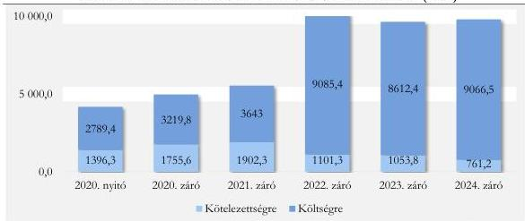

Forrás: Erdőgazdasági társaságok éves beszámolói alapján ÁSZ saját szerkesztés

A jövőbeni költségekre céltartalékot az erdőgazdasági társaságok a kezelésükben lévő erdőket, erdészeti létesítményeket és infrastruktúrát érő természeti károkra, illetve egyéb várható költségekre képeztek. A jövőbeni költségekre képzett céltartalékok állományának több, mint felét az erdőgazdasági társaságok az erdőket érő természeti károkkal kapcsolatosan képezték.

A 25. ábra alapján látható, hogy jellemzően a nagyobb erdőterületeket kezelő erdőgazdasági társaságok esetében fordult elő magasabb összegű természeti károkra képzett céltartalék.

25. ábra

# **AZ ERDŐGAZDASÁGI TÁRSASÁGOK ÁLTAL KEZELT ERDŐTERÜLETEK ÉS A TERMÉSZETI KÁROKRA KÉPZETT CÉLTARTALÉKOK 2024-BEN (HEKTÁR, MFT)**

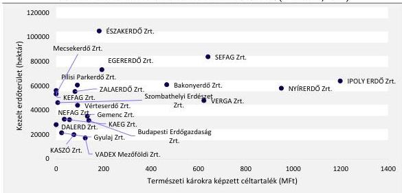

Forrás: Erdőgazdasági társaságok éves beszámolói és adatszolgáltatás alapján ÁSZ saját szerkesztés

A jövőbeni költségekre képzett céltartalékok további elemei is szoros kapcsolatban álltak az erdőgazdasági társaságok feladatellátásával, azonban azok túlnyomó részt közvetlenül nem az erdőket, hanem az erdőgazdasági társaságok infrastrukturális berendezéseit, ingatlanjait (épületek, feltáró utak, közjóléti

28

---

Az ellenőrzés eredményei

létesítmények, vadkár elhárító kerítések) és egyéb tevékenységeit (tűzifa programmal kapcsolatos többletköltségek, energia válság miatti kockázatok) érintették.

A saját források mellett az erdőgazdasági társaságok – európai uniós és hazai – **pályázati forrásokkal is rendelkeztek az erdőkárok megelőzése és az erdők állapotának helyreállítása érdekében.** Az erdők állapotának helyreállítását szolgáló pályázati támogatásokat az erdőgazdasági társaságok az erdőkárok helyreállítása érdekében tett intézkedések végrehajtását követően, a helyreállítással kapcsolatosan ténylegesen felmerült költségeik után igényelhették. A 2020-2024. években az erdőgazdasági társaságok összesen 3 369,4 MFt pályázati támogatásban részesültek, melyet a célkitűzéseikben és a támogatási szerződésekben meghatározottakra használtak fel. Az erdőgazdasági társaságok erdőkár megelőzésére és helyreállítására felhasznált pályázati forrásainak alakulását a 26. ábra szemlélteti.

26. ábra

### ERDŐKÁROK MEGELŐZÉSÉRE ÉS HELYREÁLLÍTÁSÁRA FELHASZNÁLT PÁLYÁZATI FORRÁSOK A 2020-2024. ÉVEKBEN (MFT)

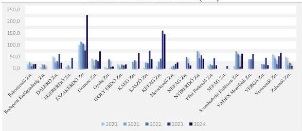

Forrás: Erdőgazdasági társaságok adatszolgáltatása alapján ÁSZ saját szerkesztés

2025. június 30-ig öt erdőgazdasági társaság (ÉSZAKERDŐ Zrt., KAEG Zrt., KEFAG Zrt., Pilisi Parkerdő Zrt. és a SEFAG Zrt.) nyújtott be pályázatot összesen 425,6 MFt értékben az erdőkben keletkezett károk helyreállítására, melyek elbírálása a jelzett időpontban folyamatban volt.

Az erdőgazdasági társaságok saját és pályázati források felhasználásával az erdőket ért károk helyreállítása érdekében szükséges intézkedéseket megtették, az intézkedéseket végrehajtották. A rendelkezésre álló források a feladatok ellátását biztosították.

29

---

Az ellenőrzés eredményei

## 2. Az erdőgazdasági társaságok hozzájárulása az erdők közjóléti funkciójának érvényesüléséhez, biztosítottságához

### Összegző megállapítás

Az erdőgazdasági társaságok közjóléti feladatokat növekvő mértékben láttak el. Társadalmi szemléletformálás támogatására erdei iskolát, tanösvényeket tartottak fenn. Az erdőpedagógiai foglalkozások száma és azon résztvevő tanulók száma dinamikusan nőtt. A szemléletformálást kiadványokkal, folyóiratokkal támogatták. A társadalmi szemléletformálás érdekében az erdőgazdasági társaságok egymással és más civil szervezetekkel együttműködtek, az erdőgazdasági társaságok közötti tudásátadás biztosított volt.

### 2.1. számú megállapítás

Az erdőgazdasági társaságok tevékenységükkel hozzájárultak a társadalom erdőkkel kapcsolatos szemléletformálásához. A tudományos kutatások és együttműködések szerepet játszottak a gazdálkodás fenntartható modelljének formálásában.

### ERDEI ISKOLÁK

Az **erdőgazdasági társaságok** – a Budapesti Erdőgazdaság Zrt. kivételével – a 2024. év végén **32 erdészeti erdei iskolát működtettek**. Az első erdészeti erdei iskolát a Pilisi Parkerdő Zrt. alapította 1988-ban. Az erdőgazdasági társaságok által működtetett erdei iskolák száma 2000-ig kilenccel, 2000 és 2010 között 11-gyel, majd 2010 után további 11-gyel növekedett. Az ellenőrzött időszakban utolsóként létrehozott erdei iskolát a Bakonyerdő Zrt. alapította 2022-ben. Az erdősültség regionális arányait és az adott régióban működő erdei iskolák számát a 27. ábra veti össze.

27. ábra

### AZ ERDÉSZETI ERDEI ISKOLÁK SZÁMA ÉS AZ ERDŐSÜLTSÉG ARÁNY RÉGIÓNKÉNT

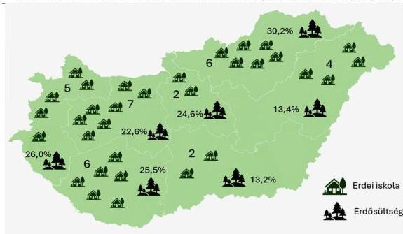

Forrás: Erdőgazdasági társaságok által kitöltött tanúsítványok alapján ÁSZ saját szerkesztés

30

---

Az ellenőrzés eredményei

**Az erdősültségi adatokhoz viszonyítva a magasabb erdősültséggel rendelkező régiókban az erdei iskolák száma** 5-7 db között mozgott, ez alól a Közép-Magyarországi régió a kivétel, mert ott a 24,6% erdősültséghez képest csak 2 db erdészeti erdei iskola található. A két Alföldi régióban, ahol csak 13,2%, illetve 13,4% az erdősültség aránya 2 db és 4 db erdészeti erdei iskola található.

Az Országos Erdészeti Egyesület besorolása* szerint az erdőgazdasági társaságok által működtetett erdei iskolák 65,6%-a (21 iskola) a legmagasabb „A” minősítéssel, 28,1%-a (9 iskola) „B”, míg 6,3%-a (kettő iskola) „C” minősítéssel rendelkezett. A Vérteserdő Zrt. által üzemeltetett erdészeti erdei iskola kivételével **az iskolák rendelkeztek Környezeti nevelési, oktatási programmal.**

Az erdei iskolák képzési napjai számának és az erdőpedagógiai foglalkozások éves számának alakulását a 28. ábra szemlélteti.

28. ábra

#### AZ ERDEI ISKOLÁK KÉPZÉSI NAPJAINAK SZÁMA ÖSSZESEN ÉS AZ ERDŐPEDAGÓGIAI FOGLALKOZÁSOK ÉVES SZÁMÁNAK ALAKULÁSA 2020-2024. KÖZÖTT

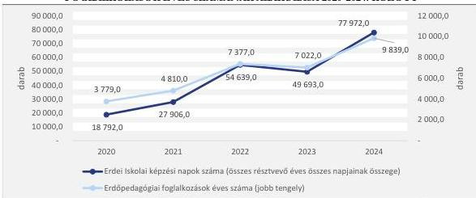

Forrás: Erdőgazdasági társaságok által kitöltött tanúsítványok alapján ÁSZ saját szerkesztés

Az erdészeti erdei iskolák által szervezett programok iránti társadalmi igény növekedését jelzi, hogy **az összesített képzési napok és foglalkozások száma a 2020-2024. évek között tendenciáját tekintve, az erdőpedagógiai foglalkozáson résztvevők száma pedig folyamatosan növekedett.** Kisebb visszaesés az összesített erdei iskolai képzési napok számában és az erdőpedagógiai foglalkozások számában a 2023. évben volt tapasztalható. A 2020. évről a 2024. évre az erdei képzési napok száma több, mint négyszeresére, az erdőpedagógiai foglalkozások éves száma több, mint kétszeresére, az erdőpedagógiai foglalkozáson résztvevők száma több, mint ötszörösére (2020. évi 27 873 főről 2024-re 148 711 főre) emelkedett. **Szemléletformálás, környezettudatosság tekintetében az erdei iskolák iránti növekvő társadalmi igényt az erdőgazdasági társaságok kielégítették, a növekvő részvétel tükrében az iskolák működtetése eredményes volt.**

**Az erdei iskolák** működtetésének költségei a 2020. évről a 2024. évre 68,4%-kal (372,2 MF-tal), bevételei 198,0%-kal (351,3 MF-tal) növekedtek. A működtetés költségei minden évben meghaladták a bevételeket, így pénzügyi szempontból **működésük veszteséges volt.**

* Az Országos Erdészeti Egyesület besorolása szerint a bentlakásos erdészeti erdei iskolák „A”, az oktatóhelyek „B”, illetve a hátizsákos erdészeti erdei iskolák „C” kategóriába kerültek besorolásra.

31

---

Az ellenőrzés eredményei

A 20 erdészet által működtetett erdei iskolák üzemi eredményének alakulását a 29. ábra szemlélteti.

29. ábra

### AZ ERDŐGAZDASÁGI TÁRSASÁGOK ERDÉSZETI ERDEI ISKOLÁI ÜZEMI EREDMÉNYÉNEK ALAKULÁSA 2020-2024 (MFT)

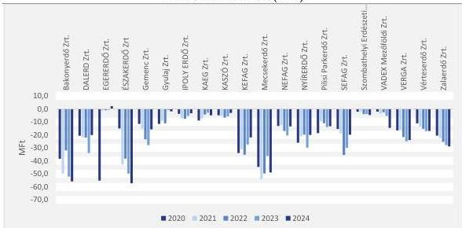

Forrás: Erdőgazdasági társaságok kontrolling táblái alapján ÁSZ saját szerkesztés

A legtöbb erdei iskolával a Bakonyerdő Zrt. (négy) az EGERERDŐ Zrt. (három) és a NYÍRERDŐ Zrt. (három) rendelkezett. Az erdei iskolák működtetésének üzemi eredménye egyedül az EGERERDŐ Zrt.-nél, a 2024. évben volt pozitív, 2,0 MFt nyereséggel.

Az erdészeti erdei iskolák részt vettek az „Iskolában az erdő” programban, amelynek keretében az erdőpedagógusok köznevelési intézményekben ismertették meg a tanulókat az erdő és a fenntarthatóság témakörével. A programot az Országos Erdészeti Egyesület koordinálta az Energiaügyi Minisztérium és az Agrárminisztérium támogatásával, finanszírozása az Európai Unió Emisszió-kereskedelmi rendszeréből (ETS rendszer) származó kvótabevételekből történt.

2020-tól 2025 I. félévig az erdőgazdasági társaságok ökoturisztikai beruházásokra 18 704,9 MFt-ot fordítottak, melynek 6,0%-át (1127,7 MFt-ot) használtak fel az erdei iskolákhoz kapcsolódó beruházásokra. A felhasznált források 20,3%-a saját, 48,9%-a központi költségvetési, 26,9%-a EU-s, 3,9%-a pedig egyéb forrásból származott.

32

---

Az ellenőrzés eredményei

## KIADVÁNYOK, SZEMLÉLETFORMÁLÁS

Az erdőgazdasági társaságok által kiadott társadalmi tudatosságot növelő kiadványok száma a 2020.

évi 45 darabról 2024-re 59 darabra, a társadalmi tudatosságot növelő rendezvények száma 296-ról 413-ra emelkedett. Az erdőgazdasági társaságok által szervezett – erdőről, természetvédelemről, biodiverzitásról és az erdészeti munkáról szóló – erdészeti oktatási programok száma folyamatosan, 385-ről 776-ra növekedett a 2020. és a 2024. év között, ezirányú tevékenységük intenzívebbé vált.

Az erdészeti erdei iskolák mellett a környezettudatosító, szemléletformáló tevékenység fontos részét képezték a tanösvények, lombkorona sétányok. Tanösvénnyel valamennyi erdőgazdaság rendelkezett. Az erdőgazdasági társaságok által üzemeltetett 156 tanösvényen összesen 1724 információs tábla található (30 ábra). A legtöbb, 24 tanösvénnyel a Pilisi Parkerdő Zrt. rendelkezett. A tanösvényeken elhelyezett információs táblák a helyi élővilágról, környezetről, az erdészek munkájáról, valamint a vadgazdálkodásról adtak információt.

30. ábra

### AZ ERDŐGAZDASÁGI TÁRSASÁGOK TERÜLETÉN KIALAKÍTOTT TANÖSVÉNYEK SZÁMA ÉS A TANÖSVÉNYEKEN ELHELYEZETT ÁLLOMÁSOK, INFORMÁCIÓS TÁBLÁK SZÁMA 2024-BEN

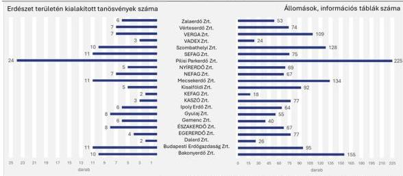

Forrás: Erdőgazdasági társaságok által kitöltött tanúsítványok alapján ÁSZ saját szerkesztés

Lombkorona sétánnyal kilenc erdőgazdasági társaság rendelkezett, melyeken a kihelyezett információs táblák száma 97 volt. Az információs táblák a helyi erdők élővilágát mutatták be, kiemelve a lombkoronaszint élővilágát. Az információs táblák hozzájárultak a tanösvények és lombkorona sétányok látogatói erdőkkel és az erdők élővilágára vonatkozó ismereteinek bővítéséhez.

Az erdőgazdasági társaságok civil szervezetekkel történő együttműködésükkel kapcsolatban összesen 810 megállapodást kötöttek. A megállapodások tematikájának középpontjában a képzés, a

33

---

Az ellenőrzés eredményei

szemléletformálás, környezetvédelem és túrázás állt. **Jelentősebb partnereik a Magyar Természetjáró Szövetség és az Országos Erdészeti Egyesület volt. A Magyar Természetjáró Szövetséggel 19, az Országos Erdészeti Egyesülettel 20 erdőgazdaság kötött megállapodást.** Ezen túl 16 alapítvánnyal és 42 egyesülettel működtek együtt. Összesen 46 megállapodást kötöttek egyetemekkel, melyből 34 megállapodás képzésre, hét megállapodás szemléletformálásra irányult, hét megállapodást egyéb feladatokra kötöttek. Szakmai gyakorlat biztosítására szakképző intézményekkel működtek együtt.

A 2024. évben valamennyi erdőgazdasági társaság több országos erdészeti szakmai rendezvényen vett részt, mint a 2020. évben. A részvételi napok száma összességében a 2020. évi 816-ról 2024-re 2723-ra emelkedett, míg a legtöbb részvételi nap – 3616 nap – a 2022. évben volt.

Az ellenőrzött időszakban 14 erdőgazdasági társaság vett részt 2020-ban összesen 21, 2024-ben már 41 kutatási projektben. A további hét erdőgazdaság közül három munkavállalója tudományos – doktori vagy más kutatási – tevékenységet végzett. A kutatások többek között az erdőállományok és a klímaváltozás hatásaival – mint például az aszály és a vízhiány okozta helyzetek – szembeni ellenállóképesség fokozásának, az erdőgazdálkodási módszerek változtatási és a fafajok diverzifikációjának lehetőségeit vizsgálták. A kutatások szükségességét jelezte, hogy a klímaváltozással kapcsolatos magyarországi tapasztalatok hiányoztak, továbbá az erdőgazdálkodási módszerek kialakítása is folyamatos kutatást igényelt. különböző erdészeti tevékenységi üzletágak fejlesztéséhez, a fenntartható gazdálkodáshoz fűződő ismeretek bővítéséhez.

Az erdőgazdasági társaságok kutatási projektekben történő részvételét a 31. ábra szemlélteti.

31. ábra

#### A TÁRSASÁGOK KUTATÁSI PROJEKTEKBEN TÖRTÉNT RÉSZVÉTELE (2020-2024.)

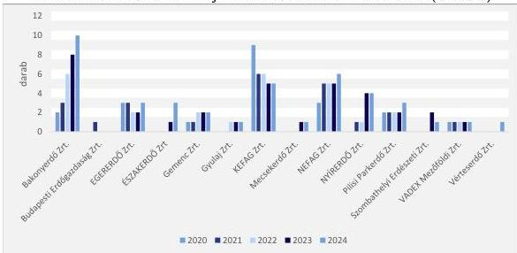

Forrás: Erdőgazdasági társaságok által kitöltött tanúsítványok alapján ÁSZ saját szerkesztés

34

---

Az ellenőrzés eredményei

# 2.2. számú megállapítás

Az erdők közjóléti funkciói iránti emelkedő társadalmi igényt az erdőgazdasági társaságok az ellenőrzött időszakban összességében kismértékben bővülő infrastruktúrával elégítették ki. Az erdei közjóléti létesítmények, berendezések üzemeltetésével az erdőgazdasági társaságok hozzájárultak a társadalmi elvárások kielégítéséhez.

# **SZÁLLÁSIGÉNY NÉLKÜL IGÉNYBEVEHETŐ SZOLGÁLTATÁSOK**

Az ellenőrzött időszakban az erdőgazdasági társaságok erdei kilátókat, erdei játszótereket, erdei kisvasutakat, vadasparkokat, arborétumokat működtettek (2. táblázat).

2. táblázat

# **ERDEI LÉTESÍTMÉNYEK, BERENDEZÉSEK SZÁMÁNAK VÁLTOZÁSA (2020. ÉS 2024. ÉV, DB)**

|   | 2020. ÉVBEN | 2024. ÉVBEN  |
| --- | --- | --- |
|  Kilátók száma | 70 | 68  |
|  Játszóterek száma | 92 | 103  |
|  Kisvasutak száma | 13 | 12  |
|  Vadasparkok, arborétumok száma | 23 | 24  |

Forrás: Erdőgazdasági társaságok adatszolgáltatása alapján ÁSZ saját szerkesztés

Az erdőgazdasági társaságok által a 2024. évben üzemeltetett erdei létesítmények, berendezések számának alakulását erdőgazdaságonként a 3. táblázat szemlélteti.

3. táblázat

# **ERDEI LÉTESÍTMÉNYEK, BERENDEZÉSEK SZÁMA 2024 (DB)**

|   | KILÁTÓK | JÁTSZÓTEREK | KISVASUTAK | VADASPARKOK, ARBORÉTUMOK | ÖSSZESEN  |
| --- | --- | --- | --- | --- | --- |
|  Pilisi Parkerdő Zrt. | 12 | 18 | 0 | 4 | 34  |
|  Ipoly Erdő Zrt. | 6 | 14 | 3 | 2 | 25  |
|  Bakonyerdő Zrt. | 12 | 8 | 0 | 2 | 22  |
|  VERGA Zrt. | 11 | 7 | 0 | 0 | 18  |
|  EGERERDŐ Zrt. | 0 | 9 | 3 | 0 | 12  |
|  SEFAG Zrt. | 4 | 6 | 0 | 2 | 12  |
|  Gemenc Zrt. | 1 | 7 | 1 | 1 | 10  |
|  NYÍRERDŐ Zrt. | 2 | 7 | 0 | 1 | 10  |
|  Zalaerdő Zrt. | 2 | 5 | 1 | 2 | 10  |
|  KEFAG Zrt. | 3 | 5 | 0 | 1 | 9  |
|  Gyulaj Zrt. | 3 | 3 | 0 | 2 | 8  |
|  ÉSZAKERDŐ Zrt. | 3 | 1 | 2 | 0 | 6  |
|  Mecsekerdő Zrt. | 2 | 3 | 1 | 0 | 6  |
|  NEFAG Zrt. | 0 | 3 | 0 | 2 | 5  |
|  Szombathelyi Zrt. | 2 | 2 | 0 | 1 | 5  |

35

---

Az ellenőrzés eredményei

|   | KILÁTÓK | JÁTSZÓTEREK | KISVASUTAK | VADASPARKOK, ARBORÉTUMOK | ÖSSZESEN  |
| --- | --- | --- | --- | --- | --- |
|  VADEX Mezőföldi Zrt. | 2 | 1 | 0 | 1 | 4  |
|  KASZÓ Zrt. | 0 | 1 | 1 | 1 | 3  |
|  Vérteserdő Zrt. | 2 | 0 | 0 | 1 | 3  |
|  Budapesti Zrt. | 1 | 0 | 0 | 1 | 2  |
|  Kisalföldi Zrt. | 0 | 2 | 0 | 0 | 2  |
|  DALERD Zrt. | 0 | 1 | 0 | 0 | 1  |
|  **ÖSSZESEN** | **68** | **103** | **12** | **24** | **207**  |

Forrás: Erdőgazdasági társaságok adatszolgáltatása alapján ÁSZ saját szerkesztés

Az erdőgazdasági társaságok mindegyike rendelkezett legalább egy erdei létesítménnyel, berendezéssel. Az erdőgazdasági társaságok közül kiemelkedett a Pilisi Parkerdő Zrt., ahol a legtöbb kilátó, játszótér, vadaspark és arborétum volt. A főváros vonzáskörzetében az egy létesítményre eső látogatószám szintén a Pilisi Parkerdő Zrt.-nél volt a legmagasabb, mely tény tükröződött a társaság üzletágakra vetített költségeiben is.

**Kezelt turistautak** hossza tekintetében a 2020. évre vonatkozó adatokkal három erdőgazdasági társaság nem rendelkezett. A 2024. évben az erdőgazdasági társaságok által kezelt turistautak hossza 5024,2 kilométer, amelyből a kék-túra útvonalak hossza 15,3%, összesen 768,1 kilométer volt. Az erdőgazdasági társaságok a turistaútvonalak karbantartásába önkénteseket és civil szervezeteket is bevontak.

## ERDEI KISVASUTAK

A 2020. évben 13 erdei kisvasút működött nyolc erdőgazdasági társaság (EGERERDŐ Zrt., ÉSZAKERDŐ Zrt., Gemenc Zrt., Ipoly Erdő Zrt., KASZÓ Zrt., Mecsekerdő Zrt., SEFAG Zrt., Zalaerdő Zrt.) üzemeltetésében. Az erdei vasutak hossza a 2020. évben összesen 227 km volt. A SEFAG Zrt. az általa üzemeltett erdei vasút (hét km) állapotát balesetveszélyesnek ítélte, ezért 2021-től a felújításáig zárva tartásáról döntött. Az erdei vasutak erdőgazdasági társaságonként eltérő hosszúságúak, felét – 109 km – a Zalaerdő Zrt. üzemeltette.

Az utasok száma a 2020. évi 741 923 főről a 2024. évre (5,8%-kal) 784 904 főre emelkedett. Az egy erdei vasútra jutó éves átlagos utasszámot a 2020. és a 2024. évben a 32. ábra szemlélteti.

36

---

Az ellenőrzés eredményei

32. ábra

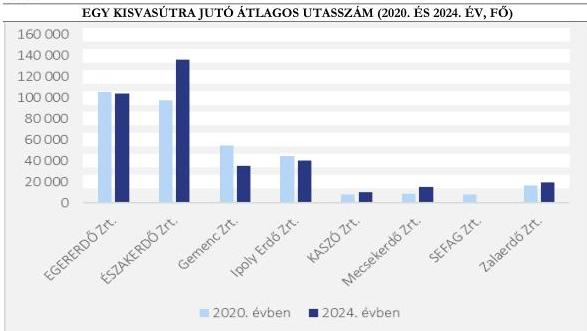

Forrás: Erdőgazdasági társaságok adatszolgáltatása alapján ÁSZ saját szerkesztés

Az erdei vasutak üzemeltetése hét erdőgazdasági társaság esetében veszteséges volt, **az EGERERDŐ Zrt. azonban a 2022. év kivételével pozitív üzemi eredménnyel végezte ezt a tevékenységet.** Az EGERERDŐ Zrt. által üzemeltetett három erdei vasút egy szervezeti egységet képzett. Pályázati források felhasználásával pályafelújításokat hajtottak végre, új, korszerű mozdonyok beszerzésével csökkentették az üzemeltetési és karbantartási költségeket, és ez hozzájárult az üzemi eredmény javításához.

A 2020-2024. évek között 14 erdőgazdasági társaság összesen 23 vadasparkot, arborétumot működtetett. **A vadasparkok, arborétumok iránti társadalmi igény növekedését** jelezte, hogy a látogatók száma a 2020. évi 466 543 főről a 2024. évre 18,6%-kal (553 102 főre) emelkedett, erdőgazdasági társaságonkénti alakulását a 33. ábra mutatja be.

37

---

Az ellenőrzés eredményei

33. ábra

# **EGY ARBORÉTUMRA, VADASPARKRA JUTÓ LÁTOGATÓK SZÁMA ERDŐGAZDASÁGI TÁRSASÁGONKÉNT A 2020. ÉS A 2024. ÉVBEN (EGY ARBORÉTUM, VADASPARK/LÁTOGATÓK SZÁMA, FŐ)**

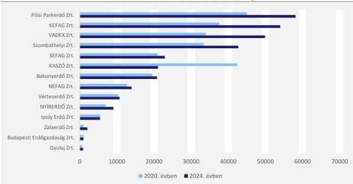

Forrás: Erdőgazdasági társaságok adatszolgáltatása alapján ÁSZ saját szerkesztés

Az erdők egyes területeinek, létesítményeinek becsült látogatottságát a következő 34. ábra szemlélteti.

Jó gyakorlatként azonosítottuk, hogy az erdők egyes területeinek, létesítményeinek látogatottságáról 12 erdőgazdaság rendelkezett adatokkal, becslésekkel. (Bakonyerdő Zrt., Budapesti Erdőgazdaság Zrt., ÉSZAKERDŐ Zrt., Gyulaj Zrt., IPOLY ERDŐ Zrt., KASZÓ Zrt., NEFAG Zrt., NYÍRERDŐ Zrt., Pilisi Parkerdő Zrt., SEFAG Zrt., VADEX Mezőföldi Zrt., VERGA Zrt.)

34. ábra

# **LÁTOGATÓK BECSÜLT SZÁMA (2020. ÉS 2024. ÉV, FŐ)**

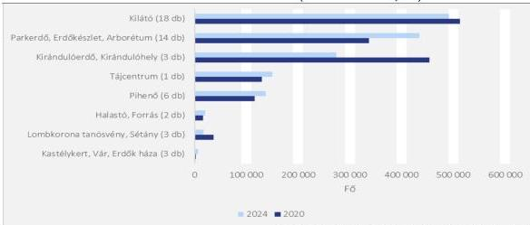

Forrás: erdőgazdasági társaságok adatszolgáltatása alapján ÁSZ saját szerkesztés

Megjegyzés: Az ellenőrzés során azokat az adatokat vettük figyelembe, amelyek mind 2020-ra, mind 2024-re rendelkezésre álltak.

38

---

Az ellenőrzés eredményei

A kilátók látogatottsága az ellenőrzött időszakban 4,1%-kal, 21 202 fővel csökkent. A parkerdei területek, erdőkészletek és az arborétumok látogatottsága 29,0%-kal (97 702 fővel), a tájcentrumoké 13,7%-kal (20 000fővel) nőtt. A kirándulóerdők és kirándulóhelyek látogatottsága 39,8%-os (180 478 fő) visszaesést mutatott. A pihenőhelyek esetében a látogatószám 18,7%-kal (21 635 fővel), a halastó és forrás forgalma 23,1%-kal (3788 fővel) volt magasabb 2024-ben a 2020. évhez viszonyítva. A lombkorona tanösvények és sétányok látogatottsága 51,1%-kal (18 743 fővel) csökkent. A kastélykert, vár, és Erdők Háza kategóriában 168,3%-os (4012 fő) növekedés volt megfigyelhető.

## SZÁLLÁSHELYEK

Az erdőgazdasági társaságok által üzemeltetett **szálláshelyek és a szálláshelyeken biztosított férőhelyek** (35. ábra) száma a kulcsosházak, turistaházak, faházak, mint szálláshelyek esetében növekedett, a stratégiai célkitűzésekkel és a támogatási prioritásokkal összhangban.

35. ábra

### ÜZEMELTETETT SZÁLLÁSOKON BÍZTOSÍTOTT SZÁLLÁSHELYEK, ÉS FÉRŐHELYEK SZÁMÁNAK VÁLTOZÁSA (2020. ÉS 2024. ÉV)

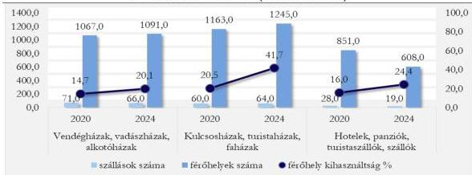

Forrás: Erdőgazdasági társaságok adatszolgáltatása alapján ÁSZ saját szerkesztés

A kulcsosházak, turistaházak, faházak száma és a férőhelyek száma is növekedett. Négy erdőgazdaság új egységeket létesített. Két erdőgazdaság (Mecsekerdő Zrt. Pilisi Parkerdő Zrt.) 28 férőhelyet megszüntetett, továbbá egy erdőgazdaság (VERGA Zrt.) kettő férőhelyet bővített.

Az erdőgazdasági társaságok által üzemeltetett szálláshelyeken a vendégéjszakák száma a 2020. évi 53 126 vendégéjszakáról 88 656 vendégéjszakára (67%-kal) növekedett az ellenőrzött időszakban. Ugyanebben az időszakban a szálláshelyek összes férőhelyeinek száma 2020-ban 3 081 férőhely volt, ami 2024-re 2 944 férőhelyre csökkent. A két mutató ellentétes irányú változása a férőhelykihasználtság javulását jelezte.

A vendégéjszakák és a férőhelyek számának hányadosa a férőhely-kapacitás időbeli változását jellemezte. A 2020-as évről 2024-es évre, a vendégházak, vadászházak, alkotóházak átlagos férőhely-kihasználtsága 36%-kal, hotelek, panziók, turistaszállók, szállók 53%-kal és a kulcsosházak, turistaházak, faházak 105%-kal növekedett.

A szálláshelyek kihasználtságát az erdőgazdasági társaságok 2020-as és 2024-es adatai alapján vizsgáltuk. A számított mutató az egy évre vetített férőhely-kihasználtságot fejezte ki (36. ábra), vagyis azt, hogy a rendelkezésre álló kapacitást az év folyamán milyen arányban vették igénybe. Az eredmény százalékos formában mutatta meg, hogy a szálláshelyek férőhelyei az év során átlagosan milyen mértékben hasznosultak. A 21 erdőgazdaságból 20 esetében történt növekedés.

39

---

Az ellenőrzés eredményei

36. ábra

# **TELJES ÉVRE VETÍTETT FÉRŐHELY-KIHASZNÁLTSÁG (2020. ÉS 2024. ÉV, %)**

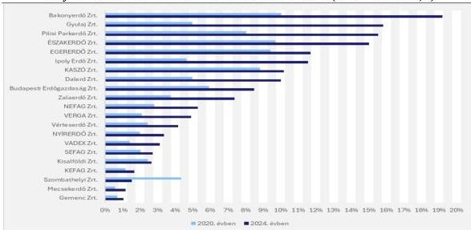

Forrás: Erdőgazdasági társaságok adatszolgáltatása alapján ÁSZ saját szerkesztés

# **KÖZJÓLÉTI FUNKCIÓK KÖLTSÉGEINEK FEDEZETE**

Az erdőgazdasági társaságok 2020-2024 között az ökoturisztikai feladatellátásával kapcsolatos bevételei nem nyújtottak fedezetet a feladatellátás költségeire. Az ökoturisztikai feladatellátás bevételeit és költségeit szemlélteti a 37. ábra.

37. ábra

# **AZ ERDŐGAZDASÁGI TÁRSASÁGOK ÖKOTURISZTIKAI FELADATELLÁSÁNAK BEVÉTELEI ÉS KÖLTSÉGEI (2020-2024. ÉVEK ÉS 2025. I. FÉLÉV, MFT)**

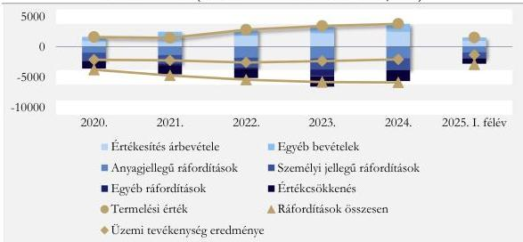

Forrás: Erdőgazdasági társaságok adatszolgáltatása alapján ÁSZ saját szerkesztés

Az ökoturisztikai feladatok ellátásának forrásait az erdőgazdasági társaságok elsődlegesen az erdőgazdálkodás, azon belül is a fahasználati ágazatból származó üzemi eredményéből biztosították. Az ökoturisztikai feladatellátás keretében működtetett közjóléti berendezések bruttó értéke az erdei vasutak

40

---

Az ellenőrzés eredményei

és erdei iskolák pályázati forrásokból történő felújításának hatására a 2024. évre 39,9%-kal emelkedett. A közjóléti berendezések bruttó és nettó értékének alakulását szemlélteti a 38 ábra.

38. ábra

### ERDŐGAZDASÁGI TÁRSASÁGOK KÖZJÓLÉTI ESZKÖZEINEK ÉS BERENDEZÉSEINEK ÉRTÉKE (2020-2024. ÉVEK, MFT)

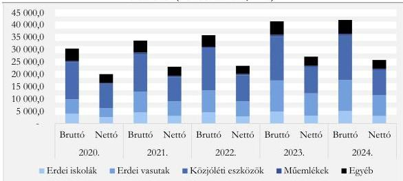

Forrás: Erdőgazdasági társaságok adatszolgáltatása alapján ÁSZ saját szerkesztés

Az eszközök és berendezések használhatóságának egyik fontos mutatószáma azok használhatósági foka, mely a 2021. évben volt a legmagasabb (75,8%) és a 2024. évben a legalacsonyabb (60,7%). A közjóléti eszközök és berendezések használhatósági fokát eszköztípusonként a 39. ábra szemlélteti.

39. ábra

### AZ ERDŐGAZDASÁGI TÁRSASÁGOK KÖZJÓLÉTI ESZKÖZEINEK, BERENDEZÉSEINEK HASZNÁLHATÓSÁGI FOKA (2020-2024. ÉVEK, %)

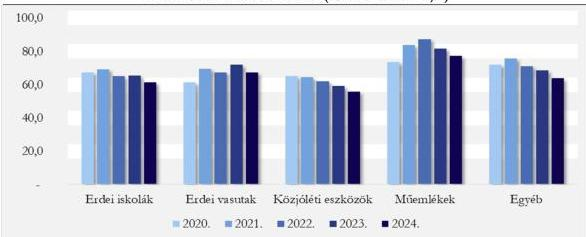

Forrás: Erdőgazdasági társaságok adatszolgáltatása alapján ÁSZ saját szerkesztés

Az ábra alapján is látható, hogy a felújításoknak köszönhetően 2021-2023. években az egyes eszköztípusok esetében javult a használhatósági fok. Összességében azonban a használhatósági fok csökkenése – a felújítások, pótlások esetleges elmaradása – miatt fennáll a kockázat, hogy a jövőben a társadalom ökoturisztikai szolgáltatásokkal szembeni fokozott igényeinek kielégítésére korlátozottan kerül sor, és a következő években növekvő terhet ró az erdőgazdasági társaságokra.

41

---

# JAVASLATOK

Az ÁSZ tv. 33. § (1) bekezdésében foglaltak értelmében az ellenőrzött szervezet vezetője köteles a jelentésben foglalt megállapításokhoz kapcsolódó intézkedési tervet összeállítani és azt a jelentés kézhezvételétől számított 30 napon belül az ÁSZ részére megküldeni. Az ÁSZ a jelentésben foglalt megállapításokhoz kapcsolódóan az alábbi javaslatok tekintetében várja el az intézkedési terv elkészítését.

## 21 ERDŐGAZDASÁGI TÁRSASÁG VEZÉRIGAZGATÓJA RÉSZÉRE

1. A helyi sajátosságokat figyelembe véve tegyen lépéseket a lakossági szemléletformálás programjainak szélesítésére, a felnőtt lakosság informálására az ökológiai-éghajlati változások erdei környezetet érintő hatásairól, az azokra adható erdőgazdálkodási válaszreakciókról.
2. Dolgozzon ki terveket arra vonatkozóan, hogy hogyan lehet reagálni különböző környezeti változásokat tükröző forgatókönyvek esetén, többek között olyan esetben, ha a faültetési arányok elmaradnak a tervezettől.
3. Gondoskodjon a közjóléti funkciót biztosító infrastruktúra állapotának folyamatos monitorozásáról és annak naprakész nyilvántartásáról, továbbá szükség szerinti karbantartásáról és fejlesztéséről a hosszú távú fenntarthatósági szempontok figyelembevételével.
4. Folyamatosan gyűjtse és kövesse nyomon az illegális hulladék elhelyezéséről becsült adatokat. Az illegális hulladék elhelyezés visszaszorítása érdekében térképezze fel a beavatkozás további lehetséges eszközeit és tegye meg a szükséges intézkedéseket.

42

---

# I. FÜGGELÉK: ÉSZREVÉTELEK

A jelentéstervezetet az ÁSZ 15 napos észrevételezésre megküldte az ellenőrzött szervezet vezetőjének az ÁSZ tv. 29. §* (1) bekezdése előírásának megfelelően.

A jelentéstervezet megállapításaira a 21 ellenőrzött szervezet közül 12 szervezet vezetője nem tett észrevételt. Hat ellenőrzött szervezet vezetője – Bakonyerdő Erdészeti és Faipari Zártkörűen Működő Részvénytársaság, DALERD Délalföldi Erdészeti Zártkörűen Működő Részvénytársaság, ÉSZAKERDŐ Erdőgazdasági Zártkörűen Működő Részvénytársaság, IPOLY ERDŐ Zártkörűen Működő Részvénytársaság, NEFAG Nagykunsági Erdészeti és Faipari Zártkörűen Működő Részvénytársaság, Szombathelyi Erdészeti Zártkörűen Működő Részvénytársaság – nemleges észrevételt tett.

A Budapesti Erdőgazdaság Zártkörűen Működő Részvénytársaság, a Kisalföldi Erdőgazdaság Zártkörűen Működő Részvénytársaság, a VERGA Veszprémi Erdőgazdaság Zártkörűen Működő Részvénytársaság vezetőjének észrevételeit az ÁSZ elfogadta, a számvevőszéki jelentés véglegesítése során figyelembe vette.

* 29. § (1) Az Állami Számvevőszék az ellenőrzési megállapításait megküldi az ellenőrzött szervezet vezetőjének vagy az általa megbízott személynek, és annak, akinek személyes felelősségét állapította meg.

(2) Az ellenőrzött szervezet vezetője és a felelősként megjelölt személy az ellenőrzés megállapításaira tizenöt napon belül írásban észrevételt tehet.

(3) Az Állami Számvevőszék az észrevételre a beérkezésétől számított harminc napon belül írásban válaszol. A figyelembe nem vett észrevételeket köteles a jelentésben feltüntetni, és megindokolni, hogy azokat miért nem fogadta el.

43

---

## II. FÜGGELÉK: ELLENŐRZÉSI MEGKÖZELÍTÉS

### AZ ELLENŐRZÉS JOGALAPJA

Az ellenőrzés jogszabályi alapját az ÁSZ tv. 1. § (3) bekezdés, az 5. § (2)-(3) bekezdés előírásai képezték.

### AZ ELLENŐRZÉS CÉLJA

Az ellenőrzés célja annak értékelése volt, hogy az állami tulajdonú erdőgazdasági társaságok hozzájárultak-e az erdők minőségének megóvásához, e tekintetben érvényesült-e a fenntarthatóság az erdőgazdálkodásban. Az ellenőrzés értékelte továbbá, hogy az állami tulajdonú erdőgazdasági társaságok erdőgazdálkodási tevékenységük során biztosították-e az erdők Evt. -ben megjelenő közérdekű szolgáltatásainak érvényesülését és az erdők közjóléti célokat szolgáló szerepének eredményes betöltését, valamint az állami tulajdonú erdőgazdasági társaságok szemléletformálási tevékenységét, intézkedéseit és programjait.

### AZ ELLENŐRZÉS TÍPUSA

Kombinált ellenőrzés

### AZ ELLENŐRZÉS TÁRGYA

Az ellenőrzés tárgyát képezte az állami tulajdonú erdőgazdasági társaságok az erdőtelepítési, erdőfelújítási és fakitermelési tevékenysége, az erdőkárok megelőzése és helyreállítása érdekében hozott intézkedések, az erdőgazdasági társaságok erdők minőségének megóvására irányuló szemléletformáló intézkedései és programjai, a biztosított közérdekű szolgáltatások és közjóléti funkciók.

Az ellenőrzés kiterjedt minden olyan körülményre és adatra, amely szükséges volt az ÁSZ jogszabályban meghatározott feladatainak teljesítéséhez, valamint a program végrehajtása folyamán felmerült újabb összefüggések feltárásához.

### AZ ELLENŐRZÉS HATÓKÖRE ÉS TERÜLETE

Az ellenőrzés keretében az ÁSZ értékelte az állami tulajdonú erdőgazdasági társaságoknál az erdők minőségének és fenntarthatóságának, valamint közjóléti funkciójának érvényesítése érdekében meghatározott célokat, az erdők minőségének megőrzése és az erdők fenntarthatósága érvényesülését az erdősítések és a fakitermelés alakulásán keresztül. Értékelte az erdőkárok megelőzése és a károk enyhítése érdekében hozott intézkedéseket, az azt szolgáló források képzésének és felhasználásának szabályozottságát, alakulását. Elemezte és értékelte az erdőgazdasági társaságok erdők minőségének megóvására irányuló szemléletformálást szolgáló eszközeit, programjait és azok hasznosulását, valamint az erdők közjóléti szerepének, közérdekű szolgáltatásainak biztosítottságát, kihasználtságát.

44

---

II. Függelék: Ellenőrzési megközelítés

Az ellenőrzés nem terjedt ki a közjóléti szerep betöltésével összefüggő bevételek és kiadások átfogó értékelésére.

## AZ ELLENŐRZÖTT IDŐSZAK

2020. január 1-jétől - 2024. december 31-ig, kitekintéssel a jelentéstervezet összeállításáig – 2025. november 12-ig – tartó folyamatok értékelésére

## AZ ELLENŐRZÉSI KRITÉRIUMOK

|  FŐKUSZTERÜLET | ELLENŐRZÉSI KRITÉRIUMOK  |
| --- | --- |
|  1. Az erdőgazdasági társaságok hozzájárulása az erdők minőségének megóvásához és az erdők fenntarthatóságához | Az erdőgazdasági társaságok tervdokumentumaikban a társadalmi és tulajdonosi elvárásokkal, valamint a Nemzeti Erdőstratégiában foglaltakkal összhangban álló feladatokat, célokat határoztak meg az erdők minőségének, fenntarthatóságának megóvása, valamint a közjóléti funkciójuk érvényesülése érdekében. Az erdőgazdasági társaságok az erdőtelepítéseket az AM által elfogadott tervek szerint (az Evt. 44-50. §, az Evt. vhr.^{8} 30-30/A. §, az erdészeti hatóság előírásai, az erdőtelepítési-kivitelezési terv) hajtották végre. Az erdőgazdasági társaságok az Evt. 51-52/A. § és az Evt. vhr. 31-37 §, az erdészeti hatóság előírásai, az erdőterv alapján és az AM által elfogadott tervük szerint tettek eleget a rendelkezésükre álló források felhasználásával az erdőfelújítási kötelezettségüknek. Fakitermelési feladataikat az Evt. 70-74. § és az Evt. vhr. 43-47/A. §, az erdészeti hatóság előírásai, az erdőterv alapján készített és az AM által elfogadott tervük alapján végezték. Az erdőgazdasági társaságok által végzett erdőgazdálkodási tevékenység támogatta az Evt. 2. § (1) bekezdésében foglaltak szerinti fenntartható erdőgazdálkodást. Az erdőgazdasági társaságok az erdőkárok megelőzésére, hatásainak mérséklésére az erdők minőségének megóvása érdekében szabályokat alkottak és meghozták a szükséges intézkedéseket az erdőkárok megelőzése és hatásainak mérsékléséhez szükséges források rendelkezésre állása érdekében. Céltartalékaikat a Számv. tv. ^{9} 14. § (4) bekezdés, Számv. tv. 41. § (2) bekezdés előírásai szerint képezték. Az erdők minőségét veszélyeztető erdőkárok megelőzése, hatásainak mérséklése érdekében a képzett céltartalékon túl igénybe vették az európai uniós és hazai pályázati lehetőségeket is.  |

45

---

II. Függelék: Ellenőrzési megközelítés

**2. Az erdőgazdasági társaságok hozzájárulása az erdők közjóléti funkciójának érvényesüléséhez, biztosítottságához**

Az erdőgazdasági társaságok a társadalmi szemléletformálást támogató infrastruktúrát tartottak fenn. Szemléletformálást támogató eszközöket és megoldásokat használtak. Szemléletformáló, tudásmegosztó tevékenységet végeztek mind a társadalom felé, mind saját szervezeti körben.

Az erdei iskolák aktivitását, valamint az ökoturisztikai központok, erdőpedagógiai, erdészeti oktatóprogramok és rendezvények számát, látogatottságát mérték.

Az erdőgazdasági társaságok jó gyakorlataikat, tapasztalataikat egymással megosztották, a tudásátadás rendszerét működtették.

Az erdőgazdasági társaságok a társadalmi elvárások kielégítése érdekében közjóléti létesítményeket, berendezéseket üzemeltettek (kilátók, erdei pihenőhelyek, játszóterek, erdei parkolók, erdei vasút stb.). A társadalmi elvárások (pl. pihenés, turisztika) teljesítése során a közjóléti létesítmények, berendezések kihasználtságát mérték.

Az Evt. és a társadalmi elvárások alapján az erdőgazdasági társaságok biztosították a szükséges (saját, költségvetési és pályázati) forrásokat az erdők közjóléti funkciójának biztosítása érdekében.

# **AZ ELLENŐRZÉS MÓDSZERE ÉS AZ ELLENŐRZÉSI BIZONYÍTÉKOK KÖRE**

Az ellenőrzést a nemzetközi standardokat irányadónak tekintve az ellenőrzési program szempontjai, az ellenőrzött időszakban hatályos jogszabályok, az ellenőrzés szakmai szabályok és módszertanok figyelembevételével végezte az ÁSZ.

Az ellenőrzési kérdések megválaszolásához szükséges bizonyítékok megszerzése az ellenőrzött szervezetek és az ellenőrzést támogató szervezetek által rendelkezésre bocsátott dokumentumokra, adatokra alapozva, továbbá megfigyelés, összehasonlítás, szemle (szemrevételezés), kérdésfeltevés (információkérés), interjú, valamint elemző eljárás útján történt. Az ellenőrzési bizonyítékként felhasználható adatforrások közé tartoztak egyrészt az ellenőrzéshez kért dokumentumok, adatforrások, másrészt adatforrás volt minden – az ellenőrzés folyamán – feltárt, az ellenőrzés szempontjából információkat tartalmazó dokumentum.

Az ellenőrzés lefolytatásához az ellenőrzött szervezetek és az ellenőrzést támogató szervezetek tanúsítványok kitöltésével, valamint az ÁSZ által kért dokumentumok, adatok, információk megküldésével és az ellenőrzés során szolgáltattak adatokat.

46

---

# MELLÉKLETEK

## ■ I. SZ. MELLÉKLET: ÉRTELMEZŐ SZÓTÁR

|  abiotikus károk | Az erdőt, vagy az erdei haszonvétek gyakorlását veszélyeztető hó, jég, szél, tűz, légszennyezés, árvíz, talajvízszint változása, belvíz, aszály, fagy általi hatás. Forrás: Evt. 56. § (1) bekezdés e) pont  |
| --- | --- |
|  biotikus kár | Az erdőt, vagy az erdei haszonvétek gyakorlását veszélyeztető növényi, állati vagy fertőzést okozó egyéb szervezetek (károsítók) károkozása. Forrás: Evt. 56. § (1) bekezdés a) pont  |
|  célszerűség elve | A célszerűség követelménye azt jelenti, hogy a bevételeket a közfeladat megvalósítása érdekében, a kiadásokat a közfeladatok megfelelő ellátásához szükséges mértékben, a költségvetési célrendszer érdekében, a meghatározott célra (közfeladat ellátására), továbbá észszerűen, racionálisan használták fel. Az erőforrások észszerű, racionális felhasználása alatt a tudatos döntéshozatalt vagy az erőforrások olyan módon történő, tudatos felhasználását foglalja magában, amely számba veszi a lehetséges előnyöket és hátrányokat, tisztában van a következményekkel, kerüli a túlzásokat, törekszik a saját tevékenységével való konzisztenciára, a helyes elvek alkalmazására és a megfelelő érvek hatására hajlandó az önkorrekcióra is. Forrás: Az Állami Számvevőszék ellenőrzési alapelvei és módszertana (2024.)  |
|  elsőkivitel | Az erdősítés, fásítás első évi munkái a talaj-előkészítéstől a csemeteültetés, magvetés, sarjaztatás vagy dugványozás befejezéséig, és pótlás az elsőkivitelt követően elpusztult facsemeték pótlása. Forrás: Evt. 5.§ 5 pont  |
|  eredményesség elve | Az eredményesség elve a kitűzött célok és a tervezett eredmények (hatások) elérését jelenti, azt, hogy az ellenőrzött terület (tevékenység, folyamat, projekt, beruházás, informatikai rendszer stb.) vagy szervezet a kitűzött célokat és a szándékolt eredményeket (hatásokat) elérte. A gazdálkodás, a feladatellátás eredményességét a szervezet által kitűzött célok és a szándékolt eredmények (hatások) elérésének (a tényleges és a tervezett eredmények) összevetése révén lehet meghatározni. Az eredményesség, a társadalmi hatás értékelésekor fontos szem előtt tartani azt az időtartamot is, amely alatt a változás bekövetkezik, ezért rövid, közép- és hosszútávon egyaránt értelmezhető.) Forrás: Az Állami Számvevőszék ellenőrzési alapelvei és módszertana (2024.)  |
|  erdőgazdálkodás | az erdő Evt. 2. § (1) bekezdésében foglaltak szerinti fenntartására, közérdekű funkcióinak biztosítására, őrzésére, védelmére, az erdővagyon bővítésére, valamint – a vadászati jog gyakorlása, hasznosítása kivételével – az erdei haszonvételek gyakorlására irányuló tevékenységek összessége  |
|  erdőfelújítás | az erdő kitermelt vagy kipusztult faállományának újbóli létrehozására irányuló tevékenység Forrás: Evt. 51. § (1) bekezdés  |
|  erdőfelújítási kötelezettség | Az erdőgazdálkodókat erdőfelújítási kötelezettség terheli a vágásos vagy átmeneti üzemmódban kezelt erdőben végrehajtott fakitermelés (véghasználat), illetve az erdészeti hatóság döntése alapján, amennyiben neki felróható ok miatt az erdő természetességi állapota romlik. Evt. 5. § (25) pont  |
|  erdősítés | az erdőfelújítás, erdőtelepítés befejezetté nyilvánításáig végzett erdőgazdálkodási tevékenységek összessége Forrás: Evt. 5. § (Fogalommeghatározások)  |

47

---

Mellékletek

|  erdőtelepítés | erdőnek, szabad rendelkezésű erdőnek vagy fátlan állapotban tartott erdőnek nem minősülő területen az Evt. 6. § (2) bekezdésben meghatározott feltételeknek megfelelő faállomány létrehozására irányuló tevékenység Forrás: Evt. 44. § (1) bekezdés  |
| --- | --- |
|  erdőterv | Az erdészeti hatóság az erdőtervezési körzetre vonatkozóan körzeti erdőtervezést végez. Az erdőtervben határozza meg az erdő természetbeni állapotával és az erdőben folytatható erdőgazdálkodás hosszú távú céljainak és módjával összhangban a következő körzeti erdőtervezésig terjedő időszakban végrehajtható, illetve végrehajtható fakitermelések, erdőnevelési beavatkozások módját, és a végrehajtásukra vonatkozó rendelkezéseket, valamint az erdőfelújítási kötelezettségre vonatkozó lehetőségeket, illetve előírásokat. Evt. 33. § (1) bekezdés be) pont  |
|  fakitermelés | Fakitermelésnek nevezzük az állófa elválasztását a termőtalajtól, felkészítését erdei választékokká, számbavételét és vágásterületi anyagmozgatását – közelítését – erdei útig vagy rakodóig. A fakitermelés az erdőgazdálkodás aratása, a termény-betakarítás. Forrás: https://oszkdk.oszk.hu/storage/00/01/42/40/dd/1/erdohasznalattan.pdf  |
|  fenntartható erdőgazdálkodás | A fenntartható erdőgazdálkodás során a fenntartható használat követelményeinek megfelelve az erdei haszonvételek gyakorlása során törekedni kell az olyan módszerek alkalmazására, amelyek biztosítják, hogy az erdő megőrizze biológiai sokféleségét, természetességét, vagy természetszerűségét, termőképességét, megújuló képességét, életképességét, továbbá megfeleljen a társadalmi igényekkel összhangban levő védelmi, közjóléti és gazdasági követelményeknek, betöltse természet- és környezetvédelmi, közjóléti (egészségügyi-szociális, turisztikai, valamint oktatási és kutatási) célokat szolgáló szerepét és az erdővagyonnal való gazdálkodás lehetőségei a jövő nemzedékei számára is fennmaradjanak. Forrás: Evt. 2. §. (1) bekezdés  |
|  fenntartható fejlődés | A fenntartható fejlődés (sustainable development) olyan fejlődési folyamat, ill. szervezési elv, ami „kielégíti a jelen szükségleteit anélkül, hogy csökkentené a jövőendő generációk képességét, hogy kielégítsék a saját szükségleteiket” (forrás: Egyesült Nemzetek Szervezete 1987-es Brundtlandt jelentés).  |
|  folyónövedék | A faállományok korától számított következő 10 éves időszakban várható összfatermésének átlagos 1 évi növedéke. Forrás: https://www.nak.hu/erdeszet/erdeszeti-fogalmak  |
|  közjóléti célok | egészségügyi-szociális, turisztikai, valamint oktatási és kutatási célok Forrás: Evt. 2. § (1) bekezdés  |

48

---

Mellékletek

# ■ II. SZ. MELLÉKLET: AZ ELLENŐRZŐTT SZERVEZETEK JEGYZÉKE

|  ELLENŐRZŐTT SZERVEZET MEGNEVEZÉSE ÉS RÖVIDÍTETT ELNEVEZÉSE  |   |
| --- | --- |
|  Bakonyerdő Erdészeti és Faipari Zártkörűen Működő Részvénytársaság | Bakonyerdő Zrt.  |
|  Budapesti Erdőgazdaság Zártkörűen Működő Részvénytársaság | Budapesti Erdőgazdaság Zrt.  |
|  DALERD Délalföldi Erdészeti Zártkörűen Működő Részvénytársaság | DALERD Zrt.  |
|  EGERERDŐ Erdészeti Zártkörűen Működő Részvénytársaság | EGERERDŐ Zrt.  |
|  ÉSZAKERDŐ Erdőgazdasági Zártkörűen Működő Részvénytársaság | ÉSZAKERDŐ Zrt  |
|  Gemenci Erdő- és Vadgazdaság Zártkörűen Működő Részvénytársaság | Gemenc Zrt.  |
|  Gyulaj Erdészeti és Vadászati Zártkörűen Működő Részvénytársaság | Gyulaj Zrt.  |
|  IPOLY ERDŐ Zártkörűen Működő Részvénytársaság | IPOLY ERDŐ Zrt.  |
|  KASZÓ Erdőgazdaság Zártkörűen Működő Részvénytársaság | KASZÓ Zrt.  |
|  KEFAG Kiskunsági Erdészeti és Faipari Zártkörűen Működő Részvénytársaság | KEFAG Zrt.  |
|  Kisalföldi Erdőgazdaság Zártkörűen Működő Részvénytársaság | KAEG Zrt.  |
|  Mecsekerdő Zártkörűen Működő Részvénytársaság | Mecsekerdő Zrt.  |
|  NEFAG Nagykunsági Erdészeti és Faipari Zártkörűen Működő Részvénytársaság | NEFAG Zrt.  |
|  NYÍRERDŐ Nyírségi Erdészeti Zártkörűen Működő Részvénytársaság | NYÍRERDŐ Zrt.  |
|  Pilisi Parkerdő Zártkörűen Működő Részvénytársaság | Pilisi Parkerdő Zrt.  |
|  SEFAG Erdészeti és Faipari Zártkörűen Működő Részvénytársaság | SEFAG Zrt.  |
|  Szombathelyi Erdészeti Zártkörűen Működő Részvénytársaság | Szombathelyi Erdészeti Zrt.  |
|  VADEX Mezőföldi Erdő- és Vadgazdálkodási Zártkörűen Működő Részvénytársaság | VADEX Mezőföldi Zrt.  |
|  VERGA Veszprémi Erdőgazdaság Zártkörűen Működő Részvénytársaság | VERGA Zrt.  |
|  Vérteserdő Zártkörűen Működő Részvénytársaság | Vérteserdő Zrt.  |
|  Zalaerdő Erdészeti Zártkörűen Működő Részvénytársaság | ZALAERDŐ Zrt.  |

49

---

# RÖVIDÍTÉSEK JEGYZÉKE

1. ÁSZ

2. AM

3. HM

4. 1537/2016. (X. 13.) Korm. határozat

5. Evt.

6. ÜHG

7. ÁSZ tv.

8. Evt. vhr.

9. Számv. tv.

Állami Számvevőszék

Agrárminisztérium

Honvédelmi Minisztérium

1537/2016. (X. 13.) Korm. határozat a 2016–2030 közötti időszakra szóló Nemzeti Erdőstratégiáról

2009. évi XXXVII. törvény az erdőről, az erdő védelméről és az erdőgazdálkodásról üvegházhatású gáz

2011. évi LXVI. törvény az Állami Számvevőszékről

61/2017. (XII. 21.) FM rendelet az erdőről, az erdő védelméről és az erdőgazdálkodásról szóló 2009. évi XXXVII. törvény végrehajtásáról

2000. évi C. törvény a számvitelről

50

---

ÁLLAMI
SZÁMVEVŐSZÉK

1052 Budapest, Apáczai Csere János u. 10. | 1364 Budapest 4., Pf. 54
www.asz.hu | szamvevoszek@asz.hu
telefon: +36 1 484 9100