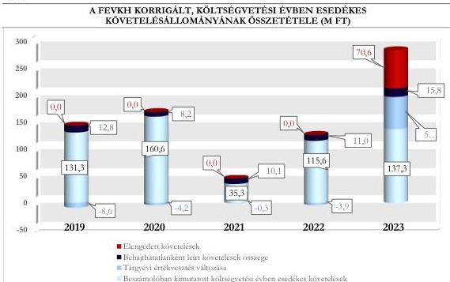

ÁLLAMI
SZÁMVEVŐSZÉK

# JELENTÉS

## A központi költségvetési szervek
követeléskezelése

A behajthatatlan és az elengedett követelések kezelése –
Fejér Vármegyei Kormányhivatal

2026.

26024

www.asz.hu

---

ÁLLAMI
SZÁMVEVŐSZÉK

# JELENTÉS

## A központi költségvetési szervek
követeléskezelése

A behajthatatlan és az elengedett követelések kezelése –
Fejér Vármegyei Kormányhivatal

2026.

26024

www.asz.hu

Dr. Szomolai Csaba
alelnök

---

ELLENŐRZÉSI IGAZGATÓSÁG:

ELLENŐRZÉSI IGAZGATÓSÁG I.

ELLENŐRZÉSI IGAZGATÓ:

SINKÁNÉ DR. CSENDES ÁGNES igazgató

ELLENŐRZÉSVEZETŐ:

BOZSÓ ERIKA LÍVIA ellenőrzésvezető

DR. SIMON JÓZSEF ellenőrzésvezető

LACZI HEDVIG ANNA ellenőrzésvezető

Jelentéseink az interneten a
www.asz.hu címen olvashatók.

IKTATÓSZÁM: EL-4444-001/2026

TÉMASORSZÁM: 20/2024

ELLENŐRZÉS-AZONOSÍTÓ SZÁM: V1073

---

# TARTALOMJEGYZÉK

|  ■ ÖSSZEFOGLALÁS | 5  |
| --- | --- |
|  ■ AZ ELLENŐRZÉS EREDMÉNYEI | 8  |
|  1. A központi költségvetési szerv követelése, a követelésekkel kapcsolatos értékvesztések, a behajthatatlan és elengedett követelések alakulása és ezek eredményre, illetve vagyonra gyakorolt hatásai | 8  |
|  2. A központi költségvetési szerv követeléskezelési tevékenységgel kapcsolatos folyamatainak és a követelések értékelési szabályainak kialakítása | 12  |
|  3. A központi költségvetési szerv követeléskezelési tevékenységének működtetése - behajthatatlan és elengedett követelések kezelése | 14  |
|  4. A központi költségvetési szerv követeléseinek év végi értékelése és az éves költségvetési beszámolóban történt kimutatása, leltárral történő alátámasztása | 17  |
|  ■ JAVASLATOK | 19  |
|  ■ I. FÜGGELÉK: ÉSZREVÉTELEK | 20  |
|  ■ II. FÜGGELÉK: ELLENŐRZÉSI MEGKÖZELÍTÉS | 21  |
|  ■ MELLÉKLETEK | 26  |
|  I. sz. melléklet: Értelmező szótár | 26  |
|  II. sz. melléklet: Az ellenőrzött szervezetek jegyzéke | 28  |
|  ■ RÖVIDÍTÉSEK JEGYZÉKE | 29  |

3

---

# ÖSSZEFOGLALÁS

A központi költségvetési szervek követelései a közvagyon részét képezik ugyanúgy, mint a pénzeszközök, a befektetett eszközök vagy a készletek. A követelések teljesülése befolyásolja az adott szervezet bevételeinek alakulását. Így a gazdálkodás egyik fontos elemét jelenti a követeléskezelési tevékenységek, eljárások szabályszerű, célszerű és eredményes működtetése a bevételek lehető legnagyobb mértékű pénzügyi realizálása érdekében. Mindezek hiánya esetén nem érvényesül a jó gazda gondossága a gazdálkodás e területén.

A Fejér Vármegyei Kormányhivatal ellenőrzését az indokolta, hogy az ellenőrzött időszakban a központi költségvetési szervek között jelentős nagyságrendű követelésállománnyal rendelkezett, a lejárt követelések értéke jelentősen növekedett a 2022. évről a 2023. évre, illetve az általános közszolgáltatások kormányzati funkción belül kiemelt szereplőnek számított, a jelentős számú közfeladat ellátása révén.

A Fejér Vármegyei Kormányhivatal az ellenőrzött időszakban a követeléskezelési és behajtási tevékenységének, illetve a közhatalmi jellegű követelések behajtásra történő átadásának szabályozási kereteit és belső szabályzatait megalkotta, illetve ezek alapján intézkedéseket tett a követelések megtérülése érdekében. A lejárt és nem teljesült közhatalmi bevételekhez kapcsolódó követeléseket behajtás céljából a Nemzeti Adó- és Vámhivatal részére volt szükséges átadnia a jogszabályi előírások alapján. Ezen okból a nem teljesült követelések behajtása érdekében e típusú követelések esetén korlátozott eszközökkel rendelkezett. A követeléskezelési tevékenység az ellenőrzött időszakban nem volt célszerű, ennek eredményessége nem volt értékelhető, mivel a behajtási tevékenységet a közhatalmi bevételek esetében más szervezet látta el. A lejárt követelésállomány 2023. évi növekedése miatt az Állami Számvevőszék véleménye szerint a Fejér Vármegyei Kormányhivatal részéről indokolt a lejárt követelésállomány áttekintése alapján a fizetési felszólítások határidőn belüli és teljeskörű kiküldése, a fizetési meghagyások teljeskörű alkalmazása, illetve a lejárt közhatalmi bevételekhez kapcsolódó követelések Nemzeti Adó- és Vámhivatal részére történő teljeskörű átadása érdekében további kontrolltevékenységek beépítése a követeléskezelés folyamatába.

A FEVKH¹ beszámolóban kimutatott követelésállománya az ellenőrzött időszakban folyamatosan változó tendenciát követett, azonban a 2022. év végéről a 2023. év végére 70,7%-kal növekedett. A beszámolóban kimutatott követelésállomány alakulására az adott évben képződött és esedékességgel ki nem egyenlített követelések értékének növekedése gyakorolt hatást.

A költségvetési évben esedékes közhatalmi, működési és felhalmozási célú követelések beszámolóban kimutatott értéke szintén folyamatosan változó tendenciát mutatott, a 2021. év végi 40,6 M Ft-ról a 2023. év végére 137,9 M Ft-ra növekedett. Az ellenőrzött időszakban a FEVKH elszámolt közhatalmi és működési, továbbá felhalmozási célú bevételeinek átlagosan 5,9%-át tette ki a beszámolóban kimutatott, költségvetési évben esedékes közhatalmi, működési és felhalmozási célú követelések értéke. A FEVKH költségvetési évben esedékes követelései az ellenőrzött időszakban átlagosan 50,3%-ban az államháztartás szervezeteivel, 28,6%-ban államháztartáson kívüli szervezetekkel és 21,1%-ban természetes személyekkel szemben álltak fent.

A FEVKH lejárt követeléseinek értéke a 2022. év végi 37,3 M Ft-ról a 2023. év végére 163,4 M Ft-ra növekedett. A lejárt követelések 2023. évi növekedésének fő indoka, hogy az illegális hulladék elszállításával kapcsolatos követelések pénzügyi teljesítése jellemzően az adósok által nem történt meg. A lejárt követeléseken belül meghatározó volt 2022. évig a 360 napon túl lejárt követelésállomány aránya, illetve a 2023. évben a 180 napon túli követelések aránya. Kedvezőtlen változást jelentett, hogy a 180 napon túli követelések aránya a 2022.

5

---

Összefoglalás---

évhez képest 42,5 százalékponttal emelkedett. A lejárt követelések állománya az ellenőrzött időszakban évente átlagosan az elszámolt bevételek 2,6%-át tette ki.

A FEVKH korrigált, költségvetési évben esedékes közhatalmi, működési és felhalmozási célú követelésállománya a 2023. évre 283,6 M Ft-ra emelkedett, amely a 2021. évi 45,1 M Ft összegű követelésállomány közel hatszorosa volt. Ennek alakulását az ellenőrzött időszakban leginkább a mérleg szerinti költségvetési évben esedékes követelések és a tárgyévi értékvesztés változása, illetve a 2023. évben a tárgyévi értékvesztés változás és az elszámolt elengedett követelések értéke határozta meg.

A 2019-2023. évi értékvesztésváltozás eredményre és vagyonváltozásra gyakorolt pozitív hatása a 2019-2022. években összesen 17,1 M Ft volt. A 2023. évben ugyanakkor az értékvesztés változás az értékvesztés visszaírások miatt negatívan befolyásolta az eredményt és a vagyonváltozást, összesen 59,9 M Ft összegben.

A behajthatatlan követelések leírása és az elengedett követelések eredményre és vagyonra gyakorolt negatív hatása a 2019. évi 12,7 M Ft-ról 2020. évre 8,2 M Ft-ra csökkent, majd 2021. évtől folyamatosan növekedett és 2023. évre 86,4 M Ft-ra változott az elengedett követelés hatására.

A FEVKH a követelések kezelésével, behajtásával, valamint a behajtásra történő átadással kapcsolatos szervezeti kereteket és folyamatokat a jogszabályi előírásoknak megfelelően kialakította. A FEVKH a követelések elszámolásának, értékelésének, valamint a behajthatatlan és elengedett követelések elszámolásának szabályait belső szabályzataiban a jogszabályi előírások szerint meghatározta.

A FEVKH követeléseinek értékelése – egy eset kivételével –, a követelések és az értékvesztések, továbbá a behajthatatlan és elengedett követelések elszámolása a jogszabályi előírások és a belső szabályozók előírásainak megfelelően történt.

A követelések részletező nyilvántartása az ellenőrzött mintatételek alapján nem teljeskörűen tartalmazta a jogszabály által előírt tartalmi elemeket. A FEVKH egy esetben olyan követelést tartott nyilván, amely nem felelt meg a jogszabályi előírásoknak, a jogszabályi előírások alapján nem lehetett volna követelésként kimutatni.

A követelések év végi értékelése – egy eset kivételével – a jogszabályi előírásoknak megfelelően történt. A követeléseit az éves költségvetési beszámoló mérlegében – egy eset kivételével – a jogszabályi előírások szerint mutatta ki. A FEVKH a 2023. évi éves költségvetési beszámoló mérlegében kimutatott követeléseit a jogszabályi előírásoknak megfelelően leltárral alátámasztotta.

A követeléskezelési tevékenységet támogatta, hogy a FEVKH a hatósági területen fejlesztette a pénzügyi-számviteli rendszerét a követelések teljeskörű nyilvántartása és a teljesítések könnyebb beazonosíthatósága érdekében, valamint a lejárt követelés kialakulásának megelőzése érdekében intézkedéseket tett.

A FEVKH az ellenőrzött mintatételek esetén – egy eset kivételével – a jogszabályi és belső előírások szerint járt el a lejárt követelések kezelése, behajtása során. A FEVKH az ellenőrzött időszakban a jogszabályi előírások és a belső szabályozásban foglalt előírás ellenére egy esetben a közhatalmi bevételhez kapcsolódó követelést végrehajtás céljából nem adta át a NAV² részére. A követelések megtérülése szempontjából alapvető fontosságú a követeléskezelés e lépésének teljeskörű és előírt határidőben történő megtétele.

A közhatalmi bevételből származó lejárt követelései esetén meghatározó szerepet töltött be a követelések végrehajtásra történő átadása a NAV részére. A jogszabályi előírások alapján a FEVKH számára a követeléskezelés a közhatalmi jellegű követelések esetén kizárólag e módon volt lehetséges.

6

---

Összefoglalás---

A FEVKH-ra vonatkozóan a követeléskezelés és behajtás érdekében alkalmazott tevékenység eredményessége összességében nem került értékelésre, mivel a meghatározó, átlagosan 83,9%-os részarányt képviselő közhatalmi bevételekből származó követelések esetén a végrehajtással összefüggő feladatokat jellemzően nem a FEVKH látta el.

A FEVKH a követelések minél nagyobb arányú megtérülését a nem közhatalmi jellegű bevételekhez kapcsolódó követelések esetén a követeléskezelési tevékenységgel összefüggő feladatok teljeskörű és határidőn belül történő végrehajtásával, illetve a közhatalmi jellegű bevételekhez kapcsolódó követelések esetén a lejárt követelések NAV részére történő átadásával tudta elősegíteni. A FEVKH a közhatalmi jellegű bevételekhez kapcsolódó követelések esetén korlátozott mozgástérrel rendelkezett a követeléskezelés területén, mivel a követeléskezelési eszközök közül kizárólag a fizetési felszólítás állt rendelkezésére.

A FEVKH követeléskezelési tevékenysége nem volt célszerű, mivel a FEVKH a fizetési felszólítás és a fizetési meghagyás, mint alkalmazott követeléskezelési eszközök nem közhatalmi jellegű lejárt követelések állományára és ennek időbeli alakulására vonatkozó hatásait nem értékelte az ellenőrzött időszakban. Ezáltal nem győződött meg arról, hogy a belső szabályozásban szereplő intézkedéseket ésszerűen és racionálisan, valamint a követelések megtérülése érdekében teljeskörűen és az előírt határidők betartásával alkalmazta.

A lejárt követelések állományának 2023. évi növekedése, valamint lejárat szerinti megoszlása alapján az ÁSZ³ véleménye szerint indokolt a FEVKH részéről áttekinteni a lejárt követeléseket és ez alapján a fizetési felszólítások belső szabályzatban meghatározott határidőn belül történő kiküldésének teljeskörűségét, a fizetési meghagyások alkalmazásának teljeskörűségét és a közhatalmi bevételekből származó lejárt követelések teljeskörű átadását biztosító kontrolltevékenységek beépítése a követeléskezelési folyamatba.

Az ÁSZ három javaslatot fogalmazott meg a FEVKH részére, amelyek a követelések részletező nyilvántartásának vezetéséhez, valamint a követelésekről vezetett nyilvántartást és a költségvetési beszámolóban kimutatott követeléseket, illetve a követeléskezelési tevékenységet érintő kontrolltevékenységek kialakításához és működtetéséhez kapcsolódtak.

7

---

# AZ ELLENŐRZÉS EREDMÉNYEI

## 1. A központi költségvetési szerv követelése, a követelésekkel kapcsolatos értékvesztések, a behajthatatlan és elengedett követelések alakulása és ezek eredményre, illetve vagyonra gyakorolt hatásai

### Összegző megállapítás

A FEVKH beszámolóban kimutatott követeléseinek értéke az ellenőrzött időszakban folyamatosan változó tendenciát mutatott, a 2023. évben volt a legnagyobb értékű. A lejárt követelések állománya a 2023. évben – az illegális hulladék elszállításával kapcsolatos követelések alacsony megtérülése miatt – jelentősen növekedett. A követelések értékelése alapján – kiemelten a 2023. évben – a követelésekkel kapcsolatos elszámolások a beszámolóban kimutatott eredményt és vagyonváltozást negatívan érintették.

### A KÖVETELÉSEK ALAKULÁSA

A FEVKH beszámolóban kimutatott követeléseinek értéke a 2019. év végi 366,4 M Ft-ról 2021. év végéig 57,8%-kal növekedett, ezt követően a 2022. év végére 38,4%-kal csökkent, majd a 2023. év végére az előző év végi értékhez képest 70,7%-kal, 607,9 M Ft-ra növekedett, amelynek alakulásában főleg a költségvetési évet követően esedékes követelések értékének változása játszott szerepet.

A FEVKH beszámolóban kimutatott követeléseinek és elszámolt bevételeinek alakulását az 1. táblázat tartalmazza.

1. táblázat

### A FEVKH BESZÁMOLÓBAN KIMUTATOTT KÖVETELÉSEI ÉS ELSZÁMOLT BEVÉTELEI (M FT, %)

|  MEGNEVEZÉS | 2019.12.31. | 2020.12.31. | 2021.12.31. | 2022.12.31. | 2023.12.31.  |
| --- | --- | --- | --- | --- | --- |
|  Beszámolóban kimutatott követelések, ebből: | 366,4 M Ft | 402,0 M Ft | 578,0 M Ft | 356,2 M Ft | 607,9 M Ft  |
|  Költségvetési évet követően esedékes követelések | 229,7 M Ft | 235,9 M Ft | 537,4 M Ft | 239,0 M Ft | 470,0 M Ft  |
|  Költségvetési évben esedékes követelések | 136,7 M Ft | 166,1 M Ft | 40,6 M Ft | 117,2 M Ft | 137,9 M Ft  |
|  Költségvetési évben esedékes követelések közhatalmi, működési és felhalmozási célú követelések | 131,3 M Ft | 160,6 M Ft | 35,3 M Ft | 115,6 M Ft | 137,3 M Ft  |
|  Költségvetési évben esedékes elszámolt bevételek | 2 786,0 M Ft | 2 600,6 M Ft | 4 373,6 M Ft | 5 969,1 M Ft | 2 780,7 M Ft  |
|  Közhatalmi bevételek aránya az összes bevételből (%) | 63,6% | 64,7% | 39,5% | 29,0% | 61,5%  |
|  Költségvetési évben esedékes követelések aránya a beszámolóban kimutatott követeléshez (%) | 37,3% | 41,3% | 7,0% | 32,9% | 22,7%  |
|  Költségvetési évben esedékes követelésekből a működési, továbbá felhalmozási célú követelések aránya az elszámolt működési és felhalmozási célú bevételekhez viszonyítva (%) | 6,6% | 8,5% | 1,8% | 5,9% | 6,9%  |

Forrás: Az ellenőrzött szervezet éves költségvetési beszámolói alapján, ÁSZ saját szerkesztés

8

---

Az ellenőrzés eredményei

A 2019-2023. évek közötti időszakban a FEVKH elszámolt közhatalmi és működési, továbbá felhalmozási célú elszámolt bevételeinek átlagosan 5,9%-át tette ki a beszámolóban kimutatott, költségvetési évben esedékes közhatalmi, működési és felhalmozási célú követelések értéke.

A beszámolóban kimutatott, költségvetési évben esedékes közhatalmi, működési és felhalmozási célú követelések értékén belül az ellenőrzött időszakban meghatározó, átlagosan 86,0%-os részarányt képviseltek a közhatalmi bevételekhez kapcsolódó követelések. Ennek értékének alakulását befolyásolta a hatósági feladatok bővülése és az ezekhez kapcsolódó követelések értékének alakulása. A FEVKH feladatköre a 2023. évben az illegális hulladék elszállításával kapcsolatos feladatok átvételével bővült. Az államháztartáson belüli szervezetekkel szemben fennállt követelések esetén meghatározó részarányt képviseltek az élelmiszerlánc felügyeleti díjból származó követelések.

A FEVKH beszámolóban kimutatott költségvetési évben esedékes lejárt követeléseiből a 180 napon túli követelések aránya az ellenőrzött időszakon belül átlagosan 49,8% volt, amelyen belül meghatározó volt a 2019-2022. években a 360 napon túli követelések aránya, illetve a 2023. évben a 180 napon túli követelések aránya. Kedvezőtlen változást jelentett, hogy a 180 napon túli követelések aránya a 2022. évhez képest 42,5 százalékponttal emelkedett. A lejárt követelések állományának 2023. évi növekedéséhez hozzájárult, hogy a FEVKH követelésállománya 234,0 M Ft-tal növekedett az illegális hulladék elszállításához kapcsolódó kiadásokból származó követelések miatt, amelyek jelentős részét az adósok nem rendezték az előírt határidőn belül. A lejárt követelések állománya az ellenőrzött időszakban átlagosan az elszámolt bevételek 2,6%-át tette ki.

A FEVKH költségvetési évben esedékes lejárt követeléseinek állományát és a követeléseinek lejárat szerinti megoszlását a 2. táblázat tartalmazza.

2. táblázat

# **A FEVKH KÖLTSÉGVETÉSI ÉVBEN ESEDÉKES LEJÁRT KÖVETELÉSEINEK ÁLLOMÁNYA ÉS LEJÁRAT SZERINTI MEGOSZLÁSA (M FT, %)**

|  KÖVETELÉSEK ESEDÉKESSÉGE | 2019.12.31. |   | 2020.12.31. |   | 2021.12.31. |   | 2022.12.31. |   | 2023.12.31.  |   |
| --- | --- | --- | --- | --- | --- | --- | --- | --- | --- | --- |
|   |  % | M Ft | % | M Ft | % | M Ft | % | M Ft | % | M Ft  |
|  Fizetési határidőn túl 0-90 nap | 71,5 | 66,9 | 41,8 | 20,2 | 64,3 | 45,9 | 53,2 | 19,8 | 12,1 | 19,7  |
|  Fizetési határidőn túl 91-180 nap | 0,8 | 0,7 | 3,2 | 1,6 | 1,8 | 1,3 | 1,9 | 0,7 | 0,5 | 0,9  |
|  Fizetési határidőn túl 181-360 nap | 1,9 | 1,8 | 4,4 | 2,2 | 1,8 | 1,3 | 3,3 | 1,2 | 82,2 | 134,3  |
|  Fizetési határidőn túl 360 nap felett | 25,8 | 24,1 | 50,6 | 24,5 | 32,1 | 22,9 | 41,6 | 15,6 | 5,2 | 8,5  |
|  **Lejárt követelések megoszlása / értéke** | **100,0** | **93,5** | **100,0** | **48,5** | **100,0** | **71,4** | **100,0** | **37,3** | **100,0** | **163,4**  |
|  *Lejárt követelések aránya az elszámolt bevételekhez viszonyítva (%)* | 3,4% |   | 1,9% |   | 1,6% |   | 0,1% |   | 5,9%  |   |
|  *Közhatalmi követelések aránya a lejárt követeléseken belül (%)* | 68,6% |   | 93,1% |   | 72,9% |   | 89,2% |   | 95,7%  |   |
|  *Megképzett értékesítés lejárt követelések összegéhez viszonyított aránya (%)* | 37,9% |   | 64,3% |   | 43,1% |   | 72,1% |   | 53,1%  |   |

Forrás: „Kimutatás központi költségvetési szervek követeléseinek összetételéről adósok szerint”, FEVKH adatai alapján, ÁSZ saját szerkesztés

9

---

Az ellenőrzés eredményei

Az ellenőrzött időszakban a FEVKH költségvetési évben esedékes követeléseinek átlagosan 28,6%-a államháztartáson kívüli szervezetekkel, illetve 50,3%-a államháztartáson belüli szervezetekkel szemben – jellemzően az élelmiszerlánc felügyeleti díjból származó követelések kapcsán – állt fent. A FEVKH természetes személyekkel szemben fennálló követeléseinek aránya átlagosan 21,1% volt.

Az ellenőrzött időszakban a FEVKH lejárt követelésein belül a közhatalmi bevételekre irányuló követelések aránya átlagosan 83,9% volt, amely magasabb volt a közhatalmi bevételek összes bevételen belül képviselt átlagos arányánál. Ez azt mutatja, hogy a közhatalmi bevételekből származó lejárt követelések érvényesítése nehezebben volt kezelhető a többi bevételi típushoz kapcsolódó követelésekhez képest.

## A KÖVETELÉSEK ÉRTÉKELÉSÉNEK HATÁSA AZ EREDMÉNY- ÉS VAGYONVÁLTOZÁSRA

A FEVKH **beszámolóban kimutatott követeléseinek értékelése** negatív hatást gyakorolt az ellenőrzött időszakban az eredményre és vagyonváltozásra. Az eredményre és vagyonra gyakorolt hatás értéke a 2019. évtől 2022. évig alacsony nagyságrendet képviselt – évente nem érte el a 10 M Ft-os értéket –, majd a 2023. évben ennek értéke jelentősen emelkedett, 146,3 M Ft-ot tett ki.

A FEVKH **követelései értékelésének eredményre és vagyonváltozásra** gyakorolt hatását az ellenőrzött időszakban a 3. táblázat tartalmazza.

3. táblázat

### A FEVKH KÖVETELÉSEI ÉRTÉKELÉSÉNEK EREDMÉNYÉRE ÉS VAGYONVÁLTOZÁSRA GYAKOROLT HATÁSA (M FT, %)

|  MEGNEVEZÉS | 2019. | 2020. | 2021. | 2022. | 2023.  |
| --- | --- | --- | --- | --- | --- |
|  **Követelések értékelésének eredményre és vagyonváltozásra gyakorolt hatása** | **4,1 M Ft** | **4,0 M Ft** | **9,6 M Ft** | **7,1 M Ft** | **146,3 M Ft**  |
|  ebből: tárgyévi értékvesztés változása | - 8,6 M Ft | - 4,2 M Ft | - 0,4 M Ft | - 3,9 M Ft | 59,9 M Ft  |
|  ebből: behajthatatlan követelés | 12,7 M Ft | 8,2 M Ft | 10,0 M Ft | 11,0 M Ft | 15,8 M Ft  |
|  ebből: elengedett követelés - | 0,0 M Ft | 0,0 M Ft | 0,0 M Ft | 0,0 M Ft | 70,6 M Ft  |
|  *Követelésértékelés elemeinek megoszlása* |  |  |  |  |   |
|  *értékvesztés változás aránya %* | -209,8% | -105,0% | -4,2% | -54,9% | 40,9%  |
|  *behajthatatlan követelések aránya %* | 309,8% | 205,0% | 104,2% | 154,9% | 10,8%  |
|  *elengedett követelések aránya %* | 0,0% | 0,0% | 0,0% | 0,0% | 48,3%  |

Forrás: Kincstár KGR-K11 rendszer beszámoló, ellenőrzött szervezet főkönyvi kivonat adatai alapján, ÁSZ saját szerkesztés

Az ellenőrzött időszakban a FEVKH által elszámolt **behajthatatlan követelés** összesen 57,8 M Ft volt, amelynek 68,4%-a az államháztartás szervezeteivel, 9,0%-a az államháztartáson kívüli szervezetekkel szemben, illetve 22,6%-a természetes személyekkel szemben került kivezetésre. A FEVKH behajthatatlanként elszámolt követelései kötelezett megszűnése (az adós meghalt/megszűnése) következtében 0,6%, egyéb okból (az adós ismeretlen, nem rendelkezett címmel, nem fellelhető) történő leírás miatt átlagosan 99,4% került elszámolásra a 2019-2023. években.

Az adott évben behajthatatlanként elszámolt követelések év végén fennálló 360 napon túl lejárt követelésállományhoz viszonyított aránya az ellenőrzött időszakban 25,0% (2020. év) és 65,1% (2023. év) között mozgott.

10

---

Az ellenőrzés eredményei

A FEVKH **elengedett követelést** az ellenőrzött időszakban kizárólag a 2023. évben számolt el összesen 70,6 M Ft összegben, amely a hulladékról szóló törvény$^{4}$ alapján készült hatósági határozatból eredő – önkormányzattal szembeni – fizetési igény volt.

A FEVKH **a követelések értékelése** során a 2019-2023. években összesen 178,1 M Ft **értékvesztést képzett**, illetve az **értékvesztés visszaírása** 135,3 M Ft volt, ezáltal a tárgyévi értékvesztés változása az ellenőrzött időszakban összesen 42,8 M Ft-os negatív hatást gyakorolt a FEVKH eredményére és vagyonára.

Az értékvesztés változás a 2019-2022. években összesen 17,1 M Ft-tal pozitívan befolyásolta az eredményt és ezáltal a vagyon, a 2023. évben azonban 59,9 M Ft összegű negatív hatást gyakorolt az eredményre és a vagyonra.

### A KÖVETELÉSÁLLOMÁNY ALAKULÁSA

A FEVKH **korrigált, költségvetési évben esedékes közhatalmi, működési és felhalmozási célú összesített követelésállománya** a 2019. évi 135,5 M Ft-ról, a 2021. évtől kezdődő növekvő tendencia alapján a 2023. évre 283,6 M Ft-ra növekedett. A FEVKH korrigált, költségvetési évben esedékes közhatalmi, működési és felhalmozási célú követelésállományának alakulását az ellenőrzött időszakban leginkább a mérleg szerinti költségvetési évben esedékes követelések, illetve a 2023. ében a tárgyévi értékvesztés változása, valamint az elszámolt elengedett követelések értéke határozta meg.

A FEVKH korrigált, költségvetési évben esedékes közhatalmi, működési és felhalmozási célú összesített követelésállományának összetételét és alakulását az 1. ábra szemlélteti.

1. ábra

Forrás: Kincstár KGR-K11 rendszer beszámoló adatai, továbbá az ellenőrzött szervezet fölkönyvi kivonatai alapján, ÁSZ saját szerkesztés

Az ellenőrzött időszakban a Kormányhivatalok címhez tartozó költségvetési szervek költségvetési évben esedékes követelések éves átlagos állományán (3 073,6 M Ft) belül a FEVKH követeléseinek értéke

11

---

Az ellenőrzés eredményei

3,9%-ot (119,7 M Ft-ot) képviselt. Az ellenőrzött időszakban elszámolt értékvesztésváltozások, a behajthatatlan és elengedett követelések eredmény és vagyonváltozásra gyakorolt hatásának értéke a FEVKH esetében összesen 171,2 M Ft volt, ami a Kormányhivatalok cím költségvetési szerveire vonatkozó összesített értékéből (1 490,5 M Ft) 11,5%-ot képviselt.

## 2. A központi költségvetési szerv követeléskezelési tevékenységgel kapcsolatos folyamatainak és a követelések értékelési szabályainak kialakítása

### Összegző megállapítás

A FEVKH a követeléskezelési és behajtási tevékenységgel, illetve a behajtásra történő átadással kapcsolatos szervezeti kereteit és folyamatait a jogszabályi előírásoknak megfelelően kialakította. A követelések kezelésére, elszámolására és értékelésére, valamint a behajthatatlan és elengedett követelések elszámolására vonatkozó belső szabályokat a jogszabályi előírásoknak megfelelően meghatározta.

A FEVKH a követeléskezelési feladatokat ellátó szervezeti egységek feladatait a FEVKH ügyrend⁵-jeiben, valamint a FEVKH pénzügyi követelések kezelési rendje⁶-iben az Ávr.⁷ előírásaival összhangban határozta meg.

A FEVKH a követeléskezeléssel, a követelések végrehajtásra történő átadásával, valamint a behajthatatlan és elengedett követelések működési- és értékelési munkafolyamataival kapcsolatos feladatait a Pénzügyi és Gazdálkodási Főosztály ellenőrzési nyomvonal⁸-aiban és a Pénzügyi és Számviteli Osztály ellenőrzési nyomvonalában a Bkr.⁹ előírásaival összhangban szabályozta.

A követelések kezelésére, elszámolására és értékelésére, a követelés behajtására vonatkozó szervezeti keretek kialakítását, a munkafolyamatok szabályozását a FEVKH-nál a 4. táblázatban megjelölt szabályozó eszközök tartalmazták az ellenőrzött időszakban.

4. táblázat

### A FEVKH KÖVETELÉSEK KEZELÉSÉBEN RÉSZTVEVŐ SZERVEZETI EGYSÉGEI ÉS A SZERVEZETI KERETEKET ÉS A MUNKAFOLYAMATOKAT SZABÁLYOZÓ ESZKÖZÖK

|  KÖVETELÉSKEZELÉSBEN RÉSZTVEVŐ SZERVEZETI EGYSÉGEK |   |   |   | A KÖVETELÉSKEZELÉS SZERVEZETI KERETEIT ÉS A MUNKAFOLYAMATAIT SZABÁLYOZÓ ESZKÖZÖK  |   |   |
| --- | --- | --- | --- | --- | --- | --- |
|  PÉNZÜGYI ÉS GAZDÁLKODÁSI FŐOSZTÁLY | GAZDASÁGI SZAKTERÜLETEN BELÜLI ÖNÁLLÓ SZERVEZET EGYSÉG | JOGI, HUMÁNPOLITIKAI ÉS KOORDINÁCIÓS FŐOSZTÁLY | SZMSZ | ÜGYREND | ELLENŐRZÉSI NYOMVONAL | EGYÉB SZABÁLYOZÓK  |
|  ☑ | ☒ | ☑ | ☑ | ☑ | ☑ | ☑  |

☑ rendelkezett a szabályozó eszközzel és szabályozta a követeléskezelést; rendelkezett követeléskezelésben résztvevő szervezeti egységgel

☒ nem releváns

Forrás: az ellenőrzött szervezet dokumentumai alapján, ÁSZ saját szerkesztés

12

---

*Az ellenőrzés eredményei*---

A FEVKH a Pénzügyi követelések kezelési rendjéről szóló utasításban meghatározta az egyes követeléstípusok kezelésére, behajtására irányuló eljárásokat és az ezekben érintett, közreműködő szervezeti egységeket, az általuk ellátandó feladatokat. A követelések esetén az utasítás keretében külön szabályozta a közhatalmi tevékenységhez és az egyéb tevékenységhez kapcsolódó követelésekre vonatkozó előírásokat.

Ennek keretében a FEVKH meghatározta a fizetési felszólításra, a fizetési meghagyásra, a fizetési könnyítésre, a saját dolgozóval szembeni követelések esetén az illetményből történő levonásra, a közhatalmi bevételekhez kapcsolódó követelések Nemzeti Adó- és Vámhivatal részére történő átadására, a végrehajtáshoz való jog elévülésére, valamint a csődeljárás, felszámolási eljárás, kényszertörlési eljárás, végelszámolási eljárás, adósságrendezési eljárás vagy vagyonrendezési eljárás esetére vonatkozó előírásokat.

**A követelések értékelésének, valamint a behajthatatlan és elengedett követelések elszámolásának szabályait** a FEVKH a Számv. tv.$^{10}$ és az Áhsz.$^{11}$ előírásainak megfelelően meghatározta a Számviteli politiká$^{12}$-ban és annak keretében elkészített Értékelési szabályzat$^{13}$-ban, valamint a Számlarend$^{14}$-ben.

A FEVKH beszámolójában kimutatott követelések esetén a Pénzügyi és Számviteli Osztály által előkészített behajthatatlan követelések listáját legkésőbb a mérlegkészítés időpontját megelőző 10 napon belül kellett behajthatatlan követelésként történő engedélyeztetése céljából a Főispán részére felterjeszteni.

**A követelésekkel kapcsolatos részletező nyilvántartás vezetésére vonatkozó szabályokat** a FEVKH számlarendje az Áhsz.-ben előírtaknak megfelelően tartalmazta.

A FEVKH **belső ellenőrzése** a követeléskezelési tevékenységre irányuló, a követeléskezeléssel, a behajthatatlan és elengedett követelésekkel kapcsolatos belső ellenőrzést nem végzett az ellenőrzött időszakban.

13

---

Az ellenőrzés eredményei

### 3. A központi költségvetési szerv követeléskezelési tevékenységének működtetése - behajthatatlan és elengedett követelések kezelése

Összegző megállapítás

A FEVKH a követelések értékelését és – egy eset kivételével – elszámolását, a behajthatatlan és elengedett követelések elszámolását a mintatételek alapján a jogszabályokban és a belső szabályzatokban foglalt előírásoknak megfelelően végezte. A követelések részletező nyilvántartása a jogszabály szerinti releváns adatokat nem teljeskörűen tartalmazta. A FEVKH követeléskezelési és behajtási tevékenysége során a mintatételek alapján – egy esetet kivéve – a belső előírások szerint járt el. A követeléskezelési tevékenység a követeléskezelési eszközök hatásaira vonatkozó értékelések elvégzésének hiánya miatt nem volt célszerű. A követeléskezelési és behajtási tevékenység eredményessége a feladatok más szervezettel való megosztott jellege miatt nem volt értékelhető.

A KÖVETELÉSEK ÉRTÉKELÉSE ÉS ELSZÁMOLÁSA

A FEVKH a követelések értékelését – egy eset kivételével – és az értékvesztések elszámolását a Számv. tv.-ben, az Áhsz.-ben, valamint az értékelési szabályzatában foglaltak szerint végezte. A lejárt követelések esetén az értékvesztés összegét az értékelési szabályzatában foglalt előírásokkal összhangban állapította meg és számolta el.

A FEVKH – egy esetben 0,3 M Ft összegben – olyan követelést tartott nyilván, amely az Áhsz. 1. § (1) bekezdés 6. pontjában és a Pénzügyi követelések kezelési rendjéről szóló szabályzat előírásai alapján nem minősült elismert követelésnek. (2. javaslat)

14

---

Az ellenőrzés eredményei

## A BEHAJTHATATLAN KÖVETELÉSEK MINŐSÍTÉSE ÉS ELSZÁMOLÁSA

A FEVKH a behajthatatlan követelések leírásának számviteli elszámolása – az élelmiszerlánc-felügyeleti díjra vonatkozó díjbeszedő felosztása alapján, elévülés miatt, illetve a felszámolási eljárás lezárulta miatt – az ellenőrzött mintatételek esetén az Áhsz.-ben, a Számv. tv.-ben, a 38/2013. (IX. 19.) NGM rendeletben¹⁵ és a belső szabályozókban foglaltak szerint történt.

Az élelmiszerlánc felügyeleti díj az élelmiszerláncról és hatósági felügyeletéről szóló 2008. évi XLVI. törvény rendelkezései alapján az állampolgárok biztonságos élelmiszerrel történő ellátásához a teljes élelmiszerlánc egységes és folyamatos hatósági felügyeletéhez kapcsolódik.

A Nemzeti Élelmiszerlánc-biztonsági Hivatalról szóló 22/2012. (II. 29.) Korm. rendelet 2024. december 31-ig hatályos rendelkezései alapján évente befolyt, fejlesztésre fordítandó felügyeleti díj 10%-a, valamint a felügyeleti díj bevétel ezt követően fennmaradó összegének a 40%-a a NÉBIH bevétele volt. A további fennmaradó összeget a NÉBIH negyedévente átutalta a közigazgatás-szervezésért felelős miniszter által vezetett minisztérium részére. A közigazgatás-szervezésért felelős miniszter által vezetett minisztérium a felügyeleti díj bevételt elkülönített alszámlán kezelte és továbbutalta a vármegyei kormányhivatalok részére.

A NÉBIH által készített kimutatást a KTM havonta küldte meg a kormányhivatal részére az élelmiszerlánc felügyeleti díj kormányhivatalt megillető közhatalmi bevétel követelésállományának adott hónap utolsó napján fennálló összegéről. A kormányhivatalnak a kimutatásban szereplő összegeket volt szükséges a nyilvántartásaiban és ezáltal negyedéves mérlegjelentéseiben szerepeltetni. A kimutatás külön soron szerepeltette az értékvesztést, annak visszaírását, az előírást, a behajthatatlan követelés kivezetését, valamint az elengedett követelést.

2025. január 1-jétől az élelmiszerlánc felügyeleti díj kormányhivatalokat érintő elszámolása módosult, mivel ezen időponttól kezdődően a kapcsolódó bevételeket működési támogatásként kapják meg a kormányhivatalok. A 2024. december 31-én a számviteli nyilvántartásokból az élelmiszerlánc felügyeleti díjhoz kapcsolódó követeléseket a kormányhivataloknak ki kellett vezetniük.

## A KÖVETELÉSEK ELENGEDÉSE ÉS ELSZÁMOLÁSA

A FEVKH a követelései elengedésénél az Áht.-ban foglalt előírás szerint járt el. A FEVKH 2023. évben végzéssel megállapított 78,5 M Ft értékű végrehajtási költség jogcímen egy önkormányzattal szemben fennálló követelést a jogszabályi felhatalmazás alapján 7,8 M Ft-ra mérsékelte és a fennmaradó 70,7 M Ft értékű követelést elengedte.

## A KÖVETELÉSEK NYILVÁNTARTÁSA

A FEVKH a követeléseinek részletező nyilvántartása az ellenőrzött mintatételek esetén nem, illetve nem megfelelően tartalmazta az Áhsz. 14. melléklet III. 4. pontjában előírt adatokat (1. javaslat), mivel:

- az Áhsz. 14. melléklet III. 4. b) pont előírása ellenére öt esetben a nyilvántartásba feltüntetett bizonylat dátuma nem volt azonos a követelés alapját képező bizonylat dátumával
- az Áhsz. 14. melléklet III. 4. j) pont előírása ellenére öt esetben a nyilvántartás nem tartalmazta a követelésekkel kapcsolatos fizetési felhívások a behajtásra tett intézkedések adatainak (például felhívások módozatait) teljeskörű rögzítését,

15

---

Az ellenőrzés eredményei---

- az Áhsz. 14. melléklet III. 4. l) pont előírása ellenére, két esetben a nyilvántartás nem tartalmazta a követelések értékvesztésével és a behajthatatlanná vált követelésekkel kapcsolatos adatok teljeskörű rögzítését.

## A LEJÁRT KÖVETELÉSEK BEHAJTÁSA KEZELÉSE, BEHAJTÁSA ÉRDEKÉBEN MEGTETT INTÉZKEDÉSEK

### A követeléskezelési és behajtási tevékenység tartalma és értékelése

A FEVKH követeléskezelési tevékenységét támogatta, hogy a 2023. évtől kezdődően a HNY modul$^{16}$ keretében a hatósági tevékenységhez kötődő követelésekkel kapcsolatos adatok a határozatok rögzítésével párhuzamosan, automatikusan rendelkezésre álltak. A hatósági tevékenységhez kötődő követelésekhez kapcsolódó fejlesztést az indokolta, hogy az ilyen típusú követelések tették ki a követelésállomány jelentős részét. A fejlesztés gyorsította és megbízhatóbbá tette az adatrögzítés, illetve a követelések és a hatósági feladatok közötti egyeztetés folyamatát. Az e típusú követelések pénzügyi megtérüléséről a Pénzügyi és Számviteli Osztály rendszeres visszajelzése alapján az érintett hatósági feladatokat ellátó szervezeti egységek számára naprakész információk álltak rendelkezésre az esedékes követelések köréről.

A fennálló, esedékes követelések meghatározása a helyszíni ellenőrzés jegyzőkönyvében foglaltak szerint a negyedéves zárások keretében a mérlegjelentés összeállításával párhuzamosan történt. Ennek keretében az érintett követelésekhez tartozó adósok esetén megvizsgálták történt-e a zárás időpontjáig teljesítés és megállapították, hogy továbbra is fennáll-e a követelés, illetve milyen értékű a fennmaradt követelés a rendelkezésre álló dokumentumok alapján. A követelésállomány alakulásáról a gazdasági vezető rendszeresen beszámolt a heti, illetve havi rendszerességgel tartott vezetői értekezleten.

A követelések megtérülésének biztosítása tekintetében a követelések legnagyobb részét kitevő közhatalmi bevételekből származó követelések esetén meghatározó szerepet töltött be a követelések végrehajtásra történő átadása a NAV részére. Ezáltal a FEVKH felelősségi köre a követelések érvényesítésére vonatkozó folyamat tekintetében a végrehajtásra történő átadásig terjedt. Az ezt követő behajtási tevékenység a NAV feladatát jelentette, amelyre vonatkozóan a FEVKH-nak nem volt ráhatása.

Az Ákr.$^{17}$ 132. §-a értelmében, ha a kötelezett a hatóság végleges döntésében foglalt kötelezésnek nem tett eleget, a követelés végrehajtható volt. A helyszíni ellenőrzés jegyzőkönyvében foglaltak szerint az Ákr. szerinti közigazgatási hatósági tevékenységekhez kapcsolódó lejárt követelések esetén az Avt.$^{18}$ rendelkezései alapján a követelések NAV részére történő átadását folyamatosan végezte. A FEVKH rendszeresen ellenőrizte, hogy az érintett követelések átadása teljeskörűen megtörtént-e. A hatósági tevékenységet végző szervezeti egységek az egyes ügyek esetén egyedileg, az általuk meghatározott ütemezés szerint követték nyomon az átadás megtörténtét. A hatósági területen további kontrolljárásként alkalmazta a FEVKH, hogy az érintett osztályok vezetőinek félévente nyilatkozniuk kellett a HNY modulban szereplő dokumentumok teljeskörűségéről.

A FEVKH-ra vonatkozóan – figyelembe véve a közhatalmi bevételekből származó követelések meghatározó részarányát a követeléseken belül, valamint a végrehajtással összefüggő feladatok szervezettől független ellátását – a követeléskezelés és behajtás érdekében alkalmazott tevékenység eredményessége nem volt értékelhető. A követelések megtérülésével kapcsolatos problémákat azonban jól mutatja, hogy a 180 napon túli követelésállomány aránya és értéke folyamatosan magas volt, illetve a lejárt követelések értéke a 2022. évi értékről a 2023. évben növekedett.

Az ÁSZ véleménye szerint – az előző bekezdésben bemutatott indokok alapján – a FEVKH vonatkozásában kizárólag a követeléskezelési tevékenység célszerűsége értékelhető. Ennek értékelése során indokolt továbbá figyelembe venni, hogy az Ákr. szerinti közigazgatási hatósági tevékenységekhez

16

---

Az ellenőrzés eredményei

kapcsolódó lejárt követelések esetén – amelyek a lejárt követeléseken belül átlagosan 83,9%-os részarányt képviseltek – a FEVKH a követelés megtérülése érdekében kizárólag annyit tudott tenni, hogy e követeléseket átadta a NAV részére behajtás céljából.

A követeléskezelési tevékenység nem volt célszerű, mivel a FEVKH a fizetési felszólítás és a fizetési meghagyás, mint alkalmazott követeléskezelési eszközök nem közhatalmi jellegű lejárt követelések állományára és ennek időbeli alakulására vonatkozó hatásait nem értékelte az ellenőrzött időszakban.

A lejárt követelések állományának 2023. évi növekvő tendenciája, valamint lejárat szerinti megoszlása alapján az ÁSZ véleménye szerint indokolt a FEVKH-nak áttekintenie az érintett követeléseket, és ez alapján a fizetési felszólítások belső szabályzatban meghatározott határidőn belül történő kiküldésének teljeskörűségét, a fizetési meghagyások alkalmazásának teljeskörűségét, illetve a közhatalmi bevételekből származó lejárt követelések teljeskörű átadását biztosító kontrolltevékenységeket beépítenie a követeléskezelési folyamatba. (3. javaslat)

#### **A követeléskezelési és behajtási tevékenység a mintatételek alapján**

A FEVKH a **lejárt követelések érvényesítése** során az ellenőrzött mintatételek alapján – egy esetet kivéve – az általa meghatározott belső előírásokban szereplő intézkedéseket megtette. 19 esetben a követelések érvényesítése érdekében egyenlegközlőket, két-két esetben fizetési tájékoztatót, illetve fizetési felszólításokat küldött, valamint kilenc esetben kezdeményezett közjegyzői, bírósági végrehajtást, hitelezői igénybejelentést.

A közhatalmi bevételekből származó követelések átadása a NAV részére – egy esetet kivéve – az Avt., valamint a belső szabályzataiban foglaltakkal összhangban történt. A FEVKH – egy esetben 0,2 M Ft összegben – az Avt. 106. § (1) bekezdésében és a Pénzügyi követelések kezelési rendjéről szóló utasítás 7. fejezet 18. pontjában foglalt előírások ellenére nem adta át e követelést az ellenőrzött időszakban végrehajtás céljából a NAV részére. (3. javaslat)

## **4. A központi költségvetési szerv követeléseinek év végi értékelése és az éves költségvetési beszámolóban történt kimutatása, leltárral történő alátámasztása**

### **Összegző megállapítás**

A követelések év végi értékelése a FEVKH-nál szabályszerű volt. A 2023. évi éves költségvetési beszámolójában a behajthatatlan követelések kimutatása – egy eset kivételével – a jogszabályi előírásoknak megfelelt. A FEVKH a 2023. évi éves beszámolójának mérlegében kimutatott költségvetési évben és költségvetési évet követően esedékes követeléseit a jogszabályokban és belső szabályzataiban foglalt előírások szerinti leltárral alátámasztotta.

A FEVKH a követelések év végi értékelését az Áhsz., a Számv. tv. és a belső szabályozókban foglaltaknak megfelelően végezte.

A FEVKH 2023. évi éves költségvetési beszámolójának mérlege a mérleg szerinti követeléseit – egy esetben 0,3 M Ft összegben – nem szabályszerűen tartalmazta, mivel olyan követelést tartott nyilván,

17

---

*Az ellenőrzés eredményei*---

amely az Áhsz. 1. § (1) bekezdés 6. pontjában és a Pénzügyi követelések kezelési rendjéről szóló szabályzat előírásai alapján nem minősült elismert követelésnek. (2. javaslat)

A FEVKH 2023. évi éves költségvetési beszámoló mérlegében szereplő költségvetési évben és költségvetési évet követően esedékes követeléseket az Áhsz. és a Számv. tv.-ben foglalt előírások szerint **leltárral alátámasztotta.**

18

---

# JAVASLATOK

Az ÁSZ tv. 33. § (1) bekezdésében foglaltak értelmében az ellenőrzött szervezet vezetője köteles a jelentésben foglalt megállapításokhoz kapcsolódó intézkedési tervet összeállítani és azt a jelentés kézhezvételétől számított 30 napon belül az ÁSZ részére megküldeni. Az ÁSZ a jelentésben foglalt megállapításokhoz kapcsolódóan az alábbi javaslatok tekintetében várja el az intézkedési terv elkészítését.

## A FEJÉR VÁRMEGYEI KORMÁNYHIVATAL FŐISPÁNJA RÉSZÉRE

1. Gondoskodjon a követelések részletező nyilvántartásának az Áhsz. 14. melléklet III. 4. pontjában előírt tartalmi követelményeknek megfelelő, folyamatos vezetéséről.

2. Alakítson ki a Bkr. 8. § (1) bekezdésében foglaltaknak megfelelően olyan kontrollokat, amelyek biztosítják, hogy a követelésekről vezetett nyilvántartás és a költségvetési beszámoló csak olyan követeléseket tartalmazzon, amelyek megfelelnek az Áhsz. 1. § (1) bekezdés 6. pontjában és a belső szabályzatokban szereplő előírásoknak.

3. Alakítson ki a Bkr. 8. § (1) bekezdésében foglaltaknak megfelelően a követeléskezelési tevékenységet érintően olyan kontrolltevékenységeket, amelyek támogatják a nem közhatalmi bevételekből származó lejárt követelések esetén a fizetési felszólítások belső szabályzatban meghatározott határidőn belül történő kiküldésének, illetve a fizetési meghagyások alkalmazásának teljeskörűségét és a közhatalmi bevételekből származó lejárt követelések teljeskörű átadását végrehajtás céljából az illetékes adóhatóság részére, illetve működtesse e kontrolltevékenységeket.

19

---

# I. FÜGGELÉK: ÉSZREVÉTELEK

*A jelentéstervezetet az ÁSZ 15 napos észrevételezésre megküldte az ellenőrzött szervezet vezetőjének az ÁSZ tv. 29. §\* (1) bekezdése előírásának megfelelően.*

*A jelentéstervezet megállapításaira az ellenőrzött szervezet nem tett észrevételt.*

\* 29. § (1) Az Állami Számvevőszék az ellenőrzési megállapításait megküldi az ellenőrzött szervezet vezetőjének vagy az általa megbízott személynek, és annak, akinek személyes felelősségét állapította meg.

(2) Az ellenőrzött szervezet vezetője és a felelősként megjelölt személy az ellenőrzés megállapításaira tizenöt napon belül írásban észrevételt tehet.

(3) Az Állami Számvevőszék az észrevételre a beérkezésétől számított harminc napon belül írásban válaszol. A figyelembe nem vett észrevételeket köteles a jelentésben feltüntetni, és megindokolni, hogy azokat miért nem fogadta el.

20

---

## II. FÜGGELÉK: ELLENŐRZÉSI MEGKÖZELÍTÉS

### AZ ELLENŐRZÉS JOGALAPJA

Az ellenőrzés jogszabályi alapját az ÁSZ tv.$^{19}$ 1. § (3) bekezdés, 5. § (2)-(3) bekezdés, valamint az Áht. 61. § (2) bekezdéseinek előírásai képezték.

### AZ ELLENŐRZÉS CÉLJA

Az ellenőrzés célja annak értékelése volt, hogy az ellenőrzött központi költségvetési szerv a követeléskezelési és értékelési tevékenységére vonatkozó szervezeti kereteit, folyamatait, és működtetésének szabályait a jogszabályi előírások szerint alakította-e ki, illetve a követeléskezelési tevékenységét szabályszerűségi, célszerűségi és eredményességi szempontok figyelembevételével működtette-e. Annak értékelése továbbá, hogy a követelések értékvesztése, a behajthatatlan és elengedett követelések nyilvántartása, elszámolása, valamint a követelések éves költségvetési beszámolóban történő kimutatása a jogszabályi és belső előírásoknak megfelelően történt-e.

Az elemzés célja volt, hogy értékelje a központi költségvetési szerv követeléseinek, az ehhez kapcsolódó értékvesztéseknek, valamint a behajthatatlan és elengedett követelések alakulását és ezek eredményre, illetve a vagyonra gyakorolt hatásait.

### AZ ELLENŐRZÉS TÍPUSA

Kombinált ellenőrzés.

### AZ ELLENŐRZÉS TÁRGYA

Az ellenőrzés tárgyát képezte az ellenőrzött központi költségvetési szerv követeléskezelési tevékenységére vonatkozó szervezeti kereteinek kialakítása, a követeléskezelési tevékenysége, a követeléskezeléssel kapcsolatos folyamatainak szabályozottsága és kialakítása, továbbá a követeléskezelési folyamatok működtetésének szabályszerűsége, célszerűsége és eredményessége, a követelések értékvesztése, az elengedett és behajthatatlan követelések nyilvántartásának, elszámolásának szabályozottsága, szabályszerűsége, valamint a követelések éves költségvetési beszámolóban történő kimutatásának jogszabályokkal való összhangja.

Az elemzés tárgya volt központi költségvetési szerv követeléseinek, az ehhez kapcsolódó értékvesztéseinek, a behajthatatlan és elengedett követeléseinek alakulása és ezek eredményre és vagyonra gyakorolt hatásai.

Az ellenőrzés kiterjedt minden olyan körülményre és adatra, amely az ÁSZ jogszabályban meghatározott feladatainak teljesítéséhez szükséges volt.

21

---

II. Függelék: Ellenőrzési megközelítés

## AZ ELLENŐRZÉS HATÓKÖRE ÉS TERÜLETE

A Fejér Vármegyei Kormányhivatal jogi személy, éves költségvetés alapján önállóan működő és gazdálkodó, kincstári körbe tartozó költségvetési szerv.

A költségvetési szerv alapítása 2011. január 1-jén a fővárosi és megyei kormányhivatalokról, valamint a fővárosi és megyei kormányhivatalok kialakításával és a területi integrációval összefüggő törvénymódosításokról szóló 2010. évi CXXVI. törvény alapján történt. A költségvetési szerv jogállását a kormányzati igazgatásról szóló 2018. évi CXXV. törvény határozza meg.

A költségvetési szerv irányító szerve 2024. január 1. napjától a Közigazgatási és Területfejlesztési Minisztérium, az ellenőrzött időszakban a Miniszterelnökség volt. Az FEVKH-t a főispán képviseli. Az FEVKH közfeladata 2019. március 1. napjáig a fővárosi és megyei kormányhivatalokról, valamint a fővárosi és megyei kormányhivatalok kialakításával és a területi integrációval összefüggő törvénymódosításokról szóló 2010. évi CXXVI. törvényben meghatározott feladatok, azt követően a kormányzati igazgatásról szóló 2018. évi CXXV. törvényben és a Kormány által meghatározott feladatok voltak. A költségvetési szerv illetékessége, működési területe Fejér vármegye közigazgatási területe.

A FEVKH 2019-2023. évi gazdálkodási adatait az 5. táblázat mutatja.

5. táblázat

### A FEJÉR VÁRMEGYEI KORMÁNYHIVATAL FŐBB BESZÁMOLÓ ADATAI (M FT)

|  ÉVES BESZÁMOLÓ – MÉRLEG SZERINTI ADATOK | 2019.12.31. | 2020.12.31. | 2021.12.31. | 2022.12.31. | 2023.12.31.  |
| --- | --- | --- | --- | --- | --- |
|  Mérlegfőösszeg | 10 938,7 | 10 060,9 | 5 898,6 | 7 367,1 | 6 614,6  |
|  Költségvetési évben esedékes követelések | 136,7 | 166,1 | 40,6 | 117,1 | 137,8  |
|  BESZÁMOLÓ – TELJESÍTÉS ADATOK | 2019. | 2020. | 2021. | 2022. | 2023.  |
|  Bevételek összesen | 15 433,3 | 14 765,8 | 15 896,2 | 17 648,0 | 17 806,6  |
|  Kiadások összesen | 12 511,8 | 13 650,5 | 14 696,8 | 14 646,7 | 14 910,2  |

Forrás: Az éves költségvetési beszámolók alapján, ÁSZ saját szerkesztés

Az elemzés kiterjedt a központi költségvetési szerv követeléseinek, az azokra képzett értékvesztésnek, a behajthatatlan és elengedett követelésként elszámolt összegek alakulásának, ezek vagyonra gyakorolt hatásainak értékelésére. Értékelésre került továbbá az ellenőrzött központi költségvetési szerv követeléskezelési tevékenységének szabályszerűsége, célszerűsége és eredményessége.

Az ellenőrzés kiterjedt a központi költségvetési szerv követeléseinek kezelésére, a követelésekkel kapcsolatos értékvesztéseinek képzésére és visszaírására, a behajthatatlan és elengedett követelések elszámolására, és a követelések nyilvántartására vonatkozó szabályainak, folyamatainak kialakítására, továbbá a követeléskezelési tevékenység szervezeti kereteinek kialakítására.

Ellenőrzésre került továbbá, hogy a központi költségvetési szervnél a követelések részletező nyilvántartásának vezetése, a követeléskezelés, a behajthatatlan és elengedett követelések elszámolása megfelelt-e a jogszabályokban és a belső szabályozókban foglaltaknak, célszerűek és eredményesek voltak-e a lejárt követelések behajtása érdekében megtett intézkedések, továbbá értékelésre kerültek a követeléskezelési tevékenység gazdálkodására gyakorolt hatásai.

Az ellenőrzés kiterjedt a központi költségvetési szerv követeléseinek év végi értékelésére. A jogszabályok és a belső szabályozók szerint ellenőrzésre került továbbá a követelések éves költségvetési beszámolóban történő kimutatásának, leltárral való alátámasztásának szabályszerűsége.

22

---

II. Függelék: Ellenőrzési megközelítés

Az ellenőrzés keretében az ÁSZ 15 központi költségvetési szervet – beleértve a FEVKH-t is – választott ki és értékelte e szervezeteknél a követelések alakulását, a kapcsolódó belső szabályozási keretek rendelkezésre állását, valamint a követeléskezeléssel kapcsolatban alkalmazott gyakorlatot.

## AZ ELLENŐRZÖTT IDŐSZAK

A 2019-2023. évek, kitekintéssel a helyszíni ellenőrzés lezárásának időpontjáig (2025. szeptember 15.)

## AZ ELLENŐRZÉSI KRITÉRIUMOK

|  Főküszterület | ELLENŐRZÉSI KRITÉRIUMOK  |
| --- | --- |
|  1. A központi költségvetési szerv követelése, a követelésekkel kapcsolatos értékvesztések, a behajthatatlan és elengedett követelések alakulása és ezek eredményre és ezáltal vagyonra gyakorolt hatásai | Elemzés  |
|  2. A központi költségvetési szerv követeléskezelési tevékenységgel kapcsolatos folyamatainak és a követelések értékelési szabályainak kialakítása | Áht. 10. § (5) bekezdés Ávt. 13. § (1) bekezdés e) pont; (2) bekezdés a) pont Bkr. 6. § (1) bekezdés a) és b) pont és (2) bekezdés Számv. tv. 14. § (3) bekezdés, (5) bekezdés b) pont, 161. § Áhsz. 51. § (2)-(3) bekezdés, 14. melléklet III. pont, 15. melléklet II. pont  |
|  3. A központi költségvetési szerv követeléskezelési tevékenységének működtetése és ennek hatásai a gazdálkodásra - behajthatatlan és elengedett követelések kezelése | Áhsz. 1. § (1) bek., 5. § (1) bek., 6. § (2) bek., 18. § (1)-(3) és (7) bek., 19. § (1) bek., 25. § (9a) bek. d) pont és 26. § (11a) bek. d) pont, 29. § (2) bek. b) pont, 39. § (3) bekezdés, 43. § (1)-(3) bek., 53. § (6) bek. e) pont és (8) bek. c) pont, 9. melléklet, 14. melléklet III. pont, 16. melléklet 38/2013. (IX. 19.) NGM rendelet XII. fejezet D) pont, E) és F) pont Ctv.^{20} 117. § (2) bekezdés a) pontja Ákr. 132-138. § Ávt. 104. §, 106. § Air.^{21} (adók módjára behajtandó köztartozásnak minősülő díjak végrehajtására kiadott jogszabályban nem szabályozott kérdésekben) Art.^{22} 76. § Bkr. 7. § (2) bek. Számv. tv. 3. § (4) bek. 10. pont, 54-56. § Áht. 97. § (1), (3) bekezdései, 111/A. §, SZMSZ, Ügyrend, Eljárásrend, Ellenőrzési nyomvonal, Számviteli politika, Számlarend, Eszközök és források értékelési szabályzata Eredményesség: a 90 napon túl lejárt követelések részaránya a lejárt követeléseken belül, illetve a lejárt követelésállomány értéke az elért megtérülések következtében csökkenő tendenciát mutat  |

23

---

II. Figyelék: Ellenőrzési megközelítés

|  FÓKUSZTERÜLET | ELLENŐRZÉSI KRITÉRIUMOK  |
| --- | --- |
|  4. A központi költségvetési szerv követeléseinek év végi értékelése és az éves költségvetési beszámolóban történt kimutatása, leltárral történő alátámasztása | Célszerűség: A követeléskezelési és behajtási tevékenység keretében a kialakított belső szabályozás alapján olyan intézkedések, eszközök ésszerű, racionális és tudatos alkalmazása, amelyek során a szervezet figyelembe veszi és értékeli a lehetséges előnyöket és hátrányokat, illetve egyúttal ezen intézkedések elősegítik a lejárt követelések állománya és lejárati összetétele kedvező irányú változását. Számv. tv. 3. § (4) bekezdés 10. f) és g) pontjai, 55. § (1)-(3) bekezdés Áhsz. 1. § (1) bekezdés 3. és 6. pontja, Áhsz 5. § (1) bekezdés, 13. § (5) bekezdés, 18. § (1) bekezdés, 22. § (1) bekezdés Számviteli politika, Számlarend, Eszközök és források értékelési szabályzata, Eszközök és források leltározási és leltárkészítési szabályzata  |

## AZ ELLENŐRZÉS MÓDSZERE ÉS AZ ELLENŐRZÉSI BIZONYÍTÉKOK KÖRE

Az ellenőrzést az ÁSZ nemzetközi standardokat irányadónak tekintve az ellenőrzési program szempontjai, az ellenőrzött időszakban hatályos jogszabályok, az ellenőrzés szakmai szabályok és módszertan(ok) figyelembevételével végezte.

Az ellenőrzési kérdések megválaszolásához szükséges bizonyítékok megszerzése az ellenőrzött szervezet által rendelkezésre bocsátott dokumentumokra, adatokra alapozva, továbbá megfigyelés, szemle (szemrevételezés), kérdésfeltevés (információkérés), interjú, mintavételezés, valamint elemző eljárás útján történt. A központi költségvetési szerv követeléseinek, behajthatatlan és elengedett követeléseinek, valamint a követelések értékvesztéseinek alakulása elemző eljárással került értékelésre. Az ellenőrzési bizonyítékként felhasználható adatforrások közé tartoztak egyrészt a Magyar Államkincstár által működtetett KGR-K11²³ számviteli adatgyűjtő rendszerben rendelkezésre álló éves költségvetési beszámolók, az ellenőrzéshez kért dokumentumok, adatforrások, másrészt adatforrás volt még minden, az ellenőrzés folyamán feltárt, az ellenőrzés szempontjából információkat tartalmazó dokumentum.

A követelések értékelésének, a behajthatatlan és elengedett követelések, valamint a követelésekre képzett és visszaírt értékvesztés elszámolásának szabályszerűségét a követelések részletező nyilvántartásából kockázati alapon kiválasztott mintatételeken keresztül ellenőrizte az ÁSZ. A kiválasztott összesen 20 darab mintatétel - 10 darab követelés, 5 darab behajthatatlan, 2 darab elengedett és 3 darab értékvesztéssel érintett követelés - a 2019-2023. évekre vonatkoztak. A kiválasztott mintatételek kiértékelésének eredménye nem került kivetítésre a teljes sokaságra.

A követelések éves költségvetési beszámolóban való kimutatását és leltárral történő alátámasztását 2023. évre vonatkozóan értékelte az ellenőrzés.

A követeléskezelés célszerűségét és eredményességét az ÁSZ a követelések és azok értékelésének a közpénzekre, a mérleg szerinti eredményre és ezáltal a vagyonra gyakorolt hatása alapján értékelte.

Az eredményesség kritériumát az ÁSZ a következőképpen értelmezte: a követeléskezelésre és behajtásra vonatkozó intézkedések hatására a 90 napon túl lejárt követelések részaránya a lejárt követeléseken belül, illetve a lejárt követelésállomány értéke az elért megtérülések következtében csökkenő tendenciát mutasson.

24

---

II. Függelék: Ellenőrzési megközelítés---

A követelésértékelés hatásait a követelésekhez kapcsolódó értékvesztések tárgyévi változásának, a behajthatatlan és az elengedett követelések összegének a mérleg szerinti eredményre és vagyonra gyakorolt hatásai jelentették.

A célszerűség kritériumát az ÁSZ a következőképpen értelmezte: A követeléskezelési és behajtási tevékenység keretében a kialakított belső szabályozás alapján olyan intézkedések, eszközök ésszerű, racionális és tudatos alkalmazása, amelyek során a szervezet figyelembe veszi és értékeli a lehetséges előnyöket és hátrányokat, illetve egyúttal ezen intézkedések elősegítik a lejárt követelések állománya és lejárati összetétele kedvező irányú változását, a várható megtérüléssel összhangban álló ráfordítások mellett.

Az ellenőrzés az értékelések, elemzések során beszámolóban kimutatott követelésként a követeléseknek az éves költségvetési beszámoló 12. űrlap Mérleg D/III Követelés jellegű sajátos elszámolások sor nélkül számított értékét vette figyelembe. A követeléskezelési tevékenység tekintetében a Költségvetési évben esedékes követelések közül (éves költségvetési beszámoló 12. űrlap Mérleg D/I. Költségvetési évben esedékes követelések sor) az éves költségvetési beszámoló 12. űrlap Mérleg D/I/3. Költségvetési évben esedékes követelések közhatalmi bevételre sor, az éves költségvetési beszámoló 12. űrlap Mérleg D/I/4. Költségvetési évben esedékes követelések működési bevételre sor és az éves költségvetési beszámoló 12. űrlap Mérleg D/I/5. Költségvetési évben esedékes követelések felhalmozási bevételre sor követelései kerültek értékelésre, mivel a támogatásokra és az átvett pénzeszközökre vonatkozó követelések a követeléskezelési tevékenység szempontjából nem relevánsak.

Az ÁSZ meghatározása szerint a korrigált követelésállomány a mérlegben kimutatott követelés értékének a tárgyévi értékvesztés változással, valamint a behajthatatlan és elengedett követelések értékével növelt értékét jelentette.

Az ellenőrzés lefolytatásához az ellenőrzött szervezet tanúsítvány kitöltésével, valamint az ÁSZ által kért dokumentumok, adatok, információk megküldésével és a helyszíni ellenőrzés során szolgáltatott adatokat.

25

---

# MELLÉKLETEK

## ■ 1. SZ. MELLÉKLET: ÉRTELMEZŐ SZÓTÁR

behajthatatlan követelés

A számvitelről szóló 2000. évi C. törvény 3. § (4) bekezdés 10. pont a)–g) alpontja szerinti követelés azzal az eltéréssel, hogy nem tekinthető behajthatatlannak a követelés, ha a végrehajtás közvetlenül nem vezetett eredményre és a végrehajtást szüneteltetik. (Forrás: Áhsz. 1. § (1) bek. 1. pont a) alpont)

Az a követelés

a) amelyre az adós ellen vezetett végrehajtás során nincs fedezet, vagy a talált fedezet a követelést csak részben fedezi (amennyiben a végrehajtás közvetlenül nem vezetett eredményre és a végrehajtást szüneteltetik, az óvatosság elvéből következően a behajthatatlanság – nemleges foglalási jegyzőkönyv alapján – vélelmezhető),

b) amelyet a hitelező a csődeljárás, a felszámolási eljárás, az önkormányzatok adósságrendezési eljárása során egyezségi megállapodás keretében elengedett,

c) amelyre a felszámoló által adott írásbeli igazolás (nyilatkozat) szerint nincs fedezet,

d) amelyre a felszámolás, az adósságrendezési eljárás befejezésekor a vagyonfelosztási javaslat szerinti értékben átvett eszköz nem nyújt fedezetet, e) amelyet eredményesen nem lehet érvényesíteni, amelynél a fizetési meghagyásos eljárással, a végrehajtással kapcsolatos költségek nincsenek arányban a követelés várhatóan behajtható összegével (a fizetési meghagyásos eljárás, a végrehajtás veszteséget eredményez vagy növeli a veszteséget), amelynél az adós nem lehető fel, mert a megadott címen nem található és a felkutatása „igazoltan” nem járt eredménnyel,

f) amelyet bíróság előtt érvényesíteni nem lehet,

g) amely a hatályos jogszabályok alapján elévült.

A behajthatatlanság tényét és mértékét bizonyítani kell.

(Forrás: Számv. tv. 3. § (4) bek., 10. pont a)–g) alpont)

beszámolóban kimutatott követelés

Követelés az a jogszabályból, jogerős bírói végzésből, ítéletből vagy hatósági határozatból, szerződésből – ideértve a vásárolt és a térítés nélkül átvett követelést is – jogszerűen eredő fizetési igény, amelyet a kötelezett elismert és – ellenszolgáltatást is tartalmazó szerződés esetén – a másik fél már teljesített, ideértve a bevallás alapján megállapított közhatalmi bevételre irányuló, valamint az olyan követelést is, amelyet a kötelezett vitat, de jogszabály alapján azt fellebbezésre vagy perindításra tekintet nélkül teljesítenie kell, továbbá az állami adó- és vámhatóság által a bevallás nélkül teljesítendő közhatalmi bevételekre vonatkozóan előírt követelést. (Forrás: Áhsz. 1. § (1) bek. 6. pont)

A követelések bekerülési értéke az egységes rovatrend bevételeihez kapcsolódóan vezetett nyilvántartási számlákon kimutatott követelésekkel megegyező elismert, esedékes összeg. (Forrás: Áhsz. 16. § (9) bekezdés)

A mérlegben a követelések között az egységes rovatrend szerinti rovatokhoz kapcsolódóan vezetett nyilvántartási számlákon nyilvántartott követeléseket kell kimutatni mindaddig, amíg azokat pénzügyileg vagy egyéb módon nem rendezték, az Áht. 97. §-a szerint el nem engedték vagy behajthatatlan követelésként le nem írták. (Forrás: Áhsz. 13. § (5) bekezdés)

A mérlegben a követeléseket a bekerülési értéken kell kimutatni, csökkentve az elszámolt értékvesztéssel, növelve az értékvesztés visszaírt összegével. (Forrás: Áhsz. 21. § (8) bekezdés).

26

---

Mellékletek

célszerűség

A célszerűség követelménye azt jelenti, hogy a bevételeket a közfeladat megvalósítása érdekében, a kiadásokat a közfeladatok megfelelő ellátásához szükséges mértékben, a költségvetési célrendszer érdekében, a meghatározott célra (közfeladat ellátására), továbbá észszerűen, racionálisan használták fel. Az erőforrások észszerű, racionális felhasználása alatt a tudatos döntéshozatalt vagy az erőforrások olyan módon történő, tudatos felhasználását foglalja magában, amely számba veszi a lehetséges előnyöket és hátrányokat, tisztában van a következményekkel, kerüli a túlzásokat, törekszik a saját tevékenységével való konzisztenciára, a helyes elvek alkalmazására és a megfelelő érvek hatására hajlandó az önkorrekcióra is. (Forrás: ÁSZ ellenőrzési alapelvei és módszertana 2024. október)

elengedett követelés

Az állam, az államháztartás központi alrendszerébe tartozó költségvetési szervek, a nemzetiségi önkormányzatok, valamint az általuk irányított költségvetési szervek követeléséről lemondani csak törvényben meghatározott esetekben és módon lehet. (Forrás: Áht. 97. § (1) bek.)

eredményesség

Az eredményesség elve a kitűzött célok és a tervezett eredmények (hatások) elérését jelenti, azt, hogy az ellenőrzött terület (tevékenység, folyamat, projekt, beruházás, informatikai rendszer stb.) vagy szervezet a kitűzött célokat és a szándékolt eredményeket (hatásokat) elérte. (Forrás: ÁSZ ellenőrzési alapelvei és módszertana 2024. október)

értékvesztés/értékvesztés képzés

Az üzleti év mérlegfordulónapján fennálló és a mérlegkészítés időpontjáig pénzügyileg nem rendezett követelésnél értékvesztést kell elszámolni - a mérlegkészítés időpontjában rendelkezésre álló információk alapján - a követelés könyv szerinti értéke és a követelés várhatóan megtérülő összege közötti veszteségjellegű különbözet összegében, ha ez a különbözet tartósnak mutatkozik és jelentős összegű. (Forrás: Számv. tv. 55. § (1) bek.)

értékvesztés visszaírása

Amennyiben a követelés várhatóan megtérülő összege jelentősen meghaladja a követelés könyv szerinti értékét, a különbözettel a korábban elszámolt értékvesztést visszaírással csökkenteni kell. Az értékvesztés visszaírásával a követelés könyv szerinti értéke nem haladhatja meg a Számv. tv. 65. § (1)-(3) bekezdése szerinti nyilvántartásba vételi (devizakövetelés esetén a Számv. tv. 60. § szerinti árfolyamon számított) értékét. (Forrás: Számv. tv. 55. § (3) bek.)

közfeladat

A jogszabályban meghatározott állami és önkormányzati feladat. A közfeladatot meghatározó jogszabályban meg kell határozni a közfeladat ellátásának módját és rendelkezni kell az ellátásához szükséges pénzügyi fedezet biztosításáról. (Forrás: Áht. 3/A. § (1), (3) bekezdés)

megképzett értékvesztés

Az üzleti év mérlegfordulónapján fennálló és a mérlegkészítés időpontjáig pénzügyileg nem rendezett követelés esetén elszámolt értékvesztések összege. (Forrás: Számv. tv. 55. § (1) bek.)

tárgyévi értékvesztés változása

Az adott évben értékvesztés képzésének és az adott év értékvesztés visszaírással csökkentett értéke (ÁSZ meghatározás)

törvényesség

A jogszabályokban foglalt, valamint a közpénzekkel és közvagyonnal való gazdálkodásra vonatkozó egyéb előírások betartásának kötelezettsége. (Forrás: Magyarország Alaptörvénye 37. cikk indokolása)

27

---

Mellékletek

# ■ II. SZ. MELLÉKLET: AZ ELLENŐRZÖTT SZERVEZETEK JEGYZÉKE

# ELLENŐRZÖTT SZERVEZET MEGNEVEZÉSE

Fejér Vármegyei Kormányhivatal

28

---

# RÖVIDÍTÉSEK JEGYZÉKE

¹ FEVKH

Fejér Vármegyei Kormányhivatal

² NAV

Nemzeti Adó- és Vámhivatal

³ ÁSZ

Állami Számvevőszék

⁴ hulladékról szóló törvény

2012. évi CLXXXV. törvény a hulladékról

⁵ FEVKH ügyrend

47/2019. (XII. 19) utasítás az ügyrendről (hatályos 2019.12.19-2020.05.31)

21/2020. (V. 28) utasítás az ügyrendről (hatályos 2020.06.01-2021.06.30)

7/2021. (VI. 30) utasítás az ügyrendről (hatályos 2021.07.01-2022.11.30)

35/2022. (XI. 31) utasítás az ügyrendről (hatályos 2022.12.01-2023.02.28)

5/2023. (II. 28) utasítás az ügyrendről (hatályos 2023.03.01-tól)

⁶ FEVKH pénzügyi követelések kezelési rendje

44/2019. (XI. 19.) szabályzat a pénzügyi követelések rendjéről (hatályos 2019.11.20-2023.05.14)

26/2023. (V. 12.) szabályzat a pénzügyi követelések rendjéről (2023.05.15-től)

⁷ Ávr.

368/2011. (XII. 31.) Korm. rendelet az államháztartásról szóló törvény végrehajtásáról

⁸ FEVKH ellenőrzési nyomvonal

35/2019. (VIII. 16.) szabályzat az ellenőrzési nyomvonalról (hatályos 2019.08.21-2020.07.06)

30/2020. (VII. 3.) szabályzat az ellenőrzési nyomvonalról (hatályos 2020.07.07-2021.10.29)

14/2021. (X. 29.) szabályzat az ellenőrzési nyomvonalról (hatályos 2021.10.30-2022.05.30)

12/2022. (V. 30.) szabályzat az ellenőrzési nyomvonalról (hatályos 2022.05.31-2023.05.15)

27/2023. (V. 15.) szabályzat az ellenőrzési nyomvonalról (hatályos 2023.05.16-tól)

370/2011. (XII. 31.) Korm. rendelet a költségvetési szervek belső kontrollrendszeréről és belső ellenőrzéséről

⁹ Bkr.

a számvitelről szóló 2000. évi C. törvény

¹⁰ Számv. tv.

az államháztartás számviteléről szóló 4/2013. (I. 11.) Korm. rendelet

¹¹ Áhsz.

9/2018. (III. 29.) szabályzat a Számviteli Politikáról (hatályos 2018.04.03-2020.08.05.)

34/2020. (VIII. 05.) szabályzat a számviteli politikáról (hatályos 2020.08.06-2022.07.18.)

21/2022. (VII. 19.) szabályzat a számviteli politikáról (hatályos 2022.07.19-2023.04.30.)

18/2023. (IV. 28.) szabályzat az ellenőrzési nyomvonalról (hatályos 2023.05.01.-)

12/2018. (IV. 5.) szabályzat az eszközök és források értékelésének rendjéről (hatályos 2018.04.06-2020.06.15.)

25/2020. (VI. 15.) szabályzat az eszközök és források értékelésének rendjéről (hatályos 2020.06.16-2022.07.21.)

24/2022. (VII. 22.) szabályzat az eszközök és források értékelésének rendjéről (hatályos 2022.07.22-2023.04.30.)

20/2023. (IV. 21.) szabályzat az eszközök és források értékelésének rendjéről (hatályos 2023.05.01.-)

23/2017. (V. 29.) szabályzat a Számlarendről (hatályos 2017.05.30.-2022.07.12.)

20/2022. (VII. 13.) szabályzat a számlarendről (hatályos 2022.07.13.-2023.05.14.)

23/2023. (V. 09.) szabályzat a számlarendről (hatályos 2023.05.15.)

38/2013. (IX. 19.) NGM rendelet az államháztartásban felmerülő egyes gyakoribb gazdasági események kötelező elszámolási módjáról

Kormányhivatali Integrált Irányítástámogatási Rendszer Határozatok Nyilvántartása modul

2016. évi CL. törvény az általános közigazgatási rendtartásról

¹³ Értékelési szabályzat

¹⁴ Számlarend

¹⁵ 38/2013. (IX. 19.) NGM rendelet

¹⁶ HNY modul

¹⁷ Ákr.

29

---

Rövidítések jegyzéke

18 Avt.

19 ÁSZ tv.

20 Ctv.

21 Air.

22 Art.

23 KGR-K11

2017. évi CLIII. törvény az adóhatóság által foganatosítandó végrehajtási eljárásokról

2011. évi LXVI. törvény az Állami Számvevőszékről

2006. évi V. törvény a cégnyilvánosságról, a bírósági cégeljárásról és a végelszámolásról

2017. évi CLI. törvény az adóigazgatási rendtartásról

2017. évi CL. törvény az adózás rendjéről

Magyar Államkincstár által üzemeltetett, a költségvetési szervek gazdálkodásáról való beszámolással kapcsolatos informatikai rendszer

30

---

ÁLLAMI
SZÁMVEVŐSZÉK

1052 Budapest, Apáczai Csere János u. 10. | 1364 Budapest 4., Pf. 54
www.asz.hu | szamvevoszek@asz.hu
telefon: +36 1 484 9100