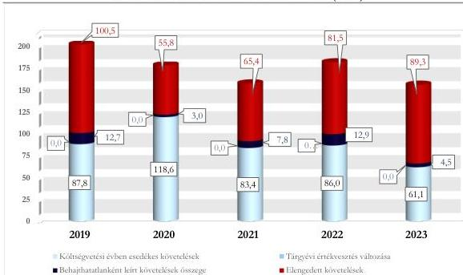

ÁLLAMI
SZÁMVEVŐSZÉK

# JELENTÉS

## A központi költségvetési szervek
követeléskezelése

A behajthatatlan és az elengedett követelések kezelése –
Készenléti Rendőrség

2026.

26025

www.asz.hu

---

ÁLLAMI
SZÁMVEVŐSZÉK

# JELENTÉS
## A központi költségvetési szervek
## követeléskezelése

A behajthatatlan és az elengedett követelések kezelése –
Készenléti Rendőrség

2026.

26025

www.asz.hu

---

ELLENŐRZÉSI IGAZGATÓSÁG:

ELLENŐRZÉSI IGAZGATÓSÁG I.

ELLENŐRZÉSI IGAZGATÓ:

SINKÁNÉ DR. CSENDES ÁGNES igazgató

ELLENŐRZÉSVEZETŐ:

BOZSÓ ERIKA LÍVIA ellenőrzésvezető

DR. SIMON JÓZSEF ellenőrzésvezető

LACZI HEDVIG ANNA ellenőrzésvezető

Jelentéseink az interneten a
www.asz.hu címen olvashatók.

IKTATÓSZÁM: EL-4443-001/2026

TÉMASORSZÁM: 20/2024

ELLENŐRZÉS-AZONOSÍTÓ SZÁM: V1073

---

# TARTALOMJEGYZÉK

|  ■ ÖSSZEFOGLALÁS | 5  |
| --- | --- |
|  ■ AZ ELLENŐRZÉS EREDMÉNYEI | 8  |
|  1. A központi költségvetési szerv követelése, a követelésekkel kapcsolatos értékvesztések, a behajthatatlan és elengedett követelések alakulása és ezek eredményre, illetve vagyonra gyakorolt hatásai | 8  |
|  2. A központi költségvetési szerv követeléskezelési tevékenységgel kapcsolatos folyamatainak és a követelések értékelési szabályainak kialakítása | 13  |
|  3. A központi költségvetési szerv követeléskezelési tevékenységének működtetése - behajthatatlan és elengedett követelések kezelése | 15  |
|  4. A központi költségvetési szerv követeléseinek év végi értékelése és az éves költségvetési beszámolóban történt kimutatása, leltárral történő alátámasztása | 18  |
|  ■ JAVASLATOK | 20  |
|  ■ I. FÜGGELÉK: ÉSZREVÉTELEK | 21  |
|  ■ II. FÜGGELÉK: ELLENŐRZÉSI MEGKÖZELÍTÉS | 22  |
|  ■ MELLÉKLETEK | 27  |
|  I. sz. melléklet: Értelmező szótár | 27  |
|  II. sz. melléklet: Az ellenőrzött szervezetek jegyzéke | 29  |
|  ■ RÖVIDÍTÉSEK JEGYZÉKE | 30  |

3

---

# ÖSSZEFOGLALÁS

A központi költségvetési szervek követelései a közvagyon részét képezik ugyanúgy, mint a pénzeszközök, a befektetett eszközök vagy a készletek. A követelések teljesülése befolyásolja az adott szervezet bevételeinek alakulását. Így a gazdálkodás egyik fontos elemét jelenti a követeléskezelési tevékenységek, eljárások szabályszerű, célszerű és eredményes működtetése a bevételek lehető legnagyobb mértékű pénzügyi realizálása érdekében. Mindezek hiánya esetén nem érvényesül a jó gazda gondossága a gazdálkodás e területén.

A Készenléti Rendőrség ellenőrzését az indokolta, hogy az ellenőrzött időszakban a központi költségvetési szervek között jelentős nagyságrendű követelésállománnyal rendelkezett, a lejárt követelések értéke folyamatosan növekedett, illetve a Rendőrség cím tekintetében kiemelt szereplőnek számított.

A Készenléti Rendőrség az ellenőrzött időszakban a jogszabályi előírásoknak megfelelően a követeléskezelési és behajtási tevékenységgel kapcsolatos szabályozási kereteit és belső szabályzatait megalkotta. Az ellenőrzött mintatételek alapján a kapcsolódó számviteli feladatokat több esetben nem szabályszerűen végezte. A követelések részletező nyilvántartásában a KR¹ az általa azonosított hibák kijavítása érdekében intézkedéseket tett. Az ellenőrzés a követelések nyilvántartása, az értékvesztés és a behajthatatlan követelések elszámolása esetén tárt fel hiányosságokat. A követeléskezelési tevékenység az ellenőrzött időszakban nem volt célszerű és eredményes. A KR a követelések megtérülése érdekében az előírt intézkedéseket többségében megtette, azonban ez nem eredményezte a lejárt követelések megtérülésének javulását. Az Állami Számvevőszék véleménye szerint a követelések kezelésének és behajtásának javítása érdekében indokolt biztosítani a követelések kezelésére és behajtására vonatkozóan meghatározott kontrolleljárások folyamatos végrehajtását. A lejárt követelésállomány áttekintése alapján az Állami Számvevőszék véleménye szerint indokolt a fizetési felszólítások és fizetési meghagyások belső szabályzatban meghatározott határidőn belüli kiküldése, a fizetési meghagyások teljeskörű alkalmazása, valamint a lejárt követelések teljeskörű behajtása érdekében további kontrolltevékenységek beépítése a követeléskezelés folyamatába.

A KR beszámolóban kimutatott követelésállománya a 2020. év végétől a 2022. év végéig növekvő tendenciát mutatott, majd ennek értéke a 2022. év végi 3 401,7 M Ft-hoz képest a 2023. évben 3 248,5 M Ft-ra csökkent. Ennek alakulására az adott évben képződött és esedékességgel ki nem egyenlített követelések értékének növekedése gyakorolt hatást. A költségvetési évben esedékes követelések beszámolóban kimutatott összege a 2019. év végétől folyamatosan növekedett, és 2023. év végére a 2022. év végi értékhez képest közel megduplázódott. A költségvetési évben esedékes követelések alakulását 2021. évtől kezdődően a költségvetési évben esedékes, felhalmozási célú átvett pénzeszközre vonatkozó követelések határozták meg.

A beszámolóban kimutatott, költségvetési évben esedékes közhatalmi, működési és felhalmozási célú követelések összege a 2019. év végi 87,8 M Ft-ról 2020. év végére 118,6 M Ft-ra növekedett, majd ehhez képest a 2023. év végére 48,5%-kal csökkent. A költségvetési évben esedékes közhatalmi, működési és felhalmozási célú beszámolóban kimutatott követeléseken belül a működési jellegű követelések meghatározó, átlagosan 89,5%-os részarányt képviseltek az ellenőrzött időszakban.

A KR lejárt követeléseinek értéke – figyelembe véve a költségvetési évben esedékes felhalmozási célú átvett pénzeszközökhöz kapcsolódó lejárt követeléseket is – a 2019. évi 120,6 M Ft-ról 2023. év végére 1 904,9 M Ft-ra emelkedett.

5

---

Összefoglalás---

A költségvetési évben esedékes közhatalmi, működési és felhalmozási célú lejárt követelések értéke a 2019. évi 94,8 M Ft-ról a 2023. év végére 398,7 M Ft-ra emelkedett. Ehhez kapcsolódóan a 180 napon túl lejárt követelésállomány aránya 2020. évig növekvő tendenciát követett, majd ezt követően az ellenőrzött időszakban a lejárati összetétel kedvező irányba változott.

A KR költségvetési évben esedékes (lejárt) követelései átlagosan 78,6%-ban természetes személyekkel szemben álltak fent, amelyből a belföldi természetes személyek 37,5%-ot, a saját foglalkoztatottak 62,5%-ot képviseltek. A KR államháztartáson kívüli szervezetekkel szemben fennálló követelése 14,9%, az államháztartás szervezeteivel szemben fennálló követelése 6,5% volt.

A **behajthatatlan követelések leírásának és az elengedett követelések** eredményre és vagyonváltozásra gyakorolt negatív hatása a 2019. évi 113,2 M Ft-ról 2020. évre 58,8 M Ft-ra csökkent, majd tendenciájában növekedett, a 2023. évre 93,8 M Ft-ra változott. A KR behajthatatlanként elszámolt összesen 40,9 M Ft értékű követeléseinek 58,7%-a természetes személyekkel, a 40,8%-a államháztartáson kívüli szervezetekkel és a 0,5%-a államháztartás szervezeteivel szemben állt fent. A KR **elengedettként elszámolt** összesen 392,4 M Ft összegű követelései 100,0%-ban belföldi természetes személyekkel – saját foglalkoztatottakkal – szemben keletkeztek.

A KR **korrigált, költségvetési évben esedékes közhatalmi, működési és felhalmozási célú követelésállománya** a 2019. évről 2021. évig csökkent, majd 2022. évre 180,4 M Ft-ra emelkedett és 2023. évre 154,9 M Ft-ra csökkent. Ennek alakulását a költségvetési évben esedékes, természetes személyekkel szemben fennálló követelések értéke, valamint az elengedett követelések értéke határozta meg.

A KR a **követelések kezelésével és behajtásával kapcsolatos szervezeti kereteket és folyamatokat** a jogszabályi előírásoknak megfelelően kialakította. A KR a **követelések kezelésének, elszámolásának, értékelésének, valamint a behajthatatlan és elengedett követelések elszámolásának szabályait** – egy kivétellel – a jogszabályi előírások szerint a gazdálkodására vonatkozó belső szabályzataiban meghatározta. A Számviteli politika² a jogszabályi előírások ellenére azonban nem tartalmazta az értékelések vonatkozásában, hogy a minősítési lehetőségek közül melyeket, milyen feltételek fennállása esetén alkalmazott és nem határozta meg a minősítéssel kapcsolatos szabályokat.

A KR a **követelések értékelését és elszámolását** nem a jogszabályok és a belső szabályozók előírásainak megfelelően végezte, mivel a beszámolójában kimutatott követeléseire az ellenőrzött időszakban **értékvesztést nem számolt el**.

A KR-nél a **behajthatatlan követelések minősítése és elszámolása** négy esetben nem a jogszabályi előírások szerint történt.

A KR az ellenőrzött időszakban a jogszabályi előírásokkal összhangban végezte a **követelések elengedését és az elengedett követelések** elszámolását.

A **követelések nyilvántartása és elszámolása** több esetben nem felelt meg a jogszabályi előírásoknak, mivel egy esetben, 1,8 M Ft értékben a jogszabályi előírás ellenére pénzügyileg teljesült követelést, illetve öt esetben, összesen 10 M Ft értékben a jogszabályi előírások ellenére az adósok által el nem ismert követelést mutatott ki követelésként.

A **követelések részletező nyilvántartása** az ellenőrzött mintatételek esetén nem teljeskörűen tartalmazta a jogszabály által előírt tartalmi elemeket.

A KR a **lejárt követelések kezelése, behajtása során** az ellenőrzött mintatételek esetén négy esetben nem a jogszabályokban és belső szabályzataiban rögzített előírások szerint járt el, mivel nem tett lépéseket e lejárt követelések érvényesítése érdekében.

6

---

Összefoglalás---

A követeléskezelési és behajtási tevékenység eredményes ellátását nehezítette a más szervezetek beolvadása miatt átvett követeléseknél a KR által feltárt, jelentős számú hiba. Ezek kijavítása érdekében a KR intézkedéseket tett az ellenőrzött időszakban.

A **követeléskezelés és a behajtás érdekében a KR által alkalmazott intézkedések** nem voltak eredményesek, mivel a lejárt követelésállomány az ellenőrzött időszakban folyamatosan növekvő tendenciát mutatott. Kedvező változást jelentett, hogy az átvett pénzeszközökből származó követelések nélkül számított lejárt követelések lejárati összetételén belül a 360 napon túl lejárt követelések aránya mérséklődött.

A **KR követeléskezelési tevékenysége** nem volt célszerű, mivel a KR az alkalmazott követeléskezelési és behajtási módszerek (egyenlegközlő levelek, fizetési felszólítás, fizetési meghagyás) lejárt követelések állományára és ennek időbeli alakulására vonatkozó hatásait nem értékelte az ellenőrzött időszakban, illetve a végrehajtott intézkedések nem tudták elősegíteni a lejárt követelések állományának csökkenését. A követeléskezelési és behajtási tevékenység az ellenőrzött időszakban azért sem volt célszerű, mivel a követeléskezelési és behajtási tevékenység egyes folyamatlépései tekintetében nem alkalmazott szervezeti szinten olyan kontrolljárásokat, amelyek biztosították volna, hogy az érintett folyamatlépések belső szabályzatokban rögzített határidőn belül és teljeskörűen végrehajtásra kerüljenek. E kontrolljárások alkalmazásának indokoltságát alátámasztja, hogy a KR négy esetben nem tett lépéseket az ellenőrzött időszakban az érintett követelések behajtása érdekében.

A **követelések év végi értékelése és a 2023. évi éves költségvetési beszámolóban történő kimutatása** a KR-nél nem felelt meg a jogszabályi előírásoknak, mert négy esetben nem számolt el értékvesztést, három követelés esetében, összesen 0,9 M Ft összegben a behajthatatlanság tényét nem támasztotta alá, illetve egy esetben, 1,8 M Ft összegben pénzügyileg rendezett követelést és öt esetben, összesen 10,0 M Ft összegben az adósok által el nem ismert követeléseket tartott nyilván.

A KR a **2023. évi éves költségvetési beszámoló mérlegében** kimutatott költségvetési évben és a költségvetési évet követően esedékes követeléseit a jogszabályi előírásnak megfelelően leltárral alátámasztotta.

**Kedvező változást jelentett**, hogy a KR az ellenőrzött időszakban fennálló hiányosságok megszüntetése érdekében az ÁSZ ellenőrzés során lépéseket tett. Ezek közé tartozott, hogy a 2024. évben a követelések minősítésének és értékelésének szabályozását felülvizsgálta, illetve a módosított szabályozás, valamint a követelések értékelése alapján értékvesztést számolt el.

Az ÁSZ³ – az ellenőrzött időszakot követően tett lépéseket is figyelembe véve – öt javaslatot fogalmazott meg a KR részére, amelyek a Számviteli politika és az Értékelési szabályzat tartalmi és jogszabályi előírásokkal való összhangjának biztosításához, a követelések részletező nyilvántartásának vezetéséhez, az értékvesztés képzésére vonatkozó jogszabályi előírások betartásához, valamint a követeléskezelési tevékenységet érintő további kontrolltevékenységek kialakításához és működtetéséhez kapcsolódtak.

7

---

# AZ ELLENŐRZÉS EREDMÉNYEI

## 1. A központi költségvetési szerv követelése, a követelésekkel kapcsolatos értékvesztések, a behajthatatlan és elengedett követelések alakulása és ezek eredményre, illetve vagyonra gyakorolt hatásai

### Összegző megállapítás

A KR beszámolóban kimutatott követeléseinek értéke – a 2020. és a 2023. évet kivéve – növekvő tendenciát mutatott, amelyet a felhalmozási célú átvett pénzeszközökhöz kapcsolódó követelések értékének emelkedése okozott. A lejárt követelések állománya folyamatosan növekedett. A követelések értékelése alapján a követelésekkel kapcsolatos elszámolások a beszámolóban kimutatott eredményt és vagyonváltozást negatívan érintették.

### A KÖVETELÉSEK ALAKULÁSA

A KR beszámolójában kimutatott követeléseinek értéke a 2020. év végi 2 753,6 M Ft-ról növekvő tendenciát mutatott a 2022. év végéig, ezt követően a 2023. év végén 3 248,5 M Ft-ra csökkent.

A KR költségvetési évben esedékes közhatalmi, működési és felhalmozási célú követeléseinek értéke a 2019. év végi 87,8 M Ft-ról a 2020. év végéig 118,6 M Ft-ra növekedett, majd a 2023. év végére 61,1 M Ft-ra csökkent.

A KR beszámolóban kimutatott követeléseinek és elszámolt bevételeinek alakulását az 1. táblázat tartalmazza.

8

---

Az ellenőrzés eredményei

1. táblázat

# **KR BESZÁMOLÓBAN KIMUTATOTT KÖVETELÉSEI ÉS ELSZÁMOLT BEVÉTELEI (M FT, %)**

|  MEGNEVEZÉS | 2019.12.31. | 2020.12.31. | 2021.12.31. | 2022.12.31. | 2023.12.31.  |
| --- | --- | --- | --- | --- | --- |
|  Beszámolóban kimutatott követelések, ebből: | 2 765,7 M Ft | 2 753,6 M Ft | 3 129,1 M Ft | 3 401,6 M Ft | 3 248,5 M Ft  |
|  Költségvetési évet követően esedékes követelések | 2 645,1 M Ft | 2 624,2 M Ft | 2 448,0 M Ft | 2 329,9 M Ft | 1 343,6 M Ft  |
|  Költségvetési évben esedékes követelések | 120,6 M Ft | 129,4 M Ft | 681,1 M Ft | 1 071,7 M Ft | 1 904,9 M Ft  |
|  Költségvetési évben esedékes közhatalmi, működési, továbbá felhalmozási célú követelések (D/1/3-5.) | 87,8 M Ft | 118,6 M Ft | 83,4 M Ft | 86,0 M Ft | 61,1 M Ft  |
|  Költségvetési évben esedékes követelések felhalmozási célú átvett pénzeszköz (D/1/7.) | 32,8 M Ft | 10,8 M Ft | 596,1 M Ft | 984,1 M Ft | 1 842,1 M Ft  |
|  Költségvetési évben esedékes elszámolt bevételek (B1-B7 összesen) | 4 875,7 M Ft | 6 280,6 M Ft | 7 565,5 M Ft | 9 827,8 M Ft | 8 713,3 M Ft  |
|  Közhatalmi, működési, továbbá felhalmozási célú elszámolt bevételek (B3-B5 összesen) | 973,9 M Ft | 1 042,1 M Ft | 1 168,8 M Ft | 1 164,0 M Ft | 1 477,9 M Ft  |
|  Költségvetési évben esedékes követelések aránya a beszámolóban kimutatott követeléshez (%) | 4,4% | 4,7% | 21,8% | 31,5% | 58,6%  |
|  Költségvetési évben esedékes követelésekből a közhatalmi, működési, továbbá felhalmozási célú követelések aránya az elszámolt közhatalmi, működési és felhalmozási célú bevételekhez viszonyítva (%) | 9,0% | 11,4% | 7,1% | 7,4% | 4,1%  |

Forrás: Az ellenőrzött szervezet éves költségvetési beszámolói alapján, ÁSZ saját szerkesztés

A költségvetési évben esedékes beszámolóban kimutatott követelések értékének alakulását a HSZT tv.$^{4}$ 171. § (1) bekezdés c) pontja alapján juttatott támogatás összege határozta meg.

A 2019-2023. évek közötti időszakban a KR elszámolt közhatalmi, működési és felhalmozási célú bevételeinek átlagosan 7,8%-át tette ki a beszámolóban kimutatott, költségvetési évben esedékes követelések értéke.

A beszámolóban kimutatott, költségvetési évben esedékes közhatalmi, működési és felhalmozási célú követelések értékén belül az ellenőrzött időszakban meghatározó, átlagosan 89,5%-os részarányt képviseltek a működési bevételekhez kapcsolódó követelések, illetve a költségvetési évben esedékes követeléseken belül a felhalmozási célú átvett pénzeszközökre vonatkozó követelések.

A KR beszámolóban kimutatott, költségvetési évben esedékes lejárt követeléseiből a 180 napon túli követelések aránya az ellenőrzött időszakon belül a 2020. évig meghaladta a 70,0%-os értéket. Ezt követően a lejárt követelések lejárat szerinti megoszlása kedvező irányba változott, mivel egyre nagyobb részarányt képviseltek a 90 napon belül lejárt követelések.

A lejárt követelések állománya az ellenőrzött időszakban átlagosan az elszámolt, költségvetési évben esedékes bevételek 9,2%-át tette ki. Mindez azt mutatja, hogy a lejárt követelések kis mértékben gyakoroltak hatást a gazdálkodásra.

A KR költségvetési évben esedékes lejárt követeléseinek állományát és a követeléseinek lejárat szerinti megoszlását a 2. táblázat tartalmazza.

9

---

Az ellenőrzés eredményei

2. táblázat

# **A KR KÖLTSÉGVETÉSI ÉVBEN ESEDÉKES LEJÁRT KÖVETELÉSEINEK ÁLLOMÁNYA ÉS LEJÁRAT SZERINTI MEGOSZLÁSA (M FT, %)**

|  KÖVETELÉSEK ESEDÉKESSÉGE | 2019.12.31 |   | 2020.12.31 |   | 2021.12.31 |   | 2022.12.31 |   | 2023.12.31  |   |
| --- | --- | --- | --- | --- | --- | --- | --- | --- | --- | --- |
|   |  % | M Ft | % | M Ft | % | M Ft | % | M Ft | % | M Ft  |
|  Fizetési határidőn túl 0-90 nap | 20,0 | 19,0 | 19,4 | 21,5 | 43,8 | 106,0 | 69,3 | 250,7 | 88,7 | 353,7  |
|  Fizetési határidőn túl 91-180 nap | 9,6 | 9,1 | 0,8 | 0,9 | 3,4 | 8,3 | 0,1 | 0,4 | 1,4 | 5,5  |
|  Fizetési határidőn túl 181-360 nap | 14,1 | 13,3 | 13,1 | 14,5 | 6,8 | 16,5 | 1,9 | 6,7 | 4,3 | 17,3  |
|  Fizetési határidőn túl 360 nap felett | 56,3 | 53,4 | 66,7 | 74,1 | 46,0 | 111,2 | 28,7 | 103,6 | 5,6 | 22,2  |
|  **Költségvetési évben esedékes közhatalmi, működési, illetve felhalmozási bevételekhez kapcsolódó lejárt követelések megoszlása / értéke** | **100,0** | **94,8** | **100,0** | **111,0** | **100,0** | **242,0** | **100,0** | **361,4** | **100,0** | **398,7**  |
|  **Lejárt követelések értéke (M FT)*** |  | **120,6** |  | **129,4** |  | **681,1** |  | **1 071,7** |  | **1 904,9**  |
|  *Lejárt követelések aránya az elszámolt bevételekhez viszonyítva (%)* | 2,5% |  | 2,1% |  | 9,0% |  | 10,9% |  | 21,9% |   |

\* Költségvetési évben esedékes közhatalmi, működési, felhalmozási bevételekhez és a felhalmozási célú átvett pénzeszközökhöz kapcsolódó lejárt követelések értéke

A lejárt követelések értékét döntő mértékben a felhalmozási célú átvett pénzeszközökhöz kapcsolódó lejárt követelések követelésként történő nyilvántartása, illetve a lejárt követelések között jelentős számban található több mint 10 éve lejárt követelések határozták meg. Az átvett pénzeszközökhöz kapcsolódó követelések nélkül számított lejárt követelések esetén a működési bevételekhez kötődő követelések voltak meghatározóak.

A lejárt követelések növekedésében szerepet játszott a nyújtott munkáltatói lakáskölcsönök lejárt követelésként történő nyilvántartása. A KR – a helyszíni ellenőrzés jegyzőkönyvében foglaltak szerint – az e típusú követeléseket a kölcsönt folyósító bank nyilvántartása és adatszolgáltatása alapján rögzítette a követelések részletező nyilvántartásában. Az újonnan felvett lakáskölcsönök esetén az első törlesztőrészlet kifizetésének időpontjában (jellemzően a következő hónaptól) az érintett követelések analitikus nyilvántartásában lejárt követelésként került kimutatásra a teljes érintett hitelállomány.

A KR az ellenőrzött időszakot követően a 2024. évben a hátrasorolást alkalmazta korrekciós eszközként e probléma kezelése érdekében. Ennek keretében egyedileg értékelte a munkáltatói lakáskölcsönnel kapcsolatos követeléseket és szükség szerint korrigálta a követelések besorolását. A KR a helyszíni ellenőrzés jegyzőkönyvében foglaltak szerint a 2025. évben megkezdődött a hiba kiküszöbölése az ügyviteli rendszer fejlesztése által.

Az ellenőrzött időszakban a KR beszámolóban kimutatott, költségvetési évben esedékes (lejárt) követeléseinek átlagosan 78,6%-a természetes személyekkel, ezen belül 37,5% belföldi személyekkel (pl. továbbszámlázott közüzemi díjakkal, szállásadási szolgáltatással kapcsolatos követelések esetén), illetve 62,5% saját foglalkoztatottak szemben állt fent. A KR államháztartáson kívüli szervezetekkel szemben fennálló mérleg szerinti, költségvetési évben esedékes követeléseinek aránya átlagosan 14,9%, míg az államháztartáson belüli szervezetekkel szembeni átlagos arány 6,5% volt.

10

---

Az ellenőrzés eredményei

## A KÖVETELÉSEK ÉRTÉKELÉSÉNEK HATÁSA AZ EREDMÉNY- ÉS VAGYONVÁLTOZÁSRA

A KR beszámolóban kimutatott követeléseinek értékelése negatív hatást gyakorolt az ellenőrzött időszakban az eredményre és vagyonváltozásra. Az eredményre és vagyonra gyakorolt hatás értéke a 2019. évi 113,2 M Ft-ról a 2020. évre csökkent, majd tendenciájában növekedett és a 2023. évre 93,8 M Ft-ra változott.

A KR követelései értékelésének eredményre és vagyonváltozásra gyakorolt hatását az ellenőrzött időszakra vonatkozóan a 3. táblázat tartalmazza.

3. táblázat

### A KR KÖVETELÉSEI ÉRTÉKELÉSÉNEK EREDMÉNYRE ÉS VAGYONVÁLTOZÁSRA GYAKOROLT HATÁSA (M FT, %)

|  MEGNEVEZÉS | 2019 | 2020 | 2021 | 2022 | 2023  |
| --- | --- | --- | --- | --- | --- |
|  **Követelések értékelésének eredményre és vagyonváltozásra gyakorolt hatása** | **113,2 M Ft** | **58,8 M Ft** | **73,2 M Ft** | **94,4 M Ft** | **93,8 M Ft**  |
|  ebből: behajthatatlan követelés | 12,7 M Ft | 3,0 M Ft | 7,8 M Ft | 12,9 M Ft | 4,5 M Ft  |
|  ebből: elengedett követelés | 100,5 M Ft | 55,8 M Ft | 65,4 M Ft | 81,5 M Ft | 89,3 M Ft  |
|  *Követelésértékelés elemeinek megoszlása* |  |  |  |  |   |
|  *behajthatatlan követelések aránya %* | 11,2% | 5,1% | 10,7% | 13,7% | 4,8%  |
|  *elengedett követelések aránya %* | 88,8% | 94,9% | 89,3% | 86,3% | 95,2%  |

Forrás: Kincstár KGR-K11 rendszer beszámoló, ellenőrzött szervezet főkönyvi kivonat adatai alapján, ASZ saját szerkesztés

Az ellenőrzött időszakban a KR által elszámolt **behajthatatlan követelés** összesen 40,9 M Ft volt, amelynek 40,8%-a államháztartáson kívüli szervezetekkel, 58,7%-a természetes személyekkel szemben (ezen belül a saját foglalkoztatott illetménytartozásához és lakáscélú munkáltatói kölcsön juttatásához kapcsolódó részarány 98,5%-ot jelentett) és 0,5%-a az államháztartás szervezeteivel szemben került kivezetésre. A behajthatatlanként elszámolt követelések az ellenőrzött időszakban többek között illetménytartozáshoz, perköltséghez, kártérítéshez, lakáscélú munkáltatói kölcsön végrehajtásához, bírságokhoz, illetve egyéb bevételből keletkező követelésekhez kapcsolódtak.

Az adott évben behajthatatlanként elszámolt követelések év végén fennálló 360 napon túl lejárt követelésállományhoz viszonyított aránya az ellenőrzött időszakban 10,5% (2019. év) és 0,2% (2023. év) között mozgott.

A KR **elengedett követelést** az ellenőrzött időszakban összesen 392,5 M Ft értékben számolt el, amely a foglalkoztatottakkal és természetes személyekkel szemben fennálló követelésekhez kapcsolódott.

A KR követelései értékelésének eredményre és vagyonváltozásra gyakorolt hatását befolyásolta, hogy a KR a Számv. tv. 55. § (1)-(2) bekezdésében és az Áhsz. 18. § (1) bekezdésében, továbbá a Számviteli politika 137. és 146. pontjaiban, valamint az Értékelési szabályzat$^{5}$ 64. és 74. pontjában foglaltak ellenére az ellenőrzött időszakban **értékvesztést nem képzett**.

## A KÖVETELÉSÁLLOMÁNY ALAKULÁSA

A KR **korrigált, költségvetési évben esedékes közhatalmi, működési és felhalmozási célú összesített követelésállománya** a 2020. évről kezdődően évről-évre változó tendenciát mutatott és a 2019. évi 201,0 M Ft-ról a 2023. évre 154,9 M Ft-ra csökkent.

A korrigált, költségvetési évben esedékes közhatalmi, működési és felhalmozási célú összesített követelésállomány alakulását a költségvetési évben esedékes követelések, illetve az elengedett követelések értéke határozta meg.

11

---

Az ellenőrzés eredményei

A KR korrigált, költségvetési évben esedékes közhatalmi, működési és felhalmozási célú összesített követelésállományának összetételét az 1. ábra szemlélteti.

1. ábra

# **A KR KORRIGÁLT, KÖLTSÉGVETÉSI ÉVBEN ESEDÉKES KÖVETELÉSÁLLOMÁNYÁNAK ÖSSZETÉTELE (M Ft)**

Forrás: Kincstár KGR-K11 rendszer beszámoló adatai, továbbá az ellenőrzött szervezet főkönyvi kivonatai alapján, ÁSZ saját szerkesztés

Az ellenőrzött időszakban a Rendőrség címhez tartozó költségvetési szervek költségvetési évben esedékes követelése éves átlagos állományán (2 673,5 M Ft) belül a KR részaránya 28,3%-ot (757,5 M Ft-ot) képviselt. Az ellenőrzött időszakban elszámolt értékvesztés változások, a behajthatatlan és elengedett követelések eredmény és vagyonváltozásra gyakorolt hatásának értéke a KR esetében összesen 433,3 M Ft volt, ami a Rendőrség cím költségvetési szerveire vonatkozó összesített érték (4 408,1 M Ft) 9,8%-ának felelt meg.

12

---

Az ellenőrzés eredményei

## 2. A központi költségvetési szerv követeléskezelési tevékenységgel kapcsolatos folyamatainak és a követelések értékelési szabályainak kialakítása

### Összegző megállapítás

A KR a követeléskezelési és behajtási tevékenységgel kapcsolatos szervezeti kereteit és folyamatait a jogszabályi előírásoknak megfelelően kialakította. A követelések kezelésére, elszámolására és értékelésére, valamint a behajthatatlan és elengedett követelések elszámolására vonatkozó belső szabályokat meghatározta, azonban azok tartalma nem teljeskörűen felelt meg a jogszabályi előírásoknak.

A KR a követeléskezelési feladatokat ellátó szervezeti egységek feladatait az SZMSZ⁶-ben, valamint a Költségvetési Igazgatóság ügyrend⁷-jében az Ávr.⁸ előírásaival összhangban határozta meg.

A KR a követeléskezeléskezeléssel, a behajthatatlan és elengedett követelés működési- és értékelési munkafolyamataival kapcsolatos feladatait a Költségvetési Igazgatóság ügyrendjében, az Értékelési szabályzatban és az Ellenőrzési nyomvonal⁹-ban a Bkr.¹⁰-ben foglaltak szerint szabályozta.

A követelések kezelésére, elszámolására és értékelésére, a követelés behajtására vonatkozó szervezeti keretek kialakítását, a munkafolyamatok szabályozását a KR-nél a 4. táblázatban megjelölt szabályozó eszközök tartalmazták az ellenőrzött időszakban.

4. táblázat

### A KR KÖVETELÉSEK KEZELÉSÉBEN RÉSZTVEVŐ SZERVEZETI EGYSÉGEI, ILLETVE A SZERVEZETI KERETEKET ÉS A MUNKAFOLYAMATOKAT SZABÁLYOZÓ ESZKÖZÖK

|  KÖVETELÉSKEZELÉSBEN RÉSZTVEVŐ SZERVEZETI EGYSÉGEK |   |   | A KÖVETELÉSKEZELÉS SZERVEZETI KERETEIT ÉS A MUNKAFOLYAMATAIT SZABÁLYOZÓ ESZKÖZÖK  |   |   |   |
| --- | --- | --- | --- | --- | --- | --- |
|  GAZDASÁGI HIVATAL | GAZDASÁGI HIVATAL BEVÉTELI OSZTÁLYA | JOGI ÉS IGAZGATÁSSZERVEZÉSI OSZTÁLY | SZMSZ | ÜGYREND | ELLENŐRZÉSI NYOMVONAL | EGYÉB SZABÁLYOZÓK  |
|  ☑ | ☑ | ☑ | ☑ | ☑ | ☑ | ☑  |
|  ☑ rendelkezett a szabályozó eszközzel és szabályozta a követeléskezelést; rendelkezett követeléskezelésben résztvevő szervezeti egységgel  |   |   |   |   |   |   |

Forrás: Az ellenőrzött szervezet szabályozó eszközei alapján, ÁSZ saját szerkesztés

A követelések kezelésével és behajtásával kapcsolatos munkafolyamatokra vonatkozó nyomvonalat a Belső Kontroll Kézikönyv¹¹ tartalmazta. Az ellenőrzési nyomvonalban rögzítésre kerültek többek között a követelés típusok – leszerelés során keletkezett követelések, kártérítési követelések, peres/végrehajtás alatt álló követelések, kintlévőségek – kezelésével kapcsolatos tevékenységek, a kintlévőségezeléssel kapcsolatos feladatok végrehajtásáért felelős szervezeti egységek, a végrehajtási és ellenőrzési határidők, valamint az e feladatok végrehajtása során keletkező dokumentumok.

A Költségvetési Igazgatóság ügyrendjében megfogalmazottak alapján a Vevő és követeléskezelési Alosztály feladatai közé tartozott többek között a következő feladatok ellátása: a bírói ítéletek, parancsnoki határozatok alapján a követelések előírása; a bírságbefizetésekkel, igazgatási szolgáltatási díjakkal

13

---

Az ellenőrzés eredményei

kapcsolatos nyilvántartások, könyvelések, egyeztetések ellátása; a fizetési késedelembe esők részére felszólító levelek készítése, valamint második felszólítást követően intézkedés a követelések megküldéséről az illetékes jogi tevékenységet ellátó szervezeti egység felé további intézkedés megtétele céljából. További feladatot jelentett az egyeztetések kezdeményezése az illetékes szervezeti egységek között a követelésekkel kapcsolatban, az érintett partnerek részére minden évben december 31-ei fordulónappal a követelésekről egyenlegközlők készítése és ezek megküldése.

A KR Hivatal¹² azon lejárt követeléseket kezelte, amelyeknél a fizetési felszólítás nem vezetett eredményre. A követeléskezelési és behajtási folyamat felelőse a KR Hivatal volt. A behajtási eljárások tekintetében a KR Hivatali ügyrendjében meghatározottak alapján a Jogi Osztály vezetője döntött a fizetési meghagyásos eljárás megindításáról, a jogi terület feladatkörébe tartozó követelések jogi úton történő érvényesítéséről. A KR-nél a jogi terület gondoskodott a követelések behajtására vonatkozó eljárások végrehajtásáról és az ezzel kapcsolatos koordinációs feladatok ellátásáról, a vonatkozó KR normák nyilvántartásáról, a folyamatok aktualizálásáról, és negyedéves felülvizsgálatáról, valamint a KR pénzkövetelésre vonatkozó igényének érvényesítéséről fizetési meghagyások, illetve bírósági végrehajtások kezdeményezése útján.

**A követelések értékelésének, valamint a behajthatatlan és elengedett követelések elszámolásának szabályait** a KR – egy kivétellel – a Számv. tv.¹³ és az Áhsz.¹⁴ előírásainak megfelelően meghatározta a Számviteli politikában és annak keretében elkészített Értékelési szabályzatban. KR a Számviteli politikájában azonban nem rögzítette a Számv. tv. 14. § (4) bekezdésében foglaltak ellenére, hogy törvényben biztosított minősítési lehetőségek közül melyeket, milyen feltételek fennállása esetén alkalmazott a követelésekre vonatkozóan. (2. javaslat)

A KR a 2025. évben a követelésekre vonatkozó minősítési lehetőségek szabályozását meghatározta, az Értékelési szabályzat módosítása 2025. május 20-án lépett hatályba.

A KR Számviteli politikájában és az Értékelési szabályzatában az értékvesztés tartósságának megítélése nem volt összhangban, mivel a Számviteli politika 145. pontja szerint „a követeléseknél az értékvesztés akkor tekinthető tartósnak, ha az előírt teljesítés időpontjától félévet meghaladóan nem rendeződött, nem került elszámolásra”, ezzel szemben az Értékelési szabályzat 69. pontja szerint „az értékvesztés esetében az egy évet meghaladó időtartam tekinthető tartósnak”. (1. javaslat)

A követelések értékelésének nem megfelelő és nem egyértelmű szabályozása kockázatot hordoz, mivel a szabályozás eltérő, egymásnak ellentmondó tartalma miatt a követelések nem egységes módszerrel kerülnek értékelésre, ezáltal olyan követelések kerülhetnek az éves beszámolóban kimutatásra, amelyek esetében a bevételek pénzügyi realizálása bizonytalan.

**A követelésekkel kapcsolatos részletező nyilvántartás vezetésére vonatkozó szabályokat** a KR Számlarend¹⁵-je az Áhsz-ben előírtak szerint tartalmazta.

A KR **belső ellenőrzése** az ellenőrzött időszakra vonatkozóan a követeléskezelési tevékenységre, behajthatatlan és elengedett követelésekre és a követelések értékvesztésére vonatkozóan belső ellenőrzést nem végzett.

14

---

Az ellenőrzés eredményei

### 3. A központi költségvetési szerv követeléskezelési tevékenységének működtetése - behajthatatlan és elengedett követelések kezelése

#### Összegző megállapítás

A KR a követelések értékelését az ellenőrzött időszakban négy esetben nem a jogszabályokban és belső szabályzataiban foglalt előírások szerint végezte. A behajthatatlan követelések elszámolása négy mintatétel esetén nem a jogszabályi előírások szerint történt. A KR a jogszabályi előírásokkal összhangban végezte a követelések elengedését és elszámolását. A követelések nyilvántartása hat esetben nem felelt meg a jogszabályi előírásoknak. A követelések részletező nyilvántartása a jogszabály szerinti releváns adatokat nem teljeskörűen tartalmazta. A lejárt követelések állományának növekvő tendenciája alapján a követeléskezelési és behajtási tevékenység nem volt eredményes. A követeléskezelési tevékenység a követeléskezelési eszközök hatásaira vonatkozó értékelések elvégzésének, illetve négy esetben a behajtási tevékenység végrehajtásának hiánya miatt nem volt célszerű.

#### A KÖVETELÉSEK ÉRTÉKELÉSE ÉS ELSZÁMOLÁSA

A KR – két esetben összesen 3,2 M Ft összegben – az ellenőrzött időszakban a **lejárt követeléseire**, illetve az **ellenőrzött időszakot megelőzően lejárt követeléseire** – két esetben összesen 4,6 M Ft összegben – **nem számolt** el értékvesztést az Áhsz. 18. § (1) bekezdésében, a Számv. tv. 55 § (1)-(2) bekezdésében és a Számviteli politika 137. d) pontjában foglaltak ellenére. (4. javaslat)

A követelések nem jogszabályi és belső előírások szerinti értékelése, valamint az értékvesztés elszámolásának hiánya azt a kockázatot hordozza, hogy a jövőben a KR olyan követeléseket mutat ki, amelyek esetében a bevételek pénzügyi realizálása és a követelések behajtásának eredményessége bizonytalan. Kockázatot jelent a jövőben továbbá, ha a költségvetési évben esedékes követelések megfelelő kezelése és értékelése elmarad, amelynek következtében a fennálló követelés nem évenként ütemezetten, hanem esetleg egy összegben behajthatatlanként kerül elszámolásra. Ennek következtében fennáll annak kockázata, hogy a KR éves beszámolójában bemutatott vagyoni helyzet nem a valós képet mutatja.

A 2024. évi költségvetési beszámoló adatai alapján 2024. évben a KR a követelések tekintetében értékvesztést számolt el, ezáltal az ÁSZ ellenőrzése által feltárt hibás gyakorlat kezelése érdekében lépéseket tett.

A KR – egy esetben 1,8 M Ft összegben – a 2019. évben keletkezett és nyilvántartásba vett kötbér követelésre vonatkozó számlát a Számv. tv. 166. § (3) bekezdésében szereplő rendelkezés ellenére a 2022. évben állította ki.

15

---

Az ellenőrzés eredményei

## A BEHAJTHATATLAN KÖVETELÉSEK MINŐSÍTÉSE ÉS ELSZÁMOLÁSA

A KR a behajthatatlan követelések számviteli elszámolását egy esetben az Áhsz.-ben és a 38/2013. (IX. 19.) NGM rendelet¹⁶-ben foglaltak szerint végezte.

A KR – három esetben összesen 0,9 M Ft összegben – a követelések Számv. tv. 3. § (4) bekezdés 10. g) pont szerinti behajthatatlanságát nem támasztotta alá.

A KR – egy esetben 1,8 M Ft összegben – a partner által vitatott, el nem ismert az Áhsz. 1. § (1) bekezdés 6. pontnak nem megfelelően nyilvántartott követelést, mint a bíróság előtt nem érvényesíthető követelést a Számv. tv. 3. § (4) bekezdés 10. f) pont alapján behajthatatlanként vezetett ki, a sztornózás helyett.

## A KÖVETELÉSEK ELENGEDÉSE ÉS ELSZÁMOLÁSA

A KR a követelések elengedése során az Áht.-ban foglalt előírások szerint a 44/2012. (VIII.29.) BM rendelet¹⁷ alapján járt el, amelyre az 1996. évi XLIII. törvény¹⁸ és a HSZT tv. adott felhatalmazást. Az elengedett követelések elszámolását a Számv. tv. és az Áhsz. előírásai szerint hajtotta végre.

## A KÖVETELÉSEK NYILVÁNTARTÁSA

A KR pénzügyileg rendezett követelést – egy esetben 1,8 M Ft összegben – követelésként tartott nyilván a 2023. évben az Áhsz. 1. § (1) bekezdés 6. pontjában foglaltak ellenére.

A KR – öt esetben összesen 10,0 M Ft összegben – olyan követeléseket tartott nyilván követelésként, amelyek nem feleltek meg az Áhsz. 1. § (1) bekezdés 6. pontjában foglaltaknak, mivel az adósok nem ismerték el e követeléseket. A KR a Számviteli politika 138. pontjában és az Értékelési szabályzat 105. pontjában foglaltak ellenére a vitatott követeléseket nem a 0. számlaosztályban mutatta ki.

A KR követelésekről vezetett részletező nyilvántartása nem teljeskörűen tartalmazta az Áhsz. 14. melléklet III. 4. pontja szerint előírtakat (3. javaslat):

- az Áhsz. 14. melléklet III. 4. b) pontjában szereplő rendelkezés ellenére 17 esetben a követelést tanúsító dokumentum megnevezését,
- az Áhsz. 14. melléklet III. 4. j) pontjában szereplő rendelkezés ellenére egy esetben a követelésekkel kapcsolatos fizetési felhívások, a behajtására tett intézkedések adatait.

## A LEJÁRT KÖVETELÉSEK KEZELÉSE, BEHAJTÁSA ÉRDEKÉBEN MEGTETT INTÉZKEDÉSEK

### A követeléskezelési és behajtási tevékenység tartalma és értékelése

A követeléskezelési és behajtási tevékenység előírások szerinti végrehajtása tekintetében – a KR helyszíni ellenőrzés jegyzőkönyvében foglaltak szerint – befolyásoló tényezőt jelentett a rendelkezésre álló humánkapacitás korlátozottsága. Az ellenőrzött időszakban mindössze 1 fő foglalkozott teljes munkaidőben e feladatok ellátásával. A KR-nél – a helyszíni ellenőrzés jegyzőkönyvében foglaltak szerint – ezzel párhuzamosan a fluktuáció jelentős mértékű volt, amely megnehezítette a feladatok teljeskörű és határidőn belüli ellátását.

A követeléskezelési és behajtási tevékenységet befolyásolta az is, hogy a KR a saját követelései mellett az Országos Rendőr-főkapitányság követeléseit is kezelte, amely – a KR helyszíni ellenőrzés jegyzőkönyvében foglaltak szerint – szintén jelentős erőforrásigényt jelentett.

A KR követeléskezelési és behajtási tevékenységének eredményességét befolyásolta, hogy – a 2020. előtt beolvadt szervezetektől a KR-hez került követelések jelentős része lejárt követelést jelentett, illetve több esetben az átvett követelések részletező nyilvántartása több hibát, hiányosságot is tartalmazott. A KR e követelések megfelelő nyilvántartásának biztosítása érdekében egyenlegközlő leveleket küldött az érintett

16

---

Az ellenőrzés eredményei---

adósoknak. Az érintett ügyekhez kapcsolódó adatok, információk összegyűjtése, rendszerezése – a KR a helyszíni ellenőrzés jegyzőkönyvében foglaltak szerint – jelentős időráfordítást igényelt.

Az egyenlegközlő levelek alapján beérkezett visszajelzések feldolgozása révén a KR a követelések részletező nyilvántartását a hibásan, nem megfelelő adatokkal nyilvántartott követelések egy részét érintően ki tudta javítani. Az átvett és nem érvényesíthető követelések az ellenőrzött időszakban behajthatatlan követelésként jellemzően leírásra kerültek, így e követelések gazdálkodásra gyakorolt hatása egyre kisebb mértékű volt.

A KR-nél – a helyszíni ellenőrzés jegyzőkönyvében foglaltak szerint – az ellenőrzött időszakban a követeléskezelési és behajtási tevékenység tekintetében a fő prioritást a hibát tartalmazó ügyek rendezése, valamint a humánerőforrás biztosítása jelentette.

A KR-nél – a helyszíni ellenőrzés jegyzőkönyvében foglaltak szerint – az ellenőrzött időszakban a követeléskezelés és behajtási tevékenység során alkalmazott eszközök köre nem változott. Változást jelentett azonban, hogy a saját munkavállalókkal szembeni 90 napon túli tartozásoknál a Pénzügyi Osztály, az Illetménygazdálkodási Osztály és a KR Hivatal között egyeztetés került bevezetésre az ilyen típusú követelések kezelése érdekében.

A fennálló, esedékes követelések nyomon követése a KR-nél – a helyszíni ellenőrzés jegyzőkönyvében foglaltak szerint – havonta történt a számviteli és az ügyviteli rendszer adatainak felhasználásával. Ennek keretében az érintett követelésekhez tartozó adósok esetén megvizsgálták történt-e az adott időpontig teljesítés és megállapították, hogy továbbra is aktuális-e a követelés, illetve milyen értékű a fennmaradt követelés a rendelkezésre álló dokumentumok alapján. A követelésállomány alakulásáról rendszeresen, havonta tájékoztatta dokumentált formában az Országos Rendőrfőkapitányságot, mint irányító szervet. A havonta történő egyeztetéseken túl a KR a követelésállomány, illetve a lejárt követelésállomány összetételének és értékének alakulására vonatkozó nyomon követést nem végzett, elemzést nem készített. A KR-nél a helyszíni ellenőrzés jegyzőkönyvében foglaltak szerint – az alkalmazott követeléskezelési eszközök darabszámát és ezek alakulását nem mutatták ki és nem elemezték.

A behajthatatlan követelések elszámolásához szükséges feltételek vizsgálatát a KR az egyes követeléseknél év közben folyamatosan, egyedileg végezte, illetve év végén a követelésállomány átfogó vizsgálatára került sor. A behajthatatlan követeléssé való minősítésre vonatkozó előterjesztéseket év közben folyamatosan készítették el és továbbították vezetői jóváhagyásra.

A követeléskezelés és a behajtás érdekében alkalmazott tevékenység, intézkedések – a követelésekről vezetett számviteli nyilvántartások és a költségvetési beszámolók adatai alapján – nem voltak eredményesek, mivel a lejárt követelésállomány az ellenőrzött időszakban folyamatosan növekvő tendenciát mutatott. (5. javaslat) Kedvező változást jelentett, hogy az átvett pénzeszközökből származó követelések nélkül számított lejárt követelések lejárati összetételén belül a 360 napon túl lejárt követelések aránya mérséklődött.

A KR követeléskezelési és behajtási tevékenysége nem volt célszerű az átvett követelések kapcsán a követelések részletező nyilvántartását érintő hiányosságok, valamint „A követeléskezelési és behajtási tevékenység a mintatételek alapján” alfejezetben bemutatott esetekben a követelések kezelésével és behajtásával kapcsolatos intézkedések elmaradása miatt.

A KR az alkalmazott követeléskezelési és behajtási módszerek (egyenlegközlő levelek, fizetési felszólítás, fizetési meghagyás) lejárt követelések állományára és ennek időbeli alakulására vonatkozó hatásait nem

17

---

Az ellenőrzés eredményei

értékelte az ellenőrzött időszakban, illetve a végrehajtott intézkedések nem tudták elősegíteni a lejárt követelések állományának csökkenését, ezért a követeléskezelési tevékenység nem volt célszerű.

A KR szervezeti szinten nem alkalmazott olyan kontrolljárásokat, amelyek biztosították volna annak alátámasztását, hogy az érintett folyamatlépések belső szabályzatokban rögzített határidőn belül és teljeskörűen végrehajtásra kerüljenek.

A lejárt követelések állományának növekvő tendenciája alapján az ÁSZ véleménye szerint indokolt a KR-nek áttekintenie az érintett követeléseket, és ez alapján biztosítani a követelések kezelésére és behajtására vonatkozóan meghatározott kontrolljárások folyamatos végrehajtását, továbbá a fizetési felszólítások belső szabályzatban meghatározott határidőn belül történő kiküldésének teljeskörűségét, a fizetési meghagyások alkalmazásának teljeskörűségét, illetve a lejárt követelések teljeskörű behajtását biztosító kontrolltevékenységek beépítését a követeléskezelési folyamatba.

#### **A követeléskezelési és behajtási tevékenység a mintatételek alapján**

A KR a **lejárt követelések érvényesítése, behajtása** során az SZMSZ-ben és a Költségvetési Igazgatóság ügyrendjében meghatározott szabályok szerint járt el, mivel a követelések érvényesítése érdekében – öt esetben – egyenlegközlőket, illetve fizetési tájékoztatókat, továbbá – öt esetben – fizetési felszólításokat küldött ki, továbbá – öt esetben – kezdeményezett közjegyzői, illetve bírósági végrehajtást, valamint két esetben érvényesítette a követelését peres úton. Fizetési meghagyásos eljárást – két esetben – kezdeményezett, illetve – egy esetben – folytatott le egyeztető tárgyalást a vitás követelés kapcsán.

A partnerek által vitatott követelések esetében célszerűségi és eredményességi szempontból indokolt lett volna az ÁSZ véleménye szerint a követelések érvényesítése, azonban a KR négy esetben ezt nem tette meg. (5. javaslat)

## **4. A központi költségvetési szerv követeléseinek év végi értékelése és az éves költségvetési beszámolóban történt kimutatása, leltárral történő alátámasztása**

### **Összegző megállapítás**

A követelések év végi értékelése a KR-nél nem volt szabályszerű, mert négy esetben nem számolt el értékvesztést, az éves költségvetési beszámolóban a követelések kimutatása hat esetben, illetve a behajthatatlan követelés elszámolása három esetben nem felelt meg a jogszabályi és belső szabályzataiban foglalt előírásoknak. A KR a 2023. évi éves költségvetési beszámoló mérlegében kimutatott követeléseit a jogszabályi előírásoknak megfelelően leltárral alátámasztotta.

A KR a számviteli nyilvántartások és a beszámoló adatai alapján a Számv. tv. 55. § (1)-(2) bekezdésében és az Áhsz. 18. § (1) bekezdésében, továbbá a Számviteli politika 137. d) pontjában foglaltak ellenére az ellenőrzött időszakban **értékvesztést nem számolt el.** (4. javaslat)

A KR a mintatételek alapján nem teljeskörűen a jogszabályokban és a belső szabályzataiban foglalt előírásokkal összhangban végezte a követelésekkel, valamint a behajthatatlan követelésekkel kapcsolatos

18

---

Az ellenőrzés eredményei

elszámolásokat, illetve ez alapján nem a jogszabályi előírások szerint mutatta ki a követeléseket a 2023. évi beszámolóban mivel:

- a Számv. tv. 3. § (4) bekezdés 10. g) pontjában szereplő előírás ellenére három esetben, összesen 0,9 M Ft értékben a követelések behajthatatlanságát nem támasztotta alá,
- az Áhsz. 1. § (1) bekezdés 6. pontjában foglaltak ellenére egy esetben – 1,8 M Ft értékben – pénzügyileg rendezett követelést követelésként tartott nyilván,
- az Áhsz. 1. § (1) bekezdés 6. pontjában foglaltak ellenére olyan követeléseket tartott nyilván követelésként öt esetben – összesen 10,0 M Ft értékben –, amelyeket az adósok nem ismerték el e követelésként.

Mindezek alapján a 2023. évi költségvetési beszámoló mérlege összesen 11,8 M Ft hibát tartalmazott.

A KR a 2023. évi éves költségvetési beszámoló mérlegében szereplő költségvetési évben és költségvetési évet követően esedékes követeléseit az Áhsz. és a Számv. tv.-ben foglaltaknak megfelelően leltárral alátámasztotta.

19

---

# JAVASLATOK

Az ÁSZ tv. 33. § (1) bekezdésében foglaltak értelmében az ellenőrzött szervezet vezetője köteles a jelentésben foglalt megállapításokhoz kapcsolódó intézkedési tervet összeállítani és azt a jelentés kézhezvételétől számított 30 napon belül az ÁSZ részére megküldeni. Az ÁSZ a jelentésben foglalt megállapításokhoz kapcsolódóan az alábbi javaslatok tekintetében várja el az intézkedési terv elkészítését.

## A KÉSZENLÉTI RENDŐRSÉG PARANCSNOKA RÉSZÉRE

1. Gondoskodjon a Bkr. 6. § (2) bekezdésében foglaltaknak megfelelően a Számviteli politika és annak keretében elkészített Értékelési szabályzatban foglaltak összhangjának megteremtéséről.
2. Gondoskodjon arról, hogy a Számv. tv. 14. § (4) bekezdésében foglaltak szerint a Számviteli politika keretében rögzítésre kerüljön, hogy a törvényben biztosított minősítési lehetőségek közül melyeket, milyen feltételek fennállása esetén alkalmaznak a folyamatosan működő adósokkal szembeni követelések lejáratuk szerinti minősítési kategóriái kapcsán.
3. Gondoskodjon a követelések részletező nyilvántartásának az Áhsz. 14. melléklet III. 4. pontjában előírt tartalmi követelményeknek megfelelő, folyamatos vezetéséről.
4. Gondoskodjon a követelések értékelése során a Számv. tv. 55. § (1)-(2) bekezdésében, az Áhsz. 18. § (1) bekezdésében és a belső szabályzataiban előírtak betartásáról.
5. Alakítson ki a Bkr. 8. § (1) bekezdésében foglaltaknak megfelelően a követeléskezelési tevékenységet érintően olyan kontrolltevékenységeket, amelyek támogatják a lejárt követelések esetén a fizetési felszólítások belső szabályzatban meghatározott határidőn belül történő kiküldésének, a fizetési meghagyások alkalmazásának teljeskörűségét, valamint a lejárt követelések teljeskörű behajtását, illetve működtesse e kontrolltevékenységeket.

20

---

# I. FÜGGELÉK: ÉSZREVÉTELEK

*A jelentéstervezetet az ÁSZ 15 napos észrevételezésre megküldte az ellenőrzött szervezet vezetőjének az ÁSZ tv. 29. §\* (1) bekezdése előírásának megfelelően.*

*A jelentéstervezet megállapításaira az ellenőrzött szervezet nem tett észrevételt.*

\* 29. § (1) Az Állami Számvevőszék az ellenőrzési megállapításait megküldi az ellenőrzött szervezet vezetőjének vagy az általa megbízott személynek, és annak, akinek személyes felelősségét állapította meg.

(2) Az ellenőrzött szervezet vezetője és a felelősként megjelölt személy az ellenőrzés megállapításaira tizenöt napon belül írásban észrevételt tehet.

(3) Az Állami Számvevőszék az észrevételre a beérkezésétől számított harminc napon belül írásban válaszol. A figyelembe nem vett észrevételeket köteles a jelentésben feltüntetni, és megindokolni, hogy azokat miért nem fogadta el.

21

---

## II. FÜGGELÉK: ELLENŐRZÉSI MEGKÖZELÍTÉS

### AZ ELLENŐRZÉS JOGALAPJA

Az ellenőrzés jogszabályi alapját az ÁSZ tv. $^{19}$ 1. § (3) bekezdés, 5. § (2)-(3) bekezdés, valamint az Áht. 61. § (2) bekezdéseinek előírásai képezték.

### AZ ELLENŐRZÉS CÉLJA

Az ellenőrzés célja annak értékelése volt, hogy az ellenőrzött központi költségvetési szerv a követeléskezelési és értékelési tevékenységére vonatkozó szervezeti kereteit, folyamatait, és működtetésének szabályait a jogszabályi előírások szerint alakította-e ki, illetve a követeléskezelési tevékenységét szabályszerűségi, célszerűségi és eredményességi szempontok figyelembevételével működtette-e. Annak értékelése továbbá, hogy a követelések értékvesztése, a behajthatatlan és elengedett követelések nyilvántartása, elszámolása, valamint a követelések éves költségvetési beszámolóban történő kimutatása a jogszabályi és belső előírásoknak megfelelően történt-e.

Az elemzés célja volt, hogy értékelje a központi költségvetési szerv követeléseinek, az ehhez kapcsolódó értékvesztéseknek, valamint a behajthatatlan és elengedett követelések alakulását és ezek eredményre, illetve a vagyonra gyakorolt hatásait.

### AZ ELLENŐRZÉS TÍPUSA

Kombinált ellenőrzés.

### AZ ELLENŐRZÉS TÁRGYA

Az ellenőrzés tárgyát képezte az ellenőrzött központi költségvetési szerv követeléskezelési tevékenységére vonatkozó szervezeti kereteinek kialakítása, a követeléskezelési tevékenysége, a követeléskezeléssel kapcsolatos folyamatainak szabályozottsága és kialakítása, továbbá a követeléskezelési folyamatok működtetésének szabályszerűsége, célszerűsége és eredményessége, a követelések értékvesztése, az elengedett és behajthatatlan követelések nyilvántartásának, elszámolásának szabályozottsága, szabályszerűsége, valamint a követelések éves költségvetési beszámolóban történő kimutatásának jogszabályokkal való összhangja.

Az elemzés tárgya volt központi költségvetési szerv követeléseinek, az ehhez kapcsolódó értékvesztéseinek, a behajthatatlan és elengedett követeléseinek alakulása és ezek eredményre és vagyonra gyakorolt hatásai.

Az ellenőrzés kiterjedt minden olyan körülményre és adatra, amely az ÁSZ jogszabályban meghatározott feladatainak teljesítéséhez szükséges volt.

22

---

II. Függelék: Ellenőrzési megközelítés

## AZ ELLENŐRZÉS HATÓKÖRE ÉS TERÜLETE

A KR önálló jogi személyiséggel rendelkező költségvetési szerv.

A költségvetési szervet 1994. január 1-jén alapították. A költségvetési szerv jogállását meghatározó jogszabály a Rendőrség szerveiről és a Rendőrség szerveinek feladat- és hatásköréről szóló 329/2007. (XII. 13.) Korm. rendelet.

A KR irányító szerve a Belügyminisztérium, középírányító szerve az Országos Rendőr-főkapitányság. A KR-t a parancsnok képviseli. A KR közfeladata többek között, hogy részt vesz az előre nem tervezhető, halaszthatatlan beavatkozást igénylő feladatok végrehajtásában, közreműködik az államhatár őrzésében, végrehajtja a mélységi ellenőrzéssel kapcsolatos feladatokat, részt vesz a védett személyekkel kapcsolatos biztosítási feladatok végrehajtásában, ellátja a különleges szállítmányok őrzésével kapcsolatos feladatokat, részt vesz az országos szintű közbiztonsági, közlekedésbiztonsági és idegenrendészeti fokozott ellenőrzésekben, végrehajtja a kiadatási és átadási letartóztatásban lévő személyek államhatárig vagy külföldről Magyarországra történő kísérésével, valamint az elítélt személyek Magyarországon keresztül történő átszállításával kapcsolatos rendőri feladatokat, ellátja a belföldi állami futárszolgálat tevékenységét, segítséget nyújt a területi és a helyi szervek közterületi szolgálatának és biztosítási feladatainak ellátásához, biztosítja a rendőri csapattevékenységre történő kiképzést és továbbképzést. A KR illetékességi, működési területe Magyarország.

A KR működéséhez szükséges költségvetési előirányzatokat Magyarország központi költségvetésének XIV. Belügyminisztérium fejezete tartalmazza. A KR költségvetését a parancsnok hagyja jóvá. A KR 2019-2023. évi költségvetési beszámolójának főbb adatait az 5. táblázat mutatja.

5. táblázat

### KÉSZENLÉTI RENDŐRSÉG FŐBB BESZÁMOLÓ ADATAI (M FT)

|  ÉVES BESZÁMOLÓ – MÉRLEG ADATOK | 2019.12.31. | 2020.12.31. | 2021.12.31. | 2022.12.31. | 2023.12.31.  |
| --- | --- | --- | --- | --- | --- |
|  Mérlegfőösszeg | 30 028,8 | 66 051,1 | 70 552,1 | 75 821,1 | 76 021,8  |
|  Költségvetési évben esedékes követelések | 120,6 | 129,4 | 681,1 | 1 071,7 | 1 904,9  |
|  BESZÁMOLÓK – TELJESÍTÉS ADATOK | 2019. | 2020. | 2021. | 2022. | 2023.  |
|  Bevételek összesen | 66 823,8 | 65 839,4 | 67 833,7 | 94 520,7 | 80 641,3  |
|  Kiadások összesen | 63 310,7 | 63 475,1 | 63 864,2 | 91 510,2 | 79 663,3  |

Forrás: Az éves költségvetési beszámolók alapján, ÁSZ saját szerkesztés

Az elemzés kiterjedt a központi költségvetési szerv követeléseinek, az azokra képzett értékvesztésnek, a behajthatatlan és elengedett követelésként elszámolt összegek alakulásának, ezek vagyonra gyakorolt hatásainak értékelésére. Értékelésre került továbbá az ellenőrzött központi költségvetési szerv követeléskezelési tevékenységének szabályszerűsége, célszerűsége és eredményessége.

Az ellenőrzés kiterjedt a központi költségvetési szerv követeléseinek kezelésére, a követelésekkel kapcsolatos értékvesztéseinek képzésére és visszaírására, a behajthatatlan és elengedett követelések elszámolására, és a követelések nyilvántartására vonatkozó szabályainak, folyamatainak kialakítására, továbbá a követeléskezelési tevékenység szervezeti kereteinek kialakítására.

Ellenőrzésre került továbbá, hogy a központi költségvetési szervnél a követelések részletező nyilvántartásának vezetése, a követeléskezelés, a behajthatatlan és elengedett követelések elszámolása megfelelt-e a jogszabályokban és a belső szabályozókban foglaltaknak, célszerűek és eredményesek voltak-e a lejárt

23

---

II. Függelék: Ellenőrzési megközelítés

követelések behajtása érdekében megtett intézkedések, továbbá értékelésre kerültek a követeléskezelési tevékenység gazdálkodásra gyakorolt hatásai.

Az ellenőrzés kiterjedt a központi költségvetési szerv követeléseinek év végi értékelésére. A jogszabályok és a belső szabályozók szerint ellenőrzésre került továbbá a követelések éves költségvetési beszámolóban történő kimutatásának, leltárral való alátámasztásának szabályszerűsége.

Az ellenőrzés keretében az ÁSZ 15 központi költségvetési szervet – beleértve a KR-t is – választott ki és értékelte e szervezeteknél a követelések alakulását, a kapcsolódó belső szabályozási keretek rendelkezésre állását, valamint a követeléskezeléssel kapcsolatban alkalmazott gyakorlatot.

## AZ ELLENŐRZÖTT IDŐSZAK

A 2019-2023. évek, kitekintéssel a helyszíni ellenőrzés lezárásának időpontjáig (2025. szeptember 30.)

## AZ ELLENŐRZÉSI KRITÉRIUMOK

|  FOKUSZTERÜLET | ELLENŐRZÉSI KRITÉRIUMOK  |
| --- | --- |
|  1. A központi költségvetési szerv követelése, a követelésekkel kapcsolatos értékvesztések, a behajthatatlan és elengedett követelések alakulása és ezek eredményre és ezáltal vagyonra gyakorolt hatásai | Elemzés  |
|  2. A központi költségvetési szerv követeléskezelési tevékenységgel kapcsolatos folyamatainak és a követelések értékelési szabályainak kialakítása | Áht. 10. § (5) bekezdés Ávr. 13. § (1) bekezdés e) pont; (2) bekezdés a) pont Bkr. 6. § (1) bekezdés a) és b) pont és (2) bekezdés Számv. tv. 14. § (3) bekezdés, (5) bekezdés b) pont, 161. § Áhsz. 51. § (2)-(3) bekezdés, 14. melléklet III. pont, 15. melléklet II. pont  |
|  3. A központi költségvetési szerv követeléskezelési tevékenységének működtetése és ennek hatásai a gazdálkodásra - behajthatatlan és elengedett követelések kezelése | Áhsz. 1. § (1) bekezdés a) pontja, 5. § (1) bekezdés, 6. § (2) bekezdés, 13. § (5) bekezdés, 18. § (1)-(3) és (7) bekezdés, 19. § (1) bekezdés, 25. § (9a) bekezdés d) pont és 26. § (11a) bekezdés d) pont, 29. § (2) bekezdés b) pont, 43. § (1)-(3) bekezdés, 9. melléklet, 14. melléklet III. pont, 16. melléklet 38/2013. (IX. 19.) NGM rendelet XII. fejezet D) pont, E) és F) pont Ctv.^{20} 117. § (2) bekezdés a) pontja Számv. tv. 3. § (4) bekezdés 10. pont, 54-56. §, 165. § (2) bekezdés 166. § (2)-(3) bekezdés Áht. 97. § (1), (3) bekezdései SZMSZ, Ügyrend, Ellenőrzési Nyomvonal, Számviteli politika, Számlarend, Eszközök és források értékelési szabályzata Eredményesség: a 90 napon túl lejárt követelések részaránya a lejárt követeléseken belül, illetve a lejárt  |

24

---

II. Függelék: Ellenőrzési megközelítés

|  FŐKUSZTERÜLET | ELLENŐRZÉSI KRITÉRIUMOK  |
| --- | --- |
|   | követelésállomány értéke az elért megtérülések következtében csökkenő tendenciát mutat Célszerűség: A követeléskezelési és behajtási tevékenység keretében a kialakított belső szabályozás alapján olyan intézkedések, eszközök ésszerű, racionális és tudatos alkalmazása, amelyek során a szervezet figyelembe veszi és értékeli a lehetséges előnyöket és hátrányokat, illetve egyúttal ezen intézkedések elősegítik a lejárt követelések állománya és lejárati összetétele kedvező irányú változását.  |
|  4. A központi költségvetési szerv követeléseinek év végi értékelése és az éves költségvetési beszámolóban történt kimutatása, leltárral történő alátámasztása | Számv. tv. 3. § (4) bekezdés 10. f) és g) pontjai, 55. § (1)-(2) bekezdés Áhsz. 1. § (1) bekezdés 3. és 6. pontja, Áhsz 5. § (1) bekezdés, 13. § (5) bekezdés, 18. § (1) bekezdés, 22. § (1) bekezdés Számviteli politika, Számlarend, Eszközök és források értékelési szabályzata, Eszközök és források leltározási és leltárkészítési szabályzata  |

## AZ ELLENŐRZÉS MÓDSZERE ÉS AZ ELLENŐRZÉSI BIZONYÍTÉKOK KÖRE

Az ellenőrzést az ÁSZ nemzetközi standardokat irányadónak tekintve az ellenőrzési program szempontjai, az ellenőrzött időszakban hatályos jogszabályok, az ellenőrzés szakmai szabályok és módszertan(ok) figyelembevételével végezte.

Az ellenőrzési kérdések megválaszolásához szükséges bizonyítékok megszerzése az ellenőrzött szervezet által rendelkezésre bocsátott dokumentumokra, adatokra alapozva, továbbá megfigyelés, szemle (szemrevételezés), kérdésfeltevés (információkérés), interjú, mintavételezés, valamint elemző eljárás útján történt. A központi költségvetési szerv követeléseinek, behajthatatlan és elengedett követeléseinek, valamint a követelések értékvesztéseinek alakulása elemző eljárással került értékelésre. Az ellenőrzési bizonyítékként felhasználható adatforrások közé tartoztak egyrészt a Magyar Államkincstár által működtetett KGR-K11$^{21}$ számviteli adatgyűjtő rendszerben rendelkezésre álló éves költségvetési beszámolók, az ellenőrzéshez kért dokumentumok, adatforrások, másrészt adatforrás volt még minden, az ellenőrzés folyamán feltárt, az ellenőrzés szempontjából információkat tartalmazó dokumentum.

A követelések értékelésének, a behajthatatlan és elengedett követelések, valamint a követelésekre képzett és visszaírt értékvesztés elszámolásának szabályszerűségét a követelések részletező nyilvántartásából kockázati alapon kiválasztott mintatételeken keresztül ellenőrizte az ÁSZ. A kiválasztott összesen 20 darab mintatétel – 13 darab követelés, 4 darab behajthatatlan és 3 darab elengedett követelés – a 2019-2023. években nyilvántartott követelésekre vonatkoztak. A kiválasztott mintatételek kiértékelésének eredménye nem került kivetítésre a teljes sokaságra.

A követelések éves költségvetési beszámolóban való kimutatását és leltárral történő alátámasztását 2023. évre vonatkozóan értékelte az ellenőrzés.

A követeléskezelés célszerűségét és eredményességét az ÁSZ a követelések és azok értékelésének a közpénzekre, a mérleg szerinti eredményre és ezáltal a vagyonra gyakorolt hatása alapján értékelte.

25

---

II. Függelék: Ellenőrzési megközelítés---

Az eredményesség kritériumát az ÁSZ a következőképpen értelmezte: a követeléskezelésre és behajtásra vonatkozó intézkedések hatására a 90 napon túl lejárt követelések részaránya a lejárt követeléseken belül, illetve a lejárt követelésállomány értéke az elért megtérülések következtében csökkenő tendenciát mutasson. A követelésértékelés hatásait a követelésekhez kapcsolódó értékvesztések tárgyévi változásának, a behajthatatlan és az elengedett követelések összegének a mérleg szerinti eredményre és vagyonra gyakorolt hatásai jelentették.

A célszerűség kritériumát az ÁSZ a következőképpen értelmezte: A követeléskezelési és behajtási tevékenység keretében a kialakított belső szabályozás alapján olyan intézkedések, eszközök ésszerű, racionális és tudatos alkalmazása, amelyek során a szervezet figyelembe veszi és értékeli a lehetséges előnyöket és hátrányokat, illetve egyúttal ezen intézkedések elősegítik a lejárt követelések állománya és lejárati összetétele kedvező irányú változását, a várható megtérüléssel összhangban álló ráfordítások mellett.

Az ellenőrzés az értékelések, elemzések során beszámolóban kimutatott követelésként a követeléseknek az éves költségvetési beszámoló 12. űrlap Mérleg D/III Követelés jellegű sajátos elszámolások sor nélkül számított értékét vette figyelembe. A követeléskezelési tevékenység tekintetében a Költségvetési évben esedékes követelések közül (éves költségvetési beszámoló 12. űrlap Mérleg D/I. Költségvetési évben esedékes követelések sor) az éves költségvetési beszámoló 12. űrlap Mérleg D/I/3. Költségvetési évben esedékes követelések közhatalmi bevételre sor, az éves költségvetési beszámoló 12. űrlap Mérleg D/I/4. Költségvetési évben esedékes követelések működési bevételre sor és az éves költségvetési beszámoló 12. űrlap Mérleg D/I/5. Költségvetési évben esedékes követelések felhalmozási bevételre sor követelései kerültek értékelésre, mivel a támogatásokra és az átvett pénzeszközökre vonatkozó követelések a követeléskezelési tevékenység szempontjából nem relevánsak. Az éves költségvetési beszámoló 12. űrlap Mérleg D/I/7. Felhalmozási célú átvett pénzeszközökre vonatkozó követelések kizárólag a beszámolóban kimutatott követelések elemzése, valamint az elengedett követelések elengedésének és elszámolásának szabályszerűsége tekintetében voltak releváns.

Az ÁSZ meghatározása szerint a korrigált követelésállomány a mérlegben kimutatott követelés értékének a tárgyévi értékvesztés változással, valamint a behajthatatlan és elengedett követelések értékével növelt értékét jelentette.

Az ellenőrzés lefolytatásához az ellenőrzött szervezet tanúsítvány kitöltésével, valamint az ÁSZ által kért dokumentumok, adatok, információk megküldésével és a helyszíni ellenőrzés során szolgáltatott adatokat.

26

---

# MELLÉKLETEK

## ■ I. SZ. MELLÉKLET: ÉRTELMEZŐ SZÓTÁR

behajthatatlan követelés

A számvitelről szóló 2000. évi C. törvény 3. § (4) bekezdés 10. pont a)–g) alpontja szerinti követelés azzal az eltéréssel, hogy nem tekinthető behajthatatlannak a követelés, ha a végrehajtás közvetlenül nem vezetett eredményre és a végrehajtást szüneteltetik. (Forrás: Áhsz. 1. § (1) bek. 1. pont a) alpont)

Az a követelés

a) amelyre az adós ellen vezetett végrehajtás során nincs fedezet, vagy a talált fedezet a követelést csak részben fedezi (amennyiben a végrehajtás közvetlenül nem vezetett eredményre és a végrehajtást szüneteltetik, az óvatosság elvéből következően a behajthatatlanság – nemleges foglalási jegyzőkönyv alapján – vélelmezhető),

b) amelyet a hitelező a csődeljárás, a felszámolási eljárás, az önkormányzatok adósságrendezési eljárása során egyezségi megállapodás keretében elengedett,

c) amelyre a felszámoló által adott írásbeli igazolás (nyilatkozat) szerint nincs fedezet,

d) amelyre a felszámolás, az adósságrendezési eljárás befejezésekor a vagyonfelosztási javaslat szerinti értékben átvett eszköz nem nyújt fedezetet,

e) amelyet eredményesen nem lehet érvényesíteni, amelynél a fizetési meghagyásos eljárással, a végrehajtással kapcsolatos költségek nincsenek arányban a követelés várhatóan behajtható összegével (a fizetési meghagyásos eljárás, a végrehajtás veszteséget eredményez vagy növeli a veszteséget), amelynél az adós nem lelhető fel, mert a megadott címen nem található és a felkutatása „igazoltan” nem járt eredménnyel,

f) amelyet bíróság előtt érvényesíteni nem lehet,

g) amely a hatályos jogszabályok alapján elévült.

A behajthatatlanság tényét és mértékét bizonyítani kell.

(Forrás: Számv. tv. 3. § (4) bek., 10. pont a)–g) alpont)

beszámolóban kimutatott követelés

Követelés az a jogszabályból, jogerős bírói végzésből, ítéletből vagy hatósági határozatból, szerződésből – ideértve a vásárolt és a térítés nélkül átvett követelést is – jogszerűen eredő fizetési igény, amelyet a kötelezett elismert és – ellenszolgáltatást is tartalmazó szerződés esetén – a másik fél már teljesített, ideértve a bevallás alapján megállapított közhatalmi bevételre irányuló, valamint az olyan követelést is, amelyet a kötelezett vitat, de jogszabály alapján azt fellebbezésre vagy perindításra tekintet nélkül teljesítenie kell, továbbá az állami adó- és vámhatóság által a bevallás nélkül teljesítendő közhatalmi bevételekre vonatkozóan előírt követelést. (Forrás: Áhsz. 1. § (1) bek. 6. pont)

A követelések bekerülési értéke az egységes rovatrend bevételeihez kapcsolódóan vezetett nyilvántartási számlákon kimutatott követelésekkel megegyező elismert, esedékes összeg. (Forrás: Áhsz. 16. § (9) bekezdés)

A mérlegben a követelések között az egységes rovatrend szerinti rovatokhoz kapcsolódóan vezetett nyilvántartási számlákon nyilvántartott követeléseket kell kimutatni mindaddig, amíg azokat pénzügyileg vagy egyéb módon nem rendezték, az Áht. 97. §-a szerint el nem engedték vagy behajthatatlan követelésként le nem írták. (Forrás: Áhsz. 13. § (5) bekezdés)

A mérlegben a követeléseket a bekerülési értéken kell kimutatni, csökkentve az elszámolt értékvesztéssel, növelve az értékvesztés visszaírt összegével. (Forrás: Áhsz. 21. § (8) bekezdés).

27

---

Mellékletek

# célszerűség

A célszerűség követelménye azt jelenti, hogy a bevételeket a közfeladat megvalósítása érdekében, a kiadásokat a közfeladatok megfelelő ellátásához szükséges mértékben, a költségvetési célrendszer érdekében, a meghatározott célra (közfeladat ellátására), továbbá észszerűen, racionálisan használták fel. Az erőforrások észszerű, racionális felhasználása alatt a tudatos döntéshozatalt vagy az erőforrások olyan módon történő, tudatos felhasználását foglalja magában, amely számba veszi a lehetséges előnyöket és hátrányokat, tisztában van a következményekkel, kerüli a túlzásokat, törekszik a saját tevékenységével való konzisztenciára, a helyes elvek alkalmazására és a megfelelő érvek hatására hajlandó az önkorrekcióra is. (Forrás: ÁSZ ellenőrzési alapelvei és módszertana 2024. október)

# elengedett követelés

Az állam, az államháztartás központi alrendszerébe tartozó költségvetési szervek, a nemzetiségi önkormányzatok, valamint az általuk irányított költségvetési szervek követeléséről lemondani csak törvényben meghatározott esetekben és módon lehet.

(Forrás: Áht. 97. § (1) bekezdés)

# eredményesség

Az eredményesség elve a kitűzött célok és a tervezett eredmények (hatások) elérését jelenti, azt, hogy az ellenőrzött terület (tevékenység, folyamat, projekt, beruházás, informatikai rendszer stb.) vagy szervezet a kitűzött célokat és a szándékolt eredményeket (hatásokat) elérte. (Forrás: ÁSZ ellenőrzési alapelvei és módszertana 2024. október)

# értékvesztés/értékvesztés képzés

Az üzleti év mérlegfordulónapján fennálló és a mérlegkészítés időpontjáig pénzügyileg nem rendezett követelésnél értékvesztést kell elszámolni - a mérlegkészítés időpontjában rendelkezésre álló információk alapján - a követelés könyv szerinti értéke és a követelés várhatóan megtérülő összege közötti veszteségjellegű különbözet összegében, ha ez a különbözet tartósnak mutatkozik és jelentős összegű. (Forrás: Számv. tv. 55. § (1) bek.)

# értékvesztés visszaírása

Amennyiben a követelés várhatóan megtérülő összege jelentősen meghaladja a követelés könyv szerinti értékét, a különbözettel a korábban elszámolt értékvesztést visszaírással csökkenteni kell. Az értékvesztés visszaírásával a követelés könyv szerinti értéke nem haladhatja meg a Számv. tv. 65. § (1)-(3) bekezdése szerinti nyilvántartásba vételi (devizakövetelés esetén a Számv. tv. 60. § szerinti árfolyamon számított) értékét. (Forrás: Számv. tv. 55. § (3) bek.)

# közfeladat

A jogszabályban meghatározott állami és önkormányzati feladat. A közfeladatot meghatározó jogszabályban meg kell határozni a közfeladat ellátásának módját és rendelkezni kell az ellátásához szükséges pénzügyi fedezet biztosításáról. (Forrás: Áht. 3/A. § (1), (3) bekezdés)

# megképzett értékvesztés

Az üzleti év mérlegfordulónapján fennálló és a mérlegkészítés időpontjáig pénzügyileg nem rendezett követelés esetén elszámolt értékvesztések összege. (Forrás: Számv. tv. 55. § (1) bek.)

# tárgyévi értékvesztés változása

Az adott évben elszámolt értékvesztésnek az adott évben értékvesztés visszaírással csökkentett értéke. (ÁSZ meghatározás)

# törvényesség

A törvényesség a költségvetési törvényben foglalt és más, az állami gazdálkodásra vonatkozó előírások betartásának kötelezettségét jelenti. Ezzel összefüggésben a számvevőszéki ellenőrzésben a törvényesség (szabályszerűség) azt jelenti, hogy az ellenőrzött szervezetek törvényesen, szabályszerűen, a jogszabályi előírások, valamint az azokkal összhangban álló belső szabályzataik előírásainak betartásával működnek, gazdálkodnak, látják el jogszabályban előírt feladataikat. (Forrás: ÁSZ ellenőrzési alapelvei és módszertana 2024. október)

28

---

Mellékletek

# ■ II. SZ. MELLÉKLET: AZ ELLENŐRZÖTT SZERVEZETEK JEGYZÉKE

# ELLENŐRZÖTT SZERVEZET MEGNEVEZÉSE

Készenléti Rendőrség

29

---

# RÖVIDÍTÉSEK JEGYZÉKE

1 KR

2 Számviteli politika

3 ÁSZ

4 HSZT tv.

5 Értékelési szabályzat

6 SZMSZ

7 Költségvetési Igazgatóság Ügyrendje

8 Ávr.

9 Ellenőrzési nyomvonal

10 Bkr.

11 Belső Kontroll Kézikönyv

12 KR Hivatal

13 Számv. tv.

14 Áhsz.

15 Számlarend

16 38/2013. (IX. 19.) NGM rendelet

17 44/2012. (VIII.29.) BM rendelet

18 1996. évi XLIII. törvény

19 ÁSZ tv.

20 Ctv.

21 KGR-K11

Készenléti Rendőrség

A Készenléti Rendőrség Parancsnokának 10/2016. (XII. 13.) KR PK. Intézkedése a Készenléti Rendőrség Számviteli politikájáról szóló Szabályzat kiadásáról (hatályos 2016.12.18-tól (módosítva: 2028.01.30-tól (7/2018. (I. 30.) KRPK Int.; 2021.02.18-tól (1/2021 (II. 18) KRPK. Int., 2021.12.22-től (25/2021. (XII. 22.) KRPK Int.)

Állami Számvevőszék

2015. évi XLII. törvény a rendvédelmi feladatokat ellátó szervek hivatásos állományának szolgálati jogviszonyáról

A Készenléti Rendőrség Parancsnokának 12/2016. (XII. 13.) KR PK. Intézkedése a Készenléti Rendőrség Eszközeinek és Forrásainak Értékelési Szabályzata (hatályos 2016.12.18-tól (módosítva: 2028.01.30-tól (7/2018. (I. 30.) KRPK Int.; 2021.02.18-tól (1/2021 (II. 18) KRPK. Int., 2021.12.22-től (2/2022. (II. 18.) KRPK Int.)

A Készenléti Rendőrség Parancsnokának 1/2019. (II. 06.) KR PK. Intézkedése a Készenléti Rendőrség Szervezeti és Működési Szabályzatáról. (hatályos 2019.02.14-től (módosítva: 2021.07.16-tól (11/2021. (VIII. 10.) KRPK Int.; 2022.07.14-től (32/2022. (VII. 18.) KRPK Int.; 2022.08.08-tól (37/2022 (VIII. 08.) KRPK Int.), 2023.03.09-től (4/2023. (III. 09.) KRPK Int. 2023.03.29-től (8/2023 (III. 29.) KRPK Int.)

Készenléti Rendőrség Parancsnokának 15/2020. (XI. 3.) KR PK. Intézkedése a Készenléti Rendőrség belső kontroll kézikönyvéről 7-9. mellékletek (hatályos 2020.11.03-tól, módosítva 2021.04.07-én, 2021.12.02-án)

368/2011. (XII. 31.) Korm. rendelet az államháztartásról szóló törvény végrehajtásáról

Készenléti Rendőrség Költségvetési Igazgatóság Igazgatójának 1/2021. (IX. 15.) KR KIG. Intézkedése a Készenléti Rendőrség Költségvetési Igazgatóságának Ügyrendjéről (hatályos 2021.09.15-től, módosítva 2022.09.28-án)

370/2011. (XII. 31.) Korm. rendelet a költségvetési szervek belső kontrollrendszeréről és belső ellenőrzéséről

Készenléti Rendőrség Parancsnokának 15/2020. (XI. 3.) KR PK. Intézkedése a Készenléti Rendőrség belső kontroll kézikönyvéről (hatályos 2020.11.03-tól, módosítva 2021.04.07-én, 2021.12.02-án)

Készenléti Rendőrség Hivatal

2000. évi C. törvény a számvitelről

4/2013. (I. 11.) Korm. rendelet az államháztartás számviteléről

Készenléti Rendőrség Parancsnokának 20/2017. (XI. 14.) KR PK. Intézkedése a Készenléti Rendőrség számlarendjéről (hatályos 2017.10.17-től, módosítva 2021.03.11-én)

38/2013. (IX. 19.) NGM rendelet az államháztartásban felmerülő egyes gyakoribb gazdasági események kötelező elszámolási módjáról

44/2012. (VIII.29.) BM rendelet a lakáscélú munkáltatói kölcsönről

1996. évi XLIII. törvény a fegyveres szervek hivatásos állományú tagjainak szolgálati viszonyáról (hatálytalan 2015. július 1-től)

2011. évi LXVI. törvény az Állami Számvevőszékről

2006. évi V. törvény a cégnyilvánosságról, a bírósági cégeljárásról és a végelszámolásról

Magyar Államkincstár által üzemeltetett, a költségvetési szervek gazdálkodásáról való beszámolással kapcsolatos informatikai rendszer

30

---

ÁLLAMI
SZÁMVEVŐSZÉK

1052 Budapest, Apáczai Csere János u. 10. | 1364 Budapest 4., Pf. 54
www.asz.hu | szamvevoszek@asz.hu
telefon: +36 1 484 9100