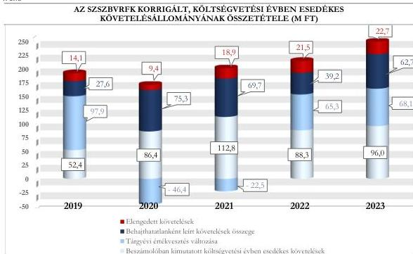

ÁLLAMI
SZÁMVEVŐSZÉK

# JELENTÉS

## A központi költségvetési szervek
követeléskezelése

A behajthatatlan és az elengedett követelések kezelése –
Szabolcs-Szatmár-Bereg Vármegyei Rendőrfőkapitányság

2026.

26026

www.asz.hu

---

ÁLLAMI
SZÁMVEVŐSZÉK

# JELENTÉS

## A központi költségvetési szervek
követeléskezelése

A behajthatatlan és az elengedett követelések kezelése –
Szabolcs-Szatmár-Bereg Vármegyei Rendőrfőkapitányság

2026.

26026

www.asz.hu

Dr. Szomolai Csaba
alelnök

---

ELLENŐRZÉSI IGAZGATÓSÁG:

ELLENŐRZÉSI IGAZGATÓSÁG I.

ELLENŐRZÉSI IGAZGATÓ:

SINKÁNÉ DR. CSENDES ÁGNES igazgató

ELLENŐRZÉSVEZETŐ:

BOZSÓ ERIKA LÍVIA ellenőrzésvezető

DR. SIMON JÓZSEF ellenőrzésvezető

LACZI HEDVIG ANNA ellenőrzésvezető

Jelentéseink az interneten a
www.asz.hu címen olvashatók.

IKTATÓSZÁM: EL-4442-001/2026

TÉMASORSZÁM: 20/2024

ELLENŐRZÉS-AZONOSÍTÓ SZÁM: V1073

---

# TARTALOMJEGYZÉK

|  ■ ÖSSZEFOGLALÁS | 5  |
| --- | --- |
|  ■ AZ ELLENŐRZÉS EREDMÉNYEI | 8  |
|  1. A központi költségvetési szerv követelése, a követelésekkel kapcsolatos értékvesztések, a behajthatatlan és elengedett követelések alakulása és ezek eredményre, illetve vagyonra gyakorolt hatásai | 8  |
|  2. A központi költségvetési szerv követeléskezelési tevékenységgel kapcsolatos folyamatainak és a követelések értékelési szabályainak kialakítása | 12  |
|  3. A központi költségvetési szerv követeléskezelési tevékenységének működtetése - behajthatatlan és elengedett követelések kezelése | 14  |
|  4. A központi költségvetési szerv követeléseinek év végi értékelése és az éves költségvetési beszámolóban történt kimutatása, leltárral történő alátámasztása | 18  |
|  ■ JAVASLATOK | 20  |
|  ■ I. FÜGGELÉK: ÉSZREVÉTELEK | 21  |
|  ■ II. FÜGGELÉK: ELLENŐRZÉSI MEGKÖZELÍTÉS | 22  |
|  ■ MELLÉKLETEK | 27  |
|  I. sz. melléklet: Értelmező szótár | 27  |
|  II. sz. melléklet: Az ellenőrzött szervezetek jegyzéke | 29  |
|  ■ RÖVIDÍTÉSEK JEGYZÉKE | 30  |

3

---

# ÖSSZEFOGLALÁS

A központi költségvetési szervek követelései a közvagyon részét képezik ugyanúgy, mint a pénzeszközök, a befektetett eszközök vagy a készletek. A követelések teljesülése befolyásolja az adott szervezet bevételeinek alakulását. Így a gazdálkodás egyik fontos elemét jelenti a követeléskezelési tevékenységek, eljárások szabályszerű, célszerű és eredményes működtetése a bevételek lehető legnagyobb mértékű pénzügyi realizálása érdekében. Mindezek hiánya esetén nem érvényesül a jó gazda gondossága a gazdálkodás e területén.

A Szabolcs-Szatmár-Bereg Vármegyei Rendőrfőkapitányság ellenőrzését az indokolta, hogy az ellenőrzött időszakban a központi költségvetési szervek, illetve a Rendőrség címhez tartozó költségvetési szervek között jelentős nagyságrendű követelésállománnyal rendelkezett, illetve a lejárt követelések értéke a 2020. évtől kezdődően növekvő tendenciát mutatott.

A Szabolcs-Szatmár-Bereg Vármegyei Rendőrfőkapitányság az ellenőrzött időszakban a jogszabályi előírásoknak megfelelően a követeléskezelési és behajtási tevékenységének, illetve a közhatalmi jellegű követelések behajtásra történő átadásának szabályozási kereteit és belső szabályzatait megalkotta, illetve ezek alapján intézkedéseket tett a követelések megtérülése érdekében. A lejárt és nem teljesült közhatalmi bevételekhez kapcsolódó követeléseket behajtás céljából jogszabályi előírások alapján a Nemzeti Adó- és Vámhivatal és az önkormányzati adóhatóság részére volt szükséges átadnia. Ezen okból a nem teljesült követelések behajtása érdekében nem rendelkezett eszközökkel e típusú követelések esetén. A jogszabályi előírások ellenére az átadás az adóhatóság részére a vizsgált követelések közül négy esetben elmaradt. A követeléskezelési tevékenység az ellenőrzött időszakban nem volt célszerű. A követeléskezelési tevékenység eredményessége nem volt értékelhető, mivel a behajtási tevékenységet a közhatalmi bevételek esetében más szervezet látta el. A lejárt követelésállomány növekvő tendenciája miatt az Állami Számvevőszék véleménye szerint a Szabolcs-Szatmár-Bereg Vármegyei Rendőrfőkapitányság részéről indokolt a lejárt követelésállomány áttekintése alapján a fizetési felszólítások határidőn belüli és teljeskörű kiküldése, a fizetési meghagyások teljeskörű alkalmazása, illetve a lejárt közhatalmi bevételekhez kapcsolódó követelések végrehajtásra történő teljeskörű átadása érdekében további kontrolltevékenységek beépítése a követeléskezelés folyamatába.

Az SZSZBVRFK¹ beszámolóban kimutatott követelésállománya a 2019. és 2022. évek között növekedett, majd 2023. évben 2022. évhez képest csökkent. A beszámolóban kimutatott követelésállomány alakulására az adott évben képződött és esedékességgel ki nem egyenlített követelések értékének növekedése gyakorolt hatást.

A költségvetési évben esedékes közhatalmi és működési célú követelések beszámolóban kimutatott összege a 2019. év végi 52,4 M Ft-ról 2021. év végére 112,8 M Ft-ra növekedett, majd ehhez képest a 2023. év végére közel 15,0%-kal, 96,0 M Ft-ra csökkent. A beszámolóban kimutatott, költségvetési évben esedékes közhatalmi és működési célú követelések értékén belül az ellenőrzött időszakban meghatározó, átlagosan 79,1%-os részarányt képviseltek a közhatalmi bevételekhez kapcsolódó követelések. Ezen belül is többségben voltak az elővezetési költséghez kapcsolódó követelések.

Az SZSZBVRFK költségvetési évben esedékes követelései átlagosan 98,5%-ban természetes személyekkel szemben álltak fent, amelyen belül a belföldi természetes személyek 97,2%-ot, a saját foglalkoztatottak 2,3%-ot, az egyéb természetes személyek 0,5%-os részarányt képviseltek. Az SZSZBVRFK államháztartáson kívüli szervezetekkel szemben fennálló követelése 1,5% volt.

5

---

Összefoglalás---

Az SZSZBVRFK **lejárt követeléseinek értéke** a 2019. évi 434,7 M Ft-ról 2023. év végére 538,4 M Ft-ra emelkedett, amelyen belül a 360 napon túl lejárt követelésállomány aránya folyamatosan 70,0% fölötti részarányt képviselt és a 2020. évtől kezdődően ennek értéke csökkenő tendenciát mutatott.

Az SZSZBVRFK **korrigált, költségvetési évben esedékes közhatalmi és működési célú követelésállománya** 2019. évről 2020. évre csökkent, majd folyamatosan növekedett 2023. évre 249,5 M Ft-ra. Ennek alakulását a költségvetési évben esedékes követelések értéke, valamint a tárgyévi értékvesztés változása, illetve és behajthatatlan követelések értéke határozta meg.

A **2019-2023. évi értékvesztésváltozás** 2019. évben, illetve 2022-2023. években összesen 231,3 M Ft-tal csökkentette az eredményt és a vagyont, míg a 2020. és 2021. években azonban 68,9 M Ft összegű pozitív hatást gyakorolt.

A **behajthatatlan követelések leírásának és az elengedett követelések** eredményre és vagyonváltozásra gyakorolt negatív hatása a 2019. évi 41,7 M Ft-ról 2021. évre 88,6 M Ft-ra növekedett, majd a 2023. évre 85,4 M Ft-ra csökkent. Az SZSZBVRFK behajthatatlanként elszámolt követeléseinek értéke összesen 274,5 M Ft, elengedettként elszámolt követeléseinek értéke összesen 86,6 M Ft volt.

Az SZSZBVRFK **a követelések kezelésével, behajtásával, valamint a behajtásra történő átadással kapcsolatos szervezeti kereteket és folyamatokat** – egy kivétellel – a jogszabályi előírásoknak megfelelően kialakította. Az SZSZBVRFK a jogszabályi előírás ellenére azonban nem határozta meg az adóhatóság részére, behajtás céljából átadásra kerülő követelések átadásának határidejét a belső szabályzatában.

Az SZSZBVRFK a követelések elszámolásának, értékelésének, valamint a behajthatatlan és elengedett követelések elszámolásának szabályait belső szabályzataiban – egy kivétellel – a jogszabályi előírásoknak megfelelően meghatározta. Az SZSZBVRFK Számviteli politikái² azonban a jogszabályi előírások ellenére kisebb hiányosságot tartalmaztak, mivel az értékelések vonatkozásában nem rögzítették, hogy a minősítési lehetőségek közül melyeket, milyen feltételek fennállása esetén alkalmazott és nem határozták meg a minősítéssel kapcsolatos szabályokat.

Az SZSZBVRFK **követeléseinek értékelése, a követelések és az értékvesztések elszámolása** – három eset kivételével – a jogszabályi előírások és a belső szabályozók előírásai szerint történt. Az SZSZBVRFK a behajthatatlan követelések elszámolását a jogszabályi és belső előírások szerint végezte, illetve az elengedett követelések elengedése és elszámolása a jogszabályi előírásoknak megfelelően történt.

A **követelések részletező nyilvántartása** az ellenőrzött mintatételek alapján nem teljeskörűen tartalmazta a jogszabály által előírt tartalmi elemeket.

A **követelések év végi értékelése és az éves költségvetési beszámolóban történő kimutatása** nem teljeskörűen felelt meg a jogszabályi előírásoknak, mert egy esetben a jogszabályi előírás ellenére az adós által el nem ismert követelést mutatott ki követelésként, illetve három esetben nem számolt el értékvesztést a jogszabályi előírások és a belső szabályozók előírásai ellenére. Az SZSZBVRFK a 2023. évi éves költségvetési beszámoló mérlegében kimutatott követeléseit a jogszabályi előírásoknak megfelelően, leltárral alátámasztotta.

Az SZSZBVRFK **követeléskezelési tevékenysége** jellemzően a belső szabályozókban meghatározottak alapján történt, azonban a közhatalmi bevételekből származó követelések átadásáról a NAV részére négy esetben a jogszabályi előírások és a belső szabályozó előírása ellenére az SZSZBVRFK nem gondoskodott. A követelések beszedése érdekében – egy eset kivételével – a belső szabályozókban előírt intézkedéseket megtette, illetve – három eset kivételével – az előírt intézkedéseket a belső szabályozókban rögzített határidőn belül végrehajtotta.

6

---

Összefoglalás---

A közhatalmi bevételből származó lejárt követelései esetén meghatározó szerepet töltött be a követelések végrehajtásra történő átadása a NAV³, illetve az önkormányzati adóhatóságok részére.

Az SZSZBVRFK-ra vonatkozóan a követeléskezelés és behajtás érdekében alkalmazott tevékenység eredményessége összességében nem került értékelésre, mivel a meghatározó részarányt képviselő közhatalmi bevételekből származó követelések esetén a végrehajtással összefüggő feladatokat nem az SZSZBVRFK látta el.

Az SZSZBVRFK a követelések minél nagyobb arányú megtérülését a nem közhatalmi jellegű bevételekhez kapcsolódó követelések esetén a követeléskezelési tevékenységgel összefüggő feladatok teljeskörű és határidőn belül történő végrehajtásával, illetve a közhatalmi jellegű bevételekhez kapcsolódó követelések esetén a lejárt követelések NAV, illetve az önkormányzati adóhatóságok részére történő átadásával tudta volna elősegíteni. Az SZSZBVRFK korlátozott mozgástérrel rendelkezett a közhatalmi jellegű bevételekhez kapcsolódó követeléskezelés területén, mivel a követeléskezelési eszközök közül kizárólag a fizetési felszólítás állt rendelkezésére.

Az SZSZBVRFK követeléskezelési tevékenysége az ellenőrzött időszakban nem volt célszerű, mivel az alkalmazott követeléskezelési eszközök lejárt követelések állományára és ennek időbeli alakulására vonatkozó hatásait az SZSZBVRFK nem értékelte az ellenőrzött időszakban, valamint a közhatalmi jellegű, lejárt követelések esetén az érintett, lejárt követelések adóhatóságok részére történő átadásának teljeskörű megtörténtét nem követte nyomon. Mindezek által nem győződött meg arról, hogy a belső szabályozásban szereplő intézkedéseket ésszerűen és racionálisan, valamint a követelések megtérülése érdekében teljeskörűen és az előírt határidők betartásával alkalmazta.

Az ÁSZ⁴ hat javaslatot fogalmazott meg az SZSZBVRFK részére, amelyek a számviteli politika kötelező tartalmi elemének meghatározásához, a behajtás céljából az adóhatóság részére átadásra kerülő követelések átadásra vonatkozó határidejének egyértelmű meghatározásához, a követelések részletező nyilvántartásának vezetéséhez, a követelések szabályszerű nyilvántartásához és elszámolásához, az értékvesztés elszámolásához, valamint a követeléskezelési tevékenységet érintő kontrolltevékenységek kialakításához és működtetéséhez kapcsolódtak.

7

---

# AZ ELLENŐRZÉS EREDMÉNYEI

## 1. A központi költségvetési szerv követelése, a követelésekkel kapcsolatos értékvesztések, a behajthatatlan és elengedett követelések alakulása és ezek eredményre, illetve vagyonra gyakorolt hatásai

### Összegző megállapítás

Az SZSZBVRFK beszámolóban kimutatott követeléseinek értéke 2019. év végéről 2023. év végére növekedett. A lejárt követelések állománya 2020. évtől kezdődően növekvő tendenciát mutatott. A követelések értékelése alapján a követelésekkel kapcsolatos elszámolások a beszámolóban kimutatott eredményt és vagyonváltozást negatívan érintették.

### A KÖVETELÉSEK ALAKULÁSA

Az SZSZBVRFK beszámolóban kimutatott követeléseinek értéke a 2019. év végi 637,5 M Ft-ról a 2022. évig folyamatosan növekedett és a 2023. év végére 787,7 M Ft-ra változott. Az SZSZBVRFK költségvetési évben esedékes közhatalmi és működési célú követeléseinek értéke folyamatosan változó tendenciát mutatott.

Az SZSZBVRFK beszámolóban kimutatott követeléseinek és elszámolt bevételeinek alakulását az 1. táblázat tartalmazza.

1. táblázat

### SZSZBVRFK BESZÁMOLÓBAN KIMUTATOTT KÖVETELÉSEI ÉS ELSZÁMOLT BEVÉTELEI (M FT, %)

|  MEGNEVEZÉS | 2019.12.31. | 2020.12.31. | 2021.12.31. | 2022.12.31. | 2023.12.31.  |
| --- | --- | --- | --- | --- | --- |
|  Beszámolóban kimutatott követelések, ebből | 637,6 M Ft | 658,7 M Ft | 770,1 M Ft | 798,5 M Ft | 787,8 M Ft  |
|  Költségvetési évet követően esedékes követelések | 576,5 M Ft | 561,6 M Ft | 648,8 M Ft | 705,6 M Ft | 687,6 M Ft  |
|  Költségvetési évben esedékes követelések | 61,1 M Ft | 97,1 M Ft | 121,3 M Ft | 92,9 M Ft | 100,2 M Ft  |
|  Költségvetési évben esedékes közhatalmi, működési, továbbá felhalmozási célú követelések* | 52,4 M Ft | 86,4 M Ft | 112,8 M Ft | 88,3 M Ft | 96,0 M Ft  |
|  Költségvetési évben esedékes elszámolt bevételek | 1 672,0 M Ft | 1 387,0 M Ft | 1 336,3 M Ft | 1 521,7 M Ft | 1 438,4 M Ft  |
|  A közhatalmi és működési, továbbá felhalmozási célú elszámolt bevételek | 379,0 M Ft | 464,6 M Ft | 488,7 M Ft | 448,2 M Ft | 591,0 M Ft  |
|  Közhatalmi bevételek aránya a költségvetési évben esedékes elszámolt bevételekből (%) | 18,9% | 23,6% | 29,9% | 27,1% | 19,4%  |
|  Költségvetési évben esedékes követelések aránya a beszámolóban kimutatott követelések (%) | 9,6% | 14,7% | 15,8% | 11,6% | 12,7%  |
|  Költségvetési évben esedékes követelésekből a közhatalmi és működési, továbbá felhalmozási célú követelések aránya az elszámolt közhatalmi, működési és felhalmozási célú bevételekhez viszonyítva (%) | 13,8% | 18,6% | 23,1% | 19,7% | 16,2%  |

\*. Az SZSZBVRFK az ellenőrzött időszakban nem rendelkezett költségvetési évben esedékes felhalmozási célú követelésekkel.

Forrás: Az ellenőrzött szervezet éves költségvetési beszámolói alapján, ÁSZ saját szerkesztés

8

---

Az ellenőrzés eredményei

A 2019-2023. évek közötti időszakban az SZSZBVRFK elszámolt közhatalmi, működési és felhalmozási célú bevételeinek átlagosan 18,3%-át tette ki a beszámolóban kimutatott, költségvetési évben esedékes követelések értéke.

A beszámolóban kimutatott, költségvetési évben esedékes közhatalmi és működési célú követelések értékén belül az ellenőrzött időszakban meghatározó, átlagosan 79,1%-os részarányt képviseltek a közhatalmi bevételekhez kapcsolódó követelések. Ezen belül is többségben voltak az elővezetési költséghez kapcsolódó követelések. A működési bevételekhez kapcsolódó követelések jellemzően bérleti díjakhoz, továbbszámlázott közüzemi díjakhoz, kártérítésekhez, illetve tanulmányi szerződésekhez kapcsolódtak.

A költségvetési évben esedékes felhalmozási célú átvett pénzeszközökhöz kapcsolódó követelések alakulását az ellenőrzött időszakban a HSZT tv.³ 171. § (1) bekezdés c) pontja alapján juttatott támogatás összege határozta meg.

Az SZSZBVRFK beszámolóban kimutatott, költségvetési évben esedékes lejárt követeléseiből a 180 napon túli követelések aránya az ellenőrzött időszakon belül átlagosan több, mint 84,0%-ot ért el, amelyen belül meghatározó volt a 360 napon túli követelések aránya.

A lejárt követelések növekedésének fő indoka, hogy az ellenőrzött időszakban folyamatosan növekedett az elővezetési költséghez kapcsolódó követelések darabszáma és összesített értéke is. A 2023. évi lejárt követelés értékének előző évekhez képest nagyobb mértékű növekedéséhez hozzájárult az is, hogy az elővezetési költség meghatározásának alapját jelentő átalany a 2023. évben – jogszabályi változás miatt a szolgálati gépjárművel történő foganatosítás esetén – 10,5 ezer Ft-ról közel duplájára, 19,7 ezer Ft-ra emelkedett. A lejárt követelések állománya az ellenőrzött időszakban az elszámolt bevételeknek átlagosan 31,3%-át tette ki. Mindez azt mutatja, hogy a lejárt követelések hatást gyakoroltak az SZSZBVRFK gazdálkodására.

Az SZSZBVRFK költségvetési évben esedékes lejárt követeléseinek állományát és a követeléseinek lejárat szerinti megoszlását a 2. számú táblázat tartalmazza.

2. táblázat

# **AZ SZSZBVRFK KÖLTSÉGVETÉSI ÉVBEN ESEDÉKES LEJÁRT KÖVETELÉSEINEK ÁLLOMÁNYA ÉS LEJÁRAT SZERINTI MEGOSZLÁSA (M FT, %)**

|  KÖVETELÉSEK ESEDÉKESSÉGE | 2019.12.31 |   | 2020.12.31 |   | 2021.12.31 |   | 2022.12.31 |   | 2023.12.31  |   |
| --- | --- | --- | --- | --- | --- | --- | --- | --- | --- | --- |
|   |  % | M Ft | % | M Ft | % | M Ft | % | M Ft | % | M Ft  |
|  Fizetési határidőn túl 0-90 nap | 9,7 | 42,0 | 7,3 | 31,0 | 9,0 | 38,1 | 7,9 | 36,8 | 14,0 | 75,5  |
|  Fizetési határidőn túl 91-180 nap | 6,0 | 25,8 | 5,4 | 22,7 | 5,8 | 24,8 | 6,3 | 29,3 | 6,6 | 35,3  |
|  Fizetési határidőn túl 181-360 nap | 9,8 | 42,9 | 9,7 | 41,2 | 8,4 | 36,0 | 10,3 | 47,6 | 9,2 | 49,6  |
|  Fizetési határidőn túl 360 nap felett | 74,5 | 324,0 | 77,6 | 329,5 | 76,8 | 327,3 | 75,5 | 349,4 | 70,2 | 378,0  |
|  **Lejárt követelések megoszlása / értéke** | **100,0** | **434,7** | **100,0** | **424,4** | **100,0** | **426,2** | **100,0** | **463,1** | **100,0** | **538,4**  |
|  *Lejárt követelések aránya az elszámolt bevételekhez viszonyítva (%)* | 26,0% |   | 30,6% |   | 31,9% |   | 30,4% |   | 37,4%  |   |
|  *Közhatalmi követelések aránya a lejárt követelésekhez viszonyítva (%)* | 7,4% |   | 16,0% |   | 22,6% |   | 15,9% |   | 13,9%  |   |
|  *Megképzett értékesítés lejárt követelések összegéhez viszonyított aránya (%)* | 86,0% |   | 77,1% |   | 71,5% |   | 79,9% |   | 81,4%  |   |

Forrás: „Kimutatás központi költségvetési szervek követeléseinek összetételéről adósok szerint”, az SZSZBVRFK adatai alapján, ÁSZ saját szerkesztés

Az ellenőrzött időszakban az SZSZBVRFK költségvetési évben esedékes (lejárt) követeléseinek átlagosan 98,5%-a természetes személyekkel szemben (ezen belül belföldi természetes személyekkel szemben

9

---

Az ellenőrzés eredményei

átlagosan 97,2%, külföldi természetes személyekkel szemben 0,5% és saját foglalkoztatottakkal szemben 2,3%) állt fent. Az SZSZBVRFK költségvetési évben esedékes követeléseinek fennmaradó, átlagosan 1,5%-a államháztartáson kívüli szervezetekkel szemben állt fenn. A lejárt követeléseken belül meghatározó részarányt képviseltek a közhatalmi bevételekre irányuló követelések, ezen belül is az elővezetési költséghez kapcsolódó követelések, amelyek jellemzően magánszemélyekkel szemben álltak fent.

Az ellenőrzött időszakban az SZSZBVRFK lejárt követelésein belül a közhatalmi bevételekre irányuló követelések aránya 61-85% között mozgott, amely magasabb volt a közhatalmi bevételek összes bevételen belül képviselt arányánál. Ez azt mutatja, hogy a közhatalmi bevételekből származó lejárt követelések érvényesítése nehezebben volt kezelhető a többi bevételi típushoz kapcsolódó követelésekhez képest.

#### A KÖVETELÉSEK ÉRTÉKELÉSÉNEK HATÁSA AZ EREDMÉNY- ÉS VAGYONVÁLTOZÁSRA

Az SZSZBVRFK beszámolóban kimutatott követeléseinek értékelése negatív hatást gyakorolt az eredményre és vagyonra. Az eredményre és vagyonra gyakorolt negatív hatás értéke a 2019. évi 139,6 M Ft-ról 2020. évre csökkent, majd tendenciájában folyamatosan növekedett, 2023. évre 153,5 M Ft-ra.

Az SZSZBVRFK követelései értékelésének eredmény- és vagyonváltozásra gyakorolt hatását az ellenőrzött időszakban a 3. táblázat tartalmazza.

3. táblázat

#### AZ SZSZBVRFK KÖVETELÉSEI ÉRTÉKELÉSÉNEK EREDMÉNYRE ÉS VAGYONVÁLTOZÁSRA GYAKOROLT HATÁSA (M FT, %)

|  MEGNEVEZÉS | 2019. | 2020. | 2021. | 2022. | 2023.  |
| --- | --- | --- | --- | --- | --- |
|  **Követelések értékelésének az eredményre és vagyonváltozásra gyakorolt hatása** | **139,6 M Ft** | **38,3 M Ft** | **66,1 M Ft** | **126,0 M Ft** | **153,5 M Ft**  |
|  ebből: behajthatatlan követelés | 27,6 M Ft | 75,3 M Ft | 69,7 M Ft | 39,2 M Ft | 62,7 M Ft  |
|  ebből: elengedett követelés | 14,1 M Ft | 9,4 M Ft | 18,9 M Ft | 21,5 M Ft | 22,7 M Ft  |
|  ebből: tárgyévi értékvesztés változása | 97,9 M Ft | - 46,4 M Ft | - 22,5 M Ft | 65,3 M Ft | 68,1 M Ft  |
|  *Követelésértékelés elemeinek megoszlása* |  |  |  |  |   |
|  *behajthatatlan követelések aránya %* | 19,8% | 196,6% | 105,5% | 31,1% | 40,8%  |
|  *elengedett követelések aránya %* | 10,1% | 24,5% | 28,5% | 17,1% | 14,8%  |
|  *értékvesztés változás aránya %* | 70,1% | - 121,1% | -34,0% | 51,8% | 44,4%  |

Forrás: Kincstár KGR-K11 rendszer beszámoló, ellenőrzött szervezet főkönyvi kivonat adatai alapján, ÁSZ saját szerkesztés

Az ellenőrzött időszakban az SZSZBVRFK által elszámolt behajthatatlan követelés összesen 274,5 M Ft volt, amelynek 0,6%-a államháztartáson kívüli szervezetekkel és 99,4%-a belföldi természetes személyekkel szemben került kivezetésre. Az SZSZBVRFK behajthatatlanként elszámolt követelései főképp az elővezetési díjakhoz és az eljárási költségekhez kapcsolódtak.

Az adott évben behajthatatlanként elszámolt követelések év végén fennálló 360 napon túl lejárt követelésállományhoz viszonyított aránya az ellenőrzött időszakban 8,5% (2019. év) és 22,8% (2020. év) között mozgott.

Az SZSZBVRFK elengedett követelést az ellenőrzött időszakban összesen 86,6 M Ft értékben számolt el. Ezek természetes személyekkel szembeni követelésekhez, illetve foglalkoztatottakkal szemben fennálló lakáscélú kölcsön követelésekhez kapcsolódtak.

10

---

Az ellenőrzés eredményei

Az SZSZBVRFK a követelések értékelése során a 2019-2023. években összesen 322,5 M Ft **értékvesztést képzett**, illetve az **értékvesztés visszaírása** összesen 160,0 M Ft volt, ezáltal a tárgyévi értékvesztés változása az ellenőrzött időszakban összesen 162,5 M Ft-os negatív hatást gyakorolt a SZSZBVRFK eredményére és vagyonára.

Az értékvesztés változás 2019. évben, illetve a 2022-2023. években összesen 231,3 M Ft-tal csökkentette az eredményt és a vagyont, míg a 2020. és 2021. években 68,9 M Ft összegű pozitív hatást gyakorolt.

## A KÖVETELÉSÁLLOMÁNY ALAKULÁSA

Az **SZSZBVRFK korrigált, költségvetési évben esedékes közhatalmi és működési célú összesített követelésállománya** a 2019. évben 192,0 M Ft volt, amely a 2020. évre 35,0%-kal csökkent, majd tendenciájában folyamatosan növekedett, a 2023. évben ennek értéke 249,5 M Ft volt.

A korrigált, költségvetési évben esedékes közhatalmi és működési célú összesített követelésállomány alakulását a költségvetési évben esedékes követelések értéke, a tárgyévi értékvesztés változása, valamint a behajthatatlan követelések értéke határozta meg.

Az SZSZBVRFK korrigált, összesített költségvetési évben esedékes közhatalmi és működési célú összesített követelésállományának összetételét az 1. ábra szemlélteti.

1. ábra

Forrás: Kincstár KGR-K11 rendszer beszámolók adatai és az ellenőrzött szervezet főkönyvi kivonatai alapján, ÁSZ saját szerkesztés

Az ellenőrzött időszakban a Rendőrség címhez tartozó költségvetési szervek költségvetési évben esedékes követelése éves átlagos állományán (2 673,5 M Ft) belül az SZSZBVRFK követelésállománya 3,5%-ot (94,5 M Ft-ot) képviselt. Az ellenőrzött időszakban az elszámolt értékvesztésváltozások, a behajthatatlan és elengedett követelések eredményére és vagyonváltozásra gyakorolt hatásának értéke az SZSZBVRFK esetében összesen 523,6 M Ft volt, amely a Rendőrség cím költségvetési szerveire vonatkozó összesített érték (4 408,1 M Ft) 11,9%-ának felelt meg.

11

---

Az ellenőrzés eredményei

## 2. A központi költségvetési szerv követelésezelési tevékenységgel kapcsolatos folyamatainak és a követelések értékelési szabályainak kialakítása

### Összegző megállapítás

Az SZSZBVRFK a követelésezelési és behajtási tevékenységgel, illetve a behajtásra történő átadással kapcsolatos szervezeti kereteit és folyamatait – egy kivétellel – a jogszabályi előírásoknak megfelelően kialakította. A követelések kezelésére, elszámolására és értékelésére, valamint a behajthatatlan és elengedett követelések elszámolására vonatkozó belső szabályokat – egy kivétellel – a jogszabályi előírásoknak megfelelően meghatározta.

Az SZSZBVRFK a követelésezelési feladatokat ellátó szervezeti egységek feladatait az SZMSZ⁶-ben, valamint a Gazdasági Igazgatóság ügyrend⁷-jeiben az Ávr.⁸ előírásaival összhangban határozta meg. Az SZSZBVRFK a követelésezeléssel, a követelések végrehajtásra történő átadásával, valamint a behajthatatlan és elengedett követelések működési- és értékelési munkafolyamataival kapcsolatos feladatait az Ellenőrzési nyomvonal⁹-ban a Bkr.¹⁰ előírásaival összhangban szabályozta.

A követelések kezelésére, elszámolására és értékelésére, a követelések behajtására vonatkozó szervezeti keretek kialakítását, a munkafolyamatok szabályozását az SZSZBVRFK-nál a 4. táblázatban megjelölt szabályozó eszközök tartalmazták az ellenőrzött időszakban.

4. táblázat

### AZ SZSZBVRFK KÖVETELÉSEK KEZELÉSÉBEN RÉSZTVEVŐ SZERVEZETI EGYSÉGEI, ILLETVE A SZERVEZETI KERETEKET ÉS A MUNKAFOLYAMATOKAT SZABÁLYOZÓ ESZKÖZÖK

|  KÖVETELÉSKEZELÉSBEN RÉSZTVEVŐ SZERVEZETI EGYSÉGEK |   |   | A KÖVETELÉSKEZELÉS SZERVEZETI KERETEIT ÉS A MUNKAFOLYAMATAIT SZABÁLYOZÓ ESZKÖZÖK  |   |   |   |
| --- | --- | --- | --- | --- | --- | --- |
|  GAZDASÁGI IGAZGATÓSÁG | GAZDASÁGI IGAZGATÓSÁGON BELÜLI ÖNÁLLÓ SZERVEZETI EGYSÉG | KÖZIGAZGATÁSI HATÓSÁGI SZOLGÁLAT | SZMSZ | ÜGYREND | ELLENŐRZÉSI NYOMVONAL | EGYÉB SZABÁLYOZÓK  |
|  ☑ | ☒ | ☑ | ☑ | ☑ | ☑ | ☑  |

☑ rendelkezett a szabályozó eszközzel és szabályozta a követelésezelést; rendelkezett követelésezelésben résztvevő szervezeti egységgel

☒ nem releváns

Forrás: az ellenőrzött szervezet dokumentumai alapján, ÁSZ saját szerkesztés

A 2021. szeptember 28-tól hatályos Gazdasági Igazgatóság ügyrendje szerint a bírságbevételekkel kapcsolatos feladatokat a szakterülettel együttműködve a Befizetés-nyilvántartó Csoport látta el. E feladatok közé tartozott a bírságokkal kapcsolatos követelések teljesülésének nyomon követése, az analitikus nyilvántartás vezetése, a kapcsolódó számviteli feladatok ellátása, az esetlegesen előirányzatfelhasználási keretszámlára érkezett bírság központosított bírságbevételek beszedésére szolgáló számlákra történő továbbítása, a nem teljesült követelések végrehajtás céljából történő átadása az adóhatóság részére, a követelések értékelése, valamint a behajthatatlanná való minősítés feltételeinek vizsgálata.

12

---

Az ellenőrzés eredményei

A Gazdasági Igazgatóság ellenőrzési nyomvonalának 30. fejezete tartalmazta a követeléskezeléssel kapcsolatos feladatokat és ezek határidejét. Ennek keretében az SZSZBVRFK meghatározta a fizetési felszólítás előkészítésére és kiküldésére, a részletfizetési kérelem elbírálására és a követelések teljesítésének ellenőrzésére vonatkozó előírásokat.

A bírságokkal kapcsolatos követelések nyilvántartásának jogszabályi és belső előírásoknak való megfelelősége érdekében az Ellenőrzési nyomvonal havi rendszerességgel egyeztetés megtartását írta elő a gazdasági és a hatósági terület között.

A kiszabott bírságok és az elővezetési költségek kezelése esetén az SZSZBVRFK-nak az ORFK¹¹ által meghatározott Eljárási rend¹² szerint kellett eljárnia. Amennyiben az adós az önkéntes teljesítésre rendelkezésre álló 30 napos határidőn belül nem rendezte a tartozását az SZSZBVRFK-nak a fizetési határidő lejártát követő 30 nap után kellett átadnia végrehajtásra a lejárt követeléseket az illetékes adóhatóság részére.

Az SZSZBVRFK a Gazdasági Igazgatóság ellenőrzési nyomvonalában a Bkr. 6. § (1) bekezdés b) pontja és (2) bekezdésében foglalt előírás ellenére az adóhatóság részére, behajtás céljából átadásra kerülő követelések átadására vonatkozó folyamat kialakítása nem volt egyértelmű és teljeskörűen szabályozott, mivel nem határozta meg az adóhatóság részére, behajtás céljából átadásra kerülő követelések átadásának határidejét. (3. javaslat)

**A követelések értékelésének, valamint a behajthatatlan és elengedett követelések elszámolásának szabályait** az SZSZBVRFK a Számv. tv.¹³ és az Áhsz.¹⁴ előírásainak megfelelően meghatározta a Számviteli politikáiban és annak keretében elkészített Értékelési szabályzat¹⁵-aiban, valamint a Számlarend¹⁶-ben. A kontrollkörnyezetet érintően az SZSZBVRFK a Számv. tv. 14. § (4) bekezdésében foglaltak ellenére a Számviteli politikáiban nem rögzítette a folyamatosan működő adósokkal szembeni követelések esetében az Áhsz. 18. § (6) bekezdésében meghatározott követelések lejáratuk szerinti minősítési kategóriák kapcsán, hogy követelések értékelésekor a minősítési lehetőségek közül melyeket, milyen feltételek fennállása esetén alkalmaz. (1. javaslat)

A követelések értékelésének nem megfelelő és nem egyértelmű szabályozása kockázatot hordoz, mivel a szabályozás eltérő, egymásnak ellentmondó tartalma miatt a követelések nem egységes módszerrel kerülnek értékelésre, ezáltal olyan követelések kerülhetnek az éves beszámolóban kimutatásra, amelyek esetében a bevételek pénzügyi realizálása bizonytalan.

**A követelésekkel kapcsolatos részletező nyilvántartás vezetésére vonatkozó szabályokat** az SZSZBVRFK Számlarendje az Áhsz.-ben előírtaknak megfelelően tartalmazta.

Az SZSZBVRFK **belső ellenőrzése** az elővezetési költségek kezelési, végrehajtási gyakorlatával kapcsolatban végzett ellenőrzést az ellenőrzött időszakban a 2019. év és 2020. január-február hónap vonatkozásában.

13

---

Az ellenőrzés eredményei

### 3. A központi költségvetési szerv követeléskezelési tevékenységének működtetése - behajthatatlan és elengedett követelések kezelése

#### Összegző megállapítás

Az SZSZBVRFK a követelések értékelését és elszámolását – három eset kivételével – a jogszabályokban és a belső szabályzatokban foglalt előírásoknak megfelelően végezte. A behajthatatlan követelések elszámolása a jogszabályi előírások szerint történt. A követelések elengedése és elszámolása a jogszabályi és belső előírásoknak megfelelően történt. A követelések részletező nyilvántartása a jogszabály szerinti releváns adatokat nem teljeskörűen tartalmazta. A követeléskezelési tevékenység a követeléskezelési eszközök hatásaira vonatkozó értékelések elvégzésének hiánya miatt nem volt célszerű. A követeléskezelési és behajtási tevékenység eredményessége a feladatok más szervezettel való megosztott jellege miatt nem volt értékelhető. Az SZSZBVRFK a követeléskezelési tevékenysége során a mintatételek alapján – hét eset kivételével – a belső előírások szerint járt el.

#### A KÖVETELÉSEK ÉRTÉKELÉSE ÉS ELSZÁMOLÁSA

Az SZSZBVRFK – két esetben összesen 2,4 M Ft összegben – az ellenőrzött időszakban a lejárt követeléseire nem számolt el értékvesztést az Áhsz. 18. § (1) bekezdésében, a Számv. tv. 55. § (1)-(2) bekezdésében, valamint az ellenőrzött időszakban hatályos Számviteli politikái III. 16. pontjában és az Értékelési szabályzat II.3. pontjában foglalt előírások ellenére. (2. javaslat)

A követelések értékelése alapján az ellenőrzött időszakot megelőzően lejárt követelésére – egy esetben 0,4 M Ft összegben – az ellenőrzött időszakban nem számolt el értékvesztést az Áhsz. 18. § (1) bekezdésében, a Számv. tv. 55. § (1)-(2) bekezdésében, valamint az ellenőrzött időszakban hatályos Számviteli politikái III. 16. pontjában és az Értékelési szabályzat II.3. pontjában foglalt előírások ellenére.

Az értékvesztés képzésének elmaradása azt a kockázatot hordozza, hogy az SZSZBVRFK a jövőben olyan követeléseket mutat ki, amelyek esetében a bevételek pénzügyi realizálása és a követelések behajtásának eredményessége bizonytalan. Kockázatot jelent a jövőben továbbá, ha a költségvetési évben esedékes követelések megfelelő kezelése és értékelése elmarad, amelynek következtében a fennálló követelés nem évenként ütemezetten, hanem esetleg egy összegben behajthatatlan követelésként kerül elszámolásra. Ennek következtében fennáll annak kockázata, hogy az SZSZBVRFK éves beszámolójában bemutatott vagyoni helyzet nem a valós képet mutatja.

(2. javaslat)

14

---

Az ellenőrzés eredményei---

## A BEHAJTHATATLAN KÖVETELÉSEK MINŐSÍTÉSE ÉS ELSZÁMOLÁSA

Az SZSZBVRFK-nál a követelések behajthatatlanná minősítése és elszámolása az Áhsz.-ben, a Számv. tv.-ben, a 38/2013. (IX. 19.) NGM rendelet$^{17}$-ben és a belső szabályozókban foglaltak szerint történt.

## A KÖVETELÉSEK ELENGEDÉSE ÉS ELSZÁMOLÁSA

Az SZSZBVRFK-nál az 1996. évi XLIII. törvény$^{18}$ és a HSZT tv. felhatalmazása alapján kiadott 44/2012. (VIII. 29.) BM rendelet$^{19}$ előírásai szerint történt a természetes személyekkel, saját foglalkoztatottakkal szemben fennálló követelések elengedése. Az elengedett követelések elszámolását az SZSZBVRFK a Számv. tv. és az Áhsz. előírásai szerint hajtotta végre.

## A KÖVETELÉSEK NYILVÁNTARTÁSA

Az SZSZBVRFK – egy esetben 2,1 M Ft összegben – olyan követelést tartott nyilván, amely nem felelt meg az Áhsz. 1. § (1) bekezdés 6. pontjában foglaltaknak, mivel a követelést az adós nem ismerte el. (5. javaslat)

Az SZSZBVRFK követeléseinek részletező nyilvántartása részben tartalmazta az Áhsz. 14. melléklet III. 4. pontjában foglaltak szerint előírt adatokat. A követelések részletező nyilvántartásának vezetése kapcsán a következő hiányosságokat tárta fel az ellenőrzés. A követelések részletező nyilvántartása nem tartalmazta (4. javaslat):

- ▪ az Áhsz. 14. melléklet 4. a) pontjában szereplő előírás ellenére öt esetben a nyilvántartásba vétel dátumát,
- ▪ az Áhsz. 14. melléklet 4. b) pontjában szereplő előírás ellenére 20 esetben a követelést tanúsító dokumentum megnevezését,
- ▪ az Áhsz. 14. melléklet 4. c) pontjában szereplő előírás ellenére kilenc esetben a kötelezett azonosításához szükséges adatokat,
- ▪ az Áhsz. 14. melléklet 4. e) pontjában szereplő előírás ellenére négy esetben a követelés teljesítésének határidejét,
- ▪ az Áhsz. 14. melléklet 4. g) pontjában szereplő előírás ellenére öt esetben a befizetés dátumát,
- ▪ az Áhsz. 14. melléklet 4. h) pontjában szereplő előírás ellenére öt esetben a könyvviteli számlákon történő elszámolás időpontját és a könyvviteli számlák megnevezését,
- ▪ az Áhsz. 14. melléklet 4. j) pontjában szereplő előírás ellenére 16 esetben a fizetési felhívások, behajtásra tett intézkedések adatait,
- ▪ az Áhsz. 14. melléklet 4. k) pontjában szereplő előírás ellenére kilenc esetben az egyszerűsített értékelési eljárás alá vont követelések esetén a kötelezett besorolásának adatait,
- ▪ az Áhsz. 14. melléklet 4. l) pontjában szereplő előírás ellenére 11 esetben a követelések értékvesztésével kapcsolatos adatokat.

## A LEJÁRT KÖVETELÉSEK KEZELÉSE, BEHAJTÁSA ÉRDEKÉBEN MEGTETT INTÉZKEDÉSEK

### A követeléskezelési és behajtási tevékenység tartalma és értékelése

Az SZSZBVRFK esetén a követeléskezelési és behajtási tevékenységgel három szervezeti egység – a Közgazdasági Osztály, az Igazgatási Osztály és az Elővezetési Költség Csoport – foglalkozott. E szervezeti egységek a követelésekkel kapcsolatos feladatok mellett egyéb gazdálkodási feladatokat is

15

---

Az ellenőrzés eredményei---

elláttak. A követeléskezelési és behajtási tevékenység keretében ellátandó feladatok végrehajtása tekintetében – a helyszíni ellenőrzés jegyzőkönyvében foglaltak szerint – fontos tényezőt jelentett az ellenőrzött időszakban a rendelkezésre álló humánkapacitás korlátozottsága.

A követelések megfelelő nyilvántartása és a követeléskezeléssel, illetve végrehajtással kapcsolatos feladatok határidőben történő ellátása érdekében rendszeres egyeztetést vezetett be az SZSZBVRFK a Közgazdasági Osztály és az Igazgatási Osztály között.

A fennálló, esedékes követelések nyomon követése a helyszíni ellenőrzés jegyzőkönyvében foglaltak szerint havonta történt a számviteli és az ügyviteli rendszer adatainak felhasználásával. Ennek keretében az érintett követelésekhez tartozó adósok esetén megvizsgálták történt-e az adott időpontig teljesítés és megállapították, hogy továbbra is aktuális-e a követelés, illetve milyen értékű a fennmaradt követelés a rendelkezésre álló dokumentumok alapján. A követelésállomány alakulásáról az SZSZBVRFK rendszeresen, havonta tájékoztatta dokumentált formában az Országos Rendőrfőkapitányságot, mint irányító szervet.

Az ellenőrzött időszakban a követeléskezelés és behajtási tevékenység során alkalmazott eszközök köre nem változott. Változást jelentett azonban, hogy az értékét és darabszámát tekintve legnagyobb részarányt képviselő elővezetési költséghez kapcsolódó, kis összegű követelések esetén a 2023. évtől kezdődően az SZSZBVRFK nem küldött ki fizetési felszólítást, mivel a követelések megtérülése érdekében teljesített ráfordítás meghaladta volna a követelés megtérüléséből származó összeget.

A 2019. és 2024. évek között a közhatalmi bevételekhez kapcsolódó követeléseknél összesen 134 darab, illetve az egyéb működési bevételekhez kapcsolódó követeléseknél 40 darab részletfizetési kérelem érkezett az SZSZBVRFK-hoz. A részletfizetési kérelmeket az SZSZBVRFK jellemzően jóváhagyta. A megtérülést érintően pozitív volt az SZSZBVRFK tapasztalata a részletfizetéssel érintett követelések esetén.

A behajthatatlan követelések elszámolásához szükséges feltételek vizsgálatát az SZSZBVRFK az elővezetési költséghez kapcsolódó követeléseknél negyedévente, míg az egyéb működési követelések esetén folyamatosan, a rendelkezésre álló erőforrás függvényében végezte. A behajthatatlan követeléssé való minősítésre vonatkozó előterjesztéseket év közben folyamatosan készítették el és továbbították vezetői jóváhagyásra.

> A helyszíni ellenőrzés jegyzőkönyvében foglaltak szerint az SZSZBVRFK belső ellenőrzése 2024. évben vizsgálta a követelések nyilvántartásának szabályszerűségét. A belső ellenőrzési jelentés megállapításai alapján az SZSZBVRFK 2025. évben felülvizsgálta a lejárt követeléseit és amelyeknél fennálltak a behajthatatlan követelésként való elszámolás feltételei, az elszámolást végrehajtották.

A követelések megtérülésének biztosítása tekintetében a követelések legnagyobb részét kitevő közhatalmi bevételekből származó követelések esetén meghatározó szerepet töltött be a követelések végrehajtásra történő átadása a NAV, illetve az önkormányzati adóhatóságok részére. Ezáltal az SZSZBVRFK felelősségi köre a követelések érvényesítésére vonatkozó folyamat tekintetében a végrehajtásra történő átadásig terjedt. Az ezt követő behajtási tevékenység a NAV, illetve az önkormányzati adóhatóságok feladatát jelentette, amelyre az SZSZBVRFK-nak nem volt ráhatása.

A helyszíni ellenőrzés jegyzőkönyvében foglaltak szerint az SZSZBVRFK a közhatalmi bevételekhez kapcsolódó, lejárt követelések esetén a követelések átadását a jogszabályi rendelkezések alapján az

16

---

Az ellenőrzés eredményei

adóhatóságok részére folyamatosan végezte. Ezen követelések esetén a vezetői elvárás az volt, hogy a követelés lejártát követő 5 napon belül történjen meg az átadás.

Az SZSZBVRFK tapasztalatai szerint az önkormányzati adóhatóságok esetén a követelések behajtásának megtérülési aránya alacsonyabb mértékű volt az ellenőrzött időszakban összehasonlítva a Nemzeti Adó- és Vámhivatalnak végrehajtás céljából átadott követelések megtérülési arányával. A helyszíni ellenőrzés jegyzőkönyvében foglaltak szerint problémát jelentett, hogy több önkormányzati adóhatóságtól hosszú időt követően vagy egyáltalán nem kapott visszajelzést a végrehajtási eljárás aktuális állapotáról, illetve a végrehajtási folyamat lezárásáról. Ezen esetekben megkereséseket indított az SZSZBVRFK az érintett önkormányzati adóhatóságok felé.

Az SZSZBVRFK-ra vonatkozóan – figyelembe véve a közhatalmi bevételekből származó követelések meghatározó részarányát a követeléseken belül, valamint a végrehajtással összefüggő feladatok szervezettől független ellátását – a követeléskezelés és behajtás érdekében alkalmazott tevékenység eredményessége nem volt értékelhető. A követelések megtérülésével kapcsolatos problémákat azonban jól mutatja, hogy a 180 napon túli követelésállomány aránya és értéke folyamatosan magas volt, illetve a lejárt követelések értéke a 2020. évtől kezdődően növekvő tendenciát követett.

Az ÁSZ véleménye szerint – az előző bekezdésben bemutatott indokok alapján – az SZSZBVRFK vonatkozásában kizárólag a követeléskezelési tevékenység célszerűsége értékelhető. Ennek értékelése során indokolt figyelembe venni, hogy a közhatalmi bevételekhez kapcsolódó lejárt követelések esetén – amelyek a lejárt követeléseken belül átlagosan 77,4%-os részarányt képviseltek – az SZSZBVRFK a követelés megtérülése érdekében kizárólag annyit tudott tenni, hogy e követeléseket átadta a NAV részére behajtás céljából.

Az SZSZBVRFK követeléskezelési tevékenysége az ellenőrzött időszakban nem volt célszerű, mivel a fizetési felszólítás, mint alkalmazott követeléskezelési eszköz közhatalmi és nem közhatalmi jellegű, lejárt követelések állományára és ennek időbeli alakulására, illetve a fizetési meghagyás, mint követeléskezelési eszköz nem közhatalmi jellegű, lejárt követelések állományára és ennek időbeli alakulására vonatkozó hatásait nem értékelte az ellenőrzött időszakban. A követeléskezelési tevékenység nem célszerű végrehajtását igazolta az is, hogy négy esetben nem történt meg a jogszabályi és belső előírások ellenére e követelések átadása az illetékes adóhatóság részére. Ennek elmaradása hatást gyakorolt az éves beszámolóban kimutatott bevételek értékére, ezek megtérülési arányának függvényében. Befolyásoló tényezőt jelentett továbbá az ÁSZ véleménye szerint az is, hogy az SZSZBVRFK a közhatalmi jellegű, lejárt követelések esetén az érintett, lejárt követelések adóhatóságok részére történő átadás, illetve a nem közhatalmi jellegű, lejárt követelések esetén az érintett, lejárt követelések fizetési meghagyás útján történő érvényesítésének teljeskörű megtörténtét nem követte nyomon.

A lejárt követelések állományának 2020. évtől növekvő tendenciája, valamint lejárat szerinti megoszlása alapján az ÁSZ véleménye szerint indokolt az SZSZBVRFK-nak áttekintenie az érintett követeléseket, és ez alapján a fizetési felszólítások belső szabályzatban meghatározott határidőn belül történő kiküldésének teljeskörűségét, a fizetési meghagyások alkalmazásának teljeskörűségét, illetve a közhatalmi bevételekből származó lejárt követelések teljeskörű átadását biztosító kontrolltevékenységeket beépítenie a követeléskezelési folyamatba.

17

---

Az ellenőrzés eredményei

## A követeléskezelési és behajtási tevékenység a mintatételek alapján

Az SZSZBVRFK a **lejárt követelések érvényesítése** során – hét eset kivételével – az Eljárási rendben és az Ellenőrzési nyomvonalban meghatározott szabályok szerint járt el.

A követelések érvényesítése érdekében 10 lejárt esedékességű követelés esetében egyenlegközlőket, illetve fizetési felszólításokat küldött az érintetteknek, továbbá közjegyzői, illetve bírósági végrehajtást kezdeményezett, valamint – egy esetben – a követelését peres úton érvényesítette. Fizetési meghagyásos eljárást egy esetben kezdeményezett.

A közhatalmi bevételekből származó követelések átadásáról – négy esetben összesen 0,3 M Ft összegben – az Avt.$^{20}$ 125/A. § (1) bekezdésében és az Eljárási rend XIV. fejezetében foglaltak ellenére a NAV részére az SZSZBVRFK nem gondoskodott. (6. javaslat)

Az SZSZBVRFK – egy esetben 2,1 M Ft összegben – a Kp.$^{21}$ 134. § (3) bekezdésében foglaltak ellenére a keresetlevelét a perben érvényesített igényt megalapozó tényről, körülményről való tudomásszerzés időpontjától számított 90 napon belül nem nyújtotta be a bíróságra, emiatt a bíróság a Kp. 81. § (1) bekezdése a) pontja alapján az eljárást megszüntette. (6. javaslat)

Az SZSZBVRFK – két esetben összesen 2,4 M Ft összegben – az Ellenőrzési nyomvonal 6. mellékletének 30.1. pontjában foglaltak ellenére a lejárt követelések miatti fizetési felszólítást a lejárt követelés ismertté válását követő 60 napon túl küldte meg az adósok részére. (6. javaslat)

Az SZSZBVRFK – egy esetben 0,4 M Ft összegben – a Gazdasági Igazgatóság ügyrendjének 75. pontjában foglaltak ellenére a követelését az adós illetményéből történő levonással nem érvényesítette. (6. javaslat)

## 4. A központi költségvetési szerv követeléseinek év végi értékelése és az éves költségvetési beszámolóban történt kimutatása, leltárral történő alátámasztása

### Összegző megállapítás

A követelések év végi értékelése az SZSZBVRFK-nál három esetben nem volt szabályszerű, mert nem számolt el értékvesztést, és az éves költségvetési beszámolóban a követelések kimutatása egy esetben nem felelt meg a jogszabályi előírásoknak. Az SZSZBVRFK a 2023. évi éves költségvetési beszámoló mérlegében kimutatott követeléseit a jogszabályi előírásnak megfelelően leltárral alátámasztotta.

Az SZSZBVRFK nem teljeskörűen a jogszabályokban és belső szabályozókban foglaltakkal összhangban végezte a követelésekkel és az értékvesztésekkel kapcsolatos elszámolásokat, emiatt az éves költségvetési beszámolóban a követelések kimutatása hibákat tartalmazott.

Az SZSZBVRFK a mintatételek alapján:

- az Áhsz. 1. § (1) bekezdés 6. pontjában foglaltak ellenére – egy esetben 2,1 M Ft összegben – a 2020-2023. években **követelésként tartott nyilván olyan követelést**, amelyet az adós nem ismert el követelésként. Ezáltal 2,1 M Ft-tal magasabb vagyont mutatott ki az éves költségvetési beszámolójában. (5. javaslat)

18

---

*Az ellenőrzés eredményei*---

- az Áhsz. 18. § (1) bekezdésében és a Számv. tv. 55. § (1)-(2) bekezdésében, valamint az ellenőrzött időszakban hatályos Számviteli politikái III.16. pontjában és az Értékelési szabályzat II.3. pontjában foglalt előírások ellenére – három esetben összesen 2,8 M Ft értékben – **nem számolt el értékvesztést.** (2. javaslat)

Az SZSZBVRFK a 2023. évi éves költségvetési beszámoló mérlegének a költségvetési évben és a költségvetési évet követően esedékes követeléseit az Áhsz. és a Számv. tv.-ben foglaltaknak megfelelően **leltárral alátámasztotta.**

19

---

# JAVASLATOK

Az ÁSZ tv. 33. § (1) bekezdésében foglaltak értelmében az ellenőrzött szervezet vezetője köteles a jelentésben foglalt megállapításokhoz kapcsolódó intézkedési tervet összeállítani és azt a jelentés kézhezvételétől számított 30 napon belül az ÁSZ részére megküldeni. Az ÁSZ a jelentésben foglalt megállapításokhoz kapcsolódóan az alábbi javaslatok tekintetében várja el az intézkedési terv elkészítését.

## A SZABOLCS-SZATMÁR-BEREG VÁRMEGYEI RENDŐR-FŐKAPITÁNYSÁG RENDŐRFŐKAPITÁNYA RÉSZÉRE

1. Gondoskodjon arról, hogy a Számv. tv. 14. § (4) bekezdésében foglaltak szerint a Számviteli politika keretében rögzítésre kerüljön, hogy a minősítési lehetőségek közül melyeket, milyen feltételek fennállása esetén alkalmaznak a folyamatosan működő adósokkal szembeni követelések lejáratuk szerinti minősítési kategóriái kapcsán.
2. Gondoskodjon a követelések értékelésénél a Számv. tv. 55. § (1)-(2) bekezdésében, az Áhsz. 18. § (1) bekezdésében és a belső szabályzatában előírtak betartásáról az értékvesztés elszámolása tekintetében.
3. Gondoskodjon a Bkr. 6. § (1) bekezdés b) pontjában és (2) bekezdésében foglalt előírásoknak megfelelően a belső szabályozásban az adóhatóság részére, behajtás céljából átadásra kerülő követelések átadására vonatkozó határidő egyértelmű meghatározásáról.
4. Gondoskodjon a követelések részletező nyilvántartásának az Áhsz. 14. melléklet III. 4. pontjában előírt tartalmi követelményeknek megfelelő, folyamatos vezetéséről.
5. Gondoskodjon a követelések nyilvántartása és elszámolása keretében az Áhsz. 1. § (1) bekezdés 6. pontjában meghatározott kritériumok betartásáról.
6. Alakítson ki a Bkr. 8. § (1) bekezdésében foglaltaknak megfelelően a követeléskezelési tevékenységet érintően olyan kontrolltevékenységeket, amelyek támogatják a fizetési felszólítások belső szabályzatban meghatározott határidőn belül történő kiküldésének teljeskörűségét, a fizetési meghagyások alkalmazásának teljeskörűségét és a közhatalmi bevételekből származó lejárt követelések teljeskörű átadását végrehajtás céljából az illetékes adóhatóság részére, illetve működtesse e kontrolltevékenységeket.

20

---

# I. FÜGGELÉK: ÉSZREVÉTELEK

*A jelentéstervezetet az ÁSZ 15 napos észrevételezésre megküldte az ellenőrzött szervezet vezetőjének az ÁSZ tv. 29. §\* (1) bekezdése előírásának megfelelően.*

*A jelentéstervezet megállapításaira az ellenőrzött szervezet nem tett észrevételt.*

\* 29. § (1) Az Állami Számvevőszék az ellenőrzési megállapításait megküldi az ellenőrzött szervezet vezetőjének vagy az általa megbízott személynek, és annak, akinek személyes felelősségét állapította meg.

(2) Az ellenőrzött szervezet vezetője és a felelősként megjelölt személy az ellenőrzés megállapításaira tizenöt napon belül írásban észrevételt tehet.

(3) Az Állami Számvevőszék az észrevételre a beérkezésétől számított harminc napon belül írásban válaszol. A figyelembe nem vett észrevételeket köteles a jelentésben feltüntetni, és megindokolni, hogy azokat miért nem fogadta el.

21

---

## II. FÜGGELÉK: ELLENŐRZÉSI MEGKÖZELÍTÉS

### AZ ELLENŐRZÉS JOGALAPJA

Az ellenőrzés jogszabályi alapját az ÁSZ tv. $^{22}$ 1. § (3) bekezdés, 5. § (2)-(3) bekezdés, valamint az Áht. 61. § (2) bekezdéseinek előírásai képezték.

### AZ ELLENŐRZÉS CÉLJA

Az ellenőrzés célja annak értékelése volt, hogy az ellenőrzött központi költségvetési szerv a követeléskezelési és értékelési tevékenységére vonatkozó szervezeti kereteit, folyamatait, és működtetésének szabályait a jogszabályi előírások szerint alakította-e ki, illetve a követeléskezelési tevékenységét szabályszerűségi, célszerűségi és eredményességi szempontok figyelembevételével működtette-e. Annak értékelése továbbá, hogy a követelések értékvesztése, a behajthatatlan és elengedett követelések nyilvántartása, elszámolása, valamint a követelések éves költségvetési beszámolóban történő kimutatása a jogszabályi és belső előírásoknak megfelelően történt-e.

Az elemzés célja volt, hogy értékelje a központi költségvetési szerv követeléseinek, az ehhez kapcsolódó értékvesztéseknek, valamint a behajthatatlan és elengedett követelések alakulását és ezek eredményre, illetve a vagyonra gyakorolt hatásait.

### AZ ELLENŐRZÉS TÍPUSA

Kombinált ellenőrzés.

### AZ ELLENŐRZÉS TÁRGYA

Az ellenőrzés tárgyát képezte az ellenőrzött központi költségvetési szerv követeléskezelési tevékenységére vonatkozó szervezeti kereteinek kialakítása, a követeléskezelési tevékenysége, a követeléskezeléssel kapcsolatos folyamatainak szabályozottsága és kialakítása, továbbá a követeléskezelési folyamatok működtetésének szabályszerűsége, célszerűsége és eredményessége, a követelések értékvesztése, az elengedett és behajthatatlan követelések nyilvántartásának, elszámolásának szabályozottsága, szabályszerűsége, valamint a követelések éves költségvetési beszámolóban történő kimutatásának jogszabályokkal való összhangja.

Az elemzés tárgya volt központi költségvetési szerv követeléseinek, az ehhez kapcsolódó értékvesztéseinek, a behajthatatlan és elengedett követeléseinek alakulása és ezek eredményre és vagyonra gyakorolt hatásai.

Az ellenőrzés kiterjedt minden olyan körülményre és adatra, amely az ÁSZ jogszabályban meghatározott feladatainak teljesítéséhez szükséges volt.

22

---

II. Függelék: Ellenőrzési megközelítés

## AZ ELLENŐRZÉS HATÓKÖRE ÉS TERÜLETE

Az SZSZBVRFK önálló jogi személyiséggel rendelkező költségvetési szerv.

A költségvetési szervet 1991. január 1-jén alapították. A költségvetési szerv jogállását meghatározó jogszabály a Statútumrendelet$^{23}$.

Az SZSZBVRFK irányító szerve a Belügyminisztérium. Az SZSZBVRFK középírányító szerve az Országos Rendőr-főkapitányság. Az SZSZBVRFK-t a vármegyei rendőrfőkapitány képviseli. Az SZSZBVRFK közfeladata a rendőrségről szóló 1994. évi XXXIV. tv. I. fejezet „A Rendőrség feladata” alcímében, valamint a Statútumrendelet 11., 12. és 13. §-aiban foglalt feladatok.

Az SZSZBVRFK illetékessége, működési területe az általános rendőrségi feladatok tekintetében Szabolcs-Szatmár-Bereg vármegye, valamint Bács-Kiskun vármegye, Békés vármegye, Borsod-Abaúj-Zemplén vármegye, Csongrád-Csanád vármegye, Hajdú-Bihar vármegye, Heves vármegye, Jász-Nagykun-Szolnok vármegye, Szabolcs-Szatmár-Bereg vármegye, Nógrád vármegye és Pest vármegye a közúti közlekedésről szóló 1988. évi I. törvény 21. § (1) bekezdés a)-c) és az e)-h) pontja szerinti bírságolással kapcsolatos első fokú közigazgatási hatósági eljárások lefolytatása tekintetében, továbbá a határrendészeti feladatok tekintetében Debrecen vasútállomás és a Záhony-Debrecen vasútvonal.

Az SZSZBVRFK működéséhez szükséges költségvetési előirányzatokat Magyarország központi költségvetésének XIV. Belügyminisztérium fejezete tartalmazza. Az SZSZBVRFK költségvetését a vármegyei rendőrfőkapitány hagyja jóvá.

Az SZSZBVRFK 2019-2023. évi költségvetési beszámolójának főbb adatait az 5. táblázat mutatja.

5. táblázat

### SZABOLCS-SZATMÁR-BEREG VÁRMEGYEI RENDŐR-FŐKAPITÁNYSÁG FŐBB BESZÁMOLÓ ADATAI (M FT)

|  ÉVES BESZÁMOLÓ – MÉRLEG ADATOK | 2019.12.31. | 2020.12.31. | 2021.12.31. | 2022.12.31. | 2023.12.31.  |
| --- | --- | --- | --- | --- | --- |
|  Mérlegfőösszeg | 14 636,3 | 14 822,8 | 14 978,8 | 14 483,6 | 13 820,6  |
|  Költségvetési évben esedékes követelések | 61,1 | 97,1 | 121,3 | 92,9 | 100,2  |
|  BESZÁMOLÓK – TELJESÍTÉS ADATOK | 2019. | 2020. | 2021. | 2022. | 2023.  |
|  Bevételek összesen | 23 739,2 | 23 577,7 | 24 020,2 | 32 656,4 | 27 918,8  |
|  Kiadások összesen | 22 275,0 | 22 657,3 | 22 431,0 | 32 491,5 | 27 791,7  |

Forrás: Az éves költségvetési beszámolók alapján, ÁSZ saját szerkesztés

Az elemzés kiterjedt a központi költségvetési szerv követeléseinek, az azokra képzett értékvesztésnek, a behajthatatlan és elengedett követelésként elszámolt összegek alakulásának, ezek vagyonra gyakorolt hatásainak értékelésére. Értékelésre került továbbá az ellenőrzött központi költségvetési szerv követeléskezelési tevékenységének szabályszerűsége, célszerűsége és eredményessége.

Az ellenőrzés kiterjedt a központi költségvetési szerv követeléseinek kezelésére, a követelésekkel kapcsolatos értékvesztéseinek képzésére és visszaírására, a behajthatatlan és elengedett követelések elszámolására, és a követelések nyilvántartására vonatkozó szabályainak, folyamatainak kialakítására, továbbá a követeléskezelési tevékenység szervezeti kereteinek kialakítására.

Ellenőrzésre került továbbá, hogy a központi költségvetési szervnél a követelések részletező nyilvántartásának vezetése, a követeléskezelés, a behajthatatlan és elengedett követelések elszámolása megfelelt-e a jogszabályokban és a belső szabályozókban foglaltaknak, célszerűek és eredményesek voltak-e a lejárt

23

---

II. Függelék: Ellenőrzési megközelítés

követelések behajtása érdekében megtett intézkedések, továbbá értékelésre kerültek a követeléskezelési tevékenység gazdálkodásra gyakorolt hatásai.

Az ellenőrzés kiterjedt a központi költségvetési szerv követeléseinek év végi értékelésére. A jogszabályok és a belső szabályozók szerint ellenőrzésre került továbbá a követelések éves költségvetési beszámolóban történő kimutatásának, leltárral való alátámasztásának szabályszerűsége.

Az ellenőrzés keretében az ÁSZ 15 központi költségvetési szervet – beleértve az SZSZBVRFK-t is – választott ki és értékelte e szervezeteknél a követelések alakulását, a kapcsolódó belső szabályozási keretek rendelkezésre állását, valamint a követeléskezeléssel kapcsolatban alkalmazott gyakorlatot.

## AZ ELLENŐRZÖTT IDŐSZAK

A 2019-2023. évek, kitekintéssel a helyszíni ellenőrzés lezárásának időpontjáig (2025. szeptember 15.)

## AZ ELLENŐRZÉSI KRITÉRIUMOK

|  FŐKUSZTERÜLET | ELLENŐRZÉSI KRITÉRIUMOK  |
| --- | --- |
|  1. A központi költségvetési szerv követelése, a követelésekkel kapcsolatos értékvesztések, a behajthatatlan és elengedett követelések alakulása és ezek eredményre és ezáltal vagyonra gyakorolt hatásai | Elemzés  |
|  2. A központi költségvetési szerv követeléskezelési tevékenységgel kapcsolatos folyamatainak és a követelések értékelési szabályainak kialakítása | Áht. 10. § (5) bekezdés Ávr. 13. § (1) bekezdés e) pont; (2) bekezdés a) pont Bkr. 6. § (1) bekezdés a) és b) pont és (2) bekezdés Számv. tv. 14. § (3) bekezdés, (5) bekezdés b) pont, 161. § Áhsz. 51. § (2)-(3) bekezdés, 14. melléklet III. pont, 15. melléklet II. pont  |
|  3. A központi költségvetési szerv követeléskezelési tevékenységének működtetése és ennek hatásai a gazdálkodásra - behajthatatlan és elengedett követelések kezelése | Áhsz. 1. § (1) bek., 5. § (1) bek., 6. § (2) bek., 18. § (1)-(3) és (7) bek., 19. § (1) bek., 25. § (9a) bek. d) pont és 26. § (11a) bek. d) pont, 29. § (2) bek. b) pont, 39. § (3) bekezdés, 43. § (1)-(3) bek., 53. § (6) bek. e) pont és (8) bek. c) pont, 9. melléklet, 14. melléklet III. pont, 16. melléklet 38/2013. (IX. 19.) NGM rendelet XII. fejezet D) pont, E) és F) pont Ctv.^{24} 117. § (2) bekezdés a) pontja Avt. 29. § (1) bek., 104. §, 125/A. § (1) bek. Air.^{25} (adók módjára behajtható köztartozásnak minősülő díjak végrehajtására kiadott jogszabályban nem szabályozott kérdésekben) Art.^{26} 76. § Bkr. 7. § (2) bek. Számv. tv. 3. § (4) bek. 10. pont, 54-56. §  |

24

---

II. Függelék: Ellenőrzési megközelítés

|  FŐKUSZTERÜLET | ELLENŐRZÉSI KRITÉRIUMOK  |
| --- | --- |
|   | Kp. 134. § (3) bekezdés Áht. 97. § (1), (3) bekezdései, 111/A. § SZMSZ, Ügyrend, Eljárásrend, Ellenőrzési nyomvonal, Számviteli politika, Számlarend, Eszközök és források értékelési szabályzata Eredményesség: a 90 napon túl lejárt követelések részaránya a lejárt követeléseken belül, illetve a lejárt követelésállomány értéke az elért megtérülések következtében csökkenő tendenciát mutat Célszerűség: A követeléskezelési és behajtási tevékenység keretében a kialakított belső szabályozás alapján olyan intézkedések, eszközök ésszerű, racionális és tudatos alkalmazása, amelyek során a szervezet figyelembe veszi és értékeli a lehetséges előnyöket és hátrányokat, illetve egyúttal ezen intézkedések elősegítik a lejárt követelések állománya és lejárati összetétele kedvező irányú változását.  |
|  4. A központi költségvetési szerv követeléseinek év végi értékelése és az éves költségvetési beszámolóban történt kimutatása, leltárral történő alátámasztása | Számv. tv. 3. § (4) bekezdés 10. f) és g) pontjai, 55. § (1)-(2) bekezdés Áhsz. 1. § (1) bekezdés 3. és 6. pontja, 5. § (1) bekezdés, 13. § (5) bekezdés, 18. § (1) bekezdés, 22. § (1) bekezdés Számviteli politika, Számlarend, Eszközök és források értékelési szabályzata, Eszközök és források leltározási és leltárkészítési szabályzata  |

## AZ ELLENŐRZÉS MÓDSZERE ÉS AZ ELLENŐRZÉSI BIZONYÍTÉKOK KÖRE

Az ellenőrzést az ÁSZ nemzetközi standardokat irányadónak tekintve az ellenőrzési program szempontjai, az ellenőrzött időszakban hatályos jogszabályok, az ellenőrzés szakmai szabályok és módszertan(ok) figyelembevételével végezte.

Az ellenőrzési kérdések megválaszolásához szükséges bizonyítékok megszerzése az ellenőrzött szervezet által rendelkezésre bocsátott dokumentumokra, adatokra alapozva, továbbá megfigyelés, szemle (szemrevételezés), kérdésfeltevés (információkérés), interjú, mintavételezés, valamint elemző eljárás útján történt. A központi költségvetési szerv követeléseinek, behajthatatlan és elengedett követeléseinek, valamint a követelések értékvesztéseinek alakulása elemző eljárással került értékelésre. Az ellenőrzési bizonyítékként felhasználható adatforrások közé tartoztak egyrészt a Magyar Államkincstár által működtetett KGR-K11$^{27}$ számviteli adatgyűjtő rendszerben rendelkezésre álló éves költségvetési beszámolók, az ellenőrzéshez kért dokumentumok, adatforrások, másrészt adatforrás volt még minden, az ellenőrzés folyamán feltárt, az ellenőrzés szempontjából információkat tartalmazó dokumentum.

A követelések értékelésének, a behajthatatlan és elengedett követelések, valamint a követelésekre képzett és visszaírt értékvesztés elszámolásának szabályszerűségét a követelések részletező nyilvántartásából kockázati alapon kiválasztott mintatételeken keresztül ellenőrizte az ÁSZ. A kiválasztott összesen 20 darab mintatétel - 10 darab követelés, 5 darab behajthatatlan és 5 darab értékvesztéssel érintett követelés - a 2019-2023. években nyilvántartott követelésekre vonatkoztak. A kiválasztott mintatételek kiértékelésének eredménye nem került kivetítésre a teljes sokaságra.

25

---

II. Függelék: Ellenőrzési megközelítés---

A követelések éves költségvetési beszámolóban való kimutatását és leltárral történő alátámasztását 2023. évre vonatkozóan értékelte az ellenőrzés.

A követeléskezelés célszerűségét és eredményességét az ÁSZ a követelések és azok értékelésének a közpénzekre, a mérleg szerinti eredményre és ezáltal a vagyonra gyakorolt hatása alapján értékelte.

Az eredményesség kritériumát az ÁSZ a következőképpen értelmezte: a követeléskezelésre és behajtásra vonatkozó intézkedések hatására a 90 napon túl lejárt követelések részaránya a lejárt követeléseken belül, illetve a lejárt követelésállomány értéke az elért megtérülések következtében csökkenő tendenciát mutasson. A követelésértékelés hatásait a követelésekhez kapcsolódó értékvesztések tárgyévi változásának, a behajthatatlan és az elengedett követelések összegének a mérleg szerinti eredményre és vagyonra gyakorolt hatásai jelentették.

A célszerűség kritériumát az ÁSZ a következőképpen értelmezte: A követeléskezelési és behajtási tevékenység keretében a kialakított belső szabályozás alapján olyan intézkedések, eszközök ésszerű, racionális és tudatos alkalmazása, amelyek során a szervezet figyelembe veszi és értékeli a lehetséges előnyöket és hátrányokat, illetve egyúttal ezen intézkedések elősegítik a lejárt követelések állománya és lejárati összetétele kedvező irányú változását, a várható megtérüléssel összhangban álló ráfordítások mellett.

Az ellenőrzés az értékelések, elemzések során beszámolóban kimutatott követelésként a követeléseknek az éves költségvetési beszámoló 12. űrlap Mérleg D/III Követelés jellegű sajátos elszámolások sor nélkül számított értékét vette figyelembe. A követeléskezelési tevékenység tekintetében a Költségvetési évben esedékes követelések közül (éves költségvetési beszámoló 12. űrlap Mérleg D/I. Költségvetési évben esedékes követelések sor) az éves költségvetési beszámoló 12. űrlap Mérleg D/I/3. Költségvetési évben esedékes követelések közhatalmi bevételre sor, az éves költségvetési beszámoló 12. űrlap Mérleg D/I/4. Költségvetési évben esedékes követelések működési bevételre sor és az éves költségvetési beszámoló 12. űrlap Mérleg D/I/5. Költségvetési évben esedékes követelések felhalmozási bevételre sor követelései kerültek értékelésre, mivel a támogatásokra vonatkozó követelések a követeléskezelési tevékenység szempontjából nem relevánsak. Az éves költségvetési beszámoló 12. űrlap Mérleg D/I/7. Felhalmozási célú átvett pénzeszközökre vonatkozó követelések kizárólag az elengedett követelések elengedésének és elszámolásának szabályszerűsége tekintetében voltak relevánsak.

Az ÁSZ meghatározása szerint a korrigált követelésállomány a mérlegben kimutatott követelés értékének a tárgyévi értékvesztés változással, valamint a behajthatatlan és elengedett követelések értékével növelt értékét jelentette.

Az ellenőrzés lefolytatásához az ellenőrzött szervezet tanúsítvány kitöltésével, valamint az ÁSZ által kért dokumentumok, adatok, információk megküldésével és a helyszíni ellenőrzés során szolgáltatott adatokat.

26

---

# MELLÉKLETEK

## ■ I. SZ. MELLÉKLET: ÉRTELMEZŐ SZÓTÁR

behajthatatlan követelés

A számvitelről szóló 2000. évi C. törvény 3. § (4) bekezdés 10. pont a)–g) alpontja szerinti követelés azzal az eltéréssel, hogy nem tekinthető behajthatatlannak a követelés, ha a végrehajtás közvetlenül nem vezetett eredményre és a végrehajtást szüneteltetik. (Forrás: Áhsz. 1. § (1) bek. 1. pont a) alpont)

Az a követelés

a) amelyre az adós ellen vezetett végrehajtás során nincs fedezet, vagy a talált fedezet a követelést csak részben fedezi (amennyiben a végrehajtás közvetlenül nem vezetett eredményre és a végrehajtást szüneteltetik, az óvatosság elvéből következően a behajthatatlanság – nemleges foglalási jegyzőkönyv alapján – vélelmezhető),

b) amelyet a hitelező a csődeljárás, a felszámolási eljárás, az önkormányzatok adósságrendezési eljárása során egyezségi megállapodás keretében elengedett,

c) amelyre a felszámoló által adott írásbeli igazolás (nyilatkozat) szerint nincs fedezet,

d) amelyre a felszámolás, az adósságrendezési eljárás befejezésekor a vagyonfelosztási javaslat szerinti értékben átvett eszköz nem nyújt fedezetet, e) amelyet eredményesen nem lehet érvényesíteni, amelynél a fizetési meghagyásos eljárással, a végrehajtással kapcsolatos költségek nincsenek arányban a követelés várhatóan behajtható összegével (a fizetési meghagyásos eljárás, a végrehajtás veszteséget eredményez vagy növeli a veszteséget), amelynél az adós nem lehető fel, mert a megadott címen nem található és a felkutatása „igazoltan” nem járt eredménnyel,

f) amelyet bíróság előtt érvényesíteni nem lehet,

g) amely a hatályos jogszabályok alapján elévült.

A behajthatatlanság tényét és mértékét bizonyítani kell.

(Forrás: Számv. tv. 3. § (4) bek., 10. pont a)–g) alpont)

beszámolóban kimutatott követelés

Követelés az a jogszabályból, jogerős bírói végzésből, ítéletből vagy hatósági határozatból, szerződésből – ideértve a vásárolt és a térítés nélkül átvett követelést is – jogszerűen eredő fizetési igény, amelyet a kötelezett elismert és – ellenszolgáltatást is tartalmazó szerződés esetén – a másik fél már teljesített, ideértve a bevallás alapján megállapított közhatalmi bevételre irányuló, valamint az olyan követelést is, amelyet a kötelezett vitat, de jogszabály alapján azt fellebbezésre vagy perindításra tekintet nélkül teljesítenie kell, továbbá az állami adó- és vámhatóság által a bevallás nélkül teljesítendő közhatalmi bevételekre vonatkozóan előírt követelést. (Forrás: Áhsz. 1. § 1) bek. 6. pont)

célszerűség

A célszerűség követelménye azt jelenti, hogy a bevételeket a közfeladat megvalósítása érdekében, a kiadásokat a közfeladatok megfelelő ellátásához szükséges mértékben, a költségvetési célrendszer érdekében, a meghatározott célra (közfeladat ellátására), továbbá észszerűen, racionálisan használták fel. Az erőforrások észszerű, racionális felhasználása alatt a tudatos döntéshozatalt vagy az erőforrások olyan módon történő, tudatos felhasználását foglalja magában, amely számba veszi a lehetséges előnyöket és hátrányokat, tisztában van a következményekkel, kerüli a túlzásokat, törekszik a saját tevékenységével való konzisztenciára, a helyes elvek alkalmazására és a megfelelő érvek hatására hajlandó az önkorrekcióra is. (Forrás: ÁSZ ellenőrzési alapelvei és módszertana 2024. október)

27

---

Mellékletek

elengedett követelés

Az állam, az államháztartás központi alrendszerébe tartozó költségvetési szervek, a nemzetiségi önkormányzatok, valamint az általuk irányított költségvetési szervek követeléséről lemondani csak törvényben meghatározott esetekben és módon lehet.

(Forrás: Áht. 97. § (1) bek.)

eredményesség

Az eredményesség elve a kitűzött célok és a tervezett eredmények (hatások) elérését jelenti, azt, hogy az ellenőrzött terület (tevékenység, folyamat, projekt, beruházás, informatikai rendszer stb.) vagy szervezet a kitűzött célokat és a szándékolt eredményeket (hatásokat) elérte. (Forrás: ÁSZ ellenőrzési alapelvei és módszertana 2024. október)

értékvesztés/értékvesztés elszámolása

Az üzleti év mérlegfordulónapján fennálló és a mérlegkészítés időpontjáig pénzügyileg nem rendezett követelésnél értékvesztést kell elszámolni - a mérlegkészítés időpontjában rendelkezésre álló információk alapján - a követelés könyv szerinti értéke és a követelés várhatóan megtérülő összege közötti veszteségjellegű különbözet összegében, ha ez a különbözet tartósnak mutatkozik és jelentős összegű. (Forrás: Számv. tv. 55. § (1) bek.)

értékvesztés visszaírása

Amennyiben a követelés várhatóan megtérülő összege jelentősen meghaladja a követelés könyv szerinti értékét, a különbözettel a korábban elszámolt értékvesztést visszaírással csökkenteni kell. Az értékvesztés visszaírásával a követelés könyv szerinti értéke nem haladhatja meg a Számv. tv. 65. § (1)-(3) bekezdése szerinti nyilvántartásba vételi (devizakövetelés esetén a Számv. tv. 60. § szerinti árfolyamon számított) értékét. (Forrás: Számv. tv. 55. § (3) bek.)

közfeladat

A jogszabályban meghatározott állami és önkormányzati feladat. A közfeladatot meghatározó jogszabályban meg kell határozni a közfeladat ellátásának módját és rendelkezni kell az ellátásához szükséges pénzügyi fedezet biztosításáról. (Forrás: Áht. 3/A. § (1), (3) bekezdés)

megképzett értékvesztés

Az üzleti év mérlegfordulónapján fennálló és a mérlegkészítés időpontjáig pénzügyileg nem rendezett követelés esetén elszámolt értékvesztések összege. (Forrás: Számv. tv. 55. § (1) bek.)

tárgyévi értékvesztés változása

Az adott évben elszámolt értékvesztésnek az adott évben értékvesztés visszaírással csökkentett értéke. (ÁSZ meghatározás)

törvényesség

A törvényesség a költségvetési törvényben foglalt és más, az állami gazdálkodásra vonatkozó előírások betartásának kötelezettségét jelenti. Ezzel összefüggésben a számvevőszéki ellenőrzésben a törvényesség (szabályszerűség) azt jelenti, hogy az ellenőrzött szervezetek törvényesen, szabályszerűen, a jogszabályi előírások, valamint az azokkal összhangban álló belső szabályzataik előírásainak betartásával működnek, gazdálkodnak, látják el jogszabályban előírt feladataikat. (Forrás: ÁSZ ellenőrzési alapelvei és módszertana 2024. október)

28

---

Mellékletek

# ■ II. SZ. MELLÉKLET: AZ ELLENŐRZÖTT SZERVEZETEK JEGYZÉKE

# ELLENŐRZÖTT SZERVEZET MEGNEVEZÉSE

Szabolcs-Szatmár-Bereg Vármegyei Rendőrfőkapitányság

29

---

# RÖVIDÍTÉSEK JEGYZÉKE

$^{1}$ SZSZBVRFK

$^{2}$ Számviteli politika

$^{3}$ NAV

$^{4}$ ÁSZ

$^{5}$ HSZT tv.

$^{6}$ SZMSZ

$^{7}$ Gazdasági Igazgatóság ügyrendje

$^{8}$ Ávr.

$^{9}$ Ellenőrzési nyomvonal

$^{10}$ Bkr.

$^{11}$ ORFK

$^{12}$ Eljárási rend

Szabolcs-Szatmár-Bereg Vármegyei Rendőrfőkapitányság

Szabolcs-Szatmár-Bereg Megyei Rendőr-főkapitányság Vezetőjének 36/2014. (XII.30.) számú intézkedése a Szabolcs-Szatmár-Bereg Megyei Rendőr-főkapitányság számviteli politikájáról (hatályos: 2014.11.30-tól 2021.11.17-ig)

Szabolcs-Szatmár-Bereg Megyei Rendőr-főkapitányság Vezetőjének 7/2021. (XI.10.) számú intézkedése a Szabolcs-Szatmár-Bereg Megyei Rendőr-főkapitányság számviteli politikájáról (hatályos: 2021.11.18-tól)

Nemzeti Adó- és Vámhivatal

Állami Számvevőszék

2015. évi XLII. törvény a rendvédelmi feladatokat ellátó szervek hivatásos állományának szolgálati jogviszonyáról

A Szabolcs-Szatmár-Bereg megyei Rendőrfőkapitányság vezetőjének 25/2014. (VII.18.) MRFK Intézkedése a Szabolcs-Szatmár-Bereg Megyei Rendőr-főkapitányság Szervezeti és Működési Szabályzatáról. (hatályos: 2014.07.11-től, (módosítva: 2015.09.16-tól (21/2015.I (IX.23.) MRFK Int); 2016.12.11-től (20/2016. (XII.19.) MRFK Int.); 2017.01.12-től (1/2017 (I.17.) MRFK int.), 2017.06.07-től (11/2017. (VI.14.) MRFK Int.);

A Szabolcs-Szatmár-Bereg megyei Rendőrfőkapitányság vezetőjének 12/2022. (VII.26.) MRFK Intézkedése a Szabolcs-Szatmár-Bereg Megyei Rendőr-főkapitányság Szervezeti és Működési Szabályzatáról. (hatályos: 2022.07.26-tól.)

A Szabolcs-Szatmár-Bereg megyei Rendőrfőkapitányság főkapitány-helyettesének (gazdasági) 3/2014. (IX.15.) számú intézkedése a Szabolcs-Szatmár-Bereg Megyei Rendőr-főkapitányság Gazdasági Igazgatóság Ügyrendjéről (hatályos: 2014.09.15-től, (módosítva: 2015.01.16-tól (1/2015.I (I.16.) Int); 2015.06.16-tól (2/2015. (VI.16.) Int.); 2015.07.22-től (5/2015 (VII.22.) Int);

A Szabolcs-Szatmár-Bereg megyei Rendőrfőkapitányság főkapitány-helyettesének (gazdasági) 3/2014. (IX.15.) számú intézkedése a Szabolcs-Szatmár-Bereg Megyei Rendőr-főkapitányság Gazdasági Igazgatóság Ügyrendjéről (hatályos: 2021.09.28-tól, (módosítva: 2022.10.11-től (2/2022. (IX.22.) Int.)

368/2011. (XII. 31.) Korm. rendelet az államháztartásról szóló törvény végrehajtásáról

Gazdasági Igazgatóság ellenőrzési nyomvonala (hatályos: 2018.10.26-tól) (módosítva: 2019.03.20-tól, 2019.07.01-től, 2021.04.07-től, 2021.12.22-től, 2022.06.13-tól és 2023.07.21-től)

a költségvetési szervek belső kontrollrendszeréről és belső ellenőrzéséről szóló 370/2011. (XII. 31.) Korm. rendelet

Országos Rendőr Főkapitányság

Országos Rendőr-főkapitányság gazdasági országos rendőr-főkapitány-helyettes 29000/5907/2017. számú Eljárási rend Kiszabott bírságok és az elővezetési költségek egységes pénzügyi kezeléséről, nyilvántartásáról (hatályos: 2018.01.29-től 2019.09.16-ig)

Országos Rendőr-főkapitányság gazdasági országos rendőr-főkapitány-helyettes 29000/15837-234/2018. számú Eljárási rend Kiszabott bírságok és az elővezetési költségek egységes pénzügyi kezeléséről, nyilvántartásáról (hatályos: 2019.09.17-től 2021.11.22-ig)

Országos Rendőr-főkapitányság gazdasági országos rendőr-főkapitány-helyettes 29000/27999-21/2021. számú Eljárási rend Kiszabott bírságok és az elővezetési költségek egységes pénzügyi kezeléséről, nyilvántartásáról (hatályos: 2021.11.23-tól 2023.09.06-ig)

Országos Rendőr-főkapitányság gazdasági országos rendőr-főkapitány-helyettes 29000/27999-21/2021. számú Eljárási rend Kiszabott bírságok és az elővezetési költségek egységes pénzügyi kezeléséről, nyilvántartásáról (hatályos: 2023.09.07-től)

30

---

Rövidítések jegyzéke

|  ^{13} Számv. tv. | 2000. évi C. törvény a számvitelről  |
| --- | --- |
|  ^{14} Áhsz. | 4/2013. (I. 11.) Korm. rendelet az államháztartás számviteléről  |
|  ^{15} Értékelési szabályzat | Szabolcs-Szatmár-Bereg Megyei Rendőr-főkapitányság Vezetőjének 37/2014. (XII.30.) számú intézkedése a Szabolcs-Szatmár-Bereg Megyei Rendőr-főkapitányság értékelési szabályzatáról (hatályos: 2014.12.30-tól 2021.11.17-ig) Szabolcs-Szatmár-Bereg Megyei Rendőrfőkapitányság Vezetőjének 8/2021. (XI.10.) intézkedése a Szabolcs-Szatmár-Bereg Megyei Rendőr-főkapitányság Eszközök és források értékelési szabályzatának, valamint Számlarendjének kiadásáról (hatályos: 2021.11.18-tól)  |
|  ^{16} Számlarend | Szabolcs-Szatmár-Bereg Megyei Rendőrfőkapitányság Vezetőjének 8/2021 (XI.10.) számú intézkedése a Szabolcs-Szatmár-Bereg Megyei Rendőr-főkapitányság eszközök és források értékelési szabályzatának, valamint Számlarendjének kiadásáról – 2. melléklet (hatályos: 2021.11.18-tól)  |
|  ^{17} 38/2013. (IX. 19.) NGM rendelet | 38/2013. (IX. 19.) NGM rendelet az államháztartásban felmerülő egyes gyakoribb gazdasági események kötelező elszámolási módjáról  |
|  ^{18} 1996. évi XLIII. törvény | 1996. évi XLIII. törvény a fegyveres szervek hivatásos állományú tagjainak szolgálati viszonyáról (hatálytalan 2015. július 1-től)  |
|  ^{19} 44/2012. (VIII.29.) BM rendelet | 44/2012. (VIII.29.) BM rendelet a lakáscélú munkáltatói kölcsönről  |
|  ^{20} Avt. | 2017. évi CLIII. törvény az adóhatóság által foganatosítandó végrehajtási eljárásokról  |
|  ^{21} Kp. | 2017. évi I. törvény a közigazgatási perrendtartásról  |
|  ^{22} ÁSZ tv. | 2011. évi LXVI. törvény az Állami Számvevőszékről  |
|  ^{23} Statútumrendelet | 329/2007. (XII.13.) Korm. rendelet a Rendőrség szerveiről és a Rendőrség szerveinek feladat- és hatásköréről  |
|  ^{24} Ctv. | 2006. évi V. törvény a cégnyilvánosságról, a bírósági cégeljárásról és a végelszámolásról  |
|  ^{25} Air. | 2017. évi CLI. törvény az adóigazgatási rendtartásról  |
|  ^{26} Art. | 2017. évi CL. törvény az adózás rendjéről  |
|  ^{27} KGR-K11 | Magyar Államkincstár által üzemeltetett, a költségvetési szervek gazdálkodásáról való beszámolással kapcsolatos informatikai rendszer  |

31

---

ÁLLAMI
SZÁMVEVŐSZÉK

1052 Budapest, Apáczai Csere János u. 10. | 1364 Budapest 4., Pf. 54
www.asz.hu | szamvevoszek@asz.hu
telefon: +36 1 484 9100