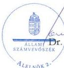
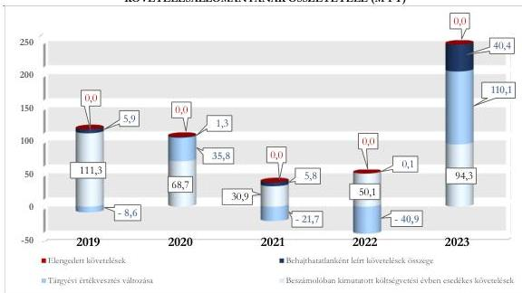

ÁLLAMI
SZÁMVEVŐSZÉK

# JELENTÉS

## A központi költségvetési szervek
követeléskezelése

A behajthatatlan és az elengedett követelések kezelése – Nemzeti
Népegészségügyi és Gyógyszerészeti Központ

2026.

26027

www.asz.hu

---

ÁLLAMI
SZÁMVEVŐSZÉK

# JELENTÉS
## A központi költségvetési szervek
## követeléskezelése

A behajthatatlan és az elengedett követelések kezelése – Nemzeti
Népegészségügyi és Gyógyszerészeti Központ

2026.

26027

www.asz.hu

alelnök

---

ELLENŐRZÉSI IGAZGATÓSÁG:

ELLENŐRZÉSI IGAZGATÓSÁG I.

ELLENŐRZÉSI IGAZGATÓ:

SINKÁNÉ DR. CSENDES ÁGNES igazgató

ELLENŐRZÉSVEZETŐ:

BOZSÓ ERIKA LÍVIA ellenőrzésvezető

DR. SIMON JÓZSEF ellenőrzésvezető

LACZI HEDVIG ANNA ellenőrzésvezető

Jelentéseink az interneten a
www.asz.hu címen olvashatók.

IKTATÓSZÁM: EL-4440-001/2026

TÉMASORSZÁM: 20/2024

ELLENŐRZÉS-AZONOSÍTÓ SZÁM: V1073

---

# TARTALOMJEGYZÉK

|  ■ ÖSSZEFOGLALÁS | 5  |
| --- | --- |
|  ■ AZ ELLENŐRZÉS EREDMÉNYEI | 8  |
|  1. A központi költségvetési szerv követelése, a követelésekkel kapcsolatos értékvesztések, a behajthatatlan és elengedett követelések alakulása és ezek eredményre, illetve vagyonra gyakorolt hatásai | 8  |
|  2. A központi költségvetési szerv követeléskezelési tevékenységgel kapcsolatos folyamatainak és a követelések értékelési szabályainak kialakítása | 13  |
|  3. A központi költségvetési szerv követeléskezelési tevékenységének működtetése - behajthatatlan és elengedett követelések kezelése | 15  |
|  4. A központi költségvetési szerv követeléseinek év végi értékelése és az éves költségvetési beszámolóban történt kimutatása, leltárral történő alátámasztása | 19  |
|  ■ JAVASLATOK | 20  |
|  ■ I. FÜGGELÉK: ÉSZREVÉTELEK | 21  |
|  ■ II. FÜGGELÉK: ELLENŐRZÉSI MEGKÖZELÍTÉS | 22  |
|  ■ MELLÉKLETEK | 27  |
|  I. sz. melléklet: Értelmező szótár | 27  |
|  II. sz. melléklet: Az ellenőrzött szervezetek jegyzéke | 29  |
|  ■ RÖVIDÍTÉSEK JEGYZÉKE | 30  |

3

---

# ÖSSZEFOGLALÁS

A központi költségvetési szervek követelései a közvagyon részét képezik ugyanúgy, mint a pénzeszközök, a befektetett eszközök vagy a készletek. A követelések teljesülése befolyásolja az adott szervezet bevételeinek alakulását. Így a gazdálkodás egyik fontos elemét jelenti a követeléskezelési tevékenységek, eljárások szabályszerű, célszerű és eredményes működtetése a bevételek lehető legnagyobb mértékű pénzügyi realizálása érdekében. Mindezek hiánya esetén nem érvényesül a jó gazda gondossága a gazdálkodás e területén.

A Nemzeti Népegészségügyi és Gyógyszerészeti Központ ellenőrzését az indokolta, hogy az ellenőrzött időszakban a központi költségvetési szervek között jelentős nagyságrendű követelésállománnyal rendelkezett, a lejárt követelések értéke jelentősen növekedett a 2022. évről a 2023. évre, illetve az általános közszolgáltatások kormányzati funkción belül kiemelt szereplőnek számított a jelentős számú közfeladat ellátása révén.

A Nemzeti Népegészségügyi és Gyógyszerészeti Központ az ellenőrzött időszakban a követeléskezelési és behajtási tevékenységgel kapcsolatos szabályozási kereteit és belső szabályzatait megalkotta. Az ellenőrzött mintatételek alapján a követelések megtérülése érdekében szükséges intézkedéseket több esetben nem hajtotta végre. A követeléskezelési és behajtási tevékenység a 2022. évig a 90 napon túl lejárt követelések növekvő tendenciája miatt nem volt eredményes, illetve a 2023. évben ennek eredményessége a szervezeti változás miatt nem volt értékelhető. A követeléskezelési tevékenység az ellenőrzött időszakban nem volt célszerű, mivel a Nemzeti Népegészségügyi és Gyógyszerészeti Központ az alkalmazott követeléskezelési eszközök hatásait nem értékelte, valamint az emberi alkalmazásra kerülő gyógyszerek forgalomba hozatali engedélyének fenntartásáért fizetendő fenntartási díjkövetelések behajtása érdekében nem alkalmazta a jogszabályban előírt szankciót. A lejárt követelésállomány 2023. évi növekedése miatt az Állami Számvevőszék véleménye szerint a Nemzeti Népegészségügyi és Gyógyszerészeti Központ részéről indokolt a lejárt követelésállomány áttekintése alapján a fizetési felszólítások és egyenlegközlő levelek belső szabályzatban meghatározottak szerint történő teljeskörű kiküldésének, illetve a lejárt követelések behajtásának teljeskörűsége érdekében további kontrolltevékenységek beépítése a követeléskezelés folyamatába, különös tekintettel a az emberi alkalmazásra kerülő gyógyszerek forgalomba hozatali engedélyének fenntartásáért fizetendő fenntartási díjfizetési követelések esetében.

Az NNGYK¹ beszámolóban kimutatott követelésállománya az ellenőrzött időszakban a 2019. év végi 191,4 M Ft-ról 2022. év végére 77,8 M Ft-ra csökkent, majd a 2023. év végére 141,5 M Ft-ra növekedett. A költségvetési évben esedékes követelések beszámolóban kimutatott összege a 2019. év végi 111,3 M Ft-ról a 2021. év végére 30,9 M Ft-ra csökkent, majd ehhez képest a 2023. év végére több mint háromszorosára, 96,4 M Ft-ra növekedett. A növekedésre hatással volt a 2023. évi szervezeti változás, az OGYÉI² beolvadása.

A beszámolóban kimutatott költségvetési évben esedékes közhatalmi és működési célú követelések értéke a 2019. év végi 111,3 M Ft-ról tendenciájában csökkent a 2021. évig, majd ezt követően a 2023. év végére 94,3 M Ft-ra emelkedett. A költségvetési évben esedékes közhatalmi és működési célú követelések aránya az elszámolt esedékes közhatalmi, működési és felhalmozási célú bevételekhez viszonyítottan a 2019. év végi 6,6%-ról a 2023. év végére 4,4%-ra csökkent. Az NNGYK költségvetési évben esedékes követelései átlagosan 76,8%-ban államháztartáson kívüli szervezetekkel, 21,7%-ban államháztartás szervezeteivel (jellemzően kórházakkal) és 1,5%-ban természetes személyekkel szemben keletkeztek.

A lejárt követelések értéke a 2019. év végi 123,3 M Ft-ról a 2022. év végéig 32,0%-kal csökkent, majd a 2023. év végére – az OGYÉI beolvadását követően – 238,9 M Ft-ra növekedett, amelyből a 180 napon túl

5

---

Összefoglalás---

lejárt követelésállomány aránya a 2019. év végi 46,9%-ról a 2023. év végére 69,1%-ra növekedett. A lejárt követelések állománya az ellenőrzött időszakban évente átlagosan az elszámolt bevételek 1,8%-át tette ki.

Az NNGYK **korrigált, költségvetési évben esedékes közhatalmi és működési célú követelésállománya** a 2019. évi 108,6 M Ft-ról a 2022. évig tendenciájában 91,4%-kal csökkent, majd a 2023. évre 244,8 M Ft-ra növekedett. Ennek alakulását az ellenőrzött időszakban a költségvetési évben esedékes követelések és a behajthatatlan követelések értéke, valamint a tárgyévi értékvesztés változása határozta meg.

Az NNGYK beszámolóban kimutatott, költségvetési évben esedékes követeléseinek értékelése alapján az **elszámolt értékvesztések, valamint a behajthatatlanként elszámolt követelések együttes összege** a 2019. év végi - 2,7 M Ft-ról a 2023. évre 150,5 M Ft-ra növekedett.

A **2019-2023. évi értékvesztésváltozás** eredménycsökkentő hatása a 2020. és a 2023. években összesen 145,9 M Ft volt, míg a 2019., 2021. és 2022. években az eredménynövelő hatása összesen 71,2 M Ft volt.

A **behajthatatlan követelések leírásának** eredményre és vagyonváltozásra gyakorolt negatív hatása összesen 53,5 M Ft volt. Ezen összegből 40,4 M Ft a 2023. évet érintette. Az ellenőrzött időszakban elszámolt behajthatatlan követelések 86,7%-a államháztartáson kívüli szervezetekkel, 10,5%-a államháztartás szervezeteivel és 2,8%-a belföldi természetes személyekkel szemben fennálló követelés volt.

Az NNGYK a **követelések kezelésével, valamint behajtásával kapcsolatos szervezeti kereteket** a jogszabályi előírásoknak megfelelően kialakította. Az NNGYK a követelések kezelésével, valamint behajtásával kapcsolatos folyamatokat nem teljeskörűen a jogszabályi előírásoknak megfelelően alakította ki, mert a fizetési felszólítások kiküldésére, illetve a behajtás céljából átadásra kerülő követelések átadására vonatkozó folyamat kialakítása nem volt teljeskörűen szabályozott. A folyamat szabályozása nem tartalmazta a fizetési felszólítások kiküldésének, illetve a követelések behajtásra történő átadásának határidejét. Az NNGYK a követelések elszámolásának, értékelésének, valamint a behajthatatlan és elengedett követelések elszámolásának szabályait belső szabályzataiban a jogszabályi előírások szerint meghatározta.

Az NNGYK – három eset kivételével – a **követeléseinek értékelését, a követelések és az értékvesztések, továbbá a behajthatatlan követelések elszámolását** a jogszabályi előírások és a belső szabályozók előírásai szerint végezte. Az NNGYK a devizában fennálló követelések év végi értékelését elvégezte, azonban az értékvesztés értékét nem a tárgyévben, hanem a tárgyévet követő évben számolta el. A követelések behajthatatlanság címén történő leírása négy esetben nem a belső előírásokban meghatározott, jogosultsággal rendelkező személy döntése alapján történt.

A **követelések részletező nyilvántartása** az ellenőrzött mintatételek alapján nem teljeskörűen tartalmazta a jogszabály által előírt tartalmi elemeket.

A **követelések év végi értékelése és az éves költségvetési beszámolóban történő kimutatása** – a három devizában fennálló követelés kivételével – a jogszabályi előírásoknak megfelelően történt. Az NNGYK a 2023. évi éves költségvetési beszámoló mérlegének a költségvetési évben és a költségvetési évet követően esedékes követeléseit a jogszabályi előírásoknak megfelelően leltárral alátámasztotta.

Az NNGYK **követeléskezelési és behajtási tevékenysége** az ellenőrzött mintatételek értékelése alapján több esetben nem a jogszabályokban és a belső szabályzataiban meghatározott előírásoknak megfelelően történt. Az NNGYK a követelés pénzügyi teljesítésének elősegítése érdekében a belső szabályzatában foglalt előírás ellenére az ellenőrzött időszakon belül – az OGYÉI-től átvett követelések esetén az átvételt követően – öt esetben fizetési felszólítást, illetve egy esetben egyenlegközlő levelet nem küldött az adósok részére. Az NNGYK hét esetben a lejárt követelést nem adta át az illetékes szervezeti egysége részére behajtás céljából. Az ÁSZ ellenőrzés által feltárt hibák a követelések érvényesítése és behajtása tekintetében jellemzően az OGYÉI-

6

---

Összefoglalás---

nél keletkezett és átvett, az emberi alkalmazásra kerülő gyógyszerek forgalomba hozatali engedélyének fenntartásáért fizetendő fenntartási díjfizetési kötelezettséggel kapcsolatos követeléseket érintették.

Az NNGYK-ra vonatkozóan a követeléskezelési és behajtási tevékenység a 2022. évig nem volt eredményes, mivel a lejárt követelésállomány a 2022. évig ugyan csökkent, azonban a 90 napon túl lejárt követelések aránya a 2021. évig növekvő tendenciát mutatott. Az NNGYK-ra vonatkozóan a követeléskezelés és behajtás érdekében alkalmazott tevékenység eredményessége a 2023. évre vonatkozóan nem volt értékelhető, mivel az OGYÉI 2023. év közben történt beolvadása miatt a lejárt követelések értéke és összetétele megváltozott, amelyre az NNGYK-nak nem volt ráhatása.

Az NNGYK követeléskezelési tevékenysége a követeléskezelési eszközök hatásaira vonatkozó értékelések elvégzésének, illetve öt esetben a behajtási tevékenység végrehajtásának hiánya miatt nem volt célszerű. Ezáltal nem győződött meg arról, hogy a belső szabályozásban szereplő intézkedéseket ésszerűen és racionálisan, valamint a követelések megtérülése érdekében teljeskörűen alkalmazta. Ezen értékelés elvégzése az ÁSZ véleménye szerint a 2023. évben lezajlott szervezeti változás és a lejárt követelések állományának 2023. évi növekedése miatt még inkább indokolt volt. A követeléskezelési tevékenység nem célszerű végrehajtását igazolta az is, hogy az NNGYK több ellenőrzött mintatétel esetében nem tett ésszerű intézkedéseket a követelések behajtása érdekében, különösen az emberi alkalmazásra kerülő gyógyszerek forgalomba hozatali engedélyének fenntartásáért fizetendő fenntartási díjkövetelések esetében.

Az ÁSZ³ öt javaslatot fogalmazott meg az NNGYK részére, amelyek a követelések részletező nyilvántartásának vezetéséhez, a belső szabályozásban a fizetési felszólítások kiküldésére és az illetékes szervezeti egységek között a lejárt követelések behajtás céljából történő átadásra vonatkozó határidő egyértelmű meghatározásához, az értékvesztések szabályszerű elszámolásának végrehajtásához, a követeléskezelési tevékenységet érintő kontrolltevékenységek kialakításához és működtetéséhez, valamint az emberi alkalmazásra kerülő gyógyszerek forgalomba hozatali engedélyének fenntartásáért fizetendő fenntartási díjfizetési követelések teljesítésének figyelemmel kíséréséhez, a követeléskezelési folyamatban az érintett szervezeti egységek együttműködésének biztosításához, valamint a követelések behajtása érdekében a jogszabályokban biztosított szankció alkalmazásához kapcsolódtak.

7

---

# AZ ELLENŐRZÉS EREDMÉNYEI

## 1. A központi költségvetési szerv követelése, a követelésekkel kapcsolatos értékvesztések, a behajthatatlan és elengedett követelések alakulása és ezek eredményre, illetve vagyonra gyakorolt hatásai

### Összegző megállapítás

Az NNGYK beszámolóban kimutatott követeléseinek értéke a 2022. év végéig csökkent, majd a szervezeti változás miatt növekedett. A lejárt követelések állománya a 2020. és 2022. évek között csökkenő, majd a 2023. évben növekvő tendenciát mutatott. A követelések értékelése alapján a követelésekkel kapcsolatos elszámolások a beszámolóban kimutatott eredményt és vagyonváltozást a 2020. és 2023. években negatívan, az ellenőrzött időszak többi évében pozitívan érintették.

### A KÖVETELÉSEK ALAKULÁSA

Az NNGYK beszámolóban kimutatott követeléseinek értéke a 2019. év végi 191,4 M Ft-ról 2022. év végére 77,8 M Ft-ra csökkent, majd a 2023. év végére – az OGYÉI beolvadásával együtt – 141,5 M Ft-ra növekedett. Az NNGYK költségvetési évben esedékes közhatalmi és működési célú követeléseinek értéke a 2019. évi 111,3 M Ft-hoz képest a 2021. évig csökkenő, majd ezt követően növekvő tendenciát mutatott, a 2023. évben ennek értéke 96,4 M Ft-ra növekedett.

Az NNGYK beszámolóban kimutatott követeléseinek és elszámolt bevételeinek alakulását az 1. táblázat tartalmazza.

8

---

Az ellenőrzés eredményei

1. táblázat

# **AZ NNGYK BESZÁMOLÓBAN KIMUTATOTT KÖVETELÉSEI ÉS ELSZÁMOLT BEVÉTELEI  
(M FT, %)**

|  MEGNEVEZÉS | 2019.12.31. | 2020.12.31. | 2021.12.31. | 2022.12.31. | 2023.12.31.  |
| --- | --- | --- | --- | --- | --- |
|  Beszámolóban kimutatott követelések, ebből: | 191,4 M Ft | 176,8 M Ft | 85,0 M Ft | 77,8 M Ft | 141,5 M Ft  |
|  Költségvetési évet követően esedékes követelések | 80,1 M Ft | 108,1 M Ft | 54,1 M Ft | 24,8 M Ft | 45,1 M Ft  |
|  Költségvetési évben esedékes követelések | 111,3 M Ft | 68,7 M Ft | 30,9 M Ft | 53,0 M Ft | 96,4 M Ft  |
|  Költségvetési évben esedékes követelések, amelyek közhatalmi, működési, továbbá felhalmozási célú követelések* | 111,3 M Ft | 68,7 M Ft | 30,9 M Ft | 50,1 M Ft | 94,3 M Ft  |
|  Költségvetési évben esedékes elszámolt bevételek (B1-B7 összesen) | 4 251,2 M Ft | 3 278,0 M Ft | 60 032,7 M Ft | 20 012,4 M Ft | 38 185,1 M Ft  |
|  A közhatalmi, működési, továbbá felhalmozási célú elszámolt bevételek (B3-B5 összesen) | 1 673,9 M Ft | 1 731,5 M Ft | 2 565,7 M Ft | 5 274,9 M Ft | 2 146,9 M Ft  |
|  Közhatalmi bevételek aránya a költségvetési évben elszámolt bevételekből (B1-B7 összesen) (%) | 8,6% | 6,9% | 0,6% | 1,9% | 1,9%  |
|  Költségvetési évben esedékes követelések aránya a beszámolóban kimutatott követelésekhez (%) | 58,2% | 38,9% | 36,4% | 68,1% | 68,1%  |
|  Költségvetési évben esedékes követelésekből a közhatalmi és működési célú követelések aránya az elszámolt közhatalmi, működési, továbbá felhalmozási célú bevételekhez viszonyítva (%) | 6,6% | 4,0% | 1,2% | 0,9% | 4,4%  |

Az NNGYK az ellenőrzött időszakban nem rendelkezett költségvetési évben esedékes felhalmozási célú követelésekkel.

A 2019-2023. évek közötti időszakban az NNGYK elszámolt közhatalmi, működési és felhalmozási célú bevételeinek átlagosan 3,4%-át tette ki a beszámolóban kimutatott, költségvetési évben esedékes követelések értéke.

A beszámolóban kimutatott, költségvetési évben esedékes közhatalmi és működési célú követelései a 2019. év végi 111,3 M Ft-ról 2021. év végéig tendenciájában csökkentek, ennek értéke 30,9 M Ft volt. Ezt követően értéke a 2023. év végére 94,3 M Ft-ra növekedett. Az NNGYK 2019. évben elszámolt közhatalmi, működési és felhalmozási célú bevételeinek 6,6%-a volt a beszámolóban kimutatott, költségvetési évben esedékes követelések értéke, amely tendenciájában folyamatosan csökkent a 2022. évre 0,9%-ra, majd a 2023. évben ennek értéke 4,4%-ra emelkedett.

A működési bevételekhez kapcsolódó követelések esetén a három fő kategóriát a szolgáltatások ellenértéke (pl. a bérbeadásból, a kórházaknak nyújtott szakvizsgálatokból, a mikrobiológiai vizsgálatokból származó bevételek); a készletértékesítés ellenértéke és az egyéb működési bevételek jelentették.

Az OGYÉI 2023. évben történt beolvadása jelentősen befolyásolta a követelések darabszámát és összetételét. A 2022. évhez képest 2023. évben a követelések darabszáma 577 darabról 3 168 darabra növekedett, illetve kis összegű követelések részaránya 70,0%-ról 21,3%-ra csökkent. A közhatalmi bevételekhez kapcsolódó követelések részaránya a közhatalmi és működési bevételekhez kapcsolódó követeléseken belül a 2022. évi 13,9%-ról 21,9%-ra emelkedett.

Az NNGYK beszámolóban kimutatott, költségvetési évben esedékes lejárt követeléseiből a 180 napon túli követelések aránya az ellenőrzött időszakon belül átlagosan 60,3%-ot ért el, amelyen belül meghatározó volt a 360 napon túli követelések aránya. A 360 napon túli követelések aránya 2019. és 2021. évek között 33,6 százalékponttal emelkedett, majd a 2022. évben ennek aránya csökkent, azonban 2023. évben ennek értéke 47,6%-ra, 19,6 százalékponttal emelkedett. A lejárt követelések állománya az

9

---

Az ellenőrzés eredményei

ellenőrzött időszakban átlagosan az elszámolt bevételek 1,8%-át tette ki. Mindez azt mutatja, hogy a lejárt követelések kis mértékben gyakoroltak hatást a gazdálkodásra.

A lejárt követelésállomány értéke az ellenőrzött időszakban a 2022. évig csökkenő tendenciát mutatott. A lejárt követelésállomány értékének és összetételének alakulását a 2023. évben alapvetően befolyásolta az OGYÉI beolvadása. Az OGYÉI-től átvett követelések esetén az emberi alkalmazásra kerülő gyógyszerek forgalomba hozatali engedélyének fenntartásáért fizetendő igazgatási szolgáltatási díjakhoz kapcsolódó követelése az NNGYK-nak a 2023. év végén összesen 69 partnerrel szemben, 109 ügyben, 109,3 M Ft értékben állt fenn.

Az emberi alkalmazásra kerülő gyógyszerek forgalomba hozatali engedélyének fenntartásáért fizetendő igazgatási szolgáltatási díjakhoz kapcsolódó követelések darabszáma és értéke a 2024. évben növekedett. Az NNGYK-nak e jogcímen a 2024. év végén összesen 77 partnerrel szemben, 126 ügyben 141,7 M Ft értékben állt fenn követelése.

Az NNGYK költségvetési évben esedékes lejárt követeléseinek állományát és a követeléseinek lejárat szerinti megoszlását a 2. számú táblázat tartalmazza.

2. táblázat

# **AZ NNGYK KÖLTSÉGVETÉSI ÉVBEN ESEDÉKES KÖVETELÉSEINEK ÁLLOMÁNYA ÉS LEJÁRAT SZERINTI MEGOSZLÁSA (M FT, %)**

|  KÖVETELÉSEK ESEDÉKESSÉGE | 2019.12.31 |   | 2020.12.31 |   | 2021.12.31 |   | 2022.12.31 |   | 2023.12.31  |   |
| --- | --- | --- | --- | --- | --- | --- | --- | --- | --- | --- |
|   |  % | M Ft | % | M Ft | % | M Ft | % | M Ft | % | M Ft  |
|  Fizetési határidőn túl 0-90 nap | 31,7 | 39,1 | 24,3 | 37,5 | 20,8 | 20,7 | 43,3 | 36,2 | 24,3 | 58,0  |
|  Fizetési határidőn túl 91-180 nap | 21,4 | 26,3 | 14,2 | 22,0 | 3,3 | 3,3 | 8,7 | 7,3 | 6,6 | 15,8  |
|  Fizetési határidőn túl 181-360 nap | 8,0 | 9,9 | 6,2 | 9,5 | 3,4 | 3,4 | 20,0 | 16,7 | 21,5 | 51,3  |
|  Fizetési határidőn túl 360 nap felett | 38,9 | 48,0 | 55,3 | 85,3 | 72,5 | 72,3 | 28,0 | 23,5 | 47,6 | 113,8  |
|  **Lejárt követelések megoszlása / értéke** | **100,0** | **123,3** | **100,0** | **154,3** | **100,0** | **99,7** | **100,0** | **83,8** | **100,0** | **238,9**  |
|  Lejárt követelések aránya az elszámolt bevételekhez viszonyítva (%) | 2,9% |   | 4,7% |   | 0,2% |   | 0,4% |   | 0,6%  |   |
|  Közhatalmi követelések aránya a lejárt követelésekhez viszonyítva (%) | 5,2% |   | 5,9% |   | 2,2% |   | 8,4% |   | 8,7%  |   |
|  Megképzett értékvesztés lejárt követelések összegéhez viszonyított aránya (%) | 49,3% |   | 62,7% |   | 75,2% |   | 40,7% |   | 60,4%  |   |

Forrás: „Kimutatás központi költségvetési szervek követeléseinek összetételéről adósok szerint”, az NNGYK adatai alapján, ÁSZ saját szerkesztés

Az ellenőrzött időszakban az NNGYK költségvetési évben esedékes (lejárt) követeléseinek átlagosan 76,8%-a **államháztartáson kívüli szervezetekkel** – gazdasági társaságokkal és egyéb szervezetekkel – szemben, illetve átlagosan 21,7%-a az **államháztartáson belüli szervezetekkel** – központi költségvetési szervekkel (jellemzően egészségügyi intézményekkel) – szemben állt fenn. Az NNGYK **természetes személyekkel** szemben fennálló követeléseinek aránya átlagosan 1,5% volt.

Az ellenőrzött időszakban az NNGYK lejárt követelésein belül a közhatalmi bevételekre irányuló követelések aránya átlagosan 6,1% volt, amely alacsonyabb volt a közhatalmi bevételek összes bevételen belül képviselt átlagos arányánál.

10

---

Az ellenőrzés eredményei

## A KÖVETELÉSEK ÉRTÉKELÉSÉNEK HATÁSA AZ EREDMÉNY- ÉS VAGYONVÁLTOZÁSRA

Az NNGYK **beszámolóban kimutatott követeléseinek értékelése** 128,2 M Ft összegű negatív hatást gyakorolt az ellenőrzött időszakban az eredményre és a vagyonra. Az eredményre és vagyonra gyakorolt hatás értéke a 2020. és 2023. évben összesen 187,6 M Ft volt. A 2019., 2021. és 2022. években a követelések értékelése összesen 59,4 M Ft-tal pozitívan hatott az eredményre és a vagyonváltozásra.

Az NNGYK **követelései értékelésének eredményre és vagyonváltozásra** gyakorolt hatását az ellenőrzött időszakban a 3. táblázat tartalmazza.

3. táblázat

### AZ NNGYK KÖVETELÉSEI ÉRTÉKELÉSÉNEK EREDMÉNYRE ÉS VAGYONVÁLTOZÁSRA GYAKOROLT HATÁSA (M FT, %)

|  MEGNEVEZÉS | 2019. | 2020. | 2021. | 2022. | 2023.  |
| --- | --- | --- | --- | --- | --- |
|  **Követelések értékelésének eredményre és vagyonváltozásra gyakorolt hatása** | **- 2,7 M Ft** | **37,1 M Ft** | **- 15,9 M Ft** | **- 40,8 M Ft** | **150,5 M Ft**  |
|  ebből: tárgyévi értékvesztés változása | - 8,6 M Ft | 35,8 M Ft | - 21,7 M Ft | - 40,9 M Ft | 110,1 M Ft  |
|  ebből: behajthatatlan követelés | 5,9 M Ft | 1,3 M Ft | 5,8 M Ft | 0,1 M Ft | 40,4 M Ft  |
|  ebből: elengedett követelés | 0,0 M Ft | 0,0 M Ft | 0,0 M Ft | 0,0 M Ft | 0,0 M Ft  |
|  *Követelésértékelés elemeinek megoszlása* |  |  |  |  |   |
|  *értékvesztés változás aránya %* | 307,9% | 96,5% | 136,4% | 100,3% | 73,1%  |
|  *behajthatatlan követelések aránya %* | -207,9% | 3,5% | -36,4% | -0,3% | 26,9%  |

Forrás: Kincstár KGR-K11 rendszer beszámoló, ellenőrzött szervezet főkönyvi kivonat adatai alapján, ÁSZ saját szerkesztés

Az ellenőrzött időszakban az NNGYK által elszámolt **behajthatatlan követelés** összesen 53,5 M Ft volt, amelynek 86,7%-a államháztartáson kívüli szervezetekkel – gazdasági szervezetek és egyéb szervezetek –, 10,5%-a államháztartás szervezeteivel – központi költségvetési szervek – és a 2,8%-a belföldi természetes személyekkel szemben került elszámolásra. Az NNGYK behajthatatlanként elszámolt követeléseinek leírására a bíróság előtti érvényesíthetőség hiánya, az elévülés, a behajtás várható megtérülésének a követelés értékéhez viszonyított alacsony értéke, valamint a kötelezett megszűnése miatt került sor.

Az adott évben behajthatatlanként elszámolt követelések év végén fennálló 360 napon túl lejárt követelésállományhoz viszonyított aránya az ellenőrzött időszakban 0,5% (2022. év) és 26,2% (2023. év) között mozgott.

Az NNGYK **a követelések értékelését** a követelések várható megtérülése és egyedi értékelés, továbbá a közhatalmi követelések esetében egyszerűsített értékelési eljárás alapján végezte. Az NNGYK a követelések értékelése során a 2019-2023. években összesen 203,9 M FT **értékvesztést képzett**, illetve az **értékvesztés visszaírása** összesen 129,2 M Ft volt, ezáltal a tárgyévi értékvesztés változása az ellenőrzött időszakban összesen 74,7 M Ft összegű negatív hatást gyakorolt az NNGYK eredményére és vagyonára. Az elszámolt értékvesztés 2023. évi összegét az OGYÉI-től átvett követelések esetén elszámolt értékvesztések értéke befolyásolta.

Az értékvesztés változás az ellenőrzött időszak két évében – 2020. és a 2023. évben – összesen 145,9 M Ft-tal csökkentette az eredményt és a vagyont, 2019., a 2021. és a 2022. évben azonban összesen 71,2 M Ft összegű pozitív hatást gyakorolt.

Az NNGYK **elengedett követelést** az ellenőrzött időszakban nem számolt el.

11

---

Az ellenőrzés eredményei

## A KÖVETELÉSÁLLOMÁNY ALAKULÁSA

Az **NNGYK korrigált, költségvetési évben esedékes közhatalmi és működési célú összesített követelésállománya** a 2019. évben 108,6 M Ft volt, amely 2022. évig tendenciájában jelentős mértékben csökkent – 9,3 M Ft volt –, majd a 2023. évre 244,8 M Ft-ra növekedett. A 2023. évben tapasztalt növekedésre hatással volt az OGYÉI beolvadása.

Az NNGYK korrigált, költségvetési évben esedékes közhatalmi és működési célú követelésállományának alakulását az ellenőrzött időszakban a költségvetési évben esedékes követelések és a tárgyévi értékvesztés változása, illetve a 2023. évben az elszámolt behajthatatlan követelések értéke határozta meg.

Az NNGYK korrigált, költségvetési évben esedékes közhatalmi és működési célú összesített követelésállományának összetételét az 1. ábra szemlélteti.

1. ábra

**AZ NNGYK KORRIGÁLT, KÖLTSÉGVETÉSI ÉVBEN ESEDÉKES KÖVETELÉSÁLLOMÁNYÁNAK ÖSSZETÉTELE (M FT)**

Forrás: Kincstár KGR K11 rendszer adatai, éves költségvetési beszámolók adatai és főkönyvi kivonatok adatai alapján, ÁSZ saját szerkesztés

12

---

Az ellenőrzés eredményei

## 2. A központi költségvetési szerv követeléskezelési tevékenységgel kapcsolatos folyamatainak és a követelések értékelési szabályainak kialakítása

### Összegző megállapítás

Az NNGYK a követeléskezelési és behajtási tevékenységgel kapcsolatos szervezeti kereteit a jogszabályi előírásoknak megfelelően kialakította, azonban a folyamatok kialakítása nem teljeskörűen felelt meg a Bkr.-ben szereplő előírásoknak. A követelések kezelésére, elszámolására és értékelésére, valamint a behajthatatlan és elengedett követelések elszámolására vonatkozó belső szabályokat a jogszabályi előírásoknak megfelelően meghatározta.

Az NNGYK a követeléskezelési feladatokat ellátó szervezeti egységek feladatait az SZMSZ⁴-ben, valamint a Gazdasági Főosztály ügyrend⁵-jeiben az Ávr.⁶ előírásaival összhangban határozta meg.

Az NNGYK a követeléskezeléssel, a követelések végrehajtásra történő átadásával, valamint a behajthatatlan és elengedett követelések működési- és értékelési munkafolyamataival kapcsolatos feladatait az Ellenőrzési nyomvonal⁷-aiban és az Értékelési Szabályzat⁸-aiban a Bkr.⁹ előírásaival összhangban szabályozta.

A követelések kezelésére, elszámolására és értékelésére, a követelés behajtására vonatkozó szervezeti keretek kialakítását, a munkafolyamatok szabályozását az NNGYK-nál a 4. táblázatban megjelölt szabályozó eszközök tartalmazták az ellenőrzött időszakban.

4. táblázat

### AZ NNGYK KÖVETELÉSEK KEZELÉSÉBEN RÉSZTVEVŐ SZERVEZETI EGYSÉGEI ÉS A SZERVEZETI KERETEKET ÉS A MUNKAFOLYAMATOKAT SZABÁLYOZÓ ESZKÖZÖK

|  KÖVETELÉSKEZELÉSBEN RÉSZTVEVŐ SZERVEZETI EGYSÉGEK |   |   | A KÖVETELÉSKEZELÉS SZERVEZETI KERETEIT ÉS A MUNKAFOLYAMATAIT SZABÁLYOZÓ ESZKÖZÖK  |   |   |   |
| --- | --- | --- | --- | --- | --- | --- |
|  PÉNZÜGYI ÉS SZÁMVITELI OSZTÁLY | GAZDASÁGI IGAZGATÓSÁGON BELÜLI ÖNÁLLÓ SZERVEZETI EGYSÉG | JOGI OSZTÁLY | SZMSZ | ÜGYREND | ELLENŐRZÉSI NYOMVONAL | EGYÉB SZABÁLYOZÓK  |
|  ☑ | ☒ | ☑ | ☑ | ☑ | ☑ | ☑  |

☑ rendelkezett a szabályozó eszközzel és szabályozta a követeléskezelést; rendelkezett követeléskezelésben résztvevő szervezeti egységgel

☒ nem releváns

Forrás: Az ellenőrzött szervezet dokumentumai alapján, ÁSZ saját szerkesztés

Az NNGYK 2023. évi SZMSZ-ében foglaltak alapján a gazdasági főigazgató feladatai közé tartozott többek között az NNGYK gazdálkodásának átfogó kérdéseit elemezni, javaslatot tenni azok megoldására, meghatározni az aktuális feladatokat, továbbá ellenőrizni a feladatok végrehajtását, figyelemmel kísérni a gazdálkodás alakulását, és az időarányos teljesítéstől történő indokolatlan eltérés esetén megtenni a szükséges intézkedéseket, illetve javaslatokat tenni a gazdálkodás egyensúlyának helyreállítása érdekében. Felelős volt továbbá a költségvetési gazdálkodás szabályszerűségéért, az NNGYK szakmai döntései közgazdasági, pénzügyi előkészítéséért, a pénzügyi kötelezettségekkel járó szerződések előkészítéséért. A

13

---

*Az ellenőrzés eredményei*---

Gazdálkodási Főosztály feladatkörébe tartozott többek között a követelésekről a pénzügyi nyilvántartás vezetése, az alkalmazott számlavezetési rendszerben a követelések érvényesítésének előkészítése és elvégzése, az NNGYK bevételeinek beszedésével és kiadásainak teljesítésével, pénzeszközök kezelésével kapcsolatos pénzügyi feladatok teljeskörű ellátása.

A Gazdálkodási Főosztály ügyrendje meghatározta a Költségvetési és Kontrolling Osztály főbb feladatait. Ezek közé tartozott többek között a Pénzügyi és Számviteli Osztállyal és a Jogi és Humánpolitikai Főosztállyal együttműködve a behajthatatlan követelések állományának feldolgozása, azok számviteli rendszerből történő kivezetésének előkészítése, a többszöri felszólítás után sem teljesített követelések jogi útra terelésének kezdeményezése a Jogi és Humánpolitikai Főosztálynál, illetve a behajthatatlannak minősített követelésekkel kapcsolatban a szükséges intézkedések kezdeményezése. Az Értékelési szabályzat előírása szerint a Jogi Osztálynak a számára átadott követelések tekintetében ismételt fizetési felszólítást kellett küldenie az adós részére és a pénzügyi teljesítés elmaradása esetén a behajtás érdekében jogi lépéseket volt köteles megtenni.

A Pénzügyi és Számviteli Osztály feladatai közé tartozott az ügyrend alapján többek között a bevételekkel kapcsolatos feladatok ellátása, amelyek közé tartozott a számlák pénzügyi teljesítésének ellenőrzése, a kintlévőségek kezelése, a kapcsolódó levelezések, folyószámla egyeztetések teljes körű ellátása, valamint a bevételek pénzügyi rendezése érdekében intézkedések megtétele.

Az NNGYK követeléskezeléssel és behajtással kapcsolatos belső szabályozásában a Bkr. 6. § (1) bekezdés b) pontja és (2) bekezdésében foglalt előírás ellenére a fizetési felszólítások kiküldésére, illetve a behajtás céljából átadásra kerülő követelések átadására vonatkozó folyamatban nem voltak egyértelműek a feladatok, mivel az NNGYK nem határozta meg a fizetési felszólítások kiküldésének, illetve a Jogi és Humánpolitikai Főosztály részére, behajtás céljából átadásra kerülő követelések átadásának határidejét. (2. javaslat)

**A követelések értékelésének, valamint a behajthatatlan és elengedett követelések elszámolásának szabályait** az NNGYK a Számviteli politiká$^{10}$-ban és annak keretében elkészített Értékelési szabályzataiban, valamint a Számlarend$^{11}$-jeiben a Számv. tv.$^{12}$ és az Áhsz.$^{13}$ előírásainak megfelelően szabályozta.

**A követelésekkel kapcsolatos részletező nyilvántartás vezetésére vonatkozó szabályokat** az NNGYK Számlarendjei az Áhsz.-ben előírtaknak megfelelően tartalmazták.

Az NNGYK **belső ellenőrzése** az ellenőrzött időszakra vonatkozóan a követeléskezelési tevékenységre, behajthatatlan és elengedett követelésekre és a követelések értékvesztésére vonatkozóan ellenőrzést nem végzett.

14

---

Az ellenőrzés eredményei

### 3. A központi költségvetési szerv követeléskezelési tevékenységének működtetése - behajthatatlan és elengedett követelések kezelése

#### Összegző megállapítás

Az NNGYK a követelések értékelését és elszámolását – három eset kivételével – a jogszabályi és a belső szabályzatokban foglalt előírásoknak megfelelően végezte. A behajthatatlan követelések számviteli elszámolása a jogszabályban foglaltak szerint történt, azonban négy esetben nem az arra jogosult engedélyezte a behajthatatlan követelés elszámolását. A követelések részletező nyilvántartása a jogszabály szerinti releváns adatokat nem teljeskörűen tartalmazta. Az NNGYK követeléskezelési és behajtási tevékenysége a 2022. évig tartó időszakban nem volt eredményes, a 2023. évben a lezajlott szervezeti változás miatt nem volt értékelhető. A követeléskezelési tevékenység a követeléskezelési eszközök hatásaira vonatkozó értékelések elvégzésének, illetve öt esetben a behajtási tevékenység végrehajtásának hiánya miatt nem volt célszerű. Az emberi alkalmazásra kerülő gyógyszerek forgalomba hozatali engedélyének fenntartásáért fizetendő fenntartási díjkövetelések behajtása érdekében a szervezeti egységek között egyeztetés nem történt, valamint az NNGYK jogszabályban előírt szankciót nem alkalmazta.

#### A KÖVETELÉSEK ÉRTÉKELÉSE ÉS ELSZÁMOLÁSA

Az NNGYK a követelések értékelését és az értékvesztés elszámolását – három eset kivételével – a Számv. tv.-ben, az Áhsz.-ben, valamint az Értékelési szabályzatában foglaltak előírásoknak megfelelően végezte. Az NNGYK a 2023. évben – három esetben összesen 1,0 M Ft összegben – az értékvesztés év végi átértékelését a Számv. tv. és az Áhsz. előírásai szerint elvégezte, azonban az értékvesztés átértékelések eredményének elszámolását nem a tárgyévben, hanem az Áhsz. 21. § (10) bekezdésében, a Számv. tv. 60. § (1) bekezdésében és a 65. § (2) bekezdésében foglalt előírások ellenére a tárgyévet követő évben hajtotta végre. (3. javaslat)

#### A BEHAJTHATATLAN KÖVETELÉSEK MINŐSÍTÉSE ÉS ELSZÁMOLÁSA

Az NNGYK-nál a behajthatatlan követelések leírásának számviteli elszámolása az Áhsz.-ben és a 38/2013. (IX. 19.) NGM rendeletben$^{14}$ foglaltak szerint történt.

Az NNGYK-nál – négy esetben összesen 13,5 M Ft összegben – a behajthatatlan követelés leírásának engedélyezése nem a 2023. december 22-től hatályos értékelési szabályzat 5.5.2.6. (19) pontjában szereplő előírás szerint történt, mivel a behajthatatlan követelésként történő elszámolást az országos tisztifőorvos helyett a gazdasági főigazgató engedélyezte.

15

---

Az ellenőrzés eredményei---

## A KÖVETELÉSEK NYILVÁNTARTÁSA

Az NNGYK **követelésekről vezetett részletező nyilvántartása** nem teljeskörűen tartalmazta az Áhsz. 14. melléklet III. 4. pontja szerint előírtakat. A követelések részletező nyilvántartása nem tartalmazta:

- az Áhsz. 14. melléklet III. 4. j) pontjában szereplő rendelkezés ellenére – három esetben – a követelésekkel kapcsolatos fizetési felhívások, behajtására tett intézkedések adatainak teljeskörű rögzítését. (1. javaslat)

## A LEJÁRT KÖVETELÉSEK KEZELÉSE, ÉS A BEHAJTÁSA ÉRDEKÉBEN MEGTETT INTÉZKEDÉSEK

### A követeléskezelési és behajtási tevékenység tartalma és értékelése

A követelésekkel kapcsolatos szervezeti folyamatok kialakítása és működtetése tekintetében – a helyszíni ellenőrzés jegyzőkönyvében foglaltak szerint – az NNGYK számára jelentős kihívást jelentett az OGYÉI-től átvett követelések kezelése. Az átvett követelések többsége az emberi alkalmazásra kerülő gyógyszerek forgalomba hozatali engedélyének fenntartásáért fizetendő igazgatási szolgáltatási díjakhoz kapcsolódó követelések voltak. Az új ügyfelek között jelentős számban szerepeltek külföldi partnerek, amelyek korábban nem voltak jellemzők az NNGYK partnerei között. E kihívás kezelését támogatta, hogy az NNGYK átvette az OGYÉI által – az emberi alkalmazásra kerülő gyógyszerek forgalomba hozatali engedélyének fenntartásáért fizetendő igazgatási szolgáltatási díjakhoz kapcsolódóan – alkalmazott ügymenetkezelő rendszert, az ebben szereplő partneradatokkal és kialakított funkciókkal együtt. E rendszer keretében történt a bevételek és a kapcsolódó követelések előírásának nyomon követése, illetve a beérkező beadványok nyilvántartása.

A beolvadás miatt jelentősen megnövekedett követelésállomány feldolgozását nehezítette – a helyszíni ellenőrzés jegyzőkönyvében foglaltak szerint –, hogy a humánerőforrás korlátozottan állt rendelkezésre, illetve a fluktuáció is problémát jelentett. Az ÁSZ ellenőrzés lezárásának időpontjában 2 fő végezte a követelések kezelésével kapcsolatos feladatokat a Pénzügyi és Számviteli Osztályon belül a Bevételi Csoport keretében.

Az NNGYK az OGYÉI-től átvett követelések feldolgozását a 2023. év második felében megkezdte, azonban e folyamat az ÁSZ ellenőrzés lezárásának időpontjában is folyamatban volt.

Az OGYÉI-től átvett, az emberi alkalmazásra kerülő gyógyszerek forgalomba hozatali engedélyének fenntartásáért fizetendő igazgatási szolgáltatási díjakhoz kapcsolódó számlát a jogszabály szerint minden évben január 31-ig kellett befizetni. A kapcsolódó számlát az NNGYK általában egységesen az adott év elején küldte ki a partnerek részére. A számlák kiállítása a szakmai egységekkel egyeztetve történt. A számlázás tekintetében kihívást jelentett, hogy több esetben előfordult, hogy a számla címzettje változott a partnerek visszajelzése alapján.

A fennálló, esedékes követelések nyomon követését a helyszíni ellenőrzés jegyzőkönyvében foglaltak szerint az NNGYK havonta végezte a számviteli és az ügyviteli rendszer adatainak felhasználásával a havi zárás során. Ennek keretében az érintett követelésekhez tartozó adósok esetén az NNGYK megvizsgálta történt-e az adott időpontig teljesítés és megállapította, hogy továbbra is aktuális-e a követelés, illetve milyen értékű a fennmaradt követelés a rendelkezésre álló dokumentumok alapján.

Az NNGYK-nál az ellenőrzött időszakban a követeléskezelés és behajtási tevékenység során alkalmazott eszközök köre nem változott. A NNGYK az alkalmazott követeléskezelési eszközök darabszámát és ezek alakulását nem mutatta ki és nem elemezte.

16

---

Az ellenőrzés eredményei

A behajthatatlan követelések elszámolásához szükséges feltételeket az NNGYK az egyes követeléseknél az ellenőrzött időszakban év végén vizsgálta meg. A behajthatatlan követeléssé való minősítésre vonatkozó előterjesztéseket ez alapján készítették el és továbbították vezetői jóváhagyásra.

Kedvező változást jelentett a 2022. évig, hogy a lejárt követelések értéke a 2019. évi 123,3 M Ft-ról a 2022. évben 83,8 M Ft-ra csökkent. Kedvezőtlen változást jelentett, hogy a lejárati összetételen belül a 90 napon túl lejárt követelések aránya a 2021. évig növekvő tendenciát követett. Ezt követően kedvező változást jelentett, hogy a 2022. évben a 90 napon túli lejárt követelések állománya 22,5 százalékponttal alacsonyabb értéket tett ki az előző évhez képest. A követeléskezelés és behajtás érdekében alkalmazott tevékenység, intézkedések eredményessége a 2023. év vonatkozásában nem volt értékelhető, mivel az OGYÉI 2023. évben történt beolvadása miatt a lejárt követelések értéke és összetétele megváltozott, amelyre az NNGYK-nak nem volt ráhatása.

Az NNGYK követeléskezelési és behajtási tevékenységének nem célszerű végrehajtását igazolta az is, hogy az OGYÉI-től átvett követelések kapcsán a követelések behajtásával kapcsolatos intézkedések több esetben elmaradtak.

Az NNGYK az alkalmazott követeléskezelési és behajtási módszerek (fizetési felszólítás, egyenlegközlő levél, jogi intézkedések) lejárt követelések állományára és ennek időbeli alakulására vonatkozó hatásait nem értékelte az ellenőrzött időszakban, ezért az NNGYK követeléskezelési tevékenysége nem volt célszerű. Ezen értékelés elvégzése az ÁSZ véleménye szerint a 2023. évben lezajlott szervezeti változások és a lejárt követelések állományának változása miatt még inkább indokolt lett volna.

Az NNGYK szervezeti szinten nem alkalmazott olyan kontrolljárásokat, amelyek biztosították volna, hogy az érintett folyamatlépések belső szabályzatokban rögzítettek szerint teljeskörűen végrehajtásra kerültek.

A lejárt követelések állományának 2023. évi növekvő értéke alapján az ÁSZ véleménye szerint indokolt az NNGYK-nak áttekintenie az érintett követeléseket, és a követeléskezelési folyamatban lépéseket tenni a jogszabályi előírásoknak megfelelően kialakított belső szabályzatban meghatározottak előírások betartása érdekében, a fizetési felszólítások és egyenlegközlő levelek teljeskörű kiküldésének, illetve a lejárt követelések behajtásának teljeskörűségét biztosító kontrolltevékenységek kialakítása és alkalmazása érdekében.

### A követeléskezelési és behajtási tevékenység a mintatételek alapján

Az NNGYK a követelések érvényesítése, behajtása érdekében az ellenőrzött időszakban – hét esetben – egyenlegközlőket, illetve – hat esetben – fizetési felszólításokat küldött.

Az NNGYK a lejárt követelések érvényesítése, behajtása során több esetben nem az Értékelési szabályzataiban és a 2020. október 1-jétől, illetve a 2022. december 14-től hatályos Ellenőrzési nyomvonalaiban meghatározott szabályok szerint járt el.

Az NNGYK – öt esetben összesen 20,0 M Ft összegben – a követelés pénzügyi teljesítésének elősegítése érdekében a 2020. január 7-től és a 2023. december 22-től hatályos Értékelési szabályzatai 5.5.2.6. fejezet 15. pontja ellenére az ellenőrzött időszakon belül – az OGYÉI-től átvett négy követelés esetén az átvételt követően – nem küldött fizetési felszólítást. (4. javaslat)

Az NNGYK – három esetben – a fizetési felszólítást az ellenőrzött időszakot követően a 2024. évben elküldte az adósok részére.

17

---

Az ellenőrzés eredményei

Az NNGYK – egy esetben 53,0 ezer Ft összegben – a követelés pénzügyi teljesítésének elősegítése érdekében a 2020. január 7-től és a 2023. december 22-től hatályos Értékelési szabályzatai 5.5.2.6. fejezet 6/b. pontja ellenére az ellenőrzött időszakon belül nem küldött egyenlegközlő levelet. (4. javaslat)

Az NNGYK – hét esetben összesen 31,0 M Ft összegben – a követelés behajtása érdekében a 2020. január 7-től és a 2023. december 22-től hatályos Értékelési szabályzatai 5.5.2.6. fejezet 15. és 16. pontja ellenére a követelést nem adta át a Jogi és Humánpolitikai Osztály részére, illetve a Jogi és Humánpolitikai Osztály nem küldött fizetési felszólítást az adósok részére. (4. javaslat)

Az ÁSZ ellenőrzés által feltárt hibák a követelések érvényesítése és behajtása tekintetében jellemzően az OGYÉI-nél keletkezett és átvett, az emberi alkalmazásra kerülő gyógyszerek forgalomba hozatali engedélyének fenntartásáért fizetendő fenntartási díjfizetési kötelezettséggel kapcsolatos követeléseket érintették.

Az emberi alkalmazásra kerülő gyógyszerekről és egyéb, a gyógyszerpiacot szabályozó törvények módosításáról szóló 2005. évi XCV. törvény 25/B. §-ban szereplő rendelkezések szerint az emberi felhasználásra kerülő gyógyszerek gyártásával, forgalomba hozatalával, forgalmazásával, a forgalomba hozatali engedély fenntartásával, a gyógyszer-nagykereskedelmi tevékenység folytatásával, a gyógyszernek nem minősülő gyógyhatású termékek gyógyszerré történő átmínőítésével, a párhuzamos importtal, a vizsgálati gyógyszerek klinikai vizsgálatával, a Helyes Laboratóriumi Gyakorlat alkalmazásával kapcsolatos engedélyezési, módosítási és egyéb eljárásokért az eljárás lefolytatását, illetve az engedély kiadását kérelmező meghatározott igazgatási szolgáltatási díjat, a forgalomba hozatali engedély fenntartásáért pedig évente meghatározott fenntartási díjat volt köteles fizetni. A díjat gyógyszerenként kellett megfizetnie a forgalmazónak.

A díjat a kérelem benyújtásakor, az évenkénti fenntartási díjat a tárgyév január hó 31-ig kellett az egészségügyért felelős miniszter rendeletében meghatározott módon a gyógyszerészeti államigazgatási szerv részére megfizetni.

A gyógyszerészeti államigazgatási szerv a gyógyszer forgalmazását felfüggeszti, ha a forgalomba hozatali engedély jogosultja a fennálló fenntartási díj megfizetésére vonatkozó kötelezettségének határidőben nem tesz eleget. A fenntartási díj határidőben történő meg nem fizetése miatti felfüggesztés a gyógyszer-nagykereskedőkhoz és az egészségügyi szolgáltatókhoz a felfüggesztés előtt már kiszállított gyógyszereket nem érinti, csak a felfüggesztés időpontját követően kiszállítandókra érvényes.

Az emberi alkalmazásra kerülő gyógyszerek forgalomba hozatali engedélyének fenntartásáért fizetendő fenntartási díj esetében – a helyszíni ellenőrzés jegyzőkönyvében foglaltak szerint és a mintatételek ellenőrzése alapján az NNGYK a fenntartási díj nem fizetése esetében az emberi alkalmazásra kerülő gyógyszerekről és egyéb, a gyógyszerpiacot szabályozó törvények módosításáról szóló 2005. évi XCV. törvény 25/B. § (6a) bekezdésében szereplő rendelkezése ellenére a forgalomba hozatali engedély felfüggesztését, mint szankciót nem alkalmazta. Az NNGYK Gazdasági Főigazgatósága és az illetékes szakmai terület között nem történt egyeztetés az egyes pénzügyileg nem teljesült követeléseket érintően. (5. javaslat)

18

---

Az ellenőrzés eredményei

## 4. A központi költségvetési szerv követeléseinek év végi értékelése és az éves költségvetési beszámolóban történt kimutatása, leltárral történő alátámasztása

Összegző megállapítás

A követelések év végi értékelése az NNGYK-nál – három eset kivételével – szabályszerű volt. Az NNGYK 2023. évi éves költségvetési beszámolójában a követelések kimutatása megfelelt a jogszabályi előírásoknak. Az NNGYK a 2023. évi éves költségvetési beszámoló mérlegében kimutatott követeléseit a jogszabályi előírásnak megfelelően leltárral alátámasztotta.

Az NNGYK a követelések év végi értékelését és elszámolását – három eset kivételével, összesen 1 M Ft összegben – a jogszabályi előírások szerint végezte. Az NNGYK három esetben az értékvesztés átértékelések eredményének elszámolását nem a tárgyévben, hanem az Áhsz. 21. § (10) bekezdésében, a Számv. tv. 60. § (1) bekezdésében és a 65. § (2) bekezdésében foglalt előírások ellenére a tárgyévet követő évben hajtotta végre. (3. javaslat)

Az NNGYK a költségvetési évben – a fenti három eset kivételével – és a költségvetési évet követően esedékes követeléseit és a behajthatatlanként elszámolt követeléseit a 2023. évi éves költségvetési beszámoló mérlegében az Áhsz. előírásainak megfelelően mutatta ki.

Az NNGYK 2023. évi éves költségvetési beszámoló mérlegének a költségvetési évben és a költségvetési évet követően esedékes követeléseit az Áhsz. és a Számv. tv.-ben foglaltaknak megfelelően leltárral alátámasztotta.

19

---

# JAVASLATOK

Az ÁSZ tv. 33. § (1) bekezdésében foglaltak értelmében az ellenőrzött szervezet vezetője köteles a jelentésben foglalt megállapításokhoz kapcsolódó intézkedési tervet összeállítani és azt a jelentés kézhezvételétől számított 30 napon belül az ÁSZ részére megküldeni. Az ÁSZ a jelentésben foglalt megállapításokhoz kapcsolódóan az alábbi javaslatok tekintetében várja el az intézkedési terv elkészítését.

## A NEMZETI NÉPEGÉSZSÉGÜGYI ÉS GYÓGYSZERÉSZETI KÖZPONT ORSZÁGOS TISZTIFŐORVOSA RÉSZÉRE

1. Gondoskodjon a követelések részletező nyilvántartásának az Áhsz. 14. melléklet III. 4. pontjában előírt tartalmi követelményeknek megfelelő, folyamatos vezetéséről.
2. Gondoskodjon a Bkr. 6. § (1) bekezdés b) pontja és (2) bekezdésében foglalt előírásoknak megfelelően a belső szabályozásban a fizetési felszólítások kiküldésére és az illetékes szervezeti egységek között a lejárt követelések behajtás céljából történő átadásra vonatkozó határidő egyértelmű meghatározásáról.
3. Gondoskodjon az Áhsz. 21. § (10) bekezdésében, a Számv. tv. 60. § (1) bekezdésében és a 65. § (2) bekezdésében foglalt előírásoknak megfelelően az értékvesztés átértékelések eredményének a vonatkozó költségvetési évre történő elszámolásáról.
4. Alakítson ki a Bkr. 8. § (1) bekezdésében foglaltaknak megfelelően a követeléskezelési tevékenységet érintően olyan kontrolltevékenységeket, amelyek támogatják a lejárt követelések esetén a fizetési felszólítások kiküldésének, a követelések behajtásra történő átadásának, illetve a behajtás érdekében végzett intézkedések alkalmazásának teljeskörűségét, illetve működtesse e kontrolltevékenységeket.
5. Gondoskodjon az emberi alkalmazásra kerülő gyógyszerek forgalomba hozatali engedélyének fenntartásáért fizetendő fenntartási díjfizetési követelések teljesítésének figyelemmel kíséréséről, a követeléskezelési folyamatban az érintett szervezeti egységek együttműködéséről, valamint a követelések behajtása érdekében a jogszabályokban biztosított szankció alkalmazásáról.

20

---

# I. FÜGGELÉK: ÉSZREVÉTELEK

*A jelentéstervezetet az ÁSZ 15 napos észrevételezésre megküldte az ellenőrzött szervezet vezetőjének az ÁSZ tv. 29. §\* (1) bekezdése előírásának megfelelően.*

*A jelentéstervezet megállapításaira az ellenőrzött szervezet nem tett észrevételt.*

\* 29. § (1) Az Állami Számvevőszék az ellenőrzési megállapításait megküldi az ellenőrzött szervezet vezetőjének vagy az általa megbízott személynek, és annak, akinek személyes felelősségét állapította meg.

(2) Az ellenőrzött szervezet vezetője és a felelősként megjelölt személy az ellenőrzés megállapításaira tizenöt napon belül írásban észrevételt tehet.

(3) Az Állami Számvevőszék az észrevételre a beérkezésétől számított harminc napon belül írásban válaszol. A figyelembe nem vett észrevételeket köteles a jelentésben feltüntetni, és megindokolni, hogy azokat miért nem fogadta el.

21

---

## II. FÜGGELÉK: ELLENŐRZÉSI MEGKÖZELÍTÉS

### AZ ELLENŐRZÉS JOGALAPJA

Az ellenőrzés jogszabályi alapját az ÁSZ tv. $^{15}$ 1. § (3) bekezdés, 5. § (2)-(3) bekezdés, valamint az Áht. 61. § (2) bekezdéseinek előírásai képezték.

### AZ ELLENŐRZÉS CÉLJA

Az ellenőrzés célja annak értékelése volt, hogy az ellenőrzött központi költségvetési szerv a követeléskezelési és értékelési tevékenységére vonatkozó szervezeti kereteit, folyamatait, és működtetésének szabályait a jogszabályi előírások szerint alakította-e ki, illetve a követeléskezelési tevékenységét szabályszerűségi, célszerűségi és eredményességi szempontok figyelembevételével működtette-e. Annak értékelése továbbá, hogy a követelések értékvesztése, a behajthatatlan és elengedett követelések nyilvántartása, elszámolása, valamint a követelések éves költségvetési beszámolóban történő kimutatása a jogszabályi és belső előírásoknak megfelelően történt-e.

Az elemzés célja volt, hogy értékelje a központi költségvetési szerv követeléseinek, az ehhez kapcsolódó értékvesztéseknek, valamint a behajthatatlan és elengedett követelések alakulását és ezek eredményre, illetve a vagyonra gyakorolt hatásait.

### AZ ELLENŐRZÉS TÍPUSA

Kombinált ellenőrzés.

### AZ ELLENŐRZÉS TÁRGYA

Az ellenőrzés tárgyát képezte az ellenőrzött központi költségvetési szerv követeléskezelési tevékenységére vonatkozó szervezeti kereteinek kialakítása, a követeléskezelési tevékenységének értékelése, a követeléskezeléssel kapcsolatos folyamatainak szabályozottsága és kialakítása, továbbá a követeléskezelési folyamatok működtetésének célszerűsége és eredményessége, a követelések értékelése, az elengedett és behajthatatlan követelések nyilvántartásának, elszámolásának szabályozottsága, szabályszerűsége, valamint a követelések éves költségvetési beszámolóban történő kimutatásának jogszabályokkal való összhangja.

Az elemzés tárgya volt központi költségvetési szerv követeléseinek, az ehhez kapcsolódó értékvesztéseinek, a behajthatatlan és elengedett követeléseinek alakulása és ezek eredményre és vagyonra gyakorolt hatásai.

Az ellenőrzés kiterjedt minden olyan körülményre és adatra, amely az ÁSZ jogszabályban meghatározott feladatainak teljesítéséhez kapcsolódott.

22

---

II. Függelék: Ellenőrzési megközelítés

## AZ ELLENŐRZÉS HATÓKÖRE ÉS TERÜLETE

Az NNGYK közfeladata volt többek között az egészségügyi hatósági és igazgatási tevékenységről szóló 1991. évi XI. törvényben, az egészségügyről szóló 1997. évi CLIV. törvényben, az egészségügyi ellátórendszer fejlesztéséről szóló 2006. évi CXXXII. törvényben, a fővárosi és megyei kormányhivatal, valamint a járási (fővárosi kerületi) hivatal népegészségügyi feladatai ellátásáról, továbbá az egészségügyi államigazgatási szerv kijelöléséről szóló 385/2016. (XII. 2.) Korm. rendeletben, és a végrehajtásukra kiadott külön jogszabályokban foglalt népegészségügyi célok megvalósítása és feladatok elvégzése.

Közfeladatai 2023. augusztus 1. napjától az OGYÉI beolvadása miatt bővültek, a költségvetési szerv megnevezése Nemzeti Népegészségügyi Központról Nemzeti Népegészségügyi és Gyógyszerészeti Központra változott.

Az NNGYK irányító szerve 2022. május 24. napjáig az EMMI, 2022. május 25. napjától a BM. Az NNGYK illetékessége és működési területe országos, a költségvetési szerv képviseletére jogosult vezetője az országos tisztifőorvos.

Az NNGYK 2019-2023. évi gazdálkodási adatait az 5. táblázat mutatja.

5. táblázat

### NEMZETI NÉPEGÉSZSÉGÜGYI ÉS GYÓGYSZERÉSZETI KÖZPONT FŐBB BESZÁMOLÓ ADATAI (M FT)

|  ÉVES BESZÁMOLÓ – MÉRLEG ADATOK | 2019.12.31. | 2020.12.31. | 2021.12.31. | 2022.12.31. | 2023.12.31.  |
| --- | --- | --- | --- | --- | --- |
|  Mérlegfőösszeg | 19 058,3 | 18 963,2 | 60 675,7 | 68 172,6 | 35 221,7  |
|  Költségvetési évben esedékes követelések | 111,3 | 68,7 | 30,9 | 53,0 | 96,4  |
|  BESZÁMOLÓK – TELJESÍTÉS ADATOK | 2019. | 2020. | 2021. | 2022. | 2023.  |
|  Bevételek összesen | 31 593,7 | 42 635,9 | 240 667,2 | 71 552,9 | 65 183,2  |
|  Kiadások összesen | 22 136,4 | 32 782,2 | 232 725,7 | 65 461,5 | 61 098,6  |

Forrás: Az éves költségvetési beszámolók alapján, ÁSZ saját szerkesztés

## AZ ELLENŐRZÖTT IDŐSZAK

A 2019-2023. évek, kitekintéssel a helyszíni ellenőrzés lezárásának időpontjáig (2025. november 14.)

## AZ ELLENŐRZÉSI KRITÉRIUMOK

|  FŐKUSZTERÜLET | ELLENŐRZÉSI KRITÉRIUMOK  |
| --- | --- |
|  1. A központi költségvetési szerv követelése, a követelésekkel kapcsolatos értékvesztések, a behajthatatlan és elengedett követelések alakulása és ezek eredményre és ezáltal vagyonra gyakorolt hatásai | Elemzés  |
|  2. A központi költségvetési szerv követeléskezelési tevékenységgel kapcsolatos folyamatainak és a követelések értékelési szabályainak kialakítása | Áht. 10. § (5) bekezdés Ávr. 13. § (1) bekezdés e) pont; (2) bekezdés a) pont Bkr. 6. § (1) bekezdés a) és b) pont és (2) bekezdés  |

23

---

II. Függelék: Ellenőrzési megközelítés

|  FŐKUSZTERÜLET | ELLENŐRZÉSI KRITÉRIUMOK  |
| --- | --- |
|  3. A központi költségvetési szerv követeléskezelési tevékenységének működtetése és ennek hatásai a gazdálkodásra - behajthatatlan és elengedett követelések kezelése | Számv. tv. 14. § (3) bekezdés, (5) bekezdés b) pont, 161. § Áhsz. 51. § (2)-(3) bekezdés, 14. melléklet III. pont, 15. melléklet II. pont Áhsz. 1. § (1) bekezdés a) pontja, 5. § (1) bekezdés, 6. § (2) bekezdés, 13. § (5) bekezdés, 18. § (1)-(3) és (7) bekezdés, 19. § (1) bekezdés, 21. § (10) bekezdés, 25. § (9a) bekezdés d) pont és 26. § (11a) bekezdés d) pont, 29. § (2) bekezdés b) pont, 39. § (3) bekezdés, 43. § (1)-(3) bekezdés, 53. § (6) bekezdés e) pont és (8) bekezdés c) pont, 9. melléklet, 14. melléklet III. pont, 16. melléklet 38/2013. (IX. 19.) NGM rendelet XII. fejezet D) pont, E) és F) pont Ctv.^{16} 117. § (2) bekezdés a) pontja Számv. tv. 3. § (4) bekezdés 10. pont, 54-56. §, 60. § (1) bekezdés, 65. § (2) bekezdés, 165. § (2) bekezdés 166. § (2) bekezdés Áht. 97. § (1), (3) bekezdései SZMSZ, Ügyrend, Eljárásrend, Ellenőrzési nyomvonal, Számviteli politika, Számlarend, Eszközök és források értékelési szabályzata Eredményesség: a 90 napon túl lejárt követelések részaránya a lejárt követeléseken belül, illetve a lejárt követelésállomány értéke az elért megtérülések következtében csökkenő tendenciát mutat Célszerűség: A követeléskezelési és behajtási tevékenység keretében a kialakított belső szabályozás alapján olyan intézkedések, eszközök ésszerű, racionális és tudatos alkalmazása, amelyek során a szervezet figyelembe veszi és értékeli a lehetséges előnyöket és hátrányokat, illetve egyúttal ezen intézkedések elősegítik a lejárt követelések állománya és lejáráti összetétele kedvező irányú változását.  |
|  4. A központi költségvetési szerv követeléseinek év végi értékelése és az éves költségvetési beszámolóban történt kimutatása, leltárral történő alátámasztása | Számv. tv. 3. § (4) bekezdés 10. f) és g) pontjai, 55. § (1)-(3) bekezdés, 60. § (1) bekezdés, 65. § (2) bekezdés Áhsz. 1. § (1) bekezdés 3. pontja, 5. § (1) bekezdés, 13. § (5) bekezdés, 18. § (1) bekezdés, 21. § (10) bekezdés, 22. § (1) bekezdés Számviteli politika, Számlarend, Eszközök és források értékelési szabályzata, Eszközök és források leltározási és leltárkészítési szabályzata  |

## AZ ELLENŐRZÉS MÓDSZERE ÉS AZ ELLENŐRZÉSI BIZONYÍTÉKOK KÖRE

Az ellenőrzést az ÁSZ nemzetközi standardokat irányadónak tekintve az ellenőrzési program szempontjai, az ellenőrzött időszakban hatályos jogszabályok, az ellenőrzés szakmai szabályok és módszertan(ok) figyelembevételével végezte.

24

---

II. Függelék: Ellenőrzési megközelítés---

Az ellenőrzési kérdések megválaszolásához szükséges bizonyítékok megszerzése az ellenőrzött szervezet által rendelkezésre bocsátott dokumentumokra, adatokra alapozva, továbbá megfigyelés, szemle (szemrevételezés), kérdésfeltevés (információkérés), interjú, mintavételezés, valamint elemző eljárás útján történt. A központi költségvetési szerv követeléseinek, behajthatatlan és elengedett követeléseinek, valamint a követelések értékvesztéseinek alakulása elemző eljárással került értékelésre. Az ellenőrzési bizonyítékként felhasználható adatforrások közé tartoztak egyrészt a Magyar Államkincstár által működtetett KGR-K11$^{17}$ számviteli adatgyűjtő rendszerben rendelkezésre álló éves költségvetési beszámolók, az ellenőrzéshez kért dokumentumok, adatforrások, másrészt adatforrás volt még minden, az ellenőrzés folyamán feltárt, az ellenőrzés szempontjából információkat tartalmazó dokumentum.

A követelések értékelésének, a behajthatatlan és elengedett követelések, valamint a követelésekre képzett és visszaírt értékvesztés elszámolásának szabályszerűségét a követelések részletező nyilvántartásából kockázati alapon kiválasztott mintatételeken keresztül ellenőrizte az ÁSZ. A kiválasztott összesen 15 darab mintatétel - 7 darab követelés, 5 darab behajthatatlan és 3 darab értékvesztéssel érintett követelés - a 2019-2023. évekre vonatkoztak. A kiválasztott mintatételek kiértékelésének eredménye nem került kivetítésre a teljes sokaságra.

A követeléskezelési és behajtási tevékenység szervezeti kereteinek kialakítása az ügyrendek, illetve a számviteli szabályzatok esetében a jogelőd Országos Közegészségügyi Intézet vonatkozásában nem került értékelésre.

A követelések éves költségvetési beszámolóban való kimutatását és leltárral történő alátámasztását 2023. évre vonatkozóan értékelte az ellenőrzés.

A követeléskezelés célszerűségét és eredményességét az ÁSZ a követelések és azok értékelésének a közpénzekre, a mérleg szerinti eredményre és ezáltal a vagyonra gyakorolt hatása alapján értékelte.

Az eredményesség kritériumát az ÁSZ a következőképpen értelmezte: a követeléskezelésre és behajtásra vonatkozó intézkedések hatására a 90 napon túl lejárt követelések részaránya a lejárt követeléseken belül, illetve a lejárt követelésállomány értéke az elért megtérülések következtében csökkenő tendenciát mutasson. A követelésértékelés hatásait a követelésekhez kapcsolódó értékvesztések tárgyévi változásának, a behajthatatlan és az elengedett követelések összegének a mérleg szerinti eredményre és vagyonra gyakorolt hatásai jelentették.

A célszerűség kritériumát az ÁSZ a következőképpen értelmezte: A követeléskezelési és behajtási tevékenység keretében a kialakított belső szabályozás alapján olyan intézkedések, eszközök ésszerű, racionális és tudatos alkalmazása, amelyek során a szervezet figyelembe veszi és értékeli a lehetséges előnyöket és hátrányokat, illetve egyúttal ezen intézkedések elősegítik a lejárt követelések állománya és lejárati összetétele kedvező irányú változását, a várható megtérüléssel összhangban álló ráfordítások mellett.

Az ellenőrzés az értékelések, elemzések során beszámolóban kimutatott követelésként a követeléseknek az éves költségvetési beszámoló 12. űrlap Mérleg D/III Követelés jellegű sajátos elszámolások sor nélkül számított értékét vette figyelembe. A követeléskezelési tevékenység tekintetében a Költségvetési évben esedékes követelések közül (éves költségvetési beszámoló 12. űrlap Mérleg D/I. Költségvetési évben esedékes követelések sor) az éves költségvetési beszámoló 12. űrlap Mérleg D/I/3. Költségvetési évben esedékes követelések közhatalmi bevételre sor, az éves költségvetési beszámoló 12. űrlap Mérleg D/I/4. Költségvetési évben esedékes követelések működési bevételre sor és az éves költségvetési beszámoló 12. űrlap Mérleg D/I/5. Költségvetési évben esedékes követelések felhalmozási bevételre sor követelései kerültek értékelésre, mivel a támogatásokra és az átvett pénzeszközökre vonatkozó követelések a követeléskezelési tevékenység szempontjából nem relevánsak.

25

---

*II. Függelék: Ellenőrzési megközelítés*---

Az ÁSZ meghatározása szerint a korrigált követelésállomány a beszámolóban kimutatott követelés értékének a tárgyévi értékvesztés változással, valamint a behajthatatlan és elengedett követelések értékével növelt értékét jelentette.

Az ellenőrzés lefolytatásához az ellenőrzött szervezet tanúsítvány kitöltésével, valamint az ÁSZ által kért dokumentumok, adatok, információk megküldésével és a helyszíni ellenőrzés során szolgáltatott adatokat.

26

---

# MELLÉKLETEK

## ■ I. SZ. MELLÉKLET: ÉRTELMEZŐ SZÓTÁR

behajthatatlan követelés

A számvitelről szóló 2000. évi C. törvény 3. § (4) bekezdés 10. pont a)–g) alpontja szerinti követelés azzal az eltéréssel, hogy nem tekinthető behajthatatlannak a követelés, ha a végrehajtás közvetlenül nem vezetett eredményre és a végrehajtást szüneteltetik. (Forrás: Áhsz. 1. § 1. bek. 1. pont a) alpont)

Az a követelés

a) amelyre az adós ellen vezetett végrehajtás során nincs fedezet, vagy a talált fedezet a követelést csak részben fedezi (amennyiben a végrehajtás közvetlenül nem vezetett eredményre és a végrehajtást szüneteltetik, az óvatosság elvéből következően a behajthatatlanság – nemleges foglalási jegyzőkönyv alapján – vélelmezhető),

b) amelyet a hitelező a csődeljárás, a felszámolási eljárás, az önkormányzatok adósságrendezési eljárása során egyezségi megállapodás keretében elengedett,

c) amelyre a felszámoló által adott írásbeli igazolás (nyilatkozat) szerint nincs fedezet,

d) amelyre a felszámolás, az adósságrendezési eljárás befejezésekor a vagyonfelosztási javaslat szerinti értékben átvett eszköz nem nyújt fedezetet, e) amelyet eredményesen nem lehet érvényesíteni, amelynél a fizetési meghagyásos eljárással, a végrehajtással kapcsolatos költségek nincsenek arányban a követelés várhatóan behajtható összegével (a fizetési meghagyásos eljárás, a végrehajtás veszteséget eredményez vagy növeli a veszteséget), amelynél az adós nem lehető fel, mert a megadott címen nem található és a felkutatása „igazoltan” nem járt eredménnyel,

f) amelyet bíróság előtt érvényesíteni nem lehet,

g) amely a hatályos jogszabályok alapján elévült.

A behajthatatlanság tényét és mértékét bizonyítani kell.

(Forrás: Számv. tv. 3. § (4) bek., 10. pont a)–g) alpont)

beszámolóban kimutatott követelés

Követelés az a jogszabályból, jogerős bírói végzésből, ítéletből vagy hatósági határozatból, szerződésből – ideértve a vásárolt és a térítés nélkül átvett követelést is – jogszerűen eredő fizetési igény, amelyet a kötelezett elismert és – ellenszolgáltatást is tartalmazó szerződés esetén – a másik fél már teljesített, ideértve a bevallás alapján megállapított közhatalmi bevételre irányuló, valamint az olyan követelést is, amelyet a kötelezett vitat, de jogszabály alapján azt fellebbezésre vagy perindításra tekintet nélkül teljesítenie kell, továbbá az állami adó- és vámhatóság által a bevallás nélkül teljesítendő közhatalmi bevételekre vonatkozóan előírt követelést. (Forrás: Áhsz. 1. § 1. bek. 6. pont)

A követelések bekerülési értéke az egységes rovatrend bevételeihez kapcsolódóan vezetett nyilvántartási számlákon kimutatott követelésekkel megegyező elismert, esedékes összeg. (Forrás: Áhsz. 16. § (9) bekezdés)

A mérlegben a követelések között az egységes rovatrend szerinti rovatokhoz kapcsolódóan vezetett nyilvántartási számlákon nyilvántartott követeléseket kell kimutatni mindaddig, amíg azokat pénzügyileg vagy egyéb módon nem rendezték, az Áht. 97. §-a szerint el nem engedték vagy behajthatatlan követelésként le nem írták. (Forrás: Áhsz. 13. § (5) bekezdés)

A mérlegben a követeléseket a bekerülési értéken kell kimutatni, csökkentve az elszámolt értékvesztéssel, növelve az értékvesztés visszaírt összegével. (Forrás: Áhsz. 21. § (8) bekezdés).

27

---

Mellékletek

célszerűség

A célszerűség követelménye azt jelenti, hogy a bevételeket a közfeladat megvalósítása érdekében, a kiadásokat a közfeladatok megfelelő ellátásához szükséges mértékben, a költségvetési célrendszer érdekében, a meghatározott célra (közfeladat ellátására), továbbá észszerűen, racionálisan használták fel. Az erőforrások észszerű, racionális felhasználása alatt a tudatos döntéshozatalt vagy az erőforrások olyan módon történő, tudatos felhasználását foglalja magában, amely számba veszi a lehetséges előnyöket és hátrányokat, tisztában van a következményekkel, kerüli a túlzásokat, törekszik a saját tevékenységével való konzisztenciára, a helyes elvek alkalmazására és a megfelelő érvek hatására hajlandó az önkorrekcióra is. (Forrás: ÁSZ ellenőrzési alapelvei és módszertana 2024. október)

elengedett követelés

Az állam, az államháztartás központi alrendszerébe tartozó költségvetési szervek, a nemzetiségi önkormányzatok, valamint az általuk irányított költségvetési szervek követeléséről lemondani csak törvényben meghatározott esetekben és módon lehet.

(Forrás: Áht. 97. § (1) bekezdés)

eredményesség

Az eredményesség elve a kitűzött célok és a tervezett eredmények (hatások) elérését jelenti, azt, hogy az ellenőrzött terület (tevékenység, folyamat, projekt, beruházás, informatikai rendszer stb.) vagy szervezet a kitűzött célokat és a szándékolt eredményeket (hatásokat) elérte. (Forrás: ÁSZ ellenőrzési alapelvei és módszertana 2024. október)

értékvesztés/értékvesztés képzés

Az üzleti év mérlegfordulónapján fennálló és a mérlegkészítés időpontjáig pénzügyileg nem rendezett követelésnél értékvesztést kell elszámolni - a mérlegkészítés időpontjában rendelkezésre álló információk alapján - a követelés könyv szerinti értéke és a követelés várhatóan megtérülő összege közötti veszteségjellegű különbözet összegében, ha ez a különbözet tartósnak mutatkozik és jelentős összegű. (Forrás: Számv. tv. 55. § (1) bek.)

értékvesztés visszaírása

Amennyiben a követelés várhatóan megtérülő összege jelentősen meghaladja a követelés könyv szerinti értékét, a különbözettel a korábban elszámolt értékvesztést visszaírással csökkenteni kell. Az értékvesztés visszaírásával a követelés könyv szerinti értéke nem haladhatja meg a Számv. tv. 65. § (1)-(3) bekezdése szerinti nyilvántartásba vételi (devizakövetelés esetén a Számv. tv. 60. § szerinti árfolyamon számított) értékét. (Forrás: Számv. tv. 55. § (3) bek.)

közfeladat

A jogszabályban meghatározott állami és önkormányzati feladat. A közfeladatot meghatározó jogszabályban meg kell határozni a közfeladat ellátásának módját és rendelkezni kell az ellátásához szükséges pénzügyi fedezet biztosításáról. (Forrás: Áht. 3/A. § (1), (3) bekezdés)

megképzett értékvesztés

Az üzleti év mérlegfordulónapján fennálló és a mérlegkészítés időpontjáig pénzügyileg nem rendezett követelés esetén elszámolt értékvesztések összege. (Forrás: Számv. tv. 55. § (1) bek.)

tárgyévi értékvesztés változása

Az adott évben elszámolt értékvesztésnek az adott évben értékvesztés visszaírással csökkentett értéke. (ÁSZ meghatározás)

törvényesség

A törvényesség a költségvetési törvényben foglalt és más, az állami gazdálkodásra vonatkozó előírások betartásának kötelezettségét jelenti. Ezzel összefüggésben a számvevőszéki ellenőrzésben a törvényesség (szabályszerűség) azt jelenti, hogy az ellenőrzött szervezetek törvényesen, szabályszerűen, a jogszabályi előírások, valamint az azokkal összhangban álló belső szabályzataik előírásainak betartásával működnek, gazdálkodnak, látják el jogszabályban előírt feladataikat. (Forrás: ÁSZ ellenőrzési alapelvei és módszertana 2024. október)

28

---

Mellékletek

# ■ II. SZ. MELLÉKLET: AZ ELLENŐRZÖTT SZERVEZETEK JEGYZÉKE

# ELLENŐRZÖTT SZERVEZET MEGNEVEZÉSE

Nemzeti Népegészségügyi és Gyógyszerészeti Központ

29

---

# RÖVIDÍTÉSEK JEGYZÉKE

1 NNGYK

2 OGYÉI

3 ÁSZ

4 SZMSZ

5 Gazdálkodási Főosztály ügyrendje

6 Ávr.

7 Ellenőrzési nyomvonal

8 Értékelési szabályzat

9 Bkr.

10 Számviteli politika

11 Számlarend

12 Számv. tv.

13 Áhsz.

Nemzeti Népegészségügyi és Gyógyszerészeti Központ

Országos Gyógyszerészeti és Élelmezés-egészségügyi Intézet

Állami Számvevőszék

51/2017. (X. 25.) EMMI utasítása az Országos Közegészségügyi Intézet szervezeti és működési szabályzatáról (hatályos: 2017.10.16-tól 2019.06.06-ig)

18/2019. (VI. 6.) EMMI utasítása a Nemzeti Népegészségügyi Központ Szervezeti és Működési Szabályzatáról (hatályos: 2019.06.07-től 2023.08.09-ig)

21/2023. (VIII. 9.) BM utasítás a Nemzeti Népegészségügyi és Gyógyszerészeti Központ Szervezeti és Működési Szabályzatáról (hatályos: 2023.08.10-től)

28/2019. sz. Tisztifőorvosi Utasítás a Gazdálkodási Főosztály ügyrendjéről (hatályos: 2019.10.01-től 2023.10.31-ig)

38/2023. számú Országos Tisztifőorvosi Utasítás a Nemzeti Népegészségügyi és Gyógyszerészeti Központ Gazdálkodási Főosztály ügyrendjéről (hatályos: 2023.11.01-től)

368/2011. (XII. 31.) Korm. rendelet az államháztartásról szóló törvény végrehajtásáról

33/2018. főigazgatói utasítás az ellenőrzési nyomvonalról és mellékletei (hatályos: 2018.04.20-tól 2020.09.30.)

15/2020. számú Tisztifőorvosi Utasítás az Ellenőrzési nyomvonalról és mellékletei (hatályos: 2020.10.01-tól 2022.12.13-ig)

31/2022. számú Tisztifőorvosi Utasítás a NNGYK ellenőrzési nyomvonaláról (hatályos: 2022.12.14-től)

29/2018. számú Tisztiorvosi Utasítás Eszközök és források értékelési szabályzat (hatályos: 2018.04.16-tól 2020.01.07-ig)

1/2020. számú Tisztiorvosi Utasítás a Nemzeti Népegészségügyi Központ eszközök és források értékelési szabályzatáról (hatályos: 2020.01.07-től 2023.12.21-ig)

56/2023. számú Tisztiorvosi Utasítás a Nemzeti Népegészségügyi és Gyógyszerészeti Központ eszközök és források értékelési szabályzatáról (hatályos: 2023.12.22-től)

370/2011. (XII. 31.) Korm. rendelet a költségvetési szervek belső kontrollrendszeréről és belső ellenőrzéséről

47/2019. számú Tisztiorvosi Utasítás NNGYK Számviteli politikájáról (hatályos: 2019.11.30-2022.09.02.)

22/2022. számú utasítás Tisztiorvosi Utasítás NNGYK Számviteli politikájáról (hatályos: 2022.09.03-2023.12.22.)

55/2023. számú Tisztiorvosi Utasítás a Nemzeti Népegészségügyi Központ Számviteli politikájáról (hatályos: 2023.12.23-)

40/2019. számú Tisztiorvosi Utasítás NNGYK Számlarendjéről (hatályos: 2019.11.13-2022.12.13.)

30/2022. számú utasítás Tisztiorvosi Utasítás NNGYK Számlarendjéről (hatályos: 2022.12.14-2023.11.23.)

45/2023. számú Tisztiorvosi Utasítás a Nemzeti Népegészségügyi Központ Számlarendjéről (hatályos: 2023.11.24-)

2000. évi C. törvény a számvitelről

4/2013. (I. 11.) Korm. rendelet az államháztartás számviteléről

30

---

Rövidítések jegyzéke

14 38/2013. (IX. 19.) NGM rendelet

38/2013. (IX. 19.) NGM rendelet az államháztartásban felmerülő egyes gyakoribb gazdasági események kötelező elszámolási módjáról

15 ÁSZ tv.

2011. évi LXVI. törvény az Állami Számvevőszékről

16 Ctv.

2006. évi V. törvény a cégnyilvánosságról, a bírósági cégeljárásról és a végelszámolásról

17 KGR-K11

Magyar Államkincstár által üzemeltetett, a költségvetési szervek gazdálkodásáról való beszámolással kapcsolatos informatikai rendszer

31

---

ÁLLAMI
SZÁMVEVŐSZÉK

1052 Budapest, Apáczai Csere János u. 10. | 1364 Budapest 4., Pf. 54
www.asz.hu | szamvevoszek@asz.hu
telefon: +36 1 484 9100