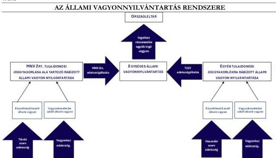
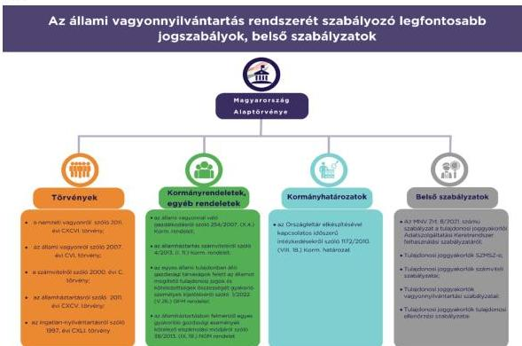

ÁLLAMI
SZÁMVEVŐSZÉK

# JELENTÉS

## Az állami vagyonnyilvántartás rendszerének
ellenőrzése

2026.

26028

www.asz.hu

---

ÁLLAMI
SZÁMVEVŐSZÉK

# JELENTÉS

## Az állami vagyonnyilvántartás rendszerének
ellenőrzése

2026.

26028

www.asz.hu

dr. Windisch László
elnök

---

ELLENŐRZÉSI IGAZGATÓSÁG:

**ELLENŐRZÉSI IGAZGATÓSÁG III.**

ELLENŐRZÉSI IGAZGATÓ:

**HERCZEGH ZSOLT** igazgató

ELLENŐRZÉSVEZETŐ:

**PENCZ MÁRIA** ellenőrzésvezető

Jelentéseink az interneten a
www.asz.hu címen olvashatók.

IKTATÓSZÁM: EL-4019-002/2026

TÉMASORSZÁM: 36

ELLENŐRZÉS-AZONOSÍTÓ SZÁM: V1072

---

# TARTALOMJEGYZÉK

|  ■ ÖSSZEFOGLALÁS | 5  |
| --- | --- |
|  ■ AZ ELLENŐRZÉS EREDMÉNYEI | 8  |
|  1. Az állami vagyonnyilvántartás rendszerének megfelelősége | 8  |
|  ■ JAVASLATOK | 17  |
|  ■ I. FÜGGELÉK: ÉSZREVÉTELEK | 19  |
|  ■ II. FÜGGELÉK: ELLENŐRZÉSI MEGKÖZELÍTÉS | 24  |
|  ■ MELLÉKLETEK | 32  |
|  I. sz. melléklet: Értelmező szótár | 32  |
|  II. sz. melléklet: Az ellenőrzött szervezetek jegyzéke | 35  |
|  ■ RÖVIDÍTÉSEK JEGYZÉKE | 36  |

3

---

# ÖSSZEFOGLALÁS

A Vtv.¹ az ÁSZ² részére évenkénti kötelezően lefolytatandó ellenőrzést ír elő az állami vagyon feletti tulajdonosi joggyakorlás tekintetében, aminek egyik fontos része az állami vagyon nyilvántartása.

A Kormány az 1172/2010. (VIII. 18.) számú Korm. határozatban³ döntött az egységes állami vagyonnyilvántartás és az Országleltár kialakításáról, az elkészítésük felelőseként a nemzeti fejlesztési minisztert és a

vidékfejlesztési minisztert jelölte ki az MNV Zrt.⁴ közreműködésével.

Az egységes állami vagyonnyilvántartás jogszabályban meghatározott célja, hogy biztosítsa az állami vagyonnal való gazdálkodás átláthatóságát, az állami vagyonnal való gazdálkodási tevékenység támogatását, az állami vagyon értékének megállapítását, valamint az állami vagyon változásainak folyamatos nyomon követését.

Az állami vagyonnyilvántartás rendszere három szintből tevődik össze. Az első szint tartalmazta a tulajdonosi joggyakorlók és vagyonkezelők vagyonnyilvántartásait (főkönyvi és analitikus, részletező nyilvántartások). A második szinten helyezkedett el a tulajdonosi joggyakorlók adatszolgáltatásain alapuló egységes állami vagyonnyilvántartás. A tulajdonosi joggyakorló szervezetek nyilvántartásai több, a vagyonelemeket használó, illetve kezelő szervezetektől érkező adatszolgáltatásokból származó, valamint a tulajdonosi joggyakorlók saját kezelésében lévő vagyonelemekre vonatkozó adatokat tartalmaztak. A harmadik szint az egységes állami vagyonnyilvántartás publikus felületét jelentő Országleltárt tartalmazta. A jogszabályi előírások szerint az Országleltár az egységes állami vagyonnyilvántartás szűkített adatait – ingatlan, részesedés, egyéb ingó vagyontárgyak – tette hozzáférhetővé bárki számára, így lehetővé tette a társadalom részére az állami vagyon meghatározó vagyonelemeinek átláthatóságát. Az egységes állami vagyonnyilvántartás akkor biztosítja a jogszabályban meghatározott célt, amennyiben az első és második szinten is megvalósulnak a jogszabályban megfogalmazott célok.

Az állami vagyonnyilvántartás rendszerét az 1. számú ábra szemlélteti:

1. ábra

Forrás: ÁSZ saját szerkesztés

5

---

Összefoglalás

**Az állami vagyonnyilvántartással** kapcsolatos szabályozási kereteit az MNV Zrt. – az ASZK szabályzat$^{5}$ kivételével – összességében megfelelően alakította ki. Az ÁSZ ellenőrzés megállapította, hogy az ellenőrzésre kiválasztott tulajdonosi joggyakorló szervezetek a tulajdonosi joggyakorlás kereteit a jogszabályi előírásokkal összhangban, összességében megfelelően alakították ki. A szabályzatok kellő részletességgel tartalmazták az állami vagyonnyilvántartással összefüggő felelősségi és hatásköri viszonyokat, amely biztosította az állami vagyonnyilvántartás működését.

A szabályszerűen vezetett vagyonnyilvántartás elengedhetetlen követelménye a vagyonnal való átlátható és felelős gazdálkodásnak. Az állami vagyonról vezetett pontos és megbízható nyilvántartás lényeges annak érdekében, hogy megfelelő információk álljanak rendelkezésre tulajdonosi joggyakorlónként az állami vagyon összetételéről, valamint a kapcsolódó jogokról és kötelezettségekről. Az állami vagyon nyilvántartása – az MNV Zrt. idegen helyen tárolt eszközökre vonatkozó nyilvántartása kivételével – a lényegi elemek tekintetében megfelelő volt. Az MNV Zrt. több esetben a tárolásra adott vagyonelemeket szerződés hiányában szerepeltette nyilvántartásában, továbbá ezen eszközök vonatkozásában nyilvántartását leltárral nem támasztotta alá. Az ellenőrzésre kiválasztott tulajdonosi joggyakorló szervezetek az adatszolgáltatási kötelezettségüknek az ellenőrzött időszakban eleget tettek. Az ellenőrzésre kiválasztott vagyonkezelők vagyonnyilvántartásaikat a jogszabályi és belső előírásokkal összhangban vezették, adatszolgáltatási kötelezettségeiket – a DPC$^{6}$ kivételével – szabályszerűen teljesítették.

**Az egységes állami vagyonnyilvántartás** az állami vagyonnyilvántartás rendszerének integrált, központi, jogszabályban meghatározott, egységesített és lényeges eleme. Az egységes állami vagyonnyilvántartás érdekében létrehozott informatikai rendszer működtetéséről az MNV Zrt. gondoskodott, a működéséhez szükséges adatokat a tulajdonosi joggyakorlók éves adatszolgáltatások formájában bocsátották rendelkezésre.

Az MNV Zrt. jogszabályban meghatározott feladata volt az egységes állami vagyonnyilvántartás szabályozási rendszerének kialakítása. Az MNV Zrt. ASZK szabályzata$^{7}$ azonban nem volt összhangban a jogszabályi előírásokkal, mivel nem írta elő a tulajdonosi joggyakorlók számára minden vagyonelem tekintetében az adatszolgáltatási kötelezettség teljesítését, így az immateriális javakról és a készletekről az egységes állami vagyonnyilvántartásban az egyéb tulajdonosi joggyakorló szervezetek adatszolgáltatást nem teljesítettek.

Az egységes állami vagyonnyilvántartás a tulajdonosi joggyakorlói adatszolgáltatások alapján három vagyonelem csoportra – ingatlan, részesedések és egyéb ingó kategória (gépek, eszközök, berendezések, felszerelések, járművek) – vonatkozóan tartalmazott adatokat, az a jogszabályi előírás ellenére *nem tartalmazta az immateriális javakat és a készleteket*. Ezen vagyonelemeket az egységes állami vagyonnyilvántartás nem, kizárólag a tulajdonosi joggyakorlói nyilvántartások tartalmazták. Emiatt az egységes állami vagyonnyilvántartás nem volt teljes mértékben összhangban a jogszabályban meghatározott, a vagyonelemek teljeskörűségére vonatkozó célkitűzéssel.

> Az ÁSZ véleménye alapján megfontolandó a jogszabályban rögzített, „valamennyi állami tulajdonú vagyonelem” kimutatására vonatkozó cél átgondolása a többlet adminisztrációs terhekre tekintettel. Az immateriális javak és a forgóeszközök egységes állami vagyonnyilvántartásban való kimutatása az állami vagyonnal való gazdálkodás támogatása szempontjából szakmailag nem indokolt.

Az állami vagyon változásainak folyamatos nyomon követésére vonatkozó jogszabályi előírás teljesítése az egységes állami vagyonnyilvántartás vezetésével összefüggő adatszolgáltatási gyakorlaton és a tulajdonosi joggyakorlók rábízott állami vagyonra vonatkozó, az adatszolgáltatásokat alátámasztó egyedi nyilvántartásain keresztül valósult meg. Az egységes állami vagyonnyilvántartás egy statikus állapotot tükröző nyilvántartás, amely az állami vagyon összetételét és könyv szerinti értékét a tulajdonosi joggyakorlói adatszolgáltatások

6

---

Összefoglalás

alapján mutatta be az érintett vagyonelem csoportok vonatkozásában. Az állami vagyon változásaira vonatkozó információk évente egyszer, a tárgyévet követő év június 30-ai adatszolgáltatás alapján kerültek átvezetésre az egységes állami vagyonnyilvántartásban. Emellett a tulajdonosi joggyakorlók a rábízott vagyonukra, azok változásaira vonatkozó számviteli nyilvántartásaikat (főkönyvi és analitikus) folyamatosan vezették.

*Az egységes állami vagyonnyilvántartás a jogszabályi keretek között nem biztosította, illetve – a jogszabályi előíráson alapuló évente egyszeri adatszolgáltatás miatt – nem is biztosíthatta a folyamatos nyomon követésre vonatkozó cél teljeskörű érvényesülését.*

> Az ÁSZ véleménye alapján az évente egyszeri adatszolgáltatásra, valamint a folyamatos nyomon követésre vonatkozó jogszabályi előírások átgondolása javasolt az összhang megteremtése érdekében, figyelemmel az egységes állami vagyonnyilvántartás gyakorlatára.

Az állami vagyon értékének megállapíthatóságát az állami vagyonnyilvántartás rendszere biztosította, az egységes állami vagyonnyilvántartás a tulajdonosi joggyakorlók által teljesített adatszolgáltatások alapján tartalmazta a vagyonelemek fordulónapra vonatkozó könyv szerinti értékét.

Az ÁSZ ellenőrzés az egységes állami vagyonnyilvántartás teljeskörűségére és az abban szereplő adatok pontosságára tekintettel kockázatként azonosította, hogy a tulajdonosi joggyakorló szervezetek vagyonnyilvántartásuk vezetésével kapcsolatos szabályozásai nem voltak egységesek, az adatszolgáltatást teljesítő tulajdonosi joggyakorlók esetében nem voltak egységes elvek alapján kialakított tulajdonosi joggyakorlói vagyonnyilvántartási rendszerek, továbbá a tulajdonosi joggyakorlói adatszolgáltatások részben manuális adatbevitellel történtek.

> Az ÁSZ véleménye, hogy az egységes állami vagyonnyilvántartás teljeskörűsége, integráltsága és folyamatos nyomon követhetősége érdekében célszerű az informatikai rendszert érintő fejlesztések azirányú átgondolása, hogy indokolt-e és mekkora erőforrás szükséglettel járna az állami vagyonnal rendelkező szervezetek vagyonnyilvántartási adatait naprakészen, az analitikus nyilvántartások alapján integrált, folyamatos adatkapcsolaton alapuló nyilvántartási rendszerben megjeleníteni.

Az Országleltárban publikált vagyonelem csoportok összhangban voltak az egységes állami vagyonnyilvántartásban szereplő vagyonelem csoportokkal. Az Országleltár adat- és információszükségletét az egységes vagyonnyilvántartás teljeskörűen biztosította.

Az Országleltár a jogszabályok által előírtakkal összhangban mennyiségben és értékben tartalmazta az állam tulajdonában álló vagyonelemeket. Az ÁVNY Kft.$^{8}$ feladatát az MNV Zrt.-vel kötött megbízási szerződés alapján, megfelelően látta el.

*Mindezek alapján megállapítható, hogy az állami vagyonnyilvántartás kialakított rendszere összességében megfelelő volt, támogatta az egységes állami vagyonnyilvántartással szemben megfogalmazott jogszabályi célok érvényesülését. A jelentősebb vagyonelemcsoportok (ingatlan, részesedés, egyéb ingó vagyonelemek) tekintetében az egységes állami vagyonnyilvántartás biztosította a vagyonelemek értékének meghatározását és az évenkénti változások nyomon követését, valamint ezáltal az átláthatóságot és az állami vagyonnal való gazdálkodási tevékenység támogatását.*

Az állami vagyonnyilvántartás rendszere átfogó képet adott az állam tulajdonában lévő vagyonelemekről, biztosította a tulajdonosi joggyakorlás átláthatóságát és elszámoltathatóságát, valamint megalapozta a gazdálkodási és vagyonpolitikai döntéseket, tehát nem pusztán adminisztratív adatbázis volt, hanem a közvagyon átlátható és felelős kezelésének alapja.

7

---

# AZ ELLENŐRZÉS EREDMÉNYEI

## 1. Az állami vagyonnyilvántartás rendszerének megfelelősége

### Összegző megállapítás

Az állami vagyonnyilvántartás rendszere összességében megfelelő volt, támogatta az egységes állami vagyonnyilvántartással szemben megfogalmazott jogszabályi célok teljesítését. Az egységes állami vagyonnyilvántartás teljeskörűségét és nyomon követhetőségét illetően a jogszabályi előírások és a kialakított rendszer közötti összhang nem volt teljeskörűen biztosított.

### 1.1. számú megállapítás

Az állami vagyon nyilvántartása – az MNV Zrt. idegen helyen tárolt eszközök nyilvántartása kivételével – megfelelő volt.

Az állami vagyon nyilvántartásának célja az állam tulajdonában álló vagyonelemekről átlátható, naprakész, nyomon követhető nyilvántartás vezetése. Az állami vagyonról nyilvántartást a tulajdonosi joggyakorlók, a vagyonkezelők és az állami vagyont használók is vezetnek.

A tulajdonosi joggyakorlók, vagyonkezelők és az állami vagyont használó egyéb szervezetek vagyonnyilvántartása – az állami vagyonnyilvántartási rendszer első szintjén – a számviteli nyilvántartásokon alapul, a jogszabályok és belső szabályzatok által meghatározott szabályozási rendszer biztosítja a vagyonelemek átlátható, teljeskörű és naprakész nyilvántartását és a vagyongazdálkodási döntésekhez szükséges információkat.

**Az állami vagyonnyilvántartás kialakítására vonatkozó szabályozási kereteket** az MNV Zrt. és az egyéb tulajdonosi joggyakorló szervezetek a 2022. évben a jogszabályi előírásokkal összhangban kialakították. Rendelkeztek az állami vagyon szabályszerű nyilvántartására alkalmas szabályzatokkal, azokban a vagyon nyilvántartásával kapcsolatos feladat- és hatásköröket meghatározták.

Az MNV Zrt. a Ptk.$^{9}$ és a Gbkr.$^{10}$ szabályai szerint rendelkezett hatályos SZMSZ$^{11}$-szel, továbbá az Áhsz.$^{12}$-ben előírt, a rábízott állami vagyonra vonatkozó számviteli szabályzatokkal. A Vtv. és a Vtv.vhr.$^{13}$ rendelkezéseinek megfelelően elkészítette a vagyon nyilvántartására alkalmas Vagyonnyilvántartási szabályzatát$^{14}$, és a Közvetlen kezelésű eszközök nyilvántartási szabályzatát$^{15}$, továbbá a Tulajdonosi ellenőrzési szabályzatát$^{16}$.

Az MNV Zrt.-n kívüli, ellenőrzött egyéb tulajdonosi joggyakorló szervezetek – az NV Zrt.$^{17}$, az OKFŐ$^{18}$, a TSZC$^{19}$, a KIM$^{20}$ és a Lechner Nonprofit Kft.$^{21}$ – az Áht.$^{22}$ és a Gbkr. előírásainak megfelelően rendelkeztek a tulajdonosi joggyakorlásuk alá tartozó vagyonelemek nyilvántartásával kapcsolatos hatályos SZMSZ$^{23}$-szel, továbbá az Áhsz. előírásainak megfelelő számviteli szabályzatokkal.

Az NV Zrt. és az OKFŐ a Vtv.vhr. előírásainak megfelelően elkészítette az állami vagyonelemek nyilvántartásával kapcsolatos előírásokat tartalmazó Vagyonnyilvántartási szabályzat$^{24}$-át. A TSZC, a KIM és a Lechner Nonprofit Kft. esetében a Vtv.vhr.-ben szabályozott vagyonnyilvántartási szabályzat készítési kötelezettség az ellenőrzött időszakban nem állt fenn, mivel a tulajdonosi joggyakorlásuk alá tartozó állami vagyonelemekre vonatkozóan az ellenőrzött időszakban nem létesítettek vagyonkezelői, illetve a vagyon hasznosítására vonatkozó szerződést.

8

---

Az ellenőrzés eredményei---

Az MNV Zrt. és az egyéb tulajdonosi joggyakorló szervezetek vagyonnyilvántartása – az MNV Zrt. idegen helyen tárolt eszközökre vonatkozó nyilvántartásának kivételével – a lényegi elemeket tekintve megfelelő volt.

**AZ MNV ZRT.** idegen helyen tárolt, közvetlen kezelésében lévő rábízott állami vagyonának nyilvántartása tekintetében az ellenőrzés hiányosságokat azonosított. Az MNV Zrt. nyilvántartása alapján az Antenna Hungária Zrt.$^{25}$ és a KEF$^{26}$ tároló szervezetek voltak, azonban ezen szervezetek tároló szervezeti státusza az ellenőrzött időszakban dokumentummal nem volt igazolt. Az MNV Zrt. az ellenőrzött időszakra vonatkozóan nem rendelkezett a Vtv. 23. § (1) bekezdés b) pontja szerinti, az Antenna Hungária Zrt.-vel, illetve a KEF-fel kötött, az ellenőrzött vagyonelemek tárolására irányuló szerződéssel, továbbá az MNV Zrt. nyilvántartása alapján a tárolásba adott vagyonelemeket ezen szervezetek az MNV Zrt. által kért tárolási és leltározási nyilatkozattal nem igazolták vissza.

A Nemzeti Sportügynökség Nonprofit Zrt.$^{27}$-nél tárolt vagyonelemek vonatkozásában egy ellenőrzéssel érintett tétel esetében állapította meg az ellenőrzés, hogy az MNV Zrt. nem rendelkezett a Vtv. 23. § (1) bekezdés b) pontja alapján megkötött szerződéssel, továbbá tárolási és leltározási nyilatkozattal.

Az MNV Zrt. az MTM$^{28}$-nél tárolt, ellenőrzéssel érintett vagyonelemre vonatkozóan a Vtv. 23. § (1) bekezdés b) pontja ellenére a vagyonelemmel kapcsolatosan a hasznosításra átengedést szerződéssel nem igazolta.

A NÖF Nonprofit Kft.$^{29}$ az MNV Zrt. nyilvántartásában tároló szervezetként került kimutatásra olyan vagyonelem vonatkozásában, amelyre hatályos vagyonkezelési szerződésük volt az érintett feleknek. Az MNV Zrt. vagyonnyilvántartása ezen ellenőrzéssel érintett vagyonelem tekintetében nem felelt meg az Áhsz. 11. § (11) bekezdésében előírtaknak, mivel a vagyonelemet nem a koncesszióba, vagyonkezelésbe adott eszközök között, hanem a közvetlen kezelésében lévő vagyonelemek között mutatta ki.

Az ellenőrzés megállapította továbbá, hogy az MNV Zrt. nyilvántartásában a KEF-et tároló szervezetként mutatta ki olyan vagyonelemek vonatkozásában, amelyek tekintetében a KEF vagyonkezelői jogviszonyát igazoló, a KEF és az NGM$^{30}$ között létrejött megállapodás rendelkezésre állt. Emiatt az MNV Zrt. nyilvántartása ezen vagyonelemek tekintetében nem felelt meg az Áhsz. 47. § (3) bekezdésében foglaltaknak, mivel a KEF vagyonkezelésével érintett eszközök értékét könyveiből nem vezette ki, azokat a közvetlenül kezelt vagyonelemek között tartotta nyilván.

Az MNV Zrt. a nyilvántartása szerint tárolásba adott vagyonelemek tárolóhelyi státuszának tisztázása érdekében intézkedési tervet készített, amely alapján a tárolásra irányuló jogviszonyok tisztázása folyamatosan történik.

Az MNV Zrt. által vagyonkezelésbe adott eszközök nyilvántartása az ellenőrzött időszakban megfelelő volt. Az MNV Zrt. nyilvántartása a Kincsem Nemzeti Kft.$^{31}$ részére vagyonkezelésbe adott, ellenőrzéssel érintett ingatlan vagyonelemek, a PIM$^{32}$ részére vagyonkezelésbe adott vagyonelemek és az ETO Futball Kft.$^{33}$-nek a Sport tv.$^{34}$ 76/B. § (1) bekezdésében meghatározott ingatlanok tekintetében megfelelő volt.

Az MNV Zrt. a 2022. évre vonatkozóan a rábízott állami vagyonába tartozó vagyonelemek tekintetében a nyilvántartási kötelezettségének az ASZK szabályzatban foglaltaknak megfelelően eleget tett. Az MNV Zrt. vagyonnyilvántartási adatainak betöltése az ASZK rendszerbe az ellenőrzött időszakban az SAP és az Adatgyűjtő Portál adatainak kiintegrálásával történt, ami megfelelt az ASZK szabályzat rendelkezéseinek.

Az MNV Zrt. a Vtv.vhr., valamint az Áhsz. előírásával összhangban elkészítette a 2022. évre vonatkozó, rábízott állami vagyonról szóló beszámolóját, amelyet az Info.tv.$^{35}$ előírásaival összhangban honlapján közzétett.

9

---

Az ellenőrzés eredményei

**Az egyéb tulajdonosi joggyakorlók vagyonnyilvántartása** a lényegi elemeit tekintve megfelelt a jogszabályi előírásoknak. Az ÁSZ ellenőrzés által az ellenőrzött mintatételek során feltárt hiányosságok az egységes állami vagyonnyilvántartás adataira nem voltak hatással, azok jellemzően az egyéb tulajdonosi joggyakorlók és az ÁVNY Kft. ASZK adatszolgáltatást megelőző egyeztetése során korrigálásra kerültek. A TSZC a 2022. évben a cégbíróságon még nem bejegyzett társasági részesedést az Áhsz. 48. § (8) bekezdés h) pontjában előírtak ellenére nem a követelés jellegű sajátos elszámolások között, hanem a társasági részesedések között mutatta ki. Ennek eredményeként a részesedést a 2022. évi rábízott állami vagyonáról szóló költségvetési beszámolója mérlege is tartalmazta.

A KIM az ellenőrzött időszakban az ellenőrzéssel érintett társasági részesedésekről, valamint az azokat érintő gazdasági eseményekről az Áhsz.-ben előírtakkal összhangban vezette nyilvántartásait.

A KIM a 2022. július 26-tól a tulajdonosi joggyakorlása alá tartozó Budapest Diákváros ingatlan vagyonelemeket a 2022. évben az Áhsz. 6. § (1) bekezdés e) pontja ellenére nem a tulajdonosi joggyakorló szervezet rábízott vagyonról készített éves költségvetési beszámolóban mutatta ki, azokat az Áhsz. 6. § (1) bekezdés a) pontja alapján készített éves költségvetési beszámolója mérlegében szerepeltette. A 2023. évben a KIM intézkedett a vagyonelem megfelelő nyilvántartásáról.

Az NV Zrt. közvetlen kezelésében lévő rábízott állami vagyonának nyilvántartása az ellenőrzéssel érintett társasági részesedések és a TRV Zrt.$^{36}$ részére vagyonkezelésbe adott, ellenőrzéssel érintett vagyonelemek nyilvántartása tekintetében az ellenőrzött időszakban megfelelő volt.

Az OKFŐ közvetlen kezelésében lévő rábízott állami vagyonának nyilvántartása összességében megfelelő volt, mivel tartalmazta az ellenőrzéssel érintett ingatlanokat és társasági részesedést, valamint a DPC ingyenes használatában lévő, ellenőrzéssel érintett tárgyi eszközöket. Az eszközökről, valamint az eszközöket érintő gazdasági eseményekről az OKFŐ az Áhsz.-ben előírtakkal összhangban vezette nyilvántartásait. Az OKFŐ a DPC részére vagyonkezelésbe adott, ellenőrzéssel érintett ingatlan tekintetében az Nvtv.$^{38}$ és a Vtv. előírásaival összhangban rendelkezett vagyonkezelési szerződéssel.

> *A tulajdonosi joggyakorló szervezetek ingatlan nyilvántartási adatainak összevetése a közhiteles nyilvántartási adatokkal nem képezte az ellenőrzés fókuszát, ugyanakkor, mivel az OKFŐ jelentős számú ingatlan vagyonelemmel rendelkezett, az ellenőrzés összevetette a két nyilvántartásban szereplő adatokat. Az ellenőrzés megállapította, hogy az ingatlanok 44%-a esetében a tulajdoni lapokon az OKFŐ tulajdonosi jogokat gyakorló szervezetként az Inytv.$^{37}$ 2. § (1) bekezdés ab) és 16. § a) pontjaiban előírtak ellenére az ellenőrzött időszakban nem került bejegyzésre.*

A Lechner Nonprofit Kft. közvetlen kezelésében lévő rábízott állami vagyon nyilvántartása az ellenőrzéssel érintett vagyonelemek tekintetében az ellenőrzött időszakban megfelelő volt. A Lechner Nonprofit Kft. az ellenőrzött időszakban a tulajdonosi joggyakorlása alá tartozó államhatárjel vagyonelemeket a földmérési és térképészeti tevékenységről szóló 2012. évi XLVI. törvény 3. § (1) bekezdés a) pontja alapján vezetett államhatár adatbázisban tartotta nyilván.

Adatszolgáltatási kötelezettségeiknek a 2022. évre vonatkozóan a rábízott állami vagyonba tartozó vagyonelemek tekintetében az ellenőrzésre kiválasztott egyéb tulajdonosi joggyakorló szervezetek a Vtv. előírásainak megfelelően eleget tettek.

Beszámoló készítési kötelezettségeiket a rábízott állami vagyon tekintetében a 2022. évre vonatkozóan az egyéb tulajdonosi joggyakorló szervezetek – a Lechner Nonprofit Kft. kivételével – a Vtv.vhr., valamint az Áhsz. előírásával összhangban teljesítették. A Lechner Nonprofit Kft. az Áhsz. 6. § (1) bekezdés e)

10

---

Az ellenőrzés eredményei---

pontjában foglaltak ellenére a 2022. évi rábízott vagyonra vonatkozó költségvetési beszámoló készítési kötelezettségének nem tett eleget.

Közzétételi kötelezettségeiket az egyéb tulajdonosi joggyakorló szervezetek – a TSZC, KIM és OKFŐ és a Lechner Nonprofit Kft. kivételével – az ellenőrzött időszakban teljesítették. A TSZC, a KIM az OKFŐ és a Lechner Nonprofit Kft. 2022. évre vonatkozó, rábízott állami vagyonról készített éves költségvetési beszámolóikat honlapjukon nem tették közzé, ezzel megsértették az Info.tv. 37. § (1) és 1. melléklet III. Gazdasági adatok 1. sor előírásait.

Az állami vagyon nyilvántartására az ellenőrzött időszakban a KIM és az NV Zrt. a Forrás.NET Integrált Ügyviteli Rendszert, az MNV Zrt. és a TSZC az SAP rendszert, míg az OKFŐ a CompuTREND Zrt. által fejlesztett CT-EcoSTAT rendszerét használta.

**A vagyonkezelő szervezetek nyilvántartásaikat** a rábízott állami vagyonról szabályszerűen vezették.

Az ETO Futball Kft. vagyonnyilvántartása a Sport tv. 1. számú mellékletének - 2022. július 28. és 2023. december 31. között hatályos - 32-35. pontjaiban szereplő, ellenőrzéssel érintett ingatlanok tekintetében az ellenőrzött időszakban megfelelő volt. Az ETO Futball Kft. a Sport tv. 76/B. § (1) bekezdése alapján 2022. július 28-i hatállyal létrejött vagyonkezelői jogát az Nvtv. 11. § (7) bekezdése értelmében – vagyonkezelési szerződés hiányában – az ellenőrzött időszakban nem gyakorolhatta. Ezáltal a Sport tv. 1. számú melléklete 32-35. pontjaiban szereplő ingatlanokat a Számv.tv.$^{39}$ és a Vtv.vhr. előírásainak megfelelően számviteli nyilvántartásában nem mutatta ki.

A Kincsem Nemzeti Kft. vagyonnyilvántartása az ellenőrzéssel érintett ingatlan vagyonelemek tekintetében az ellenőrzött időszakban megfelelő volt. A Kincsem Nemzeti Kft. az Nvtv. és a Vtv. előírásainak megfelelően rendelkezett a kezelésében lévő vagyonelemekre vonatkozó vagyonkezelési szerződésekkel. A Kincsem Nemzeti Kft. a vagyonelemeket a Vtv.vhr., a Számv. tv. és az MNV Zrt. vagyonnyilvántartási szabályzata előírásainak megfelelően, a vagyonkezelési szerződésben foglaltakkal összhangban tartotta nyilván.

A TRV Zrt. vagyonnyilvántartása a vagyonkezelésében lévő, ellenőrzéssel érintett vagyonelemek tekintetében az ellenőrzött időszakban megfelelő volt. A TRV Zrt. az Nvtv. a Vtv., valamint a Vtv.vhr. előírásaival összhangban rendelkezett a vagyonkezelésében lévő vagyonelemekre vonatkozóan vagyonkezelési szerződésekkel. A vagyonelemek nyilvántartása az ellenőrzött időszakban megfelelt a Számv.tv., a Vtv.vhr., valamint a TRV Zrt. számviteli politikájában foglaltaknak.

A DPC vagyonnyilvántartása az ellenőrzött időszakban a vagyonkezelésében lévő, ellenőrzéssel érintett ingatlan vagyonelem tekintetében megfelelő volt. A DPC az Nvtv., a Vtv., valamint a Vtv.vhr. előírásaival összhangban rendelkezett a vagyonkezelésében lévő vagyonelemre vonatkozóan vagyonkezelési szerződéssel. A DPC a vagyonkezelésében lévő ingatlan vagyonelemet az ellenőrzött időszakban az Áhsz.-ben, valamint számviteli politikájában foglaltaknak megfelelően tartotta nyilván. A DPC az ellenőrzött időszakban az ingyenes használatában lévő, ellenőrzéssel érintett ingó vagyonelemeket a 2020. január 31-én kelt, ÁEEK/13840-2/2020. iktatószámú szerződés 2.9. pontjában rögzített előírásnak megfelelően tartotta nyilván.

A PIM vagyonnyilvántartása az ellenőrzéssel érintett vagyonelemek tekintetében az ellenőrzött időszakban megfelelő volt. A PIM az Nvtv., a Vtv., valamint a Vtv.vhr. előírásaival összhangban rendelkezett a vagyonkezelésbe vett eszközökre vonatkozóan vagyonkezelési szerződéssel. A PIM a vagyonkezelésében lévő vagyonelemeket az ellenőrzött időszakban a vagyonkezelési szerződésben, az Áhsz.-ben, valamint számviteli politikájában foglaltaknak megfelelően tartotta nyilván.

11

---

Az ellenőrzés eredményei

Adatszolgáltatási kötelezettségeiket a vagyonkezelő szervezetek – a DPC kivételével – a Vtv.vhr. előírásainak megfelelően szabályszerűen teljesítették. A DPC a Vtv.vhr. 14. § (1a) bekezdésében, valamint az OKFŐ 34/2017. Főigazgatói Utasítás keretében kiadott vagyonnyilvántartási szabályzata 4. pontjában előírt vagyonkezelői adatszolgáltatási kötelezettségét az ellenőrzött időszakban nem teljesítette.

1.2. számú megállapítás Az egységes állami vagyonnyilvántartás nem volt teljes mértékben összhangban a jogszabályi előírásokkal, mivel nem tartalmazta az immateriális javakat és a készleteket.

A Vtv. szerinti egységes állami vagyonnyilvántartás az állami vagyonról vezetett nyilvántartások központi, összevont, egységesített változata, amely minden adatot egy rendszerben kezel. Az egységes állami vagyonnyilvántartás – az állami vagyonnyilvántartás rendszerének második szintje – a tulajdonosi joggyakorlói adatszolgáltatásokon alapul. Az egységes állami vagyonnyilvántartás átfogó céljai jogszabályi szinten rögzítettek voltak, azonban azok részletes tartalmát, fogalmi meghatározását a Vtv. nem részletezi. A célok között többek között szerepel, hogy az egységes állami vagyonnyilvántartás biztosítja az állami vagyon értékének megállapítását, valamint az állami vagyon változásainak folyamatos nyomon követését.

A Vtv. szerinti egységes állami vagyonnyilvántartás vezetéséhez létrehozott informatikai rendszer, az adatszolgáltatási keretrendszer használatának szabályait az MNV Zrt. ASZK szabályzata tartalmazta. Az MNV Zrt. ASZK szabályzata azonban nem volt teljes mértékben összhangban a Vtv. 22/B. § (1) bekezdésében előírt, az egységes állami vagyonnyilvántartás teljeskörűségére vonatkozó célkitűzéssel, mivel nem minden vagyonelem csoportra vonatkozóan írt elő adatszolgáltatási kötelezettséget a tulajdonosi joggyakorlók részére. Az ASZK szabályzat szerint a tulajdonosi joggyakorlóknak három vagyonelem-csoport – az állami tulajdonban lévő ingatlanok, a részesedések, valamint a gépek, eszközök, berendezések, felszerelések, járművek – vonatkozásában kellett adatszolgáltatást teljesíteniük. Az ASZK szabályzatban az MNV Zrt. az immateriális javak és készletek vonatkozásában nem írt elő adatszolgáltatási kötelezettséget a tulajdonosi joggyakorlók részére.

**A valamennyi vagyonelemet tartalmazó kimutatásra** vonatkozó, a Vtv. 22/B. § (1) bekezdésében foglalt előírás szerint az egységes állami vagyonnyilvántartásnak tartalmaznia kell valamennyi állami tulajdonú vagyonelemet – beleértve az ingatlanokat, gépeket, berendezéseket, részesedéseket, továbbá az immateriális javakat és készleteket – a tulajdonosi joggyakorló személyétől függetlenül. Az egységes állami vagyonnyilvántartás kialakított rendszere azonban a Vtv. 22/B. § (1) bekezdésében foglalt előírás ellenére, az ASZK szabályzatban foglaltaknak megfelelően csak három vagyonelem csoportra – ingatlan, részesedések és egyéb kategória (gépek, eszközök, berendezések, felszerelések, járművek) – vonatkozóan tartalmazott adatokat, az nem tartalmazta az immateriális javakat és a készleteket. Ezen vagyonelemeket a tulajdonosi joggyakorlói (MNV Zrt. és egyéb tulajdonosi joggyakorlók) nyilvántartások tartalmazták.

Az Áhsz. előírásai szerint a befektetett eszközök az immateriális javakon belül tartalmaznak olyan állami vagyonelemeket is, amelyek nem anyagi eszközök, mint például a vagyoni értékű jogok, illetve a szellemi termékek. A vagyoni értékű jogok között az MNV Zrt. túlnyomó részt ásványi anyagokat érintő vagyoni értékű jogokat, illetve azok számviteli értékelésére vonatkozó tételeket szerepeltetett. A vagyoni értékű jogok között szerepeltetett vagyonelemek speciális jellegüknél fogva nem rendelkeznek fizikai formával, eszmei értékük nagy, azonban a piacon tényleges értékkel nem bírnak. A szellemi termékek között nagy értékű szoftverek szerepeltek, amelyeknek az évenkénti terv szerinti értékcsökkenési leírási kulcsa az Áhsz. szerint 33%, azaz ezen termékek értéke 3 év alatt nullára leírható. Állami vagyonelemnek minősülnek pl. a készletek, mint a nemzeti vagyonba tartozó forgóeszközök, amelyek a működést nem tartósan, hanem

12

---

Az ellenőrzés eredményei

egy éven belül szolgálják. Emiatt a befektetett eszközökön kívüli állami vagyonelemek az egységes állami vagyonnyilvántartásba történő bekerülésük időpontjában már számos esetben nem lehetnek részei az állami vagyonnak, tekintettel arra, hogy működésük egy éven belül szolgálja a tevékenységet, így az adatszolgáltatás időpontjáig – tárgyévet követő év június 30. – azoknak kivezetésre, vagy átsorolásra kell kerülniük.

*Az ellenőrzés a nemzetközi gyakorlat megismerése érdekében hat európai ország számvevőszékét kereste meg. A számvevőszékek visszajelzései alapján megállapítható volt, hogy a megkeresett országok gyakorlata eltér a hazai szabályozástól az állami vagyonnyilvántartás rendszerét érintően, mivel egységes állami vagyonnyilvántartást az érintett országokban többségében nem vezetnek. Az állami vagyonról vezetett nyilvántartások továbbá – a hazai gyakorlattól eltérően – jellemzően a nagy értékű vagyonelemek, így az ingatlanok vezetésére korlátozódik. Az állami vagyon nyilvántartásának vezetését az adott vagyonelem felett feladat- és hatáskörrel rendelkező felelős szervezet végzi, valamint az állami vagyonnyilvántartásban csak korlátozottan, meghatározott vagyonelem csoportok szerepelnek értékkel.*

Az egységes állami vagyonnyilvántartásban szereplő vagyonelem csoportok összhangban voltak az Országeltárban a Vtv. előírásainak megfelelően publikált vagyonelem csoportokkal. Az Országeltár adat- és információszükségletét a Vtv. előírásainak megfelelően az egységes vagyonnyilvántartás teljeskörűen biztosította.

*Az ÁSZ véleménye alapján megfontolandó a jogszabályban rögzített, „valamennyi állami tulajdonú vagyonelem” kimutatására vonatkozó cél átgondolása és szükség szerinti módosítása. Az ellenőrzés tapasztalatai alapján a kialakított gyakorlat biztosította az Országeltár működtetéséhez és ezáltal az átláthatóság biztosításához szükséges adatokat, információkat. Az egységes állami vagyonnyilvántartás vezetése érdekében a tulajdonosi joggyakorlók által teljesített adatszolgáltatásban szereplő három vagyonelemcsoporton felül az immateriális javak és a forgóeszközök egységes állami vagyonnyilvántartásban való kimutatása az ÁSZ véleménye szerint jelentős többlet adminisztrációs terhet jelentene, valamint az állami vagyonnal való gazdálkodás támogatása szempontjából szakmailag nem indokolt az adatszolgáltatások és az egységes vagyonnyilvántartás gyakorlatának ezirányú kiterjesztése. Az állami tulajdonban álló immateriális javak állománya speciális jelleggel bír, meghatározó részben (több mint 80%-ban) az MNV Zrt. tulajdonosi joggyakorlása alá tartozó ásványi vagyon értékeléséből származó adminisztratív tételből áll, amely a gazdálkodási döntések támogatása szempontjából nem releváns. A forgóeszközök pedig éven belül szolgálják a gazdálkodási tevékenységet, a mérleg fordulónapját követő évben a számviteli nyilvántartásokból kivezetésre vagy átsorolásra kerülnek, emiatt az aktuális állományuk, illetve annak összértéke sem az átláthatóság, sem a gazdálkodási döntések tekintetében nem rendelkezik relevanciával.*

Az állami vagyon változásainak folyamatos nyomon követésére vonatkozó, Vtv.-ben megfogalmazott előírás teljesítése az egységes állami vagyonnyilvántartás vezetésével összefüggő, a tulajdonosi joggyakorlók által teljesített adatszolgáltatási gyakorlaton és az adatszolgáltatásokat alátámasztó, egyedi tulajdonosi joggyakorlói nyilvántartásokon (főkönyvi és analitikus) keresztül valósult meg. Az egységes állami vagyonnyilvántartásba a vagyonelemek a tulajdonosi joggyakorlók Vtv.vhr. előírása szerinti adatszolgáltatása alapján kerültek be. A tulajdonosi joggyakorlók a rábízott állami

13

---

Az ellenőrzés eredményei

vagyonuk december 31-i tárgyévi állományáról évente egyszer, a tárgyévet követő év június 30. napjáig kötelesek adatszolgáltatást teljesíteni. Az ellenőrzés álláspontja szerint önmagában az egységes állami vagyonnyilvántartás egy statikus állapotot tükröző nyilvántartás, amely az állami vagyon összetételét és könyv szerinti értékét a tulajdonosi joggyakorlói adatszolgáltatások alapján mutatta be egy adott időpontra (december 31.) vonatkozóan az érintett vagyonelem csoportok tekintetében. Az állami vagyon változásaira vonatkozó információk a Vtv.vhr. szerint évente egyszer, a tárgyévet követő év június 30-ai adatszolgáltatás alapján kerülnek átvezetésre az egységes állami vagyonnyilvántartásban.

Az ÁSZ véleménye alapján indokolt az évente egyszeri adatszolgáltatásra, valamint a folyamatos nyomon követésre vonatkozó jogszabályi előírások átgondolása és a jogszabályi cél szükség szerint módosítása, illetve definiálása a jogszabályi előírások közötti összhang megteremtése érdekében. A változások jogszabályi előírásoknak megfelelő évente egyszeri, a tárgyévet követő év június 30-át követő átvezetési gyakorlata és a jogszabályban meghatározott, a változások folyamatos nyomon követésére vonatkozó átfogó cél között nem áll fenn a teljeskörű összhang. Az egységes állami vagyonnyilvántartás a jogszabályi keretek között nem biztosította, illetve – a jogszabályi előíráson alapuló évente egyszeri adatszolgáltatás miatt – nem is biztosíthatta a folyamatos nyomon követésre vonatkozó cél teljeskörű érvényesülését. Amennyiben az ellenőrzött időszakban hatályos és feltárt szabályozás nem változik – azaz az elvárt naprakész nyilvántartáshoz képest a hatályban lévő előírások szerint a vagyonnyilvántartás továbbra is egy statikus állapotot tükröz – akkor továbbra sem fog megvalósulni a folyamatos nyomonkövetés, ezáltal a naprakész nyilvántartással esetlegesen megelőzhető vagy kiszűrhető hibák csak utólag lesznek feltárhatóak.

Fentiek miatt az évente egyszeri adatszolgáltatásra, valamint a folyamatos nyomon követésre vonatkozó jogszabályi előírások átgondolása javasolt az összhang megteremtése érdekében, figyelemmel az állami vagyonnyilvántartás gyakorlatára, illetve a vagyonnyilvántartás folyamatos nyomon követést biztosító vezetésének költségvonzatára. A folyamatos nyomon követés követelményének biztosítása ugyanis az ÁSZ álláspontja szerint kizárólag informatikai fejlesztés útján, azaz teljesen automatizált adatszolgáltatással és adatfeldolgozással lehetséges (az állami vagyonnyilvántartás egyes rendszereinek informatikai összekapcsolása útján). A gyakorlat és a jogszabályi előírások közötti teljeskörű összhang megteremtése egyaránt irányulhat a jogszabályi cél gyakorlathoz igazítására és a gyakorlat megváltoztatására.

Az állami vagyon értékének megállapíthatóságát az egységes állami vagyonnyilvántartás biztosította. Az egységes állami vagyonnyilvántartás és a tulajdonosi joggyakorlók nyilvántartásai egyaránt tartalmazták a vagyonelemek fordulónapra vonatkozó könyv szerinti értékét. A piaci értéken történő kimutatást a jelenlegi szabályozások csak a kivezetésre szánt állami vagyon, illetve az értékesítésre szánt állami vagyon egy meghatározott körére teszik kötelezővé.

14

---

Az ellenőrzés eredményei

Az állami vagyon értékének megállapíthatóságára vonatkozó céllal összefüggésben megállapítható, hogy a jogszabályban használt – és egyébként nem definiált – „érték” fogalom közgazdasági értelemben sokféle jelentéssel bír. Pénzügyi, gazdasági szempontból megkülönböztetünk bekerülési értéket, könyv szerinti értéket, piaci értéket, műemléki értéket vagy eszmei értéket. Ezen fogalmak különbözősége abban áll, hogy milyen fő szempont szerint jelenítik meg az adott vagyonelemre vonatkozó értékadatot. Ha egy vagyontömeg bemutatásának célja elsősorban számviteli természetű, akkor bekerülési, illetve könyv szerinti érték értékelhető, azonban amennyiben a tényleges forgalmi érték megállapítása a cél, akkor a piaci érték alkalmazandó. Előfordulhat azonban olyan eset is, amikor történelmi, művészeti és kulturális, illetve egyéb, nem anyagi természetű szempontok kerülnek előtérbe, ekkor a műemléki vagy eszmei értékkel jellemezhető az adott vagyonelem.

Az egységes állami vagyonnyilvántartás és az Országleltár felület esetében – figyelemmel az állami vagyonelemek számosságára, sokféleségéből eredő, eltérő jellemzőire és elsődlegesen a közérdeket szolgáló jellegére – a könyv szerinti értéken kívüli értékkategóriák nem, vagy csak rendkívül nagy többlet ráfordítással lennének alkalmazhatóak. A piaci értéken történő folyamatos nyilvántartás nagy vagyontömeg esetében rendkívül költséges és nagy adminisztrációs terhet jelentene egyben. A piaci érték abban az esetben bír relevanciával, amikor a vagyonelem értékesítésére, hasznosítására kerül sor, amelyet a jogszabályi környezet megfelelően szabályoz.

Mindezek alapján az egységes vagyonnyilvántartás és az Országleltár esetében a könyv szerinti érték kategóriájának alkalmazása megfeleltethető ugyan a jogszabályi célnak, azonban az ÁSZ véleménye alapján megfontolandó a jogalkotói szándék egyértelmű megjelenítése érdekében az „érték” fogalom tartalmának meghatározása.

Az ÁSZ véleménye, hogy a tulajdonosi joggyakorlók állami vagyonnyilvántartással kapcsolatos szabályzatainak egységesítése, továbbá a tulajdonosi joggyakorlók által az egységes állami vagyonnyilvántartásba történő adatok betöltésének automatizálása hozzájárulhatna a vagyonnyilvántartásban szereplő adatok pontosabb megjelenítéséhez.

1.3. számú megállapítás Az Országleltár működtetése és az ÁVNY Kft. feladatellátása megfelelő volt.

Az Országleltár honlapján elérhető vagyonelemek köre összhangban állt a Vtv.-ben és Vtv.vhr.-ben foglaltakkal, az Országleltár tartalmazta az ingatlanokat, a társasági részesedéseket és az egyéb ingó vagyonelemeket egy adott időpontra vonatkoztatva, egységes szerkezetben, mennyiségben és értékben. Az Országleltár a vagyonelemek mennyiségi és érték adatait az ingatlanok egy része tekintetében és az egyéb ingó vagyonelemek esetében aggregált módon tartalmazta.

Az ellenőrzött tulajdonosi joggyakorló szervezetek vonatkozásában az ÁVNY Kft. a Vtv.-ben meghatározott adatszolgáltatások ellenőrzését az egységes állami vagyonnyilvántartás vezetéséhez létrehozott informatikai rendszerben, az ASZK rendszerben az MNV Zrt.-vel kötött megbízási szerződések alapján elvégezte. Az ellenőrzött mintatételek vonatkozásában az ellenőrzés megállapította, hogy az ÁVNY Kft. gondoskodott a tulajdonosi joggyakorlók által szolgáltatott adatok megfelelőségének ellenőrzéséről, valamint a Vtv.-ben előírtaknak megfelelően a feltárt hiányosságok és hibák tulajdonosi joggyakorlók általi kijavíttatásáról.

15

---

Az ellenőrzés eredményei---

Az egységes állami vagyonnyilvántartás adataira épülő Országleltár a jelentősebb vagyonelem csoportok, valamint a kapcsolódó tulajdonosi joggyakorlás struktúráját, adatait, változásait évről évre megismerhetővé és összehasonlíthatóvá tette a nyilvánosság számára, amely az ÁSZ által elvégzett nemzetközi kitekintés alapján az átláthatóság területén kiemelkedő és előremutató gyakorlat volt. Az ellenőrzés összefoglaló véleménye alapján azonban célszerű a Vtv.-ben foglalt, egységes állami vagyonnyilvántartással szemben megfogalmazott – értékre, teljeskörűségre és folyamatos nyilvántartásra – vonatkozó célrendszer kialakított gyakorlat alapján való átgondolása annak érdekében, hogy a szabályozási keretek és a végrehajtási gyakorlat összhangban legyen és egyértelmű egységet alkosson.

Az egységes állami vagyonnyilvántartás teljeskörűsége, integráltsága és folyamatos nyomon követhetősége érdekében célszerű az informatikai rendszert érintő fejlesztések azirányú átgondolása, hogy indokolt-e és mekkora erőforrás szükséglettel járna az állami vagyonnal rendelkező szervezetek vagyonnyilvántartási adatait naprakészen, az analitikus nyilvántartások alapján integrált, folyamatos adatkapcsolaton alapuló nyilvántartási rendszerben megjeleníteni.

16

---

# JAVASLATOK

Az ÁSZ tv. 33. § (1) bekezdésében foglaltak értelmében az ellenőrzött szervezet vezetője köteles a jelentésben foglalt megállapításokhoz kapcsolódó intézkedési tervet összeállítani és azt a jelentés kézhezvételétől számított 30 napon belül az ÁSZ részére megküldeni. Az ÁSZ a jelentésben foglalt megállapításokhoz kapcsolódóan az alábbi javaslatok tekintetében várja el az intézkedési terv elkészítését.

## A MAGYAR NEMZETI VAGYONKEZELŐ ZRT. VEZÉRIGAZGATÓJA RÉSZÉRE

1. Tegyen intézkedéseket azon kontrollok kialakítására és működtetésére, amelyek biztosítják, hogy a Vtv. 23. § (1) bekezdés b) pontjában foglaltaknak megfelelően az állami vagyon hasznosításra történő átengedése szerződés alapján történjen.

## AZ ORSZÁGOS KÓRHÁZI FŐIGAZGATÓSÁG FŐIGAZGATÓJA RÉSZÉRE

1. Intézkedjen az Info.tv. 37. § (1) bekezdésében és az 1. melléklet III/1. pontjában foglaltak szerint a rábízott vagyon tekintetében elkészített éves költségvetési beszámoló honlapon történő közzétételéről.

## A TATABÁNYAI SZAKKÉPZÉSI CENTRUM KANCELLÁRJA RÉSZÉRE

1. Intézkedjen az Info.tv. 37. § (1) bekezdésében és az 1. melléklet III/1. pontjában foglaltak szerint a rábízott vagyon tekintetében elkészített éves költségvetési beszámoló honlapon történő közzétételéről.

## A DÉL-PESTI CENTRUMKÓRHÁZ ORSZÁGOS HEMATOLÓGIAI ÉS INFEKTOLÓGIAI INTÉZET FŐIGAZGATÓJA RÉSZÉRE

1. Tegyen intézkedéseket azon kontrollok kialakítására és működtetésére, amelyek biztosítják, hogy teljesítse a Vtv.vhr. 14. § (1a) bekezdésében és az OKFŐ 34/2017. Főigazgatói Utasítás keretében kiadott vagyonnyilvántartási szabályzat 4. pontjában előírt vagyonkezelői adatszolgáltatási kötelezettségét.

17

---

Javaslatok---

# A KULTURÁLIS ÉS INNOVÁCIÓS MINISZTÉRIUM KÖZIGAZGATÁSI ÁLLAMTITKÁRA RÉSZÉRE

1. Intézkedjen az Info.tv. 37. § (1) bekezdésében és az 1. melléklet III/1. pontjában foglaltak szerint a rábízott vagyon tekintetében elkészített éves költségvetési beszámoló honlapon történő közzétételéről.

# A LECHNER NONPROFIT KFT. RÉSZÉRE

1. Tegyen intézkedéseket azon kontrollok kialakítására és működtetésére, amelyek biztosítják az Áhsz. 6. § (1) bekezdés e) pontjában, az Info.tv. 37. § (1) bekezdésében és az 1. melléklet III/1. pontjában foglaltaknak megfelelően a rábízott vagyonról szóló beszámoló készítési és közzétételi kötelezettség teljesítését.

18

---

# I. FÜGGELÉK: ÉSZREVÉTELEK

A jelentéstervezetet az ÁSZ 15 napos észrevételezésre megküldte az ellenőrzött szervezet vezetőjének az ÁSZ tv. 29. §* (1) bekezdése előírásának megfelelően.

A jelentéstervezet megállapításaira az MNV Zrt. és az ETO Futball Kft. észrevételt tett. Az elfogadott észrevételek alapján az ÁSZ módosította a jelentést. A Függelék tartalmazza az ellenőrzött szervezet vezetője által megtett és az ÁSZ által figyelembe nem vett észrevételeket, valamint azok el nem fogadásának indoklását.

1.)

Az MNV Zrt. észrevétele a részére megfogalmazott javaslattal kapcsolatosan:

„A jelentéstervezet az MNV Zrt. részére az alábbi javaslatot fogalmazza meg: „Tegyen intézkedéseket azon kontrollok kialakítására és működtetésére, amelyek biztosítják, hogy a Vtv. 23. § (1) bekezdés b) pontjában foglaltaknak megfelelően az állami vagyon hasznosítása szerződés alapján történjen.

Kérem a javaslat alábbi módosított szöveggel történő véglegesítését:

Mérje fel a jelenlegi tároló szervezeteket a tárolás jogalapja tekintetében (így pl.: jogszabályi kötelezettségen alapuló tárolás, jogutódlás alapján, szerződéskötés nélkül történő vagyonkezelés, egyéb szerződés nélküli tárolást lehetővé tevő körülmény, stb.) és kezdeményezze a tároló szervezetek esetén az állami vagyon hasznosítására irányuló, a Vtv. 23. § (1) bekezdés b) pontjában foglaltak szerinti szerződés megkötése érdekében a szükséges kérelmek, nyilatkozatok és dokumentumok rendelkezésre bocsátást, ide nem értve azon tároló szervezeteket, amelyek esetén a tárolás jogszabályon alapul és szerződéskötést nem igényel, vagy a tárolás jogalapja jogelőddel kötött szerződés vagy a tárolás egyéb jogcímen történik.

Kérem továbbá, hogy a vizsgálati jelentés tervezetben nevesített tároló szervezetek részére is kerüljön megfogalmazásra javaslatként az, hogy tegyék meg a birtokukban lévő ingóságok megfelelő jogcímének biztosításához szükséges intézkedéseket.

A javaslat módosítására irányuló kérésemet az alábbi indokok támasztják alá.

1. Egyedi jogszabályi rendelkezések atipikus helyzeteket idézhetnek elő, például vannak olyan esetkörök, ahol jogszabály lehetővé teszi a vagyonkezelői jog szerződéskötés nélküli létrejöttét, ilyen esetben értelemszerűen nem feltétel az adott vagyonelemekre vonatkozó szerződés fennállása, vagy korábbi tároló szervezet válik jogszabály alapján tulajdonosi joggyakorlává, így a tárolás már egyéb jogcímen történik, stb.

2. Általánosságban kijelenthető, hogy az állami vagyonra vonatkozó szerződés kétoldalú aktus, amelynek folyamata főszabály szerint kérelemre indul, így ahhoz, hogy minden esetben szerződés jöjjön létre nélkülözhetetlen az MNV Zrt.-n kívüli fél tevékeny magatartása, együttműködése is. Ennek hiányában a szerződéskötés nem lehetséges.

3. Az állami tulajdonú ingóságok birtoklásában/használatában érintett szervezetekre jellemző az akár többszöri, rövid időn belüli átalakulás/feladatátvétel, amely szintén megnehezíti az ezen ingóságok tényleges tárolási viszonyai, illetve

* 29. § (1) Az Állami Számvevőszék az ellenőrzési megállapításait megküldi az ellenőrzött szervezet vezetőjének vagy az általa megbízott személynek, és annak, akinek személyes felelősségét állapította meg.

(2) Az ellenőrzött szervezet vezetője és a felelősként megjelölt személy az ellenőrzés megállapításaira tizenöt napon belül írásban észrevételt tehet.

(3) Az Állami Számvevőszék az észrevételre a beérkezésétől számított harminc napon belül írásban válaszol. A figyelembe nem vett észrevételeket köteles a jelentésben feltüntetni, és megindokolni, hogy azokat miért nem fogadta el.

19

---

I. Függelék: Észrevételek---

*feladatellátáshoz szükségességük egyértelmű beazonosítását és felvetheti annak szükségességét, hogy más, szerződéstől eltérő jogcímen kerüljenek biztosításra a jogutód/feladatátvevő részére. (Ilyen például a vizsgálatban is szereplő Antenna Hungária Zrt., amellyel a vagyonkezelési szerződés megkötésére irányuló folyamat megindult ugyan, ugyanakkor a szervezet tulajdonosi struktúrájának megváltozása okán a jelenleg hatályos jogszabályi környezetben már nem köthető vele vagyonkezelési szerződés, hiszen nem felel meg a Vtv. 3. § (1) bek. 19. pontjában támasztott feltételnek).*

### **El nem fogadás indoka:**

Az észrevétel az ÁSZ javaslatát érinti. Az ellenőrzött szervezet nem vitatta a javaslat jogalapját, azonban annak módosított szöveggel való véglegesítését kérte.

Az ÁSZ javaslatai a jelentéstervezet megállapításaira vonatkoznak. A megállapítások az MNV Zrt. által közvetlen kezelésben nyilvántartott, és szerződés hiányában 'tárolásra', azaz hasznosításra átengedett vagyonelemek nyilvántartására vonatkoznak, nem a törvényi kijelölés alapján vagyonkezelésbe adott vagyonelemekkel kapcsolatosak, ezért a javaslat ezirányú módosítását az ellenőrzés nem tartja indokoltnak.

A hivatkozott jogszabály is különbséget tesz a hasznosítás és a vagyonkezelés között.

A Vtv. 23. § (1) bekezdés b) pont alapján: *'Az állami vagyonnal a tulajdonosi joggyakorló b) szerződés – így különösen bérlet, haszonbérlet, megbízás – alapján hasznosításra átengedi, vagy vagyonkezelésbe, haszonélvezetbe adja.'*

Az Nvtv. 3. § (1) bekezdés 4) pontja szerint: *'hasznosítás: a tulajdonosi joggyakorló vagy a nemzeti vagyon használója által a nemzeti vagyon birtoklásának, használatának, hasznok szedése jogának bármely – a tulajdonjog átruházását nem eredményező – jogcímen történő átengedése, ide nem értve a vagyonkezelésbe adást, valamint a haszonélvezeti jog alapítását'*

A vagyonkezelői jog kapcsán ugyan az Nvtv. 11. § (1) bekezdése alapján főszabály szerint a vagyonkezelői jog a vagyonkezelési szerződéssel jön létre, de a törvényi kijelöléssel létrejött vagyonkezelői joghoz is szükségszerűen kapcsolódik vagyonkezelési szerződés, mivel az Nvtv. 11. § (7) bekezdése alapján a vagyonkezelésre vonatkozó részletes szabályokat a tulajdonosi joggyakorlóval megkötött vagyonkezelési szerződés tartalmazza.

Ugyan a szerződéskötés kétoldalú aktus, de az Nvtv. 11. § (7) bekezdése alapján a vagyonkezelési szerződés megkötésének időpontjáig a vagyonkezelői jog az ingatlan-nyilvántartásban nem jegyezhető be, és a vagyonkezelői jogot a kijelölt személy nem gyakorolhatja, amely jogszabályi rendelkezés - a betartása esetén - ösztönzőleg hathat az MNV Zrt.-n kívüli fél tevékeny magatartására, együttműködésére.

Az ellenőrzés megállapításai az Antenna Hungária Zrt., a Nemzeti Sportügynökség Zrt. és a KEF vonatkozásában arra irányultak, hogy az MNV Zrt. őket tároló szervezetként tartotta nyilván, azon eszközöket, amelyeket 'tárolásra', azaz hasznosításra ezen szervezeteknek átengedett, könyveiben közvetlenül kezelt vagyonelemként szerepeltette, azonban a tárolást igazolni nem tudta, továbbá a szervezetek sem igazolták vissza a tárolás tényét. Az Antenna Hungária Zrt.-nek, a Nemzeti Sportügynökség Zrt.-nek és a KEF-nek 'tárolásba' adott eszközöket az MNV Zrt. nyilvántartásában szerepeltette, azonban a tárolási nyilatkozatok hiánya miatt leltárhiányként azonosította. Az MTM a tárolásba adott eszközöket tárolási nyilatkozattal visszaigazolta, azonban a tárolásra vonatkozó szerződéssel nem rendelkezett.

A NÖF és a KEF vonatkozásában az ellenőrzés megállapította, hogy az MNV Zrt. nyilvántartása nem volt megfelelő, hiszen az MNV Zrt. közvetlen kezelésű vagyonelemként tartotta nyilván az ellenőrzött szervezetek vagyonkezelésében lévő vagyonelemeket. Az Áhsz. különbséget tesz az államháztartási szervezeteknek, vagy az államháztartási szervezeten kívüli szervezeteknek vagyonkezelésbe adott eszközök nyilvántartása között, de egyik esetben sem mutathatja ki a tulajdonosi joggyakorló közvetlen kezelésben lévő vagyonelemként. A rábízott vagyonban közvetlen kezelésű vagyonelemként kizárólag az általa kezelt, vagy tárolásba adott vagyonelemeket lehet az Áhsz. szerint kimutatni.

20

---

I. Függelék: Észrevételek

Az ellenőrzött szervezet észrevételében kérte továbbá az ÁSZ javaslat megfogalmazását a tároló szervezetek részére is. Az ellenőrzés ezt nem tartja indokoltnak, mivel az ellenőrzéssel érintett vagyonelemek az MNV Zrt. közvetlen kezelésében álltak, így az MNV Zrt. felelősségét képezi ezen vagyontárgyak fellelhetőségének tisztázása. Az ellenőrzött szervezet észrevételében az Antenna Hungária Zrt.-vel kapcsolatosan hivatkozott Vtv. 3. § (1) bekezdés (19) pont nem létező jogszabályi hivatkozás. Az Nvtv. 3. § (1) bekezdés 19. pontja tartalmazza a vagyonkezelő definícióját, azonban az MNV Zrt. közvetlen kezelésében lévő vagyonelemek nyilvántartási hiányosságaira nem ad magyarázatot.

Fentiek miatt az ellenőrzés nem tartja indokoltnak az észrevétel alapján az ellenőrzési megállapításokra irányuló javaslat módosítását, azonban a javaslatot a jogszabállyal összhangba hoztuk.

2.)

**Az MNV Zrt. észrevétele a jelentéstervezet 1.2. sz. megállapítás 13. oldal első bekezdéséhez és a 15. oldalon szerepeltetett bekeretezett részhez kapcsolódóan:**

„1. A jelentés tervezet 13. oldalán az alábbi megállapítás szerepel:

„A Vtv. szerinti egységes állami vagyonnyilvántartás az állami vagyonról vezetett nyilvántartások központi, összevont, egységesített változata, amely minden adatot egy rendszerben kezel.”

Ezzel kapcsolatos kiegészítő információként tájékoztatom, hogy az egységes állami vagyonnyilvántartás az állami vagyonról vezetett egyedi, tulajdonosi joggyakorlók szervezet szintű nyilvántartásai alapján benyújtott éves adatszolgáltatásokban szereplő vagyonelemcsoportokra – ingatlanok, részesedések és egyéb ingó vagyontárgyak – alapozott központi, összevont és egységesített nyilvántartás formájában valósul meg, amely minden érintett adatot az Adatszolgáltatási Keretrendszerben (ASZK) kezel, és biztosítja azok publikálását az Országleltár felületen.

2. A jelentés tervezet 15. oldalán az alábbi javaslat szerepel:

„Az ÁSZ véleménye alapján indokolt az évente egyszeri adatszolgáltatásra, valamint a folyamatos nyomon követésre vonatkozó jogszabályi előírások átgondolása és a jogszabályi cél szükség szerint módosítása, illetve definiálása a jogszabályi előírások közötti összhang megteremtése érdekében. A változások jogszabályi előírásoknak megfelelő évente egyszeri, a tárgyévet követő év június 30-át követő átvezetési gyakorlata és a jogszabályban meghatározott, a változások folyamatos nyomon követésére vonatkozó átfogó cél között nem áll fenn a teljeskörű összhang. Az egységes állami vagyonnyilvántartás a jogszabályi keretek között nem biztosította, illetve – a jogszabályi előíráson alapuló évente egyszeri adatszolgáltatás miatt – nem is biztosíthatta a folyamatos nyomon követésre vonatkozó cél teljeskörű érvényesülését. Amennyiben az ellenőrzött időszakban hatályos és feltárt szabályozás nem változik – azaz az elvárt naprakész nyilvántartáshoz képest a hatályban lévő előírások szerint a vagyonnyilvántartás továbbra is egy statikus állapotot tükröz – akkor továbbra sem fog megvalósulni a folyamatos nyomonkövetés, ezáltal a naprakész nyilvántartással esetlegesen megelőzhető vagy kiszűrhető hibák csak utólag lesznek feltárhatóak.

Fentiek miatt az évente egyszeri adatszolgáltatásra, valamint a folyamatos nyomon követésre vonatkozó jogszabályi előírások átgondolása javasolt az összhang megteremtése érdekében, figyelemmel az állami vagyonnyilvántartás gyakorlatára, illetve a vagyonnyilvántartás folyamatos nyomon követést biztosító vezetésének költségvonzatára. A folyamatos nyomon követés követelményének biztosítása ugyanis az ÁSZ álláspontja szerint kizárólag informatikai fejlesztés útján, azaz teljesen automatizált adatszolgáltatással és adatfeldolgozással lehetséges (az állami vagyonnyilvántartás egyes rendszereinek informatikai összekapcsolása útján). A gyakorlat és a jogszabályi előírások közötti teljeskörű összhang megteremtése egyaránt irányulhat a jogszabályi cél gyakorlathoz igazítására és a gyakorlat megváltoztatására.”

A jelentés tervezet ezzel kapcsolatban akként fogalmaz, hogy az egységes állami vagyonnyilvántartás teljeskörűsége, integráltsága és folyamatos nyomon követhetősége érdekében célszerű az informatikai rendszert érintő fejlesztések az irányú átgondolása, hogy indokolt-e és mekkora erőforrás szükséglettel járna az állami vagyonnal rendelkező szervezetek vagyonnyilvántartási adatait

21

---

I. Függelék: Észrevételek

naprakészen, az analitikus nyilvántartások alapján integrált, folyamatos adatkapcsolaton alapuló nyilvántartási rendszerben megjeleníteni.

Ezzel kapcsolatban tájékoztatom, hogy az MNV Zrt. az egységes állami vagyonnyilvántartás vezetése kapcsán folyamatosan kiemelt figyelmet fordít az érintett résznyilvántartások / rendszerek továbbfejlesztésére. Ezen fejlesztések keretében középtávon tervezetten megvalósul az ún. Vagyonkataszter rendszer bevezetése, amelynek főbb céljai a következők:

- folyamatosan vezetett, naprakész vagyonelemnyilvántartás megvalósítása (az állambáztartás (ÁHT) szerinti működésnek megfelelő, az érintett szervezetek – költségvetési szervek, többségi állami tulajdonú társaságok és leányvállalataik – könyveiben szereplő vagyonelemek tekintetében);
- analitikus és számviteli, vagyonelem szintű nyilvántartási fókusz, életütkövetéssel;
- teljeskörűség biztosítása a kapcsolódó adatgyűjtések és nyilvántartások alapján;
- egységes, összehangolt és egymással integrált adatszolgáltatások és nyilvántartások;
- közhiteles nyilvántartásokkal validált, folyamatosan ellenőrzött adatminőség;
- széles körű, egységes lekérdezési és riportálási lehetőségek, kormányzati adatalapú döntéshozatal támogatása;
- a jövőben jelentkező új információs és adatgyűjtési igények rugalmas kezelhetősége, integrálhatósága;
- a korábbi éves gyakorlatnál sűrűbb, negyedéves gyakoriságú nyilvános, az állampolgárok részére is elérhető adatpublikálás;
- a fentiek tekintetében korszerű, mesterséges intelligencia alapú technológiák alkalmazása.

A Vagyonkataszter rendszer előzetes tervezését, egy részletes koncepció kialakításával az MNV Zrt. az Állami Vagyonnyilvántartási Kft. (továbbiakban: ÁVNY Kft.) részévételeivel a korábbiakban elvégezte.

A fejlesztések megvalósítására a Digitális Megújulás Operatív Program Plusz (továbbiakban: DIMOP) által biztosított európai uniós forrásból kerül sor. A Vagyonkataszter projekt 2025. november 27. napján belekerült a Digitális Megújulás Operatív Program Plusz éves fejlesztési keretének megállapításáról szóló 1158/2023. (IV. 27.) Korm. határozat mellékletébe, „DIMOP Plusz-1.3.21 / Az evidencia-alapú kormányzati döntéshozatalt támogató Vagyonkataszter Rendszer megvalósítása” tárggyal (https://njt.hu/jogszabaly/2023-1158-30-22).2026.januárjában a DIMOP Irányító Hatóság részéről a kapcsolódó pályázati felhívás összeállítása folyamatban van. A Vagyonkataszter fejlesztés – valamint az ahhoz kapcsolódó igazgatásszervezési, jogszabályalkotási és egyéb kiegészítő feladatok – megvalósítása az MNV Zrt. részéről a sikeres DIMOP pályázat benyújtását, valamint a kapcsolódó Támogatási Szerződés megkötését követően kezdhető meg.

Kérem a jelentés tervezet véglegesítése során a fentiek figyelembevételét, és a módosító javaslataim elfogadását.”

# El nem fogadás indoka:

Az ellenőrzött szervezet az ellenőrzés megállapításait nem vitatja. Az MNV Zrt. az észrevételben tájékoztatást nyújt az ÁSZ részére az egységes állami vagyonnyilvántartással kapcsolatos rendszerek jövőbeni fejlesztéséről.

# 3.)

# Az ETO Futball Kft. észrevétele a jelentéstervezet 10. oldal 8. bekezdéséhez, 12. oldal 5. bekezdéséhez, valamint a 25. oldal utolsó bekezdéséhez kapcsolódóan:

„A jelentéstervezet alapján az általunk kezelt vagyonelemek kezelése és nyilvántartása részünkről elfogadható (Jelentéstervezet: 10. oldal, 12. oldal).

A 25. oldalon írt, alábbi megjegyzésre vonatkozóan az alábbiakat kívánjuk előadni:

AZ ETO FUTBALL Kft. magántulajdonban lévő gazdasági társaság, fő tevékenysége egyéb sporttevékenység végzése. A Sport tv. 2022. július 28-tól hatályos 76/B. § (1b) bekezdése értelmében a törvény 1. mellékletének 32-36. soraiban megjelölt ingatlanok vonatkozásában az ETO FUTBALL Kft. lett a kijelölt vagyonkezelő.

22

---

I. Függelék: Észrevételek

2022. július 28. napján megjelent a sportról szóló 2004. évi I. törvény (továbbiakban: „Sporttörvény”) 76/B. § (1b) rendelkezése, amely az ETO Futball Kft-t jelölte ki vagyonkezelőnek az alábbi ingatlanok vonatkozásában:

AZ Országgyűlés a nemzeti vagyonról szóló 2011. évi CXCVI. törvény 11. § (5) bekezdése alapján

a) a Győr belterület 5761/7 helyrajzi számú ingatlan,
b) a Győr belterület 5761/7/A helyrajzi számú ingatlan,
c) a Győr belterület 5761/7/B helyrajzi számú ingatlan,
d) a Győr belterület 5761/7/C helyrajzi számú ingatlan

[a-d) pont a továbbiakban együtt: Ingatlanok] üzemeltetéséhez valamint az ingatlanokon végzett sporttevékenység ellátásához kapcsolódó állami tulajdonú ingó vagyonelemek vagyonkezelőjeként az ETO Futball Sportszervező és Szolgáltató Korlátolt Felelősségű Társaságot (székhely: 9027 Győr, Nagysándor József utca 31.) jelöli ki.

A vagyonkezelői szerződés megkötésére nem került sor, továbbá a fent hivatkozott rendelkezés kikerült a Sporttörvény rendelkezéseiből, így az ETO Futball Kft. nem minősül vagyonkezelőnek.”

# El nem fogadás indoklása:

Az ellenőrzött szervezet az ellenőrzés megállapításait nem vitatja. Az ETO Kft. észrevételében tájékoztatást nyújt az ÁSZ részére arról, hogy nem minősül vagyonkezelő szervezetnek. Az ETO Kft. az ellenőrzött időszakban törvényi kijelölés (lásd: Sport tv. 2022.07.28-tól 2022.12.16-ig hatályos 76/B. § (1b) bekezdés, és 2024.04.25-ig hatályos 1. melléklet) alapján vagyonkezelőnek minősült, azonban vagyonkezelői szerződés nélkül - az Nvtv. 11. § (7) bekezdése alapján - vagyonkezelői jogát nem gyakorolhatta. Az ETO Kft. vagyonkezelőnek történő kijelölése az ellenőrzött időszakot követően, a Sport tv. 2024. április 25-ei módosításával szűnt meg.

23

---

## II. FÜGGELÉK: ELLENŐRZÉSI MEGKÖZELÍTÉS

### AZ ELLENŐRZÉS JOGALAPJA

Az ellenőrzés jogszabályi alapját az ÁSZ tv.$^{40}$ 1. § (3) bekezdése, az 5. § (4)-(6) bekezdései és a Vtv. 3. § (4) bekezdése előírásai képezték.

### AZ ELLENŐRZÉS CÉLJA

Az ellenőrzés célja az állami vagyonnyilvántartás rendszere megfelelőségének értékelése volt, ennek keretében az állami vagyonnyilvántartás szabályozási keretei megfelelőségének, a nyilvántartások vezetésének, az adatszolgáltatási kötelezettségek teljesítésének értékelése, az egységes állami vagyonnyilvántartás vezetésével és az Országleltár működtetésével összefüggő folyamatok megfelelőségének értékelése, továbbá annak értékelése, hogy a folyamatok támogatták-e a jogszabályban foglalt célok elérését.

### AZ ELLENŐRZÉS TÍPUSA

Kombinált ellenőrzés.

### AZ ELLENŐRZÉS TÁRGYA

Az ÁSZ az állami vagyonnyilvántartás rendszere megfelelőségének ellenőrzése keretében értékelte az MNV Zrt. és a kiválasztott tulajdonosi joggyakorló szervezetek vagyonnyilvántartásával kapcsolatos szabályozási keretek kialakítását, valamint a joggyakorlásuk alá tartozó rábízott állami vagyon nyilvántartásának megfelelőségét. Az ellenőrzés kiterjedt az ÁVNY Kft. feladatellátásának teljesítésére, valamint a vagyonkezelő és tároló szervezetek tulajdonosi joggyakorlók felé történő adatszolgáltatásai teljesítésének értékelésére, továbbá a vagyonkezelő szervezetek vagyonnyilvántartásai megfelelőségének értékelésére. Értékeltük a tulajdonosi joggyakorlók által teljesített adatszolgáltatások megfelelőségét, valamint az egységes állami vagyonnyilvántartás vezetésével, és az Országleltár működtetésével összefüggő folyamatok megfelelőségét, továbbá azt, hogy ezen folyamatok támogatták-e a Vtv.-ben foglalt célok elérését.

Ellenőrzésre került az állami vagyonnyilvántartás rendszeréhez kapcsolódó, Info.tv. szerinti közzétételi kötelezettségek teljesítése.

Az ellenőrzés kiterjedt minden olyan körülményre és adatra, amely az ÁSZ jogszabályban meghatározott feladatainak teljesítéséhez, valamint a program végrehajtása folyamán felmerült újabb összefüggések feltárásához volt szükséges.

24

---

II. Függelék: Ellenőrzési megközelítés---

## AZ ELLENŐRZÉS HATÓKÖRE ÉS TERÜLETE

Az ellenőrzés kiterjedt az állami vagyonnyilvántartás rendszere megfelelőségének, az egységes állami vagyonnyilvántartás vezetésével, az Országeltár működtetésével összefüggő folyamatok megfelelőségének ellenőrzésére, továbbá annak értékelésére, hogy a folyamatok támogatták-e a Vtv.-ben foglalt célok elérését.

Az ellenőrzés a vagyonnyilvántartás vezetéséért és az abban szereplő adatok ellenőrzéséért felelős szervezetek, továbbá az adatszolgáltatással érintett szervezetek egyidejű vizsgálatával értékelte az állami vagyonnyilvántartás megfelelőségét és teljeskörűségét. Az MNV Zrt. által vezetett egységes állami vagyonnyilvántartás a tulajdonosi joggyakorlókra rábízott állami vagyonról készített nyilvántartás, amely tartalmaz valamennyi állami tulajdonú vagyonelemet. A Vtv. szerint az egységes állami vagyonnyilvántartás célja az állami vagyonnal való gazdálkodás átláthatóságának, valamint az állami vagyonnal való gazdálkodási tevékenység támogatásának biztosítása. Az Országeltár a tulajdonosi joggyakorlók joggyakorlása alatt álló ingatlanokat, társasági részesedéseket és egyéb ingó vagyonelemeket egy adott időpontra vonatkoztatva, egységes szerkezetben teszi bárki számára hozzáférhetővé az Országeltár honlapján keresztül.

Az ÁSZ az MNV Zrt.-nél és a kiválasztott tulajdonosi joggyakorló szervezeteknél az állami vagyonnyilvántartás keretei kialakításának szabályszerűségét, az állami vagyon nyilvántartási rendszerének megfelelőségét, az adatszolgáltatási rendszer kialakításának és működtetésének jogszabályi és belső szabályzatoknak történő megfelelését értékelte. Az ÁSZ ellenőrzése az állami vagyonnyilvántartás kialakításának körében értékelte az MNV Zrt. és az ellenőrzésre kiválasztott egyéb tulajdonosi joggyakorló szervezetek állami vagyonnyilvántartással összefüggő belső szabályozási rendszerét, a szabályozó eszközök által kijelölt kereteket és azok összhangját a jogszabályok által kijelölt célrendszerrel.

Az adatszolgáltatásra kötelezett szervezeteknél az ellenőrzés kiterjedt az adatszolgáltatás teljesítésére és az adatszolgáltatások megfelelőségére, továbbá a vagyonkezelő szervezetek vagyonnyilvántartása megfelelőségének értékelésére. Az ÁVNY Kft. feladatellátását a tulajdonosi joggyakorlók és az MNV Zrt. vagyonkezelői által szolgáltatott adatok megfelelőségén, továbbá az Országeltár és az egységes állami vagyonnyilvántartás informatikai rendszere működtetésének megfelelőségén keresztül értékeltük.

A tulajdonosi joggyakorlókra rábízott állami vagyon nyilvántartásának alátámasztottságát az adatszolgáltatásra kötelezett vagyonkezelő szervezetek nyilvántartásának, a tároló szervezetek adatszolgáltatásának és a tulajdonosi joggyakorló szervezetek által vezetett vagyonnyilvántartásoknak az összevetésével értékeltük. Az MNV Zrt. által vezetett egységes állami vagyonnyilvántartás megfelelőségét az egységes állami vagyonnyilvántartás és az adatszolgáltatásra kötelezett tulajdonosi joggyakorló szervezetek rábízott állami vagyon nyilvántartásának összevetésével értékeltük.

*Az egységes állami vagyonnyilvántartás akkor tekinthető megfelelőnek, amennyiben kialakítását és adattartalmát tekintve alkalmas a jogszabályban meghatározott célok teljesítésére, azaz az állami vagyonnal való gazdálkodás átláthatóságának, valamint az állami vagyonnal való gazdálkodási tevékenység támogatásának biztosítására. A jogszabályi előírások alapján ezen célokat az egységes állami vagyonnyilvántartás abban az esetben tudja teljesíteni, ha biztosítja az állami vagyon értékének megállapítását, az állami vagyon változásainak folyamatos nyomon követését, valamint tartalmaz valamennyi állami tulajdonú vagyonelemet. E célrendszer teljesüléséhez elengedhetetlen továbbá, hogy a teljes állami vagyonnyilvántartás rendszerének kialakítása és működtetése ezen célok mentén valósuljon meg, beleértve a tulajdonosi joggyakorlók, vagyonkezelők*

25

---

II. Függelék: Ellenőrzési megközelítés

és az állami vagyont használó egyéb szervezetek nyilvántartásait, adatszolgáltatásait és az Országleltárt is.

Az ÁSZ ellenőrzése az állami vagyon nyilvántartási rendszerét a vagyonnyilvántartási rendszer elemeinek (tulajdonosi joggyakorlói, vagyonkezelői és vagyonhasználói nyilvántartások) szabályozási rendszerén, a nyilvántartások vezetésének megfelelőségén, a nyilvántartások teljeskörűségén, az adatszolgáltatások teljesítésének megfelelőségén, továbbá az egységes állami vagyonnyilvántartás működésén keresztül értékelte.

Az ellenőrzés területét szabályozó releváns jogszabályok és belső szabályzatok rendszerét a 2. számú ábra mutatja be.

2. ábra

Forrás: ÁSZ saját szerkesztés

Az ÁSZ ellenőrzése kiterjedt az állami vagyonnyilvántartási rendszer kialakításának értékelésére figyelemmel a nemzetközi gyakorlatra, és a jogszabályban meghatározott céloknak való megfeleltethetőségére. E körben az ÁSZ értékelte az állami vagyonnyilvántartás kialakított szabályozási kereteinek és gyakorlatának a jogszabályi előírásokkal történő összhangját. Az ellenőrzés kiterjedt továbbá az állami vagyonnyilvántartási rendszer működtetésének értékelésére és az Országleltár működtetésével kapcsolatos folyamatok megfelelőségének értékelésére.

Az ÁSZ ellenőrzése az Országleltár működtetésével kapcsolatos folyamatokon keresztül értékelte egyrészt az Országleltár kialakításának és működtetésének megfelelőségét, másrészt az ÁVNY Kft. feladatellátását.

26

---

II. Függelék: Ellenőrzési megközelítés---

## ELLENŐRZÖTT SZERVEZETEK

**AZ MNV ZRT.** a Magyar Állam nevében az állami vagyon felügyeletéért felelős miniszter által 2007. október 16-án alapított egyszemélyes gazdasági társaság. Az MNV Zrt.-nél a részvényesi jogokat – a Vtv.-ben meghatározott kivételekkel – az állami vagyon felügyeletéért felelős miniszter gyakorolja, az ügyvezetést az Igazgatóság látja el. A rábízott állami vagyon felett az államot megillető tulajdonosi jogok és kötelezettségek összességét tulajdonosi joggyakorlóként – ha törvény vagy miniszteri rendelet eltérően nem rendelkezik – az MNV Zrt. gyakorolja. Az MNV Zrt. tevékenységei közé tartozik többek között, hogy előkészíti, illetve végrehajtja az Országgyűlés, a Kormány és az állami vagyon felügyeletéért felelős miniszter állami vagyonnal kapcsolatos döntéseit, nyilvántartja mind a tulajdonosi joggyakorlása alá tartozó, mind az egyéb tulajdonosi joggyakorlókra rábízott állami vagyont, továbbá gondoskodik – a tulajdonosi joggyakorló szervezetek által megküldött adatszolgáltatások összesítésével – az egységes állami vagyonnyilvántartás vezetéséről, továbbá az egységes állami vagyonnyilvántartás vezetéséhez létrehozott informatikai rendszer és az Országleltár működtetéséről. Az MNV Zrt. az ellenőrzött időszakban a Taktv.$^{41}$ 7/J. § (1) bekezdése értelmében a beszámoló adatok alapján a Gbkr. hatálya alá tartozott.

**AZ ÁVNY KFT.** a Magyar Állam által 2011. április 14-én alapított 100%-os állami tulajdonú, az MNV Zrt. székhelyén és szakmai felügyelete mellett működő gazdasági társaság. Az állami vagyon felett a Magyar Államot megillető tulajdonosi jogok és kötelezettségek összességét az állami vagyon felügyeletéért felelős miniszter az MNV Zrt. útján gyakorolja. Az ÁVNY Kft. az MNV Zrt. nemzeti és állami vagyon vonatkozásában fennálló nyilvántartási feladataiban megbízási szerződés alapján közreműködő és a nyilvántartási rendszerek fejlesztéseinek koordinálására megbízott gazdasági társaság. Az ÁVNY Kft. az ellenőrzött időszakban az MNV Zrt.-vel kötött megbízási szerződések alapján látta el az ASZK és az Országleltár, továbbá az Adatgyűjtő Portál KVK$^{42}$ modulja működtetését. Az ÁVNY Kft. az ellenőrzéssel érintett időszakban kormányzati szektorba sorolt egyéb szervezetnek minősült, ezért a Bkr.$^{43}$ hatálya alá tartozott.

## EGYÉB, ELLENŐRZÉSSEL ÉRINTETT TULAJDONOSI JOGGYAKORLÓ SZERVEZETEK

**AZ NV ZRT.** a Magyar Állam 100%-os tulajdonában álló, 2020. november 26-án alapított egyszemélyes gazdasági társaság. 2021. január 1-jétől a Vtv. rendelkezései szerint gyakorolja a Magyar Államot megillető tulajdonosi jogokat és kötelezettségeket az állami tulajdonú víziközmű-szolgáltató társaságok, illetve a 2011. évi CCIX. törvény$^{44}$ 87/D. §-a alapján az állami tulajdonú víziközmű rendszerek felett. A Vtv. szerinti tulajdonosi jogokat az ellenőrzött időszakban 13 állami tulajdonú víziközmű társaság társasági részesedése felett gyakorolta. Az NV Zrt. az ellenőrzött időszakban a Taktv. 7/J. §-a értelmében a beszámoló adatok alapján a Gbkr. hatálya alá tartozott.

**AZ OKFŐ** az 506/2020. (XI. 17.) Korm. rendelet$^{45}$ alapján létrehozott, az egészségügyért felelős miniszter irányítása alá tartozó, központi hivatalként működő központi költségvetési szerv, az ÁEEK$^{46}$ jogutódja. Az ellenőrzött időszakban az OKFŐ a 2012. évi XXXVIII. törvény$^{47}$ 13. §-a alapján gyakorolta a Magyar Államot megillető tulajdonosi jogok és kötelezettségek összességét az állami egészségügyi feladatellátást szolgáló vagyon tekintetében. Az 516/2020. (XI. 25.) Korm. rendelet$^{48}$ 3. § (1) bekezdésének a) pontjában foglaltak alapján az OKFŐ feladata volt – többek között – a vagyonnal való szabályszerű és hatékony gazdálkodás követelményeinek érvényesítése, továbbá e követelmény érvényesülésének ellenőrzése. Az OKFŐ a tulajdonosi joggyakorlása alatt álló vagyonelemek egy részét az ellenőrzött időszakban vagyonkezelésbe adás útján

27

---

II. Függelék: Ellenőrzési megközelítés---

hasznosította. Az OKFŐ, mint költségvetési szerv az ellenőrzéssel érintett időszakban a Bkr. hatálya alá tartozott.

**A TSZC** az ITM$^{49}$ által 2020. augusztus 1-jén alapított költségvetési szerv, fő tevékenysége szakmai középfokú oktatás, irányító szerve a KIM. A TSZC 2022. december 13-i társasági szerződés alapján többségi részesedést szerzett a Tatabányai ÁKK Nonprofit Kft.$^{50}$-ben, ezzel a Szakképzési tv.$^{51}$ 21/B. § (1) bekezdése alapján az ágazatai képzőközpontban szerzett részesedés tekintetében gyakorolta az államot megillető tulajdonosi jogokat. A TSZC, mint költségvetési szerv az ellenőrzéssel érintett időszakban a Bkr. hatálya alá tartozott.

**A KIM** az Országgyűlés által alapított költségvetési szerv, irányító szerve a Kormány. A KIM az 1/2022. (V. 26.) GFM rendelet$^{52}$ 1. melléklet IX. pontja szerint 2022. december 31-én 23 gazdasági társaság felett gyakorolta az államot megillető tulajdonosi jogokat és kötelezettségeket, továbbá a 2013. évi CCXLII. tv.$^{53}$ 1. § (3) bekezdése alapján 2022. június 18-tól a Városliget Ingatlanfejlesztő Zrt. tulajdonosi joggyakorlója lett. A 2021. évi LXXX. tv.$^{54}$ 2. § (1) bekezdése alapján 2022. július 26-tól a Budapest Diákváros ingatlanai tekintetében tulajdonosi joggyakorlásra a KIM vált jogosulttá. A KIM, mint költségvetési szerv az ellenőrzéssel érintett időszakban a Bkr. hatálya alá tartozott.

**A LECHNER NONPROFIT KFT.** a Magyar Állam által 2013. január 7-én alapított gazdasági társaság, fő tevékenysége mérnöki tevékenység, műszaki tanácsadás. A Lechner Nonprofit Kft. az ellenőrzött időszakban az 1997. évi LXXVIII. tv.$^{55}$ 59/A. §-a és a 313/2012. (XI. 8.) Korm. rendelet$^{56}$ 2. § 4. pontja alapján gyakorolta a tulajdonosi jogokat a nemzeti tervvagyon felett. A földmérési és térképészeti tevékenységről szóló 2012. évi XLVI. tv.$^{57}$ 26. § (2) bekezdése és 38. § (1) bekezdés a) pontja, továbbá a 383/2016. (XII. 2.) Korm. rendelet$^{58}$ 38. § (1) bekezdés 10. pontja szerint az államhatár földmérési jelei (határjelei), valamint az aktív GNSS hálózat vonatkozásában szintén tulajdonosi joggyakorló volt. A Lechner Nonprofit Kft. az ellenőrzött időszakban a Taktv. 7/J. § (1) bekezdése értelmében a beszámoló adatok alapján a Gbkr. hatálya alá tartozott.

## ELLENŐRZÉSSEL ÉRINTETT VAGYONKEZELŐ SZERVEZETEK

**A TRV ZRT.** a Magyar Állam tulajdonában álló gazdasági társaság, amely felett a Magyar Államot megillető tulajdonosi jogokat és kötelezettségeket a Vtv. 3. § (2) bekezdés d) pontja értelmében az NV Zrt. gyakorolta. 2023. december 29-ei hatállyal az NV Zrt. a társaság tulajdonosa lett. A TRV Zrt. fő feladata a regionális és helyi ivóvízművek üzemeltetésével a települések, ipari és mezőgazdasági üzemek, valamint üdülő övezetek ivóvíz igényének kielégítése, továbbá szennyvizek elvezetése és tisztítása. A TRV Zrt. 254 településen végez víziközmű-szolgáltatást. Az ellenőrzött időszakban a TRV Zrt. vagyonkezelőként járt el az ellátási területébe tartozó, az NV Zrt. tulajdonosi joggyakorlásával érintett víziközművek tekintetében. A TRV Zrt. az ellenőrzött időszakban a Taktv. 7/J. § (1) bekezdése értelmében a beszámoló adatok alapján a Gbkr. hatálya alá tartozott.

**A DPC** az államháztartás központi alrendszerébe tartozó, közfeladatot ellátó költségvetési szerv. Az egészségügyről szóló 1997. évi CLIV. törvény alapján közfeladata az ellátási területére kiterjedően a járó- és fekvőbetegek diagnosztikus és terápiás szakorvosi ellátása, rehabilitációja és követéses gondozása, valamint az egészségügyi alapellátásról szóló 2015. évi CXXIII. törvény alapján a védőnői ellátás biztosítása. Tevékenységét az ellenőrzött időszakban székhelyén kívül hat telephelyen végezte. Az ellenőrzött időszakban a DPC vagyonkezelőként járt el a birtokában lévő, állami egészségügyi feladatellátását szolgáló, az OKFŐ tulajdonosi joggyakorlása alá tartozó ingatlan és ingó vagyonelemek, továbbá vagyoni értékű jogok tekintetében. A DPC, mint központi költségvetési szerv az ellenőrzéssel érintett időszakban a Bkr. hatálya alá tartozott.

**A PIM** közfeladatot ellátó költségvetési szerv, főtevékenysége múzeumi tevékenység. A PIM az ellenőrzött időszakban az MNV Zrt.-vel kötött vagyonkezelői szerződés alapján kulturális javaknak és ingatlanoknak a

28

---

II. Függelék: Ellenőrzési megközelítés---

vagyonkezelője volt. A PIM az 1997. évi CXL. törvény$^{59}$ 99/D. § (1) bekezdés alapján 2024. július 1-i időponttal megszüntetésre került, jogutód költségvetési szerve a Magyar Nemzeti Múzeum Közgyűjteményi Központja, amely szervezet a jogutódlás időpontjától ellátja a megszűnő költségvetési szerv közfeladatait. A PIM, mint költségvetési szerv az ellenőrzéssel érintett időszakban a Bkr. hatálya alá tartozott.

**AZ ETO FUTBALL KFT.** magántulajdonban lévő gazdasági társaság, fő tevékenysége egyéb sporttevékenység végzése. A Sport tv. 2022. július 28-tól hatályos 76/B. § (1b) bekezdése értelmében a törvény 1. mellékletének 32-35. soraiban megjelölt ingatlanok vonatkozásában az ETO FUTBALL Kft. lett a kijelölt vagyonkezelő.

**A KINCSEM NEMZETI KFT.** kizárólagos állami tulajdonban lévő gazdasági társaság, az államot megillető tulajdonosi jogok és kötelezettségek összességét tulajdonosi joggyakorlóként a Vtv. 3. § (1) bekezdése alapján 2022. május 27-ig az MNV Zrt., azt követően az 1/2022. (V. 26.) GFM rendelet 1. melléklet VII.5. pontja alapján a Honvédelmi Minisztérium gyakorolta. A Kincsem Nemzeti Kft. Magyarországon kizárólagos joggal szervezi és rendezi a galopp-, ügető- és agárversenyeket. A Kincsem Nemzeti Kft. az MNV Zrt.-vel kötött vagyonkezelési szerződések alapján 2010. augusztus 31-től 2022. december 31-ig látta el a rábízott állami ingatlanok teljes körű működtetését a Dunakeszin található Alagi Tréningközpont sportingatlanjai tekintetében. A Kincsem Nemzeti Kft. az ellenőrzött időszakban kormányzati szektorba sorolt egyéb szervezetnek minősült, ezáltal a Bkr. hatálya alá tartozott.

## ELLENŐRZÉSSEL ÉRINTETT TÁROLÓ SZERVEZETEK

**A KEF** a nemzetgazdasági miniszter irányítása alá tartozó, közfeladatot ellátó, központi költségvetési szerv. A KEF a 250/2014. (X. 2.) Korm. rendelet$^{60}$ és a 168/2004. (V. 25.) Korm. rendelet$^{61}$ szerinti közfeladata a minisztériumok működéséhez szükséges munkakörnyezet biztosítása, valamint a központosított közbeszerzési feladatok – központi beszerző szervezetként történő – ellátása. A KEF az ellátási-üzemeltetési funkciója keretében vagyongazdálkodási, létesítményüzemeltetési feladatokat végez, ennek során az állami vagyon körébe tartozó épületeket, gépjárműveket üzemeltet, eszközöket, anyagokat, készleteket biztosít, továbbá logisztikai szolgáltatásokat nyújt. A KEF, mint központi költségvetési szerv az ellenőrzéssel érintett időszakban a Bkr. hatálya alá tartozott.

**AZ „ANTENNA HUNGÁRIA” ZRT.** -t (a jelentés közzétételekor neve: 4iG Távközlési Holding Zrt.) az Állami Vagyonkezelő Részvénytársaság alapította. Az ellenőrzött időszakban a Magyar Állam részesedése többépcsős tranzakciós folyamatot követően 23,22%-ra módosult. A Magyar Állam részesedése feletti tulajdonosi jogok gyakorlója 2022. május 26-ig az 1/2018. (VI. 25.) NVTNM rendelet$^{62}$ alapján a nemzeti vagyon kezeléséért felelős tárca nélküli miniszter, 2022. május 27-től az 1/2022. (V. 26.) GFM rendelet 1. melléklet II. cím 1. pontja alapján a Miniszterelnöki Kabinetiroda volt. Az „Antenna Hungária Zrt.” a hazai telekommunikációs szektor meghatározó szereplője volt az ellenőrzött időszakban.

**A NEMZETI SPORTÜGYNÖKSÉG NONPROFIT ZRT.** a Nemzeti Sportügynökség Nonprofit Korlátolt Felelősségű Társaság átalakulásának eredményeként 2022. február 1-jétől működő jogutód szervezet. A társaság egyedüli részvényese a Magyar Állam. 2022. május 27-től a társaság tulajdonosi joggyakorlója a Honvédelmi Minisztérium. A Nemzeti Sportügynökség Nonprofit Zrt. alaptévékenysége a 2022. évben egyéb sporttevékenység volt, ennek keretében elsődlegesen a hazai rendezésű sport-világcsemények előkészületi feladatait, az események rendezvényszervezését, valamint sportdiplomáciai feladatokat látott el.

**AZ MTM** önállóan működő és gazdálkodó központi költségvetési szerv, országos hatáskörű múzeum. Alapfeladata a gyűjtőkörébe tartozó, természettudományok körében jelentős tárgyi emlékek és az ehhez

29

---

II. Függelék: Ellenőrzési megközelítés

kapcsolódó kulturális értékkel bíró információk felkutatása, gyűjtése, őrzése, szakszerű nyilvántartása, kezelése, állagmegóvása, védelme, tudományos feldolgozása és a tudományos eredmények közzététele, valamint a gyűjtőköréhez kapcsolódó szakkönyvtár működtetése. Az MTM 2024. július 1-jétől az 1997. évi CXL. törvény 99/D. § (1) bekezdés alapján a Magyar Nemzeti Múzeum Közgyűjteményi Központ tagintézményeként működik tovább.

**A NŐF NONPROFIT KFT.** kizárólagos állami tulajdonban álló gazdasági társaság, a 378/2016. (XII. 2.) Korm. rendelet$^{63}$ 34. § (4a)-(4c) pontjai alapján a Nemzeti Kastélyprogram, a Nemzeti Várprogram, valamint a rendelet 3. mellékletében meghatározott ingatlanok vonatkozásában az egyes kiemelt nemzeti örökségvédelmi programok, projektek fejlesztési feladatait, a létesítménygazdálkodási beruházási és fejlesztési feladatokat, a kulturális örökséget érintő fejlesztési programokkal és a kulturális örökség kezelésével kapcsolatos stratégiai és operatív feladatokat, valamint a vagyonkezelésében lévő állami tulajdonú ingatlanokra és vagyonelemekre vonatkozóan az 1997. évi CXL. törvény szerinti közgyűjteményi feladatokat, múzeumi, közművelődési és más kulturális szolgáltatások nyújtását, illetve turisztikai, üzleti célú és egyéb hasznosítási feladatokat lát el. A társaság felett az államot megillető tulajdonosi jogok és kötelezettségek összességét tulajdonosi joggyakorlóként 2022. május 26-ig az 1/2018. (VI. 25.) NVTNM rendelet alapján a Miniszterelnökség, 2022. május 27-től az 1/2022. (V. 26.) GFM rendelet alapján az Építési és Beruházási Minisztérium (2022. december 21-től Építési és Közlekedési Minisztérium) gyakorolta.

## AZ ELLENŐRZÖTT IDŐSZAK

Az ellenőrzött időszak a 2022. év volt. A 2022. évi vagyonnyilvántartásokhoz kapcsolódó adatszolgáltatási és beszámolási feladatok tekintetében a 2022. január 1-től 2023. december 31-ig tartó időszak.

## AZ ELLENŐRZÉSI KRITÉRIUMOK

|  FŐKUSZTERÜLET/FŐKUSZKÉRDÉS | ELLENŐRZÉSI KRITÉRIUMOK  |
| --- | --- |
|  1. Az állami vagyonnyilvántartás rendszerének megfelelősége. | Ptk. 3:4. § (1) bekezdés, Vtv. 17. § (1) bekezdés b) pont, 17. § (3) bekezdés, 20. § (4) bekezdés k) és l) pontjai, 22/B. § (1) bekezdés és (3) bekezdés b) és c) pontjai, 22/C. § (1)-(3) bekezdései, 23. § (1) bekezdés b) pont, 27. § (7)-(9) bekezdései, Áhsz. 2. § (1)-(2) bekezdései, 5. § (1) bekezdés, 6. § (1) bekezdés e) pont, 10. § (2) és (4) bekezdései, 11. § (8) és (11) bekezdései, 17. § (3) bekezdés, 21. § (2) bekezdés, 22. § (1) bekezdés, 22. § (2) bekezdés a) pont, 45. § (3) bekezdés, 47. § (3) bekezdés, 48. § (8) bekezdés h) pont, 50. § (1) bekezdés, 51. § (2) bekezdés, Számv.tv. 14. § (3) bekezdés, 14. § (5) bekezdés a) és b) pont, 23. § (2) bekezdés, 42. § (5) bekezdés, 161. §, Vtv.vhr. 7. § (1) és (3) bekezdései, 9. § (3) bekezdés, 10. § (4) bekezdés, 13. § (2) és (4)-(5) bekezdései, 14. § (1)-(1a) és (3) bekezdései, 14/A. § (1) bekezdés, 14/I. §, 20. § (1) bekezdés, melléklet a Vtv.vhr.-hez, Áht. 9. § b) pont. 10. § (5) bekezdés, Inytv. 2. § (1) bekezdés ab) pontja és 16. § a) pont, Sport tv. 76/B. § (1) bekezdés, 1. melléklet 32-35 pontjai, Nvtv. 10. § (1) bekezdés, 11. § (1) és (7) bekezdései, Info.tv. 37. § (1) bekezdés és 1. melléklet III. Gazdasági adatok 1. sor, belső szabályzatok  |

30

---

II. Függelék: Ellenőrzési megközelítés---

# AZ ELLENŐRZÉS MÓDSZERE ÉS AZ ELLENŐRZÉSI BIZONYÍTÉKOK KÖRE

Az ellenőrzés végrehajtása a nemzetközi standardokat irányadónak tekintve az ellenőrzési program szempontjai, az ellenőrzött időszakban hatályos jogszabályok, az ellenőrzés szakmai szabályok és a jelen ellenőrzésre irányadó ÁSZ módszertanok figyelembevételével történt.

Az ellenőrzés fókuszterületének megválaszolásához szükséges bizonyítékok megszerzése az ellenőrzött szervezet által rendelkezésre bocsátott dokumentumokra és adatokra alapozva, továbbá megfigyelés, szemle (szemrevételezés), kérdésfeltevés (információkérés), valamint elemző eljárás útján történt. Az ÁSZ az állami vagyonnyilvántartás rendszere megfelelőségét, az egységes állami vagyonnyilvántartás vezetésével és az Országleltár működtetésével kapcsolatos folyamatok megfelelőségét, továbbá az adatszolgáltatások teljesítésének megfelelőségét mintavételi eljárással kiválasztott tételek alapján ellenőrizte.

Mintavételi eljárással kiválasztott tételek alapján az ÁSZ az állami vagyonnyilvántartás rendszerének megfelelőségét a tulajdonosi joggyakorló szervezetekre rábízott állami vagyonról vezetett vagyonnyilvántartás megfelelőségén, az adatszolgáltatásra kötelezett szervezeteknél az adatszolgáltatási kötelezettség teljesítésének megfelelőségén, a vagyonkezelőknél az általuk vezetett vagyonnyilvántartás megfelelőségén keresztül értékelte. A kiválasztott mintatételek alapján értékeltük továbbá az egységes állami vagyonnyilvántartás vezetésével és az Országleltár működtetésével összefüggő folyamatok megfelelőségét a Vtv.-ben előírt célok elérése tekintetében. A megállapítások a kiválasztott mintatételekre vonatkoznak, a mintatételek értékelésének eredményei nem kerültek statisztikai kivetítésre.

A jogszabályi célokban megfogalmazott jogalkotói szándék teljeskörű érvényesülésének megítélésére az ÁSZ ellenőrzése során korlátozottan volt lehetőség, az ellenőrzés az egységes állami vagyonnyilvántartás kialakított gyakorlatát és egyes esetekben a jogszabályi célokkal való összhangját szakmai, illetve célszerűségi szempontból értékelte.

Az ellenőrzés lefolytatásához az ellenőrzött szervezetek az ÁSZ által kért dokumentumok, adatok, információk megküldésével, és az ellenőrzés során szolgáltattak adatokat.

Az ellenőrzési bizonyítékként felhasználható adatforrások közé tartoztak egyrészt az ellenőrzéshez kért dokumentumok, adatforrások, másrészt adatforrás volt minden – az ellenőrzés folyamán – feltárt, az ellenőrzés szempontjából információkat tartalmazó dokumentum.

31

---

# MELLÉKLETEK

## ■ 1. SZ. MELLÉKLET: ÉRTELMEZŐ SZÓTÁR

adatszolgáltatási kötelezettség

Az állami vagyon feletti tulajdonosi jogokat gyakorlók az e törvényben és végrehajtási rendeletében meghatározott módon adatot szolgáltatnak az egységes állami vagyonnyilvántartás vezetése érdekében az MNV Zrt. részére a rájuk bízott állami vagyonról készített mérlegről, valamint – a nemzetbiztonsági szolgálatok és az MVH kivételével – a mérleg soraival megegyező, vagyonelemenkénti tételes adatokról (a továbbiakban: tulajdonosi joggyakorlói adatszolgáltatás). A nemzetbiztonsági szolgálatok és az MVH az e törvény végrehajtási rendeletében meghatározottak szerint teljesítik adatszolgáltatási kötelezettségüket.

(Forrás: Vtv. 17. § (3) bekezdés)

Az egységes állami vagyonnyilvántartás teljessége, egységessége, pontossága és az adatellenőrzések biztosítása érdekében a tulajdonosi joggyakorlók az MNV Zrt.-vel együttműködnek és az adatszolgáltatást az adatszolgáltatási keretrendszer használatával teljesítik.

(Forrás: Vtv. 22/C. § (1) bekezdés)

Az állami vagyon használóját és haszonélvezőjét a használati vagy haszonélvezeti jog alapítására kötött szerződés szerinti, valamint a tulajdonosi joggyakorlók beszámolókészítési kötelezettségének megalapozottsága érdekében a tulajdonosi joggyakorló által előírt írásbeli adatszolgáltatási kötelezettség terheli.

Forrás: (Vtv.vhr. 14. § (1) bekezdés)

Az állami vagyon vagyonkezelőjét az Nvtv. 10. § (1) bekezdése szerinti vagyonnyilvántartás hiteles vezetése és a tulajdonosi joggyakorlók beszámolókészítési kötelezettségének megalapozottsága érdekében az állami vagyon vagyonkezelésére kötött szerződése szerinti adatszolgáltatási kötelezettség terheli. Ennek teljesítése érdekében az állami vagyon vagyonkezelője számviteli politikáját és nyilvántartásait – a tulajdonosi joggyakorlóval egyeztetett módon – úgy alakítja ki és vezeti, hogy azok biztosítani tudják az adatszolgáltatás pontosságát és ellenőrizhetőségét.

(Forrás: Vtv.vhr. 14. § (1a) bekezdés)

állami vagyonnyilvántartás

A nemzeti vagyont, annak értékét és változásait a tulajdonosi joggyakorló nyilvántartja. Az érték nyilvántartásától el lehet tekinteni, ha az adott vagyontárgy értéke természeténél, jellegénél fogva nem állapítható meg. A nyilvántartásnak tartalmaznia kell a vagyon elsődleges rendeltetése szerinti közfeladat megjelölését is. A nyilvántartási adatok – a minősített adat védelméről szóló törvény szerinti minősített adat kivételével – nyilvánosak.

(Forrás: Nvtv. 10. § (1) bekezdés)

Az MNV Zrt. állami vagyont az adott vagyontárgy sajátosságainak megfelelő, az azonosítást lehetővé tevő – a Központi Statisztikai Hivatallal egyeztetett – módon, naturáliában (mennyiségben) és – az Nvtv. 10. § (1) bekezdésében meghatározott kivétellel – értékben, a keletkezés (aktiválás) időpontját is feltüntetve tartja nyilván.

(Forrás: Vtv.vhr. 13. § (2) bekezdés)

A tulajdonosi joggyakorlók a rábízott állami vagyonnal kapcsolatos könyvvezetési és beszámoló készítési kötelezettségüknek az államháztartás számviteléről szóló kormányrendelet szerint kötelesek eleget tenni.

(Forrás: Vtv.vhr. 13. § (4) bekezdés)

32

---

Mellékletek

állami vagyonnyilvántartási rendszer

egységes állami vagyonnyilvántartás

forgalomképtelen nemzeti vagyon

készletek

közvetlen kezelésben lévő állami vagyon

lényegi elem

nemzeti vagyon használója

Országeltár

rábízott állami vagyon

Magyarországon az állami vagyonnyilvántartás rendszere magába foglal minden olyan nyilvántartást, amely állami vagyonelemeket tartalmaz.

Az MNV Zrt. által vezetett egységes állami vagyonnyilvántartás célja az állami vagyonnal való gazdálkodás átláthatóságának, valamint az állami vagyonnal való gazdálkodási tevékenység támogatásának biztosítása. Az egységes állami vagyonnyilvántartás biztosítja az állami vagyon értékének megállapítását, valamint az állami vagyon változásainak folyamatos nyomon követését. Az egységes állami vagyonnyilvántartás tartalmaz valamennyi állami tulajdonú vagyonelemet, a tulajdonosi joggyakorló személyétől függetlenül.

(Forrás: Vtv. 22/B. § (1) bekezdés)

Az a nemzeti vagyon, amely az e törvényben meghatározott kivétellel nem idegeníthető el –, vagyonkezelői jog, kizárólagos gazdasági tevékenységhez kapcsolódó működtetési jog, építményi jog, jogszabályon alapuló, továbbá az ingatlanra közérdekből jogszabályban feljogosított szervek javára alapított használati jog, továbbá a helyi önkormányzat javára alapított vezetékjog kivételével – nem terhelhető meg, biztosítékul nem adható, azon osztott tulajdon nem létesíthető.

(Forrás: Nvtv. 3. § (1) bekezdés 3. pont)

Olyan forgóeszközök, amelyek a vállalkozó tevékenységét közvetlenül vagy közvetve, egy évnél rövidebb ideig szolgálják, és amelyek felhasználásra, értékesítésre vagy átalakításra kerülnek. Ebbe tartoznak az anyagok, befejezetlen termelés, félkész termék, késztermék, áruk stb.

(Forrás: ÁSZ fogalom meghatározás)

A közvetlen kezelésben lévő állami vagyon a rábízott állami vagyon azon része, amelyet a tulajdonosi joggyakorló nem ad vagyonkezelésbe.

(Forrás: ÁSZ fogalom meghatározás)

A lényegi elem olyan információ, adat, körülmény, ami az ellenőrzött terület működését jelentősen befolyásolja.

(Forrás: ÁSZ fogalom meghatározás)

Azon természetes személy, jogi személy vagy jogi személyiséggel nem rendelkező szervezet, aki vagy amely állami vagyon tekintetében törvény vagy szerződés alapján, a helyi önkormányzat vagyona tekintetében törvény, a helyi önkormányzat rendelete vagy szerződés alapján bármely jogcímen nemzeti vagyont birtokol, használ, szedi annak hasznait, kivéve a tulajdonosi joggyakorló.

(Forrás: Nvtv. 3. § (1) bekezdés 11. pont)

Az Országeltár az állam nevében tulajdonosi jogokat gyakorló szervezetek tulajdonosi joggyakorlása alatt álló ingatlanok, társasági részesedések és egyéb ingó vagyonelemek tekintetében – kormányrendeletben meghatározott kivételekkel – az egységes állami vagyonnyilvántartás adatait – egy adott időpontra vonatkoztatva, egységes szerkezetben, mennyiségben és értékben – teszi hozzáférhetővé, amely adatok az Országeltár honlapján keresztül bárki számára ingyenesen elérhetőek.

(Forrás: Vtv. 22/C. § (2) bekezdés)

A rábízott állami vagyon az a vagyon, amelyet az állam az általa kijelölt tulajdonosi joggyakorlóra rábíz. A rábízott állami vagyon a tulajdonosi joggyakorló szervezetek éves költségvetési beszámoló mérlegében kimutatott vagyon, amely vagyon a tulajdonosi joggyakorló által közvetlenül kezelt állami vagyonból és vagyonkezelésbe adott vagyonból áll.

(Forrás: ÁSZ fogalom meghatározás)

33

---

Mellékletek---

|  tároló szervezet | A tulajdonosi joggyakorló szervezet közvetlen kezelésében lévő rábízott állami vagyont megállapodás alapján birtokló és/vagy használó szervezet. (Forrás: ÁSZ fogalom meghatározás)  |
| --- | --- |
|  tulajdonosi joggyakorló | Aki a nemzeti vagyon felett az államot vagy a helyi önkormányzatot megillető tulajdonosi jogok és kötelezettségek összességének gyakorlására jogosult. (Forrás: Nvtv. 3. § 17. pont)  |
|  vagyonkezelő | Az állam tulajdonában álló nemzeti vagyon tekintetében: aa) költségvetési szerv, ab) helyi önkormányzat, nemzetiségi önkormányzat, valamint ezek társulásai, ac) az ab) alpontban felsoroltak fenntartása vagy irányítása alá tartozó intézmény, ad) köztestület, ae) az állam, az aa)–ae) alpontban meghatározott személyek együtt vagy külön-külön 100%-os tulajdonában álló gazdálkodó szervezet, af) az ae) alpont szerinti gazdálkodó szervezet 100%-os tulajdonában álló gazdálkodó szervezet, ag) országos törzshálózati vasúti pályát működtető többségi állami tulajdonú gazdasági társaság, ah) a törvény által kijelölt egyedileg meghatározott jogi személy. (Forrás: Nvtv. 3. § (1) bekezdés 19. pont)  |

34

---

Mellékletek

# ■ II. SZ. MELLÉKLET: AZ ELLENŐRZÖTT SZERVEZETEK JEGYZÉKE

# ELLENŐRZÖTT SZERVEZET NEVE

Magyar Nemzeti Vagyonkezelő Zártkörűen Működő Részvénytársaság

ÁVNY - Állami Vagyonnyilvántartási Korlátolt Felelősségű Társaság

# TULAJDONOSI JOGGYAKORLÓ SZERVEZETEK

Kulturális és Innovációs Minisztérium

Lechner Tudásközpont Nonprofit Korlátolt Felelősségű Társaság

Nemzeti Vízművek Zártkörűen Működő Részvénytársaság

Országos Kórházi Főigazgatóság

Tatabányai Szakképzési Centrum

# VAGYONKEZELŐ SZERVEZETEK

Dél-pesti Centrumkórház - Országos Hematológiai és Infektológiai Intézet

ETO Futball Sportszervező és Szolgáltató Korlátolt Felelősségű Társaság

Kincsem Nemzeti Lóverseny és Lovas Stratégiai Korlátolt Felelősségű Társaság

Magyar Nemzeti Múzeum Közgyűjteményi Központ, mint a Petőfi Irodalmi Múzeum jogutódja

Tiszamenti Regionális Vízművek Zártkörűen Működő Részvénytársaság

# TÁROLÓ SZERVEZETEK

„Antenna Hungária” Magyar Műsorszóró és Rádióhírközlési Zártkörűen Működő Részvénytársaság

Közbeszerzési és Ellátási Főigazgatóság

Magyar Nemzeti Múzeum Közgyűjteményi Központ, mint a Magyar Természettudományi Múzeum jogutódja

Nemzeti Sportügynökség Nonprofit Zártkörűen Működő Részvénytársaság

NÖF Nemzeti Örökségvédelmi Fejlesztési Nonprofit Korlátolt Felelősségű Társaság

35

---

# RÖVIDÍTÉSEK JEGYZÉKE

1 Vtv.

2 ÁSZ

3 1172/2010. (VIII. 18.) Korm. határozat

4 MNV Zrt.

5 MNV Zrt. ÁSZK szabályzat

6 DPC

7 MNV Zrt. ÁSZK szabályzat

8 ÁVNY Kft.

9 Ptk.

10 Gbkr.

11 SZMSZ1

SZMSZ2

SZMSZ3

12 Áhsz.

13 Vtv. vhr.

14 MNV Zrt. Vagyonnyilvántartási szabályzat

15 Közvetlen kezelésű eszközök nyilvántartási szabályzata

16 MNV Zrt. Tulajdonosi ellenőrzési szabályzat

17 NV Zrt.

18 OKFŐ

19 TSZC

20 KIM

21 Lechner Nonprofit Kft.

22 Áht.

23 TSZC SZMSZ

KIM SZMSZ1

KIM SZMSZ2

2007. évi CVI. törvény az állami vagyonról

Állami Számvevőszék

1172/2010. (VIII. 18.) Korm. határozat az Országleltár elkészítésével kapcsolatos időszerű intézkedésekről

Magyar Nemzeti Vagyonkezelő Zártkörűen működő Részvénytársaság

8/2021. számú szabályzat a tulajdonosi joggyakorlói Adatszolgáltatási Keretrendszer felhasználási szabályzata (hatályos 2021. október 1-jétől)

Dél-pesti Centrumkórház Országos Hematológiai és Infektológiai Intézet

8/2021. számú szabályzat a tulajdonosi joggyakorlói Adatszolgáltatási Keretrendszer felhasználási szabályzata (hatályos 2021. október 1-jétől)

Állami Vagyonnyilvántartási Korlátolt Felelősségű Társaság

2013. évi V. törvény a Polgári Törvénykönyvről

339/2019. (XII. 23.) Korm. rendelet a köztulajdonban álló gazdasági társaságok belső kontrollrendszeréről

16/2021. számú szabályzat a Magyar Nemzeti Vagyonkezelő Zártkörűen Működő Részvénytársaság Szervezeti és Működési Szabályzata (hatályos 2022. január 1-től 2022. január 31-ig)

1/2022. számú szabályzat a Magyar Nemzeti Vagyonkezelő Zártkörűen Működő Részvénytársaság Szervezeti és Működési Szabályzata (hatályos 2022. február 1-től 2022. október 31-ig)

10/2022. számú szabályzat a Magyar Nemzeti Vagyonkezelő Zártkörűen Működő Részvénytársaság Szervezeti és Működési Szabályzata (hatályos 2022. november 1-től)

4/2013. (I. 11.) Korm. rendelet az államháztartás számviteléről

254/2007. (X. 4.) Korm. rendelet az állami vagyonnal való gazdálkodásról

9/2021. számú szabályzat az MNV Zrt. tulajdonosi joggyakorlásába tartozó vagyont érintő Vagyonnyilvántartási szabályzatáról, különös tekintettel a vagyonkezeléssel összefüggő adatszolgáltatásokra (hatályos 2021. április 22-től)

27/2019. számú vezérigazgatói utasítás az MNV Zrt. rábízott vagyonába tartozó, közvetlen kezelésű immateriális javak, tárgyi eszközök és készletek nyilvántartási szabályzata (hatályos 2019. július 1-től)

1/2021. számú szabályzat a Magyar Nemzeti Vagyonkezelő Zrt. Tulajdonosi ellenőrzési szabályzata (hatályos 2021. március 16-tól)
Nemzeti Vízművek Zártkörűen Működő Részvénytársaság

Országos Kórházi Főigazgatóság

Tatabányai Szakképzési Centrum

Kulturális és Innovációs Minisztérium

Lechner Tudásközpont Nonprofit Korlátolt Felelősségű Társaság

2011. évi CXCV. törvény az államháztartásról

A TSZC Szervezeti és Működési szabályzata (hatályos 2021. november 8-tól)

16/2018. (VII. 26.) EMMI utasítás az Emberi Erőforrások Minisztériuma Szervezeti és Működési Szabályzatáról (hatályos 2018. július 27-től)

1/2022. (VI. 21.) KIM utasítás a Kulturális és Innovációs Minisztérium szervezeti és működési rendjének ideiglenes meghatározásáról (hatályos 2022. június 22-től)

36

---

Rövidítések jegyzéke

|  Lechner SZMSZ_{1} | 7/2021. számú Ügyvezetői utasítás A Lechner Nonprofit Kft. módosított és egységes szerkezetbe foglalt Szervezeti és Működési Szabályzata (hatályos 2021. március 26-tól 2022. január 13-ig)  |
| --- | --- |
|  Lechner SZMSZ_{2} | 1/2022. számú Ügyvezetői utasítás A Lechner Nonprofit Kft. módosított és egységes szerkezetbe foglalt Szervezeti és Működési Szabályzata (hatályos 2022. január 14. napjától 2023. április 4-ig)  |
|  NV SZMSZ_{1} | A 19/2021. (XI.29.) számú igazgatósági határozattal elfogadott, a Nemzeti Vízművek Zártkörűen Működő Részvénytársaság Szervezeti és Működési Szabályzata (hatályos 2021.11.29-től 2022.12.01-ig)  |
|  NV SZMSZ_{2} | Az 59/2022. (XII.2.) igazgatósági határozattal elfogadott, a Nemzeti Vízművek Zártkörűen Működő Részvénytársaság Szervezeti és Működési Szabályzata (hatályos 2022.12.02-től 2023.09.17-ig)  |
|  NV SZMSZ_{3} | A 69/2023. (IX.18.) számú igazgatósági határozattal elfogadott, a Nemzeti Vízművek Zártkörűen Működő Részvénytársaság Szervezeti és Működési Szabályzata (hatályos 2023.09.18-től)  |
|  OKFŐ SZMSZ | 31/2020. (XII. 30.) BM utasítás az Országos Kórházi Főigazgatóság szervezeti és működési szabályzatáról (hatályos: 2021.01.01-től)  |
|  ^{24} ÁEEK Vagyonnyilvántartási szabályzata | 34/2017. Főigazgatói utasítás az ÁEEK Vagyonnyilvántartási szabályzata (hatályos 2017. október 1-jétől)  |
|  ^{25} Antenna Hungária Zrt. | Antenna Hungária Magyar Műsorszóró és Rádióhírközlési Zártkörűen Működő Részvénytársaság  |
|  ^{26} KEF | Közbeszerzési és Ellátási Főigazgatóság  |
|  ^{27} Nemzeti Sportügynökség Nonprofit Zrt. | Nemzeti Sportügynökség Nonprofit Zártkörűen Működő Részvénytársaság  |
|  ^{28} MTM | Magyar Természettudományi Múzeum  |
|  ^{29} NÖF Nonprofit Kft. | NÖF Nemzeti Örökségvédelmi Fejlesztési Nonprofit Korlátolt Felelősségű Társaság  |
|  ^{30} NGM | Nemzetgazdasági Minisztérium  |
|  ^{31} Kincsem Nemzeti Kft. | Kincsem Nemzeti Lóverseny és Lovas Stratégiai Korlátolt Felelősségű Társaság  |
|  ^{32} PIM | Petőfi Irodalmi Múzeum  |
|  ^{33} ETO Futball Kft. | ETO Futball Sportszervező és Szolgáltató Korlátolt Felelősségű Társaság  |
|  ^{34} Sport tv. | 2004. évi I. törvény a sportról  |
|  ^{35} Info.tv. | 2011. évi CXII. törvény az információs önrendelkezési jogról és az információszabadságról  |
|  ^{36} TRV Zrt. | Tiszamenti Regionális Vízművek Zártkörűen működő Részvénytársaság  |
|  ^{37} Inytv. | 1997. évi CXLI. törvény az ingatlan-nyilvántartásról  |
|  ^{38} Nvtv. | 2011. évi CXCVI. törvény a nemzeti vagyonról  |
|  ^{39} Számv. tv. | 2000. évi C. törvény a számvitelről  |
|  ^{40} ÁSZ tv. | 2011. évi LXVI. törvény az Állami Számvevőszékről  |
|  ^{41} Taktv. | 2009. évi CXXII. törvény a köztulajdonban álló gazdasági társaságok takarékosabb működéséről  |
|  ^{42} KVK | Kincstári vagyonkataszter  |
|  ^{43} Bkr. | 370/2011. (XII. 31.) Korm. rendelet a költségvetési szervek belső kontrollrendszeréről és belső ellenőrzéséről  |
|  ^{44} 2011. évi CCIX. törvény | 2011. évi CCIX. törvény a víziközmű-szolgáltatásról  |
|  ^{45} 506/2020. (XI. 17.) Korm. rendelet | 506/2020. (XI. 17.) Korm. rendelet az Országos Kórházi Főigazgatóságról  |
|  ^{46} ÁEEK | Állami Egészségügyi Ellátó Központ  |
|  ^{47} 2012. évi XXXVIII. törvény | 2012. évi XXXVIII. törvény a települési önkormányzatok fekvőbeteg-szakellátó intézményeinek átvételéről és az átvételhez kapcsolódó egyes törvények módosításáról  |
|  ^{48} 516/2020. (XI. 25.) Korm. rendelet | 516/2020. (XI. 17.) Korm. rendelet az Országos Kórházi Főigazgatóság feladatairól  |
|  ^{49} ITM | Innovációs és Technológiai Minisztérium  |
|  ^{50} Tatabányai ÁKK Nonprofit Kft. | Tatabányai Ágazati Képzőközpont Nonprofit Korlátolt Felelősségű Társaság  |
|  ^{51} Szakképzési tv. | 2019. évi LXXX. törvény a szakképzésről  |

37

---

Rövidítések jegyzéke

|  ^{52} 1/2022. (V.26.) GFM rendelet | 1/2022. (V.26.) GFM rendelet az egyes állami tulajdonban álló gazdasági társaságok felett az államot megillető tulajdonosi jogok és kötelezettségek összességét gyakorló személyek kijelöléséről  |
| --- | --- |
|  ^{53} 2013. évi CCXLII. törvény | 2013. évi CCXLII. törvény a Városliget megújításáról és fejlesztéséről  |
|  ^{54} 2021. évi LXXX. törvény | 2021. évi LXXX. törvény a Budapest Diákváros megvalósításáról  |
|  ^{55} 1997. évi LXXVIII. tv. | 1997. évi LXXVIII. törvény az épített környezet alakításáról és védelméről  |
|  ^{56} 313/2012. (XI. 8.) Korm. rendelet | 313/2012. (XI. 8.) Korm. rendelet az Építésügyi Dokumentációs és Információs Központról, valamint az Országos Építésügyi Nyilvántartásról  |
|  ^{57} 2012. évi XLVI. tv. | 2012. évi XLVI. tv. a földmérési és térképészeti tevékenységről  |
|  ^{58} 383/2016. (XII. 2.) Korm. rendelet | 383/2016. (XII. 2.) Korm. rendelet a földművelésügyi hatósági és igazgatási feladatokat ellátó szervek kijelöléséről  |
|  ^{59} 1997. évi CXL. törvény | 1997. évi CXL. törvény a muzeális intézményekről, a nyilvános könyvtári ellátásról és a közművelődésről  |
|  ^{60} 250/2014. (X. 2.) Korm. rendelet | 250/2014. (X. 2.) Korm. rendelet a Közbeszerzési és Ellátási Főigazgatóságról  |
|  ^{61} 168/2004. (V. 25.) Korm. rendelet | 168/2004. (V. 25.) Korm. rendelet a központosított közbeszerzési rendszerről, valamint a központi beszerző szervezet feladat- és hatásköréről  |
|  ^{62} 1/2018. (VI. 25.) NVTNM rendelet | 1/2018. (VI. 25.) NVTNM rendelet az egyes állami tulajdonban álló gazdasági társaságok felett az államot megillető tulajdonosi jogok és kötelezettségek összességét gyakorló személyek kijelöléséről  |
|  ^{63} 378/2016. (XII. 2.) Korm. rendelet | 378/2016. (XII. 2.) Korm. rendelet egyes központi hivatalok és költségvetési szervi formában működő minisztériumi háttérintézmények felülvizsgálatával összefüggő jogutódlásáról, valamint egyes közfeladatok átvételéről  |

38

---

ÁLLAMI
SZÁMVEVŐSZÉK

1052 Budapest, Apáczai Csere János u. 10. | 1364 Budapest 4., Pf. 54
www.asz.hu | szamvevoszek@asz.hu
telefon: +36 1 484 9100