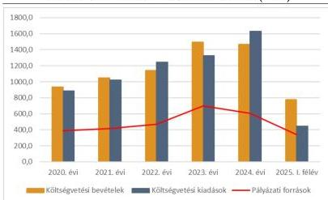

ÁLLAMI
SZÁMVEVŐSZÉK

# JELENTÉS

## Az önkormányzatok gazdálkodásának
célzott ellenőrzése

Tuzsér Nagyközségi Önkormányzat

2026.

26030

www.asz.hu

---

ÁLLAMI
SZÁMVEVŐSZÉK

# JELENTÉS
## Az önkormányzatok gazdálkodásának
## célzott ellenőrzése

Tuzsér Nagyközségi Önkormányzat

2026.

26030

www.asz.hu

Dr. Szomolai Csaba
ÁLLAMI
SZÁMVEVŐSZÉK
ALELNÖK 2.

---

ELLENŐRZÉSI IGAZGATÓSÁG:

**ELLENŐRZÉSI IGAZGATÓSÁG II.**

ELLENŐRZÉSI IGAZGATÓ:

**DR. BAFFIA GERGELY GÁBOR** igazgató

ELLENŐRZÉSVEZETŐ:

**HUDÁK MAGDOLNA** ellenőrzésvezető

Jelentéseink az interneten a
www.asz.hu címen olvashatók.

IKTATÓSZÁM: EL-4271-042/2026

TÉMASORSZÁM: 33/2025.

ELLENŐRZÉS-AZONOSÍTÓ SZÁM: V116101

---

# TARTALOMJEGYZÉK

|  ■ ÖSSZEFOGLALÁS | 5  |
| --- | --- |
|  ■ AZ ELLENŐRZÉS EREDMÉNYEI | 9  |
|  1. Az Önkormányzat bevételei beszedésének, felhasználásának törvényessége, célszerűsége | 11  |
|  2. Az Önkormányzat kiadásai teljesítésének törvényessége, célszerűsége | 13  |
|  ■ JAVASLATOK | 15  |
|  ■ I. FÜGGELÉK: ÉSZREVÉTELEK | 17  |
|  ■ II. FÜGGELÉK: ELLENŐRZÉSI MEGKÖZELÍTÉS | 18  |
|  ■ MELLÉKLETEK | 22  |
|  I. sz. melléklet: Értelmező szótár | 22  |
|  II. sz. melléklet: Az ellenőrzött szervezetek jegyzéke | 23  |
|  III. sz. melléklet: Folyósított pályázati források a Záhonyi járásban az ellenőrzött időszakban | 24  |
|  IV. sz. melléklet: Az önkormányzat pályázatai az ellenőrzött időszakban | 25  |
|  V/A. sz. melléklet: Az ellenőrzött pályázatok törvényességi és célszerűségi értékelése | 28  |
|  V/B. sz. melléklet: A pályázati bevételekkel kapcsolatban megállapított hiányosságok | 30  |
|  V/C. sz. melléklet: A több éves felhasználású támogatások passzív időbeli elhatárolása és annak hatása a beszámoló valódiságára | 32  |
|  VI. sz. melléklet: A belterületi utak fejlesztése tárgyú projekt megvalósításának költségszerkezete | 33  |
|  VII/A. sz. melléklet: Az ellenőrzött kiadások teljesítésének törvényességi értékelése | 34  |
|  VII/B. sz. melléklet: Az ellenőrzött kiadások teljesítésének célszerűségi értékelése | 36  |
|  VII/C. sz. melléklet: A teljesített pályázati kiadásokkal kapcsolatban megállapított hiányosságok | 38  |
|  ■ RÖVIDÍTÉSEK JEGYZÉKE | 40  |

3

---

# ÖSSZEFOGLALÁS

Az önkormányzatok számára a pályázati források, támogatások kulcsfontosságúak, tekintettel arra, hogy saját bevételeik, valamint a kapott költségvetési támogatások nem minden esetben biztosítanak lehetőséget a település és az ott megvalósuló közszolgáltatások fejlesztésére. A legjelentősebb pályázati forrás (TOP Plusz¹) keretében például – a 2026. január 28-i időállapot alapján – összesen 1 576 472,0 M Ft² pályázati forrást ítéltek meg a támogató szervezetek az önkormányzati szektornak, amely összesen 5 417 támogatott pályázatot jelentett. A pályázati források törvényes és célszerű felhasználása kiemelt fontosságú, főként, hogy ezek a források az elmaradottabb magyarországi régiók felzárkóztatását segítik elő az infrastruktúra, a közszolgáltatások fejlesztése és az életminőség javítása által.

Az ÁSZ³ a 2025. évi ellenőrzési terve alapján, „A helyi önkormányzatok és helyi önkormányzati költségvetési szervek gazdálkodásának ellenőrzése” téma keretében a 2020-2025. I. félév közötti időszakra vonatkozóan ellenőrizte Tuzsér település önkormányzatát. Az ellenőrzés célja annak értékelése volt, hogy az Önkormányzatnál⁴ a pályázati források (bevételek) tervezése megalapozottan, felhasználása a pályázati céloknak megfelelően és a közfeladatellátással összefüggésben történt-e, valamint ezen bevételek beszedése, továbbá a pályázati forráshoz kapcsolódó kiadások teljesítése és azok elszámolása törvényes volt-e.

Forrás: ÁSZ által készített, illetve az Önkormányzat honlapján található fotók alapján a Tuzsér Nagyközségi Önkormányzatnál megvalósuló pályázatok bemutatása, ÁSZ saját szerkesztés

összesen – az ellenőrzés során figyelembe vett pályázatok tekintetében – 919,4 M Ft európai uniós és hazai forrású, valamint a Magyar Falu program keretében finanszírozott pályázati forrás állt rendelkezésre.

A 2020-2024. években az Önkormányzat 934,2 – 1 493,3 M Ft közötti költségvetési bevétellel gazdálkodott és 886,7 – 1 629,9 M Ft között teljesített költségvetési kiadást. 2025. I. félévében ezek az összegek – a bevételek és kiadások sorrendjében – 776,2 M Ft és 442,9 M Ft összegben alakultak. Az Önkormányzat költségvetési bevételei a 2022. és a 2024. évben nem fedezték a költségvetési kiadásokat. A költségvetési hiányra a pénzmaradvány biztosította a fedezetet. A pénzmaradvány – elsősorban – az előző években befolyt, de még

* A pályázati források köre még számos egyéb pályázattal kiegészült, amelyre az önkormányzatok szintén egyénileg pályázhattak (pl. Magyar Falu Program keretében meghirdetett pályázatok).

Forrás: https://archive.palyazat.gov.hu//aktstat?lang=hu

5

---

Összefoglalás

fel nem használt pályázati forrásokból származott, amely az ellenőrzött időszakban a pályázatok megvalósulásáig az Önkormányzat likviditási mutatóit javította. Az Önkormányzat pénzügyi helyzete és működése az ellenőrzött időszakban stabil és kiegyensúlyozott volt, feladatait el tudta látni, adósságrendezési eljárás alatt nem állt, pénzügyei felügyeletére önkormányzati biztos kijelölésére nem került sor. A 2025. évben hitelkeret szerződést kötött 50,0 M Ft értékben a feladatok folyamatos finanszírozásának biztosítása érdekében, azonban az ellenőrzés megkezdéséig a hitelkeretből lehívás nem történt.

Az Önkormányzat bevételeinek és kiadásainak, valamint pályázati forrásainak alakulását az 1. ábra mutatja be.

1. ábra

# AZ ÖNKORMÁNYZAT BEVÉTELEINEK, KIADÁSAINAK ÉS PÁLYÁZATI FORRÁSAINAK ALAKULÁSA
A 2020-2024. ÉVEKBEN ÉS 2025. I. FÉLÉVÉBEN (M FT)

Forrás: Az Önkormányzat 2020-2024. évi költségvetési beszámolója és a 2025.06. havi időközi költségvetési jelentése alapján. ÁSZ saját szerkesztés

(pályázati) támogatást folyósítottak. Ezen időszakban a Záhonyi járásban az egy településre jutó működési és felhalmozási célú támogatás 1 221,6 M Ft volt, az Önkormányzat ennek 2,4-szeresét realizálta.

Az Önkormányzat a 2020-2024. években sikeres pályázati tevékenysége eredményeként 25 pályázatból összesen 919,4 M Ft támogatást nyert el (ebből 835,8 M Ft került folyósításra), amelynek 59,9 %-a a 2022-2023. években realizálódott. A 2025. I. félévében – az ellenőrzött terület vonatkozásában – az Önkormányzat nem nyújtott be újabb pályázatot. Az elnyert támogatások jellemzően a településüzemeltetési, óvodai ellátás, valamint a szociális szolgáltatások és ellátások önkormányzati feladatokhoz kapcsolódtak. Összességében az Önkormányzat pályázati aktivitása – az elnyert támogatások települési átlagait tekintve – az ellenőrzött időszakban a Záhonyi járáshoz tartozó településekhez viszonyítva kiemelkedő volt.

Az ellenőrzés során az ÁSZ kockázatelemzés alapján öt különböző pályázatból befolyt, 580,3 M Ft összértékű pályázati bevétel és 147,9 M Ft összértékű, 11 kiadás törvényességi és célszerűségi szempontú vizsgálatát végezte el.

Az ÁSZ által ellenőrzött pályázatok a közfeladatellátáshoz és a Gazdasági programban,² meghatározott kiemelt feladatokhoz kapcsolódtak, a pályázati bevételek tervezése a közfeladattal arányos mértékű volt. A pályázati bevételek felhasználása minden esetben a kitűzött (pályázati) céloknak megfelelően történt. A közel 1 Mrd Ft értékű hazai és uniós támogatásnak köszönhetően a település infrastrukturális ellátottsága és intézményhálózata jelentős mértékben fejlődött, a pályázati források hasznosultak.

6

---

Összefoglalás

A pályázatokkal kapcsolatos döntéshozatal a vizsgált esetek 75,0 %-ában nem felelt meg a jogszabályi előírásoknak, valamint a döntéselőkészítés hiányosságai miatt nem volt célszerű. Az ÁSZ által ellenőrzött négy pályázatból három esetben a Polgármester⁹ a pályázat benyújtásáról nem terjesztett javaslatot a Képviselő-testület¹⁰ elé. Írásos előterjesztés hiányában ezen pályázati bevételek tervezésének jogszabályban előírt közgazdasági megalapozottsága sem volt biztosított, mivel a pályázatok benyújtását megelőzően az Önkormányzat nem vizsgálta a pályázatok szükségességét, indokoltságát. Nem vizsgálta továbbá a projekt megvalósítását követő fenntartással összefüggő kérdéseket sem, amely miatt a döntéselőkészítés nem felelt meg a célszerűségi követelményeknek. Egy köztéri szobor felállításáról és közterületen való elhelyezéséről annak ellenére nem született képviselő-testületi döntés, hogy jogszabályi előírás alapján ez annak kizárólagos hatáskörébe tartozott. A Jegyző,¹¹ a jogszabályi előírások ellenére az Önkormányzat működésének biztosításával kapcsolatos feladatkörében – azzal, hogy nem hívta fel a Polgármester figyelmét, hogy a pályázatokról való döntés a Képviselő-testület hatásköre – nem biztosította a döntéselőkészítési folyamat törvényes működését.

Az Önkormányzat a 2021., a 2023. és a 2024. évi beszámolójában a többéves kihatású pályázati forrásokat nem vezette ki a halasztott eredményszemléletű bevételek közül, ezáltal nem a valóságnak megfelelő pályázati forrást mutatott ki. A 2024. évben az eltérés meghaladta a jogszabályban előírt 2,0 %-os lényegességi küszöbértéket, tekintettel arra, hogy az eltérés mértéke a mérlegfőösszeghez képest 8,1 % (202,1 M Ft) volt, amely miatt az Önkormányzat 2024. évi beszámolója nem mutatott az Önkormányzat vagyoni helyzetéről megbízható és valós képet, valamint sérült a jogszabályban előírt valódiság elve is. A többi érintett évben az eltérés nem haladta meg a lényegességi küszöbértéket.

Az ellenőrzött útépítési pályázati kiadások tervezése során a célszerűségi kritériumok érvényesültek, a tervezés dokumentált, számításokkal alátámasztott, megalapozott volt. A pályázati pénzfelhasználás a kitűzött céloknak megfelelően történt, azonban a kifizetések teljesítése egyetlen esetben sem felelt meg a jogszabályi előírásoknak. A kifizetések teljesítésénél a gazdálkodási jogkörgyakorlással kapcsolatos jellemző hiányosság volt a kötelezettségvállalások jogszabályban előírt pénzügyi ellenjegyzésének elmaradása, a teljesítésigazolás hiánya, továbbá a jogszabályban előírtakkal szemben a pénzügyi

Az elszámoltathatóságot és átláthatóságot biztosító, jogszabályban előírt kontrollok alkalmazásának hiánya miatt a jövőbeni pályázatok esetében is felmerülhet a téves, jogszerűtlen kifizetések kockázata.

A 2019. évtől az ellenőrzés lezárásáig fizikai leltározás nem történt, ezáltal az Önkormányzat nem győződött meg a tárgyi eszköz nyilvántartásban szereplő eszközök tényleges meglétéről. Ebből adódóan nem érvényesültek a nemzeti vagyon védelmére és megőrzésére vonatkozó előírások, a csaknem 1 Mrd Ft pályázati forrásból megvalósuló fejlesztések tárgyi eszközeit is beleértve.

A pályázatok előkészítésével és benyújtásával kapcsolatban kialakult – a Képviselő-testület mellőzésével történő döntéshozatali – gyakorlat kockázatot jelenthet a jövőbeni pályázatok tekintetében arra vonatkozóan, hogy a településen nem a település érdekeinek leginkább megfelelő pályázatok kerülnek benyújtásra, illetve fejlesztések kerülnek megvalósításra.

teljesítést megelőzően elmaradt az érvényesítés és az utalványozás. Összességében a kifizetések során nem érvényesültek a jogszabályokban előírt, az átláthatóságot és az elszámoltathatóságot biztosító kontrollok.

A leltár hiánya miatt a jövőre nézve felmerülhet az önkormányzati vagyon jogszerűtlen felhasználásának, illetve a vagyonvesztésnek a kockázata.

7

---

Összefoglalás---

A hiányosságok visszavezethetőek voltak arra, hogy az ellenőrzött időszakban a feladatot ellátó jegyzők által kialakított gazdálkodási folyamatok nem voltak alkalmasak az előzőekben részletezett, a gazdálkodási jogkörgyakorlással, valamint a vagyongazdálkodással kapcsolatos hiányosságok megakadályozására.

Az ÁSZ az ellenőrzés megállapításai alapján a Polgármesternek és a Jegyzőnek, négy-négy javaslatot fogalmazott meg.

8

---

# AZ ELLENŐRZÉS EREDMÉNYEI

Az Önkormányzat részére a 2020-2024. évi beszámoló és a 2025. 06. havi időközi költségvetési jelentés alapján a folyósított egyéb működési és felhalmozási célú támogatások (pályázati források) összege 2 910,4 M Ft volt, ami 2,4-szerese volt a Záhonyi járás települési átlagnak (1 221,6 M Ft/település). A beszámoló adatok tartalmazták az ellenőrzött időszak (2020. év) előtt elnyert, de az ellenőrzött időszakban folyósított, jelen ellenőrzés szempontjából nem releváns$^{1}$ támogatásokat is.

Az Önkormányzat a 2020-2024. években és 2025. I. félévében **25** megkezdett, folyamatban lévő, lezárt, illetve meghiúsult pályázat alapján összesen **919,4 M Ft összegű támogatást nyert el**, amelyből **835,8 M Ft összegű pályázati forrást** (az igényelt támogatás 87,0 %-a) **folyósítottak** az ellenőrzött időszakban. A 25 pályázatból egy, a külterületi utak fejlesztését célzó pályázat esetében a szükséges önerő kiegészítéshez szükséges forrás rendelkezésre állásának hiánya miatt a támogatási kérelmet az Önkormányzat visszavonta, a pályázat meghiúsult. A Belterületi utak fejlesztése tárgyú pályázat 2025. októberében még **megvalósítási fázisban volt**. A lezárult és folyamatban lévő pályázatok 100,0 %-os támogatási intenzitással valósultak meg. A meghiúsult pályázat esetében a támogatási intenzitás 95,5 % volt. **A pályázatok megvalósítása során négy pályázatnál keletkezett 86,0 M Ft összegű visszafizetési kötelezettség** (az ellenőrzött időszakban folyósított támogatások 10,3 %-a), többségében fel nem használt pályázati források miatt.

Az Önkormányzat 2020-2024. évi konszolidált beszámolóiban és a 2025. év 06. havi időközi költségvetési jelentésében elszámolt egyéb működési és felhalmozási célú támogatásokat (pályázati forrásokat), valamint a Záhonyi járásban teljesült támogatások ugyanezen adatait a *III. sz. melléklet*, az Önkormányzat igényelt, elnyert és teljesített pályázatait részletesen pedig a *IV. sz. melléklet* tartalmazza.

Az igényelt és elnyert 25 pályázati támogatás tartalmát és státuszát az *1. táblázat* mutatja be.

*1. táblázat*

## AZ ÖNKORMÁNYZAT IGÉNYELT, ELNYERT ÉS TELJESÍTETT PÁLYÁZATAINAK TARTALMA ÉS STÁTUSZA (E FT, DB)

|  ÉVEK | PÁLYÁZATOK SZÁMA (DB) | PÁLYÁZAT TARTALMA | IGÉNYELT TÁMOGATÁS (M Ft) | ELNYERT TÁMOGATÁS (M Ft) | FOLYÓSÍTOTT TÁMOGATÁS (M Ft) | TELJESÍTETT KIADÁS (M Ft) | FOLYAMATBAN LÉVŐ PÁLYÁZATOK SZÁMA (DB) | LEZÁRULT PÁLYÁZATOK SZÁMA (DB) | MEGHIÚSULT PÁLYÁZATOK SZÁMA (DB)  |
| --- | --- | --- | --- | --- | --- | --- | --- | --- | --- |
|  Az ellenőrzött időszakot megelőzően elnyert, de az ellenőrzött időszakban megvalósult pályázat  |   |   |   |   |   |   |   |   |   |
|  2019. | 1 | óvodai ellátás fejlesztése | 119,7 | 119,7 | 119,7 | 120,0 | 0 | 1 | 0  |
|  AZ ELLENŐRZÖTT IDŐSZAKBAN ELNYERT ÉS FOLYAMATBAN LÉVŐ/LEZÁRULT/MEGHIÚSULT PÁLYÁZATOK  |   |   |   |   |   |   |   |   |   |
|  2020. | 6 | fürdőhely fejlesztés, illegális hulladéklerakók felszámolása, ingatlanhasznosítás, járda felújítás, közösségi tér kialakítás, szociális tűzifa vásárlás | 99,6 | 92,6 | 92,6 | 92,1 | 0 | 6 | 0  |

$^{1}$ A beszámolókban bemutatott egyéb működési és felhalmozási célú támogatások tartalma bővebb, mint az ellenőrzésbe bevont pályázatoké, mert pl. tartalmazza a közfoglalkoztatási pályázatokat és a rendkívüli települési támogatásokat is, amelyekre jelen ellenőrzés nem terjedt ki, azonban a település pályázati tevékenységének eredményességét ezek az adatok is jól szemléltetik. Jelen ellenőrzés fókuszában az önkormányzati feladatellátáshoz (pl. óvoda fejlesztés), illetve infrastruktúra fejlesztéshez kapcsolódó pályázatok álltak.

9

---

Az ellenőrzés eredményei

|  ÉVEK | PÁLYÁZATOK SZÁMA (DB) | PÁLYÁZAT TARTALMA | IGENYELT TÁMOGATÁS (M Ft) | ELNYERT TÁMOGATÁS (M Ft) | FOLYÓSÍTOTT TÁMOGATÁS (M Ft) | TEJESÍTETT KIADÁS (M Ft) | FOLYAMATBAN LÉVŐ PÁLYÁZATOK SZÁMA (DB) | LEZÁROLT PÁLYÁZATOK SZÁMA (DB) | MEGHIÚSULT PÁLYÁZATOK SZÁMA (DB)  |
| --- | --- | --- | --- | --- | --- | --- | --- | --- | --- |
|  2021. | 7 | illegális hulladéklerakók felszámolása, ingatlanfejlesztés, eszköz beszerzése, óvodai fejlesztés, szociális tűzifa vásárlás, útfelújítás | 116,7 | 110,6 | 110,6 | 117,2 | 0 | 7 | 0  |
|  2022. | 6 | ingatlanfejlesztés, óvoda fejlesztés, szobor állítás, szociális tűzifa vásárlás, temető fejlesztése, útépítés | 197,8 | 195,1 | 195,1 | 201,8 | 0 | 6 | 0  |
|  2023. | 4 | szociális tűzifa vásárlás, útfelújítás, útépítés | 405,5 | 389,4 | 305,8 | 228,3 | 1 | 2 | 1  |
|  2024. | 1 | szociális tűzifa vásárlás | 21,9 | 11,9 | 11,9 | 11,9 | 0 | 1 | 0  |
|  **Összesen:** | **25** |  | **961,2** | **919,4** | **835,8** | **771,4** | **1** | **23** | **1**  |

Forrás: Az Önkormányzat adatszolgáltatása alapján ÁSZ saját szerkesztés

Az elnyert pályázatok Mötv.¹²-ben meghatározott közfeladatok szerinti csoportosítását a 2. táblázat mutatja be.

2. táblázat

# A PÁLYÁZATI TÁMOGATÁSOK KÖZFELADATHOZ KAPCSOLÓDÁSÁNAK BEMUTATÁSA (%, DB, M Ft)

|  MÖTV. 13.§ (1) BEKEZDÉS SZERINTI KÖZFELADAT | FOLYÓSÍTOTT TÁMOGATÁS ARÁNYA (%) | PÁLYÁZATOK SZÁMA (DB) | FOLYÓSÍTOTT TÁMOGATÁS (M Ft)  |
| --- | --- | --- | --- |
|  településfejlesztés, településrendezés | 0,5% | 1 | 4,3  |
|  településüzemeltetés: köztemetők kialakítása és fenntartása, a helyi közutak és tartozékainak kialakítása és fenntartása, közparkok és egyéb közterületek kialakítása és fenntartása | 54,4% | 11 | 454,7  |
|  környezet-egészségügy: köztisztaság, települési környezet tisztaságának biztosítása | 2,8% | 3 | 23,1  |
|  óvodai ellátás | 21,7% | 2 | 181,1  |
|  kulturális szolgáltatás, a helyi közművelődési tevékenység támogatása | 3,6% | 1 | 30,0  |
|  szociális szolgáltatások és ellátások, amelyek keretében települési támogatás állapítható meg | 8,6% | 5 | 72,2  |
|  lakás- és helyiséggazdálkodás | 8,4% | 2 | 70,4  |
|  **Összesen** | **100,0%** | **25** | **835,8**  |

Forrás: Az Önkormányzat adatszolgáltatása alapján, ÁSZ saját szerkesztés

A bemutatott pályázatok mind számosságukat, mind a támogatási összeg nagyságát tekintve jellemzően a településüzemeltetési feladatokhoz kapcsolódtak, azonban az átlagos támogatási összeg nagysága alapján – függetlenül az elnyert pályázatok számától – a legtöbb támogatás az óvodai fejlesztésekre és a településüzemeltetési feladatokra (jellemzően szociális tűzifa vásárlás) jutott.

Az ÁSZ a bemutatott 25 megkezdett, lezárt, folyamatban lévő, illetve meghiúsult 835,8 M Ft összértékű pályázat közül öt pályázathoz kapcsolódó bevétel (496,7 M Ft összegben) törvényességének, számításokkal vagy szerződéssel alátámasztott megalapozottságának, indokoltságának, a tervezett bevételek célhoz, illetve közfeladatellátáshoz kapcsolódásának részletes ellenőrzését végezte el.

10

---

Az ellenőrzés eredményei

# 1. Az Önkormányzat bevételei beszedésének, felhasználásának törvényessége, célszerűsége

Összegző megállapítás

Az Önkormányzat pályázatai a közfeladatellátáshoz kapcsolódtak, a bevételek felhasználása megfelelt a pályázati céloknak. Az ellenőrzött időszakra vonatkozóan vizsgált esetek 75,0 %-ában a pályázati bevételek tervezése az Áht.13-ban foglaltak ellenére nem volt közgazdaságilag megalapozott. A döntéselőkészítés a Mötv.-ben foglaltak megsértése miatt nem volt törvényes, valamint a pályázatok előkészítése, vonatkozó előterjesztés hiányában nem felelt meg a célszerűségi szempontoknak. A bevételek beszedése nem felelt meg az Ávr.14 előírásainak. Az Önkormányzat 2024. évi beszámolója nem mutatott megbízható és valós képet, ezáltal sérült a Számv.tv.15 szerinti valódiság elve.

Az ellenőrzésre kiválasztott öt pályázatban kitűzött célok összhangban voltak a Gazdasági program,2-ban meghatározott fejlesztési célokkal (bel-, és külterületi utak korszerűsítése, illetve az önkormányzati fenntartású intézmények felújítása és rendezett településközpont kialakítása), azok az Önkormányzat közfeladatellátásához kapcsolódtak. A pályázatok egy kivétellel (külterületi utak fejlesztése) megvalósultak.

Az ellenőrzött pályázatok közül a külterületi útfelújítási pályázathoz önerő bevonására volt szükség. Azonban ezen pályázatát az időközben megemelkedett költségek miatt az Önkormányzat visszavonta, tekintettel arra, hogy magasabb önerőt nem tudott a pályázatra fordítani. A pályázati előleg összegét, 83,6 M Ft-ot az Önkormányzat 2025. július 18-án visszafizette a támogató részére.

A pályázatok eredményeképpen a település infrastruktúrája, intézményhálózata jelentősen fejlődött, azonban a pályázatok előkészítésének folyamatában, illetve a pályázati bevételekkel kapcsolatos elszámolásokban hiányosságok, szabálytalanságok voltak.

Az ellenőrzött bevételek 59,1 %-ánál (293,4 M Ft összegben) a Polgármester a pályázati kérelem benyújtását megelőzően (Lónyay szobor és környezete, 2022. évi óvodafejlesztés és a belterületi utak fejlesztése) nem készített, és nem nyújtott be előterjesztést a Képviselő-testület részére, így az Áht. 4. § (2) bekezdésében előírtak ellenére a tervezett bevételek közgazdasági megalapozottságát az Önkormányzat nem vizsgálta, és nem végzett számításokat a közfeladathoz szükséges mértékű források nagyságáról sem. (Az Önkormányzat Polgármestere részére címzett 4. javaslat, valamint a Hivatal16 Jegyzője részére címzett 2. javaslat.)

A döntéselőkészítés nem felelt meg a Képviselő-testület által a Mötv. 43. § (3) bekezdésének felhatalmazása alapján megalkotott önkormányzati SzMSz.17 6. § (1) bekezdésében foglaltaknak, mivel a pályázat benyújtásáról a Képviselő-testület mellőzésével egyszemélyben a Polgármester döntött. A pályázatokról a Képviselő-testületet a Polgármester utólag a Mötv. alapján tájékoztatta. (Az Önkormányzat Polgármestere részére címzett 2. javaslat, valamint a Hivatal Jegyzője részére címzett 4. javaslat.)

11

---

Az ellenőrzés eredményei---

A Lónyay szobor esetében a Polgármester a szobor köztéri felállításával kapcsolatos javaslatot sem terjesztette a Képviselő-testület elé, annak ellenére, hogy a szobor köztéri felállításáról szóló döntés a Mötv. 42. § (8) bekezdésében foglaltak szerint a Képviselő-testület kizárólagos hatáskörébe tartozott. (A Hivatal Jegyzője részére címzett 4. javaslat.)

A Jegyző, a Mötv. 81. § (3) bekezdés c) pontjában foglalt, az önkormányzat működésének biztosításával kapcsolatos feladata körében a Bkr.$^{18}$ 6. § (2) bekezdésében foglaltak ellenére nem biztosította a döntéselőkészítési folyamat törvényes működését. (A Hivatal Jegyzője részére címzett 4. javaslat.)

**Ezekben az esetekben a döntéselőkészítés nem volt célszerű sem, mivel a pályázatok szükségességének, indokoltságának és a projekt megvalósítását követő fenntarthatóságának vizsgálata dokumentált módon nem történt meg.** (Az Önkormányzat Polgármestere részére címzett 4. javaslat, valamint a Hivatal Jegyzője részére címzett 2. javaslat.)

**A folyósított pályázati támogatások felhasználása megfelelt a pályázati céloknak és a Támogatási szerződésben és annak módosításaiban előírtaknak. A pályázati bevételek beszedésében, elszámolásában azonban hiányosságok, szabálytalanságok voltak.**

A pályázati bevételek **érvényesítése** nem felelt meg az Ávr. 58. § (3) bekezdésében foglaltaknak, mivel az érvényesítő az érvényesítést a bevételek Önkormányzat számlájára történő beérkezését követően csak több hónapos, átlagosan 240 napos késedelemmel végezte el. (A Hivatal Jegyzője részére címzett 1. javaslat.)

Az **utalványozás** nem felelt meg az Ávr. 59. § (1b) bekezdés előírásának, mivel az utalványozó a bevételeket – az érvényesítéshez hasonlóan – csak azok beérkezését követően több hónapos, átlagosan 240 napos késedelemmel végezte el annak ellenére, hogy az Ávr. 59. § (5) bekezdés a)-d) pontjai értelmében a pályázati bevétel nem tartozik az utalványozás mellőzésére jogalapot adó kivételi körbe. (Az Önkormányzat Polgármestere részére címzett 4. javaslat.)

Az Önkormányzat a Számv.tv. 45. § (2) bekezdésében és az Áhsz.$^{19}$ 14. § (14) bekezdésben foglaltak ellenére az előző években fel nem használt, a mérlegben a passzív időbeli elhatárolások között kimutatott több éves felhasználású támogatásokat a tényleges felhasználás évében nem vezette ki a halasztott eredményszemléletű bevételek közül, ezáltal a **mérlegben** a 2021. évben 2,2 M Ft-tal, a 2023. évben 14,9 M Ft-tal, a **2024. évben 202,1 M Ft-tal több halasztott eredményszemléletű bevételt** (a következő időszakban még felhasználható forrást) **mutatott ki a valósnál**. A 2024. évben kimutatott összeg a mérlegfőösszeg 8,1 %-át tette ki, amely az Áhsz. 1. § 3) pontja szerint **jelentős összegű hibának minősül**. A Számv.tv. 18. §-ában foglaltak alapján a jelentős összegű hiba miatt **az Önkormányzat 2024. évi beszámolója nem mutatott az Önkormányzat vagyoni helyzetéről megbízható és valós képet**, valamint **sérült a Számv.tv. 15. § (3) bekezdésében foglalt valódiság elve** is, mivel a mérlegben olyan passzív időbeli elhatárolást mutatott ki, amelyet már ki kellett volna vezetnie. (A Hivatal Jegyzője részére címzett 3. javaslat.)

A tételesen ellenőrzött pályázati bevételek azonosító adatait, az ÁSZ általi törvényességi és célszerűségi minősítéseket, azok megalapozását, illetve a beszámoló valódiságát befolyásoló mérleg adatokat részletesen az *V/A, V/B, és V/C, sz mellékletek* tartalmazzák.

12

---

Az ellenőrzés eredményei

## 2. Az Önkormányzat kiadásai teljesítésének törvényessége, célszerűsége

### Összegző megállapítás

Az Önkormányzatnál az ellenőrzött pályázathoz kapcsolódó kifizetések tervezése számításokkal alátámasztott, megalapozott volt, felhasználásuk a kitűzött céloknak megfelelően, az önkormányzati feladatellátáshoz kapcsolódóan történt. A kifizetéseknél azonban a pénzügyi ellenjegyzés, a teljesítésigazolás, az érvényesítés és az utalványozás nem felelt meg az Áht. és az Ávr. előírásainak. Az Önkormányzatnál a tárgyi eszköz mérlegsor a Számv.tv. és az Áhsz. előírásai ellenére leltárral nem volt alátámasztott, emiatt sérült az Nvtv.²⁰ vagyon megőrzésére, védelmére vonatkozó rendelkezése is.

Az ÁSZ az önkormányzati pályázati kiadások teljesítésének ellenőrzését a Belterületi utak fejlesztése tárgyú projekt megvalósításához kapcsolódó kifizetések alapján végezte el.

A projekt megvalósításával összefüggésben végrehajtott feladatok, elvégzett munkák a Mötv. előírásainak megfelelően a kötelezően ellátandó településüzemeltetési feladatok körébe tartoztak. A Gazdasági program is nevesítette a Belterületi utak felújítása, járdák korszerűsítése fejlesztési elképzelést. A projekt fizikai befejezésének Támogatási szerződésben rögzített tervezett napja 2025. december 31. 2025. októberében egyedül a nyilvánossággal kapcsolatos tervezett kiadások voltak még folyamatban.

Az ÁSZ ellenőrzés a pályázatban felmerülő **11 teljesített kifizetésre** terjedt ki, **147,9 M Ft** összértékben, amely a teljesített pályázati kifizetések 74,8 %-át tette ki. A pályázat költségszerkezetét és a felhasználási jogcímeket a *VI. sz. melléklet* mutatja be.

**A pályázattal kapcsolatos kiadások tervezése** az Áht.-ban foglaltaknak megfelelően **közgazdaságilag megalapozottan, illetve a közfeladatellátáshoz szükséges mértékben történt.** A pályázat megvalósításával kapcsolatos tervezett kiadásokat a 2023. és a 2024. évi költségvetési rendelet tartalmazta.

Az Önkormányzat az éves költségvetési rendeletek¹,²,³,⁴,⁵ (2021-2025. évek) előterjesztésében költségvetési alapelvként fogalmazta meg a pályázatok figyelését, az aktuális pályázatokhoz való kapcsolódást, és indokolt esetben a pályázatok önrészének megteremtését.

Az ellenőrzött pályázati **kiadások** a Mötv. előírásaival összhangban **a kötelező önkormányzati feladatok ellátása érdekében történtek. Az ellenőrzött pályázati kiadások teljesítése azonban egyetlen esetben sem, nyilvántartása pedig három esetben nem felelt meg az Áht. és az Ávr. előírásainak.**

**A kifizetések teljesítésénél jellemző hiányosság volt** az Ávr. 55. § (1) bekezdésében előírt a **kötelezettségvállalások pénzügyi ellenjegyzésének**, továbbá az Áht. 38. §-ában előírtak ellenére a **pénzügyi teljesítést követő érvényesítés és utalványozás elmaradása.** (Az Önkormányzat Polgármestere részére címzett 3. javaslat, valamint a Hivatal Jegyzője részére címzett 1. javaslat.)

Az Ávr. 57. § (1) bekezdés 3) pontjában foglaltak ellenére **egy esetben nem végezték el a teljesítés igazolását.** (Az Önkormányzat Polgármestere részére címzett 3. javaslat.)

13

---

Az ellenőrzés eredményei---

Az Ávr. 56. § (1) bekezdésében foglaltak ellenére egy esetben a kötelezettségvállalás nyilvántartásba vétele elmaradt, két esetben a nyilvántartásba vétel késedelmesen történt, emiatt ezekben az esetekben nem volt biztosított az Áht. 36. § (1) bekezdésében előírtak szerint a ténylegesen rendelkezésre álló szabad előirányzat megállapítása. (A Hivatal Jegyzője részére címzett 1. javaslat.)

A jogszabályokban előírt kontrolltevékenységek alkalmazásának rendszeres elmaradása, valamint a nyilvántartási hiányosságok miatt felmerülhet a téves, jogszerűtlen kifizetések kockázata.

Az Önkormányzatnál a tárgyi eszközök vonatkozásában 2019. óta nem történt a Számv.tv. 69. § (2)-(4) bekezdései szerinti mennyiségi felvétellel végrehajtott, illetve egyeztetéses leltározás, amely miatt a Számv.tv. 69. § (1) bekezdésében és az Áhsz. 22. § (1) bekezdésében előírtak ellenére a mérleg tárgyi eszköz sora leltárral nem volt alátámasztott. Leltározás hiányában az Önkormányzat nem győződött meg a tárgyi eszköz nyilvántartásban szereplő eszközök meglétéről, így nem érvényesültek az Nvtv. 7. § (2) bekezdésében rögzített, a nemzeti vagyon védelmére és megőrzésére vonatkozó előírások sem. (A Hivatal Jegyzője részére címzett 3. javaslat.)

A teljesített kiadásokkal kapcsolatos összegző értékelést a *VII/A: és VII/B. sz. mellékletek* mutatják be, a kifizetésekkel és nyilvántartásokkal kapcsolatos hiányosságok tételes bemutatását a *VII/C. sz. melléklet* tartalmazza.

14

---

# JAVASLATOK

Az ÁSZ tv. 33. § (1) bekezdésében foglaltak értelmében az ellenőrzött szervezet vezetője köteles a jelentésben foglalt megállapításokhoz kapcsolódó intézkedési tervet összeállítani és azt a jelentés kézhezvételétől számított 30 napon belül az ÁSZ részére megküldeni. Az ÁSZ a jelentésben foglalt megállapításokhoz kapcsolódóan az alábbi javaslatok tekintetében várja el az intézkedési terv elkészítését.

## A TUZSÉR NAGYKÖZSÉGI ÖNKORMÁNYZAT POLGÁRMESTERE RÉSZÉRE

1. Intézkedjen az ÁSZ nyilvánosságra hozott jelentésének a kézhezvételét követő 30 napon belül a Képviselő-testület elé terjesztéséről.

2. A Képviselő-testület hatáskörének biztosítása és a pályázatelőkészítési folyamat átláthatósága érdekében intézkedjen arról, hogy az a Képviselő-testület által a Mötv. 43. § (3) bekezdésének felhatalmazása alapján megalkotott önkormányzati SzMSz-ben foglaltakkal összhangban a pályázatok benyújtásáról – a halaszthatatlanság és a határozatképesség hiányának eseteit kivéve – a Képviselő-testület döntsön, mérlegelve azok szükségességét, indokoltságát, közfeladatellátáshoz való kapcsolódását.

3. Tegyen intézkedéseket azon kontrolltevékenységek kiépítésére és megfelelő működtetésére, amelyek megelőzik a jelentésben leírt, az Ávr. 57. §-ában és 59. §-ában foglalt teljesítésigazolási és utalványozási jogkörök gyakorlásával összefüggő szabálytalanságok ismételt előfordulását.

4. A Mötv. 43. § (3) bekezdésének felhatalmazása alapján megalkotott önkormányzati SzMSz-ben foglaltak betartása és a megalapozott Képviselő-testületi döntések meghozatala érdekében - a jegyző közreműködésével - intézkedjen, hogy a pályázatok benyújtását megelőzően készüljenek a pályázatok indokoltságát, szükségességét, a pályázati forrásból megvalósuló eszközök fenntarthatóságát bemutató előterjesztések.

15

---

Javaslatok

# A TUZSÉRI KÖZÖS ÖNKORMÁNYZATI HIVATAL JEGYZŐJE RÉSZÉRE

1. Tegyen intézkedéseket az Önkormányzat vonatkozásában azon kontrolltevékenységek kiépítésére és megfelelő működtetésére, amelyek megelőzik a jelentésben leírt, az Ávr. 55. §-ában és 58. §-ában foglalt pénzügyi ellenjegyzési és érvényesítési jogkörök gyakorlásával összefüggő szabálytalanságok ismételt előfordulását, valamint gondoskodjon az Ávr. 56. § (1) bekezdésében foglaltaknak megfelelően a kötelezettségvállalások haladéktalan nyilvántartásba vételéről.

2. Az Önkormányzat pályázatairól szóló döntéselőkészítés folyamatában biztosítsa, hogy a Hivatal által készített írásos előterjesztések az Áht. 4. § (2) bekezdésének előírását szem előtt tartva tartalmazzanak számításokat, indoklást a tervezett pályázati bevételek közgazdasági megalapozására, valamint a gazdaságosság elvét szem előtt tartva a pályázatokból megvalósuló tárgyi eszközök fenntartására.

3. Intézkedjen az Önkormányzatnál az éves költségvetési beszámoló sorainak a Számv.tv. 69. § (1)-(3) bekezdéseinek és az Áhsz. 22. § (1) bekezdésében foglaltak szerinti tételes leltárral való alátámasztásáról. Az Nvtv. 7. § (2) bekezdésében rögzített, a nemzeti vagyon védelmére és megőrzésére vonatkozó előírások érvényesülése érdekében gondoskodjon arról, hogy az Önkormányzatnál a tárgyi eszközök fizikai számbavételét legalább a Számv.tv. 69. § (3) bekezdésében foglaltak szerinti három évente végezzék el. A Számv.tv. 15. § (3) bekezdésében foglalt valódiság elvének érvényesülése érdekében biztosítsa a halasztott eredményszemléletű bevételeknek a Számv.tv. 45. § (1) bekezdés a) pontja és az Áhsz. 14. § (14) bekezdése szerinti elszámolását.

4. A Mötv. 81. § (3) bekezdés c) pontjában foglalt feladatkörében a Hivatal, mint az Önkormányzat döntéselőkészítő szerve folyamatait úgy alakítsa ki, hogy azok megakadályozzák az önkormányzati SzMSz-ben, vagy önkormányzati rendeletekben meghatározott döntési, véleményezési hatáskörök figyelmen kívül hagyását.

16

---

# I. FÜGGELÉK: ÉSZREVÉTELEK

*A jelentéstervezetet az ÁSZ 15 napos észrevételezésre megküldte az ellenőrzött szervezet vezetőjének az ÁSZ tv. 29. §\* (1) bekezdése előírásának megfelelően.*

*Az ellenőrzött szervezetek a jelentéstervezet megállapításaira észrevételt nem tettek.*

\* 29. § (1) Az Állami Számvevőszék az ellenőrzési megállapításait megküldi az ellenőrzött szervezet vezetőjének vagy az általa megbízott személynek, és annak, akinek személyes felelősségét állapította meg.

(2) Az ellenőrzött szervezet vezetője és a felelősként megjelölt személy az ellenőrzés megállapításaira tizenöt napon belül írásban észrevételt tehet.

(3) Az Állami Számvevőszék az észrevételre a beérkezésétől számított harminc napon belül írásban válaszol. A figyelembe nem vett észrevételeket köteles a jelentésben feltüntetni, és megindokolni, hogy azokat miért nem fogadta el.

17

---

## II. FÜGGELÉK: ELLENŐRZÉSI MEGKÖZELÍTÉS

### AZ ELLENŐRZÉS JOGALAPJA

Az ellenőrzés jogszabályi alapját az ÁSZ tv.²² 1. § (3) bekezdése, valamint az 5. §(2)-(3) bekezdések előírásai képezik.

### AZ ELLENŐRZÉS CÉLJA

Az ellenőrzés célja volt annak értékelése, hogy az Önkormányzatnál a pénzforgalomban megjelenő, ellenőrzésre kiválasztott hazai és uniós forrásból megvalósuló pályázati támogatásokhoz kapcsolódó bevételek tervezésénél meghatározták-e azok felhasználási céljait, és ezek a célok kapcsolódtak-e a közfeladat ellátásához, valamint a kiválasztott bevételek beszedése törvényesen, felhasználásuk pedig az előírt határidőben és a kitűzött céloknak megfelelően történt-e.

Az ellenőrzés célja volt továbbá annak értékelése is, hogy az Önkormányzatnál a pénzforgalomban megjelenő, ellenőrzésre kiválasztott egy hazai vagy uniós forrásból megvalósuló pályázati támogatáshoz kapcsolódó kiadások teljesítése törvényesen, valamint a pénzfelhasználás a kitűzött céloknak megfelelően történt-e és az közfeladat ellátásához kapcsolódott-e.

### AZ ELLENŐRZÉS TÍPUSA

Kombinált ellenőrzés.

### AZ ELLENŐRZÉS TÁRGYA

Az ellenőrzés tárgya volt, az ellenőrzés előkészítése során feltárt kockázatok alapján, mindkét fókuszterületet (az Önkormányzat pénzforgalmában megjelenő hazai és uniós finanszírozású pályázati támogatások és ezekből egy folyamatban lévő pályázati támogatáshoz kapcsolódó kiadások) érintően:

- a tervezés törvényessége, számításokkal, vagy szerződéssel alátámasztott megalapozottsága, indokoltsága és célszerűsége,
- a pénzforgalomban rögzített tételek, valamint a vagyongazdálkodáshoz kapcsolódó nyilvántartások, beszámolások törvényessége, a felhasználások célhoz kötöttsége, célszerűsége, és azok közfeladat-ellátáshoz való kapcsolódása.

Az ellenőrzés kiterjedt minden olyan körülményre és adatra, amely az ÁSZ jogszabályban meghatározott feladatainak teljesítéséhez, valamint a program végrehajtása folyamán felmerült újabb összefüggések feltárásához szükséges volt.

18

---

II. Függelék: Ellenőrzési megközelítés

## AZ ELLENŐRZÉS HATÓKÖRE ÉS TERÜLETE

Az ÁSZ az önkormányzati gazdálkodás célirányos, gyors, egy adott terület kiválasztott szegmensére (a hazai és uniós pályázati támogatások) és annak környezetére fókuszáló, tranzakciók kiválasztásán alapuló ellenőrzés keretében értékelte az Önkormányzat gazdálkodását.

Ennek alapján az ellenőrzés az Önkormányzat pénzforgalmában megjelenő hazai és uniós finanszírozású pályázati támogatásokra és ezekből egy folyamatban lévő pályázati támogatáshoz kapcsolódó kiadásokra irányult (támogatások és azok felhasználása). Az ellenőrzés kiterjedt az ellenőrzött Önkormányzat esetében a bevételek és kiadások tervezésének, jogosságának, a bevételek beszedésének és a kifizetések teljesítésének törvényességére, célszerűségére, továbbá a közfeladat-ellátáshoz való kapcsolódásának értékelésére, figyelemmel az ellenőrzés előkészítése során azonosított kockázatokra.

Az ÁSZ az ellenőrzést az Alaptörvény$^{23}$ 43. cikk (1) bekezdésében meghatározott törvényességi, célszerűségi szempontok, valamint a nemzetközi standardokat irányadónak tekintve az ellenőrzési program szempontjai, az ellenőrzött időszakban hatályos jogszabályok, az ellenőrzés szakmai szabályok és módszertanok figyelembevételével hajtotta végre.

Az Önkormányzat esetében a Polgármester a településen 2013. november 10-től látta el tisztségét, a Képviselő-testületnek a Polgármesteren kívül hat fő képviselő tagja volt. Az ellenőrzött időszakban a Hivatalt két Jegyző$^{1,2}$ vezette. Az Önkormányzat fenntartásában az ellenőrzött időszakban egy költségvetési szerv$^{24}$ működött, a 2011. augusztus 1-jén alapított óvodai nevelést ellátó intézmény. Az Önkormányzat az ellenőrzött időszakban önkormányzati tulajdonú gazdasági társasággal nem rendelkezett. Az Önkormányzat közszolgáltatási feladatait a hulladékgazdálkodás területén; a szennyvízgazdálkodás területén; illetve a szociális ellátás, a közművelődés és a sport területén társulás$^{1,2,3}$ útján látta el. A belső ellenőrzési feladatokat 2015. március 31-től külső személy végezte. Az ellenőrzött időszakban az Önkormányzatnál egy Polgármester, a Hivatalnál két Jegyző$^{1,2}$ látta el a tisztségét.

## AZ ELLENŐRZÖTT IDŐSZAK

Az ellenőrzött időszak a 2024. év, valamint a 2025. év az ellenőrzés megállapításainak az ÁSZ tv. 29. § (1) bekezdése szerinti megküldése napjáig, 2026. február 6-ig. Az ellenőrzés a feltárt kockázatok, tények, körülmények alapján a pénzforgalomban megjelenő ellenőrzésre kiválasztott hazai és uniós pályázati támogatásokhoz kapcsolódó bevételek esetében kiterjesztésre került a 2020-2023. évekre. Az ÁSZ helyszíni ellenőrzés lezárásának időpontja 2025. október 8. volt.

## AZ ELLENŐRZÉSI KRITÉRIUMOK

|  FÓKUSZTERÜLET | ELLENŐRZÉSI KRITÉRIUMOK  |
| --- | --- |
|  1. Az ellenőrzött szervezet bevételei beszedésének, felhasználásának törvényessége, célszerűsége | **Törvényességi kritériumok:** Mötv. 13. § (1) bekezdés, 41. § (3) bekezdés, 42. § (8) bekezdés; 53. § (1) bekezdés b) pont, 68. § (3) bekezdés, 81. § (3) bekezdés c) pont Számv.tv. 15. § (3) bekezdés, 18. §, 45. § (2) bekezdés, 165. § (1) bekezdés  |

19

---

II. Függelék: Ellenőrzési megközelítés

|  FÓKUSZTERÜLET | ELLENŐRZÉSI KRITÉRIUMOK  |
| --- | --- |
|   | Áht 4. § (2) bekezdés, 15. § (3) bekezdés, 37. § (1) bekezdés, 38. § (1) bekezdés Ávr. 52. §, 55. §, 57. §, 58. §, 59. § Áhsz. 1.§ 3) pont, 14. §, 51. § (2) bekezdés Gazdasági program_{1,2} Önkormányzati SzMSz_{1,2,3} Beszerzési szabályzat_{1,2,3} Gazdálkodási szabályzat Számviteli politika Pénzkezelési szabályzat_{1,2} Számlarend **Célszerűségi kritériumok:** Célszerű a bevételek beszedése, ha - a bevételekkel kapcsolatos döntéshozatal megalapozott, indokolt volt, - a bevételek tervezésekor meghatározták azok felhasználási céljait, és azok kapcsolódtak az ellenőrzött szervezet közfeladatellátásához, - a tervezett bevétel a közfeladatellátáshoz szükséges mértékű volt, - a bevételek felhasználása a kitűzött céloknak megfelelően történt.  |
|  2. Az ellenőrzött szervezet kiadásai teljesítésének törvényessége, célszerűsége | **Törvényességi kritériumok:** Számv.tv. 69. § (1)-(3) bekezdések, 161. § (3) bekezdés, 165. § (1) és (3) bekezdés Mötv. 13. § (1) bekezdés Kbt. Áht. 4. § (2) bekezdés, 36. § (1) bekezdés, 37. § (1) bekezdés, 38. § Ávr. 52. §, 53./A. § (1) bekezdés, 55. §, 56. § (1) bekezdés, 57. §, 58. §, 59. § Áhsz. 22. §, 51. § (3) bekezdés, 14. melléklet VII. pont Nvtv. 7. § (2) bekezdés Gazdálkodási szabályzat Gazdasági program_{1} Közbeszerzési szabályzat Beszerzési szabályzat_{1,2,3} Leltározási és Leltárkészítési szabályzat **Célszerűségi kritériumok:** Célszerű a kiadások teljesítése, ha - a kiadásokkal kapcsolatos döntéshozatal megalapozott, indokolt és - a kiadások teljesítése a kitűzött céloknak megfelelően történt, a rendelkezésre álló források tükrében ésszerű és a közfeladatellátáshoz szükséges mértékű volt, és - az ellenőrzött szervezet közfeladatellátáshoz kapcsolódóan történt.  |

20

---

II. Függelék: Ellenőrzési megközelítés---

# AZ ELLENŐRZÉS MÓDSZERE ÉS AZ ELLENŐRZÉSI BIZONYÍTÉKOK KÖRE

Az ellenőrzést a nemzetközi standardokat irányadónak tekintve az ellenőrzési program szempontjai, az ellenőrzött időszakban hatályos jogszabályok, az ellenőrzés szakmai szabályok és módszertan(ok) figyelembevételével végezte az ÁSZ.

Az ellenőrzési bizonyítékként felhasználható adatforrások közé tartoztak egyrészt az ellenőrzéshez kért dokumentumok, adatforrások, másrészt adatforrás volt még a közhiteles nyilvántartásból (Magyar Államkincstár nyilvántartásai, Önkormányzati rendelettár) származó, az ellenőrzés szempontjából információkat tartalmazó dokumentumok.

Az ellenőrzési kérdések megválaszolásához szükséges bizonyítékok megszerzése az Önkormányzat által rendelkezésre bocsátott dokumentumokra és adatokra, illetve tanúsítványokra és kimutatásokra alapozva, továbbá szemle (szemrevételezés) és kérdésfelvetés (információkérés), valamint elemző eljárás útján történt. A rendelkezésre bocsátott adatok, információk kontrollját az ÁSZ ellenőrzés a közhiteles nyilvántartások felhasználásával és a helyszíni ellenőrzés keretében végezte.

Az ellenőrzés előkészítése során az ÁSZ beazonosította a tervezéssel, a pénzügyi gazdálkodással, a vagyongazdálkodással, illetve támogatások igénybevételével, valamint a közfeladatellátásával kapcsolatos kockázatokat. Az ellenőrzés lefolytatásakor további, az előkészítés során nem azonosított kockázatok azonosítására is sor került. Az azonosított kockázatok alapján kerültek kiválasztásra az ellenőrzés keretében vizsgálandó fókuszterületek. Az ellenőrzési program moduláris felépítéséből eredően az ellenőrzés mindkét fókuszterületre kiterjedően az Önkormányzatra vonatkozóan került lefolytatásra.

A pénzforgalomban megjelenő bevételek beszedésének és kiadások teljesítésének törvényességét és célszerűségét az Önkormányzat pénzforgalmi adataiból mintavételi eljárással kiválasztott tételek alapján ellenőrizte az ÁSZ. Az ellenőrzés során a beazonosított kockázatos területek meghatározását követően az ellenőrzött szervezetre vonatkozó főkönyvi adatbázisokból, a bevételek és a kiadások egy meghatározott csoportjából, kockázat alapon történt a mintatételek kiválasztása. A tények feltárása és azok összegzése során a megállapítások az ellenőrzött mintatételekre vonatkozóan kerültek megfogalmazásra.

Az ellenőrzés kitért minden olyan körülményre és kérdésre is, amely a program végrehajtásakor felmerült újabb összefüggéseknek az ellenőrzés céljaival összhangban lévő feltárásához szükséges volt.

21

---

# MELLÉKLETEK

## ■ 1. SZ. MELLÉKLET: ÉRTELMEZŐ SZÓTÁR

|  célszerűség | Arra vonatkozó követelmény, hogy a bevételeket a közfeladat megvalósítása érdekében, a kiadásokat a közfeladatok megfelelő ellátásához szükséges mértékben, a költségvetési célrendszer érdekében, a meghatározott célra (közfeladat ellátására), továbbá észszerűen, racionálisan használták fel. *(Forrás: Az Állami Számvevőszék ellenőrzési alapelvei és módszertana, 2024. október)*  |
| --- | --- |
|  gazdaságosság elve | A gazdaságosság elve az elért eredményekhez igénybe vett erőforrások költségeinek minimalizálását jelenti. Az igénybe vett erőforrásoknak időben, megfelelő mennyiségben és minőségben, valamint a legkedvezőbb áron kell rendelkezésre állniuk. A költség-minimalizálás nem egyenlő a legolcsóbb megoldással, a ráfordításokat mindig a ténylegesen elért eredményekhez viszonyítva kell minősíteni. *(Forrás: Az Állami Számvevőszék ellenőrzési alapelvei és módszertana – INTOSAI által meghatározott definíció, 2024. október)*  |
|  helyi önkormányzat | Magyarországon a helyi közügyek intézése és a helyi közhatalom gyakorlása érdekében helyi önkormányzatok működnek. A helyi önkormányzatokra vonatkozó szabályokat sarkalatos törvény határozza meg. *(Forrás: Alaptörvény 31. cikk (1) és (3) bekezdés)*  |
|  hivatal | A helyi önkormányzat képviselő-testülete az önkormányzat működésével, valamint a polgármester vagy a jegyző feladat- és hatáskörébe tartozó ügyek döntésre való előkészítésével és végrehajtásával kapcsolatos feladatok ellátására polgármesteri hivatalt vagy közös önkormányzati hivatalt hoz létre. *(Forrás: Múlt. 84. § (1) bekezdés)* Jelen ellenőrzési programban a hivatal elnevezés az önkormányzat által létrehozott polgármesteri hivatalt, illetve, az önkormányzat működésével, valamint a polgármester és jegyző feladat- és hatáskörébe tartozó ügyek döntésre való előkészítésével és végrehajtásával kapcsolatos feladatokat ellátó közös önkormányzati hivatalt jelenti.  |
|  közfeladatellátás | Közfeladat a jogszabályban meghatározott állami vagy önkormányzati feladat. A közfeladatok ellátása költségvetési szervek alapításával és működtetésével vagy az azok ellátásához szükséges pénzügyi fedezet az Áht.-ban meghatározott eszközökkel, részben vagy egészben történő biztosításával valósul meg. *(Forrás: Áht. 3/A § (1)-(2) bekezdés)*  |
|  pénzforgalomban megjelenő bevételek | Az ellenőrzés során az ÁSZ az ellenőrzött szervezet Magyar Államkincstárnál vagy belföldi hitelintézet által vezetett fizetési számlája javára teljesített bevételek (jóváírások, beszedett bevételek), az önkormányzat házipénztárába befolyó bevételek. *(Forrás: ÁSZ meghatározás)*  |
|  pénzforgalomban megjelenő kiadások | Az ellenőrzés során az ÁSZ az ellenőrzött szervezet Magyar Államkincstárnál vagy belföldi hitelintézetnél vezetett fizetési számlájáról és házipénztárából teljesített kifizetéseket tekinti pénzforgalomban megjelenő kiadásoknak. *(Forrás: ÁSZ meghatározás)*  |

22

---

Mellékletek

# ■ II. SZ. MELLÉKLET: AZ ELLENŐRZÖTT SZERVEZETEK JEGYZÉKE

# AZ ELLENŐRZÖTT SZERVEZETEK NEVE, CÍME

Tuzsér Nagyközségi Önkormányzat (4623 Tuzsér, Kossuth utca 70.)

Tuzséri Közös Önkormányzati Hivatal (4623 Tuzsér, Kossuth utca 70.)

23

---

Mellékletek

# ■ III. SZ. MELLÉKLET: FOLYÓSÍTOTT PÁLYÁZATI FORRÁSOK A ZÁHONYI JÁRÁSBAN AZ ELLENŐRZŐTT IDŐSZAKBAN

(adatok Ft-ban)

|  MEGNEVEZÉS | 2020. ÉV | 2021. ÉV | 2022. ÉV | 2023. ÉV | 2024. ÉV | 2025. I. FÉLÉV | 2020-2025. I. FÉLÉV ÖSSZESEN  |
| --- | --- | --- | --- | --- | --- | --- | --- |
|  **FOLYÓSÍTOTT PÁLYÁZATI FORRÁSOK A ZÁHONYI JÁRÁSBAN**  |   |   |   |   |   |   |   |
|  Egyéb működési célú támogatás | 1 293 136,3 | 1 259 550,5 | 1 276 166,3 | 1 363 418,6 | 1 445 056,1 | 883 686,9 | 7 521 014,7  |
|  ebből: EU-s | 214 673,3 | 54 075,4 | 48 836,4 | 105 237,1 | 8 169,0 | 7 329,1 | 438 320,3  |
|  Egyéb felhalmozási célú támogatás | 1 858 185,8 | 807 100,3 | 705 665,7 | 1 902 336,7 | 127 760,7 | 515 093,3 | 5 916 142,5  |
|  ebből: EU-s | 1 755 076,9 | 368 460,4 | 578 531,5 | 1 811 175,0 | 83 575,9 | 514 494,5 | 5 111 314,2  |
|  **Egyéb működési és felhalmozási célú támogatás összesen** | **3 151 322,1** | **2 066 650,8** | **1 981 832,1** | **3 265 755,3** | **1 572 816,7** | **1 398 780,2** | **13 437 157,2**  |
|  ebből: EU-s | 1 969 750,2 | 422 535,8 | 627 367,9 | 1 916 412,1 | 91 744,9 | 521 823,6 | 5 549 634,5  |
|  **FOLYÓSÍTOTT PÁLYÁZATI FORRÁSOK AZ ÖNKORMÁNYZATNÁL**  |   |   |   |   |   |   |   |
|  Egyéb működési célú támogatás | 286 629,4 | 337 217,0 | 341 588,7 | 430 142,5 | 520 816,8 | 336 667,5 | 2 253 061,9  |
|  ebből: EU-s | 24 450,0 | 17 327,1 | 4 517,7 | 32 812,8 | 1 775,8 | 6 531,5 | 87 414,9  |
|  Egyéb felhalmozási célú támogatás | 101 210,4 | 75 387,2 | 128 590,3 | 267 353,5 | 84 401,0 | 453,6 | 657 396,0  |
|  ebből: EU-s | 101 210,4 | 75 387,2 | 127 336,6 | 266 739,2 | 83 575,9 | 0,0 | 654 249,3  |
|  **Egyéb működési és felhalmozási célú támogatás összesen** | **387 839,8** | **412 604,2** | **470 178,9** | **697 496,0** | **605 217,7** | **337 121,1** | **2 910 457,8**  |
|  ebből: EU-s | 125 660,4 | 92 714,3 | 131 854,3 | 299 552,1 | 85 351,7 | 6 531,5 | 741 664,2  |
|  **EGY TELEPÜLÉSRE JUTÓ FOLYÓSÍTOTT PÁLYÁZATI FORRÁSOK A ZÁHONYI JÁRÁSBAN**  |   |   |   |   |   |   |   |
|  Egyéb működési célú támogatás | 117 557,8 | 114 504,6 | 116 015,1 | 123 947,1 | 131 368,7 | 80 335,2 | 683 728,6  |
|  ebből: EU-s | 19 515,8 | 4 915,9 | 4 439,7 | 9 567,0 | 742,6 | 666,3 | 39 847,3  |
|  Egyéb felhalmozási célú támogatás | 168 926,0 | 73 372,8 | 64 151,4 | 172 939,7 | 11 614,6 | 46 826,7 | 537 831,1  |
|  ebből: EU-s | 159 552,4 | 33 496,4 | 52 593,8 | 164 652,3 | 7 597,8 | 46 772,2 | 464 664,9  |
|  **Egyéb működési és felhalmozási célú támogatás összesen** | **286 483,8** | **187 877,3** | **180 166,6** | **296 886,8** | **142 983,3** | **127 161,8** | **1 221 559,7**  |
|  ebből: EU-s | 179 068,2 | 38 412,3 | 57 033,4 | 174 219,3 | 8 340,4 | 47 438,5 | 504 512,2  |

Forrás: Az Önkormányzat 2020-2024. évi konszolidált beszámolói és a 2025. 06. havi időközi költségvetési jelentés alapján ÁSZ saját szerkesztés

24

---

Mellékletek

# ■ IV. SZ. MELLÉKLET: AZ ÖNKORMÁNYZAT PÁLYÁZATAI AZ ELLENŐRZÖTT IDŐSZAKBAN

(adatok F. Ft-ban)

|  SSZ. | PÁLYÁZATI TÁMOGATÁS / PROJEKT CÍME, MEGNEVEZÉSE | TÁMOGATÁS TÁRGYA, CÉLJA | TÁMOGATÁSI SZERZŐDÉS DÁTUMA | IGÉNVELT TÁMOGATÁS | ELNYERT TÁMOGATÁS | FOLYÓSÍTOTT TÁMOGATÁS | A TÁMOGATÁS CÉLJÁVAL ÖSSZHANGBAN TELJESÍTETT KIADÁS | PÁLYÁZATI FORRÁS | SAJÁT FORRÁS | KÖTELEZŐ FELADATOKRA FELHASZNÁLT ÖSSZEG | VISSZAFIZETÉSI KÖTELEZETTSÉG ÖSSZEGE | PÁLYÁZAT: FOLYAMATBAN LÉVŐ (F) LEZÁRULT (L) MEGHÍÚSULT (M)  |
| --- | --- | --- | --- | --- | --- | --- | --- | --- | --- | --- | --- | --- |
|  Az ellenőrzött időszakot megelőzően elnyert, de az ellenőrzött időszakban megvalósult pályázat  |   |   |   |   |   |   |   |   |   |   |   |   |
|  1. | TOP-1.4.1-15-SB1-2016-00037 (BEV_01) | Tuzséri óvoda szolgáltatási infrastruktúrájának fejlesztése | 2019.05.19 | 119 694,7 | 119 694,7 | 119 690,0 | 119 967,3 | 119 694,7 | 272,5 | 119 694,7 | - | L  |
|   | 2019. évi pályázatok összesen: |  |  | 119 694,7 | 119 694,7 | 119 690,0 | 119 967,3 | 119 694,7 | 272,5 | 119 694,7 | 0,0 |   |
|  AZ ELLENŐRZÖTT IDŐSZAKBAN ELNYERT ÉS FOLYAMATBAN LÉVŐ/LEZÁRULT/MEGHÍÚSULT PÁLYÁZATOK  |   |   |   |   |   |   |   |   |   |   |   |   |
|  2. | Tisztítsuk meg az Országot! | Illegális hulladéklerakók felszámolása | 2020.12.07 | 4 063,7 | 4 063,7 | 4 063,7 | 4 063,7 | 4 063,7 | - | 4 063,7 | - | L  |
|  3. | Magyar Falu Program 2020. | Elhagyott ingatlanok közcélra történő felhasználása | 2020.11.16 | 4 344,0 | 4 344,0 | 4 344,0 | 4 344,0 | 4 344,0 | - | 4 344,0 | - | L  |
|  4. | Magyar Falu Program 2020. | Önkormányzati járdaépítés/felújítás anyagtámogatása | 2020.07.14 | 4 996,5 | 4 996,5 | 4 996,5 | 4 978,1 | 4 978,1 | - | 4 978,1 | 18,4 | L  |
|  5. | Magyar Falu Program 2020. | Közösségi tér ki-/átalakítás és foglalkoztatás | 2020.07.14 | 29 995,2 | 29 995,2 | 29 995,2 | 30 056,0 | 29 995,2 | 60,8 | 29 995,2 | - | L  |
|  6. | Települési önkormányzatok szociális célú tüzelőanyag vásárlása - 2020. | Települési önkormányzatok szociális célú tüzelőanyag vásárlása - 2020. | 2020.09.21 | 26 537,9 | 19 568,2 | 19 568,2 | 18 956,7 | 18 956,7 | - | - | 611,5 | L  |
|  7. | Kisfaludy Strandfejlesztési Konstrukció IV. ütem, STR4-0098 | Tuzséri Tisza parti fürdőhely fejlesztése | 2020.12.09 | 29 681,8 | 29 681,8 | 29 681,8 | 29 743,0 | 29 681,8 | 61,1 | - | - | L  |
|   | 2020. évi pályázatok összesen: |  |  | 99 619,2 | 92 649,4 | 92 649,4 | 92 141,4 | 92 019,5 | 121,9 | 43 381,0 | 629,9 |   |
|  8. | Tisztítsuk meg az Országot! Projekt I. ütem | Illegális hulladéklerakók felszámolása | 2021.12.09 | 17 686,0 | 17 686,0 | 17 686,0 | 17 686,0 | 17 686,0 | - | 17 686,0 | - | L  |
|  9. | Magyar Falu Program 2021. | Felelős állattartás elősegítése - 2021. | 2021.09.09 | 1 359,8 | 1 359,8 | 1 359,8 | 1 359,8 | 1 359,8 | - | 1 359,8 | - | L  |

25

---

# Mellékletek

|  Ssz. | PÁLYÁZATI TÁMOGATÁS / PROJEKT CÍME, MEGNEVEZÉSE | TÁMOGATÁS TÁRGYA, CÉLJA | TÁMOGATÁSI SZERZŐDÉS DÁTUMA | IGÉNYELT TÁMOGATÁS | ELNYERT TÁMOGATÁS | FOLYÓSÍTOTT TÁMOGATÁS | A TÁMOGATÁS CÉLJÁVAL ÖSSZHANGBAN TELJESÍTETT KIADÁS | PÁLYÁZATI FORRÁS | SAJÁT FORRÁS | KÖTELEZŐ FELADATOKRA FELHASZNÁLT ÖSSZEG | VISSZAFIZETÉSI KÖTELEZETTSÉG ÖSSZEGE | PÁLYÁZAT: FOLYAMATBAN LÉVŐ (F) LEZÁRULT (L) MEGHÍÚSULT (M)  |
| --- | --- | --- | --- | --- | --- | --- | --- | --- | --- | --- | --- | --- |
|  10. | Magyar Falu Program 2021. | Önkormányzati tulajdonban lévő ingatlanok fejlesztése - 2021. | 2021.10.21 | 24 990,5 | 24 990,5 | 24 990,5 | 25 498,5 | 24 990,5 | 508,0 | 24 990,5 | - | L  |
|  11. | Magyar Falu Program 2021. | Óvodai játszóudvar és közterületi játszótér fejlesztése | 2021.07.09 | 4 619,9 | 4 619,9 | 4 619,9 | 4 619,9 | 4 619,9 | 0,0 | 4 619,9 | - | L  |
|  12. | Magyar Falu Program 2021. | Kommunális eszköz beszerzése - 2021. | 2021.12.20 | 10 769,0 | 10 769,0 | 10 769,0 | 11 244,3 | 10 769,0 | 475,3 | 10 769,0 | - | L  |
|  13. | Magyar Falu Program 2021. | Út, híd, kerékpárforgalmi létesítmény építése/felújítása - 2021. | 2021.07.02 | 29 112,6 | 29 112,6 | 29 112,6 | 29 166,3 | 29 110,2 | 56,1 | 29 112,6 | - | L  |
|  14. | Települési önkormányzatok szociális célú tüzelőanyag vásárlása - 2021. | Települési önkormányzatok szociális célú tüzelőanyag vásárlása - 2021. | 2021.09.28 | 28 163,5 | 22 087,8 | 22 087,8 | 27 609,8 | 22 087,8 | 5 522,0 | - | - | L  |
|  **2021 évi pályázatok összesen:** |   |   |   | **116 701,3** | **110 625,6** | **110 625,6** | **117 184,5** | **110 623,2** | **6 561,3** | **88 537,8** | **0,0** |   |
|  15. | Gróf Lónyay Menyhért szobrának elkészíttetése és felállítása (BEV_02) | Gróf Lónyay Menyhért szobrának elkészíttetése és felállítása | 2022.11.22 | 32 000,0 | 32 000,0 | 32 000,0 | 32 070,1 | 32 000,0 | 70,1 | - | - | L  |
|  16. | TOP_PLUSSZ-3.3.1-21-SB1-2022-00032 (BEV_03) | Tuzséri Lónyay Pálma Napköziotthonos Óvoda és Konyha fejlesztése | 2022.09.13 | 61 420,1 | 61 420,1 | 61 420,1 | 62 201,7 | 61 420,1 | 781,5 | 61 402,5 | - | L  |
|  17. | Magyar Falu Program 2022. | Szolgálati lakás és orvosi szolgálati lakás felújítása, fejlesztése - 2022. | 2022.04.20 | 45 390,1 | 45 390,1 | 45 390,1 | 45 526,6 | 45 390,1 | 136,5 | 45 390,1 | - | L  |
|  18. | Magyar Falu Program 2022. | Önkormányzati temetők infrastrukturális fejlesztése - 2022. | 2022.04.20 | 5 955,0 | 5 955,0 | 5 955,0 | 7 600,0 | 5 955,0 | 1 645,0 | 5 955,0 | - | L  |
|  19. | Magyar Falu Program 2022. | Út, híd, kerékpárforgalmi létesítmény, vízlevezető rendszer építése/felújítása - 2022. | 2022.04.20 | 43 991,5 | 43 991,5 | 43 991,5 | 44 025,4 | 43 991,5 | 33,9 | 43 991,5 | - | L  |

26

---

Mellékletek

|  Ssz. | PÁLYÁZATI TÁMOGATÁS / PROJEKT CÍME, MEGNEVEZÉSE | TÁMOGATÁS TÁRGYA, CÉLJA | TÁMOGATÁSI SZERZŐDÉS DÁTUMA | IGÉNYELT TÁMOGATÁS | ELNYERT TÁMOGATÁS | FOLYÓSÍTOTT TÁMOGATÁS | A TÁMOGATÁS CÉLJÁVAL ÖSSZHANGBAN TELJESÍTETT KIADÁS | PÁLYÁZATI FORRÁS | SAJÁT FORRÁS | KÖTELEZŐ FELADATOKRA FELHASZNÁLT ÖSSZEG | VISSZAFIZETÉSI KÖTELEZETTSÉG ÖSSZEGE | PÁLYÁZAT: FOLYAMATBAN LÉVŐ (F) LEZÁRULT (L) MEGHÍÚSULT (M)  |
| --- | --- | --- | --- | --- | --- | --- | --- | --- | --- | --- | --- | --- |
|  20 | Települési önkormányzatok szociális célú tüzelőanyag vásárlása - 2022. 2022 évi pályázatok összesen: | Települési önkormányzatok szociális célú tüzelőanyag vásárlása - 2022. | 2022.09.21 | 9 080,5 | 6 356,4 | 6 356,4 | 10 401,3 | 6 356,4 | 4 045,0 | - | - | L  |
|   |  |  |  | 197 837,2 | 195 113,0 | 195 113,0 | 201 825,1 | 195 113,0 | 6 712,0 | 156 739,0 | 0,0 |   |
|  21. | VP6-7.2.1.1-21 (BEV_04) | Külterületi helyi közutak fejlesztése | 2023.07.17 | 172 142,1 | 167 151,8 | 83 575,9 | 3 505,2 | - | 3 505,2 | 3 505,2 | 83 575,9 | M  |
|  22. | Magyar Falu Program 2023. | Út, híd, járda építése/felújítása - 2023. | 2023.09.20 | 9 975,7 | 9 975,7 | 9 975,7 | 10 671,9 | 9 975,7 | 696,2 | 9 975,7 | - | L  |
|  23. | TOP_PLUSSZ-1.2.3-21-SB1-2022-00078 (BEV_05) | Belterületi utak fejlesztése Tuzsér Lónyay út, Rákóczi utca és Bajcsy Zs. utca felújítása | 2023.02.22 | 199 996,6 | 199 996,6 | 199 996,6 | 198 156,7 | 198 156,7 | - | 198 156,7 | 1 839,9 | F  |
|  24. | Települési önkormányzatok szociális célú tüzelőanyag vásárlása - 2023. 2023 évi pályázatok összesen: | Települési önkormányzatok szociális célú tüzelőanyag vásárlása - 2023. | 2023.05.23 | 23 368,0 | 12 268,2 | 12 268,2 | 16 002,0 | 12 268,2 | 3 733,8 | - | - | L  |
|   |  |  |  | 405 482,4 | 389 392,3 | 305 816,4 | 228 335,7 | 220 400,6 | 7 935,2 | 211 637,6 | 85 415,9 |   |
|  25. | Települési önkormányzatok szociális célú tüzelőanyag vásárlása - 2024. | Települési önkormányzatok szociális célú tüzelőanyag vásárlása - 2024. | 2024.06.03 | 21 907,5 | 11 946,9 | 11 946,9 | 11 946,9 | 11 946,9 | - | - | - | L  |
|   | 2024. évi pályázatok összesen: |  |  | 21 907,5 | 11 946,9 | 11 946,9 | 11 946,9 | 11 946,9 | 0,0 | 0,0 | 0,0 |   |
|   | Pályázatok mindösszesen: |  |  | 961 242,3 | 919 422,0 | 835 841,3 | 771 400,9 | 749 797,9 | 21 603,0 | 619 990,1 | 86 045,8 |   |

27

---

Mellékletek

# ■ V/A. SZ. MELLÉKLET: AZ ELLENŐRZÖTT PÁLYÁZATOK TÖRVÉNYESSÉGI ÉS CÉLSZERŰSÉGI ÉRTÉKELÉSE

(adatok E: Ft-ban, illetve darabban)

|  SSZ. | AZONOSÍTÓ | TÁRGY | ÖSSZEG (E Ft) | A PÁLYÁZAT BENYÚJTÁSÁRÓL SZÓLÓ DÖNTÉS TÖRVÉNYESSÉGE | A TERVEZETT PÁLYÁZATI BEVÉTEL MEGALAPOZOTTSÁGA | A CÉLOK ILLESZKEDÉSE A GAZDASÁGI PROGRAMHOZ | A PÁLYÁZATI CÉLOKNAK MEGFELELŐ TELJESÜLÉS | A FORRÁS FELHASZNÁLÁSÁNAK KÖZFELADATHOZ KAPCSOLÓDÁSA | A FORRÁS FELHASZNÁLÁSÁNAK ÉSZSZERŰSÉGE / MÉRTÉKLETESSÉGE  |
| --- | --- | --- | --- | --- | --- | --- | --- | --- | --- |
|  1. | BEV_01 | TOP-1.4.1-15-SB1-2016-00037 Tuzséri óvoda szolgáltatási infrastruktúrájának fejlesztése | 119 690,0 | NR | NR | I | I | I | I  |
|  2. | BEV_02 | Gróf Lónyay Menyhért szobrának elkészíttetése és felállítása | 32 000,0 | N | N | I | I | I | I  |
|  3. | BEV_03 | TOP_PLUSZ-3.3.1-21-SB1-2022-00032 Tuzséri Lónyay Pálma Napköziotthonos Óvoda és Konyha fejlesztése | 61 420,1 | N | N | I | I | I | I  |
|  4. | BEV_04 | VP6-7.2.1.1-21 Külterületi helyi közutak fejlesztése | 83 575,9 | I | I | I | NR | I | NR  |
|  5. | BEV_05 | TOP_PLUSZ-1.2.3-21-SB1-2022-00078 Belterületi utak fejlesztése Tuzsér Lónyay út, Rákóczi utca és Bajcsy Zs. Utca felújítása | 199 996,6 | N | N | I | I | I | I  |
|  **Tuzsér Nagyközségi Önkormányzat bevételi tételek összesen (E Ft):** |   |   | **496 682,6** |  |  |  |  |  |   |
|   |   |   | Igen: | 1 | 1 | 5 | 4 | 5 | 4  |
|   |   |   | Nem: | 3 | 3 | 0 | 0 | 0 | 0  |
|   |   |   | Nem releváns: | 1 | 1 | 0 | 1 | 0 | 1  |
|  **Tuzsér Nagyközségi Önkormányzat bevételi tételek összesen (db):** |   |   | **Összesen:** | **5** | **5** | **5** | **5** | **5** | **5**  |

28

---

Mellékletek

# A DOKUMENTUMOK ÉRTÉKELÉSE

|  **Törvényes** | a pályázat benyújtásáról szóló döntés, ha annak előkészítés és a döntéshozatal folyamata megfelel a jogszabályi előírásoknak és az Önkormányzat belső szabályzataiban foglaltaknak.  |
| --- | --- |
|  **Nem törvényes** | a bevétel tervezése és beszedése, ha nem kapcsolódott közfeladat ellátásához/meghatározott célhoz, vagy a bevétel közfeladat ellátásához/meghatározott célhoz való kapcsolódása dokumentumok hiányában nem ellenőrizhető.  |
|  **Célszerű** | a bevétel beszedése, amennyiben az azzal kapcsolatos döntéshozatal megalapozott, indokolt volt; a bevétel tervezésekor meghatározták azok felhasználási céljait, és azok kapcsolódtak az ellenőrzött szervezet közfeladatellátásához; a bevételek felhasználása a kitűzött céloknak megfelelően történt és a tervezett bevétel a közfeladatellátáshoz szükséges mértékű volt. A bevételek kiadásokhoz voltak rendelve. A rendeltetésszerű felhasználás megvalósult. A vagyongazdálkodással összefüggő bevételekkel kapcsolatos döntések a kitűzött célokhoz képest, illetve a rendelkezésre álló források tükrében észszerűek voltak. A vagyongazdálkodással összefüggésben befolyt bevétel arányban állt a vagyongazdálkodással összefüggő kiadásokkal/ráfordításokkal. A vagyongazdálkodással összefüggő bevételeket a kitűzött célra használták fel, a rendeltetésszerű felhasználás megvalósult. A létrehozott vagyon tulajdonjoga, illetve működtetése (a feladat megvalósítását követően) az ellenőrzött szervezet tulajdonában maradt.  |
|  **Nem célszerű** | a bevétel beszedése, ha a célszerűségi kritériumok valamelyike nem teljesült.  |
|  **Ésszerű** | logikus, az ész törvényei szerint való, azon alapuló; a józan ész által helyesnek tartott; okszerű. (Forrás: Magyar Értelmező Kézisztár)  |
|  **Mértékletes** | megfontolt, magának határt szabó, a feladathoz szükséges mértékű (Forrás: Szinonima szótár alapján ÁSZ meghatározás)  |

Forrás: Az Önkormányzat adatszolgáltatása alapján ÁSZ saját szerkesztés

29

---

Mellékletek

# ■ V/B. SZ. MELLÉKLET: A PÁLYÁZATI BEVÉTELEKKEL KAPCSOLATBAN MEGÁLLAPÍTOTT HIÁNYOSSÁGOK

# A pályázatok előkészítése, pályázati bevételek tervezése

- Az önkormányzati SzMSz 6. § (1) bekezdése tételesen tartalmazta polgármesterre átruházott hatásköröket, amelyek között a pályázatok benyújtásáról szóló döntési jogkör nem szerepelt. Ezen túlmenően az önkormányzati SzMSz 29. § (5) bekezdés g) pontja szerint a pályázatokkal kapcsolatos előterjesztéseket a Pénzügyi Bizottság véleményével együtt lehetett csak benyújtani. A BEV_02, BEV_03 és BEV_05 bevételek esetében sem a Képviselő-testület, sem a Pénzügyi bizottság nem készített előterjesztést, a pályázatok benyújtásáról az önkormányzati SzMSz 6. § (1) bekezdése ellenére a Polgármester döntött. A Polgármester a Képviselő-testületet utólag tájékoztatta a pályázatok benyújtásáról, illetve a későbbiekben a pályázatok előrehaladásáról.
- BEV_01 bevétel esetében a tervezett bevétellel kapcsolatos döntéshozatal megalapozottságának vizsgálata nem volt releváns, mivel a támogatási kérelem benyújtása az ellenőrzött időszakot megelőzően, 2016. május 23-án történt.

# Érvényesítés és utalványozás

- Az Önkormányzat az ellenőrzött bevételek beszedése során minden esetben megsértette az Ávr. 58. § (3) bekezdésében, valamint az Ávr. 59. § (5) bekezdésében foglaltakat, mivel az érvényesítést utólag, a pénzügyi teljesítést követően végezte el:
  - A BEV_01 bevétel esetében az 1. bevételi utalványrendeleten a Pályázat számára elkülönített kincstári forintszámlán 2019. 07. 08-i pénzügyi teljesítés (113,8 M Ft) érvényesítésre – az utalványozással azonos napon – 2020. 02. 11-én, 218 nappal a pénzügyi teljesítést követően került sor. A 2. bevételi utalványrendeleten a Pályázat számára elkülönített kincstári forintszámlán 2021. 06. 23-i pénzügyi teljesítés (5,9 M Ft) érvényesítése 2022. 02. 06-án, az utalványozással azonos napon, 228 nappal a pénzügyi teljesítést követően történt.
  - A BEV_02 bevétel esetében a Pályázat számára elkülönített kincstáron kívüli forintszámlán 2022. 11. 29-i pénzügyi teljesítés (32,0 M Ft) érvényesítése 2023. 02. 27-én, az utalványozással azonos napon, 90 nappal a pénzügyi teljesítést követően történt.
  - A BEV_03 bevétel esetében a Pályázat számára elkülönített kincstári forintszámlán 2023. 02. 03-i pénzügyi teljesítés (61,4 M Ft) érvényesítésére 2024. 02. 08-án, az utalványozással azonos napon, 370 nappal a pénzügyi teljesítést követően került sor.
  - A BEV_04 bevétel esetében a Pályázat számára elkülönített kincstári forintszámlán 2024. 03. 28-i pénzügyi teljesítés (83,6 M Ft) érvényesítése 2025. 02. 05-én történt, az utalványozással azonos napon, 314 nappal a pénzügyi teljesítést követően.
  - A BEV_05 bevétel esetében a Pályázat számára elkülönített kincstári forintszámlán a 2023. 03. 27-i pénzügyi teljesítés (199,9 M Ft) érvényesítése 2023. 10. 20-án, az utalványozással azonos napon, 207 nappal a pénzügyi teljesítést követően történt.
- Az Áht. 38.§ (1) bekezdésében előírtak ellenére az utalványozás egyik ellenőrzött bevétel esetében sem volt törvényes:
  - A BEV_01 bevétel esetében az 1. bevételi utalványrendeleten a Pályázat számára elkülönített kincstári forintszámlán 2019. 07. 08-i pénzügyi teljesítés (113,8 M Ft) utalványozására – az érvényesítéssel azonos napon – 2020. 02. 11-én, 218 nappal a pénzügyi teljesítést követően került sor. A 2. bevételi utalványrendeleten a Pályázat számára elkülönített kincstári forintszámlán 2021. 06. 23-i pénzügyi teljesítés

30

---

Mellékletek

(5,9 M Ft) utalványozása 2022. 02. 06-án, az érvényesítéssel azonos napon, 228 nappal a pénzügyi teljesítést követően történt.
- A BEV_02 bevétel esetében a Pályázat számára elkülönített kincstáron kívüli forintszámlán 2022. 11. 29-i pénzügyi teljesítés (32,0 M Ft) utalványozása 2023. 02. 27-én, az érvényesítéssel azonos napon, 90 nappal a pénzügyi teljesítést követően történt.
- A BEV_03 bevétel esetében a Pályázat számára elkülönített kincstári forintszámlán 2023. 02. 03-i pénzügyi teljesítés (61,4 M Ft) utalványozására 2024. 02. 08-án, az érvényesítéssel azonos napon, 370 nappal a pénzügyi teljesítést követően került sor.
- A BEV_04 bevétel esetében a Pályázat számára elkülönített kincstári forintszámlán 2024. 03. 28-i pénzügyi teljesítés (83,6 M Ft) utalványozása 2025. 02. 05-én történt, az érvényesítéssel azonos napon, 314 nappal a pénzügyi teljesítést követően.
- A BEV_05 bevétel esetében a Pályázat számára elkülönített kincstári forintszámlán a 2023. 03. 27-i pénzügyi teljesítés (199,9 M Ft) utalványozása 2023. 10. 20-án, az érvényesítéssel azonos napon, 207 nappal a pénzügyi teljesítést követően történt.
- Valamennyi ellenőrzött bevétel esetében a fentiekben leírtak alapján az érvényesítésre és az utalványozásra 90 és 370 nap közötti késedelemmel került sor a bevételek pénzügyi teljesítését követően.

31

---

Mellékletek

# ■ V/C. SZ. MELLÉKLET: A TÖBB ÉVES FELHASZNÁLÁSÚ TÁMOGATÁSOK PASSZÍV IDŐBELI ELHATÁROLÁSA ÉS ANNAK HATÁSA A BESZÁMOLÓ VALÓDISÁGÁRA

(adatok E Ft-ban)

|  MEGNEVEZÉS | 2021. ÉV | 2022. ÉV | 2023. ÉV | 2024. ÉV  |
| --- | --- | --- | --- | --- |
|  **BEV_01 befolyt támogatás** | **5 895,2** | - | - | -  |
|  kiadása | 2 200,0 | - | - | -  |
|  az el nem költött összeg **elhatárolása** eredményszeml. bevételek között | 5 895,2 | - | - | -  |
|  a tárgyévi kiadásnak megfelelő összegű **kivezetés** az elhatárolások közül | **a kivezetés nem történt meg** | - | - | -  |
|  **BEV_02 befolyt támogatás** |  | **32 000,0** |  |   |
|  kiadása | - | - | 14 900,0 | 17 170,1  |
|  az el nem költött összeg **elhatárolása** eredményszeml. bevételek között | - | 32 000,0 | 9 403,1 | -  |
|  a tárgyévi kiadásnak megfelelő összegű **kivezetés** az elhatárolások közül | - | - | **a kivezetés nem történt meg** | **a kivezetés nem történt meg**  |
|  **BEV_03 befolyt támogatás** |  |  | **61 420,1** |   |
|  kiadása | - | - | 53 220,4 | 8 199,7  |
|  az el nem költött összeg **elhatárolása** eredményszeml. bevételek között | - | - | 8 199,7 | -  |
|  a tárgyévi kiadásnak megfelelő összegű **kivezetés** az elhatárolások közül | - | - | - | **a kivezetés nem történt meg**  |
|  **BEV_05 befolyt támogatás** |  |  | **199 996,6** |   |
|  kiadása | - | - | 9 763,0 | 176 756,1  |
|  az el nem költött összeg **elhatárolása** eredményszeml. bevételek között | - | - | 190 233,6 | -  |
|  a tárgyévi kiadásnak megfelelő összegű **kivezetés** az elhatárolások közül | - | - | - | **a kivezetés nem történt meg**  |
|  **Mérlegfőösszeg** | **2 463 541,1** |  | **2 595 158,7** | **2 490 924,1**  |
|  **A passzív elhatárolás nem szabályszerű kimutatásából származó eltérés összege** | **2 200,0** |  | **14 900,0** | **202 125,9**  |
|  **Eltérés aránya a mérlegfőösszeghez** | **0,1%** |  | **0,6%** | **8,1%**  |

Forrás: Az Önkormányzat adatszolgáltatása alapján ÁSZ saját szerkesztés

32

---

Mellékletek

# ■ VI. SZ. MELLÉKLET: A BELTERÜLETI UTAK FEJLESZTÉSE TÁRGYÚ PROJEKT MEGVALÓSÍTÁSÁNAK KÖLTSÉGSZERKEZETE

(adatok Ft-ban)

|  KÖLTSÉGKATEGÓRIA | A TÁMOGATÁSI SZERZŐDÉSBEN RÖGZÍTETT ÖSSZEG | TELJESÍTETT KIFIZETÉS ÖSSZEGE | ELLENŐRZÖTT KIFIZETÉS ÖSSZEGE  |
| --- | --- | --- | --- |
|  Beruházáshoz kapcsolódó költségek | 178 047,7 | 176 517,7 | 139 269,0  |
|  Ebből: útfelújítás (kivitelezés) |  | 176 517,7 | 139 269,0  |
|  Projektelőkészítés költségei | 8 865,0 | 8 844,0 | -  |
|  Ebből: koncepcióterv |  | 970,0 | -  |
|  engedélyezési terv |  | 5 511,8 | -  |
|  kiviteli terv |  | 2 362,2 | -  |
|  Százalékos átalányalapú finanszírozás költségei | 13 083,9 | 12 287,0 | 8 600,0  |
|  Ebből: megalapozó dokumentum |  | 1 400,0 | -  |
|  közbeszerzés |  | 1 778,0 | 700,0  |
|  projektmenedzsment |  | 7 458,0 | 6 600,0  |
|  műszaki ellenőrzés |  | 1 651,0 | 1 300,0  |
|  nyilvánosság |  | 0,0 | -  |
|  **Összesen** | **199 996,6** | **197 648,7** | **147 869,0**  |

Forrás: Az Önkormányzat adatszolgáltatása alapján ÁSZ saját szerkesztés

33

---

Mellékletek

# ■ VII/A. SZ. MELLÉKLET: AZ ELLENŐRZÖTT KIADÁSOK TELJESÍTÉSÉNEK TÖRVÉNYESSÉGI ÉRTÉKELÉSE

(adatok E Ft-ban, illetve darabban)

|  SSZ. | A TELJESÍTETT KIADÁS  |   |   |   |   |   |   |   |   |
| --- | --- | --- | --- | --- | --- | --- | --- | --- | --- |
|   |  AZONOSÍTÓJA | TÁRGYA | A KIFIZETÉS IDŐPONTJA | ÖSSZEGE (E Ft) | KÖTELEZETTSÉG-VÁLLALÁSA | PÉNZÜGYI ELLENJEGYZÉSE | TELJESÍTÉSIGAZOLÁSA | ÉRVÉNYESÍTÉSE | UTALVÁNYOZÁSA  |
|  1. | KIAD_01 | Építés előlegszámla | 2024.04.24 | 6 963,4 | szabályszerű | nem szabályszerű | szabályszerű | nem szabályszerű | szabályszerű  |
|  2. | KIAD_02 | Építés 1.részszámla | 2024.08.06 | 13 926,9 | szabályszerű | nem szabályszerű | szabályszerű | nem szabályszerű | nem szabályszerű  |
|  3. | KIAD_03 | Építés 4.részszámla I. | 2024.11.06 | 24 393,5 | szabályszerű | nem szabályszerű | szabályszerű | nem szabályszerű | nem szabályszerű  |
|  4. | KIAD_04 | Építés 4.részszámla II. | 2024.11.08 | 3 460,3 | szabályszerű | nem szabályszerű | szabályszerű | nem szabályszerű | nem szabályszerű  |
|  5. | KIAD_05 | Építés végszámla I. | 2024.12.10 | 25 762,9 | szabályszerű | nem szabályszerű | szabályszerű | nem szabályszerű | nem szabályszerű  |
|  6. | KIAD_06 | Építés végszámla II. | 2025.01.02 | 2 090,9 | szabályszerű | nem szabályszerű | szabályszerű | nem szabályszerű | nem szabályszerű  |
|  7. | KIAD_07 | Közbeszerzés végszámla | 2024.03.20 | 700,0 | szabályszerű | nem szabályszerű | szabályszerű | nem szabályszerű | szabályszerű  |
|  8. | KIAD_08 | Projektmenedzsment (munkabér) | 2023.03.01. – 2024.12.31. | 6 600,0 | szabályszerű | szabályszerű | nem szabályszerű | nem szabályszerű | nem szabályszerű  |
|  9. | KIAD_09 | Műszaki ellenőrzés | 2024.12.05 | 1 300,0 | szabályszerű | nem szabályszerű | szabályszerű | nem szabályszerű | szabályszerű  |
|  10. | POT_01 | Építés 2.részszámla | 2024.09.23 | 34 817,2 | szabályszerű | nem szabályszerű | szabályszerű | nem szabályszerű | szabályszerű  |
|  11. | POT_02 | Építés 3.részszámla | 2024.10.08 | 27 853,8 | szabályszerű | nem szabályszerű | szabályszerű | nem szabályszerű | szabályszerű  |
|  **Tuzsér Nagyközségi Önkormányzat kiadási tételek összesen (E Ft):** |   |   |   | **147 869,0** |  |  |  |  |   |
|   |   |   |   | Szabályszerű dokumentum: | 11 | 1 | 10 | 0 | 5  |
|   |   |   |   | Nem szabályszerű dokumentum: | 0 | 10 | 1 | 11 | 6  |
|   |   |   |   | Nincs dokumentum: | 0 | 0 | 0 | 0 | 0  |
|   |   |   |   | Nem releváns: | 0 | 0 | 0 | 0 | 0  |
|  **Tuzsér Nagyközségi Önkormányzat kiadási tételek összesen (db):** |   |   |   | **Összesen:** | **11** | **11** | **11** | **11** | **11**  |

Forrás: Az Önkormányzat adatszolgáltatása alapján ÁSZ saját szerkesztés

34

---

Mellékletek

# A DOKUMENTUMOK ÉRTÉKELÉSE

|  **Törvényes:** | a pénzforgalomban megjelenő kiadási mintatétel alapján teljesített kifizetés, ha a kötelezettségvállalás, pénzügyi ellenjegyzés, teljesítés igazolás, érvényesítés és utalványozás jogkörök mindegyike „szabályszerű dokumentum” minősítést kapott, vagy – érvényesítés és utalványozás kivételével – az adott jogkör gyakorlása „nem releváns” volt; a kifizetések teljesítése, azok dokumentáltsága szabályszerű volt.  |
| --- | --- |
|  **Nem törvényes:** | a kifizetés, ha valamely jogkör gyakorlásának ellenőrzéséhez nem állt rendelkezésre dokumentum, („nincs dokumentum”), és/vagy amennyiben a kötelezettségvállalás, pénzügyi ellenjegyzés, teljesítésigazolás, érvényesítés és utalványozás jogkörök közül bármelyik „nem szabályszerű dokumentum” minősítést kapott; a kifizetések teljesítése, azok dokumentáltsága nem felelt meg a törvényi előírásoknak.  |

35

---

Mellékletek

# ■ VII/B. SZ. MELLÉKLET: AZ ELLENŐRZÖTT KIADÁSOK TELJESÍTÉSÉNEK CÉLSZERŰSÉGI ÉRTÉKELÉSE

(adatok E Ft-ban, illetve databban)

|  SSZ. | A TELJESÍTETT KIADÁS  |   |   |   |   |   |   |   |   |
| --- | --- | --- | --- | --- | --- | --- | --- | --- | --- |
|   |  AZONOSÍTÓJA | TÁRGYA | ÖSSZEGE (E Ft) | NYILVÁNTARTÁSBA VÉTELE | A DÖNTÉS ELŐKÉSZÍTÉSÉNEK DOKUMENTÁLTSÁGA | A DÖNTÉS ELŐKÉSZÍTÉSÉNEK MEGALAPOZOTTSÁGA | A CÉLOKNAK MEGFELELŐ TELJESÍTÉS | KÖZ-FELADATHOZ KAPCSOLÓDÁSA | ÉSZSZERŰSÉGE / MÉRTÉKLETESSÉGE  |
|  1. | KIAD_01 | Építés előlegszámla | 6 963,4 | I | I | I | I | I | I  |
|  2. | KIAD_02 | Építés 1.részszámla | 13 926,9 | I | I | I | I | I | I  |
|  3. | KIAD_03 | Építés 4.részszámla I. | 24 393,5 | I | I | I | I | I | I  |
|  4. | KIAD_04 | Építés 4.részszámla II. | 3 460,3 | I | I | I | I | I | I  |
|  5. | KIAD_05 | Építés végszámla I. | 25 762,9 | I | I | I | I | I | I  |
|  6. | KIAD_06 | Építés végszámla II. | 2 090,9 | I | I | I | I | I | I  |
|  7. | KIAD_07 | Közbeszerzés végszámla | 700,0 | NR | I | I | I | I | I  |
|  8. | KIAD_08 | Projektmenedzsment (munkabér) | 6 600,0 | NR | NR | NR | I | I | I  |
|  9. | KIAD_09 | Műszaki ellenőrzés | 1 300,0 | NR | I | I | I | I | I  |
|  10. | POT_01 | Építés 2.részszámla | 34 817,2 | I | I | I | I | I | I  |
|  11. | POT_02 | Építés 3.részszámla | 27 853,8 | I | I | I | I | I | I  |
|  **Tuzsér Nagyközségi Önkormányzat kiadási tételek összesen (E Ft):** |   |   | **147 869,0** |  |  |  |  |  |   |
|   |   |   | Igen: | 8 | 10 | 10 | 11 | 11 | 11  |
|   |   |   | Nem: | 0 | 0 | 0 | 0 | 0 | 0  |
|   |   |   | Nem releváns: | 3 | 1 | 1 | 0 | 0 | 0  |
|  **Tuzsér Nagyközségi Önkormányzat kiadási tételek összesen (db):** |   |   | **Összesen:** | **11** | **11** | **11** | **11** | **11** | **11**  |

Forrás: Az Önkormányzat adatszolgáltatása alapján ÁSZ saját szerkesztés

36

---

Mellékletek

# A DOKUMENTUMOK ÉRTÉKELÉSE

|  **Nem törvényes és egyben jogosulatlan:** | a kifizetés, ha nem kapcsolódott közfeladat ellátásához/meghatározott célhoz, vagy a kiadás közfeladat ellátáshoz/meghatározott célhoz való kapcsolódása dokumentumok hiányában nem ellenőrizhető.  |
| --- | --- |
|  **Célszerű** | a kiadások teljesítése, ha a kiadásokkal kapcsolatos döntéshozatal megalapozott és indokolt volt; a kiadások teljesítése a kitűzött céloknak megfelelően, a rendelkezésre álló források tükrében ésszerű és az ellenőrzött szervezet közfeladatellátásához szükséges mértékben és ahhoz kapcsolódóan történt.  |
|  **Nem célszerű:** | a kiadások teljesítése, ha a célszerűségi kritériumok valamelyike nem teljesült.  |

37

---

Mellékletek

# ■ VII/C. SZ. MELLÉKLET: A TELJESÍTETT PÁLYÁZATI KIADÁSOKKAL KAPCSOLATBAN MEGÁLLAPÍTOTT HIÁNYOSSÁGOK

# Kötelezettségvállalás nyilvántartásba vétele

- Az Ávr. 56. § (1) bekezdésében foglaltak ellenére az előzetes írásbeli kötelezettségvállalást igénylő 11 pályázati kiadásból egy esetben (KIAD_09) – 1 300,0 E Ft összegű kifizetésnél – a kötelezettségvállalást nem vették nyilvántartásba, két esetben (KIAD_07, KIAD_08) – 7 300,0 E Ft összegű kifizetésnél – a kötelezettségvállalásokat utólag – 139 nap, illetve 190 nap késedelemmel – rögzítették, emiatt az Önkormányzat kötelezettségvállalás nyilvántartása nem volt alkalmas a kötelezettségvállalás időpontjában a szabad előirányzat megállapítására.

# Pénzügyi ellenjegyzés

- A kötelezettségvállalások pénzügyi ellenjegyzése 10 esetben (KIAD_01, KIAD_02, KIAD_03, KIAD_04, KIAD_05, KIAD_06, KIAD_07, KIAD_09, POT_01, POT_02), 141 269 E Ft összegű kifizetést érintően az Ávr. 55. § (1) bekezdésben foglaltak ellenére nem volt szabályszerű. Két esetben (KIAD_07, KIAD_09) – 2 000,0 E Ft összegű kiadást érintően – az Önkormányzat közbeszerző, illetve a projekt megvalósításával összefüggő kivitelezési munkák műszaki ellenőrének kiválasztására irányuló beszerzési eljárásokban nyertes ajánlattevőkkel megkötött megbízási szerződései pénzügyi ellenjegyzést nem tartalmaztak. Nyolc esetben (KIAD_01, KIAD_02, KIAD_03, KIAD_04, KIAD_05, KIAD_06, POT_01, POT_02) az Önkormányzat a közbeszerzési eljárásban nyertes ajánlattevővel, a projekt megvalósításával összefüggő kivitelezési munkák elvégzésére megkötött vállalkozási szerződése és azok módosításai tekintetében, összesen 139 269,0 E Ft összegű kifizetést érintően a kötelezettségvállalás dokumentuma nem tartalmazta a pénzügyi ellenjegyzés dátumát, ezért nem lehetett megállapítani, hogy a pénzügyi ellenjegyzés az Áht. 37. § (1) bekezdését betartva, a kötelezettségvállalás előtt történt-e.

# Teljesítésigazolás

- A KIAD_08 esetében – 6 600,0 E Ft kifizetést érintően – az Ávr. 57.§ (1) bekezdés 3) pontjában foglaltak ellenére nem végezték el a teljesítés igazolását. A projekt megvalósításához kapcsolódó projektmenedzsment feladatok elvégzésére 2023. március 1 – 2024. december 31. közötti időszakban az Önkormányzatnál alkalmazásában álló projektmenedzser számára kifizetett munkabér esetében nem volt teljesítésigazolás, mivel a kapcsolódó munkaidő-nyilvántartás nem tartalmazta a teljesítésigazoló (munkáltató) aláírását és a teljesítés igazolásának időpontját.

# Érvényesítés

- Az Ávr. 58.§ (1)-(2) bekezdés előírása ellenére az érvényesítés a 11 teljesített kiadás – összesen 147 869,0 E Ft összegű kifizetés – egyikénél sem volt szabályszerű, mert az érvényesítő a kifizetést megelőzően nem ellenőrizte, hogy a megelőző ügymenetben betartották-e az Áht., az Ávr. és az Áhsz. előírásait, illetve a belső szabályzatokban foglaltakat. Az érvényesítő 10 esetben (KIAD_01, KIAD_02, KIAD_03, KIAD_04, KIAD_05, KIAD_06, KIAD_07, KIAD_09, POT_01, POT_02) – 141 269 E Ft összegű kifizetést érintően – nem észrevételezte, hogy a kötelezettségvállalás pénzügyi ellenjegyzése az Áht. 37. § (1) bekezdés és az Ávr. 53/A. § (1) bekezdés előírása ellenére nem történt meg; továbbá egy esetben (KIAD_08) – 6 600,0 E Ft összegű kifizetést érintően – nem jelezte, hogy a teljesítésigazolást az Ávr. 57.§ (1) bekezdés 3) pontjában foglaltak ellenére nem végezték el.
- További hiányosság volt hat esetben (KIAD_02, KIAD_03, KIAD_04, KIAD_05, KIAD_06, KIAD_08) – 76 234,5 E Ft összegű kifizetést érintően –, hogy az Áht. 38.§ (1) bekezdésében foglaltak ellenére a kiadási utalványrendeleteken az érvényesítés a pénzügyi teljesítést követően történt meg, így az érvényesítő a kifizetést megelőzően nem ellenőrizte az összegszerűséget, a fedezet meglétét.

38

---

Mellékletek

## Utalványozás

- Az Áht. 38.§ (1) bekezdésében előírtak ellenére az utalványozás hat esetben (KIAD_02, KIAD_03, KIAD_04, KIAD_05, KIAD_06, KIAD_08) – 76 234,5 E Ft összegű kifizetést érintően – a pénzügyi teljesítést követően történt meg, továbbá egy pályázati kiadásnál (KIAD_08) – 6 600,0 E Ft összeget érintően – a kiadási utalványrendeletet a pénzügyi teljesítést követően nyomtatták ki, így nem érvényesült azon rendelkezés, hogy kiadási előirányzatok terhére kifizetést elrendelni csak utalványozás alapján lehet.

## Leltározás

- Az Önkormányzat a tárgyi eszközök vonatkozásában 2019. év óta nem tett eleget a Számv.tv.-ben és az ellenőrzési időszakban hatályos Leltározási és Leltárkészítési Szabályzatában²⁶ előírt három évenkénti mennyiségi felvétellel történő leltározási kötelezettségének, továbbá 2019. év óta egyeztetéses leltárt sem készítettek. Ezáltal az ellenőrzött időszakban az éves költségvetési beszámolóval lezárt 2020-2024. években a beszámoló tárgyi eszköz mérlegsorának leltárral való alátámasztottsága nem volt biztosított.
- A 2024. évben a Számv.tv. 161. § (3) bekezdésében és az Áhsz. 51. § (3) bekezdésében rögzítettek ellenére a mérleg tárgyi eszköz mérlegsorával egyező analitikus nyilvántartásokkal való alátámasztása sem volt biztosított. Az eltérések kivizsgálására és rendezésére a Jegyző₂ a helyszíni ellenőrzés megkezdését megelőzően intézkedést tett. Az Önkormányzat 2024. évben állt át az ASP KATI moduljának²⁷ használatára, amelyet megelőző adatmigrálások eltérést eredményeztek a mérleg tárgyi eszköz mérlegsorának analitikus és főkönyvi adatai között. A Jegyző₂ utasításban²⁸ rendelkezett a 2024. évi éves költségvetési beszámoló és a mérleget alátámasztó analitikus nyilvántartás adatai közötti eltérések kimutatására és korrekciójára. Az adategyeztetés, a hibák feltárása és a hibák jövőbeni előfordulását mérséklő intézkedések megalkotása az ellenőrzés lefolytatásának ideje alatt folyamatban volt. A jegyzői utasításban foglaltak végrehajtási határideje 2025. december 31.

39

---

# RÖVIDÍTÉSEK JEGYZÉKE

¹ TOP Plusz

² ÁSZ

³ Önkormányzat

⁴ BM

⁵ NFSZ

⁶ a társadalmi-gazdasági és infrastrukturális szempontból kedvezményezett települések

⁷ felzárkózó település

⁸ Gazdasági Program

⁹ Polgármester

¹⁰ Képviselő- testület

¹¹ Jegyző

¹² Mötv.

¹³ Áht.

¹⁴ Ávr.

¹⁵ Számv.tv.

¹⁶ Hivatal

¹⁷ önkormányzati SzMSz

¹⁸ Bkr.

¹⁹ Áhsz.

²⁰ Nvtv.

²¹ költségvetési rendelet

Széchenyi Terv Plusz (2021-2027) – Terület- és Településfejlesztési Operatív Program Plusz

Állami Számvevőszék

Tuzsér Nagyközségi Önkormányzat

Belügyminisztérium

Nemzeti Foglalkoztatási Szolgálat

105/2015. (IV.23.) Korm. rendelet a kedvezményezett települések besorolásáról és a besorolás feltételrendszeréről

A Kormány 1057/2021. (II. 19.) Korm. határozatában - a Magyarország egyes területei közötti gazdasági egyenlőtlenség csökkentése érdekében szükséges fejlesztési program, továbbá a „Felzárkózó települések” hosszú távú programjának kiterjesztéséről – 3. melléklet szerint javasolt 300 település.

Gazdasági program: Tuzsér Nagyközségi Önkormányzat Képviselő-testületének 51/2020. (VII.26.) határozata Tuzsér Nagyközségi Önkormányzat 2019-2024 terjedő időszakra vonatkozó gazdasági programja

Gazdasági program: Tuzsér Nagyközségi Önkormányzat Képviselő-testületének 32/2025. (IV.08.) határozata Tuzsér Nagyközségi Önkormányzat 2014-2029 terjedő időszakra vonatkozó gazdasági programja

Tuzsér Nagyközségi Önkormányzat polgármestere 2013. november 10-től

Tuzsér Nagyközségi Önkormányzat Képviselő- testülete

Jegyző: Tuzséri Közös Önkormányzati Hivatal jegyzője 2011.05.19-től

Jegyző: Tuzséri Közös Önkormányzati Hivatal jegyzője 2025.02.26-tól

2011. évi CLXXXIX. törvény Magyarország helyi önkormányzatairól

2011. évi CXCV. törvény az államháztartásról

368/2011. (XII.31.) Korm. rendelet - az államháztartásról szóló törvény végrehajtásáról

2000. évi C. törvény a számvitelről

Tuzséri Közös Önkormányzati Hivatal

önkormányzati SzMSz: Tuzsér Nagyközségi Önkormányzat Képviselő-testületének 11/2014. (XI.12.) önkormányzati rendelete a képviselő-testület szervezeti és működési szabályzatának elfogadásáról

önkormányzati SzMSz: Tuzsér Nagyközségi Önkormányzat Képviselő-testületének 14/2023. (IX.11.) önkormányzati rendelete a képviselő-testület szervezeti és működési szabályzatának módosításáról

önkormányzati SzMSz: Tuzsér Nagyközségi Önkormányzat Képviselő-testületének 11/2024. (X.10.) önkormányzati rendelete a képviselő-testület szervezeti és működési szabályzatának módosításáról

370/2011. (XII. 31.) Korm. rendelet a költségvetési szervek belső kontrollrendszeréről és belső ellenőrzéséről

4/2013. (I.11.) Korm. rendelet - az államháztartás számviteléről

2011. évi CXCVI. törvény a nemzeti vagyonról

költségvetési rendelet: Tuzsér Nagyközségi Önkormányzat Képviselő-testületének 3/2021. (II.15.) önkormányzati rendelete az önkormányzat 2021. évi költségvetéséről

költségvetési rendelet: Tuzsér Nagyközségi Önkormányzat Képviselő-testületének 5/2022. (III.7.) önkormányzati rendelete az önkormányzat 2022. évi költségvetéséről

40

---

Rövidítések jegyzéke

|   | költségvetési rendelet: Tuzsér Nagyközségi Önkormányzat Képviselő-testületének 5/2023. (III.14.) önkormányzati rendelete az önkormányzat 2023. évi költségvetéséről  |
| --- | --- |
|   | költségvetési rendelet: Tuzsér Nagyközségi Önkormányzat Képviselő-testületének 2/2024. (III.13.) önkormányzati rendelete az önkormányzat 2024. évi költségvetéséről  |
|   | költségvetési rendelet: Tuzsér Nagyközségi Önkormányzat Képviselő-testületének 3/2025. (III.13.) önkormányzati rendelete az önkormányzat 2025. évi költségvetéséről  |
|  ^{22} ÁSZ tv. | 2011. évi LXVI. törvény az Állami Számvevőszékről  |
|  ^{23} Alaptörvény | Magyarország Alaptörvénye (2011. április 25.)  |
|  ^{24} költségvetési szerv | Tuzséri Lónyay Pálma Napköziotthonos Óvoda és Konyha  |
|  ^{25} társulás | társulás: Szabolcs-Szatmár-Bereg Megyei Települési Szilárdhulladék-gazdálkodási Társulás  |
|   | társulás: Tuzsér-Komoró Víziközmű Társulás  |
|   | társulás: Záhony és Térsége Többcélú Kistérségi Társulás  |
|  ^{26} Leltározási és Leltárkészítési Szabályzat | Tuzséri Közös Önkormányzati Hivatal Leltározási és Leltárkészítési Szabályzata (hatályos 2024. január 1-től)  |
|  ^{27} ASP KATI modul | A Magyar Államkincstár által üzemeltetett, az önkormányzati feladatellátást támogató, számítástechnikai hálózaton keresztül távoli alkalmazásszolgáltatás (Application Service Provider) Tárgyi eszköz és készletnyilvántartó modulja  |
|  ^{28} jegyzői utasítás | 1/2025 (III.24.) Jegyzői utasítás a Számv. tv.-ben és az Áhsz.-ben foglalt leltározással összefüggő feladatok ellátása érdekében  |

41

---

ÁLLAMI
SZÁMVEVŐSZÉK

1052 Budapest, Apáczai Csere János u. 10. | 1364 Budapest 4., Pf. 54
www.asz.hu | szamvevoszek@asz.hu
telefon: +36 1 484 9100