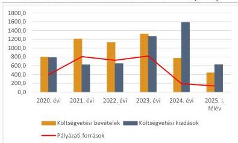
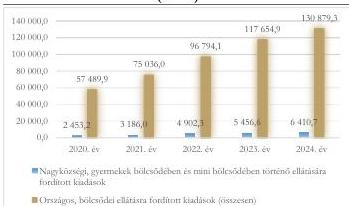

ÁLLAMI
SZÁMVEVŐSZÉK

# JELENTÉS

## Az önkormányzatok gazdálkodásának
célzott ellenőrzése

Hodász Nagyközségi Önkormányzat

2026.

26031

www.asz.hu

---

ÁLLAMI
SZÁMVEVŐSZÉK

# JELENTÉS
## Az önkormányzatok gazdálkodásának
## célzott ellenőrzése

Hodász Nagyközségi Önkormányzat

2026.

26031

www.asz.hu

Dr. Szomolai Csaba
alelnök

---

ELLENŐRZÉSI IGAZGATÓSÁG:

**ELLENŐRZÉSI IGAZGATÓSÁG II.**

ELLENŐRZÉSI IGAZGATÓ:

**DR. BAFFIA GERGELY GÁBOR** igazgató

ELLENŐRZÉSVEZETŐ:

**HUDÁK MAGDOLNA** ellenőrzésvezető

Jelentéseink az interneten a
www.asz.hu címen olvashatók.

IKTATÓSZÁM: EL-4272-037/2026

TÉMASORSZÁM: 33/2025.

ELLENŐRZÉS-AZONOSÍTÓ SZÁM: V116102

---

# TARTALOMJEGYZÉK

|  ■ ÖSSZEFOGLALÁS | 5  |
| --- | --- |
|  ■ AZ ELLENŐRZÉS EREDMÉNYEI | 9  |
|  1. Az Önkormányzat bevételei beszedésének, felhasználásának törvényessége, célszerűsége | 10  |
|  2. Az Önkormányzat kiadásai teljesítésének törvényessége, célszerűsége | 12  |
|  ■ JAVASLATOK | 17  |
|  ■ I. FÜGGELÉK: ÉSZREVÉTELEK | 19  |
|  ■ II. FÜGGELÉK: ELLENŐRZÉSI MEGKÖZELÍTÉS | 20  |
|  ■ MELLÉKLETEK | 24  |
|  I. sz. melléklet: Értelmező szótár | 24  |
|  II. sz. melléklet: Az ellenőrzött szervezetek jegyzéke | 25  |
|  III. sz. melléklet: A pályázati források alakulása a Mátészalkai járásban az ellenőrzött időszakban | 26  |
|  IV. sz. melléklet: Az Önkormányzat pályázatai az ellenőrzött időszakban | 27  |
|  V/A. sz. melléklet: Az ellenőrzött pályázatok törvényességi és célszerűségi értékelése | 29  |
|  V/B. sz. melléklet: A pályázati bevételekkel kapcsolatban megállapított hiányosságok részletezése | 30  |
|  VI. sz. melléklet: A bölcsődei épületberuházás felhasználási jogcímeinek bemutatása | 31  |
|  VII. sz. melléklet: Túlértékelt tételek a KIAD_03 és KIAD_08 ellenőrzött kiadás vonatkozásában | 32  |
|  VIII/A. sz. melléklet: Az ellenőrzött kiadások teljesítésének törvényességi értékelése | 34  |
|  VIII/B. sz. melléklet: Az ellenőrzött kiadások teljesítésének célszerűségi értékelése | 35  |
|  VIII/C. sz. melléklet: A teljesített pályázati kiadásokkal kapcsolatban megállapított hiányosságok | 36  |
|  ■ RÖVIDÍTÉSEK JEGYZÉKE | 40  |

3

---

# ÖSSZEFOGLALÁS

Az önkormányzatok számára a pályázati források, támogatások kulcsfontosságúak, tekintettel arra, hogy saját bevételeik, valamint a kapott költségvetési támogatások nem minden esetben biztosítanak lehetőséget a település és az ott megvalósuló közszolgáltatások fejlesztésére. A legjelentősebb pályázati forrás (TOP Plusz³) keretében például – a 2026. január 28-i időállapot alapján – összesen 1 576 472,0 M Ft⁴ pályázati forrást ítéltek meg a támogató szervezetek az önkormányzati szektornak, amely összesen 5 417 támogatott pályázatot jelentett. A pályázati források törvényes és célszerű felhasználása kiemelt fontosságú, főként azért, mert ezek a források az elmaradottabb magyarországi régiók felzárkóztatását segítik elő az infrastruktúra, a közszolgáltatások fejlesztése és az életminőség javítása által.

Az ÁSZ² a 2025. évi ellenőrzési terve† alapján, „A helyi önkormányzatok és helyi önkormányzati költségvetési szervek gazdálkodásának ellenőrzése” téma keretében, a 2020-2025. I. félév közötti időszakra vonatkozóan ellenőrizte Hodász település önkormányzatát. Az ellenőrzés célja annak értékelése volt, hogy az Önkormányzatnál³ a pályázati források (bevételek) tervezése megalapozottan, felhasználása a pályázati céloknak megfelelően és a közfeladatellátással összefüggésben történt-e, valamint ezen bevételek beszedése, továbbá a pályázati forráshoz kapcsolódó kiadások teljesítése és azok elszámolása törvényes volt-e.

Forrás: ÁSZ által készített, illetve az Önkormányzat honlapján található fotók alapján a Hodász Nagyközségi Önkormányzatnál megvalósuló pályázatok bemutatása, ÁSZ saját szerkesztés

Hodász nagyközség Magyarország észak-keleti részén, Szabolcs-Szatmár-Bereg vármegye keleti felében található, közigazgatásilag a Mátészalkai járáshoz tartozik. Lakónépességszáma a BM⁴ adatai szerint 2025. január 1-jén 3 213 fő volt. A munkanélküliségi ráta az NFSZ⁵ adatai alapján 2020. január 20-án 10,3 % volt, amely 2025. június 20-ra kis mértékben, 10,7 %-ra nőtt. A település az ellenőrzött időszakban szerepelt a társadalmi-gazdasági és infrastrukturális szempontból kedvezményezett települések⁶, valamint 2021. július óta a felzárkózó települések⁷ között. A 2020. január 1. és 2025. május 31. közötti időszakban az Önkormányzat összesen – az ellenőrzés során figyelembe vett pályázatok tekintetében – 1 922,6 M Ft európai uniós és Magyar Falu program keretében finanszírozott pályázati forrást nyert el.

A 2020-2024. években az Önkormányzat 770,4 – 1 322,4 M Ft közötti költségvetési bevétellel gazdálkodott és 623,7 – 1 585,0 M Ft között teljesített költségvetési kiadást. 2025. I. félévében ezek az összegek – a bevételek és kiadások sorrendjében – 436,6 M Ft és 626,6 M Ft összegben alakultak. Az Önkormányzat költségvetési bevételei a 2024. évben nem fedezték a költségvetési kiadásokat, a költségvetési hiányra a pénzmaradvány biztosította a fedezetet. A pénzmaradvány – elsősorban – az előző években befolyt, de még fel

* A pályázati források köre még számos egyéb pályázattal kiegészült, amelyre az önkormányzatok szintén egyénileg pályázhattak (pl. Magyar Falu Program keretében meghirdetett pályázatok).

Forrás: https://archive.palyazat.gov.hu//aktstat?lang=hu

† https://www.asz.hu/files/12766.pdf

5

---

Összefoglalás

nem használt pályázati forrásokból származott, amely az ellenőrzött időszakban a pályázatok megvalósulásáig az Önkormányzat likviditási mutatóit javította. Az Önkormányzat pénzügyi helyzete és működése az ellenőrzött időszakban stabil és kiegyensúlyozott volt, feladatait el tudta látni, hitelfelvételre nem került sor, adósságrendezési eljárás alatt nem állt, pénzügyei felügyeletére önkormányzati biztos kijelölésére nem került sor.

Az Önkormányzat bevételeinek és kiadásainak, pályázati forrásainak alakulását az 1. ábra mutatja be.

1. ábra

# AZ ÖNKORMÁNYZAT BEVÉTELEINEK, KIADÁSAINAK, ÉS PÁLYÁZATI FORRÁSAINAK ALAKULÁSA A 2020-2024. ÉVEKBEN ÉS 2025. I. FÉLÉVÉBEN (M FT)

Forrás: Az Önkormányzat 2020-2024. évi költségvetési beszámolója és a 2025.06. havi időközi költségvetési jelentése alapján, ÁSZ saját szerkesztés

Az ellenőrzött időszakban összességében az Önkormányzat költségvetési bevételeinek 54,4 %-a származott pályázati forrásból. A pénzügyileg teljesült, mindösszesen 3 079,3 M Ft pályázati forrás 30,3 %-a volt uniós támogatás. A 2020-2025. I. félév közötti időszakban a Mátészalkai járásban – Hodász település figyelembevételével – összesen 38 812,9 M Ft egyéb működési és felhalmozási célú (pályázati) támogatást folyósítottak. Ezen időszakban a Mátészalkai járásban az egy településre jutó működési és felhalmozási célú támogatás 1 492,8 M Ft volt, az Önkormányzat ennek mintegy kétszeresét realizálta. Az Önkormányzat a 2020-2023. években sikeres pályázati tevékenysége eredményeként 11 pályázatból összesen 1 922,6 M Ft támogatást nyert el, amelyből 1 886,9 M Ft került folyósításra. A támogatások 64,4 %-a a 2022-2023. években realizálódott. Az elnyert támogatások többségükben a településfejlesztési, településüzemeltetési és gyermekjóléti önkormányzati feladatokhoz kapcsolódtak. Összességében az Önkormányzat pályázati aktivitása – az elnyert támogatások települési átlagait tekintve – az ellenőrzött időszakban a Mátészalkai járás településeihez viszonyítva kiemelkedő volt.

Az ellenőrzés során az ÁSZ kockázatelemzés alapján öt különböző pályázatból befolyt, 1 628,2 M Ft összértékű pályázati bevétel és 223,3 M Ft összértékű, 10 kiadás törvényességi és célszerűségi szempontú vizsgálatát végezte el.

Az ÁSZ által ellenőrzött pályázatok közfeladatellátáshoz és a település Gazdasági programjában⁸ meghatározott feladatokhoz kapcsolódtak. A pályázati bevételek felhasználása minden esetben a kitűzött (pályázati) céloknak megfelelően történt. A közel 2 Mrd Ft értékű hazai és uniós támogatásnak köszönhetően a település infrastrukturális ellátottsága és intézményhálózata jelentős mértékben fejlődött, a pályázati források hasznosultak.

A pályázatokkal kapcsolatos döntéshozatal a vizsgált esetek 60,0 %-ában nem felelt meg a jogszabályi előírásoknak, valamint a döntéselőkészítés hiányosságai miatt nem volt célszerű. Három pályázatnál a Polgármester⁹ a pályázat benyújtásról nem terjesztett javaslatot a Képviselő-testület¹⁰ elé. Írásos

6

---

Összefoglalás

előterjesztés hiányában ezen pályázati bevételek tervezésének jogszabályban előírt közgazdasági megalapozottsága nem volt biztosított, mivel a pályázatok benyújtását megelőzően az Önkormányzat nem végzett számításokat a közfeladat ellátásához szükséges mértékű források nagyságáról. Nem vizsgálta továbbá a pályázatok szükségességét, indokoltságát, és a projekt megvalósítását követő fenntartással összefüggő kérdéseket sem, amely miatt a döntéselőkészítés nem felelt meg a célszerűségi követelményeknek. A Jegyző¹¹, az Önkormányzat működésének biztosításával kapcsolatos feladatkörében a jogszabályi előírások ellenére nem biztosította a döntéselőkészítési folyamat törvényes működését.

A pályázatok előkészítésével és benyújtásával kapcsolatban kialakult – a Képviselő-testület mellőzésével történő döntéshozatali – gyakorlat kockázatot jelenthet a jövőbeni pályázatok tekintetében arra vonatkozóan, hogy a településen nem a település érdekeinek leginkább megfelelő pályázatok kerülnek benyújtásra, illetve fejlesztések kerülnek megvalósításra.

A pályázatokkal összefüggő pénzfelhasználás a kitűzött, támogatási szerződésekben előírt céloknak megfelelően történt, azonban a kifizetések teljesítése egyetlen esetben sem felelt meg a jogszabályi előírásoknak. A gazdálkodási jogkörgyakorlással kapcsolatos jellemző hiányosság volt az előzetes írásbeli kötelezettségvállalások pénzügyi ellenjegyzésének elmaradása, a teljesítésigazolás hiánya, vagy annak nem szabályszerű elvégzése, továbbá a teljesítést megelőzően elmaradt érvényesítés és utalványozás. Összességében a kifizetések során nem érvényesültek a jogszabályokban előírt, az átláthatóságot és az elszámoltathatóságot biztosító kontrollok.

A leltár hiánya és a tárgyi eszköz nyilvántartás hiányosságai miatt a jövőre nézve felmerülhet az önkormányzati vagyon jogszerűtlen felhasználásának, illetve a vagyonvesztésnek a kockázata.

Az ellenőrzött időszakban a jogszabályi előírások ellenére fizikai leltározás nem történt, ezáltal az Önkormányzat nem győződött meg a tárgyi eszköz nyilvántartásban szereplő eszközök tényleges meglétéről. Ebből adódóan nem érvényesültek a nemzeti vagyon védelmére és megőrzésére vonatkozó előírások, a csaknem 2 Mrd Ft pályázati forrásból megvalósuló fejlesztések tárgyi eszközeit is beleértve. A bölcsőde épületberuházás¹² közbeszerzési eljárásával kapcsolatos döntéshozatal megalapozatlansága miatt sérült a jogszabályban előírt felelős gazdálkodás követelménye. Az eljárás lebonyolításával összefüggő hatósági bírság vonatkozásában az Önkormányzat nem vizsgálta a közbeszerzési tanácsadó felelősségét. A bölcsőde épületberuházáshoz kapcsolódó eszközbeszerzések esetében nem érvényesült a jogszabályban előírt átláthatóság és gazdaságosság követelménye sem. Az eszközbeszerzések előkészítése során az Önkormányzat a beszerzendő eszközök műszaki, minőségi paramétereit nem egyértelműen rögzítette, ezáltal nem lehetett a leszállított termékek műszaki, minőségi szempontok szerinti megfelelőségét ellenőrizni, ezáltal a teljesítés igazolása nem volt szabályszerűen elvégezhető. Emellett az Önkormányzat által készített és megküldött, valamint az ÁSZ helyszíni ellenőrzése során készített képdokumentáció alapján egyes leszállított termékek

Az Önkormányzat az ellenőrzött beruházási kiadások tervezett összegét műszaki tervekkel, költségkalkulációkkal alátámasztotta. A bölcsőde épületberuházás tervezése, előkészítése során azonban nem vizsgálta, így a beruházásról szóló döntés meghozatalakor nem mérlegelte az épület jövőbeni fenntartási, üzemeltetési költségeit, ezért a beruházás tervezése nem felelt meg a célszerűségi szempontoknak.

Az elszámoltathatóságot és átláthatóságot biztosító, jogszabályban előírt kontrollok alkalmazásának hiánya miatt a jövőbeni pályázatok esetében is felmerülhet a téves, jogszerűtlen kifizetések kockázata.

7

---

Összefoglalás---

internetes kereséssel becsült lakossági piaci ára és a beszállító által ténylegesen alkalmazott árak között esetenként többszörös árkülönbözetek voltak. A teljes beszerzést tekintve az ÁSZ becslése szerint több, mint 30,0 %-kal, 8,6 M Ft-tal többet fizetett az Önkormányzat a lakossági piaci árhoz képest. **A hiányosságok visszavezethetőek voltak arra, hogy az ellenőrzött időszakban a feladatot ellátó jegyzők által kialakított beszerzési és gazdálkodási folyamatok nem voltak alkalmasak az előzőekben részletezett, a beszerzésekkel és a gazdálkodási jogkörgyakorlással kapcsolatos hiányosságok megakadályozására.**

Az ÁSZ az ellenőrzés megállapításai alapján a Polgármester$_{4}$-nek négy, a Jegyző$_{6}$-nek hét javaslatot fogalmazott meg.

8

---

# AZ ELLENŐRZÉS EREDMÉNYEI

Az Önkormányzat részére a 2020-2024. évi beszámoló és a 2025. 06. havi időközi költségvetési jelentés alapján, a folyósított egyéb működési és felhalmozási célú támogatások (pályázati források) összege 3 079,3 M Ft volt, ami kétszerese volt a Mátészalkai járás települési átlagnak (1 492,8 M Ft / település). A beszámoló adatok tartalmazták az ellenőrzött időszak (2020. év) előtt elnyert, de az ellenőrzött időszakban folyósított, jelen ellenőrzés szempontjából nem releváns$^{1}$ támogatásokat is.

Az Önkormányzat az ellenőrzött időszakban aktív pályázati tevékenységet végzett. A benyújtott 11 pályázat alapján összesen 1 922,6 M Ft támogatást nyert el, amelyből a 2020-2024. években és a 2025. év I. félévében 1 886,7 M Ft folyósításra is került. Az elnyert pályázatok közül három megvalósítása 2025. október hónap végén még folyamatban volt, a többi pályázat tekintetében pedig a támogatások céljával összhangban teljesített 1 744,5 M Ft pályázati előlegből (ennek 67,3 %-a pályázati és 0,7 %-a saját forrás) 32,0 % (557,5 M Ft) visszafizetési kötelezettsége keletkezett az Önkormányzatnak. A legjelentősebb visszafizetett összeg egy, az önkormányzati épületek energetikai fejlesztési pályázatra kapott, 2022. évben folyósított előleg (443,8 M Ft) volt, amelyre adatszolgáltatási hiányosság miatt került sor. Az Önkormányzat a pályázat folytatásáról egyeztetéseket folytatott a Kincstárral$^{13}$.

Az Önkormányzat 2020-2024. évi konszolidált beszámolóiban és a 2025. 06. havi időközi költségvetési jelentésében elszámolt egyéb működési és felhalmozási célú támogatásokat (pályázati forrásokat), valamint a Mátészalkai járásban teljesült támogatások ugyanezen adatait a III. sz. melléklet, az Önkormányzat igényelt, elnyert és teljesített pályázatait részletesen pedig a IV. sz. melléklet tartalmazza.

Az igényelt és elnyert 11 pályázati támogatás tartalmát és státuszát az 1. táblázat mutatja be.

1. táblázat

## AZ ÖNKORMÁNYZAT IGÉNYELT, ELNYERT ÉS TELJESÍTETT PÁLYÁZATAINAK TARTALMA ÉS STÁTUSZA (M FT, DB)

|  ÉVEK | PÁLYÁZATOK SZÁMA (DB) | PÁLYÁZATOK TARTALMA | IGÉNYELT ÉS ELNYERT TÁMOGATÁS * (M Ft) | FOLYÓSÍTOTT TÁMOGATÁS (M Ft) | TELJESÍTETT KIADÁS SAJÁT FORRÁSSAL EGYÜTT (M Ft) | FOLYAMATBAN LÉVŐ PÁLYÁZATOK SZÁMA (DB) | LEZÁRULT PÁLYÁZATOK SZÁMA (DB)  |
| --- | --- | --- | --- | --- | --- | --- | --- |
|  2020 | 3 | csapadékvíz-elvezetése I. ütem, szolgálati lakás kialakítása, közterület karbantartáshoz kapcsolódó eszközbeszerzés | 469,1 | 469,1 | 469,2 | 0 | 3  |
|  2021 | 1 | csapadékvíz-elvezetése II. ütem | 225,3 | 201,7 | 201,8 | 0 | 1  |
|  2022 | 5 | energetikai korszerűsítés, bölcsődei épületberuházás, közösségszervezéshez kapcsolódó pályázat, önkormányzati ingatlanok (pl. szolgálati lakás, középület stb.) fejlesztése | 1 101,0 | 1 101,0 | 952,9 | 2 | 3  |
|  2023 | 2 | külterületi utak felújítása, út, híd, járda építése/ felújítás | 127,2 | 114,9 | 120,6 | 1 | 1  |
|  **Összesen** | **11** |  | **1 922,6** | **1 886,7** | **1 744,5** | **3** | **8**  |

\* Az ellenőrzött időszakban az igényelt és az elnyert támogatások összege megegyezett.

Forrás: Az Önkormányzat tanúsítványon megadott adatai alapján. ÁSZ saját szerkesztés

$^{1}$ A beszámolóban bemutatott egyéb működési és felhalmozási célú támogatások tartalma bővebb, mint az ellenőrzésbe bevont pályázatoké. Pl. tartalmazza a közfoglalkoztatási pályázatokat és a rendkívüli települési támogatásokat is, amelyekre jelen ellenőrzés nem terjedt ki. Jelen ellenőrzés fókuszában az önkormányzati feladatellátáshoz (pl. bölcsődei ellátás), illetve infrastruktúra fejlesztéshez kapcsolódó pályázatok álltak.

9

---

Az ellenőrzés eredményei

Az elnyert pályázatok Mötv.¹⁴-ben meghatározott közfeladatok szerinti csoportosítását a 2. táblázat mutatja be.

2. táblázat

# A PÁLYÁZATI TÁMOGATÁSOK KÖZFELADATHOZ KAPCSOLÓDÁSÁNAK BEMUTATÁSA (M FT, %, DB)

|  MÖTV. 13.§ (1) BEKEZDÉS SZERINTI KÖZFELADAT | FOLYÓSÍTOTT TÁMOGATÁS ÁRÁNYÁ (%) | PÁLYÁZATOK SZÁMA (DB) | FOLYÓSÍTOTT TÁMOGATÁS (M FT)  |
| --- | --- | --- | --- |
|  Településfejlesztés, településrendezés (csapadékvíztől való mentesítés I-II. ütem) | 33,6 | 2 | 633,0  |
|  Településüzemeltetés (köztemetők, utak, közparkok kialakítása és fenntartása) | 7,7 | 4 | 145,8  |
|  Gyermekjóléti szolgáltatások és ellátások (új bölcsőde építés) | 30,2 | 1 | 570,0  |
|  Lakás- és helyiséggazdálkodás (szolgálati lakás) | 1,4 | 1 | 26,9  |
|  Kulturális szolgáltatás (nyilvános könyvtári ellátás, filmszínház, előadó-művészet, a helyi közművelődési tevékenység támogatása stb.) | 0,3 | 1 | 5,3  |
|  Egészségügyi alapellátás, az egészséges életmód segítését célzó szolgáltatások (fogászati kezelőegység beszerzése) | 0,3 | 1 | 6,0  |
|  Mötv. 13. § alapján közfeladathoz közvetetten kapcsolódó feladat (oktatási intézmény energetikai korszerűsítése) | 26,5 | 1 | 499,7  |
|  Összesen | 100,0 | 11 | 1 886,7  |

Forrás: Az Önkormányzat tanúsítványi adatszolgáltatása alapján ÁSZ szerkesztés

Az 1. és 2. táblázatokban bemutatott pályázatok számosságukat tekintve, jellemzően településüzemeltetési feladatokhoz kapcsolódtak, azonban a támogatási összeg nagysága alapján – függetlenül az elnyert pályázatok számától – a legtöbb támogatás a településfejlesztési és településrendezési, a gyermekjóléti szolgáltatások, valamint az oktatási intézmények energetikai korszerűsítési feladatainak ellátására jutott.

Az ÁSZ a bemutatott 11 megkezdett, folyamatban lévő, illetve az ellenőrzött időszakban lezárt 1 922,6 M Ft összértékű pályázat közül öt pályázati bevétel (1628,2 M Ft összegben) törvényességének, számításokkal vagy szerződéssel alátámasztott megalapozottságának, indokoltságának, a tervezett bevételek célhoz, illetve közfeladatellátáshoz való kapcsolódásának részletes ellenőrzését végezte el.

# 1. Az Önkormányzat bevételei beszedésének, felhasználásának törvényessége, célszerűsége

# Összegző megállapítás

Az Önkormányzat pályázatai a közfeladatellátáshoz kapcsolódtak, a bevételek felhasználása megfelelt a pályázati céloknak, azonban az ellenőrzött pályázatok 60,0 %-ában a pályázati bevételek tervezése az Áht.¹⁵-ban foglaltak ellenére nem volt közgazdaságilag megalapozott, a döntéshozatal a Mötv.-ben foglaltak megsértése miatt nem volt törvényes, valamint írásos döntéselőkészítés hiányában nem volt célszerű. A bevételek beszedése nem felelt meg az Ávr. előírásainak.

Az ellenőrzött öt pályázatból két esetben (csapadékvíz elvezetés és a külterületi útfelújítás) a bevételek tervezése törvényes és megalapozott volt, azok megfeleltek az Áht. előírásainak, valamint

10

---

Az ellenőrzés eredményei

az önkormányzati SzMSz¹⁶-ben foglaltaknak megfelelően a pályázatok benyújtásáról a Képviselő-testület döntött. Az ellenőrzött bevételek 60,0 %-ánál (1 096,1 M Ft összegben) a Polgármester, a pályázati kérelem benyújtását megelőzően nem készített, és nem nyújtott be előterjesztést a Képviselő testület részére, így Áht. 4. § (2) bekezdésében előírtakat megsértve a tervezett bevételek közgazdasági megalapozottságát az Önkormányzat nem vizsgálta, és nem végzett számításokat a közfeladathoz szükséges mértékű források nagyságáról sem. Döntéselőkészítés hiányában a pályázat célszerűsége, közakaratnak való megfelelése nem igazolható, mivel a pályázatok szükségességének, indokoltságának és a projekt megvalósítását követő fenntarthatóságának vizsgálata dokumentált módon nem történt meg.

A döntés nem felelt meg a Képviselő-testület által a Mötv. 43. § (3) bekezdésének felhatalmazása alapján megalkotott önkormányzati SzMSz 4. § (1)-(2) bekezdéseinek, mivel a pályázat benyújtásáról a Képviselő-testület mellőzésével egyszemélyben a Polgármester döntött. Ezekben az esetekben nem állt fenn az SzMSz 23. § (1) és (2) bekezdések a) pontjában rögzített halaszthatatlanság követelménye és a Képviselő-testület Mötv. 68. § (3) bekezdésben rögzített utólagos tájékoztatására sem került sor arról, hogy miért volt szükséges a Képviselő-testület mellőzésével hozott döntés. (Hodász Nagyközségi Önkormányzat Polgármestere részére címzett 2. javaslat)

A Jegyző, a Mötv. 81. § (3) bekezdés c) pontjában foglalt, az önkormányzat működésének biztosításával kapcsolatos feladata körében a Bkr.¹⁷ 6. § (2) bekezdésében foglaltak ellenére nem biztosította a döntéselőkészítési folyamat törvényes működését. (Hodászi Polgármesteri Hivatal Jegyzője részére címzett 1-2. javaslatok)

Az ellenőrzött pályázati bevételek mindegyike a Mötv.-ben meghatározott közfeladatokhoz kapcsolódott, továbbá összhangban volt a Gazdasági programban meghatározott célokkal. Azokat az Önkormányzat – az Áht. előírásainak megfelelően – az éves költségvetési rendeletekben (2022-2025. években) dokumentáltan is tervezte.

A bevételi utalványrendeletek kiállítására a Számv.tv¹⁸. 165. § (3) bekezdésében foglaltak ellenére jelentős – átlagosan 579 napos – késedelemmel került sor. A késedelemmel kiállított utalványrendeletet az érvényesítő mind az öt vizsgált esetben a kifizetést követő 51 nappal később írta alá, tehát a dokumentumot visszadátumozta, így az érvényesítés nem felelt meg az Ávr. 58. § (3) bekezdésében foglaltaknak, az formális volt. Az utalványozásra négy esetben az Áht. 38. § (1) bekezdésében foglaltak ellenére nem került sor, és egy esetben az Ávr. 59. § (1) bekezdés ellenére azt nem a jogosult végezte el. (Hodász Nagyközségi Önkormányzat Polgármestere részére címzett 3. javaslat; Hodászi Polgármesteri Hivatal Jegyzője részére címzett 4. javaslat)

Az ellenőrzött időszak egyes éveiben a fel nem használt pályázati pénzeszközöket az Önkormányzat az éves költségvetési beszámolói mérlegeiben szerepeltette. A pályázatok eredményeképpen a település infrastruktúrája, intézményhálózata jelentősen fejlődött, azonban a pályázatok előkészítésének folyamatában és a pályázati bevételek beszedésében, elszámolásában hiányosságok, szabálytalanságok voltak.

A tételesen ellenőrzött pályázati bevételek azonosító adatait, az ÁSZ általi törvényességi és célszerűségi minősítéseket, azok megalapozását részletesen a V/A. és V/B. sz. melléklet tartalmazza.

11

---

Az ellenőrzés eredményei

## 2. Az Önkormányzat kiadásai teljesítésének törvényessége, célszerűsége

Az ÁSZ az Önkormányzat pályázati kiadásai teljesítésének ellenőrzését a bölcsőde épületberuházás pályázat megvalósításához kapcsolódó kifizetések alapján végezte el.

A pályázat illeszkedett a demográfia és köznevelés pályázati komponens, bölcsődei nevelés fejlesztése beruházás célkitűzéseihez, hiszen ennek keretében új bölcsődei férőhelyek (38 db) létrehozására nyílt lehetőség. A bölcsődei épületberuházás kapcsolódott a Magyarország Helyreállítási és Ellenállóképességi Tervéhez is, hiszen az új férőhelyek létrehozása mellett eszközbeszerzések, energiahatékonysági fejlesztések is megvalósultak, segítve ezzel az intézményi működést, a szakmai munkát.

2. ábra

### BÖLCSŐDEI FELADATOKRA FORDÍTOTT KIADÁSOK A NAGYKÖZSÉGI, ILLETVE ORSZÁGOS SZINTEN (M FT)

Forrás: Az Önkormányzatok 2020-2024. évek éves költségvetési beszámolónak adataiból, ÁSZ saját szerkesztés

### Összegző megállapítás

Az Önkormányzatnál az ellenőrzött bölcsőde épületberuházás tervezése, előkészítése nem felelt meg a célszerűségi szempontoknak, mivel a Polgármester$_{4}$ előterjesztésének hiányában a Képviselő-testület nem vizsgálta az épület jövőbeni fenntartási, üzemeltetési költségeit. A források felhasználása az önkormányzati közfeladatellátáshoz kapcsolódott, azonban a kifizetések teljesítése a kötelezettségvállalás, a pénzügyi ellenjegyzés, a teljesítésigazolás, az érvényesítés és az utalványozás nem felelt meg az Áht. és az Ávr.$^{19}$ előírásainak. Egy esetben nem érvényesült a felelős gazdálkodás és egy esetben a gazdaságosság követelménye sem. Az Önkormányzatnál a tárgyi eszköz mérlegsor a Számv. tv. és az Áhsz.$^{20}$ előírásai ellenére leltárral nem volt alátámasztott, emiatt sérült az Nvtv.$^{21}$ vagyon megőrzésére, védelmére vonatkozó rendelkezése is.

12

---

Az ellenőrzés eredményei

A pályázat megvalósításával összefüggésben elvégzett munkák a Mötv. előírásainak megfelelően a kötelezően ellátandó gyermekjóléti szolgáltatások és ellátások feladatok körébe tartoztak. A Gazdasági program is nevesítette az intézmények kihasználtságával és minőségi feladatellátásával kapcsolatos fejlesztési elképzelést. Az Önkormányzat az elnyert támogatás 75,3 %-át használta fel az ellenőrzött időszakban. Az ÁSZ a bölcsődei épületberuházás pályázat teljesített kiadásaiból 10, kockázati alapon kiválasztott kiadás tételes ellenőrzését végezte el 223,3 M Ft összegben, amelyek a kapcsolódó teljesített kiadások 52,0 %-át tették ki. A pályázat felhasználási jogcímeit és ezen belül az ellenőrzött kiadásokat tételesen a VI. sz. melléklet mutatja be.

Az ellenőrzött beruházási kiadások tervezett összege műszaki tervekkel, költségkalkulációkkal alátámasztott volt. A bölcsőde épületberuházás tervezése, előkészítése során az Önkormányzat azonban nem vizsgálta, így a beruházásról szóló döntés meghozatalakor nem mérlegelte az épület jövőbeni fenntartási, üzemeltetési költségeit, ezért a beruházás tervezése nem felelt meg a célszerűségi szempontoknak. A pályázat megvalósításával kapcsolatban tervezett kiadásokat a 2022-2025. évi költségvetési rendelet$^{1,2,3,4}$$^{22}$ tartalmazta. (Hodászi Polgármesteri Hivatal Jegyzője részére címzett 5. javaslat)

Az ellenőrzött kiadások teljesítése a kitűzött céloknak megfelelően, a Mötv. alapján meghatározott közfeladatellátáshoz kapcsolódóan történt. Az ellenőrzött kiadások teljesítése azonban egyetlen esetben sem volt törvényes, azok nem feleltek meg az Áht. és az Ávr. előírásainak. A kifizetések teljesítésénél jellemző hiányosság volt az Ávr. 55. § (1) bekezdésében előírt a kötelezettségvállalások pénzügyi ellenjegyzésének elmaradása, továbbá az Áht. 38. §-ában előírtak ellenére a pénzügyi teljesítést követően végzett érvényesítés és utalványozás. Az Ávr. 56. § (1) bekezdésében foglaltak ellenére az Önkormányzat nem vezetett nyilvántartást a kötelezettségvállalásokról, ezáltal nem volt biztosított az Áht. 36. § (1) bekezdésében előírtak szerint a kötelezettségvállalásokat megelőzően ténylegesen rendelkezésre álló szabad előirányzat megállapítása. A jogszabályokban előírt kontrolltevékenységek alkalmazásának rendszeres elmaradása, valamint a nyilvántartási hiányosságok miatt megnőhet a téves, jogszerűtlen kifizetések kockázata. (Hodász Nagyközségi Önkormányzat Polgármestere részére címzett 3. javaslat; Hodászi Polgármesteri Hivatal Jegyzője részére címzett 4. javaslat)

A bölcsőde épületberuházáshoz kapcsolódó eszközbeszerzés (nettó 20,0 M Ft, bruttó 25,4 M Ft értékű) tekintetében – az Önkormányzat részére ténylegesen leszállított árucikkek megtekintését követően az ÁSZ internetes árukeresést végzett, amely alapján elvégzett becslése szerint – a legkedvezőbb lakossági piaci árnál 8,6 M Ft-tal, azaz 33,9 %-kal többet költött az Önkormányzat. A beszerzés során összesen 97 különböző típusú beltéri és kültéri berendezési eszköz, termék beszerzésére került sor, amelyekből 28 tétel esetében túlárazás történt.

- A túlárazott tételek között voltak olyanok, ahol az értékaránytalanság kimagasló mértékű (200,0 %-ot meghaladó) volt (pl. várakozó bútorok szülők részére, ahol 338,6 %, parafatábla, ahol 435,1 %, szekrénysor egyedi méret alapján 415,2%, játékok részére tárolókosarak 548,2%, szivacs, puha sarok 310,2% volt az értékaránytalanság a piaci árhoz képest). A túlértékelt tételek bemutatását részletesen a VII. sz. melléklet tartalmazza.

Az árajánlat kéréseknek alkalmasnak kell lennie az árajánlatok pénzügyi és szakmai tartalmi összehasonlítására, annak érdekében, hogy a későbbiekben elősegítse a szerződés szakmai, műszaki teljesítéséhez szükséges mennyiségi és minőségi jellemzőknek az Ávr. 50. §. (1) bekezdés a) pontjában előírt meghatározását. Az Önkormányzat Beszerzési szabályzatának$^{23}$ III. fejezet 2. pontja is előírta, hogy

13

---

Az ellenőrzés eredményei

a beszerzés műszaki tartalmát úgy kell meghatározni, hogy az ajánlatok összehasonlíthatóak legyenek. Az Önkormányzatnál a lakossági piaci áraktól jelentősen eltérő árajánlat és beszerzés visszavezethető az árajánlatkérés hiányosságaira, mivel az a beszerezni kívánt termékeket felsoroló, azonban a termékek többségénél részletes paramétereket (méret, anyag, szín, minőség stb.) nem tartalmazó táblázat volt, így az árajánlatkérés a termékek beazonosíthatóságát, valamint az ár-érték arány megállapítását sem segítette. Ebből adódóan a beszerzési eljárás lebonyolítása nem felelt meg a Beszerzési szabályzat III. fejezet 2. pontjában előírtaknak, és az ennek alapján kiválasztott nyertes pályázóval – a Polgármester4 által – megkötött szerződés nem felelt meg az Ávr. 50. § (1) bekezdés a) pontjában foglalt előírásnak. Tekintettel arra, hogy sem az árajánlatkérés, sem az azonos tartalmú vállalkozói szerződés melléklete nem tartalmazta teljeskörűen a részletes paramétereket, nem volt olyan dokumentum, amely biztosította volna, hogy a teljesítésigazolás során ellenőrizni lehessen, hogy a megrendelt – céloknak megfelelő – eszközök kerültek kiszállításra az Önkormányzat részére. Az Önkormányzat az eszközbeszerzéshez – rövid ajánlattételi idővel – három árajánlatot bekért, azonban azok között érdemi különbség nem volt. Az Önkormányzat a döntéselőkészítés folyamatában az alacsony értékkülönbségek kontrollja érdekében nem végzett (pl. internetes) ár összehasonlítást, ezért nem mérte fel, hogy az árajánlatokban szereplő áraknál kedvezőbb lehetőségek is vannak a piacon. Így az árajánlatok összehasonlításakor az Önkormányzatnál nem érvényesültek célszerűségi szempontok. (Hodászi Polgármesteri Hivatal Jegyzője részére címzett 6. javaslat)

Az árajánlatok főbb adatait a 3. táblázat mutatja be.

3. táblázat

# **A BÖLCSŐDE ESZKÖZBESZERZÉRE VONATKOZÓ ÁRAJÁNLATOK BEMUTATÁSA (FT)**

|  VÁLLALKOZÁSOK | AJÁNLAT KELTE | ÁRAJÁNLATBAN SZEREPLŐ ÖSSZEGEK (FT)  |   |   |
| --- | --- | --- | --- | --- |
|   |   |  NETTÓ | ÁFA | BRUTTÓ  |
|  Vállalkozás1. | 2025. március 8. (2025. március 10.) | 19 997 165 | 5 399 235 | 25 396 400  |
|  Vállalkozás2 | 2025. március 6. (2025. március 10.) | 19 997 980 | 5 399 455 | 25 397 435  |
|  Vállalkozás3 (Nyertes ajánlattevő) | 2025. március 7. (2025. március 10.) | 19 990 866 | 5 397 534 | 25 388 399  |

Forrás: Az Önkormányzat adatszolgáltatása alapján ÁSZ saját szerkesztés

Az árajánlatok minimális összeggel maradtak a Kbt.$^{24}$ 15. §-ában megjelölt nemzeti értékhatár alatt, amely a döntés időpontjában, 2025-ben 20,0 M Ft volt. A közbeszerzési értékhatárok betartása, az árverseny tisztaságának biztosítása, az átláthatóság, elszámoltathatóság követelményeinek érvényesítése érdekében az ÁSZ véleménye szerint célszerű az Önkormányzat beszerzési folyamataiba ezen kockázatok csökkentése érdekében kontrollokat kialakítani.

Az ellenőrzött beszerzés esetében a szerződés pénzügyi ellenjegyzése is elmaradt. Pénzügyi ellenjegyzés hiányában nem került sor annak vizsgálatára, hogy a kötelezettségvállalás sérti-e a gazdálkodásra vonatkozó szabályokat, így az Ávr. 50. § (1) bekezdés a) pontja szerinti hiányosság (a szerződés nem tartalmazta a szakmai, műszaki teljesítés mennyiségi és minőségi paramétereit) is rejtve maradt, ezáltal annak ténye is, hogy a megkötött szerződés teljesítésigazolás elvégzésére sem volt alkalmas. Ezáltal a teljesítésigazolás jelen esetben formális volt, az nem felelt meg az Ávr. 57. § (1) bekezdésében foglaltaknak. A megfelelő műszaki paraméterek hiányában megkötött szerződés aláírója, a műszaki

14

---

Az ellenőrzés eredményei

paraméterek alapján egyértelműen be nem azonosítható termékek átvévője, teljesítésigazolója, és a túlárazott termékek kifizetését engedélyező utalványozó is a Polgármester volt, bár az utalványozás nem az Áht. 38. § (1) bekezdésében foglaltaknak megfelelően, a kifizetést megelőzően történt. A kifizetést megelőzően az érvényesítő sem látta el az Ávr. 58. § (1) bekezdésében előírt feladatát, mivel nem észrevételezte, hogy a megelőző ügymenetben elmaradt az eszközbeszerzésről szóló vállalkozási szerződés pénzügyi ellenjegyzése, továbbá, hogy a szerződés melléklete nem volt alkalmas a beszerzett eszközök egyértelmű beazonosítására, átvételére, ezáltal a teljesítésigazolás jogszerű elvégzésére. (Hodász Nagyközségi Önkormányzat Polgármestere részére címzett 3. javaslat; Hodászi Polgármesteri Hivatal Jegyzője részére címzett 4. javaslat)

**Az Önkormányzatnál a Jegyző által kialakított beszerzési- és gazdálkodási jogkörgyakorlási folyamat nem biztosította a rendelkezésre álló források Bkr. 6. § (2) bekezdésében előírt gazdaságos felhasználását, ezáltal nem valósult meg az Áht. 69. § (1) bekezdés a) pontjában foglalt azon cél, hogy a kialakított folyamatrendszer elősegítse a működés és gazdálkodás során a tevékenységek gazdaságos végrehajtását. A beszerzési és gazdálkodási jogkörgyakorlási folyamat nem volt alkalmas a túlárazás és a pénzügyi teljesítéssel kapcsolatos hiányosságok megakadályozására.**

**A bölcsőde épületberuházáshoz kapcsolódó közbeszerzési eljárás lefolytatására vonatkozó megbízás esetében nem érvényesült az Alaptörvény 38. cikk (1) bekezdésében foglalt felelős gazdálkodás elve sem, mivel az Önkormányzat nem vizsgálta a közbeszerzési tanácsadó – illetve a döntésben résztvevő egyéb személyek – esetleges felelősségét az általa lebonyolított eljárás kapcsán, amelynek eredményeképpen az Önkormányzatot a Közbeszerzési Hatóság nevében eljáró Közbeszerzési Döntőbizottság 0,5 M Ft bírsággal sújtotta. A közbeszerzési tanácsadó részére a közbeszerzési eljárás lefolytatásáért járó nettó 2,4 M Ft-os megbízási díj annak ellenére kifizetésre került, hogy a teljesítés időpontjában már ismert volt, hogy a Közbeszerzési Döntőbizottság az Önkormányzatot a közbeszerzési eljárással kapcsolatos döntésért elmarasztalta. A közbeszerzési tanácsadóval kötött szerződés a szerződésszegéssel, a szerződés nem megfelelő teljesítésével kapcsolatban részletszabályokat nem tartalmazott, a megbízott szerződésből eredő feladatait fő tevékenységcsoportok szerint határozta meg, valamint a teljesítési határidőket konkrétan nem rögzítette, ezért az nem felelt meg az Ávr. 50. § (1) bekezdés a) és c) pontjaiban foglalt előírásoknak. A szerződés hiányosságai miatt a teljesítésigazolás formális volt, az nem felelt meg az Ávr. 57. § (1) bekezdésében foglaltaknak. A megfelelő paraméterek hiányában megkötött szerződés aláírója, a munka elvégzésének teljesítésigazolója, és a kiszabott bírság ellenére a megbízási díj kifizetését engedélyező utalványozó is a Polgármester volt. (Hodász Nagyközségi Önkormányzat Polgármestere részére címzett 4. javaslat)**

- A Képviselő-testület a bölcsőde építéssel kapcsolatos közbeszerzési eljárást a Közbeszerzési Bíráló Bizottság javaslatára – amelynek munkájában a közbeszerzési szakértelemmel rendelkező közbeszerzési tanácsadó is részt vett – 59/2023. (XI.15.) számú határozatával eredménytelennek nyilvánította. A Közbeszerzési Döntőbizottság a D.75/9/2024. számú határozatával a Kbt. 75. § (2) bekezdésének a) pontja és a 187. § (3) bekezdésében foglaltak megsértése miatt megsemmisítette az Önkormányzat döntését, kötelezte a legalacsonyabb ajánlatot tevő vállalkozással történő szerződéskötésre, és bírságot szabott ki. A bírsághatározat kelte 2024. április 17. napja volt, míg a közbeszerzési tanácsadó javára történő kifizetés érvényesítésére és kifizetésre 2025. január 22-én került sor. Ekkor már ismert volt, hogy az Önkormányzatot a közbeszerzési eljárás kapcsán megbírságolták. A közbeszerzési tanácsadó a megbízási szerződés 10. pontja szerint felelősségbiztosítással rendelkezett.

15

---

Az ellenőrzés eredményei

Az ÁSZ jelentés készítésének ideje alatt, 2026. február 2-án a Közbeszerzési Döntőbizottság által meghozott D.690/16/2025. számú határozat a bölcsőde épületberuházáshoz kapcsolódó négy eszközbeszerzés (játékok, játszó eszközök beszerzése 8,3 M Ft; bölcsődei felszerelések és berendezések beszerzése 20,0 M Ft; elektronikai eszközök, berendezések beszerzése 5,5 M Ft; valamint bölcsődei alapanyag és szoftver beszerzése 3,1 M Ft) beszerzési eljárásai alapján megkötött szerződéseket a Kbt. 4. § (1) bekezdés és a 19. § (1)-(3) bekezdéseiben foglaltak megsértésére való tekintettel a közbeszerzési eljárás jogtalan mellőzése miatt, semmisnek nyilvánította. A Közbeszerzési Döntőbizottság megállapította, hogy a vizsgált szerződések tekintetében az eredeti állapot visszaállítása nem megvalósítható és az Önkormányzatra 0,5 M Ft bírságot és a szerződések érvénytelenségének jogkövetkezményeként további 0,5 M Ft bírságot szabott ki.

Az ÁSZ ellenőrzés a fenti négy eszközbeszerzés közül a 3. táblázatban szereplő bölcsőde felszerelések, berendezések beszerzésének vizsgálatára terjedt ki, azonban a 2026. február 2-ai döntés is megerősíti az ÁSZ által, a közbeszerzési értékhatárok betartásával és az árverseny tisztaságával kapcsolatban felvetett kockázatokat.

- A közbeszerzési tanácsadó a beszerzési eljárások lebonyolítását (2025. március) követően 2025. július 11-én kelt szakvéleménye szerint a beszerzendő eszközcsoportok vonatkozásában nem állt fenn a műszaki-gazdasági funkcionális egység, tehát véleménye szerint nem vonatkozott rá a Kbt. 19. § (1)-(3) bekezdés szerinti részekre bontás tilalma. Az ÁSZ véleménye szerint az eszközbeszerzéssel kapcsolatos közbeszerzési döntőbizottsági döntés alapján is felmerülhet a döntéselőkészítők, kiemelten a közbeszerzési tanácsadó felelőssége.

Az utalványozó az Áht. 38. § (1) bekezdésében foglaltak ellenére az utalványozást az ellenőrzött kiadások közül 9 esetben a kifizetést követően végezte el.

Az Önkormányzatnál a Számv.tv. 69. § (1)-(3) bekezdésében és az Áhsz. 22. § (1) bekezdésében előírtak ellenére a tárgyi eszközök vonatkozásában az ellenőrzött időszakban nem történt a Számv. tv. 69. § (2)-(4) bekezdései szerinti mennyiségi felvétellel végrehajtott, illetve egyeztetéses leltározás, amely miatt a mérleg tárgyi eszköz sora leltárral nem volt alátámasztott. Leltározás hiányában az Önkormányzat nem győződött meg a tárgyi eszköz nyilvántartásban szereplő eszközök meglétéről, így nem érvényesültek az Nvtv. 7. § (2) bekezdésében rögzített, a nemzeti vagyon védelmére és megőrzésére vonatkozó előírások sem. Két kiadást érintő nettó 20,0 M Ft összértékű eszközbeszerzésnél a beszerzett eszközök nyilvántartásba vétele nem felelt meg az Áhsz. 20. § (2) bekezdésében foglaltaknak tekintettel arra, hogy a beszerzett tételeket csoportosan vették nyilvántartásba annak ellenére, hogy azok között több nem tárgyi eszköznek minősült (pl. késkészlet, evőeszköz készlet, ágynemű, egyéb textíliák stb.). Az Önkormányzat a főkönyvi könyvelést a tévesen besorolt eszközök összértékével 5,6 M Ft-tal helyesbítette. (Hodászi Polgármesteri Hivatal Jegyzője részére címzett 7. javaslat)

Az Önkormányzat az Ávr. 60. § (3) bekezdésében és a Gazdálkodási szabályzat$_{1,2}$$^{23}$-ban előírtak ellenére az ellenőrzött kiadások teljesítése során nem vezetett naprakész, a gazdálkodási jogkörök gyakorlására jogosult személyeket és aláírásmintájukat tartalmazó nyilvántartást, amelyből hitelt érdemlően megállapítható lett volna, hogy kik gyakorolhatták a gazdálkodási jogköröket, és amelyből az aláírásuk valódiságát is be lehetett volna azonosítani. A nyilvántartás hiánya felvetheti a jogosulatlan jogkörgyakorlás kockázatát. (Hodászi Polgármesteri Hivatal Jegyzője részére címzett 3. javaslat)

A teljesített kiadásokkal kapcsolatos összegző értékelést a VIII/A. és VIII/B. sz. mellékletek mutatják be, a kifizetéssel, azok nyilvántartásával, valamint az eszközbeszerzéssel, megbízási díj megfizetésével kapcsolatos hiányosságok tételes bemutatását a VIII/C. sz. melléklet tartalmazza.

16

---

# JAVASLATOK

Az ÁSZ tv. 33. § (1) bekezdésében foglaltak értelmében az ellenőrzött szervezet vezetője köteles a jelentésben foglalt megállapításokhoz kapcsolódó intézkedési tervet összeállítani és azt a jelentés kézhezvételétől számított 30 napon belül az ÁSZ részére megküldeni. Az ÁSZ a jelentésben foglalt megállapításokhoz kapcsolódóan az alábbi javaslatok tekintetében várja el az intézkedési terv elkészítését.

## A HODÁSZ NAGYKÖZSÉGI ÖNKORMÁNYZAT POLGÁRMESTERE RÉSZÉRE

1. Intézkedjen az ÁSZ nyilvánosságra hozott jelentésének a kézhezvételét követő 30 napon belül a Képviselő-testület elé terjesztéséről.

2. A Képviselő-testület hatáskörének biztosítása és a pályázatelőkészítési folyamat átláthatósága érdekében intézkedjen arról, hogy a Képviselő-testület által a Mötv. 43. § (3) bekezdésének felhatalmazása alapján megalkotott önkormányzati SzMSz-ben foglaltakkal összhangban a pályázatok benyújtásáról – a halaszthatatlanság és a határozatképesség hiányának eseteit kivéve – a Képviselő-testület döntsön, mérlegelve azok szükségességét, indokoltságát, közfeladatellátáshoz való kapcsolódását. Amennyiben nem átruházott feladatkörben azonnali döntésre van szükség, akkor intézkedjen a Képviselő-testület Mötv. 68. § (3) bekezdésben leírtak alapján történő utólagos tájékoztatásáról.

3. Tegyen intézkedéseket azon kontrolltevékenységek kiépítésére és megfelelő működtetésére, amelyek megelőzik a jelentésben leírt, Ávr. 52. §-ában, 57. §-ában, valamint 59. §-ában foglalt kötelezettségvállalási, teljesítésigazolási és utalványozási jogkörök gyakorlásával összefüggő szabálytalanságok ismételt előfordulását.

4. A Közbeszerzési Döntőbizottság D.75/9/2024. számú és D.690/16/2025. számú határozataival kiszabott közbeszerzési bírságokra tekintettel – a Mötv. 115. § (1) bekezdésében foglalt feladatkörében, az Alaptörvény 38. § (1) bekezdésében foglalt felelős gazdálkodás követelményének érvényesülése érdekében – tegyen intézkedéseket a bölcsőde épületberuházásához és eszközbeszerzéseihez kapcsolódó beszerzési eljárások kapcsán meghozott döntésekkel kapcsolatos előkészítő anyagokat, javaslatokat készítők felelősségének kivizsgálására.

17

---

Javaslatok

# A HODÁSZI POLGÁRMESTERI HIVATAL JEGYZŐJE RÉSZÉRE

1. 1. A Bkr. 6. § (2) bekezdésében foglaltakra tekintettel a Hivatal$^{26}$, mint az Önkormányzat döntéselőkészítő szerve folyamatait úgy alakítsa ki, hogy azok megakadályozzák az önkormányzati SzMSz-ben, vagy önkormányzati rendeletekben meghatározott döntési, véleményezési hatáskörök figyelmen kívül hagyását.
2. 2. Az Áht. 69. § (1) bekezdés a) pontjának és a Bkr. 6. § (2) bekezdésében foglaltak figyelembevételével gondoskodjon arról, hogy az Önkormányzat folyamatai biztosítsák a működés, a gazdálkodás és a források felhasználása során a gazdaságosság és az Alaptörvény 38. cikk (1) bekezdésében foglalt felelős gazdálkodás követelményének érvényesülését.
3. 3. Intézkedjen az Önkormányzat vonatkozásában az Ávr. 60. § (3) bekezdésében és a Gazdálkodási szabályzatban előírtak alapján a gazdálkodási jogkörök gyakorlására jogosult személyeket és aláírásmintájukat tartalmazó nyilvántartás naprakész vezetéséről, a gazdálkodási jogkörök törvényes gyakorlásának megvalósulásáról.
4. 4. Tegyen intézkedéseket az Önkormányzat vonatkozásában azon kontrolltevékenységek kiépítésére és megfelelő működtetésére, amelyek megelőzik a jelentésben leírt, az Ávr. 55. §-ában, valamint az 58. §-ában foglalt pénzügyi ellenjegyzési és érvényesítési jogkörök gyakorlásával összefüggő szabálytalanságok ismételt előfordulását, valamint elősegítik az Áhsz. 45. § (3) bekezdése alapján előírt 14. melléklet II. pontja szerinti tartalmú kötelezettségvállalás nyilvántartás vezetését és az Ávr. 56. § (1) bekezdésében foglaltaknak megfelelően a kötelezettségvállalások haladéktalan nyilvántartásba vételét.
5. 5. Intézkedjen az Önkormányzat vonatkozásában, hogy az Áht. 4. § (2) bekezdés előírása alapján a tervezés során a tervezett bevételek közgazdasági megalapozottságát vizsgálják, a közgazdasági megalapozottság biztosított legyen, így azok a közfeladatokhoz szükséges mértékben kerüljenek tervezésre.
6. 6. A kötelezettségvállalásra irányuló szerződések előkészítése során gondoskodjon arról, hogy azok az Ávr. 50. § (1) bekezdés a) pontjában foglaltaknak megfelelően tartalmazzák a szakmai, műszaki teljesítés mennyiségi és minőségi paramétereit annak érdekében, hogy csak ellenőrizhető és átlátható módon teljesítésigazolható kiadás kerüljön teljesítésre.
7. 7. Intézkedjen az Önkormányzatnál az éves költségvetési beszámoló sorainak a Számv. tv. 69. § (1)-(3) bekezdéseinek és az Áhsz. 22. § (1) bekezdésében foglaltak szerinti tételes leltárral való alátámasztásáról. Az Nvtv. 7. § (2) bekezdésében rögzített, a nemzeti vagyon védelmére és megőrzésére vonatkozó előírások érvényesülése érdekében gondoskodjon arról, hogy az Önkormányzatnál a tárgyi eszközök fizikai számbavételét legalább a Számv. tv. 69. § (3) bekezdésében foglaltak szerinti három évente végezzék el.

18

---

# I. FÜGGELÉK: ÉSZREVÉTELEK

*A jelentéstervezetet az ÁSZ 15 napos észrevételezésre megküldte az ellenőrzött szervezet vezetőjének az ÁSZ tv. 29. §\* (1) bekezdése előírásának megfelelően.*

*Az ellenőrzött szervezetek vezetői a jelentéstervezet megállapításaira észrevételt nem tettek.*

\* 29. § (1) Az Állami Számvevőszék az ellenőrzési megállapításait megküldi az ellenőrzött szervezet vezetőjének vagy az általa megbízott személynek, és annak, akinek személyes felelősségét állapította meg.

(2) Az ellenőrzött szervezet vezetője és a felelősként megjelölt személy az ellenőrzés megállapításaira tizenöt napon belül írásban észrevételt tehet.

(3) Az Állami Számvevőszék az észrevételre a beérkezésétől számított harminc napon belül írásban válaszol. A figyelembe nem vett észrevételeket köteles a jelentésben feltüntetni, és megindokolni, hogy azokat miért nem fogadta el.

19

---

## II. FÜGGELÉK: ELLENŐRZÉSI MEGKÖZELÍTÉS

### AZ ELLENŐRZÉS JOGALAPJA

Az ellenőrzés jogszabályi alapját az ÁSZ tv. 27 1. § (3) bekezdése, valamint az 5. § (2) és (3) bekezdések előírásai képezték.

### AZ ELLENŐRZÉS CÉLJA

Az ellenőrzés célja volt annak értékelése, hogy az Önkormányzatnál a pénzforgalomban megjelenő, ellenőrzésre kiválasztott hazai és uniós forrásból megvalósuló pályázati támogatásokhoz kapcsolódó bevételek tervezésénél meghatározták-e azok felhasználási céljait, és ezek a célok kapcsolódtak-e a közfeladat-ellátásához, valamint a kiválasztott bevételek beszedése törvényesen, felhasználásuk pedig az előírt határidőben és a kitűzött céloknak megfelelően történt-e.

Az ellenőrzés célja volt továbbá annak értékelése is, hogy az Önkormányzatnál a pénzforgalomban megjelenő, ellenőrzésre kiválasztott egy hazai és uniós forrásból megvalósuló pályázati támogatáshoz kapcsolódó kiadások teljesítése törvényesen, valamint a pénzfelhasználás a kitűzött céloknak megfelelően történt-e és az közfeladat-ellátásához kapcsolódott-e.

### AZ ELLENŐRZÉS TÍPUSA

Kombinált ellenőrzés.

### AZ ELLENŐRZÉS TÁRGYA

Az ellenőrzés tárgya volt, az ellenőrzés előkészítése során feltárt kockázatok alapján, mindkét fókuszterületet (az Önkormányzat pénzforgalmában megjelenő hazai és uniós finanszírozású pályázati támogatások és ezekből egy folyamatban lévő pályázati támogatáshoz kapcsolódó kiadások) érintően:

- a tervezés törvényessége, számításokkal, vagy szerződéssel alátámasztott megalapozottsága, indokoltsága és célszerűsége,
- a pénzforgalomban rögzített tételek, valamint a vagyongazdálkodáshoz kapcsolódó nyilvántartások, beszámolások törvényessége, a felhasználások célhoz kötöttsége, célszerűsége, és azok közfeladat-ellátáshoz való kapcsolódása.

Az ellenőrzés kiterjedt minden olyan körülményre és adatra, amely az ÁSZ jogszabályban meghatározott feladatainak teljesítéséhez, valamint a program végrehajtása folyamán felmerült újabb összefüggések feltárásához szükséges volt.

20

---

II. Függelék: Ellenőrzési megközelítés

## AZ ELLENŐRZÉS HATÓKÖRE ÉS TERÜLETE

Az ÁSZ az önkormányzati gazdálkodás célirányos, gyors, egy adott terület kiválasztott szegmensére (a hazai és uniós pályázati támogatások) és annak környezetére fókuszáló, tranzakciók kiválasztásán alapuló ellenőrzés keretében értékelte az Önkormányzat gazdálkodását.

Ennek alapján az ellenőrzés az Önkormányzat pénzforgalmában megjelenő hazai és uniós finanszírozású pályázati támogatásokra és ezekből egy folyamatban lévő pályázati támogatáshoz kapcsolódó kiadásokra irányult (támogatások és azok felhasználása). Az ellenőrzés kiterjedt az ellenőrzött Önkormányzat esetében a bevételek és kiadások tervezésének, jogosságának, a bevételek beszedésének és a kifizetések teljesítésének törvényességére, célszerűségére, továbbá a közfeladat-ellátáshoz való kapcsolódásának értékelésére, figyelemmel az ellenőrzés előkészítése során azonosított kockázatokra.

Az ÁSZ az ellenőrzést az Alaptörvény$^{28}$ 43. cikk (1) bekezdésében meghatározott törvényességi, célszerűségi szempontok, valamint a nemzetközi standardokat irányadónak tekintve az ellenőrzési program szempontjai, az ellenőrzött időszakban hatályos jogszabályok, az ellenőrzés szakmai szabályok és módszertanok figyelembevételével hajtotta végre.

Az Önkormányzat esetében az ellenőrzött időszakban többször módosult a polgármesteri és jegyzői tisztséget betöltő személy (összesen négy polgármester és hat jegyző látta el a tisztséget). A Képviselő-testületnek a polgármesteren kívül hat fő képviselő tagja volt. Az Önkormányzat fenntartásában két költségvetési szerv működött, a 2012. szeptember 1-jén alapított, óvodai nevelést ellátó intézmény$^{29}$ és a 2004. január 1-jén alapított szociális ellátást végző intézmény$^{30}$, amelyeknek gazdálkodási feladatait – alapító okirat alapján – a Hivatal látta el. A belső ellenőrzési feladatokat 2024. szeptember 9-től külső szolgáltatóval$^{31}$ kötött megbízási szerződés keretében látták el. Az Önkormányzat a hulladékkezeléssel kapcsolatos, az ivóvízminőség javítását szolgáló, a korai fejlesztés, gondozás, valamint a településfejlesztési feladatokat társulás útján biztosította.

## AZ ELLENŐRZÖTT IDŐSZAK

Az ellenőrzött időszak a 2024. év, valamint a 2025. év az ellenőrzés megállapításainak az ÁSZ tv. 29. § (1) bekezdése szerinti megküldése napjáig, 2026. február 6-áig. Az ellenőrzés feltárt kockázatok, tények, körülmények alapján a pénzforgalomban megjelenő ellenőrzésre kiválasztott hazai és uniós pályázati támogatásokhoz kapcsolódó bevételek esetében kiterjesztésre került a 2020-2023. évekre. Az ÁSZ helyszíni ellenőrzés lezárásának időpontja 2025. október 21-e volt.

## AZ ELLENŐRZÉSI KRITÉRIUMOK

|  FÓKUSZTERÜLET | ELLENŐRZÉSI KRITÉRIUMOK  |
| --- | --- |
|  1. Az ellenőrzött szervezet bevételei beszedésének, felhasználásának törvényessége, célszerűsége | **Törvényességi kritériumok:** Számv. tv. 69. § (1)-(3) bekezdés, 165. § (1) bekezdés, Mötv. 13. § (1) bekezdés, 68. § (3) bekezdés, Áht. 4. § (2) bekezdés, 37. § (1) bekezdés, 38. § (1) bekezdés, 60. § (3) bekezdés,  |

21

---

II. Függelék: Ellenőrzési megközelítés

|  FÓKUSZTERÜLET | ELLENŐRZÉSI KRITÉRIUMOK  |
| --- | --- |
|   | Ávr. 52. §, 55. §, 57. § (1) – (3) bekezdés, 58. § (1) és (3) bekezdés, 59. § (1b) bekezdés, 60. § (2)-(3) bekezdés, Önkormányzati SzMSz Gazdálkodási szabályzat_{1,2} Gazdasági program **Célszerűségi kritériumok:** Célszerű a bevételek beszedése, ha - a bevételekkel kapcsolatos döntéshozatal megalapozott, indokolt volt, - a bevételek tervezésekor meghatározták azok felhasználási céljait, és azok kapcsolódtak az ellenőrzött szervezet közfeladatellátásához, - a tervezett bevétel a közfeladatellátáshoz szükséges mértékű volt, a bevételek felhasználása a kitűzött céloknak megfelelően történt.  |
|  2. Az ellenőrzött szervezet kiadásai teljesítésének törvényessége, célszerűsége | **Törvényességi kritériumok:** Alaptörvény 38. cikk (5) bekezdés, Bkr. 2. § 10. pont, Számv. tv. 69. § (1)-(3) bekezdés, 165. § (1) és (3) bekezdés, Mötv. 13. § (1) bekezdés, 68. § (3) bekezdés, Kbt., Áht. 37. § (1) bekezdés, 38. § (1) bekezdés, Ávr. 52. §, 55. §, 56. §, 57. § (1) – (3) bekezdés, 58. § (1) és (3) bekezdés, 59. § (1b) bekezdés, 60. § (2)-(3) bekezdés, Áhsz. 20. § (2) bekezdés, 22. §, Áhsz. 14. melléklet Nvtv. 7. § (2) bekezdés 147/1992. (XI.6.) Korm. rendelet, 38/2013. (IX.19.) NGM rendelet Önkormányzati SzMSz Gazdálkodási szabályzat_{1,2} Gazdasági program **Célszerűségi kritériumok:** Célszerű a kiadások teljesítése, ha - a kiadásokkal kapcsolatos döntéshozatal megalapozott, indokolt és - a kiadások teljesítése a kitűzött céloknak megfelelően történt, a rendelkezésre álló források tükrében ésszerű és a közfeladatellátáshoz szükséges mértékű volt, és az ellenőrzött szervezet közfeladatellátáshoz kapcsolódóan történt.  |

22

---

II. Függelék: Ellenőrzési megközelítés---

## AZ ELLENŐRZÉS MÓDSZERE ÉS AZ ELLENŐRZÉSI BIZONYÍTÉKOK KÖRE

Az ellenőrzést a nemzetközi standardokat irányadónak tekintve az ellenőrzési program szempontjai, az ellenőrzött időszakban hatályos jogszabályok, az ellenőrzés szakmai szabályok és módszertan(ok) figyelembevételével végezte az ÁSZ.

Az ellenőrzési bizonyítékként felhasználható adatforrások közé tartoztak egyrészt az ellenőrzéshez kért dokumentumok, adatforrások, másrészt adatforrás volt még a közhiteles nyilvántartásból (Magyar Államkincstár nyilvántartásai, Önkormányzati rendelettár) származó, az ellenőrzés szempontjából információkat tartalmazó dokumentumok.

Az ellenőrzési kérdések megválaszolásához szükséges bizonyítékok megszerzése az Önkormányzat által rendelkezésre bocsátott dokumentumokra és adatokra, illetve tanúsítványokra és kimutatásokra alapozva, továbbá szemle (szemrevételezés) és kérdésfelvetés (információkérés), valamint elemző eljárás útján történt. A rendelkezésre bocsátott adatok, információk kontrollját az ÁSZ ellenőrzés a közhiteles nyilvántartások felhasználásával és a helyszíni ellenőrzés keretében végezte.

Az ellenőrzés előkészítése során az ÁSZ beazonosította a tervezéssel, a pénzügyi gazdálkodással, a vagyongazdálkodással, illetve támogatások igénybevételével, valamint a közfeladatellátásával kapcsolatos kockázatokat. Az ellenőrzés lefolytatásakor további, az előkészítés során nem azonosított kockázatok azonosítására is sor került. Az azonosított kockázatok alapján kerültek kiválasztásra az ellenőrzés keretében vizsgálandó fókuszterületek. Az ellenőrzési program moduláris felépítéséből eredően az ellenőrzés mindkét fókuszterületre kiterjedően az Önkormányzatra vonatkozóan került lefolytatásra.

A pénzforgalomban megjelenő bevételek beszedésének és kiadások teljesítésének törvényességét és célszerűségét az Önkormányzat pénzforgalmi adataiból mintavételi eljárással kiválasztott tételek alapján ellenőrizte az ÁSZ. Az ellenőrzés során a beazonosított kockázatos területek meghatározását követően az ellenőrzött szervezetre vonatkozó főkönyvi adatbázisokból, a bevételek és a kiadások egy meghatározott csoportjából, kockázat alapon történt a mintatételek kiválasztása. A tények feltárása és azok összegzése során a megállapítások az ellenőrzött mintatételekre vonatkozóan kerültek megfogalmazásra.

Az ellenőrzés kitért minden olyan körülményre és kérdésre is, amely a program végrehajtásakor felmerült újabb összefüggéseknek az ellenőrzés céljaival összhangban lévő feltárásához szükséges volt.

23

---

# MELLÉKLETEK

## ■ 1. SZ. MELLÉKLET: ÉRTELMEZŐ SZÓTÁR

|  célszerűség | Arra vonatkozó követelmény, hogy a bevételeket a közfeladat megvalósítása érdekében, a kiadásokat a közfeladatok megfelelő ellátásához szükséges mértékben, a költségvetési célrendszer érdekében, a meghatározott célra (közfeladat ellátására), továbbá észszerűen, racionálisan használták fel. (Forrás: *Az Állami Számvevőszék ellenőrzési alapelvei és módszertana*, 2024. október)  |
| --- | --- |
|  értékaránytalanság | Jelen ellenőrzésben a szóban forgó árajánlatban szereplő bruttó összesen ár és az ÁSZ által becsült piaci összesen ár különbözete. Ennek értéke forintban került meghatározásra. (Forrás: *ÁSZ meghatározás*)  |
|  gazdaságosság elve | A gazdaságosság elve az elért eredményekhez igénybe vett erőforrások költségeinek minimalizálását jelenti. Az igénybe vett erőforrásoknak időben, megfelelő mennyiségben és minőségben, valamint a legkedvezőbb áron kell rendelkezésre állniuk. A költség-minimalizálás nem egyenlő a legolcsóbb megoldással, a ráfordításokat mindig a ténylegesen elért eredményekhez viszonyítva kell minősíteni. (Forrás: *Az Állami Számvevőszék ellenőrzési alapelvei és módszertana – INTOSAI által meghatározott definíció*, 2024. október)  |
|  hatékonyság elve | A hatékonyság elve azt jelenti, hogy a rendelkezésre álló erőforrásokkal a szervezet a lehető legtöbbet érje el. Ez az elv az igénybe vett erőforrások és az elért eredmények mennyiségben, minőségben és időben kifejezett kapcsolatát jelenti. (Forrás: *Az Állami Számvevőszék ellenőrzési alapelvei és módszertana – INTOSAI által meghatározott definíció*, 2024. október)  |
|  helyi önkormányzat | Magyarországon a helyi közügyek intézése és a helyi közhatalom gyakorlása érdekében helyi önkormányzatok működnek. A helyi önkormányzatokra vonatkozó szabályokat sarkalatos törvény határozza meg. (Forrás: *Alaptörvény 31. cikk (1) és (3) bekezdés*)  |
|  hivatal | A helyi önkormányzat képviselő-testülete az önkormányzat működésével, valamint a polgármester vagy a jegyző feladat- és hatáskörébe tartozó ügyek döntésre való előkészítésével és végrehajtásával kapcsolatos feladatok ellátására polgármesteri hivatalt vagy közös önkormányzati hivatalt hoz létre. (Forrás: *Mötv. 84. § (1) bekezdés*) Jelen ellenőrzési programban a hivatal elnevezés az önkormányzat által létrehozott polgármesteri hivatalt, illetve, az önkormányzat működésével, valamint a polgármester és jegyző feladat- és hatáskörébe tartozó ügyek döntésre való előkészítésével és végrehajtásával kapcsolatos feladatokat ellátó közös önkormányzati hivatalt jelenti.  |
|  kimagasló mértékű értékaránytalanság | Jelen ellenőrzésben az értékaránytalanság akkor kimagasló, amennyiben a túlárazás mértéke meghaladta a 200,0 %-ot az ÁSZ által becsült piaci árhoz képest. (Forrás: *ÁSZ meghatározás*)  |
|  közfeladat-ellátás | Közfeladat a jogszabályban meghatározott állami vagy önkormányzati feladat. A közfeladatok ellátása költségvetési szervek alapításával és működtetésével vagy az azok ellátásához szükséges pénzügyi fedezet az Áht.-ban meghatározott eszközökkel, részben vagy egészben történő biztosításával valósul meg. (Forrás: *Áht. 3/A. § (1)-(2) bekezdés*)  |
|  pénzforgalomban megjelenő bevételek | Az ellenőrzés során az ÁSZ az ellenőrzött szervezet Kincstárnál vagy belföldi hitelintézet által vezetett fizetési számlája javára teljesített bevételek (jóváírások, beszedett bevételek), az önkormányzat házipénztárába befolyó bevételek. (Forrás: *ÁSZ meghatározás*)  |
|  pénzforgalomban megjelenő kiadások | Az ellenőrzés során az ÁSZ az ellenőrzött szervezet Kincstárnál vagy belföldi hitelintézetnél vezetett fizetési számlájáról és házipénztárából teljesített kifizetéseket tekinti pénzforgalomban megjelenő kiadásoknak. (Forrás: *ÁSZ meghatározás*)  |

24

---

Mellékletek

# ■ II. SZ. MELLÉKLET: AZ ELLENŐRZÖTT SZERVEZETEK JEGYZÉKE

# AZ ELLENŐRZÖTT SZERVEZETEK NEVE, CÍME

Hodász Nagyközségi Önkormányzat (4334 Hodász, Petőfi S. utca 6.)

Hodászi Polgármesteri Hivatal (4334 Hodász, Petőfi S. utca 6.)

25

---

Mellékletek

# ■ III. SZ. MELLÉKLET: A PÁLYÁZATI FORRÁSOK ALAKULÁSA A MÁTÉSZALKAI JÁRÁSBAN AZ ELLENŐRZŐTT IDŐSZAKBAN

(adatok E Ft-ban)

|  MEGNEVEZÉS | 2020. ÉV | 2021. ÉV | 2022. ÉV | 2023. ÉV | 2024. ÉV | 2025. I. FÉLÉV | ÖSSZESEN  |
| --- | --- | --- | --- | --- | --- | --- | --- |
|  **Pályázati források a Mátészalkai járásban**  |   |   |   |   |   |   |   |
|  Egyéb működési célú támogatás | 3 152 890,4 | 3 497 802,9 | 4 331 736,5 | 3 927 608,9 | 3 411 389,6 | 2 024 297,4 | **20 345 725,8**  |
|  ebből: EU-s | 318 188,0 | 488 741,2 | 611 779,6 | 843 212,3 | 55 568,1 | 41 474,1 | **2 358 963,2**  |
|  Egyéb felhalmozási célú támogatás | 3 523 207,1 | 2 515 972,5 | 5 298 613,9 | 6 480 313,6 | 357 104,7 | 292 001,0 | **18 467 212,7**  |
|  ebből: EU-s | 2 762 201,6 | 1 439 077,4 | 4 299 428,9 | 5 861 474,3 | 289 655,0 | 69 710,2 | **14 721 547,4**  |
|  **Egyéb működési és felhalmozási célú támogatás összesen** | **6 676 097,5** | **6 013 775,4** | **9 630 350,4** | **10 407 922,5** | **3 768 494,3** | **2 316 298,5** | **38 812 938,5**  |
|  ebből: EU-s | **3 080 389,5** | **1 927 818,6** | **4 911 208,5** | **6 704 686,6** | **345 223,1** | **111 184,3** | **17 080 510,7**  |
|  **Pályázati források az Önkormányzatnál**  |   |   |   |   |   |   |   |
|  Egyéb működési célú támogatás | 146 838,6 | 166 846,4 | 188 007,4 | 175 687,4 | 190 851,0 | 102 093,7 | **970 324,5**  |
|  ebből: EU-s | 0,0 | 0,0 | 0,0 | 0,0 | 0,0 | 0,0 | **0,0**  |
|  Egyéb felhalmozási célú támogatás | 248 511,8 | 639 909,3 | 535 133,6 | 645 898,0 | 1 286,0 | 38 272,3 | **2 109 010,9**  |
|  ebből: EU-s | 247 868,0 | 0,0 | 1 195,1 | 645 059,2 | 1 286,0 | 38 063,7 | **933 471,9**  |
|  **Egyéb működési és felhalmozási célú támogatás összesen** | **395 350,3** | **8 067 55,6** | **723 141,0** | **821 585,5** | **192 136,9** | **140 366,0** | **3 079 335,4**  |
|  ebből: EU-s | **247 868,0** | **0,0** | **1 195,1** | **645 059,2** | **1 286,0** | **38 063,7** | **933 471,9**  |
|  **Egy településre jutó pályázati források a Mátészalkai járásban**  |   |   |   |   |   |   |   |
|  Egyéb működési célú támogatás | 121 265,0 | 134 530,9 | 166 605,2 | 151 061,9 | 131 207,3 | 77 857,6 | **782 527,9**  |
|  ebből: EU-s | 12 238,0 | 18 797,7 | 23 530,0 | 32 431,2 | 2 137,2 | 1 595,2 | **90 729,4**  |
|  Egyéb felhalmozási célú támogatás | 135 508,0 | 96 768,2 | 203 792,8 | 249 242,8 | 13 734,8 | 11 230,8 | **710 277,4**  |
|  ebből: EU-s | 106 238,5 | 55 349,1 | 165 362,7 | 225 441,3 | 11 140,6 | 2 681,2 | **566 213,4**  |
|  **Egyéb működési és felhalmozási célú támogatás összesen** | **256 773,0** | **231 299,1** | **370 398,1** | **400 304,7** | **144 942,1** | **89 088,4** | **1 492 805,3**  |
|  ebből: EU-s | **118 476,5** | **74 146,9** | **188 892,6** | **257 872,6** | **13 277,8** | **4 276,3** | **656 942,7**  |

Forrás: Az Önkormányzat 2020-2024. évi konszolidált beszámolói és a 2025. 06. havi időközi költségvetési jelentés alapján, ÁSZ saját szerkesztés

26

---

Mellékletek

# ■ IV. SZ. MELLÉKLET: AZ ÖNKORMÁNYZAT PÁLYÁZATAI AZ ELLENŐRZÖTT IDŐSZAKBAN

|  SSZ. | PÁLYÁZATI TÁMOGATÁS CÍME, MEGNEVEZÉSE (AZ ADOTT ÉVBEN BENVÚJTOTT, NYERTES PÁLYÁZATOK) | TÁMOGATÁS TÁRGYA, CÉLJA | TÁMOGATÁSI SZERZŐDÉS DÁTUMA | ELNYERT TÁMOGATÁS* | FOLYÓSÍTOTT TÁMOGATÁS | A TÁMOGATÁS CÉLJÁVAL ÖSSZHANGBAN TELJESÍTETT KIADÁS** | PÁLYÁZATI FORRÁS | SAJÁT FORRÁS | KÖTELEZŐ FELADATOKRA FELHASZNÁLT ÖSSZEG | VISSZAFIZETÉSI KÖTELEZETTSÉG ÖSSZEGE | PÁLYÁZAT: FOLYAMATBAN LEVŐ (F)/ LEZÁRULT (L)  |
| --- | --- | --- | --- | --- | --- | --- | --- | --- | --- | --- | --- |
|  **2020. évi pályázatok**  |   |   |   |   |   |   |   |   |   |   |   |
|  1. (BEV_01) | TOP-2.1.3-16-SB2-2020-00014 Hodász Nagyközség csapadékvíz-elvezetése | A projektben szereplő utcák csapadékvíztől való mentesítése, valamint záportározók kialakítása és a csapadékvíz elvezető árkok kialakítása és felújítása. | 2021.06.07 | 431 313,0 | 431 313,0 | 431 439,0 | 359 834,0 | 126,0 | 359 960,0 | 71 479,0 | L  |
|  2. | Szolgálati lakás MFP-SZL/2020 | Önkormányzati tulajdonú szolgálati lakás felújítása | 2020.11.06 | 26 866,0 | 26 866,0 | 26 866,0 | 26 320,0 | - | 26 320,0 | 546,0 | L  |
|  3. | Közterület karbantartását szolgáló eszközbeszerzés MFP-KKE/2020 | eszközfejlesztés közterület karbantartásra, fűnyíró beszerzés és rézsúkasza vásárlása | 2020.12.02 | 10 888,0 | 10 888,0 | 10 888,0 | 10 888,0 | - | 10 888,0 | - | L  |
|  **2020. évi pályázatok összesen:** |   |   |   | **469 067,0** | **469 067,0** | **469 193,0** | **397 042,0** | **126,0** | **397 168,0** | **72 025,0** | **-**  |
|  **2021. évi pályázatok**  |   |   |   |   |   |   |   |   |   |   |   |
|  4. | TOP-2.1.3-16-SB2-2021-00031 Hodász Nagyközség csapadékvíz elvezetése (II. ütem) | A projektben szereplő utcák csapadékvíztől való mentesítése, csapadékvíz elvezető árkok kialakítása és felújítása. | 2021.07.15 | 225 299,0 | 201 742,0 | 201 817,0 | 160 527,0 | 75,0 | 160 502,0 | 41 215,0 | L  |
|  **2021. évi pályázatok összesen:** |   |   |   | **225 299,0** | **201 742,0** | **201 817,0** | **160 527,0** | **75,0** | **160 502,0** | **41 215,0** | **-**  |
|  **2022. évi pályázatok**  |   |   |   |   |   |   |   |   |   |   |   |
|  5. (BEV_02) | TOP_PLUSZ-2.1.1-21-SB1-2022-00009 Energetikai korszerűsítés Hodászon | Önkormányzati épületek energetikai felújítása (Hodász – Általános Iskola) | 2022.09.15 | 499 690,0 | 499 690,0 | 486 225,0 | 42 394,0 | - | 42 394,0 | 443 831,0 | F  |
|  6. (BEV_03) | RRF-1.1.2-21-2022-00116 Új bölcsődei férőhelyek létrehozása Hodász településen | Új bölcsőde építése, 38 új bölcsődei férőhely létrehozása | 2022.08.19 | 569 961,0 | 569 961,0 | 429 435,0 | 429 074,0 | - | 429 074,0 | 361,0 | F  |

(adatok E Ft-ban)

27

---

Mellékletek

|  Ssz. | PÁLYÁZATI TÁMOGATÁS CÍME, MEGNEVEZÉSE (AZ ADOTT ÉVBEN BENYÚJTOTT, NYERTES PÁLYÁZATOK) | TÁMOGATÁS TÁRGYA, CÉLJA | TÁMOGATÁSI SZERZŐDÉS DÁTUMA | ELNYERT TÁMOGATÁS* | FOLYÓSÍTOTT TÁMOGATÁS | A TÁMOGATÁS CÉLJÁVAL ÖSSZHANGBAN TELJESÍTETT KIADÁS** | PÁLYÁZATI FORRÁS | SAJÁT FORRÁS | KÖTELEZŐ FELADATOKRA FELHASZNÁLT ÖSSZEG | VISSZAFIZETÉSI KÖTELEZETTSÉG ÖSSZEGE | PÁLYÁZAT: FOLYAMATBAN LÉVŐ (F)/ LEZÁRULT (L)  |
| --- | --- | --- | --- | --- | --- | --- | --- | --- | --- | --- | --- |
|  7. | Közösségszervezéshez kapcsolódó eszközbeszerzés és közösségszervező bértámogatása MFP-KEB/2022 | Közösségszervezés Hodászon | 2022.04.20 | 5 373,0 | 5 373,0 | 5 373,0 | 5 368,0 | - | 5 368,0 | 5,0 | L  |
|  8. | Önkormányzati tulajdonban lévő ingatlanok fejlesztése 2022- MFP-ÖTIK/2022 | Gépszín építése | 2022.04.20 | 20 000,0 | 20 000,0 | 24 384,0 | 20 000,0 | 4 384,0 | 24 384,0 | - | L  |
|  9. | Önkormányzati tulajdonban lévő ingatlanok fejlesztése MFP-ÖTIK/2022/4 | Fogászati kezelőegység beszerzése | 2022.04.20 | 5 992,0 | 5 992,0 | 7 465,0 | 5 991,0 | 1 473,0 | 7 465,0 | - | L  |
|  **2022. évi pályázatok összesen:** |   |   |   | **1 101 016,0** | **1 101 016,0** | **952 882,0** | **502 827,0** | **5 857,0** | **508 685,0** | **444 197,0** | **-**  |
|  **2023.évi pályázatok**  |   |   |   |   |   |   |   |   |   |   |   |
|  10. (BEV_04) | Külterületi utak felújítása (VP6-7.2.1.1-21) | Hodász 0102 hrsz alatti, illetve 068/1 hrsz alatti önkormányzati utak felújítása | 2023.05.31 | 100 806,0 | 88 467,0 | 94 114,0 | 88 467,0 | 5 647,0 | 94 114,0 | - | F  |
|  11. (BEV_05) | Út, híd, járda építése/ felújítása MFP-ÚHJ/2023 | Kölcsey Ferenc utca burkolatfelújítása, belterületi útfelújítás | 2023.09.20 | 26 423,0 | 26 423,0 | 26 467,0 | 26 372,0 | 44,0 | 26 416,0 | 51,0 | L  |
|  **2023. évi pályázatok összesen:** |   |   |   | **127 229,0** | **114 890,0** | **120 581,0** | **114 839,0** | **5 691,0** | **120 530,0** | **51,0** | **-**  |
|  **Pályázatok mindösszesen:** |   |   |   | **1 922 611,0** | **1 886 715,0** | **1 744 473,0** | **1 175 235,0** | **11 749,0** | **1 186 885,0** | **557 488,0** | **-**  |

* Az ellenőrzött időszakban az igényelt és az elnyert támogatások összege megegyezett.

** Támogatás céljával összhangban teljesített kiadás tartalmazza a pályázati forrást, a saját forrást és a visszafizetési kötelezettség összegét.

Az ellenőrzött időszakban meghiúsult pályázata az Önkormányzatnak nem volt.

Forrás: Az Önkormányzat tanúsítványon megadott adatai alapján, ÁSZ saját szerkesztés

28

---

Mellékletek

# ■ V/A. SZ. MELLÉKLET: AZ ELLENŐRZÖTT PÁLYÁZATOK TÖRVÉNYESSÉGI ÉS CÉLSZERŰSÉGI ÉRTÉKELÉSE

|  (adatok E Ft-ban, illetve darabban)  |   |   |   |   |   |   |   |   |   |
| --- | --- | --- | --- | --- | --- | --- | --- | --- | --- |
|  Ssz. | AZONOSÍTÓ | TÁRGYA | ÖSSZEG | A PÁLYÁZAT BENYÚJTÁSÁRÓL SZÓLÓ DÖNTÉS TÖRVÉNYESSÉGE | A TERVEZETT PÁLYÁZATI BEVÉTEL MEGALAPOZOTTSÁGA | A CÉLOK ILLESZKEDÉSE A GAZDASÁGI PROGRAMHOZ | A PÁLYÁZATI CÉLOKNAK MEGFELELŐ TELJESŰLÉS | A FORRÁS FELHASZNÁLÁSÁNAK KÖZFELADATHOZ KAPCSOLÓDÁSA | A FORRÁS FELHASZNÁLÁSÁNAK ÉSZSZERŰSÉG / MÉRTÉKLETESSÉGE  |
|  1. | BEV_01 | TOP-2.1.3-16-SB2-2020-00014 Hodász Nagyközség csapadékvíz-elvezetése (előleg) | 431 312,9 | I | I | I | I | I | I  |
|  2. | BEV_02 | TOP_PLUSZ-2.1.1-21-SB1-2022-00009 Energetikai korszerűsítés Hodászon (előleg) | 499 690,0 | N | I | I | NR | NR | NR  |
|  3. | BEV_03 | RRF-1.1.2-21-2022-00116 Új bölcsődei férőhelyek létrehozása Hodász településen (előleg) | 569 961,2 | N | I | I | I | I | I  |
|  4. | BEV_04 | Külterületi utak felújítása (VP6-7.2.1.1-21) Hodász 0102 és 068/1 hrsz-ú külterületi utak felújítása | 100 806,4 | I | I | I | I | I | I  |
|  5. | BEV_05 | Út, híd, járda építése/ felújítása MFP-ÚHJ/2023 | 26 423,4 | N | I | I | I | I | I  |
|  **Hodász Nagyközségi Önkormányzat bevételi tételei összesen (E Ft):** |   |   | **1 628 193,9** |  |  |  |  |  |   |
|  **Hodász Nagyközségi Önkormányzat bevételi tételei összesen (db):** | Igen: | 2 | 5 | 5 | 4 | 4 | 4  |   |   |
|   |   |   |  Nem: | 3 | 0 | 0 |  | 0 | 0  |
|   |   |   |  Nem releváns: | 0 | 0 | 0 | 1 | 1 | 1  |
|   |   |   |  **Összesen:** | **5** | **5** | **5** | **5** | **5** | **5**  |

Forrás: Az Önkormányzat adatszolgáltatása alapján, ÁSZ saját szerkesztés

|  A DOKUMENTUMOK ÉRTÉKELÉSE  |   |
| --- | --- |
|  **Törvényes** | a pályázat benyújtásáról szóló döntés, ha annak előkészítés és a döntéshozatal folyamata megfelel a jogszabályi előírásoknak és az Önkormányzat belső szabályzataiban foglaltaknak.  |
|  **Nem törvényes** | a bevétel tervezése és beszedése, ha nem kapcsolódott közfeladat ellátásához/meghatározott célhoz, vagy a bevétel közfeladat ellátáshoz/meghatározott célhoz való kapcsolódása dokumentumok hiányában nem ellenőrizhető.  |
|  **Célszerű** | a bevétel beszedése, amennyiben az azzal kapcsolatos döntéshozatal megalapozott, indokolt volt; a bevétel tervezésekor meghatározták azok felhasználási céljait, és azok kapcsolódtak az ellenőrzött szervezet közfeladatellátásához; a bevételek felhasználása a kitűzött céloknak megfelelően történt és a tervezett bevétel a közfeladatellátáshoz szükséges mértékű volt. A bevételek kiadásokhoz voltak rendelve. A rendeltetésszerű felhasználás megvalósult. A vagyongazdálkodással összefüggő bevételekkel kapcsolatos döntések a kitűzött célokhoz képest, illetve a rendelkezésre álló források tükrében észszerűek voltak. A vagyongazdálkodással összefüggésben befolyt bevétel arányban állt a vagyongazdálkodással összefüggő kiadásokkal/ráfordításokkal. A vagyongazdálkodással összefüggő bevételeket a kitűzött célra használták fel, a rendeltetésszerű felhasználás megvalósult. A létrehozott vagyon tulajdonjoga, illetve működtetése (a feladat megvalósítását követően) az ellenőrzött szervezet tulajdonában maradt.  |
|  **Nem célszerű** | a bevétel beszedése, ha a célszerűségi kritériumok valamelyike nem teljesült.  |
|  **Ésszerű** | logikus, az ész törvényei szerint való, azon alapuló; a józan ész által helyesnek tartott; okszerű. (Forrás: Magyar Értelmező Kézisztár)  |
|  **Mértékletes** | megfontolt, magának határt szabó, a feladathoz szükséges mértékű (Forrás: Szimónima szótár alapján, ÁSZ meghatározás)  |

29

---

Mellékletek

# ■ V/B. SZ. MELLÉKLET: A PÁLYÁZATI BEVÉTELEKKEL KAPCSOLATBAN MEGÁLLAPÍTOTT HIÁNYOSSÁGOK RÉSZLETEZÉSE

# A pályázatok előkészítése, pályázati bevételek tervezése

- A BEV_02 energetikai korszerűsítés, a BEV_03 bölcsődei épületberuházás és a BEV_05 útépítés bevételek esetében az Önkormányzat a pályázati döntések meghozatalakor hatályos (2021. november 30.-2024. január 09. között) önkormányzati SzMSz 4. § (1) és (2) bekezdései tartalmazták, hogy a Képviselő-testület a polgármesterre milyen döntési jogköröket ruházott át. A felsorolásban a pályázatok benyújtásáról szóló döntési jogkör nem szerepelt. Az önkormányzati SzMSz 23. § (1) bekezdés a)-d) pontjai alapján a polgármester bizonyos kérdésekben – az a) pont alapján az önkormányzati pályázat benyújtásáról is – csak abban az esetben dönthet, ha a Képviselő-testület ugyanazon ügyben két egymást követő alkalommal határozatlanképesség miatt nem döntött. Ez utóbbi körülmény fennállását az Önkormányzat Képviselő-testület meghívóval, jegyzőkönyvvel nem tudta igazolni.

# A pályázatok teljesítése

- A BEV_02 energetikai korszerűsítés pályázat esetében az Önkormányzat nem nyújtotta be határidőben a támogatási összeg 10,0 %-át meghaladó kifizetési kérelmét, amely miatt 443 800,0 E Ft támogatási előleg visszafizetési kötelezettsége keletkezett, amelyet határidőre teljesített. A pályázat nem hiúsult meg, a támogatási szerződés módosításának Kincstár általi engedélyezése az ÁSZ helyszíni ellenőrzésének idején, 2025. augusztus 27-én folyamatban volt.
- A bevételi utalványrendeletek kiállítására a Számv.tv. 165. § (3) bekezdésében foglaltak ellenére jelentős – átlagosan 579 napos – késedelemmel került sor. A késedelemmel kiállított utalványrendeletet az érvényesítő mind az öt vizsgált esetben a kifizetést követő 51 nappal később írta alá, tehát a dokumentumot visszadátumozta, így az érvényesítés nem felelt meg az Ávr. 58. § (3) bekezdésében foglaltaknak, az formális volt. Az utalványozásra négy esetben (BEV_01, BEV_02, BEV_4 és BEV_5) az Áht. 38. § (1) bekezdésében foglaltak ellenére nem történt meg, és egy esetben (BEV_03) az Ávr. 59. § (1) bekezdés ellenére nem a jogosult végezte el az utalványozást.
- Az Ávr. 59. § (5) bekezdés a)-d) pontjai értelmében a pályázati bevétel nem tartozott az utalványozás mellőzésére jogalapot adó kivételi körbe.
- Az ellenőrzött bevételek esetében a részletes adatokat a 4. táblázat mutatja be.

4. táblázat

# ■ AZ ELLENŐRZÖTT BEVÉTELEK PÉNZÜGYI TELJESÍTÉSE, ÉRVÉNYESÍTÉS ÉS UTALVÁNYOZÁSA

|  SSZ. | AZONOSÍTÓ | TÁRGYA | PÉNZÜGYI TELJESÍTÉS DÁTUMA | ÉRVÉNYESÍTÉS ÉS UTALVÁNYOZÁS DÁTUMA | UTALVÁNYRENDELET ELKÉSZÍTÉSÉNEK DÁTUMA  |
| --- | --- | --- | --- | --- | --- |
|  1. | BEV_01 | TOP-2.1.3-16-SB2-2020-00014 Hodász Nagyközség csapadékvíz-elvezetése (előleg) | 2021. június 14. | 2021. október 10. | 2024. január 19.  |
|  2. | BEV_02 | TOP_PLUSZ-2.1.1-21-SB1-2022-00009 Energetikai korszerűsítés Hodászon (előleg) | 2022. november 08. | 2023. január 11. | 2025. július 30.  |
|  3. | BEV_03 | RRF-1.1.2-21-2022-00116 Új bölcsődei férőhelyek létrehozása Hodász településen (előleg) | 2023. március 07. | 2023. április 14. | 2023. június 12.  |
|  4. | BEV_04 | Külterületi utak felújítása (VP6-7.2.1.1-21) Hodász 0102 és 068/1 hrsz-ú külterületi utak felújítása | 2023. augusztus 3. 2025. március 13. | 2023. szeptember 11. 2025. április 10. | 2025. július 30. 2025. április 10.  |
|  4. | BEV_05 | Út, híd, járda építése/ felújítása MFP-ÚHJ/2023 | 2023. szeptember 21. | 2023. október 12. | 2025. július 31.  |

Forrás: Az Önkormányzat adatszolgáltatása alapján, ÁSZ saját szerkesztés

30

---

Mellékletek

# ■ VI. SZ. MELLÉKLET: A BÖLCSŐDEI ÉPÜLETBERUHÁZÁS FELHASZNÁLÁSI JOGCÍMEINEK BEMUTATÁSA

(adatok E Ft-ban)

|  KÖLTSÉGKATEGÓRIA | A TÁMOGATÁSI SZERZŐDÉSBEN RÖGZÍTETT ÖSSZEG | TELJESÍTETT KIFIZETÉS ÖSSZEGE | ELLENŐRZÖTT KIFIZETÉS ÖSSZEGE | ELLENŐRZÖTT TÉTELEK TARTALMA  |
| --- | --- | --- | --- | --- |
|  **Beruházáshoz kapcsolódó költségek** | **513 670,6** | **388 404,8** | **214 503,4** | **-**  |
|  Ebből: építési költségek (kivitelezés) | 461 700,0 | 351 385,8 | 194 512,5 | Ingatlanok beszerzése - bölcsőde építés  |
|  eszközbeszerzés | 49 684,6 | 35 065,0 | 19 990,9 | Egyéb gép, berendezés és felszerelés beszerzése  |
|  energetikai tanúsítás | 2 032,0 | 1 700,0 | - |   |
|  szoftver beszerzése | 254,0 | 254,0 | - |   |
|  **Szakmai tevékenységekhez kapcsolódó szolgáltatások költségei** | **11 651,0** | **8 458,8** | **40,0** | **-**  |
|  Ebből: hatósági díj, illeték (rendszerhasználati díj) | 1 905,0 | 506,8 | 40,0 | rendszerhasználati díj  |
|  marketing, kommunikációs szolgáltatások költségei | 5 174,0 | 3 380,0 | - |   |
|  műszaki ellenőri szolgáltatás költségei | 4 572,0 | 4 572,0 | - |   |
|  **Szakmai megvalósításhoz kapcsolódó egyéb költségek** | **3 540,0** | **2 515,1** | **-** |   |
|  anyagbeszerzés | 3 540,0 | 2 515,1 | - |   |
|  **Szakmai megvalósításban közreműködő munkatársak költségei** | **3 812,4** | **3 811,3** | **-** | **-**  |
|  személyi jellegű költség, foglalkoztatást terhelő adók, járulékok | 3 812,4 | 3 811,3 | - |   |
|  **Százalékos átalányalapú finanszírozás költségei** | **37 287,2** | **26 245,4** | **8 716,3** | **-**  |
|  utólagosan finanszírozott költségek | 37 287,2 | 26 245,4 | 8 716,3 | projektmenedzsmenti feladatok közbeszerzési eljárás lebonyolítása, egyéb fizetési költség (bírság)  |
|  **ÖSSZESEN:** | **569 961,2** | **429 435,4** | **223 259,7** | **-**  |

Forrás: Az Önkormányzat adatszolgáltatása alapján, ÁSZ saját szerkesztés

31

---

Mellékletek

# ■ VII. SZ. MELLÉKLET: TÚLÉRTÉKELT TÉTELEK A KIAD\_03 ÉS KIAD\_08 ELLENŐRZÖTT KIADÁS VONATKOZÁSÁBAN

|  SSZ. | ÁRAJÁNLATBAN SZEREPLŐ SSZ. | MEGNEVEZÉS ÉS MŰSZAKI ADATOK | AZ ÖNKORMÁNYZAT ÁLTAL FIZETETT BRUTTÓ ÖSSZESEN ÁR (E Ft) | ÁSZ ÁLTAL BECSÜLT PIACI BRUTTÓ ÖSSZESEN ÁR (E Ft) | BECSÜLT ÉRTÉKARÁNYTALANSÁG* (E Ft) | TÚL-, ALULÁRAZÁS MÉRTÉKE** (%) | MINŐSÍTÉS  |
| --- | --- | --- | --- | --- | --- | --- | --- |
|  1. | 2. | hajtogatott kéztörlő adagoló maxi fehér ABS műanyag feltöltve | 365,8 | 125,8 | 240,0 | 190,8% | Túlárazás  |
|  2. | 4. | professzionális késkészlet | 171,5 | 131,6 | 39,9 | 30,3% | Túlárazás  |
|  3. | 12. | munkaasztal 60x60x90 | 96,0 | 41,5 | 54,5 | 131,3% | Túlárazás  |
|  4. | 17. | fogyasztói edény mosogató felszerelése, rozsdamentes munkaasztal 150x60x90 | 196,9 | 124,0 | 72,9 | 58,8% | Túlárazás  |
|  5. | 26. | kültéri szemeteskuka, fém-fa hulladékgyűjtő 65l | 419,1 | 259,2 | 159,9 | 61,7% | Túlárazás  |
|  6. | 28. | gyereköltözőszekrény öltöző paddal - 6 személyes | 1 872,2 | 901,4 | 970,8 | 107,7% | Túlárazás  |
|  7. | 44. | mosodai tartozékok, tiszta ruha tároló szekrény | 135,0 | 48,0 | 87,0 | 181,3% | Túlárazás  |
|  8. | 52. | íróasztal irodába, 2 ajtós, 1 fakkos, 1 fiókos komód jobbos és balos kivitel; 150x75x50 cm (szé:ma:mé); sonoma tölgy színben | 857,3 | 588,0 | 269,3 | 45,8% | Túlárazás  |
|  9. | 60. | szőnyeg színes, szőnyeg, vezetői irodába 200x280cm | 150,0 | 60,8 | 89,2 | 146,7% | Túlárazás  |
|  10. | 61. | ülőgarnitúra, szülők és vendégek fogadására ülőgarnitúra | 850,9 | 194,0 | 656,9 | 338,6% | Túlárazás  |
|  11. | 64 | nyitott játéktároló pole, színes szekrénysor csoportszobába 480x40x148 cm | 3 185,2 | 1 599,0 | 1 586,2 | 99,2% | Túlárazás  |
|  12. | 65. | szivacs, puha sarok - többszemélyes; a szőnyeg és a patkó alakú páma együtt | 337,2 | 82,2 | 255,0 | 310,2% | Túlárazás  |
|  13. | 70. | rácsos fa gyermekágy matraccal, átalakítható kiságy ágyneműtartóval rágásvédővel 70x140cm + matrac | 515,1 | 201,0 | 314,1 | 156,3% | Túlárazás  |
|  14. | 72. | babzsákfotel, csoportonként 3-3 db babzsákfotel | 505,2 | 350,9 | 154,3 | 44,0% | Túlárazás  |
|  15. | 77. | pihenő térelválasztó, csoportonként 1db | 1 101,1 | 296,5 | 804,6 | 271,4% | Túlárazás  |
|  16. | 78. | kombinált parafatábla - mágnesztábla alumínium kerettel 150x100 cm | 72,4 | 50,4 | 22,0 | 43,7% | Túlárazás  |
|  17. | 82. | ágynemű huzat színes, mintás polártakaró méretében 100x150 cm | 1 351,3 | 835,2 | 516,1 | 61,8% | Túlárazás  |
|  18. | 83. | gurulós ágytartó fektetők tárolásához, gurulós tároló műanyag fektetőkhöz, mérete: 134x59x11cm | 168,8 | 67,8 | 101,0 | 149,0% | Túlárazás  |
|  19. | 86. | fa hempergő, méret: 65x120x116cm, anyaga: tömör, kemény bükkfa; felülete 3 rétegű vizesbázisú festékkel kerül bevonásra; bükkfából készült járóka lekerekített végekkel. A járófelület csúszásmentes. | 367,7 | 225,0 | 142,7 | 63,4% | Túlárazás  |
|  20. | 87. | falióra, anyaga: polisztirén műanyag keret akril bevonattal | 41,3 | 16,5 | 24,8 | 150,3% | Túlárazás  |
|  21. | 88. | fedeles szeméttartó, méret: 41x36x35cm 25 literes műanyag szemetes. Pedálos kivitel | 56,5 | 31,0 | 25,5 | 82,3% | Túlárazás  |
|  22. | 91. | játékok részére tárolókosarak polirattan | 594,4 | 91,7 | 502,7 | 548,2% | Túlárazás  |

(adatok E Ft-ban, %-ban)

32

---

# Mellékletek

|  SSZ. | ÁRAJÁNLATBAN SZEREPLŐ SSZ. | MEGNEVEZÉS ÉS MŰSZAKI ADATOK | AZ ÖNKORMÁNYZAT ÁLTAL FIZETETT BRUTTÓ ÖSSZESEN ÁR (E Ft) | ÁSZ ÁLTAL BECSÜLT PIACI BRUTTÓ ÖSSZESEN ÁR (E Ft) | BECSÜLT ÉRTÉKARÁNYTALANSÁG* (E Ft) | TÜL-, ALULÁRAZÁS MÉRTÉKE** (%) | MINŐSÍTÉS  |
| --- | --- | --- | --- | --- | --- | --- | --- |
|  23. | 92. | étkezőasztal +6db szék, anyaga: bükkfa, fém, szövet, laminált bútorlap; méret: 120x70cm/ 43x47x95 cm | 359,4 | 226,3 | 133,1 | 58,8% | Túlárazás  |
|  24. | 93. | fém öltözőszekrény 4 személyes, anyaga: acél, fém; méret: 194x120x50cm | 1 352,6 | 695,7 | 656,9 | 94,4% | Túlárazás  |
|  25. | 94. | parafatábla, anyaga: fa, fém; méret: 60x90 cm | 25,1 | 4,7 | 20,4 | 434,0% | Túlárazás  |
|  26. | 95. | szekrénysor, egyedi méret alapján | 800,1 | 155,3 | 644,8 | 415,2% | Túlárazás  |
|  27. | 96. | gyógyszerszekrény zárható, bútorlapból készült fa gyógyszeres szekrény. A terméken mart minták találhatóak, melyek 3,5 mm széles marással készülnek. Méret: 40x25x40cm, színe: fehér. Összeszerelt állapotban kérjük szállítani. | 44,5 | 27,0 | 17,5 | 64,8% | Túlárazás  |
|  28. | 97. | takarító eszközös, seprű, felmosó, takarító kocsi | 121,9 | 83,5 | 38,4 | 46,0% | Túlárazás  |
|  **Összesen:** |   |   | **16 114,5** | **7 514,0** | **8 600,5** | **114,5%** |   |

*Az árajánlatban szereplő bruttó összesen ár összesen és az ÁSZ által becsült bruttó összesen piaci ár különbözete.

**Az ÁSZ által becsült bruttó összesen piaci ár és az értékaránytalanság hányadosa.

Forrás: Az Önkormányzat adatszolgáltatása, képdokumentációja és internetes adatok alapján, ÁSZ saját szerkesztés

33

---

Mellékletek

# ■ VIII/A. SZ. MELLÉKLET: AZ ELLENŐRZÖTT KIADÁSOK TELJESÍTÉSÉNEK TÖRVÉNYESSÉGI ÉRTÉKELÉSE

(adatok E Ft-ban, illetve darabban)

|  SSZ. | AZONOSÍTÓ | KIFIZETÉS JOGCÍME | KIFIZETÉS IDŐPONTJA | KIFIZETÉS ÖSSZEGE | KÖTELEZETTSÉGVÁLLALÁS | PÉNZÜGYI | TELJESÍTÉS-IGAZOLÁS | ÉRVÉNYESÍTÉS | UTALVÁNYOZÁS  |
| --- | --- | --- | --- | --- | --- | --- | --- | --- | --- |
|   |   |   |   |   |   |  ELLENJEGYZÉS  |   |   |   |
|  1. | KIAD_01 | Megbízási díj járulékai projektmenedzsmenti feladatok után | 2024.01.03 | 2 246,1 | szabályszerű | nem szabályszerű | nem szabályszerű | nem szabályszerű | nem szabályszerű  |
|  2. | KIAD_02 | Megbízási díj - projektmenedzsmenti feladatokra | 2024.01.03 | 3 709,1 | szabályszerű | nem szabályszerű | nem szabályszerű | nem szabályszerű | nem szabályszerű  |
|  3. | KIAD_03 | Bölcsődei projekt - Egyéb gépre, berendezésre és felszerelésre adott előlegek | 2025.03.20 | 18 000,0 | nem szabályszerű | nem szabályszerű | nem szabályszerű | nem szabályszerű | nem szabályszerű  |
|  4. | KIAD_04 | Ingatlanok beszerzése - bölcsőde építés | 2024.12.10 | 64 837,5 | szabályszerű | nem szabályszerű | nem szabályszerű | nem szabályszerű | nem szabályszerű  |
|  5. | KIAD_05 | Ingatlanok beszerzése - bölcsőde építés | 2025.03.12 | 77 805,0 | szabályszerű | nem szabályszerű | nem szabályszerű | nem szabályszerű | nem szabályszerű  |
|  6. | KIAD_06 | Ingatlanok beszerzése - bölcsőde építés | 2025.05.15 | 51 870,0 | szabályszerű | nem szabályszerű | nem szabályszerű | nem szabályszerű | nem szabályszerű  |
|  7. | KIAD_07 | Szabálytalansági eljárás miatti fizetési kötelezettség | 2024.09.02 | 361,1 | nincs dokumentum | nincs dokumentum | nem szabályszerű | nem szabályszerű | nem szabályszerű  |
|  8. | KIAD_08 | Bölcsődei projekt - Egyéb gép, berendezés és felszerelés beszerzése | 2025.05.14 | 1 990,9 | nem szabályszerű | nem szabályszerű | nem szabályszerű | nem szabályszerű | nem szabályszerű  |
|  9. | KIAD_09 | közbeszerzési eljárás lefolytatása - megbízás - vállalkozási díj | 2025.01.22 | 2 400,0 | nem szabályszerű | nem szabályszerű | nem szabályszerű | nem szabályszerű | nem szabályszerű  |
|  10. | KIAD_10 | EKR rendszerhasználati díj | 2024.01.22 | 40,0 | nem releváns | nem releváns | nem releváns | nem szabályszerű | nem szabályszerű  |
|  **Hodász Nagyközségi Önkormányzat kiadási tételei összesen (E Ft):** |   |   | **223 259,7**  |   |   |   |   |   |   |
|  **Hodász Nagyközségi Önkormányzat kiadási tételei összesen (db):** | Szabályszerű dokumentum: | 5 | 0 | 0 | 0 | 0 | 0  |   |   |
|   |   |   |  Nem szabályszerű dokumentum: | 3 | 8 | 9 | 10 | 10 | 10  |
|   |   |   |  Nincs dokumentum: | 1 | 1 | 0 | 0 | 0 | 0  |
|   |   |   |  Nem releváns: | 1 | 1 | 1 | 0 | 0 | 0  |
|   |   |   | **Összesen:** | **10** | **10** | **10** | **10** | **10** | **10**  |

Forrás: Az Önkormányzat adatszolgáltatása alapján, ÁSZ saját szerkesztés

# A DOKUMENTUMOK ÉRTÉKELÉSE

|  **Törvényes:** | a pénzforgalomban megjelenő kiadási mintáétel alapján teljesített kifizetés, ha a kötelezettségvállalás, pénzügyi ellenjegyzés, teljesítés igazolás, érvényesítés és utalványozás jogkörök mindegyike „szabályszerű dokumentum” minősítést kapott, vagy – érvényesítés és utalványozás kivételével – az adott jogkör gyakorlása „nem releváns” volt; a kifizetések teljesítése, azok dokumentáltsága szabályszerű volt.  |
| --- | --- |
|  **Nem törvényes:** | a kifizetés, ha valamely jogkör gyakorlásának ellenőrzéséhez nem állt rendelkezésre dokumentum, („nincs dokumentum”), és/vagy amennyiben a kötelezettségvállalás, pénzügyi ellenjegyzés, teljesítésigazolás, érvényesítés és utalványozás jogkörök közül bármelyik „nem szabályszerű dokumentum” minősítést kapott; a kifizetések teljesítése, azok dokumentáltsága nem felelt meg a törvényi előírásoknak.  |

34

---

Mellékletek

# ■ VIII/B. SZ. MELLÉKLET: AZ ELLENŐRZÖTT KIADÁSOK TELJESÍTÉSÉNEK CÉLSZERŰSÉGI ÉRTÉKELÉSE

(adatok E Ft-ban, illetve darabban)

|  SSZ. | AZONOSÍTÓ | KIFIZETÉS JOGCÍME | KIFIZETÉS ÖSSZEGE | TÁRGYI ESZKÖZ NYILVÁNTARTÁSB A VÉTEL | DÖNTÉS-ELŐKÉSZÍTÉS DOKUMENTÁLTSÁGA | DÖNTÉSHOZATAL MEGALAPOZOTT-SÁGA | CÉLOKNAK MEGFELELŐ TELJESÜLÉS | KÖZFELADATHOZ KAPCSOLÓDÁS | ÉSZSZERŰSÉG / MÉRTÉKLETESSÉG  |
| --- | --- | --- | --- | --- | --- | --- | --- | --- | --- |
|  1. | KIAD_01 | Megbízási díj járulékai-projektmenedzsmenti feladatok után | 2 246,1 | NR | I | I | I | I | I  |
|  2. | KIAD_02 | Megbízási díj - projektmenedzsmenti feladatokra | 3 709,1 | NR | I | I | I | I | I  |
|  3. | KIAD_03 | Bölcsődei projekt - Egyéb gépre, berendezésre és felszerelésre adott előlegek | 18 000,0 | N* | N | I | N | I | N  |
|  4. | KIAD_04 | Ingatlanok beszerzése - bölcsőde építés | 64 837,5 | I | I | N | I | I | I  |
|  5. | KIAD_05 | Ingatlanok beszerzése - bölcsőde építés | 77 805,0 | I | I | N | I | I | I  |
|  6. | KIAD_06 | Ingatlanok beszerzése - bölcsőde építés | 51 870,0 | I | I | N | I | I | I  |
|  7. | KIAD_07 | Szabálytalansági eljárás miatti fizetési kötelezettség | 361,1 | NR | I | I | NR | NR | NR  |
|  8. | KIAD_08 | Bölcsődei projekt - Egyéb gép, berendezés és felszerelés beszerzése | 1 990,9 | N* | N | I | N | I | N  |
|  9. | KIAD_09 | közbeszerzési eljárás lefolytatása - megbízás - vállalkozási díj | 2 400,0 | NR | I | I | N | I | I  |
|  10. | KIAD_10 | EKR rendszerhasználati díj | 40,0 | NR | NR | NR | I | I | I  |
|  **Hodász Nagyközségi Önkormányzat kiadási tételei összesen (E Ft):** |   |   | **223 259,7** |  |  |  |  |  |   |
|  **Hodász Nagyközségi Önkormányzat kiadási tételei összesen (db):** | Igen (I): | 3 | 7 | 6 | 6 | 9 | 7  |   |   |
|   |   |   |  Nem (N): | 2 | 2 | 3 | 3 | 0 | 2  |
|   |   |   |  Nem releváns (NR): | 5 | 1 | 1 | 1 | 1 | 1  |
|   |   |   |  **Összesen:** | **10** | **10** | **10** | **10** | **10** | **10**  |

*A tárgyi eszközök esetében a helyszíni ellenőrzés ideje alatt az Önkormányzat a főkönyvi könyvelést helyesbítette, nyilvántartását módosította.

Forrás: Az Önkormányzat adatszolgáltatása alapján, ÁSZ saját szerkesztés

# A DOKUMENTUMOK ÉRTÉKELÉSE

|  **Nem törvényes és egyben jogosulatlan:** | a kifizetés, ha nem kapcsolódott közfeladat ellátásához/meghatározott célhoz, vagy a kiadás közfeladat ellátáshoz/meghatározott célhoz való kapcsolódása dokumentumok hiányában nem ellenőrizhető.  |
| --- | --- |
|  **Célszerű** | a kiadások teljesítése, ha a kiadásokkal kapcsolatos döntéshozatal megalapozott és indokolt volt; a kiadások teljesítése a kitűzött céloknak megfelelően, a rendelkezésre álló források tükrében ésszerű és az ellenőrzött szervezet közfeladatellátásához szükséges mértékben és ahhoz kapcsolódóan történt.  |
|  **Nem célszerű:** | a kiadások teljesítése, ha a célszerűségi kritériumok valamelyike nem teljesült.  |

35

---

Mellékletek

# ■ VIII/C. SZ. MELLÉKLET: A TELJESÍTETT PÁLYÁZATI KIADÁSOKKAL KAPCSOLATBAN MEGÁLLAPÍTOTT HIÁNYOSSÁGOK

# Kötelezettségvállalás nyilvántartásba vétele

- Az Önkormányzat az Áhsz. 45. § (3) bekezdése alapján előírt 14. melléklet II. pontja szerinti tartalmú kötelezettségvállalás nyilvántartást nem vezetett, ezáltal egyik esetben sem tudta elvégezni az Ávr. 56. § (1) bekezdésében, valamint a Gazdálkodási szabályzat; III. fejezetében foglaltaknak megfelelő nyilvántartásba vételt sem. Emiatt az Önkormányzat által kötelezettségvállalás nyilvántartásnak tekintett dokumentumok nem volt alkalmasak a kötelezettségvállalás időpontjában a szabad előirányzat megállapítására.

# Kötelezettségvállalás

- Az Ávr. 52. § (1) bekezdés c) pontjában, valamint a Gazdálkodási szabályzat; II. fejezetében foglaltak ellenére egy esetben (KIAD_07) – 361,1 E Ft összegű kifizetésnél – nem volt előzetes kötelezettségvállalási dokumentum.
- A KIAD_03 és a KIAD_08 kifizetések esetében az árajánlat kérések nem voltak alkalmasak a pénzügyi és szakmai tartalmi összehasonlításra, és a későbbiekben az Ávr. 50. §. (1) bekezdés a) pontjában foglaltaknak megfelelően a szerződés szakmai, műszaki teljesítéséhez szükséges mennyiségi és minőségi jellemzőinek meghatározására. A beszerezni kívánt termékeket felsoroló árajánlat – mely a szerződés melléklete volt –, azonban a termékek többségénél részletes paramétereket (méret, anyag, szín, minőség stb.) nem tartalmazó táblázat volt, így az árajánlatkérés a termékek beazonosíthatóságát, valamint az ár-érték arány megállapítását sem segítette. Így az ezen nyertes árajánlat alapján a Polgármester által megkötött szerződés nem felelt meg az Ávr. 50. § (1) bekezdés a) pontjában foglalt előírásnak.

# Pénzügyi ellenjegyzés

- Az előzetes írásbeli kötelezettségvállalások pénzügyi ellenjegyzése kilenc esetben (KIAD_01, KIAD_02, KIAD_03, KIAD_04, KIAD_05, KIAD_06, KIAD_07, KIAD_08, KIAD_09), 223 219,7 E Ft összegű kifizetést érintően az Áht. 37. § (1) bekezdésében és az Ávr. 55. § (1) bekezdésben foglaltak ellenére nem volt szabályszerű. Nyolc esetben az előzetes írásbeli kötelezettségvállalás pénzügyi ellenjegyzése nem történt meg az Ávr. 55. § (1) bekezdésben és a Gazdálkodási szabályzat; III fejezetében előírtak ellenére, mert a szerződésen nem szerepelt a pénzügyi ellenjegyzés tényére szóló utalás, valamint hiányzott a jogosult dátummal ellátott aláírása. Egy esetben (KIAD_07, 361,1 E Ft) nem állt rendelkezésre a kötelezettségvállalási dokumentum, ezáltal a pénzügyi ellenjegyzés nem valósult meg.
- A KIAD_10 – 40,0 E Ft összegű kifizetés - EKR rendszerhasználati díj fizetésére vonatkozott, amelynek összeghatára (200,0 E Ft alatti beszerzés) okán az előzetes kötelezettségvállalás megléte, ezáltal a pénzügyi ellenjegyzés elvégzése sem volt releváns.
- Kiemelendő, hogy a KIAD_03 és KIAD_08 egyéb gép, berendezés és felszerelés beszerzésére vonatkozó (előleg és végszámla) kifizetés esetében a szerződés pénzügyi ellenjegyzése elmaradt. Pénzügyi ellenjegyzés hiányában nem került sor annak vizsgálatára, hogy a kötelezettségvállalás sérti-e a gazdálkodásra vonatkozó szabályokat, így az Ávr. 50. § (1) bekezdés a) pontja szerinti hiányosság (a szerződés nem tartalmazta a szakmai, műszaki teljesítés mennyiségi és minőségi paramétereit) is rejtve maradt. Ezáltal a szerződés a teljesítésigazolás elvégzésére sem volt alkalmas.

# Teljesítésigazolás

- Az Önkormányzat kilenc kiadás (KIAD_01, KIAD_02, KIAD_03, KIAD_04, KIAD_05, KIAD_06, KIAD_07, KIAD_08, KIAD_9, összesen 220 819,7 E Ft összegben) esetében – az Ávr. 57.§ (1) bekezdésben foglaltak ellenére – nem törvényesen végezte el a teljesítés igazolását.

36

---

Mellékletek

○ A KIAD_01 és KIAD_02 esetében hiányzott a feladat elvégzését igazoló dokumentumra történő hivatkozás, amely alapján a teljesítés igazoló ellenőrizni tudta volna a jogosultságot, összegszerűséget, továbbá a teljesítést igazoló aláírása nem volt beazonosítható a nyilvántartásban szereplő aláírásmintákkal történő összevetés során. Továbbá a KIAD_01 kiadás összege nem egyezett meg a számfejtési bizonylaton elszámolt összeggel (eltérés 23,9 E Ft), így az Ávr. 57. § (1) bekezdésében előírt összegszerűség igazolása nem volt megfelelő.
○ A KIAD_03 esetében az előleg kifizetése 2025. március 20. napján történt, azonban a Polgármester, az előleg kifizetésének jogosságát 2025. június 23. napján - tehát két hónappal a kifizetést követően igazolta, ezáltal a teljesítés igazolás formális volt.
○ A KIAD_04, a KIAD_05 és a KIAD_06 bölcsőde épületberuházásra vonatkozó kivitelezés vállalkozási szerződéshez kapcsolódó kifizetéseknél hiányzott a teljesítés igazolásának dátuma, továbbá a teljesítés igazolás nem a Gazdálkodási szabályzat; IV. fejezetében előírtak (utalványrendeleten, vagy eredeti bizonylaton) szerint történt. A vállalkozási szerződés 20. pontja négy részszámla (15,0-25,0-50,0-80,0%-os teljesítésnél) és egy végszámla benyújtására adott lehetőséget, azonban a teljesítéssel arányosan három részszámla (25,0-50,0-80,0%-os teljesítésnél) került benyújtásra, amelynek következtében az előleg arányos visszavonása (3 412,5 E Ft) is később teljesült. Az Ávr. 57. § (1) bekezdésében foglaltak ellenére a teljesítés igazoló ellenőrzésekor nem észrevételezte, hogy eltérés mutatkozott az összegszerűségben, tehát hogy az nem felelt meg a kötelezettségvállalási dokumentumban foglaltaknak.
○ A KIAD_07 kifizetés esetében az Ávr. 57. § (3) bekezdésében, valamint a Gazdálkodási szabályzat; IV. fejezetében előírtak ellenére, nem történt meg a teljesítés igazolása sem az utalványrendeleten, sem az eredeti bizonylaton (visszafizetési kötelezettséget közlő levél). A kifizetéshez kapcsolódóan nem állt rendelkezésre a kötelezettségvállalási dokumentum.
○ A KIAD_08 egyéb gép, berendezés és felszerelés beszerzésére vonatkozó kifizetésnél a teljesítésigazolás a teljes, előleget is tartalmazó összegre (nettó 19 990,9 E Ft) történt, annak ellenére, hogy a kifizetett összeg ténylegesen nettó 1 990,9 E Ft volt. A kiadáshoz kapcsolódó árajánlat kérés egy, a beszerezni kívánt termékeket felsoroló, azonban jellemzően részletes paramétereket (méret, anyag, szín, minőség stb.) nem tartalmazó táblázat volt, így a termékek beazonosíthatóságát, valamint az ár-érték arány megállapítását nem segítette, ezáltal nem volt alkalmas arra sem, hogy ez alapján a teljesítésigazolás során ellenőrizni lehessen, hogy a megrendelt – céloknak megfelelő – eszközök kerültek kiszállításra az Önkormányzat részére. Ennek következtében a Polgármester által elvégzett teljesítésigazolás formális volt, az nem felelt meg az Ávr. 57. § (1) bekezdésében foglaltaknak.
○ A KIAD_9 kifizetés esetében a közbeszerzési tanácsadóval kötött szerződés a szerződésszegéssel, a szerződés nem megfelelő teljesítésével kapcsolatban részletszabályokat nem tartalmazott, a megbízott szerződésből eredő feladatait fő tevékenységcsoportok szerint, a teljesítési határidőket pedig konkrétan nem határozta meg, ezért a szerződés nem felelt meg az Ávr. 50. § (1) bekezdés a) és c) pontjaiban foglalt előírásoknak. A szerződés hiányosságai miatt a teljesítésigazolás formális volt, az nem felelt meg az Ávr. 57. § (1) bekezdésében foglaltaknak.
▪ A KIAD_10 – 40,0 E Ft összegű - kifizetés tekintetében az Ávr. 57. § (3) bekezdése alapján nem kellett teljesítésigazolás.

# Érvényesítés

▪ Az Ávr. 58. § (1) bekezdés előírása ellenére az érvényesítés a 10 teljesített kiadás – összesen 223 259,7 E Ft összegű kifizetés – egyikénél sem volt szabályszerű, az érvényesítő a kifizetést megelőzően nem vizsgálta, hogy a

37

---

Mellékletek

megelőző ügymenetben betartották-e az Áht. az Ávr. és az Áhsz előírásait. Ebből kilenc esetben (KIAD_01, KIAD_02, KIAD_03, KIAD_04, KIAD_05, KIAD_06, KIAD_07, KIAD_08 és KIAD_09, 223 219,7 E Ft összegben) az érvényesítő nem észrevételezte a teljesítésigazolás és/vagy pénzügyi ellenjegyzés hiányosságait.

- A megelőző ügymenet vizsgálatának elmaradása miatt a KIAD_03 és KIAD_08 egyéb gép, berendezés és felszerelés beszerzésére vonatkozó (előleg és végszámla) kifizetésnél további hiányosság volt, hogy a kifizetést megelőzően az érvényesítő az nem észrevételezte, hogy elmaradt az eszközbeszerzésről szóló vállalkozási szerződés pénzügyi ellenjegyzése, továbbá, hogy a szerződés melléklete nem volt alkalmas a beszerzett eszközök egyértelmű beazonosítására, átvételére, ezáltal a teljesítésigazolás jogszerű elvégzésére.
- A KIAD_09 közbeszerzési tanácsadásra irányuló kifizetés esetében a megelőző ügymenet vizsgálatának elmaradása miatti további hiányosság volt, hogy az érvényesítő nem jelezte, hogy a közbeszerzési eljárás lebonyolításának szabálytalansága miatt az Önkormányzatnak bírságot kellett fizetnie, amely miatt a közbeszerzési tanácsadó részére teljesítendő nettó 2 400,0 E Ft-os megbízási díj kifizetést megelőzően indokolt lett volna megvizsgálni a tanácsadó felelősségét a bírság kiszabása tekintetében.
  - A Képviselő-testület a bölcsőde építéssel kapcsolatos közbeszerzési eljárást a Bíráló Bizottság javaslatára – amelynek munkájában a közbeszerzési szakértelemmel rendelkező közbeszerzési tanácsadó is részt vett – 59/2023. (XI.15.) számú határozatával eredménytelennek nyilvánította. A Közbeszerzési Hatóság a D.75/9/2024. számú határozatával megsemmisítette az Önkormányzat döntését, kötelezte a legalacsonyabb ajánlatot tevő vállalkozással történő szerződéskötésre, és bírságot szabott ki. A bírsághatározat kelte 2024. április 17. napja volt, míg az érvényesítésre 2025. január 22-én – tehát akkor, amikor már ismert volt, hogy az önkormányzatot a közbeszerzési eljárás kapcsán megbírságolták – került sor.

# Utalványozás

- Az Áht. 38.§ (1) bekezdésében előírtak ellenére az utalványozásra kilenc kiadás (220 859,7 E Ft összegben) esetében sem került sor törvényesen.
  - Kilenc gazdasági esemény esetében (KIAD_01, KIAD_02, KIAD_03, KIAD_04, KIAD_05, KIAD_06, KIAD_07, KIAD_08 és KIAD_10), 220 859,7 E Ft összegben az utalványrendeletek nyomtatására az Áht. 38. § (1) bekezdésében foglalt rendelkezések ellenére a kifizetést követően került sor. Ennek következtében az utalványozás nem volt szabályszerű, mert – a kiadási utalványrendeletek kifizetést követően történt kiállítása miatt – nem érvényesült az Áht. 38. § (1) bekezdésében foglalt azon rendelkezés sem, miszerint a kiadási előirányzatok terhére kifizetést elrendelni csak utalványozás alapján lehet.
- A KIAD_09 esetében (2 400,0 E Ft, közbeszerzési tanácsadó díjazása kifizetés) a szerződés hiányosságai miatt a teljesítésigazolás formális volt, az nem felelt meg az Ávr. 57. § (1) bekezdésében foglaltaknak. A megfelelő paraméterek hiányában megkötött szerződés aláírója, a munka elvégzésének teljesítésigazolója, és a kiszabott bírság ellenére a megbízási díj kifizetését engedélyező utalványozó is a Polgármester volt.

# Tárgyi eszköz nyilvántartás, leltározás

- A KIAD_03 és KIAD_08 kiadások esetében az Önkormányzat 97 különböző típusú beltéri, illetve kültéri berendezési és egyéb eszközt szerzett be mindösszesen bruttó 25 388,4 E Ft értékben (nettó értéke 19 990,9 E Ft). Ezen beszerzett eszközök összevont nyilvántartásba vétele nem felelt meg az Áhsz. 20. § (2) bekezdésében foglaltaknak tekintettel arra, hogy a beszerzett tételek között több nem tárgyi eszköznek minősült. Az ÁSZ 2025. augusztus 27-én legfolytatott helyszíni ellenőrzésének ideje alatt az Önkormányzat a főkönyvi könyvelést helyesbítette (5 648,0 E Ft összegben), az eszközök állományba-, illetve nyilvántartásba vételét módosította, a kísértékű és a nagyértékű tárgyi eszközöknek az Áhsz. szerinti nyilvántartó

38

---

Mellékletek---

kartonokat elkészítette. A kísértékű tárgyi eszköz értékcsökkenésének elszámolása a Számv. tv. előírása szerint, használatbavételkor értékcsökkenési leírásként egy összegben megtörtént.

- Az Önkormányzat a tárgyi eszközök vonatkozásában az ellenőrzött időszakban nem tett eleget a Számv.tv. 69. § (1)–(3) bekezdésekben előírtaknak, ezáltal sem mennyiségi, sem egyeztetéses leltárt sem készített. Ezáltal az ellenőrzött időszakban az éves költségvetési beszámolóval lezárt 2020-2024. években (zárszámadási rendelet$_{1,2,3}$$^{32}$), a beszámoló tárgyi eszköz mérlegsorának leltárral való alátámasztottsága nem volt biztosított.

### Gazdálkodási jogkör gyakorlás

- Az Önkormányzat az Ávr. 60. § (3) bekezdésében és a Gazdálkodási szabályzat$_{1,2}$-ban előírtak ellenére az ellenőrzött kiadások teljesítése során nem vezetett naprakész, a gazdálkodási jogkörök gyakorlására jogosult személyeket és aláírásmintájukat tartalmazó nyilvántartást, ezért ezen esetekben a gazdálkodási jogkörök törvényes gyakorlása nem valósult meg.

39

---

# RÖVIDÍTÉSEK JEGYZÉKE

1 TOP Plusz

Széchenyi Terv Plusz (2021-2027) Terület- és Településfejlesztési Operatív Program Plusz

2 ÁSZ

Állami Számvevőszék

3 Önkormányzat

Hodász Nagyközségi Önkormányzat

4 BM

Belügyminisztérium

5 NFSZ

Nemzeti Foglalkoztatási Szolgálat

6 kedvezményezett települések

105/2015. (IV. 23.) Korm. rendelet a kedvezményezett települések besorolásáról és a besorolás feltételrendszeréről

7 felzárkózó település

1057/2021. (II. 19.) Korm. határozat a Magyarország egyes területei közötti gazdasági egyenlőtlenség csökkentése érdekében szükséges fejlesztési program, továbbá a „Felzárkózó települések” hosszú távú programjának kiterjesztéséről

8 Gazdasági program

Hodász Nagyközségi Önkormányzat Képviselő-testületének 54/2020. (X. 26.) határozata Hodász Nagyközségi Önkormányzat 2020-2025 terjedő időszakra vonatkozó gazdasági programja

9 Polgármester

Hodász Nagyközségi Önkormányzat Polgármestere

Polgármester: 2019. október 13-tól 2023. december 2-ig,

Polgármester: 2023. december 3-tól 2024. január 8-ig, a polgármesteri tisztséget helyettesítéssel ellátó alpolgármester,

Polgármester: 2024. január 9. – június 13. között a Képviselő-testület korelnöke,

Polgármester: 2024. június 13-tól

10 Képviselő-testület

Hodász Nagyközségi Önkormányzat Képviselő- testülete

11 Jegyző

Hodászi Polgármesteri Hivatal Jegyzője

Jegyző: 2017. január 16.-2020. szeptember 30. között és 2024. január 9-től 2024. augusztus 31-ig,

Jegyző: 2020. október 1. és 2020. december 31. között,

Jegyző: 2021. január 1.-2021. október 31. között,

Jegyző: 2021. november 1. - 2023. június 30. és 2023. augusztus 7. - 2024 január 3. között,

Jegyző: 2023. július 1.-2023. augusztus 6. között,

Jegyző: 2024 szeptember 1-jétől

12 bölcsődei épületberuházás

RRF-1.1.2-21-2022-00116 Új bölcsődei férőhelyek létrehozása Hodász településen

13 Kincstár

Magyar Államkincstár

14 Mötv.

2011. évi CLXXXIX. törvény Magyarország helyi önkormányzatairól

15 Áht.

2011. évi CXCV. törvény az államháztartásról

16 önkormányzati SzMSz

Hodász Nagyközség Önkormányzata Képviselő-testületének 13/2021. (XI. 11.) önkormányzati rendelete a Képviselő-testület szervezeti és működési szabályzatának elfogadásáról (hatályos: 2021. november 30-tól)

17 Bkr.

370/2011. (XII. 31.) Korm. rendelet a költségvetési szervek belső kontrollrendszeréről és belső ellenőrzéséről

18 Számv. tv.

2000. évi C. törvény a számvitelről

19 Ávr.

368/2011. (XII. 31.) Korm. rendelet az államháztartásról szóló törvény végrehajtásáról

20 Áhsz.

4/2013. (I. 11.) Korm. rendelet az államháztartás számviteléről

21 Nvtv.

2011. évi CXCVI. törvény a nemzeti vagyonról

40

---

Rövidítések jegyzéke

22 költségvetési rendelet

költségvetési rendelet: Hodász Nagyközség Önkormányzata Képviselő-testületének 2/2022. (III. 9.) önkormányzati rendelete az önkormányzat 2022. évi költségvetéséről

költségvetési rendelet: Hodász Nagyközség Önkormányzata Képviselő-testületének 3/2023. (II. 14.) önkormányzati rendelete az önkormányzat 2023. évi költségvetéséről

költségvetési rendelet: Hodász Nagyközség Önkormányzata Képviselő-testületének 3/2024. (II. 14.) önkormányzati rendelete az önkormányzat 2024. évi költségvetéséről

költségvetési rendelet: Hodász Nagyközség Önkormányzata Képviselő-testületének 1/2025. (II. 13.) önkormányzati rendelete az önkormányzat 2025. évi költségvetéséről

23 Beszerzési szabályzat

Hodász Nagyközségi Önkormányzat beszerzési szabályzata (hatályos: 2025. január 1-jétől)

24 Kbt.

2015. évi CXLIII. törvény a közbeszerzésekről

25 Gazdálkodási szabályzat

Gazdálkodási szabályzat: Hodász Nagyközségi Önkormányzat, a Hodászi Szociális Szolgáltató Központ, a Hodászi Eszterlánc Óvoda és Mini Bölcsőde, Hodászi Polgármesteri Hivatal, Hodász Nagyközségi Roma Nemzetiségi Önkormányzat Gazdálkodási szabályzata a kötelezettségvállalás, pénzügyi ellenjegyzés, teljesítés igazolás, érvényesítés, utalványozás és adatszolgáltatás rendjéről (hatályos: 2019. december 1. - 2025. január 1. között)

Gazdálkodási szabályzat: Gazdálkodási szabályzat a tervezés, gazdálkodás, a kötelezettségvállalás, pénzügyi ellenjegyzés, teljesítés igazolása, érvényesítés, utalványozás, átláthatósági nyilatkozat és adatszolgáltatás rendjéről (hatályos: 2025. január 1-jétől)

26 Hivatal

Hodászi Polgármesteri Hivatal

27 ÁSZ tv.

2011. évi LXVI. törvény az Állami Számvevőszékről

28 Alaptörvény

Magyarország Alaptörvénye (2011. április 25.)

29 óvodai nevelést ellátó intézmény

Hodászi Eszterlánc Óvoda, Bölcsőde és Mini Bölcsőde

30 szociális ellátást végző intézmény

Hodászi Szociális Szolgáltató Központ

31 külső szolgáltató

KVANTAMO Betéti Társaság

32 zárszámadási rendelet

zárszámadási rendelet: Hodász Nagyközség Önkormányzata Képviselő-testületének 5/2023. (V. 29.) önkormányzati rendelete a 2022. évi pénzügyi terv végrehajtásáról

zárszámadási rendelet: Hodász Nagyközség Önkormányzata Képviselő-testületének 7/2024. (V. 30.) önkormányzati rendelete a 2023. évi pénzügyi terv végrehajtásáról

zárszámadási rendelet: Hodász Nagyközség Önkormányzata Képviselő-testületének 5/2025. (V. 29.) önkormányzati rendelete a 2024. évi pénzügyi terv végrehajtásáról

41

---

ÁLLAMI
SZÁMVEVŐSZÉK

1052 Budapest, Apáczai Csere János u. 10. | 1364 Budapest 4., Pf. 54
www.asz.hu | szamvevoszek@asz.hu
telefon: +36 1 484 9100